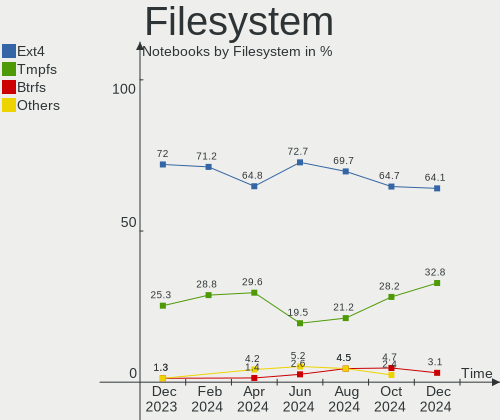
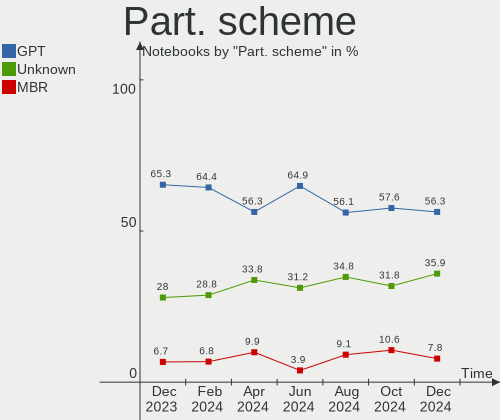
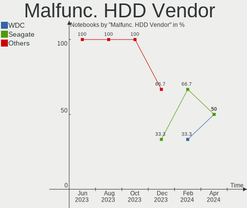

Kubuntu - Hardware Trends (Notebooks)
-------------------------------------

A project to identify most popular hardware characteristics and track their change
over time based on data collected by Linux users at https://Linux-Hardware.org.

Anyone can contribute to this report by the [hw-probe](https://github.com/linuxhw/hw-probe) tool:

    sudo -E hw-probe -all -upload

This report is for one last month. Overall report since the beginning of time: [TestCoverage](https://github.com/linuxhw/TestCoverage)

Period: Jul, 2022.

Contents
--------

* [ System ](#system)
  - [ OS                       ](#os)
  - [ OS Family                ](#os-family)
  - [ Kernel                   ](#kernel)
  - [ Kernel Family            ](#kernel-family)
  - [ Kernel Major Ver.        ](#kernel-major-ver)
  - [ Arch                     ](#arch)
  - [ DE                       ](#de)
  - [ Display Server           ](#display-server)
  - [ Display Manager          ](#display-manager)
  - [ OS Lang                  ](#os-lang)
  - [ Boot Mode                ](#boot-mode)
  - [ Filesystem               ](#filesystem)
  - [ Part. scheme             ](#part-scheme)
  - [ Dual Boot with Linux/BSD ](#dual-boot-with-linuxbsd)
  - [ Dual Boot (Win)          ](#dual-boot-win)

* [ Board ](#board)
  - [ Vendor                   ](#vendor)
  - [ Model                    ](#model)
  - [ Model Family             ](#model-family)
  - [ MFG Year                 ](#mfg-year)
  - [ Form Factor              ](#form-factor)
  - [ Secure Boot              ](#secure-boot)
  - [ Coreboot                 ](#coreboot)
  - [ RAM Size                 ](#ram-size)
  - [ RAM Used                 ](#ram-used)
  - [ Total Drives             ](#total-drives)
  - [ Has CD-ROM               ](#has-cd-rom)
  - [ Has Ethernet             ](#has-ethernet)
  - [ Has WiFi                 ](#has-wifi)
  - [ Has Bluetooth            ](#has-bluetooth)

* [ Location ](#location)
  - [ Country                  ](#country)
  - [ City                     ](#city)

* [ Drives ](#drives)
  - [ Drive Vendor             ](#drive-vendor)
  - [ Drive Model              ](#drive-model)
  - [ HDD Vendor               ](#hdd-vendor)
  - [ SSD Vendor               ](#ssd-vendor)
  - [ Drive Kind               ](#drive-kind)
  - [ Drive Connector          ](#drive-connector)
  - [ Drive Size               ](#drive-size)
  - [ Space Total              ](#space-total)
  - [ Space Used               ](#space-used)
  - [ Malfunc. Drives          ](#malfunc-drives)
  - [ Malfunc. Drive Vendor    ](#malfunc-drive-vendor)
  - [ Malfunc. HDD Vendor      ](#malfunc-hdd-vendor)
  - [ Malfunc. Drive Kind      ](#malfunc-drive-kind)
  - [ Failed Drives            ](#failed-drives)
  - [ Failed Drive Vendor      ](#failed-drive-vendor)
  - [ Drive Status             ](#drive-status)

* [ Storage controller ](#storage-controller)
  - [ Storage Vendor           ](#storage-vendor)
  - [ Storage Model            ](#storage-model)
  - [ Storage Kind             ](#storage-kind)

* [ Processor ](#processor)
  - [ CPU Vendor               ](#cpu-vendor)
  - [ CPU Model                ](#cpu-model)
  - [ CPU Model Family         ](#cpu-model-family)
  - [ CPU Cores                ](#cpu-cores)
  - [ CPU Sockets              ](#cpu-sockets)
  - [ CPU Threads              ](#cpu-threads)
  - [ CPU Op-Modes             ](#cpu-op-modes)
  - [ CPU Microcode            ](#cpu-microcode)
  - [ CPU Microarch            ](#cpu-microarch)

* [ Graphics ](#graphics)
  - [ GPU Vendor               ](#gpu-vendor)
  - [ GPU Model                ](#gpu-model)
  - [ GPU Combo                ](#gpu-combo)
  - [ GPU Driver               ](#gpu-driver)
  - [ GPU Memory               ](#gpu-memory)

* [ Monitor ](#monitor)
  - [ Monitor Vendor           ](#monitor-vendor)
  - [ Monitor Model            ](#monitor-model)
  - [ Monitor Resolution       ](#monitor-resolution)
  - [ Monitor Diagonal         ](#monitor-diagonal)
  - [ Monitor Width            ](#monitor-width)
  - [ Aspect Ratio             ](#aspect-ratio)
  - [ Monitor Area             ](#monitor-area)
  - [ Pixel Density            ](#pixel-density)
  - [ Multiple Monitors        ](#multiple-monitors)

* [ Network ](#network)
  - [ Net Controller Vendor    ](#net-controller-vendor)
  - [ Net Controller Model     ](#net-controller-model)
  - [ Wireless Vendor          ](#wireless-vendor)
  - [ Wireless Model           ](#wireless-model)
  - [ Ethernet Vendor          ](#ethernet-vendor)
  - [ Ethernet Model           ](#ethernet-model)
  - [ Net Controller Kind      ](#net-controller-kind)
  - [ Used Controller          ](#used-controller)
  - [ NICs                     ](#nics)
  - [ IPv6                     ](#ipv6)

* [ Bluetooth ](#bluetooth)
  - [ Bluetooth Vendor         ](#bluetooth-vendor)
  - [ Bluetooth Model          ](#bluetooth-model)

* [ Sound ](#sound)
  - [ Sound Vendor             ](#sound-vendor)
  - [ Sound Model              ](#sound-model)

* [ Memory ](#memory)
  - [ Memory Vendor            ](#memory-vendor)
  - [ Memory Model             ](#memory-model)
  - [ Memory Kind              ](#memory-kind)
  - [ Memory Form Factor       ](#memory-form-factor)
  - [ Memory Size              ](#memory-size)
  - [ Memory Speed             ](#memory-speed)

* [ Printers & scanners ](#printers--scanners)
  - [ Printer Vendor           ](#printer-vendor)
  - [ Printer Model            ](#printer-model)
  - [ Scanner Vendor           ](#scanner-vendor)
  - [ Scanner Model            ](#scanner-model)

* [ Camera ](#camera)
  - [ Camera Vendor            ](#camera-vendor)
  - [ Camera Model             ](#camera-model)

* [ Security ](#security)
  - [ Fingerprint Vendor       ](#fingerprint-vendor)
  - [ Fingerprint Model        ](#fingerprint-model)
  - [ Chipcard Vendor          ](#chipcard-vendor)
  - [ Chipcard Model           ](#chipcard-model)

* [ Unsupported ](#unsupported)
  - [ Unsupported Devices      ](#unsupported-devices)
  - [ Unsupported Device Types ](#unsupported-device-types)

System
------

OS
--

Installed operating systems

| Name          | Notebooks | Percent |
|---------------|-----------|---------|
| Kubuntu 22.04 | 27        | 62.79%  |
| Kubuntu 20.04 | 7         | 16.28%  |
| Kubuntu 11.1  | 5         | 11.63%  |
| Kubuntu 21.10 | 3         | 6.98%   |
| Kubuntu 21.04 | 1         | 2.33%   |

OS Family
---------

OS without a version

| Name    | Notebooks | Percent |
|---------|-----------|---------|
| Kubuntu | 43        | 100%    |

Kernel
------

Version of the Linux kernel

| Version                | Notebooks | Percent |
|------------------------|-----------|---------|
| 5.15.0-41-generic      | 16        | 37.21%  |
| 5.13.0-52-generic      | 11        | 25.58%  |
| 5.15.0-40-generic      | 6         | 13.95%  |
| 5.8.0-43-generic       | 1         | 2.33%   |
| 5.4.0-70-generic       | 1         | 2.33%   |
| 5.4.0-122-generic      | 1         | 2.33%   |
| 5.18.6-051806-generic  | 1         | 2.33%   |
| 5.18.10-051810-generic | 1         | 2.33%   |
| 5.15.0-43-lowlatency   | 1         | 2.33%   |
| 5.15.0-41-lowlatency   | 1         | 2.33%   |
| 5.15.0-25-generic      | 1         | 2.33%   |
| 5.15.0-10037-tuxedo    | 1         | 2.33%   |
| 5.11.0-49-generic      | 1         | 2.33%   |

Kernel Family
-------------

Linux kernel without a distro release

| Version | Notebooks | Percent |
|---------|-----------|---------|
| 5.15.0  | 26        | 60.47%  |
| 5.13.0  | 11        | 25.58%  |
| 5.4.0   | 2         | 4.65%   |
| 5.8.0   | 1         | 2.33%   |
| 5.18.6  | 1         | 2.33%   |
| 5.18.10 | 1         | 2.33%   |
| 5.11.0  | 1         | 2.33%   |

Kernel Major Ver.
-----------------

Linux kernel major version

| Version | Notebooks | Percent |
|---------|-----------|---------|
| 5.15    | 26        | 60.47%  |
| 5.13    | 11        | 25.58%  |
| 5.4     | 2         | 4.65%   |
| 5.18    | 2         | 4.65%   |
| 5.8     | 1         | 2.33%   |
| 5.11    | 1         | 2.33%   |

Arch
----

OS architecture (x86_64, i586, etc.)

| Name   | Notebooks | Percent |
|--------|-----------|---------|
| x86_64 | 43        | 100%    |

DE
--

Desktop Environment

| Name    | Notebooks | Percent |
|---------|-----------|---------|
| KDE5    | 39        | 90.7%   |
| MATE    | 1         | 2.33%   |
| KDE     | 1         | 2.33%   |
| GNUstep | 1         | 2.33%   |
| GNOME   | 1         | 2.33%   |

Display Server
--------------

X11 or Wayland

| Name    | Notebooks | Percent |
|---------|-----------|---------|
| X11     | 40        | 93.02%  |
| Wayland | 2         | 4.65%   |
| Tty     | 1         | 2.33%   |

Display Manager
---------------

SDDM, LightDM, etc.

| Name    | Notebooks | Percent |
|---------|-----------|---------|
| SDDM    | 27        | 62.79%  |
| Unknown | 11        | 25.58%  |
| GDM3    | 2         | 4.65%   |
| GDM     | 2         | 4.65%   |
| LXDM    | 1         | 2.33%   |

OS Lang
-------

Language

| Lang  | Notebooks | Percent |
|-------|-----------|---------|
| en_US | 19        | 44.19%  |
| de_DE | 4         | 9.3%    |
| fr_FR | 3         | 6.98%   |
| ru_RU | 2         | 4.65%   |
| es_ES | 2         | 4.65%   |
| en_GB | 2         | 4.65%   |
| pt_BR | 1         | 2.33%   |
| pl_PL | 1         | 2.33%   |
| nl_NL | 1         | 2.33%   |
| nl_BE | 1         | 2.33%   |
| it_IT | 1         | 2.33%   |
| fr_BE | 1         | 2.33%   |
| es_MX | 1         | 2.33%   |
| en_PH | 1         | 2.33%   |
| en_IN | 1         | 2.33%   |
| en_CA | 1         | 2.33%   |
| cs_CZ | 1         | 2.33%   |

Boot Mode
---------

EFI or BIOS

| Mode | Notebooks | Percent |
|------|-----------|---------|
| EFI  | 22        | 51.16%  |
| BIOS | 21        | 48.84%  |

Filesystem
----------

Type of filesystem

| Type    | Notebooks | Percent |
|---------|-----------|---------|
| Ext4    | 37        | 86.05%  |
| Btrfs   | 3         | 6.98%   |
| Overlay | 2         | 4.65%   |
| Xfs     | 1         | 2.33%   |

Part. scheme
------------

Scheme of partitioning

| Type    | Notebooks | Percent |
|---------|-----------|---------|
| GPT     | 20        | 46.51%  |
| Unknown | 18        | 41.86%  |
| MBR     | 5         | 11.63%  |

Dual Boot with Linux/BSD
------------------------

Hosting more than one Linux/BSD

| Dual boot | Notebooks | Percent |
|-----------|-----------|---------|
| No        | 40        | 93.02%  |
| Yes       | 3         | 6.98%   |

Dual Boot (Win)
---------------

Hosting Linux and Windows

| Dual boot | Notebooks | Percent |
|-----------|-----------|---------|
| No        | 26        | 60.47%  |
| Yes       | 17        | 39.53%  |

Board
-----

Vendor
------

Motherboard manufacturer

| Name             | Notebooks | Percent |
|------------------|-----------|---------|
| Lenovo           | 15        | 34.88%  |
| Hewlett-Packard  | 10        | 23.26%  |
| Dell             | 5         | 11.63%  |
| ASUSTek Computer | 2         | 4.65%   |
| TUXEDO           | 1         | 2.33%   |
| Toshiba          | 1         | 2.33%   |
| System76         | 1         | 2.33%   |
| Standard         | 1         | 2.33%   |
| Sony             | 1         | 2.33%   |
| Schenker         | 1         | 2.33%   |
| HUAWEI           | 1         | 2.33%   |
| HONOR            | 1         | 2.33%   |
| Chuwi            | 1         | 2.33%   |
| Acer             | 1         | 2.33%   |
| Unknown          | 1         | 2.33%   |

Model
-----

Motherboard model

| Name                                     | Notebooks | Percent |
|------------------------------------------|-----------|---------|
| Unknown                                  | 2         | 4.65%   |
| TUXEDO Stellaris AMD Gen3 (CZN)          | 1         | 2.33%   |
| Toshiba TECRA S11                        | 1         | 2.33%   |
| System76 Lemur Ultra                     | 1         | 2.33%   |
| Sony VPCSA3M9E                           | 1         | 2.33%   |
| Schenker XMG APEX (Mid 2021)             | 1         | 2.33%   |
| Lenovo ThinkPad X200 7458FDG             | 1         | 2.33%   |
| Lenovo ThinkPad X1 Nano Gen 1 20UN002VUK | 1         | 2.33%   |
| Lenovo ThinkPad T450 20BV0001US          | 1         | 2.33%   |
| Lenovo ThinkPad T420 4180M8P             | 1         | 2.33%   |
| Lenovo ThinkPad E570 20H5006TFR          | 1         | 2.33%   |
| Lenovo ThinkPad E14 Gen 3 20Y70093US     | 1         | 2.33%   |
| Lenovo ThinkPad E14 Gen 2 20TA000CIX     | 1         | 2.33%   |
| Lenovo ThinkBook 16p Gen 2 20YM          | 1         | 2.33%   |
| Lenovo Legion Y540-17IRH 81Q4            | 1         | 2.33%   |
| Lenovo Legion 5 Pro 16ACH6H 82JQ         | 1         | 2.33%   |
| Lenovo IdeaPad Y430 2781                 | 1         | 2.33%   |
| Lenovo IdeaPad 5 15ARE05 81YQ            | 1         | 2.33%   |
| Lenovo IdeaPad 5 15ALC05 82LN            | 1         | 2.33%   |
| Lenovo G570 20079                        | 1         | 2.33%   |
| Lenovo G50-45 80E3                       | 1         | 2.33%   |
| HUAWEI CREM-WXX9                         | 1         | 2.33%   |
| HONOR HYM-WXX                            | 1         | 2.33%   |
| HP Laptop 17-cn0xxx                      | 1         | 2.33%   |
| HP Laptop 15s-eq1xxx                     | 1         | 2.33%   |
| HP G62                                   | 1         | 2.33%   |
| HP G42                                   | 1         | 2.33%   |
| HP EliteBook 850 G8 Notebook PC          | 1         | 2.33%   |
| HP EliteBook 8470p                       | 1         | 2.33%   |
| HP EliteBook 840 G6                      | 1         | 2.33%   |
| HP EliteBook 840 G5                      | 1         | 2.33%   |
| HP EliteBook 840 G1                      | 1         | 2.33%   |
| HP 620                                   | 1         | 2.33%   |
| Dell Latitude E5520                      | 1         | 2.33%   |
| Dell Latitude 7530                       | 1         | 2.33%   |
| Dell Latitude 5590                       | 1         | 2.33%   |
| Dell Inspiron 15-3567                    | 1         | 2.33%   |
| Dell G5 5590                             | 1         | 2.33%   |
| Chuwi CoreBook X                         | 1         | 2.33%   |
| ASUS ROG Flow X13 GV301QH_GV301QH        | 1         | 2.33%   |
| ASUS K53U                                | 1         | 2.33%   |
| Acer Aspire E5-575G                      | 1         | 2.33%   |

Model Family
------------

Motherboard model prefix

| Name             | Notebooks | Percent |
|------------------|-----------|---------|
| Lenovo ThinkPad  | 7         | 16.28%  |
| HP EliteBook     | 5         | 11.63%  |
| Lenovo IdeaPad   | 3         | 6.98%   |
| Dell Latitude    | 3         | 6.98%   |
| Lenovo Legion    | 2         | 4.65%   |
| HP Laptop        | 2         | 4.65%   |
| Unknown          | 2         | 4.65%   |
| TUXEDO Stellaris | 1         | 2.33%   |
| Toshiba TECRA    | 1         | 2.33%   |
| System76 Lemur   | 1         | 2.33%   |
| Sony VPCSA3M9E   | 1         | 2.33%   |
| Schenker XMG     | 1         | 2.33%   |
| Lenovo ThinkBook | 1         | 2.33%   |
| Lenovo G570      | 1         | 2.33%   |
| Lenovo G50-45    | 1         | 2.33%   |
| HUAWEI CREM-WXX9 | 1         | 2.33%   |
| HONOR HYM-WXX    | 1         | 2.33%   |
| HP G62           | 1         | 2.33%   |
| HP G42           | 1         | 2.33%   |
| HP 620           | 1         | 2.33%   |
| Dell Inspiron    | 1         | 2.33%   |
| Dell G5          | 1         | 2.33%   |
| Chuwi CoreBook   | 1         | 2.33%   |
| ASUS ROG         | 1         | 2.33%   |
| ASUS K53U        | 1         | 2.33%   |
| Acer Aspire      | 1         | 2.33%   |

MFG Year
--------

Motherboard manufacture year

| Year | Notebooks | Percent |
|------|-----------|---------|
| 2021 | 10        | 23.26%  |
| 2020 | 6         | 13.95%  |
| 2011 | 6         | 13.95%  |
| 2010 | 4         | 9.3%    |
| 2022 | 3         | 6.98%   |
| 2019 | 3         | 6.98%   |
| 2016 | 3         | 6.98%   |
| 2018 | 2         | 4.65%   |
| 2008 | 2         | 4.65%   |
| 2015 | 1         | 2.33%   |
| 2014 | 1         | 2.33%   |
| 2013 | 1         | 2.33%   |
| 2012 | 1         | 2.33%   |

Form Factor
-----------

Physical design of the computer

| Name     | Notebooks | Percent |
|----------|-----------|---------|
| Notebook | 43        | 100%    |

Secure Boot
-----------

Enabled or disabled

| State    | Notebooks | Percent |
|----------|-----------|---------|
| Disabled | 41        | 95.35%  |
| Enabled  | 2         | 4.65%   |

Coreboot
--------

Have coreboot on board

| Used | Notebooks | Percent |
|------|-----------|---------|
| No   | 43        | 100%    |

RAM Size
--------

Total RAM memory

| Size in GB  | Notebooks | Percent |
|-------------|-----------|---------|
| 8.01-16.0   | 12        | 27.91%  |
| 4.01-8.0    | 11        | 25.58%  |
| 16.01-24.0  | 9         | 20.93%  |
| 3.01-4.0    | 8         | 18.6%   |
| 64.01-256.0 | 2         | 4.65%   |
| 32.01-64.0  | 1         | 2.33%   |

RAM Used
--------

Used RAM memory

| Used GB   | Notebooks | Percent |
|-----------|-----------|---------|
| 1.01-2.0  | 14        | 32.56%  |
| 3.01-4.0  | 11        | 25.58%  |
| 2.01-3.0  | 9         | 20.93%  |
| 8.01-16.0 | 5         | 11.63%  |
| 4.01-8.0  | 4         | 9.3%    |

Total Drives
------------

Number of drives on board

| Drives | Notebooks | Percent |
|--------|-----------|---------|
| 1      | 32        | 74.42%  |
| 2      | 9         | 20.93%  |
| 3      | 2         | 4.65%   |

Has CD-ROM
----------

Has CD-ROM on board

| Presented | Notebooks | Percent |
|-----------|-----------|---------|
| No        | 28        | 65.12%  |
| Yes       | 15        | 34.88%  |

Has Ethernet
------------

Has Ethernet on board

| Presented | Notebooks | Percent |
|-----------|-----------|---------|
| Yes       | 33        | 76.74%  |
| No        | 10        | 23.26%  |

Has WiFi
--------

Has WiFi module

| Presented | Notebooks | Percent |
|-----------|-----------|---------|
| Yes       | 43        | 100%    |

Has Bluetooth
-------------

Has Bluetooth module

| Presented | Notebooks | Percent |
|-----------|-----------|---------|
| Yes       | 34        | 79.07%  |
| No        | 9         | 20.93%  |

Location
--------

Country
-------

Geographic location (country)

| Country     | Notebooks | Percent |
|-------------|-----------|---------|
| Germany     | 5         | 11.63%  |
| USA         | 4         | 9.3%    |
| Spain       | 4         | 9.3%    |
| France      | 4         | 9.3%    |
| Russia      | 3         | 6.98%   |
| Brazil      | 3         | 6.98%   |
| UK          | 2         | 4.65%   |
| Philippines | 2         | 4.65%   |
| Italy       | 2         | 4.65%   |
| Czechia     | 2         | 4.65%   |
| Belgium     | 2         | 4.65%   |
| Switzerland | 1         | 2.33%   |
| Portugal    | 1         | 2.33%   |
| Poland      | 1         | 2.33%   |
| Netherlands | 1         | 2.33%   |
| Mexico      | 1         | 2.33%   |
| Ireland     | 1         | 2.33%   |
| India       | 1         | 2.33%   |
| Estonia     | 1         | 2.33%   |
| Croatia     | 1         | 2.33%   |
| Canada      | 1         | 2.33%   |

City
----

Geographic location (city)

| City                 | Notebooks | Percent |
|----------------------|-----------|---------|
| Berlin               | 2         | 4.65%   |
| Zurich               | 1         | 2.33%   |
| Vladivostok          | 1         | 2.33%   |
| Ufa                  | 1         | 2.33%   |
| Udbinja              | 1         | 2.33%   |
| Twickenham           | 1         | 2.33%   |
| Timoteo              | 1         | 2.33%   |
| Thrissur             | 1         | 2.33%   |
| Tallinn              | 1         | 2.33%   |
| Staten Island        | 1         | 2.33%   |
| San Juan del Río    | 1         | 2.33%   |
| Rouvray-Saint-Denis  | 1         | 2.33%   |
| Roeselare            | 1         | 2.33%   |
| Prague               | 1         | 2.33%   |
| Porto                | 1         | 2.33%   |
| Pasig                | 1         | 2.33%   |
| Parma                | 1         | 2.33%   |
| Paris                | 1         | 2.33%   |
| Oviedo               | 1         | 2.33%   |
| Nowata               | 1         | 2.33%   |
| Novosibirsk          | 1         | 2.33%   |
| Merseburg            | 1         | 2.33%   |
| Manila               | 1         | 2.33%   |
| Madrid               | 1         | 2.33%   |
| Lons-le-Saunier      | 1         | 2.33%   |
| Leimuiden            | 1         | 2.33%   |
| Kraluv Dvur          | 1         | 2.33%   |
| Katowice             | 1         | 2.33%   |
| Jerez de la Frontera | 1         | 2.33%   |
| Jacksonville         | 1         | 2.33%   |
| Hampstead            | 1         | 2.33%   |
| Grayslake            | 1         | 2.33%   |
| Gelsenkirchen        | 1         | 2.33%   |
| Frankfurt am Main    | 1         | 2.33%   |
| Dublin               | 1         | 2.33%   |
| Diamantina           | 1         | 2.33%   |
| Chilly-Mazarin       | 1         | 2.33%   |
| Calgary              | 1         | 2.33%   |
| Burgos               | 1         | 2.33%   |
| Brescia              | 1         | 2.33%   |
| Brejinho             | 1         | 2.33%   |
| Anderlecht           | 1         | 2.33%   |

Drives
------

Drive Vendor
------------

Hard drive vendors

| Vendor              | Notebooks | Drives | Percent |
|---------------------|-----------|--------|---------|
| Samsung Electronics | 10        | 10     | 18.18%  |
| WDC                 | 6         | 6      | 10.91%  |
| Toshiba             | 5         | 5      | 9.09%   |
| SK hynix            | 5         | 5      | 9.09%   |
| Seagate             | 5         | 5      | 9.09%   |
| Hitachi             | 3         | 3      | 5.45%   |
| Unknown             | 2         | 2      | 3.64%   |
| SSSTC               | 2         | 2      | 3.64%   |
| SanDisk             | 2         | 2      | 3.64%   |
| Kingston            | 2         | 2      | 3.64%   |
| Crucial             | 2         | 2      | 3.64%   |
| XPG                 | 1         | 1      | 1.82%   |
| USB3.0              | 1         | 1      | 1.82%   |
| PNY                 | 1         | 1      | 1.82%   |
| Netac               | 1         | 1      | 1.82%   |
| Micron Technology   | 1         | 1      | 1.82%   |
| Lexar               | 1         | 1      | 1.82%   |
| KIOXIA              | 1         | 1      | 1.82%   |
| Gigabyte Technology | 1         | 1      | 1.82%   |
| Corsair             | 1         | 1      | 1.82%   |
| China               | 1         | 1      | 1.82%   |
| Unknown             | 1         | 1      | 1.82%   |

Drive Model
-----------

Hard drive models

| Model                                   | Notebooks | Percent |
|-----------------------------------------|-----------|---------|
| XPG NVMe SSD Drive 1024GB               | 1         | 1.82%   |
| WDC WDBRPG0010BNC-WRSN 1TB              | 1         | 1.82%   |
| WDC WDBNCE0010PNC 1TB SSD               | 1         | 1.82%   |
| WDC WD10JPCX-24UE4T0 1TB                | 1         | 1.82%   |
| WDC PC SN730 SDBPNTY-512G               | 1         | 1.82%   |
| WDC PC SN530 SDBPTPZ-1T00-1002 1TB      | 1         | 1.82%   |
| WDC PC SN530 SDBPMPZ-256G-1001 256GB    | 1         | 1.82%   |
| USB3.0 Super Speed 1TB                  | 1         | 1.82%   |
| Unknown MMC Card  537GB                 | 1         | 1.82%   |
| Unknown ISOCOM  64GB                    | 1         | 1.82%   |
| Toshiba THNSF5256GPUK 256GB             | 1         | 1.82%   |
| Toshiba MQ04ABF100 1TB                  | 1         | 1.82%   |
| Toshiba MQ02ABF050H 500GB               | 1         | 1.82%   |
| Toshiba MQ01ABD032 320GB                | 1         | 1.82%   |
| Toshiba KSG60ZMV512G M.2 2280 512GB SSD | 1         | 1.82%   |
| SSSTC CL1-4D512 512GB                   | 1         | 1.82%   |
| SSSTC CA5-8D512 512GB                   | 1         | 1.82%   |
| SK hynix SKHynix_HFS512GDE9X084N 512GB  | 1         | 1.82%   |
| SK hynix SKHynix_HFM512GD3HX015N 512GB  | 1         | 1.82%   |
| SK hynix NVMe SSD Drive 512GB           | 1         | 1.82%   |
| SK hynix BC711 HFM512GD3JX013N 512GB    | 1         | 1.82%   |
| SK hynix BC511 NVMe 256GB               | 1         | 1.82%   |
| Seagate ST500LM021-1KJ152 500GB         | 1         | 1.82%   |
| Seagate ST2000LM007-1R8174 2TB          | 1         | 1.82%   |
| Seagate ST1000LX015-1U7172 1TB          | 1         | 1.82%   |
| Seagate ST1000LM035-1RK172 1TB          | 1         | 1.82%   |
| Seagate BUP BK 4TB                      | 1         | 1.82%   |
| SanDisk SSD U110 16GB                   | 1         | 1.82%   |
| SanDisk SSD PLUS 240GB                  | 1         | 1.82%   |
| Samsung SSD PM830 2.5 7mm 128GB         | 1         | 1.82%   |
| Samsung SSD 980 PRO 1TB                 | 1         | 1.82%   |
| Samsung SSD 980 1TB                     | 1         | 1.82%   |
| Samsung SSD 970 EVO Plus 250GB          | 1         | 1.82%   |
| Samsung SSD 840 EVO 250GB               | 1         | 1.82%   |
| Samsung PM9A1 NVMe 512GB                | 1         | 1.82%   |
| Samsung NVMe SSD Drive 256GB            | 1         | 1.82%   |
| Samsung MZVLQ1T0HBLB-00BH1 1TB          | 1         | 1.82%   |
| Samsung MZVLB1T0HBLR-000L2 1TB          | 1         | 1.82%   |
| Samsung HM500JJ 500GB                   | 1         | 1.82%   |
| PNY CS900 480GB SSD                     | 1         | 1.82%   |
| Netac SSD 512GB                         | 1         | 1.82%   |
| Micron NVMe SSD Drive 512GB             | 1         | 1.82%   |
| Lexar 256GB SSD                         | 1         | 1.82%   |
| KIOXIA NVMe SSD Drive 512GB             | 1         | 1.82%   |
| Kingston SUV400S37120G 120GB SSD        | 1         | 1.82%   |
| Kingston SA400S37240G 240GB SSD         | 1         | 1.82%   |
| Hitachi HTS547550A9E384 500GB           | 1         | 1.82%   |
| Hitachi HTS545025B9A300 250GB           | 1         | 1.82%   |
| Hitachi HTS542525K9SA00 250GB           | 1         | 1.82%   |
| Gigabyte GP-AG41TB                      | 1         | 1.82%   |
| Crucial CT480BX500SSD1 480GB            | 1         | 1.82%   |
| Crucial CT2000MX500SSD1 2TB             | 1         | 1.82%   |
| Corsair CSSD-F120GB2                    | 1         | 1.82%   |
| China SSD 128GB                         | 1         | 1.82%   |
| Unknown                                 | 1         | 1.82%   |

HDD Vendor
----------

Hard disk drive vendors

| Vendor              | Notebooks | Drives | Percent |
|---------------------|-----------|--------|---------|
| Seagate             | 5         | 5      | 38.46%  |
| Toshiba             | 3         | 3      | 23.08%  |
| Hitachi             | 3         | 3      | 23.08%  |
| WDC                 | 1         | 1      | 7.69%   |
| Samsung Electronics | 1         | 1      | 7.69%   |

SSD Vendor
----------

Solid state drive vendors

| Vendor              | Notebooks | Drives | Percent |
|---------------------|-----------|--------|---------|
| SanDisk             | 2         | 2      | 13.33%  |
| Samsung Electronics | 2         | 2      | 13.33%  |
| Kingston            | 2         | 2      | 13.33%  |
| Crucial             | 2         | 2      | 13.33%  |
| WDC                 | 1         | 1      | 6.67%   |
| USB3.0              | 1         | 1      | 6.67%   |
| Toshiba             | 1         | 1      | 6.67%   |
| PNY                 | 1         | 1      | 6.67%   |
| Netac               | 1         | 1      | 6.67%   |
| Corsair             | 1         | 1      | 6.67%   |
| China               | 1         | 1      | 6.67%   |

Drive Kind
----------

HDD or SSD

| Kind | Notebooks | Drives | Percent |
|------|-----------|--------|---------|
| NVMe | 22        | 24     | 44%     |
| HDD  | 13        | 13     | 26%     |
| SSD  | 12        | 15     | 24%     |
| MMC  | 3         | 3      | 6%      |

Drive Connector
---------------

SATA, SAS, NVMe, etc.

| Type | Notebooks | Drives | Percent |
|------|-----------|--------|---------|
| SATA | 23        | 26     | 46%     |
| NVMe | 22        | 24     | 44%     |
| MMC  | 3         | 3      | 6%      |
| SAS  | 2         | 2      | 4%      |

Drive Size
----------

Size of hard drive

| Size in TB | Notebooks | Drives | Percent |
|------------|-----------|--------|---------|
| 0.01-0.5   | 14        | 17     | 56%     |
| 0.51-1.0   | 8         | 8      | 32%     |
| 1.01-2.0   | 2         | 2      | 8%      |
| 3.01-4.0   | 1         | 1      | 4%      |

Space Total
-----------

Amount of disk space available on the file system

| Size in GB     | Notebooks | Percent |
|----------------|-----------|---------|
| 251-500        | 19        | 44.19%  |
| 101-250        | 10        | 23.26%  |
| 501-1000       | 7         | 16.28%  |
| 1001-2000      | 2         | 4.65%   |
| 1-20           | 2         | 4.65%   |
| More than 3000 | 1         | 2.33%   |
| 51-100         | 1         | 2.33%   |
| Unknown        | 1         | 2.33%   |

Space Used
----------

Amount of used disk space

| Used GB        | Notebooks | Percent |
|----------------|-----------|---------|
| 1-20           | 11        | 25.58%  |
| 101-250        | 8         | 18.6%   |
| 251-500        | 7         | 16.28%  |
| 51-100         | 7         | 16.28%  |
| 21-50          | 6         | 13.95%  |
| More than 3000 | 1         | 2.33%   |
| 1001-2000      | 1         | 2.33%   |
| 501-1000       | 1         | 2.33%   |
| Unknown        | 1         | 2.33%   |

Malfunc. Drives
---------------

Drive models with a malfunction

| Model                             | Notebooks | Drives | Percent |
|-----------------------------------|-----------|--------|---------|
| Seagate ST2000LM007-1R8174 2TB    | 1         | 1      | 25%     |
| Seagate ST1000LX015-1U7172 1TB    | 1         | 1      | 25%     |
| SanDisk SSD PLUS 240GB            | 1         | 1      | 25%     |
| Samsung Electronics HM500JJ 500GB | 1         | 1      | 25%     |

Malfunc. Drive Vendor
---------------------

Vendors of faulty drives

| Vendor              | Notebooks | Drives | Percent |
|---------------------|-----------|--------|---------|
| Seagate             | 2         | 2      | 50%     |
| SanDisk             | 1         | 1      | 25%     |
| Samsung Electronics | 1         | 1      | 25%     |

Malfunc. HDD Vendor
-------------------

Vendors of faulty HDD drives

| Vendor              | Notebooks | Drives | Percent |
|---------------------|-----------|--------|---------|
| Seagate             | 2         | 2      | 66.67%  |
| Samsung Electronics | 1         | 1      | 33.33%  |

Malfunc. Drive Kind
-------------------

Kinds of faulty drives

| Kind | Notebooks | Drives | Percent |
|------|-----------|--------|---------|
| HDD  | 3         | 3      | 75%     |
| SSD  | 1         | 1      | 25%     |

Failed Drives
-------------

Failed drive models

Zero info for selected period =(

Failed Drive Vendor
-------------------

Failed drive vendors

Zero info for selected period =(

Drive Status
------------

Number of failed and malfunc. drives

| Status   | Notebooks | Drives | Percent |
|----------|-----------|--------|---------|
| Works    | 22        | 27     | 47.83%  |
| Detected | 20        | 24     | 43.48%  |
| Malfunc  | 4         | 4      | 8.7%    |

Storage controller
------------------

Storage Vendor
--------------

Storage controller vendors

| Vendor                         | Notebooks | Percent |
|--------------------------------|-----------|---------|
| Intel                          | 25        | 44.64%  |
| Samsung Electronics            | 7         | 12.5%   |
| AMD                            | 7         | 12.5%   |
| SK hynix                       | 5         | 8.93%   |
| SanDisk                        | 4         | 7.14%   |
| Solid State Storage Technology | 2         | 3.57%   |
| Toshiba America Info Systems   | 1         | 1.79%   |
| Shenzhen Longsys Electronics   | 1         | 1.79%   |
| Phison Electronics             | 1         | 1.79%   |
| Micron Technology              | 1         | 1.79%   |
| KIOXIA                         | 1         | 1.79%   |
| ADATA Technology               | 1         | 1.79%   |

Storage Model
-------------

Storage controller models

| Model                                                                        | Notebooks | Percent |
|------------------------------------------------------------------------------|-----------|---------|
| AMD FCH SATA Controller [AHCI mode]                                          | 6         | 10.34%  |
| SK hynix Gold P31 SSD                                                        | 4         | 6.9%    |
| Samsung NVMe SSD Controller 980                                              | 3         | 5.17%   |
| Intel Volume Management Device NVMe RAID Controller                          | 3         | 5.17%   |
| Intel Sunrise Point-LP SATA Controller [AHCI mode]                           | 3         | 5.17%   |
| Intel 82801IBM/IEM (ICH9M/ICH9M-E) 4 port SATA Controller [AHCI mode]        | 3         | 5.17%   |
| Intel 6 Series/C200 Series Chipset Family 6 port Mobile SATA AHCI Controller | 3         | 5.17%   |
| Solid State Storage Non-Volatile memory controller                           | 2         | 3.45%   |
| SanDisk WD Black SN750 / PC SN730 NVMe SSD                                   | 2         | 3.45%   |
| SanDisk Non-Volatile memory controller                                       | 2         | 3.45%   |
| Samsung NVMe SSD Controller SM981/PM981/PM983                                | 2         | 3.45%   |
| Samsung NVMe SSD Controller PM9A1/PM9A3/980PRO                               | 2         | 3.45%   |
| Intel Cannon Lake Mobile PCH SATA AHCI Controller                            | 2         | 3.45%   |
| Intel 82801 Mobile SATA Controller [RAID mode]                               | 2         | 3.45%   |
| Intel 7 Series Chipset Family 6-port SATA Controller [AHCI mode]             | 2         | 3.45%   |
| Intel 5 Series/3400 Series Chipset 4 port SATA AHCI Controller               | 2         | 3.45%   |
| Toshiba America Info Systems XG4 NVMe SSD Controller                         | 1         | 1.72%   |
| SK hynix BC511                                                               | 1         | 1.72%   |
| Shenzhen Longsys Electronics Non-Volatile memory controller                  | 1         | 1.72%   |
| Phison E16 PCIe4 NVMe Controller                                             | 1         | 1.72%   |
| Micron Non-Volatile memory controller                                        | 1         | 1.72%   |
| KIOXIA NVMe SSD Controller BG4                                               | 1         | 1.72%   |
| Intel Wildcat Point-LP SATA Controller [AHCI Mode]                           | 1         | 1.72%   |
| Intel Tiger Lake-LP SATA Controller                                          | 1         | 1.72%   |
| Intel Celeron N3350/Pentium N4200/Atom E3900 Series SATA AHCI Controller     | 1         | 1.72%   |
| Intel Cannon Point-LP SATA Controller [AHCI Mode]                            | 1         | 1.72%   |
| Intel 8 Series SATA Controller 1 [AHCI mode]                                 | 1         | 1.72%   |
| Intel 5 Series/3400 Series Chipset 6 port SATA AHCI Controller               | 1         | 1.72%   |
| AMD SB7x0/SB8x0/SB9x0 SATA Controller [AHCI mode]                            | 1         | 1.72%   |
| AMD SB7x0/SB8x0/SB9x0 IDE Controller                                         | 1         | 1.72%   |
| ADATA XPG SX8200 Pro PCIe Gen3x4 M.2 2280 Solid State Drive                  | 1         | 1.72%   |

Storage Kind
------------

Kind of storage controller (IDE, SATA, NVMe, SAS, ...)

| Kind | Notebooks | Percent |
|------|-----------|---------|
| SATA | 28        | 50%     |
| NVMe | 22        | 39.29%  |
| RAID | 5         | 8.93%   |
| IDE  | 1         | 1.79%   |

Processor
---------

CPU Vendor
----------

Processor vendors

| Vendor | Notebooks | Percent |
|--------|-----------|---------|
| Intel  | 30        | 69.77%  |
| AMD    | 13        | 30.23%  |

CPU Model
---------

Processor models

| Model                                       | Notebooks | Percent |
|---------------------------------------------|-----------|---------|
| Intel Core i7-9750H CPU @ 2.60GHz           | 2         | 4.65%   |
| Intel Core i5-8250U CPU @ 1.60GHz           | 2         | 4.65%   |
| Intel Core i3 CPU M 350 @ 2.27GHz           | 2         | 4.65%   |
| Intel 11th Gen Core i5-1135G7 @ 2.40GHz     | 2         | 4.65%   |
| AMD Ryzen 9 5900HX with Radeon Graphics     | 2         | 4.65%   |
| AMD Ryzen 7 5800H with Radeon Graphics      | 2         | 4.65%   |
| AMD Ryzen 5 5600H with Radeon Graphics      | 2         | 4.65%   |
| AMD Ryzen 5 5500U with Radeon Graphics      | 2         | 4.65%   |
| Intel Pentium Dual-Core CPU T4500 @ 2.30GHz | 1         | 2.33%   |
| Intel Pentium CPU B940 @ 2.00GHz            | 1         | 2.33%   |
| Intel Core i7-7500U CPU @ 2.70GHz           | 1         | 2.33%   |
| Intel Core i7-2670QM CPU @ 2.20GHz          | 1         | 2.33%   |
| Intel Core i7-2640M CPU @ 2.80GHz           | 1         | 2.33%   |
| Intel Core i7-2630QM CPU @ 2.00GHz          | 1         | 2.33%   |
| Intel Core i5-8365U CPU @ 1.60GHz           | 1         | 2.33%   |
| Intel Core i5-8259U CPU @ 2.30GHz           | 1         | 2.33%   |
| Intel Core i5-7200U CPU @ 2.50GHz           | 1         | 2.33%   |
| Intel Core i5-5300U CPU @ 2.30GHz           | 1         | 2.33%   |
| Intel Core i5-4200U CPU @ 1.60GHz           | 1         | 2.33%   |
| Intel Core i5-3210M CPU @ 2.50GHz           | 1         | 2.33%   |
| Intel Core i5 CPU M 520 @ 2.40GHz           | 1         | 2.33%   |
| Intel Core i3-7100U CPU @ 2.40GHz           | 1         | 2.33%   |
| Intel Core i3-2350M CPU @ 2.30GHz           | 1         | 2.33%   |
| Intel Core 2 Duo CPU T5800 @ 2.00GHz        | 1         | 2.33%   |
| Intel Core 2 Duo CPU P8600 @ 2.40GHz        | 1         | 2.33%   |
| Intel Celeron CPU N3450 @ 1.10GHz           | 1         | 2.33%   |
| Intel 12th Gen Core i7-12700H               | 1         | 2.33%   |
| Intel 12th Gen Core i7-1255U                | 1         | 2.33%   |
| Intel 11th Gen Core i7-1165G7 @ 2.80GHz     | 1         | 2.33%   |
| Intel 11th Gen Core i7-1160G7 @ 1.20GHz     | 1         | 2.33%   |
| AMD Ryzen 9 5900HS with Radeon Graphics     | 1         | 2.33%   |
| AMD Ryzen 5 4600U with Radeon Graphics      | 1         | 2.33%   |
| AMD Ryzen 5 4500U with Radeon Graphics      | 1         | 2.33%   |
| AMD E1-6010 APU with AMD Radeon R2 Graphics | 1         | 2.33%   |
| AMD E-450 APU with Radeon HD Graphics       | 1         | 2.33%   |

CPU Model Family
----------------

Processor model prefix

| Model                   | Notebooks | Percent |
|-------------------------|-----------|---------|
| Intel Core i5           | 9         | 20.93%  |
| Other                   | 6         | 13.95%  |
| Intel Core i7           | 6         | 13.95%  |
| AMD Ryzen 5             | 6         | 13.95%  |
| Intel Core i3           | 4         | 9.3%    |
| AMD Ryzen 9             | 3         | 6.98%   |
| Intel Core 2 Duo        | 2         | 4.65%   |
| AMD Ryzen 7             | 2         | 4.65%   |
| Intel Pentium Dual-Core | 1         | 2.33%   |
| Intel Pentium           | 1         | 2.33%   |
| Intel Celeron           | 1         | 2.33%   |
| AMD E1                  | 1         | 2.33%   |
| AMD E                   | 1         | 2.33%   |

CPU Cores
---------

Number of processor cores

| Number | Notebooks | Percent |
|--------|-----------|---------|
| 2      | 17        | 39.53%  |
| 4      | 11        | 25.58%  |
| 6      | 8         | 18.6%   |
| 8      | 5         | 11.63%  |
| 14     | 1         | 2.33%   |
| 10     | 1         | 2.33%   |

CPU Sockets
-----------

Number of sockets

| Number | Notebooks | Percent |
|--------|-----------|---------|
| 1      | 43        | 100%    |

CPU Threads
-----------

Threads per core (Hyper-Threading)

| Number | Notebooks | Percent |
|--------|-----------|---------|
| 2      | 35        | 81.4%   |
| 1      | 8         | 18.6%   |

CPU Op-Modes
------------

CPU Operation Modes (32-bit, 64-bit)

| Op mode        | Notebooks | Percent |
|----------------|-----------|---------|
| 32-bit, 64-bit | 43        | 100%    |

CPU Microcode
-------------

Microcode number

| Number     | Notebooks | Percent |
|------------|-----------|---------|
| Unknown    | 12        | 27.91%  |
| 0x0a50000c | 6         | 13.95%  |
| 0x206a7    | 3         | 6.98%   |
| 0x906ea    | 2         | 4.65%   |
| 0x806e9    | 2         | 4.65%   |
| 0x806c1    | 2         | 4.65%   |
| 0x1067a    | 2         | 4.65%   |
| 0x906a4    | 1         | 2.33%   |
| 0x906a3    | 1         | 2.33%   |
| 0x806ec    | 1         | 2.33%   |
| 0x806ea    | 1         | 2.33%   |
| 0x6fd      | 1         | 2.33%   |
| 0x506c9    | 1         | 2.33%   |
| 0x40651    | 1         | 2.33%   |
| 0x20655    | 1         | 2.33%   |
| 0x20652    | 1         | 2.33%   |
| 0x08608103 | 1         | 2.33%   |
| 0x08608102 | 1         | 2.33%   |
| 0x08600106 | 1         | 2.33%   |
| 0x07030105 | 1         | 2.33%   |
| 0x05000119 | 1         | 2.33%   |

CPU Microarch
-------------

Microarchitecture

| Name             | Notebooks | Percent |
|------------------|-----------|---------|
| KabyLake         | 9         | 20.93%  |
| Zen 3            | 7         | 16.28%  |
| SandyBridge      | 5         | 11.63%  |
| TigerLake        | 4         | 9.3%    |
| Westmere         | 3         | 6.98%   |
| Zen 2            | 2         | 4.65%   |
| Penryn           | 2         | 4.65%   |
| Alderlake Hybrid | 2         | 4.65%   |
| Unknown          | 2         | 4.65%   |
| Puma             | 1         | 2.33%   |
| IvyBridge        | 1         | 2.33%   |
| Haswell          | 1         | 2.33%   |
| Goldmont         | 1         | 2.33%   |
| Core             | 1         | 2.33%   |
| Broadwell        | 1         | 2.33%   |
| Bobcat           | 1         | 2.33%   |

Graphics
--------

GPU Vendor
----------

Vendors of graphics cards

| Vendor | Notebooks | Percent |
|--------|-----------|---------|
| Intel  | 28        | 54.9%   |
| AMD    | 14        | 27.45%  |
| Nvidia | 9         | 17.65%  |

GPU Model
---------

Graphics card models

| Model                                                                     | Notebooks | Percent |
|---------------------------------------------------------------------------|-----------|---------|
| AMD Cezanne                                                               | 6         | 11.76%  |
| Intel 2nd Generation Core Processor Family Integrated Graphics Controller | 5         | 9.8%    |
| Nvidia GA106M [GeForce RTX 3060 Mobile / Max-Q]                           | 3         | 5.88%   |
| Intel TigerLake-LP GT2 [Iris Xe Graphics]                                 | 3         | 5.88%   |
| Intel Mobile 4 Series Chipset Integrated Graphics Controller              | 3         | 5.88%   |
| Intel HD Graphics 620                                                     | 3         | 5.88%   |
| Nvidia TU106M [GeForce RTX 2060 Mobile]                                   | 2         | 3.92%   |
| Intel UHD Graphics 620                                                    | 2         | 3.92%   |
| Intel Core Processor Integrated Graphics Controller                       | 2         | 3.92%   |
| AMD Renoir                                                                | 2         | 3.92%   |
| AMD Lucienne                                                              | 2         | 3.92%   |
| Nvidia TU117M [GeForce GTX 1650 Mobile / Max-Q]                           | 1         | 1.96%   |
| Nvidia GT218M [NVS 2100M]                                                 | 1         | 1.96%   |
| Nvidia GM107 [GeForce 940MX]                                              | 1         | 1.96%   |
| Nvidia GA104M [GeForce RTX 3080 Mobile / Max-Q 8GB/16GB]                  | 1         | 1.96%   |
| Intel WhiskeyLake-U GT2 [UHD Graphics 620]                                | 1         | 1.96%   |
| Intel VGA compatible controller                                           | 1         | 1.96%   |
| Intel Tiger Lake Iris Xe Graphics                                         | 1         | 1.96%   |
| Intel HD Graphics 5500                                                    | 1         | 1.96%   |
| Intel HD Graphics 500                                                     | 1         | 1.96%   |
| Intel Haswell-ULT Integrated Graphics Controller                          | 1         | 1.96%   |
| Intel CoffeeLake-U GT3e [Iris Plus Graphics 655]                          | 1         | 1.96%   |
| Intel CoffeeLake-H GT2 [UHD Graphics 630]                                 | 1         | 1.96%   |
| Intel Alder Lake-P Integrated Graphics Controller                         | 1         | 1.96%   |
| Intel 3rd Gen Core processor Graphics Controller                          | 1         | 1.96%   |
| AMD Wrestler [Radeon HD 6320]                                             | 1         | 1.96%   |
| AMD Whistler [Radeon HD 6630M/6650M/6750M/7670M/7690M]                    | 1         | 1.96%   |
| AMD Robson CE [Radeon HD 6370M/7370M]                                     | 1         | 1.96%   |
| AMD Mullins [Radeon R2 Graphics]                                          | 1         | 1.96%   |

GPU Combo
---------

Combinations of graphics cards

| Name           | Notebooks | Percent |
|----------------|-----------|---------|
| 1 x Intel      | 24        | 55.81%  |
| 1 x AMD        | 8         | 18.6%   |
| AMD + Nvidia   | 4         | 9.3%    |
| 1 x Nvidia     | 3         | 6.98%   |
| Intel + Nvidia | 2         | 4.65%   |
| Intel + AMD    | 2         | 4.65%   |

GPU Driver
----------

Free vs proprietary

| Driver      | Notebooks | Percent |
|-------------|-----------|---------|
| Free        | 35        | 81.4%   |
| Proprietary | 7         | 16.28%  |
| Unknown     | 1         | 2.33%   |

GPU Memory
----------

Total video memory

| Size in GB | Notebooks | Percent |
|------------|-----------|---------|
| Unknown    | 29        | 67.44%  |
| 0.01-0.5   | 9         | 20.93%  |
| 5.01-6.0   | 2         | 4.65%   |
| 0.51-1.0   | 2         | 4.65%   |
| 1.01-2.0   | 1         | 2.33%   |

Monitor
-------

Monitor Vendor
--------------

Monitor vendors

| Vendor                  | Notebooks | Percent |
|-------------------------|-----------|---------|
| BOE                     | 9         | 18%     |
| Chimei Innolux          | 8         | 16%     |
| LG Display              | 7         | 14%     |
| AU Optronics            | 7         | 14%     |
| CSO                     | 3         | 6%      |
| Hewlett-Packard         | 2         | 4%      |
| BenQ                    | 2         | 4%      |
| Sharp                   | 1         | 2%      |
| Samsung Electronics     | 1         | 2%      |
| Philips                 | 1         | 2%      |
| PANDA                   | 1         | 2%      |
| Lenovo                  | 1         | 2%      |
| InfoVision              | 1         | 2%      |
| Goldstar                | 1         | 2%      |
| DTV                     | 1         | 2%      |
| Dell                    | 1         | 2%      |
| Chi Mei Optoelectronics | 1         | 2%      |
| AOC                     | 1         | 2%      |
| Acer                    | 1         | 2%      |

Monitor Model
-------------

Monitor models

| Model                                                                    | Notebooks | Percent |
|--------------------------------------------------------------------------|-----------|---------|
| LG Display LCD Monitor LGD0385 1366x768 309x174mm 14.0-inch              | 2         | 4%      |
| Sharp LQ134N1JW52 SHP151E 1920x1200 288x180mm 13.4-inch                  | 1         | 2%      |
| Samsung Electronics LCD Monitor SEC3354 1280x800 303x190mm 14.1-inch     | 1         | 2%      |
| Philips 221EL PHLC056 1920x1080 477x268mm 21.5-inch                      | 1         | 2%      |
| PANDA LCD Monitor NCP0025 1920x1080 344x194mm 15.5-inch                  | 1         | 2%      |
| LG Display LCD Monitor LGD0625 1920x1080 344x194mm 15.5-inch             | 1         | 2%      |
| LG Display LCD Monitor LGD0525 1366x768 344x194mm 15.5-inch              | 1         | 2%      |
| LG Display LCD Monitor LGD02E3 1366x768 344x194mm 15.5-inch              | 1         | 2%      |
| LG Display LCD Monitor LGD02DC 1366x768 344x194mm 15.5-inch              | 1         | 2%      |
| LG Display LCD Monitor LGD02AC 1366x768 344x194mm 15.5-inch              | 1         | 2%      |
| Lenovo LCD Monitor LEN4011 1280x800 261x163mm 12.1-inch                  | 1         | 2%      |
| InfoVision LCD Monitor IVO057F 1920x1080 309x174mm 14.0-inch             | 1         | 2%      |
| Hewlett-Packard E273q HPN3476 2560x1440 597x336mm 27.0-inch              | 1         | 2%      |
| Hewlett-Packard 24f HPN3546 1920x1080 527x296mm 23.8-inch                | 1         | 2%      |
| Goldstar FULL HD GSM5B56 1920x1080 480x270mm 21.7-inch                   | 1         | 2%      |
| DTV DTV DTV0030 1600x1200 708x398mm 32.0-inch                            | 1         | 2%      |
| Dell SE2717H/HX DELD0A1 1920x1080 598x336mm 27.0-inch                    | 1         | 2%      |
| CSO LCD Monitor CSO1609 2560x1600 345x215mm 16.0-inch                    | 1         | 2%      |
| CSO LCD Monitor CSO1402 2880x1800 302x188mm 14.0-inch                    | 1         | 2%      |
| CSO LCD Monitor CSO1303 2160x1350 280x175mm 13.0-inch                    | 1         | 2%      |
| Chimei Innolux LCD Monitor CMN175C 1920x1080 380x210mm 17.1-inch         | 1         | 2%      |
| Chimei Innolux LCD Monitor CMN15B7 1366x768 344x193mm 15.5-inch          | 1         | 2%      |
| Chimei Innolux LCD Monitor CMN151E 1920x1080 344x193mm 15.5-inch         | 1         | 2%      |
| Chimei Innolux LCD Monitor CMN1515 1920x1080 344x193mm 15.5-inch         | 1         | 2%      |
| Chimei Innolux LCD Monitor CMN14FF 1920x1080 309x173mm 13.9-inch         | 1         | 2%      |
| Chimei Innolux LCD Monitor CMN14A3 1600x900 309x174mm 14.0-inch          | 1         | 2%      |
| Chimei Innolux LCD Monitor CMN1474 1366x768 309x174mm 14.0-inch          | 1         | 2%      |
| Chimei Innolux LCD Monitor CMN1132 1366x768 256x144mm 11.6-inch          | 1         | 2%      |
| Chi Mei Optoelectronics LCD Monitor CMO15A7 1366x768 344x193mm 15.5-inch | 1         | 2%      |
| BOE LCD Monitor BOE0A29 1920x1080 355x200mm 16.0-inch                    | 1         | 2%      |
| BOE LCD Monitor BOE0974 2560x1440 344x194mm 15.5-inch                    | 1         | 2%      |
| BOE LCD Monitor BOE0953 1920x1080 382x215mm 17.3-inch                    | 1         | 2%      |
| BOE LCD Monitor BOE092F 2520x1680 338x226mm 16.0-inch                    | 1         | 2%      |
| BOE LCD Monitor BOE08D7 1920x1080 309x174mm 14.0-inch                    | 1         | 2%      |
| BOE LCD Monitor BOE08A8 1920x1080 344x194mm 15.5-inch                    | 1         | 2%      |
| BOE LCD Monitor BOE0893 2160x1440 296x197mm 14.0-inch                    | 1         | 2%      |
| BOE LCD Monitor BOE084A 1920x1080 344x194mm 15.5-inch                    | 1         | 2%      |
| BOE LCD Monitor BOE06CB 1920x1080 344x194mm 15.5-inch                    | 1         | 2%      |
| BenQ ZOWIE XL LCD BNQ7F32 1920x1080 531x298mm 24.0-inch                  | 1         | 2%      |
| BenQ PD2700U BNQ802E 3840x2160 597x336mm 27.0-inch                       | 1         | 2%      |
| AU Optronics LCD Monitor AUO6A9F 2560x1600 344x215mm 16.0-inch           | 1         | 2%      |
| AU Optronics LCD Monitor AUO4599 1920x1080 344x194mm 15.5-inch           | 1         | 2%      |
| AU Optronics LCD Monitor AUO403D 1920x1080 309x174mm 14.0-inch           | 1         | 2%      |
| AU Optronics LCD Monitor AUO38ED 1920x1080 344x193mm 15.5-inch           | 1         | 2%      |
| AU Optronics LCD Monitor AUO303E 1600x900 309x174mm 14.0-inch            | 1         | 2%      |
| AU Optronics LCD Monitor AUO23EC 1366x768 344x193mm 15.5-inch            | 1         | 2%      |
| AU Optronics LCD Monitor AUO213E 1600x900 309x174mm 14.0-inch            | 1         | 2%      |
| AOC 22V2WG5 AOC2202 1920x1080 476x268mm 21.5-inch                        | 1         | 2%      |
| Acer G237HL ACR03DF 1920x1080 510x290mm 23.1-inch                        | 1         | 2%      |

Monitor Resolution
------------------

Monitor screen resolution

| Resolution        | Notebooks | Percent |
|-------------------|-----------|---------|
| 1920x1080 (FHD)   | 17        | 38.64%  |
| 1366x768 (WXGA)   | 11        | 25%     |
| 1600x900 (HD+)    | 4         | 9.09%   |
| 2560x1600         | 2         | 4.55%   |
| 2560x1440 (QHD)   | 2         | 4.55%   |
| 3840x2160 (4K)    | 1         | 2.27%   |
| 2880x1800         | 1         | 2.27%   |
| 2520x1680         | 1         | 2.27%   |
| 2160x1440         | 1         | 2.27%   |
| 2160x1350         | 1         | 2.27%   |
| 1920x1200 (WUXGA) | 1         | 2.27%   |
| 1280x800 (WXGA)   | 1         | 2.27%   |
| 1280x1024 (SXGA)  | 1         | 2.27%   |

Monitor Diagonal
----------------

Diagonal size in inches

| Inches | Notebooks | Percent |
|--------|-----------|---------|
| 15     | 17        | 35.42%  |
| 14     | 11        | 22.92%  |
| 16     | 4         | 8.33%   |
| 17     | 3         | 6.25%   |
| 13     | 3         | 6.25%   |
| 27     | 2         | 4.17%   |
| 23     | 2         | 4.17%   |
| 21     | 2         | 4.17%   |
| 32     | 1         | 2.08%   |
| 24     | 1         | 2.08%   |
| 12     | 1         | 2.08%   |
| 11     | 1         | 2.08%   |

Monitor Width
-------------

Physical width

| Width in mm | Notebooks | Percent |
|-------------|-----------|---------|
| 301-350     | 31        | 64.58%  |
| 501-600     | 5         | 10.42%  |
| 201-300     | 5         | 10.42%  |
| 351-400     | 4         | 8.33%   |
| 401-500     | 2         | 4.17%   |
| 701-800     | 1         | 2.08%   |

Aspect Ratio
------------

Proportional relationship between the width and the height

| Ratio | Notebooks | Percent |
|-------|-----------|---------|
| 16/9  | 33        | 80.49%  |
| 16/10 | 5         | 12.2%   |
| 3/2   | 3         | 7.32%   |

Monitor Area
------------

Area in inch²

| Area in inch² | Notebooks | Percent |
|----------------|-----------|---------|
| 101-110        | 18        | 37.5%   |
| 81-90          | 12        | 25%     |
| 201-250        | 4         | 8.33%   |
| 121-130        | 3         | 6.25%   |
| 111-120        | 3         | 6.25%   |
| 71-80          | 2         | 4.17%   |
| 301-350        | 2         | 4.17%   |
| 61-70          | 1         | 2.08%   |
| 51-60          | 1         | 2.08%   |
| 351-500        | 1         | 2.08%   |
| 151-200        | 1         | 2.08%   |

Pixel Density
-------------

Pixels per inch

| Density       | Notebooks | Percent |
|---------------|-----------|---------|
| 121-160       | 21        | 43.75%  |
| 101-120       | 13        | 27.08%  |
| 161-240       | 7         | 14.58%  |
| 51-100        | 6         | 12.5%   |
| More than 240 | 1         | 2.08%   |

Multiple Monitors
-----------------

Total monitors connected

| Total | Notebooks | Percent |
|-------|-----------|---------|
| 1     | 33        | 76.74%  |
| 2     | 6         | 13.95%  |
| 3     | 2         | 4.65%   |
| 0     | 2         | 4.65%   |

Network
-------

Net Controller Vendor
---------------------

Controller vendors

| Vendor                            | Notebooks | Percent |
|-----------------------------------|-----------|---------|
| Intel                             | 28        | 42.42%  |
| Realtek Semiconductor             | 21        | 31.82%  |
| Qualcomm Atheros                  | 6         | 9.09%   |
| Broadcom                          | 3         | 4.55%   |
| DisplayLink                       | 2         | 3.03%   |
| Ralink                            | 1         | 1.52%   |
| Qualcomm                          | 1         | 1.52%   |
| MediaTek                          | 1         | 1.52%   |
| Ericsson Business Mobile Networks | 1         | 1.52%   |
| Dell                              | 1         | 1.52%   |
| ASIX Electronics                  | 1         | 1.52%   |

Net Controller Model
--------------------

Controller models

| Model                                                             | Notebooks | Percent |
|-------------------------------------------------------------------|-----------|---------|
| Realtek RTL8111/8168/8411 PCI Express Gigabit Ethernet Controller | 10        | 12.5%   |
| Intel Wi-Fi 6 AX200                                               | 8         | 10%     |
| Realtek RTL810xE PCI Express Fast Ethernet controller             | 4         | 5%      |
| Realtek RTL8822CE 802.11ac PCIe Wireless Network Adapter          | 3         | 3.75%   |
| Realtek RTL8153 Gigabit Ethernet Adapter                          | 3         | 3.75%   |
| Intel Wi-Fi 6 AX201                                               | 3         | 3.75%   |
| Intel Centrino Advanced-N 6205 [Taylor Peak]                      | 3         | 3.75%   |
| Realtek RTL8125 2.5GbE Controller                                 | 2         | 2.5%    |
| Qualcomm Atheros QCA9565 / AR9565 Wireless Network Adapter        | 2         | 2.5%    |
| Qualcomm Atheros QCA9377 802.11ac Wireless Network Adapter        | 2         | 2.5%    |
| Intel Wireless 8265 / 8275                                        | 2         | 2.5%    |
| Intel Wireless 7265                                               | 2         | 2.5%    |
| Intel Wireless 7260                                               | 2         | 2.5%    |
| Intel Cannon Lake PCH CNVi WiFi                                   | 2         | 2.5%    |
| Intel Alder Lake-P PCH CNVi WiFi                                  | 2         | 2.5%    |
| Intel 82579LM Gigabit Network Connection (Lewisville)             | 2         | 2.5%    |
| Realtek RTL8191SEvA Wireless LAN Controller                       | 1         | 1.25%   |
| Realtek Killer E2500 Gigabit Ethernet Controller                  | 1         | 1.25%   |
| Realtek 802.11n WLAN Adapter                                      | 1         | 1.25%   |
| Ralink RT3090 Wireless 802.11n 1T/1R PCIe                         | 1         | 1.25%   |
| Qualcomm QCNFA765 Wireless Network Adapter                        | 1         | 1.25%   |
| Qualcomm Atheros AR9485 Wireless Network Adapter                  | 1         | 1.25%   |
| Qualcomm Atheros AR9285 Wireless Network Adapter (PCI-Express)    | 1         | 1.25%   |
| Qualcomm Atheros AR8152 v2.0 Fast Ethernet                        | 1         | 1.25%   |
| MediaTek MT7921 802.11ax PCI Express Wireless Network Adapter     | 1         | 1.25%   |
| Intel Ultimate N WiFi Link 5300                                   | 1         | 1.25%   |
| Intel PRO/Wireless 5100 AGN [Shiloh] Network Connection           | 1         | 1.25%   |
| Intel Ethernet Connection I218-LM                                 | 1         | 1.25%   |
| Intel Ethernet Connection (6) I219-LM                             | 1         | 1.25%   |
| Intel Ethernet Connection (4) I219-V                              | 1         | 1.25%   |
| Intel Ethernet Connection (4) I219-LM                             | 1         | 1.25%   |
| Intel Ethernet Connection (3) I218-LM                             | 1         | 1.25%   |
| Intel Centrino Advanced-N 6230 [Rainbow Peak]                     | 1         | 1.25%   |
| Intel Centrino Advanced-N 6200                                    | 1         | 1.25%   |
| Intel 82577LM Gigabit Network Connection                          | 1         | 1.25%   |
| Intel 82567LM Gigabit Network Connection                          | 1         | 1.25%   |
| Ericsson Business Mobile Networks F3507g Mobile Broadband Module  | 1         | 1.25%   |
| DisplayLink ThinkPad USB 3.0 Pro Dock                             | 1         | 1.25%   |
| DisplayLink Dell D3100 Docking Station                            | 1         | 1.25%   |
| Dell F3607gw v2 Mobile Broadband Module                           | 1         | 1.25%   |
| Broadcom NetXtreme BCM5761 Gigabit Ethernet PCIe                  | 1         | 1.25%   |
| Broadcom NetLink BCM5906M Fast Ethernet PCI Express               | 1         | 1.25%   |
| Broadcom BCM4313 802.11bgn Wireless Network Adapter               | 1         | 1.25%   |
| ASIX AX88179 Gigabit Ethernet                                     | 1         | 1.25%   |

Wireless Vendor
---------------

Wireless vendors

| Vendor                | Notebooks | Percent |
|-----------------------|-----------|---------|
| Intel                 | 28        | 65.12%  |
| Qualcomm Atheros      | 6         | 13.95%  |
| Realtek Semiconductor | 5         | 11.63%  |
| Ralink                | 1         | 2.33%   |
| Qualcomm              | 1         | 2.33%   |
| MediaTek              | 1         | 2.33%   |
| Broadcom              | 1         | 2.33%   |

Wireless Model
--------------

Wireless models

| Model                                                          | Notebooks | Percent |
|----------------------------------------------------------------|-----------|---------|
| Intel Wi-Fi 6 AX200                                            | 8         | 18.6%   |
| Realtek RTL8822CE 802.11ac PCIe Wireless Network Adapter       | 3         | 6.98%   |
| Intel Wi-Fi 6 AX201                                            | 3         | 6.98%   |
| Intel Centrino Advanced-N 6205 [Taylor Peak]                   | 3         | 6.98%   |
| Qualcomm Atheros QCA9565 / AR9565 Wireless Network Adapter     | 2         | 4.65%   |
| Qualcomm Atheros QCA9377 802.11ac Wireless Network Adapter     | 2         | 4.65%   |
| Intel Wireless 8265 / 8275                                     | 2         | 4.65%   |
| Intel Wireless 7265                                            | 2         | 4.65%   |
| Intel Wireless 7260                                            | 2         | 4.65%   |
| Intel Cannon Lake PCH CNVi WiFi                                | 2         | 4.65%   |
| Intel Alder Lake-P PCH CNVi WiFi                               | 2         | 4.65%   |
| Realtek RTL8191SEvA Wireless LAN Controller                    | 1         | 2.33%   |
| Realtek 802.11n WLAN Adapter                                   | 1         | 2.33%   |
| Ralink RT3090 Wireless 802.11n 1T/1R PCIe                      | 1         | 2.33%   |
| Qualcomm QCNFA765 Wireless Network Adapter                     | 1         | 2.33%   |
| Qualcomm Atheros AR9485 Wireless Network Adapter               | 1         | 2.33%   |
| Qualcomm Atheros AR9285 Wireless Network Adapter (PCI-Express) | 1         | 2.33%   |
| MediaTek MT7921 802.11ax PCI Express Wireless Network Adapter  | 1         | 2.33%   |
| Intel Ultimate N WiFi Link 5300                                | 1         | 2.33%   |
| Intel PRO/Wireless 5100 AGN [Shiloh] Network Connection        | 1         | 2.33%   |
| Intel Centrino Advanced-N 6230 [Rainbow Peak]                  | 1         | 2.33%   |
| Intel Centrino Advanced-N 6200                                 | 1         | 2.33%   |
| Broadcom BCM4313 802.11bgn Wireless Network Adapter            | 1         | 2.33%   |

Ethernet Vendor
---------------

Ethernet vendors

| Vendor                | Notebooks | Percent |
|-----------------------|-----------|---------|
| Realtek Semiconductor | 19        | 55.88%  |
| Intel                 | 9         | 26.47%  |
| DisplayLink           | 2         | 5.88%   |
| Broadcom              | 2         | 5.88%   |
| Qualcomm Atheros      | 1         | 2.94%   |
| ASIX Electronics      | 1         | 2.94%   |

Ethernet Model
--------------

Ethernet models

| Model                                                             | Notebooks | Percent |
|-------------------------------------------------------------------|-----------|---------|
| Realtek RTL8111/8168/8411 PCI Express Gigabit Ethernet Controller | 10        | 28.57%  |
| Realtek RTL810xE PCI Express Fast Ethernet controller             | 4         | 11.43%  |
| Realtek RTL8153 Gigabit Ethernet Adapter                          | 3         | 8.57%   |
| Realtek RTL8125 2.5GbE Controller                                 | 2         | 5.71%   |
| Intel 82579LM Gigabit Network Connection (Lewisville)             | 2         | 5.71%   |
| Realtek Killer E2500 Gigabit Ethernet Controller                  | 1         | 2.86%   |
| Qualcomm Atheros AR8152 v2.0 Fast Ethernet                        | 1         | 2.86%   |
| Intel Ethernet Connection I218-LM                                 | 1         | 2.86%   |
| Intel Ethernet Connection (6) I219-LM                             | 1         | 2.86%   |
| Intel Ethernet Connection (4) I219-V                              | 1         | 2.86%   |
| Intel Ethernet Connection (4) I219-LM                             | 1         | 2.86%   |
| Intel Ethernet Connection (3) I218-LM                             | 1         | 2.86%   |
| Intel 82577LM Gigabit Network Connection                          | 1         | 2.86%   |
| Intel 82567LM Gigabit Network Connection                          | 1         | 2.86%   |
| DisplayLink ThinkPad USB 3.0 Pro Dock                             | 1         | 2.86%   |
| DisplayLink Dell D3100 Docking Station                            | 1         | 2.86%   |
| Broadcom NetXtreme BCM5761 Gigabit Ethernet PCIe                  | 1         | 2.86%   |
| Broadcom NetLink BCM5906M Fast Ethernet PCI Express               | 1         | 2.86%   |
| ASIX AX88179 Gigabit Ethernet                                     | 1         | 2.86%   |

Net Controller Kind
-------------------

Ethernet, WiFi or modem

| Kind     | Notebooks | Percent |
|----------|-----------|---------|
| WiFi     | 43        | 55.13%  |
| Ethernet | 33        | 42.31%  |
| Modem    | 2         | 2.56%   |

Used Controller
---------------

Currently used network controller

| Kind     | Notebooks | Percent |
|----------|-----------|---------|
| WiFi     | 39        | 82.98%  |
| Ethernet | 8         | 17.02%  |

NICs
----

Total network controllers on board

| Total | Notebooks | Percent |
|-------|-----------|---------|
| 2     | 29        | 67.44%  |
| 1     | 13        | 30.23%  |
| 0     | 1         | 2.33%   |

IPv6
----

IPv6 vs IPv4

| Used | Notebooks | Percent |
|------|-----------|---------|
| No   | 31        | 72.09%  |
| Yes  | 12        | 27.91%  |

Bluetooth
---------

Bluetooth Vendor
----------------

Controller vendors

| Vendor                          | Notebooks | Percent |
|---------------------------------|-----------|---------|
| Intel                           | 20        | 58.82%  |
| Realtek Semiconductor           | 3         | 8.82%   |
| Qualcomm Atheros Communications | 3         | 8.82%   |
| Foxconn / Hon Hai               | 2         | 5.88%   |
| Broadcom                        | 2         | 5.88%   |
| Toshiba                         | 1         | 2.94%   |
| Ralink Technology               | 1         | 2.94%   |
| Lite-On Technology              | 1         | 2.94%   |
| Cambridge Silicon Radio         | 1         | 2.94%   |

Bluetooth Model
---------------

Controller models

| Model                                               | Notebooks | Percent |
|-----------------------------------------------------|-----------|---------|
| Intel AX200 Bluetooth                               | 8         | 23.53%  |
| Intel Bluetooth wireless interface                  | 4         | 11.76%  |
| Intel AX201 Bluetooth                               | 4         | 11.76%  |
| Realtek Bluetooth Radio                             | 3         | 8.82%   |
| Qualcomm Atheros  Bluetooth Device                  | 2         | 5.88%   |
| Intel Bluetooth Device                              | 2         | 5.88%   |
| Intel Bluetooth 9460/9560 Jefferson Peak (JfP)      | 2         | 5.88%   |
| Toshiba Integrated Bluetooth HCI                    | 1         | 2.94%   |
| Ralink Motorola BC4 Bluetooth 3.0+HS Adapter        | 1         | 2.94%   |
| Qualcomm Atheros AR3012 Bluetooth 4.0               | 1         | 2.94%   |
| Lite-On Qualcomm Atheros QCA9377 Bluetooth          | 1         | 2.94%   |
| Foxconn / Hon Hai Wireless_Device                   | 1         | 2.94%   |
| Foxconn / Hon Hai Bluetooth Device                  | 1         | 2.94%   |
| Cambridge Silicon Radio Bluetooth Dongle (HCI mode) | 1         | 2.94%   |
| Broadcom BCM2045B (BDC-2.1) [Bluetooth Controller]  | 1         | 2.94%   |
| Broadcom BCM2045B (BDC-2.1)                         | 1         | 2.94%   |

Sound
-----

Sound Vendor
------------

Sound card vendors

| Vendor              | Notebooks | Percent |
|---------------------|-----------|---------|
| Intel               | 30        | 55.56%  |
| AMD                 | 13        | 24.07%  |
| Nvidia              | 8         | 14.81%  |
| YZ Technology       | 1         | 1.85%   |
| Logitech            | 1         | 1.85%   |
| C-Media Electronics | 1         | 1.85%   |

Sound Model
-----------

Sound card models

| Model                                                                      | Notebooks | Percent |
|----------------------------------------------------------------------------|-----------|---------|
| AMD Family 17h/19h HD Audio Controller                                     | 11        | 16.67%  |
| AMD Renoir Radeon High Definition Audio Controller                         | 8         | 12.12%  |
| Intel Sunrise Point-LP HD Audio                                            | 5         | 7.58%   |
| Intel Tiger Lake-LP Smart Sound Technology Audio Controller                | 4         | 6.06%   |
| Intel 6 Series/C200 Series Chipset Family High Definition Audio Controller | 4         | 6.06%   |
| Nvidia GA106 High Definition Audio Controller                              | 3         | 4.55%   |
| Intel 82801I (ICH9 Family) HD Audio Controller                             | 3         | 4.55%   |
| Intel 5 Series/3400 Series Chipset High Definition Audio                   | 3         | 4.55%   |
| Nvidia TU106 High Definition Audio Controller                              | 2         | 3.03%   |
| Intel Cannon Point-LP High Definition Audio Controller                     | 2         | 3.03%   |
| Intel Cannon Lake PCH cAVS                                                 | 2         | 3.03%   |
| Intel Alder Lake PCH-P High Definition Audio Controller                    | 2         | 3.03%   |
| Intel 7 Series/C216 Chipset Family High Definition Audio Controller        | 2         | 3.03%   |
| YZ Technology 2.4G Wireless headset                                        | 1         | 1.52%   |
| Nvidia High Definition Audio Controller                                    | 1         | 1.52%   |
| Nvidia GM107 High Definition Audio Controller [GeForce 940MX]              | 1         | 1.52%   |
| Nvidia GA104 High Definition Audio Controller                              | 1         | 1.52%   |
| Logitech H600 [Wireless Headset]                                           | 1         | 1.52%   |
| Intel Wildcat Point-LP High Definition Audio Controller                    | 1         | 1.52%   |
| Intel Haswell-ULT HD Audio Controller                                      | 1         | 1.52%   |
| Intel Celeron N3350/Pentium N4200/Atom E3900 Series Audio Cluster          | 1         | 1.52%   |
| Intel Broadwell-U Audio Controller                                         | 1         | 1.52%   |
| Intel 8 Series HD Audio Controller                                         | 1         | 1.52%   |
| C-Media Electronics Audio Adapter (Unitek Y-247A)                          | 1         | 1.52%   |
| AMD Wrestler HDMI Audio                                                    | 1         | 1.52%   |
| AMD SBx00 Azalia (Intel HDA)                                               | 1         | 1.52%   |
| AMD Kabini HDMI/DP Audio                                                   | 1         | 1.52%   |
| AMD FCH Azalia Controller                                                  | 1         | 1.52%   |

Memory
------

Memory Vendor
-------------

Memory module vendors

| Vendor              | Notebooks | Percent |
|---------------------|-----------|---------|
| Samsung Electronics | 10        | 34.48%  |
| SK hynix            | 5         | 17.24%  |
| Kingston            | 4         | 13.79%  |
| Unknown             | 2         | 6.9%    |
| Micron Technology   | 2         | 6.9%    |
| Crucial             | 2         | 6.9%    |
| Wilk                | 1         | 3.45%   |
| Unknown (ABCD)      | 1         | 3.45%   |
| Smart               | 1         | 3.45%   |
| Unknown             | 1         | 3.45%   |

Memory Model
------------

Memory module models

| Model                                                            | Notebooks | Percent |
|------------------------------------------------------------------|-----------|---------|
| Samsung RAM M471B5273CH0-CH9 4GB SODIMM DDR3 1334MT/s            | 2         | 6.45%   |
| Samsung RAM M471A1G44AB0-CWE 8GB Row Of Chips DDR4 3200MT/s      | 2         | 6.45%   |
| Micron RAM 4ATF1G64HZ-3G2E1 8GB Row Of Chips DDR4 3200MT/s       | 2         | 6.45%   |
| Wilk RAM GR3200S464L22S/8G 8GB SODIMM DDR4 3200MT/s              | 1         | 3.23%   |
| Unknown RAM Module 8192MB SODIMM DDR3                            | 1         | 3.23%   |
| Unknown RAM Module 4096MB SODIMM DDR3                            | 1         | 3.23%   |
| Unknown RAM Module 2048MB SODIMM DDR3 1067MT/s                   | 1         | 3.23%   |
| Unknown (ABCD) RAM 123456789012345678 4GB SODIMM LPDDR4 2400MT/s | 1         | 3.23%   |
| Smart RAM SH564568FH8NWPHSFG 2048MB SODIMM DDR3 1333MT/s         | 1         | 3.23%   |
| SK hynix RAM Module 8GB SODIMM DDR4 2400MT/s                     | 1         | 3.23%   |
| SK hynix RAM HMT351S6EFR8A-PB 4GB SODIMM DDR3 1600MT/s           | 1         | 3.23%   |
| SK hynix RAM HMAA1GS6CJR6N-XN 8GB SODIMM DDR4 3200MT/s           | 1         | 3.23%   |
| SK hynix RAM HMA81GS6JJR8N-VK 8GB SODIMM DDR4 2667MT/s           | 1         | 3.23%   |
| SK hynix RAM HMA81GS6CJR8N-XN 8192MB SODIMM DDR4 3200MT/s        | 1         | 3.23%   |
| Samsung RAM M471B5673FH0-CF8 2GB SODIMM DDR3 1067MT/s            | 1         | 3.23%   |
| Samsung RAM M471B5273DH0-CH9 4GB SODIMM DDR3 1334MT/s            | 1         | 3.23%   |
| Samsung RAM M471B5273CM0-CH9 4GB SODIMM DDR3 1334MT/s            | 1         | 3.23%   |
| Samsung RAM M471A4G43AB1-CWE 32GB SODIMM DDR4 3200MT/s           | 1         | 3.23%   |
| Samsung RAM M471A1K43DB1-CTD 8192MB SODIMM DDR4 2667MT/s         | 1         | 3.23%   |
| Samsung RAM M471A1K43CB1-CRC 8GB SODIMM DDR4 2667MT/s            | 1         | 3.23%   |
| Samsung RAM K4UBE3D4AA-MGCR 8GB SODIMM LPDDR4 4266MT/s           | 1         | 3.23%   |
| Kingston RAM KF3200C20S4/32GX 32GB SODIMM DDR4 3200MT/s          | 1         | 3.23%   |
| Kingston RAM ACR24D4S7S8MB-4 4GB SODIMM DDR4 2400MT/s            | 1         | 3.23%   |
| Kingston RAM 9905700-047.A00G 16GB SODIMM DDR4 2667MT/s          | 1         | 3.23%   |
| Kingston RAM 9905469-153.A00LF 4096MB SODIMM DDR3 1600MT/s       | 1         | 3.23%   |
| Crucial RAM CT8G4SFRA32A.M4FE 8GB SODIMM DDR4 3200MT/s           | 1         | 3.23%   |
| Crucial RAM CT51264BF160BJ.M8F 4GB SODIMM DDR3 1600MT/s          | 1         | 3.23%   |
| Unknown                                                          | 1         | 3.23%   |

Memory Kind
-----------

Memory module kinds

| Kind   | Notebooks | Percent |
|--------|-----------|---------|
| DDR4   | 17        | 65.38%  |
| DDR3   | 7         | 26.92%  |
| LPDDR4 | 2         | 7.69%   |

Memory Form Factor
------------------

Physical design of the memory module

| Name         | Notebooks | Percent |
|--------------|-----------|---------|
| SODIMM       | 21        | 80.77%  |
| Row Of Chips | 5         | 19.23%  |

Memory Size
-----------

Memory module size

| Size  | Notebooks | Percent |
|-------|-----------|---------|
| 8192  | 15        | 55.56%  |
| 4096  | 7         | 25.93%  |
| 32768 | 2         | 7.41%   |
| 2048  | 2         | 7.41%   |
| 16384 | 1         | 3.7%    |

Memory Speed
------------

Memory module speed

| Speed   | Notebooks | Percent |
|---------|-----------|---------|
| 3200    | 11        | 39.29%  |
| 2667    | 4         | 14.29%  |
| 2400    | 3         | 10.71%  |
| 1334    | 3         | 10.71%  |
| 1600    | 2         | 7.14%   |
| 1067    | 2         | 7.14%   |
| 4266    | 1         | 3.57%   |
| 1333    | 1         | 3.57%   |
| Unknown | 1         | 3.57%   |

Printers & scanners
-------------------

Printer Vendor
--------------

Printer device vendors

Zero info for selected period =(

Printer Model
-------------

Printer device models

Zero info for selected period =(

Scanner Vendor
--------------

Scanner device vendors

Zero info for selected period =(

Scanner Model
-------------

Scanner device models

Zero info for selected period =(

Camera
------

Camera Vendor
-------------

Camera device vendors

| Vendor                                 | Notebooks | Percent |
|----------------------------------------|-----------|---------|
| Chicony Electronics                    | 11        | 31.43%  |
| IMC Networks                           | 4         | 11.43%  |
| Acer                                   | 4         | 11.43%  |
| Realtek Semiconductor                  | 3         | 8.57%   |
| Microdia                               | 3         | 8.57%   |
| Quanta                                 | 2         | 5.71%   |
| Syntek                                 | 1         | 2.86%   |
| SunplusIT                              | 1         | 2.86%   |
| ShineTech                              | 1         | 2.86%   |
| Ricoh                                  | 1         | 2.86%   |
| Luxvisions Innotech Limited            | 1         | 2.86%   |
| Lenovo                                 | 1         | 2.86%   |
| Cheng Uei Precision Industry (Foxlink) | 1         | 2.86%   |
| Alcor Micro                            | 1         | 2.86%   |

Camera Model
------------

Camera device models

| Model                                               | Notebooks | Percent |
|-----------------------------------------------------|-----------|---------|
| Chicony Integrated Camera                           | 4         | 11.43%  |
| IMC Networks Integrated Camera                      | 3         | 8.57%   |
| Realtek Integrated_Webcam_HD                        | 2         | 5.71%   |
| Acer Integrated Camera                              | 2         | 5.71%   |
| Syntek Integrated Camera                            | 1         | 2.86%   |
| SunplusIT HD Camera                                 | 1         | 2.86%   |
| ShineTech HD Camera                                 | 1         | 2.86%   |
| Ricoh USB2.0 Camera                                 | 1         | 2.86%   |
| Realtek HP Webcam-101                               | 1         | 2.86%   |
| Quanta HP TrueVision HD Camera                      | 1         | 2.86%   |
| Quanta HP HD Camera                                 | 1         | 2.86%   |
| Microdia Integrated_Webcam_HD                       | 1         | 2.86%   |
| Microdia Integrated_Webcam_FHD                      | 1         | 2.86%   |
| Microdia HDP Webcam USB                             | 1         | 2.86%   |
| Luxvisions Innotech Limited Integrated Camera       | 1         | 2.86%   |
| Lenovo Integrated Webcam                            | 1         | 2.86%   |
| IMC Networks USB2.0 HD UVC WebCam                   | 1         | 2.86%   |
| Chicony USB2.0 Camera                               | 1         | 2.86%   |
| Chicony Lenovo EasyCamera                           | 1         | 2.86%   |
| Chicony HP TrueVision HD Camera                     | 1         | 2.86%   |
| Chicony HP Laptop Integrated Webcam [2 MP Fixed]    | 1         | 2.86%   |
| Chicony HP HD Camera                                | 1         | 2.86%   |
| Chicony HD WebCam                                   | 1         | 2.86%   |
| Chicony FHD Webcam                                  | 1         | 2.86%   |
| Cheng Uei Precision Industry (Foxlink) HP HD Webcam | 1         | 2.86%   |
| Alcor Micro USB 2.0 Camera                          | 1         | 2.86%   |
| Acer Lenovo Integrated Webcam                       | 1         | 2.86%   |
| Acer Lenovo EasyCamera                              | 1         | 2.86%   |

Security
--------

Fingerprint Vendor
------------------

Fingerprint sensor vendors

| Vendor                     | Notebooks | Percent |
|----------------------------|-----------|---------|
| Shenzhen Goodix Technology | 5         | 33.33%  |
| Validity Sensors           | 4         | 26.67%  |
| AuthenTec                  | 3         | 20%     |
| Synaptics                  | 2         | 13.33%  |
| Upek                       | 1         | 6.67%   |

Fingerprint Model
-----------------

Fingerprint sensor models

| Model                                                                      | Notebooks | Percent |
|----------------------------------------------------------------------------|-----------|---------|
| Shenzhen Goodix  FingerPrint Device                                        | 5         | 33.33%  |
| Validity Sensors VFS5011 Fingerprint Reader                                | 1         | 6.67%   |
| Validity Sensors VFS495 Fingerprint Reader                                 | 1         | 6.67%   |
| Validity Sensors VFS 5011 fingerprint sensor                               | 1         | 6.67%   |
| Validity Sensors Synaptics VFS7552 Touch Fingerprint Sensor with PurePrint | 1         | 6.67%   |
| Upek Biometric Touchchip/Touchstrip Fingerprint Sensor                     | 1         | 6.67%   |
| Synaptics Prometheus MIS Touch Fingerprint Reader                          | 1         | 6.67%   |
| AuthenTec Fingerprint Sensor                                               | 1         | 6.67%   |
| AuthenTec AES2810                                                          | 1         | 6.67%   |
| AuthenTec AES1660 Fingerprint Sensor                                       | 1         | 6.67%   |
| Unknown                                                                    | 1         | 6.67%   |

Chipcard Vendor
---------------

Chipcard module vendors

| Vendor      | Notebooks | Percent |
|-------------|-----------|---------|
| Broadcom    | 2         | 50%     |
| Lenovo      | 1         | 25%     |
| Alcor Micro | 1         | 25%     |

Chipcard Model
--------------

Chipcard module models

| Model                               | Notebooks | Percent |
|-------------------------------------|-----------|---------|
| Lenovo Integrated Smart Card Reader | 1         | 25%     |
| Broadcom 5880                       | 1         | 25%     |
| Broadcom 58200                      | 1         | 25%     |
| Alcor Micro AU9540 Smartcard Reader | 1         | 25%     |

Unsupported
-----------

Unsupported Devices
-------------------

Total unsupported devices on board

| Total | Notebooks | Percent |
|-------|-----------|---------|
| 1     | 20        | 46.51%  |
| 0     | 20        | 46.51%  |
| 2     | 3         | 6.98%   |

Unsupported Device Types
------------------------

Types of unsupported devices

| Type                  | Notebooks | Percent |
|-----------------------|-----------|---------|
| Fingerprint reader    | 15        | 55.56%  |
| Chipcard              | 4         | 14.81%  |
| Storage               | 2         | 7.41%   |
| Graphics card         | 2         | 7.41%   |
| Camera                | 2         | 7.41%   |
| Network               | 1         | 3.7%    |
| Multimedia controller | 1         | 3.7%    |

