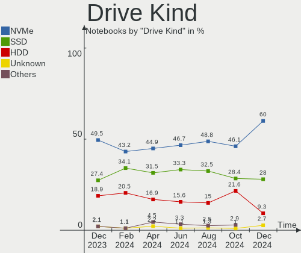
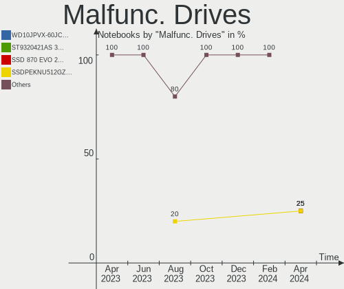
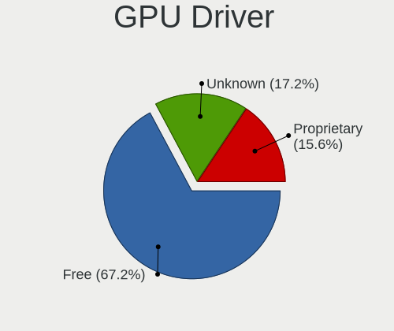
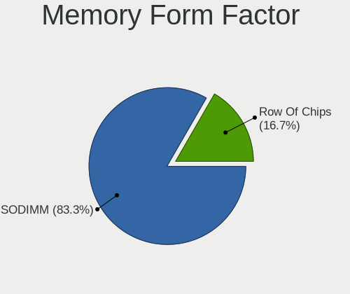

Kubuntu - Hardware Trends (Notebooks)
-------------------------------------

A project to identify most popular hardware characteristics and track their change
over time based on data collected by Linux users at https://Linux-Hardware.org.

Anyone can contribute to this report by the [hw-probe](https://github.com/linuxhw/hw-probe) tool:

    sudo -E hw-probe -all -upload

This report is for one last month. Overall report since the beginning of time: [TestDays](https://github.com/linuxhw/TestDays)

Period: Apr, 2023.

Contents
--------

* [ System ](#system)
  - [ OS                       ](#os)
  - [ OS Family                ](#os-family)
  - [ Kernel                   ](#kernel)
  - [ Kernel Family            ](#kernel-family)
  - [ Kernel Major Ver.        ](#kernel-major-ver)
  - [ Arch                     ](#arch)
  - [ DE                       ](#de)
  - [ Display Server           ](#display-server)
  - [ Display Manager          ](#display-manager)
  - [ OS Lang                  ](#os-lang)
  - [ Boot Mode                ](#boot-mode)
  - [ Filesystem               ](#filesystem)
  - [ Part. scheme             ](#part-scheme)
  - [ Dual Boot with Linux/BSD ](#dual-boot-with-linuxbsd)
  - [ Dual Boot (Win)          ](#dual-boot-win)

* [ Board ](#board)
  - [ Vendor                   ](#vendor)
  - [ Model                    ](#model)
  - [ Model Family             ](#model-family)
  - [ MFG Year                 ](#mfg-year)
  - [ Form Factor              ](#form-factor)
  - [ Secure Boot              ](#secure-boot)
  - [ Coreboot                 ](#coreboot)
  - [ RAM Size                 ](#ram-size)
  - [ RAM Used                 ](#ram-used)
  - [ Total Drives             ](#total-drives)
  - [ Has CD-ROM               ](#has-cd-rom)
  - [ Has Ethernet             ](#has-ethernet)
  - [ Has WiFi                 ](#has-wifi)
  - [ Has Bluetooth            ](#has-bluetooth)

* [ Location ](#location)
  - [ Country                  ](#country)
  - [ City                     ](#city)

* [ Drives ](#drives)
  - [ Drive Vendor             ](#drive-vendor)
  - [ Drive Model              ](#drive-model)
  - [ HDD Vendor               ](#hdd-vendor)
  - [ SSD Vendor               ](#ssd-vendor)
  - [ Drive Kind               ](#drive-kind)
  - [ Drive Connector          ](#drive-connector)
  - [ Drive Size               ](#drive-size)
  - [ Space Total              ](#space-total)
  - [ Space Used               ](#space-used)
  - [ Malfunc. Drives          ](#malfunc-drives)
  - [ Malfunc. Drive Vendor    ](#malfunc-drive-vendor)
  - [ Malfunc. HDD Vendor      ](#malfunc-hdd-vendor)
  - [ Malfunc. Drive Kind      ](#malfunc-drive-kind)
  - [ Failed Drives            ](#failed-drives)
  - [ Failed Drive Vendor      ](#failed-drive-vendor)
  - [ Drive Status             ](#drive-status)

* [ Storage controller ](#storage-controller)
  - [ Storage Vendor           ](#storage-vendor)
  - [ Storage Model            ](#storage-model)
  - [ Storage Kind             ](#storage-kind)

* [ Processor ](#processor)
  - [ CPU Vendor               ](#cpu-vendor)
  - [ CPU Model                ](#cpu-model)
  - [ CPU Model Family         ](#cpu-model-family)
  - [ CPU Cores                ](#cpu-cores)
  - [ CPU Sockets              ](#cpu-sockets)
  - [ CPU Threads              ](#cpu-threads)
  - [ CPU Op-Modes             ](#cpu-op-modes)
  - [ CPU Microcode            ](#cpu-microcode)
  - [ CPU Microarch            ](#cpu-microarch)

* [ Graphics ](#graphics)
  - [ GPU Vendor               ](#gpu-vendor)
  - [ GPU Model                ](#gpu-model)
  - [ GPU Combo                ](#gpu-combo)
  - [ GPU Driver               ](#gpu-driver)
  - [ GPU Memory               ](#gpu-memory)

* [ Monitor ](#monitor)
  - [ Monitor Vendor           ](#monitor-vendor)
  - [ Monitor Model            ](#monitor-model)
  - [ Monitor Resolution       ](#monitor-resolution)
  - [ Monitor Diagonal         ](#monitor-diagonal)
  - [ Monitor Width            ](#monitor-width)
  - [ Aspect Ratio             ](#aspect-ratio)
  - [ Monitor Area             ](#monitor-area)
  - [ Pixel Density            ](#pixel-density)
  - [ Multiple Monitors        ](#multiple-monitors)

* [ Network ](#network)
  - [ Net Controller Vendor    ](#net-controller-vendor)
  - [ Net Controller Model     ](#net-controller-model)
  - [ Wireless Vendor          ](#wireless-vendor)
  - [ Wireless Model           ](#wireless-model)
  - [ Ethernet Vendor          ](#ethernet-vendor)
  - [ Ethernet Model           ](#ethernet-model)
  - [ Net Controller Kind      ](#net-controller-kind)
  - [ Used Controller          ](#used-controller)
  - [ NICs                     ](#nics)
  - [ IPv6                     ](#ipv6)

* [ Bluetooth ](#bluetooth)
  - [ Bluetooth Vendor         ](#bluetooth-vendor)
  - [ Bluetooth Model          ](#bluetooth-model)

* [ Sound ](#sound)
  - [ Sound Vendor             ](#sound-vendor)
  - [ Sound Model              ](#sound-model)

* [ Memory ](#memory)
  - [ Memory Vendor            ](#memory-vendor)
  - [ Memory Model             ](#memory-model)
  - [ Memory Kind              ](#memory-kind)
  - [ Memory Form Factor       ](#memory-form-factor)
  - [ Memory Size              ](#memory-size)
  - [ Memory Speed             ](#memory-speed)

* [ Printers & scanners ](#printers--scanners)
  - [ Printer Vendor           ](#printer-vendor)
  - [ Printer Model            ](#printer-model)
  - [ Scanner Vendor           ](#scanner-vendor)
  - [ Scanner Model            ](#scanner-model)

* [ Camera ](#camera)
  - [ Camera Vendor            ](#camera-vendor)
  - [ Camera Model             ](#camera-model)

* [ Security ](#security)
  - [ Fingerprint Vendor       ](#fingerprint-vendor)
  - [ Fingerprint Model        ](#fingerprint-model)
  - [ Chipcard Vendor          ](#chipcard-vendor)
  - [ Chipcard Model           ](#chipcard-model)

* [ Unsupported ](#unsupported)
  - [ Unsupported Devices      ](#unsupported-devices)
  - [ Unsupported Device Types ](#unsupported-device-types)

System
------

OS
--

Installed operating systems

| Name          | Notebooks | Percent |
|---------------|-----------|---------|
| Kubuntu 22.04 | 31        | 53.45%  |
| Kubuntu 23.04 | 16        | 27.59%  |
| Kubuntu 22.10 | 7         | 12.07%  |
| Kubuntu 20.04 | 4         | 6.9%    |

OS Family
---------

OS without a version

| Name    | Notebooks | Percent |
|---------|-----------|---------|
| Kubuntu | 58        | 100%    |

Kernel
------

Version of the Linux kernel

| Version                | Notebooks | Percent |
|------------------------|-----------|---------|
| 5.19.0-38-generic      | 14        | 24.14%  |
| 6.2.0-20-generic       | 11        | 18.97%  |
| 5.15.0-69-generic      | 8         | 13.79%  |
| 5.19.0-32-generic      | 5         | 8.62%   |
| 5.19.0-40-generic      | 4         | 6.9%    |
| 5.15.0-70-generic      | 3         | 5.17%   |
| 5.15.0-71-generic      | 2         | 3.45%   |
| 6.2.10-060210-generic  | 1         | 1.72%   |
| 6.2.0-21-generic       | 1         | 1.72%   |
| 6.2.0-18-generic       | 1         | 1.72%   |
| 6.1.12-060112-generic  | 1         | 1.72%   |
| 5.4.0-146-generic      | 1         | 1.72%   |
| 5.19.0-21-generic      | 1         | 1.72%   |
| 5.19.0-1022-lowlatency | 1         | 1.72%   |
| 5.17.0-1029-oem        | 1         | 1.72%   |
| 5.15.0-67-generic      | 1         | 1.72%   |
| 5.15.0-53-generic      | 1         | 1.72%   |
| 5.15.0-25-generic      | 1         | 1.72%   |

Kernel Family
-------------

Linux kernel without a distro release

| Version | Notebooks | Percent |
|---------|-----------|---------|
| 5.19.0  | 25        | 43.1%   |
| 5.15.0  | 16        | 27.59%  |
| 6.2.0   | 13        | 22.41%  |
| 6.2.10  | 1         | 1.72%   |
| 6.1.12  | 1         | 1.72%   |
| 5.4.0   | 1         | 1.72%   |
| 5.17.0  | 1         | 1.72%   |

Kernel Major Ver.
-----------------

Linux kernel major version

| Version | Notebooks | Percent |
|---------|-----------|---------|
| 5.19    | 25        | 43.1%   |
| 5.15    | 16        | 27.59%  |
| 6.2     | 14        | 24.14%  |
| 6.1     | 1         | 1.72%   |
| 5.4     | 1         | 1.72%   |
| 5.17    | 1         | 1.72%   |

Arch
----

OS architecture (x86_64, i586, etc.)

| Name   | Notebooks | Percent |
|--------|-----------|---------|
| x86_64 | 58        | 100%    |

DE
--

Desktop Environment

| Name | Notebooks | Percent |
|------|-----------|---------|
| KDE5 | 56        | 96.55%  |
| KDE  | 2         | 3.45%   |

Display Server
--------------

X11 or Wayland

| Name    | Notebooks | Percent |
|---------|-----------|---------|
| X11     | 54        | 93.1%   |
| Wayland | 4         | 6.9%    |

Display Manager
---------------

SDDM, LightDM, etc.

| Name    | Notebooks | Percent |
|---------|-----------|---------|
| SDDM    | 41        | 70.69%  |
| Unknown | 14        | 24.14%  |
| GDM3    | 2         | 3.45%   |
| LightDM | 1         | 1.72%   |

OS Lang
-------

Language

| Lang  | Notebooks | Percent |
|-------|-----------|---------|
| en_US | 26        | 44.83%  |
| de_DE | 6         | 10.34%  |
| ru_RU | 3         | 5.17%   |
| fr_FR | 3         | 5.17%   |
| en_GB | 3         | 5.17%   |
| pl_PL | 2         | 3.45%   |
| it_IT | 2         | 3.45%   |
| en_IN | 2         | 3.45%   |
| en_IE | 2         | 3.45%   |
| tr_TR | 1         | 1.72%   |
| nl_BE | 1         | 1.72%   |
| hu_HU | 1         | 1.72%   |
| es_VE | 1         | 1.72%   |
| es_ES | 1         | 1.72%   |
| en_SG | 1         | 1.72%   |
| en_AU | 1         | 1.72%   |
| cs_CZ | 1         | 1.72%   |
| ba_RU | 1         | 1.72%   |

Boot Mode
---------

EFI or BIOS

| Mode | Notebooks | Percent |
|------|-----------|---------|
| EFI  | 34        | 58.62%  |
| BIOS | 24        | 41.38%  |

Filesystem
----------

Type of filesystem

| Type    | Notebooks | Percent |
|---------|-----------|---------|
| Ext4    | 44        | 75.86%  |
| Btrfs   | 7         | 12.07%  |
| Tmpfs   | 5         | 8.62%   |
| Overlay | 2         | 3.45%   |

Part. scheme
------------

Scheme of partitioning

| Type    | Notebooks | Percent |
|---------|-----------|---------|
| GPT     | 42        | 72.41%  |
| Unknown | 14        | 24.14%  |
| MBR     | 2         | 3.45%   |

Dual Boot with Linux/BSD
------------------------

Hosting more than one Linux/BSD

| Dual boot | Notebooks | Percent |
|-----------|-----------|---------|
| No        | 55        | 94.83%  |
| Yes       | 3         | 5.17%   |

Dual Boot (Win)
---------------

Hosting Linux and Windows

| Dual boot | Notebooks | Percent |
|-----------|-----------|---------|
| No        | 40        | 68.97%  |
| Yes       | 18        | 31.03%  |

Board
-----

Vendor
------

Motherboard manufacturer

| Name                | Notebooks | Percent |
|---------------------|-----------|---------|
| Lenovo              | 20        | 34.48%  |
| ASUSTek Computer    | 8         | 13.79%  |
| Hewlett-Packard     | 7         | 12.07%  |
| Dell                | 6         | 10.34%  |
| Acer                | 4         | 6.9%    |
| HUAWEI              | 2         | 3.45%   |
| Gigabyte Technology | 2         | 3.45%   |
| Thomson             | 1         | 1.72%   |
| Samsung Electronics | 1         | 1.72%   |
| Notebook            | 1         | 1.72%   |
| MSI                 | 1         | 1.72%   |
| Casper              | 1         | 1.72%   |
| Carbon Systems      | 1         | 1.72%   |
| AXIOO               | 1         | 1.72%   |
| Apple               | 1         | 1.72%   |
| Unknown             | 1         | 1.72%   |

Model
-----

Motherboard model

| Name                                     | Notebooks | Percent |
|------------------------------------------|-----------|---------|
| Lenovo IdeaPad 5 Pro 16ARH7 82SN         | 2         | 3.45%   |
| HUAWEI HVY-WXX9                          | 2         | 3.45%   |
| Thomson SPNEOX13-4RD64                   | 1         | 1.72%   |
| Samsung 950XED                           | 1         | 1.72%   |
| Notebook PD5x_7xSNC_SND_SNE              | 1         | 1.72%   |
| MSI Modern 14 B11MOU                     | 1         | 1.72%   |
| Lenovo V15-ADA 82C7                      | 1         | 1.72%   |
| Lenovo ThinkPad X280 20KF001UUS          | 1         | 1.72%   |
| Lenovo ThinkPad X230 23256N6             | 1         | 1.72%   |
| Lenovo ThinkPad X1 Carbon 4th 20FB0067RT | 1         | 1.72%   |
| Lenovo ThinkPad T430s 23539MU            | 1         | 1.72%   |
| Lenovo ThinkPad T420 4177RVU             | 1         | 1.72%   |
| Lenovo ThinkPad T14s Gen 3 21CQ000EUS    | 1         | 1.72%   |
| Lenovo ThinkPad T14 Gen 3 21CFS08M00     | 1         | 1.72%   |
| Lenovo ThinkPad P15 Gen 1 20ST006LRT     | 1         | 1.72%   |
| Lenovo ThinkPad P1 Gen 2 20QT000LGE      | 1         | 1.72%   |
| Lenovo ThinkPad E15 Gen 3 20YG003VGE     | 1         | 1.72%   |
| Lenovo ThinkPad E14 Gen 4 21ECS00000     | 1         | 1.72%   |
| Lenovo ThinkBook 14 G4 ABA 21DK          | 1         | 1.72%   |
| Lenovo S21e-20 80M4                      | 1         | 1.72%   |
| Lenovo Legion 5 Pro 16ACH6H 82JQ         | 1         | 1.72%   |
| Lenovo IdeaPad 330-15AST 81D6            | 1         | 1.72%   |
| Lenovo IdeaPad 320S-14IKB 81BN           | 1         | 1.72%   |
| Lenovo IdeaPad 100-15IBY 80MJ            | 1         | 1.72%   |
| HP ZBook Fury 15 G7 Mobile Workstation   | 1         | 1.72%   |
| HP ProBook 650 G3                        | 1         | 1.72%   |
| HP Pavilion Notebook                     | 1         | 1.72%   |
| HP OMEN Laptop 15-en0xxx                 | 1         | 1.72%   |
| HP EliteBook 2570p                       | 1         | 1.72%   |
| HP 630                                   | 1         | 1.72%   |
| HP 255 G8 Notebook PC                    | 1         | 1.72%   |
| Gigabyte G5 KD                           | 1         | 1.72%   |
| Gigabyte AORUS 15P XD                    | 1         | 1.72%   |
| Dell Precision 7550                      | 1         | 1.72%   |
| Dell Precision 5520                      | 1         | 1.72%   |
| Dell Latitude E5530 non-vPro             | 1         | 1.72%   |
| Dell Latitude E5450                      | 1         | 1.72%   |
| Dell Inspiron 5521                       | 1         | 1.72%   |
| Dell Inspiron 3793                       | 1         | 1.72%   |
| Casper NIRVANA NOTEBOOK                  | 1         | 1.72%   |

Model Family
------------

Motherboard model prefix

| Name                   | Notebooks | Percent |
|------------------------|-----------|---------|
| Lenovo ThinkPad        | 11        | 18.97%  |
| Lenovo IdeaPad         | 5         | 8.62%   |
| Acer Aspire            | 3         | 5.17%   |
| HUAWEI HVY-WXX9        | 2         | 3.45%   |
| Dell Precision         | 2         | 3.45%   |
| Dell Latitude          | 2         | 3.45%   |
| Dell Inspiron          | 2         | 3.45%   |
| ASUS VivoBook          | 2         | 3.45%   |
| ASUS ASUS              | 2         | 3.45%   |
| Thomson SPNEOX13-4RD64 | 1         | 1.72%   |
| Samsung 950XED         | 1         | 1.72%   |
| Notebook PD5x          | 1         | 1.72%   |
| MSI Modern             | 1         | 1.72%   |
| Lenovo V15-ADA         | 1         | 1.72%   |
| Lenovo ThinkBook       | 1         | 1.72%   |
| Lenovo S21e-20         | 1         | 1.72%   |
| Lenovo Legion          | 1         | 1.72%   |
| HP ZBook               | 1         | 1.72%   |
| HP ProBook             | 1         | 1.72%   |
| HP Pavilion            | 1         | 1.72%   |
| HP OMEN                | 1         | 1.72%   |
| HP EliteBook           | 1         | 1.72%   |
| HP 630                 | 1         | 1.72%   |
| HP 255                 | 1         | 1.72%   |
| Gigabyte G5            | 1         | 1.72%   |
| Gigabyte AORUS         | 1         | 1.72%   |
| Casper NIRVANA         | 1         | 1.72%   |
| Carbon Systems Iridium | 1         | 1.72%   |
| AXIOO SlimBook         | 1         | 1.72%   |
| ASUS X51RL             | 1         | 1.72%   |
| ASUS X510UAR           | 1         | 1.72%   |
| ASUS TUF               | 1         | 1.72%   |
| ASUS ROG               | 1         | 1.72%   |
| Apple MacBookPro5      | 1         | 1.72%   |
| Acer Nitro             | 1         | 1.72%   |
| Unknown                | 1         | 1.72%   |

MFG Year
--------

Motherboard manufacture year

| Year | Notebooks | Percent |
|------|-----------|---------|
| 2022 | 14        | 24.14%  |
| 2021 | 9         | 15.52%  |
| 2020 | 8         | 13.79%  |
| 2012 | 6         | 10.34%  |
| 2018 | 4         | 6.9%    |
| 2019 | 3         | 5.17%   |
| 2017 | 3         | 5.17%   |
| 2016 | 3         | 5.17%   |
| 2015 | 2         | 3.45%   |
| 2011 | 2         | 3.45%   |
| 2023 | 1         | 1.72%   |
| 2014 | 1         | 1.72%   |
| 2009 | 1         | 1.72%   |
| 2007 | 1         | 1.72%   |

Form Factor
-----------

Physical design of the computer

| Name     | Notebooks | Percent |
|----------|-----------|---------|
| Notebook | 58        | 100%    |

Secure Boot
-----------

Enabled or disabled

| State    | Notebooks | Percent |
|----------|-----------|---------|
| Disabled | 49        | 84.48%  |
| Enabled  | 9         | 15.52%  |

Coreboot
--------

Have coreboot on board

| Used | Notebooks | Percent |
|------|-----------|---------|
| No   | 58        | 100%    |

RAM Size
--------

Total RAM memory

| Size in GB  | Notebooks | Percent |
|-------------|-----------|---------|
| 8.01-16.0   | 15        | 25.86%  |
| 16.01-24.0  | 12        | 20.69%  |
| 4.01-8.0    | 11        | 18.97%  |
| 32.01-64.0  | 7         | 12.07%  |
| 3.01-4.0    | 5         | 8.62%   |
| 24.01-32.0  | 3         | 5.17%   |
| 64.01-256.0 | 3         | 5.17%   |
| 2.01-3.0    | 1         | 1.72%   |
| 1.01-2.0    | 1         | 1.72%   |

RAM Used
--------

Used RAM memory

| Used GB    | Notebooks | Percent |
|------------|-----------|---------|
| 2.01-3.0   | 16        | 27.59%  |
| 4.01-8.0   | 13        | 22.41%  |
| 3.01-4.0   | 12        | 20.69%  |
| 1.01-2.0   | 11        | 18.97%  |
| 8.01-16.0  | 4         | 6.9%    |
| 16.01-24.0 | 1         | 1.72%   |
| 0.51-1.0   | 1         | 1.72%   |

Total Drives
------------

Number of drives on board

| Drives | Notebooks | Percent |
|--------|-----------|---------|
| 1      | 43        | 74.14%  |
| 2      | 10        | 17.24%  |
| 3      | 5         | 8.62%   |

Has CD-ROM
----------

Has CD-ROM on board

| Presented | Notebooks | Percent |
|-----------|-----------|---------|
| No        | 44        | 75.86%  |
| Yes       | 14        | 24.14%  |

Has Ethernet
------------

Has Ethernet on board

| Presented | Notebooks | Percent |
|-----------|-----------|---------|
| Yes       | 44        | 75.86%  |
| No        | 14        | 24.14%  |

Has WiFi
--------

Has WiFi module

| Presented | Notebooks | Percent |
|-----------|-----------|---------|
| Yes       | 58        | 100%    |

Has Bluetooth
-------------

Has Bluetooth module

| Presented | Notebooks | Percent |
|-----------|-----------|---------|
| Yes       | 49        | 84.48%  |
| No        | 9         | 15.52%  |

Location
--------

Country
-------

Geographic location (country)

| Country      | Notebooks | Percent |
|--------------|-----------|---------|
| USA          | 10        | 17.24%  |
| Germany      | 6         | 10.34%  |
| France       | 5         | 8.62%   |
| Russia       | 4         | 6.9%    |
| Turkey       | 3         | 5.17%   |
| Poland       | 3         | 5.17%   |
| Italy        | 3         | 5.17%   |
| UK           | 2         | 3.45%   |
| Sweden       | 2         | 3.45%   |
| India        | 2         | 3.45%   |
| Hungary      | 2         | 3.45%   |
| Venezuela    | 1         | 1.72%   |
| Spain        | 1         | 1.72%   |
| South Korea  | 1         | 1.72%   |
| Slovenia     | 1         | 1.72%   |
| Singapore    | 1         | 1.72%   |
| Saudi Arabia | 1         | 1.72%   |
| Portugal     | 1         | 1.72%   |
| Norway       | 1         | 1.72%   |
| Malaysia     | 1         | 1.72%   |
| Lithuania    | 1         | 1.72%   |
| Ireland      | 1         | 1.72%   |
| Indonesia    | 1         | 1.72%   |
| Czechia      | 1         | 1.72%   |
| Croatia      | 1         | 1.72%   |
| Belgium      | 1         | 1.72%   |
| Australia    | 1         | 1.72%   |

City
----

Geographic location (city)

| City             | Notebooks | Percent |
|------------------|-----------|---------|
| Warsaw           | 2         | 3.45%   |
| Paris            | 2         | 3.45%   |
| Milan            | 2         | 3.45%   |
| Istanbul         | 2         | 3.45%   |
| Castro Valley    | 2         | 3.45%   |
| Zagreb           | 1         | 1.72%   |
| Watford          | 1         | 1.72%   |
| Waldshut-Tiengen | 1         | 1.72%   |
| Vladivostok      | 1         | 1.72%   |
| Vilnius          | 1         | 1.72%   |
| Towson           | 1         | 1.72%   |
| Sydney           | 1         | 1.72%   |
| St Petersburg    | 1         | 1.72%   |
| Singapore        | 1         | 1.72%   |
| Seremban         | 1         | 1.72%   |
| Salerno          | 1         | 1.72%   |
| Sacramento       | 1         | 1.72%   |
| Roubaix          | 1         | 1.72%   |
| Queens           | 1         | 1.72%   |
| Pilisvoeroesvar  | 1         | 1.72%   |
| Phoenix          | 1         | 1.72%   |
| Philadelphia     | 1         | 1.72%   |
| Pécs            | 1         | 1.72%   |
| Pardubice        | 1         | 1.72%   |
| Oslo             | 1         | 1.72%   |
| Nellore          | 1         | 1.72%   |
| Nam-gu           | 1         | 1.72%   |
| Munich           | 1         | 1.72%   |
| Mumbai           | 1         | 1.72%   |
| Mountain View    | 1         | 1.72%   |
| Moscow           | 1         | 1.72%   |
| Madrid           | 1         | 1.72%   |
| Lyon             | 1         | 1.72%   |
| Ljubljana        | 1         | 1.72%   |
| Lisbon           | 1         | 1.72%   |
| Krasnoyarsk      | 1         | 1.72%   |
| Kosekoy          | 1         | 1.72%   |
| Jeddah           | 1         | 1.72%   |
| Herrljunga       | 1         | 1.72%   |
| Hereford         | 1         | 1.72%   |

Drives
------

Drive Vendor
------------

Hard drive vendors

| Vendor                      | Notebooks | Drives | Percent |
|-----------------------------|-----------|--------|---------|
| Samsung Electronics         | 20        | 23     | 26.32%  |
| Unknown                     | 5         | 6      | 6.58%   |
| SK hynix                    | 5         | 5      | 6.58%   |
| SanDisk                     | 5         | 5      | 6.58%   |
| Micron Technology           | 5         | 5      | 6.58%   |
| WDC                         | 4         | 4      | 5.26%   |
| Seagate                     | 3         | 3      | 3.95%   |
| Phison Electronics          | 3         | 3      | 3.95%   |
| Kingston                    | 3         | 3      | 3.95%   |
| Toshiba                     | 2         | 2      | 2.63%   |
| Intel                       | 2         | 2      | 2.63%   |
| Crucial                     | 2         | 2      | 2.63%   |
| China                       | 2         | 2      | 2.63%   |
| VISIPRO                     | 1         | 1      | 1.32%   |
| UMIS                        | 1         | 1      | 1.32%   |
| SPCC                        | 1         | 1      | 1.32%   |
| Silicon Motion              | 1         | 1      | 1.32%   |
| ShiJi                       | 1         | 1      | 1.32%   |
| Seagate Technology          | 1         | 1      | 1.32%   |
| Micron/Crucial Technology   | 1         | 1      | 1.32%   |
| LITEON                      | 1         | 1      | 1.32%   |
| Kingston Technology Company | 1         | 1      | 1.32%   |
| Hitachi                     | 1         | 1      | 1.32%   |
| HGST                        | 1         | 1      | 1.32%   |
| Apple                       | 1         | 2      | 1.32%   |
| ADATA SU                    | 1         | 1      | 1.32%   |
| A-DATA Technology           | 1         | 1      | 1.32%   |
| Unknown                     | 1         | 1      | 1.32%   |

Drive Model
-----------

Hard drive models

| Model                                   | Notebooks | Percent |
|-----------------------------------------|-----------|---------|
| Unknown MMC Card  64GB                  | 2         | 2.5%    |
| Unknown MMC Card  32GB                  | 2         | 2.5%    |
| Sandisk WD Blue SN550 NVMe SSD 1024GB   | 2         | 2.5%    |
| Samsung MZVLB1T0HBLR-000H1 1TB          | 2         | 2.5%    |
| Phison E16 PCIe4 NVMe Controller 500GB  | 2         | 2.5%    |
| WDC WDBNCE5000PNC 500GB SSD             | 1         | 1.25%   |
| WDC WD10SPZX-24Z10 1TB                  | 1         | 1.25%   |
| WDC PC SN530 SDBPMPZ-256G-1101 256GB    | 1         | 1.25%   |
| WDC PC SN520 SDAPMUW-256G-1101 256GB    | 1         | 1.25%   |
| VISIPRO SSD 256GB                       | 1         | 1.25%   |
| Unknown SD64G  64GB                     | 1         | 1.25%   |
| Unknown SC200  197GB                    | 1         | 1.25%   |
| UMIS RPJTJ512MGE1QDQ 512GB              | 1         | 1.25%   |
| Toshiba MQ01ABD100 1TB                  | 1         | 1.25%   |
| Toshiba MK3276GSX 320GB                 | 1         | 1.25%   |
| SPCC Solid State Disk 2TB               | 1         | 1.25%   |
| SK hynix SKHynix_HFS001TEJ9X102N 1TB    | 1         | 1.25%   |
| SK hynix SKHynix_HFS001TDE9X084N 1024GB | 1         | 1.25%   |
| SK hynix SKHynix_HFM512GD3HX015N 512GB  | 1         | 1.25%   |
| SK hynix SHGP31-500GM-2 500GB           | 1         | 1.25%   |
| SK hynix HFS256G32MND-2900A 256GB SSD   | 1         | 1.25%   |
| Silicon Motion PCIe-8 SSD 512GB         | 1         | 1.25%   |
| ShiJi SSD 256GB                         | 1         | 1.25%   |
| Seagate FireCuda 510 SSD 250GB          | 1         | 1.25%   |
| Seagate ST9160411AS 160GB               | 1         | 1.25%   |
| Seagate ST2000LM007-1R8174 2TB          | 1         | 1.25%   |
| Seagate ST1000LM048-2E7172 1TB          | 1         | 1.25%   |
| Sandisk WD Blue SN570 1TB               | 1         | 1.25%   |
| SanDisk SSD PLUS 480GB                  | 1         | 1.25%   |
| SanDisk SSD PLUS 240GB                  | 1         | 1.25%   |
| Samsung SSD PM851 mSATA 128GB           | 1         | 1.25%   |
| Samsung SSD 990 PRO 1TB                 | 1         | 1.25%   |
| Samsung SSD 980 500GB                   | 1         | 1.25%   |
| Samsung SSD 970 EVO Plus 500GB          | 1         | 1.25%   |
| Samsung SSD 970 EVO Plus 250GB          | 1         | 1.25%   |
| Samsung SSD 870 QVO 2TB                 | 1         | 1.25%   |
| Samsung SSD 860 EVO M.2 250GB           | 1         | 1.25%   |
| Samsung SSD 860 EVO 250GB               | 1         | 1.25%   |
| Samsung SSD 850 EVO mSATA 500GB         | 1         | 1.25%   |
| Samsung SSD 850 EVO 250GB               | 1         | 1.25%   |

HDD Vendor
----------

Hard disk drive vendors

| Vendor  | Notebooks | Drives | Percent |
|---------|-----------|--------|---------|
| Seagate | 3         | 3      | 37.5%   |
| Toshiba | 2         | 2      | 25%     |
| WDC     | 1         | 1      | 12.5%   |
| Hitachi | 1         | 1      | 12.5%   |
| HGST    | 1         | 1      | 12.5%   |

SSD Vendor
----------

Solid state drive vendors

| Vendor              | Notebooks | Drives | Percent |
|---------------------|-----------|--------|---------|
| Samsung Electronics | 7         | 7      | 30.43%  |
| SanDisk             | 2         | 2      | 8.7%    |
| Crucial             | 2         | 2      | 8.7%    |
| China               | 2         | 2      | 8.7%    |
| WDC                 | 1         | 1      | 4.35%   |
| VISIPRO             | 1         | 1      | 4.35%   |
| SPCC                | 1         | 1      | 4.35%   |
| SK hynix            | 1         | 1      | 4.35%   |
| ShiJi               | 1         | 1      | 4.35%   |
| Micron Technology   | 1         | 1      | 4.35%   |
| LITEON              | 1         | 1      | 4.35%   |
| Kingston            | 1         | 1      | 4.35%   |
| ADATA SU            | 1         | 1      | 4.35%   |
| Unknown             | 1         | 1      | 4.35%   |

Drive Kind
----------

HDD or SSD

| Kind | Notebooks | Drives | Percent |
|------|-----------|--------|---------|
| NVMe | 36        | 44     | 50.7%   |
| SSD  | 22        | 23     | 30.99%  |
| HDD  | 8         | 8      | 11.27%  |
| MMC  | 5         | 6      | 7.04%   |

Drive Connector
---------------

SATA, SAS, NVMe, etc.

| Type | Notebooks | Drives | Percent |
|------|-----------|--------|---------|
| NVMe | 36        | 44     | 53.73%  |
| SATA | 25        | 30     | 37.31%  |
| MMC  | 5         | 6      | 7.46%   |
| SAS  | 1         | 1      | 1.49%   |

Drive Size
----------

Size of hard drive

| Size in TB | Notebooks | Drives | Percent |
|------------|-----------|--------|---------|
| 0.01-0.5   | 21        | 24     | 77.78%  |
| 1.01-2.0   | 3         | 3      | 11.11%  |
| 0.51-1.0   | 3         | 4      | 11.11%  |

Space Total
-----------

Amount of disk space available on the file system

| Size in GB     | Notebooks | Percent |
|----------------|-----------|---------|
| 101-250        | 22        | 37.93%  |
| 501-1000       | 10        | 17.24%  |
| 251-500        | 9         | 15.52%  |
| 1001-2000      | 8         | 13.79%  |
| 2001-3000      | 3         | 5.17%   |
| 1-20           | 3         | 5.17%   |
| More than 3000 | 2         | 3.45%   |
| 21-50          | 1         | 1.72%   |

Space Used
----------

Amount of used disk space

| Used GB        | Notebooks | Percent |
|----------------|-----------|---------|
| 1-20           | 19        | 32.76%  |
| 101-250        | 10        | 17.24%  |
| 21-50          | 9         | 15.52%  |
| 51-100         | 7         | 12.07%  |
| 1001-2000      | 5         | 8.62%   |
| 251-500        | 4         | 6.9%    |
| 501-1000       | 2         | 3.45%   |
| More than 3000 | 1         | 1.72%   |
| 2001-3000      | 1         | 1.72%   |

Malfunc. Drives
---------------

Drive models with a malfunction

| Model                                 | Notebooks | Drives | Percent |
|---------------------------------------|-----------|--------|---------|
| VISIPRO SSD 256GB                     | 1         | 1      | 50%     |
| SK hynix HFS256G32MND-2900A 256GB SSD | 1         | 1      | 50%     |

Malfunc. Drive Vendor
---------------------

Vendors of faulty drives

| Vendor   | Notebooks | Drives | Percent |
|----------|-----------|--------|---------|
| VISIPRO  | 1         | 1      | 50%     |
| SK hynix | 1         | 1      | 50%     |

Malfunc. HDD Vendor
-------------------

Vendors of faulty HDD drives

Zero info for selected period =(

Malfunc. Drive Kind
-------------------

Kinds of faulty drives

| Kind | Notebooks | Drives | Percent |
|------|-----------|--------|---------|
| SSD  | 2         | 2      | 100%    |

Failed Drives
-------------

Failed drive models

Zero info for selected period =(

Failed Drive Vendor
-------------------

Failed drive vendors

Zero info for selected period =(

Drive Status
------------

Number of failed and malfunc. drives

| Status   | Notebooks | Drives | Percent |
|----------|-----------|--------|---------|
| Works    | 32        | 40     | 51.61%  |
| Detected | 28        | 39     | 45.16%  |
| Malfunc  | 2         | 2      | 3.23%   |

Storage controller
------------------

Storage Vendor
--------------

Storage controller vendors

| Vendor                      | Notebooks | Percent |
|-----------------------------|-----------|---------|
| Intel                       | 30        | 40.54%  |
| Samsung Electronics         | 14        | 18.92%  |
| SanDisk                     | 5         | 6.76%   |
| AMD                         | 5         | 6.76%   |
| SK hynix                    | 4         | 5.41%   |
| Micron Technology           | 4         | 5.41%   |
| Phison Electronics          | 3         | 4.05%   |
| Kingston Technology Company | 3         | 4.05%   |
| Union Memory (Shenzhen)     | 1         | 1.35%   |
| Silicon Motion              | 1         | 1.35%   |
| Seagate Technology          | 1         | 1.35%   |
| Nvidia                      | 1         | 1.35%   |
| Micron/Crucial Technology   | 1         | 1.35%   |
| ADATA Technology            | 1         | 1.35%   |

Storage Model
-------------

Storage controller models

| Model                                                                            | Notebooks | Percent |
|----------------------------------------------------------------------------------|-----------|---------|
| Samsung NVMe SSD Controller SM981/PM981/PM983                                    | 5         | 6.02%   |
| Samsung NVMe SSD Controller 980                                                  | 5         | 6.02%   |
| Intel Sunrise Point-LP SATA Controller [AHCI mode]                               | 5         | 6.02%   |
| Intel 7 Series Chipset Family 6-port SATA Controller [AHCI mode]                 | 5         | 6.02%   |
| Micron NVMe Storage Controller                                                   | 4         | 4.82%   |
| AMD FCH SATA Controller [AHCI mode]                                              | 4         | 4.82%   |
| SK hynix Gold P31/PC711 NVMe Solid State Drive                                   | 3         | 3.61%   |
| Samsung NVMe SSD Controller PM9A1/PM9A3/980PRO                                   | 3         | 3.61%   |
| Intel Volume Management Device NVMe RAID Controller                              | 3         | 3.61%   |
| SanDisk WD Blue SN550 NVMe SSD                                                   | 2         | 2.41%   |
| Phison E16 PCIe4 NVMe Controller                                                 | 2         | 2.41%   |
| Intel SSD 660P Series                                                            | 2         | 2.41%   |
| Intel Celeron/Pentium Silver Processor SATA Controller                           | 2         | 2.41%   |
| Intel Cannon Lake Mobile PCH SATA AHCI Controller                                | 2         | 2.41%   |
| Intel Alder Lake-P SATA AHCI Controller                                          | 2         | 2.41%   |
| Union Memory (Shenzhen) AM630 PCIe 4.0 x4 NVMe SSD Controller                    | 1         | 1.2%    |
| SK hynix Platinum P41 NVMe Solid State Drive 2TB                                 | 1         | 1.2%    |
| Silicon Motion Non-Volatile memory controller                                    | 1         | 1.2%    |
| Seagate FireCuda 510 SSD                                                         | 1         | 1.2%    |
| SanDisk WD Blue SN570 NVMe SSD 1TB                                               | 1         | 1.2%    |
| SanDisk PC SN520 NVMe SSD                                                        | 1         | 1.2%    |
| SanDisk NVMe Controller                                                          | 1         | 1.2%    |
| Samsung NVMe SSD Controller SM961/PM961/SM963                                    | 1         | 1.2%    |
| Samsung NVMe SSD Controller PM9B1                                                | 1         | 1.2%    |
| Samsung Electronics Non-Volatile memory controller                               | 1         | 1.2%    |
| Phison E18 PCIe4 NVMe Controller                                                 | 1         | 1.2%    |
| Nvidia MCP79 AHCI Controller                                                     | 1         | 1.2%    |
| Micron/Crucial NVMe Storage Controller                                           | 1         | 1.2%    |
| Kingston Company U-SNS8154P3 NVMe SSD                                            | 1         | 1.2%    |
| Kingston Company Company Non-Volatile memory controller                          | 1         | 1.2%    |
| Kingston Company OM3PDP3 NVMe SSD                                                | 1         | 1.2%    |
| Intel Wildcat Point-LP SATA Controller [AHCI Mode]                               | 1         | 1.2%    |
| Intel Tiger Lake-LP SATA Controller                                              | 1         | 1.2%    |
| Intel Q170/Q150/B150/H170/H110/Z170/CM236 Chipset SATA Controller [AHCI Mode]    | 1         | 1.2%    |
| Intel Ice Lake-LP SATA Controller [AHCI mode]                                    | 1         | 1.2%    |
| Intel Comet Lake SATA AHCI Controller                                            | 1         | 1.2%    |
| Intel Celeron N3350/Pentium N4200/Atom E3900 Series SATA AHCI Controller         | 1         | 1.2%    |
| Intel Atom/Celeron/Pentium Processor x5-E8000/J3xxx/N3xxx Series SATA Controller | 1         | 1.2%    |
| Intel Atom Processor E3800 Series SATA AHCI Controller                           | 1         | 1.2%    |
| Intel 82801 Mobile SATA Controller [RAID mode]                                   | 1         | 1.2%    |

Storage Kind
------------

Kind of storage controller (IDE, SATA, NVMe, SAS, ...)

| Kind | Notebooks | Percent |
|------|-----------|---------|
| NVMe | 35        | 46.67%  |
| SATA | 34        | 45.33%  |
| RAID | 4         | 5.33%   |
| IDE  | 2         | 2.67%   |

Processor
---------

CPU Vendor
----------

Processor vendors

| Vendor | Notebooks | Percent |
|--------|-----------|---------|
| Intel  | 42        | 72.41%  |
| AMD    | 16        | 27.59%  |

CPU Model
---------

Processor models

| Model                                      | Notebooks | Percent |
|--------------------------------------------|-----------|---------|
| Intel Core i7-10750H CPU @ 2.60GHz         | 3         | 5.17%   |
| Intel Core i5-8250U CPU @ 1.60GHz          | 2         | 3.45%   |
| Intel Core i5-6200U CPU @ 2.30GHz          | 2         | 3.45%   |
| Intel Core i5-3320M CPU @ 2.60GHz          | 2         | 3.45%   |
| AMD Ryzen 7 PRO 6850U with Radeon Graphics | 2         | 3.45%   |
| AMD Ryzen 7 6800HS Creator Edition         | 2         | 3.45%   |
| AMD Ryzen 5 4600H with Radeon Graphics     | 2         | 3.45%   |
| Intel Xeon W-10885M CPU @ 2.40GHz          | 1         | 1.72%   |
| Intel Pentium CPU N3710 @ 1.60GHz          | 1         | 1.72%   |
| Intel Pentium CPU N3540 @ 2.16GHz          | 1         | 1.72%   |
| Intel Core i7-9750H CPU @ 2.60GHz          | 1         | 1.72%   |
| Intel Core i7-8750H CPU @ 2.20GHz          | 1         | 1.72%   |
| Intel Core i7-8650U CPU @ 1.90GHz          | 1         | 1.72%   |
| Intel Core i7-7820HQ CPU @ 2.90GHz         | 1         | 1.72%   |
| Intel Core i7-3537U CPU @ 2.00GHz          | 1         | 1.72%   |
| Intel Core i7-3520M CPU @ 2.90GHz          | 1         | 1.72%   |
| Intel Core i7-1065G7 CPU @ 1.30GHz         | 1         | 1.72%   |
| Intel Core i7-10510U CPU @ 1.80GHz         | 1         | 1.72%   |
| Intel Core i5-7200U CPU @ 2.50GHz          | 1         | 1.72%   |
| Intel Core i5-5300U CPU @ 2.30GHz          | 1         | 1.72%   |
| Intel Core i5-3340M CPU @ 2.70GHz          | 1         | 1.72%   |
| Intel Core i5-2450M CPU @ 2.50GHz          | 1         | 1.72%   |
| Intel Core i5-10300H CPU @ 2.50GHz         | 1         | 1.72%   |
| Intel Core i3-2377M CPU @ 1.50GHz          | 1         | 1.72%   |
| Intel Core i3 CPU M 380 @ 2.53GHz          | 1         | 1.72%   |
| Intel Core 2 Duo CPU T7700 @ 2.40GHz       | 1         | 1.72%   |
| Intel Core 2 Duo CPU P8700 @ 2.53GHz       | 1         | 1.72%   |
| Intel Celeron N4020 CPU @ 1.10GHz          | 1         | 1.72%   |
| Intel Celeron J4105 CPU @ 1.50GHz          | 1         | 1.72%   |
| Intel Celeron CPU N3350 @ 1.10GHz          | 1         | 1.72%   |
| Intel Celeron CPU N2840 @ 2.16GHz          | 1         | 1.72%   |
| Intel 13th Gen Core i9-13900HX             | 1         | 1.72%   |
| Intel 12th Gen Core i7-12700H              | 1         | 1.72%   |
| Intel 12th Gen Core i7-1260P               | 1         | 1.72%   |
| Intel 12th Gen Core i5-12450H              | 1         | 1.72%   |
| Intel 12th Gen Core i5-1235U               | 1         | 1.72%   |
| Intel 11th Gen Core i7-11800H @ 2.30GHz    | 1         | 1.72%   |
| Intel 11th Gen Core i7-1165G7 @ 2.80GHz    | 1         | 1.72%   |
| Intel 11th Gen Core i5-11400H @ 2.70GHz    | 1         | 1.72%   |
| Intel 11th Gen Core i3-1115G4 @ 3.00GHz    | 1         | 1.72%   |

CPU Model Family
----------------

Processor model prefix

| Model            | Notebooks | Percent |
|------------------|-----------|---------|
| Intel Core i7    | 11        | 18.97%  |
| Intel Core i5    | 11        | 18.97%  |
| Other            | 10        | 17.24%  |
| AMD Ryzen 7      | 6         | 10.34%  |
| Intel Celeron    | 4         | 6.9%    |
| AMD Ryzen 5      | 4         | 6.9%    |
| Intel Pentium    | 2         | 3.45%   |
| Intel Core i3    | 2         | 3.45%   |
| Intel Core 2 Duo | 2         | 3.45%   |
| AMD Ryzen 7 PRO  | 2         | 3.45%   |
| Intel Xeon       | 1         | 1.72%   |
| AMD Ryzen 9      | 1         | 1.72%   |
| AMD Ryzen 3      | 1         | 1.72%   |
| AMD Athlon       | 1         | 1.72%   |

CPU Cores
---------

Number of processor cores

| Number | Notebooks | Percent |
|--------|-----------|---------|
| 2      | 21        | 36.21%  |
| 8      | 12        | 20.69%  |
| 4      | 11        | 18.97%  |
| 6      | 10        | 17.24%  |
| 24     | 1         | 1.72%   |
| 14     | 1         | 1.72%   |
| 12     | 1         | 1.72%   |
| 10     | 1         | 1.72%   |

CPU Sockets
-----------

Number of sockets

| Number | Notebooks | Percent |
|--------|-----------|---------|
| 1      | 58        | 100%    |

CPU Threads
-----------

Threads per core (Hyper-Threading)

| Number | Notebooks | Percent |
|--------|-----------|---------|
| 2      | 47        | 81.03%  |
| 1      | 11        | 18.97%  |

CPU Op-Modes
------------

CPU Operation Modes (32-bit, 64-bit)

| Op mode        | Notebooks | Percent |
|----------------|-----------|---------|
| 32-bit, 64-bit | 58        | 100%    |

CPU Microcode
-------------

Microcode number

| Number     | Notebooks | Percent |
|------------|-----------|---------|
| Unknown    | 24        | 41.38%  |
| 0x806ea    | 3         | 5.17%   |
| 0xa0652    | 2         | 3.45%   |
| 0x906a3    | 2         | 3.45%   |
| 0x30678    | 2         | 3.45%   |
| 0x0a50000c | 2         | 3.45%   |
| 0x0a404101 | 2         | 3.45%   |
| 0x08600106 | 2         | 3.45%   |
| 0xb0671    | 1         | 1.72%   |
| 0x806ec    | 1         | 1.72%   |
| 0x806c2    | 1         | 1.72%   |
| 0x806c1    | 1         | 1.72%   |
| 0x706e5    | 1         | 1.72%   |
| 0x706a8    | 1         | 1.72%   |
| 0x706a1    | 1         | 1.72%   |
| 0x506c9    | 1         | 1.72%   |
| 0x406e3    | 1         | 1.72%   |
| 0x406c4    | 1         | 1.72%   |
| 0x306d4    | 1         | 1.72%   |
| 0x306a9    | 1         | 1.72%   |
| 0x206a7    | 1         | 1.72%   |
| 0x1067a    | 1         | 1.72%   |
| 0x0a404102 | 1         | 1.72%   |
| 0x08608103 | 1         | 1.72%   |
| 0x08600103 | 1         | 1.72%   |
| 0x08108109 | 1         | 1.72%   |
| 0x06006705 | 1         | 1.72%   |

CPU Microarch
-------------

Microarchitecture

| Name             | Notebooks | Percent |
|------------------|-----------|---------|
| Unknown          | 11        | 18.97%  |
| KabyLake         | 8         | 13.79%  |
| IvyBridge        | 5         | 8.62%   |
| CometLake        | 5         | 8.62%   |
| Zen 3            | 3         | 5.17%   |
| Zen 2            | 3         | 5.17%   |
| Silvermont       | 3         | 5.17%   |
| Alderlake Hybrid | 3         | 5.17%   |
| Zen+             | 2         | 3.45%   |
| TigerLake        | 2         | 3.45%   |
| Skylake          | 2         | 3.45%   |
| SandyBridge      | 2         | 3.45%   |
| Goldmont plus    | 2         | 3.45%   |
| Westmere         | 1         | 1.72%   |
| Penryn           | 1         | 1.72%   |
| IceLake          | 1         | 1.72%   |
| Goldmont         | 1         | 1.72%   |
| Excavator        | 1         | 1.72%   |
| Core             | 1         | 1.72%   |
| Broadwell        | 1         | 1.72%   |

Graphics
--------

GPU Vendor
----------

Vendors of graphics cards

| Vendor | Notebooks | Percent |
|--------|-----------|---------|
| Intel  | 40        | 54.05%  |
| AMD    | 18        | 24.32%  |
| Nvidia | 16        | 21.62%  |

GPU Model
---------

Graphics card models

| Model                                                                                    | Notebooks | Percent |
|------------------------------------------------------------------------------------------|-----------|---------|
| Intel 3rd Gen Core processor Graphics Controller                                         | 5         | 6.76%   |
| AMD Rembrandt [Radeon 680M]                                                              | 5         | 6.76%   |
| Intel CometLake-H GT2 [UHD Graphics]                                                     | 4         | 5.41%   |
| Intel UHD Graphics 620                                                                   | 3         | 4.05%   |
| AMD Renoir                                                                               | 3         | 4.05%   |
| Nvidia TU117GLM [Quadro T1000 Mobile]                                                    | 2         | 2.7%    |
| Nvidia TU116M [GeForce GTX 1660 Ti Mobile]                                               | 2         | 2.7%    |
| Nvidia GA107M [GeForce RTX 3050 Ti Mobile]                                               | 2         | 2.7%    |
| Intel TigerLake-H GT1 [UHD Graphics]                                                     | 2         | 2.7%    |
| Intel Skylake GT2 [HD Graphics 520]                                                      | 2         | 2.7%    |
| Intel GeminiLake [UHD Graphics 600]                                                      | 2         | 2.7%    |
| Intel CoffeeLake-H GT2 [UHD Graphics 630]                                                | 2         | 2.7%    |
| Intel Atom Processor Z36xxx/Z37xxx Series Graphics & Display                             | 2         | 2.7%    |
| Intel Alder Lake-P Integrated Graphics Controller                                        | 2         | 2.7%    |
| Intel 2nd Generation Core Processor Family Integrated Graphics Controller                | 2         | 2.7%    |
| AMD Picasso/Raven 2 [Radeon Vega Series / Radeon Vega Mobile Series]                     | 2         | 2.7%    |
| AMD Lucienne                                                                             | 2         | 2.7%    |
| AMD Barcelo                                                                              | 2         | 2.7%    |
| Nvidia TU117M [GeForce GTX 1650 Ti Mobile]                                               | 1         | 1.35%   |
| Nvidia TU117GLM [Quadro T2000 Mobile / Max-Q]                                            | 1         | 1.35%   |
| Nvidia TU106GLM [Quadro RTX 3000 Mobile / Max-Q]                                         | 1         | 1.35%   |
| Nvidia GP108M [GeForce MX230]                                                            | 1         | 1.35%   |
| Nvidia GP107M [GeForce GTX 1050 Ti Mobile]                                               | 1         | 1.35%   |
| Nvidia GM107GLM [Quadro M1200 Mobile]                                                    | 1         | 1.35%   |
| Nvidia GA106M [GeForce RTX 3060 Mobile / Max-Q]                                          | 1         | 1.35%   |
| Nvidia GA104M [GeForce RTX 3070 Mobile / Max-Q]                                          | 1         | 1.35%   |
| Nvidia C79 [GeForce 9400M]                                                               | 1         | 1.35%   |
| Nvidia AD107M [GeForce RTX 4060 Max-Q / Mobile]                                          | 1         | 1.35%   |
| Intel TigerLake-LP GT2 [Iris Xe Graphics]                                                | 1         | 1.35%   |
| Intel Tiger Lake-LP GT2 [UHD Graphics G4]                                                | 1         | 1.35%   |
| Intel Raptor Lake-S UHD Graphics                                                         | 1         | 1.35%   |
| Intel Iris Plus Graphics G7                                                              | 1         | 1.35%   |
| Intel HD Graphics 630                                                                    | 1         | 1.35%   |
| Intel HD Graphics 620                                                                    | 1         | 1.35%   |
| Intel HD Graphics 5500                                                                   | 1         | 1.35%   |
| Intel HD Graphics 500                                                                    | 1         | 1.35%   |
| Intel Core Processor Integrated Graphics Controller                                      | 1         | 1.35%   |
| Intel CometLake-U GT2 [UHD Graphics]                                                     | 1         | 1.35%   |
| Intel Coffee Lake-S GT2 [UHD Graphics P630]                                              | 1         | 1.35%   |
| Intel Atom/Celeron/Pentium Processor x5-E8000/J3xxx/N3xxx Integrated Graphics Controller | 1         | 1.35%   |

GPU Combo
---------

Combinations of graphics cards

| Name           | Notebooks | Percent |
|----------------|-----------|---------|
| 1 x Intel      | 26        | 44.83%  |
| 1 x AMD        | 15        | 25.86%  |
| Intel + Nvidia | 13        | 22.41%  |
| AMD + Nvidia   | 2         | 3.45%   |
| 1 x Nvidia     | 1         | 1.72%   |
| Intel + AMD    | 1         | 1.72%   |

GPU Driver
----------

Free vs proprietary

| Driver      | Notebooks | Percent |
|-------------|-----------|---------|
| Free        | 43        | 74.14%  |
| Proprietary | 13        | 22.41%  |
| Unknown     | 2         | 3.45%   |

GPU Memory
----------

Total video memory

| Size in GB | Notebooks | Percent |
|------------|-----------|---------|
| Unknown    | 43        | 74.14%  |
| 1.01-2.0   | 5         | 8.62%   |
| 0.01-0.5   | 4         | 6.9%    |
| 3.01-4.0   | 3         | 5.17%   |
| 0.51-1.0   | 3         | 5.17%   |

Monitor
-------

Monitor Vendor
--------------

Monitor vendors

| Vendor               | Notebooks | Percent |
|----------------------|-----------|---------|
| BOE                  | 17        | 25%     |
| Samsung Electronics  | 10        | 14.71%  |
| LG Display           | 9         | 13.24%  |
| Chimei Innolux       | 9         | 13.24%  |
| AU Optronics         | 7         | 10.29%  |
| Hewlett-Packard      | 3         | 4.41%   |
| ViewSonic            | 2         | 2.94%   |
| Sharp                | 2         | 2.94%   |
| PANDA                | 2         | 2.94%   |
| Lenovo               | 1         | 1.47%   |
| InfoVision           | 1         | 1.47%   |
| Goldstar             | 1         | 1.47%   |
| Envision Peripherals | 1         | 1.47%   |
| Denver               | 1         | 1.47%   |
| CVT                  | 1         | 1.47%   |
| Apple                | 1         | 1.47%   |

Monitor Model
-------------

Monitor models

| Model                                                                 | Notebooks | Percent |
|-----------------------------------------------------------------------|-----------|---------|
| BOE LCD Monitor BOE0AC1 2560x1600 344x215mm 16.0-inch                 | 2         | 2.94%   |
| BOE LCD Monitor BOE0878 1920x1080 355x200mm 16.0-inch                 | 2         | 2.94%   |
| BOE LCD Monitor BOE0853 1920x1080 344x194mm 15.5-inch                 | 2         | 2.94%   |
| ViewSonic XG2703-GS VSCBA32 2560x1440 598x336mm 27.0-inch             | 1         | 1.47%   |
| ViewSonic VX2255wmSERIE VSC991F 1680x1050 474x296mm 22.0-inch         | 1         | 1.47%   |
| Sharp LQ156M1JW03 SHP155D 1920x1080 344x194mm 15.5-inch               | 1         | 1.47%   |
| Sharp LCD Monitor SHP1453 1920x1080 346x194mm 15.6-inch               | 1         | 1.47%   |
| Samsung Electronics S24R35x SAM100E 1920x1080 527x296mm 23.8-inch     | 1         | 1.47%   |
| Samsung Electronics S24C450 SAM09CB 1920x1080 531x299mm 24.0-inch     | 1         | 1.47%   |
| Samsung Electronics LF24T35 SAM707E 1920x1080 528x297mm 23.9-inch     | 1         | 1.47%   |
| Samsung Electronics LCD Monitor SEC5441 1366x768 344x194mm 15.5-inch  | 1         | 1.47%   |
| Samsung Electronics LCD Monitor SEC4149 1366x768 292x174mm 13.4-inch  | 1         | 1.47%   |
| Samsung Electronics LCD Monitor SEC315A 1366x768 344x194mm 15.5-inch  | 1         | 1.47%   |
| Samsung Electronics LCD Monitor SEC3047 1366x768 277x156mm 12.5-inch  | 1         | 1.47%   |
| Samsung Electronics LCD Monitor SDC415D 3840x2400 344x215mm 16.0-inch | 1         | 1.47%   |
| Samsung Electronics LCD Monitor SDC4159 1920x1080 344x194mm 15.5-inch | 1         | 1.47%   |
| Samsung Electronics LCD Monitor SAM0900 1366x768 410x230mm 18.5-inch  | 1         | 1.47%   |
| PANDA LCD Monitor NCP0063 1920x1080 344x194mm 15.5-inch               | 1         | 1.47%   |
| PANDA LCD Monitor NCP004D 1920x1080 344x194mm 15.5-inch               | 1         | 1.47%   |
| LG Display LCD Monitor LGD0620 1920x1080 382x215mm 17.3-inch          | 1         | 1.47%   |
| LG Display LCD Monitor LGD05FE 1920x1080 344x194mm 15.5-inch          | 1         | 1.47%   |
| LG Display LCD Monitor LGD0573 1920x1080 344x194mm 15.5-inch          | 1         | 1.47%   |
| LG Display LCD Monitor LGD0563 1920x1080 344x194mm 15.5-inch          | 1         | 1.47%   |
| LG Display LCD Monitor LGD04B3 1920x1080 345x194mm 15.6-inch          | 1         | 1.47%   |
| LG Display LCD Monitor LGD0469 1920x1080 382x215mm 17.3-inch          | 1         | 1.47%   |
| LG Display LCD Monitor LGD0468 1366x768 344x194mm 15.5-inch           | 1         | 1.47%   |
| LG Display LCD Monitor LGD0456 1366x768 344x194mm 15.5-inch           | 1         | 1.47%   |
| LG Display LCD Monitor LGD0375 1366x768 309x174mm 14.0-inch           | 1         | 1.47%   |
| Lenovo P24h-2L LEN62B2 2560x1440 527x296mm 23.8-inch                  | 1         | 1.47%   |
| InfoVision LCD Monitor IVO04E6 1920x1080 276x156mm 12.5-inch          | 1         | 1.47%   |
| Hewlett-Packard E24 G4 HPN3688 1920x1080 527x296mm 23.8-inch          | 1         | 1.47%   |
| Hewlett-Packard 2311x HWP293A 1920x1080 510x287mm 23.0-inch           | 1         | 1.47%   |
| Hewlett-Packard 22fi HWP3072 1920x1080 480x270mm 21.7-inch            | 1         | 1.47%   |
| Goldstar FULL HD GSM5BDF 1920x1080 480x270mm 21.7-inch                | 1         | 1.47%   |
| Envision Peripherals LED 2471h ENV2471 1920x1080 531x299mm 24.0-inch  | 1         | 1.47%   |
| Denver M24-FHD-165 LHC2400 1920x1080 527x296mm 23.8-inch              | 1         | 1.47%   |
| CVT LCD CVT001A 1360x768 330x210mm 15.4-inch                          | 1         | 1.47%   |
| Chimei Innolux LCD Monitor CMN15F6 1920x1080 344x193mm 15.5-inch      | 1         | 1.47%   |
| Chimei Innolux LCD Monitor CMN15B6 1366x768 344x193mm 15.5-inch       | 1         | 1.47%   |
| Chimei Innolux LCD Monitor CMN151A 1920x1080 344x193mm 15.5-inch      | 1         | 1.47%   |

Monitor Resolution
------------------

Monitor screen resolution

| Resolution         | Notebooks | Percent |
|--------------------|-----------|---------|
| 1920x1080 (FHD)    | 31        | 53.45%  |
| 1366x768 (WXGA)    | 15        | 25.86%  |
| 2560x1600          | 3         | 5.17%   |
| 2560x1440 (QHD)    | 3         | 5.17%   |
| 1920x1200 (WUXGA)  | 2         | 3.45%   |
| 3840x2400          | 1         | 1.72%   |
| 1680x1050 (WSXGA+) | 1         | 1.72%   |
| 1600x900 (HD+)     | 1         | 1.72%   |
| 1280x800 (WXGA)    | 1         | 1.72%   |

Monitor Diagonal
----------------

Diagonal size in inches

| Inches  | Notebooks | Percent |
|---------|-----------|---------|
| 15      | 28        | 42.42%  |
| 13      | 8         | 12.12%  |
| 16      | 6         | 9.09%   |
| 14      | 5         | 7.58%   |
| 24      | 3         | 4.55%   |
| 23      | 3         | 4.55%   |
| 17      | 3         | 4.55%   |
| 21      | 2         | 3.03%   |
| 12      | 2         | 3.03%   |
| 11      | 2         | 3.03%   |
| 31      | 1         | 1.52%   |
| 27      | 1         | 1.52%   |
| 22      | 1         | 1.52%   |
| Unknown | 1         | 1.52%   |

Monitor Width
-------------

Physical width

| Width in mm | Notebooks | Percent |
|-------------|-----------|---------|
| 301-350     | 43        | 65.15%  |
| 501-600     | 7         | 10.61%  |
| 351-400     | 6         | 9.09%   |
| 201-300     | 5         | 7.58%   |
| 401-500     | 3         | 4.55%   |
| 601-700     | 1         | 1.52%   |
| Unknown     | 1         | 1.52%   |

Aspect Ratio
------------

Proportional relationship between the width and the height

| Ratio   | Notebooks | Percent |
|---------|-----------|---------|
| 16/9    | 47        | 83.93%  |
| 16/10   | 8         | 14.29%  |
| Unknown | 1         | 1.79%   |

Monitor Area
------------

Area in inch²

| Area in inch² | Notebooks | Percent |
|----------------|-----------|---------|
| 101-110        | 30        | 45.45%  |
| 81-90          | 12        | 18.18%  |
| 201-250        | 9         | 13.64%  |
| 111-120        | 4         | 6.06%   |
| 121-130        | 3         | 4.55%   |
| 61-70          | 2         | 3.03%   |
| 51-60          | 2         | 3.03%   |
| 71-80          | 1         | 1.52%   |
| 351-500        | 1         | 1.52%   |
| 301-350        | 1         | 1.52%   |
| Unknown        | 1         | 1.52%   |

Pixel Density
-------------

Pixels per inch

| Density       | Notebooks | Percent |
|---------------|-----------|---------|
| 121-160       | 32        | 50%     |
| 101-120       | 14        | 21.88%  |
| 161-240       | 8         | 12.5%   |
| 51-100        | 7         | 10.94%  |
| More than 240 | 1         | 1.56%   |
| 1-50          | 1         | 1.56%   |
| Unknown       | 1         | 1.56%   |

Multiple Monitors
-----------------

Total monitors connected

| Total | Notebooks | Percent |
|-------|-----------|---------|
| 1     | 44        | 75.86%  |
| 2     | 10        | 17.24%  |
| 3     | 2         | 3.45%   |
| 0     | 2         | 3.45%   |

Network
-------

Net Controller Vendor
---------------------

Controller vendors

| Vendor                        | Notebooks | Percent |
|-------------------------------|-----------|---------|
| Realtek Semiconductor         | 36        | 39.56%  |
| Intel                         | 32        | 35.16%  |
| Qualcomm Atheros              | 4         | 4.4%    |
| MediaTek                      | 4         | 4.4%    |
| Broadcom                      | 4         | 4.4%    |
| Qualcomm                      | 2         | 2.2%    |
| Lenovo                        | 2         | 2.2%    |
| Xiaomi                        | 1         | 1.1%    |
| TP-Link                       | 1         | 1.1%    |
| Sierra Wireless               | 1         | 1.1%    |
| Samsung Electronics           | 1         | 1.1%    |
| OnePlus Technology (Shenzhen) | 1         | 1.1%    |
| Nvidia                        | 1         | 1.1%    |
| Hewlett-Packard               | 1         | 1.1%    |

Net Controller Model
--------------------

Controller models

| Model                                                                   | Notebooks | Percent |
|-------------------------------------------------------------------------|-----------|---------|
| Realtek RTL8111/8168/8411 PCI Express Gigabit Ethernet Controller       | 13        | 11.21%  |
| Realtek RTL8153 Gigabit Ethernet Adapter                                | 7         | 6.03%   |
| Realtek RTL810xE PCI Express Fast Ethernet controller                   | 6         | 5.17%   |
| Intel Wi-Fi 6 AX200                                                     | 4         | 3.45%   |
| Intel Comet Lake PCH CNVi WiFi                                          | 4         | 3.45%   |
| Intel 82579LM Gigabit Network Connection (Lewisville)                   | 4         | 3.45%   |
| Realtek RTL8852BE PCIe 802.11ax Wireless Network Controller             | 3         | 2.59%   |
| Realtek RTL8822CE 802.11ac PCIe Wireless Network Adapter                | 3         | 2.59%   |
| MediaTek MT7921 802.11ax PCI Express Wireless Network Adapter           | 3         | 2.59%   |
| Intel Centrino Advanced-N 6205 [Taylor Peak]                            | 3         | 2.59%   |
| Intel Alder Lake-P PCH CNVi WiFi                                        | 3         | 2.59%   |
| Realtek RTL8852AE 802.11ax PCIe Wireless Network Adapter                | 2         | 1.72%   |
| Realtek RTL8821CE 802.11ac PCIe Wireless Network Adapter                | 2         | 1.72%   |
| Realtek RTL8723BE PCIe Wireless Network Adapter                         | 2         | 1.72%   |
| Realtek RTL8188EUS 802.11n Wireless Network Adapter                     | 2         | 1.72%   |
| Realtek RTL8125 2.5GbE Controller                                       | 2         | 1.72%   |
| Qualcomm QCNFA765 Wireless Network Adapter                              | 2         | 1.72%   |
| Lenovo USB-C Dock Ethernet                                              | 2         | 1.72%   |
| Intel Wireless 8265 / 8275                                              | 2         | 1.72%   |
| Intel Wireless 7265                                                     | 2         | 1.72%   |
| Intel Wireless 7260                                                     | 2         | 1.72%   |
| Intel Ethernet Connection (10) I219-V                                   | 2         | 1.72%   |
| Xiaomi Mi/Redmi series (RNDIS + ADB)                                    | 1         | 0.86%   |
| TP-Link TL-WN722N v2/v3 [Realtek RTL8188EUS]                            | 1         | 0.86%   |
| Sierra Wireless EM7455                                                  | 1         | 0.86%   |
| Samsung Galaxy series, misc. (tethering mode)                           | 1         | 0.86%   |
| Realtek RTL88x2bu [AC1200 Techkey]                                      | 1         | 0.86%   |
| Realtek RTL8723BU 802.11b/g/n WLAN Adapter                              | 1         | 0.86%   |
| Realtek RTL-8100/8101L/8139 PCI Fast Ethernet Adapter                   | 1         | 0.86%   |
| Realtek Killer E2600 Gigabit Ethernet Controller                        | 1         | 0.86%   |
| Realtek 802.11n WLAN Adapter                                            | 1         | 0.86%   |
| Qualcomm Atheros QCA9377 802.11ac Wireless Network Adapter              | 1         | 0.86%   |
| Qualcomm Atheros AR9462 Wireless Network Adapter                        | 1         | 0.86%   |
| Qualcomm Atheros AR9285 Wireless Network Adapter (PCI-Express)          | 1         | 0.86%   |
| Qualcomm Atheros AR242x / AR542x Wireless Network Adapter (PCI-Express) | 1         | 0.86%   |
| OnePlus (Shenzhen) OnePlus                                              | 1         | 0.86%   |
| Nvidia MCP79 Ethernet                                                   | 1         | 0.86%   |
| MediaTek MT7922 802.11ax PCI Express Wireless Network Adapter           | 1         | 0.86%   |
| Intel Wireless 8260                                                     | 1         | 0.86%   |
| Intel Wireless 3165                                                     | 1         | 0.86%   |

Wireless Vendor
---------------

Wireless vendors

| Vendor                | Notebooks | Percent |
|-----------------------|-----------|---------|
| Intel                 | 32        | 51.61%  |
| Realtek Semiconductor | 16        | 25.81%  |
| Qualcomm Atheros      | 4         | 6.45%   |
| MediaTek              | 4         | 6.45%   |
| Qualcomm              | 2         | 3.23%   |
| Broadcom              | 2         | 3.23%   |
| TP-Link               | 1         | 1.61%   |
| Sierra Wireless       | 1         | 1.61%   |

Wireless Model
--------------

Wireless models

| Model                                                                   | Notebooks | Percent |
|-------------------------------------------------------------------------|-----------|---------|
| Intel Wi-Fi 6 AX200                                                     | 4         | 6.35%   |
| Intel Comet Lake PCH CNVi WiFi                                          | 4         | 6.35%   |
| Realtek RTL8852BE PCIe 802.11ax Wireless Network Controller             | 3         | 4.76%   |
| Realtek RTL8822CE 802.11ac PCIe Wireless Network Adapter                | 3         | 4.76%   |
| MediaTek MT7921 802.11ax PCI Express Wireless Network Adapter           | 3         | 4.76%   |
| Intel Centrino Advanced-N 6205 [Taylor Peak]                            | 3         | 4.76%   |
| Intel Alder Lake-P PCH CNVi WiFi                                        | 3         | 4.76%   |
| Realtek RTL8852AE 802.11ax PCIe Wireless Network Adapter                | 2         | 3.17%   |
| Realtek RTL8821CE 802.11ac PCIe Wireless Network Adapter                | 2         | 3.17%   |
| Realtek RTL8723BE PCIe Wireless Network Adapter                         | 2         | 3.17%   |
| Realtek RTL8188EUS 802.11n Wireless Network Adapter                     | 2         | 3.17%   |
| Qualcomm QCNFA765 Wireless Network Adapter                              | 2         | 3.17%   |
| Intel Wireless 8265 / 8275                                              | 2         | 3.17%   |
| Intel Wireless 7265                                                     | 2         | 3.17%   |
| Intel Wireless 7260                                                     | 2         | 3.17%   |
| TP-Link TL-WN722N v2/v3 [Realtek RTL8188EUS]                            | 1         | 1.59%   |
| Sierra Wireless EM7455                                                  | 1         | 1.59%   |
| Realtek RTL88x2bu [AC1200 Techkey]                                      | 1         | 1.59%   |
| Realtek RTL8723BU 802.11b/g/n WLAN Adapter                              | 1         | 1.59%   |
| Realtek 802.11n WLAN Adapter                                            | 1         | 1.59%   |
| Qualcomm Atheros QCA9377 802.11ac Wireless Network Adapter              | 1         | 1.59%   |
| Qualcomm Atheros AR9462 Wireless Network Adapter                        | 1         | 1.59%   |
| Qualcomm Atheros AR9285 Wireless Network Adapter (PCI-Express)          | 1         | 1.59%   |
| Qualcomm Atheros AR242x / AR542x Wireless Network Adapter (PCI-Express) | 1         | 1.59%   |
| MediaTek MT7922 802.11ax PCI Express Wireless Network Adapter           | 1         | 1.59%   |
| Intel Wireless 8260                                                     | 1         | 1.59%   |
| Intel Wireless 3165                                                     | 1         | 1.59%   |
| Intel Wi-Fi 6 AX210/AX211/AX411 160MHz                                  | 1         | 1.59%   |
| Intel Wi-Fi 6 AX201                                                     | 1         | 1.59%   |
| Intel Tiger Lake PCH CNVi WiFi                                          | 1         | 1.59%   |
| Intel Gemini Lake PCH CNVi WiFi                                         | 1         | 1.59%   |
| Intel Dual Band Wireless-AC 3165 Plus Bluetooth                         | 1         | 1.59%   |
| Intel Comet Lake PCH-LP CNVi WiFi                                       | 1         | 1.59%   |
| Intel Centrino Wireless-N 2230                                          | 1         | 1.59%   |
| Intel Centrino Wireless-N 1000 [Condor Peak]                            | 1         | 1.59%   |
| Intel Cannon Lake PCH CNVi WiFi                                         | 1         | 1.59%   |
| Intel 700 Series Chipset Family Wi-Fi                                   | 1         | 1.59%   |
| Broadcom BCM4322 802.11a/b/g/n Wireless LAN Controller                  | 1         | 1.59%   |
| Broadcom BCM43142 802.11b/g/n                                           | 1         | 1.59%   |

Ethernet Vendor
---------------

Ethernet vendors

| Vendor                | Notebooks | Percent |
|-----------------------|-----------|---------|
| Realtek Semiconductor | 28        | 57.14%  |
| Intel                 | 14        | 28.57%  |
| Lenovo                | 2         | 4.08%   |
| Broadcom              | 2         | 4.08%   |
| Xiaomi                | 1         | 2.04%   |
| Samsung Electronics   | 1         | 2.04%   |
| Nvidia                | 1         | 2.04%   |

Ethernet Model
--------------

Ethernet models

| Model                                                             | Notebooks | Percent |
|-------------------------------------------------------------------|-----------|---------|
| Realtek RTL8111/8168/8411 PCI Express Gigabit Ethernet Controller | 13        | 25.49%  |
| Realtek RTL8153 Gigabit Ethernet Adapter                          | 7         | 13.73%  |
| Realtek RTL810xE PCI Express Fast Ethernet controller             | 6         | 11.76%  |
| Intel 82579LM Gigabit Network Connection (Lewisville)             | 4         | 7.84%   |
| Realtek RTL8125 2.5GbE Controller                                 | 2         | 3.92%   |
| Lenovo USB-C Dock Ethernet                                        | 2         | 3.92%   |
| Intel Ethernet Connection (10) I219-V                             | 2         | 3.92%   |
| Xiaomi Mi/Redmi series (RNDIS + ADB)                              | 1         | 1.96%   |
| Samsung Galaxy series, misc. (tethering mode)                     | 1         | 1.96%   |
| Realtek RTL-8100/8101L/8139 PCI Fast Ethernet Adapter             | 1         | 1.96%   |
| Realtek Killer E2600 Gigabit Ethernet Controller                  | 1         | 1.96%   |
| Nvidia MCP79 Ethernet                                             | 1         | 1.96%   |
| Intel Ethernet Connection I219-V                                  | 1         | 1.96%   |
| Intel Ethernet Connection I218-LM                                 | 1         | 1.96%   |
| Intel Ethernet Connection (7) I219-V                              | 1         | 1.96%   |
| Intel Ethernet Connection (4) I219-V                              | 1         | 1.96%   |
| Intel Ethernet Connection (4) I219-LM                             | 1         | 1.96%   |
| Intel Ethernet Connection (14) I219-V                             | 1         | 1.96%   |
| Intel Ethernet Connection (11) I219-V                             | 1         | 1.96%   |
| Intel Ethernet Connection (11) I219-LM                            | 1         | 1.96%   |
| Broadcom NetXtreme BCM5761 Gigabit Ethernet PCIe                  | 1         | 1.96%   |
| Broadcom NetLink BCM57780 Gigabit Ethernet PCIe                   | 1         | 1.96%   |

Net Controller Kind
-------------------

Ethernet, WiFi or modem

| Kind     | Notebooks | Percent |
|----------|-----------|---------|
| WiFi     | 58        | 56.31%  |
| Ethernet | 43        | 41.75%  |
| Modem    | 1         | 0.97%   |
| Unknown  | 1         | 0.97%   |

Used Controller
---------------

Currently used network controller

| Kind     | Notebooks | Percent |
|----------|-----------|---------|
| WiFi     | 47        | 82.46%  |
| Ethernet | 10        | 17.54%  |

NICs
----

Total network controllers on board

| Total | Notebooks | Percent |
|-------|-----------|---------|
| 2     | 40        | 68.97%  |
| 1     | 16        | 27.59%  |
| 0     | 2         | 3.45%   |

IPv6
----

IPv6 vs IPv4

| Used | Notebooks | Percent |
|------|-----------|---------|
| No   | 37        | 63.79%  |
| Yes  | 21        | 36.21%  |

Bluetooth
---------

Bluetooth Vendor
----------------

Controller vendors

| Vendor                          | Notebooks | Percent |
|---------------------------------|-----------|---------|
| Intel                           | 25        | 50%     |
| Realtek Semiconductor           | 8         | 16%     |
| Lite-On Technology              | 3         | 6%      |
| Broadcom                        | 3         | 6%      |
| Qualcomm Atheros Communications | 2         | 4%      |
| IMC Networks                    | 2         | 4%      |
| USI                             | 1         | 2%      |
| TP-Link                         | 1         | 2%      |
| Realtek                         | 1         | 2%      |
| Foxconn International           | 1         | 2%      |
| Foxconn / Hon Hai               | 1         | 2%      |
| Chicony Electronics             | 1         | 2%      |
| Apple                           | 1         | 2%      |

Bluetooth Model
---------------

Controller models

| Model                                             | Notebooks | Percent |
|---------------------------------------------------|-----------|---------|
| Realtek Bluetooth Radio                           | 8         | 16%     |
| Intel AX201 Bluetooth                             | 8         | 16%     |
| Intel Bluetooth wireless interface                | 6         | 12%     |
| Intel AX200 Bluetooth                             | 4         | 8%      |
| Intel Bluetooth 9460/9560 Jefferson Peak (JfP)    | 3         | 6%      |
| Lite-On Wireless_Device                           | 2         | 4%      |
| Intel Bluetooth Device                            | 2         | 4%      |
| USI Bluetooth Device                              | 1         | 2%      |
| TP-Link UB500 Adapter                             | 1         | 2%      |
| Realtek 802.11ac WLAN Adapter                     | 1         | 2%      |
| Qualcomm Atheros  Bluetooth Device                | 1         | 2%      |
| Qualcomm Atheros AR3011 Bluetooth                 | 1         | 2%      |
| Lite-On Bluetooth Radio                           | 1         | 2%      |
| Intel Centrino Bluetooth Wireless Transceiver     | 1         | 2%      |
| Intel AX210 Bluetooth                             | 1         | 2%      |
| IMC Networks Wireless_Device                      | 1         | 2%      |
| IMC Networks Bluetooth Radio                      | 1         | 2%      |
| Foxconn International BCM43142A0 Bluetooth module | 1         | 2%      |
| Foxconn / Hon Hai Wireless_Device                 | 1         | 2%      |
| Chicony Bluetooth (RTL8723BE)                     | 1         | 2%      |
| Broadcom HP Portable SoftSailing                  | 1         | 2%      |
| Broadcom BCM20702A0 Bluetooth 4.0                 | 1         | 2%      |
| Broadcom BCM2045B (BDC-2.1)                       | 1         | 2%      |
| Apple Bluetooth Host Controller                   | 1         | 2%      |

Sound
-----

Sound Vendor
------------

Sound card vendors

| Vendor          | Notebooks | Percent |
|-----------------|-----------|---------|
| Intel           | 40        | 51.95%  |
| AMD             | 17        | 22.08%  |
| Nvidia          | 14        | 18.18%  |
| Lenovo          | 3         | 3.9%    |
| Hewlett-Packard | 2         | 2.6%    |
| JMTek           | 1         | 1.3%    |

Sound Model
-----------

Sound card models

| Model                                                                                             | Notebooks | Percent |
|---------------------------------------------------------------------------------------------------|-----------|---------|
| AMD Family 17h/19h HD Audio Controller                                                            | 13        | 14.44%  |
| Intel Sunrise Point-LP HD Audio                                                                   | 6         | 6.67%   |
| Intel 7 Series/C216 Chipset Family High Definition Audio Controller                               | 6         | 6.67%   |
| AMD Renoir Radeon High Definition Audio Controller                                                | 6         | 6.67%   |
| Intel Comet Lake PCH cAVS                                                                         | 5         | 5.56%   |
| AMD Rembrandt Radeon High Definition Audio Controller                                             | 5         | 5.56%   |
| Nvidia TU107 GeForce GTX 1650 High Definition Audio Controller                                    | 4         | 4.44%   |
| Intel Alder Lake PCH-P High Definition Audio Controller                                           | 4         | 4.44%   |
| Nvidia Audio device                                                                               | 3         | 3.33%   |
| Nvidia TU116 High Definition Audio Controller                                                     | 2         | 2.22%   |
| Lenovo ThinkPad USB-C Dock Gen2 USB Audio                                                         | 2         | 2.22%   |
| Intel Tiger Lake-LP Smart Sound Technology Audio Controller                                       | 2         | 2.22%   |
| Intel Tiger Lake-H HD Audio Controller                                                            | 2         | 2.22%   |
| Intel Celeron/Pentium Silver Processor High Definition Audio                                      | 2         | 2.22%   |
| Intel Cannon Lake PCH cAVS                                                                        | 2         | 2.22%   |
| Intel Atom Processor Z36xxx/Z37xxx Series High Definition Audio Controller                        | 2         | 2.22%   |
| AMD Raven/Raven2/Fenghuang HDMI/DP Audio Controller                                               | 2         | 2.22%   |
| Nvidia TU106 High Definition Audio Controller                                                     | 1         | 1.11%   |
| Nvidia MCP79 High Definition Audio                                                                | 1         | 1.11%   |
| Nvidia GP107GL High Definition Audio Controller                                                   | 1         | 1.11%   |
| Nvidia GA106 High Definition Audio Controller                                                     | 1         | 1.11%   |
| Nvidia GA104 High Definition Audio Controller                                                     | 1         | 1.11%   |
| Lenovo ThinkPad USB-C Dock Audio                                                                  | 1         | 1.11%   |
| JMTek Plugable USB Audio Device                                                                   | 1         | 1.11%   |
| Intel Wildcat Point-LP High Definition Audio Controller                                           | 1         | 1.11%   |
| Intel Ice Lake-LP Smart Sound Technology Audio Controller                                         | 1         | 1.11%   |
| Intel Comet Lake PCH-LP cAVS                                                                      | 1         | 1.11%   |
| Intel CM238 HD Audio Controller                                                                   | 1         | 1.11%   |
| Intel Celeron N3350/Pentium N4200/Atom E3900 Series Audio Cluster                                 | 1         | 1.11%   |
| Intel Broadwell-U Audio Controller                                                                | 1         | 1.11%   |
| Intel Atom/Celeron/Pentium Processor x5-E8000/J3xxx/N3xxx Series High Definition Audio Controller | 1         | 1.11%   |
| Intel 700 Series Chipset Family Precise Touch and Stylus Port #1                                  | 1         | 1.11%   |
| Intel 6 Series/C200 Series Chipset Family High Definition Audio Controller                        | 1         | 1.11%   |
| Intel 5 Series/3400 Series Chipset High Definition Audio                                          | 1         | 1.11%   |
| Hewlett-Packard USB Audio                                                                         | 1         | 1.11%   |
| Hewlett-Packard HyperX Cloud Alpha Wireless                                                       | 1         | 1.11%   |
| AMD SBx00 Azalia (Intel HDA)                                                                      | 1         | 1.11%   |
| AMD High Definition Audio Controller                                                              | 1         | 1.11%   |
| AMD Family 15h (Models 60h-6fh) Audio Controller                                                  | 1         | 1.11%   |

Memory
------

Memory Vendor
-------------

Memory module vendors

| Vendor              | Notebooks | Percent |
|---------------------|-----------|---------|
| Samsung Electronics | 10        | 22.22%  |
| SK hynix            | 8         | 17.78%  |
| Micron Technology   | 8         | 17.78%  |
| Kingston            | 5         | 11.11%  |
| Unknown             | 4         | 8.89%   |
| Unknown (ABCD)      | 3         | 6.67%   |
| Crucial             | 3         | 6.67%   |
| Ramaxel Technology  | 2         | 4.44%   |
| Silicon Power       | 1         | 2.22%   |
| Gold Key            | 1         | 2.22%   |

Memory Model
------------

Memory module models

| Model                                                            | Notebooks | Percent |
|------------------------------------------------------------------|-----------|---------|
| Unknown (ABCD) RAM 123456789012345678 3GB SODIMM LPDDR4 2400MT/s | 3         | 6.25%   |
| SK hynix RAM HMAA1GS6CJR6N-XN 8GB SODIMM DDR4 3200MT/s           | 2         | 4.17%   |
| SK hynix RAM HMA81GS6DJR8N-XN 8GB SODIMM DDR4 3200MT/s           | 2         | 4.17%   |
| Micron RAM MT62F1G32D4DR-031 WT 4GB Row Of Chips LPDDR5 6400MT/s | 2         | 4.17%   |
| Micron RAM 4ATF1G64HZ-3G2E1 8GB Row Of Chips DDR4 3200MT/s       | 2         | 4.17%   |
| Unknown RAM Module 8GB SODIMM DDR4 3200MT/s                      | 1         | 2.08%   |
| Unknown RAM Module 8GB SODIMM DDR4 2400MT/s                      | 1         | 2.08%   |
| Unknown RAM Module 4096MB SODIMM DDR3 1067MT/s                   | 1         | 2.08%   |
| Unknown RAM Module 1GB SODIMM DDR                                | 1         | 2.08%   |
| SK hynix RAM HMT41GS6BFR8A-PB 8GB SODIMM DDR3 1600MT/s           | 1         | 2.08%   |
| SK hynix RAM HMT351S6EFR8A-PB 4GB SODIMM DDR3 1600MT/s           | 1         | 2.08%   |
| SK hynix RAM HMAA1GS6CJR6N-XN 8GB Row Of Chips DDR4 3200MT/s     | 1         | 2.08%   |
| SK hynix RAM HMA81GS6AFR8N-UH 8GB SODIMM DDR4 2667MT/s           | 1         | 2.08%   |
| SK hynix RAM H9JCNNNFA5MLYR-N6E 8GB SODIMM LPDDR5 6400MT/s       | 1         | 2.08%   |
| Silicon Power RAM SP016GBSFU266F02 16GB SODIMM DDR4 2667MT/s     | 1         | 2.08%   |
| Samsung RAM Module 32GB SODIMM DDR4 2667MT/s                     | 1         | 2.08%   |
| Samsung RAM M471B5273CH0-CH9 4GB SODIMM DDR3 1334MT/s            | 1         | 2.08%   |
| Samsung RAM M471B1G73EB0-YK0 8GB SODIMM DDR3 1600MT/s            | 1         | 2.08%   |
| Samsung RAM M471B1G73DB0-YK0 8GB SODIMM DDR3 1600MT/s            | 1         | 2.08%   |
| Samsung RAM M471A5244CB0-CTD 4GB SODIMM DDR4 3266MT/s            | 1         | 2.08%   |
| Samsung RAM M471A2K43CB1-CRC 16GB SODIMM DDR4 2667MT/s           | 1         | 2.08%   |
| Samsung RAM M471A2K43BB1-CRC 16GB SODIMM DDR4 2400MT/s           | 1         | 2.08%   |
| Samsung RAM M471A1K43CB1-CRC 8GB SODIMM DDR4 2667MT/s            | 1         | 2.08%   |
| Samsung RAM M471A1G44BB0-CWE 8GB SODIMM DDR4 3200MT/s            | 1         | 2.08%   |
| Samsung RAM M471A1G44AB0-CWE 8GB SODIMM DDR4 3200MT/s            | 1         | 2.08%   |
| Samsung RAM K4E6E304EE-EGCF 4GB SODIMM LPDDR3 1867MT/s           | 1         | 2.08%   |
| Samsung RAM K4E6E304EE-EGCF 4GB Chip LPDDR3 1867MT/s             | 1         | 2.08%   |
| Ramaxel RAM RMT3020EC58E9F1333 4GB SODIMM DDR3 4199MT/s          | 1         | 2.08%   |
| Ramaxel RAM RMSA3260ME78HAF-2666 8GB SODIMM DDR4 2667MT/s        | 1         | 2.08%   |
| Micron RAM MT62F1G32D4DR-031 WT 4GB SODIMM LPDDR5 6400MT/s       | 1         | 2.08%   |
| Micron RAM 8ATF2G64HZ-3G2E1 16384MB SODIMM DDR4 3200MT/s         | 1         | 2.08%   |
| Micron RAM 8ATF1G64HZ-3G2R1 8GB SODIMM DDR4 3200MT/s             | 1         | 2.08%   |
| Micron RAM 4ATF1G64HZ-3G2E1 8GB SODIMM DDR4 3200MT/s             | 1         | 2.08%   |
| Kingston RAM ACR32D4S2S8MF-16 16384MB SODIMM DDR4 3200MT/s       | 1         | 2.08%   |
| Kingston RAM 99U5700-027.A00G 8GB SODIMM DDR4 2667MT/s           | 1         | 2.08%   |
| Kingston RAM 99U5469-045.A00LF 4GB SODIMM DDR3 1600MT/s          | 1         | 2.08%   |
| Kingston RAM 9905711-017.A00G 4GB Row Of Chips DDR4 2400MT/s     | 1         | 2.08%   |
| Kingston RAM 9905703-002.A00G 16GB SODIMM DDR4 2400MT/s          | 1         | 2.08%   |
| Gold Key RAM GKE160SO102408-3200 16GB SODIMM DDR4 3200MT/s       | 1         | 2.08%   |
| Crucial RAM CT8G48C40S5.M4A1 8GB SODIMM DDR5 4800MT/s            | 1         | 2.08%   |

Memory Kind
-----------

Memory module kinds

| Kind   | Notebooks | Percent |
|--------|-----------|---------|
| DDR4   | 20        | 52.63%  |
| DDR3   | 7         | 18.42%  |
| LPDDR5 | 4         | 10.53%  |
| LPDDR4 | 3         | 7.89%   |
| SDRAM  | 1         | 2.63%   |
| LPDDR3 | 1         | 2.63%   |
| DDR5   | 1         | 2.63%   |
| DDR    | 1         | 2.63%   |

Memory Form Factor
------------------

Physical design of the memory module

| Name         | Notebooks | Percent |
|--------------|-----------|---------|
| SODIMM       | 33        | 82.5%   |
| Row Of Chips | 6         | 15%     |
| Chip         | 1         | 2.5%    |

Memory Size
-----------

Memory module size

| Size  | Notebooks | Percent |
|-------|-----------|---------|
| 8192  | 19        | 50%     |
| 4096  | 10        | 26.32%  |
| 16384 | 7         | 18.42%  |
| 32768 | 1         | 2.63%   |
| 1024  | 1         | 2.63%   |

Memory Speed
------------

Memory module speed

| Speed   | Notebooks | Percent |
|---------|-----------|---------|
| 3200    | 12        | 30%     |
| 2667    | 6         | 15%     |
| 2400    | 6         | 15%     |
| 1600    | 5         | 12.5%   |
| 6400    | 4         | 10%     |
| 4800    | 1         | 2.5%    |
| 4199    | 1         | 2.5%    |
| 3266    | 1         | 2.5%    |
| 1867    | 1         | 2.5%    |
| 1334    | 1         | 2.5%    |
| 1067    | 1         | 2.5%    |
| Unknown | 1         | 2.5%    |

Printers & scanners
-------------------

Printer Vendor
--------------

Printer device vendors

Zero info for selected period =(

Printer Model
-------------

Printer device models

Zero info for selected period =(

Scanner Vendor
--------------

Scanner device vendors

Zero info for selected period =(

Scanner Model
-------------

Scanner device models

Zero info for selected period =(

Camera
------

Camera Vendor
-------------

Camera device vendors

| Vendor                                 | Notebooks | Percent |
|----------------------------------------|-----------|---------|
| Chicony Electronics                    | 11        | 20.37%  |
| IMC Networks                           | 8         | 14.81%  |
| Quanta                                 | 5         | 9.26%   |
| Syntek                                 | 4         | 7.41%   |
| Realtek Semiconductor                  | 4         | 7.41%   |
| Bison Electronics                      | 4         | 7.41%   |
| Sunplus Innovation Technology          | 3         | 5.56%   |
| Acer                                   | 3         | 5.56%   |
| Microdia                               | 2         | 3.7%    |
| Cheng Uei Precision Industry (Foxlink) | 2         | 3.7%    |
| SunplusIT                              | 1         | 1.85%   |
| Samsung Electronics                    | 1         | 1.85%   |
| Primax Electronics                     | 1         | 1.85%   |
| Luxvisions Innotech Limited            | 1         | 1.85%   |
| Logitech                               | 1         | 1.85%   |
| GEMBIRD                                | 1         | 1.85%   |
| BRS 2Mp Camera                         | 1         | 1.85%   |
| Apple                                  | 1         | 1.85%   |

Camera Model
------------

Camera device models

| Model                                                       | Notebooks | Percent |
|-------------------------------------------------------------|-----------|---------|
| Chicony Integrated Camera                                   | 4         | 7.41%   |
| IMC Networks USB2.0 HD UVC WebCam                           | 3         | 5.56%   |
| Syntek Integrated Camera                                    | 2         | 3.7%    |
| Quanta USB2.0 HD UVC WebCam                                 | 2         | 3.7%    |
| Bison Integrated Camera                                     | 2         | 3.7%    |
| Acer Integrated Camera                                      | 2         | 3.7%    |
| Syntek Lenovo EasyCamera                                    | 1         | 1.85%   |
| Syntek EasyCamera                                           | 1         | 1.85%   |
| SunplusIT 1080p FHD Camera                                  | 1         | 1.85%   |
| Sunplus Laptop Integrated Webcam HD                         | 1         | 1.85%   |
| Sunplus Integrated_Webcam_HD                                | 1         | 1.85%   |
| Sunplus HD WebCam                                           | 1         | 1.85%   |
| Samsung Galaxy series, misc. (MTP mode)                     | 1         | 1.85%   |
| Realtek USB2.0 camera                                       | 1         | 1.85%   |
| Realtek Integrated_Webcam_HD                                | 1         | 1.85%   |
| Realtek HP Truevision HD                                    | 1         | 1.85%   |
| Realtek Built-In Video Camera                               | 1         | 1.85%   |
| Quanta HP HD Camera                                         | 1         | 1.85%   |
| Quanta HD User Facing                                       | 1         | 1.85%   |
| Quanta ACER HD User Facing                                  | 1         | 1.85%   |
| Primax HP Webcam-101                                        | 1         | 1.85%   |
| Microdia Integrated_Webcam_HD                               | 1         | 1.85%   |
| Microdia Dell Laptop Integrated Webcam HD                   | 1         | 1.85%   |
| Luxvisions Innotech Limited Integrated Camera               | 1         | 1.85%   |
| Logitech C922 Pro Stream Webcam                             | 1         | 1.85%   |
| IMC Networks VGA UVC WebCam                                 | 1         | 1.85%   |
| IMC Networks Lenovo EasyCamera                              | 1         | 1.85%   |
| IMC Networks Integrated Camera                              | 1         | 1.85%   |
| IMC Networks HD Camera                                      | 1         | 1.85%   |
| IMC Networks EasyCamera                                     | 1         | 1.85%   |
| GEMBIRD USB2.0 PC CAMERA                                    | 1         | 1.85%   |
| Chicony USB2.0 Camera                                       | 1         | 1.85%   |
| Chicony Integrated Camera [ThinkPad]                        | 1         | 1.85%   |
| Chicony Integrated Camera (1280x720@30)                     | 1         | 1.85%   |
| Chicony HP Wide Vision HD Camera                            | 1         | 1.85%   |
| Chicony HP TrueVision HD Camera                             | 1         | 1.85%   |
| Chicony HD Webcam                                           | 1         | 1.85%   |
| Chicony ACER HD User Facing                                 | 1         | 1.85%   |
| Cheng Uei Precision Industry (Foxlink) HP HD Webcam [Fixed] | 1         | 1.85%   |
| Cheng Uei Precision Industry (Foxlink) HD Camera            | 1         | 1.85%   |

Security
--------

Fingerprint Vendor
------------------

Fingerprint sensor vendors

| Vendor                             | Notebooks | Percent |
|------------------------------------|-----------|---------|
| Synaptics                          | 5         | 45.45%  |
| Validity Sensors                   | 2         | 18.18%  |
| Shenzhen Goodix Technology         | 2         | 18.18%  |
| Upek                               | 1         | 9.09%   |
| Realtek USB2.0 Finger Print Bridge | 1         | 9.09%   |

Fingerprint Model
-----------------

Fingerprint sensor models

| Model                                                           | Notebooks | Percent |
|-----------------------------------------------------------------|-----------|---------|
| Synaptics Prometheus MIS Touch Fingerprint Reader               | 2         | 18.18%  |
| Shenzhen Goodix  Fingerprint Device                             | 2         | 18.18%  |
| Validity Sensors VFS7500 Touch Fingerprint Sensor               | 1         | 9.09%   |
| Validity Sensors VFS491                                         | 1         | 9.09%   |
| Upek Biometric Touchchip/Touchstrip Fingerprint Sensor          | 1         | 9.09%   |
| Synaptics UWP WBDI Device                                       | 1         | 9.09%   |
| Synaptics  FS7604 Touch Fingerprint Sensor with PurePrint       | 1         | 9.09%   |
| Synaptics Metallica MIS Touch Fingerprint Reader                | 1         | 9.09%   |
| Realtek USB2.0 Finger Print Bridge FocalTech Fingerprint Device | 1         | 9.09%   |

Chipcard Vendor
---------------

Chipcard module vendors

| Vendor      | Notebooks | Percent |
|-------------|-----------|---------|
| Alcor Micro | 4         | 50%     |
| Broadcom    | 2         | 25%     |
| Upek        | 1         | 12.5%   |
| O2 Micro    | 1         | 12.5%   |

Chipcard Model
--------------

Chipcard module models

| Model                                                                        | Notebooks | Percent |
|------------------------------------------------------------------------------|-----------|---------|
| Alcor Micro AU9540 Smartcard Reader                                          | 4         | 50%     |
| Upek TouchChip Fingerprint Coprocessor (WBF advanced mode)                   | 1         | 12.5%   |
| O2 Micro OZ776 CCID Smartcard Reader                                         | 1         | 12.5%   |
| Broadcom BCM5880 Secure Applications Processor with fingerprint swipe sensor | 1         | 12.5%   |
| Broadcom 58200                                                               | 1         | 12.5%   |

Unsupported
-----------

Unsupported Devices
-------------------

Total unsupported devices on board

| Total | Notebooks | Percent |
|-------|-----------|---------|
| 0     | 33        | 56.9%   |
| 1     | 17        | 29.31%  |
| 2     | 7         | 12.07%  |
| 3     | 1         | 1.72%   |

Unsupported Device Types
------------------------

Types of unsupported devices

| Type                  | Notebooks | Percent |
|-----------------------|-----------|---------|
| Fingerprint reader    | 11        | 33.33%  |
| Chipcard              | 7         | 21.21%  |
| Net/wireless          | 4         | 12.12%  |
| Camera                | 4         | 12.12%  |
| Graphics card         | 3         | 9.09%   |
| Multimedia controller | 2         | 6.06%   |
| Sound                 | 1         | 3.03%   |
| Card reader           | 1         | 3.03%   |

