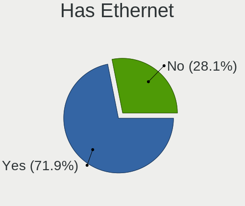
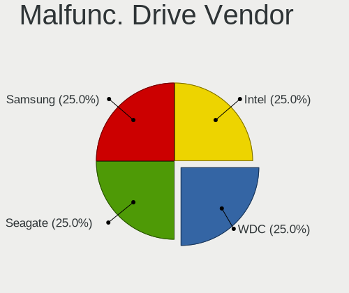
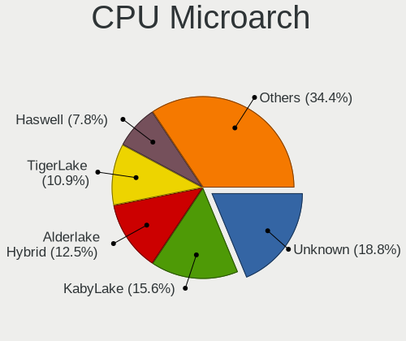

Kubuntu Hardware Trends (Notebooks)
-----------------------------------

A project to identify most popular hardware characteristics and track their change
over time based on data collected by Kubuntu users at https://Linux-Hardware.org.

Anyone can contribute to this report by the [hw-probe](https://github.com/linuxhw/hw-probe) tool:

    sudo -E hw-probe -all -upload

Full-feature report is available here: https://linux-hardware.org/?view=trends&formfactor=notebook

Period: Aug, 2021.

Contents
--------

* [ System ](#system)
  - [ OS                       ](#os)
  - [ OS Family                ](#os-family)
  - [ Kernel                   ](#kernel)
  - [ Kernel Family            ](#kernel-family)
  - [ Kernel Major Ver.        ](#kernel-major-ver)
  - [ Arch                     ](#arch)
  - [ DE                       ](#de)
  - [ Display Server           ](#display-server)
  - [ Display Manager          ](#display-manager)
  - [ OS Lang                  ](#os-lang)
  - [ Boot Mode                ](#boot-mode)
  - [ Filesystem               ](#filesystem)
  - [ Part. scheme             ](#part-scheme)
  - [ Dual Boot with Linux/BSD ](#dual-boot-with-linuxbsd)
  - [ Dual Boot (Win)          ](#dual-boot-win)

* [ Board ](#board)
  - [ Vendor                   ](#vendor)
  - [ Model                    ](#model)
  - [ Model Family             ](#model-family)
  - [ MFG Year                 ](#mfg-year)
  - [ Form Factor              ](#form-factor)
  - [ Secure Boot              ](#secure-boot)
  - [ Coreboot                 ](#coreboot)
  - [ RAM Size                 ](#ram-size)
  - [ RAM Used                 ](#ram-used)
  - [ Total Drives             ](#total-drives)
  - [ Has CD-ROM               ](#has-cd-rom)
  - [ Has Ethernet             ](#has-ethernet)
  - [ Has WiFi                 ](#has-wifi)
  - [ Has Bluetooth            ](#has-bluetooth)

* [ Location ](#location)
  - [ Country                  ](#country)
  - [ City                     ](#city)

* [ Drives ](#drives)
  - [ Drive Vendor             ](#drive-vendor)
  - [ Drive Model              ](#drive-model)
  - [ HDD Vendor               ](#hdd-vendor)
  - [ SSD Vendor               ](#ssd-vendor)
  - [ Drive Kind               ](#drive-kind)
  - [ Drive Connector          ](#drive-connector)
  - [ Drive Size               ](#drive-size)
  - [ Space Total              ](#space-total)
  - [ Space Used               ](#space-used)
  - [ Malfunc. Drives          ](#malfunc-drives)
  - [ Malfunc. Drive Vendor    ](#malfunc-drive-vendor)
  - [ Malfunc. HDD Vendor      ](#malfunc-hdd-vendor)
  - [ Malfunc. Drive Kind      ](#malfunc-drive-kind)
  - [ Failed Drives            ](#failed-drives)
  - [ Failed Drive Vendor      ](#failed-drive-vendor)
  - [ Drive Status             ](#drive-status)

* [ Storage controller ](#storage-controller)
  - [ Storage Vendor           ](#storage-vendor)
  - [ Storage Model            ](#storage-model)
  - [ Storage Kind             ](#storage-kind)

* [ Processor ](#processor)
  - [ CPU Vendor               ](#cpu-vendor)
  - [ CPU Model                ](#cpu-model)
  - [ CPU Model Family         ](#cpu-model-family)
  - [ CPU Cores                ](#cpu-cores)
  - [ CPU Sockets              ](#cpu-sockets)
  - [ CPU Threads              ](#cpu-threads)
  - [ CPU Op-Modes             ](#cpu-op-modes)
  - [ CPU Microcode            ](#cpu-microcode)
  - [ CPU Microarch            ](#cpu-microarch)

* [ Graphics ](#graphics)
  - [ GPU Vendor               ](#gpu-vendor)
  - [ GPU Model                ](#gpu-model)
  - [ GPU Combo                ](#gpu-combo)
  - [ GPU Driver               ](#gpu-driver)
  - [ GPU Memory               ](#gpu-memory)

* [ Monitor ](#monitor)
  - [ Monitor Vendor           ](#monitor-vendor)
  - [ Monitor Model            ](#monitor-model)
  - [ Monitor Resolution       ](#monitor-resolution)
  - [ Monitor Diagonal         ](#monitor-diagonal)
  - [ Monitor Width            ](#monitor-width)
  - [ Aspect Ratio             ](#aspect-ratio)
  - [ Monitor Area             ](#monitor-area)
  - [ Pixel Density            ](#pixel-density)
  - [ Multiple Monitors        ](#multiple-monitors)

* [ Network ](#network)
  - [ Net Controller Vendor    ](#net-controller-vendor)
  - [ Net Controller Model     ](#net-controller-model)
  - [ Wireless Vendor          ](#wireless-vendor)
  - [ Wireless Model           ](#wireless-model)
  - [ Ethernet Vendor          ](#ethernet-vendor)
  - [ Ethernet Model           ](#ethernet-model)
  - [ Net Controller Kind      ](#net-controller-kind)
  - [ Used Controller          ](#used-controller)
  - [ NICs                     ](#nics)
  - [ IPv6                     ](#ipv6)

* [ Bluetooth ](#bluetooth)
  - [ Bluetooth Vendor         ](#bluetooth-vendor)
  - [ Bluetooth Model          ](#bluetooth-model)

* [ Sound ](#sound)
  - [ Sound Vendor             ](#sound-vendor)
  - [ Sound Model              ](#sound-model)

* [ Memory ](#memory)
  - [ Memory Vendor            ](#memory-vendor)
  - [ Memory Model             ](#memory-model)
  - [ Memory Kind              ](#memory-kind)
  - [ Memory Form Factor       ](#memory-form-factor)
  - [ Memory Size              ](#memory-size)
  - [ Memory Speed             ](#memory-speed)

* [ Printers & scanners ](#printers--scanners)
  - [ Printer Vendor           ](#printer-vendor)
  - [ Printer Model            ](#printer-model)
  - [ Scanner Vendor           ](#scanner-vendor)
  - [ Scanner Model            ](#scanner-model)

* [ Camera ](#camera)
  - [ Camera Vendor            ](#camera-vendor)
  - [ Camera Model             ](#camera-model)

* [ Security ](#security)
  - [ Fingerprint Vendor       ](#fingerprint-vendor)
  - [ Fingerprint Model        ](#fingerprint-model)
  - [ Chipcard Vendor          ](#chipcard-vendor)
  - [ Chipcard Model           ](#chipcard-model)

* [ Unsupported ](#unsupported)
  - [ Unsupported Devices      ](#unsupported-devices)
  - [ Unsupported Device Types ](#unsupported-device-types)

System
------

OS
--

Installed operating systems

| Name          | Notebooks | Percent |
|---------------|-----------|---------|
| Kubuntu 21.04 | 26        | 49.06%  |
| Kubuntu 20.04 | 25        | 47.17%  |
| Kubuntu 20.10 | 2         | 3.77%   |

OS Family
---------

OS without a version

| Name    | Notebooks | Percent |
|---------|-----------|---------|
| Kubuntu | 53        | 100%    |

Kernel
------

Version of the Linux kernel

| Version                  | Notebooks | Percent |
|--------------------------|-----------|---------|
| 5.11.0-25-generic        | 17        | 32.08%  |
| 5.8.0-63-generic         | 5         | 9.43%   |
| 5.11.0-31-generic        | 5         | 9.43%   |
| 5.4.0-81-generic         | 4         | 7.55%   |
| 5.11.0-27-generic        | 3         | 5.66%   |
| 5.8.0-59-generic         | 2         | 3.77%   |
| 5.8.0-43-generic         | 2         | 3.77%   |
| 5.4.0-80-generic         | 2         | 3.77%   |
| 5.11.0-16-generic        | 2         | 3.77%   |
| 5.4.0-80-lowlatency      | 1         | 1.89%   |
| 5.4.0-77-generic         | 1         | 1.89%   |
| 5.14.0-051400rc3-generic | 1         | 1.89%   |
| 5.13.7-051307-generic    | 1         | 1.89%   |
| 5.13.6-051306-generic    | 1         | 1.89%   |
| 5.13.1-051301-generic    | 1         | 1.89%   |
| 5.11.17-xanmod1          | 1         | 1.89%   |
| 5.11.0-33-generic        | 1         | 1.89%   |
| 5.11.0-26-generic        | 1         | 1.89%   |
| 5.11.0-25-lowlatency     | 1         | 1.89%   |
| 5.11.0-22-generic        | 1         | 1.89%   |

Kernel Family
-------------

Linux kernel without a distro release

| Version | Notebooks | Percent |
|---------|-----------|---------|
| 5.11.0  | 31        | 58.49%  |
| 5.8.0   | 9         | 16.98%  |
| 5.4.0   | 8         | 15.09%  |
| 5.14.0  | 1         | 1.89%   |
| 5.13.7  | 1         | 1.89%   |
| 5.13.6  | 1         | 1.89%   |
| 5.13.1  | 1         | 1.89%   |
| 5.11.17 | 1         | 1.89%   |

Kernel Major Ver.
-----------------

Linux kernel major version

| Version | Notebooks | Percent |
|---------|-----------|---------|
| 5.11    | 32        | 60.38%  |
| 5.8     | 9         | 16.98%  |
| 5.4     | 8         | 15.09%  |
| 5.13    | 3         | 5.66%   |
| 5.14    | 1         | 1.89%   |

Arch
----

OS architecture (x86_64, i586, etc.)

| Name   | Notebooks | Percent |
|--------|-----------|---------|
| x86_64 | 53        | 100%    |

DE
--

Desktop Environment

| Name   | Notebooks | Percent |
|--------|-----------|---------|
| KDE5   | 29        | 54.72%  |
| KDE    | 23        | 43.4%   |
| Budgie | 1         | 1.89%   |

Display Server
--------------

X11 or Wayland

| Name    | Notebooks | Percent |
|---------|-----------|---------|
| X11     | 51        | 96.23%  |
| Wayland | 2         | 3.77%   |

Display Manager
---------------

SDDM, LightDM, etc.

| Name    | Notebooks | Percent |
|---------|-----------|---------|
| SDDM    | 28        | 52.83%  |
| Unknown | 22        | 41.51%  |
| TDM     | 2         | 3.77%   |
| GDM     | 1         | 1.89%   |

OS Lang
-------

Language

| Lang  | Notebooks | Percent |
|-------|-----------|---------|
| en_US | 21        | 39.62%  |
| en_GB | 6         | 11.32%  |
| fr_FR | 3         | 5.66%   |
| C     | 3         | 5.66%   |
| ru_RU | 2         | 3.77%   |
| pt_BR | 2         | 3.77%   |
| en_IN | 2         | 3.77%   |
| en_AU | 2         | 3.77%   |
| de_DE | 2         | 3.77%   |
| cs_CZ | 2         | 3.77%   |
| zh_CN | 1         | 1.89%   |
| nl_BE | 1         | 1.89%   |
| mn_CN | 1         | 1.89%   |
| fr_CA | 1         | 1.89%   |
| fi_FI | 1         | 1.89%   |
| en_NG | 1         | 1.89%   |
| en_CA | 1         | 1.89%   |
| az_IR | 1         | 1.89%   |

Boot Mode
---------

EFI or BIOS

| Mode | Notebooks | Percent |
|------|-----------|---------|
| EFI  | 32        | 60.38%  |
| BIOS | 21        | 39.62%  |

Filesystem
----------

Type of filesystem

| Type    | Notebooks | Percent |
|---------|-----------|---------|
| Ext4    | 49        | 92.45%  |
| Overlay | 2         | 3.77%   |
| Xfs     | 1         | 1.89%   |
| Btrfs   | 1         | 1.89%   |

Part. scheme
------------

Scheme of partitioning

| Type    | Notebooks | Percent |
|---------|-----------|---------|
| GPT     | 25        | 47.17%  |
| Unknown | 22        | 41.51%  |
| MBR     | 6         | 11.32%  |

Dual Boot with Linux/BSD
------------------------

Hosting more than one Linux/BSD

| Dual boot | Notebooks | Percent |
|-----------|-----------|---------|
| No        | 47        | 88.68%  |
| Yes       | 6         | 11.32%  |

Dual Boot (Win)
---------------

Hosting Linux and Windows

| Dual boot | Notebooks | Percent |
|-----------|-----------|---------|
| No        | 32        | 60.38%  |
| Yes       | 21        | 39.62%  |

Board
-----

Vendor
------

Motherboard manufacturer

| Name                | Notebooks | Percent |
|---------------------|-----------|---------|
| Dell                | 13        | 24.53%  |
| Lenovo              | 10        | 18.87%  |
| Hewlett-Packard     | 10        | 18.87%  |
| ASUSTek Computer    | 9         | 16.98%  |
| TUXEDO              | 2         | 3.77%   |
| Unknown             | 2         | 3.77%   |
| Toshiba             | 1         | 1.89%   |
| Samsung Electronics | 1         | 1.89%   |
| PC Specialist       | 1         | 1.89%   |
| MSI                 | 1         | 1.89%   |
| HUAWEI              | 1         | 1.89%   |
| Google              | 1         | 1.89%   |
| Acer                | 1         | 1.89%   |

Model
-----

Motherboard model

| Name                                     | Notebooks | Percent |
|------------------------------------------|-----------|---------|
| Unknown                                  | 2         | 3.77%   |
| TUXEDO InfinityBook S 14 Gen6            | 1         | 1.89%   |
| TUXEDO InfinityBook Pro 15 v5            | 1         | 1.89%   |
| Toshiba QOSMIO X70-A                     | 1         | 1.89%   |
| Samsung 700Z3A/700Z4A/700Z5A/700Z5B      | 1         | 1.89%   |
| PC Specialist N130BU                     | 1         | 1.89%   |
| MSI GE620/GE620DX/FX620DX/FX623          | 1         | 1.89%   |
| Lenovo ThinkPad X230 2325V1K             | 1         | 1.89%   |
| Lenovo ThinkPad T470 W10DG 20JM000CUS    | 1         | 1.89%   |
| Lenovo ThinkPad T460 20FN002VUS          | 1         | 1.89%   |
| Lenovo ThinkPad E580 20KS0039GE          | 1         | 1.89%   |
| Lenovo ThinkPad E15 Gen 2 20T8000YMB     | 1         | 1.89%   |
| Lenovo ThinkPad E15 20RD003JRT           | 1         | 1.89%   |
| Lenovo Legion 5 15ARH05H 82B1            | 1         | 1.89%   |
| Lenovo IdeaPad U530 Touch 20289          | 1         | 1.89%   |
| Lenovo IdeaPad 330-15IKB 81DE            | 1         | 1.89%   |
| Lenovo G500 20236                        | 1         | 1.89%   |
| HUAWEI HLYL-WXX9                         | 1         | 1.89%   |
| HP Pavilion Laptop 17-ar0xx              | 1         | 1.89%   |
| HP Pavilion Gaming Laptop 15-ec2xxx      | 1         | 1.89%   |
| HP Pavilion g7                           | 1         | 1.89%   |
| HP Pavilion dv7                          | 1         | 1.89%   |
| HP Notebook                              | 1         | 1.89%   |
| HP Laptop 15-ef1xxx                      | 1         | 1.89%   |
| HP ENVY TS m7                            | 1         | 1.89%   |
| HP EliteBook 850 G8 Notebook PC          | 1         | 1.89%   |
| HP EliteBook 840 G5                      | 1         | 1.89%   |
| HP 250 G6 Notebook PC                    | 1         | 1.89%   |
| Google Cyan                              | 1         | 1.89%   |
| Dell XPS 17 9710                         | 1         | 1.89%   |
| Dell XPS 15 9570                         | 1         | 1.89%   |
| Dell Vostro 14 5401                      | 1         | 1.89%   |
| Dell Latitude E6510                      | 1         | 1.89%   |
| Dell Latitude E6400                      | 1         | 1.89%   |
| Dell Latitude E5440                      | 1         | 1.89%   |
| Dell Latitude E5430 vPro                 | 1         | 1.89%   |
| Dell Latitude E4200                      | 1         | 1.89%   |
| Dell Latitude 5420                       | 1         | 1.89%   |
| Dell Inspiron 7577                       | 1         | 1.89%   |
| Dell Inspiron 3442                       | 1         | 1.89%   |
| Dell Inspiron 3185                       | 1         | 1.89%   |
| Dell Inspiron 16 7610                    | 1         | 1.89%   |
| ASUS ZenBook UX434DA_UM433DA             | 1         | 1.89%   |
| ASUS VivoBook_ASUS Laptop E210MA_E210MA  | 1         | 1.89%   |
| ASUS UX21E                               | 1         | 1.89%   |
| ASUS ROG Zephyrus G15 GA503QR_GA503QR    | 1         | 1.89%   |
| ASUS ROG Strix G513QR_G513QR             | 1         | 1.89%   |
| ASUS K72Jr                               | 1         | 1.89%   |
| ASUS G55VW                               | 1         | 1.89%   |
| ASUS FX503VD                             | 1         | 1.89%   |
| ASUS ASUS TUF Gaming F15 FX506HM_FX566HM | 1         | 1.89%   |
| Acer Aspire 7741                         | 1         | 1.89%   |

Model Family
------------

Motherboard model prefix

| Name                 | Notebooks | Percent |
|----------------------|-----------|---------|
| Lenovo ThinkPad      | 6         | 11.32%  |
| Dell Latitude        | 6         | 11.32%  |
| HP Pavilion          | 4         | 7.55%   |
| Dell Inspiron        | 4         | 7.55%   |
| TUXEDO InfinityBook  | 2         | 3.77%   |
| Lenovo IdeaPad       | 2         | 3.77%   |
| HP EliteBook         | 2         | 3.77%   |
| Dell XPS             | 2         | 3.77%   |
| ASUS ROG             | 2         | 3.77%   |
| Unknown              | 2         | 3.77%   |
| Toshiba QOSMIO       | 1         | 1.89%   |
| Samsung 700Z3A       | 1         | 1.89%   |
| PC Specialist N130BU | 1         | 1.89%   |
| MSI GE620            | 1         | 1.89%   |
| Lenovo Legion        | 1         | 1.89%   |
| Lenovo G500          | 1         | 1.89%   |
| HUAWEI HLYL-WXX9     | 1         | 1.89%   |
| HP Notebook          | 1         | 1.89%   |
| HP Laptop            | 1         | 1.89%   |
| HP ENVY              | 1         | 1.89%   |
| HP 250               | 1         | 1.89%   |
| Google Cyan          | 1         | 1.89%   |
| Dell Vostro          | 1         | 1.89%   |
| ASUS ZenBook         | 1         | 1.89%   |
| ASUS VivoBook        | 1         | 1.89%   |
| ASUS UX21E           | 1         | 1.89%   |
| ASUS K72Jr           | 1         | 1.89%   |
| ASUS G55VW           | 1         | 1.89%   |
| ASUS FX503VD         | 1         | 1.89%   |
| ASUS ASUS            | 1         | 1.89%   |
| Acer Aspire          | 1         | 1.89%   |

MFG Year
--------

Motherboard manufacture year

| Year | Notebooks | Percent |
|------|-----------|---------|
| 2021 | 12        | 22.64%  |
| 2020 | 11        | 20.75%  |
| 2018 | 6         | 11.32%  |
| 2013 | 6         | 11.32%  |
| 2012 | 4         | 7.55%   |
| 2019 | 3         | 5.66%   |
| 2017 | 2         | 3.77%   |
| 2014 | 2         | 3.77%   |
| 2011 | 2         | 3.77%   |
| 2010 | 2         | 3.77%   |
| 2009 | 2         | 3.77%   |
| 2016 | 1         | 1.89%   |

Form Factor
-----------

Physical design of the computer

| Name     | Notebooks | Percent |
|----------|-----------|---------|
| Notebook | 53        | 100%    |

Secure Boot
-----------

Enabled or disabled

| State    | Notebooks | Percent |
|----------|-----------|---------|
| Disabled | 49        | 92.45%  |
| Enabled  | 4         | 7.55%   |

Coreboot
--------

Have coreboot on board

| Used | Notebooks | Percent |
|------|-----------|---------|
| No   | 52        | 98.11%  |
| Yes  | 1         | 1.89%   |

RAM Size
--------

Total RAM memory

| Size in GB | Notebooks | Percent |
|------------|-----------|---------|
| 8.01-16.0  | 19        | 35.85%  |
| 4.01-8.0   | 11        | 20.75%  |
| 32.01-64.0 | 8         | 15.09%  |
| 16.01-24.0 | 7         | 13.21%  |
| 3.01-4.0   | 6         | 11.32%  |
| 2.01-3.0   | 1         | 1.89%   |
| 1.01-2.0   | 1         | 1.89%   |

RAM Used
--------

Used RAM memory

| Used GB    | Notebooks | Percent |
|------------|-----------|---------|
| 2.01-3.0   | 18        | 33.96%  |
| 4.01-8.0   | 11        | 20.75%  |
| 1.01-2.0   | 11        | 20.75%  |
| 8.01-16.0  | 6         | 11.32%  |
| 3.01-4.0   | 4         | 7.55%   |
| 16.01-24.0 | 2         | 3.77%   |
| 0.51-1.0   | 1         | 1.89%   |

Total Drives
------------

Number of drives on board

| Drives | Notebooks | Percent |
|--------|-----------|---------|
| 1      | 39        | 73.58%  |
| 2      | 12        | 22.64%  |
| 4      | 1         | 1.89%   |
| 3      | 1         | 1.89%   |

Has CD-ROM
----------

Has CD-ROM on board

| Presented | Notebooks | Percent |
|-----------|-----------|---------|
| No        | 38        | 71.7%   |
| Yes       | 15        | 28.3%   |

Has Ethernet
------------

Has Ethernet on board

| Presented | Notebooks | Percent |
|-----------|-----------|---------|
| Yes       | 41        | 77.36%  |
| No        | 12        | 22.64%  |

Has WiFi
--------

Has WiFi module

| Presented | Notebooks | Percent |
|-----------|-----------|---------|
| Yes       | 52        | 98.11%  |
| No        | 1         | 1.89%   |

Has Bluetooth
-------------

Has Bluetooth module

| Presented | Notebooks | Percent |
|-----------|-----------|---------|
| Yes       | 45        | 84.91%  |
| No        | 8         | 15.09%  |

Location
--------

Country
-------

Geographic location (country)

| Country      | Notebooks | Percent |
|--------------|-----------|---------|
| USA          | 10        | 18.87%  |
| UK           | 5         | 9.43%   |
| Russia       | 3         | 5.66%   |
| Germany      | 3         | 5.66%   |
| France       | 3         | 5.66%   |
| Czechia      | 3         | 5.66%   |
| Canada       | 3         | 5.66%   |
| India        | 2         | 3.77%   |
| Brazil       | 2         | 3.77%   |
| Belgium      | 2         | 3.77%   |
| Australia    | 2         | 3.77%   |
| Yemen        | 1         | 1.89%   |
| Ukraine      | 1         | 1.89%   |
| Spain        | 1         | 1.89%   |
| South Africa | 1         | 1.89%   |
| Poland       | 1         | 1.89%   |
| Nigeria      | 1         | 1.89%   |
| Netherlands  | 1         | 1.89%   |
| Mexico       | 1         | 1.89%   |
| Ireland      | 1         | 1.89%   |
| Iran         | 1         | 1.89%   |
| Hungary      | 1         | 1.89%   |
| Finland      | 1         | 1.89%   |
| Croatia      | 1         | 1.89%   |
| China        | 1         | 1.89%   |
| Armenia      | 1         | 1.89%   |

City
----

Geographic location (city)

| City                 | Notebooks | Percent |
|----------------------|-----------|---------|
| Zagreb               | 1         | 1.89%   |
| Yerevan              | 1         | 1.89%   |
| Wittmund             | 1         | 1.89%   |
| Winnsboro            | 1         | 1.89%   |
| Weinstadt-Endersbach | 1         | 1.89%   |
| Watertown            | 1         | 1.89%   |
| Vincennes            | 1         | 1.89%   |
| Usti nad Orlici      | 1         | 1.89%   |
| Toronto              | 1         | 1.89%   |
| Tehran               | 1         | 1.89%   |
| Sydney               | 1         | 1.89%   |
| St Petersburg        | 1         | 1.89%   |
| Shanghai             | 1         | 1.89%   |
| Sarandi              | 1         | 1.89%   |
| Sandown              | 1         | 1.89%   |
| Rybinsk              | 1         | 1.89%   |
| Prague               | 1         | 1.89%   |
| Pontypridd           | 1         | 1.89%   |
| Paris                | 1         | 1.89%   |
| Ostrava              | 1         | 1.89%   |
| Olonne-sur-Mer       | 1         | 1.89%   |
| Mumbai               | 1         | 1.89%   |
| Mossley              | 1         | 1.89%   |
| Moscow               | 1         | 1.89%   |
| Montreal             | 1         | 1.89%   |
| Memphis              | 1         | 1.89%   |
| Maua                 | 1         | 1.89%   |
| Markuszow            | 1         | 1.89%   |
| Marcus Hook          | 1         | 1.89%   |
| Mansfield            | 1         | 1.89%   |
| Manchester           | 1         | 1.89%   |
| Madrid               | 1         | 1.89%   |
| London               | 1         | 1.89%   |
| Lagos                | 1         | 1.89%   |
| Kyiv                 | 1         | 1.89%   |
| Hyderabad            | 1         | 1.89%   |
| Helsinki             | 1         | 1.89%   |
| Helena               | 1         | 1.89%   |
| Hamilton             | 1         | 1.89%   |
| Hamburg              | 1         | 1.89%   |
| Ghent                | 1         | 1.89%   |
| Ezanville            | 1         | 1.89%   |
| Epping               | 1         | 1.89%   |
| Dallas               | 1         | 1.89%   |
| Calgary              | 1         | 1.89%   |
| Cabo San Lucas       | 1         | 1.89%   |
| Birmingham           | 1         | 1.89%   |
| Bexleyheath          | 1         | 1.89%   |
| Ballina              | 1         | 1.89%   |
| Balatonalmadi        | 1         | 1.89%   |
| Amsterdam            | 1         | 1.89%   |
| Amay                 | 1         | 1.89%   |
| Aden                 | 1         | 1.89%   |

Drives
------

Drive Vendor
------------

Hard drive vendors

| Vendor              | Notebooks | Drives | Percent |
|---------------------|-----------|--------|---------|
| Samsung Electronics | 14        | 15     | 20.59%  |
| Seagate             | 9         | 9      | 13.24%  |
| WDC                 | 7         | 7      | 10.29%  |
| Toshiba             | 6         | 6      | 8.82%   |
| SK Hynix            | 6         | 6      | 8.82%   |
| Unknown             | 5         | 5      | 7.35%   |
| SanDisk             | 5         | 5      | 7.35%   |
| KIOXIA              | 3         | 3      | 4.41%   |
| HGST                | 2         | 2      | 2.94%   |
| A-DATA Technology   | 2         | 2      | 2.94%   |
| Vaseky              | 1         | 1      | 1.47%   |
| Transcend           | 1         | 1      | 1.47%   |
| TO Exter            | 1         | 1      | 1.47%   |
| Lenovo              | 1         | 1      | 1.47%   |
| Kingston            | 1         | 1      | 1.47%   |
| Intel               | 1         | 1      | 1.47%   |
| Hitachi             | 1         | 1      | 1.47%   |
| Crucial             | 1         | 1      | 1.47%   |
| ASMT                | 1         | 1      | 1.47%   |

Drive Model
-----------

Hard drive models

| Model                                     | Notebooks | Percent |
|-------------------------------------------|-----------|---------|
| SK Hynix HFM001TD3JX013N 1TB              | 3         | 4.35%   |
| Seagate ST1000LX015-1U7172 1TB            | 2         | 2.9%    |
| Seagate ST1000LM048-2E7172 1TB            | 2         | 2.9%    |
| Samsung SSD 850 EVO 500GB                 | 2         | 2.9%    |
| WDC WDS240G2G0A-00JH30 240GB SSD          | 1         | 1.45%   |
| WDC WDBNCE2500PNC 250GB SSD               | 1         | 1.45%   |
| WDC WD6400BEVT-00A0RT0 640GB              | 1         | 1.45%   |
| WDC WD5000LPCX-60VHAT0 500GB              | 1         | 1.45%   |
| WDC WD2500BEVT-22A23T0 250GB              | 1         | 1.45%   |
| WDC WD1600BJKT-75F4T0 160GB               | 1         | 1.45%   |
| WDC WD10SPZX-24Z10 1TB                    | 1         | 1.45%   |
| Vaseky V820/512G 512GB SSD                | 1         | 1.45%   |
| Unknown TA2964  64GB                      | 1         | 1.45%   |
| Unknown RZX-19SSD6G/480G 480GB            | 1         | 1.45%   |
| Unknown MMC Card  32GB                    | 1         | 1.45%   |
| Unknown MMC Card  16GB                    | 1         | 1.45%   |
| Unknown EC1S5  64GB                       | 1         | 1.45%   |
| Transcend TS128GMTS430S 128GB SSD         | 1         | 1.45%   |
| Toshiba THNSNH256GMCT 256GB SSD           | 1         | 1.45%   |
| Toshiba MQ04ABF100 1TB                    | 1         | 1.45%   |
| Toshiba MQ04ABD200 2TB                    | 1         | 1.45%   |
| Toshiba MQ01ABD100V 1TB                   | 1         | 1.45%   |
| Toshiba MQ01ABD050 500GB                  | 1         | 1.45%   |
| Toshiba MK7559GSXP 752GB                  | 1         | 1.45%   |
| TO Exter nal USB 3.0 120GB                | 1         | 1.45%   |
| SK Hynix SKHynix_HFS512GD9TNI-L2A0B 512GB | 1         | 1.45%   |
| SK Hynix PC401 NVMe 1TB                   | 1         | 1.45%   |
| SK Hynix BC711 HFM512GD3JX013N 512GB      | 1         | 1.45%   |
| Seagate ST9750420AS 752GB                 | 1         | 1.45%   |
| Seagate ST500LT012-1DG142 500GB           | 1         | 1.45%   |
| Seagate ST500LM030-1RK17D 500GB           | 1         | 1.45%   |
| Seagate ST500LM000-1EJ162 500GB           | 1         | 1.45%   |
| Seagate ST1000LM024 HN-M101MBB 1TB        | 1         | 1.45%   |
| SanDisk SSD U100 128GB                    | 1         | 1.45%   |
| SanDisk SDSSDXPS240G 240GB                | 1         | 1.45%   |
| SanDisk SD8SN8U128G1002 128GB SSD         | 1         | 1.45%   |
| Sandisk NVMe SSD Drive 512GB              | 1         | 1.45%   |
| SanDisk iSSD P4 8GB                       | 1         | 1.45%   |
| Samsung SSD PM800 TM 128GB                | 1         | 1.45%   |
| Samsung SSD 860 QVO 1TB                   | 1         | 1.45%   |
| Samsung SSD 860 EVO M.2 1TB               | 1         | 1.45%   |
| Samsung SSD 850 EVO mSATA 250GB           | 1         | 1.45%   |
| Samsung PM9A1 NVMe 512GB                  | 1         | 1.45%   |
| Samsung PM9A1 NVMe 1024GB                 | 1         | 1.45%   |
| Samsung NVMe SSD Drive 512GB              | 1         | 1.45%   |
| Samsung NVMe SSD Drive 500GB              | 1         | 1.45%   |
| Samsung NVMe SSD Drive 1TB                | 1         | 1.45%   |
| Samsung MZVLW1T0HMLH-00000 1TB            | 1         | 1.45%   |
| Samsung MZVLB512HBJQ-00000 512GB          | 1         | 1.45%   |
| Samsung MZ7TE256HMHP-000L2 256GB SSD      | 1         | 1.45%   |
| Samsung MZ7LN128HAHQ-000L2 128GB SSD      | 1         | 1.45%   |
| Lenovo LENSE20256GMSP34MEAT2TA 256GB      | 1         | 1.45%   |
| KIOXIA KBG40ZNV512G 512GB                 | 1         | 1.45%   |
| KIOXIA KBG40ZNV256G 256GB                 | 1         | 1.45%   |
| KIOXIA KBG40ZNS256G NVMe 256GB            | 1         | 1.45%   |
| Kingston SA1000M8240G 240GB               | 1         | 1.45%   |
| Intel SSDPEKNW010T8 1TB                   | 1         | 1.45%   |
| Hitachi HTS547550A9E384 500GB             | 1         | 1.45%   |
| HGST HTS725050A7E630 500GB                | 1         | 1.45%   |
| HGST HTS541010A9E680 1TB                  | 1         | 1.45%   |

HDD Vendor
----------

Hard disk drive vendors

| Vendor   | Notebooks | Drives | Percent |
|----------|-----------|--------|---------|
| Seagate  | 9         | 9      | 37.5%   |
| WDC      | 5         | 5      | 20.83%  |
| Toshiba  | 5         | 5      | 20.83%  |
| HGST     | 2         | 2      | 8.33%   |
| TO Exter | 1         | 1      | 4.17%   |
| Hitachi  | 1         | 1      | 4.17%   |
| ASMT     | 1         | 1      | 4.17%   |

SSD Vendor
----------

Solid state drive vendors

| Vendor              | Notebooks | Drives | Percent |
|---------------------|-----------|--------|---------|
| Samsung Electronics | 7         | 8      | 35%     |
| SanDisk             | 4         | 4      | 20%     |
| WDC                 | 2         | 2      | 10%     |
| A-DATA Technology   | 2         | 2      | 10%     |
| Vaseky              | 1         | 1      | 5%      |
| Unknown             | 1         | 1      | 5%      |
| Transcend           | 1         | 1      | 5%      |
| Toshiba             | 1         | 1      | 5%      |
| Crucial             | 1         | 1      | 5%      |

Drive Kind
----------

HDD or SSD

| Kind | Notebooks | Drives | Percent |
|------|-----------|--------|---------|
| HDD  | 22        | 24     | 34.92%  |
| NVMe | 20        | 20     | 31.75%  |
| SSD  | 17        | 21     | 26.98%  |
| MMC  | 4         | 4      | 6.35%   |

Drive Connector
---------------

SATA, SAS, NVMe, etc.

| Type | Notebooks | Drives | Percent |
|------|-----------|--------|---------|
| SATA | 33        | 43     | 55.93%  |
| NVMe | 20        | 20     | 33.9%   |
| MMC  | 4         | 4      | 6.78%   |
| SAS  | 2         | 2      | 3.39%   |

Drive Size
----------

Size of hard drive

| Size in TB | Notebooks | Drives | Percent |
|------------|-----------|--------|---------|
| 0.01-0.5   | 24        | 28     | 58.54%  |
| 0.51-1.0   | 15        | 15     | 36.59%  |
| 1.01-2.0   | 2         | 2      | 4.88%   |

Space Total
-----------

Amount of disk space available on the file system

| Size in GB     | Notebooks | Percent |
|----------------|-----------|---------|
| 101-250        | 16        | 30.19%  |
| 501-1000       | 14        | 26.42%  |
| 251-500        | 13        | 24.53%  |
| 1-20           | 3         | 5.66%   |
| 51-100         | 3         | 5.66%   |
| 2001-3000      | 2         | 3.77%   |
| More than 3000 | 1         | 1.89%   |
| 1001-2000      | 1         | 1.89%   |

Space Used
----------

Amount of used disk space

| Used GB        | Notebooks | Percent |
|----------------|-----------|---------|
| 101-250        | 16        | 30.19%  |
| 1-20           | 14        | 26.42%  |
| 21-50          | 7         | 13.21%  |
| 51-100         | 6         | 11.32%  |
| 251-500        | 5         | 9.43%   |
| 501-1000       | 3         | 5.66%   |
| More than 3000 | 1         | 1.89%   |
| 1001-2000      | 1         | 1.89%   |

Malfunc. Drives
---------------

Drive models with a malfunction

| Model                              | Notebooks | Drives | Percent |
|------------------------------------|-----------|--------|---------|
| WDC WD6400BEVT-00A0RT0 640GB       | 1         | 1      | 20%     |
| WDC WD1600BJKT-75F4T0 160GB        | 1         | 1      | 20%     |
| Seagate ST500LM000-1EJ162 500GB    | 1         | 1      | 20%     |
| Seagate ST1000LM048-2E7172 1TB     | 1         | 1      | 20%     |
| Seagate ST1000LM024 HN-M101MBB 1TB | 1         | 1      | 20%     |

Malfunc. Drive Vendor
---------------------

Vendors of faulty drives

| Vendor  | Notebooks | Drives | Percent |
|---------|-----------|--------|---------|
| Seagate | 3         | 3      | 60%     |
| WDC     | 2         | 2      | 40%     |

Malfunc. HDD Vendor
-------------------

Vendors of faulty HDD drives

| Vendor  | Notebooks | Drives | Percent |
|---------|-----------|--------|---------|
| Seagate | 3         | 3      | 60%     |
| WDC     | 2         | 2      | 40%     |

Malfunc. Drive Kind
-------------------

Kinds of faulty drives

| Kind | Notebooks | Drives | Percent |
|------|-----------|--------|---------|
| HDD  | 5         | 5      | 100%    |

Failed Drives
-------------

Failed drive models

Zero info for selected period =(

Failed Drive Vendor
-------------------

Failed drive vendors

Zero info for selected period =(

Drive Status
------------

Number of failed and malfunc. drives

| Status   | Notebooks | Drives | Percent |
|----------|-----------|--------|---------|
| Works    | 27        | 32     | 49.09%  |
| Detected | 23        | 32     | 41.82%  |
| Malfunc  | 5         | 5      | 9.09%   |

Storage controller
------------------

Storage Vendor
--------------

Storage controller vendors

| Vendor                      | Notebooks | Percent |
|-----------------------------|-----------|---------|
| Intel                       | 35        | 56.45%  |
| AMD                         | 8         | 12.9%   |
| Samsung Electronics         | 7         | 11.29%  |
| SK Hynix                    | 6         | 9.68%   |
| KIOXIA                      | 3         | 4.84%   |
| Sandisk                     | 1         | 1.61%   |
| Lenovo                      | 1         | 1.61%   |
| Kingston Technology Company | 1         | 1.61%   |

Storage Model
-------------

Storage controller models

| Model                                                                          | Notebooks | Percent |
|--------------------------------------------------------------------------------|-----------|---------|
| AMD FCH SATA Controller [AHCI mode]                                            | 8         | 12.7%   |
| Intel Sunrise Point-LP SATA Controller [AHCI mode]                             | 5         | 7.94%   |
| Intel 82801 Mobile SATA Controller [RAID mode]                                 | 5         | 7.94%   |
| SK Hynix NVMe SSD Controller                                                   | 4         | 6.35%   |
| Samsung NVMe SSD Controller SM981/PM981/PM983                                  | 3         | 4.76%   |
| KIOXIA Non-Volatile memory controller                                          | 3         | 4.76%   |
| Intel Volume Management Device NVMe RAID Controller                            | 3         | 4.76%   |
| Intel 8 Series SATA Controller 1 [AHCI mode]                                   | 3         | 4.76%   |
| Intel 6 Series/C200 Series Chipset Family 6 port Mobile SATA AHCI Controller   | 3         | 4.76%   |
| Samsung NVMe SSD Controller PM9A1/PM9A3/980PRO                                 | 2         | 3.17%   |
| Intel Comet Lake SATA AHCI Controller                                          | 2         | 3.17%   |
| Intel Celeron/Pentium Silver Processor SATA Controller                         | 2         | 3.17%   |
| Intel 82801IBM/IEM (ICH9M/ICH9M-E) 4 port SATA Controller [AHCI mode]          | 2         | 3.17%   |
| Intel 8 Series/C220 Series Chipset Family 6-port SATA Controller 1 [AHCI mode] | 2         | 3.17%   |
| Intel 7 Series Chipset Family 6-port SATA Controller [AHCI mode]               | 2         | 3.17%   |
| Intel 5 Series/3400 Series Chipset 4 port SATA AHCI Controller                 | 2         | 3.17%   |
| SK Hynix PC401 NVMe Solid State Drive 256GB                                    | 1         | 1.59%   |
| SK Hynix Non-Volatile memory controller                                        | 1         | 1.59%   |
| Sandisk PC SN520 NVMe SSD                                                      | 1         | 1.59%   |
| Samsung NVMe SSD Controller SM961/PM961/SM963                                  | 1         | 1.59%   |
| Samsung NVMe Controller                                                        | 1         | 1.59%   |
| Lenovo Non-Volatile memory controller                                          | 1         | 1.59%   |
| Kingston Company U-SNS8154P3 NVMe SSD                                          | 1         | 1.59%   |
| Intel SSD 660P Series                                                          | 1         | 1.59%   |
| Intel HM170/QM170 Chipset SATA Controller [AHCI Mode]                          | 1         | 1.59%   |
| Intel Cannon Lake Mobile PCH SATA AHCI Controller                              | 1         | 1.59%   |
| Intel 7 Series Chipset Family 4-port SATA Controller [IDE mode]                | 1         | 1.59%   |
| Intel 7 Series Chipset Family 2-port SATA Controller [IDE mode]                | 1         | 1.59%   |

Storage Kind
------------

Kind of storage controller (IDE, SATA, NVMe, SAS, ...)

| Kind | Notebooks | Percent |
|------|-----------|---------|
| SATA | 33        | 53.23%  |
| NVMe | 20        | 32.26%  |
| RAID | 8         | 12.9%   |
| IDE  | 1         | 1.61%   |

Processor
---------

CPU Vendor
----------

Processor vendors

| Vendor | Notebooks | Percent |
|--------|-----------|---------|
| Intel  | 40        | 75.47%  |
| AMD    | 13        | 24.53%  |

CPU Model
---------

Processor models

| Model                                           | Notebooks | Percent |
|-------------------------------------------------|-----------|---------|
| Intel Core i7-4700MQ CPU @ 2.40GHz              | 2         | 3.77%   |
| Intel Core i5-3320M CPU @ 2.60GHz               | 2         | 3.77%   |
| Intel 11th Gen Core i7-11800H @ 2.30GHz         | 2         | 3.77%   |
| Intel Genuine CPU U4100 @ 1.30GHz               | 1         | 1.89%   |
| Intel Core i9-8950HK CPU @ 2.90GHz              | 1         | 1.89%   |
| Intel Core i7-8650U CPU @ 1.90GHz               | 1         | 1.89%   |
| Intel Core i7-8550U CPU @ 1.80GHz               | 1         | 1.89%   |
| Intel Core i7-7700HQ CPU @ 2.80GHz              | 1         | 1.89%   |
| Intel Core i7-7500U CPU @ 2.70GHz               | 1         | 1.89%   |
| Intel Core i7-6600U CPU @ 2.60GHz               | 1         | 1.89%   |
| Intel Core i7-4600U CPU @ 2.10GHz               | 1         | 1.89%   |
| Intel Core i7-4500U CPU @ 1.80GHz               | 1         | 1.89%   |
| Intel Core i7-3610QM CPU @ 2.30GHz              | 1         | 1.89%   |
| Intel Core i7-2677M CPU @ 1.80GHz               | 1         | 1.89%   |
| Intel Core i7-2670QM CPU @ 2.20GHz              | 1         | 1.89%   |
| Intel Core i7-10510U CPU @ 1.80GHz              | 1         | 1.89%   |
| Intel Core i5-8250U CPU @ 1.60GHz               | 1         | 1.89%   |
| Intel Core i5-7300HQ CPU @ 2.50GHz              | 1         | 1.89%   |
| Intel Core i5-6200U CPU @ 2.30GHz               | 1         | 1.89%   |
| Intel Core i5-4210U CPU @ 1.70GHz               | 1         | 1.89%   |
| Intel Core i5-2450M CPU @ 2.50GHz               | 1         | 1.89%   |
| Intel Core i5-1035G1 CPU @ 1.00GHz              | 1         | 1.89%   |
| Intel Core i5-10210U CPU @ 1.60GHz              | 1         | 1.89%   |
| Intel Core i5 CPU M 560 @ 2.67GHz               | 1         | 1.89%   |
| Intel Core i5 CPU M 480 @ 2.67GHz               | 1         | 1.89%   |
| Intel Core i3-3110M CPU @ 2.40GHz               | 1         | 1.89%   |
| Intel Core i3 CPU M 350 @ 2.27GHz               | 1         | 1.89%   |
| Intel Core 2 Duo CPU U9600 @ 1.60GHz            | 1         | 1.89%   |
| Intel Core 2 Duo CPU T7500 @ 2.20GHz            | 1         | 1.89%   |
| Intel Core 2 Duo CPU P8700 @ 2.53GHz            | 1         | 1.89%   |
| Intel Celeron N4020 CPU @ 1.10GHz               | 1         | 1.89%   |
| Intel Celeron N4000 CPU @ 1.10GHz               | 1         | 1.89%   |
| Intel Celeron CPU N3060 @ 1.60GHz               | 1         | 1.89%   |
| Intel 11th Gen Core i9-11900H @ 2.50GHz         | 1         | 1.89%   |
| Intel 11th Gen Core i7-1185G7 @ 3.00GHz         | 1         | 1.89%   |
| Intel 11th Gen Core i7-1165G7 @ 2.80GHz         | 1         | 1.89%   |
| Intel 11th Gen Core i5-1135G7 @ 2.40GHz         | 1         | 1.89%   |
| AMD Ryzen 9 5900HX with Radeon Graphics         | 1         | 1.89%   |
| AMD Ryzen 9 5900HS with Radeon Graphics         | 1         | 1.89%   |
| AMD Ryzen 7 4800H with Radeon Graphics          | 1         | 1.89%   |
| AMD Ryzen 7 4700U with Radeon Graphics          | 1         | 1.89%   |
| AMD Ryzen 7 3700U with Radeon Vega Mobile Gfx   | 1         | 1.89%   |
| AMD Ryzen 7 2700U with Radeon Vega Mobile Gfx   | 1         | 1.89%   |
| AMD Ryzen 5 5600H with Radeon Graphics          | 1         | 1.89%   |
| AMD Ryzen 5 4600H with Radeon Graphics          | 1         | 1.89%   |
| AMD Ryzen 5 4500U with Radeon Graphics          | 1         | 1.89%   |
| AMD A9-9420e RADEON R5, 5 COMPUTE CORES 2C+3G   | 1         | 1.89%   |
| AMD A8-7410 APU with AMD Radeon R5 Graphics     | 1         | 1.89%   |
| AMD A6-3420M APU with Radeon HD Graphics        | 1         | 1.89%   |
| AMD A10-9620P RADEON R5, 10 COMPUTE CORES 4C+6G | 1         | 1.89%   |

CPU Model Family
----------------

Processor model prefix

| Model            | Notebooks | Percent |
|------------------|-----------|---------|
| Intel Core i7    | 13        | 24.53%  |
| Intel Core i5    | 11        | 20.75%  |
| Other            | 7         | 13.21%  |
| AMD Ryzen 7      | 4         | 7.55%   |
| Intel Core 2 Duo | 3         | 5.66%   |
| Intel Celeron    | 3         | 5.66%   |
| AMD Ryzen 5      | 3         | 5.66%   |
| Intel Core i3    | 2         | 3.77%   |
| AMD Ryzen 9      | 2         | 3.77%   |
| Intel Genuine    | 1         | 1.89%   |
| Intel Core i9    | 1         | 1.89%   |
| AMD A8           | 1         | 1.89%   |
| AMD A6           | 1         | 1.89%   |
| AMD A10          | 1         | 1.89%   |

CPU Cores
---------

Number of processor cores

| Number | Notebooks | Percent |
|--------|-----------|---------|
| 2      | 23        | 43.4%   |
| 4      | 19        | 35.85%  |
| 8      | 7         | 13.21%  |
| 6      | 4         | 7.55%   |

CPU Sockets
-----------

Number of sockets

| Number | Notebooks | Percent |
|--------|-----------|---------|
| 1      | 53        | 100%    |

CPU Threads
-----------

Threads per core (Hyper-Threading)

| Number | Notebooks | Percent |
|--------|-----------|---------|
| 2      | 40        | 75.47%  |
| 1      | 13        | 24.53%  |

CPU Op-Modes
------------

CPU Operation Modes (32-bit, 64-bit)

| Op mode        | Notebooks | Percent |
|----------------|-----------|---------|
| 32-bit, 64-bit | 53        | 100%    |

CPU Microcode
-------------

Microcode number

| Number     | Notebooks | Percent |
|------------|-----------|---------|
| Unknown    | 15        | 28.3%   |
| 0x806d1    | 3         | 5.66%   |
| 0x306a9    | 3         | 5.66%   |
| 0x206a7    | 3         | 5.66%   |
| 0x906e9    | 2         | 3.77%   |
| 0x806ec    | 2         | 3.77%   |
| 0x806ea    | 2         | 3.77%   |
| 0x40651    | 2         | 3.77%   |
| 0x1067a    | 2         | 3.77%   |
| 0x0a50000c | 2         | 3.77%   |
| 0x08600104 | 2         | 3.77%   |
| 0x906ea    | 1         | 1.89%   |
| 0x806e9    | 1         | 1.89%   |
| 0x806c1    | 1         | 1.89%   |
| 0x706e5    | 1         | 1.89%   |
| 0x706a8    | 1         | 1.89%   |
| 0x406e3    | 1         | 1.89%   |
| 0x306c3    | 1         | 1.89%   |
| 0x20655    | 1         | 1.89%   |
| 0x0a50000b | 1         | 1.89%   |
| 0x08600106 | 1         | 1.89%   |
| 0x08108109 | 1         | 1.89%   |
| 0x08101016 | 1         | 1.89%   |
| 0x07030105 | 1         | 1.89%   |
| 0x06006118 | 1         | 1.89%   |
| 0x03000027 | 1         | 1.89%   |

CPU Microarch
-------------

Microarchitecture

| Name          | Notebooks | Percent |
|---------------|-----------|---------|
| KabyLake      | 9         | 16.98%  |
| Haswell       | 5         | 9.43%   |
| Zen 2         | 4         | 7.55%   |
| IvyBridge     | 4         | 7.55%   |
| Icelake       | 4         | 7.55%   |
| Zen 3         | 3         | 5.66%   |
| Westmere      | 3         | 5.66%   |
| TigerLake     | 3         | 5.66%   |
| SandyBridge   | 3         | 5.66%   |
| Penryn        | 3         | 5.66%   |
| Skylake       | 2         | 3.77%   |
| Goldmont plus | 2         | 3.77%   |
| Excavator     | 2         | 3.77%   |
| Zen+          | 1         | 1.89%   |
| Zen           | 1         | 1.89%   |
| Silvermont    | 1         | 1.89%   |
| Puma          | 1         | 1.89%   |
| K10 Llano     | 1         | 1.89%   |
| Core          | 1         | 1.89%   |

Graphics
--------

GPU Vendor
----------

Vendors of graphics cards

| Vendor | Notebooks | Percent |
|--------|-----------|---------|
| Intel  | 36        | 50.7%   |
| AMD    | 20        | 28.17%  |
| Nvidia | 15        | 21.13%  |

GPU Model
---------

Graphics card models

| Model                                                                                    | Notebooks | Percent |
|------------------------------------------------------------------------------------------|-----------|---------|
| AMD Renoir                                                                               | 4         | 5.56%   |
| Nvidia GA106M [GeForce RTX 3060 Mobile / Max-Q]                                          | 3         | 4.17%   |
| Intel UHD Graphics 620                                                                   | 3         | 4.17%   |
| Intel TigerLake-LP GT2 [Iris Xe Graphics]                                                | 3         | 4.17%   |
| Intel TigerLake-H GT1 [UHD Graphics]                                                     | 3         | 4.17%   |
| Intel Mobile 4 Series Chipset Integrated Graphics Controller                             | 3         | 4.17%   |
| Intel Haswell-ULT Integrated Graphics Controller                                         | 3         | 4.17%   |
| Intel 3rd Gen Core processor Graphics Controller                                         | 3         | 4.17%   |
| Intel 2nd Generation Core Processor Family Integrated Graphics Controller                | 3         | 4.17%   |
| AMD Cezanne                                                                              | 3         | 4.17%   |
| Nvidia GP107M [GeForce GTX 1050 Mobile]                                                  | 2         | 2.78%   |
| Nvidia GF117M [GeForce 610M/710M/810M/820M / GT 620M/625M/630M/720M]                     | 2         | 2.78%   |
| Intel Skylake GT2 [HD Graphics 520]                                                      | 2         | 2.78%   |
| Intel HD Graphics 630                                                                    | 2         | 2.78%   |
| Intel GeminiLake [UHD Graphics 600]                                                      | 2         | 2.78%   |
| Intel CometLake-U GT2 [UHD Graphics]                                                     | 2         | 2.78%   |
| Intel 4th Gen Core Processor Integrated Graphics Controller                              | 2         | 2.78%   |
| AMD Seymour [Radeon HD 6400M/7400M Series]                                               | 2         | 2.78%   |
| Nvidia TU117M                                                                            | 1         | 1.39%   |
| Nvidia TU106M [GeForce RTX 2060 Mobile]                                                  | 1         | 1.39%   |
| Nvidia GP107M [GeForce GTX 1050 Ti Mobile]                                               | 1         | 1.39%   |
| Nvidia GP107 [GeForce GTX 1050 Ti]                                                       | 1         | 1.39%   |
| Nvidia GK107M [GeForce GTX 660M]                                                         | 1         | 1.39%   |
| Nvidia GK106M [GeForce GTX 770M]                                                         | 1         | 1.39%   |
| Nvidia GF116M [GeForce GT 555M/635M]                                                     | 1         | 1.39%   |
| Nvidia GA104M [GeForce RTX 3070 Mobile / Max-Q]                                          | 1         | 1.39%   |
| Intel Iris Plus Graphics G1 (Ice Lake)                                                   | 1         | 1.39%   |
| Intel HD Graphics 620                                                                    | 1         | 1.39%   |
| Intel Core Processor Integrated Graphics Controller                                      | 1         | 1.39%   |
| Intel CoffeeLake-H GT2 [UHD Graphics 630]                                                | 1         | 1.39%   |
| Intel Atom/Celeron/Pentium Processor x5-E8000/J3xxx/N3xxx Integrated Graphics Controller | 1         | 1.39%   |
| AMD Wani [Radeon R5/R6/R7 Graphics]                                                      | 1         | 1.39%   |
| AMD Topaz XT [Radeon R7 M260/M265 / M340/M360 / M440/M445 / 530/535 / 620/625 Mobile]    | 1         | 1.39%   |
| AMD Sumo [Radeon HD 6520G]                                                               | 1         | 1.39%   |
| AMD Stoney [Radeon R2/R3/R4/R5 Graphics]                                                 | 1         | 1.39%   |
| AMD RV710/M92 [Mobility Radeon HD 4530/4570/545v]                                        | 1         | 1.39%   |
| AMD Raven Ridge [Radeon Vega Series / Radeon Vega Mobile Series]                         | 1         | 1.39%   |
| AMD Picasso                                                                              | 1         | 1.39%   |
| AMD Park [Mobility Radeon HD 5430/5450/5470]                                             | 1         | 1.39%   |
| AMD Mullins [Radeon R4/R5 Graphics]                                                      | 1         | 1.39%   |
| AMD Mars [Radeon HD 8670A/8670M/8750M / R7 M370]                                         | 1         | 1.39%   |
| AMD Madison [Mobility Radeon HD 5650/5750 / 6530M/6550M]                                 | 1         | 1.39%   |
| AMD Lexa PRO [Radeon 540/540X/550/550X / RX 540X/550/550X]                               | 1         | 1.39%   |

GPU Combo
---------

Combinations of graphics cards

| Name           | Notebooks | Percent |
|----------------|-----------|---------|
| 1 x Intel      | 21        | 39.62%  |
| 1 x AMD        | 12        | 22.64%  |
| Intel + Nvidia | 11        | 20.75%  |
| Intel + AMD    | 4         | 7.55%   |
| AMD + Nvidia   | 3         | 5.66%   |
| 2 x AMD        | 1         | 1.89%   |
| 1 x Nvidia     | 1         | 1.89%   |

GPU Driver
----------

Free vs proprietary

| Driver      | Notebooks | Percent |
|-------------|-----------|---------|
| Free        | 45        | 84.91%  |
| Proprietary | 8         | 15.09%  |

GPU Memory
----------

Total video memory

| Size in GB | Notebooks | Percent |
|------------|-----------|---------|
| Unknown    | 30        | 56.6%   |
| 0.01-0.5   | 7         | 13.21%  |
| 1.01-2.0   | 6         | 11.32%  |
| 3.01-4.0   | 5         | 9.43%   |
| 5.01-6.0   | 2         | 3.77%   |
| 0.51-1.0   | 2         | 3.77%   |
| 2.01-3.0   | 1         | 1.89%   |

Monitor
-------

Monitor Vendor
--------------

Monitor vendors

| Vendor              | Notebooks | Percent |
|---------------------|-----------|---------|
| AU Optronics        | 15        | 25%     |
| BOE                 | 11        | 18.33%  |
| Samsung Electronics | 8         | 13.33%  |
| LG Display          | 5         | 8.33%   |
| Chimei Innolux      | 5         | 8.33%   |
| Sharp               | 2         | 3.33%   |
| Goldstar            | 2         | 3.33%   |
| Dell                | 2         | 3.33%   |
| Acer                | 2         | 3.33%   |
| Vizio               | 1         | 1.67%   |
| Unknown (AAA)       | 1         | 1.67%   |
| Philips             | 1         | 1.67%   |
| Lenovo              | 1         | 1.67%   |
| KTC                 | 1         | 1.67%   |
| InfoVision          | 1         | 1.67%   |
| Hewlett-Packard     | 1         | 1.67%   |
| CPT                 | 1         | 1.67%   |

Monitor Model
-------------

Monitor models

| Model                                                                 | Notebooks | Percent |
|-----------------------------------------------------------------------|-----------|---------|
| Samsung Electronics LCD Monitor SEC5441 1366x768 344x194mm 15.5-inch  | 3         | 5%      |
| Vizio E40-D0 VIZ2001 1920x1080 885x498mm 40.0-inch                    | 1         | 1.67%   |
| Unknown (AAA) LCDTV AAA3393 1360x768 890x500mm 40.2-inch              | 1         | 1.67%   |
| Sharp LCD Monitor SHP1517 3840x2400 366x229mm 17.0-inch               | 1         | 1.67%   |
| Sharp LCD Monitor SHP148D 3840x2160 344x194mm 15.5-inch               | 1         | 1.67%   |
| Samsung Electronics SyncMaster SAM0591 1920x1080 477x268mm 21.5-inch  | 1         | 1.67%   |
| Samsung Electronics LCD Monitor SEC3651 1366x768 344x194mm 15.5-inch  | 1         | 1.67%   |
| Samsung Electronics LCD Monitor SEC314C 1920x1080 344x194mm 15.5-inch | 1         | 1.67%   |
| Samsung Electronics LCD Monitor SDC5441 1366x768 340x190mm 15.3-inch  | 1         | 1.67%   |
| Samsung Electronics LCD Monitor SAM0A7C 1920x1080 700x390mm 31.5-inch | 1         | 1.67%   |
| Philips PHL 246E8FJ PHLC174 2560x1440 526x296mm 23.8-inch             | 1         | 1.67%   |
| LG Display LCD Monitor LGD056D 1920x1080 380x210mm 17.1-inch          | 1         | 1.67%   |
| LG Display LCD Monitor LGD053F 1920x1080 344x194mm 15.5-inch          | 1         | 1.67%   |
| LG Display LCD Monitor LGD03FB 1920x1080 382x215mm 17.3-inch          | 1         | 1.67%   |
| LG Display LCD Monitor LGD033A 1366x768 340x190mm 15.3-inch           | 1         | 1.67%   |
| LG Display LCD Monitor LGD024B 1366x768 344x194mm 15.5-inch           | 1         | 1.67%   |
| Lenovo LCD Monitor LEN40BA 1920x1080 344x194mm 15.5-inch              | 1         | 1.67%   |
| KTC 32T55-H-CS KTC3200 1360x768 698x392mm 31.5-inch                   | 1         | 1.67%   |
| InfoVision LCD Monitor IVO057F 1920x1080 309x174mm 14.0-inch          | 1         | 1.67%   |
| Hewlett-Packard LV1911 HWP3005 1366x768 410x230mm 18.5-inch           | 1         | 1.67%   |
| Goldstar FULL HD GSM5B55 1920x1080 480x270mm 21.7-inch                | 1         | 1.67%   |
| Goldstar 22MP55 GSM5A24 1680x1050 480x270mm 21.7-inch                 | 1         | 1.67%   |
| Dell U2515H DELD070 2560x1440 553x311mm 25.0-inch                     | 1         | 1.67%   |
| Dell U2412M DELA07B 1920x1200 518x324mm 24.1-inch                     | 1         | 1.67%   |
| CPT P116NWR1 R2 COR0489 1366x768 256x144mm 11.6-inch                  | 1         | 1.67%   |
| Chimei Innolux LCD Monitor CMN15E7 1920x1080 344x193mm 15.5-inch      | 1         | 1.67%   |
| Chimei Innolux LCD Monitor CMN15D7 1920x1080 344x193mm 15.5-inch      | 1         | 1.67%   |
| Chimei Innolux LCD Monitor CMN152A 2560x1440 344x193mm 15.5-inch      | 1         | 1.67%   |
| Chimei Innolux LCD Monitor CMN1521 1920x1080 344x193mm 15.5-inch      | 1         | 1.67%   |
| Chimei Innolux LCD Monitor CMN1487 1366x768 310x170mm 13.9-inch       | 1         | 1.67%   |
| BOE LCD Monitor BOE0973 2560x1440 344x194mm 15.5-inch                 | 1         | 1.67%   |
| BOE LCD Monitor BOE091D 1920x1080 309x174mm 14.0-inch                 | 1         | 1.67%   |
| BOE LCD Monitor BOE08A8 1920x1080 344x194mm 15.5-inch                 | 1         | 1.67%   |
| BOE LCD Monitor BOE0878 1920x1080 355x200mm 16.0-inch                 | 1         | 1.67%   |
| BOE LCD Monitor BOE07F1 1920x1080 344x193mm 15.5-inch                 | 1         | 1.67%   |
| BOE LCD Monitor BOE07E9 1920x1080 309x174mm 14.0-inch                 | 1         | 1.67%   |
| BOE LCD Monitor BOE07A3 1920x1080 344x193mm 15.5-inch                 | 1         | 1.67%   |
| BOE LCD Monitor BOE0791 1920x1080 309x173mm 13.9-inch                 | 1         | 1.67%   |
| BOE LCD Monitor BOE0741 1366x768 256x144mm 11.6-inch                  | 1         | 1.67%   |
| BOE LCD Monitor BOE06BD 1366x768 309x173mm 13.9-inch                  | 1         | 1.67%   |
| BOE LCD Monitor BOE06A5 1366x768 344x194mm 15.5-inch                  | 1         | 1.67%   |
| AU Optronics LCD Monitor AUOB78D 1920x1080 344x193mm 15.5-inch        | 1         | 1.67%   |
| AU Optronics LCD Monitor AUO9F91 3072x1920 344x215mm 16.0-inch        | 1         | 1.67%   |
| AU Optronics LCD Monitor AUO623D 1920x1080 309x174mm 14.0-inch        | 1         | 1.67%   |
| AU Optronics LCD Monitor AUO61ED 1920x1080 340x190mm 15.3-inch        | 1         | 1.67%   |
| AU Optronics LCD Monitor AUO453D 1920x1080 309x174mm 14.0-inch        | 1         | 1.67%   |
| AU Optronics LCD Monitor AUO34ED 1920x1080 340x190mm 15.3-inch        | 1         | 1.67%   |
| AU Optronics LCD Monitor AUO2E8D 1920x1080 344x194mm 15.5-inch        | 1         | 1.67%   |
| AU Optronics LCD Monitor AUO2992 1920x1080 344x193mm 15.5-inch        | 1         | 1.67%   |
| AU Optronics LCD Monitor AUO20EC 1366x768 344x193mm 15.5-inch         | 1         | 1.67%   |
| AU Optronics LCD Monitor AUO209D 1920x1080 380x210mm 17.1-inch        | 1         | 1.67%   |
| AU Optronics LCD Monitor AUO202C 1366x768 293x164mm 13.2-inch         | 1         | 1.67%   |
| AU Optronics LCD Monitor AUO139E 1600x900 382x214mm 17.2-inch         | 1         | 1.67%   |
| AU Optronics LCD Monitor AUO133D 1920x1080 309x173mm 13.9-inch        | 1         | 1.67%   |
| AU Optronics LCD Monitor AUO106C 1366x768 277x156mm 12.5-inch         | 1         | 1.67%   |
| AU Optronics LCD Monitor AUO105C 1366x768 256x144mm 11.6-inch         | 1         | 1.67%   |
| Acer R240HY ACR046F 1920x1080 530x300mm 24.0-inch                     | 1         | 1.67%   |
| Acer KA270H ACR0522 1920x1080 598x336mm 27.0-inch                     | 1         | 1.67%   |

Monitor Resolution
------------------

Monitor screen resolution

| Resolution        | Notebooks | Percent |
|-------------------|-----------|---------|
| 1920x1080 (FHD)   | 29        | 50.88%  |
| 1366x768 (WXGA)   | 17        | 29.82%  |
| 2560x1440 (QHD)   | 5         | 8.77%   |
| 3840x2160 (4K)    | 2         | 3.51%   |
| 3840x2400         | 1         | 1.75%   |
| 3072x1920         | 1         | 1.75%   |
| 1920x1200 (WUXGA) | 1         | 1.75%   |
| 1600x900 (HD+)    | 1         | 1.75%   |

Monitor Diagonal
----------------

Diagonal size in inches

| Inches | Notebooks | Percent |
|--------|-----------|---------|
| 15     | 26        | 43.33%  |
| 14     | 6         | 10%     |
| 17     | 5         | 8.33%   |
| 13     | 4         | 6.67%   |
| 21     | 3         | 5%      |
| 11     | 3         | 5%      |
| 40     | 2         | 3.33%   |
| 24     | 2         | 3.33%   |
| 16     | 2         | 3.33%   |
| 32     | 1         | 1.67%   |
| 31     | 1         | 1.67%   |
| 27     | 1         | 1.67%   |
| 25     | 1         | 1.67%   |
| 23     | 1         | 1.67%   |
| 18     | 1         | 1.67%   |
| 12     | 1         | 1.67%   |

Monitor Width
-------------

Physical width

| Width in mm | Notebooks | Percent |
|-------------|-----------|---------|
| 301-350     | 32        | 53.33%  |
| 351-400     | 10        | 16.67%  |
| 501-600     | 5         | 8.33%   |
| 201-300     | 5         | 8.33%   |
| 401-500     | 4         | 6.67%   |
| 801-900     | 2         | 3.33%   |
| 701-800     | 1         | 1.67%   |
| 601-700     | 1         | 1.67%   |

Aspect Ratio
------------

Proportional relationship between the width and the height

| Ratio | Notebooks | Percent |
|-------|-----------|---------|
| 16/9  | 46        | 93.88%  |
| 16/10 | 3         | 6.12%   |

Monitor Area
------------

Area in inch

| Area in inch | Notebooks | Percent |
|----------------|-----------|---------|
| 101-110        | 27        | 45%     |
| 81-90          | 9         | 15%     |
| 121-130        | 5         | 8.33%   |
| 201-250        | 4         | 6.67%   |
| 51-60          | 3         | 5%      |
| 351-500        | 2         | 3.33%   |
| 251-300        | 2         | 3.33%   |
| 501-1000       | 2         | 3.33%   |
| 71-80          | 1         | 1.67%   |
| 61-70          | 1         | 1.67%   |
| 301-350        | 1         | 1.67%   |
| 151-200        | 1         | 1.67%   |
| 141-150        | 1         | 1.67%   |
| 111-120        | 1         | 1.67%   |

Pixel Density
-------------

Pixels per inch

| Density       | Notebooks | Percent |
|---------------|-----------|---------|
| 121-160       | 28        | 48.28%  |
| 101-120       | 13        | 22.41%  |
| 51-100        | 10        | 17.24%  |
| 161-240       | 3         | 5.17%   |
| More than 240 | 2         | 3.45%   |
| 1-50          | 2         | 3.45%   |

Multiple Monitors
-----------------

Total monitors connected

| Total | Notebooks | Percent |
|-------|-----------|---------|
| 1     | 40        | 75.47%  |
| 2     | 13        | 24.53%  |

Network
-------

Net Controller Vendor
---------------------

Controller vendors

| Vendor                | Notebooks | Percent |
|-----------------------|-----------|---------|
| Intel                 | 38        | 45.24%  |
| Realtek Semiconductor | 28        | 33.33%  |
| Qualcomm Atheros      | 10        | 11.9%   |
| Broadcom              | 5         | 5.95%   |
| Ralink Technology     | 1         | 1.19%   |
| MEDIATEK              | 1         | 1.19%   |
| Lenovo                | 1         | 1.19%   |

Net Controller Model
--------------------

Controller models

| Model                                                             | Notebooks | Percent |
|-------------------------------------------------------------------|-----------|---------|
| Realtek RTL8111/8168/8411 PCI Express Gigabit Ethernet Controller | 21        | 21.88%  |
| Intel Wi-Fi 6 AX200                                               | 7         | 7.29%   |
| Intel Wireless 8265 / 8275                                        | 5         | 5.21%   |
| Realtek RTL810xE PCI Express Fast Ethernet controller             | 3         | 3.13%   |
| Intel Wireless 7260                                               | 3         | 3.13%   |
| Realtek RTL8821CE 802.11ac PCIe Wireless Network Adapter          | 2         | 2.08%   |
| Realtek RTL8153 Gigabit Ethernet Adapter                          | 2         | 2.08%   |
| Qualcomm Atheros QCA6174 802.11ac Wireless Network Adapter        | 2         | 2.08%   |
| Qualcomm Atheros AR8131 Gigabit Ethernet                          | 2         | 2.08%   |
| Intel Wireless 7265                                               | 2         | 2.08%   |
| Intel Wi-Fi 6 AX201                                               | 2         | 2.08%   |
| Intel Tiger Lake PCH CNVi WiFi                                    | 2         | 2.08%   |
| Intel Centrino Wireless-N 2230                                    | 2         | 2.08%   |
| Intel 82579LM Gigabit Network Connection (Lewisville)             | 2         | 2.08%   |
| Intel 82567LM Gigabit Network Connection                          | 2         | 2.08%   |
| Realtek RTL8852AE 802.11ax PCIe Wireless Network Adapter          | 1         | 1.04%   |
| Realtek RTL8822CE 802.11ac PCIe Wireless Network Adapter          | 1         | 1.04%   |
| Realtek RTL8723BE PCIe Wireless Network Adapter                   | 1         | 1.04%   |
| Realtek RTL8188CE 802.11b/g/n WiFi Adapter                        | 1         | 1.04%   |
| Ralink RT5372 Wireless Adapter                                    | 1         | 1.04%   |
| Qualcomm Atheros QCA9377 802.11ac Wireless Network Adapter        | 1         | 1.04%   |
| Qualcomm Atheros AR9485 Wireless Network Adapter                  | 1         | 1.04%   |
| Qualcomm Atheros AR928X Wireless Network Adapter (PCI-Express)    | 1         | 1.04%   |
| Qualcomm Atheros AR9287 Wireless Network Adapter (PCI-Express)    | 1         | 1.04%   |
| Qualcomm Atheros AR8162 Fast Ethernet                             | 1         | 1.04%   |
| Qualcomm Atheros AR8161 Gigabit Ethernet                          | 1         | 1.04%   |
| Qualcomm Atheros AR8151 v2.0 Gigabit Ethernet                     | 1         | 1.04%   |
| MEDIATEK Network controller                                       | 1         | 1.04%   |
| Lenovo USB-C Dock Ethernet                                        | 1         | 1.04%   |
| Intel Wireless 8260                                               | 1         | 1.04%   |
| Intel Wireless 3165                                               | 1         | 1.04%   |
| Intel Wireless 3160                                               | 1         | 1.04%   |
| Intel WiFi Link 5100                                              | 1         | 1.04%   |
| Intel Gemini Lake PCH CNVi WiFi                                   | 1         | 1.04%   |
| Intel Ethernet Connection I219-V                                  | 1         | 1.04%   |
| Intel Ethernet Connection I219-LM                                 | 1         | 1.04%   |
| Intel Ethernet Connection I218-LM                                 | 1         | 1.04%   |
| Intel Ethernet Connection (4) I219-LM                             | 1         | 1.04%   |
| Intel Ethernet Connection (13) I219-LM                            | 1         | 1.04%   |
| Intel Dual Band Wireless-AC 3168NGW [Stone Peak]                  | 1         | 1.04%   |
| Intel Dual Band Wireless-AC 3165 Plus Bluetooth                   | 1         | 1.04%   |
| Intel Comet Lake PCH-LP CNVi WiFi                                 | 1         | 1.04%   |
| Intel Centrino Wireless-N 135                                     | 1         | 1.04%   |
| Intel Centrino Wireless-N 130                                     | 1         | 1.04%   |
| Intel Centrino Advanced-N 6230 [Rainbow Peak]                     | 1         | 1.04%   |
| Intel Centrino Advanced-N 6205 [Taylor Peak]                      | 1         | 1.04%   |
| Intel 82577LM Gigabit Network Connection                          | 1         | 1.04%   |
| Broadcom NetLink BCM57780 Gigabit Ethernet PCIe                   | 1         | 1.04%   |
| Broadcom BCM43224 802.11a/b/g/n                                   | 1         | 1.04%   |
| Broadcom BCM4322 802.11a/b/g/n Wireless LAN Controller            | 1         | 1.04%   |
| Broadcom BCM4313 802.11bgn Wireless Network Adapter               | 1         | 1.04%   |
| Broadcom BCM4312 802.11b/g LP-PHY                                 | 1         | 1.04%   |

Wireless Vendor
---------------

Wireless vendors

| Vendor                | Notebooks | Percent |
|-----------------------|-----------|---------|
| Intel                 | 35        | 66.04%  |
| Realtek Semiconductor | 6         | 11.32%  |
| Qualcomm Atheros      | 6         | 11.32%  |
| Broadcom              | 4         | 7.55%   |
| Ralink Technology     | 1         | 1.89%   |
| MEDIATEK              | 1         | 1.89%   |

Wireless Model
--------------

Wireless models

| Model                                                          | Notebooks | Percent |
|----------------------------------------------------------------|-----------|---------|
| Intel Wi-Fi 6 AX200                                            | 7         | 13.21%  |
| Intel Wireless 8265 / 8275                                     | 5         | 9.43%   |
| Intel Wireless 7260                                            | 3         | 5.66%   |
| Realtek RTL8821CE 802.11ac PCIe Wireless Network Adapter       | 2         | 3.77%   |
| Qualcomm Atheros QCA6174 802.11ac Wireless Network Adapter     | 2         | 3.77%   |
| Intel Wireless 7265                                            | 2         | 3.77%   |
| Intel Wi-Fi 6 AX201                                            | 2         | 3.77%   |
| Intel Tiger Lake PCH CNVi WiFi                                 | 2         | 3.77%   |
| Intel Centrino Wireless-N 2230                                 | 2         | 3.77%   |
| Realtek RTL8852AE 802.11ax PCIe Wireless Network Adapter       | 1         | 1.89%   |
| Realtek RTL8822CE 802.11ac PCIe Wireless Network Adapter       | 1         | 1.89%   |
| Realtek RTL8723BE PCIe Wireless Network Adapter                | 1         | 1.89%   |
| Realtek RTL8188CE 802.11b/g/n WiFi Adapter                     | 1         | 1.89%   |
| Ralink RT5372 Wireless Adapter                                 | 1         | 1.89%   |
| Qualcomm Atheros QCA9377 802.11ac Wireless Network Adapter     | 1         | 1.89%   |
| Qualcomm Atheros AR9485 Wireless Network Adapter               | 1         | 1.89%   |
| Qualcomm Atheros AR928X Wireless Network Adapter (PCI-Express) | 1         | 1.89%   |
| Qualcomm Atheros AR9287 Wireless Network Adapter (PCI-Express) | 1         | 1.89%   |
| MEDIATEK Network controller                                    | 1         | 1.89%   |
| Intel Wireless 8260                                            | 1         | 1.89%   |
| Intel Wireless 3165                                            | 1         | 1.89%   |
| Intel Wireless 3160                                            | 1         | 1.89%   |
| Intel WiFi Link 5100                                           | 1         | 1.89%   |
| Intel Gemini Lake PCH CNVi WiFi                                | 1         | 1.89%   |
| Intel Dual Band Wireless-AC 3168NGW [Stone Peak]               | 1         | 1.89%   |
| Intel Dual Band Wireless-AC 3165 Plus Bluetooth                | 1         | 1.89%   |
| Intel Comet Lake PCH-LP CNVi WiFi                              | 1         | 1.89%   |
| Intel Centrino Wireless-N 135                                  | 1         | 1.89%   |
| Intel Centrino Wireless-N 130                                  | 1         | 1.89%   |
| Intel Centrino Advanced-N 6230 [Rainbow Peak]                  | 1         | 1.89%   |
| Intel Centrino Advanced-N 6205 [Taylor Peak]                   | 1         | 1.89%   |
| Broadcom BCM43224 802.11a/b/g/n                                | 1         | 1.89%   |
| Broadcom BCM4322 802.11a/b/g/n Wireless LAN Controller         | 1         | 1.89%   |
| Broadcom BCM4313 802.11bgn Wireless Network Adapter            | 1         | 1.89%   |
| Broadcom BCM4312 802.11b/g LP-PHY                              | 1         | 1.89%   |

Ethernet Vendor
---------------

Ethernet vendors

| Vendor                | Notebooks | Percent |
|-----------------------|-----------|---------|
| Realtek Semiconductor | 25        | 59.52%  |
| Intel                 | 10        | 23.81%  |
| Qualcomm Atheros      | 5         | 11.9%   |
| Lenovo                | 1         | 2.38%   |
| Broadcom              | 1         | 2.38%   |

Ethernet Model
--------------

Ethernet models

| Model                                                             | Notebooks | Percent |
|-------------------------------------------------------------------|-----------|---------|
| Realtek RTL8111/8168/8411 PCI Express Gigabit Ethernet Controller | 21        | 48.84%  |
| Realtek RTL810xE PCI Express Fast Ethernet controller             | 3         | 6.98%   |
| Realtek RTL8153 Gigabit Ethernet Adapter                          | 2         | 4.65%   |
| Qualcomm Atheros AR8131 Gigabit Ethernet                          | 2         | 4.65%   |
| Intel 82579LM Gigabit Network Connection (Lewisville)             | 2         | 4.65%   |
| Intel 82567LM Gigabit Network Connection                          | 2         | 4.65%   |
| Qualcomm Atheros AR8162 Fast Ethernet                             | 1         | 2.33%   |
| Qualcomm Atheros AR8161 Gigabit Ethernet                          | 1         | 2.33%   |
| Qualcomm Atheros AR8151 v2.0 Gigabit Ethernet                     | 1         | 2.33%   |
| Lenovo USB-C Dock Ethernet                                        | 1         | 2.33%   |
| Intel Ethernet Connection I219-V                                  | 1         | 2.33%   |
| Intel Ethernet Connection I219-LM                                 | 1         | 2.33%   |
| Intel Ethernet Connection I218-LM                                 | 1         | 2.33%   |
| Intel Ethernet Connection (4) I219-LM                             | 1         | 2.33%   |
| Intel Ethernet Connection (13) I219-LM                            | 1         | 2.33%   |
| Intel 82577LM Gigabit Network Connection                          | 1         | 2.33%   |
| Broadcom NetLink BCM57780 Gigabit Ethernet PCIe                   | 1         | 2.33%   |

Net Controller Kind
-------------------

Ethernet, WiFi or modem

| Kind     | Notebooks | Percent |
|----------|-----------|---------|
| WiFi     | 52        | 55.91%  |
| Ethernet | 41        | 44.09%  |

Used Controller
---------------

Currently used network controller

| Kind     | Notebooks | Percent |
|----------|-----------|---------|
| WiFi     | 50        | 69.44%  |
| Ethernet | 22        | 30.56%  |

NICs
----

Total network controllers on board

| Total | Notebooks | Percent |
|-------|-----------|---------|
| 2     | 39        | 73.58%  |
| 1     | 14        | 26.42%  |

IPv6
----

IPv6 vs IPv4

| Used | Notebooks | Percent |
|------|-----------|---------|
| No   | 39        | 73.58%  |
| Yes  | 14        | 26.42%  |

Bluetooth
---------

Bluetooth Vendor
----------------

Controller vendors

| Vendor                          | Notebooks | Percent |
|---------------------------------|-----------|---------|
| Intel                           | 32        | 71.11%  |
| Realtek Semiconductor           | 3         | 6.67%   |
| Qualcomm Atheros Communications | 3         | 6.67%   |
| IMC Networks                    | 3         | 6.67%   |
| Toshiba                         | 1         | 2.22%   |
| Realtek                         | 1         | 2.22%   |
| Dell                            | 1         | 2.22%   |
| Broadcom                        | 1         | 2.22%   |

Bluetooth Model
---------------

Controller models

| Model                                             | Notebooks | Percent |
|---------------------------------------------------|-----------|---------|
| Intel Bluetooth wireless interface                | 14        | 31.11%  |
| Intel AX200 Bluetooth                             | 7         | 15.56%  |
| Intel Bluetooth Device                            | 5         | 11.11%  |
| Realtek Bluetooth Radio                           | 3         | 6.67%   |
| Qualcomm Atheros  Bluetooth Device                | 2         | 4.44%   |
| Intel Centrino Bluetooth Wireless Transceiver     | 2         | 4.44%   |
| Intel Centrino Advanced-N 6230 Bluetooth adapter  | 2         | 4.44%   |
| Toshiba Askey Bluetooth Module                    | 1         | 2.22%   |
| Realtek Bluetooth Radio                           | 1         | 2.22%   |
| Qualcomm Atheros QCA61x4 Bluetooth 4.0            | 1         | 2.22%   |
| Intel Wireless-AC 3168 Bluetooth                  | 1         | 2.22%   |
| Intel Bluetooth 9460/9560 Jefferson Peak (JfP)    | 1         | 2.22%   |
| IMC Networks Wireless_Device                      | 1         | 2.22%   |
| IMC Networks Bluetooth Radio                      | 1         | 2.22%   |
| IMC Networks Atheros AR3012 Bluetooth 4.0 Adapter | 1         | 2.22%   |
| Dell Wireless 365 Bluetooth                       | 1         | 2.22%   |
| Broadcom Bluetooth                                | 1         | 2.22%   |

Sound
-----

Sound Vendor
------------

Sound card vendors

| Vendor                 | Notebooks | Percent |
|------------------------|-----------|---------|
| Intel                  | 40        | 53.33%  |
| AMD                    | 16        | 21.33%  |
| Nvidia                 | 10        | 13.33%  |
| Plantronics            | 2         | 2.67%   |
| Generalplus Technology | 2         | 2.67%   |
| Realtek Semiconductor  | 1         | 1.33%   |
| Logitech               | 1         | 1.33%   |
| Lenovo                 | 1         | 1.33%   |
| GN Netcom              | 1         | 1.33%   |
| Dell                   | 1         | 1.33%   |

Sound Model
-----------

Sound card models

| Model                                                                                             | Notebooks | Percent |
|---------------------------------------------------------------------------------------------------|-----------|---------|
| AMD Family 17h (Models 10h-1fh) HD Audio Controller                                               | 9         | 9.89%   |
| Intel Sunrise Point-LP HD Audio                                                                   | 6         | 6.59%   |
| AMD Renoir Radeon High Definition Audio Controller                                                | 5         | 5.49%   |
| Intel 82801I (ICH9 Family) HD Audio Controller                                                    | 4         | 4.4%    |
| Intel 7 Series/C216 Chipset Family High Definition Audio Controller                               | 4         | 4.4%    |
| Nvidia Audio device                                                                               | 3         | 3.3%    |
| Intel Tiger Lake-LP Smart Sound Technology Audio Controller                                       | 3         | 3.3%    |
| Intel Tiger Lake-H HD Audio Controller                                                            | 3         | 3.3%    |
| Intel Haswell-ULT HD Audio Controller                                                             | 3         | 3.3%    |
| Intel 8 Series HD Audio Controller                                                                | 3         | 3.3%    |
| Intel 6 Series/C200 Series Chipset Family High Definition Audio Controller                        | 3         | 3.3%    |
| Intel 5 Series/3400 Series Chipset High Definition Audio                                          | 3         | 3.3%    |
| Intel Xeon E3-1200 v3/4th Gen Core Processor HD Audio Controller                                  | 2         | 2.2%    |
| Intel Comet Lake PCH-LP cAVS                                                                      | 2         | 2.2%    |
| Intel CM238 HD Audio Controller                                                                   | 2         | 2.2%    |
| Intel Celeron/Pentium Silver Processor High Definition Audio                                      | 2         | 2.2%    |
| Intel 8 Series/C220 Series Chipset High Definition Audio Controller                               | 2         | 2.2%    |
| Generalplus Technology USB Audio Device                                                           | 2         | 2.2%    |
| AMD Raven/Raven2/Fenghuang HDMI/DP Audio Controller                                               | 2         | 2.2%    |
| AMD Kabini HDMI/DP Audio                                                                          | 2         | 2.2%    |
| AMD FCH Azalia Controller                                                                         | 2         | 2.2%    |
| AMD Family 15h (Models 60h-6fh) Audio Controller                                                  | 2         | 2.2%    |
| Realtek Semiconductor USB Audio                                                                   | 1         | 1.1%    |
| Plantronics C720-M                                                                                | 1         | 1.1%    |
| Plantronics BT600                                                                                 | 1         | 1.1%    |
| Nvidia TU107 GeForce GTX 1650 High Definition Audio Controller                                    | 1         | 1.1%    |
| Nvidia TU106 High Definition Audio Controller                                                     | 1         | 1.1%    |
| Nvidia GP107GL High Definition Audio Controller                                                   | 1         | 1.1%    |
| Nvidia GK107 HDMI Audio Controller                                                                | 1         | 1.1%    |
| Nvidia GK106 HDMI Audio Controller                                                                | 1         | 1.1%    |
| Nvidia GF116 High Definition Audio Controller                                                     | 1         | 1.1%    |
| Nvidia GA104 High Definition Audio Controller                                                     | 1         | 1.1%    |
| Logitech H600 [Wireless Headset]                                                                  | 1         | 1.1%    |
| Lenovo ThinkPad USB-C Dock Gen2 USB Audio                                                         | 1         | 1.1%    |
| Intel Ice Lake-LP Smart Sound Technology Audio Controller                                         | 1         | 1.1%    |
| Intel Cannon Lake PCH cAVS                                                                        | 1         | 1.1%    |
| Intel Atom/Celeron/Pentium Processor x5-E8000/J3xxx/N3xxx Series High Definition Audio Controller | 1         | 1.1%    |
| GN Netcom enc060:Buttons Volume up/down/mute + phone [Jabra]                                      | 1         | 1.1%    |
| Dell AC511 Sound Bar                                                                              | 1         | 1.1%    |
| AMD RV710/730 HDMI Audio [Radeon HD 4000 series]                                                  | 1         | 1.1%    |
| AMD Redwood HDMI Audio [Radeon HD 5000 Series]                                                    | 1         | 1.1%    |
| AMD High Definition Audio Controller                                                              | 1         | 1.1%    |
| AMD Cedar HDMI Audio [Radeon HD 5400/6300/7300 Series]                                            | 1         | 1.1%    |
| AMD BeaverCreek HDMI Audio [Radeon HD 6500D and 6400G-6600G series]                               | 1         | 1.1%    |

Memory
------

Memory Vendor
-------------

Memory module vendors

| Vendor              | Notebooks | Percent |
|---------------------|-----------|---------|
| SK Hynix            | 12        | 27.91%  |
| Samsung Electronics | 10        | 23.26%  |
| Micron Technology   | 7         | 16.28%  |
| Kingston            | 4         | 9.3%    |
| Unknown             | 2         | 4.65%   |
| Nanya Technology    | 2         | 4.65%   |
| Corsair             | 2         | 4.65%   |
| SHARETRONIC         | 1         | 2.33%   |
| Ramaxel Technology  | 1         | 2.33%   |
| Elpida              | 1         | 2.33%   |
| A-DATA Technology   | 1         | 2.33%   |

Memory Model
------------

Memory module models

| Model                                                           | Notebooks | Percent |
|-----------------------------------------------------------------|-----------|---------|
| SK Hynix RAM HMA82GS6JJR8N-VK 16384MB SODIMM DDR4 2667MT/s      | 2         | 4.44%   |
| SK Hynix RAM HMA81GS6AFR8N-UH 8GB SODIMM DDR4 2667MT/s          | 2         | 4.44%   |
| Samsung RAM M471A1K43DB1-CWE 8GB SODIMM DDR4 3200MT/s           | 2         | 4.44%   |
| Samsung RAM M471A1G44AB0-CWE 8GB SODIMM DDR4 3200MT/s           | 2         | 4.44%   |
| Micron RAM 4ATF1G64HZ-3G2E2 8GB SODIMM DDR4 3200MT/s            | 2         | 4.44%   |
| Unknown RAM Module 8GB SODIMM DDR4 2400MT/s                     | 1         | 2.22%   |
| Unknown RAM Module 4GB SODIMM DDR4 2400MT/s                     | 1         | 2.22%   |
| SK Hynix RAM HMT351S6CFR8C-H9 4096MB SODIMM DDR3 1334MT/s       | 1         | 2.22%   |
| SK Hynix RAM HMT112S6AFP8C-G7N0 1GB SODIMM DDR3 1066MT/s        | 1         | 2.22%   |
| SK Hynix RAM HMAA2GS6CJR8N-XN 16GB SODIMM DDR4 3200MT/s         | 1         | 2.22%   |
| SK Hynix RAM HMAA1GS6CMR6N-VK 8GB SODIMM DDR4 2667MT/s          | 1         | 2.22%   |
| SK Hynix RAM HMAA1GS6CMR6N-VK 8192MB Row Of Chips DDR4 2667MT/s | 1         | 2.22%   |
| SK Hynix RAM HMAA1GS6CJR6N-XN 8192MB SODIMM DDR4 3200MT/s       | 1         | 2.22%   |
| SK Hynix RAM HMA851S6AFR6N-UH 4096MB SODIMM DDR4 2667MT/s       | 1         | 2.22%   |
| SK Hynix RAM HMA81GS6DJR8N-XN 8GB SODIMM DDR4 3200MT/s          | 1         | 2.22%   |
| SHARETRONIC RAM Module 8GB SODIMM DDR3 1600MT/s                 | 1         | 2.22%   |
| Samsung RAM M471B5273DH0-CH9 4GB SODIMM DDR3 1334MT/s           | 1         | 2.22%   |
| Samsung RAM M471B5273CH0-CH9 4096MB SODIMM DDR3 1334MT/s        | 1         | 2.22%   |
| Samsung RAM M471B5173EB0-YK0 4096MB SODIMM DDR3 1600MT/s        | 1         | 2.22%   |
| Samsung RAM M471B5173DB0-YK0 4GB SODIMM DDR3 1600MT/s           | 1         | 2.22%   |
| Samsung RAM M471B1G73EB0-YK0 8192MB SODIMM DDR3 1600MT/s        | 1         | 2.22%   |
| Samsung RAM M471A5244CB0-CWE 4GB SODIMM DDR4 3200MT/s           | 1         | 2.22%   |
| Samsung RAM M471A1K43CB1-CRC 8192MB SODIMM DDR4 2667MT/s        | 1         | 2.22%   |
| Ramaxel RAM RMSA3260MD78HAF-2666 8192MB SODIMM DDR4 2667MT/s    | 1         | 2.22%   |
| Nanya RAM NT4GC64B8HG0NS-CG 4096MB SODIMM DDR3 1333MT/s         | 1         | 2.22%   |
| Nanya RAM NT2GT64U8HD0BN-AD 2048MB SODIMM DDR2 975MT/s          | 1         | 2.22%   |
| Micron RAM 8KTF25664HZ-1G6M1 2GB SODIMM DDR3 1600MT/s           | 1         | 2.22%   |
| Micron RAM 4ATF51264HZ-2G3B1 4GB SODIMM DDR4 2400MT/s           | 1         | 2.22%   |
| Micron RAM 1D4G1-ZDH46215FTJ8 2048MB SODIMM DDR3 1333MT/s       | 1         | 2.22%   |
| Micron RAM 16HTF25664HY-800E1 2GB SODIMM DDR2 975MT/s           | 1         | 2.22%   |
| Micron RAM 16HTF25664HY-667E1 2GB SODIMM DDR2 667MT/s           | 1         | 2.22%   |
| Micron RAM 16ATF2G64HZ-2G6J1 16384MB SODIMM DDR4 2667MT/s       | 1         | 2.22%   |
| Kingston RAM KHX2400C14S4/16G 16384MB SODIMM DDR4 2667MT/s      | 1         | 2.22%   |
| Kingston RAM 99U5428-078.A00LF 8192MB SODIMM DDR3 1600MT/s      | 1         | 2.22%   |
| Kingston RAM 9905700-047.A00G 16GB SODIMM DDR4 2667MT/s         | 1         | 2.22%   |
| Kingston RAM 9905428-137.FCDT 8GB SODIMM DDR3 1333MT/s          | 1         | 2.22%   |
| Elpida RAM EBJ21UE8BFU0-DJ-F 2048MB SODIMM DDR3 1334MT/s        | 1         | 2.22%   |
| Corsair RAM CMSX4GX3M1A1600C9 4096MB SODIMM DDR3 1600MT/s       | 1         | 2.22%   |
| Corsair RAM CMSO8GX4M1A2133C15 8192MB SODIMM DDR4 2133MT/s      | 1         | 2.22%   |
| A-DATA RAM AO1P24HC8T1-BSFS 8GB SODIMM DDR4 2400MT/s            | 1         | 2.22%   |

Memory Kind
-----------

Memory module kinds

| Kind   | Notebooks | Percent |
|--------|-----------|---------|
| DDR4   | 23        | 63.89%  |
| DDR3   | 10        | 27.78%  |
| SDRAM  | 1         | 2.78%   |
| LPDDR4 | 1         | 2.78%   |
| DDR2   | 1         | 2.78%   |

Memory Form Factor
------------------

Physical design of the memory module

| Name         | Notebooks | Percent |
|--------------|-----------|---------|
| SODIMM       | 34        | 97.14%  |
| Row Of Chips | 1         | 2.86%   |

Memory Size
-----------

Memory module size

| Size  | Notebooks | Percent |
|-------|-----------|---------|
| 8192  | 19        | 46.34%  |
| 4096  | 10        | 24.39%  |
| 16384 | 6         | 14.63%  |
| 2048  | 5         | 12.2%   |
| 1024  | 1         | 2.44%   |

Memory Speed
------------

Memory module speed

| Speed | Notebooks | Percent |
|-------|-----------|---------|
| 2667  | 11        | 26.19%  |
| 3200  | 9         | 21.43%  |
| 1600  | 7         | 16.67%  |
| 1334  | 4         | 9.52%   |
| 2400  | 3         | 7.14%   |
| 1333  | 3         | 7.14%   |
| 2133  | 1         | 2.38%   |
| 2048  | 1         | 2.38%   |
| 1066  | 1         | 2.38%   |
| 975   | 1         | 2.38%   |
| 667   | 1         | 2.38%   |

Printers & scanners
-------------------

Printer Vendor
--------------

Printer device vendors

Zero info for selected period =(

Printer Model
-------------

Printer device models

Zero info for selected period =(

Scanner Vendor
--------------

Scanner device vendors

Zero info for selected period =(

Scanner Model
-------------

Scanner device models

Zero info for selected period =(

Camera
------

Camera Vendor
-------------

Camera device vendors

| Vendor                                 | Notebooks | Percent |
|----------------------------------------|-----------|---------|
| Microdia                               | 10        | 20.41%  |
| IMC Networks                           | 7         | 14.29%  |
| Chicony Electronics                    | 6         | 12.24%  |
| Acer                                   | 6         | 12.24%  |
| Realtek Semiconductor                  | 4         | 8.16%   |
| Quanta                                 | 3         | 6.12%   |
| Cheng Uei Precision Industry (Foxlink) | 3         | 6.12%   |
| Suyin                                  | 2         | 4.08%   |
| Silicon Motion                         | 2         | 4.08%   |
| Sunplus Innovation Technology          | 1         | 2.04%   |
| Sonix Technology                       | 1         | 2.04%   |
| Ricoh                                  | 1         | 2.04%   |
| Logitech                               | 1         | 2.04%   |
| DLEQNA1RSF8M7D                         | 1         | 2.04%   |
| Apple                                  | 1         | 2.04%   |

Camera Model
------------

Camera device models

| Model                                                                         | Notebooks | Percent |
|-------------------------------------------------------------------------------|-----------|---------|
| Microdia Integrated_Webcam_HD                                                 | 5         | 10.2%   |
| Microdia Integrated Webcam                                                    | 3         | 6.12%   |
| Realtek Integrated_Webcam_HD                                                  | 2         | 4.08%   |
| Chicony USB2.0 Camera                                                         | 2         | 4.08%   |
| Acer SunplusIT Integrated Camera                                              | 2         | 4.08%   |
| Acer Integrated Camera                                                        | 2         | 4.08%   |
| Suyin UVC 0.3M Webcam                                                         | 1         | 2.04%   |
| Suyin 1.3M HD WebCam                                                          | 1         | 2.04%   |
| Sunplus ASUS Webcam                                                           | 1         | 2.04%   |
| Sonix USB2.0 HD UVC WebCam                                                    | 1         | 2.04%   |
| Silicon Motion WebCam SC-13HDL11431N                                          | 1         | 2.04%   |
| Silicon Motion 300k Pixel Camera                                              | 1         | 2.04%   |
| Ricoh HD Webcam                                                               | 1         | 2.04%   |
| Realtek HP Webcam                                                             | 1         | 2.04%   |
| Realtek Full HD webcam                                                        | 1         | 2.04%   |
| Quanta ov9734_techfront_camera                                                | 1         | 2.04%   |
| Quanta HP Wide Vision HD Camera                                               | 1         | 2.04%   |
| Quanta HP HD Camera                                                           | 1         | 2.04%   |
| Microdia USB 2.0 Camera                                                       | 1         | 2.04%   |
| Microdia Sonix USB 2.0 Camera                                                 | 1         | 2.04%   |
| Logitech Webcam C270                                                          | 1         | 2.04%   |
| IMC Networks USB2.0 VGA UVC WebCam                                            | 1         | 2.04%   |
| IMC Networks USB2.0 HD UVC WebCam                                             | 1         | 2.04%   |
| IMC Networks USB2.0 HD IR UVC WebCam                                          | 1         | 2.04%   |
| IMC Networks Lenovo EasyCamera                                                | 1         | 2.04%   |
| IMC Networks Integrated Webcam                                                | 1         | 2.04%   |
| IMC Networks Integrated Camera                                                | 1         | 2.04%   |
| IMC Networks HP TrueVision HD Camera                                          | 1         | 2.04%   |
| DLEQNA1RSF8M7D HP TrueVision HD Camera                                        | 1         | 2.04%   |
| Chicony Lenovo EasyCamera                                                     | 1         | 2.04%   |
| Chicony HP HD Camera                                                          | 1         | 2.04%   |
| Chicony HD WebCam                                                             | 1         | 2.04%   |
| Chicony EasyCamera                                                            | 1         | 2.04%   |
| Cheng Uei Precision Industry (Foxlink) SunplusIT INC. HP Truevision HD Webcam | 1         | 2.04%   |
| Cheng Uei Precision Industry (Foxlink) HP Webcam-101                          | 1         | 2.04%   |
| Cheng Uei Precision Industry (Foxlink) HP TrueVision HD                       | 1         | 2.04%   |
| Apple iPhone 5/5C/5S/6/SE                                                     | 1         | 2.04%   |
| Acer HP Webcam                                                                | 1         | 2.04%   |
| Acer BisonCam,NB Pro                                                          | 1         | 2.04%   |

Security
--------

Fingerprint Vendor
------------------

Fingerprint sensor vendors

| Vendor                     | Notebooks | Percent |
|----------------------------|-----------|---------|
| Validity Sensors           | 4         | 40%     |
| Shenzhen Goodix Technology | 3         | 30%     |
| Synaptics                  | 2         | 20%     |
| Focal-systems.Corp         | 1         | 10%     |

Fingerprint Model
-----------------

Fingerprint sensor models

| Model                                                                      | Notebooks | Percent |
|----------------------------------------------------------------------------|-----------|---------|
| Shenzhen Goodix  FingerPrint Device                                        | 2         | 20%     |
| Validity Sensors VFS 5011 fingerprint sensor                               | 1         | 10%     |
| Validity Sensors Synaptics WBDI                                            | 1         | 10%     |
| Validity Sensors Synaptics VFS7552 Touch Fingerprint Sensor with PurePrint | 1         | 10%     |
| Validity Sensors Swipe Fingerprint Sensor                                  | 1         | 10%     |
| Synaptics Metallica MOH Touch Fingerprint Reader                           | 1         | 10%     |
| Shenzhen Goodix Fingerprint Reader                                         | 1         | 10%     |
| Focal-systems.Corp FT9201Fingerprint.                                      | 1         | 10%     |
| Unknown                                                                    | 1         | 10%     |

Chipcard Vendor
---------------

Chipcard module vendors

| Vendor    | Notebooks | Percent |
|-----------|-----------|---------|
| Broadcom  | 4         | 66.67%  |
| Watchdata | 1         | 16.67%  |
| O2 Micro  | 1         | 16.67%  |

Chipcard Model
--------------

Chipcard module models

| Model                                          | Notebooks | Percent |
|------------------------------------------------|-----------|---------|
| Broadcom BCM5880 Secure Applications Processor | 3         | 50%     |
| Watchdata USB Key                              | 1         | 16.67%  |
| O2 Micro OZ776 CCID Smartcard Reader           | 1         | 16.67%  |
| Broadcom 58200                                 | 1         | 16.67%  |

Unsupported
-----------

Unsupported Devices
-------------------

Total unsupported devices on board

| Total | Notebooks | Percent |
|-------|-----------|---------|
| 0     | 32        | 60.38%  |
| 1     | 18        | 33.96%  |
| 2     | 3         | 5.66%   |

Unsupported Device Types
------------------------

Types of unsupported devices

| Type                     | Notebooks | Percent |
|--------------------------|-----------|---------|
| Fingerprint reader       | 10        | 41.67%  |
| Graphics card            | 5         | 20.83%  |
| Chipcard                 | 4         | 16.67%  |
| Camera                   | 2         | 8.33%   |
| Net/wireless             | 1         | 4.17%   |
| Communication controller | 1         | 4.17%   |
| Card reader              | 1         | 4.17%   |

