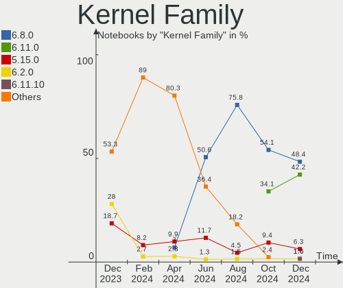
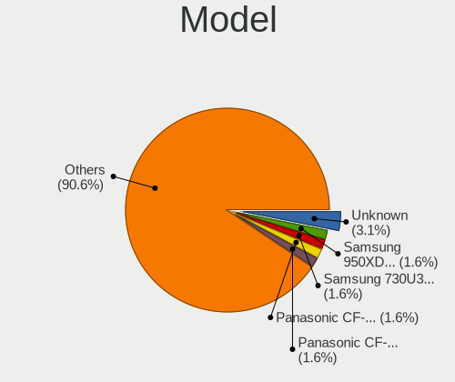
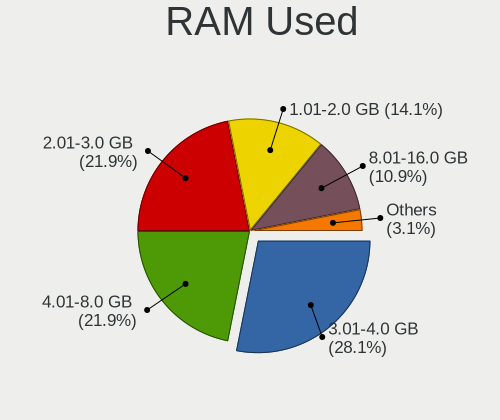
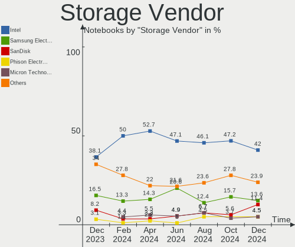
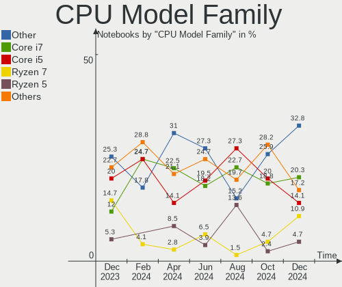
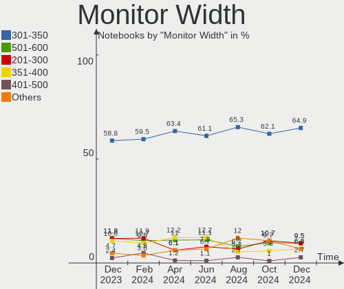
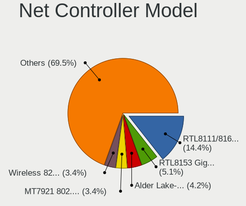

Kubuntu - Hardware Trends (Notebooks)
-------------------------------------

A project to identify most popular hardware characteristics and track their change
over time based on data collected by Linux users at https://Linux-Hardware.org.

Anyone can contribute to this report by the [hw-probe](https://github.com/linuxhw/hw-probe) tool:

    sudo -E hw-probe -all -upload

This report is for one last month. Overall report since the beginning of time: [TestDays](https://github.com/linuxhw/TestDays)

Period: Jun, 2023.

Contents
--------

* [ System ](#system)
  - [ OS                       ](#os)
  - [ OS Family                ](#os-family)
  - [ Kernel                   ](#kernel)
  - [ Kernel Family            ](#kernel-family)
  - [ Kernel Major Ver.        ](#kernel-major-ver)
  - [ Arch                     ](#arch)
  - [ DE                       ](#de)
  - [ Display Server           ](#display-server)
  - [ Display Manager          ](#display-manager)
  - [ OS Lang                  ](#os-lang)
  - [ Boot Mode                ](#boot-mode)
  - [ Filesystem               ](#filesystem)
  - [ Part. scheme             ](#part-scheme)
  - [ Dual Boot with Linux/BSD ](#dual-boot-with-linuxbsd)
  - [ Dual Boot (Win)          ](#dual-boot-win)

* [ Board ](#board)
  - [ Vendor                   ](#vendor)
  - [ Model                    ](#model)
  - [ Model Family             ](#model-family)
  - [ MFG Year                 ](#mfg-year)
  - [ Form Factor              ](#form-factor)
  - [ Secure Boot              ](#secure-boot)
  - [ Coreboot                 ](#coreboot)
  - [ RAM Size                 ](#ram-size)
  - [ RAM Used                 ](#ram-used)
  - [ Total Drives             ](#total-drives)
  - [ Has CD-ROM               ](#has-cd-rom)
  - [ Has Ethernet             ](#has-ethernet)
  - [ Has WiFi                 ](#has-wifi)
  - [ Has Bluetooth            ](#has-bluetooth)

* [ Location ](#location)
  - [ Country                  ](#country)
  - [ City                     ](#city)

* [ Drives ](#drives)
  - [ Drive Vendor             ](#drive-vendor)
  - [ Drive Model              ](#drive-model)
  - [ HDD Vendor               ](#hdd-vendor)
  - [ SSD Vendor               ](#ssd-vendor)
  - [ Drive Kind               ](#drive-kind)
  - [ Drive Connector          ](#drive-connector)
  - [ Drive Size               ](#drive-size)
  - [ Space Total              ](#space-total)
  - [ Space Used               ](#space-used)
  - [ Malfunc. Drives          ](#malfunc-drives)
  - [ Malfunc. Drive Vendor    ](#malfunc-drive-vendor)
  - [ Malfunc. HDD Vendor      ](#malfunc-hdd-vendor)
  - [ Malfunc. Drive Kind      ](#malfunc-drive-kind)
  - [ Failed Drives            ](#failed-drives)
  - [ Failed Drive Vendor      ](#failed-drive-vendor)
  - [ Drive Status             ](#drive-status)

* [ Storage controller ](#storage-controller)
  - [ Storage Vendor           ](#storage-vendor)
  - [ Storage Model            ](#storage-model)
  - [ Storage Kind             ](#storage-kind)

* [ Processor ](#processor)
  - [ CPU Vendor               ](#cpu-vendor)
  - [ CPU Model                ](#cpu-model)
  - [ CPU Model Family         ](#cpu-model-family)
  - [ CPU Cores                ](#cpu-cores)
  - [ CPU Sockets              ](#cpu-sockets)
  - [ CPU Threads              ](#cpu-threads)
  - [ CPU Op-Modes             ](#cpu-op-modes)
  - [ CPU Microcode            ](#cpu-microcode)
  - [ CPU Microarch            ](#cpu-microarch)

* [ Graphics ](#graphics)
  - [ GPU Vendor               ](#gpu-vendor)
  - [ GPU Model                ](#gpu-model)
  - [ GPU Combo                ](#gpu-combo)
  - [ GPU Driver               ](#gpu-driver)
  - [ GPU Memory               ](#gpu-memory)

* [ Monitor ](#monitor)
  - [ Monitor Vendor           ](#monitor-vendor)
  - [ Monitor Model            ](#monitor-model)
  - [ Monitor Resolution       ](#monitor-resolution)
  - [ Monitor Diagonal         ](#monitor-diagonal)
  - [ Monitor Width            ](#monitor-width)
  - [ Aspect Ratio             ](#aspect-ratio)
  - [ Monitor Area             ](#monitor-area)
  - [ Pixel Density            ](#pixel-density)
  - [ Multiple Monitors        ](#multiple-monitors)

* [ Network ](#network)
  - [ Net Controller Vendor    ](#net-controller-vendor)
  - [ Net Controller Model     ](#net-controller-model)
  - [ Wireless Vendor          ](#wireless-vendor)
  - [ Wireless Model           ](#wireless-model)
  - [ Ethernet Vendor          ](#ethernet-vendor)
  - [ Ethernet Model           ](#ethernet-model)
  - [ Net Controller Kind      ](#net-controller-kind)
  - [ Used Controller          ](#used-controller)
  - [ NICs                     ](#nics)
  - [ IPv6                     ](#ipv6)

* [ Bluetooth ](#bluetooth)
  - [ Bluetooth Vendor         ](#bluetooth-vendor)
  - [ Bluetooth Model          ](#bluetooth-model)

* [ Sound ](#sound)
  - [ Sound Vendor             ](#sound-vendor)
  - [ Sound Model              ](#sound-model)

* [ Memory ](#memory)
  - [ Memory Vendor            ](#memory-vendor)
  - [ Memory Model             ](#memory-model)
  - [ Memory Kind              ](#memory-kind)
  - [ Memory Form Factor       ](#memory-form-factor)
  - [ Memory Size              ](#memory-size)
  - [ Memory Speed             ](#memory-speed)

* [ Printers & scanners ](#printers--scanners)
  - [ Printer Vendor           ](#printer-vendor)
  - [ Printer Model            ](#printer-model)
  - [ Scanner Vendor           ](#scanner-vendor)
  - [ Scanner Model            ](#scanner-model)

* [ Camera ](#camera)
  - [ Camera Vendor            ](#camera-vendor)
  - [ Camera Model             ](#camera-model)

* [ Security ](#security)
  - [ Fingerprint Vendor       ](#fingerprint-vendor)
  - [ Fingerprint Model        ](#fingerprint-model)
  - [ Chipcard Vendor          ](#chipcard-vendor)
  - [ Chipcard Model           ](#chipcard-model)

* [ Unsupported ](#unsupported)
  - [ Unsupported Devices      ](#unsupported-devices)
  - [ Unsupported Device Types ](#unsupported-device-types)

System
------

OS
--

Installed operating systems

| Name          | Notebooks | Percent |
|---------------|-----------|---------|
| Kubuntu 22.04 | 31        | 46.27%  |
| Kubuntu 23.04 | 28        | 41.79%  |
| Kubuntu 20.04 | 6         | 8.96%   |
| Kubuntu 22.10 | 2         | 2.99%   |

OS Family
---------

OS without a version

| Name    | Notebooks | Percent |
|---------|-----------|---------|
| Kubuntu | 67        | 100%    |

Kernel
------

Version of the Linux kernel

| Version                | Notebooks | Percent |
|------------------------|-----------|---------|
| 6.2.0-20-generic       | 13        | 19.4%   |
| 6.2.0-23-generic       | 9         | 13.43%  |
| 5.19.0-43-generic      | 7         | 10.45%  |
| 5.15.0-73-generic      | 7         | 10.45%  |
| 5.19.0-45-generic      | 6         | 8.96%   |
| 5.19.0-46-generic      | 3         | 4.48%   |
| 5.19.0-42-generic      | 3         | 4.48%   |
| 6.3.8-x64v3-xanmod1    | 2         | 2.99%   |
| 6.2.0-1005-lowlatency  | 2         | 2.99%   |
| 5.4.0-150-generic      | 2         | 2.99%   |
| 6.3.8                  | 1         | 1.49%   |
| 6.3.7-060307-generic   | 1         | 1.49%   |
| 6.3.6-custom           | 1         | 1.49%   |
| 6.3.0-060300-generic   | 1         | 1.49%   |
| 6.2.0-060200-generic   | 1         | 1.49%   |
| 6.1.12-060112-generic  | 1         | 1.49%   |
| 5.19.0-32-generic      | 1         | 1.49%   |
| 5.19.0-1027-lowlatency | 1         | 1.49%   |
| 5.19.0-1025-lowlatency | 1         | 1.49%   |
| 5.19.0-1023-lowlatency | 1         | 1.49%   |
| 5.19.0-1017-lowlatency | 1         | 1.49%   |
| 5.15.0-75-lowlatency   | 1         | 1.49%   |
| 5.15.0-74-lowlatency   | 1         | 1.49%   |

Kernel Family
-------------

Linux kernel without a distro release

| Version | Notebooks | Percent |
|---------|-----------|---------|
| 6.2.0   | 25        | 37.31%  |
| 5.19.0  | 24        | 35.82%  |
| 5.15.0  | 9         | 13.43%  |
| 6.3.8   | 3         | 4.48%   |
| 5.4.0   | 2         | 2.99%   |
| 6.3.7   | 1         | 1.49%   |
| 6.3.6   | 1         | 1.49%   |
| 6.3.0   | 1         | 1.49%   |
| 6.1.12  | 1         | 1.49%   |

Kernel Major Ver.
-----------------

Linux kernel major version

| Version | Notebooks | Percent |
|---------|-----------|---------|
| 6.2     | 25        | 37.31%  |
| 5.19    | 24        | 35.82%  |
| 5.15    | 9         | 13.43%  |
| 6.3     | 6         | 8.96%   |
| 5.4     | 2         | 2.99%   |
| 6.1     | 1         | 1.49%   |

Arch
----

OS architecture (x86_64, i586, etc.)

| Name   | Notebooks | Percent |
|--------|-----------|---------|
| x86_64 | 67        | 100%    |

DE
--

Desktop Environment

| Name     | Notebooks | Percent |
|----------|-----------|---------|
| KDE5     | 66        | 98.51%  |
| Cinnamon | 1         | 1.49%   |

Display Server
--------------

X11 or Wayland

| Name    | Notebooks | Percent |
|---------|-----------|---------|
| X11     | 57        | 85.07%  |
| Wayland | 9         | 13.43%  |
| Tty     | 1         | 1.49%   |

Display Manager
---------------

SDDM, LightDM, etc.

| Name    | Notebooks | Percent |
|---------|-----------|---------|
| SDDM    | 41        | 61.19%  |
| Unknown | 20        | 29.85%  |
| LightDM | 3         | 4.48%   |
| GDM     | 2         | 2.99%   |
| GDM3    | 1         | 1.49%   |

OS Lang
-------

Language

| Lang  | Notebooks | Percent |
|-------|-----------|---------|
| en_US | 36        | 53.73%  |
| en_GB | 6         | 8.96%   |
| ru_RU | 5         | 7.46%   |
| de_DE | 4         | 5.97%   |
| pl_PL | 2         | 2.99%   |
| it_IT | 2         | 2.99%   |
| fr_FR | 2         | 2.99%   |
| en_AU | 2         | 2.99%   |
| pt_PT | 1         | 1.49%   |
| fr_BE | 1         | 1.49%   |
| fi_FI | 1         | 1.49%   |
| es_ES | 1         | 1.49%   |
| es_CR | 1         | 1.49%   |
| es_CO | 1         | 1.49%   |
| es_CL | 1         | 1.49%   |
| en_ZA | 1         | 1.49%   |

Boot Mode
---------

EFI or BIOS

| Mode | Notebooks | Percent |
|------|-----------|---------|
| EFI  | 36        | 53.73%  |
| BIOS | 31        | 46.27%  |

Filesystem
----------

Type of filesystem

| Type    | Notebooks | Percent |
|---------|-----------|---------|
| Ext4    | 50        | 74.63%  |
| Tmpfs   | 12        | 17.91%  |
| Overlay | 2         | 2.99%   |
| Zfs     | 1         | 1.49%   |
| Xfs     | 1         | 1.49%   |
| Btrfs   | 1         | 1.49%   |

Part. scheme
------------

Scheme of partitioning

| Type    | Notebooks | Percent |
|---------|-----------|---------|
| GPT     | 45        | 67.16%  |
| Unknown | 20        | 29.85%  |
| MBR     | 2         | 2.99%   |

Dual Boot with Linux/BSD
------------------------

Hosting more than one Linux/BSD

| Dual boot | Notebooks | Percent |
|-----------|-----------|---------|
| No        | 65        | 97.01%  |
| Yes       | 2         | 2.99%   |

Dual Boot (Win)
---------------

Hosting Linux and Windows

| Dual boot | Notebooks | Percent |
|-----------|-----------|---------|
| No        | 44        | 65.67%  |
| Yes       | 23        | 34.33%  |

Board
-----

Vendor
------

Motherboard manufacturer

| Name                | Notebooks | Percent |
|---------------------|-----------|---------|
| Lenovo              | 20        | 29.85%  |
| Hewlett-Packard     | 11        | 16.42%  |
| ASUSTek Computer    | 11        | 16.42%  |
| Dell                | 8         | 11.94%  |
| Apple               | 4         | 5.97%   |
| HUAWEI              | 2         | 2.99%   |
| Acer                | 2         | 2.99%   |
| Schenker            | 1         | 1.49%   |
| Samsung Electronics | 1         | 1.49%   |
| Proline             | 1         | 1.49%   |
| PC Specialist       | 1         | 1.49%   |
| MSI                 | 1         | 1.49%   |
| Irbis               | 1         | 1.49%   |
| Google              | 1         | 1.49%   |
| Gigabyte Technology | 1         | 1.49%   |
| Framework           | 1         | 1.49%   |

Model
-----

Motherboard model

| Name                                               | Notebooks | Percent |
|----------------------------------------------------|-----------|---------|
| HP Notebook                                        | 2         | 2.99%   |
| Schenker XMG PRO (E23)                             | 1         | 1.49%   |
| Samsung 550XCJ/550XCR                              | 1         | 1.49%   |
| Proline V1165C4                                    | 1         | 1.49%   |
| PC Specialist Initia Ii 15                         | 1         | 1.49%   |
| MSI GF63 Thin 11SC                                 | 1         | 1.49%   |
| Lenovo Yoga Creator 7 15IMH05 82DS                 | 1         | 1.49%   |
| Lenovo ThinkPad Z16 Gen 1 21D4CTO1WW               | 1         | 1.49%   |
| Lenovo ThinkPad T570 20H9000UUS                    | 1         | 1.49%   |
| Lenovo ThinkPad T460 20FN004BMN                    | 1         | 1.49%   |
| Lenovo ThinkPad T440p 20AN009CUS                   | 1         | 1.49%   |
| Lenovo ThinkPad T14 Gen 2i 20W1S01500              | 1         | 1.49%   |
| Lenovo ThinkPad P15s Gen 2i 20W7S0SM01             | 1         | 1.49%   |
| Lenovo ThinkPad P14s Gen 2a 21A0CTO1WW             | 1         | 1.49%   |
| Lenovo ThinkPad P14s Gen 1 20S5S01V00              | 1         | 1.49%   |
| Lenovo ThinkPad L15 Gen 2a 20X7S05600              | 1         | 1.49%   |
| Lenovo ThinkPad L15 Gen 1 20U3000SGE               | 1         | 1.49%   |
| Lenovo ThinkPad E15 Gen 2 20TD00GSPB               | 1         | 1.49%   |
| Lenovo ThinkPad E14 Gen 4 21E3000LAU               | 1         | 1.49%   |
| Lenovo Slim 7 ProX 14ARH7 82V2                     | 1         | 1.49%   |
| Lenovo Legion 5 Pro 16ARH7H 82RG                   | 1         | 1.49%   |
| Lenovo IdeaPad S340-15API 81NC                     | 1         | 1.49%   |
| Lenovo IdeaPad S340-14IIL 81VV                     | 1         | 1.49%   |
| Lenovo IdeaPad 320-15IKB 80YE                      | 1         | 1.49%   |
| Lenovo IdeaPad 3 15ABA7 82RN                       | 1         | 1.49%   |
| Lenovo IdeaPad 1 15ADA7 82R1                       | 1         | 1.49%   |
| Irbis NB123                                        | 1         | 1.49%   |
| HUAWEI NBLB-WAX9N                                  | 1         | 1.49%   |
| HUAWEI KLVD-WXX9                                   | 1         | 1.49%   |
| HP ZBook Studio 15.6 inch G8 Mobile Workstation PC | 1         | 1.49%   |
| HP ProBook 650 G1                                  | 1         | 1.49%   |
| HP Pavilion Laptop 15-eh1xxx                       | 1         | 1.49%   |
| HP Pavilion Laptop 14-ce2xxx                       | 1         | 1.49%   |
| HP Pavilion Laptop 14-bf0xx                        | 1         | 1.49%   |
| HP Laptop 14s-dq2xxx                               | 1         | 1.49%   |
| HP ENVY Laptop 14-eb0xxx                           | 1         | 1.49%   |
| HP EliteBook 8760w                                 | 1         | 1.49%   |
| HP 255 15.6 inch G9 Notebook PC                    | 1         | 1.49%   |
| Google Kohaku                                      | 1         | 1.49%   |
| Gigabyte G5 GE                                     | 1         | 1.49%   |

Model Family
------------

Motherboard model prefix

| Name                 | Notebooks | Percent |
|----------------------|-----------|---------|
| Lenovo ThinkPad      | 12        | 17.91%  |
| Lenovo IdeaPad       | 5         | 7.46%   |
| ASUS VivoBook        | 5         | 7.46%   |
| Dell Latitude        | 4         | 5.97%   |
| HP Pavilion          | 3         | 4.48%   |
| HP Notebook          | 2         | 2.99%   |
| Dell XPS             | 2         | 2.99%   |
| Dell G3              | 2         | 2.99%   |
| ASUS ASUS            | 2         | 2.99%   |
| Schenker XMG         | 1         | 1.49%   |
| Samsung 550XCJ       | 1         | 1.49%   |
| Proline V1165C4      | 1         | 1.49%   |
| PC Specialist Initia | 1         | 1.49%   |
| MSI GF63             | 1         | 1.49%   |
| Lenovo Yoga          | 1         | 1.49%   |
| Lenovo Slim          | 1         | 1.49%   |
| Lenovo Legion        | 1         | 1.49%   |
| Irbis NB123          | 1         | 1.49%   |
| HUAWEI NBLB-WAX9N    | 1         | 1.49%   |
| HUAWEI KLVD-WXX9     | 1         | 1.49%   |
| HP ZBook             | 1         | 1.49%   |
| HP ProBook           | 1         | 1.49%   |
| HP Laptop            | 1         | 1.49%   |
| HP ENVY              | 1         | 1.49%   |
| HP EliteBook         | 1         | 1.49%   |
| HP 255               | 1         | 1.49%   |
| Google Kohaku        | 1         | 1.49%   |
| Gigabyte G5          | 1         | 1.49%   |
| Framework Laptop     | 1         | 1.49%   |
| ASUS Zenbook         | 1         | 1.49%   |
| ASUS ROG             | 1         | 1.49%   |
| ASUS K50IJ           | 1         | 1.49%   |
| ASUS G551JM          | 1         | 1.49%   |
| Apple MacBookPro9    | 1         | 1.49%   |
| Apple MacBookPro8    | 1         | 1.49%   |
| Apple MacBookPro12   | 1         | 1.49%   |
| Apple MacBookAir5    | 1         | 1.49%   |
| Acer Nitro           | 1         | 1.49%   |
| Acer Aspire          | 1         | 1.49%   |

MFG Year
--------

Motherboard manufacture year

| Year | Notebooks | Percent |
|------|-----------|---------|
| 2021 | 16        | 23.88%  |
| 2022 | 15        | 22.39%  |
| 2020 | 7         | 10.45%  |
| 2019 | 6         | 8.96%   |
| 2017 | 3         | 4.48%   |
| 2013 | 3         | 4.48%   |
| 2011 | 3         | 4.48%   |
| 2023 | 2         | 2.99%   |
| 2018 | 2         | 2.99%   |
| 2016 | 2         | 2.99%   |
| 2015 | 2         | 2.99%   |
| 2014 | 2         | 2.99%   |
| 2012 | 2         | 2.99%   |
| 2009 | 1         | 1.49%   |
| 2008 | 1         | 1.49%   |

Form Factor
-----------

Physical design of the computer

| Name     | Notebooks | Percent |
|----------|-----------|---------|
| Notebook | 67        | 100%    |

Secure Boot
-----------

Enabled or disabled

| State    | Notebooks | Percent |
|----------|-----------|---------|
| Disabled | 55        | 82.09%  |
| Enabled  | 12        | 17.91%  |

Coreboot
--------

Have coreboot on board

| Used | Notebooks | Percent |
|------|-----------|---------|
| No   | 66        | 98.51%  |
| Yes  | 1         | 1.49%   |

RAM Size
--------

Total RAM memory

| Size in GB  | Notebooks | Percent |
|-------------|-----------|---------|
| 16.01-24.0  | 15        | 22.39%  |
| 32.01-64.0  | 14        | 20.9%   |
| 4.01-8.0    | 13        | 19.4%   |
| 8.01-16.0   | 13        | 19.4%   |
| 3.01-4.0    | 9         | 13.43%  |
| 24.01-32.0  | 2         | 2.99%   |
| 64.01-256.0 | 1         | 1.49%   |

RAM Used
--------

Used RAM memory

| Used GB    | Notebooks | Percent |
|------------|-----------|---------|
| 4.01-8.0   | 23        | 34.33%  |
| 2.01-3.0   | 15        | 22.39%  |
| 3.01-4.0   | 14        | 20.9%   |
| 1.01-2.0   | 11        | 16.42%  |
| 8.01-16.0  | 3         | 4.48%   |
| 32.01-64.0 | 1         | 1.49%   |

Total Drives
------------

Number of drives on board

| Drives | Notebooks | Percent |
|--------|-----------|---------|
| 1      | 50        | 74.63%  |
| 2      | 15        | 22.39%  |
| 3      | 1         | 1.49%   |
| 0      | 1         | 1.49%   |

Has CD-ROM
----------

Has CD-ROM on board

| Presented | Notebooks | Percent |
|-----------|-----------|---------|
| No        | 57        | 85.07%  |
| Yes       | 10        | 14.93%  |

Has Ethernet
------------

Has Ethernet on board

| Presented | Notebooks | Percent |
|-----------|-----------|---------|
| Yes       | 42        | 62.69%  |
| No        | 25        | 37.31%  |

Has WiFi
--------

Has WiFi module

| Presented | Notebooks | Percent |
|-----------|-----------|---------|
| Yes       | 67        | 100%    |

Has Bluetooth
-------------

Has Bluetooth module

| Presented | Notebooks | Percent |
|-----------|-----------|---------|
| Yes       | 59        | 88.06%  |
| No        | 8         | 11.94%  |

Location
--------

Country
-------

Geographic location (country)

| Country      | Notebooks | Percent |
|--------------|-----------|---------|
| USA          | 15        | 22.39%  |
| Russia       | 7         | 10.45%  |
| Germany      | 7         | 10.45%  |
| UK           | 6         | 8.96%   |
| Italy        | 3         | 4.48%   |
| UAE          | 2         | 2.99%   |
| Netherlands  | 2         | 2.99%   |
| France       | 2         | 2.99%   |
| Finland      | 2         | 2.99%   |
| Colombia     | 2         | 2.99%   |
| Australia    | 2         | 2.99%   |
| Turkey       | 1         | 1.49%   |
| Spain        | 1         | 1.49%   |
| South Africa | 1         | 1.49%   |
| Portugal     | 1         | 1.49%   |
| Poland       | 1         | 1.49%   |
| Nepal        | 1         | 1.49%   |
| Ivory Coast  | 1         | 1.49%   |
| Israel       | 1         | 1.49%   |
| Greece       | 1         | 1.49%   |
| Denmark      | 1         | 1.49%   |
| Costa Rica   | 1         | 1.49%   |
| Chile        | 1         | 1.49%   |
| Canada       | 1         | 1.49%   |
| Bulgaria     | 1         | 1.49%   |
| Brazil       | 1         | 1.49%   |
| Belgium      | 1         | 1.49%   |
| Austria      | 1         | 1.49%   |

City
----

Geographic location (city)

| City                    | Notebooks | Percent |
|-------------------------|-----------|---------|
| Moscow                  | 3         | 4.48%   |
| Vienna                  | 2         | 2.99%   |
| Dubai                   | 2         | 2.99%   |
| Yopal                   | 1         | 1.49%   |
| West Des Moines         | 1         | 1.49%   |
| West Bromwich           | 1         | 1.49%   |
| Washington              | 1         | 1.49%   |
| Viña del Mar           | 1         | 1.49%   |
| Valley Center           | 1         | 1.49%   |
| Valencia                | 1         | 1.49%   |
| Tzaneen                 | 1         | 1.49%   |
| Thunder Bay             | 1         | 1.49%   |
| Thessaloniki            | 1         | 1.49%   |
| Tel Aviv                | 1         | 1.49%   |
| Stavropol               | 1         | 1.49%   |
| St Petersburg           | 1         | 1.49%   |
| Spokane                 | 1         | 1.49%   |
| Shumen                  | 1         | 1.49%   |
| Shelton                 | 1         | 1.49%   |
| Scottsdale              | 1         | 1.49%   |
| Schiedam                | 1         | 1.49%   |
| Santa Maria di Sala     | 1         | 1.49%   |
| Salt Lake City          | 1         | 1.49%   |
| Saint-Georges-sur-Meuse | 1         | 1.49%   |
| Rybinsk                 | 1         | 1.49%   |
| Ronchis                 | 1         | 1.49%   |
| Recklinghausen          | 1         | 1.49%   |
| Raleigh                 | 1         | 1.49%   |
| Porto                   | 1         | 1.49%   |
| Oulu                    | 1         | 1.49%   |
| Osasco                  | 1         | 1.49%   |
| Oldenburg               | 1         | 1.49%   |
| Oldbury                 | 1         | 1.49%   |
| New York                | 1         | 1.49%   |
| Mönchengladbach        | 1         | 1.49%   |
| Minneapolis             | 1         | 1.49%   |
| Melbourne               | 1         | 1.49%   |
| Medellín               | 1         | 1.49%   |
| Mainz                   | 1         | 1.49%   |
| Lübeck                 | 1         | 1.49%   |

Drives
------

Drive Vendor
------------

Hard drive vendors

| Vendor              | Notebooks | Drives | Percent |
|---------------------|-----------|--------|---------|
| Samsung Electronics | 16        | 16     | 19.28%  |
| SanDisk             | 11        | 11     | 13.25%  |
| Toshiba             | 8         | 8      | 9.64%   |
| Micron Technology   | 8         | 8      | 9.64%   |
| WDC                 | 5         | 5      | 6.02%   |
| Intel               | 5         | 5      | 6.02%   |
| Unknown             | 4         | 4      | 4.82%   |
| Seagate             | 4         | 4      | 4.82%   |
| SK hynix            | 3         | 3      | 3.61%   |
| Phison Electronics  | 3         | 3      | 3.61%   |
| Kingston            | 3         | 3      | 3.61%   |
| Hitachi             | 3         | 3      | 3.61%   |
| Crucial             | 2         | 2      | 2.41%   |
| Solid State Storage | 1         | 1      | 1.2%    |
| Silicon Motion      | 1         | 1      | 1.2%    |
| Netac               | 1         | 1      | 1.2%    |
| LITEONIT            | 1         | 1      | 1.2%    |
| JMicron Technology  | 1         | 1      | 1.2%    |
| HGST                | 1         | 1      | 1.2%    |
| FURY                | 1         | 2      | 1.2%    |
| ASMT                | 1         | 1      | 1.2%    |

Drive Model
-----------

Hard drive models

| Model                                               | Notebooks | Percent |
|-----------------------------------------------------|-----------|---------|
| Toshiba MQ04ABF100 1TB                              | 3         | 3.57%   |
| Samsung NVMe SSD Controller SM981/PM981/PM983 250GB | 3         | 3.57%   |
| SanDisk NVMe SSD Drive 512GB                        | 2         | 2.38%   |
| SanDisk NVMe SSD Drive 1TB                          | 2         | 2.38%   |
| Micron MTFDKCD512TFK 512GB                          | 2         | 2.38%   |
| Micron 3400_MTFDKBA1T0TFH 1024GB                    | 2         | 2.38%   |
| Intel SSD 660P Series 512GB                         | 2         | 2.38%   |
| Crucial CT1000MX500SSD1 1TB                         | 2         | 2.38%   |
| WDC WDS240G2G0A-00JH30 240GB SSD                    | 1         | 1.19%   |
| WDC WD5000LPZX-22Z10T0 500GB                        | 1         | 1.19%   |
| WDC WD3200BEVT-22ZCT0 320GB                         | 1         | 1.19%   |
| WDC WD Blue SA510 M.2 2280 1000GB                   | 1         | 1.19%   |
| WDC PC SN520 SDAPMUW-512G-1101 512GB                | 1         | 1.19%   |
| Unknown MMC Card  64GB                              | 1         | 1.19%   |
| Unknown MMC Card  32GB                              | 1         | 1.19%   |
| Unknown MMC Card  128GB                             | 1         | 1.19%   |
| Unknown ISOCOM  64GB                                | 1         | 1.19%   |
| Toshiba XG6 NVMe SSD Controller 2TB                 | 1         | 1.19%   |
| Toshiba THNSNK256GCS8 SATA 256GB SSD                | 1         | 1.19%   |
| Toshiba MQ01ABD100 1TB                              | 1         | 1.19%   |
| Toshiba MQ01ABD075 752GB                            | 1         | 1.19%   |
| Toshiba KXG6AZNV512G 512GB                          | 1         | 1.19%   |
| Solid State Storage SSSTC CL1-3D256 256GB           | 1         | 1.19%   |
| SK hynix SKHynix_HFS512GDE9X081N 512GB              | 1         | 1.19%   |
| SK hynix SHGP31-1000GM 1TB                          | 1         | 1.19%   |
| SK hynix HFM001TD3JX013N 1TB                        | 1         | 1.19%   |
| Silicon Motion SM2262/SM2262EN SSD Controller 480GB | 1         | 1.19%   |
| Seagate ST2000LX001-1RG174 2TB                      | 1         | 1.19%   |
| Seagate ST2000LM007-1R8174 2TB                      | 1         | 1.19%   |
| Seagate ST1000LM035-1RK172 1TB                      | 1         | 1.19%   |
| Seagate BUP Slim BK 1TB                             | 1         | 1.19%   |
| Sandisk WD_BLACK SN850X 4000GB                      | 1         | 1.19%   |
| Sandisk WDC WDS100T2B0C-00PXH0 1TB                  | 1         | 1.19%   |
| Sandisk WD Green SN350 1TB                          | 1         | 1.19%   |
| Sandisk WD Blue SN550 NVMe SSD 1TB                  | 1         | 1.19%   |
| SanDisk SD7TB6S256G1001 256GB SSD                   | 1         | 1.19%   |
| SanDisk SD7TB3Q-256G-1006 256GB SSD                 | 1         | 1.19%   |
| Sandisk PC SN520 NVMe SSD 512GB                     | 1         | 1.19%   |
| Samsung SSD 980 PRO 1TB                             | 1         | 1.19%   |
| Samsung SSD 970 EVO Plus 500GB                      | 1         | 1.19%   |

HDD Vendor
----------

Hard disk drive vendors

| Vendor  | Notebooks | Drives | Percent |
|---------|-----------|--------|---------|
| Toshiba | 5         | 5      | 31.25%  |
| Seagate | 4         | 4      | 25%     |
| Hitachi | 3         | 3      | 18.75%  |
| WDC     | 2         | 2      | 12.5%   |
| HGST    | 1         | 1      | 6.25%   |
| ASMT    | 1         | 1      | 6.25%   |

SSD Vendor
----------

Solid state drive vendors

| Vendor              | Notebooks | Drives | Percent |
|---------------------|-----------|--------|---------|
| WDC                 | 2         | 2      | 13.33%  |
| SanDisk             | 2         | 2      | 13.33%  |
| Kingston            | 2         | 2      | 13.33%  |
| Intel               | 2         | 2      | 13.33%  |
| Crucial             | 2         | 2      | 13.33%  |
| Toshiba             | 1         | 1      | 6.67%   |
| Samsung Electronics | 1         | 1      | 6.67%   |
| Micron Technology   | 1         | 1      | 6.67%   |
| LITEONIT            | 1         | 1      | 6.67%   |
| FURY                | 1         | 1      | 6.67%   |

Drive Kind
----------

HDD or SSD

| Kind    | Notebooks | Drives | Percent |
|---------|-----------|--------|---------|
| NVMe    | 45        | 48     | 55.56%  |
| HDD     | 16        | 16     | 19.75%  |
| SSD     | 15        | 15     | 18.52%  |
| MMC     | 4         | 4      | 4.94%   |
| Unknown | 1         | 1      | 1.23%   |

Drive Connector
---------------

SATA, SAS, NVMe, etc.

| Type | Notebooks | Drives | Percent |
|------|-----------|--------|---------|
| NVMe | 44        | 47     | 57.14%  |
| SATA | 26        | 30     | 33.77%  |
| MMC  | 4         | 4      | 5.19%   |
| SAS  | 3         | 3      | 3.9%    |

Drive Size
----------

Size of hard drive

| Size in TB | Notebooks | Drives | Percent |
|------------|-----------|--------|---------|
| 0.01-0.5   | 15        | 15     | 51.72%  |
| 0.51-1.0   | 12        | 14     | 41.38%  |
| 1.01-2.0   | 2         | 2      | 6.9%    |

Space Total
-----------

Amount of disk space available on the file system

| Size in GB     | Notebooks | Percent |
|----------------|-----------|---------|
| 101-250        | 18        | 26.87%  |
| 501-1000       | 18        | 26.87%  |
| 251-500        | 13        | 19.4%   |
| 1001-2000      | 7         | 10.45%  |
| 51-100         | 4         | 5.97%   |
| 2001-3000      | 3         | 4.48%   |
| 1-20           | 2         | 2.99%   |
| More than 3000 | 1         | 1.49%   |
| 21-50          | 1         | 1.49%   |

Space Used
----------

Amount of used disk space

| Used GB   | Notebooks | Percent |
|-----------|-----------|---------|
| 21-50     | 14        | 20.9%   |
| 1-20      | 14        | 20.9%   |
| 101-250   | 12        | 17.91%  |
| 51-100    | 10        | 14.93%  |
| 501-1000  | 9         | 13.43%  |
| 251-500   | 5         | 7.46%   |
| 1001-2000 | 2         | 2.99%   |
| 2001-3000 | 1         | 1.49%   |

Malfunc. Drives
---------------

Drive models with a malfunction

| Model                                        | Notebooks | Drives | Percent |
|----------------------------------------------|-----------|--------|---------|
| Toshiba THNSNK256GCS8 SATA 256GB SSD         | 1         | 1      | 20%     |
| Toshiba MQ04ABF100 1TB                       | 1         | 1      | 20%     |
| Toshiba MQ01ABD075 752GB                     | 1         | 1      | 20%     |
| Samsung Electronics MZVLQ512HBLU-00B00 512GB | 1         | 1      | 20%     |
| Hitachi HTS545050A7E380 500GB                | 1         | 1      | 20%     |

Malfunc. Drive Vendor
---------------------

Vendors of faulty drives

| Vendor              | Notebooks | Drives | Percent |
|---------------------|-----------|--------|---------|
| Toshiba             | 3         | 3      | 60%     |
| Samsung Electronics | 1         | 1      | 20%     |
| Hitachi             | 1         | 1      | 20%     |

Malfunc. HDD Vendor
-------------------

Vendors of faulty HDD drives

| Vendor  | Notebooks | Drives | Percent |
|---------|-----------|--------|---------|
| Toshiba | 2         | 2      | 66.67%  |
| Hitachi | 1         | 1      | 33.33%  |

Malfunc. Drive Kind
-------------------

Kinds of faulty drives

| Kind | Notebooks | Drives | Percent |
|------|-----------|--------|---------|
| HDD  | 3         | 3      | 60%     |
| NVMe | 1         | 1      | 20%     |
| SSD  | 1         | 1      | 20%     |

Failed Drives
-------------

Failed drive models

Zero info for selected period =(

Failed Drive Vendor
-------------------

Failed drive vendors

Zero info for selected period =(

Drive Status
------------

Number of failed and malfunc. drives

| Status   | Notebooks | Drives | Percent |
|----------|-----------|--------|---------|
| Detected | 38        | 50     | 55.07%  |
| Works    | 26        | 29     | 37.68%  |
| Malfunc  | 5         | 5      | 7.25%   |

Storage controller
------------------

Storage Vendor
--------------

Storage controller vendors

| Vendor                         | Notebooks | Percent |
|--------------------------------|-----------|---------|
| Intel                          | 38        | 43.18%  |
| Samsung Electronics            | 15        | 17.05%  |
| Sandisk                        | 10        | 11.36%  |
| Micron Technology              | 7         | 7.95%   |
| AMD                            | 6         | 6.82%   |
| SK hynix                       | 3         | 3.41%   |
| Phison Electronics             | 3         | 3.41%   |
| Toshiba America Info Systems   | 2         | 2.27%   |
| Solid State Storage Technology | 1         | 1.14%   |
| Silicon Motion                 | 1         | 1.14%   |
| Netac Technology               | 1         | 1.14%   |
| Kingston Technology Company    | 1         | 1.14%   |

Storage Model
-------------

Storage controller models

| Model                                                                          | Notebooks | Percent |
|--------------------------------------------------------------------------------|-----------|---------|
| Samsung NVMe SSD Controller SM981/PM981/PM983                                  | 6         | 6.67%   |
| AMD FCH SATA Controller [AHCI mode]                                            | 6         | 6.67%   |
| Samsung NVMe SSD Controller 980                                                | 5         | 5.56%   |
| Micron NVMe Storage Controller                                                 | 5         | 5.56%   |
| Intel Volume Management Device NVMe RAID Controller                            | 5         | 5.56%   |
| Intel 82801 Mobile SATA Controller [RAID mode]                                 | 5         | 5.56%   |
| SanDisk Non-Volatile memory controller                                         | 4         | 4.44%   |
| SK hynix Gold P31/BC711/PC711 NVMe Solid State Drive                           | 3         | 3.33%   |
| Samsung NVMe SSD Controller PM9A1/PM9A3/980PRO                                 | 3         | 3.33%   |
| Intel Sunrise Point-LP SATA Controller [AHCI mode]                             | 3         | 3.33%   |
| Intel Comet Lake SATA AHCI Controller                                          | 3         | 3.33%   |
| Intel 8 Series/C220 Series Chipset Family 6-port SATA Controller 1 [AHCI mode] | 3         | 3.33%   |
| Intel 7 Series Chipset Family 6-port SATA Controller [AHCI mode]               | 3         | 3.33%   |
| Toshiba America Info Systems XG6 NVMe SSD Controller                           | 2         | 2.22%   |
| SanDisk PC SN520 NVMe SSD                                                      | 2         | 2.22%   |
| Micron 2450 NVMe SSD (DRAM-less)                                               | 2         | 2.22%   |
| Intel SSD 660P Series                                                          | 2         | 2.22%   |
| Intel Alder Lake-P SATA AHCI Controller                                        | 2         | 2.22%   |
| Intel 82801IBM/IEM (ICH9M/ICH9M-E) 4 port SATA Controller [AHCI mode]          | 2         | 2.22%   |
| Intel 6 Series/C200 Series Chipset Family 6 port Mobile SATA AHCI Controller   | 2         | 2.22%   |
| Solid State Storage CL1-3D256-Q11 NVMe SSD M.2                                 | 1         | 1.11%   |
| Silicon Motion SM2262/SM2262EN SSD Controller                                  | 1         | 1.11%   |
| Sandisk Western Digital WD Black SN850X NVMe SSD                               | 1         | 1.11%   |
| SanDisk WD PC SN810 / Black SN850 NVMe SSD                                     | 1         | 1.11%   |
| SanDisk WD Blue SN550 NVMe SSD                                                 | 1         | 1.11%   |
| SanDisk WD Black SN770 NVMe SSD                                                | 1         | 1.11%   |
| Samsung NVMe SSD Controller SM961/PM961/SM963                                  | 1         | 1.11%   |
| Phison PS5021-E21 PCIe4 NVMe Controller (DRAM-less)                            | 1         | 1.11%   |
| Phison PS5013 E13 NVMe Controller                                              | 1         | 1.11%   |
| Phison E16 PCIe4 NVMe Controller                                               | 1         | 1.11%   |
| Netac Non-Volatile memory controller                                           | 1         | 1.11%   |
| Kingston Company OM3PDP3 NVMe SSD                                              | 1         | 1.11%   |
| Intel Wildcat Point-LP SATA Controller [AHCI Mode]                             | 1         | 1.11%   |
| Intel Tiger Lake-LP SATA Controller                                            | 1         | 1.11%   |
| Intel Tiger Lake SATA AHCI Controller                                          | 1         | 1.11%   |
| Intel Non-Volatile memory controller                                           | 1         | 1.11%   |
| Intel Ice Lake-LP SATA Controller [AHCI mode]                                  | 1         | 1.11%   |
| Intel Celeron/Pentium Silver Processor SATA Controller                         | 1         | 1.11%   |
| Intel Celeron N3350/Pentium N4200/Atom E3900 Series SATA AHCI Controller       | 1         | 1.11%   |
| Intel Cannon Lake Mobile PCH SATA AHCI Controller                              | 1         | 1.11%   |

Storage Kind
------------

Kind of storage controller (IDE, SATA, NVMe, SAS, ...)

| Kind | Notebooks | Percent |
|------|-----------|---------|
| NVMe | 44        | 50.57%  |
| SATA | 33        | 37.93%  |
| RAID | 10        | 11.49%  |

Processor
---------

CPU Vendor
----------

Processor vendors

| Vendor | Notebooks | Percent |
|--------|-----------|---------|
| Intel  | 51        | 76.12%  |
| AMD    | 16        | 23.88%  |

CPU Model
---------

Processor models

| Model                                       | Notebooks | Percent |
|---------------------------------------------|-----------|---------|
| Intel Core i5-10210U CPU @ 1.60GHz          | 3         | 4.48%   |
| Intel 11th Gen Core i5-1135G7 @ 2.40GHz     | 3         | 4.48%   |
| Intel Core i5-8265U CPU @ 1.60GHz           | 2         | 2.99%   |
| Intel 12th Gen Core i7-1255U                | 2         | 2.99%   |
| Intel Pentium Dual-Core CPU T4400 @ 2.20GHz | 1         | 1.49%   |
| Intel Pentium CPU 4417U @ 2.30GHz           | 1         | 1.49%   |
| Intel Core i7-9750H CPU @ 2.60GHz           | 1         | 1.49%   |
| Intel Core i7-8565U CPU @ 1.80GHz           | 1         | 1.49%   |
| Intel Core i7-7500U CPU @ 2.70GHz           | 1         | 1.49%   |
| Intel Core i7-6600U CPU @ 2.60GHz           | 1         | 1.49%   |
| Intel Core i7-5600U CPU @ 2.60GHz           | 1         | 1.49%   |
| Intel Core i7-4710HQ CPU @ 2.50GHz          | 1         | 1.49%   |
| Intel Core i7-4600M CPU @ 2.90GHz           | 1         | 1.49%   |
| Intel Core i7-4510U CPU @ 2.00GHz           | 1         | 1.49%   |
| Intel Core i7-2640M CPU @ 2.80GHz           | 1         | 1.49%   |
| Intel Core i7-2630QM CPU @ 2.00GHz          | 1         | 1.49%   |
| Intel Core i7-10750H CPU @ 2.60GHz          | 1         | 1.49%   |
| Intel Core i7-10610U CPU @ 1.80GHz          | 1         | 1.49%   |
| Intel Core i7-10510U CPU @ 1.80GHz          | 1         | 1.49%   |
| Intel Core i5-8300H CPU @ 2.30GHz           | 1         | 1.49%   |
| Intel Core i5-7300U CPU @ 2.60GHz           | 1         | 1.49%   |
| Intel Core i5-5257U CPU @ 2.70GHz           | 1         | 1.49%   |
| Intel Core i5-4310M CPU @ 2.70GHz           | 1         | 1.49%   |
| Intel Core i5-3317U CPU @ 1.70GHz           | 1         | 1.49%   |
| Intel Core i5-3230M CPU @ 2.60GHz           | 1         | 1.49%   |
| Intel Core i5-3210M CPU @ 2.50GHz           | 1         | 1.49%   |
| Intel Core i5-2540M CPU @ 2.60GHz           | 1         | 1.49%   |
| Intel Core i5-1035G1 CPU @ 1.00GHz          | 1         | 1.49%   |
| Intel Core i5-10300H CPU @ 2.50GHz          | 1         | 1.49%   |
| Intel Core i3-7100U CPU @ 2.40GHz           | 1         | 1.49%   |
| Intel Core 2 Duo CPU P8400 @ 2.26GHz        | 1         | 1.49%   |
| Intel Celeron N4020 CPU @ 1.10GHz           | 1         | 1.49%   |
| Intel Celeron CPU N3350 @ 1.10GHz           | 1         | 1.49%   |
| Intel 13th Gen Core i9-13900HX              | 1         | 1.49%   |
| Intel 12th Gen Core i9-12900H               | 1         | 1.49%   |
| Intel 12th Gen Core i7-1280P                | 1         | 1.49%   |
| Intel 12th Gen Core i7-12650H               | 1         | 1.49%   |
| Intel 12th Gen Core i5-12500H               | 1         | 1.49%   |
| Intel 12th Gen Core i5-1235U                | 1         | 1.49%   |
| Intel 11th Gen Core i7-1185G7 @ 3.00GHz     | 1         | 1.49%   |

CPU Model Family
----------------

Processor model prefix

| Model                   | Notebooks | Percent |
|-------------------------|-----------|---------|
| Other                   | 17        | 25.37%  |
| Intel Core i5           | 15        | 22.39%  |
| Intel Core i7           | 13        | 19.4%   |
| AMD Ryzen 7             | 4         | 5.97%   |
| AMD Ryzen 9             | 3         | 4.48%   |
| Intel Celeron           | 2         | 2.99%   |
| AMD Ryzen 7 PRO         | 2         | 2.99%   |
| AMD Ryzen 5             | 2         | 2.99%   |
| AMD Athlon              | 2         | 2.99%   |
| Intel Pentium Dual-Core | 1         | 1.49%   |
| Intel Pentium           | 1         | 1.49%   |
| Intel Core i3           | 1         | 1.49%   |
| Intel Core 2 Duo        | 1         | 1.49%   |
| AMD Ryzen 5 PRO         | 1         | 1.49%   |
| AMD A6                  | 1         | 1.49%   |
| AMD A10                 | 1         | 1.49%   |

CPU Cores
---------

Number of processor cores

| Number | Notebooks | Percent |
|--------|-----------|---------|
| 2      | 23        | 34.33%  |
| 4      | 21        | 31.34%  |
| 8      | 9         | 13.43%  |
| 6      | 6         | 8.96%   |
| 10     | 4         | 5.97%   |
| 14     | 2         | 2.99%   |
| 24     | 1         | 1.49%   |
| 12     | 1         | 1.49%   |

CPU Sockets
-----------

Number of sockets

| Number | Notebooks | Percent |
|--------|-----------|---------|
| 1      | 67        | 100%    |

CPU Threads
-----------

Threads per core (Hyper-Threading)

| Number | Notebooks | Percent |
|--------|-----------|---------|
| 2      | 57        | 85.07%  |
| 1      | 10        | 14.93%  |

CPU Op-Modes
------------

CPU Operation Modes (32-bit, 64-bit)

| Op mode        | Notebooks | Percent |
|----------------|-----------|---------|
| 32-bit, 64-bit | 67        | 100%    |

CPU Microcode
-------------

Microcode number

| Number     | Notebooks | Percent |
|------------|-----------|---------|
| Unknown    | 42        | 62.69%  |
| 0x806ec    | 4         | 5.97%   |
| 0x806c1    | 3         | 4.48%   |
| 0x0a50000c | 3         | 4.48%   |
| 0x0a404102 | 3         | 4.48%   |
| 0x906a4    | 2         | 2.99%   |
| 0x906a3    | 1         | 1.49%   |
| 0x806ea    | 1         | 1.49%   |
| 0x806d1    | 1         | 1.49%   |
| 0x706a8    | 1         | 1.49%   |
| 0x40651    | 1         | 1.49%   |
| 0x306c3    | 1         | 1.49%   |
| 0x0a404101 | 1         | 1.49%   |
| 0x08108109 | 1         | 1.49%   |
| 0x08108102 | 1         | 1.49%   |
| 0x06006118 | 1         | 1.49%   |

CPU Microarch
-------------

Microarchitecture

| Name             | Notebooks | Percent |
|------------------|-----------|---------|
| KabyLake         | 14        | 20.9%   |
| Unknown          | 9         | 13.43%  |
| TigerLake        | 7         | 10.45%  |
| Alderlake Hybrid | 6         | 8.96%   |
| Zen 3            | 4         | 5.97%   |
| Haswell          | 4         | 5.97%   |
| Zen+             | 3         | 4.48%   |
| SandyBridge      | 3         | 4.48%   |
| IvyBridge        | 3         | 4.48%   |
| Penryn           | 2         | 2.99%   |
| Icelake          | 2         | 2.99%   |
| CometLake        | 2         | 2.99%   |
| Broadwell        | 2         | 2.99%   |
| Zen 2            | 1         | 1.49%   |
| Skylake          | 1         | 1.49%   |
| Puma             | 1         | 1.49%   |
| Goldmont plus    | 1         | 1.49%   |
| Goldmont         | 1         | 1.49%   |
| Excavator        | 1         | 1.49%   |

Graphics
--------

GPU Vendor
----------

Vendors of graphics cards

| Vendor | Notebooks | Percent |
|--------|-----------|---------|
| Intel  | 49        | 53.26%  |
| Nvidia | 25        | 27.17%  |
| AMD    | 18        | 19.57%  |

GPU Model
---------

Graphics card models

| Model                                                                     | Notebooks | Percent |
|---------------------------------------------------------------------------|-----------|---------|
| Intel TigerLake-LP GT2 [Iris Xe Graphics]                                 | 6         | 6.52%   |
| Intel CometLake-U GT2 [UHD Graphics]                                      | 5         | 5.43%   |
| AMD Rembrandt [Radeon 680M]                                               | 5         | 5.43%   |
| Intel WhiskeyLake-U GT2 [UHD Graphics 620]                                | 3         | 3.26%   |
| Intel HD Graphics 620                                                     | 3         | 3.26%   |
| Intel Alder Lake-UP3 GT2 [Iris Xe Graphics]                               | 3         | 3.26%   |
| Intel Alder Lake-P Integrated Graphics Controller                         | 3         | 3.26%   |
| Intel 4th Gen Core Processor Integrated Graphics Controller               | 3         | 3.26%   |
| Intel 3rd Gen Core processor Graphics Controller                          | 3         | 3.26%   |
| AMD Picasso/Raven 2 [Radeon Vega Series / Radeon Vega Mobile Series]      | 3         | 3.26%   |
| AMD Cezanne [Radeon Vega Series / Radeon Vega Mobile Series]              | 3         | 3.26%   |
| Nvidia TU117M [GeForce GTX 1650 Ti Mobile]                                | 2         | 2.17%   |
| Nvidia TU117M [GeForce GTX 1650 Mobile / Max-Q]                           | 2         | 2.17%   |
| Nvidia GA107M [GeForce RTX 3050 Ti Mobile]                                | 2         | 2.17%   |
| Nvidia GA106M [GeForce RTX 3060 Mobile / Max-Q]                           | 2         | 2.17%   |
| Intel TigerLake-H GT1 [UHD Graphics]                                      | 2         | 2.17%   |
| Intel CometLake-H GT2 [UHD Graphics]                                      | 2         | 2.17%   |
| Intel CoffeeLake-H GT2 [UHD Graphics 630]                                 | 2         | 2.17%   |
| Intel 2nd Generation Core Processor Family Integrated Graphics Controller | 2         | 2.17%   |
| Nvidia TU117M                                                             | 1         | 1.09%   |
| Nvidia TU117GLM [Quadro T500 Mobile]                                      | 1         | 1.09%   |
| Nvidia TU116M [GeForce GTX 1660 Ti Mobile]                                | 1         | 1.09%   |
| Nvidia TU106M [GeForce RTX 2060 Max-Q]                                    | 1         | 1.09%   |
| Nvidia GP108M [GeForce MX230]                                             | 1         | 1.09%   |
| Nvidia GP108GLM [Quadro P520]                                             | 1         | 1.09%   |
| Nvidia GP107M [GeForce GTX 1050 Mobile]                                   | 1         | 1.09%   |
| Nvidia GM108M [GeForce MX110]                                             | 1         | 1.09%   |
| Nvidia GM108M [GeForce 940MX]                                             | 1         | 1.09%   |
| Nvidia GM107M [GeForce GTX 860M]                                          | 1         | 1.09%   |
| Nvidia GK208M [GeForce GT 730M]                                           | 1         | 1.09%   |
| Nvidia GA107M [GeForce RTX 3050 Mobile]                                   | 1         | 1.09%   |
| Nvidia GA107GLM [RTX A2000 Mobile]                                        | 1         | 1.09%   |
| Nvidia GA107BM [GeForce RTX 3050 Mobile]                                  | 1         | 1.09%   |
| Nvidia GA104 [Geforce RTX 3070 Ti Laptop GPU]                             | 1         | 1.09%   |
| Nvidia G98M [Quadro NVS 160M]                                             | 1         | 1.09%   |
| Nvidia AD107M [GeForce RTX 4060 Max-Q / Mobile]                           | 1         | 1.09%   |
| Intel Tiger Lake-LP GT2 [UHD Graphics G4]                                 | 1         | 1.09%   |
| Intel Skylake GT2 [HD Graphics 520]                                       | 1         | 1.09%   |
| Intel Raptor Lake-S UHD Graphics                                          | 1         | 1.09%   |
| Intel Mobile 4 Series Chipset Integrated Graphics Controller              | 1         | 1.09%   |

GPU Combo
---------

Combinations of graphics cards

| Name           | Notebooks | Percent |
|----------------|-----------|---------|
| 1 x Intel      | 29        | 43.28%  |
| Intel + Nvidia | 19        | 28.36%  |
| 1 x AMD        | 12        | 17.91%  |
| AMD + Nvidia   | 5         | 7.46%   |
| 1 x Nvidia     | 1         | 1.49%   |
| Intel + AMD    | 1         | 1.49%   |

GPU Driver
----------

Free vs proprietary

| Driver      | Notebooks | Percent |
|-------------|-----------|---------|
| Free        | 50        | 74.63%  |
| Proprietary | 17        | 25.37%  |

GPU Memory
----------

Total video memory

| Size in GB | Notebooks | Percent |
|------------|-----------|---------|
| Unknown    | 50        | 74.63%  |
| 3.01-4.0   | 6         | 8.96%   |
| 1.01-2.0   | 5         | 7.46%   |
| 0.01-0.5   | 3         | 4.48%   |
| 7.01-8.0   | 1         | 1.49%   |
| 5.01-6.0   | 1         | 1.49%   |
| 0.51-1.0   | 1         | 1.49%   |

Monitor
-------

Monitor Vendor
--------------

Monitor vendors

| Vendor                  | Notebooks | Percent |
|-------------------------|-----------|---------|
| BOE                     | 21        | 26.25%  |
| AU Optronics            | 15        | 18.75%  |
| Chimei Innolux          | 11        | 13.75%  |
| Samsung Electronics     | 10        | 12.5%   |
| LG Display              | 4         | 5%      |
| Goldstar                | 4         | 5%      |
| Apple                   | 4         | 5%      |
| TMX                     | 1         | 1.25%   |
| Sony                    | 1         | 1.25%   |
| PANDA                   | 1         | 1.25%   |
| LG Philips              | 1         | 1.25%   |
| Hewlett-Packard         | 1         | 1.25%   |
| Fujitsu Siemens         | 1         | 1.25%   |
| Dell                    | 1         | 1.25%   |
| CSO                     | 1         | 1.25%   |
| Chi Mei Optoelectronics | 1         | 1.25%   |
| BenQ                    | 1         | 1.25%   |
| AOC                     | 1         | 1.25%   |

Monitor Model
-------------

Monitor models

| Model                                                                    | Notebooks | Percent |
|--------------------------------------------------------------------------|-----------|---------|
| Chimei Innolux LCD Monitor CMN15E7 1920x1080 344x193mm 15.5-inch         | 4         | 5%      |
| Samsung Electronics LCD Monitor SDC415D 3840x2400 344x215mm 16.0-inch    | 2         | 2.5%    |
| TMX TL160VDMP01 TMX1602 1920x1200 345x215mm 16.0-inch                    | 1         | 1.25%   |
| Sony TV SNY2801 1920x1080                                                | 1         | 1.25%   |
| Samsung Electronics U32J59x SAM0F52 3840x2160 697x392mm 31.5-inch        | 1         | 1.25%   |
| Samsung Electronics LCD Monitor SEC544B 1600x900 382x215mm 17.3-inch     | 1         | 1.25%   |
| Samsung Electronics LCD Monitor SDC416D 2880x1800 312x195mm 14.5-inch    | 1         | 1.25%   |
| Samsung Electronics LCD Monitor SDC4165 3840x2400 344x215mm 16.0-inch    | 1         | 1.25%   |
| Samsung Electronics LCD Monitor SDC415F 3840x2160 344x194mm 15.5-inch    | 1         | 1.25%   |
| Samsung Electronics LCD Monitor SDC4142 3840x2160 294x165mm 13.3-inch    | 1         | 1.25%   |
| Samsung Electronics LCD Monitor SDC324C 1920x1080 344x194mm 15.5-inch    | 1         | 1.25%   |
| Samsung Electronics LCD Monitor SAM0C39 1920x1080 885x498mm 40.0-inch    | 1         | 1.25%   |
| PANDA LCD Monitor NCP0050 1920x1080 309x174mm 14.0-inch                  | 1         | 1.25%   |
| LG Philips LCD Monitor LPL0AA8 1440x900 331x207mm 15.4-inch              | 1         | 1.25%   |
| LG Display LCD Monitor LGD06DA 1920x1080 344x194mm 15.5-inch             | 1         | 1.25%   |
| LG Display LCD Monitor LGD04B1 1366x768 310x174mm 14.0-inch              | 1         | 1.25%   |
| LG Display LCD Monitor LGD03FC 1600x900 309x174mm 14.0-inch              | 1         | 1.25%   |
| LG Display LCD Monitor LGD038E 1366x768 344x194mm 15.5-inch              | 1         | 1.25%   |
| Hewlett-Packard 2310 HWP288E 1920x1080 510x287mm 23.0-inch               | 1         | 1.25%   |
| Goldstar TV SSCR2 GSM8080 3840x2160                                      | 1         | 1.25%   |
| Goldstar LG ULTRAWIDE GSM59F2 2560x1080 800x340mm 34.2-inch              | 1         | 1.25%   |
| Goldstar HDR 4K GSM7750 3840x2160 697x392mm 31.5-inch                    | 1         | 1.25%   |
| Goldstar FHD GSM5BC9 1920x1080 480x270mm 21.7-inch                       | 1         | 1.25%   |
| Fujitsu Siemens P19-5P ECO FUS07C1 1280x1024 376x301mm 19.0-inch         | 1         | 1.25%   |
| Dell E2318HX DELF097 1920x1080 509x286mm 23.0-inch                       | 1         | 1.25%   |
| CSO LCD Monitor CSO1410 3072x1920 312x195mm 14.5-inch                    | 1         | 1.25%   |
| Chimei Innolux LCD Monitor CMN15F5 1920x1080 344x193mm 15.5-inch         | 1         | 1.25%   |
| Chimei Innolux LCD Monitor CMN15DB 1366x768 344x193mm 15.5-inch          | 1         | 1.25%   |
| Chimei Innolux LCD Monitor CMN153E 1920x1080 344x193mm 15.5-inch         | 1         | 1.25%   |
| Chimei Innolux LCD Monitor CMN1521 1920x1080 344x193mm 15.5-inch         | 1         | 1.25%   |
| Chimei Innolux LCD Monitor CMN14D4 1920x1080 309x173mm 13.9-inch         | 1         | 1.25%   |
| Chimei Innolux LCD Monitor CMN1490 1366x768 309x173mm 13.9-inch          | 1         | 1.25%   |
| Chimei Innolux LCD Monitor CMN1345 1920x1080 293x165mm 13.2-inch         | 1         | 1.25%   |
| Chi Mei Optoelectronics LCD Monitor CMO1680 1366x768 344x193mm 15.5-inch | 1         | 1.25%   |
| BOE NV116WHM-T14 BOE08FF 1366x768 256x144mm 11.6-inch                    | 1         | 1.25%   |
| BOE LCD Monitor BOE09F9 2560x1440 381x214mm 17.2-inch                    | 1         | 1.25%   |
| BOE LCD Monitor BOE09DE 1920x1080 309x174mm 14.0-inch                    | 1         | 1.25%   |
| BOE LCD Monitor BOE095F 2256x1504 285x190mm 13.5-inch                    | 1         | 1.25%   |
| BOE LCD Monitor BOE094E 1366x768 309x174mm 14.0-inch                     | 1         | 1.25%   |
| BOE LCD Monitor BOE094A 1920x1080 344x194mm 15.5-inch                    | 1         | 1.25%   |

Monitor Resolution
------------------

Monitor screen resolution

| Resolution        | Notebooks | Percent |
|-------------------|-----------|---------|
| 1920x1080 (FHD)   | 38        | 50%     |
| 1366x768 (WXGA)   | 13        | 17.11%  |
| 3840x2160 (4K)    | 5         | 6.58%   |
| 3840x2400         | 3         | 3.95%   |
| 2560x1600         | 2         | 2.63%   |
| 1920x1200 (WUXGA) | 2         | 2.63%   |
| 1600x900 (HD+)    | 2         | 2.63%   |
| 1280x800 (WXGA)   | 2         | 2.63%   |
| 3840x1100         | 1         | 1.32%   |
| 3072x1920         | 1         | 1.32%   |
| 2880x1800         | 1         | 1.32%   |
| 2560x1440 (QHD)   | 1         | 1.32%   |
| 2560x1080         | 1         | 1.32%   |
| 2256x1504         | 1         | 1.32%   |
| 2160x1440         | 1         | 1.32%   |
| 1440x900 (WXGA+)  | 1         | 1.32%   |
| 1280x1024 (SXGA)  | 1         | 1.32%   |

Monitor Diagonal
----------------

Diagonal size in inches

| Inches | Notebooks | Percent |
|--------|-----------|---------|
| 15     | 27        | 33.75%  |
| 14     | 16        | 20%     |
| 13     | 11        | 13.75%  |
| 17     | 6         | 7.5%    |
| 16     | 5         | 6.25%   |
| 11     | 3         | 3.75%   |
| 72     | 2         | 2.5%    |
| 31     | 2         | 2.5%    |
| 23     | 2         | 2.5%    |
| 21     | 2         | 2.5%    |
| 47     | 1         | 1.25%   |
| 34     | 1         | 1.25%   |
| 24     | 1         | 1.25%   |
| 19     | 1         | 1.25%   |

Monitor Width
-------------

Physical width

| Width in mm | Notebooks | Percent |
|-------------|-----------|---------|
| 301-350     | 49        | 62.03%  |
| 201-300     | 12        | 15.19%  |
| 351-400     | 7         | 8.86%   |
| 501-600     | 3         | 3.8%    |
| 601-700     | 2         | 2.53%   |
| 401-500     | 2         | 2.53%   |
| 1501-2000   | 2         | 2.53%   |
| 701-800     | 1         | 1.27%   |
| 1001-1500   | 1         | 1.27%   |

Aspect Ratio
------------

Proportional relationship between the width and the height

| Ratio | Notebooks | Percent |
|-------|-----------|---------|
| 16/9  | 57        | 77.03%  |
| 16/10 | 12        | 16.22%  |
| 3/2   | 2         | 2.7%    |
| 5/4   | 1         | 1.35%   |
| 3.40  | 1         | 1.35%   |
| 21/9  | 1         | 1.35%   |

Monitor Area
------------

Area in inch²

| Area in inch² | Notebooks | Percent |
|----------------|-----------|---------|
| 101-110        | 27        | 33.75%  |
| 81-90          | 20        | 25%     |
| 121-130        | 6         | 7.5%    |
| 111-120        | 5         | 6.25%   |
| 71-80          | 4         | 5%      |
| 51-60          | 4         | 5%      |
| 201-250        | 4         | 5%      |
| 351-500        | 3         | 3.75%   |
| More than 1000 | 2         | 2.5%    |
| 151-200        | 2         | 2.5%    |
| 91-100         | 2         | 2.5%    |
| 501-1000       | 1         | 1.25%   |

Pixel Density
-------------

Pixels per inch

| Density       | Notebooks | Percent |
|---------------|-----------|---------|
| 121-160       | 38        | 49.35%  |
| 101-120       | 15        | 19.48%  |
| 161-240       | 10        | 12.99%  |
| More than 240 | 6         | 7.79%   |
| 51-100        | 6         | 7.79%   |
| 1-50          | 2         | 2.6%    |

Multiple Monitors
-----------------

Total monitors connected

| Total | Notebooks | Percent |
|-------|-----------|---------|
| 1     | 54        | 80.6%   |
| 2     | 12        | 17.91%  |
| 3     | 1         | 1.49%   |

Network
-------

Net Controller Vendor
---------------------

Controller vendors

| Vendor                | Notebooks | Percent |
|-----------------------|-----------|---------|
| Intel                 | 35        | 37.23%  |
| Realtek Semiconductor | 28        | 29.79%  |
| Qualcomm Atheros      | 8         | 8.51%   |
| MediaTek              | 8         | 8.51%   |
| Broadcom              | 5         | 5.32%   |
| Lenovo                | 2         | 2.13%   |
| Hewlett-Packard       | 2         | 2.13%   |
| ASIX Electronics      | 2         | 2.13%   |
| Ralink Technology     | 1         | 1.06%   |
| Qualcomm              | 1         | 1.06%   |
| Google                | 1         | 1.06%   |
| ASUSTek Computer      | 1         | 1.06%   |

Net Controller Model
--------------------

Controller models

| Model                                                             | Notebooks | Percent |
|-------------------------------------------------------------------|-----------|---------|
| Realtek RTL8111/8168/8411 PCI Express Gigabit Ethernet Controller | 17        | 14.66%  |
| Qualcomm Atheros QCA9377 802.11ac Wireless Network Adapter        | 5         | 4.31%   |
| Intel Wi-Fi 6 AX201                                               | 5         | 4.31%   |
| Intel Alder Lake-P PCH CNVi WiFi                                  | 5         | 4.31%   |
| MediaTek MT7922 802.11ax PCI Express Wireless Network Adapter     | 4         | 3.45%   |
| MediaTek MT7921 802.11ax PCI Express Wireless Network Adapter     | 4         | 3.45%   |
| Intel Comet Lake PCH-LP CNVi WiFi                                 | 4         | 3.45%   |
| Realtek RTL8821CE 802.11ac PCIe Wireless Network Adapter          | 3         | 2.59%   |
| Intel Wireless 7260                                               | 3         | 2.59%   |
| Realtek RTL8852BE PCIe 802.11ax Wireless Network Controller       | 2         | 1.72%   |
| Realtek RTL8125 2.5GbE Controller                                 | 2         | 1.72%   |
| Realtek RTL810xE PCI Express Fast Ethernet controller             | 2         | 1.72%   |
| Realtek 802.11n WLAN Adapter                                      | 2         | 1.72%   |
| Intel Wireless 8265 / 8275                                        | 2         | 1.72%   |
| Intel Wi-Fi 6 AX210/AX211/AX411 160MHz                            | 2         | 1.72%   |
| Intel Wi-Fi 6 AX200                                               | 2         | 1.72%   |
| Intel Tiger Lake PCH CNVi WiFi                                    | 2         | 1.72%   |
| Intel Ethernet Connection I217-LM                                 | 2         | 1.72%   |
| Intel Ethernet Connection (16) I219-V                             | 2         | 1.72%   |
| Intel Centrino Advanced-N 6205 [Taylor Peak]                      | 2         | 1.72%   |
| Intel 82579LM Gigabit Network Connection (Lewisville)             | 2         | 1.72%   |
| Broadcom NetXtreme BCM57765 Gigabit Ethernet PCIe                 | 2         | 1.72%   |
| Broadcom BCM4331 802.11a/b/g/n                                    | 2         | 1.72%   |
| ASIX AX88179 Gigabit Ethernet                                     | 2         | 1.72%   |
| Realtek RTL8852AE 802.11ax PCIe Wireless Network Adapter          | 1         | 0.86%   |
| Realtek RTL8723BE PCIe Wireless Network Adapter                   | 1         | 0.86%   |
| Realtek RTL8723AE PCIe Wireless Network Adapter                   | 1         | 0.86%   |
| Realtek RTL8188EE Wireless Network Adapter                        | 1         | 0.86%   |
| Realtek RTL8153 Gigabit Ethernet Adapter                          | 1         | 0.86%   |
| Realtek Killer E2600 Gigabit Ethernet Controller                  | 1         | 0.86%   |
| Ralink MT7601U Wireless Adapter                                   | 1         | 0.86%   |
| Qualcomm QCNFA765 Wireless Network Adapter                        | 1         | 0.86%   |
| Qualcomm Atheros QCA6174 802.11ac Wireless Network Adapter        | 1         | 0.86%   |
| Qualcomm Atheros AR9485 Wireless Network Adapter                  | 1         | 0.86%   |
| Qualcomm Atheros AR9285 Wireless Network Adapter (PCI-Express)    | 1         | 0.86%   |
| Qualcomm Atheros AR8121/AR8113/AR8114 Gigabit or Fast Ethernet    | 1         | 0.86%   |
| Lenovo USB-C to LAN                                               | 1         | 0.86%   |
| Lenovo ThinkPad Lan                                               | 1         | 0.86%   |
| Intel Wireless 8260                                               | 1         | 0.86%   |
| Intel Wireless 7265                                               | 1         | 0.86%   |

Wireless Vendor
---------------

Wireless vendors

| Vendor                | Notebooks | Percent |
|-----------------------|-----------|---------|
| Intel                 | 35        | 50%     |
| Realtek Semiconductor | 11        | 15.71%  |
| Qualcomm Atheros      | 8         | 11.43%  |
| MediaTek              | 8         | 11.43%  |
| Broadcom              | 4         | 5.71%   |
| Ralink Technology     | 1         | 1.43%   |
| Qualcomm              | 1         | 1.43%   |
| Hewlett-Packard       | 1         | 1.43%   |
| ASUSTek Computer      | 1         | 1.43%   |

Wireless Model
--------------

Wireless models

| Model                                                          | Notebooks | Percent |
|----------------------------------------------------------------|-----------|---------|
| Qualcomm Atheros QCA9377 802.11ac Wireless Network Adapter     | 5         | 7.14%   |
| Intel Wi-Fi 6 AX201                                            | 5         | 7.14%   |
| Intel Alder Lake-P PCH CNVi WiFi                               | 5         | 7.14%   |
| MediaTek MT7922 802.11ax PCI Express Wireless Network Adapter  | 4         | 5.71%   |
| MediaTek MT7921 802.11ax PCI Express Wireless Network Adapter  | 4         | 5.71%   |
| Intel Comet Lake PCH-LP CNVi WiFi                              | 4         | 5.71%   |
| Realtek RTL8821CE 802.11ac PCIe Wireless Network Adapter       | 3         | 4.29%   |
| Intel Wireless 7260                                            | 3         | 4.29%   |
| Realtek RTL8852BE PCIe 802.11ax Wireless Network Controller    | 2         | 2.86%   |
| Realtek 802.11n WLAN Adapter                                   | 2         | 2.86%   |
| Intel Wireless 8265 / 8275                                     | 2         | 2.86%   |
| Intel Wi-Fi 6 AX210/AX211/AX411 160MHz                         | 2         | 2.86%   |
| Intel Wi-Fi 6 AX200                                            | 2         | 2.86%   |
| Intel Tiger Lake PCH CNVi WiFi                                 | 2         | 2.86%   |
| Intel Centrino Advanced-N 6205 [Taylor Peak]                   | 2         | 2.86%   |
| Broadcom BCM4331 802.11a/b/g/n                                 | 2         | 2.86%   |
| Realtek RTL8852AE 802.11ax PCIe Wireless Network Adapter       | 1         | 1.43%   |
| Realtek RTL8723BE PCIe Wireless Network Adapter                | 1         | 1.43%   |
| Realtek RTL8723AE PCIe Wireless Network Adapter                | 1         | 1.43%   |
| Realtek RTL8188EE Wireless Network Adapter                     | 1         | 1.43%   |
| Ralink MT7601U Wireless Adapter                                | 1         | 1.43%   |
| Qualcomm QCNFA765 Wireless Network Adapter                     | 1         | 1.43%   |
| Qualcomm Atheros QCA6174 802.11ac Wireless Network Adapter     | 1         | 1.43%   |
| Qualcomm Atheros AR9485 Wireless Network Adapter               | 1         | 1.43%   |
| Qualcomm Atheros AR9285 Wireless Network Adapter (PCI-Express) | 1         | 1.43%   |
| Intel Wireless 8260                                            | 1         | 1.43%   |
| Intel Wireless 7265                                            | 1         | 1.43%   |
| Intel Ultimate N WiFi Link 5300                                | 1         | 1.43%   |
| Intel Dual Band Wireless-AC 3168NGW [Stone Peak]               | 1         | 1.43%   |
| Intel Comet Lake PCH CNVi WiFi                                 | 1         | 1.43%   |
| Intel Cannon Point-LP CNVi [Wireless-AC]                       | 1         | 1.43%   |
| Intel Cannon Lake PCH CNVi WiFi                                | 1         | 1.43%   |
| Intel 700 Series Chipset Family Wi-Fi                          | 1         | 1.43%   |
| HP lt4112 Gobi 4G Module Network Device                        | 1         | 1.43%   |
| Broadcom BCM43602 802.11ac Wireless LAN SoC                    | 1         | 1.43%   |
| Broadcom BCM43224 802.11a/b/g/n                                | 1         | 1.43%   |
| ASUS 802.11ac NIC                                              | 1         | 1.43%   |

Ethernet Vendor
---------------

Ethernet vendors

| Vendor                | Notebooks | Percent |
|-----------------------|-----------|---------|
| Realtek Semiconductor | 22        | 50%     |
| Intel                 | 13        | 29.55%  |
| Broadcom              | 3         | 6.82%   |
| Lenovo                | 2         | 4.55%   |
| ASIX Electronics      | 2         | 4.55%   |
| Qualcomm Atheros      | 1         | 2.27%   |
| Google                | 1         | 2.27%   |

Ethernet Model
--------------

Ethernet models

| Model                                                             | Notebooks | Percent |
|-------------------------------------------------------------------|-----------|---------|
| Realtek RTL8111/8168/8411 PCI Express Gigabit Ethernet Controller | 17        | 37.78%  |
| Realtek RTL8125 2.5GbE Controller                                 | 2         | 4.44%   |
| Realtek RTL810xE PCI Express Fast Ethernet controller             | 2         | 4.44%   |
| Intel Ethernet Connection I217-LM                                 | 2         | 4.44%   |
| Intel Ethernet Connection (16) I219-V                             | 2         | 4.44%   |
| Intel 82579LM Gigabit Network Connection (Lewisville)             | 2         | 4.44%   |
| Broadcom NetXtreme BCM57765 Gigabit Ethernet PCIe                 | 2         | 4.44%   |
| ASIX AX88179 Gigabit Ethernet                                     | 2         | 4.44%   |
| Realtek RTL8153 Gigabit Ethernet Adapter                          | 1         | 2.22%   |
| Realtek Killer E2600 Gigabit Ethernet Controller                  | 1         | 2.22%   |
| Qualcomm Atheros AR8121/AR8113/AR8114 Gigabit or Fast Ethernet    | 1         | 2.22%   |
| Lenovo USB-C to LAN                                               | 1         | 2.22%   |
| Lenovo ThinkPad Lan                                               | 1         | 2.22%   |
| Intel Ethernet Connection I219-LM                                 | 1         | 2.22%   |
| Intel Ethernet Connection (4) I219-LM                             | 1         | 2.22%   |
| Intel Ethernet Connection (3) I218-LM                             | 1         | 2.22%   |
| Intel Ethernet Connection (13) I219-LM                            | 1         | 2.22%   |
| Intel Ethernet Connection (10) I219-V                             | 1         | 2.22%   |
| Intel Ethernet Connection (10) I219-LM                            | 1         | 2.22%   |
| Intel 82567LM Gigabit Network Connection                          | 1         | 2.22%   |
| Google Pixel 7 Pro                                                | 1         | 2.22%   |
| Broadcom NetLink BCM57785 Gigabit Ethernet PCIe                   | 1         | 2.22%   |

Net Controller Kind
-------------------

Ethernet, WiFi or modem

| Kind     | Notebooks | Percent |
|----------|-----------|---------|
| WiFi     | 67        | 60.91%  |
| Ethernet | 42        | 38.18%  |
| Modem    | 1         | 0.91%   |

Used Controller
---------------

Currently used network controller

| Kind     | Notebooks | Percent |
|----------|-----------|---------|
| WiFi     | 62        | 95.38%  |
| Ethernet | 3         | 4.62%   |

NICs
----

Total network controllers on board

| Total | Notebooks | Percent |
|-------|-----------|---------|
| 2     | 38        | 56.72%  |
| 1     | 26        | 38.81%  |
| 0     | 2         | 2.99%   |
| 3     | 1         | 1.49%   |

IPv6
----

IPv6 vs IPv4

| Used | Notebooks | Percent |
|------|-----------|---------|
| No   | 44        | 65.67%  |
| Yes  | 23        | 34.33%  |

Bluetooth
---------

Bluetooth Vendor
----------------

Controller vendors

| Vendor                          | Notebooks | Percent |
|---------------------------------|-----------|---------|
| Intel                           | 31        | 52.54%  |
| Realtek Semiconductor           | 7         | 11.86%  |
| Foxconn / Hon Hai               | 6         | 10.17%  |
| Qualcomm Atheros Communications | 4         | 6.78%   |
| IMC Networks                    | 4         | 6.78%   |
| Apple                           | 4         | 6.78%   |
| USI                             | 1         | 1.69%   |
| Toshiba                         | 1         | 1.69%   |
| Dell                            | 1         | 1.69%   |

Bluetooth Model
---------------

Controller models

| Model                                          | Notebooks | Percent |
|------------------------------------------------|-----------|---------|
| Intel AX201 Bluetooth                          | 11        | 18.64%  |
| Intel Bluetooth wireless interface             | 6         | 10.17%  |
| Realtek Bluetooth Radio                        | 5         | 8.47%   |
| Intel Bluetooth Device                         | 5         | 8.47%   |
| Qualcomm Atheros  Bluetooth Device             | 4         | 6.78%   |
| Intel Bluetooth 9460/9560 Jefferson Peak (JfP) | 4         | 6.78%   |
| IMC Networks Wireless_Device                   | 3         | 5.08%   |
| Foxconn / Hon Hai Wireless_Device              | 3         | 5.08%   |
| Realtek  Bluetooth 4.2 Adapter                 | 2         | 3.39%   |
| Intel AX210 Bluetooth                          | 2         | 3.39%   |
| Intel AX200 Bluetooth                          | 2         | 3.39%   |
| Foxconn / Hon Hai MediaTek Bluetooth Adapter   | 2         | 3.39%   |
| Apple Bluetooth Host Controller                | 2         | 3.39%   |
| USI Bluetooth Device                           | 1         | 1.69%   |
| Toshiba RT Bluetooth Radio                     | 1         | 1.69%   |
| Intel Wireless-AC 3168 Bluetooth               | 1         | 1.69%   |
| IMC Networks Bluetooth Device                  | 1         | 1.69%   |
| Foxconn / Hon Hai Bluetooth Device             | 1         | 1.69%   |
| Dell DW375 Bluetooth Module                    | 1         | 1.69%   |
| Apple Built-in Bluetooth 2.0+EDR HCI           | 1         | 1.69%   |
| Apple Bluetooth USB Host Controller            | 1         | 1.69%   |

Sound
-----

Sound Vendor
------------

Sound card vendors

| Vendor                   | Notebooks | Percent |
|--------------------------|-----------|---------|
| Intel                    | 51        | 59.3%   |
| AMD                      | 17        | 19.77%  |
| Nvidia                   | 12        | 13.95%  |
| Realtek Semiconductor    | 1         | 1.16%   |
| Nordic Semiconductor ASA | 1         | 1.16%   |
| Logitech                 | 1         | 1.16%   |
| Lenovo                   | 1         | 1.16%   |
| GN Netcom                | 1         | 1.16%   |
| C-Media Electronics      | 1         | 1.16%   |

Sound Model
-----------

Sound card models

| Model                                                                      | Notebooks | Percent |
|----------------------------------------------------------------------------|-----------|---------|
| AMD Family 17h/19h HD Audio Controller                                     | 14        | 12.96%  |
| Intel Tiger Lake-LP Smart Sound Technology Audio Controller                | 7         | 6.48%   |
| Intel Alder Lake PCH-P High Definition Audio Controller                    | 7         | 6.48%   |
| AMD Renoir Radeon High Definition Audio Controller                         | 6         | 5.56%   |
| Intel Sunrise Point-LP HD Audio                                            | 5         | 4.63%   |
| Intel Comet Lake PCH-LP cAVS                                               | 5         | 4.63%   |
| AMD Rembrandt Radeon High Definition Audio Controller                      | 5         | 4.63%   |
| Nvidia TU107 GeForce GTX 1650 High Definition Audio Controller             | 3         | 2.78%   |
| Nvidia Audio device                                                        | 3         | 2.78%   |
| Intel Xeon E3-1200 v3/4th Gen Core Processor HD Audio Controller           | 3         | 2.78%   |
| Intel Cannon Point-LP High Definition Audio Controller                     | 3         | 2.78%   |
| Intel 8 Series/C220 Series Chipset High Definition Audio Controller        | 3         | 2.78%   |
| Intel 7 Series/C216 Chipset Family High Definition Audio Controller        | 3         | 2.78%   |
| Intel 6 Series/C200 Series Chipset Family High Definition Audio Controller | 3         | 2.78%   |
| AMD Raven/Raven2/Fenghuang HDMI/DP Audio Controller                        | 3         | 2.78%   |
| Nvidia GA106 High Definition Audio Controller                              | 2         | 1.85%   |
| Intel Wildcat Point-LP High Definition Audio Controller                    | 2         | 1.85%   |
| Intel Tiger Lake-H HD Audio Controller                                     | 2         | 1.85%   |
| Intel Comet Lake PCH cAVS                                                  | 2         | 1.85%   |
| Intel Cannon Lake PCH cAVS                                                 | 2         | 1.85%   |
| Intel Broadwell-U Audio Controller                                         | 2         | 1.85%   |
| Intel 82801I (ICH9 Family) HD Audio Controller                             | 2         | 1.85%   |
| AMD Kabini HDMI/DP Audio                                                   | 2         | 1.85%   |
| Realtek Semiconductor USB Audio                                            | 1         | 0.93%   |
| Nvidia TU116 High Definition Audio Controller                              | 1         | 0.93%   |
| Nvidia TU106 High Definition Audio Controller                              | 1         | 0.93%   |
| Nvidia GP107GL High Definition Audio Controller                            | 1         | 0.93%   |
| Nvidia GA104 High Definition Audio Controller                              | 1         | 0.93%   |
| Nordic Semiconductor ASA BLE Remote                                        | 1         | 0.93%   |
| Logitech Yeti X                                                            | 1         | 0.93%   |
| Lenovo ThinkPad Dock USB Audio                                             | 1         | 0.93%   |
| Intel Ice Lake-LP Smart Sound Technology Audio Controller                  | 1         | 0.93%   |
| Intel Haswell-ULT HD Audio Controller                                      | 1         | 0.93%   |
| Intel Celeron/Pentium Silver Processor High Definition Audio               | 1         | 0.93%   |
| Intel Celeron N3350/Pentium N4200/Atom E3900 Series Audio Cluster          | 1         | 0.93%   |
| Intel 8 Series HD Audio Controller                                         | 1         | 0.93%   |
| Intel 700 Series Chipset Family Precise Touch and Stylus Port #1           | 1         | 0.93%   |
| GN Netcom Jabra Evolve2 40                                                 | 1         | 0.93%   |
| C-Media Electronics USB Advanced Audio Device                              | 1         | 0.93%   |
| AMD Turks HDMI Audio [Radeon HD 6500/6600 / 6700M Series]                  | 1         | 0.93%   |

Memory
------

Memory Vendor
-------------

Memory module vendors

| Vendor              | Notebooks | Percent |
|---------------------|-----------|---------|
| Samsung Electronics | 15        | 31.25%  |
| Micron Technology   | 10        | 20.83%  |
| SK hynix            | 8         | 16.67%  |
| Crucial             | 4         | 8.33%   |
| Unknown (ABCD)      | 2         | 4.17%   |
| Ramaxel Technology  | 2         | 4.17%   |
| Kingston            | 2         | 4.17%   |
| Transcend           | 1         | 2.08%   |
| Smart               | 1         | 2.08%   |
| Corsair             | 1         | 2.08%   |
| Apacer              | 1         | 2.08%   |
| A-DATA Technology   | 1         | 2.08%   |

Memory Model
------------

Memory module models

| Model                                                            | Notebooks | Percent |
|------------------------------------------------------------------|-----------|---------|
| SK hynix RAM HMAA1GS6CJR6N-XN 8GB SODIMM DDR4 3200MT/s           | 3         | 6.12%   |
| Unknown (ABCD) RAM 123456789012345678 3GB SODIMM LPDDR4 2400MT/s | 2         | 4.08%   |
| Samsung RAM M471A5244CB0-CRC 4GB SODIMM DDR4 2667MT/s            | 2         | 4.08%   |
| Samsung RAM M471A2G44AM0-CWE 16GB SODIMM DDR4 3200MT/s           | 2         | 4.08%   |
| Samsung RAM M471A1G44AB0-CWE 8GB SODIMM DDR4 3200MT/s            | 2         | 4.08%   |
| Micron RAM 4ATF51264HZ-2G6E1 4GB SODIMM DDR4 2667MT/s            | 2         | 4.08%   |
| Transcend RAM JM2666HSE-16G 16GB SODIMM DDR4 2667MT/s            | 1         | 2.04%   |
| Smart RAM SF4641G8CK8IEHLSBG 8GB DDR4 2667MT/s                   | 1         | 2.04%   |
| SK hynix RAM Module 4GB SODIMM DDR3 1600MT/s                     | 1         | 2.04%   |
| SK hynix RAM H9JCNNNFA5MLYR-N6E 8GB SODIMM LPDDR5 6400MT/s       | 1         | 2.04%   |
| SK hynix RAM H9JCNNNFA5MLYR-N6E 4GB Row Of Chips LPDDR5 6400MT/s | 1         | 2.04%   |
| SK hynix RAM H9CCNNNCLGALAR-NVD 8GB Row Of Chips LPDDR3 2133MT/s | 1         | 2.04%   |
| SK hynix RAM H5TC8G63AMR-PBR 4096MB SODIMM DDR3 1600MT/s         | 1         | 2.04%   |
| Samsung RAM Module 4GB Row Of Chips LPDDR3 2133MT/s              | 1         | 2.04%   |
| Samsung RAM M471B5273DH0-CH9 4GB SODIMM DDR3 1334MT/s            | 1         | 2.04%   |
| Samsung RAM M471B1G73EB0-YK0 8GB SODIMM DDR3 1600MT/s            | 1         | 2.04%   |
| Samsung RAM M471A1K43EB1-CWE 8GB SODIMM DDR4 3200MT/s            | 1         | 2.04%   |
| Samsung RAM M471A1G44BB0-CWE 8GB SODIMM DDR4 3200MT/s            | 1         | 2.04%   |
| Samsung RAM M471A1G44BB0-CWE 8GB Row Of Chips DDR4 3200MT/s      | 1         | 2.04%   |
| Samsung RAM M471A1G44AB0-CWE 8GB Row Of Chips DDR4 3200MT/s      | 1         | 2.04%   |
| Samsung RAM M425R2GA3BB0-CQKOL 16GB SODIMM DDR5 4800MT/s         | 1         | 2.04%   |
| Samsung RAM K4A8G165WC-BCTD 4GB SODIMM DDR4 2667MT/s             | 1         | 2.04%   |
| Ramaxel RAM RMSA3320ME88HBF-3200 16GB SODIMM DDR4 3200MT/s       | 1         | 2.04%   |
| Ramaxel RAM RMSA3270ME86H9F-2666 4GB SODIMM DDR4 2667MT/s        | 1         | 2.04%   |
| Micron RAM MTC8C1084S1SC48BA1 16GB SODIMM DDR5 4800MT/s          | 1         | 2.04%   |
| Micron RAM MTC4C10163S1SC48BA1 8GB SODIMM DDR5 4800MT/s          | 1         | 2.04%   |
| Micron RAM MT62F2G32D8DR-031 WT 8GB Row Of Chips LPDDR5 6400MT/s | 1         | 2.04%   |
| Micron RAM Module 2GB Row Of Chips LPDDR5 6400MT/s               | 1         | 2.04%   |
| Micron RAM MICRON/MT60B1G16HC-4 8GB SODIMM DDR5 4800MT/s         | 1         | 2.04%   |
| Micron RAM 4ATS2G64HZ-3G2B1 16GB SODIMM DDR4 3200MT/s            | 1         | 2.04%   |
| Micron RAM 4ATF51264HZ-3G2J1 4GB Row Of Chips DDR4 3200MT/s      | 1         | 2.04%   |
| Micron RAM 4ATF1G64HZ-3G2E1 8GB Row Of Chips DDR4 3200MT/s       | 1         | 2.04%   |
| Kingston RAM KF3200C20S4/16G 16GB SODIMM DDR4 3200MT/s           | 1         | 2.04%   |
| Kingston RAM 9905428-123.A00LF 8GB SODIMM DDR3 1600MT/s          | 1         | 2.04%   |
| Crucial RAM CT51264BF186DJ.M8F 4GB SODIMM DDR3 1867MT/s          | 1         | 2.04%   |
| Crucial RAM CT32G48C40S5.M16A1 32GB SODIMM DDR5 4800MT/s         | 1         | 2.04%   |
| Crucial RAM CT16G4SFD832A.M16FRS 16GB SODIMM DDR4 3200MT/s       | 1         | 2.04%   |
| Crucial RAM CB8GS2666.C8ET 8GB SODIMM DDR4 2667MT/s              | 1         | 2.04%   |
| Corsair RAM Module 8GB SODIMM DDR3 1333MT/s                      | 1         | 2.04%   |
| Corsair RAM Module 4GB SODIMM DDR3 1333MT/s                      | 1         | 2.04%   |

Memory Kind
-----------

Memory module kinds

| Kind   | Notebooks | Percent |
|--------|-----------|---------|
| DDR4   | 21        | 55.26%  |
| DDR3   | 6         | 15.79%  |
| LPDDR5 | 4         | 10.53%  |
| DDR5   | 3         | 7.89%   |
| LPDDR4 | 2         | 5.26%   |
| LPDDR3 | 2         | 5.26%   |

Memory Form Factor
------------------

Physical design of the memory module

| Name         | Notebooks | Percent |
|--------------|-----------|---------|
| SODIMM       | 30        | 75%     |
| Row Of Chips | 9         | 22.5%   |
| Unknown      | 1         | 2.5%    |

Memory Size
-----------

Memory module size

| Size  | Notebooks | Percent |
|-------|-----------|---------|
| 8192  | 19        | 44.19%  |
| 4096  | 12        | 27.91%  |
| 16384 | 10        | 23.26%  |
| 32768 | 1         | 2.33%   |
| 2048  | 1         | 2.33%   |

Memory Speed
------------

Memory module speed

| Speed | Notebooks | Percent |
|-------|-----------|---------|
| 3200  | 15        | 38.46%  |
| 2667  | 7         | 17.95%  |
| 6400  | 4         | 10.26%  |
| 4800  | 3         | 7.69%   |
| 1600  | 3         | 7.69%   |
| 2400  | 2         | 5.13%   |
| 2133  | 2         | 5.13%   |
| 1867  | 1         | 2.56%   |
| 1334  | 1         | 2.56%   |
| 1333  | 1         | 2.56%   |

Printers & scanners
-------------------

Printer Vendor
--------------

Printer device vendors

| Vendor             | Notebooks | Percent |
|--------------------|-----------|---------|
| Canon              | 1         | 50%     |
| Brother Industries | 1         | 50%     |

Printer Model
-------------

Printer device models

| Model                    | Notebooks | Percent |
|--------------------------|-----------|---------|
| Canon PIXMA MX490 Series | 1         | 50%     |
| Brother HL-L2390DW       | 1         | 50%     |

Scanner Vendor
--------------

Scanner device vendors

Zero info for selected period =(

Scanner Model
-------------

Scanner device models

Zero info for selected period =(

Camera
------

Camera Vendor
-------------

Camera device vendors

| Vendor                                 | Notebooks | Percent |
|----------------------------------------|-----------|---------|
| IMC Networks                           | 16        | 25.4%   |
| Chicony Electronics                    | 8         | 12.7%   |
| Acer                                   | 6         | 9.52%   |
| Sunplus Innovation Technology          | 4         | 6.35%   |
| Quanta                                 | 4         | 6.35%   |
| Microdia                               | 4         | 6.35%   |
| Syntek                                 | 3         | 4.76%   |
| Realtek Semiconductor                  | 3         | 4.76%   |
| Cheng Uei Precision Industry (Foxlink) | 3         | 4.76%   |
| Bison Electronics                      | 3         | 4.76%   |
| Apple                                  | 3         | 4.76%   |
| USB Camera CS                          | 1         | 1.59%   |
| USB Camera                             | 1         | 1.59%   |
| Sonix Technology                       | 1         | 1.59%   |
| Silicon Motion                         | 1         | 1.59%   |
| Luxvisions Innotech Limited            | 1         | 1.59%   |
| Generalplus Technology                 | 1         | 1.59%   |

Camera Model
------------

Camera device models

| Model                                                                      | Notebooks | Percent |
|----------------------------------------------------------------------------|-----------|---------|
| IMC Networks Integrated Camera                                             | 6         | 9.09%   |
| IMC Networks USB2.0 HD UVC WebCam                                          | 5         | 7.58%   |
| Acer Integrated Camera                                                     | 4         | 6.06%   |
| Syntek Integrated Camera                                                   | 3         | 4.55%   |
| Microdia Integrated_Webcam_HD                                              | 3         | 4.55%   |
| Chicony Integrated Camera                                                  | 3         | 4.55%   |
| Realtek Integrated_Webcam_HD                                               | 2         | 3.03%   |
| IMC Networks HD Camera                                                     | 2         | 3.03%   |
| Apple FaceTime HD Camera                                                   | 2         | 3.03%   |
| USB Camera USB Camera                                                      | 1         | 1.52%   |
| USB Camera CS USB Camera CS                                                | 1         | 1.52%   |
| Sunplus Laptop_Integrated_Webcam_FHD                                       | 1         | 1.52%   |
| Sunplus Integrated_Webcam_HD                                               | 1         | 1.52%   |
| Sunplus HD WebCam                                                          | 1         | 1.52%   |
| Sunplus FHD Camera Microphone                                              | 1         | 1.52%   |
| Sonix USB2.0 FHD UVC WebCam                                                | 1         | 1.52%   |
| Silicon Motion Web Camera                                                  | 1         | 1.52%   |
| Realtek Laptop Camera                                                      | 1         | 1.52%   |
| Quanta USB2.0 HD UVC WebCam                                                | 1         | 1.52%   |
| Quanta HP Wide Vision HD Camera                                            | 1         | 1.52%   |
| Quanta HP TrueVision HD Camera                                             | 1         | 1.52%   |
| Quanta HP HD Camera                                                        | 1         | 1.52%   |
| Microdia Sonix Integrated Webcam                                           | 1         | 1.52%   |
| Luxvisions Innotech Limited HP TrueVision HD Camera                        | 1         | 1.52%   |
| IMC Networks USB2.0 VGA UVC WebCam                                         | 1         | 1.52%   |
| IMC Networks USB2.0 UVC HD Webcam                                          | 1         | 1.52%   |
| IMC Networks EasyCamera                                                    | 1         | 1.52%   |
| Generalplus WEB CAM                                                        | 1         | 1.52%   |
| Chicony Integrated IR Camera                                               | 1         | 1.52%   |
| Chicony Integrated HP HD Webcam                                            | 1         | 1.52%   |
| Chicony HP Wide Vision HD Camera                                           | 1         | 1.52%   |
| Chicony HP Webcam                                                          | 1         | 1.52%   |
| Chicony HD User Facing                                                     | 1         | 1.52%   |
| Chicony 8M Camera                                                          | 1         | 1.52%   |
| Chicony 720p HD Camera                                                     | 1         | 1.52%   |
| Cheng Uei Precision Industry (Foxlink) HP Wide Vision HD Integrated Webcam | 1         | 1.52%   |
| Cheng Uei Precision Industry (Foxlink) HP Wide Vision HD Camera            | 1         | 1.52%   |
| Cheng Uei Precision Industry (Foxlink) HP HD Webcam                        | 1         | 1.52%   |
| Bison ThinkPad P50 Integrated Camera                                       | 1         | 1.52%   |
| Bison SunplusIT INC. Integrated Camera                                     | 1         | 1.52%   |

Security
--------

Fingerprint Vendor
------------------

Fingerprint sensor vendors

| Vendor                             | Notebooks | Percent |
|------------------------------------|-----------|---------|
| Synaptics                          | 4         | 33.33%  |
| Validity Sensors                   | 3         | 25%     |
| Shenzhen Goodix Technology         | 2         | 16.67%  |
| Realtek USB2.0 Finger Print Bridge | 2         | 16.67%  |
| Elan Microelectronics              | 1         | 8.33%   |

Fingerprint Model
-----------------

Fingerprint sensor models

| Model                                                           | Notebooks | Percent |
|-----------------------------------------------------------------|-----------|---------|
| Synaptics Prometheus MIS Touch Fingerprint Reader               | 2         | 16.67%  |
| Shenzhen Goodix  Fingerprint Device                             | 2         | 16.67%  |
| Realtek USB2.0 Finger Print Bridge FocalTech Fingerprint Device | 2         | 16.67%  |
| Validity Sensors VFS471 Fingerprint Reader                      | 1         | 8.33%   |
| Validity Sensors VFS 5011 fingerprint sensor                    | 1         | 8.33%   |
| Validity Sensors Synaptics WBDI                                 | 1         | 8.33%   |
| Synaptics WBDI                                                  | 1         | 8.33%   |
| Synaptics FS7604 Touch Fingerprint Sensor with PurePrint        | 1         | 8.33%   |
| Elan ELAN:ARM-M4                                                | 1         | 8.33%   |

Chipcard Vendor
---------------

Chipcard module vendors

| Vendor      | Notebooks | Percent |
|-------------|-----------|---------|
| Alcor Micro | 3         | 60%     |
| Broadcom    | 2         | 40%     |

Chipcard Model
--------------

Chipcard module models

| Model                                          | Notebooks | Percent |
|------------------------------------------------|-----------|---------|
| Alcor Micro AU9540 Smartcard Reader            | 3         | 60%     |
| Broadcom BCM5880 Secure Applications Processor | 2         | 40%     |

Unsupported
-----------

Unsupported Devices
-------------------

Total unsupported devices on board

| Total | Notebooks | Percent |
|-------|-----------|---------|
| 0     | 43        | 64.18%  |
| 1     | 19        | 28.36%  |
| 2     | 4         | 5.97%   |
| 3     | 1         | 1.49%   |

Unsupported Device Types
------------------------

Types of unsupported devices

| Type                  | Notebooks | Percent |
|-----------------------|-----------|---------|
| Fingerprint reader    | 12        | 40%     |
| Chipcard              | 4         | 13.33%  |
| Net/wireless          | 3         | 10%     |
| Graphics card         | 3         | 10%     |
| Camera                | 3         | 10%     |
| Multimedia controller | 2         | 6.67%   |
| Card reader           | 2         | 6.67%   |
| Storage               | 1         | 3.33%   |

