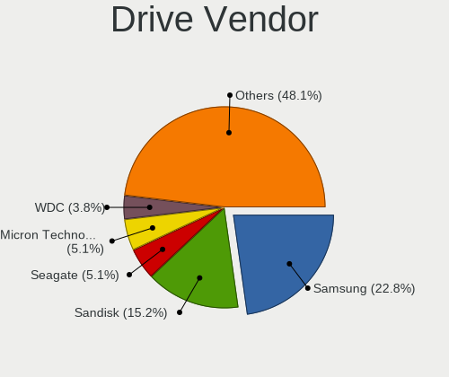
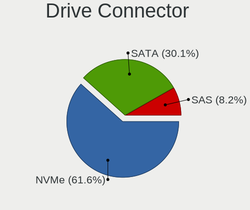
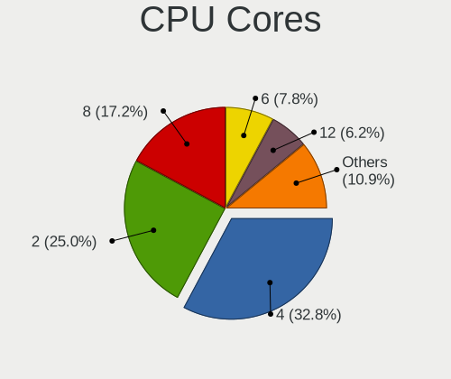
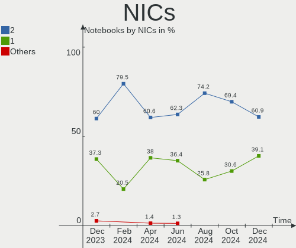
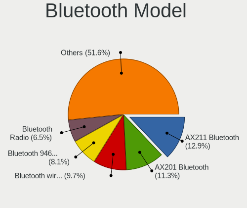
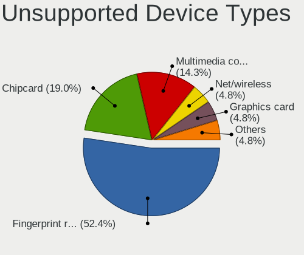

Kubuntu Hardware Trends (Notebook)
----------------------------------

A project to identify most popular hardware characteristics and track their change
over time based on data collected by Kubuntu users at https://Linux-Hardware.org.

Anyone can contribute to the study by uploading probes of their computers by
the [hw-probe](https://github.com/linuxhw/hw-probe) tool:

    sudo -E hw-probe -all -upload

Full-feature report is available here: https://linux-hardware.org/?view=trends&formfactor=notebook

Period: Apr, 2021.

Contents
--------

- [ OS                       ](#os)
- [ OS Family                ](#os-family)
- [ Kernel                   ](#kernel)
- [ Kernel Family            ](#kernel-family)
- [ Kernel Major Ver.        ](#kernel-major-ver)
- [ Arch                     ](#arch)
- [ DE                       ](#de)
- [ Display Server           ](#display-server)
- [ Display Manager          ](#display-manager)
- [ OS Lang                  ](#os-lang)
- [ Boot Mode                ](#boot-mode)
- [ Filesystem               ](#filesystem)
- [ Part. scheme             ](#part-scheme)
- [ Dual Boot with Linux/BSD ](#dual-boot-with-linux/bsd)
- [ Dual Boot (Win)          ](#dual-boot-win)
- [ Country                  ](#country)
- [ City                     ](#city)
- [ Vendor                   ](#vendor)
- [ Model                    ](#model)
- [ Model Family             ](#model-family)
- [ MFG Year                 ](#mfg-year)
- [ Form Factor              ](#form-factor)
- [ Secure Boot              ](#secure-boot)
- [ Coreboot                 ](#coreboot)
- [ RAM Size                 ](#ram-size)
- [ RAM Used                 ](#ram-used)
- [ Has CD-ROM               ](#has-cd-rom)
- [ Total Drives             ](#total-drives)
- [ Has Ethernet             ](#has-ethernet)
- [ Has WiFi                 ](#has-wifi)
- [ Has Bluetooth            ](#has-bluetooth)
- [ Drive Vendor             ](#drive-vendor)
- [ Drive Model              ](#drive-model)
- [ HDD Vendor               ](#hdd-vendor)
- [ SSD Vendor               ](#ssd-vendor)
- [ Drive Kind               ](#drive-kind)
- [ Drive Connector          ](#drive-connector)
- [ Drive Size               ](#drive-size)
- [ Space Total              ](#space-total)
- [ Space Used               ](#space-used)
- [ Malfunc. Drives          ](#malfunc-drives)
- [ Malfunc. Drive Vendor    ](#malfunc-drive-vendor)
- [ Malfunc. HDD Vendor      ](#malfunc-hdd-vendor)
- [ Malfunc. Drive Kind      ](#malfunc-drive-kind)
- [ Failed Drives            ](#failed-drives)
- [ Failed Drive Vendor      ](#failed-drive-vendor)
- [ Drive Status             ](#drive-status)
- [ Storage Vendor           ](#storage-vendor)
- [ Storage Model            ](#storage-model)
- [ Storage Kind             ](#storage-kind)
- [ CPU Vendor               ](#cpu-vendor)
- [ CPU Model                ](#cpu-model)
- [ CPU Model Family         ](#cpu-model-family)
- [ CPU Cores                ](#cpu-cores)
- [ CPU Sockets              ](#cpu-sockets)
- [ CPU Threads              ](#cpu-threads)
- [ CPU Op-Modes             ](#cpu-op-modes)
- [ CPU Microcode            ](#cpu-microcode)
- [ CPU Microarch            ](#cpu-microarch)
- [ GPU Vendor               ](#gpu-vendor)
- [ GPU Model                ](#gpu-model)
- [ GPU Combo                ](#gpu-combo)
- [ GPU Driver               ](#gpu-driver)
- [ GPU Memory               ](#gpu-memory)
- [ Monitor Vendor           ](#monitor-vendor)
- [ Monitor Model            ](#monitor-model)
- [ Monitor Resolution       ](#monitor-resolution)
- [ Monitor Diagonal         ](#monitor-diagonal)
- [ Monitor Width            ](#monitor-width)
- [ Aspect Ratio             ](#aspect-ratio)
- [ Monitor Area             ](#monitor-area)
- [ Pixel Density            ](#pixel-density)
- [ Multiple Monitors        ](#multiple-monitors)
- [ Net Controller Vendor    ](#net-controller-vendor)
- [ Net Controller Model     ](#net-controller-model)
- [ Wireless Vendor          ](#wireless-vendor)
- [ Wireless Model           ](#wireless-model)
- [ Ethernet Vendor          ](#ethernet-vendor)
- [ Ethernet Model           ](#ethernet-model)
- [ Net Controller Kind      ](#net-controller-kind)
- [ Used Controller          ](#used-controller)
- [ NICs                     ](#nics)
- [ IPv6                     ](#ipv6)
- [ Memory Vendor            ](#memory-vendor)
- [ Memory Model             ](#memory-model)
- [ Memory Kind              ](#memory-kind)
- [ Memory Form Factor       ](#memory-form-factor)
- [ Memory Size              ](#memory-size)
- [ Memory Speed             ](#memory-speed)
- [ Sound Vendor             ](#sound-vendor)
- [ Sound Model              ](#sound-model)
- [ Camera Vendor            ](#camera-vendor)
- [ Camera Model             ](#camera-model)
- [ Fingerprint Vendor       ](#fingerprint-vendor)
- [ Fingerprint Model        ](#fingerprint-model)
- [ Chipcard Vendor          ](#chipcard-vendor)
- [ Chipcard Model           ](#chipcard-model)
- [ Printer Vendor           ](#printer-vendor)
- [ Printer Model            ](#printer-model)
- [ Scanner Vendor           ](#scanner-vendor)
- [ Scanner Model            ](#scanner-model)
- [ Bluetooth Vendor         ](#bluetooth-vendor)
- [ Bluetooth Model          ](#bluetooth-model)
- [ Unsupported Devices      ](#unsupported-devices)
- [ Unsupported Device Types ](#unsupported-device-types)

OS
--

Installed operating systems

| Name          | Notebooks | Percent |
|---------------|-----------|---------|
| Kubuntu 20.04 | 31        | 60.78%  |
| Kubuntu 20.10 | 11        | 21.57%  |
| Kubuntu 21.04 | 5         | 9.8%    |
| Kubuntu 18.04 | 3         | 5.88%   |
| Kubuntu       | 1         | 1.96%   |

OS Family
---------

OS without a version

| Name    | Notebooks | Percent |
|---------|-----------|---------|
| Kubuntu | 51        | 100%    |

Kernel
------

Version of the Linux kernel

| Version                  | Notebooks | Percent |
|--------------------------|-----------|---------|
| 5.8.0-48-generic         | 13        | 25.49%  |
| 5.8.0-50-generic         | 9         | 17.65%  |
| 5.4.0-72-generic         | 8         | 15.69%  |
| 5.4.0-70-generic         | 3         | 5.88%   |
| 5.11.0-16-generic        | 3         | 5.88%   |
| 5.8.0-50-lowlatency      | 2         | 3.92%   |
| 5.8.0-49-generic         | 2         | 3.92%   |
| 5.11.0-13-generic        | 2         | 3.92%   |
| 5.8.0-28-generic         | 1         | 1.96%   |
| 5.8.0-25-generic         | 1         | 1.96%   |
| 5.4.0-65-generic         | 1         | 1.96%   |
| 5.4.0-40-generic         | 1         | 1.96%   |
| 5.12.0-051200rc6-generic | 1         | 1.96%   |
| 5.11.15-051115-generic   | 1         | 1.96%   |
| 5.11.12-051112-generic   | 1         | 1.96%   |
| 5.11.11-xanmod1          | 1         | 1.96%   |
| 4.15.0-108-generic       | 1         | 1.96%   |

Kernel Family
-------------

Linux kernel without a distro release

| Version | Notebooks | Percent |
|---------|-----------|---------|
| 5.8.0   | 28        | 54.9%   |
| 5.4.0   | 13        | 25.49%  |
| 5.11.0  | 5         | 9.8%    |
| 5.12.0  | 1         | 1.96%   |
| 5.11.15 | 1         | 1.96%   |
| 5.11.12 | 1         | 1.96%   |
| 5.11.11 | 1         | 1.96%   |
| 4.15.0  | 1         | 1.96%   |

Kernel Major Ver.
-----------------

Linux kernel major version

| Version | Notebooks | Percent |
|---------|-----------|---------|
| 5.8     | 28        | 54.9%   |
| 5.4     | 13        | 25.49%  |
| 5.11    | 8         | 15.69%  |
| 5.12    | 1         | 1.96%   |
| 4.15    | 1         | 1.96%   |

Arch
----

OS architecture (x86_64, i586, etc.)

| Name   | Notebooks | Percent |
|--------|-----------|---------|
| x86_64 | 51        | 100%    |

DE
--

Desktop Environment

| Name  | Notebooks | Percent |
|-------|-----------|---------|
| KDE5  | 25        | 49.02%  |
| KDE   | 25        | 49.02%  |
| GNOME | 1         | 1.96%   |

Display Server
--------------

X11 or Wayland

| Name | Notebooks | Percent |
|------|-----------|---------|
| X11  | 51        | 100%    |

Display Manager
---------------

SDDM, LightDM, etc.

| Name    | Notebooks | Percent |
|---------|-----------|---------|
| SDDM    | 25        | 49.02%  |
| Unknown | 24        | 47.06%  |
| TDM     | 1         | 1.96%   |
| GDM     | 1         | 1.96%   |

OS Lang
-------

Language

| Lang  | Notebooks | Percent |
|-------|-----------|---------|
| en_US | 18        | 35.29%  |
| pt_BR | 4         | 7.84%   |
| it_IT | 4         | 7.84%   |
| en_AU | 3         | 5.88%   |
| de_DE | 3         | 5.88%   |
| ru_RU | 2         | 3.92%   |
| fr_FR | 2         | 3.92%   |
| en_GB | 2         | 3.92%   |
| de_CH | 2         | 3.92%   |
| ru_UA | 1         | 1.96%   |
| nl_NL | 1         | 1.96%   |
| id_ID | 1         | 1.96%   |
| fr_CH | 1         | 1.96%   |
| fr_CA | 1         | 1.96%   |
| fi_FI | 1         | 1.96%   |
| es_UY | 1         | 1.96%   |
| en_IN | 1         | 1.96%   |
| en_CA | 1         | 1.96%   |
| el_GR | 1         | 1.96%   |
| C     | 1         | 1.96%   |

Boot Mode
---------

EFI or BIOS

| Mode | Notebooks | Percent |
|------|-----------|---------|
| EFI  | 37        | 72.55%  |
| BIOS | 14        | 27.45%  |

Filesystem
----------

Type of filesystem

| Type  | Notebooks | Percent |
|-------|-----------|---------|
| Ext4  | 47        | 92.16%  |
| Btrfs | 3         | 5.88%   |
| Zfs   | 1         | 1.96%   |

Part. scheme
------------

Scheme of partitioning

| Type    | Notebooks | Percent |
|---------|-----------|---------|
| Unknown | 24        | 47.06%  |
| GPT     | 23        | 45.1%   |
| MBR     | 4         | 7.84%   |

Dual Boot with Linux/BSD
------------------------

Hosting more than one Linux/BSD

| Dual boot | Notebooks | Percent |
|-----------|-----------|---------|
| No        | 46        | 90.2%   |
| Yes       | 5         | 9.8%    |

Dual Boot (Win)
---------------

Hosting Linux and Windows

| Dual boot | Notebooks | Percent |
|-----------|-----------|---------|
| No        | 30        | 58.82%  |
| Yes       | 21        | 41.18%  |

Country
-------

Geographic location (country)

| Country     | Notebooks | Percent |
|-------------|-----------|---------|
| USA         | 5         | 9.8%    |
| Italy       | 5         | 9.8%    |
| Brazil      | 5         | 9.8%    |
| Germany     | 4         | 7.84%   |
| France      | 4         | 7.84%   |
| Russia      | 3         | 5.88%   |
| Australia   | 3         | 5.88%   |
| Switzerland | 2         | 3.92%   |
| Greece      | 2         | 3.92%   |
| Vietnam     | 1         | 1.96%   |
| Vatican     | 1         | 1.96%   |
| Uruguay     | 1         | 1.96%   |
| Ukraine     | 1         | 1.96%   |
| UK          | 1         | 1.96%   |
| UAE         | 1         | 1.96%   |
| Poland      | 1         | 1.96%   |
| Norway      | 1         | 1.96%   |
| Netherlands | 1         | 1.96%   |
| Mexico      | 1         | 1.96%   |
| Iran        | 1         | 1.96%   |
| Indonesia   | 1         | 1.96%   |
| India       | 1         | 1.96%   |
| Finland     | 1         | 1.96%   |
| Egypt       | 1         | 1.96%   |
| Czechia     | 1         | 1.96%   |
| Canada      | 1         | 1.96%   |
| Bulgaria    | 1         | 1.96%   |

City
----

Geographic location (city)

| City                | Notebooks | Percent |
|---------------------|-----------|---------|
| Melbourne           | 2         | 3.92%   |
| Hamburg             | 2         | 3.92%   |
| Zurich              | 1         | 1.96%   |
| Washington          | 1         | 1.96%   |
| Volos               | 1         | 1.96%   |
| Vatican City        | 1         | 1.96%   |
| Tabriz              | 1         | 1.96%   |
| Surat               | 1         | 1.96%   |
| South Deerfield     | 1         | 1.96%   |
| Sofia               | 1         | 1.96%   |
| Shangrila           | 1         | 1.96%   |
| Saint-Genis-Pouilly | 1         | 1.96%   |
| Rovaniemi           | 1         | 1.96%   |
| Rome                | 1         | 1.96%   |
| Rio Grande          | 1         | 1.96%   |
| Riehen              | 1         | 1.96%   |
| Prague              | 1         | 1.96%   |
| Padova              | 1         | 1.96%   |
| Oslo                | 1         | 1.96%   |
| Novotroitsk         | 1         | 1.96%   |
| Moscow              | 1         | 1.96%   |
| Monthyon            | 1         | 1.96%   |
| Milan               | 1         | 1.96%   |
| Lorraine            | 1         | 1.96%   |
| Little Marlow       | 1         | 1.96%   |
| Leme                | 1         | 1.96%   |
| La Rochelle         | 1         | 1.96%   |
| La Paz              | 1         | 1.96%   |
| Houston             | 1         | 1.96%   |
| Ho Chi Minh City    | 1         | 1.96%   |
| Gdansk              | 1         | 1.96%   |
| Fort Bragg          | 1         | 1.96%   |
| Florence            | 1         | 1.96%   |
| Eunapolis           | 1         | 1.96%   |
| Ebenweiler          | 1         | 1.96%   |
| Dommartin           | 1         | 1.96%   |
| Coroata             | 1         | 1.96%   |
| Cherkasy            | 1         | 1.96%   |
| Chelyabinsk         | 1         | 1.96%   |
| Chapecó            | 1         | 1.96%   |
| Cairo               | 1         | 1.96%   |
| Brunswick           | 1         | 1.96%   |
| Brescia             | 1         | 1.96%   |
| Bekasi              | 1         | 1.96%   |
| Augsburg            | 1         | 1.96%   |
| Athens              | 1         | 1.96%   |
| Amsterdam           | 1         | 1.96%   |
| Al Ain City         | 1         | 1.96%   |
| Adelaide            | 1         | 1.96%   |

Vendor
------

Motherboard manufacturer

| Name                | Notebooks | Percent |
|---------------------|-----------|---------|
| Dell                | 11        | 21.57%  |
| Lenovo              | 10        | 19.61%  |
| Hewlett-Packard     | 8         | 15.69%  |
| Acer                | 8         | 15.69%  |
| ASUSTek Computer    | 4         | 7.84%   |
| Toshiba             | 2         | 3.92%   |
| HUAWEI              | 2         | 3.92%   |
| MSI                 | 1         | 1.96%   |
| LG Electronics      | 1         | 1.96%   |
| Hampoo              | 1         | 1.96%   |
| Gigabyte Technology | 1         | 1.96%   |
| Entroware           | 1         | 1.96%   |
| Alienware           | 1         | 1.96%   |

Model
-----

Motherboard model

| Name                                      | Notebooks | Percent |
|-------------------------------------------|-----------|---------|
| HUAWEI NBLK-WAX9X                         | 2         | 3.92%   |
| Acer Aspire A514-53                       | 2         | 3.92%   |
| Toshiba Satellite E45-B                   | 1         | 1.96%   |
| Toshiba Satellite C850-BLK                | 1         | 1.96%   |
| MSI GX60 3CC                              | 1         | 1.96%   |
| LG A410-K.BE43P1                          | 1         | 1.96%   |
| Lenovo XiaoXin Air 12 80UN                | 1         | 1.96%   |
| Lenovo ThinkPad X250 20CLS1G70A           | 1         | 1.96%   |
| Lenovo ThinkPad X1 Extreme 2nd 20QVS0FP00 | 1         | 1.96%   |
| Lenovo ThinkPad T590 20N4CTO1WW           | 1         | 1.96%   |
| Lenovo ThinkPad T470 20HES18S03           | 1         | 1.96%   |
| Lenovo ThinkPad T440s 20ARS45U00          | 1         | 1.96%   |
| Lenovo ThinkPad T420s 4170CTO             | 1         | 1.96%   |
| Lenovo Legion Y7000P 81LD                 | 1         | 1.96%   |
| Lenovo Legion 7 15IMH05 81YT              | 1         | 1.96%   |
| Lenovo IdeaPad 500-15ISK 80NT             | 1         | 1.96%   |
| HP ProBook 455 G7                         | 1         | 1.96%   |
| HP Pavilion Laptop 17-ar0xx               | 1         | 1.96%   |
| HP Pavilion dv7                           | 1         | 1.96%   |
| HP Laptop 15-bs0xx                        | 1         | 1.96%   |
| HP ENVY 17                                | 1         | 1.96%   |
| HP EliteBook 845 G7 Notebook PC           | 1         | 1.96%   |
| HP 255 G1                                 | 1         | 1.96%   |
| HP 15                                     | 1         | 1.96%   |
| Hampoo Magic 11.6                         | 1         | 1.96%   |
| Gigabyte AORUS 5 SB                       | 1         | 1.96%   |
| Entroware Proteus                         | 1         | 1.96%   |
| Dell XPS 15 9570                          | 1         | 1.96%   |
| Dell XPS 15 9500                          | 1         | 1.96%   |
| Dell XPS 15 7590                          | 1         | 1.96%   |
| Dell XPS 13 9300                          | 1         | 1.96%   |
| Dell Studio 1747                          | 1         | 1.96%   |
| Dell Latitude E7450                       | 1         | 1.96%   |
| Dell Latitude 5590                        | 1         | 1.96%   |
| Dell Latitude 5480                        | 1         | 1.96%   |
| Dell Inspiron 5565                        | 1         | 1.96%   |
| Dell Inspiron 3593                        | 1         | 1.96%   |
| Dell Inspiron 3501                        | 1         | 1.96%   |
| ASUS X555YI                               | 1         | 1.96%   |
| ASUS X510UAR                              | 1         | 1.96%   |
| ASUS X401U                                | 1         | 1.96%   |
| ASUS K53E                                 | 1         | 1.96%   |
| Alienware 17 R2                           | 1         | 1.96%   |
| Acer Swift SF314-52                       | 1         | 1.96%   |
| Acer Nitro AN515-43                       | 1         | 1.96%   |
| Acer Aspire E5-575G                       | 1         | 1.96%   |
| Acer Aspire E1-571                        | 1         | 1.96%   |
| Acer Aspire A715-75G                      | 1         | 1.96%   |
| Acer Aspire A515-54                       | 1         | 1.96%   |

Model Family
------------

Motherboard model prefix

| Name              | Notebooks | Percent |
|-------------------|-----------|---------|
| Lenovo ThinkPad   | 6         | 11.76%  |
| Acer Aspire       | 6         | 11.76%  |
| Dell XPS          | 4         | 7.84%   |
| Dell Latitude     | 3         | 5.88%   |
| Dell Inspiron     | 3         | 5.88%   |
| Toshiba Satellite | 2         | 3.92%   |
| Lenovo Legion     | 2         | 3.92%   |
| HUAWEI NBLK-WAX9X | 2         | 3.92%   |
| HP Pavilion       | 2         | 3.92%   |
| MSI GX60          | 1         | 1.96%   |
| LG A410-K.BE43P1  | 1         | 1.96%   |
| Lenovo XiaoXin    | 1         | 1.96%   |
| Lenovo IdeaPad    | 1         | 1.96%   |
| HP ProBook        | 1         | 1.96%   |
| HP Laptop         | 1         | 1.96%   |
| HP ENVY           | 1         | 1.96%   |
| HP EliteBook      | 1         | 1.96%   |
| HP 255            | 1         | 1.96%   |
| HP 15             | 1         | 1.96%   |
| Hampoo Magic      | 1         | 1.96%   |
| Gigabyte AORUS    | 1         | 1.96%   |
| Entroware Proteus | 1         | 1.96%   |
| Dell Studio       | 1         | 1.96%   |
| ASUS X555YI       | 1         | 1.96%   |
| ASUS X510UAR      | 1         | 1.96%   |
| ASUS X401U        | 1         | 1.96%   |
| ASUS K53E         | 1         | 1.96%   |
| Alienware 17      | 1         | 1.96%   |
| Acer Swift        | 1         | 1.96%   |
| Acer Nitro        | 1         | 1.96%   |

MFG Year
--------

Motherboard manufacture year

| Year | Notebooks | Percent |
|------|-----------|---------|
| 2020 | 19        | 37.25%  |
| 2019 | 7         | 13.73%  |
| 2018 | 4         | 7.84%   |
| 2017 | 4         | 7.84%   |
| 2014 | 4         | 7.84%   |
| 2013 | 4         | 7.84%   |
| 2011 | 3         | 5.88%   |
| 2021 | 2         | 3.92%   |
| 2016 | 2         | 3.92%   |
| 2012 | 1         | 1.96%   |
| 2009 | 1         | 1.96%   |

Form Factor
-----------

Physical design of the computer

| Name     | Notebooks | Percent |
|----------|-----------|---------|
| Notebook | 51        | 100%    |

Secure Boot
-----------

Enabled or disabled

| State    | Notebooks | Percent |
|----------|-----------|---------|
| Disabled | 43        | 84.31%  |
| Enabled  | 8         | 15.69%  |

Coreboot
--------

Have coreboot on board

| Used | Notebooks | Percent |
|------|-----------|---------|
| No   | 51        | 100%    |

RAM Size
--------

Total RAM memory

| Size in GB | Notebooks | Percent |
|------------|-----------|---------|
| 4.01-8.0   | 16        | 31.37%  |
| 8.01-16.0  | 12        | 23.53%  |
| 16.01-24.0 | 11        | 21.57%  |
| 3.01-4.0   | 8         | 15.69%  |
| 32.01-64.0 | 3         | 5.88%   |
| 1.01-2.0   | 1         | 1.96%   |

RAM Used
--------

Used RAM memory

| Used GB   | Notebooks | Percent |
|-----------|-----------|---------|
| 2.01-3.0  | 15        | 29.41%  |
| 1.01-2.0  | 15        | 29.41%  |
| 4.01-8.0  | 14        | 27.45%  |
| 3.01-4.0  | 4         | 7.84%   |
| 0.51-1.0  | 2         | 3.92%   |
| 8.01-16.0 | 1         | 1.96%   |

Has CD-ROM
----------

Has CD-ROM on board

| Presented | Notebooks | Percent |
|-----------|-----------|---------|
| No        | 35        | 68.63%  |
| Yes       | 16        | 31.37%  |

Total Drives
------------

Number of drives on board

| Drives | Notebooks | Percent |
|--------|-----------|---------|
| 1      | 37        | 72.55%  |
| 2      | 9         | 17.65%  |
| 3      | 4         | 7.84%   |
| 4      | 1         | 1.96%   |

Has Ethernet
------------

Has Ethernet on board

| Presented | Notebooks | Percent |
|-----------|-----------|---------|
| Yes       | 42        | 82.35%  |
| No        | 9         | 17.65%  |

Has WiFi
--------

Has WiFi module

| Presented | Notebooks | Percent |
|-----------|-----------|---------|
| Yes       | 50        | 98.04%  |
| No        | 1         | 1.96%   |

Has Bluetooth
-------------

Has Bluetooth module

| Presented | Notebooks | Percent |
|-----------|-----------|---------|
| Yes       | 43        | 84.31%  |
| No        | 8         | 15.69%  |

Drive Vendor
------------

Hard drive vendors

| Vendor                | Notebooks | Drives | Percent |
|-----------------------|-----------|--------|---------|
| Samsung Electronics   | 16        | 18     | 23.88%  |
| WDC                   | 7         | 8      | 10.45%  |
| Toshiba               | 7         | 7      | 10.45%  |
| Seagate               | 7         | 7      | 10.45%  |
| Sandisk               | 5         | 5      | 7.46%   |
| Intel                 | 4         | 4      | 5.97%   |
| Unknown               | 3         | 3      | 4.48%   |
| Kingston              | 3         | 3      | 4.48%   |
| Micron Technology     | 2         | 2      | 2.99%   |
| LITEON                | 2         | 2      | 2.99%   |
| China                 | 2         | 2      | 2.99%   |
| XPG                   | 1         | 1      | 1.49%   |
| SMI                   | 1         | 1      | 1.49%   |
| SK Hynix              | 1         | 1      | 1.49%   |
| Realtek Semiconductor | 1         | 1      | 1.49%   |
| Lenovo                | 1         | 1      | 1.49%   |
| KIOXIA                | 1         | 1      | 1.49%   |
| Hitachi               | 1         | 1      | 1.49%   |
| HGST                  | 1         | 1      | 1.49%   |
| Crucial               | 1         | 1      | 1.49%   |

Drive Model
-----------

Hard drive models

| Model                                   | Notebooks | Percent |
|-----------------------------------------|-----------|---------|
| Unknown MMC Card  128GB                 | 2         | 2.86%   |
| Toshiba MQ01ABD100 1TB                  | 2         | 2.86%   |
| Seagate Expansion 4TB                   | 2         | 2.86%   |
| Samsung SSD 860 EVO 500GB               | 2         | 2.86%   |
| Samsung MZVLQ512HALU-000H1 512GB        | 2         | 2.86%   |
| XPG NVMe SSD Drive 512GB                | 1         | 1.43%   |
| WDC WDS500G3X0C-00SJG0 500GB            | 1         | 1.43%   |
| WDC WDS500G2B0B-00YS70 500GB SSD        | 1         | 1.43%   |
| WDC WDS240G2G0A-00JH30 240GB SSD        | 1         | 1.43%   |
| WDC WDS200T2B0B 2TB SSD                 | 1         | 1.43%   |
| WDC WD10SPZX-21Z10T0 1TB                | 1         | 1.43%   |
| WDC WD10JPVX-22JC3T0 1TB                | 1         | 1.43%   |
| WDC WD10JPVX-00JC3T0 1TB                | 1         | 1.43%   |
| WDC PC SN730 SDBPNTY-256G-1027 256GB    | 1         | 1.43%   |
| Unknown SD64G  64GB                     | 1         | 1.43%   |
| Toshiba THNSNJ128GMCU 128GB SSD         | 1         | 1.43%   |
| Toshiba THNSNJ128GCSU 128GB SSD         | 1         | 1.43%   |
| Toshiba MQ04ABF100 1TB                  | 1         | 1.43%   |
| Toshiba MK6459GSXP 640GB                | 1         | 1.43%   |
| Toshiba KSG60ZMV512G M.2 2280 512GB SSD | 1         | 1.43%   |
| SMI SSD DISK 500GB                      | 1         | 1.43%   |
| SK Hynix PC611 NVMe 512GB               | 1         | 1.43%   |
| Seagate ST9500420AS 500GB               | 1         | 1.43%   |
| Seagate ST500LT012-1DG142 500GB         | 1         | 1.43%   |
| Seagate ST500LM012 HN-M500MBB 500GB     | 1         | 1.43%   |
| Seagate ST320LT007-9ZV142 320GB         | 1         | 1.43%   |
| Seagate ST1000LM035-1RK172 1TB          | 1         | 1.43%   |
| SanDisk Ultra II 240GB SSD              | 1         | 1.43%   |
| SanDisk SD9SN8W128G1002 128GB SSD       | 1         | 1.43%   |
| SanDisk SD8SN8U-128G-1006 128GB SSD     | 1         | 1.43%   |
| Sandisk NVMe SSD Drive 256GB            | 1         | 1.43%   |
| SanDisk DF4032  32GB                    | 1         | 1.43%   |
| Samsung SSD PM851 M.2 2280 128GB        | 1         | 1.43%   |
| Samsung SSD 970 EVO Plus 500GB          | 1         | 1.43%   |
| Samsung SSD 870 EVO 500GB               | 1         | 1.43%   |
| Samsung SSD 870 EVO 2TB                 | 1         | 1.43%   |
| Samsung SSD 860 EVO 250GB               | 1         | 1.43%   |
| Samsung SSD 850 EVO mSATA 500GB         | 1         | 1.43%   |
| Samsung PM981 NVMe 512GB                | 1         | 1.43%   |
| Samsung NVMe SSD Drive 512GB            | 1         | 1.43%   |
| Samsung NVMe SSD Drive 250GB            | 1         | 1.43%   |
| Samsung NVMe SSD Drive 1TB              | 1         | 1.43%   |
| Samsung MZYLN256HCHP-000L2 256GB SSD    | 1         | 1.43%   |
| Samsung MZVLB512HBJQ-000L2 512GB        | 1         | 1.43%   |
| Samsung MZVLB1T0HBLR-000L7 1TB          | 1         | 1.43%   |
| Samsung MZNTY128HDHP-000L2 128GB SSD    | 1         | 1.43%   |
| Realtek NVMe SSD Drive 512GB            | 1         | 1.43%   |
| Micron 2210_MTFDHBA1T0QFD 1TB           | 1         | 1.43%   |
| Micron 2200S NVMe 1024GB                | 1         | 1.43%   |
| LITEON LMH-128V2M-11 MSATA 128GB SSD    | 1         | 1.43%   |
| LITEON CA5-8D512 512GB                  | 1         | 1.43%   |
| Lenovo NVMe SSD Drive 256GB             | 1         | 1.43%   |
| KIOXIA KBG40ZNS512G NVMe 512GB          | 1         | 1.43%   |
| Kingston SHFS37A120G 120GB SSD          | 1         | 1.43%   |
| Kingston RBUSNS8154P3512GJ1 512GB       | 1         | 1.43%   |
| Kingston OM8PCP3512F-AA 512GB           | 1         | 1.43%   |
| Intel SSDSC2BW180A3L 180GB              | 1         | 1.43%   |
| Intel SSDPEKNW512G8 512GB               | 1         | 1.43%   |
| Intel SSDPEKKW256G7 256GB               | 1         | 1.43%   |
| Intel SSDPEKKF010T8L 1TB                | 1         | 1.43%   |

HDD Vendor
----------

Hard disk drive vendors

| Vendor  | Notebooks | Drives | Percent |
|---------|-----------|--------|---------|
| Seagate | 7         | 7      | 43.75%  |
| Toshiba | 4         | 4      | 25%     |
| WDC     | 3         | 3      | 18.75%  |
| Hitachi | 1         | 1      | 6.25%   |
| HGST    | 1         | 1      | 6.25%   |

SSD Vendor
----------

Solid state drive vendors

| Vendor              | Notebooks | Drives | Percent |
|---------------------|-----------|--------|---------|
| Samsung Electronics | 9         | 9      | 36%     |
| WDC                 | 3         | 3      | 12%     |
| Toshiba             | 3         | 3      | 12%     |
| SanDisk             | 3         | 3      | 12%     |
| China               | 2         | 2      | 8%      |
| SMI                 | 1         | 1      | 4%      |
| LITEON              | 1         | 1      | 4%      |
| Kingston            | 1         | 1      | 4%      |
| Intel               | 1         | 1      | 4%      |
| Crucial             | 1         | 1      | 4%      |

Drive Kind
----------

HDD or SSD

| Kind | Notebooks | Drives | Percent |
|------|-----------|--------|---------|
| SSD  | 24        | 25     | 36.92%  |
| NVMe | 23        | 25     | 35.38%  |
| HDD  | 14        | 16     | 21.54%  |
| MMC  | 4         | 4      | 6.15%   |

Drive Connector
---------------

SATA, SAS, NVMe, etc.

| Type | Notebooks | Drives | Percent |
|------|-----------|--------|---------|
| SATA | 31        | 39     | 51.67%  |
| NVMe | 23        | 25     | 38.33%  |
| MMC  | 4         | 4      | 6.67%   |
| SAS  | 2         | 2      | 3.33%   |

Drive Size
----------

Size of hard drive

| Size in TB | Notebooks | Drives | Percent |
|------------|-----------|--------|---------|
| 0.01-0.5   | 24        | 25     | 60%     |
| 0.51-1.0   | 11        | 11     | 27.5%   |
| 1.01-2.0   | 3         | 3      | 7.5%    |
| 3.01-4.0   | 2         | 2      | 5%      |

Space Total
-----------

Amount of disk space available on the file system

| Size in GB     | Notebooks | Percent |
|----------------|-----------|---------|
| 251-500        | 14        | 27.45%  |
| 101-250        | 13        | 25.49%  |
| 501-1000       | 8         | 15.69%  |
| 21-50          | 5         | 9.8%    |
| 1001-2000      | 5         | 9.8%    |
| 51-100         | 4         | 7.84%   |
| More than 3000 | 1         | 1.96%   |
| 1-20           | 1         | 1.96%   |

Space Used
----------

Amount of used disk space

| Used GB   | Notebooks | Percent |
|-----------|-----------|---------|
| 21-50     | 14        | 27.45%  |
| 1-20      | 11        | 21.57%  |
| 101-250   | 10        | 19.61%  |
| 51-100    | 6         | 11.76%  |
| 251-500   | 4         | 7.84%   |
| 501-1000  | 3         | 5.88%   |
| 1001-2000 | 2         | 3.92%   |
| 2001-3000 | 1         | 1.96%   |

Malfunc. Drives
---------------

Drive models with a malfunction

| Model                           | Notebooks | Drives | Percent |
|---------------------------------|-----------|--------|---------|
| Toshiba MQ04ABF100 1TB          | 1         | 1      | 33.33%  |
| Seagate ST320LT007-9ZV142 320GB | 1         | 1      | 33.33%  |
| Hitachi HTS547564A9E384 640GB   | 1         | 1      | 33.33%  |

Malfunc. Drive Vendor
---------------------

Vendors of faulty drives

| Vendor  | Notebooks | Drives | Percent |
|---------|-----------|--------|---------|
| Toshiba | 1         | 1      | 33.33%  |
| Seagate | 1         | 1      | 33.33%  |
| Hitachi | 1         | 1      | 33.33%  |

Malfunc. HDD Vendor
-------------------

Vendors of faulty HDD drives

| Vendor  | Notebooks | Drives | Percent |
|---------|-----------|--------|---------|
| Toshiba | 1         | 1      | 33.33%  |
| Seagate | 1         | 1      | 33.33%  |
| Hitachi | 1         | 1      | 33.33%  |

Malfunc. Drive Kind
-------------------

Kinds of faulty drives

| Kind | Notebooks | Drives | Percent |
|------|-----------|--------|---------|
| HDD  | 2         | 3      | 100%    |

Failed Drives
-------------

Failed drive models

Zero info for selected period =(

Failed Drive Vendor
-------------------

Failed drive vendors

Zero info for selected period =(

Drive Status
------------

Number of failed and malfunc. drives

| Status   | Notebooks | Drives | Percent |
|----------|-----------|--------|---------|
| Works    | 29        | 35     | 52.73%  |
| Detected | 24        | 32     | 43.64%  |
| Malfunc  | 2         | 3      | 3.64%   |

Storage Vendor
--------------

Storage controller vendors

| Vendor                      | Notebooks | Percent |
|-----------------------------|-----------|---------|
| Intel                       | 33        | 52.38%  |
| AMD                         | 9         | 14.29%  |
| Samsung Electronics         | 8         | 12.7%   |
| Sandisk                     | 3         | 4.76%   |
| Micron Technology           | 2         | 3.17%   |
| Kingston Technology Company | 2         | 3.17%   |
| SK Hynix                    | 1         | 1.59%   |
| Realtek Semiconductor       | 1         | 1.59%   |
| Lite-On Technology          | 1         | 1.59%   |
| Lenovo                      | 1         | 1.59%   |
| KIOXIA                      | 1         | 1.59%   |
| ADATA Technology            | 1         | 1.59%   |

Storage Model
-------------

Storage controller models

| Model                                                                          | Notebooks | Percent |
|--------------------------------------------------------------------------------|-----------|---------|
| AMD FCH SATA Controller [AHCI mode]                                            | 8         | 12.31%  |
| Samsung NVMe SSD Controller SM981/PM981/PM983                                  | 5         | 7.69%   |
| Intel Sunrise Point-LP SATA Controller [AHCI mode]                             | 5         | 7.69%   |
| Intel 82801 Mobile SATA Controller [RAID mode]                                 | 5         | 7.69%   |
| Intel Ice Lake-LP SATA Controller [AHCI mode]                                  | 4         | 6.15%   |
| Intel Cannon Lake Mobile PCH SATA AHCI Controller                              | 3         | 4.62%   |
| Intel 7 Series Chipset Family 6-port SATA Controller [AHCI mode]               | 3         | 4.62%   |
| Sandisk WD Black SN750 / PC SN730 NVMe SSD                                     | 2         | 3.08%   |
| Samsung NVMe Controller                                                        | 2         | 3.08%   |
| Micron Non-Volatile memory controller                                          | 2         | 3.08%   |
| Intel 8 Series SATA Controller 1 [AHCI mode]                                   | 2         | 3.08%   |
| Intel 6 Series/C200 Series Chipset Family 6 port Mobile SATA AHCI Controller   | 2         | 3.08%   |
| AMD FCH IDE Controller                                                         | 2         | 3.08%   |
| SK Hynix Non-Volatile memory controller                                        | 1         | 1.54%   |
| Sandisk WD Blue SN500 / PC SN520 NVMe SSD                                      | 1         | 1.54%   |
| Samsung NVMe SSD Controller PM9A1/980PRO                                       | 1         | 1.54%   |
| Realtek Realtek Non-Volatile memory controller                                 | 1         | 1.54%   |
| Lite-On Non-Volatile memory controller                                         | 1         | 1.54%   |
| Lenovo Non-Volatile memory controller                                          | 1         | 1.54%   |
| KIOXIA Non-Volatile memory controller                                          | 1         | 1.54%   |
| Kingston Company U-SNS8154P3 NVMe SSD                                          | 1         | 1.54%   |
| Kingston Company Company Non-Volatile memory controller                        | 1         | 1.54%   |
| Intel Wildcat Point-LP SATA Controller [AHCI Mode]                             | 1         | 1.54%   |
| Intel SSD 660P Series                                                          | 1         | 1.54%   |
| Intel SSD 600P Series                                                          | 1         | 1.54%   |
| Intel Comet Lake SATA AHCI Controller                                          | 1         | 1.54%   |
| Intel Cannon Point-LP SATA Controller [AHCI Mode]                              | 1         | 1.54%   |
| Intel 8 Series/C220 Series Chipset Family 6-port SATA Controller 1 [AHCI mode] | 1         | 1.54%   |
| Intel 5 Series/3400 Series Chipset 6 port SATA AHCI Controller                 | 1         | 1.54%   |
| Intel 5 Series/3400 Series Chipset 4 port SATA AHCI Controller                 | 1         | 1.54%   |
| Intel 400 Series Chipset Family SATA AHCI Controller                           | 1         | 1.54%   |
| AMD SB7x0/SB8x0/SB9x0 SATA Controller [AHCI mode]                              | 1         | 1.54%   |
| ADATA XPG SX8200 Pro PCIe Gen3x4 M.2 2280 Solid State Drive                    | 1         | 1.54%   |

Storage Kind
------------

Kind of storage controller (IDE, SATA, NVMe, SAS, ...)

| Kind | Notebooks | Percent |
|------|-----------|---------|
| SATA | 35        | 54.69%  |
| NVMe | 22        | 34.38%  |
| RAID | 5         | 7.81%   |
| IDE  | 2         | 3.13%   |

CPU Vendor
----------

Processor vendors

| Vendor | Notebooks | Percent |
|--------|-----------|---------|
| Intel  | 39        | 76.47%  |
| AMD    | 12        | 23.53%  |

CPU Model
---------

Processor models

| Model                                           | Notebooks | Percent |
|-------------------------------------------------|-----------|---------|
| Intel Core i7-10750H CPU @ 2.60GHz              | 4         | 7.84%   |
| Intel Core i5-6200U CPU @ 2.30GHz               | 3         | 5.88%   |
| Intel Core i5-8250U CPU @ 1.60GHz               | 2         | 3.92%   |
| Intel Core i5-1035G1 CPU @ 1.00GHz              | 2         | 3.92%   |
| Intel Core i3-1005G1 CPU @ 1.20GHz              | 2         | 3.92%   |
| AMD Ryzen 5 3500U with Radeon Vega Mobile Gfx   | 2         | 3.92%   |
| Intel Core m3-6Y30 CPU @ 0.90GHz                | 1         | 1.96%   |
| Intel Core i9-9880H CPU @ 2.30GHz               | 1         | 1.96%   |
| Intel Core i7-9750H CPU @ 2.60GHz               | 1         | 1.96%   |
| Intel Core i7-8750H CPU @ 2.20GHz               | 1         | 1.96%   |
| Intel Core i7-8565U CPU @ 1.80GHz               | 1         | 1.96%   |
| Intel Core i7-7500U CPU @ 2.70GHz               | 1         | 1.96%   |
| Intel Core i7-5600U CPU @ 2.60GHz               | 1         | 1.96%   |
| Intel Core i7-4720HQ CPU @ 2.60GHz              | 1         | 1.96%   |
| Intel Core i7-4700MQ CPU @ 2.40GHz              | 1         | 1.96%   |
| Intel Core i7-4600U CPU @ 2.10GHz               | 1         | 1.96%   |
| Intel Core i7-2620M CPU @ 2.70GHz               | 1         | 1.96%   |
| Intel Core i7-1065G7 CPU @ 1.30GHz              | 1         | 1.96%   |
| Intel Core i7 CPU Q 720 @ 1.60GHz               | 1         | 1.96%   |
| Intel Core i5-8300H CPU @ 2.30GHz               | 1         | 1.96%   |
| Intel Core i5-8265U CPU @ 1.60GHz               | 1         | 1.96%   |
| Intel Core i5-7300U CPU @ 2.60GHz               | 1         | 1.96%   |
| Intel Core i5-7200U CPU @ 2.50GHz               | 1         | 1.96%   |
| Intel Core i5-5300U CPU @ 2.30GHz               | 1         | 1.96%   |
| Intel Core i5-4210U CPU @ 1.70GHz               | 1         | 1.96%   |
| Intel Core i5-3230M CPU @ 2.60GHz               | 1         | 1.96%   |
| Intel Core i5-2540M CPU @ 2.60GHz               | 1         | 1.96%   |
| Intel Core i5-2450M CPU @ 2.50GHz               | 1         | 1.96%   |
| Intel Core i5-10210U CPU @ 1.60GHz              | 1         | 1.96%   |
| Intel Core i5 CPU M 480 @ 2.67GHz               | 1         | 1.96%   |
| Intel Core i3-3217U CPU @ 1.80GHz               | 1         | 1.96%   |
| Intel Atom x5-Z8350 CPU @ 1.44GHz               | 1         | 1.96%   |
| AMD Ryzen 7 PRO 4750U with Radeon Graphics      | 1         | 1.96%   |
| AMD Ryzen 7 4700U with Radeon Graphics          | 1         | 1.96%   |
| AMD Ryzen 5 3550H with Radeon Vega Mobile Gfx   | 1         | 1.96%   |
| AMD FX-9800P RADEON R7, 12 COMPUTE CORES 4C+8G  | 1         | 1.96%   |
| AMD E1-1500 APU with Radeon HD Graphics         | 1         | 1.96%   |
| AMD C-60 APU with Radeon HD Graphics            | 1         | 1.96%   |
| AMD Athlon II Dual-Core M300                    | 1         | 1.96%   |
| AMD A8-7410 APU with AMD Radeon R5 Graphics     | 1         | 1.96%   |
| AMD A10-9620P RADEON R5, 10 COMPUTE CORES 4C+6G | 1         | 1.96%   |
| AMD A10-5750M APU with Radeon HD Graphics       | 1         | 1.96%   |

CPU Model Family
----------------

Processor model prefix

| Model                   | Notebooks | Percent |
|-------------------------|-----------|---------|
| Intel Core i5           | 18        | 35.29%  |
| Intel Core i7           | 15        | 29.41%  |
| Intel Core i3           | 3         | 5.88%   |
| AMD Ryzen 5             | 3         | 5.88%   |
| AMD A10                 | 2         | 3.92%   |
| Intel Core m3           | 1         | 1.96%   |
| Intel Core i9           | 1         | 1.96%   |
| Intel Atom              | 1         | 1.96%   |
| AMD Ryzen 7 PRO         | 1         | 1.96%   |
| AMD Ryzen 7             | 1         | 1.96%   |
| AMD FX                  | 1         | 1.96%   |
| AMD E1                  | 1         | 1.96%   |
| AMD C-60                | 1         | 1.96%   |
| AMD Athlon II Dual-Core | 1         | 1.96%   |
| AMD A8                  | 1         | 1.96%   |

CPU Cores
---------

Number of processor cores

| Number | Notebooks | Percent |
|--------|-----------|---------|
| 2      | 25        | 49.02%  |
| 4      | 17        | 33.33%  |
| 6      | 6         | 11.76%  |
| 8      | 3         | 5.88%   |

CPU Sockets
-----------

Number of sockets

| Number | Notebooks | Percent |
|--------|-----------|---------|
| 1      | 51        | 100%    |

CPU Threads
-----------

Threads per core (Hyper-Threading)

| Number | Notebooks | Percent |
|--------|-----------|---------|
| 2      | 45        | 88.24%  |
| 1      | 6         | 11.76%  |

CPU Op-Modes
------------

CPU Operation Modes (32-bit, 64-bit)

| Op mode        | Notebooks | Percent |
|----------------|-----------|---------|
| 32-bit, 64-bit | 51        | 100%    |

CPU Microcode
-------------

Microcode number

| Number     | Notebooks | Percent |
|------------|-----------|---------|
| Unknown    | 7         | 13.73%  |
| 0x706e5    | 4         | 7.84%   |
| 0x406e3    | 4         | 7.84%   |
| 0xa0652    | 3         | 5.88%   |
| 0x906ea    | 3         | 5.88%   |
| 0x806e9    | 3         | 5.88%   |
| 0x206a7    | 3         | 5.88%   |
| 0x806ec    | 2         | 3.92%   |
| 0x806ea    | 2         | 3.92%   |
| 0x40651    | 2         | 3.92%   |
| 0x306c3    | 2         | 3.92%   |
| 0x08600106 | 2         | 3.92%   |
| 0x08108109 | 2         | 3.92%   |
| 0x06006118 | 2         | 3.92%   |
| 0x05000119 | 2         | 3.92%   |
| 0x906ed    | 1         | 1.96%   |
| 0x406c4    | 1         | 1.96%   |
| 0x306d4    | 1         | 1.96%   |
| 0x306a9    | 1         | 1.96%   |
| 0x106e5    | 1         | 1.96%   |
| 0x08108102 | 1         | 1.96%   |
| 0x07030105 | 1         | 1.96%   |
| 0x06001119 | 1         | 1.96%   |

CPU Microarch
-------------

Microarchitecture

| Name        | Notebooks | Percent |
|-------------|-----------|---------|
| KabyLake    | 12        | 23.53%  |
| IceLake     | 5         | 9.8%    |
| Skylake     | 4         | 7.84%   |
| Haswell     | 4         | 7.84%   |
| CometLake   | 4         | 7.84%   |
| Zen+        | 3         | 5.88%   |
| SandyBridge | 3         | 5.88%   |
| Zen 2       | 2         | 3.92%   |
| IvyBridge   | 2         | 3.92%   |
| Excavator   | 2         | 3.92%   |
| Broadwell   | 2         | 3.92%   |
| Bobcat      | 2         | 3.92%   |
| Westmere    | 1         | 1.96%   |
| Silvermont  | 1         | 1.96%   |
| Puma        | 1         | 1.96%   |
| Piledriver  | 1         | 1.96%   |
| Nehalem     | 1         | 1.96%   |
| K10         | 1         | 1.96%   |

GPU Vendor
----------

Vendors of graphics cards

| Vendor | Notebooks | Percent |
|--------|-----------|---------|
| Intel  | 36        | 57.14%  |
| AMD    | 14        | 22.22%  |
| Nvidia | 13        | 20.63%  |

GPU Model
---------

Graphics card models

| Model                                                                                    | Notebooks | Percent |
|------------------------------------------------------------------------------------------|-----------|---------|
| Intel Iris Plus Graphics G1 (Ice Lake)                                                   | 4         | 5.97%   |
| Intel CometLake-H GT2 [UHD Graphics]                                                     | 4         | 5.97%   |
| Intel CoffeeLake-H GT2 [UHD Graphics 630]                                                | 4         | 5.97%   |
| Intel Skylake GT2 [HD Graphics 520]                                                      | 3         | 4.48%   |
| Intel HD Graphics 620                                                                    | 3         | 4.48%   |
| AMD Picasso                                                                              | 3         | 4.48%   |
| Nvidia TU117M [GeForce GTX 1650 Ti Mobile]                                               | 2         | 2.99%   |
| Nvidia TU117M [GeForce GTX 1650 Mobile / Max-Q]                                          | 2         | 2.99%   |
| Nvidia GP107M [GeForce GTX 1050 Ti Mobile]                                               | 2         | 2.99%   |
| Intel WhiskeyLake-U GT2 [UHD Graphics 620]                                               | 2         | 2.99%   |
| Intel UHD Graphics 620                                                                   | 2         | 2.99%   |
| Intel HD Graphics 5500                                                                   | 2         | 2.99%   |
| Intel Haswell-ULT Integrated Graphics Controller                                         | 2         | 2.99%   |
| Intel 4th Gen Core Processor Integrated Graphics Controller                              | 2         | 2.99%   |
| Intel 3rd Gen Core processor Graphics Controller                                         | 2         | 2.99%   |
| Intel 2nd Generation Core Processor Family Integrated Graphics Controller                | 2         | 2.99%   |
| AMD Wani [Radeon R5/R6/R7 Graphics]                                                      | 2         | 2.99%   |
| AMD Topaz XT [Radeon R7 M260/M265 / M340/M360 / M440/M445 / 530/535 / 620/625 Mobile]    | 2         | 2.99%   |
| AMD Renoir                                                                               | 2         | 2.99%   |
| Nvidia TU116M [GeForce GTX 1660 Ti Mobile]                                               | 1         | 1.49%   |
| Nvidia TU106BM [GeForce RTX 2070 Mobile]                                                 | 1         | 1.49%   |
| Nvidia GT218M [GeForce 310M]                                                             | 1         | 1.49%   |
| Nvidia GM204M [GeForce GTX 970M]                                                         | 1         | 1.49%   |
| Nvidia GM107M [GeForce GTX 950M]                                                         | 1         | 1.49%   |
| Nvidia GK208M [GeForce GT 740M]                                                          | 1         | 1.49%   |
| Nvidia GF119M [NVS 4200M]                                                                | 1         | 1.49%   |
| Intel Iris Plus Graphics G7                                                              | 1         | 1.49%   |
| Intel HD Graphics 515                                                                    | 1         | 1.49%   |
| Intel CometLake-U GT2 [UHD Graphics]                                                     | 1         | 1.49%   |
| Intel Atom/Celeron/Pentium Processor x5-E8000/J3xxx/N3xxx Integrated Graphics Controller | 1         | 1.49%   |
| AMD Wrestler [Radeon HD 7310]                                                            | 1         | 1.49%   |
| AMD Wrestler [Radeon HD 6290]                                                            | 1         | 1.49%   |
| AMD RV730/M96 [Mobility Radeon HD 4650/5165]                                             | 1         | 1.49%   |
| AMD RV710/M92 [Mobility Radeon HD 4530/4570/545v]                                        | 1         | 1.49%   |
| AMD Richland [Radeon HD 8650G]                                                           | 1         | 1.49%   |
| AMD Neptune XT [Radeon HD 8970M]                                                         | 1         | 1.49%   |
| AMD Mullins [Radeon R4/R5 Graphics]                                                      | 1         | 1.49%   |
| AMD Jet PRO [Radeon R5 M230 / R7 M260DX / Radeon 520 Mobile]                             | 1         | 1.49%   |
| AMD Baffin [Radeon RX 460/560D / Pro 450/455/460/555/555X/560/560X]                      | 1         | 1.49%   |

GPU Combo
---------

Combinations of graphics cards

| Name           | Notebooks | Percent |
|----------------|-----------|---------|
| 1 x Intel      | 24        | 47.06%  |
| Intel + Nvidia | 11        | 21.57%  |
| 1 x AMD        | 9         | 17.65%  |
| 2 x AMD        | 4         | 7.84%   |
| 1 x Nvidia     | 2         | 3.92%   |
| Intel + AMD    | 1         | 1.96%   |

GPU Driver
----------

Free vs proprietary

| Driver      | Notebooks | Percent |
|-------------|-----------|---------|
| Free        | 39        | 76.47%  |
| Proprietary | 10        | 19.61%  |
| Unknown     | 2         | 3.92%   |

GPU Memory
----------

Total video memory

| Size in GB | Notebooks | Percent |
|------------|-----------|---------|
| Unknown    | 29        | 56.86%  |
| 3.01-4.0   | 7         | 13.73%  |
| 0.51-1.0   | 7         | 13.73%  |
| 0.01-0.5   | 5         | 9.8%    |
| 5.01-6.0   | 1         | 1.96%   |
| 2.01-3.0   | 1         | 1.96%   |
| 1.01-2.0   | 1         | 1.96%   |

Monitor Vendor
--------------

Monitor vendors

| Vendor                  | Notebooks | Percent |
|-------------------------|-----------|---------|
| LG Display              | 13        | 22.81%  |
| Chimei Innolux          | 11        | 19.3%   |
| AU Optronics            | 8         | 14.04%  |
| BOE                     | 7         | 12.28%  |
| Samsung Electronics     | 5         | 8.77%   |
| Sharp                   | 3         | 5.26%   |
| Goldstar                | 2         | 3.51%   |
| Dell                    | 2         | 3.51%   |
| ViewSonic               | 1         | 1.75%   |
| Philips                 | 1         | 1.75%   |
| PANDA                   | 1         | 1.75%   |
| Chi Mei Optoelectronics | 1         | 1.75%   |
| ASUSTek Computer        | 1         | 1.75%   |
| Acer                    | 1         | 1.75%   |

Monitor Model
-------------

Monitor models

| Model                                                                    | Notebooks | Percent |
|--------------------------------------------------------------------------|-----------|---------|
| Chimei Innolux LCD Monitor CMN14D6 1366x768 309x173mm 13.9-inch          | 2         | 3.39%   |
| ViewSonic VA2718-FHD VSCD839 1920x1080 598x336mm 27.0-inch               | 1         | 1.69%   |
| Sharp LCD Monitor SHP14D1 1920x1200 336x210mm 15.6-inch                  | 1         | 1.69%   |
| Sharp LCD Monitor SHP14CB 1920x1200 288x180mm 13.4-inch                  | 1         | 1.69%   |
| Sharp LCD Monitor SHP149A 1920x1080 344x194mm 15.5-inch                  | 1         | 1.69%   |
| Samsung Electronics S24F350 SAM0D20 1920x1080 521x293mm 23.5-inch        | 1         | 1.69%   |
| Samsung Electronics S24D390 SAM0B65 1920x1080 520x290mm 23.4-inch        | 1         | 1.69%   |
| Samsung Electronics LCD Monitor SEC5441 1366x768 344x194mm 15.5-inch     | 1         | 1.69%   |
| Samsung Electronics LCD Monitor SEC3154 1366x768 293x165mm 13.2-inch     | 1         | 1.69%   |
| Samsung Electronics LCD Monitor SDC8B4F 1920x1080 344x194mm 15.5-inch    | 1         | 1.69%   |
| Samsung Electronics Color LCD SDCA029 2160x1440 252x168mm 11.9-inch      | 1         | 1.69%   |
| Philips PHL 241B7QUB PHL0932 1920x1080 527x296mm 23.8-inch               | 1         | 1.69%   |
| PANDA LM156LF1L03 NCP001C 1920x1080 344x194mm 15.5-inch                  | 1         | 1.69%   |
| LG Display LCD Monitor LGD065A 1920x1080 344x194mm 15.5-inch             | 1         | 1.69%   |
| LG Display LCD Monitor LGD0625 1920x1080 344x194mm 15.5-inch             | 1         | 1.69%   |
| LG Display LCD Monitor LGD0573 1920x1080 344x194mm 15.5-inch             | 1         | 1.69%   |
| LG Display LCD Monitor LGD056D 1920x1080 380x210mm 17.1-inch             | 1         | 1.69%   |
| LG Display LCD Monitor LGD0563 1920x1080 344x194mm 15.5-inch             | 1         | 1.69%   |
| LG Display LCD Monitor LGD0558 1920x1080 309x174mm 14.0-inch             | 1         | 1.69%   |
| LG Display LCD Monitor LGD0459 1920x1080 382x215mm 17.3-inch             | 1         | 1.69%   |
| LG Display LCD Monitor LGD0406 1920x1080 309x175mm 14.0-inch             | 1         | 1.69%   |
| LG Display LCD Monitor LGD0395 1366x768 344x194mm 15.5-inch              | 1         | 1.69%   |
| LG Display LCD Monitor LGD02E9 1366x768 309x174mm 14.0-inch              | 1         | 1.69%   |
| LG Display LCD Monitor LGD02DC 1366x768 344x194mm 15.5-inch              | 1         | 1.69%   |
| LG Display LCD Monitor LGD0259 1920x1080 350x190mm 15.7-inch             | 1         | 1.69%   |
| LG Display LCD Monitor LGD021D 1600x900 382x215mm 17.3-inch              | 1         | 1.69%   |
| Goldstar E2250 GSM578D 1680x1050 480x270mm 21.7-inch                     | 1         | 1.69%   |
| Goldstar D2342P GSM5842 1920x1080 510x290mm 23.1-inch                    | 1         | 1.69%   |
| Dell U2719DC DEL419C 2560x1440 597x336mm 27.0-inch                       | 1         | 1.69%   |
| Dell U2415 DELA0B8 1920x1080 520x320mm 24.0-inch                         | 1         | 1.69%   |
| Chimei Innolux LCD Monitor CMN15E8 1920x1080 344x193mm 15.5-inch         | 1         | 1.69%   |
| Chimei Innolux LCD Monitor CMN15E3 1920x1080 344x193mm 15.5-inch         | 1         | 1.69%   |
| Chimei Innolux LCD Monitor CMN15CA 1366x768 340x190mm 15.3-inch          | 1         | 1.69%   |
| Chimei Innolux LCD Monitor CMN15C4 1920x1080 344x193mm 15.5-inch         | 1         | 1.69%   |
| Chimei Innolux LCD Monitor CMN15AB 1366x768 350x190mm 15.7-inch          | 1         | 1.69%   |
| Chimei Innolux LCD Monitor CMN150C 1920x1080 344x193mm 15.5-inch         | 1         | 1.69%   |
| Chimei Innolux LCD Monitor CMN1490 1366x768 309x173mm 13.9-inch          | 1         | 1.69%   |
| Chimei Innolux LCD Monitor CMN1472 1366x768 309x174mm 14.0-inch          | 1         | 1.69%   |
| Chimei Innolux LCD Monitor CMN1404 1920x1080 309x173mm 13.9-inch         | 1         | 1.69%   |
| Chi Mei Optoelectronics LCD Monitor CMO1592 1366x768 344x193mm 15.5-inch | 1         | 1.69%   |
| BOE LCD Monitor BOE097D 1920x1080 344x194mm 15.5-inch                    | 1         | 1.69%   |
| BOE LCD Monitor BOE08EA 1920x1080 344x194mm 15.5-inch                    | 1         | 1.69%   |
| BOE LCD Monitor BOE0877 1920x1080 309x173mm 13.9-inch                    | 1         | 1.69%   |
| BOE LCD Monitor BOE086A 1366x768 340x190mm 15.3-inch                     | 1         | 1.69%   |
| BOE LCD Monitor BOE07CB 1920x1080 344x193mm 15.5-inch                    | 1         | 1.69%   |
| BOE LCD Monitor BOE06FB 1920x1080 344x194mm 15.5-inch                    | 1         | 1.69%   |
| BOE LCD Monitor BOE06CB 1920x1080 344x194mm 15.5-inch                    | 1         | 1.69%   |
| AU Optronics LCD Monitor AUO21ED 1920x1080 344x194mm 15.5-inch           | 1         | 1.69%   |
| AU Optronics LCD Monitor AUO219D 1920x1080 381x214mm 17.2-inch           | 1         | 1.69%   |
| AU Optronics LCD Monitor AUO213E 1600x900 309x174mm 14.0-inch            | 1         | 1.69%   |
| AU Optronics LCD Monitor AUO213D 1920x1080 309x173mm 13.9-inch           | 1         | 1.69%   |
| AU Optronics LCD Monitor AUO123D 1920x1080 309x173mm 13.9-inch           | 1         | 1.69%   |
| AU Optronics LCD Monitor AUO106C 1366x768 277x156mm 12.5-inch            | 1         | 1.69%   |
| AU Optronics LCD Monitor AUO103D 1920x1080 310x170mm 13.9-inch           | 1         | 1.69%   |
| AU Optronics LCD Monitor AUO068B 1920x1080 309x174mm 14.0-inch           | 1         | 1.69%   |
| ASUSTek Computer VP249 AUS24AF 1920x1080 527x296mm 23.8-inch             | 1         | 1.69%   |
| ASUSTek Computer VG27W AUS27E0 2560x1440 597x336mm 27.0-inch             | 1         | 1.69%   |
| Acer G237HL ACR03DF 1920x1080 509x286mm 23.0-inch                        | 1         | 1.69%   |

Monitor Resolution
------------------

Monitor screen resolution

| Resolution        | Notebooks | Percent |
|-------------------|-----------|---------|
| 1920x1080 (FHD)   | 30        | 57.69%  |
| 1366x768 (WXGA)   | 13        | 25%     |
| 1920x1200 (WUXGA) | 3         | 5.77%   |
| 1600x900 (HD+)    | 3         | 5.77%   |
| 2560x1440 (QHD)   | 2         | 3.85%   |
| 3840x2160 (4K)    | 1         | 1.92%   |

Monitor Diagonal
----------------

Diagonal size in inches

| Inches | Notebooks | Percent |
|--------|-----------|---------|
| 15     | 27        | 45.76%  |
| 14     | 8         | 13.56%  |
| 13     | 7         | 11.86%  |
| 23     | 5         | 8.47%   |
| 17     | 5         | 8.47%   |
| 27     | 3         | 5.08%   |
| 24     | 2         | 3.39%   |
| 21     | 1         | 1.69%   |
| 12     | 1         | 1.69%   |

Monitor Width
-------------

Physical width

| Width in mm | Notebooks | Percent |
|-------------|-----------|---------|
| 301-350     | 40        | 70.18%  |
| 501-600     | 8         | 14.04%  |
| 351-400     | 6         | 10.53%  |
| 201-300     | 2         | 3.51%   |
| 401-500     | 1         | 1.75%   |

Aspect Ratio
------------

Proportional relationship between the width and the height

| Ratio | Notebooks | Percent |
|-------|-----------|---------|
| 16/9  | 47        | 94%     |
| 16/10 | 3         | 6%      |

Monitor Area
------------

Area in inch²

| Area in inch² | Notebooks | Percent |
|----------------|-----------|---------|
| 101-110        | 26        | 44.07%  |
| 81-90          | 14        | 23.73%  |
| 201-250        | 7         | 11.86%  |
| 121-130        | 5         | 8.47%   |
| 301-350        | 3         | 5.08%   |
| 71-80          | 1         | 1.69%   |
| 61-70          | 1         | 1.69%   |
| 251-300        | 1         | 1.69%   |
| 91-100         | 1         | 1.69%   |

Pixel Density
-------------

Pixels per inch

| Density       | Notebooks | Percent |
|---------------|-----------|---------|
| 121-160       | 32        | 55.17%  |
| 101-120       | 14        | 24.14%  |
| 51-100        | 10        | 17.24%  |
| More than 240 | 1         | 1.72%   |
| 161-240       | 1         | 1.72%   |

Multiple Monitors
-----------------

Total monitors connected

| Total | Notebooks | Percent |
|-------|-----------|---------|
| 1     | 41        | 80.39%  |
| 2     | 7         | 13.73%  |
| 3     | 2         | 3.92%   |
| 0     | 1         | 1.96%   |

Net Controller Vendor
---------------------

Controller vendors

| Vendor                | Notebooks | Percent |
|-----------------------|-----------|---------|
| Realtek Semiconductor | 32        | 40%     |
| Intel                 | 29        | 36.25%  |
| Qualcomm Atheros      | 12        | 15%     |
| Ralink                | 3         | 3.75%   |
| TP-Link               | 1         | 1.25%   |
| Ralink Technology     | 1         | 1.25%   |
| Broadcom Limited      | 1         | 1.25%   |
| Broadcom              | 1         | 1.25%   |

Net Controller Model
--------------------

Controller models

| Model                                                                 | Notebooks | Percent |
|-----------------------------------------------------------------------|-----------|---------|
| Realtek RTL8111/8168/8411 PCI Express Gigabit Ethernet Controller     | 22        | 22.92%  |
| Intel Wi-Fi 6 AX200                                                   | 6         | 6.25%   |
| Realtek RTL8153 Gigabit Ethernet Adapter                              | 5         | 5.21%   |
| Realtek RTL810xE PCI Express Fast Ethernet controller                 | 5         | 5.21%   |
| Qualcomm Atheros QCA9377 802.11ac Wireless Network Adapter            | 4         | 4.17%   |
| Intel Wireless 8265 / 8275                                            | 4         | 4.17%   |
| Qualcomm Atheros QCA6174 802.11ac Wireless Network Adapter            | 3         | 3.13%   |
| Qualcomm Atheros AR9485 Wireless Network Adapter                      | 3         | 3.13%   |
| Intel Wireless 7265                                                   | 3         | 3.13%   |
| Intel Ethernet Connection (4) I219-LM                                 | 3         | 3.13%   |
| Intel Comet Lake PCH CNVi WiFi                                        | 3         | 3.13%   |
| Ralink RT3290 Wireless 802.11n 1T/1R PCIe                             | 2         | 2.08%   |
| Qualcomm Atheros Killer E220x Gigabit Ethernet Controller             | 2         | 2.08%   |
| Qualcomm Atheros AR9285 Wireless Network Adapter (PCI-Express)        | 2         | 2.08%   |
| Intel Wireless 7260                                                   | 2         | 2.08%   |
| Intel Killer Wi-Fi 6 AX1650i 160MHz Wireless Network Adapter (201NGW) | 2         | 2.08%   |
| Intel Ethernet Connection (3) I218-LM                                 | 2         | 2.08%   |
| Intel Dual Band Wireless-AC 3168NGW [Stone Peak]                      | 2         | 2.08%   |
| Intel Dual Band Wireless-AC 3165 Plus Bluetooth                       | 2         | 2.08%   |
| TP-Link 802.11ac NIC                                                  | 1         | 1.04%   |
| Realtek RTL8822CE 802.11ac PCIe Wireless Network Adapter              | 1         | 1.04%   |
| Realtek RTL8822BE 802.11a/b/g/n/ac WiFi adapter                       | 1         | 1.04%   |
| Realtek RTL8723BE PCIe Wireless Network Adapter                       | 1         | 1.04%   |
| Realtek RTL8723AE PCIe Wireless Network Adapter                       | 1         | 1.04%   |
| Ralink MT7601U Wireless Adapter                                       | 1         | 1.04%   |
| Ralink RT3090 Wireless 802.11n 1T/1R PCIe                             | 1         | 1.04%   |
| Qualcomm Atheros AR8151 v2.0 Gigabit Ethernet                         | 1         | 1.04%   |
| Intel Wireless-AC 9260                                                | 1         | 1.04%   |
| Intel Wireless 3160                                                   | 1         | 1.04%   |
| Intel Ethernet Connection I218-LM                                     | 1         | 1.04%   |
| Intel Ethernet Connection (7) I219-LM                                 | 1         | 1.04%   |
| Intel Ethernet Connection (6) I219-V                                  | 1         | 1.04%   |
| Intel Comet Lake PCH-LP CNVi WiFi                                     | 1         | 1.04%   |
| Intel Centrino Wireless-N 2230                                        | 1         | 1.04%   |
| Intel Cannon Point-LP CNVi [Wireless-AC]                              | 1         | 1.04%   |
| Intel 82579LM Gigabit Network Connection (Lewisville)                 | 1         | 1.04%   |
| Broadcom NetLink BCM57785 Gigabit Ethernet PCIe                       | 1         | 1.04%   |
| Broadcom Limited BCM4312 802.11b/g LP-PHY                             | 1         | 1.04%   |

Wireless Vendor
---------------

Wireless vendors

| Vendor                | Notebooks | Percent |
|-----------------------|-----------|---------|
| Intel                 | 29        | 56.86%  |
| Qualcomm Atheros      | 12        | 23.53%  |
| Realtek Semiconductor | 4         | 7.84%   |
| Ralink                | 3         | 5.88%   |
| TP-Link               | 1         | 1.96%   |
| Ralink Technology     | 1         | 1.96%   |
| Broadcom Limited      | 1         | 1.96%   |

Wireless Model
--------------

Wireless models

| Model                                                                 | Notebooks | Percent |
|-----------------------------------------------------------------------|-----------|---------|
| Intel Wi-Fi 6 AX200                                                   | 6         | 11.76%  |
| Qualcomm Atheros QCA9377 802.11ac Wireless Network Adapter            | 4         | 7.84%   |
| Intel Wireless 8265 / 8275                                            | 4         | 7.84%   |
| Qualcomm Atheros QCA6174 802.11ac Wireless Network Adapter            | 3         | 5.88%   |
| Qualcomm Atheros AR9485 Wireless Network Adapter                      | 3         | 5.88%   |
| Intel Wireless 7265                                                   | 3         | 5.88%   |
| Intel Comet Lake PCH CNVi WiFi                                        | 3         | 5.88%   |
| Ralink RT3290 Wireless 802.11n 1T/1R PCIe                             | 2         | 3.92%   |
| Qualcomm Atheros AR9285 Wireless Network Adapter (PCI-Express)        | 2         | 3.92%   |
| Intel Wireless 7260                                                   | 2         | 3.92%   |
| Intel Killer Wi-Fi 6 AX1650i 160MHz Wireless Network Adapter (201NGW) | 2         | 3.92%   |
| Intel Dual Band Wireless-AC 3168NGW [Stone Peak]                      | 2         | 3.92%   |
| Intel Dual Band Wireless-AC 3165 Plus Bluetooth                       | 2         | 3.92%   |
| TP-Link 802.11ac NIC                                                  | 1         | 1.96%   |
| Realtek RTL8822CE 802.11ac PCIe Wireless Network Adapter              | 1         | 1.96%   |
| Realtek RTL8822BE 802.11a/b/g/n/ac WiFi adapter                       | 1         | 1.96%   |
| Realtek RTL8723BE PCIe Wireless Network Adapter                       | 1         | 1.96%   |
| Realtek RTL8723AE PCIe Wireless Network Adapter                       | 1         | 1.96%   |
| Ralink MT7601U Wireless Adapter                                       | 1         | 1.96%   |
| Ralink RT3090 Wireless 802.11n 1T/1R PCIe                             | 1         | 1.96%   |
| Intel Wireless-AC 9260                                                | 1         | 1.96%   |
| Intel Wireless 3160                                                   | 1         | 1.96%   |
| Intel Comet Lake PCH-LP CNVi WiFi                                     | 1         | 1.96%   |
| Intel Centrino Wireless-N 2230                                        | 1         | 1.96%   |
| Intel Cannon Point-LP CNVi [Wireless-AC]                              | 1         | 1.96%   |
| Broadcom Limited BCM4312 802.11b/g LP-PHY                             | 1         | 1.96%   |

Ethernet Vendor
---------------

Ethernet vendors

| Vendor                | Notebooks | Percent |
|-----------------------|-----------|---------|
| Realtek Semiconductor | 31        | 70.45%  |
| Intel                 | 9         | 20.45%  |
| Qualcomm Atheros      | 3         | 6.82%   |
| Broadcom              | 1         | 2.27%   |

Ethernet Model
--------------

Ethernet models

| Model                                                             | Notebooks | Percent |
|-------------------------------------------------------------------|-----------|---------|
| Realtek RTL8111/8168/8411 PCI Express Gigabit Ethernet Controller | 22        | 48.89%  |
| Realtek RTL8153 Gigabit Ethernet Adapter                          | 5         | 11.11%  |
| Realtek RTL810xE PCI Express Fast Ethernet controller             | 5         | 11.11%  |
| Intel Ethernet Connection (4) I219-LM                             | 3         | 6.67%   |
| Qualcomm Atheros Killer E220x Gigabit Ethernet Controller         | 2         | 4.44%   |
| Intel Ethernet Connection (3) I218-LM                             | 2         | 4.44%   |
| Qualcomm Atheros AR8151 v2.0 Gigabit Ethernet                     | 1         | 2.22%   |
| Intel Ethernet Connection I218-LM                                 | 1         | 2.22%   |
| Intel Ethernet Connection (7) I219-LM                             | 1         | 2.22%   |
| Intel Ethernet Connection (6) I219-V                              | 1         | 2.22%   |
| Intel 82579LM Gigabit Network Connection (Lewisville)             | 1         | 2.22%   |
| Broadcom NetLink BCM57785 Gigabit Ethernet PCIe                   | 1         | 2.22%   |

Net Controller Kind
-------------------

Ethernet, WiFi or modem

| Kind     | Notebooks | Percent |
|----------|-----------|---------|
| WiFi     | 50        | 54.35%  |
| Ethernet | 42        | 45.65%  |

Used Controller
---------------

Currently used network controller

| Kind     | Notebooks | Percent |
|----------|-----------|---------|
| WiFi     | 44        | 61.97%  |
| Ethernet | 27        | 38.03%  |

NICs
----

Total network controllers on board

| Total | Notebooks | Percent |
|-------|-----------|---------|
| 2     | 40        | 78.43%  |
| 1     | 9         | 17.65%  |
| 0     | 2         | 3.92%   |

IPv6
----

IPv6 vs IPv4

| Used | Notebooks | Percent |
|------|-----------|---------|
| No   | 40        | 78.43%  |
| Yes  | 11        | 21.57%  |

Memory Vendor
-------------

Memory module vendors

| Vendor              | Notebooks | Percent |
|---------------------|-----------|---------|
| SK Hynix            | 17        | 44.74%  |
| Samsung Electronics | 10        | 26.32%  |
| Kingston            | 5         | 13.16%  |
| Micron Technology   | 2         | 5.26%   |
| Unknown             | 1         | 2.63%   |
| Crucial             | 1         | 2.63%   |
| Corsair             | 1         | 2.63%   |
| A-DATA Technology   | 1         | 2.63%   |

Memory Model
------------

Memory module models

| Model                                                        | Notebooks | Percent |
|--------------------------------------------------------------|-----------|---------|
| SK Hynix RAM HMA851S6CJR6N-VK 4GB Row Of Chips DDR4 2667MT/s | 2         | 4.76%   |
| SK Hynix RAM HMA851S6CJR6N-VK 4096MB SODIMM DDR4 2667MT/s    | 2         | 4.76%   |
| Unknown RAM Module 8192MB Row Of Chips LPDDR4 4267MT/s       | 1         | 2.38%   |
| SK Hynix RAM Module 2048MB DIMM DDR3 1066MT/s                | 1         | 2.38%   |
| SK Hynix RAM Module 16GB SODIMM DDR4 3200MT/s                | 1         | 2.38%   |
| SK Hynix RAM Module 16384MB SODIMM DDR4 3200MT/s             | 1         | 2.38%   |
| SK Hynix RAM HMT851S6AMR6A-PB 4096MB Chip DDR3 1600MT/s      | 1         | 2.38%   |
| SK Hynix RAM HMT451S6BFR8A-PB 4096MB SODIMM DDR3 1600MT/s    | 1         | 2.38%   |
| SK Hynix RAM HMT41GS6BFR8A-PB 8GB SODIMM DDR3 1600MT/s       | 1         | 2.38%   |
| SK Hynix RAM HMT41GS6AFR8A-PB 8192MB SODIMM DDR3 1600MT/s    | 1         | 2.38%   |
| SK Hynix RAM HMT351S6EFR8A-PB 4096MB SODIMM DDR3 1600MT/s    | 1         | 2.38%   |
| SK Hynix RAM HMA851S6AFR6N-UH 4GB SODIMM DDR4 2667MT/s       | 1         | 2.38%   |
| SK Hynix RAM HMA82GS6CJR8N-VK 16384MB SODIMM DDR4 2667MT/s   | 1         | 2.38%   |
| SK Hynix RAM HMA81GS6DJR8N-VK 8GB SODIMM DDR4 2667MT/s       | 1         | 2.38%   |
| SK Hynix RAM HMA81GS6CJR8N-VK 8192MB SODIMM DDR4 2667MT/s    | 1         | 2.38%   |
| SK Hynix RAM HMA81GS6AFR8N-UH 8192MB SODIMM DDR4 2667MT/s    | 1         | 2.38%   |
| SK Hynix RAM HMA425S6AFR6N-TF 2048MB SODIMM DDR4 2133MT/s    | 1         | 2.38%   |
| SK Hynix RAM HMA41GS6AFR8N-TF 8192MB SODIMM DDR4 2133MT/s    | 1         | 2.38%   |
| Samsung RAM Module 8192MB Row Of Chips LPDDR3 2133MT/s       | 1         | 2.38%   |
| Samsung RAM M471B5273DH0-CH9 4GB SODIMM DDR3 1334MT/s        | 1         | 2.38%   |
| Samsung RAM M471B5273CH0-CH9 4GB SODIMM DDR3 1334MT/s        | 1         | 2.38%   |
| Samsung RAM M471B5173QH0-YK0 4096MB SODIMM DDR3 1600MT/s     | 1         | 2.38%   |
| Samsung RAM M471B1G73EB0-YK0 8192MB SODIMM DDR3 1600MT/s     | 1         | 2.38%   |
| Samsung RAM M471A5244CB0-CRC 4096MB SODIMM DDR4 2667MT/s     | 1         | 2.38%   |
| Samsung RAM M471A2K43DB1-CTD 16384MB SODIMM DDR4 2667MT/s    | 1         | 2.38%   |
| Samsung RAM M471A1K43EB1-CWE 8192MB SODIMM DDR4 3200MT/s     | 1         | 2.38%   |
| Samsung RAM M471A1K43DB1-CWE 8192MB SODIMM DDR4 3200MT/s     | 1         | 2.38%   |
| Samsung RAM M471A1K43CB1-CRC 8GB SODIMM DDR4 2667MT/s        | 1         | 2.38%   |
| Micron RAM 8ATF1G64HZ-3G2J1 8GB SODIMM DDR4 3200MT/s         | 1         | 2.38%   |
| Micron RAM 8ATF1G64HZ-2G3B1 8192MB SODIMM DDR4 2400MT/s      | 1         | 2.38%   |
| Kingston RAM MSI16D3LS1KFG/8G 8192MB SODIMM DDR3 1600MT/s    | 1         | 2.38%   |
| Kingston RAM ACR26D4S9S8ME-8 8192MB SODIMM DDR4 2667MT/s     | 1         | 2.38%   |
| Kingston RAM ACR26D4S9S1KA-4 4096MB SODIMM DDR4 2667MT/s     | 1         | 2.38%   |
| Kingston RAM 99U5428-101.A00LF 8GB SODIMM DDR3 1600MT/s      | 1         | 2.38%   |
| Kingston RAM 9905700-012.A00G 8192MB SODIMM DDR4 2667MT/s    | 1         | 2.38%   |
| Kingston RAM 9905594-016.A00LF 2048MB SODIMM DDR3 1333MT/s   | 1         | 2.38%   |
| Crucial RAM CT102464BF160B.M16 8GB SODIMM DDR3 1600MT/s      | 1         | 2.38%   |
| Corsair RAM CMSO4GX3M1A1333C9 4GB SODIMM DDR3 1333MT/s       | 1         | 2.38%   |
| A-DATA RAM AM1P26KC4U1-BACS 4GB SODIMM DDR4 2667MT/s         | 1         | 2.38%   |
| A-DATA RAM 4JQA-0819AC 4GB SODIMM DDR4 2667MT/s              | 1         | 2.38%   |

Memory Kind
-----------

Memory module kinds

| Kind   | Notebooks | Percent |
|--------|-----------|---------|
| DDR4   | 21        | 63.64%  |
| DDR3   | 9         | 27.27%  |
| LPDDR4 | 2         | 6.06%   |
| LPDDR3 | 1         | 3.03%   |

Memory Form Factor
------------------

Physical design of the memory module

| Name         | Notebooks | Percent |
|--------------|-----------|---------|
| SODIMM       | 27        | 81.82%  |
| Row Of Chips | 4         | 12.12%  |
| DIMM         | 1         | 3.03%   |
| Chip         | 1         | 3.03%   |

Memory Size
-----------

Memory module size

| Size  | Notebooks | Percent |
|-------|-----------|---------|
| 8192  | 17        | 47.22%  |
| 4096  | 12        | 33.33%  |
| 16384 | 4         | 11.11%  |
| 2048  | 3         | 8.33%   |

Memory Speed
------------

Memory module speed

| Speed | Notebooks | Percent |
|-------|-----------|---------|
| 2667  | 13        | 38.24%  |
| 1600  | 6         | 17.65%  |
| 3200  | 5         | 14.71%  |
| 2133  | 3         | 8.82%   |
| 1334  | 2         | 5.88%   |
| 1333  | 2         | 5.88%   |
| 4267  | 1         | 2.94%   |
| 2400  | 1         | 2.94%   |
| 1066  | 1         | 2.94%   |

Sound Vendor
------------

Sound card vendors

| Vendor                | Notebooks | Percent |
|-----------------------|-----------|---------|
| Intel                 | 38        | 56.72%  |
| AMD                   | 13        | 19.4%   |
| Nvidia                | 7         | 10.45%  |
| C-Media Electronics   | 3         | 4.48%   |
| Realtek Semiconductor | 2         | 2.99%   |
| Razer USA             | 1         | 1.49%   |
| NanosIC               | 1         | 1.49%   |
| Dell                  | 1         | 1.49%   |
| Creative Technology   | 1         | 1.49%   |

Sound Model
-----------

Sound card models

| Model                                                                      | Notebooks | Percent |
|----------------------------------------------------------------------------|-----------|---------|
| Intel Sunrise Point-LP HD Audio                                            | 9         | 10.59%  |
| Intel Ice Lake-LP Smart Sound Technology Audio Controller                  | 5         | 5.88%   |
| AMD Family 17h (Models 10h-1fh) HD Audio Controller                        | 5         | 5.88%   |
| Intel Comet Lake PCH cAVS                                                  | 4         | 4.71%   |
| Intel Cannon Lake PCH cAVS                                                 | 4         | 4.71%   |
| AMD FCH Azalia Controller                                                  | 4         | 4.71%   |
| Intel 7 Series/C216 Chipset Family High Definition Audio Controller        | 3         | 3.53%   |
| AMD Raven/Raven2/Fenghuang HDMI/DP Audio Controller                        | 3         | 3.53%   |
| AMD Kabini HDMI/DP Audio                                                   | 3         | 3.53%   |
| Realtek Semiconductor USB Audio                                            | 2         | 2.35%   |
| Nvidia TU107 GeForce GTX 1650 High Definition Audio Controller             | 2         | 2.35%   |
| Intel Xeon E3-1200 v3/4th Gen Core Processor HD Audio Controller           | 2         | 2.35%   |
| Intel Wildcat Point-LP High Definition Audio Controller                    | 2         | 2.35%   |
| Intel Haswell-ULT HD Audio Controller                                      | 2         | 2.35%   |
| Intel Cannon Point-LP High Definition Audio Controller                     | 2         | 2.35%   |
| Intel Broadwell-U Audio Controller                                         | 2         | 2.35%   |
| Intel 8 Series/C220 Series Chipset High Definition Audio Controller        | 2         | 2.35%   |
| Intel 8 Series HD Audio Controller                                         | 2         | 2.35%   |
| Intel 6 Series/C200 Series Chipset Family High Definition Audio Controller | 2         | 2.35%   |
| Intel 5 Series/3400 Series Chipset High Definition Audio                   | 2         | 2.35%   |
| AMD Wrestler HDMI Audio                                                    | 2         | 2.35%   |
| AMD RV710/730 HDMI Audio [Radeon HD 4000 series]                           | 2         | 2.35%   |
| AMD Renoir Radeon High Definition Audio Controller                         | 2         | 2.35%   |
| AMD Family 15h (Models 60h-6fh) Audio Controller                           | 2         | 2.35%   |
| Razer USA Nommo Chroma                                                     | 1         | 1.18%   |
| Nvidia TU116 High Definition Audio Controller                              | 1         | 1.18%   |
| Nvidia TU106 High Definition Audio Controller                              | 1         | 1.18%   |
| Nvidia High Definition Audio Controller                                    | 1         | 1.18%   |
| Nvidia GP107GL High Definition Audio Controller                            | 1         | 1.18%   |
| Nvidia GF119 HDMI Audio Controller                                         | 1         | 1.18%   |
| NanosIC EKSA E900Plus                                                      | 1         | 1.18%   |
| Intel Comet Lake PCH-LP cAVS                                               | 1         | 1.18%   |
| Dell PROFESSIONAL SOUND BAR AE515                                          | 1         | 1.18%   |
| Creative Technology Sound BlasterX G6                                      | 1         | 1.18%   |
| C-Media Electronics USB PnP Audio Device                                   | 1         | 1.18%   |
| C-Media Electronics USB Advanced Audio Device                              | 1         | 1.18%   |
| C-Media Electronics Blue Snowball                                          | 1         | 1.18%   |
| AMD Trinity HDMI Audio Controller                                          | 1         | 1.18%   |
| AMD SBx00 Azalia (Intel HDA)                                               | 1         | 1.18%   |

Camera Vendor
-------------

Camera device vendors

| Vendor                                 | Notebooks | Percent |
|----------------------------------------|-----------|---------|
| Chicony Electronics                    | 14        | 28%     |
| Realtek Semiconductor                  | 6         | 12%     |
| Microdia                               | 6         | 12%     |
| IMC Networks                           | 6         | 12%     |
| Quanta                                 | 4         | 8%      |
| Sunplus Innovation Technology          | 3         | 6%      |
| Suyin                                  | 2         | 4%      |
| Cheng Uei Precision Industry (Foxlink) | 2         | 4%      |
| Acer                                   | 2         | 4%      |
| Syntek                                 | 1         | 2%      |
| Nikon                                  | 1         | 2%      |
| Luxvisions Innotech Limited            | 1         | 2%      |
| Lite-On Technology                     | 1         | 2%      |
| Intel                                  | 1         | 2%      |

Camera Model
------------

Camera device models

| Model                                                                         | Notebooks | Percent |
|-------------------------------------------------------------------------------|-----------|---------|
| Microdia Integrated_Webcam_HD                                                 | 5         | 9.8%    |
| Chicony Integrated Camera                                                     | 3         | 5.88%   |
| Sunplus Integrated_Webcam_HD                                                  | 2         | 3.92%   |
| Realtek USB Camera                                                            | 2         | 3.92%   |
| Realtek Integrated_Webcam_HD                                                  | 2         | 3.92%   |
| Quanta HD User Facing                                                         | 2         | 3.92%   |
| IMC Networks ov9734_azurewave_camera                                          | 2         | 3.92%   |
| IMC Networks Integrated Camera                                                | 2         | 3.92%   |
| Chicony USB2.0 Camera                                                         | 2         | 3.92%   |
| Chicony HD WebCam                                                             | 2         | 3.92%   |
| Chicony HD User Facing                                                        | 2         | 3.92%   |
| Syntek Integrated Camera                                                      | 1         | 1.96%   |
| Suyin HP webcam [dv6-1190en]                                                  | 1         | 1.96%   |
| Suyin HP Truevision HD                                                        | 1         | 1.96%   |
| Sunplus HD WebCam                                                             | 1         | 1.96%   |
| Realtek LG Webcam                                                             | 1         | 1.96%   |
| Realtek Integrated Webcam HD                                                  | 1         | 1.96%   |
| Quanta HP HD Camera                                                           | 1         | 1.96%   |
| Quanta HD Webcam                                                              | 1         | 1.96%   |
| Nikon DSC D750                                                                | 1         | 1.96%   |
| Microdia Laptop_Integrated_Webcam_2M                                          | 1         | 1.96%   |
| Luxvisions Innotech Limited HP HD Camera                                      | 1         | 1.96%   |
| Lite-On TOSHIBA Web Camera                                                    | 1         | 1.96%   |
| Intel RealSense 3D Camera (Front F200)                                        | 1         | 1.96%   |
| IMC Networks VGA UVC WebCam                                                   | 1         | 1.96%   |
| IMC Networks UVC VGA Webcam                                                   | 1         | 1.96%   |
| Chicony USB2.0 FHD UVC WebCam                                                 | 1         | 1.96%   |
| Chicony TOSHIBA Web Camera - HD                                               | 1         | 1.96%   |
| Chicony Integrated IR Camera                                                  | 1         | 1.96%   |
| Chicony Integrated Camera (1280x720@30)                                       | 1         | 1.96%   |
| Chicony HP Wide Vision HD Camera                                              | 1         | 1.96%   |
| Chicony HP Truevision HD                                                      | 1         | 1.96%   |
| Cheng Uei Precision Industry (Foxlink) SunplusIT INC. HP Truevision HD Webcam | 1         | 1.96%   |
| Cheng Uei Precision Industry (Foxlink) HP TrueVision HD Camera                | 1         | 1.96%   |
| Acer Lenovo EasyCamera                                                        | 1         | 1.96%   |
| Acer Integrated Camera                                                        | 1         | 1.96%   |

Fingerprint Vendor
------------------

Fingerprint sensor vendors

| Vendor                     | Notebooks | Percent |
|----------------------------|-----------|---------|
| Synaptics                  | 5         | 31.25%  |
| Shenzhen Goodix Technology | 4         | 25%     |
| Validity Sensors           | 3         | 18.75%  |
| Upek                       | 1         | 6.25%   |
| STMicroelectronics         | 1         | 6.25%   |
| LighTuning Technology      | 1         | 6.25%   |
| Elan Microelectronics      | 1         | 6.25%   |

Fingerprint Model
-----------------

Fingerprint sensor models

| Model                                                     | Notebooks | Percent |
|-----------------------------------------------------------|-----------|---------|
| Synaptics  FS7604 Touch Fingerprint Sensor with PurePrint | 2         | 12.5%   |
| Synaptics Prometheus MIS Touch Fingerprint Reader         | 2         | 12.5%   |
| Shenzhen Goodix  Fingerprint Device                       | 2         | 12.5%   |
| Shenzhen Goodix FingerPrint                               | 2         | 12.5%   |
| Validity Sensors VFS 5011 fingerprint sensor              | 1         | 6.25%   |
| Validity Sensors Synaptics WBDI                           | 1         | 6.25%   |
| Validity Sensors Swipe Fingerprint Sensor                 | 1         | 6.25%   |
| Upek Biometric Touchchip/Touchstrip Fingerprint Sensor    | 1         | 6.25%   |
| STMicroelectronics Fingerprint Reader                     | 1         | 6.25%   |
| LighTuning EgisTec Touch Fingerprint Sensor               | 1         | 6.25%   |
| Elan ELAN:Fingerprint                                     | 1         | 6.25%   |
| Unknown                                                   | 1         | 6.25%   |

Chipcard Vendor
---------------

Chipcard module vendors

| Vendor      | Notebooks | Percent |
|-------------|-----------|---------|
| Broadcom    | 2         | 50%     |
| Alcor Micro | 2         | 50%     |

Chipcard Model
--------------

Chipcard module models

| Model                                          | Notebooks | Percent |
|------------------------------------------------|-----------|---------|
| Alcor Micro AU9540 Smartcard Reader            | 2         | 50%     |
| Broadcom BCM5880 Secure Applications Processor | 1         | 25%     |
| Broadcom 5880                                  | 1         | 25%     |

Printer Vendor
--------------

Printer device vendors

Zero info for selected period =(

Printer Model
-------------

Printer device models

Zero info for selected period =(

Scanner Vendor
--------------

Scanner device vendors

Zero info for selected period =(

Scanner Model
-------------

Scanner device models

Zero info for selected period =(

Bluetooth Vendor
----------------

Controller vendors

| Vendor                          | Notebooks | Percent |
|---------------------------------|-----------|---------|
| Intel                           | 27        | 61.36%  |
| Qualcomm Atheros Communications | 5         | 11.36%  |
| Realtek Semiconductor           | 2         | 4.55%   |
| Realtek                         | 2         | 4.55%   |
| Ralink                          | 2         | 4.55%   |
| Lite-On Technology              | 2         | 4.55%   |
| IMC Networks                    | 2         | 4.55%   |
| Toshiba                         | 1         | 2.27%   |
| Broadcom                        | 1         | 2.27%   |

Bluetooth Model
---------------

Controller models

| Model                                             | Notebooks | Percent |
|---------------------------------------------------|-----------|---------|
| Intel Bluetooth Device                            | 18        | 40.91%  |
| Intel Bluetooth wireless interface                | 5         | 11.36%  |
| Qualcomm Atheros  Bluetooth Device                | 3         | 6.82%   |
| Realtek Bluetooth Radio                           | 2         | 4.55%   |
| Realtek Bluetooth Radio                           | 2         | 4.55%   |
| Ralink RT3290 Bluetooth                           | 2         | 4.55%   |
| Qualcomm Atheros QCA61x4 Bluetooth 4.0            | 2         | 4.55%   |
| Intel Wireless-AC 3168 Bluetooth                  | 2         | 4.55%   |
| Toshiba RT Bluetooth Radio                        | 1         | 2.27%   |
| Lite-On Qualcomm Atheros QCA9377 Bluetooth        | 1         | 2.27%   |
| Lite-On Bluetooth Device                          | 1         | 2.27%   |
| Intel Wireless-AC 9260 Bluetooth Adapter          | 1         | 2.27%   |
| Intel Bluetooth 9460/9560 Jefferson Peak (JfP)    | 1         | 2.27%   |
| IMC Networks Bluetooth Device                     | 1         | 2.27%   |
| IMC Networks Atheros AR3012 Bluetooth 4.0 Adapter | 1         | 2.27%   |
| Broadcom BCM2045B (BDC-2.1)                       | 1         | 2.27%   |

Unsupported Devices
-------------------

Total unsupported devices on board

| Total | Notebooks | Percent |
|-------|-----------|---------|
| 0     | 29        | 56.86%  |
| 1     | 14        | 27.45%  |
| 2     | 8         | 15.69%  |

Unsupported Device Types
------------------------

Types of unsupported devices

| Type               | Notebooks | Percent |
|--------------------|-----------|---------|
| Fingerprint reader | 15        | 57.69%  |
| Chipcard           | 4         | 15.38%  |
| Graphics card      | 2         | 7.69%   |
| Bluetooth          | 2         | 7.69%   |
| Storage            | 1         | 3.85%   |
| Sound              | 1         | 3.85%   |
| Camera             | 1         | 3.85%   |

