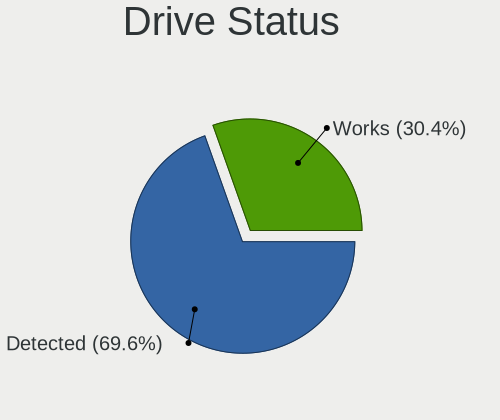
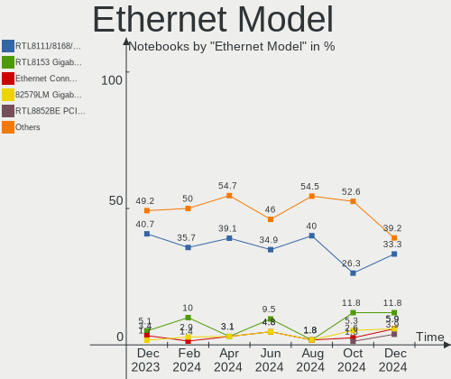

Kubuntu Hardware Trends (Notebooks)
-----------------------------------

A project to identify most popular hardware characteristics and track their change
over time based on data collected by Kubuntu users at https://Linux-Hardware.org.

Anyone can contribute to this report by the [hw-probe](https://github.com/linuxhw/hw-probe) tool:

    sudo -E hw-probe -all -upload

Full-feature report is available here: https://linux-hardware.org/?view=trends&formfactor=notebook

Period: Oct, 2021.

Contents
--------

* [ System ](#system)
  - [ OS                       ](#os)
  - [ OS Family                ](#os-family)
  - [ Kernel                   ](#kernel)
  - [ Kernel Family            ](#kernel-family)
  - [ Kernel Major Ver.        ](#kernel-major-ver)
  - [ Arch                     ](#arch)
  - [ DE                       ](#de)
  - [ Display Server           ](#display-server)
  - [ Display Manager          ](#display-manager)
  - [ OS Lang                  ](#os-lang)
  - [ Boot Mode                ](#boot-mode)
  - [ Filesystem               ](#filesystem)
  - [ Part. scheme             ](#part-scheme)
  - [ Dual Boot with Linux/BSD ](#dual-boot-with-linuxbsd)
  - [ Dual Boot (Win)          ](#dual-boot-win)

* [ Board ](#board)
  - [ Vendor                   ](#vendor)
  - [ Model                    ](#model)
  - [ Model Family             ](#model-family)
  - [ MFG Year                 ](#mfg-year)
  - [ Form Factor              ](#form-factor)
  - [ Secure Boot              ](#secure-boot)
  - [ Coreboot                 ](#coreboot)
  - [ RAM Size                 ](#ram-size)
  - [ RAM Used                 ](#ram-used)
  - [ Total Drives             ](#total-drives)
  - [ Has CD-ROM               ](#has-cd-rom)
  - [ Has Ethernet             ](#has-ethernet)
  - [ Has WiFi                 ](#has-wifi)
  - [ Has Bluetooth            ](#has-bluetooth)

* [ Location ](#location)
  - [ Country                  ](#country)
  - [ City                     ](#city)

* [ Drives ](#drives)
  - [ Drive Vendor             ](#drive-vendor)
  - [ Drive Model              ](#drive-model)
  - [ HDD Vendor               ](#hdd-vendor)
  - [ SSD Vendor               ](#ssd-vendor)
  - [ Drive Kind               ](#drive-kind)
  - [ Drive Connector          ](#drive-connector)
  - [ Drive Size               ](#drive-size)
  - [ Space Total              ](#space-total)
  - [ Space Used               ](#space-used)
  - [ Malfunc. Drives          ](#malfunc-drives)
  - [ Malfunc. Drive Vendor    ](#malfunc-drive-vendor)
  - [ Malfunc. HDD Vendor      ](#malfunc-hdd-vendor)
  - [ Malfunc. Drive Kind      ](#malfunc-drive-kind)
  - [ Failed Drives            ](#failed-drives)
  - [ Failed Drive Vendor      ](#failed-drive-vendor)
  - [ Drive Status             ](#drive-status)

* [ Storage controller ](#storage-controller)
  - [ Storage Vendor           ](#storage-vendor)
  - [ Storage Model            ](#storage-model)
  - [ Storage Kind             ](#storage-kind)

* [ Processor ](#processor)
  - [ CPU Vendor               ](#cpu-vendor)
  - [ CPU Model                ](#cpu-model)
  - [ CPU Model Family         ](#cpu-model-family)
  - [ CPU Cores                ](#cpu-cores)
  - [ CPU Sockets              ](#cpu-sockets)
  - [ CPU Threads              ](#cpu-threads)
  - [ CPU Op-Modes             ](#cpu-op-modes)
  - [ CPU Microcode            ](#cpu-microcode)
  - [ CPU Microarch            ](#cpu-microarch)

* [ Graphics ](#graphics)
  - [ GPU Vendor               ](#gpu-vendor)
  - [ GPU Model                ](#gpu-model)
  - [ GPU Combo                ](#gpu-combo)
  - [ GPU Driver               ](#gpu-driver)
  - [ GPU Memory               ](#gpu-memory)

* [ Monitor ](#monitor)
  - [ Monitor Vendor           ](#monitor-vendor)
  - [ Monitor Model            ](#monitor-model)
  - [ Monitor Resolution       ](#monitor-resolution)
  - [ Monitor Diagonal         ](#monitor-diagonal)
  - [ Monitor Width            ](#monitor-width)
  - [ Aspect Ratio             ](#aspect-ratio)
  - [ Monitor Area             ](#monitor-area)
  - [ Pixel Density            ](#pixel-density)
  - [ Multiple Monitors        ](#multiple-monitors)

* [ Network ](#network)
  - [ Net Controller Vendor    ](#net-controller-vendor)
  - [ Net Controller Model     ](#net-controller-model)
  - [ Wireless Vendor          ](#wireless-vendor)
  - [ Wireless Model           ](#wireless-model)
  - [ Ethernet Vendor          ](#ethernet-vendor)
  - [ Ethernet Model           ](#ethernet-model)
  - [ Net Controller Kind      ](#net-controller-kind)
  - [ Used Controller          ](#used-controller)
  - [ NICs                     ](#nics)
  - [ IPv6                     ](#ipv6)

* [ Bluetooth ](#bluetooth)
  - [ Bluetooth Vendor         ](#bluetooth-vendor)
  - [ Bluetooth Model          ](#bluetooth-model)

* [ Sound ](#sound)
  - [ Sound Vendor             ](#sound-vendor)
  - [ Sound Model              ](#sound-model)

* [ Memory ](#memory)
  - [ Memory Vendor            ](#memory-vendor)
  - [ Memory Model             ](#memory-model)
  - [ Memory Kind              ](#memory-kind)
  - [ Memory Form Factor       ](#memory-form-factor)
  - [ Memory Size              ](#memory-size)
  - [ Memory Speed             ](#memory-speed)

* [ Printers & scanners ](#printers--scanners)
  - [ Printer Vendor           ](#printer-vendor)
  - [ Printer Model            ](#printer-model)
  - [ Scanner Vendor           ](#scanner-vendor)
  - [ Scanner Model            ](#scanner-model)

* [ Camera ](#camera)
  - [ Camera Vendor            ](#camera-vendor)
  - [ Camera Model             ](#camera-model)

* [ Security ](#security)
  - [ Fingerprint Vendor       ](#fingerprint-vendor)
  - [ Fingerprint Model        ](#fingerprint-model)
  - [ Chipcard Vendor          ](#chipcard-vendor)
  - [ Chipcard Model           ](#chipcard-model)

* [ Unsupported ](#unsupported)
  - [ Unsupported Devices      ](#unsupported-devices)
  - [ Unsupported Device Types ](#unsupported-device-types)

System
------

OS
--

Installed operating systems

| Name          | Notebooks | Percent |
|---------------|-----------|---------|
| Kubuntu 20.04 | 32        | 50%     |
| Kubuntu 21.04 | 17        | 26.56%  |
| Kubuntu 21.10 | 11        | 17.19%  |
| Kubuntu 20.10 | 2         | 3.13%   |
| Kubuntu 22.04 | 1         | 1.56%   |
| Kubuntu 18.04 | 1         | 1.56%   |

OS Family
---------

OS without a version

| Name    | Notebooks | Percent |
|---------|-----------|---------|
| Kubuntu | 64        | 100%    |

Kernel
------

Version of the Linux kernel

| Version                | Notebooks | Percent |
|------------------------|-----------|---------|
| 5.11.0-37-generic      | 20        | 31.25%  |
| 5.11.0-38-generic      | 12        | 18.75%  |
| 5.13.0-20-generic      | 6         | 9.38%   |
| 5.4.0-89-generic       | 5         | 7.81%   |
| 5.13.0-19-generic      | 4         | 6.25%   |
| 5.4.0-88-generic       | 3         | 4.69%   |
| 5.8.0-63-generic       | 2         | 3.13%   |
| 5.8.0-49-generic       | 1         | 1.56%   |
| 5.8.0-45-generic       | 1         | 1.56%   |
| 5.8.0-43-generic       | 1         | 1.56%   |
| 5.4.0-60-generic       | 1         | 1.56%   |
| 5.14.12-051412-generic | 1         | 1.56%   |
| 5.13.0-21-generic      | 1         | 1.56%   |
| 5.13.0-17-generic      | 1         | 1.56%   |
| 5.11.0-37-lowlatency   | 1         | 1.56%   |
| 5.11.0-34-generic      | 1         | 1.56%   |
| 5.11.0-27-generic      | 1         | 1.56%   |
| 5.11.0-16-generic      | 1         | 1.56%   |
| 5.10.0-1050-oem        | 1         | 1.56%   |

Kernel Family
-------------

Linux kernel without a distro release

| Version | Notebooks | Percent |
|---------|-----------|---------|
| 5.11.0  | 36        | 56.25%  |
| 5.13.0  | 12        | 18.75%  |
| 5.4.0   | 9         | 14.06%  |
| 5.8.0   | 5         | 7.81%   |
| 5.14.12 | 1         | 1.56%   |
| 5.10.0  | 1         | 1.56%   |

Kernel Major Ver.
-----------------

Linux kernel major version

| Version | Notebooks | Percent |
|---------|-----------|---------|
| 5.11    | 36        | 56.25%  |
| 5.13    | 12        | 18.75%  |
| 5.4     | 9         | 14.06%  |
| 5.8     | 5         | 7.81%   |
| 5.14    | 1         | 1.56%   |
| 5.10    | 1         | 1.56%   |

Arch
----

OS architecture (x86_64, i586, etc.)

| Name   | Notebooks | Percent |
|--------|-----------|---------|
| x86_64 | 64        | 100%    |

DE
--

Desktop Environment

| Name | Notebooks | Percent |
|------|-----------|---------|
| KDE5 | 62        | 96.88%  |
| KDE  | 2         | 3.13%   |

Display Server
--------------

X11 or Wayland

| Name    | Notebooks | Percent |
|---------|-----------|---------|
| X11     | 61        | 95.31%  |
| Wayland | 3         | 4.69%   |

Display Manager
---------------

SDDM, LightDM, etc.

| Name    | Notebooks | Percent |
|---------|-----------|---------|
| SDDM    | 55        | 85.94%  |
| GDM     | 4         | 6.25%   |
| Unknown | 3         | 4.69%   |
| GDM3    | 2         | 3.13%   |

OS Lang
-------

Language

| Lang  | Notebooks | Percent |
|-------|-----------|---------|
| en_US | 28        | 43.75%  |
| fr_FR | 7         | 10.94%  |
| en_GB | 5         | 7.81%   |
| ru_RU | 3         | 4.69%   |
| pl_PL | 3         | 4.69%   |
| ru_UA | 2         | 3.13%   |
| en_CA | 2         | 3.13%   |
| C     | 2         | 3.13%   |
| zh_CN | 1         | 1.56%   |
| nl_NL | 1         | 1.56%   |
| nl_BE | 1         | 1.56%   |
| it_IT | 1         | 1.56%   |
| es_VE | 1         | 1.56%   |
| es_ES | 1         | 1.56%   |
| es_EC | 1         | 1.56%   |
| es_CR | 1         | 1.56%   |
| es_AR | 1         | 1.56%   |
| en_ZA | 1         | 1.56%   |
| en_IE | 1         | 1.56%   |
| cs_CZ | 1         | 1.56%   |

Boot Mode
---------

EFI or BIOS

| Mode | Notebooks | Percent |
|------|-----------|---------|
| EFI  | 50        | 78.13%  |
| BIOS | 14        | 21.88%  |

Filesystem
----------

Type of filesystem

| Type    | Notebooks | Percent |
|---------|-----------|---------|
| Ext4    | 60        | 93.75%  |
| Btrfs   | 3         | 4.69%   |
| Overlay | 1         | 1.56%   |

Part. scheme
------------

Scheme of partitioning

| Type    | Notebooks | Percent |
|---------|-----------|---------|
| GPT     | 44        | 68.75%  |
| Unknown | 15        | 23.44%  |
| MBR     | 5         | 7.81%   |

Dual Boot with Linux/BSD
------------------------

Hosting more than one Linux/BSD

| Dual boot | Notebooks | Percent |
|-----------|-----------|---------|
| No        | 59        | 92.19%  |
| Yes       | 5         | 7.81%   |

Dual Boot (Win)
---------------

Hosting Linux and Windows

| Dual boot | Notebooks | Percent |
|-----------|-----------|---------|
| No        | 37        | 57.81%  |
| Yes       | 27        | 42.19%  |

Board
-----

Vendor
------

Motherboard manufacturer

| Name             | Notebooks | Percent |
|------------------|-----------|---------|
| Lenovo           | 14        | 21.88%  |
| Hewlett-Packard  | 12        | 18.75%  |
| Dell             | 11        | 17.19%  |
| ASUSTek Computer | 7         | 10.94%  |
| Notebook         | 3         | 4.69%   |
| MSI              | 3         | 4.69%   |
| Acer             | 3         | 4.69%   |
| Timi             | 2         | 3.13%   |
| TUXEDO           | 1         | 1.56%   |
| Toshiba          | 1         | 1.56%   |
| SLIMBOOK         | 1         | 1.56%   |
| GPU Company      | 1         | 1.56%   |
| Google           | 1         | 1.56%   |
| Gateway          | 1         | 1.56%   |
| CyberPowerPC     | 1         | 1.56%   |
| Chuwi            | 1         | 1.56%   |
| Apple            | 1         | 1.56%   |

Model
-----

Motherboard model

| Name                                              | Notebooks | Percent |
|---------------------------------------------------|-----------|---------|
| TUXEDO Pulse 15 Gen1                              | 1         | 1.56%   |
| Toshiba PORTEGE R830                              | 1         | 1.56%   |
| Timi A35                                          | 1         | 1.56%   |
| Timi A34                                          | 1         | 1.56%   |
| SLIMBOOK PROX15-AMD                               | 1         | 1.56%   |
| Notebook PB50_70RF,RD,RC                          | 1         | 1.56%   |
| Notebook P775DM3(-G)                              | 1         | 1.56%   |
| Notebook NS50MU                                   | 1         | 1.56%   |
| MSI Traveller 1591                                | 1         | 1.56%   |
| MSI Prestige 15 A11SCX                            | 1         | 1.56%   |
| MSI GF65 Thin 10SDR                               | 1         | 1.56%   |
| Lenovo Z70-80 80FG                                | 1         | 1.56%   |
| Lenovo ThinkPad X230 Tablet 34382BG               | 1         | 1.56%   |
| Lenovo ThinkPad X230 2325L19                      | 1         | 1.56%   |
| Lenovo ThinkPad X220 Tablet 4299FK6               | 1         | 1.56%   |
| Lenovo ThinkPad T490 20N2CTO1WW                   | 1         | 1.56%   |
| Lenovo ThinkPad P14s Gen 2a 21A0CTO1WW            | 1         | 1.56%   |
| Lenovo ThinkPad P14s Gen 1 20Y1001HRT             | 1         | 1.56%   |
| Lenovo ThinkPad P14s Gen 1 20S40023US             | 1         | 1.56%   |
| Lenovo ThinkPad L14 Gen 2 20X1S07900              | 1         | 1.56%   |
| Lenovo IdeaPad S145-15AST 81N3                    | 1         | 1.56%   |
| Lenovo IdeaPad L340-15IRH Gaming 81LK             | 1         | 1.56%   |
| Lenovo IdeaPad 3 15IIL05 81WE                     | 1         | 1.56%   |
| Lenovo G500 20236                                 | 1         | 1.56%   |
| Lenovo G50-45 80MQ                                | 1         | 1.56%   |
| HP ZBook Studio G3                                | 1         | 1.56%   |
| HP ZBook Firefly 15 inch G8 Mobile Workstation PC | 1         | 1.56%   |
| HP ProBook 5320m                                  | 1         | 1.56%   |
| HP ProBook 4530s                                  | 1         | 1.56%   |
| HP ProBook 450 G8 Notebook PC                     | 1         | 1.56%   |
| HP Pavilion Laptop 15-eg0xxx                      | 1         | 1.56%   |
| HP Laptop 15s-eq0xxx                              | 1         | 1.56%   |
| HP Laptop 15-da0xxx                               | 1         | 1.56%   |
| HP Laptop 15-bw0xx                                | 1         | 1.56%   |
| HP ENVY Laptop 17-ce1xxx                          | 1         | 1.56%   |
| HP EliteBook 2760p                                | 1         | 1.56%   |
| HP 245 G8 Notebook PC                             | 1         | 1.56%   |
| GPU Company GWTC116-2                             | 1         | 1.56%   |
| Google Kohaku                                     | 1         | 1.56%   |
| Gateway NV55S                                     | 1         | 1.56%   |
| Dell XPS 15 7590                                  | 1         | 1.56%   |
| Dell Vostro 5490                                  | 1         | 1.56%   |
| Dell Precision M6800                              | 1         | 1.56%   |
| Dell Precision 5530                               | 1         | 1.56%   |
| Dell Precision 3551                               | 1         | 1.56%   |
| Dell Latitude E5430 non-vPro                      | 1         | 1.56%   |
| Dell Latitude 7490                                | 1         | 1.56%   |
| Dell Latitude 7390                                | 1         | 1.56%   |
| Dell Inspiron 3521                                | 1         | 1.56%   |
| Dell Inspiron 3502                                | 1         | 1.56%   |
| Dell Inspiron 14 5410                             | 1         | 1.56%   |
| CyberPowerPC TRACER V                             | 1         | 1.56%   |
| Chuwi GemiBook Pro                                | 1         | 1.56%   |
| ASUS X58L                                         | 1         | 1.56%   |
| ASUS X550LD                                       | 1         | 1.56%   |
| ASUS VivoBook_ASUSLaptop X515JA_X515JA            | 1         | 1.56%   |
| ASUS VivoBook_ASUSLaptop X509FA_X509FA            | 1         | 1.56%   |
| ASUS ASUS TUF Gaming F15 FX506LI_FX506LI          | 1         | 1.56%   |
| ASUS ASUS TUF Gaming A15 FA506II_FA506II          | 1         | 1.56%   |
| ASUS ASUS TUF Dash F15 FX516PR_FX516PR            | 1         | 1.56%   |

Model Family
------------

Motherboard model prefix

| Name                  | Notebooks | Percent |
|-----------------------|-----------|---------|
| Lenovo ThinkPad       | 8         | 12.5%   |
| Lenovo IdeaPad        | 3         | 4.69%   |
| HP ProBook            | 3         | 4.69%   |
| HP Laptop             | 3         | 4.69%   |
| Dell Precision        | 3         | 4.69%   |
| Dell Latitude         | 3         | 4.69%   |
| Dell Inspiron         | 3         | 4.69%   |
| ASUS ASUS             | 3         | 4.69%   |
| HP ZBook              | 2         | 3.13%   |
| ASUS VivoBook         | 2         | 3.13%   |
| Acer Aspire           | 2         | 3.13%   |
| TUXEDO Pulse          | 1         | 1.56%   |
| Toshiba PORTEGE       | 1         | 1.56%   |
| Timi A35              | 1         | 1.56%   |
| Timi A34              | 1         | 1.56%   |
| SLIMBOOK PROX15-AMD   | 1         | 1.56%   |
| Notebook PB50         | 1         | 1.56%   |
| Notebook P775DM3(-G)  | 1         | 1.56%   |
| Notebook NS50MU       | 1         | 1.56%   |
| MSI Traveller         | 1         | 1.56%   |
| MSI Prestige          | 1         | 1.56%   |
| MSI GF65              | 1         | 1.56%   |
| Lenovo Z70-80         | 1         | 1.56%   |
| Lenovo G500           | 1         | 1.56%   |
| Lenovo G50-45         | 1         | 1.56%   |
| HP Pavilion           | 1         | 1.56%   |
| HP ENVY               | 1         | 1.56%   |
| HP EliteBook          | 1         | 1.56%   |
| HP 245                | 1         | 1.56%   |
| GPU Company GWTC116-2 | 1         | 1.56%   |
| Google Kohaku         | 1         | 1.56%   |
| Gateway NV55S         | 1         | 1.56%   |
| Dell XPS              | 1         | 1.56%   |
| Dell Vostro           | 1         | 1.56%   |
| CyberPowerPC TRACER   | 1         | 1.56%   |
| Chuwi GemiBook        | 1         | 1.56%   |
| ASUS X58L             | 1         | 1.56%   |
| ASUS X550LD           | 1         | 1.56%   |
| Apple MacBookPro8     | 1         | 1.56%   |
| Acer Swift            | 1         | 1.56%   |

MFG Year
--------

Motherboard manufacture year

| Year | Notebooks | Percent |
|------|-----------|---------|
| 2021 | 25        | 39.06%  |
| 2020 | 14        | 21.88%  |
| 2019 | 7         | 10.94%  |
| 2012 | 5         | 7.81%   |
| 2018 | 3         | 4.69%   |
| 2016 | 3         | 4.69%   |
| 2015 | 2         | 3.13%   |
| 2014 | 2         | 3.13%   |
| 2008 | 2         | 3.13%   |
| 2013 | 1         | 1.56%   |

Form Factor
-----------

Physical design of the computer

| Name     | Notebooks | Percent |
|----------|-----------|---------|
| Notebook | 64        | 100%    |

Secure Boot
-----------

Enabled or disabled

| State    | Notebooks | Percent |
|----------|-----------|---------|
| Disabled | 52        | 81.25%  |
| Enabled  | 12        | 18.75%  |

Coreboot
--------

Have coreboot on board

| Used | Notebooks | Percent |
|------|-----------|---------|
| No   | 63        | 98.44%  |
| Yes  | 1         | 1.56%   |

RAM Size
--------

Total RAM memory

| Size in GB | Notebooks | Percent |
|------------|-----------|---------|
| 32.01-64.0 | 13        | 20.31%  |
| 16.01-24.0 | 13        | 20.31%  |
| 4.01-8.0   | 12        | 18.75%  |
| 8.01-16.0  | 12        | 18.75%  |
| 3.01-4.0   | 11        | 17.19%  |
| 24.01-32.0 | 2         | 3.13%   |
| 2.01-3.0   | 1         | 1.56%   |

RAM Used
--------

Used RAM memory

| Used GB    | Notebooks | Percent |
|------------|-----------|---------|
| 2.01-3.0   | 23        | 35.94%  |
| 4.01-8.0   | 17        | 26.56%  |
| 1.01-2.0   | 11        | 17.19%  |
| 3.01-4.0   | 7         | 10.94%  |
| 8.01-16.0  | 5         | 7.81%   |
| 16.01-24.0 | 1         | 1.56%   |

Total Drives
------------

Number of drives on board

| Drives | Notebooks | Percent |
|--------|-----------|---------|
| 1      | 48        | 75%     |
| 2      | 15        | 23.44%  |
| 4      | 1         | 1.56%   |

Has CD-ROM
----------

Has CD-ROM on board

| Presented | Notebooks | Percent |
|-----------|-----------|---------|
| No        | 50        | 78.13%  |
| Yes       | 14        | 21.88%  |

Has Ethernet
------------

Has Ethernet on board

| Presented | Notebooks | Percent |
|-----------|-----------|---------|
| Yes       | 50        | 78.13%  |
| No        | 14        | 21.88%  |

Has WiFi
--------

Has WiFi module

| Presented | Notebooks | Percent |
|-----------|-----------|---------|
| Yes       | 63        | 98.44%  |
| No        | 1         | 1.56%   |

Has Bluetooth
-------------

Has Bluetooth module

| Presented | Notebooks | Percent |
|-----------|-----------|---------|
| Yes       | 54        | 84.38%  |
| No        | 10        | 15.63%  |

Location
--------

Country
-------

Geographic location (country)

| Country      | Notebooks | Percent |
|--------------|-----------|---------|
| France       | 9         | 14.06%  |
| USA          | 8         | 12.5%   |
| UK           | 5         | 7.81%   |
| Russia       | 5         | 7.81%   |
| Poland       | 4         | 6.25%   |
| Netherlands  | 4         | 6.25%   |
| Ukraine      | 3         | 4.69%   |
| Italy        | 3         | 4.69%   |
| Belgium      | 3         | 4.69%   |
| Spain        | 2         | 3.13%   |
| Ireland      | 2         | 3.13%   |
| Canada       | 2         | 3.13%   |
| Venezuela    | 1         | 1.56%   |
| Turkey       | 1         | 1.56%   |
| South Africa | 1         | 1.56%   |
| Serbia       | 1         | 1.56%   |
| Germany      | 1         | 1.56%   |
| Finland      | 1         | 1.56%   |
| Egypt        | 1         | 1.56%   |
| Ecuador      | 1         | 1.56%   |
| Czechia      | 1         | 1.56%   |
| Costa Rica   | 1         | 1.56%   |
| China        | 1         | 1.56%   |
| Bulgaria     | 1         | 1.56%   |
| Azerbaijan   | 1         | 1.56%   |
| Argentina    | 1         | 1.56%   |

City
----

Geographic location (city)

| City                 | Notebooks | Percent |
|----------------------|-----------|---------|
| Villemomble          | 2         | 3.13%   |
| Paris                | 2         | 3.13%   |
| Dublin               | 2         | 3.13%   |
| Warsaw               | 1         | 1.56%   |
| Voorhout             | 1         | 1.56%   |
| Vladivostok          | 1         | 1.56%   |
| Valencia             | 1         | 1.56%   |
| Tomaszowice          | 1         | 1.56%   |
| Tampa                | 1         | 1.56%   |
| South Surrey         | 1         | 1.56%   |
| Sofia                | 1         | 1.56%   |
| San Francisco        | 1         | 1.56%   |
| San Diego            | 1         | 1.56%   |
| Salt Lake City       | 1         | 1.56%   |
| Royal Leamington Spa | 1         | 1.56%   |
| Roubaix              | 1         | 1.56%   |
| Rotterdam            | 1         | 1.56%   |
| Rosario              | 1         | 1.56%   |
| Rome                 | 1         | 1.56%   |
| Pardubice            | 1         | 1.56%   |
| Palaiseau            | 1         | 1.56%   |
| Oosterzele           | 1         | 1.56%   |
| Omsk                 | 1         | 1.56%   |
| Nysa                 | 1         | 1.56%   |
| Novosibirsk          | 1         | 1.56%   |
| Nova Milanese        | 1         | 1.56%   |
| Moscow               | 1         | 1.56%   |
| Morpeth              | 1         | 1.56%   |
| Montreal             | 1         | 1.56%   |
| Merris               | 1         | 1.56%   |
| Madrid               | 1         | 1.56%   |
| Lublin               | 1         | 1.56%   |
| London               | 1         | 1.56%   |
| Las Vegas            | 1         | 1.56%   |
| Kyiv                 | 1         | 1.56%   |
| Kharkiv              | 1         | 1.56%   |
| Johannesburg         | 1         | 1.56%   |
| Izhevsk              | 1         | 1.56%   |
| Heredia              | 1         | 1.56%   |
| Helsinki             | 1         | 1.56%   |
| Hefei                | 1         | 1.56%   |
| Guadalajara          | 1         | 1.56%   |
| Ghent                | 1         | 1.56%   |
| Fastiv               | 1         | 1.56%   |
| Fairfax              | 1         | 1.56%   |
| Dordrecht            | 1         | 1.56%   |
| Digne-les-Bains      | 1         | 1.56%   |
| Darmstadt            | 1         | 1.56%   |
| Coventry             | 1         | 1.56%   |
| Clichy               | 1         | 1.56%   |
| Castelbelforte       | 1         | 1.56%   |
| Bursa                | 1         | 1.56%   |
| Birmingham           | 1         | 1.56%   |
| Belgrade             | 1         | 1.56%   |
| Batley               | 1         | 1.56%   |
| Baltimore            | 1         | 1.56%   |
| Baku                 | 1         | 1.56%   |
| Antwerp              | 1         | 1.56%   |
| Ambato               | 1         | 1.56%   |
| Alexandria           | 1         | 1.56%   |

Drives
------

Drive Vendor
------------

Hard drive vendors

| Vendor              | Notebooks | Drives | Percent |
|---------------------|-----------|--------|---------|
| Samsung Electronics | 16        | 17     | 20%     |
| WDC                 | 9         | 9      | 11.25%  |
| Seagate             | 7         | 7      | 8.75%   |
| Kingston            | 6         | 6      | 7.5%    |
| Intel               | 5         | 5      | 6.25%   |
| Unknown             | 4         | 4      | 5%      |
| Toshiba             | 4         | 4      | 5%      |
| SK Hynix            | 4         | 4      | 5%      |
| KIOXIA              | 4         | 4      | 5%      |
| Crucial             | 4         | 4      | 5%      |
| Micron Technology   | 3         | 3      | 3.75%   |
| SSSTC               | 2         | 2      | 2.5%    |
| HGST                | 2         | 2      | 2.5%    |
| A-DATA Technology   | 2         | 3      | 2.5%    |
| Zheino              | 1         | 1      | 1.25%   |
| Silicon Motion      | 1         | 1      | 1.25%   |
| Phison              | 1         | 1      | 1.25%   |
| Netac               | 1         | 1      | 1.25%   |
| LITEONIT            | 1         | 1      | 1.25%   |
| JMicron             | 1         | 1      | 1.25%   |
| Hitachi             | 1         | 1      | 1.25%   |
| Apacer              | 1         | 1      | 1.25%   |

Drive Model
-----------

Hard drive models

| Model                                    | Notebooks | Percent |
|------------------------------------------|-----------|---------|
| Samsung MZVLB512HBJQ-000L7 512GB         | 2         | 2.5%    |
| KIOXIA KBG40ZNV512G 512GB                | 2         | 2.5%    |
| Kingston RBUSNS8154P3256GJ1 256GB        | 2         | 2.5%    |
| Zheino CHN 25SATA01M 030 32GB SSD        | 1         | 1.25%   |
| WDC WDS500G3X0C-00SJG0 500GB             | 1         | 1.25%   |
| WDC WDS100T3X0C-00SJG0 1TB               | 1         | 1.25%   |
| WDC WD5000LPVX-75V0TT0 500GB             | 1         | 1.25%   |
| WDC WD5000LPCX-24C6HT0 500GB             | 1         | 1.25%   |
| WDC WD10SPZX-24Z10 1TB                   | 1         | 1.25%   |
| WDC WD10SPSX-08A6W 1TB                   | 1         | 1.25%   |
| WDC WD10JPCX-24UE4T0 1TB                 | 1         | 1.25%   |
| WDC PC SN730 SDBPNTY-512G-1006 512GB     | 1         | 1.25%   |
| WDC PC SN530 SDBPNPZ-1T00-1002 1TB       | 1         | 1.25%   |
| Unknown SD32G  32GB                      | 1         | 1.25%   |
| Unknown MMC Card  64GB                   | 1         | 1.25%   |
| Unknown MMC Card  2GB                    | 1         | 1.25%   |
| Unknown ED2S5  128GB                     | 1         | 1.25%   |
| Toshiba THNSNC128GMLJ 128GB SSD          | 1         | 1.25%   |
| Toshiba NVMe SSD Drive 512GB             | 1         | 1.25%   |
| Toshiba NVMe SSD Drive 256GB             | 1         | 1.25%   |
| Toshiba KXG50PNV1T02 NVMe 1024GB         | 1         | 1.25%   |
| SSSTC CL1-3D256 256GB                    | 1         | 1.25%   |
| SSSTC CL1-3D128-Q11 NVMe 128GB           | 1         | 1.25%   |
| SK Hynix SKHynix_HFS001TDE9X081N 1TB     | 1         | 1.25%   |
| SK Hynix SC401 SATA 512GB SSD            | 1         | 1.25%   |
| SK Hynix PC711 NVMe 1TB                  | 1         | 1.25%   |
| SK Hynix HFM512GD3JX013N 512GB           | 1         | 1.25%   |
| Silicon Motion NVMe SSD Drive 1024GB     | 1         | 1.25%   |
| Seagate ST95005620AS 500GB               | 1         | 1.25%   |
| Seagate ST9320325AS 320GB                | 1         | 1.25%   |
| Seagate ST2000LM007-1R8174 2TB           | 1         | 1.25%   |
| Seagate ST1000LM035-1RK172 1TB           | 1         | 1.25%   |
| Seagate ST1000LM024 HN-M101MBB 1TB       | 1         | 1.25%   |
| Seagate Expansion 1TB                    | 1         | 1.25%   |
| Seagate BUP Slim BK 2TB                  | 1         | 1.25%   |
| Samsung SSD PM851 M.2 2280 256GB         | 1         | 1.25%   |
| Samsung SSD PM830 2.5 7mm 128GB          | 1         | 1.25%   |
| Samsung SSD 980 1TB                      | 1         | 1.25%   |
| Samsung SSD 970 EVO Plus 500GB           | 1         | 1.25%   |
| Samsung SSD 860 PRO 512GB                | 1         | 1.25%   |
| Samsung SSD 860 EVO 250GB                | 1         | 1.25%   |
| Samsung PM963 2.5" NVMe PCIe SSD 512GB   | 1         | 1.25%   |
| Samsung NVMe SSD Drive 1TB               | 1         | 1.25%   |
| Samsung MZVPW256HEGL-000H1 256GB         | 1         | 1.25%   |
| Samsung MZVLB1T0HALR-000L2 1TB           | 1         | 1.25%   |
| Samsung MZNLH128HBHQ-000H1 128GB SSD     | 1         | 1.25%   |
| Samsung MZMPA064HMDR-00000 64GB SSD      | 1         | 1.25%   |
| Samsung MZALQ256HAJD-000L2 256GB         | 1         | 1.25%   |
| Samsung MZ7TE256HMHP-000L7 256GB SSD     | 1         | 1.25%   |
| Phison 1TB SM2801T24GKBB4S-E162          | 1         | 1.25%   |
| Netac S535N8/256 256GB SSD               | 1         | 1.25%   |
| Micron MTFDHBA512TDV 512GB               | 1         | 1.25%   |
| Micron MTFDDAV256MBF-1AN15ABHA 256GB SSD | 1         | 1.25%   |
| Micron 2210_MTFDHBA512QFD 512GB          | 1         | 1.25%   |
| LITEONIT LMT-128M6M 128GB SSD            | 1         | 1.25%   |
| KIOXIA KBG40ZNS512G NVMe 512GB           | 1         | 1.25%   |
| KIOXIA KBG30ZMV256G 256GB                | 1         | 1.25%   |
| Kingston SNVS1000GB 1TB                  | 1         | 1.25%   |
| Kingston SA400S37240G 240GB SSD          | 1         | 1.25%   |
| Kingston SA2000M8500G 500GB              | 1         | 1.25%   |

HDD Vendor
----------

Hard disk drive vendors

| Vendor  | Notebooks | Drives | Percent |
|---------|-----------|--------|---------|
| Seagate | 7         | 7      | 43.75%  |
| WDC     | 5         | 5      | 31.25%  |
| HGST    | 2         | 2      | 12.5%   |
| JMicron | 1         | 1      | 6.25%   |
| Hitachi | 1         | 1      | 6.25%   |

SSD Vendor
----------

Solid state drive vendors

| Vendor              | Notebooks | Drives | Percent |
|---------------------|-----------|--------|---------|
| Samsung Electronics | 7         | 7      | 33.33%  |
| Crucial             | 3         | 3      | 14.29%  |
| Intel               | 2         | 2      | 9.52%   |
| Zheino              | 1         | 1      | 4.76%   |
| Toshiba             | 1         | 1      | 4.76%   |
| SK Hynix            | 1         | 1      | 4.76%   |
| Netac               | 1         | 1      | 4.76%   |
| Micron Technology   | 1         | 1      | 4.76%   |
| LITEONIT            | 1         | 1      | 4.76%   |
| Kingston            | 1         | 1      | 4.76%   |
| Apacer              | 1         | 1      | 4.76%   |
| A-DATA Technology   | 1         | 1      | 4.76%   |

Drive Kind
----------

HDD or SSD

| Kind | Notebooks | Drives | Percent |
|------|-----------|--------|---------|
| NVMe | 36        | 41     | 48.65%  |
| SSD  | 18        | 21     | 24.32%  |
| HDD  | 16        | 16     | 21.62%  |
| MMC  | 4         | 4      | 5.41%   |

Drive Connector
---------------

SATA, SAS, NVMe, etc.

| Type | Notebooks | Drives | Percent |
|------|-----------|--------|---------|
| NVMe | 36        | 41     | 50%     |
| SATA | 29        | 34     | 40.28%  |
| MMC  | 4         | 4      | 5.56%   |
| SAS  | 3         | 3      | 4.17%   |

Drive Size
----------

Size of hard drive

| Size in TB | Notebooks | Drives | Percent |
|------------|-----------|--------|---------|
| 0.01-0.5   | 20        | 23     | 58.82%  |
| 0.51-1.0   | 12        | 12     | 35.29%  |
| 1.01-2.0   | 2         | 2      | 5.88%   |

Space Total
-----------

Amount of disk space available on the file system

| Size in GB     | Notebooks | Percent |
|----------------|-----------|---------|
| 251-500        | 19        | 29.69%  |
| 501-1000       | 19        | 29.69%  |
| 101-250        | 16        | 25%     |
| 51-100         | 4         | 6.25%   |
| 2001-3000      | 2         | 3.13%   |
| 1001-2000      | 2         | 3.13%   |
| More than 3000 | 1         | 1.56%   |
| 21-50          | 1         | 1.56%   |

Space Used
----------

Amount of used disk space

| Used GB   | Notebooks | Percent |
|-----------|-----------|---------|
| 1-20      | 18        | 28.13%  |
| 101-250   | 12        | 18.75%  |
| 251-500   | 10        | 15.63%  |
| 51-100    | 10        | 15.63%  |
| 21-50     | 7         | 10.94%  |
| 501-1000  | 6         | 9.38%   |
| 1001-2000 | 1         | 1.56%   |

Malfunc. Drives
---------------

Drive models with a malfunction

| Model                                            | Notebooks | Drives | Percent |
|--------------------------------------------------|-----------|--------|---------|
| WDC WD5000LPVX-75V0TT0 500GB                     | 1         | 1      | 12.5%   |
| SK Hynix SC401 SATA 512GB SSD                    | 1         | 1      | 12.5%   |
| Seagate ST1000LM035-1RK172 1TB                   | 1         | 1      | 12.5%   |
| Seagate ST1000LM024 HN-M101MBB 1TB               | 1         | 1      | 12.5%   |
| Samsung Electronics MZVLB1T0HALR-000L2 1TB       | 1         | 1      | 12.5%   |
| Samsung Electronics MZNLH128HBHQ-000H1 128GB SSD | 1         | 1      | 12.5%   |
| HGST HTS725050A7E630 500GB                       | 1         | 1      | 12.5%   |
| Crucial CT525MX300SSD4 528GB                     | 1         | 1      | 12.5%   |

Malfunc. Drive Vendor
---------------------

Vendors of faulty drives

| Vendor              | Notebooks | Drives | Percent |
|---------------------|-----------|--------|---------|
| Seagate             | 2         | 2      | 25%     |
| Samsung Electronics | 2         | 2      | 25%     |
| WDC                 | 1         | 1      | 12.5%   |
| SK Hynix            | 1         | 1      | 12.5%   |
| HGST                | 1         | 1      | 12.5%   |
| Crucial             | 1         | 1      | 12.5%   |

Malfunc. HDD Vendor
-------------------

Vendors of faulty HDD drives

| Vendor  | Notebooks | Drives | Percent |
|---------|-----------|--------|---------|
| Seagate | 2         | 2      | 50%     |
| WDC     | 1         | 1      | 25%     |
| HGST    | 1         | 1      | 25%     |

Malfunc. Drive Kind
-------------------

Kinds of faulty drives

| Kind | Notebooks | Drives | Percent |
|------|-----------|--------|---------|
| HDD  | 4         | 4      | 50%     |
| SSD  | 3         | 3      | 37.5%   |
| NVMe | 1         | 1      | 12.5%   |

Failed Drives
-------------

Failed drive models

Zero info for selected period =(

Failed Drive Vendor
-------------------

Failed drive vendors

Zero info for selected period =(

Drive Status
------------

Number of failed and malfunc. drives

| Status   | Notebooks | Drives | Percent |
|----------|-----------|--------|---------|
| Works    | 43        | 52     | 62.32%  |
| Detected | 18        | 22     | 26.09%  |
| Malfunc  | 8         | 8      | 11.59%  |

Storage controller
------------------

Storage Vendor
--------------

Storage controller vendors

| Vendor                         | Notebooks | Percent |
|--------------------------------|-----------|---------|
| Intel                          | 43        | 48.86%  |
| Samsung Electronics            | 9         | 10.23%  |
| AMD                            | 8         | 9.09%   |
| Kingston Technology Company    | 5         | 5.68%   |
| Toshiba America Info Systems   | 4         | 4.55%   |
| Sandisk                        | 4         | 4.55%   |
| SK Hynix                       | 3         | 3.41%   |
| KIOXIA                         | 3         | 3.41%   |
| Solid State Storage Technology | 2         | 2.27%   |
| Micron Technology              | 2         | 2.27%   |
| Silicon Motion                 | 1         | 1.14%   |
| Realtek Semiconductor          | 1         | 1.14%   |
| Phison Electronics             | 1         | 1.14%   |
| Nvidia                         | 1         | 1.14%   |
| Micron/Crucial Technology      | 1         | 1.14%   |

Storage Model
-------------

Storage controller models

| Model                                                                            | Notebooks | Percent |
|----------------------------------------------------------------------------------|-----------|---------|
| AMD FCH SATA Controller [AHCI mode]                                              | 8         | 8.6%    |
| Intel 82801 Mobile SATA Controller [RAID mode]                                   | 7         | 7.53%   |
| Samsung NVMe SSD Controller SM981/PM981/PM983                                    | 5         | 5.38%   |
| Intel Volume Management Device NVMe RAID Controller                              | 5         | 5.38%   |
| Intel 7 Series Chipset Family 6-port SATA Controller [AHCI mode]                 | 5         | 5.38%   |
| Intel 6 Series/C200 Series Chipset Family 6 port Mobile SATA AHCI Controller     | 5         | 5.38%   |
| Intel Cannon Lake Mobile PCH SATA AHCI Controller                                | 4         | 4.3%    |
| SK Hynix Gold P31 SSD                                                            | 3         | 3.23%   |
| Samsung NVMe SSD Controller 980                                                  | 3         | 3.23%   |
| KIOXIA Non-Volatile memory controller                                            | 3         | 3.23%   |
| Intel Celeron/Pentium Silver Processor SATA Controller                           | 3         | 3.23%   |
| Toshiba America Info Systems XG6 NVMe SSD Controller                             | 2         | 2.15%   |
| Solid State Storage Non-Volatile memory controller                               | 2         | 2.15%   |
| Sandisk WD Black SN750 / PC SN730 NVMe SSD                                       | 2         | 2.15%   |
| Micron Non-Volatile memory controller                                            | 2         | 2.15%   |
| Kingston Company U-SNS8154P3 NVMe SSD                                            | 2         | 2.15%   |
| Kingston Company A2000 NVMe SSD                                                  | 2         | 2.15%   |
| Intel SSD 660P Series                                                            | 2         | 2.15%   |
| Intel Q170/Q150/B150/H170/H110/Z170/CM236 Chipset SATA Controller [AHCI Mode]    | 2         | 2.15%   |
| Intel Ice Lake-LP SATA Controller [AHCI mode]                                    | 2         | 2.15%   |
| Intel Comet Lake SATA AHCI Controller                                            | 2         | 2.15%   |
| Intel 400 Series Chipset Family SATA AHCI Controller                             | 2         | 2.15%   |
| Toshiba America Info Systems Toshiba America Info Non-Volatile memory controller | 1         | 1.08%   |
| Toshiba America Info Systems BG3 NVMe SSD Controller                             | 1         | 1.08%   |
| Silicon Motion SM2262/SM2262EN SSD Controller                                    | 1         | 1.08%   |
| Sandisk WD Blue SN550 NVMe SSD                                                   | 1         | 1.08%   |
| Sandisk WD Black 2018/SN750 / PC SN720 NVMe SSD                                  | 1         | 1.08%   |
| Samsung NVMe SSD Controller SM961/PM961/SM963                                    | 1         | 1.08%   |
| Realtek RTS5763DL NVMe SSD Controller                                            | 1         | 1.08%   |
| Phison E16 PCIe4 NVMe Controller                                                 | 1         | 1.08%   |
| Nvidia nForce SATA Controller                                                    | 1         | 1.08%   |
| Micron/Crucial P2 NVMe PCIe SSD                                                  | 1         | 1.08%   |
| Kingston Company Company Non-Volatile memory controller                          | 1         | 1.08%   |
| Intel Wildcat Point-LP SATA Controller [AHCI Mode]                               | 1         | 1.08%   |
| Intel Sunrise Point-LP SATA Controller [AHCI mode]                               | 1         | 1.08%   |
| Intel SSD Pro 7600p/760p/E 6100p Series                                          | 1         | 1.08%   |
| Intel Cannon Point-LP SATA Controller [AHCI Mode]                                | 1         | 1.08%   |
| Intel 82801HM/HEM (ICH8M/ICH8M-E) SATA Controller [AHCI mode]                    | 1         | 1.08%   |
| Intel 82801HM/HEM (ICH8M/ICH8M-E) IDE Controller                                 | 1         | 1.08%   |
| Intel 8 Series SATA Controller 1 [AHCI mode]                                     | 1         | 1.08%   |
| Intel 500 Series Chipset Family SATA AHCI Controller                             | 1         | 1.08%   |
| Intel 5 Series/3400 Series Chipset 6 port SATA AHCI Controller                   | 1         | 1.08%   |

Storage Kind
------------

Kind of storage controller (IDE, SATA, NVMe, SAS, ...)

| Kind | Notebooks | Percent |
|------|-----------|---------|
| SATA | 41        | 45.56%  |
| NVMe | 36        | 40%     |
| RAID | 12        | 13.33%  |
| IDE  | 1         | 1.11%   |

Processor
---------

CPU Vendor
----------

Processor vendors

| Vendor | Notebooks | Percent |
|--------|-----------|---------|
| Intel  | 52        | 81.25%  |
| AMD    | 12        | 18.75%  |

CPU Model
---------

Processor models

| Model                                           | Notebooks | Percent |
|-------------------------------------------------|-----------|---------|
| Intel Core i7-10510U CPU @ 1.80GHz              | 3         | 4.69%   |
| Intel Core i5-1035G1 CPU @ 1.00GHz              | 3         | 4.69%   |
| Intel 11th Gen Core i7-11370H @ 3.30GHz         | 3         | 4.69%   |
| Intel 11th Gen Core i5-1135G7 @ 2.40GHz         | 3         | 4.69%   |
| AMD Ryzen 7 4800H with Radeon Graphics          | 3         | 4.69%   |
| Intel Core i7-9750H CPU @ 2.60GHz               | 2         | 3.13%   |
| Intel Core i7-8565U CPU @ 1.80GHz               | 2         | 3.13%   |
| Intel Core i7-2640M CPU @ 2.80GHz               | 2         | 3.13%   |
| Intel Core i5-8250U CPU @ 1.60GHz               | 2         | 3.13%   |
| Intel Core i5-3320M CPU @ 2.60GHz               | 2         | 3.13%   |
| Intel Celeron N4020 CPU @ 1.10GHz               | 2         | 3.13%   |
| Intel 11th Gen Core i7-1165G7 @ 2.80GHz         | 2         | 3.13%   |
| Intel Pentium Dual CPU T3200 @ 2.00GHz          | 1         | 1.56%   |
| Intel Core i9-10885H CPU @ 2.40GHz              | 1         | 1.56%   |
| Intel Core i7-8850H CPU @ 2.60GHz               | 1         | 1.56%   |
| Intel Core i7-8650U CPU @ 1.90GHz               | 1         | 1.56%   |
| Intel Core i7-6700HQ CPU @ 2.60GHz              | 1         | 1.56%   |
| Intel Core i7-5500U CPU @ 2.40GHz               | 1         | 1.56%   |
| Intel Core i7-4810MQ CPU @ 2.80GHz              | 1         | 1.56%   |
| Intel Core i7-4510U CPU @ 2.00GHz               | 1         | 1.56%   |
| Intel Core i7-2620M CPU @ 2.70GHz               | 1         | 1.56%   |
| Intel Core i7-10750H CPU @ 2.60GHz              | 1         | 1.56%   |
| Intel Core i5-9300H CPU @ 2.40GHz               | 1         | 1.56%   |
| Intel Core i5-8350U CPU @ 1.70GHz               | 1         | 1.56%   |
| Intel Core i5-6600K CPU @ 3.50GHz               | 1         | 1.56%   |
| Intel Core i5-3380M CPU @ 2.90GHz               | 1         | 1.56%   |
| Intel Core i5-3317U CPU @ 1.70GHz               | 1         | 1.56%   |
| Intel Core i5-2520M CPU @ 2.50GHz               | 1         | 1.56%   |
| Intel Core i5-10300H CPU @ 2.50GHz              | 1         | 1.56%   |
| Intel Core i5-10210U CPU @ 1.60GHz              | 1         | 1.56%   |
| Intel Core i3-3217U CPU @ 1.80GHz               | 1         | 1.56%   |
| Intel Core i3-3110M CPU @ 2.40GHz               | 1         | 1.56%   |
| Intel Core i3-2350M CPU @ 2.30GHz               | 1         | 1.56%   |
| Intel Core i3 CPU M 350 @ 2.27GHz               | 1         | 1.56%   |
| Intel Celeron J4125 CPU @ 2.00GHz               | 1         | 1.56%   |
| Intel 11th Gen Core i7-1185G7 @ 3.00GHz         | 1         | 1.56%   |
| Intel 11th Gen Core i7-11800H @ 2.30GHz         | 1         | 1.56%   |
| Intel 11th Gen Core i5-11300H @ 3.10GHz         | 1         | 1.56%   |
| AMD Ryzen 7 PRO 4750U with Radeon Graphics      | 1         | 1.56%   |
| AMD Ryzen 5 PRO 5650U with Radeon Graphics      | 1         | 1.56%   |
| AMD Ryzen 3 3200U with Radeon Vega Mobile Gfx   | 1         | 1.56%   |
| AMD QC-4000                                     | 1         | 1.56%   |
| AMD Athlon X2 Dual-Core QL-60                   | 1         | 1.56%   |
| AMD Athlon Silver 3050U with Radeon Graphics    | 1         | 1.56%   |
| AMD A6-9225 RADEON R4, 5 COMPUTE CORES 2C+3G    | 1         | 1.56%   |
| AMD A6-3420M APU with Radeon HD Graphics        | 1         | 1.56%   |
| AMD A10-9620P RADEON R5, 10 COMPUTE CORES 4C+6G | 1         | 1.56%   |

CPU Model Family
----------------

Processor model prefix

| Model              | Notebooks | Percent |
|--------------------|-----------|---------|
| Intel Core i7      | 17        | 26.56%  |
| Intel Core i5      | 15        | 23.44%  |
| Other              | 11        | 17.19%  |
| Intel Core i3      | 4         | 6.25%   |
| Intel Celeron      | 3         | 4.69%   |
| AMD Ryzen 7        | 3         | 4.69%   |
| AMD A6             | 2         | 3.13%   |
| Intel Pentium Dual | 1         | 1.56%   |
| Intel Core i9      | 1         | 1.56%   |
| AMD Ryzen 7 PRO    | 1         | 1.56%   |
| AMD Ryzen 5 PRO    | 1         | 1.56%   |
| AMD Ryzen 3        | 1         | 1.56%   |
| AMD QC             | 1         | 1.56%   |
| AMD Athlon X2      | 1         | 1.56%   |
| AMD Athlon         | 1         | 1.56%   |
| AMD A10            | 1         | 1.56%   |

CPU Cores
---------

Number of processor cores

| Number | Notebooks | Percent |
|--------|-----------|---------|
| 4      | 31        | 48.44%  |
| 2      | 22        | 34.38%  |
| 8      | 6         | 9.38%   |
| 6      | 5         | 7.81%   |

CPU Sockets
-----------

Number of sockets

| Number | Notebooks | Percent |
|--------|-----------|---------|
| 1      | 64        | 100%    |

CPU Threads
-----------

Threads per core (Hyper-Threading)

| Number | Notebooks | Percent |
|--------|-----------|---------|
| 2      | 54        | 84.38%  |
| 1      | 10        | 15.63%  |

CPU Op-Modes
------------

CPU Operation Modes (32-bit, 64-bit)

| Op mode        | Notebooks | Percent |
|----------------|-----------|---------|
| 32-bit, 64-bit | 64        | 100%    |

CPU Microcode
-------------

Microcode number

| Number     | Notebooks | Percent |
|------------|-----------|---------|
| Unknown    | 9         | 14.06%  |
| 0x806c1    | 8         | 12.5%   |
| 0x306a9    | 6         | 9.38%   |
| 0x906ea    | 4         | 6.25%   |
| 0x806ec    | 4         | 6.25%   |
| 0x206a7    | 4         | 6.25%   |
| 0x806ea    | 3         | 4.69%   |
| 0x706e5    | 3         | 4.69%   |
| 0x706a8    | 3         | 4.69%   |
| 0xa0652    | 2         | 3.13%   |
| 0x506e3    | 2         | 3.13%   |
| 0x08108109 | 2         | 3.13%   |
| 0x806eb    | 1         | 1.56%   |
| 0x806d1    | 1         | 1.56%   |
| 0x40651    | 1         | 1.56%   |
| 0x306d4    | 1         | 1.56%   |
| 0x306c3    | 1         | 1.56%   |
| 0x20652    | 1         | 1.56%   |
| 0x0a50000c | 1         | 1.56%   |
| 0x08600106 | 1         | 1.56%   |
| 0x08600104 | 1         | 1.56%   |
| 0x08600103 | 1         | 1.56%   |
| 0x0700010f | 1         | 1.56%   |
| 0x0600611a | 1         | 1.56%   |
| 0x03000027 | 1         | 1.56%   |
| 0x02000032 | 1         | 1.56%   |

CPU Microarch
-------------

Microarchitecture

| Name            | Notebooks | Percent |
|-----------------|-----------|---------|
| KabyLake        | 14        | 21.88%  |
| TigerLake       | 10        | 15.63%  |
| IvyBridge       | 6         | 9.38%   |
| SandyBridge     | 5         | 7.81%   |
| Zen 2           | 4         | 6.25%   |
| IceLake         | 4         | 6.25%   |
| Goldmont plus   | 3         | 4.69%   |
| CometLake       | 3         | 4.69%   |
| Zen+            | 2         | 3.13%   |
| Skylake         | 2         | 3.13%   |
| Haswell         | 2         | 3.13%   |
| Excavator       | 2         | 3.13%   |
| Zen 3           | 1         | 1.56%   |
| Westmere        | 1         | 1.56%   |
| K8 & K10 hybrid | 1         | 1.56%   |
| K10 Llano       | 1         | 1.56%   |
| Jaguar          | 1         | 1.56%   |
| Core            | 1         | 1.56%   |
| Broadwell       | 1         | 1.56%   |

Graphics
--------

GPU Vendor
----------

Vendors of graphics cards

| Vendor | Notebooks | Percent |
|--------|-----------|---------|
| Intel  | 51        | 59.3%   |
| Nvidia | 22        | 25.58%  |
| AMD    | 13        | 15.12%  |

GPU Model
---------

Graphics card models

| Model                                                                                 | Notebooks | Percent |
|---------------------------------------------------------------------------------------|-----------|---------|
| Intel TigerLake-LP GT2 [Iris Xe Graphics]                                             | 10        | 11.36%  |
| Intel 3rd Gen Core processor Graphics Controller                                      | 6         | 6.82%   |
| Intel 2nd Generation Core Processor Family Integrated Graphics Controller             | 5         | 5.68%   |
| Intel UHD Graphics 620                                                                | 4         | 4.55%   |
| Intel CometLake-U GT2 [UHD Graphics]                                                  | 4         | 4.55%   |
| Intel CoffeeLake-H GT2 [UHD Graphics 630]                                             | 4         | 4.55%   |
| AMD Renoir                                                                            | 4         | 4.55%   |
| Intel Iris Plus Graphics G1 (Ice Lake)                                                | 3         | 3.41%   |
| Intel GeminiLake [UHD Graphics 600]                                                   | 3         | 3.41%   |
| Intel CometLake-H GT2 [UHD Graphics]                                                  | 3         | 3.41%   |
| Nvidia TU117M [GeForce MX450]                                                         | 2         | 2.27%   |
| Nvidia TU117M [GeForce GTX 1650 Ti Mobile]                                            | 2         | 2.27%   |
| Nvidia GP108M [GeForce MX250]                                                         | 2         | 2.27%   |
| Intel WhiskeyLake-U GT2 [UHD Graphics 620]                                            | 2         | 2.27%   |
| AMD Picasso                                                                           | 2         | 2.27%   |
| Nvidia TU117M [GeForce GTX 1650 Mobile / Max-Q]                                       | 1         | 1.14%   |
| Nvidia TU117M                                                                         | 1         | 1.14%   |
| Nvidia TU116M [GeForce GTX 1660 Ti Mobile]                                            | 1         | 1.14%   |
| Nvidia TU106M [GeForce RTX 2070 Mobile]                                               | 1         | 1.14%   |
| Nvidia GP108GLM [Quadro P520]                                                         | 1         | 1.14%   |
| Nvidia GP107M [GeForce GTX 1050 3 GB Max-Q]                                           | 1         | 1.14%   |
| Nvidia GP107GLM [Quadro P620]                                                         | 1         | 1.14%   |
| Nvidia GP107GLM [Quadro P2000 Mobile]                                                 | 1         | 1.14%   |
| Nvidia GP106BM [GeForce GTX 1060 Mobile 6GB]                                          | 1         | 1.14%   |
| Nvidia GM108M [GeForce 840M]                                                          | 1         | 1.14%   |
| Nvidia GM107GLM [Quadro M1000M]                                                       | 1         | 1.14%   |
| Nvidia GF117M [GeForce 610M/710M/810M/820M / GT 620M/625M/630M/720M]                  | 1         | 1.14%   |
| Nvidia GF108M [GeForce GT 620M/630M/635M/640M LE]                                     | 1         | 1.14%   |
| Nvidia GA106M [GeForce RTX 3060 Mobile / Max-Q]                                       | 1         | 1.14%   |
| Nvidia GA104M [GeForce RTX 3070 Mobile / Max-Q]                                       | 1         | 1.14%   |
| Nvidia C77 [GeForce 9100M G]                                                          | 1         | 1.14%   |
| Intel TigerLake-H GT1 [UHD Graphics]                                                  | 1         | 1.14%   |
| Intel Mobile GM965/GL960 Integrated Graphics Controller (secondary)                   | 1         | 1.14%   |
| Intel Mobile GM965/GL960 Integrated Graphics Controller (primary)                     | 1         | 1.14%   |
| Intel HD Graphics 5500                                                                | 1         | 1.14%   |
| Intel HD Graphics 530                                                                 | 1         | 1.14%   |
| Intel Haswell-ULT Integrated Graphics Controller                                      | 1         | 1.14%   |
| Intel Core Processor Integrated Graphics Controller                                   | 1         | 1.14%   |
| Intel 4th Gen Core Processor Integrated Graphics Controller                           | 1         | 1.14%   |
| AMD Wani [Radeon R5/R6/R7 Graphics]                                                   | 1         | 1.14%   |
| AMD Topaz XT [Radeon R7 M260/M265 / M340/M360 / M440/M445 / 530/535 / 620/625 Mobile] | 1         | 1.14%   |
| AMD Sumo [Radeon HD 6520G]                                                            | 1         | 1.14%   |
| AMD Stoney [Radeon R2/R3/R4/R5 Graphics]                                              | 1         | 1.14%   |
| AMD Saturn XT [FirePro M6100]                                                         | 1         | 1.14%   |
| AMD Mars [Radeon HD 8670A/8670M/8750M / R7 M370]                                      | 1         | 1.14%   |
| AMD Kabini [Radeon HD 8280 / R3 Series]                                               | 1         | 1.14%   |
| AMD Cezanne                                                                           | 1         | 1.14%   |

GPU Combo
---------

Combinations of graphics cards

| Name           | Notebooks | Percent |
|----------------|-----------|---------|
| 1 x Intel      | 30        | 46.88%  |
| Intel + Nvidia | 19        | 29.69%  |
| 1 x AMD        | 9         | 14.06%  |
| 1 x Nvidia     | 2         | 3.13%   |
| Intel + AMD    | 2         | 3.13%   |
| 2 x AMD        | 1         | 1.56%   |
| AMD + Nvidia   | 1         | 1.56%   |

GPU Driver
----------

Free vs proprietary

| Driver      | Notebooks | Percent |
|-------------|-----------|---------|
| Free        | 49        | 76.56%  |
| Proprietary | 15        | 23.44%  |

GPU Memory
----------

Total video memory

| Size in GB | Notebooks | Percent |
|------------|-----------|---------|
| Unknown    | 42        | 65.63%  |
| 0.01-0.5   | 7         | 10.94%  |
| 3.01-4.0   | 5         | 7.81%   |
| 1.01-2.0   | 5         | 7.81%   |
| 7.01-8.0   | 2         | 3.13%   |
| 5.01-6.0   | 1         | 1.56%   |
| 2.01-3.0   | 1         | 1.56%   |
| 0.51-1.0   | 1         | 1.56%   |

Monitor
-------

Monitor Vendor
--------------

Monitor vendors

| Vendor                  | Notebooks | Percent |
|-------------------------|-----------|---------|
| LG Display              | 14        | 17.95%  |
| Chimei Innolux          | 12        | 15.38%  |
| AU Optronics            | 10        | 12.82%  |
| Samsung Electronics     | 8         | 10.26%  |
| BOE                     | 8         | 10.26%  |
| PANDA                   | 5         | 6.41%   |
| Sharp                   | 3         | 3.85%   |
| Dell                    | 3         | 3.85%   |
| Hewlett-Packard         | 2         | 2.56%   |
| Chi Mei Optoelectronics | 2         | 2.56%   |
| BenQ                    | 2         | 2.56%   |
| OVR                     | 1         | 1.28%   |
| OEM                     | 1         | 1.28%   |
| InfoVision              | 1         | 1.28%   |
| Goldstar                | 1         | 1.28%   |
| Belinea                 | 1         | 1.28%   |
| Apple                   | 1         | 1.28%   |
| AOC                     | 1         | 1.28%   |
| Ancor Communications    | 1         | 1.28%   |
| Acer                    | 1         | 1.28%   |

Monitor Model
-------------

Monitor models

| Model                                                                    | Notebooks | Percent |
|--------------------------------------------------------------------------|-----------|---------|
| LG Display LCD Monitor LGD02D8 1366x768 277x156mm 12.5-inch              | 3         | 3.85%   |
| Sharp LQ156M1JW01 SHP14C3 1920x1080 344x194mm 15.5-inch                  | 2         | 2.56%   |
| Samsung Electronics Color LCD SDCA029 2160x1440 252x168mm 11.9-inch      | 2         | 2.56%   |
| PANDA LCD Monitor NCP004D 1920x1080 344x194mm 15.5-inch                  | 2         | 2.56%   |
| LG Display LCD Monitor LGD0469 1920x1080 382x215mm 17.3-inch             | 2         | 2.56%   |
| Chimei Innolux LCD Monitor CMN15E6 1366x768 344x193mm 15.5-inch          | 2         | 2.56%   |
| AU Optronics LCD Monitor AUO573D 1920x1080 309x174mm 14.0-inch           | 2         | 2.56%   |
| Sharp LCD Monitor SHP148D 3840x2160 344x194mm 15.5-inch                  | 1         | 1.28%   |
| Samsung Electronics T22C301 SAM0AD2 1920x1080 477x268mm 21.5-inch        | 1         | 1.28%   |
| Samsung Electronics S24C650 SAM09E9 1920x1080 521x293mm 23.5-inch        | 1         | 1.28%   |
| Samsung Electronics LCD Monitor SEC5741 1280x800 261x163mm 12.1-inch     | 1         | 1.28%   |
| Samsung Electronics LCD Monitor SEC4351 1366x768 344x194mm 15.5-inch     | 1         | 1.28%   |
| Samsung Electronics LCD Monitor SDC4150 3456x2160 336x210mm 15.6-inch    | 1         | 1.28%   |
| Samsung Electronics LCD Monitor SDC4142 3840x2160 294x165mm 13.3-inch    | 1         | 1.28%   |
| PANDA LCD Monitor NCP005C 2560x1600 302x189mm 14.0-inch                  | 1         | 1.28%   |
| PANDA LCD Monitor NCP0046 1920x1080 344x194mm 15.5-inch                  | 1         | 1.28%   |
| PANDA LCD Monitor NCP002E 1920x1080 344x194mm 15.5-inch                  | 1         | 1.28%   |
| OVR Rift DK2 OVR0003 1080x1920 71x126mm 5.7-inch                         | 1         | 1.28%   |
| OEM 32W_LCD_TV OEM3700 1920x1080                                         | 1         | 1.28%   |
| LG Display LCD Monitor LGD060F 1920x1080 309x174mm 14.0-inch             | 1         | 1.28%   |
| LG Display LCD Monitor LGD05E6 1920x1080 344x194mm 15.5-inch             | 1         | 1.28%   |
| LG Display LCD Monitor LGD0599 1920x1080 309x174mm 14.0-inch             | 1         | 1.28%   |
| LG Display LCD Monitor LGD0563 1920x1080 344x194mm 15.5-inch             | 1         | 1.28%   |
| LG Display LCD Monitor LGD046F 1920x1080 344x194mm 15.5-inch             | 1         | 1.28%   |
| LG Display LCD Monitor LGD0468 1366x768 340x190mm 15.3-inch              | 1         | 1.28%   |
| LG Display LCD Monitor LGD03AB 1366x768 344x194mm 15.5-inch              | 1         | 1.28%   |
| LG Display LCD Monitor LGD033E 1366x768 309x174mm 14.0-inch              | 1         | 1.28%   |
| LG Display LCD Monitor LGD033A 1366x768 340x190mm 15.3-inch              | 1         | 1.28%   |
| InfoVision LCD Monitor IVO057D 1920x1080 309x174mm 14.0-inch             | 1         | 1.28%   |
| Hewlett-Packard 24ec HPN3500 1920x1080 527x296mm 23.8-inch               | 1         | 1.28%   |
| Hewlett-Packard 24cw HWP3257 1920x1080 530x300mm 24.0-inch               | 1         | 1.28%   |
| Goldstar 22MP55 GSM5A24 1680x1050 480x270mm 21.7-inch                    | 1         | 1.28%   |
| Dell U4320Q DEL41D0 3840x2160 941x529mm 42.5-inch                        | 1         | 1.28%   |
| Dell E2418HN DELA105 1920x1080 527x296mm 23.8-inch                       | 1         | 1.28%   |
| Dell E173FP DELA00B 1280x1024 338x270mm 17.0-inch                        | 1         | 1.28%   |
| Chimei Innolux P130ZDZ-EF1 CMN8201 2160x1440 275x183mm 13.0-inch         | 1         | 1.28%   |
| Chimei Innolux LCD Monitor CMN1735 1920x1080 382x215mm 17.3-inch         | 1         | 1.28%   |
| Chimei Innolux LCD Monitor CMN15F5 1920x1080 344x193mm 15.5-inch         | 1         | 1.28%   |
| Chimei Innolux LCD Monitor CMN15E8 1920x1080 344x193mm 15.5-inch         | 1         | 1.28%   |
| Chimei Innolux LCD Monitor CMN15E7 1920x1080 344x193mm 15.5-inch         | 1         | 1.28%   |
| Chimei Innolux LCD Monitor CMN15AB 1366x768 350x190mm 15.7-inch          | 1         | 1.28%   |
| Chimei Innolux LCD Monitor CMN1515 1920x1080 344x193mm 15.5-inch         | 1         | 1.28%   |
| Chimei Innolux LCD Monitor CMN14F2 1920x1080 309x173mm 13.9-inch         | 1         | 1.28%   |
| Chimei Innolux LCD Monitor CMN14E7 1920x1080 309x173mm 13.9-inch         | 1         | 1.28%   |
| Chimei Innolux LCD Monitor CMN14D4 1920x1080 309x173mm 13.9-inch         | 1         | 1.28%   |
| Chi Mei Optoelectronics LCD Monitor CMO1592 1366x768 344x193mm 15.5-inch | 1         | 1.28%   |
| Chi Mei Optoelectronics LCD Monitor CMO1557 1366x768 344x193mm 15.5-inch | 1         | 1.28%   |
| BOE LCD Monitor BOE0977 2560x1440 381x214mm 17.2-inch                    | 1         | 1.28%   |
| BOE LCD Monitor BOE08A8 1920x1080 344x194mm 15.5-inch                    | 1         | 1.28%   |
| BOE LCD Monitor BOE082E 1920x1080 309x174mm 14.0-inch                    | 1         | 1.28%   |
| BOE LCD Monitor BOE0816 1366x768 344x193mm 15.5-inch                     | 1         | 1.28%   |
| BOE LCD Monitor BOE07C9 1920x1080 309x173mm 13.9-inch                    | 1         | 1.28%   |
| BOE LCD Monitor BOE0771 1366x768 256x144mm 11.6-inch                     | 1         | 1.28%   |
| BOE LCD Monitor BOE0700 1920x1080 344x194mm 15.5-inch                    | 1         | 1.28%   |
| BOE LCD Monitor BOE06F0 1366x768 344x194mm 15.5-inch                     | 1         | 1.28%   |
| BenQ GL2450H BNQ78A7 1920x1080 530x300mm 24.0-inch                       | 1         | 1.28%   |
| BenQ GL2250 BNQ789A 1920x1080 477x268mm 21.5-inch                        | 1         | 1.28%   |
| Belinea o.disp4.1_24w MAX0962 1920x1200 519x324mm 24.1-inch              | 1         | 1.28%   |
| AU Optronics LCD Monitor AUOD0ED 1920x1080 344x193mm 15.5-inch           | 1         | 1.28%   |
| AU Optronics LCD Monitor AUOC48A 1920x1080 344x194mm 15.5-inch           | 1         | 1.28%   |

Monitor Resolution
------------------

Monitor screen resolution

| Resolution        | Notebooks | Percent |
|-------------------|-----------|---------|
| 1920x1080 (FHD)   | 37        | 52.11%  |
| 1366x768 (WXGA)   | 19        | 26.76%  |
| 3840x2160 (4K)    | 4         | 5.63%   |
| 2560x1440 (QHD)   | 2         | 2.82%   |
| 1280x800 (WXGA)   | 2         | 2.82%   |
| 3456x2160         | 1         | 1.41%   |
| 2560x1600         | 1         | 1.41%   |
| 2160x1440         | 1         | 1.41%   |
| 1920x540          | 1         | 1.41%   |
| 1920x1200 (WUXGA) | 1         | 1.41%   |
| 1280x1024 (SXGA)  | 1         | 1.41%   |
| 1080x1920         | 1         | 1.41%   |

Monitor Diagonal
----------------

Diagonal size in inches

| Inches | Notebooks | Percent |
|--------|-----------|---------|
| 15     | 35        | 44.87%  |
| 13     | 9         | 11.54%  |
| 14     | 8         | 10.26%  |
| 17     | 6         | 7.69%   |
| 24     | 5         | 6.41%   |
| 21     | 4         | 5.13%   |
| 12     | 4         | 5.13%   |
| 23     | 3         | 3.85%   |
| 42     | 1         | 1.28%   |
| 27     | 1         | 1.28%   |
| 11     | 1         | 1.28%   |
| 5      | 1         | 1.28%   |

Monitor Width
-------------

Physical width

| Width in mm | Notebooks | Percent |
|-------------|-----------|---------|
| 301-350     | 47        | 61.04%  |
| 201-300     | 10        | 12.99%  |
| 501-600     | 9         | 11.69%  |
| 351-400     | 5         | 6.49%   |
| 401-500     | 4         | 5.19%   |
| 901-1000    | 1         | 1.3%    |
| 1-100       | 1         | 1.3%    |

Aspect Ratio
------------

Proportional relationship between the width and the height

| Ratio | Notebooks | Percent |
|-------|-----------|---------|
| 16/9  | 57        | 87.69%  |
| 16/10 | 5         | 7.69%   |
| 5/4   | 1         | 1.54%   |
| 3/2   | 1         | 1.54%   |
| 0.56  | 1         | 1.54%   |

Monitor Area
------------

Area in inch

| Area in inch | Notebooks | Percent |
|----------------|-----------|---------|
| 101-110        | 35        | 45.45%  |
| 81-90          | 13        | 16.88%  |
| 201-250        | 8         | 10.39%  |
| 121-130        | 5         | 6.49%   |
| 71-80          | 4         | 5.19%   |
| 61-70          | 4         | 5.19%   |
| 151-200        | 2         | 2.6%    |
| 51-60          | 1         | 1.3%    |
| 1-40           | 1         | 1.3%    |
| 301-350        | 1         | 1.3%    |
| 251-300        | 1         | 1.3%    |
| 141-150        | 1         | 1.3%    |
| 501-1000       | 1         | 1.3%    |

Pixel Density
-------------

Pixels per inch

| Density       | Notebooks | Percent |
|---------------|-----------|---------|
| 121-160       | 37        | 49.33%  |
| 101-120       | 18        | 24%     |
| 51-100        | 10        | 13.33%  |
| More than 240 | 6         | 8%      |
| 161-240       | 4         | 5.33%   |

Multiple Monitors
-----------------

Total monitors connected

| Total | Notebooks | Percent |
|-------|-----------|---------|
| 1     | 51        | 79.69%  |
| 2     | 11        | 17.19%  |
| 3     | 2         | 3.13%   |

Network
-------

Net Controller Vendor
---------------------

Controller vendors

| Vendor                | Notebooks | Percent |
|-----------------------|-----------|---------|
| Intel                 | 40        | 39.6%   |
| Realtek Semiconductor | 38        | 37.62%  |
| Qualcomm Atheros      | 9         | 8.91%   |
| Broadcom              | 3         | 2.97%   |
| Ralink                | 2         | 1.98%   |
| MEDIATEK              | 2         | 1.98%   |
| TP-Link               | 1         | 0.99%   |
| Toshiba               | 1         | 0.99%   |
| Samsung Electronics   | 1         | 0.99%   |
| Motorola PCS          | 1         | 0.99%   |
| Hewlett-Packard       | 1         | 0.99%   |
| DisplayLink           | 1         | 0.99%   |
| Broadcom Limited      | 1         | 0.99%   |

Net Controller Model
--------------------

Controller models

| Model                                                             | Notebooks | Percent |
|-------------------------------------------------------------------|-----------|---------|
| Realtek RTL8111/8168/8411 PCI Express Gigabit Ethernet Controller | 26        | 21.49%  |
| Intel Wi-Fi 6 AX201                                               | 8         | 6.61%   |
| Realtek RTL8821CE 802.11ac PCIe Wireless Network Adapter          | 6         | 4.96%   |
| Intel Wi-Fi 6 AX200                                               | 6         | 4.96%   |
| Intel 82579LM Gigabit Network Connection (Lewisville)             | 5         | 4.13%   |
| Intel Comet Lake PCH-LP CNVi WiFi                                 | 4         | 3.31%   |
| Intel Centrino Advanced-N 6205 [Taylor Peak]                      | 4         | 3.31%   |
| Realtek RTL8153 Gigabit Ethernet Adapter                          | 3         | 2.48%   |
| Realtek RTL8822CE 802.11ac PCIe Wireless Network Adapter          | 2         | 1.65%   |
| MEDIATEK Network controller                                       | 2         | 1.65%   |
| Intel Wireless 8265 / 8275                                        | 2         | 1.65%   |
| Intel Wireless 8260                                               | 2         | 1.65%   |
| Intel Ice Lake-LP PCH CNVi WiFi                                   | 2         | 1.65%   |
| Intel Ethernet Connection (4) I219-LM                             | 2         | 1.65%   |
| Intel Comet Lake PCH CNVi WiFi                                    | 2         | 1.65%   |
| TP-Link TL-WN722N v2/v3 [Realtek RTL8188EUS]                      | 1         | 0.83%   |
| Toshiba F5521gw                                                   | 1         | 0.83%   |
| Samsung GT-I9070 (network tethering, USB debugging enabled)       | 1         | 0.83%   |
| Realtek RTL8852AE 802.11ax PCIe Wireless Network Adapter          | 1         | 0.83%   |
| Realtek RTL8723DE Wireless Network Adapter                        | 1         | 0.83%   |
| Realtek RTL8125 2.5GbE Controller                                 | 1         | 0.83%   |
| Realtek RTL810xE PCI Express Fast Ethernet controller             | 1         | 0.83%   |
| Realtek RTL-8100/8101L/8139 PCI Fast Ethernet Adapter             | 1         | 0.83%   |
| Realtek 802.11n WLAN Adapter                                      | 1         | 0.83%   |
| Realtek 802.11ac NIC                                              | 1         | 0.83%   |
| Ralink RT3592 Wireless 802.11abgn 2T/2R PCIe                      | 1         | 0.83%   |
| Ralink RT2790 Wireless 802.11n 1T/2R PCIe                         | 1         | 0.83%   |
| Qualcomm Atheros QCA9565 / AR9565 Wireless Network Adapter        | 1         | 0.83%   |
| Qualcomm Atheros QCA9377 802.11ac Wireless Network Adapter        | 1         | 0.83%   |
| Qualcomm Atheros QCA6174 802.11ac Wireless Network Adapter        | 1         | 0.83%   |
| Qualcomm Atheros Killer E2400 Gigabit Ethernet Controller         | 1         | 0.83%   |
| Qualcomm Atheros AR9485 Wireless Network Adapter                  | 1         | 0.83%   |
| Qualcomm Atheros AR9462 Wireless Network Adapter                  | 1         | 0.83%   |
| Qualcomm Atheros AR928X Wireless Network Adapter (PCI-Express)    | 1         | 0.83%   |
| Qualcomm Atheros AR9287 Wireless Network Adapter (PCI-Express)    | 1         | 0.83%   |
| Qualcomm Atheros AR8162 Fast Ethernet                             | 1         | 0.83%   |
| Motorola PCS moto g(7)                                            | 1         | 0.83%   |
| Intel Wireless 7265                                               | 1         | 0.83%   |
| Intel Wireless 7260                                               | 1         | 0.83%   |
| Intel Wireless 3160                                               | 1         | 0.83%   |
| Intel Tiger Lake PCH CNVi WiFi                                    | 1         | 0.83%   |
| Intel Gemini Lake PCH CNVi WiFi                                   | 1         | 0.83%   |
| Intel Ethernet Connection I217-LM                                 | 1         | 0.83%   |
| Intel Ethernet Connection (6) I219-V                              | 1         | 0.83%   |
| Intel Ethernet Connection (2) I219-LM                             | 1         | 0.83%   |
| Intel Ethernet Connection (13) I219-V                             | 1         | 0.83%   |
| Intel Ethernet Connection (11) I219-LM                            | 1         | 0.83%   |
| Intel Ethernet Connection (10) I219-V                             | 1         | 0.83%   |
| Intel Centrino Wireless-N 135                                     | 1         | 0.83%   |
| Intel Centrino Ultimate-N 6300                                    | 1         | 0.83%   |
| Intel Centrino Advanced-N 6230 [Rainbow Peak]                     | 1         | 0.83%   |
| Intel Cannon Point-LP CNVi [Wireless-AC]                          | 1         | 0.83%   |
| HP hs2340 HSPA+ mobile broadband                                  | 1         | 0.83%   |
| DisplayLink LAPDOCK                                               | 1         | 0.83%   |
| Broadcom NetXtreme BCM57765 Gigabit Ethernet PCIe                 | 1         | 0.83%   |
| Broadcom NetXtreme BCM57762 Gigabit Ethernet PCIe                 | 1         | 0.83%   |
| Broadcom NetXtreme BCM5761 Gigabit Ethernet PCIe                  | 1         | 0.83%   |
| Broadcom Limited NetLink BCM57785 Gigabit Ethernet PCIe           | 1         | 0.83%   |
| Broadcom BCM4331 802.11a/b/g/n                                    | 1         | 0.83%   |
| Broadcom BCM4313 802.11bgn Wireless Network Adapter               | 1         | 0.83%   |

Wireless Vendor
---------------

Wireless vendors

| Vendor                | Notebooks | Percent |
|-----------------------|-----------|---------|
| Intel                 | 39        | 60%     |
| Realtek Semiconductor | 12        | 18.46%  |
| Qualcomm Atheros      | 7         | 10.77%  |
| Ralink                | 2         | 3.08%   |
| MEDIATEK              | 2         | 3.08%   |
| Broadcom              | 2         | 3.08%   |
| TP-Link               | 1         | 1.54%   |

Wireless Model
--------------

Wireless models

| Model                                                          | Notebooks | Percent |
|----------------------------------------------------------------|-----------|---------|
| Intel Wi-Fi 6 AX201                                            | 8         | 12.31%  |
| Realtek RTL8821CE 802.11ac PCIe Wireless Network Adapter       | 6         | 9.23%   |
| Intel Wi-Fi 6 AX200                                            | 6         | 9.23%   |
| Intel Comet Lake PCH-LP CNVi WiFi                              | 4         | 6.15%   |
| Intel Centrino Advanced-N 6205 [Taylor Peak]                   | 4         | 6.15%   |
| Realtek RTL8822CE 802.11ac PCIe Wireless Network Adapter       | 2         | 3.08%   |
| MEDIATEK Network controller                                    | 2         | 3.08%   |
| Intel Wireless 8265 / 8275                                     | 2         | 3.08%   |
| Intel Wireless 8260                                            | 2         | 3.08%   |
| Intel Ice Lake-LP PCH CNVi WiFi                                | 2         | 3.08%   |
| Intel Comet Lake PCH CNVi WiFi                                 | 2         | 3.08%   |
| TP-Link TL-WN722N v2/v3 [Realtek RTL8188EUS]                   | 1         | 1.54%   |
| Realtek RTL8852AE 802.11ax PCIe Wireless Network Adapter       | 1         | 1.54%   |
| Realtek RTL8723DE Wireless Network Adapter                     | 1         | 1.54%   |
| Realtek 802.11n WLAN Adapter                                   | 1         | 1.54%   |
| Realtek 802.11ac NIC                                           | 1         | 1.54%   |
| Ralink RT3592 Wireless 802.11abgn 2T/2R PCIe                   | 1         | 1.54%   |
| Ralink RT2790 Wireless 802.11n 1T/2R PCIe                      | 1         | 1.54%   |
| Qualcomm Atheros QCA9565 / AR9565 Wireless Network Adapter     | 1         | 1.54%   |
| Qualcomm Atheros QCA9377 802.11ac Wireless Network Adapter     | 1         | 1.54%   |
| Qualcomm Atheros QCA6174 802.11ac Wireless Network Adapter     | 1         | 1.54%   |
| Qualcomm Atheros AR9485 Wireless Network Adapter               | 1         | 1.54%   |
| Qualcomm Atheros AR9462 Wireless Network Adapter               | 1         | 1.54%   |
| Qualcomm Atheros AR928X Wireless Network Adapter (PCI-Express) | 1         | 1.54%   |
| Qualcomm Atheros AR9287 Wireless Network Adapter (PCI-Express) | 1         | 1.54%   |
| Intel Wireless 7265                                            | 1         | 1.54%   |
| Intel Wireless 7260                                            | 1         | 1.54%   |
| Intel Wireless 3160                                            | 1         | 1.54%   |
| Intel Tiger Lake PCH CNVi WiFi                                 | 1         | 1.54%   |
| Intel Gemini Lake PCH CNVi WiFi                                | 1         | 1.54%   |
| Intel Centrino Wireless-N 135                                  | 1         | 1.54%   |
| Intel Centrino Ultimate-N 6300                                 | 1         | 1.54%   |
| Intel Centrino Advanced-N 6230 [Rainbow Peak]                  | 1         | 1.54%   |
| Intel Cannon Point-LP CNVi [Wireless-AC]                       | 1         | 1.54%   |
| Broadcom BCM4331 802.11a/b/g/n                                 | 1         | 1.54%   |
| Broadcom BCM4313 802.11bgn Wireless Network Adapter            | 1         | 1.54%   |

Ethernet Vendor
---------------

Ethernet vendors

| Vendor                | Notebooks | Percent |
|-----------------------|-----------|---------|
| Realtek Semiconductor | 31        | 59.62%  |
| Intel                 | 13        | 25%     |
| Qualcomm Atheros      | 2         | 3.85%   |
| Broadcom              | 2         | 3.85%   |
| Samsung Electronics   | 1         | 1.92%   |
| Motorola PCS          | 1         | 1.92%   |
| DisplayLink           | 1         | 1.92%   |
| Broadcom Limited      | 1         | 1.92%   |

Ethernet Model
--------------

Ethernet models

| Model                                                             | Notebooks | Percent |
|-------------------------------------------------------------------|-----------|---------|
| Realtek RTL8111/8168/8411 PCI Express Gigabit Ethernet Controller | 26        | 48.15%  |
| Intel 82579LM Gigabit Network Connection (Lewisville)             | 5         | 9.26%   |
| Realtek RTL8153 Gigabit Ethernet Adapter                          | 3         | 5.56%   |
| Intel Ethernet Connection (4) I219-LM                             | 2         | 3.7%    |
| Samsung GT-I9070 (network tethering, USB debugging enabled)       | 1         | 1.85%   |
| Realtek RTL8125 2.5GbE Controller                                 | 1         | 1.85%   |
| Realtek RTL810xE PCI Express Fast Ethernet controller             | 1         | 1.85%   |
| Realtek RTL-8100/8101L/8139 PCI Fast Ethernet Adapter             | 1         | 1.85%   |
| Qualcomm Atheros Killer E2400 Gigabit Ethernet Controller         | 1         | 1.85%   |
| Qualcomm Atheros AR8162 Fast Ethernet                             | 1         | 1.85%   |
| Motorola PCS moto g(7)                                            | 1         | 1.85%   |
| Intel Ethernet Connection I217-LM                                 | 1         | 1.85%   |
| Intel Ethernet Connection (6) I219-V                              | 1         | 1.85%   |
| Intel Ethernet Connection (2) I219-LM                             | 1         | 1.85%   |
| Intel Ethernet Connection (13) I219-V                             | 1         | 1.85%   |
| Intel Ethernet Connection (11) I219-LM                            | 1         | 1.85%   |
| Intel Ethernet Connection (10) I219-V                             | 1         | 1.85%   |
| DisplayLink LAPDOCK                                               | 1         | 1.85%   |
| Broadcom NetXtreme BCM57765 Gigabit Ethernet PCIe                 | 1         | 1.85%   |
| Broadcom NetXtreme BCM57762 Gigabit Ethernet PCIe                 | 1         | 1.85%   |
| Broadcom NetXtreme BCM5761 Gigabit Ethernet PCIe                  | 1         | 1.85%   |
| Broadcom Limited NetLink BCM57785 Gigabit Ethernet PCIe           | 1         | 1.85%   |

Net Controller Kind
-------------------

Ethernet, WiFi or modem

| Kind     | Notebooks | Percent |
|----------|-----------|---------|
| WiFi     | 63        | 54.78%  |
| Ethernet | 50        | 43.48%  |
| Modem    | 2         | 1.74%   |

Used Controller
---------------

Currently used network controller

| Kind     | Notebooks | Percent |
|----------|-----------|---------|
| WiFi     | 57        | 67.86%  |
| Ethernet | 27        | 32.14%  |

NICs
----

Total network controllers on board

| Total | Notebooks | Percent |
|-------|-----------|---------|
| 2     | 43        | 67.19%  |
| 1     | 17        | 26.56%  |
| 3     | 3         | 4.69%   |
| 0     | 1         | 1.56%   |

IPv6
----

IPv6 vs IPv4

| Used | Notebooks | Percent |
|------|-----------|---------|
| No   | 54        | 84.38%  |
| Yes  | 10        | 15.63%  |

Bluetooth
---------

Bluetooth Vendor
----------------

Controller vendors

| Vendor                          | Notebooks | Percent |
|---------------------------------|-----------|---------|
| Intel                           | 31        | 57.41%  |
| Realtek Semiconductor           | 7         | 12.96%  |
| Qualcomm Atheros Communications | 3         | 5.56%   |
| IMC Networks                    | 3         | 5.56%   |
| Broadcom                        | 3         | 5.56%   |
| Hewlett-Packard                 | 2         | 3.7%    |
| Foxconn / Hon Hai               | 2         | 3.7%    |
| Ralink Technology               | 1         | 1.85%   |
| Lite-On Technology              | 1         | 1.85%   |
| Apple                           | 1         | 1.85%   |

Bluetooth Model
---------------

Controller models

| Model                                          | Notebooks | Percent |
|------------------------------------------------|-----------|---------|
| Intel AX201 Bluetooth                          | 14        | 25.93%  |
| Intel AX200 Bluetooth                          | 6         | 11.11%  |
| Realtek Bluetooth Radio                        | 4         | 7.41%   |
| Intel Bluetooth Device                         | 4         | 7.41%   |
| Intel Bluetooth 9460/9560 Jefferson Peak (JfP) | 4         | 7.41%   |
| Realtek  Bluetooth 4.2 Adapter                 | 3         | 5.56%   |
| Intel Bluetooth wireless interface             | 3         | 5.56%   |
| Qualcomm Atheros  Bluetooth Device             | 2         | 3.7%    |
| IMC Networks Bluetooth Radio                   | 2         | 3.7%    |
| HP Broadcom 2070 Bluetooth Combo               | 2         | 3.7%    |
| Ralink CSR BS8510                              | 1         | 1.85%   |
| Qualcomm Atheros AR3012 Bluetooth 4.0          | 1         | 1.85%   |
| Lite-On Bluetooth Radio                        | 1         | 1.85%   |
| IMC Networks Wireless_Device                   | 1         | 1.85%   |
| Foxconn / Hon Hai Wireless_Device              | 1         | 1.85%   |
| Foxconn / Hon Hai Bluetooth Device             | 1         | 1.85%   |
| Broadcom BCM20702 Bluetooth 4.0 [ThinkPad]     | 1         | 1.85%   |
| Broadcom BCM2045B (BDC-2.1)                    | 1         | 1.85%   |
| Broadcom BCM2045 Bluetooth                     | 1         | 1.85%   |
| Apple Bluetooth Host Controller                | 1         | 1.85%   |

Sound
-----

Sound Vendor
------------

Sound card vendors

| Vendor                   | Notebooks | Percent |
|--------------------------|-----------|---------|
| Intel                    | 52        | 66.67%  |
| AMD                      | 12        | 15.38%  |
| Nvidia                   | 11        | 14.1%   |
| Nordic Semiconductor ASA | 1         | 1.28%   |
| GN Netcom                | 1         | 1.28%   |
| CMX Systems              | 1         | 1.28%   |

Sound Model
-----------

Sound card models

| Model                                                                      | Notebooks | Percent |
|----------------------------------------------------------------------------|-----------|---------|
| Intel Tiger Lake-LP Smart Sound Technology Audio Controller                | 10        | 10.87%  |
| AMD Family 17h (Models 10h-1fh) HD Audio Controller                        | 7         | 7.61%   |
| Intel 7 Series/C216 Chipset Family High Definition Audio Controller        | 6         | 6.52%   |
| Intel 6 Series/C200 Series Chipset Family High Definition Audio Controller | 5         | 5.43%   |
| AMD Renoir Radeon High Definition Audio Controller                         | 5         | 5.43%   |
| Intel Sunrise Point-LP HD Audio                                            | 4         | 4.35%   |
| Intel Comet Lake PCH-LP cAVS                                               | 4         | 4.35%   |
| Intel Cannon Lake PCH cAVS                                                 | 4         | 4.35%   |
| Intel Ice Lake-LP Smart Sound Technology Audio Controller                  | 3         | 3.26%   |
| Intel Comet Lake PCH cAVS                                                  | 3         | 3.26%   |
| Intel Celeron/Pentium Silver Processor High Definition Audio               | 3         | 3.26%   |
| Nvidia TU107 GeForce GTX 1650 High Definition Audio Controller             | 2         | 2.17%   |
| Intel Cannon Point-LP High Definition Audio Controller                     | 2         | 2.17%   |
| Intel 100 Series/C230 Series Chipset Family HD Audio Controller            | 2         | 2.17%   |
| AMD Raven/Raven2/Fenghuang HDMI/DP Audio Controller                        | 2         | 2.17%   |
| AMD Kabini HDMI/DP Audio                                                   | 2         | 2.17%   |
| AMD FCH Azalia Controller                                                  | 2         | 2.17%   |
| AMD Family 15h (Models 60h-6fh) Audio Controller                           | 2         | 2.17%   |
| Nvidia TU116 High Definition Audio Controller                              | 1         | 1.09%   |
| Nvidia TU106 High Definition Audio Controller                              | 1         | 1.09%   |
| Nvidia MCP72XE/MCP72P/MCP78U/MCP78S High Definition Audio                  | 1         | 1.09%   |
| Nvidia GP107GL High Definition Audio Controller                            | 1         | 1.09%   |
| Nvidia GP106 High Definition Audio Controller                              | 1         | 1.09%   |
| Nvidia GM107 High Definition Audio Controller [GeForce 940MX]              | 1         | 1.09%   |
| Nvidia GF108 High Definition Audio Controller                              | 1         | 1.09%   |
| Nvidia GA104 High Definition Audio Controller                              | 1         | 1.09%   |
| Nvidia Audio device                                                        | 1         | 1.09%   |
| Nordic Semiconductor ASA Mic Device                                        | 1         | 1.09%   |
| Intel Xeon E3-1200 v3/4th Gen Core Processor HD Audio Controller           | 1         | 1.09%   |
| Intel Wildcat Point-LP High Definition Audio Controller                    | 1         | 1.09%   |
| Intel Tiger Lake-H HD Audio Controller                                     | 1         | 1.09%   |
| Intel Haswell-ULT HD Audio Controller                                      | 1         | 1.09%   |
| Intel Broadwell-U Audio Controller                                         | 1         | 1.09%   |
| Intel 82801H (ICH8 Family) HD Audio Controller                             | 1         | 1.09%   |
| Intel 8 Series/C220 Series Chipset High Definition Audio Controller        | 1         | 1.09%   |
| Intel 8 Series HD Audio Controller                                         | 1         | 1.09%   |
| Intel 5 Series/3400 Series Chipset High Definition Audio                   | 1         | 1.09%   |
| GN Netcom Jabra Link 370                                                   | 1         | 1.09%   |
| CMX Systems USB PnP Audio Device                                           | 1         | 1.09%   |
| AMD Tobago HDMI Audio [Radeon R7 360 / R9 360 OEM]                         | 1         | 1.09%   |
| AMD High Definition Audio Controller                                       | 1         | 1.09%   |
| AMD BeaverCreek HDMI Audio [Radeon HD 6500D and 6400G-6600G series]        | 1         | 1.09%   |

Memory
------

Memory Vendor
-------------

Memory module vendors

| Vendor              | Notebooks | Percent |
|---------------------|-----------|---------|
| Samsung Electronics | 22        | 32.84%  |
| Micron Technology   | 13        | 19.4%   |
| SK Hynix            | 7         | 10.45%  |
| Kingston            | 7         | 10.45%  |
| Elpida              | 3         | 4.48%   |
| Unknown (ABCD)      | 2         | 2.99%   |
| Ramaxel Technology  | 2         | 2.99%   |
| Crucial             | 2         | 2.99%   |
| Corsair             | 2         | 2.99%   |
| Wilk                | 1         | 1.49%   |
| Unknown             | 1         | 1.49%   |
| Team                | 1         | 1.49%   |
| GOODRAM             | 1         | 1.49%   |
| Axiom               | 1         | 1.49%   |
| Apacer              | 1         | 1.49%   |
| A-DATA Technology   | 1         | 1.49%   |

Memory Model
------------

Memory module models

| Model                                                             | Notebooks | Percent |
|-------------------------------------------------------------------|-----------|---------|
| Samsung RAM M471A1G44AB0-CWE 8GB SODIMM DDR4 3200MT/s             | 3         | 4.11%   |
| Unknown (ABCD) RAM 123456789012345678 2048MB SODIMM DDR3 2400MT/s | 2         | 2.74%   |
| SK Hynix RAM HMT351S6CFR8C-PB 4096MB SODIMM DDR3 1600MT/s         | 2         | 2.74%   |
| Samsung RAM M471A2K43DB1-CWE 16GB SODIMM DDR4 3200MT/s            | 2         | 2.74%   |
| Samsung RAM M471A2G44AM0-CWE 16GB SODIMM DDR4 3200MT/s            | 2         | 2.74%   |
| Samsung RAM M471A1K43DB1-CTD 8192MB SODIMM DDR4 2667MT/s          | 2         | 2.74%   |
| Samsung RAM M471A1K43BB1-CTD 8192MB SODIMM DDR4 2667MT/s          | 2         | 2.74%   |
| Elpida RAM EBJ40UG8BBU0-GN-F 4GB SODIMM DDR3 1600MT/s             | 2         | 2.74%   |
| Wilk RAM GR3200S464L22S/8G 8GB SODIMM DDR4 3200MT/s               | 1         | 1.37%   |
| Unknown RAM Module 4GB LPDDR3 2133MT/s                            | 1         | 1.37%   |
| Team RAM TEAMGROUP-SD4-2666 16GB SODIMM DDR4 2667MT/s             | 1         | 1.37%   |
| SK Hynix RAM Module 32GB SODIMM DDR4 3200MT/s                     | 1         | 1.37%   |
| SK Hynix RAM Module 16GB SODIMM DDR4 2133MT/s                     | 1         | 1.37%   |
| SK Hynix RAM HMT451S6AFR8C-PB 4GB SODIMM DDR3 1600MT/s            | 1         | 1.37%   |
| SK Hynix RAM HMT41GS6AFR8A-PB 8GB SODIMM DDR3 1600MT/s            | 1         | 1.37%   |
| SK Hynix RAM HMAA2GS6CJR8N-XN 16GB SODIMM DDR4 3200MT/s           | 1         | 1.37%   |
| SK Hynix RAM HMA81GS6CJR8N-VK 8GB SODIMM DDR4 2667MT/s            | 1         | 1.37%   |
| Samsung RAM Module 4GB SODIMM DDR3 1600MT/s                       | 1         | 1.37%   |
| Samsung RAM M471B5273EB0-YK0 4096MB SODIMM DDR3 1600MT/s          | 1         | 1.37%   |
| Samsung RAM M471B5273DH0-CK0 4GB SODIMM DDR3 1600MT/s             | 1         | 1.37%   |
| Samsung RAM M471B5273CH0-YK0 4096MB SODIMM DDR3 1600MT/s          | 1         | 1.37%   |
| Samsung RAM M471B5273CH0-CH9 4096MB SODIMM DDR3 1334MT/s          | 1         | 1.37%   |
| Samsung RAM M471B5173QH0-YK0 4GB SODIMM DDR3 1600MT/s             | 1         | 1.37%   |
| Samsung RAM M471B5173DB0-YK0 4GB SODIMM DDR3 1600MT/s             | 1         | 1.37%   |
| Samsung RAM M471B5173BH0-CK0 4096MB SODIMM DDR3 1600MT/s          | 1         | 1.37%   |
| Samsung RAM M471B1G73EB0-YK0 8192MB SODIMM DDR3 1600MT/s          | 1         | 1.37%   |
| Samsung RAM M471A5244CB0-CWE 4GB SODIMM DDR4 3200MT/s             | 1         | 1.37%   |
| Samsung RAM M471A5244CB0-CTD 4GB Row Of Chips DDR4 2667MT/s       | 1         | 1.37%   |
| Samsung RAM M471A2K43DB1-CTD 16GB SODIMM DDR4 2667MT/s            | 1         | 1.37%   |
| Samsung RAM M471A1K43CB1-CTD 8GB SODIMM DDR4 2667MT/s             | 1         | 1.37%   |
| Samsung RAM M471A1K43CB1-CRC 8GB SODIMM DDR4 2667MT/s             | 1         | 1.37%   |
| Samsung RAM M471A1G44AB0-CWE 8192MB Row Of Chips DDR4 3200MT/s    | 1         | 1.37%   |
| Ramaxel RAM RMT3170MN68F9F1600 4GB SODIMM DDR3 1600MT/s           | 1         | 1.37%   |
| Ramaxel RAM RMSA3320ME88HBF-3200 16384MB SODIMM DDR4 3200MT/s     | 1         | 1.37%   |
| Micron RAM 8ATF1G64HZ-3G2J1 8GB SODIMM DDR4 3200MT/s              | 1         | 1.37%   |
| Micron RAM 8ATF1G64HZ-2G6D1 8GB SODIMM DDR4 2667MT/s              | 1         | 1.37%   |
| Micron RAM 4ATS2G64HZ-3G2B1 16GB SODIMM DDR4 3200MT/s             | 1         | 1.37%   |
| Micron RAM 4ATF51264HZ-3G2J1 4GB SODIMM DDR4 3200MT/s             | 1         | 1.37%   |
| Micron RAM 4ATF51264HZ-2G6E1 4096MB SODIMM DDR4 2667MT/s          | 1         | 1.37%   |
| Micron RAM 4ATF51264HZ-2G3E1 4096MB SODIMM DDR4 2667MT/s          | 1         | 1.37%   |
| Micron RAM 4ATF1G64HZ-3G2E2 8GB SODIMM DDR4 3200MT/s              | 1         | 1.37%   |
| Micron RAM 4ATF1G64HZ-3G2E1 8GB SODIMM DDR4 3200MT/s              | 1         | 1.37%   |
| Micron RAM 4ATF1G64HZ-3G2E1 8192MB Row Of Chips DDR4 3200MT/s     | 1         | 1.37%   |
| Micron RAM 16KTF51264HZ-1G6M1 4GB SODIMM DDR3 1600MT/s            | 1         | 1.37%   |
| Micron RAM 16JTF1G64HZ-1G6E1 8192MB SODIMM DDR3 1600MT/s          | 1         | 1.37%   |
| Micron RAM 16ATF2G64HZ-3G2J1 16384MB SODIMM DDR4 3200MT/s         | 1         | 1.37%   |
| Micron RAM 16ATF2G64HZ-2G6E1 16GB SODIMM DDR4 2667MT/s            | 1         | 1.37%   |
| Kingston RAM KNWMX1-ETF 4096MB SODIMM DDR3 1600MT/s               | 1         | 1.37%   |
| Kingston RAM KHX2666C15S4/16G 16GB SODIMM DDR4 2667MT/s           | 1         | 1.37%   |
| Kingston RAM KHX2400C14S4/16G 16GB SODIMM DDR4 2667MT/s           | 1         | 1.37%   |
| Kingston RAM K821PJ-MIE 16GB SODIMM DDR4 2400MT/s                 | 1         | 1.37%   |
| Kingston RAM HP32D4S2S1ME-4 4GB SODIMM DDR4 3200MT/s              | 1         | 1.37%   |
| Kingston RAM 99U5624-013.A00G 8GB SODIMM DDR4 2400MT/s            | 1         | 1.37%   |
| Kingston RAM 9905428-087.A00G 8GB SODIMM DDR3 1600MT/s            | 1         | 1.37%   |
| GOODRAM RAM GR3200S464L22/16G 16GB SODIMM DDR4 3200MT/s           | 1         | 1.37%   |
| Elpida RAM EBJ41UF8BDU0-GN-F 4GB SODIMM DDR3 1600MT/s             | 1         | 1.37%   |
| Crucial RAM CT8G4SFRA32A.C8FE 8GB SODIMM DDR4 3200MT/s            | 1         | 1.37%   |
| Crucial RAM CT16G4SFD824A.C16FDD 16384MB SODIMM DDR4 2400MT/s     | 1         | 1.37%   |
| Corsair RAM Module 8GB SODIMM DDR3 1333MT/s                       | 1         | 1.37%   |
| Corsair RAM Module 4GB SODIMM DDR3 1333MT/s                       | 1         | 1.37%   |

Memory Kind
-----------

Memory module kinds

| Kind   | Notebooks | Percent |
|--------|-----------|---------|
| DDR4   | 37        | 66.07%  |
| DDR3   | 16        | 28.57%  |
| LPDDR4 | 2         | 3.57%   |
| LPDDR3 | 1         | 1.79%   |

Memory Form Factor
------------------

Physical design of the memory module

| Name         | Notebooks | Percent |
|--------------|-----------|---------|
| SODIMM       | 52        | 92.86%  |
| Row Of Chips | 3         | 5.36%   |
| Unknown      | 1         | 1.79%   |

Memory Size
-----------

Memory module size

| Size  | Notebooks | Percent |
|-------|-----------|---------|
| 4096  | 23        | 38.33%  |
| 8192  | 22        | 36.67%  |
| 16384 | 14        | 23.33%  |
| 32768 | 1         | 1.67%   |

Memory Speed
------------

Memory module speed

| Speed | Notebooks | Percent |
|-------|-----------|---------|
| 3200  | 21        | 33.87%  |
| 1600  | 15        | 24.19%  |
| 2667  | 14        | 22.58%  |
| 2400  | 6         | 9.68%   |
| 2133  | 2         | 3.23%   |
| 1333  | 2         | 3.23%   |
| 3000  | 1         | 1.61%   |
| 1334  | 1         | 1.61%   |

Printers & scanners
-------------------

Printer Vendor
--------------

Printer device vendors

Zero info for selected period =(

Printer Model
-------------

Printer device models

Zero info for selected period =(

Scanner Vendor
--------------

Scanner device vendors

Zero info for selected period =(

Scanner Model
-------------

Scanner device models

Zero info for selected period =(

Camera
------

Camera Vendor
-------------

Camera device vendors

| Vendor                                 | Notebooks | Percent |
|----------------------------------------|-----------|---------|
| Chicony Electronics                    | 16        | 26.23%  |
| Microdia                               | 6         | 9.84%   |
| Realtek Semiconductor                  | 5         | 8.2%    |
| IMC Networks                           | 5         | 8.2%    |
| Acer                                   | 5         | 8.2%    |
| Sunplus Innovation Technology          | 4         | 6.56%   |
| Lite-On Technology                     | 4         | 6.56%   |
| Luxvisions Innotech Limited            | 3         | 4.92%   |
| Suyin                                  | 2         | 3.28%   |
| Cheng Uei Precision Industry (Foxlink) | 2         | 3.28%   |
| Syntek                                 | 1         | 1.64%   |
| SunplusIT                              | 1         | 1.64%   |
| Sonix Technology                       | 1         | 1.64%   |
| Samsung Electronics                    | 1         | 1.64%   |
| Oculus VR                              | 1         | 1.64%   |
| Microsoft                              | 1         | 1.64%   |
| Generalplus Technology                 | 1         | 1.64%   |
| DJKANA1RSF34LM                         | 1         | 1.64%   |
| Apple                                  | 1         | 1.64%   |

Camera Model
------------

Camera device models

| Model                                                        | Notebooks | Percent |
|--------------------------------------------------------------|-----------|---------|
| Chicony Integrated Camera                                    | 6         | 9.68%   |
| Realtek Integrated_Webcam_HD                                 | 3         | 4.84%   |
| Microdia Integrated_Webcam_HD                                | 3         | 4.84%   |
| Sunplus Integrated_Webcam_HD                                 | 2         | 3.23%   |
| Luxvisions Innotech Limited HP HD Camera                     | 2         | 3.23%   |
| IMC Networks USB2.0 VGA UVC WebCam                           | 2         | 3.23%   |
| Chicony HP Webcam                                            | 2         | 3.23%   |
| Chicony HD Webcam                                            | 2         | 3.23%   |
| Syntek Lenovo EasyCamera                                     | 1         | 1.61%   |
| Suyin HD WebCam                                              | 1         | 1.61%   |
| Suyin 1.3M HD WebCam                                         | 1         | 1.61%   |
| SunplusIT MTD camera                                         | 1         | 1.61%   |
| Sunplus HP HD Webcam [Fixed]                                 | 1         | 1.61%   |
| Sunplus HD User Facing                                       | 1         | 1.61%   |
| Sonix USB2.0 HD UVC WebCam                                   | 1         | 1.61%   |
| Samsung Galaxy A5 (MTP)                                      | 1         | 1.61%   |
| Realtek USB Camera                                           | 1         | 1.61%   |
| Realtek TOSHIBA Web Camera                                   | 1         | 1.61%   |
| Oculus VR Camera DK2                                         | 1         | 1.61%   |
| Microsoft LifeCam HD-3000                                    | 1         | 1.61%   |
| Microdia Webcam Vitade AF                                    | 1         | 1.61%   |
| Microdia Integrated Webcam                                   | 1         | 1.61%   |
| Microdia Dell Laptop Integrated Webcam HD                    | 1         | 1.61%   |
| Luxvisions Innotech Limited HP TrueVision HD Camera          | 1         | 1.61%   |
| Lite-On Integrated Camera                                    | 1         | 1.61%   |
| Lite-On HP Wide Vision HD Camera                             | 1         | 1.61%   |
| Lite-On HP TrueVision HD Camera                              | 1         | 1.61%   |
| Lite-On HP HD Camera                                         | 1         | 1.61%   |
| IMC Networks XiaoMi Webcam                                   | 1         | 1.61%   |
| IMC Networks USB2.0 HD UVC WebCam                            | 1         | 1.61%   |
| IMC Networks Integrated Camera                               | 1         | 1.61%   |
| Generalplus 808 Camera                                       | 1         | 1.61%   |
| DJKANA1RSF34LM HP Wide Vision HD Camera                      | 1         | 1.61%   |
| Chicony USB2.0 Camera                                        | 1         | 1.61%   |
| Chicony USB 2.0 Camera                                       | 1         | 1.61%   |
| Chicony Lenovo EasyCamera                                    | 1         | 1.61%   |
| Chicony HP HD Webcam [Fixed]                                 | 1         | 1.61%   |
| Chicony HD User Facing                                       | 1         | 1.61%   |
| Chicony 8M Camera                                            | 1         | 1.61%   |
| Chicony 720p HD Camera                                       | 1         | 1.61%   |
| Cheng Uei Precision Industry (Foxlink) XiaoMi USB 2.0 Webcam | 1         | 1.61%   |
| Cheng Uei Precision Industry (Foxlink) Webcam                | 1         | 1.61%   |
| Apple FaceTime HD Camera                                     | 1         | 1.61%   |
| Acer ThinkPad Integrated Camera                              | 1         | 1.61%   |
| Acer Lenovo EasyCamera                                       | 1         | 1.61%   |
| Acer Integrated Camera                                       | 1         | 1.61%   |
| Acer HD Webcam                                               | 1         | 1.61%   |
| Acer BisonCam,NB Pro                                         | 1         | 1.61%   |

Security
--------

Fingerprint Vendor
------------------

Fingerprint sensor vendors

| Vendor                | Notebooks | Percent |
|-----------------------|-----------|---------|
| Synaptics             | 8         | 61.54%  |
| Validity Sensors      | 2         | 15.38%  |
| LighTuning Technology | 1         | 7.69%   |
| Elan Microelectronics | 1         | 7.69%   |
| AuthenTec             | 1         | 7.69%   |

Fingerprint Model
-----------------

Fingerprint sensor models

| Model                                             | Notebooks | Percent |
|---------------------------------------------------|-----------|---------|
| Synaptics Prometheus MIS Touch Fingerprint Reader | 4         | 30.77%  |
| Unknown                                           | 3         | 23.08%  |
| Validity Sensors VFS495 Fingerprint Reader        | 1         | 7.69%   |
| Validity Sensors VFS471 Fingerprint Reader        | 1         | 7.69%   |
| Synaptics WBDI Device                             | 1         | 7.69%   |
| LighTuning EgisTec Touch Fingerprint Sensor       | 1         | 7.69%   |
| Elan ELAN:Fingerprint                             | 1         | 7.69%   |
| AuthenTec Fingerprint Sensor                      | 1         | 7.69%   |

Chipcard Vendor
---------------

Chipcard module vendors

| Vendor      | Notebooks | Percent |
|-------------|-----------|---------|
| Broadcom    | 3         | 50%     |
| Alcor Micro | 2         | 33.33%  |
| Upek        | 1         | 16.67%  |

Chipcard Model
--------------

Chipcard module models

| Model                                                      | Notebooks | Percent |
|------------------------------------------------------------|-----------|---------|
| Alcor Micro AU9540 Smartcard Reader                        | 2         | 33.33%  |
| Upek TouchChip Fingerprint Coprocessor (WBF advanced mode) | 1         | 16.67%  |
| Broadcom BCM5880 Secure Applications Processor             | 1         | 16.67%  |
| Broadcom 5880                                              | 1         | 16.67%  |
| Broadcom 58200                                             | 1         | 16.67%  |

Unsupported
-----------

Unsupported Devices
-------------------

Total unsupported devices on board

| Total | Notebooks | Percent |
|-------|-----------|---------|
| 0     | 43        | 67.19%  |
| 1     | 18        | 28.13%  |
| 2     | 2         | 3.13%   |
| 3     | 1         | 1.56%   |

Unsupported Device Types
------------------------

Types of unsupported devices

| Type               | Notebooks | Percent |
|--------------------|-----------|---------|
| Fingerprint reader | 12        | 50%     |
| Chipcard           | 5         | 20.83%  |
| Graphics card      | 4         | 16.67%  |
| Net/wireless       | 3         | 12.5%   |

