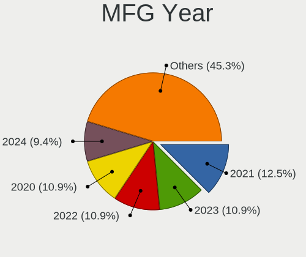
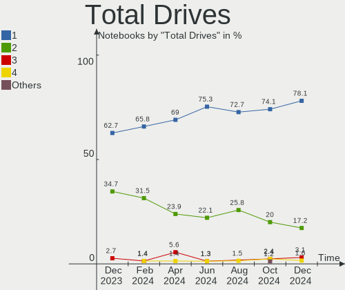
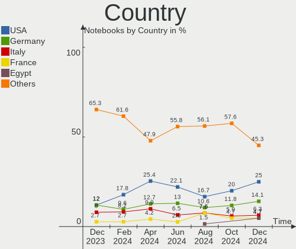
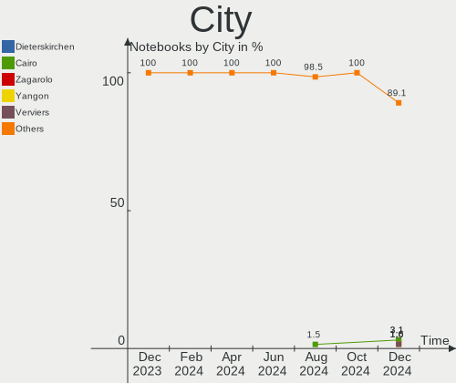
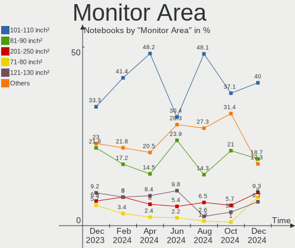
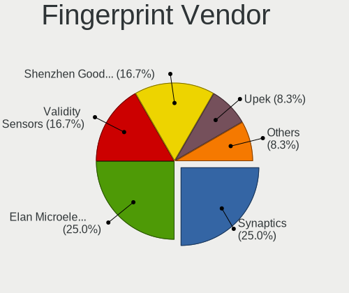
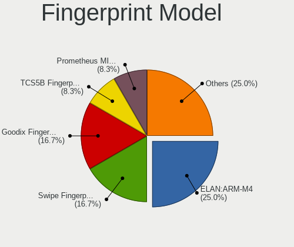

Kubuntu Hardware Trends (Notebooks)
-----------------------------------

A project to identify most popular hardware characteristics and track their change
over time based on data collected by Linux users at https://Linux-Hardware.org.

Anyone can contribute to this report by the [hw-probe](https://github.com/linuxhw/hw-probe) tool:

    sudo -E hw-probe -all -upload

Full-feature report is available here: https://linux-hardware.org/?view=trends&formfactor=notebook

Period: Jul, 2021.

Contents
--------

* [ System ](#system)
  - [ OS                       ](#os)
  - [ OS Family                ](#os-family)
  - [ Kernel                   ](#kernel)
  - [ Kernel Family            ](#kernel-family)
  - [ Kernel Major Ver.        ](#kernel-major-ver)
  - [ Arch                     ](#arch)
  - [ DE                       ](#de)
  - [ Display Server           ](#display-server)
  - [ Display Manager          ](#display-manager)
  - [ OS Lang                  ](#os-lang)
  - [ Boot Mode                ](#boot-mode)
  - [ Filesystem               ](#filesystem)
  - [ Part. scheme             ](#part-scheme)
  - [ Dual Boot with Linux/BSD ](#dual-boot-with-linuxbsd)
  - [ Dual Boot (Win)          ](#dual-boot-win)

* [ Board ](#board)
  - [ Vendor                   ](#vendor)
  - [ Model                    ](#model)
  - [ Model Family             ](#model-family)
  - [ MFG Year                 ](#mfg-year)
  - [ Form Factor              ](#form-factor)
  - [ Secure Boot              ](#secure-boot)
  - [ Coreboot                 ](#coreboot)
  - [ RAM Size                 ](#ram-size)
  - [ RAM Used                 ](#ram-used)
  - [ Total Drives             ](#total-drives)
  - [ Has CD-ROM               ](#has-cd-rom)
  - [ Has Ethernet             ](#has-ethernet)
  - [ Has WiFi                 ](#has-wifi)
  - [ Has Bluetooth            ](#has-bluetooth)

* [ Location ](#location)
  - [ Country                  ](#country)
  - [ City                     ](#city)

* [ Drives ](#drives)
  - [ Drive Vendor             ](#drive-vendor)
  - [ Drive Model              ](#drive-model)
  - [ HDD Vendor               ](#hdd-vendor)
  - [ SSD Vendor               ](#ssd-vendor)
  - [ Drive Kind               ](#drive-kind)
  - [ Drive Connector          ](#drive-connector)
  - [ Drive Size               ](#drive-size)
  - [ Space Total              ](#space-total)
  - [ Space Used               ](#space-used)
  - [ Malfunc. Drives          ](#malfunc-drives)
  - [ Malfunc. Drive Vendor    ](#malfunc-drive-vendor)
  - [ Malfunc. HDD Vendor      ](#malfunc-hdd-vendor)
  - [ Malfunc. Drive Kind      ](#malfunc-drive-kind)
  - [ Failed Drives            ](#failed-drives)
  - [ Failed Drive Vendor      ](#failed-drive-vendor)
  - [ Drive Status             ](#drive-status)

* [ Storage controller ](#storage-controller)
  - [ Storage Vendor           ](#storage-vendor)
  - [ Storage Model            ](#storage-model)
  - [ Storage Kind             ](#storage-kind)

* [ Processor ](#processor)
  - [ CPU Vendor               ](#cpu-vendor)
  - [ CPU Model                ](#cpu-model)
  - [ CPU Model Family         ](#cpu-model-family)
  - [ CPU Cores                ](#cpu-cores)
  - [ CPU Sockets              ](#cpu-sockets)
  - [ CPU Threads              ](#cpu-threads)
  - [ CPU Op-Modes             ](#cpu-op-modes)
  - [ CPU Microcode            ](#cpu-microcode)
  - [ CPU Microarch            ](#cpu-microarch)

* [ Graphics ](#graphics)
  - [ GPU Vendor               ](#gpu-vendor)
  - [ GPU Model                ](#gpu-model)
  - [ GPU Combo                ](#gpu-combo)
  - [ GPU Driver               ](#gpu-driver)
  - [ GPU Memory               ](#gpu-memory)

* [ Monitor ](#monitor)
  - [ Monitor Vendor           ](#monitor-vendor)
  - [ Monitor Model            ](#monitor-model)
  - [ Monitor Resolution       ](#monitor-resolution)
  - [ Monitor Diagonal         ](#monitor-diagonal)
  - [ Monitor Width            ](#monitor-width)
  - [ Aspect Ratio             ](#aspect-ratio)
  - [ Monitor Area             ](#monitor-area)
  - [ Pixel Density            ](#pixel-density)
  - [ Multiple Monitors        ](#multiple-monitors)

* [ Network ](#network)
  - [ Net Controller Vendor    ](#net-controller-vendor)
  - [ Net Controller Model     ](#net-controller-model)
  - [ Wireless Vendor          ](#wireless-vendor)
  - [ Wireless Model           ](#wireless-model)
  - [ Ethernet Vendor          ](#ethernet-vendor)
  - [ Ethernet Model           ](#ethernet-model)
  - [ Net Controller Kind      ](#net-controller-kind)
  - [ Used Controller          ](#used-controller)
  - [ NICs                     ](#nics)
  - [ IPv6                     ](#ipv6)

* [ Bluetooth ](#bluetooth)
  - [ Bluetooth Vendor         ](#bluetooth-vendor)
  - [ Bluetooth Model          ](#bluetooth-model)

* [ Sound ](#sound)
  - [ Sound Vendor             ](#sound-vendor)
  - [ Sound Model              ](#sound-model)

* [ Memory ](#memory)
  - [ Memory Vendor            ](#memory-vendor)
  - [ Memory Model             ](#memory-model)
  - [ Memory Kind              ](#memory-kind)
  - [ Memory Form Factor       ](#memory-form-factor)
  - [ Memory Size              ](#memory-size)
  - [ Memory Speed             ](#memory-speed)

* [ Printers & scanners ](#printers-&-scanners)
  - [ Printer Vendor           ](#printer-vendor)
  - [ Printer Model            ](#printer-model)
  - [ Scanner Vendor           ](#scanner-vendor)
  - [ Scanner Model            ](#scanner-model)

* [ Camera ](#camera)
  - [ Camera Vendor            ](#camera-vendor)
  - [ Camera Model             ](#camera-model)

* [ Security ](#security)
  - [ Fingerprint Vendor       ](#fingerprint-vendor)
  - [ Fingerprint Model        ](#fingerprint-model)
  - [ Chipcard Vendor          ](#chipcard-vendor)
  - [ Chipcard Model           ](#chipcard-model)

* [ Unsupported ](#unsupported)
  - [ Unsupported Devices      ](#unsupported-devices)
  - [ Unsupported Device Types ](#unsupported-device-types)

System
------

OS
--

Installed operating systems

| Name          | Notebooks | Percent |
|---------------|-----------|---------|
| Kubuntu 21.04 | 26        | 42.62%  |
| Kubuntu 20.04 | 25        | 40.98%  |
| Kubuntu 20.10 | 4         | 6.56%   |
| Kubuntu 18.04 | 4         | 6.56%   |
| Kubuntu       | 2         | 3.28%   |

OS Family
---------

OS without a version

| Name    | Notebooks | Percent |
|---------|-----------|---------|
| Kubuntu | 61        | 100%    |

Kernel
------

Version of the Linux kernel

| Version               | Notebooks | Percent |
|-----------------------|-----------|---------|
| 5.11.0-22-generic     | 12        | 19.67%  |
| 5.8.0-59-generic      | 9         | 14.75%  |
| 5.11.0-25-generic     | 9         | 14.75%  |
| 5.8.0-63-generic      | 6         | 9.84%   |
| 5.4.0-77-generic      | 4         | 6.56%   |
| 5.4.0-80-generic      | 3         | 4.92%   |
| 5.8.0-53-lowlatency   | 1         | 1.64%   |
| 5.8.0-41-generic      | 1         | 1.64%   |
| 5.4.0-74-generic      | 1         | 1.64%   |
| 5.4.0-73-generic      | 1         | 1.64%   |
| 5.4.0-67-generic      | 1         | 1.64%   |
| 5.4.0-66-generic      | 1         | 1.64%   |
| 5.4.0-58-generic      | 1         | 1.64%   |
| 5.4.0-26-generic      | 1         | 1.64%   |
| 5.13.4-051304-generic | 1         | 1.64%   |
| 5.13.2-051302-generic | 1         | 1.64%   |
| 5.13.1-051301-generic | 1         | 1.64%   |
| 5.12.9-051209-generic | 1         | 1.64%   |
| 5.11.0-24-generic     | 1         | 1.64%   |
| 5.11.0-22-lowlatency  | 1         | 1.64%   |
| 5.11.0-19-lowlatency  | 1         | 1.64%   |
| 5.10.0-1034-oem       | 1         | 1.64%   |
| 5.10.0-1029-oem       | 1         | 1.64%   |
| 4.15.0-151-generic    | 1         | 1.64%   |

Kernel Family
-------------

Linux kernel without a distro release

| Version | Notebooks | Percent |
|---------|-----------|---------|
| 5.11.0  | 24        | 39.34%  |
| 5.8.0   | 17        | 27.87%  |
| 5.4.0   | 13        | 21.31%  |
| 5.10.0  | 2         | 3.28%   |
| 5.13.4  | 1         | 1.64%   |
| 5.13.2  | 1         | 1.64%   |
| 5.13.1  | 1         | 1.64%   |
| 5.12.9  | 1         | 1.64%   |
| 4.15.0  | 1         | 1.64%   |

Kernel Major Ver.
-----------------

Linux kernel major version

| Version | Notebooks | Percent |
|---------|-----------|---------|
| 5.11    | 24        | 39.34%  |
| 5.8     | 17        | 27.87%  |
| 5.4     | 13        | 21.31%  |
| 5.13    | 3         | 4.92%   |
| 5.10    | 2         | 3.28%   |
| 5.12    | 1         | 1.64%   |
| 4.15    | 1         | 1.64%   |

Arch
----

OS architecture (x86_64, i586, etc.)

| Name   | Notebooks | Percent |
|--------|-----------|---------|
| x86_64 | 61        | 100%    |

DE
--

Desktop Environment

| Name | Notebooks | Percent |
|------|-----------|---------|
| KDE5 | 35        | 57.38%  |
| KDE  | 26        | 42.62%  |

Display Server
--------------

X11 or Wayland

| Name    | Notebooks | Percent |
|---------|-----------|---------|
| X11     | 60        | 98.36%  |
| Wayland | 1         | 1.64%   |

Display Manager
---------------

SDDM, LightDM, etc.

| Name    | Notebooks | Percent |
|---------|-----------|---------|
| SDDM    | 34        | 55.74%  |
| Unknown | 24        | 39.34%  |
| TDM     | 2         | 3.28%   |
| GDM     | 1         | 1.64%   |

OS Lang
-------

Language

| Lang  | Notebooks | Percent |
|-------|-----------|---------|
| en_US | 25        | 40.98%  |
| pt_BR | 6         | 9.84%   |
| de_DE | 5         | 8.2%    |
| ru_RU | 3         | 4.92%   |
| pl_PL | 2         | 3.28%   |
| fr_FR | 2         | 3.28%   |
| en_GB | 2         | 3.28%   |
| en_CA | 2         | 3.28%   |
| en_AU | 2         | 3.28%   |
| tr_TR | 1         | 1.64%   |
| nl_NL | 1         | 1.64%   |
| ja_JP | 1         | 1.64%   |
| it_IT | 1         | 1.64%   |
| fr_BE | 1         | 1.64%   |
| es_SV | 1         | 1.64%   |
| es_ES | 1         | 1.64%   |
| en_IN | 1         | 1.64%   |
| en_IE | 1         | 1.64%   |
| en_DK | 1         | 1.64%   |
| C     | 1         | 1.64%   |
| az_IR | 1         | 1.64%   |

Boot Mode
---------

EFI or BIOS

| Mode | Notebooks | Percent |
|------|-----------|---------|
| EFI  | 39        | 63.93%  |
| BIOS | 22        | 36.07%  |

Filesystem
----------

Type of filesystem

| Type    | Notebooks | Percent |
|---------|-----------|---------|
| Ext4    | 57        | 93.44%  |
| Btrfs   | 2         | 3.28%   |
| Zfs     | 1         | 1.64%   |
| Overlay | 1         | 1.64%   |

Part. scheme
------------

Scheme of partitioning

| Type    | Notebooks | Percent |
|---------|-----------|---------|
| GPT     | 31        | 50.82%  |
| Unknown | 24        | 39.34%  |
| MBR     | 6         | 9.84%   |

Dual Boot with Linux/BSD
------------------------

Hosting more than one Linux/BSD

| Dual boot | Notebooks | Percent |
|-----------|-----------|---------|
| No        | 59        | 96.72%  |
| Yes       | 2         | 3.28%   |

Dual Boot (Win)
---------------

Hosting Linux and Windows

| Dual boot | Notebooks | Percent |
|-----------|-----------|---------|
| No        | 39        | 63.93%  |
| Yes       | 22        | 36.07%  |

Board
-----

Vendor
------

Motherboard manufacturer

| Name                   | Notebooks | Percent |
|------------------------|-----------|---------|
| Lenovo                 | 17        | 27.87%  |
| Dell                   | 13        | 21.31%  |
| Hewlett-Packard        | 12        | 19.67%  |
| ASUSTek Computer       | 3         | 4.92%   |
| Samsung Electronics    | 2         | 3.28%   |
| MSI                    | 2         | 3.28%   |
| Acer                   | 2         | 3.28%   |
| Timi                   | 1         | 1.64%   |
| Purism                 | 1         | 1.64%   |
| Notebook               | 1         | 1.64%   |
| Google                 | 1         | 1.64%   |
| Fujitsu                | 1         | 1.64%   |
| Entroware              | 1         | 1.64%   |
| Chuwi                  | 1         | 1.64%   |
| Alienware              | 1         | 1.64%   |
| ,PC Specialist Limited | 1         | 1.64%   |
| Unknown                | 1         | 1.64%   |

Model
-----

Motherboard model

| Name                                         | Notebooks | Percent |
|----------------------------------------------|-----------|---------|
| Lenovo Legion 5 15ARH05H 82B1                | 2         | 3.28%   |
| HP Pavilion dv6                              | 2         | 3.28%   |
| HP Pavilion 15                               | 2         | 3.28%   |
| Timi A35S                                    | 1         | 1.64%   |
| Samsung 300E5K/300E5Q                        | 1         | 1.64%   |
| Samsung 300E4C/300E5C/300E7C                 | 1         | 1.64%   |
| Purism Librem 15 v3                          | 1         | 1.64%   |
| Notebook P65_P67RGRERA                       | 1         | 1.64%   |
| MSI Modern 14 B4MW                           | 1         | 1.64%   |
| MSI GE620/GE620DX/FX620DX/FX623              | 1         | 1.64%   |
| Lenovo Z50-75 80EC                           | 1         | 1.64%   |
| Lenovo Yoga 2 Pro 20266                      | 1         | 1.64%   |
| Lenovo V14 G2 ITL 82KA                       | 1         | 1.64%   |
| Lenovo V130-14IGM 81HM                       | 1         | 1.64%   |
| Lenovo ThinkPad X1 Titanium Gen 1 20QA000DUS | 1         | 1.64%   |
| Lenovo ThinkPad X1 Carbon 6th 20KHCTO1WW     | 1         | 1.64%   |
| Lenovo ThinkPad W540 20BG001SGE              | 1         | 1.64%   |
| Lenovo ThinkPad T460 20FN002VUS              | 1         | 1.64%   |
| Lenovo ThinkPad T410 2537VTZ                 | 1         | 1.64%   |
| Lenovo ThinkPad P15v Gen 1 20TQCTO1WW        | 1         | 1.64%   |
| Lenovo ThinkPad L390 20NR001EGE              | 1         | 1.64%   |
| Lenovo ThinkBook 14 G2 ITL 20VD              | 1         | 1.64%   |
| Lenovo Legion Y540-15IRH-PG0 81SY            | 1         | 1.64%   |
| Lenovo Legion 5 Pro 16ACH6H 82JQ             | 1         | 1.64%   |
| Lenovo G400s VILG1                           | 1         | 1.64%   |
| HP ZBook Power G7 Mobile Workstation         | 1         | 1.64%   |
| HP ProBook 445 G7                            | 1         | 1.64%   |
| HP Pavilion Notebook                         | 1         | 1.64%   |
| HP Pavilion Gaming Laptop 17-cd0xxx          | 1         | 1.64%   |
| HP Pavilion g6                               | 1         | 1.64%   |
| HP EliteBook 850 G3                          | 1         | 1.64%   |
| HP EliteBook 845 G7 Notebook PC              | 1         | 1.64%   |
| HP EliteBook 840 G6                          | 1         | 1.64%   |
| Google Cyan                                  | 1         | 1.64%   |
| Fujitsu FMVS03004                            | 1         | 1.64%   |
| Entroware Apollo                             | 1         | 1.64%   |
| Dell XPS 17 9700                             | 1         | 1.64%   |
| Dell XPS 15 9510                             | 1         | 1.64%   |
| Dell XPS 15 9500                             | 1         | 1.64%   |
| Dell Vostro 3560                             | 1         | 1.64%   |
| Dell Precision 7530                          | 1         | 1.64%   |
| Dell Latitude E6430                          | 1         | 1.64%   |
| Dell Latitude E5430 vPro                     | 1         | 1.64%   |
| Dell Latitude 5320                           | 1         | 1.64%   |
| Dell Latitude 3400                           | 1         | 1.64%   |
| Dell Inspiron N5110                          | 1         | 1.64%   |
| Dell Inspiron 3185                           | 1         | 1.64%   |
| Dell Inspiron 15 5510                        | 1         | 1.64%   |
| Dell G3 3579                                 | 1         | 1.64%   |
| Chuwi GemiBook                               | 1         | 1.64%   |
| ASUS ZenBook UX425IA_UM425IA                 | 1         | 1.64%   |
| ASUS VivoBook_ASUSLaptop X512FJ_X512FJ       | 1         | 1.64%   |
| ASUS N550JK                                  | 1         | 1.64%   |
| Alienware 17 R2                              | 1         | 1.64%   |
| Acer Predator G3-571                         | 1         | 1.64%   |
| Acer Aspire E5-771G                          | 1         | 1.64%   |
| ,PC Specialist Limited N550RN                | 1         | 1.64%   |
| Unknown                                      | 1         | 1.64%   |

Model Family
------------

Motherboard model prefix

| Name                          | Notebooks | Percent |
|-------------------------------|-----------|---------|
| Lenovo ThinkPad               | 7         | 11.48%  |
| HP Pavilion                   | 7         | 11.48%  |
| Lenovo Legion                 | 4         | 6.56%   |
| Dell Latitude                 | 4         | 6.56%   |
| HP EliteBook                  | 3         | 4.92%   |
| Dell XPS                      | 3         | 4.92%   |
| Dell Inspiron                 | 3         | 4.92%   |
| Timi A35S                     | 1         | 1.64%   |
| Samsung 300E5K                | 1         | 1.64%   |
| Samsung 300E4C                | 1         | 1.64%   |
| Purism Librem                 | 1         | 1.64%   |
| Notebook P65                  | 1         | 1.64%   |
| MSI Modern                    | 1         | 1.64%   |
| MSI GE620                     | 1         | 1.64%   |
| Lenovo Z50-75                 | 1         | 1.64%   |
| Lenovo Yoga                   | 1         | 1.64%   |
| Lenovo V14                    | 1         | 1.64%   |
| Lenovo V130-14IGM             | 1         | 1.64%   |
| Lenovo ThinkBook              | 1         | 1.64%   |
| Lenovo G400s                  | 1         | 1.64%   |
| HP ZBook                      | 1         | 1.64%   |
| HP ProBook                    | 1         | 1.64%   |
| Google Cyan                   | 1         | 1.64%   |
| Fujitsu FMVS03004             | 1         | 1.64%   |
| Entroware Apollo              | 1         | 1.64%   |
| Dell Vostro                   | 1         | 1.64%   |
| Dell Precision                | 1         | 1.64%   |
| Dell G3                       | 1         | 1.64%   |
| Chuwi GemiBook                | 1         | 1.64%   |
| ASUS ZenBook                  | 1         | 1.64%   |
| ASUS VivoBook                 | 1         | 1.64%   |
| ASUS N550JK                   | 1         | 1.64%   |
| Alienware 17                  | 1         | 1.64%   |
| Acer Predator                 | 1         | 1.64%   |
| Acer Aspire                   | 1         | 1.64%   |
| ,PC Specialist Limited N550RN | 1         | 1.64%   |
| Unknown                       | 1         | 1.64%   |

MFG Year
--------

Motherboard manufacture year

| Year | Notebooks | Percent |
|------|-----------|---------|
| 2021 | 14        | 22.95%  |
| 2020 | 13        | 21.31%  |
| 2018 | 8         | 13.11%  |
| 2019 | 7         | 11.48%  |
| 2013 | 6         | 9.84%   |
| 2011 | 4         | 6.56%   |
| 2016 | 3         | 4.92%   |
| 2015 | 3         | 4.92%   |
| 2017 | 1         | 1.64%   |
| 2014 | 1         | 1.64%   |
| 2012 | 1         | 1.64%   |

Form Factor
-----------

Physical design of the computer

| Name     | Notebooks | Percent |
|----------|-----------|---------|
| Notebook | 61        | 100%    |

Secure Boot
-----------

Enabled or disabled

| State    | Notebooks | Percent |
|----------|-----------|---------|
| Disabled | 52        | 85.25%  |
| Enabled  | 9         | 14.75%  |

Coreboot
--------

Have coreboot on board

| Used | Notebooks | Percent |
|------|-----------|---------|
| No   | 59        | 96.72%  |
| Yes  | 2         | 3.28%   |

RAM Size
--------

Total RAM memory

| Size in GB  | Notebooks | Percent |
|-------------|-----------|---------|
| 4.01-8.0    | 17        | 27.87%  |
| 16.01-24.0  | 15        | 24.59%  |
| 8.01-16.0   | 11        | 18.03%  |
| 32.01-64.0  | 8         | 13.11%  |
| 3.01-4.0    | 5         | 8.2%    |
| 64.01-256.0 | 3         | 4.92%   |
| 24.01-32.0  | 1         | 1.64%   |
| 1.01-2.0    | 1         | 1.64%   |

RAM Used
--------

Used RAM memory

| Used GB    | Notebooks | Percent |
|------------|-----------|---------|
| 1.01-2.0   | 16        | 26.23%  |
| 4.01-8.0   | 13        | 21.31%  |
| 2.01-3.0   | 12        | 19.67%  |
| 3.01-4.0   | 10        | 16.39%  |
| 8.01-16.0  | 8         | 13.11%  |
| 32.01-64.0 | 1         | 1.64%   |
| 0.51-1.0   | 1         | 1.64%   |

Total Drives
------------

Number of drives on board

| Drives | Notebooks | Percent |
|--------|-----------|---------|
| 1      | 44        | 72.13%  |
| 2      | 15        | 24.59%  |
| 3      | 1         | 1.64%   |
| 0      | 1         | 1.64%   |

Has CD-ROM
----------

Has CD-ROM on board

| Presented | Notebooks | Percent |
|-----------|-----------|---------|
| No        | 47        | 77.05%  |
| Yes       | 14        | 22.95%  |

Has Ethernet
------------

Has Ethernet on board

| Presented | Notebooks | Percent |
|-----------|-----------|---------|
| Yes       | 48        | 78.69%  |
| No        | 13        | 21.31%  |

Has WiFi
--------

Has WiFi module

| Presented | Notebooks | Percent |
|-----------|-----------|---------|
| Yes       | 60        | 98.36%  |
| No        | 1         | 1.64%   |

Has Bluetooth
-------------

Has Bluetooth module

| Presented | Notebooks | Percent |
|-----------|-----------|---------|
| Yes       | 51        | 83.61%  |
| No        | 10        | 16.39%  |

Location
--------

Country
-------

Geographic location (country)

| Country     | Notebooks | Percent |
|-------------|-----------|---------|
| USA         | 9         | 14.75%  |
| Germany     | 9         | 14.75%  |
| Brazil      | 6         | 9.84%   |
| UK          | 4         | 6.56%   |
| Spain       | 4         | 6.56%   |
| Russia      | 4         | 6.56%   |
| France      | 4         | 6.56%   |
| Belgium     | 3         | 4.92%   |
| Netherlands | 2         | 3.28%   |
| Iran        | 2         | 3.28%   |
| Canada      | 2         | 3.28%   |
| Australia   | 2         | 3.28%   |
| Turkey      | 1         | 1.64%   |
| Romania     | 1         | 1.64%   |
| Poland      | 1         | 1.64%   |
| Mexico      | 1         | 1.64%   |
| Kuwait      | 1         | 1.64%   |
| Japan       | 1         | 1.64%   |
| India       | 1         | 1.64%   |
| El Salvador | 1         | 1.64%   |
| Colombia    | 1         | 1.64%   |
| Belarus     | 1         | 1.64%   |

City
----

Geographic location (city)

| City                        | Notebooks | Percent |
|-----------------------------|-----------|---------|
| Rio de Janeiro              | 3         | 4.92%   |
| Odintsovo                   | 2         | 3.28%   |
| Worcester                   | 1         | 1.64%   |
| Windeck                     | 1         | 1.64%   |
| Whittier                    | 1         | 1.64%   |
| Watertown                   | 1         | 1.64%   |
| Valencia                    | 1         | 1.64%   |
| Toyama                      | 1         | 1.64%   |
| Toronto                     | 1         | 1.64%   |
| Titisee-Neustadt            | 1         | 1.64%   |
| Tehran                      | 1         | 1.64%   |
| Sydney                      | 1         | 1.64%   |
| Stratfield Mortimer         | 1         | 1.64%   |
| Springboro                  | 1         | 1.64%   |
| Senden                      | 1         | 1.64%   |
| Santo André                | 1         | 1.64%   |
| Santa Rosa                  | 1         | 1.64%   |
| San Salvador                | 1         | 1.64%   |
| San Cristóbal de La Laguna | 1         | 1.64%   |
| Salzgitter                  | 1         | 1.64%   |
| Safety Bay                  | 1         | 1.64%   |
| Rostov                      | 1         | 1.64%   |
| Paris                       | 1         | 1.64%   |
| Oxford                      | 1         | 1.64%   |
| Old Bridge                  | 1         | 1.64%   |
| Moscow                      | 1         | 1.64%   |
| Montreal                    | 1         | 1.64%   |
| Minsk                       | 1         | 1.64%   |
| Marseille                   | 1         | 1.64%   |
| Manchester-by-the-Sea       | 1         | 1.64%   |
| Madrid                      | 1         | 1.64%   |
| Lufkin                      | 1         | 1.64%   |
| Lodz                        | 1         | 1.64%   |
| Lewisham                    | 1         | 1.64%   |
| Lepe                        | 1         | 1.64%   |
| Lehrte                      | 1         | 1.64%   |
| Kuwait City                 | 1         | 1.64%   |
| Konya                       | 1         | 1.64%   |
| Khorramshahr                | 1         | 1.64%   |
| Ipiales                     | 1         | 1.64%   |
| Hyderabad                   | 1         | 1.64%   |
| Hilversum                   | 1         | 1.64%   |
| Hautrage                    | 1         | 1.64%   |
| Hanover                     | 1         | 1.64%   |
| Gig Harbor                  | 1         | 1.64%   |
| Frankfurt am Main           | 1         | 1.64%   |
| Forchheim                   | 1         | 1.64%   |
| Floresti                    | 1         | 1.64%   |
| Chapec??                    | 1         | 1.64%   |
| Celaya                      | 1         | 1.64%   |
| Caceres                     | 1         | 1.64%   |
| Brussels                    | 1         | 1.64%   |
| Bordeaux                    | 1         | 1.64%   |
| Bolton                      | 1         | 1.64%   |
| Assebroek                   | 1         | 1.64%   |
| Amsterdam                   | 1         | 1.64%   |
| Alzey                       | 1         | 1.64%   |
| Alizay                      | 1         | 1.64%   |

Drives
------

Drive Vendor
------------

Hard drive vendors

| Vendor              | Notebooks | Drives | Percent |
|---------------------|-----------|--------|---------|
| Samsung Electronics | 16        | 16     | 21.33%  |
| WDC                 | 10        | 10     | 13.33%  |
| SK Hynix            | 8         | 9      | 10.67%  |
| Seagate             | 6         | 6      | 8%      |
| Toshiba             | 5         | 5      | 6.67%   |
| SanDisk             | 5         | 6      | 6.67%   |
| Unknown             | 3         | 3      | 4%      |
| KIOXIA              | 3         | 3      | 4%      |
| Kingston            | 3         | 3      | 4%      |
| SPCC                | 2         | 2      | 2.67%   |
| PNY                 | 2         | 2      | 2.67%   |
| Crucial             | 2         | 2      | 2.67%   |
| A-DATA Technology   | 2         | 2      | 2.67%   |
| XPG                 | 1         | 1      | 1.33%   |
| Union Memory        | 1         | 1      | 1.33%   |
| Micron Technology   | 1         | 1      | 1.33%   |
| LITEON              | 1         | 1      | 1.33%   |
| Intel               | 1         | 1      | 1.33%   |
| Hitachi             | 1         | 1      | 1.33%   |
| HGST                | 1         | 1      | 1.33%   |
| Corsair             | 1         | 1      | 1.33%   |

Drive Model
-----------

Hard drive models

| Model                                     | Notebooks | Percent |
|-------------------------------------------|-----------|---------|
| WDC PC SN730 NVMe 1024GB                  | 2         | 2.63%   |
| SanDisk SSD PLUS 240GB                    | 2         | 2.63%   |
| XPG NVMe SSD Drive 1024GB                 | 1         | 1.32%   |
| WDC WDS240G2G0A-00JH30 240GB SSD          | 1         | 1.32%   |
| WDC WDS200T2B0B 2TB SSD                   | 1         | 1.32%   |
| WDC WD10SPZX-80Z10T2 1TB                  | 1         | 1.32%   |
| WDC WD10SPZX-75Z10T2 1TB                  | 1         | 1.32%   |
| WDC WD10SPZX-21Z10T0 1TB                  | 1         | 1.32%   |
| WDC WD10JPCX-24UE4T0 1TB                  | 1         | 1.32%   |
| WDC PC SN730 SDBQNTY-1T00-1001 1TB        | 1         | 1.32%   |
| WDC PC SN730 NVMe 512GB                   | 1         | 1.32%   |
| Unknown RZX-19SSD6G/480G 480GB            | 1         | 1.32%   |
| Unknown MMC Card  16GB                    | 1         | 1.32%   |
| Unknown EC1S5  64GB                       | 1         | 1.32%   |
| Union Memory UMIS RPJTJ256MEE1OWX 256GB   | 1         | 1.32%   |
| Toshiba NVMe SSD Drive 2TB                | 1         | 1.32%   |
| Toshiba MQ01ABD100 1TB                    | 1         | 1.32%   |
| Toshiba MK7559GSXP 752GB                  | 1         | 1.32%   |
| Toshiba KXG60ZNV512G KIOXIA 512GB         | 1         | 1.32%   |
| Toshiba KXG60ZNV1T02 NVMe 1024GB          | 1         | 1.32%   |
| SPCC Solid State Disk 256GB               | 1         | 1.32%   |
| SPCC Solid State Disk 120GB               | 1         | 1.32%   |
| SK Hynix SKHynix_HFS512GD9TNI-L2A0B 512GB | 1         | 1.32%   |
| SK Hynix SKHynix_HFS001TDE9X084N 1TB      | 1         | 1.32%   |
| SK Hynix NVMe SSD Drive 512GB             | 1         | 1.32%   |
| SK Hynix NVMe SSD Drive 1024GB            | 1         | 1.32%   |
| SK Hynix HFS256G39TND-N210A 256GB SSD     | 1         | 1.32%   |
| SK Hynix HFS128G32TNF-N3A0A 128GB SSD     | 1         | 1.32%   |
| SK Hynix BC511 NVMe 256GB                 | 1         | 1.32%   |
| SK Hynix BC511 HFM512GDJTNI-82A0A 512GB   | 1         | 1.32%   |
| Seagate ST2000LX001-1RG174 2TB            | 1         | 1.32%   |
| Seagate ST1000LM049-2GH172 1TB            | 1         | 1.32%   |
| Seagate ST1000LM048-2E7172 1TB            | 1         | 1.32%   |
| Seagate ST1000LM024 HN-M101MBB 1TB        | 1         | 1.32%   |
| Seagate ST1000LM014-SSHD-8GB              | 1         | 1.32%   |
| Seagate Portable 2TB                      | 1         | 1.32%   |
| SanDisk SSD PLUS 120GB                    | 1         | 1.32%   |
| SanDisk SSD PLUS 1000GB                   | 1         | 1.32%   |
| SanDisk SDSSDH3 1T00 1TB                  | 1         | 1.32%   |
| Sandisk NVMe SSD Drive 256GB              | 1         | 1.32%   |
| Samsung SSD PM851 M.2 2280 128GB          | 1         | 1.32%   |
| Samsung SSD 960 PRO 512GB                 | 1         | 1.32%   |
| Samsung SSD 870 EVO 1TB                   | 1         | 1.32%   |
| Samsung SSD 860 EVO M.2 500GB             | 1         | 1.32%   |
| Samsung SSD 860 EVO 1TB                   | 1         | 1.32%   |
| Samsung SSD 850 EVO mSATA 250GB           | 1         | 1.32%   |
| Samsung SSD 850 EVO 250GB                 | 1         | 1.32%   |
| Samsung SSD 830 Series 128GB              | 1         | 1.32%   |
| Samsung NVMe SSD Drive 512GB              | 1         | 1.32%   |
| Samsung NVMe SSD Drive 250GB              | 1         | 1.32%   |
| Samsung MZVLB512HAJQ-000L7 512GB          | 1         | 1.32%   |
| Samsung MZVKW512HMJP-00000 512GB          | 1         | 1.32%   |
| Samsung MZMTE256HMHP-000L1 256GB SSD      | 1         | 1.32%   |
| Samsung MZHPV512HDGL-00000 512GB SSD      | 1         | 1.32%   |
| Samsung MZALQ512HALU-000L2 512GB          | 1         | 1.32%   |
| Samsung MZALQ256HAJD-000L2 256GB          | 1         | 1.32%   |
| PNY CS900 500GB SSD                       | 1         | 1.32%   |
| PNY CS900 240GB SSD                       | 1         | 1.32%   |
| Micron MTFDDAK512MBF-1AN1ZABHA 512GB SSD  | 1         | 1.32%   |
| LITEON CV1-8B256-HP 256GB SSD             | 1         | 1.32%   |

HDD Vendor
----------

Hard disk drive vendors

| Vendor  | Notebooks | Drives | Percent |
|---------|-----------|--------|---------|
| Seagate | 5         | 5      | 38.46%  |
| WDC     | 4         | 4      | 30.77%  |
| Toshiba | 2         | 2      | 15.38%  |
| Hitachi | 1         | 1      | 7.69%   |
| HGST    | 1         | 1      | 7.69%   |

SSD Vendor
----------

Solid state drive vendors

| Vendor              | Notebooks | Drives | Percent |
|---------------------|-----------|--------|---------|
| Samsung Electronics | 9         | 9      | 29.03%  |
| SanDisk             | 5         | 5      | 16.13%  |
| Kingston            | 3         | 3      | 9.68%   |
| WDC                 | 2         | 2      | 6.45%   |
| SPCC                | 2         | 2      | 6.45%   |
| SK Hynix            | 2         | 2      | 6.45%   |
| PNY                 | 2         | 2      | 6.45%   |
| Crucial             | 2         | 2      | 6.45%   |
| Unknown             | 1         | 1      | 3.23%   |
| Micron Technology   | 1         | 1      | 3.23%   |
| LITEON              | 1         | 1      | 3.23%   |
| A-DATA Technology   | 1         | 1      | 3.23%   |

Drive Kind
----------

HDD or SSD

| Kind    | Notebooks | Drives | Percent |
|---------|-----------|--------|---------|
| SSD     | 28        | 31     | 39.44%  |
| NVMe    | 27        | 30     | 38.03%  |
| HDD     | 13        | 13     | 18.31%  |
| MMC     | 2         | 2      | 2.82%   |
| Unknown | 1         | 1      | 1.41%   |

Drive Connector
---------------

SATA, SAS, NVMe, etc.

| Type | Notebooks | Drives | Percent |
|------|-----------|--------|---------|
| SATA | 36        | 44     | 54.55%  |
| NVMe | 27        | 30     | 40.91%  |
| MMC  | 2         | 2      | 3.03%   |
| SAS  | 1         | 1      | 1.52%   |

Drive Size
----------

Size of hard drive

| Size in TB | Notebooks | Drives | Percent |
|------------|-----------|--------|---------|
| 0.01-0.5   | 24        | 24     | 54.55%  |
| 0.51-1.0   | 18        | 18     | 40.91%  |
| 1.01-2.0   | 2         | 2      | 4.55%   |

Space Total
-----------

Amount of disk space available on the file system

| Size in GB | Notebooks | Percent |
|------------|-----------|---------|
| 101-250    | 21        | 34.43%  |
| 251-500    | 19        | 31.15%  |
| 1001-2000  | 8         | 13.11%  |
| 501-1000   | 8         | 13.11%  |
| 1-20       | 3         | 4.92%   |
| 21-50      | 1         | 1.64%   |
| 2001-3000  | 1         | 1.64%   |

Space Used
----------

Amount of used disk space

| Used GB   | Notebooks | Percent |
|-----------|-----------|---------|
| 1-20      | 17        | 27.87%  |
| 101-250   | 11        | 18.03%  |
| 51-100    | 10        | 16.39%  |
| 251-500   | 8         | 13.11%  |
| 21-50     | 7         | 11.48%  |
| 501-1000  | 5         | 8.2%    |
| 1001-2000 | 3         | 4.92%   |

Malfunc. Drives
---------------

Drive models with a malfunction

| Model                              | Notebooks | Drives | Percent |
|------------------------------------|-----------|--------|---------|
| Toshiba MQ01ABD100 1TB             | 1         | 1      | 33.33%  |
| Seagate ST1000LM024 HN-M101MBB 1TB | 1         | 1      | 33.33%  |
| Seagate ST1000LM014-SSHD-8GB       | 1         | 1      | 33.33%  |

Malfunc. Drive Vendor
---------------------

Vendors of faulty drives

| Vendor  | Notebooks | Drives | Percent |
|---------|-----------|--------|---------|
| Seagate | 2         | 2      | 66.67%  |
| Toshiba | 1         | 1      | 33.33%  |

Malfunc. HDD Vendor
-------------------

Vendors of faulty HDD drives

| Vendor  | Notebooks | Drives | Percent |
|---------|-----------|--------|---------|
| Seagate | 2         | 2      | 66.67%  |
| Toshiba | 1         | 1      | 33.33%  |

Malfunc. Drive Kind
-------------------

Kinds of faulty drives

| Kind | Notebooks | Drives | Percent |
|------|-----------|--------|---------|
| HDD  | 3         | 3      | 100%    |

Failed Drives
-------------

Failed drive models

Zero info for selected period =(

Failed Drive Vendor
-------------------

Failed drive vendors

Zero info for selected period =(

Drive Status
------------

Number of failed and malfunc. drives

| Status   | Notebooks | Drives | Percent |
|----------|-----------|--------|---------|
| Works    | 35        | 41     | 55.56%  |
| Detected | 25        | 33     | 39.68%  |
| Malfunc  | 3         | 3      | 4.76%   |

Storage controller
------------------

Storage Vendor
--------------

Storage controller vendors

| Vendor                       | Notebooks | Percent |
|------------------------------|-----------|---------|
| Intel                        | 39        | 49.37%  |
| AMD                          | 12        | 15.19%  |
| Samsung Electronics          | 8         | 10.13%  |
| SK Hynix                     | 6         | 7.59%   |
| Sandisk                      | 5         | 6.33%   |
| Toshiba America Info Systems | 3         | 3.8%    |
| KIOXIA                       | 3         | 3.8%    |
| Union Memory (Shenzhen)      | 1         | 1.27%   |
| Phison Electronics           | 1         | 1.27%   |
| ADATA Technology             | 1         | 1.27%   |

Storage Model
-------------

Storage controller models

| Model                                                                          | Notebooks | Percent |
|--------------------------------------------------------------------------------|-----------|---------|
| AMD FCH SATA Controller [AHCI mode]                                            | 12        | 14.29%  |
| Intel Volume Management Device NVMe RAID Controller                            | 5         | 5.95%   |
| Intel 82801 Mobile SATA Controller [RAID mode]                                 | 5         | 5.95%   |
| Sandisk WD Black SN750 / PC SN730 NVMe SSD                                     | 4         | 4.76%   |
| Intel HM170/QM170 Chipset SATA Controller [AHCI Mode]                          | 4         | 4.76%   |
| Intel 7 Series Chipset Family 6-port SATA Controller [AHCI mode]               | 4         | 4.76%   |
| Intel 6 Series/C200 Series Chipset Family 6 port Mobile SATA AHCI Controller   | 4         | 4.76%   |
| Toshiba America Info Systems XG6 NVMe SSD Controller                           | 3         | 3.57%   |
| Samsung NVMe Controller                                                        | 3         | 3.57%   |
| KIOXIA Non-Volatile memory controller                                          | 3         | 3.57%   |
| Intel Wildcat Point-LP SATA Controller [AHCI Mode]                             | 3         | 3.57%   |
| Intel Tiger Lake-LP SATA Controller [AHCI mode]                                | 3         | 3.57%   |
| Intel Sunrise Point-LP SATA Controller [AHCI mode]                             | 3         | 3.57%   |
| Intel Cannon Lake Mobile PCH SATA AHCI Controller                              | 3         | 3.57%   |
| SK Hynix NVMe SSD Controller                                                   | 2         | 2.38%   |
| SK Hynix BC511                                                                 | 2         | 2.38%   |
| Samsung NVMe SSD Controller SM981/PM981/PM983                                  | 2         | 2.38%   |
| Samsung NVMe SSD Controller SM961/PM961/SM963                                  | 2         | 2.38%   |
| Intel Celeron/Pentium Silver Processor SATA Controller                         | 2         | 2.38%   |
| Intel Cannon Point-LP SATA Controller [AHCI Mode]                              | 2         | 2.38%   |
| Intel 8 Series/C220 Series Chipset Family 6-port SATA Controller 1 [AHCI mode] | 2         | 2.38%   |
| Union Memory (Shenzhen) Non-Volatile memory controller                         | 1         | 1.19%   |
| SK Hynix Non-Volatile memory controller                                        | 1         | 1.19%   |
| SK Hynix BC501 NVMe Solid State Drive                                          | 1         | 1.19%   |
| Sandisk WD Black 2018/SN750 / PC SN720 NVMe SSD                                | 1         | 1.19%   |
| Samsung Electronics SATA controller                                            | 1         | 1.19%   |
| Phison E12 NVMe Controller                                                     | 1         | 1.19%   |
| Intel SSD Pro 7600p/760p/E 6100p Series                                        | 1         | 1.19%   |
| Intel 8 Series SATA Controller 1 [AHCI mode]                                   | 1         | 1.19%   |
| Intel 5 Series/3400 Series Chipset 6 port SATA AHCI Controller                 | 1         | 1.19%   |
| AMD FCH IDE Controller                                                         | 1         | 1.19%   |
| ADATA XPG SX8200 Pro PCIe Gen3x4 M.2 2280 Solid State Drive                    | 1         | 1.19%   |

Storage Kind
------------

Kind of storage controller (IDE, SATA, NVMe, SAS, ...)

| Kind | Notebooks | Percent |
|------|-----------|---------|
| SATA | 44        | 53.66%  |
| NVMe | 27        | 32.93%  |
| RAID | 10        | 12.2%   |
| IDE  | 1         | 1.22%   |

Processor
---------

CPU Vendor
----------

Processor vendors

| Vendor | Notebooks | Percent |
|--------|-----------|---------|
| Intel  | 48        | 78.69%  |
| AMD    | 13        | 21.31%  |

CPU Model
---------

Processor models

| Model                                         | Notebooks | Percent |
|-----------------------------------------------|-----------|---------|
| Intel Core i9-10885H CPU @ 2.40GHz            | 2         | 3.28%   |
| Intel Core i7-8565U CPU @ 1.80GHz             | 2         | 3.28%   |
| Intel Core i7-7700HQ CPU @ 2.80GHz            | 2         | 3.28%   |
| Intel Core i7-6700HQ CPU @ 2.60GHz            | 2         | 3.28%   |
| Intel Core i7-6600U CPU @ 2.60GHz             | 2         | 3.28%   |
| Intel Core i7-5500U CPU @ 2.40GHz             | 2         | 3.28%   |
| Intel Core i3-3110M CPU @ 2.40GHz             | 2         | 3.28%   |
| Intel 11th Gen Core i5-1135G7 @ 2.40GHz       | 2         | 3.28%   |
| AMD Ryzen 7 5800H with Radeon Graphics        | 2         | 3.28%   |
| AMD Ryzen 7 4800H with Radeon Graphics        | 2         | 3.28%   |
| AMD Ryzen 5 4500U with Radeon Graphics        | 2         | 3.28%   |
| Intel Pentium Silver N5000 CPU @ 1.10GHz      | 1         | 1.64%   |
| Intel Core i7-9750H CPU @ 2.60GHz             | 1         | 1.64%   |
| Intel Core i7-8850H CPU @ 2.60GHz             | 1         | 1.64%   |
| Intel Core i7-8750H CPU @ 2.20GHz             | 1         | 1.64%   |
| Intel Core i7-8665U CPU @ 1.90GHz             | 1         | 1.64%   |
| Intel Core i7-8550U CPU @ 1.80GHz             | 1         | 1.64%   |
| Intel Core i7-6500U CPU @ 2.50GHz             | 1         | 1.64%   |
| Intel Core i7-4930MX CPU @ 3.00GHz            | 1         | 1.64%   |
| Intel Core i7-4720HQ CPU @ 2.60GHz            | 1         | 1.64%   |
| Intel Core i7-4700HQ CPU @ 2.40GHz            | 1         | 1.64%   |
| Intel Core i7-4510U CPU @ 2.00GHz             | 1         | 1.64%   |
| Intel Core i7-3632QM CPU @ 2.20GHz            | 1         | 1.64%   |
| Intel Core i7-3540M CPU @ 3.00GHz             | 1         | 1.64%   |
| Intel Core i7-2670QM CPU @ 2.20GHz            | 1         | 1.64%   |
| Intel Core i7-10850H CPU @ 2.70GHz            | 1         | 1.64%   |
| Intel Core i7-10750H CPU @ 2.60GHz            | 1         | 1.64%   |
| Intel Core i5-9300H CPU @ 2.40GHz             | 1         | 1.64%   |
| Intel Core i5-8365U CPU @ 1.60GHz             | 1         | 1.64%   |
| Intel Core i5-8265U CPU @ 1.60GHz             | 1         | 1.64%   |
| Intel Core i5-5300U CPU @ 2.30GHz             | 1         | 1.64%   |
| Intel Core i5-3320M CPU @ 2.60GHz             | 1         | 1.64%   |
| Intel Core i5-3210M CPU @ 2.50GHz             | 1         | 1.64%   |
| Intel Core i5-2430M CPU @ 2.40GHz             | 1         | 1.64%   |
| Intel Core i5-2410M CPU @ 2.30GHz             | 1         | 1.64%   |
| Intel Core i5 CPU M 560 @ 2.67GHz             | 1         | 1.64%   |
| Intel Core i3-2350M CPU @ 2.30GHz             | 1         | 1.64%   |
| Intel Celeron J4115 CPU @ 1.80GHz             | 1         | 1.64%   |
| Intel Celeron CPU N3060 @ 1.60GHz             | 1         | 1.64%   |
| Intel 11th Gen Core i7-1185G7 @ 3.00GHz       | 1         | 1.64%   |
| Intel 11th Gen Core i7-11800H @ 2.30GHz       | 1         | 1.64%   |
| Intel 11th Gen Core i7-11370H @ 3.30GHz       | 1         | 1.64%   |
| Intel 11th Gen Core i5-1130G7 @ 1.10GHz       | 1         | 1.64%   |
| AMD Ryzen 7 PRO 4750U with Radeon Graphics    | 1         | 1.64%   |
| AMD Ryzen 7 4700U with Radeon Graphics        | 1         | 1.64%   |
| AMD FX-7500 Radeon R7, 10 Compute Cores 4C+6G | 1         | 1.64%   |
| AMD A9-9420e RADEON R5, 5 COMPUTE CORES 2C+3G | 1         | 1.64%   |
| AMD A6-3410MX APU with Radeon HD Graphics     | 1         | 1.64%   |
| AMD A4-5150M APU with Radeon HD Graphics      | 1         | 1.64%   |
| AMD A4-3305M APU with Radeon HD Graphics      | 1         | 1.64%   |

CPU Model Family
----------------

Processor model prefix

| Model                | Notebooks | Percent |
|----------------------|-----------|---------|
| Intel Core i7        | 25        | 40.98%  |
| Intel Core i5        | 9         | 14.75%  |
| Other                | 7         | 11.48%  |
| AMD Ryzen 7          | 5         | 8.2%    |
| Intel Core i3        | 3         | 4.92%   |
| Intel Core i9        | 2         | 3.28%   |
| Intel Celeron        | 2         | 3.28%   |
| AMD Ryzen 5          | 2         | 3.28%   |
| AMD A4               | 2         | 3.28%   |
| Intel Pentium Silver | 1         | 1.64%   |
| AMD Ryzen 7 PRO      | 1         | 1.64%   |
| AMD FX               | 1         | 1.64%   |
| AMD A6               | 1         | 1.64%   |

CPU Cores
---------

Number of processor cores

| Number | Notebooks | Percent |
|--------|-----------|---------|
| 4      | 24        | 39.34%  |
| 2      | 20        | 32.79%  |
| 8      | 9         | 14.75%  |
| 6      | 7         | 11.48%  |
| 1      | 1         | 1.64%   |

CPU Sockets
-----------

Number of sockets

| Number | Notebooks | Percent |
|--------|-----------|---------|
| 1      | 61        | 100%    |

CPU Threads
-----------

Threads per core (Hyper-Threading)

| Number | Notebooks | Percent |
|--------|-----------|---------|
| 2      | 51        | 83.61%  |
| 1      | 10        | 16.39%  |

CPU Op-Modes
------------

CPU Operation Modes (32-bit, 64-bit)

| Op mode        | Notebooks | Percent |
|----------------|-----------|---------|
| 32-bit, 64-bit | 61        | 100%    |

CPU Microcode
-------------

Microcode number

| Number     | Notebooks | Percent |
|------------|-----------|---------|
| Unknown    | 17        | 27.87%  |
| 0x306a9    | 4         | 6.56%   |
| 0xa0652    | 3         | 4.92%   |
| 0x806ec    | 3         | 4.92%   |
| 0x806c1    | 3         | 4.92%   |
| 0x406e3    | 3         | 4.92%   |
| 0x306c3    | 3         | 4.92%   |
| 0x906e9    | 2         | 3.28%   |
| 0x506e3    | 2         | 3.28%   |
| 0x306d4    | 2         | 3.28%   |
| 0x206a7    | 2         | 3.28%   |
| 0x08600106 | 2         | 3.28%   |
| 0x08600104 | 2         | 3.28%   |
| 0x906ea    | 1         | 1.64%   |
| 0x806eb    | 1         | 1.64%   |
| 0x806ea    | 1         | 1.64%   |
| 0x806d1    | 1         | 1.64%   |
| 0x706a1    | 1         | 1.64%   |
| 0x406c4    | 1         | 1.64%   |
| 0x40651    | 1         | 1.64%   |
| 0x20655    | 1         | 1.64%   |
| 0x0a50000c | 1         | 1.64%   |
| 0x06006704 | 1         | 1.64%   |
| 0x06003106 | 1         | 1.64%   |
| 0x06001119 | 1         | 1.64%   |
| 0x03000027 | 1         | 1.64%   |

CPU Microarch
-------------

Microarchitecture

| Name          | Notebooks | Percent |
|---------------|-----------|---------|
| KabyLake      | 12        | 19.67%  |
| Zen 2         | 6         | 9.84%   |
| IvyBridge     | 6         | 9.84%   |
| TigerLake     | 5         | 8.2%    |
| Skylake       | 5         | 8.2%    |
| SandyBridge   | 4         | 6.56%   |
| Haswell       | 4         | 6.56%   |
| CometLake     | 4         | 6.56%   |
| Broadwell     | 3         | 4.92%   |
| Zen 3         | 2         | 3.28%   |
| K10 Llano     | 2         | 3.28%   |
| Goldmont plus | 2         | 3.28%   |
| Westmere      | 1         | 1.64%   |
| Steamroller   | 1         | 1.64%   |
| Silvermont    | 1         | 1.64%   |
| Piledriver    | 1         | 1.64%   |
| Icelake       | 1         | 1.64%   |
| Excavator     | 1         | 1.64%   |

Graphics
--------

GPU Vendor
----------

Vendors of graphics cards

| Vendor | Notebooks | Percent |
|--------|-----------|---------|
| Intel  | 46        | 54.12%  |
| Nvidia | 24        | 28.24%  |
| AMD    | 15        | 17.65%  |

GPU Model
---------

Graphics card models

| Model                                                                                    | Notebooks | Percent |
|------------------------------------------------------------------------------------------|-----------|---------|
| Intel 3rd Gen Core processor Graphics Controller                                         | 6         | 6.9%    |
| AMD Renoir                                                                               | 6         | 6.9%    |
| Intel WhiskeyLake-U GT2 [UHD Graphics 620]                                               | 5         | 5.75%   |
| Intel TigerLake-LP GT2 [Iris Xe Graphics]                                                | 4         | 4.6%    |
| Intel CometLake-H GT2 [UHD Graphics]                                                     | 4         | 4.6%    |
| Intel 2nd Generation Core Processor Family Integrated Graphics Controller                | 4         | 4.6%    |
| Intel Skylake GT2 [HD Graphics 520]                                                      | 3         | 3.45%   |
| Intel HD Graphics 5500                                                                   | 3         | 3.45%   |
| Intel CoffeeLake-H GT2 [UHD Graphics 630]                                                | 3         | 3.45%   |
| Intel 4th Gen Core Processor Integrated Graphics Controller                              | 3         | 3.45%   |
| Nvidia GM204M [GeForce GTX 970M]                                                         | 2         | 2.3%    |
| Intel HD Graphics 630                                                                    | 2         | 2.3%    |
| Nvidia TU117M [GeForce GTX 1650 Ti Mobile]                                               | 1         | 1.15%   |
| Nvidia TU117M [GeForce GTX 1650 Mobile / Max-Q]                                          | 1         | 1.15%   |
| Nvidia TU116M [GeForce GTX 1660 Ti Mobile]                                               | 1         | 1.15%   |
| Nvidia TU106M [GeForce RTX 2060 Mobile]                                                  | 1         | 1.15%   |
| Nvidia TU106M [GeForce RTX 2060 Max-Q]                                                   | 1         | 1.15%   |
| Nvidia GP108M [GeForce MX230]                                                            | 1         | 1.15%   |
| Nvidia GP107M [GeForce GTX 1050 Ti Mobile]                                               | 1         | 1.15%   |
| Nvidia GP107M [GeForce GTX 1050 Mobile]                                                  | 1         | 1.15%   |
| Nvidia GP107M [GeForce GTX 1050 3 GB Max-Q]                                              | 1         | 1.15%   |
| Nvidia GP107GLM [Quadro P620]                                                            | 1         | 1.15%   |
| Nvidia GP107GLM [Quadro P1000 Mobile]                                                    | 1         | 1.15%   |
| Nvidia GP106M [GeForce GTX 1060 Mobile]                                                  | 1         | 1.15%   |
| Nvidia GM108M [GeForce 940MX]                                                            | 1         | 1.15%   |
| Nvidia GM107M [GeForce GTX 850M]                                                         | 1         | 1.15%   |
| Nvidia GK208BM [GeForce 910M]                                                            | 1         | 1.15%   |
| Nvidia GK106GLM [Quadro K2100M]                                                          | 1         | 1.15%   |
| Nvidia GF119M [GeForce 610M]                                                             | 1         | 1.15%   |
| Nvidia GF117M [GeForce 610M/710M/810M/820M / GT 620M/625M/630M/720M]                     | 1         | 1.15%   |
| Nvidia GF116M [GeForce GT 555M/635M]                                                     | 1         | 1.15%   |
| Nvidia GF108GLM [NVS 5200M]                                                              | 1         | 1.15%   |
| Nvidia GA107M [GeForce RTX 3050 Ti Mobile]                                               | 1         | 1.15%   |
| Nvidia GA104M [GeForce RTX 3070 Mobile / Max-Q]                                          | 1         | 1.15%   |
| Intel UHD Graphics 620                                                                   | 1         | 1.15%   |
| Intel TigerLake-H GT1 [UHD Graphics]                                                     | 1         | 1.15%   |
| Intel Tiger Lake Iris Xe Graphics                                                        | 1         | 1.15%   |
| Intel HD Graphics 530                                                                    | 1         | 1.15%   |
| Intel Haswell-ULT Integrated Graphics Controller                                         | 1         | 1.15%   |
| Intel GeminiLake [UHD Graphics 605]                                                      | 1         | 1.15%   |
| Intel GeminiLake [UHD Graphics 600]                                                      | 1         | 1.15%   |
| Intel Core Processor Integrated Graphics Controller                                      | 1         | 1.15%   |
| Intel Atom/Celeron/Pentium Processor x5-E8000/J3xxx/N3xxx Integrated Graphics Controller | 1         | 1.15%   |
| AMD Whistler [Radeon HD 6730M/6770M/7690M XT]                                            | 1         | 1.15%   |
| AMD Whistler [Radeon HD 6630M/6650M/6750M/7670M/7690M]                                   | 1         | 1.15%   |
| AMD Thames [Radeon HD 7500M/7600M Series]                                                | 1         | 1.15%   |
| AMD SuperSumo [Radeon HD 6480G]                                                          | 1         | 1.15%   |
| AMD Sumo [Radeon HD 6520G]                                                               | 1         | 1.15%   |
| AMD Stoney [Radeon R2/R3/R4/R5 Graphics]                                                 | 1         | 1.15%   |
| AMD Richland [Radeon HD 8350G]                                                           | 1         | 1.15%   |
| AMD Opal XT [Radeon R7 M265/M365X/M465]                                                  | 1         | 1.15%   |
| AMD Kaveri [Radeon R6/R7 Graphics]                                                       | 1         | 1.15%   |
| AMD Jet PRO [Radeon R5 M230 / R7 M260DX / Radeon 520 Mobile]                             | 1         | 1.15%   |
| AMD Cezanne                                                                              | 1         | 1.15%   |

GPU Combo
---------

Combinations of graphics cards

| Name           | Notebooks | Percent |
|----------------|-----------|---------|
| 1 x Intel      | 24        | 39.34%  |
| Intel + Nvidia | 19        | 31.15%  |
| 1 x AMD        | 8         | 13.11%  |
| 1 x Nvidia     | 3         | 4.92%   |
| Intel + AMD    | 3         | 4.92%   |
| 2 x AMD        | 2         | 3.28%   |
| AMD + Nvidia   | 2         | 3.28%   |

GPU Driver
----------

Free vs proprietary

| Driver      | Notebooks | Percent |
|-------------|-----------|---------|
| Free        | 57        | 93.44%  |
| Unknown     | 3         | 4.92%   |
| Proprietary | 1         | 1.64%   |

GPU Memory
----------

Total video memory

| Size in GB | Notebooks | Percent |
|------------|-----------|---------|
| Unknown    | 38        | 62.3%   |
| 1.01-2.0   | 6         | 9.84%   |
| 0.51-1.0   | 6         | 9.84%   |
| 0.01-0.5   | 6         | 9.84%   |
| 3.01-4.0   | 3         | 4.92%   |
| 5.01-6.0   | 1         | 1.64%   |
| 2.01-3.0   | 1         | 1.64%   |

Monitor
-------

Monitor Vendor
--------------

Monitor vendors

| Vendor                  | Notebooks | Percent |
|-------------------------|-----------|---------|
| Chimei Innolux          | 11        | 15.71%  |
| Samsung Electronics     | 10        | 14.29%  |
| LG Display              | 10        | 14.29%  |
| BOE                     | 10        | 14.29%  |
| AU Optronics            | 7         | 10%     |
| Sharp                   | 4         | 5.71%   |
| Philips                 | 4         | 5.71%   |
| Hewlett-Packard         | 2         | 2.86%   |
| Goldstar                | 2         | 2.86%   |
| Dell                    | 2         | 2.86%   |
| Vizio                   | 1         | 1.43%   |
| PANDA                   | 1         | 1.43%   |
| Panasonic               | 1         | 1.43%   |
| Lenovo                  | 1         | 1.43%   |
| KTC                     | 1         | 1.43%   |
| InfoVision              | 1         | 1.43%   |
| Haier                   | 1         | 1.43%   |
| Chi Mei Optoelectronics | 1         | 1.43%   |

Monitor Model
-------------

Monitor models

| Model                                                                    | Notebooks | Percent |
|--------------------------------------------------------------------------|-----------|---------|
| Philips PHL 328E1 PHLC204 3840x2160 697x392mm 31.5-inch                  | 2         | 2.82%   |
| Chimei Innolux LCD Monitor CMN15D3 1920x1080 344x193mm 15.5-inch         | 2         | 2.82%   |
| Vizio E40-D0 VIZ2001 1920x1080 885x498mm 40.0-inch                       | 1         | 1.41%   |
| Sharp LQ133M1JW01 SHP141B 1920x1080 294x165mm 13.3-inch                  | 1         | 1.41%   |
| Sharp LCD Monitor SHP14D6 3840x2400 366x229mm 17.0-inch                  | 1         | 1.41%   |
| Sharp LCD Monitor SHP14D0 3840x2400 336x210mm 15.6-inch                  | 1         | 1.41%   |
| Sharp LCD Monitor SHP1430 3840x2160 350x190mm 15.7-inch                  | 1         | 1.41%   |
| Samsung Electronics LCD Monitor SEC5441 1366x768 344x194mm 15.5-inch     | 1         | 1.41%   |
| Samsung Electronics LCD Monitor SEC4251 1366x768 344x194mm 15.5-inch     | 1         | 1.41%   |
| Samsung Electronics LCD Monitor SEC3651 1366x768 344x194mm 15.5-inch     | 1         | 1.41%   |
| Samsung Electronics LCD Monitor SEC364D 1600x900 382x214mm 17.2-inch     | 1         | 1.41%   |
| Samsung Electronics LCD Monitor SDC4551 1366x768 344x194mm 15.5-inch     | 1         | 1.41%   |
| Samsung Electronics LCD Monitor SDC424A 3200x1800 293x165mm 13.2-inch    | 1         | 1.41%   |
| Samsung Electronics LCD Monitor SDC4150 3456x2160 336x210mm 15.6-inch    | 1         | 1.41%   |
| Samsung Electronics LCD Monitor SDC414D 1366x768 309x174mm 14.0-inch     | 1         | 1.41%   |
| Samsung Electronics LCD Monitor SDC324C 1920x1080 344x194mm 15.5-inch    | 1         | 1.41%   |
| Samsung Electronics C27F390 SAM0D32 1920x1080 600x340mm 27.2-inch        | 1         | 1.41%   |
| Philips PHL 278E9Q PHLC17F 1920x1080 598x336mm 27.0-inch                 | 1         | 1.41%   |
| Philips PHL 243V5 PHLC0D1 1920x1080 521x293mm 23.5-inch                  | 1         | 1.41%   |
| PANDA LCD Monitor NCP0035 1920x1080 309x174mm 14.0-inch                  | 1         | 1.41%   |
| Panasonic VVX13F009G00 MEI96A2 1920x1080 290x170mm 13.2-inch             | 1         | 1.41%   |
| LG Display LCD Monitor LGD064C 1920x1080 344x194mm 15.5-inch             | 1         | 1.41%   |
| LG Display LCD Monitor LGD063F 1920x1080 382x215mm 17.3-inch             | 1         | 1.41%   |
| LG Display LCD Monitor LGD053B 1920x1080 294x165mm 13.3-inch             | 1         | 1.41%   |
| LG Display LCD Monitor LGD04A7 1920x1080 340x190mm 15.3-inch             | 1         | 1.41%   |
| LG Display LCD Monitor LGD046F 1920x1080 344x194mm 15.5-inch             | 1         | 1.41%   |
| LG Display LCD Monitor LGD0459 1920x1080 382x215mm 17.3-inch             | 1         | 1.41%   |
| LG Display LCD Monitor LGD0384 1366x768 344x194mm 15.5-inch              | 1         | 1.41%   |
| LG Display LCD Monitor LGD02F2 1366x768 344x194mm 15.5-inch              | 1         | 1.41%   |
| LG Display LCD Monitor LGD02DF 1600x900 310x174mm 14.0-inch              | 1         | 1.41%   |
| LG Display LCD Monitor LGD02DC 1366x768 344x194mm 15.5-inch              | 1         | 1.41%   |
| Lenovo LCD Monitor LEN4035 1280x800 304x190mm 14.1-inch                  | 1         | 1.41%   |
| KTC 32T55-H-CS KTC3200 1360x768 698x392mm 31.5-inch                      | 1         | 1.41%   |
| InfoVision LCD Monitor IVO8C78 1920x1080 309x174mm 14.0-inch             | 1         | 1.41%   |
| Hewlett-Packard E243i HPN3462 1920x1200 518x324mm 24.1-inch              | 1         | 1.41%   |
| Hewlett-Packard E233 HPN345F 1920x1080 510x290mm 23.1-inch               | 1         | 1.41%   |
| Haier TV HRE8200 1680x1050 560x420mm 27.6-inch                           | 1         | 1.41%   |
| Goldstar LG ULTRAWIDE GSM59F2 1920x1080 800x340mm 34.2-inch              | 1         | 1.41%   |
| Goldstar LG ULTRAWIDE GSM59F1 1920x1080 580x240mm 24.7-inch              | 1         | 1.41%   |
| Goldstar FULL HD GSM5B55 1920x1080 480x270mm 21.7-inch                   | 1         | 1.41%   |
| Dell U2721DE DEL41E0 2560x1440 597x336mm 27.0-inch                       | 1         | 1.41%   |
| Dell P2312H DEL4077 1920x1080 510x287mm 23.0-inch                        | 1         | 1.41%   |
| Chimei Innolux P130ZDZ-EF1 CMN8201 2160x1440 275x183mm 13.0-inch         | 1         | 1.41%   |
| Chimei Innolux LCD Monitor CMNAE0D 1600x900 388x219mm 17.5-inch          | 1         | 1.41%   |
| Chimei Innolux LCD Monitor CMN15E2 1920x1080 344x193mm 15.5-inch         | 1         | 1.41%   |
| Chimei Innolux LCD Monitor CMN15CB 1920x1080 344x193mm 15.5-inch         | 1         | 1.41%   |
| Chimei Innolux LCD Monitor CMN15C3 1920x1080 340x190mm 15.3-inch         | 1         | 1.41%   |
| Chimei Innolux LCD Monitor CMN152E 1920x1080 344x193mm 15.5-inch         | 1         | 1.41%   |
| Chimei Innolux LCD Monitor CMN14D5 1920x1080 309x173mm 13.9-inch         | 1         | 1.41%   |
| Chimei Innolux LCD Monitor CMN14D4 1920x1080 309x173mm 13.9-inch         | 1         | 1.41%   |
| Chimei Innolux LCD Monitor CMN1491 1366x768 309x174mm 14.0-inch          | 1         | 1.41%   |
| Chi Mei Optoelectronics LCD Monitor CMO15A3 1366x768 344x193mm 15.5-inch | 1         | 1.41%   |
| BOE LCD Monitor BOE09AE 1920x1080 309x174mm 14.0-inch                    | 1         | 1.41%   |
| BOE LCD Monitor BOE0924 1920x1080 294x165mm 13.3-inch                    | 1         | 1.41%   |
| BOE LCD Monitor BOE08E8 1920x1080 344x194mm 15.5-inch                    | 1         | 1.41%   |
| BOE LCD Monitor BOE08D7 1920x1080 309x174mm 14.0-inch                    | 1         | 1.41%   |
| BOE LCD Monitor BOE08C2 1920x1080 344x194mm 15.5-inch                    | 1         | 1.41%   |
| BOE LCD Monitor BOE082E 1920x1080 309x174mm 14.0-inch                    | 1         | 1.41%   |
| BOE LCD Monitor BOE07F1 1920x1080 344x193mm 15.5-inch                    | 1         | 1.41%   |
| BOE LCD Monitor BOE07B0 1920x1080 344x194mm 15.5-inch                    | 1         | 1.41%   |

Monitor Resolution
------------------

Monitor screen resolution

| Resolution       | Notebooks | Percent |
|------------------|-----------|---------|
| 1920x1080 (FHD)  | 32        | 50%     |
| 1366x768 (WXGA)  | 12        | 18.75%  |
| 3840x2160 (4K)   | 5         | 7.81%   |
| 2560x1440 (QHD)  | 3         | 4.69%   |
| 1600x900 (HD+)   | 3         | 4.69%   |
| 3840x2400        | 2         | 3.13%   |
| 3456x2160        | 2         | 3.13%   |
| 3200x1800 (QHD+) | 1         | 1.56%   |
| 2560x1080        | 1         | 1.56%   |
| 2160x1440        | 1         | 1.56%   |
| 1600x1200        | 1         | 1.56%   |
| 1280x800 (WXGA)  | 1         | 1.56%   |

Monitor Diagonal
----------------

Diagonal size in inches

| Inches | Notebooks | Percent |
|--------|-----------|---------|
| 15     | 31        | 44.29%  |
| 14     | 9         | 12.86%  |
| 13     | 9         | 12.86%  |
| 17     | 6         | 8.57%   |
| 27     | 3         | 4.29%   |
| 23     | 3         | 4.29%   |
| 31     | 2         | 2.86%   |
| 40     | 1         | 1.43%   |
| 39     | 1         | 1.43%   |
| 34     | 1         | 1.43%   |
| 32     | 1         | 1.43%   |
| 24     | 1         | 1.43%   |
| 21     | 1         | 1.43%   |
| 11     | 1         | 1.43%   |

Monitor Width
-------------

Physical width

| Width in mm | Notebooks | Percent |
|-------------|-----------|---------|
| 301-350     | 43        | 61.43%  |
| 501-600     | 7         | 10%     |
| 351-400     | 7         | 10%     |
| 201-300     | 6         | 8.57%   |
| 801-900     | 2         | 2.86%   |
| 701-800     | 2         | 2.86%   |
| 601-700     | 2         | 2.86%   |
| 401-500     | 1         | 1.43%   |

Aspect Ratio
------------

Proportional relationship between the width and the height

| Ratio | Notebooks | Percent |
|-------|-----------|---------|
| 16/9  | 52        | 86.67%  |
| 16/10 | 6         | 10%     |
| 3/2   | 1         | 1.67%   |
| 21/9  | 1         | 1.67%   |

Monitor Area
------------

Area in inch²

| Area in inch² | Notebooks | Percent |
|----------------|-----------|---------|
| 101-110        | 31        | 44.29%  |
| 81-90          | 13        | 18.57%  |
| 71-80          | 5         | 7.14%   |
| 121-130        | 5         | 7.14%   |
| 351-500        | 4         | 5.71%   |
| 201-250        | 4         | 5.71%   |
| 301-350        | 3         | 4.29%   |
| 501-1000       | 2         | 2.86%   |
| 51-60          | 1         | 1.43%   |
| 251-300        | 1         | 1.43%   |
| 131-140        | 1         | 1.43%   |

Pixel Density
-------------

Pixels per inch

| Density       | Notebooks | Percent |
|---------------|-----------|---------|
| 121-160       | 30        | 44.78%  |
| 101-120       | 14        | 20.9%   |
| 51-100        | 10        | 14.93%  |
| More than 240 | 7         | 10.45%  |
| 161-240       | 5         | 7.46%   |
| 1-50          | 1         | 1.49%   |

Multiple Monitors
-----------------

Total monitors connected

| Total | Notebooks | Percent |
|-------|-----------|---------|
| 1     | 45        | 73.77%  |
| 2     | 12        | 19.67%  |
| 0     | 3         | 4.92%   |
| 4     | 1         | 1.64%   |

Network
-------

Net Controller Vendor
---------------------

Controller vendors

| Vendor                | Notebooks | Percent |
|-----------------------|-----------|---------|
| Intel                 | 41        | 43.62%  |
| Realtek Semiconductor | 35        | 37.23%  |
| Qualcomm Atheros      | 10        | 10.64%  |
| Qualcomm              | 2         | 2.13%   |
| Broadcom              | 2         | 2.13%   |
| TP-Link               | 1         | 1.06%   |
| T & A Mobile Phones   | 1         | 1.06%   |
| Ralink                | 1         | 1.06%   |
| ASUSTek Computer      | 1         | 1.06%   |

Net Controller Model
--------------------

Controller models

| Model                                                             | Notebooks | Percent |
|-------------------------------------------------------------------|-----------|---------|
| Realtek RTL8111/8168/8411 PCI Express Gigabit Ethernet Controller | 25        | 22.12%  |
| Intel Wi-Fi 6 AX200                                               | 7         | 6.19%   |
| Realtek RTL810xE PCI Express Fast Ethernet controller             | 5         | 4.42%   |
| Realtek RTL8153 Gigabit Ethernet Adapter                          | 4         | 3.54%   |
| Intel Wireless 7265                                               | 4         | 3.54%   |
| Intel Wi-Fi 6 AX201                                               | 4         | 3.54%   |
| Intel Wireless-AC 9260                                            | 3         | 2.65%   |
| Intel Wireless 8260                                               | 3         | 2.65%   |
| Intel Wireless 7260                                               | 3         | 2.65%   |
| Intel Cannon Lake PCH CNVi WiFi                                   | 3         | 2.65%   |
| Realtek RTL8822CE 802.11ac PCIe Wireless Network Adapter          | 2         | 1.77%   |
| Realtek RTL8188EE Wireless Network Adapter                        | 2         | 1.77%   |
| Qualcomm QCA6390 Wireless Network Adapter [AX500-DBS (2x2)]       | 2         | 1.77%   |
| Qualcomm Atheros QCA9565 / AR9565 Wireless Network Adapter        | 2         | 1.77%   |
| Qualcomm Atheros QCA9377 802.11ac Wireless Network Adapter        | 2         | 1.77%   |
| Qualcomm Atheros QCA6174 802.11ac Wireless Network Adapter        | 2         | 1.77%   |
| Qualcomm Atheros AR9485 Wireless Network Adapter                  | 2         | 1.77%   |
| Intel Ethernet Connection I219-LM                                 | 2         | 1.77%   |
| Intel Comet Lake PCH CNVi WiFi                                    | 2         | 1.77%   |
| Intel 82579LM Gigabit Network Connection (Lewisville)             | 2         | 1.77%   |
| TP-Link TL-WN822N Version 4 RTL8192EU                             | 1         | 0.88%   |
| T & A Mobile Phones Android                                       | 1         | 0.88%   |
| Realtek RTL8723BE PCIe Wireless Network Adapter                   | 1         | 0.88%   |
| Realtek RTL8191SEvB Wireless LAN Controller                       | 1         | 0.88%   |
| Realtek RTL8188EUS 802.11n Wireless Network Adapter               | 1         | 0.88%   |
| Realtek Realtek Network controller                                | 1         | 0.88%   |
| Ralink RT5390 [802.11 b/g/n 1T1R G-band PCI Express Single Chip]  | 1         | 0.88%   |
| Qualcomm Atheros Killer E220x Gigabit Ethernet Controller         | 1         | 0.88%   |
| Qualcomm Atheros AR9285 Wireless Network Adapter (PCI-Express)    | 1         | 0.88%   |
| Qualcomm Atheros AR8162 Fast Ethernet                             | 1         | 0.88%   |
| Intel Wireless 8265 / 8275                                        | 1         | 0.88%   |
| Intel Wireless 3165                                               | 1         | 0.88%   |
| Intel Tiger Lake PCH CNVi WiFi                                    | 1         | 0.88%   |
| Intel Gemini Lake PCH CNVi WiFi                                   | 1         | 0.88%   |
| Intel Ethernet Connection I217-LM                                 | 1         | 0.88%   |
| Intel Ethernet Connection (7) I219-LM                             | 1         | 0.88%   |
| Intel Ethernet Connection (6) I219-V                              | 1         | 0.88%   |
| Intel Ethernet Connection (6) I219-LM                             | 1         | 0.88%   |
| Intel Ethernet Connection (4) I219-V                              | 1         | 0.88%   |
| Intel Ethernet Connection (3) I218-LM                             | 1         | 0.88%   |
| Intel Ethernet Connection (11) I219-V                             | 1         | 0.88%   |
| Intel Ethernet Connection (10) I219-LM                            | 1         | 0.88%   |
| Intel Dual Band Wireless-AC 3165 Plus Bluetooth                   | 1         | 0.88%   |
| Intel Centrino Wireless-N 135                                     | 1         | 0.88%   |
| Intel Centrino Wireless-N 130                                     | 1         | 0.88%   |
| Intel Centrino Wireless-N 1030 [Rainbow Peak]                     | 1         | 0.88%   |
| Intel Centrino Advanced-N 6205 [Taylor Peak]                      | 1         | 0.88%   |
| Intel Cannon Point-LP CNVi [Wireless-AC]                          | 1         | 0.88%   |
| Intel 82577LM Gigabit Network Connection                          | 1         | 0.88%   |
| Broadcom BCM43228 802.11a/b/g/n                                   | 1         | 0.88%   |
| Broadcom BCM4313 802.11bgn Wireless Network Adapter               | 1         | 0.88%   |
| ASUS 802.11ac NIC                                                 | 1         | 0.88%   |

Wireless Vendor
---------------

Wireless vendors

| Vendor                | Notebooks | Percent |
|-----------------------|-----------|---------|
| Intel                 | 39        | 61.9%   |
| Qualcomm Atheros      | 9         | 14.29%  |
| Realtek Semiconductor | 8         | 12.7%   |
| Qualcomm              | 2         | 3.17%   |
| Broadcom              | 2         | 3.17%   |
| TP-Link               | 1         | 1.59%   |
| Ralink                | 1         | 1.59%   |
| ASUSTek Computer      | 1         | 1.59%   |

Wireless Model
--------------

Wireless models

| Model                                                            | Notebooks | Percent |
|------------------------------------------------------------------|-----------|---------|
| Intel Wi-Fi 6 AX200                                              | 7         | 11.11%  |
| Intel Wireless 7265                                              | 4         | 6.35%   |
| Intel Wi-Fi 6 AX201                                              | 4         | 6.35%   |
| Intel Wireless-AC 9260                                           | 3         | 4.76%   |
| Intel Wireless 8260                                              | 3         | 4.76%   |
| Intel Wireless 7260                                              | 3         | 4.76%   |
| Intel Cannon Lake PCH CNVi WiFi                                  | 3         | 4.76%   |
| Realtek RTL8822CE 802.11ac PCIe Wireless Network Adapter         | 2         | 3.17%   |
| Realtek RTL8188EE Wireless Network Adapter                       | 2         | 3.17%   |
| Qualcomm QCA6390 Wireless Network Adapter [AX500-DBS (2x2)]      | 2         | 3.17%   |
| Qualcomm Atheros QCA9565 / AR9565 Wireless Network Adapter       | 2         | 3.17%   |
| Qualcomm Atheros QCA9377 802.11ac Wireless Network Adapter       | 2         | 3.17%   |
| Qualcomm Atheros QCA6174 802.11ac Wireless Network Adapter       | 2         | 3.17%   |
| Qualcomm Atheros AR9485 Wireless Network Adapter                 | 2         | 3.17%   |
| Intel Comet Lake PCH CNVi WiFi                                   | 2         | 3.17%   |
| TP-Link TL-WN822N Version 4 RTL8192EU                            | 1         | 1.59%   |
| Realtek RTL8723BE PCIe Wireless Network Adapter                  | 1         | 1.59%   |
| Realtek RTL8191SEvB Wireless LAN Controller                      | 1         | 1.59%   |
| Realtek RTL8188EUS 802.11n Wireless Network Adapter              | 1         | 1.59%   |
| Realtek Realtek Network controller                               | 1         | 1.59%   |
| Ralink RT5390 [802.11 b/g/n 1T1R G-band PCI Express Single Chip] | 1         | 1.59%   |
| Qualcomm Atheros AR9285 Wireless Network Adapter (PCI-Express)   | 1         | 1.59%   |
| Intel Wireless 8265 / 8275                                       | 1         | 1.59%   |
| Intel Wireless 3165                                              | 1         | 1.59%   |
| Intel Tiger Lake PCH CNVi WiFi                                   | 1         | 1.59%   |
| Intel Gemini Lake PCH CNVi WiFi                                  | 1         | 1.59%   |
| Intel Dual Band Wireless-AC 3165 Plus Bluetooth                  | 1         | 1.59%   |
| Intel Centrino Wireless-N 135                                    | 1         | 1.59%   |
| Intel Centrino Wireless-N 130                                    | 1         | 1.59%   |
| Intel Centrino Wireless-N 1030 [Rainbow Peak]                    | 1         | 1.59%   |
| Intel Centrino Advanced-N 6205 [Taylor Peak]                     | 1         | 1.59%   |
| Intel Cannon Point-LP CNVi [Wireless-AC]                         | 1         | 1.59%   |
| Broadcom BCM43228 802.11a/b/g/n                                  | 1         | 1.59%   |
| Broadcom BCM4313 802.11bgn Wireless Network Adapter              | 1         | 1.59%   |
| ASUS 802.11ac NIC                                                | 1         | 1.59%   |

Ethernet Vendor
---------------

Ethernet vendors

| Vendor                | Notebooks | Percent |
|-----------------------|-----------|---------|
| Realtek Semiconductor | 33        | 67.35%  |
| Intel                 | 13        | 26.53%  |
| Qualcomm Atheros      | 2         | 4.08%   |
| T & A Mobile Phones   | 1         | 2.04%   |

Ethernet Model
--------------

Ethernet models

| Model                                                             | Notebooks | Percent |
|-------------------------------------------------------------------|-----------|---------|
| Realtek RTL8111/8168/8411 PCI Express Gigabit Ethernet Controller | 25        | 50%     |
| Realtek RTL810xE PCI Express Fast Ethernet controller             | 5         | 10%     |
| Realtek RTL8153 Gigabit Ethernet Adapter                          | 4         | 8%      |
| Intel Ethernet Connection I219-LM                                 | 2         | 4%      |
| Intel 82579LM Gigabit Network Connection (Lewisville)             | 2         | 4%      |
| T & A Mobile Phones Android                                       | 1         | 2%      |
| Qualcomm Atheros Killer E220x Gigabit Ethernet Controller         | 1         | 2%      |
| Qualcomm Atheros AR8162 Fast Ethernet                             | 1         | 2%      |
| Intel Ethernet Connection I217-LM                                 | 1         | 2%      |
| Intel Ethernet Connection (7) I219-LM                             | 1         | 2%      |
| Intel Ethernet Connection (6) I219-V                              | 1         | 2%      |
| Intel Ethernet Connection (6) I219-LM                             | 1         | 2%      |
| Intel Ethernet Connection (4) I219-V                              | 1         | 2%      |
| Intel Ethernet Connection (3) I218-LM                             | 1         | 2%      |
| Intel Ethernet Connection (11) I219-V                             | 1         | 2%      |
| Intel Ethernet Connection (10) I219-LM                            | 1         | 2%      |
| Intel 82577LM Gigabit Network Connection                          | 1         | 2%      |

Net Controller Kind
-------------------

Ethernet, WiFi or modem

| Kind     | Notebooks | Percent |
|----------|-----------|---------|
| WiFi     | 60        | 55.56%  |
| Ethernet | 48        | 44.44%  |

Used Controller
---------------

Currently used network controller

| Kind     | Notebooks | Percent |
|----------|-----------|---------|
| WiFi     | 54        | 64.29%  |
| Ethernet | 30        | 35.71%  |

NICs
----

Total network controllers on board

| Total | Notebooks | Percent |
|-------|-----------|---------|
| 2     | 44        | 72.13%  |
| 1     | 17        | 27.87%  |

IPv6
----

IPv6 vs IPv4

| Used | Notebooks | Percent |
|------|-----------|---------|
| No   | 47        | 77.05%  |
| Yes  | 14        | 22.95%  |

Bluetooth
---------

Bluetooth Vendor
----------------

Controller vendors

| Vendor                          | Notebooks | Percent |
|---------------------------------|-----------|---------|
| Intel                           | 36        | 70.59%  |
| Qualcomm Atheros Communications | 4         | 7.84%   |
| Realtek Semiconductor           | 3         | 5.88%   |
| Lite-On Technology              | 3         | 5.88%   |
| Broadcom                        | 2         | 3.92%   |
| Ralink Technology               | 1         | 1.96%   |
| IMC Networks                    | 1         | 1.96%   |
| Dell                            | 1         | 1.96%   |

Bluetooth Model
---------------

Controller models

| Model                                            | Notebooks | Percent |
|--------------------------------------------------|-----------|---------|
| Intel Bluetooth wireless interface               | 12        | 23.53%  |
| Intel AX201 Bluetooth                            | 7         | 13.73%  |
| Intel AX200 Bluetooth                            | 7         | 13.73%  |
| Intel Bluetooth 9460/9560 Jefferson Peak (JfP)   | 5         | 9.8%    |
| Realtek Bluetooth Radio                          | 2         | 3.92%   |
| Qualcomm Atheros AR3012 Bluetooth 4.0            | 2         | 3.92%   |
| Lite-On Bluetooth Device                         | 2         | 3.92%   |
| Intel Wireless-AC 9260 Bluetooth Adapter         | 2         | 3.92%   |
| Intel Centrino Advanced-N 6230 Bluetooth adapter | 2         | 3.92%   |
| Realtek RTL8723B Bluetooth                       | 1         | 1.96%   |
| Ralink CSR BS8510                                | 1         | 1.96%   |
| Qualcomm Atheros  Bluetooth Device               | 1         | 1.96%   |
| Qualcomm Atheros QCA61x4 Bluetooth 4.0           | 1         | 1.96%   |
| Lite-On Atheros AR3012 Bluetooth                 | 1         | 1.96%   |
| Intel Centrino Bluetooth Wireless Transceiver    | 1         | 1.96%   |
| IMC Networks Bluetooth Radio                     | 1         | 1.96%   |
| Dell BCM20702A0 Bluetooth Module                 | 1         | 1.96%   |
| Broadcom BCM2070 Bluetooth 2.1 + EDR             | 1         | 1.96%   |
| Broadcom BCM2045B (BDC-2.1)                      | 1         | 1.96%   |

Sound
-----

Sound Vendor
------------

Sound card vendors

| Vendor              | Notebooks | Percent |
|---------------------|-----------|---------|
| Intel               | 48        | 54.55%  |
| Nvidia              | 15        | 17.05%  |
| AMD                 | 13        | 14.77%  |
| Logitech            | 3         | 3.41%   |
| Winbond Electronics | 1         | 1.14%   |
| Razer USA           | 1         | 1.14%   |
| QinHeng Electronics | 1         | 1.14%   |
| Kingston Technology | 1         | 1.14%   |
| Hewlett-Packard     | 1         | 1.14%   |
| GYROCOM C&C         | 1         | 1.14%   |
| GN Netcom           | 1         | 1.14%   |
| Creative Technology | 1         | 1.14%   |
| C-Media Electronics | 1         | 1.14%   |

Sound Model
-----------

Sound card models

| Model                                                                                             | Notebooks | Percent |
|---------------------------------------------------------------------------------------------------|-----------|---------|
| AMD Family 17h (Models 10h-1fh) HD Audio Controller                                               | 8         | 7.62%   |
| Intel 7 Series/C216 Chipset Family High Definition Audio Controller                               | 6         | 5.71%   |
| Intel Tiger Lake-LP Smart Sound Technology Audio Controller                                       | 5         | 4.76%   |
| Intel Cannon Point-LP High Definition Audio Controller                                            | 5         | 4.76%   |
| AMD Renoir Radeon High Definition Audio Controller                                                | 5         | 4.76%   |
| Nvidia GP107GL High Definition Audio Controller                                                   | 4         | 3.81%   |
| Intel Sunrise Point-LP HD Audio                                                                   | 4         | 3.81%   |
| Intel Comet Lake PCH cAVS                                                                         | 4         | 3.81%   |
| Intel Cannon Lake PCH cAVS                                                                        | 4         | 3.81%   |
| Intel 6 Series/C200 Series Chipset Family High Definition Audio Controller                        | 4         | 3.81%   |
| AMD FCH Azalia Controller                                                                         | 4         | 3.81%   |
| Intel Xeon E3-1200 v3/4th Gen Core Processor HD Audio Controller                                  | 3         | 2.86%   |
| Intel Wildcat Point-LP High Definition Audio Controller                                           | 3         | 2.86%   |
| Intel Broadwell-U Audio Controller                                                                | 3         | 2.86%   |
| Intel 8 Series/C220 Series Chipset High Definition Audio Controller                               | 3         | 2.86%   |
| Nvidia TU106 High Definition Audio Controller                                                     | 2         | 1.9%    |
| Logitech G935 Gaming Headset                                                                      | 2         | 1.9%    |
| Intel CM238 HD Audio Controller                                                                   | 2         | 1.9%    |
| Intel Celeron/Pentium Silver Processor High Definition Audio                                      | 2         | 1.9%    |
| Intel 100 Series/C230 Series Chipset Family HD Audio Controller                                   | 2         | 1.9%    |
| AMD BeaverCreek HDMI Audio [Radeon HD 6500D and 6400G-6600G series]                               | 2         | 1.9%    |
| Winbond Electronics SADES Knight Pro                                                              | 1         | 0.95%   |
| Razer USA Razer Seiren X                                                                          | 1         | 0.95%   |
| QinHeng Electronics Multimedia audio controller                                                   | 1         | 0.95%   |
| Nvidia TU116 High Definition Audio Controller                                                     | 1         | 0.95%   |
| Nvidia TU107 GeForce GTX 1650 High Definition Audio Controller                                    | 1         | 0.95%   |
| Nvidia GP106 High Definition Audio Controller                                                     | 1         | 0.95%   |
| Nvidia GM204 High Definition Audio Controller                                                     | 1         | 0.95%   |
| Nvidia GK208 HDMI/DP Audio Controller                                                             | 1         | 0.95%   |
| Nvidia GK106 HDMI Audio Controller                                                                | 1         | 0.95%   |
| Nvidia GF116 High Definition Audio Controller                                                     | 1         | 0.95%   |
| Nvidia GF108 High Definition Audio Controller                                                     | 1         | 0.95%   |
| Nvidia GA104 High Definition Audio Controller                                                     | 1         | 0.95%   |
| Logitech Headset H340                                                                             | 1         | 0.95%   |
| Kingston Technology HyperX QuadCast                                                               | 1         | 0.95%   |
| Intel Tiger Lake-H HD Audio Controller                                                            | 1         | 0.95%   |
| Intel Haswell-ULT HD Audio Controller                                                             | 1         | 0.95%   |
| Intel Atom/Celeron/Pentium Processor x5-E8000/J3xxx/N3xxx Series High Definition Audio Controller | 1         | 0.95%   |
| Intel 8 Series HD Audio Controller                                                                | 1         | 0.95%   |
| Intel 5 Series/3400 Series Chipset High Definition Audio                                          | 1         | 0.95%   |
| Hewlett-Packard USB Audio                                                                         | 1         | 0.95%   |
| GYROCOM C&C Fiio E10                                                                              | 1         | 0.95%   |
| GN Netcom Jabra Link 380                                                                          | 1         | 0.95%   |
| Creative Technology BT-W3                                                                         | 1         | 0.95%   |
| C-Media Electronics CM108 Audio Controller                                                        | 1         | 0.95%   |
| AMD Trinity HDMI Audio Controller                                                                 | 1         | 0.95%   |
| AMD Kaveri HDMI/DP Audio Controller                                                               | 1         | 0.95%   |
| AMD High Definition Audio Controller                                                              | 1         | 0.95%   |
| AMD Family 15h (Models 60h-6fh) Audio Controller                                                  | 1         | 0.95%   |

Memory
------

Memory Vendor
-------------

Memory module vendors

| Vendor              | Notebooks | Percent |
|---------------------|-----------|---------|
| Samsung Electronics | 18        | 35.29%  |
| Kingston            | 7         | 13.73%  |
| SK Hynix            | 6         | 11.76%  |
| Micron Technology   | 6         | 11.76%  |
| Unknown             | 2         | 3.92%   |
| Smart               | 2         | 3.92%   |
| Ramaxel Technology  | 2         | 3.92%   |
| Crucial             | 2         | 3.92%   |
| Unknown (ABCD)      | 1         | 1.96%   |
| Teikon              | 1         | 1.96%   |
| Silicon Power       | 1         | 1.96%   |
| Nanya Technology    | 1         | 1.96%   |
| Elpida              | 1         | 1.96%   |
| A-DATA Technology   | 1         | 1.96%   |

Memory Model
------------

Memory module models

| Model                                                               | Notebooks | Percent |
|---------------------------------------------------------------------|-----------|---------|
| Samsung RAM M471B5273DH0-CH9 4GB SODIMM DDR3 1334MT/s               | 2         | 3.57%   |
| Samsung RAM M471A1G44AB0-CWE 8192MB Row Of Chips DDR4 3200MT/s      | 2         | 3.57%   |
| Unknown RAM Module 4GB SODIMM                                       | 1         | 1.79%   |
| Unknown RAM Module 16384MB Row Of Chips DDR4 3200MT/s               | 1         | 1.79%   |
| Unknown RAM 4ATS2G64AZ-3G2B1 16384MB Row Of Chips DDR4 3200MT/s     | 1         | 1.79%   |
| Unknown (ABCD) RAM 123456789012345678 1536MB SODIMM LPDDR3 2400MT/s | 1         | 1.79%   |
| Teikon RAM TML251S6EFR8A-PBHC 4GB SODIMM DDR3 1600MT/s              | 1         | 1.79%   |
| Smart RAM SF5641G8CJ8NWMNSEG 8192MB SODIMM DDR3 1600MT/s            | 1         | 1.79%   |
| Smart RAM SF4641G8CK8IEHLSBG 8GB SODIMM DDR4 2667MT/s               | 1         | 1.79%   |
| SK Hynix RAM Module 32GB SODIMM DDR4 3200MT/s                       | 1         | 1.79%   |
| SK Hynix RAM HMT41GS6AFR8A-PB 8GB SODIMM DDR3 1600MT/s              | 1         | 1.79%   |
| SK Hynix RAM HMT351S6CFR8C-H9 4GB SODIMM DDR3 1334MT/s              | 1         | 1.79%   |
| SK Hynix RAM HMA82GS6DJR8N-XN 16GB SODIMM DDR4 3200MT/s             | 1         | 1.79%   |
| SK Hynix RAM HMA81GS6DJR8N-XN 8GB SODIMM DDR4 3200MT/s              | 1         | 1.79%   |
| SK Hynix RAM HMA81GS6CJR8N-VK 8192MB SODIMM DDR4 2667MT/s           | 1         | 1.79%   |
| Silicon Power RAM SP008GBSTU160N02 8GB SODIMM DDR3 1600MT/s         | 1         | 1.79%   |
| Samsung RAM Module 8192MB SODIMM DDR4 3200MT/s                      | 1         | 1.79%   |
| Samsung RAM Module 8192MB SODIMM DDR4 2133MT/s                      | 1         | 1.79%   |
| Samsung RAM M471B5773DH0-CK0 2GB SODIMM DDR3 1600MT/s               | 1         | 1.79%   |
| Samsung RAM M471B5773DH0-CH9 2048MB SODIMM DDR3 1600MT/s            | 1         | 1.79%   |
| Samsung RAM M471B5674QH0-YK0 2GB SODIMM DDR3 1600MT/s               | 1         | 1.79%   |
| Samsung RAM M471B5673FH0-CH9 2048MB SODIMM DDR3 1334MT/s            | 1         | 1.79%   |
| Samsung RAM M471B5273DH0-CK0 4GB SODIMM DDR3 1600MT/s               | 1         | 1.79%   |
| Samsung RAM M471B5173DB0-YK0 4096MB SODIMM DDR3 1600MT/s            | 1         | 1.79%   |
| Samsung RAM M471B1G73QH0-YK0 8GB SODIMM DDR3 1600MT/s               | 1         | 1.79%   |
| Samsung RAM M471B1G73EB0-YK0 8192MB SODIMM DDR3 1600MT/s            | 1         | 1.79%   |
| Samsung RAM M471A2K43DB1-CWE 16GB SODIMM DDR4 3200MT/s              | 1         | 1.79%   |
| Samsung RAM M471A2K43DB1-CTD 16GB SODIMM DDR4 2667MT/s              | 1         | 1.79%   |
| Samsung RAM M471A2K43BB1-CPB 16384MB SODIMM DDR4 2133MT/s           | 1         | 1.79%   |
| Samsung RAM M471A2G43AB2-CWE 16GB SODIMM DDR4 3200MT/s              | 1         | 1.79%   |
| Samsung RAM M471A1K43DB1-CTD 8GB SODIMM DDR4 2667MT/s               | 1         | 1.79%   |
| Samsung RAM M471A1G44AB0-CWE 8GB SODIMM DDR4 3200MT/s               | 1         | 1.79%   |
| Samsung RAM DDR3 1600 4G 4GB SODIMM DDR3 1333MT/s                   | 1         | 1.79%   |
| Ramaxel RAM RMSA3300ME78HBF-2666 16GB SODIMM DDR4 2667MT/s          | 1         | 1.79%   |
| Ramaxel RAM RMSA3270MB86H9F2400 4GB SODIMM DDR4 2400MT/s            | 1         | 1.79%   |
| Nanya RAM NT8GC64B8HB0NS-DI 8GB SODIMM DDR3 1600MT/s                | 1         | 1.79%   |
| Micron RAM MT52L1G32D4PG-093 8GB Row Of Chips LPDDR3 2133MT/s       | 1         | 1.79%   |
| Micron RAM Module 2GB SODIMM DDR3 1600MT/s                          | 1         | 1.79%   |
| Micron RAM 8ATF1G64HZ-2G3B1 8GB SODIMM DDR4 2400MT/s                | 1         | 1.79%   |
| Micron RAM 4ATF51264HZ-3G2J1 4GB Row Of Chips DDR4 3200MT/s         | 1         | 1.79%   |
| Micron RAM 4ATF51264HZ-3G2J1 4096MB SODIMM DDR4 3200MT/s            | 1         | 1.79%   |
| Micron RAM 4ATF51264HZ-2G3E1 4GB SODIMM DDR4 2667MT/s               | 1         | 1.79%   |
| Micron RAM 16JSF51264HZ-1G4D1 4GB SODIMM DDR3 1334MT/s              | 1         | 1.79%   |
| Kingston RAM Module 8GB SODIMM DDR4 3200MT/s                        | 1         | 1.79%   |
| Kingston RAM LV32D4S2S8HD-8 8GB SODIMM DDR4 3200MT/s                | 1         | 1.79%   |
| Kingston RAM KKRVFX-MIE 8GB SODIMM DDR4 3200MT/s                    | 1         | 1.79%   |
| Kingston RAM KHX1600C9S3L/8G 8GB SODIMM DDR3 1600MT/s               | 1         | 1.79%   |
| Kingston RAM ACR24D4S7S8MB-8 8GB SODIMM DDR4 2400MT/s               | 1         | 1.79%   |
| Kingston RAM 9905630-066.A00G 16384MB SODIMM DDR4 2667MT/s          | 1         | 1.79%   |
| Kingston RAM 9905428-137.FCDT 8GB SODIMM DDR3 1333MT/s              | 1         | 1.79%   |
| Elpida RAM EBJ21UE8BFU0-DJ-F 2048MB SODIMM DDR3 1334MT/s            | 1         | 1.79%   |
| Crucial RAM CT8G4SFS8266.M8FD 8GB SODIMM DDR4 2667MT/s              | 1         | 1.79%   |
| Crucial RAM CT16G4SFD8266.M16FE 16384MB SODIMM DDR4 2667MT/s        | 1         | 1.79%   |
| A-DATA RAM AM1L16BC4R1-B1HS 4GB SODIMM DDR3 1600MT/s                | 1         | 1.79%   |

Memory Kind
-----------

Memory module kinds

| Kind    | Notebooks | Percent |
|---------|-----------|---------|
| DDR4    | 26        | 59.09%  |
| DDR3    | 15        | 34.09%  |
| LPDDR4  | 1         | 2.27%   |
| LPDDR3  | 1         | 2.27%   |
| Unknown | 1         | 2.27%   |

Memory Form Factor
------------------

Physical design of the memory module

| Name         | Notebooks | Percent |
|--------------|-----------|---------|
| SODIMM       | 40        | 88.89%  |
| Row Of Chips | 5         | 11.11%  |

Memory Size
-----------

Memory module size

| Size  | Notebooks | Percent |
|-------|-----------|---------|
| 8192  | 22        | 45.83%  |
| 4096  | 12        | 25%     |
| 16384 | 8         | 16.67%  |
| 2048  | 5         | 10.42%  |
| 32768 | 1         | 2.08%   |

Memory Speed
------------

Memory module speed

| Speed   | Notebooks | Percent |
|---------|-----------|---------|
| 3200    | 14        | 29.79%  |
| 1600    | 12        | 25.53%  |
| 2667    | 7         | 14.89%  |
| 2400    | 4         | 8.51%   |
| 1334    | 4         | 8.51%   |
| 2133    | 3         | 6.38%   |
| 1333    | 2         | 4.26%   |
| Unknown | 1         | 2.13%   |

Printers & scanners
-------------------

Printer Vendor
--------------

Printer device vendors

Zero info for selected period =(

Printer Model
-------------

Printer device models

Zero info for selected period =(

Scanner Vendor
--------------

Scanner device vendors

Zero info for selected period =(

Scanner Model
-------------

Scanner device models

Zero info for selected period =(

Camera
------

Camera Vendor
-------------

Camera device vendors

| Vendor                                 | Notebooks | Percent |
|----------------------------------------|-----------|---------|
| Chicony Electronics                    | 11        | 17.46%  |
| Acer                                   | 8         | 12.7%   |
| Microdia                               | 7         | 11.11%  |
| Realtek Semiconductor                  | 6         | 9.52%   |
| IMC Networks                           | 6         | 9.52%   |
| Sunplus Innovation Technology          | 4         | 6.35%   |
| Cheng Uei Precision Industry (Foxlink) | 4         | 6.35%   |
| Quanta                                 | 3         | 4.76%   |
| Syntek                                 | 2         | 3.17%   |
| Silicon Motion                         | 2         | 3.17%   |
| Luxvisions Innotech Limited            | 2         | 3.17%   |
| Lite-On Technology                     | 2         | 3.17%   |
| Z-Star Microelectronics                | 1         | 1.59%   |
| WCM_USB                                | 1         | 1.59%   |
| Suyin                                  | 1         | 1.59%   |
| Razer USA                              | 1         | 1.59%   |
| Lenovo                                 | 1         | 1.59%   |
| Alcor Micro                            | 1         | 1.59%   |

Camera Model
------------

Camera device models

| Model                                                                         | Notebooks | Percent |
|-------------------------------------------------------------------------------|-----------|---------|
| Realtek Integrated_Webcam_HD                                                  | 4         | 6.25%   |
| Chicony Integrated Camera                                                     | 4         | 6.25%   |
| Sunplus Integrated_Webcam_HD                                                  | 3         | 4.69%   |
| IMC Networks Integrated Camera                                                | 3         | 4.69%   |
| Acer Integrated Camera                                                        | 3         | 4.69%   |
| Microdia Integrated_Webcam_HD                                                 | 2         | 3.13%   |
| Microdia Dell Integrated HD Webcam                                            | 2         | 3.13%   |
| Luxvisions Innotech Limited HP HD Camera                                      | 2         | 3.13%   |
| Lite-On Integrated Camera                                                     | 2         | 3.13%   |
| IMC Networks USB2.0 HD UVC WebCam                                             | 2         | 3.13%   |
| Chicony HD WebCam                                                             | 2         | 3.13%   |
| Acer BisonCam, NB Pro                                                         | 2         | 3.13%   |
| Z-Star WebCam SC-03FFL11739P                                                  | 1         | 1.56%   |
| WCM_USB WEB CAM                                                               | 1         | 1.56%   |
| Syntek Lenovo EasyCamera                                                      | 1         | 1.56%   |
| Syntek Integrated Camera                                                      | 1         | 1.56%   |
| Suyin HP TrueVision HD Integrated Webcam                                      | 1         | 1.56%   |
| Sunplus SPCA Camera                                                           | 1         | 1.56%   |
| Silicon Motion WebCam SC-0311139N                                             | 1         | 1.56%   |
| Silicon Motion Web Camera                                                     | 1         | 1.56%   |
| Realtek Integrated Webcam                                                     | 1         | 1.56%   |
| Realtek Full HD webcam                                                        | 1         | 1.56%   |
| Razer USA Razer Kiyo                                                          | 1         | 1.56%   |
| Quanta HP Wide Vision HD Camera                                               | 1         | 1.56%   |
| Quanta HP HD Camera                                                           | 1         | 1.56%   |
| Quanta HD Webcam                                                              | 1         | 1.56%   |
| Microdia Webcam Vitade AF                                                     | 1         | 1.56%   |
| Microdia Laptop_Integrated_Webcam_HD                                          | 1         | 1.56%   |
| Microdia Integrated Webcam                                                    | 1         | 1.56%   |
| Lenovo Integrated Webcam [R5U877]                                             | 1         | 1.56%   |
| IMC Networks XiaoMi Webcam                                                    | 1         | 1.56%   |
| Chicony USB2.0 Camera                                                         | 1         | 1.56%   |
| Chicony Integrated IR Camera                                                  | 1         | 1.56%   |
| Chicony HP Truevision HD                                                      | 1         | 1.56%   |
| Chicony HP HD Camera                                                          | 1         | 1.56%   |
| Chicony HD WebCam (Asus N-series)                                             | 1         | 1.56%   |
| Chicony FJ Camera                                                             | 1         | 1.56%   |
| Cheng Uei Precision Industry (Foxlink) SunplusIT INC. HP Truevision HD Webcam | 1         | 1.56%   |
| Cheng Uei Precision Industry (Foxlink) HP Wide Vision HD Integrated Webcam    | 1         | 1.56%   |
| Cheng Uei Precision Industry (Foxlink) HP Wide Vision HD                      | 1         | 1.56%   |
| Cheng Uei Precision Industry (Foxlink) HP Webcam-101                          | 1         | 1.56%   |
| Alcor Micro HD WebCam                                                         | 1         | 1.56%   |
| Acer Lenovo EasyCamera integrated webcam                                      | 1         | 1.56%   |
| Acer Lenovo EasyCamera                                                        | 1         | 1.56%   |
| Acer HD Webcam                                                                | 1         | 1.56%   |

Security
--------

Fingerprint Vendor
------------------

Fingerprint sensor vendors

| Vendor                     | Notebooks | Percent |
|----------------------------|-----------|---------|
| Validity Sensors           | 5         | 35.71%  |
| Synaptics                  | 4         | 28.57%  |
| Shenzhen Goodix Technology | 3         | 21.43%  |
| Upek                       | 1         | 7.14%   |
| LighTuning Technology      | 1         | 7.14%   |

Fingerprint Model
-----------------

Fingerprint sensor models

| Model                                                     | Notebooks | Percent |
|-----------------------------------------------------------|-----------|---------|
| Validity Sensors Fingerprint scanner                      | 2         | 14.29%  |
| Shenzhen Goodix FingerPrint                               | 2         | 14.29%  |
| Validity Sensors VFS495 Fingerprint Reader                | 1         | 7.14%   |
| Validity Sensors VFS 5011 fingerprint sensor              | 1         | 7.14%   |
| Validity Sensors Swipe Fingerprint Sensor                 | 1         | 7.14%   |
| Upek Biometric Touchchip/Touchstrip Fingerprint Sensor    | 1         | 7.14%   |
| Synaptics  FS7604 Touch Fingerprint Sensor with PurePrint | 1         | 7.14%   |
| Synaptics Prometheus MIS Touch Fingerprint Reader         | 1         | 7.14%   |
| Synaptics Metallica MOH Touch Fingerprint Reader          | 1         | 7.14%   |
| Synaptics Metallica MIS Touch Fingerprint Reader          | 1         | 7.14%   |
| Shenzhen Goodix Fingerprint Reader                        | 1         | 7.14%   |
| LighTuning ES603 Swipe Fingerprint Sensor                 | 1         | 7.14%   |

Chipcard Vendor
---------------

Chipcard module vendors

| Vendor      | Notebooks | Percent |
|-------------|-----------|---------|
| Watchdata   | 1         | 25%     |
| O2 Micro    | 1         | 25%     |
| Broadcom    | 1         | 25%     |
| Alcor Micro | 1         | 25%     |

Chipcard Model
--------------

Chipcard module models

| Model                                | Notebooks | Percent |
|--------------------------------------|-----------|---------|
| Watchdata USB Key                    | 1         | 25%     |
| O2 Micro OZ776 CCID Smartcard Reader | 1         | 25%     |
| Broadcom 5880                        | 1         | 25%     |
| Alcor Micro AU9540 Smartcard Reader  | 1         | 25%     |

Unsupported
-----------

Unsupported Devices
-------------------

Total unsupported devices on board

| Total | Notebooks | Percent |
|-------|-----------|---------|
| 0     | 35        | 57.38%  |
| 1     | 20        | 32.79%  |
| 2     | 6         | 9.84%   |

Unsupported Device Types
------------------------

Types of unsupported devices

| Type                     | Notebooks | Percent |
|--------------------------|-----------|---------|
| Fingerprint reader       | 14        | 43.75%  |
| Graphics card            | 8         | 25%     |
| Net/wireless             | 4         | 12.5%   |
| Chipcard                 | 3         | 9.38%   |
| Multimedia controller    | 1         | 3.13%   |
| Communication controller | 1         | 3.13%   |
| Card reader              | 1         | 3.13%   |

