Kubuntu - Hardware Trends
-------------------------

A project to identify most popular hardware characteristics and track their change
over time based on data collected by Linux users at https://Linux-Hardware.org.

Anyone can contribute to this report by the [hw-probe](https://github.com/linuxhw/hw-probe) tool:

    sudo -E hw-probe -all -upload

This is a report for all computer types. See also reports for [desktops](/Dist/Kubuntu/Desktop/README.md) and [notebooks](/Dist/Kubuntu/Notebook/README.md).

This report is for one last month. Overall report since the beginning of time: [TestDays](https://github.com/linuxhw/TestDays)

Period: Dec, 2025.

Contents
--------

* [ System ](#system)
  - [ OS                       ](#os)
  - [ OS Family                ](#os-family)
  - [ Kernel                   ](#kernel)
  - [ Kernel Family            ](#kernel-family)
  - [ Kernel Major Ver.        ](#kernel-major-ver)
  - [ Arch                     ](#arch)
  - [ DE                       ](#de)
  - [ Display Server           ](#display-server)
  - [ Display Manager          ](#display-manager)
  - [ OS Lang                  ](#os-lang)
  - [ Boot Mode                ](#boot-mode)
  - [ Filesystem               ](#filesystem)
  - [ Part. scheme             ](#part-scheme)
  - [ Dual Boot with Linux/BSD ](#dual-boot-with-linuxbsd)
  - [ Dual Boot (Win)          ](#dual-boot-win)

* [ Board ](#board)
  - [ Vendor                   ](#vendor)
  - [ Model                    ](#model)
  - [ Model Family             ](#model-family)
  - [ MFG Year                 ](#mfg-year)
  - [ Form Factor              ](#form-factor)
  - [ Secure Boot              ](#secure-boot)
  - [ Coreboot                 ](#coreboot)
  - [ RAM Size                 ](#ram-size)
  - [ RAM Used                 ](#ram-used)
  - [ Total Drives             ](#total-drives)
  - [ Has CD-ROM               ](#has-cd-rom)
  - [ Has Ethernet             ](#has-ethernet)
  - [ Has WiFi                 ](#has-wifi)
  - [ Has Bluetooth            ](#has-bluetooth)

* [ Location ](#location)
  - [ Country                  ](#country)
  - [ City                     ](#city)

* [ Drives ](#drives)
  - [ Drive Vendor             ](#drive-vendor)
  - [ Drive Model              ](#drive-model)
  - [ HDD Vendor               ](#hdd-vendor)
  - [ SSD Vendor               ](#ssd-vendor)
  - [ Drive Kind               ](#drive-kind)
  - [ Drive Connector          ](#drive-connector)
  - [ Drive Size               ](#drive-size)
  - [ Space Total              ](#space-total)
  - [ Space Used               ](#space-used)
  - [ Malfunc. Drives          ](#malfunc-drives)
  - [ Malfunc. Drive Vendor    ](#malfunc-drive-vendor)
  - [ Malfunc. HDD Vendor      ](#malfunc-hdd-vendor)
  - [ Malfunc. Drive Kind      ](#malfunc-drive-kind)
  - [ Failed Drives            ](#failed-drives)
  - [ Failed Drive Vendor      ](#failed-drive-vendor)
  - [ Drive Status             ](#drive-status)

* [ Storage controller ](#storage-controller)
  - [ Storage Vendor           ](#storage-vendor)
  - [ Storage Model            ](#storage-model)
  - [ Storage Kind             ](#storage-kind)

* [ Processor ](#processor)
  - [ CPU Vendor               ](#cpu-vendor)
  - [ CPU Model                ](#cpu-model)
  - [ CPU Model Family         ](#cpu-model-family)
  - [ CPU Cores                ](#cpu-cores)
  - [ CPU Sockets              ](#cpu-sockets)
  - [ CPU Threads              ](#cpu-threads)
  - [ CPU Op-Modes             ](#cpu-op-modes)
  - [ CPU Microcode            ](#cpu-microcode)
  - [ CPU Microarch            ](#cpu-microarch)

* [ Graphics ](#graphics)
  - [ GPU Vendor               ](#gpu-vendor)
  - [ GPU Model                ](#gpu-model)
  - [ GPU Combo                ](#gpu-combo)
  - [ GPU Driver               ](#gpu-driver)
  - [ GPU Memory               ](#gpu-memory)

* [ Monitor ](#monitor)
  - [ Monitor Vendor           ](#monitor-vendor)
  - [ Monitor Model            ](#monitor-model)
  - [ Monitor Resolution       ](#monitor-resolution)
  - [ Monitor Diagonal         ](#monitor-diagonal)
  - [ Monitor Width            ](#monitor-width)
  - [ Aspect Ratio             ](#aspect-ratio)
  - [ Monitor Area             ](#monitor-area)
  - [ Pixel Density            ](#pixel-density)
  - [ Multiple Monitors        ](#multiple-monitors)

* [ Network ](#network)
  - [ Net Controller Vendor    ](#net-controller-vendor)
  - [ Net Controller Model     ](#net-controller-model)
  - [ Wireless Vendor          ](#wireless-vendor)
  - [ Wireless Model           ](#wireless-model)
  - [ Ethernet Vendor          ](#ethernet-vendor)
  - [ Ethernet Model           ](#ethernet-model)
  - [ Net Controller Kind      ](#net-controller-kind)
  - [ Used Controller          ](#used-controller)
  - [ NICs                     ](#nics)
  - [ IPv6                     ](#ipv6)

* [ Bluetooth ](#bluetooth)
  - [ Bluetooth Vendor         ](#bluetooth-vendor)
  - [ Bluetooth Model          ](#bluetooth-model)

* [ Sound ](#sound)
  - [ Sound Vendor             ](#sound-vendor)
  - [ Sound Model              ](#sound-model)

* [ Memory ](#memory)
  - [ Memory Vendor            ](#memory-vendor)
  - [ Memory Model             ](#memory-model)
  - [ Memory Kind              ](#memory-kind)
  - [ Memory Form Factor       ](#memory-form-factor)
  - [ Memory Size              ](#memory-size)
  - [ Memory Speed             ](#memory-speed)

* [ Printers & scanners ](#printers--scanners)
  - [ Printer Vendor           ](#printer-vendor)
  - [ Printer Model            ](#printer-model)
  - [ Scanner Vendor           ](#scanner-vendor)
  - [ Scanner Model            ](#scanner-model)

* [ Camera ](#camera)
  - [ Camera Vendor            ](#camera-vendor)
  - [ Camera Model             ](#camera-model)

* [ Security ](#security)
  - [ Fingerprint Vendor       ](#fingerprint-vendor)
  - [ Fingerprint Model        ](#fingerprint-model)
  - [ Chipcard Vendor          ](#chipcard-vendor)
  - [ Chipcard Model           ](#chipcard-model)

* [ Unsupported ](#unsupported)
  - [ Unsupported Devices      ](#unsupported-devices)
  - [ Unsupported Device Types ](#unsupported-device-types)

System
------

OS
--

Installed operating systems

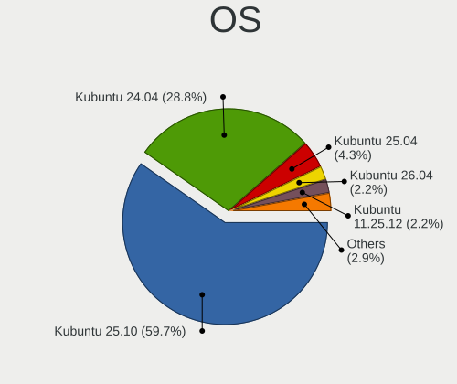

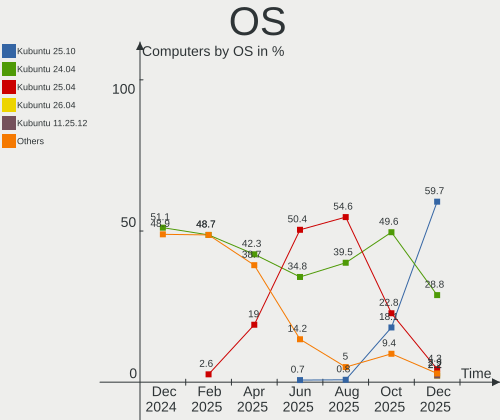

| Name             | Computers | Percent |
|------------------|-----------|---------|
| Kubuntu 25.10    | 83        | 59.71%  |
| Kubuntu 24.04    | 40        | 28.78%  |
| Kubuntu 25.04    | 6         | 4.32%   |
| Kubuntu 26.04    | 3         | 2.16%   |
| Kubuntu 11.25.12 | 3         | 2.16%   |
| Kubuntu 22.04    | 1         | 0.72%   |
| Kubuntu 2025.3   | 1         | 0.72%   |
| Kubuntu 20.04    | 1         | 0.72%   |
| Kubuntu 11.25.11 | 1         | 0.72%   |

OS Family
---------

OS without a version

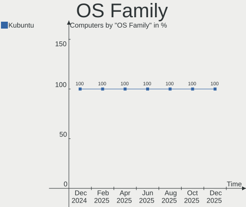

| Name    | Computers | Percent |
|---------|-----------|---------|
| Kubuntu | 139       | 100%    |

Kernel
------

Version of the Linux kernel

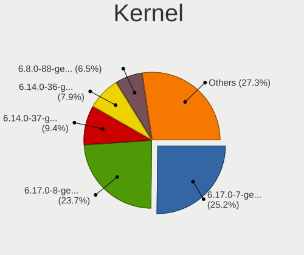

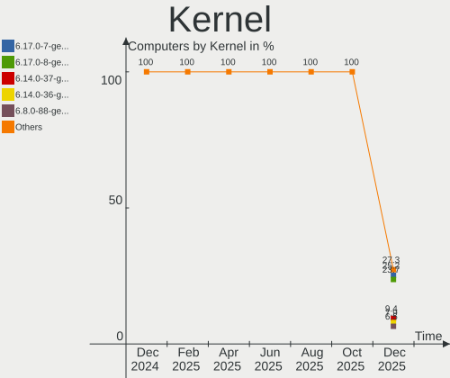

| Version                  | Computers | Percent |
|--------------------------|-----------|---------|
| 6.17.0-7-generic         | 35        | 25.18%  |
| 6.17.0-8-generic         | 33        | 23.74%  |
| 6.14.0-37-generic        | 13        | 9.35%   |
| 6.14.0-36-generic        | 11        | 7.91%   |
| 6.8.0-88-generic         | 9         | 6.47%   |
| 6.8.0-90-generic         | 7         | 5.04%   |
| 6.17.0-6-generic         | 6         | 4.32%   |
| 6.17.0-5-generic         | 4         | 2.88%   |
| 6.8.0-88-lowlatency      | 3         | 2.16%   |
| 6.18.1-061801-generic    | 2         | 1.44%   |
| 6.18.0-8-generic         | 2         | 1.44%   |
| 6.18.2-1-liquorix-amd64  | 1         | 0.72%   |
| 6.17.11-x64v3-xanmod1    | 1         | 0.72%   |
| 6.17.1-061701-generic    | 1         | 0.72%   |
| 6.17.0-9-generic         | 1         | 0.72%   |
| 6.16.0-061600rc6-generic | 1         | 0.72%   |
| 6.14.0-35-generic        | 1         | 0.72%   |
| 6.14.0-34-kfocus         | 1         | 0.72%   |
| 6.14.0-34-generic        | 1         | 0.72%   |
| 6.14.0-33-generic        | 1         | 0.72%   |
| 6.14.0-27-generic        | 1         | 0.72%   |
| 6.10.14-061014-generic   | 1         | 0.72%   |
| 5.4.0-224-generic        | 1         | 0.72%   |
| 5.15.0-89-generic        | 1         | 0.72%   |
| 5.15.0-127-lowlatency    | 1         | 0.72%   |

Kernel Family
-------------

Linux kernel without a distro release

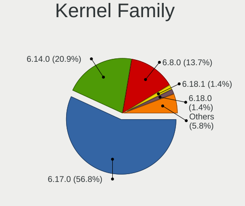

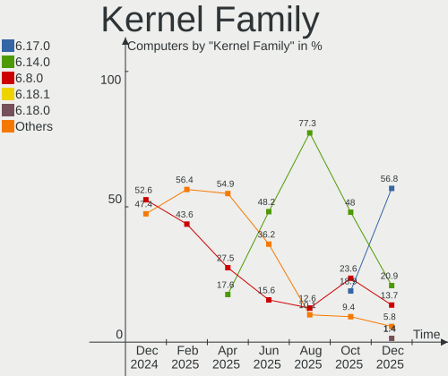

| Version | Computers | Percent |
|---------|-----------|---------|
| 6.17.0  | 79        | 56.83%  |
| 6.14.0  | 29        | 20.86%  |
| 6.8.0   | 19        | 13.67%  |
| 6.18.1  | 2         | 1.44%   |
| 6.18.0  | 2         | 1.44%   |
| 5.15.0  | 2         | 1.44%   |
| 6.18.2  | 1         | 0.72%   |
| 6.17.11 | 1         | 0.72%   |
| 6.17.1  | 1         | 0.72%   |
| 6.16.0  | 1         | 0.72%   |
| 6.10.14 | 1         | 0.72%   |
| 5.4.0   | 1         | 0.72%   |

Kernel Major Ver.
-----------------

Linux kernel major version

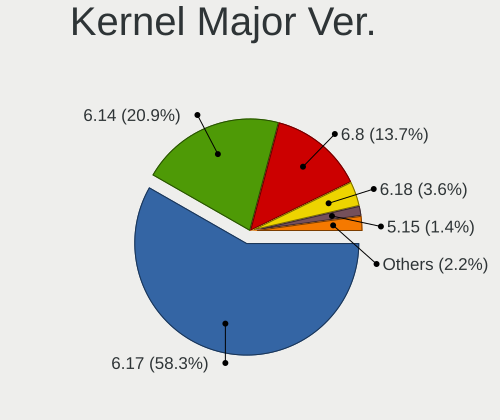

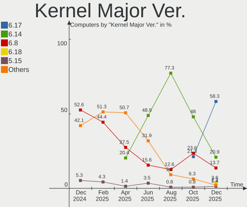

| Version | Computers | Percent |
|---------|-----------|---------|
| 6.17    | 81        | 58.27%  |
| 6.14    | 29        | 20.86%  |
| 6.8     | 19        | 13.67%  |
| 6.18    | 5         | 3.6%    |
| 5.15    | 2         | 1.44%   |
| 6.16    | 1         | 0.72%   |
| 6.10    | 1         | 0.72%   |
| 5.4     | 1         | 0.72%   |

Arch
----

OS architecture (x86_64, i586, etc.)

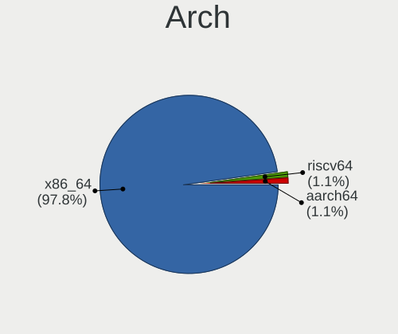

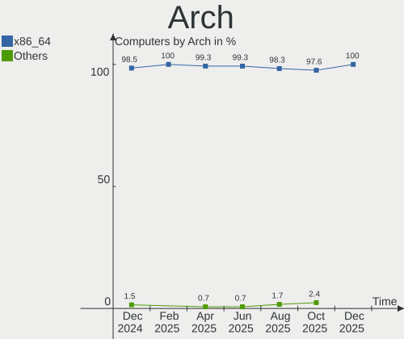

| Name   | Computers | Percent |
|--------|-----------|---------|
| x86_64 | 139       | 100%    |

DE
--

Desktop Environment

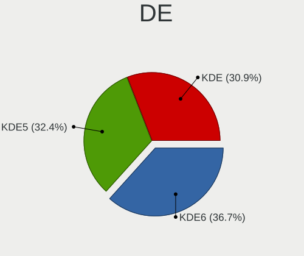

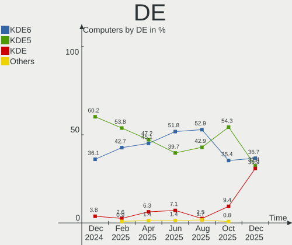

| Name | Computers | Percent |
|------|-----------|---------|
| KDE6 | 51        | 36.69%  |
| KDE5 | 45        | 32.37%  |
| KDE  | 43        | 30.94%  |

Display Server
--------------

X11 or Wayland

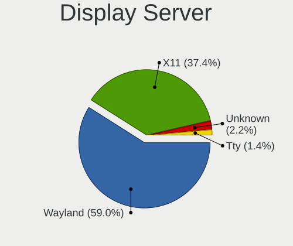

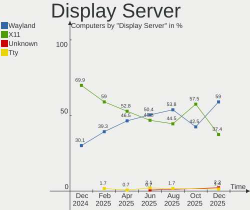

| Name    | Computers | Percent |
|---------|-----------|---------|
| Wayland | 82        | 58.99%  |
| X11     | 52        | 37.41%  |
| Unknown | 3         | 2.16%   |
| Tty     | 2         | 1.44%   |

Display Manager
---------------

SDDM, LightDM, etc.

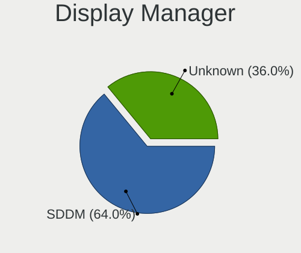

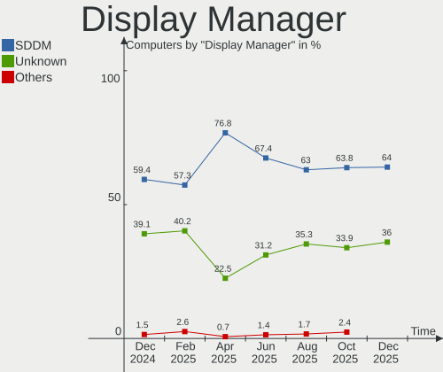

| Name    | Computers | Percent |
|---------|-----------|---------|
| SDDM    | 89        | 64.03%  |
| Unknown | 50        | 35.97%  |

OS Lang
-------

Language

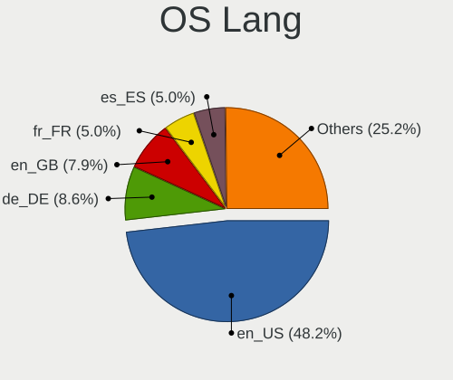

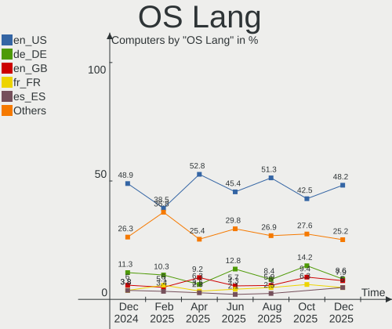

| Lang  | Computers | Percent |
|-------|-----------|---------|
| en_US | 67        | 48.2%   |
| de_DE | 12        | 8.63%   |
| en_GB | 11        | 7.91%   |
| fr_FR | 7         | 5.04%   |
| es_ES | 7         | 5.04%   |
| it_IT | 6         | 4.32%   |
| ru_RU | 3         | 2.16%   |
| pl_PL | 3         | 2.16%   |
| pt_BR | 2         | 1.44%   |
| en_CA | 2         | 1.44%   |
| de_AT | 2         | 1.44%   |
| C     | 2         | 1.44%   |
| zh_CN | 1         | 0.72%   |
| tr_TR | 1         | 0.72%   |
| sv_SE | 1         | 0.72%   |
| pt_PT | 1         | 0.72%   |
| nb_NO | 1         | 0.72%   |
| id_ID | 1         | 0.72%   |
| hu_HU | 1         | 0.72%   |
| fr_CA | 1         | 0.72%   |
| fi_FI | 1         | 0.72%   |
| es_MX | 1         | 0.72%   |
| en_ZA | 1         | 0.72%   |
| en_IE | 1         | 0.72%   |
| el_GR | 1         | 0.72%   |
| cs_CZ | 1         | 0.72%   |
| ca_ES | 1         | 0.72%   |

Boot Mode
---------

EFI or BIOS

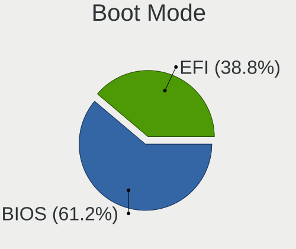

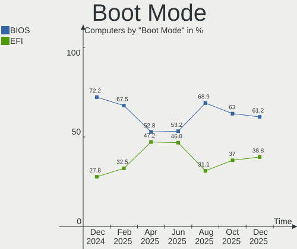

| Mode | Computers | Percent |
|------|-----------|---------|
| BIOS | 85        | 61.15%  |
| EFI  | 54        | 38.85%  |

Filesystem
----------

Type of filesystem

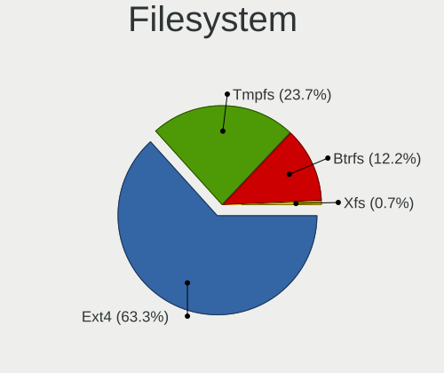

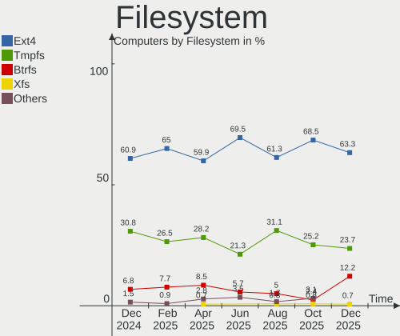

| Type  | Computers | Percent |
|-------|-----------|---------|
| Ext4  | 88        | 63.31%  |
| Tmpfs | 33        | 23.74%  |
| Btrfs | 17        | 12.23%  |
| Xfs   | 1         | 0.72%   |

Part. scheme
------------

Scheme of partitioning

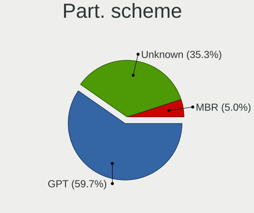

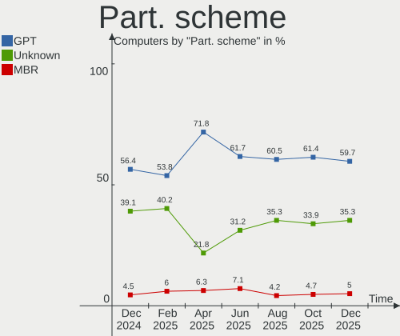

| Type    | Computers | Percent |
|---------|-----------|---------|
| GPT     | 83        | 59.71%  |
| Unknown | 49        | 35.25%  |
| MBR     | 7         | 5.04%   |

Dual Boot with Linux/BSD
------------------------

Hosting more than one Linux/BSD

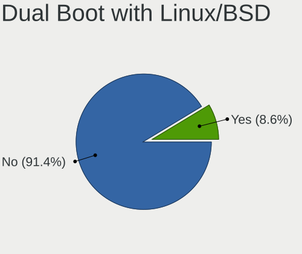

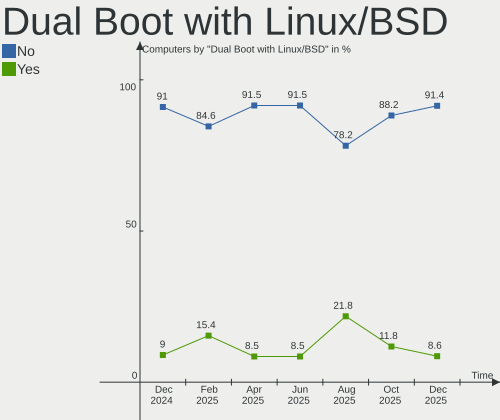

| Dual boot | Computers | Percent |
|-----------|-----------|---------|
| No        | 127       | 91.37%  |
| Yes       | 12        | 8.63%   |

Dual Boot (Win)
---------------

Hosting Linux and Windows

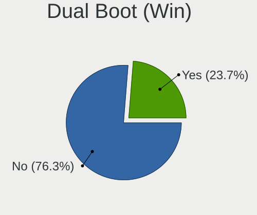

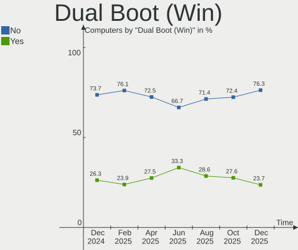

| Dual boot | Computers | Percent |
|-----------|-----------|---------|
| No        | 106       | 76.26%  |
| Yes       | 33        | 23.74%  |

Board
-----

Vendor
------

Motherboard manufacturer

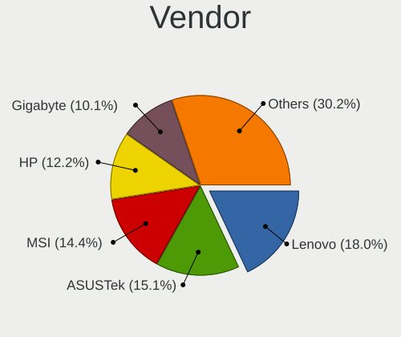

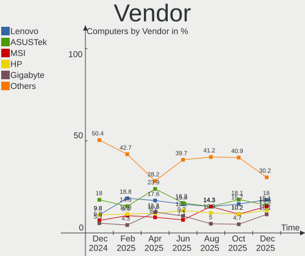

| Name                | Computers | Percent |
|---------------------|-----------|---------|
| Lenovo              | 25        | 17.99%  |
| ASUSTek Computer    | 21        | 15.11%  |
| MSI                 | 20        | 14.39%  |
| Hewlett-Packard     | 17        | 12.23%  |
| Gigabyte Technology | 14        | 10.07%  |
| Dell                | 12        | 8.63%   |
| ASRock              | 6         | 4.32%   |
| Acer                | 5         | 3.6%    |
| Samsung Electronics | 4         | 2.88%   |
| Apple               | 4         | 2.88%   |
| Pegatron            | 2         | 1.44%   |
| Razer               | 1         | 0.72%   |
| MACHINIST           | 1         | 0.72%   |
| Intel               | 1         | 0.72%   |
| HUAWEI              | 1         | 0.72%   |
| Google              | 1         | 0.72%   |
| Fujitsu Siemens     | 1         | 0.72%   |
| Framework           | 1         | 0.72%   |
| Carbon Systems      | 1         | 0.72%   |
| Unknown             | 1         | 0.72%   |

Model
-----

Motherboard model

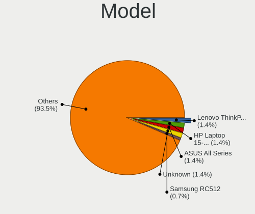

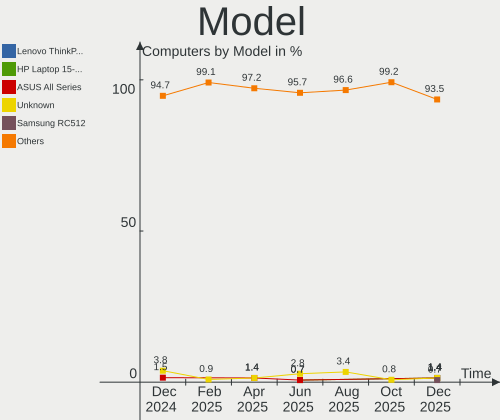

| Name                                            | Computers | Percent |
|-------------------------------------------------|-----------|---------|
| Lenovo ThinkPad T16 Gen 2 21K7CTO1WW            | 2         | 1.44%   |
| HP Laptop 15-fd0xxx                             | 2         | 1.44%   |
| ASUS All Series                                 | 2         | 1.44%   |
| Unknown                                         | 2         | 1.44%   |
| Samsung RC512                                   | 1         | 0.72%   |
| Samsung R540/SA41/E452                          | 1         | 0.72%   |
| Samsung 960XHA                                  | 1         | 0.72%   |
| Samsung 750QFG                                  | 1         | 0.72%   |
| Razer Blade Stealth 13 (Early 2020) - RZ09-0310 | 1         | 0.72%   |
| Pegatron NC701AA-ABA IQ524                      | 1         | 0.72%   |
| Pegatron AY608AA-ABA HPE-137c                   | 1         | 0.72%   |
| MSI Stealth 14 AI Studio A1VFG                  | 1         | 0.72%   |
| MSI MS-7E12                                     | 1         | 0.72%   |
| MSI MS-7E07                                     | 1         | 0.72%   |
| MSI MS-7D76                                     | 1         | 0.72%   |
| MSI MS-7D73                                     | 1         | 0.72%   |
| MSI MS-7D32                                     | 1         | 0.72%   |
| MSI MS-7D25                                     | 1         | 0.72%   |
| MSI MS-7D09                                     | 1         | 0.72%   |
| MSI MS-7C76                                     | 1         | 0.72%   |
| MSI MS-7C56                                     | 1         | 0.72%   |
| MSI MS-7C02                                     | 1         | 0.72%   |
| MSI MS-7B89                                     | 1         | 0.72%   |
| MSI MS-7B87                                     | 1         | 0.72%   |
| MSI MS-7B78                                     | 1         | 0.72%   |
| MSI MS-7B24                                     | 1         | 0.72%   |
| MSI MS-7A70                                     | 1         | 0.72%   |
| MSI MS-7816                                     | 1         | 0.72%   |
| MSI Komplett PC                                 | 1         | 0.72%   |
| MSI Intel Core i9-14900KF                       | 1         | 0.72%   |
| MSI GS76 Stealth 11UG                           | 1         | 0.72%   |
| MACHINIST E5-V2.82H V1.1                        | 1         | 0.72%   |
| Lenovo Yoga Slim 7 14ILL10 83JX                 | 1         | 0.72%   |
| Lenovo Yoga 7 2-in-1 16AKP10 83JU               | 1         | 0.72%   |
| Lenovo ThinkPad X201 3680AV3                    | 1         | 0.72%   |
| Lenovo ThinkPad X1 Yoga 2nd 20JES3EK00          | 1         | 0.72%   |
| Lenovo ThinkPad X1 Carbon 7th 20QES3HS00        | 1         | 0.72%   |
| Lenovo ThinkPad T480 20L6SC5502                 | 1         | 0.72%   |
| Lenovo ThinkPad T470P 20J7S00000                | 1         | 0.72%   |
| Lenovo ThinkPad T14s Gen 4 21F8S04T00           | 1         | 0.72%   |

Model Family
------------

Motherboard model prefix

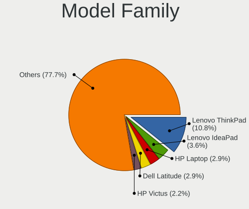

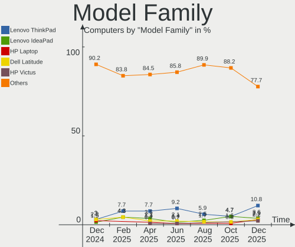

| Name                 | Computers | Percent |
|----------------------|-----------|---------|
| Lenovo ThinkPad      | 15        | 10.79%  |
| Lenovo IdeaPad       | 5         | 3.6%    |
| HP Laptop            | 4         | 2.88%   |
| Dell Latitude        | 4         | 2.88%   |
| HP Victus            | 3         | 2.16%   |
| HP Pavilion          | 3         | 2.16%   |
| Dell Inspiron        | 3         | 2.16%   |
| Lenovo Yoga          | 2         | 1.44%   |
| Gigabyte X570        | 2         | 1.44%   |
| Dell OptiPlex        | 2         | 1.44%   |
| ASUS TUF             | 2         | 1.44%   |
| ASUS ROG             | 2         | 1.44%   |
| ASUS PRIME           | 2         | 1.44%   |
| ASUS All             | 2         | 1.44%   |
| Acer Nitro           | 2         | 1.44%   |
| Unknown              | 2         | 1.44%   |
| Samsung RC512        | 1         | 0.72%   |
| Samsung R540         | 1         | 0.72%   |
| Samsung 960XHA       | 1         | 0.72%   |
| Samsung 750QFG       | 1         | 0.72%   |
| Razer Blade          | 1         | 0.72%   |
| Pegatron NC701AA-ABA | 1         | 0.72%   |
| Pegatron AY608AA-ABA | 1         | 0.72%   |
| MSI Stealth          | 1         | 0.72%   |
| MSI MS-7E12          | 1         | 0.72%   |
| MSI MS-7E07          | 1         | 0.72%   |
| MSI MS-7D76          | 1         | 0.72%   |
| MSI MS-7D73          | 1         | 0.72%   |
| MSI MS-7D32          | 1         | 0.72%   |
| MSI MS-7D25          | 1         | 0.72%   |
| MSI MS-7D09          | 1         | 0.72%   |
| MSI MS-7C76          | 1         | 0.72%   |
| MSI MS-7C56          | 1         | 0.72%   |
| MSI MS-7C02          | 1         | 0.72%   |
| MSI MS-7B89          | 1         | 0.72%   |
| MSI MS-7B87          | 1         | 0.72%   |
| MSI MS-7B78          | 1         | 0.72%   |
| MSI MS-7B24          | 1         | 0.72%   |
| MSI MS-7A70          | 1         | 0.72%   |
| MSI MS-7816          | 1         | 0.72%   |

MFG Year
--------

Motherboard manufacture year

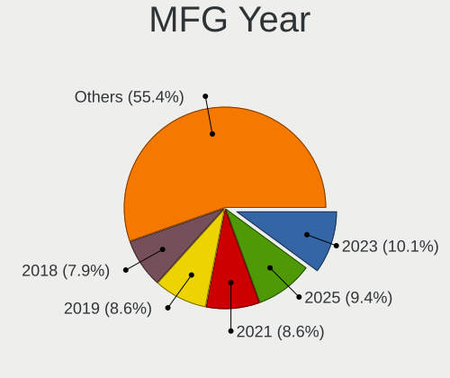

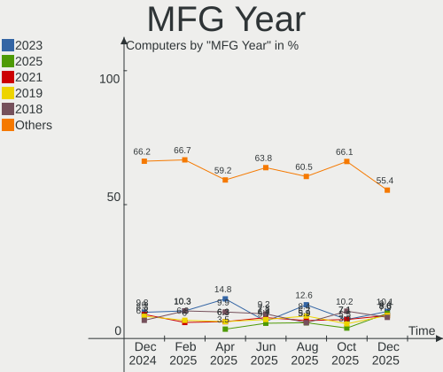

| Year    | Computers | Percent |
|---------|-----------|---------|
| 2023    | 14        | 10.07%  |
| 2025    | 13        | 9.35%   |
| 2021    | 12        | 8.63%   |
| 2019    | 12        | 8.63%   |
| 2018    | 11        | 7.91%   |
| 2017    | 11        | 7.91%   |
| 2012    | 9         | 6.47%   |
| 2022    | 8         | 5.76%   |
| 2020    | 8         | 5.76%   |
| 2024    | 7         | 5.04%   |
| 2016    | 6         | 4.32%   |
| 2015    | 5         | 3.6%    |
| 2014    | 5         | 3.6%    |
| 2013    | 4         | 2.88%   |
| 2011    | 4         | 2.88%   |
| 2010    | 3         | 2.16%   |
| 2008    | 3         | 2.16%   |
| 2009    | 2         | 1.44%   |
| 2006    | 1         | 0.72%   |
| Unknown | 1         | 0.72%   |

Form Factor
-----------

Physical design of the computer

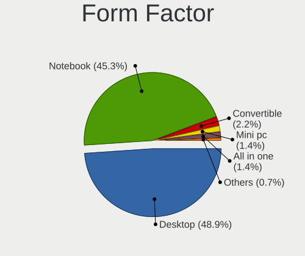

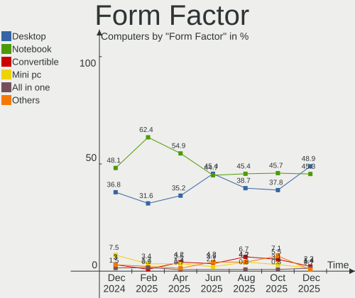

| Name        | Computers | Percent |
|-------------|-----------|---------|
| Desktop     | 68        | 48.92%  |
| Notebook    | 63        | 45.32%  |
| Convertible | 3         | 2.16%   |
| Mini pc     | 2         | 1.44%   |
| All in one  | 2         | 1.44%   |
| Tablet      | 1         | 0.72%   |

Secure Boot
-----------

Enabled or disabled

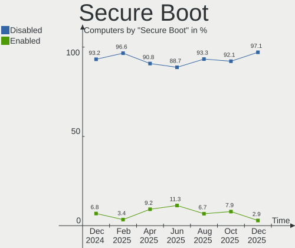

| State    | Computers | Percent |
|----------|-----------|---------|
| Disabled | 135       | 97.12%  |
| Enabled  | 4         | 2.88%   |

Coreboot
--------

Have coreboot on board

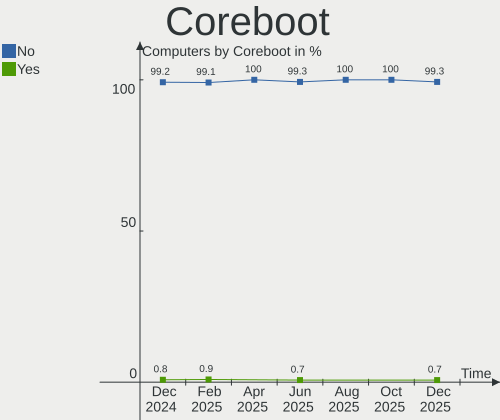

| Used | Computers | Percent |
|------|-----------|---------|
| No   | 138       | 99.28%  |
| Yes  | 1         | 0.72%   |

RAM Size
--------

Total RAM memory

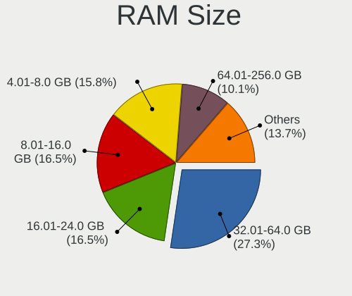

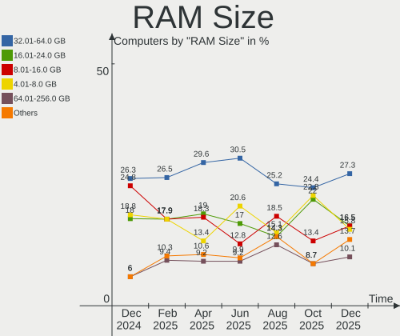

| Size in GB  | Computers | Percent |
|-------------|-----------|---------|
| 32.01-64.0  | 38        | 27.34%  |
| 16.01-24.0  | 23        | 16.55%  |
| 8.01-16.0   | 23        | 16.55%  |
| 4.01-8.0    | 22        | 15.83%  |
| 64.01-256.0 | 14        | 10.07%  |
| 24.01-32.0  | 13        | 9.35%   |
| 3.01-4.0    | 5         | 3.6%    |
| 1.01-2.0    | 1         | 0.72%   |

RAM Used
--------

Used RAM memory

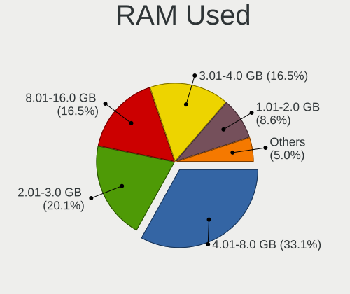

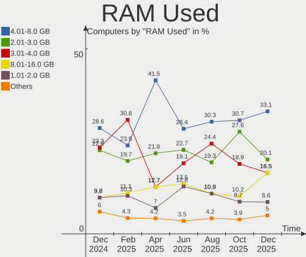

| Used GB    | Computers | Percent |
|------------|-----------|---------|
| 4.01-8.0   | 46        | 33.09%  |
| 2.01-3.0   | 28        | 20.14%  |
| 3.01-4.0   | 23        | 16.55%  |
| 8.01-16.0  | 23        | 16.55%  |
| 1.01-2.0   | 12        | 8.63%   |
| 32.01-64.0 | 3         | 2.16%   |
| 16.01-24.0 | 3         | 2.16%   |
| 0.51-1.0   | 1         | 0.72%   |

Total Drives
------------

Number of drives on board

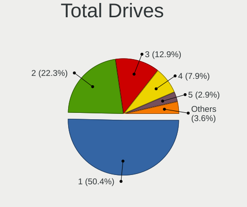

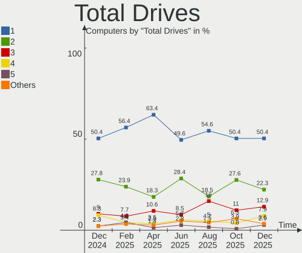

| Drives | Computers | Percent |
|--------|-----------|---------|
| 1      | 70        | 50.36%  |
| 2      | 31        | 22.3%   |
| 3      | 18        | 12.95%  |
| 4      | 11        | 7.91%   |
| 5      | 4         | 2.88%   |
| 6      | 2         | 1.44%   |
| 8      | 1         | 0.72%   |
| 7      | 1         | 0.72%   |
| 0      | 1         | 0.72%   |

Has CD-ROM
----------

Has CD-ROM on board

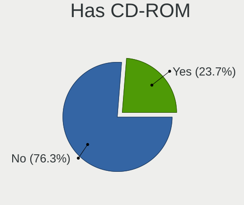

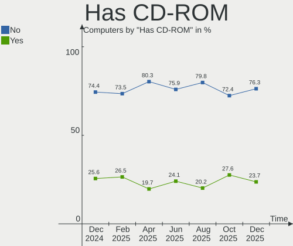

| Presented | Computers | Percent |
|-----------|-----------|---------|
| No        | 106       | 76.26%  |
| Yes       | 33        | 23.74%  |

Has Ethernet
------------

Has Ethernet on board

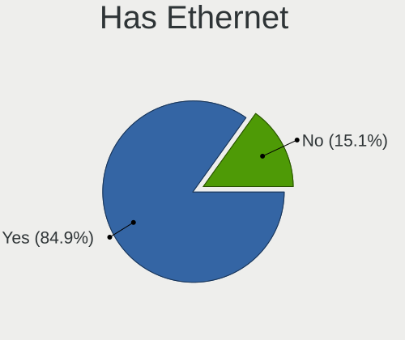

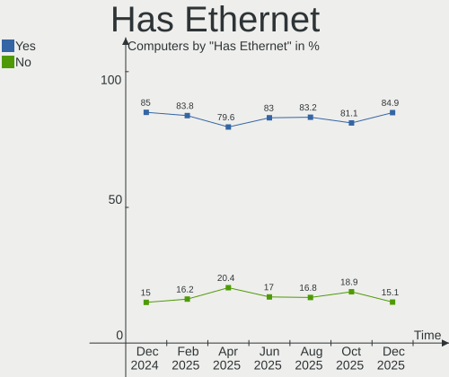

| Presented | Computers | Percent |
|-----------|-----------|---------|
| Yes       | 118       | 84.89%  |
| No        | 21        | 15.11%  |

Has WiFi
--------

Has WiFi module

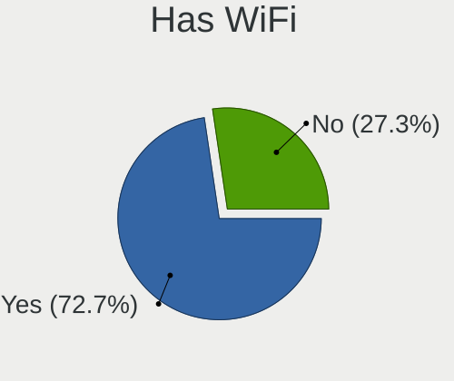

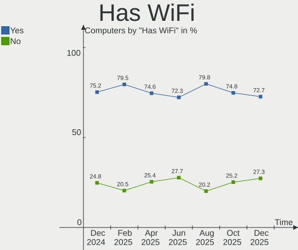

| Presented | Computers | Percent |
|-----------|-----------|---------|
| Yes       | 101       | 72.66%  |
| No        | 38        | 27.34%  |

Has Bluetooth
-------------

Has Bluetooth module

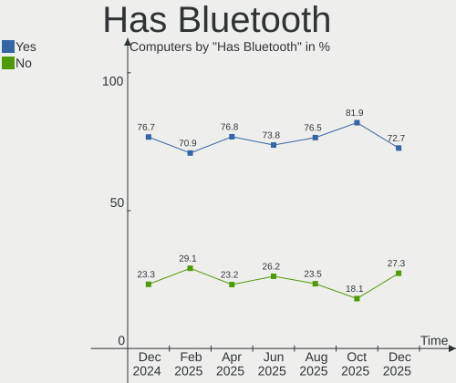

| Presented | Computers | Percent |
|-----------|-----------|---------|
| Yes       | 101       | 72.66%  |
| No        | 38        | 27.34%  |

Location
--------

Country
-------

Geographic location (country)

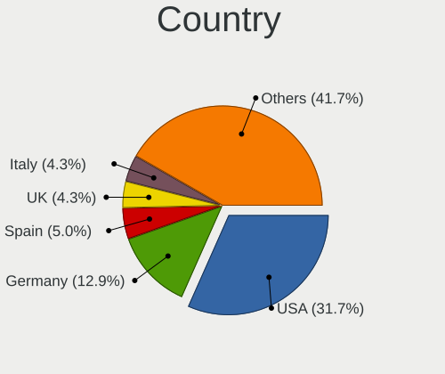

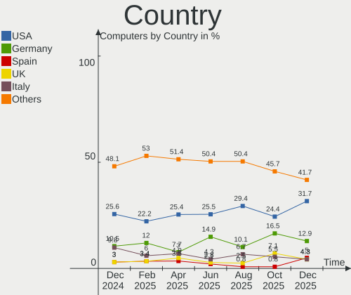

| Country      | Computers | Percent |
|--------------|-----------|---------|
| USA          | 44        | 31.65%  |
| Germany      | 18        | 12.95%  |
| Spain        | 7         | 5.04%   |
| UK           | 6         | 4.32%   |
| Italy        | 6         | 4.32%   |
| France       | 6         | 4.32%   |
| Russia       | 5         | 3.6%    |
| Poland       | 4         | 2.88%   |
| Brazil       | 4         | 2.88%   |
| Canada       | 3         | 2.16%   |
| Bulgaria     | 3         | 2.16%   |
| Turkey       | 2         | 1.44%   |
| Portugal     | 2         | 1.44%   |
| Pakistan     | 2         | 1.44%   |
| Netherlands  | 2         | 1.44%   |
| Mexico       | 2         | 1.44%   |
| Ireland      | 2         | 1.44%   |
| Indonesia    | 2         | 1.44%   |
| India        | 2         | 1.44%   |
| Greece       | 2         | 1.44%   |
| Australia    | 2         | 1.44%   |
| Thailand     | 1         | 0.72%   |
| Sweden       | 1         | 0.72%   |
| South Africa | 1         | 0.72%   |
| Norway       | 1         | 0.72%   |
| Nigeria      | 1         | 0.72%   |
| New Zealand  | 1         | 0.72%   |
| Iran         | 1         | 0.72%   |
| Hungary      | 1         | 0.72%   |
| Finland      | 1         | 0.72%   |
| Czechia      | 1         | 0.72%   |
| Colombia     | 1         | 0.72%   |
| China        | 1         | 0.72%   |
| Albania      | 1         | 0.72%   |

City
----

Geographic location (city)

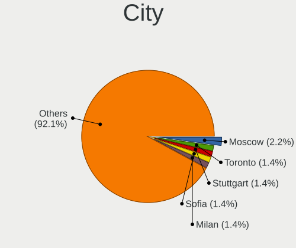

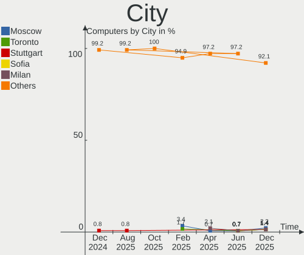

| City             | Computers | Percent |
|------------------|-----------|---------|
| Moscow           | 3         | 2.16%   |
| Toronto          | 2         | 1.44%   |
| Stuttgart        | 2         | 1.44%   |
| Sofia            | 2         | 1.44%   |
| Milan            | 2         | 1.44%   |
| Dortmund         | 2         | 1.44%   |
| Athens           | 2         | 1.44%   |
| Wollongong       | 1         | 0.72%   |
| Westlake Village | 1         | 0.72%   |
| Warsaw           | 1         | 0.72%   |
| Vcelna           | 1         | 0.72%   |
| Valencia         | 1         | 0.72%   |
| Uşak            | 1         | 0.72%   |
| Uberlândia      | 1         | 0.72%   |
| Turin            | 1         | 0.72%   |
| Trowbridge       | 1         | 0.72%   |
| Traverse City    | 1         | 0.72%   |
| Toulouse         | 1         | 0.72%   |
| Tirana           | 1         | 0.72%   |
| Tehran           | 1         | 0.72%   |
| Sydney           | 1         | 0.72%   |
| Suffolk          | 1         | 0.72%   |
| Sterling         | 1         | 0.72%   |
| St Petersburg    | 1         | 0.72%   |
| St Louis         | 1         | 0.72%   |
| Springfield      | 1         | 0.72%   |
| Skerries         | 1         | 0.72%   |
| Sialkot          | 1         | 0.72%   |
| Shoreham-by-Sea  | 1         | 0.72%   |
| Seattle          | 1         | 0.72%   |
| Sao Paulo        | 1         | 0.72%   |
| Sanvensa         | 1         | 0.72%   |
| Santander        | 1         | 0.72%   |
| San Francisco    | 1         | 0.72%   |
| San Diego        | 1         | 0.72%   |
| Salt Lake City   | 1         | 0.72%   |
| Rockaway         | 1         | 0.72%   |
| Rio de Janeiro   | 1         | 0.72%   |
| Richardson       | 1         | 0.72%   |
| Reno             | 1         | 0.72%   |

Drives
------

Drive Vendor
------------

Hard drive vendors

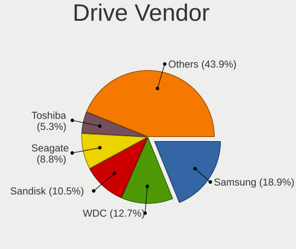

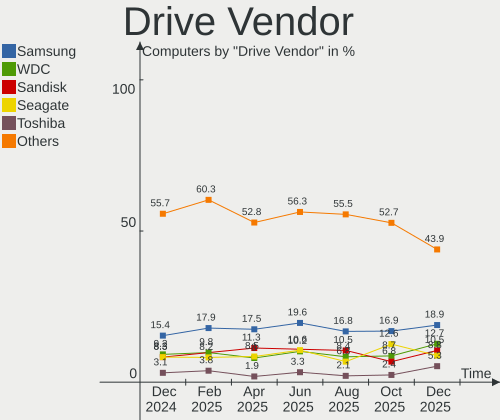

| Vendor                         | Computers | Drives | Percent |
|--------------------------------|-----------|--------|---------|
| Samsung Electronics            | 43        | 66     | 18.86%  |
| WDC                            | 29        | 39     | 12.72%  |
| Sandisk                        | 24        | 25     | 10.53%  |
| Seagate                        | 20        | 25     | 8.77%   |
| Toshiba                        | 12        | 13     | 5.26%   |
| Kingston                       | 12        | 14     | 5.26%   |
| Crucial                        | 8         | 9      | 3.51%   |
| Micron Technology              | 7         | 7      | 3.07%   |
| Unknown                        | 6         | 9      | 2.63%   |
| SK hynix                       | 5         | 5      | 2.19%   |
| Micron/Crucial Technology      | 5         | 7      | 2.19%   |
| PNY                            | 3         | 3      | 1.32%   |
| Phison                         | 3         | 3      | 1.32%   |
| Kingston Technology Company    | 3         | 3      | 1.32%   |
| Hitachi                        | 3         | 3      | 1.32%   |
| Apple                          | 3         | 3      | 1.32%   |
| ADATA Technology               | 3         | 3      | 1.32%   |
| Team                           | 2         | 3      | 0.88%   |
| Lexar                          | 2         | 2      | 0.88%   |
| KIOXIA                         | 2         | 3      | 0.88%   |
| KingSpec                       | 2         | 2      | 0.88%   |
| Intel                          | 2         | 2      | 0.88%   |
| GALAX                          | 2         | 2      | 0.88%   |
| Union Memory (Shenzhen)        | 1         | 1      | 0.44%   |
| UMIS                           | 1         | 1      | 0.44%   |
| T-FORCE                        | 1         | 1      | 0.44%   |
| SSSTC                          | 1         | 1      | 0.44%   |
| SPCC                           | 1         | 1      | 0.44%   |
| Solid State Storage Technology | 1         | 1      | 0.44%   |
| Silicon Motion                 | 1         | 1      | 0.44%   |
| Realtek Semiconductor          | 1         | 2      | 0.44%   |
| Rayson                         | 1         | 1      | 0.44%   |
| PC Specialist                  | 1         | 1      | 0.44%   |
| Maxone                         | 1         | 1      | 0.44%   |
| MAXIO Technology (Hangzhou)    | 1         | 1      | 0.44%   |
| KODAK                          | 1         | 1      | 0.44%   |
| JMicron Technology             | 1         | 1      | 0.44%   |
| Intenso                        | 1         | 1      | 0.44%   |
| HGST                           | 1         | 1      | 0.44%   |
| Hewlett-Packard                | 1         | 1      | 0.44%   |

Drive Model
-----------

Hard drive models

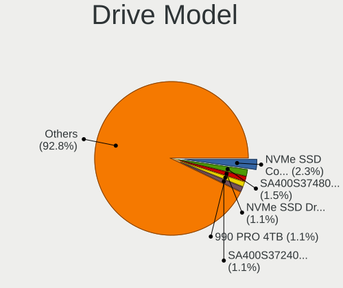

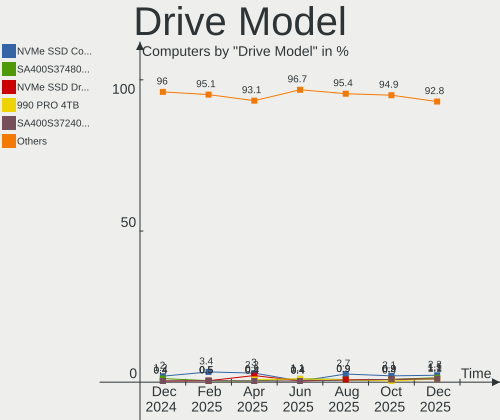

| Model                                                              | Computers | Percent |
|--------------------------------------------------------------------|-----------|---------|
| Samsung NVMe SSD Controller SM981/PM981/PM983 1TB                  | 6         | 2.26%   |
| Kingston SA400S37480G 480GB SSD                                    | 4         | 1.51%   |
| SanDisk NVMe SSD Drive 1TB                                         | 3         | 1.13%   |
| Samsung SSD 990 PRO 4TB                                            | 3         | 1.13%   |
| Kingston SA400S37240G 240GB SSD                                    | 3         | 1.13%   |
| ADATA XPG SX8200 Pro PCIe Gen3x4 M.2 2280 Solid State Drive 1024GB | 3         | 1.13%   |
| WDC WDBNCE5000PNC 500GB SSD                                        | 2         | 0.75%   |
| WDC WD10EZEX-00BBHA0 1TB                                           | 2         | 0.75%   |
| Unknown SD/MMC/MS PRO 2GB                                          | 2         | 0.75%   |
| Seagate ST8000DM004-2CX188 8TB                                     | 2         | 0.75%   |
| Seagate ST500DM002-1BD142 500GB                                    | 2         | 0.75%   |
| Seagate ST2000DM008-2UB102 2TB                                     | 2         | 0.75%   |
| Seagate ST1000DM010-2EP102 1TB                                     | 2         | 0.75%   |
| Sandisk WD_BLACK SN770 2TB                                         | 2         | 0.75%   |
| Sandisk WD Black SN750 / PC SN730 NVMe SSD 500GB                   | 2         | 0.75%   |
| SanDisk SDSSDA240G 240GB                                           | 2         | 0.75%   |
| SanDisk NVMe SSD Drive 512GB                                       | 2         | 0.75%   |
| Samsung SSD 980 500GB                                              | 2         | 0.75%   |
| Samsung SSD 970 EVO Plus 1TB                                       | 2         | 0.75%   |
| Samsung SSD 870 EVO 1TB                                            | 2         | 0.75%   |
| Samsung SSD 860 EVO 500GB                                          | 2         | 0.75%   |
| Samsung SSD 860 EVO 250GB                                          | 2         | 0.75%   |
| Samsung SSD 850 EVO 500GB                                          | 2         | 0.75%   |
| Micron/Crucial P2 NVMe PCIe SSD 2TB                                | 2         | 0.75%   |
| Micron MTFDKCD512QFM-1BD1AABLA 512GB                               | 2         | 0.75%   |
| GALAX TA1D0120A 120GB                                              | 2         | 0.75%   |
| Crucial CT4000P3PSSD8 4TB                                          | 2         | 0.75%   |
| WDC WDS200T2B0B-00YS70 2TB SSD                                     | 1         | 0.38%   |
| WDC WDS100T2G0A-00JH30 1TB SSD                                     | 1         | 0.38%   |
| WDC WDS100T1R0A-68A4W0 1TB                                         | 1         | 0.38%   |
| WDC WD80EAAZ-00BXBB0 8TB                                           | 1         | 0.38%   |
| WDC WD7500BPKX-80HPJT0 752GB                                       | 1         | 0.38%   |
| WDC WD60EZRZ-00GZ5B1 6TB                                           | 1         | 0.38%   |
| WDC WD60EZAZ-00SF3B0 6TB                                           | 1         | 0.38%   |
| WDC WD6004FZWX-00BKVA0 6TB                                         | 1         | 0.38%   |
| WDC WD60 04FZWX-00BKVA0 6TB                                        | 1         | 0.38%   |
| WDC WD5000LPCX-60VHAT0 500GB                                       | 1         | 0.38%   |
| WDC WD5000AAKX-753CA1 500GB                                        | 1         | 0.38%   |
| WDC WD5000AADS-00S9B0 500GB                                        | 1         | 0.38%   |
| WDC WD40NPZZ-00PDPT0 4TB                                           | 1         | 0.38%   |

HDD Vendor
----------

Hard disk drive vendors

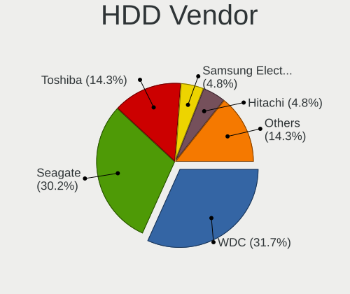

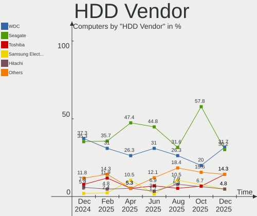

| Vendor              | Computers | Drives | Percent |
|---------------------|-----------|--------|---------|
| WDC                 | 20        | 29     | 31.75%  |
| Seagate             | 19        | 23     | 30.16%  |
| Toshiba             | 9         | 10     | 14.29%  |
| Samsung Electronics | 3         | 6      | 4.76%   |
| Hitachi             | 3         | 3      | 4.76%   |
| Unknown             | 2         | 2      | 3.17%   |
| Apple               | 2         | 2      | 3.17%   |
| Maxone              | 1         | 1      | 1.59%   |
| HGST                | 1         | 1      | 1.59%   |
| Fujitsu             | 1         | 1      | 1.59%   |
| External            | 1         | 1      | 1.59%   |
| Apricorn            | 1         | 1      | 1.59%   |

SSD Vendor
----------

Solid state drive vendors

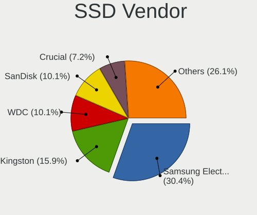

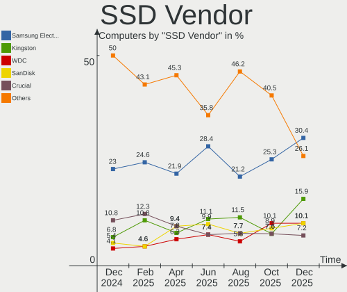

| Vendor              | Computers | Drives | Percent |
|---------------------|-----------|--------|---------|
| Samsung Electronics | 21        | 27     | 30.43%  |
| Kingston            | 11        | 12     | 15.94%  |
| WDC                 | 7         | 7      | 10.14%  |
| SanDisk             | 7         | 7      | 10.14%  |
| Crucial             | 5         | 5      | 7.25%   |
| PNY                 | 3         | 3      | 4.35%   |
| Team                | 2         | 3      | 2.9%    |
| GALAX               | 2         | 2      | 2.9%    |
| SPCC                | 1         | 1      | 1.45%   |
| Rayson              | 1         | 1      | 1.45%   |
| Micron Technology   | 1         | 1      | 1.45%   |
| Lexar               | 1         | 1      | 1.45%   |
| KingSpec            | 1         | 1      | 1.45%   |
| Hewlett-Packard     | 1         | 1      | 1.45%   |
| GOODRAM             | 1         | 1      | 1.45%   |
| Emtec               | 1         | 1      | 1.45%   |
| EDILOCA             | 1         | 1      | 1.45%   |
| China               | 1         | 1      | 1.45%   |
| Apple               | 1         | 1      | 1.45%   |

Drive Kind
----------

HDD or SSD

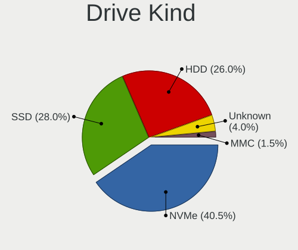

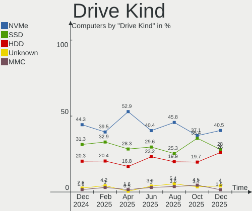

| Kind    | Computers | Drives | Percent |
|---------|-----------|--------|---------|
| NVMe    | 81        | 108    | 40.5%   |
| SSD     | 56        | 77     | 28%     |
| HDD     | 52        | 80     | 26%     |
| Unknown | 8         | 11     | 4%      |
| MMC     | 3         | 3      | 1.5%    |

Drive Connector
---------------

SATA, SAS, NVMe, etc.

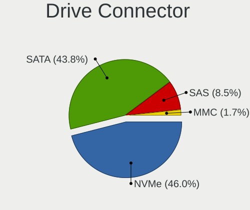

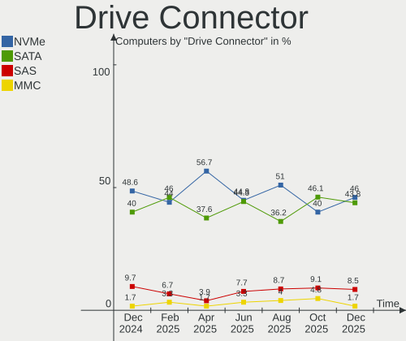

| Type | Computers | Drives | Percent |
|------|-----------|--------|---------|
| NVMe | 81        | 107    | 46.02%  |
| SATA | 77        | 151    | 43.75%  |
| SAS  | 15        | 18     | 8.52%   |
| MMC  | 3         | 3      | 1.7%    |

Drive Size
----------

Size of hard drive

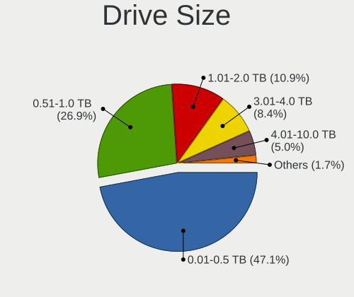

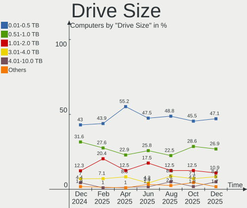

| Size in TB | Computers | Drives | Percent |
|------------|-----------|--------|---------|
| 0.01-0.5   | 56        | 73     | 47.06%  |
| 0.51-1.0   | 32        | 41     | 26.89%  |
| 1.01-2.0   | 13        | 18     | 10.92%  |
| 3.01-4.0   | 10        | 13     | 8.4%    |
| 4.01-10.0  | 6         | 9      | 5.04%   |
| 2.01-3.0   | 1         | 1      | 0.84%   |
| 10.01-20.0 | 1         | 2      | 0.84%   |

Space Total
-----------

Amount of disk space available on the file system

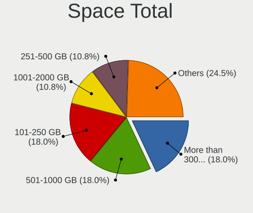

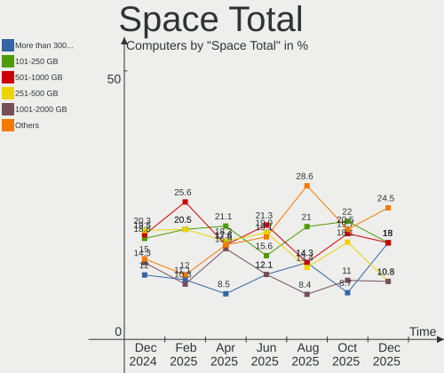

| Size in GB     | Computers | Percent |
|----------------|-----------|---------|
| More than 3000 | 25        | 17.99%  |
| 101-250        | 25        | 17.99%  |
| 501-1000       | 25        | 17.99%  |
| 251-500        | 15        | 10.79%  |
| 1001-2000      | 15        | 10.79%  |
| 1-20           | 12        | 8.63%   |
| 2001-3000      | 11        | 7.91%   |
| 51-100         | 5         | 3.6%    |
| Unknown        | 4         | 2.88%   |
| 21-50          | 2         | 1.44%   |

Space Used
----------

Amount of used disk space

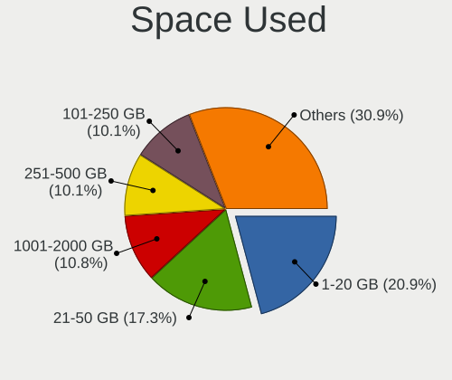

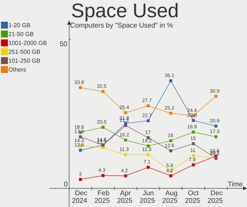

| Used GB        | Computers | Percent |
|----------------|-----------|---------|
| 1-20           | 29        | 20.86%  |
| 21-50          | 24        | 17.27%  |
| 1001-2000      | 15        | 10.79%  |
| 251-500        | 14        | 10.07%  |
| 101-250        | 14        | 10.07%  |
| 51-100         | 14        | 10.07%  |
| More than 3000 | 11        | 7.91%   |
| 501-1000       | 9         | 6.47%   |
| 2001-3000      | 5         | 3.6%    |
| Unknown        | 4         | 2.88%   |

Malfunc. Drives
---------------

Drive models with a malfunction

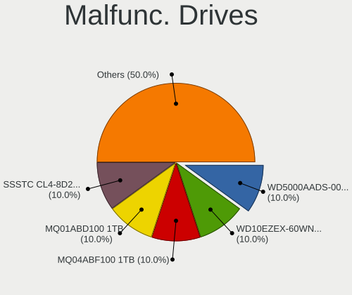

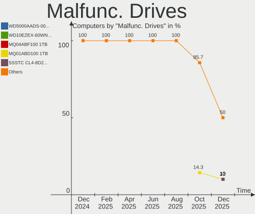

| Model                                                    | Computers | Drives | Percent |
|----------------------------------------------------------|-----------|--------|---------|
| WDC WD5000AADS-00S9B0 500GB                              | 1         | 1      | 10%     |
| WDC WD10EZEX-60WN4A0 1TB                                 | 1         | 1      | 10%     |
| Toshiba MQ04ABF100 1TB                                   | 1         | 1      | 10%     |
| Toshiba MQ01ABD100 1TB                                   | 1         | 1      | 10%     |
| Solid State Storage Technology SSSTC CL4-8D256-Q79 256GB | 1         | 1      | 10%     |
| Seagate ST8000DM004-2CX188 8TB                           | 1         | 1      | 10%     |
| Seagate ST3500620AS 500GB                                | 1         | 1      | 10%     |
| SanDisk SSD PLUS 480GB                                   | 1         | 1      | 10%     |
| EDILOCA EN206 2TB SSD                                    | 1         | 1      | 10%     |
| Apple HDD WDC WD10EALX-408EA0 1TB                        | 1         | 1      | 10%     |

Malfunc. Drive Vendor
---------------------

Vendors of faulty drives

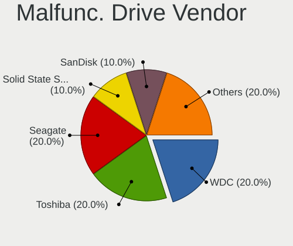

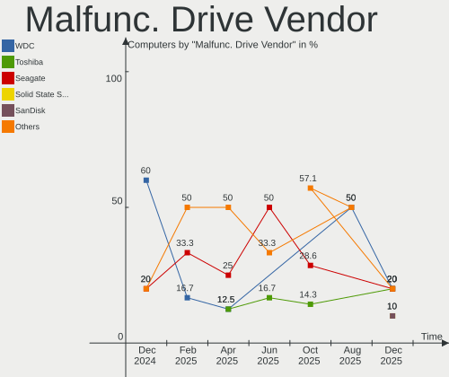

| Vendor                         | Computers | Drives | Percent |
|--------------------------------|-----------|--------|---------|
| WDC                            | 2         | 2      | 20%     |
| Toshiba                        | 2         | 2      | 20%     |
| Seagate                        | 2         | 2      | 20%     |
| Solid State Storage Technology | 1         | 1      | 10%     |
| SanDisk                        | 1         | 1      | 10%     |
| EDILOCA                        | 1         | 1      | 10%     |
| Apple                          | 1         | 1      | 10%     |

Malfunc. HDD Vendor
-------------------

Vendors of faulty HDD drives

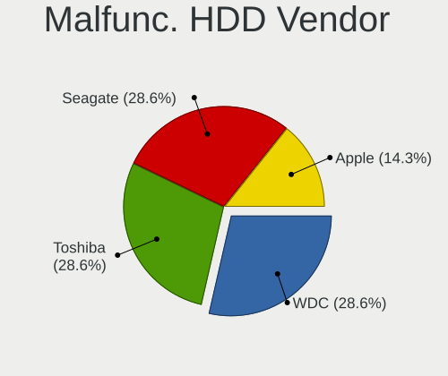

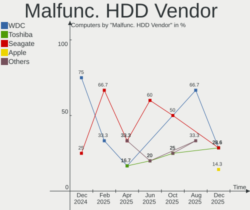

| Vendor  | Computers | Drives | Percent |
|---------|-----------|--------|---------|
| WDC     | 2         | 2      | 28.57%  |
| Toshiba | 2         | 2      | 28.57%  |
| Seagate | 2         | 2      | 28.57%  |
| Apple   | 1         | 1      | 14.29%  |

Malfunc. Drive Kind
-------------------

Kinds of faulty drives

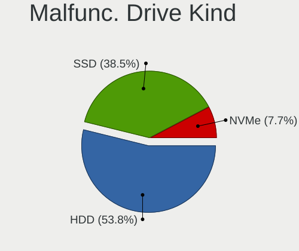

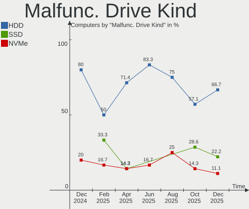

| Kind | Computers | Drives | Percent |
|------|-----------|--------|---------|
| HDD  | 6         | 7      | 66.67%  |
| SSD  | 2         | 2      | 22.22%  |
| NVMe | 1         | 1      | 11.11%  |

Failed Drives
-------------

Failed drive models

Zero info for selected period =(

Failed Drive Vendor
-------------------

Failed drive vendors

Zero info for selected period =(

Drive Status
------------

Number of failed and malfunc. drives

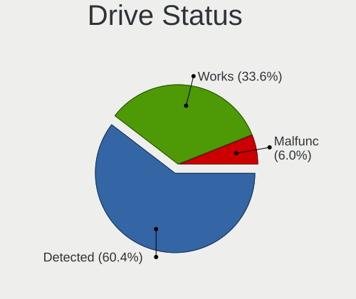

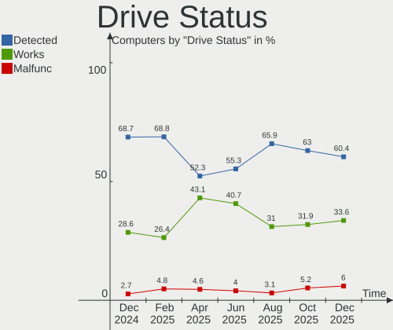

| Status   | Computers | Drives | Percent |
|----------|-----------|--------|---------|
| Detected | 90        | 167    | 60.4%   |
| Works    | 50        | 102    | 33.56%  |
| Malfunc  | 9         | 10     | 6.04%   |

Storage controller
------------------

Storage Vendor
--------------

Storage controller vendors

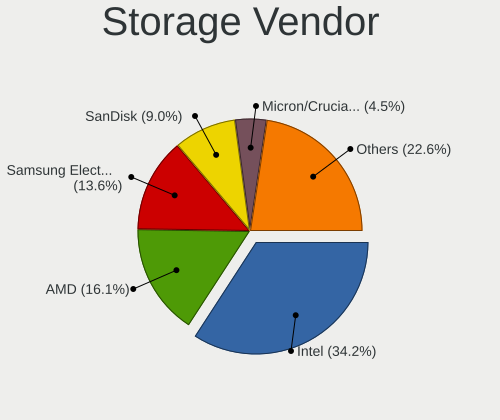

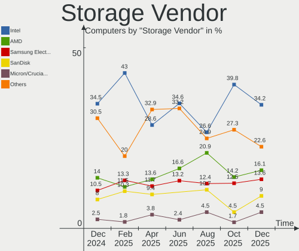

| Vendor                                  | Computers | Percent |
|-----------------------------------------|-----------|---------|
| Intel                                   | 68        | 34.17%  |
| AMD                                     | 32        | 16.08%  |
| Samsung Electronics                     | 27        | 13.57%  |
| SanDisk                                 | 18        | 9.05%   |
| Micron/Crucial Technology               | 9         | 4.52%   |
| Micron Technology                       | 6         | 3.02%   |
| SK hynix                                | 5         | 2.51%   |
| Kingston Technology Company             | 4         | 2.01%   |
| ASMedia Technology                      | 4         | 2.01%   |
| Phison Electronics                      | 3         | 1.51%   |
| KIOXIA                                  | 3         | 1.51%   |
| JMicron Technology                      | 3         | 1.51%   |
| ADATA Technology                        | 3         | 1.51%   |
| Toshiba America Info Systems            | 2         | 1.01%   |
| Solid State Storage Technology          | 2         | 1.01%   |
| Shenzhen Unionmemory Information System | 2         | 1.01%   |
| Realtek Semiconductor                   | 2         | 1.01%   |
| MAXIO Technology (Hangzhou)             | 2         | 1.01%   |
| Silicon Motion                          | 1         | 0.5%    |
| Seagate Technology                      | 1         | 0.5%    |
| INNOGRIT                                | 1         | 0.5%    |
| Biwin Storage Technology                | 1         | 0.5%    |

Storage Model
-------------

Storage controller models

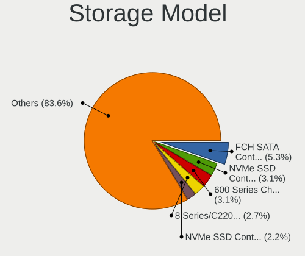

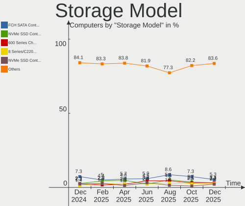

| Model                                                                          | Computers | Percent |
|--------------------------------------------------------------------------------|-----------|---------|
| AMD FCH SATA Controller [AHCI mode]                                            | 12        | 5.33%   |
| Samsung NVMe SSD Controller SM981/PM981/PM983                                  | 7         | 3.11%   |
| AMD 600 Series Chipset SATA Controller                                         | 7         | 3.11%   |
| Intel 8 Series/C220 Series Chipset Family 6-port SATA Controller 1 [AHCI mode] | 6         | 2.67%   |
| Samsung NVMe SSD Controller PM9A1/PM9A3/980PRO                                 | 5         | 2.22%   |
| Intel Volume Management Device NVMe RAID Controller                            | 5         | 2.22%   |
| Intel 82801 Mobile SATA Controller [RAID mode]                                 | 5         | 2.22%   |
| Intel 200 Series PCH SATA controller [AHCI mode]                               | 5         | 2.22%   |
| AMD 500 Series Chipset SATA Controller                                         | 5         | 2.22%   |
| SanDisk WD SN560/SN740/SN770/SN5000 NVMe SSD                                   | 4         | 1.78%   |
| Samsung NVMe SSD Controller 980 (DRAM-less)                                    | 4         | 1.78%   |
| Micron/Crucial P2 [Nick P2] / P3 / P3 Plus NVMe PCIe SSD (DRAM-less)           | 4         | 1.78%   |
| Intel SATA Controller [RAID mode]                                              | 4         | 1.78%   |
| Intel Raptor Lake SATA AHCI Controller                                         | 4         | 1.78%   |
| Intel Alder Lake-S PCH SATA Controller [AHCI Mode]                             | 4         | 1.78%   |
| AMD 400 Series Chipset SATA Controller                                         | 4         | 1.78%   |
| SanDisk WD PC SN810 / Black SN850 NVMe SSD                                     | 3         | 1.33%   |
| Sandisk WD Black SN850X NVMe SSD                                               | 3         | 1.33%   |
| Samsung NVMe SSD Controller S4LV008[Pascal]                                    | 3         | 1.33%   |
| Micron/Crucial P310 NVMe PCIe SSD (DRAM-less)                                  | 3         | 1.33%   |
| Micron 2400 NVMe SSD (DRAM-less)                                               | 3         | 1.33%   |
| Intel Tiger Lake-LP SATA Controller                                            | 3         | 1.33%   |
| Intel C600/X79 series chipset 6-Port SATA AHCI Controller                      | 3         | 1.33%   |
| Intel 7 Series/C210 Series Chipset Family 6-port SATA Controller [AHCI mode]   | 3         | 1.33%   |
| ASMedia ASM1061/ASM1062 Serial ATA Controller                                  | 3         | 1.33%   |
| AMD SB7x0/SB8x0/SB9x0 SATA Controller [AHCI mode]                              | 3         | 1.33%   |
| AMD SB7x0/SB8x0/SB9x0 IDE Controller                                           | 3         | 1.33%   |
| ADATA XPG SX8200 Pro PCIe Gen3x4 M.2 2280 Solid State Drive                    | 3         | 1.33%   |
| Solid State Storage CL4-8D512 NVMe SSD M.2 (DRAM-less)                         | 2         | 0.89%   |
| SK hynix Gold P31/BC711/PC711 NVMe Solid State Drive                           | 2         | 0.89%   |
| Shenzhen Unionmemory Information System AM6A0 PCIe 4.0 NVMe SSD 256GB          | 2         | 0.89%   |
| Sandisk WD PC SN5000S M.2 2280 NVMe SSD (DRAM-less)                            | 2         | 0.89%   |
| SanDisk Extreme Pro / WD Black SN750 / PC SN730 / Red SN700 NVMe SSD           | 2         | 0.89%   |
| Samsung NVMe SSD Controller SM961/PM961/SM963                                  | 2         | 0.89%   |
| Samsung NVMe SSD Controller PM9C1a (DRAM-less)                                 | 2         | 0.89%   |
| Samsung NVMe SSD Controller PM9B1 (DRAM-less)                                  | 2         | 0.89%   |
| MAXIO (Hangzhou) NVMe SSD Controller MAP1202 (DRAM-less)                       | 2         | 0.89%   |
| Kingston Company NV3 NVMe SSD [TC2201] (DRAM-less)                             | 2         | 0.89%   |
| Intel Sunrise Point-LP SATA Controller [AHCI mode]                             | 2         | 0.89%   |
| Intel SSD 660P Series                                                          | 2         | 0.89%   |

Storage Kind
------------

Kind of storage controller (IDE, SATA, NVMe, SAS, ...)

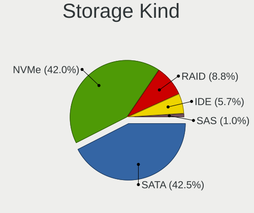

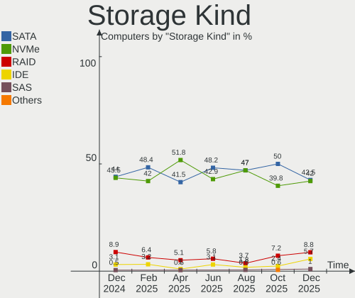

| Kind | Computers | Percent |
|------|-----------|---------|
| SATA | 82        | 42.49%  |
| NVMe | 81        | 41.97%  |
| RAID | 17        | 8.81%   |
| IDE  | 11        | 5.7%    |
| SAS  | 2         | 1.04%   |

Processor
---------

CPU Vendor
----------

Processor vendors

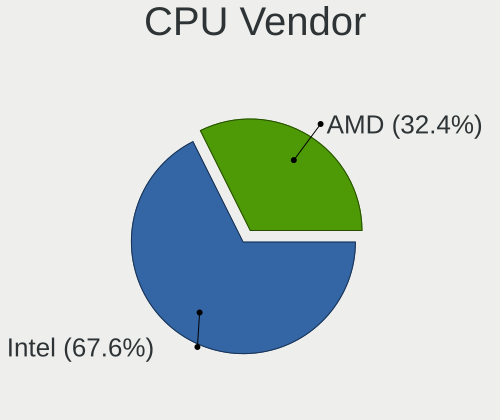

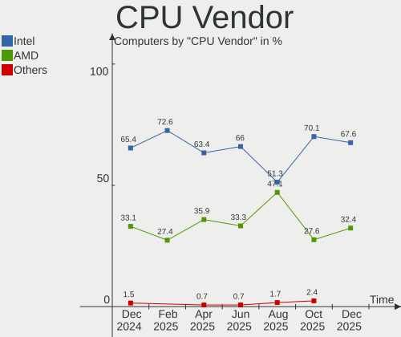

| Vendor | Computers | Percent |
|--------|-----------|---------|
| Intel  | 94        | 67.63%  |
| AMD    | 45        | 32.37%  |

CPU Model
---------

Processor models

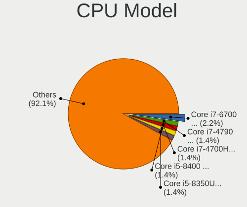

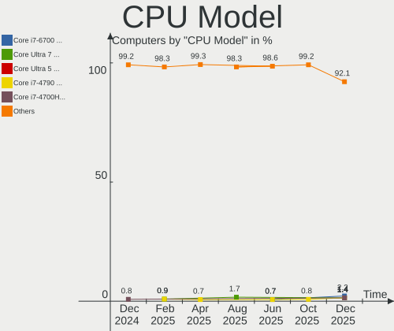

| Model                                         | Computers | Percent |
|-----------------------------------------------|-----------|---------|
| Intel Core i7-6700 CPU @ 3.40GHz              | 3         | 2.16%   |
| Intel Core Ultra 7 258V                       | 2         | 1.44%   |
| Intel Core Ultra 5 225H                       | 2         | 1.44%   |
| Intel Core i7-4790 CPU @ 3.60GHz              | 2         | 1.44%   |
| Intel Core i7-4700HQ CPU @ 2.40GHz            | 2         | 1.44%   |
| Intel Core i5-8400 CPU @ 2.80GHz              | 2         | 1.44%   |
| Intel Core i5-8350U CPU @ 1.70GHz             | 2         | 1.44%   |
| Intel Core i5-3470 CPU @ 3.20GHz              | 2         | 1.44%   |
| Intel 13th Gen Core i5-13420H                 | 2         | 1.44%   |
| Intel 12th Gen Core i5-12600K                 | 2         | 1.44%   |
| AMD Ryzen AI 7 350 w/ Radeon 860M             | 2         | 1.44%   |
| AMD Ryzen 7 PRO 7840U w/ Radeon 780M Graphics | 2         | 1.44%   |
| AMD Ryzen 7 5700X 8-Core Processor            | 2         | 1.44%   |
| AMD Ryzen 5 5500U with Radeon Graphics        | 2         | 1.44%   |
| Intel Xeon CPU E5-2630 v2 @ 2.60GHz           | 1         | 0.72%   |
| Intel Xeon CPU E5-2620 0 @ 2.00GHz            | 1         | 0.72%   |
| Intel Xeon CPU E5-1607 v2 @ 3.00GHz           | 1         | 0.72%   |
| Intel Xeon CPU E3-1505M v6 @ 3.00GHz          | 1         | 0.72%   |
| Intel Xeon CPU E3-1240 V2 @ 3.40GHz           | 1         | 0.72%   |
| Intel N95                                     | 1         | 0.72%   |
| Intel N150                                    | 1         | 0.72%   |
| Intel Core Ultra 9 285K                       | 1         | 0.72%   |
| Intel Core Ultra 9 285H                       | 1         | 0.72%   |
| Intel Core Ultra 7 265U                       | 1         | 0.72%   |
| Intel Core Ultra 7 155H                       | 1         | 0.72%   |
| Intel Core i9-14900KF                         | 1         | 0.72%   |
| Intel Core i7-9750H CPU @ 2.60GHz             | 1         | 0.72%   |
| Intel Core i7-9700F CPU @ 3.00GHz             | 1         | 0.72%   |
| Intel Core i7-8700K CPU @ 3.70GHz             | 1         | 0.72%   |
| Intel Core i7-8700 CPU @ 3.20GHz              | 1         | 0.72%   |
| Intel Core i7-7700HQ CPU @ 2.80GHz            | 1         | 0.72%   |
| Intel Core i7-7700 CPU @ 3.60GHz              | 1         | 0.72%   |
| Intel Core i7-4790K CPU @ 4.00GHz             | 1         | 0.72%   |
| Intel Core i7-4770 CPU @ 3.40GHz              | 1         | 0.72%   |
| Intel Core i7-4710MQ CPU @ 2.50GHz            | 1         | 0.72%   |
| Intel Core i7-4500U CPU @ 1.80GHz             | 1         | 0.72%   |
| Intel Core i7-3630QM CPU @ 2.40GHz            | 1         | 0.72%   |
| Intel Core i7-2670QM CPU @ 2.20GHz            | 1         | 0.72%   |
| Intel Core i7-14700KF                         | 1         | 0.72%   |
| Intel Core i7-10875H CPU @ 2.30GHz            | 1         | 0.72%   |

CPU Model Family
----------------

Processor model prefix

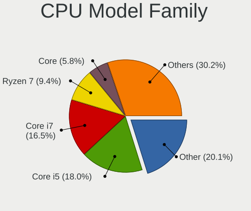

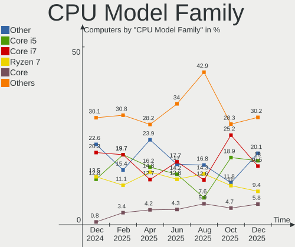

| Model             | Computers | Percent |
|-------------------|-----------|---------|
| Other             | 28        | 20.14%  |
| Intel Core i5     | 25        | 17.99%  |
| Intel Core i7     | 23        | 16.55%  |
| AMD Ryzen 7       | 13        | 9.35%   |
| Intel Core        | 8         | 5.76%   |
| AMD Ryzen 9       | 6         | 4.32%   |
| AMD Ryzen 5       | 6         | 4.32%   |
| Intel Xeon        | 5         | 3.6%    |
| Intel Core i3     | 4         | 2.88%   |
| Intel Core 2 Duo  | 3         | 2.16%   |
| AMD A6            | 3         | 2.16%   |
| AMD Ryzen 7 PRO   | 2         | 1.44%   |
| AMD Ryzen 5 PRO   | 2         | 1.44%   |
| AMD FX            | 2         | 1.44%   |
| Intel Core i9     | 1         | 0.72%   |
| Intel Core 2 Quad | 1         | 0.72%   |
| Intel Atom        | 1         | 0.72%   |
| AMD Ryzen 3       | 1         | 0.72%   |
| AMD Phenom II X6  | 1         | 0.72%   |
| AMD Athlon II X2  | 1         | 0.72%   |
| AMD Athlon        | 1         | 0.72%   |
| AMD A4            | 1         | 0.72%   |
| AMD A10           | 1         | 0.72%   |

CPU Cores
---------

Number of processor cores

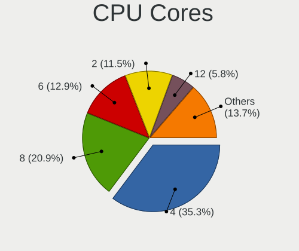

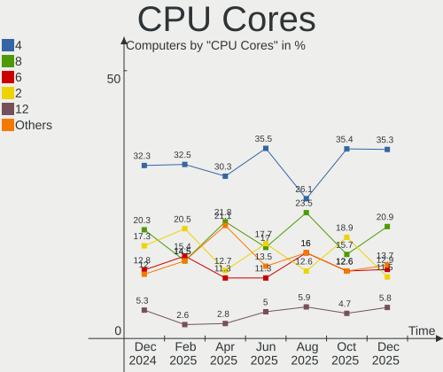

| Number | Computers | Percent |
|--------|-----------|---------|
| 4      | 49        | 35.25%  |
| 8      | 29        | 20.86%  |
| 6      | 18        | 12.95%  |
| 2      | 16        | 11.51%  |
| 12     | 8         | 5.76%   |
| 10     | 8         | 5.76%   |
| 16     | 4         | 2.88%   |
| 14     | 4         | 2.88%   |
| 24     | 2         | 1.44%   |
| 20     | 1         | 0.72%   |

CPU Sockets
-----------

Number of sockets

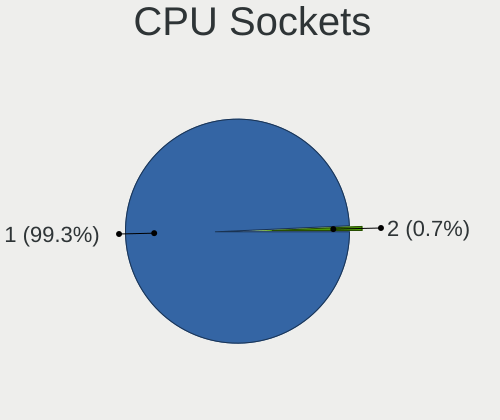

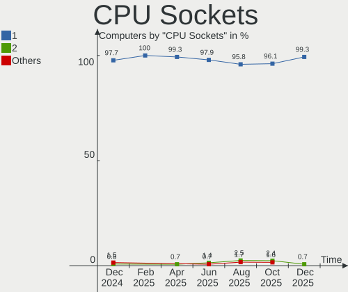

| Number | Computers | Percent |
|--------|-----------|---------|
| 1      | 138       | 99.28%  |
| 2      | 1         | 0.72%   |

CPU Threads
-----------

Threads per core (Hyper-Threading)

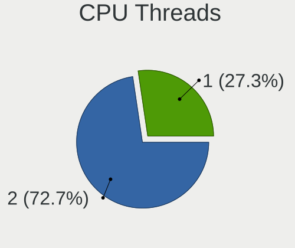

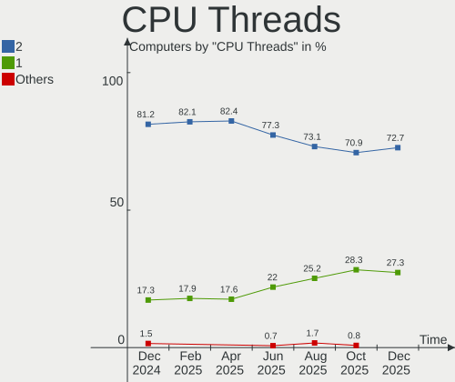

| Number | Computers | Percent |
|--------|-----------|---------|
| 2      | 101       | 72.66%  |
| 1      | 38        | 27.34%  |

CPU Op-Modes
------------

CPU Operation Modes (32-bit, 64-bit)

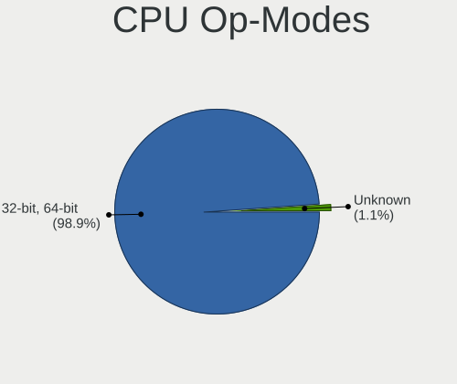

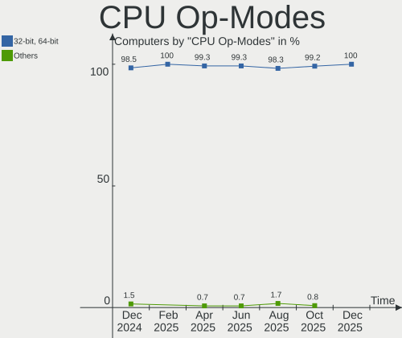

| Op mode        | Computers | Percent |
|----------------|-----------|---------|
| 32-bit, 64-bit | 139       | 100%    |

CPU Microcode
-------------

Microcode number

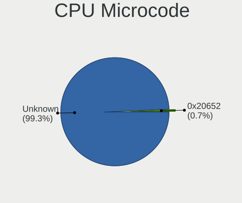

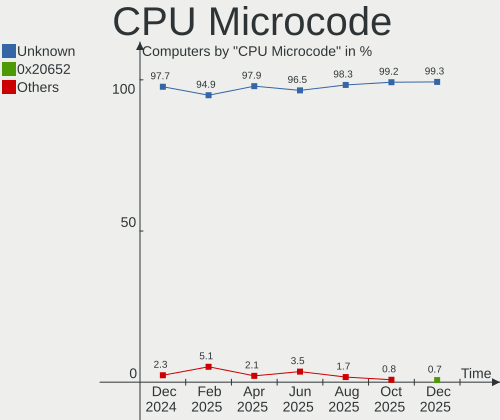

| Number  | Computers | Percent |
|---------|-----------|---------|
| Unknown | 138       | 99.28%  |
| 0x20652 | 1         | 0.72%   |

CPU Microarch
-------------

Microarchitecture

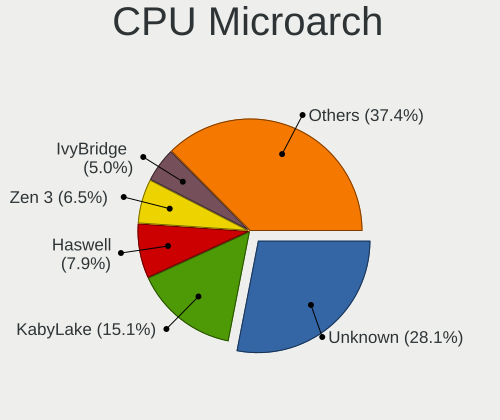

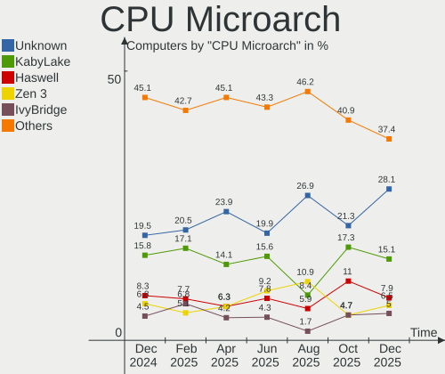

| Name               | Computers | Percent |
|--------------------|-----------|---------|
| Unknown            | 39        | 28.06%  |
| KabyLake           | 21        | 15.11%  |
| Haswell            | 11        | 7.91%   |
| Zen 3              | 9         | 6.47%   |
| IvyBridge          | 7         | 5.04%   |
| Alderlake Hybrid   | 7         | 5.04%   |
| Skylake            | 6         | 4.32%   |
| TigerLake          | 4         | 2.88%   |
| Penryn             | 4         | 2.88%   |
| Zen+               | 3         | 2.16%   |
| Piledriver         | 3         | 2.16%   |
| Zen 2              | 2         | 1.44%   |
| Zen                | 2         | 1.44%   |
| Westmere           | 2         | 1.44%   |
| SandyBridge        | 2         | 1.44%   |
| K10 Llano          | 2         | 1.44%   |
| K10                | 2         | 1.44%   |
| IceLake            | 2         | 1.44%   |
| CometLake          | 2         | 1.44%   |
| ArrowLake-H Hybrid | 2         | 1.44%   |
| Silvermont         | 1         | 0.72%   |
| Puma               | 1         | 0.72%   |
| Nehalem            | 1         | 0.72%   |
| Meteorlake Hybrid  | 1         | 0.72%   |
| Lunarlake Hybrid   | 1         | 0.72%   |
| Excavator          | 1         | 0.72%   |
| Broadwell          | 1         | 0.72%   |

Graphics
--------

GPU Vendor
----------

Vendors of graphics cards

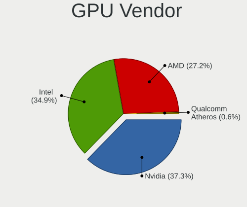

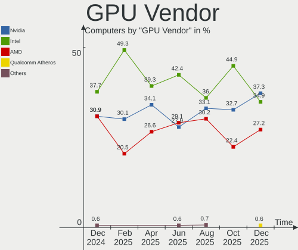

| Vendor           | Computers | Percent |
|------------------|-----------|---------|
| Nvidia           | 63        | 37.28%  |
| Intel            | 59        | 34.91%  |
| AMD              | 46        | 27.22%  |
| Qualcomm Atheros | 1         | 0.59%   |

GPU Model
---------

Graphics card models

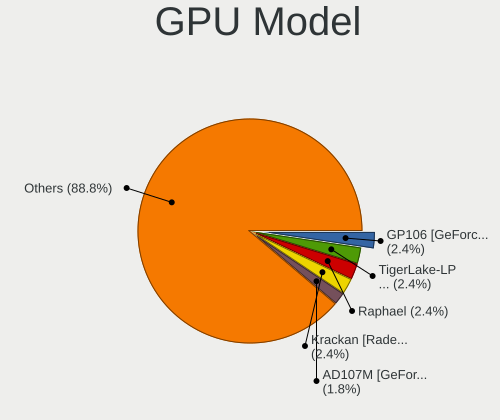

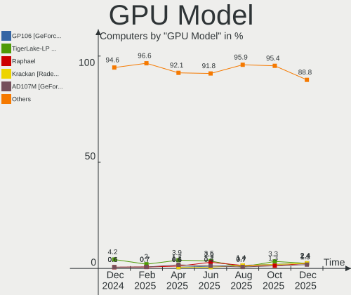

| Model                                                                       | Computers | Percent |
|-----------------------------------------------------------------------------|-----------|---------|
| Nvidia GP106 [GeForce GTX 1060 6GB]                                         | 4         | 2.35%   |
| Intel TigerLake-LP GT2 [Iris Xe Graphics]                                   | 4         | 2.35%   |
| AMD Raphael                                                                 | 4         | 2.35%   |
| AMD Krackan [Radeon 840M / 860M Graphics]                                   | 4         | 2.35%   |
| Nvidia AD107M [GeForce RTX 4060 Max-Q / Mobile]                             | 3         | 1.76%   |
| Intel Raptor Lake-P [UHD Graphics]                                          | 3         | 1.76%   |
| Intel Raptor Lake-P [Iris Xe Graphics]                                      | 3         | 1.76%   |
| Intel CoffeeLake-H GT2 [UHD Graphics 630]                                   | 3         | 1.76%   |
| Intel Arrow Lake-P [Arc Pro 130T/140T]                                      | 3         | 1.76%   |
| AMD Phoenix1                                                                | 3         | 1.76%   |
| Nvidia TU117M [GeForce GTX 1650 Mobile / Max-Q]                             | 2         | 1.18%   |
| Nvidia GP107 [GeForce GTX 1050 Ti]                                          | 2         | 1.18%   |
| Nvidia GM204 [GeForce GTX 970]                                              | 2         | 1.18%   |
| Intel Xeon E3-1200 v3/4th Gen Core Processor Integrated Graphics Controller | 2         | 1.18%   |
| Intel WhiskeyLake-U GT2 [UHD Graphics 620]                                  | 2         | 1.18%   |
| Intel TigerLake-H GT1 [UHD Graphics]                                        | 2         | 1.18%   |
| Intel Lunar Lake [Intel Arc Graphics 130V / 140V]                           | 2         | 1.18%   |
| Intel Kaby Lake-U GT2 [HD Graphics 620]                                     | 2         | 1.18%   |
| Intel Kaby Lake-R GT2 [UHD Graphics 620]                                    | 2         | 1.18%   |
| Intel CometLake-U GT2 [UHD Graphics]                                        | 2         | 1.18%   |
| Intel Alder Lake-UP3 GT2 [Iris Xe Graphics]                                 | 2         | 1.18%   |
| Intel Alder Lake-N [UHD Graphics]                                           | 2         | 1.18%   |
| Intel 4th Gen Core Processor Integrated Graphics Controller                 | 2         | 1.18%   |
| AMD Raven Ridge [Radeon Vega Series / Radeon Vega Mobile Series]            | 2         | 1.18%   |
| AMD Navi 31 [Radeon RX 7900 XT/7900 XTX/7900 GRE/7900M]                     | 2         | 1.18%   |
| AMD Navi 23 [Radeon RX 6600/6600 XT/6600M]                                  | 2         | 1.18%   |
| AMD Lucienne                                                                | 2         | 1.18%   |
| AMD Lexa PRO [Radeon 540/540X/550/550X / RX 540X/550/550X]                  | 2         | 1.18%   |
| AMD HawkPoint1                                                              | 2         | 1.18%   |
| Qualcomm Atheros Display controller                                         | 1         | 0.59%   |
| Nvidia TU117M [GeForce GTX 1650 Ti Mobile]                                  | 1         | 0.59%   |
| Nvidia TU117 [GeForce GTX 1650]                                             | 1         | 0.59%   |
| Nvidia TU116 [GeForce GTX 1660]                                             | 1         | 0.59%   |
| Nvidia TU106M [GeForce RTX 2060 Max-Q]                                      | 1         | 0.59%   |
| Nvidia TU106 [GeForce RTX 2060 Rev. A]                                      | 1         | 0.59%   |
| Nvidia TU106 [GeForce GTX 1650]                                             | 1         | 0.59%   |
| Nvidia TU104 [GeForce RTX 2080 SUPER]                                       | 1         | 0.59%   |
| Nvidia TU104 [GeForce RTX 2070 SUPER]                                       | 1         | 0.59%   |
| Nvidia GT218 [GeForce 8400 GS Rev. 3]                                       | 1         | 0.59%   |
| Nvidia GT218 [GeForce 210]                                                  | 1         | 0.59%   |

GPU Combo
---------

Combinations of graphics cards

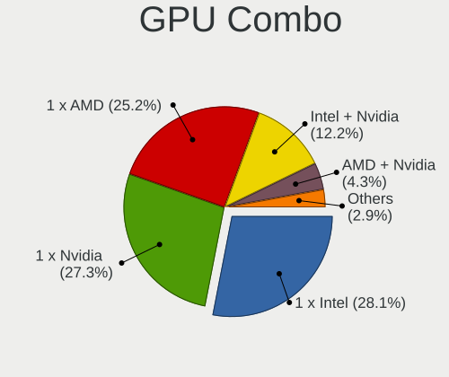

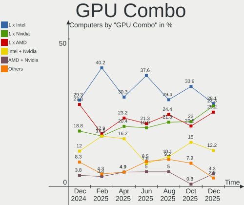

| Name           | Computers | Percent |
|----------------|-----------|---------|
| 1 x Intel      | 39        | 28.06%  |
| 1 x Nvidia     | 38        | 27.34%  |
| 1 x AMD        | 35        | 25.18%  |
| Intel + Nvidia | 17        | 12.23%  |
| AMD + Nvidia   | 6         | 4.32%   |
| Intel + AMD    | 2         | 1.44%   |
| 2 x Intel      | 1         | 0.72%   |
| 2 x AMD        | 1         | 0.72%   |

GPU Driver
----------

Free vs proprietary

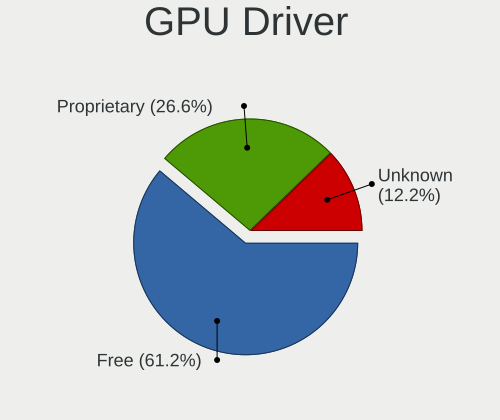

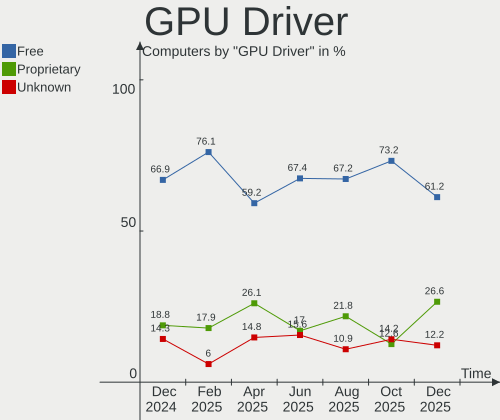

| Driver      | Computers | Percent |
|-------------|-----------|---------|
| Free        | 85        | 61.15%  |
| Proprietary | 37        | 26.62%  |
| Unknown     | 17        | 12.23%  |

GPU Memory
----------

Total video memory

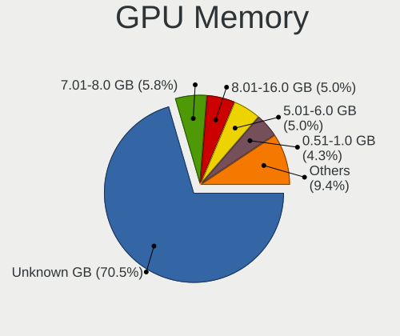

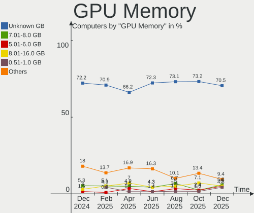

| Size in GB | Computers | Percent |
|------------|-----------|---------|
| Unknown    | 98        | 70.5%   |
| 7.01-8.0   | 8         | 5.76%   |
| 5.01-6.0   | 7         | 5.04%   |
| 8.01-16.0  | 7         | 5.04%   |
| 0.51-1.0   | 6         | 4.32%   |
| 0.01-0.5   | 4         | 2.88%   |
| 3.01-4.0   | 3         | 2.16%   |
| 16.01-24.0 | 3         | 2.16%   |
| 1.01-2.0   | 3         | 2.16%   |

Monitor
-------

Monitor Vendor
--------------

Monitor vendors

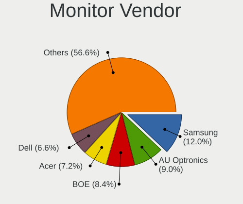

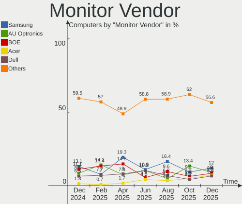

| Vendor                  | Computers | Percent |
|-------------------------|-----------|---------|
| Samsung Electronics     | 20        | 12.05%  |
| AU Optronics            | 15        | 9.04%   |
| BOE                     | 14        | 8.43%   |
| Acer                    | 12        | 7.23%   |
| Dell                    | 11        | 6.63%   |
| Lenovo                  | 10        | 6.02%   |
| Goldstar                | 8         | 4.82%   |
| Chimei Innolux          | 8         | 4.82%   |
| Hewlett-Packard         | 6         | 3.61%   |
| Philips                 | 5         | 3.01%   |
| BenQ                    | 5         | 3.01%   |
| AOC                     | 5         | 3.01%   |
| LG Display              | 4         | 2.41%   |
| Apple                   | 4         | 2.41%   |
| Ancor Communications    | 4         | 2.41%   |
| CSW                     | 3         | 1.81%   |
| ViewSonic               | 2         | 1.2%    |
| SKG                     | 2         | 1.2%    |
| Sceptre Tech            | 2         | 1.2%    |
| RTK                     | 2         | 1.2%    |
| Mi                      | 2         | 1.2%    |
| Iiyama                  | 2         | 1.2%    |
| ASUSTek Computer        | 2         | 1.2%    |
| Xiaomi                  | 1         | 0.6%    |
| Wacom                   | 1         | 0.6%    |
| Vizio                   | 1         | 0.6%    |
| Valve                   | 1         | 0.6%    |
| Unknown                 | 1         | 0.6%    |
| Philco                  | 1         | 0.6%    |
| Panasonic               | 1         | 0.6%    |
| Kogan                   | 1         | 0.6%    |
| InfoVision              | 1         | 0.6%    |
| IDV                     | 1         | 0.6%    |
| HXM                     | 1         | 0.6%    |
| Gigabyte Technology     | 1         | 0.6%    |
| Fujitsu Siemens         | 1         | 0.6%    |
| Denver                  | 1         | 0.6%    |
| CSOT                    | 1         | 0.6%    |
| Chi Mei Optoelectronics | 1         | 0.6%    |
| CHD                     | 1         | 0.6%    |

Monitor Model
-------------

Monitor models

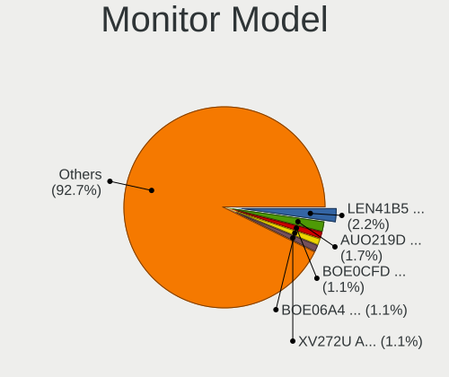

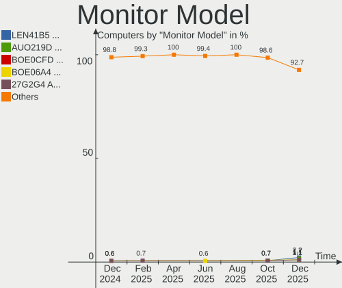

| Model                                                                    | Computers | Percent |
|--------------------------------------------------------------------------|-----------|---------|
| Lenovo LCD Monitor LEN41B5 1920x1200 344x215mm 16.0-inch                 | 4         | 2.23%   |
| AU Optronics LCD Monitor AUO219D 1920x1080 381x214mm 17.2-inch           | 3         | 1.68%   |
| BOE LCD Monitor BOE0CFD 1920x1080 344x194mm 15.5-inch                    | 2         | 1.12%   |
| BOE LCD Monitor BOE06A4 1366x768 344x194mm 15.5-inch                     | 2         | 1.12%   |
| AOC 27G2G4 AOC2702 1920x1080 598x336mm 27.0-inch                         | 2         | 1.12%   |
| Acer XV272U ACR06C1 2560x1440 597x336mm 27.0-inch                        | 2         | 1.12%   |
| Xiaomi Mi TV XMD009A 2880x1800 480x270mm 21.7-inch                       | 1         | 0.56%   |
| Wacom One 13 WAC1070 1920x1080 294x166mm 13.3-inch                       | 1         | 0.56%   |
| Vizio E190VA VIZ0067 1920x1080 410x230mm 18.5-inch                       | 1         | 0.56%   |
| ViewSonic VX2758-SERIES VSCA738 2560x1440 598x336mm 27.0-inch            | 1         | 0.56%   |
| ViewSonic VP181s VSCB816 1280x1024 359x287mm 18.1-inch                   | 1         | 0.56%   |
| Valve Index HMD VLV91A8                                                  | 1         | 0.56%   |
| Unknown LCD Monitor FFFF 2288x1287 2550x2550mm 142.0-inch                | 1         | 0.56%   |
| SKG Q3212RUC SKG3212 2560x1440 530x280mm 23.6-inch                       | 1         | 0.56%   |
| SKG H27F22 SKG2756 1920x1080 600x330mm 27.0-inch                         | 1         | 0.56%   |
| Sceptre Tech Sceptre P30 SPT0BCC 2560x1080 690x291mm 29.5-inch           | 1         | 0.56%   |
| Sceptre Tech Sceptre F27 SPT0AD7 1920x1080 600x330mm 27.0-inch           | 1         | 0.56%   |
| Samsung Electronics U32J59x SAM0F35 3840x2160 697x392mm 31.5-inch        | 1         | 0.56%   |
| Samsung Electronics S27F350 SAM0D22 1920x1080 598x336mm 27.0-inch        | 1         | 0.56%   |
| Samsung Electronics S24F350 SAM0D20 1920x1080 521x293mm 23.5-inch        | 1         | 0.56%   |
| Samsung Electronics S23C350 SAM0A36 1920x1080 510x287mm 23.0-inch        | 1         | 0.56%   |
| Samsung Electronics S22F350 SAM0D1A 1920x1080 477x268mm 21.5-inch        | 1         | 0.56%   |
| Samsung Electronics Odyssey G93SC SAM7454 3840x1080 1193x336mm 48.8-inch | 1         | 0.56%   |
| Samsung Electronics LCD Monitor SEC5441 1280x800 331x207mm 15.4-inch     | 1         | 0.56%   |
| Samsung Electronics LCD Monitor SEC3245 1366x768 340x190mm 15.3-inch     | 1         | 0.56%   |
| Samsung Electronics LCD Monitor SDC4188 2880x1800 312x195mm 14.5-inch    | 1         | 0.56%   |
| Samsung Electronics LCD Monitor SDC4187 1920x1200 302x189mm 14.0-inch    | 1         | 0.56%   |
| Samsung Electronics LCD Monitor SDC4171 2880x1800 302x189mm 14.0-inch    | 1         | 0.56%   |
| Samsung Electronics LCD Monitor SDC4159 1920x1080 344x194mm 15.5-inch    | 1         | 0.56%   |
| Samsung Electronics LCD Monitor SDC3754 1600x900 382x215mm 17.3-inch     | 1         | 0.56%   |
| Samsung Electronics LCD Monitor SAM7016 3840x2160 1872x1053mm 84.6-inch  | 1         | 0.56%   |
| Samsung Electronics LCD Monitor SAM0F14 1920x540                         | 1         | 0.56%   |
| Samsung Electronics LCD Monitor SAM0C39 1920x1080 885x498mm 40.0-inch    | 1         | 0.56%   |
| Samsung Electronics LCD Monitor SAM0659 1920x1080                        | 1         | 0.56%   |
| Samsung Electronics C49RG9x SAM0F9C 3360x1440 1193x336mm 48.8-inch       | 1         | 0.56%   |
| Samsung Electronics C49J89x SAM0F21 3840x1080 1196x336mm 48.9-inch       | 1         | 0.56%   |
| Samsung Electronics C27JG5x SAM0FDD 2560x1440 597x336mm 27.0-inch        | 1         | 0.56%   |
| Samsung Electronics ATNA60HR01-0  SDC4204                                | 1         | 0.56%   |
| Samsung Electronics ATNA60CL10-0 SDC41AF 2880x1800 344x215mm 16.0-inch   | 1         | 0.56%   |
| Samsung Electronics ATNA40HQ01-0  SDC4203                                | 1         | 0.56%   |

Monitor Resolution
------------------

Monitor screen resolution

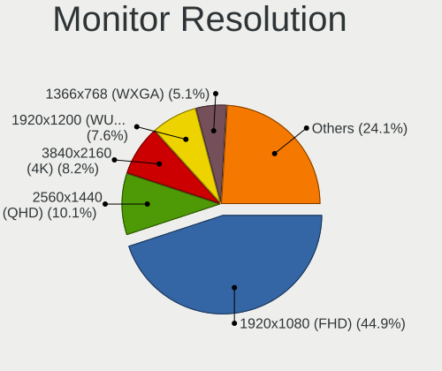

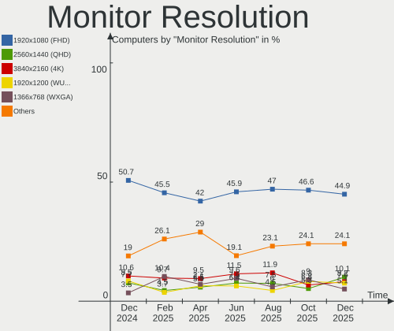

| Resolution         | Computers | Percent |
|--------------------|-----------|---------|
| 1920x1080 (FHD)    | 71        | 44.94%  |
| 2560x1440 (QHD)    | 16        | 10.13%  |
| 3840x2160 (4K)     | 13        | 8.23%   |
| 1920x1200 (WUXGA)  | 12        | 7.59%   |
| 1366x768 (WXGA)    | 8         | 5.06%   |
| 2880x1800          | 5         | 3.16%   |
| 1600x900 (HD+)     | 5         | 3.16%   |
| 3840x1080          | 4         | 2.53%   |
| 2560x1080          | 4         | 2.53%   |
| Unknown            | 4         | 2.53%   |
| 3440x1440          | 3         | 1.9%    |
| 3072x1920          | 2         | 1.27%   |
| 1680x1050 (WSXGA+) | 2         | 1.27%   |
| 1440x900 (WXGA+)   | 2         | 1.27%   |
| 1280x1024 (SXGA)   | 2         | 1.27%   |
| 5760x1080          | 1         | 0.63%   |
| 2288x1287          | 1         | 0.63%   |
| 2256x1504          | 1         | 0.63%   |
| 1920x540           | 1         | 0.63%   |
| 1280x800 (WXGA)    | 1         | 0.63%   |

Monitor Diagonal
----------------

Diagonal size in inches

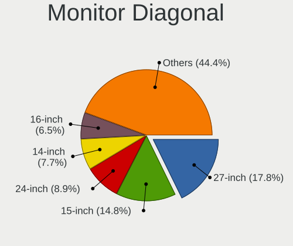

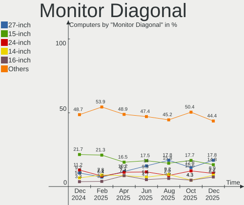

| Inches  | Computers | Percent |
|---------|-----------|---------|
| 27      | 30        | 17.75%  |
| 15      | 25        | 14.79%  |
| 24      | 15        | 8.88%   |
| 14      | 13        | 7.69%   |
| 16      | 11        | 6.51%   |
| 31      | 9         | 5.33%   |
| 23      | 9         | 5.33%   |
| 17      | 9         | 5.33%   |
| 13      | 8         | 4.73%   |
| Unknown | 6         | 3.55%   |
| 34      | 5         | 2.96%   |
| 21      | 5         | 2.96%   |
| 18      | 4         | 2.37%   |
| 84      | 3         | 1.78%   |
| 22      | 3         | 1.78%   |
| 48      | 2         | 1.18%   |
| 29      | 2         | 1.18%   |
| 20      | 2         | 1.18%   |
| 142     | 1         | 0.59%   |
| 63      | 1         | 0.59%   |
| 54      | 1         | 0.59%   |
| 49      | 1         | 0.59%   |
| 43      | 1         | 0.59%   |
| 32      | 1         | 0.59%   |
| 26      | 1         | 0.59%   |
| 12      | 1         | 0.59%   |

Monitor Width
-------------

Physical width

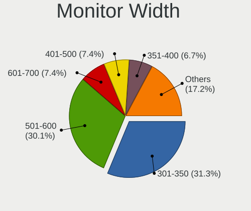

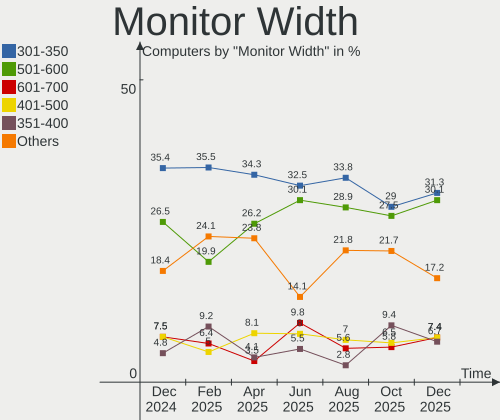

| Width in mm    | Computers | Percent |
|----------------|-----------|---------|
| 301-350        | 51        | 31.29%  |
| 501-600        | 49        | 30.06%  |
| 601-700        | 12        | 7.36%   |
| 401-500        | 12        | 7.36%   |
| 351-400        | 11        | 6.75%   |
| 701-800        | 6         | 3.68%   |
| 201-300        | 6         | 3.68%   |
| Unknown        | 6         | 3.68%   |
| 1001-1500      | 5         | 3.07%   |
| 1501-2000      | 3         | 1.84%   |
| More than 2000 | 1         | 0.61%   |
| 901-1000       | 1         | 0.61%   |

Aspect Ratio
------------

Proportional relationship between the width and the height

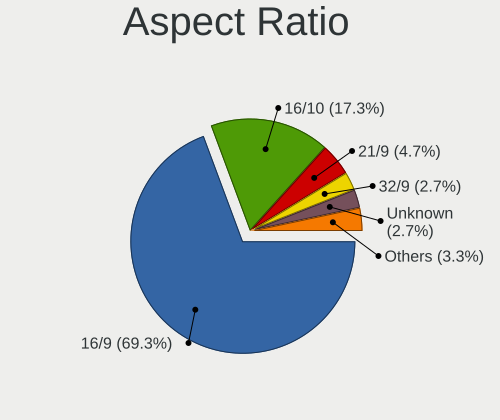

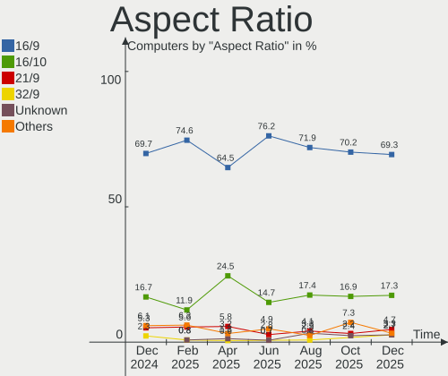

| Ratio   | Computers | Percent |
|---------|-----------|---------|
| 16/9    | 104       | 69.33%  |
| 16/10   | 26        | 17.33%  |
| 21/9    | 7         | 4.67%   |
| 32/9    | 4         | 2.67%   |
| Unknown | 4         | 2.67%   |
| 5/4     | 2         | 1.33%   |
| 3/2     | 2         | 1.33%   |
| 1.00    | 1         | 0.67%   |

Monitor Area
------------

Area in inch²

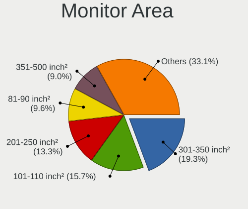

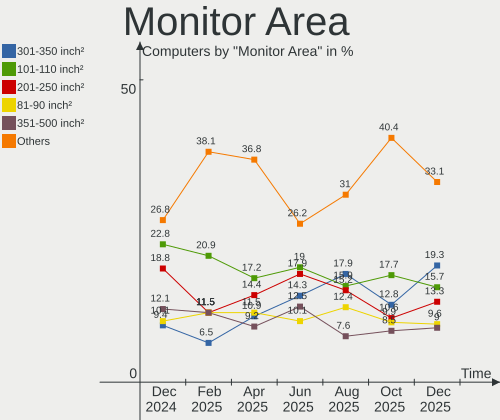

| Area in inch² | Computers | Percent |
|----------------|-----------|---------|
| 301-350        | 32        | 19.28%  |
| 101-110        | 26        | 15.66%  |
| 201-250        | 22        | 13.25%  |
| 81-90          | 16        | 9.64%   |
| 351-500        | 15        | 9.04%   |
| 111-120        | 10        | 6.02%   |
| 121-130        | 8         | 4.82%   |
| 251-300        | 7         | 4.22%   |
| More than 1000 | 6         | 3.61%   |
| Unknown        | 6         | 3.61%   |
| 151-200        | 5         | 3.01%   |
| 71-80          | 4         | 2.41%   |
| 501-1000       | 4         | 2.41%   |
| 141-150        | 3         | 1.81%   |
| 61-70          | 1         | 0.6%    |
| 91-100         | 1         | 0.6%    |

Pixel Density
-------------

Pixels per inch

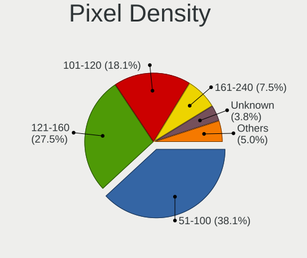

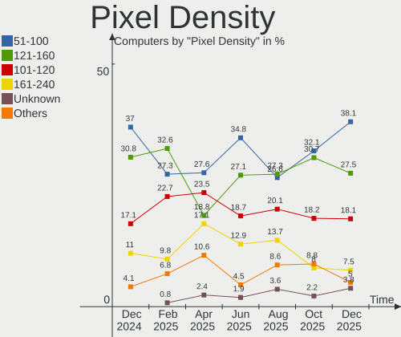

| Density       | Computers | Percent |
|---------------|-----------|---------|
| 51-100        | 61        | 38.13%  |
| 121-160       | 44        | 27.5%   |
| 101-120       | 29        | 18.13%  |
| 161-240       | 12        | 7.5%    |
| Unknown       | 6         | 3.75%   |
| More than 240 | 5         | 3.13%   |
| 1-50          | 3         | 1.88%   |

Multiple Monitors
-----------------

Total monitors connected

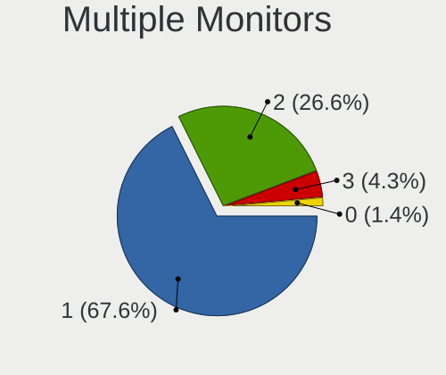

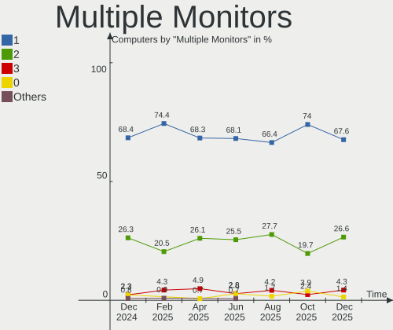

| Total | Computers | Percent |
|-------|-----------|---------|
| 1     | 94        | 67.63%  |
| 2     | 37        | 26.62%  |
| 3     | 6         | 4.32%   |
| 0     | 2         | 1.44%   |

Network
-------

Net Controller Vendor
---------------------

Controller vendors

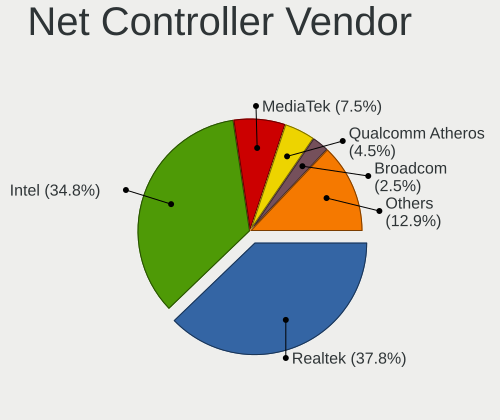

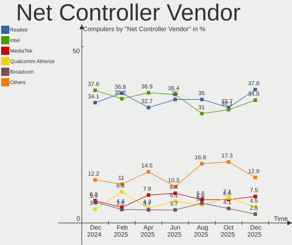

| Vendor                      | Computers | Percent |
|-----------------------------|-----------|---------|
| Realtek Semiconductor       | 76        | 37.81%  |
| Intel                       | 70        | 34.83%  |
| MediaTek                    | 15        | 7.46%   |
| Qualcomm Atheros            | 9         | 4.48%   |
| Broadcom                    | 5         | 2.49%   |
| Qualcomm                    | 4         | 1.99%   |
| Broadcom Limited            | 3         | 1.49%   |
| TP-Link                     | 2         | 1%      |
| Samsung Electronics         | 2         | 1%      |
| Ralink Technology           | 2         | 1%      |
| Ralink                      | 2         | 1%      |
| ASIX Electronics            | 2         | 1%      |
| ZyXEL Communications        | 1         | 0.5%    |
| Shenzhen Goodix Technology  | 1         | 0.5%    |
| Qualcomm Technologies       | 1         | 0.5%    |
| Motorcomm Microelectronics. | 1         | 0.5%    |
| Marvell Technology Group    | 1         | 0.5%    |
| Huawei Technologies         | 1         | 0.5%    |
| DisplayLink                 | 1         | 0.5%    |
| ASUSTek Computer            | 1         | 0.5%    |
| Aquantia                    | 1         | 0.5%    |

Net Controller Model
--------------------

Controller models

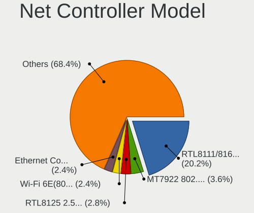

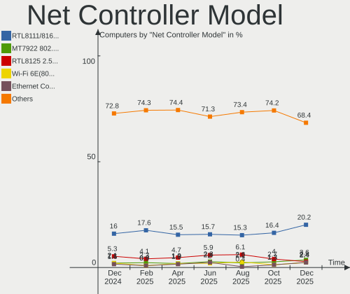

| Model                                                                           | Computers | Percent |
|---------------------------------------------------------------------------------|-----------|---------|
| Realtek RTL8111/8168/8211/8411 PCI Express Gigabit Ethernet Controller          | 50        | 20.24%  |
| MediaTek MT7922 802.11ax PCI Express Wireless Network Adapter                   | 9         | 3.64%   |
| Realtek RTL8125 2.5GbE Controller                                               | 7         | 2.83%   |
| Intel Wi-Fi 6E(802.11ax) AX210/AX1675* 2x2 [Typhoon Peak]                       | 6         | 2.43%   |
| Intel Ethernet Controller I225-V                                                | 6         | 2.43%   |
| Realtek RTL8852BE PCIe 802.11ax Wireless Network Controller                     | 5         | 2.02%   |
| Realtek RTL8153 Gigabit Ethernet Adapter                                        | 5         | 2.02%   |
| Realtek 802.11ac NIC                                                            | 5         | 2.02%   |
| Intel Wireless 8265 / 8275                                                      | 5         | 2.02%   |
| Intel Wi-Fi 6 AX200                                                             | 5         | 2.02%   |
| Intel Ethernet Controller I226-V                                                | 5         | 2.02%   |
| Realtek RTL810xE PCI Express Fast Ethernet controller                           | 4         | 1.62%   |
| Qualcomm QCNFA765 Wireless Network Adapter                                      | 4         | 1.62%   |
| Intel Raptor Lake PCH CNVi WiFi                                                 | 4         | 1.62%   |
| Intel 82579LM Gigabit Network Connection (Lewisville)                           | 4         | 1.62%   |
| MediaTek MT7925 802.11be 160MHz 2x2 PCIe Wireless Network Adapter [Filogic 360] | 3         | 1.21%   |
| Intel I211 Gigabit Network Connection                                           | 3         | 1.21%   |
| Intel Ethernet Connection (4) I219-LM                                           | 3         | 1.21%   |
| Intel Dual Band Wireless-AC 3168NGW [Stone Peak]                                | 3         | 1.21%   |
| Intel Arrow Lake CNVi WiFi                                                      | 3         | 1.21%   |
| Broadcom NetXtreme BCM57766 Gigabit Ethernet PCIe                               | 3         | 1.21%   |
| Realtek RTL8852BE-VT PCIe 802.11ax Wireless Network Controller                  | 2         | 0.81%   |
| Realtek RTL8822CE 802.11ac PCIe Wireless Network Adapter                        | 2         | 0.81%   |
| Realtek RTL8188EE Wireless Network Adapter                                      | 2         | 0.81%   |
| Realtek Killer E3000 2.5GbE Controller                                          | 2         | 0.81%   |
| Ralink RT2790 Wireless 802.11n 1T/2R PCIe                                       | 2         | 0.81%   |
| Qualcomm Atheros QCA8171 Gigabit Ethernet                                       | 2         | 0.81%   |
| Qualcomm Atheros AR9462 Wireless Network Adapter                                | 2         | 0.81%   |
| Intel Wireless 7265                                                             | 2         | 0.81%   |
| Intel Wi-Fi 7(802.11be) AX1775*/AX1790*/BE20*/BE401/BE1750* 2x2                 | 2         | 0.81%   |
| Intel Wi-Fi 6 AX201                                                             | 2         | 0.81%   |
| Intel Wi-Fi 5(802.11ac) Wireless-AC 9x6x [Thunder Peak]                         | 2         | 0.81%   |
| Intel Ethernet Connection (2) I219-V                                            | 2         | 0.81%   |
| Intel Comet Lake PCH CNVi WiFi                                                  | 2         | 0.81%   |
| Intel Cannon Point-LP CNVi [Wireless-AC]                                        | 2         | 0.81%   |
| Intel BE201 320MHz                                                              | 2         | 0.81%   |
| Intel Alder Lake-S PCH CNVi WiFi                                                | 2         | 0.81%   |
| Intel Alder Lake-P PCH CNVi WiFi                                                | 2         | 0.81%   |
| ASIX AX88179 Gigabit Ethernet                                                   | 2         | 0.81%   |
| ZyXEL NWD6505 802.11a/b/g/n/ac Wireless Adapter [MediaTek MT7610U]              | 1         | 0.4%    |

Wireless Vendor
---------------

Wireless vendors

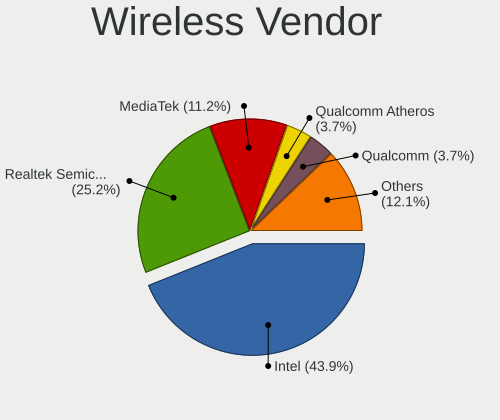

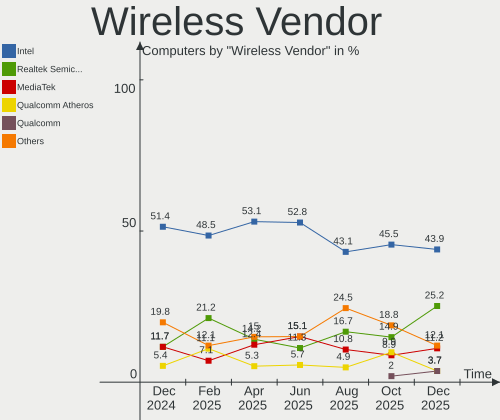

| Vendor                | Computers | Percent |
|-----------------------|-----------|---------|
| Intel                 | 47        | 43.93%  |
| Realtek Semiconductor | 27        | 25.23%  |
| MediaTek              | 12        | 11.21%  |
| Qualcomm Atheros      | 4         | 3.74%   |
| Qualcomm              | 4         | 3.74%   |
| Broadcom Limited      | 3         | 2.8%    |
| Broadcom              | 3         | 2.8%    |
| Ralink Technology     | 2         | 1.87%   |
| Ralink                | 2         | 1.87%   |
| ZyXEL Communications  | 1         | 0.93%   |
| TP-Link               | 1         | 0.93%   |
| ASUSTek Computer      | 1         | 0.93%   |

Wireless Model
--------------

Wireless models

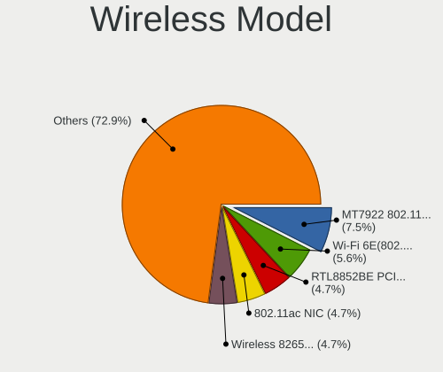

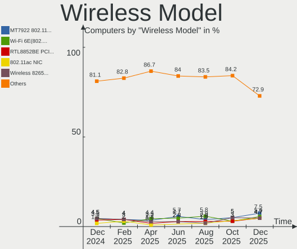

| Model                                                                           | Computers | Percent |
|---------------------------------------------------------------------------------|-----------|---------|
| MediaTek MT7922 802.11ax PCI Express Wireless Network Adapter                   | 8         | 7.48%   |
| Intel Wi-Fi 6E(802.11ax) AX210/AX1675* 2x2 [Typhoon Peak]                       | 6         | 5.61%   |
| Realtek RTL8852BE PCIe 802.11ax Wireless Network Controller                     | 5         | 4.67%   |
| Realtek 802.11ac NIC                                                            | 5         | 4.67%   |
| Intel Wireless 8265 / 8275                                                      | 5         | 4.67%   |
| Intel Wi-Fi 6 AX200                                                             | 5         | 4.67%   |
| Qualcomm QCNFA765 Wireless Network Adapter                                      | 4         | 3.74%   |
| Intel Raptor Lake PCH CNVi WiFi                                                 | 4         | 3.74%   |
| Intel Dual Band Wireless-AC 3168NGW [Stone Peak]                                | 3         | 2.8%    |
| Realtek RTL8852BE-VT PCIe 802.11ax Wireless Network Controller                  | 2         | 1.87%   |
| Realtek RTL8822CE 802.11ac PCIe Wireless Network Adapter                        | 2         | 1.87%   |
| Realtek RTL8188EE Wireless Network Adapter                                      | 2         | 1.87%   |
| Ralink RT2790 Wireless 802.11n 1T/2R PCIe                                       | 2         | 1.87%   |
| Qualcomm Atheros AR9462 Wireless Network Adapter                                | 2         | 1.87%   |
| MediaTek MT7925 802.11be 160MHz 2x2 PCIe Wireless Network Adapter [Filogic 360] | 2         | 1.87%   |
| Intel Wireless 7265                                                             | 2         | 1.87%   |
| Intel Wi-Fi 6 AX201                                                             | 2         | 1.87%   |
| Intel Wi-Fi 5(802.11ac) Wireless-AC 9x6x [Thunder Peak]                         | 2         | 1.87%   |
| Intel Comet Lake PCH CNVi WiFi                                                  | 2         | 1.87%   |
| Intel Cannon Point-LP CNVi [Wireless-AC]                                        | 2         | 1.87%   |
| Intel Alder Lake-S PCH CNVi WiFi                                                | 2         | 1.87%   |
| ZyXEL NWD6505 802.11a/b/g/n/ac Wireless Adapter [MediaTek MT7610U]              | 1         | 0.93%   |
| TP-Link 802.11ac NIC                                                            | 1         | 0.93%   |
| Realtek RTL8922AE 802.11be PCIe Wireless Network Adapter                        | 1         | 0.93%   |
| Realtek RTL8852CE PCIe 802.11ax Wireless Network Controller                     | 1         | 0.93%   |
| Realtek RTL8822BE 802.11a/b/g/n/ac WiFi adapter                                 | 1         | 0.93%   |
| Realtek RTL8821CE 802.11ac PCIe Wireless Network Adapter                        | 1         | 0.93%   |
| Realtek RTL8821AE 802.11ac PCIe Wireless Network Adapter                        | 1         | 0.93%   |
| Realtek RTL8192EE PCIe Wireless Network Adapter                                 | 1         | 0.93%   |
| Realtek RTL8192CE PCIe Wireless Network Adapter                                 | 1         | 0.93%   |
| Realtek RTL8188GU 802.11n WLAN Adapter (After Modeswitch)                       | 1         | 0.93%   |
| Realtek RTL8188EUS 802.11n Wireless Network Adapter                             | 1         | 0.93%   |
| Realtek RTL8188CUS 802.11n WLAN Adapter                                         | 1         | 0.93%   |
| Realtek 802.11be WLAN Adapter                                                   | 1         | 0.93%   |
| Ralink RT5370 Wireless Adapter                                                  | 1         | 0.93%   |
| Ralink RT2870/RT3070 Wireless Adapter                                           | 1         | 0.93%   |
| Qualcomm Atheros QCA9565 / AR9565 Wireless Network Adapter                      | 1         | 0.93%   |
| Qualcomm Atheros QCA6174 802.11ac Wireless Network Adapter                      | 1         | 0.93%   |
| MediaTek MT7921 802.11ax PCIe Wireless Network Adapter [Filogic 330]            | 1         | 0.93%   |
| MediaTek MT7902 802.11ax PCIe Wireless Network Adapter [Filogic 310]            | 1         | 0.93%   |

Ethernet Vendor
---------------

Ethernet vendors

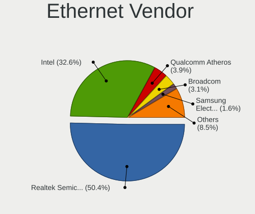

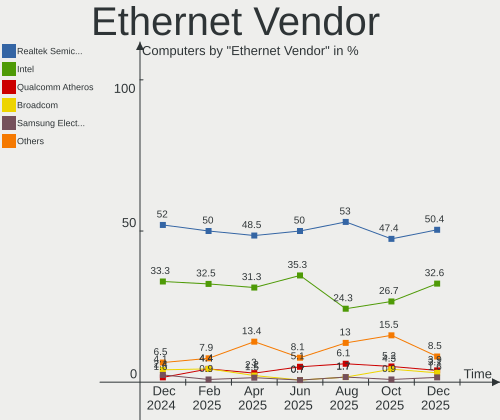

| Vendor                      | Computers | Percent |
|-----------------------------|-----------|---------|
| Realtek Semiconductor       | 65        | 50.39%  |
| Intel                       | 42        | 32.56%  |
| Qualcomm Atheros            | 5         | 3.88%   |
| Broadcom                    | 4         | 3.1%    |
| Samsung Electronics         | 2         | 1.55%   |
| MediaTek                    | 2         | 1.55%   |
| ASIX Electronics            | 2         | 1.55%   |
| TP-Link                     | 1         | 0.78%   |
| Qualcomm Technologies       | 1         | 0.78%   |
| Motorcomm Microelectronics. | 1         | 0.78%   |
| Marvell Technology Group    | 1         | 0.78%   |
| Huawei Technologies         | 1         | 0.78%   |
| DisplayLink                 | 1         | 0.78%   |
| Aquantia                    | 1         | 0.78%   |

Ethernet Model
--------------

Ethernet models

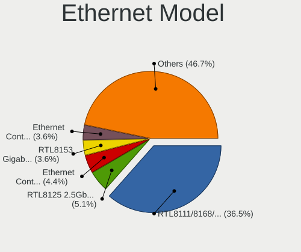

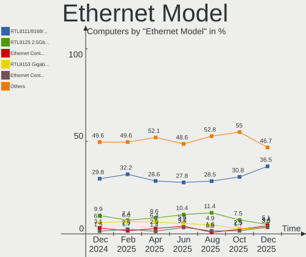

| Model                                                                           | Computers | Percent |
|---------------------------------------------------------------------------------|-----------|---------|
| Realtek RTL8111/8168/8211/8411 PCI Express Gigabit Ethernet Controller          | 50        | 36.5%   |
| Realtek RTL8125 2.5GbE Controller                                               | 7         | 5.11%   |
| Intel Ethernet Controller I225-V                                                | 6         | 4.38%   |
| Realtek RTL8153 Gigabit Ethernet Adapter                                        | 5         | 3.65%   |
| Intel Ethernet Controller I226-V                                                | 5         | 3.65%   |
| Realtek RTL810xE PCI Express Fast Ethernet controller                           | 4         | 2.92%   |
| Intel 82579LM Gigabit Network Connection (Lewisville)                           | 4         | 2.92%   |
| Intel I211 Gigabit Network Connection                                           | 3         | 2.19%   |
| Intel Ethernet Connection (4) I219-LM                                           | 3         | 2.19%   |
| Intel Arrow Lake CNVi WiFi                                                      | 3         | 2.19%   |
| Broadcom NetXtreme BCM57766 Gigabit Ethernet PCIe                               | 3         | 2.19%   |
| Realtek Killer E3000 2.5GbE Controller                                          | 2         | 1.46%   |
| Qualcomm Atheros QCA8171 Gigabit Ethernet                                       | 2         | 1.46%   |
| Intel Ethernet Connection (2) I219-V                                            | 2         | 1.46%   |
| Intel BE201 320MHz                                                              | 2         | 1.46%   |
| ASIX AX88179 Gigabit Ethernet                                                   | 2         | 1.46%   |
| TP-Link USB 10/100 LAN                                                          | 1         | 0.73%   |
| Samsung GT-I9070 (network tethering, USB debugging enabled)                     | 1         | 0.73%   |
| Samsung Galaxy series, misc. (tethering mode)                                   | 1         | 0.73%   |
| Qualcomm WCN785x Wi-Fi 7(802.11be) 320MHz 2x2 [FastConnect 7800]                | 1         | 0.73%   |
| Qualcomm Atheros Killer E2500 Gigabit Ethernet Controller                       | 1         | 0.73%   |
| Qualcomm Atheros AR8151 v2.0 Gigabit Ethernet                                   | 1         | 0.73%   |
| Qualcomm Atheros AR8121/AR8113/AR8114 Gigabit or Fast Ethernet                  | 1         | 0.73%   |
| Motorcomm Microelectronics. YT6801 Gigabit Ethernet Controller                  | 1         | 0.73%   |
| MediaTek MT7925 802.11be 160MHz 2x2 PCIe Wireless Network Adapter [Filogic 360] | 1         | 0.73%   |
| MediaTek MT7922 802.11ax PCI Express Wireless Network Adapter                   | 1         | 0.73%   |
| Marvell Group 88E8040 PCI-E Fast Ethernet Controller                            | 1         | 0.73%   |
| Intel Wi-Fi 7(802.11be) AX1775*/AX1790*/BE20*/BE401/BE1750* 2x2                 | 1         | 0.73%   |
| Intel Ethernet Controller 10-Gigabit X540-AT2                                   | 1         | 0.73%   |
| Intel Ethernet Connection I217-V                                                | 1         | 0.73%   |
| Intel Ethernet Connection I217-LM                                               | 1         | 0.73%   |
| Intel Ethernet Connection (7) I219-LM                                           | 1         | 0.73%   |
| Intel Ethernet Connection (6) I219-LM                                           | 1         | 0.73%   |
| Intel Ethernet Connection (5) I219-V                                            | 1         | 0.73%   |
| Intel Ethernet Connection (5) I219-LM                                           | 1         | 0.73%   |
| Intel Ethernet Connection (24) I219-V                                           | 1         | 0.73%   |
| Intel Ethernet Connection (24) I219-LM                                          | 1         | 0.73%   |
| Intel Ethernet Connection (23) I219-LM                                          | 1         | 0.73%   |
| Intel Ethernet Connection (2) I218-V                                            | 1         | 0.73%   |
| Intel Ethernet Connection (16) I219-V                                           | 1         | 0.73%   |

Net Controller Kind
-------------------

Ethernet, WiFi or modem

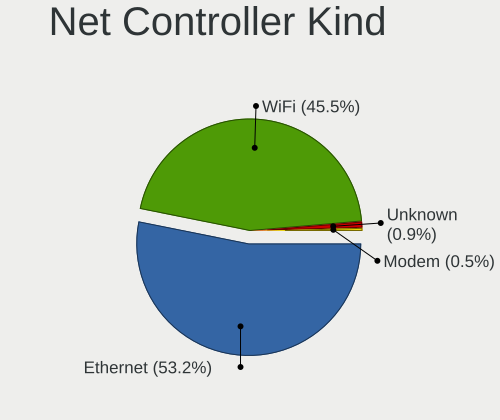

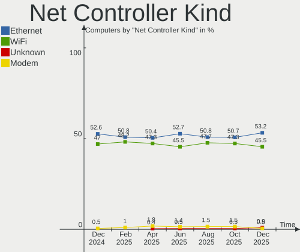

| Kind     | Computers | Percent |
|----------|-----------|---------|
| Ethernet | 118       | 53.15%  |
| WiFi     | 101       | 45.5%   |
| Unknown  | 2         | 0.9%    |
| Modem    | 1         | 0.45%   |

Used Controller
---------------

Currently used network controller

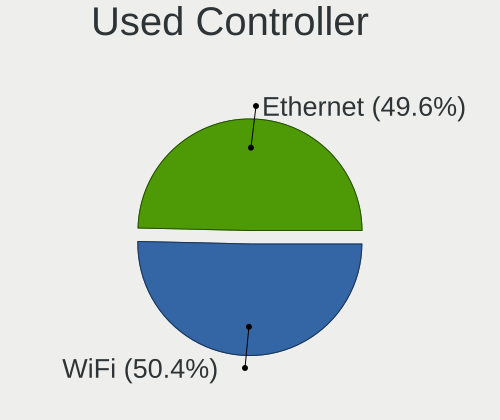

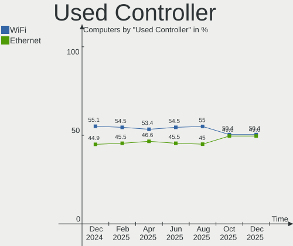

| Kind     | Computers | Percent |
|----------|-----------|---------|
| WiFi     | 70        | 50.36%  |
| Ethernet | 69        | 49.64%  |

NICs
----

Total network controllers on board

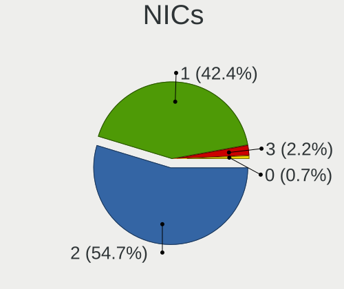

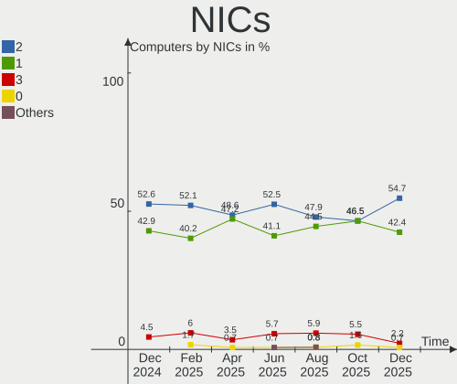

| Total | Computers | Percent |
|-------|-----------|---------|
| 2     | 76        | 54.68%  |
| 1     | 59        | 42.45%  |
| 3     | 3         | 2.16%   |
| 0     | 1         | 0.72%   |

IPv6
----

IPv6 vs IPv4

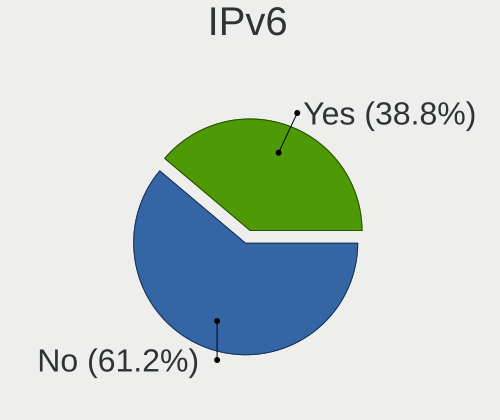

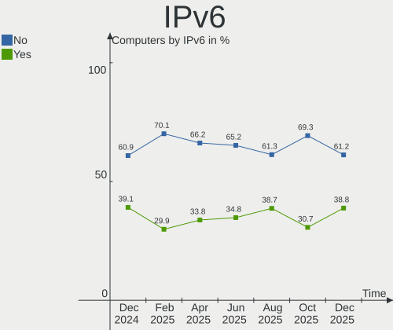

| Used | Computers | Percent |
|------|-----------|---------|
| No   | 85        | 61.15%  |
| Yes  | 54        | 38.85%  |

Bluetooth
---------

Bluetooth Vendor
----------------

Controller vendors

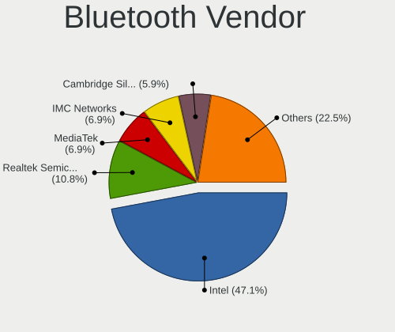

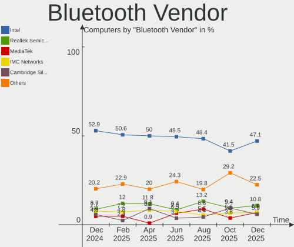

| Vendor                          | Computers | Percent |
|---------------------------------|-----------|---------|
| Intel                           | 48        | 47.06%  |
| Realtek Semiconductor           | 11        | 10.78%  |
| MediaTek                        | 7         | 6.86%   |
| IMC Networks                    | 7         | 6.86%   |
| Cambridge Silicon Radio         | 6         | 5.88%   |
| Foxconn / Hon Hai               | 5         | 4.9%    |
| Broadcom                        | 4         | 3.92%   |
| Apple                           | 4         | 3.92%   |
| Qualcomm Atheros Communications | 3         | 2.94%   |
| USI                             | 2         | 1.96%   |
| Toshiba                         | 1         | 0.98%   |
| Realtek                         | 1         | 0.98%   |
| Hewlett-Packard                 | 1         | 0.98%   |
| ASUSTek Computer                | 1         | 0.98%   |
| Unknown                         | 1         | 0.98%   |

Bluetooth Model
---------------

Controller models

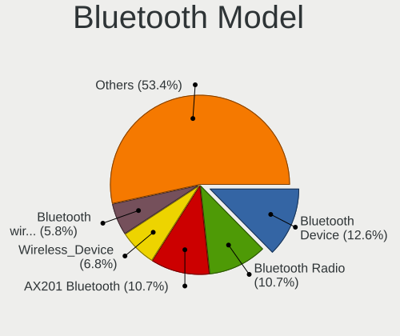

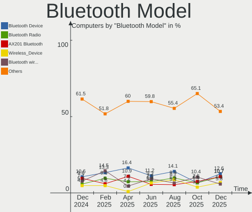

| Model                                               | Computers | Percent |
|-----------------------------------------------------|-----------|---------|
| Intel Bluetooth Device                              | 13        | 12.62%  |
| Realtek Bluetooth Radio                             | 11        | 10.68%  |
| Intel AX201 Bluetooth                               | 11        | 10.68%  |
| MediaTek Wireless_Device                            | 7         | 6.8%    |
| Intel Bluetooth wireless interface                  | 6         | 5.83%   |
| Intel AX210 Bluetooth                               | 6         | 5.83%   |
| Cambridge Silicon Radio Bluetooth Dongle (HCI mode) | 6         | 5.83%   |
| Intel AX200 Bluetooth                               | 4         | 3.88%   |
| IMC Networks Wireless_Device                        | 4         | 3.88%   |
| Intel Wireless-AC 3168 Bluetooth                    | 3         | 2.91%   |
| Foxconn / Hon Hai Wireless_Device                   | 3         | 2.91%   |
| Apple Bluetooth USB Host Controller                 | 3         | 2.91%   |
| USI Bluetooth Device                                | 2         | 1.94%   |
| Intel Wireless-AC 9260 Bluetooth Adapter            | 2         | 1.94%   |
| Intel Bluetooth 9460/9560 Jefferson Peak (JfP)      | 2         | 1.94%   |
| IMC Networks Bluetooth Radio                        | 2         | 1.94%   |
| Toshiba Atheros AR3012 Bluetooth                    | 1         | 0.97%   |
| Realtek Bluetooth 5.3 Radio                         | 1         | 0.97%   |
| Realtek Bluetooth Radio                             | 1         | 0.97%   |
| Qualcomm Atheros  Bluetooth Device                  | 1         | 0.97%   |
| Qualcomm Atheros AR9462 Bluetooth                   | 1         | 0.97%   |
| Qualcomm Atheros AR3012 Bluetooth 4.0               | 1         | 0.97%   |
| Intel Centrino Advanced-N 6230 Bluetooth adapter    | 1         | 0.97%   |
| IMC Networks BCM20702A0                             | 1         | 0.97%   |
| HP Bluetooth 2.0 Interface [Broadcom BCM2045]       | 1         | 0.97%   |
| Foxconn / Hon Hai MediaTek Bluetooth Adapter        | 1         | 0.97%   |
| Foxconn / Hon Hai Bluetooth Device                  | 1         | 0.97%   |
| Broadcom HP Portable SoftSailing                    | 1         | 0.97%   |
| Broadcom BCM920702 Bluetooth 4.0 Zero Touch Dongle  | 1         | 0.97%   |
| Broadcom BCM2070 Bluetooth 2.1 + EDR                | 1         | 0.97%   |
| Broadcom BCM2045B (BDC-2.1)                         | 1         | 0.97%   |
| ASUS Bluetooth Controller                           | 1         | 0.97%   |
| Apple Bluetooth Host Controller                     | 1         | 0.97%   |
| Unknown                                             | 1         | 0.97%   |

Sound
-----

Sound Vendor
------------

Sound card vendors

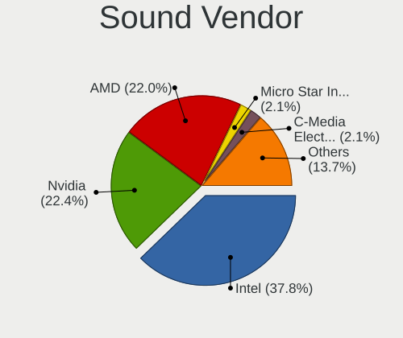

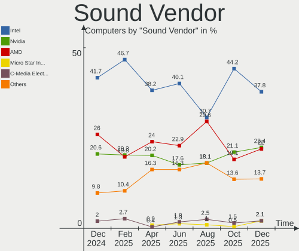

| Vendor                                       | Computers | Percent |
|----------------------------------------------|-----------|---------|
| Intel                                        | 91        | 37.76%  |
| Nvidia                                       | 54        | 22.41%  |
| AMD                                          | 53        | 21.99%  |
| Micro Star International                     | 5         | 2.07%   |
| C-Media Electronics                          | 5         | 2.07%   |
| SteelSeries ApS                              | 4         | 1.66%   |
| Texas Instruments                            | 3         | 1.24%   |
| Logitech                                     | 3         | 1.24%   |
| Apple                                        | 2         | 0.83%   |
| Zoran Co. Personal Media Division (Nogatech) | 1         | 0.41%   |
| Valve Software                               | 1         | 0.41%   |
| Unknown                                      | 1         | 0.41%   |
| Solid State Logic                            | 1         | 0.41%   |
| Sennheiser electronic                        | 1         | 0.41%   |
| RODE Microphones                             | 1         | 0.41%   |
| Realtek Semiconductor                        | 1         | 0.41%   |
| Plantronics                                  | 1         | 0.41%   |
| liyuany                                      | 1         | 0.41%   |
| JMTek                                        | 1         | 0.41%   |
| Jieli Technology                             | 1         | 0.41%   |
| Hewlett-Packard                              | 1         | 0.41%   |
| Generalplus Technology                       | 1         | 0.41%   |
| Focusrite-Novation                           | 1         | 0.41%   |
| FiiO Electronics Technology                  | 1         | 0.41%   |
| Elgato Systems                               | 1         | 0.41%   |
| Creative Technology                          | 1         | 0.41%   |
| beyerdynamic                                 | 1         | 0.41%   |
| ASUSTek Computer                             | 1         | 0.41%   |
| Antlion Audio                                | 1         | 0.41%   |
| Unknown                                      | 1         | 0.41%   |

Sound Model
-----------

Sound card models

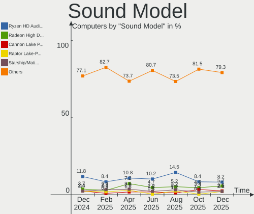

| Model                                                               | Computers | Percent |
|---------------------------------------------------------------------|-----------|---------|
| AMD Ryzen HD Audio Controller                                       | 23        | 8.21%   |
| AMD Radeon High Definition Audio Controller                         | 16        | 5.71%   |
| Intel Cannon Lake PCH cAVS                                          | 7         | 2.5%    |
| Intel Raptor Lake-P/U/H cAVS                                        | 6         | 2.14%   |
| AMD Starship/Matisse HD Audio Controller                            | 6         | 2.14%   |
| Intel Sunrise Point-LP HD Audio                                     | 5         | 1.79%   |
| Intel 8 Series/C220 Series Chipset High Definition Audio Controller | 5         | 1.79%   |
| Intel 7 Series/C216 Chipset Family High Definition Audio Controller | 5         | 1.79%   |
| Intel 200 Series PCH HD Audio                                       | 5         | 1.79%   |
| AMD Renoir/Cezanne HDMI/DP Audio Controller                         | 5         | 1.79%   |
| Nvidia GP107GL High Definition Audio Controller                     | 4         | 1.43%   |
| Nvidia GP106 High Definition Audio Controller                       | 4         | 1.43%   |
| Nvidia GK104 HDMI Audio Controller                                  | 4         | 1.43%   |
| Nvidia AD107 High Definition Audio Controller                       | 4         | 1.43%   |
| Micro Star International USB Audio                                  | 4         | 1.43%   |
| Intel Tiger Lake-LP Smart Sound Technology Audio Controller         | 4         | 1.43%   |
| Intel Raptor Lake High Definition Audio Controller                  | 4         | 1.43%   |
| Intel Arrow Lake cAVS                                               | 4         | 1.43%   |
| Intel Alder Lake-S HD Audio Controller                              | 4         | 1.43%   |
| Intel 100 Series/C230 Series Chipset Family HD Audio Controller     | 4         | 1.43%   |
| AMD SBx00 Azalia (Intel HDA)                                        | 4         | 1.43%   |
| AMD FCH Azalia Controller                                           | 4         | 1.43%   |
| Nvidia TU107 GeForce GTX 1650 High Definition Audio Controller      | 3         | 1.07%   |
| Nvidia TU106 High Definition Audio Controller                       | 3         | 1.07%   |
| Nvidia GA106 High Definition Audio Controller                       | 3         | 1.07%   |
| Intel Tiger Lake-H HD Audio Controller                              | 3         | 1.07%   |
| Intel C600/X79 series chipset High Definition Audio Controller      | 3         | 1.07%   |
| Intel Alder Lake-N PCH High Definition Audio Controller             | 3         | 1.07%   |
| Intel Alder Lake PCH-P High Definition Audio Controller             | 3         | 1.07%   |
| Intel 5 Series/3400 Series Chipset High Definition Audio            | 3         | 1.07%   |
| AMD Raven/Raven2/Fenghuang HDMI/DP Audio Controller                 | 3         | 1.07%   |
| AMD Navi 31 HDMI/DP Audio                                           | 3         | 1.07%   |
| AMD Navi 21/23 HDMI/DP Audio Controller                             | 3         | 1.07%   |
| Nvidia TU104 HD Audio Controller                                    | 2         | 0.71%   |
| Nvidia High Definition Audio Controller                             | 2         | 0.71%   |
| Nvidia GM204 High Definition Audio Controller                       | 2         | 0.71%   |
| Nvidia GK208 HDMI/DP Audio Controller                               | 2         | 0.71%   |
| Nvidia GB203 High Definition Audio Controller                       | 2         | 0.71%   |
| Nvidia GA107 High Definition Audio Controller                       | 2         | 0.71%   |
| Nvidia GA104 High Definition Audio Controller                       | 2         | 0.71%   |

Memory
------

Memory Vendor
-------------

Memory module vendors

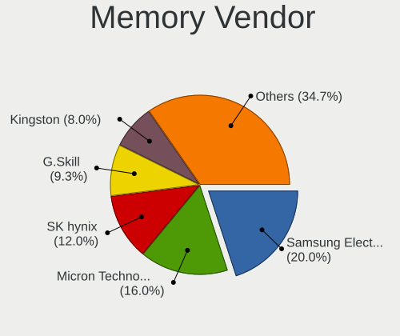

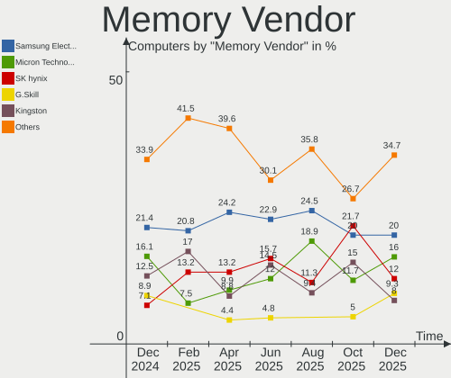

| Vendor              | Computers | Percent |
|---------------------|-----------|---------|
| Samsung Electronics | 15        | 20%     |
| Micron Technology   | 12        | 16%     |
| SK hynix            | 9         | 12%     |
| G.Skill             | 7         | 9.33%   |
| Kingston            | 6         | 8%      |
| Corsair             | 6         | 8%      |
| Unknown             | 4         | 5.33%   |
| Crucial             | 3         | 4%      |
| Unknown             | 3         | 4%      |
| Team                | 2         | 2.67%   |
| Elpida              | 2         | 2.67%   |
| Unknown (0x0C26)    | 1         | 1.33%   |
| Unknown (0x0B5E)    | 1         | 1.33%   |
| Patriot             | 1         | 1.33%   |
| GIGA-BYTE           | 1         | 1.33%   |
| Apacer              | 1         | 1.33%   |
| A-DATA Technology   | 1         | 1.33%   |

Memory Model
------------

Memory module models

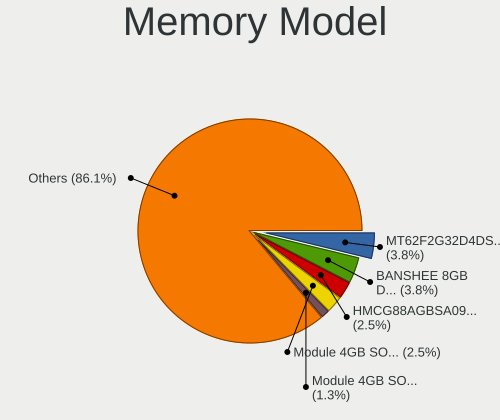

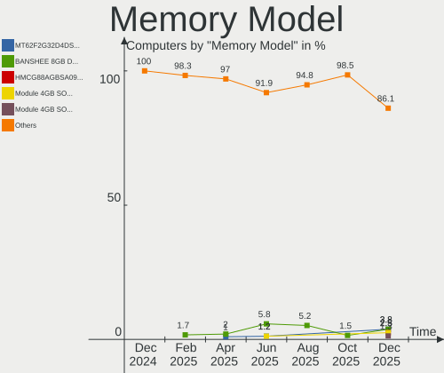

| Model                                                            | Computers | Percent |
|------------------------------------------------------------------|-----------|---------|
| Micron RAM MT62F2G32D4DS-026 WT 8GiB SODIMM LPDDR5 7500MT/s      | 3         | 3.8%    |
| Unknown                                                          | 3         | 3.8%    |
| SK hynix RAM HMCG88AGBSA095N 32GB SODIMM DDR5 5600MT/s           | 2         | 2.53%   |
| Elpida RAM Module 4GB SODIMM DDR3 1600MT/s                       | 2         | 2.53%   |
| Unknown RAM Module 4GB SODIMM DDR3 1600MT/s                      | 1         | 1.27%   |
| Unknown RAM Module 4GB DIMM 1333MT/s                             | 1         | 1.27%   |
| Unknown RAM 3600 C20 Series 32GB DIMM DDR4 3666MT/s              | 1         | 1.27%   |
| Unknown RAM 1600 CL9 Series 8192MB DIMM DDR3 1066MT/s            | 1         | 1.27%   |
| Unknown (0x0C26) RAM TIMETEC-SD4-3200 16GB SODIMM DDR4 3200MT/s  | 1         | 1.27%   |
| Unknown (0x0B5E) RAM HEMA82GS6DJR8N-XN 16GB SODIMM DDR4 3200MT/s | 1         | 1.27%   |
| Team RAM TEAMGROUP-UD4-3200 8GB DIMM DDR4 3800MT/s               | 1         | 1.27%   |
| Team RAM TEAMGROUP-UD4-3200 8GB DIMM DDR4 3733MT/s               | 1         | 1.27%   |
| SK hynix RAM HMT41GS6BFR8A-PB 8GB SODIMM DDR3 2667MT/s           | 1         | 1.27%   |
| SK hynix RAM HMT41GS6AFR8A-PB 8GiB SODIMM DDR3 2667MT/s          | 1         | 1.27%   |
| SK hynix RAM HMT41GS6AFR8A-PB 8GB SODIMM DDR3 1600MT/s           | 1         | 1.27%   |
| SK hynix RAM HMT325S6BFR8C-G7 2048MB SODIMM DDR3 1067MT/s        | 1         | 1.27%   |
| SK hynix RAM HMCG88AHBVA327N 32GB SODIMM DDR5 6400MT/s           | 1         | 1.27%   |
| SK hynix RAM HMCG78AGBSA092N 16GB SODIMM DDR5 5600MT/s           | 1         | 1.27%   |
| SK hynix RAM HMA81GS6AFR8N-UH 8GB SODIMM DDR4 2667MT/s           | 1         | 1.27%   |
| SK hynix RAM H58G66CK8BX147N 8GB Row Of Chips LPDDR5 8000MT/s    | 1         | 1.27%   |
| Samsung RAM M471B5773DH0-CH9 2GB SODIMM DDR3 1600MT/s            | 1         | 1.27%   |
| Samsung RAM M471B5673FH0-CF8 2048MB SODIMM DDR3 1067MT/s         | 1         | 1.27%   |
| Samsung RAM M471B5273DH0-CH9 4GB SODIMM DDR3 1600MT/s            | 1         | 1.27%   |
| Samsung RAM M471A5244CB0-CWE 4GB Row Of Chips DDR4 3200MT/s      | 1         | 1.27%   |
| Samsung RAM M471A2K43EB1-CWE 16GB SODIMM DDR4 3200MT/s           | 1         | 1.27%   |
| Samsung RAM M471A2K43DB1-CWE 16GB SODIMM DDR4 3200MT/s           | 1         | 1.27%   |
| Samsung RAM M471A1K43CB1-CRC 8GB SODIMM DDR4 8400MT/s            | 1         | 1.27%   |
| Samsung RAM M471A1K43BB1-CRC 8GB SODIMM DDR4 2667MT/s            | 1         | 1.27%   |
| Samsung RAM M425R2GA3PB0-CWMOD 16GiB SODIMM DDR5 5600MT/s        | 1         | 1.27%   |
| Samsung RAM M425R2GA3EB0-CWMOL 16GB SODIMM DDR5 5600MT/s         | 1         | 1.27%   |
| Samsung RAM M393B1G70QH0-YK0 8GB DIMM DDR3 1333MT/s              | 1         | 1.27%   |
| Samsung RAM M378A5244CB0-CRC 4GB DIMM DDR4 3066MT/s              | 1         | 1.27%   |
| Samsung RAM K4UBE3D4AA-MGCL 8GB Row Of Chips LPDDR4 4267MT/s     | 1         | 1.27%   |
| Samsung RAM K4E6E304EC-EGCG 4GB Row Of Chips LPDDR3 2133MT/s     | 1         | 1.27%   |
| Samsung RAM K3LKBKB@BM-MGCP 2GB Row Of Chips LPDDR5 6400MT/s     | 1         | 1.27%   |
| Samsung RAM K3LKBKB0BM-MGCP 2GB Row Of Chips LPDDR5 6400MT/s     | 1         | 1.27%   |
| Patriot RAM PSD44G240041 4GB DIMM DDR4 2400MT/s                  | 1         | 1.27%   |
| Micron RAM MTC16C2085S1SC56BD1 32GB SODIMM DDR5 5600MT/s         | 1         | 1.27%   |
| Micron RAM Module 4GB Row Of Chips LPDDR5 8533MT/s               | 1         | 1.27%   |
| Micron RAM CT64G56C46S5.M16B1 64GB SODIMM DDR5 5600MT/s          | 1         | 1.27%   |

Memory Kind
-----------

Memory module kinds

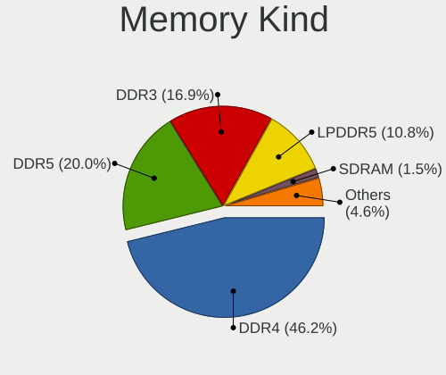

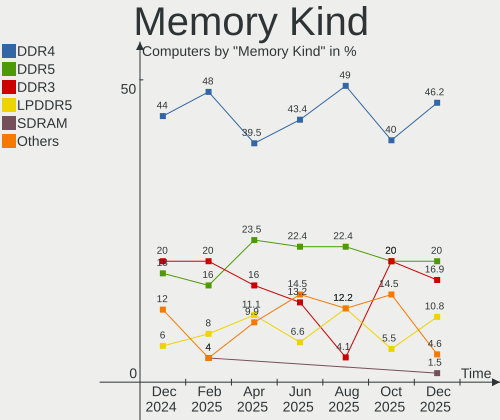

| Kind    | Computers | Percent |
|---------|-----------|---------|
| DDR4    | 30        | 46.15%  |
| DDR5    | 13        | 20%     |
| DDR3    | 11        | 16.92%  |
| LPDDR5  | 7         | 10.77%  |
| SDRAM   | 1         | 1.54%   |
| LPDDR4  | 1         | 1.54%   |
| LPDDR3  | 1         | 1.54%   |
| Unknown | 1         | 1.54%   |

Memory Form Factor
------------------

Physical design of the memory module

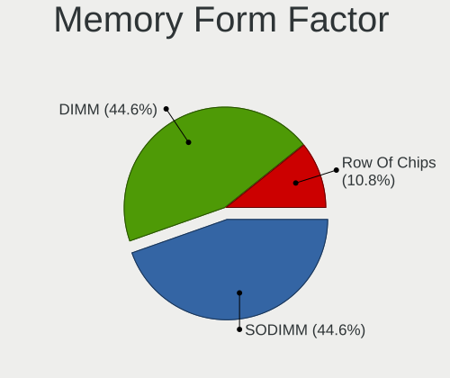

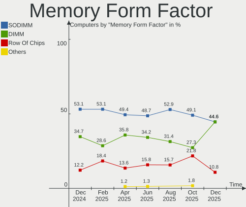

| Name         | Computers | Percent |
|--------------|-----------|---------|
| SODIMM       | 29        | 44.62%  |
| DIMM         | 29        | 44.62%  |
| Row Of Chips | 7         | 10.77%  |

Memory Size
-----------

Memory module size

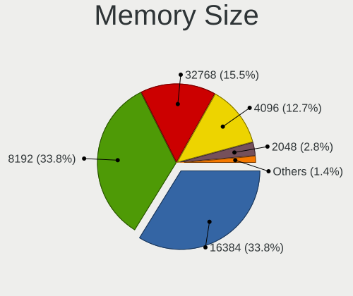

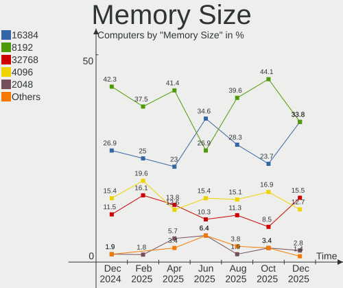

| Size  | Computers | Percent |
|-------|-----------|---------|
| 16384 | 24        | 33.8%   |
| 8192  | 24        | 33.8%   |
| 32768 | 11        | 15.49%  |
| 4096  | 9         | 12.68%  |
| 2048  | 2         | 2.82%   |
| 65536 | 1         | 1.41%   |

Memory Speed
------------

Memory module speed

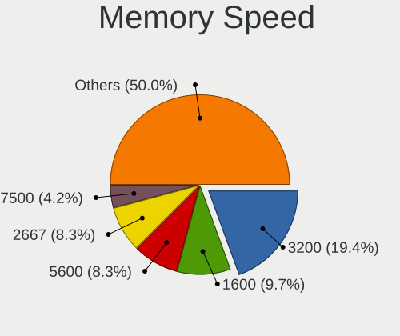

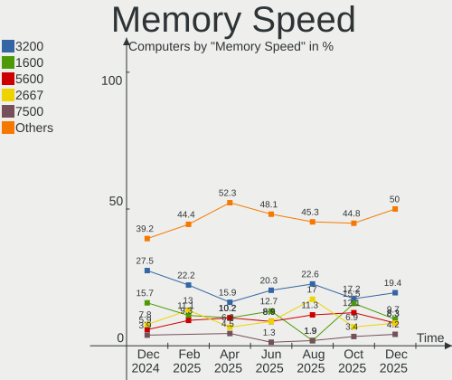

| Speed | Computers | Percent |
|-------|-----------|---------|
| 3200  | 14        | 19.44%  |
| 1600  | 7         | 9.72%   |
| 5600  | 6         | 8.33%   |
| 2667  | 6         | 8.33%   |
| 7500  | 3         | 4.17%   |
| 6400  | 3         | 4.17%   |
| 6000  | 3         | 4.17%   |
| 3600  | 3         | 4.17%   |
| 2133  | 3         | 4.17%   |
| 5200  | 2         | 2.78%   |
| 3800  | 2         | 2.78%   |
| 3733  | 2         | 2.78%   |
| 2400  | 2         | 2.78%   |
| 1333  | 2         | 2.78%   |
| 8533  | 1         | 1.39%   |
| 8400  | 1         | 1.39%   |
| 8000  | 1         | 1.39%   |
| 6200  | 1         | 1.39%   |
| 4800  | 1         | 1.39%   |
| 4267  | 1         | 1.39%   |
| 3866  | 1         | 1.39%   |
| 3666  | 1         | 1.39%   |
| 3400  | 1         | 1.39%   |
| 3066  | 1         | 1.39%   |
| 2666  | 1         | 1.39%   |
| 1866  | 1         | 1.39%   |
| 1639  | 1         | 1.39%   |
| 1067  | 1         | 1.39%   |

Printers & scanners
-------------------

Printer Vendor
--------------

Printer device vendors

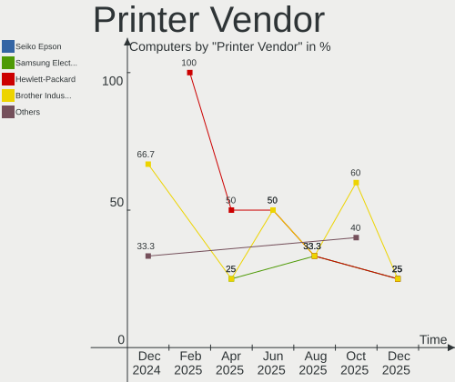

| Vendor              | Computers | Percent |
|---------------------|-----------|---------|
| Seiko Epson         | 1         | 25%     |
| Samsung Electronics | 1         | 25%     |
| Hewlett-Packard     | 1         | 25%     |
| Brother Industries  | 1         | 25%     |

Printer Model
-------------

Printer device models

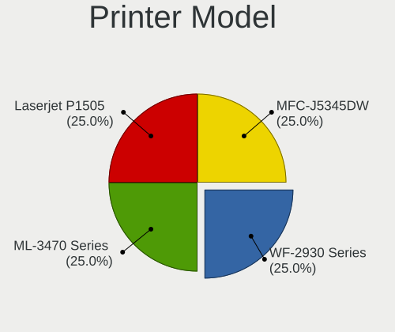

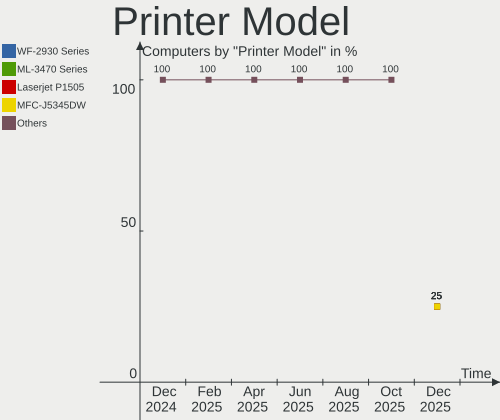

| Model                      | Computers | Percent |
|----------------------------|-----------|---------|
| Seiko Epson WF-2930 Series | 1         | 25%     |
| Samsung ML-3470 Series     | 1         | 25%     |
| HP Laserjet P1505          | 1         | 25%     |
| Brother MFC-J5345DW        | 1         | 25%     |

Scanner Vendor
--------------

Scanner device vendors

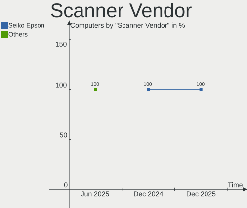

| Vendor      | Computers | Percent |
|-------------|-----------|---------|
| Seiko Epson | 1         | 100%    |

Scanner Model
-------------

Scanner device models

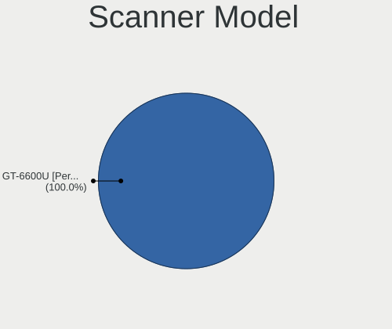

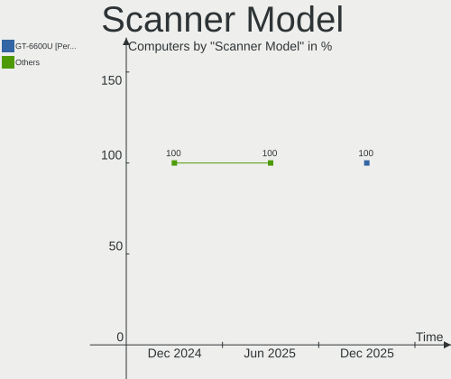

| Model                                 | Computers | Percent |
|---------------------------------------|-----------|---------|
| Seiko Epson GT-6600U [Perfection 610] | 1         | 100%    |

Camera
------

Camera Vendor
-------------

Camera device vendors

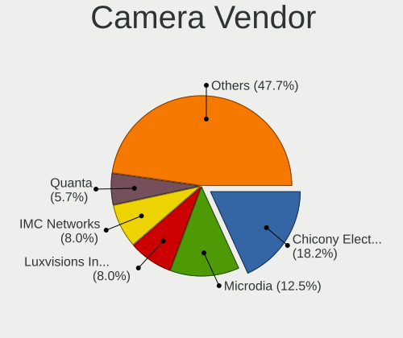

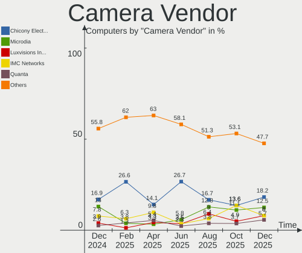

| Vendor                                 | Computers | Percent |
|----------------------------------------|-----------|---------|
| Chicony Electronics                    | 16        | 18.18%  |
| Microdia                               | 11        | 12.5%   |
| Luxvisions Innotech Limited            | 7         | 7.95%   |
| IMC Networks                           | 7         | 7.95%   |
| Quanta                                 | 5         | 5.68%   |
| Logitech                               | 5         | 5.68%   |
| Realtek Semiconductor                  | 4         | 4.55%   |
| Bison Electronics                      | 4         | 4.55%   |
| Apple                                  | 4         | 4.55%   |
| Sunplus Innovation Technology          | 3         | 3.41%   |
| Syntek                                 | 2         | 2.27%   |
| Foxlink                                | 2         | 2.27%   |
| DigiTech                               | 2         | 2.27%   |
| Valve Software                         | 1         | 1.14%   |
| ValueHD                                | 1         | 1.14%   |
| Trust                                  | 1         | 1.14%   |
| SunplusIT                              | 1         | 1.14%   |
| Shinetech                              | 1         | 1.14%   |
| Ruision                                | 1         | 1.14%   |
| Pixart Imaging                         | 1         | 1.14%   |
| MacroSilicon                           | 1         | 1.14%   |
| Lenovo                                 | 1         | 1.14%   |
| kingcome                               | 1         | 1.14%   |
| Insta360                               | 1         | 1.14%   |
| Huawei Technologies                    | 1         | 1.14%   |
| Generalplus Technology                 | 1         | 1.14%   |
| Cheng Uei Precision Industry (Foxlink) | 1         | 1.14%   |
| ARC International                      | 1         | 1.14%   |
| Anker PowerConf C200                   | 1         | 1.14%   |

Camera Model
------------

Camera device models

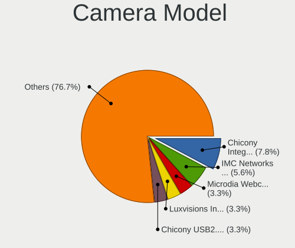

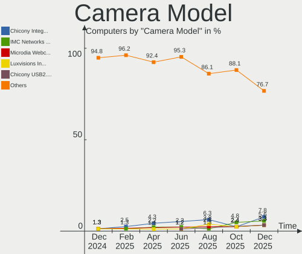

| Model                                                | Computers | Percent |
|------------------------------------------------------|-----------|---------|
| Chicony Integrated Camera                            | 7         | 7.78%   |
| IMC Networks Integrated Camera                       | 5         | 5.56%   |
| Microdia Webcam Vitade AF                            | 3         | 3.33%   |
| Luxvisions Innotech Limited Integrated Camera        | 3         | 3.33%   |
| Chicony USB2.0 HD UVC WebCam                         | 3         | 3.33%   |
| Syntek Integrated Camera                             | 2         | 2.22%   |
| Quanta HD User Facing                                | 2         | 2.22%   |
| Microdia Integrated_Webcam_HD                        | 2         | 2.22%   |
| Microdia Integrated_Webcam_FHD                       | 2         | 2.22%   |
| Foxlink HP True Vision FHD Camera                    | 2         | 2.22%   |
| Chicony Integrated IR Camera                         | 2         | 2.22%   |
| Apple FaceTime HD Camera (Built-in)                  | 2         | 2.22%   |
| Valve Software 3D Camera                             | 1         | 1.11%   |
| ValueHD Rocware RC28                                 | 1         | 1.11%   |
| Trust USB Camera                                     | 1         | 1.11%   |
| SunplusIT 1080p FHD Camera                           | 1         | 1.11%   |
| Sunplus Integrated_Webcam_HD                         | 1         | 1.11%   |
| Sunplus HP TrueVision HD Camera                      | 1         | 1.11%   |
| Sunplus Dell HD Webcam                               | 1         | 1.11%   |
| Shinetech ASUS FHD webcam                            | 1         | 1.11%   |
| Ruision UVC Camera                                   | 1         | 1.11%   |
| Realtek USB Video device                             | 1         | 1.11%   |
| Realtek Integrated_Webcam_HD                         | 1         | 1.11%   |
| Realtek Integrated Webcam HD                         | 1         | 1.11%   |
| Realtek HP Truevision HD                             | 1         | 1.11%   |
| Quanta HP Wide Vision HD Camera                      | 1         | 1.11%   |
| Quanta ACER HD User Facing                           | 1         | 1.11%   |
| Quanta Acer FHD User Facing                          | 1         | 1.11%   |
| Pixart Imaging GE 1.3 MP MiniCam Pro                 | 1         | 1.11%   |
| Microdia USB 2.0 Camera                              | 1         | 1.11%   |
| Microdia Laptop_Integrated_Webcam_HD                 | 1         | 1.11%   |
| Microdia HP Webcam                                   | 1         | 1.11%   |
| Microdia CyberTrack H7                               | 1         | 1.11%   |
| MacroSilicon USB Video                               | 1         | 1.11%   |
| Luxvisions Innotech Limited Integrated RGB Camera    | 1         | 1.11%   |
| Luxvisions Innotech Limited HP Wide Vision HD Camera | 1         | 1.11%   |
| Luxvisions Innotech Limited HP TrueVision HD Camera  | 1         | 1.11%   |
| Luxvisions Innotech Limited HP True Vision HD Camera | 1         | 1.11%   |
| Logitech Webcam C930e                                | 1         | 1.11%   |
| Logitech Webcam C270                                 | 1         | 1.11%   |

Security
--------

Fingerprint Vendor
------------------

Fingerprint sensor vendors

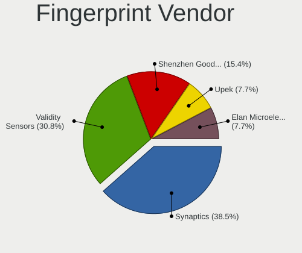

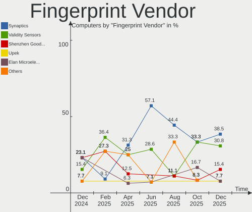

| Vendor                     | Computers | Percent |
|----------------------------|-----------|---------|
| Synaptics                  | 5         | 38.46%  |
| Validity Sensors           | 4         | 30.77%  |
| Shenzhen Goodix Technology | 2         | 15.38%  |
| Upek                       | 1         | 7.69%   |
| Elan Microelectronics      | 1         | 7.69%   |

Fingerprint Model
-----------------

Fingerprint sensor models

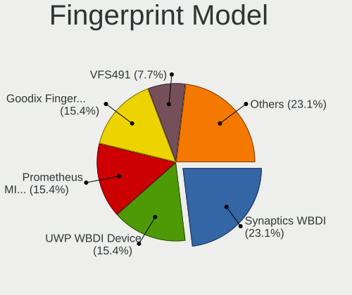

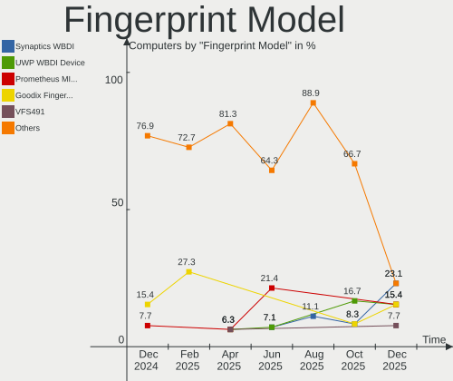

| Model                                                  | Computers | Percent |
|--------------------------------------------------------|-----------|---------|
| Validity Sensors Synaptics WBDI                        | 3         | 23.08%  |
| Synaptics UWP WBDI Device                              | 2         | 15.38%  |
| Synaptics Prometheus MIS Touch Fingerprint Reader      | 2         | 15.38%  |
| Shenzhen Goodix  Fingerprint Device                    | 2         | 15.38%  |
| Validity Sensors VFS491                                | 1         | 7.69%   |
| Upek Biometric Touchchip/Touchstrip Fingerprint Sensor | 1         | 7.69%   |
| Synaptics Metallica MIS Touch Fingerprint Reader       | 1         | 7.69%   |
| Elan ELAN:ARM-M4                                       | 1         | 7.69%   |

Chipcard Vendor
---------------

Chipcard module vendors

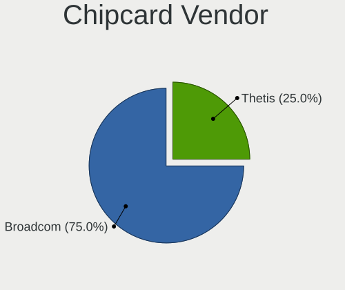

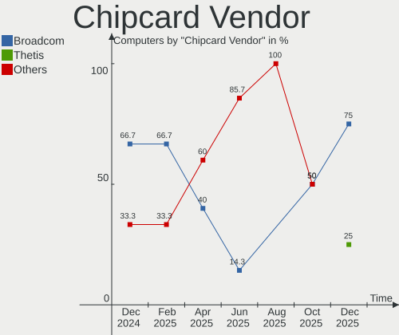

| Vendor   | Computers | Percent |
|----------|-----------|---------|
| Broadcom | 3         | 75%     |
| Thetis   | 1         | 25%     |

Chipcard Model
--------------

Chipcard module models

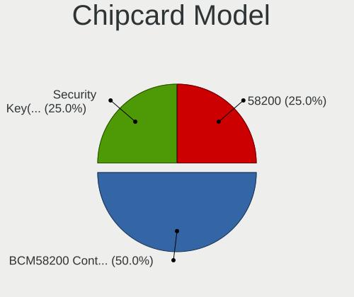

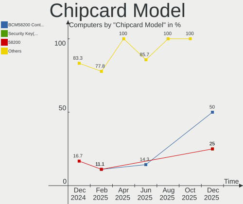

| Model                                                                       | Computers | Percent |
|-----------------------------------------------------------------------------|-----------|---------|
| Broadcom BCM58200 ControlVault 3 (FingerPrint sensor + Contacted SmartCard) | 2         | 50%     |
| Thetis Security Key(F825)                                                   | 1         | 25%     |
| Broadcom 58200                                                              | 1         | 25%     |

Unsupported
-----------

Unsupported Devices
-------------------

Total unsupported devices on board

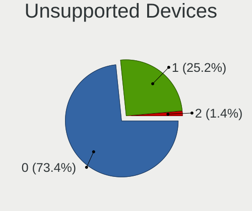

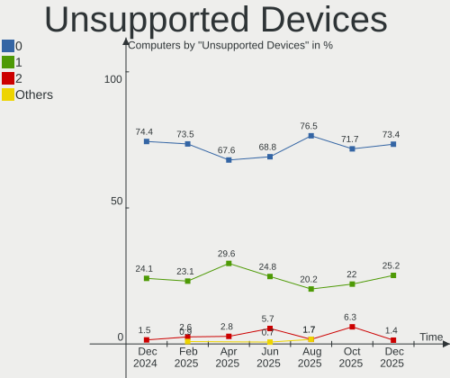

| Total | Computers | Percent |
|-------|-----------|---------|
| 0     | 102       | 73.38%  |
| 1     | 35        | 25.18%  |
| 2     | 2         | 1.44%   |

Unsupported Device Types
------------------------

Types of unsupported devices

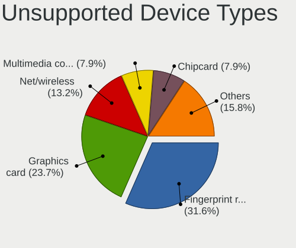

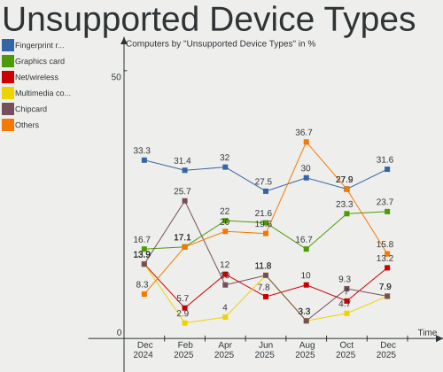

| Type                     | Computers | Percent |
|--------------------------|-----------|---------|
| Fingerprint reader       | 12        | 31.58%  |
| Graphics card            | 9         | 23.68%  |
| Net/wireless             | 5         | 13.16%  |
| Multimedia controller    | 3         | 7.89%   |
| Chipcard                 | 3         | 7.89%   |
| Network                  | 2         | 5.26%   |
| Communication controller | 2         | 5.26%   |
| Unassigned class         | 1         | 2.63%   |
| Storage/ide              | 1         | 2.63%   |

