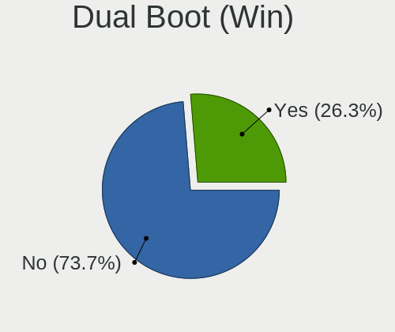
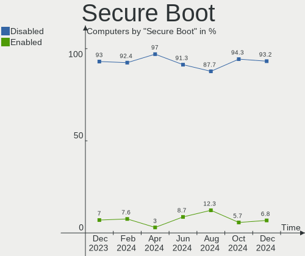
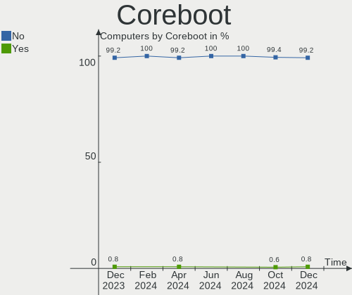
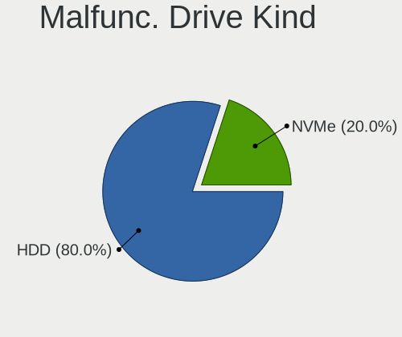
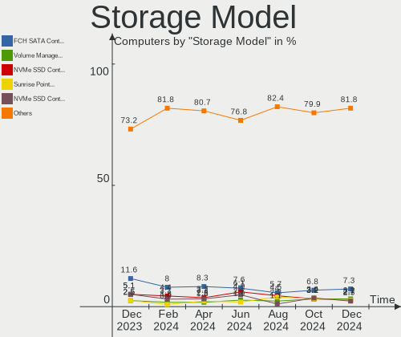
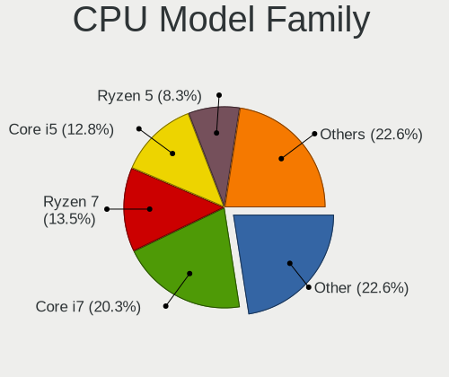
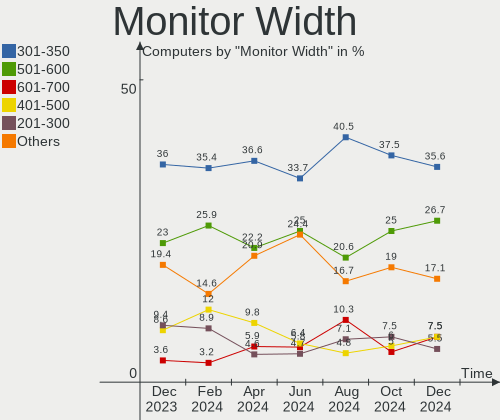

Kubuntu - Hardware Trends
-------------------------

A project to identify most popular hardware characteristics and track their change
over time based on data collected by Linux users at https://Linux-Hardware.org.

Anyone can contribute to this report by the [hw-probe](https://github.com/linuxhw/hw-probe) tool:

    sudo -E hw-probe -all -upload

This is a report for all computer types. See also reports for [desktops](/Dist/Kubuntu/Desktop/README.md) and [notebooks](/Dist/Kubuntu/Notebook/README.md).

This report is for one last month. Overall report since the beginning of time: [TestCoverage](https://github.com/linuxhw/TestCoverage)

Period: Jul, 2022.

Contents
--------

* [ System ](#system)
  - [ OS                       ](#os)
  - [ OS Family                ](#os-family)
  - [ Kernel                   ](#kernel)
  - [ Kernel Family            ](#kernel-family)
  - [ Kernel Major Ver.        ](#kernel-major-ver)
  - [ Arch                     ](#arch)
  - [ DE                       ](#de)
  - [ Display Server           ](#display-server)
  - [ Display Manager          ](#display-manager)
  - [ OS Lang                  ](#os-lang)
  - [ Boot Mode                ](#boot-mode)
  - [ Filesystem               ](#filesystem)
  - [ Part. scheme             ](#part-scheme)
  - [ Dual Boot with Linux/BSD ](#dual-boot-with-linuxbsd)
  - [ Dual Boot (Win)          ](#dual-boot-win)

* [ Board ](#board)
  - [ Vendor                   ](#vendor)
  - [ Model                    ](#model)
  - [ Model Family             ](#model-family)
  - [ MFG Year                 ](#mfg-year)
  - [ Form Factor              ](#form-factor)
  - [ Secure Boot              ](#secure-boot)
  - [ Coreboot                 ](#coreboot)
  - [ RAM Size                 ](#ram-size)
  - [ RAM Used                 ](#ram-used)
  - [ Total Drives             ](#total-drives)
  - [ Has CD-ROM               ](#has-cd-rom)
  - [ Has Ethernet             ](#has-ethernet)
  - [ Has WiFi                 ](#has-wifi)
  - [ Has Bluetooth            ](#has-bluetooth)

* [ Location ](#location)
  - [ Country                  ](#country)
  - [ City                     ](#city)

* [ Drives ](#drives)
  - [ Drive Vendor             ](#drive-vendor)
  - [ Drive Model              ](#drive-model)
  - [ HDD Vendor               ](#hdd-vendor)
  - [ SSD Vendor               ](#ssd-vendor)
  - [ Drive Kind               ](#drive-kind)
  - [ Drive Connector          ](#drive-connector)
  - [ Drive Size               ](#drive-size)
  - [ Space Total              ](#space-total)
  - [ Space Used               ](#space-used)
  - [ Malfunc. Drives          ](#malfunc-drives)
  - [ Malfunc. Drive Vendor    ](#malfunc-drive-vendor)
  - [ Malfunc. HDD Vendor      ](#malfunc-hdd-vendor)
  - [ Malfunc. Drive Kind      ](#malfunc-drive-kind)
  - [ Failed Drives            ](#failed-drives)
  - [ Failed Drive Vendor      ](#failed-drive-vendor)
  - [ Drive Status             ](#drive-status)

* [ Storage controller ](#storage-controller)
  - [ Storage Vendor           ](#storage-vendor)
  - [ Storage Model            ](#storage-model)
  - [ Storage Kind             ](#storage-kind)

* [ Processor ](#processor)
  - [ CPU Vendor               ](#cpu-vendor)
  - [ CPU Model                ](#cpu-model)
  - [ CPU Model Family         ](#cpu-model-family)
  - [ CPU Cores                ](#cpu-cores)
  - [ CPU Sockets              ](#cpu-sockets)
  - [ CPU Threads              ](#cpu-threads)
  - [ CPU Op-Modes             ](#cpu-op-modes)
  - [ CPU Microcode            ](#cpu-microcode)
  - [ CPU Microarch            ](#cpu-microarch)

* [ Graphics ](#graphics)
  - [ GPU Vendor               ](#gpu-vendor)
  - [ GPU Model                ](#gpu-model)
  - [ GPU Combo                ](#gpu-combo)
  - [ GPU Driver               ](#gpu-driver)
  - [ GPU Memory               ](#gpu-memory)

* [ Monitor ](#monitor)
  - [ Monitor Vendor           ](#monitor-vendor)
  - [ Monitor Model            ](#monitor-model)
  - [ Monitor Resolution       ](#monitor-resolution)
  - [ Monitor Diagonal         ](#monitor-diagonal)
  - [ Monitor Width            ](#monitor-width)
  - [ Aspect Ratio             ](#aspect-ratio)
  - [ Monitor Area             ](#monitor-area)
  - [ Pixel Density            ](#pixel-density)
  - [ Multiple Monitors        ](#multiple-monitors)

* [ Network ](#network)
  - [ Net Controller Vendor    ](#net-controller-vendor)
  - [ Net Controller Model     ](#net-controller-model)
  - [ Wireless Vendor          ](#wireless-vendor)
  - [ Wireless Model           ](#wireless-model)
  - [ Ethernet Vendor          ](#ethernet-vendor)
  - [ Ethernet Model           ](#ethernet-model)
  - [ Net Controller Kind      ](#net-controller-kind)
  - [ Used Controller          ](#used-controller)
  - [ NICs                     ](#nics)
  - [ IPv6                     ](#ipv6)

* [ Bluetooth ](#bluetooth)
  - [ Bluetooth Vendor         ](#bluetooth-vendor)
  - [ Bluetooth Model          ](#bluetooth-model)

* [ Sound ](#sound)
  - [ Sound Vendor             ](#sound-vendor)
  - [ Sound Model              ](#sound-model)

* [ Memory ](#memory)
  - [ Memory Vendor            ](#memory-vendor)
  - [ Memory Model             ](#memory-model)
  - [ Memory Kind              ](#memory-kind)
  - [ Memory Form Factor       ](#memory-form-factor)
  - [ Memory Size              ](#memory-size)
  - [ Memory Speed             ](#memory-speed)

* [ Printers & scanners ](#printers--scanners)
  - [ Printer Vendor           ](#printer-vendor)
  - [ Printer Model            ](#printer-model)
  - [ Scanner Vendor           ](#scanner-vendor)
  - [ Scanner Model            ](#scanner-model)

* [ Camera ](#camera)
  - [ Camera Vendor            ](#camera-vendor)
  - [ Camera Model             ](#camera-model)

* [ Security ](#security)
  - [ Fingerprint Vendor       ](#fingerprint-vendor)
  - [ Fingerprint Model        ](#fingerprint-model)
  - [ Chipcard Vendor          ](#chipcard-vendor)
  - [ Chipcard Model           ](#chipcard-model)

* [ Unsupported ](#unsupported)
  - [ Unsupported Devices      ](#unsupported-devices)
  - [ Unsupported Device Types ](#unsupported-device-types)

System
------

OS
--

Installed operating systems

| Name          | Computers | Percent |
|---------------|-----------|---------|
| Kubuntu 22.04 | 51        | 61.45%  |
| Kubuntu 20.04 | 18        | 21.69%  |
| Kubuntu 11.1  | 8         | 9.64%   |
| Kubuntu 21.10 | 3         | 3.61%   |
| Kubuntu 22.10 | 1         | 1.2%    |
| Kubuntu 21.04 | 1         | 1.2%    |
| Kubuntu 18.04 | 1         | 1.2%    |

OS Family
---------

OS without a version

| Name    | Computers | Percent |
|---------|-----------|---------|
| Kubuntu | 83        | 100%    |

Kernel
------

Version of the Linux kernel

| Version                | Computers | Percent |
|------------------------|-----------|---------|
| 5.15.0-41-generic      | 34        | 40.96%  |
| 5.13.0-52-generic      | 13        | 15.66%  |
| 5.15.0-40-generic      | 11        | 13.25%  |
| 5.4.0-122-generic      | 4         | 4.82%   |
| 5.18.10-051810-generic | 2         | 2.41%   |
| 5.15.0-43-generic      | 2         | 2.41%   |
| 5.15.0-25-generic      | 2         | 2.41%   |
| 5.8.0-43-generic       | 1         | 1.2%    |
| 5.4.0-70-generic       | 1         | 1.2%    |
| 5.4.0-60-lowlatency    | 1         | 1.2%    |
| 5.4.0-121-generic      | 1         | 1.2%    |
| 5.18.6-051806-generic  | 1         | 1.2%    |
| 5.18.12-051812-generic | 1         | 1.2%    |
| 5.18.11-xanmod1        | 1         | 1.2%    |
| 5.17.6-051706-generic  | 1         | 1.2%    |
| 5.15.0-43-lowlatency   | 1         | 1.2%    |
| 5.15.0-41-lowlatency   | 1         | 1.2%    |
| 5.15.0-39-generic      | 1         | 1.2%    |
| 5.15.0-27-generic      | 1         | 1.2%    |
| 5.15.0-10037-tuxedo    | 1         | 1.2%    |
| 5.13.0-44-generic      | 1         | 1.2%    |
| 5.11.0-49-generic      | 1         | 1.2%    |

Kernel Family
-------------

Linux kernel without a distro release

| Version | Computers | Percent |
|---------|-----------|---------|
| 5.15.0  | 54        | 65.06%  |
| 5.13.0  | 14        | 16.87%  |
| 5.4.0   | 7         | 8.43%   |
| 5.18.10 | 2         | 2.41%   |
| 5.8.0   | 1         | 1.2%    |
| 5.18.6  | 1         | 1.2%    |
| 5.18.12 | 1         | 1.2%    |
| 5.18.11 | 1         | 1.2%    |
| 5.17.6  | 1         | 1.2%    |
| 5.11.0  | 1         | 1.2%    |

Kernel Major Ver.
-----------------

Linux kernel major version

| Version | Computers | Percent |
|---------|-----------|---------|
| 5.15    | 54        | 65.06%  |
| 5.13    | 14        | 16.87%  |
| 5.4     | 7         | 8.43%   |
| 5.18    | 5         | 6.02%   |
| 5.8     | 1         | 1.2%    |
| 5.17    | 1         | 1.2%    |
| 5.11    | 1         | 1.2%    |

Arch
----

OS architecture (x86_64, i586, etc.)

| Name   | Computers | Percent |
|--------|-----------|---------|
| x86_64 | 83        | 100%    |

DE
--

Desktop Environment

| Name     | Computers | Percent |
|----------|-----------|---------|
| KDE5     | 78        | 93.98%  |
| MATE     | 1         | 1.2%    |
| KDE      | 1         | 1.2%    |
| GNUstep  | 1         | 1.2%    |
| GNOME    | 1         | 1.2%    |
| Cinnamon | 1         | 1.2%    |

Display Server
--------------

X11 or Wayland

| Name    | Computers | Percent |
|---------|-----------|---------|
| X11     | 80        | 96.39%  |
| Wayland | 2         | 2.41%   |
| Tty     | 1         | 1.2%    |

Display Manager
---------------

SDDM, LightDM, etc.

| Name    | Computers | Percent |
|---------|-----------|---------|
| SDDM    | 53        | 63.86%  |
| Unknown | 20        | 24.1%   |
| GDM3    | 5         | 6.02%   |
| LightDM | 2         | 2.41%   |
| GDM     | 2         | 2.41%   |
| LXDM    | 1         | 1.2%    |

OS Lang
-------

Language

| Lang  | Computers | Percent |
|-------|-----------|---------|
| en_US | 39        | 46.99%  |
| de_DE | 8         | 9.64%   |
| fr_FR | 7         | 8.43%   |
| en_GB | 4         | 4.82%   |
| ru_RU | 3         | 3.61%   |
| it_IT | 3         | 3.61%   |
| pl_PL | 2         | 2.41%   |
| nl_NL | 2         | 2.41%   |
| es_ES | 2         | 2.41%   |
| en_IN | 2         | 2.41%   |
| C     | 2         | 2.41%   |
| pt_BR | 1         | 1.2%    |
| nl_BE | 1         | 1.2%    |
| fr_BE | 1         | 1.2%    |
| es_MX | 1         | 1.2%    |
| en_ZA | 1         | 1.2%    |
| en_SG | 1         | 1.2%    |
| en_PH | 1         | 1.2%    |
| en_CA | 1         | 1.2%    |
| cs_CZ | 1         | 1.2%    |

Boot Mode
---------

EFI or BIOS

| Mode | Computers | Percent |
|------|-----------|---------|
| EFI  | 44        | 53.01%  |
| BIOS | 39        | 46.99%  |

Filesystem
----------

Type of filesystem

| Type    | Computers | Percent |
|---------|-----------|---------|
| Ext4    | 74        | 89.16%  |
| Overlay | 4         | 4.82%   |
| Btrfs   | 3         | 3.61%   |
| Xfs     | 2         | 2.41%   |

Part. scheme
------------

Scheme of partitioning

| Type    | Computers | Percent |
|---------|-----------|---------|
| GPT     | 42        | 50.6%   |
| Unknown | 33        | 39.76%  |
| MBR     | 8         | 9.64%   |

Dual Boot with Linux/BSD
------------------------

Hosting more than one Linux/BSD

| Dual boot | Computers | Percent |
|-----------|-----------|---------|
| No        | 73        | 87.95%  |
| Yes       | 10        | 12.05%  |

Dual Boot (Win)
---------------

Hosting Linux and Windows

| Dual boot | Computers | Percent |
|-----------|-----------|---------|
| No        | 48        | 57.83%  |
| Yes       | 35        | 42.17%  |

Board
-----

Vendor
------

Motherboard manufacturer

| Name                | Computers | Percent |
|---------------------|-----------|---------|
| Hewlett-Packard     | 18        | 21.69%  |
| Lenovo              | 17        | 20.48%  |
| ASUSTek Computer    | 12        | 14.46%  |
| Gigabyte Technology | 7         | 8.43%   |
| Dell                | 7         | 8.43%   |
| ASRock              | 6         | 7.23%   |
| MSI                 | 2         | 2.41%   |
| Acer                | 2         | 2.41%   |
| TUXEDO              | 1         | 1.2%    |
| Toshiba             | 1         | 1.2%    |
| System76            | 1         | 1.2%    |
| Standard            | 1         | 1.2%    |
| Sony                | 1         | 1.2%    |
| Shuttle             | 1         | 1.2%    |
| Schenker            | 1         | 1.2%    |
| HUAWEI              | 1         | 1.2%    |
| HONOR               | 1         | 1.2%    |
| Fujitsu             | 1         | 1.2%    |
| Chuwi               | 1         | 1.2%    |
| Unknown             | 1         | 1.2%    |

Model
-----

Motherboard model

| Name                                     | Computers | Percent |
|------------------------------------------|-----------|---------|
| Gigabyte Z77-D3H                         | 2         | 2.41%   |
| ASUS All Series                          | 2         | 2.41%   |
| Unknown                                  | 2         | 2.41%   |
| TUXEDO Stellaris AMD Gen3 (CZN)          | 1         | 1.2%    |
| Toshiba TECRA S11                        | 1         | 1.2%    |
| System76 Lemur Ultra                     | 1         | 1.2%    |
| Sony VPCSA3M9E                           | 1         | 1.2%    |
| Shuttle NC01U                            | 1         | 1.2%    |
| Schenker XMG APEX (Mid 2021)             | 1         | 1.2%    |
| MSI MS-7C37                              | 1         | 1.2%    |
| MSI MS-7A21                              | 1         | 1.2%    |
| Lenovo Yoga C640-13IML 81UE              | 1         | 1.2%    |
| Lenovo ThinkPad X200 7458FDG             | 1         | 1.2%    |
| Lenovo ThinkPad X1 Nano Gen 1 20UN002VUK | 1         | 1.2%    |
| Lenovo ThinkPad T450 20BV0001US          | 1         | 1.2%    |
| Lenovo ThinkPad T420 4180M8P             | 1         | 1.2%    |
| Lenovo ThinkPad E570 20H5006TFR          | 1         | 1.2%    |
| Lenovo ThinkPad E14 Gen 3 20Y70093US     | 1         | 1.2%    |
| Lenovo ThinkPad E14 Gen 2 20TA000CIX     | 1         | 1.2%    |
| Lenovo ThinkBook 16p Gen 2 20YM          | 1         | 1.2%    |
| Lenovo Legion Y540-17IRH 81Q4            | 1         | 1.2%    |
| Lenovo Legion 5 Pro 16ACH6H 82JQ         | 1         | 1.2%    |
| Lenovo IdeaPad Y430 2781                 | 1         | 1.2%    |
| Lenovo IdeaPad 5 15ARE05 81YQ            | 1         | 1.2%    |
| Lenovo IdeaPad 5 15ALC05 82LN            | 1         | 1.2%    |
| Lenovo G570 20079                        | 1         | 1.2%    |
| Lenovo G50-45 80E3                       | 1         | 1.2%    |
| Lenovo 1051L 60073                       | 1         | 1.2%    |
| HUAWEI CREM-WXX9                         | 1         | 1.2%    |
| HONOR HYM-WXX                            | 1         | 1.2%    |
| HP Z620 Workstation                      | 1         | 1.2%    |
| HP Z220 CMT Workstation                  | 1         | 1.2%    |
| HP Z2 Mini G5 Workstation                | 1         | 1.2%    |
| HP Slim Desktop 290-a0xxx                | 1         | 1.2%    |
| HP ProDesk 400 G1 SFF                    | 1         | 1.2%    |
| HP Laptop 17-cn0xxx                      | 1         | 1.2%    |
| HP Laptop 15s-eq1xxx                     | 1         | 1.2%    |
| HP G62                                   | 1         | 1.2%    |
| HP G42                                   | 1         | 1.2%    |
| HP EliteDesk 800 G2 SFF                  | 1         | 1.2%    |
| HP EliteBook x360 1030 G2                | 1         | 1.2%    |
| HP EliteBook 850 G8 Notebook PC          | 1         | 1.2%    |
| HP EliteBook 8470p                       | 1         | 1.2%    |
| HP EliteBook 840 G6                      | 1         | 1.2%    |
| HP EliteBook 840 G5                      | 1         | 1.2%    |
| HP EliteBook 840 G1                      | 1         | 1.2%    |
| HP 620                                   | 1         | 1.2%    |
| HP 280 Pro G5 MT Business PC             | 1         | 1.2%    |
| Gigabyte Z390 GAMING X                   | 1         | 1.2%    |
| Gigabyte X399 AORUS XTREME               | 1         | 1.2%    |
| Gigabyte P35-DS3L                        | 1         | 1.2%    |
| Gigabyte A320M-S2H                       | 1         | 1.2%    |
| Gigabyte 970A-DS3P                       | 1         | 1.2%    |
| Fujitsu ESPRIMO P557                     | 1         | 1.2%    |
| Dell Precision T1600                     | 1         | 1.2%    |
| Dell OptiPlex GX620                      | 1         | 1.2%    |
| Dell Latitude E5520                      | 1         | 1.2%    |
| Dell Latitude 7530                       | 1         | 1.2%    |
| Dell Latitude 5590                       | 1         | 1.2%    |
| Dell Inspiron 15-3567                    | 1         | 1.2%    |

Model Family
------------

Motherboard model prefix

| Name               | Computers | Percent |
|--------------------|-----------|---------|
| Lenovo ThinkPad    | 7         | 8.43%   |
| HP EliteBook       | 6         | 7.23%   |
| Lenovo IdeaPad     | 3         | 3.61%   |
| Dell Latitude      | 3         | 3.61%   |
| Lenovo Legion      | 2         | 2.41%   |
| HP Laptop          | 2         | 2.41%   |
| Gigabyte Z77-D3H   | 2         | 2.41%   |
| ASUS TUF           | 2         | 2.41%   |
| ASUS ROG           | 2         | 2.41%   |
| ASUS PRIME         | 2         | 2.41%   |
| ASUS All           | 2         | 2.41%   |
| ASRock B550        | 2         | 2.41%   |
| Unknown            | 2         | 2.41%   |
| TUXEDO Stellaris   | 1         | 1.2%    |
| Toshiba TECRA      | 1         | 1.2%    |
| System76 Lemur     | 1         | 1.2%    |
| Sony VPCSA3M9E     | 1         | 1.2%    |
| Shuttle NC01U      | 1         | 1.2%    |
| Schenker XMG       | 1         | 1.2%    |
| MSI MS-7C37        | 1         | 1.2%    |
| MSI MS-7A21        | 1         | 1.2%    |
| Lenovo Yoga        | 1         | 1.2%    |
| Lenovo ThinkBook   | 1         | 1.2%    |
| Lenovo G570        | 1         | 1.2%    |
| Lenovo G50-45      | 1         | 1.2%    |
| Lenovo 1051L       | 1         | 1.2%    |
| HUAWEI CREM-WXX9   | 1         | 1.2%    |
| HONOR HYM-WXX      | 1         | 1.2%    |
| HP Z620            | 1         | 1.2%    |
| HP Z220            | 1         | 1.2%    |
| HP Z2              | 1         | 1.2%    |
| HP Slim            | 1         | 1.2%    |
| HP ProDesk         | 1         | 1.2%    |
| HP G62             | 1         | 1.2%    |
| HP G42             | 1         | 1.2%    |
| HP EliteDesk       | 1         | 1.2%    |
| HP 620             | 1         | 1.2%    |
| HP 280             | 1         | 1.2%    |
| Gigabyte Z390      | 1         | 1.2%    |
| Gigabyte X399      | 1         | 1.2%    |
| Gigabyte P35-DS3L  | 1         | 1.2%    |
| Gigabyte A320M-S2H | 1         | 1.2%    |
| Gigabyte 970A-DS3P | 1         | 1.2%    |
| Fujitsu ESPRIMO    | 1         | 1.2%    |
| Dell Precision     | 1         | 1.2%    |
| Dell OptiPlex      | 1         | 1.2%    |
| Dell Inspiron      | 1         | 1.2%    |
| Dell G5            | 1         | 1.2%    |
| Chuwi CoreBook     | 1         | 1.2%    |
| ASUS P9X79         | 1         | 1.2%    |
| ASUS P8H67         | 1         | 1.2%    |
| ASUS K53U          | 1         | 1.2%    |
| ASUS ET2400A       | 1         | 1.2%    |
| ASRock Z270        | 1         | 1.2%    |
| ASRock Z170        | 1         | 1.2%    |
| ASRock J4105M      | 1         | 1.2%    |
| ASRock 990FX       | 1         | 1.2%    |
| Acer Predator      | 1         | 1.2%    |
| Acer Aspire        | 1         | 1.2%    |

MFG Year
--------

Motherboard manufacture year

| Year | Computers | Percent |
|------|-----------|---------|
| 2021 | 12        | 14.46%  |
| 2020 | 10        | 12.05%  |
| 2011 | 8         | 9.64%   |
| 2012 | 7         | 8.43%   |
| 2019 | 6         | 7.23%   |
| 2018 | 6         | 7.23%   |
| 2022 | 5         | 6.02%   |
| 2017 | 5         | 6.02%   |
| 2016 | 5         | 6.02%   |
| 2010 | 5         | 6.02%   |
| 2013 | 4         | 4.82%   |
| 2015 | 3         | 3.61%   |
| 2014 | 3         | 3.61%   |
| 2008 | 2         | 2.41%   |
| 2007 | 1         | 1.2%    |
| 2005 | 1         | 1.2%    |

Form Factor
-----------

Physical design of the computer

| Name        | Computers | Percent |
|-------------|-----------|---------|
| Notebook    | 43        | 51.81%  |
| Desktop     | 36        | 43.37%  |
| Convertible | 2         | 2.41%   |
| Tablet      | 1         | 1.2%    |
| Mini pc     | 1         | 1.2%    |

Secure Boot
-----------

Enabled or disabled

| State    | Computers | Percent |
|----------|-----------|---------|
| Disabled | 78        | 93.98%  |
| Enabled  | 5         | 6.02%   |

Coreboot
--------

Have coreboot on board

| Used | Computers | Percent |
|------|-----------|---------|
| No   | 83        | 100%    |

RAM Size
--------

Total RAM memory

| Size in GB  | Computers | Percent |
|-------------|-----------|---------|
| 16.01-24.0  | 23        | 27.71%  |
| 4.01-8.0    | 15        | 18.07%  |
| 8.01-16.0   | 15        | 18.07%  |
| 3.01-4.0    | 10        | 12.05%  |
| 32.01-64.0  | 9         | 10.84%  |
| 64.01-256.0 | 7         | 8.43%   |
| 24.01-32.0  | 3         | 3.61%   |
| 1.01-2.0    | 1         | 1.2%    |

RAM Used
--------

Used RAM memory

| Used GB    | Computers | Percent |
|------------|-----------|---------|
| 1.01-2.0   | 21        | 25.3%   |
| 3.01-4.0   | 20        | 24.1%   |
| 4.01-8.0   | 17        | 20.48%  |
| 2.01-3.0   | 17        | 20.48%  |
| 8.01-16.0  | 7         | 8.43%   |
| 32.01-64.0 | 1         | 1.2%    |

Total Drives
------------

Number of drives on board

| Drives | Computers | Percent |
|--------|-----------|---------|
| 1      | 45        | 54.22%  |
| 2      | 21        | 25.3%   |
| 3      | 11        | 13.25%  |
| 4      | 4         | 4.82%   |
| 7      | 1         | 1.2%    |
| 6      | 1         | 1.2%    |

Has CD-ROM
----------

Has CD-ROM on board

| Presented | Computers | Percent |
|-----------|-----------|---------|
| No        | 52        | 62.65%  |
| Yes       | 31        | 37.35%  |

Has Ethernet
------------

Has Ethernet on board

| Presented | Computers | Percent |
|-----------|-----------|---------|
| Yes       | 71        | 85.54%  |
| No        | 12        | 14.46%  |

Has WiFi
--------

Has WiFi module

| Presented | Computers | Percent |
|-----------|-----------|---------|
| Yes       | 71        | 85.54%  |
| No        | 12        | 14.46%  |

Has Bluetooth
-------------

Has Bluetooth module

| Presented | Computers | Percent |
|-----------|-----------|---------|
| Yes       | 53        | 63.86%  |
| No        | 30        | 36.14%  |

Location
--------

Country
-------

Geographic location (country)

| Country      | Computers | Percent |
|--------------|-----------|---------|
| USA          | 13        | 15.66%  |
| Germany      | 11        | 13.25%  |
| France       | 9         | 10.84%  |
| UK           | 7         | 8.43%   |
| Russia       | 5         | 6.02%   |
| Spain        | 4         | 4.82%   |
| Poland       | 4         | 4.82%   |
| Italy        | 4         | 4.82%   |
| Brazil       | 3         | 3.61%   |
| Switzerland  | 2         | 2.41%   |
| Philippines  | 2         | 2.41%   |
| Netherlands  | 2         | 2.41%   |
| India        | 2         | 2.41%   |
| Czechia      | 2         | 2.41%   |
| Belgium      | 2         | 2.41%   |
| South Africa | 1         | 1.2%    |
| Singapore    | 1         | 1.2%    |
| Portugal     | 1         | 1.2%    |
| Morocco      | 1         | 1.2%    |
| Mexico       | 1         | 1.2%    |
| Malaysia     | 1         | 1.2%    |
| Ireland      | 1         | 1.2%    |
| Estonia      | 1         | 1.2%    |
| Croatia      | 1         | 1.2%    |
| Canada       | 1         | 1.2%    |
| Bulgaria     | 1         | 1.2%    |

City
----

Geographic location (city)

| City                 | Computers | Percent |
|----------------------|-----------|---------|
| Berlin               | 4         | 4.82%   |
| Jacksonville         | 2         | 2.41%   |
| Zurich               | 1         | 1.2%    |
| Zaandam              | 1         | 1.2%    |
| Wolsingham           | 1         | 1.2%    |
| Warsaw               | 1         | 1.2%    |
| Vladivostok          | 1         | 1.2%    |
| Varna                | 1         | 1.2%    |
| Ufa                  | 1         | 1.2%    |
| Udbinja              | 1         | 1.2%    |
| Twickenham           | 1         | 1.2%    |
| Torun                | 1         | 1.2%    |
| Timoteo              | 1         | 1.2%    |
| Thrissur             | 1         | 1.2%    |
| Tallinn              | 1         | 1.2%    |
| Staten Island        | 1         | 1.2%    |
| St Petersburg        | 1         | 1.2%    |
| St Helens            | 1         | 1.2%    |
| Southport            | 1         | 1.2%    |
| Singapore            | 1         | 1.2%    |
| San Juan del Río    | 1         | 1.2%    |
| Rouvray-Saint-Denis  | 1         | 1.2%    |
| Roeselare            | 1         | 1.2%    |
| Raipur               | 1         | 1.2%    |
| Prague               | 1         | 1.2%    |
| Porto                | 1         | 1.2%    |
| Pasig                | 1         | 1.2%    |
| Parma                | 1         | 1.2%    |
| Paris                | 1         | 1.2%    |
| Oviedo               | 1         | 1.2%    |
| Oberrieden           | 1         | 1.2%    |
| Nowata               | 1         | 1.2%    |
| Novosibirsk          | 1         | 1.2%    |
| Neumünster          | 1         | 1.2%    |
| Munich               | 1         | 1.2%    |
| Moscow               | 1         | 1.2%    |
| Minneapolis          | 1         | 1.2%    |
| Milan                | 1         | 1.2%    |
| Merseburg            | 1         | 1.2%    |
| Merced               | 1         | 1.2%    |
| Meknes               | 1         | 1.2%    |
| Marseille            | 1         | 1.2%    |
| Manila               | 1         | 1.2%    |
| Madrid               | 1         | 1.2%    |
| Lons-le-Saunier      | 1         | 1.2%    |
| London               | 1         | 1.2%    |
| Leimuiden            | 1         | 1.2%    |
| Lauffen am Neckar    | 1         | 1.2%    |
| Lansdale             | 1         | 1.2%    |
| Kraluv Dvur          | 1         | 1.2%    |
| Katy                 | 1         | 1.2%    |
| Katowice             | 1         | 1.2%    |
| Johannesburg         | 1         | 1.2%    |
| Jerez de la Frontera | 1         | 1.2%    |
| Hampstead            | 1         | 1.2%    |
| Grayslake            | 1         | 1.2%    |
| Gelsenkirchen        | 1         | 1.2%    |
| Frankfurt am Main    | 1         | 1.2%    |
| Florence             | 1         | 1.2%    |
| Dublin               | 1         | 1.2%    |

Drives
------

Drive Vendor
------------

Hard drive vendors

| Vendor                    | Computers | Drives | Percent |
|---------------------------|-----------|--------|---------|
| Samsung Electronics       | 21        | 24     | 15.79%  |
| Seagate                   | 19        | 23     | 14.29%  |
| WDC                       | 17        | 22     | 12.78%  |
| Toshiba                   | 12        | 15     | 9.02%   |
| Crucial                   | 8         | 8      | 6.02%   |
| Kingston                  | 7         | 7      | 5.26%   |
| SK hynix                  | 5         | 5      | 3.76%   |
| Unknown                   | 4         | 4      | 3.01%   |
| Hitachi                   | 4         | 4      | 3.01%   |
| SanDisk                   | 3         | 3      | 2.26%   |
| Patriot                   | 3         | 3      | 2.26%   |
| Transcend                 | 2         | 2      | 1.5%    |
| SSSTC                     | 2         | 2      | 1.5%    |
| Phison                    | 2         | 2      | 1.5%    |
| OCZ                       | 2         | 2      | 1.5%    |
| Micron Technology         | 2         | 2      | 1.5%    |
| China                     | 2         | 2      | 1.5%    |
| A-DATA Technology         | 2         | 2      | 1.5%    |
| XPG                       | 1         | 1      | 0.75%   |
| USB3.0                    | 1         | 1      | 0.75%   |
| Realtek                   | 1         | 1      | 0.75%   |
| PNY                       | 1         | 1      | 0.75%   |
| Netac                     | 1         | 1      | 0.75%   |
| Micron/Crucial Technology | 1         | 1      | 0.75%   |
| Magnetic Data             | 1         | 1      | 0.75%   |
| Lexar                     | 1         | 1      | 0.75%   |
| KIOXIA                    | 1         | 1      | 0.75%   |
| Intenso                   | 1         | 1      | 0.75%   |
| Intel                     | 1         | 1      | 0.75%   |
| IET                       | 1         | 1      | 0.75%   |
| Gigabyte Technology       | 1         | 1      | 0.75%   |
| Emtec                     | 1         | 1      | 0.75%   |
| Corsair                   | 1         | 1      | 0.75%   |
| Unknown                   | 1         | 1      | 0.75%   |

Drive Model
-----------

Hard drive models

| Model                                   | Computers | Percent |
|-----------------------------------------|-----------|---------|
| Crucial CT500MX500SSD1 500GB            | 3         | 2.13%   |
| Toshiba DT01ACA100 1TB                  | 2         | 1.42%   |
| Seagate ST1000DM003-1SB102 1TB          | 2         | 1.42%   |
| Samsung SSD 980 PRO 1TB                 | 2         | 1.42%   |
| Samsung SSD 870 EVO 1TB                 | 2         | 1.42%   |
| Patriot Burst 120GB SSD                 | 2         | 1.42%   |
| Kingston SA400S37480G 480GB SSD         | 2         | 1.42%   |
| Kingston SA400S37240G 240GB SSD         | 2         | 1.42%   |
| Kingston SA2000M81000G 1TB              | 2         | 1.42%   |
| Hitachi HTS547550A9E384 500GB           | 2         | 1.42%   |
| Crucial CT2000MX500SSD1 2TB             | 2         | 1.42%   |
| XPG NVMe SSD Drive 1024GB               | 1         | 0.71%   |
| WDC WDBRPG0010BNC-WRSN 1TB              | 1         | 0.71%   |
| WDC WDBNCE5000PNC 500GB SSD             | 1         | 0.71%   |
| WDC WDBNCE0010PNC 1TB SSD               | 1         | 0.71%   |
| WDC WD8001FZBX-00ASYA0 8TB              | 1         | 0.71%   |
| WDC WD60EZAZ-00ZGHB0 6TB                | 1         | 0.71%   |
| WDC WD5000AAKX-001CA0 500GB             | 1         | 0.71%   |
| WDC WD40EFZX-68AWUN0 4TB                | 1         | 0.71%   |
| WDC WD4002FYYZ-01B7CB1 4TB              | 1         | 0.71%   |
| WDC WD3003FZEX-00Z4SA0 3TB              | 1         | 0.71%   |
| WDC WD3000GLFS-01F8U0 304GB             | 1         | 0.71%   |
| WDC WD20EZRZ-00Z5HB0 2TB                | 1         | 0.71%   |
| WDC WD2005FBYZ-01YCBB3 2TB              | 1         | 0.71%   |
| WDC WD1600HLFS-75G6U1 160GB             | 1         | 0.71%   |
| WDC WD10JPCX-24UE4T0 1TB                | 1         | 0.71%   |
| WDC WD10EZEX-60WN4A0 1TB                | 1         | 0.71%   |
| WDC WD1001FALS-00J7B1 1TB               | 1         | 0.71%   |
| WDC PC SN730 SDBPNTY-512G               | 1         | 0.71%   |
| WDC PC SN530 SDBPTPZ-1T00-1002 1TB      | 1         | 0.71%   |
| WDC PC SN530 SDBPMPZ-256G-1001 256GB    | 1         | 0.71%   |
| USB3.0 Super Speed 1TB                  | 1         | 0.71%   |
| Unknown NVMe SSD Drive 512GB            | 1         | 0.71%   |
| Unknown MMC Card  537GB                 | 1         | 0.71%   |
| Unknown MMC Card  32GB                  | 1         | 0.71%   |
| Unknown ISOCOM  64GB                    | 1         | 0.71%   |
| Transcend TS64GMTS400 64GB SSD          | 1         | 0.71%   |
| Transcend TS1TMTE220S 1TB               | 1         | 0.71%   |
| Toshiba THNSF5256GPUK 256GB             | 1         | 0.71%   |
| Toshiba MQ04ABF100 1TB                  | 1         | 0.71%   |
| Toshiba MQ02ABF050H 500GB               | 1         | 0.71%   |
| Toshiba MQ01ABF050 500GB                | 1         | 0.71%   |
| Toshiba MQ01ABD032 320GB                | 1         | 0.71%   |
| Toshiba MG03ACA200 2TB                  | 1         | 0.71%   |
| Toshiba KXG50ZNV512G 512GB              | 1         | 0.71%   |
| Toshiba KSG60ZMV512G M.2 2280 512GB SSD | 1         | 0.71%   |
| Toshiba KBG40ZNT512G MEMORY 512GB       | 1         | 0.71%   |
| Toshiba HDWR180 8TB                     | 1         | 0.71%   |
| Toshiba HDWE140 4TB                     | 1         | 0.71%   |
| Toshiba DT01ACA200 2TB                  | 1         | 0.71%   |
| SSSTC CL1-4D512 512GB                   | 1         | 0.71%   |
| SSSTC CA5-8D512 512GB                   | 1         | 0.71%   |
| SK hynix SKHynix_HFS512GDE9X084N 512GB  | 1         | 0.71%   |
| SK hynix SKHynix_HFM512GD3HX015N 512GB  | 1         | 0.71%   |
| SK hynix NVMe SSD Drive 512GB           | 1         | 0.71%   |
| SK hynix BC711 HFM512GD3JX013N 512GB    | 1         | 0.71%   |
| SK hynix BC511 NVMe 256GB               | 1         | 0.71%   |
| Seagate Ultra Slim PL 1TB               | 1         | 0.71%   |
| Seagate ST500LM021-1KJ152 500GB         | 1         | 0.71%   |
| Seagate ST500DM002-1BD142 500GB         | 1         | 0.71%   |

HDD Vendor
----------

Hard disk drive vendors

| Vendor              | Computers | Drives | Percent |
|---------------------|-----------|--------|---------|
| Seagate             | 17        | 20     | 38.64%  |
| WDC                 | 11        | 16     | 25%     |
| Toshiba             | 8         | 11     | 18.18%  |
| Hitachi             | 4         | 4      | 9.09%   |
| Samsung Electronics | 2         | 2      | 4.55%   |
| Magnetic Data       | 1         | 1      | 2.27%   |
| IET                 | 1         | 1      | 2.27%   |

SSD Vendor
----------

Solid state drive vendors

| Vendor              | Computers | Drives | Percent |
|---------------------|-----------|--------|---------|
| Crucial             | 8         | 8      | 19.05%  |
| Samsung Electronics | 7         | 9      | 16.67%  |
| Kingston            | 5         | 5      | 11.9%   |
| Patriot             | 3         | 3      | 7.14%   |
| WDC                 | 2         | 2      | 4.76%   |
| SanDisk             | 2         | 2      | 4.76%   |
| OCZ                 | 2         | 2      | 4.76%   |
| China               | 2         | 2      | 4.76%   |
| A-DATA Technology   | 2         | 2      | 4.76%   |
| USB3.0              | 1         | 1      | 2.38%   |
| Transcend           | 1         | 1      | 2.38%   |
| Toshiba             | 1         | 1      | 2.38%   |
| PNY                 | 1         | 1      | 2.38%   |
| Netac               | 1         | 1      | 2.38%   |
| Micron Technology   | 1         | 1      | 2.38%   |
| Intenso             | 1         | 1      | 2.38%   |
| Intel               | 1         | 1      | 2.38%   |
| Corsair             | 1         | 1      | 2.38%   |

Drive Kind
----------

HDD or SSD

| Kind    | Computers | Drives | Percent |
|---------|-----------|--------|---------|
| HDD     | 39        | 55     | 33.62%  |
| NVMe    | 36        | 43     | 31.03%  |
| SSD     | 35        | 44     | 30.17%  |
| MMC     | 4         | 4      | 3.45%   |
| Unknown | 2         | 2      | 1.72%   |

Drive Connector
---------------

SATA, SAS, NVMe, etc.

| Type | Computers | Drives | Percent |
|------|-----------|--------|---------|
| SATA | 57        | 96     | 55.34%  |
| NVMe | 36        | 42     | 34.95%  |
| SAS  | 6         | 6      | 5.83%   |
| MMC  | 4         | 4      | 3.88%   |

Drive Size
----------

Size of hard drive

| Size in TB | Computers | Drives | Percent |
|------------|-----------|--------|---------|
| 0.01-0.5   | 38        | 52     | 49.35%  |
| 0.51-1.0   | 18        | 19     | 23.38%  |
| 1.01-2.0   | 9         | 12     | 11.69%  |
| 3.01-4.0   | 5         | 7      | 6.49%   |
| 4.01-10.0  | 5         | 5      | 6.49%   |
| 2.01-3.0   | 2         | 4      | 2.6%    |

Space Total
-----------

Amount of disk space available on the file system

| Size in GB     | Computers | Percent |
|----------------|-----------|---------|
| 251-500        | 23        | 27.71%  |
| 101-250        | 17        | 20.48%  |
| 501-1000       | 13        | 15.66%  |
| More than 3000 | 7         | 8.43%   |
| 1001-2000      | 7         | 8.43%   |
| 2001-3000      | 5         | 6.02%   |
| 21-50          | 3         | 3.61%   |
| 1-20           | 3         | 3.61%   |
| 51-100         | 3         | 3.61%   |
| Unknown        | 2         | 2.41%   |

Space Used
----------

Amount of used disk space

| Used GB        | Computers | Percent |
|----------------|-----------|---------|
| 21-50          | 17        | 20.48%  |
| 1-20           | 14        | 16.87%  |
| 101-250        | 12        | 14.46%  |
| 51-100         | 11        | 13.25%  |
| 251-500        | 10        | 12.05%  |
| 501-1000       | 6         | 7.23%   |
| 1001-2000      | 5         | 6.02%   |
| More than 3000 | 4         | 4.82%   |
| 2001-3000      | 2         | 2.41%   |
| Unknown        | 2         | 2.41%   |

Malfunc. Drives
---------------

Drive models with a malfunction

| Model                                    | Computers | Drives | Percent |
|------------------------------------------|-----------|--------|---------|
| WDC WD1001FALS-00J7B1 1TB                | 1         | 1      | 9.09%   |
| Toshiba HDWE140 4TB                      | 1         | 1      | 9.09%   |
| Seagate ST500DM002-1BD142 500GB          | 1         | 1      | 9.09%   |
| Seagate ST33000651NS 3TB                 | 1         | 3      | 9.09%   |
| Seagate ST3160827AS 160GB                | 1         | 1      | 9.09%   |
| Seagate ST2000LM007-1R8174 2TB           | 1         | 1      | 9.09%   |
| Seagate ST1000LX015-1U7172 1TB           | 1         | 1      | 9.09%   |
| SanDisk SSD PLUS 240GB                   | 1         | 1      | 9.09%   |
| Samsung Electronics SSD 840 Series 250GB | 1         | 1      | 9.09%   |
| Samsung Electronics HM500JJ 500GB        | 1         | 1      | 9.09%   |
| Intel SSDSC2BW120A4 120GB                | 1         | 1      | 9.09%   |

Malfunc. Drive Vendor
---------------------

Vendors of faulty drives

| Vendor              | Computers | Drives | Percent |
|---------------------|-----------|--------|---------|
| Seagate             | 5         | 7      | 45.45%  |
| Samsung Electronics | 2         | 2      | 18.18%  |
| WDC                 | 1         | 1      | 9.09%   |
| Toshiba             | 1         | 1      | 9.09%   |
| SanDisk             | 1         | 1      | 9.09%   |
| Intel               | 1         | 1      | 9.09%   |

Malfunc. HDD Vendor
-------------------

Vendors of faulty HDD drives

| Vendor              | Computers | Drives | Percent |
|---------------------|-----------|--------|---------|
| Seagate             | 5         | 7      | 62.5%   |
| WDC                 | 1         | 1      | 12.5%   |
| Toshiba             | 1         | 1      | 12.5%   |
| Samsung Electronics | 1         | 1      | 12.5%   |

Malfunc. Drive Kind
-------------------

Kinds of faulty drives

| Kind | Computers | Drives | Percent |
|------|-----------|--------|---------|
| HDD  | 8         | 10     | 72.73%  |
| SSD  | 3         | 3      | 27.27%  |

Failed Drives
-------------

Failed drive models

| Model                             | Computers | Drives | Percent |
|-----------------------------------|-----------|--------|---------|
| Samsung Electronics HD502IJ 500GB | 1         | 1      | 50%     |
| Hitachi HTS547550A9E384 500GB     | 1         | 1      | 50%     |

Failed Drive Vendor
-------------------

Failed drive vendors

| Vendor              | Computers | Drives | Percent |
|---------------------|-----------|--------|---------|
| Samsung Electronics | 1         | 1      | 50%     |
| Hitachi             | 1         | 1      | 50%     |

Drive Status
------------

Number of failed and malfunc. drives

| Status   | Computers | Drives | Percent |
|----------|-----------|--------|---------|
| Works    | 46        | 75     | 48.94%  |
| Detected | 36        | 58     | 38.3%   |
| Malfunc  | 11        | 13     | 11.7%   |
| Failed   | 1         | 2      | 1.06%   |

Storage controller
------------------

Storage Vendor
--------------

Storage controller vendors

| Vendor                         | Computers | Percent |
|--------------------------------|-----------|---------|
| Intel                          | 50        | 42.74%  |
| AMD                            | 18        | 15.38%  |
| Samsung Electronics            | 13        | 11.11%  |
| SK hynix                       | 5         | 4.27%   |
| SanDisk                        | 5         | 4.27%   |
| ASMedia Technology             | 4         | 3.42%   |
| Phison Electronics             | 3         | 2.56%   |
| Toshiba America Info Systems   | 2         | 1.71%   |
| Solid State Storage Technology | 2         | 1.71%   |
| Marvell Technology Group       | 2         | 1.71%   |
| KIOXIA                         | 2         | 1.71%   |
| Kingston Technology Company    | 2         | 1.71%   |
| VIA Technologies               | 1         | 0.85%   |
| Unknown                        | 1         | 0.85%   |
| Silicon Motion                 | 1         | 0.85%   |
| Shenzhen Longsys Electronics   | 1         | 0.85%   |
| Seagate Technology             | 1         | 0.85%   |
| Micron/Crucial Technology      | 1         | 0.85%   |
| Micron Technology              | 1         | 0.85%   |
| JMicron Technology             | 1         | 0.85%   |
| ADATA Technology               | 1         | 0.85%   |

Storage Model
-------------

Storage controller models

| Model                                                                            | Computers | Percent |
|----------------------------------------------------------------------------------|-----------|---------|
| AMD FCH SATA Controller [AHCI mode]                                              | 12        | 9.16%   |
| Samsung NVMe SSD Controller SM981/PM981/PM983                                    | 6         | 4.58%   |
| Intel Volume Management Device NVMe RAID Controller                              | 5         | 3.82%   |
| SK hynix Gold P31 SSD                                                            | 4         | 3.05%   |
| Samsung NVMe SSD Controller PM9A1/PM9A3/980PRO                                   | 4         | 3.05%   |
| ASMedia ASM1062 Serial ATA Controller                                            | 4         | 3.05%   |
| AMD SB7x0/SB8x0/SB9x0 SATA Controller [AHCI mode]                                | 4         | 3.05%   |
| SanDisk Non-Volatile memory controller                                           | 3         | 2.29%   |
| Samsung NVMe SSD Controller 980                                                  | 3         | 2.29%   |
| Intel Sunrise Point-LP SATA Controller [AHCI mode]                               | 3         | 2.29%   |
| Intel Q170/Q150/B150/H170/H110/Z170/CM236 Chipset SATA Controller [AHCI Mode]    | 3         | 2.29%   |
| Intel 82801IBM/IEM (ICH9M/ICH9M-E) 4 port SATA Controller [AHCI mode]            | 3         | 2.29%   |
| Intel 8 Series/C220 Series Chipset Family 6-port SATA Controller 1 [AHCI mode]   | 3         | 2.29%   |
| Intel 6 Series/C200 Series Chipset Family 6 port Mobile SATA AHCI Controller     | 3         | 2.29%   |
| AMD SB7x0/SB8x0/SB9x0 IDE Controller                                             | 3         | 2.29%   |
| Solid State Storage Non-Volatile memory controller                               | 2         | 1.53%   |
| SanDisk WD Black SN750 / PC SN730 NVMe SSD                                       | 2         | 1.53%   |
| KIOXIA NVMe SSD Controller BG4                                                   | 2         | 1.53%   |
| Kingston Company A2000 NVMe SSD                                                  | 2         | 1.53%   |
| Intel Wildcat Point-LP SATA Controller [AHCI Mode]                               | 2         | 1.53%   |
| Intel SATA Controller [RAID mode]                                                | 2         | 1.53%   |
| Intel Cannon Lake Mobile PCH SATA AHCI Controller                                | 2         | 1.53%   |
| Intel Alder Lake-S PCH SATA Controller [AHCI Mode]                               | 2         | 1.53%   |
| Intel 82801 Mobile SATA Controller [RAID mode]                                   | 2         | 1.53%   |
| Intel 7 Series/C210 Series Chipset Family 6-port SATA Controller [AHCI mode]     | 2         | 1.53%   |
| Intel 7 Series Chipset Family 6-port SATA Controller [AHCI mode]                 | 2         | 1.53%   |
| Intel 5 Series/3400 Series Chipset 4 port SATA AHCI Controller                   | 2         | 1.53%   |
| Intel 200 Series PCH SATA controller [AHCI mode]                                 | 2         | 1.53%   |
| AMD 500 Series Chipset SATA Controller                                           | 2         | 1.53%   |
| VIA VT6415 PATA IDE Host Controller                                              | 1         | 0.76%   |
| Unknown Non-Volatile memory controller                                           | 1         | 0.76%   |
| Toshiba America Info Systems XG4 NVMe SSD Controller                             | 1         | 0.76%   |
| Toshiba America Info Systems Toshiba America Info Non-Volatile memory controller | 1         | 0.76%   |
| SK hynix BC511                                                                   | 1         | 0.76%   |
| Silicon Motion SM2262/SM2262EN SSD Controller                                    | 1         | 0.76%   |
| Shenzhen Longsys Electronics Non-Volatile memory controller                      | 1         | 0.76%   |
| Seagate FireCuda 530 SSD                                                         | 1         | 0.76%   |
| Phison E18 PCIe4 NVMe Controller                                                 | 1         | 0.76%   |
| Phison E16 PCIe4 NVMe Controller                                                 | 1         | 0.76%   |
| Phison E12 NVMe Controller                                                       | 1         | 0.76%   |
| Micron/Crucial P1 NVMe PCIe SSD                                                  | 1         | 0.76%   |
| Micron Non-Volatile memory controller                                            | 1         | 0.76%   |
| Marvell Group 88SE9215 PCIe 2.0 x1 4-port SATA 6 Gb/s Controller                 | 1         | 0.76%   |
| Marvell Group 88SE9128 PCIe SATA 6 Gb/s RAID controller with HyperDuo            | 1         | 0.76%   |
| JMicron JMB368 IDE controller                                                    | 1         | 0.76%   |
| Intel Tiger Lake-LP SATA Controller                                              | 1         | 0.76%   |
| Intel NM10/ICH7 Family SATA Controller [IDE mode]                                | 1         | 0.76%   |
| Intel Comet Lake SATA AHCI Controller                                            | 1         | 0.76%   |
| Intel Comet Lake PCH-H RAID                                                      | 1         | 0.76%   |
| Intel Celeron/Pentium Silver Processor SATA Controller                           | 1         | 0.76%   |
| Intel Celeron N3350/Pentium N4200/Atom E3900 Series SATA AHCI Controller         | 1         | 0.76%   |
| Intel Cannon Point-LP SATA Controller [AHCI Mode]                                | 1         | 0.76%   |
| Intel Cannon Lake PCH SATA AHCI Controller                                       | 1         | 0.76%   |
| Intel C602 chipset 4-Port SATA Storage Control Unit                              | 1         | 0.76%   |
| Intel C600/X79 series chipset SATA RAID Controller                               | 1         | 0.76%   |
| Intel C600/X79 series chipset IDE-r Controller                                   | 1         | 0.76%   |
| Intel C600/X79 series chipset 6-Port SATA AHCI Controller                        | 1         | 0.76%   |
| Intel 82801IB (ICH9) 2 port SATA Controller [IDE mode]                           | 1         | 0.76%   |
| Intel 82801I (ICH9 Family) 2 port SATA Controller [IDE mode]                     | 1         | 0.76%   |
| Intel 82801G (ICH7 Family) IDE Controller                                        | 1         | 0.76%   |

Storage Kind
------------

Kind of storage controller (IDE, SATA, NVMe, SAS, ...)

| Kind | Computers | Percent |
|------|-----------|---------|
| SATA | 58        | 51.33%  |
| NVMe | 36        | 31.86%  |
| RAID | 11        | 9.73%   |
| IDE  | 7         | 6.19%   |
| SAS  | 1         | 0.88%   |

Processor
---------

CPU Vendor
----------

Processor vendors

| Vendor | Computers | Percent |
|--------|-----------|---------|
| Intel  | 59        | 71.08%  |
| AMD    | 24        | 28.92%  |

CPU Model
---------

Processor models

| Model                                          | Computers | Percent |
|------------------------------------------------|-----------|---------|
| Intel Core i7-9750H CPU @ 2.60GHz              | 2         | 2.41%   |
| Intel Core i5-8250U CPU @ 1.60GHz              | 2         | 2.41%   |
| Intel Core i3 CPU M 350 @ 2.27GHz              | 2         | 2.41%   |
| Intel 12th Gen Core i9-12900K                  | 2         | 2.41%   |
| Intel 11th Gen Core i5-1135G7 @ 2.40GHz        | 2         | 2.41%   |
| AMD Ryzen 9 5900HX with Radeon Graphics        | 2         | 2.41%   |
| AMD Ryzen 7 5800H with Radeon Graphics         | 2         | 2.41%   |
| AMD Ryzen 5 5600H with Radeon Graphics         | 2         | 2.41%   |
| AMD Ryzen 5 5500U with Radeon Graphics         | 2         | 2.41%   |
| AMD FX-8320 Eight-Core Processor               | 2         | 2.41%   |
| Intel Xeon CPU E5-2609 v2 @ 2.50GHz            | 1         | 1.2%    |
| Intel Xeon CPU E31225 @ 3.10GHz                | 1         | 1.2%    |
| Intel Pentium Dual-Core CPU T4500 @ 2.30GHz    | 1         | 1.2%    |
| Intel Pentium CPU B940 @ 2.00GHz               | 1         | 1.2%    |
| Intel Pentium 4 CPU 2.80GHz                    | 1         | 1.2%    |
| Intel Core i7-7600U CPU @ 2.80GHz              | 1         | 1.2%    |
| Intel Core i7-7500U CPU @ 2.70GHz              | 1         | 1.2%    |
| Intel Core i7-6900K CPU @ 3.20GHz              | 1         | 1.2%    |
| Intel Core i7-6700 CPU @ 3.40GHz               | 1         | 1.2%    |
| Intel Core i7-4771 CPU @ 3.50GHz               | 1         | 1.2%    |
| Intel Core i7-3930K CPU @ 3.20GHz              | 1         | 1.2%    |
| Intel Core i7-3770K CPU @ 3.50GHz              | 1         | 1.2%    |
| Intel Core i7-2670QM CPU @ 2.20GHz             | 1         | 1.2%    |
| Intel Core i7-2640M CPU @ 2.80GHz              | 1         | 1.2%    |
| Intel Core i7-2630QM CPU @ 2.00GHz             | 1         | 1.2%    |
| Intel Core i7-10700 CPU @ 2.90GHz              | 1         | 1.2%    |
| Intel Core i7-10510U CPU @ 1.80GHz             | 1         | 1.2%    |
| Intel Core i5-9600K CPU @ 3.70GHz              | 1         | 1.2%    |
| Intel Core i5-9500 CPU @ 3.00GHz               | 1         | 1.2%    |
| Intel Core i5-8365U CPU @ 1.60GHz              | 1         | 1.2%    |
| Intel Core i5-8259U CPU @ 2.30GHz              | 1         | 1.2%    |
| Intel Core i5-7400 CPU @ 3.00GHz               | 1         | 1.2%    |
| Intel Core i5-7200U CPU @ 2.50GHz              | 1         | 1.2%    |
| Intel Core i5-6600K CPU @ 3.50GHz              | 1         | 1.2%    |
| Intel Core i5-5300U CPU @ 2.30GHz              | 1         | 1.2%    |
| Intel Core i5-4570 CPU @ 3.20GHz               | 1         | 1.2%    |
| Intel Core i5-4200U CPU @ 1.60GHz              | 1         | 1.2%    |
| Intel Core i5-3570K CPU @ 3.40GHz              | 1         | 1.2%    |
| Intel Core i5-3570 CPU @ 3.40GHz               | 1         | 1.2%    |
| Intel Core i5-3470 CPU @ 3.20GHz               | 1         | 1.2%    |
| Intel Core i5-3210M CPU @ 2.50GHz              | 1         | 1.2%    |
| Intel Core i5-10400F CPU @ 2.90GHz             | 1         | 1.2%    |
| Intel Core i5 CPU M 520 @ 2.40GHz              | 1         | 1.2%    |
| Intel Core i3-7100U CPU @ 2.40GHz              | 1         | 1.2%    |
| Intel Core i3-6100 CPU @ 3.70GHz               | 1         | 1.2%    |
| Intel Core i3-4130 CPU @ 3.40GHz               | 1         | 1.2%    |
| Intel Core i3-2350M CPU @ 2.30GHz              | 1         | 1.2%    |
| Intel Core 2 Duo CPU T5800 @ 2.00GHz           | 1         | 1.2%    |
| Intel Core 2 Duo CPU P8600 @ 2.40GHz           | 1         | 1.2%    |
| Intel Core 2 Duo CPU E6550 @ 2.33GHz           | 1         | 1.2%    |
| Intel Celeron J4105 CPU @ 1.50GHz              | 1         | 1.2%    |
| Intel Celeron CPU N3450 @ 1.10GHz              | 1         | 1.2%    |
| Intel Celeron 3205U @ 1.50GHz                  | 1         | 1.2%    |
| Intel Atom CPU Z3745 @ 1.33GHz                 | 1         | 1.2%    |
| Intel 12th Gen Core i7-12700H                  | 1         | 1.2%    |
| Intel 12th Gen Core i7-1255U                   | 1         | 1.2%    |
| Intel 11th Gen Core i7-1165G7 @ 2.80GHz        | 1         | 1.2%    |
| Intel 11th Gen Core i7-1160G7 @ 1.20GHz        | 1         | 1.2%    |
| Intel 11th Gen Core i5-11600K @ 3.90GHz        | 1         | 1.2%    |
| AMD Ryzen Threadripper 2950X 16-Core Processor | 1         | 1.2%    |

CPU Model Family
----------------

Processor model prefix

| Model                   | Computers | Percent |
|-------------------------|-----------|---------|
| Intel Core i5           | 18        | 21.69%  |
| Intel Core i7           | 14        | 16.87%  |
| Other                   | 9         | 10.84%  |
| AMD Ryzen 5             | 9         | 10.84%  |
| Intel Core i3           | 6         | 7.23%   |
| AMD Ryzen 9             | 4         | 4.82%   |
| Intel Core 2 Duo        | 3         | 3.61%   |
| Intel Celeron           | 3         | 3.61%   |
| AMD Ryzen 7             | 3         | 3.61%   |
| Intel Xeon              | 2         | 2.41%   |
| AMD FX                  | 2         | 2.41%   |
| Intel Pentium Dual-Core | 1         | 1.2%    |
| Intel Pentium 4         | 1         | 1.2%    |
| Intel Pentium           | 1         | 1.2%    |
| Intel Atom              | 1         | 1.2%    |
| AMD Ryzen Threadripper  | 1         | 1.2%    |
| AMD Ryzen 3             | 1         | 1.2%    |
| AMD Phenom II X2        | 1         | 1.2%    |
| AMD E1                  | 1         | 1.2%    |
| AMD E                   | 1         | 1.2%    |
| AMD A6                  | 1         | 1.2%    |

CPU Cores
---------

Number of processor cores

| Number | Computers | Percent |
|--------|-----------|---------|
| 4      | 27        | 32.53%  |
| 2      | 24        | 28.92%  |
| 6      | 16        | 19.28%  |
| 8      | 9         | 10.84%  |
| 16     | 3         | 3.61%   |
| 14     | 1         | 1.2%    |
| 12     | 1         | 1.2%    |
| 10     | 1         | 1.2%    |
| 1      | 1         | 1.2%    |

CPU Sockets
-----------

Number of sockets

| Number | Computers | Percent |
|--------|-----------|---------|
| 1      | 82        | 98.8%   |
| 2      | 1         | 1.2%    |

CPU Threads
-----------

Threads per core (Hyper-Threading)

| Number | Computers | Percent |
|--------|-----------|---------|
| 2      | 58        | 69.88%  |
| 1      | 25        | 30.12%  |

CPU Op-Modes
------------

CPU Operation Modes (32-bit, 64-bit)

| Op mode        | Computers | Percent |
|----------------|-----------|---------|
| 32-bit, 64-bit | 83        | 100%    |

CPU Microcode
-------------

Microcode number

| Number     | Computers | Percent |
|------------|-----------|---------|
| Unknown    | 23        | 27.71%  |
| 0x0a50000c | 6         | 7.23%   |
| 0x206a7    | 4         | 4.82%   |
| 0x906ea    | 3         | 3.61%   |
| 0x806e9    | 3         | 3.61%   |
| 0x306c3    | 3         | 3.61%   |
| 0x90672    | 2         | 2.41%   |
| 0x806ec    | 2         | 2.41%   |
| 0x806c1    | 2         | 2.41%   |
| 0x506e3    | 2         | 2.41%   |
| 0x306a9    | 2         | 2.41%   |
| 0x1067a    | 2         | 2.41%   |
| 0xf41      | 1         | 1.2%    |
| 0xa0655    | 1         | 1.2%    |
| 0xa0653    | 1         | 1.2%    |
| 0x906e9    | 1         | 1.2%    |
| 0x906a4    | 1         | 1.2%    |
| 0x906a3    | 1         | 1.2%    |
| 0x806ea    | 1         | 1.2%    |
| 0x6fd      | 1         | 1.2%    |
| 0x506c9    | 1         | 1.2%    |
| 0x406f1    | 1         | 1.2%    |
| 0x40651    | 1         | 1.2%    |
| 0x306e4    | 1         | 1.2%    |
| 0x30678    | 1         | 1.2%    |
| 0x206d6    | 1         | 1.2%    |
| 0x20655    | 1         | 1.2%    |
| 0x20652    | 1         | 1.2%    |
| 0x0a201205 | 1         | 1.2%    |
| 0x08701021 | 1         | 1.2%    |
| 0x08608103 | 1         | 1.2%    |
| 0x08608102 | 1         | 1.2%    |
| 0x08600106 | 1         | 1.2%    |
| 0x0800820d | 1         | 1.2%    |
| 0x0800820b | 1         | 1.2%    |
| 0x08001138 | 1         | 1.2%    |
| 0x07030105 | 1         | 1.2%    |
| 0x06000852 | 1         | 1.2%    |
| 0x05000119 | 1         | 1.2%    |
| 0x010000c8 | 1         | 1.2%    |
| 0x00000000 | 1         | 1.2%    |

CPU Microarch
-------------

Microarchitecture

| Name             | Computers | Percent |
|------------------|-----------|---------|
| KabyLake         | 14        | 16.87%  |
| Zen 3            | 9         | 10.84%  |
| SandyBridge      | 7         | 8.43%   |
| IvyBridge        | 6         | 7.23%   |
| Zen 2            | 4         | 4.82%   |
| TigerLake        | 4         | 4.82%   |
| Haswell          | 4         | 4.82%   |
| Alderlake Hybrid | 4         | 4.82%   |
| Westmere         | 3         | 3.61%   |
| Skylake          | 3         | 3.61%   |
| Broadwell        | 3         | 3.61%   |
| Unknown          | 3         | 3.61%   |
| Zen+             | 2         | 2.41%   |
| Piledriver       | 2         | 2.41%   |
| Penryn           | 2         | 2.41%   |
| Core             | 2         | 2.41%   |
| CometLake        | 2         | 2.41%   |
| Zen              | 1         | 1.2%    |
| Silvermont       | 1         | 1.2%    |
| Puma             | 1         | 1.2%    |
| NetBurst         | 1         | 1.2%    |
| K10              | 1         | 1.2%    |
| Goldmont plus    | 1         | 1.2%    |
| Goldmont         | 1         | 1.2%    |
| Excavator        | 1         | 1.2%    |
| Bobcat           | 1         | 1.2%    |

Graphics
--------

GPU Vendor
----------

Vendors of graphics cards

| Vendor | Computers | Percent |
|--------|-----------|---------|
| Intel  | 41        | 43.62%  |
| Nvidia | 29        | 30.85%  |
| AMD    | 24        | 25.53%  |

GPU Model
---------

Graphics card models

| Model                                                                       | Computers | Percent |
|-----------------------------------------------------------------------------|-----------|---------|
| AMD Cezanne                                                                 | 6         | 6.38%   |
| Intel 2nd Generation Core Processor Family Integrated Graphics Controller   | 5         | 5.32%   |
| Intel HD Graphics 620                                                       | 4         | 4.26%   |
| Nvidia GA106M [GeForce RTX 3060 Mobile / Max-Q]                             | 3         | 3.19%   |
| Intel TigerLake-LP GT2 [Iris Xe Graphics]                                   | 3         | 3.19%   |
| Intel Mobile 4 Series Chipset Integrated Graphics Controller                | 3         | 3.19%   |
| Nvidia TU106M [GeForce RTX 2060 Mobile]                                     | 2         | 2.13%   |
| Nvidia TU104 [GeForce RTX 2070 SUPER]                                       | 2         | 2.13%   |
| Intel UHD Graphics 620                                                      | 2         | 2.13%   |
| Intel Core Processor Integrated Graphics Controller                         | 2         | 2.13%   |
| AMD Renoir                                                                  | 2         | 2.13%   |
| AMD Lucienne                                                                | 2         | 2.13%   |
| Nvidia TU117M [GeForce GTX 1650 Mobile / Max-Q]                             | 1         | 1.06%   |
| Nvidia TU117GLM [Quadro T1000 Mobile]                                       | 1         | 1.06%   |
| Nvidia TU117 [GeForce GTX 1650]                                             | 1         | 1.06%   |
| Nvidia TU116 [GeForce GTX 1660 Ti]                                          | 1         | 1.06%   |
| Nvidia TU116 [GeForce GTX 1660 SUPER]                                       | 1         | 1.06%   |
| Nvidia TU104 [GeForce RTX 2080]                                             | 1         | 1.06%   |
| Nvidia TU104 [GeForce RTX 2080 SUPER]                                       | 1         | 1.06%   |
| Nvidia GT218M [NVS 2100M]                                                   | 1         | 1.06%   |
| Nvidia GT218 [GeForce 210]                                                  | 1         | 1.06%   |
| Nvidia GP108 [GeForce GT 1030]                                              | 1         | 1.06%   |
| Nvidia GP106 [GeForce GTX 1060 6GB]                                         | 1         | 1.06%   |
| Nvidia GP104 [GeForce GTX 1070]                                             | 1         | 1.06%   |
| Nvidia GP104 [GeForce GTX 1070 Ti]                                          | 1         | 1.06%   |
| Nvidia GM204 [GeForce GTX 970]                                              | 1         | 1.06%   |
| Nvidia GM200GL [Quadro M6000]                                               | 1         | 1.06%   |
| Nvidia GM107 [GeForce GTX 750 Ti]                                           | 1         | 1.06%   |
| Nvidia GM107 [GeForce 940MX]                                                | 1         | 1.06%   |
| Nvidia GK104 [GeForce GTX 770]                                              | 1         | 1.06%   |
| Nvidia GF108 [GeForce GT 630]                                               | 1         | 1.06%   |
| Nvidia GA104M [GeForce RTX 3080 Mobile / Max-Q 8GB/16GB]                    | 1         | 1.06%   |
| Nvidia GA104 [GeForce RTX 3060 Ti Lite Hash Rate]                           | 1         | 1.06%   |
| Nvidia GA102 [GeForce RTX 3090]                                             | 1         | 1.06%   |
| Intel Xeon E3-1200 v3/4th Gen Core Processor Integrated Graphics Controller | 1         | 1.06%   |
| Intel Xeon E3-1200 Processor Family Integrated Graphics Controller          | 1         | 1.06%   |
| Intel WhiskeyLake-U GT2 [UHD Graphics 620]                                  | 1         | 1.06%   |
| Intel VGA compatible controller                                             | 1         | 1.06%   |
| Intel Tiger Lake Iris Xe Graphics                                           | 1         | 1.06%   |
| Intel IvyBridge GT2 [HD Graphics 4000]                                      | 1         | 1.06%   |
| Intel HD Graphics 630                                                       | 1         | 1.06%   |
| Intel HD Graphics 5500                                                      | 1         | 1.06%   |
| Intel HD Graphics 530                                                       | 1         | 1.06%   |
| Intel HD Graphics 500                                                       | 1         | 1.06%   |
| Intel HD Graphics                                                           | 1         | 1.06%   |
| Intel Haswell-ULT Integrated Graphics Controller                            | 1         | 1.06%   |
| Intel GeminiLake [UHD Graphics 600]                                         | 1         | 1.06%   |
| Intel CometLake-U GT2 [UHD Graphics]                                        | 1         | 1.06%   |
| Intel CometLake-S GT2 [UHD Graphics 630]                                    | 1         | 1.06%   |
| Intel CoffeeLake-U GT3e [Iris Plus Graphics 655]                            | 1         | 1.06%   |
| Intel CoffeeLake-S GT2 [UHD Graphics 630]                                   | 1         | 1.06%   |
| Intel CoffeeLake-H GT2 [UHD Graphics 630]                                   | 1         | 1.06%   |
| Intel Atom Processor Z36xxx/Z37xxx Series Graphics & Display                | 1         | 1.06%   |
| Intel Alder Lake-P Integrated Graphics Controller                           | 1         | 1.06%   |
| Intel 4th Generation Core Processor Family Integrated Graphics Controller   | 1         | 1.06%   |
| Intel 3rd Gen Core processor Graphics Controller                            | 1         | 1.06%   |
| AMD Wrestler [Radeon HD 6320]                                               | 1         | 1.06%   |
| AMD Whistler [Radeon HD 6630M/6650M/6750M/7670M/7690M]                      | 1         | 1.06%   |
| AMD Turks GL [FirePro V3900]                                                | 1         | 1.06%   |
| AMD Stoney [Radeon R2/R3/R4/R5 Graphics]                                    | 1         | 1.06%   |

GPU Combo
---------

Combinations of graphics cards

| Name           | Computers | Percent |
|----------------|-----------|---------|
| 1 x Intel      | 34        | 40.96%  |
| 1 x Nvidia     | 23        | 27.71%  |
| 1 x AMD        | 17        | 20.48%  |
| AMD + Nvidia   | 4         | 4.82%   |
| Intel + AMD    | 3         | 3.61%   |
| Intel + Nvidia | 2         | 2.41%   |

GPU Driver
----------

Free vs proprietary

| Driver      | Computers | Percent |
|-------------|-----------|---------|
| Free        | 58        | 69.88%  |
| Proprietary | 24        | 28.92%  |
| Unknown     | 1         | 1.2%    |

GPU Memory
----------

Total video memory

| Size in GB | Computers | Percent |
|------------|-----------|---------|
| Unknown    | 43        | 51.81%  |
| 0.01-0.5   | 11        | 13.25%  |
| 7.01-8.0   | 8         | 9.64%   |
| 5.01-6.0   | 5         | 6.02%   |
| 3.01-4.0   | 5         | 6.02%   |
| 0.51-1.0   | 5         | 6.02%   |
| 1.01-2.0   | 4         | 4.82%   |
| 16.01-24.0 | 1         | 1.2%    |
| 8.01-16.0  | 1         | 1.2%    |

Monitor
-------

Monitor Vendor
--------------

Monitor vendors

| Vendor                  | Computers | Percent |
|-------------------------|-----------|---------|
| Dell                    | 10        | 10.42%  |
| BOE                     | 9         | 9.38%   |
| Chimei Innolux          | 8         | 8.33%   |
| Samsung Electronics     | 7         | 7.29%   |
| LG Display              | 7         | 7.29%   |
| AU Optronics            | 7         | 7.29%   |
| Hewlett-Packard         | 5         | 5.21%   |
| Goldstar                | 5         | 5.21%   |
| Ancor Communications    | 5         | 5.21%   |
| Acer                    | 4         | 4.17%   |
| Philips                 | 3         | 3.13%   |
| InfoVision              | 3         | 3.13%   |
| Iiyama                  | 3         | 3.13%   |
| CSO                     | 3         | 3.13%   |
| BenQ                    | 3         | 3.13%   |
| Lenovo                  | 2         | 2.08%   |
| ASUSTek Computer        | 2         | 2.08%   |
| Sharp                   | 1         | 1.04%   |
| Sceptre Tech            | 1         | 1.04%   |
| PANDA                   | 1         | 1.04%   |
| NEC Computers           | 1         | 1.04%   |
| Idek Iiyama             | 1         | 1.04%   |
| Fujitsu Siemens         | 1         | 1.04%   |
| DTV                     | 1         | 1.04%   |
| Chi Mei Optoelectronics | 1         | 1.04%   |
| AOC                     | 1         | 1.04%   |
| Unknown                 | 1         | 1.04%   |

Monitor Model
-------------

Monitor models

| Model                                                                 | Computers | Percent |
|-----------------------------------------------------------------------|-----------|---------|
| LG Display LCD Monitor LGD0385 1366x768 309x174mm 14.0-inch           | 2         | 2%      |
| Sharp LQ134N1JW52 SHP151E 1920x1200 288x180mm 13.4-inch               | 1         | 1%      |
| Sceptre Tech E248W-1920 SPT099D 1920x1080 443x249mm 20.0-inch         | 1         | 1%      |
| Samsung Electronics T19C300 SAM0A98 1366x768 410x230mm 18.5-inch      | 1         | 1%      |
| Samsung Electronics SyncMaster SAM0521 1600x900 443x249mm 20.0-inch   | 1         | 1%      |
| Samsung Electronics LCD Monitor SEC3354 1280x800 303x190mm 14.1-inch  | 1         | 1%      |
| Samsung Electronics LCD Monitor SAM0FEF 3840x2160 950x540mm 43.0-inch | 1         | 1%      |
| Samsung Electronics LCD Monitor SAM07C0 1920x1080 890x500mm 40.2-inch | 1         | 1%      |
| Samsung Electronics LCD Monitor S32D850                               | 1         | 1%      |
| Samsung Electronics LCD Monitor S24C450                               | 1         | 1%      |
| Samsung Electronics C27F390 SAM0D32 1920x1080 598x336mm 27.0-inch     | 1         | 1%      |
| Philips 273ELH PHLC07D 1920x1080 598x336mm 27.0-inch                  | 1         | 1%      |
| Philips 221EL PHLC056 1920x1080 477x268mm 21.5-inch                   | 1         | 1%      |
| Philips 170C PHLC011 1280x1024 338x270mm 17.0-inch                    | 1         | 1%      |
| PANDA LCD Monitor NCP0025 1920x1080 344x194mm 15.5-inch               | 1         | 1%      |
| NEC Computers E241N NEC2C86 1920x1080 527x296mm 23.8-inch             | 1         | 1%      |
| LG Display LCD Monitor LGD0625 1920x1080 344x194mm 15.5-inch          | 1         | 1%      |
| LG Display LCD Monitor LGD0525 1366x768 344x194mm 15.5-inch           | 1         | 1%      |
| LG Display LCD Monitor LGD02E3 1366x768 344x194mm 15.5-inch           | 1         | 1%      |
| LG Display LCD Monitor LGD02DC 1366x768 344x194mm 15.5-inch           | 1         | 1%      |
| LG Display LCD Monitor LGD02AC 1366x768 344x194mm 15.5-inch           | 1         | 1%      |
| Lenovo Q24i-10 LEN65F3 1920x1080 527x296mm 23.8-inch                  | 1         | 1%      |
| Lenovo LCD Monitor LEN4011 1280x800 261x163mm 12.1-inch               | 1         | 1%      |
| InfoVision LCD Monitor IVO8544 1920x1080 294x165mm 13.3-inch          | 1         | 1%      |
| InfoVision LCD Monitor IVO057F 1920x1080 309x174mm 14.0-inch          | 1         | 1%      |
| InfoVision LCD Monitor IVO0535 1920x1080 294x165mm 13.3-inch          | 1         | 1%      |
| Iiyama PL2783Q IVM661F 2560x1440 597x336mm 27.0-inch                  | 1         | 1%      |
| Iiyama PL2595W IVM6144 1920x1200 540x340mm 25.1-inch                  | 1         | 1%      |
| Iiyama PL2273HD IVM561A 1920x1080 477x268mm 21.5-inch                 | 1         | 1%      |
| Idek Iiyama LCD Monitor PL2480H 3840x1080                             | 1         | 1%      |
| Hewlett-Packard P204v HPN3634 1600x900 432x240mm 19.5-inch            | 1         | 1%      |
| Hewlett-Packard ENVY 32 HWP315F 2560x1440 708x399mm 32.0-inch         | 1         | 1%      |
| Hewlett-Packard E273q HPN3476 2560x1440 597x336mm 27.0-inch           | 1         | 1%      |
| Hewlett-Packard E243m HPN3465 1920x1080 530x300mm 24.0-inch           | 1         | 1%      |
| Hewlett-Packard 24f HPN3546 1920x1080 527x296mm 23.8-inch             | 1         | 1%      |
| Goldstar W2361 GSM56F9 1920x1080 510x290mm 23.1-inch                  | 1         | 1%      |
| Goldstar M203WX GSM4E2D 1680x1050 434x270mm 20.1-inch                 | 1         | 1%      |
| Goldstar FULL HD GSM5B56 1920x1080 480x270mm 21.7-inch                | 1         | 1%      |
| Goldstar 32GK850G GSM7709 2560x1440 700x390mm 31.5-inch               | 1         | 1%      |
| Goldstar 27GN7 GSM5B8E 1920x1080 600x303mm 26.5-inch                  | 1         | 1%      |
| Fujitsu Siemens P24W-6 IPS FUS07EA 1920x1200 518x324mm 24.1-inch      | 1         | 1%      |
| DTV DTV DTV0030 1600x1200 708x398mm 32.0-inch                         | 1         | 1%      |
| Dell U2417H DEL40E7 1920x1080 530x300mm 24.0-inch                     | 1         | 1%      |
| Dell U2413 DELF048 1920x1200 518x324mm 24.1-inch                      | 1         | 1%      |
| Dell U2312HM DEL4072 1920x1080 510x287mm 23.0-inch                    | 1         | 1%      |
| Dell SE2717H/HX DELD0A1 1920x1080 598x336mm 27.0-inch                 | 1         | 1%      |
| Dell S3222DGM DELD111 2560x1440 697x392mm 31.5-inch                   | 1         | 1%      |
| Dell S2340L DELD058 1920x1080 509x286mm 23.0-inch                     | 1         | 1%      |
| Dell P2722H DEL4241 1920x1080 598x336mm 27.0-inch                     | 1         | 1%      |
| Dell P2417H DELA0DA 1920x1080 527x296mm 23.8-inch                     | 1         | 1%      |
| Dell P2414H DELA09B 1920x1080 527x297mm 23.8-inch                     | 1         | 1%      |
| Dell P2414H DELA09A 1920x1080 527x297mm 23.8-inch                     | 1         | 1%      |
| Dell P2214H DELA098 1920x1080 477x268mm 21.5-inch                     | 1         | 1%      |
| Dell AW2521HFA DELA15F 1920x1080 544x303mm 24.5-inch                  | 1         | 1%      |
| CSO LCD Monitor CSO1609 2560x1600 345x215mm 16.0-inch                 | 1         | 1%      |
| CSO LCD Monitor CSO1402 2880x1800 302x188mm 14.0-inch                 | 1         | 1%      |
| CSO LCD Monitor CSO1303 2160x1350 280x175mm 13.0-inch                 | 1         | 1%      |
| Chimei Innolux LCD Monitor CMN175C 1920x1080 380x210mm 17.1-inch      | 1         | 1%      |
| Chimei Innolux LCD Monitor CMN15B7 1366x768 344x193mm 15.5-inch       | 1         | 1%      |
| Chimei Innolux LCD Monitor CMN151E 1920x1080 344x193mm 15.5-inch      | 1         | 1%      |

Monitor Resolution
------------------

Monitor screen resolution

| Resolution         | Computers | Percent |
|--------------------|-----------|---------|
| 1920x1080 (FHD)    | 37        | 42.53%  |
| 1366x768 (WXGA)    | 13        | 14.94%  |
| 2560x1440 (QHD)    | 7         | 8.05%   |
| 1600x900 (HD+)     | 6         | 6.9%    |
| 1920x1200 (WUXGA)  | 5         | 5.75%   |
| 3840x2160 (4K)     | 4         | 4.6%    |
| 2560x1600          | 2         | 2.3%    |
| 1280x1024 (SXGA)   | 2         | 2.3%    |
| Unknown            | 2         | 2.3%    |
| 4480x1440          | 1         | 1.15%   |
| 3840x1080          | 1         | 1.15%   |
| 3440x1440          | 1         | 1.15%   |
| 2880x1800          | 1         | 1.15%   |
| 2520x1680          | 1         | 1.15%   |
| 2160x1440          | 1         | 1.15%   |
| 2160x1350          | 1         | 1.15%   |
| 1680x1050 (WSXGA+) | 1         | 1.15%   |
| 1280x800 (WXGA)    | 1         | 1.15%   |

Monitor Diagonal
----------------

Diagonal size in inches

| Inches  | Computers | Percent |
|---------|-----------|---------|
| 15      | 17        | 18.09%  |
| 24      | 14        | 14.89%  |
| 14      | 11        | 11.7%   |
| 27      | 9         | 9.57%   |
| 23      | 6         | 6.38%   |
| 21      | 5         | 5.32%   |
| 13      | 5         | 5.32%   |
| 17      | 4         | 4.26%   |
| 16      | 4         | 4.26%   |
| Unknown | 4         | 4.26%   |
| 31      | 3         | 3.19%   |
| 32      | 2         | 2.13%   |
| 20      | 2         | 2.13%   |
| 84      | 1         | 1.06%   |
| 46      | 1         | 1.06%   |
| 26      | 1         | 1.06%   |
| 25      | 1         | 1.06%   |
| 19      | 1         | 1.06%   |
| 18      | 1         | 1.06%   |
| 12      | 1         | 1.06%   |
| 11      | 1         | 1.06%   |

Monitor Width
-------------

Physical width

| Width in mm | Computers | Percent |
|-------------|-----------|---------|
| 301-350     | 32        | 35.96%  |
| 501-600     | 24        | 26.97%  |
| 401-500     | 9         | 10.11%  |
| 201-300     | 7         | 7.87%   |
| 601-700     | 5         | 5.62%   |
| 351-400     | 4         | 4.49%   |
| Unknown     | 4         | 4.49%   |
| 701-800     | 2         | 2.25%   |
| 1501-2000   | 1         | 1.12%   |
| 1001-1500   | 1         | 1.12%   |

Aspect Ratio
------------

Proportional relationship between the width and the height

| Ratio   | Computers | Percent |
|---------|-----------|---------|
| 16/9    | 61        | 76.25%  |
| 16/10   | 10        | 12.5%   |
| Unknown | 4         | 5%      |
| 3/2     | 3         | 3.75%   |
| 5/4     | 1         | 1.25%   |
| 1.98    | 1         | 1.25%   |

Monitor Area
------------

Area in inch²

| Area in inch² | Computers | Percent |
|----------------|-----------|---------|
| 201-250        | 18        | 19.35%  |
| 101-110        | 18        | 19.35%  |
| 81-90          | 12        | 12.9%   |
| 301-350        | 9         | 9.68%   |
| 251-300        | 6         | 6.45%   |
| 351-500        | 5         | 5.38%   |
| 151-200        | 5         | 5.38%   |
| 71-80          | 4         | 4.3%    |
| Unknown        | 4         | 4.3%    |
| 121-130        | 3         | 3.23%   |
| 111-120        | 3         | 3.23%   |
| 141-150        | 2         | 2.15%   |
| More than 1000 | 1         | 1.08%   |
| 61-70          | 1         | 1.08%   |
| 51-60          | 1         | 1.08%   |
| 501-1000       | 1         | 1.08%   |

Pixel Density
-------------

Pixels per inch

| Density       | Computers | Percent |
|---------------|-----------|---------|
| 51-100        | 32        | 36.78%  |
| 121-160       | 23        | 26.44%  |
| 101-120       | 17        | 19.54%  |
| 161-240       | 9         | 10.34%  |
| Unknown       | 4         | 4.6%    |
| More than 240 | 1         | 1.15%   |
| 1-50          | 1         | 1.15%   |

Multiple Monitors
-----------------

Total monitors connected

| Total | Computers | Percent |
|-------|-----------|---------|
| 1     | 62        | 74.7%   |
| 2     | 13        | 15.66%  |
| 3     | 4         | 4.82%   |
| 0     | 3         | 3.61%   |
| 4     | 1         | 1.2%    |

Network
-------

Net Controller Vendor
---------------------

Controller vendors

| Vendor                            | Computers | Percent |
|-----------------------------------|-----------|---------|
| Intel                             | 52        | 40.63%  |
| Realtek Semiconductor             | 41        | 32.03%  |
| Qualcomm Atheros                  | 9         | 7.03%   |
| Broadcom                          | 7         | 5.47%   |
| Ralink Technology                 | 3         | 2.34%   |
| Aquantia                          | 3         | 2.34%   |
| Ralink                            | 2         | 1.56%   |
| DisplayLink                       | 2         | 1.56%   |
| ZyXEL Communications              | 1         | 0.78%   |
| Xiaomi                            | 1         | 0.78%   |
| Qualcomm                          | 1         | 0.78%   |
| NetGear                           | 1         | 0.78%   |
| MediaTek                          | 1         | 0.78%   |
| Lenovo                            | 1         | 0.78%   |
| Ericsson Business Mobile Networks | 1         | 0.78%   |
| Dell                              | 1         | 0.78%   |
| ASIX Electronics                  | 1         | 0.78%   |

Net Controller Model
--------------------

Controller models

| Model                                                             | Computers | Percent |
|-------------------------------------------------------------------|-----------|---------|
| Realtek RTL8111/8168/8411 PCI Express Gigabit Ethernet Controller | 22        | 14.38%  |
| Intel Wi-Fi 6 AX200                                               | 9         | 5.88%   |
| Realtek RTL810xE PCI Express Fast Ethernet controller             | 5         | 3.27%   |
| Intel 82579LM Gigabit Network Connection (Lewisville)             | 5         | 3.27%   |
| Intel Wireless 8265 / 8275                                        | 4         | 2.61%   |
| Intel Wireless 7260                                               | 4         | 2.61%   |
| Intel Ethernet Controller I225-V                                  | 4         | 2.61%   |
| Realtek RTL8822CE 802.11ac PCIe Wireless Network Adapter          | 3         | 1.96%   |
| Realtek RTL8153 Gigabit Ethernet Adapter                          | 3         | 1.96%   |
| Realtek RTL8125 2.5GbE Controller                                 | 3         | 1.96%   |
| Intel Wi-Fi 6 AX201                                               | 3         | 1.96%   |
| Intel Centrino Advanced-N 6205 [Taylor Peak]                      | 3         | 1.96%   |
| Ralink MT7601U Wireless Adapter                                   | 2         | 1.31%   |
| Qualcomm Atheros QCA9565 / AR9565 Wireless Network Adapter        | 2         | 1.31%   |
| Qualcomm Atheros QCA9377 802.11ac Wireless Network Adapter        | 2         | 1.31%   |
| Qualcomm Atheros AR8161 Gigabit Ethernet                          | 2         | 1.31%   |
| Intel Wireless 7265                                               | 2         | 1.31%   |
| Intel Ethernet Connection I218-LM                                 | 2         | 1.31%   |
| Intel Ethernet Connection (2) I219-V                              | 2         | 1.31%   |
| Intel Cannon Lake PCH CNVi WiFi                                   | 2         | 1.31%   |
| Intel Alder Lake-P PCH CNVi WiFi                                  | 2         | 1.31%   |
| Broadcom BCM4360 802.11ac Wireless Network Adapter                | 2         | 1.31%   |
| Aquantia AQC107 NBase-T/IEEE 802.3bz Ethernet Controller [AQtion] | 2         | 1.31%   |
| ZyXEL ZyAIR G-202 802.11bg                                        | 1         | 0.65%   |
| Xiaomi Mi/Redmi series (RNDIS)                                    | 1         | 0.65%   |
| Realtek RTL88x2bu [AC1200 Techkey]                                | 1         | 0.65%   |
| Realtek RTL8821CE 802.11ac PCIe Wireless Network Adapter          | 1         | 0.65%   |
| Realtek RTL8821AE 802.11ac PCIe Wireless Network Adapter          | 1         | 0.65%   |
| Realtek RTL8812AE 802.11ac PCIe Wireless Network Adapter          | 1         | 0.65%   |
| Realtek RTL8723BE PCIe Wireless Network Adapter                   | 1         | 0.65%   |
| Realtek RTL8192EE PCIe Wireless Network Adapter                   | 1         | 0.65%   |
| Realtek RTL8191SEvA Wireless LAN Controller                       | 1         | 0.65%   |
| Realtek RTL8188CUS 802.11n WLAN Adapter                           | 1         | 0.65%   |
| Realtek RTL8188CE 802.11b/g/n WiFi Adapter                        | 1         | 0.65%   |
| Realtek Killer E2600 Gigabit Ethernet Controller                  | 1         | 0.65%   |
| Realtek Killer E2500 Gigabit Ethernet Controller                  | 1         | 0.65%   |
| Realtek 802.11n WLAN Adapter                                      | 1         | 0.65%   |
| Ralink MT7610U ("Archer T2U" 2.4G+5G WLAN Adapter                 | 1         | 0.65%   |
| Ralink RT3090 Wireless 802.11n 1T/1R PCIe                         | 1         | 0.65%   |
| Ralink RT3060 Wireless 802.11n 1T/1R                              | 1         | 0.65%   |
| Qualcomm QCNFA765 Wireless Network Adapter                        | 1         | 0.65%   |
| Qualcomm Atheros AR9485 Wireless Network Adapter                  | 1         | 0.65%   |
| Qualcomm Atheros AR93xx Wireless Network Adapter                  | 1         | 0.65%   |
| Qualcomm Atheros AR9285 Wireless Network Adapter (PCI-Express)    | 1         | 0.65%   |
| Qualcomm Atheros AR8152 v2.0 Fast Ethernet                        | 1         | 0.65%   |
| Qualcomm Atheros AR5212/5213/2414 Wireless Network Adapter        | 1         | 0.65%   |
| NetGear A6100 AC600 DB Wireless Adapter [Realtek RTL8811AU]       | 1         | 0.65%   |
| MediaTek MT7921 802.11ax PCI Express Wireless Network Adapter     | 1         | 0.65%   |
| Lenovo USB-C Hub                                                  | 1         | 0.65%   |
| Intel XMM7160 MBIM                                                | 1         | 0.65%   |
| Intel Wireless 8260                                               | 1         | 0.65%   |
| Intel Ultimate N WiFi Link 5300                                   | 1         | 0.65%   |
| Intel Tiger Lake PCH CNVi WiFi                                    | 1         | 0.65%   |
| Intel PRO/Wireless 5100 AGN [Shiloh] Network Connection           | 1         | 0.65%   |
| Intel I350 Gigabit Network Connection                             | 1         | 0.65%   |
| Intel I211 Gigabit Network Connection                             | 1         | 0.65%   |
| Intel I210 Gigabit Network Connection                             | 1         | 0.65%   |
| Intel Ethernet Connection I217-V                                  | 1         | 0.65%   |
| Intel Ethernet Connection (7) I219-V                              | 1         | 0.65%   |
| Intel Ethernet Connection (6) I219-LM                             | 1         | 0.65%   |

Wireless Vendor
---------------

Wireless vendors

| Vendor                | Computers | Percent |
|-----------------------|-----------|---------|
| Intel                 | 39        | 54.17%  |
| Realtek Semiconductor | 13        | 18.06%  |
| Qualcomm Atheros      | 8         | 11.11%  |
| Ralink Technology     | 3         | 4.17%   |
| Broadcom              | 3         | 4.17%   |
| Ralink                | 2         | 2.78%   |
| ZyXEL Communications  | 1         | 1.39%   |
| Qualcomm              | 1         | 1.39%   |
| NetGear               | 1         | 1.39%   |
| MediaTek              | 1         | 1.39%   |

Wireless Model
--------------

Wireless models

| Model                                                          | Computers | Percent |
|----------------------------------------------------------------|-----------|---------|
| Intel Wi-Fi 6 AX200                                            | 9         | 12.5%   |
| Intel Wireless 8265 / 8275                                     | 4         | 5.56%   |
| Intel Wireless 7260                                            | 4         | 5.56%   |
| Realtek RTL8822CE 802.11ac PCIe Wireless Network Adapter       | 3         | 4.17%   |
| Intel Wi-Fi 6 AX201                                            | 3         | 4.17%   |
| Intel Centrino Advanced-N 6205 [Taylor Peak]                   | 3         | 4.17%   |
| Ralink MT7601U Wireless Adapter                                | 2         | 2.78%   |
| Qualcomm Atheros QCA9565 / AR9565 Wireless Network Adapter     | 2         | 2.78%   |
| Qualcomm Atheros QCA9377 802.11ac Wireless Network Adapter     | 2         | 2.78%   |
| Intel Wireless 7265                                            | 2         | 2.78%   |
| Intel Cannon Lake PCH CNVi WiFi                                | 2         | 2.78%   |
| Intel Alder Lake-P PCH CNVi WiFi                               | 2         | 2.78%   |
| Broadcom BCM4360 802.11ac Wireless Network Adapter             | 2         | 2.78%   |
| ZyXEL ZyAIR G-202 802.11bg                                     | 1         | 1.39%   |
| Realtek RTL88x2bu [AC1200 Techkey]                             | 1         | 1.39%   |
| Realtek RTL8821CE 802.11ac PCIe Wireless Network Adapter       | 1         | 1.39%   |
| Realtek RTL8821AE 802.11ac PCIe Wireless Network Adapter       | 1         | 1.39%   |
| Realtek RTL8812AE 802.11ac PCIe Wireless Network Adapter       | 1         | 1.39%   |
| Realtek RTL8723BE PCIe Wireless Network Adapter                | 1         | 1.39%   |
| Realtek RTL8192EE PCIe Wireless Network Adapter                | 1         | 1.39%   |
| Realtek RTL8191SEvA Wireless LAN Controller                    | 1         | 1.39%   |
| Realtek RTL8188CUS 802.11n WLAN Adapter                        | 1         | 1.39%   |
| Realtek RTL8188CE 802.11b/g/n WiFi Adapter                     | 1         | 1.39%   |
| Realtek 802.11n WLAN Adapter                                   | 1         | 1.39%   |
| Ralink MT7610U ("Archer T2U" 2.4G+5G WLAN Adapter              | 1         | 1.39%   |
| Ralink RT3090 Wireless 802.11n 1T/1R PCIe                      | 1         | 1.39%   |
| Ralink RT3060 Wireless 802.11n 1T/1R                           | 1         | 1.39%   |
| Qualcomm QCNFA765 Wireless Network Adapter                     | 1         | 1.39%   |
| Qualcomm Atheros AR9485 Wireless Network Adapter               | 1         | 1.39%   |
| Qualcomm Atheros AR93xx Wireless Network Adapter               | 1         | 1.39%   |
| Qualcomm Atheros AR9285 Wireless Network Adapter (PCI-Express) | 1         | 1.39%   |
| Qualcomm Atheros AR5212/5213/2414 Wireless Network Adapter     | 1         | 1.39%   |
| NetGear A6100 AC600 DB Wireless Adapter [Realtek RTL8811AU]    | 1         | 1.39%   |
| MediaTek MT7921 802.11ax PCI Express Wireless Network Adapter  | 1         | 1.39%   |
| Intel XMM7160 MBIM                                             | 1         | 1.39%   |
| Intel Wireless 8260                                            | 1         | 1.39%   |
| Intel Ultimate N WiFi Link 5300                                | 1         | 1.39%   |
| Intel Tiger Lake PCH CNVi WiFi                                 | 1         | 1.39%   |
| Intel PRO/Wireless 5100 AGN [Shiloh] Network Connection        | 1         | 1.39%   |
| Intel Comet Lake PCH-LP CNVi WiFi                              | 1         | 1.39%   |
| Intel Comet Lake PCH CNVi WiFi                                 | 1         | 1.39%   |
| Intel Centrino Advanced-N 6230 [Rainbow Peak]                  | 1         | 1.39%   |
| Intel Centrino Advanced-N 6200                                 | 1         | 1.39%   |
| Intel Alder Lake-S PCH CNVi WiFi                               | 1         | 1.39%   |
| Broadcom BCM4313 802.11bgn Wireless Network Adapter            | 1         | 1.39%   |

Ethernet Vendor
---------------

Ethernet vendors

| Vendor                | Computers | Percent |
|-----------------------|-----------|---------|
| Realtek Semiconductor | 34        | 44.74%  |
| Intel                 | 27        | 35.53%  |
| Broadcom              | 4         | 5.26%   |
| Qualcomm Atheros      | 3         | 3.95%   |
| Aquantia              | 3         | 3.95%   |
| DisplayLink           | 2         | 2.63%   |
| Xiaomi                | 1         | 1.32%   |
| Lenovo                | 1         | 1.32%   |
| ASIX Electronics      | 1         | 1.32%   |

Ethernet Model
--------------

Ethernet models

| Model                                                               | Computers | Percent |
|---------------------------------------------------------------------|-----------|---------|
| Realtek RTL8111/8168/8411 PCI Express Gigabit Ethernet Controller   | 22        | 27.85%  |
| Realtek RTL810xE PCI Express Fast Ethernet controller               | 5         | 6.33%   |
| Intel 82579LM Gigabit Network Connection (Lewisville)               | 5         | 6.33%   |
| Intel Ethernet Controller I225-V                                    | 4         | 5.06%   |
| Realtek RTL8153 Gigabit Ethernet Adapter                            | 3         | 3.8%    |
| Realtek RTL8125 2.5GbE Controller                                   | 3         | 3.8%    |
| Qualcomm Atheros AR8161 Gigabit Ethernet                            | 2         | 2.53%   |
| Intel Ethernet Connection I218-LM                                   | 2         | 2.53%   |
| Intel Ethernet Connection (2) I219-V                                | 2         | 2.53%   |
| Aquantia AQC107 NBase-T/IEEE 802.3bz Ethernet Controller [AQtion]   | 2         | 2.53%   |
| Xiaomi Mi/Redmi series (RNDIS)                                      | 1         | 1.27%   |
| Realtek Killer E2600 Gigabit Ethernet Controller                    | 1         | 1.27%   |
| Realtek Killer E2500 Gigabit Ethernet Controller                    | 1         | 1.27%   |
| Qualcomm Atheros AR8152 v2.0 Fast Ethernet                          | 1         | 1.27%   |
| Lenovo USB-C Hub                                                    | 1         | 1.27%   |
| Intel I350 Gigabit Network Connection                               | 1         | 1.27%   |
| Intel I211 Gigabit Network Connection                               | 1         | 1.27%   |
| Intel I210 Gigabit Network Connection                               | 1         | 1.27%   |
| Intel Ethernet Connection I217-V                                    | 1         | 1.27%   |
| Intel Ethernet Connection (7) I219-V                                | 1         | 1.27%   |
| Intel Ethernet Connection (6) I219-LM                               | 1         | 1.27%   |
| Intel Ethernet Connection (4) I219-V                                | 1         | 1.27%   |
| Intel Ethernet Connection (4) I219-LM                               | 1         | 1.27%   |
| Intel Ethernet Connection (3) I218-LM                               | 1         | 1.27%   |
| Intel Ethernet Connection (2) I219-LM                               | 1         | 1.27%   |
| Intel Ethernet Connection (2) I218-V                                | 1         | 1.27%   |
| Intel Ethernet Connection (11) I219-LM                              | 1         | 1.27%   |
| Intel 82579V Gigabit Network Connection                             | 1         | 1.27%   |
| Intel 82577LM Gigabit Network Connection                            | 1         | 1.27%   |
| Intel 82574L Gigabit Network Connection                             | 1         | 1.27%   |
| Intel 82567LM Gigabit Network Connection                            | 1         | 1.27%   |
| DisplayLink ThinkPad USB 3.0 Pro Dock                               | 1         | 1.27%   |
| DisplayLink Dell D3100 Docking Station                              | 1         | 1.27%   |
| Broadcom NetXtreme BCM5761 Gigabit Ethernet PCIe                    | 1         | 1.27%   |
| Broadcom NetXtreme BCM5751 Gigabit Ethernet PCI Express             | 1         | 1.27%   |
| Broadcom NetLink BCM5906M Fast Ethernet PCI Express                 | 1         | 1.27%   |
| Broadcom NetLink BCM57781 Gigabit Ethernet PCIe                     | 1         | 1.27%   |
| ASIX AX88179 Gigabit Ethernet                                       | 1         | 1.27%   |
| Aquantia AQC113CS NBase-T/IEEE 802.3bz Ethernet Controller [AQtion] | 1         | 1.27%   |

Net Controller Kind
-------------------

Ethernet, WiFi or modem

| Kind     | Computers | Percent |
|----------|-----------|---------|
| WiFi     | 71        | 49.31%  |
| Ethernet | 71        | 49.31%  |
| Modem    | 2         | 1.39%   |

Used Controller
---------------

Currently used network controller

| Kind     | Computers | Percent |
|----------|-----------|---------|
| WiFi     | 53        | 58.89%  |
| Ethernet | 37        | 41.11%  |

NICs
----

Total network controllers on board

| Total | Computers | Percent |
|-------|-----------|---------|
| 2     | 45        | 54.22%  |
| 1     | 32        | 38.55%  |
| 4     | 2         | 2.41%   |
| 3     | 2         | 2.41%   |
| 0     | 2         | 2.41%   |

IPv6
----

IPv6 vs IPv4

| Used | Computers | Percent |
|------|-----------|---------|
| No   | 58        | 69.88%  |
| Yes  | 25        | 30.12%  |

Bluetooth
---------

Bluetooth Vendor
----------------

Controller vendors

| Vendor                          | Computers | Percent |
|---------------------------------|-----------|---------|
| Intel                           | 29        | 53.7%   |
| Realtek Semiconductor           | 5         | 9.26%   |
| Qualcomm Atheros Communications | 3         | 5.56%   |
| Cambridge Silicon Radio         | 3         | 5.56%   |
| Broadcom                        | 3         | 5.56%   |
| ASUSTek Computer                | 3         | 5.56%   |
| Foxconn / Hon Hai               | 2         | 3.7%    |
| TP-Link                         | 1         | 1.85%   |
| Toshiba                         | 1         | 1.85%   |
| Ralink Technology               | 1         | 1.85%   |
| Lite-On Technology              | 1         | 1.85%   |
| IMC Networks                    | 1         | 1.85%   |
| Edimax Technology               | 1         | 1.85%   |

Bluetooth Model
---------------

Controller models

| Model                                               | Computers | Percent |
|-----------------------------------------------------|-----------|---------|
| Intel AX200 Bluetooth                               | 9         | 16.67%  |
| Intel Bluetooth wireless interface                  | 8         | 14.81%  |
| Intel AX201 Bluetooth                               | 6         | 11.11%  |
| Realtek Bluetooth Radio                             | 4         | 7.41%   |
| Intel Bluetooth Device                              | 3         | 5.56%   |
| Intel Bluetooth 9460/9560 Jefferson Peak (JfP)      | 3         | 5.56%   |
| Cambridge Silicon Radio Bluetooth Dongle (HCI mode) | 3         | 5.56%   |
| Qualcomm Atheros  Bluetooth Device                  | 2         | 3.7%    |
| ASUS ASUS USB-BT500                                 | 2         | 3.7%    |
| TP-Link TP-hink UB500 Adapter                       | 1         | 1.85%   |
| Toshiba Integrated Bluetooth HCI                    | 1         | 1.85%   |
| Realtek  Bluetooth 4.2 Adapter                      | 1         | 1.85%   |
| Ralink Motorola BC4 Bluetooth 3.0+HS Adapter        | 1         | 1.85%   |
| Qualcomm Atheros AR3012 Bluetooth 4.0               | 1         | 1.85%   |
| Lite-On Qualcomm Atheros QCA9377 Bluetooth          | 1         | 1.85%   |
| IMC Networks Bluetooth Radio                        | 1         | 1.85%   |
| Foxconn / Hon Hai Wireless_Device                   | 1         | 1.85%   |
| Foxconn / Hon Hai Bluetooth Device                  | 1         | 1.85%   |
| Edimax Wi-Fi AC600 Bluetooth4.0 USB Adapter         | 1         | 1.85%   |
| Broadcom BCM20702A0 Bluetooth 4.0                   | 1         | 1.85%   |
| Broadcom BCM2045B (BDC-2.1) [Bluetooth Controller]  | 1         | 1.85%   |
| Broadcom BCM2045B (BDC-2.1)                         | 1         | 1.85%   |
| ASUS Bluetooth Adapter                              | 1         | 1.85%   |

Sound
-----

Sound Vendor
------------

Sound card vendors

| Vendor                  | Computers | Percent |
|-------------------------|-----------|---------|
| Intel                   | 57        | 42.86%  |
| AMD                     | 31        | 23.31%  |
| Nvidia                  | 28        | 21.05%  |
| JMTek                   | 2         | 1.5%    |
| C-Media Electronics     | 2         | 1.5%    |
| YZ Technology           | 1         | 0.75%   |
| Unknown                 | 1         | 0.75%   |
| SteelSeries ApS         | 1         | 0.75%   |
| Sony                    | 1         | 0.75%   |
| Microdia                | 1         | 0.75%   |
| Logitech                | 1         | 0.75%   |
| KORG                    | 1         | 0.75%   |
| Kingston Technology     | 1         | 0.75%   |
| Creative Labs           | 1         | 0.75%   |
| ClearOne Communications | 1         | 0.75%   |
| Blue Microphones        | 1         | 0.75%   |
| ASUSTek Computer        | 1         | 0.75%   |
| Astro Gaming            | 1         | 0.75%   |

Sound Model
-----------

Sound card models

| Model                                                                      | Computers | Percent |
|----------------------------------------------------------------------------|-----------|---------|
| AMD Family 17h/19h HD Audio Controller                                     | 11        | 7.38%   |
| AMD Renoir Radeon High Definition Audio Controller                         | 8         | 5.37%   |
| Intel Sunrise Point-LP HD Audio                                            | 6         | 4.03%   |
| Intel 6 Series/C200 Series Chipset Family High Definition Audio Controller | 6         | 4.03%   |
| Nvidia TU104 HD Audio Controller                                           | 4         | 2.68%   |
| Intel Tiger Lake-LP Smart Sound Technology Audio Controller                | 4         | 2.68%   |
| Intel 82801I (ICH9 Family) HD Audio Controller                             | 4         | 2.68%   |
| Intel 7 Series/C216 Chipset Family High Definition Audio Controller        | 4         | 2.68%   |
| AMD Starship/Matisse HD Audio Controller                                   | 4         | 2.68%   |
| AMD SBx00 Azalia (Intel HDA)                                               | 4         | 2.68%   |
| Nvidia GA106 High Definition Audio Controller                              | 3         | 2.01%   |
| Intel Cannon Lake PCH cAVS                                                 | 3         | 2.01%   |
| Intel 8 Series/C220 Series Chipset High Definition Audio Controller        | 3         | 2.01%   |
| Intel 5 Series/3400 Series Chipset High Definition Audio                   | 3         | 2.01%   |
| Intel 100 Series/C230 Series Chipset Family HD Audio Controller            | 3         | 2.01%   |
| AMD Family 17h (Models 00h-0fh) HD Audio Controller                        | 3         | 2.01%   |
| Nvidia TU116 High Definition Audio Controller                              | 2         | 1.34%   |
| Nvidia TU107 GeForce GTX 1650 High Definition Audio Controller             | 2         | 1.34%   |
| Nvidia TU106 High Definition Audio Controller                              | 2         | 1.34%   |
| Nvidia High Definition Audio Controller                                    | 2         | 1.34%   |
| Nvidia GP104 High Definition Audio Controller                              | 2         | 1.34%   |
| Nvidia GM107 High Definition Audio Controller [GeForce 940MX]              | 2         | 1.34%   |
| Nvidia GA104 High Definition Audio Controller                              | 2         | 1.34%   |
| Intel Wildcat Point-LP High Definition Audio Controller                    | 2         | 1.34%   |
| Intel Comet Lake PCH cAVS                                                  | 2         | 1.34%   |
| Intel Cannon Point-LP High Definition Audio Controller                     | 2         | 1.34%   |
| Intel C600/X79 series chipset High Definition Audio Controller             | 2         | 1.34%   |
| Intel Broadwell-U Audio Controller                                         | 2         | 1.34%   |
| Intel Alder Lake-S HD Audio Controller                                     | 2         | 1.34%   |
| Intel Alder Lake PCH-P High Definition Audio Controller                    | 2         | 1.34%   |
| Intel 200 Series PCH HD Audio                                              | 2         | 1.34%   |
| AMD Navi 21/23 HDMI/DP Audio Controller                                    | 2         | 1.34%   |
| YZ Technology 2.4G Wireless headset                                        | 1         | 0.67%   |
| Unknown USB MIDI Interface                                                 | 1         | 0.67%   |
| SteelSeries ApS SteelSeries Arctis 7                                       | 1         | 0.67%   |
| Sony DualShock 4 [CUH-ZCT2x]                                               | 1         | 0.67%   |
| Nvidia GP108 High Definition Audio Controller                              | 1         | 0.67%   |
| Nvidia GP106 High Definition Audio Controller                              | 1         | 0.67%   |
| Nvidia GM204 High Definition Audio Controller                              | 1         | 0.67%   |
| Nvidia GM200 High Definition Audio                                         | 1         | 0.67%   |
| Nvidia GK104 HDMI Audio Controller                                         | 1         | 0.67%   |
| Nvidia GF108 High Definition Audio Controller                              | 1         | 0.67%   |
| Nvidia GA102 High Definition Audio Controller                              | 1         | 0.67%   |
| Microdia SKYMIA                                                            | 1         | 0.67%   |
| Logitech H600 [Wireless Headset]                                           | 1         | 0.67%   |
| KORG nanoKEY2                                                              | 1         | 0.67%   |
| Kingston Technology HyperX 7.1 Audio                                       | 1         | 0.67%   |
| JMTek USB PnP Audio Device                                                 | 1         | 0.67%   |
| JMTek KLIM Talk                                                            | 1         | 0.67%   |
| Intel Xeon E3-1200 v3/4th Gen Core Processor HD Audio Controller           | 1         | 0.67%   |
| Intel Tiger Lake-H HD Audio Controller                                     | 1         | 0.67%   |
| Intel Haswell-ULT HD Audio Controller                                      | 1         | 0.67%   |
| Intel Comet Lake PCH-LP cAVS                                               | 1         | 0.67%   |
| Intel Celeron/Pentium Silver Processor High Definition Audio               | 1         | 0.67%   |
| Intel Celeron N3350/Pentium N4200/Atom E3900 Series Audio Cluster          | 1         | 0.67%   |
| Intel C610/X99 series chipset HD Audio Controller                          | 1         | 0.67%   |
| Intel 82801G (ICH7 Family) AC'97 Audio Controller                          | 1         | 0.67%   |
| Intel 8 Series HD Audio Controller                                         | 1         | 0.67%   |
| Creative Labs CA0110 [Sound Blaster X-Fi Xtreme Audio]                     | 1         | 0.67%   |
| ClearOne Communications Chat 50                                            | 1         | 0.67%   |

Memory
------

Memory Vendor
-------------

Memory module vendors

| Vendor              | Computers | Percent |
|---------------------|-----------|---------|
| Samsung Electronics | 12        | 21.05%  |
| SK hynix            | 8         | 14.04%  |
| Corsair             | 8         | 14.04%  |
| Kingston            | 6         | 10.53%  |
| G.Skill             | 5         | 8.77%   |
| Crucial             | 4         | 7.02%   |
| Unknown             | 3         | 5.26%   |
| Micron Technology   | 3         | 5.26%   |
| Wilk                | 1         | 1.75%   |
| Unknown (ABCD)      | 1         | 1.75%   |
| Team                | 1         | 1.75%   |
| Smart               | 1         | 1.75%   |
| Ramaxel Technology  | 1         | 1.75%   |
| Patriot             | 1         | 1.75%   |
| Nanya Technology    | 1         | 1.75%   |
| Unknown             | 1         | 1.75%   |

Memory Model
------------

Memory module models

| Model                                                            | Computers | Percent |
|------------------------------------------------------------------|-----------|---------|
| Samsung RAM M471B5273CH0-CH9 4GB SODIMM DDR3 1334MT/s            | 2         | 3.23%   |
| Samsung RAM M471A1G44AB0-CWE 8GB Row Of Chips DDR4 3200MT/s      | 2         | 3.23%   |
| Micron RAM 4ATF1G64HZ-3G2E1 8GB Row Of Chips DDR4 3200MT/s       | 2         | 3.23%   |
| Corsair RAM CMK32GX4M2Z3600C18 16GB DIMM DDR4 3800MT/s           | 2         | 3.23%   |
| Wilk RAM GR3200S464L22S/8G 8GB SODIMM DDR4 3200MT/s              | 1         | 1.61%   |
| Unknown RAM Module 8192MB SODIMM DDR3                            | 1         | 1.61%   |
| Unknown RAM Module 8192MB DIMM DDR3 1600MT/s                     | 1         | 1.61%   |
| Unknown RAM Module 4096MB SODIMM DDR3                            | 1         | 1.61%   |
| Unknown RAM Module 2048MB SODIMM DDR3 1067MT/s                   | 1         | 1.61%   |
| Unknown (ABCD) RAM 123456789012345678 4GB SODIMM LPDDR4 2400MT/s | 1         | 1.61%   |
| Team RAM TEAMGROUP-UD4-3600 8GB DIMM DDR4 3600MT/s               | 1         | 1.61%   |
| Smart RAM SH564568FH8NWPHSFG 2048MB SODIMM DDR3 1333MT/s         | 1         | 1.61%   |
| SK hynix RAM Module 8GB SODIMM DDR4 2400MT/s                     | 1         | 1.61%   |
| SK hynix RAM Module 4096MB DIMM DDR4 2667MT/s                    | 1         | 1.61%   |
| SK hynix RAM HYMP112U64CP8-S6 1024MB DIMM DDR 800MT/s            | 1         | 1.61%   |
| SK hynix RAM HMT351S6EFR8A-PB 4GB SODIMM DDR3 1600MT/s           | 1         | 1.61%   |
| SK hynix RAM HMT151R7BFR4C-H9 4096MB DIMM DDR3 1333MT/s          | 1         | 1.61%   |
| SK hynix RAM HMAA1GS6CJR6N-XN 8GB SODIMM DDR4 3200MT/s           | 1         | 1.61%   |
| SK hynix RAM HMA81GS6JJR8N-VK 8GB SODIMM DDR4 2667MT/s           | 1         | 1.61%   |
| SK hynix RAM HMA81GS6CJR8N-XN 8192MB SODIMM DDR4 3200MT/s        | 1         | 1.61%   |
| Samsung RAM Module 16384MB SODIMM DDR4 3200MT/s                  | 1         | 1.61%   |
| Samsung RAM M471B5673FH0-CF8 2GB SODIMM DDR3 1067MT/s            | 1         | 1.61%   |
| Samsung RAM M471B5273DH0-CH9 4GB SODIMM DDR3 1334MT/s            | 1         | 1.61%   |
| Samsung RAM M471B5273CM0-CH9 4GB SODIMM DDR3 1334MT/s            | 1         | 1.61%   |
| Samsung RAM M471A4G43AB1-CWE 32GB SODIMM DDR4 3200MT/s           | 1         | 1.61%   |
| Samsung RAM M471A1K43DB1-CTD 8192MB SODIMM DDR4 2667MT/s         | 1         | 1.61%   |
| Samsung RAM M471A1K43CB1-CRC 8GB SODIMM DDR4 2667MT/s            | 1         | 1.61%   |
| Samsung RAM M471A1G44AB0-CTD 8GB SODIMM DDR4 2667MT/s            | 1         | 1.61%   |
| Samsung RAM K4UBE3D4AA-MGCR 8GB SODIMM LPDDR4 4266MT/s           | 1         | 1.61%   |
| Ramaxel RAM RMR5040ED58E9W1600 4GB DIMM DDR3 1600MT/s            | 1         | 1.61%   |
| Patriot RAM PSD416G320081 16GB DIMM DDR4 3200MT/s                | 1         | 1.61%   |
| Nanya RAM NT1GT64U88D0BY-AD 1024MB DIMM DDR 49926MT/s            | 1         | 1.61%   |
| Micron RAM Module 8GB SODIMM DDR4 2133MT/s                       | 1         | 1.61%   |
| Kingston RAM KF3200C20S4/32GX 32GB SODIMM DDR4 3200MT/s          | 1         | 1.61%   |
| Kingston RAM KF3200C16D4/16GX 16GB DIMM DDR4 3200MT/s            | 1         | 1.61%   |
| Kingston RAM ACR32D4U2S8HD-8X 8GB DIMM DDR4 3200MT/s             | 1         | 1.61%   |
| Kingston RAM ACR24D4S7S8MB-4 4GB SODIMM DDR4 2400MT/s            | 1         | 1.61%   |
| Kingston RAM 9905700-047.A00G 16GB SODIMM DDR4 2667MT/s          | 1         | 1.61%   |
| Kingston RAM 9905469-153.A00LF 4096MB SODIMM DDR3 1600MT/s       | 1         | 1.61%   |
| G.Skill RAM Module 8192MB DIMM DDR4 2133MT/s                     | 1         | 1.61%   |
| G.Skill RAM F5-6000U3636E16G 16GB DIMM 6000MT/s                  | 1         | 1.61%   |
| G.Skill RAM F4-3000C15-8GVGB 8GB DIMM DDR4 3066MT/s              | 1         | 1.61%   |
| G.Skill RAM F3-1600C9-8GXM 8192MB DIMM DDR3 1600MT/s             | 1         | 1.61%   |
| G.Skill RAM F3-1600C9-4GAB 4096MB DIMM DDR3 1600MT/s             | 1         | 1.61%   |
| G.Skill RAM F3-10666CL9-4GBRL 4GB DIMM DDR3 1333MT/s             | 1         | 1.61%   |
| Crucial RAM CT8G4SFRA32A.M4FE 8GB SODIMM DDR4 3200MT/s           | 1         | 1.61%   |
| Crucial RAM CT8G4DFRA266.C8FE 8GB DIMM DDR4 2667MT/s             | 1         | 1.61%   |
| Crucial RAM CT51264BF160BJ.M8F 4GB SODIMM DDR3 1600MT/s          | 1         | 1.61%   |
| Crucial RAM CT4G4DFS824A.M8FG 4096MB DIMM DDR4 2400MT/s          | 1         | 1.61%   |
| Corsair RAM CMZ16GX3M4X1866C9 4GB DIMM DDR3 1333MT/s             | 1         | 1.61%   |
| Corsair RAM CMZ16GX3M2A1600C9 8GB DIMM DDR3 1600MT/s             | 1         | 1.61%   |
| Corsair RAM CMX32GX3M4A1600C11 8GB DIMM DDR3 1600MT/s            | 1         | 1.61%   |
| Corsair RAM CMU64GX4M4C3000C15 16GB DIMM DDR4 3000MT/s           | 1         | 1.61%   |
| Corsair RAM CMSO8GX3M1A1333C9 8GB DIMM 1333MT/s                  | 1         | 1.61%   |
| Corsair RAM CMK32GX4M4B3200C16 8GB DIMM DDR4 3600MT/s            | 1         | 1.61%   |
| Corsair RAM CMK16GX4M2D3000C16 8GB DIMM DDR4 3200MT/s            | 1         | 1.61%   |
| Corsair RAM CMK16GX4M2B3200C16 8GB DIMM DDR4 3600MT/s            | 1         | 1.61%   |
| Unknown                                                          | 1         | 1.61%   |

Memory Kind
-----------

Memory module kinds

| Kind    | Computers | Percent |
|---------|-----------|---------|
| DDR4    | 34        | 64.15%  |
| DDR3    | 15        | 28.3%   |
| LPDDR4  | 2         | 3.77%   |
| DDR2    | 1         | 1.89%   |
| Unknown | 1         | 1.89%   |

Memory Form Factor
------------------

Physical design of the memory module

| Name         | Computers | Percent |
|--------------|-----------|---------|
| SODIMM       | 24        | 45.28%  |
| DIMM         | 24        | 45.28%  |
| Row Of Chips | 5         | 9.43%   |

Memory Size
-----------

Memory module size

| Size  | Computers | Percent |
|-------|-----------|---------|
| 8192  | 28        | 50%     |
| 4096  | 14        | 25%     |
| 16384 | 9         | 16.07%  |
| 32768 | 2         | 3.57%   |
| 2048  | 2         | 3.57%   |
| 1024  | 1         | 1.79%   |

Memory Speed
------------

Memory module speed

| Speed   | Computers | Percent |
|---------|-----------|---------|
| 3200    | 16        | 28.07%  |
| 2667    | 7         | 12.28%  |
| 1600    | 7         | 12.28%  |
| 1333    | 5         | 8.77%   |
| 2400    | 4         | 7.02%   |
| 1334    | 3         | 5.26%   |
| 3800    | 2         | 3.51%   |
| 3600    | 2         | 3.51%   |
| 2133    | 2         | 3.51%   |
| 1067    | 2         | 3.51%   |
| 49926   | 1         | 1.75%   |
| 6000    | 1         | 1.75%   |
| 4266    | 1         | 1.75%   |
| 3066    | 1         | 1.75%   |
| 3000    | 1         | 1.75%   |
| 800     | 1         | 1.75%   |
| Unknown | 1         | 1.75%   |

Printers & scanners
-------------------

Printer Vendor
--------------

Printer device vendors

| Vendor          | Computers | Percent |
|-----------------|-----------|---------|
| Xerox           | 1         | 50%     |
| Hewlett-Packard | 1         | 50%     |

Printer Model
-------------

Printer device models

| Model                      | Computers | Percent |
|----------------------------|-----------|---------|
| Xerox Phaser 3140 and 3155 | 1         | 50%     |
| HP LaserJet Pro M202dw     | 1         | 50%     |

Scanner Vendor
--------------

Scanner device vendors

| Vendor | Computers | Percent |
|--------|-----------|---------|
| Canon  | 1         | 100%    |

Scanner Model
-------------

Scanner device models

| Model                              | Computers | Percent |
|------------------------------------|-----------|---------|
| Canon CanoScan N670U/N676U/LiDE 20 | 1         | 100%    |

Camera
------

Camera Vendor
-------------

Camera device vendors

| Vendor                                 | Computers | Percent |
|----------------------------------------|-----------|---------|
| Chicony Electronics                    | 12        | 26.67%  |
| IMC Networks                           | 5         | 11.11%  |
| Acer                                   | 4         | 8.89%   |
| Realtek Semiconductor                  | 3         | 6.67%   |
| Microdia                               | 3         | 6.67%   |
| Logitech                               | 3         | 6.67%   |
| Quanta                                 | 2         | 4.44%   |
| Cheng Uei Precision Industry (Foxlink) | 2         | 4.44%   |
| Syntek                                 | 1         | 2.22%   |
| SunplusIT                              | 1         | 2.22%   |
| ShineTech                              | 1         | 2.22%   |
| Ricoh                                  | 1         | 2.22%   |
| Luxvisions Innotech Limited            | 1         | 2.22%   |
| Lenovo                                 | 1         | 2.22%   |
| KYE Systems (Mouse Systems)            | 1         | 2.22%   |
| Generalplus Technology                 | 1         | 2.22%   |
| eMeet                                  | 1         | 2.22%   |
| ARC International                      | 1         | 2.22%   |
| Alcor Micro                            | 1         | 2.22%   |

Camera Model
------------

Camera device models

| Model                                               | Computers | Percent |
|-----------------------------------------------------|-----------|---------|
| Chicony Integrated Camera                           | 5         | 10.87%  |
| IMC Networks Integrated Camera                      | 3         | 6.52%   |
| Realtek Integrated_Webcam_HD                        | 2         | 4.35%   |
| Acer Integrated Camera                              | 2         | 4.35%   |
| Syntek Integrated Camera                            | 1         | 2.17%   |
| SunplusIT HD Camera                                 | 1         | 2.17%   |
| ShineTech HD Camera                                 | 1         | 2.17%   |
| Ricoh USB2.0 Camera                                 | 1         | 2.17%   |
| Realtek HP Webcam-101                               | 1         | 2.17%   |
| Quanta HP TrueVision HD Camera                      | 1         | 2.17%   |
| Quanta HP HD Camera                                 | 1         | 2.17%   |
| Microdia Integrated_Webcam_HD                       | 1         | 2.17%   |
| Microdia Integrated_Webcam_FHD                      | 1         | 2.17%   |
| Microdia HDP Webcam USB                             | 1         | 2.17%   |
| Luxvisions Innotech Limited Integrated Camera       | 1         | 2.17%   |
| Logitech Webcam Pro 9000                            | 1         | 2.17%   |
| Logitech HD Pro Webcam C920                         | 1         | 2.17%   |
| Logitech C920 PRO HD Webcam                         | 1         | 2.17%   |
| Lenovo Integrated Webcam                            | 1         | 2.17%   |
| KYE Systems (Mouse Systems) AUKEY PC-LM1E Camera    | 1         | 2.17%   |
| IMC Networks UVC VGA Webcam                         | 1         | 2.17%   |
| IMC Networks USB2.0 HD UVC WebCam                   | 1         | 2.17%   |
| Generalplus 808 Camera                              | 1         | 2.17%   |
| eMeet HD Webcam C960                                | 1         | 2.17%   |
| Chicony USB2.0 Camera                               | 1         | 2.17%   |
| Chicony Lenovo EasyCamera                           | 1         | 2.17%   |
| Chicony HP TrueVision HD Camera                     | 1         | 2.17%   |
| Chicony HP Laptop Integrated Webcam [2 MP Fixed]    | 1         | 2.17%   |
| Chicony HP HD Camera                                | 1         | 2.17%   |
| Chicony HD WebCam                                   | 1         | 2.17%   |
| Chicony FHD Webcam                                  | 1         | 2.17%   |
| Cheng Uei Precision Industry (Foxlink) HP IR Camera | 1         | 2.17%   |
| Cheng Uei Precision Industry (Foxlink) HP HD Webcam | 1         | 2.17%   |
| Cheng Uei Precision Industry (Foxlink) HP HD Camera | 1         | 2.17%   |
| ARC International Camera                            | 1         | 2.17%   |
| Alcor Micro USB 2.0 Camera                          | 1         | 2.17%   |
| Acer Lenovo Integrated Webcam                       | 1         | 2.17%   |
| Acer Lenovo EasyCamera                              | 1         | 2.17%   |

Security
--------

Fingerprint Vendor
------------------

Fingerprint sensor vendors

| Vendor                     | Computers | Percent |
|----------------------------|-----------|---------|
| Validity Sensors           | 5         | 27.78%  |
| Shenzhen Goodix Technology | 5         | 27.78%  |
| Synaptics                  | 4         | 22.22%  |
| AuthenTec                  | 3         | 16.67%  |
| Upek                       | 1         | 5.56%   |

Fingerprint Model
-----------------

Fingerprint sensor models

| Model                                                                      | Computers | Percent |
|----------------------------------------------------------------------------|-----------|---------|
| Shenzhen Goodix  FingerPrint Device                                        | 5         | 27.78%  |
| Unknown                                                                    | 2         | 11.11%  |
| Validity Sensors VFS5011 Fingerprint Reader                                | 1         | 5.56%   |
| Validity Sensors VFS495 Fingerprint Reader                                 | 1         | 5.56%   |
| Validity Sensors VFS 5011 fingerprint sensor                               | 1         | 5.56%   |
| Validity Sensors Synaptics VFS7552 Touch Fingerprint Sensor with PurePrint | 1         | 5.56%   |
| Validity Sensors Synaptics VFS7552 Touch Fingerprint Sensor                | 1         | 5.56%   |
| Upek Biometric Touchchip/Touchstrip Fingerprint Sensor                     | 1         | 5.56%   |
| Synaptics  WBDI Fingerprint Reader - USB 052                               | 1         | 5.56%   |
| Synaptics Prometheus MIS Touch Fingerprint Reader                          | 1         | 5.56%   |
| AuthenTec Fingerprint Sensor                                               | 1         | 5.56%   |
| AuthenTec AES2810                                                          | 1         | 5.56%   |
| AuthenTec AES1660 Fingerprint Sensor                                       | 1         | 5.56%   |

Chipcard Vendor
---------------

Chipcard module vendors

| Vendor      | Computers | Percent |
|-------------|-----------|---------|
| Broadcom    | 2         | 50%     |
| Lenovo      | 1         | 25%     |
| Alcor Micro | 1         | 25%     |

Chipcard Model
--------------

Chipcard module models

| Model                               | Computers | Percent |
|-------------------------------------|-----------|---------|
| Lenovo Integrated Smart Card Reader | 1         | 25%     |
| Broadcom 5880                       | 1         | 25%     |
| Broadcom 58200                      | 1         | 25%     |
| Alcor Micro AU9540 Smartcard Reader | 1         | 25%     |

Unsupported
-----------

Unsupported Devices
-------------------

Total unsupported devices on board

| Total | Computers | Percent |
|-------|-----------|---------|
| 0     | 51        | 61.45%  |
| 1     | 28        | 33.73%  |
| 2     | 4         | 4.82%   |

Unsupported Device Types
------------------------

Types of unsupported devices

| Type                  | Computers | Percent |
|-----------------------|-----------|---------|
| Fingerprint reader    | 18        | 50%     |
| Chipcard              | 4         | 11.11%  |
| Storage               | 2         | 5.56%   |
| Sound                 | 2         | 5.56%   |
| Net/wireless          | 2         | 5.56%   |
| Graphics card         | 2         | 5.56%   |
| Camera                | 2         | 5.56%   |
| Unassigned class      | 1         | 2.78%   |
| Network               | 1         | 2.78%   |
| Multimedia controller | 1         | 2.78%   |
| Bluetooth             | 1         | 2.78%   |

