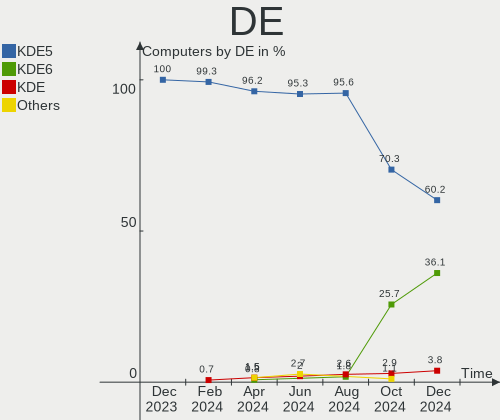
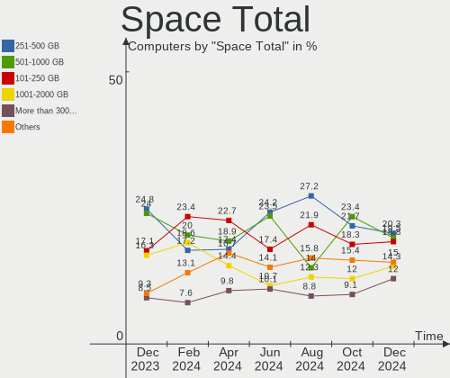
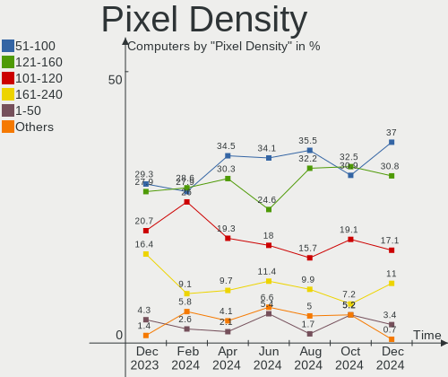
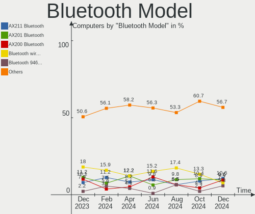
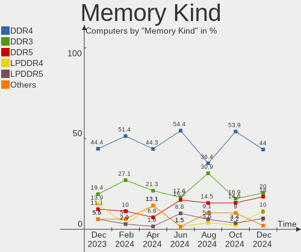
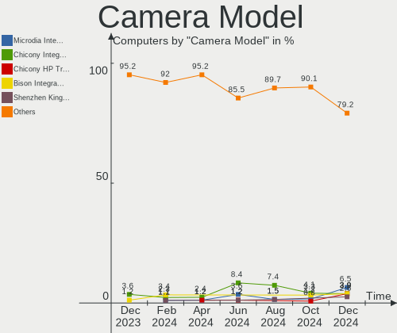
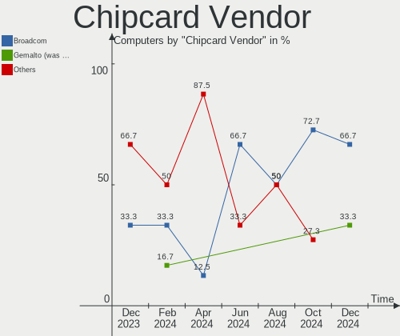

Kubuntu Hardware Trends
-----------------------

A project to identify most popular hardware characteristics and track their change
over time based on data collected by Kubuntu users at https://Linux-Hardware.org.

Anyone can contribute to this report by the [hw-probe](https://github.com/linuxhw/hw-probe) tool:

    sudo -E hw-probe -all -upload

This is a report for all computer types. See also reports for [desktops](/Dist/Kubuntu/Desktop/README.md) and [notebooks](/Dist/Kubuntu/Notebook/README.md).

This report is for one last month. Overall report since the beginning of time: [TestCoverage](https://github.com/linuxhw/TestCoverage)

Period: Apr, 2022.

Contents
--------

* [ System ](#system)
  - [ OS                       ](#os)
  - [ OS Family                ](#os-family)
  - [ Kernel                   ](#kernel)
  - [ Kernel Family            ](#kernel-family)
  - [ Kernel Major Ver.        ](#kernel-major-ver)
  - [ Arch                     ](#arch)
  - [ DE                       ](#de)
  - [ Display Server           ](#display-server)
  - [ Display Manager          ](#display-manager)
  - [ OS Lang                  ](#os-lang)
  - [ Boot Mode                ](#boot-mode)
  - [ Filesystem               ](#filesystem)
  - [ Part. scheme             ](#part-scheme)
  - [ Dual Boot with Linux/BSD ](#dual-boot-with-linuxbsd)
  - [ Dual Boot (Win)          ](#dual-boot-win)

* [ Board ](#board)
  - [ Vendor                   ](#vendor)
  - [ Model                    ](#model)
  - [ Model Family             ](#model-family)
  - [ MFG Year                 ](#mfg-year)
  - [ Form Factor              ](#form-factor)
  - [ Secure Boot              ](#secure-boot)
  - [ Coreboot                 ](#coreboot)
  - [ RAM Size                 ](#ram-size)
  - [ RAM Used                 ](#ram-used)
  - [ Total Drives             ](#total-drives)
  - [ Has CD-ROM               ](#has-cd-rom)
  - [ Has Ethernet             ](#has-ethernet)
  - [ Has WiFi                 ](#has-wifi)
  - [ Has Bluetooth            ](#has-bluetooth)

* [ Location ](#location)
  - [ Country                  ](#country)
  - [ City                     ](#city)

* [ Drives ](#drives)
  - [ Drive Vendor             ](#drive-vendor)
  - [ Drive Model              ](#drive-model)
  - [ HDD Vendor               ](#hdd-vendor)
  - [ SSD Vendor               ](#ssd-vendor)
  - [ Drive Kind               ](#drive-kind)
  - [ Drive Connector          ](#drive-connector)
  - [ Drive Size               ](#drive-size)
  - [ Space Total              ](#space-total)
  - [ Space Used               ](#space-used)
  - [ Malfunc. Drives          ](#malfunc-drives)
  - [ Malfunc. Drive Vendor    ](#malfunc-drive-vendor)
  - [ Malfunc. HDD Vendor      ](#malfunc-hdd-vendor)
  - [ Malfunc. Drive Kind      ](#malfunc-drive-kind)
  - [ Failed Drives            ](#failed-drives)
  - [ Failed Drive Vendor      ](#failed-drive-vendor)
  - [ Drive Status             ](#drive-status)

* [ Storage controller ](#storage-controller)
  - [ Storage Vendor           ](#storage-vendor)
  - [ Storage Model            ](#storage-model)
  - [ Storage Kind             ](#storage-kind)

* [ Processor ](#processor)
  - [ CPU Vendor               ](#cpu-vendor)
  - [ CPU Model                ](#cpu-model)
  - [ CPU Model Family         ](#cpu-model-family)
  - [ CPU Cores                ](#cpu-cores)
  - [ CPU Sockets              ](#cpu-sockets)
  - [ CPU Threads              ](#cpu-threads)
  - [ CPU Op-Modes             ](#cpu-op-modes)
  - [ CPU Microcode            ](#cpu-microcode)
  - [ CPU Microarch            ](#cpu-microarch)

* [ Graphics ](#graphics)
  - [ GPU Vendor               ](#gpu-vendor)
  - [ GPU Model                ](#gpu-model)
  - [ GPU Combo                ](#gpu-combo)
  - [ GPU Driver               ](#gpu-driver)
  - [ GPU Memory               ](#gpu-memory)

* [ Monitor ](#monitor)
  - [ Monitor Vendor           ](#monitor-vendor)
  - [ Monitor Model            ](#monitor-model)
  - [ Monitor Resolution       ](#monitor-resolution)
  - [ Monitor Diagonal         ](#monitor-diagonal)
  - [ Monitor Width            ](#monitor-width)
  - [ Aspect Ratio             ](#aspect-ratio)
  - [ Monitor Area             ](#monitor-area)
  - [ Pixel Density            ](#pixel-density)
  - [ Multiple Monitors        ](#multiple-monitors)

* [ Network ](#network)
  - [ Net Controller Vendor    ](#net-controller-vendor)
  - [ Net Controller Model     ](#net-controller-model)
  - [ Wireless Vendor          ](#wireless-vendor)
  - [ Wireless Model           ](#wireless-model)
  - [ Ethernet Vendor          ](#ethernet-vendor)
  - [ Ethernet Model           ](#ethernet-model)
  - [ Net Controller Kind      ](#net-controller-kind)
  - [ Used Controller          ](#used-controller)
  - [ NICs                     ](#nics)
  - [ IPv6                     ](#ipv6)

* [ Bluetooth ](#bluetooth)
  - [ Bluetooth Vendor         ](#bluetooth-vendor)
  - [ Bluetooth Model          ](#bluetooth-model)

* [ Sound ](#sound)
  - [ Sound Vendor             ](#sound-vendor)
  - [ Sound Model              ](#sound-model)

* [ Memory ](#memory)
  - [ Memory Vendor            ](#memory-vendor)
  - [ Memory Model             ](#memory-model)
  - [ Memory Kind              ](#memory-kind)
  - [ Memory Form Factor       ](#memory-form-factor)
  - [ Memory Size              ](#memory-size)
  - [ Memory Speed             ](#memory-speed)

* [ Printers & scanners ](#printers--scanners)
  - [ Printer Vendor           ](#printer-vendor)
  - [ Printer Model            ](#printer-model)
  - [ Scanner Vendor           ](#scanner-vendor)
  - [ Scanner Model            ](#scanner-model)

* [ Camera ](#camera)
  - [ Camera Vendor            ](#camera-vendor)
  - [ Camera Model             ](#camera-model)

* [ Security ](#security)
  - [ Fingerprint Vendor       ](#fingerprint-vendor)
  - [ Fingerprint Model        ](#fingerprint-model)
  - [ Chipcard Vendor          ](#chipcard-vendor)
  - [ Chipcard Model           ](#chipcard-model)

* [ Unsupported ](#unsupported)
  - [ Unsupported Devices      ](#unsupported-devices)
  - [ Unsupported Device Types ](#unsupported-device-types)

System
------

OS
--

Installed operating systems

| Name          | Computers | Percent |
|---------------|-----------|---------|
| Kubuntu 20.04 | 43        | 38.05%  |
| Kubuntu 21.10 | 37        | 32.74%  |
| Kubuntu 22.04 | 19        | 16.81%  |
| Kubuntu 11    | 9         | 7.96%   |
| Kubuntu 20.10 | 2         | 1.77%   |
| Kubuntu 21.04 | 1         | 0.88%   |
| Kubuntu 2.0   | 1         | 0.88%   |
| Kubuntu 18.04 | 1         | 0.88%   |

OS Family
---------

OS without a version

| Name    | Computers | Percent |
|---------|-----------|---------|
| Kubuntu | 113       | 100%    |

Kernel
------

Version of the Linux kernel

| Version                | Computers | Percent |
|------------------------|-----------|---------|
| 5.13.0-39-generic      | 49        | 43.36%  |
| 5.13.0-40-generic      | 16        | 14.16%  |
| 5.15.0-27-generic      | 8         | 7.08%   |
| 5.15.0-25-generic      | 7         | 6.19%   |
| 5.4.0-107-generic      | 5         | 4.42%   |
| 5.13.0-30-generic      | 3         | 2.65%   |
| 5.17.0-051700-generic  | 2         | 1.77%   |
| 5.15.0-23-generic      | 2         | 1.77%   |
| 5.13.0-27-generic      | 2         | 1.77%   |
| 5.8.0-63-lowlatency    | 1         | 0.88%   |
| 5.8.0-63-generic       | 1         | 0.88%   |
| 5.4.0-96-generic       | 1         | 0.88%   |
| 5.4.0-80-generic       | 1         | 0.88%   |
| 5.4.0-52-generic       | 1         | 0.88%   |
| 5.4.0-109-generic      | 1         | 0.88%   |
| 5.4.0-100-generic      | 1         | 0.88%   |
| 5.17.2-051702-generic  | 1         | 0.88%   |
| 5.16.10-xanmod1        | 1         | 0.88%   |
| 5.15.34-xanmod1        | 1         | 0.88%   |
| 5.15.34-051534-generic | 1         | 0.88%   |
| 5.15.0-27-lowlatency   | 1         | 0.88%   |
| 5.14.17-051417-generic | 1         | 0.88%   |
| 5.14.0-1032-oem        | 1         | 0.88%   |
| 5.13.0-40-lowlatency   | 1         | 0.88%   |
| 5.13.0-39-lowlatency   | 1         | 0.88%   |
| 5.13.0-37-generic      | 1         | 0.88%   |
| 5.13.0-19-generic      | 1         | 0.88%   |
| 5.11.0-49-generic      | 1         | 0.88%   |

Kernel Family
-------------

Linux kernel without a distro release

| Version | Computers | Percent |
|---------|-----------|---------|
| 5.13.0  | 74        | 65.49%  |
| 5.15.0  | 18        | 15.93%  |
| 5.4.0   | 10        | 8.85%   |
| 5.8.0   | 2         | 1.77%   |
| 5.17.0  | 2         | 1.77%   |
| 5.15.34 | 2         | 1.77%   |
| 5.17.2  | 1         | 0.88%   |
| 5.16.10 | 1         | 0.88%   |
| 5.14.17 | 1         | 0.88%   |
| 5.14.0  | 1         | 0.88%   |
| 5.11.0  | 1         | 0.88%   |

Kernel Major Ver.
-----------------

Linux kernel major version

| Version | Computers | Percent |
|---------|-----------|---------|
| 5.13    | 74        | 65.49%  |
| 5.15    | 20        | 17.7%   |
| 5.4     | 10        | 8.85%   |
| 5.17    | 3         | 2.65%   |
| 5.8     | 2         | 1.77%   |
| 5.14    | 2         | 1.77%   |
| 5.16    | 1         | 0.88%   |
| 5.11    | 1         | 0.88%   |

Arch
----

OS architecture (x86_64, i586, etc.)

| Name   | Computers | Percent |
|--------|-----------|---------|
| x86_64 | 113       | 100%    |

DE
--

Desktop Environment

| Name     | Computers | Percent |
|----------|-----------|---------|
| KDE5     | 109       | 96.46%  |
| XFCE     | 1         | 0.88%   |
| LXQt     | 1         | 0.88%   |
| GNOME    | 1         | 0.88%   |
| Cinnamon | 1         | 0.88%   |

Display Server
--------------

X11 or Wayland

| Name    | Computers | Percent |
|---------|-----------|---------|
| X11     | 105       | 92.92%  |
| Wayland | 7         | 6.19%   |
| Tty     | 1         | 0.88%   |

Display Manager
---------------

SDDM, LightDM, etc.

| Name    | Computers | Percent |
|---------|-----------|---------|
| SDDM    | 72        | 63.72%  |
| Unknown | 27        | 23.89%  |
| GDM     | 6         | 5.31%   |
| LightDM | 4         | 3.54%   |
| GDM3    | 4         | 3.54%   |

OS Lang
-------

Language

| Lang  | Computers | Percent |
|-------|-----------|---------|
| en_US | 40        | 35.4%   |
| de_DE | 17        | 15.04%  |
| fr_FR | 7         | 6.19%   |
| en_GB | 7         | 6.19%   |
| ru_RU | 6         | 5.31%   |
| pt_BR | 4         | 3.54%   |
| it_IT | 4         | 3.54%   |
| es_ES | 4         | 3.54%   |
| en_CA | 3         | 2.65%   |
| pl_PL | 2         | 1.77%   |
| es_MX | 2         | 1.77%   |
| es_AR | 2         | 1.77%   |
| en_NZ | 2         | 1.77%   |
| en_IN | 2         | 1.77%   |
| zh_CN | 1         | 0.88%   |
| ru_UA | 1         | 0.88%   |
| hu_HU | 1         | 0.88%   |
| es_VE | 1         | 0.88%   |
| es_CL | 1         | 0.88%   |
| en_IE | 1         | 0.88%   |
| en_CH | 1         | 0.88%   |
| en_AU | 1         | 0.88%   |
| el_GR | 1         | 0.88%   |
| de_CH | 1         | 0.88%   |
| C     | 1         | 0.88%   |

Boot Mode
---------

EFI or BIOS

| Mode | Computers | Percent |
|------|-----------|---------|
| EFI  | 67        | 59.29%  |
| BIOS | 46        | 40.71%  |

Filesystem
----------

Type of filesystem

| Type    | Computers | Percent |
|---------|-----------|---------|
| Ext4    | 102       | 90.27%  |
| Btrfs   | 7         | 6.19%   |
| Xfs     | 2         | 1.77%   |
| Zfs     | 1         | 0.88%   |
| Overlay | 1         | 0.88%   |

Part. scheme
------------

Scheme of partitioning

| Type    | Computers | Percent |
|---------|-----------|---------|
| GPT     | 51        | 45.13%  |
| Unknown | 51        | 45.13%  |
| MBR     | 11        | 9.73%   |

Dual Boot with Linux/BSD
------------------------

Hosting more than one Linux/BSD

| Dual boot | Computers | Percent |
|-----------|-----------|---------|
| No        | 100       | 88.5%   |
| Yes       | 13        | 11.5%   |

Dual Boot (Win)
---------------

Hosting Linux and Windows

| Dual boot | Computers | Percent |
|-----------|-----------|---------|
| No        | 73        | 64.6%   |
| Yes       | 40        | 35.4%   |

Board
-----

Vendor
------

Motherboard manufacturer

| Name                           | Computers | Percent |
|--------------------------------|-----------|---------|
| Lenovo                         | 25        | 22.12%  |
| Dell                           | 19        | 16.81%  |
| Hewlett-Packard                | 15        | 13.27%  |
| ASUSTek Computer               | 15        | 13.27%  |
| MSI                            | 6         | 5.31%   |
| ASRock                         | 5         | 4.42%   |
| Gigabyte Technology            | 3         | 2.65%   |
| Acer                           | 3         | 2.65%   |
| Sony                           | 2         | 1.77%   |
| Positivo                       | 2         | 1.77%   |
| Intel                          | 2         | 1.77%   |
| Wortmann AG                    | 1         | 0.88%   |
| TUXEDO                         | 1         | 0.88%   |
| Toshiba                        | 1         | 0.88%   |
| Shuttle                        | 1         | 0.88%   |
| Shanghai Zhaoxin Semiconductor | 1         | 0.88%   |
| Samsung Electronics            | 1         | 0.88%   |
| Pegatron                       | 1         | 0.88%   |
| Notebook                       | 1         | 0.88%   |
| HUAWEI                         | 1         | 0.88%   |
| HONOR                          | 1         | 0.88%   |
| Framework                      | 1         | 0.88%   |
| eMachines                      | 1         | 0.88%   |
| Dynabook                       | 1         | 0.88%   |
| Biostar                        | 1         | 0.88%   |
| Apple                          | 1         | 0.88%   |
| Unknown                        | 1         | 0.88%   |

Model
-----

Motherboard model

| Name                                      | Computers | Percent |
|-------------------------------------------|-----------|---------|
| MSI MS-7817                               | 2         | 1.77%   |
| Dell Latitude E6540                       | 2         | 1.77%   |
| Wortmann AG TERRA_MOBILE_1749             | 1         | 0.88%   |
| TUXEDO Aura 15 Gen1                       | 1         | 0.88%   |
| Toshiba Satellite P70-B                   | 1         | 0.88%   |
| Sony VPCF236FM                            | 1         | 0.88%   |
| Sony SVE1511W1ESI                         | 1         | 0.88%   |
| Shuttle XH61V                             | 1         | 0.88%   |
| Shanghai Zhaoxin ZXE CRB                  | 1         | 0.88%   |
| Samsung R425D/R525D                       | 1         | 0.88%   |
| Positivo W940TU                           | 1         | 0.88%   |
| Positivo N1250                            | 1         | 0.88%   |
| Pegatron Elite 7500 Series MT             | 1         | 0.88%   |
| Notebook NS50_70MU                        | 1         | 0.88%   |
| MSI MS-7D09                               | 1         | 0.88%   |
| MSI MS-7C52                               | 1         | 0.88%   |
| MSI MS-7C37                               | 1         | 0.88%   |
| MSI MS-7A59                               | 1         | 0.88%   |
| Lenovo Z50-75 80EC                        | 1         | 0.88%   |
| Lenovo ThinkPad X260 20F5S0W22B           | 1         | 0.88%   |
| Lenovo ThinkPad X1 Extreme 2nd 20QVS0FP00 | 1         | 0.88%   |
| Lenovo ThinkPad X1 Extreme 2nd 20QV0007US | 1         | 0.88%   |
| Lenovo ThinkPad T560 20FJS0NT04           | 1         | 0.88%   |
| Lenovo ThinkPad T530 24296HG              | 1         | 0.88%   |
| Lenovo ThinkPad T530 2394CTO              | 1         | 0.88%   |
| Lenovo ThinkPad T450 20BV0001US           | 1         | 0.88%   |
| Lenovo ThinkPad T430 2349T2A              | 1         | 0.88%   |
| Lenovo ThinkPad T420 4180DV2              | 1         | 0.88%   |
| Lenovo ThinkPad T420 41786UU              | 1         | 0.88%   |
| Lenovo ThinkPad P51 20HH000AUS            | 1         | 0.88%   |
| Lenovo ThinkPad L15 Gen 1 20U8S0AH00      | 1         | 0.88%   |
| Lenovo ThinkPad Edge E540 20C6003VSP      | 1         | 0.88%   |
| Lenovo ThinkPad E14 Gen 3 20Y7CTO1WW      | 1         | 0.88%   |
| Lenovo ThinkPad E14 20RBS25S00            | 1         | 0.88%   |
| Lenovo ThinkBook 15-IML 20RW              | 1         | 0.88%   |
| Lenovo ThinkBook 15 G2 ARE 20VG           | 1         | 0.88%   |
| Lenovo IdeaPadFlex 14 20308               | 1         | 0.88%   |
| Lenovo IdeaPad Z585                       | 1         | 0.88%   |
| Lenovo IdeaPad 710S Plus Touch-13IKB 80YQ | 1         | 0.88%   |
| Lenovo IdeaPad 5 Pro 14ITL6 82L3          | 1         | 0.88%   |
| Lenovo IdeaPad 330S-15IKB 81F5            | 1         | 0.88%   |
| Lenovo IdeaCentre 510S-08IKL 90GB00DLGE   | 1         | 0.88%   |
| Lenovo G40-45 80E1                        | 1         | 0.88%   |
| Intel NUC6CAYB J23203-402                 | 1         | 0.88%   |
| Intel MAHOBAY                             | 1         | 0.88%   |
| HUAWEI KLVL-WXXW                          | 1         | 0.88%   |
| HONOR NBD-WXX9                            | 1         | 0.88%   |
| HP Z220 CMT Workstation                   | 1         | 0.88%   |
| HP ProDesk 600 G2 SFF                     | 1         | 0.88%   |
| HP ProBook x360 11 G5 EE                  | 1         | 0.88%   |
| HP Pavilion Laptop 15-cs3xxx              | 1         | 0.88%   |
| HP Pavilion g6                            | 1         | 0.88%   |
| HP OMEN Laptop 15-en0xxx                  | 1         | 0.88%   |
| HP Laptop 14s-fq0xxx                      | 1         | 0.88%   |
| HP ENVY x360 Convertible 13-ay0xxx        | 1         | 0.88%   |
| HP ENVY 17                                | 1         | 0.88%   |
| HP ENVY 15                                | 1         | 0.88%   |
| HP Compaq Elite 8300 CMT                  | 1         | 0.88%   |
| HP Compaq dc7800p Convertible Minitower   | 1         | 0.88%   |
| HP Compaq 6005 Pro SFF PC                 | 1         | 0.88%   |

Model Family
------------

Motherboard model prefix

| Name                 | Computers | Percent |
|----------------------|-----------|---------|
| Lenovo ThinkPad      | 15        | 13.27%  |
| Dell Latitude        | 8         | 7.08%   |
| Lenovo IdeaPad       | 4         | 3.54%   |
| Dell XPS             | 4         | 3.54%   |
| HP ENVY              | 3         | 2.65%   |
| HP Compaq            | 3         | 2.65%   |
| MSI MS-7817          | 2         | 1.77%   |
| Lenovo ThinkBook     | 2         | 1.77%   |
| HP Pavilion          | 2         | 1.77%   |
| Dell Inspiron        | 2         | 1.77%   |
| Wortmann AG TERRA    | 1         | 0.88%   |
| TUXEDO Aura          | 1         | 0.88%   |
| Toshiba Satellite    | 1         | 0.88%   |
| Sony VPCF236FM       | 1         | 0.88%   |
| Sony SVE1511W1ESI    | 1         | 0.88%   |
| Shuttle XH61V        | 1         | 0.88%   |
| Shanghai Zhaoxin ZXE | 1         | 0.88%   |
| Samsung R425D        | 1         | 0.88%   |
| Positivo W940TU      | 1         | 0.88%   |
| Positivo N1250       | 1         | 0.88%   |
| Pegatron Elite       | 1         | 0.88%   |
| Notebook NS50        | 1         | 0.88%   |
| MSI MS-7D09          | 1         | 0.88%   |
| MSI MS-7C52          | 1         | 0.88%   |
| MSI MS-7C37          | 1         | 0.88%   |
| MSI MS-7A59          | 1         | 0.88%   |
| Lenovo Z50-75        | 1         | 0.88%   |
| Lenovo IdeaPadFlex   | 1         | 0.88%   |
| Lenovo IdeaCentre    | 1         | 0.88%   |
| Lenovo G40-45        | 1         | 0.88%   |
| Intel NUC6CAYB       | 1         | 0.88%   |
| Intel MAHOBAY        | 1         | 0.88%   |
| HUAWEI KLVL-WXXW     | 1         | 0.88%   |
| HONOR NBD-WXX9       | 1         | 0.88%   |
| HP Z220              | 1         | 0.88%   |
| HP ProDesk           | 1         | 0.88%   |
| HP ProBook           | 1         | 0.88%   |
| HP OMEN              | 1         | 0.88%   |
| HP Laptop            | 1         | 0.88%   |
| HP 750-247c          | 1         | 0.88%   |
| HP 250               | 1         | 0.88%   |
| Gigabyte Z490        | 1         | 0.88%   |
| Gigabyte X570        | 1         | 0.88%   |
| Gigabyte A320M-S2H   | 1         | 0.88%   |
| Framework Laptop     | 1         | 0.88%   |
| eMachines G525       | 1         | 0.88%   |
| Dynabook PORTEGE     | 1         | 0.88%   |
| Dell Vostro          | 1         | 0.88%   |
| Dell Studio          | 1         | 0.88%   |
| Dell Precision       | 1         | 0.88%   |
| Dell OptiPlex        | 1         | 0.88%   |
| Dell G7              | 1         | 0.88%   |
| Biostar A68N-2100K   | 1         | 0.88%   |
| ASUS ZenBook         | 1         | 0.88%   |
| ASUS WS              | 1         | 0.88%   |
| ASUS VivoBook        | 1         | 0.88%   |
| ASUS TUF             | 1         | 0.88%   |
| ASUS S551LB          | 1         | 0.88%   |
| ASUS ROG             | 1         | 0.88%   |
| ASUS PRIME           | 1         | 0.88%   |

MFG Year
--------

Motherboard manufacture year

| Year | Computers | Percent |
|------|-----------|---------|
| 2020 | 17        | 15.04%  |
| 2021 | 16        | 14.16%  |
| 2019 | 15        | 13.27%  |
| 2014 | 10        | 8.85%   |
| 2012 | 10        | 8.85%   |
| 2016 | 9         | 7.96%   |
| 2011 | 8         | 7.08%   |
| 2013 | 7         | 6.19%   |
| 2018 | 5         | 4.42%   |
| 2017 | 4         | 3.54%   |
| 2010 | 4         | 3.54%   |
| 2009 | 4         | 3.54%   |
| 2015 | 3         | 2.65%   |
| 2007 | 1         | 0.88%   |

Form Factor
-----------

Physical design of the computer

| Name        | Computers | Percent |
|-------------|-----------|---------|
| Notebook    | 72        | 63.72%  |
| Desktop     | 35        | 30.97%  |
| Convertible | 3         | 2.65%   |
| Mini pc     | 3         | 2.65%   |

Secure Boot
-----------

Enabled or disabled

| State    | Computers | Percent |
|----------|-----------|---------|
| Disabled | 102       | 90.27%  |
| Enabled  | 11        | 9.73%   |

Coreboot
--------

Have coreboot on board

| Used | Computers | Percent |
|------|-----------|---------|
| No   | 112       | 99.12%  |
| Yes  | 1         | 0.88%   |

RAM Size
--------

Total RAM memory

| Size in GB  | Computers | Percent |
|-------------|-----------|---------|
| 16.01-24.0  | 34        | 30.09%  |
| 8.01-16.0   | 26        | 23.01%  |
| 4.01-8.0    | 25        | 22.12%  |
| 3.01-4.0    | 11        | 9.73%   |
| 32.01-64.0  | 10        | 8.85%   |
| 64.01-256.0 | 3         | 2.65%   |
| 24.01-32.0  | 2         | 1.77%   |
| 2.01-3.0    | 1         | 0.88%   |
| 1.01-2.0    | 1         | 0.88%   |

RAM Used
--------

Used RAM memory

| Used GB    | Computers | Percent |
|------------|-----------|---------|
| 2.01-3.0   | 31        | 27.43%  |
| 4.01-8.0   | 29        | 25.66%  |
| 1.01-2.0   | 25        | 22.12%  |
| 8.01-16.0  | 19        | 16.81%  |
| 3.01-4.0   | 7         | 6.19%   |
| 32.01-64.0 | 1         | 0.88%   |
| 0.51-1.0   | 1         | 0.88%   |

Total Drives
------------

Number of drives on board

| Drives | Computers | Percent |
|--------|-----------|---------|
| 1      | 71        | 62.83%  |
| 2      | 25        | 22.12%  |
| 3      | 8         | 7.08%   |
| 4      | 5         | 4.42%   |
| 6      | 2         | 1.77%   |
| 10     | 1         | 0.88%   |
| 7      | 1         | 0.88%   |

Has CD-ROM
----------

Has CD-ROM on board

| Presented | Computers | Percent |
|-----------|-----------|---------|
| No        | 75        | 66.37%  |
| Yes       | 38        | 33.63%  |

Has Ethernet
------------

Has Ethernet on board

| Presented | Computers | Percent |
|-----------|-----------|---------|
| Yes       | 96        | 84.96%  |
| No        | 17        | 15.04%  |

Has WiFi
--------

Has WiFi module

| Presented | Computers | Percent |
|-----------|-----------|---------|
| Yes       | 93        | 82.3%   |
| No        | 20        | 17.7%   |

Has Bluetooth
-------------

Has Bluetooth module

| Presented | Computers | Percent |
|-----------|-----------|---------|
| Yes       | 81        | 71.68%  |
| No        | 32        | 28.32%  |

Location
--------

Country
-------

Geographic location (country)

| Country     | Computers | Percent |
|-------------|-----------|---------|
| Germany     | 21        | 18.58%  |
| USA         | 16        | 14.16%  |
| France      | 9         | 7.96%   |
| Russia      | 7         | 6.19%   |
| UK          | 5         | 4.42%   |
| Spain       | 5         | 4.42%   |
| Brazil      | 5         | 4.42%   |
| Italy       | 4         | 3.54%   |
| Netherlands | 3         | 2.65%   |
| Mexico      | 3         | 2.65%   |
| Argentina   | 3         | 2.65%   |
| Switzerland | 2         | 1.77%   |
| Poland      | 2         | 1.77%   |
| New Zealand | 2         | 1.77%   |
| India       | 2         | 1.77%   |
| Hungary     | 2         | 1.77%   |
| Greece      | 2         | 1.77%   |
| China       | 2         | 1.77%   |
| Canada      | 2         | 1.77%   |
| Venezuela   | 1         | 0.88%   |
| Ukraine     | 1         | 0.88%   |
| Thailand    | 1         | 0.88%   |
| Romania     | 1         | 0.88%   |
| Portugal    | 1         | 0.88%   |
| Pakistan    | 1         | 0.88%   |
| Norway      | 1         | 0.88%   |
| Malawi      | 1         | 0.88%   |
| Lithuania   | 1         | 0.88%   |
| Ireland     | 1         | 0.88%   |
| Iran        | 1         | 0.88%   |
| Indonesia   | 1         | 0.88%   |
| Finland     | 1         | 0.88%   |
| Chile       | 1         | 0.88%   |
| Belgium     | 1         | 0.88%   |
| Australia   | 1         | 0.88%   |

City
----

Geographic location (city)

| City                   | Computers | Percent |
|------------------------|-----------|---------|
| Novosibirsk            | 2         | 1.77%   |
| Cologne                | 2         | 1.77%   |
| Bougival               | 2         | 1.77%   |
| Beijing                | 2         | 1.77%   |
| Athens                 | 2         | 1.77%   |
| Zurich                 | 1         | 0.88%   |
| Zaragoza               | 1         | 0.88%   |
| Wichita Falls          | 1         | 0.88%   |
| Warsaw                 | 1         | 0.88%   |
| Vilnius                | 1         | 0.88%   |
| Villa Nueva            | 1         | 0.88%   |
| Valencia               | 1         | 0.88%   |
| Uaua                   | 1         | 0.88%   |
| Tustin                 | 1         | 0.88%   |
| Tehran                 | 1         | 0.88%   |
| Stavropol              | 1         | 0.88%   |
| St Petersburg          | 1         | 0.88%   |
| St Louis               | 1         | 0.88%   |
| Sindelfingen           | 1         | 0.88%   |
| Sechelt                | 1         | 0.88%   |
| Schenectady            | 1         | 0.88%   |
| Sargodha               | 1         | 0.88%   |
| Sarandi                | 1         | 0.88%   |
| Sao Paulo              | 1         | 0.88%   |
| Santiago               | 1         | 0.88%   |
| Santa Úrsula          | 1         | 0.88%   |
| Saline                 | 1         | 0.88%   |
| Saint-Mandrier-sur-Mer | 1         | 0.88%   |
| Roubaix                | 1         | 0.88%   |
| Rotenburg an der Fulda | 1         | 0.88%   |
| Rostov-on-Don          | 1         | 0.88%   |
| Rome                   | 1         | 0.88%   |
| Rho                    | 1         | 0.88%   |
| Plauen                 | 1         | 0.88%   |
| Pforzheim              | 1         | 0.88%   |
| Pécs                  | 1         | 0.88%   |
| Orlienas               | 1         | 0.88%   |
| Odivelas               | 1         | 0.88%   |
| Nuremberg              | 1         | 0.88%   |
| Nizhniy Novgorod       | 1         | 0.88%   |
| Nîmes                 | 1         | 0.88%   |
| Nice                   | 1         | 0.88%   |
| New York               | 1         | 0.88%   |
| Nakhon Pathom          | 1         | 0.88%   |
| Moscow                 | 1         | 0.88%   |
| Monticello             | 1         | 0.88%   |
| Montbéliard           | 1         | 0.88%   |
| Midlothian             | 1         | 0.88%   |
| Mexico City            | 1         | 0.88%   |
| Melbourne              | 1         | 0.88%   |
| Medford                | 1         | 0.88%   |
| Massa Fermana          | 1         | 0.88%   |
| Mariano Moreno         | 1         | 0.88%   |
| Manchester             | 1         | 0.88%   |
| Mainz                  | 1         | 0.88%   |
| Magenta                | 1         | 0.88%   |
| Lünen                 | 1         | 0.88%   |
| Los Angeles            | 1         | 0.88%   |
| Levallois-Perret       | 1         | 0.88%   |
| Lawrenceville          | 1         | 0.88%   |

Drives
------

Drive Vendor
------------

Hard drive vendors

| Vendor                         | Computers | Drives | Percent |
|--------------------------------|-----------|--------|---------|
| Samsung Electronics            | 34        | 46     | 20.86%  |
| WDC                            | 27        | 33     | 16.56%  |
| Seagate                        | 20        | 31     | 12.27%  |
| Toshiba                        | 12        | 12     | 7.36%   |
| Kingston                       | 11        | 11     | 6.75%   |
| Crucial                        | 8         | 8      | 4.91%   |
| SK Hynix                       | 6         | 6      | 3.68%   |
| Hitachi                        | 6         | 6      | 3.68%   |
| Unknown                        | 4         | 4      | 2.45%   |
| Intenso                        | 3         | 4      | 1.84%   |
| HGST                           | 3         | 4      | 1.84%   |
| Transcend                      | 2         | 2      | 1.23%   |
| Silicon Motion                 | 2         | 2      | 1.23%   |
| SanDisk                        | 2         | 2      | 1.23%   |
| Micron Technology              | 2         | 2      | 1.23%   |
| China                          | 2         | 2      | 1.23%   |
| A-DATA Technology              | 2         | 2      | 1.23%   |
| Varro                          | 1         | 1      | 0.61%   |
| Team                           | 1         | 1      | 0.61%   |
| Solid State Storage Technology | 1         | 1      | 0.61%   |
| Smartbuy                       | 1         | 1      | 0.61%   |
| SABRENT                        | 1         | 1      | 0.61%   |
| Realtek Semiconductor          | 1         | 1      | 0.61%   |
| Phison                         | 1         | 1      | 0.61%   |
| Patriot                        | 1         | 1      | 0.61%   |
| LDLC                           | 1         | 2      | 0.61%   |
| KIOXIA                         | 1         | 1      | 0.61%   |
| KingSpec                       | 1         | 1      | 0.61%   |
| JMicron                        | 1         | 1      | 0.61%   |
| Intel                          | 1         | 1      | 0.61%   |
| Corsair                        | 1         | 2      | 0.61%   |
| ASENNO                         | 1         | 1      | 0.61%   |
| ADATA Technology               | 1         | 1      | 0.61%   |
| Unknown                        | 1         | 1      | 0.61%   |

Drive Model
-----------

Hard drive models

| Model                                   | Computers | Percent |
|-----------------------------------------|-----------|---------|
| Samsung NVMe SSD Drive 1TB              | 4         | 2.15%   |
| Seagate ST2000DM008-2FR102 2TB          | 3         | 1.61%   |
| Samsung SSD 980 1TB                     | 3         | 1.61%   |
| Samsung NVMe SSD Drive 500GB            | 3         | 1.61%   |
| WDC WDS500G2B0A-00SM50 500GB SSD        | 2         | 1.08%   |
| WDC WD5000AAKX-753CA1 500GB             | 2         | 1.08%   |
| Toshiba MQ04ABF100 1TB                  | 2         | 1.08%   |
| Toshiba HDWR180 8TB                     | 2         | 1.08%   |
| Seagate ST2000DM001-1ER164 2TB          | 2         | 1.08%   |
| Seagate ST2000DM001-1CH164 2TB          | 2         | 1.08%   |
| Seagate ST1000LM024 HN-M101MBB 1TB      | 2         | 1.08%   |
| Samsung SSD 970 EVO Plus 2TB            | 2         | 1.08%   |
| Samsung SSD 860 EVO M.2 500GB           | 2         | 1.08%   |
| Samsung SSD 850 EVO 250GB               | 2         | 1.08%   |
| Samsung MZVLB512HBJQ-000L7 512GB        | 2         | 1.08%   |
| Kingston SA400S37480G 480GB SSD         | 2         | 1.08%   |
| Kingston SA400S37120G 120GB SSD         | 2         | 1.08%   |
| Hitachi HTS547575A9E384 752GB           | 2         | 1.08%   |
| Crucial CT1000MX500SSD1 1TB             | 2         | 1.08%   |
| WDC WDS240G2G0A-00JH30 240GB SSD        | 1         | 0.54%   |
| WDC WDS240G1G0A-00SS50 240GB SSD        | 1         | 0.54%   |
| WDC WDS100T3X0C-00SJG0 1TB              | 1         | 0.54%   |
| WDC WD60EZAZ-00ZGHB0 6TB                | 1         | 0.54%   |
| WDC WD5000AZLX-00ZR6A0 500GB            | 1         | 0.54%   |
| WDC WD40PURX-64GVNY0 4TB                | 1         | 0.54%   |
| WDC WD30EZRX-00D8PB0 3TB                | 1         | 0.54%   |
| WDC WD30EFRX-68EUZN0 3TB                | 1         | 0.54%   |
| WDC WD2500BEVT-22A23T0 250GB            | 1         | 0.54%   |
| WDC WD2500AAJS-75B4A0 250GB             | 1         | 0.54%   |
| WDC WD2500AAJS-60B4A0 250GB             | 1         | 0.54%   |
| WDC WD20PURX-64P6ZY0 2TB                | 1         | 0.54%   |
| WDC WD20EZRZ-00Z5HB0 2TB                | 1         | 0.54%   |
| WDC WD20EZRX-00D8PB0 2TB                | 1         | 0.54%   |
| WDC WD20EARX-00PASB0 2TB                | 1         | 0.54%   |
| WDC WD20EARS-00MVWB0 2TB                | 1         | 0.54%   |
| WDC WD10SPZX-75Z10T2 1TB                | 1         | 0.54%   |
| WDC WD10JPVX-60JC3T0 1TB                | 1         | 0.54%   |
| WDC WD10JPVT-00A1YT0 1TB                | 1         | 0.54%   |
| WDC WD10JPCX-24UE4T0 1TB                | 1         | 0.54%   |
| WDC WD10EZRX-00L4HB0 1TB                | 1         | 0.54%   |
| WDC WD10EZEX-22MFCA0 1TB                | 1         | 0.54%   |
| WDC WD10EZEX-08M2NA0 1TB                | 1         | 0.54%   |
| WDC WD1003FZEX-00K3CA0 1TB              | 1         | 0.54%   |
| WDC WD BLUE 128GB SSD                   | 1         | 0.54%   |
| WDC PC SN730 SDBQNTY-1T00-1001 1TB      | 1         | 0.54%   |
| WDC PC SN730 SDBPNTY-512G-1036 512GB    | 1         | 0.54%   |
| WDC PC SN730 NVMe 1024GB                | 1         | 0.54%   |
| Varro BULLDOZER-240GB SSD               | 1         | 0.54%   |
| Unknown SD/MMC/MS PRO 16GB              | 1         | 0.54%   |
| Unknown SC16G  16GB                     | 1         | 0.54%   |
| Unknown MMC Card  64GB                  | 1         | 0.54%   |
| Unknown GFAQK  512GB                    | 1         | 0.54%   |
| Transcend TS2TMTE220S 2TB               | 1         | 0.54%   |
| Transcend TS128GSSD370 128GB            | 1         | 0.54%   |
| Toshiba TR200 480GB SSD                 | 1         | 0.54%   |
| Toshiba THNSNK256GCS8 SATA 256GB SSD    | 1         | 0.54%   |
| Toshiba MQ01ABD100 1TB                  | 1         | 0.54%   |
| Toshiba MK7559GSXP 752GB                | 1         | 0.54%   |
| Toshiba MK5065GSXF 500GB                | 1         | 0.54%   |
| Toshiba KSG60ZMV256G M.2 2280 256GB SSD | 1         | 0.54%   |

HDD Vendor
----------

Hard disk drive vendors

| Vendor              | Computers | Drives | Percent |
|---------------------|-----------|--------|---------|
| WDC                 | 20        | 23     | 32.26%  |
| Seagate             | 20        | 31     | 32.26%  |
| Toshiba             | 8         | 8      | 12.9%   |
| Hitachi             | 6         | 6      | 9.68%   |
| Samsung Electronics | 3         | 3      | 4.84%   |
| HGST                | 3         | 4      | 4.84%   |
| Unknown             | 1         | 1      | 1.61%   |
| SABRENT             | 1         | 1      | 1.61%   |

SSD Vendor
----------

Solid state drive vendors

| Vendor              | Computers | Drives | Percent |
|---------------------|-----------|--------|---------|
| Samsung Electronics | 12        | 14     | 21.43%  |
| Kingston            | 8         | 8      | 14.29%  |
| Crucial             | 7         | 7      | 12.5%   |
| WDC                 | 5         | 6      | 8.93%   |
| Toshiba             | 3         | 3      | 5.36%   |
| SK Hynix            | 3         | 3      | 5.36%   |
| SanDisk             | 2         | 2      | 3.57%   |
| Intenso             | 2         | 3      | 3.57%   |
| China               | 2         | 2      | 3.57%   |
| Varro               | 1         | 1      | 1.79%   |
| Transcend           | 1         | 1      | 1.79%   |
| Team                | 1         | 1      | 1.79%   |
| Smartbuy            | 1         | 1      | 1.79%   |
| Patriot             | 1         | 1      | 1.79%   |
| Micron Technology   | 1         | 1      | 1.79%   |
| KingSpec            | 1         | 1      | 1.79%   |
| JMicron             | 1         | 1      | 1.79%   |
| Intel               | 1         | 1      | 1.79%   |
| ASENNO              | 1         | 1      | 1.79%   |
| A-DATA Technology   | 1         | 1      | 1.79%   |
| Unknown             | 1         | 1      | 1.79%   |

Drive Kind
----------

HDD or SSD

| Kind    | Computers | Drives | Percent |
|---------|-----------|--------|---------|
| SSD     | 53        | 60     | 35.57%  |
| HDD     | 49        | 77     | 32.89%  |
| NVMe    | 42        | 53     | 28.19%  |
| MMC     | 3         | 3      | 2.01%   |
| Unknown | 2         | 3      | 1.34%   |

Drive Connector
---------------

SATA, SAS, NVMe, etc.

| Type | Computers | Drives | Percent |
|------|-----------|--------|---------|
| SATA | 84        | 136    | 63.16%  |
| NVMe | 42        | 53     | 31.58%  |
| SAS  | 4         | 4      | 3.01%   |
| MMC  | 3         | 3      | 2.26%   |

Drive Size
----------

Size of hard drive

| Size in TB | Computers | Drives | Percent |
|------------|-----------|--------|---------|
| 0.01-0.5   | 56        | 73     | 51.85%  |
| 0.51-1.0   | 34        | 36     | 31.48%  |
| 1.01-2.0   | 11        | 20     | 10.19%  |
| 4.01-10.0  | 3         | 3      | 2.78%   |
| 3.01-4.0   | 2         | 3      | 1.85%   |
| 2.01-3.0   | 2         | 2      | 1.85%   |

Space Total
-----------

Amount of disk space available on the file system

| Size in GB     | Computers | Percent |
|----------------|-----------|---------|
| 101-250        | 31        | 27.43%  |
| 251-500        | 30        | 26.55%  |
| 501-1000       | 25        | 22.12%  |
| 1001-2000      | 10        | 8.85%   |
| More than 3000 | 6         | 5.31%   |
| 51-100         | 6         | 5.31%   |
| 2001-3000      | 4         | 3.54%   |
| 21-50          | 1         | 0.88%   |

Space Used
----------

Amount of used disk space

| Used GB        | Computers | Percent |
|----------------|-----------|---------|
| 101-250        | 25        | 22.12%  |
| 251-500        | 23        | 20.35%  |
| 21-50          | 20        | 17.7%   |
| 51-100         | 16        | 14.16%  |
| 1-20           | 12        | 10.62%  |
| 501-1000       | 9         | 7.96%   |
| 1001-2000      | 4         | 3.54%   |
| More than 3000 | 3         | 2.65%   |
| 2001-3000      | 1         | 0.88%   |

Malfunc. Drives
---------------

Drive models with a malfunction

| Model                                   | Computers | Drives | Percent |
|-----------------------------------------|-----------|--------|---------|
| WDC WD10EZEX-22MFCA0 1TB                | 1         | 1      | 10%     |
| Toshiba THNSNK256GCS8 SATA 256GB SSD    | 1         | 1      | 10%     |
| Toshiba MK5065GSXF 500GB                | 1         | 1      | 10%     |
| Toshiba KSG60ZMV256G M.2 2280 256GB SSD | 1         | 1      | 10%     |
| Seagate ST500LT012-9WS142 500GB         | 1         | 1      | 10%     |
| Seagate ST500LM012 HN-M500MBB 500GB     | 1         | 1      | 10%     |
| Seagate ST1000DM003-1SB102 1TB          | 1         | 1      | 10%     |
| Hitachi HTS547575A9E384 752GB           | 1         | 1      | 10%     |
| Hitachi HCT721010SLA360 1TB             | 1         | 1      | 10%     |
| ASENNO AS25 1TB SSD                     | 1         | 1      | 10%     |

Malfunc. Drive Vendor
---------------------

Vendors of faulty drives

| Vendor  | Computers | Drives | Percent |
|---------|-----------|--------|---------|
| Toshiba | 3         | 3      | 30%     |
| Seagate | 3         | 3      | 30%     |
| Hitachi | 2         | 2      | 20%     |
| WDC     | 1         | 1      | 10%     |
| ASENNO  | 1         | 1      | 10%     |

Malfunc. HDD Vendor
-------------------

Vendors of faulty HDD drives

| Vendor  | Computers | Drives | Percent |
|---------|-----------|--------|---------|
| Seagate | 3         | 3      | 42.86%  |
| Hitachi | 2         | 2      | 28.57%  |
| WDC     | 1         | 1      | 14.29%  |
| Toshiba | 1         | 1      | 14.29%  |

Malfunc. Drive Kind
-------------------

Kinds of faulty drives

| Kind | Computers | Drives | Percent |
|------|-----------|--------|---------|
| HDD  | 7         | 7      | 70%     |
| SSD  | 3         | 3      | 30%     |

Failed Drives
-------------

Failed drive models

Zero info for selected period =(

Failed Drive Vendor
-------------------

Failed drive vendors

Zero info for selected period =(

Drive Status
------------

Number of failed and malfunc. drives

| Status   | Computers | Drives | Percent |
|----------|-----------|--------|---------|
| Works    | 59        | 91     | 49.17%  |
| Detected | 51        | 95     | 42.5%   |
| Malfunc  | 10        | 10     | 8.33%   |

Storage controller
------------------

Storage Vendor
--------------

Storage controller vendors

| Vendor                         | Computers | Percent |
|--------------------------------|-----------|---------|
| Intel                          | 70        | 47.95%  |
| AMD                            | 24        | 16.44%  |
| Samsung Electronics            | 23        | 15.75%  |
| Sandisk                        | 4         | 2.74%   |
| SK Hynix                       | 3         | 2.05%   |
| Silicon Motion                 | 3         | 2.05%   |
| Kingston Technology Company    | 3         | 2.05%   |
| Realtek Semiconductor          | 2         | 1.37%   |
| Phison Electronics             | 2         | 1.37%   |
| KIOXIA                         | 2         | 1.37%   |
| ASMedia Technology             | 2         | 1.37%   |
| Zhaoxin                        | 1         | 0.68%   |
| VIA Technologies               | 1         | 0.68%   |
| Solid State Storage Technology | 1         | 0.68%   |
| Micron/Crucial Technology      | 1         | 0.68%   |
| Micron Technology              | 1         | 0.68%   |
| JMicron Technology             | 1         | 0.68%   |
| Broadcom / LSI                 | 1         | 0.68%   |
| ADATA Technology               | 1         | 0.68%   |

Storage Model
-------------

Storage controller models

| Model                                                                                   | Computers | Percent |
|-----------------------------------------------------------------------------------------|-----------|---------|
| AMD FCH SATA Controller [AHCI mode]                                                     | 16        | 10.19%  |
| Samsung NVMe SSD Controller SM981/PM981/PM983                                           | 14        | 8.92%   |
| Intel 8 Series/C220 Series Chipset Family 6-port SATA Controller 1 [AHCI mode]          | 12        | 7.64%   |
| Samsung NVMe SSD Controller 980                                                         | 7         | 4.46%   |
| Intel Sunrise Point-LP SATA Controller [AHCI mode]                                      | 5         | 3.18%   |
| Intel Q170/Q150/B150/H170/H110/Z170/CM236 Chipset SATA Controller [AHCI Mode]           | 5         | 3.18%   |
| Intel 82801 Mobile SATA Controller [RAID mode]                                          | 5         | 3.18%   |
| Sandisk WD Black SN750 / PC SN730 NVMe SSD                                              | 4         | 2.55%   |
| Intel 7 Series Chipset Family 6-port SATA Controller [AHCI mode]                        | 4         | 2.55%   |
| Intel 6 Series/C200 Series Chipset Family 6 port Mobile SATA AHCI Controller            | 4         | 2.55%   |
| SK Hynix Gold P31 SSD                                                                   | 3         | 1.91%   |
| Intel Volume Management Device NVMe RAID Controller                                     | 3         | 1.91%   |
| Intel Comet Lake SATA AHCI Controller                                                   | 3         | 1.91%   |
| Intel 500 Series Chipset Family SATA AHCI Controller                                    | 3         | 1.91%   |
| AMD SB7x0/SB8x0/SB9x0 SATA Controller [AHCI mode]                                       | 3         | 1.91%   |
| Silicon Motion SM2263EN/SM2263XT SSD Controller                                         | 2         | 1.27%   |
| Samsung NVMe SSD Controller SM961/PM961/SM963                                           | 2         | 1.27%   |
| KIOXIA Non-Volatile memory controller                                                   | 2         | 1.27%   |
| Intel Celeron/Pentium Silver Processor SATA Controller                                  | 2         | 1.27%   |
| Intel Cannon Point-LP SATA Controller [AHCI Mode]                                       | 2         | 1.27%   |
| Intel Cannon Lake Mobile PCH SATA AHCI Controller                                       | 2         | 1.27%   |
| Intel 82801IBM/IEM (ICH9M/ICH9M-E) 4 port SATA Controller [AHCI mode]                   | 2         | 1.27%   |
| Intel 8 Series SATA Controller 1 [AHCI mode]                                            | 2         | 1.27%   |
| Intel 7 Series/C210 Series Chipset Family 6-port SATA Controller [AHCI mode]            | 2         | 1.27%   |
| Intel 6 Series/C200 Series Chipset Family 6 port Desktop SATA AHCI Controller           | 2         | 1.27%   |
| Intel 200 Series PCH SATA controller [AHCI mode]                                        | 2         | 1.27%   |
| ASMedia ASM1062 Serial ATA Controller                                                   | 2         | 1.27%   |
| AMD SB7x0/SB8x0/SB9x0 IDE Controller                                                    | 2         | 1.27%   |
| AMD 500 Series Chipset SATA Controller                                                  | 2         | 1.27%   |
| AMD 400 Series Chipset SATA Controller                                                  | 2         | 1.27%   |
| Zhaoxin ZX-100/ZX-200/ZX-E StorX AHCI Controller                                        | 1         | 0.64%   |
| VIA VT6415 PATA IDE Host Controller                                                     | 1         | 0.64%   |
| Solid State Storage Non-Volatile memory controller                                      | 1         | 0.64%   |
| Silicon Motion SM2262/SM2262EN SSD Controller                                           | 1         | 0.64%   |
| Samsung NVMe SSD Controller PM9A1/PM9A3/980PRO                                          | 1         | 0.64%   |
| Realtek RTS5763DL NVMe SSD Controller                                                   | 1         | 0.64%   |
| Realtek Realtek Non-Volatile memory controller                                          | 1         | 0.64%   |
| Phison PS5013 E13 NVMe Controller                                                       | 1         | 0.64%   |
| Phison E16 PCIe4 NVMe Controller                                                        | 1         | 0.64%   |
| Micron/Crucial Non-Volatile memory controller                                           | 1         | 0.64%   |
| Micron Non-Volatile memory controller                                                   | 1         | 0.64%   |
| Kingston Company Company Non-Volatile memory controller                                 | 1         | 0.64%   |
| Kingston Company OM3PDP3 NVMe SSD                                                       | 1         | 0.64%   |
| Kingston Company A2000 NVMe SSD                                                         | 1         | 0.64%   |
| JMicron JMB368 IDE controller                                                           | 1         | 0.64%   |
| Intel Wildcat Point-LP SATA Controller [AHCI Mode]                                      | 1         | 0.64%   |
| Intel SATA Controller [RAID mode]                                                       | 1         | 0.64%   |
| Intel Celeron N3350/Pentium N4200/Atom E3900 Series SATA AHCI Controller                | 1         | 0.64%   |
| Intel Atom Processor E3800 Series SATA AHCI Controller                                  | 1         | 0.64%   |
| Intel 9 Series Chipset Family SATA Controller [AHCI Mode]                               | 1         | 0.64%   |
| Intel 82Q35 Express PT IDER Controller                                                  | 1         | 0.64%   |
| Intel 82801JI (ICH10 Family) SATA AHCI Controller                                       | 1         | 0.64%   |
| Intel 82801IR/IO/IH (ICH9R/DO/DH) 4 port SATA Controller [IDE mode]                     | 1         | 0.64%   |
| Intel 82801I (ICH9 Family) 2 port SATA Controller [IDE mode]                            | 1         | 0.64%   |
| Intel 7 Series/C210 Series Chipset Family 4-port SATA Controller [IDE mode]             | 1         | 0.64%   |
| Intel 7 Series/C210 Series Chipset Family 2-port SATA Controller [IDE mode]             | 1         | 0.64%   |
| Intel 6 Series/C200 Series Chipset Family Desktop SATA Controller (IDE mode, ports 4-5) | 1         | 0.64%   |
| Intel 6 Series/C200 Series Chipset Family Desktop SATA Controller (IDE mode, ports 0-3) | 1         | 0.64%   |
| Intel 5 Series/3400 Series Chipset 6 port SATA AHCI Controller                          | 1         | 0.64%   |
| Intel 5 Series/3400 Series Chipset 4 port SATA AHCI Controller                          | 1         | 0.64%   |

Storage Kind
------------

Kind of storage controller (IDE, SATA, NVMe, SAS, ...)

| Kind | Computers | Percent |
|------|-----------|---------|
| SATA | 85        | 59.03%  |
| NVMe | 42        | 29.17%  |
| RAID | 10        | 6.94%   |
| IDE  | 7         | 4.86%   |

Processor
---------

CPU Vendor
----------

Processor vendors

| Vendor       | Computers | Percent |
|--------------|-----------|---------|
| Intel        | 82        | 72.57%  |
| AMD          | 30        | 26.55%  |
| CentaurHauls | 1         | 0.88%   |

CPU Model
---------

Processor models

| Model                                   | Computers | Percent |
|-----------------------------------------|-----------|---------|
| Intel Core i7-9750H CPU @ 2.60GHz       | 3         | 2.65%   |
| Intel Core i7-1065G7 CPU @ 1.30GHz      | 3         | 2.65%   |
| AMD Ryzen 7 3700X 8-Core Processor      | 3         | 2.65%   |
| Intel Core i7-8565U CPU @ 1.80GHz       | 2         | 1.77%   |
| Intel Core i7-4710HQ CPU @ 2.50GHz      | 2         | 1.77%   |
| Intel Core i7-4700MQ CPU @ 2.40GHz      | 2         | 1.77%   |
| Intel Core i7-3770 CPU @ 3.40GHz        | 2         | 1.77%   |
| Intel Core i7-3630QM CPU @ 2.40GHz      | 2         | 1.77%   |
| Intel Core i5-6200U CPU @ 2.30GHz       | 2         | 1.77%   |
| Intel Core i5-2520M CPU @ 2.50GHz       | 2         | 1.77%   |
| Intel Core i5-10210U CPU @ 1.60GHz      | 2         | 1.77%   |
| Intel 11th Gen Core i7-11800H @ 2.30GHz | 2         | 1.77%   |
| Intel 11th Gen Core i7-1165G7 @ 2.80GHz | 2         | 1.77%   |
| Intel 11th Gen Core i5-1135G7 @ 2.40GHz | 2         | 1.77%   |
| AMD Ryzen 7 4700U with Radeon Graphics  | 2         | 1.77%   |
| AMD Ryzen 7 2700 Eight-Core Processor   | 2         | 1.77%   |
| Intel Xeon CPU E3-1246 v3 @ 3.50GHz     | 1         | 0.88%   |
| Intel Pentium CPU G4400 @ 3.30GHz       | 1         | 0.88%   |
| Intel Genuine CPU U4100 @ 1.30GHz       | 1         | 0.88%   |
| Intel Core i9-9880H CPU @ 2.30GHz       | 1         | 0.88%   |
| Intel Core i7-9700K CPU @ 3.60GHz       | 1         | 0.88%   |
| Intel Core i7-8850H CPU @ 2.60GHz       | 1         | 0.88%   |
| Intel Core i7-8665U CPU @ 1.90GHz       | 1         | 0.88%   |
| Intel Core i7-7820HQ CPU @ 2.90GHz      | 1         | 0.88%   |
| Intel Core i7-7700K CPU @ 4.20GHz       | 1         | 0.88%   |
| Intel Core i7-7700HQ CPU @ 2.80GHz      | 1         | 0.88%   |
| Intel Core i7-7500U CPU @ 2.70GHz       | 1         | 0.88%   |
| Intel Core i7-6700 CPU @ 3.40GHz        | 1         | 0.88%   |
| Intel Core i7-4810MQ CPU @ 2.80GHz      | 1         | 0.88%   |
| Intel Core i7-4790 CPU @ 3.60GHz        | 1         | 0.88%   |
| Intel Core i7-4770K CPU @ 3.50GHz       | 1         | 0.88%   |
| Intel Core i7-4720HQ CPU @ 2.60GHz      | 1         | 0.88%   |
| Intel Core i7-4500U CPU @ 1.80GHz       | 1         | 0.88%   |
| Intel Core i7-3540M CPU @ 3.00GHz       | 1         | 0.88%   |
| Intel Core i7-2670QM CPU @ 2.20GHz      | 1         | 0.88%   |
| Intel Core i7-10700 CPU @ 2.90GHz       | 1         | 0.88%   |
| Intel Core i7-10610U CPU @ 1.80GHz      | 1         | 0.88%   |
| Intel Core i5-8250U CPU @ 1.60GHz       | 1         | 0.88%   |
| Intel Core i5-7440HQ CPU @ 2.80GHz      | 1         | 0.88%   |
| Intel Core i5-7200U CPU @ 2.50GHz       | 1         | 0.88%   |
| Intel Core i5-6600 CPU @ 3.30GHz        | 1         | 0.88%   |
| Intel Core i5-6300U CPU @ 2.40GHz       | 1         | 0.88%   |
| Intel Core i5-5300U CPU @ 2.30GHz       | 1         | 0.88%   |
| Intel Core i5-4310M CPU @ 2.70GHz       | 1         | 0.88%   |
| Intel Core i5-4210M CPU @ 2.60GHz       | 1         | 0.88%   |
| Intel Core i5-4200M CPU @ 2.50GHz       | 1         | 0.88%   |
| Intel Core i5-3570 CPU @ 3.40GHz        | 1         | 0.88%   |
| Intel Core i5-3470 CPU @ 3.20GHz        | 1         | 0.88%   |
| Intel Core i5-3320M CPU @ 2.60GHz       | 1         | 0.88%   |
| Intel Core i5-2540M CPU @ 2.60GHz       | 1         | 0.88%   |
| Intel Core i5-2450M CPU @ 2.50GHz       | 1         | 0.88%   |
| Intel Core i5-2415M CPU @ 2.30GHz       | 1         | 0.88%   |
| Intel Core i5-2400 CPU @ 3.10GHz        | 1         | 0.88%   |
| Intel Core i5-10400F CPU @ 2.90GHz      | 1         | 0.88%   |
| Intel Core i5 CPU M 430 @ 2.27GHz       | 1         | 0.88%   |
| Intel Core i5 CPU 760 @ 2.80GHz         | 1         | 0.88%   |
| Intel Core i3-7100 CPU @ 3.90GHz        | 1         | 0.88%   |
| Intel Core i3-4130 CPU @ 3.40GHz        | 1         | 0.88%   |
| Intel Core i3-4010U CPU @ 1.70GHz       | 1         | 0.88%   |
| Intel Core i3-3220 CPU @ 3.30GHz        | 1         | 0.88%   |

CPU Model Family
----------------

Processor model prefix

| Model             | Computers | Percent |
|-------------------|-----------|---------|
| Intel Core i7     | 33        | 29.2%   |
| Intel Core i5     | 25        | 22.12%  |
| Other             | 11        | 9.73%   |
| AMD Ryzen 7       | 10        | 8.85%   |
| Intel Celeron     | 5         | 4.42%   |
| Intel Core i3     | 4         | 3.54%   |
| AMD Ryzen 5       | 4         | 3.54%   |
| AMD Ryzen 3       | 3         | 2.65%   |
| AMD FX            | 2         | 1.77%   |
| AMD A8            | 2         | 1.77%   |
| Intel Xeon        | 1         | 0.88%   |
| Intel Pentium     | 1         | 0.88%   |
| Intel Genuine     | 1         | 0.88%   |
| Intel Core i9     | 1         | 0.88%   |
| Intel Core 2 Quad | 1         | 0.88%   |
| Intel Core 2 Duo  | 1         | 0.88%   |
| AMD Ryzen 9       | 1         | 0.88%   |
| AMD Ryzen 7 PRO   | 1         | 0.88%   |
| AMD Phenom II X4  | 1         | 0.88%   |
| AMD E2            | 1         | 0.88%   |
| AMD E1            | 1         | 0.88%   |
| AMD Athlon II X2  | 1         | 0.88%   |
| AMD Athlon II     | 1         | 0.88%   |
| AMD A10           | 1         | 0.88%   |

CPU Cores
---------

Number of processor cores

| Number | Computers | Percent |
|--------|-----------|---------|
| 4      | 51        | 45.13%  |
| 2      | 35        | 30.97%  |
| 8      | 17        | 15.04%  |
| 6      | 8         | 7.08%   |
| 12     | 1         | 0.88%   |
| 1      | 1         | 0.88%   |

CPU Sockets
-----------

Number of sockets

| Number | Computers | Percent |
|--------|-----------|---------|
| 1      | 113       | 100%    |

CPU Threads
-----------

Threads per core (Hyper-Threading)

| Number | Computers | Percent |
|--------|-----------|---------|
| 2      | 85        | 75.22%  |
| 1      | 28        | 24.78%  |

CPU Op-Modes
------------

CPU Operation Modes (32-bit, 64-bit)

| Op mode        | Computers | Percent |
|----------------|-----------|---------|
| 32-bit, 64-bit | 113       | 100%    |

CPU Microcode
-------------

Microcode number

| Number     | Computers | Percent |
|------------|-----------|---------|
| Unknown    | 28        | 24.78%  |
| 0x306c3    | 8         | 7.08%   |
| 0x306a9    | 8         | 7.08%   |
| 0x206a7    | 7         | 6.19%   |
| 0x906e9    | 5         | 4.42%   |
| 0x806c1    | 4         | 3.54%   |
| 0x08701021 | 4         | 3.54%   |
| 0x08600106 | 4         | 3.54%   |
| 0x406e3    | 3         | 2.65%   |
| 0x010000c8 | 3         | 2.65%   |
| 0x906ea    | 2         | 1.77%   |
| 0x806eb    | 2         | 1.77%   |
| 0x806e9    | 2         | 1.77%   |
| 0x506e3    | 2         | 1.77%   |
| 0x40651    | 2         | 1.77%   |
| 0x0800820d | 2         | 1.77%   |
| 0xa0655    | 1         | 0.88%   |
| 0xa0653    | 1         | 0.88%   |
| 0x906ed    | 1         | 0.88%   |
| 0x806ec    | 1         | 0.88%   |
| 0x806ea    | 1         | 0.88%   |
| 0x806d1    | 1         | 0.88%   |
| 0x706e5    | 1         | 0.88%   |
| 0x706a8    | 1         | 0.88%   |
| 0x6fb      | 1         | 0.88%   |
| 0x506c9    | 1         | 0.88%   |
| 0x306d4    | 1         | 0.88%   |
| 0x30678    | 1         | 0.88%   |
| 0x20652    | 1         | 0.88%   |
| 0x106e5    | 1         | 0.88%   |
| 0x1067a    | 1         | 0.88%   |
| 0x10677    | 1         | 0.88%   |
| 0x08608103 | 1         | 0.88%   |
| 0x08608102 | 1         | 0.88%   |
| 0x08200103 | 1         | 0.88%   |
| 0x08108109 | 1         | 0.88%   |
| 0x08101016 | 1         | 0.88%   |
| 0x07030106 | 1         | 0.88%   |
| 0x07030105 | 1         | 0.88%   |
| 0x06003106 | 1         | 0.88%   |
| 0x06001119 | 1         | 0.88%   |
| 0x0600063e | 1         | 0.88%   |
| 0x03000027 | 1         | 0.88%   |

CPU Microarch
-------------

Microarchitecture

| Name          | Computers | Percent |
|---------------|-----------|---------|
| KabyLake      | 20        | 17.7%   |
| Haswell       | 15        | 13.27%  |
| Zen 2         | 10        | 8.85%   |
| IvyBridge     | 9         | 7.96%   |
| SandyBridge   | 7         | 6.19%   |
| TigerLake     | 6         | 5.31%   |
| Skylake       | 6         | 5.31%   |
| Unknown       | 6         | 5.31%   |
| Zen+          | 4         | 3.54%   |
| Icelake       | 4         | 3.54%   |
| Penryn        | 3         | 2.65%   |
| K10           | 3         | 2.65%   |
| Zen           | 2         | 1.77%   |
| Steamroller   | 2         | 1.77%   |
| Puma          | 2         | 1.77%   |
| Goldmont plus | 2         | 1.77%   |
| CometLake     | 2         | 1.77%   |
| Zen 3         | 1         | 0.88%   |
| Westmere      | 1         | 0.88%   |
| Silvermont    | 1         | 0.88%   |
| Piledriver    | 1         | 0.88%   |
| Nehalem       | 1         | 0.88%   |
| K10 Llano     | 1         | 0.88%   |
| Goldmont      | 1         | 0.88%   |
| Core          | 1         | 0.88%   |
| Bulldozer     | 1         | 0.88%   |
| Broadwell     | 1         | 0.88%   |

Graphics
--------

GPU Vendor
----------

Vendors of graphics cards

| Vendor  | Computers | Percent |
|---------|-----------|---------|
| Intel   | 67        | 48.2%   |
| Nvidia  | 40        | 28.78%  |
| AMD     | 31        | 22.3%   |
| Zhaoxin | 1         | 0.72%   |

GPU Model
---------

Graphics card models

| Model                                                                       | Computers | Percent |
|-----------------------------------------------------------------------------|-----------|---------|
| Intel 4th Gen Core Processor Integrated Graphics Controller                 | 9         | 6.38%   |
| Intel TigerLake-LP GT2 [Iris Xe Graphics]                                   | 6         | 4.26%   |
| AMD Renoir                                                                  | 6         | 4.26%   |
| Intel CoffeeLake-H GT2 [UHD Graphics 630]                                   | 5         | 3.55%   |
| Intel 2nd Generation Core Processor Family Integrated Graphics Controller   | 5         | 3.55%   |
| Nvidia GP107 [GeForce GTX 1050 Ti]                                          | 4         | 2.84%   |
| Intel HD Graphics 630                                                       | 4         | 2.84%   |
| Nvidia TU117M [GeForce GTX 1650 Mobile / Max-Q]                             | 3         | 2.13%   |
| Nvidia GK208M [GeForce GT 740M]                                             | 3         | 2.13%   |
| Intel Xeon E3-1200 v2/3rd Gen Core processor Graphics Controller            | 3         | 2.13%   |
| Intel WhiskeyLake-U GT2 [UHD Graphics 620]                                  | 3         | 2.13%   |
| Intel Skylake GT2 [HD Graphics 520]                                         | 3         | 2.13%   |
| Intel Iris Plus Graphics G7                                                 | 3         | 2.13%   |
| Intel CometLake-U GT2 [UHD Graphics]                                        | 3         | 2.13%   |
| Intel 3rd Gen Core processor Graphics Controller                            | 3         | 2.13%   |
| AMD Lucienne                                                                | 3         | 2.13%   |
| Nvidia GM107GLM [Quadro M1200 Mobile]                                       | 2         | 1.42%   |
| Nvidia GA107M [GeForce RTX 3050 Mobile]                                     | 2         | 1.42%   |
| Intel Xeon E3-1200 v3/4th Gen Core Processor Integrated Graphics Controller | 2         | 1.42%   |
| Intel TigerLake-H GT1 [UHD Graphics]                                        | 2         | 1.42%   |
| Intel Mobile 4 Series Chipset Integrated Graphics Controller                | 2         | 1.42%   |
| Intel HD Graphics 620                                                       | 2         | 1.42%   |
| Intel Haswell-ULT Integrated Graphics Controller                            | 2         | 1.42%   |
| Intel GeminiLake [UHD Graphics 600]                                         | 2         | 1.42%   |
| AMD Picasso/Raven 2 [Radeon Vega Series / Radeon Vega Mobile Series]        | 2         | 1.42%   |
| AMD Mars XTX [Radeon HD 8790M]                                              | 2         | 1.42%   |
| Zhaoxin ZX-E C-960 GPU                                                      | 1         | 0.71%   |
| Nvidia TU117 [GeForce GTX 1650]                                             | 1         | 0.71%   |
| Nvidia TU116M [GeForce GTX 1660 Ti Mobile]                                  | 1         | 0.71%   |
| Nvidia TU106M [GeForce RTX 2060 Mobile]                                     | 1         | 0.71%   |
| Nvidia TU104 [GeForce RTX 2070 SUPER]                                       | 1         | 0.71%   |
| Nvidia GP108M [GeForce MX250]                                               | 1         | 0.71%   |
| Nvidia GP108M [GeForce MX150]                                               | 1         | 0.71%   |
| Nvidia GP107M [GeForce GTX 1050 Mobile]                                     | 1         | 0.71%   |
| Nvidia GP106 [GeForce GTX 1060 3GB]                                         | 1         | 0.71%   |
| Nvidia GP104 [GeForce GTX 1080]                                             | 1         | 0.71%   |
| Nvidia GM206 [GeForce GTX 960]                                              | 1         | 0.71%   |
| Nvidia GM204 [GeForce GTX 970]                                              | 1         | 0.71%   |
| Nvidia GM108M [GeForce MX130]                                               | 1         | 0.71%   |
| Nvidia GM108M [GeForce 930MX]                                               | 1         | 0.71%   |
| Nvidia GM107M [GeForce GTX 850M]                                            | 1         | 0.71%   |
| Nvidia GM107 [GeForce GTX 745]                                              | 1         | 0.71%   |
| Nvidia GK208B [GeForce GT 730]                                              | 1         | 0.71%   |
| Nvidia GK107GL [Quadro K2000]                                               | 1         | 0.71%   |
| Nvidia GK104M [GeForce GTX 870M]                                            | 1         | 0.71%   |
| Nvidia GF119M [Quadro NVS 4200M]                                            | 1         | 0.71%   |
| Nvidia GF116 [GeForce GTX 550 Ti]                                           | 1         | 0.71%   |
| Nvidia GF108M [GeForce GT 540M]                                             | 1         | 0.71%   |
| Nvidia GF108GLM [NVS 5200M]                                                 | 1         | 0.71%   |
| Nvidia GF108 [GeForce GT 730]                                               | 1         | 0.71%   |
| Nvidia GF106 [GeForce GTS 450]                                              | 1         | 0.71%   |
| Nvidia GA107M [GeForce RTX 3050 Ti Mobile]                                  | 1         | 0.71%   |
| Nvidia GA106 [Geforce RTX 3050]                                             | 1         | 0.71%   |
| Intel Xeon E3-1200 v3 Processor Integrated Graphics Controller              | 1         | 0.71%   |
| Intel UHD Graphics 620                                                      | 1         | 0.71%   |
| Intel RocketLake-S GT1 [UHD Graphics 750]                                   | 1         | 0.71%   |
| Intel IvyBridge GT2 [HD Graphics 4000]                                      | 1         | 0.71%   |
| Intel HD Graphics 5500                                                      | 1         | 0.71%   |
| Intel HD Graphics 530                                                       | 1         | 0.71%   |
| Intel HD Graphics 500                                                       | 1         | 0.71%   |

GPU Combo
---------

Combinations of graphics cards

| Name           | Computers | Percent |
|----------------|-----------|---------|
| 1 x Intel      | 43        | 38.05%  |
| 1 x AMD        | 23        | 20.35%  |
| 1 x Nvidia     | 20        | 17.7%   |
| Intel + Nvidia | 18        | 15.93%  |
| Intel + AMD    | 4         | 3.54%   |
| 2 x AMD        | 2         | 1.77%   |
| AMD + Nvidia   | 2         | 1.77%   |
| 1 x Zhaoxin    | 1         | 0.88%   |

GPU Driver
----------

Free vs proprietary

| Driver      | Computers | Percent |
|-------------|-----------|---------|
| Free        | 84        | 74.34%  |
| Proprietary | 25        | 22.12%  |
| Unknown     | 4         | 3.54%   |

GPU Memory
----------

Total video memory

| Size in GB | Computers | Percent |
|------------|-----------|---------|
| Unknown    | 65        | 57.52%  |
| 1.01-2.0   | 12        | 10.62%  |
| 3.01-4.0   | 11        | 9.73%   |
| 0.01-0.5   | 11        | 9.73%   |
| 0.51-1.0   | 9         | 7.96%   |
| 7.01-8.0   | 3         | 2.65%   |
| 5.01-6.0   | 1         | 0.88%   |
| 2.01-3.0   | 1         | 0.88%   |

Monitor
-------

Monitor Vendor
--------------

Monitor vendors

| Vendor                  | Computers | Percent |
|-------------------------|-----------|---------|
| AU Optronics            | 16        | 12.03%  |
| Samsung Electronics     | 15        | 11.28%  |
| BOE                     | 15        | 11.28%  |
| Chimei Innolux          | 12        | 9.02%   |
| Goldstar                | 11        | 8.27%   |
| LG Display              | 8         | 6.02%   |
| Dell                    | 7         | 5.26%   |
| Hewlett-Packard         | 6         | 4.51%   |
| Acer                    | 6         | 4.51%   |
| Sharp                   | 5         | 3.76%   |
| ViewSonic               | 3         | 2.26%   |
| PANDA                   | 3         | 2.26%   |
| Lenovo                  | 3         | 2.26%   |
| Iiyama                  | 3         | 2.26%   |
| Vestel Elektronik       | 2         | 1.5%    |
| Sony                    | 2         | 1.5%    |
| Philips                 | 2         | 1.5%    |
| MSI                     | 2         | 1.5%    |
| InfoVision              | 2         | 1.5%    |
| BenQ                    | 2         | 1.5%    |
| Ancor Communications    | 2         | 1.5%    |
| Vizio                   | 1         | 0.75%   |
| InnoLux Display         | 1         | 0.75%   |
| Idek Iiyama             | 1         | 0.75%   |
| Eizo                    | 1         | 0.75%   |
| DENON                   | 1         | 0.75%   |
| Chi Mei Optoelectronics | 1         | 0.75%   |

Monitor Model
-------------

Monitor models

| Model                                                                 | Computers | Percent |
|-----------------------------------------------------------------------|-----------|---------|
| Vestel Elektronik 40UHD_LCD_TV VES3700 3840x2160 890x500mm 40.2-inch  | 2         | 1.44%   |
| LG Display LCD Monitor LGD032C 1920x1080 344x194mm 15.5-inch          | 2         | 1.44%   |
| AU Optronics LCD Monitor AUO11ED 1920x1080 344x193mm 15.5-inch        | 2         | 1.44%   |
| Vizio E320i-A0 VIZ0091 1366x768 698x392mm 31.5-inch                   | 1         | 0.72%   |
| ViewSonic VX3276-FHD VSCE735 1920x1080 698x393mm 31.5-inch            | 1         | 0.72%   |
| ViewSonic VX3211-2K VSCF634 2560x1440 698x392mm 31.5-inch             | 1         | 0.72%   |
| ViewSonic VA1916wSERIES VSCF91F 1440x900 410x256mm 19.0-inch          | 1         | 0.72%   |
| Sony TV SNYC901 1920x1080                                             | 1         | 0.72%   |
| Sony TV SNY4803 1920x1080 1107x623mm 50.0-inch                        | 1         | 0.72%   |
| Sharp LCD Monitor SHP1516 3840x2400 336x210mm 15.6-inch               | 1         | 0.72%   |
| Sharp LCD Monitor SHP14F9 1920x1200 288x180mm 13.4-inch               | 1         | 0.72%   |
| Sharp LCD Monitor SHP14CC 3840x2400 288x180mm 13.4-inch               | 1         | 0.72%   |
| Sharp LCD Monitor SHP14BA 1920x1080 344x194mm 15.5-inch               | 1         | 0.72%   |
| Sharp LCD Monitor SHP1476 3840x2160 346x194mm 15.6-inch               | 1         | 0.72%   |
| Samsung Electronics T22C301 SAM0AD2 1920x1080 477x268mm 21.5-inch     | 1         | 0.72%   |
| Samsung Electronics SyncMaster SAM03F2 1680x1050                      | 1         | 0.72%   |
| Samsung Electronics SMS24A350H SAM07D6 1920x1080 531x299mm 24.0-inch  | 1         | 0.72%   |
| Samsung Electronics S24D590 SAM0B47 1920x1080 521x293mm 23.5-inch     | 1         | 0.72%   |
| Samsung Electronics S24C650 SAM09E7 1920x1080 521x293mm 23.5-inch     | 1         | 0.72%   |
| Samsung Electronics S24B350 SAM08DA 1920x1080 531x299mm 24.0-inch     | 1         | 0.72%   |
| Samsung Electronics S23C570 SAM0A57 1920x1080 510x287mm 23.0-inch     | 1         | 0.72%   |
| Samsung Electronics S22C350 SAM0A32 1920x1080 477x268mm 21.5-inch     | 1         | 0.72%   |
| Samsung Electronics LCD Monitor SEC4542 1366x768 309x174mm 14.0-inch  | 1         | 0.72%   |
| Samsung Electronics LCD Monitor SEC4252 1366x768 344x194mm 15.5-inch  | 1         | 0.72%   |
| Samsung Electronics LCD Monitor SEC315A 1366x768 344x194mm 15.5-inch  | 1         | 0.72%   |
| Samsung Electronics LCD Monitor SDC4651 1366x768 344x194mm 15.5-inch  | 1         | 0.72%   |
| Samsung Electronics LCD Monitor SDC4171 2880x1800 302x189mm 14.0-inch | 1         | 0.72%   |
| Samsung Electronics LCD Monitor SDC324C 1920x1080 344x194mm 15.5-inch | 1         | 0.72%   |
| Samsung Electronics LCD Monitor SAM0902 1920x1080 700x390mm 31.5-inch | 1         | 0.72%   |
| Samsung Electronics LCD Monitor SAM07C5 1920x1080 890x500mm 40.2-inch | 1         | 0.72%   |
| Samsung Electronics LC27G5xT SAM707A 2560x1440 597x336mm 27.0-inch    | 1         | 0.72%   |
| Philips PHL 240V5 PHLC10A 1920x1080 527x296mm 23.8-inch               | 1         | 0.72%   |
| Philips FTV PHL01EA 1920x1080 640x360mm 28.9-inch                     | 1         | 0.72%   |
| PANDA LM156LF9L01 NCP0028 1920x1080 344x194mm 15.5-inch               | 1         | 0.72%   |
| PANDA LCD Monitor NCP004D 1920x1080 344x194mm 15.5-inch               | 1         | 0.72%   |
| PANDA LCD Monitor NCP002E 1920x1080 344x194mm 15.5-inch               | 1         | 0.72%   |
| MSI MAG341CQ MSI1462 3440x1440 797x333mm 34.0-inch                    | 1         | 0.72%   |
| MSI MAG321CURV MSI3DA2 3840x2160 700x390mm 31.5-inch                  | 1         | 0.72%   |
| LG Display LCD Monitor LGD40A0 1366x768 310x174mm 14.0-inch           | 1         | 0.72%   |
| LG Display LCD Monitor LGD05F6 1920x1080 309x174mm 14.0-inch          | 1         | 0.72%   |
| LG Display LCD Monitor LGD0558 1920x1080 309x174mm 14.0-inch          | 1         | 0.72%   |
| LG Display LCD Monitor LGD0538 1920x1080 344x194mm 15.5-inch          | 1         | 0.72%   |
| LG Display LCD Monitor LGD04EF 1920x1080 294x165mm 13.3-inch          | 1         | 0.72%   |
| LG Display LCD Monitor LGD01C5 1366x768 293x165mm 13.2-inch           | 1         | 0.72%   |
| Lenovo LEN S28u-10 LEN61E6 3840x2160 621x341mm 27.9-inch              | 1         | 0.72%   |
| Lenovo LEN S22e-19 LEN61C9 1920x1080 476x268mm 21.5-inch              | 1         | 0.72%   |
| Lenovo LCD Monitor LEN40B2 1920x1080 344x193mm 15.5-inch              | 1         | 0.72%   |
| InnoLux Display LCD Monitor INL000A 1366x768 344x194mm 15.5-inch      | 1         | 0.72%   |
| InfoVision LCD Monitor IVO8584 1920x1080 294x165mm 13.3-inch          | 1         | 0.72%   |
| InfoVision LCD Monitor IVO04E3 1366x768 277x156mm 12.5-inch           | 1         | 0.72%   |
| Iiyama PLX2283H IVM5638 1920x1080 477x268mm 21.5-inch                 | 1         | 0.72%   |
| Iiyama PL3288UH IVM1176 3840x2160 698x393mm 31.5-inch                 | 1         | 0.72%   |
| Iiyama PL2595W IVM6144 1920x1200 535x339mm 24.9-inch                  | 1         | 0.72%   |
| Idek Iiyama LCD Monitor PL2595W 5760x1200                             | 1         | 0.72%   |
| Idek Iiyama LCD Monitor PL2595W                                       | 1         | 0.72%   |
| Hewlett-Packard V27e HPN36AF 1920x1080 598x336mm 27.0-inch            | 1         | 0.72%   |
| Hewlett-Packard V225hz HWP331A 1920x1080 510x290mm 23.1-inch          | 1         | 0.72%   |
| Hewlett-Packard LA2205 HWP2848 1680x1050 473x296mm 22.0-inch          | 1         | 0.72%   |
| Hewlett-Packard L1950 HWP26E7 1280x1024 380x300mm 19.1-inch           | 1         | 0.72%   |
| Hewlett-Packard E232 HWP3279 1920x1080 509x286mm 23.0-inch            | 1         | 0.72%   |

Monitor Resolution
------------------

Monitor screen resolution

| Resolution         | Computers | Percent |
|--------------------|-----------|---------|
| 1920x1080 (FHD)    | 60        | 46.88%  |
| 1366x768 (WXGA)    | 21        | 16.41%  |
| 3840x2160 (4K)     | 11        | 8.59%   |
| 1600x900 (HD+)     | 7         | 5.47%   |
| 2560x1440 (QHD)    | 5         | 3.91%   |
| 1680x1050 (WSXGA+) | 5         | 3.91%   |
| 1920x1200 (WUXGA)  | 3         | 2.34%   |
| 3840x2400          | 2         | 1.56%   |
| 2560x1080          | 2         | 1.56%   |
| 1440x900 (WXGA+)   | 2         | 1.56%   |
| 1280x1024 (SXGA)   | 2         | 1.56%   |
| 5760x1200          | 1         | 0.78%   |
| 3840x1600          | 1         | 0.78%   |
| 3440x1440          | 1         | 0.78%   |
| 2880x1800          | 1         | 0.78%   |
| 2256x1504          | 1         | 0.78%   |
| 2240x1400          | 1         | 0.78%   |
| 2160x1440          | 1         | 0.78%   |
| Unknown            | 1         | 0.78%   |

Monitor Diagonal
----------------

Diagonal size in inches

| Inches  | Computers | Percent |
|---------|-----------|---------|
| 15      | 32        | 24.06%  |
| 13      | 15        | 11.28%  |
| 14      | 14        | 10.53%  |
| 27      | 9         | 6.77%   |
| 21      | 8         | 6.02%   |
| 23      | 7         | 5.26%   |
| 24      | 6         | 4.51%   |
| 17      | 6         | 4.51%   |
| 31      | 5         | 3.76%   |
| 19      | 5         | 3.76%   |
| 22      | 4         | 3.01%   |
| 72      | 3         | 2.26%   |
| 34      | 3         | 2.26%   |
| Unknown | 3         | 2.26%   |
| 84      | 2         | 1.5%    |
| 54      | 2         | 1.5%    |
| 18      | 2         | 1.5%    |
| 65      | 1         | 0.75%   |
| 55      | 1         | 0.75%   |
| 37      | 1         | 0.75%   |
| 25      | 1         | 0.75%   |
| 20      | 1         | 0.75%   |
| 12      | 1         | 0.75%   |
| 11      | 1         | 0.75%   |

Monitor Width
-------------

Physical width

| Width in mm | Computers | Percent |
|-------------|-----------|---------|
| 301-350     | 52        | 40.31%  |
| 501-600     | 19        | 14.73%  |
| 401-500     | 17        | 13.18%  |
| 201-300     | 11        | 8.53%   |
| 351-400     | 8         | 6.2%    |
| 601-700     | 6         | 4.65%   |
| 1501-2000   | 5         | 3.88%   |
| 1001-1500   | 4         | 3.1%    |
| 701-800     | 3         | 2.33%   |
| Unknown     | 3         | 2.33%   |
| 801-900     | 1         | 0.78%   |

Aspect Ratio
------------

Proportional relationship between the width and the height

| Ratio   | Computers | Percent |
|---------|-----------|---------|
| 16/9    | 90        | 78.95%  |
| 16/10   | 14        | 12.28%  |
| 21/9    | 4         | 3.51%   |
| 5/4     | 2         | 1.75%   |
| 3/2     | 2         | 1.75%   |
| Unknown | 2         | 1.75%   |

Monitor Area
------------

Area in inch²

| Area in inch² | Computers | Percent |
|----------------|-----------|---------|
| 101-110        | 32        | 24.62%  |
| 81-90          | 22        | 16.92%  |
| 201-250        | 17        | 13.08%  |
| 151-200        | 10        | 7.69%   |
| More than 1000 | 9         | 6.92%   |
| 351-500        | 9         | 6.92%   |
| 301-350        | 9         | 6.92%   |
| 71-80          | 7         | 5.38%   |
| 121-130        | 5         | 3.85%   |
| Unknown        | 3         | 2.31%   |
| 251-300        | 2         | 1.54%   |
| 141-150        | 2         | 1.54%   |
| 61-70          | 1         | 0.77%   |
| 51-60          | 1         | 0.77%   |
| 131-140        | 1         | 0.77%   |

Pixel Density
-------------

Pixels per inch

| Density       | Computers | Percent |
|---------------|-----------|---------|
| 121-160       | 41        | 31.78%  |
| 51-100        | 32        | 24.81%  |
| 101-120       | 31        | 24.03%  |
| 161-240       | 11        | 8.53%   |
| 1-50          | 7         | 5.43%   |
| More than 240 | 4         | 3.1%    |
| Unknown       | 3         | 2.33%   |

Multiple Monitors
-----------------

Total monitors connected

| Total | Computers | Percent |
|-------|-----------|---------|
| 1     | 81        | 71.68%  |
| 2     | 25        | 22.12%  |
| 3     | 4         | 3.54%   |
| 0     | 3         | 2.65%   |

Network
-------

Net Controller Vendor
---------------------

Controller vendors

| Vendor                            | Computers | Percent |
|-----------------------------------|-----------|---------|
| Intel                             | 68        | 37.16%  |
| Realtek Semiconductor             | 66        | 36.07%  |
| Qualcomm Atheros                  | 16        | 8.74%   |
| Broadcom                          | 4         | 2.19%   |
| Ralink Technology                 | 3         | 1.64%   |
| MEDIATEK                          | 3         | 1.64%   |
| Ralink                            | 2         | 1.09%   |
| Ericsson Business Mobile Networks | 2         | 1.09%   |
| Dell                              | 2         | 1.09%   |
| Broadcom Limited                  | 2         | 1.09%   |
| TP-Link                           | 1         | 0.55%   |
| Tenda                             | 1         | 0.55%   |
| Samsung Electronics               | 1         | 0.55%   |
| Qualcomm Atheros Communications   | 1         | 0.55%   |
| Qualcomm                          | 1         | 0.55%   |
| Oculus VR                         | 1         | 0.55%   |
| Motorola BCS                      | 1         | 0.55%   |
| Marvell Technology Group          | 1         | 0.55%   |
| Lenovo                            | 1         | 0.55%   |
| Huawei Technologies               | 1         | 0.55%   |
| Google                            | 1         | 0.55%   |
| Edimax Technology                 | 1         | 0.55%   |
| D-Link                            | 1         | 0.55%   |
| ASIX Electronics                  | 1         | 0.55%   |
| Aquantia                          | 1         | 0.55%   |

Net Controller Model
--------------------

Controller models

| Model                                                              | Computers | Percent |
|--------------------------------------------------------------------|-----------|---------|
| Realtek RTL8111/8168/8411 PCI Express Gigabit Ethernet Controller  | 42        | 19.63%  |
| Intel Wi-Fi 6 AX200                                                | 12        | 5.61%   |
| Intel 82579LM Gigabit Network Connection (Lewisville)              | 10        | 4.67%   |
| Realtek RTL8153 Gigabit Ethernet Adapter                           | 6         | 2.8%    |
| Realtek RTL810xE PCI Express Fast Ethernet controller              | 6         | 2.8%    |
| Qualcomm Atheros AR9485 Wireless Network Adapter                   | 5         | 2.34%   |
| Intel Centrino Advanced-N 6205 [Taylor Peak]                       | 5         | 2.34%   |
| Intel Wireless 8265 / 8275                                         | 4         | 1.87%   |
| Realtek RTL8125 2.5GbE Controller                                  | 3         | 1.4%    |
| MEDIATEK MT7921 802.11ax PCI Express Wireless Network Adapter      | 3         | 1.4%    |
| Intel Wi-Fi 6 AX201                                                | 3         | 1.4%    |
| Intel Ice Lake-LP PCH CNVi WiFi                                    | 3         | 1.4%    |
| Intel Ethernet Connection (7) I219-LM                              | 3         | 1.4%    |
| Intel Comet Lake PCH-LP CNVi WiFi                                  | 3         | 1.4%    |
| Intel Cannon Point-LP CNVi [Wireless-AC]                           | 3         | 1.4%    |
| Realtek RTL8822CE 802.11ac PCIe Wireless Network Adapter           | 2         | 0.93%   |
| Realtek RTL8821CE 802.11ac PCIe Wireless Network Adapter           | 2         | 0.93%   |
| Realtek RTL8723BE PCIe Wireless Network Adapter                    | 2         | 0.93%   |
| Qualcomm Atheros QCA9377 802.11ac Wireless Network Adapter         | 2         | 0.93%   |
| Qualcomm Atheros AR9285 Wireless Network Adapter (PCI-Express)     | 2         | 0.93%   |
| Intel Wireless-AC 9260                                             | 2         | 0.93%   |
| Intel Wireless 8260                                                | 2         | 0.93%   |
| Intel Wireless 7265                                                | 2         | 0.93%   |
| Intel Wireless 7260                                                | 2         | 0.93%   |
| Intel Wireless 3165                                                | 2         | 0.93%   |
| Intel Wireless 3160                                                | 2         | 0.93%   |
| Intel Wi-Fi 6 AX210/AX211/AX411 160MHz                             | 2         | 0.93%   |
| Intel Tiger Lake PCH CNVi WiFi                                     | 2         | 0.93%   |
| Intel I211 Gigabit Network Connection                              | 2         | 0.93%   |
| Intel Ethernet Connection (2) I219-V                               | 2         | 0.93%   |
| Intel Centrino Ultimate-N 6300                                     | 2         | 0.93%   |
| Ericsson Business Mobile Networks H5321 gw Mobile Broadband Module | 2         | 0.93%   |
| TP-Link TL-WN722N v2/v3 [Realtek RTL8188EUS]                       | 1         | 0.47%   |
| Tenda U12                                                          | 1         | 0.47%   |
| Samsung Galaxy series, misc. (tethering mode)                      | 1         | 0.47%   |
| Realtek RTL88x2bu [AC1200 Techkey]                                 | 1         | 0.47%   |
| Realtek RTL8814AU 802.11a/b/g/n/ac Wireless Adapter                | 1         | 0.47%   |
| Realtek RTL8811AU 802.11a/b/g/n/ac WLAN Adapter                    | 1         | 0.47%   |
| Realtek RTL8723BU 802.11b/g/n WLAN Adapter                         | 1         | 0.47%   |
| Realtek RTL8188EUS 802.11n Wireless Network Adapter                | 1         | 0.47%   |
| Realtek RTL8188EE Wireless Network Adapter                         | 1         | 0.47%   |
| Realtek RTL8188CE 802.11b/g/n WiFi Adapter                         | 1         | 0.47%   |
| Realtek Killer E2600 Gigabit Ethernet Controller                   | 1         | 0.47%   |
| Realtek Killer E2500 Gigabit Ethernet Controller                   | 1         | 0.47%   |
| Ralink RT5370 Wireless Adapter                                     | 1         | 0.47%   |
| Ralink RT2870/RT3070 Wireless Adapter                              | 1         | 0.47%   |
| Ralink MT7601U Wireless Adapter                                    | 1         | 0.47%   |
| Ralink RT5390R 802.11bgn PCIe Wireless Network Adapter             | 1         | 0.47%   |
| Ralink RT3290 Wireless 802.11n 1T/1R PCIe                          | 1         | 0.47%   |
| Qualcomm QCA6390 Wireless Network Adapter                          | 1         | 0.47%   |
| Qualcomm Atheros QCA9565 / AR9565 Wireless Network Adapter         | 1         | 0.47%   |
| Qualcomm Atheros QCA8171 Gigabit Ethernet                          | 1         | 0.47%   |
| Qualcomm Atheros AR9271 802.11n                                    | 1         | 0.47%   |
| Qualcomm Atheros AR9462 Wireless Network Adapter                   | 1         | 0.47%   |
| Qualcomm Atheros AR928X Wireless Network Adapter (PCI-Express)     | 1         | 0.47%   |
| Qualcomm Atheros AR9287 Wireless Network Adapter (PCI-Express)     | 1         | 0.47%   |
| Qualcomm Atheros AR9227 Wireless Network Adapter                   | 1         | 0.47%   |
| Qualcomm Atheros AR8161 Gigabit Ethernet                           | 1         | 0.47%   |
| Qualcomm Atheros AR8132 Fast Ethernet                              | 1         | 0.47%   |
| Qualcomm Atheros AR8131 Gigabit Ethernet                           | 1         | 0.47%   |

Wireless Vendor
---------------

Wireless vendors

| Vendor                          | Computers | Percent |
|---------------------------------|-----------|---------|
| Intel                           | 56        | 54.9%   |
| Qualcomm Atheros                | 14        | 13.73%  |
| Realtek Semiconductor           | 13        | 12.75%  |
| Ralink Technology               | 3         | 2.94%   |
| MEDIATEK                        | 3         | 2.94%   |
| Ralink                          | 2         | 1.96%   |
| Broadcom Limited                | 2         | 1.96%   |
| Broadcom                        | 2         | 1.96%   |
| TP-Link                         | 1         | 0.98%   |
| Tenda                           | 1         | 0.98%   |
| Qualcomm Atheros Communications | 1         | 0.98%   |
| Qualcomm                        | 1         | 0.98%   |
| Edimax Technology               | 1         | 0.98%   |
| Dell                            | 1         | 0.98%   |
| D-Link                          | 1         | 0.98%   |

Wireless Model
--------------

Wireless models

| Model                                                                | Computers | Percent |
|----------------------------------------------------------------------|-----------|---------|
| Intel Wi-Fi 6 AX200                                                  | 12        | 11.54%  |
| Qualcomm Atheros AR9485 Wireless Network Adapter                     | 5         | 4.81%   |
| Intel Centrino Advanced-N 6205 [Taylor Peak]                         | 5         | 4.81%   |
| Intel Wireless 8265 / 8275                                           | 4         | 3.85%   |
| MEDIATEK MT7921 802.11ax PCI Express Wireless Network Adapter        | 3         | 2.88%   |
| Intel Wi-Fi 6 AX201                                                  | 3         | 2.88%   |
| Intel Ice Lake-LP PCH CNVi WiFi                                      | 3         | 2.88%   |
| Intel Comet Lake PCH-LP CNVi WiFi                                    | 3         | 2.88%   |
| Intel Cannon Point-LP CNVi [Wireless-AC]                             | 3         | 2.88%   |
| Realtek RTL8822CE 802.11ac PCIe Wireless Network Adapter             | 2         | 1.92%   |
| Realtek RTL8821CE 802.11ac PCIe Wireless Network Adapter             | 2         | 1.92%   |
| Realtek RTL8723BE PCIe Wireless Network Adapter                      | 2         | 1.92%   |
| Qualcomm Atheros QCA9377 802.11ac Wireless Network Adapter           | 2         | 1.92%   |
| Qualcomm Atheros AR9285 Wireless Network Adapter (PCI-Express)       | 2         | 1.92%   |
| Intel Wireless-AC 9260                                               | 2         | 1.92%   |
| Intel Wireless 8260                                                  | 2         | 1.92%   |
| Intel Wireless 7265                                                  | 2         | 1.92%   |
| Intel Wireless 7260                                                  | 2         | 1.92%   |
| Intel Wireless 3165                                                  | 2         | 1.92%   |
| Intel Wireless 3160                                                  | 2         | 1.92%   |
| Intel Wi-Fi 6 AX210/AX211/AX411 160MHz                               | 2         | 1.92%   |
| Intel Tiger Lake PCH CNVi WiFi                                       | 2         | 1.92%   |
| Intel Centrino Ultimate-N 6300                                       | 2         | 1.92%   |
| TP-Link TL-WN722N v2/v3 [Realtek RTL8188EUS]                         | 1         | 0.96%   |
| Tenda U12                                                            | 1         | 0.96%   |
| Realtek RTL88x2bu [AC1200 Techkey]                                   | 1         | 0.96%   |
| Realtek RTL8814AU 802.11a/b/g/n/ac Wireless Adapter                  | 1         | 0.96%   |
| Realtek RTL8811AU 802.11a/b/g/n/ac WLAN Adapter                      | 1         | 0.96%   |
| Realtek RTL8723BU 802.11b/g/n WLAN Adapter                           | 1         | 0.96%   |
| Realtek RTL8188EUS 802.11n Wireless Network Adapter                  | 1         | 0.96%   |
| Realtek RTL8188EE Wireless Network Adapter                           | 1         | 0.96%   |
| Realtek RTL8188CE 802.11b/g/n WiFi Adapter                           | 1         | 0.96%   |
| Ralink RT5370 Wireless Adapter                                       | 1         | 0.96%   |
| Ralink RT2870/RT3070 Wireless Adapter                                | 1         | 0.96%   |
| Ralink MT7601U Wireless Adapter                                      | 1         | 0.96%   |
| Ralink RT5390R 802.11bgn PCIe Wireless Network Adapter               | 1         | 0.96%   |
| Ralink RT3290 Wireless 802.11n 1T/1R PCIe                            | 1         | 0.96%   |
| Qualcomm QCA6390 Wireless Network Adapter                            | 1         | 0.96%   |
| Qualcomm Atheros QCA9565 / AR9565 Wireless Network Adapter           | 1         | 0.96%   |
| Qualcomm Atheros AR9271 802.11n                                      | 1         | 0.96%   |
| Qualcomm Atheros AR9462 Wireless Network Adapter                     | 1         | 0.96%   |
| Qualcomm Atheros AR928X Wireless Network Adapter (PCI-Express)       | 1         | 0.96%   |
| Qualcomm Atheros AR9287 Wireless Network Adapter (PCI-Express)       | 1         | 0.96%   |
| Qualcomm Atheros AR9227 Wireless Network Adapter                     | 1         | 0.96%   |
| Intel Dual Band Wireless-AC 3168NGW [Stone Peak]                     | 1         | 0.96%   |
| Intel Dual Band Wireless-AC 3165 Plus Bluetooth                      | 1         | 0.96%   |
| Intel Comet Lake PCH CNVi WiFi                                       | 1         | 0.96%   |
| Intel Centrino Wireless-N 6150                                       | 1         | 0.96%   |
| Intel Centrino Wireless-N + WiMAX 6150                               | 1         | 0.96%   |
| Intel Centrino Advanced-N 6235                                       | 1         | 0.96%   |
| Intel Cannon Lake PCH CNVi WiFi                                      | 1         | 0.96%   |
| Edimax AC600 USB                                                     | 1         | 0.96%   |
| Dell DW5811e Snapdragon™ X7 LTE                                 | 1         | 0.96%   |
| D-Link DWA-131 Wireless N Nano Adapter (Rev. E1) [Realtek RTL8192EU] | 1         | 0.96%   |
| Broadcom Limited BCM4331 802.11a/b/g/n                               | 1         | 0.96%   |
| Broadcom Limited BCM4312 802.11b/g LP-PHY                            | 1         | 0.96%   |
| Broadcom BCM4360 802.11ac Wireless Network Adapter                   | 1         | 0.96%   |
| Broadcom BCM4352 802.11ac Wireless Network Adapter                   | 1         | 0.96%   |

Ethernet Vendor
---------------

Ethernet vendors

| Vendor                   | Computers | Percent |
|--------------------------|-----------|---------|
| Realtek Semiconductor    | 58        | 55.77%  |
| Intel                    | 31        | 29.81%  |
| Qualcomm Atheros         | 5         | 4.81%   |
| Broadcom                 | 2         | 1.92%   |
| Samsung Electronics      | 1         | 0.96%   |
| Motorola BCS             | 1         | 0.96%   |
| Marvell Technology Group | 1         | 0.96%   |
| Lenovo                   | 1         | 0.96%   |
| Huawei Technologies      | 1         | 0.96%   |
| Google                   | 1         | 0.96%   |
| ASIX Electronics         | 1         | 0.96%   |
| Aquantia                 | 1         | 0.96%   |

Ethernet Model
--------------

Ethernet models

| Model                                                             | Computers | Percent |
|-------------------------------------------------------------------|-----------|---------|
| Realtek RTL8111/8168/8411 PCI Express Gigabit Ethernet Controller | 42        | 39.62%  |
| Intel 82579LM Gigabit Network Connection (Lewisville)             | 10        | 9.43%   |
| Realtek RTL8153 Gigabit Ethernet Adapter                          | 6         | 5.66%   |
| Realtek RTL810xE PCI Express Fast Ethernet controller             | 6         | 5.66%   |
| Realtek RTL8125 2.5GbE Controller                                 | 3         | 2.83%   |
| Intel Ethernet Connection (7) I219-LM                             | 3         | 2.83%   |
| Intel I211 Gigabit Network Connection                             | 2         | 1.89%   |
| Intel Ethernet Connection (2) I219-V                              | 2         | 1.89%   |
| Samsung Galaxy series, misc. (tethering mode)                     | 1         | 0.94%   |
| Realtek Killer E2600 Gigabit Ethernet Controller                  | 1         | 0.94%   |
| Realtek Killer E2500 Gigabit Ethernet Controller                  | 1         | 0.94%   |
| Qualcomm Atheros QCA8171 Gigabit Ethernet                         | 1         | 0.94%   |
| Qualcomm Atheros AR8161 Gigabit Ethernet                          | 1         | 0.94%   |
| Qualcomm Atheros AR8132 Fast Ethernet                             | 1         | 0.94%   |
| Qualcomm Atheros AR8131 Gigabit Ethernet                          | 1         | 0.94%   |
| Qualcomm Atheros AR8121/AR8113/AR8114 Gigabit or Fast Ethernet    | 1         | 0.94%   |
| Motorola BCS SurfBoard SB5100 Cable Modem                         | 1         | 0.94%   |
| Marvell Group 88E8040 PCI-E Fast Ethernet Controller              | 1         | 0.94%   |
| Lenovo Powered Hub                                                | 1         | 0.94%   |
| Intel I210 Gigabit Network Connection                             | 1         | 0.94%   |
| Intel Ethernet Controller I225-V                                  | 1         | 0.94%   |
| Intel Ethernet Connection I219-V                                  | 1         | 0.94%   |
| Intel Ethernet Connection I219-LM                                 | 1         | 0.94%   |
| Intel Ethernet Connection I217-V                                  | 1         | 0.94%   |
| Intel Ethernet Connection I217-LM                                 | 1         | 0.94%   |
| Intel Ethernet Connection (7) I219-V                              | 1         | 0.94%   |
| Intel Ethernet Connection (5) I219-V                              | 1         | 0.94%   |
| Intel Ethernet Connection (5) I219-LM                             | 1         | 0.94%   |
| Intel Ethernet Connection (3) I218-LM                             | 1         | 0.94%   |
| Intel Ethernet Connection (2) I219-LM                             | 1         | 0.94%   |
| Intel Ethernet Connection (2) I218-V                              | 1         | 0.94%   |
| Intel Ethernet Connection (13) I219-V                             | 1         | 0.94%   |
| Intel Ethernet Connection (11) I219-V                             | 1         | 0.94%   |
| Intel 82566DM-2 Gigabit Network Connection                        | 1         | 0.94%   |
| Huawei E353/E3131                                                 | 1         | 0.94%   |
| Google Nexus/Pixel Device (tether)                                | 1         | 0.94%   |
| Broadcom NetXtreme BCM57765 Gigabit Ethernet PCIe                 | 1         | 0.94%   |
| Broadcom NetXtreme BCM5761 Gigabit Ethernet PCIe                  | 1         | 0.94%   |
| ASIX AX88179 Gigabit Ethernet                                     | 1         | 0.94%   |
| Aquantia AQC107 NBase-T/IEEE 802.3bz Ethernet Controller [AQtion] | 1         | 0.94%   |

Net Controller Kind
-------------------

Ethernet, WiFi or modem

| Kind     | Computers | Percent |
|----------|-----------|---------|
| Ethernet | 96        | 49.74%  |
| WiFi     | 93        | 48.19%  |
| Modem    | 4         | 2.07%   |

Used Controller
---------------

Currently used network controller

| Kind     | Computers | Percent |
|----------|-----------|---------|
| WiFi     | 82        | 70.09%  |
| Ethernet | 35        | 29.91%  |

NICs
----

Total network controllers on board

| Total | Computers | Percent |
|-------|-----------|---------|
| 2     | 63        | 55.75%  |
| 1     | 45        | 39.82%  |
| 3     | 3         | 2.65%   |
| 4     | 1         | 0.88%   |
| 0     | 1         | 0.88%   |

IPv6
----

IPv6 vs IPv4

| Used | Computers | Percent |
|------|-----------|---------|
| No   | 75        | 66.37%  |
| Yes  | 38        | 33.63%  |

Bluetooth
---------

Bluetooth Vendor
----------------

Controller vendors

| Vendor                          | Computers | Percent |
|---------------------------------|-----------|---------|
| Intel                           | 44        | 52.38%  |
| Realtek Semiconductor           | 7         | 8.33%   |
| Broadcom                        | 6         | 7.14%   |
| Qualcomm Atheros Communications | 5         | 5.95%   |
| IMC Networks                    | 5         | 5.95%   |
| Cambridge Silicon Radio         | 5         | 5.95%   |
| TP-Link                         | 2         | 2.38%   |
| Foxconn / Hon Hai               | 2         | 2.38%   |
| Dell                            | 2         | 2.38%   |
| Realtek                         | 1         | 1.19%   |
| Ralink                          | 1         | 1.19%   |
| Lite-On Technology              | 1         | 1.19%   |
| Dynex                           | 1         | 1.19%   |
| ASUSTek Computer                | 1         | 1.19%   |
| Apple                           | 1         | 1.19%   |

Bluetooth Model
---------------

Controller models

| Model                                                    | Computers | Percent |
|----------------------------------------------------------|-----------|---------|
| Intel AX200 Bluetooth                                    | 12        | 14.12%  |
| Intel Bluetooth wireless interface                       | 11        | 12.94%  |
| Intel Bluetooth Device                                   | 10        | 11.76%  |
| Intel Bluetooth 9460/9560 Jefferson Peak (JfP)           | 6         | 7.06%   |
| Realtek Bluetooth Radio                                  | 5         | 5.88%   |
| Cambridge Silicon Radio Bluetooth Dongle (HCI mode)      | 5         | 5.88%   |
| Qualcomm Atheros AR3012 Bluetooth 4.0                    | 3         | 3.53%   |
| Broadcom BCM20702 Bluetooth 4.0 [ThinkPad]               | 3         | 3.53%   |
| TP-Link UB500 Adapter                                    | 2         | 2.35%   |
| Qualcomm Atheros  Bluetooth Device                       | 2         | 2.35%   |
| Intel Wireless-AC 9260 Bluetooth Adapter                 | 2         | 2.35%   |
| Intel AX210 Bluetooth                                    | 2         | 2.35%   |
| IMC Networks Bluetooth USB Host Controller               | 2         | 2.35%   |
| Dell BCM20702A0 Bluetooth Module                         | 2         | 2.35%   |
| Broadcom BCM2045B (BDC-2.1)                              | 2         | 2.35%   |
| Realtek RTL8723B Bluetooth                               | 1         | 1.18%   |
| Realtek  Bluetooth 4.2 Adapter                           | 1         | 1.18%   |
| Realtek Bluetooth Radio                                  | 1         | 1.18%   |
| Ralink RT3290 Bluetooth                                  | 1         | 1.18%   |
| Lite-On Wireless_Device                                  | 1         | 1.18%   |
| Intel Wireless-AC 3168 Bluetooth                         | 1         | 1.18%   |
| Intel Centrino Bluetooth Wireless Transceiver            | 1         | 1.18%   |
| IMC Networks Wireless_Device                             | 1         | 1.18%   |
| IMC Networks Bluetooth Device                            | 1         | 1.18%   |
| IMC Networks BCM20702A0                                  | 1         | 1.18%   |
| Foxconn / Hon Hai Wireless_Device                        | 1         | 1.18%   |
| Foxconn / Hon Hai Bluetooth USB Host Controller          | 1         | 1.18%   |
| Dynex Bluetooth 4.0 Adapter [Broadcom, 1.12, BCM20702A0] | 1         | 1.18%   |
| Broadcom Bluetooth                                       | 1         | 1.18%   |
| ASUS ASUS USB-BT500                                      | 1         | 1.18%   |
| Apple Bluetooth Host Controller                          | 1         | 1.18%   |

Sound
-----

Sound Vendor
------------

Sound card vendors

| Vendor                      | Computers | Percent |
|-----------------------------|-----------|---------|
| Intel                       | 81        | 49.39%  |
| AMD                         | 35        | 21.34%  |
| Nvidia                      | 27        | 16.46%  |
| GN Netcom                   | 5         | 3.05%   |
| Creative Labs               | 4         | 2.44%   |
| Realtek Semiconductor       | 2         | 1.22%   |
| Logitech                    | 2         | 1.22%   |
| C-Media Electronics         | 2         | 1.22%   |
| Zhaoxin                     | 1         | 0.61%   |
| Texas Instruments           | 1         | 0.61%   |
| Sony                        | 1         | 0.61%   |
| Prototype product Vendor ID | 1         | 0.61%   |
| Holtek Semiconductor        | 1         | 0.61%   |
| Audient                     | 1         | 0.61%   |

Sound Model
-----------

Sound card models

| Model                                                                      | Computers | Percent |
|----------------------------------------------------------------------------|-----------|---------|
| Intel Xeon E3-1200 v3/4th Gen Core Processor HD Audio Controller           | 12        | 6%      |
| Intel 8 Series/C220 Series Chipset High Definition Audio Controller        | 12        | 6%      |
| AMD Family 17h/19h HD Audio Controller                                     | 12        | 6%      |
| AMD Renoir Radeon High Definition Audio Controller                         | 9         | 4.5%    |
| Intel 7 Series/C216 Chipset Family High Definition Audio Controller        | 8         | 4%      |
| Intel 6 Series/C200 Series Chipset Family High Definition Audio Controller | 8         | 4%      |
| Intel Tiger Lake-LP Smart Sound Technology Audio Controller                | 6         | 3%      |
| Intel Sunrise Point-LP HD Audio                                            | 6         | 3%      |
| Intel Cannon Lake PCH cAVS                                                 | 6         | 3%      |
| AMD FCH Azalia Controller                                                  | 6         | 3%      |
| Nvidia GP107GL High Definition Audio Controller                            | 5         | 2.5%    |
| AMD Starship/Matisse HD Audio Controller                                   | 4         | 2%      |
| AMD SBx00 Azalia (Intel HDA)                                               | 4         | 2%      |
| Nvidia TU107 GeForce GTX 1650 High Definition Audio Controller             | 3         | 1.5%    |
| Nvidia GF108 High Definition Audio Controller                              | 3         | 1.5%    |
| Intel Tiger Lake-H HD Audio Controller                                     | 3         | 1.5%    |
| Intel Ice Lake-LP Smart Sound Technology Audio Controller                  | 3         | 1.5%    |
| Intel Comet Lake PCH-LP cAVS                                               | 3         | 1.5%    |
| Intel CM238 HD Audio Controller                                            | 3         | 1.5%    |
| Intel Cannon Point-LP High Definition Audio Controller                     | 3         | 1.5%    |
| Intel 100 Series/C230 Series Chipset Family HD Audio Controller            | 3         | 1.5%    |
| AMD Raven/Raven2/Fenghuang HDMI/DP Audio Controller                        | 3         | 1.5%    |
| AMD Family 17h (Models 00h-0fh) HD Audio Controller                        | 3         | 1.5%    |
| Realtek Semiconductor USB Audio                                            | 2         | 1%      |
| Nvidia GM107 High Definition Audio Controller [GeForce 940MX]              | 2         | 1%      |
| Nvidia Audio device                                                        | 2         | 1%      |
| Intel Haswell-ULT HD Audio Controller                                      | 2         | 1%      |
| Intel Celeron/Pentium Silver Processor High Definition Audio               | 2         | 1%      |
| Intel 82801I (ICH9 Family) HD Audio Controller                             | 2         | 1%      |
| Intel 8 Series HD Audio Controller                                         | 2         | 1%      |
| Intel 5 Series/3400 Series Chipset High Definition Audio                   | 2         | 1%      |
| Intel 200 Series PCH HD Audio                                              | 2         | 1%      |
| GN Netcom Jabra Link 370                                                   | 2         | 1%      |
| AMD Kaveri HDMI/DP Audio Controller                                        | 2         | 1%      |
| AMD Kabini HDMI/DP Audio                                                   | 2         | 1%      |
| Zhaoxin ZX-E High Definition Audio Controller                              | 1         | 0.5%    |
| Zhaoxin ZX-100/ZX-D/ZX-E High Definition Audio Controller                  | 1         | 0.5%    |
| Texas Instruments PCM2902 Audio Codec                                      | 1         | 0.5%    |
| Sony DualShock 4 [CUH-ZCT2x]                                               | 1         | 0.5%    |
| Prototype product Vendor ID JOUNIVO JV601P                                 | 1         | 0.5%    |
| Nvidia TU116 High Definition Audio Controller                              | 1         | 0.5%    |
| Nvidia TU106 High Definition Audio Controller                              | 1         | 0.5%    |
| Nvidia TU104 HD Audio Controller                                           | 1         | 0.5%    |
| Nvidia GP106 High Definition Audio Controller                              | 1         | 0.5%    |
| Nvidia GP104 High Definition Audio Controller                              | 1         | 0.5%    |
| Nvidia GM206 High Definition Audio Controller                              | 1         | 0.5%    |
| Nvidia GM204 High Definition Audio Controller                              | 1         | 0.5%    |
| Nvidia GK208 HDMI/DP Audio Controller                                      | 1         | 0.5%    |
| Nvidia GK107 HDMI Audio Controller                                         | 1         | 0.5%    |
| Nvidia GF119 HDMI Audio Controller                                         | 1         | 0.5%    |
| Nvidia GF116 High Definition Audio Controller                              | 1         | 0.5%    |
| Nvidia GF106 High Definition Audio Controller                              | 1         | 0.5%    |
| Logitech G433 Gaming Headset                                               | 1         | 0.5%    |
| Logitech 960 Headset                                                       | 1         | 0.5%    |
| Intel Wildcat Point-LP High Definition Audio Controller                    | 1         | 0.5%    |
| Intel Comet Lake PCH cAVS                                                  | 1         | 0.5%    |
| Intel Celeron N3350/Pentium N4200/Atom E3900 Series Audio Cluster          | 1         | 0.5%    |
| Intel Broadwell-U Audio Controller                                         | 1         | 0.5%    |
| Intel Audio device                                                         | 1         | 0.5%    |
| Intel Atom Processor Z36xxx/Z37xxx Series High Definition Audio Controller | 1         | 0.5%    |

Memory
------

Memory Vendor
-------------

Memory module vendors

| Vendor              | Computers | Percent |
|---------------------|-----------|---------|
| Samsung Electronics | 18        | 20.93%  |
| SK Hynix            | 15        | 17.44%  |
| Kingston            | 11        | 12.79%  |
| Unknown             | 9         | 10.47%  |
| Micron Technology   | 8         | 9.3%    |
| Crucial             | 5         | 5.81%   |
| G.Skill             | 3         | 3.49%   |
| Corsair             | 3         | 3.49%   |
| A-DATA Technology   | 3         | 3.49%   |
| Nanya Technology    | 2         | 2.33%   |
| Wilk                | 1         | 1.16%   |
| Unknown (ABCD)      | 1         | 1.16%   |
| Unknown (0x0C97)    | 1         | 1.16%   |
| Smart               | 1         | 1.16%   |
| Shenzhen WODPOSIT   | 1         | 1.16%   |
| Kllisre             | 1         | 1.16%   |
| Kingmax             | 1         | 1.16%   |
| GOODRAM             | 1         | 1.16%   |
| Unknown             | 1         | 1.16%   |

Memory Model
------------

Memory module models

| Model                                                            | Computers | Percent |
|------------------------------------------------------------------|-----------|---------|
| Samsung RAM M471B1G73QH0-YK0 8GB SODIMM DDR3 1600MT/s            | 3         | 3.13%   |
| Unknown RAM Module 8GB SODIMM DDR3 1600MT/s                      | 2         | 2.08%   |
| Unknown RAM Module 2GB DIMM 1333MT/s                             | 2         | 2.08%   |
| SK Hynix RAM HMT351S6CFR8C-PB 4GB SODIMM DDR3 1600MT/s           | 2         | 2.08%   |
| SK Hynix RAM HMAA2GS6AJR8N-XN 16384MB SODIMM DDR4 3200MT/s       | 2         | 2.08%   |
| SK Hynix RAM HMA81GS6AFR8N-UH 8GB SODIMM DDR4 2667MT/s           | 2         | 2.08%   |
| Samsung RAM M471A2K43DB1-CWE 16GB SODIMM DDR4 3200MT/s           | 2         | 2.08%   |
| Samsung RAM M471A1K43CB1-CRC 8GB SODIMM DDR4 2667MT/s            | 2         | 2.08%   |
| Micron RAM 4ATF1G64HZ-3G2E1 8GB SODIMM DDR4 3200MT/s             | 2         | 2.08%   |
| Crucial RAM CT32G4SFD8266.C16FB 32GB SODIMM DDR4 2667MT/s        | 2         | 2.08%   |
| Wilk RAM GR3200S464L22S/8G 8GB SODIMM DDR4 3200MT/s              | 1         | 1.04%   |
| Unknown RAM Module 8192MB Row Of Chips LPDDR4 4267MT/s           | 1         | 1.04%   |
| Unknown RAM Module 4GB Row Of Chips LPDDR4 4267MT/s              | 1         | 1.04%   |
| Unknown RAM Module 4GB DIMM 1333MT/s                             | 1         | 1.04%   |
| Unknown RAM Module 4096MB SODIMM 800MT/s                         | 1         | 1.04%   |
| Unknown RAM Module 4096MB DIMM DDR 1333MT/s                      | 1         | 1.04%   |
| Unknown RAM Module 2048MB DIMM DDR 1333MT/s                      | 1         | 1.04%   |
| Unknown RAM Module 1GB DIMM DDR2 800MT/s                         | 1         | 1.04%   |
| Unknown (ABCD) RAM 123456789012345678 3GB SODIMM LPDDR4 2400MT/s | 1         | 1.04%   |
| Unknown (0x0C97) RAM TXU8G1M2666C19 8GB DIMM DDR4 2667MT/s       | 1         | 1.04%   |
| Smart RAM SH564568FH8N6PHSF 2GB DIMM DDR3 1333MT/s               | 1         | 1.04%   |
| Smart RAM SH564568FH8N0QHSC 2GB DIMM DDR3 1333MT/s               | 1         | 1.04%   |
| SK Hynix RAM HMT451S6BFR8A-PB 4096MB SODIMM DDR3 1600MT/s        | 1         | 1.04%   |
| SK Hynix RAM HMT351S6BFR8C-H9 4096MB SODIMM DDR3 1333MT/s        | 1         | 1.04%   |
| SK Hynix RAM HMT125U6BFR8C-H9 2048MB DIMM DDR3 1333MT/s          | 1         | 1.04%   |
| SK Hynix RAM HMAA1GS6CMR6N-VK 8GB SODIMM DDR4 2667MT/s           | 1         | 1.04%   |
| SK Hynix RAM HMA851S6AFR6N-UH 4096MB SODIMM DDR4 2667MT/s        | 1         | 1.04%   |
| SK Hynix RAM HMA82GS6CJR8N-VK 16GB SODIMM DDR4 2667MT/s          | 1         | 1.04%   |
| SK Hynix RAM HMA81GS6JJR8N-VK 8GB SODIMM DDR4 2667MT/s           | 1         | 1.04%   |
| SK Hynix RAM HMA81GS6CJR8N-VK 8192MB SODIMM DDR4 2667MT/s        | 1         | 1.04%   |
| SK Hynix RAM H9HCNNNBKMMLXR-NEE 4GB SODIMM LPDDR4 4266MT/s       | 1         | 1.04%   |
| Shenzhen WODPOSIT RAM Module 8GB SODIMM DDR4 2666MT/s            | 1         | 1.04%   |
| Samsung RAM Module 4GB SODIMM DDR4 2400MT/s                      | 1         | 1.04%   |
| Samsung RAM Module 16GB Row Of Chips DDR4 3200MT/s               | 1         | 1.04%   |
| Samsung RAM M471B5173QH0-YK0 4GB SODIMM DDR3 1600MT/s            | 1         | 1.04%   |
| Samsung RAM M471B5173DB0-YK0 4096MB SODIMM DDR3 1600MT/s         | 1         | 1.04%   |
| Samsung RAM M471B1G73EB0-YK0 8GB Chip DDR3 1600MT/s              | 1         | 1.04%   |
| Samsung RAM M471B1G73DB0-YK0 8GB SODIMM DDR3 1600MT/s            | 1         | 1.04%   |
| Samsung RAM M471A2K43EB1-CWE 16384MB SODIMM DDR4 3200MT/s        | 1         | 1.04%   |
| Samsung RAM M471A2K43DB1-CTD 16GB SODIMM DDR4 2667MT/s           | 1         | 1.04%   |
| Samsung RAM M471A1K43DB1-CWE 8192MB SODIMM DDR4 3200MT/s         | 1         | 1.04%   |
| Samsung RAM M471A1K43DB1-CTD 8GB SODIMM DDR4 2667MT/s            | 1         | 1.04%   |
| Samsung RAM M471A1K43CB1-CTD 8192MB SODIMM DDR4 2667MT/s         | 1         | 1.04%   |
| Samsung RAM M471A1K43BB0-CPB 8GB SODIMM DDR4 2133MT/s            | 1         | 1.04%   |
| Samsung RAM M378A5244CB0-CRC 4GB DIMM DDR4 2400MT/s              | 1         | 1.04%   |
| Nanya RAM NT4GC64C88B1NS-DI 4096MB SODIMM DDR3 1600MT/s          | 1         | 1.04%   |
| Nanya RAM NT2GC64B88G0NF-DI 2048MB DIMM DDR3 1600MT/s            | 1         | 1.04%   |
| Nanya RAM M2F2G64CB88G7N-CG 2048MB DIMM DDR3 1333MT/s            | 1         | 1.04%   |
| Nanya RAM M2F2G64CB88B7N-CG 2048MB DIMM DDR3 1333MT/s            | 1         | 1.04%   |
| Micron RAM 8JTF25664AZ-1G4M1 2048MB DIMM DDR3 1333MT/s           | 1         | 1.04%   |
| Micron RAM 8ATF2G64HZ-3G2E1 8192MB Row Of Chips DDR4 3200MT/s    | 1         | 1.04%   |
| Micron RAM 8ATF1G64AZ-2G6E1 8GB DIMM DDR4 2667MT/s               | 1         | 1.04%   |
| Micron RAM 4ATS1G64HZ-2G6E1 8192MB Row Of Chips DDR4 2667MT/s    | 1         | 1.04%   |
| Micron RAM 4ATS1G64HZ-2G3A1 8GB SODIMM DDR4 2400MT/s             | 1         | 1.04%   |
| Micron RAM 16JTF51264AZ-1G6M1 4GB DIMM DDR3 1600MT/s             | 1         | 1.04%   |
| Micron RAM 16JTF51264AZ-1G6K1 4GB DIMM DDR3 1600MT/s             | 1         | 1.04%   |
| Kllisre RAM KRE-D3S1333M/4G 4GB SODIMM DDR3 1333MT/s             | 1         | 1.04%   |
| Kingston RAM Module 4GB SODIMM DDR3 1600MT/s                     | 1         | 1.04%   |
| Kingston RAM KN2M64-ETB 8GB SODIMM DDR3 1600MT/s                 | 1         | 1.04%   |
| Kingston RAM KHYXPX-MID 8192MB SODIMM DDR4 2667MT/s              | 1         | 1.04%   |

Memory Kind
-----------

Memory module kinds

| Kind    | Computers | Percent |
|---------|-----------|---------|
| DDR4    | 42        | 56.76%  |
| DDR3    | 22        | 29.73%  |
| LPDDR4  | 5         | 6.76%   |
| Unknown | 3         | 4.05%   |
| DDR2    | 1         | 1.35%   |
| DDR     | 1         | 1.35%   |

Memory Form Factor
------------------

Physical design of the memory module

| Name         | Computers | Percent |
|--------------|-----------|---------|
| SODIMM       | 47        | 63.51%  |
| DIMM         | 21        | 28.38%  |
| Row Of Chips | 5         | 6.76%   |
| Chip         | 1         | 1.35%   |

Memory Size
-----------

Memory module size

| Size  | Computers | Percent |
|-------|-----------|---------|
| 8192  | 37        | 44.05%  |
| 4096  | 21        | 25%     |
| 16384 | 15        | 17.86%  |
| 2048  | 8         | 9.52%   |
| 32768 | 2         | 2.38%   |
| 1024  | 1         | 1.19%   |

Memory Speed
------------

Memory module speed

| Speed | Computers | Percent |
|-------|-----------|---------|
| 2667  | 20        | 24.39%  |
| 1600  | 15        | 18.29%  |
| 3200  | 14        | 17.07%  |
| 1333  | 10        | 12.2%   |
| 2400  | 7         | 8.54%   |
| 2933  | 3         | 3.66%   |
| 4267  | 2         | 2.44%   |
| 3800  | 2         | 2.44%   |
| 2666  | 2         | 2.44%   |
| 800   | 2         | 2.44%   |
| 4400  | 1         | 1.22%   |
| 4266  | 1         | 1.22%   |
| 3600  | 1         | 1.22%   |
| 2133  | 1         | 1.22%   |
| 666   | 1         | 1.22%   |

Printers & scanners
-------------------

Printer Vendor
--------------

Printer device vendors

| Vendor          | Computers | Percent |
|-----------------|-----------|---------|
| Pantum          | 1         | 33.33%  |
| ICS Advent      | 1         | 33.33%  |
| Hewlett-Packard | 1         | 33.33%  |

Printer Model
-------------

Printer device models

| Model                        | Computers | Percent |
|------------------------------|-----------|---------|
| Pantum P2200 series          | 1         | 25%     |
| ICS Advent Parallel Adapter  | 1         | 25%     |
| HP OfficeJet Pro 7740 series | 1         | 25%     |
| HP LaserJet M402dn           | 1         | 25%     |

Scanner Vendor
--------------

Scanner device vendors

Zero info for selected period =(

Scanner Model
-------------

Scanner device models

Zero info for selected period =(

Camera
------

Camera Vendor
-------------

Camera device vendors

| Vendor                                 | Computers | Percent |
|----------------------------------------|-----------|---------|
| Chicony Electronics                    | 19        | 23.17%  |
| Microdia                               | 16        | 19.51%  |
| IMC Networks                           | 8         | 9.76%   |
| Acer                                   | 7         | 8.54%   |
| Realtek Semiconductor                  | 6         | 7.32%   |
| Logitech                               | 5         | 6.1%    |
| Sunplus Innovation Technology          | 4         | 4.88%   |
| Cheng Uei Precision Industry (Foxlink) | 3         | 3.66%   |
| Ricoh                                  | 2         | 2.44%   |
| Quanta                                 | 2         | 2.44%   |
| Apple                                  | 2         | 2.44%   |
| SunplusIT                              | 1         | 1.22%   |
| Silicon Motion                         | 1         | 1.22%   |
| Samsung Electronics                    | 1         | 1.22%   |
| Luxvisions Innotech Limited            | 1         | 1.22%   |
| Importek                               | 1         | 1.22%   |
| Huawei Technologies                    | 1         | 1.22%   |
| Generalplus Technology                 | 1         | 1.22%   |
| A4Tech                                 | 1         | 1.22%   |

Camera Model
------------

Camera device models

| Model                                                                      | Computers | Percent |
|----------------------------------------------------------------------------|-----------|---------|
| Chicony Integrated Camera                                                  | 8         | 9.76%   |
| Microdia Integrated_Webcam_HD                                              | 6         | 7.32%   |
| Acer Integrated Camera                                                     | 4         | 4.88%   |
| Realtek Integrated_Webcam_HD                                               | 3         | 3.66%   |
| Logitech Webcam C270                                                       | 3         | 3.66%   |
| Sunplus Integrated_Webcam_HD                                               | 2         | 2.44%   |
| Ricoh USB2.0 Camera                                                        | 2         | 2.44%   |
| Microdia Webcam Vitade AF                                                  | 2         | 2.44%   |
| Microdia Integrated Webcam                                                 | 2         | 2.44%   |
| IMC Networks USB2.0 UVC HD Webcam                                          | 2         | 2.44%   |
| IMC Networks Integrated Camera                                             | 2         | 2.44%   |
| Chicony USB2.0 Camera                                                      | 2         | 2.44%   |
| Chicony HD User Facing                                                     | 2         | 2.44%   |
| Acer ThinkPad Integrated Camera                                            | 2         | 2.44%   |
| SunplusIT MTD camera                                                       | 1         | 1.22%   |
| Sunplus Lenovo EasyCamera                                                  | 1         | 1.22%   |
| Sunplus Laptop_Integrated_Webcam_HD                                        | 1         | 1.22%   |
| Silicon Motion WebCam SCB-0355N                                            | 1         | 1.22%   |
| Samsung Galaxy A5 (MTP)                                                    | 1         | 1.22%   |
| Realtek Integrated Webcam                                                  | 1         | 1.22%   |
| Realtek Integrated Camera                                                  | 1         | 1.22%   |
| Realtek HP Truevision HD                                                   | 1         | 1.22%   |
| Quanta HP Wide Vision HD Camera                                            | 1         | 1.22%   |
| Quanta HD User Facing                                                      | 1         | 1.22%   |
| Microdia Sonix USB 2.0 Camera                                              | 1         | 1.22%   |
| Microdia Lenovo EasyCamera                                                 | 1         | 1.22%   |
| Microdia Laptop_Integrated_Webcam_HD                                       | 1         | 1.22%   |
| Microdia Laptop_Integrated_Webcam_2M                                       | 1         | 1.22%   |
| Microdia JP001                                                             | 1         | 1.22%   |
| Microdia HP Integrated Webcam                                              | 1         | 1.22%   |
| Luxvisions Innotech Limited HP TrueVision HD Camera                        | 1         | 1.22%   |
| Logitech Mic (Fusion)                                                      | 1         | 1.22%   |
| Logitech HD Pro Webcam C920                                                | 1         | 1.22%   |
| Importek TOSHIBA Web Camera - HD                                           | 1         | 1.22%   |
| IMC Networks USB2.0 HD UVC WebCam                                          | 1         | 1.22%   |
| IMC Networks USB2.0 HD IR UVC WebCam                                       | 1         | 1.22%   |
| IMC Networks HD Camera                                                     | 1         | 1.22%   |
| IMC Networks EasyCamera                                                    | 1         | 1.22%   |
| Huawei UVC Camera                                                          | 1         | 1.22%   |
| Generalplus GENERAL WEBCAM                                                 | 1         | 1.22%   |
| Chicony Web Camera - HD                                                    | 1         | 1.22%   |
| Chicony USB2.0 HD UVC WebCam                                               | 1         | 1.22%   |
| Chicony thinkpad t430s camera                                              | 1         | 1.22%   |
| Chicony Lenovo EasyCamera                                                  | 1         | 1.22%   |
| Chicony HP Wide Vision HD Camera                                           | 1         | 1.22%   |
| Chicony HP Webcam                                                          | 1         | 1.22%   |
| Chicony HP HD Camera                                                       | 1         | 1.22%   |
| Cheng Uei Precision Industry (Foxlink) Webcam                              | 1         | 1.22%   |
| Cheng Uei Precision Industry (Foxlink) HP Wide Vision HD Integrated Webcam | 1         | 1.22%   |
| Cheng Uei Precision Industry (Foxlink) HD Camera                           | 1         | 1.22%   |
| Apple iPhone 5/5C/5S/6/SE                                                  | 1         | 1.22%   |
| Apple iPhone 4                                                             | 1         | 1.22%   |
| Acer BisonCam,NB Pro                                                       | 1         | 1.22%   |
| A4Tech FHD 1080P PC Camera                                                 | 1         | 1.22%   |

Security
--------

Fingerprint Vendor
------------------

Fingerprint sensor vendors

| Vendor                     | Computers | Percent |
|----------------------------|-----------|---------|
| Validity Sensors           | 7         | 36.84%  |
| Shenzhen Goodix Technology | 7         | 36.84%  |
| Synaptics                  | 3         | 15.79%  |
| Upek                       | 2         | 10.53%  |

Fingerprint Model
-----------------

Fingerprint sensor models

| Model                                                  | Computers | Percent |
|--------------------------------------------------------|-----------|---------|
| Shenzhen Goodix Fingerprint Reader                     | 3         | 15.79%  |
| Validity Sensors VFS 5011 fingerprint sensor           | 2         | 10.53%  |
| Validity Sensors Synaptics WBDI                        | 2         | 10.53%  |
| Validity Sensors Swipe Fingerprint Sensor              | 2         | 10.53%  |
| Upek Biometric Touchchip/Touchstrip Fingerprint Sensor | 2         | 10.53%  |
| Synaptics Prometheus MIS Touch Fingerprint Reader      | 2         | 10.53%  |
| Shenzhen Goodix  FingerPrint Device                    | 2         | 10.53%  |
| Shenzhen Goodix FingerPrint                            | 2         | 10.53%  |
| Validity Sensors VFS5011 Fingerprint Reader            | 1         | 5.26%   |
| Unknown                                                | 1         | 5.26%   |

Chipcard Vendor
---------------

Chipcard module vendors

| Vendor           | Computers | Percent |
|------------------|-----------|---------|
| Broadcom         | 7         | 58.33%  |
| Upek             | 2         | 16.67%  |
| In Focus Systems | 1         | 8.33%   |
| Alcor Micro      | 1         | 8.33%   |
| Aktiv            | 1         | 8.33%   |

Chipcard Model
--------------

Chipcard module models

| Model                                                                        | Computers | Percent |
|------------------------------------------------------------------------------|-----------|---------|
| Upek TouchChip Fingerprint Coprocessor (WBF advanced mode)                   | 2         | 16.67%  |
| Broadcom BCM5880 Secure Applications Processor with fingerprint swipe sensor | 2         | 16.67%  |
| Broadcom 5880                                                                | 2         | 16.67%  |
| Broadcom 58200                                                               | 2         | 16.67%  |
| In Focus Systems EMV Smartcard Reader                                        | 1         | 8.33%   |
| Broadcom BCM5880 Secure Applications Processor                               | 1         | 8.33%   |
| Alcor Micro AU9540 Smartcard Reader                                          | 1         | 8.33%   |
| Aktiv Rutoken lite                                                           | 1         | 8.33%   |

Unsupported
-----------

Unsupported Devices
-------------------

Total unsupported devices on board

| Total | Computers | Percent |
|-------|-----------|---------|
| 0     | 66        | 58.41%  |
| 1     | 41        | 36.28%  |
| 2     | 5         | 4.42%   |
| 3     | 1         | 0.88%   |

Unsupported Device Types
------------------------

Types of unsupported devices

| Type                     | Computers | Percent |
|--------------------------|-----------|---------|
| Fingerprint reader       | 19        | 36.54%  |
| Chipcard                 | 9         | 17.31%  |
| Graphics card            | 8         | 15.38%  |
| Net/wireless             | 6         | 11.54%  |
| Bluetooth                | 3         | 5.77%   |
| Sound                    | 1         | 1.92%   |
| Net/ethernet             | 1         | 1.92%   |
| Multimedia controller    | 1         | 1.92%   |
| Dvb card                 | 1         | 1.92%   |
| Communication controller | 1         | 1.92%   |
| Card reader              | 1         | 1.92%   |
| Camera                   | 1         | 1.92%   |

