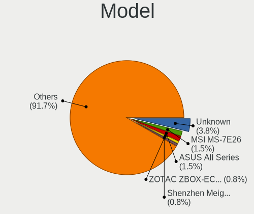
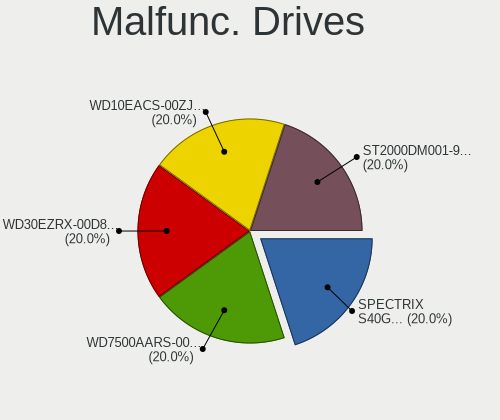
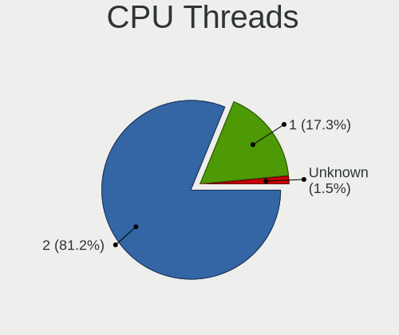
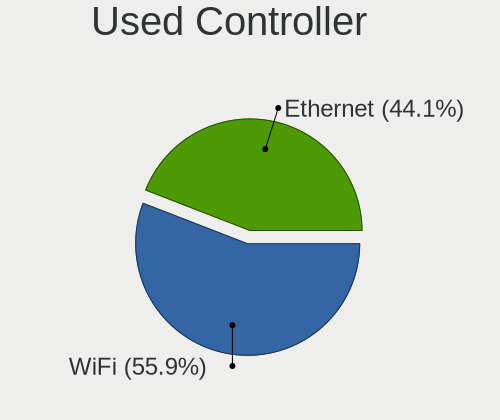
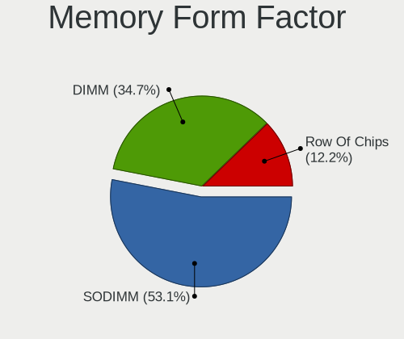

Kubuntu Hardware Trends
-----------------------

A project to identify most popular hardware characteristics and track their change
over time based on data collected by Kubuntu users at https://Linux-Hardware.org.

Anyone can contribute to this report by the [hw-probe](https://github.com/linuxhw/hw-probe) tool:

    sudo -E hw-probe -all -upload

This is a report for all computer types. See also reports for [desktops](/Dist/Kubuntu/Desktop/README.md) and [notebooks](/Dist/Kubuntu/Notebook/README.md).

Full-feature report is available here: https://linux-hardware.org/?view=trends

Period: Aug, 2021.

Contents
--------

* [ System ](#system)
  - [ OS                       ](#os)
  - [ OS Family                ](#os-family)
  - [ Kernel                   ](#kernel)
  - [ Kernel Family            ](#kernel-family)
  - [ Kernel Major Ver.        ](#kernel-major-ver)
  - [ Arch                     ](#arch)
  - [ DE                       ](#de)
  - [ Display Server           ](#display-server)
  - [ Display Manager          ](#display-manager)
  - [ OS Lang                  ](#os-lang)
  - [ Boot Mode                ](#boot-mode)
  - [ Filesystem               ](#filesystem)
  - [ Part. scheme             ](#part-scheme)
  - [ Dual Boot with Linux/BSD ](#dual-boot-with-linuxbsd)
  - [ Dual Boot (Win)          ](#dual-boot-win)

* [ Board ](#board)
  - [ Vendor                   ](#vendor)
  - [ Model                    ](#model)
  - [ Model Family             ](#model-family)
  - [ MFG Year                 ](#mfg-year)
  - [ Form Factor              ](#form-factor)
  - [ Secure Boot              ](#secure-boot)
  - [ Coreboot                 ](#coreboot)
  - [ RAM Size                 ](#ram-size)
  - [ RAM Used                 ](#ram-used)
  - [ Total Drives             ](#total-drives)
  - [ Has CD-ROM               ](#has-cd-rom)
  - [ Has Ethernet             ](#has-ethernet)
  - [ Has WiFi                 ](#has-wifi)
  - [ Has Bluetooth            ](#has-bluetooth)

* [ Location ](#location)
  - [ Country                  ](#country)
  - [ City                     ](#city)

* [ Drives ](#drives)
  - [ Drive Vendor             ](#drive-vendor)
  - [ Drive Model              ](#drive-model)
  - [ HDD Vendor               ](#hdd-vendor)
  - [ SSD Vendor               ](#ssd-vendor)
  - [ Drive Kind               ](#drive-kind)
  - [ Drive Connector          ](#drive-connector)
  - [ Drive Size               ](#drive-size)
  - [ Space Total              ](#space-total)
  - [ Space Used               ](#space-used)
  - [ Malfunc. Drives          ](#malfunc-drives)
  - [ Malfunc. Drive Vendor    ](#malfunc-drive-vendor)
  - [ Malfunc. HDD Vendor      ](#malfunc-hdd-vendor)
  - [ Malfunc. Drive Kind      ](#malfunc-drive-kind)
  - [ Failed Drives            ](#failed-drives)
  - [ Failed Drive Vendor      ](#failed-drive-vendor)
  - [ Drive Status             ](#drive-status)

* [ Storage controller ](#storage-controller)
  - [ Storage Vendor           ](#storage-vendor)
  - [ Storage Model            ](#storage-model)
  - [ Storage Kind             ](#storage-kind)

* [ Processor ](#processor)
  - [ CPU Vendor               ](#cpu-vendor)
  - [ CPU Model                ](#cpu-model)
  - [ CPU Model Family         ](#cpu-model-family)
  - [ CPU Cores                ](#cpu-cores)
  - [ CPU Sockets              ](#cpu-sockets)
  - [ CPU Threads              ](#cpu-threads)
  - [ CPU Op-Modes             ](#cpu-op-modes)
  - [ CPU Microcode            ](#cpu-microcode)
  - [ CPU Microarch            ](#cpu-microarch)

* [ Graphics ](#graphics)
  - [ GPU Vendor               ](#gpu-vendor)
  - [ GPU Model                ](#gpu-model)
  - [ GPU Combo                ](#gpu-combo)
  - [ GPU Driver               ](#gpu-driver)
  - [ GPU Memory               ](#gpu-memory)

* [ Monitor ](#monitor)
  - [ Monitor Vendor           ](#monitor-vendor)
  - [ Monitor Model            ](#monitor-model)
  - [ Monitor Resolution       ](#monitor-resolution)
  - [ Monitor Diagonal         ](#monitor-diagonal)
  - [ Monitor Width            ](#monitor-width)
  - [ Aspect Ratio             ](#aspect-ratio)
  - [ Monitor Area             ](#monitor-area)
  - [ Pixel Density            ](#pixel-density)
  - [ Multiple Monitors        ](#multiple-monitors)

* [ Network ](#network)
  - [ Net Controller Vendor    ](#net-controller-vendor)
  - [ Net Controller Model     ](#net-controller-model)
  - [ Wireless Vendor          ](#wireless-vendor)
  - [ Wireless Model           ](#wireless-model)
  - [ Ethernet Vendor          ](#ethernet-vendor)
  - [ Ethernet Model           ](#ethernet-model)
  - [ Net Controller Kind      ](#net-controller-kind)
  - [ Used Controller          ](#used-controller)
  - [ NICs                     ](#nics)
  - [ IPv6                     ](#ipv6)

* [ Bluetooth ](#bluetooth)
  - [ Bluetooth Vendor         ](#bluetooth-vendor)
  - [ Bluetooth Model          ](#bluetooth-model)

* [ Sound ](#sound)
  - [ Sound Vendor             ](#sound-vendor)
  - [ Sound Model              ](#sound-model)

* [ Memory ](#memory)
  - [ Memory Vendor            ](#memory-vendor)
  - [ Memory Model             ](#memory-model)
  - [ Memory Kind              ](#memory-kind)
  - [ Memory Form Factor       ](#memory-form-factor)
  - [ Memory Size              ](#memory-size)
  - [ Memory Speed             ](#memory-speed)

* [ Printers & scanners ](#printers--scanners)
  - [ Printer Vendor           ](#printer-vendor)
  - [ Printer Model            ](#printer-model)
  - [ Scanner Vendor           ](#scanner-vendor)
  - [ Scanner Model            ](#scanner-model)

* [ Camera ](#camera)
  - [ Camera Vendor            ](#camera-vendor)
  - [ Camera Model             ](#camera-model)

* [ Security ](#security)
  - [ Fingerprint Vendor       ](#fingerprint-vendor)
  - [ Fingerprint Model        ](#fingerprint-model)
  - [ Chipcard Vendor          ](#chipcard-vendor)
  - [ Chipcard Model           ](#chipcard-model)

* [ Unsupported ](#unsupported)
  - [ Unsupported Devices      ](#unsupported-devices)
  - [ Unsupported Device Types ](#unsupported-device-types)

System
------

OS
--

Installed operating systems

| Name          | Computers | Percent |
|---------------|-----------|---------|
| Kubuntu 21.04 | 42        | 47.19%  |
| Kubuntu 20.04 | 42        | 47.19%  |
| Kubuntu 20.10 | 3         | 3.37%   |
| Kubuntu 21.10 | 1         | 1.12%   |
| Kubuntu 18.04 | 1         | 1.12%   |

OS Family
---------

OS without a version

| Name    | Computers | Percent |
|---------|-----------|---------|
| Kubuntu | 89        | 100%    |

Kernel
------

Version of the Linux kernel

| Version                  | Computers | Percent |
|--------------------------|-----------|---------|
| 5.11.0-25-generic        | 29        | 32.58%  |
| 5.4.0-81-generic         | 10        | 11.24%  |
| 5.11.0-31-generic        | 10        | 11.24%  |
| 5.4.0-80-generic         | 6         | 6.74%   |
| 5.8.0-63-generic         | 5         | 5.62%   |
| 5.11.0-27-generic        | 5         | 5.62%   |
| 5.11.0-16-generic        | 3         | 3.37%   |
| 5.8.0-59-generic         | 2         | 2.25%   |
| 5.8.0-43-generic         | 2         | 2.25%   |
| 5.11.0-33-generic        | 2         | 2.25%   |
| 5.11.0-25-lowlatency     | 2         | 2.25%   |
| 5.9.16-050916-generic    | 1         | 1.12%   |
| 5.4.0-80-lowlatency      | 1         | 1.12%   |
| 5.4.0-77-generic         | 1         | 1.12%   |
| 5.14.0-051400rc3-generic | 1         | 1.12%   |
| 5.13.9-051309-generic    | 1         | 1.12%   |
| 5.13.7-051307-generic    | 1         | 1.12%   |
| 5.13.6-051306-generic    | 1         | 1.12%   |
| 5.13.12-051312-generic   | 1         | 1.12%   |
| 5.13.1-051301-generic    | 1         | 1.12%   |
| 5.11.17-xanmod1          | 1         | 1.12%   |
| 5.11.0-31-lowlatency     | 1         | 1.12%   |
| 5.11.0-26-generic        | 1         | 1.12%   |
| 5.11.0-22-generic        | 1         | 1.12%   |

Kernel Family
-------------

Linux kernel without a distro release

| Version | Computers | Percent |
|---------|-----------|---------|
| 5.11.0  | 54        | 60.67%  |
| 5.4.0   | 18        | 20.22%  |
| 5.8.0   | 9         | 10.11%  |
| 5.9.16  | 1         | 1.12%   |
| 5.14.0  | 1         | 1.12%   |
| 5.13.9  | 1         | 1.12%   |
| 5.13.7  | 1         | 1.12%   |
| 5.13.6  | 1         | 1.12%   |
| 5.13.12 | 1         | 1.12%   |
| 5.13.1  | 1         | 1.12%   |
| 5.11.17 | 1         | 1.12%   |

Kernel Major Ver.
-----------------

Linux kernel major version

| Version | Computers | Percent |
|---------|-----------|---------|
| 5.11    | 55        | 61.8%   |
| 5.4     | 18        | 20.22%  |
| 5.8     | 9         | 10.11%  |
| 5.13    | 5         | 5.62%   |
| 5.9     | 1         | 1.12%   |
| 5.14    | 1         | 1.12%   |

Arch
----

OS architecture (x86_64, i586, etc.)

| Name   | Computers | Percent |
|--------|-----------|---------|
| x86_64 | 89        | 100%    |

DE
--

Desktop Environment

| Name   | Computers | Percent |
|--------|-----------|---------|
| KDE5   | 51        | 57.3%   |
| KDE    | 36        | 40.45%  |
| Unity  | 1         | 1.12%   |
| Budgie | 1         | 1.12%   |

Display Server
--------------

X11 or Wayland

| Name    | Computers | Percent |
|---------|-----------|---------|
| X11     | 87        | 97.75%  |
| Wayland | 2         | 2.25%   |

Display Manager
---------------

SDDM, LightDM, etc.

| Name    | Computers | Percent |
|---------|-----------|---------|
| SDDM    | 49        | 55.06%  |
| Unknown | 35        | 39.33%  |
| GDM     | 3         | 3.37%   |
| TDM     | 2         | 2.25%   |

OS Lang
-------

Language

| Lang  | Computers | Percent |
|-------|-----------|---------|
| en_US | 28        | 31.46%  |
| en_GB | 12        | 13.48%  |
| pt_BR | 8         | 8.99%   |
| fr_FR | 6         | 6.74%   |
| en_AU | 5         | 5.62%   |
| ru_RU | 3         | 3.37%   |
| C     | 3         | 3.37%   |
| en_IN | 2         | 2.25%   |
| de_DE | 2         | 2.25%   |
| cs_CZ | 2         | 2.25%   |
| zh_TW | 1         | 1.12%   |
| zh_CN | 1         | 1.12%   |
| uk_UA | 1         | 1.12%   |
| ru_UA | 1         | 1.12%   |
| pl_PL | 1         | 1.12%   |
| nl_BE | 1         | 1.12%   |
| mn_CN | 1         | 1.12%   |
| ja_JP | 1         | 1.12%   |
| it_IT | 1         | 1.12%   |
| hu_HU | 1         | 1.12%   |
| fr_CA | 1         | 1.12%   |
| fi_FI | 1         | 1.12%   |
| es_MX | 1         | 1.12%   |
| es_AR | 1         | 1.12%   |
| en_PH | 1         | 1.12%   |
| en_NG | 1         | 1.12%   |
| en_CA | 1         | 1.12%   |
| az_IR | 1         | 1.12%   |

Boot Mode
---------

EFI or BIOS

| Mode | Computers | Percent |
|------|-----------|---------|
| EFI  | 54        | 60.67%  |
| BIOS | 35        | 39.33%  |

Filesystem
----------

Type of filesystem

| Type    | Computers | Percent |
|---------|-----------|---------|
| Ext4    | 83        | 93.26%  |
| Xfs     | 2         | 2.25%   |
| Overlay | 2         | 2.25%   |
| XXXX    | 1         | 1.12%   |
| Btrfs   | 1         | 1.12%   |

Part. scheme
------------

Scheme of partitioning

| Type    | Computers | Percent |
|---------|-----------|---------|
| GPT     | 46        | 51.69%  |
| Unknown | 35        | 39.33%  |
| MBR     | 8         | 8.99%   |

Dual Boot with Linux/BSD
------------------------

Hosting more than one Linux/BSD

| Dual boot | Computers | Percent |
|-----------|-----------|---------|
| No        | 74        | 83.15%  |
| Yes       | 15        | 16.85%  |

Dual Boot (Win)
---------------

Hosting Linux and Windows

| Dual boot | Computers | Percent |
|-----------|-----------|---------|
| No        | 54        | 60.67%  |
| Yes       | 35        | 39.33%  |

Board
-----

Vendor
------

Motherboard manufacturer

| Name                | Computers | Percent |
|---------------------|-----------|---------|
| ASUSTek Computer    | 18        | 20.22%  |
| Dell                | 17        | 19.1%   |
| Hewlett-Packard     | 15        | 16.85%  |
| Lenovo              | 12        | 13.48%  |
| Gigabyte Technology | 6         | 6.74%   |
| MSI                 | 5         | 5.62%   |
| ASRock              | 3         | 3.37%   |
| TUXEDO              | 2         | 2.25%   |
| Unknown             | 2         | 2.25%   |
| Wistron             | 1         | 1.12%   |
| Toshiba             | 1         | 1.12%   |
| SYWZ                | 1         | 1.12%   |
| SUPoX COMPUTER      | 1         | 1.12%   |
| Samsung Electronics | 1         | 1.12%   |
| PC Specialist       | 1         | 1.12%   |
| HUAWEI              | 1         | 1.12%   |
| Google              | 1         | 1.12%   |
| Acer                | 1         | 1.12%   |

Model
-----

Motherboard model

| Name                                   | Computers | Percent |
|----------------------------------------|-----------|---------|
| Unknown                                | 2         | 2.25%   |
| Wistron ProLiant ML110 G6              | 1         | 1.12%   |
| TUXEDO InfinityBook S 14 Gen6          | 1         | 1.12%   |
| TUXEDO InfinityBook Pro 15 v5          | 1         | 1.12%   |
| Toshiba QOSMIO X70-A                   | 1         | 1.12%   |
| SYWZ S210H Series                      | 1         | 1.12%   |
| SUPoX COMPUTER B250A-BTC PRO           | 1         | 1.12%   |
| Samsung 700Z3A/700Z4A/700Z5A/700Z5B    | 1         | 1.12%   |
| PC Specialist N130BU                   | 1         | 1.12%   |
| MSI MS-7C91                            | 1         | 1.12%   |
| MSI MS-7B87                            | 1         | 1.12%   |
| MSI MS-7817                            | 1         | 1.12%   |
| MSI MS-7693                            | 1         | 1.12%   |
| MSI GE620/GE620DX/FX620DX/FX623        | 1         | 1.12%   |
| Lenovo ThinkStation E32 30A10057BR     | 1         | 1.12%   |
| Lenovo ThinkPad X230 2325V1K           | 1         | 1.12%   |
| Lenovo ThinkPad T470 W10DG 20JM000CUS  | 1         | 1.12%   |
| Lenovo ThinkPad T460 20FN002VUS        | 1         | 1.12%   |
| Lenovo ThinkPad E580 20KS0039GE        | 1         | 1.12%   |
| Lenovo ThinkPad E15 Gen 2 20T8000YMB   | 1         | 1.12%   |
| Lenovo ThinkPad E15 20RD003JRT         | 1         | 1.12%   |
| Lenovo ThinkCentre E73 10DU0015UK      | 1         | 1.12%   |
| Lenovo Legion 5 15ARH05H 82B1          | 1         | 1.12%   |
| Lenovo IdeaPad U530 Touch 20289        | 1         | 1.12%   |
| Lenovo IdeaPad 330-15IKB 81DE          | 1         | 1.12%   |
| Lenovo G500 20236                      | 1         | 1.12%   |
| HUAWEI HLYL-WXX9                       | 1         | 1.12%   |
| HP Pavilion x360 Convertible 14-cd1xxx | 1         | 1.12%   |
| HP Pavilion Laptop 17-ar0xx            | 1         | 1.12%   |
| HP Pavilion Gaming Laptop 15-ec2xxx    | 1         | 1.12%   |
| HP Pavilion g7                         | 1         | 1.12%   |
| HP Pavilion dv7                        | 1         | 1.12%   |
| HP Pavilion Desktop TP01-0xxx          | 1         | 1.12%   |
| HP Notebook                            | 1         | 1.12%   |
| HP Laptop 15-ef1xxx                    | 1         | 1.12%   |
| HP ENVY x360 Convertible 15m-dr1xxx    | 1         | 1.12%   |
| HP ENVY x360 Convertible 13-ay0xxx     | 1         | 1.12%   |
| HP ENVY TS m7                          | 1         | 1.12%   |
| HP EliteBook x360 1030 G2              | 1         | 1.12%   |
| HP EliteBook 850 G8 Notebook PC        | 1         | 1.12%   |
| HP EliteBook 840 G5                    | 1         | 1.12%   |
| HP 250 G6 Notebook PC                  | 1         | 1.12%   |
| Google Cyan                            | 1         | 1.12%   |
| Gigabyte Z390 M GAMING                 | 1         | 1.12%   |
| Gigabyte M61SME-S2L                    | 1         | 1.12%   |
| Gigabyte H310M M.2                     | 1         | 1.12%   |
| Gigabyte F2A68HM-S1                    | 1         | 1.12%   |
| Gigabyte B75M-D3V                      | 1         | 1.12%   |
| Gigabyte A520M S2H                     | 1         | 1.12%   |
| Dell XPS 17 9710                       | 1         | 1.12%   |
| Dell XPS 15 9570                       | 1         | 1.12%   |
| Dell Vostro 14 5401                    | 1         | 1.12%   |
| Dell OptiPlex 790                      | 1         | 1.12%   |
| Dell Latitude E6510                    | 1         | 1.12%   |
| Dell Latitude E6400                    | 1         | 1.12%   |
| Dell Latitude E5440                    | 1         | 1.12%   |
| Dell Latitude E5430 vPro               | 1         | 1.12%   |
| Dell Latitude E4200                    | 1         | 1.12%   |
| Dell Latitude 5420                     | 1         | 1.12%   |
| Dell Inspiron One 2310                 | 1         | 1.12%   |

Model Family
------------

Motherboard model prefix

| Name                     | Computers | Percent |
|--------------------------|-----------|---------|
| Dell Inspiron            | 7         | 7.87%   |
| Lenovo ThinkPad          | 6         | 6.74%   |
| HP Pavilion              | 6         | 6.74%   |
| Dell Latitude            | 6         | 6.74%   |
| ASUS PRIME               | 4         | 4.49%   |
| HP ENVY                  | 3         | 3.37%   |
| HP EliteBook             | 3         | 3.37%   |
| ASUS ROG                 | 3         | 3.37%   |
| TUXEDO InfinityBook      | 2         | 2.25%   |
| Lenovo IdeaPad           | 2         | 2.25%   |
| Dell XPS                 | 2         | 2.25%   |
| Unknown                  | 2         | 2.25%   |
| Wistron ProLiant         | 1         | 1.12%   |
| Toshiba QOSMIO           | 1         | 1.12%   |
| SYWZ S210H               | 1         | 1.12%   |
| SUPoX COMPUTER B250A-BTC | 1         | 1.12%   |
| Samsung 700Z3A           | 1         | 1.12%   |
| PC Specialist N130BU     | 1         | 1.12%   |
| MSI MS-7C91              | 1         | 1.12%   |
| MSI MS-7B87              | 1         | 1.12%   |
| MSI MS-7817              | 1         | 1.12%   |
| MSI MS-7693              | 1         | 1.12%   |
| MSI GE620                | 1         | 1.12%   |
| Lenovo ThinkStation      | 1         | 1.12%   |
| Lenovo ThinkCentre       | 1         | 1.12%   |
| Lenovo Legion            | 1         | 1.12%   |
| Lenovo G500              | 1         | 1.12%   |
| HUAWEI HLYL-WXX9         | 1         | 1.12%   |
| HP Notebook              | 1         | 1.12%   |
| HP Laptop                | 1         | 1.12%   |
| HP 250                   | 1         | 1.12%   |
| Google Cyan              | 1         | 1.12%   |
| Gigabyte Z390            | 1         | 1.12%   |
| Gigabyte M61SME-S2L      | 1         | 1.12%   |
| Gigabyte H310M           | 1         | 1.12%   |
| Gigabyte F2A68HM-S1      | 1         | 1.12%   |
| Gigabyte B75M-D3V        | 1         | 1.12%   |
| Gigabyte A520M           | 1         | 1.12%   |
| Dell Vostro              | 1         | 1.12%   |
| Dell OptiPlex            | 1         | 1.12%   |
| ASUS ZenBook             | 1         | 1.12%   |
| ASUS Z170-WS             | 1         | 1.12%   |
| ASUS VivoBook            | 1         | 1.12%   |
| ASUS UX21E               | 1         | 1.12%   |
| ASUS P8Z77-V             | 1         | 1.12%   |
| ASUS K72Jr               | 1         | 1.12%   |
| ASUS H61-PLUS            | 1         | 1.12%   |
| ASUS G55VW               | 1         | 1.12%   |
| ASUS FX503VD             | 1         | 1.12%   |
| ASUS ASUS                | 1         | 1.12%   |
| ASUS All                 | 1         | 1.12%   |
| ASRock X570              | 1         | 1.12%   |
| ASRock B550              | 1         | 1.12%   |
| ASRock AB350             | 1         | 1.12%   |
| Acer Aspire              | 1         | 1.12%   |

MFG Year
--------

Motherboard manufacture year

| Year | Computers | Percent |
|------|-----------|---------|
| 2021 | 18        | 20.22%  |
| 2020 | 18        | 20.22%  |
| 2018 | 12        | 13.48%  |
| 2019 | 8         | 8.99%   |
| 2013 | 7         | 7.87%   |
| 2012 | 6         | 6.74%   |
| 2017 | 3         | 3.37%   |
| 2015 | 3         | 3.37%   |
| 2011 | 3         | 3.37%   |
| 2010 | 3         | 3.37%   |
| 2009 | 3         | 3.37%   |
| 2016 | 2         | 2.25%   |
| 2014 | 2         | 2.25%   |
| 2007 | 1         | 1.12%   |

Form Factor
-----------

Physical design of the computer

| Name        | Computers | Percent |
|-------------|-----------|---------|
| Notebook    | 53        | 59.55%  |
| Desktop     | 30        | 33.71%  |
| Convertible | 5         | 5.62%   |
| All in one  | 1         | 1.12%   |

Secure Boot
-----------

Enabled or disabled

| State    | Computers | Percent |
|----------|-----------|---------|
| Disabled | 84        | 94.38%  |
| Enabled  | 5         | 5.62%   |

Coreboot
--------

Have coreboot on board

| Used | Computers | Percent |
|------|-----------|---------|
| No   | 88        | 98.88%  |
| Yes  | 1         | 1.12%   |

RAM Size
--------

Total RAM memory

| Size in GB  | Computers | Percent |
|-------------|-----------|---------|
| 8.01-16.0   | 25        | 28.09%  |
| 4.01-8.0    | 17        | 19.1%   |
| 16.01-24.0  | 16        | 17.98%  |
| 32.01-64.0  | 15        | 16.85%  |
| 3.01-4.0    | 10        | 11.24%  |
| 24.01-32.0  | 2         | 2.25%   |
| 64.01-256.0 | 2         | 2.25%   |
| 2.01-3.0    | 1         | 1.12%   |
| 1.01-2.0    | 1         | 1.12%   |

RAM Used
--------

Used RAM memory

| Used GB    | Computers | Percent |
|------------|-----------|---------|
| 2.01-3.0   | 25        | 28.09%  |
| 4.01-8.0   | 20        | 22.47%  |
| 1.01-2.0   | 20        | 22.47%  |
| 3.01-4.0   | 10        | 11.24%  |
| 8.01-16.0  | 9         | 10.11%  |
| 16.01-24.0 | 3         | 3.37%   |
| 0.51-1.0   | 2         | 2.25%   |

Total Drives
------------

Number of drives on board

| Drives | Computers | Percent |
|--------|-----------|---------|
| 1      | 51        | 57.3%   |
| 2      | 21        | 23.6%   |
| 3      | 8         | 8.99%   |
| 4      | 4         | 4.49%   |
| 5      | 2         | 2.25%   |
| 9      | 1         | 1.12%   |
| 7      | 1         | 1.12%   |
| 6      | 1         | 1.12%   |

Has CD-ROM
----------

Has CD-ROM on board

| Presented | Computers | Percent |
|-----------|-----------|---------|
| No        | 61        | 68.54%  |
| Yes       | 28        | 31.46%  |

Has Ethernet
------------

Has Ethernet on board

| Presented | Computers | Percent |
|-----------|-----------|---------|
| Yes       | 72        | 80.9%   |
| No        | 17        | 19.1%   |

Has WiFi
--------

Has WiFi module

| Presented | Computers | Percent |
|-----------|-----------|---------|
| Yes       | 67        | 75.28%  |
| No        | 22        | 24.72%  |

Has Bluetooth
-------------

Has Bluetooth module

| Presented | Computers | Percent |
|-----------|-----------|---------|
| Yes       | 56        | 62.92%  |
| No        | 33        | 37.08%  |

Location
--------

Country
-------

Geographic location (country)

| Country      | Computers | Percent |
|--------------|-----------|---------|
| USA          | 15        | 16.85%  |
| UK           | 10        | 11.24%  |
| Brazil       | 9         | 10.11%  |
| France       | 5         | 5.62%   |
| Australia    | 5         | 5.62%   |
| Russia       | 4         | 4.49%   |
| Germany      | 4         | 4.49%   |
| Czechia      | 3         | 3.37%   |
| Canada       | 3         | 3.37%   |
| Ukraine      | 2         | 2.25%   |
| Poland       | 2         | 2.25%   |
| Netherlands  | 2         | 2.25%   |
| Mexico       | 2         | 2.25%   |
| India        | 2         | 2.25%   |
| Hungary      | 2         | 2.25%   |
| Belgium      | 2         | 2.25%   |
| Yemen        | 1         | 1.12%   |
| Taiwan       | 1         | 1.12%   |
| Spain        | 1         | 1.12%   |
| South Africa | 1         | 1.12%   |
| Philippines  | 1         | 1.12%   |
| Nigeria      | 1         | 1.12%   |
| Morocco      | 1         | 1.12%   |
| Japan        | 1         | 1.12%   |
| Italy        | 1         | 1.12%   |
| Ireland      | 1         | 1.12%   |
| Iran         | 1         | 1.12%   |
| Finland      | 1         | 1.12%   |
| Croatia      | 1         | 1.12%   |
| China        | 1         | 1.12%   |
| Belize       | 1         | 1.12%   |
| Armenia      | 1         | 1.12%   |
| Argentina    | 1         | 1.12%   |

City
----

Geographic location (city)

| City                 | Computers | Percent |
|----------------------|-----------|---------|
| London               | 4         | 4.49%   |
| Paris                | 2         | 2.25%   |
| Manchester           | 2         | 2.25%   |
| Amsterdam            | 2         | 2.25%   |
| Zagreb               | 1         | 1.12%   |
| Yerevan              | 1         | 1.12%   |
| Wittmund             | 1         | 1.12%   |
| Winnsboro            | 1         | 1.12%   |
| Weinstadt-Endersbach | 1         | 1.12%   |
| Watertown            | 1         | 1.12%   |
| Vincennes            | 1         | 1.12%   |
| Usti nad Orlici      | 1         | 1.12%   |
| Trindade             | 1         | 1.12%   |
| Torun                | 1         | 1.12%   |
| Toronto              | 1         | 1.12%   |
| Tehran               | 1         | 1.12%   |
| Sydney               | 1         | 1.12%   |
| St Petersburg        | 1         | 1.12%   |
| Shanghai             | 1         | 1.12%   |
| S??o Paulo           | 1         | 1.12%   |
| Sarandi              | 1         | 1.12%   |
| Sao Jose             | 1         | 1.12%   |
| Santos               | 1         | 1.12%   |
| Sandown              | 1         | 1.12%   |
| Rybinsk              | 1         | 1.12%   |
| Rome                 | 1         | 1.12%   |
| Rexburg              | 1         | 1.12%   |
| Quezon City          | 1         | 1.12%   |
| Prague               | 1         | 1.12%   |
| Pontypridd           | 1         | 1.12%   |
| Perth                | 1         | 1.12%   |
| Perm                 | 1         | 1.12%   |
| Paraiba do Sul       | 1         | 1.12%   |
| Ostrava              | 1         | 1.12%   |
| Olonne-sur-Mer       | 1         | 1.12%   |
| New Taipei           | 1         | 1.12%   |
| Mumbai               | 1         | 1.12%   |
| Mossley              | 1         | 1.12%   |
| Moscow               | 1         | 1.12%   |
| Montreal             | 1         | 1.12%   |
| Minoh                | 1         | 1.12%   |
| Metepec              | 1         | 1.12%   |
| Memphis              | 1         | 1.12%   |
| Maurecourt           | 1         | 1.12%   |
| Maua                 | 1         | 1.12%   |
| Markuszow            | 1         | 1.12%   |
| Marcus Hook          | 1         | 1.12%   |
| Maracai              | 1         | 1.12%   |
| Mansfield            | 1         | 1.12%   |
| Madrid               | 1         | 1.12%   |
| Los Angeles          | 1         | 1.12%   |
| Lagos                | 1         | 1.12%   |
| Kyiv                 | 1         | 1.12%   |
| Kharkiv              | 1         | 1.12%   |
| Hyderabad            | 1         | 1.12%   |
| Helsinki             | 1         | 1.12%   |
| Helena               | 1         | 1.12%   |
| Hamilton             | 1         | 1.12%   |
| Hamburg              | 1         | 1.12%   |
| Greenwich            | 1         | 1.12%   |

Drives
------

Drive Vendor
------------

Hard drive vendors

| Vendor              | Computers | Drives | Percent |
|---------------------|-----------|--------|---------|
| Samsung Electronics | 25        | 33     | 18.12%  |
| WDC                 | 22        | 24     | 15.94%  |
| Seagate             | 20        | 27     | 14.49%  |
| Kingston            | 8         | 9      | 5.8%    |
| Toshiba             | 7         | 7      | 5.07%   |
| SK Hynix            | 6         | 6      | 4.35%   |
| SanDisk             | 6         | 6      | 4.35%   |
| Unknown             | 5         | 5      | 3.62%   |
| Intel               | 5         | 6      | 3.62%   |
| Crucial             | 5         | 9      | 3.62%   |
| Micron Technology   | 3         | 3      | 2.17%   |
| KIOXIA              | 3         | 3      | 2.17%   |
| Hitachi             | 3         | 3      | 2.17%   |
| HGST                | 3         | 4      | 2.17%   |
| VENO                | 2         | 2      | 1.45%   |
| Gigabyte Technology | 2         | 2      | 1.45%   |
| A-DATA Technology   | 2         | 2      | 1.45%   |
| Vaseky              | 1         | 1      | 0.72%   |
| Transcend           | 1         | 1      | 0.72%   |
| TO Exter            | 1         | 1      | 0.72%   |
| StoreJet            | 1         | 1      | 0.72%   |
| Mushkin             | 1         | 1      | 0.72%   |
| Leven               | 1         | 1      | 0.72%   |
| Lenovo              | 1         | 1      | 0.72%   |
| KingSpec            | 1         | 1      | 0.72%   |
| Fujitsu             | 1         | 1      | 0.72%   |
| China               | 1         | 1      | 0.72%   |
| ASMT                | 1         | 1      | 0.72%   |

Drive Model
-----------

Hard drive models

| Model                                          | Computers | Percent |
|------------------------------------------------|-----------|---------|
| SK Hynix HFM001TD3JX013N 1TB                   | 3         | 1.92%   |
| Seagate ST1000LM048-2E7172 1TB                 | 3         | 1.92%   |
| Samsung SSD 850 EVO 500GB                      | 3         | 1.92%   |
| Kingston SA400S37240G 240GB SSD                | 3         | 1.92%   |
| WDC WDS240G2G0A-00JH30 240GB SSD               | 2         | 1.28%   |
| WDC WD10EARS-00Y5B1 1TB                        | 2         | 1.28%   |
| VENO SCORP SSD 240GB                           | 2         | 1.28%   |
| Seagate ST2000DM006-2DM164 2TB                 | 2         | 1.28%   |
| Seagate ST1000LX015-1U7172 1TB                 | 2         | 1.28%   |
| Samsung NVMe SSD Drive 512GB                   | 2         | 1.28%   |
| Samsung NVMe SSD Drive 1TB                     | 2         | 1.28%   |
| Samsung HD103SJ 1TB                            | 2         | 1.28%   |
| Intel SSDPEKNW010T8 1TB                        | 2         | 1.28%   |
| WDC WDBNCE2500PNC 250GB SSD                    | 1         | 0.64%   |
| WDC WD6400BEVT-00A0RT0 640GB                   | 1         | 0.64%   |
| WDC WD60EZAZ-00ZGHB0 6TB                       | 1         | 0.64%   |
| WDC WD5000LPCX-60VHAT1 500GB                   | 1         | 0.64%   |
| WDC WD5000LPCX-60VHAT0 500GB                   | 1         | 0.64%   |
| WDC WD40EZAZ-00SF3B0 4TB                       | 1         | 0.64%   |
| WDC WD30EZRS-42KEZB0 3TB                       | 1         | 0.64%   |
| WDC WD2502ABYS-23B7A0 39M4511 42C0463IBM 250GB | 1         | 0.64%   |
| WDC WD2500BEVT-22A23T0 250GB                   | 1         | 0.64%   |
| WDC WD20SPZX-22UA7T0 2TB                       | 1         | 0.64%   |
| WDC WD20EZRX-00D8PB0 2TB                       | 1         | 0.64%   |
| WDC WD1600BJKT-75F4T0 160GB                    | 1         | 0.64%   |
| WDC WD10SPZX-24Z10 1TB                         | 1         | 0.64%   |
| WDC WD10JPVX-22JC3T0 1TB                       | 1         | 0.64%   |
| WDC WD10EZEX-60WN4A1 1TB                       | 1         | 0.64%   |
| WDC WD10EZEX-08WN4A0 1TB                       | 1         | 0.64%   |
| WDC WD10EZEX-08M2NA0 1TB                       | 1         | 0.64%   |
| WDC WD10EZEX-00WN4A0 1TB                       | 1         | 0.64%   |
| WDC PC SN730 SDBPNTY-512G-1006 512GB           | 1         | 0.64%   |
| Vaseky V820/512G 512GB SSD                     | 1         | 0.64%   |
| Unknown TA2964  64GB                           | 1         | 0.64%   |
| Unknown RZX-19SSD6G/480G 480GB                 | 1         | 0.64%   |
| Unknown MMC Card  32GB                         | 1         | 0.64%   |
| Unknown MMC Card  16GB                         | 1         | 0.64%   |
| Unknown EC1S5  64GB                            | 1         | 0.64%   |
| Transcend TS128GMTS430S 128GB SSD              | 1         | 0.64%   |
| Toshiba THNSNH256GMCT 256GB SSD                | 1         | 0.64%   |
| Toshiba MQ04ABF100 1TB                         | 1         | 0.64%   |
| Toshiba MQ04ABD200 2TB                         | 1         | 0.64%   |
| Toshiba MQ01ABD100V 1TB                        | 1         | 0.64%   |
| Toshiba MQ01ABD050 500GB                       | 1         | 0.64%   |
| Toshiba MK7559GSXP 752GB                       | 1         | 0.64%   |
| Toshiba KXG50ZNV512G 512GB                     | 1         | 0.64%   |
| TO Exter nal USB 3.0 120GB                     | 1         | 0.64%   |
| StoreJet Transcend 500GB                       | 1         | 0.64%   |
| SK Hynix SKHynix_HFS512GD9TNI-L2A0B 512GB      | 1         | 0.64%   |
| SK Hynix PC401 NVMe 1TB                        | 1         | 0.64%   |
| SK Hynix BC711 HFM512GD3JX013N 512GB           | 1         | 0.64%   |
| Seagate ST9750420AS 752GB                      | 1         | 0.64%   |
| Seagate ST500LT012-1DG142 500GB                | 1         | 0.64%   |
| Seagate ST500LM030-1RK17D 500GB                | 1         | 0.64%   |
| Seagate ST500LM000-1EJ162 500GB                | 1         | 0.64%   |
| Seagate ST5000DM000-1FK178 5TB                 | 1         | 0.64%   |
| Seagate ST4000DM005-2DP166 4TB                 | 1         | 0.64%   |
| Seagate ST4000DM000-2AE166 4TB                 | 1         | 0.64%   |
| Seagate ST3500418AS 500GB                      | 1         | 0.64%   |
| Seagate ST3500413AS 500GB                      | 1         | 0.64%   |

HDD Vendor
----------

Hard disk drive vendors

| Vendor              | Computers | Drives | Percent |
|---------------------|-----------|--------|---------|
| Seagate             | 20        | 27     | 35.09%  |
| WDC                 | 19        | 20     | 33.33%  |
| Toshiba             | 5         | 5      | 8.77%   |
| Samsung Electronics | 4         | 5      | 7.02%   |
| Hitachi             | 3         | 3      | 5.26%   |
| HGST                | 3         | 4      | 5.26%   |
| TO Exter            | 1         | 1      | 1.75%   |
| Fujitsu             | 1         | 1      | 1.75%   |
| ASMT                | 1         | 1      | 1.75%   |

SSD Vendor
----------

Solid state drive vendors

| Vendor              | Computers | Drives | Percent |
|---------------------|-----------|--------|---------|
| Samsung Electronics | 13        | 15     | 27.08%  |
| Kingston            | 6         | 7      | 12.5%   |
| SanDisk             | 5         | 5      | 10.42%  |
| WDC                 | 3         | 3      | 6.25%   |
| Crucial             | 3         | 7      | 6.25%   |
| VENO                | 2         | 2      | 4.17%   |
| Micron Technology   | 2         | 2      | 4.17%   |
| Intel               | 2         | 2      | 4.17%   |
| A-DATA Technology   | 2         | 2      | 4.17%   |
| Vaseky              | 1         | 1      | 2.08%   |
| Unknown             | 1         | 1      | 2.08%   |
| Transcend           | 1         | 1      | 2.08%   |
| Toshiba             | 1         | 1      | 2.08%   |
| StoreJet            | 1         | 1      | 2.08%   |
| Mushkin             | 1         | 1      | 2.08%   |
| Leven               | 1         | 1      | 2.08%   |
| KingSpec            | 1         | 1      | 2.08%   |
| Gigabyte Technology | 1         | 1      | 2.08%   |
| China               | 1         | 1      | 2.08%   |

Drive Kind
----------

HDD or SSD

| Kind | Computers | Drives | Percent |
|------|-----------|--------|---------|
| HDD  | 44        | 67     | 37.29%  |
| SSD  | 37        | 55     | 31.36%  |
| NVMe | 33        | 36     | 27.97%  |
| MMC  | 4         | 4      | 3.39%   |

Drive Connector
---------------

SATA, SAS, NVMe, etc.

| Type | Computers | Drives | Percent |
|------|-----------|--------|---------|
| SATA | 64        | 118    | 60.95%  |
| NVMe | 33        | 36     | 31.43%  |
| SAS  | 4         | 4      | 3.81%   |
| MMC  | 4         | 4      | 3.81%   |

Drive Size
----------

Size of hard drive

| Size in TB | Computers | Drives | Percent |
|------------|-----------|--------|---------|
| 0.01-0.5   | 45        | 57     | 48.91%  |
| 0.51-1.0   | 29        | 40     | 31.52%  |
| 1.01-2.0   | 10        | 12     | 10.87%  |
| 3.01-4.0   | 3         | 4      | 3.26%   |
| 4.01-10.0  | 3         | 4      | 3.26%   |
| 2.01-3.0   | 1         | 1      | 1.09%   |
| 10.01-20.0 | 1         | 4      | 1.09%   |

Space Total
-----------

Amount of disk space available on the file system

| Size in GB     | Computers | Percent |
|----------------|-----------|---------|
| 101-250        | 26        | 29.21%  |
| 501-1000       | 22        | 24.72%  |
| 251-500        | 18        | 20.22%  |
| More than 3000 | 7         | 7.87%   |
| 2001-3000      | 7         | 7.87%   |
| 1-20           | 3         | 3.37%   |
| 51-100         | 3         | 3.37%   |
| 1001-2000      | 2         | 2.25%   |
| 21-50          | 1         | 1.12%   |

Space Used
----------

Amount of used disk space

| Used GB        | Computers | Percent |
|----------------|-----------|---------|
| 1-20           | 23        | 25.84%  |
| 101-250        | 21        | 23.6%   |
| 21-50          | 10        | 11.24%  |
| 251-500        | 9         | 10.11%  |
| 501-1000       | 8         | 8.99%   |
| 51-100         | 8         | 8.99%   |
| 1001-2000      | 7         | 7.87%   |
| More than 3000 | 3         | 3.37%   |

Malfunc. Drives
---------------

Drive models with a malfunction

| Model                                          | Computers | Drives | Percent |
|------------------------------------------------|-----------|--------|---------|
| WDC WD6400BEVT-00A0RT0 640GB                   | 1         | 1      | 7.14%   |
| WDC WD2502ABYS-23B7A0 39M4511 42C0463IBM 250GB | 1         | 1      | 7.14%   |
| WDC WD1600BJKT-75F4T0 160GB                    | 1         | 1      | 7.14%   |
| WDC WD10EARS-00Y5B1 1TB                        | 1         | 1      | 7.14%   |
| VENO SCORP SSD 240GB                           | 1         | 1      | 7.14%   |
| Seagate ST500LM000-1EJ162 500GB                | 1         | 1      | 7.14%   |
| Seagate ST3500418AS 500GB                      | 1         | 1      | 7.14%   |
| Seagate ST2000DM001-1E6164 2TB                 | 1         | 1      | 7.14%   |
| Seagate ST1000LM048-2E7172 1TB                 | 1         | 1      | 7.14%   |
| Seagate ST1000LM024 HN-M101MBB 1TB             | 1         | 1      | 7.14%   |
| Samsung Electronics HD082GJ 80GB               | 1         | 1      | 7.14%   |
| Intel SSDSCKKW010X6 1TB                        | 1         | 1      | 7.14%   |
| Crucial CT525MX300SSD4 528GB                   | 1         | 1      | 7.14%   |
| Crucial CT1050MX300SSD1 1050GB                 | 1         | 1      | 7.14%   |

Malfunc. Drive Vendor
---------------------

Vendors of faulty drives

| Vendor              | Computers | Drives | Percent |
|---------------------|-----------|--------|---------|
| Seagate             | 5         | 5      | 38.46%  |
| WDC                 | 4         | 4      | 30.77%  |
| VENO                | 1         | 1      | 7.69%   |
| Samsung Electronics | 1         | 1      | 7.69%   |
| Intel               | 1         | 1      | 7.69%   |
| Crucial             | 1         | 2      | 7.69%   |

Malfunc. HDD Vendor
-------------------

Vendors of faulty HDD drives

| Vendor              | Computers | Drives | Percent |
|---------------------|-----------|--------|---------|
| Seagate             | 5         | 5      | 50%     |
| WDC                 | 4         | 4      | 40%     |
| Samsung Electronics | 1         | 1      | 10%     |

Malfunc. Drive Kind
-------------------

Kinds of faulty drives

| Kind | Computers | Drives | Percent |
|------|-----------|--------|---------|
| HDD  | 9         | 10     | 75%     |
| SSD  | 3         | 4      | 25%     |

Failed Drives
-------------

Failed drive models

Zero info for selected period =(

Failed Drive Vendor
-------------------

Failed drive vendors

Zero info for selected period =(

Drive Status
------------

Number of failed and malfunc. drives

| Status   | Computers | Drives | Percent |
|----------|-----------|--------|---------|
| Works    | 49        | 80     | 50.52%  |
| Detected | 36        | 68     | 37.11%  |
| Malfunc  | 12        | 14     | 12.37%  |

Storage controller
------------------

Storage Vendor
--------------

Storage controller vendors

| Vendor                       | Computers | Percent |
|------------------------------|-----------|---------|
| Intel                        | 57        | 51.35%  |
| AMD                          | 19        | 17.12%  |
| Samsung Electronics          | 12        | 10.81%  |
| SK Hynix                     | 6         | 5.41%   |
| KIOXIA                       | 3         | 2.7%    |
| ASMedia Technology           | 3         | 2.7%    |
| Sandisk                      | 2         | 1.8%    |
| Micron/Crucial Technology    | 2         | 1.8%    |
| Kingston Technology Company  | 2         | 1.8%    |
| Toshiba America Info Systems | 1         | 0.9%    |
| Phison Electronics           | 1         | 0.9%    |
| Nvidia                       | 1         | 0.9%    |
| Micron Technology            | 1         | 0.9%    |
| Lenovo                       | 1         | 0.9%    |

Storage Model
-------------

Storage controller models

| Model                                                                            | Computers | Percent |
|----------------------------------------------------------------------------------|-----------|---------|
| AMD FCH SATA Controller [AHCI mode]                                              | 14        | 11.48%  |
| Intel 82801 Mobile SATA Controller [RAID mode]                                   | 7         | 5.74%   |
| Samsung NVMe SSD Controller SM981/PM981/PM983                                    | 6         | 4.92%   |
| Intel 8 Series/C220 Series Chipset Family 6-port SATA Controller 1 [AHCI mode]   | 6         | 4.92%   |
| Intel Sunrise Point-LP SATA Controller [AHCI mode]                               | 5         | 4.1%    |
| SK Hynix NVMe SSD Controller                                                     | 4         | 3.28%   |
| AMD Starship/Matisse Chipset SATA Controller [AHCI mode]                         | 4         | 3.28%   |
| Samsung NVMe SSD Controller PM9A1/PM9A3/980PRO                                   | 3         | 2.46%   |
| KIOXIA Non-Volatile memory controller                                            | 3         | 2.46%   |
| Intel Volume Management Device NVMe RAID Controller                              | 3         | 2.46%   |
| Intel Cannon Lake PCH SATA AHCI Controller                                       | 3         | 2.46%   |
| Intel 8 Series SATA Controller 1 [AHCI mode]                                     | 3         | 2.46%   |
| Intel 6 Series/C200 Series Chipset Family 6 port Mobile SATA AHCI Controller     | 3         | 2.46%   |
| Samsung NVMe SSD Controller SM961/PM961/SM963                                    | 2         | 1.64%   |
| Intel SSD 660P Series                                                            | 2         | 1.64%   |
| Intel SATA Controller [RAID mode]                                                | 2         | 1.64%   |
| Intel Comet Lake SATA AHCI Controller                                            | 2         | 1.64%   |
| Intel Celeron/Pentium Silver Processor SATA Controller                           | 2         | 1.64%   |
| Intel 82801IBM/IEM (ICH9M/ICH9M-E) 4 port SATA Controller [AHCI mode]            | 2         | 1.64%   |
| Intel 7 Series Chipset Family 6-port SATA Controller [AHCI mode]                 | 2         | 1.64%   |
| Intel 6 Series/C200 Series Chipset Family 6 port Desktop SATA AHCI Controller    | 2         | 1.64%   |
| Intel 5 Series/3400 Series Chipset 6 port SATA AHCI Controller                   | 2         | 1.64%   |
| Intel 5 Series/3400 Series Chipset 4 port SATA AHCI Controller                   | 2         | 1.64%   |
| Intel 200 Series PCH SATA controller [AHCI mode]                                 | 2         | 1.64%   |
| ASMedia ASM1062 Serial ATA Controller                                            | 2         | 1.64%   |
| AMD 400 Series Chipset SATA Controller                                           | 2         | 1.64%   |
| Toshiba America Info Systems Toshiba America Info Non-Volatile memory controller | 1         | 0.82%   |
| SK Hynix PC401 NVMe Solid State Drive 256GB                                      | 1         | 0.82%   |
| SK Hynix Non-Volatile memory controller                                          | 1         | 0.82%   |
| Sandisk WD Black SN750 / PC SN730 NVMe SSD                                       | 1         | 0.82%   |
| Sandisk PC SN520 NVMe SSD                                                        | 1         | 0.82%   |
| Samsung NVMe SSD Controller SM951/PM951                                          | 1         | 0.82%   |
| Samsung NVMe Controller                                                          | 1         | 0.82%   |
| Phison E16 PCIe4 NVMe Controller                                                 | 1         | 0.82%   |
| Nvidia MCP61 SATA Controller                                                     | 1         | 0.82%   |
| Nvidia MCP61 IDE                                                                 | 1         | 0.82%   |
| Micron/Crucial NVMe Controller                                                   | 1         | 0.82%   |
| Micron/Crucial Non-Volatile memory controller                                    | 1         | 0.82%   |
| Micron Non-Volatile memory controller                                            | 1         | 0.82%   |
| Lenovo Non-Volatile memory controller                                            | 1         | 0.82%   |
| Kingston Company U-SNS8154P3 NVMe SSD                                            | 1         | 0.82%   |
| Kingston Company OM3PDP3 NVMe SSD                                                | 1         | 0.82%   |
| Intel Q170/Q150/B150/H170/H110/Z170/CM236 Chipset SATA Controller [AHCI Mode]    | 1         | 0.82%   |
| Intel Non-Volatile memory controller                                             | 1         | 0.82%   |
| Intel HM170/QM170 Chipset SATA Controller [AHCI Mode]                            | 1         | 0.82%   |
| Intel Cannon Lake Mobile PCH SATA AHCI Controller                                | 1         | 0.82%   |
| Intel 82801IR/IO/IH (ICH9R/DO/DH) 4 port SATA Controller [IDE mode]              | 1         | 0.82%   |
| Intel 82801I (ICH9 Family) 2 port SATA Controller [IDE mode]                     | 1         | 0.82%   |
| Intel 7 Series/C210 Series Chipset Family 6-port SATA Controller [AHCI mode]     | 1         | 0.82%   |
| Intel 7 Series/C210 Series Chipset Family 4-port SATA Controller [IDE mode]      | 1         | 0.82%   |
| Intel 7 Series/C210 Series Chipset Family 2-port SATA Controller [IDE mode]      | 1         | 0.82%   |
| Intel 7 Series Chipset Family 4-port SATA Controller [IDE mode]                  | 1         | 0.82%   |
| Intel 7 Series Chipset Family 2-port SATA Controller [IDE mode]                  | 1         | 0.82%   |
| Intel 400 Series Chipset Family SATA AHCI Controller                             | 1         | 0.82%   |
| ASMedia ASM1061 SATA IDE Controller                                              | 1         | 0.82%   |
| AMD SB7x0/SB8x0/SB9x0 SATA Controller [AHCI mode]                                | 1         | 0.82%   |
| AMD FCH SATA Controller [IDE mode]                                               | 1         | 0.82%   |
| AMD 300 Series Chipset SATA Controller                                           | 1         | 0.82%   |

Storage Kind
------------

Kind of storage controller (IDE, SATA, NVMe, SAS, ...)

| Kind | Computers | Percent |
|------|-----------|---------|
| SATA | 60        | 54.55%  |
| NVMe | 33        | 30%     |
| RAID | 12        | 10.91%  |
| IDE  | 5         | 4.55%   |

Processor
---------

CPU Vendor
----------

Processor vendors

| Vendor | Computers | Percent |
|--------|-----------|---------|
| Intel  | 63        | 70.79%  |
| AMD    | 26        | 29.21%  |

CPU Model
---------

Processor models

| Model                                   | Computers | Percent |
|-----------------------------------------|-----------|---------|
| Intel Core i9-8950HK CPU @ 2.90GHz      | 2         | 2.25%   |
| Intel Core i7-4700MQ CPU @ 2.40GHz      | 2         | 2.25%   |
| Intel Core i7-10510U CPU @ 1.80GHz      | 2         | 2.25%   |
| Intel Core i5-3320M CPU @ 2.60GHz       | 2         | 2.25%   |
| Intel Core i5 CPU M 480 @ 2.67GHz       | 2         | 2.25%   |
| Intel 11th Gen Core i7-11800H @ 2.30GHz | 2         | 2.25%   |
| AMD Ryzen 7 4700U with Radeon Graphics  | 2         | 2.25%   |
| AMD Ryzen 5 4500U with Radeon Graphics  | 2         | 2.25%   |
| Intel Xeon CPU X3430 @ 2.40GHz          | 1         | 1.12%   |
| Intel Xeon CPU E3-1240 v3 @ 3.40GHz     | 1         | 1.12%   |
| Intel Pentium CPU G4560 @ 3.50GHz       | 1         | 1.12%   |
| Intel Pentium CPU G3220 @ 3.00GHz       | 1         | 1.12%   |
| Intel Genuine CPU U4100 @ 1.30GHz       | 1         | 1.12%   |
| Intel Core i7-9700F CPU @ 3.00GHz       | 1         | 1.12%   |
| Intel Core i7-8700 CPU @ 3.20GHz        | 1         | 1.12%   |
| Intel Core i7-8650U CPU @ 1.90GHz       | 1         | 1.12%   |
| Intel Core i7-8550U CPU @ 1.80GHz       | 1         | 1.12%   |
| Intel Core i7-7700K CPU @ 4.20GHz       | 1         | 1.12%   |
| Intel Core i7-7700HQ CPU @ 2.80GHz      | 1         | 1.12%   |
| Intel Core i7-7600U CPU @ 2.80GHz       | 1         | 1.12%   |
| Intel Core i7-7500U CPU @ 2.70GHz       | 1         | 1.12%   |
| Intel Core i7-6700K CPU @ 4.00GHz       | 1         | 1.12%   |
| Intel Core i7-6600U CPU @ 2.60GHz       | 1         | 1.12%   |
| Intel Core i7-4600U CPU @ 2.10GHz       | 1         | 1.12%   |
| Intel Core i7-4500U CPU @ 1.80GHz       | 1         | 1.12%   |
| Intel Core i7-3610QM CPU @ 2.30GHz      | 1         | 1.12%   |
| Intel Core i7-2700K CPU @ 3.50GHz       | 1         | 1.12%   |
| Intel Core i7-2677M CPU @ 1.80GHz       | 1         | 1.12%   |
| Intel Core i7-2670QM CPU @ 2.20GHz      | 1         | 1.12%   |
| Intel Core i5-9400 CPU @ 2.90GHz        | 1         | 1.12%   |
| Intel Core i5-8250U CPU @ 1.60GHz       | 1         | 1.12%   |
| Intel Core i5-7300HQ CPU @ 2.50GHz      | 1         | 1.12%   |
| Intel Core i5-6200U CPU @ 2.30GHz       | 1         | 1.12%   |
| Intel Core i5-4460 CPU @ 3.20GHz        | 1         | 1.12%   |
| Intel Core i5-4210U CPU @ 1.70GHz       | 1         | 1.12%   |
| Intel Core i5-3550 CPU @ 3.30GHz        | 1         | 1.12%   |
| Intel Core i5-2450M CPU @ 2.50GHz       | 1         | 1.12%   |
| Intel Core i5-2310 CPU @ 2.90GHz        | 1         | 1.12%   |
| Intel Core i5-10400F CPU @ 2.90GHz      | 1         | 1.12%   |
| Intel Core i5-1035G1 CPU @ 1.00GHz      | 1         | 1.12%   |
| Intel Core i5-10210U CPU @ 1.60GHz      | 1         | 1.12%   |
| Intel Core i5 CPU M 560 @ 2.67GHz       | 1         | 1.12%   |
| Intel Core i3-9100F CPU @ 3.60GHz       | 1         | 1.12%   |
| Intel Core i3-8145U CPU @ 2.10GHz       | 1         | 1.12%   |
| Intel Core i3-4170 CPU @ 3.70GHz        | 1         | 1.12%   |
| Intel Core i3-3110M CPU @ 2.40GHz       | 1         | 1.12%   |
| Intel Core i3-2120 CPU @ 3.30GHz        | 1         | 1.12%   |
| Intel Core i3 CPU M 350 @ 2.27GHz       | 1         | 1.12%   |
| Intel Core 2 Duo CPU U9600 @ 1.60GHz    | 1         | 1.12%   |
| Intel Core 2 Duo CPU T7500 @ 2.20GHz    | 1         | 1.12%   |
| Intel Core 2 Duo CPU P8700 @ 2.53GHz    | 1         | 1.12%   |
| Intel Core 2 Duo CPU E8600 @ 3.33GHz    | 1         | 1.12%   |
| Intel Celeron N4020 CPU @ 1.10GHz       | 1         | 1.12%   |
| Intel Celeron N4000 CPU @ 1.10GHz       | 1         | 1.12%   |
| Intel Celeron CPU N3060 @ 1.60GHz       | 1         | 1.12%   |
| Intel 11th Gen Core i9-11900H @ 2.50GHz | 1         | 1.12%   |
| Intel 11th Gen Core i7-1185G7 @ 3.00GHz | 1         | 1.12%   |
| Intel 11th Gen Core i7-1165G7 @ 2.80GHz | 1         | 1.12%   |
| Intel 11th Gen Core i5-1135G7 @ 2.40GHz | 1         | 1.12%   |
| AMD Ryzen 9 5900X 12-Core Processor     | 1         | 1.12%   |

CPU Model Family
----------------

Processor model prefix

| Model            | Computers | Percent |
|------------------|-----------|---------|
| Intel Core i7    | 20        | 22.47%  |
| Intel Core i5    | 17        | 19.1%   |
| AMD Ryzen 5      | 8         | 8.99%   |
| Other            | 7         | 7.87%   |
| AMD Ryzen 7      | 7         | 7.87%   |
| Intel Core i3    | 6         | 6.74%   |
| Intel Core 2 Duo | 4         | 4.49%   |
| AMD Ryzen 9      | 4         | 4.49%   |
| Intel Celeron    | 3         | 3.37%   |
| Intel Xeon       | 2         | 2.25%   |
| Intel Pentium    | 2         | 2.25%   |
| Intel Core i9    | 2         | 2.25%   |
| AMD A6           | 2         | 2.25%   |
| Intel Genuine    | 1         | 1.12%   |
| AMD FX           | 1         | 1.12%   |
| AMD Athlon 64 X2 | 1         | 1.12%   |
| AMD A8           | 1         | 1.12%   |
| AMD A10          | 1         | 1.12%   |

CPU Cores
---------

Number of processor cores

| Number | Computers | Percent |
|--------|-----------|---------|
| 2      | 32        | 35.96%  |
| 4      | 31        | 34.83%  |
| 6      | 12        | 13.48%  |
| 8      | 11        | 12.36%  |
| 12     | 2         | 2.25%   |
| 1      | 1         | 1.12%   |

CPU Sockets
-----------

Number of sockets

| Number | Computers | Percent |
|--------|-----------|---------|
| 1      | 89        | 100%    |

CPU Threads
-----------

Threads per core (Hyper-Threading)

| Number | Computers | Percent |
|--------|-----------|---------|
| 2      | 64        | 71.91%  |
| 1      | 25        | 28.09%  |

CPU Op-Modes
------------

CPU Operation Modes (32-bit, 64-bit)

| Op mode        | Computers | Percent |
|----------------|-----------|---------|
| 32-bit, 64-bit | 89        | 100%    |

CPU Microcode
-------------

Microcode number

| Number     | Computers | Percent |
|------------|-----------|---------|
| Unknown    | 22        | 24.72%  |
| 0x206a7    | 6         | 6.74%   |
| 0x906ea    | 5         | 5.62%   |
| 0x306c3    | 4         | 4.49%   |
| 0x306a9    | 4         | 4.49%   |
| 0x08600104 | 4         | 4.49%   |
| 0x806ec    | 3         | 3.37%   |
| 0x806d1    | 3         | 3.37%   |
| 0x1067a    | 3         | 3.37%   |
| 0x0a50000c | 3         | 3.37%   |
| 0x0a201016 | 3         | 3.37%   |
| 0x906e9    | 2         | 2.25%   |
| 0x806ea    | 2         | 2.25%   |
| 0x806e9    | 2         | 2.25%   |
| 0x40651    | 2         | 2.25%   |
| 0x0800820d | 2         | 2.25%   |
| 0xa0655    | 1         | 1.12%   |
| 0x906ed    | 1         | 1.12%   |
| 0x806eb    | 1         | 1.12%   |
| 0x806c1    | 1         | 1.12%   |
| 0x706e5    | 1         | 1.12%   |
| 0x706a8    | 1         | 1.12%   |
| 0x506e3    | 1         | 1.12%   |
| 0x406e3    | 1         | 1.12%   |
| 0x20655    | 1         | 1.12%   |
| 0x106e5    | 1         | 1.12%   |
| 0x0a50000b | 1         | 1.12%   |
| 0x08600106 | 1         | 1.12%   |
| 0x08108109 | 1         | 1.12%   |
| 0x08101016 | 1         | 1.12%   |
| 0x0810100b | 1         | 1.12%   |
| 0x07030105 | 1         | 1.12%   |
| 0x06006118 | 1         | 1.12%   |
| 0x06000852 | 1         | 1.12%   |
| 0x03000027 | 1         | 1.12%   |

CPU Microarch
-------------

Microarchitecture

| Name          | Computers | Percent |
|---------------|-----------|---------|
| KabyLake      | 19        | 21.35%  |
| Haswell       | 9         | 10.11%  |
| Zen 3         | 7         | 7.87%   |
| Zen 2         | 7         | 7.87%   |
| SandyBridge   | 6         | 6.74%   |
| IvyBridge     | 5         | 5.62%   |
| Westmere      | 4         | 4.49%   |
| Penryn        | 4         | 4.49%   |
| Icelake       | 4         | 4.49%   |
| Zen+          | 3         | 3.37%   |
| TigerLake     | 3         | 3.37%   |
| Skylake       | 3         | 3.37%   |
| Excavator     | 3         | 3.37%   |
| Zen           | 2         | 2.25%   |
| Goldmont plus | 2         | 2.25%   |
| Silvermont    | 1         | 1.12%   |
| Puma          | 1         | 1.12%   |
| Piledriver    | 1         | 1.12%   |
| Nehalem       | 1         | 1.12%   |
| K8 Hammer     | 1         | 1.12%   |
| K10 Llano     | 1         | 1.12%   |
| Core          | 1         | 1.12%   |
| CometLake     | 1         | 1.12%   |

Graphics
--------

GPU Vendor
----------

Vendors of graphics cards

| Vendor | Computers | Percent |
|--------|-----------|---------|
| Intel  | 46        | 42.99%  |
| AMD    | 35        | 32.71%  |
| Nvidia | 26        | 24.3%   |

GPU Model
---------

Graphics card models

| Model                                                                                    | Computers | Percent |
|------------------------------------------------------------------------------------------|-----------|---------|
| AMD Renoir                                                                               | 6         | 5.56%   |
| Intel 2nd Generation Core Processor Family Integrated Graphics Controller                | 4         | 3.7%    |
| AMD Cezanne                                                                              | 4         | 3.7%    |
| Nvidia GA106M [GeForce RTX 3060 Mobile / Max-Q]                                          | 3         | 2.78%   |
| Intel UHD Graphics 620                                                                   | 3         | 2.78%   |
| Intel TigerLake-LP GT2 [Iris Xe Graphics]                                                | 3         | 2.78%   |
| Intel TigerLake-H GT1 [UHD Graphics]                                                     | 3         | 2.78%   |
| Intel Mobile 4 Series Chipset Integrated Graphics Controller                             | 3         | 2.78%   |
| Intel Haswell-ULT Integrated Graphics Controller                                         | 3         | 2.78%   |
| Intel CometLake-U GT2 [UHD Graphics]                                                     | 3         | 2.78%   |
| Intel 3rd Gen Core processor Graphics Controller                                         | 3         | 2.78%   |
| AMD Ellesmere [Radeon RX 470/480/570/570X/580/580X/590]                                  | 3         | 2.78%   |
| Nvidia GP107M [GeForce GTX 1050 Mobile]                                                  | 2         | 1.85%   |
| Nvidia GK208B [GeForce GT 730]                                                           | 2         | 1.85%   |
| Nvidia GF117M [GeForce 610M/710M/810M/820M / GT 620M/625M/630M/720M]                     | 2         | 1.85%   |
| Intel Skylake GT2 [HD Graphics 520]                                                      | 2         | 1.85%   |
| Intel HD Graphics 630                                                                    | 2         | 1.85%   |
| Intel HD Graphics 620                                                                    | 2         | 1.85%   |
| Intel GeminiLake [UHD Graphics 600]                                                      | 2         | 1.85%   |
| Intel CoffeeLake-H GT2 [UHD Graphics 630]                                                | 2         | 1.85%   |
| Intel 4th Gen Core Processor Integrated Graphics Controller                              | 2         | 1.85%   |
| AMD Wani [Radeon R5/R6/R7 Graphics]                                                      | 2         | 1.85%   |
| AMD Turks PRO [Radeon HD 6570/7570/8550 / R5 230]                                        | 2         | 1.85%   |
| AMD Seymour [Radeon HD 6400M/7400M Series]                                               | 2         | 1.85%   |
| AMD Raven Ridge [Radeon Vega Series / Radeon Vega Mobile Series]                         | 2         | 1.85%   |
| AMD Park [Mobility Radeon HD 5430/5450/5470]                                             | 2         | 1.85%   |
| AMD Lexa PRO [Radeon 540/540X/550/550X / RX 540X/550/550X]                               | 2         | 1.85%   |
| Nvidia TU117M                                                                            | 1         | 0.93%   |
| Nvidia TU106M [GeForce RTX 2060 Mobile]                                                  | 1         | 0.93%   |
| Nvidia TU104 [GeForce RTX 2070 SUPER]                                                    | 1         | 0.93%   |
| Nvidia GP107M [GeForce GTX 1050 Ti Mobile]                                               | 1         | 0.93%   |
| Nvidia GP107GL [Quadro P400]                                                             | 1         | 0.93%   |
| Nvidia GP107 [GeForce GTX 1050 Ti]                                                       | 1         | 0.93%   |
| Nvidia GP106 [GeForce GTX 1060 3GB]                                                      | 1         | 0.93%   |
| Nvidia GP104 [GeForce GTX 1070 Ti]                                                       | 1         | 0.93%   |
| Nvidia GK208B [GeForce GT 710]                                                           | 1         | 0.93%   |
| Nvidia GK107M [GeForce GTX 660M]                                                         | 1         | 0.93%   |
| Nvidia GK107GL [Quadro K600]                                                             | 1         | 0.93%   |
| Nvidia GK106M [GeForce GTX 770M]                                                         | 1         | 0.93%   |
| Nvidia GF116M [GeForce GT 555M/635M]                                                     | 1         | 0.93%   |
| Nvidia GA104M [GeForce RTX 3070 Mobile / Max-Q]                                          | 1         | 0.93%   |
| Nvidia GA102 [GeForce RTX 3080 Ti]                                                       | 1         | 0.93%   |
| Nvidia GA102 [GeForce RTX 3080 Lite Hash Rate]                                           | 1         | 0.93%   |
| Nvidia G96GL [Quadro FX 380]                                                             | 1         | 0.93%   |
| Intel Xeon E3-1200 v3/4th Gen Core Processor Integrated Graphics Controller              | 1         | 0.93%   |
| Intel Xeon E3-1200 v2/3rd Gen Core processor Graphics Controller                         | 1         | 0.93%   |
| Intel WhiskeyLake-U GT2 [UHD Graphics 620]                                               | 1         | 0.93%   |
| Intel Iris Plus Graphics G1 (Ice Lake)                                                   | 1         | 0.93%   |
| Intel HD Graphics 530                                                                    | 1         | 0.93%   |
| Intel Core Processor Integrated Graphics Controller                                      | 1         | 0.93%   |
| Intel CometLake-S GT2 [UHD Graphics 630]                                                 | 1         | 0.93%   |
| Intel Atom/Celeron/Pentium Processor x5-E8000/J3xxx/N3xxx Integrated Graphics Controller | 1         | 0.93%   |
| Intel 4th Generation Core Processor Family Integrated Graphics Controller                | 1         | 0.93%   |
| AMD Turks XT [Radeon HD 6670/7670]                                                       | 1         | 0.93%   |
| AMD Topaz XT [Radeon R7 M260/M265 / M340/M360 / M440/M445 / 530/535 / 620/625 Mobile]    | 1         | 0.93%   |
| AMD Sumo [Radeon HD 6520G]                                                               | 1         | 0.93%   |
| AMD Stoney [Radeon R2/R3/R4/R5 Graphics]                                                 | 1         | 0.93%   |
| AMD RV710/M92 [Mobility Radeon HD 4530/4570/545v]                                        | 1         | 0.93%   |
| AMD Picasso                                                                              | 1         | 0.93%   |
| AMD Navi 10 [Radeon RX 5600 OEM/5600 XT / 5700/5700 XT]                                  | 1         | 0.93%   |

GPU Combo
---------

Combinations of graphics cards

| Name           | Computers | Percent |
|----------------|-----------|---------|
| 1 x Intel      | 31        | 34.83%  |
| 1 x AMD        | 27        | 30.34%  |
| 1 x Nvidia     | 12        | 13.48%  |
| Intel + Nvidia | 11        | 12.36%  |
| Intel + AMD    | 4         | 4.49%   |
| AMD + Nvidia   | 3         | 3.37%   |
| 2 x AMD        | 1         | 1.12%   |

GPU Driver
----------

Free vs proprietary

| Driver      | Computers | Percent |
|-------------|-----------|---------|
| Free        | 70        | 78.65%  |
| Proprietary | 18        | 20.22%  |
| Unknown     | 1         | 1.12%   |

GPU Memory
----------

Total video memory

| Size in GB | Computers | Percent |
|------------|-----------|---------|
| Unknown    | 44        | 49.44%  |
| 1.01-2.0   | 11        | 12.36%  |
| 0.01-0.5   | 11        | 12.36%  |
| 3.01-4.0   | 6         | 6.74%   |
| 0.51-1.0   | 6         | 6.74%   |
| 7.01-8.0   | 5         | 5.62%   |
| 5.01-6.0   | 2         | 2.25%   |
| 2.01-3.0   | 2         | 2.25%   |
| 8.01-16.0  | 2         | 2.25%   |

Monitor
-------

Monitor Vendor
--------------

Monitor vendors

| Vendor               | Computers | Percent |
|----------------------|-----------|---------|
| AU Optronics         | 16        | 16.16%  |
| Samsung Electronics  | 14        | 14.14%  |
| BOE                  | 13        | 13.13%  |
| Goldstar             | 11        | 11.11%  |
| LG Display           | 5         | 5.05%   |
| Chimei Innolux       | 5         | 5.05%   |
| Acer                 | 4         | 4.04%   |
| ViewSonic            | 3         | 3.03%   |
| Philips              | 3         | 3.03%   |
| InfoVision           | 3         | 3.03%   |
| Dell                 | 3         | 3.03%   |
| Sharp                | 2         | 2.02%   |
| Iiyama               | 2         | 2.02%   |
| Ancor Communications | 2         | 2.02%   |
| Vizio                | 1         | 1.01%   |
| Unknown (AAA)        | 1         | 1.01%   |
| MSI                  | 1         | 1.01%   |
| LG Electronics       | 1         | 1.01%   |
| Lenovo               | 1         | 1.01%   |
| KTC                  | 1         | 1.01%   |
| Idek Iiyama          | 1         | 1.01%   |
| Hewlett-Packard      | 1         | 1.01%   |
| HannStar             | 1         | 1.01%   |
| CPT                  | 1         | 1.01%   |
| BenQ                 | 1         | 1.01%   |
| AOC                  | 1         | 1.01%   |
| Achieva Shimian      | 1         | 1.01%   |

Monitor Model
-------------

Monitor models

| Model                                                                 | Computers | Percent |
|-----------------------------------------------------------------------|-----------|---------|
| Samsung Electronics LCD Monitor SEC5441 1366x768 344x194mm 15.5-inch  | 3         | 2.97%   |
| Goldstar LG ULTRAWIDE GSM59F1 1920x1080 580x240mm 24.7-inch           | 2         | 1.98%   |
| Goldstar FULL HD GSM5B55 1920x1080 480x270mm 21.7-inch                | 2         | 1.98%   |
| Vizio E40-D0 VIZ2001 1920x1080 885x498mm 40.0-inch                    | 1         | 0.99%   |
| ViewSonic VX2453 Series VSC0C28 1920x1080 520x290mm 23.4-inch         | 1         | 0.99%   |
| ViewSonic VG2860 SERIES VSC1F30 3840x2160 621x341mm 27.9-inch         | 1         | 0.99%   |
| ViewSonic VA916 Series VSC7C20 1280x1024 376x301mm 19.0-inch          | 1         | 0.99%   |
| Unknown (AAA) LCDTV AAA3393 1360x768 890x500mm 40.2-inch              | 1         | 0.99%   |
| Sharp LCD Monitor SHP1517 3840x2400 366x229mm 17.0-inch               | 1         | 0.99%   |
| Sharp LCD Monitor SHP148D 3840x2160 344x194mm 15.5-inch               | 1         | 0.99%   |
| Samsung Electronics SyncMaster SAM05B0 1920x1080                      | 1         | 0.99%   |
| Samsung Electronics SyncMaster SAM0591 1920x1080 477x268mm 21.5-inch  | 1         | 0.99%   |
| Samsung Electronics SyncMaster SAM01B7 1280x1024 338x270mm 17.0-inch  | 1         | 0.99%   |
| Samsung Electronics S24D590 SAM0B47 1920x1080 520x290mm 23.4-inch     | 1         | 0.99%   |
| Samsung Electronics S19D300 SAM0B35 1366x768 410x230mm 18.5-inch      | 1         | 0.99%   |
| Samsung Electronics LCD Monitor SEC3651 1366x768 344x194mm 15.5-inch  | 1         | 0.99%   |
| Samsung Electronics LCD Monitor SEC314C 1920x1080 344x194mm 15.5-inch | 1         | 0.99%   |
| Samsung Electronics LCD Monitor SDC5441 1366x768 340x190mm 15.3-inch  | 1         | 0.99%   |
| Samsung Electronics LCD Monitor SAM0A7C 1920x1080 700x390mm 31.5-inch | 1         | 0.99%   |
| Samsung Electronics C49RG9x SAM0F9C 3840x1080 1190x340mm 48.7-inch    | 1         | 0.99%   |
| Samsung Electronics C27F591 SAM0D37 1920x1080 598x336mm 27.0-inch     | 1         | 0.99%   |
| Philips PHL 246E8FJ PHLC174 2560x1440 526x296mm 23.8-inch             | 1         | 0.99%   |
| Philips 220V4 PHLC0B2 1680x1050 474x296mm 22.0-inch                   | 1         | 0.99%   |
| Philips 200V4 PHLC0BF 1600x900 432x240mm 19.5-inch                    | 1         | 0.99%   |
| MSI Optix MAG27CQ MSI1462 2560x1440 597x336mm 27.0-inch               | 1         | 0.99%   |
| LG Electronics LCD Monitor LG IPS FULLHD 3840x1080                    | 1         | 0.99%   |
| LG Electronics LCD Monitor LG IPS FULLHD                              | 1         | 0.99%   |
| LG Display LCD Monitor LGD056D 1920x1080 380x210mm 17.1-inch          | 1         | 0.99%   |
| LG Display LCD Monitor LGD053F 1920x1080 344x194mm 15.5-inch          | 1         | 0.99%   |
| LG Display LCD Monitor LGD03FB 1920x1080 382x215mm 17.3-inch          | 1         | 0.99%   |
| LG Display LCD Monitor LGD033A 1366x768 340x190mm 15.3-inch           | 1         | 0.99%   |
| LG Display LCD Monitor LGD024B 1366x768 344x194mm 15.5-inch           | 1         | 0.99%   |
| Lenovo LCD Monitor LEN40BA 1920x1080 344x194mm 15.5-inch              | 1         | 0.99%   |
| KTC 32T55-H-CS KTC3200 1360x768 698x392mm 31.5-inch                   | 1         | 0.99%   |
| InfoVision LCD Monitor IVO8584 1920x1080 294x165mm 13.3-inch          | 1         | 0.99%   |
| InfoVision LCD Monitor IVO057F 1920x1080 309x174mm 14.0-inch          | 1         | 0.99%   |
| InfoVision LCD Monitor IVO0535 1920x1080 294x165mm 13.3-inch          | 1         | 0.99%   |
| Iiyama PLE2208HDD IVM5616 1920x1080 477x268mm 21.5-inch               | 1         | 0.99%   |
| Iiyama PL4071UH IVM0009 3840x2160 880x490mm 39.7-inch                 | 1         | 0.99%   |
| Idek Iiyama LCD Monitor PL2595W 5760x1200                             | 1         | 0.99%   |
| Idek Iiyama LCD Monitor PL2595W                                       | 1         | 0.99%   |
| Hewlett-Packard LV1911 HWP3005 1366x768 410x230mm 18.5-inch           | 1         | 0.99%   |
| HannStar HE247DPB HSD49B7 1920x1080 521x293mm 23.5-inch               | 1         | 0.99%   |
| Goldstar Ultra HD GSM5B09 3840x2160 600x340mm 27.2-inch               | 1         | 0.99%   |
| Goldstar L1752HQ GSM4458 1280x1024 338x270mm 17.0-inch                | 1         | 0.99%   |
| Goldstar HD GSM5ACB 1366x768 410x230mm 18.5-inch                      | 1         | 0.99%   |
| Goldstar E2441 GSM5820 1920x1080 531x299mm 24.0-inch                  | 1         | 0.99%   |
| Goldstar E2350 GSM5791 1920x1080 510x290mm 23.1-inch                  | 1         | 0.99%   |
| Goldstar 24M35 GSM5A4E 1920x1080 521x293mm 23.5-inch                  | 1         | 0.99%   |
| Goldstar 22MP55 GSM5A24 1680x1050 480x270mm 21.7-inch                 | 1         | 0.99%   |
| Dell U2515H DELD070 2560x1440 553x311mm 25.0-inch                     | 1         | 0.99%   |
| Dell U2412M DELA07B 1920x1200 518x324mm 24.1-inch                     | 1         | 0.99%   |
| Dell INSPIRON ONE DELB123 1920x1080 510x287mm 23.0-inch               | 1         | 0.99%   |
| CPT P116NWR1 R2 COR0489 1366x768 256x144mm 11.6-inch                  | 1         | 0.99%   |
| Chimei Innolux LCD Monitor CMN15E7 1920x1080 344x193mm 15.5-inch      | 1         | 0.99%   |
| Chimei Innolux LCD Monitor CMN15D7 1920x1080 344x193mm 15.5-inch      | 1         | 0.99%   |
| Chimei Innolux LCD Monitor CMN152A 2560x1440 344x193mm 15.5-inch      | 1         | 0.99%   |
| Chimei Innolux LCD Monitor CMN1521 1920x1080 344x193mm 15.5-inch      | 1         | 0.99%   |
| Chimei Innolux LCD Monitor CMN1487 1366x768 310x170mm 13.9-inch       | 1         | 0.99%   |
| BOE LCD Monitor BOE0973 2560x1440 344x194mm 15.5-inch                 | 1         | 0.99%   |

Monitor Resolution
------------------

Monitor screen resolution

| Resolution         | Computers | Percent |
|--------------------|-----------|---------|
| 1920x1080 (FHD)    | 44        | 45.83%  |
| 1366x768 (WXGA)    | 21        | 21.88%  |
| 3840x2160 (4K)     | 7         | 7.29%   |
| 2560x1440 (QHD)    | 6         | 6.25%   |
| 1280x1024 (SXGA)   | 3         | 3.13%   |
| 3840x1080          | 2         | 2.08%   |
| 2560x1080          | 2         | 2.08%   |
| 1920x1200 (WUXGA)  | 2         | 2.08%   |
| 1600x900 (HD+)     | 2         | 2.08%   |
| Unknown            | 2         | 2.08%   |
| 5760x1200          | 1         | 1.04%   |
| 3840x2400          | 1         | 1.04%   |
| 3440x1440          | 1         | 1.04%   |
| 3072x1920          | 1         | 1.04%   |
| 1680x1050 (WSXGA+) | 1         | 1.04%   |

Monitor Diagonal
----------------

Diagonal size in inches

| Inches  | Computers | Percent |
|---------|-----------|---------|
| 15      | 27        | 27.84%  |
| 14      | 8         | 8.25%   |
| 17      | 7         | 7.22%   |
| 24      | 6         | 6.19%   |
| 23      | 6         | 6.19%   |
| 13      | 6         | 6.19%   |
| 21      | 5         | 5.15%   |
| 27      | 4         | 4.12%   |
| 18      | 4         | 4.12%   |
| 34      | 3         | 3.09%   |
| 11      | 3         | 3.09%   |
| Unknown | 3         | 3.09%   |
| 40      | 2         | 2.06%   |
| 19      | 2         | 2.06%   |
| 16      | 2         | 2.06%   |
| 48      | 1         | 1.03%   |
| 39      | 1         | 1.03%   |
| 32      | 1         | 1.03%   |
| 31      | 1         | 1.03%   |
| 30      | 1         | 1.03%   |
| 26      | 1         | 1.03%   |
| 25      | 1         | 1.03%   |
| 22      | 1         | 1.03%   |
| 12      | 1         | 1.03%   |

Monitor Width
-------------

Physical width

| Width in mm | Computers | Percent |
|-------------|-----------|---------|
| 301-350     | 37        | 38.54%  |
| 501-600     | 17        | 17.71%  |
| 351-400     | 11        | 11.46%  |
| 401-500     | 10        | 10.42%  |
| 201-300     | 7         | 7.29%   |
| 701-800     | 4         | 4.17%   |
| 801-900     | 3         | 3.13%   |
| 601-700     | 3         | 3.13%   |
| Unknown     | 3         | 3.13%   |
| 1001-1500   | 1         | 1.04%   |

Aspect Ratio
------------

Proportional relationship between the width and the height

| Ratio   | Computers | Percent |
|---------|-----------|---------|
| 16/9    | 70        | 82.35%  |
| 16/10   | 5         | 5.88%   |
| 5/4     | 3         | 3.53%   |
| 21/9    | 3         | 3.53%   |
| Unknown | 2         | 2.35%   |
| 32/9    | 1         | 1.18%   |
| 1.96    | 1         | 1.18%   |

Monitor Area
------------

Area in inch

| Area in inch | Computers | Percent |
|----------------|-----------|---------|
| 101-110        | 28        | 28.87%  |
| 201-250        | 13        | 13.4%   |
| 81-90          | 11        | 11.34%  |
| 351-500        | 6         | 6.19%   |
| 251-300        | 6         | 6.19%   |
| 141-150        | 6         | 6.19%   |
| 121-130        | 5         | 5.15%   |
| 301-350        | 4         | 4.12%   |
| 501-1000       | 4         | 4.12%   |
| 71-80          | 3         | 3.09%   |
| 51-60          | 3         | 3.09%   |
| 151-200        | 3         | 3.09%   |
| Unknown        | 3         | 3.09%   |
| 61-70          | 1         | 1.03%   |
| 111-120        | 1         | 1.03%   |

Pixel Density
-------------

Pixels per inch

| Density       | Computers | Percent |
|---------------|-----------|---------|
| 121-160       | 31        | 32.98%  |
| 51-100        | 31        | 32.98%  |
| 101-120       | 19        | 20.21%  |
| 161-240       | 6         | 6.38%   |
| Unknown       | 3         | 3.19%   |
| More than 240 | 2         | 2.13%   |
| 1-50          | 2         | 2.13%   |

Multiple Monitors
-----------------

Total monitors connected

| Total | Computers | Percent |
|-------|-----------|---------|
| 1     | 67        | 75.28%  |
| 2     | 22        | 24.72%  |

Network
-------

Net Controller Vendor
---------------------

Controller vendors

| Vendor                          | Computers | Percent |
|---------------------------------|-----------|---------|
| Intel                           | 52        | 40%     |
| Realtek Semiconductor           | 50        | 38.46%  |
| Qualcomm Atheros                | 11        | 8.46%   |
| Broadcom                        | 9         | 6.92%   |
| TP-Link                         | 1         | 0.77%   |
| Ralink Technology               | 1         | 0.77%   |
| Qualcomm Atheros Communications | 1         | 0.77%   |
| Nvidia                          | 1         | 0.77%   |
| Microsoft                       | 1         | 0.77%   |
| MEDIATEK                        | 1         | 0.77%   |
| Lenovo                          | 1         | 0.77%   |
| 3Com                            | 1         | 0.77%   |

Net Controller Model
--------------------

Controller models

| Model                                                                         | Computers | Percent |
|-------------------------------------------------------------------------------|-----------|---------|
| Realtek RTL8111/8168/8411 PCI Express Gigabit Ethernet Controller             | 41        | 27.7%   |
| Intel Wi-Fi 6 AX200                                                           | 10        | 6.76%   |
| Intel Wireless 8265 / 8275                                                    | 6         | 4.05%   |
| Realtek RTL8821CE 802.11ac PCIe Wireless Network Adapter                      | 4         | 2.7%    |
| Intel Wireless 7260                                                           | 4         | 2.7%    |
| Realtek RTL8153 Gigabit Ethernet Adapter                                      | 3         | 2.03%   |
| Realtek RTL810xE PCI Express Fast Ethernet controller                         | 3         | 2.03%   |
| Intel 82579LM Gigabit Network Connection (Lewisville)                         | 3         | 2.03%   |
| Realtek RTL8125 2.5GbE Controller                                             | 2         | 1.35%   |
| Qualcomm Atheros QCA6174 802.11ac Wireless Network Adapter                    | 2         | 1.35%   |
| Qualcomm Atheros AR9485 Wireless Network Adapter                              | 2         | 1.35%   |
| Qualcomm Atheros AR8131 Gigabit Ethernet                                      | 2         | 1.35%   |
| Intel Wireless 7265                                                           | 2         | 1.35%   |
| Intel Wi-Fi 6 AX201                                                           | 2         | 1.35%   |
| Intel Tiger Lake PCH CNVi WiFi                                                | 2         | 1.35%   |
| Intel I211 Gigabit Network Connection                                         | 2         | 1.35%   |
| Intel Comet Lake PCH-LP CNVi WiFi                                             | 2         | 1.35%   |
| Intel Centrino Wireless-N 2230                                                | 2         | 1.35%   |
| Intel 82567LM Gigabit Network Connection                                      | 2         | 1.35%   |
| Broadcom BCM4313 802.11bgn Wireless Network Adapter                           | 2         | 1.35%   |
| TP-Link Archer T9UH v1 [Realtek RTL8814AU]                                    | 1         | 0.68%   |
| Realtek RTL8852AE 802.11ax PCIe Wireless Network Adapter                      | 1         | 0.68%   |
| Realtek RTL8822CE 802.11ac PCIe Wireless Network Adapter                      | 1         | 0.68%   |
| Realtek RTL8723BE PCIe Wireless Network Adapter                               | 1         | 0.68%   |
| Realtek RTL8188CE 802.11b/g/n WiFi Adapter                                    | 1         | 0.68%   |
| Ralink RT5372 Wireless Adapter                                                | 1         | 0.68%   |
| Qualcomm Atheros QCA9377 802.11ac Wireless Network Adapter                    | 1         | 0.68%   |
| Qualcomm Atheros TP-Link TL-WN322G v3 / TL-WN422G v2 802.11g [Atheros AR9271] | 1         | 0.68%   |
| Qualcomm Atheros AR928X Wireless Network Adapter (PCI-Express)                | 1         | 0.68%   |
| Qualcomm Atheros AR9287 Wireless Network Adapter (PCI-Express)                | 1         | 0.68%   |
| Qualcomm Atheros AR8162 Fast Ethernet                                         | 1         | 0.68%   |
| Qualcomm Atheros AR8161 Gigabit Ethernet                                      | 1         | 0.68%   |
| Qualcomm Atheros AR8151 v2.0 Gigabit Ethernet                                 | 1         | 0.68%   |
| Nvidia MCP61 Ethernet                                                         | 1         | 0.68%   |
| Microsoft Wireless XBox Controller Dongle                                     | 1         | 0.68%   |
| MEDIATEK Network controller                                                   | 1         | 0.68%   |
| Lenovo USB-C Dock Ethernet                                                    | 1         | 0.68%   |
| Intel Wireless 8260                                                           | 1         | 0.68%   |
| Intel Wireless 3165                                                           | 1         | 0.68%   |
| Intel Wireless 3160                                                           | 1         | 0.68%   |
| Intel WiFi Link 5100                                                          | 1         | 0.68%   |
| Intel I210 Gigabit Network Connection                                         | 1         | 0.68%   |
| Intel Gemini Lake PCH CNVi WiFi                                               | 1         | 0.68%   |
| Intel Ethernet Controller I225-V                                              | 1         | 0.68%   |
| Intel Ethernet Connection I219-V                                              | 1         | 0.68%   |
| Intel Ethernet Connection I219-LM                                             | 1         | 0.68%   |
| Intel Ethernet Connection I218-LM                                             | 1         | 0.68%   |
| Intel Ethernet Connection I217-LM                                             | 1         | 0.68%   |
| Intel Ethernet Connection (7) I219-V                                          | 1         | 0.68%   |
| Intel Ethernet Connection (4) I219-LM                                         | 1         | 0.68%   |
| Intel Ethernet Connection (2) I219-V                                          | 1         | 0.68%   |
| Intel Ethernet Connection (2) I219-LM                                         | 1         | 0.68%   |
| Intel Ethernet Connection (13) I219-LM                                        | 1         | 0.68%   |
| Intel Dual Band Wireless-AC 3168NGW [Stone Peak]                              | 1         | 0.68%   |
| Intel Dual Band Wireless-AC 3165 Plus Bluetooth                               | 1         | 0.68%   |
| Intel Centrino Wireless-N 135                                                 | 1         | 0.68%   |
| Intel Centrino Wireless-N 130                                                 | 1         | 0.68%   |
| Intel Centrino Advanced-N 6230 [Rainbow Peak]                                 | 1         | 0.68%   |
| Intel Centrino Advanced-N 6205 [Taylor Peak]                                  | 1         | 0.68%   |
| Intel 82579V Gigabit Network Connection                                       | 1         | 0.68%   |

Wireless Vendor
---------------

Wireless vendors

| Vendor                          | Computers | Percent |
|---------------------------------|-----------|---------|
| Intel                           | 41        | 60.29%  |
| Realtek Semiconductor           | 8         | 11.76%  |
| Qualcomm Atheros                | 7         | 10.29%  |
| Broadcom                        | 7         | 10.29%  |
| TP-Link                         | 1         | 1.47%   |
| Ralink Technology               | 1         | 1.47%   |
| Qualcomm Atheros Communications | 1         | 1.47%   |
| Microsoft                       | 1         | 1.47%   |
| MEDIATEK                        | 1         | 1.47%   |

Wireless Model
--------------

Wireless models

| Model                                                                         | Computers | Percent |
|-------------------------------------------------------------------------------|-----------|---------|
| Intel Wi-Fi 6 AX200                                                           | 10        | 14.71%  |
| Intel Wireless 8265 / 8275                                                    | 6         | 8.82%   |
| Realtek RTL8821CE 802.11ac PCIe Wireless Network Adapter                      | 4         | 5.88%   |
| Intel Wireless 7260                                                           | 4         | 5.88%   |
| Qualcomm Atheros QCA6174 802.11ac Wireless Network Adapter                    | 2         | 2.94%   |
| Qualcomm Atheros AR9485 Wireless Network Adapter                              | 2         | 2.94%   |
| Intel Wireless 7265                                                           | 2         | 2.94%   |
| Intel Wi-Fi 6 AX201                                                           | 2         | 2.94%   |
| Intel Tiger Lake PCH CNVi WiFi                                                | 2         | 2.94%   |
| Intel Comet Lake PCH-LP CNVi WiFi                                             | 2         | 2.94%   |
| Intel Centrino Wireless-N 2230                                                | 2         | 2.94%   |
| Broadcom BCM4313 802.11bgn Wireless Network Adapter                           | 2         | 2.94%   |
| TP-Link Archer T9UH v1 [Realtek RTL8814AU]                                    | 1         | 1.47%   |
| Realtek RTL8852AE 802.11ax PCIe Wireless Network Adapter                      | 1         | 1.47%   |
| Realtek RTL8822CE 802.11ac PCIe Wireless Network Adapter                      | 1         | 1.47%   |
| Realtek RTL8723BE PCIe Wireless Network Adapter                               | 1         | 1.47%   |
| Realtek RTL8188CE 802.11b/g/n WiFi Adapter                                    | 1         | 1.47%   |
| Ralink RT5372 Wireless Adapter                                                | 1         | 1.47%   |
| Qualcomm Atheros QCA9377 802.11ac Wireless Network Adapter                    | 1         | 1.47%   |
| Qualcomm Atheros TP-Link TL-WN322G v3 / TL-WN422G v2 802.11g [Atheros AR9271] | 1         | 1.47%   |
| Qualcomm Atheros AR928X Wireless Network Adapter (PCI-Express)                | 1         | 1.47%   |
| Qualcomm Atheros AR9287 Wireless Network Adapter (PCI-Express)                | 1         | 1.47%   |
| Microsoft Wireless XBox Controller Dongle                                     | 1         | 1.47%   |
| MEDIATEK Network controller                                                   | 1         | 1.47%   |
| Intel Wireless 8260                                                           | 1         | 1.47%   |
| Intel Wireless 3165                                                           | 1         | 1.47%   |
| Intel Wireless 3160                                                           | 1         | 1.47%   |
| Intel WiFi Link 5100                                                          | 1         | 1.47%   |
| Intel Gemini Lake PCH CNVi WiFi                                               | 1         | 1.47%   |
| Intel Dual Band Wireless-AC 3168NGW [Stone Peak]                              | 1         | 1.47%   |
| Intel Dual Band Wireless-AC 3165 Plus Bluetooth                               | 1         | 1.47%   |
| Intel Centrino Wireless-N 135                                                 | 1         | 1.47%   |
| Intel Centrino Wireless-N 130                                                 | 1         | 1.47%   |
| Intel Centrino Advanced-N 6230 [Rainbow Peak]                                 | 1         | 1.47%   |
| Intel Centrino Advanced-N 6205 [Taylor Peak]                                  | 1         | 1.47%   |
| Broadcom BCM4360 802.11ac Wireless Network Adapter                            | 1         | 1.47%   |
| Broadcom BCM4352 802.11ac Wireless Network Adapter                            | 1         | 1.47%   |
| Broadcom BCM43224 802.11a/b/g/n                                               | 1         | 1.47%   |
| Broadcom BCM4322 802.11a/b/g/n Wireless LAN Controller                        | 1         | 1.47%   |
| Broadcom BCM4312 802.11b/g LP-PHY                                             | 1         | 1.47%   |

Ethernet Vendor
---------------

Ethernet vendors

| Vendor                | Computers | Percent |
|-----------------------|-----------|---------|
| Realtek Semiconductor | 46        | 60.53%  |
| Intel                 | 20        | 26.32%  |
| Qualcomm Atheros      | 5         | 6.58%   |
| Broadcom              | 2         | 2.63%   |
| Nvidia                | 1         | 1.32%   |
| Lenovo                | 1         | 1.32%   |
| 3Com                  | 1         | 1.32%   |

Ethernet Model
--------------

Ethernet models

| Model                                                             | Computers | Percent |
|-------------------------------------------------------------------|-----------|---------|
| Realtek RTL8111/8168/8411 PCI Express Gigabit Ethernet Controller | 41        | 51.25%  |
| Realtek RTL8153 Gigabit Ethernet Adapter                          | 3         | 3.75%   |
| Realtek RTL810xE PCI Express Fast Ethernet controller             | 3         | 3.75%   |
| Intel 82579LM Gigabit Network Connection (Lewisville)             | 3         | 3.75%   |
| Realtek RTL8125 2.5GbE Controller                                 | 2         | 2.5%    |
| Qualcomm Atheros AR8131 Gigabit Ethernet                          | 2         | 2.5%    |
| Intel I211 Gigabit Network Connection                             | 2         | 2.5%    |
| Intel 82567LM Gigabit Network Connection                          | 2         | 2.5%    |
| Qualcomm Atheros AR8162 Fast Ethernet                             | 1         | 1.25%   |
| Qualcomm Atheros AR8161 Gigabit Ethernet                          | 1         | 1.25%   |
| Qualcomm Atheros AR8151 v2.0 Gigabit Ethernet                     | 1         | 1.25%   |
| Nvidia MCP61 Ethernet                                             | 1         | 1.25%   |
| Lenovo USB-C Dock Ethernet                                        | 1         | 1.25%   |
| Intel I210 Gigabit Network Connection                             | 1         | 1.25%   |
| Intel Ethernet Controller I225-V                                  | 1         | 1.25%   |
| Intel Ethernet Connection I219-V                                  | 1         | 1.25%   |
| Intel Ethernet Connection I219-LM                                 | 1         | 1.25%   |
| Intel Ethernet Connection I218-LM                                 | 1         | 1.25%   |
| Intel Ethernet Connection I217-LM                                 | 1         | 1.25%   |
| Intel Ethernet Connection (7) I219-V                              | 1         | 1.25%   |
| Intel Ethernet Connection (4) I219-LM                             | 1         | 1.25%   |
| Intel Ethernet Connection (2) I219-V                              | 1         | 1.25%   |
| Intel Ethernet Connection (2) I219-LM                             | 1         | 1.25%   |
| Intel Ethernet Connection (13) I219-LM                            | 1         | 1.25%   |
| Intel 82579V Gigabit Network Connection                           | 1         | 1.25%   |
| Intel 82577LM Gigabit Network Connection                          | 1         | 1.25%   |
| Intel 82574L Gigabit Network Connection                           | 1         | 1.25%   |
| Broadcom NetXtreme BCM5723 Gigabit Ethernet PCIe                  | 1         | 1.25%   |
| Broadcom NetLink BCM57780 Gigabit Ethernet PCIe                   | 1         | 1.25%   |
| 3Com 3c940 10/100/1000Base-T [Marvell]                            | 1         | 1.25%   |

Net Controller Kind
-------------------

Ethernet, WiFi or modem

| Kind     | Computers | Percent |
|----------|-----------|---------|
| Ethernet | 72        | 51.8%   |
| WiFi     | 67        | 48.2%   |

Used Controller
---------------

Currently used network controller

| Kind     | Computers | Percent |
|----------|-----------|---------|
| WiFi     | 64        | 56.14%  |
| Ethernet | 50        | 43.86%  |

NICs
----

Total network controllers on board

| Total | Computers | Percent |
|-------|-----------|---------|
| 2     | 49        | 55.06%  |
| 1     | 39        | 43.82%  |
| 3     | 1         | 1.12%   |

IPv6
----

IPv6 vs IPv4

| Used | Computers | Percent |
|------|-----------|---------|
| No   | 62        | 69.66%  |
| Yes  | 27        | 30.34%  |

Bluetooth
---------

Bluetooth Vendor
----------------

Controller vendors

| Vendor                          | Computers | Percent |
|---------------------------------|-----------|---------|
| Intel                           | 38        | 67.86%  |
| Realtek Semiconductor           | 6         | 10.71%  |
| Qualcomm Atheros Communications | 3         | 5.36%   |
| IMC Networks                    | 3         | 5.36%   |
| Toshiba                         | 1         | 1.79%   |
| Realtek                         | 1         | 1.79%   |
| Dell                            | 1         | 1.79%   |
| Cambridge Silicon Radio         | 1         | 1.79%   |
| Broadcom                        | 1         | 1.79%   |
| ASUSTek Computer                | 1         | 1.79%   |

Bluetooth Model
---------------

Controller models

| Model                                               | Computers | Percent |
|-----------------------------------------------------|-----------|---------|
| Intel Bluetooth wireless interface                  | 16        | 28.57%  |
| Intel AX200 Bluetooth                               | 10        | 17.86%  |
| Realtek Bluetooth Radio                             | 6         | 10.71%  |
| Intel Bluetooth Device                              | 6         | 10.71%  |
| Qualcomm Atheros  Bluetooth Device                  | 2         | 3.57%   |
| Intel Centrino Bluetooth Wireless Transceiver       | 2         | 3.57%   |
| Intel Centrino Advanced-N 6230 Bluetooth adapter    | 2         | 3.57%   |
| Toshiba Askey Bluetooth Module                      | 1         | 1.79%   |
| Realtek Bluetooth Radio                             | 1         | 1.79%   |
| Qualcomm Atheros QCA61x4 Bluetooth 4.0              | 1         | 1.79%   |
| Intel Wireless-AC 3168 Bluetooth                    | 1         | 1.79%   |
| Intel Bluetooth 9460/9560 Jefferson Peak (JfP)      | 1         | 1.79%   |
| IMC Networks Wireless_Device                        | 1         | 1.79%   |
| IMC Networks Bluetooth Radio                        | 1         | 1.79%   |
| IMC Networks Atheros AR3012 Bluetooth 4.0 Adapter   | 1         | 1.79%   |
| Dell Wireless 365 Bluetooth                         | 1         | 1.79%   |
| Cambridge Silicon Radio Bluetooth Dongle (HCI mode) | 1         | 1.79%   |
| Broadcom Bluetooth                                  | 1         | 1.79%   |
| ASUS ASUS USB-BT500                                 | 1         | 1.79%   |

Sound
-----

Sound Vendor
------------

Sound card vendors

| Vendor                    | Computers | Percent |
|---------------------------|-----------|---------|
| Intel                     | 62        | 43.97%  |
| AMD                       | 34        | 24.11%  |
| Nvidia                    | 21        | 14.89%  |
| C-Media Electronics       | 7         | 4.96%   |
| Plantronics               | 3         | 2.13%   |
| GN Netcom                 | 2         | 1.42%   |
| Generalplus Technology    | 2         | 1.42%   |
| Texas Instruments         | 1         | 0.71%   |
| Sennheiser Communications | 1         | 0.71%   |
| Realtek Semiconductor     | 1         | 0.71%   |
| Logitech                  | 1         | 0.71%   |
| Lenovo                    | 1         | 0.71%   |
| Focusrite-Novation        | 1         | 0.71%   |
| Dell                      | 1         | 0.71%   |
| Creative Labs             | 1         | 0.71%   |
| Cambridge Audio           | 1         | 0.71%   |
| BEHRINGER International   | 1         | 0.71%   |

Sound Model
-----------

Sound card models

| Model                                                                                             | Computers | Percent |
|---------------------------------------------------------------------------------------------------|-----------|---------|
| AMD Family 17h (Models 10h-1fh) HD Audio Controller                                               | 13        | 7.88%   |
| AMD Renoir Radeon High Definition Audio Controller                                                | 8         | 4.85%   |
| Intel Sunrise Point-LP HD Audio                                                                   | 7         | 4.24%   |
| Intel 7 Series/C216 Chipset Family High Definition Audio Controller                               | 6         | 3.64%   |
| Intel Cannon Lake PCH cAVS                                                                        | 5         | 3.03%   |
| Intel 82801I (ICH9 Family) HD Audio Controller                                                    | 5         | 3.03%   |
| Intel 8 Series/C220 Series Chipset High Definition Audio Controller                               | 5         | 3.03%   |
| Intel 6 Series/C200 Series Chipset Family High Definition Audio Controller                        | 5         | 3.03%   |
| Intel Xeon E3-1200 v3/4th Gen Core Processor HD Audio Controller                                  | 4         | 2.42%   |
| Intel 5 Series/3400 Series Chipset High Definition Audio                                          | 4         | 2.42%   |
| AMD Starship/Matisse HD Audio Controller                                                          | 4         | 2.42%   |
| Nvidia GK208 HDMI/DP Audio Controller                                                             | 3         | 1.82%   |
| Nvidia Audio device                                                                               | 3         | 1.82%   |
| Intel Tiger Lake-LP Smart Sound Technology Audio Controller                                       | 3         | 1.82%   |
| Intel Tiger Lake-H HD Audio Controller                                                            | 3         | 1.82%   |
| Intel Haswell-ULT HD Audio Controller                                                             | 3         | 1.82%   |
| Intel Comet Lake PCH-LP cAVS                                                                      | 3         | 1.82%   |
| Intel 8 Series HD Audio Controller                                                                | 3         | 1.82%   |
| Intel 200 Series PCH HD Audio                                                                     | 3         | 1.82%   |
| C-Media Electronics USB Audio Device                                                              | 3         | 1.82%   |
| AMD Turks HDMI Audio [Radeon HD 6500/6600 / 6700M Series]                                         | 3         | 1.82%   |
| AMD Raven/Raven2/Fenghuang HDMI/DP Audio Controller                                               | 3         | 1.82%   |
| AMD FCH Azalia Controller                                                                         | 3         | 1.82%   |
| AMD Ellesmere HDMI Audio [Radeon RX 470/480 / 570/580/590]                                        | 3         | 1.82%   |
| Nvidia GP107GL High Definition Audio Controller                                                   | 2         | 1.21%   |
| Nvidia GK107 HDMI Audio Controller                                                                | 2         | 1.21%   |
| Nvidia GA102 High Definition Audio Controller                                                     | 2         | 1.21%   |
| Intel CM238 HD Audio Controller                                                                   | 2         | 1.21%   |
| Intel Celeron/Pentium Silver Processor High Definition Audio                                      | 2         | 1.21%   |
| Generalplus Technology USB Audio Device                                                           | 2         | 1.21%   |
| AMD Kabini HDMI/DP Audio                                                                          | 2         | 1.21%   |
| AMD Family 17h (Models 00h-0fh) HD Audio Controller                                               | 2         | 1.21%   |
| AMD Family 15h (Models 60h-6fh) Audio Controller                                                  | 2         | 1.21%   |
| Texas Instruments PCM2704 16-bit stereo audio DAC                                                 | 1         | 0.61%   |
| Sennheiser Communications SP 20 for Lync                                                          | 1         | 0.61%   |
| Realtek Semiconductor USB Audio                                                                   | 1         | 0.61%   |
| Plantronics GameCom 777 5.1 Headset                                                               | 1         | 0.61%   |
| Plantronics C720-M                                                                                | 1         | 0.61%   |
| Plantronics BT600                                                                                 | 1         | 0.61%   |
| Nvidia TU107 GeForce GTX 1650 High Definition Audio Controller                                    | 1         | 0.61%   |
| Nvidia TU106 High Definition Audio Controller                                                     | 1         | 0.61%   |
| Nvidia TU104 HD Audio Controller                                                                  | 1         | 0.61%   |
| Nvidia MCP61 High Definition Audio                                                                | 1         | 0.61%   |
| Nvidia GP106 High Definition Audio Controller                                                     | 1         | 0.61%   |
| Nvidia GP104 High Definition Audio Controller                                                     | 1         | 0.61%   |
| Nvidia GK106 HDMI Audio Controller                                                                | 1         | 0.61%   |
| Nvidia GF116 High Definition Audio Controller                                                     | 1         | 0.61%   |
| Nvidia GA104 High Definition Audio Controller                                                     | 1         | 0.61%   |
| Logitech H600 [Wireless Headset]                                                                  | 1         | 0.61%   |
| Lenovo ThinkPad USB-C Dock Gen2 USB Audio                                                         | 1         | 0.61%   |
| Intel Ice Lake-LP Smart Sound Technology Audio Controller                                         | 1         | 0.61%   |
| Intel Comet Lake PCH-V Smart Sound Technology Audio Controller                                    | 1         | 0.61%   |
| Intel Cannon Point-LP High Definition Audio Controller                                            | 1         | 0.61%   |
| Intel Atom/Celeron/Pentium Processor x5-E8000/J3xxx/N3xxx Series High Definition Audio Controller | 1         | 0.61%   |
| Intel 100 Series/C230 Series Chipset Family HD Audio Controller                                   | 1         | 0.61%   |
| GN Netcom Jabra Link 370                                                                          | 1         | 0.61%   |
| GN Netcom enc060:Buttons Volume up/down/mute + phone [Jabra]                                      | 1         | 0.61%   |
| Focusrite-Novation Speedio                                                                        | 1         | 0.61%   |
| Dell AC511 Sound Bar                                                                              | 1         | 0.61%   |
| Creative Labs Sound Core3D [Sound Blaster Recon3D / Z-Series]                                     | 1         | 0.61%   |

Memory
------

Memory Vendor
-------------

Memory module vendors

| Vendor              | Computers | Percent |
|---------------------|-----------|---------|
| SK Hynix            | 19        | 26.39%  |
| Samsung Electronics | 14        | 19.44%  |
| Micron Technology   | 9         | 12.5%   |
| Corsair             | 7         | 9.72%   |
| Kingston            | 6         | 8.33%   |
| Unknown             | 5         | 6.94%   |
| Ramaxel Technology  | 2         | 2.78%   |
| Nanya Technology    | 2         | 2.78%   |
| G.Skill             | 2         | 2.78%   |
| A-DATA Technology   | 2         | 2.78%   |
| SHARETRONIC         | 1         | 1.39%   |
| Elpida              | 1         | 1.39%   |
| Crucial             | 1         | 1.39%   |
| AMD                 | 1         | 1.39%   |

Memory Model
------------

Memory module models

| Model                                                           | Computers | Percent |
|-----------------------------------------------------------------|-----------|---------|
| SK Hynix RAM HMAA1GS6CJR6N-XN 8192MB SODIMM DDR4 3200MT/s       | 2         | 2.63%   |
| SK Hynix RAM HMA82GS6JJR8N-VK 16384MB SODIMM DDR4 2667MT/s      | 2         | 2.63%   |
| SK Hynix RAM HMA81GS6AFR8N-UH 8GB SODIMM DDR4 2667MT/s          | 2         | 2.63%   |
| Samsung RAM M471A1K43DB1-CWE 8GB SODIMM DDR4 3200MT/s           | 2         | 2.63%   |
| Samsung RAM M471A1G44AB0-CWE 8GB SODIMM DDR4 3200MT/s           | 2         | 2.63%   |
| Micron RAM 4ATF1G64HZ-3G2E2 8GB SODIMM DDR4 3200MT/s            | 2         | 2.63%   |
| Unknown RAM Module 8GB SODIMM DDR4 2400MT/s                     | 1         | 1.32%   |
| Unknown RAM Module 4GB SODIMM DDR4 2400MT/s                     | 1         | 1.32%   |
| Unknown RAM Module 4GB DIMM DDR3 1600MT/s                       | 1         | 1.32%   |
| Unknown RAM Module 2GB DIMM 800MT/s                             | 1         | 1.32%   |
| Unknown RAM CL17-17-17 D4-2400 16384MB DIMM DDR4 2400MT/s       | 1         | 1.32%   |
| SK Hynix RAM HYMP125U64CP8-S6 2GB DIMM DDR2 49926MT/s           | 1         | 1.32%   |
| SK Hynix RAM HMT451U6AFR8A-PB 4096MB DIMM DDR3 1600MT/s         | 1         | 1.32%   |
| SK Hynix RAM HMT351U7CFR8C-PB 4096MB DIMM DDR3 1600MT/s         | 1         | 1.32%   |
| SK Hynix RAM HMT351U6CFR8C-PB 4096MB DIMM DDR3 1800MT/s         | 1         | 1.32%   |
| SK Hynix RAM HMT351U6CFR8C-H9 4096MB DIMM DDR3 1333MT/s         | 1         | 1.32%   |
| SK Hynix RAM HMT351U6BFR8C-H9 4096MB DIMM DDR3 1333MT/s         | 1         | 1.32%   |
| SK Hynix RAM HMT351S6CFR8C-H9 4096MB SODIMM DDR3 1334MT/s       | 1         | 1.32%   |
| SK Hynix RAM HMT112S6AFP8C-G7N0 1GB SODIMM DDR3 1066MT/s        | 1         | 1.32%   |
| SK Hynix RAM HMAA2GS6CJR8N-XN 16GB SODIMM DDR4 3200MT/s         | 1         | 1.32%   |
| SK Hynix RAM HMAA1GS6CMR6N-VK 8GB SODIMM DDR4 2667MT/s          | 1         | 1.32%   |
| SK Hynix RAM HMAA1GS6CMR6N-VK 8192MB Row Of Chips DDR4 2667MT/s | 1         | 1.32%   |
| SK Hynix RAM HMA851S6JJR6N-VK 4GB SODIMM DDR4 2667MT/s          | 1         | 1.32%   |
| SK Hynix RAM HMA851S6AFR6N-UH 4096MB SODIMM DDR4 2667MT/s       | 1         | 1.32%   |
| SK Hynix RAM HMA81GS6DJR8N-XN 8GB SODIMM DDR4 3200MT/s          | 1         | 1.32%   |
| SHARETRONIC RAM Module 8GB SODIMM DDR3 1600MT/s                 | 1         | 1.32%   |
| Samsung RAM Module 8192MB DIMM DDR4 2666MT/s                    | 1         | 1.32%   |
| Samsung RAM M471B5273DH0-CH9 4GB SODIMM DDR3 1334MT/s           | 1         | 1.32%   |
| Samsung RAM M471B5273CH0-CH9 4096MB SODIMM DDR3 1334MT/s        | 1         | 1.32%   |
| Samsung RAM M471B5173EB0-YK0 4096MB SODIMM DDR3 1600MT/s        | 1         | 1.32%   |
| Samsung RAM M471B5173DB0-YK0 4GB SODIMM DDR3 1600MT/s           | 1         | 1.32%   |
| Samsung RAM M471B1G73EB0-YK0 8192MB SODIMM DDR3 1600MT/s        | 1         | 1.32%   |
| Samsung RAM M471A5244CB0-CWE 4GB SODIMM DDR4 3200MT/s           | 1         | 1.32%   |
| Samsung RAM M471A1K43CB1-CTD 8192MB SODIMM DDR4 2667MT/s        | 1         | 1.32%   |
| Samsung RAM M471A1K43CB1-CRC 8192MB SODIMM DDR4 2667MT/s        | 1         | 1.32%   |
| Samsung RAM M391B5273DH0-CK0 4096MB DIMM DDR3 1600MT/s          | 1         | 1.32%   |
| Samsung RAM K4AAG165WA-BCWE 8GB Row Of Chips DDR4 3200MT/s      | 1         | 1.32%   |
| Ramaxel RAM RMSA3260MD78HAF-2666 8192MB SODIMM DDR4 2667MT/s    | 1         | 1.32%   |
| Ramaxel RAM RMR5030KQ68F9F1600 4096MB DIMM DDR3 1600MT/s        | 1         | 1.32%   |
| Nanya RAM NT4GC64B8HG0NS-CG 4096MB SODIMM DDR3 1333MT/s         | 1         | 1.32%   |
| Nanya RAM NT2GT64U8HD0BN-AD 2048MB SODIMM DDR2 975MT/s          | 1         | 1.32%   |
| Micron RAM Module 8GB SODIMM DDR4 2133MT/s                      | 1         | 1.32%   |
| Micron RAM Module 8192MB SODIMM DDR4 2133MT/s                   | 1         | 1.32%   |
| Micron RAM 8KTF25664HZ-1G6M1 2GB SODIMM DDR3 1600MT/s           | 1         | 1.32%   |
| Micron RAM 8JTF25664AZ-1G4M1 2048MB DIMM DDR3 1333MT/s          | 1         | 1.32%   |
| Micron RAM 4ATF51264HZ-2G3B1 4GB SODIMM DDR4 2400MT/s           | 1         | 1.32%   |
| Micron RAM 1D4G1-ZDH46215FTJ8 2048MB SODIMM DDR3 1333MT/s       | 1         | 1.32%   |
| Micron RAM 16HTF25664HY-800E1 2GB SODIMM DDR2 975MT/s           | 1         | 1.32%   |
| Micron RAM 16HTF25664HY-667E1 2GB SODIMM DDR2 667MT/s           | 1         | 1.32%   |
| Micron RAM 16ATF2G64HZ-2G6J1 16384MB SODIMM DDR4 2667MT/s       | 1         | 1.32%   |
| Kingston RAM Module 4096MB DIMM DDR3 1600MT/s                   | 1         | 1.32%   |
| Kingston RAM KHX2666C16/8G 8GB DIMM DDR4 3200MT/s               | 1         | 1.32%   |
| Kingston RAM KHX2400C14S4/16G 16384MB SODIMM DDR4 2667MT/s      | 1         | 1.32%   |
| Kingston RAM 99U5428-078.A00LF 8192MB SODIMM DDR3 1600MT/s      | 1         | 1.32%   |
| Kingston RAM 9905700-047.A00G 16GB SODIMM DDR4 2667MT/s         | 1         | 1.32%   |
| Kingston RAM 9905428-137.FCDT 8GB SODIMM DDR3 1333MT/s          | 1         | 1.32%   |
| G.Skill RAM F4-3200C16-16GVK 16GB DIMM DDR4 3600MT/s            | 1         | 1.32%   |
| G.Skill RAM F4-2800C16-8GRK 8192MB DIMM DDR4 2133MT/s           | 1         | 1.32%   |
| Elpida RAM EBJ21UE8BFU0-DJ-F 2048MB SODIMM DDR3 1334MT/s        | 1         | 1.32%   |
| Crucial RAM BL16G32C16U4B.16FE 16GB DIMM DDR4 2666MT/s          | 1         | 1.32%   |

Memory Kind
-----------

Memory module kinds

| Kind    | Computers | Percent |
|---------|-----------|---------|
| DDR4    | 37        | 61.67%  |
| DDR3    | 18        | 30%     |
| DDR2    | 2         | 3.33%   |
| SDRAM   | 1         | 1.67%   |
| LPDDR4  | 1         | 1.67%   |
| Unknown | 1         | 1.67%   |

Memory Form Factor
------------------

Physical design of the memory module

| Name         | Computers | Percent |
|--------------|-----------|---------|
| SODIMM       | 37        | 62.71%  |
| DIMM         | 20        | 33.9%   |
| Row Of Chips | 2         | 3.39%   |

Memory Size
-----------

Memory module size

| Size  | Computers | Percent |
|-------|-----------|---------|
| 8192  | 29        | 43.28%  |
| 4096  | 18        | 26.87%  |
| 16384 | 11        | 16.42%  |
| 2048  | 8         | 11.94%  |
| 1024  | 1         | 1.49%   |

Memory Speed
------------

Memory module speed

| Speed | Computers | Percent |
|-------|-----------|---------|
| 3200  | 13        | 19.12%  |
| 2667  | 12        | 17.65%  |
| 1600  | 12        | 17.65%  |
| 1333  | 5         | 7.35%   |
| 2400  | 4         | 5.88%   |
| 2133  | 4         | 5.88%   |
| 1334  | 4         | 5.88%   |
| 2666  | 3         | 4.41%   |
| 2800  | 2         | 2.94%   |
| 49926 | 1         | 1.47%   |
| 3600  | 1         | 1.47%   |
| 3100  | 1         | 1.47%   |
| 2048  | 1         | 1.47%   |
| 1800  | 1         | 1.47%   |
| 1066  | 1         | 1.47%   |
| 975   | 1         | 1.47%   |
| 800   | 1         | 1.47%   |
| 667   | 1         | 1.47%   |

Printers & scanners
-------------------

Printer Vendor
--------------

Printer device vendors

| Vendor             | Computers | Percent |
|--------------------|-----------|---------|
| Brother Industries | 1         | 100%    |

Printer Model
-------------

Printer device models

| Model               | Computers | Percent |
|---------------------|-----------|---------|
| Brother DCP-9020CDW | 1         | 100%    |

Scanner Vendor
--------------

Scanner device vendors

| Vendor | Computers | Percent |
|--------|-----------|---------|
| Canon  | 1         | 100%    |

Scanner Model
-------------

Scanner device models

| Model                  | Computers | Percent |
|------------------------|-----------|---------|
| Canon CanoScan LIDE 25 | 1         | 100%    |

Camera
------

Camera Vendor
-------------

Camera device vendors

| Vendor                                 | Computers | Percent |
|----------------------------------------|-----------|---------|
| Microdia                               | 11        | 18.64%  |
| IMC Networks                           | 7         | 11.86%  |
| Chicony Electronics                    | 6         | 10.17%  |
| Acer                                   | 6         | 10.17%  |
| Realtek Semiconductor                  | 5         | 8.47%   |
| Logitech                               | 5         | 8.47%   |
| Cheng Uei Precision Industry (Foxlink) | 5         | 8.47%   |
| Suyin                                  | 3         | 5.08%   |
| Quanta                                 | 3         | 5.08%   |
| Silicon Motion                         | 2         | 3.39%   |
| Sunplus Innovation Technology          | 1         | 1.69%   |
| Sonix Technology                       | 1         | 1.69%   |
| Ricoh                                  | 1         | 1.69%   |
| Microsoft                              | 1         | 1.69%   |
| DLEQNA1RSF8M7D                         | 1         | 1.69%   |
| Apple                                  | 1         | 1.69%   |

Camera Model
------------

Camera device models

| Model                                                                         | Computers | Percent |
|-------------------------------------------------------------------------------|-----------|---------|
| Microdia Integrated_Webcam_HD                                                 | 5         | 8.33%   |
| Realtek Integrated_Webcam_HD                                                  | 3         | 5%      |
| Microdia Integrated Webcam                                                    | 3         | 5%      |
| Logitech Webcam C270                                                          | 3         | 5%      |
| Microdia USB 2.0 Camera                                                       | 2         | 3.33%   |
| Chicony USB2.0 Camera                                                         | 2         | 3.33%   |
| Acer SunplusIT Integrated Camera                                              | 2         | 3.33%   |
| Acer Integrated Camera                                                        | 2         | 3.33%   |
| Suyin UVC 0.3M Webcam                                                         | 1         | 1.67%   |
| Suyin Laptop_Integrated_Webcam_2M                                             | 1         | 1.67%   |
| Suyin 1.3M HD WebCam                                                          | 1         | 1.67%   |
| Sunplus ASUS Webcam                                                           | 1         | 1.67%   |
| Sonix USB2.0 HD UVC WebCam                                                    | 1         | 1.67%   |
| Silicon Motion WebCam SC-13HDL11431N                                          | 1         | 1.67%   |
| Silicon Motion 300k Pixel Camera                                              | 1         | 1.67%   |
| Ricoh HD Webcam                                                               | 1         | 1.67%   |
| Realtek HP Webcam                                                             | 1         | 1.67%   |
| Realtek Full HD webcam                                                        | 1         | 1.67%   |
| Quanta ov9734_techfront_camera                                                | 1         | 1.67%   |
| Quanta HP Wide Vision HD Camera                                               | 1         | 1.67%   |
| Quanta HP HD Camera                                                           | 1         | 1.67%   |
| Microsoft LifeCam VX-500 [1357]                                               | 1         | 1.67%   |
| Microdia Sonix USB 2.0 Camera                                                 | 1         | 1.67%   |
| Logitech HD Pro Webcam C920                                                   | 1         | 1.67%   |
| Logitech C922 Pro Stream Webcam                                               | 1         | 1.67%   |
| IMC Networks USB2.0 VGA UVC WebCam                                            | 1         | 1.67%   |
| IMC Networks USB2.0 HD UVC WebCam                                             | 1         | 1.67%   |
| IMC Networks USB2.0 HD IR UVC WebCam                                          | 1         | 1.67%   |
| IMC Networks Lenovo EasyCamera                                                | 1         | 1.67%   |
| IMC Networks Integrated Webcam                                                | 1         | 1.67%   |
| IMC Networks Integrated Camera                                                | 1         | 1.67%   |
| IMC Networks HP TrueVision HD Camera                                          | 1         | 1.67%   |
| DLEQNA1RSF8M7D HP TrueVision HD Camera                                        | 1         | 1.67%   |
| Chicony Lenovo EasyCamera                                                     | 1         | 1.67%   |
| Chicony HP HD Camera                                                          | 1         | 1.67%   |
| Chicony HD WebCam                                                             | 1         | 1.67%   |
| Chicony EasyCamera                                                            | 1         | 1.67%   |
| Cheng Uei Precision Industry (Foxlink) SunplusIT INC. HP Truevision HD Webcam | 1         | 1.67%   |
| Cheng Uei Precision Industry (Foxlink) HP Wide Vision HD Integrated Webcam    | 1         | 1.67%   |
| Cheng Uei Precision Industry (Foxlink) HP Webcam-101                          | 1         | 1.67%   |
| Cheng Uei Precision Industry (Foxlink) HP TrueVision HD                       | 1         | 1.67%   |
| Cheng Uei Precision Industry (Foxlink) HP IR Camera                           | 1         | 1.67%   |
| Cheng Uei Precision Industry (Foxlink) HP HD Camera                           | 1         | 1.67%   |
| Apple iPhone 5/5C/5S/6/SE                                                     | 1         | 1.67%   |
| Acer HP Webcam                                                                | 1         | 1.67%   |
| Acer BisonCam,NB Pro                                                          | 1         | 1.67%   |

Security
--------

Fingerprint Vendor
------------------

Fingerprint sensor vendors

| Vendor                     | Computers | Percent |
|----------------------------|-----------|---------|
| Validity Sensors           | 5         | 35.71%  |
| Synaptics                  | 4         | 28.57%  |
| Shenzhen Goodix Technology | 4         | 28.57%  |
| Focal-systems.Corp         | 1         | 7.14%   |

Fingerprint Model
-----------------

Fingerprint sensor models

| Model                                                                      | Computers | Percent |
|----------------------------------------------------------------------------|-----------|---------|
| Shenzhen Goodix  Fingerprint Device                                        | 3         | 21.43%  |
| Unknown                                                                    | 3         | 21.43%  |
| Validity Sensors VFS 5011 fingerprint sensor                               | 1         | 7.14%   |
| Validity Sensors Synaptics WBDI                                            | 1         | 7.14%   |
| Validity Sensors Synaptics VFS7552 Touch Fingerprint Sensor with PurePrint | 1         | 7.14%   |
| Validity Sensors Synaptics VFS7552 Touch Fingerprint Sensor                | 1         | 7.14%   |
| Validity Sensors Swipe Fingerprint Sensor                                  | 1         | 7.14%   |
| Synaptics Metallica MOH Touch Fingerprint Reader                           | 1         | 7.14%   |
| Shenzhen Goodix Fingerprint Reader                                         | 1         | 7.14%   |
| Focal-systems.Corp FT9201Fingerprint.                                      | 1         | 7.14%   |

Chipcard Vendor
---------------

Chipcard module vendors

| Vendor    | Computers | Percent |
|-----------|-----------|---------|
| Broadcom  | 4         | 66.67%  |
| Watchdata | 1         | 16.67%  |
| O2 Micro  | 1         | 16.67%  |

Chipcard Model
--------------

Chipcard module models

| Model                                          | Computers | Percent |
|------------------------------------------------|-----------|---------|
| Broadcom BCM5880 Secure Applications Processor | 3         | 50%     |
| Watchdata USB Key                              | 1         | 16.67%  |
| O2 Micro OZ776 CCID Smartcard Reader           | 1         | 16.67%  |
| Broadcom 58200                                 | 1         | 16.67%  |

Unsupported
-----------

Unsupported Devices
-------------------

Total unsupported devices on board

| Total | Computers | Percent |
|-------|-----------|---------|
| 0     | 63        | 70.79%  |
| 1     | 23        | 25.84%  |
| 2     | 3         | 3.37%   |

Unsupported Device Types
------------------------

Types of unsupported devices

| Type                     | Computers | Percent |
|--------------------------|-----------|---------|
| Fingerprint reader       | 13        | 44.83%  |
| Graphics card            | 6         | 20.69%  |
| Chipcard                 | 4         | 13.79%  |
| Camera                   | 2         | 6.9%    |
| Net/wireless             | 1         | 3.45%   |
| Dvb card                 | 1         | 3.45%   |
| Communication controller | 1         | 3.45%   |
| Card reader              | 1         | 3.45%   |

