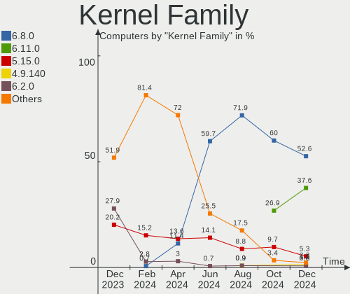
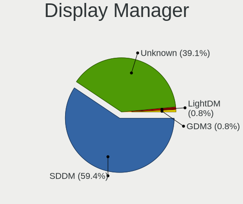
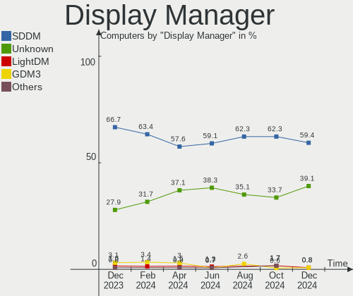
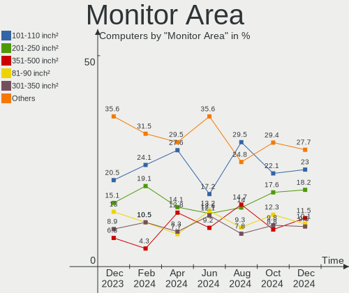

Kubuntu - Hardware Trends
-------------------------

A project to identify most popular hardware characteristics and track their change
over time based on data collected by Linux users at https://Linux-Hardware.org.

Anyone can contribute to this report by the [hw-probe](https://github.com/linuxhw/hw-probe) tool:

    sudo -E hw-probe -all -upload

This is a report for all computer types. See also reports for [desktops](/Dist/Kubuntu/Desktop/README.md) and [notebooks](/Dist/Kubuntu/Notebook/README.md).

This report is for one last month. Overall report since the beginning of time: [TestDays](https://github.com/linuxhw/TestDays)

Period: Jul, 2023.

Contents
--------

* [ System ](#system)
  - [ OS                       ](#os)
  - [ OS Family                ](#os-family)
  - [ Kernel                   ](#kernel)
  - [ Kernel Family            ](#kernel-family)
  - [ Kernel Major Ver.        ](#kernel-major-ver)
  - [ Arch                     ](#arch)
  - [ DE                       ](#de)
  - [ Display Server           ](#display-server)
  - [ Display Manager          ](#display-manager)
  - [ OS Lang                  ](#os-lang)
  - [ Boot Mode                ](#boot-mode)
  - [ Filesystem               ](#filesystem)
  - [ Part. scheme             ](#part-scheme)
  - [ Dual Boot with Linux/BSD ](#dual-boot-with-linuxbsd)
  - [ Dual Boot (Win)          ](#dual-boot-win)

* [ Board ](#board)
  - [ Vendor                   ](#vendor)
  - [ Model                    ](#model)
  - [ Model Family             ](#model-family)
  - [ MFG Year                 ](#mfg-year)
  - [ Form Factor              ](#form-factor)
  - [ Secure Boot              ](#secure-boot)
  - [ Coreboot                 ](#coreboot)
  - [ RAM Size                 ](#ram-size)
  - [ RAM Used                 ](#ram-used)
  - [ Total Drives             ](#total-drives)
  - [ Has CD-ROM               ](#has-cd-rom)
  - [ Has Ethernet             ](#has-ethernet)
  - [ Has WiFi                 ](#has-wifi)
  - [ Has Bluetooth            ](#has-bluetooth)

* [ Location ](#location)
  - [ Country                  ](#country)
  - [ City                     ](#city)

* [ Drives ](#drives)
  - [ Drive Vendor             ](#drive-vendor)
  - [ Drive Model              ](#drive-model)
  - [ HDD Vendor               ](#hdd-vendor)
  - [ SSD Vendor               ](#ssd-vendor)
  - [ Drive Kind               ](#drive-kind)
  - [ Drive Connector          ](#drive-connector)
  - [ Drive Size               ](#drive-size)
  - [ Space Total              ](#space-total)
  - [ Space Used               ](#space-used)
  - [ Malfunc. Drives          ](#malfunc-drives)
  - [ Malfunc. Drive Vendor    ](#malfunc-drive-vendor)
  - [ Malfunc. HDD Vendor      ](#malfunc-hdd-vendor)
  - [ Malfunc. Drive Kind      ](#malfunc-drive-kind)
  - [ Failed Drives            ](#failed-drives)
  - [ Failed Drive Vendor      ](#failed-drive-vendor)
  - [ Drive Status             ](#drive-status)

* [ Storage controller ](#storage-controller)
  - [ Storage Vendor           ](#storage-vendor)
  - [ Storage Model            ](#storage-model)
  - [ Storage Kind             ](#storage-kind)

* [ Processor ](#processor)
  - [ CPU Vendor               ](#cpu-vendor)
  - [ CPU Model                ](#cpu-model)
  - [ CPU Model Family         ](#cpu-model-family)
  - [ CPU Cores                ](#cpu-cores)
  - [ CPU Sockets              ](#cpu-sockets)
  - [ CPU Threads              ](#cpu-threads)
  - [ CPU Op-Modes             ](#cpu-op-modes)
  - [ CPU Microcode            ](#cpu-microcode)
  - [ CPU Microarch            ](#cpu-microarch)

* [ Graphics ](#graphics)
  - [ GPU Vendor               ](#gpu-vendor)
  - [ GPU Model                ](#gpu-model)
  - [ GPU Combo                ](#gpu-combo)
  - [ GPU Driver               ](#gpu-driver)
  - [ GPU Memory               ](#gpu-memory)

* [ Monitor ](#monitor)
  - [ Monitor Vendor           ](#monitor-vendor)
  - [ Monitor Model            ](#monitor-model)
  - [ Monitor Resolution       ](#monitor-resolution)
  - [ Monitor Diagonal         ](#monitor-diagonal)
  - [ Monitor Width            ](#monitor-width)
  - [ Aspect Ratio             ](#aspect-ratio)
  - [ Monitor Area             ](#monitor-area)
  - [ Pixel Density            ](#pixel-density)
  - [ Multiple Monitors        ](#multiple-monitors)

* [ Network ](#network)
  - [ Net Controller Vendor    ](#net-controller-vendor)
  - [ Net Controller Model     ](#net-controller-model)
  - [ Wireless Vendor          ](#wireless-vendor)
  - [ Wireless Model           ](#wireless-model)
  - [ Ethernet Vendor          ](#ethernet-vendor)
  - [ Ethernet Model           ](#ethernet-model)
  - [ Net Controller Kind      ](#net-controller-kind)
  - [ Used Controller          ](#used-controller)
  - [ NICs                     ](#nics)
  - [ IPv6                     ](#ipv6)

* [ Bluetooth ](#bluetooth)
  - [ Bluetooth Vendor         ](#bluetooth-vendor)
  - [ Bluetooth Model          ](#bluetooth-model)

* [ Sound ](#sound)
  - [ Sound Vendor             ](#sound-vendor)
  - [ Sound Model              ](#sound-model)

* [ Memory ](#memory)
  - [ Memory Vendor            ](#memory-vendor)
  - [ Memory Model             ](#memory-model)
  - [ Memory Kind              ](#memory-kind)
  - [ Memory Form Factor       ](#memory-form-factor)
  - [ Memory Size              ](#memory-size)
  - [ Memory Speed             ](#memory-speed)

* [ Printers & scanners ](#printers--scanners)
  - [ Printer Vendor           ](#printer-vendor)
  - [ Printer Model            ](#printer-model)
  - [ Scanner Vendor           ](#scanner-vendor)
  - [ Scanner Model            ](#scanner-model)

* [ Camera ](#camera)
  - [ Camera Vendor            ](#camera-vendor)
  - [ Camera Model             ](#camera-model)

* [ Security ](#security)
  - [ Fingerprint Vendor       ](#fingerprint-vendor)
  - [ Fingerprint Model        ](#fingerprint-model)
  - [ Chipcard Vendor          ](#chipcard-vendor)
  - [ Chipcard Model           ](#chipcard-model)

* [ Unsupported ](#unsupported)
  - [ Unsupported Devices      ](#unsupported-devices)
  - [ Unsupported Device Types ](#unsupported-device-types)

System
------

OS
--

Installed operating systems

| Name          | Computers | Percent |
|---------------|-----------|---------|
| Kubuntu 22.04 | 56        | 46.67%  |
| Kubuntu 23.04 | 55        | 45.83%  |
| Kubuntu 23.10 | 3         | 2.5%    |
| Kubuntu 22.10 | 2         | 1.67%   |
| Kubuntu 20.04 | 2         | 1.67%   |
| Kubuntu 11    | 2         | 1.67%   |

OS Family
---------

OS without a version

| Name    | Computers | Percent |
|---------|-----------|---------|
| Kubuntu | 120       | 100%    |

Kernel
------

Version of the Linux kernel

| Version                | Computers | Percent |
|------------------------|-----------|---------|
| 5.19.0-46-generic      | 22        | 18.33%  |
| 6.2.0-24-generic       | 18        | 15%     |
| 6.2.0-25-generic       | 11        | 9.17%   |
| 5.15.0-76-generic      | 11        | 9.17%   |
| 5.19.0-50-generic      | 7         | 5.83%   |
| 6.2.0-26-generic       | 6         | 5%      |
| 6.2.0-20-generic       | 5         | 4.17%   |
| 5.19.0-1028-lowlatency | 4         | 3.33%   |
| 5.15.0-75-generic      | 4         | 3.33%   |
| 6.4.0-060400-generic   | 3         | 2.5%    |
| 6.2.0-23-generic       | 3         | 2.5%    |
| 6.3.0-7-generic        | 2         | 1.67%   |
| 6.2.0-1008-lowlatency  | 2         | 1.67%   |
| 6.2.0-1007-lowlatency  | 2         | 1.67%   |
| 5.15.0-78-generic      | 2         | 1.67%   |
| 5.15.0-71-generic      | 2         | 1.67%   |
| 6.4.3-1-liquorix-amd64 | 1         | 0.83%   |
| 6.4.1-2-liquorix-amd64 | 1         | 0.83%   |
| 6.3.9-windows-ubuntu   | 1         | 0.83%   |
| 6.3.7-060307-generic   | 1         | 0.83%   |
| 6.3.6-060306-generic   | 1         | 0.83%   |
| 6.3.10                 | 1         | 0.83%   |
| 6.2.0-1009-lowlatency  | 1         | 0.83%   |
| 6.2.0-1003-lowlatency  | 1         | 0.83%   |
| 6.1.1-060101-generic   | 1         | 0.83%   |
| 6.1.0-1014-oem         | 1         | 0.83%   |
| 6.0.9-060009-generic   | 1         | 0.83%   |
| 5.19.0-42-generic      | 1         | 0.83%   |
| 5.19.0-1021-generic    | 1         | 0.83%   |
| 5.19.0-1017-lowlatency | 1         | 0.83%   |
| 5.15.0-72-generic      | 1         | 0.83%   |
| 5.15.0-56-generic      | 1         | 0.83%   |

Kernel Family
-------------

Linux kernel without a distro release

| Version | Computers | Percent |
|---------|-----------|---------|
| 6.2.0   | 49        | 40.83%  |
| 5.19.0  | 36        | 30%     |
| 5.15.0  | 21        | 17.5%   |
| 6.4.0   | 3         | 2.5%    |
| 6.3.0   | 2         | 1.67%   |
| 6.4.3   | 1         | 0.83%   |
| 6.4.1   | 1         | 0.83%   |
| 6.3.9   | 1         | 0.83%   |
| 6.3.7   | 1         | 0.83%   |
| 6.3.6   | 1         | 0.83%   |
| 6.3.10  | 1         | 0.83%   |
| 6.1.1   | 1         | 0.83%   |
| 6.1.0   | 1         | 0.83%   |
| 6.0.9   | 1         | 0.83%   |

Kernel Major Ver.
-----------------

Linux kernel major version

| Version | Computers | Percent |
|---------|-----------|---------|
| 6.2     | 49        | 40.83%  |
| 5.19    | 36        | 30%     |
| 5.15    | 21        | 17.5%   |
| 6.3     | 6         | 5%      |
| 6.4     | 5         | 4.17%   |
| 6.1     | 2         | 1.67%   |
| 6.0     | 1         | 0.83%   |

Arch
----

OS architecture (x86_64, i586, etc.)

| Name    | Computers | Percent |
|---------|-----------|---------|
| x86_64  | 119       | 99.17%  |
| riscv64 | 1         | 0.83%   |

DE
--

Desktop Environment

| Name  | Computers | Percent |
|-------|-----------|---------|
| KDE5  | 114       | 95%     |
| KDE   | 4         | 3.33%   |
| GNOME | 2         | 1.67%   |

Display Server
--------------

X11 or Wayland

| Name    | Computers | Percent |
|---------|-----------|---------|
| X11     | 108       | 90%     |
| Wayland | 9         | 7.5%    |
| Tty     | 3         | 2.5%    |

Display Manager
---------------

SDDM, LightDM, etc.

| Name    | Computers | Percent |
|---------|-----------|---------|
| SDDM    | 79        | 65.83%  |
| Unknown | 34        | 28.33%  |
| LightDM | 4         | 3.33%   |
| GDM3    | 2         | 1.67%   |
| GDM     | 1         | 0.83%   |

OS Lang
-------

Language

| Lang    | Computers | Percent |
|---------|-----------|---------|
| en_US   | 59        | 49.17%  |
| de_DE   | 15        | 12.5%   |
| en_GB   | 10        | 8.33%   |
| pl_PL   | 4         | 3.33%   |
| C       | 4         | 3.33%   |
| ru_RU   | 3         | 2.5%    |
| pt_BR   | 3         | 2.5%    |
| fr_FR   | 3         | 2.5%    |
| fi_FI   | 2         | 1.67%   |
| es_ES   | 2         | 1.67%   |
| en_CA   | 2         | 1.67%   |
| da_DK   | 2         | 1.67%   |
| zh_TW   | 1         | 0.83%   |
| nl_NL   | 1         | 0.83%   |
| nb_NO   | 1         | 0.83%   |
| it_IT   | 1         | 0.83%   |
| es_PE   | 1         | 0.83%   |
| es_AR   | 1         | 0.83%   |
| en_ZA   | 1         | 0.83%   |
| en_NZ   | 1         | 0.83%   |
| en_IN   | 1         | 0.83%   |
| en_AU   | 1         | 0.83%   |
| Default | 1         | 0.83%   |

Boot Mode
---------

EFI or BIOS

| Mode | Computers | Percent |
|------|-----------|---------|
| EFI  | 61        | 50.83%  |
| BIOS | 59        | 49.17%  |

Filesystem
----------

Type of filesystem

| Type    | Computers | Percent |
|---------|-----------|---------|
| Ext4    | 85        | 70.83%  |
| Tmpfs   | 26        | 21.67%  |
| Btrfs   | 5         | 4.17%   |
| Overlay | 2         | 1.67%   |
| Zfs     | 1         | 0.83%   |
| Xfs     | 1         | 0.83%   |

Part. scheme
------------

Scheme of partitioning

| Type    | Computers | Percent |
|---------|-----------|---------|
| GPT     | 80        | 66.67%  |
| Unknown | 34        | 28.33%  |
| MBR     | 6         | 5%      |

Dual Boot with Linux/BSD
------------------------

Hosting more than one Linux/BSD

| Dual boot | Computers | Percent |
|-----------|-----------|---------|
| No        | 104       | 86.67%  |
| Yes       | 16        | 13.33%  |

Dual Boot (Win)
---------------

Hosting Linux and Windows

| Dual boot | Computers | Percent |
|-----------|-----------|---------|
| No        | 84        | 70%     |
| Yes       | 36        | 30%     |

Board
-----

Vendor
------

Motherboard manufacturer

| Name                | Computers | Percent |
|---------------------|-----------|---------|
| Hewlett-Packard     | 20        | 16.67%  |
| ASUSTek Computer    | 20        | 16.67%  |
| Lenovo              | 17        | 14.17%  |
| Dell                | 14        | 11.67%  |
| MSI                 | 11        | 9.17%   |
| Gigabyte Technology | 8         | 6.67%   |
| Acer                | 8         | 6.67%   |
| ASRock              | 5         | 4.17%   |
| Unknown             | 2         | 1.67%   |
| Toshiba             | 1         | 0.83%   |
| Supermicro          | 1         | 0.83%   |
| Seeed Studio        | 1         | 0.83%   |
| Pegatron            | 1         | 0.83%   |
| Notebook            | 1         | 0.83%   |
| Microsoft           | 1         | 0.83%   |
| Medion              | 1         | 0.83%   |
| Intel               | 1         | 0.83%   |
| Huanan              | 1         | 0.83%   |
| Google              | 1         | 0.83%   |
| Gateway             | 1         | 0.83%   |
| Fujitsu             | 1         | 0.83%   |
| AZW                 | 1         | 0.83%   |
| AWOW                | 1         | 0.83%   |
| Apple               | 1         | 0.83%   |

Model
-----

Motherboard model

| Name                                               | Computers | Percent |
|----------------------------------------------------|-----------|---------|
| Lenovo IdeaPad 5 Pro 14ACN6 82L7                   | 2         | 1.67%   |
| Dell G3 3779                                       | 2         | 1.67%   |
| Unknown                                            | 2         | 1.67%   |
| Toshiba Satellite L745                             | 1         | 0.83%   |
| Supermicro C7H61                                   | 1         | 0.83%   |
| Seeed Studio ODYSSEY-X86J4105                      | 1         | 0.83%   |
| Pegatron 520-1000nl                                | 1         | 0.83%   |
| Notebook PC5x_7xHP_HR_HS                           | 1         | 0.83%   |
| MSI MS-7D91                                        | 1         | 0.83%   |
| MSI MS-7D75                                        | 1         | 0.83%   |
| MSI MS-7D25                                        | 1         | 0.83%   |
| MSI MS-7C95                                        | 1         | 0.83%   |
| MSI MS-7C86                                        | 1         | 0.83%   |
| MSI MS-7B78                                        | 1         | 0.83%   |
| MSI MS-7B51                                        | 1         | 0.83%   |
| MSI MS-7B23                                        | 1         | 0.83%   |
| MSI MS-7A32                                        | 1         | 0.83%   |
| MSI MS-7885                                        | 1         | 0.83%   |
| MSI MS-7818                                        | 1         | 0.83%   |
| Microsoft Surface Laptop Go                        | 1         | 0.83%   |
| Medion Akoya E20009 MD34024/C579                   | 1         | 0.83%   |
| Lenovo Z50-75 80EC                                 | 1         | 0.83%   |
| Lenovo Yoga C640-13IML 81UE                        | 1         | 0.83%   |
| Lenovo Yoga 9 14IAP7 82LU                          | 1         | 0.83%   |
| Lenovo V145-15AST 81MT                             | 1         | 0.83%   |
| Lenovo ThinkPad X1 Carbon Gen 10 21CB0088RT        | 1         | 0.83%   |
| Lenovo ThinkPad T460 20FMS43Q00                    | 1         | 0.83%   |
| Lenovo ThinkPad T16 Gen 1 21BVCTO1WW               | 1         | 0.83%   |
| Lenovo ThinkPad E580 20KS003LLM                    | 1         | 0.83%   |
| Lenovo ThinkCentre M82 2929BT6                     | 1         | 0.83%   |
| Lenovo ThinkCentre M75q-1 11A4001WUS               | 1         | 0.83%   |
| Lenovo ThinkCentre A70 7844H9G                     | 1         | 0.83%   |
| Lenovo Legion Y540-15IRH 81SX                      | 1         | 0.83%   |
| Lenovo IdeaPad S145-15API 81V7                     | 1         | 0.83%   |
| Lenovo IdeaPad C340-14API 81N6                     | 1         | 0.83%   |
| Lenovo B560 43308UG                                | 1         | 0.83%   |
| Intel DQ57TM AAE70931-402                          | 1         | 0.83%   |
| Huanan X99-F8 GAMING V5.0                          | 1         | 0.83%   |
| HP ZBook Studio 15.6 inch G8 Mobile Workstation PC | 1         | 0.83%   |
| HP ZBook 17 G2                                     | 1         | 0.83%   |

Model Family
------------

Motherboard model prefix

| Name                          | Computers | Percent |
|-------------------------------|-----------|---------|
| Dell Latitude                 | 7         | 5.83%   |
| ASUS PRIME                    | 6         | 5%      |
| Lenovo ThinkPad               | 4         | 3.33%   |
| Lenovo IdeaPad                | 4         | 3.33%   |
| HP ENVY                       | 4         | 3.33%   |
| Acer Aspire                   | 4         | 3.33%   |
| Lenovo ThinkCentre            | 3         | 2.5%    |
| HP EliteBook                  | 3         | 2.5%    |
| Dell Precision                | 3         | 2.5%    |
| ASUS VivoBook                 | 3         | 2.5%    |
| ASUS ASUS                     | 3         | 2.5%    |
| Lenovo Yoga                   | 2         | 1.67%   |
| HP ZBook                      | 2         | 1.67%   |
| Dell Inspiron                 | 2         | 1.67%   |
| Dell G3                       | 2         | 1.67%   |
| ASUS TUF                      | 2         | 1.67%   |
| ASUS ROG                      | 2         | 1.67%   |
| Acer Predator                 | 2         | 1.67%   |
| Unknown                       | 2         | 1.67%   |
| Toshiba Satellite             | 1         | 0.83%   |
| Supermicro C7H61              | 1         | 0.83%   |
| Seeed Studio ODYSSEY-X86J4105 | 1         | 0.83%   |
| Pegatron 520-1000nl           | 1         | 0.83%   |
| Notebook PC5x                 | 1         | 0.83%   |
| MSI MS-7D91                   | 1         | 0.83%   |
| MSI MS-7D75                   | 1         | 0.83%   |
| MSI MS-7D25                   | 1         | 0.83%   |
| MSI MS-7C95                   | 1         | 0.83%   |
| MSI MS-7C86                   | 1         | 0.83%   |
| MSI MS-7B78                   | 1         | 0.83%   |
| MSI MS-7B51                   | 1         | 0.83%   |
| MSI MS-7B23                   | 1         | 0.83%   |
| MSI MS-7A32                   | 1         | 0.83%   |
| MSI MS-7885                   | 1         | 0.83%   |
| MSI MS-7818                   | 1         | 0.83%   |
| Microsoft Surface             | 1         | 0.83%   |
| Medion Akoya                  | 1         | 0.83%   |
| Lenovo Z50-75                 | 1         | 0.83%   |
| Lenovo V145-15AST             | 1         | 0.83%   |
| Lenovo Legion                 | 1         | 0.83%   |

MFG Year
--------

Motherboard manufacture year

| Year | Computers | Percent |
|------|-----------|---------|
| 2020 | 17        | 14.17%  |
| 2021 | 16        | 13.33%  |
| 2018 | 15        | 12.5%   |
| 2022 | 12        | 10%     |
| 2019 | 10        | 8.33%   |
| 2013 | 8         | 6.67%   |
| 2011 | 8         | 6.67%   |
| 2017 | 6         | 5%      |
| 2012 | 6         | 5%      |
| 2010 | 6         | 5%      |
| 2014 | 5         | 4.17%   |
| 2023 | 4         | 3.33%   |
| 2015 | 3         | 2.5%    |
| 2016 | 2         | 1.67%   |
| 2009 | 1         | 0.83%   |
| 2008 | 1         | 0.83%   |

Form Factor
-----------

Physical design of the computer

| Name        | Computers | Percent |
|-------------|-----------|---------|
| Notebook    | 56        | 46.67%  |
| Desktop     | 52        | 43.33%  |
| Convertible | 7         | 5.83%   |
| Mini pc     | 2         | 1.67%   |
| Stick pc    | 1         | 0.83%   |
| Tablet      | 1         | 0.83%   |
| All in one  | 1         | 0.83%   |

Secure Boot
-----------

Enabled or disabled

| State    | Computers | Percent |
|----------|-----------|---------|
| Disabled | 110       | 91.67%  |
| Enabled  | 10        | 8.33%   |

Coreboot
--------

Have coreboot on board

| Used | Computers | Percent |
|------|-----------|---------|
| No   | 119       | 99.17%  |
| Yes  | 1         | 0.83%   |

RAM Size
--------

Total RAM memory

| Size in GB  | Computers | Percent |
|-------------|-----------|---------|
| 4.01-8.0    | 31        | 25.83%  |
| 32.01-64.0  | 27        | 22.5%   |
| 16.01-24.0  | 24        | 20%     |
| 3.01-4.0    | 13        | 10.83%  |
| 8.01-16.0   | 13        | 10.83%  |
| 64.01-256.0 | 7         | 5.83%   |
| 24.01-32.0  | 3         | 2.5%    |
| 1.01-2.0    | 2         | 1.67%   |

RAM Used
--------

Used RAM memory

| Used GB    | Computers | Percent |
|------------|-----------|---------|
| 4.01-8.0   | 39        | 32.5%   |
| 2.01-3.0   | 24        | 20%     |
| 1.01-2.0   | 23        | 19.17%  |
| 3.01-4.0   | 17        | 14.17%  |
| 8.01-16.0  | 13        | 10.83%  |
| 16.01-24.0 | 2         | 1.67%   |
| 0.51-1.0   | 1         | 0.83%   |
| 0.01-0.5   | 1         | 0.83%   |

Total Drives
------------

Number of drives on board

| Drives | Computers | Percent |
|--------|-----------|---------|
| 1      | 56        | 46.67%  |
| 2      | 37        | 30.83%  |
| 3      | 10        | 8.33%   |
| 4      | 7         | 5.83%   |
| 5      | 6         | 5%      |
| 6      | 3         | 2.5%    |
| 7      | 1         | 0.83%   |

Has CD-ROM
----------

Has CD-ROM on board

| Presented | Computers | Percent |
|-----------|-----------|---------|
| No        | 88        | 73.33%  |
| Yes       | 32        | 26.67%  |

Has Ethernet
------------

Has Ethernet on board

| Presented | Computers | Percent |
|-----------|-----------|---------|
| Yes       | 104       | 86.67%  |
| No        | 16        | 13.33%  |

Has WiFi
--------

Has WiFi module

| Presented | Computers | Percent |
|-----------|-----------|---------|
| Yes       | 88        | 73.33%  |
| No        | 32        | 26.67%  |

Has Bluetooth
-------------

Has Bluetooth module

| Presented | Computers | Percent |
|-----------|-----------|---------|
| Yes       | 76        | 63.33%  |
| No        | 44        | 36.67%  |

Location
--------

Country
-------

Geographic location (country)

| Country      | Computers | Percent |
|--------------|-----------|---------|
| USA          | 26        | 21.67%  |
| Germany      | 21        | 17.5%   |
| UK           | 11        | 9.17%   |
| Russia       | 5         | 4.17%   |
| Canada       | 5         | 4.17%   |
| Netherlands  | 4         | 3.33%   |
| France       | 4         | 3.33%   |
| Brazil       | 4         | 3.33%   |
| Spain        | 3         | 2.5%    |
| Finland      | 3         | 2.5%    |
| Turkey       | 2         | 1.67%   |
| Serbia       | 2         | 1.67%   |
| Poland       | 2         | 1.67%   |
| Peru         | 2         | 1.67%   |
| Norway       | 2         | 1.67%   |
| Mexico       | 2         | 1.67%   |
| Italy        | 2         | 1.67%   |
| Denmark      | 2         | 1.67%   |
| Taiwan       | 1         | 0.83%   |
| Sweden       | 1         | 0.83%   |
| South Africa | 1         | 0.83%   |
| Slovakia     | 1         | 0.83%   |
| Romania      | 1         | 0.83%   |
| Pakistan     | 1         | 0.83%   |
| New Zealand  | 1         | 0.83%   |
| Libya        | 1         | 0.83%   |
| Latvia       | 1         | 0.83%   |
| Kazakhstan   | 1         | 0.83%   |
| Ivory Coast  | 1         | 0.83%   |
| India        | 1         | 0.83%   |
| Hungary      | 1         | 0.83%   |
| Czechia      | 1         | 0.83%   |
| Costa Rica   | 1         | 0.83%   |
| Bulgaria     | 1         | 0.83%   |
| Australia    | 1         | 0.83%   |
| Argentina    | 1         | 0.83%   |

City
----

Geographic location (city)

| City           | Computers | Percent |
|----------------|-----------|---------|
| Hamburg        | 4         | 3.33%   |
| Vancouver      | 3         | 2.5%    |
| Helsinki       | 3         | 2.5%    |
| Berlin         | 3         | 2.5%    |
| Strasbourg     | 2         | 1.67%   |
| Istanbul       | 2         | 1.67%   |
| Houston        | 2         | 1.67%   |
| Belgrade       | 2         | 1.67%   |
| Wiesmoor       | 1         | 0.83%   |
| Weston         | 1         | 0.83%   |
| West Valley    | 1         | 0.83%   |
| Warwick        | 1         | 0.83%   |
| Ware           | 1         | 0.83%   |
| Virginia Beach | 1         | 0.83%   |
| Vigo           | 1         | 0.83%   |
| Varna          | 1         | 0.83%   |
| Trujillo       | 1         | 0.83%   |
| Tripoli        | 1         | 0.83%   |
| Tholey         | 1         | 0.83%   |
| The Hague      | 1         | 0.83%   |
| Tatabánya     | 1         | 0.83%   |
| Taichung       | 1         | 0.83%   |
| Swiebodzice    | 1         | 0.83%   |
| Sundsvall      | 1         | 0.83%   |
| St Petersburg  | 1         | 0.83%   |
| Sibiu          | 1         | 0.83%   |
| Sherbrooke     | 1         | 0.83%   |
| Sheffield      | 1         | 0.83%   |
| Seville        | 1         | 0.83%   |
| San Jose       | 1         | 0.83%   |
| San Francisco  | 1         | 0.83%   |
| Salzgitter     | 1         | 0.83%   |
| Salt Lake City | 1         | 0.83%   |
| Rotherham      | 1         | 0.83%   |
| Riga           | 1         | 0.83%   |
| Regensburg     | 1         | 0.83%   |
| Pretoria       | 1         | 0.83%   |
| Prešov        | 1         | 0.83%   |
| Prague         | 1         | 0.83%   |
| Portsmouth     | 1         | 0.83%   |

Drives
------

Drive Vendor
------------

Hard drive vendors

| Vendor                       | Computers | Drives | Percent |
|------------------------------|-----------|--------|---------|
| Samsung Electronics          | 35        | 53     | 17.24%  |
| Seagate                      | 26        | 36     | 12.81%  |
| WDC                          | 21        | 23     | 10.34%  |
| Sandisk                      | 12        | 12     | 5.91%   |
| Kingston                     | 12        | 14     | 5.91%   |
| Crucial                      | 11        | 11     | 5.42%   |
| Micron Technology            | 8         | 8      | 3.94%   |
| Toshiba                      | 7         | 9      | 3.45%   |
| Intel                        | 7         | 7      | 3.45%   |
| SK hynix                     | 5         | 5      | 2.46%   |
| Hitachi                      | 5         | 8      | 2.46%   |
| Unknown                      | 4         | 4      | 1.97%   |
| HGST                         | 4         | 4      | 1.97%   |
| China                        | 4         | 4      | 1.97%   |
| A-DATA Technology            | 4         | 4      | 1.97%   |
| Silicon Motion               | 3         | 3      | 1.48%   |
| Patriot                      | 3         | 3      | 1.48%   |
| KIOXIA                       | 3         | 3      | 1.48%   |
| PNY                          | 2         | 3      | 0.99%   |
| Kingston Technology Company  | 2         | 2      | 0.99%   |
| Intenso                      | 2         | 3      | 0.99%   |
| ADATA Technology             | 2         | 2      | 0.99%   |
| XPG                          | 1         | 1      | 0.49%   |
| Vaseky                       | 1         | 1      | 0.49%   |
| Transcend                    | 1         | 1      | 0.49%   |
| Team                         | 1         | 1      | 0.49%   |
| SPCC                         | 1         | 1      | 0.49%   |
| Shenzhen Longsys Electronics | 1         | 1      | 0.49%   |
| Realtek Semiconductor        | 1         | 1      | 0.49%   |
| Phison Electronics           | 1         | 1      | 0.49%   |
| PHD 3.0                      | 1         | 1      | 0.49%   |
| OCZ                          | 1         | 1      | 0.49%   |
| Micron/Crucial Technology    | 1         | 2      | 0.49%   |
| Maxtor                       | 1         | 1      | 0.49%   |
| Lexar                        | 1         | 1      | 0.49%   |
| KingFast                     | 1         | 1      | 0.49%   |
| INNOVATION IT                | 1         | 1      | 0.49%   |
| Hewlett-Packard              | 1         | 1      | 0.49%   |
| FURY                         | 1         | 2      | 0.49%   |
| CT1000MX                     | 1         | 1      | 0.49%   |

Drive Model
-----------

Hard drive models

| Model                                                              | Computers | Percent |
|--------------------------------------------------------------------|-----------|---------|
| Samsung SSD 980 1TB                                                | 3         | 1.3%    |
| Samsung SSD 870 QVO 2TB                                            | 3         | 1.3%    |
| Samsung NVMe SSD Controller PM9A1/PM9A3/980PRO 1TB                 | 3         | 1.3%    |
| Kingston SA400S37480G 480GB SSD                                    | 3         | 1.3%    |
| Unknown SD32G  32GB                                                | 2         | 0.87%   |
| Seagate ST2000DM008-2FR102 2TB                                     | 2         | 0.87%   |
| Seagate ST2000DM001-1CH164 2TB                                     | 2         | 0.87%   |
| Seagate ST1000DM003-1CH162 1TB                                     | 2         | 0.87%   |
| Seagate Backup+ Hub BK 8TB                                         | 2         | 0.87%   |
| Sandisk WD Black SN750 / PC SN730 NVMe SSD 1024GB                  | 2         | 0.87%   |
| Samsung SSD 980 PRO 2TB                                            | 2         | 0.87%   |
| Samsung SSD 980 PRO 1TB                                            | 2         | 0.87%   |
| Samsung SSD 970 EVO Plus 500GB                                     | 2         | 0.87%   |
| Samsung SSD 870 EVO 500GB                                          | 2         | 0.87%   |
| Samsung SSD 870 EVO 2TB                                            | 2         | 0.87%   |
| Samsung SSD 850 EVO 500GB                                          | 2         | 0.87%   |
| Samsung NVMe SSD Controller SM981/PM981/PM983 500GB                | 2         | 0.87%   |
| Samsung MZVL21T0HCLR-00BL7 1TB                                     | 2         | 0.87%   |
| Samsung HD103SI 1TB                                                | 2         | 0.87%   |
| Kingston Company SNV2S1000G 1TB                                    | 2         | 0.87%   |
| Kingston SNVS500G 500GB                                            | 2         | 0.87%   |
| Kingston SA400S37240G 240GB SSD                                    | 2         | 0.87%   |
| Intel SSDPEKNW512G8 512GB                                          | 2         | 0.87%   |
| Crucial CT120BX500SSD1 120GB                                       | 2         | 0.87%   |
| ADATA XPG SX8200 Pro PCIe Gen3x4 M.2 2280 Solid State Drive 1024GB | 2         | 0.87%   |
| XPG GAMMIX S11 Pro 1TB                                             | 1         | 0.43%   |
| WDC WUH721818ALE6L4 18TB                                           | 1         | 0.43%   |
| WDC WDS500G2B0B-00YS70 500GB SSD                                   | 1         | 0.43%   |
| WDC WDS500G1B0B-00AS40 500GB SSD                                   | 1         | 0.43%   |
| WDC WDS240G2G0B-00EPW0 240GB SSD                                   | 1         | 0.43%   |
| WDC WDS120G1G0A-00SS50 120GB SSD                                   | 1         | 0.43%   |
| WDC WDS100T2B0A-00SM50 1TB SSD                                     | 1         | 0.43%   |
| WDC WDS100T1X0E-00AFY0 1TB                                         | 1         | 0.43%   |
| WDC WD5000AAKS-00UU3A0 500GB                                       | 1         | 0.43%   |
| WDC WD40EZAZ-00SF3B0 4TB                                           | 1         | 0.43%   |
| WDC WD2500BEKT-60V5T1 250GB                                        | 1         | 0.43%   |
| WDC WD2500BEKT-60PVMT0 250GB                                       | 1         | 0.43%   |
| WDC WD20EZRZ-00Z5HB0 2TB                                           | 1         | 0.43%   |
| WDC WD20EURX-63T0FY0 2TB                                           | 1         | 0.43%   |
| WDC WD10SPZX-60Z10T0 1TB                                           | 1         | 0.43%   |

HDD Vendor
----------

Hard disk drive vendors

| Vendor              | Computers | Drives | Percent |
|---------------------|-----------|--------|---------|
| Seagate             | 26        | 35     | 45.61%  |
| WDC                 | 11        | 13     | 19.3%   |
| Toshiba             | 5         | 7      | 8.77%   |
| Hitachi             | 5         | 8      | 8.77%   |
| HGST                | 4         | 4      | 7.02%   |
| Samsung Electronics | 3         | 4      | 5.26%   |
| PHD 3.0             | 1         | 1      | 1.75%   |
| Maxtor              | 1         | 1      | 1.75%   |
| Apple               | 1         | 1      | 1.75%   |

SSD Vendor
----------

Solid state drive vendors

| Vendor              | Computers | Drives | Percent |
|---------------------|-----------|--------|---------|
| Samsung Electronics | 17        | 22     | 22.97%  |
| Kingston            | 8         | 10     | 10.81%  |
| Crucial             | 8         | 8      | 10.81%  |
| WDC                 | 6         | 6      | 8.11%   |
| SanDisk             | 5         | 5      | 6.76%   |
| China               | 4         | 4      | 5.41%   |
| Patriot             | 3         | 3      | 4.05%   |
| A-DATA Technology   | 3         | 3      | 4.05%   |
| PNY                 | 2         | 3      | 2.7%    |
| Micron Technology   | 2         | 2      | 2.7%    |
| Intel               | 2         | 2      | 2.7%    |
| Vaseky              | 1         | 1      | 1.35%   |
| Transcend           | 1         | 1      | 1.35%   |
| Team                | 1         | 1      | 1.35%   |
| SPCC                | 1         | 1      | 1.35%   |
| SK hynix            | 1         | 1      | 1.35%   |
| Seagate             | 1         | 1      | 1.35%   |
| OCZ                 | 1         | 1      | 1.35%   |
| Lexar               | 1         | 1      | 1.35%   |
| Intenso             | 1         | 2      | 1.35%   |
| INNOVATION IT       | 1         | 1      | 1.35%   |
| Hewlett-Packard     | 1         | 1      | 1.35%   |
| FURY                | 1         | 1      | 1.35%   |
| CT1000MX            | 1         | 1      | 1.35%   |
| BAITITON            | 1         | 1      | 1.35%   |

Drive Kind
----------

HDD or SSD

| Kind    | Computers | Drives | Percent |
|---------|-----------|--------|---------|
| NVMe    | 64        | 80     | 36.36%  |
| SSD     | 61        | 83     | 34.66%  |
| HDD     | 44        | 74     | 25%     |
| MMC     | 4         | 4      | 2.27%   |
| Unknown | 3         | 3      | 1.7%    |

Drive Connector
---------------

SATA, SAS, NVMe, etc.

| Type | Computers | Drives | Percent |
|------|-----------|--------|---------|
| SATA | 80        | 150    | 50.63%  |
| NVMe | 64        | 80     | 40.51%  |
| SAS  | 10        | 10     | 6.33%   |
| MMC  | 4         | 4      | 2.53%   |

Drive Size
----------

Size of hard drive

| Size in TB | Computers | Drives | Percent |
|------------|-----------|--------|---------|
| 0.01-0.5   | 57        | 77     | 48.31%  |
| 0.51-1.0   | 31        | 41     | 26.27%  |
| 1.01-2.0   | 19        | 25     | 16.1%   |
| 3.01-4.0   | 5         | 5      | 4.24%   |
| 4.01-10.0  | 4         | 5      | 3.39%   |
| 2.01-3.0   | 1         | 3      | 0.85%   |
| 10.01-20.0 | 1         | 1      | 0.85%   |

Space Total
-----------

Amount of disk space available on the file system

| Size in GB     | Computers | Percent |
|----------------|-----------|---------|
| 251-500        | 30        | 25%     |
| 101-250        | 28        | 23.33%  |
| 501-1000       | 23        | 19.17%  |
| More than 3000 | 14        | 11.67%  |
| 1001-2000      | 11        | 9.17%   |
| 2001-3000      | 6         | 5%      |
| 1-20           | 4         | 3.33%   |
| 51-100         | 4         | 3.33%   |

Space Used
----------

Amount of used disk space

| Used GB        | Computers | Percent |
|----------------|-----------|---------|
| 101-250        | 32        | 26.67%  |
| 1-20           | 19        | 15.83%  |
| 21-50          | 18        | 15%     |
| 501-1000       | 14        | 11.67%  |
| 251-500        | 11        | 9.17%   |
| 51-100         | 11        | 9.17%   |
| More than 3000 | 9         | 7.5%    |
| 2001-3000      | 4         | 3.33%   |
| 1001-2000      | 2         | 1.67%   |

Malfunc. Drives
---------------

Drive models with a malfunction

| Model                                 | Computers | Drives | Percent |
|---------------------------------------|-----------|--------|---------|
| WDC WD10EURX-63UY4Y0 1TB              | 1         | 1      | 6.25%   |
| WDC WD Blue SA510 2.5 1000GB SSD      | 1         | 1      | 6.25%   |
| Team L3 EVO SSD 120GB                 | 1         | 1      | 6.25%   |
| Seagate ST9500325AS 500GB             | 1         | 1      | 6.25%   |
| Seagate ST3500418AS 500GB             | 1         | 1      | 6.25%   |
| Seagate ST1000LM024 HN-M101MBB 1TB    | 1         | 1      | 6.25%   |
| Seagate ST1000DM003-1CH162 1TB        | 1         | 1      | 6.25%   |
| Samsung Electronics SSD 870 EVO 500GB | 1         | 1      | 6.25%   |
| Samsung Electronics SSD 850 EVO 250GB | 1         | 1      | 6.25%   |
| Samsung Electronics HD501LJ 500GB     | 1         | 1      | 6.25%   |
| Samsung Electronics HD103SI 1TB       | 1         | 1      | 6.25%   |
| Maxtor STM3160215AS 160GB             | 1         | 1      | 6.25%   |
| Intel SSDSCKKW240H6 240GB             | 1         | 1      | 6.25%   |
| Intel SSDPEKNW512G8 512GB             | 1         | 1      | 6.25%   |
| Hitachi HTS725050A9A364 500GB         | 1         | 1      | 6.25%   |
| HGST HTS541010A9E680 1TB              | 1         | 1      | 6.25%   |

Malfunc. Drive Vendor
---------------------

Vendors of faulty drives

| Vendor              | Computers | Drives | Percent |
|---------------------|-----------|--------|---------|
| Seagate             | 4         | 4      | 25%     |
| Samsung Electronics | 4         | 4      | 25%     |
| WDC                 | 2         | 2      | 12.5%   |
| Intel               | 2         | 2      | 12.5%   |
| Team                | 1         | 1      | 6.25%   |
| Maxtor              | 1         | 1      | 6.25%   |
| Hitachi             | 1         | 1      | 6.25%   |
| HGST                | 1         | 1      | 6.25%   |

Malfunc. HDD Vendor
-------------------

Vendors of faulty HDD drives

| Vendor              | Computers | Drives | Percent |
|---------------------|-----------|--------|---------|
| Seagate             | 4         | 4      | 40%     |
| Samsung Electronics | 2         | 2      | 20%     |
| WDC                 | 1         | 1      | 10%     |
| Maxtor              | 1         | 1      | 10%     |
| Hitachi             | 1         | 1      | 10%     |
| HGST                | 1         | 1      | 10%     |

Malfunc. Drive Kind
-------------------

Kinds of faulty drives

| Kind | Computers | Drives | Percent |
|------|-----------|--------|---------|
| HDD  | 7         | 10     | 58.33%  |
| SSD  | 4         | 5      | 33.33%  |
| NVMe | 1         | 1      | 8.33%   |

Failed Drives
-------------

Failed drive models

Zero info for selected period =(

Failed Drive Vendor
-------------------

Failed drive vendors

Zero info for selected period =(

Drive Status
------------

Number of failed and malfunc. drives

| Status   | Computers | Drives | Percent |
|----------|-----------|--------|---------|
| Detected | 70        | 127    | 50.36%  |
| Works    | 57        | 101    | 41.01%  |
| Malfunc  | 12        | 16     | 8.63%   |

Storage controller
------------------

Storage Vendor
--------------

Storage controller vendors

| Vendor                       | Computers | Percent |
|------------------------------|-----------|---------|
| Intel                        | 76        | 41.76%  |
| AMD                          | 29        | 15.93%  |
| Samsung Electronics          | 21        | 11.54%  |
| Sandisk                      | 10        | 5.49%   |
| Micron Technology            | 6         | 3.3%    |
| Kingston Technology Company  | 6         | 3.3%    |
| ASMedia Technology           | 6         | 3.3%    |
| SK hynix                     | 4         | 2.2%    |
| Micron/Crucial Technology    | 4         | 2.2%    |
| Silicon Motion               | 3         | 1.65%   |
| KIOXIA                       | 3         | 1.65%   |
| ADATA Technology             | 3         | 1.65%   |
| Toshiba America Info Systems | 2         | 1.1%    |
| Realtek Semiconductor        | 2         | 1.1%    |
| Phison Electronics           | 2         | 1.1%    |
| Shenzhen Longsys Electronics | 1         | 0.55%   |
| Nvidia                       | 1         | 0.55%   |
| Marvell Technology Group     | 1         | 0.55%   |
| LSI Logic / Symbios Logic    | 1         | 0.55%   |
| JMicron Technology           | 1         | 0.55%   |

Storage Model
-------------

Storage controller models

| Model                                                                          | Computers | Percent |
|--------------------------------------------------------------------------------|-----------|---------|
| AMD FCH SATA Controller [AHCI mode]                                            | 21        | 10.1%   |
| Intel Volume Management Device NVMe RAID Controller                            | 10        | 4.81%   |
| Intel 8 Series/C220 Series Chipset Family 6-port SATA Controller 1 [AHCI mode] | 8         | 3.85%   |
| Samsung NVMe SSD Controller SM981/PM981/PM983                                  | 7         | 3.37%   |
| Samsung NVMe SSD Controller PM9A1/PM9A3/980PRO                                 | 7         | 3.37%   |
| Intel Sunrise Point-LP SATA Controller [AHCI mode]                             | 7         | 3.37%   |
| Samsung NVMe SSD Controller 980                                                | 6         | 2.88%   |
| ASMedia ASM1062 Serial ATA Controller                                          | 6         | 2.88%   |
| Intel 82801 Mobile SATA Controller [RAID mode]                                 | 5         | 2.4%    |
| AMD 500 Series Chipset SATA Controller                                         | 5         | 2.4%    |
| Intel SSD 660P Series                                                          | 4         | 1.92%   |
| Intel 6 Series/C200 Series Chipset Family 6 port Desktop SATA AHCI Controller  | 4         | 1.92%   |
| Intel 400 Series Chipset Family SATA AHCI Controller                           | 4         | 1.92%   |
| AMD 400 Series Chipset SATA Controller                                         | 4         | 1.92%   |
| Silicon Motion SM2263EN/SM2263XT (DRAM-less) NVMe SSD Controllers              | 3         | 1.44%   |
| Micron 2210 NVMe SSD [Cobain]                                                  | 3         | 1.44%   |
| Kingston Company NVMe Controller                                               | 3         | 1.44%   |
| Intel Celeron/Pentium Silver Processor SATA Controller                         | 3         | 1.44%   |
| Intel Alder Lake-P SATA AHCI Controller                                        | 3         | 1.44%   |
| Intel 7 Series Chipset Family 6-port SATA Controller [AHCI mode]               | 3         | 1.44%   |
| Intel 500 Series Chipset Family SATA AHCI Controller                           | 3         | 1.44%   |
| AMD SB7x0/SB8x0/SB9x0 SATA Controller [AHCI mode]                              | 3         | 1.44%   |
| ADATA XPG SX8200 Pro PCIe Gen3x4 M.2 2280 Solid State Drive                    | 3         | 1.44%   |
| Sandisk Western Digital WD Black SN850X NVMe SSD                               | 2         | 0.96%   |
| SanDisk WD Black SN750 / PC SN730 NVMe SSD                                     | 2         | 0.96%   |
| SanDisk WD Black 2018/SN750 / PC SN720 NVMe SSD                                | 2         | 0.96%   |
| Realtek RTS5763DL NVMe SSD Controller                                          | 2         | 0.96%   |
| Micron/Crucial P2 [Nick P2] / P3 / P3 Plus NVMe PCIe SSD (DRAM-less)           | 2         | 0.96%   |
| Micron 3400 NVMe SSD [Hendrix]                                                 | 2         | 0.96%   |
| KIOXIA NVMe SSD Controller BG4 (DRAM-less)                                     | 2         | 0.96%   |
| Kingston Company Company Non-Volatile memory controller                        | 2         | 0.96%   |
| Intel Wildcat Point-LP SATA Controller [AHCI Mode]                             | 2         | 0.96%   |
| Intel Tiger Lake-LP SATA Controller                                            | 2         | 0.96%   |
| Intel SATA Controller [RAID mode]                                              | 2         | 0.96%   |
| Intel Q170/Q150/B150/H170/H110/Z170/CM236 Chipset SATA Controller [AHCI Mode]  | 2         | 0.96%   |
| Intel Cannon Lake PCH SATA AHCI Controller                                     | 2         | 0.96%   |
| Intel Cannon Lake Mobile PCH SATA AHCI Controller                              | 2         | 0.96%   |
| Intel Alder Lake-S PCH SATA Controller [AHCI Mode]                             | 2         | 0.96%   |
| Intel 6 Series/C200 Series Chipset Family 6 port Mobile SATA AHCI Controller   | 2         | 0.96%   |
| Intel 5 Series/3400 Series Chipset 4 port SATA AHCI Controller                 | 2         | 0.96%   |

Storage Kind
------------

Kind of storage controller (IDE, SATA, NVMe, SAS, ...)

| Kind | Computers | Percent |
|------|-----------|---------|
| SATA | 88        | 49.72%  |
| NVMe | 64        | 36.16%  |
| RAID | 17        | 9.6%    |
| IDE  | 7         | 3.95%   |
| SCSI | 1         | 0.56%   |

Processor
---------

CPU Vendor
----------

Processor vendors

| Vendor        | Computers | Percent |
|---------------|-----------|---------|
| Intel         | 83        | 69.17%  |
| AMD           | 36        | 30%     |
| sifive,u74-mc | 1         | 0.83%   |

CPU Model
---------

Processor models

| Model                                   | Computers | Percent |
|-----------------------------------------|-----------|---------|
| Intel Core i5-7200U CPU @ 2.50GHz       | 3         | 2.5%    |
| Intel Core i5-8350U CPU @ 1.70GHz       | 2         | 1.67%   |
| Intel Core i5-8300H CPU @ 2.30GHz       | 2         | 1.67%   |
| Intel Core i5-3210M CPU @ 2.50GHz       | 2         | 1.67%   |
| Intel Core i5-10300H CPU @ 2.50GHz      | 2         | 1.67%   |
| Intel Core i3-2120 CPU @ 3.30GHz        | 2         | 1.67%   |
| Intel 12th Gen Core i7-1270P            | 2         | 1.67%   |
| Intel 12th Gen Core i7-1260P            | 2         | 1.67%   |
| Intel 11th Gen Core i7-11800H @ 2.30GHz | 2         | 1.67%   |
| Intel 11th Gen Core i7-1165G7 @ 2.80GHz | 2         | 1.67%   |
| AMD Ryzen 7 5700G with Radeon Graphics  | 2         | 1.67%   |
| AMD Ryzen 5 5600X 6-Core Processor      | 2         | 1.67%   |
| sifive,u74-mc rv64imafdc                | 1         | 0.83%   |
| Intel Xeon CPU W5580 @ 3.20GHz          | 1         | 0.83%   |
| Intel Xeon CPU E5-4627 v4 @ 2.60GHz     | 1         | 0.83%   |
| Intel Pentium CPU P6100 @ 2.00GHz       | 1         | 0.83%   |
| Intel Pentium CPU G3220 @ 3.00GHz       | 1         | 0.83%   |
| Intel Core i9-9900K CPU @ 3.60GHz       | 1         | 0.83%   |
| Intel Core i9-10900T CPU @ 1.90GHz      | 1         | 0.83%   |
| Intel Core i7-9750H CPU @ 2.60GHz       | 1         | 0.83%   |
| Intel Core i7-8750H CPU @ 2.20GHz       | 1         | 0.83%   |
| Intel Core i7-8700 CPU @ 3.20GHz        | 1         | 0.83%   |
| Intel Core i7-8550U CPU @ 1.80GHz       | 1         | 0.83%   |
| Intel Core i7-7700HQ CPU @ 2.80GHz      | 1         | 0.83%   |
| Intel Core i7-5820K CPU @ 3.30GHz       | 1         | 0.83%   |
| Intel Core i7-4800MQ CPU @ 2.70GHz      | 1         | 0.83%   |
| Intel Core i7-4790 CPU @ 3.60GHz        | 1         | 0.83%   |
| Intel Core i7-4770 CPU @ 3.40GHz        | 1         | 0.83%   |
| Intel Core i7-4702MQ CPU @ 2.20GHz      | 1         | 0.83%   |
| Intel Core i7-4600U CPU @ 2.10GHz       | 1         | 0.83%   |
| Intel Core i7-3770 CPU @ 3.40GHz        | 1         | 0.83%   |
| Intel Core i7-3720QM CPU @ 2.60GHz      | 1         | 0.83%   |
| Intel Core i7-3632QM CPU @ 2.20GHz      | 1         | 0.83%   |
| Intel Core i7-10850H CPU @ 2.70GHz      | 1         | 0.83%   |
| Intel Core i5-9300H CPU @ 2.40GHz       | 1         | 0.83%   |
| Intel Core i5-8500 CPU @ 3.00GHz        | 1         | 0.83%   |
| Intel Core i5-8265U CPU @ 1.60GHz       | 1         | 0.83%   |
| Intel Core i5-7300U CPU @ 2.60GHz       | 1         | 0.83%   |
| Intel Core i5-6400T CPU @ 2.20GHz       | 1         | 0.83%   |
| Intel Core i5-6300U CPU @ 2.40GHz       | 1         | 0.83%   |

CPU Model Family
----------------

Processor model prefix

| Model             | Computers | Percent |
|-------------------|-----------|---------|
| Intel Core i5     | 29        | 24.17%  |
| Other             | 20        | 16.67%  |
| Intel Core i7     | 15        | 12.5%   |
| AMD Ryzen 7       | 9         | 7.5%    |
| AMD Ryzen 5       | 9         | 7.5%    |
| Intel Core i3     | 7         | 5.83%   |
| Intel Celeron     | 5         | 4.17%   |
| AMD Ryzen 9       | 4         | 3.33%   |
| AMD Ryzen 5 PRO   | 4         | 3.33%   |
| AMD FX            | 3         | 2.5%    |
| Intel Xeon        | 2         | 1.67%   |
| Intel Pentium     | 2         | 1.67%   |
| Intel Core i9     | 2         | 1.67%   |
| AMD Ryzen 3       | 2         | 1.67%   |
| AMD A6            | 2         | 1.67%   |
| Intel Core 2 Quad | 1         | 0.83%   |
| Intel Core 2 Duo  | 1         | 0.83%   |
| AMD Sempron       | 1         | 0.83%   |
| AMD Athlon II     | 1         | 0.83%   |
| AMD A10           | 1         | 0.83%   |

CPU Cores
---------

Number of processor cores

| Number  | Computers | Percent |
|---------|-----------|---------|
| 4       | 40        | 33.33%  |
| 2       | 29        | 24.17%  |
| 6       | 17        | 14.17%  |
| 8       | 15        | 12.5%   |
| 12      | 6         | 5%      |
| 16      | 4         | 3.33%   |
| 14      | 2         | 1.67%   |
| 10      | 2         | 1.67%   |
| 1       | 2         | 1.67%   |
| 24      | 1         | 0.83%   |
| 3       | 1         | 0.83%   |
| Unknown | 1         | 0.83%   |

CPU Sockets
-----------

Number of sockets

| Number  | Computers | Percent |
|---------|-----------|---------|
| 1       | 118       | 98.33%  |
| 2       | 1         | 0.83%   |
| Unknown | 1         | 0.83%   |

CPU Threads
-----------

Threads per core (Hyper-Threading)

| Number  | Computers | Percent |
|---------|-----------|---------|
| 2       | 91        | 75.83%  |
| 1       | 28        | 23.33%  |
| Unknown | 1         | 0.83%   |

CPU Op-Modes
------------

CPU Operation Modes (32-bit, 64-bit)

| Op mode        | Computers | Percent |
|----------------|-----------|---------|
| 32-bit, 64-bit | 119       | 99.17%  |
| Unknown        | 1         | 0.83%   |

CPU Microcode
-------------

Microcode number

| Number     | Computers | Percent |
|------------|-----------|---------|
| Unknown    | 77        | 64.17%  |
| 0x906a3    | 6         | 5%      |
| 0x306c3    | 3         | 2.5%    |
| 0x0a50000d | 3         | 2.5%    |
| 0x806ea    | 2         | 1.67%   |
| 0x306a9    | 2         | 1.67%   |
| 0x0a50000c | 2         | 1.67%   |
| 0x0a201025 | 2         | 1.67%   |
| 0x08701021 | 2         | 1.67%   |
| 0x0800820d | 2         | 1.67%   |
| 0x906ed    | 1         | 0.83%   |
| 0x906ea    | 1         | 0.83%   |
| 0x906e9    | 1         | 0.83%   |
| 0x90672    | 1         | 0.83%   |
| 0x806d1    | 1         | 0.83%   |
| 0x706e5    | 1         | 0.83%   |
| 0x706a8    | 1         | 0.83%   |
| 0x706a1    | 1         | 0.83%   |
| 0x406e3    | 1         | 0.83%   |
| 0x306f2    | 1         | 0.83%   |
| 0x20652    | 1         | 0.83%   |
| 0x1067a    | 1         | 0.83%   |
| 0x0a601203 | 1         | 0.83%   |
| 0x08608102 | 1         | 0.83%   |
| 0x08600104 | 1         | 0.83%   |
| 0x08108102 | 1         | 0.83%   |
| 0x08001126 | 1         | 0.83%   |
| 0x06006705 | 1         | 0.83%   |
| 0x03000027 | 1         | 0.83%   |

CPU Microarch
-------------

Microarchitecture

| Name             | Computers | Percent |
|------------------|-----------|---------|
| KabyLake         | 19        | 15.83%  |
| Zen 3            | 13        | 10.83%  |
| Haswell          | 10        | 8.33%   |
| IvyBridge        | 8         | 6.67%   |
| Alderlake Hybrid | 8         | 6.67%   |
| Unknown          | 8         | 6.67%   |
| Zen+             | 6         | 5%      |
| SandyBridge      | 5         | 4.17%   |
| CometLake        | 5         | 4.17%   |
| Zen 2            | 4         | 3.33%   |
| TigerLake        | 4         | 3.33%   |
| IceLake          | 4         | 3.33%   |
| Zen              | 3         | 2.5%    |
| Westmere         | 3         | 2.5%    |
| Skylake          | 3         | 2.5%    |
| Goldmont plus    | 3         | 2.5%    |
| Broadwell        | 3         | 2.5%    |
| Steamroller      | 2         | 1.67%   |
| Piledriver       | 2         | 1.67%   |
| Penryn           | 2         | 1.67%   |
| Nehalem          | 1         | 0.83%   |
| K8 & K10 hybrid  | 1         | 0.83%   |
| K10 Llano        | 1         | 0.83%   |
| K10              | 1         | 0.83%   |
| Excavator        | 1         | 0.83%   |

Graphics
--------

GPU Vendor
----------

Vendors of graphics cards

| Vendor | Computers | Percent |
|--------|-----------|---------|
| Intel  | 67        | 47.52%  |
| Nvidia | 39        | 27.66%  |
| AMD    | 35        | 24.82%  |

GPU Model
---------

Graphics card models

| Model                                                                         | Computers | Percent |
|-------------------------------------------------------------------------------|-----------|---------|
| Intel Alder Lake-P Integrated Graphics Controller                             | 7         | 4.9%    |
| Intel CoffeeLake-H GT2 [UHD Graphics 630]                                     | 5         | 3.5%    |
| Intel 3rd Gen Core processor Graphics Controller                              | 5         | 3.5%    |
| AMD Cezanne [Radeon Vega Series / Radeon Vega Mobile Series]                  | 5         | 3.5%    |
| Intel HD Graphics 620                                                         | 4         | 2.8%    |
| Intel 2nd Generation Core Processor Family Integrated Graphics Controller     | 4         | 2.8%    |
| AMD Picasso/Raven 2 [Radeon Vega Series / Radeon Vega Mobile Series]          | 4         | 2.8%    |
| AMD Ellesmere [Radeon RX 470/480/570/570X/580/580X/590]                       | 4         | 2.8%    |
| Intel UHD Graphics 620                                                        | 3         | 2.1%    |
| Intel TigerLake-LP GT2 [Iris Xe Graphics]                                     | 3         | 2.1%    |
| Intel TigerLake-H GT1 [UHD Graphics]                                          | 3         | 2.1%    |
| Intel GeminiLake [UHD Graphics 600]                                           | 3         | 2.1%    |
| Intel Core Processor Integrated Graphics Controller                           | 3         | 2.1%    |
| Intel CometLake-H GT2 [UHD Graphics]                                          | 3         | 2.1%    |
| Intel 4th Gen Core Processor Integrated Graphics Controller                   | 3         | 2.1%    |
| Nvidia GP108 [GeForce GT 1030]                                                | 2         | 1.4%    |
| Nvidia GP107 [GeForce GTX 1050 Ti]                                            | 2         | 1.4%    |
| Nvidia GK208B [GeForce GT 710]                                                | 2         | 1.4%    |
| Nvidia GA106 [GeForce RTX 3060 Lite Hash Rate]                                | 2         | 1.4%    |
| Intel Xeon E3-1200 v3/4th Gen Core Processor Integrated Graphics Controller   | 2         | 1.4%    |
| Intel Xeon E3-1200 v2/3rd Gen Core processor Graphics Controller              | 2         | 1.4%    |
| Intel Skylake GT2 [HD Graphics 520]                                           | 2         | 1.4%    |
| Intel HD Graphics 630                                                         | 2         | 1.4%    |
| AMD Sun XT [Radeon HD 8670A/8670M/8690M / R5 M330 / M430 / Radeon 520 Mobile] | 2         | 1.4%    |
| AMD Renoir                                                                    | 2         | 1.4%    |
| AMD Raven Ridge [Radeon Vega Series / Radeon Vega Mobile Series]              | 2         | 1.4%    |
| AMD Navi 22 [Radeon RX 6700/6700 XT/6750 XT / 6800M/6850M XT]                 | 2         | 1.4%    |
| Nvidia TU117M [GeForce MX450]                                                 | 1         | 0.7%    |
| Nvidia TU117M [GeForce GTX 1650 Ti Mobile]                                    | 1         | 0.7%    |
| Nvidia TU117M                                                                 | 1         | 0.7%    |
| Nvidia TU116M [GeForce GTX 1660 Ti Mobile]                                    | 1         | 0.7%    |
| Nvidia TU106M [GeForce RTX 2070 Mobile]                                       | 1         | 0.7%    |
| Nvidia TU106M [GeForce RTX 2060 Mobile]                                       | 1         | 0.7%    |
| Nvidia TU106 [GeForce GTX 1650]                                               | 1         | 0.7%    |
| Nvidia TU104 [GeForce RTX 2080 Rev. A]                                        | 1         | 0.7%    |
| Nvidia GT218 [GeForce 210]                                                    | 1         | 0.7%    |
| Nvidia GT200GL [Quadro FX 4800]                                               | 1         | 0.7%    |
| Nvidia GP107M [GeForce MX150]                                                 | 1         | 0.7%    |
| Nvidia GP107M [GeForce GTX 1050 Ti Mobile]                                    | 1         | 0.7%    |
| Nvidia GP107M [GeForce GTX 1050 Mobile]                                       | 1         | 0.7%    |

GPU Combo
---------

Combinations of graphics cards

| Name           | Computers | Percent |
|----------------|-----------|---------|
| 1 x Intel      | 46        | 38.33%  |
| 1 x AMD        | 31        | 25.83%  |
| 1 x Nvidia     | 21        | 17.5%   |
| Intel + Nvidia | 16        | 13.33%  |
| Intel + AMD    | 2         | 1.67%   |
| Other          | 1         | 0.83%   |
| 2 x Nvidia     | 1         | 0.83%   |
| 2 x AMD        | 1         | 0.83%   |
| AMD + Nvidia   | 1         | 0.83%   |

GPU Driver
----------

Free vs proprietary

| Driver      | Computers | Percent |
|-------------|-----------|---------|
| Free        | 94        | 78.33%  |
| Proprietary | 22        | 18.33%  |
| Unknown     | 4         | 3.33%   |

GPU Memory
----------

Total video memory

| Size in GB | Computers | Percent |
|------------|-----------|---------|
| Unknown    | 85        | 70.83%  |
| 7.01-8.0   | 8         | 6.67%   |
| 3.01-4.0   | 6         | 5%      |
| 1.01-2.0   | 6         | 5%      |
| 0.01-0.5   | 6         | 5%      |
| 8.01-16.0  | 5         | 4.17%   |
| 0.51-1.0   | 2         | 1.67%   |
| 5.01-6.0   | 1         | 0.83%   |
| 16.01-24.0 | 1         | 0.83%   |

Monitor
-------

Monitor Vendor
--------------

Monitor vendors

| Vendor                  | Computers | Percent |
|-------------------------|-----------|---------|
| AU Optronics            | 17        | 11.97%  |
| Samsung Electronics     | 16        | 11.27%  |
| BOE                     | 15        | 10.56%  |
| Goldstar                | 12        | 8.45%   |
| Dell                    | 11        | 7.75%   |
| LG Display              | 10        | 7.04%   |
| Chimei Innolux          | 9         | 6.34%   |
| Iiyama                  | 6         | 4.23%   |
| Hewlett-Packard         | 6         | 4.23%   |
| AOC                     | 6         | 4.23%   |
| Philips                 | 4         | 2.82%   |
| Acer                    | 4         | 2.82%   |
| ASUSTek Computer        | 3         | 2.11%   |
| Gigabyte Technology     | 2         | 1.41%   |
| Vizio                   | 1         | 0.7%    |
| STA                     | 1         | 0.7%    |
| Sony                    | 1         | 0.7%    |
| Sharp                   | 1         | 0.7%    |
| Sceptre Tech            | 1         | 0.7%    |
| SAC                     | 1         | 0.7%    |
| RTK                     | 1         | 0.7%    |
| PANDA                   | 1         | 0.7%    |
| ONKYO                   | 1         | 0.7%    |
| LG Electronics          | 1         | 0.7%    |
| Lenovo                  | 1         | 0.7%    |
| INS                     | 1         | 0.7%    |
| InfoVision              | 1         | 0.7%    |
| Hitachi                 | 1         | 0.7%    |
| HIK                     | 1         | 0.7%    |
| GDH                     | 1         | 0.7%    |
| Daewoo                  | 1         | 0.7%    |
| Chi Mei Optoelectronics | 1         | 0.7%    |
| BenQ                    | 1         | 0.7%    |
| Apple                   | 1         | 0.7%    |
| Ancor Communications    | 1         | 0.7%    |

Monitor Model
-------------

Monitor models

| Model                                                                 | Computers | Percent |
|-----------------------------------------------------------------------|-----------|---------|
| Iiyama PL3288UH IVM1176 3840x2160 698x393mm 31.5-inch                 | 2         | 1.35%   |
| Goldstar ULTRAWIDE GSM59F1 2560x1080 673x284mm 28.8-inch              | 2         | 1.35%   |
| Goldstar LG IPS FULLHD GSM5AB8 1920x1080 480x270mm 21.7-inch          | 2         | 1.35%   |
| Goldstar 2D HD TV GSM59CA 1366x768 509x286mm 23.0-inch                | 2         | 1.35%   |
| Chimei Innolux LCD Monitor CMN1521 1920x1080 344x193mm 15.5-inch      | 2         | 1.35%   |
| AU Optronics LCD Monitor AUO61ED 1920x1080 344x193mm 15.5-inch        | 2         | 1.35%   |
| AU Optronics LCD Monitor AUO22EC 1366x768 344x193mm 15.5-inch         | 2         | 1.35%   |
| AOC Q27G2SG4 AOC2702 2560x1440 597x336mm 27.0-inch                    | 2         | 1.35%   |
| Vizio VX32L HDTV10A VIZ0021 1366x768 700x390mm 31.5-inch              | 1         | 0.68%   |
| STA SEMP LEDTV STA0030 1920x540                                       | 1         | 0.68%   |
| Sony TV SNYFE00 1360x768                                              | 1         | 0.68%   |
| Sharp LCD Monitor SHP1479 1920x1280 259x173mm 12.3-inch               | 1         | 0.68%   |
| Sceptre Tech Sceptre F27 SPT0AD7 1920x1080 600x330mm 27.0-inch        | 1         | 0.68%   |
| Samsung Electronics U28E590 SAM0C4D 3840x2160 607x345mm 27.5-inch     | 1         | 0.68%   |
| Samsung Electronics U28E590 SAM0C4C 3840x2160 608x345mm 27.5-inch     | 1         | 0.68%   |
| Samsung Electronics SyncMaster SAM0498 1600x900 443x249mm 20.0-inch   | 1         | 0.68%   |
| Samsung Electronics SyncMaster SAM043F 1920x1200 518x324mm 24.1-inch  | 1         | 0.68%   |
| Samsung Electronics S24E390 SAM0C1A 1920x1080 521x293mm 23.5-inch     | 1         | 0.68%   |
| Samsung Electronics S24D330 SAM0D92 1920x1080 531x299mm 24.0-inch     | 1         | 0.68%   |
| Samsung Electronics S19A33x SAM7120 1366x768 410x230mm 18.5-inch      | 1         | 0.68%   |
| Samsung Electronics LU28R55 SAM1017 3840x2160 632x360mm 28.6-inch     | 1         | 0.68%   |
| Samsung Electronics LCD Monitor SEC5441 1366x768 344x194mm 15.5-inch  | 1         | 0.68%   |
| Samsung Electronics LCD Monitor SEC3741 1280x800 331x207mm 15.4-inch  | 1         | 0.68%   |
| Samsung Electronics LCD Monitor SEC3651 1366x768 344x194mm 15.5-inch  | 1         | 0.68%   |
| Samsung Electronics LCD Monitor SEC354C 1366x768 353x198mm 15.9-inch  | 1         | 0.68%   |
| Samsung Electronics LCD Monitor SDC4752 1366x768 344x194mm 15.5-inch  | 1         | 0.68%   |
| Samsung Electronics LCD Monitor SDC4152 2880x1800 302x189mm 14.0-inch | 1         | 0.68%   |
| Samsung Electronics LCD Monitor SDC4149 3840x2160 294x165mm 13.3-inch | 1         | 0.68%   |
| Samsung Electronics LCD Monitor SAM0D42 3840x2160 950x540mm 43.0-inch | 1         | 0.68%   |
| Samsung Electronics LCD Monitor SAM0C3C 1366x768 609x347mm 27.6-inch  | 1         | 0.68%   |
| SAC DM-MONB2205 SAC952D 1920x1080 450x270mm 20.7-inch                 | 1         | 0.68%   |
| RTK FHD HDR RTKBC32 1920x1080 597x336mm 27.0-inch                     | 1         | 0.68%   |
| Philips FTV PHL04C3 3840x2160 1440x810mm 65.0-inch                    | 1         | 0.68%   |
| Philips 273PLPH PHL08A8 1920x1080 598x336mm 27.0-inch                 | 1         | 0.68%   |
| Philips 272B7QUB PHL0933 2560x1440 597x336mm 27.0-inch                | 1         | 0.68%   |
| Philips 247ELPH PHLC086 1920x1080 521x293mm 23.5-inch                 | 1         | 0.68%   |
| PANDA LCD Monitor NCP0066 1920x1080 344x194mm 15.5-inch               | 1         | 0.68%   |
| ONKYO LCD Monitor TX-SR508                                            | 1         | 0.68%   |
| LG Electronics LCD Monitor D2342P 4800x1080                           | 1         | 0.68%   |
| LG Display LCD Monitor LGD0709 1920x1080 344x194mm 15.5-inch          | 1         | 0.68%   |

Monitor Resolution
------------------

Monitor screen resolution

| Resolution         | Computers | Percent |
|--------------------|-----------|---------|
| 1920x1080 (FHD)    | 53        | 38.69%  |
| 1366x768 (WXGA)    | 21        | 15.33%  |
| 3840x2160 (4K)     | 16        | 11.68%  |
| 2560x1440 (QHD)    | 10        | 7.3%    |
| 1920x1200 (WUXGA)  | 5         | 3.65%   |
| 1600x900 (HD+)     | 4         | 2.92%   |
| 3440x1440          | 3         | 2.19%   |
| 2240x1400          | 3         | 2.19%   |
| 1680x1050 (WSXGA+) | 3         | 2.19%   |
| 1440x900 (WXGA+)   | 3         | 2.19%   |
| 2560x1600          | 2         | 1.46%   |
| 2560x1080          | 2         | 1.46%   |
| 1920x540           | 2         | 1.46%   |
| 4800x1080          | 1         | 0.73%   |
| 3072x1920          | 1         | 0.73%   |
| 2880x1800          | 1         | 0.73%   |
| 2736x1824          | 1         | 0.73%   |
| 1920x1280          | 1         | 0.73%   |
| 1600x1200          | 1         | 0.73%   |
| 1360x768           | 1         | 0.73%   |
| 1280x800 (WXGA)    | 1         | 0.73%   |
| 1280x1024 (SXGA)   | 1         | 0.73%   |
| Unknown            | 1         | 0.73%   |

Monitor Diagonal
----------------

Diagonal size in inches

| Inches  | Computers | Percent |
|---------|-----------|---------|
| 15      | 31        | 22.14%  |
| 27      | 17        | 12.14%  |
| 14      | 11        | 7.86%   |
| 24      | 10        | 7.14%   |
| 23      | 9         | 6.43%   |
| 13      | 8         | 5.71%   |
| 21      | 7         | 5%      |
| 19      | 6         | 4.29%   |
| 31      | 5         | 3.57%   |
| 17      | 5         | 3.57%   |
| 34      | 4         | 2.86%   |
| 16      | 4         | 2.86%   |
| 20      | 3         | 2.14%   |
| 12      | 3         | 2.14%   |
| 84      | 2         | 1.43%   |
| 22      | 2         | 1.43%   |
| 18      | 2         | 1.43%   |
| Unknown | 2         | 1.43%   |
| 72      | 1         | 0.71%   |
| 69      | 1         | 0.71%   |
| 65      | 1         | 0.71%   |
| 52      | 1         | 0.71%   |
| 37      | 1         | 0.71%   |
| 35      | 1         | 0.71%   |
| 33      | 1         | 0.71%   |
| 28      | 1         | 0.71%   |
| 11      | 1         | 0.71%   |

Monitor Width
-------------

Physical width

| Width in mm | Computers | Percent |
|-------------|-----------|---------|
| 301-350     | 47        | 34.81%  |
| 501-600     | 32        | 23.7%   |
| 401-500     | 17        | 12.59%  |
| 601-700     | 8         | 5.93%   |
| 351-400     | 8         | 5.93%   |
| 201-300     | 8         | 5.93%   |
| 701-800     | 5         | 3.7%    |
| 1501-2000   | 4         | 2.96%   |
| 801-900     | 2         | 1.48%   |
| 1001-1500   | 2         | 1.48%   |
| Unknown     | 2         | 1.48%   |

Aspect Ratio
------------

Proportional relationship between the width and the height

| Ratio   | Computers | Percent |
|---------|-----------|---------|
| 16/9    | 96        | 76.8%   |
| 16/10   | 19        | 15.2%   |
| 21/9    | 5         | 4%      |
| 3/2     | 2         | 1.6%    |
| 5/4     | 1         | 0.8%    |
| 4/3     | 1         | 0.8%    |
| Unknown | 1         | 0.8%    |

Monitor Area
------------

Area in inch²

| Area in inch² | Computers | Percent |
|----------------|-----------|---------|
| 101-110        | 31        | 22.14%  |
| 201-250        | 22        | 15.71%  |
| 301-350        | 17        | 12.14%  |
| 81-90          | 16        | 11.43%  |
| 351-500        | 12        | 8.57%   |
| 151-200        | 10        | 7.14%   |
| More than 1000 | 6         | 4.29%   |
| 251-300        | 5         | 3.57%   |
| 121-130        | 5         | 3.57%   |
| 71-80          | 4         | 2.86%   |
| 111-120        | 4         | 2.86%   |
| 61-70          | 2         | 1.43%   |
| 141-150        | 2         | 1.43%   |
| Unknown        | 2         | 1.43%   |
| 51-60          | 1         | 0.71%   |
| 501-1000       | 1         | 0.71%   |

Pixel Density
-------------

Pixels per inch

| Density       | Computers | Percent |
|---------------|-----------|---------|
| 51-100        | 48        | 36.09%  |
| 121-160       | 36        | 27.07%  |
| 101-120       | 30        | 22.56%  |
| 161-240       | 10        | 7.52%   |
| 1-50          | 4         | 3.01%   |
| More than 240 | 3         | 2.26%   |
| Unknown       | 2         | 1.5%    |

Multiple Monitors
-----------------

Total monitors connected

| Total | Computers | Percent |
|-------|-----------|---------|
| 1     | 82        | 68.33%  |
| 2     | 29        | 24.17%  |
| 0     | 5         | 4.17%   |
| 3     | 4         | 3.33%   |

Network
-------

Net Controller Vendor
---------------------

Controller vendors

| Vendor                | Computers | Percent |
|-----------------------|-----------|---------|
| Realtek Semiconductor | 64        | 34.22%  |
| Intel                 | 62        | 33.16%  |
| Qualcomm Atheros      | 15        | 8.02%   |
| MediaTek              | 10        | 5.35%   |
| Broadcom              | 9         | 4.81%   |
| Ralink                | 4         | 2.14%   |
| Broadcom Limited      | 3         | 1.6%    |
| ASIX Electronics      | 3         | 1.6%    |
| TP-Link               | 2         | 1.07%   |
| Sierra Wireless       | 2         | 1.07%   |
| Xiaomi                | 1         | 0.53%   |
| Seeed Technology      | 1         | 0.53%   |
| Samsung Electronics   | 1         | 0.53%   |
| QinHeng Electronics   | 1         | 0.53%   |
| Nvidia                | 1         | 0.53%   |
| NetGear               | 1         | 0.53%   |
| Microsoft             | 1         | 0.53%   |
| Huawei Technologies   | 1         | 0.53%   |
| Hewlett-Packard       | 1         | 0.53%   |
| Google                | 1         | 0.53%   |
| Dell                  | 1         | 0.53%   |
| D-Link                | 1         | 0.53%   |
| ASUSTek Computer      | 1         | 0.53%   |

Net Controller Model
--------------------

Controller models

| Model                                                             | Computers | Percent |
|-------------------------------------------------------------------|-----------|---------|
| Realtek RTL8111/8168/8411 PCI Express Gigabit Ethernet Controller | 39        | 18.06%  |
| Intel Alder Lake-P PCH CNVi WiFi                                  | 7         | 3.24%   |
| Realtek RTL8153 Gigabit Ethernet Adapter                          | 6         | 2.78%   |
| Realtek RTL8125 2.5GbE Controller                                 | 6         | 2.78%   |
| Realtek RTL810xE PCI Express Fast Ethernet controller             | 5         | 2.31%   |
| MediaTek MT7921 802.11ax PCI Express Wireless Network Adapter     | 5         | 2.31%   |
| Intel I211 Gigabit Network Connection                             | 5         | 2.31%   |
| Intel Cannon Lake PCH CNVi WiFi                                   | 5         | 2.31%   |
| Intel Tiger Lake PCH CNVi WiFi                                    | 4         | 1.85%   |
| Realtek RTL8821CE 802.11ac PCIe Wireless Network Adapter          | 3         | 1.39%   |
| Qualcomm Atheros QCA9377 802.11ac Wireless Network Adapter        | 3         | 1.39%   |
| Qualcomm Atheros AR9285 Wireless Network Adapter (PCI-Express)    | 3         | 1.39%   |
| Intel Wireless 8265 / 8275                                        | 3         | 1.39%   |
| Intel Wireless 7265                                               | 3         | 1.39%   |
| Intel Wi-Fi 6 AX200                                               | 3         | 1.39%   |
| Intel Ethernet Connection I217-V                                  | 3         | 1.39%   |
| Intel Ethernet Connection (7) I219-V                              | 3         | 1.39%   |
| Intel Ethernet Connection (16) I219-LM                            | 3         | 1.39%   |
| Intel 82579LM Gigabit Network Connection (Lewisville)             | 3         | 1.39%   |
| Sierra Wireless EM7455                                            | 2         | 0.93%   |
| Realtek RTL8822CE 802.11ac PCIe Wireless Network Adapter          | 2         | 0.93%   |
| Realtek RTL8822BE 802.11a/b/g/n/ac WiFi adapter                   | 2         | 0.93%   |
| Realtek Killer E3000 2.5GbE Controller                            | 2         | 0.93%   |
| Ralink RT5390 Wireless 802.11n 1T/1R PCIe                         | 2         | 0.93%   |
| Qualcomm Atheros QCA9565 / AR9565 Wireless Network Adapter        | 2         | 0.93%   |
| MediaTek MT7921K (RZ608) Wi-Fi 6E 80MHz                           | 2         | 0.93%   |
| Intel Wireless-AC 9260                                            | 2         | 0.93%   |
| Intel Wireless 8260                                               | 2         | 0.93%   |
| Intel Wi-Fi 6 AX210/AX211/AX411 160MHz                            | 2         | 0.93%   |
| Intel Gemini Lake PCH CNVi WiFi                                   | 2         | 0.93%   |
| Intel Ethernet Controller I225-V                                  | 2         | 0.93%   |
| Intel Ethernet Connection I219-LM                                 | 2         | 0.93%   |
| Intel Ethernet Connection I217-LM                                 | 2         | 0.93%   |
| Intel Comet Lake PCH CNVi WiFi                                    | 2         | 0.93%   |
| Intel Centrino Advanced-N 6205 [Taylor Peak]                      | 2         | 0.93%   |
| Intel 82579V Gigabit Network Connection                           | 2         | 0.93%   |
| Broadcom NetXtreme BCM5761 Gigabit Ethernet PCIe                  | 2         | 0.93%   |
| Broadcom BCM43228 802.11a/b/g/n                                   | 2         | 0.93%   |
| ASIX AX88179 Gigabit Ethernet                                     | 2         | 0.93%   |
| Xiaomi Mi/Redmi series (RNDIS)                                    | 1         | 0.46%   |

Wireless Vendor
---------------

Wireless vendors

| Vendor                | Computers | Percent |
|-----------------------|-----------|---------|
| Intel                 | 43        | 43.88%  |
| Realtek Semiconductor | 13        | 13.27%  |
| Qualcomm Atheros      | 11        | 11.22%  |
| MediaTek              | 10        | 10.2%   |
| Broadcom              | 7         | 7.14%   |
| Ralink                | 4         | 4.08%   |
| TP-Link               | 2         | 2.04%   |
| Sierra Wireless       | 2         | 2.04%   |
| NetGear               | 1         | 1.02%   |
| Microsoft             | 1         | 1.02%   |
| Dell                  | 1         | 1.02%   |
| D-Link                | 1         | 1.02%   |
| Broadcom Limited      | 1         | 1.02%   |
| ASUSTek Computer      | 1         | 1.02%   |

Wireless Model
--------------

Wireless models

| Model                                                                   | Computers | Percent |
|-------------------------------------------------------------------------|-----------|---------|
| Intel Alder Lake-P PCH CNVi WiFi                                        | 7         | 7%      |
| MediaTek MT7921 802.11ax PCI Express Wireless Network Adapter           | 5         | 5%      |
| Intel Cannon Lake PCH CNVi WiFi                                         | 5         | 5%      |
| Intel Tiger Lake PCH CNVi WiFi                                          | 4         | 4%      |
| Realtek RTL8821CE 802.11ac PCIe Wireless Network Adapter                | 3         | 3%      |
| Qualcomm Atheros QCA9377 802.11ac Wireless Network Adapter              | 3         | 3%      |
| Qualcomm Atheros AR9285 Wireless Network Adapter (PCI-Express)          | 3         | 3%      |
| Intel Wireless 8265 / 8275                                              | 3         | 3%      |
| Intel Wireless 7265                                                     | 3         | 3%      |
| Intel Wi-Fi 6 AX200                                                     | 3         | 3%      |
| Sierra Wireless EM7455                                                  | 2         | 2%      |
| Realtek RTL8822CE 802.11ac PCIe Wireless Network Adapter                | 2         | 2%      |
| Realtek RTL8822BE 802.11a/b/g/n/ac WiFi adapter                         | 2         | 2%      |
| Ralink RT5390 Wireless 802.11n 1T/1R PCIe                               | 2         | 2%      |
| Qualcomm Atheros QCA9565 / AR9565 Wireless Network Adapter              | 2         | 2%      |
| MediaTek MT7921K (RZ608) Wi-Fi 6E 80MHz                                 | 2         | 2%      |
| Intel Wireless-AC 9260                                                  | 2         | 2%      |
| Intel Wireless 8260                                                     | 2         | 2%      |
| Intel Wi-Fi 6 AX210/AX211/AX411 160MHz                                  | 2         | 2%      |
| Intel Gemini Lake PCH CNVi WiFi                                         | 2         | 2%      |
| Intel Comet Lake PCH CNVi WiFi                                          | 2         | 2%      |
| Intel Centrino Advanced-N 6205 [Taylor Peak]                            | 2         | 2%      |
| Broadcom BCM43228 802.11a/b/g/n                                         | 2         | 2%      |
| TP-Link TL-WN823N v2/v3 [Realtek RTL8192EU]                             | 1         | 1%      |
| TP-Link Archer T2U PLUS [RTL8821AU]                                     | 1         | 1%      |
| TP-Link 802.11ac WLAN Adapter                                           | 1         | 1%      |
| Realtek RTL8814AU 802.11a/b/g/n/ac Wireless Adapter                     | 1         | 1%      |
| Realtek RTL8723DE Wireless Network Adapter                              | 1         | 1%      |
| Realtek RTL8723BU 802.11b/g/n WLAN Adapter                              | 1         | 1%      |
| Realtek RTL8723BE PCIe Wireless Network Adapter                         | 1         | 1%      |
| Realtek RTL8192CE PCIe Wireless Network Adapter                         | 1         | 1%      |
| Realtek RTL8188EUS 802.11n Wireless Network Adapter                     | 1         | 1%      |
| Ralink RT5392 PCIe Wireless Network Adapter                             | 1         | 1%      |
| Ralink RT3290 Wireless 802.11n 1T/1R PCIe                               | 1         | 1%      |
| Qualcomm Atheros QCA6174 802.11ac Wireless Network Adapter              | 1         | 1%      |
| Qualcomm Atheros AR9485 Wireless Network Adapter                        | 1         | 1%      |
| Qualcomm Atheros AR9462 Wireless Network Adapter                        | 1         | 1%      |
| Qualcomm Atheros AR242x / AR542x Wireless Network Adapter (PCI-Express) | 1         | 1%      |
| NetGear A6100 AC600 DB Wireless Adapter [Realtek RTL8811AU]             | 1         | 1%      |
| Microsoft Xbox Wireless Adapter for Windows                             | 1         | 1%      |

Ethernet Vendor
---------------

Ethernet vendors

| Vendor                | Computers | Percent |
|-----------------------|-----------|---------|
| Realtek Semiconductor | 60        | 54.05%  |
| Intel                 | 33        | 29.73%  |
| Qualcomm Atheros      | 5         | 4.5%    |
| Broadcom              | 3         | 2.7%    |
| ASIX Electronics      | 3         | 2.7%    |
| Broadcom Limited      | 2         | 1.8%    |
| Xiaomi                | 1         | 0.9%    |
| Samsung Electronics   | 1         | 0.9%    |
| Nvidia                | 1         | 0.9%    |
| Huawei Technologies   | 1         | 0.9%    |
| Google                | 1         | 0.9%    |

Ethernet Model
--------------

Ethernet models

| Model                                                             | Computers | Percent |
|-------------------------------------------------------------------|-----------|---------|
| Realtek RTL8111/8168/8411 PCI Express Gigabit Ethernet Controller | 39        | 34.51%  |
| Realtek RTL8153 Gigabit Ethernet Adapter                          | 6         | 5.31%   |
| Realtek RTL8125 2.5GbE Controller                                 | 6         | 5.31%   |
| Realtek RTL810xE PCI Express Fast Ethernet controller             | 5         | 4.42%   |
| Intel I211 Gigabit Network Connection                             | 5         | 4.42%   |
| Intel Ethernet Connection I217-V                                  | 3         | 2.65%   |
| Intel Ethernet Connection (7) I219-V                              | 3         | 2.65%   |
| Intel Ethernet Connection (16) I219-LM                            | 3         | 2.65%   |
| Intel 82579LM Gigabit Network Connection (Lewisville)             | 3         | 2.65%   |
| Realtek Killer E3000 2.5GbE Controller                            | 2         | 1.77%   |
| Intel Ethernet Controller I225-V                                  | 2         | 1.77%   |
| Intel Ethernet Connection I219-LM                                 | 2         | 1.77%   |
| Intel Ethernet Connection I217-LM                                 | 2         | 1.77%   |
| Intel 82579V Gigabit Network Connection                           | 2         | 1.77%   |
| Broadcom NetXtreme BCM5761 Gigabit Ethernet PCIe                  | 2         | 1.77%   |
| ASIX AX88179 Gigabit Ethernet                                     | 2         | 1.77%   |
| Xiaomi Mi/Redmi series (RNDIS)                                    | 1         | 0.88%   |
| Samsung Galaxy series, misc. (tethering mode)                     | 1         | 0.88%   |
| Realtek RTL8152 Fast Ethernet Adapter                             | 1         | 0.88%   |
| Realtek Killer E2600 Gigabit Ethernet Controller                  | 1         | 0.88%   |
| Qualcomm Atheros QCA8171 Gigabit Ethernet                         | 1         | 0.88%   |
| Qualcomm Atheros Killer E2500 Gigabit Ethernet Controller         | 1         | 0.88%   |
| Qualcomm Atheros Killer E220x Gigabit Ethernet Controller         | 1         | 0.88%   |
| Qualcomm Atheros AR8152 v2.0 Fast Ethernet                        | 1         | 0.88%   |
| Qualcomm Atheros AR8131 Gigabit Ethernet                          | 1         | 0.88%   |
| Nvidia MCP77 Ethernet                                             | 1         | 0.88%   |
| Intel I210 Gigabit Network Connection                             | 1         | 0.88%   |
| Intel Ethernet Controller I226-V                                  | 1         | 0.88%   |
| Intel Ethernet Connection (4) I219-LM                             | 1         | 0.88%   |
| Intel Ethernet Connection (2) I218-V                              | 1         | 0.88%   |
| Intel Ethernet Connection (17) I219-LM                            | 1         | 0.88%   |
| Intel Ethernet Connection (14) I219-V                             | 1         | 0.88%   |
| Intel Ethernet Connection (11) I219-V                             | 1         | 0.88%   |
| Intel Ethernet Connection (11) I219-LM                            | 1         | 0.88%   |
| Intel 82578DM Gigabit Network Connection                          | 1         | 0.88%   |
| Intel 82574L Gigabit Network Connection                           | 1         | 0.88%   |
| Huawei WLZ-AN00                                                   | 1         | 0.88%   |
| Google Pixel 7                                                    | 1         | 0.88%   |
| Broadcom NetXtreme BCM57765 Gigabit Ethernet PCIe                 | 1         | 0.88%   |
| Broadcom Limited NetXtreme BCM5761 Gigabit Ethernet PCIe          | 1         | 0.88%   |

Net Controller Kind
-------------------

Ethernet, WiFi or modem

| Kind     | Computers | Percent |
|----------|-----------|---------|
| Ethernet | 103       | 53.09%  |
| WiFi     | 88        | 45.36%  |
| Modem    | 3         | 1.55%   |

Used Controller
---------------

Currently used network controller

| Kind     | Computers | Percent |
|----------|-----------|---------|
| WiFi     | 71        | 55.04%  |
| Ethernet | 58        | 44.96%  |

NICs
----

Total network controllers on board

| Total | Computers | Percent |
|-------|-----------|---------|
| 2     | 61        | 50.83%  |
| 1     | 54        | 45%     |
| 3     | 2         | 1.67%   |
| 0     | 2         | 1.67%   |
| 4     | 1         | 0.83%   |

IPv6
----

IPv6 vs IPv4

| Used | Computers | Percent |
|------|-----------|---------|
| No   | 78        | 65%     |
| Yes  | 42        | 35%     |

Bluetooth
---------

Bluetooth Vendor
----------------

Controller vendors

| Vendor                          | Computers | Percent |
|---------------------------------|-----------|---------|
| Intel                           | 40        | 52.63%  |
| Realtek Semiconductor           | 8         | 10.53%  |
| Qualcomm Atheros Communications | 8         | 10.53%  |
| Broadcom                        | 4         | 5.26%   |
| IMC Networks                    | 3         | 3.95%   |
| Cambridge Silicon Radio         | 3         | 3.95%   |
| MediaTek                        | 2         | 2.63%   |
| Lite-On Technology              | 2         | 2.63%   |
| Ralink                          | 1         | 1.32%   |
| Foxconn / Hon Hai               | 1         | 1.32%   |
| Dynex                           | 1         | 1.32%   |
| Dell                            | 1         | 1.32%   |
| ASUSTek Computer                | 1         | 1.32%   |
| Apple                           | 1         | 1.32%   |

Bluetooth Model
---------------

Controller models

| Model                                                    | Computers | Percent |
|----------------------------------------------------------|-----------|---------|
| Intel Bluetooth wireless interface                       | 9         | 11.84%  |
| Intel AX201 Bluetooth                                    | 9         | 11.84%  |
| Intel Bluetooth Device                                   | 7         | 9.21%   |
| Intel Bluetooth 9460/9560 Jefferson Peak (JfP)           | 7         | 9.21%   |
| Realtek Bluetooth Radio                                  | 6         | 7.89%   |
| Qualcomm Atheros  Bluetooth Device                       | 5         | 6.58%   |
| Intel AX210 Bluetooth                                    | 3         | 3.95%   |
| Intel AX200 Bluetooth                                    | 3         | 3.95%   |
| Cambridge Silicon Radio Bluetooth Dongle (HCI mode)      | 3         | 3.95%   |
| MediaTek Wireless_Device                                 | 2         | 2.63%   |
| Lite-On Wireless_Device                                  | 2         | 2.63%   |
| Intel Wireless-AC 9260 Bluetooth Adapter                 | 2         | 2.63%   |
| IMC Networks Wireless_Device                             | 2         | 2.63%   |
| Realtek RTL8822BE Bluetooth 4.2 Adapter                  | 1         | 1.32%   |
| Realtek  Bluetooth 4.2 Adapter                           | 1         | 1.32%   |
| Ralink RT3290 Bluetooth                                  | 1         | 1.32%   |
| Qualcomm Atheros QCA61x4 Bluetooth 4.0                   | 1         | 1.32%   |
| Qualcomm Atheros AR3012 Bluetooth 4.0                    | 1         | 1.32%   |
| Qualcomm Atheros AR3011 Bluetooth                        | 1         | 1.32%   |
| IMC Networks Bluetooth Radio                             | 1         | 1.32%   |
| Foxconn / Hon Hai MediaTek Bluetooth Adapter             | 1         | 1.32%   |
| Dynex Bluetooth 4.0 Adapter [Broadcom, 1.12, BCM20702A0] | 1         | 1.32%   |
| Dell DW375 Bluetooth Module                              | 1         | 1.32%   |
| Broadcom HP Portable SoftSailing                         | 1         | 1.32%   |
| Broadcom HP Portable Bumble Bee                          | 1         | 1.32%   |
| Broadcom BCM43142A0 Bluetooth 4.0                        | 1         | 1.32%   |
| Broadcom BCM20702A0                                      | 1         | 1.32%   |
| ASUS Bluetooth Radio                                     | 1         | 1.32%   |
| Apple Bluetooth USB Host Controller                      | 1         | 1.32%   |

Sound
-----

Sound Vendor
------------

Sound card vendors

| Vendor                   | Computers | Percent |
|--------------------------|-----------|---------|
| Intel                    | 82        | 43.39%  |
| AMD                      | 42        | 22.22%  |
| Nvidia                   | 35        | 18.52%  |
| C-Media Electronics      | 5         | 2.65%   |
| Logitech                 | 4         | 2.12%   |
| Realtek Semiconductor    | 2         | 1.06%   |
| GN Netcom                | 2         | 1.06%   |
| Generalplus Technology   | 2         | 1.06%   |
| SteelSeries ApS          | 1         | 0.53%   |
| SAVITECH                 | 1         | 0.53%   |
| Nordic Semiconductor ASA | 1         | 0.53%   |
| Micro Star International | 1         | 0.53%   |
| KORG                     | 1         | 0.53%   |
| JMTek                    | 1         | 0.53%   |
| Jieli Technology         | 1         | 0.53%   |
| Hewlett-Packard          | 1         | 0.53%   |
| Focusrite-Novation       | 1         | 0.53%   |
| Creative Labs            | 1         | 0.53%   |
| Corsair                  | 1         | 0.53%   |
| Asahi Kasei Microsystems | 1         | 0.53%   |
| Alesis                   | 1         | 0.53%   |
| AKAI Professional M.I.   | 1         | 0.53%   |
| 2.4G Composite Device    | 1         | 0.53%   |

Sound Model
-----------

Sound card models

| Model                                                                      | Computers | Percent |
|----------------------------------------------------------------------------|-----------|---------|
| AMD Family 17h/19h HD Audio Controller                                     | 17        | 7.59%   |
| AMD Renoir Radeon High Definition Audio Controller                         | 10        | 4.46%   |
| Intel Sunrise Point-LP HD Audio                                            | 9         | 4.02%   |
| Intel Cannon Lake PCH cAVS                                                 | 8         | 3.57%   |
| Intel 8 Series/C220 Series Chipset High Definition Audio Controller        | 8         | 3.57%   |
| Intel Alder Lake PCH-P High Definition Audio Controller                    | 7         | 3.13%   |
| Intel 6 Series/C200 Series Chipset Family High Definition Audio Controller | 7         | 3.13%   |
| AMD Starship/Matisse HD Audio Controller                                   | 7         | 3.13%   |
| Intel 7 Series/C216 Chipset Family High Definition Audio Controller        | 6         | 2.68%   |
| AMD Raven/Raven2/Fenghuang HDMI/DP Audio Controller                        | 6         | 2.68%   |
| Intel Tiger Lake-H HD Audio Controller                                     | 5         | 2.23%   |
| AMD Navi 21/23 HDMI/DP Audio Controller                                    | 5         | 2.23%   |
| Nvidia GP107GL High Definition Audio Controller                            | 4         | 1.79%   |
| Intel Xeon E3-1200 v3/4th Gen Core Processor HD Audio Controller           | 4         | 1.79%   |
| Intel Tiger Lake-LP Smart Sound Technology Audio Controller                | 4         | 1.79%   |
| AMD Ellesmere HDMI Audio [Radeon RX 470/480 / 570/580/590]                 | 4         | 1.79%   |
| Nvidia TU106 High Definition Audio Controller                              | 3         | 1.34%   |
| Nvidia GK208 HDMI/DP Audio Controller                                      | 3         | 1.34%   |
| Nvidia GF108 High Definition Audio Controller                              | 3         | 1.34%   |
| Nvidia GA102 High Definition Audio Controller                              | 3         | 1.34%   |
| Intel Comet Lake PCH cAVS                                                  | 3         | 1.34%   |
| Intel 5 Series/3400 Series Chipset High Definition Audio                   | 3         | 1.34%   |
| AMD SBx00 Azalia (Intel HDA)                                               | 3         | 1.34%   |
| AMD Oland/Hainan/Cape Verde/Pitcairn HDMI Audio [Radeon HD 7000 Series]    | 3         | 1.34%   |
| AMD FCH Azalia Controller                                                  | 3         | 1.34%   |
| AMD Family 17h (Models 00h-0fh) HD Audio Controller                        | 3         | 1.34%   |
| Realtek Semiconductor USB Audio                                            | 2         | 0.89%   |
| Nvidia TU107 GeForce GTX 1650 High Definition Audio Controller             | 2         | 0.89%   |
| Nvidia GP108 High Definition Audio Controller                              | 2         | 0.89%   |
| Nvidia GP104 High Definition Audio Controller                              | 2         | 0.89%   |
| Nvidia GA106 High Definition Audio Controller                              | 2         | 0.89%   |
| Nvidia Audio device                                                        | 2         | 0.89%   |
| Intel Wildcat Point-LP High Definition Audio Controller                    | 2         | 0.89%   |
| Intel Celeron/Pentium Silver Processor High Definition Audio               | 2         | 0.89%   |
| Intel C610/X99 series chipset HD Audio Controller                          | 2         | 0.89%   |
| Intel Broadwell-U Audio Controller                                         | 2         | 0.89%   |
| Intel Alder Lake-S HD Audio Controller                                     | 2         | 0.89%   |
| Intel 82801JI (ICH10 Family) HD Audio Controller                           | 2         | 0.89%   |
| Intel 100 Series/C230 Series Chipset Family HD Audio Controller            | 2         | 0.89%   |
| Generalplus Technology USB Audio Device                                    | 2         | 0.89%   |

Memory
------

Memory Vendor
-------------

Memory module vendors

| Vendor              | Computers | Percent |
|---------------------|-----------|---------|
| Samsung Electronics | 15        | 20%     |
| SK hynix            | 14        | 18.67%  |
| Kingston            | 14        | 18.67%  |
| Micron Technology   | 7         | 9.33%   |
| Corsair             | 7         | 9.33%   |
| Unknown             | 4         | 5.33%   |
| Crucial             | 3         | 4%      |
| Unknown (ABCD)      | 2         | 2.67%   |
| G.Skill             | 2         | 2.67%   |
| A-DATA Technology   | 2         | 2.67%   |
| Team                | 1         | 1.33%   |
| Ramaxel Technology  | 1         | 1.33%   |
| Nanya Technology    | 1         | 1.33%   |
| Atermiter           | 1         | 1.33%   |
| Unknown             | 1         | 1.33%   |

Memory Model
------------

Memory module models

| Model                                                             | Computers | Percent |
|-------------------------------------------------------------------|-----------|---------|
| SK hynix RAM HMT451S6BFR8A-PB 4GB SODIMM DDR3 1600MT/s            | 2         | 2.44%   |
| SK hynix RAM HMA851S6DJR6N-XN 4GB SODIMM DDR4 3200MT/s            | 2         | 2.44%   |
| Corsair RAM CMW32GX4M2D3600C18 16GB DIMM DDR4 3600MT/s            | 2         | 2.44%   |
| Corsair RAM CMK16GX4M2D3600C18 8GB DIMM DDR4 3600MT/s             | 2         | 2.44%   |
| Corsair RAM CMK16GX4M2B3200C16 8GB DIMM DDR4 3600MT/s             | 2         | 2.44%   |
| Unknown RAM Module 8GB DIMM 1600MT/s                              | 1         | 1.22%   |
| Unknown RAM Module 4GB Row Of Chips LPDDR3 1867MT/s               | 1         | 1.22%   |
| Unknown RAM Module 4GB DIMM 400MT/s                               | 1         | 1.22%   |
| Unknown RAM Module 2GB DIMM 400MT/s                               | 1         | 1.22%   |
| Unknown RAM Module 16GB DIMM DDR4 2667MT/s                        | 1         | 1.22%   |
| Unknown (ABCD) RAM 123456789012345678 2GB SODIMM LPDDR4 2400MT/s  | 1         | 1.22%   |
| Unknown (ABCD) RAM 123456789012345678 1536MB DIMM LPDDR4 2400MT/s | 1         | 1.22%   |
| Team RAM TEAMGROUP-UD4-3000 8GB DIMM DDR4 3000MT/s                | 1         | 1.22%   |
| SK hynix RAM Module 4GB SODIMM DDR3 1600MT/s                      | 1         | 1.22%   |
| SK hynix RAM Module 16GB SODIMM DDR4 3200MT/s                     | 1         | 1.22%   |
| SK hynix RAM HMT41GS6BFR8A-PB 8GB SODIMM DDR3 1600MT/s            | 1         | 1.22%   |
| SK hynix RAM HMT351S6BFR8C-H9 4GB DIMM DDR3 1333MT/s              | 1         | 1.22%   |
| SK hynix RAM HMAA1GS6CJR6N-XN 8GB SODIMM DDR4 3200MT/s            | 1         | 1.22%   |
| SK hynix RAM HMA81GU6DJR8N-XN 8GB DIMM DDR4 3200MT/s              | 1         | 1.22%   |
| SK hynix RAM HMA81GS6DJR8N-XN 8GB SODIMM DDR4 3200MT/s            | 1         | 1.22%   |
| SK hynix RAM H9JCNNNFA5MLYR-N6E 4GB Row Of Chips LPDDR5 6400MT/s  | 1         | 1.22%   |
| SK hynix RAM H9JCNNNCP3MLYR-N6E 2GB Row Of Chips 6400MT/s         | 1         | 1.22%   |
| SK hynix RAM H9HCNNNBKMALHR-NEE 4GB Row Of Chips LPDDR4 4267MT/s  | 1         | 1.22%   |
| Samsung RAM Module 8GB SODIMM DDR4 2400MT/s                       | 1         | 1.22%   |
| Samsung RAM M471B5773DH0-CH9 2GB DIMM DDR3 1333MT/s               | 1         | 1.22%   |
| Samsung RAM M471B5173QH0-YK0 4096MB SODIMM DDR3 1600MT/s          | 1         | 1.22%   |
| Samsung RAM M471B1G73DB0-YK0 8GB SODIMM DDR3 1600MT/s             | 1         | 1.22%   |
| Samsung RAM M471A5244CB0-CWE 4GB SODIMM DDR4 3200MT/s             | 1         | 1.22%   |
| Samsung RAM M471A5244CB0-CTD 4GB SODIMM DDR4 3266MT/s             | 1         | 1.22%   |
| Samsung RAM M471A5143EB0-CPB 4GB SODIMM DDR4 2133MT/s             | 1         | 1.22%   |
| Samsung RAM M471A2K43DB1-CTD 16GB SODIMM DDR4 2667MT/s            | 1         | 1.22%   |
| Samsung RAM M471A2K43CB1-CTD 16GB SODIMM DDR4 8400MT/s            | 1         | 1.22%   |
| Samsung RAM M471A2G43BB2-CWE 16GB SODIMM DDR4 3200MT/s            | 1         | 1.22%   |
| Samsung RAM M471A1K43CB1-CRC 8GB SODIMM DDR4 2667MT/s             | 1         | 1.22%   |
| Samsung RAM M471A1G44BB0-CWE 8GB SODIMM DDR4 3200MT/s             | 1         | 1.22%   |
| Samsung RAM M378A5244CB0-CRC 4GB DIMM DDR4 3066MT/s               | 1         | 1.22%   |
| Samsung RAM K4A8G165WC-BCWE 4GB Row Of Chips DDR4 3200MT/s        | 1         | 1.22%   |
| Samsung RAM K3LKCKC0BM-MGCP 4GB Row Of Chips LPDDR5 6400MT/s      | 1         | 1.22%   |
| Samsung RAM K3LKBKB@BM-MGCP 2GB Row Of Chips LPDDR5 6400MT/s      | 1         | 1.22%   |
| Ramaxel RAM RMSA3260ME78HAF-2666 8GB SODIMM DDR4 2667MT/s         | 1         | 1.22%   |

Memory Kind
-----------

Memory module kinds

| Kind    | Computers | Percent |
|---------|-----------|---------|
| DDR4    | 36        | 54.55%  |
| DDR3    | 16        | 24.24%  |
| LPDDR5  | 4         | 6.06%   |
| LPDDR4  | 4         | 6.06%   |
| DDR5    | 3         | 4.55%   |
| Unknown | 2         | 3.03%   |
| LPDDR3  | 1         | 1.52%   |

Memory Form Factor
------------------

Physical design of the memory module

| Name         | Computers | Percent |
|--------------|-----------|---------|
| SODIMM       | 31        | 46.97%  |
| DIMM         | 27        | 40.91%  |
| Row Of Chips | 8         | 12.12%  |

Memory Size
-----------

Memory module size

| Size  | Computers | Percent |
|-------|-----------|---------|
| 8192  | 23        | 31.94%  |
| 4096  | 20        | 27.78%  |
| 16384 | 19        | 26.39%  |
| 2048  | 6         | 8.33%   |
| 32768 | 4         | 5.56%   |

Memory Speed
------------

Memory module speed

| Speed | Computers | Percent |
|-------|-----------|---------|
| 3200  | 16        | 21.62%  |
| 1600  | 10        | 13.51%  |
| 2400  | 7         | 9.46%   |
| 2667  | 6         | 8.11%   |
| 1333  | 6         | 8.11%   |
| 3600  | 5         | 6.76%   |
| 6400  | 4         | 5.41%   |
| 4800  | 3         | 4.05%   |
| 4267  | 2         | 2.7%    |
| 3666  | 2         | 2.7%    |
| 3266  | 2         | 2.7%    |
| 3000  | 2         | 2.7%    |
| 8400  | 1         | 1.35%   |
| 3733  | 1         | 1.35%   |
| 3066  | 1         | 1.35%   |
| 2800  | 1         | 1.35%   |
| 2666  | 1         | 1.35%   |
| 2133  | 1         | 1.35%   |
| 1867  | 1         | 1.35%   |
| 1334  | 1         | 1.35%   |
| 400   | 1         | 1.35%   |

Printers & scanners
-------------------

Printer Vendor
--------------

Printer device vendors

Zero info for selected period =(

Printer Model
-------------

Printer device models

Zero info for selected period =(

Scanner Vendor
--------------

Scanner device vendors

Zero info for selected period =(

Scanner Model
-------------

Scanner device models

Zero info for selected period =(

Camera
------

Camera Vendor
-------------

Camera device vendors

| Vendor                                 | Computers | Percent |
|----------------------------------------|-----------|---------|
| Chicony Electronics                    | 18        | 24.32%  |
| Realtek Semiconductor                  | 7         | 9.46%   |
| Logitech                               | 7         | 9.46%   |
| IMC Networks                           | 7         | 9.46%   |
| Sunplus Innovation Technology          | 5         | 6.76%   |
| Quanta                                 | 5         | 6.76%   |
| Microdia                               | 5         | 6.76%   |
| Syntek                                 | 3         | 4.05%   |
| Sonix Technology                       | 2         | 2.7%    |
| LG Electronics                         | 2         | 2.7%    |
| Cheng Uei Precision Industry (Foxlink) | 2         | 2.7%    |
| Apple                                  | 2         | 2.7%    |
| Acer                                   | 2         | 2.7%    |
| Silicon Motion                         | 1         | 1.35%   |
| Samsung Electronics                    | 1         | 1.35%   |
| Primax Electronics                     | 1         | 1.35%   |
| Luxvisions Innotech Limited            | 1         | 1.35%   |
| Lite-On Technology                     | 1         | 1.35%   |
| Generalplus Technology                 | 1         | 1.35%   |
| AVerMedia Technologies                 | 1         | 1.35%   |

Camera Model
------------

Camera device models

| Model                                                 | Computers | Percent |
|-------------------------------------------------------|-----------|---------|
| Chicony Integrated Camera                             | 5         | 6.67%   |
| IMC Networks USB2.0 HD UVC WebCam                     | 4         | 5.33%   |
| Syntek Integrated Camera                              | 2         | 2.67%   |
| Sunplus Integrated_Webcam_HD                          | 2         | 2.67%   |
| Sonix USB2.0 HD UVC WebCam                            | 2         | 2.67%   |
| Realtek Integrated Webcam                             | 2         | 2.67%   |
| Realtek HP Truevision HD                              | 2         | 2.67%   |
| Quanta HD User Facing                                 | 2         | 2.67%   |
| Microdia Integrated_Webcam_HD                         | 2         | 2.67%   |
| Microdia Dell Integrated HD Webcam                    | 2         | 2.67%   |
| Logitech Webcam C270                                  | 2         | 2.67%   |
| Logitech C920 PRO HD Webcam                           | 2         | 2.67%   |
| LG LM-X420xxx/G2/G3 Android Phone (MTP/download mode) | 2         | 2.67%   |
| Chicony HP TrueVision HD                              | 2         | 2.67%   |
| Chicony HP HD Camera                                  | 2         | 2.67%   |
| Apple iPhone 5/5C/5S/6/SE/7/8/X                       | 2         | 2.67%   |
| Syntek Lenovo EasyCamera                              | 1         | 1.33%   |
| Sunplus Laptop Integrated Webcam FHD                  | 1         | 1.33%   |
| Sunplus 1080P Webcam                                  | 1         | 1.33%   |
| Sunplus 1.3M HD WebCam                                | 1         | 1.33%   |
| Silicon Motion HP Webcam-101                          | 1         | 1.33%   |
| Samsung Galaxy series, misc. (MTP mode)               | 1         | 1.33%   |
| Realtek Integrated_Webcam_HD                          | 1         | 1.33%   |
| Realtek HP High Definition 1MP Webcam                 | 1         | 1.33%   |
| Realtek HD Camera                                     | 1         | 1.33%   |
| Quanta HP HD Camera                                   | 1         | 1.33%   |
| Quanta HD Webcam                                      | 1         | 1.33%   |
| Quanta Acer FHD User Facing                           | 1         | 1.33%   |
| Primax HP HD Webcam [Fixed]                           | 1         | 1.33%   |
| Microdia Integrated_Webcam_FHD                        | 1         | 1.33%   |
| Luxvisions Innotech Limited HP TrueVision HD Camera   | 1         | 1.33%   |
| Logitech QuickCam Communicate MP/S5500                | 1         | 1.33%   |
| Logitech C922 Pro Stream Webcam                       | 1         | 1.33%   |
| Logitech BRIO Ultra HD Webcam                         | 1         | 1.33%   |
| Lite-On HP HD Webcam                                  | 1         | 1.33%   |
| IMC Networks Integrated Camera                        | 1         | 1.33%   |
| IMC Networks HP TrueVision HD Camera                  | 1         | 1.33%   |
| IMC Networks EasyCamera                               | 1         | 1.33%   |
| Generalplus 808 Camera #9 (web-cam mode)              | 1         | 1.33%   |
| Chicony Webcam                                        | 1         | 1.33%   |

Security
--------

Fingerprint Vendor
------------------

Fingerprint sensor vendors

| Vendor                | Computers | Percent |
|-----------------------|-----------|---------|
| Synaptics             | 7         | 50%     |
| Validity Sensors      | 5         | 35.71%  |
| LighTuning Technology | 1         | 7.14%   |
| AuthenTec             | 1         | 7.14%   |

Fingerprint Model
-----------------

Fingerprint sensor models

| Model                                                                      | Computers | Percent |
|----------------------------------------------------------------------------|-----------|---------|
| Synaptics UWP WBDI                                                         | 3         | 21.43%  |
| Validity Sensors VFS495 Fingerprint Reader                                 | 2         | 14.29%  |
| Validity Sensors Swipe Fingerprint Sensor                                  | 2         | 14.29%  |
| Validity Sensors Synaptics VFS7552 Touch Fingerprint Sensor with PurePrint | 1         | 7.14%   |
| Synaptics WBDI                                                             | 1         | 7.14%   |
| Synaptics UWP WBDI Device                                                  | 1         | 7.14%   |
| Synaptics Metallica MOH Touch Fingerprint Reader                           | 1         | 7.14%   |
| Synaptics FS7604 Touch Fingerprint Sensor with PurePrint                   | 1         | 7.14%   |
| LighTuning Fingerprint Reader                                              | 1         | 7.14%   |
| AuthenTec AES2810                                                          | 1         | 7.14%   |

Chipcard Vendor
---------------

Chipcard module vendors

| Vendor       | Computers | Percent |
|--------------|-----------|---------|
| Alcor Micro  | 2         | 50%     |
| Broadcom     | 1         | 25%     |
| Aladdin R.D. | 1         | 25%     |

Chipcard Model
--------------

Chipcard module models

| Model                               | Computers | Percent |
|-------------------------------------|-----------|---------|
| Alcor Micro AU9540 Smartcard Reader | 2         | 50%     |
| Broadcom 5880                       | 1         | 25%     |
| Aladdin R.D. JaCarta                | 1         | 25%     |

Unsupported
-----------

Unsupported Devices
-------------------

Total unsupported devices on board

| Total | Computers | Percent |
|-------|-----------|---------|
| 0     | 83        | 69.17%  |
| 1     | 32        | 26.67%  |
| 2     | 4         | 3.33%   |
| 3     | 1         | 0.83%   |

Unsupported Device Types
------------------------

Types of unsupported devices

| Type                     | Computers | Percent |
|--------------------------|-----------|---------|
| Fingerprint reader       | 14        | 34.15%  |
| Graphics card            | 7         | 17.07%  |
| Net/wireless             | 4         | 9.76%   |
| Multimedia controller    | 3         | 7.32%   |
| Chipcard                 | 3         | 7.32%   |
| Camera                   | 3         | 7.32%   |
| Unassigned class         | 2         | 4.88%   |
| Storage                  | 1         | 2.44%   |
| Sound                    | 1         | 2.44%   |
| Communication controller | 1         | 2.44%   |
| Card reader              | 1         | 2.44%   |
| Bluetooth                | 1         | 2.44%   |

