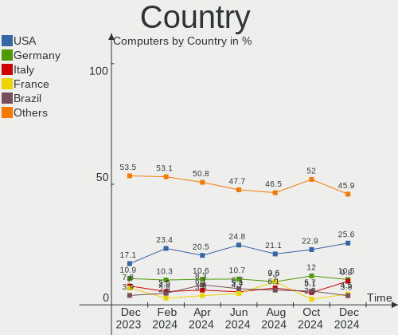
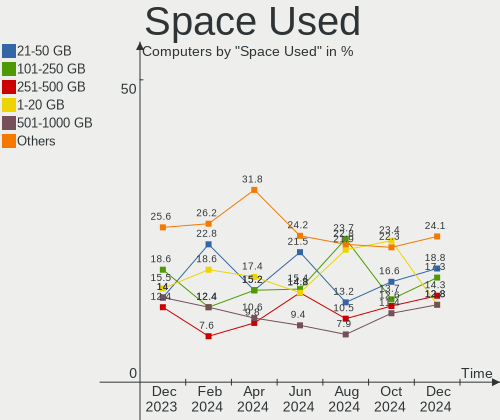
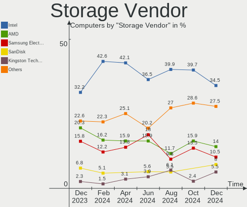
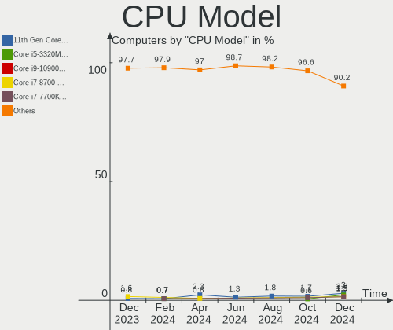
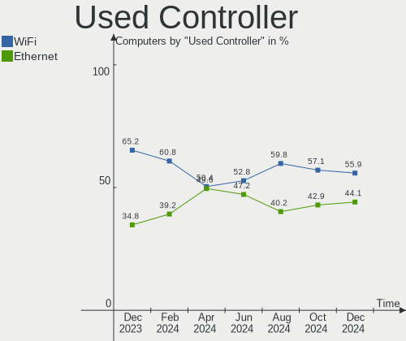
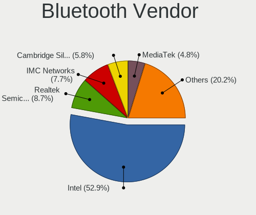

Kubuntu - Hardware Trends
-------------------------

A project to identify most popular hardware characteristics and track their change
over time based on data collected by Linux users at https://Linux-Hardware.org.

Anyone can contribute to this report by the [hw-probe](https://github.com/linuxhw/hw-probe) tool:

    sudo -E hw-probe -all -upload

This is a report for all computer types. See also reports for [desktops](/Dist/Kubuntu/Desktop/README.md) and [notebooks](/Dist/Kubuntu/Notebook/README.md).

This report is for one last month. Overall report since the beginning of time: [TestDays](https://github.com/linuxhw/TestDays)

Period: May, 2023.

Contents
--------

* [ System ](#system)
  - [ OS                       ](#os)
  - [ OS Family                ](#os-family)
  - [ Kernel                   ](#kernel)
  - [ Kernel Family            ](#kernel-family)
  - [ Kernel Major Ver.        ](#kernel-major-ver)
  - [ Arch                     ](#arch)
  - [ DE                       ](#de)
  - [ Display Server           ](#display-server)
  - [ Display Manager          ](#display-manager)
  - [ OS Lang                  ](#os-lang)
  - [ Boot Mode                ](#boot-mode)
  - [ Filesystem               ](#filesystem)
  - [ Part. scheme             ](#part-scheme)
  - [ Dual Boot with Linux/BSD ](#dual-boot-with-linuxbsd)
  - [ Dual Boot (Win)          ](#dual-boot-win)

* [ Board ](#board)
  - [ Vendor                   ](#vendor)
  - [ Model                    ](#model)
  - [ Model Family             ](#model-family)
  - [ MFG Year                 ](#mfg-year)
  - [ Form Factor              ](#form-factor)
  - [ Secure Boot              ](#secure-boot)
  - [ Coreboot                 ](#coreboot)
  - [ RAM Size                 ](#ram-size)
  - [ RAM Used                 ](#ram-used)
  - [ Total Drives             ](#total-drives)
  - [ Has CD-ROM               ](#has-cd-rom)
  - [ Has Ethernet             ](#has-ethernet)
  - [ Has WiFi                 ](#has-wifi)
  - [ Has Bluetooth            ](#has-bluetooth)

* [ Location ](#location)
  - [ Country                  ](#country)
  - [ City                     ](#city)

* [ Drives ](#drives)
  - [ Drive Vendor             ](#drive-vendor)
  - [ Drive Model              ](#drive-model)
  - [ HDD Vendor               ](#hdd-vendor)
  - [ SSD Vendor               ](#ssd-vendor)
  - [ Drive Kind               ](#drive-kind)
  - [ Drive Connector          ](#drive-connector)
  - [ Drive Size               ](#drive-size)
  - [ Space Total              ](#space-total)
  - [ Space Used               ](#space-used)
  - [ Malfunc. Drives          ](#malfunc-drives)
  - [ Malfunc. Drive Vendor    ](#malfunc-drive-vendor)
  - [ Malfunc. HDD Vendor      ](#malfunc-hdd-vendor)
  - [ Malfunc. Drive Kind      ](#malfunc-drive-kind)
  - [ Failed Drives            ](#failed-drives)
  - [ Failed Drive Vendor      ](#failed-drive-vendor)
  - [ Drive Status             ](#drive-status)

* [ Storage controller ](#storage-controller)
  - [ Storage Vendor           ](#storage-vendor)
  - [ Storage Model            ](#storage-model)
  - [ Storage Kind             ](#storage-kind)

* [ Processor ](#processor)
  - [ CPU Vendor               ](#cpu-vendor)
  - [ CPU Model                ](#cpu-model)
  - [ CPU Model Family         ](#cpu-model-family)
  - [ CPU Cores                ](#cpu-cores)
  - [ CPU Sockets              ](#cpu-sockets)
  - [ CPU Threads              ](#cpu-threads)
  - [ CPU Op-Modes             ](#cpu-op-modes)
  - [ CPU Microcode            ](#cpu-microcode)
  - [ CPU Microarch            ](#cpu-microarch)

* [ Graphics ](#graphics)
  - [ GPU Vendor               ](#gpu-vendor)
  - [ GPU Model                ](#gpu-model)
  - [ GPU Combo                ](#gpu-combo)
  - [ GPU Driver               ](#gpu-driver)
  - [ GPU Memory               ](#gpu-memory)

* [ Monitor ](#monitor)
  - [ Monitor Vendor           ](#monitor-vendor)
  - [ Monitor Model            ](#monitor-model)
  - [ Monitor Resolution       ](#monitor-resolution)
  - [ Monitor Diagonal         ](#monitor-diagonal)
  - [ Monitor Width            ](#monitor-width)
  - [ Aspect Ratio             ](#aspect-ratio)
  - [ Monitor Area             ](#monitor-area)
  - [ Pixel Density            ](#pixel-density)
  - [ Multiple Monitors        ](#multiple-monitors)

* [ Network ](#network)
  - [ Net Controller Vendor    ](#net-controller-vendor)
  - [ Net Controller Model     ](#net-controller-model)
  - [ Wireless Vendor          ](#wireless-vendor)
  - [ Wireless Model           ](#wireless-model)
  - [ Ethernet Vendor          ](#ethernet-vendor)
  - [ Ethernet Model           ](#ethernet-model)
  - [ Net Controller Kind      ](#net-controller-kind)
  - [ Used Controller          ](#used-controller)
  - [ NICs                     ](#nics)
  - [ IPv6                     ](#ipv6)

* [ Bluetooth ](#bluetooth)
  - [ Bluetooth Vendor         ](#bluetooth-vendor)
  - [ Bluetooth Model          ](#bluetooth-model)

* [ Sound ](#sound)
  - [ Sound Vendor             ](#sound-vendor)
  - [ Sound Model              ](#sound-model)

* [ Memory ](#memory)
  - [ Memory Vendor            ](#memory-vendor)
  - [ Memory Model             ](#memory-model)
  - [ Memory Kind              ](#memory-kind)
  - [ Memory Form Factor       ](#memory-form-factor)
  - [ Memory Size              ](#memory-size)
  - [ Memory Speed             ](#memory-speed)

* [ Printers & scanners ](#printers--scanners)
  - [ Printer Vendor           ](#printer-vendor)
  - [ Printer Model            ](#printer-model)
  - [ Scanner Vendor           ](#scanner-vendor)
  - [ Scanner Model            ](#scanner-model)

* [ Camera ](#camera)
  - [ Camera Vendor            ](#camera-vendor)
  - [ Camera Model             ](#camera-model)

* [ Security ](#security)
  - [ Fingerprint Vendor       ](#fingerprint-vendor)
  - [ Fingerprint Model        ](#fingerprint-model)
  - [ Chipcard Vendor          ](#chipcard-vendor)
  - [ Chipcard Model           ](#chipcard-model)

* [ Unsupported ](#unsupported)
  - [ Unsupported Devices      ](#unsupported-devices)
  - [ Unsupported Device Types ](#unsupported-device-types)

System
------

OS
--

Installed operating systems

| Name          | Computers | Percent |
|---------------|-----------|---------|
| Kubuntu 22.04 | 63        | 54.78%  |
| Kubuntu 23.04 | 43        | 37.39%  |
| Kubuntu 20.04 | 4         | 3.48%   |
| Kubuntu 11    | 3         | 2.61%   |
| Kubuntu 22.10 | 2         | 1.74%   |

OS Family
---------

OS without a version

| Name    | Computers | Percent |
|---------|-----------|---------|
| Kubuntu | 115       | 100%    |

Kernel
------

Version of the Linux kernel

| Version                | Computers | Percent |
|------------------------|-----------|---------|
| 6.2.0-20-generic       | 36        | 31.3%   |
| 5.19.0-41-generic      | 19        | 16.52%  |
| 5.15.0-72-generic      | 13        | 11.3%   |
| 5.19.0-42-generic      | 11        | 9.57%   |
| 5.15.0-71-generic      | 11        | 9.57%   |
| 6.3.4-060304-generic   | 2         | 1.74%   |
| 6.3.1-060301-generic   | 2         | 1.74%   |
| 5.19.0-1025-lowlatency | 2         | 1.74%   |
| 5.19.0-1023-lowlatency | 2         | 1.74%   |
| 5.15.0-71-lowlatency   | 2         | 1.74%   |
| 6.3.3-060303-generic   | 1         | 0.87%   |
| 6.3.1-custom           | 1         | 0.87%   |
| 6.2.0-1003-lowlatency  | 1         | 0.87%   |
| 5.4.0-89-generic       | 1         | 0.87%   |
| 5.4.0-21-generic       | 1         | 0.87%   |
| 5.19.0-38-generic      | 1         | 0.87%   |
| 5.19.0-35-generic      | 1         | 0.87%   |
| 5.19.0-32-generic      | 1         | 0.87%   |
| 5.19.0-21-generic      | 1         | 0.87%   |
| 5.17.0-1031-oem        | 1         | 0.87%   |
| 5.15.0-72-lowlatency   | 1         | 0.87%   |
| 5.15.0-70-lowlatency   | 1         | 0.87%   |
| 5.15.0-69-generic      | 1         | 0.87%   |
| 5.15.0-58-generic      | 1         | 0.87%   |
| 5.15.0-47-generic      | 1         | 0.87%   |

Kernel Family
-------------

Linux kernel without a distro release

| Version | Computers | Percent |
|---------|-----------|---------|
| 5.19.0  | 38        | 33.04%  |
| 6.2.0   | 37        | 32.17%  |
| 5.15.0  | 31        | 26.96%  |
| 6.3.1   | 3         | 2.61%   |
| 6.3.4   | 2         | 1.74%   |
| 5.4.0   | 2         | 1.74%   |
| 6.3.3   | 1         | 0.87%   |
| 5.17.0  | 1         | 0.87%   |

Kernel Major Ver.
-----------------

Linux kernel major version

| Version | Computers | Percent |
|---------|-----------|---------|
| 5.19    | 38        | 33.04%  |
| 6.2     | 37        | 32.17%  |
| 5.15    | 31        | 26.96%  |
| 6.3     | 6         | 5.22%   |
| 5.4     | 2         | 1.74%   |
| 5.17    | 1         | 0.87%   |

Arch
----

OS architecture (x86_64, i586, etc.)

| Name   | Computers | Percent |
|--------|-----------|---------|
| x86_64 | 115       | 100%    |

DE
--

Desktop Environment

| Name  | Computers | Percent |
|-------|-----------|---------|
| KDE5  | 111       | 96.52%  |
| KDE   | 2         | 1.74%   |
| LXQt  | 1         | 0.87%   |
| GNOME | 1         | 0.87%   |

Display Server
--------------

X11 or Wayland

| Name    | Computers | Percent |
|---------|-----------|---------|
| X11     | 107       | 93.04%  |
| Wayland | 5         | 4.35%   |
| Tty     | 3         | 2.61%   |

Display Manager
---------------

SDDM, LightDM, etc.

| Name    | Computers | Percent |
|---------|-----------|---------|
| SDDM    | 73        | 63.48%  |
| Unknown | 35        | 30.43%  |
| LightDM | 5         | 4.35%   |
| GDM3    | 2         | 1.74%   |

OS Lang
-------

Language

| Lang   | Computers | Percent |
|--------|-----------|---------|
| en_US  | 49        | 42.61%  |
| de_DE  | 15        | 13.04%  |
| en_GB  | 6         | 5.22%   |
| it_IT  | 5         | 4.35%   |
| en_IN  | 4         | 3.48%   |
| pl_PL  | 3         | 2.61%   |
| en_NZ  | 3         | 2.61%   |
| ru_RU  | 2         | 1.74%   |
| pt_PT  | 2         | 1.74%   |
| nl_NL  | 2         | 1.74%   |
| fr_FR  | 2         | 1.74%   |
| es_MX  | 2         | 1.74%   |
| es_ES  | 2         | 1.74%   |
| el_GR  | 2         | 1.74%   |
| C      | 2         | 1.74%   |
| zh_CN  | 1         | 0.87%   |
| sv_SE  | 1         | 0.87%   |
| pt_BR  | 1         | 0.87%   |
| hu_HU  | 1         | 0.87%   |
| fr_CH  | 1         | 0.87%   |
| fr_CA  | 1         | 0.87%   |
| es_CR  | 1         | 0.87%   |
| es_AR  | 1         | 0.87%   |
| es_419 | 1         | 0.87%   |
| en_PH  | 1         | 0.87%   |
| en_DE  | 1         | 0.87%   |
| en_CA  | 1         | 0.87%   |
| en_AU  | 1         | 0.87%   |
| de_AT  | 1         | 0.87%   |

Boot Mode
---------

EFI or BIOS

| Mode | Computers | Percent |
|------|-----------|---------|
| EFI  | 58        | 50.43%  |
| BIOS | 57        | 49.57%  |

Filesystem
----------

Type of filesystem

| Type    | Computers | Percent |
|---------|-----------|---------|
| Ext4    | 87        | 75.65%  |
| Tmpfs   | 20        | 17.39%  |
| Overlay | 4         | 3.48%   |
| Btrfs   | 3         | 2.61%   |
| Zfs     | 1         | 0.87%   |

Part. scheme
------------

Scheme of partitioning

| Type    | Computers | Percent |
|---------|-----------|---------|
| GPT     | 71        | 61.74%  |
| Unknown | 35        | 30.43%  |
| MBR     | 9         | 7.83%   |

Dual Boot with Linux/BSD
------------------------

Hosting more than one Linux/BSD

| Dual boot | Computers | Percent |
|-----------|-----------|---------|
| No        | 106       | 92.17%  |
| Yes       | 9         | 7.83%   |

Dual Boot (Win)
---------------

Hosting Linux and Windows

| Dual boot | Computers | Percent |
|-----------|-----------|---------|
| No        | 79        | 68.7%   |
| Yes       | 36        | 31.3%   |

Board
-----

Vendor
------

Motherboard manufacturer

| Name                | Computers | Percent |
|---------------------|-----------|---------|
| ASUSTek Computer    | 22        | 19.13%  |
| Lenovo              | 16        | 13.91%  |
| Dell                | 15        | 13.04%  |
| Hewlett-Packard     | 13        | 11.3%   |
| Gigabyte Technology | 9         | 7.83%   |
| Acer                | 7         | 6.09%   |
| MSI                 | 4         | 3.48%   |
| Samsung Electronics | 3         | 2.61%   |
| HUAWEI              | 3         | 2.61%   |
| ASRock              | 3         | 2.61%   |
| Intel               | 2         | 1.74%   |
| Google              | 2         | 1.74%   |
| Fujitsu             | 2         | 1.74%   |
| TerraQue            | 1         | 0.87%   |
| Razer               | 1         | 0.87%   |
| PC Specialist       | 1         | 0.87%   |
| Packard Bell        | 1         | 0.87%   |
| Notebook            | 1         | 0.87%   |
| Medion              | 1         | 0.87%   |
| IBM                 | 1         | 0.87%   |
| BOSGAME             | 1         | 0.87%   |
| Biostar             | 1         | 0.87%   |
| AZW                 | 1         | 0.87%   |
| Apple               | 1         | 0.87%   |
| AMI                 | 1         | 0.87%   |
| Alienware           | 1         | 0.87%   |
| Unknown             | 1         | 0.87%   |

Model
-----

Motherboard model

| Name                                               | Computers | Percent |
|----------------------------------------------------|-----------|---------|
| ASUS All Series                                    | 3         | 2.61%   |
| TerraQue W65_W67RB                                 | 1         | 0.87%   |
| Samsung R425/R525                                  | 1         | 0.87%   |
| Samsung Galaxy Book 12                             | 1         | 0.87%   |
| Samsung 730QFG                                     | 1         | 0.87%   |
| Razer Blade Pro 17 (2019)                          | 1         | 0.87%   |
| PC Specialist P65_67RSRP                           | 1         | 0.87%   |
| Packard Bell IMEDIA D6001 GE AIO                   | 1         | 0.87%   |
| Notebook NLx0MU                                    | 1         | 0.87%   |
| MSI Titan GT77HX 13VH                              | 1         | 0.87%   |
| MSI MS-7C86                                        | 1         | 0.87%   |
| MSI MS-7A40                                        | 1         | 0.87%   |
| MSI MS-7A33                                        | 1         | 0.87%   |
| Medion E11201                                      | 1         | 0.87%   |
| Lenovo Yoga 6 13ALC7 82UD                          | 1         | 0.87%   |
| Lenovo ThinkPad X1 Carbon Gen 11 21HMCTO1WW        | 1         | 0.87%   |
| Lenovo ThinkPad T460s 20F9CTO1WW                   | 1         | 0.87%   |
| Lenovo ThinkPad T16 Gen 1 21BVCTO1WW               | 1         | 0.87%   |
| Lenovo ThinkPad T15 Gen 2i 20W4008XSC              | 1         | 0.87%   |
| Lenovo ThinkPad E15 Gen 4 21EES00100               | 1         | 0.87%   |
| Lenovo ThinkPad E15 Gen 4 21EDCTO1WW               | 1         | 0.87%   |
| Lenovo ThinkPad E14 Gen 4 21ECS00000               | 1         | 0.87%   |
| Lenovo ThinkPad E14 Gen 3 20YDS02D00               | 1         | 0.87%   |
| Lenovo ThinkBook 15 G4 IAP 21DJ                    | 1         | 0.87%   |
| Lenovo Legion 5 15IMH05 82AU                       | 1         | 0.87%   |
| Lenovo IdeaPad Y700-15ISK 80NV                     | 1         | 0.87%   |
| Lenovo IdeaPad 700-17ISK 80RV                      | 1         | 0.87%   |
| Lenovo IdeaPad 3 15IAU7 82RK                       | 1         | 0.87%   |
| Lenovo IdeaPad 3 15ALC6 82MF                       | 1         | 0.87%   |
| Lenovo IdeaPad 3 15ADA05 81W1                      | 1         | 0.87%   |
| Intel NUC12WSHi7                                   | 1         | 0.87%   |
| Intel H61                                          | 1         | 0.87%   |
| IBM System x3550 M4 Server -[7914AC1]              | 1         | 0.87%   |
| HUAWEI NBD-WXX9                                    | 1         | 0.87%   |
| HUAWEI HVY-WXX9                                    | 1         | 0.87%   |
| HUAWEI BOHB-WAX9                                   | 1         | 0.87%   |
| HP ZBook Studio 15.6 inch G8 Mobile Workstation PC | 1         | 0.87%   |
| HP ProBook x360 440 G1                             | 1         | 0.87%   |
| HP ProBook 440 G5                                  | 1         | 0.87%   |
| HP Pavilion Laptop 15-eg0xxx                       | 1         | 0.87%   |

Model Family
------------

Motherboard model prefix

| Name                | Computers | Percent |
|---------------------|-----------|---------|
| Lenovo ThinkPad     | 8         | 6.96%   |
| Dell Latitude       | 6         | 5.22%   |
| Acer Aspire         | 6         | 5.22%   |
| Lenovo IdeaPad      | 5         | 4.35%   |
| ASUS ROG            | 4         | 3.48%   |
| Dell Inspiron       | 3         | 2.61%   |
| ASUS PRIME          | 3         | 2.61%   |
| ASUS All            | 3         | 2.61%   |
| HP ProBook          | 2         | 1.74%   |
| HP Pavilion         | 2         | 1.74%   |
| HP Laptop           | 2         | 1.74%   |
| HP EliteBook        | 2         | 1.74%   |
| HP Compaq           | 2         | 1.74%   |
| Dell XPS            | 2         | 1.74%   |
| TerraQue W65        | 1         | 0.87%   |
| Samsung R425        | 1         | 0.87%   |
| Samsung Galaxy      | 1         | 0.87%   |
| Samsung 730QFG      | 1         | 0.87%   |
| Razer Blade         | 1         | 0.87%   |
| PC Specialist P65   | 1         | 0.87%   |
| Packard Bell IMEDIA | 1         | 0.87%   |
| Notebook NLx0MU     | 1         | 0.87%   |
| MSI Titan           | 1         | 0.87%   |
| MSI MS-7C86         | 1         | 0.87%   |
| MSI MS-7A40         | 1         | 0.87%   |
| MSI MS-7A33         | 1         | 0.87%   |
| Medion E11201       | 1         | 0.87%   |
| Lenovo Yoga         | 1         | 0.87%   |
| Lenovo ThinkBook    | 1         | 0.87%   |
| Lenovo Legion       | 1         | 0.87%   |
| Intel NUC12WSHi7    | 1         | 0.87%   |
| Intel H61           | 1         | 0.87%   |
| IBM System          | 1         | 0.87%   |
| HUAWEI NBD-WXX9     | 1         | 0.87%   |
| HUAWEI HVY-WXX9     | 1         | 0.87%   |
| HUAWEI BOHB-WAX9    | 1         | 0.87%   |
| HP ZBook            | 1         | 0.87%   |
| HP ENVY             | 1         | 0.87%   |
| HP 350              | 1         | 0.87%   |
| Google Lars         | 1         | 0.87%   |

MFG Year
--------

Motherboard manufacture year

| Year | Computers | Percent |
|------|-----------|---------|
| 2022 | 17        | 14.78%  |
| 2021 | 13        | 11.3%   |
| 2017 | 12        | 10.43%  |
| 2020 | 10        | 8.7%    |
| 2019 | 10        | 8.7%    |
| 2018 | 8         | 6.96%   |
| 2013 | 8         | 6.96%   |
| 2016 | 7         | 6.09%   |
| 2012 | 7         | 6.09%   |
| 2023 | 6         | 5.22%   |
| 2014 | 5         | 4.35%   |
| 2011 | 3         | 2.61%   |
| 2010 | 3         | 2.61%   |
| 2008 | 3         | 2.61%   |
| 2015 | 2         | 1.74%   |
| 2009 | 1         | 0.87%   |

Form Factor
-----------

Physical design of the computer

| Name        | Computers | Percent |
|-------------|-----------|---------|
| Notebook    | 64        | 55.65%  |
| Desktop     | 43        | 37.39%  |
| Convertible | 4         | 3.48%   |
| Mini pc     | 2         | 1.74%   |
| Tablet      | 1         | 0.87%   |
| Server      | 1         | 0.87%   |

Secure Boot
-----------

Enabled or disabled

| State    | Computers | Percent |
|----------|-----------|---------|
| Disabled | 102       | 88.7%   |
| Enabled  | 13        | 11.3%   |

Coreboot
--------

Have coreboot on board

| Used | Computers | Percent |
|------|-----------|---------|
| No   | 113       | 98.26%  |
| Yes  | 2         | 1.74%   |

RAM Size
--------

Total RAM memory

| Size in GB      | Computers | Percent |
|-----------------|-----------|---------|
| 16.01-24.0      | 29        | 25.22%  |
| 4.01-8.0        | 27        | 23.48%  |
| 8.01-16.0       | 20        | 17.39%  |
| 32.01-64.0      | 19        | 16.52%  |
| 3.01-4.0        | 8         | 6.96%   |
| 64.01-256.0     | 7         | 6.09%   |
| 24.01-32.0      | 3         | 2.61%   |
| More than 256.0 | 1         | 0.87%   |
| 1.01-2.0        | 1         | 0.87%   |

RAM Used
--------

Used RAM memory

| Used GB    | Computers | Percent |
|------------|-----------|---------|
| 4.01-8.0   | 33        | 28.7%   |
| 2.01-3.0   | 28        | 24.35%  |
| 1.01-2.0   | 24        | 20.87%  |
| 3.01-4.0   | 21        | 18.26%  |
| 8.01-16.0  | 7         | 6.09%   |
| 16.01-24.0 | 2         | 1.74%   |

Total Drives
------------

Number of drives on board

| Drives | Computers | Percent |
|--------|-----------|---------|
| 1      | 62        | 53.91%  |
| 2      | 32        | 27.83%  |
| 3      | 10        | 8.7%    |
| 5      | 4         | 3.48%   |
| 4      | 4         | 3.48%   |
| 6      | 3         | 2.61%   |

Has CD-ROM
----------

Has CD-ROM on board

| Presented | Computers | Percent |
|-----------|-----------|---------|
| No        | 86        | 74.78%  |
| Yes       | 29        | 25.22%  |

Has Ethernet
------------

Has Ethernet on board

| Presented | Computers | Percent |
|-----------|-----------|---------|
| Yes       | 94        | 81.74%  |
| No        | 21        | 18.26%  |

Has WiFi
--------

Has WiFi module

| Presented | Computers | Percent |
|-----------|-----------|---------|
| Yes       | 97        | 84.35%  |
| No        | 18        | 15.65%  |

Has Bluetooth
-------------

Has Bluetooth module

| Presented | Computers | Percent |
|-----------|-----------|---------|
| Yes       | 82        | 71.3%   |
| No        | 33        | 28.7%   |

Location
--------

Country
-------

Geographic location (country)

| Country     | Computers | Percent |
|-------------|-----------|---------|
| USA         | 25        | 21.74%  |
| Germany     | 19        | 16.52%  |
| UK          | 7         | 6.09%   |
| Spain       | 5         | 4.35%   |
| Italy       | 5         | 4.35%   |
| India       | 5         | 4.35%   |
| Netherlands | 4         | 3.48%   |
| Mexico      | 4         | 3.48%   |
| Canada      | 4         | 3.48%   |
| Portugal    | 3         | 2.61%   |
| Poland      | 3         | 2.61%   |
| New Zealand | 3         | 2.61%   |
| France      | 3         | 2.61%   |
| Brazil      | 3         | 2.61%   |
| Russia      | 2         | 1.74%   |
| Japan       | 2         | 1.74%   |
| Greece      | 2         | 1.74%   |
| Belgium     | 2         | 1.74%   |
| Argentina   | 2         | 1.74%   |
| Sweden      | 1         | 0.87%   |
| Qatar       | 1         | 0.87%   |
| Philippines | 1         | 0.87%   |
| Norway      | 1         | 0.87%   |
| Indonesia   | 1         | 0.87%   |
| Czechia     | 1         | 0.87%   |
| Croatia     | 1         | 0.87%   |
| Costa Rica  | 1         | 0.87%   |
| Colombia    | 1         | 0.87%   |
| Cameroon    | 1         | 0.87%   |
| Austria     | 1         | 0.87%   |
| Australia   | 1         | 0.87%   |

City
----

Geographic location (city)

| City              | Computers | Percent |
|-------------------|-----------|---------|
| Munich            | 3         | 2.61%   |
| Paris             | 2         | 1.74%   |
| La Mesa           | 2         | 1.74%   |
| Houston           | 2         | 1.74%   |
| Hamburg           | 2         | 1.74%   |
| Dudley            | 2         | 1.74%   |
| Auckland          | 2         | 1.74%   |
| Zagreb            | 1         | 0.87%   |
| Weilmuenster      | 1         | 0.87%   |
| Waldorf           | 1         | 0.87%   |
| Waianae           | 1         | 0.87%   |
| Villa Dominico    | 1         | 0.87%   |
| Valencia          | 1         | 0.87%   |
| Tulsa             | 1         | 0.87%   |
| Tokyo             | 1         | 0.87%   |
| Theydon Bois      | 1         | 0.87%   |
| Thessaloniki      | 1         | 0.87%   |
| Szczecin          | 1         | 0.87%   |
| Sydney            | 1         | 0.87%   |
| Sundsvall         | 1         | 0.87%   |
| Sumter            | 1         | 0.87%   |
| Stevenage         | 1         | 0.87%   |
| Stendal           | 1         | 0.87%   |
| Singen            | 1         | 0.87%   |
| Sherbrooke        | 1         | 0.87%   |
| Sao Paulo         | 1         | 0.87%   |
| San Juan del Río | 1         | 0.87%   |
| Salt Lake City    | 1         | 0.87%   |
| Saint-Hyacinthe   | 1         | 0.87%   |
| Saarbrücken      | 1         | 0.87%   |
| Rome              | 1         | 0.87%   |
| Ridgetown         | 1         | 0.87%   |
| Ribeirao Preto    | 1         | 0.87%   |
| Rewal             | 1         | 0.87%   |
| Prague            | 1         | 0.87%   |
| Poznan            | 1         | 0.87%   |
| Portimao          | 1         | 0.87%   |
| Ponta Delgada     | 1         | 0.87%   |
| Olathe            | 1         | 0.87%   |
| Ober-Morlen       | 1         | 0.87%   |

Drives
------

Drive Vendor
------------

Hard drive vendors

| Vendor                    | Computers | Drives | Percent |
|---------------------------|-----------|--------|---------|
| Samsung Electronics       | 31        | 50     | 17.92%  |
| WDC                       | 23        | 28     | 13.29%  |
| Seagate                   | 15        | 18     | 8.67%   |
| SanDisk                   | 11        | 12     | 6.36%   |
| Toshiba                   | 9         | 11     | 5.2%    |
| Kingston                  | 8         | 9      | 4.62%   |
| Unknown                   | 6         | 8      | 3.47%   |
| Crucial                   | 6         | 6      | 3.47%   |
| A-DATA Technology         | 6         | 6      | 3.47%   |
| SK hynix                  | 5         | 5      | 2.89%   |
| PNY                       | 5         | 6      | 2.89%   |
| Micron Technology         | 5         | 5      | 2.89%   |
| Intel                     | 5         | 5      | 2.89%   |
| Hitachi                   | 3         | 6      | 1.73%   |
| HGST                      | 3         | 3      | 1.73%   |
| China                     | 3         | 3      | 1.73%   |
| UMIS                      | 2         | 2      | 1.16%   |
| Patriot                   | 2         | 2      | 1.16%   |
| Micron/Crucial Technology | 2         | 2      | 1.16%   |
| KIOXIA                    | 2         | 2      | 1.16%   |
| Unknown                   | 2         | 2      | 1.16%   |
| WALRAM                    | 1         | 1      | 0.58%   |
| Union Memory (Shenzhen)   | 1         | 1      | 0.58%   |
| T-FORCE                   | 1         | 1      | 0.58%   |
| SSSTC                     | 1         | 1      | 0.58%   |
| SSDPR-CX                  | 1         | 1      | 0.58%   |
| Solid State Storage       | 1         | 1      | 0.58%   |
| Silicon Motion            | 1         | 1      | 0.58%   |
| Phison Electronics        | 1         | 1      | 0.58%   |
| Phison                    | 1         | 1      | 0.58%   |
| Mushkin                   | 1         | 1      | 0.58%   |
| Maxtor                    | 1         | 1      | 0.58%   |
| Lenovo                    | 1         | 1      | 0.58%   |
| ICY BOX                   | 1         | 1      | 0.58%   |
| Hewlett-Packard           | 1         | 1      | 0.58%   |
| GOODRAM                   | 1         | 1      | 0.58%   |
| CT2000BX                  | 1         | 1      | 0.58%   |
| BlueRay                   | 1         | 1      | 0.58%   |
| Apple                     | 1         | 1      | 0.58%   |
| ADATA Technology          | 1         | 2      | 0.58%   |

Drive Model
-----------

Hard drive models

| Model                                               | Computers | Percent |
|-----------------------------------------------------|-----------|---------|
| Unknown MMC Card  32GB                              | 3         | 1.5%    |
| Samsung SSD 980 PRO 2TB                             | 3         | 1.5%    |
| WDC WD1003FZEX-00MK2A0 1TB                          | 2         | 1%      |
| UMIS RPJTJ512MGE1QDQ 512GB                          | 2         | 1%      |
| Toshiba XG6 NVMe SSD Controller 256GB               | 2         | 1%      |
| Seagate ST500LT012-1DG142 500GB                     | 2         | 1%      |
| Seagate ST2000DM008-2FR102 2TB                      | 2         | 1%      |
| Sandisk WD Blue SN570 1TB                           | 2         | 1%      |
| SanDisk NVMe SSD Drive 2TB                          | 2         | 1%      |
| Samsung SSD 870 QVO 2TB                             | 2         | 1%      |
| Samsung SSD 870 QVO 1TB                             | 2         | 1%      |
| Samsung SSD 870 EVO 500GB                           | 2         | 1%      |
| Samsung SSD 850 PRO 512GB                           | 2         | 1%      |
| Samsung SSD 840 EVO 250GB                           | 2         | 1%      |
| Samsung NVMe SSD Controller SM981/PM981/PM983 256GB | 2         | 1%      |
| Samsung NVMe SSD Controller PM9A1/PM9A3/980PRO 1TB  | 2         | 1%      |
| PNY CS900 500GB SSD                                 | 2         | 1%      |
| Kingston SA400S37480G 480GB SSD                     | 2         | 1%      |
| Intel SSD 660P Series 512GB                         | 2         | 1%      |
| HGST HTS545050A7E680 500GB                          | 2         | 1%      |
| Unknown                                             | 2         | 1%      |
| WDC WDSN740-SDDPNQD-512G-1004 512GB                 | 1         | 0.5%    |
| WDC WDS500G2B0C-00PXH0 500GB                        | 1         | 0.5%    |
| WDC WDS500G1B0C-00S6U0 500GB                        | 1         | 0.5%    |
| WDC WDS500G1B0B-00AS40 500GB SSD                    | 1         | 0.5%    |
| WDC WDS480G2G0C-00AJM0 480GB                        | 1         | 0.5%    |
| WDC WDS200T2B0B-00YS70 2TB SSD                      | 1         | 0.5%    |
| WDC WDS200T2B0A-00SM50 2TB SSD                      | 1         | 0.5%    |
| WDC WDS120G2G0A-00JH30 120GB SSD                    | 1         | 0.5%    |
| WDC WDS100T2B0C-00PXH0 1TB                          | 1         | 0.5%    |
| WDC WDBNCE5000PNC 500GB SSD                         | 1         | 0.5%    |
| WDC WD800BB-55JKA0 80GB                             | 1         | 0.5%    |
| WDC WD5000AAKX-60U6AA0 500GB                        | 1         | 0.5%    |
| WDC WD5000AAKX-00ERMA0 500GB                        | 1         | 0.5%    |
| WDC WD5000AAKS-22V1A0 500GB                         | 1         | 0.5%    |
| WDC WD3200BEVT-22ZCT0 320GB                         | 1         | 0.5%    |
| WDC WD20EARX-00PASB0 2TB                            | 1         | 0.5%    |
| WDC WD20EADS-14R6B0 2TB                             | 1         | 0.5%    |
| WDC WD16 00AVBB-63SYA0 160GB                        | 1         | 0.5%    |
| WDC WD10EZEX-08M2NA0 1TB                            | 1         | 0.5%    |

HDD Vendor
----------

Hard disk drive vendors

| Vendor              | Computers | Drives | Percent |
|---------------------|-----------|--------|---------|
| Seagate             | 15        | 17     | 34.88%  |
| WDC                 | 13        | 15     | 30.23%  |
| Toshiba             | 5         | 6      | 11.63%  |
| Hitachi             | 3         | 6      | 6.98%   |
| HGST                | 3         | 3      | 6.98%   |
| Samsung Electronics | 2         | 3      | 4.65%   |
| Maxtor              | 1         | 1      | 2.33%   |
| Apple               | 1         | 1      | 2.33%   |

SSD Vendor
----------

Solid state drive vendors

| Vendor              | Computers | Drives | Percent |
|---------------------|-----------|--------|---------|
| Samsung Electronics | 14        | 23     | 22.95%  |
| WDC                 | 7         | 7      | 11.48%  |
| A-DATA Technology   | 6         | 6      | 9.84%   |
| PNY                 | 5         | 6      | 8.2%    |
| Kingston            | 5         | 6      | 8.2%    |
| Crucial             | 5         | 5      | 8.2%    |
| SanDisk             | 4         | 4      | 6.56%   |
| China               | 3         | 3      | 4.92%   |
| Patriot             | 2         | 2      | 3.28%   |
| Micron Technology   | 2         | 2      | 3.28%   |
| Toshiba             | 1         | 1      | 1.64%   |
| Mushkin             | 1         | 1      | 1.64%   |
| Lenovo              | 1         | 1      | 1.64%   |
| Intel               | 1         | 1      | 1.64%   |
| Hewlett-Packard     | 1         | 1      | 1.64%   |
| GOODRAM             | 1         | 1      | 1.64%   |
| CT2000BX            | 1         | 1      | 1.64%   |
| BlueRay             | 1         | 1      | 1.64%   |

Drive Kind
----------

HDD or SSD

| Kind    | Computers | Drives | Percent |
|---------|-----------|--------|---------|
| NVMe    | 62        | 72     | 38.27%  |
| SSD     | 51        | 72     | 31.48%  |
| HDD     | 36        | 52     | 22.22%  |
| Unknown | 7         | 9      | 4.32%   |
| MMC     | 6         | 6      | 3.7%    |

Drive Connector
---------------

SATA, SAS, NVMe, etc.

| Type | Computers | Drives | Percent |
|------|-----------|--------|---------|
| SATA | 68        | 123    | 47.55%  |
| NVMe | 62        | 72     | 43.36%  |
| SAS  | 7         | 10     | 4.9%    |
| MMC  | 6         | 6      | 4.2%    |

Drive Size
----------

Size of hard drive

| Size in TB | Computers | Drives | Percent |
|------------|-----------|--------|---------|
| 0.01-0.5   | 50        | 75     | 53.76%  |
| 0.51-1.0   | 25        | 29     | 26.88%  |
| 1.01-2.0   | 15        | 16     | 16.13%  |
| 3.01-4.0   | 2         | 2      | 2.15%   |
| 10.01-20.0 | 1         | 2      | 1.08%   |

Space Total
-----------

Amount of disk space available on the file system

| Size in GB     | Computers | Percent |
|----------------|-----------|---------|
| 251-500        | 30        | 26.09%  |
| 101-250        | 27        | 23.48%  |
| 1001-2000      | 16        | 13.91%  |
| 501-1000       | 14        | 12.17%  |
| More than 3000 | 10        | 8.7%    |
| 2001-3000      | 7         | 6.09%   |
| 51-100         | 5         | 4.35%   |
| 1-20           | 3         | 2.61%   |
| 21-50          | 2         | 1.74%   |
| Unknown        | 1         | 0.87%   |

Space Used
----------

Amount of used disk space

| Used GB        | Computers | Percent |
|----------------|-----------|---------|
| 101-250        | 22        | 19.13%  |
| 1-20           | 21        | 18.26%  |
| 251-500        | 18        | 15.65%  |
| 51-100         | 17        | 14.78%  |
| 21-50          | 16        | 13.91%  |
| 1001-2000      | 10        | 8.7%    |
| 501-1000       | 7         | 6.09%   |
| More than 3000 | 3         | 2.61%   |
| Unknown        | 1         | 0.87%   |

Malfunc. Drives
---------------

Drive models with a malfunction

| Model                                          | Computers | Drives | Percent |
|------------------------------------------------|-----------|--------|---------|
| WDC WD20EADS-14R6B0 2TB                        | 1         | 1      | 16.67%  |
| SK hynix BC711 HFM256GD3JX013N 256GB           | 1         | 1      | 16.67%  |
| Samsung Electronics MZNLN256HMHQ-000 256GB SSD | 1         | 1      | 16.67%  |
| Samsung Electronics HD501LJ 500GB              | 1         | 1      | 16.67%  |
| Maxtor STM3250310AS 250GB                      | 1         | 1      | 16.67%  |
| Hitachi HDS721010CLA630 1TB                    | 1         | 1      | 16.67%  |

Malfunc. Drive Vendor
---------------------

Vendors of faulty drives

| Vendor              | Computers | Drives | Percent |
|---------------------|-----------|--------|---------|
| Samsung Electronics | 2         | 2      | 33.33%  |
| WDC                 | 1         | 1      | 16.67%  |
| SK hynix            | 1         | 1      | 16.67%  |
| Maxtor              | 1         | 1      | 16.67%  |
| Hitachi             | 1         | 1      | 16.67%  |

Malfunc. HDD Vendor
-------------------

Vendors of faulty HDD drives

| Vendor              | Computers | Drives | Percent |
|---------------------|-----------|--------|---------|
| WDC                 | 1         | 1      | 25%     |
| Samsung Electronics | 1         | 1      | 25%     |
| Maxtor              | 1         | 1      | 25%     |
| Hitachi             | 1         | 1      | 25%     |

Malfunc. Drive Kind
-------------------

Kinds of faulty drives

| Kind | Computers | Drives | Percent |
|------|-----------|--------|---------|
| HDD  | 4         | 4      | 66.67%  |
| NVMe | 1         | 1      | 16.67%  |
| SSD  | 1         | 1      | 16.67%  |

Failed Drives
-------------

Failed drive models

Zero info for selected period =(

Failed Drive Vendor
-------------------

Failed drive vendors

Zero info for selected period =(

Drive Status
------------

Number of failed and malfunc. drives

| Status   | Computers | Drives | Percent |
|----------|-----------|--------|---------|
| Detected | 67        | 122    | 53.17%  |
| Works    | 53        | 83     | 42.06%  |
| Malfunc  | 6         | 6      | 4.76%   |

Storage controller
------------------

Storage Vendor
--------------

Storage controller vendors

| Vendor                         | Computers | Percent |
|--------------------------------|-----------|---------|
| Intel                          | 64        | 40%     |
| AMD                            | 26        | 16.25%  |
| Samsung Electronics            | 21        | 13.13%  |
| SanDisk                        | 13        | 8.13%   |
| SK hynix                       | 5         | 3.13%   |
| ASMedia Technology             | 4         | 2.5%    |
| Union Memory (Shenzhen)        | 3         | 1.88%   |
| Toshiba America Info Systems   | 3         | 1.88%   |
| Micron/Crucial Technology      | 3         | 1.88%   |
| Micron Technology              | 3         | 1.88%   |
| Kingston Technology Company    | 3         | 1.88%   |
| Solid State Storage Technology | 2         | 1.25%   |
| Phison Electronics             | 2         | 1.25%   |
| KIOXIA                         | 2         | 1.25%   |
| Silicon Motion                 | 1         | 0.63%   |
| Silicon Image                  | 1         | 0.63%   |
| Nvidia                         | 1         | 0.63%   |
| LSI Logic / Symbios Logic      | 1         | 0.63%   |
| JMicron Technology             | 1         | 0.63%   |
| Broadcom / LSI                 | 1         | 0.63%   |

Storage Model
-------------

Storage controller models

| Model                                                                          | Computers | Percent |
|--------------------------------------------------------------------------------|-----------|---------|
| AMD FCH SATA Controller [AHCI mode]                                            | 20        | 10.99%  |
| Samsung NVMe SSD Controller PM9A1/PM9A3/980PRO                                 | 9         | 4.95%   |
| Intel Sunrise Point-LP SATA Controller [AHCI mode]                             | 7         | 3.85%   |
| Samsung NVMe SSD Controller 980                                                | 6         | 3.3%    |
| Intel Volume Management Device NVMe RAID Controller                            | 6         | 3.3%    |
| SanDisk Non-Volatile memory controller                                         | 5         | 2.75%   |
| Intel 8 Series/C220 Series Chipset Family 6-port SATA Controller 1 [AHCI mode] | 5         | 2.75%   |
| Samsung NVMe SSD Controller SM981/PM981/PM983                                  | 4         | 2.2%    |
| Intel HM170/QM170 Chipset SATA Controller [AHCI Mode]                          | 4         | 2.2%    |
| Intel Cannon Lake Mobile PCH SATA AHCI Controller                              | 4         | 2.2%    |
| ASMedia ASM1062 Serial ATA Controller                                          | 4         | 2.2%    |
| Toshiba America Info Systems XG6 NVMe SSD Controller                           | 3         | 1.65%   |
| SK hynix Gold P31/PC711 NVMe Solid State Drive                                 | 3         | 1.65%   |
| Micron NVMe Storage Controller                                                 | 3         | 1.65%   |
| Intel Comet Lake SATA AHCI Controller                                          | 3         | 1.65%   |
| Intel 82801 Mobile SATA Controller [RAID mode]                                 | 3         | 1.65%   |
| Intel 7 Series Chipset Family 6-port SATA Controller [AHCI mode]               | 3         | 1.65%   |
| AMD SB7x0/SB8x0/SB9x0 SATA Controller [AHCI mode]                              | 3         | 1.65%   |
| Union Memory (Shenzhen) AM630 PCIe 4.0 x4 NVMe SSD Controller                  | 2         | 1.1%    |
| Solid State Storage Non-Volatile memory controller                             | 2         | 1.1%    |
| SanDisk WD Blue SN570 NVMe SSD 1TB                                             | 2         | 1.1%    |
| Samsung NVMe SSD Controller SM961/PM961/SM963                                  | 2         | 1.1%    |
| KIOXIA NVMe SSD Controller BG4                                                 | 2         | 1.1%    |
| Kingston Company Company Non-Volatile memory controller                        | 2         | 1.1%    |
| Intel Tiger Lake-LP SATA Controller                                            | 2         | 1.1%    |
| Intel SSD 660P Series                                                          | 2         | 1.1%    |
| Intel Q170/Q150/B150/H170/H110/Z170/CM236 Chipset SATA Controller [AHCI Mode]  | 2         | 1.1%    |
| Intel Non-Volatile memory controller                                           | 2         | 1.1%    |
| Intel Celeron N3350/Pentium N4200/Atom E3900 Series SATA AHCI Controller       | 2         | 1.1%    |
| Intel C600/X79 series chipset 6-Port SATA AHCI Controller                      | 2         | 1.1%    |
| Intel Alder Lake-P SATA AHCI Controller                                        | 2         | 1.1%    |
| Intel 9 Series Chipset Family SATA Controller [AHCI Mode]                      | 2         | 1.1%    |
| Intel 82801JI (ICH10 Family) SATA AHCI Controller                              | 2         | 1.1%    |
| Intel 7 Series/C210 Series Chipset Family 6-port SATA Controller [AHCI mode]   | 2         | 1.1%    |
| Intel 6 Series/C200 Series Chipset Family 6 port Desktop SATA AHCI Controller  | 2         | 1.1%    |
| Intel 400 Series Chipset Family SATA AHCI Controller                           | 2         | 1.1%    |
| Intel 200 Series PCH SATA controller [AHCI mode]                               | 2         | 1.1%    |
| AMD X370 Series Chipset SATA Controller                                        | 2         | 1.1%    |
| AMD FCH SATA Controller D                                                      | 2         | 1.1%    |
| AMD FCH IDE Controller                                                         | 2         | 1.1%    |

Storage Kind
------------

Kind of storage controller (IDE, SATA, NVMe, SAS, ...)

| Kind | Computers | Percent |
|------|-----------|---------|
| SATA | 80        | 50%     |
| NVMe | 61        | 38.13%  |
| RAID | 11        | 6.88%   |
| IDE  | 7         | 4.38%   |
| SAS  | 1         | 0.63%   |

Processor
---------

CPU Vendor
----------

Processor vendors

| Vendor | Computers | Percent |
|--------|-----------|---------|
| Intel  | 77        | 66.96%  |
| AMD    | 38        | 33.04%  |

CPU Model
---------

Processor models

| Model                                       | Computers | Percent |
|---------------------------------------------|-----------|---------|
| Intel Core i7-6700HQ CPU @ 2.60GHz          | 4         | 3.48%   |
| Intel Core i7-3770 CPU @ 3.40GHz            | 3         | 2.61%   |
| Intel 11th Gen Core i7-1165G7 @ 2.80GHz     | 3         | 2.61%   |
| AMD Ryzen 5 5500U with Radeon Graphics      | 3         | 2.61%   |
| Intel Core i7-4790K CPU @ 4.00GHz           | 2         | 1.74%   |
| Intel Core i5-9600K CPU @ 3.70GHz           | 2         | 1.74%   |
| Intel Core i5-7200U CPU @ 2.50GHz           | 2         | 1.74%   |
| Intel Core i5-6200U CPU @ 2.30GHz           | 2         | 1.74%   |
| Intel 12th Gen Core i7-1260P                | 2         | 1.74%   |
| Intel 12th Gen Core i5-1235U                | 2         | 1.74%   |
| Intel 11th Gen Core i3-1115G4 @ 3.00GHz     | 2         | 1.74%   |
| AMD Ryzen 7 6800H with Radeon Graphics      | 2         | 1.74%   |
| AMD Ryzen 7 5825U with Radeon Graphics      | 2         | 1.74%   |
| AMD Ryzen 7 5800X 8-Core Processor          | 2         | 1.74%   |
| AMD Ryzen 5 5600U with Radeon Graphics      | 2         | 1.74%   |
| AMD Ryzen 5 2400G with Radeon Vega Graphics | 2         | 1.74%   |
| AMD Ryzen 3 3250U with Radeon Graphics      | 2         | 1.74%   |
| Intel Xeon CPU E5-2650 0 @ 2.00GHz          | 1         | 0.87%   |
| Intel Xeon CPU E3-1240 v3 @ 3.40GHz         | 1         | 0.87%   |
| Intel Pentium Dual CPU E2200 @ 2.20GHz      | 1         | 0.87%   |
| Intel Pentium CPU G3220 @ 3.00GHz           | 1         | 0.87%   |
| Intel Pentium CPU 6405U @ 2.40GHz           | 1         | 0.87%   |
| Intel N95                                   | 1         | 0.87%   |
| Intel Core i9-9980HK CPU @ 2.40GHz          | 1         | 0.87%   |
| Intel Core i9-10900T CPU @ 1.90GHz          | 1         | 0.87%   |
| Intel Core i7-9750H CPU @ 2.60GHz           | 1         | 0.87%   |
| Intel Core i7-8850H CPU @ 2.60GHz           | 1         | 0.87%   |
| Intel Core i7-8550U CPU @ 1.80GHz           | 1         | 0.87%   |
| Intel Core i7-6700K CPU @ 4.00GHz           | 1         | 0.87%   |
| Intel Core i7-6700 CPU @ 3.40GHz            | 1         | 0.87%   |
| Intel Core i7-6600U CPU @ 2.60GHz           | 1         | 0.87%   |
| Intel Core i7-5820K CPU @ 3.30GHz           | 1         | 0.87%   |
| Intel Core i7-4702MQ CPU @ 2.20GHz          | 1         | 0.87%   |
| Intel Core i7-4700HQ CPU @ 2.40GHz          | 1         | 0.87%   |
| Intel Core i7-3820 CPU @ 3.60GHz            | 1         | 0.87%   |
| Intel Core i7-3615QM CPU @ 2.30GHz          | 1         | 0.87%   |
| Intel Core i7-3520M CPU @ 2.90GHz           | 1         | 0.87%   |
| Intel Core i7-10750H CPU @ 2.60GHz          | 1         | 0.87%   |
| Intel Core i7-10700 CPU @ 2.90GHz           | 1         | 0.87%   |
| Intel Core i7-1065G7 CPU @ 1.30GHz          | 1         | 0.87%   |

CPU Model Family
----------------

Processor model prefix

| Model                   | Computers | Percent |
|-------------------------|-----------|---------|
| Intel Core i7           | 26        | 22.61%  |
| Other                   | 17        | 14.78%  |
| Intel Core i5           | 15        | 13.04%  |
| AMD Ryzen 5             | 13        | 11.3%   |
| AMD Ryzen 7             | 9         | 7.83%   |
| Intel Core i3           | 5         | 4.35%   |
| Intel Celeron           | 5         | 4.35%   |
| AMD Ryzen 3             | 4         | 3.48%   |
| AMD Ryzen 9             | 3         | 2.61%   |
| Intel Xeon              | 2         | 1.74%   |
| Intel Pentium           | 2         | 1.74%   |
| Intel Core i9           | 2         | 1.74%   |
| AMD FX                  | 2         | 1.74%   |
| Intel Pentium Dual      | 1         | 0.87%   |
| Intel Core 2 Quad       | 1         | 0.87%   |
| Intel Core 2 Duo        | 1         | 0.87%   |
| AMD Ryzen Threadripper  | 1         | 0.87%   |
| AMD Phenom II X4        | 1         | 0.87%   |
| AMD Athlon II Dual-Core | 1         | 0.87%   |
| AMD Athlon              | 1         | 0.87%   |
| AMD A8                  | 1         | 0.87%   |
| AMD A4                  | 1         | 0.87%   |
| AMD A10                 | 1         | 0.87%   |

CPU Cores
---------

Number of processor cores

| Number | Computers | Percent |
|--------|-----------|---------|
| 4      | 44        | 38.26%  |
| 2      | 28        | 24.35%  |
| 6      | 17        | 14.78%  |
| 8      | 13        | 11.3%   |
| 12     | 6         | 5.22%   |
| 10     | 4         | 3.48%   |
| 16     | 2         | 1.74%   |
| 24     | 1         | 0.87%   |

CPU Sockets
-----------

Number of sockets

| Number | Computers | Percent |
|--------|-----------|---------|
| 1      | 114       | 99.13%  |
| 2      | 1         | 0.87%   |

CPU Threads
-----------

Threads per core (Hyper-Threading)

| Number | Computers | Percent |
|--------|-----------|---------|
| 2      | 92        | 80%     |
| 1      | 23        | 20%     |

CPU Op-Modes
------------

CPU Operation Modes (32-bit, 64-bit)

| Op mode        | Computers | Percent |
|----------------|-----------|---------|
| 32-bit, 64-bit | 115       | 100%    |

CPU Microcode
-------------

Microcode number

| Number     | Computers | Percent |
|------------|-----------|---------|
| Unknown    | 69        | 60%     |
| 0x806c1    | 4         | 3.48%   |
| 0x506e3    | 4         | 3.48%   |
| 0x906ea    | 3         | 2.61%   |
| 0x0a50000c | 3         | 2.61%   |
| 0x0a404102 | 3         | 2.61%   |
| 0x706e5    | 2         | 1.74%   |
| 0x406e3    | 2         | 1.74%   |
| 0x306a9    | 2         | 1.74%   |
| 0x08701021 | 2         | 1.74%   |
| 0x08108109 | 2         | 1.74%   |
| 0xb06a2    | 1         | 0.87%   |
| 0x906ed    | 1         | 0.87%   |
| 0x906a4    | 1         | 0.87%   |
| 0x906a3    | 1         | 0.87%   |
| 0x806ea    | 1         | 0.87%   |
| 0x806e9    | 1         | 0.87%   |
| 0x506c9    | 1         | 0.87%   |
| 0x40651    | 1         | 0.87%   |
| 0x206d7    | 1         | 0.87%   |
| 0x106e5    | 1         | 0.87%   |
| 0x0a20120a | 1         | 0.87%   |
| 0x0a201016 | 1         | 0.87%   |
| 0x08608103 | 1         | 0.87%   |
| 0x08608102 | 1         | 0.87%   |
| 0x08001137 | 1         | 0.87%   |
| 0x08001126 | 1         | 0.87%   |
| 0x0700010f | 1         | 0.87%   |
| 0x06000852 | 1         | 0.87%   |
| 0x03000027 | 1         | 0.87%   |

CPU Microarch
-------------

Microarchitecture

| Name             | Computers | Percent |
|------------------|-----------|---------|
| KabyLake         | 13        | 11.3%   |
| Skylake          | 12        | 10.43%  |
| Unknown          | 12        | 10.43%  |
| Haswell          | 9         | 7.83%   |
| Zen 3            | 8         | 6.96%   |
| TigerLake        | 7         | 6.09%   |
| IvyBridge        | 7         | 6.09%   |
| Alderlake Hybrid | 7         | 6.09%   |
| Zen+             | 5         | 4.35%   |
| Zen              | 5         | 4.35%   |
| SandyBridge      | 5         | 4.35%   |
| Zen 2            | 3         | 2.61%   |
| IceLake          | 3         | 2.61%   |
| CometLake        | 3         | 2.61%   |
| Piledriver       | 2         | 1.74%   |
| Nehalem          | 2         | 1.74%   |
| K10              | 2         | 1.74%   |
| Goldmont         | 2         | 1.74%   |
| Core             | 2         | 1.74%   |
| Steamroller      | 1         | 0.87%   |
| Puma             | 1         | 0.87%   |
| Penryn           | 1         | 0.87%   |
| K10 Llano        | 1         | 0.87%   |
| Jaguar           | 1         | 0.87%   |
| Goldmont plus    | 1         | 0.87%   |

Graphics
--------

GPU Vendor
----------

Vendors of graphics cards

| Vendor                     | Computers | Percent |
|----------------------------|-----------|---------|
| Intel                      | 61        | 43.88%  |
| Nvidia                     | 44        | 31.65%  |
| AMD                        | 33        | 23.74%  |
| Matrox Electronics Systems | 1         | 0.72%   |

GPU Model
---------

Graphics card models

| Model                                                                       | Computers | Percent |
|-----------------------------------------------------------------------------|-----------|---------|
| Intel TigerLake-LP GT2 [Iris Xe Graphics]                                   | 5         | 3.55%   |
| Intel HD Graphics 530                                                       | 5         | 3.55%   |
| AMD Rembrandt [Radeon 680M]                                                 | 5         | 3.55%   |
| Intel CoffeeLake-H GT2 [UHD Graphics 630]                                   | 4         | 2.84%   |
| AMD Picasso/Raven 2 [Radeon Vega Series / Radeon Vega Mobile Series]        | 4         | 2.84%   |
| AMD Lucienne                                                                | 4         | 2.84%   |
| Nvidia GP108 [GeForce GT 1030]                                              | 3         | 2.13%   |
| Intel Skylake GT2 [HD Graphics 520]                                         | 3         | 2.13%   |
| Intel IvyBridge GT2 [HD Graphics 4000]                                      | 3         | 2.13%   |
| Intel Alder Lake-P Integrated Graphics Controller                           | 3         | 2.13%   |
| Intel 4th Gen Core Processor Integrated Graphics Controller                 | 3         | 2.13%   |
| Intel 3rd Gen Core processor Graphics Controller                            | 3         | 2.13%   |
| AMD Barcelo                                                                 | 3         | 2.13%   |
| Nvidia TU117M [GeForce GTX 1650 Mobile / Max-Q]                             | 2         | 1.42%   |
| Nvidia TU117 [GeForce GTX 1650]                                             | 2         | 1.42%   |
| Nvidia TU104 [GeForce RTX 2070 SUPER]                                       | 2         | 1.42%   |
| Nvidia GP107 [GeForce GTX 1050 Ti]                                          | 2         | 1.42%   |
| Nvidia GP104 [GeForce GTX 1070]                                             | 2         | 1.42%   |
| Nvidia GK208B [GeForce GT 710]                                              | 2         | 1.42%   |
| Nvidia GK107M [GeForce GT 750M]                                             | 2         | 1.42%   |
| Nvidia GA107M [GeForce RTX 3050 Mobile]                                     | 2         | 1.42%   |
| Intel Xeon E3-1200 v3/4th Gen Core Processor Integrated Graphics Controller | 2         | 1.42%   |
| Intel UHD Graphics 620                                                      | 2         | 1.42%   |
| Intel Tiger Lake-LP GT2 [UHD Graphics G4]                                   | 2         | 1.42%   |
| Intel Raptor Lake-P [Iris Xe Graphics]                                      | 2         | 1.42%   |
| Intel Iris Plus Graphics G1 (Ice Lake)                                      | 2         | 1.42%   |
| Intel HD Graphics 620                                                       | 2         | 1.42%   |
| Intel HD Graphics 500                                                       | 2         | 1.42%   |
| Intel 2nd Generation Core Processor Family Integrated Graphics Controller   | 2         | 1.42%   |
| AMD Raven Ridge [Radeon Vega Series / Radeon Vega Mobile Series]            | 2         | 1.42%   |
| AMD Cezanne [Radeon Vega Series / Radeon Vega Mobile Series]                | 2         | 1.42%   |
| Nvidia TU117M                                                               | 1         | 0.71%   |
| Nvidia TU106M [GeForce RTX 2060 Mobile]                                     | 1         | 0.71%   |
| Nvidia GP107M [GeForce GTX 1050 3 GB Max-Q]                                 | 1         | 0.71%   |
| Nvidia GP107GLM [Quadro P1000 Mobile]                                       | 1         | 0.71%   |
| Nvidia GP107 [GeForce GTX 1050]                                             | 1         | 0.71%   |
| Nvidia GP106BM [GeForce GTX 1060 Mobile 6GB]                                | 1         | 0.71%   |
| Nvidia GP106 [GeForce GTX 1060 6GB]                                         | 1         | 0.71%   |
| Nvidia GM204 [GeForce GTX 980]                                              | 1         | 0.71%   |
| Nvidia GM108M [GeForce 940M]                                                | 1         | 0.71%   |

GPU Combo
---------

Combinations of graphics cards

| Name           | Computers | Percent |
|----------------|-----------|---------|
| 1 x Intel      | 42        | 36.52%  |
| 1 x AMD        | 27        | 23.48%  |
| 1 x Nvidia     | 20        | 17.39%  |
| Intel + Nvidia | 17        | 14.78%  |
| AMD + Nvidia   | 5         | 4.35%   |
| Other          | 1         | 0.87%   |
| 2 x Nvidia     | 1         | 0.87%   |
| 2 x AMD        | 1         | 0.87%   |
| 1 x Matrox     | 1         | 0.87%   |

GPU Driver
----------

Free vs proprietary

| Driver      | Computers | Percent |
|-------------|-----------|---------|
| Free        | 79        | 68.7%   |
| Proprietary | 33        | 28.7%   |
| Unknown     | 3         | 2.61%   |

GPU Memory
----------

Total video memory

| Size in GB | Computers | Percent |
|------------|-----------|---------|
| Unknown    | 78        | 67.83%  |
| 1.01-2.0   | 11        | 9.57%   |
| 3.01-4.0   | 8         | 6.96%   |
| 0.01-0.5   | 6         | 5.22%   |
| 0.51-1.0   | 5         | 4.35%   |
| 5.01-6.0   | 3         | 2.61%   |
| 8.01-16.0  | 3         | 2.61%   |
| 7.01-8.0   | 1         | 0.87%   |

Monitor
-------

Monitor Vendor
--------------

Monitor vendors

| Vendor              | Computers | Percent |
|---------------------|-----------|---------|
| Samsung Electronics | 21        | 15.56%  |
| BOE                 | 17        | 12.59%  |
| AU Optronics        | 13        | 9.63%   |
| Chimei Innolux      | 11        | 8.15%   |
| Goldstar            | 10        | 7.41%   |
| LG Display          | 8         | 5.93%   |
| Dell                | 8         | 5.93%   |
| ASUSTek Computer    | 4         | 2.96%   |
| Philips             | 3         | 2.22%   |
| Acer                | 3         | 2.22%   |
| Sharp               | 2         | 1.48%   |
| Hewlett-Packard     | 2         | 1.48%   |
| BenQ                | 2         | 1.48%   |
| VIZ                 | 1         | 0.74%   |
| UGD                 | 1         | 0.74%   |
| RTK                 | 1         | 0.74%   |
| Pioneer             | 1         | 0.74%   |
| PANDA               | 1         | 0.74%   |
| Panasonic           | 1         | 0.74%   |
| ONN                 | 1         | 0.74%   |
| ONKYO               | 1         | 0.74%   |
| Medion Akoya        | 1         | 0.74%   |
| Medion              | 1         | 0.74%   |
| LOE                 | 1         | 0.74%   |
| LG Philips          | 1         | 0.74%   |
| LG Electronics      | 1         | 0.74%   |
| Lenovo              | 1         | 0.74%   |
| KDC                 | 1         | 0.74%   |
| KDB                 | 1         | 0.74%   |
| Insignia            | 1         | 0.74%   |
| InfoVision          | 1         | 0.74%   |
| HZB                 | 1         | 0.74%   |
| Hitachi             | 1         | 0.74%   |
| HannStar            | 1         | 0.74%   |
| GRM                 | 1         | 0.74%   |
| FUS                 | 1         | 0.74%   |
| Element             | 1         | 0.74%   |
| Eizo                | 1         | 0.74%   |
| DTV                 | 1         | 0.74%   |
| Denver              | 1         | 0.74%   |

Monitor Model
-------------

Monitor models

| Model                                                                 | Computers | Percent |
|-----------------------------------------------------------------------|-----------|---------|
| Samsung Electronics LCD Monitor SDCA029 3840x2160 344x194mm 15.5-inch | 2         | 1.41%   |
| Samsung Electronics C27F398 SAM0D44 1920x1080 598x336mm 27.0-inch     | 2         | 1.41%   |
| AU Optronics LCD Monitor AUOE48D 1920x1080 344x194mm 15.5-inch        | 2         | 1.41%   |
| VIZ LCD Monitor D32h-J04 1920x1080                                    | 1         | 0.7%    |
| UGD CD220F (H) UGD2210 1920x1080 527x296mm 23.8-inch                  | 1         | 0.7%    |
| Sharp LCD Monitor SHP14CB 1920x1200 290x180mm 13.4-inch               | 1         | 0.7%    |
| Sharp LCD Monitor SHP149A 1920x1080 344x194mm 15.5-inch               | 1         | 0.7%    |
| Samsung Electronics U28E590 SAM0C4E 3840x2160 608x345mm 27.5-inch     | 1         | 0.7%    |
| Samsung Electronics T27B300 SAM0933 1920x1080 598x336mm 27.0-inch     | 1         | 0.7%    |
| Samsung Electronics T24C550 SAM0AA1 1920x1080 521x293mm 23.5-inch     | 1         | 0.7%    |
| Samsung Electronics SyncMaster SAM05E8 1920x1080                      | 1         | 0.7%    |
| Samsung Electronics SyncMaster SAM04AF 1680x1050 470x300mm 22.0-inch  | 1         | 0.7%    |
| Samsung Electronics SyncMaster SAM0498 1600x900 443x249mm 20.0-inch   | 1         | 0.7%    |
| Samsung Electronics S34J55x SAM0F70 3440x1440 797x333mm 34.0-inch     | 1         | 0.7%    |
| Samsung Electronics S27E510 SAM0C5F 1920x1080 598x336mm 27.0-inch     | 1         | 0.7%    |
| Samsung Electronics S23B550 SAM0919 1920x1080 510x290mm 23.1-inch     | 1         | 0.7%    |
| Samsung Electronics LF24T450G SAM71C9 1920x1200 519x324mm 24.1-inch   | 1         | 0.7%    |
| Samsung Electronics LF24T450F SAM7094 1920x1080 527x296mm 23.8-inch   | 1         | 0.7%    |
| Samsung Electronics LF24T35 SAM707E 1920x1080 528x297mm 23.9-inch     | 1         | 0.7%    |
| Samsung Electronics LCD Monitor SEC5441 1280x800 331x207mm 15.4-inch  | 1         | 0.7%    |
| Samsung Electronics LCD Monitor SEC4542 1366x768 309x174mm 14.0-inch  | 1         | 0.7%    |
| Samsung Electronics LCD Monitor SDC4642 1366x768 309x174mm 14.0-inch  | 1         | 0.7%    |
| Samsung Electronics LCD Monitor SDC4193 2880x1800 302x189mm 14.0-inch | 1         | 0.7%    |
| Samsung Electronics LCD Monitor SDC4171 2880x1800 302x189mm 14.0-inch | 1         | 0.7%    |
| Samsung Electronics LCD Monitor SDC4156 1920x1080 294x165mm 13.3-inch | 1         | 0.7%    |
| Samsung Electronics LCD Monitor SAM0B30 1920x1080 885x498mm 40.0-inch | 1         | 0.7%    |
| Samsung Electronics C27F591 SAM0D37 1920x1080 598x336mm 27.0-inch     | 1         | 0.7%    |
| RTK FHD HDR RTK3B3A 1920x1080 344x195mm 15.6-inch                     | 1         | 0.7%    |
| Pioneer PIONEER_PDP PIO00BD 1920x540                                  | 1         | 0.7%    |
| Philips PHL 276E8V PHLC18F 3840x2160 597x336mm 27.0-inch              | 1         | 0.7%    |
| Philips PHL 247E6 PHLC0E7 1920x1080 521x293mm 23.5-inch               | 1         | 0.7%    |
| Philips PHL 240P4QPY PHL08CD 1920x1200 518x324mm 24.1-inch            | 1         | 0.7%    |
| PANDA LCD Monitor NCP003F 1920x1080 344x194mm 15.5-inch               | 1         | 0.7%    |
| Panasonic TV MEIA081 1280x720 698x392mm 31.5-inch                     | 1         | 0.7%    |
| ONN ONA18HO015 ONN0101 1920x1080 698x393mm 31.5-inch                  | 1         | 0.7%    |
| ONKYO LCD Monitor TX-SR508                                            | 1         | 0.7%    |
| Medion MD 20122 MED3602 1680x1050 474x296mm 22.0-inch                 | 1         | 0.7%    |
| Medion Akoya MD20491 MEC5201 1920x1080 521x293mm 23.5-inch            | 1         | 0.7%    |
| LOE LOEWE HDMI TV LOE0610 1280x720 700x394mm 31.6-inch                | 1         | 0.7%    |
| LG Philips LCD Monitor LPL0AA8 1440x900 331x207mm 15.4-inch           | 1         | 0.7%    |

Monitor Resolution
------------------

Monitor screen resolution

| Resolution         | Computers | Percent |
|--------------------|-----------|---------|
| 1920x1080 (FHD)    | 54        | 43.55%  |
| 1366x768 (WXGA)    | 16        | 12.9%   |
| 3840x2160 (4K)     | 12        | 9.68%   |
| 1920x1200 (WUXGA)  | 8         | 6.45%   |
| 2560x1440 (QHD)    | 6         | 4.84%   |
| 1680x1050 (WSXGA+) | 6         | 4.84%   |
| 1600x900 (HD+)     | 4         | 3.23%   |
| 1440x900 (WXGA+)   | 4         | 3.23%   |
| 3440x1440          | 3         | 2.42%   |
| 2880x1800          | 2         | 1.61%   |
| 1920x540           | 2         | 1.61%   |
| 480x1920           | 1         | 0.81%   |
| 4800x1080          | 1         | 0.81%   |
| 2560x1080          | 1         | 0.81%   |
| 1360x768           | 1         | 0.81%   |
| 1280x720 (HD)      | 1         | 0.81%   |
| 1280x1024 (SXGA)   | 1         | 0.81%   |
| Unknown            | 1         | 0.81%   |

Monitor Diagonal
----------------

Diagonal size in inches

| Inches  | Computers | Percent |
|---------|-----------|---------|
| 15      | 33        | 24.81%  |
| 27      | 15        | 11.28%  |
| 23      | 11        | 8.27%   |
| 14      | 11        | 8.27%   |
| 13      | 9         | 6.77%   |
| 24      | 8         | 6.02%   |
| 17      | 8         | 6.02%   |
| Unknown | 6         | 4.51%   |
| 34      | 4         | 3.01%   |
| 21      | 4         | 3.01%   |
| 16      | 4         | 3.01%   |
| 31      | 3         | 2.26%   |
| 22      | 3         | 2.26%   |
| 18      | 3         | 2.26%   |
| 32      | 2         | 1.5%    |
| 20      | 2         | 1.5%    |
| 11      | 2         | 1.5%    |
| 84      | 1         | 0.75%   |
| 72      | 1         | 0.75%   |
| 54      | 1         | 0.75%   |
| 40      | 1         | 0.75%   |
| 19      | 1         | 0.75%   |

Monitor Width
-------------

Physical width

| Width in mm | Computers | Percent |
|-------------|-----------|---------|
| 301-350     | 52        | 39.39%  |
| 501-600     | 31        | 23.48%  |
| 401-500     | 13        | 9.85%   |
| 351-400     | 10        | 7.58%   |
| 701-800     | 6         | 4.55%   |
| Unknown     | 6         | 4.55%   |
| 601-700     | 5         | 3.79%   |
| 201-300     | 5         | 3.79%   |
| 1501-2000   | 2         | 1.52%   |
| 801-900     | 1         | 0.76%   |
| 1001-1500   | 1         | 0.76%   |

Aspect Ratio
------------

Proportional relationship between the width and the height

| Ratio   | Computers | Percent |
|---------|-----------|---------|
| 16/9    | 87        | 75.65%  |
| 16/10   | 18        | 15.65%  |
| 21/9    | 4         | 3.48%   |
| Unknown | 3         | 2.61%   |
| 32/9    | 1         | 0.87%   |
| 3/2     | 1         | 0.87%   |
| 0.25    | 1         | 0.87%   |

Monitor Area
------------

Area in inch²

| Area in inch² | Computers | Percent |
|----------------|-----------|---------|
| 101-110        | 34        | 25.95%  |
| 201-250        | 19        | 14.5%   |
| 81-90          | 17        | 12.98%  |
| 301-350        | 15        | 11.45%  |
| 351-500        | 9         | 6.87%   |
| 121-130        | 7         | 5.34%   |
| Unknown        | 6         | 4.58%   |
| 151-200        | 5         | 3.82%   |
| 251-300        | 4         | 3.05%   |
| More than 1000 | 3         | 2.29%   |
| 71-80          | 3         | 2.29%   |
| 111-120        | 3         | 2.29%   |
| 51-60          | 2         | 1.53%   |
| 141-150        | 2         | 1.53%   |
| 131-140        | 1         | 0.76%   |
| 501-1000       | 1         | 0.76%   |

Pixel Density
-------------

Pixels per inch

| Density       | Computers | Percent |
|---------------|-----------|---------|
| 121-160       | 42        | 32.31%  |
| 51-100        | 39        | 30%     |
| 101-120       | 25        | 19.23%  |
| 161-240       | 9         | 6.92%   |
| More than 240 | 6         | 4.62%   |
| Unknown       | 6         | 4.62%   |
| 1-50          | 3         | 2.31%   |

Multiple Monitors
-----------------

Total monitors connected

| Total | Computers | Percent |
|-------|-----------|---------|
| 1     | 83        | 72.17%  |
| 2     | 24        | 20.87%  |
| 3     | 4         | 3.48%   |
| 0     | 3         | 2.61%   |
| 4     | 1         | 0.87%   |

Network
-------

Net Controller Vendor
---------------------

Controller vendors

| Vendor                     | Computers | Percent |
|----------------------------|-----------|---------|
| Realtek Semiconductor      | 68        | 38.64%  |
| Intel                      | 57        | 32.39%  |
| Qualcomm Atheros           | 14        | 7.95%   |
| MediaTek                   | 11        | 6.25%   |
| Broadcom                   | 6         | 3.41%   |
| Ralink                     | 4         | 2.27%   |
| TP-Link                    | 2         | 1.14%   |
| Samsung Electronics        | 2         | 1.14%   |
| Lenovo                     | 2         | 1.14%   |
| Broadcom Limited           | 2         | 1.14%   |
| Aquantia                   | 2         | 1.14%   |
| Shenzhen Goodix Technology | 1         | 0.57%   |
| Nvidia                     | 1         | 0.57%   |
| Marvell Technology Group   | 1         | 0.57%   |
| IBM                        | 1         | 0.57%   |
| AVM                        | 1         | 0.57%   |
| ASUSTek Computer           | 1         | 0.57%   |

Net Controller Model
--------------------

Controller models

| Model                                                             | Computers | Percent |
|-------------------------------------------------------------------|-----------|---------|
| Realtek RTL8111/8168/8411 PCI Express Gigabit Ethernet Controller | 45        | 21.84%  |
| Intel Wi-Fi 6 AX200                                               | 7         | 3.4%    |
| MediaTek MT7921 802.11ax PCI Express Wireless Network Adapter     | 6         | 2.91%   |
| Intel Wireless 8260                                               | 6         | 2.91%   |
| Realtek RTL8822CE 802.11ac PCIe Wireless Network Adapter          | 5         | 2.43%   |
| Realtek RTL8125 2.5GbE Controller                                 | 5         | 2.43%   |
| Intel Wireless 8265 / 8275                                        | 5         | 2.43%   |
| Intel I211 Gigabit Network Connection                             | 5         | 2.43%   |
| Realtek RTL8852BE PCIe 802.11ax Wireless Network Controller       | 4         | 1.94%   |
| Realtek RTL8821CE 802.11ac PCIe Wireless Network Adapter          | 4         | 1.94%   |
| Realtek RTL8153 Gigabit Ethernet Adapter                          | 4         | 1.94%   |
| Intel Alder Lake-P PCH CNVi WiFi                                  | 4         | 1.94%   |
| Realtek RTL810xE PCI Express Fast Ethernet controller             | 3         | 1.46%   |
| Qualcomm Atheros QCA9377 802.11ac Wireless Network Adapter        | 3         | 1.46%   |
| Intel Wi-Fi 6 AX201                                               | 3         | 1.46%   |
| Intel Ethernet Controller I225-V                                  | 3         | 1.46%   |
| Intel Ethernet Connection (2) I218-V                              | 3         | 1.46%   |
| Intel 82579LM Gigabit Network Connection (Lewisville)             | 3         | 1.46%   |
| Samsung Galaxy series, misc. (tethering mode)                     | 2         | 0.97%   |
| Realtek RTL8192CE PCIe Wireless Network Adapter                   | 2         | 0.97%   |
| Ralink RT3290 Wireless 802.11n 1T/1R PCIe                         | 2         | 0.97%   |
| Qualcomm Atheros QCA8171 Gigabit Ethernet                         | 2         | 0.97%   |
| Qualcomm Atheros QCA6174 802.11ac Wireless Network Adapter        | 2         | 0.97%   |
| Qualcomm Atheros AR93xx Wireless Network Adapter                  | 2         | 0.97%   |
| MediaTek MT7922 802.11ax PCI Express Wireless Network Adapter     | 2         | 0.97%   |
| MediaTek MT7921K (RZ608) Wi-Fi 6E 80MHz                           | 2         | 0.97%   |
| Intel Wireless-AC 9260                                            | 2         | 0.97%   |
| Intel Ethernet Connection (4) I219-LM                             | 2         | 0.97%   |
| Intel Ethernet Connection (13) I219-V                             | 2         | 0.97%   |
| Intel Comet Lake PCH CNVi WiFi                                    | 2         | 0.97%   |
| Intel Alder Lake-U CNVi: Wireless-AC                              | 2         | 0.97%   |
| Intel 82579V Gigabit Network Connection                           | 2         | 0.97%   |
| Broadcom BCM4352 802.11ac Wireless Network Adapter                | 2         | 0.97%   |
| Aquantia AQC107 NBase-T/IEEE 802.3bz Ethernet Controller [AQtion] | 2         | 0.97%   |
| TP-Link 802.11n NIC                                               | 1         | 0.49%   |
| TP-Link 802.11ac WLAN Adapter                                     | 1         | 0.49%   |
| Shenzhen Goodix Unknow device                                     | 1         | 0.49%   |
| Realtek RTL8822BE 802.11a/b/g/n/ac WiFi adapter                   | 1         | 0.49%   |
| Realtek RTL8192EE PCIe Wireless Network Adapter                   | 1         | 0.49%   |
| Realtek RTL8188CE 802.11b/g/n WiFi Adapter                        | 1         | 0.49%   |

Wireless Vendor
---------------

Wireless vendors

| Vendor                | Computers | Percent |
|-----------------------|-----------|---------|
| Intel                 | 42        | 42.86%  |
| Realtek Semiconductor | 19        | 19.39%  |
| Qualcomm Atheros      | 12        | 12.24%  |
| MediaTek              | 11        | 11.22%  |
| Broadcom              | 5         | 5.1%    |
| Ralink                | 4         | 4.08%   |
| TP-Link               | 2         | 2.04%   |
| Broadcom Limited      | 1         | 1.02%   |
| AVM                   | 1         | 1.02%   |
| ASUSTek Computer      | 1         | 1.02%   |

Wireless Model
--------------

Wireless models

| Model                                                                         | Computers | Percent |
|-------------------------------------------------------------------------------|-----------|---------|
| Intel Wi-Fi 6 AX200                                                           | 7         | 7.07%   |
| MediaTek MT7921 802.11ax PCI Express Wireless Network Adapter                 | 6         | 6.06%   |
| Intel Wireless 8260                                                           | 6         | 6.06%   |
| Realtek RTL8822CE 802.11ac PCIe Wireless Network Adapter                      | 5         | 5.05%   |
| Intel Wireless 8265 / 8275                                                    | 5         | 5.05%   |
| Realtek RTL8852BE PCIe 802.11ax Wireless Network Controller                   | 4         | 4.04%   |
| Realtek RTL8821CE 802.11ac PCIe Wireless Network Adapter                      | 4         | 4.04%   |
| Intel Alder Lake-P PCH CNVi WiFi                                              | 4         | 4.04%   |
| Qualcomm Atheros QCA9377 802.11ac Wireless Network Adapter                    | 3         | 3.03%   |
| Intel Wi-Fi 6 AX201                                                           | 3         | 3.03%   |
| Realtek RTL8192CE PCIe Wireless Network Adapter                               | 2         | 2.02%   |
| Ralink RT3290 Wireless 802.11n 1T/1R PCIe                                     | 2         | 2.02%   |
| Qualcomm Atheros QCA6174 802.11ac Wireless Network Adapter                    | 2         | 2.02%   |
| Qualcomm Atheros AR93xx Wireless Network Adapter                              | 2         | 2.02%   |
| MediaTek MT7922 802.11ax PCI Express Wireless Network Adapter                 | 2         | 2.02%   |
| MediaTek MT7921K (RZ608) Wi-Fi 6E 80MHz                                       | 2         | 2.02%   |
| Intel Wireless-AC 9260                                                        | 2         | 2.02%   |
| Intel Comet Lake PCH CNVi WiFi                                                | 2         | 2.02%   |
| Intel Alder Lake-U CNVi: Wireless-AC                                          | 2         | 2.02%   |
| Broadcom BCM4352 802.11ac Wireless Network Adapter                            | 2         | 2.02%   |
| TP-Link 802.11n NIC                                                           | 1         | 1.01%   |
| TP-Link 802.11ac WLAN Adapter                                                 | 1         | 1.01%   |
| Realtek RTL8822BE 802.11a/b/g/n/ac WiFi adapter                               | 1         | 1.01%   |
| Realtek RTL8192EE PCIe Wireless Network Adapter                               | 1         | 1.01%   |
| Realtek RTL8188CE 802.11b/g/n WiFi Adapter                                    | 1         | 1.01%   |
| Realtek 802.11ac NIC                                                          | 1         | 1.01%   |
| Ralink RT5390R 802.11bgn PCIe Wireless Network Adapter                        | 1         | 1.01%   |
| Ralink RT2760 Wireless 802.11n 1T/2R                                          | 1         | 1.01%   |
| Qualcomm Atheros AR9485 Wireless Network Adapter                              | 1         | 1.01%   |
| Qualcomm Atheros AR9462 Wireless Network Adapter                              | 1         | 1.01%   |
| Qualcomm Atheros AR9287 Wireless Network Adapter (PCI-Express)                | 1         | 1.01%   |
| Qualcomm Atheros AR9285 Wireless Network Adapter (PCI-Express)                | 1         | 1.01%   |
| Qualcomm Atheros AR2413/AR2414 Wireless Network Adapter [AR5005G(S) 802.11bg] | 1         | 1.01%   |
| MediaTek 802.11AC MT7663 Wireless Network Adapter                             | 1         | 1.01%   |
| Intel Wireless 7265                                                           | 1         | 1.01%   |
| Intel Wireless 3165                                                           | 1         | 1.01%   |
| Intel Ultimate N WiFi Link 5300                                               | 1         | 1.01%   |
| Intel Tiger Lake PCH CNVi WiFi                                                | 1         | 1.01%   |
| Intel Ice Lake-LP PCH CNVi WiFi                                               | 1         | 1.01%   |
| Intel Gemini Lake PCH CNVi WiFi                                               | 1         | 1.01%   |

Ethernet Vendor
---------------

Ethernet vendors

| Vendor                   | Computers | Percent |
|--------------------------|-----------|---------|
| Realtek Semiconductor    | 58        | 56.31%  |
| Intel                    | 29        | 28.16%  |
| Qualcomm Atheros         | 3         | 2.91%   |
| Broadcom                 | 3         | 2.91%   |
| Samsung Electronics      | 2         | 1.94%   |
| Lenovo                   | 2         | 1.94%   |
| Aquantia                 | 2         | 1.94%   |
| Nvidia                   | 1         | 0.97%   |
| Marvell Technology Group | 1         | 0.97%   |
| IBM                      | 1         | 0.97%   |
| Broadcom Limited         | 1         | 0.97%   |

Ethernet Model
--------------

Ethernet models

| Model                                                             | Computers | Percent |
|-------------------------------------------------------------------|-----------|---------|
| Realtek RTL8111/8168/8411 PCI Express Gigabit Ethernet Controller | 45        | 42.45%  |
| Realtek RTL8125 2.5GbE Controller                                 | 5         | 4.72%   |
| Intel I211 Gigabit Network Connection                             | 5         | 4.72%   |
| Realtek RTL8153 Gigabit Ethernet Adapter                          | 4         | 3.77%   |
| Realtek RTL810xE PCI Express Fast Ethernet controller             | 3         | 2.83%   |
| Intel Ethernet Controller I225-V                                  | 3         | 2.83%   |
| Intel Ethernet Connection (2) I218-V                              | 3         | 2.83%   |
| Intel 82579LM Gigabit Network Connection (Lewisville)             | 3         | 2.83%   |
| Samsung Galaxy series, misc. (tethering mode)                     | 2         | 1.89%   |
| Qualcomm Atheros QCA8171 Gigabit Ethernet                         | 2         | 1.89%   |
| Intel Ethernet Connection (4) I219-LM                             | 2         | 1.89%   |
| Intel Ethernet Connection (13) I219-V                             | 2         | 1.89%   |
| Intel 82579V Gigabit Network Connection                           | 2         | 1.89%   |
| Aquantia AQC107 NBase-T/IEEE 802.3bz Ethernet Controller [AQtion] | 2         | 1.89%   |
| Realtek RTL8152 Fast Ethernet Adapter                             | 1         | 0.94%   |
| Realtek Killer E3000 2.5GbE Controller                            | 1         | 0.94%   |
| Qualcomm Atheros Killer E2500 Gigabit Ethernet Controller         | 1         | 0.94%   |
| Nvidia MCP73 Ethernet                                             | 1         | 0.94%   |
| Marvell Group 88E8040 PCI-E Fast Ethernet Controller              | 1         | 0.94%   |
| Lenovo USB-C Dock Ethernet                                        | 1         | 0.94%   |
| Lenovo ThinkPad TBT 3 Dock                                        | 1         | 0.94%   |
| Intel I350 Gigabit Network Connection                             | 1         | 0.94%   |
| Intel I210 Gigabit Network Connection                             | 1         | 0.94%   |
| Intel Ethernet Connection I219-V                                  | 1         | 0.94%   |
| Intel Ethernet Connection (7) I219-V                              | 1         | 0.94%   |
| Intel Ethernet Connection (2) I219-V                              | 1         | 0.94%   |
| Intel Ethernet Connection (2) I219-LM                             | 1         | 0.94%   |
| Intel Ethernet Connection (16) I219-V                             | 1         | 0.94%   |
| Intel Ethernet Connection (16) I219-LM                            | 1         | 0.94%   |
| Intel Ethernet Connection (13) I219-LM                            | 1         | 0.94%   |
| Intel 82567LM Gigabit Network Connection                          | 1         | 0.94%   |
| Intel 82541PI Gigabit Ethernet Controller                         | 1         | 0.94%   |
| IBM RNDIS/Ethernet Gadget                                         | 1         | 0.94%   |
| Broadcom NetXtreme BCM57765 Gigabit Ethernet PCIe                 | 1         | 0.94%   |
| Broadcom NetXtreme BCM5761 Gigabit Ethernet PCIe                  | 1         | 0.94%   |
| Broadcom NetLink BCM5784M Gigabit Ethernet PCIe                   | 1         | 0.94%   |
| Broadcom Limited NetLink BCM57780 Gigabit Ethernet PCIe           | 1         | 0.94%   |

Net Controller Kind
-------------------

Ethernet, WiFi or modem

| Kind     | Computers | Percent |
|----------|-----------|---------|
| WiFi     | 97        | 50.52%  |
| Ethernet | 94        | 48.96%  |
| Unknown  | 1         | 0.52%   |

Used Controller
---------------

Currently used network controller

| Kind     | Computers | Percent |
|----------|-----------|---------|
| WiFi     | 71        | 59.66%  |
| Ethernet | 48        | 40.34%  |

NICs
----

Total network controllers on board

| Total | Computers | Percent |
|-------|-----------|---------|
| 2     | 63        | 54.78%  |
| 1     | 45        | 39.13%  |
| 3     | 3         | 2.61%   |
| 4     | 2         | 1.74%   |
| 5     | 1         | 0.87%   |
| 0     | 1         | 0.87%   |

IPv6
----

IPv6 vs IPv4

| Used | Computers | Percent |
|------|-----------|---------|
| No   | 73        | 63.48%  |
| Yes  | 42        | 36.52%  |

Bluetooth
---------

Bluetooth Vendor
----------------

Controller vendors

| Vendor                          | Computers | Percent |
|---------------------------------|-----------|---------|
| Intel                           | 40        | 47.62%  |
| Realtek Semiconductor           | 14        | 16.67%  |
| Qualcomm Atheros Communications | 4         | 4.76%   |
| Lite-On Technology              | 4         | 4.76%   |
| Foxconn / Hon Hai               | 4         | 4.76%   |
| IMC Networks                    | 3         | 3.57%   |
| Cambridge Silicon Radio         | 3         | 3.57%   |
| Ralink                          | 2         | 2.38%   |
| MediaTek                        | 2         | 2.38%   |
| Broadcom                        | 2         | 2.38%   |
| TP-Link                         | 1         | 1.19%   |
| Edimax Technology               | 1         | 1.19%   |
| Dell                            | 1         | 1.19%   |
| D-Link                          | 1         | 1.19%   |
| ASUSTek Computer                | 1         | 1.19%   |
| Apple                           | 1         | 1.19%   |

Bluetooth Model
---------------

Controller models

| Model                                               | Computers | Percent |
|-----------------------------------------------------|-----------|---------|
| Intel Bluetooth wireless interface                  | 15        | 17.65%  |
| Realtek Bluetooth Radio                             | 13        | 15.29%  |
| Intel AX201 Bluetooth                               | 7         | 8.24%   |
| Intel AX200 Bluetooth                               | 7         | 8.24%   |
| Intel Bluetooth Device                              | 5         | 5.88%   |
| Intel Bluetooth 9460/9560 Jefferson Peak (JfP)      | 4         | 4.71%   |
| Qualcomm Atheros  Bluetooth Device                  | 3         | 3.53%   |
| Lite-On Wireless_Device                             | 3         | 3.53%   |
| Cambridge Silicon Radio Bluetooth Dongle (HCI mode) | 3         | 3.53%   |
| Ralink RT3290 Bluetooth                             | 2         | 2.35%   |
| MediaTek Wireless_Device                            | 2         | 2.35%   |
| Intel Wireless-AC 9260 Bluetooth Adapter            | 2         | 2.35%   |
| IMC Networks Wireless_Device                        | 2         | 2.35%   |
| Foxconn / Hon Hai MediaTek Bluetooth Adapter        | 2         | 2.35%   |
| TP-Link UB500 Adapter                               | 1         | 1.18%   |
| Realtek  Bluetooth 4.2 Adapter                      | 1         | 1.18%   |
| Qualcomm Atheros QCA61x4 Bluetooth 4.0              | 1         | 1.18%   |
| Lite-On Qualcomm Atheros QCA9377 Bluetooth          | 1         | 1.18%   |
| Intel Wireless-AC 3168 Bluetooth                    | 1         | 1.18%   |
| IMC Networks BCM20702A0                             | 1         | 1.18%   |
| Foxconn / Hon Hai Wireless_Device                   | 1         | 1.18%   |
| Foxconn / Hon Hai Bluetooth Device                  | 1         | 1.18%   |
| Edimax Bluetooth Adapter                            | 1         | 1.18%   |
| Dell BCM20702A0 Bluetooth Module                    | 1         | 1.18%   |
| D-Link DBT-122 Bluetooth adapter                    | 1         | 1.18%   |
| Broadcom HP Portable SoftSailing                    | 1         | 1.18%   |
| Broadcom BCM20702A0                                 | 1         | 1.18%   |
| ASUS BCM20702A0                                     | 1         | 1.18%   |
| Apple Bluetooth USB Host Controller                 | 1         | 1.18%   |

Sound
-----

Sound Vendor
------------

Sound card vendors

| Vendor                | Computers | Percent |
|-----------------------|-----------|---------|
| Intel                 | 76        | 45.51%  |
| AMD                   | 40        | 23.95%  |
| Nvidia                | 30        | 17.96%  |
| Realtek Semiconductor | 2         | 1.2%    |
| Lenovo                | 2         | 1.2%    |
| Kingston Technology   | 2         | 1.2%    |
| GN Netcom             | 2         | 1.2%    |
| C-Media Electronics   | 2         | 1.2%    |
| Texas Instruments     | 1         | 0.6%    |
| Tenx Technology       | 1         | 0.6%    |
| Razer USA             | 1         | 0.6%    |
| JMTek                 | 1         | 0.6%    |
| Hewlett-Packard       | 1         | 0.6%    |
| Fujitsu               | 1         | 0.6%    |
| DSEA A/S              | 1         | 0.6%    |
| Dell                  | 1         | 0.6%    |
| Creative Labs         | 1         | 0.6%    |
| Corsair               | 1         | 0.6%    |
| AudioQuest            | 1         | 0.6%    |

Sound Model
-----------

Sound card models

| Model                                                                      | Computers | Percent |
|----------------------------------------------------------------------------|-----------|---------|
| AMD Family 17h/19h HD Audio Controller                                     | 22        | 10.78%  |
| AMD Renoir Radeon High Definition Audio Controller                         | 10        | 4.9%    |
| Intel Sunrise Point-LP HD Audio                                            | 9         | 4.41%   |
| Intel Tiger Lake-LP Smart Sound Technology Audio Controller                | 7         | 3.43%   |
| Intel 7 Series/C216 Chipset Family High Definition Audio Controller        | 7         | 3.43%   |
| Intel 100 Series/C230 Series Chipset Family HD Audio Controller            | 7         | 3.43%   |
| Intel Xeon E3-1200 v3/4th Gen Core Processor HD Audio Controller           | 5         | 2.45%   |
| Intel Cannon Lake PCH cAVS                                                 | 5         | 2.45%   |
| Intel Alder Lake PCH-P High Definition Audio Controller                    | 5         | 2.45%   |
| Intel 8 Series/C220 Series Chipset High Definition Audio Controller        | 5         | 2.45%   |
| AMD Starship/Matisse HD Audio Controller                                   | 5         | 2.45%   |
| AMD Raven/Raven2/Fenghuang HDMI/DP Audio Controller                        | 5         | 2.45%   |
| Nvidia TU107 GeForce GTX 1650 High Definition Audio Controller             | 4         | 1.96%   |
| Nvidia GP107GL High Definition Audio Controller                            | 4         | 1.96%   |
| Nvidia GK107 HDMI Audio Controller                                         | 4         | 1.96%   |
| AMD SBx00 Azalia (Intel HDA)                                               | 4         | 1.96%   |
| AMD Rembrandt Radeon High Definition Audio Controller                      | 4         | 1.96%   |
| AMD FCH Azalia Controller                                                  | 4         | 1.96%   |
| Nvidia GP108 High Definition Audio Controller                              | 3         | 1.47%   |
| Intel Ice Lake-LP Smart Sound Technology Audio Controller                  | 3         | 1.47%   |
| Intel 6 Series/C200 Series Chipset Family High Definition Audio Controller | 3         | 1.47%   |
| AMD Family 17h (Models 00h-0fh) HD Audio Controller                        | 3         | 1.47%   |
| Realtek Semiconductor USB Audio                                            | 2         | 0.98%   |
| Nvidia TU104 HD Audio Controller                                           | 2         | 0.98%   |
| Nvidia GP106 High Definition Audio Controller                              | 2         | 0.98%   |
| Nvidia GP104 High Definition Audio Controller                              | 2         | 0.98%   |
| Nvidia GK208 HDMI/DP Audio Controller                                      | 2         | 0.98%   |
| Nvidia Audio device                                                        | 2         | 0.98%   |
| Kingston Technology HyperX 7.1 Audio                                       | 2         | 0.98%   |
| Intel Comet Lake PCH-LP cAVS                                               | 2         | 0.98%   |
| Intel Comet Lake PCH cAVS                                                  | 2         | 0.98%   |
| Intel Celeron N3350/Pentium N4200/Atom E3900 Series Audio Cluster          | 2         | 0.98%   |
| Intel Alder Lake-U cAVS (Audio, Voice, Speech)                             | 2         | 0.98%   |
| Intel 9 Series Chipset Family HD Audio Controller                          | 2         | 0.98%   |
| Intel 82801JI (ICH10 Family) HD Audio Controller                           | 2         | 0.98%   |
| Intel 200 Series PCH HD Audio                                              | 2         | 0.98%   |
| AMD Oland/Hainan/Cape Verde/Pitcairn HDMI Audio [Radeon HD 7000 Series]    | 2         | 0.98%   |
| AMD Navi 21/23 HDMI/DP Audio Controller                                    | 2         | 0.98%   |
| AMD Baffin HDMI/DP Audio [Radeon RX 550 640SP / RX 560/560X]               | 2         | 0.98%   |
| Texas Instruments PCM2704 16-bit stereo audio DAC                          | 1         | 0.49%   |

Memory
------

Memory Vendor
-------------

Memory module vendors

| Vendor              | Computers | Percent |
|---------------------|-----------|---------|
| Samsung Electronics | 20        | 26.67%  |
| Micron Technology   | 10        | 13.33%  |
| Kingston            | 8         | 10.67%  |
| SK hynix            | 7         | 9.33%   |
| Crucial             | 6         | 8%      |
| Unknown             | 5         | 6.67%   |
| G.Skill             | 5         | 6.67%   |
| Corsair             | 5         | 6.67%   |
| Ramaxel Technology  | 3         | 4%      |
| Unknown (ABCD)      | 2         | 2.67%   |
| Team                | 2         | 2.67%   |
| 4ea5                | 1         | 1.33%   |
| Unknown             | 1         | 1.33%   |

Memory Model
------------

Memory module models

| Model                                                            | Computers | Percent |
|------------------------------------------------------------------|-----------|---------|
| Samsung RAM M471A1G44BB0-CWE 8GB SODIMM DDR4 3200MT/s            | 3         | 3.8%    |
| SK hynix RAM HMAA1GS6CJR6N-XN 8GB SODIMM DDR4 3200MT/s           | 2         | 2.53%   |
| Samsung RAM M471B1G73DB0-YK0 8GB SODIMM DDR3 1600MT/s            | 2         | 2.53%   |
| Samsung RAM M471A1G44BB0-CWE 8GB Row Of Chips DDR4 3200MT/s      | 2         | 2.53%   |
| Ramaxel RAM RMSA3310MF96HAF-3200 8GB SODIMM DDR4 3200MT/s        | 2         | 2.53%   |
| Micron RAM 4ATS2G64HZ-3G2B1 16GB SODIMM DDR4 3200MT/s            | 2         | 2.53%   |
| Unknown RAM Module 8GB Row Of Chips LPDDR4 4267MT/s              | 1         | 1.27%   |
| Unknown RAM Module 4GB DIMM DDR3 1066MT/s                        | 1         | 1.27%   |
| Unknown RAM Module 4GB DIMM DDR 1333MT/s                         | 1         | 1.27%   |
| Unknown RAM Module 4GB Chip DDR4 2133MT/s                        | 1         | 1.27%   |
| Unknown RAM Module 2GB DIMM DDR3 1066MT/s                        | 1         | 1.27%   |
| Unknown RAM 1866 CL10 Series 8192MB DIMM DDR3 933MT/s            | 1         | 1.27%   |
| Unknown (ABCD) RAM 123456789012345678 2GB SODIMM LPDDR4 2400MT/s | 1         | 1.27%   |
| Unknown (ABCD) RAM 123456789012345678 2GB DIMM LPDDR4 2400MT/s   | 1         | 1.27%   |
| Team RAM TEAMGROUP-UD4-2666 16384MB DIMM DDR4 2933MT/s           | 1         | 1.27%   |
| Team RAM TEAMGROUP-UD3-1600 4GB DIMM DDR3 1600MT/s               | 1         | 1.27%   |
| SK hynix RAM Module 8GB SODIMM DDR4 2400MT/s                     | 1         | 1.27%   |
| SK hynix RAM Module 8GB SODIMM DDR4 2133MT/s                     | 1         | 1.27%   |
| SK hynix RAM HMA851S6JJR6N-VK 4GB SODIMM DDR4 2667MT/s           | 1         | 1.27%   |
| SK hynix RAM HMA82GS6DJR8N-VK 16GB SODIMM DDR4 2667MT/s          | 1         | 1.27%   |
| SK hynix RAM H58G66AK6BX070 4GB Row Of Chips LPDDR5 6400MT/s     | 1         | 1.27%   |
| Samsung RAM U6E3S4AA-MGCR 1GB Row Of Chips LPDDR4 4267MT/s       | 1         | 1.27%   |
| Samsung RAM Module 8GB SODIMM DDR5 4800MT/s                      | 1         | 1.27%   |
| Samsung RAM M471A2K43CB1-CTD 16GB SODIMM DDR4 8400MT/s           | 1         | 1.27%   |
| Samsung RAM M471A2K43CB1-CRC 16GB SODIMM DDR4 2667MT/s           | 1         | 1.27%   |
| Samsung RAM M471A2G43BB2-CWE 16GB SODIMM DDR4 3200MT/s           | 1         | 1.27%   |
| Samsung RAM M471A1K43CB1-CTD 8GB SODIMM DDR4 2667MT/s            | 1         | 1.27%   |
| Samsung RAM M471A1K43BB1-CRC 8GB SODIMM DDR4 2667MT/s            | 1         | 1.27%   |
| Samsung RAM M425R4GA3BB0-CQKOL 32GB SODIMM DDR5 4800MT/s         | 1         | 1.27%   |
| Samsung RAM M378B5173DB0-CK0 4GB DIMM DDR3 1600MT/s              | 1         | 1.27%   |
| Samsung RAM K4UBE3D4AB-MGCL 2GB Row Of Chips LPDDR4 4267MT/s     | 1         | 1.27%   |
| Samsung RAM K4F6E3S4HM-MGCJ 2GB LPDDR4 2400MT/s                  | 1         | 1.27%   |
| Samsung RAM K4A8G165WC-BCTD 4GB SODIMM DDR4 2667MT/s             | 1         | 1.27%   |
| Samsung RAM K3QF4F40BM-AGCF 4GB Row Of Chips LPDDR3 1867MT/s     | 1         | 1.27%   |
| Ramaxel RAM RMSA3260MB78HAF2400 8GB SODIMM DDR4 2400MT/s         | 1         | 1.27%   |
| Micron RAM MTC4C10163S1SC48BA1 8GB SODIMM DDR5 4800MT/s          | 1         | 1.27%   |
| Micron RAM MT62F1G32D4DR-031 WT 4GB SODIMM LPDDR5 6400MT/s       | 1         | 1.27%   |
| Micron RAM MT53E512M32D2NP-046 4GB Row Of Chips LPDDR4 4267MT/s  | 1         | 1.27%   |
| Micron RAM Module 8GB SODIMM DDR4 3200MT/s                       | 1         | 1.27%   |
| Micron RAM 8ATF1G64HZ-3G2J1 8GB SODIMM DDR4 3200MT/s             | 1         | 1.27%   |

Memory Kind
-----------

Memory module kinds

| Kind   | Computers | Percent |
|--------|-----------|---------|
| DDR4   | 37        | 59.68%  |
| DDR3   | 11        | 17.74%  |
| LPDDR4 | 7         | 11.29%  |
| DDR5   | 3         | 4.84%   |
| LPDDR5 | 2         | 3.23%   |
| LPDDR3 | 1         | 1.61%   |
| DDR    | 1         | 1.61%   |

Memory Form Factor
------------------

Physical design of the memory module

| Name         | Computers | Percent |
|--------------|-----------|---------|
| SODIMM       | 37        | 57.81%  |
| DIMM         | 17        | 26.56%  |
| Row Of Chips | 8         | 12.5%   |
| Chip         | 1         | 1.56%   |
| Unknown      | 1         | 1.56%   |

Memory Size
-----------

Memory module size

| Size  | Computers | Percent |
|-------|-----------|---------|
| 8192  | 27        | 39.71%  |
| 16384 | 17        | 25%     |
| 4096  | 16        | 23.53%  |
| 2048  | 5         | 7.35%   |
| 32768 | 3         | 4.41%   |

Memory Speed
------------

Memory module speed

| Speed | Computers | Percent |
|-------|-----------|---------|
| 3200  | 15        | 22.73%  |
| 2667  | 8         | 12.12%  |
| 2400  | 8         | 12.12%  |
| 1600  | 7         | 10.61%  |
| 4267  | 4         | 6.06%   |
| 4800  | 3         | 4.55%   |
| 3600  | 3         | 4.55%   |
| 2133  | 3         | 4.55%   |
| 1333  | 3         | 4.55%   |
| 6400  | 2         | 3.03%   |
| 2933  | 2         | 3.03%   |
| 8400  | 1         | 1.52%   |
| 3800  | 1         | 1.52%   |
| 3733  | 1         | 1.52%   |
| 2800  | 1         | 1.52%   |
| 1867  | 1         | 1.52%   |
| 1866  | 1         | 1.52%   |
| 1800  | 1         | 1.52%   |
| 1066  | 1         | 1.52%   |

Printers & scanners
-------------------

Printer Vendor
--------------

Printer device vendors

| Vendor              | Computers | Percent |
|---------------------|-----------|---------|
| Brother Industries  | 2         | 50%     |
| Prolific Technology | 1         | 25%     |
| Hewlett-Packard     | 1         | 25%     |

Printer Model
-------------

Printer device models

| Model                         | Computers | Percent |
|-------------------------------|-----------|---------|
| Prolific PL2305 Parallel Port | 1         | 25%     |
| HP LaserJet 1012              | 1         | 25%     |
| Brother HL-L2310D series      | 1         | 25%     |
| Brother HL-3142CW series      | 1         | 25%     |

Scanner Vendor
--------------

Scanner device vendors

Zero info for selected period =(

Scanner Model
-------------

Scanner device models

Zero info for selected period =(

Camera
------

Camera Vendor
-------------

Camera device vendors

| Vendor                                 | Computers | Percent |
|----------------------------------------|-----------|---------|
| Chicony Electronics                    | 15        | 19.74%  |
| Microdia                               | 10        | 13.16%  |
| Realtek Semiconductor                  | 6         | 7.89%   |
| Quanta                                 | 6         | 7.89%   |
| Logitech                               | 5         | 6.58%   |
| IMC Networks                           | 5         | 6.58%   |
| Cheng Uei Precision Industry (Foxlink) | 5         | 6.58%   |
| Sunplus Innovation Technology          | 4         | 5.26%   |
| Acer                                   | 4         | 5.26%   |
| Samsung Electronics                    | 3         | 3.95%   |
| Luxvisions Innotech Limited            | 3         | 3.95%   |
| Syntek                                 | 2         | 2.63%   |
| Z-Star Microelectronics                | 1         | 1.32%   |
| SunplusIT                              | 1         | 1.32%   |
| Sonix Technology                       | 1         | 1.32%   |
| OYT Tech                               | 1         | 1.32%   |
| Generalplus Technology                 | 1         | 1.32%   |
| Bison Electronics                      | 1         | 1.32%   |
| ARC International                      | 1         | 1.32%   |
| Apple                                  | 1         | 1.32%   |

Camera Model
------------

Camera device models

| Model                                             | Computers | Percent |
|---------------------------------------------------|-----------|---------|
| Microdia Integrated_Webcam_HD                     | 4         | 5.26%   |
| Chicony Integrated Camera                         | 4         | 5.26%   |
| Samsung Galaxy series, misc. (MTP mode)           | 3         | 3.95%   |
| Realtek Integrated_Webcam_HD                      | 3         | 3.95%   |
| IMC Networks Integrated Camera                    | 3         | 3.95%   |
| Sunplus Integrated_Webcam_HD                      | 2         | 2.63%   |
| Microdia Webcam Vitade AF                         | 2         | 2.63%   |
| Luxvisions Innotech Limited Integrated RGB Camera | 2         | 2.63%   |
| Logitech HD Pro Webcam C920                       | 2         | 2.63%   |
| Chicony USB 2.0 Camera                            | 2         | 2.63%   |
| Chicony HD WebCam                                 | 2         | 2.63%   |
| Chicony HD User Facing                            | 2         | 2.63%   |
| Cheng Uei Precision Industry (Foxlink) Webcam     | 2         | 2.63%   |
| Acer Integrated RGB Camera                        | 2         | 2.63%   |
| Z-Star Webcam                                     | 1         | 1.32%   |
| Syntek Lenovo EasyCamera                          | 1         | 1.32%   |
| Syntek Integrated Camera                          | 1         | 1.32%   |
| SunplusIT 1080p FHD Camera                        | 1         | 1.32%   |
| Sunplus HP HD Webcam [Fixed]                      | 1         | 1.32%   |
| Sunplus HD WebCam                                 | 1         | 1.32%   |
| Sonix USB 2.0 Camera                              | 1         | 1.32%   |
| Realtek Integrated Webcam_HD                      | 1         | 1.32%   |
| Realtek HP Truevision HD                          | 1         | 1.32%   |
| Realtek Asus laptop camera                        | 1         | 1.32%   |
| Quanta USB2.0 HD UVC WebCam                       | 1         | 1.32%   |
| Quanta ov9734_techfront_camera                    | 1         | 1.32%   |
| Quanta HP HD Camera                               | 1         | 1.32%   |
| Quanta HP 5MP Camera                              | 1         | 1.32%   |
| Quanta HD User Facing                             | 1         | 1.32%   |
| Quanta HD Camera                                  | 1         | 1.32%   |
| OYT Tech OYV1RDFF1                                | 1         | 1.32%   |
| Microdia Sonix Integrated Webcam                  | 1         | 1.32%   |
| Microdia Integrated_Webcam_FHD                    | 1         | 1.32%   |
| Microdia Integrated Webcam                        | 1         | 1.32%   |
| Microdia CameraA                                  | 1         | 1.32%   |
| Luxvisions Innotech Limited Integrated Camera     | 1         | 1.32%   |
| Logitech Webcam C925e                             | 1         | 1.32%   |
| Logitech HD Webcam C525                           | 1         | 1.32%   |
| Logitech BRIO 4K Stream Edition                   | 1         | 1.32%   |
| IMC Networks USB2.0 HD UVC WebCam                 | 1         | 1.32%   |

Security
--------

Fingerprint Vendor
------------------

Fingerprint sensor vendors

| Vendor                     | Computers | Percent |
|----------------------------|-----------|---------|
| Shenzhen Goodix Technology | 5         | 33.33%  |
| Validity Sensors           | 4         | 26.67%  |
| Synaptics                  | 4         | 26.67%  |
| LighTuning Technology      | 2         | 13.33%  |

Fingerprint Model
-----------------

Fingerprint sensor models

| Model                                                    | Computers | Percent |
|----------------------------------------------------------|-----------|---------|
| Synaptics FS7604 Touch Fingerprint Sensor with PurePrint | 2         | 13.33%  |
| Shenzhen Goodix  Fingerprint Device                      | 2         | 13.33%  |
| Shenzhen Goodix Fingerprint Reader                       | 2         | 13.33%  |
| Validity Sensors VFS7500 Touch Fingerprint Sensor        | 1         | 6.67%   |
| Validity Sensors VFS495 Fingerprint Reader               | 1         | 6.67%   |
| Validity Sensors VFS491                                  | 1         | 6.67%   |
| Validity Sensors Swipe Fingerprint Sensor                | 1         | 6.67%   |
| Synaptics UWP WBDI Device                                | 1         | 6.67%   |
| Synaptics Prometheus MIS Touch Fingerprint Reader        | 1         | 6.67%   |
| Shenzhen Goodix FingerPrint                              | 1         | 6.67%   |
| LighTuning Fingerprint Sensor                            | 1         | 6.67%   |
| LighTuning ES603 Swipe Fingerprint Sensor                | 1         | 6.67%   |

Chipcard Vendor
---------------

Chipcard module vendors

| Vendor      | Computers | Percent |
|-------------|-----------|---------|
| Broadcom    | 3         | 50%     |
| Alcor Micro | 2         | 33.33%  |
| O2 Micro    | 1         | 16.67%  |

Chipcard Model
--------------

Chipcard module models

| Model                                          | Computers | Percent |
|------------------------------------------------|-----------|---------|
| Broadcom 5880                                  | 2         | 33.33%  |
| Alcor Micro AU9540 Smartcard Reader            | 2         | 33.33%  |
| O2 Micro OZ776 CCID Smartcard Reader           | 1         | 16.67%  |
| Broadcom BCM5880 Secure Applications Processor | 1         | 16.67%  |

Unsupported
-----------

Unsupported Devices
-------------------

Total unsupported devices on board

| Total | Computers | Percent |
|-------|-----------|---------|
| 0     | 71        | 61.74%  |
| 1     | 37        | 32.17%  |
| 2     | 6         | 5.22%   |
| 3     | 1         | 0.87%   |

Unsupported Device Types
------------------------

Types of unsupported devices

| Type                     | Computers | Percent |
|--------------------------|-----------|---------|
| Fingerprint reader       | 15        | 28.3%   |
| Graphics card            | 10        | 18.87%  |
| Chipcard                 | 7         | 13.21%  |
| Net/wireless             | 6         | 11.32%  |
| Camera                   | 5         | 9.43%   |
| Multimedia controller    | 3         | 5.66%   |
| Unassigned class         | 2         | 3.77%   |
| Bluetooth                | 2         | 3.77%   |
| Network                  | 1         | 1.89%   |
| Communication controller | 1         | 1.89%   |
| Card reader              | 1         | 1.89%   |

