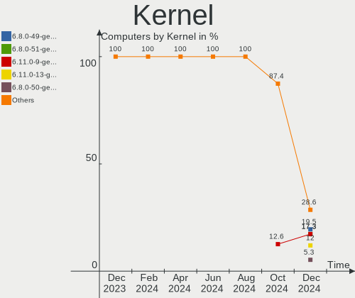
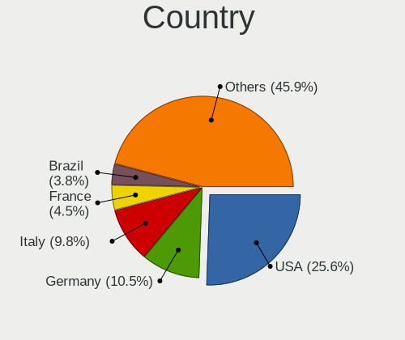
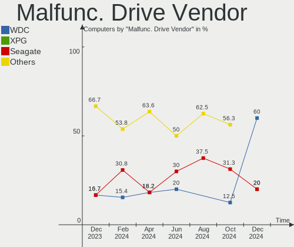
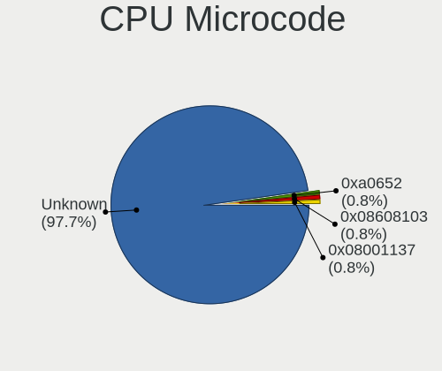
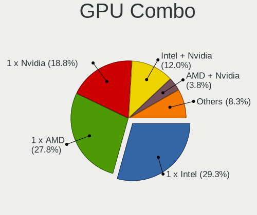

Kubuntu - Hardware Trends
-------------------------

A project to identify most popular hardware characteristics and track their change
over time based on data collected by Linux users at https://Linux-Hardware.org.

Anyone can contribute to this report by the [hw-probe](https://github.com/linuxhw/hw-probe) tool:

    sudo -E hw-probe -all -upload

This is a report for all computer types. See also reports for [desktops](/Dist/Kubuntu/Desktop/README.md) and [notebooks](/Dist/Kubuntu/Notebook/README.md).

This report is for one last month. Overall report since the beginning of time: [TestCoverage](https://github.com/linuxhw/TestCoverage)

Period: Aug, 2022.

Contents
--------

* [ System ](#system)
  - [ OS                       ](#os)
  - [ OS Family                ](#os-family)
  - [ Kernel                   ](#kernel)
  - [ Kernel Family            ](#kernel-family)
  - [ Kernel Major Ver.        ](#kernel-major-ver)
  - [ Arch                     ](#arch)
  - [ DE                       ](#de)
  - [ Display Server           ](#display-server)
  - [ Display Manager          ](#display-manager)
  - [ OS Lang                  ](#os-lang)
  - [ Boot Mode                ](#boot-mode)
  - [ Filesystem               ](#filesystem)
  - [ Part. scheme             ](#part-scheme)
  - [ Dual Boot with Linux/BSD ](#dual-boot-with-linuxbsd)
  - [ Dual Boot (Win)          ](#dual-boot-win)

* [ Board ](#board)
  - [ Vendor                   ](#vendor)
  - [ Model                    ](#model)
  - [ Model Family             ](#model-family)
  - [ MFG Year                 ](#mfg-year)
  - [ Form Factor              ](#form-factor)
  - [ Secure Boot              ](#secure-boot)
  - [ Coreboot                 ](#coreboot)
  - [ RAM Size                 ](#ram-size)
  - [ RAM Used                 ](#ram-used)
  - [ Total Drives             ](#total-drives)
  - [ Has CD-ROM               ](#has-cd-rom)
  - [ Has Ethernet             ](#has-ethernet)
  - [ Has WiFi                 ](#has-wifi)
  - [ Has Bluetooth            ](#has-bluetooth)

* [ Location ](#location)
  - [ Country                  ](#country)
  - [ City                     ](#city)

* [ Drives ](#drives)
  - [ Drive Vendor             ](#drive-vendor)
  - [ Drive Model              ](#drive-model)
  - [ HDD Vendor               ](#hdd-vendor)
  - [ SSD Vendor               ](#ssd-vendor)
  - [ Drive Kind               ](#drive-kind)
  - [ Drive Connector          ](#drive-connector)
  - [ Drive Size               ](#drive-size)
  - [ Space Total              ](#space-total)
  - [ Space Used               ](#space-used)
  - [ Malfunc. Drives          ](#malfunc-drives)
  - [ Malfunc. Drive Vendor    ](#malfunc-drive-vendor)
  - [ Malfunc. HDD Vendor      ](#malfunc-hdd-vendor)
  - [ Malfunc. Drive Kind      ](#malfunc-drive-kind)
  - [ Failed Drives            ](#failed-drives)
  - [ Failed Drive Vendor      ](#failed-drive-vendor)
  - [ Drive Status             ](#drive-status)

* [ Storage controller ](#storage-controller)
  - [ Storage Vendor           ](#storage-vendor)
  - [ Storage Model            ](#storage-model)
  - [ Storage Kind             ](#storage-kind)

* [ Processor ](#processor)
  - [ CPU Vendor               ](#cpu-vendor)
  - [ CPU Model                ](#cpu-model)
  - [ CPU Model Family         ](#cpu-model-family)
  - [ CPU Cores                ](#cpu-cores)
  - [ CPU Sockets              ](#cpu-sockets)
  - [ CPU Threads              ](#cpu-threads)
  - [ CPU Op-Modes             ](#cpu-op-modes)
  - [ CPU Microcode            ](#cpu-microcode)
  - [ CPU Microarch            ](#cpu-microarch)

* [ Graphics ](#graphics)
  - [ GPU Vendor               ](#gpu-vendor)
  - [ GPU Model                ](#gpu-model)
  - [ GPU Combo                ](#gpu-combo)
  - [ GPU Driver               ](#gpu-driver)
  - [ GPU Memory               ](#gpu-memory)

* [ Monitor ](#monitor)
  - [ Monitor Vendor           ](#monitor-vendor)
  - [ Monitor Model            ](#monitor-model)
  - [ Monitor Resolution       ](#monitor-resolution)
  - [ Monitor Diagonal         ](#monitor-diagonal)
  - [ Monitor Width            ](#monitor-width)
  - [ Aspect Ratio             ](#aspect-ratio)
  - [ Monitor Area             ](#monitor-area)
  - [ Pixel Density            ](#pixel-density)
  - [ Multiple Monitors        ](#multiple-monitors)

* [ Network ](#network)
  - [ Net Controller Vendor    ](#net-controller-vendor)
  - [ Net Controller Model     ](#net-controller-model)
  - [ Wireless Vendor          ](#wireless-vendor)
  - [ Wireless Model           ](#wireless-model)
  - [ Ethernet Vendor          ](#ethernet-vendor)
  - [ Ethernet Model           ](#ethernet-model)
  - [ Net Controller Kind      ](#net-controller-kind)
  - [ Used Controller          ](#used-controller)
  - [ NICs                     ](#nics)
  - [ IPv6                     ](#ipv6)

* [ Bluetooth ](#bluetooth)
  - [ Bluetooth Vendor         ](#bluetooth-vendor)
  - [ Bluetooth Model          ](#bluetooth-model)

* [ Sound ](#sound)
  - [ Sound Vendor             ](#sound-vendor)
  - [ Sound Model              ](#sound-model)

* [ Memory ](#memory)
  - [ Memory Vendor            ](#memory-vendor)
  - [ Memory Model             ](#memory-model)
  - [ Memory Kind              ](#memory-kind)
  - [ Memory Form Factor       ](#memory-form-factor)
  - [ Memory Size              ](#memory-size)
  - [ Memory Speed             ](#memory-speed)

* [ Printers & scanners ](#printers--scanners)
  - [ Printer Vendor           ](#printer-vendor)
  - [ Printer Model            ](#printer-model)
  - [ Scanner Vendor           ](#scanner-vendor)
  - [ Scanner Model            ](#scanner-model)

* [ Camera ](#camera)
  - [ Camera Vendor            ](#camera-vendor)
  - [ Camera Model             ](#camera-model)

* [ Security ](#security)
  - [ Fingerprint Vendor       ](#fingerprint-vendor)
  - [ Fingerprint Model        ](#fingerprint-model)
  - [ Chipcard Vendor          ](#chipcard-vendor)
  - [ Chipcard Model           ](#chipcard-model)

* [ Unsupported ](#unsupported)
  - [ Unsupported Devices      ](#unsupported-devices)
  - [ Unsupported Device Types ](#unsupported-device-types)

System
------

OS
--

Installed operating systems

| Name          | Computers | Percent |
|---------------|-----------|---------|
| Kubuntu 22.04 | 58        | 64.44%  |
| Kubuntu 20.04 | 15        | 16.67%  |
| Kubuntu 11.1  | 6         | 6.67%   |
| Kubuntu 22.10 | 5         | 5.56%   |
| Kubuntu 21.10 | 2         | 2.22%   |
| Kubuntu 18.04 | 2         | 2.22%   |
| Kubuntu 11    | 2         | 2.22%   |

OS Family
---------

OS without a version

| Name    | Computers | Percent |
|---------|-----------|---------|
| Kubuntu | 90        | 100%    |

Kernel
------

Version of the Linux kernel

| Version                           | Computers | Percent |
|-----------------------------------|-----------|---------|
| 5.15.0-46-generic                 | 40        | 44.44%  |
| 5.15.0-43-generic                 | 18        | 20%     |
| 5.15.0-46-lowlatency              | 4         | 4.44%   |
| 5.4.0-122-generic                 | 3         | 3.33%   |
| 5.15.0-43-lowlatency              | 3         | 3.33%   |
| 5.15.0-41-generic                 | 3         | 3.33%   |
| 5.15.0-25-generic                 | 3         | 3.33%   |
| 5.13.0-52-lowlatency              | 2         | 2.22%   |
| 6.0.0-060000rc3-generic           | 1         | 1.11%   |
| 5.4.0-124-generic                 | 1         | 1.11%   |
| 5.19.0-15-generic                 | 1         | 1.11%   |
| 5.18.15-051815-generic            | 1         | 1.11%   |
| 5.17.5-visionfive-foobar-29042022 | 1         | 1.11%   |
| 5.16.0-051600-generic             | 1         | 1.11%   |
| 5.15.49-051549-generic            | 1         | 1.11%   |
| 5.15.12-051512-generic            | 1         | 1.11%   |
| 5.15.0-45-lowlatency              | 1         | 1.11%   |
| 5.15.0-45-generic                 | 1         | 1.11%   |
| 5.13.0-51-generic                 | 1         | 1.11%   |
| 5.13.0-44-generic                 | 1         | 1.11%   |
| 5.10.123-meson64                  | 1         | 1.11%   |
| 4.15.0-166-generic                | 1         | 1.11%   |

Kernel Family
-------------

Linux kernel without a distro release

| Version  | Computers | Percent |
|----------|-----------|---------|
| 5.15.0   | 73        | 81.11%  |
| 5.4.0    | 4         | 4.44%   |
| 5.13.0   | 4         | 4.44%   |
| 6.0.0    | 1         | 1.11%   |
| 5.19.0   | 1         | 1.11%   |
| 5.18.15  | 1         | 1.11%   |
| 5.17.5   | 1         | 1.11%   |
| 5.16.0   | 1         | 1.11%   |
| 5.15.49  | 1         | 1.11%   |
| 5.15.12  | 1         | 1.11%   |
| 5.10.123 | 1         | 1.11%   |
| 4.15.0   | 1         | 1.11%   |

Kernel Major Ver.
-----------------

Linux kernel major version

| Version | Computers | Percent |
|---------|-----------|---------|
| 5.15    | 75        | 83.33%  |
| 5.4     | 4         | 4.44%   |
| 5.13    | 4         | 4.44%   |
| 6.0     | 1         | 1.11%   |
| 5.19    | 1         | 1.11%   |
| 5.18    | 1         | 1.11%   |
| 5.17    | 1         | 1.11%   |
| 5.16    | 1         | 1.11%   |
| 5.10    | 1         | 1.11%   |
| 4.15    | 1         | 1.11%   |

Arch
----

OS architecture (x86_64, i586, etc.)

| Name    | Computers | Percent |
|---------|-----------|---------|
| x86_64  | 88        | 97.78%  |
| riscv64 | 1         | 1.11%   |
| aarch64 | 1         | 1.11%   |

DE
--

Desktop Environment

| Name | Computers | Percent |
|------|-----------|---------|
| KDE5 | 90        | 100%    |

Display Server
--------------

X11 or Wayland

| Name    | Computers | Percent |
|---------|-----------|---------|
| X11     | 83        | 92.22%  |
| Wayland | 6         | 6.67%   |
| Tty     | 1         | 1.11%   |

Display Manager
---------------

SDDM, LightDM, etc.

| Name    | Computers | Percent |
|---------|-----------|---------|
| SDDM    | 56        | 62.22%  |
| Unknown | 27        | 30%     |
| GDM3    | 6         | 6.67%   |
| LightDM | 1         | 1.11%   |

OS Lang
-------

Language

| Lang  | Computers | Percent |
|-------|-----------|---------|
| en_US | 45        | 50%     |
| de_DE | 6         | 6.67%   |
| fr_FR | 5         | 5.56%   |
| pt_BR | 3         | 3.33%   |
| pl_PL | 3         | 3.33%   |
| it_IT | 3         | 3.33%   |
| en_CA | 3         | 3.33%   |
| en_AU | 3         | 3.33%   |
| ru_RU | 2         | 2.22%   |
| et_EE | 2         | 2.22%   |
| es_AR | 2         | 2.22%   |
| en_NZ | 2         | 2.22%   |
| hu_HU | 1         | 1.11%   |
| gl_ES | 1         | 1.11%   |
| es_VE | 1         | 1.11%   |
| es_PE | 1         | 1.11%   |
| es_CO | 1         | 1.11%   |
| en_IN | 1         | 1.11%   |
| en_GG | 1         | 1.11%   |
| en_GB | 1         | 1.11%   |
| en_AG | 1         | 1.11%   |
| cs_CZ | 1         | 1.11%   |
| C     | 1         | 1.11%   |

Boot Mode
---------

EFI or BIOS

| Mode | Computers | Percent |
|------|-----------|---------|
| BIOS | 53        | 58.89%  |
| EFI  | 37        | 41.11%  |

Filesystem
----------

Type of filesystem

| Type    | Computers | Percent |
|---------|-----------|---------|
| Ext4    | 81        | 90%     |
| Overlay | 4         | 4.44%   |
| Btrfs   | 3         | 3.33%   |
| Xfs     | 1         | 1.11%   |
| Ext3    | 1         | 1.11%   |

Part. scheme
------------

Scheme of partitioning

| Type    | Computers | Percent |
|---------|-----------|---------|
| Unknown | 52        | 57.78%  |
| GPT     | 34        | 37.78%  |
| MBR     | 4         | 4.44%   |

Dual Boot with Linux/BSD
------------------------

Hosting more than one Linux/BSD

| Dual boot | Computers | Percent |
|-----------|-----------|---------|
| No        | 85        | 94.44%  |
| Yes       | 5         | 5.56%   |

Dual Boot (Win)
---------------

Hosting Linux and Windows

| Dual boot | Computers | Percent |
|-----------|-----------|---------|
| No        | 60        | 66.67%  |
| Yes       | 30        | 33.33%  |

Board
-----

Vendor
------

Motherboard manufacturer

| Name                           | Computers | Percent |
|--------------------------------|-----------|---------|
| Hewlett-Packard                | 14        | 15.56%  |
| Lenovo                         | 11        | 12.22%  |
| Gigabyte Technology            | 11        | 12.22%  |
| Dell                           | 11        | 12.22%  |
| ASUSTek Computer               | 11        | 12.22%  |
| MSI                            | 7         | 7.78%   |
| Toshiba                        | 2         | 2.22%   |
| Samsung Electronics            | 2         | 2.22%   |
| Intel                          | 2         | 2.22%   |
| ASRock                         | 2         | 2.22%   |
| Apple                          | 2         | 2.22%   |
| Acer                           | 2         | 2.22%   |
| ZOTAC                          | 1         | 1.11%   |
| VIT                            | 1         | 1.11%   |
| Timi                           | 1         | 1.11%   |
| Supermicro                     | 1         | 1.11%   |
| Sony                           | 1         | 1.11%   |
| Shanghai Zhaoxin Semiconductor | 1         | 1.11%   |
| Positivo                       | 1         | 1.11%   |
| Pegatron                       | 1         | 1.11%   |
| Panasonic                      | 1         | 1.11%   |
| Hardkernel                     | 1         | 1.11%   |
| Google                         | 1         | 1.11%   |
| AMI                            | 1         | 1.11%   |
| Unknown                        | 1         | 1.11%   |

Model
-----

Motherboard model

| Name                                     | Computers | Percent |
|------------------------------------------|-----------|---------|
| Apple MacBookPro11,1                     | 2         | 2.22%   |
| Unknown                                  | 2         | 2.22%   |
| ZOTAC ZBOXNANO-CI520NANO/CI540NANO       | 1         | 1.11%   |
| VIT P2402                                | 1         | 1.11%   |
| Toshiba Satellite P70-B                  | 1         | 1.11%   |
| Toshiba Satellite L850                   | 1         | 1.11%   |
| Timi TM1709                              | 1         | 1.11%   |
| Supermicro SKAGIT09                      | 1         | 1.11%   |
| Sony VGN-NR11Z_T                         | 1         | 1.11%   |
| Shanghai Zhaoxin ZXE CRB                 | 1         | 1.11%   |
| Samsung 950QDB                           | 1         | 1.11%   |
| Samsung 870Z5E/880Z5E/680Z5E             | 1         | 1.11%   |
| Positivo POS-PARS760GCD                  | 1         | 1.11%   |
| Pegatron p6740la                         | 1         | 1.11%   |
| Panasonic CF-53JSWZGFF                   | 1         | 1.11%   |
| MSI MS-7C80                              | 1         | 1.11%   |
| MSI MS-7C56                              | 1         | 1.11%   |
| MSI MS-7B86                              | 1         | 1.11%   |
| MSI MS-7A34                              | 1         | 1.11%   |
| MSI MS-7916                              | 1         | 1.11%   |
| MSI GF75 Thin 10SCXR                     | 1         | 1.11%   |
| MSI A0000001                             | 1         | 1.11%   |
| Lenovo Yoga Slim 7 15ITL05 82AC          | 1         | 1.11%   |
| Lenovo V15-ADA 82C7                      | 1         | 1.11%   |
| Lenovo ThinkPad T500 2082BRG             | 1         | 1.11%   |
| Lenovo ThinkPad T440p 20AWS1AY0U         | 1         | 1.11%   |
| Lenovo ThinkPad T430 2347AT2             | 1         | 1.11%   |
| Lenovo ThinkPad E15 Gen 3 20YG00ATCK     | 1         | 1.11%   |
| Lenovo ThinkCentre M83 10AM000UUS        | 1         | 1.11%   |
| Lenovo ThinkCentre M79 10JAS01500        | 1         | 1.11%   |
| Lenovo ThinkCentre M75q Gen 2 11JN000NGE | 1         | 1.11%   |
| Lenovo IdeaPad Gaming 3 15ACH6 82K2      | 1         | 1.11%   |
| Lenovo IdeaPad 330-15IKB 81DC            | 1         | 1.11%   |
| Intel NUC8i7HVK                          | 1         | 1.11%   |
| HP ZBook 15 G4                           | 1         | 1.11%   |
| HP Slim Desktop 290-a0xxx                | 1         | 1.11%   |
| HP ProDesk 600 G2 SFF                    | 1         | 1.11%   |
| HP ProBook 6570b                         | 1         | 1.11%   |
| HP ProBook 455 G7                        | 1         | 1.11%   |
| HP ProBook 4540s                         | 1         | 1.11%   |
| HP ProBook 440 G8 Notebook PC            | 1         | 1.11%   |
| HP Pavilion Gaming Laptop 16-a0xxx       | 1         | 1.11%   |
| HP Pavilion Gaming Laptop                | 1         | 1.11%   |
| HP Pavilion g6                           | 1         | 1.11%   |
| HP Pavilion dv6700                       | 1         | 1.11%   |
| HP G62                                   | 1         | 1.11%   |
| HP ENVY Laptop 17-ce1xxx                 | 1         | 1.11%   |
| HP EliteBook 8470p                       | 1         | 1.11%   |
| Hardkernel ODROID-C4                     | 1         | 1.11%   |
| Google Eldrid                            | 1         | 1.11%   |
| Gigabyte Z490 AORUS ELITE AC             | 1         | 1.11%   |
| Gigabyte H97-Gaming 3                    | 1         | 1.11%   |
| Gigabyte H81M-DS2                        | 1         | 1.11%   |
| Gigabyte H61M-S1                         | 1         | 1.11%   |
| Gigabyte H410M S2 V2                     | 1         | 1.11%   |
| Gigabyte H370AORUSGAMING3WIFI            | 1         | 1.11%   |
| Gigabyte GA-MA770T-UD3                   | 1         | 1.11%   |
| Gigabyte G1.SNIPER B7-CF                 | 1         | 1.11%   |
| Gigabyte B85M-HD3                        | 1         | 1.11%   |
| Gigabyte B450 I AORUS PRO WIFI           | 1         | 1.11%   |

Model Family
------------

Motherboard model prefix

| Name                          | Computers | Percent |
|-------------------------------|-----------|---------|
| Dell Latitude                 | 5         | 5.56%   |
| Lenovo ThinkPad               | 4         | 4.44%   |
| HP ProBook                    | 4         | 4.44%   |
| HP Pavilion                   | 4         | 4.44%   |
| Lenovo ThinkCentre            | 3         | 3.33%   |
| Toshiba Satellite             | 2         | 2.22%   |
| Lenovo IdeaPad                | 2         | 2.22%   |
| Dell Inspiron                 | 2         | 2.22%   |
| Dell G3                       | 2         | 2.22%   |
| ASUS VivoBook                 | 2         | 2.22%   |
| Apple MacBookPro11            | 2         | 2.22%   |
| Acer Nitro                    | 2         | 2.22%   |
| Unknown                       | 2         | 2.22%   |
| ZOTAC ZBOXNANO-CI520NANO      | 1         | 1.11%   |
| VIT P2402                     | 1         | 1.11%   |
| Timi TM1709                   | 1         | 1.11%   |
| Supermicro SKAGIT09           | 1         | 1.11%   |
| Sony VGN-NR11Z                | 1         | 1.11%   |
| Shanghai Zhaoxin ZXE          | 1         | 1.11%   |
| Samsung 950QDB                | 1         | 1.11%   |
| Samsung 870Z5E                | 1         | 1.11%   |
| Positivo POS-PARS760GCD       | 1         | 1.11%   |
| Pegatron p6740la              | 1         | 1.11%   |
| Panasonic CF-53JSWZGFF        | 1         | 1.11%   |
| MSI MS-7C80                   | 1         | 1.11%   |
| MSI MS-7C56                   | 1         | 1.11%   |
| MSI MS-7B86                   | 1         | 1.11%   |
| MSI MS-7A34                   | 1         | 1.11%   |
| MSI MS-7916                   | 1         | 1.11%   |
| MSI GF75                      | 1         | 1.11%   |
| MSI A0000001                  | 1         | 1.11%   |
| Lenovo Yoga                   | 1         | 1.11%   |
| Lenovo V15-ADA                | 1         | 1.11%   |
| Intel NUC8i7HVK               | 1         | 1.11%   |
| HP ZBook                      | 1         | 1.11%   |
| HP Slim                       | 1         | 1.11%   |
| HP ProDesk                    | 1         | 1.11%   |
| HP G62                        | 1         | 1.11%   |
| HP ENVY                       | 1         | 1.11%   |
| HP EliteBook                  | 1         | 1.11%   |
| Hardkernel ODROID-C4          | 1         | 1.11%   |
| Google Eldrid                 | 1         | 1.11%   |
| Gigabyte Z490                 | 1         | 1.11%   |
| Gigabyte H97-Gaming           | 1         | 1.11%   |
| Gigabyte H81M-DS2             | 1         | 1.11%   |
| Gigabyte H61M-S1              | 1         | 1.11%   |
| Gigabyte H410M                | 1         | 1.11%   |
| Gigabyte H370AORUSGAMING3WIFI | 1         | 1.11%   |
| Gigabyte GA-MA770T-UD3        | 1         | 1.11%   |
| Gigabyte G1.SNIPER            | 1         | 1.11%   |
| Gigabyte B85M-HD3             | 1         | 1.11%   |
| Gigabyte B450                 | 1         | 1.11%   |
| Gigabyte 970A-DS3P            | 1         | 1.11%   |
| Dell XPS                      | 1         | 1.11%   |
| Dell Precision                | 1         | 1.11%   |
| ASUS X540SA                   | 1         | 1.11%   |
| ASUS TUF                      | 1         | 1.11%   |
| ASUS ROG                      | 1         | 1.11%   |
| ASUS PRIME                    | 1         | 1.11%   |
| ASUS P5K                      | 1         | 1.11%   |

MFG Year
--------

Motherboard manufacture year

| Year    | Computers | Percent |
|---------|-----------|---------|
| 2021    | 13        | 14.44%  |
| 2020    | 13        | 14.44%  |
| 2018    | 13        | 14.44%  |
| 2013    | 8         | 8.89%   |
| 2014    | 7         | 7.78%   |
| 2015    | 5         | 5.56%   |
| 2012    | 5         | 5.56%   |
| 2022    | 4         | 4.44%   |
| 2011    | 4         | 4.44%   |
| 2008    | 4         | 4.44%   |
| 2017    | 3         | 3.33%   |
| 2016    | 3         | 3.33%   |
| 2019    | 2         | 2.22%   |
| Unknown | 2         | 2.22%   |
| 2010    | 1         | 1.11%   |
| 2009    | 1         | 1.11%   |
| 2007    | 1         | 1.11%   |
| 2006    | 1         | 1.11%   |

Form Factor
-----------

Physical design of the computer

| Name           | Computers | Percent |
|----------------|-----------|---------|
| Notebook       | 48        | 53.33%  |
| Desktop        | 35        | 38.89%  |
| Mini pc        | 4         | 4.44%   |
| Other          | 1         | 1.11%   |
| System on chip | 1         | 1.11%   |
| Convertible    | 1         | 1.11%   |

Secure Boot
-----------

Enabled or disabled

| State    | Computers | Percent |
|----------|-----------|---------|
| Disabled | 81        | 90%     |
| Enabled  | 9         | 10%     |

Coreboot
--------

Have coreboot on board

| Used | Computers | Percent |
|------|-----------|---------|
| No   | 89        | 98.89%  |
| Yes  | 1         | 1.11%   |

RAM Size
--------

Total RAM memory

| Size in GB  | Computers | Percent |
|-------------|-----------|---------|
| 16.01-24.0  | 34        | 37.78%  |
| 4.01-8.0    | 18        | 20%     |
| 8.01-16.0   | 12        | 13.33%  |
| 3.01-4.0    | 10        | 11.11%  |
| 32.01-64.0  | 7         | 7.78%   |
| 64.01-256.0 | 5         | 5.56%   |
| 24.01-32.0  | 2         | 2.22%   |
| 2.01-3.0    | 1         | 1.11%   |
| 1.01-2.0    | 1         | 1.11%   |

RAM Used
--------

Used RAM memory

| Used GB   | Computers | Percent |
|-----------|-----------|---------|
| 2.01-3.0  | 26        | 28.89%  |
| 4.01-8.0  | 19        | 21.11%  |
| 3.01-4.0  | 19        | 21.11%  |
| 1.01-2.0  | 18        | 20%     |
| 8.01-16.0 | 7         | 7.78%   |
| 0.51-1.0  | 1         | 1.11%   |

Total Drives
------------

Number of drives on board

| Drives | Computers | Percent |
|--------|-----------|---------|
| 1      | 44        | 48.89%  |
| 2      | 31        | 34.44%  |
| 3      | 9         | 10%     |
| 5      | 4         | 4.44%   |
| 6      | 1         | 1.11%   |
| 4      | 1         | 1.11%   |

Has CD-ROM
----------

Has CD-ROM on board

| Presented | Computers | Percent |
|-----------|-----------|---------|
| No        | 60        | 66.67%  |
| Yes       | 30        | 33.33%  |

Has Ethernet
------------

Has Ethernet on board

| Presented | Computers | Percent |
|-----------|-----------|---------|
| Yes       | 78        | 86.67%  |
| No        | 12        | 13.33%  |

Has WiFi
--------

Has WiFi module

| Presented | Computers | Percent |
|-----------|-----------|---------|
| Yes       | 72        | 80%     |
| No        | 18        | 20%     |

Has Bluetooth
-------------

Has Bluetooth module

| Presented | Computers | Percent |
|-----------|-----------|---------|
| Yes       | 67        | 74.44%  |
| No        | 23        | 25.56%  |

Location
--------

Country
-------

Geographic location (country)

| Country                | Computers | Percent |
|------------------------|-----------|---------|
| USA                    | 21        | 23.33%  |
| Germany                | 7         | 7.78%   |
| Poland                 | 6         | 6.67%   |
| France                 | 6         | 6.67%   |
| Russia                 | 4         | 4.44%   |
| Italy                  | 4         | 4.44%   |
| Canada                 | 4         | 4.44%   |
| Brazil                 | 4         | 4.44%   |
| New Zealand            | 3         | 3.33%   |
| China                  | 3         | 3.33%   |
| Australia              | 3         | 3.33%   |
| UK                     | 2         | 2.22%   |
| India                  | 2         | 2.22%   |
| Estonia                | 2         | 2.22%   |
| Czechia                | 2         | 2.22%   |
| Argentina              | 2         | 2.22%   |
| Venezuela              | 1         | 1.11%   |
| Switzerland            | 1         | 1.11%   |
| Spain                  | 1         | 1.11%   |
| Peru                   | 1         | 1.11%   |
| Norway                 | 1         | 1.11%   |
| Netherlands            | 1         | 1.11%   |
| Kyrgyzstan             | 1         | 1.11%   |
| Hungary                | 1         | 1.11%   |
| Greece                 | 1         | 1.11%   |
| Egypt                  | 1         | 1.11%   |
| Ecuador                | 1         | 1.11%   |
| Denmark                | 1         | 1.11%   |
| Colombia               | 1         | 1.11%   |
| Bulgaria               | 1         | 1.11%   |
| Bosnia and Herzegovina | 1         | 1.11%   |

City
----

Geographic location (city)

| City              | Computers | Percent |
|-------------------|-----------|---------|
| Auckland          | 3         | 3.33%   |
| Wroclaw           | 2         | 2.22%   |
| Kunming           | 2         | 2.22%   |
| Zurich            | 1         | 1.11%   |
| Wilkszyn          | 1         | 1.11%   |
| Washington        | 1         | 1.11%   |
| Vladivostok       | 1         | 1.11%   |
| Tubarao           | 1         | 1.11%   |
| Templeton         | 1         | 1.11%   |
| Tartu             | 1         | 1.11%   |
| Tallinn           | 1         | 1.11%   |
| Sydney            | 1         | 1.11%   |
| Sterling Heights  | 1         | 1.11%   |
| St. Petersburg    | 1         | 1.11%   |
| Sparks            | 1         | 1.11%   |
| Sosnowiec         | 1         | 1.11%   |
| Sofia             | 1         | 1.11%   |
| Shenzhen          | 1         | 1.11%   |
| Sarajevo          | 1         | 1.11%   |
| Samara            | 1         | 1.11%   |
| Rozelle           | 1         | 1.11%   |
| Ropczyce          | 1         | 1.11%   |
| Rome              | 1         | 1.11%   |
| Rio de Janeiro    | 1         | 1.11%   |
| Raleigh           | 1         | 1.11%   |
| Pueblo Moreno     | 1         | 1.11%   |
| Premià de Dalt   | 1         | 1.11%   |
| Plouescat         | 1         | 1.11%   |
| Peoria            | 1         | 1.11%   |
| Paulhan           | 1         | 1.11%   |
| Pasian di Prato   | 1         | 1.11%   |
| Paraná           | 1         | 1.11%   |
| Ostrava           | 1         | 1.11%   |
| Ocala             | 1         | 1.11%   |
| Oberhausbergen    | 1         | 1.11%   |
| Neckarsulm        | 1         | 1.11%   |
| Nashville         | 1         | 1.11%   |
| Munich            | 1         | 1.11%   |
| Moscow            | 1         | 1.11%   |
| Montreal          | 1         | 1.11%   |
| Milan             | 1         | 1.11%   |
| Melbourne         | 1         | 1.11%   |
| Lindenhurst       | 1         | 1.11%   |
| Lima              | 1         | 1.11%   |
| Katerini          | 1         | 1.11%   |
| Karlovy Vary      | 1         | 1.11%   |
| Kansas City       | 1         | 1.11%   |
| Jacksonville      | 1         | 1.11%   |
| Ismaning          | 1         | 1.11%   |
| Hanover           | 1         | 1.11%   |
| Hampstead         | 1         | 1.11%   |
| Guayaquil         | 1         | 1.11%   |
| Greenwood Village | 1         | 1.11%   |
| Grande Prairie    | 1         | 1.11%   |
| Golders Green     | 1         | 1.11%   |
| Fort Wayne        | 1         | 1.11%   |
| Ettringen         | 1         | 1.11%   |
| Ellisville        | 1         | 1.11%   |
| Działdowo        | 1         | 1.11%   |
| Denver            | 1         | 1.11%   |

Drives
------

Drive Vendor
------------

Hard drive vendors

| Vendor                    | Computers | Drives | Percent |
|---------------------------|-----------|--------|---------|
| Samsung Electronics       | 26        | 29     | 17.57%  |
| Kingston                  | 15        | 17     | 10.14%  |
| WDC                       | 13        | 14     | 8.78%   |
| Toshiba                   | 13        | 15     | 8.78%   |
| Seagate                   | 12        | 14     | 8.11%   |
| SanDisk                   | 9         | 9      | 6.08%   |
| Crucial                   | 8         | 8      | 5.41%   |
| Unknown                   | 6         | 6      | 4.05%   |
| SK hynix                  | 6         | 6      | 4.05%   |
| Intel                     | 3         | 4      | 2.03%   |
| Hitachi                   | 3         | 3      | 2.03%   |
| HGST                      | 3         | 4      | 2.03%   |
| China                     | 3         | 4      | 2.03%   |
| PNY                       | 2         | 2      | 1.35%   |
| KIOXIA                    | 2         | 2      | 1.35%   |
| GOODRAM                   | 2         | 2      | 1.35%   |
| Apple                     | 2         | 2      | 1.35%   |
| Verbatim                  | 1         | 1      | 0.68%   |
| USB3.0                    | 1         | 1      | 0.68%   |
| tecmiyo                   | 1         | 1      | 0.68%   |
| SSSTC                     | 1         | 1      | 0.68%   |
| Realtek Semiconductor     | 1         | 1      | 0.68%   |
| Plextor                   | 1         | 1      | 0.68%   |
| Phison Electronics        | 1         | 1      | 0.68%   |
| Phison                    | 1         | 1      | 0.68%   |
| Micron/Crucial Technology | 1         | 1      | 0.68%   |
| Maxtor                    | 1         | 1      | 0.68%   |
| Magnetic Data             | 1         | 1      | 0.68%   |
| LITEON                    | 1         | 1      | 0.68%   |
| KODAK                     | 1         | 1      | 0.68%   |
| KingFast                  | 1         | 1      | 0.68%   |
| Intenso                   | 1         | 1      | 0.68%   |
| External                  | 1         | 1      | 0.68%   |
| Emtec                     | 1         | 1      | 0.68%   |
| Dogfish                   | 1         | 1      | 0.68%   |
| Corsair                   | 1         | 2      | 0.68%   |
| Unknown                   | 1         | 1      | 0.68%   |

Drive Model
-----------

Hard drive models

| Model                                   | Computers | Percent |
|-----------------------------------------|-----------|---------|
| Toshiba MQ01ABD100 1TB                  | 3         | 1.92%   |
| Toshiba DT01ACA100 1TB                  | 2         | 1.28%   |
| Seagate ST1000LM035-1RK172 1TB          | 2         | 1.28%   |
| SanDisk NVMe SSD Drive 500GB            | 2         | 1.28%   |
| Samsung SSD 860 EVO 500GB               | 2         | 1.28%   |
| Samsung SSD 850 EVO 500GB               | 2         | 1.28%   |
| Samsung SM963 2.5" NVMe PCIe SSD 1024GB | 2         | 1.28%   |
| Samsung NVMe SSD Drive 512GB            | 2         | 1.28%   |
| Samsung NVMe SSD Drive 1TB              | 2         | 1.28%   |
| Kingston SV300S37A120G 120GB SSD        | 2         | 1.28%   |
| Kingston SA400S37240G 240GB SSD         | 2         | 1.28%   |
| Kingston NVMe SSD Drive 500GB           | 2         | 1.28%   |
| Hitachi HDS721010CLA332 1TB             | 2         | 1.28%   |
| WDC WDS500G2B0A-00SM50 500GB SSD        | 1         | 0.64%   |
| WDC WDS240G2G0A-00JH30 240GB SSD        | 1         | 0.64%   |
| WDC WDBNCE0010PNC 1TB SSD               | 1         | 0.64%   |
| WDC WD7500BPVX-60JC3T0 752GB            | 1         | 0.64%   |
| WDC WD5000AVVS-63M8B0 500GB             | 1         | 0.64%   |
| WDC WD5000AAKS-00V2B0 500GB             | 1         | 0.64%   |
| WDC WD40EFAX-68JH4N1 4TB                | 1         | 0.64%   |
| WDC WD15EARS-22Z5B1 1TB                 | 1         | 0.64%   |
| WDC WD10SPZX-24Z10 1TB                  | 1         | 0.64%   |
| WDC WD10PURX-64D85Y0 1TB                | 1         | 0.64%   |
| WDC WD10EZEX-08WN4A0 1TB                | 1         | 0.64%   |
| WDC WD10EZEX-00KUWA0 1TB                | 1         | 0.64%   |
| WDC WD10EZEX-00ER1A0 1TB                | 1         | 0.64%   |
| WDC WD10EURX-63C57Y0 1TB                | 1         | 0.64%   |
| Verbatim Vi550 S3 SSD 256GB             | 1         | 0.64%   |
| USB3.0 Super Speed 128GB                | 1         | 0.64%   |
| Unknown SD256  249GB                    | 1         | 0.64%   |
| Unknown SD16G  64GB                     | 1         | 0.64%   |
| Unknown MMC Card  1GB                   | 1         | 0.64%   |
| Unknown MMC Card  128GB                 | 1         | 0.64%   |
| Unknown GD4QT  128GB                    | 1         | 0.64%   |
| Unknown External 120GB                  | 1         | 0.64%   |
| Toshiba TL100 120GB SSD                 | 1         | 0.64%   |
| Toshiba THNSNF128GCSS 128GB SSD         | 1         | 0.64%   |
| Toshiba MQ02ABF100 1TB                  | 1         | 0.64%   |
| Toshiba MQ02ABF050H 500GB               | 1         | 0.64%   |
| Toshiba MQ01ABD050 500GB                | 1         | 0.64%   |
| Toshiba MK2555GSX 250GB                 | 1         | 0.64%   |
| Toshiba KXG50ZNV1T02 NVMe 1024GB        | 1         | 0.64%   |
| Toshiba KSG60ZMV512G M.2 2280 512GB SSD | 1         | 0.64%   |
| Toshiba KBG30ZMS128G 128GB NVMe SSD     | 1         | 0.64%   |
| tecmiyo SATA SSD 128GB                  | 1         | 0.64%   |
| SSSTC CL1-3D512-Q11 NVMe 512GB          | 1         | 0.64%   |
| SK hynix SKHynix_HFS512GDE9X081N 512GB  | 1         | 0.64%   |
| SK hynix PC801 NVMe 1TB                 | 1         | 0.64%   |
| SK hynix NVMe SSD Drive 512GB           | 1         | 0.64%   |
| SK hynix NVMe SSD Drive 2TB             | 1         | 0.64%   |
| SK hynix NVMe SSD Drive 128GB           | 1         | 0.64%   |
| SK hynix BC711 HFM512GD3JX013N 512GB    | 1         | 0.64%   |
| Seagate ST8000AS0002-1NA17Z 8TB         | 1         | 0.64%   |
| Seagate ST500LT012-1DG142 500GB         | 1         | 0.64%   |
| Seagate ST4000VN008-2DR166 4TB          | 1         | 0.64%   |
| Seagate ST4000VN000-1H4168 4TB          | 1         | 0.64%   |
| Seagate ST3500414CS 500GB               | 1         | 0.64%   |
| Seagate ST2000DX001-1CM164 2TB          | 1         | 0.64%   |
| Seagate ST2000DM008-2FR102 2TB          | 1         | 0.64%   |
| Seagate ST2000DM001-1ER164 2TB          | 1         | 0.64%   |

HDD Vendor
----------

Hard disk drive vendors

| Vendor              | Computers | Drives | Percent |
|---------------------|-----------|--------|---------|
| Seagate             | 12        | 14     | 27.91%  |
| WDC                 | 10        | 11     | 23.26%  |
| Toshiba             | 8         | 10     | 18.6%   |
| Samsung Electronics | 3         | 3      | 6.98%   |
| Hitachi             | 3         | 3      | 6.98%   |
| HGST                | 3         | 4      | 6.98%   |
| USB3.0              | 1         | 1      | 2.33%   |
| Unknown             | 1         | 1      | 2.33%   |
| Maxtor              | 1         | 1      | 2.33%   |
| Magnetic Data       | 1         | 1      | 2.33%   |

SSD Vendor
----------

Solid state drive vendors

| Vendor              | Computers | Drives | Percent |
|---------------------|-----------|--------|---------|
| Samsung Electronics | 14        | 15     | 24.56%  |
| Kingston            | 9         | 9      | 15.79%  |
| Crucial             | 7         | 7      | 12.28%  |
| WDC                 | 3         | 3      | 5.26%   |
| Toshiba             | 3         | 3      | 5.26%   |
| SanDisk             | 3         | 3      | 5.26%   |
| China               | 3         | 4      | 5.26%   |
| PNY                 | 2         | 2      | 3.51%   |
| GOODRAM             | 2         | 2      | 3.51%   |
| Apple               | 2         | 2      | 3.51%   |
| Verbatim            | 1         | 1      | 1.75%   |
| tecmiyo             | 1         | 1      | 1.75%   |
| Plextor             | 1         | 1      | 1.75%   |
| LITEON              | 1         | 1      | 1.75%   |
| KODAK               | 1         | 1      | 1.75%   |
| KingFast            | 1         | 1      | 1.75%   |
| Emtec               | 1         | 1      | 1.75%   |
| Dogfish             | 1         | 1      | 1.75%   |
| Unknown             | 1         | 1      | 1.75%   |

Drive Kind
----------

HDD or SSD

| Kind    | Computers | Drives | Percent |
|---------|-----------|--------|---------|
| SSD     | 49        | 59     | 38.89%  |
| NVMe    | 37        | 47     | 29.37%  |
| HDD     | 33        | 49     | 26.19%  |
| MMC     | 6         | 6      | 4.76%   |
| Unknown | 1         | 1      | 0.79%   |

Drive Connector
---------------

SATA, SAS, NVMe, etc.

| Type | Computers | Drives | Percent |
|------|-----------|--------|---------|
| SATA | 66        | 105    | 58.41%  |
| NVMe | 36        | 46     | 31.86%  |
| MMC  | 6         | 6      | 5.31%   |
| SAS  | 5         | 5      | 4.42%   |

Drive Size
----------

Size of hard drive

| Size in TB | Computers | Drives | Percent |
|------------|-----------|--------|---------|
| 0.01-0.5   | 48        | 59     | 53.93%  |
| 0.51-1.0   | 28        | 33     | 31.46%  |
| 1.01-2.0   | 7         | 7      | 7.87%   |
| 3.01-4.0   | 3         | 6      | 3.37%   |
| 4.01-10.0  | 3         | 3      | 3.37%   |

Space Total
-----------

Amount of disk space available on the file system

| Size in GB     | Computers | Percent |
|----------------|-----------|---------|
| 101-250        | 29        | 32.22%  |
| 501-1000       | 19        | 21.11%  |
| 251-500        | 15        | 16.67%  |
| 1001-2000      | 10        | 11.11%  |
| More than 3000 | 5         | 5.56%   |
| 21-50          | 4         | 4.44%   |
| 2001-3000      | 3         | 3.33%   |
| 51-100         | 3         | 3.33%   |
| 1-20           | 2         | 2.22%   |

Space Used
----------

Amount of used disk space

| Used GB        | Computers | Percent |
|----------------|-----------|---------|
| 21-50          | 23        | 25.56%  |
| 1-20           | 22        | 24.44%  |
| 101-250        | 14        | 15.56%  |
| 251-500        | 10        | 11.11%  |
| 501-1000       | 9         | 10%     |
| 51-100         | 5         | 5.56%   |
| 1001-2000      | 3         | 3.33%   |
| More than 3000 | 2         | 2.22%   |
| 2001-3000      | 2         | 2.22%   |

Malfunc. Drives
---------------

Drive models with a malfunction

| Model                           | Computers | Drives | Percent |
|---------------------------------|-----------|--------|---------|
| WDC WD5000AVVS-63M8B0 500GB     | 1         | 1      | 25%     |
| tecmiyo SATA SSD 128GB          | 1         | 1      | 25%     |
| Seagate ST500LT012-1DG142 500GB | 1         | 1      | 25%     |
| HGST HTS545050A7E680 500GB      | 1         | 1      | 25%     |

Malfunc. Drive Vendor
---------------------

Vendors of faulty drives

| Vendor  | Computers | Drives | Percent |
|---------|-----------|--------|---------|
| WDC     | 1         | 1      | 25%     |
| tecmiyo | 1         | 1      | 25%     |
| Seagate | 1         | 1      | 25%     |
| HGST    | 1         | 1      | 25%     |

Malfunc. HDD Vendor
-------------------

Vendors of faulty HDD drives

| Vendor  | Computers | Drives | Percent |
|---------|-----------|--------|---------|
| WDC     | 1         | 1      | 33.33%  |
| Seagate | 1         | 1      | 33.33%  |
| HGST    | 1         | 1      | 33.33%  |

Malfunc. Drive Kind
-------------------

Kinds of faulty drives

| Kind | Computers | Drives | Percent |
|------|-----------|--------|---------|
| HDD  | 3         | 3      | 75%     |
| SSD  | 1         | 1      | 25%     |

Failed Drives
-------------

Failed drive models

Zero info for selected period =(

Failed Drive Vendor
-------------------

Failed drive vendors

Zero info for selected period =(

Drive Status
------------

Number of failed and malfunc. drives

| Status   | Computers | Drives | Percent |
|----------|-----------|--------|---------|
| Detected | 55        | 105    | 59.78%  |
| Works    | 33        | 53     | 35.87%  |
| Malfunc  | 4         | 4      | 4.35%   |

Storage controller
------------------

Storage Vendor
--------------

Storage controller vendors

| Vendor                         | Computers | Percent |
|--------------------------------|-----------|---------|
| Intel                          | 54        | 44.26%  |
| AMD                            | 20        | 16.39%  |
| Samsung Electronics            | 11        | 9.02%   |
| Kingston Technology Company    | 7         | 5.74%   |
| SK hynix                       | 6         | 4.92%   |
| SanDisk                        | 5         | 4.1%    |
| Phison Electronics             | 3         | 2.46%   |
| Toshiba America Info Systems   | 2         | 1.64%   |
| Micron/Crucial Technology      | 2         | 1.64%   |
| Marvell Technology Group       | 2         | 1.64%   |
| KIOXIA                         | 2         | 1.64%   |
| Zhaoxin                        | 1         | 0.82%   |
| Solid State Storage Technology | 1         | 0.82%   |
| Silicon Image                  | 1         | 0.82%   |
| Realtek Semiconductor          | 1         | 0.82%   |
| Nvidia                         | 1         | 0.82%   |
| LSI Logic / Symbios Logic      | 1         | 0.82%   |
| Broadcom / LSI                 | 1         | 0.82%   |
| ASMedia Technology             | 1         | 0.82%   |

Storage Model
-------------

Storage controller models

| Model                                                                                   | Computers | Percent |
|-----------------------------------------------------------------------------------------|-----------|---------|
| AMD FCH SATA Controller [AHCI mode]                                                     | 14        | 9.79%   |
| Intel 7 Series Chipset Family 6-port SATA Controller [AHCI mode]                        | 7         | 4.9%    |
| Intel 8 Series/C220 Series Chipset Family 6-port SATA Controller 1 [AHCI mode]          | 6         | 4.2%    |
| Samsung NVMe SSD Controller SM981/PM981/PM983                                           | 5         | 3.5%    |
| Samsung NVMe SSD Controller 980                                                         | 5         | 3.5%    |
| Intel 82801 Mobile SATA Controller [RAID mode]                                          | 5         | 3.5%    |
| SK hynix Gold P31 SSD                                                                   | 4         | 2.8%    |
| Intel Sunrise Point-LP SATA Controller [AHCI mode]                                      | 4         | 2.8%    |
| Intel Q170/Q150/B150/H170/H110/Z170/CM236 Chipset SATA Controller [AHCI Mode]           | 4         | 2.8%    |
| AMD SB7x0/SB8x0/SB9x0 SATA Controller [AHCI mode]                                       | 4         | 2.8%    |
| AMD 400 Series Chipset SATA Controller                                                  | 4         | 2.8%    |
| Phison E12 NVMe Controller                                                              | 3         | 2.1%    |
| Kingston Company Company Non-Volatile memory controller                                 | 3         | 2.1%    |
| Intel Volume Management Device NVMe RAID Controller                                     | 3         | 2.1%    |
| Intel Comet Lake SATA AHCI Controller                                                   | 3         | 2.1%    |
| SanDisk WD Blue SN550 NVMe SSD                                                          | 2         | 1.4%    |
| Micron/Crucial P2 NVMe PCIe SSD                                                         | 2         | 1.4%    |
| Kingston Company OM3PDP3 NVMe SSD                                                       | 2         | 1.4%    |
| Kingston Company A2000 NVMe SSD                                                         | 2         | 1.4%    |
| Intel SSD 660P Series                                                                   | 2         | 1.4%    |
| Intel Cannon Lake PCH SATA AHCI Controller                                              | 2         | 1.4%    |
| Intel Cannon Lake Mobile PCH SATA AHCI Controller                                       | 2         | 1.4%    |
| Intel 9 Series Chipset Family SATA Controller [AHCI Mode]                               | 2         | 1.4%    |
| Intel 82801HM/HEM (ICH8M/ICH8M-E) SATA Controller [AHCI mode]                           | 2         | 1.4%    |
| Intel 82801HM/HEM (ICH8M/ICH8M-E) IDE Controller                                        | 2         | 1.4%    |
| Intel 7 Series Chipset Family 4-port SATA Controller [IDE mode]                         | 2         | 1.4%    |
| Intel 7 Series Chipset Family 2-port SATA Controller [IDE mode]                         | 2         | 1.4%    |
| Intel 400 Series Chipset Family SATA AHCI Controller                                    | 2         | 1.4%    |
| AMD SB7x0/SB8x0/SB9x0 IDE Controller                                                    | 2         | 1.4%    |
| Zhaoxin ZX-100/ZX-200/ZX-E StorX AHCI Controller                                        | 1         | 0.7%    |
| Toshiba America Info Systems Toshiba America Info Non-Volatile memory controller        | 1         | 0.7%    |
| Toshiba America Info Systems BG3 NVMe SSD Controller                                    | 1         | 0.7%    |
| Solid State Storage Non-Volatile memory controller                                      | 1         | 0.7%    |
| SK hynix Non-Volatile memory controller                                                 | 1         | 0.7%    |
| SK hynix BC501 NVMe Solid State Drive                                                   | 1         | 0.7%    |
| Silicon Image SiI 3132 Serial ATA Raid II Controller                                    | 1         | 0.7%    |
| SanDisk WD Blue SN570 NVMe SSD                                                          | 1         | 0.7%    |
| SanDisk WD Black SN750 / PC SN730 NVMe SSD                                              | 1         | 0.7%    |
| SanDisk PC SN520 NVMe SSD                                                               | 1         | 0.7%    |
| Samsung Apple PCIe SSD                                                                  | 1         | 0.7%    |
| Realtek Realtek Non-Volatile memory controller                                          | 1         | 0.7%    |
| Nvidia MCP51 Serial ATA Controller                                                      | 1         | 0.7%    |
| Nvidia MCP51 IDE                                                                        | 1         | 0.7%    |
| Marvell Group 88SS9183 PCIe SSD Controller                                              | 1         | 0.7%    |
| Marvell Group 88SE6101/6102 single-port PATA133 interface                               | 1         | 0.7%    |
| LSI Logic / Symbios Logic MegaRAID SAS 1078                                             | 1         | 0.7%    |
| KIOXIA NVMe SSD Controller BG4                                                          | 1         | 0.7%    |
| KIOXIA Non-Volatile memory controller                                                   | 1         | 0.7%    |
| Intel Tiger Lake-LP SATA Controller                                                     | 1         | 0.7%    |
| Intel SATA Controller [RAID mode]                                                       | 1         | 0.7%    |
| Intel Non-Volatile memory controller                                                    | 1         | 0.7%    |
| Intel C610/X99 series chipset sSATA Controller [AHCI mode]                              | 1         | 0.7%    |
| Intel C610/X99 series chipset 6-Port SATA Controller [AHCI mode]                        | 1         | 0.7%    |
| Intel Atom/Celeron/Pentium Processor x5-E8000/J3xxx/N3xxx Series SATA Controller        | 1         | 0.7%    |
| Intel Atom Processor E3800 Series SATA AHCI Controller                                  | 1         | 0.7%    |
| Intel 82801IBM/IEM (ICH9M/ICH9M-E) 4 port SATA Controller [AHCI mode]                   | 1         | 0.7%    |
| Intel 82801IB (ICH9) 2 port SATA Controller [IDE mode]                                  | 1         | 0.7%    |
| Intel 82801I (ICH9 Family) 2 port SATA Controller [IDE mode]                            | 1         | 0.7%    |
| Intel 8 Series SATA Controller 1 [AHCI mode]                                            | 1         | 0.7%    |
| Intel 6 Series/C200 Series Chipset Family Desktop SATA Controller (IDE mode, ports 4-5) | 1         | 0.7%    |

Storage Kind
------------

Kind of storage controller (IDE, SATA, NVMe, SAS, ...)

| Kind | Computers | Percent |
|------|-----------|---------|
| SATA | 66        | 53.66%  |
| NVMe | 36        | 29.27%  |
| RAID | 10        | 8.13%   |
| IDE  | 10        | 8.13%   |
| SAS  | 1         | 0.81%   |

Processor
---------

CPU Vendor
----------

Processor vendors

| Vendor        | Computers | Percent |
|---------------|-----------|---------|
| Intel         | 63        | 70%     |
| AMD           | 24        | 26.67%  |
| sifive,u74-mc | 1         | 1.11%   |
| CentaurHauls  | 1         | 1.11%   |
| ARM           | 1         | 1.11%   |

CPU Model
---------

Processor models

| Model                                          | Computers | Percent |
|------------------------------------------------|-----------|---------|
| Intel 11th Gen Core i7-1165G7 @ 2.80GHz        | 4         | 4.44%   |
| Intel Core i7-4790K CPU @ 4.00GHz              | 2         | 2.22%   |
| Intel Core i5-8250U CPU @ 1.60GHz              | 2         | 2.22%   |
| Intel Core i5-7200U CPU @ 2.50GHz              | 2         | 2.22%   |
| Intel Core i5-6500 CPU @ 3.20GHz               | 2         | 2.22%   |
| Intel Core i5-3320M CPU @ 2.60GHz              | 2         | 2.22%   |
| Intel Core i5-10300H CPU @ 2.50GHz             | 2         | 2.22%   |
| AMD Ryzen 7 5700G with Radeon Graphics         | 2         | 2.22%   |
| AMD Ryzen 5 3600 6-Core Processor              | 2         | 2.22%   |
| sifive,u74-mc rv64imafdc                       | 1         | 1.11%   |
| Intel Xeon E-2176M CPU @ 2.70GHz               | 1         | 1.11%   |
| Intel Xeon CPU X5450 @ 3.00GHz                 | 1         | 1.11%   |
| Intel Xeon CPU E5-2698 v4 @ 2.20GHz            | 1         | 1.11%   |
| Intel Pentium Dual CPU T2330 @ 1.60GHz         | 1         | 1.11%   |
| Intel Pentium CPU N3540 @ 2.16GHz              | 1         | 1.11%   |
| Intel Pentium CPU G2020 @ 2.90GHz              | 1         | 1.11%   |
| Intel Core i9-10850K CPU @ 3.60GHz             | 1         | 1.11%   |
| Intel Core i7-9750H CPU @ 2.60GHz              | 1         | 1.11%   |
| Intel Core i7-8809G CPU @ 3.10GHz              | 1         | 1.11%   |
| Intel Core i7-8750H CPU @ 2.20GHz              | 1         | 1.11%   |
| Intel Core i7-7820HQ CPU @ 2.90GHz             | 1         | 1.11%   |
| Intel Core i7-6700K CPU @ 4.00GHz              | 1         | 1.11%   |
| Intel Core i7-6700 CPU @ 3.40GHz               | 1         | 1.11%   |
| Intel Core i7-4790 CPU @ 3.60GHz               | 1         | 1.11%   |
| Intel Core i7-4710MQ CPU @ 2.50GHz             | 1         | 1.11%   |
| Intel Core i7-4710HQ CPU @ 2.50GHz             | 1         | 1.11%   |
| Intel Core i7-3635QM CPU @ 2.40GHz             | 1         | 1.11%   |
| Intel Core i7-3610QM CPU @ 2.30GHz             | 1         | 1.11%   |
| Intel Core i7-10700 CPU @ 2.90GHz              | 1         | 1.11%   |
| Intel Core i7-10510U CPU @ 1.80GHz             | 1         | 1.11%   |
| Intel Core i5-9400 CPU @ 2.90GHz               | 1         | 1.11%   |
| Intel Core i5-8400 CPU @ 2.80GHz               | 1         | 1.11%   |
| Intel Core i5-7300U CPU @ 2.60GHz              | 1         | 1.11%   |
| Intel Core i5-4590 CPU @ 3.30GHz               | 1         | 1.11%   |
| Intel Core i5-4440 CPU @ 3.10GHz               | 1         | 1.11%   |
| Intel Core i5-4288U CPU @ 2.60GHz              | 1         | 1.11%   |
| Intel Core i5-4258U CPU @ 2.40GHz              | 1         | 1.11%   |
| Intel Core i5-3230M CPU @ 2.60GHz              | 1         | 1.11%   |
| Intel Core i5-3210M CPU @ 2.50GHz              | 1         | 1.11%   |
| Intel Core i5-2300 CPU @ 2.80GHz               | 1         | 1.11%   |
| Intel Core i5-10500H CPU @ 2.50GHz             | 1         | 1.11%   |
| Intel Core i3-4130 CPU @ 3.40GHz               | 1         | 1.11%   |
| Intel Core i3-4020Y CPU @ 1.50GHz              | 1         | 1.11%   |
| Intel Core i3-3120M CPU @ 2.50GHz              | 1         | 1.11%   |
| Intel Core i3-3110M CPU @ 2.40GHz              | 1         | 1.11%   |
| Intel Core i3-10100F CPU @ 3.60GHz             | 1         | 1.11%   |
| Intel Core i3 CPU M 350 @ 2.27GHz              | 1         | 1.11%   |
| Intel Core 2 Duo CPU T9600 @ 2.80GHz           | 1         | 1.11%   |
| Intel Core 2 Duo CPU T7250 @ 2.00GHz           | 1         | 1.11%   |
| Intel Core 2 Duo CPU P8700 @ 2.53GHz           | 1         | 1.11%   |
| Intel Celeron CPU N3050 @ 1.60GHz              | 1         | 1.11%   |
| Intel 12th Gen Core i7-12700H                  | 1         | 1.11%   |
| Intel 11th Gen Core i7-1185G7 @ 3.00GHz        | 1         | 1.11%   |
| Intel 11th Gen Core i5-11400H @ 2.70GHz        | 1         | 1.11%   |
| Intel 11th Gen Core i5-1135G7 @ 2.40GHz        | 1         | 1.11%   |
| Intel 11th Gen Core i5-11300H @ 3.10GHz        | 1         | 1.11%   |
| Intel 11th Gen Core i3-1115G4 @ 3.00GHz        | 1         | 1.11%   |
| CentaurHauls ZHAOXIN KaiXian KX-6640MA@2.2+GHz | 1         | 1.11%   |
| ARM Processor                                  | 1         | 1.11%   |
| AMD Ryzen 7 PRO 5750GE with Radeon Graphics    | 1         | 1.11%   |

CPU Model Family
----------------

Processor model prefix

| Model              | Computers | Percent |
|--------------------|-----------|---------|
| Intel Core i5      | 21        | 23.33%  |
| Intel Core i7      | 15        | 16.67%  |
| Other              | 14        | 15.56%  |
| Intel Core i3      | 6         | 6.67%   |
| AMD Ryzen 7        | 6         | 6.67%   |
| AMD Ryzen 5        | 6         | 6.67%   |
| Intel Xeon         | 3         | 3.33%   |
| Intel Core 2 Duo   | 3         | 3.33%   |
| Intel Pentium      | 2         | 2.22%   |
| Intel Pentium Dual | 1         | 1.11%   |
| Intel Core i9      | 1         | 1.11%   |
| Intel Celeron      | 1         | 1.11%   |
| AMD Ryzen 7 PRO    | 1         | 1.11%   |
| AMD Ryzen 3        | 1         | 1.11%   |
| AMD Phenom II X4   | 1         | 1.11%   |
| AMD Phenom II X2   | 1         | 1.11%   |
| AMD Opteron        | 1         | 1.11%   |
| AMD FX             | 1         | 1.11%   |
| AMD Athlon 64      | 1         | 1.11%   |
| AMD A8             | 1         | 1.11%   |
| AMD A6             | 1         | 1.11%   |
| AMD A4             | 1         | 1.11%   |
| AMD A10            | 1         | 1.11%   |

CPU Cores
---------

Number of processor cores

| Number  | Computers | Percent |
|---------|-----------|---------|
| 4       | 34        | 37.78%  |
| 2       | 27        | 30%     |
| 6       | 14        | 15.56%  |
| 8       | 8         | 8.89%   |
| 1       | 2         | 2.22%   |
| Unknown | 2         | 2.22%   |
| 20      | 1         | 1.11%   |
| 14      | 1         | 1.11%   |
| 10      | 1         | 1.11%   |

CPU Sockets
-----------

Number of sockets

| Number  | Computers | Percent |
|---------|-----------|---------|
| 1       | 88        | 97.78%  |
| Unknown | 2         | 2.22%   |

CPU Threads
-----------

Threads per core (Hyper-Threading)

| Number  | Computers | Percent |
|---------|-----------|---------|
| 2       | 65        | 72.22%  |
| 1       | 23        | 25.56%  |
| Unknown | 2         | 2.22%   |

CPU Op-Modes
------------

CPU Operation Modes (32-bit, 64-bit)

| Op mode        | Computers | Percent |
|----------------|-----------|---------|
| 32-bit, 64-bit | 89        | 98.89%  |
| Unknown        | 1         | 1.11%   |

CPU Microcode
-------------

Microcode number

| Number     | Computers | Percent |
|------------|-----------|---------|
| Unknown    | 43        | 47.78%  |
| 0x306a9    | 5         | 5.56%   |
| 0x806c1    | 4         | 4.44%   |
| 0x306c3    | 4         | 4.44%   |
| 0x0a50000c | 3         | 3.33%   |
| 0xa0655    | 2         | 2.22%   |
| 0xa0652    | 2         | 2.22%   |
| 0x806ea    | 2         | 2.22%   |
| 0x806e9    | 2         | 2.22%   |
| 0x010000c8 | 2         | 2.22%   |
| 0x906ed    | 1         | 1.11%   |
| 0x906ea    | 1         | 1.11%   |
| 0x906e9    | 1         | 1.11%   |
| 0x906a3    | 1         | 1.11%   |
| 0x806ec    | 1         | 1.11%   |
| 0x6fd      | 1         | 1.11%   |
| 0x406f1    | 1         | 1.11%   |
| 0x406c3    | 1         | 1.11%   |
| 0x40651    | 1         | 1.11%   |
| 0x30678    | 1         | 1.11%   |
| 0x206a7    | 1         | 1.11%   |
| 0x1067a    | 1         | 1.11%   |
| 0x08701021 | 1         | 1.11%   |
| 0x08608103 | 1         | 1.11%   |
| 0x08600106 | 1         | 1.11%   |
| 0x08200103 | 1         | 1.11%   |
| 0x08001138 | 1         | 1.11%   |
| 0x08001136 | 1         | 1.11%   |
| 0x06003106 | 1         | 1.11%   |
| 0x06001119 | 1         | 1.11%   |
| 0x06000852 | 1         | 1.11%   |

CPU Microarch
-------------

Microarchitecture

| Name             | Computers | Percent |
|------------------|-----------|---------|
| KabyLake         | 13        | 14.44%  |
| Haswell          | 11        | 12.22%  |
| IvyBridge        | 9         | 10%     |
| TigerLake        | 8         | 8.89%   |
| CometLake        | 6         | 6.67%   |
| Zen 3            | 5         | 5.56%   |
| Unknown          | 5         | 5.56%   |
| Zen 2            | 4         | 4.44%   |
| Zen              | 4         | 4.44%   |
| Skylake          | 4         | 4.44%   |
| Piledriver       | 3         | 3.33%   |
| Penryn           | 3         | 3.33%   |
| K10              | 3         | 3.33%   |
| Silvermont       | 2         | 2.22%   |
| Core             | 2         | 2.22%   |
| Zen+             | 1         | 1.11%   |
| Westmere         | 1         | 1.11%   |
| Steamroller      | 1         | 1.11%   |
| SandyBridge      | 1         | 1.11%   |
| K8 Hammer        | 1         | 1.11%   |
| Excavator        | 1         | 1.11%   |
| Broadwell        | 1         | 1.11%   |
| Alderlake Hybrid | 1         | 1.11%   |

Graphics
--------

GPU Vendor
----------

Vendors of graphics cards

| Vendor            | Computers | Percent |
|-------------------|-----------|---------|
| Intel             | 52        | 47.71%  |
| Nvidia            | 32        | 29.36%  |
| AMD               | 23        | 21.1%   |
| Zhaoxin           | 1         | 0.92%   |
| ASPEED Technology | 1         | 0.92%   |

GPU Model
---------

Graphics card models

| Model                                                                                    | Computers | Percent |
|------------------------------------------------------------------------------------------|-----------|---------|
| Intel TigerLake-LP GT2 [Iris Xe Graphics]                                                | 7         | 6.36%   |
| Intel 3rd Gen Core processor Graphics Controller                                         | 7         | 6.36%   |
| Nvidia GP107 [GeForce GTX 1050 Ti]                                                       | 5         | 4.55%   |
| AMD Cezanne                                                                              | 4         | 3.64%   |
| Intel Xeon E3-1200 v3/4th Gen Core Processor Integrated Graphics Controller              | 3         | 2.73%   |
| Intel HD Graphics 620                                                                    | 3         | 2.73%   |
| Intel HD Graphics 530                                                                    | 3         | 2.73%   |
| Intel CometLake-H GT2 [UHD Graphics]                                                     | 3         | 2.73%   |
| AMD Ellesmere [Radeon RX 470/480/570/570X/580/580X/590]                                  | 3         | 2.73%   |
| Nvidia GP106 [GeForce GTX 1060 6GB]                                                      | 2         | 1.82%   |
| Intel UHD Graphics 620                                                                   | 2         | 1.82%   |
| Intel Mobile 4 Series Chipset Integrated Graphics Controller                             | 2         | 1.82%   |
| Intel HD Graphics 630                                                                    | 2         | 1.82%   |
| Intel Haswell-ULT Integrated Graphics Controller                                         | 2         | 1.82%   |
| Intel CoffeeLake-H GT2 [UHD Graphics 630]                                                | 2         | 1.82%   |
| Intel 4th Gen Core Processor Integrated Graphics Controller                              | 2         | 1.82%   |
| AMD Picasso/Raven 2 [Radeon Vega Series / Radeon Vega Mobile Series]                     | 2         | 1.82%   |
| Zhaoxin ZX-E C-960 GPU                                                                   | 1         | 0.91%   |
| Nvidia TU117M [GeForce GTX 1650 Ti Mobile]                                               | 1         | 0.91%   |
| Nvidia TU117M [GeForce GTX 1650 Mobile / Max-Q]                                          | 1         | 0.91%   |
| Nvidia TU117M                                                                            | 1         | 0.91%   |
| Nvidia TU117 [GeForce GTX 1650]                                                          | 1         | 0.91%   |
| Nvidia TU116M [GeForce GTX 1660 Ti Mobile]                                               | 1         | 0.91%   |
| Nvidia TU116 [GeForce GTX 1660 Ti]                                                       | 1         | 0.91%   |
| Nvidia TU116 [GeForce GTX 1660 SUPER]                                                    | 1         | 0.91%   |
| Nvidia TU116 [GeForce GTX 1650 SUPER]                                                    | 1         | 0.91%   |
| Nvidia TU106 [GeForce RTX 2060 12GB]                                                     | 1         | 0.91%   |
| Nvidia GP108M [GeForce MX250]                                                            | 1         | 0.91%   |
| Nvidia GP107M [GeForce GTX 1050 Ti Mobile]                                               | 1         | 0.91%   |
| Nvidia GP107M [GeForce GTX 1050 3 GB Max-Q]                                              | 1         | 0.91%   |
| Nvidia GP104GLM [Quadro P3200 Mobile]                                                    | 1         | 0.91%   |
| Nvidia GP104 [GeForce GTX 1080]                                                          | 1         | 0.91%   |
| Nvidia GM108M [GeForce MX110]                                                            | 1         | 0.91%   |
| Nvidia GM107 [GeForce GTX 750 Ti]                                                        | 1         | 0.91%   |
| Nvidia GK208B [GeForce GT 730]                                                           | 1         | 0.91%   |
| Nvidia GK106 [GeForce GTX 650 Ti]                                                        | 1         | 0.91%   |
| Nvidia GA107M [GeForce RTX 3050 Ti Mobile]                                               | 1         | 0.91%   |
| Nvidia GA107M [GeForce RTX 3050 Mobile]                                                  | 1         | 0.91%   |
| Nvidia GA106M [GeForce RTX 3060 Mobile / Max-Q]                                          | 1         | 0.91%   |
| Nvidia GA104 [GeForce RTX 3060]                                                          | 1         | 0.91%   |
| Nvidia G92 [GeForce 9800 GT]                                                             | 1         | 0.91%   |
| Nvidia G86M [GeForce 8400M GS]                                                           | 1         | 0.91%   |
| Nvidia C51 [GeForce 6150 LE]                                                             | 1         | 0.91%   |
| Intel Xeon E3-1200 v2/3rd Gen Core processor Graphics Controller                         | 1         | 0.91%   |
| Intel TigerLake-H GT1 [UHD Graphics]                                                     | 1         | 0.91%   |
| Intel Tiger Lake UHD Graphics                                                            | 1         | 0.91%   |
| Intel Mobile GM965/GL960 Integrated Graphics Controller (secondary)                      | 1         | 0.91%   |
| Intel Mobile GM965/GL960 Integrated Graphics Controller (primary)                        | 1         | 0.91%   |
| Intel Haswell-ULT High Definition Audio Controller [HD Graphics]                         | 1         | 0.91%   |
| Intel Core Processor Integrated Graphics Controller                                      | 1         | 0.91%   |
| Intel CometLake-U GT2 [UHD Graphics]                                                     | 1         | 0.91%   |
| Intel CoffeeLake-S GT2 [UHD Graphics 630]                                                | 1         | 0.91%   |
| Intel Coffee Lake UHD Graphics P630                                                      | 1         | 0.91%   |
| Intel Atom/Celeron/Pentium Processor x5-E8000/J3xxx/N3xxx Integrated Graphics Controller | 1         | 0.91%   |
| Intel Atom Processor Z36xxx/Z37xxx Series Graphics & Display                             | 1         | 0.91%   |
| Intel Alder Lake-P Integrated Graphics Controller                                        | 1         | 0.91%   |
| Intel 4th Generation Core Processor Family Integrated Graphics Controller                | 1         | 0.91%   |
| Intel 2nd Generation Core Processor Family Integrated Graphics Controller                | 1         | 0.91%   |
| ASPEED Technology ASPEED Graphics Family                                                 | 1         | 0.91%   |
| AMD Vesuvius [Radeon R9 295X2]                                                           | 1         | 0.91%   |

GPU Combo
---------

Combinations of graphics cards

| Name                     | Computers | Percent |
|--------------------------|-----------|---------|
| 1 x Intel                | 35        | 38.89%  |
| 1 x Nvidia               | 18        | 20%     |
| 1 x AMD                  | 16        | 17.78%  |
| Intel + Nvidia           | 10        | 11.11%  |
| Intel + AMD              | 4         | 4.44%   |
| Other                    | 2         | 2.22%   |
| AMD + Nvidia             | 2         | 2.22%   |
| 1 x Zhaoxin              | 1         | 1.11%   |
| Nvidia + ASPEED          | 1         | 1.11%   |
| Intel + AMD + 1 x Nvidia | 1         | 1.11%   |

GPU Driver
----------

Free vs proprietary

| Driver      | Computers | Percent |
|-------------|-----------|---------|
| Free        | 64        | 71.11%  |
| Proprietary | 21        | 23.33%  |
| Unknown     | 5         | 5.56%   |

GPU Memory
----------

Total video memory

| Size in GB | Computers | Percent |
|------------|-----------|---------|
| Unknown    | 60        | 66.67%  |
| 0.01-0.5   | 8         | 8.89%   |
| 3.01-4.0   | 7         | 7.78%   |
| 1.01-2.0   | 4         | 4.44%   |
| 7.01-8.0   | 3         | 3.33%   |
| 5.01-6.0   | 3         | 3.33%   |
| 0.51-1.0   | 3         | 3.33%   |
| 8.01-16.0  | 2         | 2.22%   |

Monitor
-------

Monitor Vendor
--------------

Monitor vendors

| Vendor                  | Computers | Percent |
|-------------------------|-----------|---------|
| Samsung Electronics     | 15        | 15.63%  |
| AU Optronics            | 13        | 13.54%  |
| LG Display              | 10        | 10.42%  |
| Dell                    | 7         | 7.29%   |
| Goldstar                | 6         | 6.25%   |
| BOE                     | 6         | 6.25%   |
| Chimei Innolux          | 5         | 5.21%   |
| Hewlett-Packard         | 4         | 4.17%   |
| AOC                     | 4         | 4.17%   |
| BenQ                    | 3         | 3.13%   |
| Acer                    | 3         | 3.13%   |
| Philips                 | 2         | 2.08%   |
| Lenovo                  | 2         | 2.08%   |
| Apple                   | 2         | 2.08%   |
| Ancor Communications    | 2         | 2.08%   |
| Vita                    | 1         | 1.04%   |
| ViewSonic               | 1         | 1.04%   |
| Planar                  | 1         | 1.04%   |
| PANDA                   | 1         | 1.04%   |
| Lenovo Group Limited    | 1         | 1.04%   |
| Iiyama                  | 1         | 1.04%   |
| Idek Iiyama             | 1         | 1.04%   |
| Hitachi                 | 1         | 1.04%   |
| Hisense                 | 1         | 1.04%   |
| CVT                     | 1         | 1.04%   |
| Chi Mei Optoelectronics | 1         | 1.04%   |
| ASUSTek Computer        | 1         | 1.04%   |

Monitor Model
-------------

Monitor models

| Model                                                                 | Computers | Percent |
|-----------------------------------------------------------------------|-----------|---------|
| Dell P2419H DELD0DA 1920x1080 527x296mm 23.8-inch                     | 2         | 2.02%   |
| Apple Color LCD APPA018 2560x1600 286x179mm 13.3-inch                 | 2         | 2.02%   |
| Vita VT988 VIT03DC 1280x1024 376x301mm 19.0-inch                      | 1         | 1.01%   |
| ViewSonic VA2718-FHD VSCD839 1920x1080 598x336mm 27.0-inch            | 1         | 1.01%   |
| Samsung Electronics U32J59x SAM0F35 3840x2160 697x392mm 31.5-inch     | 1         | 1.01%   |
| Samsung Electronics SyncMaster SAM04E6 1920x1080 477x268mm 21.5-inch  | 1         | 1.01%   |
| Samsung Electronics SMS27A650 SAM082D 1920x1080 598x336mm 27.0-inch   | 1         | 1.01%   |
| Samsung Electronics SMBX2431 SAM0771 1920x1080 531x299mm 24.0-inch    | 1         | 1.01%   |
| Samsung Electronics S22D390 SAM0B63 1920x1080 477x268mm 21.5-inch     | 1         | 1.01%   |
| Samsung Electronics S22B350 SAM08D4 1920x1080 480x270mm 21.7-inch     | 1         | 1.01%   |
| Samsung Electronics S20C300 SAM0A18 1600x900 432x240mm 19.5-inch      | 1         | 1.01%   |
| Samsung Electronics LCD Monitor SEC5441 1366x768 344x194mm 15.5-inch  | 1         | 1.01%   |
| Samsung Electronics LCD Monitor SEC3345 1280x800 331x207mm 15.4-inch  | 1         | 1.01%   |
| Samsung Electronics LCD Monitor SEC324C 1600x900 310x174mm 14.0-inch  | 1         | 1.01%   |
| Samsung Electronics LCD Monitor SDC4171 2880x1800 302x189mm 14.0-inch | 1         | 1.01%   |
| Samsung Electronics LCD Monitor SDC4159 1920x1080 344x194mm 15.5-inch | 1         | 1.01%   |
| Samsung Electronics LCD Monitor SAM0658 1920x1080 886x498mm 40.0-inch | 1         | 1.01%   |
| Samsung Electronics LCD Monitor S24C450                               | 1         | 1.01%   |
| Samsung Electronics C34H89x SAM0E25 3440x1440 797x333mm 34.0-inch     | 1         | 1.01%   |
| Planar PLL2710W PLN2710 1920x1080 597x336mm 27.0-inch                 | 1         | 1.01%   |
| Philips PHL 242V8 PHLC219 1920x1080 527x296mm 23.8-inch               | 1         | 1.01%   |
| Philips PHL 193V5 PHLC0CD 1366x768 410x230mm 18.5-inch                | 1         | 1.01%   |
| PANDA LCD Monitor NCP004D 1920x1080 344x194mm 15.5-inch               | 1         | 1.01%   |
| LG Display LCD Monitor LGD069A 1920x1080 344x194mm 15.5-inch          | 1         | 1.01%   |
| LG Display LCD Monitor LGD068D 1920x1080 309x174mm 14.0-inch          | 1         | 1.01%   |
| LG Display LCD Monitor LGD066B 1920x1080 382x215mm 17.3-inch          | 1         | 1.01%   |
| LG Display LCD Monitor LGD063F 1920x1080 382x215mm 17.3-inch          | 1         | 1.01%   |
| LG Display LCD Monitor LGD062E 1920x1080 344x194mm 15.5-inch          | 1         | 1.01%   |
| LG Display LCD Monitor LGD057E 1920x1080 344x194mm 15.5-inch          | 1         | 1.01%   |
| LG Display LCD Monitor LGD0540 1920x1080 344x194mm 15.5-inch          | 1         | 1.01%   |
| LG Display LCD Monitor LGD0511 1920x1080 344x194mm 15.5-inch          | 1         | 1.01%   |
| LG Display LCD Monitor LGD02F2 1366x768 344x194mm 15.5-inch           | 1         | 1.01%   |
| LG Display LCD Monitor LGD02AC 1366x768 344x194mm 15.5-inch           | 1         | 1.01%   |
| Lenovo LCD Monitor LEN4053 1680x1050 331x207mm 15.4-inch              | 1         | 1.01%   |
| Lenovo L27e-30 LEN66BE 1920x1080 600x340mm 27.2-inch                  | 1         | 1.01%   |
| Lenovo Group Limited LCD Monitor L24q-10 5120x1440                    | 1         | 1.01%   |
| Lenovo Group Limited LCD Monitor L24q-10                              | 1         | 1.01%   |
| Iiyama PL2083H IVM53A1 1600x900 434x236mm 19.4-inch                   | 1         | 1.01%   |
| Idek Iiyama LCD Monitor PL2480H 3840x1080                             | 1         | 1.01%   |
| Hitachi HDMI HEC0088 1920x540                                         | 1         | 1.01%   |
| Hisense LCD Monitor 65R6+ 3840x2160                                   | 1         | 1.01%   |
| Hewlett-Packard LA2205 HWP2849 1680x1050 473x296mm 22.0-inch          | 1         | 1.01%   |
| Hewlett-Packard E231 HWP3063 1920x1080 509x286mm 23.0-inch            | 1         | 1.01%   |
| Hewlett-Packard 24mh HPN366E 1920x1080 527x296mm 23.8-inch            | 1         | 1.01%   |
| Hewlett-Packard 2311 HWP2939 1920x1080 509x286mm 23.0-inch            | 1         | 1.01%   |
| Goldstar LCD Monitor GSM5AB8 1920x1080 480x270mm 21.7-inch            | 1         | 1.01%   |
| Goldstar HDR WFHD GSM5BBA 2560x1080 798x334mm 34.1-inch               | 1         | 1.01%   |
| Goldstar FULL HD GSM5BDF 1920x1080 480x270mm 21.7-inch                | 1         | 1.01%   |
| Goldstar E2711 GSM583D 1920x1080 477x268mm 21.5-inch                  | 1         | 1.01%   |
| Goldstar E2351 GSM5872 1920x1080 510x290mm 23.1-inch                  | 1         | 1.01%   |
| Goldstar 32inch FHD GSM76F5 1920x1080 698x392mm 31.5-inch             | 1         | 1.01%   |
| Goldstar 22EA53 GSM59A5 1920x1080 477x268mm 21.5-inch                 | 1         | 1.01%   |
| Dell S2421NX DEL41FB 1920x1080 527x296mm 23.8-inch                    | 1         | 1.01%   |
| Dell P2721Q DELF122 3840x2160 597x336mm 27.0-inch                     | 1         | 1.01%   |
| Dell P2417H DELA0DA 1920x1080 527x296mm 23.8-inch                     | 1         | 1.01%   |
| Dell P2314H DEL4099 1920x1080 509x286mm 23.0-inch                     | 1         | 1.01%   |
| Dell E2418HN DELA105 1920x1080 527x296mm 23.8-inch                    | 1         | 1.01%   |
| Dell E153FP DELA00C 1024x768 304x228mm 15.0-inch                      | 1         | 1.01%   |
| CVT 4:3 CVT0001 1280x1024 320x206mm 15.0-inch                         | 1         | 1.01%   |
| Chimei Innolux LCD Monitor CMN176C 1920x1080 381x214mm 17.2-inch      | 1         | 1.01%   |

Monitor Resolution
------------------

Monitor screen resolution

| Resolution         | Computers | Percent |
|--------------------|-----------|---------|
| 1920x1080 (FHD)    | 50        | 56.18%  |
| 1366x768 (WXGA)    | 12        | 13.48%  |
| 3840x2160 (4K)     | 4         | 4.49%   |
| 1600x900 (HD+)     | 4         | 4.49%   |
| 2560x1440 (QHD)    | 3         | 3.37%   |
| 2560x1600          | 2         | 2.25%   |
| 1680x1050 (WSXGA+) | 2         | 2.25%   |
| Unknown            | 2         | 2.25%   |
| 5120x1440          | 1         | 1.12%   |
| 3840x1080          | 1         | 1.12%   |
| 3440x1440          | 1         | 1.12%   |
| 2880x1800          | 1         | 1.12%   |
| 2560x1080          | 1         | 1.12%   |
| 1920x540           | 1         | 1.12%   |
| 1920x1200 (WUXGA)  | 1         | 1.12%   |
| 1280x800 (WXGA)    | 1         | 1.12%   |
| 1280x1024 (SXGA)   | 1         | 1.12%   |
| 1024x768 (XGA)     | 1         | 1.12%   |

Monitor Diagonal
----------------

Diagonal size in inches

| Inches  | Computers | Percent |
|---------|-----------|---------|
| 15      | 27        | 28.42%  |
| 21      | 9         | 9.47%   |
| 24      | 8         | 8.42%   |
| 23      | 7         | 7.37%   |
| 17      | 7         | 7.37%   |
| 27      | 5         | 5.26%   |
| 14      | 5         | 5.26%   |
| 13      | 4         | 4.21%   |
| Unknown | 4         | 4.21%   |
| 31      | 3         | 3.16%   |
| 19      | 3         | 3.16%   |
| 34      | 2         | 2.11%   |
| 32      | 2         | 2.11%   |
| 22      | 2         | 2.11%   |
| 48      | 1         | 1.05%   |
| 40      | 1         | 1.05%   |
| 39      | 1         | 1.05%   |
| 20      | 1         | 1.05%   |
| 18      | 1         | 1.05%   |
| 16      | 1         | 1.05%   |
| 12      | 1         | 1.05%   |

Monitor Width
-------------

Physical width

| Width in mm | Computers | Percent |
|-------------|-----------|---------|
| 301-350     | 32        | 34.41%  |
| 501-600     | 18        | 19.35%  |
| 401-500     | 15        | 16.13%  |
| 351-400     | 11        | 11.83%  |
| 701-800     | 4         | 4.3%    |
| Unknown     | 4         | 4.3%    |
| 601-700     | 3         | 3.23%   |
| 201-300     | 3         | 3.23%   |
| 801-900     | 2         | 2.15%   |
| 1001-1500   | 1         | 1.08%   |

Aspect Ratio
------------

Proportional relationship between the width and the height

| Ratio   | Computers | Percent |
|---------|-----------|---------|
| 16/9    | 67        | 79.76%  |
| 16/10   | 8         | 9.52%   |
| Unknown | 4         | 4.76%   |
| 21/9    | 2         | 2.38%   |
| 5/4     | 1         | 1.19%   |
| 4/3     | 1         | 1.19%   |
| 1.96    | 1         | 1.19%   |

Monitor Area
------------

Area in inch²

| Area in inch² | Computers | Percent |
|----------------|-----------|---------|
| 101-110        | 28        | 31.46%  |
| 201-250        | 18        | 20.22%  |
| 81-90          | 7         | 7.87%   |
| 351-500        | 7         | 7.87%   |
| 151-200        | 7         | 7.87%   |
| 121-130        | 7         | 7.87%   |
| 301-350        | 5         | 5.62%   |
| Unknown        | 4         | 4.49%   |
| 71-80          | 2         | 2.25%   |
| 501-1000       | 2         | 2.25%   |
| 61-70          | 1         | 1.12%   |
| 141-150        | 1         | 1.12%   |

Pixel Density
-------------

Pixels per inch

| Density       | Computers | Percent |
|---------------|-----------|---------|
| 51-100        | 33        | 36.67%  |
| 121-160       | 25        | 27.78%  |
| 101-120       | 20        | 22.22%  |
| 161-240       | 6         | 6.67%   |
| Unknown       | 4         | 4.44%   |
| More than 240 | 1         | 1.11%   |
| 1-50          | 1         | 1.11%   |

Multiple Monitors
-----------------

Total monitors connected

| Total | Computers | Percent |
|-------|-----------|---------|
| 1     | 69        | 76.67%  |
| 2     | 14        | 15.56%  |
| 0     | 5         | 5.56%   |
| 4     | 1         | 1.11%   |
| 3     | 1         | 1.11%   |

Network
-------

Net Controller Vendor
---------------------

Controller vendors

| Vendor                   | Computers | Percent |
|--------------------------|-----------|---------|
| Realtek Semiconductor    | 55        | 39.01%  |
| Intel                    | 45        | 31.91%  |
| Qualcomm Atheros         | 8         | 5.67%   |
| TP-Link                  | 4         | 2.84%   |
| MediaTek                 | 4         | 2.84%   |
| Broadcom                 | 3         | 2.13%   |
| Samsung Electronics      | 2         | 1.42%   |
| Ralink Technology        | 2         | 1.42%   |
| Marvell Technology Group | 2         | 1.42%   |
| Broadcom Limited         | 2         | 1.42%   |
| Sierra Wireless          | 1         | 0.71%   |
| Realtek                  | 1         | 0.71%   |
| Ralink                   | 1         | 0.71%   |
| Nvidia                   | 1         | 0.71%   |
| NetGear                  | 1         | 0.71%   |
| Motorola PCS             | 1         | 0.71%   |
| Microsoft                | 1         | 0.71%   |
| Lenovo                   | 1         | 0.71%   |
| Huawei Technologies      | 1         | 0.71%   |
| DisplayLink              | 1         | 0.71%   |
| Dell                     | 1         | 0.71%   |
| Belkin Components        | 1         | 0.71%   |
| ASIX Electronics         | 1         | 0.71%   |
| Aquantia                 | 1         | 0.71%   |

Net Controller Model
--------------------

Controller models

| Model                                                             | Computers | Percent |
|-------------------------------------------------------------------|-----------|---------|
| Realtek RTL8111/8168/8411 PCI Express Gigabit Ethernet Controller | 38        | 22.62%  |
| Intel Wi-Fi 6 AX201                                               | 5         | 2.98%   |
| Realtek RTL8821CE 802.11ac PCIe Wireless Network Adapter          | 4         | 2.38%   |
| Realtek RTL810xE PCI Express Fast Ethernet controller             | 4         | 2.38%   |
| MediaTek MT7921 802.11ax PCI Express Wireless Network Adapter     | 4         | 2.38%   |
| Intel Wireless-AC 9260                                            | 4         | 2.38%   |
| Intel Wireless 8265 / 8275                                        | 4         | 2.38%   |
| Intel Centrino Advanced-N 6205 [Taylor Peak]                      | 4         | 2.38%   |
| Realtek RTL8822CE 802.11ac PCIe Wireless Network Adapter          | 3         | 1.79%   |
| Realtek RTL8188EUS 802.11n Wireless Network Adapter               | 3         | 1.79%   |
| Intel Wi-Fi 6 AX210/AX211/AX411 160MHz                            | 3         | 1.79%   |
| Intel Ethernet Connection (7) I219-V                              | 3         | 1.79%   |
| Intel Comet Lake PCH CNVi WiFi                                    | 3         | 1.79%   |
| Intel Cannon Lake PCH CNVi WiFi                                   | 3         | 1.79%   |
| Intel 82579LM Gigabit Network Connection (Lewisville)             | 3         | 1.79%   |
| Samsung Galaxy series, misc. (tethering mode)                     | 2         | 1.19%   |
| Realtek RTL8153 Gigabit Ethernet Adapter                          | 2         | 1.19%   |
| Realtek RTL8125 2.5GbE Controller                                 | 2         | 1.19%   |
| Realtek Killer E2600 Gigabit Ethernet Controller                  | 2         | 1.19%   |
| Qualcomm Atheros QCA9565 / AR9565 Wireless Network Adapter        | 2         | 1.19%   |
| Qualcomm Atheros Killer E220x Gigabit Ethernet Controller         | 2         | 1.19%   |
| Qualcomm Atheros AR9485 Wireless Network Adapter                  | 2         | 1.19%   |
| Intel Wireless 3160                                               | 2         | 1.19%   |
| Intel PRO/Wireless 3945ABG [Golan] Network Connection             | 2         | 1.19%   |
| Intel I210 Gigabit Network Connection                             | 2         | 1.19%   |
| Intel Ethernet Connection I217-LM                                 | 2         | 1.19%   |
| Intel Ethernet Connection (4) I219-LM                             | 2         | 1.19%   |
| Intel Ethernet Connection (2) I219-V                              | 2         | 1.19%   |
| Intel Ethernet Connection (2) I219-LM                             | 2         | 1.19%   |
| Broadcom Limited BCM4360 802.11ac Wireless Network Adapter        | 2         | 1.19%   |
| TP-Link UE300 10/100/1000 LAN (ethernet mode) [Realtek RTL8153]   | 1         | 0.6%    |
| TP-Link TL-WN823N v2/v3 [Realtek RTL8192EU]                       | 1         | 0.6%    |
| TP-Link TL-WN722N v2                                              | 1         | 0.6%    |
| TP-Link Archer T3U [Realtek RTL8812BU]                            | 1         | 0.6%    |
| Sierra Wireless MC7700                                            | 1         | 0.6%    |
| Realtek RTL88x2bu [AC1200 Techkey]                                | 1         | 0.6%    |
| Realtek RTL8723BE PCIe Wireless Network Adapter                   | 1         | 0.6%    |
| Realtek RTL8723AE PCIe Wireless Network Adapter                   | 1         | 0.6%    |
| Realtek RTL8192EE PCIe Wireless Network Adapter                   | 1         | 0.6%    |
| Realtek RTL-8100/8101L/8139 PCI Fast Ethernet Adapter             | 1         | 0.6%    |
| Realtek 802.11ac NIC                                              | 1         | 0.6%    |
| Realtek 802.11ac NIC                                              | 1         | 0.6%    |
| Ralink RT5572 Wireless Adapter                                    | 1         | 0.6%    |
| Ralink MT7601U Wireless Adapter                                   | 1         | 0.6%    |
| Ralink RT3290 Wireless 802.11n 1T/1R PCIe                         | 1         | 0.6%    |
| Qualcomm Atheros QCA9377 802.11ac Wireless Network Adapter        | 1         | 0.6%    |
| Qualcomm Atheros AR8161 Gigabit Ethernet                          | 1         | 0.6%    |
| Nvidia MCP51 Ethernet Controller                                  | 1         | 0.6%    |
| NetGear A6100 AC600 DB Wireless Adapter [Realtek RTL8811AU]       | 1         | 0.6%    |
| Motorola PCS moto g(9) play                                       | 1         | 0.6%    |
| Microsoft Wireless XBox Controller Dongle                         | 1         | 0.6%    |
| Marvell Group 88E8056 PCI-E Gigabit Ethernet Controller           | 1         | 0.6%    |
| Marvell Group 88E8039 PCI-E Fast Ethernet Controller              | 1         | 0.6%    |
| Lenovo USB-C Hub                                                  | 1         | 0.6%    |
| Intel Wireless 7265                                               | 1         | 0.6%    |
| Intel Wireless 7260                                               | 1         | 0.6%    |
| Intel Wireless 3165                                               | 1         | 0.6%    |
| Intel Wi-Fi 6 AX200                                               | 1         | 0.6%    |
| Intel Ultimate N WiFi Link 5300                                   | 1         | 0.6%    |
| Intel Tiger Lake PCH CNVi WiFi                                    | 1         | 0.6%    |

Wireless Vendor
---------------

Wireless vendors

| Vendor                | Computers | Percent |
|-----------------------|-----------|---------|
| Intel                 | 38        | 49.35%  |
| Realtek Semiconductor | 13        | 16.88%  |
| Qualcomm Atheros      | 5         | 6.49%   |
| MediaTek              | 4         | 5.19%   |
| TP-Link               | 3         | 3.9%    |
| Broadcom              | 3         | 3.9%    |
| Ralink Technology     | 2         | 2.6%    |
| Broadcom Limited      | 2         | 2.6%    |
| Sierra Wireless       | 1         | 1.3%    |
| Realtek               | 1         | 1.3%    |
| Ralink                | 1         | 1.3%    |
| NetGear               | 1         | 1.3%    |
| Microsoft             | 1         | 1.3%    |
| Dell                  | 1         | 1.3%    |
| Belkin Components     | 1         | 1.3%    |

Wireless Model
--------------

Wireless models

| Model                                                                                     | Computers | Percent |
|-------------------------------------------------------------------------------------------|-----------|---------|
| Intel Wi-Fi 6 AX201                                                                       | 5         | 6.25%   |
| Realtek RTL8821CE 802.11ac PCIe Wireless Network Adapter                                  | 4         | 5%      |
| MediaTek MT7921 802.11ax PCI Express Wireless Network Adapter                             | 4         | 5%      |
| Intel Wireless-AC 9260                                                                    | 4         | 5%      |
| Intel Wireless 8265 / 8275                                                                | 4         | 5%      |
| Intel Centrino Advanced-N 6205 [Taylor Peak]                                              | 4         | 5%      |
| Realtek RTL8822CE 802.11ac PCIe Wireless Network Adapter                                  | 3         | 3.75%   |
| Realtek RTL8188EUS 802.11n Wireless Network Adapter                                       | 3         | 3.75%   |
| Intel Wi-Fi 6 AX210/AX211/AX411 160MHz                                                    | 3         | 3.75%   |
| Intel Comet Lake PCH CNVi WiFi                                                            | 3         | 3.75%   |
| Intel Cannon Lake PCH CNVi WiFi                                                           | 3         | 3.75%   |
| Qualcomm Atheros QCA9565 / AR9565 Wireless Network Adapter                                | 2         | 2.5%    |
| Qualcomm Atheros AR9485 Wireless Network Adapter                                          | 2         | 2.5%    |
| Intel Wireless 3160                                                                       | 2         | 2.5%    |
| Intel PRO/Wireless 3945ABG [Golan] Network Connection                                     | 2         | 2.5%    |
| Broadcom Limited BCM4360 802.11ac Wireless Network Adapter                                | 2         | 2.5%    |
| TP-Link TL-WN823N v2/v3 [Realtek RTL8192EU]                                               | 1         | 1.25%   |
| TP-Link TL-WN722N v2                                                                      | 1         | 1.25%   |
| TP-Link Archer T3U [Realtek RTL8812BU]                                                    | 1         | 1.25%   |
| Sierra Wireless MC7700                                                                    | 1         | 1.25%   |
| Realtek RTL88x2bu [AC1200 Techkey]                                                        | 1         | 1.25%   |
| Realtek RTL8723BE PCIe Wireless Network Adapter                                           | 1         | 1.25%   |
| Realtek RTL8723AE PCIe Wireless Network Adapter                                           | 1         | 1.25%   |
| Realtek RTL8192EE PCIe Wireless Network Adapter                                           | 1         | 1.25%   |
| Realtek 802.11ac NIC                                                                      | 1         | 1.25%   |
| Realtek 802.11ac NIC                                                                      | 1         | 1.25%   |
| Ralink RT5572 Wireless Adapter                                                            | 1         | 1.25%   |
| Ralink MT7601U Wireless Adapter                                                           | 1         | 1.25%   |
| Ralink RT3290 Wireless 802.11n 1T/1R PCIe                                                 | 1         | 1.25%   |
| Qualcomm Atheros QCA9377 802.11ac Wireless Network Adapter                                | 1         | 1.25%   |
| NetGear A6100 AC600 DB Wireless Adapter [Realtek RTL8811AU]                               | 1         | 1.25%   |
| Microsoft Wireless XBox Controller Dongle                                                 | 1         | 1.25%   |
| Intel Wireless 7265                                                                       | 1         | 1.25%   |
| Intel Wireless 7260                                                                       | 1         | 1.25%   |
| Intel Wireless 3165                                                                       | 1         | 1.25%   |
| Intel Wi-Fi 6 AX200                                                                       | 1         | 1.25%   |
| Intel Ultimate N WiFi Link 5300                                                           | 1         | 1.25%   |
| Intel Tiger Lake PCH CNVi WiFi                                                            | 1         | 1.25%   |
| Intel Comet Lake PCH-LP CNVi WiFi                                                         | 1         | 1.25%   |
| Intel Centrino Advanced-N 6235                                                            | 1         | 1.25%   |
| Intel Alder Lake-P PCH CNVi WiFi                                                          | 1         | 1.25%   |
| Dell DW5820e L850-GL                                                                      | 1         | 1.25%   |
| Broadcom BCM4360 802.11ac Wireless Network Adapter                                        | 1         | 1.25%   |
| Broadcom BCM4322 802.11a/b/g/n Wireless LAN Controller                                    | 1         | 1.25%   |
| Broadcom BCM4313 802.11bgn Wireless Network Adapter                                       | 1         | 1.25%   |
| Belkin Components F7D2101 802.11n Surf & Share Wireless Adapter v1000 [Realtek RTL8192SU] | 1         | 1.25%   |

Ethernet Vendor
---------------

Ethernet vendors

| Vendor                   | Computers | Percent |
|--------------------------|-----------|---------|
| Realtek Semiconductor    | 48        | 56.47%  |
| Intel                    | 23        | 27.06%  |
| Qualcomm Atheros         | 3         | 3.53%   |
| Samsung Electronics      | 2         | 2.35%   |
| Marvell Technology Group | 2         | 2.35%   |
| TP-Link                  | 1         | 1.18%   |
| Nvidia                   | 1         | 1.18%   |
| Lenovo                   | 1         | 1.18%   |
| Huawei Technologies      | 1         | 1.18%   |
| DisplayLink              | 1         | 1.18%   |
| ASIX Electronics         | 1         | 1.18%   |
| Aquantia                 | 1         | 1.18%   |

Ethernet Model
--------------

Ethernet models

| Model                                                             | Computers | Percent |
|-------------------------------------------------------------------|-----------|---------|
| Realtek RTL8111/8168/8411 PCI Express Gigabit Ethernet Controller | 38        | 43.68%  |
| Realtek RTL810xE PCI Express Fast Ethernet controller             | 4         | 4.6%    |
| Intel Ethernet Connection (7) I219-V                              | 3         | 3.45%   |
| Intel 82579LM Gigabit Network Connection (Lewisville)             | 3         | 3.45%   |
| Samsung Galaxy series, misc. (tethering mode)                     | 2         | 2.3%    |
| Realtek RTL8153 Gigabit Ethernet Adapter                          | 2         | 2.3%    |
| Realtek RTL8125 2.5GbE Controller                                 | 2         | 2.3%    |
| Realtek Killer E2600 Gigabit Ethernet Controller                  | 2         | 2.3%    |
| Qualcomm Atheros Killer E220x Gigabit Ethernet Controller         | 2         | 2.3%    |
| Intel I210 Gigabit Network Connection                             | 2         | 2.3%    |
| Intel Ethernet Connection I217-LM                                 | 2         | 2.3%    |
| Intel Ethernet Connection (4) I219-LM                             | 2         | 2.3%    |
| Intel Ethernet Connection (2) I219-V                              | 2         | 2.3%    |
| Intel Ethernet Connection (2) I219-LM                             | 2         | 2.3%    |
| TP-Link UE300 10/100/1000 LAN (ethernet mode) [Realtek RTL8153]   | 1         | 1.15%   |
| Realtek RTL-8100/8101L/8139 PCI Fast Ethernet Adapter             | 1         | 1.15%   |
| Qualcomm Atheros AR8161 Gigabit Ethernet                          | 1         | 1.15%   |
| Nvidia MCP51 Ethernet Controller                                  | 1         | 1.15%   |
| Marvell Group 88E8056 PCI-E Gigabit Ethernet Controller           | 1         | 1.15%   |
| Marvell Group 88E8039 PCI-E Fast Ethernet Controller              | 1         | 1.15%   |
| Lenovo USB-C Hub                                                  | 1         | 1.15%   |
| Intel I211 Gigabit Network Connection                             | 1         | 1.15%   |
| Intel Ethernet Connection (7) I219-LM                             | 1         | 1.15%   |
| Intel Ethernet Connection (13) I219-V                             | 1         | 1.15%   |
| Intel Ethernet Connection (11) I219-V                             | 1         | 1.15%   |
| Intel 82579V Gigabit Network Connection                           | 1         | 1.15%   |
| Intel 82574L Gigabit Network Connection                           | 1         | 1.15%   |
| Intel 82567LM Gigabit Network Connection                          | 1         | 1.15%   |
| Intel 82567LF Gigabit Network Connection                          | 1         | 1.15%   |
| Huawei JNY-LX1                                                    | 1         | 1.15%   |
| DisplayLink Dell Universal Dock D6000                             | 1         | 1.15%   |
| ASIX AX88772                                                      | 1         | 1.15%   |
| Aquantia AQC107 NBase-T/IEEE 802.3bz Ethernet Controller [AQtion] | 1         | 1.15%   |

Net Controller Kind
-------------------

Ethernet, WiFi or modem

| Kind     | Computers | Percent |
|----------|-----------|---------|
| Ethernet | 79        | 51.97%  |
| WiFi     | 72        | 47.37%  |
| Unknown  | 1         | 0.66%   |

Used Controller
---------------

Currently used network controller

| Kind     | Computers | Percent |
|----------|-----------|---------|
| WiFi     | 50        | 56.82%  |
| Ethernet | 38        | 43.18%  |

NICs
----

Total network controllers on board

| Total | Computers | Percent |
|-------|-----------|---------|
| 2     | 49        | 54.44%  |
| 1     | 36        | 40%     |
| 3     | 2         | 2.22%   |
| 0     | 2         | 2.22%   |
| 4     | 1         | 1.11%   |

IPv6
----

IPv6 vs IPv4

| Used | Computers | Percent |
|------|-----------|---------|
| No   | 66        | 73.33%  |
| Yes  | 24        | 26.67%  |

Bluetooth
---------

Bluetooth Vendor
----------------

Controller vendors

| Vendor                          | Computers | Percent |
|---------------------------------|-----------|---------|
| Intel                           | 29        | 42.65%  |
| Realtek Semiconductor           | 9         | 13.24%  |
| Cambridge Silicon Radio         | 5         | 7.35%   |
| Broadcom                        | 5         | 7.35%   |
| IMC Networks                    | 4         | 5.88%   |
| Qualcomm Atheros Communications | 3         | 4.41%   |
| Foxconn / Hon Hai               | 2         | 2.94%   |
| ASUSTek Computer                | 2         | 2.94%   |
| Apple                           | 2         | 2.94%   |
| TP-Link                         | 1         | 1.47%   |
| Toshiba                         | 1         | 1.47%   |
| Ralink                          | 1         | 1.47%   |
| Lite-On Technology              | 1         | 1.47%   |
| Hewlett-Packard                 | 1         | 1.47%   |
| Dell                            | 1         | 1.47%   |
| Alps Electric                   | 1         | 1.47%   |

Bluetooth Model
---------------

Controller models

| Model                                               | Computers | Percent |
|-----------------------------------------------------|-----------|---------|
| Realtek Bluetooth Radio                             | 7         | 10.14%  |
| Intel Bluetooth wireless interface                  | 7         | 10.14%  |
| Intel AX201 Bluetooth                               | 7         | 10.14%  |
| Intel Bluetooth 9460/9560 Jefferson Peak (JfP)      | 6         | 8.7%    |
| Cambridge Silicon Radio Bluetooth Dongle (HCI mode) | 5         | 7.25%   |
| Intel Wireless-AC 9260 Bluetooth Adapter            | 4         | 5.8%    |
| Intel AX210 Bluetooth                               | 3         | 4.35%   |
| Qualcomm Atheros  Bluetooth Device                  | 2         | 2.9%    |
| Foxconn / Hon Hai Wireless_Device                   | 2         | 2.9%    |
| Broadcom BCM20702A0 Bluetooth 4.0                   | 2         | 2.9%    |
| Apple Bluetooth Host Controller                     | 2         | 2.9%    |
| TP-Link UB500 Adapter                               | 1         | 1.45%   |
| Toshiba Bluetooth USB Host Controller               | 1         | 1.45%   |
| Realtek RTL8723B Bluetooth                          | 1         | 1.45%   |
| Realtek  Bluetooth 4.2 Adapter                      | 1         | 1.45%   |
| Ralink RT3290 Bluetooth                             | 1         | 1.45%   |
| Qualcomm Atheros Bluetooth                          | 1         | 1.45%   |
| Lite-On Wireless_Device                             | 1         | 1.45%   |
| Intel Centrino Bluetooth Wireless Transceiver       | 1         | 1.45%   |
| Intel Bluetooth Device                              | 1         | 1.45%   |
| Intel AX200 Bluetooth                               | 1         | 1.45%   |
| IMC Networks Wireless_Device                        | 1         | 1.45%   |
| IMC Networks Bluetooth Radio                        | 1         | 1.45%   |
| IMC Networks Bluetooth Device                       | 1         | 1.45%   |
| IMC Networks Bluetooth                              | 1         | 1.45%   |
| HP Bluetooth 2.0 Interface [Broadcom BCM2045]       | 1         | 1.45%   |
| Dell Wireless 370 Bluetooth Mini-card               | 1         | 1.45%   |
| Broadcom HP Portable SoftSailing                    | 1         | 1.45%   |
| Broadcom BCM20702 Bluetooth 4.0 [ThinkPad]          | 1         | 1.45%   |
| Broadcom BCM2045B (BDC-2.1) [Bluetooth Controller]  | 1         | 1.45%   |
| ASUS Broadcom BCM20702A0 Bluetooth                  | 1         | 1.45%   |
| ASUS ASUS USB-BT500                                 | 1         | 1.45%   |
| Alps Electric UGNZG                                 | 1         | 1.45%   |

Sound
-----

Sound Vendor
------------

Sound card vendors

| Vendor                   | Computers | Percent |
|--------------------------|-----------|---------|
| Intel                    | 62        | 47.33%  |
| AMD                      | 28        | 21.37%  |
| Nvidia                   | 25        | 19.08%  |
| JMTek                    | 3         | 2.29%   |
| Kingston Technology      | 2         | 1.53%   |
| GN Netcom                | 2         | 1.53%   |
| ZOOM                     | 1         | 0.76%   |
| Zhaoxin                  | 1         | 0.76%   |
| Samson Technologies      | 1         | 0.76%   |
| Nordic Semiconductor ASA | 1         | 0.76%   |
| M-Audio                  | 1         | 0.76%   |
| Generalplus Technology   | 1         | 0.76%   |
| Dell                     | 1         | 0.76%   |
| Creative Technology      | 1         | 0.76%   |
| BY EDIFIER               | 1         | 0.76%   |

Sound Model
-----------

Sound card models

| Model                                                                                             | Computers | Percent |
|---------------------------------------------------------------------------------------------------|-----------|---------|
| AMD Family 17h/19h HD Audio Controller                                                            | 9         | 5.88%   |
| Intel Tiger Lake-LP Smart Sound Technology Audio Controller                                       | 8         | 5.23%   |
| Intel 7 Series/C216 Chipset Family High Definition Audio Controller                               | 8         | 5.23%   |
| Nvidia GP107GL High Definition Audio Controller                                                   | 7         | 4.58%   |
| Intel Comet Lake PCH cAVS                                                                         | 6         | 3.92%   |
| Intel 8 Series/C220 Series Chipset High Definition Audio Controller                               | 6         | 3.92%   |
| AMD Renoir Radeon High Definition Audio Controller                                                | 6         | 3.92%   |
| Intel Xeon E3-1200 v3/4th Gen Core Processor HD Audio Controller                                  | 5         | 3.27%   |
| Intel Sunrise Point-LP HD Audio                                                                   | 5         | 3.27%   |
| Intel Cannon Lake PCH cAVS                                                                        | 5         | 3.27%   |
| Nvidia TU116 High Definition Audio Controller                                                     | 4         | 2.61%   |
| Intel 100 Series/C230 Series Chipset Family HD Audio Controller                                   | 4         | 2.61%   |
| Nvidia TU107 GeForce GTX 1650 High Definition Audio Controller                                    | 3         | 1.96%   |
| Intel Haswell-ULT HD Audio Controller                                                             | 3         | 1.96%   |
| Intel 82801I (ICH9 Family) HD Audio Controller                                                    | 3         | 1.96%   |
| AMD Starship/Matisse HD Audio Controller                                                          | 3         | 1.96%   |
| AMD SBx00 Azalia (Intel HDA)                                                                      | 3         | 1.96%   |
| AMD FCH Azalia Controller                                                                         | 3         | 1.96%   |
| AMD Family 17h (Models 00h-0fh) HD Audio Controller                                               | 3         | 1.96%   |
| AMD Ellesmere HDMI Audio [Radeon RX 470/480 / 570/580/590]                                        | 3         | 1.96%   |
| Nvidia GP106 High Definition Audio Controller                                                     | 2         | 1.31%   |
| Nvidia GP104 High Definition Audio Controller                                                     | 2         | 1.31%   |
| JMTek USB PnP Audio Device                                                                        | 2         | 1.31%   |
| Intel CM238 HD Audio Controller                                                                   | 2         | 1.31%   |
| Intel 9 Series Chipset Family HD Audio Controller                                                 | 2         | 1.31%   |
| Intel 82801H (ICH8 Family) HD Audio Controller                                                    | 2         | 1.31%   |
| Intel 8 Series HD Audio Controller                                                                | 2         | 1.31%   |
| Intel 6 Series/C200 Series Chipset Family High Definition Audio Controller                        | 2         | 1.31%   |
| AMD Turks HDMI Audio [Radeon HD 6500/6600 / 6700M Series]                                         | 2         | 1.31%   |
| AMD Trinity HDMI Audio Controller                                                                 | 2         | 1.31%   |
| AMD Raven/Raven2/Fenghuang HDMI/DP Audio Controller                                               | 2         | 1.31%   |
| AMD Oland/Hainan/Cape Verde/Pitcairn HDMI Audio [Radeon HD 7000 Series]                           | 2         | 1.31%   |
| ZOOM U-24                                                                                         | 1         | 0.65%   |
| Zhaoxin ZX-E High Definition Audio Controller                                                     | 1         | 0.65%   |
| Zhaoxin ZX-100/ZX-D/ZX-E High Definition Audio Controller                                         | 1         | 0.65%   |
| Samson Technologies Meteor condenser microphone                                                   | 1         | 0.65%   |
| Nvidia TU106 High Definition Audio Controller                                                     | 1         | 0.65%   |
| Nvidia MCP51 High Definition Audio                                                                | 1         | 0.65%   |
| Nvidia GM107 High Definition Audio Controller [GeForce 940MX]                                     | 1         | 0.65%   |
| Nvidia GK208 HDMI/DP Audio Controller                                                             | 1         | 0.65%   |
| Nvidia GK106 HDMI Audio Controller                                                                | 1         | 0.65%   |
| Nvidia GA106 High Definition Audio Controller                                                     | 1         | 0.65%   |
| Nvidia GA104 High Definition Audio Controller                                                     | 1         | 0.65%   |
| Nordic Semiconductor ASA Smart Control                                                            | 1         | 0.65%   |
| M-Audio Oxygen 49                                                                                 | 1         | 0.65%   |
| Kingston Technology HyperX QuadCast                                                               | 1         | 0.65%   |
| Kingston Technology HyperX Cloud Revolver S                                                       | 1         | 0.65%   |
| JMTek Lioncast_LX60_USB_Headset                                                                   | 1         | 0.65%   |
| Intel Tiger Lake-H HD Audio Controller                                                            | 1         | 0.65%   |
| Intel Comet Lake PCH-LP cAVS                                                                      | 1         | 0.65%   |
| Intel Atom/Celeron/Pentium Processor x5-E8000/J3xxx/N3xxx Series High Definition Audio Controller | 1         | 0.65%   |
| Intel Atom Processor Z36xxx/Z37xxx Series High Definition Audio Controller                        | 1         | 0.65%   |
| Intel Alder Lake PCH-P High Definition Audio Controller                                           | 1         | 0.65%   |
| Intel 5 Series/3400 Series Chipset High Definition Audio                                          | 1         | 0.65%   |
| GN Netcom Jabra UC VOICE 550 MS mono USB                                                          | 1         | 0.65%   |
| GN Netcom Jabra EVOLVE LINK                                                                       | 1         | 0.65%   |
| Generalplus Technology USB Audio Device                                                           | 1         | 0.65%   |
| Dell AC511 Sound Bar                                                                              | 1         | 0.65%   |
| Creative Technology BT-W3                                                                         | 1         | 0.65%   |
| BY EDIFIER EDIFIER G2 II GAMING HEADSET                                                           | 1         | 0.65%   |

Memory
------

Memory Vendor
-------------

Memory module vendors

| Vendor              | Computers | Percent |
|---------------------|-----------|---------|
| SK hynix            | 11        | 22.45%  |
| Samsung Electronics | 8         | 16.33%  |
| Kingston            | 8         | 16.33%  |
| Micron Technology   | 5         | 10.2%   |
| Unknown             | 3         | 6.12%   |
| G.Skill             | 3         | 6.12%   |
| Crucial             | 3         | 6.12%   |
| Corsair             | 2         | 4.08%   |
| AMD                 | 2         | 4.08%   |
| Unknown (82B5)      | 1         | 2.04%   |
| Transcend           | 1         | 2.04%   |
| Shenzhen Zhongteng  | 1         | 2.04%   |
| Shenzhen WODPOSIT   | 1         | 2.04%   |

Memory Model
------------

Memory module models

| Model                                                          | Computers | Percent |
|----------------------------------------------------------------|-----------|---------|
| Unknown RAM Module 4096MB DIMM 1333MT/s                        | 1         | 1.92%   |
| Unknown RAM Module 2GB DIMM DDR2 800MT/s                       | 1         | 1.92%   |
| Unknown RAM Module 2048MB DIMM DDR3 1333MT/s                   | 1         | 1.92%   |
| Unknown (82B5) RAM OP:59900.11/12.2M 2048MB DIMM DDR3 1333MT/s | 1         | 1.92%   |
| Transcend RAM TS512MLK64V3N 4096MB DIMM DDR3 1333MT/s          | 1         | 1.92%   |
| SK hynix RAM Module 8GB DIMM DDR4 2133MT/s                     | 1         | 1.92%   |
| SK hynix RAM Module 16384MB SODIMM DDR4 3200MT/s               | 1         | 1.92%   |
| SK hynix RAM HMT451S6CFR6A-PB 4GB SODIMM DDR3 1600MT/s         | 1         | 1.92%   |
| SK hynix RAM HMT451S6AFR8A-PB 4096MB SODIMM DDR3 1600MT/s      | 1         | 1.92%   |
| SK hynix RAM HMT351S6CFR8C-PB 4GB SODIMM DDR3 1600MT/s         | 1         | 1.92%   |
| SK hynix RAM HMT325S6CFR8C-PB 2GB SODIMM DDR3 1600MT/s         | 1         | 1.92%   |
| SK hynix RAM HMAA4GS6MJR8N-VK 32GB SODIMM DDR4 2667MT/s        | 1         | 1.92%   |
| SK hynix RAM HMA851S6CJR6N-XN 4GB SODIMM DDR4 3200MT/s         | 1         | 1.92%   |
| SK hynix RAM HMA851S6CJR6N-UH 4GB SODIMM DDR4 2400MT/s         | 1         | 1.92%   |
| SK hynix RAM HMA81GS6AFR8N-UH 8GB SODIMM DDR4 2667MT/s         | 1         | 1.92%   |
| SK hynix RAM HCNNNCPMMLXR-NEE 2GB Row Of Chips LPDDR4 4267MT/s | 1         | 1.92%   |
| Shenzhen Zhongteng RAM Module 16GB SODIMM DDR4 2667MT/s        | 1         | 1.92%   |
| Shenzhen WODPOSIT RAM Module 8GB SODIMM DDR4 2666MT/s          | 1         | 1.92%   |
| Samsung RAM Module 16GB SODIMM DDR4 3200MT/s                   | 1         | 1.92%   |
| Samsung RAM M471A5244CB0-CWE 4GB SODIMM DDR4 3200MT/s          | 1         | 1.92%   |
| Samsung RAM M471A5244CB0-CTD 4096MB SODIMM DDR4 3266MT/s       | 1         | 1.92%   |
| Samsung RAM M471A2G43BB2-CWE 16GB SODIMM DDR4 3200MT/s         | 1         | 1.92%   |
| Samsung RAM M471A1K43EB1-CWE 8GB SODIMM DDR4 3200MT/s          | 1         | 1.92%   |
| Samsung RAM M425R4GA3BB0-CQKOL 32GB SODIMM 4800MT/s            | 1         | 1.92%   |
| Samsung RAM M378B5773CH0-CH9 2GB DIMM DDR3 1867MT/s            | 1         | 1.92%   |
| Samsung RAM K4A8G165WC-BCWE 4GB SODIMM DDR4 3200MT/s           | 1         | 1.92%   |
| Micron RAM 8ATF1G64HZ-3G2R1 8GB SODIMM DDR4 3200MT/s           | 1         | 1.92%   |
| Micron RAM 8ATF1G64HZ-3G2J1 8GB SODIMM DDR4 3200MT/s           | 1         | 1.92%   |
| Micron RAM 4ATF1G64HZ-3G2E1 8GB SODIMM DDR4 3200MT/s           | 1         | 1.92%   |
| Micron RAM 4ATF1G64HZ-3G2B2 8GB SODIMM DDR4 3200MT/s           | 1         | 1.92%   |
| Micron RAM 16KTF51264HZ-1G6M1 4GB SODIMM DDR3 1600MT/s         | 1         | 1.92%   |
| Micron RAM 16KTF1G64HZ-1G9P1 8GB SODIMM DDR3 1867MT/s          | 1         | 1.92%   |
| Kingston RAM KMKYF9-MID 8GB SODIMM DDR4 2400MT/s               | 1         | 1.92%   |
| Kingston RAM KHX1866C10D3/4G 4096MB DIMM DDR3 1867MT/s         | 1         | 1.92%   |
| Kingston RAM KHX1600C9S3L/8G 8GB SODIMM DDR3 1600MT/s          | 1         | 1.92%   |
| Kingston RAM KF3600C18D4/16GX 16GB DIMM DDR4 3600MT/s          | 1         | 1.92%   |
| Kingston RAM KF3200C16D4/32GX 32GB DIMM DDR4 3200MT/s          | 1         | 1.92%   |
| Kingston RAM 9905624-044.A00G 8GB SODIMM DDR4 2400MT/s         | 1         | 1.92%   |
| Kingston RAM 9905469-157.A00LF 4GB SODIMM DDR3 1600MT/s        | 1         | 1.92%   |
| Kingston RAM 9905469-105.A00LF 4096MB SODIMM DDR3 1600MT/s     | 1         | 1.92%   |
| G.Skill RAM F4-4400C19-16GVK 16GB DIMM DDR4 4000MT/s           | 1         | 1.92%   |
| G.Skill RAM F4-2400C15-8GFXR 8GB DIMM DDR4 2666MT/s            | 1         | 1.92%   |
| G.Skill RAM F3-2133C9-8GXH 8192MB DIMM DDR3 2133MT/s           | 1         | 1.92%   |
| G.Skill RAM F3-1600C9-8GXM 8GB DIMM DDR3 1600MT/s              | 1         | 1.92%   |
| Crucial RAM CT8G4SFS824A.M8FD 8GB SODIMM DDR4 2400MT/s         | 1         | 1.92%   |
| Crucial RAM CT51264BF160BJ.C8F 4GB SODIMM DDR3 1600MT/s        | 1         | 1.92%   |
| Crucial RAM CT16G4SFD824A.C16FDD 16GB SODIMM DDR4 2400MT/s     | 1         | 1.92%   |
| Corsair RAM VS2GB1333D4 2GB DIMM 1600MT/s                      | 1         | 1.92%   |
| Corsair RAM CMY16GX3M2A1600C9 8GB DIMM DDR3 2133MT/s           | 1         | 1.92%   |
| AMD RAM R9S48G3206U2S 8GB DIMM DDR4 3200MT/s                   | 1         | 1.92%   |
| AMD RAM R948G3206U2S 8GB DIMM DDR4 3200MT/s                    | 1         | 1.92%   |
| AMD RAM R748G2606S2S 8GB SODIMM DDR4 2667MT/s                  | 1         | 1.92%   |

Memory Kind
-----------

Memory module kinds

| Kind    | Computers | Percent |
|---------|-----------|---------|
| DDR4    | 23        | 57.5%   |
| DDR3    | 12        | 30%     |
| Unknown | 2         | 5%      |
| SDRAM   | 1         | 2.5%    |
| LPDDR4  | 1         | 2.5%    |
| DDR2    | 1         | 2.5%    |

Memory Form Factor
------------------

Physical design of the memory module

| Name         | Computers | Percent |
|--------------|-----------|---------|
| SODIMM       | 25        | 62.5%   |
| DIMM         | 14        | 35%     |
| Row Of Chips | 1         | 2.5%    |

Memory Size
-----------

Memory module size

| Size  | Computers | Percent |
|-------|-----------|---------|
| 8192  | 17        | 38.64%  |
| 4096  | 13        | 29.55%  |
| 16384 | 7         | 15.91%  |
| 2048  | 4         | 9.09%   |
| 32768 | 3         | 6.82%   |

Memory Speed
------------

Memory module speed

| Speed | Computers | Percent |
|-------|-----------|---------|
| 3200  | 12        | 27.27%  |
| 1600  | 8         | 18.18%  |
| 2667  | 4         | 9.09%   |
| 2133  | 4         | 9.09%   |
| 2400  | 3         | 6.82%   |
| 1333  | 3         | 6.82%   |
| 2666  | 2         | 4.55%   |
| 1867  | 2         | 4.55%   |
| 4800  | 1         | 2.27%   |
| 4267  | 1         | 2.27%   |
| 4000  | 1         | 2.27%   |
| 3600  | 1         | 2.27%   |
| 3266  | 1         | 2.27%   |
| 800   | 1         | 2.27%   |

Printers & scanners
-------------------

Printer Vendor
--------------

Printer device vendors

| Vendor             | Computers | Percent |
|--------------------|-----------|---------|
| Hewlett-Packard    | 2         | 66.67%  |
| Brother Industries | 1         | 33.33%  |

Printer Model
-------------

Printer device models

| Model                    | Computers | Percent |
|--------------------------|-----------|---------|
| HP OfficeJet 5500 series | 1         | 33.33%  |
| HP ENVY 4500 series      | 1         | 33.33%  |
| Brother MFC-J460DW       | 1         | 33.33%  |

Scanner Vendor
--------------

Scanner device vendors

Zero info for selected period =(

Scanner Model
-------------

Scanner device models

Zero info for selected period =(

Camera
------

Camera Vendor
-------------

Camera device vendors

| Vendor                                 | Computers | Percent |
|----------------------------------------|-----------|---------|
| Microdia                               | 8         | 14.55%  |
| Realtek Semiconductor                  | 6         | 10.91%  |
| Logitech                               | 6         | 10.91%  |
| Quanta                                 | 5         | 9.09%   |
| IMC Networks                           | 5         | 9.09%   |
| Chicony Electronics                    | 5         | 9.09%   |
| Syntek                                 | 2         | 3.64%   |
| Sunplus Innovation Technology          | 2         | 3.64%   |
| Silicon Motion                         | 2         | 3.64%   |
| Luxvisions Innotech Limited            | 2         | 3.64%   |
| Lite-On Technology                     | 2         | 3.64%   |
| Cheng Uei Precision Industry (Foxlink) | 2         | 3.64%   |
| Xiongmai                               | 1         | 1.82%   |
| Unknown                                | 1         | 1.82%   |
| Novatek Microelectronics               | 1         | 1.82%   |
| Lenovo                                 | 1         | 1.82%   |
| Jieli Technology                       | 1         | 1.82%   |
| icSpring                               | 1         | 1.82%   |
| Asuscom Network                        | 1         | 1.82%   |
| ARC International                      | 1         | 1.82%   |

Camera Model
------------

Camera device models

| Model                                                           | Computers | Percent |
|-----------------------------------------------------------------|-----------|---------|
| Microdia Integrated_Webcam_HD                                   | 4         | 7.27%   |
| IMC Networks Integrated Camera                                  | 3         | 5.45%   |
| Sunplus HP HD Webcam [Fixed]                                    | 2         | 3.64%   |
| Realtek Integrated_Webcam_HD                                    | 2         | 3.64%   |
| Quanta HD User Facing                                           | 2         | 3.64%   |
| Logitech Webcam C270                                            | 2         | 3.64%   |
| Xiongmai web camera                                             | 1         | 1.82%   |
| Unknown 720p HD Camera                                          | 1         | 1.82%   |
| Syntek Integrated Camera                                        | 1         | 1.82%   |
| Syntek EasyCamera                                               | 1         | 1.82%   |
| Silicon Motion WebCam SC-10HDP12631N                            | 1         | 1.82%   |
| Silicon Motion 300k Pixel Camera                                | 1         | 1.82%   |
| Realtek USB2.0 VGA UVC WebCam                                   | 1         | 1.82%   |
| Realtek USB Camera                                              | 1         | 1.82%   |
| Realtek Integrated Webcam HD                                    | 1         | 1.82%   |
| Realtek Integrated Webcam                                       | 1         | 1.82%   |
| Quanta HP Wide Vision HD Camera                                 | 1         | 1.82%   |
| Quanta HP Webcam                                                | 1         | 1.82%   |
| Quanta HP HD Camera                                             | 1         | 1.82%   |
| Novatek USB Camera                                              | 1         | 1.82%   |
| Microdia Webcam Vitade AF                                       | 1         | 1.82%   |
| Microdia USB 2.0 Camera                                         | 1         | 1.82%   |
| Microdia Integrated Camera                                      | 1         | 1.82%   |
| Microdia HP Webcam-50                                           | 1         | 1.82%   |
| Luxvisions Innotech Limited HP TrueVision HD Camera             | 1         | 1.82%   |
| Luxvisions Innotech Limited HP HD Camera                        | 1         | 1.82%   |
| Logitech Webcam C925e                                           | 1         | 1.82%   |
| Logitech Webcam C310                                            | 1         | 1.82%   |
| Logitech StreamCam                                              | 1         | 1.82%   |
| Logitech C920 PRO HD Webcam                                     | 1         | 1.82%   |
| Lite-On Integrated Camera                                       | 1         | 1.82%   |
| Lite-On HP Wide Vision HD Camera                                | 1         | 1.82%   |
| Lenovo UVC Camera                                               | 1         | 1.82%   |
| Jieli USB PHY 2.0                                               | 1         | 1.82%   |
| IMC Networks USB2.0 VGA UVC WebCam                              | 1         | 1.82%   |
| IMC Networks USB2.0 HD UVC WebCam                               | 1         | 1.82%   |
| icSpring camera                                                 | 1         | 1.82%   |
| Chicony TOSHIBA Web Camera - HD                                 | 1         | 1.82%   |
| Chicony TOSHIBA Web Camera                                      | 1         | 1.82%   |
| Chicony thinkpad t430s camera                                   | 1         | 1.82%   |
| Chicony HP HD Camera                                            | 1         | 1.82%   |
| Chicony HD Webcam                                               | 1         | 1.82%   |
| Cheng Uei Precision Industry (Foxlink) XiaoMi USB 2.0 Webcam    | 1         | 1.82%   |
| Cheng Uei Precision Industry (Foxlink) HP Wide Vision HD Camera | 1         | 1.82%   |
| Asuscom Network HD 1080P PC-Camera                              | 1         | 1.82%   |
| ARC International Camera                                        | 1         | 1.82%   |

Security
--------

Fingerprint Vendor
------------------

Fingerprint sensor vendors

| Vendor                     | Computers | Percent |
|----------------------------|-----------|---------|
| Synaptics                  | 2         | 28.57%  |
| Shenzhen Goodix Technology | 2         | 28.57%  |
| AuthenTec                  | 2         | 28.57%  |
| Validity Sensors           | 1         | 14.29%  |

Fingerprint Model
-----------------

Fingerprint sensor models

| Model                                                     | Computers | Percent |
|-----------------------------------------------------------|-----------|---------|
| Validity Sensors VFS491                                   | 1         | 14.29%  |
| Synaptics  FS7604 Touch Fingerprint Sensor with PurePrint | 1         | 14.29%  |
| Shenzhen Goodix  FingerPrint Device                       | 1         | 14.29%  |
| Shenzhen Goodix Fingerprint Reader                        | 1         | 14.29%  |
| AuthenTec AES2810                                         | 1         | 14.29%  |
| AuthenTec AES2501 Fingerprint Sensor                      | 1         | 14.29%  |
| Unknown                                                   | 1         | 14.29%  |

Chipcard Vendor
---------------

Chipcard module vendors

| Vendor           | Computers | Percent |
|------------------|-----------|---------|
| Broadcom         | 5         | 55.56%  |
| Upek             | 1         | 11.11%  |
| SCM Microsystems | 1         | 11.11%  |
| Bit4id           | 1         | 11.11%  |
| Alcor Micro      | 1         | 11.11%  |

Chipcard Model
--------------

Chipcard module models

| Model                                                      | Computers | Percent |
|------------------------------------------------------------|-----------|---------|
| Broadcom 5880                                              | 3         | 33.33%  |
| Upek TouchChip Fingerprint Coprocessor (WBF advanced mode) | 1         | 11.11%  |
| SCM Microsystems SCR331-LC1 / SCR3310 SmartCard Reader     | 1         | 11.11%  |
| Broadcom BCM5880 Secure Applications Processor             | 1         | 11.11%  |
| Broadcom 58200                                             | 1         | 11.11%  |
| Bit4id miniLector EVO                                      | 1         | 11.11%  |
| Alcor Micro AU9540 Smartcard Reader                        | 1         | 11.11%  |

Unsupported
-----------

Unsupported Devices
-------------------

Total unsupported devices on board

| Total | Computers | Percent |
|-------|-----------|---------|
| 0     | 63        | 70%     |
| 1     | 21        | 23.33%  |
| 2     | 4         | 4.44%   |
| 5     | 1         | 1.11%   |
| 3     | 1         | 1.11%   |

Unsupported Device Types
------------------------

Types of unsupported devices

| Type                     | Computers | Percent |
|--------------------------|-----------|---------|
| Chipcard                 | 8         | 25%     |
| Fingerprint reader       | 7         | 21.88%  |
| Graphics card            | 6         | 18.75%  |
| Multimedia controller    | 3         | 9.38%   |
| Unassigned class         | 2         | 6.25%   |
| Net/wireless             | 2         | 6.25%   |
| Communication controller | 2         | 6.25%   |
| Sound                    | 1         | 3.13%   |
| Bluetooth                | 1         | 3.13%   |

