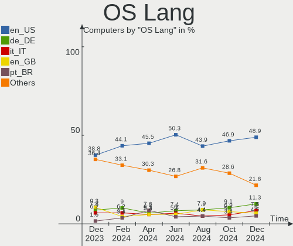
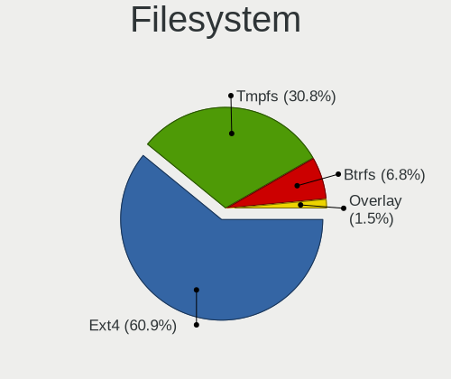
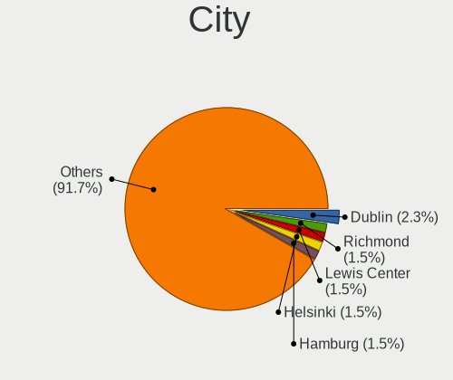
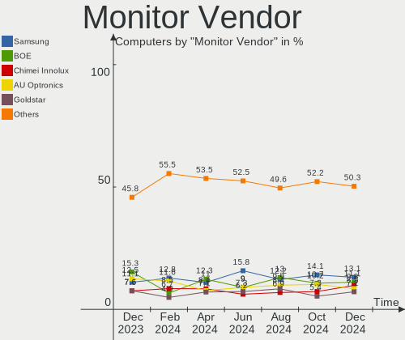
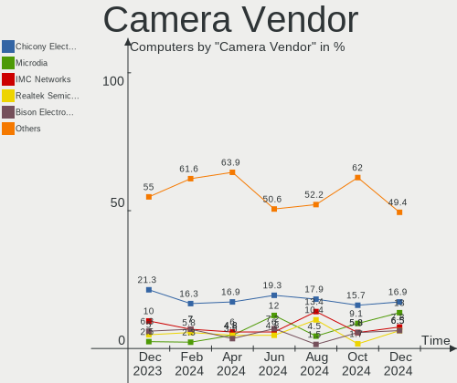
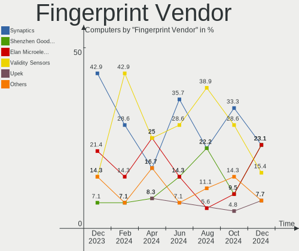

Kubuntu - Hardware Trends
-------------------------

A project to identify most popular hardware characteristics and track their change
over time based on data collected by Linux users at https://Linux-Hardware.org.

Anyone can contribute to this report by the [hw-probe](https://github.com/linuxhw/hw-probe) tool:

    sudo -E hw-probe -all -upload

This is a report for all computer types. See also reports for [desktops](/Dist/Kubuntu/Desktop/README.md) and [notebooks](/Dist/Kubuntu/Notebook/README.md).

This report is for one last month. Overall report since the beginning of time: [TestDays](https://github.com/linuxhw/TestDays)

Period: Nov, 2023.

Contents
--------

* [ System ](#system)
  - [ OS                       ](#os)
  - [ OS Family                ](#os-family)
  - [ Kernel                   ](#kernel)
  - [ Kernel Family            ](#kernel-family)
  - [ Kernel Major Ver.        ](#kernel-major-ver)
  - [ Arch                     ](#arch)
  - [ DE                       ](#de)
  - [ Display Server           ](#display-server)
  - [ Display Manager          ](#display-manager)
  - [ OS Lang                  ](#os-lang)
  - [ Boot Mode                ](#boot-mode)
  - [ Filesystem               ](#filesystem)
  - [ Part. scheme             ](#part-scheme)
  - [ Dual Boot with Linux/BSD ](#dual-boot-with-linuxbsd)
  - [ Dual Boot (Win)          ](#dual-boot-win)

* [ Board ](#board)
  - [ Vendor                   ](#vendor)
  - [ Model                    ](#model)
  - [ Model Family             ](#model-family)
  - [ MFG Year                 ](#mfg-year)
  - [ Form Factor              ](#form-factor)
  - [ Secure Boot              ](#secure-boot)
  - [ Coreboot                 ](#coreboot)
  - [ RAM Size                 ](#ram-size)
  - [ RAM Used                 ](#ram-used)
  - [ Total Drives             ](#total-drives)
  - [ Has CD-ROM               ](#has-cd-rom)
  - [ Has Ethernet             ](#has-ethernet)
  - [ Has WiFi                 ](#has-wifi)
  - [ Has Bluetooth            ](#has-bluetooth)

* [ Location ](#location)
  - [ Country                  ](#country)
  - [ City                     ](#city)

* [ Drives ](#drives)
  - [ Drive Vendor             ](#drive-vendor)
  - [ Drive Model              ](#drive-model)
  - [ HDD Vendor               ](#hdd-vendor)
  - [ SSD Vendor               ](#ssd-vendor)
  - [ Drive Kind               ](#drive-kind)
  - [ Drive Connector          ](#drive-connector)
  - [ Drive Size               ](#drive-size)
  - [ Space Total              ](#space-total)
  - [ Space Used               ](#space-used)
  - [ Malfunc. Drives          ](#malfunc-drives)
  - [ Malfunc. Drive Vendor    ](#malfunc-drive-vendor)
  - [ Malfunc. HDD Vendor      ](#malfunc-hdd-vendor)
  - [ Malfunc. Drive Kind      ](#malfunc-drive-kind)
  - [ Failed Drives            ](#failed-drives)
  - [ Failed Drive Vendor      ](#failed-drive-vendor)
  - [ Drive Status             ](#drive-status)

* [ Storage controller ](#storage-controller)
  - [ Storage Vendor           ](#storage-vendor)
  - [ Storage Model            ](#storage-model)
  - [ Storage Kind             ](#storage-kind)

* [ Processor ](#processor)
  - [ CPU Vendor               ](#cpu-vendor)
  - [ CPU Model                ](#cpu-model)
  - [ CPU Model Family         ](#cpu-model-family)
  - [ CPU Cores                ](#cpu-cores)
  - [ CPU Sockets              ](#cpu-sockets)
  - [ CPU Threads              ](#cpu-threads)
  - [ CPU Op-Modes             ](#cpu-op-modes)
  - [ CPU Microcode            ](#cpu-microcode)
  - [ CPU Microarch            ](#cpu-microarch)

* [ Graphics ](#graphics)
  - [ GPU Vendor               ](#gpu-vendor)
  - [ GPU Model                ](#gpu-model)
  - [ GPU Combo                ](#gpu-combo)
  - [ GPU Driver               ](#gpu-driver)
  - [ GPU Memory               ](#gpu-memory)

* [ Monitor ](#monitor)
  - [ Monitor Vendor           ](#monitor-vendor)
  - [ Monitor Model            ](#monitor-model)
  - [ Monitor Resolution       ](#monitor-resolution)
  - [ Monitor Diagonal         ](#monitor-diagonal)
  - [ Monitor Width            ](#monitor-width)
  - [ Aspect Ratio             ](#aspect-ratio)
  - [ Monitor Area             ](#monitor-area)
  - [ Pixel Density            ](#pixel-density)
  - [ Multiple Monitors        ](#multiple-monitors)

* [ Network ](#network)
  - [ Net Controller Vendor    ](#net-controller-vendor)
  - [ Net Controller Model     ](#net-controller-model)
  - [ Wireless Vendor          ](#wireless-vendor)
  - [ Wireless Model           ](#wireless-model)
  - [ Ethernet Vendor          ](#ethernet-vendor)
  - [ Ethernet Model           ](#ethernet-model)
  - [ Net Controller Kind      ](#net-controller-kind)
  - [ Used Controller          ](#used-controller)
  - [ NICs                     ](#nics)
  - [ IPv6                     ](#ipv6)

* [ Bluetooth ](#bluetooth)
  - [ Bluetooth Vendor         ](#bluetooth-vendor)
  - [ Bluetooth Model          ](#bluetooth-model)

* [ Sound ](#sound)
  - [ Sound Vendor             ](#sound-vendor)
  - [ Sound Model              ](#sound-model)

* [ Memory ](#memory)
  - [ Memory Vendor            ](#memory-vendor)
  - [ Memory Model             ](#memory-model)
  - [ Memory Kind              ](#memory-kind)
  - [ Memory Form Factor       ](#memory-form-factor)
  - [ Memory Size              ](#memory-size)
  - [ Memory Speed             ](#memory-speed)

* [ Printers & scanners ](#printers--scanners)
  - [ Printer Vendor           ](#printer-vendor)
  - [ Printer Model            ](#printer-model)
  - [ Scanner Vendor           ](#scanner-vendor)
  - [ Scanner Model            ](#scanner-model)

* [ Camera ](#camera)
  - [ Camera Vendor            ](#camera-vendor)
  - [ Camera Model             ](#camera-model)

* [ Security ](#security)
  - [ Fingerprint Vendor       ](#fingerprint-vendor)
  - [ Fingerprint Model        ](#fingerprint-model)
  - [ Chipcard Vendor          ](#chipcard-vendor)
  - [ Chipcard Model           ](#chipcard-model)

* [ Unsupported ](#unsupported)
  - [ Unsupported Devices      ](#unsupported-devices)
  - [ Unsupported Device Types ](#unsupported-device-types)

System
------

OS
--

Installed operating systems

| Name          | Computers | Percent |
|---------------|-----------|---------|
| Kubuntu 23.10 | 68        | 47.55%  |
| Kubuntu 22.04 | 62        | 43.36%  |
| Kubuntu 23.04 | 9         | 6.29%   |
| Kubuntu 20.10 | 2         | 1.4%    |
| Kubuntu 20.04 | 1         | 0.7%    |
| Kubuntu 11    | 1         | 0.7%    |

OS Family
---------

OS without a version

| Name    | Computers | Percent |
|---------|-----------|---------|
| Kubuntu | 143       | 100%    |

Kernel
------

Version of the Linux kernel

| Version                     | Computers | Percent |
|-----------------------------|-----------|---------|
| 6.5.0-10-generic            | 43        | 30.07%  |
| 6.2.0-36-generic            | 22        | 15.38%  |
| 5.15.0-88-generic           | 11        | 7.69%   |
| 6.5.0-13-generic            | 10        | 6.99%   |
| 6.2.0-37-generic            | 8         | 5.59%   |
| 6.5.0-10-lowlatency         | 6         | 4.2%    |
| 6.5.0-9-generic             | 3         | 2.1%    |
| 6.2.0-35-generic            | 3         | 2.1%    |
| 6.2.0-34-generic            | 3         | 2.1%    |
| 5.15.0-88-lowlatency        | 3         | 2.1%    |
| 5.15.0-75-generic           | 3         | 2.1%    |
| 6.2.0-1016-lowlatency       | 2         | 1.4%    |
| 5.15.0-89-generic           | 2         | 1.4%    |
| 5.15.0-87-generic           | 2         | 1.4%    |
| 6.6.2-custom                | 1         | 0.7%    |
| 6.6.1-060601-generic        | 1         | 0.7%    |
| 6.5.5-060505-generic        | 1         | 0.7%    |
| 6.5.10-x64v3-xanmod1        | 1         | 0.7%    |
| 6.3.8-x64v3-xanmod1         | 1         | 0.7%    |
| 6.2.16-060216-generic       | 1         | 0.7%    |
| 6.2.0-39-generic            | 1         | 0.7%    |
| 6.2.0-32-generic            | 1         | 0.7%    |
| 6.2.0-26-generic            | 1         | 0.7%    |
| 6.1.57-meson64              | 1         | 0.7%    |
| 5.8.0-63-generic            | 1         | 0.7%    |
| 5.8.0-33-generic            | 1         | 0.7%    |
| 5.8.0-25-generic            | 1         | 0.7%    |
| 5.4.0-166-generic           | 1         | 0.7%    |
| 5.19.0-1017-lowlatency      | 1         | 0.7%    |
| 5.15.0-86-generic           | 1         | 0.7%    |
| 5.15.0-84-generic           | 1         | 0.7%    |
| 5.15.0-79-generic           | 1         | 0.7%    |
| 5.15.0-522304060810-generic | 1         | 0.7%    |
| 5.15.0-50-generic           | 1         | 0.7%    |
| 5.15.0-43-generic           | 1         | 0.7%    |
| 5.14.0-1055-oem             | 1         | 0.7%    |

Kernel Family
-------------

Linux kernel without a distro release

| Version | Computers | Percent |
|---------|-----------|---------|
| 6.5.0   | 62        | 43.36%  |
| 6.2.0   | 41        | 28.67%  |
| 5.15.0  | 27        | 18.88%  |
| 5.8.0   | 3         | 2.1%    |
| 6.6.2   | 1         | 0.7%    |
| 6.6.1   | 1         | 0.7%    |
| 6.5.5   | 1         | 0.7%    |
| 6.5.10  | 1         | 0.7%    |
| 6.3.8   | 1         | 0.7%    |
| 6.2.16  | 1         | 0.7%    |
| 6.1.57  | 1         | 0.7%    |
| 5.4.0   | 1         | 0.7%    |
| 5.19.0  | 1         | 0.7%    |
| 5.14.0  | 1         | 0.7%    |

Kernel Major Ver.
-----------------

Linux kernel major version

| Version | Computers | Percent |
|---------|-----------|---------|
| 6.5     | 64        | 44.76%  |
| 6.2     | 42        | 29.37%  |
| 5.15    | 27        | 18.88%  |
| 5.8     | 3         | 2.1%    |
| 6.6     | 2         | 1.4%    |
| 6.3     | 1         | 0.7%    |
| 6.1     | 1         | 0.7%    |
| 5.4     | 1         | 0.7%    |
| 5.19    | 1         | 0.7%    |
| 5.14    | 1         | 0.7%    |

Arch
----

OS architecture (x86_64, i586, etc.)

| Name    | Computers | Percent |
|---------|-----------|---------|
| x86_64  | 142       | 99.3%   |
| aarch64 | 1         | 0.7%    |

DE
--

Desktop Environment

| Name  | Computers | Percent |
|-------|-----------|---------|
| KDE5  | 138       | 96.5%   |
| KDE   | 3         | 2.1%    |
| MATE  | 1         | 0.7%    |
| GNOME | 1         | 0.7%    |

Display Server
--------------

X11 or Wayland

| Name    | Computers | Percent |
|---------|-----------|---------|
| X11     | 127       | 88.81%  |
| Wayland | 15        | 10.49%  |
| Tty     | 1         | 0.7%    |

Display Manager
---------------

SDDM, LightDM, etc.

| Name    | Computers | Percent |
|---------|-----------|---------|
| SDDM    | 93        | 65.03%  |
| Unknown | 42        | 29.37%  |
| GDM3    | 6         | 4.2%    |
| LightDM | 2         | 1.4%    |

OS Lang
-------

Language

| Lang  | Computers | Percent |
|-------|-----------|---------|
| en_US | 65        | 45.45%  |
| it_IT | 16        | 11.19%  |
| de_DE | 11        | 7.69%   |
| en_GB | 10        | 6.99%   |
| fr_FR | 8         | 5.59%   |
| es_ES | 5         | 3.5%    |
| hu_HU | 3         | 2.1%    |
| en_AU | 3         | 2.1%    |
| ru_RU | 2         | 1.4%    |
| pl_PL | 2         | 1.4%    |
| es_MX | 2         | 1.4%    |
| C     | 2         | 1.4%    |
| zh_TW | 1         | 0.7%    |
| uk_UA | 1         | 0.7%    |
| ru_UA | 1         | 0.7%    |
| pt_PT | 1         | 0.7%    |
| nl_NL | 1         | 0.7%    |
| fr_BE | 1         | 0.7%    |
| es_CR | 1         | 0.7%    |
| es_AR | 1         | 0.7%    |
| en_ZA | 1         | 0.7%    |
| en_PH | 1         | 0.7%    |
| en_NZ | 1         | 0.7%    |
| en_IN | 1         | 0.7%    |
| en_CA | 1         | 0.7%    |
| de_CH | 1         | 0.7%    |

Boot Mode
---------

EFI or BIOS

| Mode | Computers | Percent |
|------|-----------|---------|
| EFI  | 76        | 53.15%  |
| BIOS | 67        | 46.85%  |

Filesystem
----------

Type of filesystem

| Type    | Computers | Percent |
|---------|-----------|---------|
| Ext4    | 102       | 71.33%  |
| Tmpfs   | 29        | 20.28%  |
| Btrfs   | 8         | 5.59%   |
| Overlay | 2         | 1.4%    |
| Xfs     | 1         | 0.7%    |
| F2fs    | 1         | 0.7%    |

Part. scheme
------------

Scheme of partitioning

| Type    | Computers | Percent |
|---------|-----------|---------|
| GPT     | 94        | 65.73%  |
| Unknown | 41        | 28.67%  |
| MBR     | 8         | 5.59%   |

Dual Boot with Linux/BSD
------------------------

Hosting more than one Linux/BSD

| Dual boot | Computers | Percent |
|-----------|-----------|---------|
| No        | 125       | 87.41%  |
| Yes       | 18        | 12.59%  |

Dual Boot (Win)
---------------

Hosting Linux and Windows

| Dual boot | Computers | Percent |
|-----------|-----------|---------|
| No        | 88        | 61.54%  |
| Yes       | 55        | 38.46%  |

Board
-----

Vendor
------

Motherboard manufacturer

| Name                             | Computers | Percent |
|----------------------------------|-----------|---------|
| ASUSTek Computer                 | 34        | 23.78%  |
| Hewlett-Packard                  | 23        | 16.08%  |
| Lenovo                           | 21        | 14.69%  |
| Dell                             | 14        | 9.79%   |
| Gigabyte Technology              | 10        | 6.99%   |
| MSI                              | 7         | 4.9%    |
| Acer                             | 6         | 4.2%    |
| ASRock                           | 5         | 3.5%    |
| Intel                            | 4         | 2.8%    |
| Unknown                          | 2         | 1.4%    |
| Wortmann AG                      | 1         | 0.7%    |
| Toshiba                          | 1         | 0.7%    |
| Sony                             | 1         | 0.7%    |
| Samsung Electronics              | 1         | 0.7%    |
| PC Specialist                    | 1         | 0.7%    |
| Micro Computer (HK) Tech Limited | 1         | 0.7%    |
| Jumper                           | 1         | 0.7%    |
| HUAWEI                           | 1         | 0.7%    |
| GPU Company                      | 1         | 0.7%    |
| Fanless Mini PC                  | 1         | 0.7%    |
| DEXP                             | 1         | 0.7%    |
| DERE                             | 1         | 0.7%    |
| CHIPHD                           | 1         | 0.7%    |
| Blue Bird                        | 1         | 0.7%    |
| BESSTAR Tech                     | 1         | 0.7%    |
| AZW                              | 1         | 0.7%    |
| Apple                            | 1         | 0.7%    |

Model
-----

Motherboard model

| Name                                        | Computers | Percent |
|---------------------------------------------|-----------|---------|
| Unknown                                     | 3         | 2.1%    |
| ASUS Z170-A                                 | 2         | 1.4%    |
| ASUS TUF Gaming X570-PLUS                   | 2         | 1.4%    |
| ASUS ROG STRIX X670E-E GAMING WIFI          | 2         | 1.4%    |
| Wortmann AG 1220777_1400328                 | 1         | 0.7%    |
| Toshiba Satellite L550                      | 1         | 0.7%    |
| Sony VPCSA3J1E                              | 1         | 0.7%    |
| Samsung 730QCJ/730QCR                       | 1         | 0.7%    |
| PC Specialist Lafite Pro II 15              | 1         | 0.7%    |
| MSI MS-7D42                                 | 1         | 0.7%    |
| MSI MS-7D18                                 | 1         | 0.7%    |
| MSI MS-7C91                                 | 1         | 0.7%    |
| MSI MS-7C56                                 | 1         | 0.7%    |
| MSI MS-7B86                                 | 1         | 0.7%    |
| MSI MS-7B78                                 | 1         | 0.7%    |
| MSI MS-7885                                 | 1         | 0.7%    |
| Micro (HK) Tech Limited Venus series        | 1         | 0.7%    |
| Lenovo V17 G3 IAP 82U1                      | 1         | 0.7%    |
| Lenovo ThinkStation P720 30BBS4RV00         | 1         | 0.7%    |
| Lenovo ThinkPad X1 Carbon Gen 11 21HMCTO1WW | 1         | 0.7%    |
| Lenovo ThinkPad T480s 20L7001MHV            | 1         | 0.7%    |
| Lenovo ThinkPad T480 20L6S5VP3U             | 1         | 0.7%    |
| Lenovo ThinkPad T14s Gen 3 21CQCTO1WW       | 1         | 0.7%    |
| Lenovo ThinkPad T14 Gen 1 20S00044IX        | 1         | 0.7%    |
| Lenovo ThinkPad P14s Gen 4 21K5001HUS       | 1         | 0.7%    |
| Lenovo ThinkPad L560 20F2S0DA00             | 1         | 0.7%    |
| Lenovo ThinkPad E595 20NFCTO1WW             | 1         | 0.7%    |
| Lenovo ThinkPad E14 Gen 4 21ECS00000        | 1         | 0.7%    |
| Lenovo ThinkCentre M91p 4518A31             | 1         | 0.7%    |
| Lenovo ThinkCentre M83 10ANA00PAU           | 1         | 0.7%    |
| Lenovo ThinkCentre M720t 10SQ0070GE         | 1         | 0.7%    |
| Lenovo ThinkBook 14p Gen 3 21EJ             | 1         | 0.7%    |
| Lenovo Legion Y540-15IRH-PG0 81SY           | 1         | 0.7%    |
| Lenovo Legion 5 15ARH05H 82B1               | 1         | 0.7%    |
| Lenovo IdeaPadFlex 5 14ALC7 82R9            | 1         | 0.7%    |
| Lenovo IdeaPad Pro 5 16APH8 83AR            | 1         | 0.7%    |
| Lenovo IdeaPad 3 15IIL05 81WE               | 1         | 0.7%    |
| Lenovo G550 2958                            | 1         | 0.7%    |
| Jumper EZbook                               | 1         | 0.7%    |
| Intel S5520HC                               | 1         | 0.7%    |

Model Family
------------

Motherboard model prefix

| Name                          | Computers | Percent |
|-------------------------------|-----------|---------|
| Lenovo ThinkPad               | 9         | 6.29%   |
| HP Pavilion                   | 7         | 4.9%    |
| ASUS ROG                      | 7         | 4.9%    |
| HP ProBook                    | 5         | 3.5%    |
| ASUS TUF                      | 5         | 3.5%    |
| ASUS PRIME                    | 5         | 3.5%    |
| Acer Aspire                   | 5         | 3.5%    |
| Lenovo ThinkCentre            | 3         | 2.1%    |
| HP EliteBook                  | 3         | 2.1%    |
| Gigabyte X570                 | 3         | 2.1%    |
| Dell Precision                | 3         | 2.1%    |
| Dell Latitude                 | 3         | 2.1%    |
| Dell Inspiron                 | 3         | 2.1%    |
| ASUS VivoBook                 | 3         | 2.1%    |
| Unknown                       | 3         | 2.1%    |
| Lenovo Legion                 | 2         | 1.4%    |
| Lenovo IdeaPad                | 2         | 1.4%    |
| Dell XPS                      | 2         | 1.4%    |
| Dell OptiPlex                 | 2         | 1.4%    |
| ASUS Z170-A                   | 2         | 1.4%    |
| ASUS SABERTOOTH               | 2         | 1.4%    |
| Wortmann AG 1220777           | 1         | 0.7%    |
| Toshiba Satellite             | 1         | 0.7%    |
| Sony VPCSA3J1E                | 1         | 0.7%    |
| Samsung 730QCJ                | 1         | 0.7%    |
| PC Specialist Lafite          | 1         | 0.7%    |
| MSI MS-7D42                   | 1         | 0.7%    |
| MSI MS-7D18                   | 1         | 0.7%    |
| MSI MS-7C91                   | 1         | 0.7%    |
| MSI MS-7C56                   | 1         | 0.7%    |
| MSI MS-7B86                   | 1         | 0.7%    |
| MSI MS-7B78                   | 1         | 0.7%    |
| MSI MS-7885                   | 1         | 0.7%    |
| Micro (HK) Tech Limited Venus | 1         | 0.7%    |
| Lenovo V17                    | 1         | 0.7%    |
| Lenovo ThinkStation           | 1         | 0.7%    |
| Lenovo ThinkBook              | 1         | 0.7%    |
| Lenovo IdeaPadFlex            | 1         | 0.7%    |
| Lenovo G550                   | 1         | 0.7%    |
| Jumper EZbook                 | 1         | 0.7%    |

MFG Year
--------

Motherboard manufacture year

| Year    | Computers | Percent |
|---------|-----------|---------|
| 2019    | 23        | 16.08%  |
| 2020    | 20        | 13.99%  |
| 2022    | 18        | 12.59%  |
| 2023    | 9         | 6.29%   |
| 2021    | 9         | 6.29%   |
| 2018    | 9         | 6.29%   |
| 2012    | 9         | 6.29%   |
| 2017    | 7         | 4.9%    |
| 2014    | 7         | 4.9%    |
| 2013    | 7         | 4.9%    |
| 2011    | 7         | 4.9%    |
| 2015    | 6         | 4.2%    |
| 2016    | 4         | 2.8%    |
| 2009    | 4         | 2.8%    |
| 2010    | 2         | 1.4%    |
| 2007    | 1         | 0.7%    |
| Unknown | 1         | 0.7%    |

Form Factor
-----------

Physical design of the computer

| Name           | Computers | Percent |
|----------------|-----------|---------|
| Notebook       | 71        | 49.65%  |
| Desktop        | 60        | 41.96%  |
| Mini pc        | 4         | 2.8%    |
| Tablet         | 2         | 1.4%    |
| Convertible    | 2         | 1.4%    |
| Server         | 2         | 1.4%    |
| System on chip | 1         | 0.7%    |
| All in one     | 1         | 0.7%    |

Secure Boot
-----------

Enabled or disabled

| State    | Computers | Percent |
|----------|-----------|---------|
| Disabled | 132       | 92.31%  |
| Enabled  | 11        | 7.69%   |

Coreboot
--------

Have coreboot on board

| Used | Computers | Percent |
|------|-----------|---------|
| No   | 143       | 100%    |

RAM Size
--------

Total RAM memory

| Size in GB  | Computers | Percent |
|-------------|-----------|---------|
| 32.01-64.0  | 37        | 25.87%  |
| 16.01-24.0  | 31        | 21.68%  |
| 4.01-8.0    | 23        | 16.08%  |
| 8.01-16.0   | 21        | 14.69%  |
| 3.01-4.0    | 13        | 9.09%   |
| 64.01-256.0 | 11        | 7.69%   |
| 24.01-32.0  | 7         | 4.9%    |

RAM Used
--------

Used RAM memory

| Used GB    | Computers | Percent |
|------------|-----------|---------|
| 4.01-8.0   | 46        | 32.17%  |
| 2.01-3.0   | 40        | 27.97%  |
| 3.01-4.0   | 24        | 16.78%  |
| 8.01-16.0  | 15        | 10.49%  |
| 1.01-2.0   | 14        | 9.79%   |
| 16.01-24.0 | 3         | 2.1%    |
| 0.51-1.0   | 1         | 0.7%    |

Total Drives
------------

Number of drives on board

| Drives | Computers | Percent |
|--------|-----------|---------|
| 1      | 69        | 48.25%  |
| 2      | 35        | 24.48%  |
| 4      | 13        | 9.09%   |
| 3      | 13        | 9.09%   |
| 5      | 4         | 2.8%    |
| 7      | 3         | 2.1%    |
| 6      | 3         | 2.1%    |
| 0      | 2         | 1.4%    |
| 11     | 1         | 0.7%    |

Has CD-ROM
----------

Has CD-ROM on board

| Presented | Computers | Percent |
|-----------|-----------|---------|
| No        | 103       | 72.03%  |
| Yes       | 40        | 27.97%  |

Has Ethernet
------------

Has Ethernet on board

| Presented | Computers | Percent |
|-----------|-----------|---------|
| Yes       | 121       | 84.62%  |
| No        | 22        | 15.38%  |

Has WiFi
--------

Has WiFi module

| Presented | Computers | Percent |
|-----------|-----------|---------|
| Yes       | 110       | 76.92%  |
| No        | 33        | 23.08%  |

Has Bluetooth
-------------

Has Bluetooth module

| Presented | Computers | Percent |
|-----------|-----------|---------|
| Yes       | 98        | 68.53%  |
| No        | 45        | 31.47%  |

Location
--------

Country
-------

Geographic location (country)

| Country         | Computers | Percent |
|-----------------|-----------|---------|
| USA             | 30        | 20.98%  |
| Italy           | 19        | 13.29%  |
| Germany         | 16        | 11.19%  |
| UK              | 10        | 6.99%   |
| France          | 10        | 6.99%   |
| Spain           | 6         | 4.2%    |
| Russia          | 5         | 3.5%    |
| Australia       | 4         | 2.8%    |
| Hungary         | 3         | 2.1%    |
| Canada          | 3         | 2.1%    |
| Belgium         | 3         | 2.1%    |
| Sweden          | 2         | 1.4%    |
| Romania         | 2         | 1.4%    |
| Portugal        | 2         | 1.4%    |
| Poland          | 2         | 1.4%    |
| Norway          | 2         | 1.4%    |
| Netherlands     | 2         | 1.4%    |
| Czechia         | 2         | 1.4%    |
| Argentina       | 2         | 1.4%    |
| Ukraine         | 1         | 0.7%    |
| Turkey          | 1         | 0.7%    |
| Taiwan          | 1         | 0.7%    |
| Switzerland     | 1         | 0.7%    |
| South Africa    | 1         | 0.7%    |
| Slovakia        | 1         | 0.7%    |
| Saudi Arabia    | 1         | 0.7%    |
| Philippines     | 1         | 0.7%    |
| North Macedonia | 1         | 0.7%    |
| Nicaragua       | 1         | 0.7%    |
| Montenegro      | 1         | 0.7%    |
| Mexico          | 1         | 0.7%    |
| Indonesia       | 1         | 0.7%    |
| India           | 1         | 0.7%    |
| Greece          | 1         | 0.7%    |
| Denmark         | 1         | 0.7%    |
| Costa Rica      | 1         | 0.7%    |
| China           | 1         | 0.7%    |

City
----

Geographic location (city)

| City                | Computers | Percent |
|---------------------|-----------|---------|
| Milano              | 4         | 2.8%    |
| Milan               | 4         | 2.8%    |
| Paris               | 3         | 2.1%    |
| Rome                | 2         | 1.4%    |
| Pilsen              | 2         | 1.4%    |
| Perth               | 2         | 1.4%    |
| Morehead City       | 2         | 1.4%    |
| Budapest            | 2         | 1.4%    |
| Brussels            | 2         | 1.4%    |
| Westminster         | 1         | 0.7%    |
| West Augusta        | 1         | 0.7%    |
| Warsaw              | 1         | 0.7%    |
| Warburg             | 1         | 0.7%    |
| Vitoria-Gasteiz     | 1         | 0.7%    |
| Varano Borghi       | 1         | 0.7%    |
| Vallingby           | 1         | 0.7%    |
| Trier               | 1         | 0.7%    |
| Toronto             | 1         | 0.7%    |
| Tijuana             | 1         | 0.7%    |
| Thessaloniki        | 1         | 0.7%    |
| Termoli             | 1         | 0.7%    |
| Szeged              | 1         | 0.7%    |
| Sydney              | 1         | 0.7%    |
| Strejnicu           | 1         | 0.7%    |
| Siziano             | 1         | 0.7%    |
| Shotts              | 1         | 0.7%    |
| Sherman             | 1         | 0.7%    |
| Seville             | 1         | 0.7%    |
| Settimo Torinese    | 1         | 0.7%    |
| Sartrouville        | 1         | 0.7%    |
| San Diego           | 1         | 0.7%    |
| Saint-Avold         | 1         | 0.7%    |
| Rotterdam           | 1         | 0.7%    |
| Ronde               | 1         | 0.7%    |
| Rochdale            | 1         | 0.7%    |
| Prilep              | 1         | 0.7%    |
| Podolsk             | 1         | 0.7%    |
| Podgorica           | 1         | 0.7%    |
| Plaimpied-Givaudins | 1         | 0.7%    |
| Petrozavodsk        | 1         | 0.7%    |

Drives
------

Drive Vendor
------------

Hard drive vendors

| Vendor                       | Computers | Drives | Percent |
|------------------------------|-----------|--------|---------|
| Samsung Electronics          | 48        | 74     | 19.12%  |
| WDC                          | 30        | 36     | 11.95%  |
| Seagate                      | 27        | 40     | 10.76%  |
| Sandisk                      | 16        | 17     | 6.37%   |
| Kingston                     | 16        | 17     | 6.37%   |
| Toshiba                      | 10        | 11     | 3.98%   |
| SK hynix                     | 9         | 9      | 3.59%   |
| Intel                        | 9         | 9      | 3.59%   |
| Crucial                      | 8         | 8      | 3.19%   |
| Unknown                      | 6         | 6      | 2.39%   |
| A-DATA Technology            | 6         | 7      | 2.39%   |
| Micron/Crucial Technology    | 5         | 5      | 1.99%   |
| Corsair                      | 5         | 5      | 1.99%   |
| SPCC                         | 4         | 5      | 1.59%   |
| Micron Technology            | 4         | 4      | 1.59%   |
| HGST                         | 4         | 4      | 1.59%   |
| PNY                          | 3         | 3      | 1.2%    |
| Shenzhen Longsys Electronics | 2         | 2      | 0.8%    |
| KIOXIA                       | 2         | 2      | 0.8%    |
| Kingston Technology Company  | 2         | 2      | 0.8%    |
| Hitachi                      | 2         | 2      | 0.8%    |
| Unknown                      | 2         | 3      | 0.8%    |
| YMTC                         | 1         | 1      | 0.4%    |
| XPG                          | 1         | 1      | 0.4%    |
| WD MediaMax                  | 1         | 1      | 0.4%    |
| V-GeN                        | 1         | 1      | 0.4%    |
| UMIS                         | 1         | 1      | 0.4%    |
| Team                         | 1         | 1      | 0.4%    |
| TCSUNBOW                     | 1         | 1      | 0.4%    |
| StoreJet                     | 1         | 1      | 0.4%    |
| SSSTC                        | 1         | 1      | 0.4%    |
| Silicon Motion               | 1         | 1      | 0.4%    |
| SCCTS-603-001T               | 1         | 1      | 0.4%    |
| S3+                          | 1         | 1      | 0.4%    |
| Realtek                      | 1         | 1      | 0.4%    |
| Phison Electronics           | 1         | 1      | 0.4%    |
| Phison                       | 1         | 1      | 0.4%    |
| Patriot                      | 1         | 1      | 0.4%    |
| NT-512                       | 1         | 1      | 0.4%    |
| Maxtor                       | 1         | 1      | 0.4%    |

Drive Model
-----------

Hard drive models

| Model                                               | Computers | Percent |
|-----------------------------------------------------|-----------|---------|
| Seagate ST2000DM008-2FR102 2TB                      | 5         | 1.71%   |
| Samsung NVMe SSD Controller PM9A1/PM9A3/980PRO 2TB  | 5         | 1.71%   |
| Samsung SSD 860 EVO 1TB                             | 4         | 1.37%   |
| Samsung NVMe SSD Controller SM981/PM981/PM983 250GB | 4         | 1.37%   |
| Micron/Crucial P2 NVMe PCIe SSD 1TB                 | 4         | 1.37%   |
| Toshiba MQ01ABD100 1TB                              | 3         | 1.02%   |
| SanDisk NVMe SSD Drive 1TB                          | 3         | 1.02%   |
| Samsung SSD 980 1TB                                 | 3         | 1.02%   |
| Samsung SSD 870 QVO 2TB                             | 3         | 1.02%   |
| Samsung SSD 870 QVO 1TB                             | 3         | 1.02%   |
| Samsung SSD 850 EVO 500GB                           | 3         | 1.02%   |
| Kingston SA400S37480G 480GB SSD                     | 3         | 1.02%   |
| Kingston SA400S37240G 240GB SSD                     | 3         | 1.02%   |
| A-DATA SU630 480GB SSD                              | 3         | 1.02%   |
| WDC WD10EZEX-08WN4A0 1TB                            | 2         | 0.68%   |
| Toshiba MQ01ACF050 500GB                            | 2         | 0.68%   |
| SK hynix BC711 HFM512GD3JX013N 512GB                | 2         | 0.68%   |
| SK hynix BC501 NVMe Solid State Drive 512GB         | 2         | 0.68%   |
| Seagate ST3500418AS 500GB                           | 2         | 0.68%   |
| Seagate ST2000DM006-2DM164 2TB                      | 2         | 0.68%   |
| Seagate ST1000LM035-1RK172 1TB                      | 2         | 0.68%   |
| Sandisk WD_BLACK SN850X 2000GB                      | 2         | 0.68%   |
| Samsung SSD 980 PRO 1TB                             | 2         | 0.68%   |
| Samsung SSD 980 500GB                               | 2         | 0.68%   |
| Samsung SSD 970 EVO Plus 1TB                        | 2         | 0.68%   |
| Samsung SSD 850 EVO 250GB                           | 2         | 0.68%   |
| Samsung SSD 850 EVO 1TB                             | 2         | 0.68%   |
| Samsung SSD 840 EVO 250GB                           | 2         | 0.68%   |
| Samsung MZALQ512HALU-000L2 512GB                    | 2         | 0.68%   |
| Intel SSD 660P Series 512GB                         | 2         | 0.68%   |
| Unknown                                             | 2         | 0.68%   |
| YMTC PC005 512GB                                    | 1         | 0.34%   |
| XPG GAMMIX S70 BLADE 2TB                            | 1         | 0.34%   |
| WDC WDS500G3X0C-00SJG0 500GB                        | 1         | 0.34%   |
| WDC WDS500G1B0B-00AS40 500GB SSD                    | 1         | 0.34%   |
| WDC WDS480G2G0C-00AJM0 480GB                        | 1         | 0.34%   |
| WDC WDS480G2G0B-00EPW0 480GB SSD                    | 1         | 0.34%   |
| WDC WDS100T3X0C-00SJG0 1TB                          | 1         | 0.34%   |
| WDC WDS100T2B0C-00PXH0 1TB                          | 1         | 0.34%   |
| WDC WDBNCE2500PNC 250GB SSD                         | 1         | 0.34%   |

HDD Vendor
----------

Hard disk drive vendors

| Vendor              | Computers | Drives | Percent |
|---------------------|-----------|--------|---------|
| Seagate             | 27        | 40     | 36.99%  |
| WDC                 | 21        | 26     | 28.77%  |
| Toshiba             | 9         | 10     | 12.33%  |
| Samsung Electronics | 4         | 5      | 5.48%   |
| HGST                | 4         | 4      | 5.48%   |
| Hitachi             | 2         | 2      | 2.74%   |
| Unknown             | 1         | 1      | 1.37%   |
| StoreJet            | 1         | 1      | 1.37%   |
| Maxtor              | 1         | 1      | 1.37%   |
| LaCie               | 1         | 1      | 1.37%   |
| KESU                | 1         | 1      | 1.37%   |
| External            | 1         | 3      | 1.37%   |

SSD Vendor
----------

Solid state drive vendors

| Vendor              | Computers | Drives | Percent |
|---------------------|-----------|--------|---------|
| Samsung Electronics | 22        | 30     | 26.19%  |
| Kingston            | 12        | 13     | 14.29%  |
| SanDisk             | 6         | 6      | 7.14%   |
| Crucial             | 6         | 6      | 7.14%   |
| A-DATA Technology   | 6         | 7      | 7.14%   |
| WDC                 | 4         | 4      | 4.76%   |
| SPCC                | 4         | 4      | 4.76%   |
| PNY                 | 3         | 3      | 3.57%   |
| Intel               | 3         | 3      | 3.57%   |
| Corsair             | 2         | 2      | 2.38%   |
| Team                | 1         | 1      | 1.19%   |
| TCSUNBOW            | 1         | 1      | 1.19%   |
| SSSTC               | 1         | 1      | 1.19%   |
| SCCTS-603-001T      | 1         | 1      | 1.19%   |
| S3+                 | 1         | 1      | 1.19%   |
| Patriot             | 1         | 1      | 1.19%   |
| NT-512              | 1         | 1      | 1.19%   |
| Micron Technology   | 1         | 1      | 1.19%   |
| M4-CT128            | 1         | 1      | 1.19%   |
| LITEON              | 1         | 1      | 1.19%   |
| Hewlett-Packard     | 1         | 1      | 1.19%   |
| GeIL                | 1         | 1      | 1.19%   |
| Fanxiang            | 1         | 1      | 1.19%   |
| China               | 1         | 1      | 1.19%   |
| BAITITON            | 1         | 1      | 1.19%   |
| Unknown             | 1         | 1      | 1.19%   |

Drive Kind
----------

HDD or SSD

| Kind    | Computers | Drives | Percent |
|---------|-----------|--------|---------|
| NVMe    | 81        | 105    | 37.67%  |
| SSD     | 70        | 94     | 32.56%  |
| HDD     | 55        | 95     | 25.58%  |
| MMC     | 5         | 7      | 2.33%   |
| Unknown | 4         | 4      | 1.86%   |

Drive Connector
---------------

SATA, SAS, NVMe, etc.

| Type | Computers | Drives | Percent |
|------|-----------|--------|---------|
| SATA | 93        | 174    | 48.95%  |
| NVMe | 81        | 104    | 42.63%  |
| SAS  | 11        | 20     | 5.79%   |
| MMC  | 5         | 7      | 2.63%   |

Drive Size
----------

Size of hard drive

| Size in TB | Computers | Drives | Percent |
|------------|-----------|--------|---------|
| 0.01-0.5   | 60        | 80     | 40.27%  |
| 0.51-1.0   | 45        | 53     | 30.2%   |
| 1.01-2.0   | 25        | 35     | 16.78%  |
| 3.01-4.0   | 8         | 8      | 5.37%   |
| 2.01-3.0   | 5         | 6      | 3.36%   |
| 4.01-10.0  | 4         | 5      | 2.68%   |
| 10.01-20.0 | 2         | 2      | 1.34%   |

Space Total
-----------

Amount of disk space available on the file system

| Size in GB     | Computers | Percent |
|----------------|-----------|---------|
| 101-250        | 28        | 19.58%  |
| 501-1000       | 28        | 19.58%  |
| 251-500        | 26        | 18.18%  |
| More than 3000 | 21        | 14.69%  |
| 1001-2000      | 21        | 14.69%  |
| 2001-3000      | 9         | 6.29%   |
| 1-20           | 4         | 2.8%    |
| 51-100         | 4         | 2.8%    |
| 21-50          | 2         | 1.4%    |

Space Used
----------

Amount of used disk space

| Used GB        | Computers | Percent |
|----------------|-----------|---------|
| 101-250        | 25        | 17.48%  |
| 501-1000       | 23        | 16.08%  |
| 1-20           | 20        | 13.99%  |
| 21-50          | 19        | 13.29%  |
| 251-500        | 18        | 12.59%  |
| 51-100         | 16        | 11.19%  |
| More than 3000 | 12        | 8.39%   |
| 1001-2000      | 7         | 4.9%    |
| 2001-3000      | 3         | 2.1%    |

Malfunc. Drives
---------------

Drive models with a malfunction

| Model                                                 | Computers | Drives | Percent |
|-------------------------------------------------------|-----------|--------|---------|
| WDC WD5000AAKS-00V1A0 500GB                           | 1         | 1      | 7.69%   |
| WDC WD40EURX-63BMCY0 4TB                              | 1         | 1      | 7.69%   |
| WDC WD20PURZ-85AKKY0 2TB                              | 1         | 1      | 7.69%   |
| SSSTC CVB-8D128-HP 128GB SSD                          | 1         | 1      | 7.69%   |
| Seagate ST9500325AS 500GB                             | 1         | 1      | 7.69%   |
| Seagate ST750LM022 HN-M750MBB 752GB                   | 1         | 1      | 7.69%   |
| Samsung Electronics SSD 970 EVO 500GB S466NX0K713615T | 1         | 1      | 7.69%   |
| Samsung Electronics HD501LJ 500GB                     | 1         | 1      | 7.69%   |
| Samsung Electronics HD103SI 1TB                       | 1         | 1      | 7.69%   |
| Kingston SA400S37480G 480GB SSD                       | 1         | 1      | 7.69%   |
| HGST HTS541010A9E680 1TB                              | 1         | 1      | 7.69%   |
| Corsair CSSD-V64GB2                                   | 1         | 1      | 7.69%   |
| A-DATA Technology SP900 256GB SSD                     | 1         | 1      | 7.69%   |

Malfunc. Drive Vendor
---------------------

Vendors of faulty drives

| Vendor              | Computers | Drives | Percent |
|---------------------|-----------|--------|---------|
| WDC                 | 3         | 3      | 23.08%  |
| Samsung Electronics | 3         | 3      | 23.08%  |
| Seagate             | 2         | 2      | 15.38%  |
| SSSTC               | 1         | 1      | 7.69%   |
| Kingston            | 1         | 1      | 7.69%   |
| HGST                | 1         | 1      | 7.69%   |
| Corsair             | 1         | 1      | 7.69%   |
| A-DATA Technology   | 1         | 1      | 7.69%   |

Malfunc. HDD Vendor
-------------------

Vendors of faulty HDD drives

| Vendor              | Computers | Drives | Percent |
|---------------------|-----------|--------|---------|
| WDC                 | 3         | 3      | 37.5%   |
| Seagate             | 2         | 2      | 25%     |
| Samsung Electronics | 2         | 2      | 25%     |
| HGST                | 1         | 1      | 12.5%   |

Malfunc. Drive Kind
-------------------

Kinds of faulty drives

| Kind | Computers | Drives | Percent |
|------|-----------|--------|---------|
| HDD  | 7         | 8      | 63.64%  |
| SSD  | 3         | 4      | 27.27%  |
| NVMe | 1         | 1      | 9.09%   |

Failed Drives
-------------

Failed drive models

Zero info for selected period =(

Failed Drive Vendor
-------------------

Failed drive vendors

Zero info for selected period =(

Drive Status
------------

Number of failed and malfunc. drives

| Status   | Computers | Drives | Percent |
|----------|-----------|--------|---------|
| Detected | 75        | 151    | 46.88%  |
| Works    | 74        | 141    | 46.25%  |
| Malfunc  | 11        | 13     | 6.88%   |

Storage controller
------------------

Storage Vendor
--------------

Storage controller vendors

| Vendor                       | Computers | Percent |
|------------------------------|-----------|---------|
| Intel                        | 88        | 39.82%  |
| AMD                          | 33        | 14.93%  |
| Samsung Electronics          | 31        | 14.03%  |
| SanDisk                      | 15        | 6.79%   |
| SK hynix                     | 9         | 4.07%   |
| Micron/Crucial Technology    | 6         | 2.71%   |
| Kingston Technology Company  | 6         | 2.71%   |
| Phison Electronics           | 4         | 1.81%   |
| ASMedia Technology           | 4         | 1.81%   |
| Micron Technology            | 3         | 1.36%   |
| Marvell Technology Group     | 3         | 1.36%   |
| Silicon Motion               | 2         | 0.9%    |
| Shenzhen Longsys Electronics | 2         | 0.9%    |
| KIOXIA                       | 2         | 0.9%    |
| JMicron Technology           | 2         | 0.9%    |
| Broadcom / LSI               | 2         | 0.9%    |
| Zhaoxin                      | 1         | 0.45%   |
| Yangtze Memory Technologies  | 1         | 0.45%   |
| Union Memory (Shenzhen)      | 1         | 0.45%   |
| Toshiba America Info Systems | 1         | 0.45%   |
| Solidigm                     | 1         | 0.45%   |
| Realtek Semiconductor        | 1         | 0.45%   |
| MAXIO Technology (Hangzhou)  | 1         | 0.45%   |
| LSI Logic / Symbios Logic    | 1         | 0.45%   |
| ADATA Technology             | 1         | 0.45%   |

Storage Model
-------------

Storage controller models

| Model                                                                          | Computers | Percent |
|--------------------------------------------------------------------------------|-----------|---------|
| AMD FCH SATA Controller [AHCI mode]                                            | 26        | 10.7%   |
| Samsung NVMe SSD Controller SM981/PM981/PM983                                  | 12        | 4.94%   |
| Samsung NVMe SSD Controller 980 (DRAM-less)                                    | 10        | 4.12%   |
| Samsung NVMe SSD Controller PM9A1/PM9A3/980PRO                                 | 8         | 3.29%   |
| Intel Volume Management Device NVMe RAID Controller                            | 8         | 3.29%   |
| Intel Sunrise Point-LP SATA Controller [AHCI mode]                             | 6         | 2.47%   |
| Intel Tiger Lake-LP SATA Controller                                            | 5         | 2.06%   |
| Intel 8 Series/C220 Series Chipset Family 6-port SATA Controller 1 [AHCI mode] | 5         | 2.06%   |
| Micron/Crucial P2 [Nick P2] / P3 / P3 Plus NVMe PCIe SSD (DRAM-less)           | 4         | 1.65%   |
| Intel Wildcat Point-LP SATA Controller [AHCI Mode]                             | 4         | 1.65%   |
| Intel SSD 660P Series                                                          | 4         | 1.65%   |
| Intel 82801 Mobile SATA Controller [RAID mode]                                 | 4         | 1.65%   |
| Intel 7 Series Chipset Family 6-port SATA Controller [AHCI mode]               | 4         | 1.65%   |
| Intel 6 Series/C200 Series Chipset Family 6 port Desktop SATA AHCI Controller  | 4         | 1.65%   |
| ASMedia ASM1062 Serial ATA Controller                                          | 4         | 1.65%   |
| AMD 500 Series Chipset SATA Controller                                         | 4         | 1.65%   |
| AMD 400 Series Chipset SATA Controller                                         | 4         | 1.65%   |
| SK hynix BC501 NVMe Solid State Drive                                          | 3         | 1.23%   |
| SanDisk WD Black SN770 / PC SN740 256GB / PC SN560 (DRAM-less) NVMe SSD        | 3         | 1.23%   |
| SanDisk Extreme Pro / WD Black SN750 / PC SN730 / Red SN700 NVMe SSD           | 3         | 1.23%   |
| Intel Celeron N3350/Pentium N4200/Atom E3900 Series SATA AHCI Controller       | 3         | 1.23%   |
| Intel Cannon Lake Mobile PCH SATA AHCI Controller                              | 3         | 1.23%   |
| Intel Alder Lake-S PCH SATA Controller [AHCI Mode]                             | 3         | 1.23%   |
| Intel Alder Lake-P SATA AHCI Controller                                        | 3         | 1.23%   |
| Intel 7 Series/C210 Series Chipset Family 6-port SATA Controller [AHCI mode]   | 3         | 1.23%   |
| Intel 200 Series PCH SATA controller [AHCI mode]                               | 3         | 1.23%   |
| AMD SB7x0/SB8x0/SB9x0 SATA Controller [AHCI mode]                              | 3         | 1.23%   |
| SK hynix Gold P31/BC711/PC711 NVMe Solid State Drive                           | 2         | 0.82%   |
| SK hynix BC511 NVMe SSD                                                        | 2         | 0.82%   |
| Silicon Motion SM2263EN/SM2263XT (DRAM-less) NVMe SSD Controllers              | 2         | 0.82%   |
| Shenzhen Longsys Non-Volatile memory controller                                | 2         | 0.82%   |
| Sandisk WD Black SN850X NVMe SSD                                               | 2         | 0.82%   |
| Micron/Crucial P5 Plus NVMe PCIe SSD                                           | 2         | 0.82%   |
| KIOXIA NVMe SSD Controller BG4 (DRAM-less)                                     | 2         | 0.82%   |
| Kingston Company KC3000/FURY Renegade NVMe SSD E18                             | 2         | 0.82%   |
| Kingston Company A2000 NVMe SSD SM2263EN                                       | 2         | 0.82%   |
| Intel Tiger Lake SATA AHCI Controller                                          | 2         | 0.82%   |
| Intel SSD 670p Series [Keystone Harbor]                                        | 2         | 0.82%   |
| Intel Q170/Q150/B150/H170/H110/Z170/CM236 Chipset SATA Controller [AHCI Mode]  | 2         | 0.82%   |
| Intel Jasper Lake SATA AHCI Controller                                         | 2         | 0.82%   |

Storage Kind
------------

Kind of storage controller (IDE, SATA, NVMe, SAS, ...)

| Kind | Computers | Percent |
|------|-----------|---------|
| SATA | 109       | 51.66%  |
| NVMe | 81        | 38.39%  |
| RAID | 15        | 7.11%   |
| IDE  | 4         | 1.9%    |
| SAS  | 1         | 0.47%   |
| SCSI | 1         | 0.47%   |

Processor
---------

CPU Vendor
----------

Processor vendors

| Vendor       | Computers | Percent |
|--------------|-----------|---------|
| Intel        | 100       | 69.93%  |
| AMD          | 41        | 28.67%  |
| CentaurHauls | 1         | 0.7%    |
| ARM          | 1         | 0.7%    |

CPU Model
---------

Processor models

| Model                                         | Computers | Percent |
|-----------------------------------------------|-----------|---------|
| Intel 11th Gen Core i7-1165G7 @ 2.80GHz       | 3         | 2.1%    |
| Intel Core i7-9750H CPU @ 2.60GHz             | 2         | 1.4%    |
| Intel Core i7-5500U CPU @ 2.40GHz             | 2         | 1.4%    |
| Intel Core i7-4790K CPU @ 4.00GHz             | 2         | 1.4%    |
| Intel Core i7-10700F CPU @ 2.90GHz            | 2         | 1.4%    |
| Intel Core i7-10510U CPU @ 1.80GHz            | 2         | 1.4%    |
| Intel Core i5-9400 CPU @ 2.90GHz              | 2         | 1.4%    |
| Intel Core i5-2400 CPU @ 3.10GHz              | 2         | 1.4%    |
| Intel Celeron CPU N3450 @ 1.10GHz             | 2         | 1.4%    |
| Intel 12th Gen Core i7-1260P                  | 2         | 1.4%    |
| Intel 12th Gen Core i5-1240P                  | 2         | 1.4%    |
| Intel 11th Gen Core i7-11850H @ 2.50GHz       | 2         | 1.4%    |
| Intel 11th Gen Core i3-1115G4 @ 3.00GHz       | 2         | 1.4%    |
| AMD Ryzen 7 6800H with Radeon Graphics        | 2         | 1.4%    |
| AMD Ryzen 7 3700X 8-Core Processor            | 2         | 1.4%    |
| AMD Ryzen 5 3500U with Radeon Vega Mobile Gfx | 2         | 1.4%    |
| AMD FX-6300 Six-Core Processor                | 2         | 1.4%    |
| Intel Xeon Gold 5118 CPU @ 2.30GHz            | 1         | 0.7%    |
| Intel Xeon CPU W5580 @ 3.20GHz                | 1         | 0.7%    |
| Intel Xeon CPU E5520 @ 2.27GHz                | 1         | 0.7%    |
| Intel Xeon CPU E5-2630 v2 @ 2.60GHz           | 1         | 0.7%    |
| Intel Pentium Dual-Core CPU T4300 @ 2.10GHz   | 1         | 0.7%    |
| Intel Pentium CPU N4200 @ 1.10GHz             | 1         | 0.7%    |
| Intel Core i9-8950HK CPU @ 2.90GHz            | 1         | 0.7%    |
| Intel Core i9-7900X CPU @ 3.30GHz             | 1         | 0.7%    |
| Intel Core i7-8550U CPU @ 1.80GHz             | 1         | 0.7%    |
| Intel Core i7-7500U CPU @ 2.70GHz             | 1         | 0.7%    |
| Intel Core i7-6800K CPU @ 3.40GHz             | 1         | 0.7%    |
| Intel Core i7-6700 CPU @ 3.40GHz              | 1         | 0.7%    |
| Intel Core i7-6600U CPU @ 2.60GHz             | 1         | 0.7%    |
| Intel Core i7-6500U CPU @ 2.50GHz             | 1         | 0.7%    |
| Intel Core i7-5600U CPU @ 2.60GHz             | 1         | 0.7%    |
| Intel Core i7-3770K CPU @ 3.50GHz             | 1         | 0.7%    |
| Intel Core i7-3770 CPU @ 3.40GHz              | 1         | 0.7%    |
| Intel Core i7-2640M CPU @ 2.80GHz             | 1         | 0.7%    |
| Intel Core i7-2600K CPU @ 3.40GHz             | 1         | 0.7%    |
| Intel Core i7-1065G7 CPU @ 1.30GHz            | 1         | 0.7%    |
| Intel Core i5-9300H CPU @ 2.40GHz             | 1         | 0.7%    |
| Intel Core i5-8600K CPU @ 3.60GHz             | 1         | 0.7%    |
| Intel Core i5-8350U CPU @ 1.70GHz             | 1         | 0.7%    |

CPU Model Family
----------------

Processor model prefix

| Model                   | Computers | Percent |
|-------------------------|-----------|---------|
| Other                   | 28        | 19.58%  |
| Intel Core i5           | 28        | 19.58%  |
| Intel Core i7           | 22        | 15.38%  |
| AMD Ryzen 7             | 14        | 9.79%   |
| AMD Ryzen 5             | 10        | 6.99%   |
| Intel Core i3           | 7         | 4.9%    |
| Intel Celeron           | 6         | 4.2%    |
| AMD Ryzen 9             | 6         | 4.2%    |
| Intel Xeon              | 3         | 2.1%    |
| AMD Ryzen 7 PRO         | 3         | 2.1%    |
| AMD FX                  | 3         | 2.1%    |
| Intel Core i9           | 2         | 1.4%    |
| Intel Core 2 Duo        | 2         | 1.4%    |
| AMD Ryzen 3             | 2         | 1.4%    |
| Intel Xeon Gold         | 1         | 0.7%    |
| Intel Pentium Dual-Core | 1         | 0.7%    |
| Intel Pentium           | 1         | 0.7%    |
| Intel Atom              | 1         | 0.7%    |
| AMD A8                  | 1         | 0.7%    |
| AMD A6                  | 1         | 0.7%    |
| AMD A10                 | 1         | 0.7%    |

CPU Cores
---------

Number of processor cores

| Number  | Computers | Percent |
|---------|-----------|---------|
| 4       | 45        | 31.47%  |
| 2       | 33        | 23.08%  |
| 8       | 24        | 16.78%  |
| 6       | 15        | 10.49%  |
| 12      | 10        | 6.99%   |
| 14      | 5         | 3.5%    |
| 16      | 3         | 2.1%    |
| 10      | 3         | 2.1%    |
| 3       | 2         | 1.4%    |
| 24      | 1         | 0.7%    |
| 1       | 1         | 0.7%    |
| Unknown | 1         | 0.7%    |

CPU Sockets
-----------

Number of sockets

| Number  | Computers | Percent |
|---------|-----------|---------|
| 1       | 138       | 96.5%   |
| 2       | 4         | 2.8%    |
| Unknown | 1         | 0.7%    |

CPU Threads
-----------

Threads per core (Hyper-Threading)

| Number  | Computers | Percent |
|---------|-----------|---------|
| 2       | 111       | 77.62%  |
| 1       | 31        | 21.68%  |
| Unknown | 1         | 0.7%    |

CPU Op-Modes
------------

CPU Operation Modes (32-bit, 64-bit)

| Op mode        | Computers | Percent |
|----------------|-----------|---------|
| 32-bit, 64-bit | 143       | 100%    |

CPU Microcode
-------------

Microcode number

| Number     | Computers | Percent |
|------------|-----------|---------|
| Unknown    | 108       | 75.52%  |
| 0x08701021 | 4         | 2.8%    |
| 0x306a9    | 3         | 2.1%    |
| 0x906ea    | 2         | 1.4%    |
| 0x0a50000d | 2         | 1.4%    |
| 0x08701030 | 2         | 1.4%    |
| 0x08108102 | 2         | 1.4%    |
| 0xa0655    | 1         | 0.7%    |
| 0x806c2    | 1         | 0.7%    |
| 0x806c1    | 1         | 0.7%    |
| 0x506e3    | 1         | 0.7%    |
| 0x306e4    | 1         | 0.7%    |
| 0x306c3    | 1         | 0.7%    |
| 0x0a704103 | 1         | 0.7%    |
| 0x0a601206 | 1         | 0.7%    |
| 0x0a404102 | 1         | 0.7%    |
| 0x0a20120a | 1         | 0.7%    |
| 0x0a201025 | 1         | 0.7%    |
| 0x08608103 | 1         | 0.7%    |
| 0x08600106 | 1         | 0.7%    |
| 0x08600104 | 1         | 0.7%    |
| 0x08600103 | 1         | 0.7%    |
| 0x08108109 | 1         | 0.7%    |
| 0x08101016 | 1         | 0.7%    |
| 0x0800820d | 1         | 0.7%    |
| 0x08001126 | 1         | 0.7%    |
| 0x06000852 | 1         | 0.7%    |

CPU Microarch
-------------

Microarchitecture

| Name             | Computers | Percent |
|------------------|-----------|---------|
| Unknown          | 18        | 12.59%  |
| KabyLake         | 17        | 11.89%  |
| Zen 2            | 11        | 7.69%   |
| TigerLake        | 9         | 6.29%   |
| Skylake          | 9         | 6.29%   |
| IvyBridge        | 9         | 6.29%   |
| Haswell          | 8         | 5.59%   |
| Zen+             | 7         | 4.9%    |
| Zen 3            | 7         | 4.9%    |
| Alderlake Hybrid | 7         | 4.9%    |
| SandyBridge      | 6         | 4.2%    |
| Icelake          | 6         | 4.2%    |
| Broadwell        | 5         | 3.5%    |
| Piledriver       | 4         | 2.8%    |
| Nehalem          | 3         | 2.1%    |
| Goldmont         | 3         | 2.1%    |
| Zen              | 2         | 1.4%    |
| Tremont          | 2         | 1.4%    |
| Penryn           | 2         | 1.4%    |
| CometLake        | 2         | 1.4%    |
| Westmere         | 1         | 0.7%    |
| Silvermont       | 1         | 0.7%    |
| Puma             | 1         | 0.7%    |
| Goldmont plus    | 1         | 0.7%    |
| Excavator        | 1         | 0.7%    |
| Core             | 1         | 0.7%    |

Graphics
--------

GPU Vendor
----------

Vendors of graphics cards

| Vendor  | Computers | Percent |
|---------|-----------|---------|
| Intel   | 75        | 45.18%  |
| Nvidia  | 49        | 29.52%  |
| AMD     | 41        | 24.7%   |
| Zhaoxin | 1         | 0.6%    |

GPU Model
---------

Graphics card models

| Model                                                                         | Computers | Percent |
|-------------------------------------------------------------------------------|-----------|---------|
| Intel TigerLake-LP GT2 [Iris Xe Graphics]                                     | 7         | 4.07%   |
| Nvidia TU117M [GeForce GTX 1650 Mobile / Max-Q]                               | 5         | 2.91%   |
| Intel 2nd Generation Core Processor Family Integrated Graphics Controller     | 5         | 2.91%   |
| AMD Picasso/Raven 2 [Radeon Vega Series / Radeon Vega Mobile Series]          | 5         | 2.91%   |
| AMD Ellesmere [Radeon RX 470/480/570/570X/580/580X/590]                       | 5         | 2.91%   |
| Nvidia GK208B [GeForce GT 710]                                                | 4         | 2.33%   |
| Intel Skylake GT2 [HD Graphics 520]                                           | 4         | 2.33%   |
| Intel HD Graphics 5500                                                        | 4         | 2.33%   |
| Intel CoffeeLake-H GT2 [UHD Graphics 630]                                     | 4         | 2.33%   |
| Intel Alder Lake-P GT2 [Iris Xe Graphics]                                     | 4         | 2.33%   |
| Intel 3rd Gen Core processor Graphics Controller                              | 4         | 2.33%   |
| Nvidia GP107 [GeForce GTX 1050 Ti]                                            | 3         | 1.74%   |
| Intel UHD Graphics 620                                                        | 3         | 1.74%   |
| Intel CometLake-U GT2 [UHD Graphics]                                          | 3         | 1.74%   |
| AMD Sun XT [Radeon HD 8670A/8670M/8690M / R5 M330 / M430 / Radeon 520 Mobile] | 3         | 1.74%   |
| AMD Renoir [Radeon RX Vega 6 (Ryzen 4000/5000 Mobile Series)]                 | 3         | 1.74%   |
| AMD Rembrandt [Radeon 680M]                                                   | 3         | 1.74%   |
| Nvidia TU106M [GeForce RTX 2060 Mobile]                                       | 2         | 1.16%   |
| Nvidia GP106 [GeForce GTX 1060 6GB]                                           | 2         | 1.16%   |
| Nvidia GP104 [GeForce GTX 1080]                                               | 2         | 1.16%   |
| Nvidia GK107GL [Quadro K2000]                                                 | 2         | 1.16%   |
| Intel Xeon E3-1200 v3/4th Gen Core Processor Integrated Graphics Controller   | 2         | 1.16%   |
| Intel WhiskeyLake-U GT2 [UHD Graphics 620]                                    | 2         | 1.16%   |
| Intel TigerLake-H GT1 [UHD Graphics]                                          | 2         | 1.16%   |
| Intel Tiger Lake-LP GT2 [UHD Graphics G4]                                     | 2         | 1.16%   |
| Intel JasperLake [UHD Graphics]                                               | 2         | 1.16%   |
| Intel IvyBridge GT2 [HD Graphics 4000]                                        | 2         | 1.16%   |
| Intel Iris Plus Graphics G1 (Ice Lake)                                        | 2         | 1.16%   |
| Intel HD Graphics 620                                                         | 2         | 1.16%   |
| Intel HD Graphics 500                                                         | 2         | 1.16%   |
| Intel Alder Lake-P Integrated Graphics Controller                             | 2         | 1.16%   |
| AMD Raphael                                                                   | 2         | 1.16%   |
| AMD Phoenix1                                                                  | 2         | 1.16%   |
| AMD Navi 10 [Radeon RX 5600 OEM/5600 XT / 5700/5700 XT]                       | 2         | 1.16%   |
| Zhaoxin ZX-E C-960 GPU                                                        | 1         | 0.58%   |
| Nvidia TU117M [GeForce MX450]                                                 | 1         | 0.58%   |
| Nvidia TU117GLM [T600 Mobile]                                                 | 1         | 0.58%   |
| Nvidia TU116 [GeForce GTX 1660]                                               | 1         | 0.58%   |
| Nvidia TU116 [GeForce GTX 1650]                                               | 1         | 0.58%   |
| Nvidia TU106 [GeForce RTX 2060 Rev. A]                                        | 1         | 0.58%   |

GPU Combo
---------

Combinations of graphics cards

| Name           | Computers | Percent |
|----------------|-----------|---------|
| 1 x Intel      | 53        | 37.06%  |
| 1 x AMD        | 30        | 20.98%  |
| 1 x Nvidia     | 29        | 20.28%  |
| Intel + Nvidia | 16        | 11.19%  |
| Intel + AMD    | 5         | 3.5%    |
| 2 x AMD        | 4         | 2.8%    |
| 2 x Nvidia     | 2         | 1.4%    |
| AMD + Nvidia   | 2         | 1.4%    |
| Other          | 1         | 0.7%    |
| 1 x Zhaoxin    | 1         | 0.7%    |

GPU Driver
----------

Free vs proprietary

| Driver      | Computers | Percent |
|-------------|-----------|---------|
| Free        | 104       | 72.73%  |
| Proprietary | 37        | 25.87%  |
| Unknown     | 2         | 1.4%    |

GPU Memory
----------

Total video memory

| Size in GB | Computers | Percent |
|------------|-----------|---------|
| Unknown    | 94        | 65.73%  |
| 1.01-2.0   | 10        | 6.99%   |
| 7.01-8.0   | 8         | 5.59%   |
| 3.01-4.0   | 7         | 4.9%    |
| 8.01-16.0  | 7         | 4.9%    |
| 0.51-1.0   | 6         | 4.2%    |
| 0.01-0.5   | 6         | 4.2%    |
| 5.01-6.0   | 4         | 2.8%    |
| 2.01-3.0   | 1         | 0.7%    |

Monitor
-------

Monitor Vendor
--------------

Monitor vendors

| Vendor               | Computers | Percent |
|----------------------|-----------|---------|
| BOE                  | 25        | 15.06%  |
| Samsung Electronics  | 21        | 12.65%  |
| Dell                 | 16        | 9.64%   |
| Chimei Innolux       | 13        | 7.83%   |
| AU Optronics         | 11        | 6.63%   |
| LG Display           | 9         | 5.42%   |
| Goldstar             | 9         | 5.42%   |
| Hewlett-Packard      | 8         | 4.82%   |
| Philips              | 6         | 3.61%   |
| BenQ                 | 5         | 3.01%   |
| MSI                  | 4         | 2.41%   |
| Acer                 | 4         | 2.41%   |
| PANDA                | 3         | 1.81%   |
| Iiyama               | 3         | 1.81%   |
| Ancor Communications | 3         | 1.81%   |
| Sharp                | 2         | 1.2%    |
| Lenovo               | 2         | 1.2%    |
| Hitachi              | 2         | 1.2%    |
| Gigabyte Technology  | 2         | 1.2%    |
| Apple                | 2         | 1.2%    |
| AOC                  | 2         | 1.2%    |
| ViewSonic            | 1         | 0.6%    |
| TXD                  | 1         | 0.6%    |
| Sony                 | 1         | 0.6%    |
| Planar               | 1         | 0.6%    |
| Panasonic            | 1         | 0.6%    |
| ONKYO                | 1         | 0.6%    |
| LG Electronics       | 1         | 0.6%    |
| GreenWood            | 1         | 0.6%    |
| Eizo                 | 1         | 0.6%    |
| CVT                  | 1         | 0.6%    |
| CSO                  | 1         | 0.6%    |
| Compal               | 1         | 0.6%    |
| Belinea              | 1         | 0.6%    |
| ASUSTek Computer     | 1         | 0.6%    |

Monitor Model
-------------

Monitor models

| Model                                                                 | Computers | Percent |
|-----------------------------------------------------------------------|-----------|---------|
| Chimei Innolux LCD Monitor CMN14D4 1920x1080 309x173mm 13.9-inch      | 3         | 1.75%   |
| Samsung Electronics LC24RG50 SAM0F90 1920x1080 532x304mm 24.1-inch    | 2         | 1.17%   |
| Goldstar LG TV SSCR2 GSMC0C8 3840x2160                                | 2         | 1.17%   |
| Dell P2417H DELA0DB 1920x1080 527x296mm 23.8-inch                     | 2         | 1.17%   |
| AU Optronics LCD Monitor AUO71EC 1366x768 344x193mm 15.5-inch         | 2         | 1.17%   |
| AU Optronics LCD Monitor AUO21ED 1920x1080 344x194mm 15.5-inch        | 2         | 1.17%   |
| ViewSonic VX2770 SERIES VSC3A2C 1920x1080 597x336mm 27.0-inch         | 1         | 0.58%   |
| TXD HDMI TXD2360 1920x1080                                            | 1         | 0.58%   |
| Sony TV SNY5304 1600x900                                              | 1         | 0.58%   |
| Sharp LCD Monitor SHP14A8 3840x2400 288x180mm 13.4-inch               | 1         | 0.58%   |
| Sharp LCD Monitor SHP149A 1920x1080 344x194mm 15.5-inch               | 1         | 0.58%   |
| Samsung Electronics SyncMaster SAM055E 1920x1080 510x290mm 23.1-inch  | 1         | 0.58%   |
| Samsung Electronics SyncMaster SAM0522 1600x900 443x249mm 20.0-inch   | 1         | 0.58%   |
| Samsung Electronics S27D391 SAM0B89 1920x1080 598x336mm 27.0-inch     | 1         | 0.58%   |
| Samsung Electronics S24D330 SAM0D92 1920x1080 531x299mm 24.0-inch     | 1         | 0.58%   |
| Samsung Electronics S22F350 SAM0D1A 1920x1080 477x268mm 21.5-inch     | 1         | 0.58%   |
| Samsung Electronics LS32A70 SAM7166 3840x2160 698x393mm 31.5-inch     | 1         | 0.58%   |
| Samsung Electronics LS24A33x SAM71D8 1920x1080 530x300mm 24.0-inch    | 1         | 0.58%   |
| Samsung Electronics LCD Monitor SEC544B 1600x900 382x215mm 17.3-inch  | 1         | 0.58%   |
| Samsung Electronics LCD Monitor SEC325A 1366x768 344x194mm 15.5-inch  | 1         | 0.58%   |
| Samsung Electronics LCD Monitor SDC4A51 1366x768 344x194mm 15.5-inch  | 1         | 0.58%   |
| Samsung Electronics LCD Monitor SDC4951 1366x768 344x194mm 15.5-inch  | 1         | 0.58%   |
| Samsung Electronics LCD Monitor SDC4193 2880x1800 302x189mm 14.0-inch | 1         | 0.58%   |
| Samsung Electronics LCD Monitor SDC415F 3840x2160 344x194mm 15.5-inch | 1         | 0.58%   |
| Samsung Electronics LCD Monitor SDC3654 1600x900 382x215mm 17.3-inch  | 1         | 0.58%   |
| Samsung Electronics LCD Monitor SAM07C0 1920x1080 480x270mm 21.7-inch | 1         | 0.58%   |
| Samsung Electronics LCD Monitor SAM03FB 1280x720                      | 1         | 0.58%   |
| Samsung Electronics LCD Monitor SAM03BB 1920x1080 886x498mm 40.0-inch | 1         | 0.58%   |
| Samsung Electronics LCD Monitor S24R35x 1920x1080                     | 1         | 0.58%   |
| Samsung Electronics CF791 SAM0DC3 3440x1440 797x333mm 34.0-inch       | 1         | 0.58%   |
| Samsung Electronics C32R50x SAM7000 1920x1080 698x393mm 31.5-inch     | 1         | 0.58%   |
| Planar PCT2235 PLN2235 1920x1080 477x268mm 21.5-inch                  | 1         | 0.58%   |
| Philips PHL 328E9F PHLC181 2560x1440 697x392mm 31.5-inch              | 1         | 0.58%   |
| Philips PHL 276E7 PHLC108 1920x1080 598x336mm 27.0-inch               | 1         | 0.58%   |
| Philips PHL 273V7 PHLC156 1920x1080 598x336mm 27.0-inch               | 1         | 0.58%   |
| Philips PHL 273V5 PHLC0D2 1920x1080 598x336mm 27.0-inch               | 1         | 0.58%   |
| Philips PHL 245E1 PHLC20B 2560x1440 527x296mm 23.8-inch               | 1         | 0.58%   |
| Philips PHL 242B1 PHL0943 1920x1080 527x296mm 23.8-inch               | 1         | 0.58%   |
| Philips PHL 241B7Q PHL0909 1920x1080 527x296mm 23.8-inch              | 1         | 0.58%   |
| PANDA LCD Monitor NCP003F 1920x1080 344x194mm 15.5-inch               | 1         | 0.58%   |

Monitor Resolution
------------------

Monitor screen resolution

| Resolution         | Computers | Percent |
|--------------------|-----------|---------|
| 1920x1080 (FHD)    | 79        | 50.97%  |
| 1366x768 (WXGA)    | 17        | 10.97%  |
| 2560x1440 (QHD)    | 15        | 9.68%   |
| 3840x2160 (4K)     | 8         | 5.16%   |
| 3440x1440          | 6         | 3.87%   |
| 1600x900 (HD+)     | 6         | 3.87%   |
| 1920x1200 (WUXGA)  | 5         | 3.23%   |
| 2560x1600          | 2         | 1.29%   |
| 2560x1080          | 2         | 1.29%   |
| 1280x720 (HD)      | 2         | 1.29%   |
| 1280x1024 (SXGA)   | 2         | 1.29%   |
| 4800x1080          | 1         | 0.65%   |
| 3840x2400          | 1         | 0.65%   |
| 3840x1100          | 1         | 0.65%   |
| 2880x1800          | 1         | 0.65%   |
| 2240x1400          | 1         | 0.65%   |
| 2160x1440          | 1         | 0.65%   |
| 1920x540           | 1         | 0.65%   |
| 1680x1050 (WSXGA+) | 1         | 0.65%   |
| 1440x900 (WXGA+)   | 1         | 0.65%   |
| 1280x800 (WXGA)    | 1         | 0.65%   |
| Unknown            | 1         | 0.65%   |

Monitor Diagonal
----------------

Diagonal size in inches

| Inches  | Computers | Percent |
|---------|-----------|---------|
| 15      | 38        | 23.17%  |
| 24      | 22        | 13.41%  |
| 27      | 18        | 10.98%  |
| 14      | 15        | 9.15%   |
| 13      | 12        | 7.32%   |
| 31      | 10        | 6.1%    |
| 23      | 8         | 4.88%   |
| 34      | 7         | 4.27%   |
| 17      | 7         | 4.27%   |
| 21      | 5         | 3.05%   |
| Unknown | 4         | 2.44%   |
| 72      | 3         | 1.83%   |
| 20      | 3         | 1.83%   |
| 29      | 2         | 1.22%   |
| 19      | 2         | 1.22%   |
| 84      | 1         | 0.61%   |
| 48      | 1         | 0.61%   |
| 46      | 1         | 0.61%   |
| 40      | 1         | 0.61%   |
| 32      | 1         | 0.61%   |
| 26      | 1         | 0.61%   |
| 16      | 1         | 0.61%   |
| 12      | 1         | 0.61%   |

Monitor Width
-------------

Physical width

| Width in mm | Computers | Percent |
|-------------|-----------|---------|
| 301-350     | 60        | 38.22%  |
| 501-600     | 45        | 28.66%  |
| 601-700     | 13        | 8.28%   |
| 701-800     | 8         | 5.1%    |
| 401-500     | 8         | 5.1%    |
| 351-400     | 6         | 3.82%   |
| 201-300     | 6         | 3.82%   |
| 1501-2000   | 4         | 2.55%   |
| Unknown     | 4         | 2.55%   |
| 1001-1500   | 2         | 1.27%   |
| 801-900     | 1         | 0.64%   |

Aspect Ratio
------------

Proportional relationship between the width and the height

| Ratio   | Computers | Percent |
|---------|-----------|---------|
| 16/9    | 116       | 80%     |
| 16/10   | 14        | 9.66%   |
| 21/9    | 8         | 5.52%   |
| 5/4     | 2         | 1.38%   |
| Unknown | 2         | 1.38%   |
| 3/2     | 1         | 0.69%   |
| 3.40    | 1         | 0.69%   |
| 1.96    | 1         | 0.69%   |

Monitor Area
------------

Area in inch

| Area in inch | Computers | Percent |
|----------------|-----------|---------|
| 101-110        | 38        | 23.17%  |
| 201-250        | 26        | 15.85%  |
| 81-90          | 22        | 13.41%  |
| 351-500        | 19        | 11.59%  |
| 301-350        | 19        | 11.59%  |
| 251-300        | 8         | 4.88%   |
| 151-200        | 7         | 4.27%   |
| 121-130        | 6         | 3.66%   |
| 71-80          | 5         | 3.05%   |
| More than 1000 | 4         | 2.44%   |
| Unknown        | 4         | 2.44%   |
| 501-1000       | 3         | 1.83%   |
| 51-60          | 1         | 0.61%   |
| 141-150        | 1         | 0.61%   |
| 111-120        | 1         | 0.61%   |

Pixel Density
-------------

Pixels per inch

| Density       | Computers | Percent |
|---------------|-----------|---------|
| 51-100        | 54        | 34.39%  |
| 121-160       | 42        | 26.75%  |
| 101-120       | 39        | 24.84%  |
| 161-240       | 11        | 7.01%   |
| 1-50          | 4         | 2.55%   |
| Unknown       | 4         | 2.55%   |
| More than 240 | 3         | 1.91%   |

Multiple Monitors
-----------------

Total monitors connected

| Total | Computers | Percent |
|-------|-----------|---------|
| 1     | 109       | 76.22%  |
| 2     | 27        | 18.88%  |
| 3     | 3         | 2.1%    |
| 4     | 2         | 1.4%    |
| 0     | 2         | 1.4%    |

Network
-------

Net Controller Vendor
---------------------

Controller vendors

| Vendor                          | Computers | Percent |
|---------------------------------|-----------|---------|
| Intel                           | 82        | 38.5%   |
| Realtek Semiconductor           | 80        | 37.56%  |
| Qualcomm Atheros                | 10        | 4.69%   |
| Broadcom                        | 7         | 3.29%   |
| MediaTek                        | 6         | 2.82%   |
| TP-Link                         | 3         | 1.41%   |
| ASIX Electronics                | 3         | 1.41%   |
| Xiaomi                          | 2         | 0.94%   |
| Qualcomm                        | 2         | 0.94%   |
| NetGear                         | 2         | 0.94%   |
| DisplayLink                     | 2         | 0.94%   |
| Dell                            | 2         | 0.94%   |
| ASUSTek Computer                | 2         | 0.94%   |
| ZyXEL Communications            | 1         | 0.47%   |
| Spreadtrum Communications       | 1         | 0.47%   |
| Solarflare Communications       | 1         | 0.47%   |
| Samsung Electronics             | 1         | 0.47%   |
| Ralink Technology               | 1         | 0.47%   |
| Ralink                          | 1         | 0.47%   |
| Qualcomm Atheros Communications | 1         | 0.47%   |
| QinHeng Electronics             | 1         | 0.47%   |
| Mellanox Technologies           | 1         | 0.47%   |
| AVM                             | 1         | 0.47%   |

Net Controller Model
--------------------

Controller models

| Model                                                             | Computers | Percent |
|-------------------------------------------------------------------|-----------|---------|
| Realtek RTL8111/8168/8411 PCI Express Gigabit Ethernet Controller | 51        | 19.84%  |
| Realtek RTL8125 2.5GbE Controller                                 | 11        | 4.28%   |
| Realtek RTL810xE PCI Express Fast Ethernet controller             | 8         | 3.11%   |
| Intel Wi-Fi 6 AX200                                               | 8         | 3.11%   |
| Intel Wireless 7265                                               | 7         | 2.72%   |
| Intel Wi-Fi 6 AX210/AX211/AX411 160MHz                            | 7         | 2.72%   |
| Intel I211 Gigabit Network Connection                             | 7         | 2.72%   |
| Intel Ethernet Controller I225-V                                  | 6         | 2.33%   |
| Intel Alder Lake-P PCH CNVi WiFi                                  | 6         | 2.33%   |
| Intel 82579LM Gigabit Network Connection (Lewisville)             | 5         | 1.95%   |
| Realtek RTL8821CE 802.11ac PCIe Wireless Network Adapter          | 4         | 1.56%   |
| Realtek RTL8723BE PCIe Wireless Network Adapter                   | 4         | 1.56%   |
| Realtek RTL8153 Gigabit Ethernet Adapter                          | 4         | 1.56%   |
| Intel Wi-Fi 6 AX201                                               | 4         | 1.56%   |
| Realtek RTL88x2bu [AC1200 Techkey]                                | 3         | 1.17%   |
| Qualcomm Atheros QCA6174 802.11ac Wireless Network Adapter        | 3         | 1.17%   |
| Intel Wireless 8265 / 8275                                        | 3         | 1.17%   |
| Intel Ethernet Connection (2) I219-V                              | 3         | 1.17%   |
| Intel Comet Lake PCH-LP CNVi WiFi                                 | 3         | 1.17%   |
| Intel Cannon Lake PCH CNVi WiFi                                   | 3         | 1.17%   |
| ASIX AX88179 Gigabit Ethernet                                     | 3         | 1.17%   |
| Xiaomi Mi/Redmi series (RNDIS)                                    | 2         | 0.78%   |
| TP-Link AC600 wireless Realtek RTL8811AU [Archer T2U Nano]        | 2         | 0.78%   |
| Realtek RTL8852BE PCIe 802.11ax Wireless Network Controller       | 2         | 0.78%   |
| Realtek RTL8822CE 802.11ac PCIe Wireless Network Adapter          | 2         | 0.78%   |
| Qualcomm QCNFA765 Wireless Network Adapter                        | 2         | 0.78%   |
| Qualcomm Atheros AR9485 Wireless Network Adapter                  | 2         | 0.78%   |
| MediaTek MT7922 802.11ax PCI Express Wireless Network Adapter     | 2         | 0.78%   |
| MediaTek MT7921K (RZ608) Wi-Fi 6E 80MHz                           | 2         | 0.78%   |
| MediaTek MT7921 802.11ax PCI Express Wireless Network Adapter     | 2         | 0.78%   |
| Intel Wireless-AC 9260                                            | 2         | 0.78%   |
| Intel Wireless 8260                                               | 2         | 0.78%   |
| Intel Wireless 3165                                               | 2         | 0.78%   |
| Intel Ice Lake-LP PCH CNVi WiFi                                   | 2         | 0.78%   |
| Intel I210 Gigabit Network Connection                             | 2         | 0.78%   |
| Intel Ethernet Connection I217-LM                                 | 2         | 0.78%   |
| Intel Ethernet Connection (3) I218-LM                             | 2         | 0.78%   |
| Intel Ethernet Connection (2) I218-V                              | 2         | 0.78%   |
| Intel Ethernet Connection (17) I219-V                             | 2         | 0.78%   |
| Intel Ethernet Connection (14) I219-LM                            | 2         | 0.78%   |

Wireless Vendor
---------------

Wireless vendors

| Vendor                          | Computers | Percent |
|---------------------------------|-----------|---------|
| Intel                           | 62        | 53.45%  |
| Realtek Semiconductor           | 19        | 16.38%  |
| Qualcomm Atheros                | 8         | 6.9%    |
| MediaTek                        | 6         | 5.17%   |
| Broadcom                        | 5         | 4.31%   |
| TP-Link                         | 3         | 2.59%   |
| Qualcomm                        | 2         | 1.72%   |
| NetGear                         | 2         | 1.72%   |
| Dell                            | 2         | 1.72%   |
| ASUSTek Computer                | 2         | 1.72%   |
| ZyXEL Communications            | 1         | 0.86%   |
| Ralink Technology               | 1         | 0.86%   |
| Ralink                          | 1         | 0.86%   |
| Qualcomm Atheros Communications | 1         | 0.86%   |
| AVM                             | 1         | 0.86%   |

Wireless Model
--------------

Wireless models

| Model                                                             | Computers | Percent |
|-------------------------------------------------------------------|-----------|---------|
| Intel Wi-Fi 6 AX200                                               | 8         | 6.84%   |
| Intel Wireless 7265                                               | 7         | 5.98%   |
| Intel Wi-Fi 6 AX210/AX211/AX411 160MHz                            | 7         | 5.98%   |
| Intel Alder Lake-P PCH CNVi WiFi                                  | 6         | 5.13%   |
| Realtek RTL8821CE 802.11ac PCIe Wireless Network Adapter          | 4         | 3.42%   |
| Realtek RTL8723BE PCIe Wireless Network Adapter                   | 4         | 3.42%   |
| Intel Wi-Fi 6 AX201                                               | 4         | 3.42%   |
| Realtek RTL88x2bu [AC1200 Techkey]                                | 3         | 2.56%   |
| Qualcomm Atheros QCA6174 802.11ac Wireless Network Adapter        | 3         | 2.56%   |
| Intel Wireless 8265 / 8275                                        | 3         | 2.56%   |
| Intel Comet Lake PCH-LP CNVi WiFi                                 | 3         | 2.56%   |
| Intel Cannon Lake PCH CNVi WiFi                                   | 3         | 2.56%   |
| TP-Link AC600 wireless Realtek RTL8811AU [Archer T2U Nano]        | 2         | 1.71%   |
| Realtek RTL8852BE PCIe 802.11ax Wireless Network Controller       | 2         | 1.71%   |
| Realtek RTL8822CE 802.11ac PCIe Wireless Network Adapter          | 2         | 1.71%   |
| Qualcomm QCNFA765 Wireless Network Adapter                        | 2         | 1.71%   |
| Qualcomm Atheros AR9485 Wireless Network Adapter                  | 2         | 1.71%   |
| MediaTek MT7922 802.11ax PCI Express Wireless Network Adapter     | 2         | 1.71%   |
| MediaTek MT7921K (RZ608) Wi-Fi 6E 80MHz                           | 2         | 1.71%   |
| MediaTek MT7921 802.11ax PCI Express Wireless Network Adapter     | 2         | 1.71%   |
| Intel Wireless-AC 9260                                            | 2         | 1.71%   |
| Intel Wireless 8260                                               | 2         | 1.71%   |
| Intel Wireless 3165                                               | 2         | 1.71%   |
| Intel Ice Lake-LP PCH CNVi WiFi                                   | 2         | 1.71%   |
| Intel Centrino Advanced-N 6205 [Taylor Peak]                      | 2         | 1.71%   |
| ZyXEL ZyAIR G-202 802.11bg                                        | 1         | 0.85%   |
| TP-Link TL-WN823N v2/v3 [Realtek RTL8192EU]                       | 1         | 0.85%   |
| Realtek RTL8852AE WiFi 6 802.11ax PCIe Adapter                    | 1         | 0.85%   |
| Realtek RTL8822BE 802.11a/b/g/n/ac WiFi adapter                   | 1         | 0.85%   |
| Realtek RTL8821AE 802.11ac PCIe Wireless Network Adapter          | 1         | 0.85%   |
| Realtek 802.11n WLAN Adapter                                      | 1         | 0.85%   |
| Ralink MT7601U Wireless Adapter                                   | 1         | 0.85%   |
| Ralink RT3290 Wireless 802.11n 1T/1R PCIe                         | 1         | 0.85%   |
| Qualcomm Atheros QCA9984 802.11ac Wave 2 Wireless Network Adapter | 1         | 0.85%   |
| Qualcomm Atheros QCA9565 / AR9565 Wireless Network Adapter        | 1         | 0.85%   |
| Qualcomm Atheros QCA9377 802.11ac Wireless Network Adapter        | 1         | 0.85%   |
| Qualcomm Atheros AR9271 802.11n                                   | 1         | 0.85%   |
| NetGear WNA1100 Wireless-N 150 [Atheros AR9271]                   | 1         | 0.85%   |
| NetGear A6210                                                     | 1         | 0.85%   |
| Intel Wireless 7260                                               | 1         | 0.85%   |

Ethernet Vendor
---------------

Ethernet vendors

| Vendor                    | Computers | Percent |
|---------------------------|-----------|---------|
| Realtek Semiconductor     | 73        | 54.07%  |
| Intel                     | 45        | 33.33%  |
| Broadcom                  | 4         | 2.96%   |
| ASIX Electronics          | 3         | 2.22%   |
| Xiaomi                    | 2         | 1.48%   |
| Qualcomm Atheros          | 2         | 1.48%   |
| DisplayLink               | 2         | 1.48%   |
| Spreadtrum Communications | 1         | 0.74%   |
| Solarflare Communications | 1         | 0.74%   |
| Samsung Electronics       | 1         | 0.74%   |
| Mellanox Technologies     | 1         | 0.74%   |

Ethernet Model
--------------

Ethernet models

| Model                                                             | Computers | Percent |
|-------------------------------------------------------------------|-----------|---------|
| Realtek RTL8111/8168/8411 PCI Express Gigabit Ethernet Controller | 51        | 36.69%  |
| Realtek RTL8125 2.5GbE Controller                                 | 11        | 7.91%   |
| Realtek RTL810xE PCI Express Fast Ethernet controller             | 8         | 5.76%   |
| Intel I211 Gigabit Network Connection                             | 7         | 5.04%   |
| Intel Ethernet Controller I225-V                                  | 6         | 4.32%   |
| Intel 82579LM Gigabit Network Connection (Lewisville)             | 5         | 3.6%    |
| Realtek RTL8153 Gigabit Ethernet Adapter                          | 4         | 2.88%   |
| Intel Ethernet Connection (2) I219-V                              | 3         | 2.16%   |
| ASIX AX88179 Gigabit Ethernet                                     | 3         | 2.16%   |
| Xiaomi Mi/Redmi series (RNDIS)                                    | 2         | 1.44%   |
| Intel I210 Gigabit Network Connection                             | 2         | 1.44%   |
| Intel Ethernet Connection I217-LM                                 | 2         | 1.44%   |
| Intel Ethernet Connection (3) I218-LM                             | 2         | 1.44%   |
| Intel Ethernet Connection (2) I218-V                              | 2         | 1.44%   |
| Intel Ethernet Connection (17) I219-V                             | 2         | 1.44%   |
| Intel Ethernet Connection (14) I219-LM                            | 2         | 1.44%   |
| Spreadtrum Unisoc Phone                                           | 1         | 0.72%   |
| Solarflare SFC9020 10G Ethernet Controller                        | 1         | 0.72%   |
| Samsung Galaxy series, misc. (tethering mode)                     | 1         | 0.72%   |
| Realtek USB 10/100/1G/2.5G LAN                                    | 1         | 0.72%   |
| Qualcomm Atheros Killer E2500 Gigabit Ethernet Controller         | 1         | 0.72%   |
| Qualcomm Atheros AR8152 v2.0 Fast Ethernet                        | 1         | 0.72%   |
| Mellanox MT27500 Family [ConnectX-3]                              | 1         | 0.72%   |
| Intel Ethernet Controller I225-LM                                 | 1         | 0.72%   |
| Intel Ethernet Connection I219-V                                  | 1         | 0.72%   |
| Intel Ethernet Connection I219-LM                                 | 1         | 0.72%   |
| Intel Ethernet Connection (7) I219-V                              | 1         | 0.72%   |
| Intel Ethernet Connection (6) I219-V                              | 1         | 0.72%   |
| Intel Ethernet Connection (4) I219-V                              | 1         | 0.72%   |
| Intel Ethernet Connection (4) I219-LM                             | 1         | 0.72%   |
| Intel Ethernet Connection (3) I219-LM                             | 1         | 0.72%   |
| Intel Ethernet Connection (12) I219-V                             | 1         | 0.72%   |
| Intel Ethernet Connection (11) I219-V                             | 1         | 0.72%   |
| Intel Ethernet Connection (10) I219-V                             | 1         | 0.72%   |
| Intel 82579V Gigabit Network Connection                           | 1         | 0.72%   |
| Intel 82575EB Gigabit Network Connection                          | 1         | 0.72%   |
| Intel 82574L Gigabit Network Connection                           | 1         | 0.72%   |
| DisplayLink UG69PD10 Docking                                      | 1         | 0.72%   |
| DisplayLink Comsol CMDL32D                                        | 1         | 0.72%   |
| Broadcom NetXtreme BCM57786 Gigabit Ethernet PCIe                 | 1         | 0.72%   |

Net Controller Kind
-------------------

Ethernet, WiFi or modem

| Kind     | Computers | Percent |
|----------|-----------|---------|
| Ethernet | 121       | 52.38%  |
| WiFi     | 109       | 47.19%  |
| Modem    | 1         | 0.43%   |

Used Controller
---------------

Currently used network controller

| Kind     | Computers | Percent |
|----------|-----------|---------|
| WiFi     | 87        | 58.78%  |
| Ethernet | 61        | 41.22%  |

NICs
----

Total network controllers on board

| Total | Computers | Percent |
|-------|-----------|---------|
| 2     | 69        | 48.25%  |
| 1     | 60        | 41.96%  |
| 3     | 10        | 6.99%   |
| 0     | 3         | 2.1%    |
| 4     | 1         | 0.7%    |

IPv6
----

IPv6 vs IPv4

| Used | Computers | Percent |
|------|-----------|---------|
| No   | 94        | 65.73%  |
| Yes  | 49        | 34.27%  |

Bluetooth
---------

Bluetooth Vendor
----------------

Controller vendors

| Vendor                          | Computers | Percent |
|---------------------------------|-----------|---------|
| Intel                           | 55        | 55.56%  |
| Realtek Semiconductor           | 15        | 15.15%  |
| Lite-On Technology              | 5         | 5.05%   |
| Broadcom                        | 5         | 5.05%   |
| Cambridge Silicon Radio         | 4         | 4.04%   |
| Foxconn / Hon Hai               | 3         | 3.03%   |
| ASUSTek Computer                | 3         | 3.03%   |
| USI                             | 2         | 2.02%   |
| Qualcomm Atheros Communications | 2         | 2.02%   |
| Ralink                          | 1         | 1.01%   |
| MediaTek                        | 1         | 1.01%   |
| IMC Networks                    | 1         | 1.01%   |
| GN Netcom                       | 1         | 1.01%   |
| Apple                           | 1         | 1.01%   |

Bluetooth Model
---------------

Controller models

| Model                                               | Computers | Percent |
|-----------------------------------------------------|-----------|---------|
| Intel Bluetooth wireless interface                  | 15        | 15%     |
| Realtek Bluetooth Radio                             | 11        | 11%     |
| Intel AX201 Bluetooth                               | 11        | 11%     |
| Intel AX200 Bluetooth                               | 8         | 8%      |
| Intel Bluetooth Device                              | 7         | 7%      |
| Intel AX210 Bluetooth                               | 7         | 7%      |
| Intel Bluetooth 9460/9560 Jefferson Peak (JfP)      | 5         | 5%      |
| Cambridge Silicon Radio Bluetooth Dongle (HCI mode) | 4         | 4%      |
| USI Bluetooth Device                                | 2         | 2%      |
| Realtek  Bluetooth 4.2 Adapter                      | 2         | 2%      |
| Lite-On Bluetooth Device                            | 2         | 2%      |
| Realtek RTL8822BE Bluetooth 4.2 Adapter             | 1         | 1%      |
| Realtek 802.11ac WLAN Adapter                       | 1         | 1%      |
| Ralink RT3290 Bluetooth                             | 1         | 1%      |
| Qualcomm Atheros QCA61x4 Bluetooth 4.0              | 1         | 1%      |
| Qualcomm Atheros Bluetooth USB Host Controller      | 1         | 1%      |
| MediaTek Wireless_Device                            | 1         | 1%      |
| Lite-On Wireless_Device                             | 1         | 1%      |
| Lite-On Qualcomm Atheros QCA9377 Bluetooth          | 1         | 1%      |
| Lite-On Atheros AR3012 Bluetooth                    | 1         | 1%      |
| Intel Wireless-AC 9260 Bluetooth Adapter            | 1         | 1%      |
| Intel Wireless-AC 3168 Bluetooth                    | 1         | 1%      |
| Intel Centrino Advanced-N 6230 Bluetooth adapter    | 1         | 1%      |
| IMC Networks Bluetooth Radio                        | 1         | 1%      |
| GN Netcom Jabra SPEAK 410 USB                       | 1         | 1%      |
| Foxconn / Hon Hai Wireless_Device                   | 1         | 1%      |
| Foxconn / Hon Hai MediaTek Bluetooth Adapter        | 1         | 1%      |
| Foxconn / Hon Hai Bluetooth Adapter                 | 1         | 1%      |
| Broadcom HP Portable SoftSailing                    | 1         | 1%      |
| Broadcom HP Portable Bumble Bee                     | 1         | 1%      |
| Broadcom HP Bluethunder                             | 1         | 1%      |
| Broadcom BCM43142A0 Bluetooth                       | 1         | 1%      |
| Broadcom BCM20702A0 Bluetooth 4.0                   | 1         | 1%      |
| ASUS Broadcom BCM20702A0 Bluetooth                  | 1         | 1%      |
| ASUS BCM20702A0                                     | 1         | 1%      |
| ASUS ASUS USB-BT500                                 | 1         | 1%      |
| Apple Bluetooth Host Controller                     | 1         | 1%      |

Sound
-----

Sound Vendor
------------

Sound card vendors

| Vendor                   | Computers | Percent |
|--------------------------|-----------|---------|
| Intel                    | 97        | 43.89%  |
| AMD                      | 50        | 22.62%  |
| Nvidia                   | 40        | 18.1%   |
| C-Media Electronics      | 5         | 2.26%   |
| GN Netcom                | 4         | 1.81%   |
| Creative Technology      | 3         | 1.36%   |
| Realtek Semiconductor    | 2         | 0.9%    |
| Generalplus Technology   | 2         | 0.9%    |
| Dell                     | 2         | 0.9%    |
| ASUSTek Computer         | 2         | 0.9%    |
| Zhaoxin                  | 1         | 0.45%   |
| VIA Technologies         | 1         | 0.45%   |
| SteelSeries ApS          | 1         | 0.45%   |
| Stadium USB microphone   | 1         | 0.45%   |
| RODE Microphones         | 1         | 0.45%   |
| Razer USA                | 1         | 0.45%   |
| Nordic Semiconductor ASA | 1         | 0.45%   |
| Logitech                 | 1         | 0.45%   |
| Kingston Technology      | 1         | 0.45%   |
| JMTek                    | 1         | 0.45%   |
| Focusrite-Novation       | 1         | 0.45%   |
| DSEA A/S                 | 1         | 0.45%   |
| Creative Labs            | 1         | 0.45%   |
| Bose                     | 1         | 0.45%   |

Sound Model
-----------

Sound card models

| Model                                                                      | Computers | Percent |
|----------------------------------------------------------------------------|-----------|---------|
| AMD Family 17h/19h HD Audio Controller                                     | 18        | 7.09%   |
| AMD Starship/Matisse HD Audio Controller                                   | 12        | 4.72%   |
| Intel Sunrise Point-LP HD Audio                                            | 10        | 3.94%   |
| Intel Tiger Lake-LP Smart Sound Technology Audio Controller                | 9         | 3.54%   |
| Intel Alder Lake PCH-P High Definition Audio Controller                    | 8         | 3.15%   |
| Intel 7 Series/C216 Chipset Family High Definition Audio Controller        | 8         | 3.15%   |
| Intel 6 Series/C200 Series Chipset Family High Definition Audio Controller | 6         | 2.36%   |
| AMD Rembrandt Radeon High Definition Audio Controller                      | 6         | 2.36%   |
| AMD Raven/Raven2/Fenghuang HDMI/DP Audio Controller                        | 6         | 2.36%   |
| AMD Ellesmere HDMI Audio [Radeon RX 470/480 / 570/580/590]                 | 6         | 2.36%   |
| Nvidia GK208 HDMI/DP Audio Controller                                      | 5         | 1.97%   |
| Intel Cannon Lake PCH cAVS                                                 | 5         | 1.97%   |
| Intel 8 Series/C220 Series Chipset High Definition Audio Controller        | 5         | 1.97%   |
| AMD Renoir Radeon High Definition Audio Controller                         | 5         | 1.97%   |
| Nvidia TU107 GeForce GTX 1650 High Definition Audio Controller             | 4         | 1.57%   |
| Nvidia GP107GL High Definition Audio Controller                            | 4         | 1.57%   |
| Intel Wildcat Point-LP High Definition Audio Controller                    | 4         | 1.57%   |
| Intel Tiger Lake-H HD Audio Controller                                     | 4         | 1.57%   |
| Intel Broadwell-U Audio Controller                                         | 4         | 1.57%   |
| Nvidia TU106 High Definition Audio Controller                              | 3         | 1.18%   |
| Nvidia GP104 High Definition Audio Controller                              | 3         | 1.18%   |
| Nvidia GK107 HDMI Audio Controller                                         | 3         | 1.18%   |
| Nvidia GA104 High Definition Audio Controller                              | 3         | 1.18%   |
| Nvidia Audio device                                                        | 3         | 1.18%   |
| Intel Ice Lake-LP Smart Sound Technology Audio Controller                  | 3         | 1.18%   |
| Intel Comet Lake PCH-LP cAVS                                               | 3         | 1.18%   |
| Intel Celeron N3350/Pentium N4200/Atom E3900 Series Audio Cluster          | 3         | 1.18%   |
| Intel Alder Lake-S HD Audio Controller                                     | 3         | 1.18%   |
| Intel 82801I (ICH9 Family) HD Audio Controller                             | 3         | 1.18%   |
| Intel 200 Series PCH HD Audio                                              | 3         | 1.18%   |
| AMD Family 17h (Models 00h-0fh) HD Audio Controller                        | 3         | 1.18%   |
| Realtek Semiconductor USB Audio                                            | 2         | 0.79%   |
| Nvidia TU116 High Definition Audio Controller                              | 2         | 0.79%   |
| Nvidia GP106 High Definition Audio Controller                              | 2         | 0.79%   |
| Nvidia GA106 High Definition Audio Controller                              | 2         | 0.79%   |
| Nvidia GA102 High Definition Audio Controller                              | 2         | 0.79%   |
| Intel Xeon E3-1200 v3/4th Gen Core Processor HD Audio Controller           | 2         | 0.79%   |
| Intel Jasper Lake HD Audio                                                 | 2         | 0.79%   |
| Intel Cannon Point-LP High Definition Audio Controller                     | 2         | 0.79%   |
| Intel 9 Series Chipset Family HD Audio Controller                          | 2         | 0.79%   |

Memory
------

Memory Vendor
-------------

Memory module vendors

| Vendor              | Computers | Percent |
|---------------------|-----------|---------|
| Samsung Electronics | 19        | 19.39%  |
| SK hynix            | 15        | 15.31%  |
| Kingston            | 14        | 14.29%  |
| Corsair             | 13        | 13.27%  |
| Micron Technology   | 9         | 9.18%   |
| G.Skill             | 6         | 6.12%   |
| Crucial             | 4         | 4.08%   |
| Unknown (ABCD)      | 3         | 3.06%   |
| A-DATA Technology   | 3         | 3.06%   |
| Unknown             | 2         | 2.04%   |
| Unknown             | 2         | 2.04%   |
| Transcend           | 1         | 1.02%   |
| Ramaxel Technology  | 1         | 1.02%   |
| Patriot             | 1         | 1.02%   |
| Nanya Technology    | 1         | 1.02%   |
| KLEVV               | 1         | 1.02%   |
| KINGBANK            | 1         | 1.02%   |
| GeIL                | 1         | 1.02%   |
| Apacer              | 1         | 1.02%   |

Memory Model
------------

Memory module models

| Model                                                             | Computers | Percent |
|-------------------------------------------------------------------|-----------|---------|
| Unknown (ABCD) RAM 123456789012345678 2GB SODIMM LPDDR4 2400MT/s  | 2         | 1.87%   |
| SK hynix RAM HMAA1GS6CJR6N-XN 8GB SODIMM DDR4 3200MT/s            | 2         | 1.87%   |
| Samsung RAM M471A5244CB0-CTD 4GB SODIMM DDR4 3266MT/s             | 2         | 1.87%   |
| Micron RAM 4ATF1G64HZ-3G2E1 8GB SODIMM DDR4 3200MT/s              | 2         | 1.87%   |
| Corsair RAM CMK16GX4M2B3000C15 8GB DIMM DDR4 3533MT/s             | 2         | 1.87%   |
| Unknown                                                           | 2         | 1.87%   |
| Unknown RAM Module 4GB SODIMM DDR3 1600MT/s                       | 1         | 0.93%   |
| Unknown RAM Module 4GB SODIMM DDR3                                | 1         | 0.93%   |
| Unknown (ABCD) RAM 123456789012345678 1536MB DIMM LPDDR4 2400MT/s | 1         | 0.93%   |
| Transcend RAM TS512MLK64V3N 4GB DIMM DDR3 1333MT/s                | 1         | 0.93%   |
| SK hynix RAM Module 8GB Row Of Chips LPDDR4 3200MT/s              | 1         | 0.93%   |
| SK hynix RAM Module 16GB SODIMM DDR4 3200MT/s                     | 1         | 0.93%   |
| SK hynix RAM HMT41GS6BFR8A-PB 8GB SODIMM DDR3 1600MT/s            | 1         | 0.93%   |
| SK hynix RAM HMAB2GS6AMR6N-XN 16GB SODIMM DDR4 3200MT/s           | 1         | 0.93%   |
| SK hynix RAM HMA851S6CJR6N-XN 4GB SODIMM DDR4 3200MT/s            | 1         | 0.93%   |
| SK hynix RAM HMA851S6CJR6N-VK 4GB SODIMM DDR4 2667MT/s            | 1         | 0.93%   |
| SK hynix RAM HMA851S6AFR6N-UH 4GB Row Of Chips DDR4 2400MT/s      | 1         | 0.93%   |
| SK hynix RAM HMA81GS6DJR8N-XN 8GB SODIMM DDR4 3200MT/s            | 1         | 0.93%   |
| SK hynix RAM HMA81GS6DJR8N-VK 8GB SODIMM DDR4 2667MT/s            | 1         | 0.93%   |
| SK hynix RAM HKNNNFBMAVAR-NEH 2GB Row Of Chips LPDDR4 3200MT/s    | 1         | 0.93%   |
| SK hynix RAM H9JCNNNFA5MLYR-N6E 4GB Row Of Chips LPDDR5 6400MT/s  | 1         | 0.93%   |
| SK hynix RAM H9HCNNNFAMALTR-NEE 16GB Row Of Chips LPDDR4 3733MT/s | 1         | 0.93%   |
| SK hynix RAM H58G66AK6BX070 4GB Row Of Chips LPDDR5 6400MT/s      | 1         | 0.93%   |
| Samsung RAM U6E3S4AA-MGCR 1GB Row Of Chips LPDDR4 4267MT/s        | 1         | 0.93%   |
| Samsung RAM Module 16GB SODIMM DDR4 2667MT/s                      | 1         | 0.93%   |
| Samsung RAM M471A5244CB0-CWE 4GB SODIMM DDR4 3200MT/s             | 1         | 0.93%   |
| Samsung RAM M471A5244CB0-CTD 4GB Row Of Chips DDR4 2667MT/s       | 1         | 0.93%   |
| Samsung RAM M471A5244CB0-CTD 4GB DDR4 2667MT/s                    | 1         | 0.93%   |
| Samsung RAM M471A5244CB0-CRC 4096MB SODIMM DDR4 2667MT/s          | 1         | 0.93%   |
| Samsung RAM M471A4G43BB1-CWE 32GB SODIMM DDR4 3200MT/s            | 1         | 0.93%   |
| Samsung RAM M471A2K43DB1-CTD 16GB SODIMM DDR4 2667MT/s            | 1         | 0.93%   |
| Samsung RAM M471A2G43BB2-CWE 16GB SODIMM DDR4 3200MT/s            | 1         | 0.93%   |
| Samsung RAM M471A1K43EB1-CWE 8GB SODIMM DDR4 3200MT/s             | 1         | 0.93%   |
| Samsung RAM M471A1K43BB1-CRC 8192MB SODIMM DDR4 2667MT/s          | 1         | 0.93%   |
| Samsung RAM M471A1G44BB0-CWE 8GB SODIMM DDR4 3200MT/s             | 1         | 0.93%   |
| Samsung RAM M471A1G44BB0-CWE 8GB Row Of Chips DDR4 3200MT/s       | 1         | 0.93%   |
| Samsung RAM M471A1G44AB0-CTD 8GB DDR4 2667MT/s                    | 1         | 0.93%   |
| Samsung RAM M425R1GB4BB0-CQKOL 8GB SODIMM 4800MT/s                | 1         | 0.93%   |
| Samsung RAM M393B2G70DB0-YK0 16384MB DIMM 1600MT/s                | 1         | 0.93%   |
| Samsung RAM M393B1K70DH0-CH9 8GB DIMM DDR3 1333MT/s               | 1         | 0.93%   |

Memory Kind
-----------

Memory module kinds

| Kind   | Computers | Percent |
|--------|-----------|---------|
| DDR4   | 49        | 59.04%  |
| DDR3   | 16        | 19.28%  |
| LPDDR4 | 9         | 10.84%  |
| LPDDR5 | 5         | 6.02%   |
| DDR5   | 4         | 4.82%   |

Memory Form Factor
------------------

Physical design of the memory module

| Name         | Computers | Percent |
|--------------|-----------|---------|
| SODIMM       | 37        | 44.05%  |
| DIMM         | 34        | 40.48%  |
| Row Of Chips | 12        | 14.29%  |
| Unknown      | 1         | 1.19%   |

Memory Size
-----------

Memory module size

| Size  | Computers | Percent |
|-------|-----------|---------|
| 8192  | 38        | 40%     |
| 16384 | 27        | 28.42%  |
| 4096  | 22        | 23.16%  |
| 32768 | 6         | 6.32%   |
| 2048  | 2         | 2.11%   |

Memory Speed
------------

Memory module speed

| Speed   | Computers | Percent |
|---------|-----------|---------|
| 3200    | 21        | 21.88%  |
| 2667    | 14        | 14.58%  |
| 1600    | 9         | 9.38%   |
| 3600    | 8         | 8.33%   |
| 2400    | 6         | 6.25%   |
| 1333    | 5         | 5.21%   |
| 6400    | 4         | 4.17%   |
| 4267    | 3         | 3.13%   |
| 3733    | 3         | 3.13%   |
| 2133    | 3         | 3.13%   |
| 3533    | 2         | 2.08%   |
| 3266    | 2         | 2.08%   |
| 7500    | 1         | 1.04%   |
| 6000    | 1         | 1.04%   |
| 5808    | 1         | 1.04%   |
| 5200    | 1         | 1.04%   |
| 4800    | 1         | 1.04%   |
| 4000    | 1         | 1.04%   |
| 3866    | 1         | 1.04%   |
| 3666    | 1         | 1.04%   |
| 3534    | 1         | 1.04%   |
| 3400    | 1         | 1.04%   |
| 3333    | 1         | 1.04%   |
| 2800    | 1         | 1.04%   |
| 2666    | 1         | 1.04%   |
| 1867    | 1         | 1.04%   |
| 1866    | 1         | 1.04%   |
| Unknown | 1         | 1.04%   |

Printers & scanners
-------------------

Printer Vendor
--------------

Printer device vendors

| Vendor          | Computers | Percent |
|-----------------|-----------|---------|
| Ricoh           | 1         | 20%     |
| Pantum          | 1         | 20%     |
| Hewlett-Packard | 1         | 20%     |
| Dymo-CoStar     | 1         | 20%     |
| Canon           | 1         | 20%     |

Printer Model
-------------

Printer device models

| Model                       | Computers | Percent |
|-----------------------------|-----------|---------|
| Ricoh SP 211SU              | 1         | 20%     |
| Pantum P2200W series        | 1         | 20%     |
| HP LaserJet M14-M17         | 1         | 20%     |
| Dymo-CoStar LabelWriter 400 | 1         | 20%     |
| Canon PIXMA MG5500 Series   | 1         | 20%     |

Scanner Vendor
--------------

Scanner device vendors

| Vendor | Computers | Percent |
|--------|-----------|---------|
| Canon  | 1         | 100%    |

Scanner Model
-------------

Scanner device models

| Model                  | Computers | Percent |
|------------------------|-----------|---------|
| Canon CanoScan LIDE 25 | 1         | 100%    |

Camera
------

Camera Vendor
-------------

Camera device vendors

| Vendor                                 | Computers | Percent |
|----------------------------------------|-----------|---------|
| Chicony Electronics                    | 24        | 27.91%  |
| Logitech                               | 8         | 9.3%    |
| IMC Networks                           | 8         | 9.3%    |
| Quanta                                 | 7         | 8.14%   |
| Microdia                               | 6         | 6.98%   |
| Realtek Semiconductor                  | 5         | 5.81%   |
| Lite-On Technology                     | 4         | 4.65%   |
| Bison Electronics                      | 4         | 4.65%   |
| Sunplus Innovation Technology          | 3         | 3.49%   |
| Cheng Uei Precision Industry (Foxlink) | 3         | 3.49%   |
| Trust                                  | 2         | 2.33%   |
| Suyin                                  | 2         | 2.33%   |
| YT-221117-J                            | 1         | 1.16%   |
| Shenzhen Kingcome Optoelectronic       | 1         | 1.16%   |
| Ricoh                                  | 1         | 1.16%   |
| Razer USA                              | 1         | 1.16%   |
| Microsoft                              | 1         | 1.16%   |
| MacroSilicon                           | 1         | 1.16%   |
| icSpring                               | 1         | 1.16%   |
| Hy-UXGA(B5M2)-Camera                   | 1         | 1.16%   |
| Apple                                  | 1         | 1.16%   |
| Alcor Micro                            | 1         | 1.16%   |

Camera Model
------------

Camera device models

| Model                                                           | Computers | Percent |
|-----------------------------------------------------------------|-----------|---------|
| Chicony Integrated Camera                                       | 8         | 9.3%    |
| Quanta HD User Facing                                           | 3         | 3.49%   |
| IMC Networks USB2.0 VGA UVC WebCam                              | 3         | 3.49%   |
| Realtek Integrated_Webcam_HD                                    | 2         | 2.33%   |
| Quanta HP HD Camera                                             | 2         | 2.33%   |
| Microdia Integrated_Webcam_HD                                   | 2         | 2.33%   |
| IMC Networks USB2.0 HD UVC WebCam                               | 2         | 2.33%   |
| IMC Networks Integrated Camera                                  | 2         | 2.33%   |
| Chicony HP HD Webcam                                            | 2         | 2.33%   |
| Cheng Uei Precision Industry (Foxlink) HP Wide Vision HD Camera | 2         | 2.33%   |
| Bison Integrated RGB Camera                                     | 2         | 2.33%   |
| YT-221117-J USB2.0 Camera                                       | 1         | 1.16%   |
| Trust USB Camera                                                | 1         | 1.16%   |
| Trust 17676 Webcam                                              | 1         | 1.16%   |
| Suyin Lenovo EasyCamera Integrated Webcam                       | 1         | 1.16%   |
| Suyin HD WebCam                                                 | 1         | 1.16%   |
| Sunplus Integrated_Webcam_HD                                    | 1         | 1.16%   |
| Sunplus Integrated_Webcam_FHD                                   | 1         | 1.16%   |
| Sunplus FHD Camera Microphone                                   | 1         | 1.16%   |
| Shenzhen Kingcome Optoelectronic 720p HD Camera                 | 1         | 1.16%   |
| Ricoh USB2.0 Camera                                             | 1         | 1.16%   |
| Realtek HP Truevision HD                                        | 1         | 1.16%   |
| Realtek HP "Truevision HD" laptop camera                        | 1         | 1.16%   |
| Realtek HD WebCam                                               | 1         | 1.16%   |
| Razer USA Gaming Webcam [Kiyo]                                  | 1         | 1.16%   |
| Quanta HP Wide Vision HD Camera                                 | 1         | 1.16%   |
| Quanta hm1091_techfront                                         | 1         | 1.16%   |
| Microsoft Microsoft LifeCam Studio                            | 1         | 1.16%   |
| Microdia USB Live camera                                        | 1         | 1.16%   |
| Microdia USB Camera                                             | 1         | 1.16%   |
| Microdia USB 2.0 Camera                                         | 1         | 1.16%   |
| Microdia Laptop_Integrated_Webcam_HD                            | 1         | 1.16%   |
| MacroSilicon USB Video                                          | 1         | 1.16%   |
| Logitech Webcam C270                                            | 1         | 1.16%   |
| Logitech Webcam C210                                            | 1         | 1.16%   |
| Logitech HD Webcam C910                                         | 1         | 1.16%   |
| Logitech HD Webcam C615                                         | 1         | 1.16%   |
| Logitech HD Pro Webcam C920                                     | 1         | 1.16%   |
| Logitech CrystalCam                                             | 1         | 1.16%   |
| Logitech C922 Pro Stream Webcam                                 | 1         | 1.16%   |

Security
--------

Fingerprint Vendor
------------------

Fingerprint sensor vendors

| Vendor                     | Computers | Percent |
|----------------------------|-----------|---------|
| Validity Sensors           | 6         | 42.86%  |
| Synaptics                  | 3         | 21.43%  |
| Shenzhen Goodix Technology | 2         | 14.29%  |
| Samsung Electronics        | 1         | 7.14%   |
| Elan Microelectronics      | 1         | 7.14%   |
| AuthenTec                  | 1         | 7.14%   |

Fingerprint Model
-----------------

Fingerprint sensor models

| Model                                                                      | Computers | Percent |
|----------------------------------------------------------------------------|-----------|---------|
| Validity Sensors VFS495 Fingerprint Reader                                 | 3         | 21.43%  |
| Synaptics Metallica MIS Touch Fingerprint Reader                           | 2         | 14.29%  |
| Validity Sensors VFS491                                                    | 1         | 7.14%   |
| Validity Sensors Synaptics VFS7552 Touch Fingerprint Sensor with PurePrint | 1         | 7.14%   |
| Validity Sensors Swipe Fingerprint Sensor                                  | 1         | 7.14%   |
| Synaptics Prometheus MIS Touch Fingerprint Reader                          | 1         | 7.14%   |
| Shenzhen Goodix  FingerPrint Device                                        | 1         | 7.14%   |
| Shenzhen Goodix Fingerprint Reader                                         | 1         | 7.14%   |
| Samsung Fingerprint Sensor Device - 730B                                   | 1         | 7.14%   |
| Elan ELAN:Fingerprint                                                      | 1         | 7.14%   |
| AuthenTec AES1660 Fingerprint Sensor                                       | 1         | 7.14%   |

Chipcard Vendor
---------------

Chipcard module vendors

| Vendor                | Computers | Percent |
|-----------------------|-----------|---------|
| Broadcom              | 4         | 66.67%  |
| Alcor Micro           | 1         | 16.67%  |
| Advanced Card Systems | 1         | 16.67%  |

Chipcard Model
--------------

Chipcard module models

| Model                                                                        | Computers | Percent |
|------------------------------------------------------------------------------|-----------|---------|
| Broadcom 58200                                                               | 2         | 33.33%  |
| Broadcom BCM5880 Secure Applications Processor with fingerprint swipe sensor | 1         | 16.67%  |
| Broadcom 5880                                                                | 1         | 16.67%  |
| Alcor Micro AU9540 Smartcard Reader                                          | 1         | 16.67%  |
| Advanced Card Systems ACR1252 CL Reader PICC                                 | 1         | 16.67%  |

Unsupported
-----------

Unsupported Devices
-------------------

Total unsupported devices on board

| Total | Computers | Percent |
|-------|-----------|---------|
| 0     | 106       | 74.13%  |
| 1     | 30        | 20.98%  |
| 2     | 6         | 4.2%    |
| 3     | 1         | 0.7%    |

Unsupported Device Types
------------------------

Types of unsupported devices

| Type                  | Computers | Percent |
|-----------------------|-----------|---------|
| Fingerprint reader    | 13        | 30.95%  |
| Graphics card         | 7         | 16.67%  |
| Net/wireless          | 5         | 11.9%   |
| Chipcard              | 5         | 11.9%   |
| Multimedia controller | 3         | 7.14%   |
| Unassigned class      | 2         | 4.76%   |
| Storage/ide           | 2         | 4.76%   |
| Sound                 | 2         | 4.76%   |
| Modem                 | 1         | 2.38%   |
| Card reader           | 1         | 2.38%   |
| Bluetooth             | 1         | 2.38%   |

