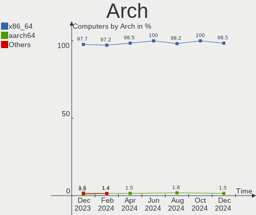
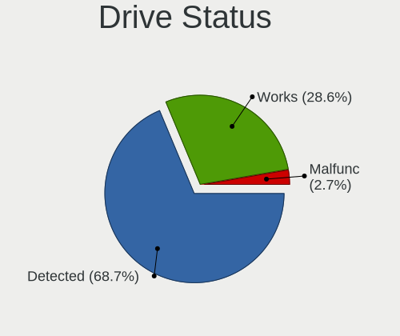
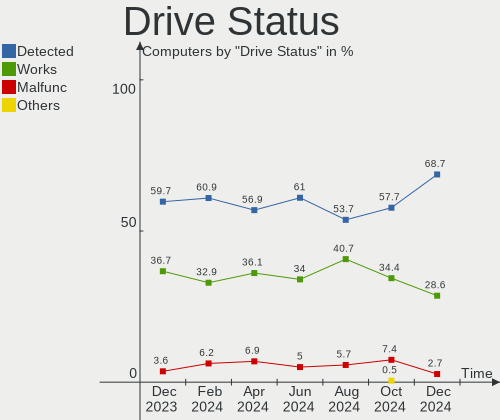

Kubuntu - Hardware Trends
-------------------------

A project to identify most popular hardware characteristics and track their change
over time based on data collected by Linux users at https://Linux-Hardware.org.

Anyone can contribute to this report by the [hw-probe](https://github.com/linuxhw/hw-probe) tool:

    sudo -E hw-probe -all -upload

This is a report for all computer types. See also reports for [desktops](/Dist/Kubuntu/Desktop/README.md) and [notebooks](/Dist/Kubuntu/Notebook/README.md).

This report is for one last month. Overall report since the beginning of time: [TestDays](https://github.com/linuxhw/TestDays)

Period: Dec, 2023.

Contents
--------

* [ System ](#system)
  - [ OS                       ](#os)
  - [ OS Family                ](#os-family)
  - [ Kernel                   ](#kernel)
  - [ Kernel Family            ](#kernel-family)
  - [ Kernel Major Ver.        ](#kernel-major-ver)
  - [ Arch                     ](#arch)
  - [ DE                       ](#de)
  - [ Display Server           ](#display-server)
  - [ Display Manager          ](#display-manager)
  - [ OS Lang                  ](#os-lang)
  - [ Boot Mode                ](#boot-mode)
  - [ Filesystem               ](#filesystem)
  - [ Part. scheme             ](#part-scheme)
  - [ Dual Boot with Linux/BSD ](#dual-boot-with-linuxbsd)
  - [ Dual Boot (Win)          ](#dual-boot-win)

* [ Board ](#board)
  - [ Vendor                   ](#vendor)
  - [ Model                    ](#model)
  - [ Model Family             ](#model-family)
  - [ MFG Year                 ](#mfg-year)
  - [ Form Factor              ](#form-factor)
  - [ Secure Boot              ](#secure-boot)
  - [ Coreboot                 ](#coreboot)
  - [ RAM Size                 ](#ram-size)
  - [ RAM Used                 ](#ram-used)
  - [ Total Drives             ](#total-drives)
  - [ Has CD-ROM               ](#has-cd-rom)
  - [ Has Ethernet             ](#has-ethernet)
  - [ Has WiFi                 ](#has-wifi)
  - [ Has Bluetooth            ](#has-bluetooth)

* [ Location ](#location)
  - [ Country                  ](#country)
  - [ City                     ](#city)

* [ Drives ](#drives)
  - [ Drive Vendor             ](#drive-vendor)
  - [ Drive Model              ](#drive-model)
  - [ HDD Vendor               ](#hdd-vendor)
  - [ SSD Vendor               ](#ssd-vendor)
  - [ Drive Kind               ](#drive-kind)
  - [ Drive Connector          ](#drive-connector)
  - [ Drive Size               ](#drive-size)
  - [ Space Total              ](#space-total)
  - [ Space Used               ](#space-used)
  - [ Malfunc. Drives          ](#malfunc-drives)
  - [ Malfunc. Drive Vendor    ](#malfunc-drive-vendor)
  - [ Malfunc. HDD Vendor      ](#malfunc-hdd-vendor)
  - [ Malfunc. Drive Kind      ](#malfunc-drive-kind)
  - [ Failed Drives            ](#failed-drives)
  - [ Failed Drive Vendor      ](#failed-drive-vendor)
  - [ Drive Status             ](#drive-status)

* [ Storage controller ](#storage-controller)
  - [ Storage Vendor           ](#storage-vendor)
  - [ Storage Model            ](#storage-model)
  - [ Storage Kind             ](#storage-kind)

* [ Processor ](#processor)
  - [ CPU Vendor               ](#cpu-vendor)
  - [ CPU Model                ](#cpu-model)
  - [ CPU Model Family         ](#cpu-model-family)
  - [ CPU Cores                ](#cpu-cores)
  - [ CPU Sockets              ](#cpu-sockets)
  - [ CPU Threads              ](#cpu-threads)
  - [ CPU Op-Modes             ](#cpu-op-modes)
  - [ CPU Microcode            ](#cpu-microcode)
  - [ CPU Microarch            ](#cpu-microarch)

* [ Graphics ](#graphics)
  - [ GPU Vendor               ](#gpu-vendor)
  - [ GPU Model                ](#gpu-model)
  - [ GPU Combo                ](#gpu-combo)
  - [ GPU Driver               ](#gpu-driver)
  - [ GPU Memory               ](#gpu-memory)

* [ Monitor ](#monitor)
  - [ Monitor Vendor           ](#monitor-vendor)
  - [ Monitor Model            ](#monitor-model)
  - [ Monitor Resolution       ](#monitor-resolution)
  - [ Monitor Diagonal         ](#monitor-diagonal)
  - [ Monitor Width            ](#monitor-width)
  - [ Aspect Ratio             ](#aspect-ratio)
  - [ Monitor Area             ](#monitor-area)
  - [ Pixel Density            ](#pixel-density)
  - [ Multiple Monitors        ](#multiple-monitors)

* [ Network ](#network)
  - [ Net Controller Vendor    ](#net-controller-vendor)
  - [ Net Controller Model     ](#net-controller-model)
  - [ Wireless Vendor          ](#wireless-vendor)
  - [ Wireless Model           ](#wireless-model)
  - [ Ethernet Vendor          ](#ethernet-vendor)
  - [ Ethernet Model           ](#ethernet-model)
  - [ Net Controller Kind      ](#net-controller-kind)
  - [ Used Controller          ](#used-controller)
  - [ NICs                     ](#nics)
  - [ IPv6                     ](#ipv6)

* [ Bluetooth ](#bluetooth)
  - [ Bluetooth Vendor         ](#bluetooth-vendor)
  - [ Bluetooth Model          ](#bluetooth-model)

* [ Sound ](#sound)
  - [ Sound Vendor             ](#sound-vendor)
  - [ Sound Model              ](#sound-model)

* [ Memory ](#memory)
  - [ Memory Vendor            ](#memory-vendor)
  - [ Memory Model             ](#memory-model)
  - [ Memory Kind              ](#memory-kind)
  - [ Memory Form Factor       ](#memory-form-factor)
  - [ Memory Size              ](#memory-size)
  - [ Memory Speed             ](#memory-speed)

* [ Printers & scanners ](#printers--scanners)
  - [ Printer Vendor           ](#printer-vendor)
  - [ Printer Model            ](#printer-model)
  - [ Scanner Vendor           ](#scanner-vendor)
  - [ Scanner Model            ](#scanner-model)

* [ Camera ](#camera)
  - [ Camera Vendor            ](#camera-vendor)
  - [ Camera Model             ](#camera-model)

* [ Security ](#security)
  - [ Fingerprint Vendor       ](#fingerprint-vendor)
  - [ Fingerprint Model        ](#fingerprint-model)
  - [ Chipcard Vendor          ](#chipcard-vendor)
  - [ Chipcard Model           ](#chipcard-model)

* [ Unsupported ](#unsupported)
  - [ Unsupported Devices      ](#unsupported-devices)
  - [ Unsupported Device Types ](#unsupported-device-types)

System
------

OS
--

Installed operating systems

| Name          | Computers | Percent |
|---------------|-----------|---------|
| Kubuntu 23.10 | 58        | 44.96%  |
| Kubuntu 22.04 | 57        | 44.19%  |
| Kubuntu 23.04 | 8         | 6.2%    |
| Kubuntu 24.04 | 3         | 2.33%   |
| Kubuntu 20.04 | 3         | 2.33%   |

OS Family
---------

OS without a version

| Name    | Computers | Percent |
|---------|-----------|---------|
| Kubuntu | 129       | 100%    |

Kernel
------

Version of the Linux kernel

| Version                  | Computers | Percent |
|--------------------------|-----------|---------|
| 6.5.0-14-generic         | 39        | 30.23%  |
| 5.15.0-91-generic        | 16        | 12.4%   |
| 6.2.0-39-generic         | 15        | 11.63%  |
| 6.2.0-37-generic         | 14        | 10.85%  |
| 6.5.0-13-generic         | 8         | 6.2%    |
| 5.15.0-89-generic        | 3         | 2.33%   |
| 6.6.1-060601-generic     | 2         | 1.55%   |
| 6.5.0-9-generic          | 2         | 1.55%   |
| 6.5.0-13-lowlatency      | 2         | 1.55%   |
| 6.2.0-26-generic         | 2         | 1.55%   |
| 6.2.0-1017-lowlatency    | 2         | 1.55%   |
| 5.15.0-91-lowlatency     | 2         | 1.55%   |
| 5.15.0-86-generic        | 2         | 1.55%   |
| 6.7.0-060700rc5-generic  | 1         | 0.78%   |
| 6.6.7-060607-generic     | 1         | 0.78%   |
| 6.6.5-x64v4-xanmod1      | 1         | 0.78%   |
| 6.6.4-1-liquorix-amd64   | 1         | 0.78%   |
| 6.6.2-t2-jammy           | 1         | 0.78%   |
| 6.6.0-14-generic         | 1         | 0.78%   |
| 6.6.0-060600rc5-generic  | 1         | 0.78%   |
| 6.5.0-14-lowlatency      | 1         | 0.78%   |
| 6.5.0-1009-oem           | 1         | 0.78%   |
| 6.5.0-10010-tuxedo       | 1         | 0.78%   |
| 6.2.0-35-generic         | 1         | 0.78%   |
| 6.2.0-20-generic         | 1         | 0.78%   |
| 6.2.0-1018-lowlatency    | 1         | 0.78%   |
| 6.1.69-t2-jammy          | 1         | 0.78%   |
| 6.1.0-1026-oem           | 1         | 0.78%   |
| 5.4.0-152-generic        | 1         | 0.78%   |
| 5.15.0-89-lowlatency     | 1         | 0.78%   |
| 5.15.0-88-generic        | 1         | 0.78%   |
| 5.15.0-56-generic        | 1         | 0.78%   |
| 5.10.160-rockchip-rk3588 | 1         | 0.78%   |

Kernel Family
-------------

Linux kernel without a distro release

| Version  | Computers | Percent |
|----------|-----------|---------|
| 6.5.0    | 54        | 41.86%  |
| 6.2.0    | 36        | 27.91%  |
| 5.15.0   | 26        | 20.16%  |
| 6.6.1    | 2         | 1.55%   |
| 6.6.0    | 2         | 1.55%   |
| 6.7.0    | 1         | 0.78%   |
| 6.6.7    | 1         | 0.78%   |
| 6.6.5    | 1         | 0.78%   |
| 6.6.4    | 1         | 0.78%   |
| 6.6.2    | 1         | 0.78%   |
| 6.1.69   | 1         | 0.78%   |
| 6.1.0    | 1         | 0.78%   |
| 5.4.0    | 1         | 0.78%   |
| 5.10.160 | 1         | 0.78%   |

Kernel Major Ver.
-----------------

Linux kernel major version

| Version | Computers | Percent |
|---------|-----------|---------|
| 6.5     | 54        | 41.86%  |
| 6.2     | 36        | 27.91%  |
| 5.15    | 26        | 20.16%  |
| 6.6     | 8         | 6.2%    |
| 6.1     | 2         | 1.55%   |
| 6.7     | 1         | 0.78%   |
| 5.4     | 1         | 0.78%   |
| 5.10    | 1         | 0.78%   |

Arch
----

OS architecture (x86_64, i586, etc.)

| Name    | Computers | Percent |
|---------|-----------|---------|
| x86_64  | 126       | 97.67%  |
| riscv64 | 2         | 1.55%   |
| aarch64 | 1         | 0.78%   |

DE
--

Desktop Environment

| Name | Computers | Percent |
|------|-----------|---------|
| KDE5 | 129       | 100%    |

Display Server
--------------

X11 or Wayland

| Name    | Computers | Percent |
|---------|-----------|---------|
| X11     | 116       | 89.92%  |
| Wayland | 13        | 10.08%  |

Display Manager
---------------

SDDM, LightDM, etc.

| Name    | Computers | Percent |
|---------|-----------|---------|
| SDDM    | 83        | 64.34%  |
| Unknown | 39        | 30.23%  |
| GDM3    | 4         | 3.1%    |
| LightDM | 2         | 1.55%   |
| GDM     | 1         | 0.78%   |

OS Lang
-------

Language

| Lang  | Computers | Percent |
|-------|-----------|---------|
| en_US | 50        | 38.76%  |
| en_GB | 12        | 9.3%    |
| fr_FR | 11        | 8.53%   |
| de_DE | 10        | 7.75%   |
| it_IT | 8         | 6.2%    |
| ru_RU | 6         | 4.65%   |
| en_CA | 6         | 4.65%   |
| es_ES | 4         | 3.1%    |
| en_IN | 3         | 2.33%   |
| pt_BR | 2         | 1.55%   |
| fr_CH | 2         | 1.55%   |
| en_AU | 2         | 1.55%   |
| C     | 2         | 1.55%   |
| zh_TW | 1         | 0.78%   |
| sv_SE | 1         | 0.78%   |
| sk_SK | 1         | 0.78%   |
| pl_PL | 1         | 0.78%   |
| et_EE | 1         | 0.78%   |
| es_MX | 1         | 0.78%   |
| es_CO | 1         | 0.78%   |
| es_CL | 1         | 0.78%   |
| en_PH | 1         | 0.78%   |
| en_IL | 1         | 0.78%   |
| de_AT | 1         | 0.78%   |

Boot Mode
---------

EFI or BIOS

| Mode | Computers | Percent |
|------|-----------|---------|
| BIOS | 72        | 55.81%  |
| EFI  | 57        | 44.19%  |

Filesystem
----------

Type of filesystem

| Type    | Computers | Percent |
|---------|-----------|---------|
| Ext4    | 88        | 68.22%  |
| Tmpfs   | 35        | 27.13%  |
| Btrfs   | 3         | 2.33%   |
| Overlay | 2         | 1.55%   |
| Xfs     | 1         | 0.78%   |

Part. scheme
------------

Scheme of partitioning

| Type    | Computers | Percent |
|---------|-----------|---------|
| GPT     | 82        | 63.57%  |
| Unknown | 39        | 30.23%  |
| MBR     | 8         | 6.2%    |

Dual Boot with Linux/BSD
------------------------

Hosting more than one Linux/BSD

| Dual boot | Computers | Percent |
|-----------|-----------|---------|
| No        | 114       | 88.37%  |
| Yes       | 15        | 11.63%  |

Dual Boot (Win)
---------------

Hosting Linux and Windows

| Dual boot | Computers | Percent |
|-----------|-----------|---------|
| No        | 82        | 63.57%  |
| Yes       | 47        | 36.43%  |

Board
-----

Vendor
------

Motherboard manufacturer

| Name                             | Computers | Percent |
|----------------------------------|-----------|---------|
| Lenovo                           | 23        | 17.83%  |
| Hewlett-Packard                  | 20        | 15.5%   |
| ASUSTek Computer                 | 18        | 13.95%  |
| Gigabyte Technology              | 9         | 6.98%   |
| MSI                              | 8         | 6.2%    |
| Acer                             | 8         | 6.2%    |
| Dell                             | 7         | 5.43%   |
| Apple                            | 6         | 4.65%   |
| ASRock                           | 4         | 3.1%    |
| Unknown                          | 4         | 3.1%    |
| HUAWEI                           | 3         | 2.33%   |
| Notebook                         | 2         | 1.55%   |
| TUXEDO                           | 1         | 0.78%   |
| Timi                             | 1         | 0.78%   |
| Semp Toshiba                     | 1         | 0.78%   |
| Samsung Electronics              | 1         | 0.78%   |
| RuggedPC                         | 1         | 0.78%   |
| Rockchip                         | 1         | 0.78%   |
| PC Specialist                    | 1         | 0.78%   |
| Packard Bell                     | 1         | 0.78%   |
| Micro Computer (HK) Tech Limited | 1         | 0.78%   |
| Google                           | 1         | 0.78%   |
| Gateway                          | 1         | 0.78%   |
| Fujitsu                          | 1         | 0.78%   |
| Framework                        | 1         | 0.78%   |
| Foxconn                          | 1         | 0.78%   |
| eMachines                        | 1         | 0.78%   |
| Eluktronics                      | 1         | 0.78%   |
| ARDOR GAMING                     | 1         | 0.78%   |

Model
-----

Motherboard model

| Name                                        | Computers | Percent |
|---------------------------------------------|-----------|---------|
| Unknown                                     | 4         | 3.1%    |
| HP Notebook                                 | 2         | 1.55%   |
| Apple MacBookAir9,1                         | 2         | 1.55%   |
| TUXEDO Pulse 14 Gen1                        | 1         | 0.78%   |
| Timi Mi NoteBook Pro                        | 1         | 0.78%   |
| Semp Toshiba STI                            | 1         | 0.78%   |
| Samsung 730QED                              | 1         | 0.78%   |
| RuggedPC RuggedPadY22                       | 1         | 0.78%   |
| Rockchip RK3588 OPi 5 Plus                  | 1         | 0.78%   |
| PC Specialist 14 Fusion Pro                 | 1         | 0.78%   |
| Packard Bell IMEDIA S1710                   | 1         | 0.78%   |
| Notebook W65_67SR                           | 1         | 0.78%   |
| Notebook NL5xNU                             | 1         | 0.78%   |
| MSI Prestige 14Evo A11M                     | 1         | 0.78%   |
| MSI MS-7D74                                 | 1         | 0.78%   |
| MSI MS-7C56                                 | 1         | 0.78%   |
| MSI MS-7B78                                 | 1         | 0.78%   |
| MSI MS-7B61                                 | 1         | 0.78%   |
| MSI MS-7B51                                 | 1         | 0.78%   |
| MSI MS-7817                                 | 1         | 0.78%   |
| MSI GF63 Thin 9RCX                          | 1         | 0.78%   |
| Micro (HK) Tech Limited Venus series        | 1         | 0.78%   |
| Lenovo Yoga Slim 7 13ACN5 82CY              | 1         | 0.78%   |
| Lenovo Yoga C640-13IML 81UE                 | 1         | 0.78%   |
| Lenovo ThinkPad X220 4290B19                | 1         | 0.78%   |
| Lenovo ThinkPad X13 Gen 2a 20XH0076IG       | 1         | 0.78%   |
| Lenovo ThinkPad X1 Carbon Gen 11 21HNS00100 | 1         | 0.78%   |
| Lenovo ThinkPad T520 4243ED3                | 1         | 0.78%   |
| Lenovo ThinkPad T500 20564RG                | 1         | 0.78%   |
| Lenovo ThinkPad T480 20L6SE6900             | 1         | 0.78%   |
| Lenovo ThinkPad T450 20BUS05V00             | 1         | 0.78%   |
| Lenovo ThinkPad T440p 20AWA16R00            | 1         | 0.78%   |
| Lenovo ThinkPad E595 20NFCTO1WW             | 1         | 0.78%   |
| Lenovo ThinkPad E590 20NB005MUS             | 1         | 0.78%   |
| Lenovo ThinkCentre M92p 2992E5U             | 1         | 0.78%   |
| Lenovo M30-70 80H8                          | 1         | 0.78%   |
| Lenovo Legion Pro 7 16IRX8H 82WQ            | 1         | 0.78%   |
| Lenovo Legion Pro 5 16ARX8 82WM             | 1         | 0.78%   |
| Lenovo Legion 5 15ARH05H 82B1               | 1         | 0.78%   |
| Lenovo K14 G2 IRU 21G1                      | 1         | 0.78%   |

Model Family
------------

Motherboard model prefix

| Name                          | Computers | Percent |
|-------------------------------|-----------|---------|
| Lenovo ThinkPad               | 10        | 7.75%   |
| Acer Aspire                   | 5         | 3.88%   |
| Lenovo IdeaPad                | 4         | 3.1%    |
| Unknown                       | 4         | 3.1%    |
| Lenovo Legion                 | 3         | 2.33%   |
| HP Pavilion                   | 3         | 2.33%   |
| HP Laptop                     | 3         | 2.33%   |
| ASUS ROG                      | 3         | 2.33%   |
| ASUS PRIME                    | 3         | 2.33%   |
| Lenovo Yoga                   | 2         | 1.55%   |
| HP ZBook                      | 2         | 1.55%   |
| HP Notebook                   | 2         | 1.55%   |
| Gigabyte B550M                | 2         | 1.55%   |
| Dell OptiPlex                 | 2         | 1.55%   |
| ASUS VivoBook                 | 2         | 1.55%   |
| ASUS TUF                      | 2         | 1.55%   |
| ASUS CROSSHAIR                | 2         | 1.55%   |
| Apple MacBookAir9             | 2         | 1.55%   |
| TUXEDO Pulse                  | 1         | 0.78%   |
| Timi Mi                       | 1         | 0.78%   |
| Semp Toshiba STI              | 1         | 0.78%   |
| Samsung 730QED                | 1         | 0.78%   |
| RuggedPC RuggedPadY22         | 1         | 0.78%   |
| Rockchip RK3588               | 1         | 0.78%   |
| PC Specialist 14              | 1         | 0.78%   |
| Packard Bell IMEDIA           | 1         | 0.78%   |
| Notebook W65                  | 1         | 0.78%   |
| Notebook NL5xNU               | 1         | 0.78%   |
| MSI Prestige                  | 1         | 0.78%   |
| MSI MS-7D74                   | 1         | 0.78%   |
| MSI MS-7C56                   | 1         | 0.78%   |
| MSI MS-7B78                   | 1         | 0.78%   |
| MSI MS-7B61                   | 1         | 0.78%   |
| MSI MS-7B51                   | 1         | 0.78%   |
| MSI MS-7817                   | 1         | 0.78%   |
| MSI GF63                      | 1         | 0.78%   |
| Micro (HK) Tech Limited Venus | 1         | 0.78%   |
| Lenovo ThinkCentre            | 1         | 0.78%   |
| Lenovo M30-70                 | 1         | 0.78%   |
| Lenovo K14                    | 1         | 0.78%   |

MFG Year
--------

Motherboard manufacture year

| Year    | Computers | Percent |
|---------|-----------|---------|
| 2023    | 16        | 12.4%   |
| 2020    | 16        | 12.4%   |
| 2022    | 12        | 9.3%    |
| 2021    | 12        | 9.3%    |
| 2019    | 11        | 8.53%   |
| 2018    | 9         | 6.98%   |
| 2017    | 6         | 4.65%   |
| 2016    | 6         | 4.65%   |
| 2013    | 6         | 4.65%   |
| 2012    | 6         | 4.65%   |
| 2014    | 5         | 3.88%   |
| 2011    | 5         | 3.88%   |
| 2010    | 5         | 3.88%   |
| 2009    | 4         | 3.1%    |
| 2015    | 3         | 2.33%   |
| 2024    | 2         | 1.55%   |
| 2008    | 2         | 1.55%   |
| 2007    | 2         | 1.55%   |
| Unknown | 1         | 0.78%   |

Form Factor
-----------

Physical design of the computer

| Name           | Computers | Percent |
|----------------|-----------|---------|
| Notebook       | 75        | 58.14%  |
| Desktop        | 46        | 35.66%  |
| Tablet         | 2         | 1.55%   |
| Convertible    | 2         | 1.55%   |
| All in one     | 2         | 1.55%   |
| System on chip | 1         | 0.78%   |
| Mini pc        | 1         | 0.78%   |

Secure Boot
-----------

Enabled or disabled

| State    | Computers | Percent |
|----------|-----------|---------|
| Disabled | 120       | 93.02%  |
| Enabled  | 9         | 6.98%   |

Coreboot
--------

Have coreboot on board

| Used | Computers | Percent |
|------|-----------|---------|
| No   | 128       | 99.22%  |
| Yes  | 1         | 0.78%   |

RAM Size
--------

Total RAM memory

| Size in GB      | Computers | Percent |
|-----------------|-----------|---------|
| 16.01-24.0      | 27        | 20.93%  |
| 32.01-64.0      | 26        | 20.16%  |
| 4.01-8.0        | 25        | 19.38%  |
| 8.01-16.0       | 25        | 19.38%  |
| 3.01-4.0        | 12        | 9.3%    |
| 24.01-32.0      | 6         | 4.65%   |
| 64.01-256.0     | 6         | 4.65%   |
| More than 256.0 | 1         | 0.78%   |
| 2.01-3.0        | 1         | 0.78%   |

RAM Used
--------

Used RAM memory

| Used GB    | Computers | Percent |
|------------|-----------|---------|
| 4.01-8.0   | 39        | 30.23%  |
| 3.01-4.0   | 27        | 20.93%  |
| 1.01-2.0   | 25        | 19.38%  |
| 2.01-3.0   | 24        | 18.6%   |
| 8.01-16.0  | 9         | 6.98%   |
| 16.01-24.0 | 4         | 3.1%    |
| 24.01-32.0 | 1         | 0.78%   |

Total Drives
------------

Number of drives on board

| Drives | Computers | Percent |
|--------|-----------|---------|
| 1      | 64        | 49.61%  |
| 2      | 39        | 30.23%  |
| 4      | 11        | 8.53%   |
| 3      | 10        | 7.75%   |
| 7      | 2         | 1.55%   |
| 5      | 2         | 1.55%   |
| 6      | 1         | 0.78%   |

Has CD-ROM
----------

Has CD-ROM on board

| Presented | Computers | Percent |
|-----------|-----------|---------|
| No        | 92        | 71.32%  |
| Yes       | 37        | 28.68%  |

Has Ethernet
------------

Has Ethernet on board

| Presented | Computers | Percent |
|-----------|-----------|---------|
| Yes       | 103       | 79.84%  |
| No        | 26        | 20.16%  |

Has WiFi
--------

Has WiFi module

| Presented | Computers | Percent |
|-----------|-----------|---------|
| Yes       | 103       | 79.84%  |
| No        | 26        | 20.16%  |

Has Bluetooth
-------------

Has Bluetooth module

| Presented | Computers | Percent |
|-----------|-----------|---------|
| Yes       | 87        | 67.44%  |
| No        | 42        | 32.56%  |

Location
--------

Country
-------

Geographic location (country)

| Country     | Computers | Percent |
|-------------|-----------|---------|
| USA         | 22        | 17.05%  |
| Germany     | 14        | 10.85%  |
| Italy       | 10        | 7.75%   |
| UK          | 9         | 6.98%   |
| France      | 9         | 6.98%   |
| Russia      | 7         | 5.43%   |
| Canada      | 7         | 5.43%   |
| Spain       | 6         | 4.65%   |
| Brazil      | 5         | 3.88%   |
| India       | 4         | 3.1%    |
| Switzerland | 3         | 2.33%   |
| Indonesia   | 3         | 2.33%   |
| Sweden      | 2         | 1.55%   |
| Romania     | 2         | 1.55%   |
| Netherlands | 2         | 1.55%   |
| China       | 2         | 1.55%   |
| Australia   | 2         | 1.55%   |
| Turkey      | 1         | 0.78%   |
| Taiwan      | 1         | 0.78%   |
| Slovenia    | 1         | 0.78%   |
| Slovakia    | 1         | 0.78%   |
| Poland      | 1         | 0.78%   |
| Philippines | 1         | 0.78%   |
| Peru        | 1         | 0.78%   |
| Norway      | 1         | 0.78%   |
| Mexico      | 1         | 0.78%   |
| Martinique  | 1         | 0.78%   |
| Luxembourg  | 1         | 0.78%   |
| Israel      | 1         | 0.78%   |
| Finland     | 1         | 0.78%   |
| Estonia     | 1         | 0.78%   |
| Czechia     | 1         | 0.78%   |
| Costa Rica  | 1         | 0.78%   |
| Colombia    | 1         | 0.78%   |
| Chile       | 1         | 0.78%   |
| Bangladesh  | 1         | 0.78%   |
| Austria     | 1         | 0.78%   |

City
----

Geographic location (city)

| City             | Computers | Percent |
|------------------|-----------|---------|
| Hamburg          | 3         | 2.33%   |
| Santo André     | 2         | 1.55%   |
| Milan            | 2         | 1.55%   |
| Madrid           | 2         | 1.55%   |
| Zofingen         | 1         | 0.78%   |
| Woodland Hills   | 1         | 0.78%   |
| Woodbridge       | 1         | 0.78%   |
| Wil              | 1         | 0.78%   |
| Wiesbaden        | 1         | 0.78%   |
| Weymouth         | 1         | 0.78%   |
| Welwyn           | 1         | 0.78%   |
| Walnut Creek     | 1         | 0.78%   |
| Vitoria-Gasteiz  | 1         | 0.78%   |
| Victoria         | 1         | 0.78%   |
| Veroli           | 1         | 0.78%   |
| Verdal           | 1         | 0.78%   |
| Vélez-Málaga   | 1         | 0.78%   |
| Ufa              | 1         | 0.78%   |
| Trier            | 1         | 0.78%   |
| Tizayuca         | 1         | 0.78%   |
| Tampere          | 1         | 0.78%   |
| Talence          | 1         | 0.78%   |
| Taipei           | 1         | 0.78%   |
| Surabaya         | 1         | 0.78%   |
| St. John's       | 1         | 0.78%   |
| St Petersburg    | 1         | 0.78%   |
| Spillern         | 1         | 0.78%   |
| Shinnston        | 1         | 0.78%   |
| Seattle          | 1         | 0.78%   |
| Satna            | 1         | 0.78%   |
| Santiago         | 1         | 0.78%   |
| Santa Clara      | 1         | 0.78%   |
| San Gabriel      | 1         | 0.78%   |
| Salt Lake City   | 1         | 0.78%   |
| Roche-la-Moliere | 1         | 0.78%   |
| Rho              | 1         | 0.78%   |
| Reno             | 1         | 0.78%   |
| Ramat Gan        | 1         | 0.78%   |
| Rakvere          | 1         | 0.78%   |
| Prague           | 1         | 0.78%   |

Drives
------

Drive Vendor
------------

Hard drive vendors

| Vendor                      | Computers | Drives | Percent |
|-----------------------------|-----------|--------|---------|
| Samsung Electronics         | 34        | 46     | 16.27%  |
| Seagate                     | 26        | 37     | 12.44%  |
| WDC                         | 19        | 25     | 9.09%   |
| SanDisk                     | 19        | 19     | 9.09%   |
| Kingston                    | 11        | 13     | 5.26%   |
| Toshiba                     | 8         | 10     | 3.83%   |
| Crucial                     | 8         | 8      | 3.83%   |
| SK hynix                    | 7         | 7      | 3.35%   |
| KIOXIA                      | 6         | 6      | 2.87%   |
| Unknown                     | 5         | 6      | 2.39%   |
| Apple                       | 5         | 6      | 2.39%   |
| Hitachi                     | 4         | 5      | 1.91%   |
| HGST                        | 4         | 4      | 1.91%   |
| China                       | 4         | 4      | 1.91%   |
| A-DATA Technology           | 4         | 4      | 1.91%   |
| SPCC                        | 3         | 3      | 1.44%   |
| Silicon Motion              | 2         | 2      | 0.96%   |
| SABRENT                     | 2         | 2      | 0.96%   |
| PNY                         | 2         | 2      | 0.96%   |
| Phison Electronics          | 2         | 2      | 0.96%   |
| MAXIO Technology (Hangzhou) | 2         | 2      | 0.96%   |
| LS                          | 2         | 2      | 0.96%   |
| Intenso                     | 2         | 2      | 0.96%   |
| Intel                       | 2         | 2      | 0.96%   |
| XrayDisk                    | 1         | 1      | 0.48%   |
| USB                         | 1         | 2      | 0.48%   |
| UMIS                        | 1         | 1      | 0.48%   |
| uFound                      | 1         | 1      | 0.48%   |
| TO Exter                    | 1         | 1      | 0.48%   |
| SSI                         | 1         | 1      | 0.48%   |
| Phison                      | 1         | 1      | 0.48%   |
| Patriot                     | 1         | 1      | 0.48%   |
| OCZ                         | 1         | 1      | 0.48%   |
| Netac                       | 1         | 1      | 0.48%   |
| Micron/Crucial Technology   | 1         | 1      | 0.48%   |
| Micron Technology           | 1         | 1      | 0.48%   |
| Maxtor                      | 1         | 1      | 0.48%   |
| Lexar                       | 1         | 1      | 0.48%   |
| LaCie                       | 1         | 1      | 0.48%   |
| KXG50ZNV                    | 1         | 1      | 0.48%   |

Drive Model
-----------

Hard drive models

| Model                                               | Computers | Percent |
|-----------------------------------------------------|-----------|---------|
| Samsung NVMe SSD Controller SM981/PM981/PM983 512GB | 5         | 2.13%   |
| Seagate ST2000DM008-2FR102 2TB                      | 3         | 1.28%   |
| Seagate ST1000DM003-1SB102 1TB                      | 3         | 1.28%   |
| Samsung SSD 980 1TB                                 | 3         | 1.28%   |
| Samsung NVMe SSD Controller PM9A1/PM9A3/980PRO 2TB  | 3         | 1.28%   |
| WDC WDS500G2B0A-00SM50 500GB SSD                    | 2         | 0.85%   |
| Unknown SD/MMC/MS PRO 512GB                         | 2         | 0.85%   |
| Toshiba MQ01ABD100 1TB                              | 2         | 0.85%   |
| Seagate ST500LT012-1DG142 500GB                     | 2         | 0.85%   |
| Seagate ST31000524AS 1TB                            | 2         | 0.85%   |
| SanDisk SSD PLUS 240GB                              | 2         | 0.85%   |
| SanDisk NVMe SSD Drive 2TB                          | 2         | 0.85%   |
| Samsung SSD 980 PRO 1TB                             | 2         | 0.85%   |
| Samsung SSD 870 QVO 2TB                             | 2         | 0.85%   |
| Samsung SSD 850 EVO 500GB                           | 2         | 0.85%   |
| Phison PS5013 E13 NVMe Controller 512GB             | 2         | 0.85%   |
| MAXIO (Hangzhou) NVMe SSD Controller MAP1202 256GB  | 2         | 0.85%   |
| Kingston SA400S37960G 960GB SSD                     | 2         | 0.85%   |
| Kingston SA400S37480G 480GB SSD                     | 2         | 0.85%   |
| Kingston SA400S37240G 240GB SSD                     | 2         | 0.85%   |
| Kingston SA400S37120G 120GB SSD                     | 2         | 0.85%   |
| Crucial CT500P3SSD8 500GB                           | 2         | 0.85%   |
| China SSD 1TB                                       | 2         | 0.85%   |
| Apple ANS2 NVMe Controller 256GB                    | 2         | 0.85%   |
| XrayDisk 256GB                                      | 1         | 0.43%   |
| WDC WDS500G1B0B-00AS40 500GB SSD                    | 1         | 0.43%   |
| WDC WDS250G2B0A-00SM50 250GB SSD                    | 1         | 0.43%   |
| WDC WD6400AAKS-40H2B0 640GB                         | 1         | 0.43%   |
| WDC WD5000YS-01MPB1 500GB                           | 1         | 0.43%   |
| WDC WD5000AAKX-001CA0 500GB                         | 1         | 0.43%   |
| WDC WD40EZRZ-00GXCB0 4TB                            | 1         | 0.43%   |
| WDC WD40EZAX-00C8UB0 4TB                            | 1         | 0.43%   |
| WDC WD30EZRX-00MMMB0 3TB                            | 1         | 0.43%   |
| WDC WD20EZRX-19D8PB0 2TB                            | 1         | 0.43%   |
| WDC WD2002FAEX-007BA0 2TB                           | 1         | 0.43%   |
| WDC WD10SPZX-24Z10 1TB                              | 1         | 0.43%   |
| WDC WD10SPZX-00Z10T0 1TB                            | 1         | 0.43%   |
| WDC WD10EZEX-60WN4A0 1TB                            | 1         | 0.43%   |
| WDC WD10EZEX-08WN4A0 1TB                            | 1         | 0.43%   |
| WDC WD10EAVS-00D7B1 1TB                             | 1         | 0.43%   |

HDD Vendor
----------

Hard disk drive vendors

| Vendor              | Computers | Drives | Percent |
|---------------------|-----------|--------|---------|
| Seagate             | 23        | 34     | 35.94%  |
| WDC                 | 14        | 19     | 21.88%  |
| Toshiba             | 6         | 8      | 9.38%   |
| Hitachi             | 4         | 5      | 6.25%   |
| HGST                | 4         | 4      | 6.25%   |
| Samsung Electronics | 3         | 3      | 4.69%   |
| Unknown             | 2         | 2      | 3.13%   |
| SABRENT             | 2         | 2      | 3.13%   |
| USB                 | 1         | 2      | 1.56%   |
| TO Exter            | 1         | 1      | 1.56%   |
| SSI                 | 1         | 1      | 1.56%   |
| Maxtor              | 1         | 1      | 1.56%   |
| External            | 1         | 1      | 1.56%   |
| Apple               | 1         | 1      | 1.56%   |

SSD Vendor
----------

Solid state drive vendors

| Vendor              | Computers | Drives | Percent |
|---------------------|-----------|--------|---------|
| Samsung Electronics | 11        | 13     | 16.92%  |
| Kingston            | 9         | 10     | 13.85%  |
| SanDisk             | 8         | 8      | 12.31%  |
| Crucial             | 5         | 5      | 7.69%   |
| WDC                 | 4         | 4      | 6.15%   |
| China               | 4         | 4      | 6.15%   |
| SPCC                | 3         | 3      | 4.62%   |
| A-DATA Technology   | 3         | 3      | 4.62%   |
| PNY                 | 2         | 2      | 3.08%   |
| LS                  | 2         | 2      | 3.08%   |
| Intenso             | 2         | 2      | 3.08%   |
| Apple               | 2         | 2      | 3.08%   |
| Toshiba             | 1         | 1      | 1.54%   |
| Seagate             | 1         | 1      | 1.54%   |
| OCZ                 | 1         | 1      | 1.54%   |
| Netac               | 1         | 1      | 1.54%   |
| Lexar               | 1         | 1      | 1.54%   |
| KingSpec            | 1         | 1      | 1.54%   |
| GOODRAM             | 1         | 1      | 1.54%   |
| Corsair             | 1         | 1      | 1.54%   |
| BAITITON            | 1         | 1      | 1.54%   |
| ASMT109x            | 1         | 1      | 1.54%   |

Drive Kind
----------

HDD or SSD

| Kind    | Computers | Drives | Percent |
|---------|-----------|--------|---------|
| NVMe    | 71        | 83     | 38.59%  |
| SSD     | 53        | 68     | 28.8%   |
| HDD     | 51        | 84     | 27.72%  |
| Unknown | 6         | 7      | 3.26%   |
| MMC     | 3         | 4      | 1.63%   |

Drive Connector
---------------

SATA, SAS, NVMe, etc.

| Type | Computers | Drives | Percent |
|------|-----------|--------|---------|
| SATA | 79        | 139    | 46.2%   |
| NVMe | 71        | 82     | 41.52%  |
| SAS  | 18        | 21     | 10.53%  |
| MMC  | 3         | 4      | 1.75%   |

Drive Size
----------

Size of hard drive

| Size in TB | Computers | Drives | Percent |
|------------|-----------|--------|---------|
| 0.01-0.5   | 55        | 75     | 46.61%  |
| 0.51-1.0   | 34        | 39     | 28.81%  |
| 1.01-2.0   | 18        | 25     | 15.25%  |
| 3.01-4.0   | 8         | 9      | 6.78%   |
| 2.01-3.0   | 2         | 2      | 1.69%   |
| 10.01-20.0 | 1         | 2      | 0.85%   |

Space Total
-----------

Amount of disk space available on the file system

| Size in GB     | Computers | Percent |
|----------------|-----------|---------|
| 251-500        | 32        | 24.81%  |
| 501-1000       | 31        | 24.03%  |
| 101-250        | 22        | 17.05%  |
| 1001-2000      | 21        | 16.28%  |
| More than 3000 | 11        | 8.53%   |
| 2001-3000      | 5         | 3.88%   |
| 1-20           | 3         | 2.33%   |
| 51-100         | 3         | 2.33%   |
| 21-50          | 1         | 0.78%   |

Space Used
----------

Amount of used disk space

| Used GB        | Computers | Percent |
|----------------|-----------|---------|
| 101-250        | 24        | 18.6%   |
| 51-100         | 21        | 16.28%  |
| 1-20           | 20        | 15.5%   |
| 21-50          | 19        | 14.73%  |
| 501-1000       | 18        | 13.95%  |
| 251-500        | 16        | 12.4%   |
| More than 3000 | 8         | 6.2%    |
| 1001-2000      | 3         | 2.33%   |

Malfunc. Drives
---------------

Drive models with a malfunction

| Model                             | Computers | Drives | Percent |
|-----------------------------------|-----------|--------|---------|
| WDC WD2002FAEX-007BA0 2TB         | 1         | 6      | 16.67%  |
| Seagate ST500LT012-1DG142 500GB   | 1         | 1      | 16.67%  |
| Samsung Electronics HD501LJ 500GB | 1         | 1      | 16.67%  |
| SABRENT Disk 2TB                  | 1         | 1      | 16.67%  |
| Hitachi HDP725032GLA380 320GB     | 1         | 2      | 16.67%  |
| HGST HTS545050A7E680 500GB        | 1         | 1      | 16.67%  |

Malfunc. Drive Vendor
---------------------

Vendors of faulty drives

| Vendor              | Computers | Drives | Percent |
|---------------------|-----------|--------|---------|
| WDC                 | 1         | 6      | 16.67%  |
| Seagate             | 1         | 1      | 16.67%  |
| Samsung Electronics | 1         | 1      | 16.67%  |
| SABRENT             | 1         | 1      | 16.67%  |
| Hitachi             | 1         | 2      | 16.67%  |
| HGST                | 1         | 1      | 16.67%  |

Malfunc. HDD Vendor
-------------------

Vendors of faulty HDD drives

| Vendor              | Computers | Drives | Percent |
|---------------------|-----------|--------|---------|
| WDC                 | 1         | 6      | 16.67%  |
| Seagate             | 1         | 1      | 16.67%  |
| Samsung Electronics | 1         | 1      | 16.67%  |
| SABRENT             | 1         | 1      | 16.67%  |
| Hitachi             | 1         | 2      | 16.67%  |
| HGST                | 1         | 1      | 16.67%  |

Malfunc. Drive Kind
-------------------

Kinds of faulty drives

| Kind | Computers | Drives | Percent |
|------|-----------|--------|---------|
| HDD  | 5         | 12     | 100%    |

Failed Drives
-------------

Failed drive models

Zero info for selected period =(

Failed Drive Vendor
-------------------

Failed drive vendors

Zero info for selected period =(

Drive Status
------------

Number of failed and malfunc. drives

| Status   | Computers | Drives | Percent |
|----------|-----------|--------|---------|
| Detected | 84        | 156    | 60%     |
| Works    | 51        | 78     | 36.43%  |
| Malfunc  | 5         | 12     | 3.57%   |

Storage controller
------------------

Storage Vendor
--------------

Storage controller vendors

| Vendor                       | Computers | Percent |
|------------------------------|-----------|---------|
| Intel                        | 57        | 32.2%   |
| AMD                          | 36        | 20.34%  |
| Samsung Electronics          | 28        | 15.82%  |
| Sandisk                      | 12        | 6.78%   |
| SK hynix                     | 7         | 3.95%   |
| KIOXIA                       | 6         | 3.39%   |
| Kingston Technology Company  | 4         | 2.26%   |
| ASMedia Technology           | 4         | 2.26%   |
| Phison Electronics           | 3         | 1.69%   |
| Micron/Crucial Technology    | 3         | 1.69%   |
| Silicon Motion               | 2         | 1.13%   |
| Nvidia                       | 2         | 1.13%   |
| MAXIO Technology (Hangzhou)  | 2         | 1.13%   |
| Marvell Technology Group     | 2         | 1.13%   |
| Apple                        | 2         | 1.13%   |
| VIA Technologies             | 1         | 0.56%   |
| Union Memory (Shenzhen)      | 1         | 0.56%   |
| Toshiba America Info Systems | 1         | 0.56%   |
| Realtek Semiconductor        | 1         | 0.56%   |
| Micron Technology            | 1         | 0.56%   |
| LSI Logic / Symbios Logic    | 1         | 0.56%   |
| INNOGRIT                     | 1         | 0.56%   |

Storage Model
-------------

Storage controller models

| Model                                                                          | Computers | Percent |
|--------------------------------------------------------------------------------|-----------|---------|
| AMD FCH SATA Controller [AHCI mode]                                            | 25        | 12.63%  |
| Samsung NVMe SSD Controller SM981/PM981/PM983                                  | 10        | 5.05%   |
| Samsung NVMe SSD Controller PM9A1/PM9A3/980PRO                                 | 10        | 5.05%   |
| Samsung NVMe SSD Controller 980 (DRAM-less)                                    | 6         | 3.03%   |
| Intel Volume Management Device NVMe RAID Controller                            | 5         | 2.53%   |
| Intel Sunrise Point-LP SATA Controller [AHCI mode]                             | 5         | 2.53%   |
| ASMedia ASM1062 Serial ATA Controller                                          | 4         | 2.02%   |
| AMD SB7x0/SB8x0/SB9x0 SATA Controller [AHCI mode]                              | 4         | 2.02%   |
| AMD 500 Series Chipset SATA Controller                                         | 4         | 2.02%   |
| Micron/Crucial P2 [Nick P2] / P3 / P3 Plus NVMe PCIe SSD (DRAM-less)           | 3         | 1.52%   |
| KIOXIA NVMe SSD Controller BG4 (DRAM-less)                                     | 3         | 1.52%   |
| Intel Volume Management Device NVMe RAID Controller Intel Corporation          | 3         | 1.52%   |
| Intel Tiger Lake-LP SATA Controller                                            | 3         | 1.52%   |
| Intel Q170/Q150/B150/H170/H110/Z170/CM236 Chipset SATA Controller [AHCI Mode]  | 3         | 1.52%   |
| Intel 82801IBM/IEM (ICH9M/ICH9M-E) 4 port SATA Controller [AHCI mode]          | 3         | 1.52%   |
| Intel 8 Series/C220 Series Chipset Family 6-port SATA Controller 1 [AHCI mode] | 3         | 1.52%   |
| Intel 7 Series/C210 Series Chipset Family 6-port SATA Controller [AHCI mode]   | 3         | 1.52%   |
| Intel 5 Series/3400 Series Chipset 4 port SATA AHCI Controller                 | 3         | 1.52%   |
| AMD 400 Series Chipset SATA Controller                                         | 3         | 1.52%   |
| SK hynix Platinum P41/PC801 NVMe Solid State Drive                             | 2         | 1.01%   |
| SK hynix BC901 NVMe Solid State Drive (DRAM-less)                              | 2         | 1.01%   |
| SanDisk WD PC SN810 / Black SN850 NVMe SSD                                     | 2         | 1.01%   |
| SanDisk WD Blue SN500 / PC SN520 x2 M.2 2280 NVMe SSD                          | 2         | 1.01%   |
| SanDisk Ultra 3D / WD Blue SN570 NVMe SSD (DRAM-less)                          | 2         | 1.01%   |
| Phison PS5013-E13 PCIe3 NVMe Controller (DRAM-less)                            | 2         | 1.01%   |
| MAXIO (Hangzhou) NVMe SSD Controller MAP1202                                   | 2         | 1.01%   |
| Kingston Company OM3PDP3 NVMe SSD                                              | 2         | 1.01%   |
| Intel SATA Controller [RAID mode]                                              | 2         | 1.01%   |
| Intel Cannon Lake PCH SATA AHCI Controller                                     | 2         | 1.01%   |
| Intel 82801 Mobile SATA Controller [RAID mode]                                 | 2         | 1.01%   |
| Intel 8 Series SATA Controller 1 [AHCI mode]                                   | 2         | 1.01%   |
| Intel 7 Series Chipset Family 6-port SATA Controller [AHCI mode]               | 2         | 1.01%   |
| Intel 6 Series/C200 Series Chipset Family 6 port Mobile SATA AHCI Controller   | 2         | 1.01%   |
| Intel 5 Series/3400 Series Chipset 6 port SATA AHCI Controller                 | 2         | 1.01%   |
| Apple ANS2 NVMe Controller                                                     | 2         | 1.01%   |
| AMD X370 Series Chipset SATA Controller                                        | 2         | 1.01%   |
| AMD SB7x0/SB8x0/SB9x0 IDE Controller                                           | 2         | 1.01%   |
| VIA VT6415 PATA IDE Host Controller                                            | 1         | 0.51%   |
| Union Memory (Shenzhen) AM630 PCIe 4.0 x4 NVMe SSD Controller                  | 1         | 0.51%   |
| Toshiba America Info Systems XG6 NVMe SSD Controller                           | 1         | 0.51%   |

Storage Kind
------------

Kind of storage controller (IDE, SATA, NVMe, SAS, ...)

| Kind | Computers | Percent |
|------|-----------|---------|
| SATA | 85        | 48.3%   |
| NVMe | 71        | 40.34%  |
| RAID | 14        | 7.95%   |
| IDE  | 6         | 3.41%   |

Processor
---------

CPU Vendor
----------

Processor vendors

| Vendor        | Computers | Percent |
|---------------|-----------|---------|
| Intel         | 79        | 61.24%  |
| AMD           | 47        | 36.43%  |
| sifive,u74-mc | 2         | 1.55%   |
| ARM           | 1         | 0.78%   |

CPU Model
---------

Processor models

| Model                                         | Computers | Percent |
|-----------------------------------------------|-----------|---------|
| Intel 11th Gen Core i5-1135G7 @ 2.40GHz       | 4         | 3.1%    |
| AMD Ryzen 7 4800H with Radeon Graphics        | 3         | 2.33%   |
| sifive,u74-mc rv64imafdc_zicntr_zicsr_zifence | 2         | 1.55%   |
| Intel Core m3-6Y30 CPU @ 0.90GHz              | 2         | 1.55%   |
| Intel Core i7-8700 CPU @ 3.20GHz              | 2         | 1.55%   |
| Intel Core i5-8265U CPU @ 1.60GHz             | 2         | 1.55%   |
| Intel Core i5-3470 CPU @ 3.20GHz              | 2         | 1.55%   |
| Intel 13th Gen Core i7-1365U                  | 2         | 1.55%   |
| AMD Ryzen 7 7840U w/ Radeon 780M Graphics     | 2         | 1.55%   |
| AMD Ryzen 5 5600G with Radeon Graphics        | 2         | 1.55%   |
| AMD A6-7310 APU with AMD Radeon R4 Graphics   | 2         | 1.55%   |
| Intel Pentium Dual-Core CPU T4400 @ 2.20GHz   | 1         | 0.78%   |
| Intel Pentium Dual-Core CPU E5200 @ 2.50GHz   | 1         | 0.78%   |
| Intel Core i7-9750H CPU @ 2.60GHz             | 1         | 0.78%   |
| Intel Core i7-8665U CPU @ 1.90GHz             | 1         | 0.78%   |
| Intel Core i7-8650U CPU @ 1.90GHz             | 1         | 0.78%   |
| Intel Core i7-7700HQ CPU @ 2.80GHz            | 1         | 0.78%   |
| Intel Core i7-7500U CPU @ 2.70GHz             | 1         | 0.78%   |
| Intel Core i7-6700 CPU @ 3.40GHz              | 1         | 0.78%   |
| Intel Core i7-4870HQ CPU @ 2.50GHz            | 1         | 0.78%   |
| Intel Core i7-4700MQ CPU @ 2.40GHz            | 1         | 0.78%   |
| Intel Core i7-3770 CPU @ 3.40GHz              | 1         | 0.78%   |
| Intel Core i7-3632QM CPU @ 2.20GHz            | 1         | 0.78%   |
| Intel Core i7-10700F CPU @ 2.90GHz            | 1         | 0.78%   |
| Intel Core i7-1065G7 CPU @ 1.30GHz            | 1         | 0.78%   |
| Intel Core i5-9600K CPU @ 3.70GHz             | 1         | 0.78%   |
| Intel Core i5-9400 CPU @ 2.90GHz              | 1         | 0.78%   |
| Intel Core i5-7300U CPU @ 2.60GHz             | 1         | 0.78%   |
| Intel Core i5-7200U CPU @ 2.50GHz             | 1         | 0.78%   |
| Intel Core i5-6500 CPU @ 3.20GHz              | 1         | 0.78%   |
| Intel Core i5-6400 CPU @ 2.70GHz              | 1         | 0.78%   |
| Intel Core i5-5300U CPU @ 2.30GHz             | 1         | 0.78%   |
| Intel Core i5-5257U CPU @ 2.70GHz             | 1         | 0.78%   |
| Intel Core i5-4590 CPU @ 3.30GHz              | 1         | 0.78%   |
| Intel Core i5-4570R CPU @ 2.70GHz             | 1         | 0.78%   |
| Intel Core i5-4300M CPU @ 2.60GHz             | 1         | 0.78%   |
| Intel Core i5-4210U CPU @ 1.70GHz             | 1         | 0.78%   |
| Intel Core i5-2540M CPU @ 2.60GHz             | 1         | 0.78%   |
| Intel Core i5-2520M CPU @ 2.50GHz             | 1         | 0.78%   |
| Intel Core i5-2450M CPU @ 2.50GHz             | 1         | 0.78%   |

CPU Model Family
----------------

Processor model prefix

| Model                   | Computers | Percent |
|-------------------------|-----------|---------|
| Intel Core i5           | 27        | 20.93%  |
| Other                   | 25        | 19.38%  |
| AMD Ryzen 7             | 17        | 13.18%  |
| Intel Core i7           | 14        | 10.85%  |
| AMD Ryzen 5             | 9         | 6.98%   |
| AMD Ryzen 9             | 6         | 4.65%   |
| Intel Core i3           | 5         | 3.88%   |
| Intel Celeron           | 4         | 3.1%    |
| Intel Core 2 Duo        | 3         | 2.33%   |
| AMD Ryzen 3             | 3         | 2.33%   |
| Intel Pentium Dual-Core | 2         | 1.55%   |
| Intel Core m3           | 2         | 1.55%   |
| AMD Ryzen Threadripper  | 2         | 1.55%   |
| AMD FX                  | 2         | 1.55%   |
| AMD A6                  | 2         | 1.55%   |
| AMD Ryzen 7 PRO         | 1         | 0.78%   |
| AMD Phenom II X4        | 1         | 0.78%   |
| AMD C-60                | 1         | 0.78%   |
| AMD Athlon II X2        | 1         | 0.78%   |
| AMD A8                  | 1         | 0.78%   |
| AMD A10                 | 1         | 0.78%   |

CPU Cores
---------

Number of processor cores

| Number  | Computers | Percent |
|---------|-----------|---------|
| 4       | 42        | 32.56%  |
| 2       | 32        | 24.81%  |
| 8       | 21        | 16.28%  |
| 6       | 13        | 10.08%  |
| 12      | 5         | 3.88%   |
| 10      | 5         | 3.88%   |
| 16      | 3         | 2.33%   |
| 14      | 3         | 2.33%   |
| 24      | 2         | 1.55%   |
| Unknown | 2         | 1.55%   |
| 64      | 1         | 0.78%   |

CPU Sockets
-----------

Number of sockets

| Number  | Computers | Percent |
|---------|-----------|---------|
| 1       | 126       | 97.67%  |
| Unknown | 2         | 1.55%   |
| 2       | 1         | 0.78%   |

CPU Threads
-----------

Threads per core (Hyper-Threading)

| Number  | Computers | Percent |
|---------|-----------|---------|
| 2       | 98        | 75.97%  |
| 1       | 29        | 22.48%  |
| Unknown | 2         | 1.55%   |

CPU Op-Modes
------------

CPU Operation Modes (32-bit, 64-bit)

| Op mode        | Computers | Percent |
|----------------|-----------|---------|
| 32-bit, 64-bit | 126       | 97.67%  |
| Unknown        | 2         | 1.55%   |
| 64-bit         | 1         | 0.78%   |

CPU Microcode
-------------

Microcode number

| Number     | Computers | Percent |
|------------|-----------|---------|
| Unknown    | 100       | 77.52%  |
| 0x0a50000c | 4         | 3.1%    |
| 0x0a704103 | 2         | 1.55%   |
| 0x0a601203 | 2         | 1.55%   |
| 0x0800820d | 2         | 1.55%   |
| 0x906ed    | 1         | 0.78%   |
| 0x806eb    | 1         | 0.78%   |
| 0x406e3    | 1         | 0.78%   |
| 0x306d4    | 1         | 0.78%   |
| 0x20655    | 1         | 0.78%   |
| 0x106e5    | 1         | 0.78%   |
| 0x0a601201 | 1         | 0.78%   |
| 0x0a50000f | 1         | 0.78%   |
| 0x0a50000d | 1         | 0.78%   |
| 0x0a404102 | 1         | 0.78%   |
| 0x0a201016 | 1         | 0.78%   |
| 0x08608103 | 1         | 0.78%   |
| 0x08600103 | 1         | 0.78%   |
| 0x0830107a | 1         | 0.78%   |
| 0x08001138 | 1         | 0.78%   |
| 0x08001126 | 1         | 0.78%   |
| 0x07030106 | 1         | 0.78%   |
| 0x06000822 | 1         | 0.78%   |
| 0x05000119 | 1         | 0.78%   |

CPU Microarch
-------------

Microarchitecture

| Name             | Computers | Percent |
|------------------|-----------|---------|
| Unknown          | 20        | 15.5%   |
| KabyLake         | 14        | 10.85%  |
| Zen 3            | 9         | 6.98%   |
| Alderlake Hybrid | 9         | 6.98%   |
| TigerLake        | 8         | 6.2%    |
| Haswell          | 8         | 6.2%    |
| Zen 2            | 7         | 5.43%   |
| Zen+             | 6         | 4.65%   |
| IvyBridge        | 6         | 4.65%   |
| Zen              | 5         | 3.88%   |
| Skylake          | 5         | 3.88%   |
| Penryn           | 5         | 3.88%   |
| Westmere         | 4         | 3.1%    |
| SandyBridge      | 4         | 3.1%    |
| IceLake          | 3         | 2.33%   |
| Puma             | 2         | 1.55%   |
| K10              | 2         | 1.55%   |
| Goldmont plus    | 2         | 1.55%   |
| CometLake        | 2         | 1.55%   |
| Broadwell        | 2         | 1.55%   |
| Steamroller      | 1         | 0.78%   |
| Piledriver       | 1         | 0.78%   |
| Nehalem          | 1         | 0.78%   |
| Excavator        | 1         | 0.78%   |
| Bulldozer        | 1         | 0.78%   |
| Bobcat           | 1         | 0.78%   |

Graphics
--------

GPU Vendor
----------

Vendors of graphics cards

| Vendor | Computers | Percent |
|--------|-----------|---------|
| Intel  | 61        | 41.5%   |
| AMD    | 45        | 30.61%  |
| Nvidia | 41        | 27.89%  |

GPU Model
---------

Graphics card models

| Model                                                                     | Computers | Percent |
|---------------------------------------------------------------------------|-----------|---------|
| Intel TigerLake-LP GT2 [Iris Xe Graphics]                                 | 8         | 5.33%   |
| AMD Cezanne [Radeon Vega Series / Radeon Vega Mobile Series]              | 5         | 3.33%   |
| Intel Raptor Lake-P [Iris Xe Graphics]                                    | 4         | 2.67%   |
| AMD Renoir [Radeon RX Vega 6 (Ryzen 4000/5000 Mobile Series)]             | 4         | 2.67%   |
| AMD Raphael                                                               | 4         | 2.67%   |
| AMD Picasso/Raven 2 [Radeon Vega Series / Radeon Vega Mobile Series]      | 4         | 2.67%   |
| AMD Ellesmere [Radeon RX 470/480/570/570X/580/580X/590]                   | 4         | 2.67%   |
| Nvidia GA106 [GeForce RTX 3060 Lite Hash Rate]                            | 3         | 2%      |
| Intel WhiskeyLake-U GT2 [UHD Graphics 620]                                | 3         | 2%      |
| Intel HD Graphics 620                                                     | 3         | 2%      |
| Intel 3rd Gen Core processor Graphics Controller                          | 3         | 2%      |
| Intel 2nd Generation Core Processor Family Integrated Graphics Controller | 3         | 2%      |
| AMD Phoenix1                                                              | 3         | 2%      |
| Nvidia TU106 [GeForce RTX 2060 Rev. A]                                    | 2         | 1.33%   |
| Nvidia GP107 [GeForce GTX 1050 Ti]                                        | 2         | 1.33%   |
| Nvidia GM204 [GeForce GTX 970]                                            | 2         | 1.33%   |
| Nvidia GA107M [GeForce RTX 3050 Mobile]                                   | 2         | 1.33%   |
| Intel Xeon E3-1200 v2/3rd Gen Core processor Graphics Controller          | 2         | 1.33%   |
| Intel Mobile 4 Series Chipset Integrated Graphics Controller              | 2         | 1.33%   |
| Intel HD Graphics 515                                                     | 2         | 1.33%   |
| Intel Haswell-ULT Integrated Graphics Controller                          | 2         | 1.33%   |
| Intel GeminiLake [UHD Graphics 600]                                       | 2         | 1.33%   |
| Intel Core Processor Integrated Graphics Controller                       | 2         | 1.33%   |
| Intel Alder Lake-UP3 GT2 [Iris Xe Graphics]                               | 2         | 1.33%   |
| Intel Alder Lake-P GT2 [Iris Xe Graphics]                                 | 2         | 1.33%   |
| Intel 4th Gen Core Processor Integrated Graphics Controller               | 2         | 1.33%   |
| AMD Rembrandt [Radeon 680M]                                               | 2         | 1.33%   |
| AMD Navi 23 [Radeon RX 6600/6600 XT/6600M]                                | 2         | 1.33%   |
| AMD Mullins [Radeon R4/R5 Graphics]                                       | 2         | 1.33%   |
| Nvidia TU106M [GeForce RTX 2060 Mobile]                                   | 1         | 0.67%   |
| Nvidia GP108M [GeForce MX230]                                             | 1         | 0.67%   |
| Nvidia GP108M [GeForce MX150]                                             | 1         | 0.67%   |
| Nvidia GP107M [GeForce GTX 1050 Ti Max-Q]                                 | 1         | 0.67%   |
| Nvidia GP107 [GeForce GTX 1050]                                           | 1         | 0.67%   |
| Nvidia GP106M [GeForce GTX 1060 Mobile]                                   | 1         | 0.67%   |
| Nvidia GP106 [GeForce GTX 1060 6GB]                                       | 1         | 0.67%   |
| Nvidia GM206 [GeForce GTX 960]                                            | 1         | 0.67%   |
| Nvidia GM108M [GeForce 930MX]                                             | 1         | 0.67%   |
| Nvidia GM107GL [Quadro K620]                                              | 1         | 0.67%   |
| Nvidia GK208B [GeForce GT 730]                                            | 1         | 0.67%   |

GPU Combo
---------

Combinations of graphics cards

| Name           | Computers | Percent |
|----------------|-----------|---------|
| 1 x Intel      | 46        | 35.66%  |
| 1 x AMD        | 36        | 27.91%  |
| 1 x Nvidia     | 22        | 17.05%  |
| Intel + Nvidia | 13        | 10.08%  |
| AMD + Nvidia   | 5         | 3.88%   |
| Other          | 3         | 2.33%   |
| 2 x AMD        | 2         | 1.55%   |
| Intel + AMD    | 2         | 1.55%   |

GPU Driver
----------

Free vs proprietary

| Driver      | Computers | Percent |
|-------------|-----------|---------|
| Free        | 93        | 72.09%  |
| Proprietary | 31        | 24.03%  |
| Unknown     | 5         | 3.88%   |

GPU Memory
----------

Total video memory

| Size in GB | Computers | Percent |
|------------|-----------|---------|
| Unknown    | 94        | 72.87%  |
| 0.01-0.5   | 14        | 10.85%  |
| 3.01-4.0   | 6         | 4.65%   |
| 1.01-2.0   | 5         | 3.88%   |
| 8.01-16.0  | 3         | 2.33%   |
| 7.01-8.0   | 2         | 1.55%   |
| 5.01-6.0   | 2         | 1.55%   |
| 0.51-1.0   | 2         | 1.55%   |
| 16.01-24.0 | 1         | 0.78%   |

Monitor
-------

Monitor Vendor
--------------

Monitor vendors

| Vendor                  | Computers | Percent |
|-------------------------|-----------|---------|
| BOE                     | 22        | 15.28%  |
| AU Optronics            | 18        | 12.5%   |
| Samsung Electronics     | 16        | 11.11%  |
| LG Display              | 11        | 7.64%   |
| Goldstar                | 11        | 7.64%   |
| Chimei Innolux          | 11        | 7.64%   |
| Dell                    | 6         | 4.17%   |
| ASUSTek Computer        | 6         | 4.17%   |
| Apple                   | 6         | 4.17%   |
| Hewlett-Packard         | 5         | 3.47%   |
| Lenovo                  | 4         | 2.78%   |
| Iiyama                  | 4         | 2.78%   |
| ViewSonic               | 2         | 1.39%   |
| Sony                    | 2         | 1.39%   |
| Philips                 | 2         | 1.39%   |
| Acer                    | 2         | 1.39%   |
| Westinghouse            | 1         | 0.69%   |
| Unknown (XXX)           | 1         | 0.69%   |
| ONKYO                   | 1         | 0.69%   |
| NEC Computers           | 1         | 0.69%   |
| NCS                     | 1         | 0.69%   |
| MStar                   | 1         | 0.69%   |
| MiTAC                   | 1         | 0.69%   |
| LG Electronics          | 1         | 0.69%   |
| Insignia                | 1         | 0.69%   |
| Gigabyte Technology     | 1         | 0.69%   |
| DTV                     | 1         | 0.69%   |
| CHO                     | 1         | 0.69%   |
| Chi Mei Optoelectronics | 1         | 0.69%   |
| BenQ                    | 1         | 0.69%   |
| AOC                     | 1         | 0.69%   |
| Ancor Communications    | 1         | 0.69%   |

Monitor Model
-------------

Monitor models

| Model                                                                 | Computers | Percent |
|-----------------------------------------------------------------------|-----------|---------|
| BOE LCD Monitor BOE06A4 1366x768 344x194mm 15.5-inch                  | 2         | 1.32%   |
| AU Optronics LCD Monitor AUO21ED 1920x1080 344x193mm 15.5-inch        | 2         | 1.32%   |
| Westinghouse WD32HT1360 WET0025 1366x768 700x390mm 31.5-inch          | 1         | 0.66%   |
| ViewSonic XG271QG VSC2E3B 2560x1440 596x335mm 26.9-inch               | 1         | 0.66%   |
| ViewSonic VA2446 SERIES VSC732E 1920x1080 521x293mm 23.5-inch         | 1         | 0.66%   |
| Unknown (XXX) Union TV XXX2841 1920x1080 1209x680mm 54.6-inch         | 1         | 0.66%   |
| Sony TV SNY5803 1360x768                                              | 1         | 0.66%   |
| Sony TV SNY4302 1920x1080                                             | 1         | 0.66%   |
| Samsung Electronics SyncMaster SAM0587 1920x1200 518x324mm 24.1-inch  | 1         | 0.66%   |
| Samsung Electronics SyncMaster SAM0303 1680x1050 494x320mm 23.2-inch  | 1         | 0.66%   |
| Samsung Electronics SyncMaster SAM027D 1680x1050 433x271mm 20.1-inch  | 1         | 0.66%   |
| Samsung Electronics SMS24A450 SAM083A 1920x1200 518x324mm 24.1-inch   | 1         | 0.66%   |
| Samsung Electronics SMBX2035 SAM06FE 1600x900 443x249mm 20.0-inch     | 1         | 0.66%   |
| Samsung Electronics S27E370 SAM0CF4 1920x1080 600x340mm 27.2-inch     | 1         | 0.66%   |
| Samsung Electronics S24E650 SAM0C86 1920x1200 518x324mm 24.1-inch     | 1         | 0.66%   |
| Samsung Electronics S24E450 SAM0C81 1920x1080 531x299mm 24.0-inch     | 1         | 0.66%   |
| Samsung Electronics LS32A70 SAM7166 3840x2160 698x393mm 31.5-inch     | 1         | 0.66%   |
| Samsung Electronics LS24C36x SAM7314 1920x1080 598x336mm 27.0-inch    | 1         | 0.66%   |
| Samsung Electronics LCD Monitor SEC4141 1366x768 344x193mm 15.5-inch  | 1         | 0.66%   |
| Samsung Electronics LCD Monitor SEC304F 1680x945 409x230mm 18.5-inch  | 1         | 0.66%   |
| Samsung Electronics LCD Monitor SDC4193 2880x1800 302x189mm 14.0-inch | 1         | 0.66%   |
| Samsung Electronics LCD Monitor SDC418D 3200x2000 344x215mm 16.0-inch | 1         | 0.66%   |
| Samsung Electronics LCD Monitor SDC4156 1920x1080 294x165mm 13.3-inch | 1         | 0.66%   |
| Samsung Electronics LCD Monitor SAM723F 3840x2160 700x390mm 31.5-inch | 1         | 0.66%   |
| Samsung Electronics LC24RG50 SAM0F90 1920x1080 530x300mm 24.0-inch    | 1         | 0.66%   |
| Samsung Electronics C27F390 SAM0D32 1920x1080 598x336mm 27.0-inch     | 1         | 0.66%   |
| Philips PHL 273V7 PHLC156 1920x1080 598x336mm 27.0-inch               | 1         | 0.66%   |
| Philips PHL 241V8 PHLC212 1920x1080 527x296mm 23.8-inch               | 1         | 0.66%   |
| ONKYO LCD Monitor TX-SR508                                            | 1         | 0.66%   |
| NEC Computers E231W NEC67EB 1920x1080 510x287mm 23.0-inch             | 1         | 0.66%   |
| NCS LCD Monitor NCS2275 1920x1080 300x230mm 14.9-inch                 | 1         | 0.66%   |
| MStar TV MST0030 1920x1080 708x398mm 32.0-inch                        | 1         | 0.66%   |
| MiTAC LEDTV SZM0001 1366x768 1150x650mm 52.0-inch                     | 1         | 0.66%   |
| LG Electronics LCD Monitor D2342P 4800x1080                           | 1         | 0.66%   |
| LG Display LCD Monitor LGD0762 1920x1080 344x194mm 15.5-inch          | 1         | 0.66%   |
| LG Display LCD Monitor LGD06B3 1920x1200 336x210mm 15.6-inch          | 1         | 0.66%   |
| LG Display LCD Monitor LGD0696 1920x1200 286x179mm 13.3-inch          | 1         | 0.66%   |
| LG Display LCD Monitor LGD0659 2560x1600 312x195mm 14.5-inch          | 1         | 0.66%   |
| LG Display LCD Monitor LGD063F 1920x1080 382x215mm 17.3-inch          | 1         | 0.66%   |
| LG Display LCD Monitor LGD0590 1920x1080 344x194mm 15.5-inch          | 1         | 0.66%   |

Monitor Resolution
------------------

Monitor screen resolution

| Resolution         | Computers | Percent |
|--------------------|-----------|---------|
| 1920x1080 (FHD)    | 62        | 44.6%   |
| 1366x768 (WXGA)    | 15        | 10.79%  |
| 3840x2160 (4K)     | 12        | 8.63%   |
| 2560x1600          | 11        | 7.91%   |
| 1920x1200 (WUXGA)  | 9         | 6.47%   |
| 2560x1440 (QHD)    | 7         | 5.04%   |
| 1600x900 (HD+)     | 5         | 3.6%    |
| 1680x1050 (WSXGA+) | 4         | 2.88%   |
| 3440x1440          | 2         | 1.44%   |
| 2880x1800          | 2         | 1.44%   |
| 1440x900 (WXGA+)   | 2         | 1.44%   |
| 4800x1080          | 1         | 0.72%   |
| 3200x2000          | 1         | 0.72%   |
| 2560x1080          | 1         | 0.72%   |
| 2256x1504          | 1         | 0.72%   |
| 1680x945           | 1         | 0.72%   |
| 1360x768           | 1         | 0.72%   |
| 1280x1024 (SXGA)   | 1         | 0.72%   |
| Unknown            | 1         | 0.72%   |

Monitor Diagonal
----------------

Diagonal size in inches

| Inches  | Computers | Percent |
|---------|-----------|---------|
| 15      | 28        | 19.31%  |
| 13      | 16        | 11.03%  |
| 24      | 13        | 8.97%   |
| 27      | 12        | 8.28%   |
| 14      | 11        | 7.59%   |
| 23      | 10        | 6.9%    |
| 17      | 8         | 5.52%   |
| 21      | 7         | 4.83%   |
| 16      | 7         | 4.83%   |
| 72      | 4         | 2.76%   |
| 31      | 4         | 2.76%   |
| 34      | 3         | 2.07%   |
| 20      | 3         | 2.07%   |
| 12      | 3         | 2.07%   |
| 52      | 2         | 1.38%   |
| 40      | 2         | 1.38%   |
| 32      | 2         | 1.38%   |
| 18      | 2         | 1.38%   |
| 63      | 1         | 0.69%   |
| 54      | 1         | 0.69%   |
| 43      | 1         | 0.69%   |
| 42      | 1         | 0.69%   |
| 26      | 1         | 0.69%   |
| 22      | 1         | 0.69%   |
| 19      | 1         | 0.69%   |
| Unknown | 1         | 0.69%   |

Monitor Width
-------------

Physical width

| Width in mm | Computers | Percent |
|-------------|-----------|---------|
| 301-350     | 50        | 35.97%  |
| 501-600     | 31        | 22.3%   |
| 401-500     | 14        | 10.07%  |
| 201-300     | 13        | 9.35%   |
| 351-400     | 9         | 6.47%   |
| 701-800     | 5         | 3.6%    |
| 601-700     | 4         | 2.88%   |
| 1501-2000   | 4         | 2.88%   |
| 1001-1500   | 4         | 2.88%   |
| 801-900     | 2         | 1.44%   |
| 901-1000    | 2         | 1.44%   |
| Unknown     | 1         | 0.72%   |

Aspect Ratio
------------

Proportional relationship between the width and the height

| Ratio   | Computers | Percent |
|---------|-----------|---------|
| 16/9    | 91        | 71.65%  |
| 16/10   | 29        | 22.83%  |
| 21/9    | 3         | 2.36%   |
| 3/2     | 2         | 1.57%   |
| 4/3     | 1         | 0.79%   |
| Unknown | 1         | 0.79%   |

Monitor Area
------------

Area in inch²

| Area in inch² | Computers | Percent |
|----------------|-----------|---------|
| 101-110        | 30        | 20.69%  |
| 201-250        | 22        | 15.17%  |
| 81-90          | 19        | 13.1%   |
| 301-350        | 13        | 8.97%   |
| 351-500        | 9         | 6.21%   |
| More than 1000 | 8         | 5.52%   |
| 121-130        | 8         | 5.52%   |
| 71-80          | 7         | 4.83%   |
| 251-300        | 7         | 4.83%   |
| 151-200        | 6         | 4.14%   |
| 111-120        | 6         | 4.14%   |
| 501-1000       | 4         | 2.76%   |
| 61-70          | 2         | 1.38%   |
| 91-100         | 2         | 1.38%   |
| 141-150        | 1         | 0.69%   |
| Unknown        | 1         | 0.69%   |

Pixel Density
-------------

Pixels per inch

| Density       | Computers | Percent |
|---------------|-----------|---------|
| 51-100        | 40        | 28.57%  |
| 121-160       | 39        | 27.86%  |
| 101-120       | 30        | 21.43%  |
| 161-240       | 23        | 16.43%  |
| 1-50          | 6         | 4.29%   |
| More than 240 | 1         | 0.71%   |
| Unknown       | 1         | 0.71%   |

Multiple Monitors
-----------------

Total monitors connected

| Total | Computers | Percent |
|-------|-----------|---------|
| 1     | 97        | 75.19%  |
| 2     | 26        | 20.16%  |
| 0     | 3         | 2.33%   |
| 4     | 2         | 1.55%   |
| 3     | 1         | 0.78%   |

Network
-------

Net Controller Vendor
---------------------

Controller vendors

| Vendor                            | Computers | Percent |
|-----------------------------------|-----------|---------|
| Realtek Semiconductor             | 73        | 37.06%  |
| Intel                             | 67        | 34.01%  |
| Broadcom                          | 11        | 5.58%   |
| Qualcomm Atheros                  | 10        | 5.08%   |
| MediaTek                          | 9         | 4.57%   |
| Apple                             | 3         | 1.52%   |
| TP-Link                           | 2         | 1.02%   |
| Ralink Technology                 | 2         | 1.02%   |
| Nvidia                            | 2         | 1.02%   |
| NetGear                           | 2         | 1.02%   |
| D-Link System                     | 2         | 1.02%   |
| Broadcom Limited                  | 2         | 1.02%   |
| Xiaomi                            | 1         | 0.51%   |
| U-Blox                            | 1         | 0.51%   |
| Shenzhen Goodix Technology        | 1         | 0.51%   |
| Samsung Electronics               | 1         | 0.51%   |
| Qualcomm Atheros Communications   | 1         | 0.51%   |
| Microsoft                         | 1         | 0.51%   |
| JMicron Technology                | 1         | 0.51%   |
| Huawei Technologies               | 1         | 0.51%   |
| Ericsson Business Mobile Networks | 1         | 0.51%   |
| DisplayLink                       | 1         | 0.51%   |
| ASUSTek Computer                  | 1         | 0.51%   |
| ASIX Electronics                  | 1         | 0.51%   |

Net Controller Model
--------------------

Controller models

| Model                                                              | Computers | Percent |
|--------------------------------------------------------------------|-----------|---------|
| Realtek RTL8111/8168/8411 PCI Express Gigabit Ethernet Controller  | 42        | 18.58%  |
| Realtek RTL8125 2.5GbE Controller                                  | 10        | 4.42%   |
| Intel Wi-Fi 6 AX200                                                | 9         | 3.98%   |
| Intel Wireless 7265                                                | 7         | 3.1%    |
| Intel Wi-Fi 6 AX201                                                | 7         | 3.1%    |
| Intel I211 Gigabit Network Connection                              | 7         | 3.1%    |
| Realtek RTL810xE PCI Express Fast Ethernet controller              | 6         | 2.65%   |
| Realtek RTL8188EUS 802.11n Wireless Network Adapter                | 5         | 2.21%   |
| MediaTek MT7922 802.11ax PCI Express Wireless Network Adapter      | 5         | 2.21%   |
| Realtek RTL8153 Gigabit Ethernet Adapter                           | 4         | 1.77%   |
| Intel Raptor Lake PCH CNVi WiFi                                    | 4         | 1.77%   |
| Intel Alder Lake-P PCH CNVi WiFi                                   | 4         | 1.77%   |
| Realtek RTL8821CE 802.11ac PCIe Wireless Network Adapter           | 3         | 1.33%   |
| Intel Wireless 8265 / 8275                                         | 3         | 1.33%   |
| Intel Wireless 7260                                                | 3         | 1.33%   |
| Intel 82579LM Gigabit Network Connection (Lewisville)              | 3         | 1.33%   |
| Realtek RTL8852AE 802.11ax PCIe Wireless Network Adapter           | 2         | 0.88%   |
| Realtek RTL8822CE 802.11ac PCIe Wireless Network Adapter           | 2         | 0.88%   |
| Realtek RTL8723BE PCIe Wireless Network Adapter                    | 2         | 0.88%   |
| Realtek 802.11ac NIC                                               | 2         | 0.88%   |
| Ralink RT5370 Wireless Adapter                                     | 2         | 0.88%   |
| Qualcomm Atheros AR928X Wireless Network Adapter (PCI-Express)     | 2         | 0.88%   |
| MediaTek Wi-Fi 6E MT7902 Wireless Network Adapter                  | 2         | 0.88%   |
| MediaTek MT7921 802.11ax PCI Express Wireless Network Adapter      | 2         | 0.88%   |
| Intel Ethernet Connection (4) I219-LM                              | 2         | 0.88%   |
| Intel Ethernet Connection (2) I219-V                               | 2         | 0.88%   |
| Broadcom BRCM4377 Bluetooth Controller                             | 2         | 0.88%   |
| Broadcom BCM4377b Wireless Network Adapter                         | 2         | 0.88%   |
| Broadcom BCM4360 802.11ac Dual Band Wireless Network Adapter       | 2         | 0.88%   |
| Broadcom BCM43142 802.11b/g/n                                      | 2         | 0.88%   |
| Apple iBridge                                                      | 2         | 0.88%   |
| Xiaomi Mi/Redmi series (RNDIS)                                     | 1         | 0.44%   |
| U-Blox [u-blox 7]                                                  | 1         | 0.44%   |
| TP-Link TL-WN722N v2/v3 [Realtek RTL8188EUS]                       | 1         | 0.44%   |
| TP-Link 802.11ac WLAN Adapter                                      | 1         | 0.44%   |
| Shenzhen Goodix Unknow device                                      | 1         | 0.44%   |
| Samsung Galaxy series, misc. (tethering mode)                      | 1         | 0.44%   |
| Realtek RTL88x2bu [AC1200 Techkey]                                 | 1         | 0.44%   |
| Realtek RTL8852BE PCIe 802.11ax Wireless Network Controller [1T1R] | 1         | 0.44%   |
| Realtek RTL8822BE 802.11a/b/g/n/ac WiFi adapter                    | 1         | 0.44%   |

Wireless Vendor
---------------

Wireless vendors

| Vendor                            | Computers | Percent |
|-----------------------------------|-----------|---------|
| Intel                             | 51        | 46.36%  |
| Realtek Semiconductor             | 22        | 20%     |
| MediaTek                          | 9         | 8.18%   |
| Broadcom                          | 9         | 8.18%   |
| Qualcomm Atheros                  | 7         | 6.36%   |
| TP-Link                           | 2         | 1.82%   |
| Ralink Technology                 | 2         | 1.82%   |
| NetGear                           | 2         | 1.82%   |
| Qualcomm Atheros Communications   | 1         | 0.91%   |
| Microsoft                         | 1         | 0.91%   |
| Ericsson Business Mobile Networks | 1         | 0.91%   |
| D-Link System                     | 1         | 0.91%   |
| Broadcom Limited                  | 1         | 0.91%   |
| ASUSTek Computer                  | 1         | 0.91%   |

Wireless Model
--------------

Wireless models

| Model                                                              | Computers | Percent |
|--------------------------------------------------------------------|-----------|---------|
| Intel Wi-Fi 6 AX200                                                | 9         | 8.18%   |
| Intel Wireless 7265                                                | 7         | 6.36%   |
| Intel Wi-Fi 6 AX201                                                | 7         | 6.36%   |
| Realtek RTL8188EUS 802.11n Wireless Network Adapter                | 5         | 4.55%   |
| MediaTek MT7922 802.11ax PCI Express Wireless Network Adapter      | 5         | 4.55%   |
| Intel Raptor Lake PCH CNVi WiFi                                    | 4         | 3.64%   |
| Intel Alder Lake-P PCH CNVi WiFi                                   | 4         | 3.64%   |
| Realtek RTL8821CE 802.11ac PCIe Wireless Network Adapter           | 3         | 2.73%   |
| Intel Wireless 8265 / 8275                                         | 3         | 2.73%   |
| Intel Wireless 7260                                                | 3         | 2.73%   |
| Realtek RTL8852AE 802.11ax PCIe Wireless Network Adapter           | 2         | 1.82%   |
| Realtek RTL8822CE 802.11ac PCIe Wireless Network Adapter           | 2         | 1.82%   |
| Realtek RTL8723BE PCIe Wireless Network Adapter                    | 2         | 1.82%   |
| Realtek 802.11ac NIC                                               | 2         | 1.82%   |
| Ralink RT5370 Wireless Adapter                                     | 2         | 1.82%   |
| Qualcomm Atheros AR928X Wireless Network Adapter (PCI-Express)     | 2         | 1.82%   |
| MediaTek Wi-Fi 6E MT7902 Wireless Network Adapter                  | 2         | 1.82%   |
| MediaTek MT7921 802.11ax PCI Express Wireless Network Adapter      | 2         | 1.82%   |
| Broadcom BCM4377b Wireless Network Adapter                         | 2         | 1.82%   |
| Broadcom BCM4360 802.11ac Dual Band Wireless Network Adapter       | 2         | 1.82%   |
| Broadcom BCM43142 802.11b/g/n                                      | 2         | 1.82%   |
| TP-Link TL-WN722N v2/v3 [Realtek RTL8188EUS]                       | 1         | 0.91%   |
| TP-Link 802.11ac WLAN Adapter                                      | 1         | 0.91%   |
| Realtek RTL88x2bu [AC1200 Techkey]                                 | 1         | 0.91%   |
| Realtek RTL8852BE PCIe 802.11ax Wireless Network Controller [1T1R] | 1         | 0.91%   |
| Realtek RTL8822BE 802.11a/b/g/n/ac WiFi adapter                    | 1         | 0.91%   |
| Realtek RTL8821AE 802.11ac PCIe Wireless Network Adapter           | 1         | 0.91%   |
| Realtek RTL8812AU 802.11a/b/g/n/ac 2T2R DB WLAN Adapter            | 1         | 0.91%   |
| Realtek 802.11ac WLAN Adapter                                      | 1         | 0.91%   |
| Qualcomm Atheros QCA9565 / AR9565 Wireless Network Adapter         | 1         | 0.91%   |
| Qualcomm Atheros QCA9377 802.11ac Wireless Network Adapter         | 1         | 0.91%   |
| Qualcomm Atheros AR9271 802.11n                                    | 1         | 0.91%   |
| Qualcomm Atheros AR9485 Wireless Network Adapter                   | 1         | 0.91%   |
| Qualcomm Atheros AR9462 Wireless Network Adapter                   | 1         | 0.91%   |
| Qualcomm Atheros AR9287 Wireless Network Adapter (PCI-Express)     | 1         | 0.91%   |
| NetGear WNA1100 Wireless-N 150 [Atheros AR9271]                    | 1         | 0.91%   |
| NetGear WNA1000M 802.11bgn [Realtek RTL8188CUS]                    | 1         | 0.91%   |
| Microsoft Wireless XBox Controller Dongle                          | 1         | 0.91%   |
| Intel Wireless-AC 9260                                             | 1         | 0.91%   |
| Intel Wireless 8260                                                | 1         | 0.91%   |

Ethernet Vendor
---------------

Ethernet vendors

| Vendor                | Computers | Percent |
|-----------------------|-----------|---------|
| Realtek Semiconductor | 63        | 57.27%  |
| Intel                 | 27        | 24.55%  |
| Qualcomm Atheros      | 4         | 3.64%   |
| Broadcom              | 3         | 2.73%   |
| Apple                 | 3         | 2.73%   |
| Nvidia                | 2         | 1.82%   |
| Xiaomi                | 1         | 0.91%   |
| Samsung Electronics   | 1         | 0.91%   |
| JMicron Technology    | 1         | 0.91%   |
| Huawei Technologies   | 1         | 0.91%   |
| DisplayLink           | 1         | 0.91%   |
| D-Link System         | 1         | 0.91%   |
| Broadcom Limited      | 1         | 0.91%   |
| ASIX Electronics      | 1         | 0.91%   |

Ethernet Model
--------------

Ethernet models

| Model                                                             | Computers | Percent |
|-------------------------------------------------------------------|-----------|---------|
| Realtek RTL8111/8168/8411 PCI Express Gigabit Ethernet Controller | 42        | 37.5%   |
| Realtek RTL8125 2.5GbE Controller                                 | 10        | 8.93%   |
| Intel I211 Gigabit Network Connection                             | 7         | 6.25%   |
| Realtek RTL810xE PCI Express Fast Ethernet controller             | 6         | 5.36%   |
| Realtek RTL8153 Gigabit Ethernet Adapter                          | 4         | 3.57%   |
| Intel 82579LM Gigabit Network Connection (Lewisville)             | 3         | 2.68%   |
| Intel Ethernet Connection (4) I219-LM                             | 2         | 1.79%   |
| Intel Ethernet Connection (2) I219-V                              | 2         | 1.79%   |
| Apple iBridge                                                     | 2         | 1.79%   |
| Xiaomi Mi/Redmi series (RNDIS)                                    | 1         | 0.89%   |
| Samsung Galaxy series, misc. (tethering mode)                     | 1         | 0.89%   |
| Realtek Killer E2600 Gigabit Ethernet Controller                  | 1         | 0.89%   |
| Qualcomm Atheros QCA8172 Fast Ethernet                            | 1         | 0.89%   |
| Qualcomm Atheros Killer E2500 Gigabit Ethernet Controller         | 1         | 0.89%   |
| Qualcomm Atheros Killer E220x Gigabit Ethernet Controller         | 1         | 0.89%   |
| Qualcomm Atheros AR8151 v2.0 Gigabit Ethernet                     | 1         | 0.89%   |
| Nvidia MCP79 Ethernet                                             | 1         | 0.89%   |
| Nvidia MCP73 Ethernet                                             | 1         | 0.89%   |
| JMicron JMC250 PCI Express Gigabit Ethernet Controller            | 1         | 0.89%   |
| Intel I210 Gigabit Network Connection                             | 1         | 0.89%   |
| Intel Ethernet Controller X550                                    | 1         | 0.89%   |
| Intel Ethernet Controller I225-V                                  | 1         | 0.89%   |
| Intel Ethernet Controller (2) I225-LMvP                           | 1         | 0.89%   |
| Intel Ethernet Connection I217-LM                                 | 1         | 0.89%   |
| Intel Ethernet Connection (7) I219-V                              | 1         | 0.89%   |
| Intel Ethernet Connection (6) I219-LM                             | 1         | 0.89%   |
| Intel Ethernet Connection (3) I218-LM                             | 1         | 0.89%   |
| Intel Ethernet Connection (23) I219-V                             | 1         | 0.89%   |
| Intel Ethernet Connection (17) I219-V                             | 1         | 0.89%   |
| Intel Ethernet Connection (16) I219-LM                            | 1         | 0.89%   |
| Intel Ethernet Connection (11) I219-V                             | 1         | 0.89%   |
| Intel 82583V Gigabit Network Connection                           | 1         | 0.89%   |
| Intel 82579V Gigabit Network Connection                           | 1         | 0.89%   |
| Intel 82567LM Gigabit Network Connection                          | 1         | 0.89%   |
| Huawei MAR-LX1M                                                   | 1         | 0.89%   |
| DisplayLink Dell Universal Dock D6000                             | 1         | 0.89%   |
| D-Link System DGE-528T Gigabit Ethernet Adapter                   | 1         | 0.89%   |
| Broadcom NetXtreme BCM57766 Gigabit Ethernet PCIe                 | 1         | 0.89%   |
| Broadcom NetXtreme BCM5764M Gigabit Ethernet PCIe                 | 1         | 0.89%   |
| Broadcom NetLink BCM5784M Gigabit Ethernet PCIe                   | 1         | 0.89%   |

Net Controller Kind
-------------------

Ethernet, WiFi or modem

| Kind     | Computers | Percent |
|----------|-----------|---------|
| WiFi     | 103       | 49.28%  |
| Ethernet | 102       | 48.8%   |
| Unknown  | 3         | 1.44%   |
| Modem    | 1         | 0.48%   |

Used Controller
---------------

Currently used network controller

| Kind     | Computers | Percent |
|----------|-----------|---------|
| WiFi     | 89        | 67.42%  |
| Ethernet | 43        | 32.58%  |

NICs
----

Total network controllers on board

| Total | Computers | Percent |
|-------|-----------|---------|
| 1     | 64        | 49.61%  |
| 2     | 58        | 44.96%  |
| 3     | 5         | 3.88%   |
| 0     | 2         | 1.55%   |

IPv6
----

IPv6 vs IPv4

| Used | Computers | Percent |
|------|-----------|---------|
| No   | 78        | 60.47%  |
| Yes  | 51        | 39.53%  |

Bluetooth
---------

Bluetooth Vendor
----------------

Controller vendors

| Vendor                          | Computers | Percent |
|---------------------------------|-----------|---------|
| Intel                           | 47        | 52.81%  |
| Realtek Semiconductor           | 11        | 12.36%  |
| Cambridge Silicon Radio         | 6         | 6.74%   |
| Broadcom                        | 6         | 6.74%   |
| Apple                           | 4         | 4.49%   |
| IMC Networks                    | 3         | 3.37%   |
| Foxconn / Hon Hai               | 3         | 3.37%   |
| Qualcomm Atheros Communications | 2         | 2.25%   |
| MediaTek                        | 2         | 2.25%   |
| Lite-On Technology              | 2         | 2.25%   |
| TP-Link                         | 1         | 1.12%   |
| Foxconn International           | 1         | 1.12%   |
| ASUSTek Computer                | 1         | 1.12%   |

Bluetooth Model
---------------

Controller models

| Model                                               | Computers | Percent |
|-----------------------------------------------------|-----------|---------|
| Intel Bluetooth Device                              | 17        | 19.1%   |
| Intel Bluetooth wireless interface                  | 16        | 17.98%  |
| Realtek Bluetooth Radio                             | 9         | 10.11%  |
| Intel AX200 Bluetooth                               | 9         | 10.11%  |
| Cambridge Silicon Radio Bluetooth Dongle (HCI mode) | 6         | 6.74%   |
| IMC Networks Wireless_Device                        | 3         | 3.37%   |
| MediaTek Wireless_Device                            | 2         | 2.25%   |
| Intel Bluetooth 9460/9560 Jefferson Peak (JfP)      | 2         | 2.25%   |
| Foxconn / Hon Hai Bluetooth Adapter                 | 2         | 2.25%   |
| Broadcom BCM2045B (BDC-2.1)                         | 2         | 2.25%   |
| Apple Bluetooth Host Controller                     | 2         | 2.25%   |
| TP-Link UB500 Adapter                               | 1         | 1.12%   |
| Realtek RTL8822BE Bluetooth 4.2 Adapter             | 1         | 1.12%   |
| Realtek  Bluetooth 4.2 Adapter                      | 1         | 1.12%   |
| Qualcomm Atheros  Bluetooth Device                  | 1         | 1.12%   |
| Qualcomm Atheros AR3012 Bluetooth 4.0               | 1         | 1.12%   |
| Lite-On Wireless_Device                             | 1         | 1.12%   |
| Lite-On Qualcomm Atheros QCA9377 Bluetooth          | 1         | 1.12%   |
| Intel Wireless-AC 9260 Bluetooth Adapter            | 1         | 1.12%   |
| Intel Wireless-AC 3168 Bluetooth                    | 1         | 1.12%   |
| Intel AX210 Bluetooth                               | 1         | 1.12%   |
| Foxconn International BCM43142A0 Bluetooth module   | 1         | 1.12%   |
| Foxconn / Hon Hai Wireless_Device                   | 1         | 1.12%   |
| Broadcom HP Bluethunder                             | 1         | 1.12%   |
| Broadcom BCM43142 Bluetooth 4.0                     | 1         | 1.12%   |
| Broadcom BCM20702A0 Bluetooth 4.0                   | 1         | 1.12%   |
| Broadcom BCM2045B (BDC-2.1) [Bluetooth Controller]  | 1         | 1.12%   |
| ASUS Bluetooth Device                               | 1         | 1.12%   |
| Apple Built-in Bluetooth 2.0+EDR HCI                | 1         | 1.12%   |
| Apple Bluetooth USB Host Controller                 | 1         | 1.12%   |

Sound
-----

Sound Vendor
------------

Sound card vendors

| Vendor                     | Computers | Percent |
|----------------------------|-----------|---------|
| Intel                      | 77        | 41.4%   |
| AMD                        | 50        | 26.88%  |
| Nvidia                     | 30        | 16.13%  |
| JMTek                      | 3         | 1.61%   |
| C-Media Electronics        | 3         | 1.61%   |
| Realtek Semiconductor      | 2         | 1.08%   |
| Logitech                   | 2         | 1.08%   |
| ASUSTek Computer           | 2         | 1.08%   |
| Apple                      | 2         | 1.08%   |
| XMOS                       | 1         | 0.54%   |
| Sony                       | 1         | 0.54%   |
| SM950T Microphone          | 1         | 0.54%   |
| Samsung Electronics        | 1         | 0.54%   |
| PreSonus Audio Electronics | 1         | 0.54%   |
| Nordic Semiconductor ASA   | 1         | 0.54%   |
| Micro Star International   | 1         | 0.54%   |
| Lenovo                     | 1         | 0.54%   |
| Focusrite-Novation         | 1         | 0.54%   |
| Dell                       | 1         | 0.54%   |
| Creative Technology        | 1         | 0.54%   |
| Corsair                    | 1         | 0.54%   |
| Comtrue                    | 1         | 0.54%   |
| AudioQuest                 | 1         | 0.54%   |
| Astro Gaming               | 1         | 0.54%   |

Sound Model
-----------

Sound card models

| Model                                                                      | Computers | Percent |
|----------------------------------------------------------------------------|-----------|---------|
| AMD Family 17h/19h HD Audio Controller                                     | 26        | 11.16%  |
| AMD Renoir Radeon High Definition Audio Controller                         | 9         | 3.86%   |
| Intel Tiger Lake-LP Smart Sound Technology Audio Controller                | 8         | 3.43%   |
| AMD Rembrandt Radeon High Definition Audio Controller                      | 8         | 3.43%   |
| Intel Sunrise Point-LP HD Audio                                            | 6         | 2.58%   |
| Intel 7 Series/C216 Chipset Family High Definition Audio Controller        | 6         | 2.58%   |
| AMD Starship/Matisse HD Audio Controller                                   | 6         | 2.58%   |
| AMD Family 17h (Models 00h-0fh) HD Audio Controller                        | 6         | 2.58%   |
| Intel Alder Lake PCH-P High Definition Audio Controller                    | 5         | 2.15%   |
| Intel 8 Series/C220 Series Chipset High Definition Audio Controller        | 5         | 2.15%   |
| Intel 5 Series/3400 Series Chipset High Definition Audio                   | 5         | 2.15%   |
| AMD SBx00 Azalia (Intel HDA)                                               | 5         | 2.15%   |
| AMD Raven/Raven2/Fenghuang HDMI/DP Audio Controller                        | 5         | 2.15%   |
| Nvidia GA106 High Definition Audio Controller                              | 4         | 1.72%   |
| Intel Raptor Lake-P/U/H cAVS                                               | 4         | 1.72%   |
| Intel Cannon Lake PCH cAVS                                                 | 4         | 1.72%   |
| Intel 6 Series/C200 Series Chipset Family High Definition Audio Controller | 4         | 1.72%   |
| AMD Ellesmere HDMI Audio [Radeon RX 470/480 / 570/580/590]                 | 4         | 1.72%   |
| Nvidia TU106 High Definition Audio Controller                              | 3         | 1.29%   |
| Nvidia GP107GL High Definition Audio Controller                            | 3         | 1.29%   |
| Nvidia Audio device                                                        | 3         | 1.29%   |
| Intel Cannon Point-LP High Definition Audio Controller                     | 3         | 1.29%   |
| Intel 82801I (ICH9 Family) HD Audio Controller                             | 3         | 1.29%   |
| Intel 100 Series/C230 Series Chipset Family HD Audio Controller            | 3         | 1.29%   |
| AMD Navi 21/23 HDMI/DP Audio Controller                                    | 3         | 1.29%   |
| AMD Kabini HDMI/DP Audio                                                   | 3         | 1.29%   |
| AMD FCH Azalia Controller                                                  | 3         | 1.29%   |
| Nvidia GP106 High Definition Audio Controller                              | 2         | 0.86%   |
| Nvidia GM204 High Definition Audio Controller                              | 2         | 0.86%   |
| Nvidia GK208 HDMI/DP Audio Controller                                      | 2         | 0.86%   |
| Nvidia GF108 High Definition Audio Controller                              | 2         | 0.86%   |
| Nvidia GA104 High Definition Audio Controller                              | 2         | 0.86%   |
| Nvidia GA102 High Definition Audio Controller                              | 2         | 0.86%   |
| JMTek USB PnP Audio Device                                                 | 2         | 0.86%   |
| Intel Xeon E3-1200 v3/4th Gen Core Processor HD Audio Controller           | 2         | 0.86%   |
| Intel Wildcat Point-LP High Definition Audio Controller                    | 2         | 0.86%   |
| Intel Smart Sound Technology Audio Controller                              | 2         | 0.86%   |
| Intel Haswell-ULT HD Audio Controller                                      | 2         | 0.86%   |
| Intel Celeron/Pentium Silver Processor High Definition Audio               | 2         | 0.86%   |
| Intel Broadwell-U Audio Controller                                         | 2         | 0.86%   |

Memory
------

Memory Vendor
-------------

Memory module vendors

| Vendor              | Computers | Percent |
|---------------------|-----------|---------|
| Samsung Electronics | 22        | 27.5%   |
| SK hynix            | 13        | 16.25%  |
| Kingston            | 10        | 12.5%   |
| Micron Technology   | 9         | 11.25%  |
| Corsair             | 6         | 7.5%    |
| Crucial             | 4         | 5%      |
| A-DATA Technology   | 4         | 5%      |
| Unknown             | 3         | 3.75%   |
| Unknown             | 2         | 2.5%    |
| Unknown (ABCD)      | 1         | 1.25%   |
| Transcend           | 1         | 1.25%   |
| Ramaxel Technology  | 1         | 1.25%   |
| Patriot             | 1         | 1.25%   |
| Lexar               | 1         | 1.25%   |
| Elpida              | 1         | 1.25%   |
| Avant               | 1         | 1.25%   |

Memory Model
------------

Memory module models

| Model                                                            | Computers | Percent |
|------------------------------------------------------------------|-----------|---------|
| Samsung RAM U6E3S4AA-MGCR 1GB Row Of Chips LPDDR4 4267MT/s       | 2         | 2.44%   |
| Samsung RAM M471A1K43EB1-CWE 8GB SODIMM DDR4 3200MT/s            | 2         | 2.44%   |
| Corsair RAM CMK16GX4M2B3200C16 8GB DIMM DDR4 3600MT/s            | 2         | 2.44%   |
| Unknown                                                          | 2         | 2.44%   |
| Unknown RAM Module 4GB DIMM 1333MT/s                             | 1         | 1.22%   |
| Unknown RAM Module 2GB Row Of Chips LPDDR4 4267MT/s              | 1         | 1.22%   |
| Unknown RAM Module 2GB DIMM 1333MT/s                             | 1         | 1.22%   |
| Unknown RAM Module 16GB DIMM DDR4 2667MT/s                       | 1         | 1.22%   |
| Unknown (ABCD) RAM 123456789012345678 2GB SODIMM LPDDR4 2400MT/s | 1         | 1.22%   |
| Transcend RAM JM1333KLN-4G 4GB DIMM DDR3 1600MT/s                | 1         | 1.22%   |
| SK hynix RAM Module 4GB SODIMM DDR3 1867MT/s                     | 1         | 1.22%   |
| SK hynix RAM HYMP125S64CP8-Y5 2GB SODIMM DDR2 667MT/s            | 1         | 1.22%   |
| SK hynix RAM HMT41GU7AFR8A-PB 8GB DIMM DDR3 1600MT/s             | 1         | 1.22%   |
| SK hynix RAM HMT325S6EFR8A-PB 2GB SODIMM DDR3 1600MT/s           | 1         | 1.22%   |
| SK hynix RAM HMCG78AGBSA095N 16GB SODIMM DDR5 5600MT/s           | 1         | 1.22%   |
| SK hynix RAM HMCG66AGBSA092N 8GB SODIMM DDR5 5600MT/s            | 1         | 1.22%   |
| SK hynix RAM HMA82GS6AFR8N-UH 16GB SODIMM DDR4 2667MT/s          | 1         | 1.22%   |
| SK hynix RAM HMA81GS6AFR8N-UH 8GB SODIMM DDR4 2667MT/s           | 1         | 1.22%   |
| SK hynix RAM HMA451U6AFR8N-TF 4GB DIMM DDR4 2133MT/s             | 1         | 1.22%   |
| SK hynix RAM HCNNNCPMMLXR-NEE 2GB Row Of Chips LPDDR4 4267MT/s   | 1         | 1.22%   |
| SK hynix RAM H9JCNNNCP3MLYR-N6E 4GB SODIMM LPDDR5 6400MT/s       | 1         | 1.22%   |
| SK hynix RAM H9HCNNNCRMALPR-NEE 4GB Row Of Chips LPDDR4 3733MT/s | 1         | 1.22%   |
| SK hynix RAM H9HCNNNCPMMLXR-NEE 8GB Row Of Chips LPDDR4 4266MT/s | 1         | 1.22%   |
| Samsung RAM Module 8GB SODIMM DDR4 2133MT/s                      | 1         | 1.22%   |
| Samsung RAM Module 8GB DIMM DDR4 2666MT/s                        | 1         | 1.22%   |
| Samsung RAM Module 2GB Row Of Chips LPDDR4 2133MT/s              | 1         | 1.22%   |
| Samsung RAM Module 16GB SODIMM DDR4 2133MT/s                     | 1         | 1.22%   |
| Samsung RAM M471B5773DH0-CH9 2048MB SODIMM DDR3 1600MT/s         | 1         | 1.22%   |
| Samsung RAM M471B5173QH0-YK0 4GB SODIMM DDR3 1600MT/s            | 1         | 1.22%   |
| Samsung RAM M471B5173DB0-YK0 4GB SODIMM DDR3 1600MT/s            | 1         | 1.22%   |
| Samsung RAM M471B5173BH0-YK0 4GB SODIMM DDR3 1600MT/s            | 1         | 1.22%   |
| Samsung RAM M471A2K43DB1-CWE 16GB SODIMM DDR4 3200MT/s           | 1         | 1.22%   |
| Samsung RAM M471A1K43CB1-CTD 8192MB SODIMM DDR4 2667MT/s         | 1         | 1.22%   |
| Samsung RAM M425R2GA3BB0-CWMOD 16GB SODIMM DDR5 5600MT/s         | 1         | 1.22%   |
| Samsung RAM M425R1GB4BB0-CQKOL 8GB SODIMM DDR5 4800MT/s          | 1         | 1.22%   |
| Samsung RAM M425R1GB4BB0-CQKOD 8GB SODIMM DDR5 4800MT/s          | 1         | 1.22%   |
| Samsung RAM M391B5673FH0-CH9 2GB DIMM DDR3 1333MT/s              | 1         | 1.22%   |
| Samsung RAM K4UBE3D4AB-MGCL 2GB Row Of Chips LPDDR4 4267MT/s     | 1         | 1.22%   |
| Samsung RAM K4UBE3D4AA-MGCR 8GB SODIMM LPDDR4 4266MT/s           | 1         | 1.22%   |
| Samsung RAM K3LKBKB0BM-MGCP 4GB SODIMM LPDDR5 6400MT/s           | 1         | 1.22%   |

Memory Kind
-----------

Memory module kinds

| Kind    | Computers | Percent |
|---------|-----------|---------|
| DDR4    | 32        | 44.44%  |
| DDR3    | 14        | 19.44%  |
| LPDDR4  | 10        | 13.89%  |
| DDR5    | 8         | 11.11%  |
| LPDDR5  | 4         | 5.56%   |
| SDRAM   | 1         | 1.39%   |
| LPDDR3  | 1         | 1.39%   |
| DDR2    | 1         | 1.39%   |
| Unknown | 1         | 1.39%   |

Memory Form Factor
------------------

Physical design of the memory module

| Name         | Computers | Percent |
|--------------|-----------|---------|
| SODIMM       | 36        | 50%     |
| DIMM         | 23        | 31.94%  |
| Row Of Chips | 13        | 18.06%  |

Memory Size
-----------

Memory module size

| Size  | Computers | Percent |
|-------|-----------|---------|
| 8192  | 26        | 33.33%  |
| 4096  | 21        | 26.92%  |
| 16384 | 17        | 21.79%  |
| 2048  | 9         | 11.54%  |
| 32768 | 5         | 6.41%   |

Memory Speed
------------

Memory module speed

| Speed | Computers | Percent |
|-------|-----------|---------|
| 1600  | 11        | 14.67%  |
| 3200  | 10        | 13.33%  |
| 2667  | 8         | 10.67%  |
| 3600  | 6         | 8%      |
| 2400  | 6         | 8%      |
| 4267  | 5         | 6.67%   |
| 5600  | 4         | 5.33%   |
| 4800  | 4         | 5.33%   |
| 6400  | 3         | 4%      |
| 2133  | 3         | 4%      |
| 1333  | 3         | 4%      |
| 4266  | 2         | 2.67%   |
| 2666  | 2         | 2.67%   |
| 1867  | 2         | 2.67%   |
| 7467  | 1         | 1.33%   |
| 3733  | 1         | 1.33%   |
| 3534  | 1         | 1.33%   |
| 2933  | 1         | 1.33%   |
| 1067  | 1         | 1.33%   |
| 667   | 1         | 1.33%   |

Printers & scanners
-------------------

Printer Vendor
--------------

Printer device vendors

| Vendor          | Computers | Percent |
|-----------------|-----------|---------|
| Zebra           | 1         | 33.33%  |
| Hewlett-Packard | 1         | 33.33%  |
| Dymo-CoStar     | 1         | 33.33%  |

Printer Model
-------------

Printer device models

| Model                       | Computers | Percent |
|-----------------------------|-----------|---------|
| Zebra Thrmal 2844           | 1         | 33.33%  |
| HP LaserJet P1006           | 1         | 33.33%  |
| Dymo-CoStar LabelWriter 400 | 1         | 33.33%  |

Scanner Vendor
--------------

Scanner device vendors

Zero info for selected period =(

Scanner Model
-------------

Scanner device models

Zero info for selected period =(

Camera
------

Camera Vendor
-------------

Camera device vendors

| Vendor                                 | Computers | Percent |
|----------------------------------------|-----------|---------|
| Chicony Electronics                    | 17        | 21.25%  |
| IMC Networks                           | 8         | 10%     |
| Quanta                                 | 7         | 8.75%   |
| Logitech                               | 7         | 8.75%   |
| Luxvisions Innotech Limited            | 5         | 6.25%   |
| Apple                                  | 5         | 6.25%   |
| Realtek Semiconductor                  | 4         | 5%      |
| Bison Electronics                      | 4         | 5%      |
| Sunplus Innovation Technology          | 3         | 3.75%   |
| Acer                                   | 3         | 3.75%   |
| Syntek                                 | 2         | 2.5%    |
| Suyin                                  | 2         | 2.5%    |
| Shinetech                              | 2         | 2.5%    |
| Microdia                               | 2         | 2.5%    |
| Cheng Uei Precision Industry (Foxlink) | 2         | 2.5%    |
| Trust                                  | 1         | 1.25%   |
| SunplusIT                              | 1         | 1.25%   |
| OPPO Electronics                       | 1         | 1.25%   |
| Microsoft                              | 1         | 1.25%   |
| BRS 2Mp Camera                         | 1         | 1.25%   |
| AVerMedia Technologies                 | 1         | 1.25%   |
| ANYKA                                  | 1         | 1.25%   |

Camera Model
------------

Camera device models

| Model                                               | Computers | Percent |
|-----------------------------------------------------|-----------|---------|
| Quanta HP HD Camera                                 | 3         | 3.61%   |
| Luxvisions Innotech Limited Integrated Camera       | 3         | 3.61%   |
| IMC Networks Integrated Camera                      | 3         | 3.61%   |
| Chicony Integrated Camera                           | 3         | 3.61%   |
| Apple FaceTime HD Camera (Built-in)                 | 3         | 3.61%   |
| Syntek Integrated Camera                            | 2         | 2.41%   |
| Luxvisions Innotech Limited HP TrueVision HD Camera | 2         | 2.41%   |
| Logitech Webcam C270                                | 2         | 2.41%   |
| Logitech HD Pro Webcam C920                         | 2         | 2.41%   |
| IMC Networks USB2.0 HD UVC WebCam                   | 2         | 2.41%   |
| Chicony Integrated IR Camera                        | 2         | 2.41%   |
| Chicony Integrated Camera (1280x720@30)             | 2         | 2.41%   |
| Acer BisonCam,NB Pro                                | 2         | 2.41%   |
| Trust Full HD Webcam                                | 1         | 1.2%    |
| Suyin HP Truevision HD                              | 1         | 1.2%    |
| Suyin Acer/HP Integrated Webcam [CN0314]            | 1         | 1.2%    |
| SunplusIT 720p HD Camera                            | 1         | 1.2%    |
| Sunplus XiaoMi USB 2.0 Webcam                       | 1         | 1.2%    |
| Sunplus UC40M Audio                                 | 1         | 1.2%    |
| Sunplus HP Truevision HD                            | 1         | 1.2%    |
| ShineTech USB2.0 HD UVC WebCam                      | 1         | 1.2%    |
| Shinetech USB2.0 FHD UVC WebCam                     | 1         | 1.2%    |
| Realtek USB camera                                  | 1         | 1.2%    |
| Realtek Laptop Camera                               | 1         | 1.2%    |
| Realtek Intergrated Camera 5M                       | 1         | 1.2%    |
| Realtek Integrated_Webcam_HD                        | 1         | 1.2%    |
| Realtek Integrated Webcam_HD                        | 1         | 1.2%    |
| Quanta HP Wide Vision HD Camera                     | 1         | 1.2%    |
| Quanta HD Webcam                                    | 1         | 1.2%    |
| Quanta HD User Facing                               | 1         | 1.2%    |
| Quanta FHD Camera                                   | 1         | 1.2%    |
| OPPO WAIPIO-MTP _SN:2B7F7E2C                        | 1         | 1.2%    |
| Microsoft LifeCam HD-3000                           | 1         | 1.2%    |
| Microdia Sonix USB 2.0 Camera                       | 1         | 1.2%    |
| Microdia HP Webcam                                  | 1         | 1.2%    |
| Logitech Webcam C930e                               | 1         | 1.2%    |
| Logitech C922 Pro Stream Webcam                     | 1         | 1.2%    |
| Logitech C920 PRO HD Webcam                         | 1         | 1.2%    |
| Logitech BRIO Ultra HD Webcam                       | 1         | 1.2%    |
| IMC Networks Integrated Webcam                      | 1         | 1.2%    |

Security
--------

Fingerprint Vendor
------------------

Fingerprint sensor vendors

| Vendor                     | Computers | Percent |
|----------------------------|-----------|---------|
| Synaptics                  | 5         | 38.46%  |
| Elan Microelectronics      | 3         | 23.08%  |
| Validity Sensors           | 2         | 15.38%  |
| AuthenTec                  | 2         | 15.38%  |
| Shenzhen Goodix Technology | 1         | 7.69%   |

Fingerprint Model
-----------------

Fingerprint sensor models

| Model                                                    | Computers | Percent |
|----------------------------------------------------------|-----------|---------|
| Elan ELAN:ARM-M4                                         | 3         | 23.08%  |
| Validity Sensors VFS495 Fingerprint Reader               | 1         | 7.69%   |
| Validity Sensors VFS 5011 fingerprint sensor             | 1         | 7.69%   |
| Synaptics WBDI Fingerprint Reader USB 086                | 1         | 7.69%   |
| Synaptics WBDI                                           | 1         | 7.69%   |
| Synaptics Metallica MIS Touch Fingerprint Reader         | 1         | 7.69%   |
| Synaptics FS7604 Touch Fingerprint Sensor with PurePrint | 1         | 7.69%   |
| Synaptics Fingerprint reader [HP G6]                     | 1         | 7.69%   |
| Shenzhen Goodix  Fingerprint Device                      | 1         | 7.69%   |
| AuthenTec Fingerprint Sensor                             | 1         | 7.69%   |
| AuthenTec AES2810                                        | 1         | 7.69%   |

Chipcard Vendor
---------------

Chipcard module vendors

| Vendor      | Computers | Percent |
|-------------|-----------|---------|
| Alcor Micro | 2         | 66.67%  |
| Broadcom    | 1         | 33.33%  |

Chipcard Model
--------------

Chipcard module models

| Model                               | Computers | Percent |
|-------------------------------------|-----------|---------|
| Broadcom 58200                      | 1         | 33.33%  |
| Alcor Micro Watchdata W 1981        | 1         | 33.33%  |
| Alcor Micro AU9540 Smartcard Reader | 1         | 33.33%  |

Unsupported
-----------

Unsupported Devices
-------------------

Total unsupported devices on board

| Total | Computers | Percent |
|-------|-----------|---------|
| 0     | 94        | 72.87%  |
| 1     | 33        | 25.58%  |
| 2     | 2         | 1.55%   |

Unsupported Device Types
------------------------

Types of unsupported devices

| Type                  | Computers | Percent |
|-----------------------|-----------|---------|
| Fingerprint reader    | 13        | 36.11%  |
| Net/wireless          | 5         | 13.89%  |
| Graphics card         | 5         | 13.89%  |
| Multimedia controller | 4         | 11.11%  |
| Chipcard              | 3         | 8.33%   |
| Network               | 2         | 5.56%   |
| Camera                | 2         | 5.56%   |
| Sound                 | 1         | 2.78%   |
| Bluetooth             | 1         | 2.78%   |

