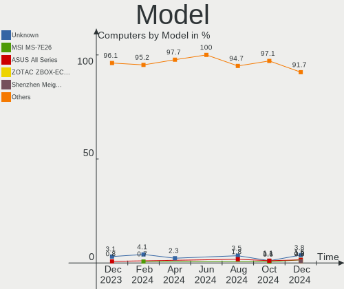
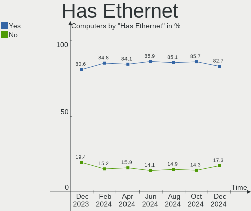
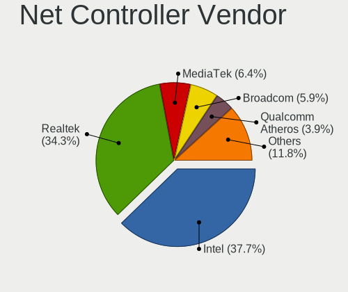
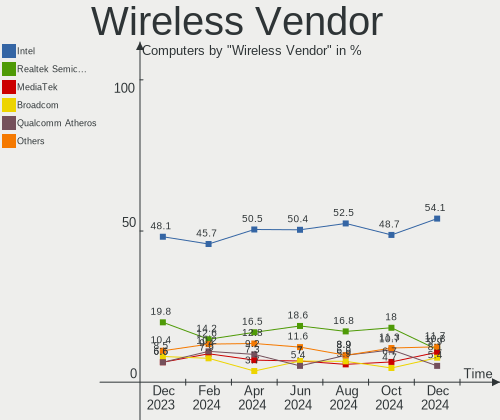

Kubuntu - Hardware Trends
-------------------------

A project to identify most popular hardware characteristics and track their change
over time based on data collected by Linux users at https://Linux-Hardware.org.

Anyone can contribute to this report by the [hw-probe](https://github.com/linuxhw/hw-probe) tool:

    sudo -E hw-probe -all -upload

This is a report for all computer types. See also reports for [desktops](/Dist/Kubuntu/Desktop/README.md) and [notebooks](/Dist/Kubuntu/Notebook/README.md).

This report is for one last month. Overall report since the beginning of time: [TestDays](https://github.com/linuxhw/TestDays)

Period: Sep, 2023.

Contents
--------

* [ System ](#system)
  - [ OS                       ](#os)
  - [ OS Family                ](#os-family)
  - [ Kernel                   ](#kernel)
  - [ Kernel Family            ](#kernel-family)
  - [ Kernel Major Ver.        ](#kernel-major-ver)
  - [ Arch                     ](#arch)
  - [ DE                       ](#de)
  - [ Display Server           ](#display-server)
  - [ Display Manager          ](#display-manager)
  - [ OS Lang                  ](#os-lang)
  - [ Boot Mode                ](#boot-mode)
  - [ Filesystem               ](#filesystem)
  - [ Part. scheme             ](#part-scheme)
  - [ Dual Boot with Linux/BSD ](#dual-boot-with-linuxbsd)
  - [ Dual Boot (Win)          ](#dual-boot-win)

* [ Board ](#board)
  - [ Vendor                   ](#vendor)
  - [ Model                    ](#model)
  - [ Model Family             ](#model-family)
  - [ MFG Year                 ](#mfg-year)
  - [ Form Factor              ](#form-factor)
  - [ Secure Boot              ](#secure-boot)
  - [ Coreboot                 ](#coreboot)
  - [ RAM Size                 ](#ram-size)
  - [ RAM Used                 ](#ram-used)
  - [ Total Drives             ](#total-drives)
  - [ Has CD-ROM               ](#has-cd-rom)
  - [ Has Ethernet             ](#has-ethernet)
  - [ Has WiFi                 ](#has-wifi)
  - [ Has Bluetooth            ](#has-bluetooth)

* [ Location ](#location)
  - [ Country                  ](#country)
  - [ City                     ](#city)

* [ Drives ](#drives)
  - [ Drive Vendor             ](#drive-vendor)
  - [ Drive Model              ](#drive-model)
  - [ HDD Vendor               ](#hdd-vendor)
  - [ SSD Vendor               ](#ssd-vendor)
  - [ Drive Kind               ](#drive-kind)
  - [ Drive Connector          ](#drive-connector)
  - [ Drive Size               ](#drive-size)
  - [ Space Total              ](#space-total)
  - [ Space Used               ](#space-used)
  - [ Malfunc. Drives          ](#malfunc-drives)
  - [ Malfunc. Drive Vendor    ](#malfunc-drive-vendor)
  - [ Malfunc. HDD Vendor      ](#malfunc-hdd-vendor)
  - [ Malfunc. Drive Kind      ](#malfunc-drive-kind)
  - [ Failed Drives            ](#failed-drives)
  - [ Failed Drive Vendor      ](#failed-drive-vendor)
  - [ Drive Status             ](#drive-status)

* [ Storage controller ](#storage-controller)
  - [ Storage Vendor           ](#storage-vendor)
  - [ Storage Model            ](#storage-model)
  - [ Storage Kind             ](#storage-kind)

* [ Processor ](#processor)
  - [ CPU Vendor               ](#cpu-vendor)
  - [ CPU Model                ](#cpu-model)
  - [ CPU Model Family         ](#cpu-model-family)
  - [ CPU Cores                ](#cpu-cores)
  - [ CPU Sockets              ](#cpu-sockets)
  - [ CPU Threads              ](#cpu-threads)
  - [ CPU Op-Modes             ](#cpu-op-modes)
  - [ CPU Microcode            ](#cpu-microcode)
  - [ CPU Microarch            ](#cpu-microarch)

* [ Graphics ](#graphics)
  - [ GPU Vendor               ](#gpu-vendor)
  - [ GPU Model                ](#gpu-model)
  - [ GPU Combo                ](#gpu-combo)
  - [ GPU Driver               ](#gpu-driver)
  - [ GPU Memory               ](#gpu-memory)

* [ Monitor ](#monitor)
  - [ Monitor Vendor           ](#monitor-vendor)
  - [ Monitor Model            ](#monitor-model)
  - [ Monitor Resolution       ](#monitor-resolution)
  - [ Monitor Diagonal         ](#monitor-diagonal)
  - [ Monitor Width            ](#monitor-width)
  - [ Aspect Ratio             ](#aspect-ratio)
  - [ Monitor Area             ](#monitor-area)
  - [ Pixel Density            ](#pixel-density)
  - [ Multiple Monitors        ](#multiple-monitors)

* [ Network ](#network)
  - [ Net Controller Vendor    ](#net-controller-vendor)
  - [ Net Controller Model     ](#net-controller-model)
  - [ Wireless Vendor          ](#wireless-vendor)
  - [ Wireless Model           ](#wireless-model)
  - [ Ethernet Vendor          ](#ethernet-vendor)
  - [ Ethernet Model           ](#ethernet-model)
  - [ Net Controller Kind      ](#net-controller-kind)
  - [ Used Controller          ](#used-controller)
  - [ NICs                     ](#nics)
  - [ IPv6                     ](#ipv6)

* [ Bluetooth ](#bluetooth)
  - [ Bluetooth Vendor         ](#bluetooth-vendor)
  - [ Bluetooth Model          ](#bluetooth-model)

* [ Sound ](#sound)
  - [ Sound Vendor             ](#sound-vendor)
  - [ Sound Model              ](#sound-model)

* [ Memory ](#memory)
  - [ Memory Vendor            ](#memory-vendor)
  - [ Memory Model             ](#memory-model)
  - [ Memory Kind              ](#memory-kind)
  - [ Memory Form Factor       ](#memory-form-factor)
  - [ Memory Size              ](#memory-size)
  - [ Memory Speed             ](#memory-speed)

* [ Printers & scanners ](#printers--scanners)
  - [ Printer Vendor           ](#printer-vendor)
  - [ Printer Model            ](#printer-model)
  - [ Scanner Vendor           ](#scanner-vendor)
  - [ Scanner Model            ](#scanner-model)

* [ Camera ](#camera)
  - [ Camera Vendor            ](#camera-vendor)
  - [ Camera Model             ](#camera-model)

* [ Security ](#security)
  - [ Fingerprint Vendor       ](#fingerprint-vendor)
  - [ Fingerprint Model        ](#fingerprint-model)
  - [ Chipcard Vendor          ](#chipcard-vendor)
  - [ Chipcard Model           ](#chipcard-model)

* [ Unsupported ](#unsupported)
  - [ Unsupported Devices      ](#unsupported-devices)
  - [ Unsupported Device Types ](#unsupported-device-types)

System
------

OS
--

Installed operating systems

| Name          | Computers | Percent |
|---------------|-----------|---------|
| Kubuntu 22.04 | 62        | 52.54%  |
| Kubuntu 23.04 | 48        | 40.68%  |
| Kubuntu 23.10 | 5         | 4.24%   |
| Kubuntu 20.04 | 2         | 1.69%   |
| Kubuntu 11    | 1         | 0.85%   |

OS Family
---------

OS without a version

| Name    | Computers | Percent |
|---------|-----------|---------|
| Kubuntu | 118       | 100%    |

Kernel
------

Version of the Linux kernel

| Version                | Computers | Percent |
|------------------------|-----------|---------|
| 6.2.0-32-generic       | 31        | 26.27%  |
| 6.2.0-33-generic       | 25        | 21.19%  |
| 5.15.0-83-generic      | 11        | 9.32%   |
| 6.2.0-31-generic       | 7         | 5.93%   |
| 5.15.0-82-generic      | 5         | 4.24%   |
| 6.5.0-5-generic        | 3         | 2.54%   |
| 6.2.0-1013-lowlatency  | 3         | 2.54%   |
| 6.5.3-060503-generic   | 2         | 1.69%   |
| 5.15.0-75-generic      | 2         | 1.69%   |
| 6.5.2                  | 1         | 0.85%   |
| 6.5.1-060501-generic   | 1         | 0.85%   |
| 6.5.0-1003-oem         | 1         | 0.85%   |
| 6.4.9-060409-generic   | 1         | 0.85%   |
| 6.4.6-060406-generic   | 1         | 0.85%   |
| 6.4.10-060410-generic  | 1         | 0.85%   |
| 6.3.8-1-liquorix-amd64 | 1         | 0.85%   |
| 6.3.0-7-generic        | 1         | 0.85%   |
| 6.2.16-060216-generic  | 1         | 0.85%   |
| 6.2.0-9032-generic     | 1         | 0.85%   |
| 6.2.0-34-generic       | 1         | 0.85%   |
| 6.2.0-27-generic       | 1         | 0.85%   |
| 6.2.0-26-generic       | 1         | 0.85%   |
| 6.2.0-20-generic       | 1         | 0.85%   |
| 6.2.0-1011-lowlatency  | 1         | 0.85%   |
| 6.2.0-1010-nvidia      | 1         | 0.85%   |
| 5.4.0-152-generic      | 1         | 0.85%   |
| 5.19.0-46-generic      | 1         | 0.85%   |
| 5.19.0-45-generic      | 1         | 0.85%   |
| 5.19.0-42-generic      | 1         | 0.85%   |
| 5.19.0-32-generic      | 1         | 0.85%   |
| 5.15.0-86-lowlatency   | 1         | 0.85%   |
| 5.15.0-84-generic      | 1         | 0.85%   |
| 5.15.0-83-lowlatency   | 1         | 0.85%   |
| 5.15.0-79-generic      | 1         | 0.85%   |
| 5.15.0-78-generic      | 1         | 0.85%   |
| 5.15.0-76-generic      | 1         | 0.85%   |
| 5.15.0-73-generic      | 1         | 0.85%   |
| 5.15.0-25-generic      | 1         | 0.85%   |

Kernel Family
-------------

Linux kernel without a distro release

| Version | Computers | Percent |
|---------|-----------|---------|
| 6.2.0   | 73        | 61.86%  |
| 5.15.0  | 26        | 22.03%  |
| 6.5.0   | 4         | 3.39%   |
| 5.19.0  | 4         | 3.39%   |
| 6.5.3   | 2         | 1.69%   |
| 6.5.2   | 1         | 0.85%   |
| 6.5.1   | 1         | 0.85%   |
| 6.4.9   | 1         | 0.85%   |
| 6.4.6   | 1         | 0.85%   |
| 6.4.10  | 1         | 0.85%   |
| 6.3.8   | 1         | 0.85%   |
| 6.3.0   | 1         | 0.85%   |
| 6.2.16  | 1         | 0.85%   |
| 5.4.0   | 1         | 0.85%   |

Kernel Major Ver.
-----------------

Linux kernel major version

| Version | Computers | Percent |
|---------|-----------|---------|
| 6.2     | 74        | 62.71%  |
| 5.15    | 26        | 22.03%  |
| 6.5     | 8         | 6.78%   |
| 5.19    | 4         | 3.39%   |
| 6.4     | 3         | 2.54%   |
| 6.3     | 2         | 1.69%   |
| 5.4     | 1         | 0.85%   |

Arch
----

OS architecture (x86_64, i586, etc.)

| Name   | Computers | Percent |
|--------|-----------|---------|
| x86_64 | 118       | 100%    |

DE
--

Desktop Environment

| Name  | Computers | Percent |
|-------|-----------|---------|
| KDE5  | 115       | 97.46%  |
| GNOME | 2         | 1.69%   |
| KDE   | 1         | 0.85%   |

Display Server
--------------

X11 or Wayland

| Name    | Computers | Percent |
|---------|-----------|---------|
| X11     | 106       | 89.83%  |
| Wayland | 10        | 8.47%   |
| Tty     | 2         | 1.69%   |

Display Manager
---------------

SDDM, LightDM, etc.

| Name    | Computers | Percent |
|---------|-----------|---------|
| SDDM    | 83        | 70.34%  |
| Unknown | 31        | 26.27%  |
| GDM3    | 4         | 3.39%   |

OS Lang
-------

Language

| Lang            | Computers | Percent |
|-----------------|-----------|---------|
| en_US           | 53        | 44.92%  |
| en_GB           | 11        | 9.32%   |
| de_DE           | 11        | 9.32%   |
| fr_FR           | 6         | 5.08%   |
| ru_RU           | 5         | 4.24%   |
| es_ES           | 4         | 3.39%   |
| it_IT           | 3         | 2.54%   |
| es_MX           | 2         | 1.69%   |
| es_CO           | 2         | 1.69%   |
| en_IN           | 2         | 1.69%   |
| en_CA           | 2         | 1.69%   |
| zh_TW           | 1         | 0.85%   |
| zh_CN           | 1         | 0.85%   |
| pl_PL           | 1         | 0.85%   |
| nl_NL           | 1         | 0.85%   |
| nl_BE           | 1         | 0.85%   |
| es_CR           | 1         | 0.85%   |
| en_US.ISO8859-1 | 1         | 0.85%   |
| en_SG           | 1         | 0.85%   |
| en_PH           | 1         | 0.85%   |
| en_NZ           | 1         | 0.85%   |
| en_IL           | 1         | 0.85%   |
| en_FI           | 1         | 0.85%   |
| en_DK           | 1         | 0.85%   |
| en_CH           | 1         | 0.85%   |
| en_AG           | 1         | 0.85%   |
| de_CH           | 1         | 0.85%   |
| C               | 1         | 0.85%   |

Boot Mode
---------

EFI or BIOS

| Mode | Computers | Percent |
|------|-----------|---------|
| EFI  | 61        | 51.69%  |
| BIOS | 57        | 48.31%  |

Filesystem
----------

Type of filesystem

| Type    | Computers | Percent |
|---------|-----------|---------|
| Ext4    | 88        | 74.58%  |
| Tmpfs   | 22        | 18.64%  |
| Btrfs   | 5         | 4.24%   |
| Overlay | 2         | 1.69%   |
| Zfs     | 1         | 0.85%   |

Part. scheme
------------

Scheme of partitioning

| Type    | Computers | Percent |
|---------|-----------|---------|
| GPT     | 78        | 66.1%   |
| Unknown | 31        | 26.27%  |
| MBR     | 9         | 7.63%   |

Dual Boot with Linux/BSD
------------------------

Hosting more than one Linux/BSD

| Dual boot | Computers | Percent |
|-----------|-----------|---------|
| No        | 103       | 87.29%  |
| Yes       | 15        | 12.71%  |

Dual Boot (Win)
---------------

Hosting Linux and Windows

| Dual boot | Computers | Percent |
|-----------|-----------|---------|
| No        | 84        | 71.19%  |
| Yes       | 34        | 28.81%  |

Board
-----

Vendor
------

Motherboard manufacturer

| Name                | Computers | Percent |
|---------------------|-----------|---------|
| ASUSTek Computer    | 30        | 25.42%  |
| Lenovo              | 25        | 21.19%  |
| Hewlett-Packard     | 12        | 10.17%  |
| MSI                 | 9         | 7.63%   |
| Dell                | 8         | 6.78%   |
| Apple               | 7         | 5.93%   |
| Gigabyte Technology | 6         | 5.08%   |
| ASRock              | 4         | 3.39%   |
| Unknown             | 3         | 2.54%   |
| Notebook            | 2         | 1.69%   |
| AZW                 | 2         | 1.69%   |
| Alienware           | 2         | 1.69%   |
| Acer                | 2         | 1.69%   |
| Valve               | 1         | 0.85%   |
| Toshiba             | 1         | 0.85%   |
| Samsung Electronics | 1         | 0.85%   |
| Google              | 1         | 0.85%   |
| Fujitsu Siemens     | 1         | 0.85%   |
| CHIPHD              | 1         | 0.85%   |

Model
-----

Motherboard model

| Name                                            | Computers | Percent |
|-------------------------------------------------|-----------|---------|
| Unknown                                         | 3         | 2.54%   |
| Lenovo IdeaPad 3 15ALC6 82KU                    | 2         | 1.69%   |
| ASUS All Series                                 | 2         | 1.69%   |
| Valve Jupiter                                   | 1         | 0.85%   |
| Toshiba Satellite Pro C70-B                     | 1         | 0.85%   |
| Samsung 950QED                                  | 1         | 0.85%   |
| Notebook W65_67SR                               | 1         | 0.85%   |
| Notebook P65_P67SA                              | 1         | 0.85%   |
| MSI MS-7D75                                     | 1         | 0.85%   |
| MSI MS-7D17                                     | 1         | 0.85%   |
| MSI MS-7C86                                     | 1         | 0.85%   |
| MSI MS-7C56                                     | 1         | 0.85%   |
| MSI MS-7B78                                     | 1         | 0.85%   |
| MSI MS-7B24                                     | 1         | 0.85%   |
| MSI MS-7924                                     | 1         | 0.85%   |
| MSI Modern 15 A5M                               | 1         | 0.85%   |
| MSI GE75 Raider 9SE                             | 1         | 0.85%   |
| Lenovo Yoga 6 13ALC6 82ND                       | 1         | 0.85%   |
| Lenovo ThinkStation P720 30BBS4RV00             | 1         | 0.85%   |
| Lenovo ThinkPad X270 W10DG 20K5S4K200           | 1         | 0.85%   |
| Lenovo ThinkPad X230 2325FG0                    | 1         | 0.85%   |
| Lenovo ThinkPad X230 23256N6                    | 1         | 0.85%   |
| Lenovo ThinkPad X12 Detachable Gen 1 20UW000LUS | 1         | 0.85%   |
| Lenovo ThinkPad X1 Carbon Gen 11 21HMCTO1WW     | 1         | 0.85%   |
| Lenovo ThinkPad X1 Carbon Gen 10 21CB007ART     | 1         | 0.85%   |
| Lenovo ThinkPad T495s 20QKS0SD00                | 1         | 0.85%   |
| Lenovo ThinkPad T16 Gen 1 21BVCTO1WW            | 1         | 0.85%   |
| Lenovo ThinkPad T14s Gen 4 21F6CTO1WW           | 1         | 0.85%   |
| Lenovo ThinkPad T14s Gen 1 20UJS0VD00           | 1         | 0.85%   |
| Lenovo ThinkPad P17 Gen 1 20SQS1AG00            | 1         | 0.85%   |
| Lenovo Legion Slim 5 16APH8 82Y9                | 1         | 0.85%   |
| Lenovo Legion 5 Pro 16ACH6H 82JQ                | 1         | 0.85%   |
| Lenovo Legion 5 15ACH6H 82JU                    | 1         | 0.85%   |
| Lenovo IdeaPadFlex 5 14ABR8 82XX                | 1         | 0.85%   |
| Lenovo IdeaPad S145-15API 81UT                  | 1         | 0.85%   |
| Lenovo IdeaPad 700-15ISK 80RU                   | 1         | 0.85%   |
| Lenovo IdeaPad 3 15ARE05 81W4                   | 1         | 0.85%   |
| Lenovo IdeaCentre Gaming5 17IAB7 90T100BHMZ     | 1         | 0.85%   |
| Lenovo IdeaCentre 3 07ADA05 90MV0059RS          | 1         | 0.85%   |
| Lenovo B480 20140                               | 1         | 0.85%   |

Model Family
------------

Motherboard model prefix

| Name                | Computers | Percent |
|---------------------|-----------|---------|
| Lenovo ThinkPad     | 11        | 9.32%   |
| ASUS PRIME          | 7         | 5.93%   |
| Lenovo IdeaPad      | 5         | 4.24%   |
| ASUS VivoBook       | 5         | 4.24%   |
| Dell Latitude       | 4         | 3.39%   |
| ASUS TUF            | 4         | 3.39%   |
| Lenovo Legion       | 3         | 2.54%   |
| HP EliteBook        | 3         | 2.54%   |
| Unknown             | 3         | 2.54%   |
| Lenovo IdeaCentre   | 2         | 1.69%   |
| HP ProBook          | 2         | 1.69%   |
| Dell Precision      | 2         | 1.69%   |
| Dell Inspiron       | 2         | 1.69%   |
| ASUS ROG            | 2         | 1.69%   |
| ASUS All            | 2         | 1.69%   |
| Apple MacBookPro11  | 2         | 1.69%   |
| Acer Aspire         | 2         | 1.69%   |
| Valve Jupiter       | 1         | 0.85%   |
| Toshiba Satellite   | 1         | 0.85%   |
| Samsung 950QED      | 1         | 0.85%   |
| Notebook W65        | 1         | 0.85%   |
| Notebook P65        | 1         | 0.85%   |
| MSI MS-7D75         | 1         | 0.85%   |
| MSI MS-7D17         | 1         | 0.85%   |
| MSI MS-7C86         | 1         | 0.85%   |
| MSI MS-7C56         | 1         | 0.85%   |
| MSI MS-7B78         | 1         | 0.85%   |
| MSI MS-7B24         | 1         | 0.85%   |
| MSI MS-7924         | 1         | 0.85%   |
| MSI Modern          | 1         | 0.85%   |
| MSI GE75            | 1         | 0.85%   |
| Lenovo Yoga         | 1         | 0.85%   |
| Lenovo ThinkStation | 1         | 0.85%   |
| Lenovo IdeaPadFlex  | 1         | 0.85%   |
| Lenovo B480         | 1         | 0.85%   |
| HP Z220             | 1         | 0.85%   |
| HP xw6600           | 1         | 0.85%   |
| HP ProDesk          | 1         | 0.85%   |
| HP Notebook         | 1         | 0.85%   |
| HP ENVY             | 1         | 0.85%   |

MFG Year
--------

Motherboard manufacture year

| Year | Computers | Percent |
|------|-----------|---------|
| 2022 | 14        | 11.86%  |
| 2021 | 14        | 11.86%  |
| 2020 | 10        | 8.47%   |
| 2019 | 10        | 8.47%   |
| 2018 | 10        | 8.47%   |
| 2012 | 10        | 8.47%   |
| 2023 | 8         | 6.78%   |
| 2017 | 8         | 6.78%   |
| 2013 | 7         | 5.93%   |
| 2014 | 6         | 5.08%   |
| 2016 | 3         | 2.54%   |
| 2015 | 3         | 2.54%   |
| 2011 | 3         | 2.54%   |
| 2010 | 3         | 2.54%   |
| 2009 | 3         | 2.54%   |
| 2008 | 3         | 2.54%   |
| 2007 | 3         | 2.54%   |

Form Factor
-----------

Physical design of the computer

| Name        | Computers | Percent |
|-------------|-----------|---------|
| Notebook    | 60        | 50.85%  |
| Desktop     | 49        | 41.53%  |
| Convertible | 4         | 3.39%   |
| All in one  | 2         | 1.69%   |
| Tablet      | 1         | 0.85%   |
| Mini pc     | 1         | 0.85%   |
| Server      | 1         | 0.85%   |

Secure Boot
-----------

Enabled or disabled

| State    | Computers | Percent |
|----------|-----------|---------|
| Disabled | 113       | 95.76%  |
| Enabled  | 5         | 4.24%   |

Coreboot
--------

Have coreboot on board

| Used | Computers | Percent |
|------|-----------|---------|
| No   | 117       | 99.15%  |
| Yes  | 1         | 0.85%   |

RAM Size
--------

Total RAM memory

| Size in GB  | Computers | Percent |
|-------------|-----------|---------|
| 16.01-24.0  | 31        | 26.27%  |
| 32.01-64.0  | 21        | 17.8%   |
| 8.01-16.0   | 21        | 17.8%   |
| 4.01-8.0    | 19        | 16.1%   |
| 24.01-32.0  | 9         | 7.63%   |
| 3.01-4.0    | 8         | 6.78%   |
| 64.01-256.0 | 7         | 5.93%   |
| 2.01-3.0    | 1         | 0.85%   |
| 1.01-2.0    | 1         | 0.85%   |

RAM Used
--------

Used RAM memory

| Used GB    | Computers | Percent |
|------------|-----------|---------|
| 4.01-8.0   | 38        | 32.2%   |
| 2.01-3.0   | 28        | 23.73%  |
| 3.01-4.0   | 23        | 19.49%  |
| 1.01-2.0   | 19        | 16.1%   |
| 8.01-16.0  | 7         | 5.93%   |
| 16.01-24.0 | 2         | 1.69%   |
| 0.51-1.0   | 1         | 0.85%   |

Total Drives
------------

Number of drives on board

| Drives | Computers | Percent |
|--------|-----------|---------|
| 1      | 58        | 49.15%  |
| 2      | 29        | 24.58%  |
| 3      | 12        | 10.17%  |
| 4      | 10        | 8.47%   |
| 5      | 4         | 3.39%   |
| 6      | 3         | 2.54%   |
| 7      | 2         | 1.69%   |

Has CD-ROM
----------

Has CD-ROM on board

| Presented | Computers | Percent |
|-----------|-----------|---------|
| No        | 80        | 67.8%   |
| Yes       | 38        | 32.2%   |

Has Ethernet
------------

Has Ethernet on board

| Presented | Computers | Percent |
|-----------|-----------|---------|
| Yes       | 103       | 87.29%  |
| No        | 15        | 12.71%  |

Has WiFi
--------

Has WiFi module

| Presented | Computers | Percent |
|-----------|-----------|---------|
| Yes       | 89        | 75.42%  |
| No        | 29        | 24.58%  |

Has Bluetooth
-------------

Has Bluetooth module

| Presented | Computers | Percent |
|-----------|-----------|---------|
| Yes       | 87        | 73.73%  |
| No        | 31        | 26.27%  |

Location
--------

Country
-------

Geographic location (country)

| Country     | Computers | Percent |
|-------------|-----------|---------|
| USA         | 25        | 21.19%  |
| Germany     | 17        | 14.41%  |
| UK          | 10        | 8.47%   |
| France      | 7         | 5.93%   |
| Russia      | 5         | 4.24%   |
| Spain       | 4         | 3.39%   |
| Italy       | 4         | 3.39%   |
| Canada      | 4         | 3.39%   |
| Poland      | 3         | 2.54%   |
| Kazakhstan  | 3         | 2.54%   |
| Taiwan      | 2         | 1.69%   |
| Switzerland | 2         | 1.69%   |
| Netherlands | 2         | 1.69%   |
| Mexico      | 2         | 1.69%   |
| India       | 2         | 1.69%   |
| Bulgaria    | 2         | 1.69%   |
| Bangladesh  | 2         | 1.69%   |
| Austria     | 2         | 1.69%   |
| Vietnam     | 1         | 0.85%   |
| Turkey      | 1         | 0.85%   |
| Thailand    | 1         | 0.85%   |
| Sweden      | 1         | 0.85%   |
| Singapore   | 1         | 0.85%   |
| Romania     | 1         | 0.85%   |
| Philippines | 1         | 0.85%   |
| New Zealand | 1         | 0.85%   |
| Israel      | 1         | 0.85%   |
| Hungary     | 1         | 0.85%   |
| Georgia     | 1         | 0.85%   |
| Finland     | 1         | 0.85%   |
| Egypt       | 1         | 0.85%   |
| Czechia     | 1         | 0.85%   |
| Costa Rica  | 1         | 0.85%   |
| Colombia    | 1         | 0.85%   |
| China       | 1         | 0.85%   |
| Chile       | 1         | 0.85%   |
| Belgium     | 1         | 0.85%   |
| Argentina   | 1         | 0.85%   |

City
----

Geographic location (city)

| City                     | Computers | Percent |
|--------------------------|-----------|---------|
| Almaty                   | 3         | 2.54%   |
| Stuttgart                | 2         | 1.69%   |
| Portland                 | 2         | 1.69%   |
| Oxford                   | 2         | 1.69%   |
| Arzamas                  | 2         | 1.69%   |
| Żywiec                  | 1         | 0.85%   |
| Zuchwil                  | 1         | 0.85%   |
| Zhubei                   | 1         | 0.85%   |
| Wuhan                    | 1         | 0.85%   |
| Wooster                  | 1         | 0.85%   |
| Woodstock                | 1         | 0.85%   |
| Wolverhampton            | 1         | 0.85%   |
| Wolfschlugen             | 1         | 0.85%   |
| Vienna                   | 1         | 0.85%   |
| Victoria                 | 1         | 0.85%   |
| Vercel-Villedieu-le-Camp | 1         | 0.85%   |
| Varna                    | 1         | 0.85%   |
| Vaggeryd                 | 1         | 0.85%   |
| Ufa                      | 1         | 0.85%   |
| Tuxtla Gutiérrez        | 1         | 0.85%   |
| Tigre                    | 1         | 0.85%   |
| Tel Aviv                 | 1         | 0.85%   |
| Tbilisi                  | 1         | 0.85%   |
| Surrey                   | 1         | 0.85%   |
| Surat                    | 1         | 0.85%   |
| Stone Mountain           | 1         | 0.85%   |
| Southampton              | 1         | 0.85%   |
| Singapore                | 1         | 0.85%   |
| Sindelfingen             | 1         | 0.85%   |
| Sibiu                    | 1         | 0.85%   |
| Shumen                   | 1         | 0.85%   |
| Sheffield                | 1         | 0.85%   |
| Schwarzenbruck           | 1         | 0.85%   |
| Santiago de Cali         | 1         | 0.85%   |
| Santiago                 | 1         | 0.85%   |
| San Francisco            | 1         | 0.85%   |
| Roissy-en-Brie           | 1         | 0.85%   |
| Rogers                   | 1         | 0.85%   |
| Rioverde                 | 1         | 0.85%   |
| Rho                      | 1         | 0.85%   |

Drives
------

Drive Vendor
------------

Hard drive vendors

| Vendor                      | Computers | Drives | Percent |
|-----------------------------|-----------|--------|---------|
| Samsung Electronics         | 38        | 51     | 18.36%  |
| Seagate                     | 25        | 31     | 12.08%  |
| WDC                         | 20        | 29     | 9.66%   |
| SanDisk                     | 18        | 22     | 8.7%    |
| Toshiba                     | 16        | 18     | 7.73%   |
| Kingston                    | 10        | 12     | 4.83%   |
| Crucial                     | 9         | 9      | 4.35%   |
| Micron Technology           | 8         | 8      | 3.86%   |
| SK hynix                    | 4         | 4      | 1.93%   |
| Intel                       | 4         | 4      | 1.93%   |
| HGST                        | 4         | 4      | 1.93%   |
| Unknown                     | 3         | 4      | 1.45%   |
| Silicon Motion              | 3         | 3      | 1.45%   |
| KIOXIA                      | 3         | 3      | 1.45%   |
| Kingston Technology Company | 3         | 4      | 1.45%   |
| Transcend                   | 2         | 2      | 0.97%   |
| Team                        | 2         | 2      | 0.97%   |
| SABRENT                     | 2         | 2      | 0.97%   |
| MAXIO Technology (Hangzhou) | 2         | 2      | 0.97%   |
| Inateck                     | 2         | 2      | 0.97%   |
| China                       | 2         | 2      | 0.97%   |
| Apple                       | 2         | 2      | 0.97%   |
| A-DATA Technology           | 2         | 2      | 0.97%   |
| WD MediaMax                 | 1         | 1      | 0.48%   |
| Union Memory                | 1         | 1      | 0.48%   |
| TXRUI                       | 1         | 1      | 0.48%   |
| SPCC                        | 1         | 1      | 0.48%   |
| SADAYU                      | 1         | 1      | 0.48%   |
| PNY                         | 1         | 1      | 0.48%   |
| Plextor                     | 1         | 1      | 0.48%   |
| Micron/Crucial Technology   | 1         | 2      | 0.48%   |
| M.2 SSD                     | 1         | 1      | 0.48%   |
| LT                          | 1         | 1      | 0.48%   |
| LDLC                        | 1         | 2      | 0.48%   |
| KIOXIA-EXCERIA              | 1         | 1      | 0.48%   |
| JMicron Technology          | 1         | 1      | 0.48%   |
| Intenso                     | 1         | 1      | 0.48%   |
| Hjwdz                       | 1         | 1      | 0.48%   |
| Hitachi                     | 1         | 1      | 0.48%   |
| Hewlett-Packard             | 1         | 2      | 0.48%   |

Drive Model
-----------

Hard drive models

| Model                                                 | Computers | Percent |
|-------------------------------------------------------|-----------|---------|
| Seagate ST2000DM008-2FR102 2TB                        | 4         | 1.66%   |
| Samsung SSD 980 1TB                                   | 4         | 1.66%   |
| Seagate ST2000DM001-1ER164 2TB                        | 3         | 1.24%   |
| Samsung SSD 860 EVO 500GB                             | 3         | 1.24%   |
| Samsung SSD 860 EVO 1TB                               | 3         | 1.24%   |
| Samsung SSD 850 EVO 500GB                             | 3         | 1.24%   |
| Samsung NVMe SSD Controller SM981/PM981/PM983 256GB   | 3         | 1.24%   |
| Crucial CT240BX500SSD1 240GB                          | 3         | 1.24%   |
| Toshiba MQ01ABD100 1TB                                | 2         | 0.83%   |
| Toshiba KBG40ZNT512G MEMORY 512GB                     | 2         | 0.83%   |
| Toshiba DT01ACA100 1TB                                | 2         | 0.83%   |
| Silicon Motion SM2263EN/SM2263XT SSD Controller 512GB | 2         | 0.83%   |
| Seagate ST3500418AS 500GB                             | 2         | 0.83%   |
| Sandisk WD Black SN750 / PC SN730 NVMe SSD 512GB      | 2         | 0.83%   |
| SanDisk SSD PLUS 1000GB                               | 2         | 0.83%   |
| SanDisk SDSSDH3 1T00 1TB                              | 2         | 0.83%   |
| SanDisk NVMe SSD Drive 1TB                            | 2         | 0.83%   |
| Samsung SSD 970 EVO Plus 500GB                        | 2         | 0.83%   |
| Samsung SSD 850 EVO 250GB                             | 2         | 0.83%   |
| Samsung NVMe SSD Controller SM961/PM961/SM963 500GB   | 2         | 0.83%   |
| MAXIO (Hangzhou) NVMe SSD Controller MAP1202 512GB    | 2         | 0.83%   |
| Kingston Company A2000 NVMe SSD 1TB                   | 2         | 0.83%   |
| Kingston SA400S37480G 480GB SSD                       | 2         | 0.83%   |
| Inateck FE202x Series 1TB                             | 2         | 0.83%   |
| Crucial CT1000MX500SSD1 1TB                           | 2         | 0.83%   |
| WDC WDS500G2B0B-00YS70 500GB SSD                      | 1         | 0.41%   |
| WDC WDS500G1B0B-00AS40 500GB SSD                      | 1         | 0.41%   |
| WDC WDS400T2B0A-00SM50 4TB SSD                        | 1         | 0.41%   |
| WDC WD800BEVS-07RST0 80GB                             | 1         | 0.41%   |
| WDC WD7502ABYS-02A6B0 752GB                           | 1         | 0.41%   |
| WDC WD42PURZ-85B4YY0 4TB                              | 1         | 0.41%   |
| WDC WD40EZRZ-00GXCB0 4TB                              | 1         | 0.41%   |
| WDC WD4003FFBX-68MU3N0 4TB                            | 1         | 0.41%   |
| WDC WD30EFRX-68AX9N0 3TB                              | 1         | 0.41%   |
| WDC WD2005FBYZ-01YCBB1 2TB                            | 1         | 0.41%   |
| WDC WD120EFBX-68B0EN0 12TB                            | 1         | 0.41%   |
| WDC WD10EZEX-60WN4A0 1TB                              | 1         | 0.41%   |
| WDC WD10EZEX-08WN4A0 1TB                              | 1         | 0.41%   |
| WDC WD10EVDS-63N5B1 1TB                               | 1         | 0.41%   |
| WDC WD10EARX-00N0YB0 1TB                              | 1         | 0.41%   |

HDD Vendor
----------

Hard disk drive vendors

| Vendor              | Computers | Drives | Percent |
|---------------------|-----------|--------|---------|
| Seagate             | 23        | 29     | 37.1%   |
| WDC                 | 14        | 22     | 22.58%  |
| Toshiba             | 11        | 12     | 17.74%  |
| Samsung Electronics | 5         | 5      | 8.06%   |
| HGST                | 4         | 4      | 6.45%   |
| SABRENT             | 2         | 2      | 3.23%   |
| Hitachi             | 1         | 1      | 1.61%   |
| Fujitsu             | 1         | 1      | 1.61%   |
| ASMT                | 1         | 1      | 1.61%   |

SSD Vendor
----------

Solid state drive vendors

| Vendor              | Computers | Drives | Percent |
|---------------------|-----------|--------|---------|
| Samsung Electronics | 19        | 20     | 26.39%  |
| SanDisk             | 10        | 13     | 13.89%  |
| Crucial             | 9         | 9      | 12.5%   |
| Kingston            | 5         | 6      | 6.94%   |
| WDC                 | 4         | 4      | 5.56%   |
| Micron Technology   | 3         | 3      | 4.17%   |
| Transcend           | 2         | 2      | 2.78%   |
| Toshiba             | 2         | 2      | 2.78%   |
| China               | 2         | 2      | 2.78%   |
| Apple               | 2         | 2      | 2.78%   |
| A-DATA Technology   | 2         | 2      | 2.78%   |
| Team                | 1         | 1      | 1.39%   |
| SPCC                | 1         | 1      | 1.39%   |
| SADAYU              | 1         | 1      | 1.39%   |
| PNY                 | 1         | 1      | 1.39%   |
| Plextor             | 1         | 1      | 1.39%   |
| LT                  | 1         | 1      | 1.39%   |
| KIOXIA-EXCERIA      | 1         | 1      | 1.39%   |
| JMicron Technology  | 1         | 1      | 1.39%   |
| Intel               | 1         | 1      | 1.39%   |
| Hewlett-Packard     | 1         | 1      | 1.39%   |
| BAITITON            | 1         | 1      | 1.39%   |
| AMD                 | 1         | 1      | 1.39%   |

Drive Kind
----------

HDD or SSD

| Kind    | Computers | Drives | Percent |
|---------|-----------|--------|---------|
| NVMe    | 68        | 83     | 36.76%  |
| SSD     | 58        | 77     | 31.35%  |
| HDD     | 49        | 77     | 26.49%  |
| Unknown | 8         | 9      | 4.32%   |
| MMC     | 2         | 3      | 1.08%   |

Drive Connector
---------------

SATA, SAS, NVMe, etc.

| Type | Computers | Drives | Percent |
|------|-----------|--------|---------|
| SATA | 76        | 151    | 48.41%  |
| NVMe | 66        | 80     | 42.04%  |
| SAS  | 13        | 15     | 8.28%   |
| MMC  | 2         | 3      | 1.27%   |

Drive Size
----------

Size of hard drive

| Size in TB | Computers | Drives | Percent |
|------------|-----------|--------|---------|
| 0.01-0.5   | 53        | 65     | 44.17%  |
| 0.51-1.0   | 39        | 57     | 32.5%   |
| 1.01-2.0   | 15        | 18     | 12.5%   |
| 3.01-4.0   | 7         | 8      | 5.83%   |
| 2.01-3.0   | 2         | 2      | 1.67%   |
| 10.01-20.0 | 2         | 2      | 1.67%   |
| 4.01-10.0  | 2         | 2      | 1.67%   |

Space Total
-----------

Amount of disk space available on the file system

| Size in GB     | Computers | Percent |
|----------------|-----------|---------|
| 501-1000       | 30        | 25.42%  |
| 101-250        | 24        | 20.34%  |
| 251-500        | 22        | 18.64%  |
| More than 3000 | 14        | 11.86%  |
| 1001-2000      | 13        | 11.02%  |
| 2001-3000      | 6         | 5.08%   |
| 21-50          | 4         | 3.39%   |
| 51-100         | 3         | 2.54%   |
| 1-20           | 2         | 1.69%   |

Space Used
----------

Amount of used disk space

| Used GB        | Computers | Percent |
|----------------|-----------|---------|
| 101-250        | 24        | 20.34%  |
| 1-20           | 22        | 18.64%  |
| 21-50          | 21        | 17.8%   |
| 501-1000       | 16        | 13.56%  |
| 251-500        | 12        | 10.17%  |
| 51-100         | 10        | 8.47%   |
| More than 3000 | 5         | 4.24%   |
| 2001-3000      | 4         | 3.39%   |
| 1001-2000      | 4         | 3.39%   |

Malfunc. Drives
---------------

Drive models with a malfunction

| Model                                 | Computers | Drives | Percent |
|---------------------------------------|-----------|--------|---------|
| WDC WD7502ABYS-02A6B0 752GB           | 1         | 1      | 7.69%   |
| WDC WD10EADS-65L5B1 1TB               | 1         | 1      | 7.69%   |
| Toshiba MQ01ABD100 1TB                | 1         | 1      | 7.69%   |
| Toshiba MK5061GSY 500GB               | 1         | 1      | 7.69%   |
| Seagate ST9500325AS 500GB             | 1         | 1      | 7.69%   |
| Seagate ST500DM002-1BD142 500GB       | 1         | 1      | 7.69%   |
| Seagate ST3500418AS 500GB             | 1         | 1      | 7.69%   |
| Seagate ST1000VX000-1CU162 1TB        | 1         | 1      | 7.69%   |
| Samsung Electronics SSD 870 EVO 500GB | 1         | 1      | 7.69%   |
| Samsung Electronics HM321HI 320GB     | 1         | 1      | 7.69%   |
| Samsung Electronics HD501LJ 500GB     | 1         | 1      | 7.69%   |
| Intel SSDPEKNW512G8 512GB             | 1         | 1      | 7.69%   |
| HGST HTS541010A9E680 1TB              | 1         | 1      | 7.69%   |

Malfunc. Drive Vendor
---------------------

Vendors of faulty drives

| Vendor              | Computers | Drives | Percent |
|---------------------|-----------|--------|---------|
| Seagate             | 4         | 4      | 30.77%  |
| Samsung Electronics | 3         | 3      | 23.08%  |
| WDC                 | 2         | 2      | 15.38%  |
| Toshiba             | 2         | 2      | 15.38%  |
| Intel               | 1         | 1      | 7.69%   |
| HGST                | 1         | 1      | 7.69%   |

Malfunc. HDD Vendor
-------------------

Vendors of faulty HDD drives

| Vendor              | Computers | Drives | Percent |
|---------------------|-----------|--------|---------|
| Seagate             | 4         | 4      | 36.36%  |
| WDC                 | 2         | 2      | 18.18%  |
| Toshiba             | 2         | 2      | 18.18%  |
| Samsung Electronics | 2         | 2      | 18.18%  |
| HGST                | 1         | 1      | 9.09%   |

Malfunc. Drive Kind
-------------------

Kinds of faulty drives

| Kind | Computers | Drives | Percent |
|------|-----------|--------|---------|
| HDD  | 8         | 11     | 80%     |
| NVMe | 1         | 1      | 10%     |
| SSD  | 1         | 1      | 10%     |

Failed Drives
-------------

Failed drive models

Zero info for selected period =(

Failed Drive Vendor
-------------------

Failed drive vendors

Zero info for selected period =(

Drive Status
------------

Number of failed and malfunc. drives

| Status   | Computers | Drives | Percent |
|----------|-----------|--------|---------|
| Detected | 66        | 132    | 48.89%  |
| Works    | 59        | 104    | 43.7%   |
| Malfunc  | 10        | 13     | 7.41%   |

Storage controller
------------------

Storage Vendor
--------------

Storage controller vendors

| Vendor                       | Computers | Percent |
|------------------------------|-----------|---------|
| Intel                        | 65        | 37.57%  |
| AMD                          | 32        | 18.5%   |
| Samsung Electronics          | 24        | 13.87%  |
| SanDisk                      | 11        | 6.36%   |
| Kingston Technology Company  | 8         | 4.62%   |
| Silicon Motion               | 5         | 2.89%   |
| Micron Technology            | 5         | 2.89%   |
| SK hynix                     | 4         | 2.31%   |
| Toshiba America Info Systems | 3         | 1.73%   |
| KIOXIA                       | 3         | 1.73%   |
| ASMedia Technology           | 3         | 1.73%   |
| MAXIO Technology (Hangzhou)  | 2         | 1.16%   |
| JMicron Technology           | 2         | 1.16%   |
| Union Memory (Shenzhen)      | 1         | 0.58%   |
| Solidigm                     | 1         | 0.58%   |
| Silicon Image                | 1         | 0.58%   |
| Phison Electronics           | 1         | 0.58%   |
| Micron/Crucial Technology    | 1         | 0.58%   |
| LSI Logic / Symbios Logic    | 1         | 0.58%   |

Storage Model
-------------

Storage controller models

| Model                                                                                   | Computers | Percent |
|-----------------------------------------------------------------------------------------|-----------|---------|
| AMD FCH SATA Controller [AHCI mode]                                                     | 27        | 13.64%  |
| Intel 8 Series/C220 Series Chipset Family 6-port SATA Controller 1 [AHCI mode]          | 8         | 4.04%   |
| Samsung NVMe SSD Controller SM981/PM981/PM983                                           | 7         | 3.54%   |
| Intel 7 Series Chipset Family 6-port SATA Controller [AHCI mode]                        | 7         | 3.54%   |
| Samsung NVMe SSD Controller PM9A1/PM9A3/980PRO                                          | 6         | 3.03%   |
| Samsung NVMe SSD Controller 980                                                         | 5         | 2.53%   |
| Intel SATA Controller [RAID mode]                                                       | 5         | 2.53%   |
| Silicon Motion SM2263EN/SM2263XT (DRAM-less) NVMe SSD Controllers                       | 4         | 2.02%   |
| Intel Cannon Lake PCH SATA AHCI Controller                                              | 4         | 2.02%   |
| Intel 500 Series Chipset Family SATA AHCI Controller                                    | 4         | 2.02%   |
| AMD 400 Series Chipset SATA Controller                                                  | 4         | 2.02%   |
| SanDisk WD Black SN770 / PC SN740 256GB / PC SN560 (DRAM-less) NVMe SSD                 | 3         | 1.52%   |
| Samsung NVMe SSD Controller SM961/PM961/SM963                                           | 3         | 1.52%   |
| KIOXIA NVMe SSD Controller BG4 (DRAM-less)                                              | 3         | 1.52%   |
| Intel Volume Management Device NVMe RAID Controller                                     | 3         | 1.52%   |
| ASMedia ASM1062 Serial ATA Controller                                                   | 3         | 1.52%   |
| SK hynix Platinum P41/PC801 NVMe Solid State Drive                                      | 2         | 1.01%   |
| SanDisk WD Black SN750 / PC SN730 NVMe SSD                                              | 2         | 1.01%   |
| SanDisk PC SN530 NVMe SSD (DRAM-less)                                                   | 2         | 1.01%   |
| Samsung S4LN058A01[SSUBX] AHCI SSD Controller (Apple slot)                              | 2         | 1.01%   |
| Samsung NVMe SSD Controller S4LV008[Pascal]                                             | 2         | 1.01%   |
| Micron 2400 NVMe SSD (DRAM-less)                                                        | 2         | 1.01%   |
| MAXIO (Hangzhou) NVMe SSD Controller MAP1202                                            | 2         | 1.01%   |
| Kingston Company Company Non-Volatile memory controller                                 | 2         | 1.01%   |
| Kingston Company OM8PCP Design-In PCIe 3 NVMe SSD (DRAM-less)                           | 2         | 1.01%   |
| Kingston Company KC3000/Renegade NVMe SSD                                               | 2         | 1.01%   |
| Kingston Company A2000 NVMe SSD                                                         | 2         | 1.01%   |
| Intel Alder Lake-P SATA AHCI Controller                                                 | 2         | 1.01%   |
| Intel 82801JI (ICH10 Family) SATA AHCI Controller                                       | 2         | 1.01%   |
| Intel 82801HM/HEM (ICH8M/ICH8M-E) SATA Controller [AHCI mode]                           | 2         | 1.01%   |
| Intel 82801HM/HEM (ICH8M/ICH8M-E) IDE Controller                                        | 2         | 1.01%   |
| Intel 82801 Mobile SATA Controller [RAID mode]                                          | 2         | 1.01%   |
| Intel 6 Series/C200 Series Chipset Family Desktop SATA Controller (IDE mode, ports 4-5) | 2         | 1.01%   |
| Intel 6 Series/C200 Series Chipset Family Desktop SATA Controller (IDE mode, ports 0-3) | 2         | 1.01%   |
| Intel 6 Series/C200 Series Chipset Family 6 port Desktop SATA AHCI Controller           | 2         | 1.01%   |
| Intel 5 Series/3400 Series Chipset 4 port SATA AHCI Controller                          | 2         | 1.01%   |
| Intel 400 Series Chipset Family SATA AHCI Controller                                    | 2         | 1.01%   |
| Intel 200 Series PCH SATA controller [AHCI mode]                                        | 2         | 1.01%   |
| AMD X370 Series Chipset SATA Controller                                                 | 2         | 1.01%   |
| AMD 500 Series Chipset SATA Controller                                                  | 2         | 1.01%   |

Storage Kind
------------

Kind of storage controller (IDE, SATA, NVMe, SAS, ...)

| Kind | Computers | Percent |
|------|-----------|---------|
| SATA | 86        | 49.71%  |
| NVMe | 65        | 37.57%  |
| RAID | 12        | 6.94%   |
| IDE  | 9         | 5.2%    |
| SCSI | 1         | 0.58%   |

Processor
---------

CPU Vendor
----------

Processor vendors

| Vendor | Computers | Percent |
|--------|-----------|---------|
| Intel  | 79        | 66.95%  |
| AMD    | 39        | 33.05%  |

CPU Model
---------

Processor models

| Model                                         | Computers | Percent |
|-----------------------------------------------|-----------|---------|
| AMD Ryzen 5 3600 6-Core Processor             | 3         | 2.54%   |
| Intel Core i7 CPU 920 @ 2.67GHz               | 2         | 1.69%   |
| Intel Core i5-3320M CPU @ 2.60GHz             | 2         | 1.69%   |
| Intel Celeron CPU N3450 @ 1.10GHz             | 2         | 1.69%   |
| Intel 13th Gen Core i7-1355U                  | 2         | 1.69%   |
| Intel 12th Gen Core i7-1260P                  | 2         | 1.69%   |
| Intel 11th Gen Core i5-11400F @ 2.60GHz       | 2         | 1.69%   |
| AMD Ryzen 7 5700U with Radeon Graphics        | 2         | 1.69%   |
| AMD Ryzen 5 7600X 6-Core Processor            | 2         | 1.69%   |
| AMD Ryzen 5 5600H with Radeon Graphics        | 2         | 1.69%   |
| AMD Ryzen 5 4500U with Radeon Graphics        | 2         | 1.69%   |
| AMD Ryzen 5 3500U with Radeon Vega Mobile Gfx | 2         | 1.69%   |
| Intel Xeon Gold 5118 CPU @ 2.30GHz            | 1         | 0.85%   |
| Intel Xeon CPU W5580 @ 3.20GHz                | 1         | 0.85%   |
| Intel Xeon CPU E5430 @ 2.66GHz                | 1         | 0.85%   |
| Intel Pentium CPU B950 @ 2.10GHz              | 1         | 0.85%   |
| Intel N100                                    | 1         | 0.85%   |
| Intel Core i9-9900K CPU @ 3.60GHz             | 1         | 0.85%   |
| Intel Core i9-10900T CPU @ 1.90GHz            | 1         | 0.85%   |
| Intel Core i7-9750H CPU @ 2.60GHz             | 1         | 0.85%   |
| Intel Core i7-8650U CPU @ 1.90GHz             | 1         | 0.85%   |
| Intel Core i7-7700HQ CPU @ 2.80GHz            | 1         | 0.85%   |
| Intel Core i7-6820HQ CPU @ 2.70GHz            | 1         | 0.85%   |
| Intel Core i7-6700K CPU @ 4.00GHz             | 1         | 0.85%   |
| Intel Core i7-5960X CPU @ 3.00GHz             | 1         | 0.85%   |
| Intel Core i7-4870HQ CPU @ 2.50GHz            | 1         | 0.85%   |
| Intel Core i7-4790 CPU @ 3.60GHz              | 1         | 0.85%   |
| Intel Core i7-4771 CPU @ 3.50GHz              | 1         | 0.85%   |
| Intel Core i7-4770 CPU @ 3.40GHz              | 1         | 0.85%   |
| Intel Core i7-4720HQ CPU @ 2.60GHz            | 1         | 0.85%   |
| Intel Core i7-4710HQ CPU @ 2.50GHz            | 1         | 0.85%   |
| Intel Core i7-4702MQ CPU @ 2.20GHz            | 1         | 0.85%   |
| Intel Core i7-4700MQ CPU @ 2.40GHz            | 1         | 0.85%   |
| Intel Core i7-3770 CPU @ 3.40GHz              | 1         | 0.85%   |
| Intel Core i7-3630QM CPU @ 2.40GHz            | 1         | 0.85%   |
| Intel Core i7-3612QM CPU @ 2.10GHz            | 1         | 0.85%   |
| Intel Core i7-2640M CPU @ 2.80GHz             | 1         | 0.85%   |
| Intel Core i7-10750H CPU @ 2.60GHz            | 1         | 0.85%   |
| Intel Core i7 CPU 860 @ 2.80GHz               | 1         | 0.85%   |
| Intel Core i5-9600K CPU @ 3.70GHz             | 1         | 0.85%   |

CPU Model Family
----------------

Processor model prefix

| Model            | Computers | Percent |
|------------------|-----------|---------|
| Intel Core i5    | 24        | 20.34%  |
| Intel Core i7    | 22        | 18.64%  |
| Other            | 19        | 16.1%   |
| AMD Ryzen 5      | 18        | 15.25%  |
| AMD Ryzen 7      | 9         | 7.63%   |
| Intel Celeron    | 5         | 4.24%   |
| AMD Ryzen 9      | 3         | 2.54%   |
| AMD Ryzen 7 PRO  | 3         | 2.54%   |
| Intel Xeon       | 2         | 1.69%   |
| Intel Core i9    | 2         | 1.69%   |
| Intel Core 2 Duo | 2         | 1.69%   |
| AMD Ryzen 3      | 2         | 1.69%   |
| Intel Xeon Gold  | 1         | 0.85%   |
| Intel Pentium    | 1         | 0.85%   |
| Intel Core i3    | 1         | 0.85%   |
| Intel Atom       | 1         | 0.85%   |
| AMD PRO A10      | 1         | 0.85%   |
| AMD Phenom II X4 | 1         | 0.85%   |
| AMD FX           | 1         | 0.85%   |

CPU Cores
---------

Number of processor cores

| Number | Computers | Percent |
|--------|-----------|---------|
| 4      | 41        | 34.75%  |
| 6      | 23        | 19.49%  |
| 2      | 21        | 17.8%   |
| 8      | 16        | 13.56%  |
| 10     | 6         | 5.08%   |
| 16     | 3         | 2.54%   |
| 12     | 3         | 2.54%   |
| 24     | 2         | 1.69%   |
| 1      | 2         | 1.69%   |
| 3      | 1         | 0.85%   |

CPU Sockets
-----------

Number of sockets

| Number | Computers | Percent |
|--------|-----------|---------|
| 1      | 116       | 98.31%  |
| 2      | 2         | 1.69%   |

CPU Threads
-----------

Threads per core (Hyper-Threading)

| Number | Computers | Percent |
|--------|-----------|---------|
| 2      | 91        | 77.12%  |
| 1      | 27        | 22.88%  |

CPU Op-Modes
------------

CPU Operation Modes (32-bit, 64-bit)

| Op mode        | Computers | Percent |
|----------------|-----------|---------|
| 32-bit, 64-bit | 118       | 100%    |

CPU Microcode
-------------

Microcode number

| Number     | Computers | Percent |
|------------|-----------|---------|
| Unknown    | 81        | 68.64%  |
| 0x0a601203 | 5         | 4.24%   |
| 0x306c3    | 3         | 2.54%   |
| 0x0a50000d | 3         | 2.54%   |
| 0x0a50000c | 3         | 2.54%   |
| 0x206a7    | 2         | 1.69%   |
| 0x08608103 | 2         | 1.69%   |
| 0x08108109 | 2         | 1.69%   |
| 0x906ea    | 1         | 0.85%   |
| 0x906a3    | 1         | 0.85%   |
| 0x806ea    | 1         | 0.85%   |
| 0x306a9    | 1         | 0.85%   |
| 0x20655    | 1         | 0.85%   |
| 0x1067a    | 1         | 0.85%   |
| 0x10661    | 1         | 0.85%   |
| 0x0a704103 | 1         | 0.85%   |
| 0x0a20120a | 1         | 0.85%   |
| 0x0a201025 | 1         | 0.85%   |
| 0x08900201 | 1         | 0.85%   |
| 0x08701013 | 1         | 0.85%   |
| 0x08600109 | 1         | 0.85%   |
| 0x08600104 | 1         | 0.85%   |
| 0x08600102 | 1         | 0.85%   |
| 0x0800820d | 1         | 0.85%   |
| 0x08001126 | 1         | 0.85%   |

CPU Microarch
-------------

Microarchitecture

| Name             | Computers | Percent |
|------------------|-----------|---------|
| Unknown          | 16        | 13.56%  |
| Haswell          | 14        | 11.86%  |
| KabyLake         | 10        | 8.47%   |
| Zen 3            | 9         | 7.63%   |
| Alderlake Hybrid | 8         | 6.78%   |
| IvyBridge        | 7         | 5.93%   |
| Zen+             | 6         | 5.08%   |
| Zen 2            | 6         | 5.08%   |
| Skylake          | 6         | 5.08%   |
| SandyBridge      | 6         | 5.08%   |
| Nehalem          | 4         | 3.39%   |
| CometLake        | 4         | 3.39%   |
| Zen              | 3         | 2.54%   |
| TigerLake        | 3         | 2.54%   |
| Icelake          | 3         | 2.54%   |
| Westmere         | 2         | 1.69%   |
| Penryn           | 2         | 1.69%   |
| Goldmont         | 2         | 1.69%   |
| Core             | 2         | 1.69%   |
| Piledriver       | 1         | 0.85%   |
| K10              | 1         | 0.85%   |
| Excavator        | 1         | 0.85%   |
| Broadwell        | 1         | 0.85%   |
| Bonnell          | 1         | 0.85%   |

Graphics
--------

GPU Vendor
----------

Vendors of graphics cards

| Vendor | Computers | Percent |
|--------|-----------|---------|
| Intel  | 58        | 41.13%  |
| Nvidia | 42        | 29.79%  |
| AMD    | 41        | 29.08%  |

GPU Model
---------

Graphics card models

| Model                                                                       | Computers | Percent |
|-----------------------------------------------------------------------------|-----------|---------|
| Intel 2nd Generation Core Processor Family Integrated Graphics Controller   | 6         | 4.11%   |
| AMD Raphael                                                                 | 6         | 4.11%   |
| Intel 4th Gen Core Processor Integrated Graphics Controller                 | 5         | 3.42%   |
| Intel 3rd Gen Core processor Graphics Controller                            | 5         | 3.42%   |
| Nvidia GA106 [GeForce RTX 3060 Lite Hash Rate]                              | 4         | 2.74%   |
| Intel HD Graphics 530                                                       | 4         | 2.74%   |
| AMD Picasso/Raven 2 [Radeon Vega Series / Radeon Vega Mobile Series]        | 4         | 2.74%   |
| AMD Lucienne                                                                | 4         | 2.74%   |
| AMD Cezanne [Radeon Vega Series / Radeon Vega Mobile Series]                | 4         | 2.74%   |
| Intel Xeon E3-1200 v3/4th Gen Core Processor Integrated Graphics Controller | 3         | 2.05%   |
| Intel Alder Lake-P Integrated Graphics Controller                           | 3         | 2.05%   |
| AMD Renoir                                                                  | 3         | 2.05%   |
| AMD Ellesmere [Radeon RX 470/480/570/570X/580/580X/590]                     | 3         | 2.05%   |
| Nvidia TU116 [GeForce GTX 1660]                                             | 2         | 1.37%   |
| Nvidia GP108 [GeForce GT 1030]                                              | 2         | 1.37%   |
| Nvidia GP107 [GeForce GTX 1050 Ti]                                          | 2         | 1.37%   |
| Nvidia GK107M [GeForce GT 750M]                                             | 2         | 1.37%   |
| Nvidia GA106M [GeForce RTX 3060 Mobile / Max-Q]                             | 2         | 1.37%   |
| Nvidia GA104M [GeForce RTX 3070 Mobile / Max-Q]                             | 2         | 1.37%   |
| Nvidia AD107M [GeForce RTX 4060 Max-Q / Mobile]                             | 2         | 1.37%   |
| Intel TigerLake-LP GT2 [Iris Xe Graphics]                                   | 2         | 1.37%   |
| Intel Raptor Lake-P [Iris Xe Graphics]                                      | 2         | 1.37%   |
| Intel HD Graphics 500                                                       | 2         | 1.37%   |
| Intel Haswell-ULT Integrated Graphics Controller                            | 2         | 1.37%   |
| Intel CometLake-H GT2 [UHD Graphics]                                        | 2         | 1.37%   |
| AMD Navi 31 [Radeon RX 7900 XT/7900 XTX]                                    | 2         | 1.37%   |
| AMD Barcelo                                                                 | 2         | 1.37%   |
| Nvidia TU117M                                                               | 1         | 0.68%   |
| Nvidia TU117GLM [Quadro T1000 Mobile]                                       | 1         | 0.68%   |
| Nvidia TU117 [GeForce GTX 1650]                                             | 1         | 0.68%   |
| Nvidia TU116 [GeForce GTX 1660 SUPER]                                       | 1         | 0.68%   |
| Nvidia TU106M [GeForce RTX 2060 Mobile]                                     | 1         | 0.68%   |
| Nvidia TU106 [GeForce RTX 2070]                                             | 1         | 0.68%   |
| Nvidia TU104 [GeForce RTX 2080 Rev. A]                                      | 1         | 0.68%   |
| Nvidia GT218 [ION]                                                          | 1         | 0.68%   |
| Nvidia GT218 [GeForce 210]                                                  | 1         | 0.68%   |
| Nvidia GT200GL [Quadro FX 4800]                                             | 1         | 0.68%   |
| Nvidia GP107M [GeForce GTX 1050 Mobile]                                     | 1         | 0.68%   |
| Nvidia GM206GLM [Quadro M2200 Mobile]                                       | 1         | 0.68%   |
| Nvidia GM204M [GeForce GTX 965M]                                            | 1         | 0.68%   |

GPU Combo
---------

Combinations of graphics cards

| Name           | Computers | Percent |
|----------------|-----------|---------|
| 1 x Intel      | 39        | 33.05%  |
| 1 x AMD        | 31        | 26.27%  |
| 1 x Nvidia     | 23        | 19.49%  |
| Intel + Nvidia | 14        | 11.86%  |
| AMD + Nvidia   | 4         | 3.39%   |
| 2 x AMD        | 3         | 2.54%   |
| Intel + AMD    | 3         | 2.54%   |
| 2 x Nvidia     | 1         | 0.85%   |

GPU Driver
----------

Free vs proprietary

| Driver      | Computers | Percent |
|-------------|-----------|---------|
| Free        | 86        | 72.88%  |
| Proprietary | 29        | 24.58%  |
| Unknown     | 3         | 2.54%   |

GPU Memory
----------

Total video memory

| Size in GB | Computers | Percent |
|------------|-----------|---------|
| Unknown    | 68        | 57.63%  |
| 0.01-0.5   | 14        | 11.86%  |
| 7.01-8.0   | 7         | 5.93%   |
| 5.01-6.0   | 6         | 5.08%   |
| 3.01-4.0   | 6         | 5.08%   |
| 1.01-2.0   | 6         | 5.08%   |
| 8.01-16.0  | 5         | 4.24%   |
| 0.51-1.0   | 5         | 4.24%   |
| 16.01-24.0 | 1         | 0.85%   |

Monitor
-------

Monitor Vendor
--------------

Monitor vendors

| Vendor                  | Computers | Percent |
|-------------------------|-----------|---------|
| Samsung Electronics     | 17        | 12.5%   |
| Dell                    | 12        | 8.82%   |
| Hewlett-Packard         | 11        | 8.09%   |
| Chimei Innolux          | 11        | 8.09%   |
| LG Display              | 10        | 7.35%   |
| AU Optronics            | 10        | 7.35%   |
| BOE                     | 8         | 5.88%   |
| Apple                   | 6         | 4.41%   |
| Goldstar                | 5         | 3.68%   |
| Acer                    | 5         | 3.68%   |
| Philips                 | 3         | 2.21%   |
| InfoVision              | 3         | 2.21%   |
| Iiyama                  | 3         | 2.21%   |
| CSO                     | 3         | 2.21%   |
| ViewSonic               | 2         | 1.47%   |
| Lenovo                  | 2         | 1.47%   |
| Hitachi                 | 2         | 1.47%   |
| Chi Mei Optoelectronics | 2         | 1.47%   |
| ASUSTek Computer        | 2         | 1.47%   |
| AOC                     | 2         | 1.47%   |
| Ancor Communications    | 2         | 1.47%   |
| Xerox                   | 1         | 0.74%   |
| Valve                   | 1         | 0.74%   |
| ONKYO                   | 1         | 0.74%   |
| MSI                     | 1         | 0.74%   |
| Mi                      | 1         | 0.74%   |
| LG Electronics          | 1         | 0.74%   |
| HYU                     | 1         | 0.74%   |
| HKC                     | 1         | 0.74%   |
| HannStar                | 1         | 0.74%   |
| Haier                   | 1         | 0.74%   |
| Gigabyte Technology     | 1         | 0.74%   |
| Eizo                    | 1         | 0.74%   |
| DENON                   | 1         | 0.74%   |
| CVT                     | 1         | 0.74%   |
| CHD                     | 1         | 0.74%   |

Monitor Model
-------------

Monitor models

| Model                                                                     | Computers | Percent |
|---------------------------------------------------------------------------|-----------|---------|
| Goldstar HDR WFHD GSM7714 2560x1080 798x334mm 34.1-inch                   | 2         | 1.43%   |
| Chimei Innolux LCD Monitor CMN14D4 1920x1080 309x173mm 13.9-inch          | 2         | 1.43%   |
| Chi Mei Optoelectronics LCD Monitor CMO1720 1920x1080 380x210mm 17.1-inch | 2         | 1.43%   |
| Apple LCD Monitor APP9CC5 1280x800 286x179mm 13.3-inch                    | 2         | 1.43%   |
| Xerox XM7-22w XER089D 1680x1050 474x296mm 22.0-inch                       | 1         | 0.71%   |
| ViewSonic XG2703-GS VSCBA32 2560x1440 598x336mm 27.0-inch                 | 1         | 0.71%   |
| ViewSonic VX2457 VSCB931 1920x1080 521x293mm 23.5-inch                    | 1         | 0.71%   |
| Valve ANX7530 U VLV3001 800x1280 100x150mm 7.1-inch                       | 1         | 0.71%   |
| Samsung Electronics U28E590 SAM0C4D 3840x2160 610x350mm 27.7-inch         | 1         | 0.71%   |
| Samsung Electronics SyncMaster SAM0498 1600x900 443x249mm 20.0-inch       | 1         | 0.71%   |
| Samsung Electronics SyncMaster SAM0192 1280x1024 338x270mm 17.0-inch      | 1         | 0.71%   |
| Samsung Electronics SMB2430L SAM0645 1920x1080 521x293mm 23.5-inch        | 1         | 0.71%   |
| Samsung Electronics S23B350 SAM08D6 1920x1080 510x287mm 23.0-inch         | 1         | 0.71%   |
| Samsung Electronics S22E450 SAM0C7C 1680x1050 473x291mm 21.9-inch         | 1         | 0.71%   |
| Samsung Electronics S22C450 SAM09C7 1680x1050 473x291mm 21.9-inch         | 1         | 0.71%   |
| Samsung Electronics Odyssey G7 SAM72C1 3840x2160 697x392mm 31.5-inch      | 1         | 0.71%   |
| Samsung Electronics LCD Monitor SEC5441 1366x768 344x194mm 15.5-inch      | 1         | 0.71%   |
| Samsung Electronics LCD Monitor SEC3747 1440x900 367x230mm 17.1-inch      | 1         | 0.71%   |
| Samsung Electronics LCD Monitor SEC3047 1366x768 277x156mm 12.5-inch      | 1         | 0.71%   |
| Samsung Electronics LCD Monitor SDC4193 2880x1800 302x189mm 14.0-inch     | 1         | 0.71%   |
| Samsung Electronics LCD Monitor SDC4178 3200x2000 344x215mm 16.0-inch     | 1         | 0.71%   |
| Samsung Electronics LCD Monitor SDC4159 1920x1080 344x194mm 15.5-inch     | 1         | 0.71%   |
| Samsung Electronics LCD Monitor SDC4152 2880x1800 302x189mm 14.0-inch     | 1         | 0.71%   |
| Samsung Electronics LCD Monitor SDC324C 1920x1080 344x194mm 15.5-inch     | 1         | 0.71%   |
| Samsung Electronics LCD Monitor SAM7103 3840x2160 700x390mm 31.5-inch     | 1         | 0.71%   |
| Samsung Electronics LCD Monitor SAM07BA 1920x1080 890x500mm 40.2-inch     | 1         | 0.71%   |
| Philips PHL 276E9Q PHLC17B 1920x1080 598x336mm 27.0-inch                  | 1         | 0.71%   |
| Philips PHL 258B6QU PHL08F5 2560x1440 553x311mm 25.0-inch                 | 1         | 0.71%   |
| Philips FTV PHL04C3 3840x2160 1440x810mm 65.0-inch                        | 1         | 0.71%   |
| ONKYO LCD Monitor TX-SR508                                                | 1         | 0.71%   |
| MSI MAG321CURV MSI3DA2 3840x2160 700x390mm 31.5-inch                      | 1         | 0.71%   |
| Mi Monitor XMI3444 3440x1440 797x334mm 34.0-inch                          | 1         | 0.71%   |
| LG Electronics LCD Monitor D2342P 4800x1080                               | 1         | 0.71%   |
| LG Display LCD Monitor LGD06CA 1920x1080 309x174mm 14.0-inch              | 1         | 0.71%   |
| LG Display LCD Monitor LGD0690 2560x1440 344x194mm 15.5-inch              | 1         | 0.71%   |
| LG Display LCD Monitor LGD05E5 1920x1080 344x194mm 15.5-inch              | 1         | 0.71%   |
| LG Display LCD Monitor LGD05BE 1920x1080 382x215mm 17.3-inch              | 1         | 0.71%   |
| LG Display LCD Monitor LGD05B7 1920x1080 309x174mm 14.0-inch              | 1         | 0.71%   |
| LG Display LCD Monitor LGD049B 1920x1080 344x194mm 15.5-inch              | 1         | 0.71%   |
| LG Display LCD Monitor LGD03A3 1366x768 277x156mm 12.5-inch               | 1         | 0.71%   |

Monitor Resolution
------------------

Monitor screen resolution

| Resolution         | Computers | Percent |
|--------------------|-----------|---------|
| 1920x1080 (FHD)    | 61        | 47.29%  |
| 3840x2160 (4K)     | 12        | 9.3%    |
| 1366x768 (WXGA)    | 10        | 7.75%   |
| 2560x1440 (QHD)    | 6         | 4.65%   |
| 1440x900 (WXGA+)   | 5         | 3.88%   |
| 2560x1600          | 4         | 3.1%    |
| 2560x1080          | 4         | 3.1%    |
| 1920x1200 (WUXGA)  | 4         | 3.1%    |
| 3440x1440          | 3         | 2.33%   |
| 2880x1800          | 3         | 2.33%   |
| 1680x1050 (WSXGA+) | 3         | 2.33%   |
| 1600x900 (HD+)     | 3         | 2.33%   |
| 1280x1024 (SXGA)   | 3         | 2.33%   |
| 1280x800 (WXGA)    | 2         | 1.55%   |
| 800x1280           | 1         | 0.78%   |
| 4800x1080          | 1         | 0.78%   |
| 3840x1600          | 1         | 0.78%   |
| 3200x2000          | 1         | 0.78%   |
| 1920x1280          | 1         | 0.78%   |
| Unknown            | 1         | 0.78%   |

Monitor Diagonal
----------------

Diagonal size in inches

| Inches  | Computers | Percent |
|---------|-----------|---------|
| 15      | 21        | 15.44%  |
| 27      | 15        | 11.03%  |
| 24      | 12        | 8.82%   |
| 13      | 11        | 8.09%   |
| 23      | 10        | 7.35%   |
| 14      | 10        | 7.35%   |
| 17      | 8         | 5.88%   |
| 34      | 7         | 5.15%   |
| 31      | 6         | 4.41%   |
| 21      | 6         | 4.41%   |
| 16      | 5         | 3.68%   |
| 12      | 5         | 3.68%   |
| 19      | 4         | 2.94%   |
| 84      | 2         | 1.47%   |
| 22      | 2         | 1.47%   |
| 72      | 1         | 0.74%   |
| 65      | 1         | 0.74%   |
| 46      | 1         | 0.74%   |
| 43      | 1         | 0.74%   |
| 37      | 1         | 0.74%   |
| 28      | 1         | 0.74%   |
| 26      | 1         | 0.74%   |
| 25      | 1         | 0.74%   |
| 20      | 1         | 0.74%   |
| 11      | 1         | 0.74%   |
| 7       | 1         | 0.74%   |
| Unknown | 1         | 0.74%   |

Monitor Width
-------------

Physical width

| Width in mm | Computers | Percent |
|-------------|-----------|---------|
| 301-350     | 42        | 31.11%  |
| 501-600     | 36        | 26.67%  |
| 401-500     | 11        | 8.15%   |
| 201-300     | 11        | 8.15%   |
| 351-400     | 10        | 7.41%   |
| 601-700     | 9         | 6.67%   |
| 701-800     | 7         | 5.19%   |
| 1501-2000   | 3         | 2.22%   |
| 1001-1500   | 2         | 1.48%   |
| 801-900     | 1         | 0.74%   |
| 901-1000    | 1         | 0.74%   |
| 1-100       | 1         | 0.74%   |
| Unknown     | 1         | 0.74%   |

Aspect Ratio
------------

Proportional relationship between the width and the height

| Ratio   | Computers | Percent |
|---------|-----------|---------|
| 16/9    | 83        | 69.75%  |
| 16/10   | 22        | 18.49%  |
| 21/9    | 8         | 6.72%   |
| 5/4     | 3         | 2.52%   |
| 3/2     | 1         | 0.84%   |
| 0.67    | 1         | 0.84%   |
| Unknown | 1         | 0.84%   |

Monitor Area
------------

Area in inch²

| Area in inch² | Computers | Percent |
|----------------|-----------|---------|
| 201-250        | 23        | 16.91%  |
| 101-110        | 21        | 15.44%  |
| 81-90          | 19        | 13.97%  |
| 301-350        | 15        | 11.03%  |
| 351-500        | 14        | 10.29%  |
| 251-300        | 7         | 5.15%   |
| 151-200        | 7         | 5.15%   |
| 121-130        | 6         | 4.41%   |
| 111-120        | 5         | 3.68%   |
| More than 1000 | 4         | 2.94%   |
| 61-70          | 4         | 2.94%   |
| 71-80          | 3         | 2.21%   |
| 501-1000       | 3         | 2.21%   |
| 51-60          | 1         | 0.74%   |
| 1-40           | 1         | 0.74%   |
| 141-150        | 1         | 0.74%   |
| 131-140        | 1         | 0.74%   |
| Unknown        | 1         | 0.74%   |

Pixel Density
-------------

Pixels per inch

| Density       | Computers | Percent |
|---------------|-----------|---------|
| 51-100        | 51        | 38.64%  |
| 121-160       | 38        | 28.79%  |
| 101-120       | 22        | 16.67%  |
| 161-240       | 15        | 11.36%  |
| 1-50          | 3         | 2.27%   |
| More than 240 | 2         | 1.52%   |
| Unknown       | 1         | 0.76%   |

Multiple Monitors
-----------------

Total monitors connected

| Total | Computers | Percent |
|-------|-----------|---------|
| 1     | 86        | 72.88%  |
| 2     | 26        | 22.03%  |
| 3     | 3         | 2.54%   |
| 0     | 3         | 2.54%   |

Network
-------

Net Controller Vendor
---------------------

Controller vendors

| Vendor                          | Computers | Percent |
|---------------------------------|-----------|---------|
| Intel                           | 60        | 33.9%   |
| Realtek Semiconductor           | 58        | 32.77%  |
| Broadcom                        | 13        | 7.34%   |
| Qualcomm Atheros                | 12        | 6.78%   |
| MediaTek                        | 10        | 5.65%   |
| TP-Link                         | 4         | 2.26%   |
| Broadcom Limited                | 4         | 2.26%   |
| ASIX Electronics                | 3         | 1.69%   |
| DisplayLink                     | 2         | 1.13%   |
| Samsung Electronics             | 1         | 0.56%   |
| Qualcomm Atheros Communications | 1         | 0.56%   |
| Qualcomm                        | 1         | 0.56%   |
| NetGear                         | 1         | 0.56%   |
| Microsoft                       | 1         | 0.56%   |
| Lenovo                          | 1         | 0.56%   |
| JMicron Technology              | 1         | 0.56%   |
| ICS Advent                      | 1         | 0.56%   |
| Hewlett-Packard                 | 1         | 0.56%   |
| Belkin Components               | 1         | 0.56%   |
| Arduino SA                      | 1         | 0.56%   |

Net Controller Model
--------------------

Controller models

| Model                                                             | Computers | Percent |
|-------------------------------------------------------------------|-----------|---------|
| Realtek RTL8111/8168/8411 PCI Express Gigabit Ethernet Controller | 37        | 18.05%  |
| Realtek RTL8125 2.5GbE Controller                                 | 10        | 4.88%   |
| Intel Wi-Fi 6 AX200                                               | 6         | 2.93%   |
| Intel I211 Gigabit Network Connection                             | 6         | 2.93%   |
| MediaTek MT7922 802.11ax PCI Express Wireless Network Adapter     | 5         | 2.44%   |
| Intel 82579LM Gigabit Network Connection (Lewisville)             | 5         | 2.44%   |
| Realtek RTL810xE PCI Express Fast Ethernet controller             | 4         | 1.95%   |
| Intel Wireless 7260                                               | 4         | 1.95%   |
| Realtek RTL88x2bu [AC1200 Techkey]                                | 3         | 1.46%   |
| Realtek RTL8852BE PCIe 802.11ax Wireless Network Controller       | 3         | 1.46%   |
| Realtek RTL8822CE 802.11ac PCIe Wireless Network Adapter          | 3         | 1.46%   |
| Intel Wireless 8265 / 8275                                        | 3         | 1.46%   |
| Intel Wireless 7265                                               | 3         | 1.46%   |
| Intel Wi-Fi 6 AX210/AX211/AX411 160MHz                            | 3         | 1.46%   |
| Intel Wi-Fi 6 AX201                                               | 3         | 1.46%   |
| Intel Ethernet Controller I225-V                                  | 3         | 1.46%   |
| Intel Ethernet Connection I217-LM                                 | 3         | 1.46%   |
| Intel Alder Lake-P PCH CNVi WiFi                                  | 3         | 1.46%   |
| Broadcom NetXtreme BCM57765 Gigabit Ethernet PCIe                 | 3         | 1.46%   |
| Realtek RTL8852AE 802.11ax PCIe Wireless Network Adapter          | 2         | 0.98%   |
| Realtek RTL8153 Gigabit Ethernet Adapter                          | 2         | 0.98%   |
| Qualcomm Atheros Killer E2500 Gigabit Ethernet Controller         | 2         | 0.98%   |
| Qualcomm Atheros AR928X Wireless Network Adapter (PCI-Express)    | 2         | 0.98%   |
| MediaTek Wi-Fi 6E MT7902 Wireless Network Adapter                 | 2         | 0.98%   |
| MediaTek MT7921 802.11ax PCI Express Wireless Network Adapter     | 2         | 0.98%   |
| Intel Wireless-AC 9260                                            | 2         | 0.98%   |
| Intel Wireless 8260                                               | 2         | 0.98%   |
| Intel Raptor Lake PCH CNVi WiFi                                   | 2         | 0.98%   |
| Intel I210 Gigabit Network Connection                             | 2         | 0.98%   |
| Intel Ethernet Connection (2) I218-V                              | 2         | 0.98%   |
| Broadcom Limited BCM4360 802.11ac Wireless Network Adapter        | 2         | 0.98%   |
| Broadcom BCM4331 802.11a/b/g/n                                    | 2         | 0.98%   |
| ASIX AX88179 Gigabit Ethernet                                     | 2         | 0.98%   |
| TP-Link UE300 10/100/1000 LAN (ethernet mode) [Realtek RTL8153]   | 1         | 0.49%   |
| TP-Link TL-WN823N v2/v3 [Realtek RTL8192EU]                       | 1         | 0.49%   |
| TP-Link 802.11ac WLAN Adapter                                     | 1         | 0.49%   |
| TP-Link 802.11ac NIC                                              | 1         | 0.49%   |
| Samsung Galaxy series, misc. (tethering mode)                     | 1         | 0.49%   |
| Realtek RTL8822BE 802.11a/b/g/n/ac WiFi adapter                   | 1         | 0.49%   |
| Realtek RTL8814AU 802.11a/b/g/n/ac Wireless Adapter               | 1         | 0.49%   |

Wireless Vendor
---------------

Wireless vendors

| Vendor                          | Computers | Percent |
|---------------------------------|-----------|---------|
| Intel                           | 40        | 43.01%  |
| Realtek Semiconductor           | 14        | 15.05%  |
| MediaTek                        | 10        | 10.75%  |
| Qualcomm Atheros                | 9         | 9.68%   |
| Broadcom                        | 7         | 7.53%   |
| Broadcom Limited                | 4         | 4.3%    |
| TP-Link                         | 3         | 3.23%   |
| Qualcomm Atheros Communications | 1         | 1.08%   |
| Qualcomm                        | 1         | 1.08%   |
| NetGear                         | 1         | 1.08%   |
| Microsoft                       | 1         | 1.08%   |
| Hewlett-Packard                 | 1         | 1.08%   |
| Belkin Components               | 1         | 1.08%   |

Wireless Model
--------------

Wireless models

| Model                                                                   | Computers | Percent |
|-------------------------------------------------------------------------|-----------|---------|
| Intel Wi-Fi 6 AX200                                                     | 6         | 6.38%   |
| MediaTek MT7922 802.11ax PCI Express Wireless Network Adapter           | 5         | 5.32%   |
| Intel Wireless 7260                                                     | 4         | 4.26%   |
| Realtek RTL88x2bu [AC1200 Techkey]                                      | 3         | 3.19%   |
| Realtek RTL8852BE PCIe 802.11ax Wireless Network Controller             | 3         | 3.19%   |
| Realtek RTL8822CE 802.11ac PCIe Wireless Network Adapter                | 3         | 3.19%   |
| Intel Wireless 8265 / 8275                                              | 3         | 3.19%   |
| Intel Wireless 7265                                                     | 3         | 3.19%   |
| Intel Wi-Fi 6 AX210/AX211/AX411 160MHz                                  | 3         | 3.19%   |
| Intel Wi-Fi 6 AX201                                                     | 3         | 3.19%   |
| Intel Alder Lake-P PCH CNVi WiFi                                        | 3         | 3.19%   |
| Realtek RTL8852AE 802.11ax PCIe Wireless Network Adapter                | 2         | 2.13%   |
| Qualcomm Atheros AR928X Wireless Network Adapter (PCI-Express)          | 2         | 2.13%   |
| MediaTek Wi-Fi 6E MT7902 Wireless Network Adapter                       | 2         | 2.13%   |
| MediaTek MT7921 802.11ax PCI Express Wireless Network Adapter           | 2         | 2.13%   |
| Intel Wireless-AC 9260                                                  | 2         | 2.13%   |
| Intel Wireless 8260                                                     | 2         | 2.13%   |
| Intel Raptor Lake PCH CNVi WiFi                                         | 2         | 2.13%   |
| Broadcom Limited BCM4360 802.11ac Wireless Network Adapter              | 2         | 2.13%   |
| Broadcom BCM4331 802.11a/b/g/n                                          | 2         | 2.13%   |
| TP-Link TL-WN823N v2/v3 [Realtek RTL8192EU]                             | 1         | 1.06%   |
| TP-Link 802.11ac WLAN Adapter                                           | 1         | 1.06%   |
| TP-Link 802.11ac NIC                                                    | 1         | 1.06%   |
| Realtek RTL8822BE 802.11a/b/g/n/ac WiFi adapter                         | 1         | 1.06%   |
| Realtek RTL8814AU 802.11a/b/g/n/ac Wireless Adapter                     | 1         | 1.06%   |
| Realtek RTL8723BE PCIe Wireless Network Adapter                         | 1         | 1.06%   |
| Realtek RTL8723AE PCIe Wireless Network Adapter                         | 1         | 1.06%   |
| Qualcomm QCNFA765 Wireless Network Adapter                              | 1         | 1.06%   |
| Qualcomm Atheros QCA9377 802.11ac Wireless Network Adapter              | 1         | 1.06%   |
| Qualcomm Atheros QCA6174 802.11ac Wireless Network Adapter              | 1         | 1.06%   |
| Qualcomm Atheros AR9271 802.11n                                         | 1         | 1.06%   |
| Qualcomm Atheros AR9485 Wireless Network Adapter                        | 1         | 1.06%   |
| Qualcomm Atheros AR93xx Wireless Network Adapter                        | 1         | 1.06%   |
| Qualcomm Atheros AR9287 Wireless Network Adapter (PCI-Express)          | 1         | 1.06%   |
| Qualcomm Atheros AR242x / AR542x Wireless Network Adapter (PCI-Express) | 1         | 1.06%   |
| Qualcomm Atheros AR2417 Wireless Network Adapter [AR5007G 802.11bg]     | 1         | 1.06%   |
| NetGear A6210                                                           | 1         | 1.06%   |
| Microsoft Xbox Wireless Adapter for Windows                             | 1         | 1.06%   |
| MediaTek MT7921K (RZ608) Wi-Fi 6E 80MHz                                 | 1         | 1.06%   |
| Intel Wireless 3165                                                     | 1         | 1.06%   |

Ethernet Vendor
---------------

Ethernet vendors

| Vendor                | Computers | Percent |
|-----------------------|-----------|---------|
| Realtek Semiconductor | 52        | 49.52%  |
| Intel                 | 31        | 29.52%  |
| Broadcom              | 8         | 7.62%   |
| Qualcomm Atheros      | 4         | 3.81%   |
| ASIX Electronics      | 3         | 2.86%   |
| DisplayLink           | 2         | 1.9%    |
| TP-Link               | 1         | 0.95%   |
| Samsung Electronics   | 1         | 0.95%   |
| Lenovo                | 1         | 0.95%   |
| JMicron Technology    | 1         | 0.95%   |
| ICS Advent            | 1         | 0.95%   |

Ethernet Model
--------------

Ethernet models

| Model                                                             | Computers | Percent |
|-------------------------------------------------------------------|-----------|---------|
| Realtek RTL8111/8168/8411 PCI Express Gigabit Ethernet Controller | 37        | 33.64%  |
| Realtek RTL8125 2.5GbE Controller                                 | 10        | 9.09%   |
| Intel I211 Gigabit Network Connection                             | 6         | 5.45%   |
| Intel 82579LM Gigabit Network Connection (Lewisville)             | 5         | 4.55%   |
| Realtek RTL810xE PCI Express Fast Ethernet controller             | 4         | 3.64%   |
| Intel Ethernet Controller I225-V                                  | 3         | 2.73%   |
| Intel Ethernet Connection I217-LM                                 | 3         | 2.73%   |
| Broadcom NetXtreme BCM57765 Gigabit Ethernet PCIe                 | 3         | 2.73%   |
| Realtek RTL8153 Gigabit Ethernet Adapter                          | 2         | 1.82%   |
| Qualcomm Atheros Killer E2500 Gigabit Ethernet Controller         | 2         | 1.82%   |
| Intel I210 Gigabit Network Connection                             | 2         | 1.82%   |
| Intel Ethernet Connection (2) I218-V                              | 2         | 1.82%   |
| ASIX AX88179 Gigabit Ethernet                                     | 2         | 1.82%   |
| TP-Link UE300 10/100/1000 LAN (ethernet mode) [Realtek RTL8153]   | 1         | 0.91%   |
| Samsung Galaxy series, misc. (tethering mode)                     | 1         | 0.91%   |
| Qualcomm Atheros AR8161 Gigabit Ethernet                          | 1         | 0.91%   |
| Qualcomm Atheros AR8131 Gigabit Ethernet                          | 1         | 0.91%   |
| Lenovo USB-C to LAN                                               | 1         | 0.91%   |
| JMicron JMC250 PCI Express Gigabit Ethernet Controller            | 1         | 0.91%   |
| Intel Ethernet Connection I219-LM                                 | 1         | 0.91%   |
| Intel Ethernet Connection (7) I219-V                              | 1         | 0.91%   |
| Intel Ethernet Connection (5) I219-LM                             | 1         | 0.91%   |
| Intel Ethernet Connection (4) I219-LM                             | 1         | 0.91%   |
| Intel Ethernet Connection (3) I219-LM                             | 1         | 0.91%   |
| Intel Ethernet Connection (2) I219-V                              | 1         | 0.91%   |
| Intel Ethernet Connection (2) I219-LM                             | 1         | 0.91%   |
| Intel Ethernet Connection (16) I219-LM                            | 1         | 0.91%   |
| Intel Ethernet Connection (11) I219-V                             | 1         | 0.91%   |
| Intel 82583V Gigabit Network Connection                           | 1         | 0.91%   |
| Intel 82567LM Gigabit Network Connection                          | 1         | 0.91%   |
| Intel 82567LF-2 Gigabit Network Connection                        | 1         | 0.91%   |
| Intel 82566MC Gigabit Network Connection                          | 1         | 0.91%   |
| Intel 82562GT 10/100 Network Connection                           | 1         | 0.91%   |
| ICS Advent DM9601 Fast Ethernet Adapter                           | 1         | 0.91%   |
| DisplayLink USB3.0 dock                                           | 1         | 0.91%   |
| DisplayLink Dell Universal Dock D6000                             | 1         | 0.91%   |
| Broadcom NetXtreme BCM5764M Gigabit Ethernet PCIe                 | 1         | 0.91%   |
| Broadcom NetXtreme BCM5762 Gigabit Ethernet PCIe                  | 1         | 0.91%   |
| Broadcom NetXtreme BCM5761 Gigabit Ethernet PCIe                  | 1         | 0.91%   |
| Broadcom NetXtreme BCM5755 Gigabit Ethernet PCI Express           | 1         | 0.91%   |

Net Controller Kind
-------------------

Ethernet, WiFi or modem

| Kind     | Computers | Percent |
|----------|-----------|---------|
| Ethernet | 102       | 53.13%  |
| WiFi     | 89        | 46.35%  |
| Modem    | 1         | 0.52%   |

Used Controller
---------------

Currently used network controller

| Kind     | Computers | Percent |
|----------|-----------|---------|
| WiFi     | 73        | 57.48%  |
| Ethernet | 54        | 42.52%  |

NICs
----

Total network controllers on board

| Total | Computers | Percent |
|-------|-----------|---------|
| 2     | 58        | 49.15%  |
| 1     | 56        | 47.46%  |
| 3     | 3         | 2.54%   |
| 0     | 1         | 0.85%   |

IPv6
----

IPv6 vs IPv4

| Used | Computers | Percent |
|------|-----------|---------|
| No   | 81        | 68.64%  |
| Yes  | 37        | 31.36%  |

Bluetooth
---------

Bluetooth Vendor
----------------

Controller vendors

| Vendor                          | Computers | Percent |
|---------------------------------|-----------|---------|
| Intel                           | 35        | 39.33%  |
| Realtek Semiconductor           | 9         | 10.11%  |
| Cambridge Silicon Radio         | 9         | 10.11%  |
| Apple                           | 7         | 7.87%   |
| IMC Networks                    | 6         | 6.74%   |
| Broadcom                        | 5         | 5.62%   |
| ASUSTek Computer                | 4         | 4.49%   |
| MediaTek                        | 3         | 3.37%   |
| Foxconn / Hon Hai               | 3         | 3.37%   |
| TP-Link                         | 2         | 2.25%   |
| Toshiba                         | 2         | 2.25%   |
| Qualcomm Atheros Communications | 2         | 2.25%   |
| Realtek                         | 1         | 1.12%   |
| Lite-On Technology              | 1         | 1.12%   |

Bluetooth Model
---------------

Controller models

| Model                                                 | Computers | Percent |
|-------------------------------------------------------|-----------|---------|
| Intel Bluetooth wireless interface                    | 13        | 14.61%  |
| Realtek Bluetooth Radio                               | 9         | 10.11%  |
| Cambridge Silicon Radio Bluetooth Dongle (HCI mode)   | 9         | 10.11%  |
| Intel AX200 Bluetooth                                 | 6         | 6.74%   |
| Intel AX201 Bluetooth                                 | 5         | 5.62%   |
| Intel Bluetooth Device                                | 4         | 4.49%   |
| IMC Networks Wireless_Device                          | 4         | 4.49%   |
| MediaTek Wireless_Device                              | 3         | 3.37%   |
| Intel AX210 Bluetooth                                 | 3         | 3.37%   |
| Apple Bluetooth Host Controller                       | 3         | 3.37%   |
| TP-Link UB5A Adapter                                  | 2         | 2.25%   |
| Intel Wireless-AC 9260 Bluetooth Adapter              | 2         | 2.25%   |
| IMC Networks Bluetooth Radio                          | 2         | 2.25%   |
| Foxconn / Hon Hai Wireless_Device                     | 2         | 2.25%   |
| Broadcom BCM20702A0                                   | 2         | 2.25%   |
| Broadcom BCM20702 Bluetooth 4.0 [ThinkPad]            | 2         | 2.25%   |
| Apple Built-in Bluetooth 2.0+EDR HCI                  | 2         | 2.25%   |
| Apple Bluetooth USB Host Controller                   | 2         | 2.25%   |
| Toshiba RT Bluetooth Radio                            | 1         | 1.12%   |
| Toshiba BCM43142A0                                    | 1         | 1.12%   |
| Realtek Bluetooth Radio                               | 1         | 1.12%   |
| Qualcomm Atheros  Bluetooth Device                    | 1         | 1.12%   |
| Qualcomm Atheros QCA61x4 Bluetooth 4.0                | 1         | 1.12%   |
| Lite-On Wireless_Device                               | 1         | 1.12%   |
| Intel Centrino Bluetooth Wireless Transceiver         | 1         | 1.12%   |
| Intel Bluetooth 9460/9560 Jefferson Peak (JfP)        | 1         | 1.12%   |
| Foxconn / Hon Hai Bluetooth Device                    | 1         | 1.12%   |
| Broadcom HP Portable SoftSailing                      | 1         | 1.12%   |
| ASUS Qualcomm Bluetooth 4.1                           | 1         | 1.12%   |
| ASUS Broadcom BCM20702 Single-Chip Bluetooth 4.0 + LE | 1         | 1.12%   |
| ASUS Bluetooth Radio                                  | 1         | 1.12%   |
| ASUS ASUS USB-BT500                                   | 1         | 1.12%   |

Sound
-----

Sound Vendor
------------

Sound card vendors

| Vendor                     | Computers | Percent |
|----------------------------|-----------|---------|
| Intel                      | 77        | 43.26%  |
| AMD                        | 45        | 25.28%  |
| Nvidia                     | 35        | 19.66%  |
| VIA Technologies           | 3         | 1.69%   |
| Logitech                   | 3         | 1.69%   |
| Focusrite-Novation         | 2         | 1.12%   |
| Creative Technology        | 2         | 1.12%   |
| Sennheiser Communications  | 1         | 0.56%   |
| PreSonus Audio Electronics | 1         | 0.56%   |
| Plantronics                | 1         | 0.56%   |
| Micro Star International   | 1         | 0.56%   |
| Hewlett-Packard            | 1         | 0.56%   |
| Generalplus Technology     | 1         | 0.56%   |
| Creative Labs              | 1         | 0.56%   |
| Corsair                    | 1         | 0.56%   |
| Cayin                      | 1         | 0.56%   |
| C-Media Electronics        | 1         | 0.56%   |
| ASUSTek Computer           | 1         | 0.56%   |

Sound Model
-----------

Sound card models

| Model                                                                      | Computers | Percent |
|----------------------------------------------------------------------------|-----------|---------|
| AMD Family 17h/19h HD Audio Controller                                     | 25        | 11.31%  |
| AMD Renoir Radeon High Definition Audio Controller                         | 12        | 5.43%   |
| Intel 8 Series/C220 Series Chipset High Definition Audio Controller        | 9         | 4.07%   |
| Intel Xeon E3-1200 v3/4th Gen Core Processor HD Audio Controller           | 8         | 3.62%   |
| Intel 7 Series/C216 Chipset Family High Definition Audio Controller        | 8         | 3.62%   |
| AMD Rembrandt Radeon High Definition Audio Controller                      | 8         | 3.62%   |
| Nvidia GA106 High Definition Audio Controller                              | 7         | 3.17%   |
| Intel Alder Lake PCH-P High Definition Audio Controller                    | 6         | 2.71%   |
| Intel Cannon Lake PCH cAVS                                                 | 5         | 2.26%   |
| Intel 6 Series/C200 Series Chipset Family High Definition Audio Controller | 5         | 2.26%   |
| AMD Starship/Matisse HD Audio Controller                                   | 5         | 2.26%   |
| AMD Raven/Raven2/Fenghuang HDMI/DP Audio Controller                        | 5         | 2.26%   |
| Intel Tiger Lake-H HD Audio Controller                                     | 4         | 1.81%   |
| AMD Family 17h (Models 00h-0fh) HD Audio Controller                        | 4         | 1.81%   |
| VIA Technologies ICE1712 [Envy24] PCI Multi-Channel I/O Controller         | 3         | 1.36%   |
| Nvidia TU116 High Definition Audio Controller                              | 3         | 1.36%   |
| Nvidia TU107 GeForce GTX 1650 High Definition Audio Controller             | 3         | 1.36%   |
| Intel Tiger Lake-LP Smart Sound Technology Audio Controller                | 3         | 1.36%   |
| Intel Sunrise Point-LP HD Audio                                            | 3         | 1.36%   |
| Intel 5 Series/3400 Series Chipset High Definition Audio                   | 3         | 1.36%   |
| AMD Navi 31 HDMI/DP Audio                                                  | 3         | 1.36%   |
| AMD Ellesmere HDMI Audio [Radeon RX 470/480 / 570/580/590]                 | 3         | 1.36%   |
| Nvidia TU106 High Definition Audio Controller                              | 2         | 0.9%    |
| Nvidia High Definition Audio Controller                                    | 2         | 0.9%    |
| Nvidia GP108 High Definition Audio Controller                              | 2         | 0.9%    |
| Nvidia GP107GL High Definition Audio Controller                            | 2         | 0.9%    |
| Nvidia GA104 High Definition Audio Controller                              | 2         | 0.9%    |
| Nvidia Audio device                                                        | 2         | 0.9%    |
| Intel Raptor Lake-P/U/H cAVS                                               | 2         | 0.9%    |
| Intel Haswell-ULT HD Audio Controller                                      | 2         | 0.9%    |
| Intel Comet Lake PCH cAVS                                                  | 2         | 0.9%    |
| Intel CM238 HD Audio Controller                                            | 2         | 0.9%    |
| Intel Celeron N3350/Pentium N4200/Atom E3900 Series Audio Cluster          | 2         | 0.9%    |
| Intel 9 Series Chipset Family HD Audio Controller                          | 2         | 0.9%    |
| Intel 82801JI (ICH10 Family) HD Audio Controller                           | 2         | 0.9%    |
| Intel 82801H (ICH8 Family) HD Audio Controller                             | 2         | 0.9%    |
| Intel 8 Series HD Audio Controller                                         | 2         | 0.9%    |
| Intel 200 Series PCH HD Audio                                              | 2         | 0.9%    |
| Intel 100 Series/C230 Series Chipset Family HD Audio Controller            | 2         | 0.9%    |
| AMD RV710/730 HDMI Audio [Radeon HD 4000 series]                           | 2         | 0.9%    |

Memory
------

Memory Vendor
-------------

Memory module vendors

| Vendor              | Computers | Percent |
|---------------------|-----------|---------|
| Samsung Electronics | 24        | 27.27%  |
| SK hynix            | 12        | 13.64%  |
| Corsair             | 10        | 11.36%  |
| Kingston            | 9         | 10.23%  |
| Micron Technology   | 8         | 9.09%   |
| G.Skill             | 6         | 6.82%   |
| Crucial             | 4         | 4.55%   |
| Unknown             | 2         | 2.27%   |
| Transcend           | 2         | 2.27%   |
| Nanya Technology    | 2         | 2.27%   |
| A-DATA Technology   | 2         | 2.27%   |
| Unknown (ABCD)      | 1         | 1.14%   |
| Timetec             | 1         | 1.14%   |
| Team                | 1         | 1.14%   |
| Ramaxel Technology  | 1         | 1.14%   |
| Patriot             | 1         | 1.14%   |
| fef5                | 1         | 1.14%   |
| Elpida              | 1         | 1.14%   |

Memory Model
------------

Memory module models

| Model                                                          | Computers | Percent |
|----------------------------------------------------------------|-----------|---------|
| Samsung RAM M471A5244CB0-CWE 4GB SODIMM DDR4 3200MT/s          | 3         | 3.16%   |
| Samsung RAM M471B1G73DB0-YK0 8GB SODIMM DDR3 1600MT/s          | 2         | 2.11%   |
| Corsair RAM Module 4GB SODIMM DDR3 1333MT/s                    | 2         | 2.11%   |
| Corsair RAM CMW32GX4M2D3600C18 16GB DIMM DDR4 3600MT/s         | 2         | 2.11%   |
| Unknown RAM Module 2GB SODIMM DDR2 800MT/s                     | 1         | 1.05%   |
| Unknown RAM 3600 C20 Series 32GB DIMM DDR4 3666MT/s            | 1         | 1.05%   |
| Unknown (ABCD) RAM 123456789012345678 4GB DIMM LPDDR4 2400MT/s | 1         | 1.05%   |
| Transcend RAM TS256MSK64W6N 2GB SODIMM DDR3 1600MT/s           | 1         | 1.05%   |
| Transcend RAM Module 16GB SODIMM DDR4 3200MT/s                 | 1         | 1.05%   |
| Timetec RAM S16G-3200 16GB SODIMM DDR4 2133MT/s                | 1         | 1.05%   |
| Team RAM Module 16GB SODIMM DDR4 2667MT/s                      | 1         | 1.05%   |
| SK hynix RAM Module 4GB SODIMM DDR3 1600MT/s                   | 1         | 1.05%   |
| SK hynix RAM HMT451U6BFR8A-PB 4GB DIMM DDR3 1600MT/s           | 1         | 1.05%   |
| SK hynix RAM HMT41GS6MFR8C-PB 8GB SODIMM DDR3 1600MT/s         | 1         | 1.05%   |
| SK hynix RAM HMT351S6CFR8C-PB 4GB SODIMM DDR3 1600MT/s         | 1         | 1.05%   |
| SK hynix RAM HMT125U6AFP8C-G7 2GB DIMM 1066MT/s                | 1         | 1.05%   |
| SK hynix RAM HMCG78MEBSA095N 16GB SODIMM DDR5 4800MT/s         | 1         | 1.05%   |
| SK hynix RAM HMAB2GS6AMR6N-XN 16GB Row Of Chips DDR4 3200MT/s  | 1         | 1.05%   |
| SK hynix RAM HMA851S6DJR6N-XN 4GB Row Of Chips DDR4 3200MT/s   | 1         | 1.05%   |
| SK hynix RAM HMA851S6CJR6N-XN 4GB SODIMM DDR4 3200MT/s         | 1         | 1.05%   |
| SK hynix RAM HMA81GU6DJR8N-XN 8GB DIMM DDR4 3200MT/s           | 1         | 1.05%   |
| SK hynix RAM HMA81GS6AFR8N-UH 8GB SODIMM DDR4 2667MT/s         | 1         | 1.05%   |
| SK hynix RAM HCNNNCPMMLXR-NEE 2GB Row Of Chips LPDDR4 4267MT/s | 1         | 1.05%   |
| Samsung RAM Module 2GB SODIMM DDR3 1600MT/s                    | 1         | 1.05%   |
| Samsung RAM Module 16GB SODIMM DDR4 3200MT/s                   | 1         | 1.05%   |
| Samsung RAM M471B5773DH0-CK0 2GB SODIMM DDR3 1600MT/s          | 1         | 1.05%   |
| Samsung RAM M471B1G73EB0-YK0 8GB SODIMM DDR3 1600MT/s          | 1         | 1.05%   |
| Samsung RAM M471A5244CB0-CWE 4GB Row Of Chips DDR4 3200MT/s    | 1         | 1.05%   |
| Samsung RAM M471A2K43DB1-CTD 16GB SODIMM DDR4 2667MT/s         | 1         | 1.05%   |
| Samsung RAM M471A2G43BB2-CWE 16GB SODIMM DDR4 3200MT/s         | 1         | 1.05%   |
| Samsung RAM M471A2G43AB2-CWE 16GB SODIMM DDR4 3200MT/s         | 1         | 1.05%   |
| Samsung RAM M471A1K43EB1-CWE 8GB SODIMM DDR4 3200MT/s          | 1         | 1.05%   |
| Samsung RAM M471A1K43DB1-CWE 8GB SODIMM DDR4 3200MT/s          | 1         | 1.05%   |
| Samsung RAM M471A1G44BB0-CWE 8GB SODIMM DDR4 3200MT/s          | 1         | 1.05%   |
| Samsung RAM M471A1G44AB0-CWE 8GB SODIMM DDR4 3200MT/s          | 1         | 1.05%   |
| Samsung RAM M425R2GA3BB0-CQKOL 16GB SODIMM DDR5 4800MT/s       | 1         | 1.05%   |
| Samsung RAM M425R1GB4BB0-CWMOD 8GB SODIMM DDR5 5600MT/s        | 1         | 1.05%   |
| Samsung RAM M378B5273CH0-CK0 4096MB DIMM DDR3 2000MT/s         | 1         | 1.05%   |
| Samsung RAM M378A5244CB0-CRC 4GB DIMM DDR4 3066MT/s            | 1         | 1.05%   |
| Samsung RAM M378A2G43AB3-CWE 16GB DIMM DDR4 3200MT/s           | 1         | 1.05%   |

Memory Kind
-----------

Memory module kinds

| Kind    | Computers | Percent |
|---------|-----------|---------|
| DDR4    | 32        | 42.67%  |
| DDR3    | 19        | 25.33%  |
| DDR5    | 9         | 12%     |
| LPDDR5  | 5         | 6.67%   |
| LPDDR4  | 5         | 6.67%   |
| DDR2    | 2         | 2.67%   |
| Unknown | 2         | 2.67%   |
| SDRAM   | 1         | 1.33%   |

Memory Form Factor
------------------

Physical design of the memory module

| Name         | Computers | Percent |
|--------------|-----------|---------|
| SODIMM       | 38        | 50.67%  |
| DIMM         | 27        | 36%     |
| Row Of Chips | 9         | 12%     |
| Unknown      | 1         | 1.33%   |

Memory Size
-----------

Memory module size

| Size  | Computers | Percent |
|-------|-----------|---------|
| 16384 | 25        | 30.12%  |
| 8192  | 25        | 30.12%  |
| 4096  | 18        | 21.69%  |
| 2048  | 10        | 12.05%  |
| 32768 | 4         | 4.82%   |
| 1024  | 1         | 1.2%    |

Memory Speed
------------

Memory module speed

| Speed | Computers | Percent |
|-------|-----------|---------|
| 3200  | 20        | 24.69%  |
| 1600  | 11        | 13.58%  |
| 2400  | 6         | 7.41%   |
| 6400  | 5         | 6.17%   |
| 4800  | 4         | 4.94%   |
| 3600  | 4         | 4.94%   |
| 2667  | 4         | 4.94%   |
| 4267  | 3         | 3.7%    |
| 1333  | 3         | 3.7%    |
| 6000  | 2         | 2.47%   |
| 2666  | 2         | 2.47%   |
| 1334  | 2         | 2.47%   |
| 7500  | 1         | 1.23%   |
| 5600  | 1         | 1.23%   |
| 4266  | 1         | 1.23%   |
| 3666  | 1         | 1.23%   |
| 3066  | 1         | 1.23%   |
| 3000  | 1         | 1.23%   |
| 2133  | 1         | 1.23%   |
| 2048  | 1         | 1.23%   |
| 2000  | 1         | 1.23%   |
| 1866  | 1         | 1.23%   |
| 1800  | 1         | 1.23%   |
| 1648  | 1         | 1.23%   |
| 1066  | 1         | 1.23%   |
| 800   | 1         | 1.23%   |
| 667   | 1         | 1.23%   |

Printers & scanners
-------------------

Printer Vendor
--------------

Printer device vendors

| Vendor | Computers | Percent |
|--------|-----------|---------|
| Pantum | 1         | 100%    |

Printer Model
-------------

Printer device models

| Model                | Computers | Percent |
|----------------------|-----------|---------|
| Pantum P2200W series | 1         | 100%    |

Scanner Vendor
--------------

Scanner device vendors

Zero info for selected period =(

Scanner Model
-------------

Scanner device models

Zero info for selected period =(

Camera
------

Camera Vendor
-------------

Camera device vendors

| Vendor                                 | Computers | Percent |
|----------------------------------------|-----------|---------|
| Chicony Electronics                    | 14        | 19.44%  |
| IMC Networks                           | 11        | 15.28%  |
| Sunplus Innovation Technology          | 6         | 8.33%   |
| Logitech                               | 6         | 8.33%   |
| Microdia                               | 5         | 6.94%   |
| Apple                                  | 5         | 6.94%   |
| Luxvisions Innotech Limited            | 4         | 5.56%   |
| Sonix Technology                       | 3         | 4.17%   |
| Bison Electronics                      | 3         | 4.17%   |
| Acer                                   | 3         | 4.17%   |
| Lite-On Technology                     | 2         | 2.78%   |
| Syntek                                 | 1         | 1.39%   |
| Suyin                                  | 1         | 1.39%   |
| Primax Electronics                     | 1         | 1.39%   |
| Microsoft                              | 1         | 1.39%   |
| MacroSilicon                           | 1         | 1.39%   |
| Jieli Technology                       | 1         | 1.39%   |
| Importek                               | 1         | 1.39%   |
| Cubeternet                             | 1         | 1.39%   |
| Cheng Uei Precision Industry (Foxlink) | 1         | 1.39%   |
| A4Tech                                 | 1         | 1.39%   |

Camera Model
------------

Camera device models

| Model                                         | Computers | Percent |
|-----------------------------------------------|-----------|---------|
| Chicony Integrated Camera                     | 6         | 8.33%   |
| IMC Networks Integrated Camera                | 4         | 5.56%   |
| Microdia Integrated_Webcam_HD                 | 3         | 4.17%   |
| IMC Networks USB2.0 HD UVC WebCam             | 3         | 4.17%   |
| Sunplus Integrated_Webcam_HD                  | 2         | 2.78%   |
| Sonix USB2.0 FHD UVC WebCam                   | 2         | 2.78%   |
| Microdia USB 2.0 Camera                       | 2         | 2.78%   |
| Luxvisions Innotech Limited Integrated Camera | 2         | 2.78%   |
| Luxvisions Innotech Limited HP HD Camera      | 2         | 2.78%   |
| IMC Networks Integrated Webcam                | 2         | 2.78%   |
| Chicony Integrated Camera [ThinkPad]          | 2         | 2.78%   |
| Chicony HP Truevision HD                      | 2         | 2.78%   |
| Bison HD Webcam                               | 2         | 2.78%   |
| Apple FaceTime HD Camera                      | 2         | 2.78%   |
| Syntek Integrated Camera                      | 1         | 1.39%   |
| Suyin Laptop_Integrated_Webcam_HD             | 1         | 1.39%   |
| Sunplus Integrated_Webcam_FHD                 | 1         | 1.39%   |
| Sunplus Aukey-PC-LM1E Camera                  | 1         | 1.39%   |
| Sunplus Asus Webcam                           | 1         | 1.39%   |
| Sunplus 1080p FHD Camera                      | 1         | 1.39%   |
| Sonix USB2.0 HD UVC WebCam                    | 1         | 1.39%   |
| Primax HP HD Webcam [Fixed]                   | 1         | 1.39%   |
| Microsoft LifeCam HD-3000                     | 1         | 1.39%   |
| MacroSilicon USB3. 0 capture                  | 1         | 1.39%   |
| Logitech Webcam C270                          | 1         | 1.39%   |
| Logitech QuickCam Pro 9000                    | 1         | 1.39%   |
| Logitech Quickcam 3000 For Business           | 1         | 1.39%   |
| Logitech HD Webcam C615                       | 1         | 1.39%   |
| Logitech HD Pro Webcam C920                   | 1         | 1.39%   |
| Logitech C922 Pro Stream Webcam               | 1         | 1.39%   |
| Lite-On HP HD Camera                          | 1         | 1.39%   |
| Lite-On EasyCamera 5M                         | 1         | 1.39%   |
| Jieli USB PHY 2.0                             | 1         | 1.39%   |
| Importek TOSHIBA Web Camera - HD              | 1         | 1.39%   |
| IMC Networks USB2.0 VGA UVC WebCam            | 1         | 1.39%   |
| IMC Networks USB2.0 UVC HD Webcam             | 1         | 1.39%   |
| Cubeternet USB2.0 Camera                      | 1         | 1.39%   |
| Chicony Integrated RGB Camera                 | 1         | 1.39%   |
| Chicony HP 720p HD Monitor Webcam             | 1         | 1.39%   |
| Chicony EasyCamera                            | 1         | 1.39%   |

Security
--------

Fingerprint Vendor
------------------

Fingerprint sensor vendors

| Vendor                             | Computers | Percent |
|------------------------------------|-----------|---------|
| Synaptics                          | 7         | 43.75%  |
| Validity Sensors                   | 3         | 18.75%  |
| Upek                               | 2         | 12.5%   |
| Shenzhen Goodix Technology         | 1         | 6.25%   |
| Realtek USB2.0 Finger Print Bridge | 1         | 6.25%   |
| LighTuning Technology              | 1         | 6.25%   |
| Elan Microelectronics              | 1         | 6.25%   |

Fingerprint Model
-----------------

Fingerprint sensor models

| Model                                                           | Computers | Percent |
|-----------------------------------------------------------------|-----------|---------|
| Synaptics Prometheus MIS Touch Fingerprint Reader               | 4         | 25%     |
| Upek Biometric Touchchip/Touchstrip Fingerprint Sensor          | 2         | 12.5%   |
| Validity Sensors VFS495 Fingerprint Reader                      | 1         | 6.25%   |
| Validity Sensors VFS491                                         | 1         | 6.25%   |
| Validity Sensors Swipe Fingerprint Sensor                       | 1         | 6.25%   |
| Synaptics WBDI                                                  | 1         | 6.25%   |
| Synaptics UWP WBDI Device                                       | 1         | 6.25%   |
| Synaptics  FS7604 Touch Fingerprint Sensor with PurePrint       | 1         | 6.25%   |
| Shenzhen Goodix Fingerprint Reader                              | 1         | 6.25%   |
| Realtek USB2.0 Finger Print Bridge FocalTech Fingerprint Device | 1         | 6.25%   |
| LighTuning ES603 Swipe Fingerprint Sensor                       | 1         | 6.25%   |
| Elan ELAN:Fingerprint                                           | 1         | 6.25%   |

Chipcard Vendor
---------------

Chipcard module vendors

| Vendor      | Computers | Percent |
|-------------|-----------|---------|
| Broadcom    | 3         | 60%     |
| Alcor Micro | 2         | 40%     |

Chipcard Model
--------------

Chipcard module models

| Model                                          | Computers | Percent |
|------------------------------------------------|-----------|---------|
| Broadcom 5880                                  | 2         | 40%     |
| Alcor Micro AU9540 Smartcard Reader            | 2         | 40%     |
| Broadcom BCM5880 Secure Applications Processor | 1         | 20%     |

Unsupported
-----------

Unsupported Devices
-------------------

Total unsupported devices on board

| Total | Computers | Percent |
|-------|-----------|---------|
| 0     | 72        | 61.02%  |
| 1     | 37        | 31.36%  |
| 2     | 8         | 6.78%   |
| 3     | 1         | 0.85%   |

Unsupported Device Types
------------------------

Types of unsupported devices

| Type                  | Computers | Percent |
|-----------------------|-----------|---------|
| Fingerprint reader    | 16        | 29.09%  |
| Graphics card         | 9         | 16.36%  |
| Net/wireless          | 8         | 14.55%  |
| Multimedia controller | 8         | 14.55%  |
| Chipcard              | 5         | 9.09%   |
| Unassigned class      | 2         | 3.64%   |
| Bluetooth             | 2         | 3.64%   |
| Storage/raid          | 1         | 1.82%   |
| Storage/ide           | 1         | 1.82%   |
| Storage               | 1         | 1.82%   |
| Sound                 | 1         | 1.82%   |
| Camera                | 1         | 1.82%   |

