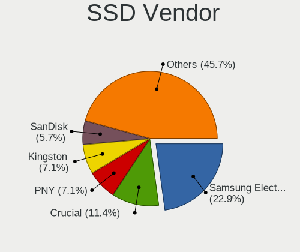
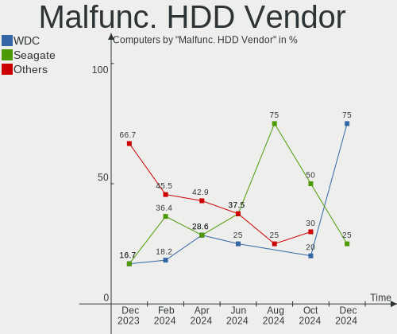
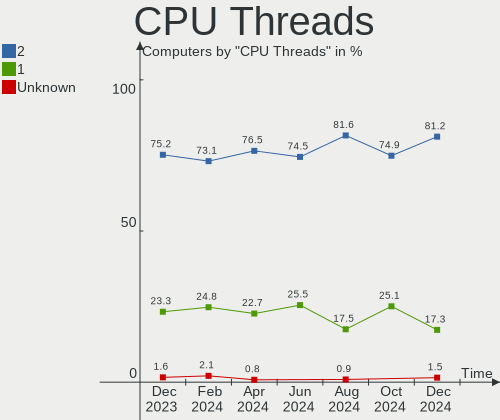
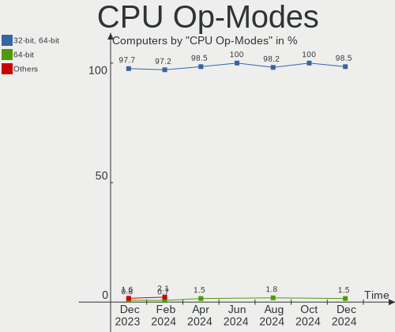
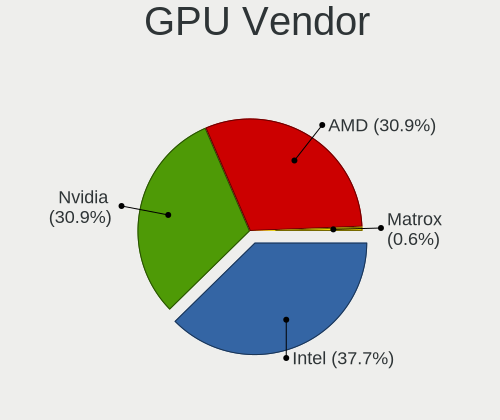
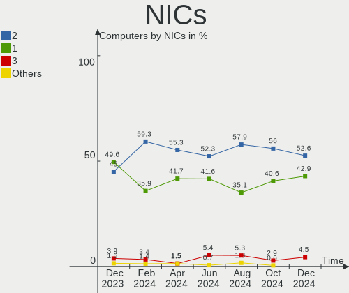

Kubuntu - Hardware Trends
-------------------------

A project to identify most popular hardware characteristics and track their change
over time based on data collected by Linux users at https://Linux-Hardware.org.

Anyone can contribute to this report by the [hw-probe](https://github.com/linuxhw/hw-probe) tool:

    sudo -E hw-probe -all -upload

This is a report for all computer types. See also reports for [desktops](/Dist/Kubuntu/Desktop/README.md) and [notebooks](/Dist/Kubuntu/Notebook/README.md).

This report is for one last month. Overall report since the beginning of time: [TestCoverage](https://github.com/linuxhw/TestCoverage)

Period: Dec, 2022.

Contents
--------

* [ System ](#system)
  - [ OS                       ](#os)
  - [ OS Family                ](#os-family)
  - [ Kernel                   ](#kernel)
  - [ Kernel Family            ](#kernel-family)
  - [ Kernel Major Ver.        ](#kernel-major-ver)
  - [ Arch                     ](#arch)
  - [ DE                       ](#de)
  - [ Display Server           ](#display-server)
  - [ Display Manager          ](#display-manager)
  - [ OS Lang                  ](#os-lang)
  - [ Boot Mode                ](#boot-mode)
  - [ Filesystem               ](#filesystem)
  - [ Part. scheme             ](#part-scheme)
  - [ Dual Boot with Linux/BSD ](#dual-boot-with-linuxbsd)
  - [ Dual Boot (Win)          ](#dual-boot-win)

* [ Board ](#board)
  - [ Vendor                   ](#vendor)
  - [ Model                    ](#model)
  - [ Model Family             ](#model-family)
  - [ MFG Year                 ](#mfg-year)
  - [ Form Factor              ](#form-factor)
  - [ Secure Boot              ](#secure-boot)
  - [ Coreboot                 ](#coreboot)
  - [ RAM Size                 ](#ram-size)
  - [ RAM Used                 ](#ram-used)
  - [ Total Drives             ](#total-drives)
  - [ Has CD-ROM               ](#has-cd-rom)
  - [ Has Ethernet             ](#has-ethernet)
  - [ Has WiFi                 ](#has-wifi)
  - [ Has Bluetooth            ](#has-bluetooth)

* [ Location ](#location)
  - [ Country                  ](#country)
  - [ City                     ](#city)

* [ Drives ](#drives)
  - [ Drive Vendor             ](#drive-vendor)
  - [ Drive Model              ](#drive-model)
  - [ HDD Vendor               ](#hdd-vendor)
  - [ SSD Vendor               ](#ssd-vendor)
  - [ Drive Kind               ](#drive-kind)
  - [ Drive Connector          ](#drive-connector)
  - [ Drive Size               ](#drive-size)
  - [ Space Total              ](#space-total)
  - [ Space Used               ](#space-used)
  - [ Malfunc. Drives          ](#malfunc-drives)
  - [ Malfunc. Drive Vendor    ](#malfunc-drive-vendor)
  - [ Malfunc. HDD Vendor      ](#malfunc-hdd-vendor)
  - [ Malfunc. Drive Kind      ](#malfunc-drive-kind)
  - [ Failed Drives            ](#failed-drives)
  - [ Failed Drive Vendor      ](#failed-drive-vendor)
  - [ Drive Status             ](#drive-status)

* [ Storage controller ](#storage-controller)
  - [ Storage Vendor           ](#storage-vendor)
  - [ Storage Model            ](#storage-model)
  - [ Storage Kind             ](#storage-kind)

* [ Processor ](#processor)
  - [ CPU Vendor               ](#cpu-vendor)
  - [ CPU Model                ](#cpu-model)
  - [ CPU Model Family         ](#cpu-model-family)
  - [ CPU Cores                ](#cpu-cores)
  - [ CPU Sockets              ](#cpu-sockets)
  - [ CPU Threads              ](#cpu-threads)
  - [ CPU Op-Modes             ](#cpu-op-modes)
  - [ CPU Microcode            ](#cpu-microcode)
  - [ CPU Microarch            ](#cpu-microarch)

* [ Graphics ](#graphics)
  - [ GPU Vendor               ](#gpu-vendor)
  - [ GPU Model                ](#gpu-model)
  - [ GPU Combo                ](#gpu-combo)
  - [ GPU Driver               ](#gpu-driver)
  - [ GPU Memory               ](#gpu-memory)

* [ Monitor ](#monitor)
  - [ Monitor Vendor           ](#monitor-vendor)
  - [ Monitor Model            ](#monitor-model)
  - [ Monitor Resolution       ](#monitor-resolution)
  - [ Monitor Diagonal         ](#monitor-diagonal)
  - [ Monitor Width            ](#monitor-width)
  - [ Aspect Ratio             ](#aspect-ratio)
  - [ Monitor Area             ](#monitor-area)
  - [ Pixel Density            ](#pixel-density)
  - [ Multiple Monitors        ](#multiple-monitors)

* [ Network ](#network)
  - [ Net Controller Vendor    ](#net-controller-vendor)
  - [ Net Controller Model     ](#net-controller-model)
  - [ Wireless Vendor          ](#wireless-vendor)
  - [ Wireless Model           ](#wireless-model)
  - [ Ethernet Vendor          ](#ethernet-vendor)
  - [ Ethernet Model           ](#ethernet-model)
  - [ Net Controller Kind      ](#net-controller-kind)
  - [ Used Controller          ](#used-controller)
  - [ NICs                     ](#nics)
  - [ IPv6                     ](#ipv6)

* [ Bluetooth ](#bluetooth)
  - [ Bluetooth Vendor         ](#bluetooth-vendor)
  - [ Bluetooth Model          ](#bluetooth-model)

* [ Sound ](#sound)
  - [ Sound Vendor             ](#sound-vendor)
  - [ Sound Model              ](#sound-model)

* [ Memory ](#memory)
  - [ Memory Vendor            ](#memory-vendor)
  - [ Memory Model             ](#memory-model)
  - [ Memory Kind              ](#memory-kind)
  - [ Memory Form Factor       ](#memory-form-factor)
  - [ Memory Size              ](#memory-size)
  - [ Memory Speed             ](#memory-speed)

* [ Printers & scanners ](#printers--scanners)
  - [ Printer Vendor           ](#printer-vendor)
  - [ Printer Model            ](#printer-model)
  - [ Scanner Vendor           ](#scanner-vendor)
  - [ Scanner Model            ](#scanner-model)

* [ Camera ](#camera)
  - [ Camera Vendor            ](#camera-vendor)
  - [ Camera Model             ](#camera-model)

* [ Security ](#security)
  - [ Fingerprint Vendor       ](#fingerprint-vendor)
  - [ Fingerprint Model        ](#fingerprint-model)
  - [ Chipcard Vendor          ](#chipcard-vendor)
  - [ Chipcard Model           ](#chipcard-model)

* [ Unsupported ](#unsupported)
  - [ Unsupported Devices      ](#unsupported-devices)
  - [ Unsupported Device Types ](#unsupported-device-types)

System
------

OS
--

Installed operating systems

| Name          | Computers | Percent |
|---------------|-----------|---------|
| Kubuntu 22.04 | 69        | 53.08%  |
| Kubuntu 22.10 | 41        | 31.54%  |
| Kubuntu 20.04 | 13        | 10%     |
| Kubuntu 11    | 3         | 2.31%   |
| Kubuntu 21.10 | 1         | 0.77%   |
| Kubuntu 21.04 | 1         | 0.77%   |
| Kubuntu 20.10 | 1         | 0.77%   |
| Kubuntu 16.04 | 1         | 0.77%   |

OS Family
---------

OS without a version

| Name    | Computers | Percent |
|---------|-----------|---------|
| Kubuntu | 130       | 100%    |

Kernel
------

Version of the Linux kernel

| Version                           | Computers | Percent |
|-----------------------------------|-----------|---------|
| 5.15.0-56-generic                 | 54        | 41.54%  |
| 5.19.0-26-generic                 | 28        | 21.54%  |
| 5.15.0-56-lowlatency              | 5         | 3.85%   |
| 5.15.0-53-generic                 | 5         | 3.85%   |
| 6.0.9-060009-generic              | 3         | 2.31%   |
| 5.19.0-21-generic                 | 3         | 2.31%   |
| 5.15.0-43-generic                 | 3         | 2.31%   |
| 5.4.0-135-generic                 | 2         | 1.54%   |
| 5.19.0-23-generic                 | 2         | 1.54%   |
| 5.19.0-1012-lowlatency            | 2         | 1.54%   |
| 5.15.0-52-generic                 | 2         | 1.54%   |
| 6.0.6-76060006-generic            | 1         | 0.77%   |
| 6.0.0-1006-oem                    | 1         | 0.77%   |
| 5.8.0-25-generic                  | 1         | 0.77%   |
| 5.4.0-120-generic                 | 1         | 0.77%   |
| 5.19.0-28-generic                 | 1         | 0.77%   |
| 5.19.0-27-generic                 | 1         | 0.77%   |
| 5.17.0-1021-oem                   | 1         | 0.77%   |
| 5.17.0-1020-oem                   | 1         | 0.77%   |
| 5.15.78                           | 1         | 0.77%   |
| 5.15.0-57-generic                 | 1         | 0.77%   |
| 5.15.0-53-lowlatency              | 1         | 0.77%   |
| 5.15.0-52-lowlatency              | 1         | 0.77%   |
| 5.15.0-48-generic                 | 1         | 0.77%   |
| 5.15.0-47-generic                 | 1         | 0.77%   |
| 5.15.0-43-lowlatency              | 1         | 0.77%   |
| 5.15.0-25-generic                 | 1         | 0.77%   |
| 5.13.0-52-generic                 | 1         | 0.77%   |
| 5.11.0-49-generic                 | 1         | 0.77%   |
| 5.11.0-43-generic                 | 1         | 0.77%   |
| 5.10.66-27-rockchip-gea60d388902d | 1         | 0.77%   |
| 4.4.0-210-generic                 | 1         | 0.77%   |

Kernel Family
-------------

Linux kernel without a distro release

| Version | Computers | Percent |
|---------|-----------|---------|
| 5.15.0  | 76        | 58.46%  |
| 5.19.0  | 37        | 28.46%  |
| 6.0.9   | 3         | 2.31%   |
| 5.4.0   | 3         | 2.31%   |
| 5.17.0  | 2         | 1.54%   |
| 5.11.0  | 2         | 1.54%   |
| 6.0.6   | 1         | 0.77%   |
| 6.0.0   | 1         | 0.77%   |
| 5.8.0   | 1         | 0.77%   |
| 5.15.78 | 1         | 0.77%   |
| 5.13.0  | 1         | 0.77%   |
| 5.10.66 | 1         | 0.77%   |
| 4.4.0   | 1         | 0.77%   |

Kernel Major Ver.
-----------------

Linux kernel major version

| Version | Computers | Percent |
|---------|-----------|---------|
| 5.15    | 77        | 59.23%  |
| 5.19    | 37        | 28.46%  |
| 6.0     | 5         | 3.85%   |
| 5.4     | 3         | 2.31%   |
| 5.17    | 2         | 1.54%   |
| 5.11    | 2         | 1.54%   |
| 5.8     | 1         | 0.77%   |
| 5.13    | 1         | 0.77%   |
| 5.10    | 1         | 0.77%   |
| 4.4     | 1         | 0.77%   |

Arch
----

OS architecture (x86_64, i586, etc.)

| Name    | Computers | Percent |
|---------|-----------|---------|
| x86_64  | 128       | 98.46%  |
| aarch64 | 2         | 1.54%   |

DE
--

Desktop Environment

| Name  | Computers | Percent |
|-------|-----------|---------|
| KDE5  | 128       | 98.46%  |
| KDE   | 1         | 0.77%   |
| GNOME | 1         | 0.77%   |

Display Server
--------------

X11 or Wayland

| Name    | Computers | Percent |
|---------|-----------|---------|
| X11     | 118       | 90.77%  |
| Wayland | 7         | 5.38%   |
| Tty     | 4         | 3.08%   |
| Web     | 1         | 0.77%   |

Display Manager
---------------

SDDM, LightDM, etc.

| Name    | Computers | Percent |
|---------|-----------|---------|
| SDDM    | 94        | 72.31%  |
| Unknown | 25        | 19.23%  |
| GDM3    | 5         | 3.85%   |
| LightDM | 4         | 3.08%   |
| GDM     | 2         | 1.54%   |

OS Lang
-------

Language

| Lang  | Computers | Percent |
|-------|-----------|---------|
| en_US | 66        | 50.77%  |
| de_DE | 12        | 9.23%   |
| fr_FR | 10        | 7.69%   |
| it_IT | 8         | 6.15%   |
| en_GB | 4         | 3.08%   |
| ru_RU | 3         | 2.31%   |
| es_ES | 3         | 2.31%   |
| en_AU | 3         | 2.31%   |
| pt_BR | 2         | 1.54%   |
| pl_PL | 2         | 1.54%   |
| hu_HU | 2         | 1.54%   |
| en_SG | 2         | 1.54%   |
| C     | 2         | 1.54%   |
| zh_TW | 1         | 0.77%   |
| uk_UA | 1         | 0.77%   |
| tr_TR | 1         | 0.77%   |
| sl_SI | 1         | 0.77%   |
| nl_NL | 1         | 0.77%   |
| fr_CH | 1         | 0.77%   |
| fi_FI | 1         | 0.77%   |
| en_NZ | 1         | 0.77%   |
| en_IN | 1         | 0.77%   |
| en_AG | 1         | 0.77%   |
| de_AT | 1         | 0.77%   |

Boot Mode
---------

EFI or BIOS

| Mode | Computers | Percent |
|------|-----------|---------|
| EFI  | 70        | 53.85%  |
| BIOS | 60        | 46.15%  |

Filesystem
----------

Type of filesystem

| Type    | Computers | Percent |
|---------|-----------|---------|
| Ext4    | 116       | 89.23%  |
| Btrfs   | 7         | 5.38%   |
| Overlay | 4         | 3.08%   |
| Zfs     | 1         | 0.77%   |
| Xfs     | 1         | 0.77%   |
| Ext2    | 1         | 0.77%   |

Part. scheme
------------

Scheme of partitioning

| Type    | Computers | Percent |
|---------|-----------|---------|
| GPT     | 88        | 67.69%  |
| Unknown | 25        | 19.23%  |
| MBR     | 17        | 13.08%  |

Dual Boot with Linux/BSD
------------------------

Hosting more than one Linux/BSD

| Dual boot | Computers | Percent |
|-----------|-----------|---------|
| No        | 118       | 90.77%  |
| Yes       | 12        | 9.23%   |

Dual Boot (Win)
---------------

Hosting Linux and Windows

| Dual boot | Computers | Percent |
|-----------|-----------|---------|
| No        | 82        | 63.08%  |
| Yes       | 48        | 36.92%  |

Board
-----

Vendor
------

Motherboard manufacturer

| Name                | Computers | Percent |
|---------------------|-----------|---------|
| Lenovo              | 23        | 17.69%  |
| ASUSTek Computer    | 18        | 13.85%  |
| Hewlett-Packard     | 16        | 12.31%  |
| Dell                | 15        | 11.54%  |
| Acer                | 12        | 9.23%   |
| Gigabyte Technology | 10        | 7.69%   |
| MSI                 | 7         | 5.38%   |
| ASRock              | 5         | 3.85%   |
| Notebook            | 3         | 2.31%   |
| Apple               | 3         | 2.31%   |
| HUAWEI              | 2         | 1.54%   |
| BESSTAR Tech        | 2         | 1.54%   |
| TUXEDO              | 1         | 0.77%   |
| Timi                | 1         | 0.77%   |
| SGIN                | 1         | 0.77%   |
| Schenker            | 1         | 0.77%   |
| Samsung Electronics | 1         | 0.77%   |
| Radxa               | 1         | 0.77%   |
| Pegatron            | 1         | 0.77%   |
| Monster             | 1         | 0.77%   |
| Microsoft           | 1         | 0.77%   |
| Google              | 1         | 0.77%   |
| Fujitsu             | 1         | 0.77%   |
| Framework           | 1         | 0.77%   |
| Carbon Systems      | 1         | 0.77%   |
| AZW                 | 1         | 0.77%   |

Model
-----

Motherboard model

| Name                                                      | Computers | Percent |
|-----------------------------------------------------------|-----------|---------|
| TUXEDO InfinityBook Pro Gen7 (MK1)                        | 1         | 0.77%   |
| Timi TM1701                                               | 1         | 0.77%   |
| SGIN laptop                                               | 1         | 0.77%   |
| Schenker XMG APEX (Mid 2021)                              | 1         | 0.77%   |
| Samsung 550P5C/550P7C                                     | 1         | 0.77%   |
| Radxa ROCK 5B                                             | 1         | 0.77%   |
| Pegatron p7-1011it                                        | 1         | 0.77%   |
| Notebook P17SM                                            | 1         | 0.77%   |
| Notebook NP5x_NP6x_NP7xPNK_PNH_PNJ                        | 1         | 0.77%   |
| Notebook NL5xRU                                           | 1         | 0.77%   |
| MSI MS-7C35                                               | 1         | 0.77%   |
| MSI MS-7B79                                               | 1         | 0.77%   |
| MSI MS-7B24                                               | 1         | 0.77%   |
| MSI MS-7B17                                               | 1         | 0.77%   |
| MSI MS-7A38                                               | 1         | 0.77%   |
| MSI GP62 7QF                                              | 1         | 0.77%   |
| MSI A0000001                                              | 1         | 0.77%   |
| Monster TULPAR T7 V21.6                                   | 1         | 0.77%   |
| Microsoft Surface Laptop                                  | 1         | 0.77%   |
| Lenovo ThinkSystem SR358FV2 Reserved for BaseBoard Vendor | 1         | 0.77%   |
| Lenovo ThinkPad X230 23256N6                              | 1         | 0.77%   |
| Lenovo ThinkPad X1 Carbon 5th 20HQS0BK00                  | 1         | 0.77%   |
| Lenovo ThinkPad T61 7665VJM                               | 1         | 0.77%   |
| Lenovo ThinkPad T530 24295XU                              | 1         | 0.77%   |
| Lenovo ThinkPad T510 4313CTO                              | 1         | 0.77%   |
| Lenovo ThinkPad T470s 20HGS1JN00                          | 1         | 0.77%   |
| Lenovo ThinkPad T420 4236PZ0                              | 1         | 0.77%   |
| Lenovo ThinkPad R61 8918DMG                               | 1         | 0.77%   |
| Lenovo ThinkPad E15 20RD0011MZ                            | 1         | 0.77%   |
| Lenovo ThinkCentre M75e 5065A11                           | 1         | 0.77%   |
| Lenovo ThinkCentre M73 10B1S0PR00                         | 1         | 0.77%   |
| Lenovo ThinkCentre M715q 10VG000EUS                       | 1         | 0.77%   |
| Lenovo ThinkCentre A70 7844H9G                            | 1         | 0.77%   |
| Lenovo ThinkBook 15-IML 20RW                              | 1         | 0.77%   |
| Lenovo ThinkBook 15 G2 ITL 20VE                           | 1         | 0.77%   |
| Lenovo Legion 5 Pro 16ACH6H 82JQ                          | 1         | 0.77%   |
| Lenovo IdeaPadFlex 5 15ITL05 82HT                         | 1         | 0.77%   |
| Lenovo IdeaPadFlex 5 14ALC7 82R9                          | 1         | 0.77%   |
| Lenovo IdeaPad 700-17ISK 80RV                             | 1         | 0.77%   |
| Lenovo IdeaPad 3 15ADA05 81W1                             | 1         | 0.77%   |

Model Family
------------

Motherboard model prefix

| Name                | Computers | Percent |
|---------------------|-----------|---------|
| Lenovo ThinkPad     | 9         | 6.92%   |
| Acer Aspire         | 7         | 5.38%   |
| Lenovo ThinkCentre  | 4         | 3.08%   |
| Dell Inspiron       | 4         | 3.08%   |
| HP ProBook          | 3         | 2.31%   |
| HP Pavilion         | 3         | 2.31%   |
| HP EliteBook        | 3         | 2.31%   |
| Dell Precision      | 3         | 2.31%   |
| ASUS ROG            | 3         | 2.31%   |
| Lenovo ThinkBook    | 2         | 1.54%   |
| Lenovo IdeaPadFlex  | 2         | 1.54%   |
| Lenovo IdeaPad      | 2         | 1.54%   |
| Gigabyte B450       | 2         | 1.54%   |
| Dell XPS            | 2         | 1.54%   |
| Dell Vostro         | 2         | 1.54%   |
| Dell Latitude       | 2         | 1.54%   |
| ASUS VivoBook       | 2         | 1.54%   |
| Apple MacBookPro14  | 2         | 1.54%   |
| Acer Nitro          | 2         | 1.54%   |
| TUXEDO InfinityBook | 1         | 0.77%   |
| Timi TM1701         | 1         | 0.77%   |
| SGIN laptop         | 1         | 0.77%   |
| Schenker XMG        | 1         | 0.77%   |
| Samsung 550P5C      | 1         | 0.77%   |
| Radxa ROCK          | 1         | 0.77%   |
| Pegatron p7-1011it  | 1         | 0.77%   |
| Notebook P17SM      | 1         | 0.77%   |
| Notebook NP5x       | 1         | 0.77%   |
| Notebook NL5xRU     | 1         | 0.77%   |
| MSI MS-7C35         | 1         | 0.77%   |
| MSI MS-7B79         | 1         | 0.77%   |
| MSI MS-7B24         | 1         | 0.77%   |
| MSI MS-7B17         | 1         | 0.77%   |
| MSI MS-7A38         | 1         | 0.77%   |
| MSI GP62            | 1         | 0.77%   |
| MSI A0000001        | 1         | 0.77%   |
| Monster TULPAR      | 1         | 0.77%   |
| Microsoft Surface   | 1         | 0.77%   |
| Lenovo ThinkSystem  | 1         | 0.77%   |
| Lenovo Legion       | 1         | 0.77%   |

MFG Year
--------

Motherboard manufacture year

| Year    | Computers | Percent |
|---------|-----------|---------|
| 2021    | 21        | 16.15%  |
| 2018    | 19        | 14.62%  |
| 2022    | 13        | 10%     |
| 2020    | 12        | 9.23%   |
| 2019    | 12        | 9.23%   |
| 2017    | 7         | 5.38%   |
| 2014    | 7         | 5.38%   |
| 2016    | 6         | 4.62%   |
| 2015    | 6         | 4.62%   |
| 2011    | 6         | 4.62%   |
| 2013    | 5         | 3.85%   |
| 2012    | 5         | 3.85%   |
| 2010    | 3         | 2.31%   |
| 2009    | 2         | 1.54%   |
| 2008    | 2         | 1.54%   |
| 2007    | 2         | 1.54%   |
| Unknown | 2         | 1.54%   |

Form Factor
-----------

Physical design of the computer

| Name           | Computers | Percent |
|----------------|-----------|---------|
| Notebook       | 73        | 56.15%  |
| Desktop        | 42        | 32.31%  |
| Convertible    | 7         | 5.38%   |
| Mini pc        | 3         | 2.31%   |
| Server         | 2         | 1.54%   |
| System on chip | 1         | 0.77%   |
| Tablet         | 1         | 0.77%   |
| All in one     | 1         | 0.77%   |

Secure Boot
-----------

Enabled or disabled

| State    | Computers | Percent |
|----------|-----------|---------|
| Disabled | 120       | 92.31%  |
| Enabled  | 10        | 7.69%   |

Coreboot
--------

Have coreboot on board

| Used | Computers | Percent |
|------|-----------|---------|
| No   | 128       | 98.46%  |
| Yes  | 2         | 1.54%   |

RAM Size
--------

Total RAM memory

| Size in GB  | Computers | Percent |
|-------------|-----------|---------|
| 16.01-24.0  | 39        | 30%     |
| 8.01-16.0   | 27        | 20.77%  |
| 4.01-8.0    | 22        | 16.92%  |
| 32.01-64.0  | 22        | 16.92%  |
| 3.01-4.0    | 10        | 7.69%   |
| 64.01-256.0 | 6         | 4.62%   |
| 24.01-32.0  | 3         | 2.31%   |
| 2.01-3.0    | 1         | 0.77%   |

RAM Used
--------

Used RAM memory

| Used GB     | Computers | Percent |
|-------------|-----------|---------|
| 4.01-8.0    | 33        | 25.38%  |
| 2.01-3.0    | 33        | 25.38%  |
| 3.01-4.0    | 27        | 20.77%  |
| 1.01-2.0    | 20        | 15.38%  |
| 8.01-16.0   | 9         | 6.92%   |
| 16.01-24.0  | 4         | 3.08%   |
| 0.51-1.0    | 2         | 1.54%   |
| 64.01-256.0 | 1         | 0.77%   |
| 0.01-0.5    | 1         | 0.77%   |

Total Drives
------------

Number of drives on board

| Drives | Computers | Percent |
|--------|-----------|---------|
| 1      | 76        | 58.46%  |
| 2      | 28        | 21.54%  |
| 3      | 15        | 11.54%  |
| 4      | 5         | 3.85%   |
| 5      | 4         | 3.08%   |
| 6      | 2         | 1.54%   |

Has CD-ROM
----------

Has CD-ROM on board

| Presented | Computers | Percent |
|-----------|-----------|---------|
| No        | 92        | 70.77%  |
| Yes       | 38        | 29.23%  |

Has Ethernet
------------

Has Ethernet on board

| Presented | Computers | Percent |
|-----------|-----------|---------|
| Yes       | 106       | 81.54%  |
| No        | 24        | 18.46%  |

Has WiFi
--------

Has WiFi module

| Presented | Computers | Percent |
|-----------|-----------|---------|
| Yes       | 107       | 82.31%  |
| No        | 23        | 17.69%  |

Has Bluetooth
-------------

Has Bluetooth module

| Presented | Computers | Percent |
|-----------|-----------|---------|
| Yes       | 93        | 71.54%  |
| No        | 37        | 28.46%  |

Location
--------

Country
-------

Geographic location (country)

| Country      | Computers | Percent |
|--------------|-----------|---------|
| USA          | 29        | 22.31%  |
| Germany      | 15        | 11.54%  |
| Italy        | 14        | 10.77%  |
| France       | 12        | 9.23%   |
| Russia       | 6         | 4.62%   |
| Switzerland  | 4         | 3.08%   |
| Poland       | 4         | 3.08%   |
| UK           | 3         | 2.31%   |
| Spain        | 3         | 2.31%   |
| Hungary      | 3         | 2.31%   |
| Australia    | 3         | 2.31%   |
| Singapore    | 2         | 1.54%   |
| Saudi Arabia | 2         | 1.54%   |
| Netherlands  | 2         | 1.54%   |
| Brazil       | 2         | 1.54%   |
| Ukraine      | 1         | 0.77%   |
| Turkey       | 1         | 0.77%   |
| Thailand     | 1         | 0.77%   |
| Taiwan       | 1         | 0.77%   |
| Slovenia     | 1         | 0.77%   |
| Slovakia     | 1         | 0.77%   |
| Serbia       | 1         | 0.77%   |
| Romania      | 1         | 0.77%   |
| Portugal     | 1         | 0.77%   |
| New Zealand  | 1         | 0.77%   |
| Mexico       | 1         | 0.77%   |
| Lithuania    | 1         | 0.77%   |
| Latvia       | 1         | 0.77%   |
| Kazakhstan   | 1         | 0.77%   |
| Israel       | 1         | 0.77%   |
| India        | 1         | 0.77%   |
| Hong Kong    | 1         | 0.77%   |
| Finland      | 1         | 0.77%   |
| Denmark      | 1         | 0.77%   |
| Chile        | 1         | 0.77%   |
| Canada       | 1         | 0.77%   |
| Cameroon     | 1         | 0.77%   |
| Bulgaria     | 1         | 0.77%   |
| Belarus      | 1         | 0.77%   |
| Austria      | 1         | 0.77%   |

City
----

Geographic location (city)

| City             | Computers | Percent |
|------------------|-----------|---------|
| Warsaw           | 3         | 2.31%   |
| Munich           | 3         | 2.31%   |
| St Petersburg    | 2         | 1.54%   |
| Singapore        | 2         | 1.54%   |
| Rome             | 2         | 1.54%   |
| Milan            | 2         | 1.54%   |
| Jeddah           | 2         | 1.54%   |
| Ambazac          | 2         | 1.54%   |
| Zurich           | 1         | 0.77%   |
| Yekaterinburg    | 1         | 0.77%   |
| Yaoundé         | 1         | 0.77%   |
| Woodbridge       | 1         | 0.77%   |
| Waterflow        | 1         | 0.77%   |
| Walthamstow      | 1         | 0.77%   |
| Vilnius          | 1         | 0.77%   |
| Vigo             | 1         | 0.77%   |
| Vienna           | 1         | 0.77%   |
| Unterfoehring    | 1         | 0.77%   |
| Traverse City    | 1         | 0.77%   |
| Temryuk          | 1         | 0.77%   |
| Tapioszele       | 1         | 0.77%   |
| Taipei           | 1         | 0.77%   |
| Sydney           | 1         | 0.77%   |
| Stadtlohn        | 1         | 0.77%   |
| Sofia            | 1         | 0.77%   |
| Shirley          | 1         | 0.77%   |
| Sheffield        | 1         | 0.77%   |
| Seattle          | 1         | 0.77%   |
| Schiffweiler     | 1         | 0.77%   |
| Sava             | 1         | 0.77%   |
| Santiago         | 1         | 0.77%   |
| San Francisco    | 1         | 0.77%   |
| San Clemente     | 1         | 0.77%   |
| Saint Joseph     | 1         | 0.77%   |
| Roslyn           | 1         | 0.77%   |
| Rosemead         | 1         | 0.77%   |
| Roche-la-Moliere | 1         | 0.77%   |
| Rio de Janeiro   | 1         | 0.77%   |
| Riga             | 1         | 0.77%   |
| Puerto Vallarta  | 1         | 0.77%   |

Drives
------

Drive Vendor
------------

Hard drive vendors

| Vendor                      | Computers | Drives | Percent |
|-----------------------------|-----------|--------|---------|
| Samsung Electronics         | 40        | 53     | 19.9%   |
| WDC                         | 31        | 38     | 15.42%  |
| SanDisk                     | 19        | 20     | 9.45%   |
| Kingston                    | 15        | 15     | 7.46%   |
| Toshiba                     | 14        | 15     | 6.97%   |
| Seagate                     | 14        | 14     | 6.97%   |
| SK hynix                    | 7         | 7      | 3.48%   |
| Crucial                     | 7         | 7      | 3.48%   |
| Intel                       | 6         | 6      | 2.99%   |
| Silicon Motion              | 5         | 5      | 2.49%   |
| Micron Technology           | 5         | 5      | 2.49%   |
| Unknown                     | 4         | 7      | 1.99%   |
| Hitachi                     | 4         | 4      | 1.99%   |
| Phison                      | 3         | 3      | 1.49%   |
| Intenso                     | 3         | 3      | 1.49%   |
| HGST                        | 3         | 3      | 1.49%   |
| Apple                       | 3         | 4      | 1.49%   |
| SPCC                        | 2         | 2      | 1%      |
| Corsair                     | 2         | 2      | 1%      |
| Shenzhen                    | 1         | 1      | 0.5%    |
| SABRENT                     | 1         | 1      | 0.5%    |
| R580                        | 1         | 1      | 0.5%    |
| Patriot                     | 1         | 1      | 0.5%    |
| OCZ                         | 1         | 1      | 0.5%    |
| NGFF                        | 1         | 1      | 0.5%    |
| Micron/Crucial Technology   | 1         | 2      | 0.5%    |
| Mass                        | 1         | 1      | 0.5%    |
| LITEON                      | 1         | 1      | 0.5%    |
| Kingston Technology Company | 1         | 1      | 0.5%    |
| JMicron Technology          | 1         | 1      | 0.5%    |
| China                       | 1         | 1      | 0.5%    |
| AMD                         | 1         | 1      | 0.5%    |
| A-DATA Technology           | 1         | 1      | 0.5%    |

Drive Model
-----------

Hard drive models

| Model                                                  | Computers | Percent |
|--------------------------------------------------------|-----------|---------|
| Samsung NVMe SSD Controller SM981/PM981/PM983 500GB    | 6         | 2.74%   |
| Silicon Motion SM2263EN/SM2263XT SSD Controller 1024GB | 4         | 1.83%   |
| Kingston SA2000M81000G 1TB                             | 4         | 1.83%   |
| Toshiba MQ01ABD100 1TB                                 | 3         | 1.37%   |
| SanDisk NVMe SSD Drive 1TB                             | 3         | 1.37%   |
| Kingston SA400S37480G 480GB SSD                        | 3         | 1.37%   |
| Kingston SA400S37240G 240GB SSD                        | 3         | 1.37%   |
| WDC WDS100T2B0C-00PXH0 1TB                             | 2         | 0.91%   |
| WDC WD20EZBX-00AYRA0 2TB                               | 2         | 0.91%   |
| Seagate ST1000LM024 HN-M101MBB 1TB                     | 2         | 0.91%   |
| SanDisk SSD PLUS 480GB                                 | 2         | 0.91%   |
| Samsung SSD 980 PRO 1TB                                | 2         | 0.91%   |
| Samsung SSD 980 1TB                                    | 2         | 0.91%   |
| Samsung SSD 970 EVO Plus 2TB                           | 2         | 0.91%   |
| Samsung SSD 870 QVO 1TB                                | 2         | 0.91%   |
| Samsung SSD 870 EVO 4TB                                | 2         | 0.91%   |
| Samsung SSD 850 EVO 500GB                              | 2         | 0.91%   |
| Samsung NVMe SSD Controller SM961/PM961/SM963 256GB    | 2         | 0.91%   |
| Intenso SSD 120GB                                      | 2         | 0.91%   |
| WDC WDS500G2B0B-00YS70 500GB SSD                       | 1         | 0.46%   |
| WDC WDS500G2B0A 500GB SSD                              | 1         | 0.46%   |
| WDC WDS500G1B0A-00H9H0 500GB SSD                       | 1         | 0.46%   |
| WDC WDS100T3X0C-00SJG0 1TB                             | 1         | 0.46%   |
| WDC WDS100T2B0B-00YS70 1TB SSD                         | 1         | 0.46%   |
| WDC WDS100T2B0A 1TB SSD                                | 1         | 0.46%   |
| WDC WD80EFBX-68AZZN0 8TB                               | 1         | 0.46%   |
| WDC WD6400BEVT-22A0RT0 640GB                           | 1         | 0.46%   |
| WDC WD6003FZBX-00K5WB0 6TB                             | 1         | 0.46%   |
| WDC WD5000LPCX-24C6HT0 500GB                           | 1         | 0.46%   |
| WDC WD5000AAKX-08U6AA0 500GB                           | 1         | 0.46%   |
| WDC WD5000AAKX-001CA0 500GB                            | 1         | 0.46%   |
| WDC WD5000AAKS-60WWPA0 500GB                           | 1         | 0.46%   |
| WDC WD40EZRZ-00GXCB0 4TB                               | 1         | 0.46%   |
| WDC WD3200AAJS-56M0A0 320GB                            | 1         | 0.46%   |
| WDC WD30EZRX-00MMMB0 3TB                               | 1         | 0.46%   |
| WDC WD20SPZX-22UA7T0 2TB                               | 1         | 0.46%   |
| WDC WD20EZRX-00D8PB0 2TB                               | 1         | 0.46%   |
| WDC WD20EARX-00PASB0 2TB                               | 1         | 0.46%   |
| WDC WD1600BEVT-60ZCT1 160GB                            | 1         | 0.46%   |
| WDC WD10SPZX-75Z10T1 1TB                               | 1         | 0.46%   |

HDD Vendor
----------

Hard disk drive vendors

| Vendor              | Computers | Drives | Percent |
|---------------------|-----------|--------|---------|
| WDC                 | 23        | 27     | 41.07%  |
| Seagate             | 13        | 13     | 23.21%  |
| Toshiba             | 10        | 11     | 17.86%  |
| Hitachi             | 4         | 4      | 7.14%   |
| HGST                | 3         | 3      | 5.36%   |
| Unknown             | 1         | 1      | 1.79%   |
| Samsung Electronics | 1         | 1      | 1.79%   |
| Apple               | 1         | 1      | 1.79%   |

SSD Vendor
----------

Solid state drive vendors

| Vendor              | Computers | Drives | Percent |
|---------------------|-----------|--------|---------|
| Samsung Electronics | 18        | 24     | 28.13%  |
| SanDisk             | 12        | 12     | 18.75%  |
| Kingston            | 9         | 9      | 14.06%  |
| Crucial             | 6         | 6      | 9.38%   |
| WDC                 | 5         | 5      | 7.81%   |
| Intenso             | 2         | 2      | 3.13%   |
| Intel               | 2         | 2      | 3.13%   |
| Toshiba             | 1         | 1      | 1.56%   |
| SPCC                | 1         | 1      | 1.56%   |
| R580                | 1         | 1      | 1.56%   |
| Patriot             | 1         | 1      | 1.56%   |
| OCZ                 | 1         | 1      | 1.56%   |
| NGFF                | 1         | 1      | 1.56%   |
| Micron Technology   | 1         | 1      | 1.56%   |
| LITEON              | 1         | 1      | 1.56%   |
| China               | 1         | 1      | 1.56%   |
| A-DATA Technology   | 1         | 1      | 1.56%   |

Drive Kind
----------

HDD or SSD

| Kind    | Computers | Drives | Percent |
|---------|-----------|--------|---------|
| NVMe    | 74        | 86     | 40.22%  |
| SSD     | 56        | 70     | 30.43%  |
| HDD     | 46        | 61     | 25%     |
| Unknown | 6         | 7      | 3.26%   |
| MMC     | 2         | 4      | 1.09%   |

Drive Connector
---------------

SATA, SAS, NVMe, etc.

| Type | Computers | Drives | Percent |
|------|-----------|--------|---------|
| SATA | 77        | 126    | 47.53%  |
| NVMe | 73        | 85     | 45.06%  |
| SAS  | 10        | 13     | 6.17%   |
| MMC  | 2         | 4      | 1.23%   |

Drive Size
----------

Size of hard drive

| Size in TB | Computers | Drives | Percent |
|------------|-----------|--------|---------|
| 0.01-0.5   | 47        | 58     | 43.93%  |
| 0.51-1.0   | 37        | 42     | 34.58%  |
| 1.01-2.0   | 12        | 15     | 11.21%  |
| 3.01-4.0   | 6         | 7      | 5.61%   |
| 4.01-10.0  | 4         | 8      | 3.74%   |
| 2.01-3.0   | 1         | 1      | 0.93%   |

Space Total
-----------

Amount of disk space available on the file system

| Size in GB     | Computers | Percent |
|----------------|-----------|---------|
| 251-500        | 42        | 32.31%  |
| 501-1000       | 24        | 18.46%  |
| 101-250        | 23        | 17.69%  |
| 1001-2000      | 18        | 13.85%  |
| More than 3000 | 9         | 6.92%   |
| 2001-3000      | 5         | 3.85%   |
| 51-100         | 5         | 3.85%   |
| 1-20           | 4         | 3.08%   |

Space Used
----------

Amount of used disk space

| Used GB        | Computers | Percent |
|----------------|-----------|---------|
| 21-50          | 26        | 20%     |
| 1-20           | 26        | 20%     |
| 251-500        | 19        | 14.62%  |
| 101-250        | 19        | 14.62%  |
| 51-100         | 15        | 11.54%  |
| 501-1000       | 12        | 9.23%   |
| 1001-2000      | 9         | 6.92%   |
| More than 3000 | 3         | 2.31%   |
| 2001-3000      | 1         | 0.77%   |

Malfunc. Drives
---------------

Drive models with a malfunction

| Model                                    | Computers | Drives | Percent |
|------------------------------------------|-----------|--------|---------|
| WDC WD6400BEVT-22A0RT0 640GB             | 1         | 1      | 9.09%   |
| WDC WD30EZRX-00MMMB0 3TB                 | 1         | 1      | 9.09%   |
| WDC WD20EARX-00PASB0 2TB                 | 1         | 1      | 9.09%   |
| SanDisk SSD U100 128GB                   | 1         | 1      | 9.09%   |
| SanDisk SDSSDX240GG25 240GB              | 1         | 1      | 9.09%   |
| Samsung Electronics SSD 980 PRO 2TB      | 1         | 1      | 9.09%   |
| Samsung Electronics SSD 870 EVO 4TB      | 1         | 1      | 9.09%   |
| Samsung Electronics SSD 840 Series 120GB | 1         | 1      | 9.09%   |
| R580 SSD 60GB                            | 1         | 1      | 9.09%   |
| Hitachi HTS541010A9E680 1TB              | 1         | 1      | 9.09%   |
| Crucial CT1000P1SSD8 1TB                 | 1         | 1      | 9.09%   |

Malfunc. Drive Vendor
---------------------

Vendors of faulty drives

| Vendor              | Computers | Drives | Percent |
|---------------------|-----------|--------|---------|
| WDC                 | 3         | 3      | 27.27%  |
| Samsung Electronics | 3         | 3      | 27.27%  |
| SanDisk             | 2         | 2      | 18.18%  |
| R580                | 1         | 1      | 9.09%   |
| Hitachi             | 1         | 1      | 9.09%   |
| Crucial             | 1         | 1      | 9.09%   |

Malfunc. HDD Vendor
-------------------

Vendors of faulty HDD drives

| Vendor  | Computers | Drives | Percent |
|---------|-----------|--------|---------|
| WDC     | 3         | 3      | 75%     |
| Hitachi | 1         | 1      | 25%     |

Malfunc. Drive Kind
-------------------

Kinds of faulty drives

| Kind | Computers | Drives | Percent |
|------|-----------|--------|---------|
| SSD  | 5         | 5      | 45.45%  |
| HDD  | 4         | 4      | 36.36%  |
| NVMe | 2         | 2      | 18.18%  |

Failed Drives
-------------

Failed drive models

Zero info for selected period =(

Failed Drive Vendor
-------------------

Failed drive vendors

Zero info for selected period =(

Drive Status
------------

Number of failed and malfunc. drives

| Status   | Computers | Drives | Percent |
|----------|-----------|--------|---------|
| Works    | 75        | 125    | 51.37%  |
| Detected | 62        | 92     | 42.47%  |
| Malfunc  | 9         | 11     | 6.16%   |

Storage controller
------------------

Storage Vendor
--------------

Storage controller vendors

| Vendor                       | Computers | Percent |
|------------------------------|-----------|---------|
| Intel                        | 73        | 38.22%  |
| AMD                          | 36        | 18.85%  |
| Samsung Electronics          | 26        | 13.61%  |
| SanDisk                      | 13        | 6.81%   |
| SK hynix                     | 7         | 3.66%   |
| Kingston Technology Company  | 7         | 3.66%   |
| Silicon Motion               | 5         | 2.62%   |
| Phison Electronics           | 5         | 2.62%   |
| Micron Technology            | 4         | 2.09%   |
| ASMedia Technology           | 4         | 2.09%   |
| Toshiba America Info Systems | 3         | 1.57%   |
| Micron/Crucial Technology    | 2         | 1.05%   |
| Realtek Semiconductor        | 1         | 0.52%   |
| Marvell Technology Group     | 1         | 0.52%   |
| LSI Logic / Symbios Logic    | 1         | 0.52%   |
| JMicron Technology           | 1         | 0.52%   |
| Broadcom / LSI               | 1         | 0.52%   |
| Apple                        | 1         | 0.52%   |

Storage Model
-------------

Storage controller models

| Model                                                                          | Computers | Percent |
|--------------------------------------------------------------------------------|-----------|---------|
| AMD FCH SATA Controller [AHCI mode]                                            | 31        | 14.35%  |
| Samsung NVMe SSD Controller SM981/PM981/PM983                                  | 9         | 4.17%   |
| AMD 400 Series Chipset SATA Controller                                         | 7         | 3.24%   |
| Samsung NVMe SSD Controller 980                                                | 6         | 2.78%   |
| Intel 8 Series/C220 Series Chipset Family 6-port SATA Controller 1 [AHCI mode] | 6         | 2.78%   |
| Samsung NVMe SSD Controller SM961/PM961/SM963                                  | 5         | 2.31%   |
| Intel Volume Management Device NVMe RAID Controller                            | 5         | 2.31%   |
| Intel 6 Series/C200 Series Chipset Family 6 port Mobile SATA AHCI Controller   | 5         | 2.31%   |
| SK hynix Gold P31/PC711 NVMe Solid State Drive                                 | 4         | 1.85%   |
| Silicon Motion SM2263EN/SM2263XT SSD Controller                                | 4         | 1.85%   |
| Samsung NVMe SSD Controller PM9A1/PM9A3/980PRO                                 | 4         | 1.85%   |
| Micron Non-Volatile memory controller                                          | 4         | 1.85%   |
| Kingston Company A2000 NVMe SSD                                                | 4         | 1.85%   |
| Intel 82801 Mobile SATA Controller [RAID mode]                                 | 4         | 1.85%   |
| Intel 7 Series Chipset Family 6-port SATA Controller [AHCI mode]               | 4         | 1.85%   |
| SanDisk WD Blue SN570 NVMe SSD                                                 | 3         | 1.39%   |
| SanDisk WD Blue SN550 NVMe SSD                                                 | 3         | 1.39%   |
| SanDisk Non-Volatile memory controller                                         | 3         | 1.39%   |
| Intel Sunrise Point-LP SATA Controller [AHCI mode]                             | 3         | 1.39%   |
| Intel HM170/QM170 Chipset SATA Controller [AHCI Mode]                          | 3         | 1.39%   |
| Intel Comet Lake SATA AHCI Controller                                          | 3         | 1.39%   |
| Intel Cannon Lake PCH SATA AHCI Controller                                     | 3         | 1.39%   |
| Intel Cannon Lake Mobile PCH SATA AHCI Controller                              | 3         | 1.39%   |
| Intel Alder Lake-P SATA AHCI Controller                                        | 3         | 1.39%   |
| Intel 82801HM/HEM (ICH8M/ICH8M-E) SATA Controller [AHCI mode]                  | 3         | 1.39%   |
| Intel 82801HM/HEM (ICH8M/ICH8M-E) IDE Controller                               | 3         | 1.39%   |
| Intel 7 Series/C210 Series Chipset Family 6-port SATA Controller [AHCI mode]   | 3         | 1.39%   |
| Intel 500 Series Chipset Family SATA AHCI Controller                           | 3         | 1.39%   |
| ASMedia ASM1062 Serial ATA Controller                                          | 3         | 1.39%   |
| AMD 300 Series Chipset SATA Controller                                         | 3         | 1.39%   |
| SK hynix BC501 NVMe Solid State Drive                                          | 2         | 0.93%   |
| SanDisk WD Black SN750 / PC SN730 NVMe SSD                                     | 2         | 0.93%   |
| SanDisk PC SN520 NVMe SSD                                                      | 2         | 0.93%   |
| Samsung NVMe SSD Controller SM951/PM951                                        | 2         | 0.93%   |
| Phison PS5013 E13 NVMe Controller                                              | 2         | 0.93%   |
| Phison E12 NVMe Controller                                                     | 2         | 0.93%   |
| Intel SATA Controller [RAID mode]                                              | 2         | 0.93%   |
| Intel Non-Volatile memory controller                                           | 2         | 0.93%   |
| Intel Celeron/Pentium Silver Processor SATA Controller                         | 2         | 0.93%   |
| Intel 8 Series SATA Controller 1 [AHCI mode]                                   | 2         | 0.93%   |

Storage Kind
------------

Kind of storage controller (IDE, SATA, NVMe, SAS, ...)

| Kind | Computers | Percent |
|------|-----------|---------|
| SATA | 96        | 50.79%  |
| NVMe | 72        | 38.1%   |
| RAID | 13        | 6.88%   |
| IDE  | 8         | 4.23%   |

Processor
---------

CPU Vendor
----------

Processor vendors

| Vendor  | Computers | Percent |
|---------|-----------|---------|
| Intel   | 85        | 65.38%  |
| AMD     | 43        | 33.08%  |
| Phytium | 1         | 0.77%   |
| ARM     | 1         | 0.77%   |

CPU Model
---------

Processor models

| Model                                       | Computers | Percent |
|---------------------------------------------|-----------|---------|
| Intel Core i7-1065G7 CPU @ 1.30GHz          | 3         | 2.31%   |
| Intel 12th Gen Core i7-12700H               | 3         | 2.31%   |
| AMD Ryzen 5 5500U with Radeon Graphics      | 3         | 2.31%   |
| Intel Core i5-8250U CPU @ 1.60GHz           | 2         | 1.54%   |
| Intel Core i5-7300HQ CPU @ 2.50GHz          | 2         | 1.54%   |
| Intel Core i5-2520M CPU @ 2.50GHz           | 2         | 1.54%   |
| Intel Core i5-10210U CPU @ 1.60GHz          | 2         | 1.54%   |
| Intel Core i3-4150 CPU @ 3.50GHz            | 2         | 1.54%   |
| Intel 11th Gen Core i7-1165G7 @ 2.80GHz     | 2         | 1.54%   |
| Intel 11th Gen Core i5-11400H @ 2.70GHz     | 2         | 1.54%   |
| Intel 11th Gen Core i5-1135G7 @ 2.40GHz     | 2         | 1.54%   |
| AMD Ryzen 9 5900X 12-Core Processor         | 2         | 1.54%   |
| AMD Ryzen 7 6800H with Radeon Graphics      | 2         | 1.54%   |
| AMD Ryzen 7 5800H with Radeon Graphics      | 2         | 1.54%   |
| AMD Ryzen 7 5700U with Radeon Graphics      | 2         | 1.54%   |
| AMD Ryzen 7 1700 Eight-Core Processor       | 2         | 1.54%   |
| AMD Ryzen 5 5600G with Radeon Graphics      | 2         | 1.54%   |
| AMD Ryzen 5 3400G with Radeon Vega Graphics | 2         | 1.54%   |
| Phytium FT-2000+/64                         | 1         | 0.77%   |
| Intel Xeon CPU X5650 @ 2.67GHz              | 1         | 0.77%   |
| Intel Xeon CPU E5-1620 0 @ 3.60GHz          | 1         | 0.77%   |
| Intel Pentium Silver N5000 CPU @ 1.10GHz    | 1         | 0.77%   |
| Intel Pentium CPU G2030 @ 3.00GHz           | 1         | 0.77%   |
| Intel Core i9-9900KF CPU @ 3.60GHz          | 1         | 0.77%   |
| Intel Core i9-8950HK CPU @ 2.90GHz          | 1         | 0.77%   |
| Intel Core i7-9750H CPU @ 2.60GHz           | 1         | 0.77%   |
| Intel Core i7-8750H CPU @ 2.20GHz           | 1         | 0.77%   |
| Intel Core i7-8650U CPU @ 1.90GHz           | 1         | 0.77%   |
| Intel Core i7-8550U CPU @ 1.80GHz           | 1         | 0.77%   |
| Intel Core i7-7820HQ CPU @ 2.90GHz          | 1         | 0.77%   |
| Intel Core i7-7700HQ CPU @ 2.80GHz          | 1         | 0.77%   |
| Intel Core i7-7600U CPU @ 2.80GHz           | 1         | 0.77%   |
| Intel Core i7-7500U CPU @ 2.70GHz           | 1         | 0.77%   |
| Intel Core i7-6820HQ CPU @ 2.70GHz          | 1         | 0.77%   |
| Intel Core i7-6700K CPU @ 4.00GHz           | 1         | 0.77%   |
| Intel Core i7-6700HQ CPU @ 2.60GHz          | 1         | 0.77%   |
| Intel Core i7-6700 CPU @ 3.40GHz            | 1         | 0.77%   |
| Intel Core i7-5820K CPU @ 3.30GHz           | 1         | 0.77%   |
| Intel Core i7-5500U CPU @ 2.40GHz           | 1         | 0.77%   |
| Intel Core i7-4800MQ CPU @ 2.70GHz          | 1         | 0.77%   |

CPU Model Family
----------------

Processor model prefix

| Model                | Computers | Percent |
|----------------------|-----------|---------|
| Intel Core i5        | 28        | 21.54%  |
| Intel Core i7        | 24        | 18.46%  |
| Other                | 17        | 13.08%  |
| AMD Ryzen 7          | 16        | 12.31%  |
| AMD Ryzen 5          | 14        | 10.77%  |
| Intel Core i3        | 6         | 4.62%   |
| AMD Ryzen 9          | 5         | 3.85%   |
| Intel Core 2 Duo     | 3         | 2.31%   |
| Intel Celeron        | 3         | 2.31%   |
| Intel Xeon           | 2         | 1.54%   |
| Intel Core i9        | 2         | 1.54%   |
| Intel Pentium Silver | 1         | 0.77%   |
| Intel Pentium        | 1         | 0.77%   |
| AMD Ryzen 5 PRO      | 1         | 0.77%   |
| AMD Ryzen 3 PRO      | 1         | 0.77%   |
| AMD Ryzen 3          | 1         | 0.77%   |
| AMD PRO A10          | 1         | 0.77%   |
| AMD FX               | 1         | 0.77%   |
| AMD Athlon II X2     | 1         | 0.77%   |
| AMD A8               | 1         | 0.77%   |
| AMD A10              | 1         | 0.77%   |

CPU Cores
---------

Number of processor cores

| Number | Computers | Percent |
|--------|-----------|---------|
| 4      | 42        | 32.31%  |
| 2      | 36        | 27.69%  |
| 6      | 21        | 16.15%  |
| 8      | 20        | 15.38%  |
| 12     | 4         | 3.08%   |
| 14     | 3         | 2.31%   |
| 64     | 1         | 0.77%   |
| 16     | 1         | 0.77%   |
| 10     | 1         | 0.77%   |
| 1      | 1         | 0.77%   |

CPU Sockets
-----------

Number of sockets

| Number | Computers | Percent |
|--------|-----------|---------|
| 1      | 128       | 98.46%  |
| 3      | 1         | 0.77%   |
| 2      | 1         | 0.77%   |

CPU Threads
-----------

Threads per core (Hyper-Threading)

| Number | Computers | Percent |
|--------|-----------|---------|
| 2      | 107       | 82.31%  |
| 1      | 23        | 17.69%  |

CPU Op-Modes
------------

CPU Operation Modes (32-bit, 64-bit)

| Op mode        | Computers | Percent |
|----------------|-----------|---------|
| 32-bit, 64-bit | 129       | 99.23%  |
| 64-bit         | 1         | 0.77%   |

CPU Microcode
-------------

Microcode number

| Number     | Computers | Percent |
|------------|-----------|---------|
| Unknown    | 44        | 33.85%  |
| 0x206a7    | 6         | 4.62%   |
| 0x906a3    | 5         | 3.85%   |
| 0x306a9    | 5         | 3.85%   |
| 0x806ea    | 4         | 3.08%   |
| 0x506e3    | 4         | 3.08%   |
| 0x0a50000c | 4         | 3.08%   |
| 0x906e9    | 3         | 2.31%   |
| 0x806e9    | 3         | 2.31%   |
| 0x806c1    | 3         | 2.31%   |
| 0x306c3    | 3         | 2.31%   |
| 0x0810100b | 3         | 2.31%   |
| 0x806ec    | 2         | 1.54%   |
| 0x40651    | 2         | 1.54%   |
| 0x20655    | 2         | 1.54%   |
| 0x0a404101 | 2         | 1.54%   |
| 0x08608103 | 2         | 1.54%   |
| 0x08608102 | 2         | 1.54%   |
| 0x08600106 | 2         | 1.54%   |
| 0x08108109 | 2         | 1.54%   |
| 0x0800820d | 2         | 1.54%   |
| 0xa0671    | 1         | 0.77%   |
| 0x906ed    | 1         | 0.77%   |
| 0x906ea    | 1         | 0.77%   |
| 0x906a4    | 1         | 0.77%   |
| 0x806eb    | 1         | 0.77%   |
| 0x806d1    | 1         | 0.77%   |
| 0x706e5    | 1         | 0.77%   |
| 0x706a8    | 1         | 0.77%   |
| 0x706a1    | 1         | 0.77%   |
| 0x6fd      | 1         | 0.77%   |
| 0x6fb      | 1         | 0.77%   |
| 0x406e3    | 1         | 0.77%   |
| 0x40661    | 1         | 0.77%   |
| 0x306f2    | 1         | 0.77%   |
| 0x206d7    | 1         | 0.77%   |
| 0x20652    | 1         | 0.77%   |
| 0x1067a    | 1         | 0.77%   |
| 0x0a601203 | 1         | 0.77%   |
| 0x0a50000d | 1         | 0.77%   |

CPU Microarch
-------------

Microarchitecture

| Name             | Computers | Percent |
|------------------|-----------|---------|
| KabyLake         | 24        | 18.46%  |
| Unknown          | 13        | 10%     |
| Zen 3            | 11        | 8.46%   |
| Haswell          | 10        | 7.69%   |
| SandyBridge      | 8         | 6.15%   |
| IvyBridge        | 8         | 6.15%   |
| Zen+             | 7         | 5.38%   |
| Zen              | 7         | 5.38%   |
| Alderlake Hybrid | 6         | 4.62%   |
| Zen 2            | 5         | 3.85%   |
| Skylake          | 5         | 3.85%   |
| IceLake          | 5         | 3.85%   |
| Westmere         | 4         | 3.08%   |
| TigerLake        | 4         | 3.08%   |
| Core             | 3         | 2.31%   |
| Piledriver       | 2         | 1.54%   |
| Goldmont plus    | 2         | 1.54%   |
| Excavator        | 2         | 1.54%   |
| Penryn           | 1         | 0.77%   |
| K10              | 1         | 0.77%   |
| CometLake        | 1         | 0.77%   |
| Broadwell        | 1         | 0.77%   |

Graphics
--------

GPU Vendor
----------

Vendors of graphics cards

| Vendor            | Computers | Percent |
|-------------------|-----------|---------|
| Intel             | 63        | 38.41%  |
| Nvidia            | 53        | 32.32%  |
| AMD               | 47        | 28.66%  |
| ASPEED Technology | 1         | 0.61%   |

GPU Model
---------

Graphics card models

| Model                                                                                 | Computers | Percent |
|---------------------------------------------------------------------------------------|-----------|---------|
| Nvidia GA106M [GeForce RTX 3060 Mobile / Max-Q]                                       | 5         | 3.03%   |
| Intel UHD Graphics 620                                                                | 5         | 3.03%   |
| Intel 2nd Generation Core Processor Family Integrated Graphics Controller             | 5         | 3.03%   |
| AMD Renoir                                                                            | 5         | 3.03%   |
| AMD Lucienne                                                                          | 5         | 3.03%   |
| AMD Cezanne [Radeon Vega Series / Radeon Vega Mobile Series]                          | 5         | 3.03%   |
| Intel TigerLake-LP GT2 [Iris Xe Graphics]                                             | 4         | 2.42%   |
| Intel HD Graphics 620                                                                 | 4         | 2.42%   |
| Intel Alder Lake-P Integrated Graphics Controller                                     | 4         | 2.42%   |
| Intel 3rd Gen Core processor Graphics Controller                                      | 4         | 2.42%   |
| AMD Picasso/Raven 2 [Radeon Vega Series / Radeon Vega Mobile Series]                  | 4         | 2.42%   |
| Nvidia GM107M [GeForce GTX 950M]                                                      | 3         | 1.82%   |
| Intel Iris Plus Graphics G7                                                           | 3         | 1.82%   |
| Intel HD Graphics 630                                                                 | 3         | 1.82%   |
| Intel HD Graphics 530                                                                 | 3         | 1.82%   |
| Intel CometLake-U GT2 [UHD Graphics]                                                  | 3         | 1.82%   |
| Intel CoffeeLake-H GT2 [UHD Graphics 630]                                             | 3         | 1.82%   |
| AMD Raven Ridge [Radeon Vega Series / Radeon Vega Mobile Series]                      | 3         | 1.82%   |
| AMD Ellesmere [Radeon RX 470/480/570/570X/580/580X/590]                               | 3         | 1.82%   |
| Nvidia GP107M [GeForce GTX 1050 Ti Mobile]                                            | 2         | 1.21%   |
| Nvidia GK208B [GeForce GT 720]                                                        | 2         | 1.21%   |
| Nvidia GA107M [GeForce RTX 3050 Ti Mobile]                                            | 2         | 1.21%   |
| Nvidia GA107M [GeForce RTX 3050 Mobile]                                               | 2         | 1.21%   |
| Nvidia G86M [Quadro NVS 140M]                                                         | 2         | 1.21%   |
| Intel TigerLake-H GT1 [UHD Graphics]                                                  | 2         | 1.21%   |
| Intel Haswell-ULT Integrated Graphics Controller                                      | 2         | 1.21%   |
| Intel 4th Generation Core Processor Family Integrated Graphics Controller             | 2         | 1.21%   |
| Intel 4th Gen Core Processor Integrated Graphics Controller                           | 2         | 1.21%   |
| AMD Wani [Radeon R5/R6/R7 Graphics]                                                   | 2         | 1.21%   |
| AMD Topaz XT [Radeon R7 M260/M265 / M340/M360 / M440/M445 / 530/535 / 620/625 Mobile] | 2         | 1.21%   |
| AMD Seymour [Radeon HD 6400M/7400M Series]                                            | 2         | 1.21%   |
| AMD Rembrandt [Radeon 680M]                                                           | 2         | 1.21%   |
| AMD Lexa PRO [Radeon 540/540X/550/550X / RX 540X/550/550X]                            | 2         | 1.21%   |
| Nvidia TU117M [GeForce MX450]                                                         | 1         | 0.61%   |
| Nvidia TU117GLM [Quadro T1000 Mobile]                                                 | 1         | 0.61%   |
| Nvidia TU117 [GeForce GTX 1650]                                                       | 1         | 0.61%   |
| Nvidia TU106 [GeForce RTX 2060 Rev. A]                                                | 1         | 0.61%   |
| Nvidia TU104 [GeForce RTX 2080 SUPER]                                                 | 1         | 0.61%   |
| Nvidia TU102 [GeForce RTX 2080 Ti]                                                    | 1         | 0.61%   |
| Nvidia GT218M [NVS 3100M]                                                             | 1         | 0.61%   |

GPU Combo
---------

Combinations of graphics cards

| Name           | Computers | Percent |
|----------------|-----------|---------|
| 1 x AMD        | 35        | 26.92%  |
| 1 x Intel      | 34        | 26.15%  |
| 1 x Nvidia     | 24        | 18.46%  |
| Intel + Nvidia | 23        | 17.69%  |
| Intel + AMD    | 6         | 4.62%   |
| AMD + Nvidia   | 5         | 3.85%   |
| Other          | 1         | 0.77%   |
| 2 x AMD        | 1         | 0.77%   |
| 1 x ASPEED     | 1         | 0.77%   |

GPU Driver
----------

Free vs proprietary

| Driver      | Computers | Percent |
|-------------|-----------|---------|
| Free        | 96        | 73.85%  |
| Proprietary | 32        | 24.62%  |
| Unknown     | 2         | 1.54%   |

GPU Memory
----------

Total video memory

| Size in GB | Computers | Percent |
|------------|-----------|---------|
| Unknown    | 73        | 56.15%  |
| 0.01-0.5   | 19        | 14.62%  |
| 1.01-2.0   | 15        | 11.54%  |
| 3.01-4.0   | 9         | 6.92%   |
| 0.51-1.0   | 6         | 4.62%   |
| 7.01-8.0   | 3         | 2.31%   |
| 8.01-16.0  | 3         | 2.31%   |
| 5.01-6.0   | 1         | 0.77%   |
| 2.01-3.0   | 1         | 0.77%   |

Monitor
-------

Monitor Vendor
--------------

Monitor vendors

| Vendor                  | Computers | Percent |
|-------------------------|-----------|---------|
| BOE                     | 22        | 14.47%  |
| LG Display              | 16        | 10.53%  |
| Dell                    | 15        | 9.87%   |
| Samsung Electronics     | 14        | 9.21%   |
| AU Optronics            | 13        | 8.55%   |
| Goldstar                | 12        | 7.89%   |
| Chimei Innolux          | 7         | 4.61%   |
| Hewlett-Packard         | 5         | 3.29%   |
| Ancor Communications    | 5         | 3.29%   |
| Acer                    | 5         | 3.29%   |
| Sharp                   | 4         | 2.63%   |
| Chi Mei Optoelectronics | 3         | 1.97%   |
| Apple                   | 3         | 1.97%   |
| InfoVision              | 2         | 1.32%   |
| Iiyama                  | 2         | 1.32%   |
| CVT                     | 2         | 1.32%   |
| BenQ                    | 2         | 1.32%   |
| AOC                     | 2         | 1.32%   |
| ViewSonic               | 1         | 0.66%   |
| Philips                 | 1         | 0.66%   |
| Panasonic               | 1         | 0.66%   |
| NEC Computers           | 1         | 0.66%   |
| Medion                  | 1         | 0.66%   |
| LG Philips              | 1         | 0.66%   |
| Lenovo Group Limited    | 1         | 0.66%   |
| Lenovo                  | 1         | 0.66%   |
| IBM                     | 1         | 0.66%   |
| HUAWEI                  | 1         | 0.66%   |
| Grundig                 | 1         | 0.66%   |
| GMS                     | 1         | 0.66%   |
| Gigabyte Technology     | 1         | 0.66%   |
| Denver                  | 1         | 0.66%   |
| CSO                     | 1         | 0.66%   |
| CPT                     | 1         | 0.66%   |
| Belinea                 | 1         | 0.66%   |
| ASUSTek Computer        | 1         | 0.66%   |

Monitor Model
-------------

Monitor models

| Model                                                                    | Computers | Percent |
|--------------------------------------------------------------------------|-----------|---------|
| LG Display LCD Monitor LGD046F 1920x1080 344x194mm 15.5-inch             | 2         | 1.27%   |
| Dell S3422DW DELD102 3440x1440 797x334mm 34.0-inch                       | 2         | 1.27%   |
| Chimei Innolux LCD Monitor CMN14D4 1920x1080 309x173mm 13.9-inch         | 2         | 1.27%   |
| Chi Mei Optoelectronics LCD Monitor CMO1719 1600x900 382x215mm 17.3-inch | 2         | 1.27%   |
| BOE LCD Monitor BOE095F 2256x1504 285x190mm 13.5-inch                    | 2         | 1.27%   |
| BOE LCD Monitor BOE06A4 1366x768 344x194mm 15.5-inch                     | 2         | 1.27%   |
| ViewSonic VX2439wm VSC3D24 1920x1080 520x290mm 23.4-inch                 | 1         | 0.64%   |
| Sharp LQ140M1JW49 SHP1523 1920x1080 309x174mm 14.0-inch                  | 1         | 0.64%   |
| Sharp LCD Monitor SHP14B9 3840x2160 344x194mm 15.5-inch                  | 1         | 0.64%   |
| Sharp LCD Monitor SHP148D 3840x2160 344x194mm 15.5-inch                  | 1         | 0.64%   |
| Sharp LCD Monitor SHP1453 1920x1080 346x194mm 15.6-inch                  | 1         | 0.64%   |
| Samsung Electronics SyncMaster SAM060B 1920x1080 510x290mm 23.1-inch     | 1         | 0.64%   |
| Samsung Electronics SyncMaster SAM0192 1280x1024 338x270mm 17.0-inch     | 1         | 0.64%   |
| Samsung Electronics SMS27A550H SAM07CC 1920x1080 598x336mm 27.0-inch     | 1         | 0.64%   |
| Samsung Electronics SMB2240W SAM0699 1680x1050 459x296mm 21.5-inch       | 1         | 0.64%   |
| Samsung Electronics S27F350 SAM0D22 1920x1080 600x340mm 27.2-inch        | 1         | 0.64%   |
| Samsung Electronics S24E450 SAM0C80 1920x1080 520x290mm 23.4-inch        | 1         | 0.64%   |
| Samsung Electronics S24D300 SAM0B45 1920x1080 521x293mm 23.5-inch        | 1         | 0.64%   |
| Samsung Electronics S24C350 SAM0A3A 1920x1080 530x300mm 24.0-inch        | 1         | 0.64%   |
| Samsung Electronics LF27T35 SAM707F 1920x1080 598x337mm 27.0-inch        | 1         | 0.64%   |
| Samsung Electronics LCD Monitor SEC3252 1600x900 344x194mm 15.5-inch     | 1         | 0.64%   |
| Samsung Electronics LCD Monitor SEC324A 1366x768 344x194mm 15.5-inch     | 1         | 0.64%   |
| Samsung Electronics LCD Monitor SEC3047 1366x768 277x156mm 12.5-inch     | 1         | 0.64%   |
| Samsung Electronics LCD Monitor SDC4161 1920x1080 344x194mm 15.5-inch    | 1         | 0.64%   |
| Samsung Electronics LCD Monitor SAM71B4 3840x2160 1872x1053mm 84.6-inch  | 1         | 0.64%   |
| Samsung Electronics C24F390 SAM0D2C 1920x1080 521x293mm 23.5-inch        | 1         | 0.64%   |
| Philips PHL 241E1 PHLC207 1920x1080 527x296mm 23.8-inch                  | 1         | 0.64%   |
| Panasonic LCD Monitor MEI96A2 2880x1620 344x193mm 15.5-inch              | 1         | 0.64%   |
| NEC Computers E243WMi NEC2B07 1920x1080 543x317mm 24.8-inch              | 1         | 0.64%   |
| Medion LCD Monitor MD 20144 1920x1080                                    | 1         | 0.64%   |
| LG Philips LP154WX4-TLCB LPL3101 1280x800 331x207mm 15.4-inch            | 1         | 0.64%   |
| LG Display LCD Monitor LGD6616 1366x768 277x156mm 12.5-inch              | 1         | 0.64%   |
| LG Display LCD Monitor LGD065E 2560x1600 366x229mm 17.0-inch             | 1         | 0.64%   |
| LG Display LCD Monitor LGD065A 1920x1080 344x194mm 15.5-inch             | 1         | 0.64%   |
| LG Display LCD Monitor LGD0625 1920x1080 344x194mm 15.5-inch             | 1         | 0.64%   |
| LG Display LCD Monitor LGD05E5 1920x1080 340x190mm 15.3-inch             | 1         | 0.64%   |
| LG Display LCD Monitor LGD05AB 1920x1080 309x174mm 14.0-inch             | 1         | 0.64%   |
| LG Display LCD Monitor LGD053F 1920x1080 344x194mm 15.5-inch             | 1         | 0.64%   |
| LG Display LCD Monitor LGD0469 1920x1080 382x215mm 17.3-inch             | 1         | 0.64%   |
| LG Display LCD Monitor LGD0468 1366x768 344x194mm 15.5-inch              | 1         | 0.64%   |

Monitor Resolution
------------------

Monitor screen resolution

| Resolution         | Computers | Percent |
|--------------------|-----------|---------|
| 1920x1080 (FHD)    | 68        | 49.64%  |
| 1366x768 (WXGA)    | 12        | 8.76%   |
| 3840x2160 (4K)     | 11        | 8.03%   |
| 1680x1050 (WSXGA+) | 8         | 5.84%   |
| 1600x900 (HD+)     | 8         | 5.84%   |
| 3440x1440          | 5         | 3.65%   |
| 2560x1440 (QHD)    | 5         | 3.65%   |
| 1920x1200 (WUXGA)  | 4         | 2.92%   |
| 2880x1800          | 3         | 2.19%   |
| 2560x1600          | 3         | 2.19%   |
| 2256x1504          | 3         | 2.19%   |
| 1280x1024 (SXGA)   | 2         | 1.46%   |
| 3840x1080          | 1         | 0.73%   |
| 2560x1080          | 1         | 0.73%   |
| 2520x1680          | 1         | 0.73%   |
| 1440x900 (WXGA+)   | 1         | 0.73%   |
| 1280x800 (WXGA)    | 1         | 0.73%   |

Monitor Diagonal
----------------

Diagonal size in inches

| Inches  | Computers | Percent |
|---------|-----------|---------|
| 15      | 37        | 24.03%  |
| 17      | 17        | 11.04%  |
| 27      | 13        | 8.44%   |
| 23      | 13        | 8.44%   |
| 14      | 12        | 7.79%   |
| 13      | 10        | 6.49%   |
| 24      | 9         | 5.84%   |
| 21      | 8         | 5.19%   |
| 34      | 6         | 3.9%    |
| 22      | 5         | 3.25%   |
| 16      | 4         | 2.6%    |
| Unknown | 4         | 2.6%    |
| 31      | 3         | 1.95%   |
| 25      | 3         | 1.95%   |
| 20      | 2         | 1.3%    |
| 12      | 2         | 1.3%    |
| 84      | 1         | 0.65%   |
| 72      | 1         | 0.65%   |
| 54      | 1         | 0.65%   |
| 49      | 1         | 0.65%   |
| 33      | 1         | 0.65%   |
| 26      | 1         | 0.65%   |

Monitor Width
-------------

Physical width

| Width in mm | Computers | Percent |
|-------------|-----------|---------|
| 301-350     | 57        | 38.26%  |
| 501-600     | 32        | 21.48%  |
| 401-500     | 16        | 10.74%  |
| 351-400     | 16        | 10.74%  |
| 201-300     | 9         | 6.04%   |
| 701-800     | 7         | 4.7%    |
| 601-700     | 4         | 2.68%   |
| Unknown     | 4         | 2.68%   |
| 1501-2000   | 2         | 1.34%   |
| 1001-1500   | 2         | 1.34%   |

Aspect Ratio
------------

Proportional relationship between the width and the height

| Ratio   | Computers | Percent |
|---------|-----------|---------|
| 16/9    | 95        | 71.97%  |
| 16/10   | 19        | 14.39%  |
| 21/9    | 6         | 4.55%   |
| 3/2     | 5         | 3.79%   |
| Unknown | 4         | 3.03%   |
| 5/4     | 2         | 1.52%   |
| 32/9    | 1         | 0.76%   |

Monitor Area
------------

Area in inch²

| Area in inch² | Computers | Percent |
|----------------|-----------|---------|
| 101-110        | 38        | 25.17%  |
| 201-250        | 28        | 18.54%  |
| 81-90          | 18        | 11.92%  |
| 301-350        | 13        | 8.61%   |
| 121-130        | 13        | 8.61%   |
| 351-500        | 10        | 6.62%   |
| 251-300        | 7         | 4.64%   |
| 71-80          | 4         | 2.65%   |
| Unknown        | 4         | 2.65%   |
| More than 1000 | 3         | 1.99%   |
| 151-200        | 3         | 1.99%   |
| 111-120        | 3         | 1.99%   |
| 61-70          | 2         | 1.32%   |
| 141-150        | 2         | 1.32%   |
| 131-140        | 2         | 1.32%   |
| 501-1000       | 1         | 0.66%   |

Pixel Density
-------------

Pixels per inch

| Density       | Computers | Percent |
|---------------|-----------|---------|
| 121-160       | 47        | 32.64%  |
| 51-100        | 45        | 31.25%  |
| 101-120       | 28        | 19.44%  |
| 161-240       | 14        | 9.72%   |
| More than 240 | 6         | 4.17%   |
| Unknown       | 4         | 2.78%   |

Multiple Monitors
-----------------

Total monitors connected

| Total | Computers | Percent |
|-------|-----------|---------|
| 1     | 99        | 76.15%  |
| 2     | 24        | 18.46%  |
| 3     | 3         | 2.31%   |
| 0     | 3         | 2.31%   |
| 4     | 1         | 0.77%   |

Network
-------

Net Controller Vendor
---------------------

Controller vendors

| Vendor                   | Computers | Percent |
|--------------------------|-----------|---------|
| Realtek Semiconductor    | 75        | 37.5%   |
| Intel                    | 69        | 34.5%   |
| Qualcomm Atheros         | 14        | 7%      |
| MediaTek                 | 14        | 7%      |
| Broadcom                 | 12        | 6%      |
| TP-Link                  | 2         | 1%      |
| Ralink Technology        | 2         | 1%      |
| Marvell Technology Group | 2         | 1%      |
| ASIX Electronics         | 2         | 1%      |
| Xiaomi                   | 1         | 0.5%    |
| Texas Instruments        | 1         | 0.5%    |
| Sierra Wireless          | 1         | 0.5%    |
| Ralink                   | 1         | 0.5%    |
| Huawei Technologies      | 1         | 0.5%    |
| Google                   | 1         | 0.5%    |
| DisplayLink              | 1         | 0.5%    |
| Aquantia                 | 1         | 0.5%    |

Net Controller Model
--------------------

Controller models

| Model                                                             | Computers | Percent |
|-------------------------------------------------------------------|-----------|---------|
| Realtek RTL8111/8168/8411 PCI Express Gigabit Ethernet Controller | 51        | 21.89%  |
| Realtek RTL8125 2.5GbE Controller                                 | 9         | 3.86%   |
| MediaTek MT7921 802.11ax PCI Express Wireless Network Adapter     | 8         | 3.43%   |
| Intel Wi-Fi 6 AX200                                               | 7         | 3%      |
| Intel Wireless 8265 / 8275                                        | 6         | 2.58%   |
| Intel I211 Gigabit Network Connection                             | 6         | 2.58%   |
| Intel 82579LM Gigabit Network Connection (Lewisville)             | 5         | 2.15%   |
| Realtek RTL8822CE 802.11ac PCIe Wireless Network Adapter          | 4         | 1.72%   |
| Realtek RTL8153 Gigabit Ethernet Adapter                          | 4         | 1.72%   |
| Realtek RTL810xE PCI Express Fast Ethernet controller             | 4         | 1.72%   |
| Intel Wireless 7265                                               | 4         | 1.72%   |
| Intel Wi-Fi 6 AX201                                               | 4         | 1.72%   |
| Realtek RTL8821CE 802.11ac PCIe Wireless Network Adapter          | 3         | 1.29%   |
| Qualcomm Atheros QCA6174 802.11ac Wireless Network Adapter        | 3         | 1.29%   |
| Qualcomm Atheros AR9485 Wireless Network Adapter                  | 3         | 1.29%   |
| MediaTek MT7922 802.11ax PCI Express Wireless Network Adapter     | 3         | 1.29%   |
| MediaTek MT7921K (RZ608) Wi-Fi 6E 80MHz                           | 3         | 1.29%   |
| Intel Ethernet Controller I225-V                                  | 3         | 1.29%   |
| Intel Ethernet Connection (4) I219-LM                             | 3         | 1.29%   |
| Intel Centrino Advanced-N 6205 [Taylor Peak]                      | 3         | 1.29%   |
| Intel Cannon Lake PCH CNVi WiFi                                   | 3         | 1.29%   |
| Intel Alder Lake-P PCH CNVi WiFi                                  | 3         | 1.29%   |
| Broadcom BCM4360 802.11ac Wireless Network Adapter                | 3         | 1.29%   |
| Realtek RTL8723BE PCIe Wireless Network Adapter                   | 2         | 0.86%   |
| Realtek Killer E2600 Gigabit Ethernet Controller                  | 2         | 0.86%   |
| Ralink MT7601U Wireless Adapter                                   | 2         | 0.86%   |
| Qualcomm Atheros QCA9377 802.11ac Wireless Network Adapter        | 2         | 0.86%   |
| Intel Wireless 8260                                               | 2         | 0.86%   |
| Intel Wireless 7260                                               | 2         | 0.86%   |
| Intel Wireless 3165                                               | 2         | 0.86%   |
| Intel Wi-Fi 6 AX210/AX211/AX411 160MHz                            | 2         | 0.86%   |
| Intel Tiger Lake PCH CNVi WiFi                                    | 2         | 0.86%   |
| Intel Ice Lake-LP PCH CNVi WiFi                                   | 2         | 0.86%   |
| Intel Ethernet Connection (7) I219-V                              | 2         | 0.86%   |
| Intel Comet Lake PCH-LP CNVi WiFi                                 | 2         | 0.86%   |
| Intel 82579V Gigabit Network Connection                           | 2         | 0.86%   |
| Broadcom BCM43602 802.11ac Wireless LAN SoC                       | 2         | 0.86%   |
| Broadcom BCM43142 802.11b/g/n                                     | 2         | 0.86%   |
| ASIX AX88179 Gigabit Ethernet                                     | 2         | 0.86%   |
| Xiaomi Mi/Redmi series (RNDIS)                                    | 1         | 0.43%   |

Wireless Vendor
---------------

Wireless vendors

| Vendor                   | Computers | Percent |
|--------------------------|-----------|---------|
| Intel                    | 54        | 47.79%  |
| Realtek Semiconductor    | 18        | 15.93%  |
| MediaTek                 | 14        | 12.39%  |
| Qualcomm Atheros         | 10        | 8.85%   |
| Broadcom                 | 9         | 7.96%   |
| TP-Link                  | 2         | 1.77%   |
| Ralink Technology        | 2         | 1.77%   |
| Texas Instruments        | 1         | 0.88%   |
| Sierra Wireless          | 1         | 0.88%   |
| Ralink                   | 1         | 0.88%   |
| Marvell Technology Group | 1         | 0.88%   |

Wireless Model
--------------

Wireless models

| Model                                                         | Computers | Percent |
|---------------------------------------------------------------|-----------|---------|
| MediaTek MT7921 802.11ax PCI Express Wireless Network Adapter | 8         | 7.02%   |
| Intel Wi-Fi 6 AX200                                           | 7         | 6.14%   |
| Intel Wireless 8265 / 8275                                    | 6         | 5.26%   |
| Realtek RTL8822CE 802.11ac PCIe Wireless Network Adapter      | 4         | 3.51%   |
| Intel Wireless 7265                                           | 4         | 3.51%   |
| Intel Wi-Fi 6 AX201                                           | 4         | 3.51%   |
| Realtek RTL8821CE 802.11ac PCIe Wireless Network Adapter      | 3         | 2.63%   |
| Qualcomm Atheros QCA6174 802.11ac Wireless Network Adapter    | 3         | 2.63%   |
| Qualcomm Atheros AR9485 Wireless Network Adapter              | 3         | 2.63%   |
| MediaTek MT7922 802.11ax PCI Express Wireless Network Adapter | 3         | 2.63%   |
| MediaTek MT7921K (RZ608) Wi-Fi 6E 80MHz                       | 3         | 2.63%   |
| Intel Centrino Advanced-N 6205 [Taylor Peak]                  | 3         | 2.63%   |
| Intel Cannon Lake PCH CNVi WiFi                               | 3         | 2.63%   |
| Intel Alder Lake-P PCH CNVi WiFi                              | 3         | 2.63%   |
| Broadcom BCM4360 802.11ac Wireless Network Adapter            | 3         | 2.63%   |
| Realtek RTL8723BE PCIe Wireless Network Adapter               | 2         | 1.75%   |
| Ralink MT7601U Wireless Adapter                               | 2         | 1.75%   |
| Qualcomm Atheros QCA9377 802.11ac Wireless Network Adapter    | 2         | 1.75%   |
| Intel Wireless 8260                                           | 2         | 1.75%   |
| Intel Wireless 7260                                           | 2         | 1.75%   |
| Intel Wireless 3165                                           | 2         | 1.75%   |
| Intel Wi-Fi 6 AX210/AX211/AX411 160MHz                        | 2         | 1.75%   |
| Intel Tiger Lake PCH CNVi WiFi                                | 2         | 1.75%   |
| Intel Ice Lake-LP PCH CNVi WiFi                               | 2         | 1.75%   |
| Intel Comet Lake PCH-LP CNVi WiFi                             | 2         | 1.75%   |
| Broadcom BCM43602 802.11ac Wireless LAN SoC                   | 2         | 1.75%   |
| Broadcom BCM43142 802.11b/g/n                                 | 2         | 1.75%   |
| TP-Link Archer T2U PLUS [RTL8821AU]                           | 1         | 0.88%   |
| TP-Link 802.11ac NIC                                          | 1         | 0.88%   |
| Texas Instruments ACX 111 54Mbps Wireless Interface           | 1         | 0.88%   |
| Sierra Wireless EM7305 Modem                                  | 1         | 0.88%   |
| Realtek RTL88x2bu [AC1200 Techkey]                            | 1         | 0.88%   |
| Realtek RTL8852AE 802.11ax PCIe Wireless Network Adapter      | 1         | 0.88%   |
| Realtek RTL8821AE 802.11ac PCIe Wireless Network Adapter      | 1         | 0.88%   |
| Realtek RTL8812AU 802.11a/b/g/n/ac 2T2R DB WLAN Adapter       | 1         | 0.88%   |
| Realtek RTL8188FTV 802.11b/g/n 1T1R 2.4G WLAN Adapter         | 1         | 0.88%   |
| Realtek RTL8188EUS 802.11n Wireless Network Adapter           | 1         | 0.88%   |
| Realtek RTL8188EE Wireless Network Adapter                    | 1         | 0.88%   |
| Realtek 802.11n WLAN Adapter                                  | 1         | 0.88%   |
| Realtek 802.11ac+Bluetooth 5.0 Adapter                        | 1         | 0.88%   |

Ethernet Vendor
---------------

Ethernet vendors

| Vendor                   | Computers | Percent |
|--------------------------|-----------|---------|
| Realtek Semiconductor    | 70        | 60.34%  |
| Intel                    | 30        | 25.86%  |
| Qualcomm Atheros         | 4         | 3.45%   |
| Broadcom                 | 4         | 3.45%   |
| ASIX Electronics         | 2         | 1.72%   |
| Xiaomi                   | 1         | 0.86%   |
| Marvell Technology Group | 1         | 0.86%   |
| Huawei Technologies      | 1         | 0.86%   |
| Google                   | 1         | 0.86%   |
| DisplayLink              | 1         | 0.86%   |
| Aquantia                 | 1         | 0.86%   |

Ethernet Model
--------------

Ethernet models

| Model                                                             | Computers | Percent |
|-------------------------------------------------------------------|-----------|---------|
| Realtek RTL8111/8168/8411 PCI Express Gigabit Ethernet Controller | 51        | 42.86%  |
| Realtek RTL8125 2.5GbE Controller                                 | 9         | 7.56%   |
| Intel I211 Gigabit Network Connection                             | 6         | 5.04%   |
| Intel 82579LM Gigabit Network Connection (Lewisville)             | 5         | 4.2%    |
| Realtek RTL8153 Gigabit Ethernet Adapter                          | 4         | 3.36%   |
| Realtek RTL810xE PCI Express Fast Ethernet controller             | 4         | 3.36%   |
| Intel Ethernet Controller I225-V                                  | 3         | 2.52%   |
| Intel Ethernet Connection (4) I219-LM                             | 3         | 2.52%   |
| Realtek Killer E2600 Gigabit Ethernet Controller                  | 2         | 1.68%   |
| Intel Ethernet Connection (7) I219-V                              | 2         | 1.68%   |
| Intel 82579V Gigabit Network Connection                           | 2         | 1.68%   |
| ASIX AX88179 Gigabit Ethernet                                     | 2         | 1.68%   |
| Xiaomi Mi/Redmi series (RNDIS)                                    | 1         | 0.84%   |
| Realtek RTL8152 Fast Ethernet Adapter                             | 1         | 0.84%   |
| Realtek Realtek Ethernet controller                               | 1         | 0.84%   |
| Qualcomm Atheros QCA8172 Fast Ethernet                            | 1         | 0.84%   |
| Qualcomm Atheros Osprey Emulation Wireless Network Adapter        | 1         | 0.84%   |
| Qualcomm Atheros Killer E2500 Gigabit Ethernet Controller         | 1         | 0.84%   |
| Qualcomm Atheros Killer E220x Gigabit Ethernet Controller         | 1         | 0.84%   |
| Marvell Group 88E8057 PCI-E Gigabit Ethernet Controller           | 1         | 0.84%   |
| Intel I350 Gigabit Network Connection                             | 1         | 0.84%   |
| Intel Ethernet Connection I217-V                                  | 1         | 0.84%   |
| Intel Ethernet Connection I217-LM                                 | 1         | 0.84%   |
| Intel Ethernet Connection (2) I219-V                              | 1         | 0.84%   |
| Intel Ethernet Connection (2) I218-V                              | 1         | 0.84%   |
| Intel Ethernet Connection (17) I219-V                             | 1         | 0.84%   |
| Intel 82577LM Gigabit Network Connection                          | 1         | 0.84%   |
| Intel 82566MM Gigabit Network Connection                          | 1         | 0.84%   |
| Intel 82566MC Gigabit Network Connection                          | 1         | 0.84%   |
| Intel 82562GT 10/100 Network Connection                           | 1         | 0.84%   |
| Huawei E353/E3131                                                 | 1         | 0.84%   |
| Google Pixel 6a                                                   | 1         | 0.84%   |
| DisplayLink USB3.0 Dual Video Dock                                | 1         | 0.84%   |
| Broadcom NetXtreme II BCM5709 Gigabit Ethernet                    | 1         | 0.84%   |
| Broadcom NetXtreme BCM57766 Gigabit Ethernet PCIe                 | 1         | 0.84%   |
| Broadcom NetXtreme BCM5762 Gigabit Ethernet PCIe                  | 1         | 0.84%   |
| Broadcom NetLink BCM57780 Gigabit Ethernet PCIe                   | 1         | 0.84%   |
| Aquantia AQC107 NBase-T/IEEE 802.3bz Ethernet Controller [AQtion] | 1         | 0.84%   |

Net Controller Kind
-------------------

Ethernet, WiFi or modem

| Kind     | Computers | Percent |
|----------|-----------|---------|
| WiFi     | 107       | 50.23%  |
| Ethernet | 106       | 49.77%  |

Used Controller
---------------

Currently used network controller

| Kind     | Computers | Percent |
|----------|-----------|---------|
| WiFi     | 78        | 55.71%  |
| Ethernet | 62        | 44.29%  |

NICs
----

Total network controllers on board

| Total | Computers | Percent |
|-------|-----------|---------|
| 2     | 65        | 50%     |
| 1     | 54        | 41.54%  |
| 3     | 8         | 6.15%   |
| 4     | 2         | 1.54%   |
| 0     | 1         | 0.77%   |

IPv6
----

IPv6 vs IPv4

| Used | Computers | Percent |
|------|-----------|---------|
| No   | 93        | 71.54%  |
| Yes  | 37        | 28.46%  |

Bluetooth
---------

Bluetooth Vendor
----------------

Controller vendors

| Vendor                          | Computers | Percent |
|---------------------------------|-----------|---------|
| Intel                           | 46        | 48.94%  |
| Realtek Semiconductor           | 9         | 9.57%   |
| IMC Networks                    | 6         | 6.38%   |
| Cambridge Silicon Radio         | 6         | 6.38%   |
| Broadcom                        | 6         | 6.38%   |
| Lite-On Technology              | 4         | 4.26%   |
| Foxconn / Hon Hai               | 4         | 4.26%   |
| Qualcomm Atheros Communications | 3         | 3.19%   |
| MediaTek                        | 3         | 3.19%   |
| Realtek                         | 2         | 2.13%   |
| Marvell Semiconductor           | 1         | 1.06%   |
| Foxconn International           | 1         | 1.06%   |
| Dell                            | 1         | 1.06%   |
| ASUSTek Computer                | 1         | 1.06%   |
| Apple                           | 1         | 1.06%   |

Bluetooth Model
---------------

Controller models

| Model                                                 | Computers | Percent |
|-------------------------------------------------------|-----------|---------|
| Intel Bluetooth wireless interface                    | 15        | 15.96%  |
| Intel AX201 Bluetooth                                 | 12        | 12.77%  |
| Intel Bluetooth 9460/9560 Jefferson Peak (JfP)        | 7         | 7.45%   |
| Intel AX200 Bluetooth                                 | 7         | 7.45%   |
| Cambridge Silicon Radio Bluetooth Dongle (HCI mode)   | 6         | 6.38%   |
| Realtek Bluetooth Radio                               | 5         | 5.32%   |
| IMC Networks Wireless_Device                          | 5         | 5.32%   |
| Realtek  Bluetooth 4.2 Adapter                        | 3         | 3.19%   |
| MediaTek Wireless_Device                              | 3         | 3.19%   |
| Foxconn / Hon Hai Wireless_Device                     | 3         | 3.19%   |
| Realtek Bluetooth Radio                               | 2         | 2.13%   |
| Lite-On Wireless_Device                               | 2         | 2.13%   |
| Intel AX210 Bluetooth                                 | 2         | 2.13%   |
| Broadcom BCM2045B (BDC-2.1)                           | 2         | 2.13%   |
| Realtek RTL8723B Bluetooth                            | 1         | 1.06%   |
| Qualcomm Atheros  Bluetooth Device                    | 1         | 1.06%   |
| Qualcomm Atheros QCA61x4 Bluetooth 4.0                | 1         | 1.06%   |
| Qualcomm Atheros Bluetooth                            | 1         | 1.06%   |
| Marvell Bluetooth and Wireless LAN Composite          | 1         | 1.06%   |
| Lite-On Qualcomm Atheros QCA9377 Bluetooth            | 1         | 1.06%   |
| Lite-On Bluetooth Device                              | 1         | 1.06%   |
| Intel Wireless-AC 9260 Bluetooth Adapter              | 1         | 1.06%   |
| Intel Wireless-AC 3168 Bluetooth                      | 1         | 1.06%   |
| Intel Centrino Bluetooth Wireless Transceiver         | 1         | 1.06%   |
| IMC Networks Bluetooth Radio                          | 1         | 1.06%   |
| Foxconn International BCM43142A0 Bluetooth module     | 1         | 1.06%   |
| Foxconn / Hon Hai Bluetooth Device                    | 1         | 1.06%   |
| Dell DW375 Bluetooth Module                           | 1         | 1.06%   |
| Broadcom BCM43142 Bluetooth 4.0                       | 1         | 1.06%   |
| Broadcom BCM20702A0 Bluetooth 4.0                     | 1         | 1.06%   |
| Broadcom BCM20702 Bluetooth 4.0 [ThinkPad]            | 1         | 1.06%   |
| Broadcom BCM2045B (BDC-2) [Bluetooth Controller]      | 1         | 1.06%   |
| ASUS Broadcom BCM20702 Single-Chip Bluetooth 4.0 + LE | 1         | 1.06%   |
| Apple Bluetooth USB Host Controller                   | 1         | 1.06%   |

Sound
-----

Sound Vendor
------------

Sound card vendors

| Vendor                  | Computers | Percent |
|-------------------------|-----------|---------|
| Intel                   | 84        | 44.92%  |
| AMD                     | 46        | 24.6%   |
| Nvidia                  | 36        | 19.25%  |
| C-Media Electronics     | 6         | 3.21%   |
| Realtek Semiconductor   | 2         | 1.07%   |
| Veho                    | 1         | 0.53%   |
| Unknown (ABC)           | 1         | 0.53%   |
| Texas Instruments       | 1         | 0.53%   |
| Tenx Technology         | 1         | 0.53%   |
| TEAC                    | 1         | 0.53%   |
| SteelSeries ApS         | 1         | 0.53%   |
| Sony                    | 1         | 0.53%   |
| Roland                  | 1         | 0.53%   |
| Plantronics             | 1         | 0.53%   |
| Logitech                | 1         | 0.53%   |
| Blue Microphones        | 1         | 0.53%   |
| BEHRINGER International | 1         | 0.53%   |
| ASUSTek Computer        | 1         | 0.53%   |

Sound Model
-----------

Sound card models

| Model                                                                      | Computers | Percent |
|----------------------------------------------------------------------------|-----------|---------|
| AMD Family 17h/19h HD Audio Controller                                     | 25        | 10.87%  |
| AMD Renoir Radeon High Definition Audio Controller                         | 15        | 6.52%   |
| Intel Sunrise Point-LP HD Audio                                            | 11        | 4.78%   |
| Intel 6 Series/C200 Series Chipset Family High Definition Audio Controller | 8         | 3.48%   |
| Intel 7 Series/C216 Chipset Family High Definition Audio Controller        | 7         | 3.04%   |
| AMD Raven/Raven2/Fenghuang HDMI/DP Audio Controller                        | 7         | 3.04%   |
| AMD Family 17h (Models 00h-0fh) HD Audio Controller                        | 7         | 3.04%   |
| Intel Cannon Lake PCH cAVS                                                 | 6         | 2.61%   |
| Intel Alder Lake PCH-P High Definition Audio Controller                    | 6         | 2.61%   |
| Intel 8 Series/C220 Series Chipset High Definition Audio Controller        | 6         | 2.61%   |
| Intel 100 Series/C230 Series Chipset Family HD Audio Controller            | 5         | 2.17%   |
| Nvidia GK208 HDMI/DP Audio Controller                                      | 4         | 1.74%   |
| Nvidia GA106 High Definition Audio Controller                              | 4         | 1.74%   |
| Intel Xeon E3-1200 v3/4th Gen Core Processor HD Audio Controller           | 4         | 1.74%   |
| Intel Tiger Lake-LP Smart Sound Technology Audio Controller                | 4         | 1.74%   |
| Intel Tiger Lake-H HD Audio Controller                                     | 4         | 1.74%   |
| AMD Starship/Matisse HD Audio Controller                                   | 4         | 1.74%   |
| Nvidia High Definition Audio Controller                                    | 3         | 1.3%    |
| Nvidia GF108 High Definition Audio Controller                              | 3         | 1.3%    |
| Nvidia Audio device                                                        | 3         | 1.3%    |
| Intel Ice Lake-LP Smart Sound Technology Audio Controller                  | 3         | 1.3%    |
| Intel Comet Lake PCH-LP cAVS                                               | 3         | 1.3%    |
| Intel CM238 HD Audio Controller                                            | 3         | 1.3%    |
| Intel 82801H (ICH8 Family) HD Audio Controller                             | 3         | 1.3%    |
| Intel 5 Series/3400 Series Chipset High Definition Audio                   | 3         | 1.3%    |
| AMD Ellesmere HDMI Audio [Radeon RX 470/480 / 570/580/590]                 | 3         | 1.3%    |
| AMD Baffin HDMI/DP Audio [Radeon RX 550 640SP / RX 560/560X]               | 3         | 1.3%    |
| Realtek Semiconductor USB Audio                                            | 2         | 0.87%   |
| Nvidia GP107GL High Definition Audio Controller                            | 2         | 0.87%   |
| Nvidia GM107 High Definition Audio Controller [GeForce 940MX]              | 2         | 0.87%   |
| Nvidia GK104 HDMI Audio Controller                                         | 2         | 0.87%   |
| Nvidia GA104 High Definition Audio Controller                              | 2         | 0.87%   |
| Intel Haswell-ULT HD Audio Controller                                      | 2         | 0.87%   |
| Intel Celeron/Pentium Silver Processor High Definition Audio               | 2         | 0.87%   |
| Intel 8 Series HD Audio Controller                                         | 2         | 0.87%   |
| C-Media Electronics Audio Adapter (Unitek Y-247A)                          | 2         | 0.87%   |
| AMD SBx00 Azalia (Intel HDA)                                               | 2         | 0.87%   |
| AMD Rembrandt Radeon High Definition Audio Controller                      | 2         | 0.87%   |
| AMD Oland/Hainan/Cape Verde/Pitcairn HDMI Audio [Radeon HD 7000 Series]    | 2         | 0.87%   |
| AMD Navi 21/23 HDMI/DP Audio Controller                                    | 2         | 0.87%   |

Memory
------

Memory Vendor
-------------

Memory module vendors

| Vendor              | Computers | Percent |
|---------------------|-----------|---------|
| Samsung Electronics | 23        | 21.3%   |
| SK hynix            | 18        | 16.67%  |
| Kingston            | 14        | 12.96%  |
| Micron Technology   | 13        | 12.04%  |
| Crucial             | 11        | 10.19%  |
| G.Skill             | 5         | 4.63%   |
| Unknown             | 4         | 3.7%    |
| Corsair             | 4         | 3.7%    |
| Ramaxel Technology  | 2         | 1.85%   |
| A-DATA Technology   | 2         | 1.85%   |
| Unknown             | 2         | 1.85%   |
| Wilk                | 1         | 0.93%   |
| Unknown (ABCD)      | 1         | 0.93%   |
| Unifosa             | 1         | 0.93%   |
| Transcend           | 1         | 0.93%   |
| Team                | 1         | 0.93%   |
| Patriot             | 1         | 0.93%   |
| GOODRAM             | 1         | 0.93%   |
| Essencore Limited   | 1         | 0.93%   |
| Elpida              | 1         | 0.93%   |
| 89AD000080AD        | 1         | 0.93%   |

Memory Model
------------

Memory module models

| Model                                                        | Computers | Percent |
|--------------------------------------------------------------|-----------|---------|
| SK hynix RAM HMAA1GS6CJR6N-XN 8GB SODIMM DDR4 3200MT/s       | 2         | 1.77%   |
| SK hynix RAM HMA81GS6CJR8N-VK 8GB SODIMM DDR4 2667MT/s       | 2         | 1.77%   |
| Samsung RAM M471A5244CB0-CRC 4GB SODIMM DDR4 2667MT/s        | 2         | 1.77%   |
| Samsung RAM M471A1G44AB0-CWE 8GB SODIMM DDR4 3200MT/s        | 2         | 1.77%   |
| Crucial RAM CT16G4SFRA32A.C8FF 16GB SODIMM DDR4 3200MT/s     | 2         | 1.77%   |
| Unknown                                                      | 2         | 1.77%   |
| Wilk RAM GR3200S464L22/16G 16GB SODIMM DDR4 3200MT/s         | 1         | 0.88%   |
| Unknown RAM Module 4GB SODIMM DDR4 2667MT/s                  | 1         | 0.88%   |
| Unknown RAM Module 4GB DIMM DDR 1333MT/s                     | 1         | 0.88%   |
| Unknown RAM Module 2GB SODIMM DDR2 667MT/s                   | 1         | 0.88%   |
| Unknown RAM Module 2GB DIMM SDRAM 1066MT/s                   | 1         | 0.88%   |
| Unknown (ABCD) RAM 123456789012345678 4GB DIMM DDR4 2400MT/s | 1         | 0.88%   |
| Unifosa RAM Module 2GB DIMM DDR3 1333MT/s                    | 1         | 0.88%   |
| Transcend RAM JM3200HSB-8G 8GB SODIMM DDR4 3200MT/s          | 1         | 0.88%   |
| Team RAM TEAMGROUP-UD4-3600 16GB DIMM DDR4 3600MT/s          | 1         | 0.88%   |
| SK hynix RAM Module 8GB SODIMM DDR4 3200MT/s                 | 1         | 0.88%   |
| SK hynix RAM Module 8GB SODIMM DDR4 2400MT/s                 | 1         | 0.88%   |
| SK hynix RAM Module 4GB SODIMM DDR3 1600MT/s                 | 1         | 0.88%   |
| SK hynix RAM HMT451U6BFR8C-PB 4GB DIMM DDR3 1600MT/s         | 1         | 0.88%   |
| SK hynix RAM HMT351S6EFR8A-PB 4GB SODIMM DDR3 1600MT/s       | 1         | 0.88%   |
| SK hynix RAM HMT351R7CFR8C-PB 4GB DIMM DDR3 1600MT/s         | 1         | 0.88%   |
| SK hynix RAM HMAA1GS6CMR6N-VK 8GB SODIMM DDR4 2667MT/s       | 1         | 0.88%   |
| SK hynix RAM HMAA1GS6CJR6N-XN 8GB Row Of Chips DDR4 3200MT/s | 1         | 0.88%   |
| SK hynix RAM HMA851S6CJR6N-VK 4GB SODIMM DDR4 2400MT/s       | 1         | 0.88%   |
| SK hynix RAM HMA851S6AFR6N-UH 2GB SODIMM LPDDR4 2667MT/s     | 1         | 0.88%   |
| SK hynix RAM HMA82GS6JJR8N-VK 16GB SODIMM DDR4 2667MT/s      | 1         | 0.88%   |
| SK hynix RAM HMA81GU6MFR8N-UH 8GB DIMM DDR4 2400MT/s         | 1         | 0.88%   |
| SK hynix RAM HMA41GS6AFR8N-TF 8GB SODIMM DDR4 2667MT/s       | 1         | 0.88%   |
| SK hynix RAM H9HCNNNBKMMLXR-NEE 4GB SODIMM LPDDR4 4266MT/s   | 1         | 0.88%   |
| Samsung RAM Module 4GB Row Of Chips LPDDR3 1867MT/s          | 1         | 0.88%   |
| Samsung RAM M471B5773CHS-CH9 2GB SODIMM DDR3 4199MT/s        | 1         | 0.88%   |
| Samsung RAM M471B5673FH0-CH9 2GB SODIMM DDR3 1334MT/s        | 1         | 0.88%   |
| Samsung RAM M471B5273DH0-CK0 4GB SODIMM DDR3 1600MT/s        | 1         | 0.88%   |
| Samsung RAM M471B5273DH0-CH9 4096MB SODIMM DDR3 1334MT/s     | 1         | 0.88%   |
| Samsung RAM M471B5273CH0-CH9 4GB SODIMM DDR3 1334MT/s        | 1         | 0.88%   |
| Samsung RAM M471B5173QH0-YK0 4GB SODIMM DDR3 1600MT/s        | 1         | 0.88%   |
| Samsung RAM M471B5173EB0-YK0 4GB SODIMM DDR3 1600MT/s        | 1         | 0.88%   |
| Samsung RAM M471B1G73EB0-YK0 8GB SODIMM DDR3 1600MT/s        | 1         | 0.88%   |
| Samsung RAM M471B1G73DB0-YK0 8GB SODIMM DDR3 1600MT/s        | 1         | 0.88%   |
| Samsung RAM M471A5244CB0-CWE 4GB SODIMM DDR4 3200MT/s        | 1         | 0.88%   |

Memory Kind
-----------

Memory module kinds

| Kind   | Computers | Percent |
|--------|-----------|---------|
| DDR4   | 58        | 62.37%  |
| DDR3   | 21        | 22.58%  |
| LPDDR4 | 4         | 4.3%    |
| LPDDR3 | 3         | 3.23%   |
| DDR5   | 3         | 3.23%   |
| SDRAM  | 2         | 2.15%   |
| DDR2   | 1         | 1.08%   |
| DDR    | 1         | 1.08%   |

Memory Form Factor
------------------

Physical design of the memory module

| Name         | Computers | Percent |
|--------------|-----------|---------|
| SODIMM       | 61        | 64.89%  |
| DIMM         | 27        | 28.72%  |
| Row Of Chips | 6         | 6.38%   |

Memory Size
-----------

Memory module size

| Size  | Computers | Percent |
|-------|-----------|---------|
| 8192  | 40        | 40%     |
| 4096  | 24        | 24%     |
| 16384 | 22        | 22%     |
| 32768 | 7         | 7%      |
| 2048  | 7         | 7%      |

Memory Speed
------------

Memory module speed

| Speed | Computers | Percent |
|-------|-----------|---------|
| 3200  | 21        | 21.21%  |
| 2667  | 19        | 19.19%  |
| 1600  | 14        | 14.14%  |
| 2400  | 8         | 8.08%   |
| 3600  | 5         | 5.05%   |
| 2133  | 5         | 5.05%   |
| 1333  | 5         | 5.05%   |
| 1334  | 4         | 4.04%   |
| 4800  | 3         | 3.03%   |
| 3800  | 3         | 3.03%   |
| 3400  | 2         | 2.02%   |
| 4267  | 1         | 1.01%   |
| 4266  | 1         | 1.01%   |
| 4199  | 1         | 1.01%   |
| 3000  | 1         | 1.01%   |
| 2666  | 1         | 1.01%   |
| 2176  | 1         | 1.01%   |
| 1867  | 1         | 1.01%   |
| 1866  | 1         | 1.01%   |
| 1066  | 1         | 1.01%   |
| 667   | 1         | 1.01%   |

Printers & scanners
-------------------

Printer Vendor
--------------

Printer device vendors

| Vendor              | Computers | Percent |
|---------------------|-----------|---------|
| Seiko Epson         | 2         | 50%     |
| Samsung Electronics | 1         | 25%     |
| Dymo-CoStar         | 1         | 25%     |

Printer Model
-------------

Printer device models

| Model                       | Computers | Percent |
|-----------------------------|-----------|---------|
| Seiko Epson XP-3100 Series  | 1         | 25%     |
| Seiko Epson XP-2100 Series  | 1         | 25%     |
| Samsung M2070 Series        | 1         | 25%     |
| Dymo-CoStar LabelWriter 450 | 1         | 25%     |

Scanner Vendor
--------------

Scanner device vendors

| Vendor | Computers | Percent |
|--------|-----------|---------|
| Canon  | 1         | 100%    |

Scanner Model
-------------

Scanner device models

| Model                                  | Computers | Percent |
|----------------------------------------|-----------|---------|
| Canon CanoScan LiDE 50/LiDE 35/LiDE 40 | 1         | 100%    |

Camera
------

Camera Vendor
-------------

Camera device vendors

| Vendor                                 | Computers | Percent |
|----------------------------------------|-----------|---------|
| Chicony Electronics                    | 13        | 14.94%  |
| Quanta                                 | 9         | 10.34%  |
| Microdia                               | 8         | 9.2%    |
| Acer                                   | 8         | 9.2%    |
| IMC Networks                           | 7         | 8.05%   |
| Realtek Semiconductor                  | 6         | 6.9%    |
| Logitech                               | 6         | 6.9%    |
| Cheng Uei Precision Industry (Foxlink) | 6         | 6.9%    |
| Suyin                                  | 3         | 3.45%   |
| Microsoft                              | 3         | 3.45%   |
| Syntek                                 | 2         | 2.3%    |
| Sunplus Innovation Technology          | 2         | 2.3%    |
| Luxvisions Innotech Limited            | 2         | 2.3%    |
| Lite-On Technology                     | 2         | 2.3%    |
| Apple                                  | 2         | 2.3%    |
| USB Camera CS                          | 1         | 1.15%   |
| STEREOLABS                             | 1         | 1.15%   |
| Sonix Technology                       | 1         | 1.15%   |
| Silicon Motion                         | 1         | 1.15%   |
| ShineTech                              | 1         | 1.15%   |
| Samsung Electronics                    | 1         | 1.15%   |
| Lenovo                                 | 1         | 1.15%   |
| GEMBIRD                                | 1         | 1.15%   |

Camera Model
------------

Camera device models

| Model                                                       | Computers | Percent |
|-------------------------------------------------------------|-----------|---------|
| Microdia Integrated_Webcam_HD                               | 5         | 5.75%   |
| Quanta HD User Facing                                       | 3         | 3.45%   |
| Quanta ACER HD User Facing                                  | 3         | 3.45%   |
| Microsoft LifeCam HD-3000                                   | 3         | 3.45%   |
| Chicony HD WebCam                                           | 3         | 3.45%   |
| Realtek Integrated_Webcam_HD                                | 2         | 2.3%    |
| Logitech Webcam C270                                        | 2         | 2.3%    |
| Logitech HD Pro Webcam C920                                 | 2         | 2.3%    |
| IMC Networks Integrated Camera                              | 2         | 2.3%    |
| Chicony Integrated Camera                                   | 2         | 2.3%    |
| Acer Integrated Camera                                      | 2         | 2.3%    |
| Acer BisonCam,NB Pro                                        | 2         | 2.3%    |
| Acer BisonCam, NB Pro                                       | 2         | 2.3%    |
| USB Camera CS USB Camera CS                                 | 1         | 1.15%   |
| Syntek Lenovo EasyCamera                                    | 1         | 1.15%   |
| Syntek Integrated Camera                                    | 1         | 1.15%   |
| Suyin UVC 0.3M Webcam                                       | 1         | 1.15%   |
| Suyin HP TrueVision HD Integrated Webcam                    | 1         | 1.15%   |
| Suyin 1.3M WebCam (notebook emachines E730, Acer sub-brand) | 1         | 1.15%   |
| Sunplus UC40M Audio                                         | 1         | 1.15%   |
| Sunplus Integrated_Webcam_HD                                | 1         | 1.15%   |
| STEREOLABS ZED 2                                            | 1         | 1.15%   |
| Sonix USB2.0 HD UVC WebCam                                  | 1         | 1.15%   |
| Silicon Motion WebCam SC-13HDL11939N                        | 1         | 1.15%   |
| ShineTech HD Camera                                         | 1         | 1.15%   |
| Samsung Galaxy A5 (MTP)                                     | 1         | 1.15%   |
| Realtek USB2.0 VGA UVC WebCam                               | 1         | 1.15%   |
| Realtek Laptop Camera                                       | 1         | 1.15%   |
| Realtek Integrated Webcam                                   | 1         | 1.15%   |
| Realtek HD Webcam - Realtek                                 | 1         | 1.15%   |
| Quanta USB2.0 HD UVC WebCam                                 | 1         | 1.15%   |
| Quanta HD Webcam                                            | 1         | 1.15%   |
| Quanta HD Camera                                            | 1         | 1.15%   |
| Microdia USB 2.0 Camera                                     | 1         | 1.15%   |
| Microdia PC Microscope camera                               | 1         | 1.15%   |
| Microdia Integrated Camera                                  | 1         | 1.15%   |
| Luxvisions Innotech Limited Integrated Camera               | 1         | 1.15%   |
| Luxvisions Innotech Limited HP HD Camera                    | 1         | 1.15%   |
| Logitech Webcam C170                                        | 1         | 1.15%   |
| Logitech HD Webcam C615                                     | 1         | 1.15%   |

Security
--------

Fingerprint Vendor
------------------

Fingerprint sensor vendors

| Vendor                     | Computers | Percent |
|----------------------------|-----------|---------|
| Validity Sensors           | 6         | 27.27%  |
| Shenzhen Goodix Technology | 6         | 27.27%  |
| Upek                       | 5         | 22.73%  |
| Synaptics                  | 3         | 13.64%  |
| Elan Microelectronics      | 2         | 9.09%   |

Fingerprint Model
-----------------

Fingerprint sensor models

| Model                                                                      | Computers | Percent |
|----------------------------------------------------------------------------|-----------|---------|
| Upek Biometric Touchchip/Touchstrip Fingerprint Sensor                     | 5         | 22.73%  |
| Shenzhen Goodix  FingerPrint Device                                        | 4         | 18.18%  |
| Validity Sensors Synaptics WBDI                                            | 2         | 9.09%   |
| Shenzhen Goodix Fingerprint Reader                                         | 2         | 9.09%   |
| Elan ELAN:Fingerprint                                                      | 2         | 9.09%   |
| Unknown                                                                    | 2         | 9.09%   |
| Validity Sensors VFS495 Fingerprint Reader                                 | 1         | 4.55%   |
| Validity Sensors Synaptics VFS7552 Touch Fingerprint Sensor with PurePrint | 1         | 4.55%   |
| Validity Sensors Swipe Fingerprint Sensor                                  | 1         | 4.55%   |
| Validity Sensors Fingerprint scanner                                       | 1         | 4.55%   |
| Synaptics  FS7604 Touch Fingerprint Sensor with PurePrint                  | 1         | 4.55%   |

Chipcard Vendor
---------------

Chipcard module vendors

| Vendor   | Computers | Percent |
|----------|-----------|---------|
| Broadcom | 2         | 50%     |
| Upek     | 1         | 25%     |
| Lenovo   | 1         | 25%     |

Chipcard Model
--------------

Chipcard module models

| Model                                                                        | Computers | Percent |
|------------------------------------------------------------------------------|-----------|---------|
| Upek TouchChip Fingerprint Coprocessor (WBF advanced mode)                   | 1         | 25%     |
| Lenovo Integrated Smart Card Reader                                          | 1         | 25%     |
| Broadcom BCM5880 Secure Applications Processor with fingerprint swipe sensor | 1         | 25%     |
| Broadcom 5880                                                                | 1         | 25%     |

Unsupported
-----------

Unsupported Devices
-------------------

Total unsupported devices on board

| Total | Computers | Percent |
|-------|-----------|---------|
| 0     | 86        | 66.15%  |
| 1     | 38        | 29.23%  |
| 2     | 6         | 4.62%   |

Unsupported Device Types
------------------------

Types of unsupported devices

| Type                  | Computers | Percent |
|-----------------------|-----------|---------|
| Fingerprint reader    | 21        | 42%     |
| Graphics card         | 8         | 16%     |
| Net/wireless          | 6         | 12%     |
| Chipcard              | 4         | 8%      |
| Camera                | 3         | 6%      |
| Net/ethernet          | 2         | 4%      |
| Multimedia controller | 2         | 4%      |
| Unassigned class      | 1         | 2%      |
| Sound                 | 1         | 2%      |
| Modem                 | 1         | 2%      |
| Bluetooth             | 1         | 2%      |

