Kubuntu - Hardware Trends
-------------------------

A project to identify most popular hardware characteristics and track their change
over time based on data collected by Linux users at https://Linux-Hardware.org.

Anyone can contribute to this report by the [hw-probe](https://github.com/linuxhw/hw-probe) tool:

    sudo -E hw-probe -all -upload

This is a report for all computer types. See also reports for [desktops](/Dist/Kubuntu/Desktop/README.md) and [notebooks](/Dist/Kubuntu/Notebook/README.md).

This report is for one last month. Overall report since the beginning of time: [TestCoverage](https://github.com/linuxhw/TestCoverage)

Period: Nov, 2022.

Contents
--------

* [ System ](#system)
  - [ OS                       ](#os)
  - [ OS Family                ](#os-family)
  - [ Kernel                   ](#kernel)
  - [ Kernel Family            ](#kernel-family)
  - [ Kernel Major Ver.        ](#kernel-major-ver)
  - [ Arch                     ](#arch)
  - [ DE                       ](#de)
  - [ Display Server           ](#display-server)
  - [ Display Manager          ](#display-manager)
  - [ OS Lang                  ](#os-lang)
  - [ Boot Mode                ](#boot-mode)
  - [ Filesystem               ](#filesystem)
  - [ Part. scheme             ](#part-scheme)
  - [ Dual Boot with Linux/BSD ](#dual-boot-with-linuxbsd)
  - [ Dual Boot (Win)          ](#dual-boot-win)

* [ Board ](#board)
  - [ Vendor                   ](#vendor)
  - [ Model                    ](#model)
  - [ Model Family             ](#model-family)
  - [ MFG Year                 ](#mfg-year)
  - [ Form Factor              ](#form-factor)
  - [ Secure Boot              ](#secure-boot)
  - [ Coreboot                 ](#coreboot)
  - [ RAM Size                 ](#ram-size)
  - [ RAM Used                 ](#ram-used)
  - [ Total Drives             ](#total-drives)
  - [ Has CD-ROM               ](#has-cd-rom)
  - [ Has Ethernet             ](#has-ethernet)
  - [ Has WiFi                 ](#has-wifi)
  - [ Has Bluetooth            ](#has-bluetooth)

* [ Location ](#location)
  - [ Country                  ](#country)
  - [ City                     ](#city)

* [ Drives ](#drives)
  - [ Drive Vendor             ](#drive-vendor)
  - [ Drive Model              ](#drive-model)
  - [ HDD Vendor               ](#hdd-vendor)
  - [ SSD Vendor               ](#ssd-vendor)
  - [ Drive Kind               ](#drive-kind)
  - [ Drive Connector          ](#drive-connector)
  - [ Drive Size               ](#drive-size)
  - [ Space Total              ](#space-total)
  - [ Space Used               ](#space-used)
  - [ Malfunc. Drives          ](#malfunc-drives)
  - [ Malfunc. Drive Vendor    ](#malfunc-drive-vendor)
  - [ Malfunc. HDD Vendor      ](#malfunc-hdd-vendor)
  - [ Malfunc. Drive Kind      ](#malfunc-drive-kind)
  - [ Failed Drives            ](#failed-drives)
  - [ Failed Drive Vendor      ](#failed-drive-vendor)
  - [ Drive Status             ](#drive-status)

* [ Storage controller ](#storage-controller)
  - [ Storage Vendor           ](#storage-vendor)
  - [ Storage Model            ](#storage-model)
  - [ Storage Kind             ](#storage-kind)

* [ Processor ](#processor)
  - [ CPU Vendor               ](#cpu-vendor)
  - [ CPU Model                ](#cpu-model)
  - [ CPU Model Family         ](#cpu-model-family)
  - [ CPU Cores                ](#cpu-cores)
  - [ CPU Sockets              ](#cpu-sockets)
  - [ CPU Threads              ](#cpu-threads)
  - [ CPU Op-Modes             ](#cpu-op-modes)
  - [ CPU Microcode            ](#cpu-microcode)
  - [ CPU Microarch            ](#cpu-microarch)

* [ Graphics ](#graphics)
  - [ GPU Vendor               ](#gpu-vendor)
  - [ GPU Model                ](#gpu-model)
  - [ GPU Combo                ](#gpu-combo)
  - [ GPU Driver               ](#gpu-driver)
  - [ GPU Memory               ](#gpu-memory)

* [ Monitor ](#monitor)
  - [ Monitor Vendor           ](#monitor-vendor)
  - [ Monitor Model            ](#monitor-model)
  - [ Monitor Resolution       ](#monitor-resolution)
  - [ Monitor Diagonal         ](#monitor-diagonal)
  - [ Monitor Width            ](#monitor-width)
  - [ Aspect Ratio             ](#aspect-ratio)
  - [ Monitor Area             ](#monitor-area)
  - [ Pixel Density            ](#pixel-density)
  - [ Multiple Monitors        ](#multiple-monitors)

* [ Network ](#network)
  - [ Net Controller Vendor    ](#net-controller-vendor)
  - [ Net Controller Model     ](#net-controller-model)
  - [ Wireless Vendor          ](#wireless-vendor)
  - [ Wireless Model           ](#wireless-model)
  - [ Ethernet Vendor          ](#ethernet-vendor)
  - [ Ethernet Model           ](#ethernet-model)
  - [ Net Controller Kind      ](#net-controller-kind)
  - [ Used Controller          ](#used-controller)
  - [ NICs                     ](#nics)
  - [ IPv6                     ](#ipv6)

* [ Bluetooth ](#bluetooth)
  - [ Bluetooth Vendor         ](#bluetooth-vendor)
  - [ Bluetooth Model          ](#bluetooth-model)

* [ Sound ](#sound)
  - [ Sound Vendor             ](#sound-vendor)
  - [ Sound Model              ](#sound-model)

* [ Memory ](#memory)
  - [ Memory Vendor            ](#memory-vendor)
  - [ Memory Model             ](#memory-model)
  - [ Memory Kind              ](#memory-kind)
  - [ Memory Form Factor       ](#memory-form-factor)
  - [ Memory Size              ](#memory-size)
  - [ Memory Speed             ](#memory-speed)

* [ Printers & scanners ](#printers--scanners)
  - [ Printer Vendor           ](#printer-vendor)
  - [ Printer Model            ](#printer-model)
  - [ Scanner Vendor           ](#scanner-vendor)
  - [ Scanner Model            ](#scanner-model)

* [ Camera ](#camera)
  - [ Camera Vendor            ](#camera-vendor)
  - [ Camera Model             ](#camera-model)

* [ Security ](#security)
  - [ Fingerprint Vendor       ](#fingerprint-vendor)
  - [ Fingerprint Model        ](#fingerprint-model)
  - [ Chipcard Vendor          ](#chipcard-vendor)
  - [ Chipcard Model           ](#chipcard-model)

* [ Unsupported ](#unsupported)
  - [ Unsupported Devices      ](#unsupported-devices)
  - [ Unsupported Device Types ](#unsupported-device-types)

System
------

OS
--

Installed operating systems

| Name          | Computers | Percent |
|---------------|-----------|---------|
| Kubuntu 22.04 | 85        | 51.83%  |
| Kubuntu 22.10 | 51        | 31.1%   |
| Kubuntu 20.04 | 13        | 7.93%   |
| Kubuntu 11    | 7         | 4.27%   |
| Kubuntu 18.04 | 4         | 2.44%   |
| Kubuntu 21.10 | 1         | 0.61%   |
| Kubuntu 20.10 | 1         | 0.61%   |
| Kubuntu 12.04 | 1         | 0.61%   |
| Kubuntu 11.1  | 1         | 0.61%   |

OS Family
---------

OS without a version

| Name    | Computers | Percent |
|---------|-----------|---------|
| Kubuntu | 164       | 100%    |

Kernel
------

Version of the Linux kernel

| Version                  | Computers | Percent |
|--------------------------|-----------|---------|
| 5.15.0-52-generic        | 49        | 29.88%  |
| 5.19.0-23-generic        | 43        | 26.22%  |
| 5.15.0-53-generic        | 29        | 17.68%  |
| 5.4.0-131-generic        | 7         | 4.27%   |
| 5.15.0-43-generic        | 7         | 4.27%   |
| 6.0.7-060007-generic     | 2         | 1.22%   |
| 6.0.0-060000-generic     | 2         | 1.22%   |
| 5.15.0-52-lowlatency     | 2         | 1.22%   |
| 6.1.0-060100rc5-generic  | 1         | 0.61%   |
| 6.0.8-060008-generic     | 1         | 0.61%   |
| 6.0.6-060006-generic     | 1         | 0.61%   |
| 6.0.0-8.2-liquorix-amd64 | 1         | 0.61%   |
| 5.8.0-63-lowlatency      | 1         | 0.61%   |
| 5.4.0-80-generic         | 1         | 0.61%   |
| 5.4.0-133-generic        | 1         | 0.61%   |
| 5.4.0-132-generic        | 1         | 0.61%   |
| 5.4.0-124-generic        | 1         | 0.61%   |
| 5.19.0-21-generic        | 1         | 0.61%   |
| 5.19.0-15-generic        | 1         | 0.61%   |
| 5.19.0-1009-lowlatency   | 1         | 0.61%   |
| 5.17.0-1020-oem          | 1         | 0.61%   |
| 5.15.0-57-generic        | 1         | 0.61%   |
| 5.15.0-53-lowlatency     | 1         | 0.61%   |
| 5.15.0-48-generic        | 1         | 0.61%   |
| 5.15.0-47-generic        | 1         | 0.61%   |
| 5.15.0-43-lowlatency     | 1         | 0.61%   |
| 5.15.0-1024-realtime     | 1         | 0.61%   |
| 5.15.0-1010-nvidia       | 1         | 0.61%   |
| 5.13.0-52-generic        | 1         | 0.61%   |
| 4.15.0-194-generic       | 1         | 0.61%   |
| 3.13.0-117-generic       | 1         | 0.61%   |

Kernel Family
-------------

Linux kernel without a distro release

| Version | Computers | Percent |
|---------|-----------|---------|
| 5.15.0  | 94        | 57.32%  |
| 5.19.0  | 46        | 28.05%  |
| 5.4.0   | 11        | 6.71%   |
| 6.0.0   | 3         | 1.83%   |
| 6.0.7   | 2         | 1.22%   |
| 6.1.0   | 1         | 0.61%   |
| 6.0.8   | 1         | 0.61%   |
| 6.0.6   | 1         | 0.61%   |
| 5.8.0   | 1         | 0.61%   |
| 5.17.0  | 1         | 0.61%   |
| 5.13.0  | 1         | 0.61%   |
| 4.15.0  | 1         | 0.61%   |
| 3.13.0  | 1         | 0.61%   |

Kernel Major Ver.
-----------------

Linux kernel major version

| Version | Computers | Percent |
|---------|-----------|---------|
| 5.15    | 94        | 57.32%  |
| 5.19    | 46        | 28.05%  |
| 5.4     | 11        | 6.71%   |
| 6.0     | 7         | 4.27%   |
| 6.1     | 1         | 0.61%   |
| 5.8     | 1         | 0.61%   |
| 5.17    | 1         | 0.61%   |
| 5.13    | 1         | 0.61%   |
| 4.15    | 1         | 0.61%   |
| 3.13    | 1         | 0.61%   |

Arch
----

OS architecture (x86_64, i586, etc.)

| Name   | Computers | Percent |
|--------|-----------|---------|
| x86_64 | 164       | 100%    |

DE
--

Desktop Environment

| Name  | Computers | Percent |
|-------|-----------|---------|
| KDE5  | 158       | 96.34%  |
| KDE   | 3         | 1.83%   |
| MATE  | 1         | 0.61%   |
| KDE4  | 1         | 0.61%   |
| GNOME | 1         | 0.61%   |

Display Server
--------------

X11 or Wayland

| Name    | Computers | Percent |
|---------|-----------|---------|
| X11     | 157       | 95.73%  |
| Wayland | 6         | 3.66%   |
| Tty     | 1         | 0.61%   |

Display Manager
---------------

SDDM, LightDM, etc.

| Name    | Computers | Percent |
|---------|-----------|---------|
| SDDM    | 108       | 65.85%  |
| Unknown | 43        | 26.22%  |
| GDM3    | 7         | 4.27%   |
| LightDM | 6         | 3.66%   |

OS Lang
-------

Language

| Lang           | Computers | Percent |
|----------------|-----------|---------|
| en_US          | 75        | 45.73%  |
| de_DE          | 13        | 7.93%   |
| it_IT          | 12        | 7.32%   |
| ru_RU          | 8         | 4.88%   |
| en_GB          | 7         | 4.27%   |
| en_AU          | 7         | 4.27%   |
| fr_FR          | 6         | 3.66%   |
| pt_BR          | 4         | 2.44%   |
| es_AR          | 4         | 2.44%   |
| en_IN          | 4         | 2.44%   |
| pl_PL          | 3         | 1.83%   |
| es_ES          | 2         | 1.22%   |
| en_PH          | 2         | 1.22%   |
| tr_TR          | 1         | 0.61%   |
| ru_UA          | 1         | 0.61%   |
| pt_PT          | 1         | 0.61%   |
| nl_NL          | 1         | 0.61%   |
| hu_HU          | 1         | 0.61%   |
| fr_BE          | 1         | 0.61%   |
| es_CR          | 1         | 0.61%   |
| es_419         | 1         | 0.61%   |
| en_SG          | 1         | 0.61%   |
| en_NZ          | 1         | 0.61%   |
| en_DE          | 1         | 0.61%   |
| en_AG          | 1         | 0.61%   |
| el_GR          | 1         | 0.61%   |
| de_AT          | 1         | 0.61%   |
| da_DK          | 1         | 0.61%   |
| cs_CZ          | 1         | 0.61%   |
| ca_ES@valencia | 1         | 0.61%   |

Boot Mode
---------

EFI or BIOS

| Mode | Computers | Percent |
|------|-----------|---------|
| BIOS | 87        | 53.05%  |
| EFI  | 77        | 46.95%  |

Filesystem
----------

Type of filesystem

| Type    | Computers | Percent |
|---------|-----------|---------|
| Ext4    | 154       | 93.9%   |
| Overlay | 6         | 3.66%   |
| Btrfs   | 4         | 2.44%   |

Part. scheme
------------

Scheme of partitioning

| Type    | Computers | Percent |
|---------|-----------|---------|
| GPT     | 107       | 65.24%  |
| Unknown | 44        | 26.83%  |
| MBR     | 13        | 7.93%   |

Dual Boot with Linux/BSD
------------------------

Hosting more than one Linux/BSD

| Dual boot | Computers | Percent |
|-----------|-----------|---------|
| No        | 140       | 85.37%  |
| Yes       | 24        | 14.63%  |

Dual Boot (Win)
---------------

Hosting Linux and Windows

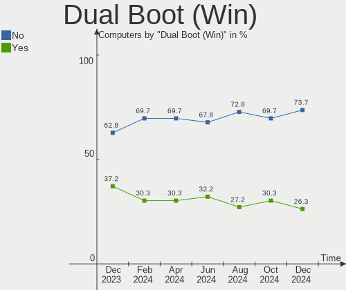

| Dual boot | Computers | Percent |
|-----------|-----------|---------|
| No        | 100       | 60.98%  |
| Yes       | 64        | 39.02%  |

Board
-----

Vendor
------

Motherboard manufacturer

| Name                | Computers | Percent |
|---------------------|-----------|---------|
| Lenovo              | 26        | 15.85%  |
| Dell                | 26        | 15.85%  |
| Hewlett-Packard     | 20        | 12.2%   |
| ASUSTek Computer    | 20        | 12.2%   |
| Gigabyte Technology | 18        | 10.98%  |
| MSI                 | 11        | 6.71%   |
| Acer                | 7         | 4.27%   |
| ASRock              | 5         | 3.05%   |
| Intel               | 3         | 1.83%   |
| HUAWEI              | 3         | 1.83%   |
| Timi                | 2         | 1.22%   |
| Unknown             | 2         | 1.22%   |
| VALE                | 1         | 0.61%   |
| Toshiba             | 1         | 0.61%   |
| Supermicro          | 1         | 0.61%   |
| Sony                | 1         | 0.61%   |
| Samsung Electronics | 1         | 0.61%   |
| Razer               | 1         | 0.61%   |
| PC Specialist       | 1         | 0.61%   |
| Panasonic           | 1         | 0.61%   |
| Notebook            | 1         | 0.61%   |
| Monster             | 1         | 0.61%   |
| Medion              | 1         | 0.61%   |
| Haier               | 1         | 0.61%   |
| GPU Company         | 1         | 0.61%   |
| GPD                 | 1         | 0.61%   |
| Google              | 1         | 0.61%   |
| Foxconn             | 1         | 0.61%   |
| Digma               | 1         | 0.61%   |
| AZW                 | 1         | 0.61%   |
| AXIOO               | 1         | 0.61%   |
| Apple               | 1         | 0.61%   |
| AMI                 | 1         | 0.61%   |

Model
-----

Motherboard model

| Name                                   | Computers | Percent |
|----------------------------------------|-----------|---------|
| Unknown                                | 4         | 2.44%   |
| Gigabyte Z270-HD3P                     | 2         | 1.22%   |
| Gigabyte X570 AORUS MASTER             | 2         | 1.22%   |
| Dell OptiPlex 7010                     | 2         | 1.22%   |
| Dell G3 3779                           | 2         | 1.22%   |
| VALE Notebook Slim S132                | 1         | 0.61%   |
| Toshiba Satellite C670D-126            | 1         | 0.61%   |
| Timi TM1703                            | 1         | 0.61%   |
| Timi TM1701                            | 1         | 0.61%   |
| Supermicro X9DAL                       | 1         | 0.61%   |
| Sony VGN-FW21E                         | 1         | 0.61%   |
| Samsung 950QED                         | 1         | 0.61%   |
| Razer Blade Stealth                    | 1         | 0.61%   |
| PC Specialist PB50_70RF,RD,RC          | 1         | 0.61%   |
| Panasonic CF-31WBLEHLM                 | 1         | 0.61%   |
| Notebook P65_P67SE                     | 1         | 0.61%   |
| MSI Vector GP66 12UGS                  | 1         | 0.61%   |
| MSI Prestige 15 A12SC                  | 1         | 0.61%   |
| MSI MS-7D20                            | 1         | 0.61%   |
| MSI MS-7C95                            | 1         | 0.61%   |
| MSI MS-7C02                            | 1         | 0.61%   |
| MSI MS-7B79                            | 1         | 0.61%   |
| MSI MS-7B61                            | 1         | 0.61%   |
| MSI MS-7B18                            | 1         | 0.61%   |
| MSI MS-7A34                            | 1         | 0.61%   |
| MSI GS75 Stealth 10SE                  | 1         | 0.61%   |
| Monster TULPAR T7                      | 1         | 0.61%   |
| Medion S23003                          | 1         | 0.61%   |
| Lenovo Yoga C640-13IML 81UE            | 1         | 0.61%   |
| Lenovo Yoga 7 14ITL5 82BH              | 1         | 0.61%   |
| Lenovo V14-IIL 82C4                    | 1         | 0.61%   |
| Lenovo ThinkPad X260 20F5S28R00        | 1         | 0.61%   |
| Lenovo ThinkPad X230 23256N6           | 1         | 0.61%   |
| Lenovo ThinkPad X1 Yoga 2nd 20JDA012AU | 1         | 0.61%   |
| Lenovo ThinkPad T440s 20AQ007SMZ       | 1         | 0.61%   |
| Lenovo ThinkPad T440p 20AW000GUS       | 1         | 0.61%   |
| Lenovo ThinkPad T430 2349P25           | 1         | 0.61%   |
| Lenovo ThinkPad T430 2349DS5           | 1         | 0.61%   |
| Lenovo ThinkPad P15v Gen 1 20TQ001WUS  | 1         | 0.61%   |
| Lenovo ThinkPad L15 Gen 1 20U8S0AH00   | 1         | 0.61%   |

Model Family
------------

Motherboard model prefix

| Name                   | Computers | Percent |
|------------------------|-----------|---------|
| Lenovo ThinkPad        | 10        | 6.1%    |
| Dell OptiPlex          | 6         | 3.66%   |
| Dell Latitude          | 6         | 3.66%   |
| Dell Inspiron          | 6         | 3.66%   |
| Lenovo IdeaPad         | 5         | 3.05%   |
| ASUS ROG               | 5         | 3.05%   |
| HP Laptop              | 4         | 2.44%   |
| Unknown                | 4         | 2.44%   |
| HP Spectre             | 3         | 1.83%   |
| HP Pavilion            | 3         | 1.83%   |
| HP EliteBook           | 3         | 1.83%   |
| Dell XPS               | 3         | 1.83%   |
| Acer Aspire            | 3         | 1.83%   |
| Lenovo Yoga            | 2         | 1.22%   |
| Lenovo IdeaPadFlex     | 2         | 1.22%   |
| Gigabyte Z270-HD3P     | 2         | 1.22%   |
| Gigabyte X570          | 2         | 1.22%   |
| Gigabyte B660M         | 2         | 1.22%   |
| Dell Precision         | 2         | 1.22%   |
| Dell G3                | 2         | 1.22%   |
| ASUS TUF               | 2         | 1.22%   |
| ASUS PRIME             | 2         | 1.22%   |
| Acer Nitro             | 2         | 1.22%   |
| VALE Notebook          | 1         | 0.61%   |
| Toshiba Satellite      | 1         | 0.61%   |
| Timi TM1703            | 1         | 0.61%   |
| Timi TM1701            | 1         | 0.61%   |
| Supermicro X9DAL       | 1         | 0.61%   |
| Sony VGN-FW21E         | 1         | 0.61%   |
| Samsung 950QED         | 1         | 0.61%   |
| Razer Blade            | 1         | 0.61%   |
| PC Specialist PB50     | 1         | 0.61%   |
| Panasonic CF-31WBLEHLM | 1         | 0.61%   |
| Notebook P65           | 1         | 0.61%   |
| MSI Vector             | 1         | 0.61%   |
| MSI Prestige           | 1         | 0.61%   |
| MSI MS-7D20            | 1         | 0.61%   |
| MSI MS-7C95            | 1         | 0.61%   |
| MSI MS-7C02            | 1         | 0.61%   |
| MSI MS-7B79            | 1         | 0.61%   |

MFG Year
--------

Motherboard manufacture year

| Year | Computers | Percent |
|------|-----------|---------|
| 2021 | 24        | 14.63%  |
| 2020 | 19        | 11.59%  |
| 2019 | 17        | 10.37%  |
| 2022 | 16        | 9.76%   |
| 2018 | 14        | 8.54%   |
| 2012 | 13        | 7.93%   |
| 2014 | 12        | 7.32%   |
| 2011 | 12        | 7.32%   |
| 2017 | 10        | 6.1%    |
| 2013 | 9         | 5.49%   |
| 2016 | 6         | 3.66%   |
| 2015 | 6         | 3.66%   |
| 2008 | 2         | 1.22%   |
| 2010 | 1         | 0.61%   |
| 2009 | 1         | 0.61%   |
| 2007 | 1         | 0.61%   |
| 2006 | 1         | 0.61%   |

Form Factor
-----------

Physical design of the computer

| Name        | Computers | Percent |
|-------------|-----------|---------|
| Notebook    | 87        | 53.05%  |
| Desktop     | 61        | 37.2%   |
| Convertible | 13        | 7.93%   |
| Mini pc     | 3         | 1.83%   |

Secure Boot
-----------

Enabled or disabled

| State    | Computers | Percent |
|----------|-----------|---------|
| Disabled | 150       | 91.46%  |
| Enabled  | 14        | 8.54%   |

Coreboot
--------

Have coreboot on board

| Used | Computers | Percent |
|------|-----------|---------|
| No   | 163       | 99.39%  |
| Yes  | 1         | 0.61%   |

RAM Size
--------

Total RAM memory

| Size in GB  | Computers | Percent |
|-------------|-----------|---------|
| 4.01-8.0    | 46        | 28.05%  |
| 16.01-24.0  | 38        | 23.17%  |
| 32.01-64.0  | 31        | 18.9%   |
| 8.01-16.0   | 27        | 16.46%  |
| 3.01-4.0    | 13        | 7.93%   |
| 64.01-256.0 | 7         | 4.27%   |
| 24.01-32.0  | 1         | 0.61%   |
| 2.01-3.0    | 1         | 0.61%   |

RAM Used
--------

Used RAM memory

| Used GB    | Computers | Percent |
|------------|-----------|---------|
| 2.01-3.0   | 41        | 25%     |
| 4.01-8.0   | 37        | 22.56%  |
| 1.01-2.0   | 35        | 21.34%  |
| 3.01-4.0   | 34        | 20.73%  |
| 8.01-16.0  | 12        | 7.32%   |
| 16.01-24.0 | 2         | 1.22%   |
| 0.51-1.0   | 2         | 1.22%   |
| Unknown    | 1         | 0.61%   |

Total Drives
------------

Number of drives on board

| Drives | Computers | Percent |
|--------|-----------|---------|
| 1      | 87        | 53.05%  |
| 2      | 45        | 27.44%  |
| 3      | 15        | 9.15%   |
| 4      | 10        | 6.1%    |
| 7      | 2         | 1.22%   |
| 6      | 2         | 1.22%   |
| 5      | 2         | 1.22%   |
| 8      | 1         | 0.61%   |

Has CD-ROM
----------

Has CD-ROM on board

| Presented | Computers | Percent |
|-----------|-----------|---------|
| No        | 122       | 74.39%  |
| Yes       | 42        | 25.61%  |

Has Ethernet
------------

Has Ethernet on board

| Presented | Computers | Percent |
|-----------|-----------|---------|
| Yes       | 128       | 78.05%  |
| No        | 36        | 21.95%  |

Has WiFi
--------

Has WiFi module

| Presented | Computers | Percent |
|-----------|-----------|---------|
| Yes       | 136       | 82.93%  |
| No        | 28        | 17.07%  |

Has Bluetooth
-------------

Has Bluetooth module

| Presented | Computers | Percent |
|-----------|-----------|---------|
| Yes       | 106       | 64.63%  |
| No        | 58        | 35.37%  |

Location
--------

Country
-------

Geographic location (country)

| Country      | Computers | Percent |
|--------------|-----------|---------|
| USA          | 39        | 23.78%  |
| Germany      | 18        | 10.98%  |
| Italy        | 16        | 9.76%   |
| France       | 8         | 4.88%   |
| Australia    | 7         | 4.27%   |
| UK           | 6         | 3.66%   |
| Poland       | 6         | 3.66%   |
| Russia       | 5         | 3.05%   |
| Brazil       | 5         | 3.05%   |
| Argentina    | 5         | 3.05%   |
| Spain        | 4         | 2.44%   |
| India        | 4         | 2.44%   |
| Netherlands  | 3         | 1.83%   |
| Switzerland  | 2         | 1.22%   |
| Slovakia     | 2         | 1.22%   |
| Romania      | 2         | 1.22%   |
| Philippines  | 2         | 1.22%   |
| Lithuania    | 2         | 1.22%   |
| Kazakhstan   | 2         | 1.22%   |
| Indonesia    | 2         | 1.22%   |
| Vietnam      | 1         | 0.61%   |
| Ukraine      | 1         | 0.61%   |
| Turkey       | 1         | 0.61%   |
| Thailand     | 1         | 0.61%   |
| South Korea  | 1         | 0.61%   |
| Singapore    | 1         | 0.61%   |
| Serbia       | 1         | 0.61%   |
| Saudi Arabia | 1         | 0.61%   |
| Portugal     | 1         | 0.61%   |
| New Zealand  | 1         | 0.61%   |
| Mexico       | 1         | 0.61%   |
| Israel       | 1         | 0.61%   |
| Hungary      | 1         | 0.61%   |
| Greece       | 1         | 0.61%   |
| Finland      | 1         | 0.61%   |
| Estonia      | 1         | 0.61%   |
| Denmark      | 1         | 0.61%   |
| Czechia      | 1         | 0.61%   |
| Cyprus       | 1         | 0.61%   |
| Croatia      | 1         | 0.61%   |

City
----

Geographic location (city)

| City                   | Computers | Percent |
|------------------------|-----------|---------|
| Berlin                 | 7         | 4.27%   |
| Milan                  | 3         | 1.83%   |
| Melbourne              | 3         | 1.83%   |
| Zurich                 | 2         | 1.22%   |
| Ocala                  | 2         | 1.22%   |
| Minneapolis            | 2         | 1.22%   |
| Miami                  | 2         | 1.22%   |
| Kent                   | 2         | 1.22%   |
| Des Moines             | 2         | 1.22%   |
| Bologna                | 2         | 1.22%   |
| Antioch                | 2         | 1.22%   |
| Amsterdam              | 2         | 1.22%   |
| Zagreb                 | 1         | 0.61%   |
| Yuma                   | 1         | 0.61%   |
| Yaroslavl              | 1         | 0.61%   |
| Wiesbaden              | 1         | 0.61%   |
| Wheaton                | 1         | 0.61%   |
| Washington             | 1         | 0.61%   |
| Warsaw                 | 1         | 0.61%   |
| Vilnius                | 1         | 0.61%   |
| Valencia               | 1         | 0.61%   |
| Valdosta               | 1         | 0.61%   |
| Utena                  | 1         | 0.61%   |
| Turku                  | 1         | 0.61%   |
| Turin                  | 1         | 0.61%   |
| Thai Nguyen            | 1         | 0.61%   |
| Tallinn                | 1         | 0.61%   |
| Tagbilaran             | 1         | 0.61%   |
| Sydney                 | 1         | 0.61%   |
| Soveria Mannelli       | 1         | 0.61%   |
| Sompolno               | 1         | 0.61%   |
| Sofia                  | 1         | 0.61%   |
| Singapore              | 1         | 0.61%   |
| Serpukhov              | 1         | 0.61%   |
| Sao José dos Campos   | 1         | 0.61%   |
| Santa Cruz             | 1         | 0.61%   |
| San Marcos             | 1         | 0.61%   |
| San Jose               | 1         | 0.61%   |
| San Francisco          | 1         | 0.61%   |
| San Cesario sul Panaro | 1         | 0.61%   |

Drives
------

Drive Vendor
------------

Hard drive vendors

| Vendor                      | Computers | Drives | Percent |
|-----------------------------|-----------|--------|---------|
| Samsung Electronics         | 40        | 55     | 15.38%  |
| WDC                         | 31        | 42     | 11.92%  |
| Seagate                     | 28        | 36     | 10.77%  |
| SanDisk                     | 22        | 23     | 8.46%   |
| Kingston                    | 14        | 17     | 5.38%   |
| Toshiba                     | 13        | 15     | 5%      |
| Crucial                     | 9         | 10     | 3.46%   |
| Micron Technology           | 8         | 8      | 3.08%   |
| Unknown                     | 7         | 8      | 2.69%   |
| SK hynix                    | 7         | 7      | 2.69%   |
| Intel                       | 7         | 8      | 2.69%   |
| KIOXIA                      | 5         | 5      | 1.92%   |
| Hitachi                     | 5         | 5      | 1.92%   |
| HGST                        | 4         | 7      | 1.54%   |
| Phison                      | 3         | 3      | 1.15%   |
| China                       | 3         | 3      | 1.15%   |
| Unknown                     | 3         | 3      | 1.15%   |
| SPCC                        | 2         | 3      | 0.77%   |
| SABRENT                     | 2         | 2      | 0.77%   |
| PNY                         | 2         | 2      | 0.77%   |
| Micron/Crucial Technology   | 2         | 2      | 0.77%   |
| Kingston Technology Company | 2         | 2      | 0.77%   |
| HS-SSD-C100                 | 2         | 2      | 0.77%   |
| GOODRAM                     | 2         | 2      | 0.77%   |
| ADATA Technology            | 2         | 2      | 0.77%   |
| WALRAM                      | 1         | 1      | 0.38%   |
| VISIPRO                     | 1         | 1      | 0.38%   |
| Verbatim                    | 1         | 1      | 0.38%   |
| Union Memory                | 1         | 1      | 0.38%   |
| UMIS                        | 1         | 1      | 0.38%   |
| Transcend                   | 1         | 1      | 0.38%   |
| tecmiyo                     | 1         | 1      | 0.38%   |
| Team                        | 1         | 1      | 0.38%   |
| T-FORCE                     | 1         | 1      | 0.38%   |
| SSSTC                       | 1         | 1      | 0.38%   |
| Solid State Storage         | 1         | 1      | 0.38%   |
| Smartbuy                    | 1         | 1      | 0.38%   |
| Ramos Technology            | 1         | 1      | 0.38%   |
| Phison Electronics          | 1         | 1      | 0.38%   |
| Patriot                     | 1         | 1      | 0.38%   |

Drive Model
-----------

Hard drive models

| Model                                             | Computers | Percent |
|---------------------------------------------------|-----------|---------|
| Samsung NVMe SSD Controller SM981/PM981/PM983 1TB | 8         | 2.75%   |
| Sandisk WD Black SN750 / PC SN730 NVMe SSD 1024GB | 4         | 1.37%   |
| Toshiba MQ01ABD100 1TB                            | 3         | 1.03%   |
| Seagate ST1000LM035-1RK172 1TB                    | 3         | 1.03%   |
| Samsung SSD 980 500GB                             | 3         | 1.03%   |
| Samsung SSD 860 EVO 1TB                           | 3         | 1.03%   |
| Micron 3400_MTFDKBA1T0TFH 1TB                     | 3         | 1.03%   |
| Kingston SA400S37240G 240GB SSD                   | 3         | 1.03%   |
| Unknown                                           | 3         | 1.03%   |
| Toshiba DT01ACA200 2TB                            | 2         | 0.69%   |
| Seagate ST1000LM024 HN-M101MBB 1TB                | 2         | 0.69%   |
| SanDisk Extreme 55AE 500GB SSD                    | 2         | 0.69%   |
| Samsung SSD 970 EVO Plus 500GB                    | 2         | 0.69%   |
| Samsung SSD 850 PRO 512GB                         | 2         | 0.69%   |
| Samsung SSD 850 EVO 500GB                         | 2         | 0.69%   |
| Samsung HD502HI 500GB                             | 2         | 0.69%   |
| SABRENT Disk 500GB                                | 2         | 0.69%   |
| Micron/Crucial P2 NVMe PCIe SSD 250GB             | 2         | 0.69%   |
| KIOXIA KBG40ZNS512G NVMe 512GB                    | 2         | 0.69%   |
| Kingston Company A2000 NVMe SSD 500GB             | 2         | 0.69%   |
| Kingston SA400S37960G 960GB SSD                   | 2         | 0.69%   |
| Kingston SA400S37480G 480GB SSD                   | 2         | 0.69%   |
| Crucial CT240M500SSD1 240GB                       | 2         | 0.69%   |
| Crucial CT1000MX500SSD1 1TB                       | 2         | 0.69%   |
| WDC WDS250G2B0A-00SM50 250GB SSD                  | 1         | 0.34%   |
| WDC WDS200T1X0E-00AFY0 2TB                        | 1         | 0.34%   |
| WDC WDS100T1X0E-00AFY0 1TB                        | 1         | 0.34%   |
| WDC WDBNCE0010PNC 1TB SSD                         | 1         | 0.34%   |
| WDC WD60EZAZ-00SF3B0 6TB                          | 1         | 0.34%   |
| WDC WD5003ABYZ-011FA0 500GB                       | 1         | 0.34%   |
| WDC WD5000LUCT-63C26Y0 500GB                      | 1         | 0.34%   |
| WDC WD5000LPVT-24G33T1 500GB                      | 1         | 0.34%   |
| WDC WD5000AZLX-22JKKA0 500GB                      | 1         | 0.34%   |
| WDC WD5000AAKX-753CA1 500GB                       | 1         | 0.34%   |
| WDC WD5000AAKX-22ERMA0 500GB                      | 1         | 0.34%   |
| WDC WD5000AAKX-00U6AA0 500GB                      | 1         | 0.34%   |
| WDC WD40EZRX-00SPEB0 4TB                          | 1         | 0.34%   |
| WDC WD3200BEVT-60ZCT1 320GB                       | 1         | 0.34%   |
| WDC WD3200AAKS-61L9A0 320GB                       | 1         | 0.34%   |
| WDC WD3200AAJB-56R1A0 320GB                       | 1         | 0.34%   |

HDD Vendor
----------

Hard disk drive vendors

| Vendor              | Computers | Drives | Percent |
|---------------------|-----------|--------|---------|
| Seagate             | 27        | 35     | 36%     |
| WDC                 | 24        | 33     | 32%     |
| Toshiba             | 7         | 8      | 9.33%   |
| Samsung Electronics | 5         | 5      | 6.67%   |
| Hitachi             | 5         | 5      | 6.67%   |
| HGST                | 4         | 7      | 5.33%   |
| Maxtor              | 1         | 1      | 1.33%   |
| KESU                | 1         | 1      | 1.33%   |
| ASMT                | 1         | 1      | 1.33%   |

SSD Vendor
----------

Solid state drive vendors

| Vendor              | Computers | Drives | Percent |
|---------------------|-----------|--------|---------|
| Samsung Electronics | 16        | 25     | 18.6%   |
| Kingston            | 13        | 15     | 15.12%  |
| SanDisk             | 10        | 10     | 11.63%  |
| Crucial             | 7         | 8      | 8.14%   |
| Intel               | 4         | 4      | 4.65%   |
| Toshiba             | 3         | 3      | 3.49%   |
| China               | 3         | 3      | 3.49%   |
| WDC                 | 2         | 2      | 2.33%   |
| SPCC                | 2         | 3      | 2.33%   |
| PNY                 | 2         | 2      | 2.33%   |
| GOODRAM             | 2         | 2      | 2.33%   |
| VISIPRO             | 1         | 1      | 1.16%   |
| Verbatim            | 1         | 1      | 1.16%   |
| tecmiyo             | 1         | 1      | 1.16%   |
| Team                | 1         | 1      | 1.16%   |
| Smartbuy            | 1         | 1      | 1.16%   |
| SK hynix            | 1         | 1      | 1.16%   |
| Ramos Technology    | 1         | 1      | 1.16%   |
| Phison              | 1         | 1      | 1.16%   |
| Patriot             | 1         | 1      | 1.16%   |
| Neo                 | 1         | 1      | 1.16%   |
| Mushkin             | 1         | 2      | 1.16%   |
| Micron Technology   | 1         | 1      | 1.16%   |
| LITEON              | 1         | 1      | 1.16%   |
| KIOXIA-EXCERIA      | 1         | 1      | 1.16%   |
| Intenso             | 1         | 1      | 1.16%   |
| HS-SSD-C100         | 1         | 1      | 1.16%   |
| FORESEE             | 1         | 1      | 1.16%   |
| Drevo               | 1         | 1      | 1.16%   |
| Dogfish             | 1         | 1      | 1.16%   |
| Corsair             | 1         | 3      | 1.16%   |
| ADATA SU            | 1         | 1      | 1.16%   |
| Unknown             | 1         | 1      | 1.16%   |

Drive Kind
----------

HDD or SSD

| Kind    | Computers | Drives | Percent |
|---------|-----------|--------|---------|
| NVMe    | 82        | 95     | 35.19%  |
| SSD     | 75        | 102    | 32.19%  |
| HDD     | 61        | 96     | 26.18%  |
| MMC     | 8         | 9      | 3.43%   |
| Unknown | 7         | 8      | 3%      |

Drive Connector
---------------

SATA, SAS, NVMe, etc.

| Type | Computers | Drives | Percent |
|------|-----------|--------|---------|
| SATA | 107       | 190    | 50.95%  |
| NVMe | 80        | 92     | 38.1%   |
| SAS  | 15        | 19     | 7.14%   |
| MMC  | 8         | 9      | 3.81%   |

Drive Size
----------

Size of hard drive

| Size in TB | Computers | Drives | Percent |
|------------|-----------|--------|---------|
| 0.01-0.5   | 71        | 103    | 47.97%  |
| 0.51-1.0   | 47        | 54     | 31.76%  |
| 1.01-2.0   | 18        | 25     | 12.16%  |
| 3.01-4.0   | 8         | 12     | 5.41%   |
| 4.01-10.0  | 3         | 3      | 2.03%   |
| 2.01-3.0   | 1         | 1      | 0.68%   |

Space Total
-----------

Amount of disk space available on the file system

| Size in GB     | Computers | Percent |
|----------------|-----------|---------|
| 101-250        | 45        | 27.44%  |
| 251-500        | 34        | 20.73%  |
| 501-1000       | 34        | 20.73%  |
| 1001-2000      | 18        | 10.98%  |
| More than 3000 | 12        | 7.32%   |
| 2001-3000      | 7         | 4.27%   |
| 51-100         | 7         | 4.27%   |
| 1-20           | 4         | 2.44%   |
| 21-50          | 2         | 1.22%   |
| Unknown        | 1         | 0.61%   |

Space Used
----------

Amount of used disk space

| Used GB        | Computers | Percent |
|----------------|-----------|---------|
| 101-250        | 33        | 20.12%  |
| 21-50          | 28        | 17.07%  |
| 1-20           | 28        | 17.07%  |
| 51-100         | 26        | 15.85%  |
| 251-500        | 18        | 10.98%  |
| 501-1000       | 14        | 8.54%   |
| 1001-2000      | 9         | 5.49%   |
| More than 3000 | 5         | 3.05%   |
| 2001-3000      | 2         | 1.22%   |
| Unknown        | 1         | 0.61%   |

Malfunc. Drives
---------------

Drive models with a malfunction

| Model                                          | Computers | Drives | Percent |
|------------------------------------------------|-----------|--------|---------|
| WDC WD3200AAJB-56R1A0 320GB                    | 1         | 1      | 4.76%   |
| WDC WD10EZEX-22MFCA0 1TB                       | 1         | 1      | 4.76%   |
| WDC WD10EARS-00MVWB0 1TB                       | 1         | 1      | 4.76%   |
| VISIPRO SSD 256GB                              | 1         | 1      | 4.76%   |
| tecmiyo SATA SSD 128GB                         | 1         | 1      | 4.76%   |
| SK hynix BC711 HFM512GD3JX013N 512GB           | 1         | 1      | 4.76%   |
| Seagate ST3160827AS 160GB                      | 1         | 1      | 4.76%   |
| Seagate ST31000524AS 1TB                       | 1         | 1      | 4.76%   |
| Seagate ST1000LM024 HN-M101MBB 1TB             | 1         | 1      | 4.76%   |
| Neo Forza NFS121SA312-6007000 120GB            | 1         | 1      | 4.76%   |
| Micron Technology 5100_MTFDDAV960TCB 960GB SSD | 1         | 1      | 4.76%   |
| Kingston SUV400S37240G 240GB SSD               | 1         | 1      | 4.76%   |
| Kingston SH103S3240G 240GB SSD                 | 1         | 1      | 4.76%   |
| Intel SSDSCKKF256G8H 256GB                     | 1         | 1      | 4.76%   |
| Hitachi HTS725050A7E630 500GB                  | 1         | 1      | 4.76%   |
| Hitachi HDS722020ALA330 2TB                    | 1         | 1      | 4.76%   |
| Hitachi HDS721010CLA630 1TB                    | 1         | 1      | 4.76%   |
| HGST HUH728080ALE600 8TB                       | 1         | 1      | 4.76%   |
| Crucial CT525MX300SSD1 528GB                   | 1         | 1      | 4.76%   |
| Crucial CT240M500SSD1 240GB                    | 1         | 1      | 4.76%   |
| Crucial CT120M500SSD1 120GB                    | 1         | 1      | 4.76%   |

Malfunc. Drive Vendor
---------------------

Vendors of faulty drives

| Vendor            | Computers | Drives | Percent |
|-------------------|-----------|--------|---------|
| WDC               | 3         | 3      | 14.29%  |
| Seagate           | 3         | 3      | 14.29%  |
| Hitachi           | 3         | 3      | 14.29%  |
| Crucial           | 3         | 3      | 14.29%  |
| Kingston          | 2         | 2      | 9.52%   |
| VISIPRO           | 1         | 1      | 4.76%   |
| tecmiyo           | 1         | 1      | 4.76%   |
| SK hynix          | 1         | 1      | 4.76%   |
| Neo               | 1         | 1      | 4.76%   |
| Micron Technology | 1         | 1      | 4.76%   |
| Intel             | 1         | 1      | 4.76%   |
| HGST              | 1         | 1      | 4.76%   |

Malfunc. HDD Vendor
-------------------

Vendors of faulty HDD drives

| Vendor  | Computers | Drives | Percent |
|---------|-----------|--------|---------|
| WDC     | 3         | 3      | 30%     |
| Seagate | 3         | 3      | 30%     |
| Hitachi | 3         | 3      | 30%     |
| HGST    | 1         | 1      | 10%     |

Malfunc. Drive Kind
-------------------

Kinds of faulty drives

| Kind | Computers | Drives | Percent |
|------|-----------|--------|---------|
| SSD  | 10        | 10     | 52.63%  |
| HDD  | 8         | 10     | 42.11%  |
| NVMe | 1         | 1      | 5.26%   |

Failed Drives
-------------

Failed drive models

Zero info for selected period =(

Failed Drive Vendor
-------------------

Failed drive vendors

Zero info for selected period =(

Drive Status
------------

Number of failed and malfunc. drives

| Status   | Computers | Drives | Percent |
|----------|-----------|--------|---------|
| Detected | 88        | 158    | 46.81%  |
| Works    | 83        | 131    | 44.15%  |
| Malfunc  | 17        | 21     | 9.04%   |

Storage controller
------------------

Storage Vendor
--------------

Storage controller vendors

| Vendor                         | Computers | Percent |
|--------------------------------|-----------|---------|
| Intel                          | 105       | 46.46%  |
| AMD                            | 32        | 14.16%  |
| Samsung Electronics            | 24        | 10.62%  |
| SanDisk                        | 15        | 6.64%   |
| Micron Technology              | 7         | 3.1%    |
| SK hynix                       | 6         | 2.65%   |
| Toshiba America Info Systems   | 5         | 2.21%   |
| Phison Electronics             | 4         | 1.77%   |
| Micron/Crucial Technology      | 4         | 1.77%   |
| KIOXIA                         | 4         | 1.77%   |
| Marvell Technology Group       | 3         | 1.33%   |
| Kingston Technology Company    | 3         | 1.33%   |
| Union Memory (Shenzhen)        | 2         | 0.88%   |
| Solid State Storage Technology | 2         | 0.88%   |
| ASMedia Technology             | 2         | 0.88%   |
| ADATA Technology               | 2         | 0.88%   |
| Silicon Motion                 | 1         | 0.44%   |
| O2 Micro                       | 1         | 0.44%   |
| Lite-On Technology             | 1         | 0.44%   |
| JMicron Technology             | 1         | 0.44%   |
| Broadcom / LSI                 | 1         | 0.44%   |
| Biwin Storage Technology       | 1         | 0.44%   |

Storage Model
-------------

Storage controller models

| Model                                                                          | Computers | Percent |
|--------------------------------------------------------------------------------|-----------|---------|
| AMD FCH SATA Controller [AHCI mode]                                            | 15        | 6.22%   |
| Samsung NVMe SSD Controller SM981/PM981/PM983                                  | 12        | 4.98%   |
| Intel 7 Series Chipset Family 6-port SATA Controller [AHCI mode]               | 11        | 4.56%   |
| Intel 8 Series/C220 Series Chipset Family 6-port SATA Controller 1 [AHCI mode] | 9         | 3.73%   |
| Intel Sunrise Point-LP SATA Controller [AHCI mode]                             | 8         | 3.32%   |
| Micron Non-Volatile memory controller                                          | 7         | 2.9%    |
| Intel Volume Management Device NVMe RAID Controller                            | 7         | 2.9%    |
| Samsung NVMe SSD Controller 980                                                | 6         | 2.49%   |
| SanDisk WD Black SN750 / PC SN730 NVMe SSD                                     | 5         | 2.07%   |
| Intel 82801 Mobile SATA Controller [RAID mode]                                 | 5         | 2.07%   |
| Intel 7 Series/C210 Series Chipset Family 6-port SATA Controller [AHCI mode]   | 5         | 2.07%   |
| Intel 200 Series PCH SATA controller [AHCI mode]                               | 5         | 2.07%   |
| SanDisk Non-Volatile memory controller                                         | 4         | 1.66%   |
| Micron/Crucial P2 NVMe PCIe SSD                                                | 4         | 1.66%   |
| KIOXIA NVMe SSD Controller BG4                                                 | 4         | 1.66%   |
| Intel Celeron/Pentium Silver Processor SATA Controller                         | 4         | 1.66%   |
| Intel Cannon Lake Mobile PCH SATA AHCI Controller                              | 4         | 1.66%   |
| Intel 6 Series/C200 Series Chipset Family 6 port Mobile SATA AHCI Controller   | 4         | 1.66%   |
| AMD SB7x0/SB8x0/SB9x0 SATA Controller [AHCI mode]                              | 4         | 1.66%   |
| AMD 500 Series Chipset SATA Controller                                         | 4         | 1.66%   |
| Toshiba America Info Systems XG6 NVMe SSD Controller                           | 3         | 1.24%   |
| SK hynix Gold P31/PC711 NVMe Solid State Drive                                 | 3         | 1.24%   |
| Samsung NVMe SSD Controller PM9A1/PM9A3/980PRO                                 | 3         | 1.24%   |
| Intel Wildcat Point-LP SATA Controller [AHCI Mode]                             | 3         | 1.24%   |
| Intel SATA Controller [RAID mode]                                              | 3         | 1.24%   |
| Intel Comet Lake SATA AHCI Controller                                          | 3         | 1.24%   |
| Intel Cannon Point-LP SATA Controller [AHCI Mode]                              | 3         | 1.24%   |
| Intel 6 Series/C200 Series Chipset Family 6 port Desktop SATA AHCI Controller  | 3         | 1.24%   |
| Intel 500 Series Chipset Family SATA AHCI Controller                           | 3         | 1.24%   |
| AMD SB7x0/SB8x0/SB9x0 IDE Controller                                           | 3         | 1.24%   |
| AMD 400 Series Chipset SATA Controller                                         | 3         | 1.24%   |
| Union Memory (Shenzhen) Non-Volatile memory controller                         | 2         | 0.83%   |
| Toshiba America Info Systems XG4 NVMe SSD Controller                           | 2         | 0.83%   |
| Solid State Storage Non-Volatile memory controller                             | 2         | 0.83%   |
| SanDisk WD PC SN810 / Black SN850 NVMe SSD                                     | 2         | 0.83%   |
| SanDisk WD Blue SN550 NVMe SSD                                                 | 2         | 0.83%   |
| SanDisk WD Blue SN500 / PC SN520 NVMe SSD                                      | 2         | 0.83%   |
| Samsung NVMe SSD Controller SM961/PM961/SM963                                  | 2         | 0.83%   |
| Phison PS5013 E13 NVMe Controller                                              | 2         | 0.83%   |
| Kingston Company A2000 NVMe SSD                                                | 2         | 0.83%   |

Storage Kind
------------

Kind of storage controller (IDE, SATA, NVMe, SAS, ...)

| Kind | Computers | Percent |
|------|-----------|---------|
| SATA | 118       | 52.68%  |
| NVMe | 80        | 35.71%  |
| RAID | 19        | 8.48%   |
| IDE  | 6         | 2.68%   |
| SAS  | 1         | 0.45%   |

Processor
---------

CPU Vendor
----------

Processor vendors

| Vendor | Computers | Percent |
|--------|-----------|---------|
| Intel  | 119       | 72.56%  |
| AMD    | 45        | 27.44%  |

CPU Model
---------

Processor models

| Model                                         | Computers | Percent |
|-----------------------------------------------|-----------|---------|
| Intel 11th Gen Core i7-1165G7 @ 2.80GHz       | 5         | 3.05%   |
| Intel Core i7-9750H CPU @ 2.60GHz             | 3         | 1.83%   |
| Intel Core i7-10750H CPU @ 2.60GHz            | 3         | 1.83%   |
| Intel Core i5-3320M CPU @ 2.60GHz             | 3         | 1.83%   |
| AMD Ryzen 7 5800H with Radeon Graphics        | 3         | 1.83%   |
| Intel Pentium CPU N3540 @ 2.16GHz             | 2         | 1.22%   |
| Intel Pentium CPU 2020M @ 2.40GHz             | 2         | 1.22%   |
| Intel Core i7-8750H CPU @ 2.20GHz             | 2         | 1.22%   |
| Intel Core i7-8550U CPU @ 1.80GHz             | 2         | 1.22%   |
| Intel Core i7-7500U CPU @ 2.70GHz             | 2         | 1.22%   |
| Intel Core i5-8265U CPU @ 1.60GHz             | 2         | 1.22%   |
| Intel Core i5-8250U CPU @ 1.60GHz             | 2         | 1.22%   |
| Intel Core i5-4200M CPU @ 2.50GHz             | 2         | 1.22%   |
| Intel Core i5-3210M CPU @ 2.50GHz             | 2         | 1.22%   |
| Intel Core i5-2520M CPU @ 2.50GHz             | 2         | 1.22%   |
| Intel Core i3-7100U CPU @ 2.40GHz             | 2         | 1.22%   |
| Intel Celeron N4020 CPU @ 1.10GHz             | 2         | 1.22%   |
| Intel 12th Gen Core i9-12900H                 | 2         | 1.22%   |
| Intel 12th Gen Core i7-1260P                  | 2         | 1.22%   |
| Intel 11th Gen Core i7-1195G7 @ 2.90GHz       | 2         | 1.22%   |
| AMD Ryzen 9 5950X 16-Core Processor           | 2         | 1.22%   |
| AMD Ryzen 7 PRO 4750U with Radeon Graphics    | 2         | 1.22%   |
| AMD Ryzen 7 5700U with Radeon Graphics        | 2         | 1.22%   |
| AMD Ryzen 5 5600X 6-Core Processor            | 2         | 1.22%   |
| AMD Ryzen 5 5500U with Radeon Graphics        | 2         | 1.22%   |
| AMD Ryzen 5 3500U with Radeon Vega Mobile Gfx | 2         | 1.22%   |
| AMD Ryzen 5 3400G with Radeon Vega Graphics   | 2         | 1.22%   |
| AMD A8-6410 APU with AMD Radeon R5 Graphics   | 2         | 1.22%   |
| Intel Xeon CPU W3503 @ 2.40GHz                | 1         | 0.61%   |
| Intel Xeon CPU E5-2620 v3 @ 2.40GHz           | 1         | 0.61%   |
| Intel Xeon CPU E5-2403 0 @ 1.80GHz            | 1         | 0.61%   |
| Intel Pentium Dual-Core CPU T4500 @ 2.30GHz   | 1         | 0.61%   |
| Intel Pentium CPU 6405U @ 2.40GHz             | 1         | 0.61%   |
| Intel Core i9-9900K CPU @ 3.60GHz             | 1         | 0.61%   |
| Intel Core i7-8565U CPU @ 1.80GHz             | 1         | 0.61%   |
| Intel Core i7-8559U CPU @ 2.70GHz             | 1         | 0.61%   |
| Intel Core i7-7700K CPU @ 4.20GHz             | 1         | 0.61%   |
| Intel Core i7-7700HQ CPU @ 2.80GHz            | 1         | 0.61%   |
| Intel Core i7-6920HQ CPU @ 2.90GHz            | 1         | 0.61%   |
| Intel Core i7-6500U CPU @ 2.50GHz             | 1         | 0.61%   |

CPU Model Family
----------------

Processor model prefix

| Model                   | Computers | Percent |
|-------------------------|-----------|---------|
| Intel Core i5           | 40        | 24.39%  |
| Intel Core i7           | 33        | 20.12%  |
| Other                   | 21        | 12.8%   |
| AMD Ryzen 5             | 12        | 7.32%   |
| AMD Ryzen 7             | 10        | 6.1%    |
| AMD Ryzen 9             | 8         | 4.88%   |
| Intel Core i3           | 7         | 4.27%   |
| Intel Celeron           | 6         | 3.66%   |
| Intel Pentium           | 5         | 3.05%   |
| Intel Xeon              | 3         | 1.83%   |
| Intel Core 2 Duo        | 2         | 1.22%   |
| AMD Ryzen 7 PRO         | 2         | 1.22%   |
| AMD Ryzen 3             | 2         | 1.22%   |
| AMD FX                  | 2         | 1.22%   |
| AMD A8                  | 2         | 1.22%   |
| Intel Pentium Dual-Core | 1         | 0.61%   |
| Intel Core i9           | 1         | 0.61%   |
| AMD Ryzen 5 PRO         | 1         | 0.61%   |
| AMD Phenom II X6        | 1         | 0.61%   |
| AMD Phenom II X4        | 1         | 0.61%   |
| AMD E                   | 1         | 0.61%   |
| AMD Athlon II X2        | 1         | 0.61%   |
| AMD Athlon 64 X2        | 1         | 0.61%   |
| AMD A6                  | 1         | 0.61%   |

CPU Cores
---------

Number of processor cores

| Number | Computers | Percent |
|--------|-----------|---------|
| 4      | 65        | 39.63%  |
| 2      | 47        | 28.66%  |
| 6      | 23        | 14.02%  |
| 8      | 16        | 9.76%   |
| 16     | 4         | 2.44%   |
| 14     | 4         | 2.44%   |
| 12     | 4         | 2.44%   |
| 10     | 1         | 0.61%   |

CPU Sockets
-----------

Number of sockets

| Number | Computers | Percent |
|--------|-----------|---------|
| 1      | 164       | 100%    |

CPU Threads
-----------

Threads per core (Hyper-Threading)

| Number | Computers | Percent |
|--------|-----------|---------|
| 2      | 124       | 75.61%  |
| 1      | 40        | 24.39%  |

CPU Op-Modes
------------

CPU Operation Modes (32-bit, 64-bit)

| Op mode        | Computers | Percent |
|----------------|-----------|---------|
| 32-bit, 64-bit | 164       | 100%    |

CPU Microcode
-------------

Microcode number

| Number     | Computers | Percent |
|------------|-----------|---------|
| Unknown    | 70        | 42.68%  |
| 0x306c3    | 7         | 4.27%   |
| 0x906a3    | 6         | 3.66%   |
| 0x806ea    | 6         | 3.66%   |
| 0x806c1    | 6         | 3.66%   |
| 0x306a9    | 6         | 3.66%   |
| 0x08108109 | 5         | 3.05%   |
| 0x906ea    | 4         | 2.44%   |
| 0x906e9    | 4         | 2.44%   |
| 0x206a7    | 4         | 2.44%   |
| 0x706a8    | 3         | 1.83%   |
| 0x08608103 | 3         | 1.83%   |
| 0xa0652    | 2         | 1.22%   |
| 0x806ec    | 2         | 1.22%   |
| 0x806c2    | 2         | 1.22%   |
| 0x506e3    | 2         | 1.22%   |
| 0x306d4    | 2         | 1.22%   |
| 0x0a50000d | 2         | 1.22%   |
| 0x0a50000c | 2         | 1.22%   |
| 0x010000c8 | 2         | 1.22%   |
| 0xa0655    | 1         | 0.61%   |
| 0xa0653    | 1         | 0.61%   |
| 0x90672    | 1         | 0.61%   |
| 0x806e9    | 1         | 0.61%   |
| 0x806d1    | 1         | 0.61%   |
| 0x706a1    | 1         | 0.61%   |
| 0x6fb      | 1         | 0.61%   |
| 0x506c9    | 1         | 0.61%   |
| 0x406e3    | 1         | 0.61%   |
| 0x40651    | 1         | 0.61%   |
| 0x30678    | 1         | 0.61%   |
| 0x206d7    | 1         | 0.61%   |
| 0x10676    | 1         | 0.61%   |
| 0x0a601203 | 1         | 0.61%   |
| 0x0a404102 | 1         | 0.61%   |
| 0x0a201016 | 1         | 0.61%   |
| 0x08600109 | 1         | 0.61%   |
| 0x08600106 | 1         | 0.61%   |
| 0x08101007 | 1         | 0.61%   |
| 0x0800820d | 1         | 0.61%   |

CPU Microarch
-------------

Microarchitecture

| Name             | Computers | Percent |
|------------------|-----------|---------|
| KabyLake         | 32        | 19.51%  |
| IvyBridge        | 15        | 9.15%   |
| Haswell          | 15        | 9.15%   |
| Zen 3            | 13        | 7.93%   |
| TigerLake        | 11        | 6.71%   |
| SandyBridge      | 10        | 6.1%    |
| Unknown          | 10        | 6.1%    |
| Zen+             | 8         | 4.88%   |
| Zen 2            | 6         | 3.66%   |
| CometLake        | 6         | 3.66%   |
| Alderlake Hybrid | 5         | 3.05%   |
| Skylake          | 4         | 2.44%   |
| Goldmont plus    | 4         | 2.44%   |
| Silvermont       | 3         | 1.83%   |
| K10              | 3         | 1.83%   |
| Broadwell        | 3         | 1.83%   |
| Zen              | 2         | 1.22%   |
| Puma             | 2         | 1.22%   |
| Piledriver       | 2         | 1.22%   |
| Penryn           | 2         | 1.22%   |
| Icelake          | 2         | 1.22%   |
| Nehalem          | 1         | 0.61%   |
| K8 Hammer        | 1         | 0.61%   |
| K10 Llano        | 1         | 0.61%   |
| Goldmont         | 1         | 0.61%   |
| Core             | 1         | 0.61%   |
| Bobcat           | 1         | 0.61%   |

Graphics
--------

GPU Vendor
----------

Vendors of graphics cards

| Vendor | Computers | Percent |
|--------|-----------|---------|
| Intel  | 97        | 48.26%  |
| Nvidia | 53        | 26.37%  |
| AMD    | 51        | 25.37%  |

GPU Model
---------

Graphics card models

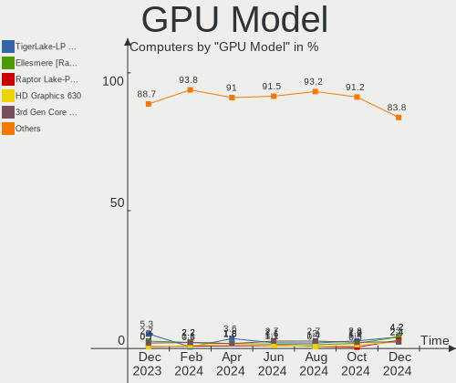

| Model                                                                                 | Computers | Percent |
|---------------------------------------------------------------------------------------|-----------|---------|
| Intel TigerLake-LP GT2 [Iris Xe Graphics]                                             | 10        | 4.81%   |
| Intel 3rd Gen Core processor Graphics Controller                                      | 10        | 4.81%   |
| Intel 2nd Generation Core Processor Family Integrated Graphics Controller             | 8         | 3.85%   |
| Intel Alder Lake-P Integrated Graphics Controller                                     | 6         | 2.88%   |
| Intel 4th Gen Core Processor Integrated Graphics Controller                           | 6         | 2.88%   |
| AMD Navi 23 [Radeon RX 6600/6600 XT/6600M]                                            | 6         | 2.88%   |
| AMD Cezanne [Radeon Vega Series / Radeon Vega Mobile Series]                          | 6         | 2.88%   |
| Intel HD Graphics 620                                                                 | 5         | 2.4%    |
| Intel CoffeeLake-H GT2 [UHD Graphics 630]                                             | 5         | 2.4%    |
| AMD Picasso/Raven 2 [Radeon Vega Series / Radeon Vega Mobile Series]                  | 5         | 2.4%    |
| Intel Xeon E3-1200 v3/4th Gen Core Processor Integrated Graphics Controller           | 4         | 1.92%   |
| Intel UHD Graphics 620                                                                | 4         | 1.92%   |
| Intel GeminiLake [UHD Graphics 600]                                                   | 4         | 1.92%   |
| AMD Lucienne                                                                          | 4         | 1.92%   |
| Nvidia GP107M [GeForce GTX 1050 Mobile]                                               | 3         | 1.44%   |
| Nvidia GK208B [GeForce GT 710]                                                        | 3         | 1.44%   |
| Intel WhiskeyLake-U GT2 [UHD Graphics 620]                                            | 3         | 1.44%   |
| Intel HD Graphics 630                                                                 | 3         | 1.44%   |
| Intel CometLake-H GT2 [UHD Graphics]                                                  | 3         | 1.44%   |
| AMD Topaz XT [Radeon R7 M260/M265 / M340/M360 / M440/M445 / 530/535 / 620/625 Mobile] | 3         | 1.44%   |
| AMD Renoir                                                                            | 3         | 1.44%   |
| AMD Ellesmere [Radeon RX 470/480/570/570X/580/580X/590]                               | 3         | 1.44%   |
| Nvidia TU117M [GeForce GTX 1650 Mobile / Max-Q]                                       | 2         | 0.96%   |
| Nvidia TU106M [GeForce RTX 2060 Mobile]                                               | 2         | 0.96%   |
| Nvidia GP108M [GeForce MX150]                                                         | 2         | 0.96%   |
| Nvidia GP107 [GeForce GTX 1050 Ti]                                                    | 2         | 0.96%   |
| Nvidia GA106 [GeForce RTX 3060 Lite Hash Rate]                                        | 2         | 0.96%   |
| Nvidia GA104 [Geforce RTX 3070 Ti Laptop GPU]                                         | 2         | 0.96%   |
| Intel Xeon E3-1200 v2/3rd Gen Core processor Graphics Controller                      | 2         | 0.96%   |
| Intel Skylake GT2 [HD Graphics 520]                                                   | 2         | 0.96%   |
| Intel HD Graphics 5500                                                                | 2         | 0.96%   |
| Intel Haswell-ULT Integrated Graphics Controller                                      | 2         | 0.96%   |
| Intel CometLake-U GT2 [UHD Graphics]                                                  | 2         | 0.96%   |
| Intel CoffeeLake-U GT3e [Iris Plus Graphics 655]                                      | 2         | 0.96%   |
| Intel Atom Processor Z36xxx/Z37xxx Series Graphics & Display                          | 2         | 0.96%   |
| AMD Mullins [Radeon R4/R5 Graphics]                                                   | 2         | 0.96%   |
| Nvidia TU117M [GeForce MX450]                                                         | 1         | 0.48%   |
| Nvidia TU117 [GeForce GTX 1650]                                                       | 1         | 0.48%   |
| Nvidia TU116M [GeForce GTX 1660 Ti Mobile]                                            | 1         | 0.48%   |
| Nvidia TU116 [GeForce GTX 1660]                                                       | 1         | 0.48%   |

GPU Combo
---------

Combinations of graphics cards

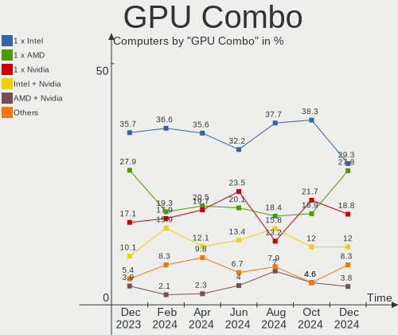

| Name           | Computers | Percent |
|----------------|-----------|---------|
| 1 x Intel      | 63        | 38.41%  |
| 1 x AMD        | 39        | 23.78%  |
| Intel + Nvidia | 28        | 17.07%  |
| 1 x Nvidia     | 21        | 12.8%   |
| 2 x AMD        | 5         | 3.05%   |
| Intel + AMD    | 4         | 2.44%   |
| AMD + Nvidia   | 3         | 1.83%   |
| 3 x Nvidia     | 1         | 0.61%   |

GPU Driver
----------

Free vs proprietary

| Driver      | Computers | Percent |
|-------------|-----------|---------|
| Free        | 122       | 74.39%  |
| Proprietary | 41        | 25%     |
| Unknown     | 1         | 0.61%   |

GPU Memory
----------

Total video memory

| Size in GB | Computers | Percent |
|------------|-----------|---------|
| Unknown    | 113       | 68.9%   |
| 1.01-2.0   | 11        | 6.71%   |
| 0.01-0.5   | 10        | 6.1%    |
| 0.51-1.0   | 9         | 5.49%   |
| 7.01-8.0   | 6         | 3.66%   |
| 3.01-4.0   | 6         | 3.66%   |
| 5.01-6.0   | 3         | 1.83%   |
| 8.01-16.0  | 3         | 1.83%   |
| 2.01-3.0   | 2         | 1.22%   |
| 16.01-24.0 | 1         | 0.61%   |

Monitor
-------

Monitor Vendor
--------------

Monitor vendors

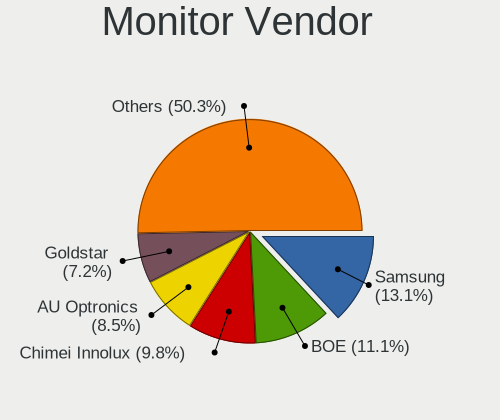

| Vendor                  | Computers | Percent |
|-------------------------|-----------|---------|
| Samsung Electronics     | 28        | 14.43%  |
| AU Optronics            | 22        | 11.34%  |
| BOE                     | 19        | 9.79%   |
| LG Display              | 18        | 9.28%   |
| Chimei Innolux          | 16        | 8.25%   |
| Goldstar                | 10        | 5.15%   |
| Hewlett-Packard         | 9         | 4.64%   |
| Philips                 | 7         | 3.61%   |
| Dell                    | 6         | 3.09%   |
| BenQ                    | 5         | 2.58%   |
| Ancor Communications    | 5         | 2.58%   |
| Acer                    | 5         | 2.58%   |
| Sharp                   | 4         | 2.06%   |
| Sceptre Tech            | 4         | 2.06%   |
| ViewSonic               | 3         | 1.55%   |
| InfoVision              | 3         | 1.55%   |
| ASUSTek Computer        | 3         | 1.55%   |
| Toshiba                 | 2         | 1.03%   |
| Lenovo                  | 2         | 1.03%   |
| HKC                     | 2         | 1.03%   |
| HannStar                | 2         | 1.03%   |
| Chi Mei Optoelectronics | 2         | 1.03%   |
| Xiaomi                  | 1         | 0.52%   |
| Vizio                   | 1         | 0.52%   |
| Vestel Elektronik       | 1         | 0.52%   |
| SUE                     | 1         | 0.52%   |
| SLD                     | 1         | 0.52%   |
| Planar                  | 1         | 0.52%   |
| Pixio                   | 1         | 0.52%   |
| NEC Computers           | 1         | 0.52%   |
| MVD                     | 1         | 0.52%   |
| Mi                      | 1         | 0.52%   |
| KDC                     | 1         | 0.52%   |
| Iiyama                  | 1         | 0.52%   |
| HUAWEI                  | 1         | 0.52%   |
| CVT                     | 1         | 0.52%   |
| CLB                     | 1         | 0.52%   |
| Apple                   | 1         | 0.52%   |
| AOC                     | 1         | 0.52%   |

Monitor Model
-------------

Monitor models

| Model                                                                  | Computers | Percent |
|------------------------------------------------------------------------|-----------|---------|
| Toshiba TV TSB0206 1920x1080                                           | 2         | 1.03%   |
| Samsung Electronics S24D330 SAM0D92 1920x1080 531x299mm 24.0-inch      | 2         | 1.03%   |
| LG Display LCD Monitor LGD040A 1920x1080 309x175mm 14.0-inch           | 2         | 1.03%   |
| Chimei Innolux LCD Monitor CMN15DB 1366x768 344x193mm 15.5-inch        | 2         | 1.03%   |
| AU Optronics LCD Monitor AUO80ED 1920x1080 344x193mm 15.5-inch         | 2         | 1.03%   |
| AU Optronics LCD Monitor AUO403D 1920x1080 309x173mm 13.9-inch         | 2         | 1.03%   |
| AU Optronics LCD Monitor AUO139D 1920x1080 381x214mm 17.2-inch         | 2         | 1.03%   |
| Ancor Communications ASUS VS228 ACI22FD 1920x1080 476x268mm 21.5-inch  | 2         | 1.03%   |
| Xiaomi Mi TV XMD00E2 3840x2160 800x450mm 36.1-inch                     | 1         | 0.51%   |
| Vizio V585x-H1 VIZ1039 3840x2160 941x529mm 42.5-inch                   | 1         | 0.51%   |
| ViewSonic XG270 VSCF638 1920x1080 598x336mm 27.0-inch                  | 1         | 0.51%   |
| ViewSonic VX3276-QHD VSCE635 2560x1440 698x393mm 31.5-inch             | 1         | 0.51%   |
| ViewSonic LCD Monitor VSCD62F 1920x1080 620x340mm 27.8-inch            | 1         | 0.51%   |
| Vestel Elektronik 55UHD_LCD_TV VES3700 3840x2160 1872x1053mm 84.6-inch | 1         | 0.51%   |
| SUE SFV2409 SUE2409 1920x1080 597x336mm 27.0-inch                      | 1         | 0.51%   |
| SLD LCD Monitor SLD003C 1366x768 309x173mm 13.9-inch                   | 1         | 0.51%   |
| Sharp LQ173M1JW05 SHP14EC 1920x1080 382x215mm 17.3-inch                | 1         | 0.51%   |
| Sharp LQ125T1JW02 SHP142F 2560x1440 277x155mm 12.5-inch                | 1         | 0.51%   |
| Sharp LCD Monitor SHP1476 3840x2160 346x194mm 15.6-inch                | 1         | 0.51%   |
| Sharp LCD Monitor SHP1417 1366x768 256x144mm 11.6-inch                 | 1         | 0.51%   |
| Sceptre Tech U55 SPT15B9 3840x2160 708x398mm 32.0-inch                 | 1         | 0.51%   |
| Sceptre Tech Sceptre Q27 SPT0AD2 2560x1440 597x336mm 27.0-inch         | 1         | 0.51%   |
| Sceptre Tech Sceptre M24 SPT09A1 1920x1080 526x296mm 23.8-inch         | 1         | 0.51%   |
| Sceptre Tech Sceptre E24 SPT099D 1920x1080 521x293mm 23.5-inch         | 1         | 0.51%   |
| Samsung Electronics T24D390 SAM0B6E 1920x1080 521x293mm 23.5-inch      | 1         | 0.51%   |
| Samsung Electronics SMEX2220 SAM0686 1920x1080 477x268mm 21.5-inch     | 1         | 0.51%   |
| Samsung Electronics S34J55x SAM0F72 3440x1440 797x333mm 34.0-inch      | 1         | 0.51%   |
| Samsung Electronics S34J55x SAM0F71 3440x1440 800x330mm 34.1-inch      | 1         | 0.51%   |
| Samsung Electronics S24E450 SAM0CA3 1920x1080 531x299mm 24.0-inch      | 1         | 0.51%   |
| Samsung Electronics S24C450 SAM0B11 1920x1080 530x300mm 24.0-inch      | 1         | 0.51%   |
| Samsung Electronics LS27A800U SAM71A1 3840x2160 597x336mm 27.0-inch    | 1         | 0.51%   |
| Samsung Electronics LCD Monitor SEC5441 1366x768 344x194mm 15.5-inch   | 1         | 0.51%   |
| Samsung Electronics LCD Monitor SEC315A 1366x768 344x194mm 15.5-inch   | 1         | 0.51%   |
| Samsung Electronics LCD Monitor SEC3155 1366x768 293x165mm 13.2-inch   | 1         | 0.51%   |
| Samsung Electronics LCD Monitor SEC3152 1366x768 344x194mm 15.5-inch   | 1         | 0.51%   |
| Samsung Electronics LCD Monitor SEC304C 1366x768 309x174mm 14.0-inch   | 1         | 0.51%   |
| Samsung Electronics LCD Monitor SEC3047 1366x768 277x156mm 12.5-inch   | 1         | 0.51%   |
| Samsung Electronics LCD Monitor SDC5441 1366x768 344x194mm 15.5-inch   | 1         | 0.51%   |
| Samsung Electronics LCD Monitor SDC415F 3840x2160 344x194mm 15.5-inch  | 1         | 0.51%   |
| Samsung Electronics LCD Monitor SDC4159 1920x1080 344x194mm 15.5-inch  | 1         | 0.51%   |

Monitor Resolution
------------------

Monitor screen resolution

| Resolution         | Computers | Percent |
|--------------------|-----------|---------|
| 1920x1080 (FHD)    | 88        | 48.62%  |
| 1366x768 (WXGA)    | 31        | 17.13%  |
| 3840x2160 (4K)     | 14        | 7.73%   |
| 2560x1440 (QHD)    | 14        | 7.73%   |
| 1920x1200 (WUXGA)  | 7         | 3.87%   |
| 3440x1440          | 4         | 2.21%   |
| 1600x900 (HD+)     | 3         | 1.66%   |
| 1280x1024 (SXGA)   | 3         | 1.66%   |
| 3840x1080          | 2         | 1.1%    |
| 2560x1600          | 2         | 1.1%    |
| 2560x1080          | 2         | 1.1%    |
| 2240x1400          | 2         | 1.1%    |
| 1680x1050 (WSXGA+) | 2         | 1.1%    |
| 3840x1100          | 1         | 0.55%   |
| 3000x2000          | 1         | 0.55%   |
| 1920x1280          | 1         | 0.55%   |
| 1440x900 (WXGA+)   | 1         | 0.55%   |
| 1280x800 (WXGA)    | 1         | 0.55%   |
| 1280x720 (HD)      | 1         | 0.55%   |
| Unknown            | 1         | 0.55%   |

Monitor Diagonal
----------------

Diagonal size in inches

| Inches  | Computers | Percent |
|---------|-----------|---------|
| 15      | 44        | 22.8%   |
| 14      | 20        | 10.36%  |
| 27      | 18        | 9.33%   |
| 24      | 17        | 8.81%   |
| 13      | 16        | 8.29%   |
| 23      | 15        | 7.77%   |
| 17      | 13        | 6.74%   |
| 21      | 9         | 4.66%   |
| 34      | 6         | 3.11%   |
| 31      | 4         | 2.07%   |
| 12      | 4         | 2.07%   |
| 25      | 3         | 1.55%   |
| Unknown | 3         | 1.55%   |
| 84      | 2         | 1.04%   |
| 74      | 2         | 1.04%   |
| 26      | 2         | 1.04%   |
| 22      | 2         | 1.04%   |
| 19      | 2         | 1.04%   |
| 16      | 2         | 1.04%   |
| 11      | 2         | 1.04%   |
| 72      | 1         | 0.52%   |
| 69      | 1         | 0.52%   |
| 54      | 1         | 0.52%   |
| 49      | 1         | 0.52%   |
| 36      | 1         | 0.52%   |
| 32      | 1         | 0.52%   |
| 20      | 1         | 0.52%   |

Monitor Width
-------------

Physical width

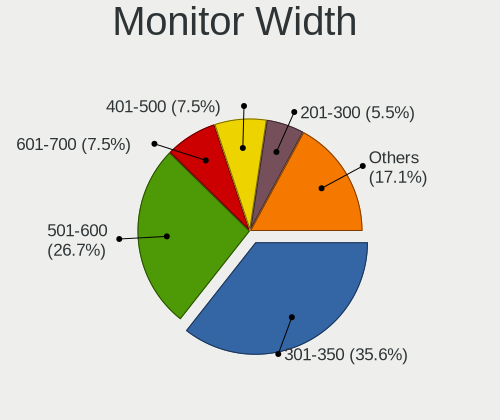

| Width in mm | Computers | Percent |
|-------------|-----------|---------|
| 301-350     | 72        | 38.71%  |
| 501-600     | 50        | 26.88%  |
| 351-400     | 15        | 8.06%   |
| 401-500     | 13        | 6.99%   |
| 201-300     | 13        | 6.99%   |
| 701-800     | 7         | 3.76%   |
| 1501-2000   | 6         | 3.23%   |
| 601-700     | 5         | 2.69%   |
| Unknown     | 3         | 1.61%   |
| 1001-1500   | 2         | 1.08%   |

Aspect Ratio
------------

Proportional relationship between the width and the height

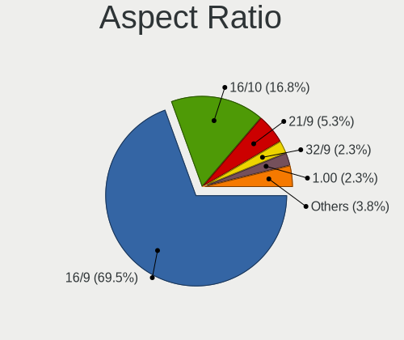

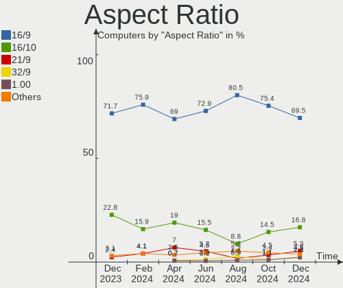

| Ratio   | Computers | Percent |
|---------|-----------|---------|
| 16/9    | 133       | 79.17%  |
| 16/10   | 21        | 12.5%   |
| 21/9    | 6         | 3.57%   |
| 5/4     | 3         | 1.79%   |
| 3/2     | 2         | 1.19%   |
| 32/9    | 1         | 0.6%    |
| 3.40    | 1         | 0.6%    |
| Unknown | 1         | 0.6%    |

Monitor Area
------------

Area in inch²

| Area in inch² | Computers | Percent |
|----------------|-----------|---------|
| 101-110        | 45        | 23.94%  |
| 201-250        | 34        | 18.09%  |
| 81-90          | 31        | 16.49%  |
| 301-350        | 19        | 10.11%  |
| 351-500        | 10        | 5.32%   |
| 121-130        | 10        | 5.32%   |
| 251-300        | 8         | 4.26%   |
| More than 1000 | 7         | 3.72%   |
| 71-80          | 4         | 2.13%   |
| 61-70          | 4         | 2.13%   |
| 151-200        | 4         | 2.13%   |
| 51-60          | 3         | 1.6%    |
| Unknown        | 3         | 1.6%    |
| 141-150        | 2         | 1.06%   |
| 501-1000       | 2         | 1.06%   |
| 131-140        | 1         | 0.53%   |
| 111-120        | 1         | 0.53%   |

Pixel Density
-------------

Pixels per inch

| Density       | Computers | Percent |
|---------------|-----------|---------|
| 51-100        | 56        | 30.94%  |
| 121-160       | 54        | 29.83%  |
| 101-120       | 48        | 26.52%  |
| 161-240       | 12        | 6.63%   |
| More than 240 | 4         | 2.21%   |
| 1-50          | 4         | 2.21%   |
| Unknown       | 3         | 1.66%   |

Multiple Monitors
-----------------

Total monitors connected

| Total | Computers | Percent |
|-------|-----------|---------|
| 1     | 125       | 76.22%  |
| 2     | 35        | 21.34%  |
| 0     | 2         | 1.22%   |
| 4     | 1         | 0.61%   |
| 3     | 1         | 0.61%   |

Network
-------

Net Controller Vendor
---------------------

Controller vendors

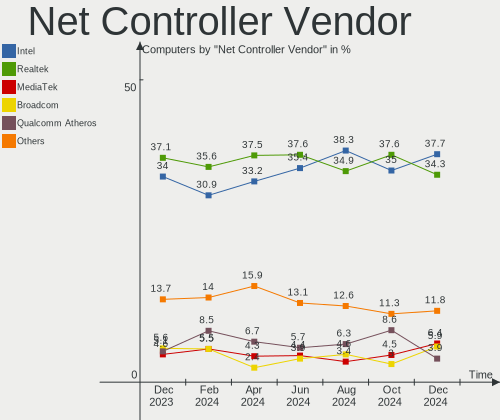

| Vendor                            | Computers | Percent |
|-----------------------------------|-----------|---------|
| Intel                             | 99        | 39.6%   |
| Realtek Semiconductor             | 85        | 34%     |
| Qualcomm Atheros                  | 18        | 7.2%    |
| Broadcom                          | 11        | 4.4%    |
| MediaTek                          | 7         | 2.8%    |
| TP-Link                           | 5         | 2%      |
| Ralink Technology                 | 3         | 1.2%    |
| Sierra Wireless                   | 2         | 0.8%    |
| Marvell Technology Group          | 2         | 0.8%    |
| Huawei Technologies               | 2         | 0.8%    |
| Hewlett-Packard                   | 2         | 0.8%    |
| ASIX Electronics                  | 2         | 0.8%    |
| U-Blox                            | 1         | 0.4%    |
| Samsung Electronics               | 1         | 0.4%    |
| Ralink                            | 1         | 0.4%    |
| Qualcomm Atheros Communications   | 1         | 0.4%    |
| NetGear                           | 1         | 0.4%    |
| Linksys                           | 1         | 0.4%    |
| LG Electronics                    | 1         | 0.4%    |
| Ericsson Business Mobile Networks | 1         | 0.4%    |
| DisplayLink                       | 1         | 0.4%    |
| Broadcom Limited                  | 1         | 0.4%    |
| Belkin Components                 | 1         | 0.4%    |
| AVM                               | 1         | 0.4%    |

Net Controller Model
--------------------

Controller models

| Model                                                             | Computers | Percent |
|-------------------------------------------------------------------|-----------|---------|
| Realtek RTL8111/8168/8411 PCI Express Gigabit Ethernet Controller | 47        | 15.82%  |
| Intel 82579LM Gigabit Network Connection (Lewisville)             | 12        | 4.04%   |
| Intel Wi-Fi 6 AX200                                               | 11        | 3.7%    |
| Realtek RTL8125 2.5GbE Controller                                 | 8         | 2.69%   |
| Intel Wi-Fi 6 AX201                                               | 8         | 2.69%   |
| Intel I211 Gigabit Network Connection                             | 7         | 2.36%   |
| Realtek RTL810xE PCI Express Fast Ethernet controller             | 6         | 2.02%   |
| Intel Wireless 7265                                               | 6         | 2.02%   |
| Intel Wireless 7260                                               | 6         | 2.02%   |
| Intel Ethernet Controller I225-V                                  | 6         | 2.02%   |
| Intel Alder Lake-P PCH CNVi WiFi                                  | 6         | 2.02%   |
| Realtek RTL8822CE 802.11ac PCIe Wireless Network Adapter          | 5         | 1.68%   |
| Realtek RTL8821CE 802.11ac PCIe Wireless Network Adapter          | 5         | 1.68%   |
| Realtek RTL8153 Gigabit Ethernet Adapter                          | 5         | 1.68%   |
| Intel Wireless 8265 / 8275                                        | 5         | 1.68%   |
| Intel Ethernet Connection (2) I219-V                              | 5         | 1.68%   |
| Intel Centrino Advanced-N 6205 [Taylor Peak]                      | 5         | 1.68%   |
| Qualcomm Atheros QCA6174 802.11ac Wireless Network Adapter        | 4         | 1.35%   |
| Intel Cannon Lake PCH CNVi WiFi                                   | 4         | 1.35%   |
| Realtek 802.11n WLAN Adapter                                      | 3         | 1.01%   |
| Qualcomm Atheros AR9485 Wireless Network Adapter                  | 3         | 1.01%   |
| MediaTek MT7921 802.11ax PCI Express Wireless Network Adapter     | 3         | 1.01%   |
| Intel Wireless 3165                                               | 3         | 1.01%   |
| Intel Ethernet Connection I217-LM                                 | 3         | 1.01%   |
| Intel Dual Band Wireless-AC 3168NGW [Stone Peak]                  | 3         | 1.01%   |
| Intel Comet Lake PCH CNVi WiFi                                    | 3         | 1.01%   |
| Broadcom BCM4313 802.11bgn Wireless Network Adapter               | 3         | 1.01%   |
| Realtek RTL88x2bu [AC1200 Techkey]                                | 2         | 0.67%   |
| Realtek RTL8812AU 802.11a/b/g/n/ac 2T2R DB WLAN Adapter           | 2         | 0.67%   |
| Realtek RTL8723BE PCIe Wireless Network Adapter                   | 2         | 0.67%   |
| Realtek RTL8188EUS 802.11n Wireless Network Adapter               | 2         | 0.67%   |
| Qualcomm Atheros QCA9565 / AR9565 Wireless Network Adapter        | 2         | 0.67%   |
| Qualcomm Atheros QCA9377 802.11ac Wireless Network Adapter        | 2         | 0.67%   |
| Qualcomm Atheros Killer E220x Gigabit Ethernet Controller         | 2         | 0.67%   |
| Qualcomm Atheros AR9285 Wireless Network Adapter (PCI-Express)    | 2         | 0.67%   |
| Intel Wireless 8260                                               | 2         | 0.67%   |
| Intel WiFi Link 5100                                              | 2         | 0.67%   |
| Intel Ethernet Connection I218-LM                                 | 2         | 0.67%   |
| Intel Ethernet Connection I217-V                                  | 2         | 0.67%   |
| Intel Ethernet Connection (14) I219-V                             | 2         | 0.67%   |

Wireless Vendor
---------------

Wireless vendors

| Vendor                          | Computers | Percent |
|---------------------------------|-----------|---------|
| Intel                           | 73        | 48.99%  |
| Realtek Semiconductor           | 29        | 19.46%  |
| Qualcomm Atheros                | 15        | 10.07%  |
| Broadcom                        | 8         | 5.37%   |
| MediaTek                        | 7         | 4.7%    |
| TP-Link                         | 4         | 2.68%   |
| Ralink Technology               | 3         | 2.01%   |
| Sierra Wireless                 | 2         | 1.34%   |
| Ralink                          | 1         | 0.67%   |
| Qualcomm Atheros Communications | 1         | 0.67%   |
| NetGear                         | 1         | 0.67%   |
| LG Electronics                  | 1         | 0.67%   |
| Hewlett-Packard                 | 1         | 0.67%   |
| Broadcom Limited                | 1         | 0.67%   |
| Belkin Components               | 1         | 0.67%   |
| AVM                             | 1         | 0.67%   |

Wireless Model
--------------

Wireless models

| Model                                                          | Computers | Percent |
|----------------------------------------------------------------|-----------|---------|
| Intel Wi-Fi 6 AX200                                            | 11        | 7.38%   |
| Intel Wi-Fi 6 AX201                                            | 8         | 5.37%   |
| Intel Wireless 7265                                            | 6         | 4.03%   |
| Intel Wireless 7260                                            | 6         | 4.03%   |
| Intel Alder Lake-P PCH CNVi WiFi                               | 6         | 4.03%   |
| Realtek RTL8822CE 802.11ac PCIe Wireless Network Adapter       | 5         | 3.36%   |
| Realtek RTL8821CE 802.11ac PCIe Wireless Network Adapter       | 5         | 3.36%   |
| Intel Wireless 8265 / 8275                                     | 5         | 3.36%   |
| Intel Centrino Advanced-N 6205 [Taylor Peak]                   | 5         | 3.36%   |
| Qualcomm Atheros QCA6174 802.11ac Wireless Network Adapter     | 4         | 2.68%   |
| Intel Cannon Lake PCH CNVi WiFi                                | 4         | 2.68%   |
| Realtek 802.11n WLAN Adapter                                   | 3         | 2.01%   |
| Qualcomm Atheros AR9485 Wireless Network Adapter               | 3         | 2.01%   |
| MediaTek MT7921 802.11ax PCI Express Wireless Network Adapter  | 3         | 2.01%   |
| Intel Wireless 3165                                            | 3         | 2.01%   |
| Intel Dual Band Wireless-AC 3168NGW [Stone Peak]               | 3         | 2.01%   |
| Intel Comet Lake PCH CNVi WiFi                                 | 3         | 2.01%   |
| Broadcom BCM4313 802.11bgn Wireless Network Adapter            | 3         | 2.01%   |
| Realtek RTL88x2bu [AC1200 Techkey]                             | 2         | 1.34%   |
| Realtek RTL8812AU 802.11a/b/g/n/ac 2T2R DB WLAN Adapter        | 2         | 1.34%   |
| Realtek RTL8723BE PCIe Wireless Network Adapter                | 2         | 1.34%   |
| Realtek RTL8188EUS 802.11n Wireless Network Adapter            | 2         | 1.34%   |
| Qualcomm Atheros QCA9565 / AR9565 Wireless Network Adapter     | 2         | 1.34%   |
| Qualcomm Atheros QCA9377 802.11ac Wireless Network Adapter     | 2         | 1.34%   |
| Qualcomm Atheros AR9285 Wireless Network Adapter (PCI-Express) | 2         | 1.34%   |
| Intel Wireless 8260                                            | 2         | 1.34%   |
| Intel WiFi Link 5100                                           | 2         | 1.34%   |
| Intel Comet Lake PCH-LP CNVi WiFi                              | 2         | 1.34%   |
| Broadcom BCM43228 802.11a/b/g/n                                | 2         | 1.34%   |
| TP-Link TL-WN722N v2/v3 [Realtek RTL8188EUS]                   | 1         | 0.67%   |
| TP-Link Archer T3U [Realtek RTL8812BU]                         | 1         | 0.67%   |
| TP-Link Archer T2U PLUS [RTL8821AU]                            | 1         | 0.67%   |
| TP-Link 802.11ac NIC                                           | 1         | 0.67%   |
| Sierra Wireless EM7345 4G LTE                                  | 1         | 0.67%   |
| Sierra Wireless EM7305 Modem                                   | 1         | 0.67%   |
| Realtek RTL8852AE 802.11ax PCIe Wireless Network Adapter       | 1         | 0.67%   |
| Realtek RTL8821AE 802.11ac PCIe Wireless Network Adapter       | 1         | 0.67%   |
| Realtek RTL8723BU 802.11b/g/n WLAN Adapter                     | 1         | 0.67%   |
| Realtek RTL8192EE PCIe Wireless Network Adapter                | 1         | 0.67%   |
| Realtek RTL8188EE Wireless Network Adapter                     | 1         | 0.67%   |

Ethernet Vendor
---------------

Ethernet vendors

| Vendor                   | Computers | Percent |
|--------------------------|-----------|---------|
| Realtek Semiconductor    | 67        | 47.86%  |
| Intel                    | 53        | 37.86%  |
| Qualcomm Atheros         | 5         | 3.57%   |
| Broadcom                 | 5         | 3.57%   |
| Marvell Technology Group | 2         | 1.43%   |
| Huawei Technologies      | 2         | 1.43%   |
| ASIX Electronics         | 2         | 1.43%   |
| TP-Link                  | 1         | 0.71%   |
| Samsung Electronics      | 1         | 0.71%   |
| Linksys                  | 1         | 0.71%   |
| DisplayLink              | 1         | 0.71%   |

Ethernet Model
--------------

Ethernet models

| Model                                                             | Computers | Percent |
|-------------------------------------------------------------------|-----------|---------|
| Realtek RTL8111/8168/8411 PCI Express Gigabit Ethernet Controller | 47        | 32.41%  |
| Intel 82579LM Gigabit Network Connection (Lewisville)             | 12        | 8.28%   |
| Realtek RTL8125 2.5GbE Controller                                 | 8         | 5.52%   |
| Intel I211 Gigabit Network Connection                             | 7         | 4.83%   |
| Realtek RTL810xE PCI Express Fast Ethernet controller             | 6         | 4.14%   |
| Intel Ethernet Controller I225-V                                  | 6         | 4.14%   |
| Realtek RTL8153 Gigabit Ethernet Adapter                          | 5         | 3.45%   |
| Intel Ethernet Connection (2) I219-V                              | 5         | 3.45%   |
| Intel Ethernet Connection I217-LM                                 | 3         | 2.07%   |
| Qualcomm Atheros Killer E220x Gigabit Ethernet Controller         | 2         | 1.38%   |
| Intel Ethernet Connection I218-LM                                 | 2         | 1.38%   |
| Intel Ethernet Connection I217-V                                  | 2         | 1.38%   |
| Intel Ethernet Connection (14) I219-V                             | 2         | 1.38%   |
| Intel 82574L Gigabit Network Connection                           | 2         | 1.38%   |
| Broadcom NetLink BCM57785 Gigabit Ethernet PCIe                   | 2         | 1.38%   |
| ASIX AX88179 Gigabit Ethernet                                     | 2         | 1.38%   |
| TP-Link UE300 10/100/1000 LAN (ethernet mode) [Realtek RTL8153]   | 1         | 0.69%   |
| Samsung Galaxy series, misc. (tethering mode)                     | 1         | 0.69%   |
| Realtek RTL8152 Fast Ethernet Adapter                             | 1         | 0.69%   |
| Realtek RTL-8100/8101L/8139 PCI Fast Ethernet Adapter             | 1         | 0.69%   |
| Realtek Killer E3000 2.5GbE Controller                            | 1         | 0.69%   |
| Realtek Killer E2600 Gigabit Ethernet Controller                  | 1         | 0.69%   |
| Qualcomm Atheros QCA8172 Fast Ethernet                            | 1         | 0.69%   |
| Qualcomm Atheros Killer E2500 Gigabit Ethernet Controller         | 1         | 0.69%   |
| Qualcomm Atheros AR8161 Gigabit Ethernet                          | 1         | 0.69%   |
| Marvell Group 88E8055 PCI-E Gigabit Ethernet Controller           | 1         | 0.69%   |
| Marvell Group 88E8040 PCI-E Fast Ethernet Controller              | 1         | 0.69%   |
| Linksys Gigabit Network Adapter                                   | 1         | 0.69%   |
| Intel I350 Gigabit Network Connection                             | 1         | 0.69%   |
| Intel Ethernet controller                                         | 1         | 0.69%   |
| Intel Ethernet Connection I219-LM                                 | 1         | 0.69%   |
| Intel Ethernet Connection (7) I219-V                              | 1         | 0.69%   |
| Intel Ethernet Connection (7) I219-LM                             | 1         | 0.69%   |
| Intel Ethernet Connection (4) I219-V                              | 1         | 0.69%   |
| Intel Ethernet Connection (3) I218-V                              | 1         | 0.69%   |
| Intel Ethernet Connection (3) I218-LM                             | 1         | 0.69%   |
| Intel Ethernet Connection (2) I219-LM                             | 1         | 0.69%   |
| Intel Ethernet Connection (13) I219-V                             | 1         | 0.69%   |
| Intel Ethernet Connection (11) I219-V                             | 1         | 0.69%   |
| Intel Ethernet Connection (11) I219-LM                            | 1         | 0.69%   |

Net Controller Kind
-------------------

Ethernet, WiFi or modem

| Kind     | Computers | Percent |
|----------|-----------|---------|
| WiFi     | 136       | 50.75%  |
| Ethernet | 129       | 48.13%  |
| Modem    | 3         | 1.12%   |

Used Controller
---------------

Currently used network controller

| Kind     | Computers | Percent |
|----------|-----------|---------|
| WiFi     | 110       | 64.71%  |
| Ethernet | 60        | 35.29%  |

NICs
----

Total network controllers on board

| Total | Computers | Percent |
|-------|-----------|---------|
| 2     | 84        | 51.22%  |
| 1     | 71        | 43.29%  |
| 3     | 4         | 2.44%   |
| 0     | 4         | 2.44%   |
| 4     | 1         | 0.61%   |

IPv6
----

IPv6 vs IPv4

| Used | Computers | Percent |
|------|-----------|---------|
| No   | 124       | 75.61%  |
| Yes  | 40        | 24.39%  |

Bluetooth
---------

Bluetooth Vendor
----------------

Controller vendors

| Vendor                          | Computers | Percent |
|---------------------------------|-----------|---------|
| Intel                           | 60        | 56.07%  |
| Realtek Semiconductor           | 10        | 9.35%   |
| Qualcomm Atheros Communications | 9         | 8.41%   |
| Cambridge Silicon Radio         | 7         | 6.54%   |
| Broadcom                        | 6         | 5.61%   |
| IMC Networks                    | 3         | 2.8%    |
| Foxconn / Hon Hai               | 3         | 2.8%    |
| ASUSTek Computer                | 2         | 1.87%   |
| Apple                           | 2         | 1.87%   |
| Realtek                         | 1         | 0.93%   |
| MediaTek                        | 1         | 0.93%   |
| Lite-On Technology              | 1         | 0.93%   |
| Hewlett-Packard                 | 1         | 0.93%   |
| Alps Electric                   | 1         | 0.93%   |

Bluetooth Model
---------------

Controller models

| Model                                               | Computers | Percent |
|-----------------------------------------------------|-----------|---------|
| Intel Bluetooth wireless interface                  | 19        | 17.76%  |
| Intel AX201 Bluetooth                               | 13        | 12.15%  |
| Intel AX200 Bluetooth                               | 10        | 9.35%   |
| Realtek Bluetooth Radio                             | 9         | 8.41%   |
| Cambridge Silicon Radio Bluetooth Dongle (HCI mode) | 7         | 6.54%   |
| Intel Bluetooth Device                              | 6         | 5.61%   |
| Intel Bluetooth 9460/9560 Jefferson Peak (JfP)      | 6         | 5.61%   |
| Qualcomm Atheros QCA61x4 Bluetooth 4.0              | 3         | 2.8%    |
| Intel Wireless-AC 3168 Bluetooth                    | 3         | 2.8%    |
| Qualcomm Atheros  Bluetooth Device                  | 2         | 1.87%   |
| Qualcomm Atheros AR3012 Bluetooth 4.0               | 2         | 1.87%   |
| IMC Networks Wireless_Device                        | 2         | 1.87%   |
| Foxconn / Hon Hai Wireless_Device                   | 2         | 1.87%   |
| Broadcom BCM20702A0 Bluetooth 4.0                   | 2         | 1.87%   |
| Broadcom BCM20702 Bluetooth 4.0 [ThinkPad]          | 2         | 1.87%   |
| Realtek  Bluetooth 4.2 Adapter                      | 1         | 0.93%   |
| Realtek Bluetooth Radio                             | 1         | 0.93%   |
| Qualcomm Atheros Bluetooth USB Host Controller      | 1         | 0.93%   |
| Qualcomm Atheros AR9462 Bluetooth                   | 1         | 0.93%   |
| MediaTek Wireless_Device                            | 1         | 0.93%   |
| Lite-On Wireless_Device                             | 1         | 0.93%   |
| Intel Wireless-AC 9260 Bluetooth Adapter            | 1         | 0.93%   |
| Intel Centrino Bluetooth Wireless Transceiver       | 1         | 0.93%   |
| Intel AX210 Bluetooth                               | 1         | 0.93%   |
| IMC Networks Bluetooth Radio                        | 1         | 0.93%   |
| HP Broadcom 2070 Bluetooth Combo                    | 1         | 0.93%   |
| Foxconn / Hon Hai BCM20702A0                        | 1         | 0.93%   |
| Broadcom HP Portable Valentine                      | 1         | 0.93%   |
| Broadcom HP Portable Bumble Bee                     | 1         | 0.93%   |
| ASUS Qualcomm Bluetooth 4.1                         | 1         | 0.93%   |
| ASUS ASUS USB-BT500                                 | 1         | 0.93%   |
| Apple Bluetooth USB Host Controller                 | 1         | 0.93%   |
| Apple Bluetooth Host Controller                     | 1         | 0.93%   |
| Alps Electric BCM2046 Bluetooth Device              | 1         | 0.93%   |

Sound
-----

Sound Vendor
------------

Sound card vendors

| Vendor                  | Computers | Percent |
|-------------------------|-----------|---------|
| Intel                   | 119       | 51.07%  |
| AMD                     | 52        | 22.32%  |
| Nvidia                  | 37        | 15.88%  |
| C-Media Electronics     | 3         | 1.29%   |
| Realtek Semiconductor   | 2         | 0.86%   |
| Razer USA               | 2         | 0.86%   |
| Logitech                | 2         | 0.86%   |
| Unknown                 | 1         | 0.43%   |
| Trust                   | 1         | 0.43%   |
| Silicon Motion          | 1         | 0.43%   |
| Samson Technologies     | 1         | 0.43%   |
| M-Audio                 | 1         | 0.43%   |
| Lenovo                  | 1         | 0.43%   |
| KTMicro                 | 1         | 0.43%   |
| Kingston Technology     | 1         | 0.43%   |
| JMTek                   | 1         | 0.43%   |
| Generalplus Technology  | 1         | 0.43%   |
| ESS Technology          | 1         | 0.43%   |
| Cambridge Silicon Radio | 1         | 0.43%   |
| Blue Microphones        | 1         | 0.43%   |
| ASUSTek Computer        | 1         | 0.43%   |
| Astro Gaming            | 1         | 0.43%   |
| Arturia                 | 1         | 0.43%   |

Sound Model
-----------

Sound card models

| Model                                                                             | Computers | Percent |
|-----------------------------------------------------------------------------------|-----------|---------|
| AMD Family 17h/19h HD Audio Controller                                            | 23        | 7.96%   |
| Intel 7 Series/C216 Chipset Family High Definition Audio Controller               | 16        | 5.54%   |
| AMD Renoir Radeon High Definition Audio Controller                                | 13        | 4.5%    |
| Intel Tiger Lake-LP Smart Sound Technology Audio Controller                       | 11        | 3.81%   |
| Intel Sunrise Point-LP HD Audio                                                   | 11        | 3.81%   |
| Intel 8 Series/C220 Series Chipset High Definition Audio Controller               | 11        | 3.81%   |
| Intel Xeon E3-1200 v3/4th Gen Core Processor HD Audio Controller                  | 9         | 3.11%   |
| AMD Starship/Matisse HD Audio Controller                                          | 9         | 3.11%   |
| Intel Cannon Lake PCH cAVS                                                        | 8         | 2.77%   |
| Intel 6 Series/C200 Series Chipset Family High Definition Audio Controller        | 8         | 2.77%   |
| AMD Navi 21/23 HDMI/DP Audio Controller                                           | 8         | 2.77%   |
| AMD SBx00 Azalia (Intel HDA)                                                      | 7         | 2.42%   |
| Intel Alder Lake PCH-P High Definition Audio Controller                           | 6         | 2.08%   |
| AMD Raven/Raven2/Fenghuang HDMI/DP Audio Controller                               | 6         | 2.08%   |
| Nvidia GP107GL High Definition Audio Controller                                   | 5         | 1.73%   |
| Nvidia GK208 HDMI/DP Audio Controller                                             | 5         | 1.73%   |
| Intel Cannon Point-LP High Definition Audio Controller                            | 5         | 1.73%   |
| Intel 200 Series PCH HD Audio                                                     | 5         | 1.73%   |
| Nvidia TU106 High Definition Audio Controller                                     | 4         | 1.38%   |
| Nvidia GA106 High Definition Audio Controller                                     | 4         | 1.38%   |
| Intel Comet Lake PCH cAVS                                                         | 4         | 1.38%   |
| Intel Celeron/Pentium Silver Processor High Definition Audio                      | 4         | 1.38%   |
| Nvidia TU116 High Definition Audio Controller                                     | 3         | 1.04%   |
| Nvidia GA104 High Definition Audio Controller                                     | 3         | 1.04%   |
| Intel Wildcat Point-LP High Definition Audio Controller                           | 3         | 1.04%   |
| Intel Comet Lake PCH-LP cAVS                                                      | 3         | 1.04%   |
| Intel Broadwell-U Audio Controller                                                | 3         | 1.04%   |
| Intel 100 Series/C230 Series Chipset Family HD Audio Controller                   | 3         | 1.04%   |
| AMD Oland/Hainan/Cape Verde/Pitcairn HDMI Audio [Radeon HD 7000 Series]           | 3         | 1.04%   |
| AMD FCH Azalia Controller                                                         | 3         | 1.04%   |
| AMD Ellesmere HDMI Audio [Radeon RX 470/480 / 570/580/590]                        | 3         | 1.04%   |
| AMD Caicos HDMI Audio [Radeon HD 6450 / 7450/8450/8490 OEM / R5 230/235/235X OEM] | 3         | 1.04%   |
| Realtek Semiconductor USB Audio                                                   | 2         | 0.69%   |
| Nvidia TU107 GeForce GTX 1650 High Definition Audio Controller                    | 2         | 0.69%   |
| Nvidia GM107 High Definition Audio Controller [GeForce 940MX]                     | 2         | 0.69%   |
| Nvidia GK104 HDMI Audio Controller                                                | 2         | 0.69%   |
| Nvidia GF116 High Definition Audio Controller                                     | 2         | 0.69%   |
| Intel Tiger Lake-H HD Audio Controller                                            | 2         | 0.69%   |
| Intel Haswell-ULT HD Audio Controller                                             | 2         | 0.69%   |
| Intel Audio device                                                                | 2         | 0.69%   |

Memory
------

Memory Vendor
-------------

Memory module vendors

| Vendor              | Computers | Percent |
|---------------------|-----------|---------|
| Samsung Electronics | 24        | 21.24%  |
| SK hynix            | 18        | 15.93%  |
| Kingston            | 13        | 11.5%   |
| Micron Technology   | 11        | 9.73%   |
| Crucial             | 7         | 6.19%   |
| Unknown (ABCD)      | 5         | 4.42%   |
| Unknown             | 5         | 4.42%   |
| Corsair             | 5         | 4.42%   |
| A-DATA Technology   | 4         | 3.54%   |
| Team                | 3         | 2.65%   |
| Ramaxel Technology  | 3         | 2.65%   |
| G.Skill             | 3         | 2.65%   |
| Unknown             | 2         | 1.77%   |
| Transcend           | 1         | 0.88%   |
| Super Talent        | 1         | 0.88%   |
| Smart               | 1         | 0.88%   |
| SHARETRONIC         | 1         | 0.88%   |
| PNY                 | 1         | 0.88%   |
| Imation             | 1         | 0.88%   |
| GOODRAM             | 1         | 0.88%   |
| Goldkey             | 1         | 0.88%   |
| Elpida              | 1         | 0.88%   |
| CSX                 | 1         | 0.88%   |

Memory Model
------------

Memory module models

| Model                                                            | Computers | Percent |
|------------------------------------------------------------------|-----------|---------|
| Unknown (ABCD) RAM 123456789012345678 2GB SODIMM LPDDR4 2400MT/s | 4         | 3.28%   |
| G.Skill RAM F4-3000C16-8GISB 8GB DIMM DDR4 3200MT/s              | 3         | 2.46%   |
| Unknown RAM Module 4GB DIMM 1333MT/s                             | 2         | 1.64%   |
| SK hynix RAM HMT351S6CFR8C-H9 4GB SODIMM DDR3 1333MT/s           | 2         | 1.64%   |
| SK hynix RAM HMAA1GS6CJR6N-XN 8GB SODIMM DDR4 3200MT/s           | 2         | 1.64%   |
| SK hynix RAM H9HCNNNCPMMLXR-NEE 2GB Row Of Chips LPDDR4 4267MT/s | 2         | 1.64%   |
| Samsung RAM M471A5244BB0-CRC 4096MB SODIMM DDR4 2667MT/s         | 2         | 1.64%   |
| Samsung RAM M471A2K43EB1-CWE 16GB SODIMM DDR4 3200MT/s           | 2         | 1.64%   |
| Samsung RAM M471A2K43DB1-CWE 16GB SODIMM DDR4 3200MT/s           | 2         | 1.64%   |
| Samsung RAM K3LKBKB@BM-MGCP 2GB Row Of Chips LPDDR5 6400MT/s     | 2         | 1.64%   |
| A-DATA RAM AO1P24HC8T1-BPGS 8GB SODIMM DDR4 2400MT/s             | 2         | 1.64%   |
| Unknown                                                          | 2         | 1.64%   |
| Unknown RAM Module 8GB SODIMM DDR4 3200MT/s                      | 1         | 0.82%   |
| Unknown RAM Module 4096MB DIMM 1333MT/s                          | 1         | 0.82%   |
| Unknown RAM Module 2GB DIMM 1333MT/s                             | 1         | 0.82%   |
| Unknown RAM Module 2048MB SODIMM DDR2                            | 1         | 0.82%   |
| Unknown RAM Module 2048MB DIMM 1333MT/s                          | 1         | 0.82%   |
| Unknown (ABCD) RAM 123456789012345678 4GB DIMM DDR4 2400MT/s     | 1         | 0.82%   |
| Transcend RAM Module 256MB DIMM DDR2 667MT/s                     | 1         | 0.82%   |
| Team RAM TEAMGROUP-UD4-3200 16GB DIMM DDR4 3800MT/s              | 1         | 0.82%   |
| Team RAM TEAMGROUP-UD3-1600 2GB DIMM DDR3 1600MT/s               | 1         | 0.82%   |
| Team RAM TEAMGROUP-SD4-3200 8GB SODIMM DDR4 3200MT/s             | 1         | 0.82%   |
| Super Talent RAM SUPERTALENT02 4GB SODIMM DDR3 1600MT/s          | 1         | 0.82%   |
| Smart RAM SF564128CJ8NWMNSEG 4GB SODIMM DDR3 1600MT/s            | 1         | 0.82%   |
| SK hynix RAM Module 512MB DIMM DDR2 667MT/s                      | 1         | 0.82%   |
| SK hynix RAM Module 2GB DIMM DDR3 1333MT/s                       | 1         | 0.82%   |
| SK hynix RAM HMT451U6BFR8C-PB 4GB DIMM DDR3 1600MT/s             | 1         | 0.82%   |
| SK hynix RAM HMT451S6BFR8A-PB 4GB SODIMM DDR3 1600MT/s           | 1         | 0.82%   |
| SK hynix RAM HMT351S6CFR8C-PB 4GB SODIMM DDR3 1600MT/s           | 1         | 0.82%   |
| SK hynix RAM HMT351S6BFR8C-H9 4GB SODIMM DDR3 1333MT/s           | 1         | 0.82%   |
| SK hynix RAM HMAA1GS6CJR6N-XN 8GB Row Of Chips DDR4 3200MT/s     | 1         | 0.82%   |
| SK hynix RAM HMA851S6CJR6N-VK 4GB Row Of Chips DDR4 2667MT/s     | 1         | 0.82%   |
| SK hynix RAM HMA82GS6AFR8N-UH 16384MB SODIMM DDR4 2667MT/s       | 1         | 0.82%   |
| SK hynix RAM HMA81GU6DJR8N-XN 8GB DIMM DDR4 3200MT/s             | 1         | 0.82%   |
| SK hynix RAM HMA81GS6DJR8N-XN 8GB SODIMM DDR4 3200MT/s           | 1         | 0.82%   |
| SK hynix RAM HMA81GS6AFR8N-UH 8GB SODIMM DDR4 2667MT/s           | 1         | 0.82%   |
| SK hynix RAM H9JCNNNFA5MLYR-N6E 4GB Row Of Chips LPDDR5 6400MT/s | 1         | 0.82%   |
| SHARETRONIC RAM Module 4GB SODIMM DDR3 1333MT/s                  | 1         | 0.82%   |
| Samsung RAM Module 8GB SODIMM DDR4 3200MT/s                      | 1         | 0.82%   |
| Samsung RAM Module 2GB DIMM DDR3 1333MT/s                        | 1         | 0.82%   |

Memory Kind
-----------

Memory module kinds

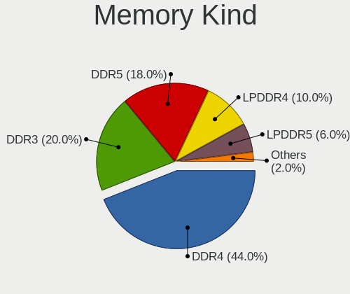

| Kind    | Computers | Percent |
|---------|-----------|---------|
| DDR4    | 51        | 52.04%  |
| DDR3    | 28        | 28.57%  |
| LPDDR4  | 8         | 8.16%   |
| LPDDR5  | 3         | 3.06%   |
| Unknown | 3         | 3.06%   |
| DDR5    | 2         | 2.04%   |
| DDR2    | 2         | 2.04%   |
| LPDDR3  | 1         | 1.02%   |

Memory Form Factor
------------------

Physical design of the memory module

| Name         | Computers | Percent |
|--------------|-----------|---------|
| SODIMM       | 57        | 56.44%  |
| DIMM         | 30        | 29.7%   |
| Row Of Chips | 13        | 12.87%  |
| Chip         | 1         | 0.99%   |

Memory Size
-----------

Memory module size

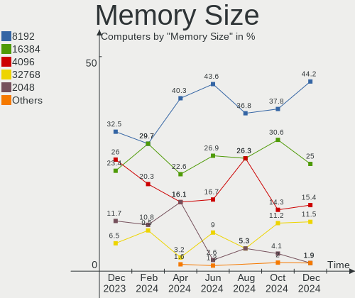

| Size  | Computers | Percent |
|-------|-----------|---------|
| 8192  | 48        | 44.04%  |
| 4096  | 25        | 22.94%  |
| 16384 | 21        | 19.27%  |
| 2048  | 7         | 6.42%   |
| 32768 | 5         | 4.59%   |
| 1024  | 1         | 0.92%   |
| 512   | 1         | 0.92%   |
| 256   | 1         | 0.92%   |

Memory Speed
------------

Memory module speed

| Speed   | Computers | Percent |
|---------|-----------|---------|
| 3200    | 27        | 25.47%  |
| 1600    | 20        | 18.87%  |
| 2667    | 16        | 15.09%  |
| 1333    | 11        | 10.38%  |
| 2400    | 10        | 9.43%   |
| 6400    | 3         | 2.83%   |
| 4267    | 3         | 2.83%   |
| 4800    | 2         | 1.89%   |
| 3800    | 1         | 0.94%   |
| 3666    | 1         | 0.94%   |
| 3600    | 1         | 0.94%   |
| 3466    | 1         | 0.94%   |
| 3266    | 1         | 0.94%   |
| 3151    | 1         | 0.94%   |
| 2666    | 1         | 0.94%   |
| 2134    | 1         | 0.94%   |
| 2133    | 1         | 0.94%   |
| 1867    | 1         | 0.94%   |
| 1800    | 1         | 0.94%   |
| 1066    | 1         | 0.94%   |
| 667     | 1         | 0.94%   |
| Unknown | 1         | 0.94%   |

Printers & scanners
-------------------

Printer Vendor
--------------

Printer device vendors

| Vendor             | Computers | Percent |
|--------------------|-----------|---------|
| Kyocera            | 1         | 33.33%  |
| Hewlett-Packard    | 1         | 33.33%  |
| Brother Industries | 1         | 33.33%  |

Printer Model
-------------

Printer device models

| Model                    | Computers | Percent |
|--------------------------|-----------|---------|
| Kyocera Mita FS-820      | 1         | 33.33%  |
| HP DeskJet 3630 series   | 1         | 33.33%  |
| Brother HL-L2320D series | 1         | 33.33%  |

Scanner Vendor
--------------

Scanner device vendors

| Vendor | Computers | Percent |
|--------|-----------|---------|
| Canon  | 1         | 100%    |

Scanner Model
-------------

Scanner device models

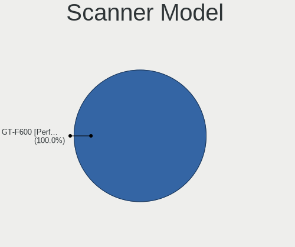

| Model                  | Computers | Percent |
|------------------------|-----------|---------|
| Canon CanoScan LiDE 60 | 1         | 100%    |

Camera
------

Camera Vendor
-------------

Camera device vendors

| Vendor                                 | Computers | Percent |
|----------------------------------------|-----------|---------|
| Chicony Electronics                    | 23        | 20.54%  |
| Acer                                   | 11        | 9.82%   |
| Quanta                                 | 9         | 8.04%   |
| IMC Networks                           | 9         | 8.04%   |
| Sunplus Innovation Technology          | 8         | 7.14%   |
| Microdia                               | 8         | 7.14%   |
| Logitech                               | 8         | 7.14%   |
| Realtek Semiconductor                  | 5         | 4.46%   |
| Syntek                                 | 3         | 2.68%   |
| Cheng Uei Precision Industry (Foxlink) | 3         | 2.68%   |
| Y Media                                | 2         | 1.79%   |
| Luxvisions Innotech Limited            | 2         | 1.79%   |
| Lite-On Technology                     | 2         | 1.79%   |
| Huawei Technologies                    | 2         | 1.79%   |
| Cubeternet                             | 2         | 1.79%   |
| Apple                                  | 2         | 1.79%   |
| Alcor Micro                            | 2         | 1.79%   |
| YGTek                                  | 1         | 0.89%   |
| USB Camera                             | 1         | 0.89%   |
| Unknown                                | 1         | 0.89%   |
| Suyin                                  | 1         | 0.89%   |
| Sunplus Technology                     | 1         | 0.89%   |
| SN0002                                 | 1         | 0.89%   |
| Samsung Electronics                    | 1         | 0.89%   |
| Ricoh                                  | 1         | 0.89%   |
| Microsoft                              | 1         | 0.89%   |
| HRY                                    | 1         | 0.89%   |
| Alpha Imaging Technology               | 1         | 0.89%   |

Camera Model
------------

Camera device models

| Model                                         | Computers | Percent |
|-----------------------------------------------|-----------|---------|
| Chicony Integrated Camera                     | 8         | 7.14%   |
| Sunplus Integrated_Webcam_HD                  | 6         | 5.36%   |
| IMC Networks USB2.0 HD UVC WebCam             | 4         | 3.57%   |
| Microdia Integrated_Webcam_HD                 | 3         | 2.68%   |
| IMC Networks Integrated Camera                | 3         | 2.68%   |
| Y Media USB Camera                            | 2         | 1.79%   |
| Syntek Integrated Camera                      | 2         | 1.79%   |
| Realtek USB Camera                            | 2         | 1.79%   |
| Quanta ov9734_techfront_camera                | 2         | 1.79%   |
| Quanta HP TrueVision HD Camera                | 2         | 1.79%   |
| Quanta HP True Vision HD Camera               | 2         | 1.79%   |
| Luxvisions Innotech Limited Integrated Camera | 2         | 1.79%   |
| Logitech HD Pro Webcam C920                   | 2         | 1.79%   |
| Logitech C922 Pro Stream Webcam               | 2         | 1.79%   |
| Lite-On HP Webcam                             | 2         | 1.79%   |
| Huawei HiCamera                               | 2         | 1.79%   |
| Chicony HD User Facing                        | 2         | 1.79%   |
| Acer Lenovo EasyCamera                        | 2         | 1.79%   |
| Acer HD Webcam                                | 2         | 1.79%   |
| Acer HD Camera                                | 2         | 1.79%   |
| YGTek Webcam                                  | 1         | 0.89%   |
| USB Camera USB Camera                         | 1         | 0.89%   |
| Unknown Konftel Cam20                         | 1         | 0.89%   |
| Syntek Lenovo EasyCamera                      | 1         | 0.89%   |
| Suyin 1.3M HD WebCam                          | 1         | 0.89%   |
| Sunplus 1.3M HD WebCam                        | 1         | 0.89%   |
| Sunplus Laptop Integrated Webcam HD           | 1         | 0.89%   |
| Sunplus 1080p FHD Camera                      | 1         | 0.89%   |
| SN0002 HIK 1080P USB CAMERA                   | 1         | 0.89%   |
| Samsung Galaxy series, misc. (MTP mode)       | 1         | 0.89%   |
| Ricoh Sony Vaio Integrated Webcam             | 1         | 0.89%   |
| Realtek Integrated_Webcam_HD                  | 1         | 0.89%   |
| Realtek Integrated Webcam                     | 1         | 0.89%   |
| Realtek HP Wide Vision HD Camera              | 1         | 0.89%   |
| Quanta HP HD Camera                           | 1         | 0.89%   |
| Quanta hm1091_techfront                       | 1         | 0.89%   |
| Quanta Acer FHD User Facing                   | 1         | 0.89%   |
| Microsoft Microsoft LifeCam Studio          | 1         | 0.89%   |
| Microdia Webcam Vitade AF                     | 1         | 0.89%   |
| Microdia USB 2.0 Camera                       | 1         | 0.89%   |

Security
--------

Fingerprint Vendor
------------------

Fingerprint sensor vendors

| Vendor                     | Computers | Percent |
|----------------------------|-----------|---------|
| Synaptics                  | 7         | 30.43%  |
| Validity Sensors           | 6         | 26.09%  |
| Shenzhen Goodix Technology | 5         | 21.74%  |
| Elan Microelectronics      | 3         | 13.04%  |
| LighTuning Technology      | 1         | 4.35%   |
| Focal-systems.Corp         | 1         | 4.35%   |

Fingerprint Model
-----------------

Fingerprint sensor models

| Model                                             | Computers | Percent |
|---------------------------------------------------|-----------|---------|
| Unknown                                           | 6         | 26.09%  |
| Shenzhen Goodix  Fingerprint Device               | 3         | 13.04%  |
| Validity Sensors VFS 5011 fingerprint sensor      | 2         | 8.7%    |
| Shenzhen Goodix Fingerprint Reader                | 2         | 8.7%    |
| Elan ELAN:Fingerprint                             | 2         | 8.7%    |
| Validity Sensors VFS7552 Touch Fingerprint Sensor | 1         | 4.35%   |
| Validity Sensors VFS495 Fingerprint Reader        | 1         | 4.35%   |
| Validity Sensors VFS471 Fingerprint Reader        | 1         | 4.35%   |
| Validity Sensors Synaptics WBDI                   | 1         | 4.35%   |
| Synaptics Prometheus MIS Touch Fingerprint Reader | 1         | 4.35%   |
| LighTuning ES603 Swipe Fingerprint Sensor         | 1         | 4.35%   |
| Focal-systems.Corp FT9201Fingerprint.             | 1         | 4.35%   |
| Elan ELAN:ARM-M4                                  | 1         | 4.35%   |

Chipcard Vendor
---------------

Chipcard module vendors

| Vendor           | Computers | Percent |
|------------------|-----------|---------|
| Broadcom         | 4         | 36.36%  |
| Alcor Micro      | 4         | 36.36%  |
| Upek             | 1         | 9.09%   |
| SCM Microsystems | 1         | 9.09%   |
| OmniKey          | 1         | 9.09%   |

Chipcard Model
--------------

Chipcard module models

| Model                                                                        | Computers | Percent |
|------------------------------------------------------------------------------|-----------|---------|
| Alcor Micro AU9540 Smartcard Reader                                          | 4         | 36.36%  |
| Broadcom BCM5880 Secure Applications Processor                               | 2         | 18.18%  |
| Upek TouchChip Fingerprint Coprocessor (WBF advanced mode)                   | 1         | 9.09%   |
| SCM Microsystems SCR331 SmartCard Reader                                     | 1         | 9.09%   |
| OmniKey CardMan 1021                                                         | 1         | 9.09%   |
| Broadcom BCM5880 Secure Applications Processor with fingerprint swipe sensor | 1         | 9.09%   |
| Broadcom 58200                                                               | 1         | 9.09%   |

Unsupported
-----------

Unsupported Devices
-------------------

Total unsupported devices on board

| Total | Computers | Percent |
|-------|-----------|---------|
| 0     | 119       | 72.56%  |
| 1     | 35        | 21.34%  |
| 2     | 10        | 6.1%    |

Unsupported Device Types
------------------------

Types of unsupported devices

| Type                     | Computers | Percent |
|--------------------------|-----------|---------|
| Fingerprint reader       | 23        | 41.82%  |
| Graphics card            | 9         | 16.36%  |
| Chipcard                 | 9         | 16.36%  |
| Net/wireless             | 8         | 14.55%  |
| Multimedia controller    | 2         | 3.64%   |
| Unassigned class         | 1         | 1.82%   |
| Net/ethernet             | 1         | 1.82%   |
| Communication controller | 1         | 1.82%   |
| Camera                   | 1         | 1.82%   |

