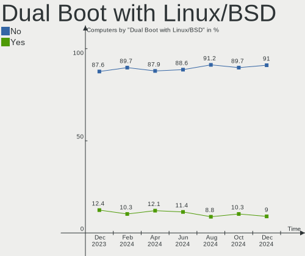
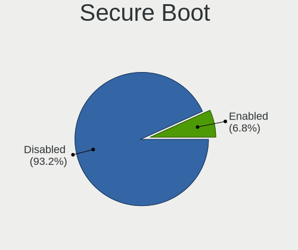
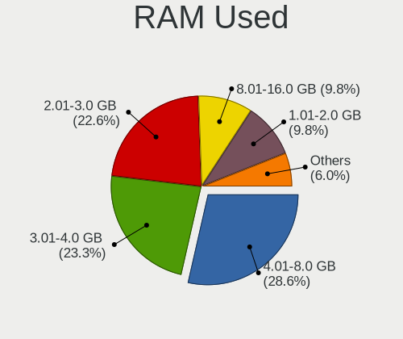
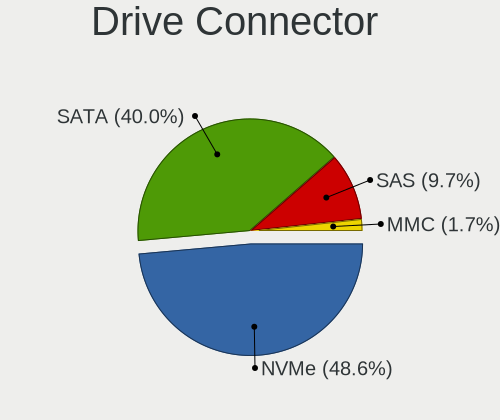
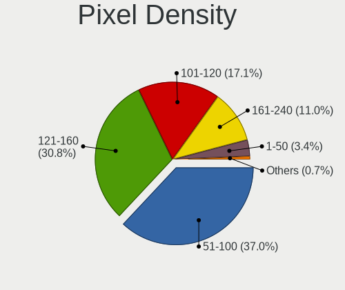
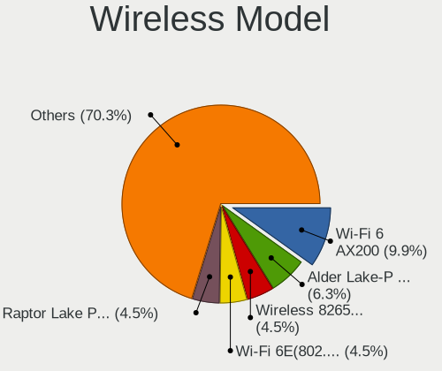
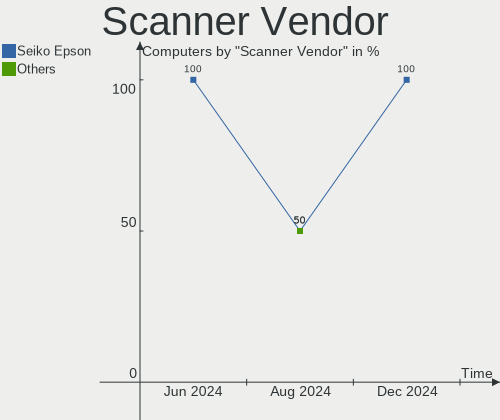

Kubuntu Hardware Trends
-----------------------

A project to identify most popular hardware characteristics and track their change
over time based on data collected by Kubuntu users at https://Linux-Hardware.org.

Anyone can contribute to the study by uploading probes of their computers by
the [hw-probe](https://github.com/linuxhw/hw-probe) tool:

    sudo -E hw-probe -all -upload

This is a report for all computer types. See also reports for [desktops](/Dist/Kubuntu/Desktop/README.md) and [notebooks](/Dist/Kubuntu/Notebook/README.md).

Full-feature report is available here: https://linux-hardware.org/?view=trends

Period: May, 2021.

Contents
--------

- [ OS                       ](#os)
- [ OS Family                ](#os-family)
- [ Kernel                   ](#kernel)
- [ Kernel Family            ](#kernel-family)
- [ Kernel Major Ver.        ](#kernel-major-ver)
- [ Arch                     ](#arch)
- [ DE                       ](#de)
- [ Display Server           ](#display-server)
- [ Display Manager          ](#display-manager)
- [ OS Lang                  ](#os-lang)
- [ Boot Mode                ](#boot-mode)
- [ Filesystem               ](#filesystem)
- [ Part. scheme             ](#part-scheme)
- [ Dual Boot with Linux/BSD ](#dual-boot-with-linux/bsd)
- [ Dual Boot (Win)          ](#dual-boot-win)
- [ Country                  ](#country)
- [ City                     ](#city)
- [ Vendor                   ](#vendor)
- [ Model                    ](#model)
- [ Model Family             ](#model-family)
- [ MFG Year                 ](#mfg-year)
- [ Form Factor              ](#form-factor)
- [ Secure Boot              ](#secure-boot)
- [ Coreboot                 ](#coreboot)
- [ RAM Size                 ](#ram-size)
- [ RAM Used                 ](#ram-used)
- [ Has CD-ROM               ](#has-cd-rom)
- [ Total Drives             ](#total-drives)
- [ Has Ethernet             ](#has-ethernet)
- [ Has WiFi                 ](#has-wifi)
- [ Has Bluetooth            ](#has-bluetooth)
- [ Drive Vendor             ](#drive-vendor)
- [ Drive Model              ](#drive-model)
- [ HDD Vendor               ](#hdd-vendor)
- [ SSD Vendor               ](#ssd-vendor)
- [ Drive Kind               ](#drive-kind)
- [ Drive Connector          ](#drive-connector)
- [ Drive Size               ](#drive-size)
- [ Space Total              ](#space-total)
- [ Space Used               ](#space-used)
- [ Malfunc. Drives          ](#malfunc-drives)
- [ Malfunc. Drive Vendor    ](#malfunc-drive-vendor)
- [ Malfunc. HDD Vendor      ](#malfunc-hdd-vendor)
- [ Malfunc. Drive Kind      ](#malfunc-drive-kind)
- [ Failed Drives            ](#failed-drives)
- [ Failed Drive Vendor      ](#failed-drive-vendor)
- [ Drive Status             ](#drive-status)
- [ Storage Vendor           ](#storage-vendor)
- [ Storage Model            ](#storage-model)
- [ Storage Kind             ](#storage-kind)
- [ CPU Vendor               ](#cpu-vendor)
- [ CPU Model                ](#cpu-model)
- [ CPU Model Family         ](#cpu-model-family)
- [ CPU Cores                ](#cpu-cores)
- [ CPU Sockets              ](#cpu-sockets)
- [ CPU Threads              ](#cpu-threads)
- [ CPU Op-Modes             ](#cpu-op-modes)
- [ CPU Microcode            ](#cpu-microcode)
- [ CPU Microarch            ](#cpu-microarch)
- [ GPU Vendor               ](#gpu-vendor)
- [ GPU Model                ](#gpu-model)
- [ GPU Combo                ](#gpu-combo)
- [ GPU Driver               ](#gpu-driver)
- [ GPU Memory               ](#gpu-memory)
- [ Monitor Vendor           ](#monitor-vendor)
- [ Monitor Model            ](#monitor-model)
- [ Monitor Resolution       ](#monitor-resolution)
- [ Monitor Diagonal         ](#monitor-diagonal)
- [ Monitor Width            ](#monitor-width)
- [ Aspect Ratio             ](#aspect-ratio)
- [ Monitor Area             ](#monitor-area)
- [ Pixel Density            ](#pixel-density)
- [ Multiple Monitors        ](#multiple-monitors)
- [ Net Controller Vendor    ](#net-controller-vendor)
- [ Net Controller Model     ](#net-controller-model)
- [ Wireless Vendor          ](#wireless-vendor)
- [ Wireless Model           ](#wireless-model)
- [ Ethernet Vendor          ](#ethernet-vendor)
- [ Ethernet Model           ](#ethernet-model)
- [ Net Controller Kind      ](#net-controller-kind)
- [ Used Controller          ](#used-controller)
- [ NICs                     ](#nics)
- [ IPv6                     ](#ipv6)
- [ Memory Vendor            ](#memory-vendor)
- [ Memory Model             ](#memory-model)
- [ Memory Kind              ](#memory-kind)
- [ Memory Form Factor       ](#memory-form-factor)
- [ Memory Size              ](#memory-size)
- [ Memory Speed             ](#memory-speed)
- [ Sound Vendor             ](#sound-vendor)
- [ Sound Model              ](#sound-model)
- [ Camera Vendor            ](#camera-vendor)
- [ Camera Model             ](#camera-model)
- [ Fingerprint Vendor       ](#fingerprint-vendor)
- [ Fingerprint Model        ](#fingerprint-model)
- [ Chipcard Vendor          ](#chipcard-vendor)
- [ Chipcard Model           ](#chipcard-model)
- [ Printer Vendor           ](#printer-vendor)
- [ Printer Model            ](#printer-model)
- [ Scanner Vendor           ](#scanner-vendor)
- [ Scanner Model            ](#scanner-model)
- [ Bluetooth Vendor         ](#bluetooth-vendor)
- [ Bluetooth Model          ](#bluetooth-model)
- [ Unsupported Devices      ](#unsupported-devices)
- [ Unsupported Device Types ](#unsupported-device-types)

OS
--

Installed operating systems

| Name          | Computers | Percent |
|---------------|-----------|---------|
| Kubuntu 20.04 | 59        | 60.82%  |
| Kubuntu 21.04 | 23        | 23.71%  |
| Kubuntu 20.10 | 9         | 9.28%   |
| Kubuntu 18.04 | 3         | 3.09%   |
| Kubuntu 21.10 | 2         | 2.06%   |
| Kubuntu 2.0   | 1         | 1.03%   |

OS Family
---------

OS without a version

| Name    | Computers | Percent |
|---------|-----------|---------|
| Kubuntu | 97        | 100%    |

Kernel
------

Version of the Linux kernel

| Version                   | Computers | Percent |
|---------------------------|-----------|---------|
| 5.4.0-73-generic          | 19        | 19.59%  |
| 5.8.0-53-generic          | 16        | 16.49%  |
| 5.11.0-17-generic         | 12        | 12.37%  |
| 5.8.0-50-generic          | 11        | 11.34%  |
| 5.11.0-16-generic         | 8         | 8.25%   |
| 5.4.0-72-generic          | 5         | 5.15%   |
| 5.8.0-50-lowlatency       | 3         | 3.09%   |
| 5.8.0-54-generic          | 2         | 2.06%   |
| 5.4.0-74-generic          | 2         | 2.06%   |
| 5.8.0-53-lowlatency       | 1         | 1.03%   |
| 5.8.0-43-generic          | 1         | 1.03%   |
| 5.8.0-36-generic          | 1         | 1.03%   |
| 5.8.0-23-generic          | 1         | 1.03%   |
| 5.6.0-1056-oem            | 1         | 1.03%   |
| 5.4.0-70-generic          | 1         | 1.03%   |
| 5.4.0-66-generic          | 1         | 1.03%   |
| 5.4.0-54-generic          | 1         | 1.03%   |
| 5.13.0-rc3+               | 1         | 1.03%   |
| 5.12.8-051208-generic     | 1         | 1.03%   |
| 5.12.6                    | 1         | 1.03%   |
| 5.12.2-051202-generic     | 1         | 1.03%   |
| 5.12.0-8.1-liquorix-amd64 | 1         | 1.03%   |
| 5.12.0                    | 1         | 1.03%   |
| 5.11.17-xanmod1           | 1         | 1.03%   |
| 5.11.0-16-lowlatency      | 1         | 1.03%   |
| 5.10.0-1011-oem           | 1         | 1.03%   |
| 4.18.0-25-generic         | 1         | 1.03%   |
| 4.15.0-50-generic         | 1         | 1.03%   |

Kernel Family
-------------

Linux kernel without a distro release

| Version | Computers | Percent |
|---------|-----------|---------|
| 5.8.0   | 36        | 37.11%  |
| 5.4.0   | 29        | 29.9%   |
| 5.11.0  | 21        | 21.65%  |
| 5.12.0  | 2         | 2.06%   |
| 5.6.0   | 1         | 1.03%   |
| 5.13.0  | 1         | 1.03%   |
| 5.12.8  | 1         | 1.03%   |
| 5.12.6  | 1         | 1.03%   |
| 5.12.2  | 1         | 1.03%   |
| 5.11.17 | 1         | 1.03%   |
| 5.10.0  | 1         | 1.03%   |
| 4.18.0  | 1         | 1.03%   |
| 4.15.0  | 1         | 1.03%   |

Kernel Major Ver.
-----------------

Linux kernel major version

| Version | Computers | Percent |
|---------|-----------|---------|
| 5.8     | 36        | 37.11%  |
| 5.4     | 29        | 29.9%   |
| 5.11    | 22        | 22.68%  |
| 5.12    | 5         | 5.15%   |
| 5.6     | 1         | 1.03%   |
| 5.13    | 1         | 1.03%   |
| 5.10    | 1         | 1.03%   |
| 4.18    | 1         | 1.03%   |
| 4.15    | 1         | 1.03%   |

Arch
----

OS architecture (x86_64, i586, etc.)

| Name   | Computers | Percent |
|--------|-----------|---------|
| x86_64 | 97        | 100%    |

DE
--

Desktop Environment

| Name    | Computers | Percent |
|---------|-----------|---------|
| KDE5    | 49        | 50.52%  |
| KDE     | 47        | 48.45%  |
| Unknown | 1         | 1.03%   |

Display Server
--------------

X11 or Wayland

| Name    | Computers | Percent |
|---------|-----------|---------|
| X11     | 94        | 96.91%  |
| Wayland | 2         | 2.06%   |
| Tty     | 1         | 1.03%   |

Display Manager
---------------

SDDM, LightDM, etc.

| Name    | Computers | Percent |
|---------|-----------|---------|
| Unknown | 47        | 48.45%  |
| SDDM    | 45        | 46.39%  |
| TDM     | 2         | 2.06%   |
| GDM     | 2         | 2.06%   |
| LightDM | 1         | 1.03%   |

OS Lang
-------

Language

| Lang  | Computers | Percent |
|-------|-----------|---------|
| en_US | 43        | 44.33%  |
| it_IT | 7         | 7.22%   |
| en_GB | 7         | 7.22%   |
| ru_RU | 6         | 6.19%   |
| fr_FR | 6         | 6.19%   |
| de_DE | 6         | 6.19%   |
| pt_BR | 4         | 4.12%   |
| pl_PL | 2         | 2.06%   |
| es_UY | 2         | 2.06%   |
| en_AU | 2         | 2.06%   |
| sk_SK | 1         | 1.03%   |
| pt_PT | 1         | 1.03%   |
| nl_NL | 1         | 1.03%   |
| nl_BE | 1         | 1.03%   |
| hu_HU | 1         | 1.03%   |
| fr_CH | 1         | 1.03%   |
| es_VE | 1         | 1.03%   |
| es_ES | 1         | 1.03%   |
| en_ZA | 1         | 1.03%   |
| en_FI | 1         | 1.03%   |
| en_CA | 1         | 1.03%   |
| C     | 1         | 1.03%   |

Boot Mode
---------

EFI or BIOS

| Mode | Computers | Percent |
|------|-----------|---------|
| EFI  | 58        | 59.79%  |
| BIOS | 39        | 40.21%  |

Filesystem
----------

Type of filesystem

| Type    | Computers | Percent |
|---------|-----------|---------|
| Ext4    | 87        | 89.69%  |
| Btrfs   | 5         | 5.15%   |
| Xfs     | 2         | 2.06%   |
| Overlay | 2         | 2.06%   |
| Zfs     | 1         | 1.03%   |

Part. scheme
------------

Scheme of partitioning

| Type    | Computers | Percent |
|---------|-----------|---------|
| Unknown | 47        | 48.45%  |
| GPT     | 43        | 44.33%  |
| MBR     | 7         | 7.22%   |

Dual Boot with Linux/BSD
------------------------

Hosting more than one Linux/BSD

| Dual boot | Computers | Percent |
|-----------|-----------|---------|
| No        | 82        | 84.54%  |
| Yes       | 15        | 15.46%  |

Dual Boot (Win)
---------------

Hosting Linux and Windows

| Dual boot | Computers | Percent |
|-----------|-----------|---------|
| No        | 63        | 64.95%  |
| Yes       | 34        | 35.05%  |

Country
-------

Geographic location (country)

| Country      | Computers | Percent |
|--------------|-----------|---------|
| USA          | 22        | 22.68%  |
| Germany      | 9         | 9.28%   |
| Italy        | 7         | 7.22%   |
| UK           | 6         | 6.19%   |
| Russia       | 6         | 6.19%   |
| France       | 6         | 6.19%   |
| Brazil       | 6         | 6.19%   |
| Romania      | 3         | 3.09%   |
| Poland       | 3         | 3.09%   |
| Canada       | 3         | 3.09%   |
| Venezuela    | 2         | 2.06%   |
| Uruguay      | 2         | 2.06%   |
| Switzerland  | 2         | 2.06%   |
| Netherlands  | 2         | 2.06%   |
| Hungary      | 2         | 2.06%   |
| Bangladesh   | 2         | 2.06%   |
| Australia    | 2         | 2.06%   |
| Vietnam      | 1         | 1.03%   |
| Ukraine      | 1         | 1.03%   |
| Turkey       | 1         | 1.03%   |
| Spain        | 1         | 1.03%   |
| South Africa | 1         | 1.03%   |
| Slovenia     | 1         | 1.03%   |
| Slovakia     | 1         | 1.03%   |
| Peru         | 1         | 1.03%   |
| Pakistan     | 1         | 1.03%   |
| Estonia      | 1         | 1.03%   |
| Belgium      | 1         | 1.03%   |
| Angola       | 1         | 1.03%   |

City
----

Geographic location (city)

| City                 | Computers | Percent |
|----------------------|-----------|---------|
| Rome                 | 4         | 4.12%   |
| Phoenix              | 3         | 3.09%   |
| Tolyatti             | 2         | 2.06%   |
| Strongsville         | 2         | 2.06%   |
| Neftekamsk           | 2         | 2.06%   |
| Dhaka                | 2         | 2.06%   |
| Budapest             | 2         | 2.06%   |
| Bucharest            | 2         | 2.06%   |
| Berlin               | 2         | 2.06%   |
| Valencia             | 1         | 1.03%   |
| Tring                | 1         | 1.03%   |
| Toronto              | 1         | 1.03%   |
| São Paulo           | 1         | 1.03%   |
| São Miguel do Oeste | 1         | 1.03%   |
| Sulmin               | 1         | 1.03%   |
| Stevenston           | 1         | 1.03%   |
| St Louis             | 1         | 1.03%   |
| Sindelfingen         | 1         | 1.03%   |
| Schelle              | 1         | 1.03%   |
| Sarandi              | 1         | 1.03%   |
| Sao Goncalo          | 1         | 1.03%   |
| San Diego            | 1         | 1.03%   |
| Rio Grande           | 1         | 1.03%   |
| Puno                 | 1         | 1.03%   |
| Pretoria             | 1         | 1.03%   |
| Palermo              | 1         | 1.03%   |
| Owings Mills         | 1         | 1.03%   |
| Owensboro            | 1         | 1.03%   |
| Ottawa               | 1         | 1.03%   |
| Noginsk              | 1         | 1.03%   |
| Natick               | 1         | 1.03%   |
| Montevideo           | 1         | 1.03%   |
| Middletown           | 1         | 1.03%   |
| Melbourne            | 1         | 1.03%   |
| Medford              | 1         | 1.03%   |
| Matuskovo            | 1         | 1.03%   |
| Marburg              | 1         | 1.03%   |
| Maracaibo            | 1         | 1.03%   |
| Manaus               | 1         | 1.03%   |
| Lviv                 | 1         | 1.03%   |
| Lugano               | 1         | 1.03%   |
| Luanda               | 1         | 1.03%   |
| Los Angeles          | 1         | 1.03%   |
| London               | 1         | 1.03%   |
| Les Essarts-le-Roi   | 1         | 1.03%   |
| Le Teil              | 1         | 1.03%   |
| Lathrop              | 1         | 1.03%   |
| Lahore               | 1         | 1.03%   |
| La Mesa              | 1         | 1.03%   |
| Kidricevo            | 1         | 1.03%   |
| Karlsruhe            | 1         | 1.03%   |
| Karksi-Nuia          | 1         | 1.03%   |
| Joliet               | 1         | 1.03%   |
| Hanoi                | 1         | 1.03%   |
| Hamburg              | 1         | 1.03%   |
| Göttingen           | 1         | 1.03%   |
| Gujan-Mestras        | 1         | 1.03%   |
| Geneva               | 1         | 1.03%   |
| Gdynia               | 1         | 1.03%   |
| Gau-Algesheim        | 1         | 1.03%   |

Vendor
------

Motherboard manufacturer

| Name                | Computers | Percent |
|---------------------|-----------|---------|
| Hewlett-Packard     | 16        | 16.49%  |
| Dell                | 16        | 16.49%  |
| ASUSTek Computer    | 11        | 11.34%  |
| Lenovo              | 9         | 9.28%   |
| ASRock              | 8         | 8.25%   |
| MSI                 | 7         | 7.22%   |
| Gigabyte Technology | 7         | 7.22%   |
| Acer                | 3         | 3.09%   |
| TUXEDO              | 2         | 2.06%   |
| Intel               | 2         | 2.06%   |
| Unknown             | 2         | 2.06%   |
| Toshiba             | 1         | 1.03%   |
| Supermicro          | 1         | 1.03%   |
| Sony                | 1         | 1.03%   |
| Purism              | 1         | 1.03%   |
| Positivo            | 1         | 1.03%   |
| Notebook            | 1         | 1.03%   |
| Microsoft           | 1         | 1.03%   |
| LG Electronics      | 1         | 1.03%   |
| Huanan              | 1         | 1.03%   |
| GPU Company         | 1         | 1.03%   |
| Fujitsu             | 1         | 1.03%   |
| Foxconn             | 1         | 1.03%   |
| ECS                 | 1         | 1.03%   |
| Cube                | 1         | 1.03%   |

Model
-----

Motherboard model

| Name                                  | Computers | Percent |
|---------------------------------------|-----------|---------|
| Unknown                               | 4         | 4.12%   |
| ASUS TUF GAMING X570-PLUS             | 2         | 2.06%   |
| ASRock Z170 Extreme7+                 | 2         | 2.06%   |
| Toshiba Satellite L850-1C9            | 1         | 1.03%   |
| Supermicro H8QG6                      | 1         | 1.03%   |
| Sony VGN-FW510F                       | 1         | 1.03%   |
| Purism Librem 15 v3                   | 1         | 1.03%   |
| Positivo Serie AT300                  | 1         | 1.03%   |
| Notebook W54_55SU1,SUW                | 1         | 1.03%   |
| MSI MS-7C75                           | 1         | 1.03%   |
| MSI MS-7B79                           | 1         | 1.03%   |
| MSI MS-7996                           | 1         | 1.03%   |
| MSI MS-7977                           | 1         | 1.03%   |
| MSI MS-7817                           | 1         | 1.03%   |
| MSI MS-7693                           | 1         | 1.03%   |
| MSI 700-216                           | 1         | 1.03%   |
| Microsoft Surface Pro 3               | 1         | 1.03%   |
| LG A410-K.BE43P1                      | 1         | 1.03%   |
| Lenovo Z40-70 20366                   | 1         | 1.03%   |
| Lenovo Yoga 9 14ITL5 82BG             | 1         | 1.03%   |
| Lenovo Yoga 510-15IKB 80VC            | 1         | 1.03%   |
| Lenovo XiaoXin Air 12 80UN            | 1         | 1.03%   |
| Lenovo ThinkPad T14s Gen 1 20UHCTO1WW | 1         | 1.03%   |
| Lenovo ThinkPad E550 20DF00CPFR       | 1         | 1.03%   |
| Lenovo ThinkCentre M720s 10ST002FUS   | 1         | 1.03%   |
| Lenovo IdeaPad Z400 VIWZ1             | 1         | 1.03%   |
| Lenovo IdeaPad S540-14IML 81NF        | 1         | 1.03%   |
| Intel Meerkat                         | 1         | 1.03%   |
| Intel DX79SI AAG28808-600             | 1         | 1.03%   |
| Huanan X99-TF                         | 1         | 1.03%   |
| HP Z820 Workstation                   | 1         | 1.03%   |
| HP t620 Quad Core TC                  | 1         | 1.03%   |
| HP ProBook 4520s                      | 1         | 1.03%   |
| HP ProBook 430 G1                     | 1         | 1.03%   |
| HP Pavilion Gaming Laptop 17-cd1xxx   | 1         | 1.03%   |
| HP Pavilion Gaming Laptop 15-cx0xxx   | 1         | 1.03%   |
| HP Pavilion dm4                       | 1         | 1.03%   |
| HP Pavilion 15                        | 1         | 1.03%   |
| HP OMEN Laptop 15-en0xxx              | 1         | 1.03%   |
| HP Laptop 15s-eq1xxx                  | 1         | 1.03%   |
| HP Laptop 15s-eq0xxx                  | 1         | 1.03%   |
| HP ENVY x360 Convertible 15-cn1xxx    | 1         | 1.03%   |
| HP ENVY TS 15                         | 1         | 1.03%   |
| HP ENVY TS 14 Sleekbook               | 1         | 1.03%   |
| HP EliteBook 840 G3                   | 1         | 1.03%   |
| HP EliteBook 830 G6                   | 1         | 1.03%   |
| GPU Company GWTC116-2                 | 1         | 1.03%   |
| Gigabyte Z270X-UD3                    | 1         | 1.03%   |
| Gigabyte X570 AORUS MASTER            | 1         | 1.03%   |
| Gigabyte GA-78LMT-S2P                 | 1         | 1.03%   |
| Gigabyte B550 AORUS ELITE             | 1         | 1.03%   |
| Gigabyte B450M GAMING                 | 1         | 1.03%   |
| Gigabyte B450 AORUS PRO WIFI          | 1         | 1.03%   |
| Gigabyte B365M DS3H                   | 1         | 1.03%   |
| Fujitsu LIFEBOOK UH572                | 1         | 1.03%   |
| Foxconn p6-2072it                     | 1         | 1.03%   |
| ECS A320AM4-M3D                       | 1         | 1.03%   |
| Dell XPS 17 9700                      | 1         | 1.03%   |
| Dell XPS 15 9550                      | 1         | 1.03%   |
| Dell XPS 13 9343                      | 1         | 1.03%   |

Model Family
------------

Motherboard model prefix

| Name                  | Computers | Percent |
|-----------------------|-----------|---------|
| HP Pavilion           | 4         | 4.12%   |
| Dell XPS              | 4         | 4.12%   |
| Dell Inspiron         | 4         | 4.12%   |
| Unknown               | 4         | 4.12%   |
| HP ENVY               | 3         | 3.09%   |
| Dell Latitude         | 3         | 3.09%   |
| ASUS TUF              | 3         | 3.09%   |
| Lenovo Yoga           | 2         | 2.06%   |
| Lenovo ThinkPad       | 2         | 2.06%   |
| Lenovo IdeaPad        | 2         | 2.06%   |
| HP ProBook            | 2         | 2.06%   |
| HP Laptop             | 2         | 2.06%   |
| HP EliteBook          | 2         | 2.06%   |
| Dell OptiPlex         | 2         | 2.06%   |
| ASUS ROG              | 2         | 2.06%   |
| ASUS PRIME            | 2         | 2.06%   |
| ASRock Z170           | 2         | 2.06%   |
| Toshiba Satellite     | 1         | 1.03%   |
| Supermicro H8QG6      | 1         | 1.03%   |
| Sony VGN-FW510F       | 1         | 1.03%   |
| Purism Librem         | 1         | 1.03%   |
| Positivo Serie        | 1         | 1.03%   |
| Notebook W54          | 1         | 1.03%   |
| MSI MS-7C75           | 1         | 1.03%   |
| MSI MS-7B79           | 1         | 1.03%   |
| MSI MS-7996           | 1         | 1.03%   |
| MSI MS-7977           | 1         | 1.03%   |
| MSI MS-7817           | 1         | 1.03%   |
| MSI MS-7693           | 1         | 1.03%   |
| MSI 700-216           | 1         | 1.03%   |
| Microsoft Surface     | 1         | 1.03%   |
| LG A410-K.BE43P1      | 1         | 1.03%   |
| Lenovo Z40-70         | 1         | 1.03%   |
| Lenovo XiaoXin        | 1         | 1.03%   |
| Lenovo ThinkCentre    | 1         | 1.03%   |
| Intel Meerkat         | 1         | 1.03%   |
| Intel DX79SI          | 1         | 1.03%   |
| Huanan X99-TF         | 1         | 1.03%   |
| HP Z820               | 1         | 1.03%   |
| HP t620               | 1         | 1.03%   |
| HP OMEN               | 1         | 1.03%   |
| GPU Company GWTC116-2 | 1         | 1.03%   |
| Gigabyte Z270X-UD3    | 1         | 1.03%   |
| Gigabyte X570         | 1         | 1.03%   |
| Gigabyte GA-78LMT-S2P | 1         | 1.03%   |
| Gigabyte B550         | 1         | 1.03%   |
| Gigabyte B450M        | 1         | 1.03%   |
| Gigabyte B450         | 1         | 1.03%   |
| Gigabyte B365M        | 1         | 1.03%   |
| Fujitsu LIFEBOOK      | 1         | 1.03%   |
| Foxconn p6-2072it     | 1         | 1.03%   |
| ECS A320AM4-M3D       | 1         | 1.03%   |
| Dell Vostro           | 1         | 1.03%   |
| Dell Precision        | 1         | 1.03%   |
| Dell G7               | 1         | 1.03%   |
| Cube SurfTab          | 1         | 1.03%   |
| ASUS STRIX            | 1         | 1.03%   |
| ASUS P8H61            | 1         | 1.03%   |
| ASUS K30BF            | 1         | 1.03%   |
| ASUS All              | 1         | 1.03%   |

MFG Year
--------

Motherboard manufacture year

| Year | Computers | Percent |
|------|-----------|---------|
| 2019 | 19        | 19.59%  |
| 2020 | 18        | 18.56%  |
| 2021 | 12        | 12.37%  |
| 2015 | 10        | 10.31%  |
| 2017 | 8         | 8.25%   |
| 2013 | 6         | 6.19%   |
| 2014 | 5         | 5.15%   |
| 2011 | 5         | 5.15%   |
| 2018 | 4         | 4.12%   |
| 2016 | 4         | 4.12%   |
| 2012 | 3         | 3.09%   |
| 2010 | 2         | 2.06%   |
| 2009 | 1         | 1.03%   |

Form Factor
-----------

Physical design of the computer

| Name        | Computers | Percent |
|-------------|-----------|---------|
| Notebook    | 44        | 45.36%  |
| Desktop     | 43        | 44.33%  |
| Convertible | 5         | 5.15%   |
| All in one  | 2         | 2.06%   |
| Tablet      | 1         | 1.03%   |
| Mini pc     | 1         | 1.03%   |
| Server      | 1         | 1.03%   |

Secure Boot
-----------

Enabled or disabled

| State    | Computers | Percent |
|----------|-----------|---------|
| Disabled | 89        | 91.75%  |
| Enabled  | 8         | 8.25%   |

Coreboot
--------

Have coreboot on board

| Used | Computers | Percent |
|------|-----------|---------|
| No   | 96        | 98.97%  |
| Yes  | 1         | 1.03%   |

RAM Size
--------

Total RAM memory

| Size in GB  | Computers | Percent |
|-------------|-----------|---------|
| 16.01-24.0  | 29        | 29.9%   |
| 32.01-64.0  | 18        | 18.56%  |
| 4.01-8.0    | 16        | 16.49%  |
| 8.01-16.0   | 16        | 16.49%  |
| 3.01-4.0    | 11        | 11.34%  |
| 64.01-256.0 | 4         | 4.12%   |
| 24.01-32.0  | 1         | 1.03%   |
| 2.01-3.0    | 1         | 1.03%   |
| 1.01-2.0    | 1         | 1.03%   |

RAM Used
--------

Used RAM memory

| Used GB    | Computers | Percent |
|------------|-----------|---------|
| 2.01-3.0   | 28        | 28.87%  |
| 1.01-2.0   | 23        | 23.71%  |
| 4.01-8.0   | 21        | 21.65%  |
| 3.01-4.0   | 14        | 14.43%  |
| 8.01-16.0  | 5         | 5.15%   |
| 0.51-1.0   | 3         | 3.09%   |
| 16.01-24.0 | 2         | 2.06%   |
| 24.01-32.0 | 1         | 1.03%   |

Has CD-ROM
----------

Has CD-ROM on board

| Presented | Computers | Percent |
|-----------|-----------|---------|
| No        | 66        | 68.04%  |
| Yes       | 31        | 31.96%  |

Total Drives
------------

Number of drives on board

| Drives | Computers | Percent |
|--------|-----------|---------|
| 1      | 51        | 52.58%  |
| 2      | 26        | 26.8%   |
| 3      | 10        | 10.31%  |
| 5      | 5         | 5.15%   |
| 7      | 2         | 2.06%   |
| 6      | 2         | 2.06%   |
| 4      | 1         | 1.03%   |

Has Ethernet
------------

Has Ethernet on board

| Presented | Computers | Percent |
|-----------|-----------|---------|
| Yes       | 81        | 83.51%  |
| No        | 16        | 16.49%  |

Has WiFi
--------

Has WiFi module

| Presented | Computers | Percent |
|-----------|-----------|---------|
| Yes       | 65        | 67.01%  |
| No        | 32        | 32.99%  |

Has Bluetooth
-------------

Has Bluetooth module

| Presented | Computers | Percent |
|-----------|-----------|---------|
| Yes       | 62        | 63.92%  |
| No        | 35        | 36.08%  |

Drive Vendor
------------

Hard drive vendors

| Vendor              | Computers | Drives | Percent |
|---------------------|-----------|--------|---------|
| WDC                 | 30        | 52     | 20.55%  |
| Samsung Electronics | 28        | 33     | 19.18%  |
| Seagate             | 17        | 21     | 11.64%  |
| Toshiba             | 14        | 14     | 9.59%   |
| SanDisk             | 6         | 7      | 4.11%   |
| Kingston            | 6         | 6      | 4.11%   |
| Unknown             | 4         | 5      | 2.74%   |
| SK Hynix            | 4         | 4      | 2.74%   |
| Hitachi             | 4         | 4      | 2.74%   |
| HGST                | 4         | 9      | 2.74%   |
| Crucial             | 4         | 4      | 2.74%   |
| Silicon Motion      | 3         | 4      | 2.05%   |
| Phison              | 2         | 2      | 1.37%   |
| Intel               | 2         | 2      | 1.37%   |
| GOODRAM             | 2         | 3      | 1.37%   |
| China               | 2         | 2      | 1.37%   |
| A-DATA Technology   | 2         | 2      | 1.37%   |
| VENO                | 1         | 1      | 0.68%   |
| USB                 | 1         | 1      | 0.68%   |
| Transcend           | 1         | 1      | 0.68%   |
| Team                | 1         | 1      | 0.68%   |
| SPCC                | 1         | 1      | 0.68%   |
| SABRENT             | 1         | 1      | 0.68%   |
| S3                  | 1         | 1      | 0.68%   |
| PLEXTOR             | 1         | 1      | 0.68%   |
| OCZ                 | 1         | 1      | 0.68%   |
| LITEON              | 1         | 1      | 0.68%   |
| KIOXIA              | 1         | 1      | 0.68%   |
| CORSAIR             | 1         | 1      | 0.68%   |

Drive Model
-----------

Hard drive models

| Model                                | Computers | Percent |
|--------------------------------------|-----------|---------|
| WDC WD1003FZEX-00K3CA0 1TB           | 3         | 1.71%   |
| Samsung SSD 860 EVO M.2 250GB        | 3         | 1.71%   |
| Samsung NVMe SSD Drive 512GB         | 3         | 1.71%   |
| WDC WD5001FZWX-00ZHUA0 5TB           | 2         | 1.14%   |
| WDC WD40EZRZ-00WN9B0 4TB             | 2         | 1.14%   |
| WDC WD40EZRZ-00GXCB0 4TB             | 2         | 1.14%   |
| WDC WD2003FZEX-00Z4SA0 2TB           | 2         | 1.14%   |
| WDC WD10SPCX-60KHST0 1TB             | 2         | 1.14%   |
| WDC WD10JPVX-22JC3T0 1TB             | 2         | 1.14%   |
| Unknown MMC Card  32GB               | 2         | 1.14%   |
| Toshiba HDWD110 1TB                  | 2         | 1.14%   |
| Seagate ST4000DM004-2CV104 4TB       | 2         | 1.14%   |
| Seagate ST1000LM024 HN-M101MBB 1TB   | 2         | 1.14%   |
| Seagate ST1000DM003-1ER162 1TB       | 2         | 1.14%   |
| Seagate Expansion Desk 8TB           | 2         | 1.14%   |
| Sandisk NVMe SSD Drive 1TB           | 2         | 1.14%   |
| Samsung SSD 860 EVO 250GB            | 2         | 1.14%   |
| Samsung SSD 850 EVO 500GB            | 2         | 1.14%   |
| Hitachi HDS723015BLA642 1TB          | 2         | 1.14%   |
| Crucial CT250MX500SSD1 250GB         | 2         | 1.14%   |
| WDC WDS500G3X0C-00SJG0 500GB         | 1         | 0.57%   |
| WDC WDS200T1X0E-00AFY0 2TB           | 1         | 0.57%   |
| WDC WDS120G1G0A-00SS50 120GB SSD     | 1         | 0.57%   |
| WDC WDS100T3X0C-00SJG0 1TB           | 1         | 0.57%   |
| WDC WDS100T2B0C-00PXH0 1TB           | 1         | 0.57%   |
| WDC WD80EFBX-68AZZN0 8TB             | 1         | 0.57%   |
| WDC WD6400AARS-00Y5B1 640GB          | 1         | 0.57%   |
| WDC WD5000LPLX-00ZNTT0 500GB         | 1         | 0.57%   |
| WDC WD5000AZLX-75K2TA0 500GB         | 1         | 0.57%   |
| WDC WD5000AVCS-632DY1 500GB          | 1         | 0.57%   |
| WDC WD5000AAKS-00A7B2 500GB          | 1         | 0.57%   |
| WDC WD40PURZ-85TTDY0 4TB             | 1         | 0.57%   |
| WDC WD40EZRZ-22GXCB0 4TB             | 1         | 0.57%   |
| WDC WD4005FZBX-00K5WB0 4TB           | 1         | 0.57%   |
| WDC WD3200BEVT-60ZCT1 320GB          | 1         | 0.57%   |
| WDC WD2500KS-00MJB0 250GB            | 1         | 0.57%   |
| WDC WD2500JS-00NCB1 250GB            | 1         | 0.57%   |
| WDC WD2500BEVT-22A23T0 250GB         | 1         | 0.57%   |
| WDC WD20EZRX-00DC0B0 2TB             | 1         | 0.57%   |
| WDC WD2003FZEX-00SRLA0 2TB           | 1         | 0.57%   |
| WDC WD1600AAJS-08L7A0 160GB          | 1         | 0.57%   |
| WDC WD1600AAJS-00L7A0 160GB          | 1         | 0.57%   |
| WDC WD15EADS-00P8B0 1TB              | 1         | 0.57%   |
| WDC WD10SPZX-08Z10 1TB               | 1         | 0.57%   |
| WDC WD10SPSX-00A6WT0 1TB             | 1         | 0.57%   |
| WDC WD10EZEX-60WN4A0 1TB             | 1         | 0.57%   |
| WDC WD10EZEX-08WN4A0 1TB             | 1         | 0.57%   |
| WDC WD10EAVS-00D7B1 1TB              | 1         | 0.57%   |
| WDC WD10EARX-00N0YB0 1TB             | 1         | 0.57%   |
| WDC WD10EADS-00M2B0 1TB              | 1         | 0.57%   |
| WDC WD1003FZEX-00MK2A0 1TB           | 1         | 0.57%   |
| WDC WD1002FBYS-02A6B0 1TB            | 1         | 0.57%   |
| WDC WD10 EZEX-08M2NA0 1TB            | 1         | 0.57%   |
| WDC PC SN730 SDBPNTY-1T00-1101 1TB   | 1         | 0.57%   |
| WDC PC SN730 NVMe 1024GB             | 1         | 0.57%   |
| WDC PC SN520 SDAPNUW-256G-1006 256GB | 1         | 0.57%   |
| VENO SCORP SSD 240GB                 | 1         | 0.57%   |
| USB 3.0 250GB                        | 1         | 0.57%   |
| Unknown SA04G  4GB                   | 1         | 0.57%   |
| Unknown MMC Card  64GB               | 1         | 0.57%   |

HDD Vendor
----------

Hard disk drive vendors

| Vendor              | Computers | Drives | Percent |
|---------------------|-----------|--------|---------|
| WDC                 | 24        | 44     | 40.68%  |
| Seagate             | 17        | 20     | 28.81%  |
| Toshiba             | 8         | 8      | 13.56%  |
| Hitachi             | 4         | 4      | 6.78%   |
| HGST                | 4         | 9      | 6.78%   |
| USB                 | 1         | 1      | 1.69%   |
| Samsung Electronics | 1         | 2      | 1.69%   |

SSD Vendor
----------

Solid state drive vendors

| Vendor              | Computers | Drives | Percent |
|---------------------|-----------|--------|---------|
| Samsung Electronics | 12        | 13     | 27.91%  |
| Kingston            | 5         | 5      | 11.63%  |
| SanDisk             | 3         | 3      | 6.98%   |
| Crucial             | 3         | 3      | 6.98%   |
| Toshiba             | 2         | 2      | 4.65%   |
| SK Hynix            | 2         | 2      | 4.65%   |
| GOODRAM             | 2         | 3      | 4.65%   |
| China               | 2         | 2      | 4.65%   |
| A-DATA Technology   | 2         | 2      | 4.65%   |
| WDC                 | 1         | 1      | 2.33%   |
| VENO                | 1         | 1      | 2.33%   |
| Transcend           | 1         | 1      | 2.33%   |
| Team                | 1         | 1      | 2.33%   |
| SABRENT             | 1         | 1      | 2.33%   |
| S3                  | 1         | 1      | 2.33%   |
| PLEXTOR             | 1         | 1      | 2.33%   |
| OCZ                 | 1         | 1      | 2.33%   |
| LITEON              | 1         | 1      | 2.33%   |
| CORSAIR             | 1         | 1      | 2.33%   |

Drive Kind
----------

HDD or SSD

| Kind    | Computers | Drives | Percent |
|---------|-----------|--------|---------|
| HDD     | 50        | 88     | 37.88%  |
| NVMe    | 39        | 46     | 29.55%  |
| SSD     | 37        | 45     | 28.03%  |
| MMC     | 5         | 6      | 3.79%   |
| Unknown | 1         | 1      | 0.76%   |

Drive Connector
---------------

SATA, SAS, NVMe, etc.

| Type | Computers | Drives | Percent |
|------|-----------|--------|---------|
| SATA | 70        | 120    | 57.38%  |
| NVMe | 39        | 46     | 31.97%  |
| SAS  | 8         | 14     | 6.56%   |
| MMC  | 5         | 6      | 4.1%    |

Drive Size
----------

Size of hard drive

| Size in TB | Computers | Drives | Percent |
|------------|-----------|--------|---------|
| 0.01-0.5   | 47        | 58     | 47.96%  |
| 0.51-1.0   | 27        | 40     | 27.55%  |
| 3.01-4.0   | 9         | 16     | 9.18%   |
| 1.01-2.0   | 9         | 11     | 9.18%   |
| 4.01-10.0  | 4         | 6      | 4.08%   |
| 2.01-3.0   | 2         | 2      | 2.04%   |

Space Total
-----------

Amount of disk space available on the file system

| Size in GB     | Computers | Percent |
|----------------|-----------|---------|
| 101-250        | 31        | 31.96%  |
| 251-500        | 16        | 16.49%  |
| 1001-2000      | 14        | 14.43%  |
| 501-1000       | 10        | 10.31%  |
| More than 3000 | 9         | 9.28%   |
| 51-100         | 6         | 6.19%   |
| 2001-3000      | 5         | 5.15%   |
| 1-20           | 4         | 4.12%   |
| 21-50          | 2         | 2.06%   |

Space Used
----------

Amount of used disk space

| Used GB        | Computers | Percent |
|----------------|-----------|---------|
| 1-20           | 21        | 21.65%  |
| 21-50          | 19        | 19.59%  |
| 101-250        | 15        | 15.46%  |
| 51-100         | 13        | 13.4%   |
| 251-500        | 9         | 9.28%   |
| 1001-2000      | 8         | 8.25%   |
| More than 3000 | 5         | 5.15%   |
| 501-1000       | 4         | 4.12%   |
| 2001-3000      | 3         | 3.09%   |

Malfunc. Drives
---------------

Drive models with a malfunction

| Model                                 | Computers | Drives | Percent |
|---------------------------------------|-----------|--------|---------|
| WDC WD40EZRZ-00GXCB0 4TB              | 1         | 1      | 7.69%   |
| WDC WD1600AAJS-08L7A0 160GB           | 1         | 1      | 7.69%   |
| WDC WD1002FBYS-02A6B0 1TB             | 1         | 1      | 7.69%   |
| Toshiba HDWJ110 1TB                   | 1         | 1      | 7.69%   |
| Toshiba HDWD110 1TB                   | 1         | 1      | 7.69%   |
| SK Hynix HFS128G3AMNB-2200A 128GB SSD | 1         | 1      | 7.69%   |
| Seagate ST9500325AS 500GB             | 1         | 1      | 7.69%   |
| Seagate ST32000542AS 2TB              | 1         | 1      | 7.69%   |
| Seagate ST2000DM006-2DM164 2TB        | 1         | 1      | 7.69%   |
| OCZ VERTEX3 120GB SSD                 | 1         | 1      | 7.69%   |
| Hitachi HUA722020ALA331 2TB           | 1         | 1      | 7.69%   |
| HGST HTS545050A7E380 500GB            | 1         | 1      | 7.69%   |
| A-DATA Technology SX900 256GB SSD     | 1         | 1      | 7.69%   |

Malfunc. Drive Vendor
---------------------

Vendors of faulty drives

| Vendor            | Computers | Drives | Percent |
|-------------------|-----------|--------|---------|
| WDC               | 3         | 3      | 23.08%  |
| Seagate           | 3         | 3      | 23.08%  |
| Toshiba           | 2         | 2      | 15.38%  |
| SK Hynix          | 1         | 1      | 7.69%   |
| OCZ               | 1         | 1      | 7.69%   |
| Hitachi           | 1         | 1      | 7.69%   |
| HGST              | 1         | 1      | 7.69%   |
| A-DATA Technology | 1         | 1      | 7.69%   |

Malfunc. HDD Vendor
-------------------

Vendors of faulty HDD drives

| Vendor  | Computers | Drives | Percent |
|---------|-----------|--------|---------|
| WDC     | 3         | 3      | 30%     |
| Seagate | 3         | 3      | 30%     |
| Toshiba | 2         | 2      | 20%     |
| Hitachi | 1         | 1      | 10%     |
| HGST    | 1         | 1      | 10%     |

Malfunc. Drive Kind
-------------------

Kinds of faulty drives

| Kind | Computers | Drives | Percent |
|------|-----------|--------|---------|
| HDD  | 10        | 10     | 76.92%  |
| SSD  | 3         | 3      | 23.08%  |

Failed Drives
-------------

Failed drive models

Zero info for selected period =(

Failed Drive Vendor
-------------------

Failed drive vendors

Zero info for selected period =(

Drive Status
------------

Number of failed and malfunc. drives

| Status   | Computers | Drives | Percent |
|----------|-----------|--------|---------|
| Detected | 52        | 107    | 47.71%  |
| Works    | 45        | 66     | 41.28%  |
| Malfunc  | 12        | 13     | 11.01%  |

Storage Vendor
--------------

Storage controller vendors

| Vendor                       | Computers | Percent |
|------------------------------|-----------|---------|
| Intel                        | 63        | 48.09%  |
| AMD                          | 24        | 18.32%  |
| Samsung Electronics          | 17        | 12.98%  |
| Sandisk                      | 8         | 6.11%   |
| Toshiba America Info Systems | 4         | 3.05%   |
| Phison Electronics           | 3         | 2.29%   |
| SK Hynix                     | 2         | 1.53%   |
| Silicon Motion               | 2         | 1.53%   |
| Broadcom / LSI               | 2         | 1.53%   |
| ASMedia Technology           | 2         | 1.53%   |
| Nvidia                       | 1         | 0.76%   |
| Micron/Crucial Technology    | 1         | 0.76%   |
| KIOXIA                       | 1         | 0.76%   |
| Kingston Technology Company  | 1         | 0.76%   |

Storage Model
-------------

Storage controller models

| Model                                                                                   | Computers | Percent |
|-----------------------------------------------------------------------------------------|-----------|---------|
| AMD FCH SATA Controller [AHCI mode]                                                     | 15        | 10.2%   |
| Samsung NVMe SSD Controller SM981/PM981/PM983                                           | 10        | 6.8%    |
| Intel Sunrise Point-LP SATA Controller [AHCI mode]                                      | 8         | 5.44%   |
| Intel 8 Series/C220 Series Chipset Family 6-port SATA Controller 1 [AHCI mode]          | 8         | 5.44%   |
| Samsung NVMe SSD Controller SM961/PM961/SM963                                           | 6         | 4.08%   |
| Intel 82801 Mobile SATA Controller [RAID mode]                                          | 6         | 4.08%   |
| Intel 8 Series SATA Controller 1 [AHCI mode]                                            | 5         | 3.4%    |
| AMD 400 Series Chipset SATA Controller                                                  | 5         | 3.4%    |
| Sandisk WD Black SN750 / PC SN730 NVMe SSD                                              | 4         | 2.72%   |
| Intel Q170/Q150/B150/H170/H110/Z170/CM236 Chipset SATA Controller [AHCI Mode]           | 4         | 2.72%   |
| Intel 200 Series PCH SATA controller [AHCI mode]                                        | 4         | 2.72%   |
| Phison E12 NVMe Controller                                                              | 3         | 2.04%   |
| Intel 7 Series Chipset Family 6-port SATA Controller [AHCI mode]                        | 3         | 2.04%   |
| AMD Starship/Matisse Chipset SATA Controller [AHCI mode]                                | 3         | 2.04%   |
| Toshiba America Info Systems XG6 NVMe SSD Controller                                    | 2         | 1.36%   |
| Silicon Motion SM2263EN/SM2263XT SSD Controller                                         | 2         | 1.36%   |
| Sandisk WD Black SN850                                                                  | 2         | 1.36%   |
| Intel Wildcat Point-LP SATA Controller [AHCI Mode]                                      | 2         | 1.36%   |
| Intel Volume Management Device NVMe RAID Controller                                     | 2         | 1.36%   |
| Intel Comet Lake SATA AHCI Controller                                                   | 2         | 1.36%   |
| Intel 82801IBM/IEM (ICH9M/ICH9M-E) 4 port SATA Controller [AHCI mode]                   | 2         | 1.36%   |
| Intel 6 Series/C200 Series Chipset Family Desktop SATA Controller (IDE mode, ports 4-5) | 2         | 1.36%   |
| Intel 6 Series/C200 Series Chipset Family Desktop SATA Controller (IDE mode, ports 0-3) | 2         | 1.36%   |
| Intel 6 Series/C200 Series Chipset Family 6 port Desktop SATA AHCI Controller           | 2         | 1.36%   |
| Intel 5 Series/3400 Series Chipset 4 port SATA IDE Controller                           | 2         | 1.36%   |
| Intel 5 Series/3400 Series Chipset 2 port SATA IDE Controller                           | 2         | 1.36%   |
| ASMedia ASM1062 Serial ATA Controller                                                   | 2         | 1.36%   |
| AMD SB7x0/SB8x0/SB9x0 SATA Controller [IDE mode]                                        | 2         | 1.36%   |
| AMD SB7x0/SB8x0/SB9x0 SATA Controller [AHCI mode]                                       | 2         | 1.36%   |
| AMD SB7x0/SB8x0/SB9x0 IDE Controller                                                    | 2         | 1.36%   |
| AMD FCH SATA Controller D                                                               | 2         | 1.36%   |
| Toshiba America Info Systems NVMe Controller                                            | 1         | 0.68%   |
| Toshiba America Info Systems BG3 NVMe SSD Controller                                    | 1         | 0.68%   |
| SK Hynix Non-Volatile memory controller                                                 | 1         | 0.68%   |
| SK Hynix BC501 NVMe Solid State Drive 512GB                                             | 1         | 0.68%   |
| Sandisk WD Blue SN550 NVMe SSD                                                          | 1         | 0.68%   |
| Sandisk WD Blue SN500 / PC SN520 NVMe SSD                                               | 1         | 0.68%   |
| Samsung NVMe Controller                                                                 | 1         | 0.68%   |
| Nvidia MCP61 SATA Controller                                                            | 1         | 0.68%   |
| Nvidia MCP61 IDE                                                                        | 1         | 0.68%   |
| Micron/Crucial Non-Volatile memory controller                                           | 1         | 0.68%   |
| KIOXIA Non-Volatile memory controller                                                   | 1         | 0.68%   |
| Kingston Company A2000 NVMe SSD                                                         | 1         | 0.68%   |
| Intel SSD 660P Series                                                                   | 1         | 0.68%   |
| Intel SSD 600P Series                                                                   | 1         | 0.68%   |
| Intel SATA Controller [RAID mode]                                                       | 1         | 0.68%   |
| Intel HM170/QM170 Chipset SATA Controller [AHCI Mode]                                   | 1         | 0.68%   |
| Intel Celeron/Pentium Silver Processor SATA Controller                                  | 1         | 0.68%   |
| Intel Cannon Point-LP SATA Controller [AHCI Mode]                                       | 1         | 0.68%   |
| Intel Cannon Lake PCH SATA AHCI Controller                                              | 1         | 0.68%   |
| Intel C602 chipset 4-Port SATA Storage Control Unit                                     | 1         | 0.68%   |
| Intel C600/X79 series chipset SATA RAID Controller                                      | 1         | 0.68%   |
| Intel C600/X79 series chipset IDE-r Controller                                          | 1         | 0.68%   |
| Intel C600/X79 series chipset 6-Port SATA AHCI Controller                               | 1         | 0.68%   |
| Intel 5 Series/3400 Series Chipset 6 port SATA AHCI Controller                          | 1         | 0.68%   |
| Intel 400 Series Chipset Family SATA AHCI Controller                                    | 1         | 0.68%   |
| Broadcom / LSI SAS2308 PCI-Express Fusion-MPT SAS-2                                     | 1         | 0.68%   |
| Broadcom / LSI SAS2008 PCI-Express Fusion-MPT SAS-2 [Falcon]                            | 1         | 0.68%   |
| AMD RS690 PCI to PCI Bridge (PCI Express Port 2)                                        | 1         | 0.68%   |
| AMD 300 Series Chipset SATA Controller                                                  | 1         | 0.68%   |

Storage Kind
------------

Kind of storage controller (IDE, SATA, NVMe, SAS, ...)

| Kind | Computers | Percent |
|------|-----------|---------|
| SATA | 70        | 54.26%  |
| NVMe | 38        | 29.46%  |
| RAID | 11        | 8.53%   |
| IDE  | 8         | 6.2%    |
| SAS  | 2         | 1.55%   |

CPU Vendor
----------

Processor vendors

| Vendor | Computers | Percent |
|--------|-----------|---------|
| Intel  | 69        | 71.13%  |
| AMD    | 28        | 28.87%  |

CPU Model
---------

Processor models

| Model                                         | Computers | Percent |
|-----------------------------------------------|-----------|---------|
| AMD Ryzen 7 3700X 8-Core Processor            | 5         | 5.15%   |
| Intel Core i7-6700K CPU @ 4.00GHz             | 3         | 3.09%   |
| Intel Core i7-10750H CPU @ 2.60GHz            | 3         | 3.09%   |
| Intel Core i7-7500U CPU @ 2.70GHz             | 2         | 2.06%   |
| Intel Core i7-4790 CPU @ 3.60GHz              | 2         | 2.06%   |
| Intel Core i5-9400F CPU @ 2.90GHz             | 2         | 2.06%   |
| Intel Core i5-8265U CPU @ 1.60GHz             | 2         | 2.06%   |
| Intel Core i5-6300U CPU @ 2.40GHz             | 2         | 2.06%   |
| Intel Core i5-5200U CPU @ 2.20GHz             | 2         | 2.06%   |
| Intel Core i5-4200U CPU @ 1.60GHz             | 2         | 2.06%   |
| Intel Core i3-2120 CPU @ 3.30GHz              | 2         | 2.06%   |
| Intel Atom x5-Z8350 CPU @ 1.44GHz             | 2         | 2.06%   |
| Intel 11th Gen Core i7-1165G7 @ 2.80GHz       | 2         | 2.06%   |
| AMD Ryzen 5 3600X 6-Core Processor            | 2         | 2.06%   |
| AMD Ryzen 5 3500U with Radeon Vega Mobile Gfx | 2         | 2.06%   |
| AMD Ryzen 5 2600X Six-Core Processor          | 2         | 2.06%   |
| Intel Xeon CPU E5-2678 v3 @ 2.50GHz           | 1         | 1.03%   |
| Intel Xeon CPU E5-2670 0 @ 2.60GHz            | 1         | 1.03%   |
| Intel Pentium CPU G4560 @ 3.50GHz             | 1         | 1.03%   |
| Intel Genuine CPU U4100 @ 1.30GHz             | 1         | 1.03%   |
| Intel Core m3-6Y30 CPU @ 0.90GHz              | 1         | 1.03%   |
| Intel Core i7-8565U CPU @ 1.80GHz             | 1         | 1.03%   |
| Intel Core i7-8550U CPU @ 1.80GHz             | 1         | 1.03%   |
| Intel Core i7-8086K CPU @ 4.00GHz             | 1         | 1.03%   |
| Intel Core i7-7700 CPU @ 3.60GHz              | 1         | 1.03%   |
| Intel Core i7-7567U CPU @ 3.50GHz             | 1         | 1.03%   |
| Intel Core i7-6700HQ CPU @ 2.60GHz            | 1         | 1.03%   |
| Intel Core i7-6500U CPU @ 2.50GHz             | 1         | 1.03%   |
| Intel Core i7-4710MQ CPU @ 2.50GHz            | 1         | 1.03%   |
| Intel Core i7-4700MQ CPU @ 2.40GHz            | 1         | 1.03%   |
| Intel Core i7-3820 CPU @ 3.60GHz              | 1         | 1.03%   |
| Intel Core i7-3770 CPU @ 3.40GHz              | 1         | 1.03%   |
| Intel Core i7-3740QM CPU @ 2.70GHz            | 1         | 1.03%   |
| Intel Core i7-3632QM CPU @ 2.20GHz            | 1         | 1.03%   |
| Intel Core i7-3610QM CPU @ 2.30GHz            | 1         | 1.03%   |
| Intel Core i7-10510U CPU @ 1.80GHz            | 1         | 1.03%   |
| Intel Core i5-8400 CPU @ 2.80GHz              | 1         | 1.03%   |
| Intel Core i5-8250U CPU @ 1.60GHz             | 1         | 1.03%   |
| Intel Core i5-7600K CPU @ 3.80GHz             | 1         | 1.03%   |
| Intel Core i5-4570 CPU @ 3.20GHz              | 1         | 1.03%   |
| Intel Core i5-4460 CPU @ 3.20GHz              | 1         | 1.03%   |
| Intel Core i5-4300U CPU @ 1.90GHz             | 1         | 1.03%   |
| Intel Core i5-4210U CPU @ 1.70GHz             | 1         | 1.03%   |
| Intel Core i5-4200M CPU @ 2.50GHz             | 1         | 1.03%   |
| Intel Core i5-3337U CPU @ 1.80GHz             | 1         | 1.03%   |
| Intel Core i5-2430M CPU @ 2.40GHz             | 1         | 1.03%   |
| Intel Core i5-10500 CPU @ 3.10GHz             | 1         | 1.03%   |
| Intel Core i5-10210U CPU @ 1.60GHz            | 1         | 1.03%   |
| Intel Core i5 CPU M 520 @ 2.40GHz             | 1         | 1.03%   |
| Intel Core i5 CPU M 480 @ 2.67GHz             | 1         | 1.03%   |
| Intel Core i3-4170 CPU @ 3.70GHz              | 1         | 1.03%   |
| Intel Core i3-4030U CPU @ 1.90GHz             | 1         | 1.03%   |
| Intel Core i3-4005U CPU @ 1.70GHz             | 1         | 1.03%   |
| Intel Core i3-2100 CPU @ 3.10GHz              | 1         | 1.03%   |
| Intel Core i3 CPU M 370 @ 2.40GHz             | 1         | 1.03%   |
| Intel Core 2 Duo CPU T6600 @ 2.20GHz          | 1         | 1.03%   |
| Intel Celeron N4020 CPU @ 1.10GHz             | 1         | 1.03%   |
| Intel 11th Gen Core i7-1185G7 @ 3.00GHz       | 1         | 1.03%   |
| Intel 11th Gen Core i7-1160G7 @ 1.20GHz       | 1         | 1.03%   |
| AMD Ryzen 9 5950X 16-Core Processor           | 1         | 1.03%   |

CPU Model Family
----------------

Processor model prefix

| Model            | Computers | Percent |
|------------------|-----------|---------|
| Intel Core i7    | 25        | 25.77%  |
| Intel Core i5    | 24        | 24.74%  |
| AMD Ryzen 5      | 8         | 8.25%   |
| Intel Core i3    | 7         | 7.22%   |
| AMD Ryzen 7      | 7         | 7.22%   |
| Other            | 4         | 4.12%   |
| Intel Xeon       | 2         | 2.06%   |
| Intel Atom       | 2         | 2.06%   |
| AMD Ryzen 9      | 2         | 2.06%   |
| AMD Phenom II X4 | 2         | 2.06%   |
| AMD A10          | 2         | 2.06%   |
| Intel Pentium    | 1         | 1.03%   |
| Intel Genuine    | 1         | 1.03%   |
| Intel Core m3    | 1         | 1.03%   |
| Intel Core 2 Duo | 1         | 1.03%   |
| Intel Celeron    | 1         | 1.03%   |
| AMD Ryzen 7 PRO  | 1         | 1.03%   |
| AMD Opteron      | 1         | 1.03%   |
| AMD GX           | 1         | 1.03%   |
| AMD FX           | 1         | 1.03%   |
| AMD C-50         | 1         | 1.03%   |
| AMD Athlon       | 1         | 1.03%   |
| AMD A8           | 1         | 1.03%   |

CPU Cores
---------

Number of processor cores

| Number | Computers | Percent |
|--------|-----------|---------|
| 4      | 35        | 36.08%  |
| 2      | 34        | 35.05%  |
| 6      | 14        | 14.43%  |
| 8      | 8         | 8.25%   |
| 16     | 2         | 2.06%   |
| 12     | 2         | 2.06%   |
| 32     | 1         | 1.03%   |
| 3      | 1         | 1.03%   |

CPU Sockets
-----------

Number of sockets

| Number | Computers | Percent |
|--------|-----------|---------|
| 1      | 95        | 97.94%  |
| 4      | 1         | 1.03%   |
| 2      | 1         | 1.03%   |

CPU Threads
-----------

Threads per core (Hyper-Threading)

| Number | Computers | Percent |
|--------|-----------|---------|
| 2      | 81        | 83.51%  |
| 1      | 16        | 16.49%  |

CPU Op-Modes
------------

CPU Operation Modes (32-bit, 64-bit)

| Op mode        | Computers | Percent |
|----------------|-----------|---------|
| 32-bit, 64-bit | 97        | 100%    |

CPU Microcode
-------------

Microcode number

| Number     | Computers | Percent |
|------------|-----------|---------|
| Unknown    | 16        | 16.49%  |
| 0x306c3    | 7         | 7.22%   |
| 0x40651    | 5         | 5.15%   |
| 0x08701021 | 5         | 5.15%   |
| 0x806c1    | 4         | 4.12%   |
| 0x206a7    | 4         | 4.12%   |
| 0xa0652    | 3         | 3.09%   |
| 0x806ec    | 3         | 3.09%   |
| 0x806e9    | 3         | 3.09%   |
| 0x306a9    | 3         | 3.09%   |
| 0x08701013 | 3         | 3.09%   |
| 0x08600106 | 3         | 3.09%   |
| 0x906ea    | 2         | 2.06%   |
| 0x906e9    | 2         | 2.06%   |
| 0x806eb    | 2         | 2.06%   |
| 0x806ea    | 2         | 2.06%   |
| 0x406e3    | 2         | 2.06%   |
| 0x406c4    | 2         | 2.06%   |
| 0x306d4    | 2         | 2.06%   |
| 0x20655    | 2         | 2.06%   |
| 0x0a201009 | 2         | 2.06%   |
| 0x08108109 | 2         | 2.06%   |
| 0x0800820d | 2         | 2.06%   |
| 0x06000852 | 2         | 2.06%   |
| 0xa0653    | 1         | 1.03%   |
| 0x706a8    | 1         | 1.03%   |
| 0x506e3    | 1         | 1.03%   |
| 0x306f2    | 1         | 1.03%   |
| 0x206d7    | 1         | 1.03%   |
| 0x20652    | 1         | 1.03%   |
| 0x1067a    | 1         | 1.03%   |
| 0x07000110 | 1         | 1.03%   |
| 0x06006118 | 1         | 1.03%   |
| 0x06003106 | 1         | 1.03%   |
| 0x06001119 | 1         | 1.03%   |
| 0x05000029 | 1         | 1.03%   |
| 0x010000db | 1         | 1.03%   |
| 0x010000c8 | 1         | 1.03%   |

CPU Microarch
-------------

Microarchitecture

| Name          | Computers | Percent |
|---------------|-----------|---------|
| KabyLake      | 17        | 17.53%  |
| Haswell       | 15        | 15.46%  |
| Zen 2         | 12        | 12.37%  |
| Skylake       | 8         | 8.25%   |
| SandyBridge   | 6         | 6.19%   |
| Zen+          | 5         | 5.15%   |
| IvyBridge     | 5         | 5.15%   |
| TigerLake     | 4         | 4.12%   |
| CometLake     | 4         | 4.12%   |
| Westmere      | 3         | 3.09%   |
| Piledriver    | 3         | 3.09%   |
| Zen 3         | 2         | 2.06%   |
| Silvermont    | 2         | 2.06%   |
| Penryn        | 2         | 2.06%   |
| K10           | 2         | 2.06%   |
| Broadwell     | 2         | 2.06%   |
| Steamroller   | 1         | 1.03%   |
| Jaguar        | 1         | 1.03%   |
| Goldmont plus | 1         | 1.03%   |
| Excavator     | 1         | 1.03%   |
| Bobcat        | 1         | 1.03%   |

GPU Vendor
----------

Vendors of graphics cards

| Vendor                     | Computers | Percent |
|----------------------------|-----------|---------|
| Intel                      | 49        | 45.37%  |
| Nvidia                     | 31        | 28.7%   |
| AMD                        | 27        | 25%     |
| Matrox Electronics Systems | 1         | 0.93%   |

GPU Model
---------

Graphics card models

| Model                                                                                    | Computers | Percent |
|------------------------------------------------------------------------------------------|-----------|---------|
| Intel Haswell-ULT Integrated Graphics Controller                                         | 6         | 5.5%    |
| AMD Ellesmere [Radeon RX 470/480/570/570X/580/580X/590]                                  | 5         | 4.59%   |
| Nvidia GP108 [GeForce GT 1030]                                                           | 3         | 2.75%   |
| Intel WhiskeyLake-U GT2 [UHD Graphics 620]                                               | 3         | 2.75%   |
| Intel TigerLake-LP GT2 [Iris Xe Graphics]                                                | 3         | 2.75%   |
| Intel Skylake GT2 [HD Graphics 520]                                                      | 3         | 2.75%   |
| Intel CometLake-H GT2 [UHD Graphics]                                                     | 3         | 2.75%   |
| Intel 4th Gen Core Processor Integrated Graphics Controller                              | 3         | 2.75%   |
| AMD Renoir                                                                               | 3         | 2.75%   |
| AMD Picasso                                                                              | 3         | 2.75%   |
| Nvidia TU116 [GeForce GTX 1660 SUPER]                                                    | 2         | 1.83%   |
| Nvidia GP107 [GeForce GTX 1050 Ti]                                                       | 2         | 1.83%   |
| Nvidia GF117M [GeForce 610M/710M/810M/820M / GT 620M/625M/630M/720M]                     | 2         | 1.83%   |
| Intel Xeon E3-1200 v3/4th Gen Core Processor Integrated Graphics Controller              | 2         | 1.83%   |
| Intel UHD Graphics 620                                                                   | 2         | 1.83%   |
| Intel HD Graphics 620                                                                    | 2         | 1.83%   |
| Intel HD Graphics 5500                                                                   | 2         | 1.83%   |
| Intel Core Processor Integrated Graphics Controller                                      | 2         | 1.83%   |
| Intel CometLake-U GT2 [UHD Graphics]                                                     | 2         | 1.83%   |
| Intel CometLake-S GT2 [UHD Graphics 630]                                                 | 2         | 1.83%   |
| Intel Atom/Celeron/Pentium Processor x5-E8000/J3xxx/N3xxx Integrated Graphics Controller | 2         | 1.83%   |
| Intel 3rd Gen Core processor Graphics Controller                                         | 2         | 1.83%   |
| Intel 2nd Generation Core Processor Family Integrated Graphics Controller                | 2         | 1.83%   |
| AMD Vega 10 XL/XT [Radeon RX Vega 56/64]                                                 | 2         | 1.83%   |
| AMD Baffin [Radeon RX 460/560D / Pro 450/455/460/555/555X/560/560X]                      | 2         | 1.83%   |
| Nvidia TU117M [GeForce GTX 1650 Ti Mobile]                                               | 1         | 0.92%   |
| Nvidia TU117M                                                                            | 1         | 0.92%   |
| Nvidia TU116 [GeForce GTX 1660]                                                          | 1         | 0.92%   |
| Nvidia TU116 [GeForce GTX 1660 Ti]                                                       | 1         | 0.92%   |
| Nvidia TU116 [GeForce GTX 1650]                                                          | 1         | 0.92%   |
| Nvidia TU106M [GeForce RTX 2060 Mobile]                                                  | 1         | 0.92%   |
| Nvidia TU104M [GeForce RTX 2070 SUPER Mobile / Max-Q]                                    | 1         | 0.92%   |
| Nvidia TU102 [GeForce RTX 2080 Ti Rev. A]                                                | 1         | 0.92%   |
| Nvidia GT218M [GeForce 310M]                                                             | 1         | 0.92%   |
| Nvidia GT218 [GeForce 210]                                                               | 1         | 0.92%   |
| Nvidia GT216 [GeForce GT 220]                                                            | 1         | 0.92%   |
| Nvidia GP108M [GeForce MX150]                                                            | 1         | 0.92%   |
| Nvidia GP107M [GeForce GTX 1050 Mobile]                                                  | 1         | 0.92%   |
| Nvidia GP106 [GeForce GTX 1060 6GB]                                                      | 1         | 0.92%   |
| Nvidia GP104 [GeForce GTX 1080]                                                          | 1         | 0.92%   |
| Nvidia GP104 [GeForce GTX 1070 Ti]                                                       | 1         | 0.92%   |
| Nvidia GM204 [GeForce GTX 970]                                                           | 1         | 0.92%   |
| Nvidia GM107M [GeForce GTX 960M]                                                         | 1         | 0.92%   |
| Nvidia GK208M [GeForce GT 740M]                                                          | 1         | 0.92%   |
| Nvidia GK208B [GeForce GT 730]                                                           | 1         | 0.92%   |
| Nvidia GK107GLM [Quadro K2000M]                                                          | 1         | 0.92%   |
| Nvidia GF108 [GeForce GT 430]                                                            | 1         | 0.92%   |
| Nvidia GF100GL [Quadro 4000]                                                             | 1         | 0.92%   |
| Matrox Electronics Systems MGA G200eW WPCM450                                            | 1         | 0.92%   |
| Intel Tiger Lake Iris Xe Graphics                                                        | 1         | 0.92%   |
| Intel Mobile 4 Series Chipset Integrated Graphics Controller                             | 1         | 0.92%   |
| Intel Iris Plus Graphics 650                                                             | 1         | 0.92%   |
| Intel HD Graphics 610                                                                    | 1         | 0.92%   |
| Intel HD Graphics 530                                                                    | 1         | 0.92%   |
| Intel HD Graphics 515                                                                    | 1         | 0.92%   |
| Intel GeminiLake [UHD Graphics 600]                                                      | 1         | 0.92%   |
| Intel 4th Generation Core Processor Family Integrated Graphics Controller                | 1         | 0.92%   |
| AMD Wrestler [Radeon HD 6250]                                                            | 1         | 0.92%   |
| AMD Thames [Radeon HD 7500M/7600M Series]                                                | 1         | 0.92%   |
| AMD Sun XT [Radeon HD 8670A/8670M/8690M / R5 M330 / M430 / Radeon 520 Mobile]            | 1         | 0.92%   |

GPU Combo
---------

Combinations of graphics cards

| Name           | Computers | Percent |
|----------------|-----------|---------|
| 1 x Intel      | 39        | 40.21%  |
| 1 x AMD        | 25        | 25.77%  |
| 1 x Nvidia     | 20        | 20.62%  |
| Intel + Nvidia | 9         | 9.28%   |
| 2 x Nvidia     | 1         | 1.03%   |
| 1 x Matrox     | 1         | 1.03%   |
| Intel + AMD    | 1         | 1.03%   |
| AMD + Nvidia   | 1         | 1.03%   |

GPU Driver
----------

Free vs proprietary

| Driver      | Computers | Percent |
|-------------|-----------|---------|
| Free        | 74        | 76.29%  |
| Proprietary | 22        | 22.68%  |
| Unknown     | 1         | 1.03%   |

GPU Memory
----------

Total video memory

| Size in GB | Computers | Percent |
|------------|-----------|---------|
| Unknown    | 50        | 51.55%  |
| 1.01-2.0   | 11        | 11.34%  |
| 7.01-8.0   | 9         | 9.28%   |
| 0.01-0.5   | 8         | 8.25%   |
| 3.01-4.0   | 7         | 7.22%   |
| 5.01-6.0   | 6         | 6.19%   |
| 0.51-1.0   | 5         | 5.15%   |
| 8.01-16.0  | 1         | 1.03%   |

Monitor Vendor
--------------

Monitor vendors

| Vendor               | Computers | Percent |
|----------------------|-----------|---------|
| Dell                 | 13        | 11.61%  |
| LG Display           | 12        | 10.71%  |
| Samsung Electronics  | 10        | 8.93%   |
| Goldstar             | 10        | 8.93%   |
| BOE                  | 8         | 7.14%   |
| AU Optronics         | 7         | 6.25%   |
| Chimei Innolux       | 6         | 5.36%   |
| Sharp                | 4         | 3.57%   |
| BenQ                 | 4         | 3.57%   |
| AOC                  | 4         | 3.57%   |
| Acer                 | 4         | 3.57%   |
| Unknown              | 3         | 2.68%   |
| Sony                 | 3         | 2.68%   |
| Philips              | 3         | 2.68%   |
| Hewlett-Packard      | 3         | 2.68%   |
| Ancor Communications | 3         | 2.68%   |
| Vestel Elektronik    | 2         | 1.79%   |
| Gateway              | 2         | 1.79%   |
| Viotek               | 1         | 0.89%   |
| ViewSonic            | 1         | 0.89%   |
| Targa Visionary      | 1         | 0.89%   |
| PANDA                | 1         | 0.89%   |
| Medion               | 1         | 0.89%   |
| LG Electronics       | 1         | 0.89%   |
| Lenovo               | 1         | 0.89%   |
| KTC                  | 1         | 0.89%   |
| Insignia             | 1         | 0.89%   |
| Iiyama               | 1         | 0.89%   |
| CSO                  | 1         | 0.89%   |

Monitor Model
-------------

Monitor models

| Model                                                                  | Computers | Percent |
|------------------------------------------------------------------------|-----------|---------|
| Vestel Elektronik 50UHD_LCD_TV VES3700 3840x2160 1872x1053mm 84.6-inch | 2         | 1.72%   |
| Goldstar LG ULTRAWIDE GSM59F1 1920x1080 580x240mm 24.7-inch            | 2         | 1.72%   |
| Dell UP2716D DEL40DD 2560x1440 597x336mm 27.0-inch                     | 2         | 1.72%   |
| BenQ XL2730Z BNQ7F45 2560x1440 600x340mm 27.2-inch                     | 2         | 1.72%   |
| Viotek FI24D VTK0238 2560x1440 530x290mm 23.8-inch                     | 1         | 0.86%   |
| ViewSonic LCD Monitor VA2759 Series 1920x1080                          | 1         | 0.86%   |
| Unknown LCD Monitor SAMSUNG 3840x2160                                  | 1         | 0.86%   |
| Unknown LCD Monitor FFFF 2288x1287 2550x2550mm 142.0-inch              | 1         | 0.86%   |
| Unknown LCD Monitor BenQG2222HDL 1920x1080                             | 1         | 0.86%   |
| Targa Visionary LCD 24-1 Wide TARA240 1920x1080 521x293mm 23.5-inch    | 1         | 0.86%   |
| Sony TV SNY6604 1920x1080 1600x900mm 72.3-inch                         | 1         | 0.86%   |
| Sony SDM-HS95P SNY2600 1280x960 380x300mm 19.1-inch                    | 1         | 0.86%   |
| Sony BW8 MS_9001 1600x2560 113x181mm 8.4-inch                          | 1         | 0.86%   |
| Sharp LCD Monitor SHP14FA 3840x2400 288x180mm 13.4-inch                | 1         | 0.86%   |
| Sharp LCD Monitor SHP14D6 3840x2400 366x229mm 17.0-inch                | 1         | 0.86%   |
| Sharp LCD Monitor SHP1453 1920x1080 346x194mm 15.6-inch                | 1         | 0.86%   |
| Sharp LCD Monitor SHP1420 1920x1080 290x170mm 13.2-inch                | 1         | 0.86%   |
| Samsung Electronics SyncMaster SAM0274 1440x900 410x257mm 19.1-inch    | 1         | 0.86%   |
| Samsung Electronics SyncMaster SAM0226 1440x900 410x257mm 19.1-inch    | 1         | 0.86%   |
| Samsung Electronics SMS24A650 SAM0864 1920x1080 531x299mm 24.0-inch    | 1         | 0.86%   |
| Samsung Electronics LCD Monitor SMS24A350H                             | 1         | 0.86%   |
| Samsung Electronics LCD Monitor SEC5441 1366x768 344x194mm 15.5-inch   | 1         | 0.86%   |
| Samsung Electronics LCD Monitor SEC3942 1366x768 309x174mm 14.0-inch   | 1         | 0.86%   |
| Samsung Electronics LCD Monitor SEC3551 1366x768 344x194mm 15.5-inch   | 1         | 0.86%   |
| Samsung Electronics LCD Monitor SEC3542 2160x1440 250x170mm 11.9-inch  | 1         | 0.86%   |
| Samsung Electronics LCD Monitor SDC4651 1366x768 344x194mm 15.5-inch   | 1         | 0.86%   |
| Samsung Electronics LCD Monitor C32F391 1920x1080                      | 1         | 0.86%   |
| Samsung Electronics EPSON PJ SECA805 3840x2160                         | 1         | 0.86%   |
| Philips LCD Monitor PHL 275E1 4480x1440                                | 1         | 0.86%   |
| Philips LCD Monitor PHILIPS FTV 3600x1080                              | 1         | 0.86%   |
| Philips 220E PHLC02E 1920x1080 476x268mm 21.5-inch                     | 1         | 0.86%   |
| PANDA LCD Monitor NCP0040 1920x1080 344x194mm 15.5-inch                | 1         | 0.86%   |
| Medion MD 20144 MED3634 1920x1080 521x293mm 23.5-inch                  | 1         | 0.86%   |
| LG Electronics LCD Monitor LG ULTRAWIDE 2560x1080                      | 1         | 0.86%   |
| LG Display LCD Monitor LGD0641 1920x1080 294x165mm 13.3-inch           | 1         | 0.86%   |
| LG Display LCD Monitor LGD062E 1920x1080 344x194mm 15.5-inch           | 1         | 0.86%   |
| LG Display LCD Monitor LGD061C 1920x1080 294x165mm 13.3-inch           | 1         | 0.86%   |
| LG Display LCD Monitor LGD05F6 1920x1080 309x174mm 14.0-inch           | 1         | 0.86%   |
| LG Display LCD Monitor LGD05EC 1920x1080 309x174mm 14.0-inch           | 1         | 0.86%   |
| LG Display LCD Monitor LGD0490 1920x1080 309x174mm 14.0-inch           | 1         | 0.86%   |
| LG Display LCD Monitor LGD0466 1366x768 309x174mm 14.0-inch            | 1         | 0.86%   |
| LG Display LCD Monitor LGD0456 1366x768 344x194mm 15.5-inch            | 1         | 0.86%   |
| LG Display LCD Monitor LGD03B3 1366x768 309x174mm 14.0-inch            | 1         | 0.86%   |
| LG Display LCD Monitor LGD0371 1366x768 293x165mm 13.2-inch            | 1         | 0.86%   |
| LG Display LCD Monitor LGD0354 1366x768 293x165mm 13.2-inch            | 1         | 0.86%   |
| LG Display LCD Monitor LGD02E9 1366x768 309x174mm 14.0-inch            | 1         | 0.86%   |
| Lenovo LEN L171 LEN240B 1280x1024 337x270mm 17.0-inch                  | 1         | 0.86%   |
| KTC 23L13-H-AN KTC2304 1920x1080 510x287mm 23.0-inch                   | 1         | 0.86%   |
| Insignia NS-24EM51A14 BBYBB24 1920x1080 531x299mm 24.0-inch            | 1         | 0.86%   |
| Iiyama PLE2208HDD IVM5616 1920x1080 477x268mm 21.5-inch                | 1         | 0.86%   |
| Hewlett-Packard Pavilion32 HWP3338 2560x1440 708x399mm 32.0-inch       | 1         | 0.86%   |
| Hewlett-Packard OMEN by HP 32 HPN337A 2560x1440 708x399mm 32.0-inch    | 1         | 0.86%   |
| Hewlett-Packard LA2405 HWP284B 1920x1200 518x324mm 24.1-inch           | 1         | 0.86%   |
| Goldstar W2261 GSM56CF 1920x1080 477x268mm 21.5-inch                   | 1         | 0.86%   |
| Goldstar Ultra HD GSM5B09 3840x2160 600x340mm 27.2-inch                | 1         | 0.86%   |
| Goldstar MP59G GSM5B35 1920x1080 480x270mm 21.7-inch                   | 1         | 0.86%   |
| Goldstar M2450D GSM5850 1920x1080 531x299mm 24.0-inch                  | 1         | 0.86%   |
| Goldstar FULL HD GSM5B55 1920x1080 480x270mm 21.7-inch                 | 1         | 0.86%   |
| Goldstar 27EA31 GSM5A63 1920x1080 598x337mm 27.0-inch                  | 1         | 0.86%   |
| Goldstar 25UM58G GSM5B98 2560x1080 673x284mm 28.8-inch                 | 1         | 0.86%   |

Monitor Resolution
------------------

Monitor screen resolution

| Resolution         | Computers | Percent |
|--------------------|-----------|---------|
| 1920x1080 (FHD)    | 49        | 46.23%  |
| 1366x768 (WXGA)    | 19        | 17.92%  |
| 3840x2160 (4K)     | 8         | 7.55%   |
| 2560x1440 (QHD)    | 6         | 5.66%   |
| 2560x1080          | 4         | 3.77%   |
| 3840x2400          | 2         | 1.89%   |
| 2560x1600          | 2         | 1.89%   |
| 1920x1200 (WUXGA)  | 2         | 1.89%   |
| 1680x1050 (WSXGA+) | 2         | 1.89%   |
| 1440x900 (WXGA+)   | 2         | 1.89%   |
| 1280x1024 (SXGA)   | 2         | 1.89%   |
| Unknown            | 2         | 1.89%   |
| 4480x1440          | 1         | 0.94%   |
| 3600x1080          | 1         | 0.94%   |
| 3440x1440          | 1         | 0.94%   |
| 2288x1287          | 1         | 0.94%   |
| 2160x1440          | 1         | 0.94%   |
| 1024x768 (XGA)     | 1         | 0.94%   |

Monitor Diagonal
----------------

Diagonal size in inches

| Inches  | Computers | Percent |
|---------|-----------|---------|
| 15      | 19        | 17.27%  |
| 13      | 12        | 10.91%  |
| 23      | 11        | 10%     |
| Unknown | 11        | 10%     |
| 24      | 10        | 9.09%   |
| 14      | 8         | 7.27%   |
| 27      | 7         | 6.36%   |
| 21      | 6         | 5.45%   |
| 17      | 4         | 3.64%   |
| 34      | 3         | 2.73%   |
| 19      | 3         | 2.73%   |
| 11      | 3         | 2.73%   |
| 84      | 2         | 1.82%   |
| 32      | 2         | 1.82%   |
| 142     | 1         | 0.91%   |
| 72      | 1         | 0.91%   |
| 31      | 1         | 0.91%   |
| 29      | 1         | 0.91%   |
| 28      | 1         | 0.91%   |
| 25      | 1         | 0.91%   |
| 22      | 1         | 0.91%   |
| 18      | 1         | 0.91%   |
| 8       | 1         | 0.91%   |

Monitor Width
-------------

Physical width

| Width in mm    | Computers | Percent |
|----------------|-----------|---------|
| 301-350        | 32        | 30.19%  |
| 501-600        | 26        | 24.53%  |
| Unknown        | 11        | 10.38%  |
| 201-300        | 10        | 9.43%   |
| 401-500        | 9         | 8.49%   |
| 701-800        | 5         | 4.72%   |
| 351-400        | 5         | 4.72%   |
| 601-700        | 3         | 2.83%   |
| 1501-2000      | 3         | 2.83%   |
| More than 2000 | 1         | 0.94%   |
| 101-200        | 1         | 0.94%   |

Aspect Ratio
------------

Proportional relationship between the width and the height

| Ratio   | Computers | Percent |
|---------|-----------|---------|
| 16/9    | 70        | 72.16%  |
| Unknown | 10        | 10.31%  |
| 16/10   | 8         | 8.25%   |
| 21/9    | 4         | 4.12%   |
| 5/4     | 2         | 2.06%   |
| 4/3     | 1         | 1.03%   |
| 1.00    | 1         | 1.03%   |
| 0.62    | 1         | 1.03%   |

Monitor Area
------------

Area in inch²

| Area in inch² | Computers | Percent |
|----------------|-----------|---------|
| 201-250        | 24        | 22.22%  |
| 101-110        | 19        | 17.59%  |
| 81-90          | 13        | 12.04%  |
| Unknown        | 11        | 10.19%  |
| 71-80          | 7         | 6.48%   |
| 351-500        | 7         | 6.48%   |
| 301-350        | 7         | 6.48%   |
| More than 1000 | 4         | 3.7%    |
| 251-300        | 4         | 3.7%    |
| 51-60          | 3         | 2.78%   |
| 151-200        | 3         | 2.78%   |
| 121-130        | 3         | 2.78%   |
| 141-150        | 2         | 1.85%   |
| 1-40           | 1         | 0.93%   |

Pixel Density
-------------

Pixels per inch

| Density       | Computers | Percent |
|---------------|-----------|---------|
| 51-100        | 34        | 32.38%  |
| 121-160       | 25        | 23.81%  |
| 101-120       | 24        | 22.86%  |
| Unknown       | 11        | 10.48%  |
| 161-240       | 5         | 4.76%   |
| More than 240 | 4         | 3.81%   |
| 1-50          | 2         | 1.9%    |

Multiple Monitors
-----------------

Total monitors connected

| Total | Computers | Percent |
|-------|-----------|---------|
| 1     | 73        | 75.26%  |
| 2     | 19        | 19.59%  |
| 3     | 4         | 4.12%   |
| 0     | 1         | 1.03%   |

Net Controller Vendor
---------------------

Controller vendors

| Vendor                          | Computers | Percent |
|---------------------------------|-----------|---------|
| Realtek Semiconductor           | 51        | 37.78%  |
| Intel                           | 42        | 31.11%  |
| Qualcomm Atheros                | 18        | 13.33%  |
| Broadcom                        | 6         | 4.44%   |
| Microsoft                       | 3         | 2.22%   |
| Ralink Technology               | 2         | 1.48%   |
| Ralink                          | 2         | 1.48%   |
| Marvell Technology Group        | 2         | 1.48%   |
| TP-Link                         | 1         | 0.74%   |
| Samsung Electronics             | 1         | 0.74%   |
| Qualcomm Atheros Communications | 1         | 0.74%   |
| Qualcomm                        | 1         | 0.74%   |
| Nvidia                          | 1         | 0.74%   |
| Linksys                         | 1         | 0.74%   |
| Huawei Technologies             | 1         | 0.74%   |
| Broadcom Limited                | 1         | 0.74%   |
| Accton Technology               | 1         | 0.74%   |

Net Controller Model
--------------------

Controller models

| Model                                                             | Computers | Percent |
|-------------------------------------------------------------------|-----------|---------|
| Realtek RTL8111/8168/8411 PCI Express Gigabit Ethernet Controller | 40        | 25.32%  |
| Intel Ethernet Connection (2) I219-V                              | 5         | 3.16%   |
| Realtek RTL8125 2.5GbE Controller                                 | 4         | 2.53%   |
| Intel Wi-Fi 6 AX200                                               | 4         | 2.53%   |
| Intel I211 Gigabit Network Connection                             | 4         | 2.53%   |
| Intel 82579LM Gigabit Network Connection (Lewisville)             | 4         | 2.53%   |
| Qualcomm Atheros QCA9565 / AR9565 Wireless Network Adapter        | 3         | 1.9%    |
| Qualcomm Atheros AR9485 Wireless Network Adapter                  | 3         | 1.9%    |
| Intel Wireless 8265 / 8275                                        | 3         | 1.9%    |
| Intel Wi-Fi 6 AX201                                               | 3         | 1.9%    |
| Intel Comet Lake PCH CNVi WiFi                                    | 3         | 1.9%    |
| Realtek RTL8821CE 802.11ac PCIe Wireless Network Adapter          | 2         | 1.27%   |
| Realtek RTL8723BE PCIe Wireless Network Adapter                   | 2         | 1.27%   |
| Realtek RTL8153 Gigabit Ethernet Adapter                          | 2         | 1.27%   |
| Realtek RTL810xE PCI Express Fast Ethernet controller             | 2         | 1.27%   |
| Qualcomm Atheros QCA9377 802.11ac Wireless Network Adapter        | 2         | 1.27%   |
| Qualcomm Atheros QCA6174 802.11ac Wireless Network Adapter        | 2         | 1.27%   |
| Qualcomm Atheros AR9462 Wireless Network Adapter                  | 2         | 1.27%   |
| Qualcomm Atheros AR8152 v2.0 Fast Ethernet                        | 2         | 1.27%   |
| Intel Wireless-AC 9260                                            | 2         | 1.27%   |
| Intel Wireless 3160                                               | 2         | 1.27%   |
| Intel Ethernet Connection I217-LM                                 | 2         | 1.27%   |
| Intel Ethernet Connection (4) I219-LM                             | 2         | 1.27%   |
| Intel Dual Band Wireless-AC 3168NGW [Stone Peak]                  | 2         | 1.27%   |
| Broadcom BCM4313 802.11bgn Wireless Network Adapter               | 2         | 1.27%   |
| TP-Link TL-WN722N v2/v3 [Realtek RTL8188EUS]                      | 1         | 0.63%   |
| Samsung GT-I9070 (network tethering, USB debugging enabled)       | 1         | 0.63%   |
| Realtek RTL8822CE 802.11ac PCIe Wireless Network Adapter          | 1         | 0.63%   |
| Realtek RTL8822BE 802.11a/b/g/n/ac WiFi adapter                   | 1         | 0.63%   |
| Realtek RTL8821AE 802.11ac PCIe Wireless Network Adapter          | 1         | 0.63%   |
| Realtek RTL8188EE Wireless Network Adapter                        | 1         | 0.63%   |
| Realtek Killer E2500 Gigabit Ethernet Controller                  | 1         | 0.63%   |
| Realtek 802.11n WLAN Adapter                                      | 1         | 0.63%   |
| Realtek 802.11ac NIC                                              | 1         | 0.63%   |
| Ralink RT5370 Wireless Adapter                                    | 1         | 0.63%   |
| Ralink MT7601U Wireless Adapter                                   | 1         | 0.63%   |
| Ralink RT3290 Wireless 802.11n 1T/1R PCIe                         | 1         | 0.63%   |
| Ralink RT3090 Wireless 802.11n 1T/1R PCIe                         | 1         | 0.63%   |
| Qualcomm QCA6390 Wireless Network Adapter [AX500-DBS (2x2)]       | 1         | 0.63%   |
| Qualcomm Atheros Killer E2400 Gigabit Ethernet Controller         | 1         | 0.63%   |
| Qualcomm Atheros Killer E220x Gigabit Ethernet Controller         | 1         | 0.63%   |
| Qualcomm Atheros AR9271 802.11n                                   | 1         | 0.63%   |
| Qualcomm Atheros AR928X Wireless Network Adapter (PCI-Express)    | 1         | 0.63%   |
| Qualcomm Atheros AR8161 Gigabit Ethernet                          | 1         | 0.63%   |
| Qualcomm Atheros AR8151 v2.0 Gigabit Ethernet                     | 1         | 0.63%   |
| Qualcomm Atheros AR8131 Gigabit Ethernet                          | 1         | 0.63%   |
| Nvidia MCP61 Ethernet                                             | 1         | 0.63%   |
| Microsoft Xbox 360 Wireless Adapter                               | 1         | 0.63%   |
| Microsoft Wireless XBox Controller Dongle                         | 1         | 0.63%   |
| Microsoft RTL8153 GigE [Surface Ethernet Adapter]                 | 1         | 0.63%   |
| Marvell Group 88W8897 [AVASTAR] 802.11ac Wireless                 | 1         | 0.63%   |
| Marvell Group 88E8055 PCI-E Gigabit Ethernet Controller           | 1         | 0.63%   |
| Linksys AE1200 802.11bgn Wireless Adapter [Broadcom BCM43235]     | 1         | 0.63%   |
| Intel Wireless 8260                                               | 1         | 0.63%   |
| Intel Wireless 7265                                               | 1         | 0.63%   |
| Intel Wireless 7260                                               | 1         | 0.63%   |
| Intel WiFi Link 5100                                              | 1         | 0.63%   |
| Intel Ethernet Controller I225-V                                  | 1         | 0.63%   |
| Intel Ethernet Connection I219-LM                                 | 1         | 0.63%   |
| Intel Ethernet Connection (7) I219-V                              | 1         | 0.63%   |

Wireless Vendor
---------------

Wireless vendors

| Vendor                          | Computers | Percent |
|---------------------------------|-----------|---------|
| Intel                           | 29        | 40.85%  |
| Qualcomm Atheros                | 13        | 18.31%  |
| Realtek Semiconductor           | 10        | 14.08%  |
| Broadcom                        | 6         | 8.45%   |
| Ralink Technology               | 2         | 2.82%   |
| Ralink                          | 2         | 2.82%   |
| Microsoft                       | 2         | 2.82%   |
| TP-Link                         | 1         | 1.41%   |
| Qualcomm Atheros Communications | 1         | 1.41%   |
| Qualcomm                        | 1         | 1.41%   |
| Marvell Technology Group        | 1         | 1.41%   |
| Linksys                         | 1         | 1.41%   |
| Broadcom Limited                | 1         | 1.41%   |
| Accton Technology               | 1         | 1.41%   |

Wireless Model
--------------

Wireless models

| Model                                                          | Computers | Percent |
|----------------------------------------------------------------|-----------|---------|
| Intel Wi-Fi 6 AX200                                            | 4         | 5.63%   |
| Qualcomm Atheros QCA9565 / AR9565 Wireless Network Adapter     | 3         | 4.23%   |
| Qualcomm Atheros AR9485 Wireless Network Adapter               | 3         | 4.23%   |
| Intel Wireless 8265 / 8275                                     | 3         | 4.23%   |
| Intel Wi-Fi 6 AX201                                            | 3         | 4.23%   |
| Intel Comet Lake PCH CNVi WiFi                                 | 3         | 4.23%   |
| Realtek RTL8821CE 802.11ac PCIe Wireless Network Adapter       | 2         | 2.82%   |
| Realtek RTL8723BE PCIe Wireless Network Adapter                | 2         | 2.82%   |
| Qualcomm Atheros QCA9377 802.11ac Wireless Network Adapter     | 2         | 2.82%   |
| Qualcomm Atheros QCA6174 802.11ac Wireless Network Adapter     | 2         | 2.82%   |
| Qualcomm Atheros AR9462 Wireless Network Adapter               | 2         | 2.82%   |
| Intel Wireless-AC 9260                                         | 2         | 2.82%   |
| Intel Wireless 3160                                            | 2         | 2.82%   |
| Intel Dual Band Wireless-AC 3168NGW [Stone Peak]               | 2         | 2.82%   |
| Broadcom BCM4313 802.11bgn Wireless Network Adapter            | 2         | 2.82%   |
| TP-Link TL-WN722N v2/v3 [Realtek RTL8188EUS]                   | 1         | 1.41%   |
| Realtek RTL8822CE 802.11ac PCIe Wireless Network Adapter       | 1         | 1.41%   |
| Realtek RTL8822BE 802.11a/b/g/n/ac WiFi adapter                | 1         | 1.41%   |
| Realtek RTL8821AE 802.11ac PCIe Wireless Network Adapter       | 1         | 1.41%   |
| Realtek RTL8188EE Wireless Network Adapter                     | 1         | 1.41%   |
| Realtek 802.11n WLAN Adapter                                   | 1         | 1.41%   |
| Realtek 802.11ac NIC                                           | 1         | 1.41%   |
| Ralink RT5370 Wireless Adapter                                 | 1         | 1.41%   |
| Ralink MT7601U Wireless Adapter                                | 1         | 1.41%   |
| Ralink RT3290 Wireless 802.11n 1T/1R PCIe                      | 1         | 1.41%   |
| Ralink RT3090 Wireless 802.11n 1T/1R PCIe                      | 1         | 1.41%   |
| Qualcomm QCA6390 Wireless Network Adapter [AX500-DBS (2x2)]    | 1         | 1.41%   |
| Qualcomm Atheros AR9271 802.11n                                | 1         | 1.41%   |
| Qualcomm Atheros AR928X Wireless Network Adapter (PCI-Express) | 1         | 1.41%   |
| Microsoft Xbox 360 Wireless Adapter                            | 1         | 1.41%   |
| Microsoft Wireless XBox Controller Dongle                      | 1         | 1.41%   |
| Marvell Group 88W8897 [AVASTAR] 802.11ac Wireless              | 1         | 1.41%   |
| Linksys AE1200 802.11bgn Wireless Adapter [Broadcom BCM43235]  | 1         | 1.41%   |
| Intel Wireless 8260                                            | 1         | 1.41%   |
| Intel Wireless 7265                                            | 1         | 1.41%   |
| Intel Wireless 7260                                            | 1         | 1.41%   |
| Intel WiFi Link 5100                                           | 1         | 1.41%   |
| Intel Dual Band Wireless-AC 3165 Plus Bluetooth                | 1         | 1.41%   |
| Intel Comet Lake PCH-LP CNVi WiFi                              | 1         | 1.41%   |
| Intel Centrino Wireless-N 2230                                 | 1         | 1.41%   |
| Intel Centrino Wireless-N + WiMAX 6150                         | 1         | 1.41%   |
| Intel Centrino Advanced-N 6235                                 | 1         | 1.41%   |
| Intel Cannon Point-LP CNVi [Wireless-AC]                       | 1         | 1.41%   |
| Broadcom Limited BCM4352 802.11ac Wireless Network Adapter     | 1         | 1.41%   |
| Broadcom BCM43602 802.11ac Wireless LAN SoC                    | 1         | 1.41%   |
| Broadcom BCM4360 802.11ac Wireless Network Adapter             | 1         | 1.41%   |
| Broadcom BCM43224 802.11a/b/g/n                                | 1         | 1.41%   |
| Broadcom BCM43142 802.11b/g/n                                  | 1         | 1.41%   |
| Accton SMCWUSB-G 802.11bg                                      | 1         | 1.41%   |

Ethernet Vendor
---------------

Ethernet vendors

| Vendor                   | Computers | Percent |
|--------------------------|-----------|---------|
| Realtek Semiconductor    | 48        | 57.83%  |
| Intel                    | 23        | 27.71%  |
| Qualcomm Atheros         | 7         | 8.43%   |
| Samsung Electronics      | 1         | 1.2%    |
| Nvidia                   | 1         | 1.2%    |
| Microsoft                | 1         | 1.2%    |
| Marvell Technology Group | 1         | 1.2%    |
| Huawei Technologies      | 1         | 1.2%    |

Ethernet Model
--------------

Ethernet models

| Model                                                             | Computers | Percent |
|-------------------------------------------------------------------|-----------|---------|
| Realtek RTL8111/8168/8411 PCI Express Gigabit Ethernet Controller | 40        | 45.98%  |
| Intel Ethernet Connection (2) I219-V                              | 5         | 5.75%   |
| Realtek RTL8125 2.5GbE Controller                                 | 4         | 4.6%    |
| Intel I211 Gigabit Network Connection                             | 4         | 4.6%    |
| Intel 82579LM Gigabit Network Connection (Lewisville)             | 4         | 4.6%    |
| Realtek RTL8153 Gigabit Ethernet Adapter                          | 2         | 2.3%    |
| Realtek RTL810xE PCI Express Fast Ethernet controller             | 2         | 2.3%    |
| Qualcomm Atheros AR8152 v2.0 Fast Ethernet                        | 2         | 2.3%    |
| Intel Ethernet Connection I217-LM                                 | 2         | 2.3%    |
| Intel Ethernet Connection (4) I219-LM                             | 2         | 2.3%    |
| Samsung GT-I9070 (network tethering, USB debugging enabled)       | 1         | 1.15%   |
| Realtek Killer E2500 Gigabit Ethernet Controller                  | 1         | 1.15%   |
| Qualcomm Atheros Killer E2400 Gigabit Ethernet Controller         | 1         | 1.15%   |
| Qualcomm Atheros Killer E220x Gigabit Ethernet Controller         | 1         | 1.15%   |
| Qualcomm Atheros AR8161 Gigabit Ethernet                          | 1         | 1.15%   |
| Qualcomm Atheros AR8151 v2.0 Gigabit Ethernet                     | 1         | 1.15%   |
| Qualcomm Atheros AR8131 Gigabit Ethernet                          | 1         | 1.15%   |
| Nvidia MCP61 Ethernet                                             | 1         | 1.15%   |
| Microsoft RTL8153 GigE [Surface Ethernet Adapter]                 | 1         | 1.15%   |
| Marvell Group 88E8055 PCI-E Gigabit Ethernet Controller           | 1         | 1.15%   |
| Intel Ethernet Controller I225-V                                  | 1         | 1.15%   |
| Intel Ethernet Connection I219-LM                                 | 1         | 1.15%   |
| Intel Ethernet Connection (7) I219-V                              | 1         | 1.15%   |
| Intel Ethernet Connection (6) I219-V                              | 1         | 1.15%   |
| Intel Ethernet Connection (4) I219-V                              | 1         | 1.15%   |
| Intel Ethernet Connection (3) I218-V                              | 1         | 1.15%   |
| Intel 82577LM Gigabit Network Connection                          | 1         | 1.15%   |
| Intel 82576 Gigabit Network Connection                            | 1         | 1.15%   |
| Intel 82574L Gigabit Network Connection                           | 1         | 1.15%   |
| Huawei E353/E3131                                                 | 1         | 1.15%   |

Net Controller Kind
-------------------

Ethernet, WiFi or modem

| Kind     | Computers | Percent |
|----------|-----------|---------|
| Ethernet | 81        | 55.48%  |
| WiFi     | 65        | 44.52%  |

Used Controller
---------------

Currently used network controller

| Kind     | Computers | Percent |
|----------|-----------|---------|
| Ethernet | 63        | 52.5%   |
| WiFi     | 57        | 47.5%   |

NICs
----

Total network controllers on board

| Total | Computers | Percent |
|-------|-----------|---------|
| 2     | 49        | 50.52%  |
| 1     | 44        | 45.36%  |
| 0     | 3         | 3.09%   |
| 3     | 1         | 1.03%   |

IPv6
----

IPv6 vs IPv4

| Used | Computers | Percent |
|------|-----------|---------|
| No   | 63        | 64.95%  |
| Yes  | 34        | 35.05%  |

Memory Vendor
-------------

Memory module vendors

| Vendor              | Computers | Percent |
|---------------------|-----------|---------|
| Samsung Electronics | 17        | 24.29%  |
| SK Hynix            | 11        | 15.71%  |
| Micron Technology   | 10        | 14.29%  |
| Kingston            | 7         | 10%     |
| Corsair             | 6         | 8.57%   |
| Unknown             | 5         | 7.14%   |
| Crucial             | 5         | 7.14%   |
| G.Skill             | 3         | 4.29%   |
| Ramaxel Technology  | 2         | 2.86%   |
| Unknown (ABCD)      | 1         | 1.43%   |
| Team                | 1         | 1.43%   |
| Smart               | 1         | 1.43%   |
| Patriot             | 1         | 1.43%   |

Memory Model
------------

Memory module models

| Model                                                            | Computers | Percent |
|------------------------------------------------------------------|-----------|---------|
| Samsung RAM M471B5173EB0-YK0 4096MB SODIMM DDR3 1600MT/s         | 2         | 2.78%   |
| Samsung RAM M471A5244CB0-CTD 4GB SODIMM DDR4 2667MT/s            | 2         | 2.78%   |
| Samsung RAM M471A1K43DB1-CTD 8192MB SODIMM DDR4 2667MT/s         | 2         | 2.78%   |
| Samsung RAM M471A1K43CB1-CTD 8192MB SODIMM DDR4 2667MT/s         | 2         | 2.78%   |
| Unknown RAM TYP4U3200E16082C 8GB DIMM DDR4 3200MT/s              | 1         | 1.39%   |
| Unknown RAM Module 4GB Row Of Chips LPDDR4 4267MT/s              | 1         | 1.39%   |
| Unknown RAM Module 4GB DIMM 667MT/s                              | 1         | 1.39%   |
| Unknown RAM Module 2048MB SODIMM DDR2                            | 1         | 1.39%   |
| Unknown RAM 53E1G32D2NP-046 8GB Row Of Chips LPDDR4 4267MT/s     | 1         | 1.39%   |
| Unknown (ABCD) RAM 123456789012345678 4GB SODIMM LPDDR4 2400MT/s | 1         | 1.39%   |
| Team RAM TEAMGROUP-UD4-3000 8GB DIMM DDR4 3000MT/s               | 1         | 1.39%   |
| Smart RAM SH564568FH8NWLCSFG 2GB SODIMM DDR3 1067MT/s            | 1         | 1.39%   |
| SK Hynix RAM Module 4096MB SODIMM DDR3 1600MT/s                  | 1         | 1.39%   |
| SK Hynix RAM Module 2GB SODIMM DDR3 1600MT/s                     | 1         | 1.39%   |
| SK Hynix RAM Module 16GB SODIMM DDR4 2667MT/s                    | 1         | 1.39%   |
| SK Hynix RAM HMT851S6AMR6R-PB 4GB Chip DDR3 1600MT/s             | 1         | 1.39%   |
| SK Hynix RAM HMT451S6AFR8A-PB 4096MB SODIMM DDR3 1600MT/s        | 1         | 1.39%   |
| SK Hynix RAM HMT351U6CFR8C-PB 4096MB DIMM DDR3 1800MT/s          | 1         | 1.39%   |
| SK Hynix RAM HMT351S6EFR8A-PB 4096MB SODIMM DDR3 1600MT/s        | 1         | 1.39%   |
| SK Hynix RAM HMT351S6CFR8A-PB 4GB SODIMM DDR3 1600MT/s           | 1         | 1.39%   |
| SK Hynix RAM HMA851S6CJR6N-VK 4GB SODIMM DDR4 2667MT/s           | 1         | 1.39%   |
| SK Hynix RAM HMA81GS6DJR8N-XN 8GB SODIMM DDR4 3200MT/s           | 1         | 1.39%   |
| SK Hynix RAM HMA41GS6AFR8N-TF 8GB SODIMM DDR4 2133MT/s           | 1         | 1.39%   |
| Samsung RAM Module 8192MB DIMM DDR3 1333MT/s                     | 1         | 1.39%   |
| Samsung RAM Module 2GB Row Of Chips LPDDR4 4267MT/s              | 1         | 1.39%   |
| Samsung RAM M471B5673FH0-CH9 2GB SODIMM DDR3 1334MT/s            | 1         | 1.39%   |
| Samsung RAM M471A1K43DB1-CWE 8192MB SODIMM DDR4 3200MT/s         | 1         | 1.39%   |
| Samsung RAM M471A1K43BB1-CRC 8GB SODIMM DDR4 2667MT/s            | 1         | 1.39%   |
| Samsung RAM M393B2K70DMB-YH9 16384MB DIMM DDR3 1333MT/s          | 1         | 1.39%   |
| Samsung RAM M391A1G43EB1-CPB 8GB DIMM DDR4 2133MT/s              | 1         | 1.39%   |
| Samsung RAM M378B5773CH0-CH9 2GB DIMM DDR3 1867MT/s              | 1         | 1.39%   |
| Samsung RAM M378B1G73EB0-YK0 8GB DIMM DDR3 1600MT/s              | 1         | 1.39%   |
| Ramaxel RAM RMUA5110ME78HAF-2666 8GB DIMM DDR4 2667MT/s          | 1         | 1.39%   |
| Ramaxel RAM RMT3170MN68F9F1600 4GB SODIMM DDR3 1600MT/s          | 1         | 1.39%   |
| Patriot RAM PSD38G16002 8GB DIMM DDR3 1600MT/s                   | 1         | 1.39%   |
| Micron RAM 8JTF25664AZ-1G4M1 2048MB DIMM DDR3 1333MT/s           | 1         | 1.39%   |
| Micron RAM 8ATF1G64HZ-3G2J1 8192MB SODIMM DDR4 3200MT/s          | 1         | 1.39%   |
| Micron RAM 8ATF1G64HZ-2G3B1 8GB SODIMM DDR4 2400MT/s             | 1         | 1.39%   |
| Micron RAM 53E1G32D2NP-046 2048MB Row Of Chips LPDDR4 4267MT/s   | 1         | 1.39%   |
| Micron RAM 4ATS2G64HZ-3G2B1 16GB SODIMM DDR4 3200MT/s            | 1         | 1.39%   |
| Micron RAM 4ATF51264HZ-2G6E1 4096MB SODIMM DDR4 2667MT/s         | 1         | 1.39%   |
| Micron RAM 4ATF1G64HZ-3G2E2 8GB SODIMM DDR4 3200MT/s             | 1         | 1.39%   |
| Micron RAM 36KSF2G72PZ-1G4E1 16384MB DIMM DDR3 1333MT/s          | 1         | 1.39%   |
| Micron RAM 16KTF1G64HZ-1G6E1 8192MB SODIMM DDR3 1600MT/s         | 1         | 1.39%   |
| Micron RAM 16JTF51264AZ-1G4M1 4GB DIMM DDR3 1333MT/s             | 1         | 1.39%   |
| Kingston RAM X7C75G-HYC 4096MB SODIMM DDR3 1867MT/s              | 1         | 1.39%   |
| Kingston RAM KHX2666C16/8G 8GB DIMM DDR4 3200MT/s                | 1         | 1.39%   |
| Kingston RAM ACR26D4S9S1ME-4 4096MB SODIMM DDR4 2667MT/s         | 1         | 1.39%   |
| Kingston RAM 99U5471-066.A00LF 8192MB DIMM DDR3 1600MT/s         | 1         | 1.39%   |
| Kingston RAM 99U5469-045.A00LF 4GB SODIMM DDR3 1600MT/s          | 1         | 1.39%   |
| Kingston RAM 9965745-020.A00G 32GB DIMM DDR4 3200MT/s            | 1         | 1.39%   |
| Kingston RAM 9905471-074.A00LF 8192MB DIMM DDR3 1600MT/s         | 1         | 1.39%   |
| Kingston RAM 9905471-073.A00LF 8GB DIMM DDR3 1600MT/s            | 1         | 1.39%   |
| G.Skill RAM F4-3600C16-16GVKC 16GB DIMM DDR4 3600MT/s            | 1         | 1.39%   |
| G.Skill RAM F4-3000C15-16GVR 16GB DIMM DDR4 3000MT/s             | 1         | 1.39%   |
| G.Skill RAM F4-2666C19-16GIS 16384MB DIMM DDR4 2667MT/s          | 1         | 1.39%   |
| Crucial RAM CT4G4DFS824A.C8FDD2 4GB DIMM DDR4 3000MT/s           | 1         | 1.39%   |
| Crucial RAM CT4G4DFS824A.C8FBR2 4096MB DIMM DDR4 2400MT/s        | 1         | 1.39%   |
| Crucial RAM CT16G4SFD824A.C16FDD 16GB SODIMM DDR4 2400MT/s       | 1         | 1.39%   |
| Crucial RAM BLS8G4S240FSDK.8FBD 8192MB SODIMM DDR4 2400MT/s      | 1         | 1.39%   |

Memory Kind
-----------

Memory module kinds

| Kind    | Computers | Percent |
|---------|-----------|---------|
| DDR4    | 32        | 54.24%  |
| DDR3    | 20        | 33.9%   |
| LPDDR4  | 5         | 8.47%   |
| DDR2    | 1         | 1.69%   |
| Unknown | 1         | 1.69%   |

Memory Form Factor
------------------

Physical design of the memory module

| Name         | Computers | Percent |
|--------------|-----------|---------|
| SODIMM       | 30        | 50.85%  |
| DIMM         | 24        | 40.68%  |
| Row Of Chips | 4         | 6.78%   |
| Chip         | 1         | 1.69%   |

Memory Size
-----------

Memory module size

| Size  | Computers | Percent |
|-------|-----------|---------|
| 8192  | 25        | 39.06%  |
| 4096  | 19        | 29.69%  |
| 16384 | 12        | 18.75%  |
| 2048  | 7         | 10.94%  |
| 32768 | 1         | 1.56%   |

Memory Speed
------------

Memory module speed

| Speed   | Computers | Percent |
|---------|-----------|---------|
| 1600    | 13        | 20.31%  |
| 3200    | 11        | 17.19%  |
| 2667    | 10        | 15.63%  |
| 2400    | 5         | 7.81%   |
| 1333    | 5         | 7.81%   |
| 4267    | 4         | 6.25%   |
| 3000    | 4         | 6.25%   |
| 2133    | 2         | 3.13%   |
| 1867    | 2         | 3.13%   |
| 3600    | 1         | 1.56%   |
| 3466    | 1         | 1.56%   |
| 3400    | 1         | 1.56%   |
| 1800    | 1         | 1.56%   |
| 1334    | 1         | 1.56%   |
| 1067    | 1         | 1.56%   |
| 667     | 1         | 1.56%   |
| Unknown | 1         | 1.56%   |

Sound Vendor
------------

Sound card vendors

| Vendor                 | Computers | Percent |
|------------------------|-----------|---------|
| Intel                  | 67        | 46.53%  |
| AMD                    | 36        | 25%     |
| Nvidia                 | 26        | 18.06%  |
| C-Media Electronics    | 5         | 3.47%   |
| Logitech               | 3         | 2.08%   |
| Tenx Technology        | 1         | 0.69%   |
| SteelSeries ApS        | 1         | 0.69%   |
| GN Netcom              | 1         | 0.69%   |
| Generalplus Technology | 1         | 0.69%   |
| Focusrite-Novation     | 1         | 0.69%   |
| Creative Technology    | 1         | 0.69%   |
| Blue Microphones       | 1         | 0.69%   |

Sound Model
-----------

Sound card models

| Model                                                                      | Computers | Percent |
|----------------------------------------------------------------------------|-----------|---------|
| AMD Starship/Matisse HD Audio Controller                                   | 10        | 5.85%   |
| Intel Sunrise Point-LP HD Audio                                            | 9         | 5.26%   |
| Intel 8 Series/C220 Series Chipset High Definition Audio Controller        | 8         | 4.68%   |
| Intel Xeon E3-1200 v3/4th Gen Core Processor HD Audio Controller           | 6         | 3.51%   |
| Intel Haswell-ULT HD Audio Controller                                      | 6         | 3.51%   |
| Intel 8 Series HD Audio Controller                                         | 6         | 3.51%   |
| AMD Family 17h (Models 10h-1fh) HD Audio Controller                        | 6         | 3.51%   |
| Nvidia TU116 High Definition Audio Controller                              | 5         | 2.92%   |
| Intel 6 Series/C200 Series Chipset Family High Definition Audio Controller | 5         | 2.92%   |
| Intel 100 Series/C230 Series Chipset Family HD Audio Controller            | 5         | 2.92%   |
| AMD Ellesmere HDMI Audio [Radeon RX 470/480 / 570/580/590]                 | 5         | 2.92%   |
| Intel Tiger Lake-LP Smart Sound Technology Audio Controller                | 4         | 2.34%   |
| Intel Comet Lake PCH cAVS                                                  | 4         | 2.34%   |
| Intel 7 Series/C216 Chipset Family High Definition Audio Controller        | 4         | 2.34%   |
| Intel 200 Series PCH HD Audio                                              | 4         | 2.34%   |
| Nvidia GP108 High Definition Audio Controller                              | 3         | 1.75%   |
| Nvidia GP107GL High Definition Audio Controller                            | 3         | 1.75%   |
| Intel Cannon Point-LP High Definition Audio Controller                     | 3         | 1.75%   |
| Intel 5 Series/3400 Series Chipset High Definition Audio                   | 3         | 1.75%   |
| AMD SBx00 Azalia (Intel HDA)                                               | 3         | 1.75%   |
| AMD Raven/Raven2/Fenghuang HDMI/DP Audio Controller                        | 3         | 1.75%   |
| AMD FCH Azalia Controller                                                  | 3         | 1.75%   |
| Nvidia High Definition Audio Controller                                    | 2         | 1.17%   |
| Nvidia GP104 High Definition Audio Controller                              | 2         | 1.17%   |
| Intel Wildcat Point-LP High Definition Audio Controller                    | 2         | 1.17%   |
| Intel Comet Lake PCH-LP cAVS                                               | 2         | 1.17%   |
| Intel Cannon Lake PCH cAVS                                                 | 2         | 1.17%   |
| Intel C600/X79 series chipset High Definition Audio Controller             | 2         | 1.17%   |
| Intel Broadwell-U Audio Controller                                         | 2         | 1.17%   |
| Intel 82801I (ICH9 Family) HD Audio Controller                             | 2         | 1.17%   |
| AMD Vega 10 HDMI Audio [Radeon Vega 56/64]                                 | 2         | 1.17%   |
| AMD Renoir Radeon High Definition Audio Controller                         | 2         | 1.17%   |
| AMD Navi 10 HDMI Audio                                                     | 2         | 1.17%   |
| AMD Family 17h (Models 00h-0fh) HD Audio Controller                        | 2         | 1.17%   |
| AMD Baffin HDMI/DP Audio [Radeon RX 550 640SP / RX 560/560X]               | 2         | 1.17%   |
| Tenx Technology USB AUDIO                                                  | 1         | 0.58%   |
| SteelSeries ApS SteelSeries Arctis 9                                       | 1         | 0.58%   |
| Nvidia TU107 GeForce GTX 1650 High Definition Audio Controller             | 1         | 0.58%   |
| Nvidia TU106 High Definition Audio Controller                              | 1         | 0.58%   |
| Nvidia TU104 HD Audio Controller                                           | 1         | 0.58%   |
| Nvidia TU102 High Definition Audio Controller                              | 1         | 0.58%   |
| Nvidia MCP61 High Definition Audio                                         | 1         | 0.58%   |
| Nvidia GT216 HDMI Audio Controller                                         | 1         | 0.58%   |
| Nvidia GP106 High Definition Audio Controller                              | 1         | 0.58%   |
| Nvidia GM204 High Definition Audio Controller                              | 1         | 0.58%   |
| Nvidia GK208 HDMI/DP Audio Controller                                      | 1         | 0.58%   |
| Nvidia GK107 HDMI Audio Controller                                         | 1         | 0.58%   |
| Nvidia GF108 High Definition Audio Controller                              | 1         | 0.58%   |
| Nvidia GF100 High Definition Audio Controller                              | 1         | 0.58%   |
| Logitech Headset H390                                                      | 1         | 0.58%   |
| Logitech G930                                                              | 1         | 0.58%   |
| Logitech 960 Headset                                                       | 1         | 0.58%   |
| Intel Celeron/Pentium Silver Processor High Definition Audio               | 1         | 0.58%   |
| Intel C610/X99 series chipset HD Audio Controller                          | 1         | 0.58%   |
| GN Netcom Jabra SPEAK 510 USB                                              | 1         | 0.58%   |
| Generalplus Technology USB Audio Device                                    | 1         | 0.58%   |
| Focusrite-Novation Scarlett Solo USB                                       | 1         | 0.58%   |
| Creative Technology SB Omni Surround 5.1                                   | 1         | 0.58%   |
| C-Media Electronics USB Audio Device                                       | 1         | 0.58%   |
| C-Media Electronics CMI8738/CMI8768 PCI Audio                              | 1         | 0.58%   |

Camera Vendor
-------------

Camera device vendors

| Vendor                                 | Computers | Percent |
|----------------------------------------|-----------|---------|
| Chicony Electronics                    | 12        | 19.67%  |
| Realtek Semiconductor                  | 8         | 13.11%  |
| Logitech                               | 8         | 13.11%  |
| Microdia                               | 7         | 11.48%  |
| Acer                                   | 4         | 6.56%   |
| Sunplus Innovation Technology          | 3         | 4.92%   |
| IMC Networks                           | 3         | 4.92%   |
| Cheng Uei Precision Industry (Foxlink) | 2         | 3.28%   |
| Alcor Micro                            | 2         | 3.28%   |
| Syntek                                 | 1         | 1.64%   |
| Suyin                                  | 1         | 1.64%   |
| SunplusIT                              | 1         | 1.64%   |
| Ricoh                                  | 1         | 1.64%   |
| Quanta                                 | 1         | 1.64%   |
| Microsoft                              | 1         | 1.64%   |
| MACROSILICON                           | 1         | 1.64%   |
| Luxvisions Innotech Limited            | 1         | 1.64%   |
| KYE Systems (Mouse Systems)            | 1         | 1.64%   |
| Importek                               | 1         | 1.64%   |
| GEMBIRD                                | 1         | 1.64%   |
| ALi                                    | 1         | 1.64%   |

Camera Model
------------

Camera device models

| Model                                                           | Computers | Percent |
|-----------------------------------------------------------------|-----------|---------|
| Realtek Integrated_Webcam_HD                                    | 4         | 6.35%   |
| Microdia Integrated_Webcam_HD                                   | 3         | 4.76%   |
| Chicony HP Wide Vision HD Camera                                | 3         | 4.76%   |
| Logitech Webcam C270                                            | 2         | 3.17%   |
| Logitech HD Webcam C615                                         | 2         | 3.17%   |
| Logitech HD Webcam C525                                         | 2         | 3.17%   |
| Chicony USB2.0 Camera                                           | 2         | 3.17%   |
| Chicony HD WebCam                                               | 2         | 3.17%   |
| Acer Integrated Camera                                          | 2         | 3.17%   |
| Syntek Lenovo EasyCamera                                        | 1         | 1.59%   |
| Suyin HP TrueVision HD Integrated Webcam                        | 1         | 1.59%   |
| SunplusIT MTD camera                                            | 1         | 1.59%   |
| Sunplus Integrated_Webcam_HD                                    | 1         | 1.59%   |
| Sunplus Full HD webcam                                          | 1         | 1.59%   |
| Sunplus Aukey-PC-LM1E Camera                                    | 1         | 1.59%   |
| Ricoh Sony Vaio Integrated Webcam                               | 1         | 1.59%   |
| Realtek WEB CAMERA M9 Pro                                       | 1         | 1.59%   |
| Realtek LG Webcam                                               | 1         | 1.59%   |
| Realtek Integrated Webcam_HD                                    | 1         | 1.59%   |
| Realtek HP "Truevision HD" laptop camera                        | 1         | 1.59%   |
| Quanta HP HD Camera                                             | 1         | 1.59%   |
| Microsoft LifeCam Rear                                          | 1         | 1.59%   |
| Microsoft LifeCam Front                                         | 1         | 1.59%   |
| Microdia USB 2.0 Camera                                         | 1         | 1.59%   |
| Microdia Sonix USB 2.0 Camera                                   | 1         | 1.59%   |
| Microdia Integrated_Webcam_FHD                                  | 1         | 1.59%   |
| Microdia Integrated Webcam                                      | 1         | 1.59%   |
| MACROSILICON USB Video                                          | 1         | 1.59%   |
| Luxvisions Innotech Limited HP TrueVision HD Camera             | 1         | 1.59%   |
| Logitech QuickCam Sphere                                        | 1         | 1.59%   |
| Logitech QuickCam Communicate MP/S5500                          | 1         | 1.59%   |
| Logitech C930c                                                  | 1         | 1.59%   |
| KYE Systems (Mouse Systems) AUKEY PC-LM1E Camera                | 1         | 1.59%   |
| Importek FJ Camera                                              | 1         | 1.59%   |
| IMC Networks Lenovo EasyCamera                                  | 1         | 1.59%   |
| IMC Networks Integrated Camera                                  | 1         | 1.59%   |
| IMC Networks HP TrueVision HD Camera                            | 1         | 1.59%   |
| GEMBIRD USB2.0 PC CAMERA                                        | 1         | 1.59%   |
| Chicony USB 2.0 Camera                                          | 1         | 1.59%   |
| Chicony TOSHIBA Web Camera - HD                                 | 1         | 1.59%   |
| Chicony Lenovo Integrated Webcam                                | 1         | 1.59%   |
| Chicony HP Truevision HD                                        | 1         | 1.59%   |
| Chicony HP HD Webcam                                            | 1         | 1.59%   |
| Cheng Uei Precision Industry (Foxlink) Webcam                   | 1         | 1.59%   |
| Cheng Uei Precision Industry (Foxlink) HP Wide Vision HD Camera | 1         | 1.59%   |
| ALi WebCam                                                      | 1         | 1.59%   |
| Alcor Micro USB 2.0 WebCamera                                   | 1         | 1.59%   |
| Alcor Micro HD WebCam                                           | 1         | 1.59%   |
| Acer Lenovo EasyCamera                                          | 1         | 1.59%   |
| Acer EasyCamera                                                 | 1         | 1.59%   |

Fingerprint Vendor
------------------

Fingerprint sensor vendors

| Vendor                     | Computers | Percent |
|----------------------------|-----------|---------|
| Validity Sensors           | 4         | 40%     |
| Synaptics                  | 2         | 20%     |
| Shenzhen Goodix Technology | 2         | 20%     |
| LighTuning Technology      | 1         | 10%     |
| AuthenTec                  | 1         | 10%     |

Fingerprint Model
-----------------

Fingerprint sensor models

| Model                                                      | Computers | Percent |
|------------------------------------------------------------|-----------|---------|
| Shenzhen Goodix FingerPrint                                | 2         | 20%     |
| Validity Sensors VFS5011 Fingerprint Reader                | 1         | 10%     |
| Validity Sensors VFS495 Fingerprint Reader                 | 1         | 10%     |
| Validity Sensors Synaptics WBDI                            | 1         | 10%     |
| Validity Sensors Swipe Fingerprint Sensor                  | 1         | 10%     |
| Synaptics  VFS7552 Touch Fingerprint Sensor with PurePrint | 1         | 10%     |
| LighTuning EgisTec Touch Fingerprint Sensor                | 1         | 10%     |
| AuthenTec Fingerprint Sensor                               | 1         | 10%     |
| Unknown                                                    | 1         | 10%     |

Chipcard Vendor
---------------

Chipcard module vendors

| Vendor      | Computers | Percent |
|-------------|-----------|---------|
| Broadcom    | 2         | 50%     |
| ARDS        | 1         | 25%     |
| Alcor Micro | 1         | 25%     |

Chipcard Model
--------------

Chipcard module models

| Model                                          | Computers | Percent |
|------------------------------------------------|-----------|---------|
| Broadcom BCM5880 Secure Applications Processor | 1         | 25%     |
| Broadcom 5880                                  | 1         | 25%     |
| ARDS JaCarta                                   | 1         | 25%     |
| Alcor Micro AU9540 Smartcard Reader            | 1         | 25%     |

Printer Vendor
--------------

Printer device vendors

| Vendor              | Computers | Percent |
|---------------------|-----------|---------|
| Hewlett-Packard     | 3         | 50%     |
| Samsung Electronics | 2         | 33.33%  |
| Seiko Epson         | 1         | 16.67%  |

Printer Model
-------------

Printer device models

| Model                    | Computers | Percent |
|--------------------------|-----------|---------|
| Seiko Epson L3150 Series | 1         | 16.67%  |
| Samsung ML-2250 Series   | 1         | 16.67%  |
| Samsung CLX-3180 Series  | 1         | 16.67%  |
| HP Officejet 4630 series | 1         | 16.67%  |
| HP LaserJet P2035        | 1         | 16.67%  |
| HP LaserJet 1018         | 1         | 16.67%  |

Scanner Vendor
--------------

Scanner device vendors

| Vendor      | Computers | Percent |
|-------------|-----------|---------|
| Seiko Epson | 1         | 100%    |

Scanner Model
-------------

Scanner device models

| Model                                                   | Computers | Percent |
|---------------------------------------------------------|-----------|---------|
| Seiko Epson GT-F730 [GT-S630/Perfection V33/V330 Photo] | 1         | 100%    |

Bluetooth Vendor
----------------

Controller vendors

| Vendor                          | Computers | Percent |
|---------------------------------|-----------|---------|
| Intel                           | 25        | 40.32%  |
| Cambridge Silicon Radio         | 7         | 11.29%  |
| Realtek Semiconductor           | 6         | 9.68%   |
| Broadcom                        | 6         | 9.68%   |
| Qualcomm Atheros Communications | 5         | 8.06%   |
| Foxconn / Hon Hai               | 3         | 4.84%   |
| ASUSTek Computer                | 2         | 3.23%   |
| Toshiba                         | 1         | 1.61%   |
| Realtek                         | 1         | 1.61%   |
| Ralink                          | 1         | 1.61%   |
| Marvell Semiconductor           | 1         | 1.61%   |
| Lite-On Technology              | 1         | 1.61%   |
| IMC Networks                    | 1         | 1.61%   |
| Dynex                           | 1         | 1.61%   |
| Dell                            | 1         | 1.61%   |

Bluetooth Model
---------------

Controller models

| Model                                                    | Computers | Percent |
|----------------------------------------------------------|-----------|---------|
| Intel Bluetooth Device                                   | 8         | 12.9%   |
| Cambridge Silicon Radio Bluetooth Dongle (HCI mode)      | 7         | 11.29%  |
| Intel Bluetooth wireless interface                       | 6         | 9.68%   |
| Realtek Bluetooth Radio                                  | 5         | 8.06%   |
| Intel AX200 Bluetooth                                    | 4         | 6.45%   |
| Qualcomm Atheros  Bluetooth Device                       | 3         | 4.84%   |
| Qualcomm Atheros AR9462 Bluetooth                        | 2         | 3.23%   |
| Intel Wireless-AC 9260 Bluetooth Adapter                 | 2         | 3.23%   |
| Intel Centrino Bluetooth Wireless Transceiver            | 2         | 3.23%   |
| Intel Bluetooth 9460/9560 Jefferson Peak (JfP)           | 2         | 3.23%   |
| Foxconn / Hon Hai Bluetooth Device                       | 2         | 3.23%   |
| Toshiba Bluetooth USB Host Controller                    | 1         | 1.61%   |
| Realtek RTL8723B Bluetooth                               | 1         | 1.61%   |
| Realtek Bluetooth Radio                                  | 1         | 1.61%   |
| Ralink RT3290 Bluetooth                                  | 1         | 1.61%   |
| Marvell Bluetooth and Wireless LAN Composite Device      | 1         | 1.61%   |
| Lite-On Bluetooth Device                                 | 1         | 1.61%   |
| Intel Wireless-AC 3168 Bluetooth                         | 1         | 1.61%   |
| IMC Networks Bluetooth Device                            | 1         | 1.61%   |
| Foxconn / Hon Hai Bluetooth USB Host Controller          | 1         | 1.61%   |
| Dynex Bluetooth 4.0 Adapter [Broadcom, 1.12, BCM20702A0] | 1         | 1.61%   |
| Dell DW375 Bluetooth Module                              | 1         | 1.61%   |
| Broadcom Bluetooth                                       | 1         | 1.61%   |
| Broadcom BCM43142A0 Bluetooth Device                     | 1         | 1.61%   |
| Broadcom BCM20703A1 Bluetooth 4.1 + LE                   | 1         | 1.61%   |
| Broadcom BCM20702A0 Bluetooth 4.0                        | 1         | 1.61%   |
| Broadcom BCM20702A0 Bluetooth                            | 1         | 1.61%   |
| Broadcom BCM2070 Bluetooth 2.1 + EDR                     | 1         | 1.61%   |
| ASUS Qualcomm Bluetooth 4.1                              | 1         | 1.61%   |
| ASUS ASUS USB-BT500                                      | 1         | 1.61%   |

Unsupported Devices
-------------------

Total unsupported devices on board

| Total | Computers | Percent |
|-------|-----------|---------|
| 0     | 72        | 74.23%  |
| 1     | 22        | 22.68%  |
| 5     | 1         | 1.03%   |
| 3     | 1         | 1.03%   |
| 2     | 1         | 1.03%   |

Unsupported Device Types
------------------------

Types of unsupported devices

| Type                     | Computers | Percent |
|--------------------------|-----------|---------|
| Fingerprint reader       | 10        | 33.33%  |
| Graphics card            | 5         | 16.67%  |
| Chipcard                 | 4         | 13.33%  |
| Net/wireless             | 3         | 10%     |
| Sound                    | 2         | 6.67%   |
| Camera                   | 2         | 6.67%   |
| Unassigned class         | 1         | 3.33%   |
| Communication controller | 1         | 3.33%   |
| Card reader              | 1         | 3.33%   |
| Bluetooth                | 1         | 3.33%   |

