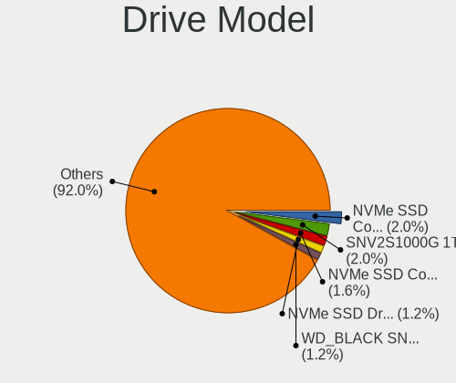
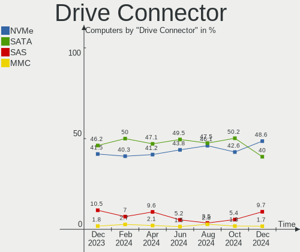
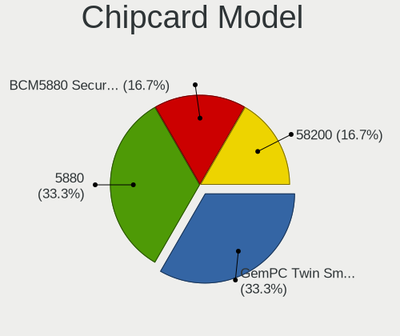

Kubuntu - Hardware Trends
-------------------------

A project to identify most popular hardware characteristics and track their change
over time based on data collected by Linux users at https://Linux-Hardware.org.

Anyone can contribute to this report by the [hw-probe](https://github.com/linuxhw/hw-probe) tool:

    sudo -E hw-probe -all -upload

This is a report for all computer types. See also reports for [desktops](/Dist/Kubuntu/Desktop/README.md) and [notebooks](/Dist/Kubuntu/Notebook/README.md).

This report is for one last month. Overall report since the beginning of time: [TestCoverage](https://github.com/linuxhw/TestCoverage)

Period: Sep, 2022.

Contents
--------

* [ System ](#system)
  - [ OS                       ](#os)
  - [ OS Family                ](#os-family)
  - [ Kernel                   ](#kernel)
  - [ Kernel Family            ](#kernel-family)
  - [ Kernel Major Ver.        ](#kernel-major-ver)
  - [ Arch                     ](#arch)
  - [ DE                       ](#de)
  - [ Display Server           ](#display-server)
  - [ Display Manager          ](#display-manager)
  - [ OS Lang                  ](#os-lang)
  - [ Boot Mode                ](#boot-mode)
  - [ Filesystem               ](#filesystem)
  - [ Part. scheme             ](#part-scheme)
  - [ Dual Boot with Linux/BSD ](#dual-boot-with-linuxbsd)
  - [ Dual Boot (Win)          ](#dual-boot-win)

* [ Board ](#board)
  - [ Vendor                   ](#vendor)
  - [ Model                    ](#model)
  - [ Model Family             ](#model-family)
  - [ MFG Year                 ](#mfg-year)
  - [ Form Factor              ](#form-factor)
  - [ Secure Boot              ](#secure-boot)
  - [ Coreboot                 ](#coreboot)
  - [ RAM Size                 ](#ram-size)
  - [ RAM Used                 ](#ram-used)
  - [ Total Drives             ](#total-drives)
  - [ Has CD-ROM               ](#has-cd-rom)
  - [ Has Ethernet             ](#has-ethernet)
  - [ Has WiFi                 ](#has-wifi)
  - [ Has Bluetooth            ](#has-bluetooth)

* [ Location ](#location)
  - [ Country                  ](#country)
  - [ City                     ](#city)

* [ Drives ](#drives)
  - [ Drive Vendor             ](#drive-vendor)
  - [ Drive Model              ](#drive-model)
  - [ HDD Vendor               ](#hdd-vendor)
  - [ SSD Vendor               ](#ssd-vendor)
  - [ Drive Kind               ](#drive-kind)
  - [ Drive Connector          ](#drive-connector)
  - [ Drive Size               ](#drive-size)
  - [ Space Total              ](#space-total)
  - [ Space Used               ](#space-used)
  - [ Malfunc. Drives          ](#malfunc-drives)
  - [ Malfunc. Drive Vendor    ](#malfunc-drive-vendor)
  - [ Malfunc. HDD Vendor      ](#malfunc-hdd-vendor)
  - [ Malfunc. Drive Kind      ](#malfunc-drive-kind)
  - [ Failed Drives            ](#failed-drives)
  - [ Failed Drive Vendor      ](#failed-drive-vendor)
  - [ Drive Status             ](#drive-status)

* [ Storage controller ](#storage-controller)
  - [ Storage Vendor           ](#storage-vendor)
  - [ Storage Model            ](#storage-model)
  - [ Storage Kind             ](#storage-kind)

* [ Processor ](#processor)
  - [ CPU Vendor               ](#cpu-vendor)
  - [ CPU Model                ](#cpu-model)
  - [ CPU Model Family         ](#cpu-model-family)
  - [ CPU Cores                ](#cpu-cores)
  - [ CPU Sockets              ](#cpu-sockets)
  - [ CPU Threads              ](#cpu-threads)
  - [ CPU Op-Modes             ](#cpu-op-modes)
  - [ CPU Microcode            ](#cpu-microcode)
  - [ CPU Microarch            ](#cpu-microarch)

* [ Graphics ](#graphics)
  - [ GPU Vendor               ](#gpu-vendor)
  - [ GPU Model                ](#gpu-model)
  - [ GPU Combo                ](#gpu-combo)
  - [ GPU Driver               ](#gpu-driver)
  - [ GPU Memory               ](#gpu-memory)

* [ Monitor ](#monitor)
  - [ Monitor Vendor           ](#monitor-vendor)
  - [ Monitor Model            ](#monitor-model)
  - [ Monitor Resolution       ](#monitor-resolution)
  - [ Monitor Diagonal         ](#monitor-diagonal)
  - [ Monitor Width            ](#monitor-width)
  - [ Aspect Ratio             ](#aspect-ratio)
  - [ Monitor Area             ](#monitor-area)
  - [ Pixel Density            ](#pixel-density)
  - [ Multiple Monitors        ](#multiple-monitors)

* [ Network ](#network)
  - [ Net Controller Vendor    ](#net-controller-vendor)
  - [ Net Controller Model     ](#net-controller-model)
  - [ Wireless Vendor          ](#wireless-vendor)
  - [ Wireless Model           ](#wireless-model)
  - [ Ethernet Vendor          ](#ethernet-vendor)
  - [ Ethernet Model           ](#ethernet-model)
  - [ Net Controller Kind      ](#net-controller-kind)
  - [ Used Controller          ](#used-controller)
  - [ NICs                     ](#nics)
  - [ IPv6                     ](#ipv6)

* [ Bluetooth ](#bluetooth)
  - [ Bluetooth Vendor         ](#bluetooth-vendor)
  - [ Bluetooth Model          ](#bluetooth-model)

* [ Sound ](#sound)
  - [ Sound Vendor             ](#sound-vendor)
  - [ Sound Model              ](#sound-model)

* [ Memory ](#memory)
  - [ Memory Vendor            ](#memory-vendor)
  - [ Memory Model             ](#memory-model)
  - [ Memory Kind              ](#memory-kind)
  - [ Memory Form Factor       ](#memory-form-factor)
  - [ Memory Size              ](#memory-size)
  - [ Memory Speed             ](#memory-speed)

* [ Printers & scanners ](#printers--scanners)
  - [ Printer Vendor           ](#printer-vendor)
  - [ Printer Model            ](#printer-model)
  - [ Scanner Vendor           ](#scanner-vendor)
  - [ Scanner Model            ](#scanner-model)

* [ Camera ](#camera)
  - [ Camera Vendor            ](#camera-vendor)
  - [ Camera Model             ](#camera-model)

* [ Security ](#security)
  - [ Fingerprint Vendor       ](#fingerprint-vendor)
  - [ Fingerprint Model        ](#fingerprint-model)
  - [ Chipcard Vendor          ](#chipcard-vendor)
  - [ Chipcard Model           ](#chipcard-model)

* [ Unsupported ](#unsupported)
  - [ Unsupported Devices      ](#unsupported-devices)
  - [ Unsupported Device Types ](#unsupported-device-types)

System
------

OS
--

Installed operating systems

| Name          | Computers | Percent |
|---------------|-----------|---------|
| Kubuntu 22.04 | 74        | 75.51%  |
| Kubuntu 20.04 | 12        | 12.24%  |
| Kubuntu 11    | 5         | 5.1%    |
| Kubuntu 21.10 | 2         | 2.04%   |
| Kubuntu 11.1  | 2         | 2.04%   |
| Kubuntu 22.10 | 1         | 1.02%   |
| Kubuntu 18.04 | 1         | 1.02%   |
| Kubuntu 16.04 | 1         | 1.02%   |

OS Family
---------

OS without a version

| Name    | Computers | Percent |
|---------|-----------|---------|
| Kubuntu | 98        | 100%    |

Kernel
------

Version of the Linux kernel

| Version               | Computers | Percent |
|-----------------------|-----------|---------|
| 5.15.0-47-generic     | 35        | 35.71%  |
| 5.15.0-48-generic     | 24        | 24.49%  |
| 5.15.0-46-generic     | 8         | 8.16%   |
| 5.15.0-48-lowlatency  | 4         | 4.08%   |
| 5.15.0-43-generic     | 4         | 4.08%   |
| 5.4.0-125-generic     | 3         | 3.06%   |
| 5.19.5-051905-generic | 2         | 2.04%   |
| 5.15.0-47-lowlatency  | 2         | 2.04%   |
| 5.15.0-41-generic     | 2         | 2.04%   |
| 5.13.0-52-generic     | 2         | 2.04%   |
| 5.4.0-126-generic     | 1         | 1.02%   |
| 5.4.0-124-generic     | 1         | 1.02%   |
| 5.4.0-120-generic     | 1         | 1.02%   |
| 5.19.9-xanmod1        | 1         | 1.02%   |
| 5.19.2-051902-generic | 1         | 1.02%   |
| 5.19.0-15-generic     | 1         | 1.02%   |
| 5.17.0-1016-oem       | 1         | 1.02%   |
| 5.15.65-xanmod1       | 1         | 1.02%   |
| 5.15.0-50-generic     | 1         | 1.02%   |
| 5.15.0-33-generic     | 1         | 1.02%   |
| 5.13.0-39-generic     | 1         | 1.02%   |
| 4.15.0-192-generic    | 1         | 1.02%   |

Kernel Family
-------------

Linux kernel without a distro release

| Version | Computers | Percent |
|---------|-----------|---------|
| 5.15.0  | 81        | 82.65%  |
| 5.4.0   | 6         | 6.12%   |
| 5.13.0  | 3         | 3.06%   |
| 5.19.5  | 2         | 2.04%   |
| 5.19.9  | 1         | 1.02%   |
| 5.19.2  | 1         | 1.02%   |
| 5.19.0  | 1         | 1.02%   |
| 5.17.0  | 1         | 1.02%   |
| 5.15.65 | 1         | 1.02%   |
| 4.15.0  | 1         | 1.02%   |

Kernel Major Ver.
-----------------

Linux kernel major version

| Version | Computers | Percent |
|---------|-----------|---------|
| 5.15    | 82        | 83.67%  |
| 5.4     | 6         | 6.12%   |
| 5.19    | 5         | 5.1%    |
| 5.13    | 3         | 3.06%   |
| 5.17    | 1         | 1.02%   |
| 4.15    | 1         | 1.02%   |

Arch
----

OS architecture (x86_64, i586, etc.)

| Name   | Computers | Percent |
|--------|-----------|---------|
| x86_64 | 98        | 100%    |

DE
--

Desktop Environment

| Name | Computers | Percent |
|------|-----------|---------|
| KDE5 | 98        | 100%    |

Display Server
--------------

X11 or Wayland

| Name    | Computers | Percent |
|---------|-----------|---------|
| X11     | 91        | 92.86%  |
| Wayland | 6         | 6.12%   |
| Tty     | 1         | 1.02%   |

Display Manager
---------------

SDDM, LightDM, etc.

| Name    | Computers | Percent |
|---------|-----------|---------|
| SDDM    | 67        | 68.37%  |
| Unknown | 28        | 28.57%  |
| GDM3    | 2         | 2.04%   |
| LightDM | 1         | 1.02%   |

OS Lang
-------

Language

| Lang  | Computers | Percent |
|-------|-----------|---------|
| en_US | 47        | 47.96%  |
| it_IT | 10        | 10.2%   |
| de_DE | 10        | 10.2%   |
| pt_BR | 6         | 6.12%   |
| en_SG | 3         | 3.06%   |
| en_GB | 3         | 3.06%   |
| ru_RU | 2         | 2.04%   |
| pl_PL | 2         | 2.04%   |
| es_ES | 2         | 2.04%   |
| en_CA | 2         | 2.04%   |
| en_AU | 2         | 2.04%   |
| sl_SI | 1         | 1.02%   |
| ja_JP | 1         | 1.02%   |
| fr_FR | 1         | 1.02%   |
| fr_BE | 1         | 1.02%   |
| es_VE | 1         | 1.02%   |
| es_AR | 1         | 1.02%   |
| en_PH | 1         | 1.02%   |
| en_IL | 1         | 1.02%   |
| ca_ES | 1         | 1.02%   |

Boot Mode
---------

EFI or BIOS

| Mode | Computers | Percent |
|------|-----------|---------|
| BIOS | 53        | 54.08%  |
| EFI  | 45        | 45.92%  |

Filesystem
----------

Type of filesystem

| Type    | Computers | Percent |
|---------|-----------|---------|
| Ext4    | 92        | 93.88%  |
| Overlay | 3         | 3.06%   |
| Zfs     | 1         | 1.02%   |
| Ext3    | 1         | 1.02%   |
| Btrfs   | 1         | 1.02%   |

Part. scheme
------------

Scheme of partitioning

| Type    | Computers | Percent |
|---------|-----------|---------|
| Unknown | 53        | 54.08%  |
| GPT     | 41        | 41.84%  |
| MBR     | 4         | 4.08%   |

Dual Boot with Linux/BSD
------------------------

Hosting more than one Linux/BSD

| Dual boot | Computers | Percent |
|-----------|-----------|---------|
| No        | 90        | 91.84%  |
| Yes       | 8         | 8.16%   |

Dual Boot (Win)
---------------

Hosting Linux and Windows

| Dual boot | Computers | Percent |
|-----------|-----------|---------|
| No        | 65        | 66.33%  |
| Yes       | 33        | 33.67%  |

Board
-----

Vendor
------

Motherboard manufacturer

| Name                | Computers | Percent |
|---------------------|-----------|---------|
| Lenovo              | 20        | 20.41%  |
| Dell                | 14        | 14.29%  |
| Hewlett-Packard     | 12        | 12.24%  |
| Gigabyte Technology | 11        | 11.22%  |
| ASUSTek Computer    | 11        | 11.22%  |
| MSI                 | 8         | 8.16%   |
| Acer                | 5         | 5.1%    |
| ASRock              | 3         | 3.06%   |
| Samsung Electronics | 2         | 2.04%   |
| Google              | 2         | 2.04%   |
| Supermicro          | 1         | 1.02%   |
| Sony                | 1         | 1.02%   |
| OEM                 | 1         | 1.02%   |
| Notebook            | 1         | 1.02%   |
| Microsoft           | 1         | 1.02%   |
| Intel               | 1         | 1.02%   |
| HUAWEI              | 1         | 1.02%   |
| Biostar             | 1         | 1.02%   |
| AZW                 | 1         | 1.02%   |
| AMI                 | 1         | 1.02%   |

Model
-----

Motherboard model

| Name                                        | Computers | Percent |
|---------------------------------------------|-----------|---------|
| Gigabyte B450M DS3H                         | 3         | 3.06%   |
| ASUS All Series                             | 3         | 3.06%   |
| HP 255 G8 Notebook PC                       | 2         | 2.04%   |
| Dell Latitude 7430                          | 2         | 2.04%   |
| Supermicro SKAGIT09                         | 1         | 1.02%   |
| Sony SVE1512J6EW                            | 1         | 1.02%   |
| Samsung RV411/RV511/E3511/S3511/RV711/E3411 | 1         | 1.02%   |
| Samsung 270E5G/270E5U                       | 1         | 1.02%   |
| OEM G41 775 ICH7 8712                       | 1         | 1.02%   |
| Notebook NV4XMB,ME,MZ                       | 1         | 1.02%   |
| MSI MS-7D09                                 | 1         | 1.02%   |
| MSI MS-7C95                                 | 1         | 1.02%   |
| MSI MS-7B98                                 | 1         | 1.02%   |
| MSI MS-7B86                                 | 1         | 1.02%   |
| MSI MS-7A34                                 | 1         | 1.02%   |
| MSI MS-7816                                 | 1         | 1.02%   |
| MSI MS-7693                                 | 1         | 1.02%   |
| MSI Delta 15 A5EFK                          | 1         | 1.02%   |
| Microsoft Surface Pro 4                     | 1         | 1.02%   |
| Lenovo Yoga C640-13IML 81UE                 | 1         | 1.02%   |
| Lenovo ThinkPad X230 23256N6                | 1         | 1.02%   |
| Lenovo ThinkPad X1 Extreme Gen 5 21DE001QMH | 1         | 1.02%   |
| Lenovo ThinkPad T460 20FMS08U00             | 1         | 1.02%   |
| Lenovo ThinkPad T430 2349NZ8                | 1         | 1.02%   |
| Lenovo ThinkPad T430 2347AT2                | 1         | 1.02%   |
| Lenovo ThinkPad T14 Gen 1 20S1SB9L00        | 1         | 1.02%   |
| Lenovo ThinkPad L14 Gen 2 20X1S07900        | 1         | 1.02%   |
| Lenovo ThinkPad E590 20NB005MUS             | 1         | 1.02%   |
| Lenovo ThinkPad E15 Gen 3 20YG00ATCK        | 1         | 1.02%   |
| Lenovo ThinkPad E14 20RBS25S00              | 1         | 1.02%   |
| Lenovo ThinkCentre M90p 5498A2U             | 1         | 1.02%   |
| Lenovo ThinkBook 14 G2 ITL 20VD             | 1         | 1.02%   |
| Lenovo Legion 5 Pro 16ITH6H 82JD            | 1         | 1.02%   |
| Lenovo IdeaPadFlex 3 11ADA05 82G4           | 1         | 1.02%   |
| Lenovo IdeaPad 3 15ARE05 81W4               | 1         | 1.02%   |
| Lenovo IdeaPad 1 14IGL05 81VU               | 1         | 1.02%   |
| Lenovo G780 20138                           | 1         | 1.02%   |
| Lenovo G50-45 80E3                          | 1         | 1.02%   |
| Lenovo B40-70 80F30005BR                    | 1         | 1.02%   |
| Intel NUC7i3BNK                             | 1         | 1.02%   |

Model Family
------------

Motherboard model prefix

| Name                | Computers | Percent |
|---------------------|-----------|---------|
| Lenovo ThinkPad     | 10        | 10.2%   |
| Dell OptiPlex       | 4         | 4.08%   |
| Dell Latitude       | 4         | 4.08%   |
| Acer Aspire         | 4         | 4.08%   |
| HP EliteBook        | 3         | 3.06%   |
| Gigabyte B450M      | 3         | 3.06%   |
| ASUS All            | 3         | 3.06%   |
| Lenovo IdeaPad      | 2         | 2.04%   |
| HP Pavilion         | 2         | 2.04%   |
| HP 255              | 2         | 2.04%   |
| Dell Inspiron       | 2         | 2.04%   |
| ASUS ROG            | 2         | 2.04%   |
| Supermicro SKAGIT09 | 1         | 1.02%   |
| Sony SVE1512J6EW    | 1         | 1.02%   |
| Samsung RV411       | 1         | 1.02%   |
| Samsung 270E5G      | 1         | 1.02%   |
| OEM G41             | 1         | 1.02%   |
| Notebook NV4XMB     | 1         | 1.02%   |
| MSI MS-7D09         | 1         | 1.02%   |
| MSI MS-7C95         | 1         | 1.02%   |
| MSI MS-7B98         | 1         | 1.02%   |
| MSI MS-7B86         | 1         | 1.02%   |
| MSI MS-7A34         | 1         | 1.02%   |
| MSI MS-7816         | 1         | 1.02%   |
| MSI MS-7693         | 1         | 1.02%   |
| MSI Delta           | 1         | 1.02%   |
| Microsoft Surface   | 1         | 1.02%   |
| Lenovo Yoga         | 1         | 1.02%   |
| Lenovo ThinkCentre  | 1         | 1.02%   |
| Lenovo ThinkBook    | 1         | 1.02%   |
| Lenovo Legion       | 1         | 1.02%   |
| Lenovo IdeaPadFlex  | 1         | 1.02%   |
| Lenovo G780         | 1         | 1.02%   |
| Lenovo G50-45       | 1         | 1.02%   |
| Lenovo B40-70       | 1         | 1.02%   |
| Intel NUC7i3BNK     | 1         | 1.02%   |
| HUAWEI BOHB-WAX9    | 1         | 1.02%   |
| HP ZBook            | 1         | 1.02%   |
| HP Spectre          | 1         | 1.02%   |
| HP Notebook         | 1         | 1.02%   |

MFG Year
--------

Motherboard manufacture year

| Year | Computers | Percent |
|------|-----------|---------|
| 2020 | 13        | 13.27%  |
| 2019 | 12        | 12.24%  |
| 2012 | 11        | 11.22%  |
| 2021 | 10        | 10.2%   |
| 2018 | 8         | 8.16%   |
| 2014 | 7         | 7.14%   |
| 2022 | 6         | 6.12%   |
| 2015 | 6         | 6.12%   |
| 2013 | 6         | 6.12%   |
| 2011 | 5         | 5.1%    |
| 2017 | 4         | 4.08%   |
| 2016 | 4         | 4.08%   |
| 2010 | 2         | 2.04%   |
| 2009 | 2         | 2.04%   |
| 2008 | 1         | 1.02%   |
| 2007 | 1         | 1.02%   |

Form Factor
-----------

Physical design of the computer

| Name        | Computers | Percent |
|-------------|-----------|---------|
| Notebook    | 54        | 55.1%   |
| Desktop     | 35        | 35.71%  |
| Convertible | 3         | 3.06%   |
| Mini pc     | 3         | 3.06%   |
| All in one  | 2         | 2.04%   |
| Tablet      | 1         | 1.02%   |

Secure Boot
-----------

Enabled or disabled

| State    | Computers | Percent |
|----------|-----------|---------|
| Disabled | 89        | 90.82%  |
| Enabled  | 9         | 9.18%   |

Coreboot
--------

Have coreboot on board

| Used | Computers | Percent |
|------|-----------|---------|
| No   | 96        | 97.96%  |
| Yes  | 2         | 2.04%   |

RAM Size
--------

Total RAM memory

| Size in GB  | Computers | Percent |
|-------------|-----------|---------|
| 16.01-24.0  | 29        | 29.59%  |
| 4.01-8.0    | 20        | 20.41%  |
| 8.01-16.0   | 17        | 17.35%  |
| 32.01-64.0  | 16        | 16.33%  |
| 3.01-4.0    | 12        | 12.24%  |
| 24.01-32.0  | 2         | 2.04%   |
| 2.01-3.0    | 1         | 1.02%   |
| 64.01-256.0 | 1         | 1.02%   |

RAM Used
--------

Used RAM memory

| Used GB   | Computers | Percent |
|-----------|-----------|---------|
| 4.01-8.0  | 30        | 30.61%  |
| 2.01-3.0  | 23        | 23.47%  |
| 1.01-2.0  | 22        | 22.45%  |
| 3.01-4.0  | 16        | 16.33%  |
| 8.01-16.0 | 6         | 6.12%   |
| 0.51-1.0  | 1         | 1.02%   |

Total Drives
------------

Number of drives on board

| Drives | Computers | Percent |
|--------|-----------|---------|
| 1      | 46        | 46.94%  |
| 2      | 30        | 30.61%  |
| 3      | 9         | 9.18%   |
| 5      | 5         | 5.1%    |
| 4      | 4         | 4.08%   |
| 6      | 3         | 3.06%   |
| 9      | 1         | 1.02%   |

Has CD-ROM
----------

Has CD-ROM on board

| Presented | Computers | Percent |
|-----------|-----------|---------|
| No        | 65        | 66.33%  |
| Yes       | 33        | 33.67%  |

Has Ethernet
------------

Has Ethernet on board

| Presented | Computers | Percent |
|-----------|-----------|---------|
| Yes       | 85        | 86.73%  |
| No        | 13        | 13.27%  |

Has WiFi
--------

Has WiFi module

| Presented | Computers | Percent |
|-----------|-----------|---------|
| Yes       | 80        | 81.63%  |
| No        | 18        | 18.37%  |

Has Bluetooth
-------------

Has Bluetooth module

| Presented | Computers | Percent |
|-----------|-----------|---------|
| Yes       | 70        | 71.43%  |
| No        | 28        | 28.57%  |

Location
--------

Country
-------

Geographic location (country)

| Country     | Computers | Percent |
|-------------|-----------|---------|
| USA         | 19        | 19.39%  |
| Italy       | 15        | 15.31%  |
| Germany     | 12        | 12.24%  |
| Brazil      | 9         | 9.18%   |
| Russia      | 6         | 6.12%   |
| Spain       | 3         | 3.06%   |
| Singapore   | 3         | 3.06%   |
| Indonesia   | 3         | 3.06%   |
| UK          | 2         | 2.04%   |
| Sweden      | 2         | 2.04%   |
| Poland      | 2         | 2.04%   |
| Netherlands | 2         | 2.04%   |
| France      | 2         | 2.04%   |
| Canada      | 2         | 2.04%   |
| Australia   | 2         | 2.04%   |
| Venezuela   | 1         | 1.02%   |
| Thailand    | 1         | 1.02%   |
| Slovenia    | 1         | 1.02%   |
| Serbia      | 1         | 1.02%   |
| Portugal    | 1         | 1.02%   |
| Philippines | 1         | 1.02%   |
| Mexico      | 1         | 1.02%   |
| Japan       | 1         | 1.02%   |
| Israel      | 1         | 1.02%   |
| Czechia     | 1         | 1.02%   |
| Croatia     | 1         | 1.02%   |
| Belgium     | 1         | 1.02%   |
| Austria     | 1         | 1.02%   |
| Argentina   | 1         | 1.02%   |

City
----

Geographic location (city)

| City                 | Computers | Percent |
|----------------------|-----------|---------|
| Singapore            | 3         | 3.06%   |
| Moscow               | 3         | 3.06%   |
| Hamburg              | 3         | 3.06%   |
| Turin                | 2         | 2.04%   |
| Sao Paulo            | 2         | 2.04%   |
| Rome                 | 2         | 2.04%   |
| Fucecchio            | 2         | 2.04%   |
| Bologna              | 2         | 2.04%   |
| Zagreb               | 1         | 1.02%   |
| Wembley              | 1         | 1.02%   |
| Washington           | 1         | 1.02%   |
| Vladivostok          | 1         | 1.02%   |
| Vienna               | 1         | 1.02%   |
| Valencia             | 1         | 1.02%   |
| Tokyo                | 1         | 1.02%   |
| Tasikmalaya          | 1         | 1.02%   |
| Suzano               | 1         | 1.02%   |
| Sundsvall            | 1         | 1.02%   |
| St. Petersburg       | 1         | 1.02%   |
| St Petersburg        | 1         | 1.02%   |
| Semarang             | 1         | 1.02%   |
| Scurcola Marsicana   | 1         | 1.02%   |
| Sacramento           | 1         | 1.02%   |
| Rudolstadt           | 1         | 1.02%   |
| Rishon LeZiyyon      | 1         | 1.02%   |
| Rio de Janeiro       | 1         | 1.02%   |
| Rio das Ostras       | 1         | 1.02%   |
| Regina               | 1         | 1.02%   |
| Reggio Emilia        | 1         | 1.02%   |
| Plattsmouth          | 1         | 1.02%   |
| Pavullo nel Frignano | 1         | 1.02%   |
| Paranaque City       | 1         | 1.02%   |
| Paraná              | 1         | 1.02%   |
| Overveen             | 1         | 1.02%   |
| Ocala                | 1         | 1.02%   |
| Oak Park             | 1         | 1.02%   |
| Nuremberg            | 1         | 1.02%   |
| New York             | 1         | 1.02%   |
| Moers                | 1         | 1.02%   |
| Mexico City          | 1         | 1.02%   |

Drives
------

Drive Vendor
------------

Hard drive vendors

| Vendor                         | Computers | Drives | Percent |
|--------------------------------|-----------|--------|---------|
| Seagate                        | 22        | 36     | 13.33%  |
| Samsung Electronics            | 22        | 28     | 13.33%  |
| WDC                            | 21        | 25     | 12.73%  |
| Toshiba                        | 14        | 14     | 8.48%   |
| Sandisk                        | 10        | 11     | 6.06%   |
| Kingston                       | 10        | 10     | 6.06%   |
| Unknown                        | 7         | 9      | 4.24%   |
| SK hynix                       | 6         | 6      | 3.64%   |
| Intel                          | 5         | 6      | 3.03%   |
| HGST                           | 5         | 6      | 3.03%   |
| Crucial                        | 5         | 7      | 3.03%   |
| Hitachi                        | 4         | 4      | 2.42%   |
| A-DATA Technology              | 4         | 4      | 2.42%   |
| Phison Electronics             | 3         | 3      | 1.82%   |
| Micron Technology              | 3         | 3      | 1.82%   |
| Micron/Crucial Technology      | 2         | 3      | 1.21%   |
| tecmiyo                        | 1         | 1      | 0.61%   |
| Solid State Storage Technology | 1         | 1      | 0.61%   |
| Smart                          | 1         | 1      | 0.61%   |
| SAGE                           | 1         | 1      | 0.61%   |
| PNY                            | 1         | 1      | 0.61%   |
| Plextor                        | 1         | 1      | 0.61%   |
| Patriot                        | 1         | 1      | 0.61%   |
| OCZ                            | 1         | 1      | 0.61%   |
| KODAK                          | 1         | 1      | 0.61%   |
| KIOXIA                         | 1         | 1      | 0.61%   |
| Kingston Technology Company    | 1         | 1      | 0.61%   |
| JMicron Technology             | 1         | 1      | 0.61%   |
| Intenso                        | 1         | 1      | 0.61%   |
| INDMEM                         | 1         | 1      | 0.61%   |
| Drevo                          | 1         | 1      | 0.61%   |
| Dogfish                        | 1         | 1      | 0.61%   |
| DERLER                         | 1         | 1      | 0.61%   |
| Corsair                        | 1         | 3      | 0.61%   |
| BAITITON                       | 1         | 1      | 0.61%   |
| Apacer                         | 1         | 1      | 0.61%   |
| Aireye                         | 1         | 1      | 0.61%   |
| ADATA Technology               | 1         | 1      | 0.61%   |

Drive Model
-----------

Hard drive models

| Model                                | Computers | Percent |
|--------------------------------------|-----------|---------|
| Kingston SA400S37240G 240GB SSD      | 4         | 2.15%   |
| Seagate ST4000DM004-2CV104 4TB       | 3         | 1.61%   |
| Seagate ST2000DM001-1ER164 2TB       | 3         | 1.61%   |
| Samsung SSD 840 EVO 250GB            | 3         | 1.61%   |
| WDC WD10EZEX-08WN4A0 1TB             | 2         | 1.08%   |
| Unknown MMC Card  64GB               | 2         | 1.08%   |
| Toshiba HDWD110 1TB                  | 2         | 1.08%   |
| Toshiba DT01ACA100 1TB               | 2         | 1.08%   |
| Seagate ST1000LM024 HN-M101MBB 1TB   | 2         | 1.08%   |
| Seagate Expansion Desk 2TB           | 2         | 1.08%   |
| Seagate Expansion 1TB                | 2         | 1.08%   |
| SanDisk SSD PLUS 480GB               | 2         | 1.08%   |
| SanDisk NVMe SSD Drive 256GB         | 2         | 1.08%   |
| Samsung SSD 860 EVO 1TB              | 2         | 1.08%   |
| Samsung SSD 850 EVO 120GB            | 2         | 1.08%   |
| Kingston SV300S37A120G 120GB SSD     | 2         | 1.08%   |
| Crucial CT240BX500SSD1 240GB         | 2         | 1.08%   |
| WDC WDS500G1X0E-00AFY0 500GB         | 1         | 0.54%   |
| WDC WDS480G2G0A-00JH30 480GB SSD     | 1         | 0.54%   |
| WDC WDS250G2B0B-00YS70 250GB SSD     | 1         | 0.54%   |
| WDC WDS240G2G0A-00JH30 240GB SSD     | 1         | 0.54%   |
| WDC WDBNCE0010PNC 1TB SSD            | 1         | 0.54%   |
| WDC WD80EFZX-68UW8N0 8TB             | 1         | 0.54%   |
| WDC WD6400BPVT-55HXZT3 640GB         | 1         | 0.54%   |
| WDC WD5000LPLX-00ZNTT0 500GB         | 1         | 0.54%   |
| WDC WD5000LPCX-24C6HT0 500GB         | 1         | 0.54%   |
| WDC WD5000AAKS-00YGA0 500GB          | 1         | 0.54%   |
| WDC WD5000AAKS-00V1A0 500GB          | 1         | 0.54%   |
| WDC WD5000AADS-00M2B0 500GB          | 1         | 0.54%   |
| WDC WD4003FRYZ-01F0DB0 4TB           | 1         | 0.54%   |
| WDC WD4000FYYZ-01UL1B3 4TB           | 1         | 0.54%   |
| WDC WD20EZRZ-00Z5HB0 2TB             | 1         | 0.54%   |
| WDC WD20EARX-32PASB0 2TB             | 1         | 0.54%   |
| WDC WD10SPZX-00Z10T0 1TB             | 1         | 0.54%   |
| WDC WD10JPCX-24UE4T0 1TB             | 1         | 0.54%   |
| WDC WD10EAVS-00D7B1 1TB              | 1         | 0.54%   |
| WDC WD10EARS-00MVWB0 1TB             | 1         | 0.54%   |
| WDC PC SN530 SDBPMPZ-256G-1101 256GB | 1         | 0.54%   |
| WDC PC SN530 NVMe 512GB              | 1         | 0.54%   |
| Unknown SC64G  64GB                  | 1         | 0.54%   |

HDD Vendor
----------

Hard disk drive vendors

| Vendor              | Computers | Drives | Percent |
|---------------------|-----------|--------|---------|
| Seagate             | 22        | 36     | 37.93%  |
| WDC                 | 17        | 17     | 29.31%  |
| Toshiba             | 7         | 7      | 12.07%  |
| HGST                | 5         | 6      | 8.62%   |
| Hitachi             | 4         | 4      | 6.9%    |
| Samsung Electronics | 2         | 3      | 3.45%   |
| SAGE                | 1         | 1      | 1.72%   |

SSD Vendor
----------

Solid state drive vendors

| Vendor              | Computers | Drives | Percent |
|---------------------|-----------|--------|---------|
| Samsung Electronics | 14        | 15     | 23.73%  |
| Kingston            | 9         | 9      | 15.25%  |
| Crucial             | 5         | 6      | 8.47%   |
| WDC                 | 4         | 5      | 6.78%   |
| SanDisk             | 4         | 4      | 6.78%   |
| A-DATA Technology   | 3         | 3      | 5.08%   |
| Toshiba             | 1         | 1      | 1.69%   |
| tecmiyo             | 1         | 1      | 1.69%   |
| Smart               | 1         | 1      | 1.69%   |
| SK hynix            | 1         | 1      | 1.69%   |
| PNY                 | 1         | 1      | 1.69%   |
| Plextor             | 1         | 1      | 1.69%   |
| Patriot             | 1         | 1      | 1.69%   |
| OCZ                 | 1         | 1      | 1.69%   |
| Micron Technology   | 1         | 1      | 1.69%   |
| KODAK               | 1         | 1      | 1.69%   |
| Intenso             | 1         | 1      | 1.69%   |
| Intel               | 1         | 1      | 1.69%   |
| INDMEM              | 1         | 1      | 1.69%   |
| Drevo               | 1         | 1      | 1.69%   |
| Dogfish             | 1         | 1      | 1.69%   |
| DERLER              | 1         | 1      | 1.69%   |
| Corsair             | 1         | 3      | 1.69%   |
| BAITITON            | 1         | 1      | 1.69%   |
| Apacer              | 1         | 1      | 1.69%   |
| Aireye              | 1         | 1      | 1.69%   |

Drive Kind
----------

HDD or SSD

| Kind | Computers | Drives | Percent |
|------|-----------|--------|---------|
| SSD  | 48        | 64     | 33.33%  |
| HDD  | 47        | 74     | 32.64%  |
| NVMe | 42        | 52     | 29.17%  |
| MMC  | 7         | 9      | 4.86%   |

Drive Connector
---------------

SATA, SAS, NVMe, etc.

| Type | Computers | Drives | Percent |
|------|-----------|--------|---------|
| SATA | 67        | 127    | 54.92%  |
| NVMe | 41        | 51     | 33.61%  |
| SAS  | 7         | 12     | 5.74%   |
| MMC  | 7         | 9      | 5.74%   |

Drive Size
----------

Size of hard drive

| Size in TB | Computers | Drives | Percent |
|------------|-----------|--------|---------|
| 0.01-0.5   | 49        | 74     | 49.49%  |
| 0.51-1.0   | 30        | 36     | 30.3%   |
| 1.01-2.0   | 8         | 9      | 8.08%   |
| 3.01-4.0   | 6         | 11     | 6.06%   |
| 4.01-10.0  | 4         | 6      | 4.04%   |
| 10.01-20.0 | 2         | 2      | 2.02%   |

Space Total
-----------

Amount of disk space available on the file system

| Size in GB     | Computers | Percent |
|----------------|-----------|---------|
| 101-250        | 24        | 24.49%  |
| 501-1000       | 18        | 18.37%  |
| 251-500        | 17        | 17.35%  |
| 1001-2000      | 11        | 11.22%  |
| 51-100         | 10        | 10.2%   |
| More than 3000 | 9         | 9.18%   |
| 2001-3000      | 5         | 5.1%    |
| 1-20           | 3         | 3.06%   |
| 21-50          | 1         | 1.02%   |

Space Used
----------

Amount of used disk space

| Used GB        | Computers | Percent |
|----------------|-----------|---------|
| 21-50          | 20        | 20.41%  |
| 51-100         | 18        | 18.37%  |
| 101-250        | 14        | 14.29%  |
| 1-20           | 12        | 12.24%  |
| 501-1000       | 12        | 12.24%  |
| 251-500        | 10        | 10.2%   |
| More than 3000 | 7         | 7.14%   |
| 1001-2000      | 3         | 3.06%   |
| 2001-3000      | 2         | 2.04%   |

Malfunc. Drives
---------------

Drive models with a malfunction

| Model                                               | Computers | Drives | Percent |
|-----------------------------------------------------|-----------|--------|---------|
| WDC WD10EARS-00MVWB0 1TB                            | 1         | 1      | 8.33%   |
| Toshiba MQ01ACF050 500GB                            | 1         | 1      | 8.33%   |
| tecmiyo SATA SSD 128GB                              | 1         | 1      | 8.33%   |
| SK hynix BC711 HFM256GD3JX013N 256GB                | 1         | 1      | 8.33%   |
| Samsung Electronics SSD 840 PRO Series 256GB        | 1         | 1      | 8.33%   |
| Samsung Electronics HM321HI 320GB                   | 1         | 1      | 8.33%   |
| Micron Technology MTFDDAV256TDL-1AW1ZABHA 256GB SSD | 1         | 1      | 8.33%   |
| Hitachi HTS723232A7A364 320GB                       | 1         | 1      | 8.33%   |
| HGST HTS721010A9E630 1TB                            | 1         | 1      | 8.33%   |
| Crucial CT128M550SSD1 128GB                         | 1         | 1      | 8.33%   |
| BAITITON BT58SSD09S 240GB                           | 1         | 1      | 8.33%   |
| A-DATA Technology XM11 256GB-V2 SSD                 | 1         | 1      | 8.33%   |

Malfunc. Drive Vendor
---------------------

Vendors of faulty drives

| Vendor              | Computers | Drives | Percent |
|---------------------|-----------|--------|---------|
| Samsung Electronics | 2         | 2      | 16.67%  |
| WDC                 | 1         | 1      | 8.33%   |
| Toshiba             | 1         | 1      | 8.33%   |
| tecmiyo             | 1         | 1      | 8.33%   |
| SK hynix            | 1         | 1      | 8.33%   |
| Micron Technology   | 1         | 1      | 8.33%   |
| Hitachi             | 1         | 1      | 8.33%   |
| HGST                | 1         | 1      | 8.33%   |
| Crucial             | 1         | 1      | 8.33%   |
| BAITITON            | 1         | 1      | 8.33%   |
| A-DATA Technology   | 1         | 1      | 8.33%   |

Malfunc. HDD Vendor
-------------------

Vendors of faulty HDD drives

| Vendor              | Computers | Drives | Percent |
|---------------------|-----------|--------|---------|
| WDC                 | 1         | 1      | 20%     |
| Toshiba             | 1         | 1      | 20%     |
| Samsung Electronics | 1         | 1      | 20%     |
| Hitachi             | 1         | 1      | 20%     |
| HGST                | 1         | 1      | 20%     |

Malfunc. Drive Kind
-------------------

Kinds of faulty drives

| Kind | Computers | Drives | Percent |
|------|-----------|--------|---------|
| SSD  | 5         | 6      | 45.45%  |
| HDD  | 5         | 5      | 45.45%  |
| NVMe | 1         | 1      | 9.09%   |

Failed Drives
-------------

Failed drive models

Zero info for selected period =(

Failed Drive Vendor
-------------------

Failed drive vendors

Zero info for selected period =(

Drive Status
------------

Number of failed and malfunc. drives

| Status   | Computers | Drives | Percent |
|----------|-----------|--------|---------|
| Detected | 58        | 111    | 52.73%  |
| Works    | 41        | 76     | 37.27%  |
| Malfunc  | 11        | 12     | 10%     |

Storage controller
------------------

Storage Vendor
--------------

Storage controller vendors

| Vendor                         | Computers | Percent |
|--------------------------------|-----------|---------|
| Intel                          | 58        | 43.61%  |
| AMD                            | 25        | 18.8%   |
| Samsung Electronics            | 9         | 6.77%   |
| SanDisk                        | 8         | 6.02%   |
| Toshiba America Info Systems   | 6         | 4.51%   |
| SK hynix                       | 5         | 3.76%   |
| Phison Electronics             | 3         | 2.26%   |
| Micron/Crucial Technology      | 3         | 2.26%   |
| JMicron Technology             | 3         | 2.26%   |
| ASMedia Technology             | 3         | 2.26%   |
| Micron Technology              | 2         | 1.5%    |
| Kingston Technology Company    | 2         | 1.5%    |
| ADATA Technology               | 2         | 1.5%    |
| Solid State Storage Technology | 1         | 0.75%   |
| Marvell Technology Group       | 1         | 0.75%   |
| LSI Logic / Symbios Logic      | 1         | 0.75%   |
| KIOXIA                         | 1         | 0.75%   |

Storage Model
-------------

Storage controller models

| Model                                                                          | Computers | Percent |
|--------------------------------------------------------------------------------|-----------|---------|
| AMD FCH SATA Controller [AHCI mode]                                            | 17        | 10.97%  |
| Intel 7 Series Chipset Family 6-port SATA Controller [AHCI mode]               | 9         | 5.81%   |
| AMD 400 Series Chipset SATA Controller                                         | 6         | 3.87%   |
| Intel Sunrise Point-LP SATA Controller [AHCI mode]                             | 5         | 3.23%   |
| Toshiba America Info Systems XG6 NVMe SSD Controller                           | 4         | 2.58%   |
| SanDisk Non-Volatile memory controller                                         | 4         | 2.58%   |
| Intel HM170/QM170 Chipset SATA Controller [AHCI Mode]                          | 4         | 2.58%   |
| Intel 82801 Mobile SATA Controller [RAID mode]                                 | 4         | 2.58%   |
| Intel 500 Series Chipset Family SATA AHCI Controller                           | 4         | 2.58%   |
| SK hynix Gold P31 SSD                                                          | 3         | 1.94%   |
| Samsung NVMe SSD Controller SM981/PM981/PM983                                  | 3         | 1.94%   |
| Samsung NVMe SSD Controller 980                                                | 3         | 1.94%   |
| JMicron JMB363 SATA/IDE Controller                                             | 3         | 1.94%   |
| Intel Comet Lake SATA AHCI Controller                                          | 3         | 1.94%   |
| Intel 9 Series Chipset Family SATA Controller [AHCI Mode]                      | 3         | 1.94%   |
| AMD SB7x0/SB8x0/SB9x0 SATA Controller [AHCI mode]                              | 3         | 1.94%   |
| AMD SB7x0/SB8x0/SB9x0 IDE Controller                                           | 3         | 1.94%   |
| AMD 500 Series Chipset SATA Controller                                         | 3         | 1.94%   |
| SanDisk WD Blue SN550 NVMe SSD                                                 | 2         | 1.29%   |
| Samsung NVMe SSD Controller PM9A1/PM9A3/980PRO                                 | 2         | 1.29%   |
| Phison E12 NVMe Controller                                                     | 2         | 1.29%   |
| Micron/Crucial P2 NVMe PCIe SSD                                                | 2         | 1.29%   |
| Micron Non-Volatile memory controller                                          | 2         | 1.29%   |
| Intel SSD 660P Series                                                          | 2         | 1.29%   |
| Intel 8 Series/C220 Series Chipset Family 6-port SATA Controller 1 [AHCI mode] | 2         | 1.29%   |
| Intel 8 Series SATA Controller 1 [AHCI mode]                                   | 2         | 1.29%   |
| Intel 7 Series/C210 Series Chipset Family 6-port SATA Controller [AHCI mode]   | 2         | 1.29%   |
| Intel 6 Series/C200 Series Chipset Family 6 port Mobile SATA AHCI Controller   | 2         | 1.29%   |
| Intel 5 Series/3400 Series Chipset 6 port SATA AHCI Controller                 | 2         | 1.29%   |
| ASMedia ASM1062 Serial ATA Controller                                          | 2         | 1.29%   |
| AMD X399 Series Chipset SATA Controller                                        | 2         | 1.29%   |
| Toshiba America Info Systems NVMe Controller                                   | 1         | 0.65%   |
| Toshiba America Info Systems BG3 NVMe SSD Controller                           | 1         | 0.65%   |
| Solid State Storage Non-Volatile memory controller                             | 1         | 0.65%   |
| SK hynix Non-Volatile memory controller                                        | 1         | 0.65%   |
| SK hynix BC501 NVMe Solid State Drive                                          | 1         | 0.65%   |
| SanDisk WD PC SN810 / Black SN850 NVMe SSD                                     | 1         | 0.65%   |
| SanDisk WD Blue SN570 NVMe SSD                                                 | 1         | 0.65%   |
| SanDisk WD Black SN750 / PC SN730 NVMe SSD                                     | 1         | 0.65%   |
| SanDisk WD Black NVMe SSD                                                      | 1         | 0.65%   |

Storage Kind
------------

Kind of storage controller (IDE, SATA, NVMe, SAS, ...)

| Kind | Computers | Percent |
|------|-----------|---------|
| SATA | 73        | 56.15%  |
| NVMe | 41        | 31.54%  |
| IDE  | 9         | 6.92%   |
| RAID | 7         | 5.38%   |

Processor
---------

CPU Vendor
----------

Processor vendors

| Vendor | Computers | Percent |
|--------|-----------|---------|
| Intel  | 68        | 69.39%  |
| AMD    | 30        | 30.61%  |

CPU Model
---------

Processor models

| Model                                   | Computers | Percent |
|-----------------------------------------|-----------|---------|
| Intel Core i5-3320M CPU @ 2.60GHz       | 3         | 3.06%   |
| Intel 11th Gen Core i5-1135G7 @ 2.40GHz | 3         | 3.06%   |
| Intel Core i7-7700HQ CPU @ 2.80GHz      | 2         | 2.04%   |
| Intel Core i7-6700HQ CPU @ 2.60GHz      | 2         | 2.04%   |
| Intel Core i7-3612QM CPU @ 2.10GHz      | 2         | 2.04%   |
| Intel Core i7-10510U CPU @ 1.80GHz      | 2         | 2.04%   |
| Intel Core i5-7200U CPU @ 2.50GHz       | 2         | 2.04%   |
| Intel Core i5-6300U CPU @ 2.40GHz       | 2         | 2.04%   |
| Intel Core i5-10210U CPU @ 1.60GHz      | 2         | 2.04%   |
| Intel Celeron N4020 CPU @ 1.10GHz       | 2         | 2.04%   |
| Intel 11th Gen Core i7-11800H @ 2.30GHz | 2         | 2.04%   |
| AMD Ryzen 5 5600X 6-Core Processor      | 2         | 2.04%   |
| AMD Ryzen 5 5500U with Radeon Graphics  | 2         | 2.04%   |
| Intel Xeon CPU X3440 @ 2.53GHz          | 1         | 1.02%   |
| Intel Pentium Gold G5420 CPU @ 3.80GHz  | 1         | 1.02%   |
| Intel Pentium CPU N3540 @ 2.16GHz       | 1         | 1.02%   |
| Intel Core i7-9750H CPU @ 2.60GHz       | 1         | 1.02%   |
| Intel Core i7-8550U CPU @ 1.80GHz       | 1         | 1.02%   |
| Intel Core i7-6600U CPU @ 2.60GHz       | 1         | 1.02%   |
| Intel Core i7-4800MQ CPU @ 2.70GHz      | 1         | 1.02%   |
| Intel Core i7-4790K CPU @ 4.00GHz       | 1         | 1.02%   |
| Intel Core i7-4790 CPU @ 3.60GHz        | 1         | 1.02%   |
| Intel Core i7-4770S CPU @ 3.10GHz       | 1         | 1.02%   |
| Intel Core i7-3770K CPU @ 3.50GHz       | 1         | 1.02%   |
| Intel Core i7-3770 CPU @ 3.40GHz        | 1         | 1.02%   |
| Intel Core i7-3610QM CPU @ 2.30GHz      | 1         | 1.02%   |
| Intel Core i7-3520M CPU @ 2.90GHz       | 1         | 1.02%   |
| Intel Core i7-2670QM CPU @ 2.20GHz      | 1         | 1.02%   |
| Intel Core i7-10750H CPU @ 2.60GHz      | 1         | 1.02%   |
| Intel Core i7-1065G7 CPU @ 1.30GHz      | 1         | 1.02%   |
| Intel Core i7 CPU 920 @ 2.67GHz         | 1         | 1.02%   |
| Intel Core i5-8265U CPU @ 1.60GHz       | 1         | 1.02%   |
| Intel Core i5-6400T CPU @ 2.20GHz       | 1         | 1.02%   |
| Intel Core i5-4690 CPU @ 3.50GHz        | 1         | 1.02%   |
| Intel Core i5-4590 CPU @ 3.30GHz        | 1         | 1.02%   |
| Intel Core i5-4460 CPU @ 3.20GHz        | 1         | 1.02%   |
| Intel Core i5-4210U CPU @ 1.70GHz       | 1         | 1.02%   |
| Intel Core i5-3210M CPU @ 2.50GHz       | 1         | 1.02%   |
| Intel Core i5-2540M CPU @ 2.60GHz       | 1         | 1.02%   |
| Intel Core i5-2400 CPU @ 3.10GHz        | 1         | 1.02%   |

CPU Model Family
----------------

Processor model prefix

| Model                  | Computers | Percent |
|------------------------|-----------|---------|
| Intel Core i7          | 23        | 23.47%  |
| Intel Core i5          | 20        | 20.41%  |
| Other                  | 11        | 11.22%  |
| AMD Ryzen 5            | 11        | 11.22%  |
| Intel Core i3          | 5         | 5.1%    |
| Intel Celeron          | 4         | 4.08%   |
| AMD Ryzen 7            | 4         | 4.08%   |
| AMD Ryzen 3            | 3         | 3.06%   |
| Intel Core 2 Quad      | 2         | 2.04%   |
| AMD Ryzen Threadripper | 2         | 2.04%   |
| AMD FX                 | 2         | 2.04%   |
| Intel Xeon             | 1         | 1.02%   |
| Intel Pentium Gold     | 1         | 1.02%   |
| Intel Pentium          | 1         | 1.02%   |
| Intel Core 2 Duo       | 1         | 1.02%   |
| AMD Ryzen 9            | 1         | 1.02%   |
| AMD Ryzen 7 PRO        | 1         | 1.02%   |
| AMD Opteron            | 1         | 1.02%   |
| AMD E1                 | 1         | 1.02%   |
| AMD Athlon II X4       | 1         | 1.02%   |
| AMD A8                 | 1         | 1.02%   |
| AMD A4                 | 1         | 1.02%   |

CPU Cores
---------

Number of processor cores

| Number | Computers | Percent |
|--------|-----------|---------|
| 4      | 43        | 43.88%  |
| 2      | 28        | 28.57%  |
| 6      | 14        | 14.29%  |
| 8      | 8         | 8.16%   |
| 16     | 2         | 2.04%   |
| 14     | 1         | 1.02%   |
| 12     | 1         | 1.02%   |
| 10     | 1         | 1.02%   |

CPU Sockets
-----------

Number of sockets

| Number | Computers | Percent |
|--------|-----------|---------|
| 1      | 98        | 100%    |

CPU Threads
-----------

Threads per core (Hyper-Threading)

| Number | Computers | Percent |
|--------|-----------|---------|
| 2      | 76        | 77.55%  |
| 1      | 22        | 22.45%  |

CPU Op-Modes
------------

CPU Operation Modes (32-bit, 64-bit)

| Op mode        | Computers | Percent |
|----------------|-----------|---------|
| 32-bit, 64-bit | 98        | 100%    |

CPU Microcode
-------------

Microcode number

| Number     | Computers | Percent |
|------------|-----------|---------|
| Unknown    | 42        | 42.86%  |
| 0x306a9    | 7         | 7.14%   |
| 0x806ec    | 4         | 4.08%   |
| 0x306c3    | 4         | 4.08%   |
| 0x806c1    | 2         | 2.04%   |
| 0x506e3    | 2         | 2.04%   |
| 0x406e3    | 2         | 2.04%   |
| 0x40651    | 2         | 2.04%   |
| 0x08701021 | 2         | 2.04%   |
| 0x08600106 | 2         | 2.04%   |
| 0xa0655    | 1         | 1.02%   |
| 0x906ea    | 1         | 1.02%   |
| 0x906a4    | 1         | 1.02%   |
| 0x906a3    | 1         | 1.02%   |
| 0x806eb    | 1         | 1.02%   |
| 0x806ea    | 1         | 1.02%   |
| 0x806e9    | 1         | 1.02%   |
| 0x806d1    | 1         | 1.02%   |
| 0x706a8    | 1         | 1.02%   |
| 0x30678    | 1         | 1.02%   |
| 0x206a7    | 1         | 1.02%   |
| 0x20655    | 1         | 1.02%   |
| 0x20652    | 1         | 1.02%   |
| 0x1067a    | 1         | 1.02%   |
| 0x0a50000c | 1         | 1.02%   |
| 0x0a20120a | 1         | 1.02%   |
| 0x0a201016 | 1         | 1.02%   |
| 0x0a201009 | 1         | 1.02%   |
| 0x08701013 | 1         | 1.02%   |
| 0x08608103 | 1         | 1.02%   |
| 0x08608102 | 1         | 1.02%   |
| 0x08200103 | 1         | 1.02%   |
| 0x08108109 | 1         | 1.02%   |
| 0x0800820d | 1         | 1.02%   |
| 0x08001137 | 1         | 1.02%   |
| 0x08001136 | 1         | 1.02%   |
| 0x06006705 | 1         | 1.02%   |
| 0x06000852 | 1         | 1.02%   |
| 0x010000db | 1         | 1.02%   |

CPU Microarch
-------------

Microarchitecture

| Name             | Computers | Percent |
|------------------|-----------|---------|
| KabyLake         | 13        | 13.27%  |
| IvyBridge        | 12        | 12.24%  |
| Haswell          | 9         | 9.18%   |
| Unknown          | 8         | 8.16%   |
| Skylake          | 6         | 6.12%   |
| Zen+             | 5         | 5.1%    |
| Zen 3            | 5         | 5.1%    |
| Zen 2            | 5         | 5.1%    |
| Zen              | 4         | 4.08%   |
| SandyBridge      | 4         | 4.08%   |
| Piledriver       | 4         | 4.08%   |
| TigerLake        | 3         | 3.06%   |
| Westmere         | 2         | 2.04%   |
| Silvermont       | 2         | 2.04%   |
| Penryn           | 2         | 2.04%   |
| Nehalem          | 2         | 2.04%   |
| Icelake          | 2         | 2.04%   |
| Goldmont plus    | 2         | 2.04%   |
| CometLake        | 2         | 2.04%   |
| Alderlake Hybrid | 2         | 2.04%   |
| Puma             | 1         | 1.02%   |
| K10              | 1         | 1.02%   |
| Excavator        | 1         | 1.02%   |
| Core             | 1         | 1.02%   |

Graphics
--------

GPU Vendor
----------

Vendors of graphics cards

| Vendor                     | Computers | Percent |
|----------------------------|-----------|---------|
| Intel                      | 52        | 44.07%  |
| Nvidia                     | 35        | 29.66%  |
| AMD                        | 30        | 25.42%  |
| Matrox Electronics Systems | 1         | 0.85%   |

GPU Model
---------

Graphics card models

| Model                                                                       | Computers | Percent |
|-----------------------------------------------------------------------------|-----------|---------|
| Intel 3rd Gen Core processor Graphics Controller                            | 10        | 8.4%    |
| Intel CometLake-U GT2 [UHD Graphics]                                        | 4         | 3.36%   |
| AMD Lucienne                                                                | 4         | 3.36%   |
| Intel TigerLake-LP GT2 [Iris Xe Graphics]                                   | 3         | 2.52%   |
| Intel Skylake GT2 [HD Graphics 520]                                         | 3         | 2.52%   |
| Intel HD Graphics 620                                                       | 3         | 2.52%   |
| Intel HD Graphics 530                                                       | 3         | 2.52%   |
| Intel 2nd Generation Core Processor Family Integrated Graphics Controller   | 3         | 2.52%   |
| AMD Picasso/Raven 2 [Radeon Vega Series / Radeon Vega Mobile Series]        | 3         | 2.52%   |
| AMD Ellesmere [Radeon RX 470/480/570/570X/580/580X/590]                     | 3         | 2.52%   |
| Nvidia GP107 [GeForce GTX 1050 Ti]                                          | 2         | 1.68%   |
| Nvidia GM206 [GeForce GTX 960]                                              | 2         | 1.68%   |
| Nvidia GM107M [GeForce GTX 960M]                                            | 2         | 1.68%   |
| Nvidia GK107M [GeForce GT 650M]                                             | 2         | 1.68%   |
| Intel Xeon E3-1200 v3/4th Gen Core Processor Integrated Graphics Controller | 2         | 1.68%   |
| Intel TigerLake-H GT1 [UHD Graphics]                                        | 2         | 1.68%   |
| Intel HD Graphics 630                                                       | 2         | 1.68%   |
| Intel Haswell-ULT Integrated Graphics Controller                            | 2         | 1.68%   |
| Intel GeminiLake [UHD Graphics 600]                                         | 2         | 1.68%   |
| Intel Alder Lake-P Integrated Graphics Controller                           | 2         | 1.68%   |
| AMD Renoir                                                                  | 2         | 1.68%   |
| AMD Cezanne                                                                 | 2         | 1.68%   |
| Nvidia TU116M [GeForce GTX 1660 Ti Mobile]                                  | 1         | 0.84%   |
| Nvidia TU116 [GeForce GTX 1660]                                             | 1         | 0.84%   |
| Nvidia TU116 [GeForce GTX 1660 SUPER]                                       | 1         | 0.84%   |
| Nvidia TU106 [GeForce RTX 2060 Rev. A]                                      | 1         | 0.84%   |
| Nvidia TU104 [GeForce RTX 2070 SUPER]                                       | 1         | 0.84%   |
| Nvidia TU102 [GeForce RTX 2080 Ti Rev. A]                                   | 1         | 0.84%   |
| Nvidia GT218M [GeForce 315M]                                                | 1         | 0.84%   |
| Nvidia GT216M [GeForce GT 330M]                                             | 1         | 0.84%   |
| Nvidia GP108M [GeForce MX330]                                               | 1         | 0.84%   |
| Nvidia GP107M [GeForce GTX 1050 Mobile]                                     | 1         | 0.84%   |
| Nvidia GP107M [GeForce GTX 1050 3 GB Max-Q]                                 | 1         | 0.84%   |
| Nvidia GP106M [GeForce GTX 1060 Mobile]                                     | 1         | 0.84%   |
| Nvidia GP104 [GeForce GTX 1060 6GB]                                         | 1         | 0.84%   |
| Nvidia GM108M [GeForce MX130]                                               | 1         | 0.84%   |
| Nvidia GM108M [GeForce 840M]                                                | 1         | 0.84%   |
| Nvidia GM107 [GeForce GTX 750 Ti]                                           | 1         | 0.84%   |
| Nvidia GK208B [GeForce GT 730]                                              | 1         | 0.84%   |
| Nvidia GK106GLM [Quadro K2100M]                                             | 1         | 0.84%   |

GPU Combo
---------

Combinations of graphics cards

| Name           | Computers | Percent |
|----------------|-----------|---------|
| 1 x Intel      | 33        | 33.67%  |
| 1 x AMD        | 25        | 25.51%  |
| 1 x Nvidia     | 17        | 17.35%  |
| Intel + Nvidia | 16        | 16.33%  |
| Intel + AMD    | 2         | 2.04%   |
| Other          | 1         | 1.02%   |
| 2 x Nvidia     | 1         | 1.02%   |
| 2 x AMD        | 1         | 1.02%   |
| AMD + Nvidia   | 1         | 1.02%   |
| AMD + Matrox   | 1         | 1.02%   |

GPU Driver
----------

Free vs proprietary

| Driver      | Computers | Percent |
|-------------|-----------|---------|
| Free        | 70        | 71.43%  |
| Proprietary | 26        | 26.53%  |
| Unknown     | 2         | 2.04%   |

GPU Memory
----------

Total video memory

| Size in GB | Computers | Percent |
|------------|-----------|---------|
| Unknown    | 62        | 63.27%  |
| 1.01-2.0   | 10        | 10.2%   |
| 0.01-0.5   | 7         | 7.14%   |
| 3.01-4.0   | 5         | 5.1%    |
| 7.01-8.0   | 4         | 4.08%   |
| 0.51-1.0   | 4         | 4.08%   |
| 5.01-6.0   | 3         | 3.06%   |
| 8.01-16.0  | 2         | 2.04%   |
| 2.01-3.0   | 1         | 1.02%   |

Monitor
-------

Monitor Vendor
--------------

Monitor vendors

| Vendor                  | Computers | Percent |
|-------------------------|-----------|---------|
| Samsung Electronics     | 23        | 19.17%  |
| Chimei Innolux          | 12        | 10%     |
| AU Optronics            | 12        | 10%     |
| LG Display              | 11        | 9.17%   |
| Hewlett-Packard         | 7         | 5.83%   |
| Goldstar                | 7         | 5.83%   |
| BOE                     | 6         | 5%      |
| Acer                    | 5         | 4.17%   |
| BenQ                    | 4         | 3.33%   |
| Sharp                   | 3         | 2.5%    |
| Ancor Communications    | 3         | 2.5%    |
| Vizio                   | 2         | 1.67%   |
| Philips                 | 2         | 1.67%   |
| Panasonic               | 2         | 1.67%   |
| InfoVision              | 2         | 1.67%   |
| Eizo                    | 2         | 1.67%   |
| Dell                    | 2         | 1.67%   |
| CSO                     | 2         | 1.67%   |
| Chi Mei Optoelectronics | 2         | 1.67%   |
| AOC                     | 2         | 1.67%   |
| ViewSonic               | 1         | 0.83%   |
| Vestel Elektronik       | 1         | 0.83%   |
| Unknown                 | 1         | 0.83%   |
| Sunplus                 | 1         | 0.83%   |
| Lenovo                  | 1         | 0.83%   |
| Idek Iiyama             | 1         | 0.83%   |
| Gigabyte Technology     | 1         | 0.83%   |
| Envision Peripherals    | 1         | 0.83%   |
| CVT                     | 1         | 0.83%   |

Monitor Model
-------------

Monitor models

| Model                                                                  | Computers | Percent |
|------------------------------------------------------------------------|-----------|---------|
| Samsung Electronics LCD Monitor SEC5441 1366x768 353x198mm 15.9-inch   | 3         | 2.46%   |
| Samsung Electronics S24F350 SAM0D20 1920x1080 521x293mm 23.5-inch      | 2         | 1.64%   |
| LG Display LCD Monitor LGD062E 1920x1080 344x194mm 15.5-inch           | 2         | 1.64%   |
| Chimei Innolux LCD Monitor CMN15F5 1920x1080 344x193mm 15.5-inch       | 2         | 1.64%   |
| Chimei Innolux LCD Monitor CMN14D4 1920x1080 309x173mm 13.9-inch       | 2         | 1.64%   |
| Acer VG240Y ACR06BF 1920x1080 527x296mm 23.8-inch                      | 2         | 1.64%   |
| Vizio E320-B0 VIZ1007 1366x768 697x392mm 31.5-inch                     | 1         | 0.82%   |
| Vizio E241-A1 VIZ0098 1920x1080 521x293mm 23.5-inch                    | 1         | 0.82%   |
| ViewSonic VA2448 SERIES VSC3828 1920x1080 521x293mm 23.5-inch          | 1         | 0.82%   |
| Vestel Elektronik 24W_LCD_TV VES3700 1920x1080 706x398mm 31.9-inch     | 1         | 0.82%   |
| Unknown LCD Monitor FFFF 2288x1287 2550x2550mm 142.0-inch              | 1         | 0.82%   |
| Sunplus Monitor TV SPVFFFF 1920x1080 376x301mm 19.0-inch               | 1         | 0.82%   |
| Sharp LQ156M1JW03 SHP155D 1920x1080 344x194mm 15.5-inch                | 1         | 0.82%   |
| Sharp LCD Monitor SHP1453 1920x1080 346x194mm 15.6-inch                | 1         | 0.82%   |
| Sharp HDMI SHP113E 1920x1080 1330x748mm 60.1-inch                      | 1         | 0.82%   |
| Samsung Electronics U28E570 SAM0D6F 3840x2160 607x345mm 27.5-inch      | 1         | 0.82%   |
| Samsung Electronics SyncMaster SAM0587 1920x1200 518x324mm 24.1-inch   | 1         | 0.82%   |
| Samsung Electronics S24E450 SAM0C81 1920x1080 531x299mm 24.0-inch      | 1         | 0.82%   |
| Samsung Electronics S24D330 SAM0D92 1920x1080 531x299mm 24.0-inch      | 1         | 0.82%   |
| Samsung Electronics LCD Monitor SyncMaster 3600x1200                   | 1         | 0.82%   |
| Samsung Electronics LCD Monitor SEC4256 1600x900 382x215mm 17.3-inch   | 1         | 0.82%   |
| Samsung Electronics LCD Monitor SEC324C 1600x900 310x174mm 14.0-inch   | 1         | 0.82%   |
| Samsung Electronics LCD Monitor SEC314C 1920x1080 344x194mm 15.5-inch  | 1         | 0.82%   |
| Samsung Electronics LCD Monitor SEC3047 1366x768 277x156mm 12.5-inch   | 1         | 0.82%   |
| Samsung Electronics LCD Monitor SDC3853 2736x1824 260x173mm 12.3-inch  | 1         | 0.82%   |
| Samsung Electronics LCD Monitor SDC324C 1920x1080 344x194mm 15.5-inch  | 1         | 0.82%   |
| Samsung Electronics LCD Monitor SAM7083 2560x1440 597x336mm 27.0-inch  | 1         | 0.82%   |
| Samsung Electronics LCD Monitor SAM0C26 1920x1080 1209x680mm 54.6-inch | 1         | 0.82%   |
| Samsung Electronics LCD Monitor SAM0C00 3840x2160 1050x590mm 47.4-inch | 1         | 0.82%   |
| Samsung Electronics LCD Monitor SAM0678 1360x768                       | 1         | 0.82%   |
| Samsung Electronics LC27G5xT SAM7079 2560x1440 597x336mm 27.0-inch     | 1         | 0.82%   |
| Samsung Electronics C49RG9x SAM0F9C 3840x1080 1193x336mm 48.8-inch     | 1         | 0.82%   |
| Samsung Electronics C24F390 SAM0D2C 1920x1080 521x293mm 23.5-inch      | 1         | 0.82%   |
| Philips PHL 245E1 PHLC20B 2560x1440 527x296mm 23.8-inch                | 1         | 0.82%   |
| Philips FTV PHL01EA 1920x1080 1440x810mm 65.0-inch                     | 1         | 0.82%   |
| Panasonic TV MEIC13A 1920x540                                          | 1         | 0.82%   |
| Panasonic TV MEIC12C 1280x720 698x392mm 31.5-inch                      | 1         | 0.82%   |
| LG Display LCD Monitor LGD06C3 1920x1080 309x174mm 14.0-inch           | 1         | 0.82%   |
| LG Display LCD Monitor LGD069A 1920x1080 344x194mm 15.5-inch           | 1         | 0.82%   |
| LG Display LCD Monitor LGD0615 1920x1080 382x215mm 17.3-inch           | 1         | 0.82%   |

Monitor Resolution
------------------

Monitor screen resolution

| Resolution         | Computers | Percent |
|--------------------|-----------|---------|
| 1920x1080 (FHD)    | 59        | 53.64%  |
| 1366x768 (WXGA)    | 19        | 17.27%  |
| 3840x2160 (4K)     | 8         | 7.27%   |
| 2560x1440 (QHD)    | 4         | 3.64%   |
| 1600x900 (HD+)     | 4         | 3.64%   |
| 2560x1080          | 3         | 2.73%   |
| 2560x1600          | 2         | 1.82%   |
| 3840x1080          | 1         | 0.91%   |
| 3600x1200          | 1         | 0.91%   |
| 2736x1824          | 1         | 0.91%   |
| 2288x1287          | 1         | 0.91%   |
| 1920x540           | 1         | 0.91%   |
| 1920x1200 (WUXGA)  | 1         | 0.91%   |
| 1680x1050 (WSXGA+) | 1         | 0.91%   |
| 1440x900 (WXGA+)   | 1         | 0.91%   |
| 1360x768           | 1         | 0.91%   |
| 1280x720 (HD)      | 1         | 0.91%   |
| Unknown            | 1         | 0.91%   |

Monitor Diagonal
----------------

Diagonal size in inches

| Inches  | Computers | Percent |
|---------|-----------|---------|
| 15      | 30        | 25.64%  |
| 24      | 13        | 11.11%  |
| 13      | 11        | 9.4%    |
| 27      | 9         | 7.69%   |
| 23      | 7         | 5.98%   |
| 14      | 7         | 5.98%   |
| 31      | 6         | 5.13%   |
| 21      | 6         | 5.13%   |
| 17      | 3         | 2.56%   |
| 11      | 3         | 2.56%   |
| Unknown | 3         | 2.56%   |
| 84      | 2         | 1.71%   |
| 60      | 2         | 1.71%   |
| 34      | 2         | 1.71%   |
| 19      | 2         | 1.71%   |
| 16      | 2         | 1.71%   |
| 12      | 2         | 1.71%   |
| 142     | 1         | 0.85%   |
| 65      | 1         | 0.85%   |
| 48      | 1         | 0.85%   |
| 42      | 1         | 0.85%   |
| 32      | 1         | 0.85%   |
| 28      | 1         | 0.85%   |
| 18      | 1         | 0.85%   |

Monitor Width
-------------

Physical width

| Width in mm    | Computers | Percent |
|----------------|-----------|---------|
| 301-350        | 42        | 36.52%  |
| 501-600        | 24        | 20.87%  |
| 601-700        | 10        | 8.7%    |
| 351-400        | 9         | 7.83%   |
| 401-500        | 8         | 6.96%   |
| 201-300        | 8         | 6.96%   |
| 1001-1500      | 4         | 3.48%   |
| 701-800        | 3         | 2.61%   |
| Unknown        | 3         | 2.61%   |
| 1501-2000      | 2         | 1.74%   |
| More than 2000 | 1         | 0.87%   |
| 901-1000       | 1         | 0.87%   |

Aspect Ratio
------------

Proportional relationship between the width and the height

| Ratio   | Computers | Percent |
|---------|-----------|---------|
| 16/9    | 90        | 85.71%  |
| 16/10   | 6         | 5.71%   |
| 21/9    | 3         | 2.86%   |
| Unknown | 2         | 1.9%    |
| 5/4     | 1         | 0.95%   |
| 32/9    | 1         | 0.95%   |
| 3/2     | 1         | 0.95%   |
| 1.00    | 1         | 0.95%   |

Monitor Area
------------

Area in inch²

| Area in inch² | Computers | Percent |
|----------------|-----------|---------|
| 101-110        | 30        | 25.64%  |
| 201-250        | 22        | 18.8%   |
| 81-90          | 15        | 12.82%  |
| 351-500        | 9         | 7.69%   |
| 301-350        | 9         | 7.69%   |
| More than 1000 | 6         | 5.13%   |
| 151-200        | 4         | 3.42%   |
| 71-80          | 3         | 2.56%   |
| 51-60          | 3         | 2.56%   |
| 251-300        | 3         | 2.56%   |
| 121-130        | 3         | 2.56%   |
| Unknown        | 3         | 2.56%   |
| 61-70          | 2         | 1.71%   |
| 111-120        | 2         | 1.71%   |
| 501-1000       | 2         | 1.71%   |
| 141-150        | 1         | 0.85%   |

Pixel Density
-------------

Pixels per inch

| Density       | Computers | Percent |
|---------------|-----------|---------|
| 51-100        | 37        | 33.33%  |
| 121-160       | 34        | 30.63%  |
| 101-120       | 24        | 21.62%  |
| 1-50          | 6         | 5.41%   |
| 161-240       | 5         | 4.5%    |
| Unknown       | 3         | 2.7%    |
| More than 240 | 2         | 1.8%    |

Multiple Monitors
-----------------

Total monitors connected

| Total | Computers | Percent |
|-------|-----------|---------|
| 1     | 71        | 72.45%  |
| 2     | 24        | 24.49%  |
| 3     | 2         | 2.04%   |
| 0     | 1         | 1.02%   |

Network
-------

Net Controller Vendor
---------------------

Controller vendors

| Vendor                   | Computers | Percent |
|--------------------------|-----------|---------|
| Realtek Semiconductor    | 57        | 37.25%  |
| Intel                    | 52        | 33.99%  |
| Qualcomm Atheros         | 16        | 10.46%  |
| Broadcom                 | 7         | 4.58%   |
| Ralink Technology        | 5         | 3.27%   |
| MediaTek                 | 2         | 1.31%   |
| Broadcom Limited         | 2         | 1.31%   |
| Aquantia                 | 2         | 1.31%   |
| Wilocity                 | 1         | 0.65%   |
| VIA Technologies         | 1         | 0.65%   |
| Sitecom Europe           | 1         | 0.65%   |
| Samsung Electronics      | 1         | 0.65%   |
| Mercucys                 | 1         | 0.65%   |
| Marvell Technology Group | 1         | 0.65%   |
| Lenovo                   | 1         | 0.65%   |
| D-Link System            | 1         | 0.65%   |
| ASUSTek Computer         | 1         | 0.65%   |
| ASIX Electronics         | 1         | 0.65%   |

Net Controller Model
--------------------

Controller models

| Model                                                             | Computers | Percent |
|-------------------------------------------------------------------|-----------|---------|
| Realtek RTL8111/8168/8411 PCI Express Gigabit Ethernet Controller | 42        | 23.6%   |
| Intel 82579LM Gigabit Network Connection (Lewisville)             | 6         | 3.37%   |
| Realtek RTL8153 Gigabit Ethernet Adapter                          | 5         | 2.81%   |
| Qualcomm Atheros QCA6174 802.11ac Wireless Network Adapter        | 5         | 2.81%   |
| Intel Centrino Advanced-N 6205 [Taylor Peak]                      | 5         | 2.81%   |
| Realtek RTL810xE PCI Express Fast Ethernet controller             | 4         | 2.25%   |
| Intel Wi-Fi 6 AX200                                               | 4         | 2.25%   |
| Intel Comet Lake PCH-LP CNVi WiFi                                 | 4         | 2.25%   |
| Realtek RTL8852AE 802.11ax PCIe Wireless Network Adapter          | 3         | 1.69%   |
| Realtek RTL8822CE 802.11ac PCIe Wireless Network Adapter          | 3         | 1.69%   |
| Realtek RTL8723BE PCIe Wireless Network Adapter                   | 3         | 1.69%   |
| Realtek 802.11ac NIC                                              | 3         | 1.69%   |
| Qualcomm Atheros AR9462 Wireless Network Adapter                  | 3         | 1.69%   |
| Intel Wireless 8260                                               | 3         | 1.69%   |
| Intel Wireless 7265                                               | 3         | 1.69%   |
| Intel Ethernet Connection I217-LM                                 | 3         | 1.69%   |
| Intel Alder Lake-P PCH CNVi WiFi                                  | 3         | 1.69%   |
| Ralink MT7601U Wireless Adapter                                   | 2         | 1.12%   |
| Qualcomm Atheros QCA9565 / AR9565 Wireless Network Adapter        | 2         | 1.12%   |
| Qualcomm Atheros AR9485 Wireless Network Adapter                  | 2         | 1.12%   |
| Qualcomm Atheros AR8161 Gigabit Ethernet                          | 2         | 1.12%   |
| MediaTek MT7921 802.11ax PCI Express Wireless Network Adapter     | 2         | 1.12%   |
| Intel Wireless-AC 9260                                            | 2         | 1.12%   |
| Intel Wireless 8265 / 8275                                        | 2         | 1.12%   |
| Intel Wireless 7260                                               | 2         | 1.12%   |
| Intel Wireless 3165                                               | 2         | 1.12%   |
| Intel Tiger Lake PCH CNVi WiFi                                    | 2         | 1.12%   |
| Intel I211 Gigabit Network Connection                             | 2         | 1.12%   |
| Intel I210 Gigabit Network Connection                             | 2         | 1.12%   |
| Intel Ethernet Controller I225-V                                  | 2         | 1.12%   |
| Intel Ethernet Connection I219-LM                                 | 2         | 1.12%   |
| Intel Ethernet Connection (2) I218-V                              | 2         | 1.12%   |
| Broadcom BCM43142 802.11b/g/n                                     | 2         | 1.12%   |
| Broadcom BCM4313 802.11bgn Wireless Network Adapter               | 2         | 1.12%   |
| Aquantia AQC107 NBase-T/IEEE 802.3bz Ethernet Controller [AQtion] | 2         | 1.12%   |
| Wilocity Wil6200 802.11ad Wireless Network Adapter                | 1         | 0.56%   |
| VIA VT6105/VT6106S [Rhine-III]                                    | 1         | 0.56%   |
| Sitecom Europe WL-344 Wireless Adapter 300N X2 [Ralink RT3071]    | 1         | 0.56%   |
| Samsung Galaxy series, misc. (tethering mode)                     | 1         | 0.56%   |
| Realtek RTL8821CE 802.11ac PCIe Wireless Network Adapter          | 1         | 0.56%   |

Wireless Vendor
---------------

Wireless vendors

| Vendor                   | Computers | Percent |
|--------------------------|-----------|---------|
| Intel                    | 37        | 44.05%  |
| Realtek Semiconductor    | 13        | 15.48%  |
| Qualcomm Atheros         | 13        | 15.48%  |
| Broadcom                 | 6         | 7.14%   |
| Ralink Technology        | 5         | 5.95%   |
| MediaTek                 | 2         | 2.38%   |
| Broadcom Limited         | 2         | 2.38%   |
| Wilocity                 | 1         | 1.19%   |
| Sitecom Europe           | 1         | 1.19%   |
| Mercucys                 | 1         | 1.19%   |
| Marvell Technology Group | 1         | 1.19%   |
| D-Link System            | 1         | 1.19%   |
| ASUSTek Computer         | 1         | 1.19%   |

Wireless Model
--------------

Wireless models

| Model                                                                     | Computers | Percent |
|---------------------------------------------------------------------------|-----------|---------|
| Qualcomm Atheros QCA6174 802.11ac Wireless Network Adapter                | 5         | 5.95%   |
| Intel Centrino Advanced-N 6205 [Taylor Peak]                              | 5         | 5.95%   |
| Intel Wi-Fi 6 AX200                                                       | 4         | 4.76%   |
| Intel Comet Lake PCH-LP CNVi WiFi                                         | 4         | 4.76%   |
| Realtek RTL8852AE 802.11ax PCIe Wireless Network Adapter                  | 3         | 3.57%   |
| Realtek RTL8822CE 802.11ac PCIe Wireless Network Adapter                  | 3         | 3.57%   |
| Realtek RTL8723BE PCIe Wireless Network Adapter                           | 3         | 3.57%   |
| Realtek 802.11ac NIC                                                      | 3         | 3.57%   |
| Qualcomm Atheros AR9462 Wireless Network Adapter                          | 3         | 3.57%   |
| Intel Wireless 8260                                                       | 3         | 3.57%   |
| Intel Wireless 7265                                                       | 3         | 3.57%   |
| Intel Alder Lake-P PCH CNVi WiFi                                          | 3         | 3.57%   |
| Ralink MT7601U Wireless Adapter                                           | 2         | 2.38%   |
| Qualcomm Atheros QCA9565 / AR9565 Wireless Network Adapter                | 2         | 2.38%   |
| Qualcomm Atheros AR9485 Wireless Network Adapter                          | 2         | 2.38%   |
| MediaTek MT7921 802.11ax PCI Express Wireless Network Adapter             | 2         | 2.38%   |
| Intel Wireless-AC 9260                                                    | 2         | 2.38%   |
| Intel Wireless 8265 / 8275                                                | 2         | 2.38%   |
| Intel Wireless 7260                                                       | 2         | 2.38%   |
| Intel Wireless 3165                                                       | 2         | 2.38%   |
| Intel Tiger Lake PCH CNVi WiFi                                            | 2         | 2.38%   |
| Broadcom BCM43142 802.11b/g/n                                             | 2         | 2.38%   |
| Broadcom BCM4313 802.11bgn Wireless Network Adapter                       | 2         | 2.38%   |
| Wilocity Wil6200 802.11ad Wireless Network Adapter                        | 1         | 1.19%   |
| Sitecom Europe WL-344 Wireless Adapter 300N X2 [Ralink RT3071]            | 1         | 1.19%   |
| Realtek RTL8821CE 802.11ac PCIe Wireless Network Adapter                  | 1         | 1.19%   |
| Ralink RT5572 Wireless Adapter                                            | 1         | 1.19%   |
| Ralink RT5370 Wireless Adapter                                            | 1         | 1.19%   |
| Ralink RT3572 Wireless Adapter                                            | 1         | 1.19%   |
| Qualcomm Atheros AR93xx Wireless Network Adapter                          | 1         | 1.19%   |
| Mercucys 802.11n NIC                                                      | 1         | 1.19%   |
| Marvell Group 88W8897 [AVASTAR] 802.11ac Wireless                         | 1         | 1.19%   |
| Intel Wi-Fi 6 AX210/AX211/AX411 160MHz                                    | 1         | 1.19%   |
| Intel Wi-Fi 6 AX201                                                       | 1         | 1.19%   |
| Intel Ice Lake-LP PCH CNVi WiFi                                           | 1         | 1.19%   |
| Intel Gemini Lake PCH CNVi WiFi                                           | 1         | 1.19%   |
| Intel Centrino Advanced-N 6235                                            | 1         | 1.19%   |
| D-Link System AirPlus G DWL-G122 Wireless Adapter(rev.E1) [Ralink RT2070] | 1         | 1.19%   |
| Broadcom Network controller                                               | 1         | 1.19%   |
| Broadcom Limited BCM4352 802.11ac Wireless Network Adapter                | 1         | 1.19%   |

Ethernet Vendor
---------------

Ethernet vendors

| Vendor                | Computers | Percent |
|-----------------------|-----------|---------|
| Realtek Semiconductor | 52        | 55.91%  |
| Intel                 | 28        | 30.11%  |
| Qualcomm Atheros      | 5         | 5.38%   |
| Broadcom              | 2         | 2.15%   |
| Aquantia              | 2         | 2.15%   |
| VIA Technologies      | 1         | 1.08%   |
| Samsung Electronics   | 1         | 1.08%   |
| Lenovo                | 1         | 1.08%   |
| ASIX Electronics      | 1         | 1.08%   |

Ethernet Model
--------------

Ethernet models

| Model                                                             | Computers | Percent |
|-------------------------------------------------------------------|-----------|---------|
| Realtek RTL8111/8168/8411 PCI Express Gigabit Ethernet Controller | 42        | 44.68%  |
| Intel 82579LM Gigabit Network Connection (Lewisville)             | 6         | 6.38%   |
| Realtek RTL8153 Gigabit Ethernet Adapter                          | 5         | 5.32%   |
| Realtek RTL810xE PCI Express Fast Ethernet controller             | 4         | 4.26%   |
| Intel Ethernet Connection I217-LM                                 | 3         | 3.19%   |
| Qualcomm Atheros AR8161 Gigabit Ethernet                          | 2         | 2.13%   |
| Intel I211 Gigabit Network Connection                             | 2         | 2.13%   |
| Intel I210 Gigabit Network Connection                             | 2         | 2.13%   |
| Intel Ethernet Controller I225-V                                  | 2         | 2.13%   |
| Intel Ethernet Connection I219-LM                                 | 2         | 2.13%   |
| Intel Ethernet Connection (2) I218-V                              | 2         | 2.13%   |
| Aquantia AQC107 NBase-T/IEEE 802.3bz Ethernet Controller [AQtion] | 2         | 2.13%   |
| VIA VT6105/VT6106S [Rhine-III]                                    | 1         | 1.06%   |
| Samsung Galaxy series, misc. (tethering mode)                     | 1         | 1.06%   |
| Realtek RTL8125 2.5GbE Controller                                 | 1         | 1.06%   |
| Realtek Killer E2600 Gigabit Ethernet Controller                  | 1         | 1.06%   |
| Qualcomm Atheros Killer E220x Gigabit Ethernet Controller         | 1         | 1.06%   |
| Qualcomm Atheros AR8162 Fast Ethernet                             | 1         | 1.06%   |
| Qualcomm Atheros AR8151 v2.0 Gigabit Ethernet                     | 1         | 1.06%   |
| Lenovo USB-C Hub                                                  | 1         | 1.06%   |
| Intel Ethernet Connection (7) I219-V                              | 1         | 1.06%   |
| Intel Ethernet Connection (7) I219-LM                             | 1         | 1.06%   |
| Intel Ethernet Connection (14) I219-V                             | 1         | 1.06%   |
| Intel Ethernet Connection (13) I219-V                             | 1         | 1.06%   |
| Intel Ethernet Connection (10) I219-V                             | 1         | 1.06%   |
| Intel 82583V Gigabit Network Connection                           | 1         | 1.06%   |
| Intel 82579V Gigabit Network Connection                           | 1         | 1.06%   |
| Intel 82578DM Gigabit Network Connection                          | 1         | 1.06%   |
| Intel 82574L Gigabit Network Connection                           | 1         | 1.06%   |
| Broadcom NetXtreme BCM5761e Gigabit Ethernet PCIe                 | 1         | 1.06%   |
| Broadcom NetXtreme BCM5761 Gigabit Ethernet PCIe                  | 1         | 1.06%   |
| ASIX AX88179 Gigabit Ethernet                                     | 1         | 1.06%   |

Net Controller Kind
-------------------

Ethernet, WiFi or modem

| Kind     | Computers | Percent |
|----------|-----------|---------|
| Ethernet | 84        | 51.22%  |
| WiFi     | 80        | 48.78%  |

Used Controller
---------------

Currently used network controller

| Kind     | Computers | Percent |
|----------|-----------|---------|
| WiFi     | 63        | 61.17%  |
| Ethernet | 40        | 38.83%  |

NICs
----

Total network controllers on board

| Total | Computers | Percent |
|-------|-----------|---------|
| 2     | 54        | 55.1%   |
| 1     | 41        | 41.84%  |
| 6     | 1         | 1.02%   |
| 4     | 1         | 1.02%   |
| 3     | 1         | 1.02%   |

IPv6
----

IPv6 vs IPv4

| Used | Computers | Percent |
|------|-----------|---------|
| No   | 72        | 73.47%  |
| Yes  | 26        | 26.53%  |

Bluetooth
---------

Bluetooth Vendor
----------------

Controller vendors

| Vendor                          | Computers | Percent |
|---------------------------------|-----------|---------|
| Intel                           | 29        | 40.28%  |
| Realtek Semiconductor           | 9         | 12.5%   |
| Broadcom                        | 8         | 11.11%  |
| Cambridge Silicon Radio         | 6         | 8.33%   |
| Qualcomm Atheros Communications | 5         | 6.94%   |
| Foxconn / Hon Hai               | 3         | 4.17%   |
| Lite-On Technology              | 2         | 2.78%   |
| IMC Networks                    | 2         | 2.78%   |
| Dell                            | 2         | 2.78%   |
| ASUSTek Computer                | 2         | 2.78%   |
| Marvell Semiconductor           | 1         | 1.39%   |
| Integrated System Solution      | 1         | 1.39%   |
| Foxconn International           | 1         | 1.39%   |
| Edimax Technology               | 1         | 1.39%   |

Bluetooth Model
---------------

Controller models

| Model                                                 | Computers | Percent |
|-------------------------------------------------------|-----------|---------|
| Intel Bluetooth wireless interface                    | 10        | 13.89%  |
| Realtek Bluetooth Radio                               | 7         | 9.72%   |
| Intel AX201 Bluetooth                                 | 6         | 8.33%   |
| Cambridge Silicon Radio Bluetooth Dongle (HCI mode)   | 6         | 8.33%   |
| Intel AX200 Bluetooth                                 | 4         | 5.56%   |
| Broadcom BCM20702A0 Bluetooth 4.0                     | 4         | 5.56%   |
| Qualcomm Atheros QCA61x4 Bluetooth 4.0                | 3         | 4.17%   |
| Intel Bluetooth 9460/9560 Jefferson Peak (JfP)        | 3         | 4.17%   |
| Qualcomm Atheros AR3012 Bluetooth 4.0                 | 2         | 2.78%   |
| Intel Wireless-AC 9260 Bluetooth Adapter              | 2         | 2.78%   |
| Intel Bluetooth Device                                | 2         | 2.78%   |
| Broadcom BCM20702 Bluetooth 4.0 [ThinkPad]            | 2         | 2.78%   |
| Realtek RTL8723B Bluetooth                            | 1         | 1.39%   |
| Realtek  Bluetooth 4.2 Adapter                        | 1         | 1.39%   |
| Marvell Bluetooth and Wireless LAN Composite          | 1         | 1.39%   |
| Lite-On Wireless_Device                               | 1         | 1.39%   |
| Lite-On Bluetooth Device                              | 1         | 1.39%   |
| Intel Centrino Bluetooth Wireless Transceiver         | 1         | 1.39%   |
| Intel AX210 Bluetooth                                 | 1         | 1.39%   |
| Integrated System Solution KY-BT100 Bluetooth Adapter | 1         | 1.39%   |
| IMC Networks Bluetooth Device                         | 1         | 1.39%   |
| IMC Networks Atheros AR3012 Bluetooth 4.0 Adapter     | 1         | 1.39%   |
| Foxconn International BCM43142A0 Bluetooth module     | 1         | 1.39%   |
| Foxconn / Hon Hai Wireless_Device                     | 1         | 1.39%   |
| Foxconn / Hon Hai Bluetooth USB Host Controller       | 1         | 1.39%   |
| Foxconn / Hon Hai Bluetooth Device                    | 1         | 1.39%   |
| Edimax Bluetooth Adapter                              | 1         | 1.39%   |
| Dell Wireless 365 Bluetooth                           | 1         | 1.39%   |
| Dell Broadcom BCM20702A0 Bluetooth                    | 1         | 1.39%   |
| Broadcom BCM43142A0 Bluetooth Device                  | 1         | 1.39%   |
| Broadcom BCM2070 Bluetooth Device                     | 1         | 1.39%   |
| ASUS Bluetooth Device                                 | 1         | 1.39%   |
| ASUS ASUS USB-BT500                                   | 1         | 1.39%   |

Sound
-----

Sound Vendor
------------

Sound card vendors

| Vendor                  | Computers | Percent |
|-------------------------|-----------|---------|
| Intel                   | 65        | 42.76%  |
| AMD                     | 36        | 23.68%  |
| Nvidia                  | 28        | 18.42%  |
| C-Media Electronics     | 3         | 1.97%   |
| Texas Instruments       | 2         | 1.32%   |
| ZOOM                    | 1         | 0.66%   |
| Yamaha                  | 1         | 0.66%   |
| VIA Technologies        | 1         | 0.66%   |
| Razer USA               | 1         | 0.66%   |
| QinHeng Electronics     | 1         | 0.66%   |
| Pro-Ject                | 1         | 0.66%   |
| Philips (or NXP)        | 1         | 0.66%   |
| Lenovo                  | 1         | 0.66%   |
| JMTek                   | 1         | 0.66%   |
| Hangzhou Worlde         | 1         | 0.66%   |
| GN Netcom               | 1         | 0.66%   |
| Generalplus Technology  | 1         | 0.66%   |
| Focusrite-Novation      | 1         | 0.66%   |
| DisplayLink             | 1         | 0.66%   |
| Creative Labs           | 1         | 0.66%   |
| BY EDIFIER              | 1         | 0.66%   |
| BEHRINGER International | 1         | 0.66%   |
| Barco Display Systems   | 1         | 0.66%   |

Sound Model
-----------

Sound card models

| Model                                                                       | Computers | Percent |
|-----------------------------------------------------------------------------|-----------|---------|
| Intel 7 Series/C216 Chipset Family High Definition Audio Controller         | 13        | 7.39%   |
| AMD Family 17h/19h HD Audio Controller                                      | 11        | 6.25%   |
| AMD Renoir Radeon High Definition Audio Controller                          | 8         | 4.55%   |
| Intel Sunrise Point-LP HD Audio                                             | 6         | 3.41%   |
| AMD Starship/Matisse HD Audio Controller                                    | 6         | 3.41%   |
| AMD Family 17h (Models 00h-0fh) HD Audio Controller                         | 5         | 2.84%   |
| Intel Tiger Lake-H HD Audio Controller                                      | 4         | 2.27%   |
| Intel Comet Lake PCH-LP cAVS                                                | 4         | 2.27%   |
| Intel 8 Series/C220 Series Chipset High Definition Audio Controller         | 4         | 2.27%   |
| Nvidia TU116 High Definition Audio Controller                               | 3         | 1.7%    |
| Nvidia GP107GL High Definition Audio Controller                             | 3         | 1.7%    |
| Nvidia GA104 High Definition Audio Controller                               | 3         | 1.7%    |
| Intel Xeon E3-1200 v3/4th Gen Core Processor HD Audio Controller            | 3         | 1.7%    |
| Intel Tiger Lake-LP Smart Sound Technology Audio Controller                 | 3         | 1.7%    |
| Intel Alder Lake PCH-P High Definition Audio Controller                     | 3         | 1.7%    |
| Intel 6 Series/C200 Series Chipset Family High Definition Audio Controller  | 3         | 1.7%    |
| Intel 5 Series/3400 Series Chipset High Definition Audio                    | 3         | 1.7%    |
| C-Media Electronics Blue Snowball                                           | 3         | 1.7%    |
| AMD SBx00 Azalia (Intel HDA)                                                | 3         | 1.7%    |
| AMD Ellesmere HDMI Audio [Radeon RX 470/480 / 570/580/590]                  | 3         | 1.7%    |
| Nvidia GM206 High Definition Audio Controller                               | 2         | 1.14%   |
| Nvidia GK107 HDMI Audio Controller                                          | 2         | 1.14%   |
| Nvidia GK106 HDMI Audio Controller                                          | 2         | 1.14%   |
| Nvidia GF108 High Definition Audio Controller                               | 2         | 1.14%   |
| Intel Haswell-ULT HD Audio Controller                                       | 2         | 1.14%   |
| Intel Comet Lake PCH cAVS                                                   | 2         | 1.14%   |
| Intel CM238 HD Audio Controller                                             | 2         | 1.14%   |
| Intel Celeron/Pentium Silver Processor High Definition Audio                | 2         | 1.14%   |
| Intel Cannon Lake PCH cAVS                                                  | 2         | 1.14%   |
| Intel 9 Series Chipset Family HD Audio Controller                           | 2         | 1.14%   |
| Intel 82801I (ICH9 Family) HD Audio Controller                              | 2         | 1.14%   |
| Intel 8 Series HD Audio Controller                                          | 2         | 1.14%   |
| Intel 100 Series/C230 Series Chipset Family HD Audio Controller             | 2         | 1.14%   |
| AMD Raven/Raven2/Fenghuang HDMI/DP Audio Controller                         | 2         | 1.14%   |
| AMD Oland/Hainan/Cape Verde/Pitcairn HDMI Audio [Radeon HD 7000 Series]     | 2         | 1.14%   |
| AMD FCH Azalia Controller                                                   | 2         | 1.14%   |
| ZOOM HD8                                                                    | 1         | 0.57%   |
| Yamaha Steinberg UR22mkII                                                   | 1         | 0.57%   |
| VIA Technologies VT1720/24 [Envy24PT/HT] PCI Multi-Channel Audio Controller | 1         | 0.57%   |
| Texas Instruments PCM2904 Audio Codec                                       | 1         | 0.57%   |

Memory
------

Memory Vendor
-------------

Memory module vendors

| Vendor              | Computers | Percent |
|---------------------|-----------|---------|
| Samsung Electronics | 19        | 28.36%  |
| SK hynix            | 12        | 17.91%  |
| Kingston            | 7         | 10.45%  |
| Crucial             | 5         | 7.46%   |
| Micron Technology   | 4         | 5.97%   |
| G.Skill             | 4         | 5.97%   |
| Corsair             | 3         | 4.48%   |
| Unknown             | 3         | 4.48%   |
| Team                | 2         | 2.99%   |
| A-DATA Technology   | 2         | 2.99%   |
| V-GeN               | 1         | 1.49%   |
| Unknown (8A02)      | 1         | 1.49%   |
| Unknown             | 1         | 1.49%   |
| Ramaxel Technology  | 1         | 1.49%   |
| Nanya Technology    | 1         | 1.49%   |
| Elpida              | 1         | 1.49%   |

Memory Model
------------

Memory module models

| Model                                                        | Computers | Percent |
|--------------------------------------------------------------|-----------|---------|
| SK hynix RAM HMT351S6CFR8C-PB 4GB SODIMM DDR3 1600MT/s       | 3         | 3.95%   |
| Samsung RAM M471B1G73DB0-YK0 8GB SODIMM DDR3 1600MT/s        | 3         | 3.95%   |
| Unknown                                                      | 3         | 3.95%   |
| SK hynix RAM HMA81GS6AFR8N-UH 8192MB SODIMM DDR4 2667MT/s    | 2         | 2.63%   |
| Samsung RAM M471A5244CB0-CWE 4GB SODIMM DDR4 3200MT/s        | 2         | 2.63%   |
| V-GeN RAM D3R4GS16B8R 4096MB SODIMM DDR3 1600MT/s            | 1         | 1.32%   |
| Unknown RAM Module 4GB SODIMM DDR3                           | 1         | 1.32%   |
| Unknown (8A02) RAM DDR3 1600 4G 4GB SODIMM DDR3 1600MT/s     | 1         | 1.32%   |
| Unknown (8A02) RAM DDR3 1600 4G 4GB Chip DDR3 1600MT/s       | 1         | 1.32%   |
| Team RAM TEAMGROUP-UD4-3000 8GB DIMM DDR4 3000MT/s           | 1         | 1.32%   |
| Team RAM TEAMGROUP-UD4-2666 16384MB DIMM DDR4 2667MT/s       | 1         | 1.32%   |
| SK hynix RAM Module 32GB SODIMM DDR4 2667MT/s                | 1         | 1.32%   |
| SK hynix RAM HMT451U6AFR8C-PB 4GB DIMM DDR3 1600MT/s         | 1         | 1.32%   |
| SK hynix RAM HMT451S6BFR8A-PB 4GB SODIMM DDR3 1600MT/s       | 1         | 1.32%   |
| SK hynix RAM HMT451S6AFR8A-PB 4GB SODIMM DDR3 1600MT/s       | 1         | 1.32%   |
| SK hynix RAM HMAB2GS6AMR6N-XN 16GB SODIMM DDR4 3200MT/s      | 1         | 1.32%   |
| SK hynix RAM HMAA1GS6CJR6N-XN 8GB Row Of Chips DDR4 3200MT/s | 1         | 1.32%   |
| SK hynix RAM HMA851S6AFR6N-UH 4GB SODIMM DDR4 2667MT/s       | 1         | 1.32%   |
| SK hynix RAM HMA41GS6AFR8N-TF 8GB SODIMM DDR4 2667MT/s       | 1         | 1.32%   |
| Samsung RAM Module 8GB SODIMM DDR4 2133MT/s                  | 1         | 1.32%   |
| Samsung RAM M471B5673FH0-CH9 2GB SODIMM DDR3 1334MT/s        | 1         | 1.32%   |
| Samsung RAM M471B2874EH1-CH9 1GB SODIMM DDR3 1333MT/s        | 1         | 1.32%   |
| Samsung RAM M471B1G73EB0-YK0 8GB SODIMM DDR3 1600MT/s        | 1         | 1.32%   |
| Samsung RAM M471A2K43DB1-CTD 16GB SODIMM DDR4 2667MT/s       | 1         | 1.32%   |
| Samsung RAM M471A1K43EB1-CWE 8GB SODIMM DDR4 3200MT/s        | 1         | 1.32%   |
| Samsung RAM M471A1K43DB1-CWE 8192MB SODIMM DDR4 3200MT/s     | 1         | 1.32%   |
| Samsung RAM M471A1K43CB1-CTD 8GB SODIMM DDR4 2667MT/s        | 1         | 1.32%   |
| Samsung RAM M471A1K43CB1-CRC 8GB SODIMM DDR4 2667MT/s        | 1         | 1.32%   |
| Samsung RAM M471A1K43BB0-CPB 8GB SODIMM DDR4 2133MT/s        | 1         | 1.32%   |
| Samsung RAM M471A1G44AB0-CWE 8GB SODIMM DDR4 3200MT/s        | 1         | 1.32%   |
| Samsung RAM M471A1G44AB0-CTD 8GB SODIMM DDR4 2667MT/s        | 1         | 1.32%   |
| Samsung RAM M378B5173DB0-CK0 4GB DIMM DDR3 1600MT/s          | 1         | 1.32%   |
| Samsung RAM K4A8G165WC-BCTD 4GB SODIMM DDR4 2667MT/s         | 1         | 1.32%   |
| Samsung RAM 1G73BH0-YK0 8GB SODIMM DDR3 1333MT/s             | 1         | 1.32%   |
| Ramaxel RAM RMSA3320ME88HBF-3200 16GB SODIMM DDR4 3200MT/s   | 1         | 1.32%   |
| Nanya RAM NT4GC64B8HG0NF-CG 4096MB DIMM DDR3 1333MT/s        | 1         | 1.32%   |
| Micron RAM MTC8C1084S1SC48BA1 16GB SODIMM 4800MT/s           | 1         | 1.32%   |
| Micron RAM 4471A5244CB0-CWE 4GB Row Of Chips DDR4 3200MT/s   | 1         | 1.32%   |
| Micron RAM 16KTF1G64HZ-1G6E1 8GB SODIMM DDR3 1600MT/s        | 1         | 1.32%   |
| Micron RAM 16ATF2G64HZ-2G3H1 16GB SODIMM DDR4 2400MT/s       | 1         | 1.32%   |

Memory Kind
-----------

Memory module kinds

| Kind   | Computers | Percent |
|--------|-----------|---------|
| DDR4   | 31        | 58.49%  |
| DDR3   | 19        | 35.85%  |
| LPDDR5 | 1         | 1.89%   |
| LPDDR4 | 1         | 1.89%   |
| DDR5   | 1         | 1.89%   |

Memory Form Factor
------------------

Physical design of the memory module

| Name         | Computers | Percent |
|--------------|-----------|---------|
| SODIMM       | 34        | 61.82%  |
| DIMM         | 16        | 29.09%  |
| Row Of Chips | 4         | 7.27%   |
| Chip         | 1         | 1.82%   |

Memory Size
-----------

Memory module size

| Size  | Computers | Percent |
|-------|-----------|---------|
| 8192  | 29        | 51.79%  |
| 4096  | 15        | 26.79%  |
| 16384 | 8         | 14.29%  |
| 2048  | 2         | 3.57%   |
| 32768 | 1         | 1.79%   |
| 1024  | 1         | 1.79%   |

Memory Speed
------------

Memory module speed

| Speed   | Computers | Percent |
|---------|-----------|---------|
| 1600    | 16        | 27.12%  |
| 3200    | 12        | 20.34%  |
| 2667    | 10        | 16.95%  |
| 3000    | 3         | 5.08%   |
| 2133    | 3         | 5.08%   |
| 1333    | 3         | 5.08%   |
| 2400    | 2         | 3.39%   |
| 1334    | 2         | 3.39%   |
| 6400    | 1         | 1.69%   |
| 4800    | 1         | 1.69%   |
| 3333    | 1         | 1.69%   |
| 3266    | 1         | 1.69%   |
| 2800    | 1         | 1.69%   |
| 2666    | 1         | 1.69%   |
| 2448    | 1         | 1.69%   |
| Unknown | 1         | 1.69%   |

Printers & scanners
-------------------

Printer Vendor
--------------

Printer device vendors

| Vendor              | Computers | Percent |
|---------------------|-----------|---------|
| Hewlett-Packard     | 2         | 28.57%  |
| Seiko Epson         | 1         | 14.29%  |
| Samsung Electronics | 1         | 14.29%  |
| Datamax-O'Neil      | 1         | 14.29%  |
| Canon               | 1         | 14.29%  |
| Brother Industries  | 1         | 14.29%  |

Printer Model
-------------

Printer device models

| Model                         | Computers | Percent |
|-------------------------------|-----------|---------|
| Seiko Epson L222 Series       | 1         | 14.29%  |
| Samsung M2070 Series          | 1         | 14.29%  |
| HP DeskJet 3700 series        | 1         | 14.29%  |
| HP DeskJet 2300 series        | 1         | 14.29%  |
| Datamax-O'Neil Datamax E-4304 | 1         | 14.29%  |
| Canon PIXMA MX470 Series      | 1         | 14.29%  |
| Brother MFC-J4340DW           | 1         | 14.29%  |

Scanner Vendor
--------------

Scanner device vendors

Zero info for selected period =(

Scanner Model
-------------

Scanner device models

Zero info for selected period =(

Camera
------

Camera Vendor
-------------

Camera device vendors

| Vendor                        | Computers | Percent |
|-------------------------------|-----------|---------|
| Chicony Electronics           | 19        | 26.39%  |
| Microdia                      | 11        | 15.28%  |
| Acer                          | 6         | 8.33%   |
| Quanta                        | 5         | 6.94%   |
| Sunplus Innovation Technology | 4         | 5.56%   |
| Realtek Semiconductor         | 3         | 4.17%   |
| Microsoft                     | 3         | 4.17%   |
| Logitech                      | 3         | 4.17%   |
| IMC Networks                  | 3         | 4.17%   |
| Silicon Motion                | 2         | 2.78%   |
| KYE Systems (Mouse Systems)   | 2         | 2.78%   |
| Generalplus Technology        | 2         | 2.78%   |
| Syntek                        | 1         | 1.39%   |
| Samsung Electronics           | 1         | 1.39%   |
| MacroSilicon                  | 1         | 1.39%   |
| Luxvisions Innotech Limited   | 1         | 1.39%   |
| Lite-On Technology            | 1         | 1.39%   |
| Jieli Technology              | 1         | 1.39%   |
| eMPIA Technology              | 1         | 1.39%   |
| Apple                         | 1         | 1.39%   |
| Alcor Micro                   | 1         | 1.39%   |

Camera Model
------------

Camera device models

| Model                                           | Computers | Percent |
|-------------------------------------------------|-----------|---------|
| Microdia Webcam Vitade AF                       | 4         | 5.56%   |
| Chicony Integrated Camera                       | 4         | 5.56%   |
| Chicony USB2.0 Camera                           | 3         | 4.17%   |
| Acer Integrated Camera                          | 3         | 4.17%   |
| Quanta HP TrueVision HD Camera                  | 2         | 2.78%   |
| Microdia Integrated_Webcam_HD                   | 2         | 2.78%   |
| Microdia Integrated_Webcam_FHD                  | 2         | 2.78%   |
| IMC Networks Integrated Camera                  | 2         | 2.78%   |
| Generalplus GENERAL WEBCAM                      | 2         | 2.78%   |
| Chicony HP TrueVision HD Camera                 | 2         | 2.78%   |
| Acer Lenovo EasyCamera                          | 2         | 2.78%   |
| Syntek Integrated Camera                        | 1         | 1.39%   |
| Sunplus Integrated_Webcam_HD                    | 1         | 1.39%   |
| Sunplus Integrated Webcam                       | 1         | 1.39%   |
| Sunplus ezcap U3 capture-04                     | 1         | 1.39%   |
| Sunplus ASUS USB2.0 Webcam                      | 1         | 1.39%   |
| Silicon Motion WebCam SCB-0385N                 | 1         | 1.39%   |
| Silicon Motion WebCam SC-10HDD12636N            | 1         | 1.39%   |
| Samsung Galaxy A5 (MTP)                         | 1         | 1.39%   |
| Realtek HP "Truevision HD" laptop camera        | 1         | 1.39%   |
| Realtek HD Webcam - Realtek                     | 1         | 1.39%   |
| Realtek EasyCamera                              | 1         | 1.39%   |
| Quanta HP Wide Vision HD Camera                 | 1         | 1.39%   |
| Quanta HD Webcam                                | 1         | 1.39%   |
| Quanta HD User Facing                           | 1         | 1.39%   |
| Microsoft LifeCam Studio                        | 1         | 1.39%   |
| Microsoft LifeCam HD-3000                       | 1         | 1.39%   |
| Microsoft LifeCam Cinema                        | 1         | 1.39%   |
| Microdia Laptop_Integrated_Webcam_2M            | 1         | 1.39%   |
| Microdia Integrated Webcam                      | 1         | 1.39%   |
| Microdia Integrated Camera                      | 1         | 1.39%   |
| MacroSilicon USB Video                          | 1         | 1.39%   |
| Luxvisions Innotech Limited EasyCamera 1M       | 1         | 1.39%   |
| Logitech Webcam C930e                           | 1         | 1.39%   |
| Logitech Webcam C270                            | 1         | 1.39%   |
| Logitech StreamCam                              | 1         | 1.39%   |
| Lite-On HP HD Camera                            | 1         | 1.39%   |
| KYE Systems (Mouse Systems) JOYACCESS JA-Webcam | 1         | 1.39%   |
| KYE Systems (Mouse Systems) eFace 2025          | 1         | 1.39%   |
| Jieli USB PHY 2.0                               | 1         | 1.39%   |

Security
--------

Fingerprint Vendor
------------------

Fingerprint sensor vendors

| Vendor                     | Computers | Percent |
|----------------------------|-----------|---------|
| Synaptics                  | 5         | 41.67%  |
| Validity Sensors           | 4         | 33.33%  |
| Shenzhen Goodix Technology | 2         | 16.67%  |
| AuthenTec                  | 1         | 8.33%   |

Fingerprint Model
-----------------

Fingerprint sensor models

| Model                                                      | Computers | Percent |
|------------------------------------------------------------|-----------|---------|
| Synaptics Prometheus MIS Touch Fingerprint Reader          | 2         | 16.67%  |
| Shenzhen Goodix  FingerPrint Device                        | 2         | 16.67%  |
| Unknown                                                    | 2         | 16.67%  |
| Validity Sensors VFS5011 Fingerprint Reader                | 1         | 8.33%   |
| Validity Sensors VFS495 Fingerprint Reader                 | 1         | 8.33%   |
| Validity Sensors VFS471 Fingerprint Reader                 | 1         | 8.33%   |
| Validity Sensors VFS300 Fingerprint Reader                 | 1         | 8.33%   |
| Synaptics  VFS7552 Touch Fingerprint Sensor with PurePrint | 1         | 8.33%   |
| AuthenTec Fingerprint Sensor                               | 1         | 8.33%   |

Chipcard Vendor
---------------

Chipcard module vendors

| Vendor      | Computers | Percent |
|-------------|-----------|---------|
| Broadcom    | 2         | 40%     |
| Upek        | 1         | 20%     |
| O2 Micro    | 1         | 20%     |
| Alcor Micro | 1         | 20%     |

Chipcard Model
--------------

Chipcard module models

| Model                                                      | Computers | Percent |
|------------------------------------------------------------|-----------|---------|
| Upek TouchChip Fingerprint Coprocessor (WBF advanced mode) | 1         | 20%     |
| O2 Micro OZ776 CCID Smartcard Reader                       | 1         | 20%     |
| Broadcom BCM5880 Secure Applications Processor             | 1         | 20%     |
| Broadcom 58200                                             | 1         | 20%     |
| Alcor Micro AU9540 Smartcard Reader                        | 1         | 20%     |

Unsupported
-----------

Unsupported Devices
-------------------

Total unsupported devices on board

| Total | Computers | Percent |
|-------|-----------|---------|
| 0     | 77        | 78.57%  |
| 1     | 17        | 17.35%  |
| 2     | 4         | 4.08%   |

Unsupported Device Types
------------------------

Types of unsupported devices

| Type               | Computers | Percent |
|--------------------|-----------|---------|
| Fingerprint reader | 12        | 46.15%  |
| Graphics card      | 5         | 19.23%  |
| Chipcard           | 4         | 15.38%  |
| Net/wireless       | 3         | 11.54%  |
| Camera             | 2         | 7.69%   |

