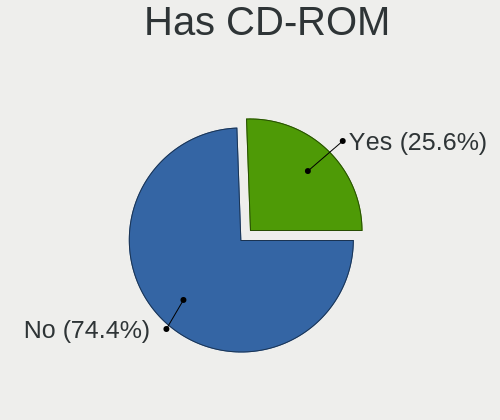
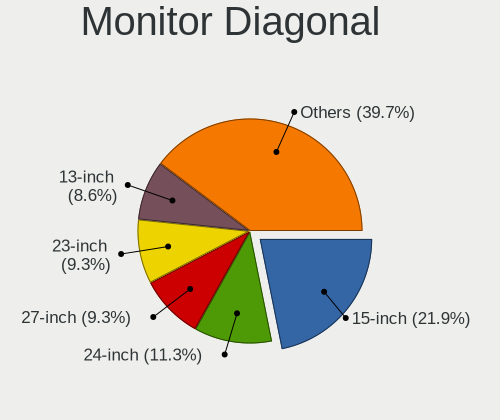
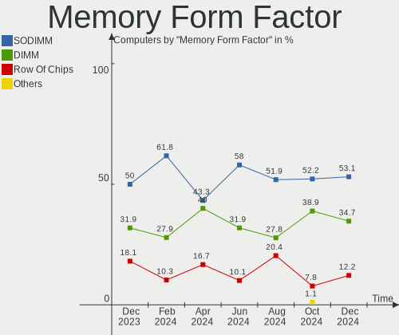

Kubuntu Hardware Trends
-----------------------

A project to identify most popular hardware characteristics and track their change
over time based on data collected by Kubuntu users at https://Linux-Hardware.org.

Anyone can contribute to this report by the [hw-probe](https://github.com/linuxhw/hw-probe) tool:

    sudo -E hw-probe -all -upload

This is a report for all computer types. See also reports for [desktops](/Dist/Kubuntu/Desktop/README.md) and [notebooks](/Dist/Kubuntu/Notebook/README.md).

Full-feature report is available here: https://linux-hardware.org/?view=trends

Period: Sep, 2021.

Contents
--------

* [ System ](#system)
  - [ OS                       ](#os)
  - [ OS Family                ](#os-family)
  - [ Kernel                   ](#kernel)
  - [ Kernel Family            ](#kernel-family)
  - [ Kernel Major Ver.        ](#kernel-major-ver)
  - [ Arch                     ](#arch)
  - [ DE                       ](#de)
  - [ Display Server           ](#display-server)
  - [ Display Manager          ](#display-manager)
  - [ OS Lang                  ](#os-lang)
  - [ Boot Mode                ](#boot-mode)
  - [ Filesystem               ](#filesystem)
  - [ Part. scheme             ](#part-scheme)
  - [ Dual Boot with Linux/BSD ](#dual-boot-with-linuxbsd)
  - [ Dual Boot (Win)          ](#dual-boot-win)

* [ Board ](#board)
  - [ Vendor                   ](#vendor)
  - [ Model                    ](#model)
  - [ Model Family             ](#model-family)
  - [ MFG Year                 ](#mfg-year)
  - [ Form Factor              ](#form-factor)
  - [ Secure Boot              ](#secure-boot)
  - [ Coreboot                 ](#coreboot)
  - [ RAM Size                 ](#ram-size)
  - [ RAM Used                 ](#ram-used)
  - [ Total Drives             ](#total-drives)
  - [ Has CD-ROM               ](#has-cd-rom)
  - [ Has Ethernet             ](#has-ethernet)
  - [ Has WiFi                 ](#has-wifi)
  - [ Has Bluetooth            ](#has-bluetooth)

* [ Location ](#location)
  - [ Country                  ](#country)
  - [ City                     ](#city)

* [ Drives ](#drives)
  - [ Drive Vendor             ](#drive-vendor)
  - [ Drive Model              ](#drive-model)
  - [ HDD Vendor               ](#hdd-vendor)
  - [ SSD Vendor               ](#ssd-vendor)
  - [ Drive Kind               ](#drive-kind)
  - [ Drive Connector          ](#drive-connector)
  - [ Drive Size               ](#drive-size)
  - [ Space Total              ](#space-total)
  - [ Space Used               ](#space-used)
  - [ Malfunc. Drives          ](#malfunc-drives)
  - [ Malfunc. Drive Vendor    ](#malfunc-drive-vendor)
  - [ Malfunc. HDD Vendor      ](#malfunc-hdd-vendor)
  - [ Malfunc. Drive Kind      ](#malfunc-drive-kind)
  - [ Failed Drives            ](#failed-drives)
  - [ Failed Drive Vendor      ](#failed-drive-vendor)
  - [ Drive Status             ](#drive-status)

* [ Storage controller ](#storage-controller)
  - [ Storage Vendor           ](#storage-vendor)
  - [ Storage Model            ](#storage-model)
  - [ Storage Kind             ](#storage-kind)

* [ Processor ](#processor)
  - [ CPU Vendor               ](#cpu-vendor)
  - [ CPU Model                ](#cpu-model)
  - [ CPU Model Family         ](#cpu-model-family)
  - [ CPU Cores                ](#cpu-cores)
  - [ CPU Sockets              ](#cpu-sockets)
  - [ CPU Threads              ](#cpu-threads)
  - [ CPU Op-Modes             ](#cpu-op-modes)
  - [ CPU Microcode            ](#cpu-microcode)
  - [ CPU Microarch            ](#cpu-microarch)

* [ Graphics ](#graphics)
  - [ GPU Vendor               ](#gpu-vendor)
  - [ GPU Model                ](#gpu-model)
  - [ GPU Combo                ](#gpu-combo)
  - [ GPU Driver               ](#gpu-driver)
  - [ GPU Memory               ](#gpu-memory)

* [ Monitor ](#monitor)
  - [ Monitor Vendor           ](#monitor-vendor)
  - [ Monitor Model            ](#monitor-model)
  - [ Monitor Resolution       ](#monitor-resolution)
  - [ Monitor Diagonal         ](#monitor-diagonal)
  - [ Monitor Width            ](#monitor-width)
  - [ Aspect Ratio             ](#aspect-ratio)
  - [ Monitor Area             ](#monitor-area)
  - [ Pixel Density            ](#pixel-density)
  - [ Multiple Monitors        ](#multiple-monitors)

* [ Network ](#network)
  - [ Net Controller Vendor    ](#net-controller-vendor)
  - [ Net Controller Model     ](#net-controller-model)
  - [ Wireless Vendor          ](#wireless-vendor)
  - [ Wireless Model           ](#wireless-model)
  - [ Ethernet Vendor          ](#ethernet-vendor)
  - [ Ethernet Model           ](#ethernet-model)
  - [ Net Controller Kind      ](#net-controller-kind)
  - [ Used Controller          ](#used-controller)
  - [ NICs                     ](#nics)
  - [ IPv6                     ](#ipv6)

* [ Bluetooth ](#bluetooth)
  - [ Bluetooth Vendor         ](#bluetooth-vendor)
  - [ Bluetooth Model          ](#bluetooth-model)

* [ Sound ](#sound)
  - [ Sound Vendor             ](#sound-vendor)
  - [ Sound Model              ](#sound-model)

* [ Memory ](#memory)
  - [ Memory Vendor            ](#memory-vendor)
  - [ Memory Model             ](#memory-model)
  - [ Memory Kind              ](#memory-kind)
  - [ Memory Form Factor       ](#memory-form-factor)
  - [ Memory Size              ](#memory-size)
  - [ Memory Speed             ](#memory-speed)

* [ Printers & scanners ](#printers--scanners)
  - [ Printer Vendor           ](#printer-vendor)
  - [ Printer Model            ](#printer-model)
  - [ Scanner Vendor           ](#scanner-vendor)
  - [ Scanner Model            ](#scanner-model)

* [ Camera ](#camera)
  - [ Camera Vendor            ](#camera-vendor)
  - [ Camera Model             ](#camera-model)

* [ Security ](#security)
  - [ Fingerprint Vendor       ](#fingerprint-vendor)
  - [ Fingerprint Model        ](#fingerprint-model)
  - [ Chipcard Vendor          ](#chipcard-vendor)
  - [ Chipcard Model           ](#chipcard-model)

* [ Unsupported ](#unsupported)
  - [ Unsupported Devices      ](#unsupported-devices)
  - [ Unsupported Device Types ](#unsupported-device-types)

System
------

OS
--

Installed operating systems

| Name          | Computers | Percent |
|---------------|-----------|---------|
| Kubuntu 20.04 | 40        | 48.19%  |
| Kubuntu 21.04 | 30        | 36.14%  |
| Kubuntu 21.10 | 5         | 6.02%   |
| Kubuntu 20.10 | 5         | 6.02%   |
| Kubuntu 18.04 | 2         | 2.41%   |
| Kubuntu 2.0   | 1         | 1.2%    |

OS Family
---------

OS without a version

| Name    | Computers | Percent |
|---------|-----------|---------|
| Kubuntu | 83        | 100%    |

Kernel
------

Version of the Linux kernel

| Version               | Computers | Percent |
|-----------------------|-----------|---------|
| 5.11.0-34-generic     | 15        | 18.07%  |
| 5.11.0-27-generic     | 13        | 15.66%  |
| 5.11.0-31-generic     | 8         | 9.64%   |
| 5.4.0-84-generic      | 7         | 8.43%   |
| 5.11.0-36-generic     | 6         | 7.23%   |
| 5.4.0-81-generic      | 4         | 4.82%   |
| 5.11.0-37-generic     | 4         | 4.82%   |
| 5.13.0-16-generic     | 3         | 3.61%   |
| 5.8.0-63-lowlatency   | 2         | 2.41%   |
| 5.8.0-63-generic      | 2         | 2.41%   |
| 5.11.0-36-lowlatency  | 2         | 2.41%   |
| 5.11.0-35-generic     | 2         | 2.41%   |
| 5.11.0-34-lowlatency  | 2         | 2.41%   |
| 5.11.0-16-generic     | 2         | 2.41%   |
| 5.8.0-55-generic      | 1         | 1.2%    |
| 5.8.0-25-lowlatency   | 1         | 1.2%    |
| 5.4.0-86-generic      | 1         | 1.2%    |
| 5.4.0-52-generic      | 1         | 1.2%    |
| 5.14.7-051407-generic | 1         | 1.2%    |
| 5.14.2-1-MANJARO      | 1         | 1.2%    |
| 5.14.0-051400-generic | 1         | 1.2%    |
| 5.13.13-surface       | 1         | 1.2%    |
| 5.13.0-17-generic     | 1         | 1.2%    |
| 5.13.0-14-generic     | 1         | 1.2%    |
| 5.11.17-xanmod1       | 1         | 1.2%    |

Kernel Family
-------------

Linux kernel without a distro release

| Version | Computers | Percent |
|---------|-----------|---------|
| 5.11.0  | 54        | 65.06%  |
| 5.4.0   | 13        | 15.66%  |
| 5.8.0   | 6         | 7.23%   |
| 5.13.0  | 5         | 6.02%   |
| 5.14.7  | 1         | 1.2%    |
| 5.14.2  | 1         | 1.2%    |
| 5.14.0  | 1         | 1.2%    |
| 5.13.13 | 1         | 1.2%    |
| 5.11.17 | 1         | 1.2%    |

Kernel Major Ver.
-----------------

Linux kernel major version

| Version | Computers | Percent |
|---------|-----------|---------|
| 5.11    | 55        | 66.27%  |
| 5.4     | 13        | 15.66%  |
| 5.8     | 6         | 7.23%   |
| 5.13    | 6         | 7.23%   |
| 5.14    | 3         | 3.61%   |

Arch
----

OS architecture (x86_64, i586, etc.)

| Name   | Computers | Percent |
|--------|-----------|---------|
| x86_64 | 83        | 100%    |

DE
--

Desktop Environment

| Name   | Computers | Percent |
|--------|-----------|---------|
| KDE5   | 56        | 67.47%  |
| KDE    | 26        | 31.33%  |
| Budgie | 1         | 1.2%    |

Display Server
--------------

X11 or Wayland

| Name    | Computers | Percent |
|---------|-----------|---------|
| X11     | 79        | 95.18%  |
| Wayland | 4         | 4.82%   |

Display Manager
---------------

SDDM, LightDM, etc.

| Name    | Computers | Percent |
|---------|-----------|---------|
| SDDM    | 48        | 57.83%  |
| Unknown | 29        | 34.94%  |
| GDM     | 6         | 7.23%   |

OS Lang
-------

Language

| Lang  | Computers | Percent |
|-------|-----------|---------|
| en_US | 36        | 43.37%  |
| pt_BR | 7         | 8.43%   |
| fr_FR | 5         | 6.02%   |
| C     | 5         | 6.02%   |
| en_GB | 4         | 4.82%   |
| ru_RU | 3         | 3.61%   |
| it_IT | 3         | 3.61%   |
| es_ES | 3         | 3.61%   |
| en_CA | 3         | 3.61%   |
| de_DE | 3         | 3.61%   |
| en_AU | 2         | 2.41%   |
| fr_CH | 1         | 1.2%    |
| fi_FI | 1         | 1.2%    |
| es_PY | 1         | 1.2%    |
| es_MX | 1         | 1.2%    |
| es_CL | 1         | 1.2%    |
| es_AR | 1         | 1.2%    |
| en_IN | 1         | 1.2%    |
| cs_CZ | 1         | 1.2%    |
| be_BY | 1         | 1.2%    |

Boot Mode
---------

EFI or BIOS

| Mode | Computers | Percent |
|------|-----------|---------|
| EFI  | 46        | 55.42%  |
| BIOS | 37        | 44.58%  |

Filesystem
----------

Type of filesystem

| Type    | Computers | Percent |
|---------|-----------|---------|
| Ext4    | 74        | 89.16%  |
| Btrfs   | 7         | 8.43%   |
| Xfs     | 1         | 1.2%    |
| Overlay | 1         | 1.2%    |

Part. scheme
------------

Scheme of partitioning

| Type    | Computers | Percent |
|---------|-----------|---------|
| GPT     | 39        | 46.99%  |
| Unknown | 36        | 43.37%  |
| MBR     | 8         | 9.64%   |

Dual Boot with Linux/BSD
------------------------

Hosting more than one Linux/BSD

| Dual boot | Computers | Percent |
|-----------|-----------|---------|
| No        | 71        | 85.54%  |
| Yes       | 12        | 14.46%  |

Dual Boot (Win)
---------------

Hosting Linux and Windows

| Dual boot | Computers | Percent |
|-----------|-----------|---------|
| No        | 52        | 62.65%  |
| Yes       | 31        | 37.35%  |

Board
-----

Vendor
------

Motherboard manufacturer

| Name                             | Computers | Percent |
|----------------------------------|-----------|---------|
| Lenovo                           | 16        | 19.28%  |
| ASUSTek Computer                 | 14        | 16.87%  |
| Dell                             | 11        | 13.25%  |
| Gigabyte Technology              | 8         | 9.64%   |
| Hewlett-Packard                  | 6         | 7.23%   |
| Acer                             | 6         | 7.23%   |
| MSI                              | 4         | 4.82%   |
| ASRock                           | 3         | 3.61%   |
| Positivo                         | 2         | 2.41%   |
| Pegatron                         | 2         | 2.41%   |
| Google                           | 2         | 2.41%   |
| TUXEDO                           | 1         | 1.2%    |
| Sony                             | 1         | 1.2%    |
| Samsung Electronics              | 1         | 1.2%    |
| Panasonic                        | 1         | 1.2%    |
| Microsoft                        | 1         | 1.2%    |
| Intel                            | 1         | 1.2%    |
| FUJITSU CLIENT COMPUTING LIMITED | 1         | 1.2%    |
| BESSTAR Tech                     | 1         | 1.2%    |
| Unknown                          | 1         | 1.2%    |

Model
-----

Motherboard model

| Name                                            | Computers | Percent |
|-------------------------------------------------|-----------|---------|
| Dell PowerEdge T620                             | 2         | 2.41%   |
| ASUS VivoBook_ASUSLaptop X515DA_M515DA          | 2         | 2.41%   |
| TUXEDO Pulse 15 Gen1                            | 1         | 1.2%    |
| Sony VPCCW25FL                                  | 1         | 1.2%    |
| Samsung 950XDB/951XDB/950XDY                    | 1         | 1.2%    |
| Positivo MOBILE                                 | 1         | 1.2%    |
| Positivo CHT12CP                                | 1         | 1.2%    |
| Pegatron AY691AA-ABA p6367c                     | 1         | 1.2%    |
| Pegatron AY030AA-ABA CQ5320F                    | 1         | 1.2%    |
| Panasonic CFSX4-1                               | 1         | 1.2%    |
| MSI MS-7C91                                     | 1         | 1.2%    |
| MSI Modern 14 B4MW                              | 1         | 1.2%    |
| MSI GS63 7RE                                    | 1         | 1.2%    |
| MSI GS60 2PE                                    | 1         | 1.2%    |
| Microsoft Surface Laptop Go                     | 1         | 1.2%    |
| Lenovo Yoga 9 14ITL5 82BG                       | 1         | 1.2%    |
| Lenovo ThinkPad X61s 7667DE3                    | 1         | 1.2%    |
| Lenovo ThinkPad T580 20L90026RT                 | 1         | 1.2%    |
| Lenovo ThinkPad T550 20CJS03300                 | 1         | 1.2%    |
| Lenovo ThinkPad T540p 20BE0084BM                | 1         | 1.2%    |
| Lenovo ThinkPad T520 42406AG                    | 1         | 1.2%    |
| Lenovo ThinkPad P15s Gen 2i 20W6000JMH          | 1         | 1.2%    |
| Lenovo ThinkPad E555 20DHA01MCD                 | 1         | 1.2%    |
| Lenovo ThinkPad E14 20RA004YUS                  | 1         | 1.2%    |
| Lenovo ThinkCentre E73 10DU0015UK               | 1         | 1.2%    |
| Lenovo ThinkBook 14s-IML 20RS                   | 1         | 1.2%    |
| Lenovo Legion 5 15IMH05H 81Y6                   | 1         | 1.2%    |
| Lenovo IdeaPad S340-14IWL 81N7                  | 1         | 1.2%    |
| Lenovo IdeaPad Gaming 3 15ARH05 82EY            | 1         | 1.2%    |
| Lenovo G500 20236                               | 1         | 1.2%    |
| Lenovo B50-70 20384                             | 1         | 1.2%    |
| Intel Eaglelake Fab D                           | 1         | 1.2%    |
| HP Z800 Workstation                             | 1         | 1.2%    |
| HP ProBook x360 435 G7                          | 1         | 1.2%    |
| HP Pavilion Aero Laptop 13-be0xxx               | 1         | 1.2%    |
| HP Laptop 14s-dq0xxx                            | 1         | 1.2%    |
| HP ENVY Notebook                                | 1         | 1.2%    |
| HP Compaq 8100 Elite SFF PC                     | 1         | 1.2%    |
| Google Panther                                  | 1         | 1.2%    |
| Google Kohaku                                   | 1         | 1.2%    |
| Gigabyte Z170M-D3H DDR3-CF                      | 1         | 1.2%    |
| Gigabyte X99-UD3-CF                             | 1         | 1.2%    |
| Gigabyte H410M S2H V2                           | 1         | 1.2%    |
| Gigabyte H310M S2H 2.0                          | 1         | 1.2%    |
| Gigabyte H110M-S2PV                             | 1         | 1.2%    |
| Gigabyte B250M-DS3H                             | 1         | 1.2%    |
| Gigabyte A520M S2H                              | 1         | 1.2%    |
| Gigabyte A320M-S2H V2                           | 1         | 1.2%    |
| FUJITSU CLIENT COMPUTING LIMITED LIFEBOOK U9310 | 1         | 1.2%    |
| Dell XPS 15 7590                                | 1         | 1.2%    |
| Dell Vostro 3268                                | 1         | 1.2%    |
| Dell Precision WorkStation T7400                | 1         | 1.2%    |
| Dell OptiPlex 7040                              | 1         | 1.2%    |
| Dell Latitude 7490                              | 1         | 1.2%    |
| Dell Latitude 7320 Detachable                   | 1         | 1.2%    |
| Dell Inspiron 3531                              | 1         | 1.2%    |
| Dell Inspiron 16 7610                           | 1         | 1.2%    |
| Dell ASM100                                     | 1         | 1.2%    |
| BESSTAR Tech Z83-F                              | 1         | 1.2%    |
| ASUS VivoBook_ASUSLaptop X512DA_X512DA          | 1         | 1.2%    |

Model Family
------------

Motherboard model prefix

| Name                                      | Computers | Percent |
|-------------------------------------------|-----------|---------|
| Lenovo ThinkPad                           | 8         | 9.64%   |
| Acer Aspire                               | 5         | 6.02%   |
| ASUS VivoBook                             | 3         | 3.61%   |
| Lenovo IdeaPad                            | 2         | 2.41%   |
| Dell PowerEdge                            | 2         | 2.41%   |
| Dell Latitude                             | 2         | 2.41%   |
| Dell Inspiron                             | 2         | 2.41%   |
| ASUS SABERTOOTH                           | 2         | 2.41%   |
| TUXEDO Pulse                              | 1         | 1.2%    |
| Sony VPCCW25FL                            | 1         | 1.2%    |
| Samsung 950XDB                            | 1         | 1.2%    |
| Positivo MOBILE                           | 1         | 1.2%    |
| Positivo CHT12CP                          | 1         | 1.2%    |
| Pegatron AY691AA-ABA                      | 1         | 1.2%    |
| Pegatron AY030AA-ABA                      | 1         | 1.2%    |
| Panasonic CFSX4-1                         | 1         | 1.2%    |
| MSI MS-7C91                               | 1         | 1.2%    |
| MSI Modern                                | 1         | 1.2%    |
| MSI GS63                                  | 1         | 1.2%    |
| MSI GS60                                  | 1         | 1.2%    |
| Microsoft Surface                         | 1         | 1.2%    |
| Lenovo Yoga                               | 1         | 1.2%    |
| Lenovo ThinkCentre                        | 1         | 1.2%    |
| Lenovo ThinkBook                          | 1         | 1.2%    |
| Lenovo Legion                             | 1         | 1.2%    |
| Lenovo G500                               | 1         | 1.2%    |
| Lenovo B50-70                             | 1         | 1.2%    |
| Intel Eaglelake                           | 1         | 1.2%    |
| HP Z800                                   | 1         | 1.2%    |
| HP ProBook                                | 1         | 1.2%    |
| HP Pavilion                               | 1         | 1.2%    |
| HP Laptop                                 | 1         | 1.2%    |
| HP ENVY                                   | 1         | 1.2%    |
| HP Compaq                                 | 1         | 1.2%    |
| Google Panther                            | 1         | 1.2%    |
| Google Kohaku                             | 1         | 1.2%    |
| Gigabyte Z170M-D3H                        | 1         | 1.2%    |
| Gigabyte X99-UD3-CF                       | 1         | 1.2%    |
| Gigabyte H410M                            | 1         | 1.2%    |
| Gigabyte H310M                            | 1         | 1.2%    |
| Gigabyte H110M-S2PV                       | 1         | 1.2%    |
| Gigabyte B250M-DS3H                       | 1         | 1.2%    |
| Gigabyte A520M                            | 1         | 1.2%    |
| Gigabyte A320M-S2H                        | 1         | 1.2%    |
| FUJITSU CLIENT COMPUTING LIMITED LIFEBOOK | 1         | 1.2%    |
| Dell XPS                                  | 1         | 1.2%    |
| Dell Vostro                               | 1         | 1.2%    |
| Dell Precision                            | 1         | 1.2%    |
| Dell OptiPlex                             | 1         | 1.2%    |
| Dell ASM100                               | 1         | 1.2%    |
| BESSTAR Tech Z83-F                        | 1         | 1.2%    |
| ASUS UX330UA                              | 1         | 1.2%    |
| ASUS TUF                                  | 1         | 1.2%    |
| ASUS TP500LN                              | 1         | 1.2%    |
| ASUS STRIX                                | 1         | 1.2%    |
| ASUS ROG                                  | 1         | 1.2%    |
| ASUS P8P67                                | 1         | 1.2%    |
| ASUS K73SJ                                | 1         | 1.2%    |
| ASUS F1A55-M                              | 1         | 1.2%    |
| ASUS ASUS                                 | 1         | 1.2%    |

MFG Year
--------

Motherboard manufacture year

| Year | Computers | Percent |
|------|-----------|---------|
| 2021 | 27        | 32.53%  |
| 2019 | 11        | 13.25%  |
| 2014 | 7         | 8.43%   |
| 2012 | 6         | 7.23%   |
| 2018 | 5         | 6.02%   |
| 2015 | 5         | 6.02%   |
| 2020 | 4         | 4.82%   |
| 2017 | 4         | 4.82%   |
| 2010 | 4         | 4.82%   |
| 2016 | 3         | 3.61%   |
| 2011 | 3         | 3.61%   |
| 2009 | 2         | 2.41%   |
| 2013 | 1         | 1.2%    |
| 2008 | 1         | 1.2%    |

Form Factor
-----------

Physical design of the computer

| Name        | Computers | Percent |
|-------------|-----------|---------|
| Notebook    | 46        | 55.42%  |
| Desktop     | 30        | 36.14%  |
| Tablet      | 2         | 2.41%   |
| Convertible | 2         | 2.41%   |
| Server      | 2         | 2.41%   |
| Mini pc     | 1         | 1.2%    |

Secure Boot
-----------

Enabled or disabled

| State    | Computers | Percent |
|----------|-----------|---------|
| Disabled | 75        | 90.36%  |
| Enabled  | 8         | 9.64%   |

Coreboot
--------

Have coreboot on board

| Used | Computers | Percent |
|------|-----------|---------|
| No   | 81        | 97.59%  |
| Yes  | 2         | 2.41%   |

RAM Size
--------

Total RAM memory

| Size in GB  | Computers | Percent |
|-------------|-----------|---------|
| 4.01-8.0    | 26        | 31.33%  |
| 16.01-24.0  | 16        | 19.28%  |
| 8.01-16.0   | 15        | 18.07%  |
| 32.01-64.0  | 10        | 12.05%  |
| 3.01-4.0    | 10        | 12.05%  |
| 24.01-32.0  | 3         | 3.61%   |
| 64.01-256.0 | 2         | 2.41%   |
| 2.01-3.0    | 1         | 1.2%    |

RAM Used
--------

Used RAM memory

| Used GB    | Computers | Percent |
|------------|-----------|---------|
| 2.01-3.0   | 26        | 31.33%  |
| 1.01-2.0   | 21        | 25.3%   |
| 4.01-8.0   | 19        | 22.89%  |
| 3.01-4.0   | 10        | 12.05%  |
| 8.01-16.0  | 4         | 4.82%   |
| 16.01-24.0 | 2         | 2.41%   |
| 0.51-1.0   | 1         | 1.2%    |

Total Drives
------------

Number of drives on board

| Drives | Computers | Percent |
|--------|-----------|---------|
| 1      | 51        | 61.45%  |
| 2      | 18        | 21.69%  |
| 3      | 8         | 9.64%   |
| 4      | 4         | 4.82%   |
| 7      | 1         | 1.2%    |
| 5      | 1         | 1.2%    |

Has CD-ROM
----------

Has CD-ROM on board

| Presented | Computers | Percent |
|-----------|-----------|---------|
| No        | 59        | 71.08%  |
| Yes       | 24        | 28.92%  |

Has Ethernet
------------

Has Ethernet on board

| Presented | Computers | Percent |
|-----------|-----------|---------|
| Yes       | 67        | 80.72%  |
| No        | 16        | 19.28%  |

Has WiFi
--------

Has WiFi module

| Presented | Computers | Percent |
|-----------|-----------|---------|
| Yes       | 64        | 77.11%  |
| No        | 19        | 22.89%  |

Has Bluetooth
-------------

Has Bluetooth module

| Presented | Computers | Percent |
|-----------|-----------|---------|
| Yes       | 56        | 67.47%  |
| No        | 27        | 32.53%  |

Location
--------

Country
-------

Geographic location (country)

| Country     | Computers | Percent |
|-------------|-----------|---------|
| USA         | 17        | 20.48%  |
| France      | 8         | 9.64%   |
| Russia      | 7         | 8.43%   |
| Brazil      | 7         | 8.43%   |
| Germany     | 6         | 7.23%   |
| Spain       | 4         | 4.82%   |
| Canada      | 4         | 4.82%   |
| Ukraine     | 3         | 3.61%   |
| UK          | 2         | 2.41%   |
| Turkey      | 2         | 2.41%   |
| Italy       | 2         | 2.41%   |
| Indonesia   | 2         | 2.41%   |
| Australia   | 2         | 2.41%   |
| Vietnam     | 1         | 1.2%    |
| Switzerland | 1         | 1.2%    |
| South Korea | 1         | 1.2%    |
| Poland      | 1         | 1.2%    |
| Paraguay    | 1         | 1.2%    |
| Nigeria     | 1         | 1.2%    |
| Netherlands | 1         | 1.2%    |
| Mexico      | 1         | 1.2%    |
| India       | 1         | 1.2%    |
| Finland     | 1         | 1.2%    |
| Czechia     | 1         | 1.2%    |
| Cuba        | 1         | 1.2%    |
| China       | 1         | 1.2%    |
| Bulgaria    | 1         | 1.2%    |
| Belarus     | 1         | 1.2%    |
| Argentina   | 1         | 1.2%    |
| Algeria     | 1         | 1.2%    |

City
----

Geographic location (city)

| City                   | Computers | Percent |
|------------------------|-----------|---------|
| Toronto                | 2         | 2.41%   |
| Paris                  | 2         | 2.41%   |
| Jakarta                | 2         | 2.41%   |
| Hatfield               | 2         | 2.41%   |
| Yoshkar-Ola            | 1         | 1.2%    |
| Wittmund               | 1         | 1.2%    |
| Vijayawada             | 1         | 1.2%    |
| Viedma                 | 1         | 1.2%    |
| Varallo Sesia          | 1         | 1.2%    |
| Ulyanovsk              | 1         | 1.2%    |
| Taboao da Serra        | 1         | 1.2%    |
| Sydney                 | 1         | 1.2%    |
| Springfield            | 1         | 1.2%    |
| Sofia                  | 1         | 1.2%    |
| Sierre                 | 1         | 1.2%    |
| Shanghai               | 1         | 1.2%    |
| Shakhty                | 1         | 1.2%    |
| Seville                | 1         | 1.2%    |
| Seattle                | 1         | 1.2%    |
| S??o Pedro             | 1         | 1.2%    |
| S??o Leopoldo          | 1         | 1.2%    |
| Sarandi                | 1         | 1.2%    |
| San Carlos             | 1         | 1.2%    |
| Salvador               | 1         | 1.2%    |
| Saint Leonards-on-Sea  | 1         | 1.2%    |
| Rzesz??w               | 1         | 1.2%    |
| Rostov-on-Don          | 1         | 1.2%    |
| Rome                   | 1         | 1.2%    |
| Rio de Janeiro         | 1         | 1.2%    |
| Redmond                | 1         | 1.2%    |
| Rach Gia               | 1         | 1.2%    |
| Puerto Serrano         | 1         | 1.2%    |
| Prague                 | 1         | 1.2%    |
| Plaza de la Revolucion | 1         | 1.2%    |
| Orlando                | 1         | 1.2%    |
| Olympia                | 1         | 1.2%    |
| Moscow                 | 1         | 1.2%    |
| Montreal               | 1         | 1.2%    |
| Missoula               | 1         | 1.2%    |
| Miami                  | 1         | 1.2%    |
| Maumelle               | 1         | 1.2%    |
| Marseille              | 1         | 1.2%    |
| London                 | 1         | 1.2%    |
| Las Vegas              | 1         | 1.2%    |
| Lamothe-Goas           | 1         | 1.2%    |
| Lagos                  | 1         | 1.2%    |
| Kyiv                   | 1         | 1.2%    |
| Kropyvnytskyi          | 1         | 1.2%    |
| Kaufungen              | 1         | 1.2%    |
| Izhevsk                | 1         | 1.2%    |
| Istanbul               | 1         | 1.2%    |
| Helsinki               | 1         | 1.2%    |
| Hamburg                | 1         | 1.2%    |
| Gwangsan-gu            | 1         | 1.2%    |
| Gomel                  | 1         | 1.2%    |
| Gatineau               | 1         | 1.2%    |
| Federal Way            | 1         | 1.2%    |
| Elna                   | 1         | 1.2%    |
| Egelsbach              | 1         | 1.2%    |
| Dnipropetrovsk         | 1         | 1.2%    |

Drives
------

Drive Vendor
------------

Hard drive vendors

| Vendor              | Computers | Drives | Percent |
|---------------------|-----------|--------|---------|
| WDC                 | 26        | 33     | 22.03%  |
| Samsung Electronics | 19        | 27     | 16.1%   |
| Seagate             | 17        | 18     | 14.41%  |
| Unknown             | 5         | 7      | 4.24%   |
| Micron Technology   | 5         | 5      | 4.24%   |
| Toshiba             | 4         | 4      | 3.39%   |
| SK Hynix            | 4         | 4      | 3.39%   |
| Intel               | 4         | 4      | 3.39%   |
| Crucial             | 4         | 4      | 3.39%   |
| Union Memory        | 3         | 3      | 2.54%   |
| Kingston            | 3         | 3      | 2.54%   |
| Hitachi             | 3         | 3      | 2.54%   |
| Team                | 2         | 2      | 1.69%   |
| HGST                | 2         | 2      | 1.69%   |
| XPG                 | 1         | 1      | 0.85%   |
| Transcend           | 1         | 1      | 0.85%   |
| TO Exter            | 1         | 1      | 0.85%   |
| SPCC                | 1         | 1      | 0.85%   |
| Solid State Storage | 1         | 1      | 0.85%   |
| SanDisk             | 1         | 1      | 0.85%   |
| PNY                 | 1         | 2      | 0.85%   |
| Phison              | 1         | 2      | 0.85%   |
| Patriot             | 1         | 1      | 0.85%   |
| MAXTOR              | 1         | 1      | 0.85%   |
| Intenso             | 1         | 1      | 0.85%   |
| Gigabyte Technology | 1         | 1      | 0.85%   |
| Fujitsu             | 1         | 1      | 0.85%   |
| Corsair             | 1         | 1      | 0.85%   |
| Colorful            | 1         | 1      | 0.85%   |
| China               | 1         | 1      | 0.85%   |
| A-DATA Technology   | 1         | 1      | 0.85%   |

Drive Model
-----------

Hard drive models

| Model                                     | Computers | Percent |
|-------------------------------------------|-----------|---------|
| Samsung SSD 850 EVO 500GB                 | 4         | 3.08%   |
| WDC WD10JPVX-22JC3T0 1TB                  | 2         | 1.54%   |
| WDC WD1002FAEX-00Z3A0 1TB                 | 2         | 1.54%   |
| WDC PC SN530 SDBPNPZ-256G-1002 256GB      | 2         | 1.54%   |
| Unknown MMC Card  32GB                    | 2         | 1.54%   |
| Toshiba DT01ACA100 1TB                    | 2         | 1.54%   |
| Seagate ST1000LM024 HN-M101MBB 1TB        | 2         | 1.54%   |
| Samsung SSD 850 EVO 250GB                 | 2         | 1.54%   |
| Kingston SV300S37A60G 64GB SSD            | 2         | 1.54%   |
| Hitachi HTS543232A7A384 320GB             | 2         | 1.54%   |
| XPG GAMMIX S70 1TB                        | 1         | 0.77%   |
| WDC WDS500G2B0A-00SM50 500GB SSD          | 1         | 0.77%   |
| WDC WDS250G2B0C 250GB                     | 1         | 0.77%   |
| WDC WDS120G1G0B-00RC30 120GB SSD          | 1         | 0.77%   |
| WDC WDS100T2G0A-00JH30 1TB SSD            | 1         | 0.77%   |
| WDC WD7500BPVT-80HXZT3 752GB              | 1         | 0.77%   |
| WDC WD5000AAKX-60U6AA0 500GB              | 1         | 0.77%   |
| WDC WD5000AAKS-00A7B0 500GB               | 1         | 0.77%   |
| WDC WD5000AADS-00S9B0 500GB               | 1         | 0.77%   |
| WDC WD2500LPLX-75ZNTT0 250GB              | 1         | 0.77%   |
| WDC WD2500BEVT-22A23T0 250GB              | 1         | 0.77%   |
| WDC WD20EARX-00PASB0 2TB                  | 1         | 0.77%   |
| WDC WD10SPZX-21Z10T0 1TB                  | 1         | 0.77%   |
| WDC WD10SPZX-00Z10T0 1TB                  | 1         | 0.77%   |
| WDC WD10EZEX-75WN4A0 1TB                  | 1         | 0.77%   |
| WDC WD10EZEX-60WN4A0 1TB                  | 1         | 0.77%   |
| WDC WD10EZEX-00BN5A0 1TB                  | 1         | 0.77%   |
| WDC WD10EACS-00D6B1 1TB                   | 1         | 0.77%   |
| WDC WD1002FAEX-00Y9A0 1TB                 | 1         | 0.77%   |
| WDC PC SN730 SDBPNTY-512G-1101 512GB      | 1         | 0.77%   |
| WDC PC SN720 SDAQNTW-512G-1001 512GB      | 1         | 0.77%   |
| WDC PC SN530 SDBPNPZ-1T00-1002 1TB        | 1         | 0.77%   |
| WDC PC SN530 NVMe 512GB                   | 1         | 0.77%   |
| WDC PC SN520 SDAPNUW-512G-1014 512GB      | 1         | 0.77%   |
| Unknown SDEZS25-240G-Z01 240GB            | 1         | 0.77%   |
| Unknown SD32G  32GB                       | 1         | 0.77%   |
| Unknown SD/MMC/MS PRO 128GB               | 1         | 0.77%   |
| Unknown MMC Card  64GB                    | 1         | 0.77%   |
| Unknown MMC Card  128GB                   | 1         | 0.77%   |
| Union Memory UMIS RPJTJ256MEE1OWX 256GB   | 1         | 0.77%   |
| Union Memory UMIS RPITJ512VME2OWD 512GB   | 1         | 0.77%   |
| Union Memory RPFTJ128PDD2EWX 128GB        | 1         | 0.77%   |
| Transcend TS64GMTS400S 64GB SSD           | 1         | 0.77%   |
| Toshiba TR200 960GB SSD                   | 1         | 0.77%   |
| Toshiba KBG30ZMT256G 256GB                | 1         | 0.77%   |
| TO Exter nal USB 3.0 4TB                  | 1         | 0.77%   |
| Team T253X2001T 1024GB SSD                | 1         | 0.77%   |
| Team L3 SSD 120GB                         | 1         | 0.77%   |
| SPCC Solid State Disk 1024GB              | 1         | 0.77%   |
| Solid State Storage SSSTC CL1-3D256 256GB | 1         | 0.77%   |
| SK Hynix SC300 M.2 2280 256GB SSD         | 1         | 0.77%   |
| SK Hynix PC601 NVMe 512GB                 | 1         | 0.77%   |
| SK Hynix HFM128GDGTNG-87A0A 128GB         | 1         | 0.77%   |
| SK Hynix BC511 HFM512GDJTNI-82A0A 512GB   | 1         | 0.77%   |
| Seagate ST9500325AS 500GB                 | 1         | 0.77%   |
| Seagate ST9402115AS 40GB                  | 1         | 0.77%   |
| Seagate ST500LT012-1DG142 500GB           | 1         | 0.77%   |
| Seagate ST500LM021-1KJ152 500GB           | 1         | 0.77%   |
| Seagate ST3750528AS 752GB                 | 1         | 0.77%   |
| Seagate ST3500413AS 500GB                 | 1         | 0.77%   |

HDD Vendor
----------

Hard disk drive vendors

| Vendor              | Computers | Drives | Percent |
|---------------------|-----------|--------|---------|
| WDC                 | 17        | 21     | 36.17%  |
| Seagate             | 17        | 18     | 36.17%  |
| Hitachi             | 3         | 3      | 6.38%   |
| Toshiba             | 2         | 2      | 4.26%   |
| Samsung Electronics | 2         | 4      | 4.26%   |
| HGST                | 2         | 2      | 4.26%   |
| Unknown             | 1         | 1      | 2.13%   |
| TO Exter            | 1         | 1      | 2.13%   |
| MAXTOR              | 1         | 1      | 2.13%   |
| Fujitsu             | 1         | 1      | 2.13%   |

SSD Vendor
----------

Solid state drive vendors

| Vendor              | Computers | Drives | Percent |
|---------------------|-----------|--------|---------|
| Samsung Electronics | 11        | 13     | 27.5%   |
| Crucial             | 4         | 4      | 10%     |
| WDC                 | 3         | 4      | 7.5%    |
| Intel               | 3         | 3      | 7.5%    |
| Team                | 2         | 2      | 5%      |
| Micron Technology   | 2         | 2      | 5%      |
| Kingston            | 2         | 2      | 5%      |
| Transcend           | 1         | 1      | 2.5%    |
| Toshiba             | 1         | 1      | 2.5%    |
| SPCC                | 1         | 1      | 2.5%    |
| SK Hynix            | 1         | 1      | 2.5%    |
| SanDisk             | 1         | 1      | 2.5%    |
| PNY                 | 1         | 2      | 2.5%    |
| Patriot             | 1         | 1      | 2.5%    |
| Intenso             | 1         | 1      | 2.5%    |
| Gigabyte Technology | 1         | 1      | 2.5%    |
| Corsair             | 1         | 1      | 2.5%    |
| Colorful            | 1         | 1      | 2.5%    |
| China               | 1         | 1      | 2.5%    |
| A-DATA Technology   | 1         | 1      | 2.5%    |

Drive Kind
----------

HDD or SSD

| Kind    | Computers | Drives | Percent |
|---------|-----------|--------|---------|
| HDD     | 41        | 54     | 36.61%  |
| SSD     | 34        | 44     | 30.36%  |
| NVMe    | 33        | 34     | 29.46%  |
| MMC     | 3         | 5      | 2.68%   |
| Unknown | 1         | 1      | 0.89%   |

Drive Connector
---------------

SATA, SAS, NVMe, etc.

| Type | Computers | Drives | Percent |
|------|-----------|--------|---------|
| SATA | 58        | 94     | 58.59%  |
| NVMe | 33        | 34     | 33.33%  |
| SAS  | 5         | 5      | 5.05%   |
| MMC  | 3         | 5      | 3.03%   |

Drive Size
----------

Size of hard drive

| Size in TB | Computers | Drives | Percent |
|------------|-----------|--------|---------|
| 0.01-0.5   | 40        | 56     | 52.63%  |
| 0.51-1.0   | 31        | 35     | 40.79%  |
| 1.01-2.0   | 4         | 6      | 5.26%   |
| 3.01-4.0   | 1         | 1      | 1.32%   |

Space Total
-----------

Amount of disk space available on the file system

| Size in GB     | Computers | Percent |
|----------------|-----------|---------|
| 501-1000       | 23        | 27.71%  |
| 101-250        | 19        | 22.89%  |
| 251-500        | 16        | 19.28%  |
| 51-100         | 11        | 13.25%  |
| 1001-2000      | 6         | 7.23%   |
| 21-50          | 3         | 3.61%   |
| 2001-3000      | 3         | 3.61%   |
| More than 3000 | 1         | 1.2%    |
| Unknown        | 1         | 1.2%    |

Space Used
----------

Amount of used disk space

| Used GB   | Computers | Percent |
|-----------|-----------|---------|
| 1-20      | 17        | 20.48%  |
| 21-50     | 16        | 19.28%  |
| 101-250   | 13        | 15.66%  |
| 51-100    | 12        | 14.46%  |
| 251-500   | 11        | 13.25%  |
| 501-1000  | 11        | 13.25%  |
| 1001-2000 | 2         | 2.41%   |
| Unknown   | 1         | 1.2%    |

Malfunc. Drives
---------------

Drive models with a malfunction

| Model                              | Computers | Drives | Percent |
|------------------------------------|-----------|--------|---------|
| WDC WD5000AAKS-00A7B0 500GB        | 1         | 1      | 25%     |
| Seagate ST3160815AS 160GB          | 1         | 1      | 25%     |
| Seagate ST1000LM024 HN-M101MBB 1TB | 1         | 1      | 25%     |
| Samsung Electronics HD321KJ 320GB  | 1         | 1      | 25%     |

Malfunc. Drive Vendor
---------------------

Vendors of faulty drives

| Vendor              | Computers | Drives | Percent |
|---------------------|-----------|--------|---------|
| Seagate             | 2         | 2      | 50%     |
| WDC                 | 1         | 1      | 25%     |
| Samsung Electronics | 1         | 1      | 25%     |

Malfunc. HDD Vendor
-------------------

Vendors of faulty HDD drives

| Vendor              | Computers | Drives | Percent |
|---------------------|-----------|--------|---------|
| Seagate             | 2         | 2      | 50%     |
| WDC                 | 1         | 1      | 25%     |
| Samsung Electronics | 1         | 1      | 25%     |

Malfunc. Drive Kind
-------------------

Kinds of faulty drives

| Kind | Computers | Drives | Percent |
|------|-----------|--------|---------|
| HDD  | 4         | 4      | 100%    |

Failed Drives
-------------

Failed drive models

Zero info for selected period =(

Failed Drive Vendor
-------------------

Failed drive vendors

Zero info for selected period =(

Drive Status
------------

Number of failed and malfunc. drives

| Status   | Computers | Drives | Percent |
|----------|-----------|--------|---------|
| Works    | 47        | 66     | 52.22%  |
| Detected | 39        | 68     | 43.33%  |
| Malfunc  | 4         | 4      | 4.44%   |

Storage controller
------------------

Storage Vendor
--------------

Storage controller vendors

| Vendor                         | Computers | Percent |
|--------------------------------|-----------|---------|
| Intel                          | 54        | 48.21%  |
| AMD                            | 17        | 15.18%  |
| Samsung Electronics            | 10        | 8.93%   |
| Sandisk                        | 8         | 7.14%   |
| Union Memory (Shenzhen)        | 3         | 2.68%   |
| SK Hynix                       | 3         | 2.68%   |
| Micron Technology              | 3         | 2.68%   |
| Silicon Image                  | 2         | 1.79%   |
| Marvell Technology Group       | 2         | 1.79%   |
| LSI Logic / Symbios Logic      | 2         | 1.79%   |
| JMicron Technology             | 2         | 1.79%   |
| Unknown                        | 1         | 0.89%   |
| Toshiba America Info Systems   | 1         | 0.89%   |
| Solid State Storage Technology | 1         | 0.89%   |
| Phison Electronics             | 1         | 0.89%   |
| Nvidia                         | 1         | 0.89%   |
| Kingston Technology Company    | 1         | 0.89%   |

Storage Model
-------------

Storage controller models

| Model                                                                          | Computers | Percent |
|--------------------------------------------------------------------------------|-----------|---------|
| AMD FCH SATA Controller [AHCI mode]                                            | 13        | 10.92%  |
| Samsung NVMe SSD Controller SM981/PM981/PM983                                  | 6         | 5.04%   |
| Intel 8 Series/C220 Series Chipset Family 6-port SATA Controller 1 [AHCI mode] | 5         | 4.2%    |
| Sandisk WD Blue SN550 NVMe SSD                                                 | 4         | 3.36%   |
| Union Memory (Shenzhen) Non-Volatile memory controller                         | 3         | 2.52%   |
| Micron Non-Volatile memory controller                                          | 3         | 2.52%   |
| Intel Sunrise Point-LP SATA Controller [AHCI mode]                             | 3         | 2.52%   |
| Intel SATA Controller [RAID mode]                                              | 3         | 2.52%   |
| Intel Q170/Q150/B150/H170/H110/Z170/CM236 Chipset SATA Controller [AHCI Mode]  | 3         | 2.52%   |
| Intel Comet Lake SATA AHCI Controller                                          | 3         | 2.52%   |
| Intel 8 Series SATA Controller 1 [AHCI mode]                                   | 3         | 2.52%   |
| Intel 200 Series PCH SATA controller [AHCI mode]                               | 3         | 2.52%   |
| AMD Starship/Matisse Chipset SATA Controller [AHCI mode]                       | 3         | 2.52%   |
| Samsung NVMe SSD Controller 980                                                | 2         | 1.68%   |
| Marvell Group 88SE9172 SATA 6Gb/s Controller                                   | 2         | 1.68%   |
| LSI Logic / Symbios Logic SAS1068E PCI-Express Fusion-MPT SAS                  | 2         | 1.68%   |
| JMicron JMB362 SATA Controller                                                 | 2         | 1.68%   |
| Intel Wildcat Point-LP SATA Controller [AHCI Mode]                             | 2         | 1.68%   |
| Intel Celeron/Pentium Silver Processor SATA Controller                         | 2         | 1.68%   |
| Intel Cannon Lake Mobile PCH SATA AHCI Controller                              | 2         | 1.68%   |
| Intel C600/X79 series chipset 4-Port SATA IDE Controller                       | 2         | 1.68%   |
| Intel C600/X79 series chipset 2-Port SATA IDE Controller                       | 2         | 1.68%   |
| Intel Atom Processor E3800 Series SATA AHCI Controller                         | 2         | 1.68%   |
| Intel 82801IBM/IEM (ICH9M/ICH9M-E) 4 port SATA Controller [AHCI mode]          | 2         | 1.68%   |
| Intel 6 Series/C200 Series Chipset Family 6 port Mobile SATA AHCI Controller   | 2         | 1.68%   |
| Intel 6 Series/C200 Series Chipset Family 6 port Desktop SATA AHCI Controller  | 2         | 1.68%   |
| Unknown Non-Volatile memory controller                                         | 1         | 0.84%   |
| Toshiba America Info Systems BG3 NVMe SSD Controller                           | 1         | 0.84%   |
| Solid State Storage Non-Volatile memory controller                             | 1         | 0.84%   |
| SK Hynix Non-Volatile memory controller                                        | 1         | 0.84%   |
| SK Hynix BC511                                                                 | 1         | 0.84%   |
| SK Hynix BC501 NVMe Solid State Drive                                          | 1         | 0.84%   |
| Silicon Image SiI 3124 PCI-X Serial ATA Controller                             | 1         | 0.84%   |
| Silicon Image SiI 3114 [SATALink/SATARaid] Serial ATA Controller               | 1         | 0.84%   |
| Sandisk WD Blue SN500 / PC SN520 NVMe SSD                                      | 1         | 0.84%   |
| Sandisk WD Black SN750 / PC SN730 NVMe SSD                                     | 1         | 0.84%   |
| Sandisk WD Black 2018/SN750 / PC SN720 NVMe SSD                                | 1         | 0.84%   |
| Sandisk Non-Volatile memory controller                                         | 1         | 0.84%   |
| Samsung NVMe SSD Controller SM961/PM961/SM963                                  | 1         | 0.84%   |
| Samsung NVMe SSD Controller PM9A1/PM9A3/980PRO                                 | 1         | 0.84%   |
| Phison E16 PCIe4 NVMe Controller                                               | 1         | 0.84%   |
| Nvidia MCP61 SATA Controller                                                   | 1         | 0.84%   |
| Kingston Company OM3PDP3 NVMe SSD                                              | 1         | 0.84%   |
| Intel Volume Management Device NVMe RAID Controller                            | 1         | 0.84%   |
| Intel SSD 660P Series                                                          | 1         | 0.84%   |
| Intel Mobile PM965/GM965 PT IDER Controller                                    | 1         | 0.84%   |
| Intel HM170/QM170 Chipset SATA Controller [AHCI Mode]                          | 1         | 0.84%   |
| Intel Cannon Point-LP SATA Controller [AHCI Mode]                              | 1         | 0.84%   |
| Intel C610/X99 series chipset 6-Port SATA Controller [AHCI mode]               | 1         | 0.84%   |
| Intel 9 Series Chipset Family SATA Controller [IDE Mode]                       | 1         | 0.84%   |
| Intel 82801JI (ICH10 Family) SATA AHCI Controller                              | 1         | 0.84%   |
| Intel 82801JI (ICH10 Family) 4 port SATA IDE Controller #1                     | 1         | 0.84%   |
| Intel 82801HM/HEM (ICH8M/ICH8M-E) SATA Controller [AHCI mode]                  | 1         | 0.84%   |
| Intel 82801HM/HEM (ICH8M/ICH8M-E) IDE Controller                               | 1         | 0.84%   |
| Intel 82801 Mobile SATA Controller [RAID mode]                                 | 1         | 0.84%   |
| Intel 7 Series Chipset Family 6-port SATA Controller [AHCI mode]               | 1         | 0.84%   |
| Intel 631xESB/632xESB SATA AHCI Controller                                     | 1         | 0.84%   |
| Intel 631xESB/632xESB IDE Controller                                           | 1         | 0.84%   |
| Intel 5 Series/3400 Series Chipset 6 port SATA AHCI Controller                 | 1         | 0.84%   |
| Intel 5 Series/3400 Series Chipset 4 port SATA AHCI Controller                 | 1         | 0.84%   |

Storage Kind
------------

Kind of storage controller (IDE, SATA, NVMe, SAS, ...)

| Kind | Computers | Percent |
|------|-----------|---------|
| SATA | 61        | 55.45%  |
| NVMe | 33        | 30%     |
| IDE  | 8         | 7.27%   |
| RAID | 6         | 5.45%   |
| SCSI | 2         | 1.82%   |

Processor
---------

CPU Vendor
----------

Processor vendors

| Vendor | Computers | Percent |
|--------|-----------|---------|
| Intel  | 63        | 75.9%   |
| AMD    | 20        | 24.1%   |

CPU Model
---------

Processor models

| Model                                         | Computers | Percent |
|-----------------------------------------------|-----------|---------|
| Intel Core i5-10210U CPU @ 1.60GHz            | 3         | 3.61%   |
| AMD Ryzen 7 4800H with Radeon Graphics        | 3         | 3.61%   |
| AMD Ryzen 5 3500U with Radeon Vega Mobile Gfx | 3         | 3.61%   |
| Intel Xeon CPU E5-2640 0 @ 2.50GHz            | 2         | 2.41%   |
| Intel Core i5-9300H CPU @ 2.40GHz             | 2         | 2.41%   |
| Intel Core i5-6200U CPU @ 2.30GHz             | 2         | 2.41%   |
| Intel Atom x5-Z8350 CPU @ 1.44GHz             | 2         | 2.41%   |
| Intel 11th Gen Core i7-1165G7 @ 2.80GHz       | 2         | 2.41%   |
| AMD Ryzen 5 4500U with Radeon Graphics        | 2         | 2.41%   |
| Intel Xeon CPU X5570 @ 2.93GHz                | 1         | 1.2%    |
| Intel Xeon CPU X5492 @ 3.40GHz                | 1         | 1.2%    |
| Intel Pentium Silver N5030 CPU @ 1.10GHz      | 1         | 1.2%    |
| Intel Pentium Silver J5005 CPU @ 1.50GHz      | 1         | 1.2%    |
| Intel Pentium CPU N3540 @ 2.16GHz             | 1         | 1.2%    |
| Intel Pentium CPU G4600 @ 3.60GHz             | 1         | 1.2%    |
| Intel Pentium CPU G4560 @ 3.50GHz             | 1         | 1.2%    |
| Intel Genuine CPU U4100 @ 1.30GHz             | 1         | 1.2%    |
| Intel Core i7-8550U CPU @ 1.80GHz             | 1         | 1.2%    |
| Intel Core i7-7700HQ CPU @ 2.80GHz            | 1         | 1.2%    |
| Intel Core i7-7700 CPU @ 3.60GHz              | 1         | 1.2%    |
| Intel Core i7-6700K CPU @ 4.00GHz             | 1         | 1.2%    |
| Intel Core i7-5820K CPU @ 3.30GHz             | 1         | 1.2%    |
| Intel Core i7-4800MQ CPU @ 2.70GHz            | 1         | 1.2%    |
| Intel Core i7-4785T CPU @ 2.20GHz             | 1         | 1.2%    |
| Intel Core i7-4770 CPU @ 3.40GHz              | 1         | 1.2%    |
| Intel Core i7-4710HQ CPU @ 2.50GHz            | 1         | 1.2%    |
| Intel Core i7-2600 CPU @ 3.40GHz              | 1         | 1.2%    |
| Intel Core i7-10750H CPU @ 2.60GHz            | 1         | 1.2%    |
| Intel Core i7-10510U CPU @ 1.80GHz            | 1         | 1.2%    |
| Intel Core i5-9400 CPU @ 2.90GHz              | 1         | 1.2%    |
| Intel Core i5-8350U CPU @ 1.70GHz             | 1         | 1.2%    |
| Intel Core i5-7600K CPU @ 3.80GHz             | 1         | 1.2%    |
| Intel Core i5-7200U CPU @ 2.50GHz             | 1         | 1.2%    |
| Intel Core i5-6500 CPU @ 3.20GHz              | 1         | 1.2%    |
| Intel Core i5-5300U CPU @ 2.30GHz             | 1         | 1.2%    |
| Intel Core i5-5200U CPU @ 2.20GHz             | 1         | 1.2%    |
| Intel Core i5-4460 CPU @ 3.20GHz              | 1         | 1.2%    |
| Intel Core i5-4210U CPU @ 1.70GHz             | 1         | 1.2%    |
| Intel Core i5-2450M CPU @ 2.50GHz             | 1         | 1.2%    |
| Intel Core i5-2430M CPU @ 2.40GHz             | 1         | 1.2%    |
| Intel Core i5-2400 CPU @ 3.10GHz              | 1         | 1.2%    |
| Intel Core i5-1035G1 CPU @ 1.00GHz            | 1         | 1.2%    |
| Intel Core i5 CPU M 480 @ 2.67GHz             | 1         | 1.2%    |
| Intel Core i5 CPU 650 @ 3.20GHz               | 1         | 1.2%    |
| Intel Core i3-8145U CPU @ 2.10GHz             | 1         | 1.2%    |
| Intel Core i3-4170 CPU @ 3.70GHz              | 1         | 1.2%    |
| Intel Core i3-4010U CPU @ 1.70GHz             | 1         | 1.2%    |
| Intel Core i3-3110M CPU @ 2.40GHz             | 1         | 1.2%    |
| Intel Core i3 CPU M 330 @ 2.13GHz             | 1         | 1.2%    |
| Intel Core 2 Quad CPU Q8400 @ 2.66GHz         | 1         | 1.2%    |
| Intel Core 2 Quad CPU Q8300 @ 2.50GHz         | 1         | 1.2%    |
| Intel Core 2 Duo CPU L7500 @ 1.60GHz          | 1         | 1.2%    |
| Intel Celeron G5925 CPU @ 3.60GHz             | 1         | 1.2%    |
| Intel Celeron Dual-Core CPU T3500 @ 2.10GHz   | 1         | 1.2%    |
| Intel Celeron CPU N2830 @ 2.16GHz             | 1         | 1.2%    |
| Intel Celeron 2955U @ 1.40GHz                 | 1         | 1.2%    |
| Intel 11th Gen Core i7-1185G7 @ 3.00GHz       | 1         | 1.2%    |
| Intel 11th Gen Core i7-1180G7 @ 1.30GHz       | 1         | 1.2%    |
| Intel 11th Gen Core i7-11800H @ 2.30GHz       | 1         | 1.2%    |
| AMD Ryzen 9 5950X 16-Core Processor           | 1         | 1.2%    |

CPU Model Family
----------------

Processor model prefix

| Model                   | Computers | Percent |
|-------------------------|-----------|---------|
| Intel Core i5           | 22        | 26.51%  |
| Intel Core i7           | 12        | 14.46%  |
| AMD Ryzen 5             | 11        | 13.25%  |
| Other                   | 5         | 6.02%   |
| Intel Core i3           | 5         | 6.02%   |
| Intel Xeon              | 4         | 4.82%   |
| Intel Pentium           | 3         | 3.61%   |
| Intel Celeron           | 3         | 3.61%   |
| AMD Ryzen 7             | 3         | 3.61%   |
| Intel Pentium Silver    | 2         | 2.41%   |
| Intel Core 2 Quad       | 2         | 2.41%   |
| Intel Atom              | 2         | 2.41%   |
| Intel Genuine           | 1         | 1.2%    |
| Intel Core 2 Duo        | 1         | 1.2%    |
| Intel Celeron Dual-Core | 1         | 1.2%    |
| AMD Ryzen 9             | 1         | 1.2%    |
| AMD Ryzen 3             | 1         | 1.2%    |
| AMD FX                  | 1         | 1.2%    |
| AMD Athlon II X2        | 1         | 1.2%    |
| AMD A4                  | 1         | 1.2%    |
| AMD A10                 | 1         | 1.2%    |

CPU Cores
---------

Number of processor cores

| Number | Computers | Percent |
|--------|-----------|---------|
| 4      | 35        | 42.17%  |
| 2      | 28        | 33.73%  |
| 6      | 11        | 13.25%  |
| 8      | 6         | 7.23%   |
| 12     | 2         | 2.41%   |
| 16     | 1         | 1.2%    |

CPU Sockets
-----------

Number of sockets

| Number | Computers | Percent |
|--------|-----------|---------|
| 1      | 79        | 95.18%  |
| 2      | 4         | 4.82%   |

CPU Threads
-----------

Threads per core (Hyper-Threading)

| Number | Computers | Percent |
|--------|-----------|---------|
| 2      | 60        | 72.29%  |
| 1      | 23        | 27.71%  |

CPU Op-Modes
------------

CPU Operation Modes (32-bit, 64-bit)

| Op mode        | Computers | Percent |
|----------------|-----------|---------|
| 32-bit, 64-bit | 83        | 100%    |

CPU Microcode
-------------

Microcode number

| Number     | Computers | Percent |
|------------|-----------|---------|
| Unknown    | 28        | 33.73%  |
| 0x806ec    | 5         | 6.02%   |
| 0x906e9    | 4         | 4.82%   |
| 0x806c1    | 3         | 3.61%   |
| 0x40651    | 3         | 3.61%   |
| 0x306c3    | 3         | 3.61%   |
| 0x206a7    | 3         | 3.61%   |
| 0x1067a    | 3         | 3.61%   |
| 0x906ed    | 2         | 2.41%   |
| 0x406e3    | 2         | 2.41%   |
| 0x406c4    | 2         | 2.41%   |
| 0x306d4    | 2         | 2.41%   |
| 0x08600104 | 2         | 2.41%   |
| 0x08108109 | 2         | 2.41%   |
| 0xa0653    | 1         | 1.2%    |
| 0xa0652    | 1         | 1.2%    |
| 0x906ea    | 1         | 1.2%    |
| 0x806ea    | 1         | 1.2%    |
| 0x806d1    | 1         | 1.2%    |
| 0x706e5    | 1         | 1.2%    |
| 0x706a1    | 1         | 1.2%    |
| 0x506e3    | 1         | 1.2%    |
| 0x306a9    | 1         | 1.2%    |
| 0x30678    | 1         | 1.2%    |
| 0x106a5    | 1         | 1.2%    |
| 0x0a50000c | 1         | 1.2%    |
| 0x0a201016 | 1         | 1.2%    |
| 0x08600106 | 1         | 1.2%    |
| 0x08600103 | 1         | 1.2%    |
| 0x08108102 | 1         | 1.2%    |
| 0x0810100b | 1         | 1.2%    |
| 0x0800820d | 1         | 1.2%    |
| 0x06003109 | 1         | 1.2%    |

CPU Microarch
-------------

Microarchitecture

| Name          | Computers | Percent |
|---------------|-----------|---------|
| KabyLake      | 16        | 19.28%  |
| Haswell       | 10        | 12.05%  |
| Zen 2         | 7         | 8.43%   |
| SandyBridge   | 6         | 7.23%   |
| Penryn        | 5         | 6.02%   |
| Zen+          | 4         | 4.82%   |
| Zen 3         | 4         | 4.82%   |
| TigerLake     | 4         | 4.82%   |
| Skylake       | 4         | 4.82%   |
| Silvermont    | 4         | 4.82%   |
| Westmere      | 3         | 3.61%   |
| IceLake       | 2         | 2.41%   |
| Goldmont plus | 2         | 2.41%   |
| CometLake     | 2         | 2.41%   |
| Broadwell     | 2         | 2.41%   |
| Zen           | 1         | 1.2%    |
| Steamroller   | 1         | 1.2%    |
| Piledriver    | 1         | 1.2%    |
| Nehalem       | 1         | 1.2%    |
| K10 Llano     | 1         | 1.2%    |
| K10           | 1         | 1.2%    |
| IvyBridge     | 1         | 1.2%    |
| Core          | 1         | 1.2%    |

Graphics
--------

GPU Vendor
----------

Vendors of graphics cards

| Vendor | Computers | Percent |
|--------|-----------|---------|
| Intel  | 47        | 47%     |
| Nvidia | 34        | 34%     |
| AMD    | 19        | 19%     |

GPU Model
---------

Graphics card models

| Model                                                                                    | Computers | Percent |
|------------------------------------------------------------------------------------------|-----------|---------|
| AMD Renoir                                                                               | 6         | 5.83%   |
| Intel CometLake-U GT2 [UHD Graphics]                                                     | 4         | 3.88%   |
| Intel TigerLake-LP GT2 [Iris Xe Graphics]                                                | 3         | 2.91%   |
| Intel Haswell-ULT Integrated Graphics Controller                                         | 3         | 2.91%   |
| AMD Picasso                                                                              | 3         | 2.91%   |
| Nvidia TU106M [GeForce RTX 2060 Mobile]                                                  | 2         | 1.94%   |
| Nvidia GT218 [GeForce 210]                                                               | 2         | 1.94%   |
| Nvidia GP108 [GeForce GT 1030]                                                           | 2         | 1.94%   |
| Nvidia GM206 [GeForce GTX 960]                                                           | 2         | 1.94%   |
| Nvidia GM204 [GeForce GTX 970]                                                           | 2         | 1.94%   |
| Intel UHD Graphics 620                                                                   | 2         | 1.94%   |
| Intel Skylake GT2 [HD Graphics 520]                                                      | 2         | 1.94%   |
| Intel Mobile 4 Series Chipset Integrated Graphics Controller                             | 2         | 1.94%   |
| Intel HD Graphics 630                                                                    | 2         | 1.94%   |
| Intel HD Graphics 5500                                                                   | 2         | 1.94%   |
| Intel GeminiLake [UHD Graphics 605]                                                      | 2         | 1.94%   |
| Intel CoffeeLake-H GT2 [UHD Graphics 630]                                                | 2         | 1.94%   |
| Intel Atom/Celeron/Pentium Processor x5-E8000/J3xxx/N3xxx Integrated Graphics Controller | 2         | 1.94%   |
| Intel Atom Processor Z36xxx/Z37xxx Series Graphics & Display                             | 2         | 1.94%   |
| Intel 4th Gen Core Processor Integrated Graphics Controller                              | 2         | 1.94%   |
| Intel 4 Series Chipset Integrated Graphics Controller                                    | 2         | 1.94%   |
| Intel 2nd Generation Core Processor Family Integrated Graphics Controller                | 2         | 1.94%   |
| AMD Cezanne                                                                              | 2         | 1.94%   |
| AMD Baffin [Radeon RX 460/560D / Pro 450/455/460/555/555X/560/560X]                      | 2         | 1.94%   |
| Nvidia TU117M [GeForce GTX 1650 Mobile / Max-Q]                                          | 1         | 0.97%   |
| Nvidia TU117M                                                                            | 1         | 0.97%   |
| Nvidia TU117GLM [Quadro T500 Mobile]                                                     | 1         | 0.97%   |
| Nvidia TU116M [GeForce GTX 1660 Ti Mobile]                                               | 1         | 0.97%   |
| Nvidia TU116 [GeForce GTX 1660 Ti]                                                       | 1         | 0.97%   |
| Nvidia GT216M [GeForce GT 330M]                                                          | 1         | 0.97%   |
| Nvidia GP108M [GeForce MX150]                                                            | 1         | 0.97%   |
| Nvidia GP107M [GeForce GTX 1050 Ti Mobile]                                               | 1         | 0.97%   |
| Nvidia GP107 [GeForce GTX 1050 Ti]                                                       | 1         | 0.97%   |
| Nvidia GM206 [GeForce GTX 950]                                                           | 1         | 0.97%   |
| Nvidia GM108M [GeForce 840M]                                                             | 1         | 0.97%   |
| Nvidia GM107M [GeForce GTX 860M]                                                         | 1         | 0.97%   |
| Nvidia GM107 [GeForce 940MX]                                                             | 1         | 0.97%   |
| Nvidia GK208M [GeForce GT 730M]                                                          | 1         | 0.97%   |
| Nvidia GK107 [NVS 510]                                                                   | 1         | 0.97%   |
| Nvidia GK104M [GeForce GTX 870M]                                                         | 1         | 0.97%   |
| Nvidia GF119M [Quadro NVS 4200M]                                                         | 1         | 0.97%   |
| Nvidia GF119M [GeForce GT 520M]                                                          | 1         | 0.97%   |
| Nvidia GF110 [GeForce GTX 570]                                                           | 1         | 0.97%   |
| Nvidia GF108 [GeForce GT 630]                                                            | 1         | 0.97%   |
| Nvidia GF100GL [Quadro 4000]                                                             | 1         | 0.97%   |
| Nvidia GA106M [GeForce RTX 3060 Mobile / Max-Q]                                          | 1         | 0.97%   |
| Nvidia GA102 [GeForce RTX 3090]                                                          | 1         | 0.97%   |
| Nvidia GA102 [GeForce RTX 3080 Lite Hash Rate]                                           | 1         | 0.97%   |
| Nvidia C61 [GeForce 6150SE nForce 430]                                                   | 1         | 0.97%   |
| Intel Xeon E3-1200 v3/4th Gen Core Processor Integrated Graphics Controller              | 1         | 0.97%   |
| Intel WhiskeyLake-U GT2 [UHD Graphics 620]                                               | 1         | 0.97%   |
| Intel TigerLake-H GT1 [UHD Graphics]                                                     | 1         | 0.97%   |
| Intel Tiger Lake Iris Xe Graphics                                                        | 1         | 0.97%   |
| Intel Mobile GM965/GL960 Integrated Graphics Controller (secondary)                      | 1         | 0.97%   |
| Intel Mobile GM965/GL960 Integrated Graphics Controller (primary)                        | 1         | 0.97%   |
| Intel Iris Plus Graphics G1 (Ice Lake)                                                   | 1         | 0.97%   |
| Intel HD Graphics 620                                                                    | 1         | 0.97%   |
| Intel HD Graphics 610                                                                    | 1         | 0.97%   |
| Intel Core Processor Integrated Graphics Controller                                      | 1         | 0.97%   |
| Intel Comet Lake UHD Graphics                                                            | 1         | 0.97%   |

GPU Combo
---------

Combinations of graphics cards

| Name           | Computers | Percent |
|----------------|-----------|---------|
| 1 x Intel      | 33        | 39.76%  |
| 1 x Nvidia     | 18        | 21.69%  |
| 1 x AMD        | 13        | 15.66%  |
| Intel + Nvidia | 11        | 13.25%  |
| AMD + Nvidia   | 3         | 3.61%   |
| 2 x Nvidia     | 2         | 2.41%   |
| Intel + AMD    | 2         | 2.41%   |
| 2 x AMD        | 1         | 1.2%    |

GPU Driver
----------

Free vs proprietary

| Driver      | Computers | Percent |
|-------------|-----------|---------|
| Free        | 61        | 73.49%  |
| Proprietary | 20        | 24.1%   |
| Unknown     | 2         | 2.41%   |

GPU Memory
----------

Total video memory

| Size in GB | Computers | Percent |
|------------|-----------|---------|
| Unknown    | 49        | 59.04%  |
| 1.01-2.0   | 15        | 18.07%  |
| 0.01-0.5   | 6         | 7.23%   |
| 3.01-4.0   | 4         | 4.82%   |
| 0.51-1.0   | 4         | 4.82%   |
| 5.01-6.0   | 3         | 3.61%   |
| 16.01-24.0 | 1         | 1.2%    |
| 8.01-16.0  | 1         | 1.2%    |

Monitor
-------

Monitor Vendor
--------------

Monitor vendors

| Vendor               | Computers | Percent |
|----------------------|-----------|---------|
| Samsung Electronics  | 15        | 14.56%  |
| AU Optronics         | 10        | 9.71%   |
| LG Display           | 9         | 8.74%   |
| Chimei Innolux       | 9         | 8.74%   |
| Dell                 | 8         | 7.77%   |
| Hewlett-Packard      | 7         | 6.8%    |
| Philips              | 6         | 5.83%   |
| Acer                 | 5         | 4.85%   |
| Goldstar             | 4         | 3.88%   |
| BOE                  | 4         | 3.88%   |
| AOC                  | 4         | 3.88%   |
| Sharp                | 3         | 2.91%   |
| Lenovo               | 3         | 2.91%   |
| PANDA                | 2         | 1.94%   |
| NEC Computers        | 2         | 1.94%   |
| InfoVision           | 2         | 1.94%   |
| ViewSonic            | 1         | 0.97%   |
| Targa Visionary      | 1         | 0.97%   |
| Sony                 | 1         | 0.97%   |
| Panasonic            | 1         | 0.97%   |
| MSI                  | 1         | 0.97%   |
| JCH                  | 1         | 0.97%   |
| Haier                | 1         | 0.97%   |
| Envision             | 1         | 0.97%   |
| CSO                  | 1         | 0.97%   |
| Ancor Communications | 1         | 0.97%   |

Monitor Model
-------------

Monitor models

| Model                                                                   | Computers | Percent |
|-------------------------------------------------------------------------|-----------|---------|
| NEC Computers LCD2070WNX NEC66BA 1680x1050 433x270mm 20.1-inch          | 2         | 1.85%   |
| Chimei Innolux LCD Monitor CMN15E7 1920x1080 344x193mm 15.5-inch        | 2         | 1.85%   |
| ViewSonic VX2453 Series VSC0C28 1920x1080 520x290mm 23.4-inch           | 1         | 0.93%   |
| Targa Visionary LCD 24-1 Wide TARA240 1920x1080 521x293mm 23.5-inch     | 1         | 0.93%   |
| Sony Nvidia Defaul SNY05FA 1366x768 290x170mm 13.2-inch                 | 1         | 0.93%   |
| Sharp LQ156M1JW01 SHP14C3 1920x1080 344x194mm 15.5-inch                 | 1         | 0.93%   |
| Sharp LCD Monitor SHP1526 1920x1280 274x183mm 13.0-inch                 | 1         | 0.93%   |
| Sharp LCD Monitor SHP14BA 1920x1080 344x194mm 15.5-inch                 | 1         | 0.93%   |
| Samsung Electronics SyncMaster SAM036E 1280x1024 376x301mm 19.0-inch    | 1         | 0.93%   |
| Samsung Electronics SMT24A350 SAM07AD 1920x1080 531x299mm 24.0-inch     | 1         | 0.93%   |
| Samsung Electronics SM2333T SAM0737 1920x1080 510x290mm 23.1-inch       | 1         | 0.93%   |
| Samsung Electronics S32D850 SAM0BCB 1920x1080 710x400mm 32.1-inch       | 1         | 0.93%   |
| Samsung Electronics S24D332 SAM0F5E 1920x1080 531x299mm 24.0-inch       | 1         | 0.93%   |
| Samsung Electronics LCD Monitor SMS24A350H                              | 1         | 0.93%   |
| Samsung Electronics LCD Monitor SEC544B 1600x900 382x214mm 17.2-inch    | 1         | 0.93%   |
| Samsung Electronics LCD Monitor SDC4159 1920x1080 344x194mm 15.5-inch   | 1         | 0.93%   |
| Samsung Electronics LCD Monitor SDC4142 3840x2160 294x165mm 13.3-inch   | 1         | 0.93%   |
| Samsung Electronics LCD Monitor SAM0F14 3840x2160 1872x1053mm 84.6-inch | 1         | 0.93%   |
| Samsung Electronics LCD Monitor SAM0A7C 1920x1080 700x390mm 31.5-inch   | 1         | 0.93%   |
| Samsung Electronics LCD Monitor SAM04FC 1360x768 410x256mm 19.0-inch    | 1         | 0.93%   |
| Samsung Electronics C49RG9x SAM0F9C 3840x1080 1190x340mm 48.7-inch      | 1         | 0.93%   |
| Samsung Electronics C32F391 SAM0D34 1920x1080 698x393mm 31.5-inch       | 1         | 0.93%   |
| Samsung Electronics C27F390 SAM0D32 1920x1080 600x340mm 27.2-inch       | 1         | 0.93%   |
| Philips PHL 258B6QU PHL08F5 2560x1440 553x311mm 25.0-inch               | 1         | 0.93%   |
| Philips PHL 246E7 PHLC107 1920x1080 521x293mm 23.5-inch                 | 1         | 0.93%   |
| Philips PHL 193V5 PHLC0CD 1366x768 410x230mm 18.5-inch                  | 1         | 0.93%   |
| Philips LCD Monitor PHL 275E1 4480x1440                                 | 1         | 0.93%   |
| Philips 220V4 PHLC0B2 1680x1050 474x296mm 22.0-inch                     | 1         | 0.93%   |
| Philips 190WV PHLC014 1440x900 408x255mm 18.9-inch                      | 1         | 0.93%   |
| PANDA LCD Monitor NCP004D 1920x1080 344x194mm 15.5-inch                 | 1         | 0.93%   |
| PANDA LCD Monitor NCP002D 1920x1080 344x194mm 15.5-inch                 | 1         | 0.93%   |
| Panasonic VVX13F009G00 MEI96A2 1920x1080 290x170mm 13.2-inch            | 1         | 0.93%   |
| MSI MP271 MSI30A2 1920x1080 598x336mm 27.0-inch                         | 1         | 0.93%   |
| LG Display LCD Monitor LGD06B9 1920x1200 286x179mm 13.3-inch            | 1         | 0.93%   |
| LG Display LCD Monitor LGD065A 1920x1080 344x194mm 15.5-inch            | 1         | 0.93%   |
| LG Display LCD Monitor LGD061F 1920x1080 309x174mm 14.0-inch            | 1         | 0.93%   |
| LG Display LCD Monitor LGD0600 1920x1080 294x165mm 13.3-inch            | 1         | 0.93%   |
| LG Display LCD Monitor LGD0555 2736x1824 260x173mm 12.3-inch            | 1         | 0.93%   |
| LG Display LCD Monitor LGD0545 3200x1800 293x165mm 13.2-inch            | 1         | 0.93%   |
| LG Display LCD Monitor LGD0465 1366x768 344x194mm 15.5-inch             | 1         | 0.93%   |
| LG Display LCD Monitor LGD03AB 1366x768 344x194mm 15.5-inch             | 1         | 0.93%   |
| LG Display LCD Monitor LGD033A 1366x768 340x190mm 15.3-inch             | 1         | 0.93%   |
| Lenovo M14 LEN61DD 1920x1080 309x174mm 14.0-inch                        | 1         | 0.93%   |
| Lenovo LCD Monitor LEN40B1 1600x900 344x194mm 15.5-inch                 | 1         | 0.93%   |
| Lenovo LCD Monitor LEN4000 1024x768 246x185mm 12.1-inch                 | 1         | 0.93%   |
| JCH EDGE 27CH3 JCHD003 1920x1080 598x336mm 27.0-inch                    | 1         | 0.93%   |
| JCH ANALOG JCHE220 1920x1080 443x249mm 20.0-inch                        | 1         | 0.93%   |
| InfoVision LCD Monitor IVO057D 1920x1080 309x174mm 14.0-inch            | 1         | 0.93%   |
| InfoVision LCD Monitor IVO048F 1366x768 256x144mm 11.6-inch             | 1         | 0.93%   |
| Hewlett-Packard w2408 HWP26CF 1920x1200 518x324mm 24.1-inch             | 1         | 0.93%   |
| Hewlett-Packard P231 HWP3114 1920x1080 510x290mm 23.1-inch              | 1         | 0.93%   |
| Hewlett-Packard P224 HPN361F 1920x1080 527x296mm 23.8-inch              | 1         | 0.93%   |
| Hewlett-Packard P224 HPN361E 1920x1080 527x296mm 23.8-inch              | 1         | 0.93%   |
| Hewlett-Packard LCD Monitor w2408                                       | 1         | 0.93%   |
| Hewlett-Packard L1955 HWP262D 1280x1024 376x301mm 19.0-inch             | 1         | 0.93%   |
| Hewlett-Packard 2509 HWP283A 1920x1080 553x311mm 25.0-inch              | 1         | 0.93%   |
| Hewlett-Packard 24o HPN337C 1920x1080 531x299mm 24.0-inch               | 1         | 0.93%   |
| Hewlett-Packard 24mh HPN366C 1920x1080 527x296mm 23.8-inch              | 1         | 0.93%   |
| Haier TV HRE3663 1366x768 1150x650mm 52.0-inch                          | 1         | 0.93%   |
| Goldstar LG ULTRAWIDE GSM59F1 1920x1080 580x240mm 24.7-inch             | 1         | 0.93%   |

Monitor Resolution
------------------

Monitor screen resolution

| Resolution         | Computers | Percent |
|--------------------|-----------|---------|
| 1920x1080 (FHD)    | 42        | 44.68%  |
| 1366x768 (WXGA)    | 15        | 15.96%  |
| 2560x1440 (QHD)    | 6         | 6.38%   |
| 3840x2160 (4K)     | 5         | 5.32%   |
| 1920x1200 (WUXGA)  | 4         | 4.26%   |
| 1600x900 (HD+)     | 4         | 4.26%   |
| 1680x1050 (WSXGA+) | 3         | 3.19%   |
| 1280x1024 (SXGA)   | 2         | 2.13%   |
| Unknown            | 2         | 2.13%   |
| 4480x1440          | 1         | 1.06%   |
| 3840x1200          | 1         | 1.06%   |
| 3840x1080          | 1         | 1.06%   |
| 3440x1440          | 1         | 1.06%   |
| 3200x1800 (QHD+)   | 1         | 1.06%   |
| 3072x1920          | 1         | 1.06%   |
| 2736x1824          | 1         | 1.06%   |
| 2560x1080          | 1         | 1.06%   |
| 1920x1280          | 1         | 1.06%   |
| 1440x900 (WXGA+)   | 1         | 1.06%   |
| 1360x768           | 1         | 1.06%   |

Monitor Diagonal
----------------

Diagonal size in inches

| Inches  | Computers | Percent |
|---------|-----------|---------|
| 15      | 26        | 25.24%  |
| 13      | 12        | 11.65%  |
| 27      | 9         | 8.74%   |
| 23      | 9         | 8.74%   |
| 24      | 7         | 6.8%    |
| 21      | 5         | 4.85%   |
| 20      | 4         | 3.88%   |
| 19      | 4         | 3.88%   |
| 14      | 4         | 3.88%   |
| Unknown | 4         | 3.88%   |
| 34      | 2         | 1.94%   |
| 31      | 2         | 1.94%   |
| 25      | 2         | 1.94%   |
| 18      | 2         | 1.94%   |
| 17      | 2         | 1.94%   |
| 12      | 2         | 1.94%   |
| 84      | 1         | 0.97%   |
| 52      | 1         | 0.97%   |
| 48      | 1         | 0.97%   |
| 32      | 1         | 0.97%   |
| 28      | 1         | 0.97%   |
| 22      | 1         | 0.97%   |
| 16      | 1         | 0.97%   |

Monitor Width
-------------

Physical width

| Width in mm | Computers | Percent |
|-------------|-----------|---------|
| 301-350     | 34        | 34.34%  |
| 501-600     | 24        | 24.24%  |
| 401-500     | 14        | 14.14%  |
| 201-300     | 10        | 10.1%   |
| 351-400     | 4         | 4.04%   |
| Unknown     | 4         | 4.04%   |
| 701-800     | 3         | 3.03%   |
| 601-700     | 3         | 3.03%   |
| 1001-1500   | 2         | 2.02%   |
| 1501-2000   | 1         | 1.01%   |

Aspect Ratio
------------

Proportional relationship between the width and the height

| Ratio   | Computers | Percent |
|---------|-----------|---------|
| 16/9    | 65        | 75.58%  |
| 16/10   | 10        | 11.63%  |
| Unknown | 4         | 4.65%   |
| 5/4     | 2         | 2.33%   |
| 3/2     | 2         | 2.33%   |
| 21/9    | 2         | 2.33%   |
| 32/9    | 1         | 1.16%   |

Monitor Area
------------

Area in inch

| Area in inch | Computers | Percent |
|----------------|-----------|---------|
| 101-110        | 24        | 23.76%  |
| 201-250        | 15        | 14.85%  |
| 151-200        | 11        | 10.89%  |
| 71-80          | 10        | 9.9%    |
| 301-350        | 9         | 8.91%   |
| 81-90          | 8         | 7.92%   |
| 351-500        | 6         | 5.94%   |
| 251-300        | 5         | 4.95%   |
| Unknown        | 4         | 3.96%   |
| More than 1000 | 2         | 1.98%   |
| 121-130        | 2         | 1.98%   |
| 91-100         | 2         | 1.98%   |
| 141-150        | 1         | 0.99%   |
| 111-120        | 1         | 0.99%   |
| 501-1000       | 1         | 0.99%   |

Pixel Density
-------------

Pixels per inch

| Density       | Computers | Percent |
|---------------|-----------|---------|
| 51-100        | 35        | 35.71%  |
| 121-160       | 24        | 24.49%  |
| 101-120       | 21        | 21.43%  |
| 161-240       | 7         | 7.14%   |
| More than 240 | 5         | 5.1%    |
| Unknown       | 4         | 4.08%   |
| 1-50          | 2         | 2.04%   |

Multiple Monitors
-----------------

Total monitors connected

| Total | Computers | Percent |
|-------|-----------|---------|
| 1     | 57        | 68.67%  |
| 2     | 19        | 22.89%  |
| 3     | 5         | 6.02%   |
| 0     | 2         | 2.41%   |

Network
-------

Net Controller Vendor
---------------------

Controller vendors

| Vendor                            | Computers | Percent |
|-----------------------------------|-----------|---------|
| Realtek Semiconductor             | 44        | 34.38%  |
| Intel                             | 41        | 32.03%  |
| Qualcomm Atheros                  | 16        | 12.5%   |
| TP-Link                           | 4         | 3.13%   |
| Broadcom                          | 3         | 2.34%   |
| Ralink Technology                 | 2         | 1.56%   |
| MEDIATEK                          | 2         | 1.56%   |
| T & A Mobile Phones               | 1         | 0.78%   |
| STMicroelectronics                | 1         | 0.78%   |
| Sierra Wireless                   | 1         | 0.78%   |
| Ralink                            | 1         | 0.78%   |
| Qualcomm                          | 1         | 0.78%   |
| Nvidia                            | 1         | 0.78%   |
| Microsoft                         | 1         | 0.78%   |
| Mercucys                          | 1         | 0.78%   |
| Marvell Technology Group          | 1         | 0.78%   |
| Linksys                           | 1         | 0.78%   |
| JMicron Technology                | 1         | 0.78%   |
| Google                            | 1         | 0.78%   |
| Fibocom                           | 1         | 0.78%   |
| Ericsson Business Mobile Networks | 1         | 0.78%   |
| ASUSTek Computer                  | 1         | 0.78%   |
| Apple                             | 1         | 0.78%   |

Net Controller Model
--------------------

Controller models

| Model                                                             | Computers | Percent |
|-------------------------------------------------------------------|-----------|---------|
| Realtek RTL8111/8168/8411 PCI Express Gigabit Ethernet Controller | 30        | 20.55%  |
| Realtek RTL8822CE 802.11ac PCIe Wireless Network Adapter          | 5         | 3.42%   |
| Intel Wireless 7265                                               | 5         | 3.42%   |
| Realtek RTL8153 Gigabit Ethernet Adapter                          | 4         | 2.74%   |
| Qualcomm Atheros QCA9565 / AR9565 Wireless Network Adapter        | 4         | 2.74%   |
| Intel Wi-Fi 6 AX200                                               | 4         | 2.74%   |
| Realtek RTL8821CE 802.11ac PCIe Wireless Network Adapter          | 3         | 2.05%   |
| Intel Wireless 8265 / 8275                                        | 3         | 2.05%   |
| Intel Comet Lake PCH-LP CNVi WiFi                                 | 3         | 2.05%   |
| TP-Link 802.11ac WLAN Adapter                                     | 2         | 1.37%   |
| TP-Link 802.11ac NIC                                              | 2         | 1.37%   |
| Realtek RTL8125 2.5GbE Controller                                 | 2         | 1.37%   |
| Realtek 802.11ac NIC                                              | 2         | 1.37%   |
| Qualcomm Atheros QCA9377 802.11ac Wireless Network Adapter        | 2         | 1.37%   |
| Qualcomm Atheros QCA6174 802.11ac Wireless Network Adapter        | 2         | 1.37%   |
| Intel Wireless 7260                                               | 2         | 1.37%   |
| Intel Wi-Fi 6 AX210/AX211/AX411 160MHz                            | 2         | 1.37%   |
| Intel Wi-Fi 6 AX201                                               | 2         | 1.37%   |
| Intel I350 Gigabit Network Connection                             | 2         | 1.37%   |
| Intel Ethernet Connection (2) I219-V                              | 2         | 1.37%   |
| Intel Ethernet Connection (2) I218-V                              | 2         | 1.37%   |
| Intel Dual Band Wireless-AC 3168NGW [Stone Peak]                  | 2         | 1.37%   |
| TP-Link TL-WN821N Version 5 RTL8192EU                             | 1         | 0.68%   |
| T & A Mobile Phones QM215-QRD _SN:6B7D8716                        | 1         | 0.68%   |
| STMicroelectronics STM32F407                                      | 1         | 0.68%   |
| Sierra Wireless EM7345 4G LTE                                     | 1         | 0.68%   |
| Realtek RTL8852AE 802.11ax PCIe Wireless Network Adapter          | 1         | 0.68%   |
| Realtek RTL8812AU 802.11a/b/g/n/ac 2T2R DB WLAN Adapter           | 1         | 0.68%   |
| Realtek RTL8723BE PCIe Wireless Network Adapter                   | 1         | 0.68%   |
| Realtek RTL8188CE 802.11b/g/n WiFi Adapter                        | 1         | 0.68%   |
| Ralink RT5370 Wireless Adapter                                    | 1         | 0.68%   |
| Ralink MT7601U Wireless Adapter                                   | 1         | 0.68%   |
| Ralink RT5390 Wireless 802.11n 1T/1R PCIe                         | 1         | 0.68%   |
| Qualcomm Smart Ultra 6                                            | 1         | 0.68%   |
| Qualcomm Atheros Killer E2500 Gigabit Ethernet Controller         | 1         | 0.68%   |
| Qualcomm Atheros Killer E220x Gigabit Ethernet Controller         | 1         | 0.68%   |
| Qualcomm Atheros AR9485 Wireless Network Adapter                  | 1         | 0.68%   |
| Qualcomm Atheros AR9462 Wireless Network Adapter                  | 1         | 0.68%   |
| Qualcomm Atheros AR928X Wireless Network Adapter (PCI-Express)    | 1         | 0.68%   |
| Qualcomm Atheros AR9287 Wireless Network Adapter (PCI-Express)    | 1         | 0.68%   |
| Qualcomm Atheros AR9285 Wireless Network Adapter (PCI-Express)    | 1         | 0.68%   |
| Qualcomm Atheros AR8162 Fast Ethernet                             | 1         | 0.68%   |
| Qualcomm Atheros AR8151 v2.0 Gigabit Ethernet                     | 1         | 0.68%   |
| Qualcomm Atheros AR8131 Gigabit Ethernet                          | 1         | 0.68%   |
| Nvidia MCP61 Ethernet                                             | 1         | 0.68%   |
| Microsoft Wireless XBox Controller Dongle                         | 1         | 0.68%   |
| Mercucys 802.11n NIC                                              | 1         | 0.68%   |
| MEDIATEK MT7630e 802.11bgn Wireless Network Adapter               | 1         | 0.68%   |
| MediaTek MT7612U 802.11a/b/g/n/ac Wireless Adapter                | 1         | 0.68%   |
| Marvell Group 88E8057 PCI-E Gigabit Ethernet Controller           | 1         | 0.68%   |
| Linksys WUSB6300 V2                                               | 1         | 0.68%   |
| JMicron JMC260 PCI Express Fast Ethernet Controller               | 1         | 0.68%   |
| Intel Tiger Lake PCH CNVi WiFi                                    | 1         | 0.68%   |
| Intel PRO/Wireless 4965 AG or AGN [Kedron] Network Connection     | 1         | 0.68%   |
| Intel Ice Lake-LP PCH CNVi WiFi                                   | 1         | 0.68%   |
| Intel I211 Gigabit Network Connection                             | 1         | 0.68%   |
| Intel Ethernet Connection I217-LM                                 | 1         | 0.68%   |
| Intel Ethernet Connection (4) I219-V                              | 1         | 0.68%   |
| Intel Ethernet Connection (4) I219-LM                             | 1         | 0.68%   |
| Intel Ethernet Connection (3) I218-V                              | 1         | 0.68%   |

Wireless Vendor
---------------

Wireless vendors

| Vendor                | Computers | Percent |
|-----------------------|-----------|---------|
| Intel                 | 29        | 40.85%  |
| Realtek Semiconductor | 14        | 19.72%  |
| Qualcomm Atheros      | 13        | 18.31%  |
| TP-Link               | 4         | 5.63%   |
| Ralink Technology     | 2         | 2.82%   |
| MediaTek              | 2         | 2.82%   |
| Sierra Wireless       | 1         | 1.41%   |
| Ralink                | 1         | 1.41%   |
| Microsoft             | 1         | 1.41%   |
| Mercucys              | 1         | 1.41%   |
| Linksys               | 1         | 1.41%   |
| Fibocom               | 1         | 1.41%   |
| ASUSTek Computer      | 1         | 1.41%   |

Wireless Model
--------------

Wireless models

| Model                                                          | Computers | Percent |
|----------------------------------------------------------------|-----------|---------|
| Realtek RTL8822CE 802.11ac PCIe Wireless Network Adapter       | 5         | 6.94%   |
| Intel Wireless 7265                                            | 5         | 6.94%   |
| Qualcomm Atheros QCA9565 / AR9565 Wireless Network Adapter     | 4         | 5.56%   |
| Intel Wi-Fi 6 AX200                                            | 4         | 5.56%   |
| Realtek RTL8821CE 802.11ac PCIe Wireless Network Adapter       | 3         | 4.17%   |
| Intel Wireless 8265 / 8275                                     | 3         | 4.17%   |
| Intel Comet Lake PCH-LP CNVi WiFi                              | 3         | 4.17%   |
| TP-Link 802.11ac WLAN Adapter                                  | 2         | 2.78%   |
| TP-Link 802.11ac NIC                                           | 2         | 2.78%   |
| Realtek 802.11ac NIC                                           | 2         | 2.78%   |
| Qualcomm Atheros QCA9377 802.11ac Wireless Network Adapter     | 2         | 2.78%   |
| Qualcomm Atheros QCA6174 802.11ac Wireless Network Adapter     | 2         | 2.78%   |
| Intel Wireless 7260                                            | 2         | 2.78%   |
| Intel Wi-Fi 6 AX210/AX211/AX411 160MHz                         | 2         | 2.78%   |
| Intel Wi-Fi 6 AX201                                            | 2         | 2.78%   |
| Intel Dual Band Wireless-AC 3168NGW [Stone Peak]               | 2         | 2.78%   |
| TP-Link TL-WN821N Version 5 RTL8192EU                          | 1         | 1.39%   |
| Sierra Wireless EM7345 4G LTE                                  | 1         | 1.39%   |
| Realtek RTL8852AE 802.11ax PCIe Wireless Network Adapter       | 1         | 1.39%   |
| Realtek RTL8812AU 802.11a/b/g/n/ac 2T2R DB WLAN Adapter        | 1         | 1.39%   |
| Realtek RTL8723BE PCIe Wireless Network Adapter                | 1         | 1.39%   |
| Realtek RTL8188CE 802.11b/g/n WiFi Adapter                     | 1         | 1.39%   |
| Ralink RT5370 Wireless Adapter                                 | 1         | 1.39%   |
| Ralink MT7601U Wireless Adapter                                | 1         | 1.39%   |
| Ralink RT5390 Wireless 802.11n 1T/1R PCIe                      | 1         | 1.39%   |
| Qualcomm Atheros AR9485 Wireless Network Adapter               | 1         | 1.39%   |
| Qualcomm Atheros AR9462 Wireless Network Adapter               | 1         | 1.39%   |
| Qualcomm Atheros AR928X Wireless Network Adapter (PCI-Express) | 1         | 1.39%   |
| Qualcomm Atheros AR9287 Wireless Network Adapter (PCI-Express) | 1         | 1.39%   |
| Qualcomm Atheros AR9285 Wireless Network Adapter (PCI-Express) | 1         | 1.39%   |
| Microsoft Wireless XBox Controller Dongle                      | 1         | 1.39%   |
| Mercucys 802.11n NIC                                           | 1         | 1.39%   |
| MEDIATEK MT7630e 802.11bgn Wireless Network Adapter            | 1         | 1.39%   |
| MediaTek MT7612U 802.11a/b/g/n/ac Wireless Adapter             | 1         | 1.39%   |
| Linksys WUSB6300 V2                                            | 1         | 1.39%   |
| Intel Tiger Lake PCH CNVi WiFi                                 | 1         | 1.39%   |
| Intel PRO/Wireless 4965 AG or AGN [Kedron] Network Connection  | 1         | 1.39%   |
| Intel Ice Lake-LP PCH CNVi WiFi                                | 1         | 1.39%   |
| Intel Comet Lake PCH CNVi WiFi                                 | 1         | 1.39%   |
| Intel Centrino Wireless-N 135                                  | 1         | 1.39%   |
| Intel Centrino Wireless-N 1000 [Condor Peak]                   | 1         | 1.39%   |
| Fibocom L830-EB-00 LTE WWAN Modem                              | 1         | 1.39%   |
| ASUS N10 Nano 802.11n Network Adapter [Realtek RTL8192CU]      | 1         | 1.39%   |

Ethernet Vendor
---------------

Ethernet vendors

| Vendor                   | Computers | Percent |
|--------------------------|-----------|---------|
| Realtek Semiconductor    | 35        | 49.3%   |
| Intel                    | 21        | 29.58%  |
| Qualcomm Atheros         | 5         | 7.04%   |
| Broadcom                 | 3         | 4.23%   |
| T & A Mobile Phones      | 1         | 1.41%   |
| Qualcomm                 | 1         | 1.41%   |
| Nvidia                   | 1         | 1.41%   |
| Marvell Technology Group | 1         | 1.41%   |
| JMicron Technology       | 1         | 1.41%   |
| Google                   | 1         | 1.41%   |
| Apple                    | 1         | 1.41%   |

Ethernet Model
--------------

Ethernet models

| Model                                                             | Computers | Percent |
|-------------------------------------------------------------------|-----------|---------|
| Realtek RTL8111/8168/8411 PCI Express Gigabit Ethernet Controller | 30        | 41.67%  |
| Realtek RTL8153 Gigabit Ethernet Adapter                          | 4         | 5.56%   |
| Realtek RTL8125 2.5GbE Controller                                 | 2         | 2.78%   |
| Intel I350 Gigabit Network Connection                             | 2         | 2.78%   |
| Intel Ethernet Connection (2) I219-V                              | 2         | 2.78%   |
| Intel Ethernet Connection (2) I218-V                              | 2         | 2.78%   |
| T & A Mobile Phones QM215-QRD _SN:6B7D8716                        | 1         | 1.39%   |
| Qualcomm Smart Ultra 6                                            | 1         | 1.39%   |
| Qualcomm Atheros Killer E2500 Gigabit Ethernet Controller         | 1         | 1.39%   |
| Qualcomm Atheros Killer E220x Gigabit Ethernet Controller         | 1         | 1.39%   |
| Qualcomm Atheros AR8162 Fast Ethernet                             | 1         | 1.39%   |
| Qualcomm Atheros AR8151 v2.0 Gigabit Ethernet                     | 1         | 1.39%   |
| Qualcomm Atheros AR8131 Gigabit Ethernet                          | 1         | 1.39%   |
| Nvidia MCP61 Ethernet                                             | 1         | 1.39%   |
| Marvell Group 88E8057 PCI-E Gigabit Ethernet Controller           | 1         | 1.39%   |
| JMicron JMC260 PCI Express Fast Ethernet Controller               | 1         | 1.39%   |
| Intel I211 Gigabit Network Connection                             | 1         | 1.39%   |
| Intel Ethernet Connection I217-LM                                 | 1         | 1.39%   |
| Intel Ethernet Connection (4) I219-V                              | 1         | 1.39%   |
| Intel Ethernet Connection (4) I219-LM                             | 1         | 1.39%   |
| Intel Ethernet Connection (3) I218-V                              | 1         | 1.39%   |
| Intel Ethernet Connection (3) I218-LM                             | 1         | 1.39%   |
| Intel Ethernet Connection (2) I219-LM                             | 1         | 1.39%   |
| Intel Ethernet Connection (13) I219-V                             | 1         | 1.39%   |
| Intel Ethernet Connection (11) I219-V                             | 1         | 1.39%   |
| Intel Ethernet Connection (10) I219-LM                            | 1         | 1.39%   |
| Intel 82579V Gigabit Network Connection                           | 1         | 1.39%   |
| Intel 82579LM Gigabit Network Connection (Lewisville)             | 1         | 1.39%   |
| Intel 82578DM Gigabit Network Connection                          | 1         | 1.39%   |
| Intel 82567V-2 Gigabit Network Connection                         | 1         | 1.39%   |
| Intel 82566MM Gigabit Network Connection                          | 1         | 1.39%   |
| Google Nexus/Pixel Device (tether)                                | 1         | 1.39%   |
| Broadcom NetXtreme BCM5764M Gigabit Ethernet PCIe                 | 1         | 1.39%   |
| Broadcom NetXtreme BCM5754 Gigabit Ethernet PCI Express           | 1         | 1.39%   |
| Broadcom NetLink BCM57780 Gigabit Ethernet PCIe                   | 1         | 1.39%   |
| Apple iPhone 4(CDMA)                                              | 1         | 1.39%   |

Net Controller Kind
-------------------

Ethernet, WiFi or modem

| Kind     | Computers | Percent |
|----------|-----------|---------|
| Ethernet | 67        | 50%     |
| WiFi     | 65        | 48.51%  |
| Modem    | 2         | 1.49%   |

Used Controller
---------------

Currently used network controller

| Kind     | Computers | Percent |
|----------|-----------|---------|
| WiFi     | 57        | 52.78%  |
| Ethernet | 51        | 47.22%  |

NICs
----

Total network controllers on board

| Total | Computers | Percent |
|-------|-----------|---------|
| 1     | 42        | 50.6%   |
| 2     | 40        | 48.19%  |
| 0     | 1         | 1.2%    |

IPv6
----

IPv6 vs IPv4

| Used | Computers | Percent |
|------|-----------|---------|
| No   | 66        | 79.52%  |
| Yes  | 17        | 20.48%  |

Bluetooth
---------

Bluetooth Vendor
----------------

Controller vendors

| Vendor                          | Computers | Percent |
|---------------------------------|-----------|---------|
| Intel                           | 26        | 47.27%  |
| Realtek Semiconductor           | 8         | 14.55%  |
| Qualcomm Atheros Communications | 4         | 7.27%   |
| Lite-On Technology              | 4         | 7.27%   |
| IMC Networks                    | 4         | 7.27%   |
| Broadcom                        | 3         | 5.45%   |
| Foxconn / Hon Hai               | 2         | 3.64%   |
| Cambridge Silicon Radio         | 2         | 3.64%   |
| ASUSTek Computer                | 2         | 3.64%   |

Bluetooth Model
---------------

Controller models

| Model                                                                               | Computers | Percent |
|-------------------------------------------------------------------------------------|-----------|---------|
| Realtek Bluetooth Radio                                                             | 7         | 12.73%  |
| Intel AX201 Bluetooth                                                               | 7         | 12.73%  |
| Intel Bluetooth Device                                                              | 6         | 10.91%  |
| Intel Bluetooth wireless interface                                                  | 5         | 9.09%   |
| Intel AX200 Bluetooth                                                               | 4         | 7.27%   |
| IMC Networks Bluetooth Radio                                                        | 3         | 5.45%   |
| Qualcomm Atheros  Bluetooth Device                                                  | 2         | 3.64%   |
| Lite-On Bluetooth Radio                                                             | 2         | 3.64%   |
| Intel AX210 Bluetooth                                                               | 2         | 3.64%   |
| Cambridge Silicon Radio Bluetooth Dongle (HCI mode)                                 | 2         | 3.64%   |
| Realtek  Bluetooth 4.2 Adapter                                                      | 1         | 1.82%   |
| Qualcomm Atheros QCA61x4 Bluetooth 4.0                                              | 1         | 1.82%   |
| Qualcomm Atheros AR3012 Bluetooth 4.0                                               | 1         | 1.82%   |
| Lite-On Qualcomm Atheros QCA9377 Bluetooth                                          | 1         | 1.82%   |
| Lite-On Atheros AR3012 Bluetooth                                                    | 1         | 1.82%   |
| Intel Centrino Bluetooth Wireless Transceiver                                       | 1         | 1.82%   |
| Intel Bluetooth 9460/9560 Jefferson Peak (JfP)                                      | 1         | 1.82%   |
| IMC Networks Bluetooth Device                                                       | 1         | 1.82%   |
| Foxconn / Hon Hai Foxconn T77H114 BCM2070 [Single-Chip Bluetooth 2.1 + EDR Adapter] | 1         | 1.82%   |
| Foxconn / Hon Hai BT                                                                | 1         | 1.82%   |
| Broadcom Bluetooth                                                                  | 1         | 1.82%   |
| Broadcom BCM2045B (BDC-2.1)                                                         | 1         | 1.82%   |
| Broadcom BCM2045B (BDC-2) [Bluetooth Controller]                                    | 1         | 1.82%   |
| ASUS Qualcomm Bluetooth 4.1                                                         | 1         | 1.82%   |
| ASUS Bluetooth Device                                                               | 1         | 1.82%   |

Sound
-----

Sound Vendor
------------

Sound card vendors

| Vendor                        | Computers | Percent |
|-------------------------------|-----------|---------|
| Intel                         | 58        | 46.77%  |
| Nvidia                        | 27        | 21.77%  |
| AMD                           | 22        | 17.74%  |
| C-Media Electronics           | 5         | 4.03%   |
| Logitech                      | 3         | 2.42%   |
| Sunplus Innovation Technology | 1         | 0.81%   |
| SteelSeries ApS               | 1         | 0.81%   |
| RODE Microphones              | 1         | 0.81%   |
| Kingston Technology           | 1         | 0.81%   |
| Creative Labs                 | 1         | 0.81%   |
| CMX Systems                   | 1         | 0.81%   |
| CMTECK                        | 1         | 0.81%   |
| Blue Microphones              | 1         | 0.81%   |
| Aureal Semiconductor          | 1         | 0.81%   |

Sound Model
-----------

Sound card models

| Model                                                                      | Computers | Percent |
|----------------------------------------------------------------------------|-----------|---------|
| AMD Family 17h (Models 10h-1fh) HD Audio Controller                        | 12        | 8.28%   |
| AMD Renoir Radeon High Definition Audio Controller                         | 7         | 4.83%   |
| Intel Sunrise Point-LP HD Audio                                            | 5         | 3.45%   |
| Intel Xeon E3-1200 v3/4th Gen Core Processor HD Audio Controller           | 4         | 2.76%   |
| Intel Tiger Lake-LP Smart Sound Technology Audio Controller                | 4         | 2.76%   |
| Intel Comet Lake PCH-LP cAVS                                               | 4         | 2.76%   |
| Intel 6 Series/C200 Series Chipset Family High Definition Audio Controller | 4         | 2.76%   |
| Intel 100 Series/C230 Series Chipset Family HD Audio Controller            | 4         | 2.76%   |
| AMD Raven/Raven2/Fenghuang HDMI/DP Audio Controller                        | 4         | 2.76%   |
| Nvidia GM206 High Definition Audio Controller                              | 3         | 2.07%   |
| Intel Haswell-ULT HD Audio Controller                                      | 3         | 2.07%   |
| Intel 82801JI (ICH10 Family) HD Audio Controller                           | 3         | 2.07%   |
| Intel 8 Series/C220 Series Chipset High Definition Audio Controller        | 3         | 2.07%   |
| Intel 8 Series HD Audio Controller                                         | 3         | 2.07%   |
| Intel 5 Series/3400 Series Chipset High Definition Audio                   | 3         | 2.07%   |
| Intel 200 Series PCH HD Audio                                              | 3         | 2.07%   |
| AMD Starship/Matisse HD Audio Controller                                   | 3         | 2.07%   |
| Nvidia TU116 High Definition Audio Controller                              | 2         | 1.38%   |
| Nvidia TU107 GeForce GTX 1650 High Definition Audio Controller             | 2         | 1.38%   |
| Nvidia TU106 High Definition Audio Controller                              | 2         | 1.38%   |
| Nvidia High Definition Audio Controller                                    | 2         | 1.38%   |
| Nvidia GP108 High Definition Audio Controller                              | 2         | 1.38%   |
| Nvidia GM204 High Definition Audio Controller                              | 2         | 1.38%   |
| Nvidia GM107 High Definition Audio Controller [GeForce 940MX]              | 2         | 1.38%   |
| Nvidia GA102 High Definition Audio Controller                              | 2         | 1.38%   |
| Intel Wildcat Point-LP High Definition Audio Controller                    | 2         | 1.38%   |
| Intel Comet Lake PCH cAVS                                                  | 2         | 1.38%   |
| Intel Celeron/Pentium Silver Processor High Definition Audio               | 2         | 1.38%   |
| Intel Cannon Lake PCH cAVS                                                 | 2         | 1.38%   |
| Intel Broadwell-U Audio Controller                                         | 2         | 1.38%   |
| Intel Atom Processor Z36xxx/Z37xxx Series High Definition Audio Controller | 2         | 1.38%   |
| Intel 82801I (ICH9 Family) HD Audio Controller                             | 2         | 1.38%   |
| C-Media Electronics Audio Adapter (Unitek Y-247A)                          | 2         | 1.38%   |
| AMD FCH Azalia Controller                                                  | 2         | 1.38%   |
| AMD Baffin HDMI/DP Audio [Radeon RX 550 640SP / RX 560/560X]               | 2         | 1.38%   |
| Sunplus Innovation Technology UACDemoV1.0                                  | 1         | 0.69%   |
| SteelSeries ApS Arctis Pro Wireless                                        | 1         | 0.69%   |
| RODE Microphones RODE NT-USB Mini                                          | 1         | 0.69%   |
| Nvidia MCP61 High Definition Audio                                         | 1         | 0.69%   |
| Nvidia GT216 HDMI Audio Controller                                         | 1         | 0.69%   |
| Nvidia GP107GL High Definition Audio Controller                            | 1         | 0.69%   |
| Nvidia GK107 HDMI Audio Controller                                         | 1         | 0.69%   |
| Nvidia GF119 HDMI Audio Controller                                         | 1         | 0.69%   |
| Nvidia GF110 High Definition Audio Controller                              | 1         | 0.69%   |
| Nvidia GF108 High Definition Audio Controller                              | 1         | 0.69%   |
| Nvidia GF100 High Definition Audio Controller                              | 1         | 0.69%   |
| Nvidia Audio device                                                        | 1         | 0.69%   |
| Logitech G733 Gaming Headset                                               | 1         | 0.69%   |
| Logitech G560 Gaming Speaker                                               | 1         | 0.69%   |
| Logitech Blue Snowball                                                     | 1         | 0.69%   |
| Kingston Technology HyperX Cloud II Wireless                               | 1         | 0.69%   |
| Intel Tiger Lake-H HD Audio Controller                                     | 1         | 0.69%   |
| Intel Ice Lake-LP Smart Sound Technology Audio Controller                  | 1         | 0.69%   |
| Intel CM238 HD Audio Controller                                            | 1         | 0.69%   |
| Intel Cannon Point-LP High Definition Audio Controller                     | 1         | 0.69%   |
| Intel C610/X99 series chipset HD Audio Controller                          | 1         | 0.69%   |
| Intel 9 Series Chipset Family HD Audio Controller                          | 1         | 0.69%   |
| Intel 82801H (ICH8 Family) HD Audio Controller                             | 1         | 0.69%   |
| Intel 7 Series/C216 Chipset Family High Definition Audio Controller        | 1         | 0.69%   |
| Creative Labs EMU20k2 [Sound Blaster X-Fi Titanium Series]                 | 1         | 0.69%   |

Memory
------

Memory Vendor
-------------

Memory module vendors

| Vendor              | Computers | Percent |
|---------------------|-----------|---------|
| SK Hynix            | 15        | 24.59%  |
| Samsung Electronics | 10        | 16.39%  |
| Crucial             | 8         | 13.11%  |
| Kingston            | 7         | 11.48%  |
| Micron Technology   | 6         | 9.84%   |
| Unknown             | 5         | 8.2%    |
| Ramaxel Technology  | 3         | 4.92%   |
| G.Skill             | 2         | 3.28%   |
| Transcend           | 1         | 1.64%   |
| Smart               | 1         | 1.64%   |
| Corsair             | 1         | 1.64%   |
| Apacer              | 1         | 1.64%   |
| A-DATA Technology   | 1         | 1.64%   |

Memory Model
------------

Memory module models

| Model                                                            | Computers | Percent |
|------------------------------------------------------------------|-----------|---------|
| Samsung RAM M471B5173DB0-YK0 4GB SODIMM DDR3 1600MT/s            | 2         | 3.17%   |
| Micron RAM 4ATF51264HZ-3G2J1 4GB SODIMM DDR4 3200MT/s            | 2         | 3.17%   |
| Crucial RAM CT4G4SFS824A.C8FF 4096MB SODIMM DDR4 2400MT/s        | 2         | 3.17%   |
| Unknown RAM Module 8192MB DIMM DDR3 1066MT/s                     | 1         | 1.59%   |
| Unknown RAM Module 4GB LPDDR3 2133MT/s                           | 1         | 1.59%   |
| Unknown RAM Module 2GB SODIMM DDR3 1600MT/s                      | 1         | 1.59%   |
| Unknown RAM Module 2048MB SODIMM DDR2 667MT/s                    | 1         | 1.59%   |
| Unknown RAM Module 2048MB DIMM DDR2 800MT/s                      | 1         | 1.59%   |
| Transcend RAM TS1GSK64W6H 8GB SODIMM DDR3 1600MT/s               | 1         | 1.59%   |
| Smart RAM SF4641G8CK8IEHLSBG 8192MB SODIMM DDR4 2667MT/s         | 1         | 1.59%   |
| SK Hynix RAM Module 8GB Row Of Chips LPDDR3 2133MT/s             | 1         | 1.59%   |
| SK Hynix RAM Module 4GB DIMM DDR3 1600MT/s                       | 1         | 1.59%   |
| SK Hynix RAM Module 4096MB SODIMM DDR3 1600MT/s                  | 1         | 1.59%   |
| SK Hynix RAM Module 16384MB SODIMM DDR4 3200MT/s                 | 1         | 1.59%   |
| SK Hynix RAM HYMP151F72CP4D3-Y5 4GB FB-DIMM DDR2 667MT/s         | 1         | 1.59%   |
| SK Hynix RAM HMT451U6AFR8A-PB 4GB DIMM DDR3 1600MT/s             | 1         | 1.59%   |
| SK Hynix RAM HMT451S6BFR8A-PB 4GB SODIMM DDR3 1600MT/s           | 1         | 1.59%   |
| SK Hynix RAM HMT451S6AFR8A-PB 4096MB SODIMM DDR3 1600MT/s        | 1         | 1.59%   |
| SK Hynix RAM HMT41GS6BFR8A-PB 8GB SODIMM DDR3 1600MT/s           | 1         | 1.59%   |
| SK Hynix RAM HMAA1GS6CJR6N-XN 8GB SODIMM DDR4 3200MT/s           | 1         | 1.59%   |
| SK Hynix RAM HMA851S6JJR6N-VK 4096MB SODIMM DDR4 2667MT/s        | 1         | 1.59%   |
| SK Hynix RAM HMA81GS6DJR8N-XN 8GB SODIMM DDR4 3200MT/s           | 1         | 1.59%   |
| SK Hynix RAM HMA451U6AFR8N-TF 4096MB DIMM DDR4 2133MT/s          | 1         | 1.59%   |
| SK Hynix RAM HCNNNFBMBLPR-NEE 2GB Row Of Chips LPDDR4 4267MT/s   | 1         | 1.59%   |
| SK Hynix RAM H9HCNNNBKMALHR-NEE 4GB Row Of Chips LPDDR4 4267MT/s | 1         | 1.59%   |
| SK Hynix RAM H9CCNNN8GTMLAR-NTD 2GB SODIMM LPDDR3 1600MT/s       | 1         | 1.59%   |
| Samsung RAM UBE3D4AA-MGCR 2048MB Row Of Chips LPDDR4 4267MT/s    | 1         | 1.59%   |
| Samsung RAM M471B5674QH0-YK0 2048MB SODIMM DDR3 1600MT/s         | 1         | 1.59%   |
| Samsung RAM M471B5273EB0-YK0 4096MB SODIMM DDR3 1600MT/s         | 1         | 1.59%   |
| Samsung RAM M471B1G73QH0-YK0 8GB SODIMM DDR3 2667MT/s            | 1         | 1.59%   |
| Samsung RAM M471A2K43DB1-CWE 16384MB SODIMM DDR4 3200MT/s        | 1         | 1.59%   |
| Samsung RAM M471A2K43DB1-CTD 16384MB SODIMM DDR4 2667MT/s        | 1         | 1.59%   |
| Samsung RAM M471A2K43CB1-CRC 16GB SODIMM DDR4 2667MT/s           | 1         | 1.59%   |
| Samsung RAM M471A1K43CB1-CRC 8192MB SODIMM DDR4 2667MT/s         | 1         | 1.59%   |
| Samsung RAM M471A1G44AB0-CWE 8GB SODIMM DDR4 3200MT/s            | 1         | 1.59%   |
| Ramaxel RAM RMT3170ME68F9F1600 4GB SODIMM DDR3 1600MT/s          | 1         | 1.59%   |
| Ramaxel RAM RMSA3260ME78HAF-2666 8GB SODIMM DDR4 2667MT/s        | 1         | 1.59%   |
| Ramaxel RAM RMR5030KQ68F9F1600 4GB DIMM DDR3 1600MT/s            | 1         | 1.59%   |
| Micron RAM MT52L512M32D2PF-10 4GB SODIMM LPDDR3 1867MT/s         | 1         | 1.59%   |
| Micron RAM 53E1G32D2NP-046 2048MB Row Of Chips LPDDR4 4267MT/s   | 1         | 1.59%   |
| Micron RAM 4ATF51264HZ-2G6E1 4096MB SODIMM DDR4 2667MT/s         | 1         | 1.59%   |
| Micron RAM 4ATF1G64HZ-3G2E1 8GB SODIMM DDR4 3200MT/s             | 1         | 1.59%   |
| Kingston RAM Module 4GB DIMM DDR3 1333MT/s                       | 1         | 1.59%   |
| Kingston RAM LV32D4S2S8HD-8 8192MB SODIMM DDR4 3200MT/s          | 1         | 1.59%   |
| Kingston RAM KHX3200C16D4/16GX 16384MB DIMM DDR4 3600MT/s        | 1         | 1.59%   |
| Kingston RAM KHX2133C14D4/8G 8192MB DIMM 2667MT/s                | 1         | 1.59%   |
| Kingston RAM KHX2133C14/8G 8192MB DIMM DDR4 2400MT/s             | 1         | 1.59%   |
| Kingston RAM ACR256X64D3U1333C9 2GB DIMM DDR3 1333MT/s           | 1         | 1.59%   |
| Kingston RAM 9905428-435.A00LF 8192MB SODIMM DDR3 1600MT/s       | 1         | 1.59%   |
| G.Skill RAM F4-3600C18-32GTZN 32GB DIMM DDR4 3600MT/s            | 1         | 1.59%   |
| G.Skill RAM F3-2133C9-8GXH 8192MB DIMM DDR3 2133MT/s             | 1         | 1.59%   |
| Crucial RAM CT8G4SFRA266.C8FP 8GB SODIMM DDR4 2667MT/s           | 1         | 1.59%   |
| Crucial RAM CT8G4DFS8213.C8FDR1 8GB DIMM DDR4 2133MT/s           | 1         | 1.59%   |
| Crucial RAM CT51264BF186DJ.M8F 4GB SODIMM DDR3 1867MT/s          | 1         | 1.59%   |
| Crucial RAM CT16G4DFD824A.M16FJ 16384MB DIMM DDR4 2400MT/s       | 1         | 1.59%   |
| Crucial RAM BLS16G4D240FSB.16FBD 16384MB DIMM DDR4 2400MT/s      | 1         | 1.59%   |
| Crucial RAM BL16G32C16U4B.16FE 16GB DIMM DDR4 2666MT/s           | 1         | 1.59%   |
| Corsair RAM CMK16GX4M1E3200C16 16GB DIMM DDR4 3000MT/s           | 1         | 1.59%   |
| Apacer RAM D12.2356WS.001 8192MB DIMM DDR4 2667MT/s              | 1         | 1.59%   |
| A-DATA RAM AM1P24HC4R1-BUNS 4096MB SODIMM DDR4 2400MT/s          | 1         | 1.59%   |

Memory Kind
-----------

Memory module kinds

| Kind   | Computers | Percent |
|--------|-----------|---------|
| DDR4   | 28        | 50.91%  |
| DDR3   | 16        | 29.09%  |
| LPDDR4 | 4         | 7.27%   |
| LPDDR3 | 4         | 7.27%   |
| DDR2   | 3         | 5.45%   |

Memory Form Factor
------------------

Physical design of the memory module

| Name         | Computers | Percent |
|--------------|-----------|---------|
| SODIMM       | 30        | 54.55%  |
| DIMM         | 18        | 32.73%  |
| Row Of Chips | 5         | 9.09%   |
| FB-DIMM      | 1         | 1.82%   |
| Unknown      | 1         | 1.82%   |

Memory Size
-----------

Memory module size

| Size  | Computers | Percent |
|-------|-----------|---------|
| 8192  | 19        | 33.33%  |
| 4096  | 19        | 33.33%  |
| 16384 | 9         | 15.79%  |
| 2048  | 9         | 15.79%  |
| 32768 | 1         | 1.75%   |

Memory Speed
------------

Memory module speed

| Speed | Computers | Percent |
|-------|-----------|---------|
| 1600  | 12        | 20.69%  |
| 2667  | 10        | 17.24%  |
| 3200  | 9         | 15.52%  |
| 2400  | 6         | 10.34%  |
| 2133  | 5         | 8.62%   |
| 4267  | 4         | 6.9%    |
| 3600  | 2         | 3.45%   |
| 1867  | 2         | 3.45%   |
| 1333  | 2         | 3.45%   |
| 667   | 2         | 3.45%   |
| 3000  | 1         | 1.72%   |
| 2666  | 1         | 1.72%   |
| 1066  | 1         | 1.72%   |
| 800   | 1         | 1.72%   |

Printers & scanners
-------------------

Printer Vendor
--------------

Printer device vendors

| Vendor          | Computers | Percent |
|-----------------|-----------|---------|
| Seiko Epson     | 1         | 50%     |
| Hewlett-Packard | 1         | 50%     |

Printer Model
-------------

Printer device models

| Model                        | Computers | Percent |
|------------------------------|-----------|---------|
| Seiko Epson L120 Series      | 1         | 50%     |
| HP OfficeJet Pro 7740 series | 1         | 50%     |

Scanner Vendor
--------------

Scanner device vendors

Zero info for selected period =(

Scanner Model
-------------

Scanner device models

Zero info for selected period =(

Camera
------

Camera Vendor
-------------

Camera device vendors

| Vendor                                 | Computers | Percent |
|----------------------------------------|-----------|---------|
| Chicony Electronics                    | 11        | 21.15%  |
| IMC Networks                           | 7         | 13.46%  |
| Microdia                               | 5         | 9.62%   |
| Quanta                                 | 4         | 7.69%   |
| Acer                                   | 4         | 7.69%   |
| Realtek Semiconductor                  | 3         | 5.77%   |
| Logitech                               | 3         | 5.77%   |
| Cheng Uei Precision Industry (Foxlink) | 3         | 5.77%   |
| Syntek                                 | 2         | 3.85%   |
| Unknown                                | 1         | 1.92%   |
| Suyin                                  | 1         | 1.92%   |
| Samsung Electronics                    | 1         | 1.92%   |
| Razer USA                              | 1         | 1.92%   |
| Luxvisions Innotech Limited            | 1         | 1.92%   |
| Lite-On Technology                     | 1         | 1.92%   |
| Generalplus Technology                 | 1         | 1.92%   |
| DJEDDA19IE563E                         | 1         | 1.92%   |
| Apple                                  | 1         | 1.92%   |
| Alcor Micro                            | 1         | 1.92%   |

Camera Model
------------

Camera device models

| Model                                                           | Computers | Percent |
|-----------------------------------------------------------------|-----------|---------|
| Chicony Integrated Camera                                       | 4         | 7.41%   |
| IMC Networks USB2.0 HD UVC WebCam                               | 3         | 5.56%   |
| Syntek Integrated Camera                                        | 2         | 3.7%    |
| Quanta USB2.0 VGA UVC WebCam                                    | 2         | 3.7%    |
| Microdia Integrated_Webcam_HD                                   | 2         | 3.7%    |
| Logitech Webcam C270                                            | 2         | 3.7%    |
| IMC Networks Integrated Camera                                  | 2         | 3.7%    |
| Acer HD Webcam                                                  | 2         | 3.7%    |
| Unknown 720p HD Camera                                          | 1         | 1.85%   |
| Suyin 1.3M HD WebCam                                            | 1         | 1.85%   |
| Samsung Galaxy (debugging mode)                                 | 1         | 1.85%   |
| Realtek Integrated_Webcam_HD                                    | 1         | 1.85%   |
| Realtek HD WebCam                                               | 1         | 1.85%   |
| Realtek Acer 640 x 480 laptop camera                            | 1         | 1.85%   |
| Razer USA Razer Kiyo                                            | 1         | 1.85%   |
| Quanta VGA WebCam                                               | 1         | 1.85%   |
| Quanta HD User Facing                                           | 1         | 1.85%   |
| Microdia Sonix USB 2.0 Camera                                   | 1         | 1.85%   |
| Microdia Laptop_Integrated_Webcam_HD                            | 1         | 1.85%   |
| Microdia Camera                                                 | 1         | 1.85%   |
| Luxvisions Innotech Limited HP TrueVision HD Camera             | 1         | 1.85%   |
| Logitech HD Pro Webcam C920                                     | 1         | 1.85%   |
| Lite-On Integrated Camera                                       | 1         | 1.85%   |
| IMC Networks UVC VGA Webcam                                     | 1         | 1.85%   |
| IMC Networks USB2.0 UVC HD Webcam                               | 1         | 1.85%   |
| Generalplus GENERAL WEBCAM                                      | 1         | 1.85%   |
| DJEDDA19IE563E HP HD Camera                                     | 1         | 1.85%   |
| Chicony USB2.0 FHD UVC WebCam                                   | 1         | 1.85%   |
| Chicony Lenovo Integrated Webcam                                | 1         | 1.85%   |
| Chicony Lenovo Integrated Camera (0.3MP)                        | 1         | 1.85%   |
| Chicony Lenovo EasyCamera                                       | 1         | 1.85%   |
| Chicony HD Webcam                                               | 1         | 1.85%   |
| Chicony FJ Camera                                               | 1         | 1.85%   |
| Chicony 8M Camera                                               | 1         | 1.85%   |
| Chicony 720p HD Camera                                          | 1         | 1.85%   |
| Cheng Uei Precision Industry (Foxlink) HP Wide Vision HD Camera | 1         | 1.85%   |
| Cheng Uei Precision Industry (Foxlink) HP Truevision HD         | 1         | 1.85%   |
| Cheng Uei Precision Industry (Foxlink) HD Camera                | 1         | 1.85%   |
| Apple iPhone5/5C/5S/6                                           | 1         | 1.85%   |
| Alcor Micro USB 2.0 Camera                                      | 1         | 1.85%   |
| Acer Lenovo EasyCamera                                          | 1         | 1.85%   |
| Acer Integrated IR Camera                                       | 1         | 1.85%   |
| Acer Integrated Camera                                          | 1         | 1.85%   |

Security
--------

Fingerprint Vendor
------------------

Fingerprint sensor vendors

| Vendor                     | Computers | Percent |
|----------------------------|-----------|---------|
| Synaptics                  | 3         | 30%     |
| Validity Sensors           | 2         | 20%     |
| Shenzhen Goodix Technology | 2         | 20%     |
| Upek                       | 1         | 10%     |
| STMicroelectronics         | 1         | 10%     |
| Elan Microelectronics      | 1         | 10%     |

Fingerprint Model
-----------------

Fingerprint sensor models

| Model                                                     | Computers | Percent |
|-----------------------------------------------------------|-----------|---------|
| Validity Sensors VFS 5011 fingerprint sensor              | 1         | 10%     |
| Validity Sensors Swipe Fingerprint Sensor                 | 1         | 10%     |
| Upek Biometric Touchchip/Touchstrip Fingerprint Sensor    | 1         | 10%     |
| Synaptics  FS7604 Touch Fingerprint Sensor with PurePrint | 1         | 10%     |
| Synaptics Prometheus MIS Touch Fingerprint Reader         | 1         | 10%     |
| Synaptics Metallica MIS Touch Fingerprint Reader          | 1         | 10%     |
| STMicroelectronics Fingerprint Reader                     | 1         | 10%     |
| Shenzhen Goodix  FingerPrint Device                       | 1         | 10%     |
| Shenzhen Goodix Fingerprint Reader                        | 1         | 10%     |
| Elan ELAN:Fingerprint                                     | 1         | 10%     |

Chipcard Vendor
---------------

Chipcard module vendors

| Vendor      | Computers | Percent |
|-------------|-----------|---------|
| Alcor Micro | 3         | 75%     |
| Lenovo      | 1         | 25%     |

Chipcard Model
--------------

Chipcard module models

| Model                               | Computers | Percent |
|-------------------------------------|-----------|---------|
| Alcor Micro AU9540 Smartcard Reader | 3         | 75%     |
| Lenovo Integrated Smart Card Reader | 1         | 25%     |

Unsupported
-----------

Unsupported Devices
-------------------

Total unsupported devices on board

| Total | Computers | Percent |
|-------|-----------|---------|
| 0     | 52        | 62.65%  |
| 1     | 26        | 31.33%  |
| 2     | 3         | 3.61%   |
| 6     | 1         | 1.2%    |
| 3     | 1         | 1.2%    |

Unsupported Device Types
------------------------

Types of unsupported devices

| Type                     | Computers | Percent |
|--------------------------|-----------|---------|
| Fingerprint reader       | 10        | 24.39%  |
| Net/wireless             | 9         | 21.95%  |
| Graphics card            | 6         | 14.63%  |
| Chipcard                 | 4         | 9.76%   |
| Communication controller | 3         | 7.32%   |
| Multimedia controller    | 2         | 4.88%   |
| Camera                   | 2         | 4.88%   |
| Bluetooth                | 2         | 4.88%   |
| Unassigned class         | 1         | 2.44%   |
| Sound                    | 1         | 2.44%   |
| Network                  | 1         | 2.44%   |

