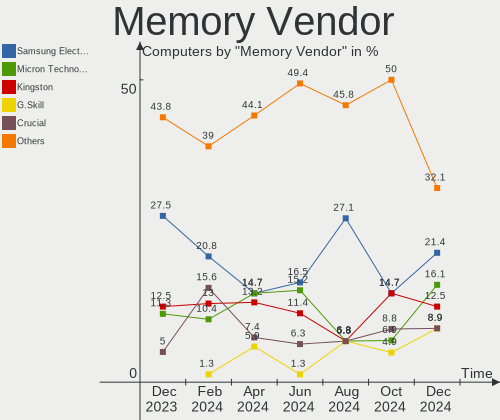

Kubuntu - Hardware Trends
-------------------------

A project to identify most popular hardware characteristics and track their change
over time based on data collected by Linux users at https://Linux-Hardware.org.

Anyone can contribute to this report by the [hw-probe](https://github.com/linuxhw/hw-probe) tool:

    sudo -E hw-probe -all -upload

This is a report for all computer types. See also reports for [desktops](/Dist/Kubuntu/Desktop/README.md) and [notebooks](/Dist/Kubuntu/Notebook/README.md).

This report is for one last month. Overall report since the beginning of time: [TestDays](https://github.com/linuxhw/TestDays)

Period: Apr, 2023.

Contents
--------

* [ System ](#system)
  - [ OS                       ](#os)
  - [ OS Family                ](#os-family)
  - [ Kernel                   ](#kernel)
  - [ Kernel Family            ](#kernel-family)
  - [ Kernel Major Ver.        ](#kernel-major-ver)
  - [ Arch                     ](#arch)
  - [ DE                       ](#de)
  - [ Display Server           ](#display-server)
  - [ Display Manager          ](#display-manager)
  - [ OS Lang                  ](#os-lang)
  - [ Boot Mode                ](#boot-mode)
  - [ Filesystem               ](#filesystem)
  - [ Part. scheme             ](#part-scheme)
  - [ Dual Boot with Linux/BSD ](#dual-boot-with-linuxbsd)
  - [ Dual Boot (Win)          ](#dual-boot-win)

* [ Board ](#board)
  - [ Vendor                   ](#vendor)
  - [ Model                    ](#model)
  - [ Model Family             ](#model-family)
  - [ MFG Year                 ](#mfg-year)
  - [ Form Factor              ](#form-factor)
  - [ Secure Boot              ](#secure-boot)
  - [ Coreboot                 ](#coreboot)
  - [ RAM Size                 ](#ram-size)
  - [ RAM Used                 ](#ram-used)
  - [ Total Drives             ](#total-drives)
  - [ Has CD-ROM               ](#has-cd-rom)
  - [ Has Ethernet             ](#has-ethernet)
  - [ Has WiFi                 ](#has-wifi)
  - [ Has Bluetooth            ](#has-bluetooth)

* [ Location ](#location)
  - [ Country                  ](#country)
  - [ City                     ](#city)

* [ Drives ](#drives)
  - [ Drive Vendor             ](#drive-vendor)
  - [ Drive Model              ](#drive-model)
  - [ HDD Vendor               ](#hdd-vendor)
  - [ SSD Vendor               ](#ssd-vendor)
  - [ Drive Kind               ](#drive-kind)
  - [ Drive Connector          ](#drive-connector)
  - [ Drive Size               ](#drive-size)
  - [ Space Total              ](#space-total)
  - [ Space Used               ](#space-used)
  - [ Malfunc. Drives          ](#malfunc-drives)
  - [ Malfunc. Drive Vendor    ](#malfunc-drive-vendor)
  - [ Malfunc. HDD Vendor      ](#malfunc-hdd-vendor)
  - [ Malfunc. Drive Kind      ](#malfunc-drive-kind)
  - [ Failed Drives            ](#failed-drives)
  - [ Failed Drive Vendor      ](#failed-drive-vendor)
  - [ Drive Status             ](#drive-status)

* [ Storage controller ](#storage-controller)
  - [ Storage Vendor           ](#storage-vendor)
  - [ Storage Model            ](#storage-model)
  - [ Storage Kind             ](#storage-kind)

* [ Processor ](#processor)
  - [ CPU Vendor               ](#cpu-vendor)
  - [ CPU Model                ](#cpu-model)
  - [ CPU Model Family         ](#cpu-model-family)
  - [ CPU Cores                ](#cpu-cores)
  - [ CPU Sockets              ](#cpu-sockets)
  - [ CPU Threads              ](#cpu-threads)
  - [ CPU Op-Modes             ](#cpu-op-modes)
  - [ CPU Microcode            ](#cpu-microcode)
  - [ CPU Microarch            ](#cpu-microarch)

* [ Graphics ](#graphics)
  - [ GPU Vendor               ](#gpu-vendor)
  - [ GPU Model                ](#gpu-model)
  - [ GPU Combo                ](#gpu-combo)
  - [ GPU Driver               ](#gpu-driver)
  - [ GPU Memory               ](#gpu-memory)

* [ Monitor ](#monitor)
  - [ Monitor Vendor           ](#monitor-vendor)
  - [ Monitor Model            ](#monitor-model)
  - [ Monitor Resolution       ](#monitor-resolution)
  - [ Monitor Diagonal         ](#monitor-diagonal)
  - [ Monitor Width            ](#monitor-width)
  - [ Aspect Ratio             ](#aspect-ratio)
  - [ Monitor Area             ](#monitor-area)
  - [ Pixel Density            ](#pixel-density)
  - [ Multiple Monitors        ](#multiple-monitors)

* [ Network ](#network)
  - [ Net Controller Vendor    ](#net-controller-vendor)
  - [ Net Controller Model     ](#net-controller-model)
  - [ Wireless Vendor          ](#wireless-vendor)
  - [ Wireless Model           ](#wireless-model)
  - [ Ethernet Vendor          ](#ethernet-vendor)
  - [ Ethernet Model           ](#ethernet-model)
  - [ Net Controller Kind      ](#net-controller-kind)
  - [ Used Controller          ](#used-controller)
  - [ NICs                     ](#nics)
  - [ IPv6                     ](#ipv6)

* [ Bluetooth ](#bluetooth)
  - [ Bluetooth Vendor         ](#bluetooth-vendor)
  - [ Bluetooth Model          ](#bluetooth-model)

* [ Sound ](#sound)
  - [ Sound Vendor             ](#sound-vendor)
  - [ Sound Model              ](#sound-model)

* [ Memory ](#memory)
  - [ Memory Vendor            ](#memory-vendor)
  - [ Memory Model             ](#memory-model)
  - [ Memory Kind              ](#memory-kind)
  - [ Memory Form Factor       ](#memory-form-factor)
  - [ Memory Size              ](#memory-size)
  - [ Memory Speed             ](#memory-speed)

* [ Printers & scanners ](#printers--scanners)
  - [ Printer Vendor           ](#printer-vendor)
  - [ Printer Model            ](#printer-model)
  - [ Scanner Vendor           ](#scanner-vendor)
  - [ Scanner Model            ](#scanner-model)

* [ Camera ](#camera)
  - [ Camera Vendor            ](#camera-vendor)
  - [ Camera Model             ](#camera-model)

* [ Security ](#security)
  - [ Fingerprint Vendor       ](#fingerprint-vendor)
  - [ Fingerprint Model        ](#fingerprint-model)
  - [ Chipcard Vendor          ](#chipcard-vendor)
  - [ Chipcard Model           ](#chipcard-model)

* [ Unsupported ](#unsupported)
  - [ Unsupported Devices      ](#unsupported-devices)
  - [ Unsupported Device Types ](#unsupported-device-types)

System
------

OS
--

Installed operating systems

| Name          | Computers | Percent |
|---------------|-----------|---------|
| Kubuntu 22.04 | 65        | 59.63%  |
| Kubuntu 23.04 | 21        | 19.27%  |
| Kubuntu 22.10 | 16        | 14.68%  |
| Kubuntu 20.04 | 4         | 3.67%   |
| Kubuntu 11    | 2         | 1.83%   |
| Kubuntu 18.04 | 1         | 0.92%   |

OS Family
---------

OS without a version

| Name    | Computers | Percent |
|---------|-----------|---------|
| Kubuntu | 109       | 100%    |

Kernel
------

Version of the Linux kernel

| Version                | Computers | Percent |
|------------------------|-----------|---------|
| 5.19.0-38-generic      | 29        | 26.61%  |
| 5.15.0-69-generic      | 15        | 13.76%  |
| 6.2.0-20-generic       | 14        | 12.84%  |
| 5.19.0-40-generic      | 10        | 9.17%   |
| 5.19.0-32-generic      | 5         | 4.59%   |
| 5.15.0-70-generic      | 4         | 3.67%   |
| 5.15.0-67-generic      | 4         | 3.67%   |
| 5.15.0-71-generic      | 3         | 2.75%   |
| 5.15.0-69-lowlatency   | 3         | 2.75%   |
| 6.2.0-1003-lowlatency  | 2         | 1.83%   |
| 5.19.0-35-generic      | 2         | 1.83%   |
| 5.19.0-21-generic      | 2         | 1.83%   |
| 5.19.0-1021-lowlatency | 2         | 1.83%   |
| 6.2.10-060210-generic  | 1         | 0.92%   |
| 6.2.0-21-generic       | 1         | 0.92%   |
| 6.2.0-18-generic       | 1         | 0.92%   |
| 6.1.12-060112-generic  | 1         | 0.92%   |
| 6.1.0-1008-oem         | 1         | 0.92%   |
| 5.4.0-146-generic      | 1         | 0.92%   |
| 5.19.0-41-generic      | 1         | 0.92%   |
| 5.19.0-1022-lowlatency | 1         | 0.92%   |
| 5.17.0-1029-oem        | 1         | 0.92%   |
| 5.15.0-71-lowlatency   | 1         | 0.92%   |
| 5.15.0-53-generic      | 1         | 0.92%   |
| 5.15.0-43-generic      | 1         | 0.92%   |
| 5.15.0-25-generic      | 1         | 0.92%   |
| 4.15.0-166-generic     | 1         | 0.92%   |

Kernel Family
-------------

Linux kernel without a distro release

| Version | Computers | Percent |
|---------|-----------|---------|
| 5.19.0  | 52        | 47.71%  |
| 5.15.0  | 33        | 30.28%  |
| 6.2.0   | 18        | 16.51%  |
| 6.2.10  | 1         | 0.92%   |
| 6.1.12  | 1         | 0.92%   |
| 6.1.0   | 1         | 0.92%   |
| 5.4.0   | 1         | 0.92%   |
| 5.17.0  | 1         | 0.92%   |
| 4.15.0  | 1         | 0.92%   |

Kernel Major Ver.
-----------------

Linux kernel major version

| Version | Computers | Percent |
|---------|-----------|---------|
| 5.19    | 52        | 47.71%  |
| 5.15    | 33        | 30.28%  |
| 6.2     | 19        | 17.43%  |
| 6.1     | 2         | 1.83%   |
| 5.4     | 1         | 0.92%   |
| 5.17    | 1         | 0.92%   |
| 4.15    | 1         | 0.92%   |

Arch
----

OS architecture (x86_64, i586, etc.)

| Name   | Computers | Percent |
|--------|-----------|---------|
| x86_64 | 109       | 100%    |

DE
--

Desktop Environment

| Name | Computers | Percent |
|------|-----------|---------|
| KDE5 | 107       | 98.17%  |
| KDE  | 2         | 1.83%   |

Display Server
--------------

X11 or Wayland

| Name    | Computers | Percent |
|---------|-----------|---------|
| X11     | 104       | 95.41%  |
| Wayland | 5         | 4.59%   |

Display Manager
---------------

SDDM, LightDM, etc.

| Name    | Computers | Percent |
|---------|-----------|---------|
| SDDM    | 70        | 64.22%  |
| Unknown | 33        | 30.28%  |
| GDM3    | 4         | 3.67%   |
| LightDM | 2         | 1.83%   |

OS Lang
-------

Language

| Lang  | Computers | Percent |
|-------|-----------|---------|
| en_US | 49        | 44.95%  |
| de_DE | 11        | 10.09%  |
| ru_RU | 5         | 4.59%   |
| fr_FR | 5         | 4.59%   |
| es_ES | 5         | 4.59%   |
| en_GB | 5         | 4.59%   |
| it_IT | 4         | 3.67%   |
| pt_BR | 3         | 2.75%   |
| pl_PL | 3         | 2.75%   |
| en_CA | 3         | 2.75%   |
| en_IN | 2         | 1.83%   |
| en_IE | 2         | 1.83%   |
| en_AU | 2         | 1.83%   |
| tr_TR | 1         | 0.92%   |
| sv_SE | 1         | 0.92%   |
| nl_BE | 1         | 0.92%   |
| hu_HU | 1         | 0.92%   |
| es_VE | 1         | 0.92%   |
| en_SG | 1         | 0.92%   |
| de_AT | 1         | 0.92%   |
| cs_CZ | 1         | 0.92%   |
| bg_BG | 1         | 0.92%   |
| ba_RU | 1         | 0.92%   |

Boot Mode
---------

EFI or BIOS

| Mode | Computers | Percent |
|------|-----------|---------|
| BIOS | 57        | 52.29%  |
| EFI  | 52        | 47.71%  |

Filesystem
----------

Type of filesystem

| Type    | Computers | Percent |
|---------|-----------|---------|
| Ext4    | 90        | 82.57%  |
| Btrfs   | 9         | 8.26%   |
| Tmpfs   | 7         | 6.42%   |
| Overlay | 3         | 2.75%   |

Part. scheme
------------

Scheme of partitioning

| Type    | Computers | Percent |
|---------|-----------|---------|
| GPT     | 70        | 64.22%  |
| Unknown | 33        | 30.28%  |
| MBR     | 6         | 5.5%    |

Dual Boot with Linux/BSD
------------------------

Hosting more than one Linux/BSD

| Dual boot | Computers | Percent |
|-----------|-----------|---------|
| No        | 98        | 89.91%  |
| Yes       | 11        | 10.09%  |

Dual Boot (Win)
---------------

Hosting Linux and Windows

| Dual boot | Computers | Percent |
|-----------|-----------|---------|
| No        | 73        | 66.97%  |
| Yes       | 36        | 33.03%  |

Board
-----

Vendor
------

Motherboard manufacturer

| Name                | Computers | Percent |
|---------------------|-----------|---------|
| Lenovo              | 22        | 20.18%  |
| ASUSTek Computer    | 18        | 16.51%  |
| Hewlett-Packard     | 14        | 12.84%  |
| Gigabyte Technology | 10        | 9.17%   |
| Dell                | 10        | 9.17%   |
| MSI                 | 8         | 7.34%   |
| Acer                | 5         | 4.59%   |
| Apple               | 4         | 3.67%   |
| HUAWEI              | 2         | 1.83%   |
| ASRock              | 2         | 1.83%   |
| Alienware           | 2         | 1.83%   |
| WeiBu               | 1         | 0.92%   |
| Thomson             | 1         | 0.92%   |
| Supermicro          | 1         | 0.92%   |
| Samsung Electronics | 1         | 0.92%   |
| Notebook            | 1         | 0.92%   |
| Intel               | 1         | 0.92%   |
| Google              | 1         | 0.92%   |
| Foxconn             | 1         | 0.92%   |
| Casper              | 1         | 0.92%   |
| Carbon Systems      | 1         | 0.92%   |
| AXIOO               | 1         | 0.92%   |
| Unknown             | 1         | 0.92%   |

Model
-----

Motherboard model

| Name                                     | Computers | Percent |
|------------------------------------------|-----------|---------|
| MSI MS-7693                              | 2         | 1.83%   |
| Lenovo IdeaPad 5 Pro 16ARH7 82SN         | 2         | 1.83%   |
| HUAWEI HVY-WXX9                          | 2         | 1.83%   |
| ASUS All Series                          | 2         | 1.83%   |
| WeiBu ADL-N                              | 1         | 0.92%   |
| Thomson SPNEOX13-4RD64                   | 1         | 0.92%   |
| Supermicro C7H61                         | 1         | 0.92%   |
| Samsung 950XED                           | 1         | 0.92%   |
| Notebook PD5x_7xSNC_SND_SNE              | 1         | 0.92%   |
| MSI MS-7D30                              | 1         | 0.92%   |
| MSI MS-7D14                              | 1         | 0.92%   |
| MSI MS-7C86                              | 1         | 0.92%   |
| MSI MS-7C56                              | 1         | 0.92%   |
| MSI MS-7721                              | 1         | 0.92%   |
| MSI Modern 14 B11MOU                     | 1         | 0.92%   |
| Lenovo Yoga 7 14ACN6 82N7                | 1         | 0.92%   |
| Lenovo V15-ADA 82C7                      | 1         | 0.92%   |
| Lenovo ThinkPad X280 20KF001UUS          | 1         | 0.92%   |
| Lenovo ThinkPad X230 23256N6             | 1         | 0.92%   |
| Lenovo ThinkPad X1 Carbon 4th 20FB0067RT | 1         | 0.92%   |
| Lenovo ThinkPad T430s 23539MU            | 1         | 0.92%   |
| Lenovo ThinkPad T420 4177RVU             | 1         | 0.92%   |
| Lenovo ThinkPad T14s Gen 3 21CQ000EUS    | 1         | 0.92%   |
| Lenovo ThinkPad T14 Gen 3 21CFS08M00     | 1         | 0.92%   |
| Lenovo ThinkPad P15 Gen 1 20ST006LRT     | 1         | 0.92%   |
| Lenovo ThinkPad P1 Gen 2 20QT000LGE      | 1         | 0.92%   |
| Lenovo ThinkPad E15 Gen 3 20YG003VGE     | 1         | 0.92%   |
| Lenovo ThinkPad E14 Gen 4 21ECS00000     | 1         | 0.92%   |
| Lenovo ThinkCentre M58 9728AHG           | 1         | 0.92%   |
| Lenovo ThinkBook 14 G4 ABA 21DK          | 1         | 0.92%   |
| Lenovo S21e-20 80M4                      | 1         | 0.92%   |
| Lenovo Legion 5 Pro 16ACH6H 82JQ         | 1         | 0.92%   |
| Lenovo IdeaPad 330-15AST 81D6            | 1         | 0.92%   |
| Lenovo IdeaPad 320S-14IKB 81BN           | 1         | 0.92%   |
| Lenovo IdeaPad 100-15IBY 80MJ            | 1         | 0.92%   |
| Intel H81                                | 1         | 0.92%   |
| HP ZBook Fury 15 G7 Mobile Workstation   | 1         | 0.92%   |
| HP xw6600 Workstation                    | 1         | 0.92%   |
| HP Spectre x360 Convertible 13t-aw100    | 1         | 0.92%   |
| HP ProBook 650 G3                        | 1         | 0.92%   |

Model Family
------------

Motherboard model prefix

| Name                   | Computers | Percent |
|------------------------|-----------|---------|
| Lenovo ThinkPad        | 11        | 10.09%  |
| Lenovo IdeaPad         | 5         | 4.59%   |
| Dell Precision         | 4         | 3.67%   |
| ASUS TUF               | 4         | 3.67%   |
| Dell Inspiron          | 3         | 2.75%   |
| Acer Aspire            | 3         | 2.75%   |
| MSI MS-7693            | 2         | 1.83%   |
| HUAWEI HVY-WXX9        | 2         | 1.83%   |
| HP Pavilion            | 2         | 1.83%   |
| Dell Latitude          | 2         | 1.83%   |
| ASUS VivoBook          | 2         | 1.83%   |
| ASUS ASUS              | 2         | 1.83%   |
| ASUS All               | 2         | 1.83%   |
| Alienware Aurora       | 2         | 1.83%   |
| WeiBu ADL-N            | 1         | 0.92%   |
| Thomson SPNEOX13-4RD64 | 1         | 0.92%   |
| Supermicro C7H61       | 1         | 0.92%   |
| Samsung 950XED         | 1         | 0.92%   |
| Notebook PD5x          | 1         | 0.92%   |
| MSI MS-7D30            | 1         | 0.92%   |
| MSI MS-7D14            | 1         | 0.92%   |
| MSI MS-7C86            | 1         | 0.92%   |
| MSI MS-7C56            | 1         | 0.92%   |
| MSI MS-7721            | 1         | 0.92%   |
| MSI Modern             | 1         | 0.92%   |
| Lenovo Yoga            | 1         | 0.92%   |
| Lenovo V15-ADA         | 1         | 0.92%   |
| Lenovo ThinkCentre     | 1         | 0.92%   |
| Lenovo ThinkBook       | 1         | 0.92%   |
| Lenovo S21e-20         | 1         | 0.92%   |
| Lenovo Legion          | 1         | 0.92%   |
| Intel H81              | 1         | 0.92%   |
| HP ZBook               | 1         | 0.92%   |
| HP xw6600              | 1         | 0.92%   |
| HP Spectre             | 1         | 0.92%   |
| HP ProBook             | 1         | 0.92%   |
| HP OMEN                | 1         | 0.92%   |
| HP ENVY                | 1         | 0.92%   |
| HP EliteOne            | 1         | 0.92%   |
| HP EliteBook           | 1         | 0.92%   |

MFG Year
--------

Motherboard manufacture year

| Year | Computers | Percent |
|------|-----------|---------|
| 2022 | 17        | 15.6%   |
| 2020 | 16        | 14.68%  |
| 2021 | 15        | 13.76%  |
| 2012 | 8         | 7.34%   |
| 2018 | 7         | 6.42%   |
| 2019 | 6         | 5.5%    |
| 2016 | 6         | 5.5%    |
| 2014 | 6         | 5.5%    |
| 2008 | 6         | 5.5%    |
| 2017 | 5         | 4.59%   |
| 2011 | 4         | 3.67%   |
| 2009 | 4         | 3.67%   |
| 2023 | 3         | 2.75%   |
| 2015 | 3         | 2.75%   |
| 2007 | 2         | 1.83%   |
| 2013 | 1         | 0.92%   |

Form Factor
-----------

Physical design of the computer

| Name        | Computers | Percent |
|-------------|-----------|---------|
| Notebook    | 58        | 53.21%  |
| Desktop     | 41        | 37.61%  |
| Convertible | 5         | 4.59%   |
| All in one  | 4         | 3.67%   |
| Mini pc     | 1         | 0.92%   |

Secure Boot
-----------

Enabled or disabled

| State    | Computers | Percent |
|----------|-----------|---------|
| Disabled | 98        | 89.91%  |
| Enabled  | 11        | 10.09%  |

Coreboot
--------

Have coreboot on board

| Used | Computers | Percent |
|------|-----------|---------|
| No   | 108       | 99.08%  |
| Yes  | 1         | 0.92%   |

RAM Size
--------

Total RAM memory

| Size in GB  | Computers | Percent |
|-------------|-----------|---------|
| 16.01-24.0  | 26        | 23.85%  |
| 8.01-16.0   | 22        | 20.18%  |
| 4.01-8.0    | 19        | 17.43%  |
| 32.01-64.0  | 19        | 17.43%  |
| 3.01-4.0    | 7         | 6.42%   |
| 24.01-32.0  | 7         | 6.42%   |
| 64.01-256.0 | 7         | 6.42%   |
| 2.01-3.0    | 1         | 0.92%   |
| 1.01-2.0    | 1         | 0.92%   |

RAM Used
--------

Used RAM memory

| Used GB    | Computers | Percent |
|------------|-----------|---------|
| 4.01-8.0   | 28        | 25.69%  |
| 3.01-4.0   | 23        | 21.1%   |
| 2.01-3.0   | 23        | 21.1%   |
| 1.01-2.0   | 20        | 18.35%  |
| 8.01-16.0  | 10        | 9.17%   |
| 16.01-24.0 | 2         | 1.83%   |
| 24.01-32.0 | 1         | 0.92%   |
| 0.51-1.0   | 1         | 0.92%   |
| 0.01-0.5   | 1         | 0.92%   |

Total Drives
------------

Number of drives on board

| Drives | Computers | Percent |
|--------|-----------|---------|
| 1      | 61        | 55.96%  |
| 2      | 22        | 20.18%  |
| 3      | 15        | 13.76%  |
| 4      | 8         | 7.34%   |
| 6      | 2         | 1.83%   |
| 5      | 1         | 0.92%   |

Has CD-ROM
----------

Has CD-ROM on board

| Presented | Computers | Percent |
|-----------|-----------|---------|
| No        | 72        | 66.06%  |
| Yes       | 37        | 33.94%  |

Has Ethernet
------------

Has Ethernet on board

| Presented | Computers | Percent |
|-----------|-----------|---------|
| Yes       | 91        | 83.49%  |
| No        | 18        | 16.51%  |

Has WiFi
--------

Has WiFi module

| Presented | Computers | Percent |
|-----------|-----------|---------|
| Yes       | 88        | 80.73%  |
| No        | 21        | 19.27%  |

Has Bluetooth
-------------

Has Bluetooth module

| Presented | Computers | Percent |
|-----------|-----------|---------|
| Yes       | 76        | 69.72%  |
| No        | 33        | 30.28%  |

Location
--------

Country
-------

Geographic location (country)

| Country      | Computers | Percent |
|--------------|-----------|---------|
| USA          | 26        | 23.85%  |
| Germany      | 13        | 11.93%  |
| France       | 7         | 6.42%   |
| UK           | 5         | 4.59%   |
| Spain        | 5         | 4.59%   |
| Russia       | 5         | 4.59%   |
| Poland       | 5         | 4.59%   |
| Italy        | 5         | 4.59%   |
| Turkey       | 4         | 3.67%   |
| Sweden       | 3         | 2.75%   |
| Canada       | 3         | 2.75%   |
| Brazil       | 3         | 2.75%   |
| Slovenia     | 2         | 1.83%   |
| Portugal     | 2         | 1.83%   |
| India        | 2         | 1.83%   |
| Hungary      | 2         | 1.83%   |
| Czechia      | 2         | 1.83%   |
| Australia    | 2         | 1.83%   |
| Venezuela    | 1         | 0.92%   |
| South Korea  | 1         | 0.92%   |
| Singapore    | 1         | 0.92%   |
| Saudi Arabia | 1         | 0.92%   |
| Norway       | 1         | 0.92%   |
| Malaysia     | 1         | 0.92%   |
| Lithuania    | 1         | 0.92%   |
| Ireland      | 1         | 0.92%   |
| Indonesia    | 1         | 0.92%   |
| Croatia      | 1         | 0.92%   |
| Bulgaria     | 1         | 0.92%   |
| Belgium      | 1         | 0.92%   |
| Armenia      | 1         | 0.92%   |

City
----

Geographic location (city)

| City             | Computers | Percent |
|------------------|-----------|---------|
| Philadelphia     | 3         | 2.75%   |
| Istanbul         | 3         | 2.75%   |
| Warsaw           | 2         | 1.83%   |
| Vladivostok      | 2         | 1.83%   |
| Paris            | 2         | 1.83%   |
| Milan            | 2         | 1.83%   |
| Madrid           | 2         | 1.83%   |
| London           | 2         | 1.83%   |
| Gothenburg       | 2         | 1.83%   |
| Castro Valley    | 2         | 1.83%   |
| Zagreb           | 1         | 0.92%   |
| Yerevan          | 1         | 0.92%   |
| Witten           | 1         | 0.92%   |
| Wilkszyn         | 1         | 0.92%   |
| Watford          | 1         | 0.92%   |
| Waldshut-Tiengen | 1         | 0.92%   |
| Vilnius          | 1         | 0.92%   |
| Vicksburg        | 1         | 0.92%   |
| Trois-Rivières  | 1         | 0.92%   |
| Towson           | 1         | 0.92%   |
| Texarkana        | 1         | 0.92%   |
| Tampa            | 1         | 0.92%   |
| Sydney           | 1         | 0.92%   |
| Suhl             | 1         | 0.92%   |
| Strasbourg       | 1         | 0.92%   |
| St Petersburg    | 1         | 0.92%   |
| Singapore        | 1         | 0.92%   |
| Shumen           | 1         | 0.92%   |
| Sherbrooke       | 1         | 0.92%   |
| Seremban         | 1         | 0.92%   |
| Seabrook         | 1         | 0.92%   |
| Sao Paulo        | 1         | 0.92%   |
| San Mateo        | 1         | 0.92%   |
| Salerno          | 1         | 0.92%   |
| Saint-Etienne    | 1         | 0.92%   |
| Sacramento       | 1         | 0.92%   |
| Roubaix          | 1         | 0.92%   |
| Queens           | 1         | 0.92%   |
| Prague           | 1         | 0.92%   |
| Porto Alegre     | 1         | 0.92%   |

Drives
------

Drive Vendor
------------

Hard drive vendors

| Vendor                      | Computers | Drives | Percent |
|-----------------------------|-----------|--------|---------|
| Samsung Electronics         | 33        | 45     | 18.54%  |
| Seagate                     | 21        | 31     | 11.8%   |
| WDC                         | 20        | 20     | 11.24%  |
| SanDisk                     | 15        | 15     | 8.43%   |
| Unknown                     | 9         | 10     | 5.06%   |
| Crucial                     | 8         | 8      | 4.49%   |
| Toshiba                     | 7         | 9      | 3.93%   |
| Kingston                    | 7         | 7      | 3.93%   |
| SK hynix                    | 5         | 5      | 2.81%   |
| Phison Electronics          | 5         | 5      | 2.81%   |
| Micron Technology           | 5         | 5      | 2.81%   |
| A-DATA Technology           | 4         | 4      | 2.25%   |
| SPCC                        | 3         | 3      | 1.69%   |
| Micron/Crucial Technology   | 3         | 3      | 1.69%   |
| Hitachi                     | 3         | 3      | 1.69%   |
| HGST                        | 3         | 3      | 1.69%   |
| China                       | 3         | 3      | 1.69%   |
| PNY                         | 2         | 2      | 1.12%   |
| Patriot                     | 2         | 2      | 1.12%   |
| Intel                       | 2         | 2      | 1.12%   |
| Apple                       | 2         | 3      | 1.12%   |
| Unknown                     | 2         | 2      | 1.12%   |
| VISIPRO                     | 1         | 1      | 0.56%   |
| UMIS                        | 1         | 1      | 0.56%   |
| Silicon Motion              | 1         | 1      | 0.56%   |
| ShiJi                       | 1         | 1      | 0.56%   |
| Seagate Technology          | 1         | 1      | 0.56%   |
| Realtek Semiconductor       | 1         | 1      | 0.56%   |
| Phison                      | 1         | 1      | 0.56%   |
| OCZ-VERTEX3                 | 1         | 1      | 0.56%   |
| Mushkin                     | 1         | 1      | 0.56%   |
| LITEON                      | 1         | 1      | 0.56%   |
| Kingston Technology Company | 1         | 1      | 0.56%   |
| Fanxiang                    | 1         | 1      | 0.56%   |
| Corsair                     | 1         | 1      | 0.56%   |
| ADATA SU                    | 1         | 1      | 0.56%   |

Drive Model
-----------

Hard drive models

| Model                                  | Computers | Percent |
|----------------------------------------|-----------|---------|
| Samsung SSD 980 1TB                    | 4         | 2.02%   |
| Seagate ST2000DM008-2FR102 2TB         | 3         | 1.52%   |
| SanDisk SSD PLUS 240GB                 | 3         | 1.52%   |
| Samsung SSD 850 EVO 500GB              | 3         | 1.52%   |
| Phison E16 PCIe4 NVMe Controller 500GB | 3         | 1.52%   |
| Crucial CT1000MX500SSD1 1TB            | 3         | 1.52%   |
| Unknown SD/MMC/MS PRO 249GB            | 2         | 1.01%   |
| Unknown MMC Card  64GB                 | 2         | 1.01%   |
| Unknown MMC Card  32GB                 | 2         | 1.01%   |
| Toshiba DT01ACA100 1TB                 | 2         | 1.01%   |
| Seagate ST4000DM004-2CV104 4TB         | 2         | 1.01%   |
| Sandisk WD Blue SN550 NVMe SSD 1024GB  | 2         | 1.01%   |
| Samsung SSD 870 QVO 2TB                | 2         | 1.01%   |
| Samsung MZVLB1T0HBLR-000H1 1TB         | 2         | 1.01%   |
| HGST HMS5C4040ALE640 4TB               | 2         | 1.01%   |
| Crucial CT1000BX500SSD1 1TB            | 2         | 1.01%   |
| Unknown                                | 2         | 1.01%   |
| WDC WDS500G1B0B-00AS40 500GB SSD       | 1         | 0.51%   |
| WDC WDS480G2G0A-00JH30 480GB SSD       | 1         | 0.51%   |
| WDC WDS250G1B0A-00H9H0 250GB SSD       | 1         | 0.51%   |
| WDC WDS100T2B0C-00PXH0 1TB             | 1         | 0.51%   |
| WDC WDBNCE5000PNC 500GB SSD            | 1         | 0.51%   |
| WDC WD5000AVDS-63U7B1 500GB            | 1         | 0.51%   |
| WDC WD5000AAKS-40V2B0 500GB            | 1         | 0.51%   |
| WDC WD5000AAKS-402AA0 500GB            | 1         | 0.51%   |
| WDC WD40EZRZ-00GXCB0 4TB               | 1         | 0.51%   |
| WDC WD20EZRZ-00Z5HB0 2TB               | 1         | 0.51%   |
| WDC WD20EARX-00PASB0 2TB               | 1         | 0.51%   |
| WDC WD15EADS-00S2B0 1TB                | 1         | 0.51%   |
| WDC WD10SPZX-24Z10 1TB                 | 1         | 0.51%   |
| WDC WD10EZEX-60WN4A0 1TB               | 1         | 0.51%   |
| WDC WD10EZEX-08WN4A0 1TB               | 1         | 0.51%   |
| WDC WD10EZEX-07WN4A0 1TB               | 1         | 0.51%   |
| WDC WD100EMAZ-00WJTA0 10TB             | 1         | 0.51%   |
| WDC PC SN530 SDBPNPZ-512G-1006 512GB   | 1         | 0.51%   |
| WDC PC SN530 SDBPMPZ-256G-1101 256GB   | 1         | 0.51%   |
| WDC PC SN520 SDAPMUW-256G-1101 256GB   | 1         | 0.51%   |
| VISIPRO SSD 256GB                      | 1         | 0.51%   |
| Unknown SD64G  64GB                    | 1         | 0.51%   |
| Unknown SC200  197GB                   | 1         | 0.51%   |

HDD Vendor
----------

Hard disk drive vendors

| Vendor              | Computers | Drives | Percent |
|---------------------|-----------|--------|---------|
| Seagate             | 21        | 31     | 43.75%  |
| WDC                 | 12        | 12     | 25%     |
| Toshiba             | 6         | 7      | 12.5%   |
| Hitachi             | 3         | 3      | 6.25%   |
| HGST                | 3         | 3      | 6.25%   |
| Unknown             | 2         | 2      | 4.17%   |
| Samsung Electronics | 1         | 1      | 2.08%   |

SSD Vendor
----------

Solid state drive vendors

| Vendor              | Computers | Drives | Percent |
|---------------------|-----------|--------|---------|
| Samsung Electronics | 15        | 18     | 23.81%  |
| SanDisk             | 8         | 8      | 12.7%   |
| Crucial             | 8         | 8      | 12.7%   |
| WDC                 | 4         | 4      | 6.35%   |
| SPCC                | 3         | 3      | 4.76%   |
| Kingston            | 3         | 3      | 4.76%   |
| China               | 3         | 3      | 4.76%   |
| A-DATA Technology   | 3         | 3      | 4.76%   |
| PNY                 | 2         | 2      | 3.17%   |
| Patriot             | 2         | 2      | 3.17%   |
| Unknown             | 2         | 2      | 3.17%   |
| VISIPRO             | 1         | 1      | 1.59%   |
| SK hynix            | 1         | 1      | 1.59%   |
| ShiJi               | 1         | 1      | 1.59%   |
| OCZ-VERTEX3         | 1         | 1      | 1.59%   |
| Mushkin             | 1         | 1      | 1.59%   |
| Micron Technology   | 1         | 1      | 1.59%   |
| LITEON              | 1         | 1      | 1.59%   |
| Fanxiang            | 1         | 1      | 1.59%   |
| Corsair             | 1         | 1      | 1.59%   |
| ADATA SU            | 1         | 1      | 1.59%   |

Drive Kind
----------

HDD or SSD

| Kind | Computers | Drives | Percent |
|------|-----------|--------|---------|
| NVMe | 61        | 72     | 38.13%  |
| SSD  | 52        | 66     | 32.5%   |
| HDD  | 41        | 59     | 25.63%  |
| MMC  | 6         | 7      | 3.75%   |

Drive Connector
---------------

SATA, SAS, NVMe, etc.

| Type | Computers | Drives | Percent |
|------|-----------|--------|---------|
| SATA | 68        | 119    | 48.23%  |
| NVMe | 61        | 72     | 43.26%  |
| SAS  | 6         | 6      | 4.26%   |
| MMC  | 6         | 7      | 4.26%   |

Drive Size
----------

Size of hard drive

| Size in TB | Computers | Drives | Percent |
|------------|-----------|--------|---------|
| 0.01-0.5   | 52        | 64     | 54.74%  |
| 0.51-1.0   | 20        | 31     | 21.05%  |
| 1.01-2.0   | 13        | 16     | 13.68%  |
| 3.01-4.0   | 8         | 9      | 8.42%   |
| 10.01-20.0 | 1         | 4      | 1.05%   |
| 4.01-10.0  | 1         | 1      | 1.05%   |

Space Total
-----------

Amount of disk space available on the file system

| Size in GB     | Computers | Percent |
|----------------|-----------|---------|
| 101-250        | 28        | 25.69%  |
| 251-500        | 19        | 17.43%  |
| 501-1000       | 16        | 14.68%  |
| More than 3000 | 14        | 12.84%  |
| 1001-2000      | 14        | 12.84%  |
| 2001-3000      | 11        | 10.09%  |
| 1-20           | 4         | 3.67%   |
| 51-100         | 2         | 1.83%   |
| 21-50          | 1         | 0.92%   |

Space Used
----------

Amount of used disk space

| Used GB        | Computers | Percent |
|----------------|-----------|---------|
| 1-20           | 24        | 22.02%  |
| 21-50          | 15        | 13.76%  |
| 101-250        | 15        | 13.76%  |
| 51-100         | 13        | 11.93%  |
| 251-500        | 12        | 11.01%  |
| 1001-2000      | 11        | 10.09%  |
| More than 3000 | 9         | 8.26%   |
| 501-1000       | 7         | 6.42%   |
| 2001-3000      | 3         | 2.75%   |

Malfunc. Drives
---------------

Drive models with a malfunction

| Model                                 | Computers | Drives | Percent |
|---------------------------------------|-----------|--------|---------|
| VISIPRO SSD 256GB                     | 1         | 1      | 20%     |
| SK hynix HFS256G32MND-2900A 256GB SSD | 1         | 1      | 20%     |
| Seagate ST1000NM0011 1TB              | 1         | 1      | 20%     |
| Samsung Electronics HD501LJ 500GB     | 1         | 1      | 20%     |
| Phison Electronics PCIe SSD 8TB       | 1         | 1      | 20%     |

Malfunc. Drive Vendor
---------------------

Vendors of faulty drives

| Vendor              | Computers | Drives | Percent |
|---------------------|-----------|--------|---------|
| VISIPRO             | 1         | 1      | 20%     |
| SK hynix            | 1         | 1      | 20%     |
| Seagate             | 1         | 1      | 20%     |
| Samsung Electronics | 1         | 1      | 20%     |
| Phison Electronics  | 1         | 1      | 20%     |

Malfunc. HDD Vendor
-------------------

Vendors of faulty HDD drives

| Vendor              | Computers | Drives | Percent |
|---------------------|-----------|--------|---------|
| Seagate             | 1         | 1      | 50%     |
| Samsung Electronics | 1         | 1      | 50%     |

Malfunc. Drive Kind
-------------------

Kinds of faulty drives

| Kind | Computers | Drives | Percent |
|------|-----------|--------|---------|
| SSD  | 2         | 2      | 40%     |
| HDD  | 2         | 2      | 40%     |
| NVMe | 1         | 1      | 20%     |

Failed Drives
-------------

Failed drive models

Zero info for selected period =(

Failed Drive Vendor
-------------------

Failed drive vendors

Zero info for selected period =(

Drive Status
------------

Number of failed and malfunc. drives

| Status   | Computers | Drives | Percent |
|----------|-----------|--------|---------|
| Detected | 64        | 120    | 52.89%  |
| Works    | 52        | 79     | 42.98%  |
| Malfunc  | 5         | 5      | 4.13%   |

Storage controller
------------------

Storage Vendor
--------------

Storage controller vendors

| Vendor                       | Computers | Percent |
|------------------------------|-----------|---------|
| Intel                        | 61        | 39.87%  |
| Samsung Electronics          | 22        | 14.38%  |
| AMD                          | 20        | 13.07%  |
| SanDisk                      | 11        | 7.19%   |
| Phison Electronics           | 5         | 3.27%   |
| Kingston Technology Company  | 5         | 3.27%   |
| SK hynix                     | 4         | 2.61%   |
| Micron Technology            | 4         | 2.61%   |
| Nvidia                       | 3         | 1.96%   |
| Micron/Crucial Technology    | 3         | 1.96%   |
| Toshiba America Info Systems | 2         | 1.31%   |
| LSI Logic / Symbios Logic    | 2         | 1.31%   |
| ASMedia Technology           | 2         | 1.31%   |
| Union Memory (Shenzhen)      | 1         | 0.65%   |
| Solidigm                     | 1         | 0.65%   |
| Silicon Motion               | 1         | 0.65%   |
| Seagate Technology           | 1         | 0.65%   |
| Realtek Semiconductor        | 1         | 0.65%   |
| Marvell Technology Group     | 1         | 0.65%   |
| JMicron Technology           | 1         | 0.65%   |
| Apple                        | 1         | 0.65%   |
| ADATA Technology             | 1         | 0.65%   |

Storage Model
-------------

Storage controller models

| Model                                                                         | Computers | Percent |
|-------------------------------------------------------------------------------|-----------|---------|
| AMD FCH SATA Controller [AHCI mode]                                           | 13        | 7.26%   |
| Samsung NVMe SSD Controller 980                                               | 10        | 5.59%   |
| Samsung NVMe SSD Controller SM981/PM981/PM983                                 | 7         | 3.91%   |
| Intel Sunrise Point-LP SATA Controller [AHCI mode]                            | 5         | 2.79%   |
| Intel Q170/Q150/B150/H170/H110/Z170/CM236 Chipset SATA Controller [AHCI Mode] | 5         | 2.79%   |
| Intel 7 Series Chipset Family 6-port SATA Controller [AHCI mode]              | 5         | 2.79%   |
| Intel 200 Series PCH SATA controller [AHCI mode]                              | 5         | 2.79%   |
| SanDisk WD Blue SN550 NVMe SSD                                                | 4         | 2.23%   |
| Samsung NVMe SSD Controller PM9A1/PM9A3/980PRO                                | 4         | 2.23%   |
| Phison E16 PCIe4 NVMe Controller                                              | 4         | 2.23%   |
| Micron NVMe Storage Controller                                                | 4         | 2.23%   |
| Intel Volume Management Device NVMe RAID Controller                           | 4         | 2.23%   |
| SK hynix Gold P31/PC711 NVMe Solid State Drive                                | 3         | 1.68%   |
| Intel 9 Series Chipset Family SATA Controller [AHCI Mode]                     | 3         | 1.68%   |
| Intel 400 Series Chipset Family SATA AHCI Controller                          | 3         | 1.68%   |
| AMD SB7x0/SB8x0/SB9x0 SATA Controller [AHCI mode]                             | 3         | 1.68%   |
| AMD 500 Series Chipset SATA Controller                                        | 3         | 1.68%   |
| SanDisk WD Blue SN570 NVMe SSD 1TB                                            | 2         | 1.12%   |
| Nvidia MCP79 AHCI Controller                                                  | 2         | 1.12%   |
| Micron/Crucial NVMe Storage Controller                                        | 2         | 1.12%   |
| LSI Logic / Symbios Logic SAS1068E PCI-Express Fusion-MPT SAS                 | 2         | 1.12%   |
| Kingston Company Company Non-Volatile memory controller                       | 2         | 1.12%   |
| Intel SSD 660P Series                                                         | 2         | 1.12%   |
| Intel Celeron/Pentium Silver Processor SATA Controller                        | 2         | 1.12%   |
| Intel Cannon Lake Mobile PCH SATA AHCI Controller                             | 2         | 1.12%   |
| Intel Alder Lake-P SATA AHCI Controller                                       | 2         | 1.12%   |
| Intel 82801 Mobile SATA Controller [RAID mode]                                | 2         | 1.12%   |
| Intel 631xESB/632xESB IDE Controller                                          | 2         | 1.12%   |
| Intel 6 Series/C200 Series Chipset Family 6 port Desktop SATA AHCI Controller | 2         | 1.12%   |
| Intel 500 Series Chipset Family SATA AHCI Controller                          | 2         | 1.12%   |
| Intel 4 Series Chipset PT IDER Controller                                     | 2         | 1.12%   |
| ASMedia ASM1062 Serial ATA Controller                                         | 2         | 1.12%   |
| Union Memory (Shenzhen) AM630 PCIe 4.0 x4 NVMe SSD Controller                 | 1         | 0.56%   |
| Toshiba America Info Systems XG6 NVMe SSD Controller                          | 1         | 0.56%   |
| Toshiba America Info Systems XG5 NVMe SSD Controller                          | 1         | 0.56%   |
| Solidigm Non-Volatile memory controller                                       | 1         | 0.56%   |
| SK hynix Platinum P41 NVMe Solid State Drive 2TB                              | 1         | 0.56%   |
| Silicon Motion Non-Volatile memory controller                                 | 1         | 0.56%   |
| Seagate FireCuda 510 SSD                                                      | 1         | 0.56%   |
| Sandisk Western Digital WD Black SN850X NVMe SSD                              | 1         | 0.56%   |

Storage Kind
------------

Kind of storage controller (IDE, SATA, NVMe, SAS, ...)

| Kind | Computers | Percent |
|------|-----------|---------|
| SATA | 75        | 48.08%  |
| NVMe | 60        | 38.46%  |
| IDE  | 11        | 7.05%   |
| RAID | 8         | 5.13%   |
| SCSI | 2         | 1.28%   |

Processor
---------

CPU Vendor
----------

Processor vendors

| Vendor | Computers | Percent |
|--------|-----------|---------|
| Intel  | 76        | 69.72%  |
| AMD    | 33        | 30.28%  |

CPU Model
---------

Processor models

| Model                                      | Computers | Percent |
|--------------------------------------------|-----------|---------|
| Intel Core i7-10750H CPU @ 2.60GHz         | 3         | 2.75%   |
| Intel Core i7-6700K CPU @ 4.00GHz          | 2         | 1.83%   |
| Intel Core i7-4790K CPU @ 4.00GHz          | 2         | 1.83%   |
| Intel Core i7-1065G7 CPU @ 1.30GHz         | 2         | 1.83%   |
| Intel Core i5-8250U CPU @ 1.60GHz          | 2         | 1.83%   |
| Intel Core i5-6200U CPU @ 2.30GHz          | 2         | 1.83%   |
| Intel Core i5-3320M CPU @ 2.60GHz          | 2         | 1.83%   |
| Intel Core i5-10400F CPU @ 2.90GHz         | 2         | 1.83%   |
| AMD Ryzen 7 PRO 6850U with Radeon Graphics | 2         | 1.83%   |
| AMD Ryzen 7 6800HS Creator Edition         | 2         | 1.83%   |
| AMD Ryzen 5 4600H with Radeon Graphics     | 2         | 1.83%   |
| Intel Xeon W-10885M CPU @ 2.40GHz          | 1         | 0.92%   |
| Intel Xeon CPU X5472 @ 3.00GHz             | 1         | 0.92%   |
| Intel Xeon CPU X5450 @ 3.00GHz             | 1         | 0.92%   |
| Intel Xeon CPU W5580 @ 3.20GHz             | 1         | 0.92%   |
| Intel Xeon CPU E5430 @ 2.66GHz             | 1         | 0.92%   |
| Intel Pentium CPU N3710 @ 1.60GHz          | 1         | 0.92%   |
| Intel Pentium CPU N3540 @ 2.16GHz          | 1         | 0.92%   |
| Intel N95                                  | 1         | 0.92%   |
| Intel Core i9-10900T CPU @ 1.90GHz         | 1         | 0.92%   |
| Intel Core i7-9750H CPU @ 2.60GHz          | 1         | 0.92%   |
| Intel Core i7-8750H CPU @ 2.20GHz          | 1         | 0.92%   |
| Intel Core i7-8700 CPU @ 3.20GHz           | 1         | 0.92%   |
| Intel Core i7-8650U CPU @ 1.90GHz          | 1         | 0.92%   |
| Intel Core i7-7Y75 CPU @ 1.30GHz           | 1         | 0.92%   |
| Intel Core i7-7820HQ CPU @ 2.90GHz         | 1         | 0.92%   |
| Intel Core i7-7700 CPU @ 3.60GHz           | 1         | 0.92%   |
| Intel Core i7-6700 CPU @ 3.40GHz           | 1         | 0.92%   |
| Intel Core i7-4790 CPU @ 3.60GHz           | 1         | 0.92%   |
| Intel Core i7-3770 CPU @ 3.40GHz           | 1         | 0.92%   |
| Intel Core i7-3537U CPU @ 2.00GHz          | 1         | 0.92%   |
| Intel Core i7-3520M CPU @ 2.90GHz          | 1         | 0.92%   |
| Intel Core i7-10510U CPU @ 1.80GHz         | 1         | 0.92%   |
| Intel Core i7 CPU 920 @ 2.67GHz            | 1         | 0.92%   |
| Intel Core i5-9600K CPU @ 3.70GHz          | 1         | 0.92%   |
| Intel Core i5-8400 CPU @ 2.80GHz           | 1         | 0.92%   |
| Intel Core i5-7400 CPU @ 3.00GHz           | 1         | 0.92%   |
| Intel Core i5-7200U CPU @ 2.50GHz          | 1         | 0.92%   |
| Intel Core i5-6600K CPU @ 3.50GHz          | 1         | 0.92%   |
| Intel Core i5-5300U CPU @ 2.30GHz          | 1         | 0.92%   |

CPU Model Family
----------------

Processor model prefix

| Model             | Computers | Percent |
|-------------------|-----------|---------|
| Intel Core i7     | 23        | 21.1%   |
| Intel Core i5     | 21        | 19.27%  |
| Other             | 13        | 11.93%  |
| AMD Ryzen 7       | 9         | 8.26%   |
| AMD Ryzen 5       | 7         | 6.42%   |
| Intel Xeon        | 5         | 4.59%   |
| Intel Core 2 Duo  | 4         | 3.67%   |
| Intel Celeron     | 4         | 3.67%   |
| AMD Ryzen 9       | 4         | 3.67%   |
| Intel Core i3     | 3         | 2.75%   |
| AMD Ryzen 7 PRO   | 3         | 2.75%   |
| AMD FX            | 3         | 2.75%   |
| Intel Pentium     | 2         | 1.83%   |
| AMD Ryzen 3       | 2         | 1.83%   |
| Intel Core i9     | 1         | 0.92%   |
| Intel Core 2 Quad | 1         | 0.92%   |
| AMD Phenom II X3  | 1         | 0.92%   |
| AMD Athlon 64 X2  | 1         | 0.92%   |
| AMD Athlon        | 1         | 0.92%   |
| AMD A10           | 1         | 0.92%   |

CPU Cores
---------

Number of processor cores

| Number | Computers | Percent |
|--------|-----------|---------|
| 4      | 36        | 33.03%  |
| 2      | 26        | 23.85%  |
| 6      | 18        | 16.51%  |
| 8      | 17        | 15.6%   |
| 24     | 2         | 1.83%   |
| 16     | 2         | 1.83%   |
| 12     | 2         | 1.83%   |
| 10     | 2         | 1.83%   |
| 3      | 2         | 1.83%   |
| 14     | 1         | 0.92%   |
| 1      | 1         | 0.92%   |

CPU Sockets
-----------

Number of sockets

| Number | Computers | Percent |
|--------|-----------|---------|
| 1      | 108       | 99.08%  |
| 2      | 1         | 0.92%   |

CPU Threads
-----------

Threads per core (Hyper-Threading)

| Number | Computers | Percent |
|--------|-----------|---------|
| 2      | 78        | 71.56%  |
| 1      | 31        | 28.44%  |

CPU Op-Modes
------------

CPU Operation Modes (32-bit, 64-bit)

| Op mode        | Computers | Percent |
|----------------|-----------|---------|
| 32-bit, 64-bit | 109       | 100%    |

CPU Microcode
-------------

Microcode number

| Number     | Computers | Percent |
|------------|-----------|---------|
| Unknown    | 54        | 49.54%  |
| 0x806ea    | 3         | 2.75%   |
| 0x08600106 | 3         | 2.75%   |
| 0xb0671    | 2         | 1.83%   |
| 0xa0652    | 2         | 1.83%   |
| 0x906ea    | 2         | 1.83%   |
| 0x906e9    | 2         | 1.83%   |
| 0x906a3    | 2         | 1.83%   |
| 0x506e3    | 2         | 1.83%   |
| 0x306a9    | 2         | 1.83%   |
| 0x30678    | 2         | 1.83%   |
| 0x1067a    | 2         | 1.83%   |
| 0x0a601203 | 2         | 1.83%   |
| 0x0a50000c | 2         | 1.83%   |
| 0x0a404101 | 2         | 1.83%   |
| 0xa0653    | 1         | 0.92%   |
| 0x806ec    | 1         | 0.92%   |
| 0x806c2    | 1         | 0.92%   |
| 0x806c1    | 1         | 0.92%   |
| 0x706e5    | 1         | 0.92%   |
| 0x706a8    | 1         | 0.92%   |
| 0x706a1    | 1         | 0.92%   |
| 0x506c9    | 1         | 0.92%   |
| 0x406e3    | 1         | 0.92%   |
| 0x406c4    | 1         | 0.92%   |
| 0x306d4    | 1         | 0.92%   |
| 0x306c3    | 1         | 0.92%   |
| 0x206a7    | 1         | 0.92%   |
| 0x106a5    | 1         | 0.92%   |
| 0x10676    | 1         | 0.92%   |
| 0x0a404102 | 1         | 0.92%   |
| 0x08701021 | 1         | 0.92%   |
| 0x08608103 | 1         | 0.92%   |
| 0x08600104 | 1         | 0.92%   |
| 0x08600103 | 1         | 0.92%   |
| 0x08108109 | 1         | 0.92%   |
| 0x06006705 | 1         | 0.92%   |
| 0x06001119 | 1         | 0.92%   |
| 0x06000822 | 1         | 0.92%   |
| 0x010000db | 1         | 0.92%   |

CPU Microarch
-------------

Microarchitecture

| Name             | Computers | Percent |
|------------------|-----------|---------|
| KabyLake         | 15        | 13.76%  |
| Unknown          | 15        | 13.76%  |
| Zen 2            | 8         | 7.34%   |
| CometLake        | 8         | 7.34%   |
| Penryn           | 7         | 6.42%   |
| IvyBridge        | 7         | 6.42%   |
| Zen 3            | 6         | 5.5%    |
| Skylake          | 6         | 5.5%    |
| SandyBridge      | 4         | 3.67%   |
| Piledriver       | 4         | 3.67%   |
| Haswell          | 4         | 3.67%   |
| TigerLake        | 3         | 2.75%   |
| Silvermont       | 3         | 2.75%   |
| Alderlake Hybrid | 3         | 2.75%   |
| Zen+             | 2         | 1.83%   |
| Nehalem          | 2         | 1.83%   |
| IceLake          | 2         | 1.83%   |
| Goldmont plus    | 2         | 1.83%   |
| Zen              | 1         | 0.92%   |
| Westmere         | 1         | 0.92%   |
| K8 Hammer        | 1         | 0.92%   |
| K10              | 1         | 0.92%   |
| Goldmont         | 1         | 0.92%   |
| Excavator        | 1         | 0.92%   |
| Core             | 1         | 0.92%   |
| Broadwell        | 1         | 0.92%   |

Graphics
--------

GPU Vendor
----------

Vendors of graphics cards

| Vendor | Computers | Percent |
|--------|-----------|---------|
| Intel  | 57        | 43.18%  |
| Nvidia | 41        | 31.06%  |
| AMD    | 34        | 25.76%  |

GPU Model
---------

Graphics card models

| Model                                                                       | Computers | Percent |
|-----------------------------------------------------------------------------|-----------|---------|
| Intel 3rd Gen Core processor Graphics Controller                            | 5         | 3.73%   |
| AMD Renoir                                                                  | 5         | 3.73%   |
| AMD Rembrandt [Radeon 680M]                                                 | 5         | 3.73%   |
| Nvidia GP107 [GeForce GTX 1050 Ti]                                          | 4         | 2.99%   |
| Intel CometLake-H GT2 [UHD Graphics]                                        | 4         | 2.99%   |
| Intel 2nd Generation Core Processor Family Integrated Graphics Controller   | 4         | 2.99%   |
| Intel UHD Graphics 620                                                      | 3         | 2.24%   |
| Intel CoffeeLake-H GT2 [UHD Graphics 630]                                   | 3         | 2.24%   |
| AMD Cezanne [Radeon Vega Series / Radeon Vega Mobile Series]                | 3         | 2.24%   |
| AMD Barcelo                                                                 | 3         | 2.24%   |
| Nvidia TU117GLM [Quadro T1000 Mobile]                                       | 2         | 1.49%   |
| Nvidia TU116M [GeForce GTX 1660 Ti Mobile]                                  | 2         | 1.49%   |
| Nvidia TU106 [GeForce RTX 2060 SUPER]                                       | 2         | 1.49%   |
| Nvidia GK208B [GeForce GT 730]                                              | 2         | 1.49%   |
| Nvidia GA107M [GeForce RTX 3050 Ti Mobile]                                  | 2         | 1.49%   |
| Intel Xeon E3-1200 v3/4th Gen Core Processor Integrated Graphics Controller | 2         | 1.49%   |
| Intel TigerLake-LP GT2 [Iris Xe Graphics]                                   | 2         | 1.49%   |
| Intel TigerLake-H GT1 [UHD Graphics]                                        | 2         | 1.49%   |
| Intel Skylake GT2 [HD Graphics 520]                                         | 2         | 1.49%   |
| Intel Iris Plus Graphics G7                                                 | 2         | 1.49%   |
| Intel GeminiLake [UHD Graphics 600]                                         | 2         | 1.49%   |
| Intel CoffeeLake-S GT2 [UHD Graphics 630]                                   | 2         | 1.49%   |
| Intel Atom Processor Z36xxx/Z37xxx Series Graphics & Display                | 2         | 1.49%   |
| Intel Alder Lake-P Integrated Graphics Controller                           | 2         | 1.49%   |
| Intel 4 Series Chipset Integrated Graphics Controller                       | 2         | 1.49%   |
| AMD Picasso/Raven 2 [Radeon Vega Series / Radeon Vega Mobile Series]        | 2         | 1.49%   |
| AMD Navi 10 [Radeon RX 5600 OEM/5600 XT / 5700/5700 XT]                     | 2         | 1.49%   |
| AMD Lucienne                                                                | 2         | 1.49%   |
| AMD Baffin [Radeon RX 460/560D / Pro 450/455/460/555/555X/560/560X]         | 2         | 1.49%   |
| Nvidia TU117M [GeForce GTX 1650 Ti Mobile]                                  | 1         | 0.75%   |
| Nvidia TU117GLM [Quadro T2000 Mobile / Max-Q]                               | 1         | 0.75%   |
| Nvidia TU117 [GeForce GTX 1650]                                             | 1         | 0.75%   |
| Nvidia TU116 [GeForce GTX 1650]                                             | 1         | 0.75%   |
| Nvidia TU106GLM [Quadro RTX 3000 Mobile / Max-Q]                            | 1         | 0.75%   |
| Nvidia MCP7A [GeForce 9400]                                                 | 1         | 0.75%   |
| Nvidia GT218 [GeForce G210]                                                 | 1         | 0.75%   |
| Nvidia GT215 [GeForce GT 330]                                               | 1         | 0.75%   |
| Nvidia GT200GL [Quadro FX 4800]                                             | 1         | 0.75%   |
| Nvidia GP108M [GeForce MX230]                                               | 1         | 0.75%   |
| Nvidia GP107M [GeForce GTX 1050 Ti Mobile]                                  | 1         | 0.75%   |

GPU Combo
---------

Combinations of graphics cards

| Name           | Computers | Percent |
|----------------|-----------|---------|
| 1 x Intel      | 38        | 34.86%  |
| 1 x AMD        | 28        | 25.69%  |
| 1 x Nvidia     | 22        | 20.18%  |
| Intel + Nvidia | 14        | 12.84%  |
| AMD + Nvidia   | 4         | 3.67%   |
| 2 x Nvidia     | 1         | 0.92%   |
| 2 x AMD        | 1         | 0.92%   |
| Intel + AMD    | 1         | 0.92%   |

GPU Driver
----------

Free vs proprietary

| Driver      | Computers | Percent |
|-------------|-----------|---------|
| Free        | 73        | 66.97%  |
| Proprietary | 32        | 29.36%  |
| Unknown     | 4         | 3.67%   |

GPU Memory
----------

Total video memory

| Size in GB | Computers | Percent |
|------------|-----------|---------|
| Unknown    | 71        | 65.14%  |
| 1.01-2.0   | 11        | 10.09%  |
| 3.01-4.0   | 7         | 6.42%   |
| 0.51-1.0   | 6         | 5.5%    |
| 0.01-0.5   | 6         | 5.5%    |
| 7.01-8.0   | 3         | 2.75%   |
| 16.01-24.0 | 2         | 1.83%   |
| 8.01-16.0  | 2         | 1.83%   |
| 5.01-6.0   | 1         | 0.92%   |

Monitor
-------

Monitor Vendor
--------------

Monitor vendors

| Vendor               | Computers | Percent |
|----------------------|-----------|---------|
| Samsung Electronics  | 20        | 16%     |
| BOE                  | 17        | 13.6%   |
| LG Display           | 9         | 7.2%    |
| Chimei Innolux       | 9         | 7.2%    |
| Hewlett-Packard      | 7         | 5.6%    |
| AU Optronics         | 7         | 5.6%    |
| Goldstar             | 5         | 4%      |
| Dell                 | 5         | 4%      |
| InfoVision           | 4         | 3.2%    |
| Sharp                | 3         | 2.4%    |
| BenQ                 | 3         | 2.4%    |
| ASUSTek Computer     | 3         | 2.4%    |
| Apple                | 3         | 2.4%    |
| Acer                 | 3         | 2.4%    |
| ViewSonic            | 2         | 1.6%    |
| PANDA                | 2         | 1.6%    |
| Iiyama               | 2         | 1.6%    |
| Ancor Communications | 2         | 1.6%    |
| Unknown              | 2         | 1.6%    |
| Xiaomi               | 1         | 0.8%    |
| Vizio                | 1         | 0.8%    |
| TXD                  | 1         | 0.8%    |
| Sceptre Tech         | 1         | 0.8%    |
| Planar               | 1         | 0.8%    |
| Philips              | 1         | 0.8%    |
| ONKYO                | 1         | 0.8%    |
| NEC Computers        | 1         | 0.8%    |
| LG Electronics       | 1         | 0.8%    |
| Lenovo               | 1         | 0.8%    |
| Hitachi              | 1         | 0.8%    |
| Envision Peripherals | 1         | 0.8%    |
| Eizo                 | 1         | 0.8%    |
| Denver               | 1         | 0.8%    |
| CVT                  | 1         | 0.8%    |
| CSO                  | 1         | 0.8%    |
| CHD                  | 1         | 0.8%    |

Monitor Model
-------------

Monitor models

| Model                                                                  | Computers | Percent |
|------------------------------------------------------------------------|-----------|---------|
| InfoVision LCD Monitor IVO8584 1920x1080 294x165mm 13.3-inch           | 2         | 1.54%   |
| BOE LCD Monitor BOE0AC1 2560x1600 344x215mm 16.0-inch                  | 2         | 1.54%   |
| BOE LCD Monitor BOE0878 1920x1080 355x200mm 16.0-inch                  | 2         | 1.54%   |
| BOE LCD Monitor BOE0853 1920x1080 344x194mm 15.5-inch                  | 2         | 1.54%   |
| Unknown                                                                | 2         | 1.54%   |
| Xiaomi Mi TV XMD009A 3440x1440 480x270mm 21.7-inch                     | 1         | 0.77%   |
| Vizio VX32L HDTV10A VIZ0021 1366x768 700x390mm 31.5-inch               | 1         | 0.77%   |
| ViewSonic XG2703-GS VSCBA32 2560x1440 598x336mm 27.0-inch              | 1         | 0.77%   |
| ViewSonic VX2255wmSERIE VSC991F 1680x1050 474x296mm 22.0-inch          | 1         | 0.77%   |
| TXD HDMI TXD7825 1440x900 408x255mm 18.9-inch                          | 1         | 0.77%   |
| Sharp LQ156M1JW03 SHP155D 1920x1080 344x194mm 15.5-inch                | 1         | 0.77%   |
| Sharp LQ123P1JX32 SHP148A 2400x1600 259x173mm 12.3-inch                | 1         | 0.77%   |
| Sharp LCD Monitor SHP1453 1920x1080 346x194mm 15.6-inch                | 1         | 0.77%   |
| Sceptre Tech E248W-19203S SPT099D 1920x1080 443x249mm 20.0-inch        | 1         | 0.77%   |
| Samsung Electronics SyncMaster SAM0587 1920x1200 518x324mm 24.1-inch   | 1         | 0.77%   |
| Samsung Electronics SyncMaster SAM04DE 1920x1080 477x268mm 21.5-inch   | 1         | 0.77%   |
| Samsung Electronics SyncMaster SAM04D3 1920x1080 531x298mm 24.0-inch   | 1         | 0.77%   |
| Samsung Electronics SMBX2250 SAM071B 1920x1080 477x268mm 21.5-inch     | 1         | 0.77%   |
| Samsung Electronics S24R35x SAM100E 1920x1080 527x296mm 23.8-inch      | 1         | 0.77%   |
| Samsung Electronics S24C450 SAM09CB 1920x1080 531x299mm 24.0-inch      | 1         | 0.77%   |
| Samsung Electronics S23C570 SAM0A56 1920x1080 510x287mm 23.0-inch      | 1         | 0.77%   |
| Samsung Electronics S22C650 SAM0A05 1920x1080 477x268mm 21.5-inch      | 1         | 0.77%   |
| Samsung Electronics LF24T35 SAM707E 1920x1080 528x297mm 23.9-inch      | 1         | 0.77%   |
| Samsung Electronics LCD Monitor SyncMaster 3200x1200                   | 1         | 0.77%   |
| Samsung Electronics LCD Monitor SEC5441 1366x768 344x194mm 15.5-inch   | 1         | 0.77%   |
| Samsung Electronics LCD Monitor SEC4149 1366x768 292x174mm 13.4-inch   | 1         | 0.77%   |
| Samsung Electronics LCD Monitor SEC315A 1366x768 344x194mm 15.5-inch   | 1         | 0.77%   |
| Samsung Electronics LCD Monitor SEC3047 1366x768 277x156mm 12.5-inch   | 1         | 0.77%   |
| Samsung Electronics LCD Monitor SDC415D 3840x2400 344x215mm 16.0-inch  | 1         | 0.77%   |
| Samsung Electronics LCD Monitor SDC4159 1920x1080 344x194mm 15.5-inch  | 1         | 0.77%   |
| Samsung Electronics LCD Monitor SAM0E33 1920x1080 1210x680mm 54.6-inch | 1         | 0.77%   |
| Samsung Electronics LCD Monitor SAM0900 1366x768 410x230mm 18.5-inch   | 1         | 0.77%   |
| Samsung Electronics LCD Monitor SAM03BB 1920x1080 886x498mm 40.0-inch  | 1         | 0.77%   |
| Samsung Electronics LC49G95T SAM7053 3840x1080 1193x336mm 48.8-inch    | 1         | 0.77%   |
| Samsung Electronics LC27G5xT SAM707A 2560x1440 597x336mm 27.0-inch     | 1         | 0.77%   |
| Planar PLL2710W PLN2710 1920x1080 597x336mm 27.0-inch                  | 1         | 0.77%   |
| Philips PHL 231B4Q PHL08EB 1920x1080 509x286mm 23.0-inch               | 1         | 0.77%   |
| PANDA LCD Monitor NCP0063 1920x1080 344x194mm 15.5-inch                | 1         | 0.77%   |
| PANDA LCD Monitor NCP004D 1920x1080 344x194mm 15.5-inch                | 1         | 0.77%   |
| ONKYO LCD Monitor TX-SR508                                             | 1         | 0.77%   |

Monitor Resolution
------------------

Monitor screen resolution

| Resolution         | Computers | Percent |
|--------------------|-----------|---------|
| 1920x1080 (FHD)    | 57        | 51.35%  |
| 1366x768 (WXGA)    | 15        | 13.51%  |
| 2560x1440 (QHD)    | 6         | 5.41%   |
| 3840x2160 (4K)     | 5         | 4.5%    |
| 1920x1200 (WUXGA)  | 5         | 4.5%    |
| 2560x1600          | 4         | 3.6%    |
| 1680x1050 (WSXGA+) | 3         | 2.7%    |
| 1280x1024 (SXGA)   | 3         | 2.7%    |
| 1600x900 (HD+)     | 2         | 1.8%    |
| Unknown            | 2         | 1.8%    |
| 5760x2160          | 1         | 0.9%    |
| 3840x2400          | 1         | 0.9%    |
| 3840x1080          | 1         | 0.9%    |
| 3440x1440          | 1         | 0.9%    |
| 3200x1200          | 1         | 0.9%    |
| 2400x1600          | 1         | 0.9%    |
| 1920x540           | 1         | 0.9%    |
| 1600x1200          | 1         | 0.9%    |
| 1280x800 (WXGA)    | 1         | 0.9%    |

Monitor Diagonal
----------------

Diagonal size in inches

| Inches  | Computers | Percent |
|---------|-----------|---------|
| 15      | 28        | 22.76%  |
| 24      | 14        | 11.38%  |
| 23      | 11        | 8.94%   |
| 13      | 11        | 8.94%   |
| 21      | 9         | 7.32%   |
| 27      | 6         | 4.88%   |
| 16      | 6         | 4.88%   |
| 14      | 6         | 4.88%   |
| 31      | 5         | 4.07%   |
| Unknown | 4         | 3.25%   |
| 32      | 3         | 2.44%   |
| 19      | 3         | 2.44%   |
| 17      | 3         | 2.44%   |
| 12      | 3         | 2.44%   |
| 40      | 2         | 1.63%   |
| 22      | 2         | 1.63%   |
| 11      | 2         | 1.63%   |
| 84      | 1         | 0.81%   |
| 54      | 1         | 0.81%   |
| 48      | 1         | 0.81%   |
| 42      | 1         | 0.81%   |
| 20      | 1         | 0.81%   |

Monitor Width
-------------

Physical width

| Width in mm | Computers | Percent |
|-------------|-----------|---------|
| 301-350     | 44        | 36.36%  |
| 501-600     | 29        | 23.97%  |
| 401-500     | 13        | 10.74%  |
| 201-300     | 9         | 7.44%   |
| 351-400     | 8         | 6.61%   |
| 601-700     | 5         | 4.13%   |
| Unknown     | 4         | 3.31%   |
| 701-800     | 3         | 2.48%   |
| 801-900     | 2         | 1.65%   |
| 1001-1500   | 2         | 1.65%   |
| 1501-2000   | 1         | 0.83%   |
| 901-1000    | 1         | 0.83%   |

Aspect Ratio
------------

Proportional relationship between the width and the height

| Ratio   | Computers | Percent |
|---------|-----------|---------|
| 16/9    | 82        | 78.1%   |
| 16/10   | 14        | 13.33%  |
| Unknown | 4         | 3.81%   |
| 5/4     | 2         | 1.9%    |
| 4/3     | 1         | 0.95%   |
| 32/9    | 1         | 0.95%   |
| 3/2     | 1         | 0.95%   |

Monitor Area
------------

Area in inch²

| Area in inch² | Computers | Percent |
|----------------|-----------|---------|
| 101-110        | 30        | 25.21%  |
| 201-250        | 27        | 22.69%  |
| 81-90          | 13        | 10.92%  |
| 351-500        | 8         | 6.72%   |
| 301-350        | 6         | 5.04%   |
| 151-200        | 5         | 4.2%    |
| 71-80          | 4         | 3.36%   |
| 251-300        | 4         | 3.36%   |
| 111-120        | 4         | 3.36%   |
| 501-1000       | 4         | 3.36%   |
| Unknown        | 4         | 3.36%   |
| 61-70          | 3         | 2.52%   |
| 121-130        | 3         | 2.52%   |
| More than 1000 | 2         | 1.68%   |
| 51-60          | 2         | 1.68%   |

Pixel Density
-------------

Pixels per inch

| Density       | Computers | Percent |
|---------------|-----------|---------|
| 51-100        | 37        | 31.9%   |
| 121-160       | 36        | 31.03%  |
| 101-120       | 23        | 19.83%  |
| 161-240       | 12        | 10.34%  |
| Unknown       | 4         | 3.45%   |
| 1-50          | 3         | 2.59%   |
| More than 240 | 1         | 0.86%   |

Multiple Monitors
-----------------

Total monitors connected

| Total | Computers | Percent |
|-------|-----------|---------|
| 1     | 78        | 71.56%  |
| 2     | 21        | 19.27%  |
| 0     | 6         | 5.5%    |
| 3     | 4         | 3.67%   |

Network
-------

Net Controller Vendor
---------------------

Controller vendors

| Vendor                          | Computers | Percent |
|---------------------------------|-----------|---------|
| Realtek Semiconductor           | 57        | 33.73%  |
| Intel                           | 55        | 32.54%  |
| Qualcomm Atheros                | 12        | 7.1%    |
| Broadcom                        | 10        | 5.92%   |
| MediaTek                        | 6         | 3.55%   |
| TP-Link                         | 3         | 1.78%   |
| Ralink Technology               | 3         | 1.78%   |
| Nvidia                          | 3         | 1.78%   |
| Qualcomm Atheros Communications | 2         | 1.18%   |
| Qualcomm                        | 2         | 1.18%   |
| Lenovo                          | 2         | 1.18%   |
| Xiaomi                          | 1         | 0.59%   |
| VIA Technologies                | 1         | 0.59%   |
| Sierra Wireless                 | 1         | 0.59%   |
| Samsung Electronics             | 1         | 0.59%   |
| OnePlus Technology (Shenzhen)   | 1         | 0.59%   |
| Marvell Technology Group        | 1         | 0.59%   |
| LSI                             | 1         | 0.59%   |
| Hewlett-Packard                 | 1         | 0.59%   |
| DisplayLink                     | 1         | 0.59%   |
| Belkin Components               | 1         | 0.59%   |
| ASUSTek Computer                | 1         | 0.59%   |
| ASIX Electronics                | 1         | 0.59%   |
| Arduino SA                      | 1         | 0.59%   |
| Aquantia                        | 1         | 0.59%   |

Net Controller Model
--------------------

Controller models

| Model                                                             | Computers | Percent |
|-------------------------------------------------------------------|-----------|---------|
| Realtek RTL8111/8168/8411 PCI Express Gigabit Ethernet Controller | 25        | 12.14%  |
| Realtek RTL8153 Gigabit Ethernet Adapter                          | 9         | 4.37%   |
| Intel Wi-Fi 6 AX200                                               | 8         | 3.88%   |
| Realtek RTL810xE PCI Express Fast Ethernet controller             | 7         | 3.4%    |
| Realtek RTL8125 2.5GbE Controller                                 | 6         | 2.91%   |
| MediaTek MT7921 802.11ax PCI Express Wireless Network Adapter     | 5         | 2.43%   |
| Intel 82579LM Gigabit Network Connection (Lewisville)             | 5         | 2.43%   |
| Realtek RTL8852BE PCIe 802.11ax Wireless Network Controller       | 4         | 1.94%   |
| Realtek RTL8822CE 802.11ac PCIe Wireless Network Adapter          | 4         | 1.94%   |
| Qualcomm Atheros Killer E220x Gigabit Ethernet Controller         | 4         | 1.94%   |
| Intel Wireless 7265                                               | 4         | 1.94%   |
| Intel Comet Lake PCH CNVi WiFi                                    | 4         | 1.94%   |
| Realtek RTL8821CE 802.11ac PCIe Wireless Network Adapter          | 3         | 1.46%   |
| Intel Ethernet Controller I225-V                                  | 3         | 1.46%   |
| Intel Ethernet Connection (2) I219-V                              | 3         | 1.46%   |
| Intel Centrino Advanced-N 6205 [Taylor Peak]                      | 3         | 1.46%   |
| Intel Alder Lake-P PCH CNVi WiFi                                  | 3         | 1.46%   |
| Realtek RTL88x2bu [AC1200 Techkey]                                | 2         | 0.97%   |
| Realtek RTL8852AE 802.11ax PCIe Wireless Network Adapter          | 2         | 0.97%   |
| Realtek RTL8723BE PCIe Wireless Network Adapter                   | 2         | 0.97%   |
| Realtek RTL8188EUS 802.11n Wireless Network Adapter               | 2         | 0.97%   |
| Qualcomm QCNFA765 Wireless Network Adapter                        | 2         | 0.97%   |
| Qualcomm Atheros Killer E2500 Gigabit Ethernet Controller         | 2         | 0.97%   |
| Qualcomm Atheros AR9271 802.11n                                   | 2         | 0.97%   |
| Nvidia MCP79 Ethernet                                             | 2         | 0.97%   |
| Lenovo USB-C Dock Ethernet                                        | 2         | 0.97%   |
| Intel Wireless 8265 / 8275                                        | 2         | 0.97%   |
| Intel Wireless 7260                                               | 2         | 0.97%   |
| Intel Wi-Fi 6 AX201                                               | 2         | 0.97%   |
| Intel I211 Gigabit Network Connection                             | 2         | 0.97%   |
| Intel Ethernet Connection (11) I219-V                             | 2         | 0.97%   |
| Intel Ethernet Connection (10) I219-V                             | 2         | 0.97%   |
| Intel Dual Band Wireless-AC 3168NGW [Stone Peak]                  | 2         | 0.97%   |
| Intel 82567LM-3 Gigabit Network Connection                        | 2         | 0.97%   |
| Broadcom NetXtreme BCM5761 Gigabit Ethernet PCIe                  | 2         | 0.97%   |
| Xiaomi Mi/Redmi series (RNDIS + ADB)                              | 1         | 0.49%   |
| VIA VT6105/VT6106S [Rhine-III]                                    | 1         | 0.49%   |
| TP-Link TL-WN722N v2/v3 [Realtek RTL8188EUS]                      | 1         | 0.49%   |
| TP-Link Archer T2U PLUS [RTL8821AU]                               | 1         | 0.49%   |
| TP-Link 802.11ac WLAN Adapter                                     | 1         | 0.49%   |

Wireless Vendor
---------------

Wireless vendors

| Vendor                          | Computers | Percent |
|---------------------------------|-----------|---------|
| Intel                           | 43        | 45.74%  |
| Realtek Semiconductor           | 22        | 23.4%   |
| Qualcomm Atheros                | 6         | 6.38%   |
| MediaTek                        | 6         | 6.38%   |
| Broadcom                        | 4         | 4.26%   |
| TP-Link                         | 3         | 3.19%   |
| Ralink Technology               | 3         | 3.19%   |
| Qualcomm Atheros Communications | 2         | 2.13%   |
| Qualcomm                        | 2         | 2.13%   |
| Sierra Wireless                 | 1         | 1.06%   |
| Belkin Components               | 1         | 1.06%   |
| ASUSTek Computer                | 1         | 1.06%   |

Wireless Model
--------------

Wireless models

| Model                                                                   | Computers | Percent |
|-------------------------------------------------------------------------|-----------|---------|
| Intel Wi-Fi 6 AX200                                                     | 8         | 8.33%   |
| MediaTek MT7921 802.11ax PCI Express Wireless Network Adapter           | 5         | 5.21%   |
| Realtek RTL8852BE PCIe 802.11ax Wireless Network Controller             | 4         | 4.17%   |
| Realtek RTL8822CE 802.11ac PCIe Wireless Network Adapter                | 4         | 4.17%   |
| Intel Wireless 7265                                                     | 4         | 4.17%   |
| Intel Comet Lake PCH CNVi WiFi                                          | 4         | 4.17%   |
| Realtek RTL8821CE 802.11ac PCIe Wireless Network Adapter                | 3         | 3.13%   |
| Intel Centrino Advanced-N 6205 [Taylor Peak]                            | 3         | 3.13%   |
| Intel Alder Lake-P PCH CNVi WiFi                                        | 3         | 3.13%   |
| Realtek RTL88x2bu [AC1200 Techkey]                                      | 2         | 2.08%   |
| Realtek RTL8852AE 802.11ax PCIe Wireless Network Adapter                | 2         | 2.08%   |
| Realtek RTL8723BE PCIe Wireless Network Adapter                         | 2         | 2.08%   |
| Realtek RTL8188EUS 802.11n Wireless Network Adapter                     | 2         | 2.08%   |
| Qualcomm QCNFA765 Wireless Network Adapter                              | 2         | 2.08%   |
| Qualcomm Atheros AR9271 802.11n                                         | 2         | 2.08%   |
| Intel Wireless 8265 / 8275                                              | 2         | 2.08%   |
| Intel Wireless 7260                                                     | 2         | 2.08%   |
| Intel Wi-Fi 6 AX201                                                     | 2         | 2.08%   |
| Intel Dual Band Wireless-AC 3168NGW [Stone Peak]                        | 2         | 2.08%   |
| TP-Link TL-WN722N v2/v3 [Realtek RTL8188EUS]                            | 1         | 1.04%   |
| TP-Link Archer T2U PLUS [RTL8821AU]                                     | 1         | 1.04%   |
| TP-Link 802.11ac WLAN Adapter                                           | 1         | 1.04%   |
| Sierra Wireless EM7455                                                  | 1         | 1.04%   |
| Realtek RTL8812AE 802.11ac PCIe Wireless Network Adapter                | 1         | 1.04%   |
| Realtek RTL8723BU 802.11b/g/n WLAN Adapter                              | 1         | 1.04%   |
| Realtek RTL8192EE PCIe Wireless Network Adapter                         | 1         | 1.04%   |
| Realtek 802.11n WLAN Adapter                                            | 1         | 1.04%   |
| Realtek 802.11ac NIC                                                    | 1         | 1.04%   |
| Ralink RT5372 Wireless Adapter                                          | 1         | 1.04%   |
| Ralink RT2870/RT3070 Wireless Adapter                                   | 1         | 1.04%   |
| Ralink RT2870 Wireless Adapter                                          | 1         | 1.04%   |
| Qualcomm Atheros QCA9377 802.11ac Wireless Network Adapter              | 1         | 1.04%   |
| Qualcomm Atheros AR9462 Wireless Network Adapter                        | 1         | 1.04%   |
| Qualcomm Atheros AR93xx Wireless Network Adapter                        | 1         | 1.04%   |
| Qualcomm Atheros AR928X Wireless Network Adapter (PCI-Express)          | 1         | 1.04%   |
| Qualcomm Atheros AR9285 Wireless Network Adapter (PCI-Express)          | 1         | 1.04%   |
| Qualcomm Atheros AR242x / AR542x Wireless Network Adapter (PCI-Express) | 1         | 1.04%   |
| MediaTek MT7922 802.11ax PCI Express Wireless Network Adapter           | 1         | 1.04%   |
| Intel Wireless 8260                                                     | 1         | 1.04%   |
| Intel Wireless 3165                                                     | 1         | 1.04%   |

Ethernet Vendor
---------------

Ethernet vendors

| Vendor                   | Computers | Percent |
|--------------------------|-----------|---------|
| Realtek Semiconductor    | 47        | 46.53%  |
| Intel                    | 29        | 28.71%  |
| Broadcom                 | 7         | 6.93%   |
| Qualcomm Atheros         | 6         | 5.94%   |
| Nvidia                   | 3         | 2.97%   |
| Lenovo                   | 2         | 1.98%   |
| Xiaomi                   | 1         | 0.99%   |
| VIA Technologies         | 1         | 0.99%   |
| Samsung Electronics      | 1         | 0.99%   |
| Marvell Technology Group | 1         | 0.99%   |
| DisplayLink              | 1         | 0.99%   |
| ASIX Electronics         | 1         | 0.99%   |
| Aquantia                 | 1         | 0.99%   |

Ethernet Model
--------------

Ethernet models

| Model                                                             | Computers | Percent |
|-------------------------------------------------------------------|-----------|---------|
| Realtek RTL8111/8168/8411 PCI Express Gigabit Ethernet Controller | 25        | 23.58%  |
| Realtek RTL8153 Gigabit Ethernet Adapter                          | 9         | 8.49%   |
| Realtek RTL810xE PCI Express Fast Ethernet controller             | 7         | 6.6%    |
| Realtek RTL8125 2.5GbE Controller                                 | 6         | 5.66%   |
| Intel 82579LM Gigabit Network Connection (Lewisville)             | 5         | 4.72%   |
| Qualcomm Atheros Killer E220x Gigabit Ethernet Controller         | 4         | 3.77%   |
| Intel Ethernet Controller I225-V                                  | 3         | 2.83%   |
| Intel Ethernet Connection (2) I219-V                              | 3         | 2.83%   |
| Qualcomm Atheros Killer E2500 Gigabit Ethernet Controller         | 2         | 1.89%   |
| Nvidia MCP79 Ethernet                                             | 2         | 1.89%   |
| Lenovo USB-C Dock Ethernet                                        | 2         | 1.89%   |
| Intel I211 Gigabit Network Connection                             | 2         | 1.89%   |
| Intel Ethernet Connection (11) I219-V                             | 2         | 1.89%   |
| Intel Ethernet Connection (10) I219-V                             | 2         | 1.89%   |
| Intel 82567LM-3 Gigabit Network Connection                        | 2         | 1.89%   |
| Broadcom NetXtreme BCM5761 Gigabit Ethernet PCIe                  | 2         | 1.89%   |
| Xiaomi Mi/Redmi series (RNDIS + ADB)                              | 1         | 0.94%   |
| VIA VT6105/VT6106S [Rhine-III]                                    | 1         | 0.94%   |
| Samsung Galaxy series, misc. (tethering mode)                     | 1         | 0.94%   |
| Realtek RTL-8100/8101L/8139 PCI Fast Ethernet Adapter             | 1         | 0.94%   |
| Realtek Killer E2600 Gigabit Ethernet Controller                  | 1         | 0.94%   |
| Nvidia MCP61 Ethernet                                             | 1         | 0.94%   |
| Marvell Group 88E8056 PCI-E Gigabit Ethernet Controller           | 1         | 0.94%   |
| Intel I210 Gigabit Network Connection                             | 1         | 0.94%   |
| Intel Ethernet Connection I219-V                                  | 1         | 0.94%   |
| Intel Ethernet Connection I218-LM                                 | 1         | 0.94%   |
| Intel Ethernet Connection (7) I219-V                              | 1         | 0.94%   |
| Intel Ethernet Connection (5) I219-LM                             | 1         | 0.94%   |
| Intel Ethernet Connection (4) I219-V                              | 1         | 0.94%   |
| Intel Ethernet Connection (4) I219-LM                             | 1         | 0.94%   |
| Intel Ethernet Connection (2) I218-V                              | 1         | 0.94%   |
| Intel Ethernet Connection (14) I219-V                             | 1         | 0.94%   |
| Intel Ethernet Connection (12) I219-V                             | 1         | 0.94%   |
| Intel Ethernet Connection (11) I219-LM                            | 1         | 0.94%   |
| Intel 82579V Gigabit Network Connection                           | 1         | 0.94%   |
| Intel 82574L Gigabit Network Connection                           | 1         | 0.94%   |
| DisplayLink dynadock U3.0                                         | 1         | 0.94%   |
| Broadcom NetXtreme BCM57766 Gigabit Ethernet PCIe                 | 1         | 0.94%   |
| Broadcom NetXtreme BCM57765 Gigabit Ethernet PCIe                 | 1         | 0.94%   |
| Broadcom NetXtreme BCM5755 Gigabit Ethernet PCI Express           | 1         | 0.94%   |

Net Controller Kind
-------------------

Ethernet, WiFi or modem

| Kind     | Computers | Percent |
|----------|-----------|---------|
| Ethernet | 90        | 49.72%  |
| WiFi     | 88        | 48.62%  |
| Modem    | 2         | 1.1%    |
| Unknown  | 1         | 0.55%   |

Used Controller
---------------

Currently used network controller

| Kind     | Computers | Percent |
|----------|-----------|---------|
| WiFi     | 66        | 59.46%  |
| Ethernet | 45        | 40.54%  |

NICs
----

Total network controllers on board

| Total | Computers | Percent |
|-------|-----------|---------|
| 2     | 58        | 53.21%  |
| 1     | 46        | 42.2%   |
| 3     | 3         | 2.75%   |
| 0     | 2         | 1.83%   |

IPv6
----

IPv6 vs IPv4

| Used | Computers | Percent |
|------|-----------|---------|
| No   | 73        | 66.97%  |
| Yes  | 36        | 33.03%  |

Bluetooth
---------

Bluetooth Vendor
----------------

Controller vendors

| Vendor                          | Computers | Percent |
|---------------------------------|-----------|---------|
| Intel                           | 36        | 46.15%  |
| Realtek Semiconductor           | 13        | 16.67%  |
| Broadcom                        | 5         | 6.41%   |
| Cambridge Silicon Radio         | 4         | 5.13%   |
| Lite-On Technology              | 3         | 3.85%   |
| Foxconn / Hon Hai               | 3         | 3.85%   |
| Apple                           | 3         | 3.85%   |
| Qualcomm Atheros Communications | 2         | 2.56%   |
| IMC Networks                    | 2         | 2.56%   |
| USI                             | 1         | 1.28%   |
| TP-Link                         | 1         | 1.28%   |
| Realtek                         | 1         | 1.28%   |
| Foxconn International           | 1         | 1.28%   |
| Edimax Technology               | 1         | 1.28%   |
| Chicony Electronics             | 1         | 1.28%   |
| ASUSTek Computer                | 1         | 1.28%   |

Bluetooth Model
---------------

Controller models

| Model                                               | Computers | Percent |
|-----------------------------------------------------|-----------|---------|
| Realtek Bluetooth Radio                             | 12        | 15.38%  |
| Intel AX201 Bluetooth                               | 10        | 12.82%  |
| Intel Bluetooth wireless interface                  | 8         | 10.26%  |
| Intel AX200 Bluetooth                               | 8         | 10.26%  |
| Cambridge Silicon Radio Bluetooth Dongle (HCI mode) | 4         | 5.13%   |
| Intel Bluetooth Device                              | 3         | 3.85%   |
| Intel Bluetooth 9460/9560 Jefferson Peak (JfP)      | 3         | 3.85%   |
| Broadcom BCM20702A0 Bluetooth 4.0                   | 3         | 3.85%   |
| Lite-On Wireless_Device                             | 2         | 2.56%   |
| Intel Wireless-AC 3168 Bluetooth                    | 2         | 2.56%   |
| Foxconn / Hon Hai Wireless_Device                   | 2         | 2.56%   |
| Apple Built-in Bluetooth 2.0+EDR HCI                | 2         | 2.56%   |
| USI Bluetooth Device                                | 1         | 1.28%   |
| TP-Link UB500 Adapter                               | 1         | 1.28%   |
| Realtek Bluetooth 5.1 Radio                         | 1         | 1.28%   |
| Realtek 802.11ac WLAN Adapter                       | 1         | 1.28%   |
| Qualcomm Atheros  Bluetooth Device                  | 1         | 1.28%   |
| Qualcomm Atheros AR3011 Bluetooth                   | 1         | 1.28%   |
| Lite-On Bluetooth Radio                             | 1         | 1.28%   |
| Intel Centrino Bluetooth Wireless Transceiver       | 1         | 1.28%   |
| Intel AX210 Bluetooth                               | 1         | 1.28%   |
| IMC Networks Wireless_Device                        | 1         | 1.28%   |
| IMC Networks Bluetooth Radio                        | 1         | 1.28%   |
| Foxconn International BCM43142A0 Bluetooth module   | 1         | 1.28%   |
| Foxconn / Hon Hai MediaTek MT7921 Bluetooth         | 1         | 1.28%   |
| Edimax Bluetooth Adapter                            | 1         | 1.28%   |
| Chicony Bluetooth (RTL8723BE)                       | 1         | 1.28%   |
| Broadcom HP Portable SoftSailing                    | 1         | 1.28%   |
| Broadcom BCM2045B (BDC-2.1)                         | 1         | 1.28%   |
| ASUS Broadcom BCM20702A0 Bluetooth                  | 1         | 1.28%   |
| Apple Bluetooth Host Controller                     | 1         | 1.28%   |

Sound
-----

Sound Vendor
------------

Sound card vendors

| Vendor                   | Computers | Percent |
|--------------------------|-----------|---------|
| Intel                    | 72        | 41.38%  |
| AMD                      | 40        | 22.99%  |
| Nvidia                   | 38        | 21.84%  |
| JMTek                    | 4         | 2.3%    |
| Lenovo                   | 3         | 1.72%   |
| Hewlett-Packard          | 3         | 1.72%   |
| VIA Technologies         | 2         | 1.15%   |
| Texas Instruments        | 1         | 0.57%   |
| RME                      | 1         | 0.57%   |
| Razer USA                | 1         | 0.57%   |
| QinHeng Electronics      | 1         | 0.57%   |
| Philips (or NXP)         | 1         | 0.57%   |
| Micro Star International | 1         | 0.57%   |
| M-Audio                  | 1         | 0.57%   |
| Kingston Technology      | 1         | 0.57%   |
| Focusrite-Novation       | 1         | 0.57%   |
| Cambridge Silicon Radio  | 1         | 0.57%   |
| BEHRINGER International  | 1         | 0.57%   |
| Apple                    | 1         | 0.57%   |

Sound Model
-----------

Sound card models

| Model                                                                      | Computers | Percent |
|----------------------------------------------------------------------------|-----------|---------|
| AMD Family 17h/19h HD Audio Controller                                     | 20        | 10.1%   |
| AMD Renoir Radeon High Definition Audio Controller                         | 11        | 5.56%   |
| Intel Sunrise Point-LP HD Audio                                            | 7         | 3.54%   |
| Intel 7 Series/C216 Chipset Family High Definition Audio Controller        | 7         | 3.54%   |
| AMD Rembrandt Radeon High Definition Audio Controller                      | 6         | 3.03%   |
| Nvidia TU107 GeForce GTX 1650 High Definition Audio Controller             | 5         | 2.53%   |
| Nvidia GP107GL High Definition Audio Controller                            | 5         | 2.53%   |
| Intel Comet Lake PCH cAVS                                                  | 5         | 2.53%   |
| Intel 200 Series PCH HD Audio                                              | 5         | 2.53%   |
| AMD SBx00 Azalia (Intel HDA)                                               | 5         | 2.53%   |
| Intel Alder Lake PCH-P High Definition Audio Controller                    | 4         | 2.02%   |
| Intel 6 Series/C200 Series Chipset Family High Definition Audio Controller | 4         | 2.02%   |
| Intel 100 Series/C230 Series Chipset Family HD Audio Controller            | 4         | 2.02%   |
| Nvidia TU116 High Definition Audio Controller                              | 3         | 1.52%   |
| Nvidia TU106 High Definition Audio Controller                              | 3         | 1.52%   |
| Nvidia GK208 HDMI/DP Audio Controller                                      | 3         | 1.52%   |
| Nvidia Audio device                                                        | 3         | 1.52%   |
| Intel Tiger Lake-LP Smart Sound Technology Audio Controller                | 3         | 1.52%   |
| Intel Cannon Lake PCH cAVS                                                 | 3         | 1.52%   |
| Intel 9 Series Chipset Family HD Audio Controller                          | 3         | 1.52%   |
| AMD Starship/Matisse HD Audio Controller                                   | 3         | 1.52%   |
| Nvidia MCP79 High Definition Audio                                         | 2         | 1.01%   |
| Nvidia High Definition Audio Controller                                    | 2         | 1.01%   |
| Nvidia GA106 High Definition Audio Controller                              | 2         | 1.01%   |
| Nvidia GA102 High Definition Audio Controller                              | 2         | 1.01%   |
| Lenovo ThinkPad USB-C Dock Gen2 USB Audio                                  | 2         | 1.01%   |
| JMTek USB PnP Audio Device                                                 | 2         | 1.01%   |
| Intel Xeon E3-1200 v3/4th Gen Core Processor HD Audio Controller           | 2         | 1.01%   |
| Intel Tiger Lake-H HD Audio Controller                                     | 2         | 1.01%   |
| Intel Ice Lake-LP Smart Sound Technology Audio Controller                  | 2         | 1.01%   |
| Intel Comet Lake PCH-V cAVS                                                | 2         | 1.01%   |
| Intel Celeron/Pentium Silver Processor High Definition Audio               | 2         | 1.01%   |
| Intel Atom Processor Z36xxx/Z37xxx Series High Definition Audio Controller | 2         | 1.01%   |
| Intel 82801JI (ICH10 Family) HD Audio Controller                           | 2         | 1.01%   |
| Intel 82801JD/DO (ICH10 Family) HD Audio Controller                        | 2         | 1.01%   |
| Hewlett-Packard HyperX Cloud Alpha Wireless                                | 2         | 1.01%   |
| AMD Turks HDMI Audio [Radeon HD 6500/6600 / 6700M Series]                  | 2         | 1.01%   |
| AMD Tobago HDMI Audio [Radeon R7 360 / R9 360 OEM]                         | 2         | 1.01%   |
| AMD Raven/Raven2/Fenghuang HDMI/DP Audio Controller                        | 2         | 1.01%   |
| AMD Navi 10 HDMI Audio                                                     | 2         | 1.01%   |

Memory
------

Memory Vendor
-------------

Memory module vendors

| Vendor              | Computers | Percent |
|---------------------|-----------|---------|
| Samsung Electronics | 12        | 16.9%   |
| Micron Technology   | 11        | 15.49%  |
| Kingston            | 10        | 14.08%  |
| Unknown             | 9         | 12.68%  |
| SK hynix            | 9         | 12.68%  |
| Corsair             | 5         | 7.04%   |
| Unknown (ABCD)      | 3         | 4.23%   |
| G.Skill             | 3         | 4.23%   |
| Crucial             | 3         | 4.23%   |
| Ramaxel Technology  | 2         | 2.82%   |
| Silicon Power       | 1         | 1.41%   |
| PNY                 | 1         | 1.41%   |
| Patriot             | 1         | 1.41%   |
| Gold Key            | 1         | 1.41%   |

Memory Model
------------

Memory module models

| Model                                                            | Computers | Percent |
|------------------------------------------------------------------|-----------|---------|
| Unknown (ABCD) RAM 123456789012345678 3GB SODIMM LPDDR4 2400MT/s | 3         | 3.8%    |
| SK hynix RAM HMAA1GS6CJR6N-XN 8GB SODIMM DDR4 3200MT/s           | 3         | 3.8%    |
| SK hynix RAM HMA81GS6DJR8N-XN 8GB SODIMM DDR4 3200MT/s           | 2         | 2.53%   |
| Micron RAM MT62F1G32D4DR-031 WT 4GB Row Of Chips LPDDR5 6400MT/s | 2         | 2.53%   |
| Micron RAM 4ATF1G64HZ-3G2E1 8GB Row Of Chips DDR4 3200MT/s       | 2         | 2.53%   |
| Unknown RAM Module 8GB SODIMM DDR4 3200MT/s                      | 1         | 1.27%   |
| Unknown RAM Module 8GB SODIMM DDR4 2400MT/s                      | 1         | 1.27%   |
| Unknown RAM Module 8GB DIMM 400MT/s                              | 1         | 1.27%   |
| Unknown RAM Module 4GB DIMM 1333MT/s                             | 1         | 1.27%   |
| Unknown RAM Module 4096MB SODIMM DDR3 1067MT/s                   | 1         | 1.27%   |
| Unknown RAM Module 2GB DIMM 400MT/s                              | 1         | 1.27%   |
| Unknown RAM Module 1GB SODIMM DDR                                | 1         | 1.27%   |
| Unknown RAM Module 16GB DIMM DDR4 2667MT/s                       | 1         | 1.27%   |
| Unknown RAM 1866 CL10 Series 8192MB DIMM DDR3 933MT/s            | 1         | 1.27%   |
| SK hynix RAM HMT41GS6BFR8A-PB 8GB SODIMM DDR3 1600MT/s           | 1         | 1.27%   |
| SK hynix RAM HMT351S6EFR8A-PB 4GB SODIMM DDR3 1600MT/s           | 1         | 1.27%   |
| SK hynix RAM HMAA1GS6CJR6N-XN 8GB Row Of Chips DDR4 3200MT/s     | 1         | 1.27%   |
| SK hynix RAM HMA81GS6AFR8N-UH 8GB SODIMM DDR4 2667MT/s           | 1         | 1.27%   |
| SK hynix RAM H9JCNNNFA5MLYR-N6E 8GB SODIMM LPDDR5 6400MT/s       | 1         | 1.27%   |
| Silicon Power RAM SP016GBSFU266F02 16GB SODIMM DDR4 2667MT/s     | 1         | 1.27%   |
| Samsung RAM UBE3D4AA-MGCR 2GB Row Of Chips LPDDR4 4267MT/s       | 1         | 1.27%   |
| Samsung RAM Module 32GB SODIMM DDR4 2667MT/s                     | 1         | 1.27%   |
| Samsung RAM M471B5273CH0-CH9 4GB SODIMM DDR3 1334MT/s            | 1         | 1.27%   |
| Samsung RAM M471B1G73EB0-YK0 8GB SODIMM DDR3 1600MT/s            | 1         | 1.27%   |
| Samsung RAM M471B1G73DB0-YK0 8GB SODIMM DDR3 1600MT/s            | 1         | 1.27%   |
| Samsung RAM M471A5244CB0-CTD 4GB SODIMM DDR4 3266MT/s            | 1         | 1.27%   |
| Samsung RAM M471A2K43CB1-CRC 16GB SODIMM DDR4 2667MT/s           | 1         | 1.27%   |
| Samsung RAM M471A2K43BB1-CRC 16GB SODIMM DDR4 2400MT/s           | 1         | 1.27%   |
| Samsung RAM M471A1K43CB1-CRC 8GB SODIMM DDR4 2667MT/s            | 1         | 1.27%   |
| Samsung RAM M471A1G44BB0-CWE 8GB SODIMM DDR4 3200MT/s            | 1         | 1.27%   |
| Samsung RAM M471A1G44AB0-CWE 8GB SODIMM DDR4 3200MT/s            | 1         | 1.27%   |
| Samsung RAM M378A1K43CB2-CRC 8GB DIMM DDR4 3500MT/s              | 1         | 1.27%   |
| Samsung RAM K4E6E304EE-EGCF 4GB SODIMM LPDDR3 1867MT/s           | 1         | 1.27%   |
| Samsung RAM K4E6E304EE-EGCF 4GB Chip LPDDR3 1867MT/s             | 1         | 1.27%   |
| Ramaxel RAM RMT3020EC58E9F1333 4GB SODIMM DDR3 4199MT/s          | 1         | 1.27%   |
| Ramaxel RAM RMSA3260ME78HAF-2666 8GB SODIMM DDR4 2667MT/s        | 1         | 1.27%   |
| PNY RAM 8GBF1X08QFHH38-135-K 8GB DIMM DDR4 3600MT/s              | 1         | 1.27%   |
| PNY RAM 16GF2X08RHLL42-135-K 16GB DIMM DDR4 3200MT/s             | 1         | 1.27%   |
| Patriot RAM PSD38G16002 8GB DIMM DDR3 1600MT/s                   | 1         | 1.27%   |
| Micron RAM MTC16C2085S1UC48BA1 32GB DIMM DDR5 4800MT/s           | 1         | 1.27%   |

Memory Kind
-----------

Memory module kinds

| Kind    | Computers | Percent |
|---------|-----------|---------|
| DDR4    | 32        | 51.61%  |
| DDR3    | 11        | 17.74%  |
| LPDDR5  | 4         | 6.45%   |
| LPDDR4  | 4         | 6.45%   |
| DDR5    | 4         | 6.45%   |
| Unknown | 3         | 4.84%   |
| SDRAM   | 1         | 1.61%   |
| LPDDR3  | 1         | 1.61%   |
| DDR2    | 1         | 1.61%   |
| DDR     | 1         | 1.61%   |

Memory Form Factor
------------------

Physical design of the memory module

| Name         | Computers | Percent |
|--------------|-----------|---------|
| SODIMM       | 36        | 56.25%  |
| DIMM         | 19        | 29.69%  |
| Row Of Chips | 8         | 12.5%   |
| Chip         | 1         | 1.56%   |

Memory Size
-----------

Memory module size

| Size  | Computers | Percent |
|-------|-----------|---------|
| 8192  | 32        | 48.48%  |
| 4096  | 15        | 22.73%  |
| 16384 | 13        | 19.7%   |
| 32768 | 3         | 4.55%   |
| 2048  | 2         | 3.03%   |
| 1024  | 1         | 1.52%   |

Memory Speed
------------

Memory module speed

| Speed   | Computers | Percent |
|---------|-----------|---------|
| 3200    | 17        | 25%     |
| 2667    | 8         | 11.76%  |
| 1600    | 8         | 11.76%  |
| 2400    | 7         | 10.29%  |
| 6400    | 5         | 7.35%   |
| 3600    | 3         | 4.41%   |
| 4800    | 2         | 2.94%   |
| 1333    | 2         | 2.94%   |
| 400     | 2         | 2.94%   |
| 5200    | 1         | 1.47%   |
| 4267    | 1         | 1.47%   |
| 4199    | 1         | 1.47%   |
| 3500    | 1         | 1.47%   |
| 3266    | 1         | 1.47%   |
| 3066    | 1         | 1.47%   |
| 2933    | 1         | 1.47%   |
| 2133    | 1         | 1.47%   |
| 1867    | 1         | 1.47%   |
| 1866    | 1         | 1.47%   |
| 1334    | 1         | 1.47%   |
| 1067    | 1         | 1.47%   |
| 800     | 1         | 1.47%   |
| Unknown | 1         | 1.47%   |

Printers & scanners
-------------------

Printer Vendor
--------------

Printer device vendors

| Vendor              | Computers | Percent |
|---------------------|-----------|---------|
| Seiko Epson         | 1         | 33.33%  |
| Samsung Electronics | 1         | 33.33%  |
| Brother Industries  | 1         | 33.33%  |

Printer Model
-------------

Printer device models

| Model                   | Computers | Percent |
|-------------------------|-----------|---------|
| Seiko Epson L222 Series | 1         | 33.33%  |
| Samsung M2020 Series    | 1         | 33.33%  |
| Brother MFC-J460DW      | 1         | 33.33%  |

Scanner Vendor
--------------

Scanner device vendors

Zero info for selected period =(

Scanner Model
-------------

Scanner device models

Zero info for selected period =(

Camera
------

Camera Vendor
-------------

Camera device vendors

| Vendor                                 | Computers | Percent |
|----------------------------------------|-----------|---------|
| Chicony Electronics                    | 12        | 17.39%  |
| IMC Networks                           | 8         | 11.59%  |
| Quanta                                 | 6         | 8.7%    |
| Syntek                                 | 5         | 7.25%   |
| Sunplus Innovation Technology          | 5         | 7.25%   |
| Realtek Semiconductor                  | 5         | 7.25%   |
| Microdia                               | 4         | 5.8%    |
| Bison Electronics                      | 4         | 5.8%    |
| Logitech                               | 3         | 4.35%   |
| Apple                                  | 3         | 4.35%   |
| Acer                                   | 3         | 4.35%   |
| Cheng Uei Precision Industry (Foxlink) | 2         | 2.9%    |
| SunplusIT                              | 1         | 1.45%   |
| Sunplus IT                             | 1         | 1.45%   |
| Samsung Electronics                    | 1         | 1.45%   |
| Primax Electronics                     | 1         | 1.45%   |
| Luxvisions Innotech Limited            | 1         | 1.45%   |
| KYE Systems (Mouse Systems)            | 1         | 1.45%   |
| GEMBIRD                                | 1         | 1.45%   |
| BRS 2Mp Camera                         | 1         | 1.45%   |
| AVerMedia Technologies                 | 1         | 1.45%   |

Camera Model
------------

Camera device models

| Model                                         | Computers | Percent |
|-----------------------------------------------|-----------|---------|
| Chicony Integrated Camera                     | 4         | 5.8%    |
| Syntek Integrated Camera                      | 3         | 4.35%   |
| IMC Networks USB2.0 HD UVC WebCam             | 3         | 4.35%   |
| Quanta USB2.0 HD UVC WebCam                   | 2         | 2.9%    |
| Chicony HD WebCam                             | 2         | 2.9%    |
| Bison Integrated Camera                       | 2         | 2.9%    |
| Apple Built-in iSight                         | 2         | 2.9%    |
| Acer Integrated Camera                        | 2         | 2.9%    |
| Syntek Lenovo EasyCamera                      | 1         | 1.45%   |
| Syntek EasyCamera                             | 1         | 1.45%   |
| SunplusIT 1080p FHD Camera                    | 1         | 1.45%   |
| Sunplus IT 1080P Webcam                       | 1         | 1.45%   |
| Sunplus Laptop Integrated Webcam HD           | 1         | 1.45%   |
| Sunplus Integrated_Webcam_HD                  | 1         | 1.45%   |
| Sunplus HP 2.0MP High Definition Webcam       | 1         | 1.45%   |
| Sunplus HD WebCam                             | 1         | 1.45%   |
| Sunplus ezcap U3 capture-04                   | 1         | 1.45%   |
| Samsung Galaxy series, misc. (MTP mode)       | 1         | 1.45%   |
| Realtek WebCamera                             | 1         | 1.45%   |
| Realtek USB2.0 camera                         | 1         | 1.45%   |
| Realtek Integrated_Webcam_HD                  | 1         | 1.45%   |
| Realtek HP Truevision HD                      | 1         | 1.45%   |
| Realtek Built-In Video Camera                 | 1         | 1.45%   |
| Quanta HP True Vision HD Camera               | 1         | 1.45%   |
| Quanta HP HD Camera                           | 1         | 1.45%   |
| Quanta HD User Facing                         | 1         | 1.45%   |
| Quanta ACER HD User Facing                    | 1         | 1.45%   |
| Primax HP Webcam-101                          | 1         | 1.45%   |
| Microdia Integrated_Webcam_HD                 | 1         | 1.45%   |
| Microdia Integrated Camera                    | 1         | 1.45%   |
| Microdia Dell Laptop Integrated Webcam HD     | 1         | 1.45%   |
| Microdia Camera                               | 1         | 1.45%   |
| Luxvisions Innotech Limited Integrated Camera | 1         | 1.45%   |
| Logitech Webcam C300                          | 1         | 1.45%   |
| Logitech QuickCam Pro 9000                    | 1         | 1.45%   |
| Logitech C922 Pro Stream Webcam               | 1         | 1.45%   |
| KYE Systems (Mouse Systems) PC-LM1E Camera    | 1         | 1.45%   |
| IMC Networks VGA UVC WebCam                   | 1         | 1.45%   |
| IMC Networks Lenovo EasyCamera                | 1         | 1.45%   |
| IMC Networks Integrated Camera                | 1         | 1.45%   |

Security
--------

Fingerprint Vendor
------------------

Fingerprint sensor vendors

| Vendor                             | Computers | Percent |
|------------------------------------|-----------|---------|
| Synaptics                          | 7         | 50%     |
| Shenzhen Goodix Technology         | 3         | 21.43%  |
| Validity Sensors                   | 2         | 14.29%  |
| Upek                               | 1         | 7.14%   |
| Realtek USB2.0 Finger Print Bridge | 1         | 7.14%   |

Fingerprint Model
-----------------

Fingerprint sensor models

| Model                                                           | Computers | Percent |
|-----------------------------------------------------------------|-----------|---------|
| Synaptics UWP WBDI                                              | 2         | 14.29%  |
| Synaptics Prometheus MIS Touch Fingerprint Reader               | 2         | 14.29%  |
| Shenzhen Goodix  Fingerprint Device                             | 2         | 14.29%  |
| Validity Sensors VFS7500 Touch Fingerprint Sensor               | 1         | 7.14%   |
| Validity Sensors VFS491                                         | 1         | 7.14%   |
| Upek Biometric Touchchip/Touchstrip Fingerprint Sensor          | 1         | 7.14%   |
| Synaptics UWP WBDI Device                                       | 1         | 7.14%   |
| Synaptics  FS7604 Touch Fingerprint Sensor with PurePrint       | 1         | 7.14%   |
| Synaptics Metallica MIS Touch Fingerprint Reader                | 1         | 7.14%   |
| Shenzhen Goodix Fingerprint Reader                              | 1         | 7.14%   |
| Realtek USB2.0 Finger Print Bridge FocalTech Fingerprint Device | 1         | 7.14%   |

Chipcard Vendor
---------------

Chipcard module vendors

| Vendor      | Computers | Percent |
|-------------|-----------|---------|
| Alcor Micro | 4         | 50%     |
| Broadcom    | 2         | 25%     |
| Upek        | 1         | 12.5%   |
| O2 Micro    | 1         | 12.5%   |

Chipcard Model
--------------

Chipcard module models

| Model                                                                        | Computers | Percent |
|------------------------------------------------------------------------------|-----------|---------|
| Alcor Micro AU9540 Smartcard Reader                                          | 4         | 50%     |
| Upek TouchChip Fingerprint Coprocessor (WBF advanced mode)                   | 1         | 12.5%   |
| O2 Micro OZ776 CCID Smartcard Reader                                         | 1         | 12.5%   |
| Broadcom BCM5880 Secure Applications Processor with fingerprint swipe sensor | 1         | 12.5%   |
| Broadcom 58200                                                               | 1         | 12.5%   |

Unsupported
-----------

Unsupported Devices
-------------------

Total unsupported devices on board

| Total | Computers | Percent |
|-------|-----------|---------|
| 0     | 71        | 65.14%  |
| 1     | 30        | 27.52%  |
| 2     | 7         | 6.42%   |
| 3     | 1         | 0.92%   |

Unsupported Device Types
------------------------

Types of unsupported devices

| Type                  | Computers | Percent |
|-----------------------|-----------|---------|
| Fingerprint reader    | 14        | 30.43%  |
| Net/wireless          | 7         | 15.22%  |
| Graphics card         | 7         | 15.22%  |
| Chipcard              | 7         | 15.22%  |
| Camera                | 4         | 8.7%    |
| Sound                 | 2         | 4.35%   |
| Multimedia controller | 2         | 4.35%   |
| Storage/ide           | 1         | 2.17%   |
| Modem                 | 1         | 2.17%   |
| Card reader           | 1         | 2.17%   |

