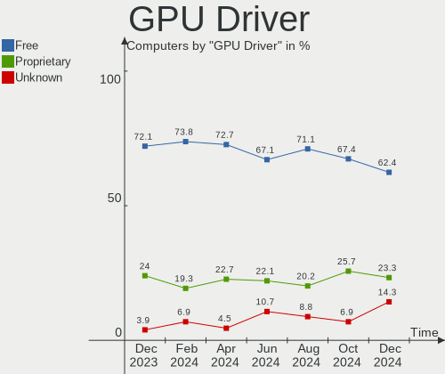
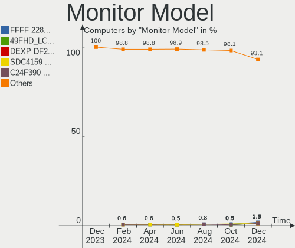
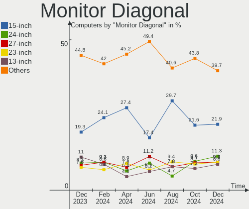
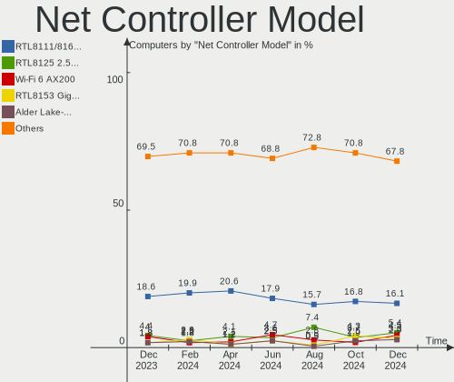
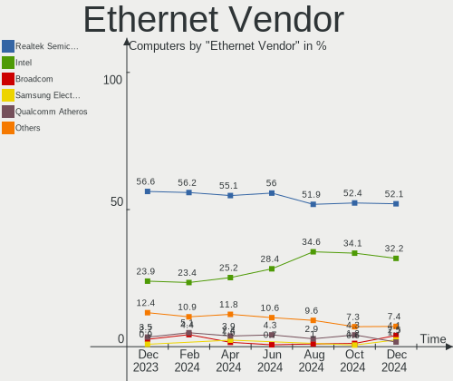
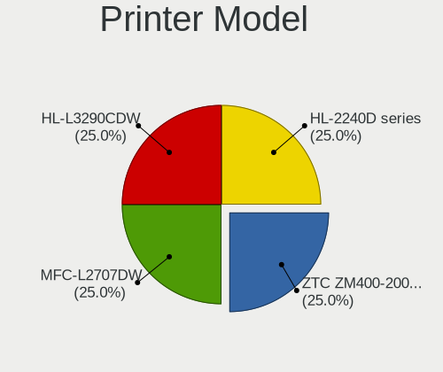
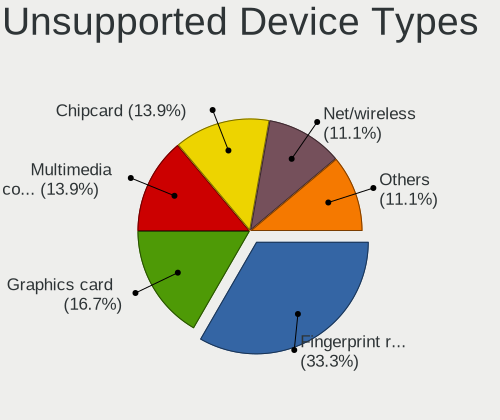

Kubuntu - Hardware Trends
-------------------------

A project to identify most popular hardware characteristics and track their change
over time based on data collected by Linux users at https://Linux-Hardware.org.

Anyone can contribute to this report by the [hw-probe](https://github.com/linuxhw/hw-probe) tool:

    sudo -E hw-probe -all -upload

This is a report for all computer types. See also reports for [desktops](/Dist/Kubuntu/Desktop/README.md) and [notebooks](/Dist/Kubuntu/Notebook/README.md).

This report is for one last month. Overall report since the beginning of time: [TestDays](https://github.com/linuxhw/TestDays)

Period: Oct, 2023.

Contents
--------

* [ System ](#system)
  - [ OS                       ](#os)
  - [ OS Family                ](#os-family)
  - [ Kernel                   ](#kernel)
  - [ Kernel Family            ](#kernel-family)
  - [ Kernel Major Ver.        ](#kernel-major-ver)
  - [ Arch                     ](#arch)
  - [ DE                       ](#de)
  - [ Display Server           ](#display-server)
  - [ Display Manager          ](#display-manager)
  - [ OS Lang                  ](#os-lang)
  - [ Boot Mode                ](#boot-mode)
  - [ Filesystem               ](#filesystem)
  - [ Part. scheme             ](#part-scheme)
  - [ Dual Boot with Linux/BSD ](#dual-boot-with-linuxbsd)
  - [ Dual Boot (Win)          ](#dual-boot-win)

* [ Board ](#board)
  - [ Vendor                   ](#vendor)
  - [ Model                    ](#model)
  - [ Model Family             ](#model-family)
  - [ MFG Year                 ](#mfg-year)
  - [ Form Factor              ](#form-factor)
  - [ Secure Boot              ](#secure-boot)
  - [ Coreboot                 ](#coreboot)
  - [ RAM Size                 ](#ram-size)
  - [ RAM Used                 ](#ram-used)
  - [ Total Drives             ](#total-drives)
  - [ Has CD-ROM               ](#has-cd-rom)
  - [ Has Ethernet             ](#has-ethernet)
  - [ Has WiFi                 ](#has-wifi)
  - [ Has Bluetooth            ](#has-bluetooth)

* [ Location ](#location)
  - [ Country                  ](#country)
  - [ City                     ](#city)

* [ Drives ](#drives)
  - [ Drive Vendor             ](#drive-vendor)
  - [ Drive Model              ](#drive-model)
  - [ HDD Vendor               ](#hdd-vendor)
  - [ SSD Vendor               ](#ssd-vendor)
  - [ Drive Kind               ](#drive-kind)
  - [ Drive Connector          ](#drive-connector)
  - [ Drive Size               ](#drive-size)
  - [ Space Total              ](#space-total)
  - [ Space Used               ](#space-used)
  - [ Malfunc. Drives          ](#malfunc-drives)
  - [ Malfunc. Drive Vendor    ](#malfunc-drive-vendor)
  - [ Malfunc. HDD Vendor      ](#malfunc-hdd-vendor)
  - [ Malfunc. Drive Kind      ](#malfunc-drive-kind)
  - [ Failed Drives            ](#failed-drives)
  - [ Failed Drive Vendor      ](#failed-drive-vendor)
  - [ Drive Status             ](#drive-status)

* [ Storage controller ](#storage-controller)
  - [ Storage Vendor           ](#storage-vendor)
  - [ Storage Model            ](#storage-model)
  - [ Storage Kind             ](#storage-kind)

* [ Processor ](#processor)
  - [ CPU Vendor               ](#cpu-vendor)
  - [ CPU Model                ](#cpu-model)
  - [ CPU Model Family         ](#cpu-model-family)
  - [ CPU Cores                ](#cpu-cores)
  - [ CPU Sockets              ](#cpu-sockets)
  - [ CPU Threads              ](#cpu-threads)
  - [ CPU Op-Modes             ](#cpu-op-modes)
  - [ CPU Microcode            ](#cpu-microcode)
  - [ CPU Microarch            ](#cpu-microarch)

* [ Graphics ](#graphics)
  - [ GPU Vendor               ](#gpu-vendor)
  - [ GPU Model                ](#gpu-model)
  - [ GPU Combo                ](#gpu-combo)
  - [ GPU Driver               ](#gpu-driver)
  - [ GPU Memory               ](#gpu-memory)

* [ Monitor ](#monitor)
  - [ Monitor Vendor           ](#monitor-vendor)
  - [ Monitor Model            ](#monitor-model)
  - [ Monitor Resolution       ](#monitor-resolution)
  - [ Monitor Diagonal         ](#monitor-diagonal)
  - [ Monitor Width            ](#monitor-width)
  - [ Aspect Ratio             ](#aspect-ratio)
  - [ Monitor Area             ](#monitor-area)
  - [ Pixel Density            ](#pixel-density)
  - [ Multiple Monitors        ](#multiple-monitors)

* [ Network ](#network)
  - [ Net Controller Vendor    ](#net-controller-vendor)
  - [ Net Controller Model     ](#net-controller-model)
  - [ Wireless Vendor          ](#wireless-vendor)
  - [ Wireless Model           ](#wireless-model)
  - [ Ethernet Vendor          ](#ethernet-vendor)
  - [ Ethernet Model           ](#ethernet-model)
  - [ Net Controller Kind      ](#net-controller-kind)
  - [ Used Controller          ](#used-controller)
  - [ NICs                     ](#nics)
  - [ IPv6                     ](#ipv6)

* [ Bluetooth ](#bluetooth)
  - [ Bluetooth Vendor         ](#bluetooth-vendor)
  - [ Bluetooth Model          ](#bluetooth-model)

* [ Sound ](#sound)
  - [ Sound Vendor             ](#sound-vendor)
  - [ Sound Model              ](#sound-model)

* [ Memory ](#memory)
  - [ Memory Vendor            ](#memory-vendor)
  - [ Memory Model             ](#memory-model)
  - [ Memory Kind              ](#memory-kind)
  - [ Memory Form Factor       ](#memory-form-factor)
  - [ Memory Size              ](#memory-size)
  - [ Memory Speed             ](#memory-speed)

* [ Printers & scanners ](#printers--scanners)
  - [ Printer Vendor           ](#printer-vendor)
  - [ Printer Model            ](#printer-model)
  - [ Scanner Vendor           ](#scanner-vendor)
  - [ Scanner Model            ](#scanner-model)

* [ Camera ](#camera)
  - [ Camera Vendor            ](#camera-vendor)
  - [ Camera Model             ](#camera-model)

* [ Security ](#security)
  - [ Fingerprint Vendor       ](#fingerprint-vendor)
  - [ Fingerprint Model        ](#fingerprint-model)
  - [ Chipcard Vendor          ](#chipcard-vendor)
  - [ Chipcard Model           ](#chipcard-model)

* [ Unsupported ](#unsupported)
  - [ Unsupported Devices      ](#unsupported-devices)
  - [ Unsupported Device Types ](#unsupported-device-types)

System
------

OS
--

Installed operating systems

| Name          | Computers | Percent |
|---------------|-----------|---------|
| Kubuntu 22.04 | 76        | 47.2%   |
| Kubuntu 23.04 | 44        | 27.33%  |
| Kubuntu 23.10 | 33        | 20.5%   |
| Kubuntu 20.04 | 4         | 2.48%   |
| Kubuntu 11    | 2         | 1.24%   |
| Kubuntu 18.04 | 1         | 0.62%   |
| Kubuntu 14.04 | 1         | 0.62%   |

OS Family
---------

OS without a version

| Name    | Computers | Percent |
|---------|-----------|---------|
| Kubuntu | 161       | 100%    |

Kernel
------

Version of the Linux kernel

| Version                         | Computers | Percent |
|---------------------------------|-----------|---------|
| 6.2.0-34-generic                | 43        | 26.71%  |
| 6.5.0-9-generic                 | 22        | 13.66%  |
| 6.2.0-35-generic                | 17        | 10.56%  |
| 6.2.0-33-generic                | 10        | 6.21%   |
| 5.15.0-87-generic               | 9         | 5.59%   |
| 5.15.0-86-generic               | 8         | 4.97%   |
| 6.5.0-10-generic                | 5         | 3.11%   |
| 6.5.0-5-generic                 | 4         | 2.48%   |
| 6.2.0-36-generic                | 4         | 2.48%   |
| 6.2.0-26-generic                | 4         | 2.48%   |
| 5.15.0-84-generic               | 4         | 2.48%   |
| 6.2.0-1015-lowlatency           | 3         | 1.86%   |
| 6.2.0-32-generic                | 2         | 1.24%   |
| 6.2.0-1014-lowlatency           | 2         | 1.24%   |
| 6.2.0-1013-lowlatency           | 2         | 1.24%   |
| 5.15.0-79-generic               | 2         | 1.24%   |
| 5.15.0-75-generic               | 2         | 1.24%   |
| 6.6.0-rc7-custom                | 1         | 0.62%   |
| 6.5.7-1-liquorix-amd64          | 1         | 0.62%   |
| 6.2.0-31-generic                | 1         | 0.62%   |
| 6.2.0-20-generic                | 1         | 0.62%   |
| 6.2.0-10025-tuxedo              | 1         | 0.62%   |
| 6.1.58-x64v3-xanmod1            | 1         | 0.62%   |
| 6.1.55-x64v3-xanmod1            | 1         | 0.62%   |
| 5.8.0-59-generic                | 1         | 0.62%   |
| 5.19.0-50-generic               | 1         | 0.62%   |
| 5.15.60-wuying-x86              | 1         | 0.62%   |
| 5.15.0-87-lowlatency            | 1         | 0.62%   |
| 5.15.0-86-lowlatency            | 1         | 0.62%   |
| 5.15.0-78-generic               | 1         | 0.62%   |
| 5.15.0-67-generic               | 1         | 0.62%   |
| 5.15.0-43-generic               | 1         | 0.62%   |
| 5.15.0-41-lowlatency            | 1         | 0.62%   |
| 4.15.0-213-generic              | 1         | 0.62%   |
| 4.14.23-ck1-mainline-core2-rjvb | 1         | 0.62%   |

Kernel Family
-------------

Linux kernel without a distro release

| Version | Computers | Percent |
|---------|-----------|---------|
| 6.2.0   | 90        | 55.9%   |
| 6.5.0   | 31        | 19.25%  |
| 5.15.0  | 31        | 19.25%  |
| 6.6.0   | 1         | 0.62%   |
| 6.5.7   | 1         | 0.62%   |
| 6.1.58  | 1         | 0.62%   |
| 6.1.55  | 1         | 0.62%   |
| 5.8.0   | 1         | 0.62%   |
| 5.19.0  | 1         | 0.62%   |
| 5.15.60 | 1         | 0.62%   |
| 4.15.0  | 1         | 0.62%   |
| 4.14.23 | 1         | 0.62%   |

Kernel Major Ver.
-----------------

Linux kernel major version

| Version | Computers | Percent |
|---------|-----------|---------|
| 6.2     | 90        | 55.9%   |
| 6.5     | 32        | 19.88%  |
| 5.15    | 32        | 19.88%  |
| 6.1     | 2         | 1.24%   |
| 6.6     | 1         | 0.62%   |
| 5.8     | 1         | 0.62%   |
| 5.19    | 1         | 0.62%   |
| 4.15    | 1         | 0.62%   |
| 4.14    | 1         | 0.62%   |

Arch
----

OS architecture (x86_64, i586, etc.)

| Name   | Computers | Percent |
|--------|-----------|---------|
| x86_64 | 161       | 100%    |

DE
--

Desktop Environment

| Name  | Computers | Percent |
|-------|-----------|---------|
| KDE5  | 156       | 96.89%  |
| KDE   | 2         | 1.24%   |
| GNOME | 2         | 1.24%   |
| KDE4  | 1         | 0.62%   |

Display Server
--------------

X11 or Wayland

| Name    | Computers | Percent |
|---------|-----------|---------|
| X11     | 147       | 91.3%   |
| Wayland | 11        | 6.83%   |
| Tty     | 3         | 1.86%   |

Display Manager
---------------

SDDM, LightDM, etc.

| Name    | Computers | Percent |
|---------|-----------|---------|
| SDDM    | 109       | 67.7%   |
| Unknown | 45        | 27.95%  |
| GDM3    | 3         | 1.86%   |
| LightDM | 2         | 1.24%   |
| KDM     | 1         | 0.62%   |
| GDM     | 1         | 0.62%   |

OS Lang
-------

Language

| Lang           | Computers | Percent |
|----------------|-----------|---------|
| en_US          | 75        | 46.58%  |
| de_DE          | 18        | 11.18%  |
| it_IT          | 13        | 8.07%   |
| en_GB          | 8         | 4.97%   |
| fr_FR          | 5         | 3.11%   |
| es_ES          | 5         | 3.11%   |
| ru_RU          | 4         | 2.48%   |
| pt_BR          | 4         | 2.48%   |
| en_CA          | 4         | 2.48%   |
| en_AU          | 3         | 1.86%   |
| zh_CN          | 2         | 1.24%   |
| sv_SE          | 2         | 1.24%   |
| en_NZ          | 2         | 1.24%   |
| pl_PL          | 1         | 0.62%   |
| nl_NL          | 1         | 0.62%   |
| nb_NO          | 1         | 0.62%   |
| ja_JP          | 1         | 0.62%   |
| hu_HU          | 1         | 0.62%   |
| fr_BE          | 1         | 0.62%   |
| fi_FI          | 1         | 0.62%   |
| es_PE          | 1         | 0.62%   |
| es_CR          | 1         | 0.62%   |
| es_AR          | 1         | 0.62%   |
| en_IN          | 1         | 0.62%   |
| en_IE          | 1         | 0.62%   |
| en_AG          | 1         | 0.62%   |
| Default        | 1         | 0.62%   |
| cs_CZ          | 1         | 0.62%   |
| ca_ES@valencia | 1         | 0.62%   |

Boot Mode
---------

EFI or BIOS

| Mode | Computers | Percent |
|------|-----------|---------|
| BIOS | 82        | 50.93%  |
| EFI  | 79        | 49.07%  |

Filesystem
----------

Type of filesystem

| Type    | Computers | Percent |
|---------|-----------|---------|
| Ext4    | 110       | 68.32%  |
| Tmpfs   | 36        | 22.36%  |
| Btrfs   | 7         | 4.35%   |
| Overlay | 5         | 3.11%   |
| Xfs     | 2         | 1.24%   |
| Zfs     | 1         | 0.62%   |

Part. scheme
------------

Scheme of partitioning

| Type    | Computers | Percent |
|---------|-----------|---------|
| GPT     | 110       | 68.32%  |
| Unknown | 45        | 27.95%  |
| MBR     | 6         | 3.73%   |

Dual Boot with Linux/BSD
------------------------

Hosting more than one Linux/BSD

| Dual boot | Computers | Percent |
|-----------|-----------|---------|
| No        | 137       | 85.09%  |
| Yes       | 24        | 14.91%  |

Dual Boot (Win)
---------------

Hosting Linux and Windows

| Dual boot | Computers | Percent |
|-----------|-----------|---------|
| No        | 110       | 68.32%  |
| Yes       | 51        | 31.68%  |

Board
-----

Vendor
------

Motherboard manufacturer

| Name                                 | Computers | Percent |
|--------------------------------------|-----------|---------|
| Hewlett-Packard                      | 30        | 18.63%  |
| ASUSTek Computer                     | 26        | 16.15%  |
| Lenovo                               | 18        | 11.18%  |
| Dell                                 | 18        | 11.18%  |
| MSI                                  | 12        | 7.45%   |
| Gigabyte Technology                  | 8         | 4.97%   |
| Acer                                 | 8         | 4.97%   |
| ASRock                               | 5         | 3.11%   |
| AZW                                  | 4         | 2.48%   |
| Intel                                | 3         | 1.86%   |
| Google                               | 2         | 1.24%   |
| Apple                                | 2         | 1.24%   |
| WUYING                               | 1         | 0.62%   |
| TUXEDO                               | 1         | 0.62%   |
| Toshiba                              | 1         | 0.62%   |
| Timi                                 | 1         | 0.62%   |
| SYWZ                                 | 1         | 0.62%   |
| Shenzhen Meigao Electronic Equipment | 1         | 0.62%   |
| Shanghai Zhaoxin Semiconductor       | 1         | 0.62%   |
| Schenker                             | 1         | 0.62%   |
| Samsung Electronics                  | 1         | 0.62%   |
| Notebook                             | 1         | 0.62%   |
| Medion                               | 1         | 0.62%   |
| MACHENIKE                            | 1         | 0.62%   |
| GPU Company                          | 1         | 0.62%   |
| GMKtec                               | 1         | 0.62%   |
| Fujitsu                              | 1         | 0.62%   |
| Fanless Mini PC                      | 1         | 0.62%   |
| EXTRA Computer                       | 1         | 0.62%   |
| ECS                                  | 1         | 0.62%   |
| Colorful Technology                  | 1         | 0.62%   |
| Avell High Performance               | 1         | 0.62%   |
| ATOPNUC                              | 1         | 0.62%   |
| ASRockRack                           | 1         | 0.62%   |
| AMI                                  | 1         | 0.62%   |
| Alienware                            | 1         | 0.62%   |
| Unknown                              | 1         | 0.62%   |

Model
-----

Motherboard model

| Name                                        | Computers | Percent |
|---------------------------------------------|-----------|---------|
| AZW SER                                     | 3         | 1.86%   |
| Dell Latitude 7490                          | 2         | 1.24%   |
| Dell Latitude 5530                          | 2         | 1.24%   |
| ASUS ROG STRIX B550-F GAMING                | 2         | 1.24%   |
| ASUS All Series                             | 2         | 1.24%   |
| WUYING NS01-4BGXG                           | 1         | 0.62%   |
| TUXEDO Book XP15 / XP17 Gen12               | 1         | 0.62%   |
| Toshiba Satellite P850                      | 1         | 0.62%   |
| Timi RedmiBook Pro 15                       | 1         | 0.62%   |
| SYWZ S210H Series                           | 1         | 0.62%   |
| Shenzhen Meigao Electronic Equipment UM450  | 1         | 0.62%   |
| Shanghai Zhaoxin ZXE CRB                    | 1         | 0.62%   |
| Schenker VIA 15 Pro (M22)                   | 1         | 0.62%   |
| Samsung RC420/RC520/RC720                   | 1         | 0.62%   |
| Notebook W510LU                             | 1         | 0.62%   |
| MSI MS-7D96                                 | 1         | 0.62%   |
| MSI MS-7D95                                 | 1         | 0.62%   |
| MSI MS-7D20                                 | 1         | 0.62%   |
| MSI MS-7D17                                 | 1         | 0.62%   |
| MSI MS-7C86                                 | 1         | 0.62%   |
| MSI MS-7C37                                 | 1         | 0.62%   |
| MSI MS-7B86                                 | 1         | 0.62%   |
| MSI MS-7B79                                 | 1         | 0.62%   |
| MSI MS-7B78                                 | 1         | 0.62%   |
| MSI MS-7B61                                 | 1         | 0.62%   |
| MSI MS-7A70                                 | 1         | 0.62%   |
| MSI MS-7816                                 | 1         | 0.62%   |
| Medion E15302                               | 1         | 0.62%   |
| MACHENIKE MACHCREATOR-16                    | 1         | 0.62%   |
| Lenovo Yoga Slim 6 14IAP8 82WU              | 1         | 0.62%   |
| Lenovo Yoga Creator 7 15IMH05 82DS          | 1         | 0.62%   |
| Lenovo Yoga 9 14IAP7 82LU                   | 1         | 0.62%   |
| Lenovo Yoga 720-15IKB 80X7                  | 1         | 0.62%   |
| Lenovo Yoga 2 Pro 20266                     | 1         | 0.62%   |
| Lenovo ThinkPad X1 Carbon Gen 10 21CB000HUS | 1         | 0.62%   |
| Lenovo ThinkPad X1 Carbon 6th 20KH002RUS    | 1         | 0.62%   |
| Lenovo ThinkPad X1 Carbon 5th 20HQS01A0Y    | 1         | 0.62%   |
| Lenovo ThinkPad L450 20DSS26200             | 1         | 0.62%   |
| Lenovo ThinkPad E15 Gen 2 20TD002MGE        | 1         | 0.62%   |
| Lenovo ThinkCentre M92p 3228A1U             | 1         | 0.62%   |

Model Family
------------

Motherboard model prefix

| Name                                       | Computers | Percent |
|--------------------------------------------|-----------|---------|
| Dell Latitude                              | 9         | 5.59%   |
| ASUS ROG                                   | 6         | 3.73%   |
| Lenovo Yoga                                | 5         | 3.11%   |
| Lenovo ThinkPad                            | 5         | 3.11%   |
| HP Pavilion                                | 5         | 3.11%   |
| ASUS PRIME                                 | 5         | 3.11%   |
| Acer Aspire                                | 5         | 3.11%   |
| Lenovo IdeaPad                             | 4         | 2.48%   |
| HP ZBook                                   | 4         | 2.48%   |
| HP ProBook                                 | 4         | 2.48%   |
| HP Laptop                                  | 4         | 2.48%   |
| Dell Inspiron                              | 4         | 2.48%   |
| ASUS VivoBook                              | 4         | 2.48%   |
| HP EliteBook                               | 3         | 1.86%   |
| Dell Precision                             | 3         | 1.86%   |
| AZW SER                                    | 3         | 1.86%   |
| Lenovo ThinkBook                           | 2         | 1.24%   |
| HP Spectre                                 | 2         | 1.24%   |
| HP ENVY                                    | 2         | 1.24%   |
| ASUS All                                   | 2         | 1.24%   |
| Acer Nitro                                 | 2         | 1.24%   |
| WUYING NS01-4BGXG                          | 1         | 0.62%   |
| TUXEDO Book                                | 1         | 0.62%   |
| Toshiba Satellite                          | 1         | 0.62%   |
| Timi RedmiBook                             | 1         | 0.62%   |
| SYWZ S210H                                 | 1         | 0.62%   |
| Shenzhen Meigao Electronic Equipment UM450 | 1         | 0.62%   |
| Shanghai Zhaoxin ZXE                       | 1         | 0.62%   |
| Schenker VIA                               | 1         | 0.62%   |
| Samsung RC420                              | 1         | 0.62%   |
| Notebook W510LU                            | 1         | 0.62%   |
| MSI MS-7D96                                | 1         | 0.62%   |
| MSI MS-7D95                                | 1         | 0.62%   |
| MSI MS-7D20                                | 1         | 0.62%   |
| MSI MS-7D17                                | 1         | 0.62%   |
| MSI MS-7C86                                | 1         | 0.62%   |
| MSI MS-7C37                                | 1         | 0.62%   |
| MSI MS-7B86                                | 1         | 0.62%   |
| MSI MS-7B79                                | 1         | 0.62%   |
| MSI MS-7B78                                | 1         | 0.62%   |

MFG Year
--------

Motherboard manufacture year

| Year | Computers | Percent |
|------|-----------|---------|
| 2022 | 27        | 16.77%  |
| 2020 | 17        | 10.56%  |
| 2012 | 17        | 10.56%  |
| 2021 | 15        | 9.32%   |
| 2019 | 14        | 8.7%    |
| 2023 | 13        | 8.07%   |
| 2018 | 11        | 6.83%   |
| 2013 | 11        | 6.83%   |
| 2017 | 8         | 4.97%   |
| 2011 | 7         | 4.35%   |
| 2016 | 6         | 3.73%   |
| 2015 | 5         | 3.11%   |
| 2014 | 5         | 3.11%   |
| 2010 | 3         | 1.86%   |
| 2009 | 1         | 0.62%   |
| 2008 | 1         | 0.62%   |

Form Factor
-----------

Physical design of the computer

| Name        | Computers | Percent |
|-------------|-----------|---------|
| Notebook    | 88        | 54.66%  |
| Desktop     | 57        | 35.4%   |
| Convertible | 7         | 4.35%   |
| Mini pc     | 6         | 3.73%   |
| Server      | 2         | 1.24%   |
| All in one  | 1         | 0.62%   |

Secure Boot
-----------

Enabled or disabled

| State    | Computers | Percent |
|----------|-----------|---------|
| Disabled | 149       | 92.55%  |
| Enabled  | 12        | 7.45%   |

Coreboot
--------

Have coreboot on board

| Used | Computers | Percent |
|------|-----------|---------|
| No   | 159       | 98.76%  |
| Yes  | 2         | 1.24%   |

RAM Size
--------

Total RAM memory

| Size in GB      | Computers | Percent |
|-----------------|-----------|---------|
| 16.01-24.0      | 50        | 31.06%  |
| 4.01-8.0        | 32        | 19.88%  |
| 32.01-64.0      | 32        | 19.88%  |
| 8.01-16.0       | 23        | 14.29%  |
| 64.01-256.0     | 8         | 4.97%   |
| 3.01-4.0        | 7         | 4.35%   |
| 24.01-32.0      | 5         | 3.11%   |
| More than 256.0 | 2         | 1.24%   |
| 2.01-3.0        | 1         | 0.62%   |
| 1.01-2.0        | 1         | 0.62%   |

RAM Used
--------

Used RAM memory

| Used GB    | Computers | Percent |
|------------|-----------|---------|
| 4.01-8.0   | 46        | 28.57%  |
| 2.01-3.0   | 39        | 24.22%  |
| 3.01-4.0   | 34        | 21.12%  |
| 1.01-2.0   | 24        | 14.91%  |
| 8.01-16.0  | 9         | 5.59%   |
| 16.01-24.0 | 4         | 2.48%   |
| 24.01-32.0 | 3         | 1.86%   |
| 0.51-1.0   | 2         | 1.24%   |

Total Drives
------------

Number of drives on board

| Drives | Computers | Percent |
|--------|-----------|---------|
| 1      | 79        | 49.07%  |
| 2      | 49        | 30.43%  |
| 3      | 11        | 6.83%   |
| 4      | 9         | 5.59%   |
| 5      | 6         | 3.73%   |
| 6      | 3         | 1.86%   |
| 8      | 2         | 1.24%   |
| 12     | 1         | 0.62%   |
| 11     | 1         | 0.62%   |

Has CD-ROM
----------

Has CD-ROM on board

| Presented | Computers | Percent |
|-----------|-----------|---------|
| No        | 120       | 74.53%  |
| Yes       | 41        | 25.47%  |

Has Ethernet
------------

Has Ethernet on board

| Presented | Computers | Percent |
|-----------|-----------|---------|
| Yes       | 132       | 81.99%  |
| No        | 29        | 18.01%  |

Has WiFi
--------

Has WiFi module

| Presented | Computers | Percent |
|-----------|-----------|---------|
| Yes       | 129       | 80.12%  |
| No        | 32        | 19.88%  |

Has Bluetooth
-------------

Has Bluetooth module

| Presented | Computers | Percent |
|-----------|-----------|---------|
| Yes       | 120       | 74.53%  |
| No        | 41        | 25.47%  |

Location
--------

Country
-------

Geographic location (country)

| Country      | Computers | Percent |
|--------------|-----------|---------|
| USA          | 31        | 19.25%  |
| Germany      | 20        | 12.42%  |
| Italy        | 19        | 11.8%   |
| France       | 7         | 4.35%   |
| Canada       | 7         | 4.35%   |
| UK           | 6         | 3.73%   |
| Spain        | 5         | 3.11%   |
| Russia       | 4         | 2.48%   |
| Poland       | 4         | 2.48%   |
| Brazil       | 4         | 2.48%   |
| Iran         | 3         | 1.86%   |
| Hungary      | 3         | 1.86%   |
| China        | 3         | 1.86%   |
| Bangladesh   | 3         | 1.86%   |
| Australia    | 3         | 1.86%   |
| Sweden       | 2         | 1.24%   |
| Peru         | 2         | 1.24%   |
| Norway       | 2         | 1.24%   |
| New Zealand  | 2         | 1.24%   |
| Netherlands  | 2         | 1.24%   |
| Lithuania    | 2         | 1.24%   |
| Latvia       | 2         | 1.24%   |
| India        | 2         | 1.24%   |
| Belgium      | 2         | 1.24%   |
| Argentina    | 2         | 1.24%   |
| Turkey       | 1         | 0.62%   |
| Thailand     | 1         | 0.62%   |
| South Africa | 1         | 0.62%   |
| Serbia       | 1         | 0.62%   |
| Panama       | 1         | 0.62%   |
| Pakistan     | 1         | 0.62%   |
| Nepal        | 1         | 0.62%   |
| Mexico       | 1         | 0.62%   |
| Lebanon      | 1         | 0.62%   |
| Kazakhstan   | 1         | 0.62%   |
| Japan        | 1         | 0.62%   |
| Ireland      | 1         | 0.62%   |
| Hong Kong    | 1         | 0.62%   |
| Finland      | 1         | 0.62%   |
| Egypt        | 1         | 0.62%   |

City
----

Geographic location (city)

| City                 | Computers | Percent |
|----------------------|-----------|---------|
| Rome                 | 3         | 1.86%   |
| Budapest             | 3         | 1.86%   |
| Trescore Balneario   | 2         | 1.24%   |
| Tehran               | 2         | 1.24%   |
| Hamburg              | 2         | 1.24%   |
| Halle                | 2         | 1.24%   |
| Frankfurt am Main    | 2         | 1.24%   |
| Florence             | 2         | 1.24%   |
| Berlin               | 2         | 1.24%   |
| Zhangbagou           | 1         | 0.62%   |
| Westminster          | 1         | 0.62%   |
| Wellsboro            | 1         | 0.62%   |
| Warsaw               | 1         | 0.62%   |
| Waregem              | 1         | 0.62%   |
| Vladivostok          | 1         | 0.62%   |
| Vilnius              | 1         | 0.62%   |
| Verona               | 1         | 0.62%   |
| Venice               | 1         | 0.62%   |
| Vancouver            | 1         | 0.62%   |
| Ufa                  | 1         | 0.62%   |
| Trujillo             | 1         | 0.62%   |
| Trieste              | 1         | 0.62%   |
| Tourcoing            | 1         | 0.62%   |
| Toulouse             | 1         | 0.62%   |
| The Hague            | 1         | 0.62%   |
| Taylorsville         | 1         | 0.62%   |
| Takada               | 1         | 0.62%   |
| Sydney               | 1         | 0.62%   |
| Stopnica             | 1         | 0.62%   |
| Spokane              | 1         | 0.62%   |
| Southampton          | 1         | 0.62%   |
| Sofia                | 1         | 0.62%   |
| Shinnston            | 1         | 0.62%   |
| Sayre                | 1         | 0.62%   |
| Saskatoon            | 1         | 0.62%   |
| Saro                 | 1         | 0.62%   |
| San Joaquin          | 1         | 0.62%   |
| San Cesario di Lecce | 1         | 0.62%   |
| Salaspils            | 1         | 0.62%   |
| Rüsselsheim am Main | 1         | 0.62%   |

Drives
------

Drive Vendor
------------

Hard drive vendors

| Vendor                      | Computers | Drives | Percent |
|-----------------------------|-----------|--------|---------|
| Samsung Electronics         | 38        | 51     | 14.23%  |
| WDC                         | 32        | 39     | 11.99%  |
| Seagate                     | 32        | 46     | 11.99%  |
| Kingston                    | 15        | 16     | 5.62%   |
| Crucial                     | 14        | 15     | 5.24%   |
| SK hynix                    | 12        | 12     | 4.49%   |
| SanDisk                     | 12        | 18     | 4.49%   |
| Intel                       | 12        | 12     | 4.49%   |
| Toshiba                     | 8         | 19     | 3%      |
| Hitachi                     | 7         | 7      | 2.62%   |
| Unknown                     | 6         | 6      | 2.25%   |
| KIOXIA                      | 5         | 5      | 1.87%   |
| Phison Electronics          | 4         | 4      | 1.5%    |
| Kingston Technology Company | 4         | 5      | 1.5%    |
| HGST                        | 4         | 4      | 1.5%    |
| A-DATA Technology           | 4         | 5      | 1.5%    |
| Micron/Crucial Technology   | 3         | 3      | 1.12%   |
| Micron Technology           | 3         | 3      | 1.12%   |
| JMicron Technology          | 3         | 3      | 1.12%   |
| Intenso                     | 3         | 3      | 1.12%   |
| China                       | 3         | 3      | 1.12%   |
| Verbatim                    | 2         | 2      | 0.75%   |
| SPCC                        | 2         | 6      | 0.75%   |
| Silicon Motion              | 2         | 2      | 0.75%   |
| PNY                         | 2         | 2      | 0.75%   |
| Patriot                     | 2         | 2      | 0.75%   |
| Lexar                       | 2         | 2      | 0.75%   |
| Unknown                     | 2         | 2      | 0.75%   |
| XUM                         | 1         | 1      | 0.37%   |
| XPG                         | 1         | 1      | 0.37%   |
| Wibtek                      | 1         | 1      | 0.37%   |
| UMIS                        | 1         | 1      | 0.37%   |
| Transcend                   | 1         | 1      | 0.37%   |
| Teutons                     | 1         | 1      | 0.37%   |
| Team                        | 1         | 1      | 0.37%   |
| SSSTC                       | 1         | 1      | 0.37%   |
| SSK SD30                    | 1         | 1      | 0.37%   |
| SCY                         | 1         | 1      | 0.37%   |
| SABRENT                     | 1         | 1      | 0.37%   |
| RSH-338H                    | 1         | 1      | 0.37%   |

Drive Model
-----------

Hard drive models

| Model                                                 | Computers | Percent |
|-------------------------------------------------------|-----------|---------|
| Seagate ST2000DM008-2FR102 2TB                        | 8         | 2.64%   |
| Samsung NVMe SSD Controller SM981/PM981/PM983 1TB     | 6         | 1.98%   |
| Samsung SSD 860 EVO 500GB                             | 4         | 1.32%   |
| Samsung NVMe SSD Controller PM9A1/PM9A3/980PRO 1TB    | 4         | 1.32%   |
| Samsung SSD 980 PRO 2TB                               | 3         | 0.99%   |
| Samsung SSD 980 1TB                                   | 3         | 0.99%   |
| Phison PS5013 E13 NVMe Controller 256GB               | 3         | 0.99%   |
| Kingston SNVS500G 500GB                               | 3         | 0.99%   |
| WDC WD10JPVX-75JC3T0 1TB                              | 2         | 0.66%   |
| WDC WD10EZEX-08WN4A0 1TB                              | 2         | 0.66%   |
| Unknown MMC Card  64GB                                | 2         | 0.66%   |
| SPCC Solid State Disk 1TB                             | 2         | 0.66%   |
| SK hynix HFM128GDJTNG-8310A 128GB                     | 2         | 0.66%   |
| SK hynix BC711 HFM512GD3JX013N 512GB                  | 2         | 0.66%   |
| Silicon Motion SM2263EN/SM2263XT SSD Controller 256GB | 2         | 0.66%   |
| Seagate ST2000LM007-1R8174 2TB                        | 2         | 0.66%   |
| Sandisk WD_BLACK SN770 1TB                            | 2         | 0.66%   |
| Sandisk WD Black SN750 / PC SN730 NVMe SSD 1024GB     | 2         | 0.66%   |
| SanDisk SSD PLUS 240GB                                | 2         | 0.66%   |
| Samsung SSD 980 PRO 1TB                               | 2         | 0.66%   |
| Samsung SSD 870 QVO 1TB                               | 2         | 0.66%   |
| Kingston Company SNV2S2000G 2TB                       | 2         | 0.66%   |
| Kingston Company SNV2S1000G 1TB                       | 2         | 0.66%   |
| Kingston SV300S37A240G 240GB SSD                      | 2         | 0.66%   |
| Kingston SA400S37480G 480GB SSD                       | 2         | 0.66%   |
| Kingston SA400S37240G 240GB SSD                       | 2         | 0.66%   |
| JMicron Generic 256GB                                 | 2         | 0.66%   |
| Intel SSDSC2BF180A4L 180GB                            | 2         | 0.66%   |
| Crucial CT250MX500SSD1 250GB                          | 2         | 0.66%   |
| Unknown                                               | 2         | 0.66%   |
| XUM HX256GSSDM2 256GB                                 | 1         | 0.33%   |
| XPG GAMMIX S70 BLADE 2TB                              | 1         | 0.33%   |
| Wibtek W800S 512GB SSD                                | 1         | 0.33%   |
| WDC WDS500G2B0B-00YS70 500GB SSD                      | 1         | 0.33%   |
| WDC WDS500G2B0A-00SM50 500GB SSD                      | 1         | 0.33%   |
| WDC WDS500G1B0B-00AS40 500GB SSD                      | 1         | 0.33%   |
| WDC WDS250G2B0A-00SM50 250GB SSD                      | 1         | 0.33%   |
| WDC WDS200T2B0B-00YS70 2TB SSD                        | 1         | 0.33%   |
| WDC WDS120G2G0A-00JH30 120GB SSD                      | 1         | 0.33%   |
| WDC WDS120G1G0A-00SS50 120GB SSD                      | 1         | 0.33%   |

HDD Vendor
----------

Hard disk drive vendors

| Vendor              | Computers | Drives | Percent |
|---------------------|-----------|--------|---------|
| Seagate             | 31        | 45     | 41.33%  |
| WDC                 | 19        | 23     | 25.33%  |
| Toshiba             | 7         | 18     | 9.33%   |
| Hitachi             | 7         | 7      | 9.33%   |
| HGST                | 4         | 4      | 5.33%   |
| Samsung Electronics | 2         | 2      | 2.67%   |
| Unknown             | 1         | 1      | 1.33%   |
| Maxtor              | 1         | 1      | 1.33%   |
| LaCie               | 1         | 1      | 1.33%   |
| Fujitsu             | 1         | 1      | 1.33%   |
| External            | 1         | 3      | 1.33%   |

SSD Vendor
----------

Solid state drive vendors

| Vendor              | Computers | Drives | Percent |
|---------------------|-----------|--------|---------|
| Samsung Electronics | 17        | 18     | 18.48%  |
| WDC                 | 11        | 12     | 11.96%  |
| Kingston            | 10        | 10     | 10.87%  |
| Crucial             | 8         | 8      | 8.7%    |
| SanDisk             | 6         | 10     | 6.52%   |
| Intel               | 4         | 4      | 4.35%   |
| China               | 3         | 3      | 3.26%   |
| Verbatim            | 2         | 2      | 2.17%   |
| SPCC                | 2         | 6      | 2.17%   |
| SK hynix            | 2         | 2      | 2.17%   |
| PNY                 | 2         | 2      | 2.17%   |
| Lexar               | 2         | 2      | 2.17%   |
| A-DATA Technology   | 2         | 3      | 2.17%   |
| XUM                 | 1         | 1      | 1.09%   |
| Wibtek              | 1         | 1      | 1.09%   |
| Transcend           | 1         | 1      | 1.09%   |
| Teutons             | 1         | 1      | 1.09%   |
| Team                | 1         | 1      | 1.09%   |
| SCY                 | 1         | 1      | 1.09%   |
| SABRENT             | 1         | 1      | 1.09%   |
| Patriot             | 1         | 1      | 1.09%   |
| OCZ                 | 1         | 1      | 1.09%   |
| Micron Technology   | 1         | 1      | 1.09%   |
| M4-CT128            | 1         | 1      | 1.09%   |
| LITEONIT            | 1         | 1      | 1.09%   |
| LITEON              | 1         | 1      | 1.09%   |
| KingFast            | 1         | 1      | 1.09%   |
| Kingchuxing         | 1         | 1      | 1.09%   |
| Kimtigo             | 1         | 1      | 1.09%   |
| Intenso             | 1         | 1      | 1.09%   |
| Gigabyte Technology | 1         | 1      | 1.09%   |
| FORESEE             | 1         | 1      | 1.09%   |
| Fanxiang            | 1         | 1      | 1.09%   |
| Corsair             | 1         | 1      | 1.09%   |

Drive Kind
----------

HDD or SSD

| Kind    | Computers | Drives | Percent |
|---------|-----------|--------|---------|
| NVMe    | 81        | 108    | 34.91%  |
| SSD     | 77        | 103    | 33.19%  |
| HDD     | 61        | 106    | 26.29%  |
| Unknown | 8         | 8      | 3.45%   |
| MMC     | 5         | 5      | 2.16%   |

Drive Connector
---------------

SATA, SAS, NVMe, etc.

| Type | Computers | Drives | Percent |
|------|-----------|--------|---------|
| SATA | 105       | 192    | 51.47%  |
| NVMe | 80        | 104    | 39.22%  |
| SAS  | 14        | 29     | 6.86%   |
| MMC  | 5         | 5      | 2.45%   |

Drive Size
----------

Size of hard drive

| Size in TB | Computers | Drives | Percent |
|------------|-----------|--------|---------|
| 0.01-0.5   | 73        | 94     | 47.1%   |
| 0.51-1.0   | 43        | 53     | 27.74%  |
| 1.01-2.0   | 23        | 31     | 14.84%  |
| 3.01-4.0   | 7         | 20     | 4.52%   |
| 2.01-3.0   | 6         | 7      | 3.87%   |
| 4.01-10.0  | 3         | 4      | 1.94%   |

Space Total
-----------

Amount of disk space available on the file system

| Size in GB     | Computers | Percent |
|----------------|-----------|---------|
| 251-500        | 39        | 24.22%  |
| 101-250        | 31        | 19.25%  |
| 1001-2000      | 29        | 18.01%  |
| 501-1000       | 23        | 14.29%  |
| More than 3000 | 15        | 9.32%   |
| 2001-3000      | 9         | 5.59%   |
| 1-20           | 9         | 5.59%   |
| 51-100         | 5         | 3.11%   |
| 21-50          | 1         | 0.62%   |

Space Used
----------

Amount of used disk space

| Used GB        | Computers | Percent |
|----------------|-----------|---------|
| 1-20           | 31        | 19.25%  |
| 101-250        | 27        | 16.77%  |
| 251-500        | 23        | 14.29%  |
| 21-50          | 22        | 13.66%  |
| 51-100         | 19        | 11.8%   |
| 501-1000       | 18        | 11.18%  |
| 1001-2000      | 14        | 8.7%    |
| More than 3000 | 7         | 4.35%   |

Malfunc. Drives
---------------

Drive models with a malfunction

| Model                                 | Computers | Drives | Percent |
|---------------------------------------|-----------|--------|---------|
| WDC WD30EFRX-68EUZN0 3TB              | 1         | 1      | 10%     |
| Toshiba MK6475GSX 640GB               | 1         | 1      | 10%     |
| Seagate ST9500325AS 500GB             | 1         | 1      | 10%     |
| Seagate ST31500341AS 1TB              | 1         | 1      | 10%     |
| SanDisk SSD PLUS 1000GB               | 1         | 1      | 10%     |
| Samsung Electronics SSD 870 EVO 500GB | 1         | 1      | 10%     |
| Samsung Electronics HD501LJ 500GB     | 1         | 1      | 10%     |
| Intel SSDSC2BF180A4L 180GB            | 1         | 1      | 10%     |
| Hitachi HTS547550A9E384 500GB         | 1         | 1      | 10%     |
| HGST HTS541010A9E680 1TB              | 1         | 1      | 10%     |

Malfunc. Drive Vendor
---------------------

Vendors of faulty drives

| Vendor              | Computers | Drives | Percent |
|---------------------|-----------|--------|---------|
| Seagate             | 2         | 2      | 20%     |
| Samsung Electronics | 2         | 2      | 20%     |
| WDC                 | 1         | 1      | 10%     |
| Toshiba             | 1         | 1      | 10%     |
| SanDisk             | 1         | 1      | 10%     |
| Intel               | 1         | 1      | 10%     |
| Hitachi             | 1         | 1      | 10%     |
| HGST                | 1         | 1      | 10%     |

Malfunc. HDD Vendor
-------------------

Vendors of faulty HDD drives

| Vendor              | Computers | Drives | Percent |
|---------------------|-----------|--------|---------|
| Seagate             | 2         | 2      | 28.57%  |
| WDC                 | 1         | 1      | 14.29%  |
| Toshiba             | 1         | 1      | 14.29%  |
| Samsung Electronics | 1         | 1      | 14.29%  |
| Hitachi             | 1         | 1      | 14.29%  |
| HGST                | 1         | 1      | 14.29%  |

Malfunc. Drive Kind
-------------------

Kinds of faulty drives

| Kind | Computers | Drives | Percent |
|------|-----------|--------|---------|
| HDD  | 6         | 7      | 66.67%  |
| SSD  | 3         | 3      | 33.33%  |

Failed Drives
-------------

Failed drive models

Zero info for selected period =(

Failed Drive Vendor
-------------------

Failed drive vendors

Zero info for selected period =(

Drive Status
------------

Number of failed and malfunc. drives

| Status   | Computers | Drives | Percent |
|----------|-----------|--------|---------|
| Detected | 91        | 183    | 52%     |
| Works    | 75        | 137    | 42.86%  |
| Malfunc  | 9         | 10     | 5.14%   |

Storage controller
------------------

Storage Vendor
--------------

Storage controller vendors

| Vendor                           | Computers | Percent |
|----------------------------------|-----------|---------|
| Intel                            | 94        | 41.59%  |
| AMD                              | 32        | 14.16%  |
| Samsung Electronics              | 25        | 11.06%  |
| SK hynix                         | 10        | 4.42%   |
| Micron/Crucial Technology        | 9         | 3.98%   |
| Kingston Technology Company      | 9         | 3.98%   |
| Sandisk                          | 8         | 3.54%   |
| Phison Electronics               | 4         | 1.77%   |
| ASMedia Technology               | 4         | 1.77%   |
| Toshiba America Info Systems     | 3         | 1.33%   |
| Silicon Motion                   | 3         | 1.33%   |
| Marvell Technology Group         | 3         | 1.33%   |
| KIOXIA                           | 3         | 1.33%   |
| JMicron Technology               | 3         | 1.33%   |
| ADATA Technology                 | 3         | 1.33%   |
| Nvidia                           | 2         | 0.88%   |
| Micron Technology                | 2         | 0.88%   |
| MAXIO Technology (Hangzhou)      | 2         | 0.88%   |
| Zhaoxin                          | 1         | 0.44%   |
| Union Memory (Shenzhen)          | 1         | 0.44%   |
| Solid State Storage Technology   | 1         | 0.44%   |
| Silicon Image                    | 1         | 0.44%   |
| Shenzhen Shichuangyi Electronics | 1         | 0.44%   |
| LSI Logic / Symbios Logic        | 1         | 0.44%   |
| Broadcom / LSI                   | 1         | 0.44%   |

Storage Model
-------------

Storage controller models

| Model                                                                          | Computers | Percent |
|--------------------------------------------------------------------------------|-----------|---------|
| AMD FCH SATA Controller [AHCI mode]                                            | 22        | 8.56%   |
| Samsung NVMe SSD Controller PM9A1/PM9A3/980PRO                                 | 11        | 4.28%   |
| Samsung NVMe SSD Controller SM981/PM981/PM983                                  | 9         | 3.5%    |
| Intel Volume Management Device NVMe RAID Controller                            | 9         | 3.5%    |
| Intel 7 Series Chipset Family 6-port SATA Controller [AHCI mode]               | 8         | 3.11%   |
| Intel 200 Series PCH SATA controller [AHCI mode]                               | 6         | 2.33%   |
| AMD 400 Series Chipset SATA Controller                                         | 6         | 2.33%   |
| Micron/Crucial P2 [Nick P2] / P3 / P3 Plus NVMe PCIe SSD (DRAM-less)           | 5         | 1.95%   |
| Intel Q170/Q150/B150/H170/H110/Z170/CM236 Chipset SATA Controller [AHCI Mode]  | 5         | 1.95%   |
| Intel 8 Series/C220 Series Chipset Family 6-port SATA Controller 1 [AHCI mode] | 5         | 1.95%   |
| Intel 7 Series/C210 Series Chipset Family 6-port SATA Controller [AHCI mode]   | 5         | 1.95%   |
| Intel SSD 670p Series [Keystone Harbor]                                        | 4         | 1.56%   |
| Intel 82801 Mobile SATA Controller [RAID mode]                                 | 4         | 1.56%   |
| Intel 400 Series Chipset Family SATA AHCI Controller                           | 4         | 1.56%   |
| AMD SB7x0/SB8x0/SB9x0 SATA Controller [AHCI mode]                              | 4         | 1.56%   |
| AMD 500 Series Chipset SATA Controller                                         | 4         | 1.56%   |
| Toshiba America Info Systems XG6 NVMe SSD Controller                           | 3         | 1.17%   |
| SK hynix Platinum P41/PC801 NVMe Solid State Drive                             | 3         | 1.17%   |
| SK hynix Gold P31/BC711/PC711 NVMe Solid State Drive                           | 3         | 1.17%   |
| Silicon Motion SM2263EN/SM2263XT (DRAM-less) NVMe SSD Controllers              | 3         | 1.17%   |
| SanDisk WD Black SN770 / PC SN740 256GB / PC SN560 (DRAM-less) NVMe SSD        | 3         | 1.17%   |
| Samsung NVMe SSD Controller 980 (DRAM-less)                                    | 3         | 1.17%   |
| Phison PS5013-E13 PCIe3 NVMe Controller (DRAM-less)                            | 3         | 1.17%   |
| Micron/Crucial P5 Plus NVMe PCIe SSD                                           | 3         | 1.17%   |
| Kingston Company NV2 NVMe SSD SM2267XT                                         | 3         | 1.17%   |
| Intel Sunrise Point-LP SATA Controller [AHCI mode]                             | 3         | 1.17%   |
| Intel SSD 660P Series                                                          | 3         | 1.17%   |
| Intel Jasper Lake SATA AHCI Controller                                         | 3         | 1.17%   |
| Intel Comet Lake SATA AHCI Controller                                          | 3         | 1.17%   |
| Intel Cannon Lake PCH SATA AHCI Controller                                     | 3         | 1.17%   |
| Intel Alder Lake-P SATA AHCI Controller                                        | 3         | 1.17%   |
| Intel 8 Series SATA Controller 1 [AHCI mode]                                   | 3         | 1.17%   |
| Intel 6 Series/C200 Series Chipset Family 6 port Mobile SATA AHCI Controller   | 3         | 1.17%   |
| Intel 500 Series Chipset Family SATA AHCI Controller                           | 3         | 1.17%   |
| ASMedia ASM1062 Serial ATA Controller                                          | 3         | 1.17%   |
| AMD SB7x0/SB8x0/SB9x0 IDE Controller                                           | 3         | 1.17%   |
| SK hynix BC501 NVMe Solid State Drive                                          | 2         | 0.78%   |
| SanDisk Extreme Pro / WD Black SN750 / PC SN730 / Red SN700 NVMe SSD           | 2         | 0.78%   |
| Samsung NVMe SSD Controller SM961/PM961/SM963                                  | 2         | 0.78%   |
| MAXIO (Hangzhou) NVMe SSD Controller MAP1202                                   | 2         | 0.78%   |

Storage Kind
------------

Kind of storage controller (IDE, SATA, NVMe, SAS, ...)

| Kind | Computers | Percent |
|------|-----------|---------|
| SATA | 111       | 50.92%  |
| NVMe | 80        | 36.7%   |
| RAID | 15        | 6.88%   |
| IDE  | 10        | 4.59%   |
| SAS  | 2         | 0.92%   |

Processor
---------

CPU Vendor
----------

Processor vendors

| Vendor       | Computers | Percent |
|--------------|-----------|---------|
| Intel        | 113       | 70.19%  |
| AMD          | 47        | 29.19%  |
| CentaurHauls | 1         | 0.62%   |

CPU Model
---------

Processor models

| Model                                       | Computers | Percent |
|---------------------------------------------|-----------|---------|
| Intel Core i3-4130 CPU @ 3.40GHz            | 3         | 1.86%   |
| Intel Celeron N5105 @ 2.00GHz               | 3         | 1.86%   |
| Intel 12th Gen Core i5-1240P                | 3         | 1.86%   |
| Intel 11th Gen Core i7-1165G7 @ 2.80GHz     | 3         | 1.86%   |
| AMD Ryzen 7 4700U with Radeon Graphics      | 3         | 1.86%   |
| Intel Core i7-9750H CPU @ 2.60GHz           | 2         | 1.24%   |
| Intel Core i7-8650U CPU @ 1.90GHz           | 2         | 1.24%   |
| Intel Core i7-4790K CPU @ 4.00GHz           | 2         | 1.24%   |
| Intel Core i7-3630QM CPU @ 2.40GHz          | 2         | 1.24%   |
| Intel Core i7-10750H CPU @ 2.60GHz          | 2         | 1.24%   |
| Intel Core i7-1065G7 CPU @ 1.30GHz          | 2         | 1.24%   |
| Intel Core i5-7300U CPU @ 2.60GHz           | 2         | 1.24%   |
| Intel Core i5-3570 CPU @ 3.40GHz            | 2         | 1.24%   |
| Intel Core i5-3330 CPU @ 3.00GHz            | 2         | 1.24%   |
| Intel Core i5-10210U CPU @ 1.60GHz          | 2         | 1.24%   |
| Intel Core i3-3110M CPU @ 2.40GHz           | 2         | 1.24%   |
| Intel 12th Gen Core i7-12700H               | 2         | 1.24%   |
| Intel 12th Gen Core i7-1255U                | 2         | 1.24%   |
| AMD Ryzen 7 7735HS with Radeon Graphics     | 2         | 1.24%   |
| AMD Ryzen 7 5700U with Radeon Graphics      | 2         | 1.24%   |
| AMD Ryzen 7 2700X Eight-Core Processor      | 2         | 1.24%   |
| Intel Xeon W-2104 CPU @ 3.20GHz             | 1         | 0.62%   |
| Intel Xeon CPU E5520 @ 2.27GHz              | 1         | 0.62%   |
| Intel Xeon CPU E5-2699 v4 @ 2.20GHz         | 1         | 0.62%   |
| Intel Pentium Dual-Core CPU E5300 @ 2.60GHz | 1         | 0.62%   |
| Intel Pentium CPU N3540 @ 2.16GHz           | 1         | 0.62%   |
| Intel Pentium CPU G645 @ 2.90GHz            | 1         | 0.62%   |
| Intel Pentium CPU G4560 @ 3.50GHz           | 1         | 0.62%   |
| Intel Core i9-8950HK CPU @ 2.90GHz          | 1         | 0.62%   |
| Intel Core i9-10900T CPU @ 1.90GHz          | 1         | 0.62%   |
| Intel Core i7-8700K CPU @ 3.70GHz           | 1         | 0.62%   |
| Intel Core i7-8700 CPU @ 3.20GHz            | 1         | 0.62%   |
| Intel Core i7-7820HQ CPU @ 2.90GHz          | 1         | 0.62%   |
| Intel Core i7-7700K CPU @ 4.20GHz           | 1         | 0.62%   |
| Intel Core i7-7700HQ CPU @ 2.80GHz          | 1         | 0.62%   |
| Intel Core i7-6820HQ CPU @ 2.70GHz          | 1         | 0.62%   |
| Intel Core i7-6700HQ CPU @ 2.60GHz          | 1         | 0.62%   |
| Intel Core i7-6600U CPU @ 2.60GHz           | 1         | 0.62%   |
| Intel Core i7-4960X CPU @ 3.60GHz           | 1         | 0.62%   |
| Intel Core i7-4700MQ CPU @ 2.40GHz          | 1         | 0.62%   |

CPU Model Family
----------------

Processor model prefix

| Model                   | Computers | Percent |
|-------------------------|-----------|---------|
| Other                   | 31        | 19.25%  |
| Intel Core i7           | 31        | 19.25%  |
| Intel Core i5           | 26        | 16.15%  |
| AMD Ryzen 7             | 15        | 9.32%   |
| AMD Ryzen 5             | 13        | 8.07%   |
| Intel Core i3           | 8         | 4.97%   |
| Intel Celeron           | 8         | 4.97%   |
| Intel Xeon              | 3         | 1.86%   |
| Intel Pentium           | 3         | 1.86%   |
| Intel Core i9           | 2         | 1.24%   |
| AMD Ryzen 9             | 2         | 1.24%   |
| AMD FX                  | 2         | 1.24%   |
| AMD Athlon              | 2         | 1.24%   |
| AMD A8                  | 2         | 1.24%   |
| Intel Pentium Dual-Core | 1         | 0.62%   |
| Intel Core 2 Duo        | 1         | 0.62%   |
| Intel Atom              | 1         | 0.62%   |
| AMD Sempron             | 1         | 0.62%   |
| AMD Ryzen 3             | 1         | 0.62%   |
| AMD PRO A10             | 1         | 0.62%   |
| AMD Phenom II X6        | 1         | 0.62%   |
| AMD Phenom II X4        | 1         | 0.62%   |
| AMD EPYC                | 1         | 0.62%   |
| AMD E2                  | 1         | 0.62%   |
| AMD E                   | 1         | 0.62%   |
| AMD A4                  | 1         | 0.62%   |
| AMD A10                 | 1         | 0.62%   |

CPU Cores
---------

Number of processor cores

| Number | Computers | Percent |
|--------|-----------|---------|
| 4      | 51        | 31.68%  |
| 2      | 39        | 24.22%  |
| 6      | 25        | 15.53%  |
| 8      | 21        | 13.04%  |
| 12     | 8         | 4.97%   |
| 10     | 6         | 3.73%   |
| 14     | 4         | 2.48%   |
| 16     | 3         | 1.86%   |
| 44     | 1         | 0.62%   |
| 24     | 1         | 0.62%   |
| 3      | 1         | 0.62%   |
| 1      | 1         | 0.62%   |

CPU Sockets
-----------

Number of sockets

| Number | Computers | Percent |
|--------|-----------|---------|
| 1      | 159       | 98.76%  |
| 2      | 2         | 1.24%   |

CPU Threads
-----------

Threads per core (Hyper-Threading)

| Number | Computers | Percent |
|--------|-----------|---------|
| 2      | 117       | 72.67%  |
| 1      | 44        | 27.33%  |

CPU Op-Modes
------------

CPU Operation Modes (32-bit, 64-bit)

| Op mode        | Computers | Percent |
|----------------|-----------|---------|
| 32-bit, 64-bit | 161       | 100%    |

CPU Microcode
-------------

Microcode number

| Number     | Computers | Percent |
|------------|-----------|---------|
| Unknown    | 124       | 77.02%  |
| 0x306a9    | 3         | 1.86%   |
| 0x0a404102 | 3         | 1.86%   |
| 0x906a3    | 2         | 1.24%   |
| 0x806ec    | 2         | 1.24%   |
| 0x306c3    | 2         | 1.24%   |
| 0x0a50000d | 2         | 1.24%   |
| 0x08108109 | 2         | 1.24%   |
| 0xa0671    | 1         | 0.62%   |
| 0xa0652    | 1         | 0.62%   |
| 0x906e9    | 1         | 0.62%   |
| 0x906c0    | 1         | 0.62%   |
| 0x906a4    | 1         | 0.62%   |
| 0x806ea    | 1         | 0.62%   |
| 0x406c3    | 1         | 0.62%   |
| 0x40651    | 1         | 0.62%   |
| 0x0a704101 | 1         | 0.62%   |
| 0x0a201025 | 1         | 0.62%   |
| 0x0a201016 | 1         | 0.62%   |
| 0x08701021 | 1         | 0.62%   |
| 0x08608103 | 1         | 0.62%   |
| 0x08600109 | 1         | 0.62%   |
| 0x0830107a | 1         | 0.62%   |
| 0x0800820d | 1         | 0.62%   |
| 0x08001126 | 1         | 0.62%   |
| 0x06001119 | 1         | 0.62%   |
| 0x05000119 | 1         | 0.62%   |
| 0x010000dc | 1         | 0.62%   |
| 0x010000c8 | 1         | 0.62%   |

CPU Microarch
-------------

Microarchitecture

| Name             | Computers | Percent |
|------------------|-----------|---------|
| KabyLake         | 23        | 14.29%  |
| Unknown          | 21        | 13.04%  |
| IvyBridge        | 14        | 8.7%    |
| Alderlake Hybrid | 13        | 8.07%   |
| Zen 2            | 10        | 6.21%   |
| Haswell          | 10        | 6.21%   |
| Zen+             | 9         | 5.59%   |
| CometLake        | 7         | 4.35%   |
| Zen 3            | 6         | 3.73%   |
| TigerLake        | 6         | 3.73%   |
| Skylake          | 6         | 3.73%   |
| SandyBridge      | 6         | 3.73%   |
| Piledriver       | 4         | 2.48%   |
| IceLake          | 3         | 1.86%   |
| Goldmont plus    | 3         | 1.86%   |
| Excavator        | 3         | 1.86%   |
| Broadwell        | 3         | 1.86%   |
| Silvermont       | 2         | 1.24%   |
| Penryn           | 2         | 1.24%   |
| K10              | 2         | 1.24%   |
| Bobcat           | 2         | 1.24%   |
| Zen              | 1         | 0.62%   |
| Tremont          | 1         | 0.62%   |
| Puma             | 1         | 0.62%   |
| Nehalem          | 1         | 0.62%   |
| K8 & K10 hybrid  | 1         | 0.62%   |
| Bonnell          | 1         | 0.62%   |

Graphics
--------

GPU Vendor
----------

Vendors of graphics cards

| Vendor                     | Computers | Percent |
|----------------------------|-----------|---------|
| Intel                      | 90        | 46.39%  |
| Nvidia                     | 55        | 28.35%  |
| AMD                        | 47        | 24.23%  |
| Zhaoxin                    | 1         | 0.52%   |
| Matrox Electronics Systems | 1         | 0.52%   |

GPU Model
---------

Graphics card models

| Model                                                                     | Computers | Percent |
|---------------------------------------------------------------------------|-----------|---------|
| Intel TigerLake-LP GT2 [Iris Xe Graphics]                                 | 6         | 3.03%   |
| Intel Alder Lake-P GT2 [Iris Xe Graphics]                                 | 6         | 3.03%   |
| Intel 3rd Gen Core processor Graphics Controller                          | 6         | 3.03%   |
| AMD Renoir [Radeon RX Vega 6 (Ryzen 4000/5000 Mobile Series)]             | 5         | 2.53%   |
| AMD Picasso/Raven 2 [Radeon Vega Series / Radeon Vega Mobile Series]      | 5         | 2.53%   |
| AMD Ellesmere [Radeon RX 470/480/570/570X/580/580X/590]                   | 5         | 2.53%   |
| Nvidia TU117M [GeForce GTX 1650 Mobile / Max-Q]                           | 4         | 2.02%   |
| Intel JasperLake [UHD Graphics]                                           | 4         | 2.02%   |
| Intel CometLake-H GT2 [UHD Graphics]                                      | 4         | 2.02%   |
| Intel 2nd Generation Core Processor Family Integrated Graphics Controller | 4         | 2.02%   |
| Intel Xeon E3-1200 v2/3rd Gen Core processor Graphics Controller          | 3         | 1.52%   |
| Intel UHD Graphics 620                                                    | 3         | 1.52%   |
| Intel Raptor Lake-P [Iris Xe Graphics]                                    | 3         | 1.52%   |
| Intel HD Graphics 630                                                     | 3         | 1.52%   |
| Intel HD Graphics 530                                                     | 3         | 1.52%   |
| Intel Haswell-ULT Integrated Graphics Controller                          | 3         | 1.52%   |
| Intel GeminiLake [UHD Graphics 600]                                       | 3         | 1.52%   |
| Intel CometLake-U GT2 [UHD Graphics]                                      | 3         | 1.52%   |
| Intel CoffeeLake-H GT2 [UHD Graphics 630]                                 | 3         | 1.52%   |
| Intel Alder Lake-UP3 GT2 [Iris Xe Graphics]                               | 3         | 1.52%   |
| Intel 4th Generation Core Processor Family Integrated Graphics Controller | 3         | 1.52%   |
| AMD Rembrandt [Radeon 680M]                                               | 3         | 1.52%   |
| AMD Lucienne                                                              | 3         | 1.52%   |
| Nvidia TU117M [GeForce MX450]                                             | 2         | 1.01%   |
| Nvidia TU117 [GeForce GTX 1650]                                           | 2         | 1.01%   |
| Nvidia TU116 [GeForce GTX 1660 SUPER]                                     | 2         | 1.01%   |
| Nvidia GP107 [GeForce GTX 1050 Ti]                                        | 2         | 1.01%   |
| Nvidia GM107GLM [Quadro M2000M]                                           | 2         | 1.01%   |
| Nvidia GA107M [GeForce RTX 3050 Mobile]                                   | 2         | 1.01%   |
| Nvidia GA106M [GeForce RTX 3060 Mobile / Max-Q]                           | 2         | 1.01%   |
| Nvidia GA106 [GeForce RTX 3060 Lite Hash Rate]                            | 2         | 1.01%   |
| Intel TigerLake-H GT1 [UHD Graphics]                                      | 2         | 1.01%   |
| Intel Skylake GT2 [HD Graphics 520]                                       | 2         | 1.01%   |
| Intel Iris Plus Graphics G7                                               | 2         | 1.01%   |
| Intel HD Graphics 620                                                     | 2         | 1.01%   |
| Intel HD Graphics 5500                                                    | 2         | 1.01%   |
| Intel Alder Lake-P Integrated Graphics Controller                         | 2         | 1.01%   |
| Intel 4th Gen Core Processor Integrated Graphics Controller               | 2         | 1.01%   |
| AMD Stoney [Radeon R2/R3/R4/R5 Graphics]                                  | 2         | 1.01%   |
| AMD Cezanne [Radeon Vega Series / Radeon Vega Mobile Series]              | 2         | 1.01%   |

GPU Combo
---------

Combinations of graphics cards

| Name           | Computers | Percent |
|----------------|-----------|---------|
| 1 x Intel      | 58        | 36.02%  |
| 1 x AMD        | 39        | 24.22%  |
| 1 x Nvidia     | 27        | 16.77%  |
| Intel + Nvidia | 25        | 15.53%  |
| Intel + AMD    | 4         | 2.48%   |
| AMD + Nvidia   | 2         | 1.24%   |
| Other          | 1         | 0.62%   |
| 3 x Nvidia     | 1         | 0.62%   |
| 3 x AMD        | 1         | 0.62%   |
| 2 x AMD        | 1         | 0.62%   |
| 1 x Zhaoxin    | 1         | 0.62%   |
| 1 x Matrox     | 1         | 0.62%   |

GPU Driver
----------

Free vs proprietary

| Driver      | Computers | Percent |
|-------------|-----------|---------|
| Free        | 119       | 73.91%  |
| Proprietary | 37        | 22.98%  |
| Unknown     | 5         | 3.11%   |

GPU Memory
----------

Total video memory

| Size in GB | Computers | Percent |
|------------|-----------|---------|
| Unknown    | 112       | 69.57%  |
| 3.01-4.0   | 15        | 9.32%   |
| 7.01-8.0   | 8         | 4.97%   |
| 0.01-0.5   | 8         | 4.97%   |
| 1.01-2.0   | 6         | 3.73%   |
| 0.51-1.0   | 4         | 2.48%   |
| 5.01-6.0   | 3         | 1.86%   |
| 2.01-3.0   | 2         | 1.24%   |
| 8.01-16.0  | 2         | 1.24%   |
| 4.01-5.0   | 1         | 0.62%   |

Monitor
-------

Monitor Vendor
--------------

Monitor vendors

| Vendor                  | Computers | Percent |
|-------------------------|-----------|---------|
| Samsung Electronics     | 28        | 14.97%  |
| Chimei Innolux          | 23        | 12.3%   |
| AU Optronics            | 20        | 10.7%   |
| BOE                     | 17        | 9.09%   |
| Goldstar                | 13        | 6.95%   |
| LG Display              | 11        | 5.88%   |
| Dell                    | 9         | 4.81%   |
| Acer                    | 7         | 3.74%   |
| Lenovo                  | 4         | 2.14%   |
| Iiyama                  | 4         | 2.14%   |
| Hewlett-Packard         | 4         | 2.14%   |
| ASUSTek Computer        | 4         | 2.14%   |
| Ancor Communications    | 4         | 2.14%   |
| Philips                 | 3         | 1.6%    |
| PANDA                   | 3         | 1.6%    |
| Eizo                    | 3         | 1.6%    |
| Chi Mei Optoelectronics | 3         | 1.6%    |
| BenQ                    | 3         | 1.6%    |
| Hitachi                 | 2         | 1.07%   |
| CSO                     | 2         | 1.07%   |
| Apple                   | 2         | 1.07%   |
| Vizio                   | 1         | 0.53%   |
| ViewSonic               | 1         | 0.53%   |
| TMX                     | 1         | 0.53%   |
| Sony                    | 1         | 0.53%   |
| Sceptre Tech            | 1         | 0.53%   |
| RTK                     | 1         | 0.53%   |
| ONKYO                   | 1         | 0.53%   |
| Microsoft               | 1         | 0.53%   |
| Medion                  | 1         | 0.53%   |
| LG Electronics          | 1         | 0.53%   |
| KIG                     | 1         | 0.53%   |
| IPS                     | 1         | 0.53%   |
| InfoVision              | 1         | 0.53%   |
| GreenWood               | 1         | 0.53%   |
| Gigabyte Technology     | 1         | 0.53%   |
| CVT                     | 1         | 0.53%   |
| AOC                     | 1         | 0.53%   |
| AGO                     | 1         | 0.53%   |

Monitor Model
-------------

Monitor models

| Model                                                                   | Computers | Percent |
|-------------------------------------------------------------------------|-----------|---------|
| Goldstar FULL HD GSM5B55 1920x1080 480x270mm 21.7-inch                  | 3         | 1.55%   |
| Samsung Electronics C27F390 SAM0D32 1920x1080 598x336mm 27.0-inch       | 2         | 1.03%   |
| Samsung Electronics C24F390 SAM0D2C 1920x1080 521x293mm 23.5-inch       | 2         | 1.03%   |
| Eizo EV2333W ENC2068 1920x1080 510x287mm 23.0-inch                      | 2         | 1.03%   |
| Dell U2412M DELA07A 1920x1200 518x324mm 24.1-inch                       | 2         | 1.03%   |
| Chimei Innolux LCD Monitor CMN15E7 1920x1080 344x193mm 15.5-inch        | 2         | 1.03%   |
| Chimei Innolux LCD Monitor CMN1521 1920x1080 344x193mm 15.5-inch        | 2         | 1.03%   |
| Chimei Innolux LCD Monitor CMN1490 1366x768 309x173mm 13.9-inch         | 2         | 1.03%   |
| BOE LCD Monitor BOE06CB 1920x1080 340x190mm 15.3-inch                   | 2         | 1.03%   |
| AU Optronics LCD Monitor AUO5799 1920x1080 344x194mm 15.5-inch          | 2         | 1.03%   |
| Acer G237HL ACR03DF 1920x1080 510x290mm 23.1-inch                       | 2         | 1.03%   |
| Vizio D32h-G9 VIZ1028 1366x768 521x293mm 23.5-inch                      | 1         | 0.52%   |
| ViewSonic VP2365WB VSC7123 1920x1080 509x286mm 23.0-inch                | 1         | 0.52%   |
| TMX TL156MDMP11-0 TMX1560 3200x2000 336x210mm 15.6-inch                 | 1         | 0.52%   |
| Sony TV SNYD301 1360x768                                                | 1         | 0.52%   |
| Sceptre Tech Sceptre F27 SPT0AD7 1920x1080 600x330mm 27.0-inch          | 1         | 0.52%   |
| Samsung Electronics T24C550 SAM0AA0 1920x1080 521x293mm 23.5-inch       | 1         | 0.52%   |
| Samsung Electronics SyncMaster SAM05D5 1360x768                         | 1         | 0.52%   |
| Samsung Electronics SyncMaster SAM058D 1600x900 443x249mm 20.0-inch     | 1         | 0.52%   |
| Samsung Electronics SyncMaster SAM01BB 1280x1024 376x301mm 19.0-inch    | 1         | 0.52%   |
| Samsung Electronics SA300/SA350 SAM078F 1920x1080 477x268mm 21.5-inch   | 1         | 0.52%   |
| Samsung Electronics S22D300 SAM0B3E 1920x1080 477x268mm 21.5-inch       | 1         | 0.52%   |
| Samsung Electronics S22A33x SAM7122 1920x1080 479x260mm 21.5-inch       | 1         | 0.52%   |
| Samsung Electronics LU28R55 SAM1016 3840x2160 632x360mm 28.6-inch       | 1         | 0.52%   |
| Samsung Electronics LS49AG95 SAM71AA 2560x1440 1193x336mm 48.8-inch     | 1         | 0.52%   |
| Samsung Electronics LS49A950U SAM71CD 3840x1080 1190x340mm 48.7-inch    | 1         | 0.52%   |
| Samsung Electronics LS49A950U SAM71CC 3840x1080 1192x336mm 48.8-inch    | 1         | 0.52%   |
| Samsung Electronics LS27A70 SAM719F 3840x2160 597x336mm 27.0-inch       | 1         | 0.52%   |
| Samsung Electronics LF24T35 SAM707D 1920x1080 528x297mm 23.9-inch       | 1         | 0.52%   |
| Samsung Electronics LCD Monitor SEC544B 1600x900 382x214mm 17.2-inch    | 1         | 0.52%   |
| Samsung Electronics LCD Monitor SEC3953 1366x768 256x144mm 11.6-inch    | 1         | 0.52%   |
| Samsung Electronics LCD Monitor SEC364A 1366x768 344x194mm 15.5-inch    | 1         | 0.52%   |
| Samsung Electronics LCD Monitor SEC334A 1366x768 344x194mm 15.5-inch    | 1         | 0.52%   |
| Samsung Electronics LCD Monitor SDC424A 3200x1800 293x165mm 13.2-inch   | 1         | 0.52%   |
| Samsung Electronics LCD Monitor SDC4178 3200x2000 344x215mm 16.0-inch   | 1         | 0.52%   |
| Samsung Electronics LCD Monitor SDC4160 3000x2000 285x190mm 13.5-inch   | 1         | 0.52%   |
| Samsung Electronics LCD Monitor SDC4152 2880x1800 302x189mm 14.0-inch   | 1         | 0.52%   |
| Samsung Electronics LCD Monitor SDC3654 1600x900 382x215mm 17.3-inch    | 1         | 0.52%   |
| Samsung Electronics LCD Monitor SAM0FEF 3840x2160 1872x1053mm 84.6-inch | 1         | 0.52%   |
| Samsung Electronics LCD Monitor SAM0B32 1366x768 607x345mm 27.5-inch    | 1         | 0.52%   |

Monitor Resolution
------------------

Monitor screen resolution

| Resolution         | Computers | Percent |
|--------------------|-----------|---------|
| 1920x1080 (FHD)    | 83        | 46.89%  |
| 1366x768 (WXGA)    | 20        | 11.3%   |
| 3840x2160 (4K)     | 15        | 8.47%   |
| 1600x900 (HD+)     | 10        | 5.65%   |
| 2560x1440 (QHD)    | 8         | 4.52%   |
| 1920x1200 (WUXGA)  | 7         | 3.95%   |
| 2560x1600          | 5         | 2.82%   |
| 3840x1080          | 3         | 1.69%   |
| 1680x1050 (WSXGA+) | 3         | 1.69%   |
| 1360x768           | 3         | 1.69%   |
| 1280x1024 (SXGA)   | 3         | 1.69%   |
| 3200x2000          | 2         | 1.13%   |
| 2880x1800          | 2         | 1.13%   |
| 2560x1080          | 2         | 1.13%   |
| 2240x1400          | 2         | 1.13%   |
| Unknown            | 2         | 1.13%   |
| 4800x1080          | 1         | 0.56%   |
| 3440x1440          | 1         | 0.56%   |
| 3200x1800 (QHD+)   | 1         | 0.56%   |
| 3000x2000          | 1         | 0.56%   |
| 1920x1280          | 1         | 0.56%   |
| 1280x800 (WXGA)    | 1         | 0.56%   |
| 1024x600           | 1         | 0.56%   |

Monitor Diagonal
----------------

Diagonal size in inches

| Inches  | Computers | Percent |
|---------|-----------|---------|
| 15      | 41        | 22.16%  |
| 24      | 16        | 8.65%   |
| 14      | 16        | 8.65%   |
| 27      | 14        | 7.57%   |
| 23      | 14        | 7.57%   |
| 17      | 13        | 7.03%   |
| 13      | 11        | 5.95%   |
| 21      | 8         | 4.32%   |
| 31      | 6         | 3.24%   |
| 20      | 6         | 3.24%   |
| 16      | 5         | 2.7%    |
| 84      | 3         | 1.62%   |
| 72      | 3         | 1.62%   |
| 40      | 3         | 1.62%   |
| 34      | 3         | 1.62%   |
| 28      | 3         | 1.62%   |
| Unknown | 3         | 1.62%   |
| 48      | 2         | 1.08%   |
| 46      | 2         | 1.08%   |
| 22      | 2         | 1.08%   |
| 19      | 2         | 1.08%   |
| 18      | 2         | 1.08%   |
| 12      | 2         | 1.08%   |
| 11      | 2         | 1.08%   |
| 64      | 1         | 0.54%   |
| 26      | 1         | 0.54%   |
| 10      | 1         | 0.54%   |

Monitor Width
-------------

Physical width

| Width in mm | Computers | Percent |
|-------------|-----------|---------|
| 301-350     | 64        | 34.97%  |
| 501-600     | 44        | 24.04%  |
| 401-500     | 16        | 8.74%   |
| 351-400     | 16        | 8.74%   |
| 201-300     | 13        | 7.1%    |
| 601-700     | 10        | 5.46%   |
| 1501-2000   | 6         | 3.28%   |
| 1001-1500   | 5         | 2.73%   |
| 801-900     | 3         | 1.64%   |
| 701-800     | 3         | 1.64%   |
| Unknown     | 3         | 1.64%   |

Aspect Ratio
------------

Proportional relationship between the width and the height

| Ratio   | Computers | Percent |
|---------|-----------|---------|
| 16/9    | 127       | 77.44%  |
| 16/10   | 23        | 14.02%  |
| 6/5     | 3         | 1.83%   |
| 21/9    | 3         | 1.83%   |
| 32/9    | 2         | 1.22%   |
| 3/2     | 2         | 1.22%   |
| Unknown | 2         | 1.22%   |
| 5/4     | 1         | 0.61%   |
| 4/3     | 1         | 0.61%   |

Monitor Area
------------

Area in inch²

| Area in inch² | Computers | Percent |
|----------------|-----------|---------|
| 101-110        | 41        | 22.16%  |
| 201-250        | 32        | 17.3%   |
| 81-90          | 23        | 12.43%  |
| 301-350        | 15        | 8.11%   |
| 121-130        | 13        | 7.03%   |
| 351-500        | 11        | 5.95%   |
| 151-200        | 9         | 4.86%   |
| More than 1000 | 7         | 3.78%   |
| 251-300        | 7         | 3.78%   |
| 501-1000       | 7         | 3.78%   |
| 111-120        | 5         | 2.7%    |
| 71-80          | 4         | 2.16%   |
| 91-100         | 3         | 1.62%   |
| Unknown        | 3         | 1.62%   |
| 51-60          | 2         | 1.08%   |
| 61-70          | 1         | 0.54%   |
| 41-50          | 1         | 0.54%   |
| 141-150        | 1         | 0.54%   |

Pixel Density
-------------

Pixels per inch

| Density       | Computers | Percent |
|---------------|-----------|---------|
| 51-100        | 58        | 32.58%  |
| 121-160       | 53        | 29.78%  |
| 101-120       | 35        | 19.66%  |
| 161-240       | 17        | 9.55%   |
| 1-50          | 7         | 3.93%   |
| More than 240 | 5         | 2.81%   |
| Unknown       | 3         | 1.69%   |

Multiple Monitors
-----------------

Total monitors connected

| Total | Computers | Percent |
|-------|-----------|---------|
| 1     | 114       | 70.81%  |
| 2     | 36        | 22.36%  |
| 0     | 6         | 3.73%   |
| 3     | 5         | 3.11%   |

Network
-------

Net Controller Vendor
---------------------

Controller vendors

| Vendor                            | Computers | Percent |
|-----------------------------------|-----------|---------|
| Realtek Semiconductor             | 95        | 38.15%  |
| Intel                             | 95        | 38.15%  |
| Qualcomm Atheros                  | 16        | 6.43%   |
| Broadcom                          | 9         | 3.61%   |
| MediaTek                          | 7         | 2.81%   |
| Ralink                            | 4         | 1.61%   |
| TP-Link                           | 3         | 1.2%    |
| Nvidia                            | 2         | 0.8%    |
| Hewlett-Packard                   | 2         | 0.8%    |
| Edimax Technology                 | 2         | 0.8%    |
| Aquantia                          | 2         | 0.8%    |
| Van Ooijen Technische Informatica | 1         | 0.4%    |
| Tehuti Networks                   | 1         | 0.4%    |
| Qualcomm                          | 1         | 0.4%    |
| Microsoft                         | 1         | 0.4%    |
| IBM                               | 1         | 0.4%    |
| Huawei Technologies               | 1         | 0.4%    |
| Google                            | 1         | 0.4%    |
| Dell                              | 1         | 0.4%    |
| Belkin Components                 | 1         | 0.4%    |
| ASUSTek Computer                  | 1         | 0.4%    |
| Arduino SA                        | 1         | 0.4%    |
| American Megatrends               | 1         | 0.4%    |

Net Controller Model
--------------------

Controller models

| Model                                                             | Computers | Percent |
|-------------------------------------------------------------------|-----------|---------|
| Realtek RTL8111/8168/8411 PCI Express Gigabit Ethernet Controller | 55        | 19.1%   |
| Realtek RTL810xE PCI Express Fast Ethernet controller             | 9         | 3.13%   |
| Intel Ethernet Controller I225-V                                  | 9         | 3.13%   |
| Intel Alder Lake-P PCH CNVi WiFi                                  | 9         | 3.13%   |
| Intel Wireless 8265 / 8275                                        | 8         | 2.78%   |
| Realtek RTL8125 2.5GbE Controller                                 | 7         | 2.43%   |
| Intel Wi-Fi 6 AX200                                               | 7         | 2.43%   |
| Qualcomm Atheros AR9485 Wireless Network Adapter                  | 6         | 2.08%   |
| Intel Wireless 7265                                               | 6         | 2.08%   |
| Intel Wi-Fi 6 AX201                                               | 6         | 2.08%   |
| Realtek RTL8822CE 802.11ac PCIe Wireless Network Adapter          | 5         | 1.74%   |
| Realtek RTL8821CE 802.11ac PCIe Wireless Network Adapter          | 5         | 1.74%   |
| Intel Wireless 8260                                               | 5         | 1.74%   |
| Intel Ethernet Connection (4) I219-LM                             | 5         | 1.74%   |
| Intel 82579LM Gigabit Network Connection (Lewisville)             | 5         | 1.74%   |
| Realtek RTL8153 Gigabit Ethernet Adapter                          | 4         | 1.39%   |
| Ralink RT3290 Wireless 802.11n 1T/1R PCIe                         | 4         | 1.39%   |
| Intel I211 Gigabit Network Connection                             | 4         | 1.39%   |
| Intel Comet Lake PCH CNVi WiFi                                    | 4         | 1.39%   |
| Realtek RTL88x2bu [AC1200 Techkey]                                | 3         | 1.04%   |
| Realtek RTL8188EUS 802.11n Wireless Network Adapter               | 3         | 1.04%   |
| MediaTek MT7922 802.11ax PCI Express Wireless Network Adapter     | 3         | 1.04%   |
| Intel Wireless-AC 9260                                            | 3         | 1.04%   |
| Intel Wireless 7260                                               | 3         | 1.04%   |
| Intel Wi-Fi 6 AX210/AX211/AX411 160MHz                            | 3         | 1.04%   |
| Intel Raptor Lake PCH CNVi WiFi                                   | 3         | 1.04%   |
| Intel Ethernet Connection (5) I219-LM                             | 3         | 1.04%   |
| Intel Comet Lake PCH-LP CNVi WiFi                                 | 3         | 1.04%   |
| Realtek RTL8852BE PCIe 802.11ax Wireless Network Controller       | 2         | 0.69%   |
| Realtek Killer E2600 Gigabit Ethernet Controller                  | 2         | 0.69%   |
| Qualcomm Atheros AR8161 Gigabit Ethernet                          | 2         | 0.69%   |
| MediaTek MT7921K (RZ608) Wi-Fi 6E 80MHz                           | 2         | 0.69%   |
| Intel Wi-Fi 6 AX201 160MHz                                        | 2         | 0.69%   |
| Intel Tiger Lake PCH CNVi WiFi                                    | 2         | 0.69%   |
| Intel Gemini Lake PCH CNVi WiFi                                   | 2         | 0.69%   |
| Intel Ethernet Connection I219-LM                                 | 2         | 0.69%   |
| Intel Ethernet Connection (7) I219-V                              | 2         | 0.69%   |
| Intel Ethernet Connection (2) I219-V                              | 2         | 0.69%   |
| Intel Ethernet Connection (2) I219-LM                             | 2         | 0.69%   |
| Intel Ethernet Connection (16) I219-LM                            | 2         | 0.69%   |

Wireless Vendor
---------------

Wireless vendors

| Vendor                | Computers | Percent |
|-----------------------|-----------|---------|
| Intel                 | 75        | 54.74%  |
| Realtek Semiconductor | 25        | 18.25%  |
| Qualcomm Atheros      | 11        | 8.03%   |
| MediaTek              | 6         | 4.38%   |
| Broadcom              | 6         | 4.38%   |
| Ralink                | 4         | 2.92%   |
| TP-Link               | 3         | 2.19%   |
| Edimax Technology     | 2         | 1.46%   |
| Microsoft             | 1         | 0.73%   |
| Hewlett-Packard       | 1         | 0.73%   |
| Dell                  | 1         | 0.73%   |
| Belkin Components     | 1         | 0.73%   |
| ASUSTek Computer      | 1         | 0.73%   |

Wireless Model
--------------

Wireless models

| Model                                                          | Computers | Percent |
|----------------------------------------------------------------|-----------|---------|
| Intel Alder Lake-P PCH CNVi WiFi                               | 9         | 6.52%   |
| Intel Wireless 8265 / 8275                                     | 8         | 5.8%    |
| Intel Wi-Fi 6 AX200                                            | 7         | 5.07%   |
| Qualcomm Atheros AR9485 Wireless Network Adapter               | 6         | 4.35%   |
| Intel Wireless 7265                                            | 6         | 4.35%   |
| Intel Wi-Fi 6 AX201                                            | 6         | 4.35%   |
| Realtek RTL8822CE 802.11ac PCIe Wireless Network Adapter       | 5         | 3.62%   |
| Realtek RTL8821CE 802.11ac PCIe Wireless Network Adapter       | 5         | 3.62%   |
| Intel Wireless 8260                                            | 5         | 3.62%   |
| Ralink RT3290 Wireless 802.11n 1T/1R PCIe                      | 4         | 2.9%    |
| Intel Comet Lake PCH CNVi WiFi                                 | 4         | 2.9%    |
| Realtek RTL88x2bu [AC1200 Techkey]                             | 3         | 2.17%   |
| Realtek RTL8188EUS 802.11n Wireless Network Adapter            | 3         | 2.17%   |
| MediaTek MT7922 802.11ax PCI Express Wireless Network Adapter  | 3         | 2.17%   |
| Intel Wireless-AC 9260                                         | 3         | 2.17%   |
| Intel Wireless 7260                                            | 3         | 2.17%   |
| Intel Wi-Fi 6 AX210/AX211/AX411 160MHz                         | 3         | 2.17%   |
| Intel Raptor Lake PCH CNVi WiFi                                | 3         | 2.17%   |
| Intel Comet Lake PCH-LP CNVi WiFi                              | 3         | 2.17%   |
| Realtek RTL8852BE PCIe 802.11ax Wireless Network Controller    | 2         | 1.45%   |
| MediaTek MT7921K (RZ608) Wi-Fi 6E 80MHz                        | 2         | 1.45%   |
| Intel Wi-Fi 6 AX201 160MHz                                     | 2         | 1.45%   |
| Intel Tiger Lake PCH CNVi WiFi                                 | 2         | 1.45%   |
| Intel Gemini Lake PCH CNVi WiFi                                | 2         | 1.45%   |
| Intel 700 Series Chipset Family Wi-Fi                          | 2         | 1.45%   |
| Edimax EW-7811Un 802.11n Wireless Adapter [Realtek RTL8188CUS] | 2         | 1.45%   |
| Broadcom BCM43228 802.11a/b/g/n                                | 2         | 1.45%   |
| Broadcom BCM4313 802.11bgn Wireless Network Adapter            | 2         | 1.45%   |
| TP-Link TL-WN823N v2/v3 [Realtek RTL8192EU]                    | 1         | 0.72%   |
| TP-Link Archer T2U PLUS [RTL8821AU]                            | 1         | 0.72%   |
| TP-Link 802.11ac WLAN Adapter                                  | 1         | 0.72%   |
| Realtek RTL8852AE 802.11ax PCIe Wireless Network Adapter       | 1         | 0.72%   |
| Realtek RTL8822BE 802.11a/b/g/n/ac WiFi adapter                | 1         | 0.72%   |
| Realtek RTL8812AU 802.11a/b/g/n/ac 2T2R DB WLAN Adapter        | 1         | 0.72%   |
| Realtek RTL8723BE PCIe Wireless Network Adapter                | 1         | 0.72%   |
| Realtek RTL8723AE PCIe Wireless Network Adapter                | 1         | 0.72%   |
| Realtek 802.11ac WLAN Adapter                                  | 1         | 0.72%   |
| Realtek 802.11ac NIC                                           | 1         | 0.72%   |
| Qualcomm Atheros QCA9565 / AR9565 Wireless Network Adapter     | 1         | 0.72%   |
| Qualcomm Atheros QCA9377 802.11ac Wireless Network Adapter     | 1         | 0.72%   |

Ethernet Vendor
---------------

Ethernet vendors

| Vendor                | Computers | Percent |
|-----------------------|-----------|---------|
| Realtek Semiconductor | 79        | 54.11%  |
| Intel                 | 45        | 30.82%  |
| Qualcomm Atheros      | 6         | 4.11%   |
| Broadcom              | 4         | 2.74%   |
| Nvidia                | 2         | 1.37%   |
| Aquantia              | 2         | 1.37%   |
| Tehuti Networks       | 1         | 0.68%   |
| Qualcomm              | 1         | 0.68%   |
| MediaTek              | 1         | 0.68%   |
| IBM                   | 1         | 0.68%   |
| Huawei Technologies   | 1         | 0.68%   |
| Hewlett-Packard       | 1         | 0.68%   |
| Google                | 1         | 0.68%   |
| American Megatrends   | 1         | 0.68%   |

Ethernet Model
--------------

Ethernet models

| Model                                                             | Computers | Percent |
|-------------------------------------------------------------------|-----------|---------|
| Realtek RTL8111/8168/8411 PCI Express Gigabit Ethernet Controller | 55        | 37.16%  |
| Realtek RTL810xE PCI Express Fast Ethernet controller             | 9         | 6.08%   |
| Intel Ethernet Controller I225-V                                  | 9         | 6.08%   |
| Realtek RTL8125 2.5GbE Controller                                 | 7         | 4.73%   |
| Intel Ethernet Connection (4) I219-LM                             | 5         | 3.38%   |
| Intel 82579LM Gigabit Network Connection (Lewisville)             | 5         | 3.38%   |
| Realtek RTL8153 Gigabit Ethernet Adapter                          | 4         | 2.7%    |
| Intel I211 Gigabit Network Connection                             | 4         | 2.7%    |
| Intel Ethernet Connection (5) I219-LM                             | 3         | 2.03%   |
| Realtek Killer E2600 Gigabit Ethernet Controller                  | 2         | 1.35%   |
| Qualcomm Atheros AR8161 Gigabit Ethernet                          | 2         | 1.35%   |
| Intel Ethernet Connection I219-LM                                 | 2         | 1.35%   |
| Intel Ethernet Connection (7) I219-V                              | 2         | 1.35%   |
| Intel Ethernet Connection (2) I219-V                              | 2         | 1.35%   |
| Intel Ethernet Connection (2) I219-LM                             | 2         | 1.35%   |
| Intel Ethernet Connection (16) I219-LM                            | 2         | 1.35%   |
| Tehuti Networks TN9210 10GBase-T Ethernet Adapter                 | 1         | 0.68%   |
| Realtek Killer E3000 2.5GbE Controller                            | 1         | 0.68%   |
| Realtek Killer E2500 Gigabit Ethernet Controller                  | 1         | 0.68%   |
| Qualcomm Redmi Note 8                                             | 1         | 0.68%   |
| Qualcomm Atheros QCA8171 Gigabit Ethernet                         | 1         | 0.68%   |
| Qualcomm Atheros Killer E2500 Gigabit Ethernet Controller         | 1         | 0.68%   |
| Qualcomm Atheros AR8152 v2.0 Fast Ethernet                        | 1         | 0.68%   |
| Qualcomm Atheros AR8151 v2.0 Gigabit Ethernet                     | 1         | 0.68%   |
| Nvidia MCP79 Ethernet                                             | 1         | 0.68%   |
| Nvidia MCP77 Ethernet                                             | 1         | 0.68%   |
| MediaTek RMX3085                                                  | 1         | 0.68%   |
| Intel I210 Gigabit Network Connection                             | 1         | 0.68%   |
| Intel Ethernet Controller X550                                    | 1         | 0.68%   |
| Intel Ethernet Controller I219-V                                  | 1         | 0.68%   |
| Intel Ethernet Connection I217-V                                  | 1         | 0.68%   |
| Intel Ethernet Connection I217-LM                                 | 1         | 0.68%   |
| Intel Ethernet Connection (3) I218-V                              | 1         | 0.68%   |
| Intel Ethernet Connection (3) I218-LM                             | 1         | 0.68%   |
| Intel Ethernet Connection (11) I219-V                             | 1         | 0.68%   |
| Intel Ethernet Connection (11) I219-LM                            | 1         | 0.68%   |
| Intel 82579V Gigabit Network Connection                           | 1         | 0.68%   |
| Intel 82575EB Gigabit Network Connection                          | 1         | 0.68%   |
| IBM RNDIS/Ethernet Gadget                                         | 1         | 0.68%   |
| Huawei ALP-AL00                                                   | 1         | 0.68%   |

Net Controller Kind
-------------------

Ethernet, WiFi or modem

| Kind     | Computers | Percent |
|----------|-----------|---------|
| Ethernet | 132       | 50.57%  |
| WiFi     | 128       | 49.04%  |
| Modem    | 1         | 0.38%   |

Used Controller
---------------

Currently used network controller

| Kind     | Computers | Percent |
|----------|-----------|---------|
| WiFi     | 101       | 60.48%  |
| Ethernet | 66        | 39.52%  |

NICs
----

Total network controllers on board

| Total | Computers | Percent |
|-------|-----------|---------|
| 2     | 81        | 50.31%  |
| 1     | 68        | 42.24%  |
| 3     | 9         | 5.59%   |
| 4     | 2         | 1.24%   |
| 0     | 1         | 0.62%   |

IPv6
----

IPv6 vs IPv4

| Used | Computers | Percent |
|------|-----------|---------|
| No   | 120       | 74.53%  |
| Yes  | 41        | 25.47%  |

Bluetooth
---------

Bluetooth Vendor
----------------

Controller vendors

| Vendor                          | Computers | Percent |
|---------------------------------|-----------|---------|
| Intel                           | 71        | 58.68%  |
| Realtek Semiconductor           | 10        | 8.26%   |
| IMC Networks                    | 10        | 8.26%   |
| Ralink                          | 4         | 3.31%   |
| Cambridge Silicon Radio         | 4         | 3.31%   |
| Broadcom                        | 4         | 3.31%   |
| ASUSTek Computer                | 4         | 3.31%   |
| MediaTek                        | 3         | 2.48%   |
| Foxconn / Hon Hai               | 3         | 2.48%   |
| Qualcomm Atheros Communications | 2         | 1.65%   |
| Lite-On Technology              | 2         | 1.65%   |
| Apple                           | 2         | 1.65%   |
| TP-Link                         | 1         | 0.83%   |
| Logitech                        | 1         | 0.83%   |

Bluetooth Model
---------------

Controller models

| Model                                               | Computers | Percent |
|-----------------------------------------------------|-----------|---------|
| Intel Bluetooth wireless interface                  | 22        | 18.03%  |
| Intel AX201 Bluetooth                               | 15        | 12.3%   |
| Intel Bluetooth Device                              | 11        | 9.02%   |
| Realtek Bluetooth Radio                             | 8         | 6.56%   |
| Intel Bluetooth 9460/9560 Jefferson Peak (JfP)      | 8         | 6.56%   |
| Intel AX200 Bluetooth                               | 7         | 5.74%   |
| IMC Networks Bluetooth Radio                        | 7         | 5.74%   |
| Ralink RT3290 Bluetooth                             | 4         | 3.28%   |
| Cambridge Silicon Radio Bluetooth Dongle (HCI mode) | 4         | 3.28%   |
| MediaTek Wireless_Device                            | 3         | 2.46%   |
| Intel Wireless-AC 9260 Bluetooth Adapter            | 3         | 2.46%   |
| Intel AX210 Bluetooth                               | 3         | 2.46%   |
| ASUS ASUS USB-BT500                                 | 3         | 2.46%   |
| Realtek  Bluetooth 4.2 Adapter                      | 2         | 1.64%   |
| Intel Centrino Bluetooth Wireless Transceiver       | 2         | 1.64%   |
| IMC Networks Wireless_Device                        | 2         | 1.64%   |
| Foxconn / Hon Hai Wireless_Device                   | 2         | 1.64%   |
| TP-Link UB500 Adapter                               | 1         | 0.82%   |
| Qualcomm Atheros Bluetooth USB Host Controller      | 1         | 0.82%   |
| Qualcomm Atheros AR9462 Bluetooth                   | 1         | 0.82%   |
| Logitech BT Mini-Receiver (HCI mode)                | 1         | 0.82%   |
| Lite-On Qualcomm Atheros QCA9377 Bluetooth          | 1         | 0.82%   |
| Lite-On Bluetooth Device                            | 1         | 0.82%   |
| Intel Wireless-AC 3168 Bluetooth                    | 1         | 0.82%   |
| IMC Networks Bluetooth                              | 1         | 0.82%   |
| Foxconn / Hon Hai Bluetooth USB Host Controller     | 1         | 0.82%   |
| Broadcom HP Portable SoftSailing                    | 1         | 0.82%   |
| Broadcom BCM92046DG-CL1ROM Bluetooth 2.1 UHE Dongle | 1         | 0.82%   |
| Broadcom BCM92046DG-CL1ROM Bluetooth 2.1 Adapter    | 1         | 0.82%   |
| Broadcom BCM2070 Bluetooth Device                   | 1         | 0.82%   |
| ASUS BCM20702A0                                     | 1         | 0.82%   |
| Apple Built-in Bluetooth 2.0+EDR HCI                | 1         | 0.82%   |
| Apple Bluetooth Host Controller                     | 1         | 0.82%   |

Sound
-----

Sound Vendor
------------

Sound card vendors

| Vendor                                          | Computers | Percent |
|-------------------------------------------------|-----------|---------|
| Intel                                           | 110       | 46.22%  |
| AMD                                             | 52        | 21.85%  |
| Nvidia                                          | 46        | 19.33%  |
| C-Media Electronics                             | 4         | 1.68%   |
| VIA Technologies                                | 2         | 0.84%   |
| Texas Instruments                               | 2         | 0.84%   |
| JMTek                                           | 2         | 0.84%   |
| GN Netcom                                       | 2         | 0.84%   |
| Generalplus Technology                          | 2         | 0.84%   |
| ASUSTek Computer                                | 2         | 0.84%   |
| Zoran Co. Personal Media Division (Nogatech)    | 1         | 0.42%   |
| Zhaoxin                                         | 1         | 0.42%   |
| Spreadtrum Communications                       | 1         | 0.42%   |
| Sennheiser Communications                       | 1         | 0.42%   |
| Realtek Semiconductor                           | 1         | 0.42%   |
| Plantronics                                     | 1         | 0.42%   |
| OS AS700 USB                                    | 1         | 0.42%   |
| Nordic Semiconductor ASA                        | 1         | 0.42%   |
| Logitech                                        | 1         | 0.42%   |
| Licensed by Sony Computer Entertainment America | 1         | 0.42%   |
| Hewlett-Packard                                 | 1         | 0.42%   |
| Creative Labs                                   | 1         | 0.42%   |
| Cambridge Audio                                 | 1         | 0.42%   |
| BTD 600                                         | 1         | 0.42%   |

Sound Model
-----------

Sound card models

| Model                                                                      | Computers | Percent |
|----------------------------------------------------------------------------|-----------|---------|
| AMD Family 17h/19h HD Audio Controller                                     | 21        | 7.37%   |
| Intel 7 Series/C216 Chipset Family High Definition Audio Controller        | 14        | 4.91%   |
| AMD Renoir Radeon High Definition Audio Controller                         | 13        | 4.56%   |
| Intel Alder Lake PCH-P High Definition Audio Controller                    | 12        | 4.21%   |
| Intel Sunrise Point-LP HD Audio                                            | 7         | 2.46%   |
| Intel Tiger Lake-LP Smart Sound Technology Audio Controller                | 6         | 2.11%   |
| Intel 8 Series/C220 Series Chipset High Definition Audio Controller        | 6         | 2.11%   |
| Intel 200 Series PCH HD Audio                                              | 6         | 2.11%   |
| AMD Ellesmere HDMI Audio [Radeon RX 470/480 / 570/580/590]                 | 6         | 2.11%   |
| Nvidia TU107 GeForce GTX 1650 High Definition Audio Controller             | 5         | 1.75%   |
| Nvidia GA106 High Definition Audio Controller                              | 5         | 1.75%   |
| Nvidia Audio device                                                        | 5         | 1.75%   |
| Intel Xeon E3-1200 v3/4th Gen Core Processor HD Audio Controller           | 5         | 1.75%   |
| Intel Comet Lake PCH cAVS                                                  | 5         | 1.75%   |
| Intel Cannon Lake PCH cAVS                                                 | 5         | 1.75%   |
| Intel 6 Series/C200 Series Chipset Family High Definition Audio Controller | 5         | 1.75%   |
| AMD Starship/Matisse HD Audio Controller                                   | 5         | 1.75%   |
| AMD SBx00 Azalia (Intel HDA)                                               | 5         | 1.75%   |
| AMD Rembrandt Radeon High Definition Audio Controller                      | 5         | 1.75%   |
| AMD Raven/Raven2/Fenghuang HDMI/DP Audio Controller                        | 5         | 1.75%   |
| Nvidia GM107 High Definition Audio Controller [GeForce 940MX]              | 4         | 1.4%    |
| Intel Tiger Lake-H HD Audio Controller                                     | 4         | 1.4%    |
| Intel Jasper Lake HD Audio                                                 | 4         | 1.4%    |
| Intel 100 Series/C230 Series Chipset Family HD Audio Controller            | 4         | 1.4%    |
| AMD Family 17h (Models 00h-0fh) HD Audio Controller                        | 4         | 1.4%    |
| Nvidia GP106 High Definition Audio Controller                              | 3         | 1.05%   |
| Nvidia GK208 HDMI/DP Audio Controller                                      | 3         | 1.05%   |
| Intel Raptor Lake-P/U/H cAVS                                               | 3         | 1.05%   |
| Intel Haswell-ULT HD Audio Controller                                      | 3         | 1.05%   |
| Intel Comet Lake PCH-LP cAVS                                               | 3         | 1.05%   |
| Intel Celeron/Pentium Silver Processor High Definition Audio               | 3         | 1.05%   |
| Intel 8 Series HD Audio Controller                                         | 3         | 1.05%   |
| Intel 700 Series Chipset Family Precise Touch and Stylus Port #1           | 3         | 1.05%   |
| AMD Oland/Hainan/Cape Verde/Pitcairn HDMI Audio [Radeon HD 7000 Series]    | 3         | 1.05%   |
| AMD FCH Azalia Controller                                                  | 3         | 1.05%   |
| AMD Family 15h (Models 60h-6fh) Audio Controller                           | 3         | 1.05%   |
| VIA Technologies ICE1712 [Envy24] PCI Multi-Channel I/O Controller         | 2         | 0.7%    |
| Nvidia TU116 High Definition Audio Controller                              | 2         | 0.7%    |
| Nvidia TU106 High Definition Audio Controller                              | 2         | 0.7%    |
| Nvidia GP107GL High Definition Audio Controller                            | 2         | 0.7%    |

Memory
------

Memory Vendor
-------------

Memory module vendors

| Vendor                             | Computers | Percent |
|------------------------------------|-----------|---------|
| Samsung Electronics                | 21        | 20%     |
| SK hynix                           | 13        | 12.38%  |
| Micron Technology                  | 13        | 12.38%  |
| Kingston                           | 13        | 12.38%  |
| Crucial                            | 9         | 8.57%   |
| Corsair                            | 8         | 7.62%   |
| Nanya Technology                   | 5         | 4.76%   |
| Unknown                            | 4         | 3.81%   |
| A-DATA Technology                  | 4         | 3.81%   |
| G.Skill                            | 2         | 1.9%    |
| Unknown (ABCD)                     | 1         | 0.95%   |
| Unknown (08C8)                     | 1         | 0.95%   |
| Smart                              | 1         | 0.95%   |
| Shenzhen WODPOSIT                  | 1         | 0.95%   |
| Ramaxel Technology                 | 1         | 0.95%   |
| Patriot                            | 1         | 0.95%   |
| Lexar                              | 1         | 0.95%   |
| KINGBANK                           | 1         | 0.95%   |
| Kimtigo Semiconductor (HK) Limited | 1         | 0.95%   |
| ff                                 | 1         | 0.95%   |
| Elpida                             | 1         | 0.95%   |
| 4ea5                               | 1         | 0.95%   |
| Unknown                            | 1         | 0.95%   |

Memory Model
------------

Memory module models

| Model                                                            | Computers | Percent |
|------------------------------------------------------------------|-----------|---------|
| Corsair RAM CMK16GX4M2B3200C16 8GB DIMM DDR4 3600MT/s            | 3         | 2.65%   |
| SK hynix RAM HMT351S6CFR8C-PB 4GB SODIMM DDR3 1600MT/s           | 2         | 1.77%   |
| Samsung RAM Module 8GB SODIMM DDR4 2133MT/s                      | 2         | 1.77%   |
| Samsung RAM M471B5173QH0-YK0 4GB SODIMM DDR3 1600MT/s            | 2         | 1.77%   |
| Samsung RAM M471A2K43DB1-CTD 16GB SODIMM DDR4 2667MT/s           | 2         | 1.77%   |
| Micron RAM 8ATF1G64HZ-3G2R1 8GB SODIMM DDR4 3200MT/s             | 2         | 1.77%   |
| Crucial RAM CT32G4SFD832A.M16FF 32GB SODIMM DDR4 3200MT/s        | 2         | 1.77%   |
| Unknown RAM Module 8GB DIMM DDR3 1600MT/s                        | 1         | 0.88%   |
| Unknown RAM Module 4GB SODIMM                                    | 1         | 0.88%   |
| Unknown RAM Module 4GB DIMM 1333MT/s                             | 1         | 0.88%   |
| Unknown RAM Module 16GB DIMM DDR4 2667MT/s                       | 1         | 0.88%   |
| Unknown (ABCD) RAM 123456789012345678 2GB SODIMM LPDDR4 2400MT/s | 1         | 0.88%   |
| Unknown (08C8) RAM Module 16GB SODIMM DDR4 2933MT/s              | 1         | 0.88%   |
| Smart RAM SF4642G8CK8IEHLSBG 16GB SODIMM DDR4 2667MT/s           | 1         | 0.88%   |
| SK hynix RAM Module 4GB SODIMM DDR3 1333MT/s                     | 1         | 0.88%   |
| SK hynix RAM HMT451S6MFR8C-PB 4GB SODIMM DDR3 1600MT/s           | 1         | 0.88%   |
| SK hynix RAM HMT41GS6BFR8A-PB 8192MB SODIMM DDR3 1600MT/s        | 1         | 0.88%   |
| SK hynix RAM HMT325S6CFR8C-PB 2GB SODIMM DDR3 1600MT/s           | 1         | 0.88%   |
| SK hynix RAM HMAG68EXNSA051N 8GB SODIMM DDR4 3200MT/s            | 1         | 0.88%   |
| SK hynix RAM HMAB2GS6CMR6N-XN 16384MB SODIMM DDR4 3200MT/s       | 1         | 0.88%   |
| SK hynix RAM HMAA2GS6CJR8N-XN 16GB SODIMM DDR4 3200MT/s          | 1         | 0.88%   |
| SK hynix RAM HMA82GS6DJR8N-XN 16GB SODIMM DDR4 3200MT/s          | 1         | 0.88%   |
| SK hynix RAM HMA81GS6DJR8N-XN 8GB SODIMM DDR4 3200MT/s           | 1         | 0.88%   |
| SK hynix RAM HMA81GR7AFR8N-VK 8GB DIMM DDR4 2666MT/s             | 1         | 0.88%   |
| SK hynix RAM H9CCNNNBJTALAR-NUD 4GB Row Of Chips LPDDR3 1867MT/s | 1         | 0.88%   |
| SK hynix RAM H58G56AK6BX069 8GB Row Of Chips LPDDR5 6400MT/s     | 1         | 0.88%   |
| Shenzhen WODPOSIT RAM Module 8GB SODIMM DDR4 2666MT/s            | 1         | 0.88%   |
| Samsung RAM U6E3S4AA-MGCR 1GB Row Of Chips LPDDR4 4267MT/s       | 1         | 0.88%   |
| Samsung RAM Module 16GB SODIMM DDR5 5600MT/s                     | 1         | 0.88%   |
| Samsung RAM M471B5273DH0-CK0 4GB SODIMM DDR3 1600MT/s            | 1         | 0.88%   |
| Samsung RAM M471B1G73DB0-YK0 8GB SODIMM DDR3 1600MT/s            | 1         | 0.88%   |
| Samsung RAM M471B1G73BH0-YK0 8GB SODIMM DDR3 1600MT/s            | 1         | 0.88%   |
| Samsung RAM M471A5244CB0-CRC 4GB SODIMM DDR4 2667MT/s            | 1         | 0.88%   |
| Samsung RAM M471A5244BB0-CWE 4GB SODIMM DDR4 3200MT/s            | 1         | 0.88%   |
| Samsung RAM M471A4G43AB1-CWE 32GB SODIMM DDR4 3200MT/s           | 1         | 0.88%   |
| Samsung RAM M471A2K43BB1-CRC 16GB SODIMM DDR4 2400MT/s           | 1         | 0.88%   |
| Samsung RAM M471A2G43BB2-CWE 16GB SODIMM DDR4 3200MT/s           | 1         | 0.88%   |
| Samsung RAM M471A1G44AB0-CWE 8GB Row Of Chips DDR4 3200MT/s      | 1         | 0.88%   |
| Samsung RAM M425R1GB4BB0-CQKOL 8GB SODIMM DDR5 4800MT/s          | 1         | 0.88%   |
| Samsung RAM M393B1K70DH0-CH9 8GB DIMM 1333MT/s                   | 1         | 0.88%   |

Memory Kind
-----------

Memory module kinds

| Kind    | Computers | Percent |
|---------|-----------|---------|
| DDR4    | 50        | 55.56%  |
| DDR3    | 21        | 23.33%  |
| LPDDR4  | 6         | 6.67%   |
| DDR5    | 5         | 5.56%   |
| LPDDR5  | 3         | 3.33%   |
| LPDDR3  | 2         | 2.22%   |
| Unknown | 2         | 2.22%   |
| SDRAM   | 1         | 1.11%   |

Memory Form Factor
------------------

Physical design of the memory module

| Name         | Computers | Percent |
|--------------|-----------|---------|
| SODIMM       | 50        | 56.18%  |
| DIMM         | 27        | 30.34%  |
| Row Of Chips | 11        | 12.36%  |
| Unknown      | 1         | 1.12%   |

Memory Size
-----------

Memory module size

| Size  | Computers | Percent |
|-------|-----------|---------|
| 8192  | 39        | 40.63%  |
| 16384 | 26        | 27.08%  |
| 4096  | 22        | 22.92%  |
| 32768 | 6         | 6.25%   |
| 2048  | 2         | 2.08%   |
| 1024  | 1         | 1.04%   |

Memory Speed
------------

Memory module speed

| Speed   | Computers | Percent |
|---------|-----------|---------|
| 3200    | 23        | 23.96%  |
| 1600    | 14        | 14.58%  |
| 2667    | 10        | 10.42%  |
| 1333    | 9         | 9.38%   |
| 2400    | 8         | 8.33%   |
| 3600    | 6         | 6.25%   |
| 2133    | 4         | 4.17%   |
| 6400    | 3         | 3.13%   |
| 5600    | 3         | 3.13%   |
| 4800    | 3         | 3.13%   |
| 4267    | 3         | 3.13%   |
| 2666    | 2         | 2.08%   |
| 3534    | 1         | 1.04%   |
| 3466    | 1         | 1.04%   |
| 3400    | 1         | 1.04%   |
| 3266    | 1         | 1.04%   |
| 2933    | 1         | 1.04%   |
| 1867    | 1         | 1.04%   |
| 1334    | 1         | 1.04%   |
| Unknown | 1         | 1.04%   |

Printers & scanners
-------------------

Printer Vendor
--------------

Printer device vendors

| Vendor | Computers | Percent |
|--------|-----------|---------|
| Pantum | 1         | 100%    |

Printer Model
-------------

Printer device models

| Model                | Computers | Percent |
|----------------------|-----------|---------|
| Pantum P2200W series | 1         | 100%    |

Scanner Vendor
--------------

Scanner device vendors

| Vendor      | Computers | Percent |
|-------------|-----------|---------|
| Seiko Epson | 1         | 100%    |

Scanner Model
-------------

Scanner device models

| Model                                                   | Computers | Percent |
|---------------------------------------------------------|-----------|---------|
| Seiko Epson GT-F720 [GT-S620/Perfection V30/V300 Photo] | 1         | 100%    |

Camera
------

Camera Vendor
-------------

Camera device vendors

| Vendor                                 | Computers | Percent |
|----------------------------------------|-----------|---------|
| Chicony Electronics                    | 16        | 15.24%  |
| Realtek Semiconductor                  | 12        | 11.43%  |
| Microdia                               | 11        | 10.48%  |
| Logitech                               | 9         | 8.57%   |
| Bison Electronics                      | 9         | 8.57%   |
| Quanta                                 | 8         | 7.62%   |
| IMC Networks                           | 8         | 7.62%   |
| Sunplus Innovation Technology          | 6         | 5.71%   |
| Cheng Uei Precision Industry (Foxlink) | 5         | 4.76%   |
| Sonix Technology                       | 3         | 2.86%   |
| Microsoft                              | 2         | 1.9%    |
| Luxvisions Innotech Limited            | 2         | 1.9%    |
| Lite-On Technology                     | 2         | 1.9%    |
| Apple                                  | 2         | 1.9%    |
| Y Media                                | 1         | 0.95%   |
| Trust                                  | 1         | 0.95%   |
| Syntek                                 | 1         | 0.95%   |
| SunplusIT                              | 1         | 0.95%   |
| Primax Electronics                     | 1         | 0.95%   |
| Linux Foundation                       | 1         | 0.95%   |
| DigiTech                               | 1         | 0.95%   |
| Cubeternet                             | 1         | 0.95%   |
| AVerMedia Technologies                 | 1         | 0.95%   |
| Anker PowerConf C200                   | 1         | 0.95%   |

Camera Model
------------

Camera device models

| Model                                      | Computers | Percent |
|--------------------------------------------|-----------|---------|
| Realtek Integrated_Webcam_HD               | 5         | 4.76%   |
| Microdia Webcam Vitade AF                  | 3         | 2.86%   |
| Microdia Integrated_Webcam_HD              | 3         | 2.86%   |
| Logitech C922 Pro Stream Webcam            | 3         | 2.86%   |
| IMC Networks Integrated Camera             | 3         | 2.86%   |
| Chicony Integrated Camera                  | 3         | 2.86%   |
| Sonix USB2.0 HD UVC WebCam                 | 2         | 1.9%    |
| Realtek HP Truevision HD integrated webcam | 2         | 1.9%    |
| Realtek HP Truevision HD                   | 2         | 1.9%    |
| Quanta HP HD Camera                        | 2         | 1.9%    |
| Quanta ACER HD User Facing                 | 2         | 1.9%    |
| Microdia Integrated_Webcam_FHD             | 2         | 1.9%    |
| Logitech HD Pro Webcam C920                | 2         | 1.9%    |
| Lite-On HP HD Camera                       | 2         | 1.9%    |
| Chicony HP TrueVision HD Camera            | 2         | 1.9%    |
| Bison Integrated RGB Camera                | 2         | 1.9%    |
| Bison Integrated Camera                    | 2         | 1.9%    |
| Y Media USB Camera                         | 1         | 0.95%   |
| Trust Full HD Webcam                       | 1         | 0.95%   |
| Syntek Integrated Camera                   | 1         | 0.95%   |
| SunplusIT Front Camera                     | 1         | 0.95%   |
| Sunplus XiaoMi USB 2.0 Webcam              | 1         | 0.95%   |
| Sunplus SPCA2085 PC Camera                 | 1         | 0.95%   |
| Sunplus MTD Camera                         | 1         | 0.95%   |
| Sunplus Integrated_Webcam_FHD              | 1         | 0.95%   |
| Sunplus HP HD Webcam [Fixed]               | 1         | 0.95%   |
| Sunplus 1.3M HD WebCam                     | 1         | 0.95%   |
| Sonix USB2.0 FHD UVC WebCam                | 1         | 0.95%   |
| Realtek USB2.0 camera                      | 1         | 0.95%   |
| Realtek NexiGo N660P FHD Webcam            | 1         | 0.95%   |
| Realtek Integrated Webcam HD               | 1         | 0.95%   |
| Quanta USB2.0 HD UVC WebCam                | 1         | 0.95%   |
| Quanta HP Wide Vision HD Camera            | 1         | 0.95%   |
| Quanta HP TrueVision HD Camera             | 1         | 0.95%   |
| Quanta HD User Facing                      | 1         | 0.95%   |
| Primax HP HD Webcam [Fixed]                | 1         | 0.95%   |
| Microsoft LifeCam Studio                   | 1         | 0.95%   |
| Microsoft LifeCam Cinema                   | 1         | 0.95%   |
| Microdia Laptop_Integrated_Webcam_HD       | 1         | 0.95%   |
| Microdia Integrated Webcam                 | 1         | 0.95%   |

Security
--------

Fingerprint Vendor
------------------

Fingerprint sensor vendors

| Vendor                             | Computers | Percent |
|------------------------------------|-----------|---------|
| Synaptics                          | 7         | 38.89%  |
| Validity Sensors                   | 6         | 33.33%  |
| Shenzhen Goodix Technology         | 2         | 11.11%  |
| Realtek USB2.0 Finger Print Bridge | 1         | 5.56%   |
| FocalTech                          | 1         | 5.56%   |
| Elan Microelectronics              | 1         | 5.56%   |

Fingerprint Model
-----------------

Fingerprint sensor models

| Model                                                           | Computers | Percent |
|-----------------------------------------------------------------|-----------|---------|
| Validity Sensors VFS495 Fingerprint Reader                      | 3         | 16.67%  |
| Synaptics FS7604 Touch Fingerprint Sensor with PurePrint        | 2         | 11.11%  |
| Shenzhen Goodix  FingerPrint Device                             | 2         | 11.11%  |
| Validity Sensors VFS5011 Fingerprint Reader                     | 1         | 5.56%   |
| Validity Sensors VFS491                                         | 1         | 5.56%   |
| Validity Sensors Synaptics WBDI                                 | 1         | 5.56%   |
| Synaptics UWP WBDI                                              | 1         | 5.56%   |
| Synaptics TouchPad                                              | 1         | 5.56%   |
| Synaptics  WBDI                                                 | 1         | 5.56%   |
| Synaptics  FS7604 Touch Fingerprint Sensor with PurePrint       | 1         | 5.56%   |
| Synaptics Metallica MIS Touch Fingerprint Reader                | 1         | 5.56%   |
| Realtek USB2.0 Finger Print Bridge FocalTech Fingerprint Device | 1         | 5.56%   |
| FocalTech Fingerprint Device                                    | 1         | 5.56%   |
| Elan ELAN:ARM-M4                                                | 1         | 5.56%   |

Chipcard Vendor
---------------

Chipcard module vendors

| Vendor                | Computers | Percent |
|-----------------------|-----------|---------|
| Broadcom              | 6         | 66.67%  |
| Alcor Micro           | 2         | 22.22%  |
| Advanced Card Systems | 1         | 11.11%  |

Chipcard Model
--------------

Chipcard module models

| Model                                                                        | Computers | Percent |
|------------------------------------------------------------------------------|-----------|---------|
| Broadcom 5880                                                                | 3         | 33.33%  |
| Alcor Micro AU9540 Smartcard Reader                                          | 2         | 22.22%  |
| Broadcom BCM5880 Secure Applications Processor with fingerprint swipe sensor | 1         | 11.11%  |
| Broadcom BCM5880 Secure Applications Processor                               | 1         | 11.11%  |
| Broadcom 58200                                                               | 1         | 11.11%  |
| Advanced Card Systems ACR1252 CL Reader PICC                                 | 1         | 11.11%  |

Unsupported
-----------

Unsupported Devices
-------------------

Total unsupported devices on board

| Total | Computers | Percent |
|-------|-----------|---------|
| 0     | 114       | 70.81%  |
| 1     | 37        | 22.98%  |
| 2     | 8         | 4.97%   |
| 7     | 1         | 0.62%   |
| 3     | 1         | 0.62%   |

Unsupported Device Types
------------------------

Types of unsupported devices

| Type                     | Computers | Percent |
|--------------------------|-----------|---------|
| Fingerprint reader       | 18        | 32.73%  |
| Graphics card            | 8         | 14.55%  |
| Chipcard                 | 7         | 12.73%  |
| Net/wireless             | 6         | 10.91%  |
| Bluetooth                | 4         | 7.27%   |
| Multimedia controller    | 3         | 5.45%   |
| Communication controller | 3         | 5.45%   |
| Camera                   | 2         | 3.64%   |
| Unassigned class         | 1         | 1.82%   |
| Storage                  | 1         | 1.82%   |
| Sound                    | 1         | 1.82%   |
| Net/ethernet             | 1         | 1.82%   |

