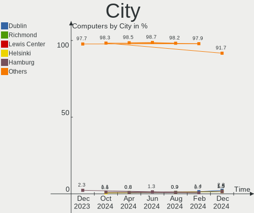
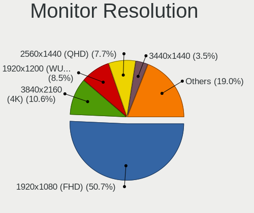
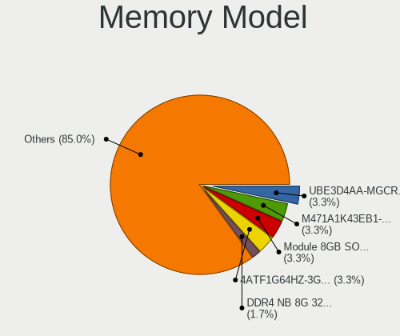

Kubuntu Hardware Trends
-----------------------

A project to identify most popular hardware characteristics and track their change
over time based on data collected by Kubuntu users at https://Linux-Hardware.org.

Anyone can contribute to the study by uploading probes of their computers by
the [hw-probe](https://github.com/linuxhw/hw-probe) tool:

    sudo -E hw-probe -all -upload

This is a report for all computer types. See also reports for [desktops](/Dist/Kubuntu/Desktop/README.md) and [notebooks](/Dist/Kubuntu/Notebook/README.md).

Full-feature report is available here: https://linux-hardware.org/?view=trends

Period: Mar, 2021.

Contents
--------

- [ OS                       ](#os)
- [ OS Family                ](#os-family)
- [ Kernel                   ](#kernel)
- [ Kernel Family            ](#kernel-family)
- [ Kernel Major Ver.        ](#kernel-major-ver)
- [ Arch                     ](#arch)
- [ DE                       ](#de)
- [ Display Server           ](#display-server)
- [ Display Manager          ](#display-manager)
- [ OS Lang                  ](#os-lang)
- [ Boot Mode                ](#boot-mode)
- [ Filesystem               ](#filesystem)
- [ Part. scheme             ](#part-scheme)
- [ Dual Boot with Linux/BSD ](#dual-boot-with-linux/bsd)
- [ Dual Boot (Win)          ](#dual-boot-win)
- [ Country                  ](#country)
- [ City                     ](#city)
- [ Vendor                   ](#vendor)
- [ Model                    ](#model)
- [ Model Family             ](#model-family)
- [ MFG Year                 ](#mfg-year)
- [ Form Factor              ](#form-factor)
- [ Secure Boot              ](#secure-boot)
- [ Coreboot                 ](#coreboot)
- [ RAM Size                 ](#ram-size)
- [ RAM Used                 ](#ram-used)
- [ Has CD-ROM               ](#has-cd-rom)
- [ Total Drives             ](#total-drives)
- [ Has Ethernet             ](#has-ethernet)
- [ Has WiFi                 ](#has-wifi)
- [ Has Bluetooth            ](#has-bluetooth)
- [ Drive Vendor             ](#drive-vendor)
- [ Drive Model              ](#drive-model)
- [ HDD Vendor               ](#hdd-vendor)
- [ SSD Vendor               ](#ssd-vendor)
- [ Drive Kind               ](#drive-kind)
- [ Drive Connector          ](#drive-connector)
- [ Drive Size               ](#drive-size)
- [ Space Total              ](#space-total)
- [ Space Used               ](#space-used)
- [ Malfunc. Drives          ](#malfunc-drives)
- [ Malfunc. Drive Vendor    ](#malfunc-drive-vendor)
- [ Malfunc. HDD Vendor      ](#malfunc-hdd-vendor)
- [ Malfunc. Drive Kind      ](#malfunc-drive-kind)
- [ Failed Drives            ](#failed-drives)
- [ Failed Drive Vendor      ](#failed-drive-vendor)
- [ Drive Status             ](#drive-status)
- [ Storage Vendor           ](#storage-vendor)
- [ Storage Model            ](#storage-model)
- [ Storage Kind             ](#storage-kind)
- [ CPU Vendor               ](#cpu-vendor)
- [ CPU Model                ](#cpu-model)
- [ CPU Model Family         ](#cpu-model-family)
- [ CPU Cores                ](#cpu-cores)
- [ CPU Sockets              ](#cpu-sockets)
- [ CPU Threads              ](#cpu-threads)
- [ CPU Op-Modes             ](#cpu-op-modes)
- [ CPU Microcode            ](#cpu-microcode)
- [ CPU Microarch            ](#cpu-microarch)
- [ GPU Vendor               ](#gpu-vendor)
- [ GPU Model                ](#gpu-model)
- [ GPU Combo                ](#gpu-combo)
- [ GPU Driver               ](#gpu-driver)
- [ GPU Memory               ](#gpu-memory)
- [ Monitor Vendor           ](#monitor-vendor)
- [ Monitor Model            ](#monitor-model)
- [ Monitor Resolution       ](#monitor-resolution)
- [ Monitor Diagonal         ](#monitor-diagonal)
- [ Monitor Width            ](#monitor-width)
- [ Aspect Ratio             ](#aspect-ratio)
- [ Monitor Area             ](#monitor-area)
- [ Pixel Density            ](#pixel-density)
- [ Multiple Monitors        ](#multiple-monitors)
- [ Net Controller Vendor    ](#net-controller-vendor)
- [ Net Controller Model     ](#net-controller-model)
- [ Wireless Vendor          ](#wireless-vendor)
- [ Wireless Model           ](#wireless-model)
- [ Ethernet Vendor          ](#ethernet-vendor)
- [ Ethernet Model           ](#ethernet-model)
- [ Net Controller Kind      ](#net-controller-kind)
- [ Used Controller          ](#used-controller)
- [ NICs                     ](#nics)
- [ IPv6                     ](#ipv6)
- [ Memory Vendor            ](#memory-vendor)
- [ Memory Model             ](#memory-model)
- [ Memory Kind              ](#memory-kind)
- [ Memory Form Factor       ](#memory-form-factor)
- [ Memory Size              ](#memory-size)
- [ Memory Speed             ](#memory-speed)
- [ Sound Vendor             ](#sound-vendor)
- [ Sound Model              ](#sound-model)
- [ Camera Vendor            ](#camera-vendor)
- [ Camera Model             ](#camera-model)
- [ Fingerprint Vendor       ](#fingerprint-vendor)
- [ Fingerprint Model        ](#fingerprint-model)
- [ Chipcard Vendor          ](#chipcard-vendor)
- [ Chipcard Model           ](#chipcard-model)
- [ Printer Vendor           ](#printer-vendor)
- [ Printer Model            ](#printer-model)
- [ Scanner Vendor           ](#scanner-vendor)
- [ Scanner Model            ](#scanner-model)
- [ Bluetooth Vendor         ](#bluetooth-vendor)
- [ Bluetooth Model          ](#bluetooth-model)
- [ Unsupported Devices      ](#unsupported-devices)
- [ Unsupported Device Types ](#unsupported-device-types)

OS
--

Installed operating systems

| Name          | Computers | Percent |
|---------------|-----------|---------|
| Kubuntu 20.04 | 59        | 62.11%  |
| Kubuntu 20.10 | 30        | 31.58%  |
| Kubuntu 18.04 | 3         | 3.16%   |
| Kubuntu 21.04 | 2         | 2.11%   |
| Kubuntu 18.10 | 1         | 1.05%   |

OS Family
---------

OS without a version

| Name    | Computers | Percent |
|---------|-----------|---------|
| Kubuntu | 95        | 100%    |

Kernel
------

Version of the Linux kernel

| Version                | Computers | Percent |
|------------------------|-----------|---------|
| 5.8.0-45-generic       | 19        | 20%     |
| 5.8.0-44-generic       | 17        | 17.89%  |
| 5.4.0-66-generic       | 11        | 11.58%  |
| 5.8.0-48-generic       | 10        | 10.53%  |
| 5.4.0-67-generic       | 10        | 10.53%  |
| 5.4.0-70-generic       | 6         | 6.32%   |
| 5.8.0-45-lowlatency    | 2         | 2.11%   |
| 5.8.0-44-lowlatency    | 2         | 2.11%   |
| 5.8.0-25-generic       | 2         | 2.11%   |
| 5.4.0-48-generic       | 2         | 2.11%   |
| 5.11.0-051100-generic  | 2         | 2.11%   |
| 5.10.0-14-generic      | 2         | 2.11%   |
| 5.8.0-25-lowlatency    | 1         | 1.05%   |
| 5.6.0-1052-oem         | 1         | 1.05%   |
| 5.4.0-70-lowlatency    | 1         | 1.05%   |
| 5.4.0-66-lowlatency    | 1         | 1.05%   |
| 5.4.0-65-generic       | 1         | 1.05%   |
| 5.4.0-42-generic       | 1         | 1.05%   |
| 5.11.6-051106-generic  | 1         | 1.05%   |
| 5.10.22-051022-generic | 1         | 1.05%   |
| 5.10.0-051000-generic  | 1         | 1.05%   |
| 4.18.0-25-generic      | 1         | 1.05%   |

Kernel Family
-------------

Linux kernel without a distro release

| Version | Computers | Percent |
|---------|-----------|---------|
| 5.8.0   | 53        | 55.79%  |
| 5.4.0   | 33        | 34.74%  |
| 5.10.0  | 3         | 3.16%   |
| 5.11.0  | 2         | 2.11%   |
| 5.6.0   | 1         | 1.05%   |
| 5.11.6  | 1         | 1.05%   |
| 5.10.22 | 1         | 1.05%   |
| 4.18.0  | 1         | 1.05%   |

Kernel Major Ver.
-----------------

Linux kernel major version

| Version | Computers | Percent |
|---------|-----------|---------|
| 5.8     | 53        | 55.79%  |
| 5.4     | 33        | 34.74%  |
| 5.10    | 4         | 4.21%   |
| 5.11    | 3         | 3.16%   |
| 5.6     | 1         | 1.05%   |
| 4.18    | 1         | 1.05%   |

Arch
----

OS architecture (x86_64, i586, etc.)

| Name   | Computers | Percent |
|--------|-----------|---------|
| x86_64 | 95        | 100%    |

DE
--

Desktop Environment

| Name  | Computers | Percent |
|-------|-----------|---------|
| KDE5  | 48        | 50.53%  |
| KDE   | 46        | 48.42%  |
| GNOME | 1         | 1.05%   |

Display Server
--------------

X11 or Wayland

| Name    | Computers | Percent |
|---------|-----------|---------|
| X11     | 87        | 91.58%  |
| Wayland | 4         | 4.21%   |
| Tty     | 4         | 4.21%   |

Display Manager
---------------

SDDM, LightDM, etc.

| Name    | Computers | Percent |
|---------|-----------|---------|
| Unknown | 45        | 47.37%  |
| SDDM    | 40        | 42.11%  |
| GDM     | 9         | 9.47%   |
| TDM     | 1         | 1.05%   |

OS Lang
-------

Language

| Lang  | Computers | Percent |
|-------|-----------|---------|
| en_US | 41        | 43.16%  |
| ru_RU | 13        | 13.68%  |
| en_CA | 8         | 8.42%   |
| de_DE | 5         | 5.26%   |
| pt_BR | 4         | 4.21%   |
| fr_FR | 3         | 3.16%   |
| es_ES | 3         | 3.16%   |
| ru_UA | 2         | 2.11%   |
| pl_PL | 2         | 2.11%   |
| it_IT | 2         | 2.11%   |
| en_NZ | 2         | 2.11%   |
| en_IN | 2         | 2.11%   |
| en_GB | 2         | 2.11%   |
| uk_UA | 1         | 1.05%   |
| sv_SE | 1         | 1.05%   |
| fi_FI | 1         | 1.05%   |
| es_MX | 1         | 1.05%   |
| cs_CZ | 1         | 1.05%   |
| C     | 1         | 1.05%   |

Boot Mode
---------

EFI or BIOS

| Mode | Computers | Percent |
|------|-----------|---------|
| EFI  | 51        | 53.68%  |
| BIOS | 44        | 46.32%  |

Filesystem
----------

Type of filesystem

| Type    | Computers | Percent |
|---------|-----------|---------|
| Ext4    | 87        | 91.58%  |
| Overlay | 3         | 3.16%   |
| Zfs     | 2         | 2.11%   |
| Btrfs   | 2         | 2.11%   |
| Ext3    | 1         | 1.05%   |

Part. scheme
------------

Scheme of partitioning

| Type    | Computers | Percent |
|---------|-----------|---------|
| Unknown | 45        | 47.37%  |
| GPT     | 37        | 38.95%  |
| MBR     | 13        | 13.68%  |

Dual Boot with Linux/BSD
------------------------

Hosting more than one Linux/BSD

| Dual boot | Computers | Percent |
|-----------|-----------|---------|
| No        | 81        | 85.26%  |
| Yes       | 14        | 14.74%  |

Dual Boot (Win)
---------------

Hosting Linux and Windows

| Dual boot | Computers | Percent |
|-----------|-----------|---------|
| No        | 62        | 65.26%  |
| Yes       | 33        | 34.74%  |

Country
-------

Geographic location (country)

| Country     | Computers | Percent |
|-------------|-----------|---------|
| USA         | 15        | 15.79%  |
| Russia      | 14        | 14.74%  |
| Germany     | 8         | 8.42%   |
| Ukraine     | 7         | 7.37%   |
| Canada      | 6         | 6.32%   |
| Brazil      | 5         | 5.26%   |
| France      | 4         | 4.21%   |
| Spain       | 3         | 3.16%   |
| Poland      | 3         | 3.16%   |
| Finland     | 3         | 3.16%   |
| Bulgaria    | 3         | 3.16%   |
| Sweden      | 2         | 2.11%   |
| Serbia      | 2         | 2.11%   |
| New Zealand | 2         | 2.11%   |
| Mexico      | 2         | 2.11%   |
| India       | 2         | 2.11%   |
| Belgium     | 2         | 2.11%   |
| Belarus     | 2         | 2.11%   |
| Vietnam     | 1         | 1.05%   |
| Vatican     | 1         | 1.05%   |
| UK          | 1         | 1.05%   |
| Slovakia    | 1         | 1.05%   |
| Romania     | 1         | 1.05%   |
| Nepal       | 1         | 1.05%   |
| Kazakhstan  | 1         | 1.05%   |
| Italy       | 1         | 1.05%   |
| Czechia     | 1         | 1.05%   |
| Colombia    | 1         | 1.05%   |

City
----

Geographic location (city)

| City                | Computers | Percent |
|---------------------|-----------|---------|
| Moscow              | 4         | 4.21%   |
| Usol'ye-Sibirskoye  | 3         | 3.16%   |
| Sofia               | 3         | 3.16%   |
| Krasnodar           | 3         | 3.16%   |
| Minsk               | 2         | 2.11%   |
| Madrid              | 2         | 2.11%   |
| Longueuil           | 2         | 2.11%   |
| Kyiv                | 2         | 2.11%   |
| Helsinki            | 2         | 2.11%   |
| Belgrade            | 2         | 2.11%   |
| Washington          | 1         | 1.05%   |
| Warsaw              | 1         | 1.05%   |
| Vatican City        | 1         | 1.05%   |
| Toulouse            | 1         | 1.05%   |
| Thrissur            | 1         | 1.05%   |
| Tampere             | 1         | 1.05%   |
| Sulmin              | 1         | 1.05%   |
| St Petersburg       | 1         | 1.05%   |
| Srednyaya Akhtuba   | 1         | 1.05%   |
| Somerville          | 1         | 1.05%   |
| Shevchenkivske      | 1         | 1.05%   |
| San Francisco       | 1         | 1.05%   |
| San Diego           | 1         | 1.05%   |
| Pune                | 1         | 1.05%   |
| Presidente Prudente | 1         | 1.05%   |
| Piatra Neamţ       | 1         | 1.05%   |
| Phoenix             | 1         | 1.05%   |
| Paris               | 1         | 1.05%   |
| Palma               | 1         | 1.05%   |
| Ottawa              | 1         | 1.05%   |
| Oryol               | 1         | 1.05%   |
| Old Orchard Beach   | 1         | 1.05%   |
| Odessa              | 1         | 1.05%   |
| Novosibirsk         | 1         | 1.05%   |
| Nitra               | 1         | 1.05%   |
| New London          | 1         | 1.05%   |
| Munich              | 1         | 1.05%   |
| Mount Pearl         | 1         | 1.05%   |
| Most                | 1         | 1.05%   |
| Morelia             | 1         | 1.05%   |
| Montreal            | 1         | 1.05%   |
| Maurecourt          | 1         | 1.05%   |
| Marseille           | 1         | 1.05%   |
| Mankato             | 1         | 1.05%   |
| Malmo               | 1         | 1.05%   |
| Lviv                | 1         | 1.05%   |
| Kungsholmen         | 1         | 1.05%   |
| Kathmandu           | 1         | 1.05%   |
| Kamloops            | 1         | 1.05%   |
| Harrison            | 1         | 1.05%   |
| Greensboro          | 1         | 1.05%   |
| Gorlice             | 1         | 1.05%   |
| Goiânia            | 1         | 1.05%   |
| Ghent               | 1         | 1.05%   |
| Gera                | 1         | 1.05%   |
| Freudenstadt        | 1         | 1.05%   |
| Frankfurt am Main   | 1         | 1.05%   |
| Düsseldorf         | 1         | 1.05%   |
| Da Nang             | 1         | 1.05%   |
| Ciudad Guzmán      | 1         | 1.05%   |

Vendor
------

Motherboard manufacturer

| Name                | Computers | Percent |
|---------------------|-----------|---------|
| ASUSTek Computer    | 22        | 23.16%  |
| Hewlett-Packard     | 15        | 15.79%  |
| Dell                | 12        | 12.63%  |
| Gigabyte Technology | 11        | 11.58%  |
| MSI                 | 7         | 7.37%   |
| Lenovo              | 5         | 5.26%   |
| ASRock              | 5         | 5.26%   |
| Acer                | 4         | 4.21%   |
| Samsung Electronics | 2         | 2.11%   |
| Notebook            | 2         | 2.11%   |
| Wortmann AG         | 1         | 1.05%   |
| TUXEDO              | 1         | 1.05%   |
| Timi                | 1         | 1.05%   |
| Sony                | 1         | 1.05%   |
| Seco                | 1         | 1.05%   |
| Positivo            | 1         | 1.05%   |
| Intel               | 1         | 1.05%   |
| HUAWEI              | 1         | 1.05%   |
| Google              | 1         | 1.05%   |
| Unknown             | 1         | 1.05%   |

Model
-----

Motherboard model

| Name                                     | Computers | Percent |
|------------------------------------------|-----------|---------|
| Dell XPS 13 9370                         | 2         | 2.11%   |
| ASUS VivoBook_ASUSLaptop X512DA_X512DA   | 2         | 2.11%   |
| Wortmann AG TERRA_PC                     | 1         | 1.05%   |
| TUXEDO InfinityBook S 14 Gen6            | 1         | 1.05%   |
| Timi TM1607                              | 1         | 1.05%   |
| Sony VPCCW25FL                           | 1         | 1.05%   |
| Seco C40                                 | 1         | 1.05%   |
| Samsung RV415/RV515                      | 1         | 1.05%   |
| Samsung 370E4K                           | 1         | 1.05%   |
| Positivo C14CR01                         | 1         | 1.05%   |
| Notebook W65_67SF                        | 1         | 1.05%   |
| Notebook W54_55_94_95_97AU,AUQ           | 1         | 1.05%   |
| MSI MS-7C76                              | 1         | 1.05%   |
| MSI MS-7C39                              | 1         | 1.05%   |
| MSI MS-7B09                              | 1         | 1.05%   |
| MSI MS-7A32                              | 1         | 1.05%   |
| MSI MS-7996                              | 1         | 1.05%   |
| MSI Modern 15 A10M                       | 1         | 1.05%   |
| MSI GL75 Leopard 10SCSR                  | 1         | 1.05%   |
| Lenovo ThinkPad X1 Carbon 7th 20QD000SUS | 1         | 1.05%   |
| Lenovo ThinkPad T440 20B7S2SM00          | 1         | 1.05%   |
| Lenovo ThinkPad T14 Gen 1 20S0000MGE     | 1         | 1.05%   |
| Lenovo ThinkPad E15 Gen 2 20TD0019BM     | 1         | 1.05%   |
| Lenovo IdeaPad S340-14API 81NB           | 1         | 1.05%   |
| Intel Tiger Lake Client Platform         | 1         | 1.05%   |
| HUAWEI MACHR-WX9                         | 1         | 1.05%   |
| HP Z400 Workstation                      | 1         | 1.05%   |
| HP Stream Notebook PC 14                 | 1         | 1.05%   |
| HP ProBook 6470b                         | 1         | 1.05%   |
| HP ProBook 4730s                         | 1         | 1.05%   |
| HP ProBook 455 G7                        | 1         | 1.05%   |
| HP Pavilion g6                           | 1         | 1.05%   |
| HP Pavilion 15                           | 1         | 1.05%   |
| HP Laptop 15s-fq2xxx                     | 1         | 1.05%   |
| HP Laptop 15s-eq1xxx                     | 1         | 1.05%   |
| HP ENVY x360 Convertible 15-ee0xxx       | 1         | 1.05%   |
| HP EliteDesk 800 G3 SFF                  | 1         | 1.05%   |
| HP EliteBook x360 1030 G2                | 1         | 1.05%   |
| HP EliteBook 840 G5                      | 1         | 1.05%   |
| HP EliteBook 2570p                       | 1         | 1.05%   |
| HP 2000                                  | 1         | 1.05%   |
| Google Coral                             | 1         | 1.05%   |
| Gigabyte Z87-HD3                         | 1         | 1.05%   |
| Gigabyte Z390 AORUS PRO                  | 1         | 1.05%   |
| Gigabyte Z170X-UD5                       | 1         | 1.05%   |
| Gigabyte P61-S3                          | 1         | 1.05%   |
| Gigabyte GA-970-Gaming SLI-CF            | 1         | 1.05%   |
| Gigabyte GA-78LMT-USB3                   | 1         | 1.05%   |
| Gigabyte B550M AORUS PRO-P               | 1         | 1.05%   |
| Gigabyte B450M S2H                       | 1         | 1.05%   |
| Gigabyte B365M DS3H                      | 1         | 1.05%   |
| Gigabyte AB350-Gaming 3                  | 1         | 1.05%   |
| Gigabyte A320M-H                         | 1         | 1.05%   |
| Dell XPS M1530                           | 1         | 1.05%   |
| Dell XPS L701X                           | 1         | 1.05%   |
| Dell XPS 15 9500                         | 1         | 1.05%   |
| Dell XPS 13 9310                         | 1         | 1.05%   |
| Dell Precision 5550                      | 1         | 1.05%   |
| Dell OptiPlex 7010                       | 1         | 1.05%   |
| Dell Latitude E4310                      | 1         | 1.05%   |

Model Family
------------

Motherboard model prefix

| Name                   | Computers | Percent |
|------------------------|-----------|---------|
| Dell XPS               | 6         | 6.32%   |
| Lenovo ThinkPad        | 4         | 4.21%   |
| HP ProBook             | 3         | 3.16%   |
| HP EliteBook           | 3         | 3.16%   |
| Dell Latitude          | 3         | 3.16%   |
| ASUS VivoBook          | 3         | 3.16%   |
| Acer Aspire            | 3         | 3.16%   |
| HP Pavilion            | 2         | 2.11%   |
| HP Laptop              | 2         | 2.11%   |
| ASUS TUF               | 2         | 2.11%   |
| ASUS ROG               | 2         | 2.11%   |
| ASUS PRIME             | 2         | 2.11%   |
| ASUS M5A97             | 2         | 2.11%   |
| Wortmann AG TERRA      | 1         | 1.05%   |
| TUXEDO InfinityBook    | 1         | 1.05%   |
| Timi TM1607            | 1         | 1.05%   |
| Sony VPCCW25FL         | 1         | 1.05%   |
| Seco C40               | 1         | 1.05%   |
| Samsung RV415          | 1         | 1.05%   |
| Samsung 370E4K         | 1         | 1.05%   |
| Positivo C14CR01       | 1         | 1.05%   |
| Notebook W65           | 1         | 1.05%   |
| Notebook W54           | 1         | 1.05%   |
| MSI MS-7C76            | 1         | 1.05%   |
| MSI MS-7C39            | 1         | 1.05%   |
| MSI MS-7B09            | 1         | 1.05%   |
| MSI MS-7A32            | 1         | 1.05%   |
| MSI MS-7996            | 1         | 1.05%   |
| MSI Modern             | 1         | 1.05%   |
| MSI GL75               | 1         | 1.05%   |
| Lenovo IdeaPad         | 1         | 1.05%   |
| Intel Tiger            | 1         | 1.05%   |
| HUAWEI MACHR-WX9       | 1         | 1.05%   |
| HP Z400                | 1         | 1.05%   |
| HP Stream              | 1         | 1.05%   |
| HP ENVY                | 1         | 1.05%   |
| HP EliteDesk           | 1         | 1.05%   |
| HP 2000                | 1         | 1.05%   |
| Google Coral           | 1         | 1.05%   |
| Gigabyte Z87-HD3       | 1         | 1.05%   |
| Gigabyte Z390          | 1         | 1.05%   |
| Gigabyte Z170X-UD5     | 1         | 1.05%   |
| Gigabyte P61-S3        | 1         | 1.05%   |
| Gigabyte GA-970-Gaming | 1         | 1.05%   |
| Gigabyte GA-78LMT-USB3 | 1         | 1.05%   |
| Gigabyte B550M         | 1         | 1.05%   |
| Gigabyte B450M         | 1         | 1.05%   |
| Gigabyte B365M         | 1         | 1.05%   |
| Gigabyte AB350-Gaming  | 1         | 1.05%   |
| Gigabyte A320M-H       | 1         | 1.05%   |
| Dell Precision         | 1         | 1.05%   |
| Dell OptiPlex          | 1         | 1.05%   |
| Dell Inspiron          | 1         | 1.05%   |
| ASUS Zen               | 1         | 1.05%   |
| ASUS Z170              | 1         | 1.05%   |
| ASUS X541NA            | 1         | 1.05%   |
| ASUS P9X79             | 1         | 1.05%   |
| ASUS P8H77-V           | 1         | 1.05%   |
| ASUS P6T               | 1         | 1.05%   |
| ASUS N551JM            | 1         | 1.05%   |

MFG Year
--------

Motherboard manufacture year

| Year | Computers | Percent |
|------|-----------|---------|
| 2020 | 26        | 27.37%  |
| 2019 | 15        | 15.79%  |
| 2018 | 9         | 9.47%   |
| 2021 | 7         | 7.37%   |
| 2012 | 7         | 7.37%   |
| 2016 | 6         | 6.32%   |
| 2014 | 6         | 6.32%   |
| 2013 | 4         | 4.21%   |
| 2017 | 3         | 3.16%   |
| 2015 | 3         | 3.16%   |
| 2011 | 3         | 3.16%   |
| 2010 | 3         | 3.16%   |
| 2009 | 2         | 2.11%   |
| 2008 | 1         | 1.05%   |

Form Factor
-----------

Physical design of the computer

| Name        | Computers | Percent |
|-------------|-----------|---------|
| Notebook    | 48        | 50.53%  |
| Desktop     | 44        | 46.32%  |
| Convertible | 2         | 2.11%   |
| All in one  | 1         | 1.05%   |

Secure Boot
-----------

Enabled or disabled

| State    | Computers | Percent |
|----------|-----------|---------|
| Disabled | 88        | 92.63%  |
| Enabled  | 7         | 7.37%   |

Coreboot
--------

Have coreboot on board

| Used | Computers | Percent |
|------|-----------|---------|
| No   | 94        | 98.95%  |
| Yes  | 1         | 1.05%   |

RAM Size
--------

Total RAM memory

| Size in GB  | Computers | Percent |
|-------------|-----------|---------|
| 16.01-24.0  | 23        | 24.21%  |
| 4.01-8.0    | 20        | 21.05%  |
| 8.01-16.0   | 18        | 18.95%  |
| 3.01-4.0    | 13        | 13.68%  |
| 32.01-64.0  | 12        | 12.63%  |
| 24.01-32.0  | 4         | 4.21%   |
| 64.01-256.0 | 4         | 4.21%   |
| 1.01-2.0    | 1         | 1.05%   |

RAM Used
--------

Used RAM memory

| Used GB    | Computers | Percent |
|------------|-----------|---------|
| 4.01-8.0   | 26        | 27.37%  |
| 3.01-4.0   | 19        | 20%     |
| 2.01-3.0   | 17        | 17.89%  |
| 1.01-2.0   | 17        | 17.89%  |
| 8.01-16.0  | 14        | 14.74%  |
| 24.01-32.0 | 1         | 1.05%   |
| 0.51-1.0   | 1         | 1.05%   |

Has CD-ROM
----------

Has CD-ROM on board

| Presented | Computers | Percent |
|-----------|-----------|---------|
| No        | 67        | 70.53%  |
| Yes       | 28        | 29.47%  |

Total Drives
------------

Number of drives on board

| Drives | Computers | Percent |
|--------|-----------|---------|
| 1      | 48        | 50.53%  |
| 2      | 22        | 23.16%  |
| 3      | 13        | 13.68%  |
| 4      | 6         | 6.32%   |
| 5      | 2         | 2.11%   |
| 0      | 2         | 2.11%   |
| 10     | 1         | 1.05%   |
| 7      | 1         | 1.05%   |

Has Ethernet
------------

Has Ethernet on board

| Presented | Computers | Percent |
|-----------|-----------|---------|
| Yes       | 79        | 83.16%  |
| No        | 16        | 16.84%  |

Has WiFi
--------

Has WiFi module

| Presented | Computers | Percent |
|-----------|-----------|---------|
| Yes       | 64        | 67.37%  |
| No        | 31        | 32.63%  |

Has Bluetooth
-------------

Has Bluetooth module

| Presented | Computers | Percent |
|-----------|-----------|---------|
| Yes       | 60        | 63.16%  |
| No        | 35        | 36.84%  |

Drive Vendor
------------

Hard drive vendors

| Vendor              | Computers | Drives | Percent |
|---------------------|-----------|--------|---------|
| Samsung Electronics | 29        | 38     | 18.01%  |
| WDC                 | 24        | 29     | 14.91%  |
| Seagate             | 19        | 24     | 11.8%   |
| Toshiba             | 13        | 13     | 8.07%   |
| SanDisk             | 9         | 9      | 5.59%   |
| Kingston            | 7         | 7      | 4.35%   |
| Intel               | 7         | 7      | 4.35%   |
| Crucial             | 6         | 6      | 3.73%   |
| Unknown             | 5         | 5      | 3.11%   |
| Hitachi             | 5         | 5      | 3.11%   |
| SK Hynix            | 4         | 4      | 2.48%   |
| Micron Technology   | 4         | 4      | 2.48%   |
| Transcend           | 2         | 2      | 1.24%   |
| Patriot             | 2         | 2      | 1.24%   |
| GOODRAM             | 2         | 3      | 1.24%   |
| Fujitsu             | 2         | 2      | 1.24%   |
| Corsair             | 2         | 2      | 1.24%   |
| China               | 2         | 2      | 1.24%   |
| A-DATA Technology   | 2         | 2      | 1.24%   |
| WD MediaMax         | 1         | 1      | 0.62%   |
| Verbatim            | 1         | 1      | 0.62%   |
| SPCC                | 1         | 1      | 0.62%   |
| Silicon Motion      | 1         | 1      | 0.62%   |
| SABRENT             | 1         | 1      | 0.62%   |
| PLEXTOR             | 1         | 1      | 0.62%   |
| MDT                 | 1         | 1      | 0.62%   |
| MAXTOR              | 1         | 1      | 0.62%   |
| LITEON              | 1         | 1      | 0.62%   |
| Intenso             | 1         | 2      | 0.62%   |
| HGST                | 1         | 1      | 0.62%   |
| Gigabyte Technology | 1         | 1      | 0.62%   |
| EMTEC               | 1         | 1      | 0.62%   |
| BHT                 | 1         | 1      | 0.62%   |
| ASMT                | 1         | 1      | 0.62%   |

Drive Model
-----------

Hard drive models

| Model                                   | Computers | Percent |
|-----------------------------------------|-----------|---------|
| Samsung NVMe SSD Drive 512GB            | 3         | 1.68%   |
| WDC WD1003FZEX-00MK2A0 1TB              | 2         | 1.12%   |
| Unknown MMC Card  32GB                  | 2         | 1.12%   |
| Toshiba DT01ACA300 3TB                  | 2         | 1.12%   |
| Seagate ST9500325AS 500GB               | 2         | 1.12%   |
| Seagate ST3320620AS 320GB               | 2         | 1.12%   |
| Seagate Expansion 1TB                   | 2         | 1.12%   |
| Samsung SSD 860 EVO M.2 1TB             | 2         | 1.12%   |
| Samsung SSD 850 EVO 500GB               | 2         | 1.12%   |
| Samsung SSD 850 EVO 1TB                 | 2         | 1.12%   |
| Samsung NVMe SSD Drive 500GB            | 2         | 1.12%   |
| Samsung NVMe SSD Drive 1TB              | 2         | 1.12%   |
| Patriot Burst 240GB SSD                 | 2         | 1.12%   |
| Intel NVMe SSD Drive 512GB              | 2         | 1.12%   |
| Crucial CT512MX100SSD1 512GB            | 2         | 1.12%   |
| WDC WDS500G2B0B-00YS70 500GB SSD        | 1         | 0.56%   |
| WDC WDS200T2B0C-00PXH0 2TB              | 1         | 0.56%   |
| WDC WDS100T2B0A-00SM50 1TB SSD          | 1         | 0.56%   |
| WDC WD60EZAZ-00ZGHB0 6TB                | 1         | 0.56%   |
| WDC WD3200BEVT-22ZCT0 320GB             | 1         | 0.56%   |
| WDC WD3200AAKX-001CA0 320GB             | 1         | 0.56%   |
| WDC WD3200AAKS-75SBA0 320GB             | 1         | 0.56%   |
| WDC WD3200AAJS-56M0A0 320GB             | 1         | 0.56%   |
| WDC WD20EZRZ-00Z5HB0 2TB                | 1         | 0.56%   |
| WDC WD20EARS-00MVWB0 2TB                | 1         | 0.56%   |
| WDC WD2005FBYZ-01YCBB2 2TB              | 1         | 0.56%   |
| WDC WD10SPZX-21Z10T0 1TB                | 1         | 0.56%   |
| WDC WD10SPZX-17Z10T1 1TB                | 1         | 0.56%   |
| WDC WD10JPVX-08JC3T5 1TB                | 1         | 0.56%   |
| WDC WD10EZEX-22RKKA0 1TB                | 1         | 0.56%   |
| WDC WD10EZEX-00WN4A0 1TB                | 1         | 0.56%   |
| WDC WD10EARS-00MVWB0 1TB                | 1         | 0.56%   |
| WDC WD10EADS-00L5B1 1TB                 | 1         | 0.56%   |
| WDC WD1003FZEX-00K3CA0 1TB              | 1         | 0.56%   |
| WDC WD1002FAEX-00Z3A0 1TB               | 1         | 0.56%   |
| WDC WD1002FAEX-00Y9A0 1TB               | 1         | 0.56%   |
| WDC WD1001FALS-00J7B0 1TB               | 1         | 0.56%   |
| WDC PC SN730 SDBQNTY-512G-1001 512GB    | 1         | 0.56%   |
| WDC PC SN730 SDBPNTY-512G-1032 512GB    | 1         | 0.56%   |
| WDC PC SN530 SDBPNPZ-1T00-1002 1TB      | 1         | 0.56%   |
| WDC PC SN520 SDAPNUW-256G-1006 256GB    | 1         | 0.56%   |
| WD MediaMax WL1000GSA3272C 1TB          | 1         | 0.56%   |
| Verbatim Vi550 S3 SSD 128GB             | 1         | 0.56%   |
| Unknown TO  8GB                         | 1         | 0.56%   |
| Unknown SU32G  32GB                     | 1         | 0.56%   |
| Unknown MMC Card  2GB                   | 1         | 0.56%   |
| Transcend TS256GMTE220S 256GB           | 1         | 0.56%   |
| Transcend TS128GSSD230S 128GB           | 1         | 0.56%   |
| Toshiba MQ01ABF050 500GB                | 1         | 0.56%   |
| Toshiba MQ01ABF032 320GB                | 1         | 0.56%   |
| Toshiba MQ01ABD100 1TB                  | 1         | 0.56%   |
| Toshiba MK5076GSX 500GB                 | 1         | 0.56%   |
| Toshiba KXG60ZNV512G 512GB              | 1         | 0.56%   |
| Toshiba KSG60ZMV512G M.2 2280 512GB SSD | 1         | 0.56%   |
| Toshiba HDWD130 3TB                     | 1         | 0.56%   |
| Toshiba HDWD110 1TB                     | 1         | 0.56%   |
| Toshiba HDWA130 3TB                     | 1         | 0.56%   |
| Toshiba DT01ACA200 2TB                  | 1         | 0.56%   |
| Toshiba DT01ACA100 1TB                  | 1         | 0.56%   |
| SPCC Solid State Disk 512GB             | 1         | 0.56%   |

HDD Vendor
----------

Hard disk drive vendors

| Vendor              | Computers | Drives | Percent |
|---------------------|-----------|--------|---------|
| WDC                 | 18        | 22     | 29.03%  |
| Seagate             | 18        | 23     | 29.03%  |
| Toshiba             | 11        | 11     | 17.74%  |
| Samsung Electronics | 5         | 5      | 8.06%   |
| Hitachi             | 5         | 5      | 8.06%   |
| Fujitsu             | 2         | 2      | 3.23%   |
| WD MediaMax         | 1         | 1      | 1.61%   |
| MAXTOR              | 1         | 1      | 1.61%   |
| HGST                | 1         | 1      | 1.61%   |

SSD Vendor
----------

Solid state drive vendors

| Vendor              | Computers | Drives | Percent |
|---------------------|-----------|--------|---------|
| Samsung Electronics | 13        | 15     | 23.64%  |
| Crucial             | 6         | 6      | 10.91%  |
| SanDisk             | 5         | 5      | 9.09%   |
| Kingston            | 5         | 5      | 9.09%   |
| WDC                 | 2         | 2      | 3.64%   |
| SK Hynix            | 2         | 2      | 3.64%   |
| Patriot             | 2         | 2      | 3.64%   |
| Micron Technology   | 2         | 2      | 3.64%   |
| GOODRAM             | 2         | 3      | 3.64%   |
| Corsair             | 2         | 2      | 3.64%   |
| China               | 2         | 2      | 3.64%   |
| A-DATA Technology   | 2         | 2      | 3.64%   |
| Verbatim            | 1         | 1      | 1.82%   |
| Transcend           | 1         | 1      | 1.82%   |
| Toshiba             | 1         | 1      | 1.82%   |
| SPCC                | 1         | 1      | 1.82%   |
| SABRENT             | 1         | 1      | 1.82%   |
| PLEXTOR             | 1         | 1      | 1.82%   |
| LITEON              | 1         | 1      | 1.82%   |
| Intenso             | 1         | 1      | 1.82%   |
| Intel               | 1         | 1      | 1.82%   |
| ASMT                | 1         | 1      | 1.82%   |

Drive Kind
----------

HDD or SSD

| Kind    | Computers | Drives | Percent |
|---------|-----------|--------|---------|
| HDD     | 48        | 71     | 35.04%  |
| SSD     | 41        | 58     | 29.93%  |
| NVMe    | 37        | 42     | 27.01%  |
| MMC     | 6         | 6      | 4.38%   |
| Unknown | 5         | 5      | 3.65%   |

Drive Connector
---------------

SATA, SAS, NVMe, etc.

| Type | Computers | Drives | Percent |
|------|-----------|--------|---------|
| SATA | 70        | 126    | 58.82%  |
| NVMe | 37        | 42     | 31.09%  |
| SAS  | 6         | 8      | 5.04%   |
| MMC  | 6         | 6      | 5.04%   |

Drive Size
----------

Size of hard drive

| Size in TB | Computers | Drives | Percent |
|------------|-----------|--------|---------|
| 0.01-0.5   | 46        | 62     | 47.42%  |
| 0.51-1.0   | 39        | 53     | 40.21%  |
| 1.01-2.0   | 6         | 8      | 6.19%   |
| 2.01-3.0   | 4         | 4      | 4.12%   |
| 4.01-10.0  | 2         | 2      | 2.06%   |

Space Total
-----------

Amount of disk space available on the file system

| Size in GB     | Computers | Percent |
|----------------|-----------|---------|
| 251-500        | 27        | 28.42%  |
| 101-250        | 17        | 17.89%  |
| 501-1000       | 17        | 17.89%  |
| 1001-2000      | 10        | 10.53%  |
| 21-50          | 8         | 8.42%   |
| More than 3000 | 7         | 7.37%   |
| 2001-3000      | 4         | 4.21%   |
| 1-20           | 2         | 2.11%   |
| 51-100         | 2         | 2.11%   |
| Unknown        | 1         | 1.05%   |

Space Used
----------

Amount of used disk space

| Used GB        | Computers | Percent |
|----------------|-----------|---------|
| 101-250        | 21        | 22.11%  |
| 1-20           | 18        | 18.95%  |
| 251-500        | 14        | 14.74%  |
| 21-50          | 14        | 14.74%  |
| 51-100         | 9         | 9.47%   |
| 501-1000       | 8         | 8.42%   |
| 1001-2000      | 5         | 5.26%   |
| More than 3000 | 3         | 3.16%   |
| 2001-3000      | 2         | 2.11%   |
| Unknown        | 1         | 1.05%   |

Malfunc. Drives
---------------

Drive models with a malfunction

| Model                                        | Computers | Drives | Percent |
|----------------------------------------------|-----------|--------|---------|
| WDC WD3200AAKX-001CA0 320GB                  | 1         | 1      | 9.09%   |
| WDC WD20EZRZ-00Z5HB0 2TB                     | 1         | 1      | 9.09%   |
| WDC WD1002FAEX-00Z3A0 1TB                    | 1         | 1      | 9.09%   |
| Toshiba MK5076GSX 500GB                      | 1         | 1      | 9.09%   |
| SK Hynix SC401 SATA 512GB SSD                | 1         | 1      | 9.09%   |
| Seagate ST1000DM003-1CH162 1TB               | 1         | 1      | 9.09%   |
| SanDisk SSD PLUS 240 GB                      | 1         | 1      | 9.09%   |
| Samsung Electronics SSD 850 EVO 500GB        | 1         | 1      | 9.09%   |
| Samsung Electronics HN-M500MBB 500GB         | 1         | 1      | 9.09%   |
| Micron Technology 1100_MTFDDAK1T0TBN 1TB SSD | 1         | 1      | 9.09%   |
| Hitachi HDS721050CLA362 500GB                | 1         | 1      | 9.09%   |

Malfunc. Drive Vendor
---------------------

Vendors of faulty drives

| Vendor              | Computers | Drives | Percent |
|---------------------|-----------|--------|---------|
| WDC                 | 3         | 3      | 27.27%  |
| Samsung Electronics | 2         | 2      | 18.18%  |
| Toshiba             | 1         | 1      | 9.09%   |
| SK Hynix            | 1         | 1      | 9.09%   |
| Seagate             | 1         | 1      | 9.09%   |
| SanDisk             | 1         | 1      | 9.09%   |
| Micron Technology   | 1         | 1      | 9.09%   |
| Hitachi             | 1         | 1      | 9.09%   |

Malfunc. HDD Vendor
-------------------

Vendors of faulty HDD drives

| Vendor              | Computers | Drives | Percent |
|---------------------|-----------|--------|---------|
| WDC                 | 3         | 3      | 42.86%  |
| Toshiba             | 1         | 1      | 14.29%  |
| Seagate             | 1         | 1      | 14.29%  |
| Samsung Electronics | 1         | 1      | 14.29%  |
| Hitachi             | 1         | 1      | 14.29%  |

Malfunc. Drive Kind
-------------------

Kinds of faulty drives

| Kind | Computers | Drives | Percent |
|------|-----------|--------|---------|
| HDD  | 7         | 7      | 63.64%  |
| SSD  | 4         | 4      | 36.36%  |

Failed Drives
-------------

Failed drive models

Zero info for selected period =(

Failed Drive Vendor
-------------------

Failed drive vendors

Zero info for selected period =(

Drive Status
------------

Number of failed and malfunc. drives

| Status   | Computers | Drives | Percent |
|----------|-----------|--------|---------|
| Detected | 49        | 102    | 46.67%  |
| Works    | 45        | 69     | 42.86%  |
| Malfunc  | 11        | 11     | 10.48%  |

Storage Vendor
--------------

Storage controller vendors

| Vendor                       | Computers | Percent |
|------------------------------|-----------|---------|
| Intel                        | 53        | 42.74%  |
| AMD                          | 32        | 25.81%  |
| Samsung Electronics          | 15        | 12.1%   |
| Sandisk                      | 8         | 6.45%   |
| SK Hynix                     | 2         | 1.61%   |
| Silicon Motion               | 2         | 1.61%   |
| Micron Technology            | 2         | 1.61%   |
| Kingston Technology Company  | 2         | 1.61%   |
| ASMedia Technology           | 2         | 1.61%   |
| VIA Technologies             | 1         | 0.81%   |
| Toshiba America Info Systems | 1         | 0.81%   |
| Silicon Image                | 1         | 0.81%   |
| Phison Electronics           | 1         | 0.81%   |
| Nvidia                       | 1         | 0.81%   |
| JMicron Technology           | 1         | 0.81%   |

Storage Model
-------------

Storage controller models

| Model                                                                                   | Computers | Percent |
|-----------------------------------------------------------------------------------------|-----------|---------|
| AMD FCH SATA Controller [AHCI mode]                                                     | 21        | 14.69%  |
| Samsung NVMe SSD Controller SM981/PM981/PM983                                           | 8         | 5.59%   |
| AMD SB7x0/SB8x0/SB9x0 SATA Controller [AHCI mode]                                       | 6         | 4.2%    |
| Intel SSD 660P Series                                                                   | 4         | 2.8%    |
| Intel 7 Series Chipset Family 6-port SATA Controller [AHCI mode]                        | 4         | 2.8%    |
| Intel 200 Series PCH SATA controller [AHCI mode]                                        | 4         | 2.8%    |
| AMD Starship/Matisse Chipset SATA Controller [AHCI mode]                                | 4         | 2.8%    |
| Sandisk WD Blue SN500 / PC SN520 NVMe SSD                                               | 3         | 2.1%    |
| Sandisk WD Black SN750 / PC SN730 NVMe SSD                                              | 3         | 2.1%    |
| Samsung NVMe SSD Controller SM961/PM961/SM963                                           | 3         | 2.1%    |
| Samsung NVMe SSD Controller PM9A1/980PRO                                                | 3         | 2.1%    |
| Intel Q170/Q150/B150/H170/H110/Z170/CM236 Chipset SATA Controller [AHCI Mode]           | 3         | 2.1%    |
| Intel 8 Series/C220 Series Chipset Family 6-port SATA Controller 1 [AHCI mode]          | 3         | 2.1%    |
| Intel 6 Series/C200 Series Chipset Family 6 port Desktop SATA AHCI Controller           | 3         | 2.1%    |
| Intel 5 Series/3400 Series Chipset 6 port SATA AHCI Controller                          | 3         | 2.1%    |
| AMD SB7x0/SB8x0/SB9x0 IDE Controller                                                    | 3         | 2.1%    |
| AMD 400 Series Chipset SATA Controller                                                  | 3         | 2.1%    |
| SK Hynix BC501 NVMe Solid State Drive 512GB                                             | 2         | 1.4%    |
| Sandisk WD Blue SN550 NVMe SSD                                                          | 2         | 1.4%    |
| Samsung NVMe Controller                                                                 | 2         | 1.4%    |
| Micron Non-Volatile memory controller                                                   | 2         | 1.4%    |
| Intel Wildcat Point-LP SATA Controller [AHCI Mode]                                      | 2         | 1.4%    |
| Intel Sunrise Point-LP SATA Controller [AHCI mode]                                      | 2         | 1.4%    |
| Intel SSD Pro 7600p/760p/E 6100p Series                                                 | 2         | 1.4%    |
| Intel Cannon Lake Mobile PCH SATA AHCI Controller                                       | 2         | 1.4%    |
| Intel 82801 Mobile SATA Controller [RAID mode]                                          | 2         | 1.4%    |
| Intel 8 Series SATA Controller 1 [AHCI mode]                                            | 2         | 1.4%    |
| Intel 6 Series/C200 Series Chipset Family 6 port Mobile SATA AHCI Controller            | 2         | 1.4%    |
| ASMedia ASM1062 Serial ATA Controller                                                   | 2         | 1.4%    |
| AMD 300 Series Chipset SATA Controller                                                  | 2         | 1.4%    |
| VIA VT6415 PATA IDE Host Controller                                                     | 1         | 0.7%    |
| Toshiba America Info Systems XG6 NVMe SSD Controller                                    | 1         | 0.7%    |
| Silicon Motion SM2263EN/SM2263XT SSD Controller                                         | 1         | 0.7%    |
| Silicon Motion SM2262/SM2262EN SSD Controller                                           | 1         | 0.7%    |
| Silicon Image SiI 3132 Serial ATA Raid II Controller                                    | 1         | 0.7%    |
| Samsung NVMe SSD Controller SM951/PM951                                                 | 1         | 0.7%    |
| Phison E16 PCIe4 NVMe Controller                                                        | 1         | 0.7%    |
| Nvidia MCP78S [GeForce 8200] IDE                                                        | 1         | 0.7%    |
| Nvidia MCP78S [GeForce 8200] AHCI Controller                                            | 1         | 0.7%    |
| Kingston Company Company Non-Volatile memory controller                                 | 1         | 0.7%    |
| Kingston Company OM3PDP3 NVMe SSD                                                       | 1         | 0.7%    |
| JMicron JMB363 SATA/IDE Controller                                                      | 1         | 0.7%    |
| Intel Volume Management Device NVMe RAID Controller                                     | 1         | 0.7%    |
| Intel Tiger Lake-LP SATA Controller [AHCI mode]                                         | 1         | 0.7%    |
| Intel SATA Controller [RAID mode]                                                       | 1         | 0.7%    |
| Intel NM10/ICH7 Family SATA Controller [IDE mode]                                       | 1         | 0.7%    |
| Intel Comet Lake SATA AHCI Controller                                                   | 1         | 0.7%    |
| Intel Celeron N3350/Pentium N4200/Atom E3900 Series SATA AHCI Controller                | 1         | 0.7%    |
| Intel Cannon Lake PCH SATA AHCI Controller                                              | 1         | 0.7%    |
| Intel C600/X79 series chipset 6-Port SATA AHCI Controller                               | 1         | 0.7%    |
| Intel 9 Series Chipset Family SATA Controller [AHCI Mode]                               | 1         | 0.7%    |
| Intel 82801JI (ICH10 Family) 4 port SATA IDE Controller #1                              | 1         | 0.7%    |
| Intel 82801JI (ICH10 Family) 2 port SATA IDE Controller #2                              | 1         | 0.7%    |
| Intel 82801HM/HEM (ICH8M/ICH8M-E) SATA Controller [AHCI mode]                           | 1         | 0.7%    |
| Intel 82801HM/HEM (ICH8M/ICH8M-E) IDE Controller                                        | 1         | 0.7%    |
| Intel 82801G (ICH7 Family) IDE Controller                                               | 1         | 0.7%    |
| Intel 7 Series/C210 Series Chipset Family 6-port SATA Controller [AHCI mode]            | 1         | 0.7%    |
| Intel 7 Series/C210 Series Chipset Family 4-port SATA Controller [IDE mode]             | 1         | 0.7%    |
| Intel 7 Series/C210 Series Chipset Family 2-port SATA Controller [IDE mode]             | 1         | 0.7%    |
| Intel 6 Series/C200 Series Chipset Family Desktop SATA Controller (IDE mode, ports 4-5) | 1         | 0.7%    |

Storage Kind
------------

Kind of storage controller (IDE, SATA, NVMe, SAS, ...)

| Kind | Computers | Percent |
|------|-----------|---------|
| SATA | 72        | 58.54%  |
| NVMe | 37        | 30.08%  |
| IDE  | 9         | 7.32%   |
| RAID | 5         | 4.07%   |

CPU Vendor
----------

Processor vendors

| Vendor | Computers | Percent |
|--------|-----------|---------|
| Intel  | 60        | 63.16%  |
| AMD    | 35        | 36.84%  |

CPU Model
---------

Processor models

| Model                                          | Computers | Percent |
|------------------------------------------------|-----------|---------|
| Intel Core i7-8550U CPU @ 1.80GHz              | 3         | 3.16%   |
| Intel 11th Gen Core i7-1165G7 @ 2.80GHz        | 3         | 3.16%   |
| AMD Ryzen 7 4700U with Radeon Graphics         | 3         | 3.16%   |
| AMD Ryzen 7 3700X 8-Core Processor             | 3         | 3.16%   |
| AMD Ryzen 5 3500U with Radeon Vega Mobile Gfx  | 3         | 3.16%   |
| Intel Core i7-6700K CPU @ 4.00GHz              | 2         | 2.11%   |
| Intel Core i7-10750H CPU @ 2.60GHz             | 2         | 2.11%   |
| Intel Core i7-10510U CPU @ 1.80GHz             | 2         | 2.11%   |
| Intel Core i3-5005U CPU @ 2.00GHz              | 2         | 2.11%   |
| AMD FX-8350 Eight-Core Processor               | 2         | 2.11%   |
| Intel Xeon CPU W3670 @ 3.20GHz                 | 1         | 1.05%   |
| Intel Pentium Gold 7505 @ 2.00GHz              | 1         | 1.05%   |
| Intel Pentium Dual-Core CPU E5500 @ 2.80GHz    | 1         | 1.05%   |
| Intel Pentium CPU N4200 @ 1.10GHz              | 1         | 1.05%   |
| Intel Pentium CPU G850 @ 2.90GHz               | 1         | 1.05%   |
| Intel Core m3-7Y30 CPU @ 1.00GHz               | 1         | 1.05%   |
| Intel Core i9-9900K CPU @ 3.60GHz              | 1         | 1.05%   |
| Intel Core i9-10885H CPU @ 2.40GHz             | 1         | 1.05%   |
| Intel Core i7-9850H CPU @ 2.60GHz              | 1         | 1.05%   |
| Intel Core i7-8750H CPU @ 2.20GHz              | 1         | 1.05%   |
| Intel Core i7-8665U CPU @ 1.90GHz              | 1         | 1.05%   |
| Intel Core i7-8565U CPU @ 1.80GHz              | 1         | 1.05%   |
| Intel Core i7-7700 CPU @ 3.60GHz               | 1         | 1.05%   |
| Intel Core i7-7600U CPU @ 2.80GHz              | 1         | 1.05%   |
| Intel Core i7-4820K CPU @ 3.70GHz              | 1         | 1.05%   |
| Intel Core i7-4710HQ CPU @ 2.50GHz             | 1         | 1.05%   |
| Intel Core i7-4700MQ CPU @ 2.40GHz             | 1         | 1.05%   |
| Intel Core i7-3770 CPU @ 3.40GHz               | 1         | 1.05%   |
| Intel Core i7-3520M CPU @ 2.90GHz              | 1         | 1.05%   |
| Intel Core i7-2670QM CPU @ 2.20GHz             | 1         | 1.05%   |
| Intel Core i7-2600K CPU @ 3.40GHz              | 1         | 1.05%   |
| Intel Core i7 CPU Q 740 @ 1.73GHz              | 1         | 1.05%   |
| Intel Core i7 CPU 930 @ 2.80GHz                | 1         | 1.05%   |
| Intel Core i5-9400F CPU @ 2.90GHz              | 1         | 1.05%   |
| Intel Core i5-8250U CPU @ 1.60GHz              | 1         | 1.05%   |
| Intel Core i5-7600 CPU @ 3.50GHz               | 1         | 1.05%   |
| Intel Core i5-4590 CPU @ 3.30GHz               | 1         | 1.05%   |
| Intel Core i5-4460 CPU @ 3.20GHz               | 1         | 1.05%   |
| Intel Core i5-4210U CPU @ 1.70GHz              | 1         | 1.05%   |
| Intel Core i5-4200U CPU @ 1.60GHz              | 1         | 1.05%   |
| Intel Core i5-3570 CPU @ 3.40GHz               | 1         | 1.05%   |
| Intel Core i5-3470 CPU @ 3.20GHz               | 1         | 1.05%   |
| Intel Core i5-3320M CPU @ 2.60GHz              | 1         | 1.05%   |
| Intel Core i5-2450M CPU @ 2.50GHz              | 1         | 1.05%   |
| Intel Core i5-10400 CPU @ 2.90GHz              | 1         | 1.05%   |
| Intel Core i5 CPU M 560 @ 2.67GHz              | 1         | 1.05%   |
| Intel Core i3-9100 CPU @ 3.60GHz               | 1         | 1.05%   |
| Intel Core i3-6100 CPU @ 3.70GHz               | 1         | 1.05%   |
| Intel Core i3-2310M CPU @ 2.10GHz              | 1         | 1.05%   |
| Intel Core i3-2100 CPU @ 3.10GHz               | 1         | 1.05%   |
| Intel Core i3 CPU M 330 @ 2.13GHz              | 1         | 1.05%   |
| Intel Core i3 CPU 550 @ 3.20GHz                | 1         | 1.05%   |
| Intel Core 2 Duo CPU T9300 @ 2.50GHz           | 1         | 1.05%   |
| Intel Celeron CPU N3450 @ 1.10GHz              | 1         | 1.05%   |
| Intel Celeron CPU 1007U @ 1.50GHz              | 1         | 1.05%   |
| Intel 11th Gen Core i7-1185G7E @ 2.80GHz       | 1         | 1.05%   |
| AMD Ryzen Threadripper 1950X 16-Core Processor | 1         | 1.05%   |
| AMD Ryzen Embedded V1605B with Radeon Vega Gfx | 1         | 1.05%   |
| AMD Ryzen 9 3900XT 12-Core Processor           | 1         | 1.05%   |
| AMD Ryzen 7 5800X 8-Core Processor             | 1         | 1.05%   |

CPU Model Family
----------------

Processor model prefix

| Model                   | Computers | Percent |
|-------------------------|-----------|---------|
| Intel Core i7           | 24        | 25.26%  |
| Intel Core i5           | 13        | 13.68%  |
| AMD Ryzen 7             | 10        | 10.53%  |
| AMD Ryzen 5             | 10        | 10.53%  |
| Intel Core i3           | 8         | 8.42%   |
| Other                   | 4         | 4.21%   |
| AMD FX                  | 3         | 3.16%   |
| Intel Pentium           | 2         | 2.11%   |
| Intel Core i9           | 2         | 2.11%   |
| Intel Celeron           | 2         | 2.11%   |
| AMD Phenom II X4        | 2         | 2.11%   |
| AMD E                   | 2         | 2.11%   |
| Intel Xeon              | 1         | 1.05%   |
| Intel Pentium Gold      | 1         | 1.05%   |
| Intel Pentium Dual-Core | 1         | 1.05%   |
| Intel Core m3           | 1         | 1.05%   |
| Intel Core 2 Duo        | 1         | 1.05%   |
| AMD Ryzen Threadripper  | 1         | 1.05%   |
| AMD Ryzen Embedded      | 1         | 1.05%   |
| AMD Ryzen 9             | 1         | 1.05%   |
| AMD Ryzen 3             | 1         | 1.05%   |
| AMD Phenom II X6        | 1         | 1.05%   |
| AMD E2                  | 1         | 1.05%   |
| AMD Athlon II X2        | 1         | 1.05%   |
| AMD A4                  | 1         | 1.05%   |

CPU Cores
---------

Number of processor cores

| Number | Computers | Percent |
|--------|-----------|---------|
| 4      | 42        | 44.21%  |
| 2      | 25        | 26.32%  |
| 6      | 14        | 14.74%  |
| 8      | 12        | 12.63%  |
| 16     | 1         | 1.05%   |
| 12     | 1         | 1.05%   |

CPU Sockets
-----------

Number of sockets

| Number | Computers | Percent |
|--------|-----------|---------|
| 1      | 95        | 100%    |

CPU Threads
-----------

Threads per core (Hyper-Threading)

| Number | Computers | Percent |
|--------|-----------|---------|
| 2      | 69        | 72.63%  |
| 1      | 26        | 27.37%  |

CPU Op-Modes
------------

CPU Operation Modes (32-bit, 64-bit)

| Op mode        | Computers | Percent |
|----------------|-----------|---------|
| 32-bit, 64-bit | 95        | 100%    |

CPU Microcode
-------------

Microcode number

| Number     | Computers | Percent |
|------------|-----------|---------|
| Unknown    | 17        | 17.89%  |
| 0x206a7    | 6         | 6.32%   |
| 0x306a9    | 5         | 5.26%   |
| 0x806ec    | 4         | 4.21%   |
| 0x806c1    | 4         | 4.21%   |
| 0x08701021 | 4         | 4.21%   |
| 0x08108102 | 4         | 4.21%   |
| 0xa0652    | 3         | 3.16%   |
| 0x806ea    | 3         | 3.16%   |
| 0x506e3    | 3         | 3.16%   |
| 0x306c3    | 3         | 3.16%   |
| 0x906ea    | 2         | 2.11%   |
| 0x506c9    | 2         | 2.11%   |
| 0x40651    | 2         | 2.11%   |
| 0x306d4    | 2         | 2.11%   |
| 0x08600106 | 2         | 2.11%   |
| 0x08001137 | 2         | 2.11%   |
| 0x010000c8 | 2         | 2.11%   |
| 0x906ed    | 1         | 1.05%   |
| 0x906ec    | 1         | 1.05%   |
| 0x906eb    | 1         | 1.05%   |
| 0x906e9    | 1         | 1.05%   |
| 0x806e9    | 1         | 1.05%   |
| 0x306e4    | 1         | 1.05%   |
| 0x206c2    | 1         | 1.05%   |
| 0x20655    | 1         | 1.05%   |
| 0x106a5    | 1         | 1.05%   |
| 0x1067a    | 1         | 1.05%   |
| 0x10676    | 1         | 1.05%   |
| 0x0a201009 | 1         | 1.05%   |
| 0x08701013 | 1         | 1.05%   |
| 0x08701011 | 1         | 1.05%   |
| 0x08600103 | 1         | 1.05%   |
| 0x08108109 | 1         | 1.05%   |
| 0x0800820d | 1         | 1.05%   |
| 0x08001138 | 1         | 1.05%   |
| 0x07030105 | 1         | 1.05%   |
| 0x0600063e | 1         | 1.05%   |
| 0x05000119 | 1         | 1.05%   |
| 0x05000029 | 1         | 1.05%   |
| 0x03000027 | 1         | 1.05%   |
| 0x010000dc | 1         | 1.05%   |
| 0x010000c7 | 1         | 1.05%   |

CPU Microarch
-------------

Microarchitecture

| Name        | Computers | Percent |
|-------------|-----------|---------|
| KabyLake    | 17        | 17.89%  |
| Zen 2       | 12        | 12.63%  |
| Zen+        | 7         | 7.37%   |
| IvyBridge   | 7         | 7.37%   |
| SandyBridge | 6         | 6.32%   |
| Haswell     | 6         | 6.32%   |
| TigerLake   | 5         | 5.26%   |
| Zen         | 4         | 4.21%   |
| Westmere    | 4         | 4.21%   |
| K10         | 4         | 4.21%   |
| CometLake   | 4         | 4.21%   |
| Skylake     | 3         | 3.16%   |
| Piledriver  | 2         | 2.11%   |
| Penryn      | 2         | 2.11%   |
| Nehalem     | 2         | 2.11%   |
| Goldmont    | 2         | 2.11%   |
| Broadwell   | 2         | 2.11%   |
| Bobcat      | 2         | 2.11%   |
| Zen 3       | 1         | 1.05%   |
| Puma        | 1         | 1.05%   |
| K10 Llano   | 1         | 1.05%   |
| Bulldozer   | 1         | 1.05%   |

GPU Vendor
----------

Vendors of graphics cards

| Vendor | Computers | Percent |
|--------|-----------|---------|
| Intel  | 43        | 40.19%  |
| Nvidia | 33        | 30.84%  |
| AMD    | 31        | 28.97%  |

GPU Model
---------

Graphics card models

| Model                                                                              | Computers | Percent |
|------------------------------------------------------------------------------------|-----------|---------|
| AMD Renoir                                                                         | 5         | 4.55%   |
| AMD Picasso                                                                        | 5         | 4.55%   |
| Intel UHD Graphics 620                                                             | 4         | 3.64%   |
| Intel TigerLake GT2 [Iris Xe Graphics]                                             | 4         | 3.64%   |
| Intel 2nd Generation Core Processor Family Integrated Graphics Controller          | 4         | 3.64%   |
| Nvidia TU117M [GeForce GTX 1650 Ti Mobile]                                         | 3         | 2.73%   |
| Nvidia GP104 [GeForce GTX 1070]                                                    | 3         | 2.73%   |
| Intel CometLake-H GT2 [UHD Graphics]                                               | 3         | 2.73%   |
| Intel 3rd Gen Core processor Graphics Controller                                   | 3         | 2.73%   |
| AMD Ellesmere [Radeon RX 470/480/570/570X/580/580X/590]                            | 3         | 2.73%   |
| Nvidia GP108 [GeForce GT 1030]                                                     | 2         | 1.82%   |
| Intel WhiskeyLake-U GT2 [UHD Graphics 620]                                         | 2         | 1.82%   |
| Intel HD Graphics 5500                                                             | 2         | 1.82%   |
| Intel Haswell-ULT Integrated Graphics Controller                                   | 2         | 1.82%   |
| Intel Core Processor Integrated Graphics Controller                                | 2         | 1.82%   |
| Intel CometLake-U GT2 [UHD Graphics]                                               | 2         | 1.82%   |
| Intel CoffeeLake-S GT2 [UHD Graphics 630]                                          | 2         | 1.82%   |
| Intel 4th Gen Core Processor Integrated Graphics Controller                        | 2         | 1.82%   |
| AMD Wrestler [Radeon HD 6310]                                                      | 2         | 1.82%   |
| AMD Juniper XT [Radeon HD 5770]                                                    | 2         | 1.82%   |
| AMD Baffin [Radeon RX 460/560D / Pro 450/455/460/555/555X/560/560X]                | 2         | 1.82%   |
| Nvidia TU117GLM [Quadro T2000 Mobile / Max-Q]                                      | 1         | 0.91%   |
| Nvidia TU116 [GeForce GTX 1660]                                                    | 1         | 0.91%   |
| Nvidia TU104 [GeForce RTX 2080]                                                    | 1         | 0.91%   |
| Nvidia TU104 [GeForce RTX 2070 SUPER]                                              | 1         | 0.91%   |
| Nvidia GT216M [GeForce GT 330M]                                                    | 1         | 0.91%   |
| Nvidia GP108BM [GeForce MX250]                                                     | 1         | 0.91%   |
| Nvidia GP107M [GeForce MX150]                                                      | 1         | 0.91%   |
| Nvidia GP107M [GeForce GTX 1050 Mobile]                                            | 1         | 0.91%   |
| Nvidia GP107 [GeForce GTX 1050 Ti]                                                 | 1         | 0.91%   |
| Nvidia GP104 [GeForce GTX 1080]                                                    | 1         | 0.91%   |
| Nvidia GP104 [GeForce GTX 1070 Ti]                                                 | 1         | 0.91%   |
| Nvidia GP102 [GeForce GTX 1080 Ti]                                                 | 1         | 0.91%   |
| Nvidia GM206 [GeForce GTX 960]                                                     | 1         | 0.91%   |
| Nvidia GM204 [GeForce GTX 970]                                                     | 1         | 0.91%   |
| Nvidia GM108M [GeForce 840M]                                                       | 1         | 0.91%   |
| Nvidia GM107M [GeForce GTX 860M]                                                   | 1         | 0.91%   |
| Nvidia GM107 [GeForce GTX 750 Ti]                                                  | 1         | 0.91%   |
| Nvidia GK208B [GeForce GT 730]                                                     | 1         | 0.91%   |
| Nvidia GK104 [GeForce GTX 760]                                                     | 1         | 0.91%   |
| Nvidia GF119 [GeForce GT 610]                                                      | 1         | 0.91%   |
| Nvidia GF108M [GeForce GT 525M]                                                    | 1         | 0.91%   |
| Nvidia GF108 [GeForce GT 730]                                                      | 1         | 0.91%   |
| Nvidia GF106M [GeForce GT 445M]                                                    | 1         | 0.91%   |
| Nvidia GA102 [GeForce RTX 3080]                                                    | 1         | 0.91%   |
| Nvidia G84M [GeForce 8600M GT]                                                     | 1         | 0.91%   |
| Nvidia C77 [GeForce 8200]                                                          | 1         | 0.91%   |
| Intel Xeon E3-1200 v3/4th Gen Core Processor Integrated Graphics Controller        | 1         | 0.91%   |
| Intel Xeon E3-1200 v2/3rd Gen Core processor Graphics Controller                   | 1         | 0.91%   |
| Intel Tiger Lake UHD Graphics                                                      | 1         | 0.91%   |
| Intel HD Graphics 630                                                              | 1         | 0.91%   |
| Intel HD Graphics 620                                                              | 1         | 0.91%   |
| Intel HD Graphics 615                                                              | 1         | 0.91%   |
| Intel HD Graphics 530                                                              | 1         | 0.91%   |
| Intel HD Graphics 500                                                              | 1         | 0.91%   |
| Intel CometLake-S GT2 [UHD Graphics 630]                                           | 1         | 0.91%   |
| Intel CoffeeLake-H GT2 [UHD Graphics 630]                                          | 1         | 0.91%   |
| Intel Celeron N3350/Pentium N4200/Atom E3900 Series Integrated Graphics Controller | 1         | 0.91%   |
| AMD Vega 10 XL/XT [Radeon RX Vega 56/64]                                           | 1         | 0.91%   |
| AMD SuperSumo [Radeon HD 6380G]                                                    | 1         | 0.91%   |

GPU Combo
---------

Combinations of graphics cards

| Name           | Computers | Percent |
|----------------|-----------|---------|
| 1 x Intel      | 33        | 34.74%  |
| 1 x AMD        | 27        | 28.42%  |
| 1 x Nvidia     | 22        | 23.16%  |
| Intel + Nvidia | 8         | 8.42%   |
| 2 x AMD        | 2         | 2.11%   |
| 2 x Nvidia     | 1         | 1.05%   |
| Intel + AMD    | 1         | 1.05%   |
| AMD + Nvidia   | 1         | 1.05%   |

GPU Driver
----------

Free vs proprietary

| Driver      | Computers | Percent |
|-------------|-----------|---------|
| Free        | 67        | 70.53%  |
| Proprietary | 27        | 28.42%  |
| Unknown     | 1         | 1.05%   |

GPU Memory
----------

Total video memory

| Size in GB | Computers | Percent |
|------------|-----------|---------|
| Unknown    | 49        | 51.58%  |
| 1.01-2.0   | 12        | 12.63%  |
| 7.01-8.0   | 9         | 9.47%   |
| 0.01-0.5   | 9         | 9.47%   |
| 0.51-1.0   | 7         | 7.37%   |
| 3.01-4.0   | 6         | 6.32%   |
| 8.01-16.0  | 2         | 2.11%   |
| 5.01-6.0   | 1         | 1.05%   |

Monitor Vendor
--------------

Monitor vendors

| Vendor                  | Computers | Percent |
|-------------------------|-----------|---------|
| LG Display              | 12        | 10.62%  |
| Dell                    | 11        | 9.73%   |
| Samsung Electronics     | 9         | 7.96%   |
| AU Optronics            | 8         | 7.08%   |
| Goldstar                | 6         | 5.31%   |
| BOE                     | 6         | 5.31%   |
| Acer                    | 6         | 5.31%   |
| Sharp                   | 5         | 4.42%   |
| BenQ                    | 5         | 4.42%   |
| Hewlett-Packard         | 4         | 3.54%   |
| ASUSTek Computer        | 4         | 3.54%   |
| Philips                 | 3         | 2.65%   |
| Chimei Innolux          | 3         | 2.65%   |
| Chi Mei Optoelectronics | 3         | 2.65%   |
| AOC                     | 3         | 2.65%   |
| ViewSonic               | 2         | 1.77%   |
| Unknown                 | 2         | 1.77%   |
| PANDA                   | 2         | 1.77%   |
| Lenovo                  | 2         | 1.77%   |
| InfoVision              | 2         | 1.77%   |
| SNN                     | 1         | 0.88%   |
| SFX                     | 1         | 0.88%   |
| Seiko/Epson             | 1         | 0.88%   |
| Packard Bell            | 1         | 0.88%   |
| Onkyo                   | 1         | 0.88%   |
| JDI                     | 1         | 0.88%   |
| Iiyama                  | 1         | 0.88%   |
| Idek Iiyama             | 1         | 0.88%   |
| HPN                     | 1         | 0.88%   |
| HannStar                | 1         | 0.88%   |
| Gateway                 | 1         | 0.88%   |
| Envision                | 1         | 0.88%   |
| DENON                   | 1         | 0.88%   |
| AVX                     | 1         | 0.88%   |
| Ancor Communications    | 1         | 0.88%   |

Monitor Model
-------------

Monitor models

| Model                                                                    | Computers | Percent |
|--------------------------------------------------------------------------|-----------|---------|
| Sharp LCD Monitor SHP14D1 1920x1200 336x210mm 15.6-inch                  | 2         | 1.65%   |
| LG Display LCD Monitor LGD0563 1920x1080 344x194mm 15.5-inch             | 2         | 1.65%   |
| InfoVision LCD Monitor IVO057F 1920x1080 309x174mm 14.0-inch             | 2         | 1.65%   |
| Dell U2419H DEL4148 1920x1080 527x296mm 23.8-inch                        | 2         | 1.65%   |
| Chi Mei Optoelectronics LCD Monitor CMO1718 1600x900 382x215mm 17.3-inch | 2         | 1.65%   |
| BenQ GW2270 BNQ78DB 1920x1080 476x268mm 21.5-inch                        | 2         | 1.65%   |
| AOC 2460G5 AOC0001 1920x1080 530x300mm 24.0-inch                         | 2         | 1.65%   |
| ViewSonic VA2261 VSC0F30 1920x1080 477x268mm 21.5-inch                   | 1         | 0.83%   |
| ViewSonic VA1921 SERIES VSC0E2F 1366x768 410x230mm 18.5-inch             | 1         | 0.83%   |
| Unknown LCD Monitor Sony Nvidia Default Flat Panel 1366x768              | 1         | 0.83%   |
| Unknown LCD Monitor SAMSUNG 3840x2160                                    | 1         | 0.83%   |
| SNN SUNNY SNN0002 1920x1080 1150x650mm 52.0-inch                         | 1         | 0.83%   |
| Sharp LCD Monitor SHP14FA 3840x2400 288x180mm 13.4-inch                  | 1         | 0.83%   |
| Sharp LCD Monitor SHP148B 3840x2160 294x165mm 13.3-inch                  | 1         | 0.83%   |
| Sharp LCD Monitor SHP1484 1920x1080 294x165mm 13.3-inch                  | 1         | 0.83%   |
| SFX LCD Monitor SFX0001 1920x1200 1150x650mm 52.0-inch                   | 1         | 0.83%   |
| Seiko/Epson LCD Monitor 1920x1200                                        | 1         | 0.83%   |
| Samsung Electronics U28E590 SAM0C4D 3840x2160 607x345mm 27.5-inch        | 1         | 0.83%   |
| Samsung Electronics U28D590 SAM0B80 3840x2160 607x345mm 27.5-inch        | 1         | 0.83%   |
| Samsung Electronics SyncMaster SAM01E1 1280x1024 376x301mm 19.0-inch     | 1         | 0.83%   |
| Samsung Electronics SMS24A850 SAM0825 1920x1200 518x324mm 24.1-inch      | 1         | 0.83%   |
| Samsung Electronics S34J55x SAM0F71 3440x1440 797x333mm 34.0-inch        | 1         | 0.83%   |
| Samsung Electronics LCD Monitor SEC345A 1366x768 309x174mm 14.0-inch     | 1         | 0.83%   |
| Samsung Electronics LCD Monitor SDC4951 1366x768 344x194mm 15.5-inch     | 1         | 0.83%   |
| Samsung Electronics LCD Monitor SDC324C 1920x1080 344x194mm 15.5-inch    | 1         | 0.83%   |
| Samsung Electronics LCD Monitor SAM0C39 1920x1080 1050x590mm 47.4-inch   | 1         | 0.83%   |
| Samsung Electronics LCD Monitor C34H89x 3440x1440                        | 1         | 0.83%   |
| Philips PHL 273V5 PHLC0D2 1920x1080 600x340mm 27.2-inch                  | 1         | 0.83%   |
| Philips LCD Monitor PHILIPS FTV 3600x1080                                | 1         | 0.83%   |
| Philips 231E PHLC039 1920x1080 510x287mm 23.0-inch                       | 1         | 0.83%   |
| PANDA LCD Monitor NCP0046 1920x1080 344x194mm 15.5-inch                  | 1         | 0.83%   |
| PANDA LCD Monitor NCP003D 1920x1080 344x194mm 15.5-inch                  | 1         | 0.83%   |
| Packard Bell Viseo 230Ws PKB00C1 1920x1080 509x286mm 23.0-inch           | 1         | 0.83%   |
| Onkyo TX-NR535 ONK0E51 3840x2160 1095x616mm 49.5-inch                    | 1         | 0.83%   |
| LG Display LCD Monitor LGD05FF 1920x1080 344x194mm 15.5-inch             | 1         | 0.83%   |
| LG Display LCD Monitor LGD05EC 1920x1080 309x174mm 14.0-inch             | 1         | 0.83%   |
| LG Display LCD Monitor LGD040A 1920x1080 310x170mm 13.9-inch             | 1         | 0.83%   |
| LG Display LCD Monitor LGD03F0 1366x768 310x174mm 14.0-inch              | 1         | 0.83%   |
| LG Display LCD Monitor LGD0391 1600x900 380x210mm 17.1-inch              | 1         | 0.83%   |
| LG Display LCD Monitor LGD0385 1366x768 309x174mm 14.0-inch              | 1         | 0.83%   |
| LG Display LCD Monitor LGD0384 1366x768 344x194mm 15.5-inch              | 1         | 0.83%   |
| LG Display LCD Monitor LGD02F2 1366x768 344x194mm 15.5-inch              | 1         | 0.83%   |
| LG Display LCD Monitor LGD027B 1600x900 382x215mm 17.3-inch              | 1         | 0.83%   |
| LG Display LCD Monitor LGD024D 1366x768 294x166mm 13.3-inch              | 1         | 0.83%   |
| Lenovo LEN T24i-10 LEN61CE 1920x1080 527x296mm 23.8-inch                 | 1         | 0.83%   |
| Lenovo LCD Monitor LEN40BA 1920x1080 344x194mm 15.5-inch                 | 1         | 0.83%   |
| JDI LCD Monitor JDI422A 3000x2000 293x196mm 13.9-inch                    | 1         | 0.83%   |
| Iiyama PL2730Q IVM6643 2560x1440 597x336mm 27.0-inch                     | 1         | 0.83%   |
| Idek Iiyama LCD Monitor PL2595W 5760x1200                                | 1         | 0.83%   |
| Idek Iiyama LCD Monitor PL2595W                                          | 1         | 0.83%   |
| HPN LCD Monitor HP 22yh 1920x1080                                        | 1         | 0.83%   |
| Hewlett-Packard LCD Monitor E232 1920x1080                               | 1         | 0.83%   |
| Hewlett-Packard LCD Monitor 2311                                         | 1         | 0.83%   |
| Hewlett-Packard E232 HWP3279 1920x1080 509x286mm 23.0-inch               | 1         | 0.83%   |
| Hewlett-Packard 22w HPN342E 1920x1080 480x270mm 21.7-inch                | 1         | 0.83%   |
| Hewlett-Packard 22cwa HWP3183 1920x1080 476x268mm 21.5-inch              | 1         | 0.83%   |
| HannStar HL229DPB HSD6325 1920x1080 477x268mm 21.5-inch                  | 1         | 0.83%   |
| Goldstar W2600 GSM5675 1920x1200 550x343mm 25.5-inch                     | 1         | 0.83%   |
| Goldstar LG ULTRAWIDE GSM59F1 1920x1080 580x240mm 24.7-inch              | 1         | 0.83%   |
| Goldstar LG FULL HD GSM5ABB 1920x1080 480x270mm 21.7-inch                | 1         | 0.83%   |

Monitor Resolution
------------------

Monitor screen resolution

| Resolution        | Computers | Percent |
|-------------------|-----------|---------|
| 1920x1080 (FHD)   | 43        | 41.75%  |
| 1366x768 (WXGA)   | 12        | 11.65%  |
| 3840x2160 (4K)    | 11        | 10.68%  |
| 1920x1200 (WUXGA) | 9         | 8.74%   |
| 2560x1440 (QHD)   | 7         | 6.8%    |
| 1600x900 (HD+)    | 6         | 5.83%   |
| 1280x1024 (SXGA)  | 3         | 2.91%   |
| Unknown           | 3         | 2.91%   |
| 3440x1440         | 2         | 1.94%   |
| 5760x1200         | 1         | 0.97%   |
| 3840x2400         | 1         | 0.97%   |
| 3840x1200         | 1         | 0.97%   |
| 3600x1080         | 1         | 0.97%   |
| 3000x2000         | 1         | 0.97%   |
| 2560x1080         | 1         | 0.97%   |
| 1920x540          | 1         | 0.97%   |

Monitor Diagonal
----------------

Diagonal size in inches

| Inches  | Computers | Percent |
|---------|-----------|---------|
| 15      | 18        | 15.65%  |
| 24      | 15        | 13.04%  |
| 14      | 14        | 12.17%  |
| Unknown | 13        | 11.3%   |
| 27      | 12        | 10.43%  |
| 23      | 8         | 6.96%   |
| 21      | 8         | 6.96%   |
| 17      | 7         | 6.09%   |
| 13      | 6         | 5.22%   |
| 52      | 2         | 1.74%   |
| 34      | 2         | 1.74%   |
| 25      | 2         | 1.74%   |
| 20      | 2         | 1.74%   |
| 12      | 2         | 1.74%   |
| 49      | 1         | 0.87%   |
| 47      | 1         | 0.87%   |
| 19      | 1         | 0.87%   |
| 18      | 1         | 0.87%   |

Monitor Width
-------------

Physical width

| Width in mm | Computers | Percent |
|-------------|-----------|---------|
| 301-350     | 35        | 30.97%  |
| 501-600     | 31        | 27.43%  |
| Unknown     | 13        | 11.5%   |
| 401-500     | 11        | 9.73%   |
| 201-300     | 7         | 6.19%   |
| 351-400     | 6         | 5.31%   |
| 601-700     | 4         | 3.54%   |
| 1001-1500   | 4         | 3.54%   |
| 701-800     | 2         | 1.77%   |

Aspect Ratio
------------

Proportional relationship between the width and the height

| Ratio   | Computers | Percent |
|---------|-----------|---------|
| 16/9    | 69        | 72.63%  |
| Unknown | 11        | 11.58%  |
| 16/10   | 8         | 8.42%   |
| 5/4     | 3         | 3.16%   |
| 21/9    | 2         | 2.11%   |
| 32/9    | 1         | 1.05%   |
| 3/2     | 1         | 1.05%   |

Monitor Area
------------

Area in inch²

| Area in inch² | Computers | Percent |
|----------------|-----------|---------|
| 201-250        | 21        | 19.09%  |
| 101-110        | 18        | 16.36%  |
| 81-90          | 16        | 14.55%  |
| Unknown        | 13        | 11.82%  |
| 301-350        | 12        | 10.91%  |
| 251-300        | 6         | 5.45%   |
| 71-80          | 5         | 4.55%   |
| 121-130        | 5         | 4.55%   |
| 151-200        | 4         | 3.64%   |
| More than 1000 | 3         | 2.73%   |
| 141-150        | 3         | 2.73%   |
| 351-500        | 2         | 1.82%   |
| 61-70          | 1         | 0.91%   |
| 501-1000       | 1         | 0.91%   |

Pixel Density
-------------

Pixels per inch

| Density       | Computers | Percent |
|---------------|-----------|---------|
| 51-100        | 31        | 27.68%  |
| 121-160       | 29        | 25.89%  |
| 101-120       | 27        | 24.11%  |
| Unknown       | 13        | 11.61%  |
| 161-240       | 5         | 4.46%   |
| More than 240 | 4         | 3.57%   |
| 1-50          | 3         | 2.68%   |

Multiple Monitors
-----------------

Total monitors connected

| Total | Computers | Percent |
|-------|-----------|---------|
| 1     | 62        | 65.26%  |
| 2     | 27        | 28.42%  |
| 3     | 3         | 3.16%   |
| 0     | 3         | 3.16%   |

Net Controller Vendor
---------------------

Controller vendors

| Vendor                          | Computers | Percent |
|---------------------------------|-----------|---------|
| Realtek Semiconductor           | 51        | 37.78%  |
| Intel                           | 47        | 34.81%  |
| Qualcomm Atheros                | 10        | 7.41%   |
| Broadcom Inc. and subsidiaries  | 8         | 5.93%   |
| Ralink Technology               | 2         | 1.48%   |
| Qualcomm Atheros Communications | 2         | 1.48%   |
| Marvell Technology Group        | 2         | 1.48%   |
| DisplayLink                     | 2         | 1.48%   |
| Xiaomi                          | 1         | 0.74%   |
| TP-Link                         | 1         | 0.74%   |
| Ralink                          | 1         | 0.74%   |
| Qualcomm                        | 1         | 0.74%   |
| Nvidia                          | 1         | 0.74%   |
| Mellanox Technologies           | 1         | 0.74%   |
| Lenovo                          | 1         | 0.74%   |
| JMicron Technology              | 1         | 0.74%   |
| Huawei Technologies             | 1         | 0.74%   |
| ASIX Electronics                | 1         | 0.74%   |
| Apple                           | 1         | 0.74%   |

Net Controller Model
--------------------

Controller models

| Model                                                                    | Computers | Percent |
|--------------------------------------------------------------------------|-----------|---------|
| Realtek RTL8111/8168/8411 PCI Express Gigabit Ethernet Controller        | 34        | 21.66%  |
| Realtek RTL810xE PCI Express Fast Ethernet controller                    | 7         | 4.46%   |
| Intel Wireless 8265 / 8275                                               | 6         | 3.82%   |
| Intel Wi-Fi 6 AX200                                                      | 6         | 3.82%   |
| Realtek RTL8153 Gigabit Ethernet Adapter                                 | 5         | 3.18%   |
| Intel I211 Gigabit Network Connection                                    | 5         | 3.18%   |
| Intel Comet Lake PCH CNVi WiFi                                           | 4         | 2.55%   |
| Realtek RTL8188EE Wireless Network Adapter                               | 3         | 1.91%   |
| Realtek RTL8125 2.5GbE Controller                                        | 3         | 1.91%   |
| Qualcomm Atheros QCA6174 802.11ac Wireless Network Adapter               | 3         | 1.91%   |
| Intel Ethernet Connection (2) I219-V                                     | 3         | 1.91%   |
| Intel 82579V Gigabit Network Connection                                  | 3         | 1.91%   |
| Broadcom Inc. and subsidiaries BCM4360 802.11ac Wireless Network Adapter | 3         | 1.91%   |
| Realtek RTL8822CE 802.11ac PCIe Wireless Network Adapter                 | 2         | 1.27%   |
| Realtek RTL8821CE 802.11ac PCIe Wireless Network Adapter                 | 2         | 1.27%   |
| Realtek RTL8188CE 802.11b/g/n WiFi Adapter                               | 2         | 1.27%   |
| Qualcomm Atheros AR9271 802.11n                                          | 2         | 1.27%   |
| Qualcomm Atheros AR9485 Wireless Network Adapter                         | 2         | 1.27%   |
| Qualcomm Atheros AR9285 Wireless Network Adapter (PCI-Express)           | 2         | 1.27%   |
| Intel Wireless-AC 9560 [Jefferson Peak]                                  | 2         | 1.27%   |
| Intel Wireless-AC 9260                                                   | 2         | 1.27%   |
| Intel Wireless 7260                                                      | 2         | 1.27%   |
| Intel Ethernet Controller I225-V                                         | 2         | 1.27%   |
| Intel Comet Lake PCH-LP CNVi WiFi                                        | 2         | 1.27%   |
| Intel Cannon Point-LP CNVi [Wireless-AC]                                 | 2         | 1.27%   |
| Intel 82579LM Gigabit Network Connection (Lewisville)                    | 2         | 1.27%   |
| Xiaomi Mi/Redmi series (RNDIS + ADB)                                     | 1         | 0.64%   |
| TP-Link AC600 wireless Realtek RTL8811AU [Archer T2U Nano]               | 1         | 0.64%   |
| Realtek RTL8723BE PCIe Wireless Network Adapter                          | 1         | 0.64%   |
| Realtek RTL8188EUS 802.11n Wireless Network Adapter                      | 1         | 0.64%   |
| Realtek RTL8187B Wireless 802.11g 54Mbps Network Adapter                 | 1         | 0.64%   |
| Ralink RT2501/RT2573 Wireless Adapter                                    | 1         | 0.64%   |
| Ralink MT7601U Wireless Adapter                                          | 1         | 0.64%   |
| Ralink RT5360 Wireless 802.11n 1T/1R                                     | 1         | 0.64%   |
| Qualcomm QCA6390 Wireless Network Adapter [AX500-DBS (2x2)]              | 1         | 0.64%   |
| Qualcomm Atheros QCA9565 / AR9565 Wireless Network Adapter               | 1         | 0.64%   |
| Qualcomm Atheros QCA9377 802.11ac Wireless Network Adapter               | 1         | 0.64%   |
| Qualcomm Atheros AR8132 Fast Ethernet                                    | 1         | 0.64%   |
| Nvidia MCP77 Ethernet                                                    | 1         | 0.64%   |
| Mellanox MT26448 [ConnectX EN 10GigE, PCIe 2.0 5GT/s]                    | 1         | 0.64%   |
| Marvell Group 88E8057 PCI-E Gigabit Ethernet Controller                  | 1         | 0.64%   |
| Marvell Group 88E8040 PCI-E Fast Ethernet Controller                     | 1         | 0.64%   |
| Lenovo ThinkPad Lan                                                      | 1         | 0.64%   |
| JMicron JMC250 PCI Express Gigabit Ethernet Controller                   | 1         | 0.64%   |
| Intel Wireless 7265                                                      | 1         | 0.64%   |
| Intel Wi-Fi 6 AX201                                                      | 1         | 0.64%   |
| Intel PRO/Wireless 4965 AG or AGN [Kedron] Network Connection            | 1         | 0.64%   |
| Intel Ethernet Controller I225-LM                                        | 1         | 0.64%   |
| Intel Ethernet Connection I218-V                                         | 1         | 0.64%   |
| Intel Ethernet Connection (7) I219-V                                     | 1         | 0.64%   |
| Intel Ethernet Connection (7) I219-LM                                    | 1         | 0.64%   |
| Intel Ethernet Connection (5) I219-LM                                    | 1         | 0.64%   |
| Intel Ethernet Connection (4) I219-V                                     | 1         | 0.64%   |
| Intel Ethernet Connection (4) I219-LM                                    | 1         | 0.64%   |
| Intel Ethernet Connection (13) I219-LM                                   | 1         | 0.64%   |
| Intel Ethernet Connection (10) I219-V                                    | 1         | 0.64%   |
| Intel Centrino Wireless-N 1030 [Rainbow Peak]                            | 1         | 0.64%   |
| Intel Centrino Wireless-N 1000 [Condor Peak]                             | 1         | 0.64%   |
| Intel Centrino Ultimate-N 6300                                           | 1         | 0.64%   |
| Intel Centrino Advanced-N 6205 [Taylor Peak]                             | 1         | 0.64%   |

Wireless Vendor
---------------

Wireless vendors

| Vendor                          | Computers | Percent |
|---------------------------------|-----------|---------|
| Intel                           | 33        | 49.25%  |
| Realtek Semiconductor           | 12        | 17.91%  |
| Qualcomm Atheros                | 9         | 13.43%  |
| Broadcom Inc. and subsidiaries  | 6         | 8.96%   |
| Ralink Technology               | 2         | 2.99%   |
| Qualcomm Atheros Communications | 2         | 2.99%   |
| TP-Link                         | 1         | 1.49%   |
| Ralink                          | 1         | 1.49%   |
| Qualcomm                        | 1         | 1.49%   |

Wireless Model
--------------

Wireless models

| Model                                                                     | Computers | Percent |
|---------------------------------------------------------------------------|-----------|---------|
| Intel Wireless 8265 / 8275                                                | 6         | 8.96%   |
| Intel Wi-Fi 6 AX200                                                       | 6         | 8.96%   |
| Intel Comet Lake PCH CNVi WiFi                                            | 4         | 5.97%   |
| Realtek RTL8188EE Wireless Network Adapter                                | 3         | 4.48%   |
| Qualcomm Atheros QCA6174 802.11ac Wireless Network Adapter                | 3         | 4.48%   |
| Broadcom Inc. and subsidiaries BCM4360 802.11ac Wireless Network Adapter  | 3         | 4.48%   |
| Realtek RTL8822CE 802.11ac PCIe Wireless Network Adapter                  | 2         | 2.99%   |
| Realtek RTL8821CE 802.11ac PCIe Wireless Network Adapter                  | 2         | 2.99%   |
| Realtek RTL8188CE 802.11b/g/n WiFi Adapter                                | 2         | 2.99%   |
| Qualcomm Atheros AR9271 802.11n                                           | 2         | 2.99%   |
| Qualcomm Atheros AR9485 Wireless Network Adapter                          | 2         | 2.99%   |
| Qualcomm Atheros AR9285 Wireless Network Adapter (PCI-Express)            | 2         | 2.99%   |
| Intel Wireless-AC 9560 [Jefferson Peak]                                   | 2         | 2.99%   |
| Intel Wireless-AC 9260                                                    | 2         | 2.99%   |
| Intel Wireless 7260                                                       | 2         | 2.99%   |
| Intel Comet Lake PCH-LP CNVi WiFi                                         | 2         | 2.99%   |
| Intel Cannon Point-LP CNVi [Wireless-AC]                                  | 2         | 2.99%   |
| TP-Link AC600 wireless Realtek RTL8811AU [Archer T2U Nano]                | 1         | 1.49%   |
| Realtek RTL8723BE PCIe Wireless Network Adapter                           | 1         | 1.49%   |
| Realtek RTL8188EUS 802.11n Wireless Network Adapter                       | 1         | 1.49%   |
| Realtek RTL8187B Wireless 802.11g 54Mbps Network Adapter                  | 1         | 1.49%   |
| Ralink RT2501/RT2573 Wireless Adapter                                     | 1         | 1.49%   |
| Ralink MT7601U Wireless Adapter                                           | 1         | 1.49%   |
| Ralink RT5360 Wireless 802.11n 1T/1R                                      | 1         | 1.49%   |
| Qualcomm QCA6390 Wireless Network Adapter [AX500-DBS (2x2)]               | 1         | 1.49%   |
| Qualcomm Atheros QCA9565 / AR9565 Wireless Network Adapter                | 1         | 1.49%   |
| Qualcomm Atheros QCA9377 802.11ac Wireless Network Adapter                | 1         | 1.49%   |
| Intel Wireless 7265                                                       | 1         | 1.49%   |
| Intel Wi-Fi 6 AX201                                                       | 1         | 1.49%   |
| Intel PRO/Wireless 4965 AG or AGN [Kedron] Network Connection             | 1         | 1.49%   |
| Intel Centrino Wireless-N 1030 [Rainbow Peak]                             | 1         | 1.49%   |
| Intel Centrino Wireless-N 1000 [Condor Peak]                              | 1         | 1.49%   |
| Intel Centrino Ultimate-N 6300                                            | 1         | 1.49%   |
| Intel Centrino Advanced-N 6205 [Taylor Peak]                              | 1         | 1.49%   |
| Broadcom Inc. and subsidiaries BCM43228 802.11a/b/g/n                     | 1         | 1.49%   |
| Broadcom Inc. and subsidiaries BCM43142 802.11b/g/n                       | 1         | 1.49%   |
| Broadcom Inc. and subsidiaries BCM4313 802.11bgn Wireless Network Adapter | 1         | 1.49%   |

Ethernet Vendor
---------------

Ethernet vendors

| Vendor                         | Computers | Percent |
|--------------------------------|-----------|---------|
| Realtek Semiconductor          | 47        | 55.29%  |
| Intel                          | 24        | 28.24%  |
| Marvell Technology Group       | 2         | 2.35%   |
| DisplayLink                    | 2         | 2.35%   |
| Broadcom Inc. and subsidiaries | 2         | 2.35%   |
| Xiaomi                         | 1         | 1.18%   |
| Qualcomm Atheros               | 1         | 1.18%   |
| Nvidia                         | 1         | 1.18%   |
| Mellanox Technologies          | 1         | 1.18%   |
| Lenovo                         | 1         | 1.18%   |
| JMicron Technology             | 1         | 1.18%   |
| ASIX Electronics               | 1         | 1.18%   |
| Apple                          | 1         | 1.18%   |

Ethernet Model
--------------

Ethernet models

| Model                                                                   | Computers | Percent |
|-------------------------------------------------------------------------|-----------|---------|
| Realtek RTL8111/8168/8411 PCI Express Gigabit Ethernet Controller       | 34        | 38.2%   |
| Realtek RTL810xE PCI Express Fast Ethernet controller                   | 7         | 7.87%   |
| Realtek RTL8153 Gigabit Ethernet Adapter                                | 5         | 5.62%   |
| Intel I211 Gigabit Network Connection                                   | 5         | 5.62%   |
| Realtek RTL8125 2.5GbE Controller                                       | 3         | 3.37%   |
| Intel Ethernet Connection (2) I219-V                                    | 3         | 3.37%   |
| Intel 82579V Gigabit Network Connection                                 | 3         | 3.37%   |
| Intel Ethernet Controller I225-V                                        | 2         | 2.25%   |
| Intel 82579LM Gigabit Network Connection (Lewisville)                   | 2         | 2.25%   |
| Xiaomi Mi/Redmi series (RNDIS + ADB)                                    | 1         | 1.12%   |
| Qualcomm Atheros AR8132 Fast Ethernet                                   | 1         | 1.12%   |
| Nvidia MCP77 Ethernet                                                   | 1         | 1.12%   |
| Mellanox MT26448 [ConnectX EN 10GigE, PCIe 2.0 5GT/s]                   | 1         | 1.12%   |
| Marvell Group 88E8057 PCI-E Gigabit Ethernet Controller                 | 1         | 1.12%   |
| Marvell Group 88E8040 PCI-E Fast Ethernet Controller                    | 1         | 1.12%   |
| Lenovo ThinkPad Lan                                                     | 1         | 1.12%   |
| JMicron JMC250 PCI Express Gigabit Ethernet Controller                  | 1         | 1.12%   |
| Intel Ethernet Controller I225-LM                                       | 1         | 1.12%   |
| Intel Ethernet Connection I218-V                                        | 1         | 1.12%   |
| Intel Ethernet Connection (7) I219-V                                    | 1         | 1.12%   |
| Intel Ethernet Connection (7) I219-LM                                   | 1         | 1.12%   |
| Intel Ethernet Connection (5) I219-LM                                   | 1         | 1.12%   |
| Intel Ethernet Connection (4) I219-V                                    | 1         | 1.12%   |
| Intel Ethernet Connection (4) I219-LM                                   | 1         | 1.12%   |
| Intel Ethernet Connection (13) I219-LM                                  | 1         | 1.12%   |
| Intel Ethernet Connection (10) I219-V                                   | 1         | 1.12%   |
| Intel 82578DC Gigabit Network Connection                                | 1         | 1.12%   |
| Intel 82577LM Gigabit Network Connection                                | 1         | 1.12%   |
| DisplayLink ThinkPad USB 3.0 Pro Dock                                   | 1         | 1.12%   |
| DisplayLink Dell Universal Dock D6000                                   | 1         | 1.12%   |
| Broadcom Inc. and subsidiaries NetXtreme BCM5764M Gigabit Ethernet PCIe | 1         | 1.12%   |
| Broadcom Inc. and subsidiaries NetLink BCM57781 Gigabit Ethernet PCIe   | 1         | 1.12%   |
| ASIX AX88179 Gigabit Ethernet                                           | 1         | 1.12%   |
| Apple iPad 4/Mini1                                                      | 1         | 1.12%   |

Net Controller Kind
-------------------

Ethernet, WiFi or modem

| Kind     | Computers | Percent |
|----------|-----------|---------|
| Ethernet | 79        | 54.86%  |
| WiFi     | 64        | 44.44%  |
| Modem    | 1         | 0.69%   |

Used Controller
---------------

Currently used network controller

| Kind     | Computers | Percent |
|----------|-----------|---------|
| Ethernet | 64        | 52.89%  |
| WiFi     | 57        | 47.11%  |

NICs
----

Total network controllers on board

| Total | Computers | Percent |
|-------|-----------|---------|
| 1     | 53        | 55.79%  |
| 2     | 41        | 43.16%  |
| 3     | 1         | 1.05%   |

IPv6
----

IPv6 vs IPv4

| Used | Computers | Percent |
|------|-----------|---------|
| No   | 77        | 81.05%  |
| Yes  | 18        | 18.95%  |

Memory Vendor
-------------

Memory module vendors

| Vendor              | Computers | Percent |
|---------------------|-----------|---------|
| Samsung Electronics | 16        | 25.4%   |
| Unknown             | 8         | 12.7%   |
| Micron Technology   | 7         | 11.11%  |
| Kingston            | 7         | 11.11%  |
| Corsair             | 7         | 11.11%  |
| SK Hynix            | 6         | 9.52%   |
| Crucial             | 6         | 9.52%   |
| Team                | 2         | 3.17%   |
| Apacer              | 2         | 3.17%   |
| Smart               | 1         | 1.59%   |
| G.Skill             | 1         | 1.59%   |

Memory Model
------------

Memory module models

| Model                                                         | Computers | Percent |
|---------------------------------------------------------------|-----------|---------|
| Samsung RAM M471A5244CB0-CTD 4096MB SODIMM DDR4 2667MT/s      | 2         | 2.94%   |
| Samsung RAM M471A1K43CB1-CTD 8192MB SODIMM DDR4 2667MT/s      | 2         | 2.94%   |
| Micron RAM MT52L1G32D4PG-093 8GB Row Of Chips LPDDR3 2133MT/s | 2         | 2.94%   |
| Corsair RAM CMK16GX4M2B3000C15 8GB DIMM DDR4 3466MT/s         | 2         | 2.94%   |
| Unknown RAM Module 8192MB SODIMM DDR4 3200MT/s                | 1         | 1.47%   |
| Unknown RAM Module 8192MB DIMM DDR3 1333MT/s                  | 1         | 1.47%   |
| Unknown RAM Module 8192MB DIMM 1333MT/s                       | 1         | 1.47%   |
| Unknown RAM Module 4096MB Row Of Chips LPDDR4 4267MT/s        | 1         | 1.47%   |
| Unknown RAM Module 4096MB DIMM DDR4 2400MT/s                  | 1         | 1.47%   |
| Unknown RAM Module 4096MB DIMM DDR3 1333MT/s                  | 1         | 1.47%   |
| Unknown RAM Module 2048MB DIMM SDRAM                          | 1         | 1.47%   |
| Unknown RAM Module 2048MB DIMM 1066MT/s                       | 1         | 1.47%   |
| Team RAM TEAMGROUP-UD4-3200 16384MB DIMM DDR4 3200MT/s        | 1         | 1.47%   |
| Team RAM TEAMGROUP-UD4-2666 8192MB DIMM DDR4 2667MT/s         | 1         | 1.47%   |
| Smart RAM SH564568FH8NZPHSCG 2048MB SODIMM DDR3 1333MT/s      | 1         | 1.47%   |
| SK Hynix RAM Module 4096MB SODIMM DDR4 2133MT/s               | 1         | 1.47%   |
| SK Hynix RAM Module 16GB SODIMM DDR4 3200MT/s                 | 1         | 1.47%   |
| SK Hynix RAM HMT41GS6AFR8A-PB 8GB SODIMM DDR3 1600MT/s        | 1         | 1.47%   |
| SK Hynix RAM HMT351S6BFR8C-H9 4096MB SODIMM DDR3 1333MT/s     | 1         | 1.47%   |
| SK Hynix RAM HMA851S6JJR6N-VK 4GB SODIMM DDR4 2667MT/s        | 1         | 1.47%   |
| SK Hynix RAM H9HCNNN8KUMLHR 1GB 2400MT/s                      | 1         | 1.47%   |
| Samsung RAM Module 8GB Row Of Chips LPDDR3 2133MT/s           | 1         | 1.47%   |
| Samsung RAM Module 8192MB SODIMM DDR4 2400MT/s                | 1         | 1.47%   |
| Samsung RAM Module 8192MB SODIMM DDR3 1600MT/s                | 1         | 1.47%   |
| Samsung RAM Module 2048MB DIMM DDR3 1066MT/s                  | 1         | 1.47%   |
| Samsung RAM M471B5773DH0-CH9 2048MB SODIMM DDR3 1600MT/s      | 1         | 1.47%   |
| Samsung RAM M471B5773CHS-CH9 2GB SODIMM DDR3 4199MT/s         | 1         | 1.47%   |
| Samsung RAM M471B5173DB0-YK0 4GB SODIMM DDR3 1600MT/s         | 1         | 1.47%   |
| Samsung RAM M471B1G73QHO-YK0 8GB SODIMM DDR3 1600MT/s         | 1         | 1.47%   |
| Samsung RAM M471A2K43DB1-CWE 16384MB SODIMM DDR4 3200MT/s     | 1         | 1.47%   |
| Samsung RAM M471A2G44AM0-CWE 16384MB SODIMM DDR4 3200MT/s     | 1         | 1.47%   |
| Samsung RAM M471A1K43CB1-CRC 8GB SODIMM DDR4 2667MT/s         | 1         | 1.47%   |
| Samsung RAM M378A5244CB0-CRC 4GB DIMM DDR4 2400MT/s           | 1         | 1.47%   |
| Samsung RAM K4E6E304EB-EGCG 4GB Row Of Chips LPDDR3 2133MT/s  | 1         | 1.47%   |
| Micron RAM V01D3L84GB52852813 4096MB DIMM DDR3 1333MT/s       | 1         | 1.47%   |
| Micron RAM 8KTF51264HZ-1G6E1 4096MB SODIMM DDR3 1600MT/s      | 1         | 1.47%   |
| Micron RAM 4ATF1G64HZ-3G2E1 8192MB SODIMM DDR4 3200MT/s       | 1         | 1.47%   |
| Micron RAM 16JSF51264HZ-1G4D1 4096MB SODIMM DDR3 1334MT/s     | 1         | 1.47%   |
| Micron RAM 16ATF4G64HZ-3G2E2 32GB SODIMM DDR4 3200MT/s        | 1         | 1.47%   |
| Kingston RAM MSI32D4S2S1ME-8 8192MB SODIMM DDR4 3200MT/s      | 1         | 1.47%   |
| Kingston RAM KHX3200C20S4/16GX 16384MB SODIMM DDR4 3200MT/s   | 1         | 1.47%   |
| Kingston RAM KHX3200C16D4/8GX 8GB DIMM DDR4 3533MT/s          | 1         | 1.47%   |
| Kingston RAM KHX2666C15S4/16G 16384MB SODIMM DDR4 2667MT/s    | 1         | 1.47%   |
| Kingston RAM KHX2400C14S4/16G 16384MB SODIMM DDR4 2667MT/s    | 1         | 1.47%   |
| Kingston RAM ACR26D4S9S8ME-8 8192MB SODIMM DDR4 2667MT/s      | 1         | 1.47%   |
| Kingston RAM 99U5595-001.A00LF 2048MB DIMM DDR3 1600MT/s      | 1         | 1.47%   |
| Kingston RAM 99U5471-011.A01LF 2048MB DIMM DDR3 1333MT/s      | 1         | 1.47%   |
| Kingston RAM 9905700-012.A00G 8192MB SODIMM DDR4 2667MT/s     | 1         | 1.47%   |
| G.Skill RAM F4-2800C16-8GRR 8192MB DIMM DDR4 2133MT/s         | 1         | 1.47%   |
| Crucial RAM CT8G4DFS824A.C8FDD1 8192MB DIMM DDR4 3200MT/s     | 1         | 1.47%   |
| Crucial RAM CT51264BA160BJ.C8F 4GB DIMM DDR3 1600MT/s         | 1         | 1.47%   |
| Crucial RAM CT51264BA160BJ.C8 4096MB DIMM DDR3 1600MT/s       | 1         | 1.47%   |
| Crucial RAM CT102464BF160B.M16 8192MB SODIMM DDR3 1600MT/s    | 1         | 1.47%   |
| Crucial RAM CT102464BA1339.C16 8192MB DIMM DDR3 1333MT/s      | 1         | 1.47%   |
| Crucial RAM BLS8G4D30AESBK.M8FE 8192MB DIMM DDR4 3600MT/s     | 1         | 1.47%   |
| Crucial RAM BLS16G4D26BFSE.16FD 16384MB DIMM DDR4 2666MT/s    | 1         | 1.47%   |
| Crucial RAM BLS16G4D240FSC.16FBR 16384MB DIMM DDR4 2400MT/s   | 1         | 1.47%   |
| Corsair RAM CMX8GX3M2A1600C9 4096MB DIMM DDR3 1800MT/s        | 1         | 1.47%   |
| Corsair RAM CMX16GX3M4A1600C9 4096MB DIMM DDR3 1600MT/s       | 1         | 1.47%   |
| Corsair RAM CMW32GX4M2C3200C16 16GB DIMM DDR4 3200MT/s        | 1         | 1.47%   |

Memory Kind
-----------

Memory module kinds

| Kind    | Computers | Percent |
|---------|-----------|---------|
| DDR4    | 30        | 52.63%  |
| DDR3    | 17        | 29.82%  |
| LPDDR3  | 4         | 7.02%   |
| SDRAM   | 2         | 3.51%   |
| LPDDR4  | 2         | 3.51%   |
| Unknown | 2         | 3.51%   |

Memory Form Factor
------------------

Physical design of the memory module

| Name         | Computers | Percent |
|--------------|-----------|---------|
| SODIMM       | 26        | 46.43%  |
| DIMM         | 24        | 42.86%  |
| Row Of Chips | 5         | 8.93%   |
| Unknown      | 1         | 1.79%   |

Memory Size
-----------

Memory module size

| Size  | Computers | Percent |
|-------|-----------|---------|
| 8192  | 25        | 42.37%  |
| 4096  | 16        | 27.12%  |
| 16384 | 10        | 16.95%  |
| 2048  | 6         | 10.17%  |
| 32768 | 1         | 1.69%   |
| 1024  | 1         | 1.69%   |

Memory Speed
------------

Memory module speed

| Speed   | Computers | Percent |
|---------|-----------|---------|
| 3200    | 10        | 16.13%  |
| 1600    | 10        | 16.13%  |
| 2667    | 9         | 14.52%  |
| 1333    | 8         | 12.9%   |
| 2133    | 6         | 9.68%   |
| 2400    | 5         | 8.06%   |
| 3466    | 2         | 3.23%   |
| 1066    | 2         | 3.23%   |
| 4267    | 1         | 1.61%   |
| 4199    | 1         | 1.61%   |
| 3800    | 1         | 1.61%   |
| 3600    | 1         | 1.61%   |
| 3533    | 1         | 1.61%   |
| 3266    | 1         | 1.61%   |
| 2666    | 1         | 1.61%   |
| 1800    | 1         | 1.61%   |
| 1334    | 1         | 1.61%   |
| Unknown | 1         | 1.61%   |

Sound Vendor
------------

Sound card vendors

| Vendor                 | Computers | Percent |
|------------------------|-----------|---------|
| Intel                  | 60        | 42.86%  |
| AMD                    | 38        | 27.14%  |
| Nvidia                 | 26        | 18.57%  |
| C-Media Electronics    | 4         | 2.86%   |
| Logitech               | 2         | 1.43%   |
| GN Netcom              | 2         | 1.43%   |
| Creative Technology    | 2         | 1.43%   |
| Creative Labs          | 2         | 1.43%   |
| Texas Instruments      | 1         | 0.71%   |
| SteelSeries ApS        | 1         | 0.71%   |
| Realtek Semiconductor  | 1         | 0.71%   |
| Generalplus Technology | 1         | 0.71%   |

Sound Model
-----------

Sound card models

| Model                                                                             | Computers | Percent |
|-----------------------------------------------------------------------------------|-----------|---------|
| AMD Family 17h (Models 10h-1fh) HD Audio Controller                               | 11        | 6.4%    |
| AMD Starship/Matisse HD Audio Controller                                          | 7         | 4.07%   |
| Intel Sunrise Point-LP HD Audio                                                   | 6         | 3.49%   |
| Intel 7 Series/C216 Chipset Family High Definition Audio Controller               | 6         | 3.49%   |
| Intel 6 Series/C200 Series Chipset Family High Definition Audio Controller        | 6         | 3.49%   |
| AMD SBx00 Azalia (Intel HDA)                                                      | 6         | 3.49%   |
| AMD Raven/Raven2/Fenghuang HDMI/DP Audio Controller                               | 6         | 3.49%   |
| Nvidia GP104 High Definition Audio Controller                                     | 5         | 2.91%   |
| Intel Tiger Lake-LP Smart Sound Technology Audio Controller                       | 5         | 2.91%   |
| AMD Renoir Radeon High Definition Audio Controller                                | 5         | 2.91%   |
| Intel Comet Lake PCH cAVS                                                         | 4         | 2.33%   |
| Intel 5 Series/3400 Series Chipset High Definition Audio                          | 4         | 2.33%   |
| Intel 200 Series PCH HD Audio                                                     | 4         | 2.33%   |
| AMD Family 17h (Models 00h-0fh) HD Audio Controller                               | 4         | 2.33%   |
| Nvidia GP107GL High Definition Audio Controller                                   | 3         | 1.74%   |
| Intel Xeon E3-1200 v3/4th Gen Core Processor HD Audio Controller                  | 3         | 1.74%   |
| Intel Cannon Lake PCH cAVS                                                        | 3         | 1.74%   |
| Intel 8 Series/C220 Series Chipset High Definition Audio Controller               | 3         | 1.74%   |
| Intel 100 Series/C230 Series Chipset Family HD Audio Controller                   | 3         | 1.74%   |
| AMD Juniper HDMI Audio [Radeon HD 5700 Series]                                    | 3         | 1.74%   |
| AMD FCH Azalia Controller                                                         | 3         | 1.74%   |
| AMD Ellesmere HDMI Audio [Radeon RX 470/480 / 570/580/590]                        | 3         | 1.74%   |
| Nvidia TU104 HD Audio Controller                                                  | 2         | 1.16%   |
| Nvidia GP108 High Definition Audio Controller                                     | 2         | 1.16%   |
| Nvidia GF108 High Definition Audio Controller                                     | 2         | 1.16%   |
| Intel Wildcat Point-LP High Definition Audio Controller                           | 2         | 1.16%   |
| Intel Haswell-ULT HD Audio Controller                                             | 2         | 1.16%   |
| Intel Comet Lake PCH-LP cAVS                                                      | 2         | 1.16%   |
| Intel Celeron N3350/Pentium N4200/Atom E3900 Series Audio Cluster                 | 2         | 1.16%   |
| Intel Cannon Point-LP High Definition Audio Controller                            | 2         | 1.16%   |
| Intel Broadwell-U Audio Controller                                                | 2         | 1.16%   |
| Intel 82801JI (ICH10 Family) HD Audio Controller                                  | 2         | 1.16%   |
| Intel 8 Series HD Audio Controller                                                | 2         | 1.16%   |
| AMD Wrestler HDMI Audio                                                           | 2         | 1.16%   |
| AMD Oland/Hainan/Cape Verde/Pitcairn HDMI Audio [Radeon HD 7000 Series]           | 2         | 1.16%   |
| AMD Caicos HDMI Audio [Radeon HD 6450 / 7450/8450/8490 OEM / R5 230/235/235X OEM] | 2         | 1.16%   |
| AMD Baffin HDMI/DP Audio [Radeon RX 550 640SP / RX 560/560X]                      | 2         | 1.16%   |
| Texas Instruments PCM2900 Audio Codec                                             | 1         | 0.58%   |
| SteelSeries ApS Arctis Pro Wireless                                               | 1         | 0.58%   |
| Realtek Semiconductor USB Audio                                                   | 1         | 0.58%   |
| Nvidia TU116 High Definition Audio Controller                                     | 1         | 0.58%   |
| Nvidia TU107 GeForce GTX 1650 High Definition Audio Controller                    | 1         | 0.58%   |
| Nvidia MCP72XE/MCP72P/MCP78U/MCP78S High Definition Audio                         | 1         | 0.58%   |
| Nvidia GT216 HDMI Audio Controller                                                | 1         | 0.58%   |
| Nvidia GP102 HDMI Audio Controller                                                | 1         | 0.58%   |
| Nvidia GM206 High Definition Audio Controller                                     | 1         | 0.58%   |
| Nvidia GM204 High Definition Audio Controller                                     | 1         | 0.58%   |
| Nvidia GM107 High Definition Audio Controller [GeForce 940MX]                     | 1         | 0.58%   |
| Nvidia GK208 HDMI/DP Audio Controller                                             | 1         | 0.58%   |
| Nvidia GK104 HDMI Audio Controller                                                | 1         | 0.58%   |
| Nvidia GF119 HDMI Audio Controller                                                | 1         | 0.58%   |
| Nvidia GF106 High Definition Audio Controller                                     | 1         | 0.58%   |
| Nvidia GA102 High Definition Audio Controller                                     | 1         | 0.58%   |
| Logitech Clear Chat Comfort USB Headset                                           | 1         | 0.58%   |
| Logitech BCC950 ConferenceCam                                                     | 1         | 0.58%   |
| Intel NM10/ICH7 Family High Definition Audio Controller                           | 1         | 0.58%   |
| Intel C600/X79 series chipset High Definition Audio Controller                    | 1         | 0.58%   |
| Intel 9 Series Chipset Family HD Audio Controller                                 | 1         | 0.58%   |
| Intel 82801H (ICH8 Family) HD Audio Controller                                    | 1         | 0.58%   |
| GN Netcom Jabra Link 380                                                          | 1         | 0.58%   |

Camera Vendor
-------------

Camera device vendors

| Vendor                                 | Computers | Percent |
|----------------------------------------|-----------|---------|
| IMC Networks                           | 9         | 15.25%  |
| Chicony Electronics                    | 9         | 15.25%  |
| Microdia                               | 7         | 11.86%  |
| Logitech                               | 5         | 8.47%   |
| Quanta                                 | 4         | 6.78%   |
| Acer                                   | 4         | 6.78%   |
| Z-Star Microelectronics                | 3         | 5.08%   |
| Realtek Semiconductor                  | 3         | 5.08%   |
| Silicon Motion                         | 2         | 3.39%   |
| Syntek                                 | 1         | 1.69%   |
| Suyin                                  | 1         | 1.69%   |
| Sunplus Technology                     | 1         | 1.69%   |
| Sunplus Innovation Technology          | 1         | 1.69%   |
| Samsung Electronics                    | 1         | 1.69%   |
| Primax Electronics                     | 1         | 1.69%   |
| OmniVision Technologies                | 1         | 1.69%   |
| Luxvisions Innotech Limited            | 1         | 1.69%   |
| KYE Systems (Mouse Systems)            | 1         | 1.69%   |
| kingcome                               | 1         | 1.69%   |
| Huawei Technologies                    | 1         | 1.69%   |
| Genesys Logic                          | 1         | 1.69%   |
| Cheng Uei Precision Industry (Foxlink) | 1         | 1.69%   |

Camera Model
------------

Camera device models

| Model                                                   | Computers | Percent |
|---------------------------------------------------------|-----------|---------|
| Microdia Integrated_Webcam_HD                           | 4         | 6.67%   |
| IMC Networks USB2.0 HD UVC WebCam                       | 4         | 6.67%   |
| Realtek Integrated_Webcam_HD                            | 3         | 5%      |
| Z-Star Venus USB2.0 Camera                              | 2         | 3.33%   |
| Logitech Webcam C270                                    | 2         | 3.33%   |
| IMC Networks Integrated Camera                          | 2         | 3.33%   |
| Chicony HP HD Camera                                    | 2         | 3.33%   |
| Acer BisonCam, NB Pro                                   | 2         | 3.33%   |
| Z-Star Full HD 1080P PC Camera                          | 1         | 1.67%   |
| Syntek Integrated Camera                                | 1         | 1.67%   |
| Suyin HP Truevision HD                                  | 1         | 1.67%   |
| Sunplus ASUS Webcam                                     | 1         | 1.67%   |
| Sunplus Laptop_Integrated_Webcam_HD                     | 1         | 1.67%   |
| Silicon Motion WebCam SC-0311139N                       | 1         | 1.67%   |
| Silicon Motion ATIV VGA Camera                          | 1         | 1.67%   |
| Samsung Galaxy A5 (MTP)                                 | 1         | 1.67%   |
| Quanta Laptop_Integrated_Webcam_2HDM                    | 1         | 1.67%   |
| Quanta HP HD Camera                                     | 1         | 1.67%   |
| Quanta HD Webcam                                        | 1         | 1.67%   |
| Quanta HD User Facing                                   | 1         | 1.67%   |
| Primax Dell Laptop Integrated Webcam 2Mpix              | 1         | 1.67%   |
| OmniVision OV2640 Webcam                                | 1         | 1.67%   |
| Microdia Webcam Vitade AF                               | 1         | 1.67%   |
| Microdia Integrated Camera                              | 1         | 1.67%   |
| Microdia HP Webcam-101                                  | 1         | 1.67%   |
| Luxvisions Innotech Limited HP TrueVision HD Camera     | 1         | 1.67%   |
| Logitech HD Webcam C615                                 | 1         | 1.67%   |
| Logitech HD Pro Webcam C920                             | 1         | 1.67%   |
| Logitech BCC950 ConferenceCam                           | 1         | 1.67%   |
| KYE Systems (Mouse Systems) Genius FaceCam 320          | 1         | 1.67%   |
| kingcome HD Camera                                      | 1         | 1.67%   |
| IMC Networks USB2.0 UVC HD Webcam                       | 1         | 1.67%   |
| IMC Networks USB2.0 FHD IR UVC WebCam                   | 1         | 1.67%   |
| IMC Networks HP TrueVision HD Camera                    | 1         | 1.67%   |
| Huawei UVC Camera                                       | 1         | 1.67%   |
| Genesys Logic USB2.0 UVC PC Camera                      | 1         | 1.67%   |
| Chicony XiaoMi USB 2.0 Webcam                           | 1         | 1.67%   |
| Chicony USB2.0 Camera                                   | 1         | 1.67%   |
| Chicony USB 2.0 Camera                                  | 1         | 1.67%   |
| Chicony Integrated Camera                               | 1         | 1.67%   |
| Chicony HP Truevision HD camera                         | 1         | 1.67%   |
| Chicony HP IR Camera                                    | 1         | 1.67%   |
| Chicony HP HD Webcam [Fixed]                            | 1         | 1.67%   |
| Chicony HD User Facing                                  | 1         | 1.67%   |
| Cheng Uei Precision Industry (Foxlink) HP Truevision HD | 1         | 1.67%   |
| Acer SunplusIT INC. Integrated Camera                   | 1         | 1.67%   |
| Acer HD Webcam                                          | 1         | 1.67%   |

Fingerprint Vendor
------------------

Fingerprint sensor vendors

| Vendor                     | Computers | Percent |
|----------------------------|-----------|---------|
| Validity Sensors           | 3         | 25%     |
| Shenzhen Goodix Technology | 3         | 25%     |
| Elan Microelectronics      | 3         | 25%     |
| Synaptics                  | 2         | 16.67%  |
| STMicroelectronics         | 1         | 8.33%   |

Fingerprint Model
-----------------

Fingerprint sensor models

| Model                                                                      | Computers | Percent |
|----------------------------------------------------------------------------|-----------|---------|
| Shenzhen Goodix FingerPrint                                                | 3         | 25%     |
| Elan ELAN:Fingerprint                                                      | 3         | 25%     |
| Validity Sensors VFS491                                                    | 1         | 8.33%   |
| Validity Sensors Synaptics VFS7552 Touch Fingerprint Sensor with PurePrint | 1         | 8.33%   |
| Validity Sensors Synaptics VFS7552 Touch Fingerprint Sensor                | 1         | 8.33%   |
| Synaptics  FS7604 Touch Fingerprint Sensor with PurePrint                  | 1         | 8.33%   |
| Synaptics Prometheus MIS Touch Fingerprint Reader                          | 1         | 8.33%   |
| STMicroelectronics Fingerprint Reader                                      | 1         | 8.33%   |

Chipcard Vendor
---------------

Chipcard module vendors

| Vendor           | Computers | Percent |
|------------------|-----------|---------|
| Broadcom         | 2         | 50%     |
| SCM Microsystems | 1         | 25%     |
| Alcor Micro      | 1         | 25%     |

Chipcard Model
--------------

Chipcard module models

| Model                                                      | Computers | Percent |
|------------------------------------------------------------|-----------|---------|
| SCM Microsystems SCR3340 - ExpressCard54 Smart Card Reader | 1         | 25%     |
| Broadcom BCM5880 Secure Applications Processor             | 1         | 25%     |
| Broadcom 5880                                              | 1         | 25%     |
| Alcor Micro AU9540 Smartcard Reader                        | 1         | 25%     |

Printer Vendor
--------------

Printer device vendors

| Vendor             | Computers | Percent |
|--------------------|-----------|---------|
| Hewlett-Packard    | 1         | 50%     |
| Brother Industries | 1         | 50%     |

Printer Model
-------------

Printer device models

| Model             | Computers | Percent |
|-------------------|-----------|---------|
| HP LaserJet P1102 | 1         | 50%     |
| Brother MFC-7420  | 1         | 50%     |

Scanner Vendor
--------------

Scanner device vendors

Zero info for selected period =(

Scanner Model
-------------

Scanner device models

Zero info for selected period =(

Bluetooth Vendor
----------------

Controller vendors

| Vendor                          | Computers | Percent |
|---------------------------------|-----------|---------|
| Intel                           | 29        | 47.54%  |
| Cambridge Silicon Radio         | 9         | 14.75%  |
| Broadcom                        | 6         | 9.84%   |
| Realtek Semiconductor           | 5         | 8.2%    |
| Qualcomm Atheros Communications | 4         | 6.56%   |
| Foxconn / Hon Hai               | 3         | 4.92%   |
| Lite-On Technology              | 2         | 3.28%   |
| IMC Networks                    | 1         | 1.64%   |
| Dell                            | 1         | 1.64%   |
| ASUSTek Computer                | 1         | 1.64%   |

Bluetooth Model
---------------

Controller models

| Model                                                                               | Computers | Percent |
|-------------------------------------------------------------------------------------|-----------|---------|
| Intel Bluetooth wireless interface                                                  | 9         | 14.75%  |
| Cambridge Silicon Radio Bluetooth Dongle (HCI mode)                                 | 9         | 14.75%  |
| Intel Bluetooth Device                                                              | 6         | 9.84%   |
| Intel AX200 Bluetooth                                                               | 6         | 9.84%   |
| Intel Bluetooth 9460/9560 Jefferson Peak (JfP)                                      | 5         | 8.2%    |
| Realtek Bluetooth Radio                                                             | 4         | 6.56%   |
| Broadcom BCM20702A0 Bluetooth 4.0                                                   | 3         | 4.92%   |
| Qualcomm Atheros AR3011 Bluetooth                                                   | 2         | 3.28%   |
| Intel Wireless-AC 9260 Bluetooth Adapter                                            | 2         | 3.28%   |
| Foxconn / Hon Hai Bluetooth Device                                                  | 2         | 3.28%   |
| Realtek  Bluetooth 4.2 Adapter                                                      | 1         | 1.64%   |
| Qualcomm Atheros  Bluetooth Device                                                  | 1         | 1.64%   |
| Qualcomm Atheros AR3012 Bluetooth 4.0                                               | 1         | 1.64%   |
| Lite-On Bluetooth Radio                                                             | 1         | 1.64%   |
| Lite-On Bluetooth Device                                                            | 1         | 1.64%   |
| Intel Centrino Advanced-N 6230 Bluetooth adapter                                    | 1         | 1.64%   |
| IMC Networks Bluetooth USB Host Controller                                          | 1         | 1.64%   |
| Foxconn / Hon Hai Foxconn T77H114 BCM2070 [Single-Chip Bluetooth 2.1 + EDR Adapter] | 1         | 1.64%   |
| Dell Wireless 355 Bluetooth                                                         | 1         | 1.64%   |
| Broadcom HP Portable SoftSailing                                                    | 1         | 1.64%   |
| Broadcom BCM43142A0 Bluetooth 4.0                                                   | 1         | 1.64%   |
| Broadcom BCM2070 Bluetooth Device                                                   | 1         | 1.64%   |
| ASUS ASUS USB-BT500                                                                 | 1         | 1.64%   |

Unsupported Devices
-------------------

Total unsupported devices on board

| Total | Computers | Percent |
|-------|-----------|---------|
| 0     | 74        | 77.89%  |
| 1     | 17        | 17.89%  |
| 2     | 3         | 3.16%   |
| 3     | 1         | 1.05%   |

Unsupported Device Types
------------------------

Types of unsupported devices

| Type                     | Computers | Percent |
|--------------------------|-----------|---------|
| Fingerprint reader       | 12        | 46.15%  |
| Graphics card            | 4         | 15.38%  |
| Chipcard                 | 4         | 15.38%  |
| Multimedia controller    | 2         | 7.69%   |
| Sound                    | 1         | 3.85%   |
| Net/wireless             | 1         | 3.85%   |
| Communication controller | 1         | 3.85%   |
| Card reader              | 1         | 3.85%   |

