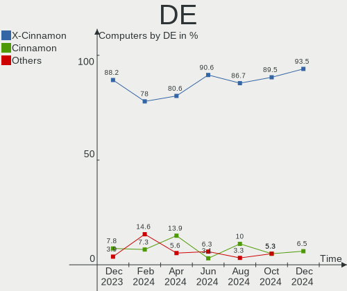
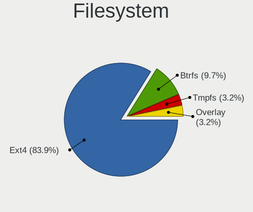
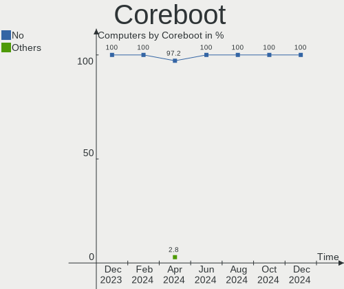
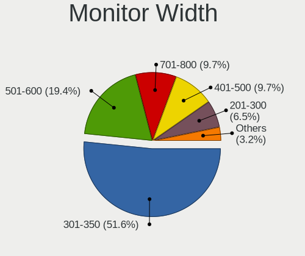
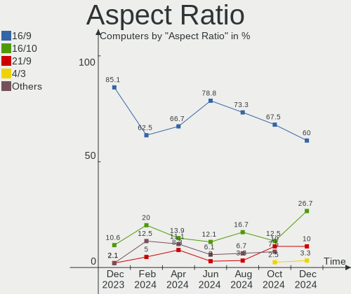
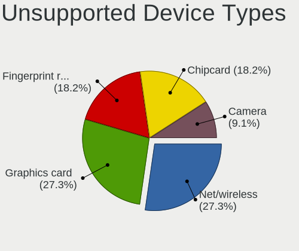

LMDE - Hardware Trends
----------------------

A project to identify most popular hardware characteristics and track their change
over time based on data collected by Linux users at https://Linux-Hardware.org.

Anyone can contribute to this report by the [hw-probe](https://github.com/linuxhw/hw-probe) tool:

    sudo -E hw-probe -all -upload

This is a report for all computer types. See also reports for [desktops](/Dist/LMDE/Desktop/README.md) and [notebooks](/Dist/LMDE/Notebook/README.md).

This report is for one last month. Overall report since the beginning of time: [TestDays](https://github.com/linuxhw/TestDays)

Period: Mar, 2023.

Contents
--------

* [ System ](#system)
  - [ OS                       ](#os)
  - [ OS Family                ](#os-family)
  - [ Kernel                   ](#kernel)
  - [ Kernel Family            ](#kernel-family)
  - [ Kernel Major Ver.        ](#kernel-major-ver)
  - [ Arch                     ](#arch)
  - [ DE                       ](#de)
  - [ Display Server           ](#display-server)
  - [ Display Manager          ](#display-manager)
  - [ OS Lang                  ](#os-lang)
  - [ Boot Mode                ](#boot-mode)
  - [ Filesystem               ](#filesystem)
  - [ Part. scheme             ](#part-scheme)
  - [ Dual Boot with Linux/BSD ](#dual-boot-with-linuxbsd)
  - [ Dual Boot (Win)          ](#dual-boot-win)

* [ Board ](#board)
  - [ Vendor                   ](#vendor)
  - [ Model                    ](#model)
  - [ Model Family             ](#model-family)
  - [ MFG Year                 ](#mfg-year)
  - [ Form Factor              ](#form-factor)
  - [ Secure Boot              ](#secure-boot)
  - [ Coreboot                 ](#coreboot)
  - [ RAM Size                 ](#ram-size)
  - [ RAM Used                 ](#ram-used)
  - [ Total Drives             ](#total-drives)
  - [ Has CD-ROM               ](#has-cd-rom)
  - [ Has Ethernet             ](#has-ethernet)
  - [ Has WiFi                 ](#has-wifi)
  - [ Has Bluetooth            ](#has-bluetooth)

* [ Location ](#location)
  - [ Country                  ](#country)
  - [ City                     ](#city)

* [ Drives ](#drives)
  - [ Drive Vendor             ](#drive-vendor)
  - [ Drive Model              ](#drive-model)
  - [ HDD Vendor               ](#hdd-vendor)
  - [ SSD Vendor               ](#ssd-vendor)
  - [ Drive Kind               ](#drive-kind)
  - [ Drive Connector          ](#drive-connector)
  - [ Drive Size               ](#drive-size)
  - [ Space Total              ](#space-total)
  - [ Space Used               ](#space-used)
  - [ Malfunc. Drives          ](#malfunc-drives)
  - [ Malfunc. Drive Vendor    ](#malfunc-drive-vendor)
  - [ Malfunc. HDD Vendor      ](#malfunc-hdd-vendor)
  - [ Malfunc. Drive Kind      ](#malfunc-drive-kind)
  - [ Failed Drives            ](#failed-drives)
  - [ Failed Drive Vendor      ](#failed-drive-vendor)
  - [ Drive Status             ](#drive-status)

* [ Storage controller ](#storage-controller)
  - [ Storage Vendor           ](#storage-vendor)
  - [ Storage Model            ](#storage-model)
  - [ Storage Kind             ](#storage-kind)

* [ Processor ](#processor)
  - [ CPU Vendor               ](#cpu-vendor)
  - [ CPU Model                ](#cpu-model)
  - [ CPU Model Family         ](#cpu-model-family)
  - [ CPU Cores                ](#cpu-cores)
  - [ CPU Sockets              ](#cpu-sockets)
  - [ CPU Threads              ](#cpu-threads)
  - [ CPU Op-Modes             ](#cpu-op-modes)
  - [ CPU Microcode            ](#cpu-microcode)
  - [ CPU Microarch            ](#cpu-microarch)

* [ Graphics ](#graphics)
  - [ GPU Vendor               ](#gpu-vendor)
  - [ GPU Model                ](#gpu-model)
  - [ GPU Combo                ](#gpu-combo)
  - [ GPU Driver               ](#gpu-driver)
  - [ GPU Memory               ](#gpu-memory)

* [ Monitor ](#monitor)
  - [ Monitor Vendor           ](#monitor-vendor)
  - [ Monitor Model            ](#monitor-model)
  - [ Monitor Resolution       ](#monitor-resolution)
  - [ Monitor Diagonal         ](#monitor-diagonal)
  - [ Monitor Width            ](#monitor-width)
  - [ Aspect Ratio             ](#aspect-ratio)
  - [ Monitor Area             ](#monitor-area)
  - [ Pixel Density            ](#pixel-density)
  - [ Multiple Monitors        ](#multiple-monitors)

* [ Network ](#network)
  - [ Net Controller Vendor    ](#net-controller-vendor)
  - [ Net Controller Model     ](#net-controller-model)
  - [ Wireless Vendor          ](#wireless-vendor)
  - [ Wireless Model           ](#wireless-model)
  - [ Ethernet Vendor          ](#ethernet-vendor)
  - [ Ethernet Model           ](#ethernet-model)
  - [ Net Controller Kind      ](#net-controller-kind)
  - [ Used Controller          ](#used-controller)
  - [ NICs                     ](#nics)
  - [ IPv6                     ](#ipv6)

* [ Bluetooth ](#bluetooth)
  - [ Bluetooth Vendor         ](#bluetooth-vendor)
  - [ Bluetooth Model          ](#bluetooth-model)

* [ Sound ](#sound)
  - [ Sound Vendor             ](#sound-vendor)
  - [ Sound Model              ](#sound-model)

* [ Memory ](#memory)
  - [ Memory Vendor            ](#memory-vendor)
  - [ Memory Model             ](#memory-model)
  - [ Memory Kind              ](#memory-kind)
  - [ Memory Form Factor       ](#memory-form-factor)
  - [ Memory Size              ](#memory-size)
  - [ Memory Speed             ](#memory-speed)

* [ Printers & scanners ](#printers--scanners)
  - [ Printer Vendor           ](#printer-vendor)
  - [ Printer Model            ](#printer-model)
  - [ Scanner Vendor           ](#scanner-vendor)
  - [ Scanner Model            ](#scanner-model)

* [ Camera ](#camera)
  - [ Camera Vendor            ](#camera-vendor)
  - [ Camera Model             ](#camera-model)

* [ Security ](#security)
  - [ Fingerprint Vendor       ](#fingerprint-vendor)
  - [ Fingerprint Model        ](#fingerprint-model)
  - [ Chipcard Vendor          ](#chipcard-vendor)
  - [ Chipcard Model           ](#chipcard-model)

* [ Unsupported ](#unsupported)
  - [ Unsupported Devices      ](#unsupported-devices)
  - [ Unsupported Device Types ](#unsupported-device-types)

System
------

OS
--

Installed operating systems

| Name   | Computers | Percent |
|--------|-----------|---------|
| LMDE 5 | 35        | 100%    |

OS Family
---------

OS without a version

| Name | Computers | Percent |
|------|-----------|---------|
| LMDE | 35        | 100%    |

Kernel
------

Version of the Linux kernel

| Version                | Computers | Percent |
|------------------------|-----------|---------|
| 5.10.0-21-amd64        | 28        | 80%     |
| 5.10.0-12-amd64        | 5         | 14.29%  |
| 5.19.0-0.deb11.2-amd64 | 1         | 2.86%   |
| 5.10.0-18-amd64        | 1         | 2.86%   |

Kernel Family
-------------

Linux kernel without a distro release

| Version | Computers | Percent |
|---------|-----------|---------|
| 5.10.0  | 34        | 97.14%  |
| 5.19.0  | 1         | 2.86%   |

Kernel Major Ver.
-----------------

Linux kernel major version

| Version | Computers | Percent |
|---------|-----------|---------|
| 5.10    | 34        | 97.14%  |
| 5.19    | 1         | 2.86%   |

Arch
----

OS architecture (x86_64, i586, etc.)

| Name   | Computers | Percent |
|--------|-----------|---------|
| x86_64 | 35        | 100%    |

DE
--

Desktop Environment

| Name       | Computers | Percent |
|------------|-----------|---------|
| X-Cinnamon | 26        | 74.29%  |
| Cinnamon   | 7         | 20%     |
| MATE       | 2         | 5.71%   |

Display Server
--------------

X11 or Wayland

| Name | Computers | Percent |
|------|-----------|---------|
| X11  | 35        | 100%    |

Display Manager
---------------

SDDM, LightDM, etc.

| Name    | Computers | Percent |
|---------|-----------|---------|
| Unknown | 20        | 57.14%  |
| LightDM | 15        | 42.86%  |

OS Lang
-------

Language

| Lang  | Computers | Percent |
|-------|-----------|---------|
| en_US | 14        | 40%     |
| de_DE | 6         | 17.14%  |
| ru_RU | 3         | 8.57%   |
| pl_PL | 3         | 8.57%   |
| es_ES | 2         | 5.71%   |
| sv_SE | 1         | 2.86%   |
| pt_PT | 1         | 2.86%   |
| it_IT | 1         | 2.86%   |
| fr_CA | 1         | 2.86%   |
| en_ZA | 1         | 2.86%   |
| en_GB | 1         | 2.86%   |
| de_AT | 1         | 2.86%   |

Boot Mode
---------

EFI or BIOS

| Mode | Computers | Percent |
|------|-----------|---------|
| EFI  | 21        | 60%     |
| BIOS | 14        | 40%     |

Filesystem
----------

Type of filesystem

| Type    | Computers | Percent |
|---------|-----------|---------|
| Ext4    | 32        | 91.43%  |
| Overlay | 2         | 5.71%   |
| Btrfs   | 1         | 2.86%   |

Part. scheme
------------

Scheme of partitioning

| Type    | Computers | Percent |
|---------|-----------|---------|
| Unknown | 20        | 57.14%  |
| GPT     | 11        | 31.43%  |
| MBR     | 4         | 11.43%  |

Dual Boot with Linux/BSD
------------------------

Hosting more than one Linux/BSD

| Dual boot | Computers | Percent |
|-----------|-----------|---------|
| No        | 32        | 91.43%  |
| Yes       | 3         | 8.57%   |

Dual Boot (Win)
---------------

Hosting Linux and Windows

| Dual boot | Computers | Percent |
|-----------|-----------|---------|
| No        | 31        | 88.57%  |
| Yes       | 4         | 11.43%  |

Board
-----

Vendor
------

Motherboard manufacturer

| Name                | Computers | Percent |
|---------------------|-----------|---------|
| Lenovo              | 6         | 17.14%  |
| ASUSTek Computer    | 5         | 14.29%  |
| Hewlett-Packard     | 4         | 11.43%  |
| Gigabyte Technology | 4         | 11.43%  |
| Dell                | 4         | 11.43%  |
| Acer                | 3         | 8.57%   |
| Toshiba             | 1         | 2.86%   |
| Star Labs           | 1         | 2.86%   |
| SiYW                | 1         | 2.86%   |
| MSI                 | 1         | 2.86%   |
| Medion              | 1         | 2.86%   |
| HIPER               | 1         | 2.86%   |
| Dynabook            | 1         | 2.86%   |
| BESSTAR Tech        | 1         | 2.86%   |
| ASRock              | 1         | 2.86%   |

Model
-----

Motherboard model

| Name                                 | Computers | Percent |
|--------------------------------------|-----------|---------|
| HP Pavilion Notebook                 | 2         | 5.71%   |
| Toshiba Satellite Pro A50-C          | 1         | 2.86%   |
| Star Labs StarBook                   | 1         | 2.86%   |
| SiYW V200 Series                     | 1         | 2.86%   |
| MSI MS-7693                          | 1         | 2.86%   |
| Medion E6214                         | 1         | 2.86%   |
| Lenovo ThinkPad Z61m 9450HAG         | 1         | 2.86%   |
| Lenovo ThinkPad X230 Tablet 343522U  | 1         | 2.86%   |
| Lenovo ThinkPad X230 2325Y2S         | 1         | 2.86%   |
| Lenovo ThinkPad T14 Gen 3 21AJS7S208 | 1         | 2.86%   |
| Lenovo IdeaPad 320-15AST 80XV        | 1         | 2.86%   |
| Lenovo IdeaPad 100-14IBY 80MH        | 1         | 2.86%   |
| HIPER WORKBOOK                       | 1         | 2.86%   |
| HP Pavilion dv6                      | 1         | 2.86%   |
| HP Pavilion dm4                      | 1         | 2.86%   |
| Gigabyte Z87X-OC Force               | 1         | 2.86%   |
| Gigabyte Q87M-D2H                    | 1         | 2.86%   |
| Gigabyte A520M DS3H                  | 1         | 2.86%   |
| Gigabyte A320M-S2H                   | 1         | 2.86%   |
| Dynabook Satellite Pro C50-G         | 1         | 2.86%   |
| Dell Venue 11 Pro 7130 MS            | 1         | 2.86%   |
| Dell OptiPlex 9010                   | 1         | 2.86%   |
| Dell OptiPlex 7040                   | 1         | 2.86%   |
| Dell Inspiron 5515                   | 1         | 2.86%   |
| BESSTAR Tech TH50                    | 1         | 2.86%   |
| ASUS ZenBook UX333FA_UX333FA         | 1         | 2.86%   |
| ASUS ROG STRIX B450-F GAMING         | 1         | 2.86%   |
| ASUS PRIME A320M-K                   | 1         | 2.86%   |
| ASUS P7P55D                          | 1         | 2.86%   |
| ASUS P5GC-VM                         | 1         | 2.86%   |
| ASRock B365M Pro4                    | 1         | 2.86%   |
| Acer Aspire E1-572G                  | 1         | 2.86%   |
| Acer Aspire A514-53                  | 1         | 2.86%   |
| Acer Aspire 5732Z                    | 1         | 2.86%   |

Model Family
------------

Motherboard model prefix

| Name               | Computers | Percent |
|--------------------|-----------|---------|
| Lenovo ThinkPad    | 4         | 11.43%  |
| HP Pavilion        | 4         | 11.43%  |
| Acer Aspire        | 3         | 8.57%   |
| Lenovo IdeaPad     | 2         | 5.71%   |
| Dell OptiPlex      | 2         | 5.71%   |
| Toshiba Satellite  | 1         | 2.86%   |
| Star Labs StarBook | 1         | 2.86%   |
| SiYW V200          | 1         | 2.86%   |
| MSI MS-7693        | 1         | 2.86%   |
| Medion E6214       | 1         | 2.86%   |
| HIPER WORKBOOK     | 1         | 2.86%   |
| Gigabyte Z87X-OC   | 1         | 2.86%   |
| Gigabyte Q87M-D2H  | 1         | 2.86%   |
| Gigabyte A520M     | 1         | 2.86%   |
| Gigabyte A320M-S2H | 1         | 2.86%   |
| Dynabook Satellite | 1         | 2.86%   |
| Dell Venue         | 1         | 2.86%   |
| Dell Inspiron      | 1         | 2.86%   |
| BESSTAR Tech TH50  | 1         | 2.86%   |
| ASUS ZenBook       | 1         | 2.86%   |
| ASUS ROG           | 1         | 2.86%   |
| ASUS PRIME         | 1         | 2.86%   |
| ASUS P7P55D        | 1         | 2.86%   |
| ASUS P5GC-VM       | 1         | 2.86%   |
| ASRock B365M       | 1         | 2.86%   |

MFG Year
--------

Motherboard manufacture year

| Year | Computers | Percent |
|------|-----------|---------|
| 2018 | 4         | 11.43%  |
| 2022 | 3         | 8.57%   |
| 2021 | 3         | 8.57%   |
| 2017 | 3         | 8.57%   |
| 2016 | 3         | 8.57%   |
| 2013 | 3         | 8.57%   |
| 2020 | 2         | 5.71%   |
| 2019 | 2         | 5.71%   |
| 2015 | 2         | 5.71%   |
| 2012 | 2         | 5.71%   |
| 2010 | 2         | 5.71%   |
| 2009 | 2         | 5.71%   |
| 2023 | 1         | 2.86%   |
| 2008 | 1         | 2.86%   |
| 2007 | 1         | 2.86%   |
| 2006 | 1         | 2.86%   |

Form Factor
-----------

Physical design of the computer

| Name     | Computers | Percent |
|----------|-----------|---------|
| Notebook | 21        | 60%     |
| Desktop  | 14        | 40%     |

Secure Boot
-----------

Enabled or disabled

| State    | Computers | Percent |
|----------|-----------|---------|
| Disabled | 31        | 88.57%  |
| Enabled  | 4         | 11.43%  |

Coreboot
--------

Have coreboot on board

| Used | Computers | Percent |
|------|-----------|---------|
| No   | 34        | 97.14%  |
| Yes  | 1         | 2.86%   |

RAM Size
--------

Total RAM memory

| Size in GB | Computers | Percent |
|------------|-----------|---------|
| 16.01-24.0 | 8         | 22.86%  |
| 32.01-64.0 | 7         | 20%     |
| 3.01-4.0   | 7         | 20%     |
| 8.01-16.0  | 7         | 20%     |
| 4.01-8.0   | 5         | 14.29%  |
| 1.01-2.0   | 1         | 2.86%   |

RAM Used
--------

Used RAM memory

| Used GB   | Computers | Percent |
|-----------|-----------|---------|
| 1.01-2.0  | 15        | 42.86%  |
| 2.01-3.0  | 10        | 28.57%  |
| 4.01-8.0  | 6         | 17.14%  |
| 3.01-4.0  | 3         | 8.57%   |
| 8.01-16.0 | 1         | 2.86%   |

Total Drives
------------

Number of drives on board

| Drives | Computers | Percent |
|--------|-----------|---------|
| 1      | 25        | 71.43%  |
| 3      | 4         | 11.43%  |
| 2      | 3         | 8.57%   |
| 6      | 1         | 2.86%   |
| 5      | 1         | 2.86%   |
| 4      | 1         | 2.86%   |

Has CD-ROM
----------

Has CD-ROM on board

| Presented | Computers | Percent |
|-----------|-----------|---------|
| No        | 23        | 65.71%  |
| Yes       | 12        | 34.29%  |

Has Ethernet
------------

Has Ethernet on board

| Presented | Computers | Percent |
|-----------|-----------|---------|
| Yes       | 29        | 82.86%  |
| No        | 6         | 17.14%  |

Has WiFi
--------

Has WiFi module

| Presented | Computers | Percent |
|-----------|-----------|---------|
| Yes       | 30        | 85.71%  |
| No        | 5         | 14.29%  |

Has Bluetooth
-------------

Has Bluetooth module

| Presented | Computers | Percent |
|-----------|-----------|---------|
| Yes       | 22        | 62.86%  |
| No        | 13        | 37.14%  |

Location
--------

Country
-------

Geographic location (country)

| Country      | Computers | Percent |
|--------------|-----------|---------|
| Germany      | 8         | 22.86%  |
| USA          | 7         | 20%     |
| Spain        | 3         | 8.57%   |
| Poland       | 3         | 8.57%   |
| South Africa | 2         | 5.71%   |
| Russia       | 2         | 5.71%   |
| Italy        | 2         | 5.71%   |
| Sweden       | 1         | 2.86%   |
| Portugal     | 1         | 2.86%   |
| Kazakhstan   | 1         | 2.86%   |
| Indonesia    | 1         | 2.86%   |
| Canada       | 1         | 2.86%   |
| Bolivia      | 1         | 2.86%   |
| Austria      | 1         | 2.86%   |
| Australia    | 1         | 2.86%   |

City
----

Geographic location (city)

| City          | Computers | Percent |
|---------------|-----------|---------|
| Gruenenplan   | 2         | 5.71%   |
| West Hartford | 1         | 2.86%   |
| Warsaw        | 1         | 2.86%   |
| Vienna        | 1         | 2.86%   |
| Sydney        | 1         | 2.86%   |
| St Petersburg | 1         | 2.86%   |
| Ponteareas    | 1         | 2.86%   |
| Passaic       | 1         | 2.86%   |
| Oklahoma City | 1         | 2.86%   |
| Nashville     | 1         | 2.86%   |
| Moscow        | 1         | 2.86%   |
| Montreal      | 1         | 2.86%   |
| Milan         | 1         | 2.86%   |
| Málaga       | 1         | 2.86%   |
| Madrid        | 1         | 2.86%   |
| Lodz          | 1         | 2.86%   |
| Lisbon        | 1         | 2.86%   |
| Lamspringe    | 1         | 2.86%   |
| Kiel          | 1         | 2.86%   |
| Kętrzyn      | 1         | 2.86%   |
| Johannesburg  | 1         | 2.86%   |
| Greiz         | 1         | 2.86%   |
| Gothenburg    | 1         | 2.86%   |
| Fenton        | 1         | 2.86%   |
| Fairmont      | 1         | 2.86%   |
| Cochabamba    | 1         | 2.86%   |
| Centurion     | 1         | 2.86%   |
| Blankenfelde  | 1         | 2.86%   |
| Berlin        | 1         | 2.86%   |
| Bergamo       | 1         | 2.86%   |
| Bandung       | 1         | 2.86%   |
| Augusta       | 1         | 2.86%   |
| Augsburg      | 1         | 2.86%   |
| Astana        | 1         | 2.86%   |

Drives
------

Drive Vendor
------------

Hard drive vendors

| Vendor                    | Computers | Drives | Percent |
|---------------------------|-----------|--------|---------|
| Samsung Electronics       | 8         | 9      | 16.33%  |
| Seagate                   | 7         | 7      | 14.29%  |
| WDC                       | 5         | 10     | 10.2%   |
| Kingston                  | 4         | 4      | 8.16%   |
| Toshiba                   | 3         | 4      | 6.12%   |
| SPCC                      | 2         | 2      | 4.08%   |
| SanDisk                   | 2         | 2      | 4.08%   |
| GOODRAM                   | 2         | 2      | 4.08%   |
| Crucial                   | 2         | 3      | 4.08%   |
| China                     | 2         | 2      | 4.08%   |
| WINTEC                    | 1         | 1      | 2.04%   |
| Unknown                   | 1         | 1      | 2.04%   |
| Transcend                 | 1         | 1      | 2.04%   |
| Star Drive                | 1         | 1      | 2.04%   |
| SK hynix                  | 1         | 1      | 2.04%   |
| Silicon Motion            | 1         | 1      | 2.04%   |
| PNY                       | 1         | 1      | 2.04%   |
| Patriot                   | 1         | 1      | 2.04%   |
| Micron/Crucial Technology | 1         | 1      | 2.04%   |
| Intel                     | 1         | 2      | 2.04%   |
| FORESEE                   | 1         | 1      | 2.04%   |
| Emtec                     | 1         | 1      | 2.04%   |

Drive Model
-----------

Hard drive models

| Model                                               | Computers | Percent |
|-----------------------------------------------------|-----------|---------|
| Seagate ST1000LM035-1RK172 1TB                      | 2         | 3.77%   |
| Samsung NVMe SSD Controller SM981/PM981/PM983 250GB | 2         | 3.77%   |
| Kingston SA400S37120G 120GB SSD                     | 2         | 3.77%   |
| WINTEC 240GB SATA3 SF2281 SSD                       | 1         | 1.89%   |
| WDC WD3003FZEX-00Z4SA0 3TB                          | 1         | 1.89%   |
| WDC WD20EZRX-22D8PB0 2TB                            | 1         | 1.89%   |
| WDC WD20EZAZ-00GGJB0 2TB                            | 1         | 1.89%   |
| WDC WD1502FAEX-007BA0 1TB                           | 1         | 1.89%   |
| WDC WD10SPZX-21Z10T0 1TB                            | 1         | 1.89%   |
| WDC PC SN520 SDAPNUW-256G-1002 256GB                | 1         | 1.89%   |
| Unknown SDC  4GB                                    | 1         | 1.89%   |
| Transcend TS480GMTS820S 480GB SSD                   | 1         | 1.89%   |
| Toshiba MQ01ACF050 500GB                            | 1         | 1.89%   |
| Toshiba MK6476GSX 640GB                             | 1         | 1.89%   |
| Toshiba HDWD130 3TB                                 | 1         | 1.89%   |
| Toshiba DT01ACA300 3TB                              | 1         | 1.89%   |
| Star Drive PCIe SSD 480GB                           | 1         | 1.89%   |
| SPCC Solid State Disk 512GB                         | 1         | 1.89%   |
| SPCC Solid State Disk 1TB                           | 1         | 1.89%   |
| SK hynix BC711 NVMe 512GB                           | 1         | 1.89%   |
| Silicon Motion SM2262/SM2262EN SSD Controller 1TB   | 1         | 1.89%   |
| Seagate ST4000DM000-1F2168 4TB                      | 1         | 1.89%   |
| Seagate ST3320820ACE 320GB                          | 1         | 1.89%   |
| Seagate ST31500341AS 1TB                            | 1         | 1.89%   |
| Seagate ST250LT007-9ZV14C 250GB                     | 1         | 1.89%   |
| Seagate ST2000LM003 HN-M201RAD 2TB                  | 1         | 1.89%   |
| Sandisk WD_BLACK SN770 500GB                        | 1         | 1.89%   |
| SanDisk SDSSDP128G 128GB                            | 1         | 1.89%   |
| Samsung SSD 870 QVO 1TB                             | 1         | 1.89%   |
| Samsung SSD 840 PRO Series 512GB                    | 1         | 1.89%   |
| Samsung SSD 840 EVO 250GB                           | 1         | 1.89%   |
| Samsung MZVL4512HBLU-00BL7 512GB                    | 1         | 1.89%   |
| Samsung MZNLN512HMJP-000H1 512GB SSD                | 1         | 1.89%   |
| Samsung HD204UI 2TB                                 | 1         | 1.89%   |
| Samsung HD153WI 1TB                                 | 1         | 1.89%   |
| PNY CS900 480GB SSD                                 | 1         | 1.89%   |
| Patriot P220 1024GB SSD                             | 1         | 1.89%   |
| Micron/Crucial P2 NVMe PCIe SSD 1TB                 | 1         | 1.89%   |
| Kingston SV300S37A60G 64GB SSD                      | 1         | 1.89%   |
| Kingston OM8PDP3256B-A01 256GB                      | 1         | 1.89%   |

HDD Vendor
----------

Hard disk drive vendors

| Vendor              | Computers | Drives | Percent |
|---------------------|-----------|--------|---------|
| Seagate             | 7         | 7      | 43.75%  |
| WDC                 | 4         | 9      | 25%     |
| Toshiba             | 3         | 4      | 18.75%  |
| Samsung Electronics | 2         | 2      | 12.5%   |

SSD Vendor
----------

Solid state drive vendors

| Vendor              | Computers | Drives | Percent |
|---------------------|-----------|--------|---------|
| Samsung Electronics | 4         | 4      | 20%     |
| Kingston            | 3         | 3      | 15%     |
| SPCC                | 2         | 2      | 10%     |
| GOODRAM             | 2         | 2      | 10%     |
| Crucial             | 2         | 3      | 10%     |
| WINTEC              | 1         | 1      | 5%      |
| Transcend           | 1         | 1      | 5%      |
| SanDisk             | 1         | 1      | 5%      |
| PNY                 | 1         | 1      | 5%      |
| Patriot             | 1         | 1      | 5%      |
| FORESEE             | 1         | 1      | 5%      |
| China               | 1         | 1      | 5%      |

Drive Kind
----------

HDD or SSD

| Kind    | Computers | Drives | Percent |
|---------|-----------|--------|---------|
| SSD     | 17        | 21     | 38.64%  |
| HDD     | 13        | 22     | 29.55%  |
| NVMe    | 12        | 13     | 27.27%  |
| MMC     | 1         | 1      | 2.27%   |
| Unknown | 1         | 1      | 2.27%   |

Drive Connector
---------------

SATA, SAS, NVMe, etc.

| Type | Computers | Drives | Percent |
|------|-----------|--------|---------|
| SATA | 27        | 43     | 65.85%  |
| NVMe | 12        | 13     | 29.27%  |
| SAS  | 1         | 1      | 2.44%   |
| MMC  | 1         | 1      | 2.44%   |

Drive Size
----------

Size of hard drive

| Size in TB | Computers | Drives | Percent |
|------------|-----------|--------|---------|
| 0.01-0.5   | 16        | 17     | 45.71%  |
| 0.51-1.0   | 12        | 17     | 34.29%  |
| 1.01-2.0   | 4         | 4      | 11.43%  |
| 2.01-3.0   | 2         | 4      | 5.71%   |
| 3.01-4.0   | 1         | 1      | 2.86%   |

Space Total
-----------

Amount of disk space available on the file system

| Size in GB | Computers | Percent |
|------------|-----------|---------|
| 251-500    | 13        | 37.14%  |
| 101-250    | 9         | 25.71%  |
| 501-1000   | 5         | 14.29%  |
| 1001-2000  | 4         | 11.43%  |
| 1-20       | 2         | 5.71%   |
| 2001-3000  | 1         | 2.86%   |
| 51-100     | 1         | 2.86%   |

Space Used
----------

Amount of used disk space

| Used GB   | Computers | Percent |
|-----------|-----------|---------|
| 1-20      | 11        | 31.43%  |
| 101-250   | 9         | 25.71%  |
| 21-50     | 6         | 17.14%  |
| 251-500   | 5         | 14.29%  |
| 51-100    | 3         | 8.57%   |
| 1001-2000 | 1         | 2.86%   |

Malfunc. Drives
---------------

Drive models with a malfunction

| Model                           | Computers | Drives | Percent |
|---------------------------------|-----------|--------|---------|
| WINTEC 240GB SATA3 SF2281 SSD   | 1         | 1      | 50%     |
| Samsung Electronics HD153WI 1TB | 1         | 1      | 50%     |

Malfunc. Drive Vendor
---------------------

Vendors of faulty drives

| Vendor              | Computers | Drives | Percent |
|---------------------|-----------|--------|---------|
| WINTEC              | 1         | 1      | 50%     |
| Samsung Electronics | 1         | 1      | 50%     |

Malfunc. HDD Vendor
-------------------

Vendors of faulty HDD drives

| Vendor              | Computers | Drives | Percent |
|---------------------|-----------|--------|---------|
| Samsung Electronics | 1         | 1      | 100%    |

Malfunc. Drive Kind
-------------------

Kinds of faulty drives

| Kind | Computers | Drives | Percent |
|------|-----------|--------|---------|
| SSD  | 1         | 1      | 50%     |
| HDD  | 1         | 1      | 50%     |

Failed Drives
-------------

Failed drive models

Zero info for selected period =(

Failed Drive Vendor
-------------------

Failed drive vendors

Zero info for selected period =(

Drive Status
------------

Number of failed and malfunc. drives

| Status   | Computers | Drives | Percent |
|----------|-----------|--------|---------|
| Detected | 22        | 28     | 57.89%  |
| Works    | 14        | 28     | 36.84%  |
| Malfunc  | 2         | 2      | 5.26%   |

Storage controller
------------------

Storage Vendor
--------------

Storage controller vendors

| Vendor                      | Computers | Percent |
|-----------------------------|-----------|---------|
| Intel                       | 24        | 53.33%  |
| AMD                         | 8         | 17.78%  |
| Samsung Electronics         | 3         | 6.67%   |
| SanDisk                     | 2         | 4.44%   |
| Phison Electronics          | 2         | 4.44%   |
| SK hynix                    | 1         | 2.22%   |
| Silicon Motion              | 1         | 2.22%   |
| Micron/Crucial Technology   | 1         | 2.22%   |
| Marvell Technology Group    | 1         | 2.22%   |
| Kingston Technology Company | 1         | 2.22%   |
| JMicron Technology          | 1         | 2.22%   |

Storage Model
-------------

Storage controller models

| Model                                                                          | Computers | Percent |
|--------------------------------------------------------------------------------|-----------|---------|
| AMD FCH SATA Controller [AHCI mode]                                            | 5         | 9.43%   |
| Intel Sunrise Point-LP SATA Controller [AHCI mode]                             | 3         | 5.66%   |
| Samsung NVMe SSD Controller SM981/PM981/PM983                                  | 2         | 3.77%   |
| Intel Comet Lake SATA AHCI Controller                                          | 2         | 3.77%   |
| Intel 82801G (ICH7 Family) IDE Controller                                      | 2         | 3.77%   |
| Intel 8 Series SATA Controller 1 [AHCI mode]                                   | 2         | 3.77%   |
| Intel 6 Series/C200 Series Chipset Family 6 port Mobile SATA AHCI Controller   | 2         | 3.77%   |
| AMD FCH SATA Controller D                                                      | 2         | 3.77%   |
| SK hynix Gold P31/PC711 NVMe Solid State Drive                                 | 1         | 1.89%   |
| Silicon Motion SM2262/SM2262EN SSD Controller                                  | 1         | 1.89%   |
| SanDisk WD Blue SN500 / PC SN520 NVMe SSD                                      | 1         | 1.89%   |
| SanDisk NVMe Controller                                                        | 1         | 1.89%   |
| Samsung NVMe SSD Controller PM9B1                                              | 1         | 1.89%   |
| Phison PS5013 E13 NVMe Controller                                              | 1         | 1.89%   |
| Phison E12 NVMe Controller                                                     | 1         | 1.89%   |
| Micron/Crucial P2 NVMe PCIe SSD                                                | 1         | 1.89%   |
| Marvell Group 88SE9230 PCIe 2.0 x2 4-port SATA 6 Gb/s RAID Controller          | 1         | 1.89%   |
| Kingston Company OM3PDP3 NVMe SSD                                              | 1         | 1.89%   |
| JMicron JMB363 SATA/IDE Controller                                             | 1         | 1.89%   |
| Intel Tiger Lake-LP SATA Controller                                            | 1         | 1.89%   |
| Intel SATA Controller [RAID mode]                                              | 1         | 1.89%   |
| Intel Q170/Q150/B150/H170/H110/Z170/CM236 Chipset SATA Controller [AHCI Mode]  | 1         | 1.89%   |
| Intel NVMe Controller                                                          | 1         | 1.89%   |
| Intel NM10/ICH7 Family SATA Controller [IDE mode]                              | 1         | 1.89%   |
| Intel Atom Processor E3800 Series SATA AHCI Controller                         | 1         | 1.89%   |
| Intel 82801IBM/IEM (ICH9M/ICH9M-E) 4 port SATA Controller [AHCI mode]          | 1         | 1.89%   |
| Intel 82801GBM/GHM (ICH7-M Family) SATA Controller [AHCI mode]                 | 1         | 1.89%   |
| Intel 82801 Mobile SATA Controller [RAID mode]                                 | 1         | 1.89%   |
| Intel 8 Series/C220 Series Chipset Family 6-port SATA Controller 1 [AHCI mode] | 1         | 1.89%   |
| Intel 7 Series/C210 Series Chipset Family 6-port SATA Controller [AHCI mode]   | 1         | 1.89%   |
| Intel 7 Series Chipset Family 6-port SATA Controller [AHCI mode]               | 1         | 1.89%   |
| Intel 7 Series Chipset Family 4-port SATA Controller [IDE mode]                | 1         | 1.89%   |
| Intel 7 Series Chipset Family 2-port SATA Controller [IDE mode]                | 1         | 1.89%   |
| Intel 5 Series/3400 Series Chipset 4 port SATA IDE Controller                  | 1         | 1.89%   |
| Intel 5 Series/3400 Series Chipset 4 port SATA AHCI Controller                 | 1         | 1.89%   |
| Intel 5 Series/3400 Series Chipset 2 port SATA IDE Controller                  | 1         | 1.89%   |
| Intel 200 Series PCH SATA controller [AHCI mode]                               | 1         | 1.89%   |
| AMD SB7x0/SB8x0/SB9x0 SATA Controller [IDE mode]                               | 1         | 1.89%   |
| AMD SB7x0/SB8x0/SB9x0 IDE Controller                                           | 1         | 1.89%   |
| AMD 500 Series Chipset SATA Controller                                         | 1         | 1.89%   |

Storage Kind
------------

Kind of storage controller (IDE, SATA, NVMe, SAS, ...)

| Kind | Computers | Percent |
|------|-----------|---------|
| SATA | 28        | 59.57%  |
| NVMe | 12        | 25.53%  |
| IDE  | 5         | 10.64%  |
| RAID | 2         | 4.26%   |

Processor
---------

CPU Vendor
----------

Processor vendors

| Vendor | Computers | Percent |
|--------|-----------|---------|
| Intel  | 27        | 77.14%  |
| AMD    | 8         | 22.86%  |

CPU Model
---------

Processor models

| Model                                           | Computers | Percent |
|-------------------------------------------------|-----------|---------|
| Intel Core i5-3320M CPU @ 2.60GHz               | 2         | 5.71%   |
| Intel Core i5-10210U CPU @ 1.60GHz              | 2         | 5.71%   |
| Intel Core i3-2310M CPU @ 2.10GHz               | 2         | 5.71%   |
| Intel Pentium Dual-Core CPU T4300 @ 2.10GHz     | 1         | 2.86%   |
| Intel Pentium Dual CPU E2180 @ 2.00GHz          | 1         | 2.86%   |
| Intel Pentium CPU N3540 @ 2.16GHz               | 1         | 2.86%   |
| Intel Core i7-9700K CPU @ 3.60GHz               | 1         | 2.86%   |
| Intel Core i7-8650U CPU @ 1.90GHz               | 1         | 2.86%   |
| Intel Core i7-4770S CPU @ 3.10GHz               | 1         | 2.86%   |
| Intel Core i5-8265U CPU @ 1.60GHz               | 1         | 2.86%   |
| Intel Core i5-7200U CPU @ 2.50GHz               | 1         | 2.86%   |
| Intel Core i5-6500T CPU @ 2.50GHz               | 1         | 2.86%   |
| Intel Core i5-6200U CPU @ 2.30GHz               | 1         | 2.86%   |
| Intel Core i5-4590S CPU @ 3.00GHz               | 1         | 2.86%   |
| Intel Core i5-4200U CPU @ 1.60GHz               | 1         | 2.86%   |
| Intel Core i5-3470 CPU @ 3.20GHz                | 1         | 2.86%   |
| Intel Core i3-4020Y CPU @ 1.50GHz               | 1         | 2.86%   |
| Intel Core i3-1005G1 CPU @ 1.20GHz              | 1         | 2.86%   |
| Intel Core i3 CPU M 330 @ 2.13GHz               | 1         | 2.86%   |
| Intel Core i3 CPU 560 @ 3.33GHz                 | 1         | 2.86%   |
| Intel Core 2 CPU T7400 @ 2.16GHz                | 1         | 2.86%   |
| Intel 12th Gen Core i7-1260P                    | 1         | 2.86%   |
| Intel 12th Gen Core i5-1245U                    | 1         | 2.86%   |
| Intel 11th Gen Core i5-11320H @ 3.20GHz         | 1         | 2.86%   |
| AMD Ryzen 7 5700G with Radeon Graphics          | 1         | 2.86%   |
| AMD Ryzen 7 3700X 8-Core Processor              | 1         | 2.86%   |
| AMD Ryzen 7 2700 Eight-Core Processor           | 1         | 2.86%   |
| AMD Ryzen 5 5500U with Radeon Graphics          | 1         | 2.86%   |
| AMD FX-4300 Quad-Core Processor                 | 1         | 2.86%   |
| AMD Athlon 200GE with Radeon Vega Graphics      | 1         | 2.86%   |
| AMD A9-9420 RADEON R5, 5 COMPUTE CORES 2C+3G    | 1         | 2.86%   |
| AMD A10-8700P Radeon R6, 10 Compute Cores 4C+6G | 1         | 2.86%   |

CPU Model Family
----------------

Processor model prefix

| Model                   | Computers | Percent |
|-------------------------|-----------|---------|
| Intel Core i5           | 11        | 31.43%  |
| Intel Core i3           | 6         | 17.14%  |
| Other                   | 4         | 11.43%  |
| Intel Core i7           | 3         | 8.57%   |
| AMD Ryzen 7             | 3         | 8.57%   |
| Intel Pentium Dual-Core | 1         | 2.86%   |
| Intel Pentium Dual      | 1         | 2.86%   |
| Intel Pentium           | 1         | 2.86%   |
| Intel Core 2            | 1         | 2.86%   |
| AMD Ryzen 5             | 1         | 2.86%   |
| AMD FX                  | 1         | 2.86%   |
| AMD Athlon              | 1         | 2.86%   |
| AMD A10                 | 1         | 2.86%   |

CPU Cores
---------

Number of processor cores

| Number | Computers | Percent |
|--------|-----------|---------|
| 2      | 18        | 51.43%  |
| 4      | 10        | 28.57%  |
| 8      | 4         | 11.43%  |
| 12     | 1         | 2.86%   |
| 10     | 1         | 2.86%   |
| 6      | 1         | 2.86%   |

CPU Sockets
-----------

Number of sockets

| Number | Computers | Percent |
|--------|-----------|---------|
| 1      | 35        | 100%    |

CPU Threads
-----------

Threads per core (Hyper-Threading)

| Number | Computers | Percent |
|--------|-----------|---------|
| 2      | 25        | 71.43%  |
| 1      | 10        | 28.57%  |

CPU Op-Modes
------------

CPU Operation Modes (32-bit, 64-bit)

| Op mode        | Computers | Percent |
|----------------|-----------|---------|
| 32-bit, 64-bit | 35        | 100%    |

CPU Microcode
-------------

Microcode number

| Number     | Computers | Percent |
|------------|-----------|---------|
| 0x306a9    | 3         | 8.57%   |
| 0x806ec    | 2         | 5.71%   |
| 0x40651    | 2         | 5.71%   |
| 0x306c3    | 2         | 5.71%   |
| 0x206a7    | 2         | 5.71%   |
| 0x906ed    | 1         | 2.86%   |
| 0x906a4    | 1         | 2.86%   |
| 0x906a3    | 1         | 2.86%   |
| 0x806eb    | 1         | 2.86%   |
| 0x806ea    | 1         | 2.86%   |
| 0x806e9    | 1         | 2.86%   |
| 0x806c2    | 1         | 2.86%   |
| 0x706e5    | 1         | 2.86%   |
| 0x6fd      | 1         | 2.86%   |
| 0x6f6      | 1         | 2.86%   |
| 0x506e3    | 1         | 2.86%   |
| 0x406e3    | 1         | 2.86%   |
| 0x30678    | 1         | 2.86%   |
| 0x20655    | 1         | 2.86%   |
| 0x20652    | 1         | 2.86%   |
| 0x1067a    | 1         | 2.86%   |
| 0x0a50000d | 1         | 2.86%   |
| 0x08701021 | 1         | 2.86%   |
| 0x08608103 | 1         | 2.86%   |
| 0x0810100b | 1         | 2.86%   |
| 0x0800820d | 1         | 2.86%   |
| 0x06006705 | 1         | 2.86%   |
| 0x06006110 | 1         | 2.86%   |
| 0x06000852 | 1         | 2.86%   |

CPU Microarch
-------------

Microarchitecture

| Name             | Computers | Percent |
|------------------|-----------|---------|
| KabyLake         | 6         | 17.14%  |
| Haswell          | 4         | 11.43%  |
| IvyBridge        | 3         | 8.57%   |
| Westmere         | 2         | 5.71%   |
| Skylake          | 2         | 5.71%   |
| SandyBridge      | 2         | 5.71%   |
| Excavator        | 2         | 5.71%   |
| Core             | 2         | 5.71%   |
| Unknown          | 2         | 5.71%   |
| Zen+             | 1         | 2.86%   |
| Zen 3            | 1         | 2.86%   |
| Zen 2            | 1         | 2.86%   |
| Zen              | 1         | 2.86%   |
| TigerLake        | 1         | 2.86%   |
| Silvermont       | 1         | 2.86%   |
| Piledriver       | 1         | 2.86%   |
| Penryn           | 1         | 2.86%   |
| IceLake          | 1         | 2.86%   |
| Alderlake Hybrid | 1         | 2.86%   |

Graphics
--------

GPU Vendor
----------

Vendors of graphics cards

| Vendor | Computers | Percent |
|--------|-----------|---------|
| Intel  | 23        | 56.1%   |
| AMD    | 10        | 24.39%  |
| Nvidia | 8         | 19.51%  |

GPU Model
---------

Graphics card models

| Model                                                                                 | Computers | Percent |
|---------------------------------------------------------------------------------------|-----------|---------|
| Intel Xeon E3-1200 v3/4th Gen Core Processor Integrated Graphics Controller           | 2         | 4.65%   |
| Intel CometLake-U GT2 [UHD Graphics]                                                  | 2         | 4.65%   |
| Intel 3rd Gen Core processor Graphics Controller                                      | 2         | 4.65%   |
| Intel 2nd Generation Core Processor Family Integrated Graphics Controller             | 2         | 4.65%   |
| AMD Topaz XT [Radeon R7 M260/M265 / M340/M360 / M440/M445 / 530/535 / 620/625 Mobile] | 2         | 4.65%   |
| AMD Ellesmere [Radeon RX 470/480/570/570X/580/580X/590]                               | 2         | 4.65%   |
| Nvidia TU104 [GeForce RTX 2080 SUPER]                                                 | 1         | 2.33%   |
| Nvidia GM206 [GeForce GTX 950]                                                        | 1         | 2.33%   |
| Nvidia GM204 [GeForce GTX 970]                                                        | 1         | 2.33%   |
| Nvidia GM108M [GeForce 930M]                                                          | 1         | 2.33%   |
| Nvidia GM107M [GeForce GTX 950M]                                                      | 1         | 2.33%   |
| Nvidia GK208B [GeForce GT 730]                                                        | 1         | 2.33%   |
| Nvidia GK208B [GeForce GT 710]                                                        | 1         | 2.33%   |
| Nvidia G92 [GeForce GTS 250]                                                          | 1         | 2.33%   |
| Intel Xeon E3-1200 v2/3rd Gen Core processor Graphics Controller                      | 1         | 2.33%   |
| Intel WhiskeyLake-U GT2 [UHD Graphics 620]                                            | 1         | 2.33%   |
| Intel UHD Graphics 620                                                                | 1         | 2.33%   |
| Intel TigerLake-LP GT2 [Iris Xe Graphics]                                             | 1         | 2.33%   |
| Intel Skylake GT2 [HD Graphics 520]                                                   | 1         | 2.33%   |
| Intel Mobile 4 Series Chipset Integrated Graphics Controller                          | 1         | 2.33%   |
| Intel Iris Plus Graphics G1 (Ice Lake)                                                | 1         | 2.33%   |
| Intel HD Graphics 620                                                                 | 1         | 2.33%   |
| Intel HD Graphics 530                                                                 | 1         | 2.33%   |
| Intel Haswell-ULT Integrated Graphics Controller [HD Graphics]                        | 1         | 2.33%   |
| Intel Haswell-ULT Integrated Graphics Controller                                      | 1         | 2.33%   |
| Intel Core Processor Integrated Graphics Controller                                   | 1         | 2.33%   |
| Intel Atom Processor Z36xxx/Z37xxx Series Graphics & Display                          | 1         | 2.33%   |
| Intel Alder Lake-UP3 GT2 [UHD Graphics]                                               | 1         | 2.33%   |
| Intel Alder Lake-P Integrated Graphics Controller                                     | 1         | 2.33%   |
| AMD Wani [Radeon R5/R6/R7 Graphics]                                                   | 1         | 2.33%   |
| AMD Stoney [Radeon R2/R3/R4/R5 Graphics]                                              | 1         | 2.33%   |
| AMD Seymour [Radeon HD 6400M/7400M Series]                                            | 1         | 2.33%   |
| AMD RV620 LE [Radeon HD 3450]                                                         | 1         | 2.33%   |
| AMD RV515/M54 [Mobility Radeon X1400]                                                 | 1         | 2.33%   |
| AMD Opal XT [Radeon R7 M265/M365X/M465]                                               | 1         | 2.33%   |
| AMD Lucienne                                                                          | 1         | 2.33%   |
| AMD Cezanne [Radeon Vega Series / Radeon Vega Mobile Series]                          | 1         | 2.33%   |

GPU Combo
---------

Combinations of graphics cards

| Name           | Computers | Percent |
|----------------|-----------|---------|
| 1 x Intel      | 17        | 48.57%  |
| 1 x AMD        | 6         | 17.14%  |
| 1 x Nvidia     | 4         | 11.43%  |
| Intel + Nvidia | 4         | 11.43%  |
| 2 x AMD        | 2         | 5.71%   |
| Intel + AMD    | 2         | 5.71%   |

GPU Driver
----------

Free vs proprietary

| Driver      | Computers | Percent |
|-------------|-----------|---------|
| Free        | 30        | 85.71%  |
| Proprietary | 4         | 11.43%  |
| Unknown     | 1         | 2.86%   |

GPU Memory
----------

Total video memory

| Size in GB | Computers | Percent |
|------------|-----------|---------|
| Unknown    | 18        | 51.43%  |
| 0.01-0.5   | 6         | 17.14%  |
| 1.01-2.0   | 4         | 11.43%  |
| 7.01-8.0   | 3         | 8.57%   |
| 0.51-1.0   | 3         | 8.57%   |
| 3.01-4.0   | 1         | 2.86%   |

Monitor
-------

Monitor Vendor
--------------

Monitor vendors

| Vendor                  | Computers | Percent |
|-------------------------|-----------|---------|
| Samsung Electronics     | 6         | 17.14%  |
| AU Optronics            | 6         | 17.14%  |
| Chimei Innolux          | 5         | 14.29%  |
| LG Display              | 4         | 11.43%  |
| Sony                    | 2         | 5.71%   |
| Dell                    | 2         | 5.71%   |
| ViewSonic               | 1         | 2.86%   |
| SKY                     | 1         | 2.86%   |
| Nixeus                  | 1         | 2.86%   |
| MSI                     | 1         | 2.86%   |
| IBM                     | 1         | 2.86%   |
| HUAWEI                  | 1         | 2.86%   |
| Chi Mei Optoelectronics | 1         | 2.86%   |
| BOE                     | 1         | 2.86%   |
| BenQ                    | 1         | 2.86%   |
| Acer                    | 1         | 2.86%   |

Monitor Model
-------------

Monitor models

| Model                                                                    | Computers | Percent |
|--------------------------------------------------------------------------|-----------|---------|
| LG Display LCD Monitor LGD02D8 1366x768 277x156mm 12.5-inch              | 2         | 5.56%   |
| ViewSonic VX3276-FHD VSCE735 1920x1080 698x393mm 31.5-inch               | 1         | 2.78%   |
| Sony TV SNY8E01 1360x768                                                 | 1         | 2.78%   |
| Sony LCD Monitor TV  *00 1920x1080                                       | 1         | 2.78%   |
| SKY TV SKY1502 3840x2160 708x398mm 32.0-inch                             | 1         | 2.78%   |
| Samsung Electronics SyncMaster SAM03D0 1440x900 410x257mm 19.1-inch      | 1         | 2.78%   |
| Samsung Electronics SMBX1950N SAM0716 1366x768 410x230mm 18.5-inch       | 1         | 2.78%   |
| Samsung Electronics S24D590 SAM0B47 1920x1080 521x293mm 23.5-inch        | 1         | 2.78%   |
| Samsung Electronics S22F350 SAM0D1A 1920x1080 477x268mm 21.5-inch        | 1         | 2.78%   |
| Samsung Electronics LF22T35 SAM707B 1920x1080 477x268mm 21.5-inch        | 1         | 2.78%   |
| Samsung Electronics LCD Monitor SEC3942 1366x768 309x174mm 14.0-inch     | 1         | 2.78%   |
| Samsung Electronics LCD Monitor SDC4C48 1920x1080 309x174mm 14.0-inch    | 1         | 2.78%   |
| Nixeus NX-VUE24 NIX2415 1920x1080 477x268mm 21.5-inch                    | 1         | 2.78%   |
| MSI G242 MSI4BA4 1920x1080 527x296mm 23.8-inch                           | 1         | 2.78%   |
| LG Display LP156WH1-TLA3 LGD01C2 1366x768 344x194mm 15.5-inch            | 1         | 2.78%   |
| LG Display LCD Monitor LGD04D1 1366x768 344x194mm 15.5-inch              | 1         | 2.78%   |
| IBM LCD Monitor IBM2887 1680x1050 331x207mm 15.4-inch                    | 1         | 2.78%   |
| HUAWEI ZQE-CBA HWV6A25 3440x1440 797x334mm 34.0-inch                     | 1         | 2.78%   |
| Dell LCD Monitor S3422DWG 3440x1440                                      | 1         | 2.78%   |
| Dell E2416H DELA0C9 1920x1080 531x299mm 24.0-inch                        | 1         | 2.78%   |
| Chimei Innolux LCD Monitor CMN15E7 1920x1080 344x193mm 15.5-inch         | 1         | 2.78%   |
| Chimei Innolux LCD Monitor CMN15DB 1366x768 344x193mm 15.5-inch          | 1         | 2.78%   |
| Chimei Innolux LCD Monitor CMN15CA 1366x768 344x193mm 15.5-inch          | 1         | 2.78%   |
| Chimei Innolux LCD Monitor CMN152E 1920x1080 344x193mm 15.5-inch         | 1         | 2.78%   |
| Chimei Innolux LCD Monitor CMN14F2 1920x1080 309x173mm 13.9-inch         | 1         | 2.78%   |
| Chi Mei Optoelectronics LCD Monitor CMO15A2 1366x768 344x193mm 15.5-inch | 1         | 2.78%   |
| BOE LCD Monitor BOE08E2 1920x1080 344x194mm 15.5-inch                    | 1         | 2.78%   |
| BenQ G2400W BNQ780A 1920x1200 519x324mm 24.1-inch                        | 1         | 2.78%   |
| AU Optronics LCD Monitor AUO5C2D 1920x1080 293x165mm 13.2-inch           | 1         | 2.78%   |
| AU Optronics LCD Monitor AUO47EC 1366x768 344x193mm 15.5-inch            | 1         | 2.78%   |
| AU Optronics LCD Monitor AUO403D 1920x1080 309x173mm 13.9-inch           | 1         | 2.78%   |
| AU Optronics LCD Monitor AUO38ED 1920x1080 344x193mm 15.5-inch           | 1         | 2.78%   |
| AU Optronics LCD Monitor AUO343C 1366x768 309x173mm 13.9-inch            | 1         | 2.78%   |
| AU Optronics LCD Monitor AUO32EC 1366x768 344x193mm 15.5-inch            | 1         | 2.78%   |
| Acer T272HL ACR013B 1920x1080 598x336mm 27.0-inch                        | 1         | 2.78%   |

Monitor Resolution
------------------

Monitor screen resolution

| Resolution         | Computers | Percent |
|--------------------|-----------|---------|
| 1920x1080 (FHD)    | 16        | 45.71%  |
| 1366x768 (WXGA)    | 12        | 34.29%  |
| 3440x1440          | 2         | 5.71%   |
| 3840x2160 (4K)     | 1         | 2.86%   |
| 1920x1200 (WUXGA)  | 1         | 2.86%   |
| 1680x1050 (WSXGA+) | 1         | 2.86%   |
| 1440x900 (WXGA+)   | 1         | 2.86%   |
| 1360x768           | 1         | 2.86%   |

Monitor Diagonal
----------------

Diagonal size in inches

| Inches  | Computers | Percent |
|---------|-----------|---------|
| 15      | 12        | 34.29%  |
| 24      | 3         | 8.57%   |
| 13      | 3         | 8.57%   |
| Unknown | 3         | 8.57%   |
| 21      | 2         | 5.71%   |
| 18      | 2         | 5.71%   |
| 14      | 2         | 5.71%   |
| 12      | 2         | 5.71%   |
| 64      | 1         | 2.86%   |
| 34      | 1         | 2.86%   |
| 31      | 1         | 2.86%   |
| 27      | 1         | 2.86%   |
| 23      | 1         | 2.86%   |
| 19      | 1         | 2.86%   |

Monitor Width
-------------

Physical width

| Width in mm | Computers | Percent |
|-------------|-----------|---------|
| 301-350     | 16        | 47.06%  |
| 501-600     | 5         | 14.71%  |
| 401-500     | 4         | 11.76%  |
| 201-300     | 3         | 8.82%   |
| Unknown     | 3         | 8.82%   |
| 701-800     | 1         | 2.94%   |
| 601-700     | 1         | 2.94%   |
| 1001-1500   | 1         | 2.94%   |

Aspect Ratio
------------

Proportional relationship between the width and the height

| Ratio   | Computers | Percent |
|---------|-----------|---------|
| 16/9    | 26        | 78.79%  |
| 16/10   | 4         | 12.12%  |
| Unknown | 2         | 6.06%   |
| 21/9    | 1         | 3.03%   |

Monitor Area
------------

Area in inch²

| Area in inch² | Computers | Percent |
|----------------|-----------|---------|
| 101-110        | 12        | 34.29%  |
| 81-90          | 4         | 11.43%  |
| 201-250        | 4         | 11.43%  |
| Unknown        | 3         | 8.57%   |
| 61-70          | 2         | 5.71%   |
| 351-500        | 2         | 5.71%   |
| 251-300        | 2         | 5.71%   |
| 141-150        | 2         | 5.71%   |
| More than 1000 | 1         | 2.86%   |
| 71-80          | 1         | 2.86%   |
| 301-350        | 1         | 2.86%   |
| 151-200        | 1         | 2.86%   |

Pixel Density
-------------

Pixels per inch

| Density | Computers | Percent |
|---------|-----------|---------|
| 101-120 | 12        | 34.29%  |
| 51-100  | 10        | 28.57%  |
| 121-160 | 9         | 25.71%  |
| Unknown | 3         | 8.57%   |
| 161-240 | 1         | 2.86%   |

Multiple Monitors
-----------------

Total monitors connected

| Total | Computers | Percent |
|-------|-----------|---------|
| 1     | 31        | 88.57%  |
| 2     | 3         | 8.57%   |
| 0     | 1         | 2.86%   |

Network
-------

Net Controller Vendor
---------------------

Controller vendors

| Vendor                          | Computers | Percent |
|---------------------------------|-----------|---------|
| Intel                           | 21        | 38.89%  |
| Realtek Semiconductor           | 15        | 27.78%  |
| Qualcomm Atheros                | 6         | 11.11%  |
| Broadcom                        | 3         | 5.56%   |
| MediaTek                        | 2         | 3.7%    |
| TP-Link                         | 1         | 1.85%   |
| Samsung Electronics             | 1         | 1.85%   |
| Ralink                          | 1         | 1.85%   |
| Qualcomm Atheros Communications | 1         | 1.85%   |
| NetGear                         | 1         | 1.85%   |
| Dell                            | 1         | 1.85%   |
| Broadcom Limited                | 1         | 1.85%   |

Net Controller Model
--------------------

Controller models

| Model                                                             | Computers | Percent |
|-------------------------------------------------------------------|-----------|---------|
| Realtek RTL8111/8168/8411 PCI Express Gigabit Ethernet Controller | 9         | 13.85%  |
| Realtek RTL810xE PCI Express Fast Ethernet controller             | 3         | 4.62%   |
| Intel 82579LM Gigabit Network Connection (Lewisville)             | 3         | 4.62%   |
| Realtek RTL8188EUS 802.11n Wireless Network Adapter               | 2         | 3.08%   |
| Intel Wireless 8260                                               | 2         | 3.08%   |
| Intel Wireless 3165                                               | 2         | 3.08%   |
| Intel Wi-Fi 6 AX210/AX211/AX411 160MHz                            | 2         | 3.08%   |
| Intel Centrino Advanced-N 6205 [Taylor Peak]                      | 2         | 3.08%   |
| TP-Link RTL8812AU Archer T4U 802.11ac                             | 1         | 1.54%   |
| Samsung Galaxy series, misc. (tethering mode)                     | 1         | 1.54%   |
| Realtek RTL88x2bu [AC1200 Techkey]                                | 1         | 1.54%   |
| Realtek RTL8821AE 802.11ac PCIe Wireless Network Adapter          | 1         | 1.54%   |
| Realtek RTL8723BE PCIe Wireless Network Adapter                   | 1         | 1.54%   |
| Realtek RTL8191SEvB Wireless LAN Controller                       | 1         | 1.54%   |
| Realtek RTL8188EE Wireless Network Adapter                        | 1         | 1.54%   |
| Ralink RT2561/RT61 802.11g PCI                                    | 1         | 1.54%   |
| Qualcomm Atheros QCA9565 / AR9565 Wireless Network Adapter        | 1         | 1.54%   |
| Qualcomm Atheros AR9271 802.11n                                   | 1         | 1.54%   |
| Qualcomm Atheros Attansic L1 Gigabit Ethernet                     | 1         | 1.54%   |
| Qualcomm Atheros AR9462 Wireless Network Adapter                  | 1         | 1.54%   |
| Qualcomm Atheros AR928X Wireless Network Adapter (PCI-Express)    | 1         | 1.54%   |
| Qualcomm Atheros AR8151 v2.0 Gigabit Ethernet                     | 1         | 1.54%   |
| Qualcomm Atheros AR8132 Fast Ethernet                             | 1         | 1.54%   |
| Qualcomm Atheros AR8131 Gigabit Ethernet                          | 1         | 1.54%   |
| NetGear A6210                                                     | 1         | 1.54%   |
| MediaTek MT7921K (RZ608) Wi-Fi 6E 80MHz                           | 1         | 1.54%   |
| MediaTek KINGKONG_MINI                                            | 1         | 1.54%   |
| Intel Wireless 7265                                               | 1         | 1.54%   |
| Intel Wi-Fi 6 AX200                                               | 1         | 1.54%   |
| Intel Ice Lake-LP PCH CNVi WiFi                                   | 1         | 1.54%   |
| Intel I211 Gigabit Network Connection                             | 1         | 1.54%   |
| Intel I210 Gigabit Network Connection                             | 1         | 1.54%   |
| Intel Ethernet Controller I225-V                                  | 1         | 1.54%   |
| Intel Ethernet Connection I219-V                                  | 1         | 1.54%   |
| Intel Ethernet Connection I217-V                                  | 1         | 1.54%   |
| Intel Ethernet Connection I217-LM                                 | 1         | 1.54%   |
| Intel Ethernet Connection (2) I219-V                              | 1         | 1.54%   |
| Intel Ethernet Connection (2) I219-LM                             | 1         | 1.54%   |
| Intel Ethernet Connection (16) I219-LM                            | 1         | 1.54%   |
| Intel Comet Lake PCH-LP CNVi WiFi                                 | 1         | 1.54%   |

Wireless Vendor
---------------

Wireless vendors

| Vendor                          | Computers | Percent |
|---------------------------------|-----------|---------|
| Intel                           | 15        | 46.88%  |
| Realtek Semiconductor           | 6         | 18.75%  |
| Qualcomm Atheros                | 3         | 9.38%   |
| Broadcom                        | 2         | 6.25%   |
| TP-Link                         | 1         | 3.13%   |
| Ralink                          | 1         | 3.13%   |
| Qualcomm Atheros Communications | 1         | 3.13%   |
| NetGear                         | 1         | 3.13%   |
| MediaTek                        | 1         | 3.13%   |
| Dell                            | 1         | 3.13%   |

Wireless Model
--------------

Wireless models

| Model                                                          | Computers | Percent |
|----------------------------------------------------------------|-----------|---------|
| Realtek RTL8188EUS 802.11n Wireless Network Adapter            | 2         | 6.06%   |
| Intel Wireless 8260                                            | 2         | 6.06%   |
| Intel Wireless 3165                                            | 2         | 6.06%   |
| Intel Wi-Fi 6 AX210/AX211/AX411 160MHz                         | 2         | 6.06%   |
| Intel Centrino Advanced-N 6205 [Taylor Peak]                   | 2         | 6.06%   |
| TP-Link RTL8812AU Archer T4U 802.11ac                          | 1         | 3.03%   |
| Realtek RTL88x2bu [AC1200 Techkey]                             | 1         | 3.03%   |
| Realtek RTL8821AE 802.11ac PCIe Wireless Network Adapter       | 1         | 3.03%   |
| Realtek RTL8723BE PCIe Wireless Network Adapter                | 1         | 3.03%   |
| Realtek RTL8191SEvB Wireless LAN Controller                    | 1         | 3.03%   |
| Realtek RTL8188EE Wireless Network Adapter                     | 1         | 3.03%   |
| Ralink RT2561/RT61 802.11g PCI                                 | 1         | 3.03%   |
| Qualcomm Atheros QCA9565 / AR9565 Wireless Network Adapter     | 1         | 3.03%   |
| Qualcomm Atheros AR9271 802.11n                                | 1         | 3.03%   |
| Qualcomm Atheros AR9462 Wireless Network Adapter               | 1         | 3.03%   |
| Qualcomm Atheros AR928X Wireless Network Adapter (PCI-Express) | 1         | 3.03%   |
| NetGear A6210                                                  | 1         | 3.03%   |
| MediaTek MT7921K (RZ608) Wi-Fi 6E 80MHz                        | 1         | 3.03%   |
| Intel Wireless 7265                                            | 1         | 3.03%   |
| Intel Wi-Fi 6 AX200                                            | 1         | 3.03%   |
| Intel Ice Lake-LP PCH CNVi WiFi                                | 1         | 3.03%   |
| Intel Comet Lake PCH-LP CNVi WiFi                              | 1         | 3.03%   |
| Intel Centrino Wireless-N + WiMAX 6150                         | 1         | 3.03%   |
| Intel Cannon Point-LP CNVi [Wireless-AC]                       | 1         | 3.03%   |
| Intel Alder Lake-P PCH CNVi WiFi                               | 1         | 3.03%   |
| Dell Wireless 5570e HSPA+ (42Mbps) Mobile Broadband Card       | 1         | 3.03%   |
| Broadcom BCM4322 802.11a/b/g/n Wireless LAN Controller         | 1         | 3.03%   |
| Broadcom BCM4313 802.11bgn Wireless Network Adapter            | 1         | 3.03%   |

Ethernet Vendor
---------------

Ethernet vendors

| Vendor                | Computers | Percent |
|-----------------------|-----------|---------|
| Realtek Semiconductor | 12        | 38.71%  |
| Intel                 | 11        | 35.48%  |
| Qualcomm Atheros      | 4         | 12.9%   |
| Samsung Electronics   | 1         | 3.23%   |
| MediaTek              | 1         | 3.23%   |
| Broadcom Limited      | 1         | 3.23%   |
| Broadcom              | 1         | 3.23%   |

Ethernet Model
--------------

Ethernet models

| Model                                                             | Computers | Percent |
|-------------------------------------------------------------------|-----------|---------|
| Realtek RTL8111/8168/8411 PCI Express Gigabit Ethernet Controller | 9         | 28.13%  |
| Realtek RTL810xE PCI Express Fast Ethernet controller             | 3         | 9.38%   |
| Intel 82579LM Gigabit Network Connection (Lewisville)             | 3         | 9.38%   |
| Samsung Galaxy series, misc. (tethering mode)                     | 1         | 3.13%   |
| Qualcomm Atheros Attansic L1 Gigabit Ethernet                     | 1         | 3.13%   |
| Qualcomm Atheros AR8151 v2.0 Gigabit Ethernet                     | 1         | 3.13%   |
| Qualcomm Atheros AR8132 Fast Ethernet                             | 1         | 3.13%   |
| Qualcomm Atheros AR8131 Gigabit Ethernet                          | 1         | 3.13%   |
| MediaTek KINGKONG_MINI                                            | 1         | 3.13%   |
| Intel I211 Gigabit Network Connection                             | 1         | 3.13%   |
| Intel I210 Gigabit Network Connection                             | 1         | 3.13%   |
| Intel Ethernet Controller I225-V                                  | 1         | 3.13%   |
| Intel Ethernet Connection I219-V                                  | 1         | 3.13%   |
| Intel Ethernet Connection I217-V                                  | 1         | 3.13%   |
| Intel Ethernet Connection I217-LM                                 | 1         | 3.13%   |
| Intel Ethernet Connection (2) I219-V                              | 1         | 3.13%   |
| Intel Ethernet Connection (2) I219-LM                             | 1         | 3.13%   |
| Intel Ethernet Connection (16) I219-LM                            | 1         | 3.13%   |
| Broadcom NetXtreme BCM57786 Gigabit Ethernet PCIe                 | 1         | 3.13%   |
| Broadcom Limited NetXtreme BCM5752M Gigabit Ethernet PCI Express  | 1         | 3.13%   |

Net Controller Kind
-------------------

Ethernet, WiFi or modem

| Kind     | Computers | Percent |
|----------|-----------|---------|
| WiFi     | 30        | 50.85%  |
| Ethernet | 29        | 49.15%  |

Used Controller
---------------

Currently used network controller

| Kind     | Computers | Percent |
|----------|-----------|---------|
| WiFi     | 20        | 57.14%  |
| Ethernet | 15        | 42.86%  |

NICs
----

Total network controllers on board

| Total | Computers | Percent |
|-------|-----------|---------|
| 2     | 21        | 60%     |
| 1     | 10        | 28.57%  |
| 3     | 2         | 5.71%   |
| 0     | 2         | 5.71%   |

IPv6
----

IPv6 vs IPv4

| Used | Computers | Percent |
|------|-----------|---------|
| No   | 28        | 80%     |
| Yes  | 7         | 20%     |

Bluetooth
---------

Bluetooth Vendor
----------------

Controller vendors

| Vendor                  | Computers | Percent |
|-------------------------|-----------|---------|
| Intel                   | 12        | 54.55%  |
| Lite-On Technology      | 2         | 9.09%   |
| Cambridge Silicon Radio | 2         | 9.09%   |
| Broadcom                | 2         | 9.09%   |
| Realtek Semiconductor   | 1         | 4.55%   |
| MediaTek                | 1         | 4.55%   |
| Dynex                   | 1         | 4.55%   |
| Chicony Electronics     | 1         | 4.55%   |

Bluetooth Model
---------------

Controller models

| Model                                                    | Computers | Percent |
|----------------------------------------------------------|-----------|---------|
| Intel Bluetooth wireless interface                       | 5         | 22.73%  |
| Intel AX210 Bluetooth                                    | 2         | 9.09%   |
| Intel AX201 Bluetooth                                    | 2         | 9.09%   |
| Cambridge Silicon Radio Bluetooth Dongle (HCI mode)      | 2         | 9.09%   |
| Realtek RTL8821A Bluetooth                               | 1         | 4.55%   |
| MediaTek Wireless_Device                                 | 1         | 4.55%   |
| Lite-On Bluetooth Device                                 | 1         | 4.55%   |
| Lite-On Atheros AR3012 Bluetooth                         | 1         | 4.55%   |
| Intel Bluetooth Device                                   | 1         | 4.55%   |
| Intel Bluetooth 9460/9560 Jefferson Peak (JfP)           | 1         | 4.55%   |
| Intel AX200 Bluetooth                                    | 1         | 4.55%   |
| Dynex Bluetooth 4.0 Adapter [Broadcom, 1.12, BCM20702A0] | 1         | 4.55%   |
| Chicony Bluetooth (RTL8723BE)                            | 1         | 4.55%   |
| Broadcom BCM20702 Bluetooth 4.0 [ThinkPad]               | 1         | 4.55%   |
| Broadcom BCM2045B (BDC-2) [Bluetooth Controller]         | 1         | 4.55%   |

Sound
-----

Sound Vendor
------------

Sound card vendors

| Vendor              | Computers | Percent |
|---------------------|-----------|---------|
| Intel               | 27        | 57.45%  |
| AMD                 | 9         | 19.15%  |
| Nvidia              | 6         | 12.77%  |
| C-Media Electronics | 2         | 4.26%   |
| Texas Instruments   | 1         | 2.13%   |
| Logitech            | 1         | 2.13%   |
| GN Netcom           | 1         | 2.13%   |

Sound Model
-----------

Sound card models

| Model                                                                      | Computers | Percent |
|----------------------------------------------------------------------------|-----------|---------|
| Intel Sunrise Point-LP HD Audio                                            | 3         | 5.36%   |
| Intel 7 Series/C216 Chipset Family High Definition Audio Controller        | 3         | 5.36%   |
| AMD Family 17h/19h HD Audio Controller                                     | 3         | 5.36%   |
| Nvidia GK208 HDMI/DP Audio Controller                                      | 2         | 3.57%   |
| Intel Xeon E3-1200 v3/4th Gen Core Processor HD Audio Controller           | 2         | 3.57%   |
| Intel NM10/ICH7 Family High Definition Audio Controller                    | 2         | 3.57%   |
| Intel Haswell-ULT HD Audio Controller                                      | 2         | 3.57%   |
| Intel Comet Lake PCH-LP cAVS                                               | 2         | 3.57%   |
| Intel Alder Lake PCH-P High Definition Audio Controller                    | 2         | 3.57%   |
| Intel 8 Series HD Audio Controller                                         | 2         | 3.57%   |
| Intel 6 Series/C200 Series Chipset Family High Definition Audio Controller | 2         | 3.57%   |
| Intel 5 Series/3400 Series Chipset High Definition Audio                   | 2         | 3.57%   |
| AMD Renoir Radeon High Definition Audio Controller                         | 2         | 3.57%   |
| AMD Family 15h (Models 60h-6fh) Audio Controller                           | 2         | 3.57%   |
| AMD Ellesmere HDMI Audio [Radeon RX 470/480 / 570/580/590]                 | 2         | 3.57%   |
| Texas Instruments Sabaj A4 AMP                                             | 1         | 1.79%   |
| Nvidia TU104 HD Audio Controller                                           | 1         | 1.79%   |
| Nvidia GM206 High Definition Audio Controller                              | 1         | 1.79%   |
| Nvidia GM204 High Definition Audio Controller                              | 1         | 1.79%   |
| Nvidia GM107 High Definition Audio Controller [GeForce 940MX]              | 1         | 1.79%   |
| Logitech ClearChat Pro USB                                                 | 1         | 1.79%   |
| Intel Tiger Lake-LP Smart Sound Technology Audio Controller                | 1         | 1.79%   |
| Intel Ice Lake-LP Smart Sound Technology Audio Controller                  | 1         | 1.79%   |
| Intel Cannon Point-LP High Definition Audio Controller                     | 1         | 1.79%   |
| Intel Atom Processor Z36xxx/Z37xxx Series High Definition Audio Controller | 1         | 1.79%   |
| Intel 82801I (ICH9 Family) HD Audio Controller                             | 1         | 1.79%   |
| Intel 8 Series/C220 Series Chipset High Definition Audio Controller        | 1         | 1.79%   |
| Intel 200 Series PCH HD Audio                                              | 1         | 1.79%   |
| Intel 100 Series/C230 Series Chipset Family HD Audio Controller            | 1         | 1.79%   |
| GN Netcom Jabra Link 380                                                   | 1         | 1.79%   |
| C-Media Electronics CM8888 [Oxygen Express]                                | 1         | 1.79%   |
| C-Media Electronics Blue Snowball                                          | 1         | 1.79%   |
| AMD Starship/Matisse HD Audio Controller                                   | 1         | 1.79%   |
| AMD SBx00 Azalia (Intel HDA)                                               | 1         | 1.79%   |
| AMD RV620 HDMI Audio [Radeon HD 3450/3470/3550/3570]                       | 1         | 1.79%   |
| AMD Kabini HDMI/DP Audio                                                   | 1         | 1.79%   |
| AMD High Definition Audio Controller                                       | 1         | 1.79%   |
| AMD Family 17h (Models 00h-0fh) HD Audio Controller                        | 1         | 1.79%   |

Memory
------

Memory Vendor
-------------

Memory module vendors

| Vendor              | Computers | Percent |
|---------------------|-----------|---------|
| Unknown             | 2         | 11.76%  |
| SK hynix            | 2         | 11.76%  |
| Samsung Electronics | 2         | 11.76%  |
| Kingston            | 2         | 11.76%  |
| G.Skill             | 2         | 11.76%  |
| Micron Technology   | 1         | 5.88%   |
| KLEVV               | 1         | 5.88%   |
| GSkill              | 1         | 5.88%   |
| GeIL                | 1         | 5.88%   |
| Corsair             | 1         | 5.88%   |
| AMD                 | 1         | 5.88%   |
| A-DATA Technology   | 1         | 5.88%   |

Memory Model
------------

Memory module models

| Model                                                          | Computers | Percent |
|----------------------------------------------------------------|-----------|---------|
| Unknown RAM Module 512MB DIMM DDR2 266MT/s                     | 1         | 5.26%   |
| Unknown RAM Module 2GB SODIMM DDR2                             | 1         | 5.26%   |
| Unknown RAM Module 1GB DIMM DDR2 266MT/s                       | 1         | 5.26%   |
| SK hynix RAM Module 2GB SODIMM DDR3 1600MT/s                   | 1         | 5.26%   |
| SK hynix RAM HKNNNFBMAVAR-NEH 2GB Row Of Chips LPDDR4 3200MT/s | 1         | 5.26%   |
| Samsung RAM M471B5673FH0-CF8 2GB SODIMM DDR3 1067MT/s          | 1         | 5.26%   |
| Samsung RAM K4E6E304EC-EGCG 4GB Row Of Chips LPDDR3 2133MT/s   | 1         | 5.26%   |
| Micron RAM 8ATF1G64HZ-2G6D1 8GB SODIMM DDR4 2667MT/s           | 1         | 5.26%   |
| KLEVV RAM KD48GU880-36A180C 8GB DIMM DDR4 3600MT/s             | 1         | 5.26%   |
| Kingston RAM KKRVFX-MIE 8GB SODIMM DDR4 3200MT/s               | 1         | 5.26%   |
| Kingston RAM 9905471-001.A01LF 2GB DIMM DDR3 1600MT/s          | 1         | 5.26%   |
| GSkill RAM F4-3200C22-16GRS 16GB SODIMM DDR4 3200MT/s          | 1         | 5.26%   |
| GeIL RAM CL9-9-9 DDR3-1333 2GB DIMM DDR3 1333MT/s              | 1         | 5.26%   |
| G.Skill RAM F4-2133C15-4GIS 4GB DIMM DDR4 2133MT/s             | 1         | 5.26%   |
| G.Skill RAM F3-1600C9-8GRSL 8GB SODIMM DDR3 1600MT/s           | 1         | 5.26%   |
| Corsair RAM CMZ16GX3M2A1600C10 8GB DIMM DDR3 1600MT/s          | 1         | 5.26%   |
| AMD RAM R948G3206S2S-U 8GB SODIMM DDR4 3200MT/s                | 1         | 5.26%   |
| AMD RAM R948G3206S2S 8GB SODIMM DDR4 3200MT/s                  | 1         | 5.26%   |
| A-DATA RAM MIF4D2C087KZ1 4GB SODIMM DDR3 1600MT/s              | 1         | 5.26%   |

Memory Kind
-----------

Memory module kinds

| Kind   | Computers | Percent |
|--------|-----------|---------|
| DDR3   | 6         | 40%     |
| DDR4   | 5         | 33.33%  |
| DDR2   | 2         | 13.33%  |
| LPDDR4 | 1         | 6.67%   |
| LPDDR3 | 1         | 6.67%   |

Memory Form Factor
------------------

Physical design of the memory module

| Name         | Computers | Percent |
|--------------|-----------|---------|
| SODIMM       | 8         | 53.33%  |
| DIMM         | 5         | 33.33%  |
| Row Of Chips | 2         | 13.33%  |

Memory Size
-----------

Memory module size

| Size  | Computers | Percent |
|-------|-----------|---------|
| 8192  | 5         | 29.41%  |
| 2048  | 5         | 29.41%  |
| 4096  | 4         | 23.53%  |
| 16384 | 1         | 5.88%   |
| 1024  | 1         | 5.88%   |
| 512   | 1         | 5.88%   |

Memory Speed
------------

Memory module speed

| Speed   | Computers | Percent |
|---------|-----------|---------|
| 1600    | 5         | 29.41%  |
| 3200    | 4         | 23.53%  |
| 2133    | 2         | 11.76%  |
| 3600    | 1         | 5.88%   |
| 2667    | 1         | 5.88%   |
| 1333    | 1         | 5.88%   |
| 1067    | 1         | 5.88%   |
| 266     | 1         | 5.88%   |
| Unknown | 1         | 5.88%   |

Printers & scanners
-------------------

Printer Vendor
--------------

Printer device vendors

| Vendor          | Computers | Percent |
|-----------------|-----------|---------|
| Hewlett-Packard | 1         | 100%    |

Printer Model
-------------

Printer device models

| Model                  | Computers | Percent |
|------------------------|-----------|---------|
| HP DeskJet 2130 series | 1         | 100%    |

Scanner Vendor
--------------

Scanner device vendors

Zero info for selected period =(

Scanner Model
-------------

Scanner device models

Zero info for selected period =(

Camera
------

Camera Vendor
-------------

Camera device vendors

| Vendor                                 | Computers | Percent |
|----------------------------------------|-----------|---------|
| Chicony Electronics                    | 5         | 23.81%  |
| Microdia                               | 3         | 14.29%  |
| Suyin                                  | 2         | 9.52%   |
| Realtek Semiconductor                  | 2         | 9.52%   |
| Sunplus Innovation Technology          | 1         | 4.76%   |
| Samsung Electronics                    | 1         | 4.76%   |
| Quanta                                 | 1         | 4.76%   |
| Logitech                               | 1         | 4.76%   |
| Importek                               | 1         | 4.76%   |
| IMC Networks                           | 1         | 4.76%   |
| Cheng Uei Precision Industry (Foxlink) | 1         | 4.76%   |
| Bison Electronics                      | 1         | 4.76%   |
| Alpha Imaging Technology               | 1         | 4.76%   |

Camera Model
------------

Camera device models

| Model                                                   | Computers | Percent |
|---------------------------------------------------------|-----------|---------|
| Chicony Integrated Camera                               | 2         | 9.52%   |
| Suyin HP TrueVision HD Integrated Webcam                | 1         | 4.76%   |
| Suyin HD WebCam                                         | 1         | 4.76%   |
| Sunplus USB Camera                                      | 1         | 4.76%   |
| Samsung Galaxy A5 (MTP)                                 | 1         | 4.76%   |
| Realtek USB2.0 camera                                   | 1         | 4.76%   |
| Realtek Integrated Webcam                               | 1         | 4.76%   |
| Quanta HD User Facing                                   | 1         | 4.76%   |
| Microdia USB 2.0 Camera                                 | 1         | 4.76%   |
| Microdia Sonix USB 2.0 Camera                           | 1         | 4.76%   |
| Microdia Integrated_Webcam_HD                           | 1         | 4.76%   |
| Logitech QuickCam Communicate Deluxe/S7500              | 1         | 4.76%   |
| Importek HP Truevision HD Integrated Webcam             | 1         | 4.76%   |
| IMC Networks Lenovo EasyCamera                          | 1         | 4.76%   |
| Chicony TOSHIBA Web Camera - FHD                        | 1         | 4.76%   |
| Chicony HP Wide Vision HD                               | 1         | 4.76%   |
| Chicony EasyCamera                                      | 1         | 4.76%   |
| Cheng Uei Precision Industry (Foxlink) HP Truevision HD | 1         | 4.76%   |
| Bison ThinkPad Integrated Camera                        | 1         | 4.76%   |
| Alpha Imaging Integrated_Webcam_8M                      | 1         | 4.76%   |

Security
--------

Fingerprint Vendor
------------------

Fingerprint sensor vendors

| Vendor             | Computers | Percent |
|--------------------|-----------|---------|
| Validity Sensors   | 2         | 50%     |
| Synaptics          | 1         | 25%     |
| STMicroelectronics | 1         | 25%     |

Fingerprint Model
-----------------

Fingerprint sensor models

| Model                                 | Computers | Percent |
|---------------------------------------|-----------|---------|
| Validity Sensors Fingerprint scanner  | 2         | 50%     |
| Synaptics UWP WBDI Device             | 1         | 25%     |
| STMicroelectronics Fingerprint Reader | 1         | 25%     |

Chipcard Vendor
---------------

Chipcard module vendors

| Vendor | Computers | Percent |
|--------|-----------|---------|
| Upek   | 1         | 100%    |

Chipcard Model
--------------

Chipcard module models

| Model                                                      | Computers | Percent |
|------------------------------------------------------------|-----------|---------|
| Upek TouchChip Fingerprint Coprocessor (WBF advanced mode) | 1         | 100%    |

Unsupported
-----------

Unsupported Devices
-------------------

Total unsupported devices on board

| Total | Computers | Percent |
|-------|-----------|---------|
| 0     | 28        | 80%     |
| 1     | 6         | 17.14%  |
| 4     | 1         | 2.86%   |

Unsupported Device Types
------------------------

Types of unsupported devices

| Type                  | Computers | Percent |
|-----------------------|-----------|---------|
| Fingerprint reader    | 4         | 40%     |
| Net/wireless          | 2         | 20%     |
| Multimedia controller | 1         | 10%     |
| Graphics card         | 1         | 10%     |
| Chipcard              | 1         | 10%     |
| Bluetooth             | 1         | 10%     |

