LMDE - Hardware Trends
----------------------

A project to identify most popular hardware characteristics and track their change
over time based on data collected by Linux users at https://Linux-Hardware.org.

Anyone can contribute to this report by the [hw-probe](https://github.com/linuxhw/hw-probe) tool:

    sudo -E hw-probe -all -upload

This is a report for all computer types. See also reports for [desktops](/Dist/LMDE/Desktop/README.md) and [notebooks](/Dist/LMDE/Notebook/README.md).

This report is for one last month. Overall report since the beginning of time: [TestDays](https://github.com/linuxhw/TestDays)

Period: Oct, 2023.

Contents
--------

* [ System ](#system)
  - [ OS                       ](#os)
  - [ OS Family                ](#os-family)
  - [ Kernel                   ](#kernel)
  - [ Kernel Family            ](#kernel-family)
  - [ Kernel Major Ver.        ](#kernel-major-ver)
  - [ Arch                     ](#arch)
  - [ DE                       ](#de)
  - [ Display Server           ](#display-server)
  - [ Display Manager          ](#display-manager)
  - [ OS Lang                  ](#os-lang)
  - [ Boot Mode                ](#boot-mode)
  - [ Filesystem               ](#filesystem)
  - [ Part. scheme             ](#part-scheme)
  - [ Dual Boot with Linux/BSD ](#dual-boot-with-linuxbsd)
  - [ Dual Boot (Win)          ](#dual-boot-win)

* [ Board ](#board)
  - [ Vendor                   ](#vendor)
  - [ Model                    ](#model)
  - [ Model Family             ](#model-family)
  - [ MFG Year                 ](#mfg-year)
  - [ Form Factor              ](#form-factor)
  - [ Secure Boot              ](#secure-boot)
  - [ Coreboot                 ](#coreboot)
  - [ RAM Size                 ](#ram-size)
  - [ RAM Used                 ](#ram-used)
  - [ Total Drives             ](#total-drives)
  - [ Has CD-ROM               ](#has-cd-rom)
  - [ Has Ethernet             ](#has-ethernet)
  - [ Has WiFi                 ](#has-wifi)
  - [ Has Bluetooth            ](#has-bluetooth)

* [ Location ](#location)
  - [ Country                  ](#country)
  - [ City                     ](#city)

* [ Drives ](#drives)
  - [ Drive Vendor             ](#drive-vendor)
  - [ Drive Model              ](#drive-model)
  - [ HDD Vendor               ](#hdd-vendor)
  - [ SSD Vendor               ](#ssd-vendor)
  - [ Drive Kind               ](#drive-kind)
  - [ Drive Connector          ](#drive-connector)
  - [ Drive Size               ](#drive-size)
  - [ Space Total              ](#space-total)
  - [ Space Used               ](#space-used)
  - [ Malfunc. Drives          ](#malfunc-drives)
  - [ Malfunc. Drive Vendor    ](#malfunc-drive-vendor)
  - [ Malfunc. HDD Vendor      ](#malfunc-hdd-vendor)
  - [ Malfunc. Drive Kind      ](#malfunc-drive-kind)
  - [ Failed Drives            ](#failed-drives)
  - [ Failed Drive Vendor      ](#failed-drive-vendor)
  - [ Drive Status             ](#drive-status)

* [ Storage controller ](#storage-controller)
  - [ Storage Vendor           ](#storage-vendor)
  - [ Storage Model            ](#storage-model)
  - [ Storage Kind             ](#storage-kind)

* [ Processor ](#processor)
  - [ CPU Vendor               ](#cpu-vendor)
  - [ CPU Model                ](#cpu-model)
  - [ CPU Model Family         ](#cpu-model-family)
  - [ CPU Cores                ](#cpu-cores)
  - [ CPU Sockets              ](#cpu-sockets)
  - [ CPU Threads              ](#cpu-threads)
  - [ CPU Op-Modes             ](#cpu-op-modes)
  - [ CPU Microcode            ](#cpu-microcode)
  - [ CPU Microarch            ](#cpu-microarch)

* [ Graphics ](#graphics)
  - [ GPU Vendor               ](#gpu-vendor)
  - [ GPU Model                ](#gpu-model)
  - [ GPU Combo                ](#gpu-combo)
  - [ GPU Driver               ](#gpu-driver)
  - [ GPU Memory               ](#gpu-memory)

* [ Monitor ](#monitor)
  - [ Monitor Vendor           ](#monitor-vendor)
  - [ Monitor Model            ](#monitor-model)
  - [ Monitor Resolution       ](#monitor-resolution)
  - [ Monitor Diagonal         ](#monitor-diagonal)
  - [ Monitor Width            ](#monitor-width)
  - [ Aspect Ratio             ](#aspect-ratio)
  - [ Monitor Area             ](#monitor-area)
  - [ Pixel Density            ](#pixel-density)
  - [ Multiple Monitors        ](#multiple-monitors)

* [ Network ](#network)
  - [ Net Controller Vendor    ](#net-controller-vendor)
  - [ Net Controller Model     ](#net-controller-model)
  - [ Wireless Vendor          ](#wireless-vendor)
  - [ Wireless Model           ](#wireless-model)
  - [ Ethernet Vendor          ](#ethernet-vendor)
  - [ Ethernet Model           ](#ethernet-model)
  - [ Net Controller Kind      ](#net-controller-kind)
  - [ Used Controller          ](#used-controller)
  - [ NICs                     ](#nics)
  - [ IPv6                     ](#ipv6)

* [ Bluetooth ](#bluetooth)
  - [ Bluetooth Vendor         ](#bluetooth-vendor)
  - [ Bluetooth Model          ](#bluetooth-model)

* [ Sound ](#sound)
  - [ Sound Vendor             ](#sound-vendor)
  - [ Sound Model              ](#sound-model)

* [ Memory ](#memory)
  - [ Memory Vendor            ](#memory-vendor)
  - [ Memory Model             ](#memory-model)
  - [ Memory Kind              ](#memory-kind)
  - [ Memory Form Factor       ](#memory-form-factor)
  - [ Memory Size              ](#memory-size)
  - [ Memory Speed             ](#memory-speed)

* [ Printers & scanners ](#printers--scanners)
  - [ Printer Vendor           ](#printer-vendor)
  - [ Printer Model            ](#printer-model)
  - [ Scanner Vendor           ](#scanner-vendor)
  - [ Scanner Model            ](#scanner-model)

* [ Camera ](#camera)
  - [ Camera Vendor            ](#camera-vendor)
  - [ Camera Model             ](#camera-model)

* [ Security ](#security)
  - [ Fingerprint Vendor       ](#fingerprint-vendor)
  - [ Fingerprint Model        ](#fingerprint-model)
  - [ Chipcard Vendor          ](#chipcard-vendor)
  - [ Chipcard Model           ](#chipcard-model)

* [ Unsupported ](#unsupported)
  - [ Unsupported Devices      ](#unsupported-devices)
  - [ Unsupported Device Types ](#unsupported-device-types)

System
------

OS
--

Installed operating systems

| Name   | Computers | Percent |
|--------|-----------|---------|
| LMDE 6 | 45        | 88.24%  |
| LMDE 5 | 6         | 11.76%  |

OS Family
---------

OS without a version

| Name | Computers | Percent |
|------|-----------|---------|
| LMDE | 51        | 100%    |

Kernel
------

Version of the Linux kernel

| Version               | Computers | Percent |
|-----------------------|-----------|---------|
| 6.1.0-13-amd64        | 30        | 58.82%  |
| 6.1.0-12-amd64        | 16        | 31.37%  |
| 5.10.0-23-amd64       | 2         | 3.92%   |
| 6.1.0-12-686          | 1         | 1.96%   |
| 6.1.0-0.deb11.7-amd64 | 1         | 1.96%   |
| 5.10.0-25-amd64       | 1         | 1.96%   |

Kernel Family
-------------

Linux kernel without a distro release

| Version | Computers | Percent |
|---------|-----------|---------|
| 6.1.0   | 48        | 94.12%  |
| 5.10.0  | 3         | 5.88%   |

Kernel Major Ver.
-----------------

Linux kernel major version

| Version | Computers | Percent |
|---------|-----------|---------|
| 6.1     | 48        | 94.12%  |
| 5.10    | 3         | 5.88%   |

Arch
----

OS architecture (x86_64, i586, etc.)

| Name   | Computers | Percent |
|--------|-----------|---------|
| x86_64 | 50        | 98.04%  |
| i686   | 1         | 1.96%   |

DE
--

Desktop Environment

| Name       | Computers | Percent |
|------------|-----------|---------|
| X-Cinnamon | 47        | 92.16%  |
| Cinnamon   | 3         | 5.88%   |
| KDE5       | 1         | 1.96%   |

Display Server
--------------

X11 or Wayland

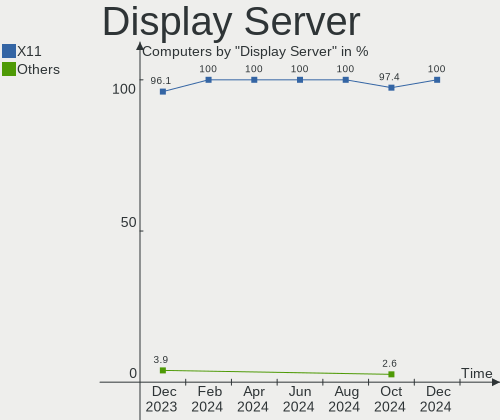

| Name | Computers | Percent |
|------|-----------|---------|
| X11  | 51        | 100%    |

Display Manager
---------------

SDDM, LightDM, etc.

| Name    | Computers | Percent |
|---------|-----------|---------|
| LightDM | 26        | 50.98%  |
| Unknown | 25        | 49.02%  |

OS Lang
-------

Language

| Lang  | Computers | Percent |
|-------|-----------|---------|
| en_US | 24        | 47.06%  |
| de_DE | 9         | 17.65%  |
| pt_BR | 4         | 7.84%   |
| it_IT | 4         | 7.84%   |
| fr_FR | 3         | 5.88%   |
| en_GB | 2         | 3.92%   |
| ru_RU | 1         | 1.96%   |
| hu_HU | 1         | 1.96%   |
| fr_CA | 1         | 1.96%   |
| es_ES | 1         | 1.96%   |
| es_EC | 1         | 1.96%   |

Boot Mode
---------

EFI or BIOS

| Mode | Computers | Percent |
|------|-----------|---------|
| EFI  | 32        | 62.75%  |
| BIOS | 19        | 37.25%  |

Filesystem
----------

Type of filesystem

| Type    | Computers | Percent |
|---------|-----------|---------|
| Ext4    | 44        | 86.27%  |
| Overlay | 5         | 9.8%    |
| Tmpfs   | 2         | 3.92%   |

Part. scheme
------------

Scheme of partitioning

| Type    | Computers | Percent |
|---------|-----------|---------|
| Unknown | 25        | 49.02%  |
| GPT     | 20        | 39.22%  |
| MBR     | 6         | 11.76%  |

Dual Boot with Linux/BSD
------------------------

Hosting more than one Linux/BSD

| Dual boot | Computers | Percent |
|-----------|-----------|---------|
| No        | 49        | 96.08%  |
| Yes       | 2         | 3.92%   |

Dual Boot (Win)
---------------

Hosting Linux and Windows

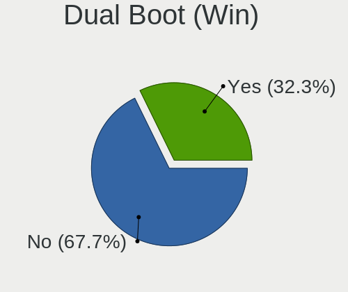

| Dual boot | Computers | Percent |
|-----------|-----------|---------|
| No        | 41        | 80.39%  |
| Yes       | 10        | 19.61%  |

Board
-----

Vendor
------

Motherboard manufacturer

| Name                   | Computers | Percent |
|------------------------|-----------|---------|
| Hewlett-Packard        | 12        | 23.53%  |
| Lenovo                 | 9         | 17.65%  |
| ASUSTek Computer       | 6         | 11.76%  |
| Gigabyte Technology    | 5         | 9.8%    |
| Dell                   | 3         | 5.88%   |
| ASRock                 | 3         | 5.88%   |
| Alienware              | 2         | 3.92%   |
| Acer                   | 2         | 3.92%   |
| Unknown                | 2         | 3.92%   |
| Trigkey                | 1         | 1.96%   |
| Toshiba                | 1         | 1.96%   |
| Medion                 | 1         | 1.96%   |
| Intel                  | 1         | 1.96%   |
| Framework              | 1         | 1.96%   |
| Avell High Performance | 1         | 1.96%   |
| Apple                  | 1         | 1.96%   |

Model
-----

Motherboard model

| Name                                     | Computers | Percent |
|------------------------------------------|-----------|---------|
| Lenovo IdeaPadFlex 5 14ALC05 82HU        | 2         | 3.92%   |
| Unknown                                  | 2         | 3.92%   |
| Trigkey Green G4                         | 1         | 1.96%   |
| Toshiba Satellite L745                   | 1         | 1.96%   |
| Medion S23003                            | 1         | 1.96%   |
| Lenovo Yoga Slim 7 14ARE05 82A2          | 1         | 1.96%   |
| Lenovo ThinkPad T490 20N3S7DP00          | 1         | 1.96%   |
| Lenovo ThinkPad T460s 20FAS2G900         | 1         | 1.96%   |
| Lenovo ThinkPad T430 2349STC             | 1         | 1.96%   |
| Lenovo ThinkPad T420s 4176W23            | 1         | 1.96%   |
| Lenovo ThinkPad T420 4236W1Y             | 1         | 1.96%   |
| Lenovo ThinkPad S1 Yoga 20CD000MFR       | 1         | 1.96%   |
| Intel DG31PR AAD97573-206                | 1         | 1.96%   |
| HP ProDesk 490 G1 MT                     | 1         | 1.96%   |
| HP Pavilion Sleekbook 14 PC              | 1         | 1.96%   |
| HP Pavilion Laptop 15-cw1xxx             | 1         | 1.96%   |
| HP Pavilion Laptop 15-cs3xxx             | 1         | 1.96%   |
| HP Pavilion dv7                          | 1         | 1.96%   |
| HP Pavilion dv6                          | 1         | 1.96%   |
| HP Pavilion Desktop 590-p0xxx            | 1         | 1.96%   |
| HP Notebook                              | 1         | 1.96%   |
| HP ENVY Laptop 17-cr0xxx                 | 1         | 1.96%   |
| HP ENVY dv7                              | 1         | 1.96%   |
| HP EliteBook 840 G6                      | 1         | 1.96%   |
| HP 250 G7 Notebook PC                    | 1         | 1.96%   |
| Gigabyte Q87M-D2H                        | 1         | 1.96%   |
| Gigabyte GB-BACE-3000-SBE                | 1         | 1.96%   |
| Gigabyte G31M-ES2L                       | 1         | 1.96%   |
| Gigabyte AB350M-DS3H V2                  | 1         | 1.96%   |
| Gigabyte A520M S2H                       | 1         | 1.96%   |
| Framework Laptop                         | 1         | 1.96%   |
| Dell OptiPlex GX620                      | 1         | 1.96%   |
| Dell OptiPlex 7010                       | 1         | 1.96%   |
| Dell Latitude E6520                      | 1         | 1.96%   |
| Avell High Performance 1513 Mxti         | 1         | 1.96%   |
| ASUS X540YA                              | 1         | 1.96%   |
| ASUS X505BP                              | 1         | 1.96%   |
| ASUS VivoBook_ASUSLaptop X515EA_R1500EA  | 1         | 1.96%   |
| ASUS VivoBook_ASUSLaptop X1605VA_X1605VA | 1         | 1.96%   |
| ASUS ROG STRIX Z790-I GAMING WIFI        | 1         | 1.96%   |

Model Family
------------

Motherboard model prefix

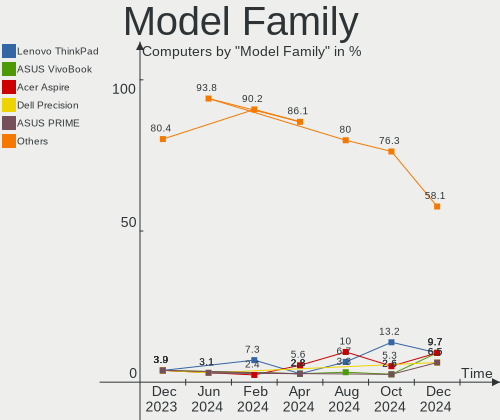

| Name                        | Computers | Percent |
|-----------------------------|-----------|---------|
| Lenovo ThinkPad             | 6         | 11.76%  |
| HP Pavilion                 | 6         | 11.76%  |
| Lenovo IdeaPadFlex          | 2         | 3.92%   |
| HP ENVY                     | 2         | 3.92%   |
| Dell OptiPlex               | 2         | 3.92%   |
| ASUS VivoBook               | 2         | 3.92%   |
| Unknown                     | 2         | 3.92%   |
| Trigkey Green               | 1         | 1.96%   |
| Toshiba Satellite           | 1         | 1.96%   |
| Medion S23003               | 1         | 1.96%   |
| Lenovo Yoga                 | 1         | 1.96%   |
| Intel DG31PR                | 1         | 1.96%   |
| HP ProDesk                  | 1         | 1.96%   |
| HP Notebook                 | 1         | 1.96%   |
| HP EliteBook                | 1         | 1.96%   |
| HP 250                      | 1         | 1.96%   |
| Gigabyte Q87M-D2H           | 1         | 1.96%   |
| Gigabyte GB-BACE-3000-SBE   | 1         | 1.96%   |
| Gigabyte G31M-ES2L          | 1         | 1.96%   |
| Gigabyte AB350M-DS3H        | 1         | 1.96%   |
| Gigabyte A520M              | 1         | 1.96%   |
| Framework Laptop            | 1         | 1.96%   |
| Dell Latitude               | 1         | 1.96%   |
| Avell High Performance 1513 | 1         | 1.96%   |
| ASUS X540YA                 | 1         | 1.96%   |
| ASUS X505BP                 | 1         | 1.96%   |
| ASUS ROG                    | 1         | 1.96%   |
| ASUS P5G41T-M               | 1         | 1.96%   |
| ASRock Z97                  | 1         | 1.96%   |
| ASRock Z690M-ITX            | 1         | 1.96%   |
| ASRock H310M-STX            | 1         | 1.96%   |
| Apple MacBookPro9           | 1         | 1.96%   |
| Alienware m15               | 1         | 1.96%   |
| Alienware 13                | 1         | 1.96%   |
| Acer Predator               | 1         | 1.96%   |
| Acer Aspire                 | 1         | 1.96%   |

MFG Year
--------

Motherboard manufacture year

| Year    | Computers | Percent |
|---------|-----------|---------|
| 2023    | 5         | 9.8%    |
| 2019    | 5         | 9.8%    |
| 2018    | 5         | 9.8%    |
| 2021    | 4         | 7.84%   |
| 2012    | 4         | 7.84%   |
| 2011    | 4         | 7.84%   |
| 2008    | 4         | 7.84%   |
| 2017    | 3         | 5.88%   |
| 2014    | 3         | 5.88%   |
| 2013    | 3         | 5.88%   |
| 2020    | 2         | 3.92%   |
| 2016    | 2         | 3.92%   |
| 2015    | 2         | 3.92%   |
| 2022    | 1         | 1.96%   |
| 2010    | 1         | 1.96%   |
| 2007    | 1         | 1.96%   |
| 2006    | 1         | 1.96%   |
| Unknown | 1         | 1.96%   |

Form Factor
-----------

Physical design of the computer

| Name        | Computers | Percent |
|-------------|-----------|---------|
| Notebook    | 30        | 58.82%  |
| Desktop     | 19        | 37.25%  |
| Convertible | 2         | 3.92%   |

Secure Boot
-----------

Enabled or disabled

| State    | Computers | Percent |
|----------|-----------|---------|
| Disabled | 46        | 90.2%   |
| Enabled  | 5         | 9.8%    |

Coreboot
--------

Have coreboot on board

| Used | Computers | Percent |
|------|-----------|---------|
| No   | 51        | 100%    |

RAM Size
--------

Total RAM memory

| Size in GB  | Computers | Percent |
|-------------|-----------|---------|
| 4.01-8.0    | 16        | 31.37%  |
| 16.01-24.0  | 10        | 19.61%  |
| 3.01-4.0    | 8         | 15.69%  |
| 8.01-16.0   | 6         | 11.76%  |
| 32.01-64.0  | 4         | 7.84%   |
| 64.01-256.0 | 4         | 7.84%   |
| 1.01-2.0    | 2         | 3.92%   |
| 24.01-32.0  | 1         | 1.96%   |

RAM Used
--------

Used RAM memory

| Used GB    | Computers | Percent |
|------------|-----------|---------|
| 2.01-3.0   | 19        | 37.25%  |
| 1.01-2.0   | 11        | 21.57%  |
| 4.01-8.0   | 9         | 17.65%  |
| 3.01-4.0   | 9         | 17.65%  |
| 16.01-24.0 | 1         | 1.96%   |
| 8.01-16.0  | 1         | 1.96%   |
| 0.51-1.0   | 1         | 1.96%   |

Total Drives
------------

Number of drives on board

| Drives | Computers | Percent |
|--------|-----------|---------|
| 1      | 30        | 58.82%  |
| 2      | 12        | 23.53%  |
| 4      | 5         | 9.8%    |
| 3      | 3         | 5.88%   |
| 5      | 1         | 1.96%   |

Has CD-ROM
----------

Has CD-ROM on board

| Presented | Computers | Percent |
|-----------|-----------|---------|
| No        | 34        | 66.67%  |
| Yes       | 17        | 33.33%  |

Has Ethernet
------------

Has Ethernet on board

| Presented | Computers | Percent |
|-----------|-----------|---------|
| Yes       | 45        | 88.24%  |
| No        | 6         | 11.76%  |

Has WiFi
--------

Has WiFi module

| Presented | Computers | Percent |
|-----------|-----------|---------|
| Yes       | 44        | 86.27%  |
| No        | 7         | 13.73%  |

Has Bluetooth
-------------

Has Bluetooth module

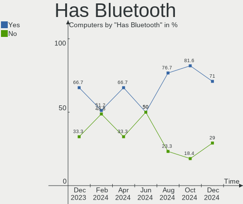

| Presented | Computers | Percent |
|-----------|-----------|---------|
| Yes       | 35        | 68.63%  |
| No        | 16        | 31.37%  |

Location
--------

Country
-------

Geographic location (country)

| Country      | Computers | Percent |
|--------------|-----------|---------|
| Germany      | 10        | 19.61%  |
| USA          | 9         | 17.65%  |
| Italy        | 8         | 15.69%  |
| Brazil       | 4         | 7.84%   |
| France       | 3         | 5.88%   |
| Ecuador      | 3         | 5.88%   |
| UK           | 2         | 3.92%   |
| Spain        | 1         | 1.96%   |
| Saudi Arabia | 1         | 1.96%   |
| Russia       | 1         | 1.96%   |
| Romania      | 1         | 1.96%   |
| Puerto Rico  | 1         | 1.96%   |
| Philippines  | 1         | 1.96%   |
| Netherlands  | 1         | 1.96%   |
| Malaysia     | 1         | 1.96%   |
| Indonesia    | 1         | 1.96%   |
| India        | 1         | 1.96%   |
| Hungary      | 1         | 1.96%   |
| Canada       | 1         | 1.96%   |

City
----

Geographic location (city)

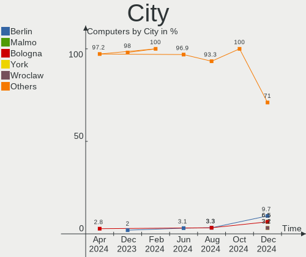

| City                     | Computers | Percent |
|--------------------------|-----------|---------|
| Bologna                  | 3         | 5.88%   |
| Guayaquil                | 2         | 3.92%   |
| Toa Baja                 | 1         | 1.96%   |
| Seattle                  | 1         | 1.96%   |
| Sao Paulo                | 1         | 1.96%   |
| San Martino Buon Albergo | 1         | 1.96%   |
| Saarbrücken             | 1         | 1.96%   |
| Rostov-on-Don            | 1         | 1.96%   |
| Romford                  | 1         | 1.96%   |
| Rio de Janeiro           | 1         | 1.96%   |
| Paris                    | 1         | 1.96%   |
| Palma                    | 1         | 1.96%   |
| North Port               | 1         | 1.96%   |
| Morlaix                  | 1         | 1.96%   |
| Montreal                 | 1         | 1.96%   |
| Milano                   | 1         | 1.96%   |
| Manchester               | 1         | 1.96%   |
| Magdeburg                | 1         | 1.96%   |
| Leipzig                  | 1         | 1.96%   |
| Kuala Lumpur             | 1         | 1.96%   |
| Kreuztal                 | 1         | 1.96%   |
| Kansas City              | 1         | 1.96%   |
| Itajuba                  | 1         | 1.96%   |
| Hechingen                | 1         | 1.96%   |
| Giussano                 | 1         | 1.96%   |
| Freiburg im Breisgau     | 1         | 1.96%   |
| Freden                   | 1         | 1.96%   |
| Fitchburg                | 1         | 1.96%   |
| Düsseldorf              | 1         | 1.96%   |
| Delligsen                | 1         | 1.96%   |
| Davao City               | 1         | 1.96%   |
| Dautphetal               | 1         | 1.96%   |
| Dammam                   | 1         | 1.96%   |
| Dallas                   | 1         | 1.96%   |
| Cuenca                   | 1         | 1.96%   |
| Cormeilles-en-Parisis    | 1         | 1.96%   |
| Columbia                 | 1         | 1.96%   |
| Catania                  | 1         | 1.96%   |
| Burnley                  | 1         | 1.96%   |
| Bucharest                | 1         | 1.96%   |

Drives
------

Drive Vendor
------------

Hard drive vendors

| Vendor                      | Computers | Drives | Percent |
|-----------------------------|-----------|--------|---------|
| Seagate                     | 13        | 18     | 16.67%  |
| WDC                         | 10        | 12     | 12.82%  |
| Samsung Electronics         | 10        | 10     | 12.82%  |
| China                       | 5         | 5      | 6.41%   |
| Toshiba                     | 4         | 4      | 5.13%   |
| Kingston                    | 4         | 6      | 5.13%   |
| Unknown                     | 4         | 4      | 5.13%   |
| Unknown                     | 2         | 2      | 2.56%   |
| SanDisk                     | 2         | 2      | 2.56%   |
| JMicron Technology          | 2         | 2      | 2.56%   |
| Intel                       | 2         | 2      | 2.56%   |
| Hewlett-Packard             | 2         | 2      | 2.56%   |
| ADATA Technology            | 2         | 2      | 2.56%   |
| WALRAM                      | 1         | 1      | 1.28%   |
| Verbatim                    | 1         | 1      | 1.28%   |
| Transcend                   | 1         | 1      | 1.28%   |
| TO Exter                    | 1         | 1      | 1.28%   |
| Team                        | 1         | 1      | 1.28%   |
| SPCC                        | 1         | 1      | 1.28%   |
| SK hynix                    | 1         | 1      | 1.28%   |
| PNY                         | 1         | 1      | 1.28%   |
| Phison                      | 1         | 1      | 1.28%   |
| Micron/Crucial Technology   | 1         | 1      | 1.28%   |
| Micron Technology           | 1         | 1      | 1.28%   |
| MAXIO Technology (Hangzhou) | 1         | 1      | 1.28%   |
| KIOXIA-EXCERIA              | 1         | 1      | 1.28%   |
| IBM/Hitachi                 | 1         | 1      | 1.28%   |
| Crucial                     | 1         | 1      | 1.28%   |
| Apacer                      | 1         | 1      | 1.28%   |

Drive Model
-----------

Hard drive models

| Model                                                             | Computers | Percent |
|-------------------------------------------------------------------|-----------|---------|
| Unknown                                                           | 4         | 4.71%   |
| Seagate Expansion Desk 3TB                                        | 2         | 2.35%   |
| JMicron Generic 256GB                                             | 2         | 2.35%   |
| China SATA SSD 240GB                                              | 2         | 2.35%   |
| ADATA XPG SX8200 Pro PCIe Gen3x4 M.2 2280 Solid State Drive 512GB | 2         | 2.35%   |
| WDC WDS500G2B0A-00SM50 500GB SSD                                  | 1         | 1.18%   |
| WDC WDS500G2B0A 500GB SSD                                         | 1         | 1.18%   |
| WDC WD40EFAX-68JH4N1 4TB                                          | 1         | 1.18%   |
| WDC WD4004FZWX-00GBGB0 4TB                                        | 1         | 1.18%   |
| WDC WD3200AAJS-57VWA2 320GB                                       | 1         | 1.18%   |
| WDC WD3200AAJS-22B4A0 320GB                                       | 1         | 1.18%   |
| WDC WD20EARX-22PASB0 2TB                                          | 1         | 1.18%   |
| WDC WD2003FZEX-00SRLA0 2TB                                        | 1         | 1.18%   |
| WDC WD10SPZX-60Z10T0 1TB                                          | 1         | 1.18%   |
| WDC WD10JPVX-75JC3T0 1TB                                          | 1         | 1.18%   |
| WDC WD10EZRZ-00HTKB0 1TB                                          | 1         | 1.18%   |
| WALRAM 120G                                                       | 1         | 1.18%   |
| Verbatim Vi550 S3 128GB                                           | 1         | 1.18%   |
| Unknown USB DISK 3.2 1TB                                          | 1         | 1.18%   |
| Unknown SN128  128GB                                              | 1         | 1.18%   |
| Transcend TS512GMTS430S 512GB SSD                                 | 1         | 1.18%   |
| Toshiba XG6 NVMe SSD Controller 256GB                             | 1         | 1.18%   |
| Toshiba MQ04ABF100 1TB                                            | 1         | 1.18%   |
| Toshiba MQ01ABD100 1TB                                            | 1         | 1.18%   |
| Toshiba DT01ACA100 1TB                                            | 1         | 1.18%   |
| TO Exter nal USB 3.0 2TB                                          | 1         | 1.18%   |
| Team T253512GB SSD                                                | 1         | 1.18%   |
| SPCC Solid State Disk 480GB                                       | 1         | 1.18%   |
| SK hynix BC501 HFM256GDJTNG-8310A 256GB                           | 1         | 1.18%   |
| Seagate ST9500325AS 500GB                                         | 1         | 1.18%   |
| Seagate ST8000DM004-2U9188 8TB                                    | 1         | 1.18%   |
| Seagate ST500LT012-1DG142 500GB                                   | 1         | 1.18%   |
| Seagate ST500LM021-1KJ152 500GB                                   | 1         | 1.18%   |
| Seagate ST4000VN008-2DR166 4TB                                    | 1         | 1.18%   |
| Seagate ST3500418AS 500GB                                         | 1         | 1.18%   |
| Seagate ST3320310CS 320GB                                         | 1         | 1.18%   |
| Seagate ST3250820AS 250GB                                         | 1         | 1.18%   |
| Seagate ST3000DM001-1CH166 3TB                                    | 1         | 1.18%   |
| Seagate ST2000LX001-1RG174 2TB                                    | 1         | 1.18%   |
| Seagate ST2000LM015-2E8174 2TB                                    | 1         | 1.18%   |

HDD Vendor
----------

Hard disk drive vendors

| Vendor      | Computers | Drives | Percent |
|-------------|-----------|--------|---------|
| Seagate     | 13        | 18     | 50%     |
| WDC         | 8         | 10     | 30.77%  |
| Toshiba     | 3         | 3      | 11.54%  |
| IBM/Hitachi | 1         | 1      | 3.85%   |
| Unknown     | 1         | 1      | 3.85%   |

SSD Vendor
----------

Solid state drive vendors

| Vendor              | Computers | Drives | Percent |
|---------------------|-----------|--------|---------|
| China               | 5         | 5      | 20%     |
| Kingston            | 4         | 4      | 16%     |
| Samsung Electronics | 3         | 3      | 12%     |
| WDC                 | 2         | 2      | 8%      |
| Verbatim            | 1         | 1      | 4%      |
| Transcend           | 1         | 1      | 4%      |
| TO Exter            | 1         | 1      | 4%      |
| Team                | 1         | 1      | 4%      |
| SPCC                | 1         | 1      | 4%      |
| SanDisk             | 1         | 1      | 4%      |
| PNY                 | 1         | 1      | 4%      |
| Phison              | 1         | 1      | 4%      |
| Hewlett-Packard     | 1         | 1      | 4%      |
| Crucial             | 1         | 1      | 4%      |
| Apacer              | 1         | 1      | 4%      |

Drive Kind
----------

HDD or SSD

| Kind    | Computers | Drives | Percent |
|---------|-----------|--------|---------|
| HDD     | 23        | 33     | 31.94%  |
| SSD     | 22        | 25     | 30.56%  |
| NVMe    | 21        | 23     | 29.17%  |
| MMC     | 4         | 4      | 5.56%   |
| Unknown | 2         | 2      | 2.78%   |

Drive Connector
---------------

SATA, SAS, NVMe, etc.

| Type | Computers | Drives | Percent |
|------|-----------|--------|---------|
| SATA | 38        | 55     | 55.88%  |
| NVMe | 20        | 21     | 29.41%  |
| SAS  | 6         | 7      | 8.82%   |
| MMC  | 4         | 4      | 5.88%   |

Drive Size
----------

Size of hard drive

| Size in TB | Computers | Drives | Percent |
|------------|-----------|--------|---------|
| 0.01-0.5   | 27        | 31     | 54%     |
| 0.51-1.0   | 12        | 12     | 24%     |
| 1.01-2.0   | 4         | 6      | 8%      |
| 3.01-4.0   | 3         | 4      | 6%      |
| 2.01-3.0   | 3         | 3      | 6%      |
| 4.01-10.0  | 1         | 2      | 2%      |

Space Total
-----------

Amount of disk space available on the file system

| Size in GB     | Computers | Percent |
|----------------|-----------|---------|
| 101-250        | 15        | 29.41%  |
| 251-500        | 10        | 19.61%  |
| 501-1000       | 8         | 15.69%  |
| More than 3000 | 5         | 9.8%    |
| 1001-2000      | 5         | 9.8%    |
| 1-20           | 4         | 7.84%   |
| 2001-3000      | 2         | 3.92%   |
| 21-50          | 1         | 1.96%   |
| 51-100         | 1         | 1.96%   |

Space Used
----------

Amount of used disk space

| Used GB        | Computers | Percent |
|----------------|-----------|---------|
| 1-20           | 15        | 29.41%  |
| 51-100         | 10        | 19.61%  |
| 21-50          | 9         | 17.65%  |
| 101-250        | 6         | 11.76%  |
| 251-500        | 4         | 7.84%   |
| More than 3000 | 3         | 5.88%   |
| 501-1000       | 3         | 5.88%   |
| 1001-2000      | 1         | 1.96%   |

Malfunc. Drives
---------------

Drive models with a malfunction

| Model                             | Computers | Drives | Percent |
|-----------------------------------|-----------|--------|---------|
| WDC WD10EZRZ-00HTKB0 1TB          | 1         | 1      | 20%     |
| Transcend TS512GMTS430S 512GB SSD | 1         | 1      | 20%     |
| Seagate ST1000LM014-1EJ164 1TB    | 1         | 1      | 20%     |
| Kingston SUV400S37240G 240GB SSD  | 1         | 1      | 20%     |
| IBM/Hitachi IC35L040AVER07-0 41GB | 1         | 1      | 20%     |

Malfunc. Drive Vendor
---------------------

Vendors of faulty drives

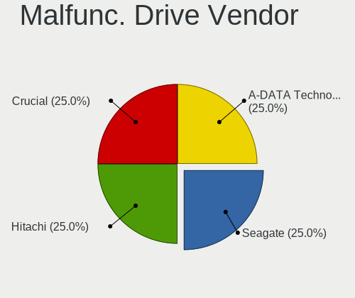

| Vendor      | Computers | Drives | Percent |
|-------------|-----------|--------|---------|
| WDC         | 1         | 1      | 20%     |
| Transcend   | 1         | 1      | 20%     |
| Seagate     | 1         | 1      | 20%     |
| Kingston    | 1         | 1      | 20%     |
| IBM/Hitachi | 1         | 1      | 20%     |

Malfunc. HDD Vendor
-------------------

Vendors of faulty HDD drives

| Vendor      | Computers | Drives | Percent |
|-------------|-----------|--------|---------|
| WDC         | 1         | 1      | 33.33%  |
| Seagate     | 1         | 1      | 33.33%  |
| IBM/Hitachi | 1         | 1      | 33.33%  |

Malfunc. Drive Kind
-------------------

Kinds of faulty drives

| Kind | Computers | Drives | Percent |
|------|-----------|--------|---------|
| HDD  | 3         | 3      | 60%     |
| SSD  | 2         | 2      | 40%     |

Failed Drives
-------------

Failed drive models

Zero info for selected period =(

Failed Drive Vendor
-------------------

Failed drive vendors

Zero info for selected period =(

Drive Status
------------

Number of failed and malfunc. drives

| Status   | Computers | Drives | Percent |
|----------|-----------|--------|---------|
| Detected | 32        | 55     | 53.33%  |
| Works    | 23        | 27     | 38.33%  |
| Malfunc  | 5         | 5      | 8.33%   |

Storage controller
------------------

Storage Vendor
--------------

Storage controller vendors

| Vendor                       | Computers | Percent |
|------------------------------|-----------|---------|
| Intel                        | 37        | 59.68%  |
| Samsung Electronics          | 7         | 11.29%  |
| AMD                          | 6         | 9.68%   |
| ADATA Technology             | 2         | 3.23%   |
| VIA Technologies             | 1         | 1.61%   |
| Toshiba America Info Systems | 1         | 1.61%   |
| SK hynix                     | 1         | 1.61%   |
| SanDisk                      | 1         | 1.61%   |
| Micron/Crucial Technology    | 1         | 1.61%   |
| Micron Technology            | 1         | 1.61%   |
| MAXIO Technology (Hangzhou)  | 1         | 1.61%   |
| KIOXIA                       | 1         | 1.61%   |
| Kingston Technology Company  | 1         | 1.61%   |
| Biwin Storage Technology     | 1         | 1.61%   |

Storage Model
-------------

Storage controller models

| Model                                                                            | Computers | Percent |
|----------------------------------------------------------------------------------|-----------|---------|
| Intel 82801 Mobile SATA Controller [RAID mode]                                   | 7         | 9.86%   |
| Intel 6 Series/C200 Series Chipset Family 6 port Mobile SATA AHCI Controller     | 5         | 7.04%   |
| Intel NM10/ICH7 Family SATA Controller [IDE mode]                                | 4         | 5.63%   |
| AMD FCH SATA Controller [AHCI mode]                                              | 4         | 5.63%   |
| Samsung NVMe SSD Controller SM981/PM981/PM983                                    | 3         | 4.23%   |
| Intel 82801G (ICH7 Family) IDE Controller                                        | 3         | 4.23%   |
| Intel 8 Series/C220 Series Chipset Family 6-port SATA Controller 1 [AHCI mode]   | 3         | 4.23%   |
| Samsung NVMe SSD Controller 980 (DRAM-less)                                      | 2         | 2.82%   |
| Intel Volume Management Device NVMe RAID Controller Intel Corporation            | 2         | 2.82%   |
| Intel 8 Series SATA Controller 1 [AHCI mode]                                     | 2         | 2.82%   |
| Intel 7 Series Chipset Family 6-port SATA Controller [AHCI mode]                 | 2         | 2.82%   |
| ADATA XPG SX8200 Pro PCIe Gen3x4 M.2 2280 Solid State Drive                      | 2         | 2.82%   |
| VIA VT82C586A/B/VT82C686/A/B/VT823x/A/C PIPC Bus Master IDE                      | 1         | 1.41%   |
| VIA VIA VT6420 SATA RAID Controller                                              | 1         | 1.41%   |
| Toshiba America Info Systems XG6 NVMe SSD Controller                             | 1         | 1.41%   |
| SK hynix BC501 NVMe Solid State Drive                                            | 1         | 1.41%   |
| SanDisk WD Black SN770 / PC SN740 256GB / PC SN560 (DRAM-less) NVMe SSD          | 1         | 1.41%   |
| Samsung NVMe SSD Controller PM9B1 (DRAM-less)                                    | 1         | 1.41%   |
| Samsung NVMe SSD Controller PM9A1/PM9A3/980PRO                                   | 1         | 1.41%   |
| Micron/Crucial P5 Plus NVMe PCIe SSD                                             | 1         | 1.41%   |
| Micron 2210 NVMe SSD [Cobain]                                                    | 1         | 1.41%   |
| MAXIO (Hangzhou) NVMe SSD Controller MAP1202                                     | 1         | 1.41%   |
| KIOXIA NVMe SSD                                                                  | 1         | 1.41%   |
| Kingston Company NV1 NVMe SSD SM2263XT                                           | 1         | 1.41%   |
| Kingston Company KC3000/FURY Renegade NVMe SSD E18                               | 1         | 1.41%   |
| Intel Wildcat Point-LP SATA Controller [AHCI Mode]                               | 1         | 1.41%   |
| Intel Volume Management Device NVMe RAID Controller                              | 1         | 1.41%   |
| Intel Tiger Lake-LP SATA Controller                                              | 1         | 1.41%   |
| Intel SSD DC P4101/Pro 7600p/760p/E 6100p Series                                 | 1         | 1.41%   |
| Intel SATA Controller [RAID mode]                                                | 1         | 1.41%   |
| Intel SATA controller                                                            | 1         | 1.41%   |
| Intel Optane NVME SSD H10 with Solid State Storage [Teton Glacier]               | 1         | 1.41%   |
| Intel NVMe Optane Memory Series                                                  | 1         | 1.41%   |
| Intel Celeron/Pentium Silver Processor SATA Controller                           | 1         | 1.41%   |
| Intel Cannon Lake PCH SATA AHCI Controller                                       | 1         | 1.41%   |
| Intel Atom/Celeron/Pentium Processor x5-E8000/J3xxx/N3xxx Series SATA Controller | 1         | 1.41%   |
| Intel Alder Lake-S PCH SATA Controller [AHCI Mode]                               | 1         | 1.41%   |
| Intel 9 Series Chipset Family SATA Controller [AHCI Mode]                        | 1         | 1.41%   |
| Intel 700 Series Chipset Family SATA AHCI Controller                             | 1         | 1.41%   |
| Intel 7 Series/C210 Series Chipset Family 6-port SATA Controller [AHCI mode]     | 1         | 1.41%   |

Storage Kind
------------

Kind of storage controller (IDE, SATA, NVMe, SAS, ...)

| Kind | Computers | Percent |
|------|-----------|---------|
| SATA | 29        | 44.62%  |
| NVMe | 20        | 30.77%  |
| RAID | 11        | 16.92%  |
| IDE  | 5         | 7.69%   |

Processor
---------

CPU Vendor
----------

Processor vendors

| Vendor | Computers | Percent |
|--------|-----------|---------|
| Intel  | 42        | 82.35%  |
| AMD    | 9         | 17.65%  |

CPU Model
---------

Processor models

| Model                                       | Computers | Percent |
|---------------------------------------------|-----------|---------|
| Intel Core i5-4200U CPU @ 1.60GHz           | 2         | 3.92%   |
| AMD Ryzen 5 5500U with Radeon Graphics      | 2         | 3.92%   |
| Intel Pentium Dual-Core CPU E6700 @ 3.20GHz | 1         | 1.96%   |
| Intel Pentium Dual-Core CPU E5700 @ 3.00GHz | 1         | 1.96%   |
| Intel Pentium Dual CPU E2180 @ 2.00GHz      | 1         | 1.96%   |
| Intel Pentium D CPU 3.00GHz                 | 1         | 1.96%   |
| Intel N100                                  | 1         | 1.96%   |
| Intel Core i9-9900K CPU @ 3.60GHz           | 1         | 1.96%   |
| Intel Core i7-9750H CPU @ 2.60GHz           | 1         | 1.96%   |
| Intel Core i7-8700 CPU @ 3.20GHz            | 1         | 1.96%   |
| Intel Core i7-8665U CPU @ 1.90GHz           | 1         | 1.96%   |
| Intel Core i7-7700HQ CPU @ 2.80GHz          | 1         | 1.96%   |
| Intel Core i7-6600U CPU @ 2.60GHz           | 1         | 1.96%   |
| Intel Core i7-4790K CPU @ 4.00GHz           | 1         | 1.96%   |
| Intel Core i7-4790 CPU @ 3.60GHz            | 1         | 1.96%   |
| Intel Core i7-4770 CPU @ 3.40GHz            | 1         | 1.96%   |
| Intel Core i7-3630QM CPU @ 2.40GHz          | 1         | 1.96%   |
| Intel Core i7-2640M CPU @ 2.80GHz           | 1         | 1.96%   |
| Intel Core i7-2630QM CPU @ 2.00GHz          | 1         | 1.96%   |
| Intel Core i7-2620M CPU @ 2.70GHz           | 1         | 1.96%   |
| Intel Core i7-1065G7 CPU @ 1.30GHz          | 1         | 1.96%   |
| Intel Core i5-9300H CPU @ 2.40GHz           | 1         | 1.96%   |
| Intel Core i5-8365U CPU @ 1.60GHz           | 1         | 1.96%   |
| Intel Core i5-8265U CPU @ 1.60GHz           | 1         | 1.96%   |
| Intel Core i5-5200U CPU @ 2.20GHz           | 1         | 1.96%   |
| Intel Core i5-4590S CPU @ 3.00GHz           | 1         | 1.96%   |
| Intel Core i5-3320M CPU @ 2.60GHz           | 1         | 1.96%   |
| Intel Core i5-3317U CPU @ 1.70GHz           | 1         | 1.96%   |
| Intel Core i5-3210M CPU @ 2.50GHz           | 1         | 1.96%   |
| Intel Core i5-2450M CPU @ 2.50GHz           | 1         | 1.96%   |
| Intel Core i5-2400 CPU @ 3.10GHz            | 1         | 1.96%   |
| Intel Core i5 CPU M 450 @ 2.40GHz           | 1         | 1.96%   |
| Intel Core i3-2330M CPU @ 2.20GHz           | 1         | 1.96%   |
| Intel Celeron J4125 CPU @ 2.00GHz           | 1         | 1.96%   |
| Intel Celeron CPU N3000 @ 1.04GHz           | 1         | 1.96%   |
| Intel Celeron CPU 2.60GHz                   | 1         | 1.96%   |
| Intel 13th Gen Core i9-13900K               | 1         | 1.96%   |
| Intel 13th Gen Core i9-13900H               | 1         | 1.96%   |
| Intel 13th Gen Core i5-13500                | 1         | 1.96%   |
| Intel 12th Gen Core i7-1260P                | 1         | 1.96%   |

CPU Model Family
----------------

Processor model prefix

| Model                   | Computers | Percent |
|-------------------------|-----------|---------|
| Intel Core i7           | 13        | 25.49%  |
| Intel Core i5           | 13        | 25.49%  |
| Other                   | 8         | 15.69%  |
| AMD Ryzen 5             | 6         | 11.76%  |
| Intel Celeron           | 3         | 5.88%   |
| Intel Pentium Dual-Core | 2         | 3.92%   |
| Intel Pentium Dual      | 1         | 1.96%   |
| Intel Pentium D         | 1         | 1.96%   |
| Intel Core i9           | 1         | 1.96%   |
| Intel Core i3           | 1         | 1.96%   |
| AMD E2                  | 1         | 1.96%   |
| AMD E1                  | 1         | 1.96%   |

CPU Cores
---------

Number of processor cores

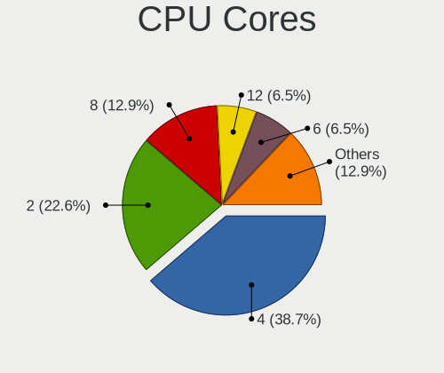

| Number | Computers | Percent |
|--------|-----------|---------|
| 2      | 19        | 37.25%  |
| 4      | 18        | 35.29%  |
| 6      | 7         | 13.73%  |
| 14     | 2         | 3.92%   |
| 1      | 2         | 3.92%   |
| 24     | 1         | 1.96%   |
| 12     | 1         | 1.96%   |
| 8      | 1         | 1.96%   |

CPU Sockets
-----------

Number of sockets

| Number | Computers | Percent |
|--------|-----------|---------|
| 1      | 51        | 100%    |

CPU Threads
-----------

Threads per core (Hyper-Threading)

| Number | Computers | Percent |
|--------|-----------|---------|
| 2      | 36        | 70.59%  |
| 1      | 15        | 29.41%  |

CPU Op-Modes
------------

CPU Operation Modes (32-bit, 64-bit)

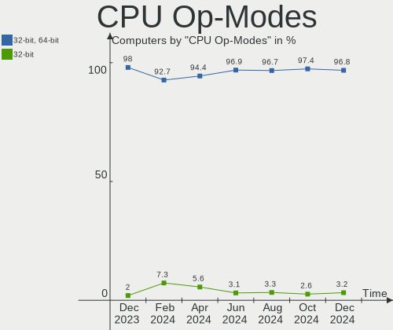

| Op mode        | Computers | Percent |
|----------------|-----------|---------|
| 32-bit, 64-bit | 50        | 98.04%  |
| 32-bit         | 1         | 1.96%   |

CPU Microcode
-------------

Microcode number

| Number     | Computers | Percent |
|------------|-----------|---------|
| 0x206a7    | 6         | 11.76%  |
| 0x306c3    | 4         | 7.84%   |
| 0x306a9    | 4         | 7.84%   |
| Unknown    | 3         | 5.88%   |
| 0x806ec    | 2         | 3.92%   |
| 0x806c1    | 2         | 3.92%   |
| 0x40651    | 2         | 3.92%   |
| 0x1067a    | 2         | 3.92%   |
| 0x08608104 | 2         | 3.92%   |
| 0xf62      | 1         | 1.96%   |
| 0xf29      | 1         | 1.96%   |
| 0xb06f2    | 1         | 1.96%   |
| 0xb06e0    | 1         | 1.96%   |
| 0xb06a2    | 1         | 1.96%   |
| 0xb0671    | 1         | 1.96%   |
| 0x906ed    | 1         | 1.96%   |
| 0x906ea    | 1         | 1.96%   |
| 0x906e9    | 1         | 1.96%   |
| 0x906a3    | 1         | 1.96%   |
| 0x806eb    | 1         | 1.96%   |
| 0x706e5    | 1         | 1.96%   |
| 0x706a8    | 1         | 1.96%   |
| 0x6fd      | 1         | 1.96%   |
| 0x406e3    | 1         | 1.96%   |
| 0x406c3    | 1         | 1.96%   |
| 0x306d4    | 1         | 1.96%   |
| 0x20655    | 1         | 1.96%   |
| 0x0a50000d | 1         | 1.96%   |
| 0x08701030 | 1         | 1.96%   |
| 0x08600106 | 1         | 1.96%   |
| 0x08108109 | 1         | 1.96%   |
| 0x07030106 | 1         | 1.96%   |
| 0x06006704 | 1         | 1.96%   |

CPU Microarch
-------------

Microarchitecture

| Name             | Computers | Percent |
|------------------|-----------|---------|
| KabyLake         | 8         | 15.69%  |
| SandyBridge      | 6         | 11.76%  |
| Haswell          | 6         | 11.76%  |
| IvyBridge        | 4         | 7.84%   |
| Alderlake Hybrid | 4         | 7.84%   |
| Zen 2            | 2         | 3.92%   |
| TigerLake        | 2         | 3.92%   |
| Puma             | 2         | 3.92%   |
| Penryn           | 2         | 3.92%   |
| NetBurst         | 2         | 3.92%   |
| Unknown          | 2         | 3.92%   |
| Zen+             | 1         | 1.96%   |
| Zen 3            | 1         | 1.96%   |
| Westmere         | 1         | 1.96%   |
| Skylake          | 1         | 1.96%   |
| Silvermont       | 1         | 1.96%   |
| IceLake          | 1         | 1.96%   |
| Gracemont        | 1         | 1.96%   |
| Goldmont plus    | 1         | 1.96%   |
| Excavator        | 1         | 1.96%   |
| Core             | 1         | 1.96%   |
| Broadwell        | 1         | 1.96%   |

Graphics
--------

GPU Vendor
----------

Vendors of graphics cards

| Vendor | Computers | Percent |
|--------|-----------|---------|
| Intel  | 37        | 56.06%  |
| AMD    | 15        | 22.73%  |
| Nvidia | 14        | 21.21%  |

GPU Model
---------

Graphics card models

| Model                                                                                    | Computers | Percent |
|------------------------------------------------------------------------------------------|-----------|---------|
| Intel 2nd Generation Core Processor Family Integrated Graphics Controller                | 5         | 7.35%   |
| Intel 3rd Gen Core processor Graphics Controller                                         | 4         | 5.88%   |
| Intel Xeon E3-1200 v3/4th Gen Core Processor Integrated Graphics Controller              | 3         | 4.41%   |
| Intel WhiskeyLake-U GT2 [UHD Graphics 620]                                               | 3         | 4.41%   |
| Intel Haswell-ULT Integrated Graphics Controller                                         | 2         | 2.94%   |
| Intel CoffeeLake-S GT2 [UHD Graphics 630]                                                | 2         | 2.94%   |
| Intel CoffeeLake-H GT2 [UHD Graphics 630]                                                | 2         | 2.94%   |
| AMD Mullins [Radeon R2 Graphics]                                                         | 2         | 2.94%   |
| AMD Lucienne                                                                             | 2         | 2.94%   |
| Nvidia TU117M [GeForce GTX 1650 Mobile / Max-Q]                                          | 1         | 1.47%   |
| Nvidia TU116M [GeForce GTX 1660 Ti Mobile]                                               | 1         | 1.47%   |
| Nvidia TU106 [GeForce RTX 2060 12GB]                                                     | 1         | 1.47%   |
| Nvidia GP108M [GeForce MX250]                                                            | 1         | 1.47%   |
| Nvidia GP107M [GeForce GTX 1050 Ti Mobile]                                               | 1         | 1.47%   |
| Nvidia GM204 [GeForce GTX 970]                                                           | 1         | 1.47%   |
| Nvidia GM200 [GeForce GTX 980 Ti]                                                        | 1         | 1.47%   |
| Nvidia GM107M [GeForce GTX 960M]                                                         | 1         | 1.47%   |
| Nvidia GF119M [Quadro NVS 4200M]                                                         | 1         | 1.47%   |
| Nvidia GF119M [NVS 4200M]                                                                | 1         | 1.47%   |
| Nvidia GF119 [GeForce GT 610]                                                            | 1         | 1.47%   |
| Nvidia GF108M [GeForce GT 635M]                                                          | 1         | 1.47%   |
| Nvidia GF108M [GeForce GT 525M]                                                          | 1         | 1.47%   |
| Nvidia AD104 [GeForce RTX 4070 Ti]                                                       | 1         | 1.47%   |
| Intel TigerLake-LP GT2 [Iris Xe Graphics]                                                | 1         | 1.47%   |
| Intel Tiger Lake-LP GT2 [UHD Graphics G4]                                                | 1         | 1.47%   |
| Intel Skylake GT2 [HD Graphics 520]                                                      | 1         | 1.47%   |
| Intel Raptor Lake-S GT1 [UHD Graphics 770]                                               | 1         | 1.47%   |
| Intel Raptor Lake-P [Iris Xe Graphics]                                                   | 1         | 1.47%   |
| Intel Iris Plus Graphics G7                                                              | 1         | 1.47%   |
| Intel HD Graphics 630                                                                    | 1         | 1.47%   |
| Intel HD Graphics 5500                                                                   | 1         | 1.47%   |
| Intel GeminiLake [UHD Graphics 600]                                                      | 1         | 1.47%   |
| Intel Core Processor Integrated Graphics Controller                                      | 1         | 1.47%   |
| Intel Atom/Celeron/Pentium Processor x5-E8000/J3xxx/N3xxx Integrated Graphics Controller | 1         | 1.47%   |
| Intel AlderLake-S GT1                                                                    | 1         | 1.47%   |
| Intel Alder Lake-P GT2 [Iris Xe Graphics]                                                | 1         | 1.47%   |
| Intel Alder Lake-N [UHD Graphics]                                                        | 1         | 1.47%   |
| Intel 82G33/G31 Express Integrated Graphics Controller                                   | 1         | 1.47%   |
| Intel 4 Series Chipset Integrated Graphics Controller                                    | 1         | 1.47%   |
| AMD Tahiti PRO [Radeon HD 7950/8950 OEM / R9 280]                                        | 1         | 1.47%   |

GPU Combo
---------

Combinations of graphics cards

| Name           | Computers | Percent |
|----------------|-----------|---------|
| 1 x Intel      | 22        | 43.14%  |
| 1 x AMD        | 10        | 19.61%  |
| Intel + Nvidia | 9         | 17.65%  |
| 1 x Nvidia     | 5         | 9.8%    |
| Intel + AMD    | 3         | 5.88%   |
| 2 x AMD        | 2         | 3.92%   |

GPU Driver
----------

Free vs proprietary

| Driver      | Computers | Percent |
|-------------|-----------|---------|
| Free        | 47        | 92.16%  |
| Proprietary | 4         | 7.84%   |

GPU Memory
----------

Total video memory

| Size in GB | Computers | Percent |
|------------|-----------|---------|
| Unknown    | 30        | 58.82%  |
| 1.01-2.0   | 6         | 11.76%  |
| 0.51-1.0   | 5         | 9.8%    |
| 0.01-0.5   | 5         | 9.8%    |
| 3.01-4.0   | 3         | 5.88%   |
| 2.01-3.0   | 1         | 1.96%   |
| 8.01-16.0  | 1         | 1.96%   |

Monitor
-------

Monitor Vendor
--------------

Monitor vendors

| Vendor                  | Computers | Percent |
|-------------------------|-----------|---------|
| AU Optronics            | 8         | 15.69%  |
| Samsung Electronics     | 7         | 13.73%  |
| BOE                     | 7         | 13.73%  |
| LG Display              | 6         | 11.76%  |
| Chimei Innolux          | 5         | 9.8%    |
| Goldstar                | 3         | 5.88%   |
| Philips                 | 2         | 3.92%   |
| Hewlett-Packard         | 2         | 3.92%   |
| Chi Mei Optoelectronics | 2         | 3.92%   |
| AOC                     | 2         | 3.92%   |
| RGT                     | 1         | 1.96%   |
| Panasonic               | 1         | 1.96%   |
| InfoVision              | 1         | 1.96%   |
| HUAWEI                  | 1         | 1.96%   |
| Grundig                 | 1         | 1.96%   |
| Apple                   | 1         | 1.96%   |
| Ancor Communications    | 1         | 1.96%   |

Monitor Model
-------------

Monitor models

| Model                                                                    | Computers | Percent |
|--------------------------------------------------------------------------|-----------|---------|
| BOE LCD Monitor BOE0704 1366x768 344x194mm 15.5-inch                     | 2         | 3.92%   |
| Samsung Electronics SyncMaster SAM036F 1440x900 428x255mm 19.6-inch      | 1         | 1.96%   |
| Samsung Electronics S32D850 SAM0BCC 2560x1440 708x398mm 32.0-inch        | 1         | 1.96%   |
| Samsung Electronics LCD Monitor SEC5441 1366x768 309x174mm 14.0-inch     | 1         | 1.96%   |
| Samsung Electronics LCD Monitor SEC324C 1600x900 310x174mm 14.0-inch     | 1         | 1.96%   |
| Samsung Electronics LCD Monitor SAM7016 3840x2160 950x540mm 43.0-inch    | 1         | 1.96%   |
| Samsung Electronics LCD Monitor SAM094D 1920x1080 1210x680mm 54.6-inch   | 1         | 1.96%   |
| Samsung Electronics C32F391 SAM0D34 1920x1080 698x393mm 31.5-inch        | 1         | 1.96%   |
| RGT LCD Monitor RGT1252 1920x1080 1020x570mm 46.0-inch                   | 1         | 1.96%   |
| Philips LCD Monitor PHL BDM4065 3840x2160                                | 1         | 1.96%   |
| Philips 247E4 PHLC0C0 1920x1080 521x293mm 23.5-inch                      | 1         | 1.96%   |
| Panasonic LCD Monitor MEI96A2 2880x1620 344x193mm 15.5-inch              | 1         | 1.96%   |
| LG Display LCD Monitor LGD40A9 1920x1080 309x174mm 14.0-inch             | 1         | 1.96%   |
| LG Display LCD Monitor LGD0533 1920x1080 344x194mm 15.5-inch             | 1         | 1.96%   |
| LG Display LCD Monitor LGD0414 1920x1080 276x156mm 12.5-inch             | 1         | 1.96%   |
| LG Display LCD Monitor LGD03B8 1366x768 310x174mm 14.0-inch              | 1         | 1.96%   |
| LG Display LCD Monitor LGD033F 1366x768 310x174mm 14.0-inch              | 1         | 1.96%   |
| LG Display LCD Monitor LGD02F2 1366x768 344x194mm 15.5-inch              | 1         | 1.96%   |
| InfoVision LCD Monitor IVO8C65 1920x1080 309x174mm 14.0-inch             | 1         | 1.96%   |
| HUAWEI ZQE-CBA HWV6A25 3440x1440 797x334mm 34.0-inch                     | 1         | 1.96%   |
| Hewlett-Packard x20LED HWP2910 1600x900 443x249mm 20.0-inch              | 1         | 1.96%   |
| Hewlett-Packard 25x HPN357F 1920x1080 544x303mm 24.5-inch                | 1         | 1.96%   |
| Grundig WXGA GRU4448 1600x1200                                           | 1         | 1.96%   |
| Goldstar LG TV SSCR2 GSMC0C8 3840x2160                                   | 1         | 1.96%   |
| Goldstar FULL HD GSM5B55 1920x1080 480x270mm 21.7-inch                   | 1         | 1.96%   |
| Goldstar FULL HD GSM5B54 1920x1080 480x270mm 21.7-inch                   | 1         | 1.96%   |
| Chimei Innolux LCD Monitor CMN1733 1600x900 382x215mm 17.3-inch          | 1         | 1.96%   |
| Chimei Innolux LCD Monitor CMN1618 1920x1200 344x215mm 16.0-inch         | 1         | 1.96%   |
| Chimei Innolux LCD Monitor CMN15FD 1366x768 344x193mm 15.5-inch          | 1         | 1.96%   |
| Chimei Innolux LCD Monitor CMN15E7 1920x1080 344x193mm 15.5-inch         | 1         | 1.96%   |
| Chimei Innolux LCD Monitor CMN1406 1920x1080 309x173mm 13.9-inch         | 1         | 1.96%   |
| Chi Mei Optoelectronics LCD Monitor CMO1711 1600x900 382x215mm 17.3-inch | 1         | 1.96%   |
| Chi Mei Optoelectronics CMC 22 W CMO2228 1680x1050 470x300mm 22.0-inch   | 1         | 1.96%   |
| BOE LCD Monitor BOE0A9D 1920x1080 382x215mm 17.3-inch                    | 1         | 1.96%   |
| BOE LCD Monitor BOE095F 2256x1504 285x190mm 13.5-inch                    | 1         | 1.96%   |
| BOE LCD Monitor BOE080D 1920x1080 344x194mm 15.5-inch                    | 1         | 1.96%   |
| BOE LCD Monitor BOE07C9 1920x1080 309x173mm 13.9-inch                    | 1         | 1.96%   |
| BOE LCD Monitor BOE069C 1920x1080 344x193mm 15.5-inch                    | 1         | 1.96%   |
| AU Optronics LCD Monitor AUO80ED 1920x1080 344x194mm 15.5-inch           | 1         | 1.96%   |
| AU Optronics LCD Monitor AUO683D 1920x1080 309x174mm 14.0-inch           | 1         | 1.96%   |

Monitor Resolution
------------------

Monitor screen resolution

| Resolution         | Computers | Percent |
|--------------------|-----------|---------|
| 1920x1080 (FHD)    | 21        | 42%     |
| 1366x768 (WXGA)    | 11        | 22%     |
| 3840x2160 (4K)     | 6         | 12%     |
| 1600x900 (HD+)     | 4         | 8%      |
| 1920x1200 (WUXGA)  | 2         | 4%      |
| 3440x1440          | 1         | 2%      |
| 2560x1440 (QHD)    | 1         | 2%      |
| 2256x1504          | 1         | 2%      |
| 1680x1050 (WSXGA+) | 1         | 2%      |
| 1440x900 (WXGA+)   | 1         | 2%      |
| 1280x800 (WXGA)    | 1         | 2%      |

Monitor Diagonal
----------------

Diagonal size in inches

| Inches  | Computers | Percent |
|---------|-----------|---------|
| 15      | 13        | 25.49%  |
| 13      | 7         | 13.73%  |
| 17      | 5         | 9.8%    |
| 14      | 5         | 9.8%    |
| 24      | 4         | 7.84%   |
| 54      | 2         | 3.92%   |
| 21      | 2         | 3.92%   |
| 84      | 1         | 1.96%   |
| 72      | 1         | 1.96%   |
| 46      | 1         | 1.96%   |
| 34      | 1         | 1.96%   |
| 32      | 1         | 1.96%   |
| 31      | 1         | 1.96%   |
| 23      | 1         | 1.96%   |
| 22      | 1         | 1.96%   |
| 20      | 1         | 1.96%   |
| 19      | 1         | 1.96%   |
| 16      | 1         | 1.96%   |
| 12      | 1         | 1.96%   |
| Unknown | 1         | 1.96%   |

Monitor Width
-------------

Physical width

| Width in mm | Computers | Percent |
|-------------|-----------|---------|
| 301-350     | 21        | 41.18%  |
| 351-400     | 7         | 13.73%  |
| 501-600     | 5         | 9.8%    |
| 401-500     | 5         | 9.8%    |
| 201-300     | 4         | 7.84%   |
| 1001-1500   | 3         | 5.88%   |
| 701-800     | 2         | 3.92%   |
| 1501-2000   | 2         | 3.92%   |
| 601-700     | 1         | 1.96%   |
| Unknown     | 1         | 1.96%   |

Aspect Ratio
------------

Proportional relationship between the width and the height

| Ratio   | Computers | Percent |
|---------|-----------|---------|
| 16/9    | 43        | 86%     |
| 16/10   | 4         | 8%      |
| 3/2     | 1         | 2%      |
| 21/9    | 1         | 2%      |
| Unknown | 1         | 2%      |

Monitor Area
------------

Area in inch²

| Area in inch² | Computers | Percent |
|----------------|-----------|---------|
| 101-110        | 13        | 25.49%  |
| 81-90          | 11        | 21.57%  |
| 201-250        | 6         | 11.76%  |
| More than 1000 | 4         | 7.84%   |
| 351-500        | 3         | 5.88%   |
| 121-130        | 3         | 5.88%   |
| 251-300        | 2         | 3.92%   |
| 151-200        | 2         | 3.92%   |
| 131-140        | 2         | 3.92%   |
| 71-80          | 1         | 1.96%   |
| 61-70          | 1         | 1.96%   |
| 111-120        | 1         | 1.96%   |
| 501-1000       | 1         | 1.96%   |
| Unknown        | 1         | 1.96%   |

Pixel Density
-------------

Pixels per inch

| Density       | Computers | Percent |
|---------------|-----------|---------|
| 101-120       | 16        | 31.37%  |
| 51-100        | 15        | 29.41%  |
| 121-160       | 14        | 27.45%  |
| 1-50          | 2         | 3.92%   |
| 161-240       | 2         | 3.92%   |
| More than 240 | 1         | 1.96%   |
| Unknown       | 1         | 1.96%   |

Multiple Monitors
-----------------

Total monitors connected

| Total | Computers | Percent |
|-------|-----------|---------|
| 1     | 50        | 98.04%  |
| 2     | 1         | 1.96%   |

Network
-------

Net Controller Vendor
---------------------

Controller vendors

| Vendor                | Computers | Percent |
|-----------------------|-----------|---------|
| Realtek Semiconductor | 28        | 38.89%  |
| Intel                 | 27        | 37.5%   |
| Qualcomm Atheros      | 6         | 8.33%   |
| Broadcom              | 4         | 5.56%   |
| Ralink                | 2         | 2.78%   |
| VIA Technologies      | 1         | 1.39%   |
| TP-Link               | 1         | 1.39%   |
| MediaTek              | 1         | 1.39%   |
| DisplayLink           | 1         | 1.39%   |
| ASIX Electronics      | 1         | 1.39%   |

Net Controller Model
--------------------

Controller models

| Model                                                             | Computers | Percent |
|-------------------------------------------------------------------|-----------|---------|
| Realtek RTL8111/8168/8411 PCI Express Gigabit Ethernet Controller | 16        | 17.2%   |
| Intel 82579LM Gigabit Network Connection (Lewisville)             | 5         | 5.38%   |
| Realtek RTL8821CE 802.11ac PCIe Wireless Network Adapter          | 4         | 4.3%    |
| Realtek RTL810xE PCI Express Fast Ethernet controller             | 3         | 3.23%   |
| Intel Centrino Advanced-N 6205 [Taylor Peak]                      | 3         | 3.23%   |
| Realtek RTL88x2bu [AC1200 Techkey]                                | 2         | 2.15%   |
| Realtek RTL8188CE 802.11b/g/n WiFi Adapter                        | 2         | 2.15%   |
| Qualcomm Atheros AR8131 Gigabit Ethernet                          | 2         | 2.15%   |
| Intel Wireless 8265 / 8275                                        | 2         | 2.15%   |
| Intel Wireless 7260                                               | 2         | 2.15%   |
| Intel Wi-Fi 6 AX210/AX211/AX411 160MHz                            | 2         | 2.15%   |
| Intel Wi-Fi 6 AX200                                               | 2         | 2.15%   |
| Intel Ethernet Connection (6) I219-LM                             | 2         | 2.15%   |
| VIA VT6102/VT6103 [Rhine-II]                                      | 1         | 1.08%   |
| TP-Link RTL8812AU Archer T4U 802.11ac                             | 1         | 1.08%   |
| Realtek RTL8852AE 802.11ax PCIe Wireless Network Adapter          | 1         | 1.08%   |
| Realtek RTL8821AE 802.11ac PCIe Wireless Network Adapter          | 1         | 1.08%   |
| Realtek RTL8811AU 802.11a/b/g/n/ac WLAN Adapter                   | 1         | 1.08%   |
| Realtek RTL8723BE PCIe Wireless Network Adapter                   | 1         | 1.08%   |
| Realtek RTL8188SU 802.11n WLAN Adapter                            | 1         | 1.08%   |
| Realtek RTL8188FTV 802.11b/g/n 1T1R 2.4G WLAN Adapter             | 1         | 1.08%   |
| Realtek RTL8153 Gigabit Ethernet Adapter                          | 1         | 1.08%   |
| Realtek RTL8125 2.5GbE Controller                                 | 1         | 1.08%   |
| Ralink RT3290 Wireless 802.11n 1T/1R PCIe                         | 1         | 1.08%   |
| Ralink RT2561/RT61 rev B 802.11g                                  | 1         | 1.08%   |
| Qualcomm Atheros QCA9565 / AR9565 Wireless Network Adapter        | 1         | 1.08%   |
| Qualcomm Atheros QCA6174 802.11ac Wireless Network Adapter        | 1         | 1.08%   |
| Qualcomm Atheros Killer E2500 Gigabit Ethernet Controller         | 1         | 1.08%   |
| Qualcomm Atheros Killer E220x Gigabit Ethernet Controller         | 1         | 1.08%   |
| Qualcomm Atheros AR9285 Wireless Network Adapter (PCI-Express)    | 1         | 1.08%   |
| Qualcomm Atheros AR8151 v2.0 Gigabit Ethernet                     | 1         | 1.08%   |
| MediaTek Wi-Fi 6E MT7902 Wireless Network Adapter                 | 1         | 1.08%   |
| Intel Wireless-AC 9260                                            | 1         | 1.08%   |
| Intel Wireless Gigabit 17265                                      | 1         | 1.08%   |
| Intel Wireless 8260                                               | 1         | 1.08%   |
| Intel Wireless 3165                                               | 1         | 1.08%   |
| Intel Ice Lake-LP PCH CNVi WiFi                                   | 1         | 1.08%   |
| Intel I211 Gigabit Network Connection                             | 1         | 1.08%   |
| Intel Ethernet Controller I226-V                                  | 1         | 1.08%   |
| Intel Ethernet Connection I219-LM                                 | 1         | 1.08%   |

Wireless Vendor
---------------

Wireless vendors

| Vendor                | Computers | Percent |
|-----------------------|-----------|---------|
| Intel                 | 22        | 48.89%  |
| Realtek Semiconductor | 14        | 31.11%  |
| Qualcomm Atheros      | 3         | 6.67%   |
| Ralink                | 2         | 4.44%   |
| Broadcom              | 2         | 4.44%   |
| TP-Link               | 1         | 2.22%   |
| MediaTek              | 1         | 2.22%   |

Wireless Model
--------------

Wireless models

| Model                                                          | Computers | Percent |
|----------------------------------------------------------------|-----------|---------|
| Realtek RTL8821CE 802.11ac PCIe Wireless Network Adapter       | 4         | 8.7%    |
| Intel Centrino Advanced-N 6205 [Taylor Peak]                   | 3         | 6.52%   |
| Realtek RTL88x2bu [AC1200 Techkey]                             | 2         | 4.35%   |
| Realtek RTL8188CE 802.11b/g/n WiFi Adapter                     | 2         | 4.35%   |
| Intel Wireless 8265 / 8275                                     | 2         | 4.35%   |
| Intel Wireless 7260                                            | 2         | 4.35%   |
| Intel Wi-Fi 6 AX210/AX211/AX411 160MHz                         | 2         | 4.35%   |
| Intel Wi-Fi 6 AX200                                            | 2         | 4.35%   |
| TP-Link RTL8812AU Archer T4U 802.11ac                          | 1         | 2.17%   |
| Realtek RTL8852AE 802.11ax PCIe Wireless Network Adapter       | 1         | 2.17%   |
| Realtek RTL8821AE 802.11ac PCIe Wireless Network Adapter       | 1         | 2.17%   |
| Realtek RTL8811AU 802.11a/b/g/n/ac WLAN Adapter                | 1         | 2.17%   |
| Realtek RTL8723BE PCIe Wireless Network Adapter                | 1         | 2.17%   |
| Realtek RTL8188SU 802.11n WLAN Adapter                         | 1         | 2.17%   |
| Realtek RTL8188FTV 802.11b/g/n 1T1R 2.4G WLAN Adapter          | 1         | 2.17%   |
| Ralink RT3290 Wireless 802.11n 1T/1R PCIe                      | 1         | 2.17%   |
| Ralink RT2561/RT61 rev B 802.11g                               | 1         | 2.17%   |
| Qualcomm Atheros QCA9565 / AR9565 Wireless Network Adapter     | 1         | 2.17%   |
| Qualcomm Atheros QCA6174 802.11ac Wireless Network Adapter     | 1         | 2.17%   |
| Qualcomm Atheros AR9285 Wireless Network Adapter (PCI-Express) | 1         | 2.17%   |
| MediaTek Wi-Fi 6E MT7902 Wireless Network Adapter              | 1         | 2.17%   |
| Intel Wireless-AC 9260                                         | 1         | 2.17%   |
| Intel Wireless Gigabit 17265                                   | 1         | 2.17%   |
| Intel Wireless 8260                                            | 1         | 2.17%   |
| Intel Wireless 3165                                            | 1         | 2.17%   |
| Intel Ice Lake-LP PCH CNVi WiFi                                | 1         | 2.17%   |
| Intel Dual Band Wireless-AC 3168NGW [Stone Peak]               | 1         | 2.17%   |
| Intel CNVi: Wi-Fi                                              | 1         | 2.17%   |
| Intel Cannon Point-LP CNVi [Wireless-AC]                       | 1         | 2.17%   |
| Intel Cannon Lake PCH CNVi WiFi                                | 1         | 2.17%   |
| Intel Alder Lake-S PCH CNVi WiFi                               | 1         | 2.17%   |
| Intel Alder Lake-P PCH CNVi WiFi                               | 1         | 2.17%   |
| Intel 700 Series Chipset Family Wi-Fi                          | 1         | 2.17%   |
| Broadcom BCM4331 802.11a/b/g/n                                 | 1         | 2.17%   |
| Broadcom BCM4313 802.11bgn Wireless Network Adapter            | 1         | 2.17%   |

Ethernet Vendor
---------------

Ethernet vendors

| Vendor                | Computers | Percent |
|-----------------------|-----------|---------|
| Realtek Semiconductor | 21        | 44.68%  |
| Intel                 | 15        | 31.91%  |
| Qualcomm Atheros      | 5         | 10.64%  |
| Broadcom              | 3         | 6.38%   |
| VIA Technologies      | 1         | 2.13%   |
| DisplayLink           | 1         | 2.13%   |
| ASIX Electronics      | 1         | 2.13%   |

Ethernet Model
--------------

Ethernet models

| Model                                                             | Computers | Percent |
|-------------------------------------------------------------------|-----------|---------|
| Realtek RTL8111/8168/8411 PCI Express Gigabit Ethernet Controller | 16        | 34.04%  |
| Intel 82579LM Gigabit Network Connection (Lewisville)             | 5         | 10.64%  |
| Realtek RTL810xE PCI Express Fast Ethernet controller             | 3         | 6.38%   |
| Qualcomm Atheros AR8131 Gigabit Ethernet                          | 2         | 4.26%   |
| Intel Ethernet Connection (6) I219-LM                             | 2         | 4.26%   |
| VIA VT6102/VT6103 [Rhine-II]                                      | 1         | 2.13%   |
| Realtek RTL8153 Gigabit Ethernet Adapter                          | 1         | 2.13%   |
| Realtek RTL8125 2.5GbE Controller                                 | 1         | 2.13%   |
| Qualcomm Atheros Killer E2500 Gigabit Ethernet Controller         | 1         | 2.13%   |
| Qualcomm Atheros Killer E220x Gigabit Ethernet Controller         | 1         | 2.13%   |
| Qualcomm Atheros AR8151 v2.0 Gigabit Ethernet                     | 1         | 2.13%   |
| Intel I211 Gigabit Network Connection                             | 1         | 2.13%   |
| Intel Ethernet Controller I226-V                                  | 1         | 2.13%   |
| Intel Ethernet Connection I219-LM                                 | 1         | 2.13%   |
| Intel Ethernet Connection I217-V                                  | 1         | 2.13%   |
| Intel Ethernet Connection I217-LM                                 | 1         | 2.13%   |
| Intel Ethernet Connection (7) I219-V                              | 1         | 2.13%   |
| Intel Ethernet Connection (2) I218-V                              | 1         | 2.13%   |
| Intel Ethernet Connection (17) I219-V                             | 1         | 2.13%   |
| DisplayLink USB-C Dual-4K Dock                                    | 1         | 2.13%   |
| Broadcom NetXtreme BCM57786 Gigabit Ethernet PCIe                 | 1         | 2.13%   |
| Broadcom NetXtreme BCM57765 Gigabit Ethernet PCIe                 | 1         | 2.13%   |
| Broadcom NetXtreme BCM5751 Gigabit Ethernet PCI Express           | 1         | 2.13%   |
| ASIX AX88179 Gigabit Ethernet                                     | 1         | 2.13%   |

Net Controller Kind
-------------------

Ethernet, WiFi or modem

| Kind     | Computers | Percent |
|----------|-----------|---------|
| Ethernet | 45        | 50.56%  |
| WiFi     | 44        | 49.44%  |

Used Controller
---------------

Currently used network controller

| Kind     | Computers | Percent |
|----------|-----------|---------|
| WiFi     | 32        | 58.18%  |
| Ethernet | 23        | 41.82%  |

NICs
----

Total network controllers on board

| Total | Computers | Percent |
|-------|-----------|---------|
| 2     | 29        | 56.86%  |
| 1     | 20        | 39.22%  |
| 3     | 2         | 3.92%   |

IPv6
----

IPv6 vs IPv4

| Used | Computers | Percent |
|------|-----------|---------|
| No   | 31        | 60.78%  |
| Yes  | 20        | 39.22%  |

Bluetooth
---------

Bluetooth Vendor
----------------

Controller vendors

| Vendor                          | Computers | Percent |
|---------------------------------|-----------|---------|
| Intel                           | 19        | 54.29%  |
| Realtek Semiconductor           | 5         | 14.29%  |
| IMC Networks                    | 3         | 8.57%   |
| Qualcomm Atheros Communications | 2         | 5.71%   |
| Broadcom                        | 2         | 5.71%   |
| Ralink                          | 1         | 2.86%   |
| Lite-On Technology              | 1         | 2.86%   |
| Cambridge Silicon Radio         | 1         | 2.86%   |
| Apple                           | 1         | 2.86%   |

Bluetooth Model
---------------

Controller models

| Model                                               | Computers | Percent |
|-----------------------------------------------------|-----------|---------|
| Intel Bluetooth wireless interface                  | 6         | 17.14%  |
| Realtek  Bluetooth 4.2 Adapter                      | 3         | 8.57%   |
| Intel Bluetooth Device                              | 3         | 8.57%   |
| Intel Bluetooth 9460/9560 Jefferson Peak (JfP)      | 3         | 8.57%   |
| Realtek Bluetooth Radio                             | 2         | 5.71%   |
| Intel AX210 Bluetooth                               | 2         | 5.71%   |
| Intel AX200 Bluetooth                               | 2         | 5.71%   |
| IMC Networks Bluetooth Radio                        | 2         | 5.71%   |
| Ralink RT3290 Bluetooth                             | 1         | 2.86%   |
| Qualcomm Atheros QCA61x4 Bluetooth 4.0              | 1         | 2.86%   |
| Qualcomm Atheros AR3011 Bluetooth                   | 1         | 2.86%   |
| Lite-On Atheros AR3012 Bluetooth                    | 1         | 2.86%   |
| Intel Wireless-AC 9260 Bluetooth Adapter            | 1         | 2.86%   |
| Intel Wireless-AC 3168 Bluetooth                    | 1         | 2.86%   |
| Intel AX201 Bluetooth                               | 1         | 2.86%   |
| IMC Networks Wireless_Device                        | 1         | 2.86%   |
| Cambridge Silicon Radio Bluetooth Dongle (HCI mode) | 1         | 2.86%   |
| Broadcom HP Portable Valentine                      | 1         | 2.86%   |
| Broadcom BCM20702 Bluetooth 4.0 [ThinkPad]          | 1         | 2.86%   |
| Apple Bluetooth USB Host Controller                 | 1         | 2.86%   |

Sound
-----

Sound Vendor
------------

Sound card vendors

| Vendor              | Computers | Percent |
|---------------------|-----------|---------|
| Intel               | 41        | 53.95%  |
| AMD                 | 13        | 17.11%  |
| Nvidia              | 12        | 15.79%  |
| VIA Technologies    | 1         | 1.32%   |
| Jieli Technology    | 1         | 1.32%   |
| GN Netcom           | 1         | 1.32%   |
| Focusrite-Novation  | 1         | 1.32%   |
| DSEA A/S            | 1         | 1.32%   |
| Creative Technology | 1         | 1.32%   |
| Creative Labs       | 1         | 1.32%   |
| C-Media Electronics | 1         | 1.32%   |
| Blue Microphones    | 1         | 1.32%   |
| ASUSTek Computer    | 1         | 1.32%   |

Sound Model
-----------

Sound card models

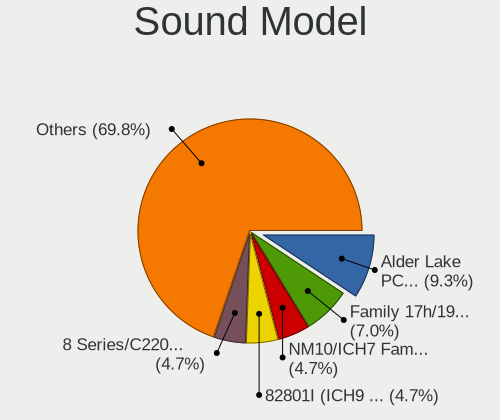

| Model                                                                                             | Computers | Percent |
|---------------------------------------------------------------------------------------------------|-----------|---------|
| Intel 7 Series/C216 Chipset Family High Definition Audio Controller                               | 5         | 5.62%   |
| Intel 6 Series/C200 Series Chipset Family High Definition Audio Controller                        | 5         | 5.62%   |
| AMD Family 17h/19h HD Audio Controller                                                            | 5         | 5.62%   |
| Intel Cannon Lake PCH cAVS                                                                        | 4         | 4.49%   |
| AMD Renoir Radeon High Definition Audio Controller                                                | 4         | 4.49%   |
| Nvidia GF119 HDMI Audio Controller                                                                | 3         | 3.37%   |
| Intel NM10/ICH7 Family High Definition Audio Controller                                           | 3         | 3.37%   |
| Intel Cannon Point-LP High Definition Audio Controller                                            | 3         | 3.37%   |
| Intel 8 Series/C220 Series Chipset High Definition Audio Controller                               | 3         | 3.37%   |
| Nvidia GF108 High Definition Audio Controller                                                     | 2         | 2.25%   |
| Intel Xeon E3-1200 v3/4th Gen Core Processor HD Audio Controller                                  | 2         | 2.25%   |
| Intel Tiger Lake-LP Smart Sound Technology Audio Controller                                       | 2         | 2.25%   |
| Intel Haswell-ULT HD Audio Controller                                                             | 2         | 2.25%   |
| Intel 8 Series HD Audio Controller                                                                | 2         | 2.25%   |
| AMD Kabini HDMI/DP Audio                                                                          | 2         | 2.25%   |
| AMD FCH Azalia Controller                                                                         | 2         | 2.25%   |
| AMD Cedar HDMI Audio [Radeon HD 5400/6300/7300 Series]                                            | 2         | 2.25%   |
| VIA Technologies VT8233/A/8235/8237 AC97 Audio Controller                                         | 1         | 1.12%   |
| Nvidia TU116 High Definition Audio Controller                                                     | 1         | 1.12%   |
| Nvidia TU107 GeForce GTX 1650 High Definition Audio Controller                                    | 1         | 1.12%   |
| Nvidia TU106 High Definition Audio Controller                                                     | 1         | 1.12%   |
| Nvidia GP107GL High Definition Audio Controller                                                   | 1         | 1.12%   |
| Nvidia GM204 High Definition Audio Controller                                                     | 1         | 1.12%   |
| Nvidia GM200 High Definition Audio                                                                | 1         | 1.12%   |
| Nvidia Audio device                                                                               | 1         | 1.12%   |
| Jieli Technology UACDemoV1.0                                                                      | 1         | 1.12%   |
| Intel Wildcat Point-LP High Definition Audio Controller                                           | 1         | 1.12%   |
| Intel Sunrise Point-LP HD Audio                                                                   | 1         | 1.12%   |
| Intel Raptor Lake-P/U/H cAVS                                                                      | 1         | 1.12%   |
| Intel Ice Lake-LP Smart Sound Technology Audio Controller                                         | 1         | 1.12%   |
| Intel CM238 HD Audio Controller                                                                   | 1         | 1.12%   |
| Intel Celeron/Pentium Silver Processor High Definition Audio                                      | 1         | 1.12%   |
| Intel Broadwell-U Audio Controller                                                                | 1         | 1.12%   |
| Intel Atom/Celeron/Pentium Processor x5-E8000/J3xxx/N3xxx Series High Definition Audio Controller | 1         | 1.12%   |
| Intel Alder Lake-S HD Audio Controller                                                            | 1         | 1.12%   |
| Intel Alder Lake-N HD Graphics SGPC                                                               | 1         | 1.12%   |
| Intel Alder Lake PCH-P High Definition Audio Controller                                           | 1         | 1.12%   |
| Intel 9 Series Chipset Family HD Audio Controller                                                 | 1         | 1.12%   |
| Intel 82801G (ICH7 Family) AC'97 Audio Controller                                                 | 1         | 1.12%   |
| Intel 700 Series Chipset Family Precise Touch and Stylus Port #1                                  | 1         | 1.12%   |

Memory
------

Memory Vendor
-------------

Memory module vendors

| Vendor                       | Computers | Percent |
|------------------------------|-----------|---------|
| SK hynix                     | 7         | 25%     |
| Samsung Electronics          | 7         | 25%     |
| Unknown                      | 3         | 10.71%  |
| Micron Technology            | 2         | 7.14%   |
| Kingston                     | 2         | 7.14%   |
| Unknown (ABCD)               | 1         | 3.57%   |
| Team                         | 1         | 3.57%   |
| Ramaxel Technology           | 1         | 3.57%   |
| Patriot Memory (PDP Systems) | 1         | 3.57%   |
| Elpida                       | 1         | 3.57%   |
| A-DATA Technology            | 1         | 3.57%   |
| Unknown                      | 1         | 3.57%   |

Memory Model
------------

Memory module models

| Model                                                                    | Computers | Percent |
|--------------------------------------------------------------------------|-----------|---------|
| SK hynix RAM HMAA1GS6CJR6N-XN 8GB Row Of Chips DDR4 3200MT/s             | 2         | 6.25%   |
| Unknown RAM Module 512MB DIMM                                            | 1         | 3.13%   |
| Unknown RAM Module 4GB Chip DDR4 2133MT/s                                | 1         | 3.13%   |
| Unknown RAM Module 2GB DIMM DDR 667MT/s                                  | 1         | 3.13%   |
| Unknown RAM Module 1GB DIMM                                              | 1         | 3.13%   |
| Unknown (ABCD) RAM 123456789012345678 2GB DIMM LPDDR4 2400MT/s           | 1         | 3.13%   |
| Team RAM TEAMGROUP-SD4-2666 32GB SODIMM DDR4 2667MT/s                    | 1         | 3.13%   |
| SK hynix RAM Module 16GB SODIMM DDR4 2667MT/s                            | 1         | 3.13%   |
| SK hynix RAM HYMP564U64CP8-Y5 512MB DIMM DDR 667MT/s                     | 1         | 3.13%   |
| SK hynix RAM HYMP125U64CP8-Y5 2GB DIMM DDR 667MT/s                       | 1         | 3.13%   |
| SK hynix RAM HMT451S6BFR8A-PB 4GB SODIMM DDR3 1600MT/s                   | 1         | 3.13%   |
| SK hynix RAM HMT451S6AFR8C-PB 4096MB SODIMM DDR3 1600MT/s                | 1         | 3.13%   |
| SK hynix RAM HMT41GS6MFR8C-PB 8GB SODIMM DDR3 1600MT/s                   | 1         | 3.13%   |
| SK hynix RAM HMT351S6CFR8C-PB 4GB SODIMM DDR3 1600MT/s                   | 1         | 3.13%   |
| Samsung RAM M471B1G73QH0-YK0 8GB SODIMM DDR3 1867MT/s                    | 1         | 3.13%   |
| Samsung RAM M471B1G73BH0-CK0 8GB SODIMM DDR3 1600MT/s                    | 1         | 3.13%   |
| Samsung RAM M471A2K43BB1-CPB 16GB SODIMM DDR4 2133MT/s                   | 1         | 3.13%   |
| Samsung RAM M471A1K43EB1-CWE 8GB SODIMM DDR4 3200MT/s                    | 1         | 3.13%   |
| Samsung RAM M471A1K43CB1-CTD 8GB SODIMM DDR4 2667MT/s                    | 1         | 3.13%   |
| Samsung RAM M378B1G73DB0-CK0 8GB DIMM DDR3 2133MT/s                      | 1         | 3.13%   |
| Samsung RAM M3 78T6464QZ3-CE6 512MB DIMM DDR 533MT/s                     | 1         | 3.13%   |
| Ramaxel RAM RMSA3260NA78HAF-2666 8GB SODIMM DDR4 2667MT/s                | 1         | 3.13%   |
| Patriot Memory (PDP Systems) RAM PSD432G32002S 32GB SODIMM DDR4 3200MT/s | 1         | 3.13%   |
| Micron RAM Module 4GB Row Of Chips LPDDR4 4266MT/s                       | 1         | 3.13%   |
| Micron RAM 4ATS1G64HZ-2G6E1 8GB SODIMM DDR4 2667MT/s                     | 1         | 3.13%   |
| Kingston RAM 99U5402-037.A00G 2GB DIMM DDR3 1333MT/s                     | 1         | 3.13%   |
| Kingston RAM 99U5315-012.A00LF 512MB DIMM DDR 533MT/s                    | 1         | 3.13%   |
| Kingston RAM 9905471-001.A01LF 2GB DIMM DDR3 1600MT/s                    | 1         | 3.13%   |
| Elpida RAM Module 4GB Chip DDR3 1600MT/s                                 | 1         | 3.13%   |
| A-DATA RAM MIF4D2C087KZ1 4GB SODIMM DDR3 1600MT/s                        | 1         | 3.13%   |
| Unknown                                                                  | 1         | 3.13%   |

Memory Kind
-----------

Memory module kinds

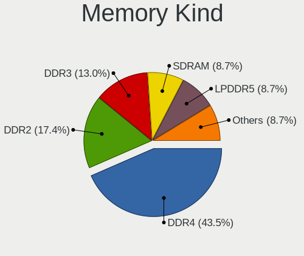

| Kind    | Computers | Percent |
|---------|-----------|---------|
| DDR4    | 11        | 40.74%  |
| DDR3    | 9         | 33.33%  |
| LPDDR4  | 2         | 7.41%   |
| DDR     | 2         | 7.41%   |
| SDRAM   | 1         | 3.7%    |
| DDR2    | 1         | 3.7%    |
| Unknown | 1         | 3.7%    |

Memory Form Factor
------------------

Physical design of the memory module

| Name         | Computers | Percent |
|--------------|-----------|---------|
| SODIMM       | 15        | 57.69%  |
| DIMM         | 6         | 23.08%  |
| Row Of Chips | 3         | 11.54%  |
| Chip         | 2         | 7.69%   |

Memory Size
-----------

Memory module size

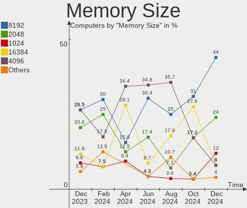

| Size  | Computers | Percent |
|-------|-----------|---------|
| 8192  | 10        | 35.71%  |
| 4096  | 6         | 21.43%  |
| 16384 | 4         | 14.29%  |
| 2048  | 3         | 10.71%  |
| 32768 | 2         | 7.14%   |
| 512   | 2         | 7.14%   |
| 1024  | 1         | 3.57%   |

Memory Speed
------------

Memory module speed

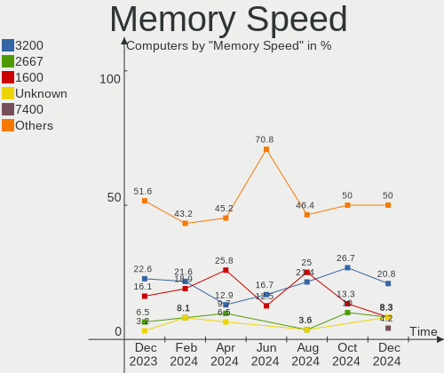

| Speed   | Computers | Percent |
|---------|-----------|---------|
| 1600    | 7         | 25.93%  |
| 2667    | 6         | 22.22%  |
| 3200    | 5         | 18.52%  |
| 2133    | 2         | 7.41%   |
| 667     | 2         | 7.41%   |
| 4266    | 1         | 3.7%    |
| 2400    | 1         | 3.7%    |
| 1333    | 1         | 3.7%    |
| 533     | 1         | 3.7%    |
| Unknown | 1         | 3.7%    |

Printers & scanners
-------------------

Printer Vendor
--------------

Printer device vendors

| Vendor          | Computers | Percent |
|-----------------|-----------|---------|
| Seiko Epson     | 1         | 33.33%  |
| Hewlett-Packard | 1         | 33.33%  |
| Canon           | 1         | 33.33%  |

Printer Model
-------------

Printer device models

| Model                      | Computers | Percent |
|----------------------------|-----------|---------|
| Seiko Epson ET-1810 Series | 1         | 33.33%  |
| HP LaserJet Pro M404-M405  | 1         | 33.33%  |
| Canon TR4600 series        | 1         | 33.33%  |

Scanner Vendor
--------------

Scanner device vendors

| Vendor      | Computers | Percent |
|-------------|-----------|---------|
| Seiko Epson | 1         | 100%    |

Scanner Model
-------------

Scanner device models

| Model                                       | Computers | Percent |
|---------------------------------------------|-----------|---------|
| Seiko Epson GT-X820 [Perfection V600 Photo] | 1         | 100%    |

Camera
------

Camera Vendor
-------------

Camera device vendors

| Vendor                                 | Computers | Percent |
|----------------------------------------|-----------|---------|
| Chicony Electronics                    | 10        | 29.41%  |
| Quanta                                 | 4         | 11.76%  |
| IMC Networks                           | 4         | 11.76%  |
| Bison Electronics                      | 4         | 11.76%  |
| Sunplus Innovation Technology          | 3         | 8.82%   |
| Logitech                               | 3         | 8.82%   |
| Suyin                                  | 1         | 2.94%   |
| Sonix Technology                       | 1         | 2.94%   |
| Realtek Semiconductor                  | 1         | 2.94%   |
| Cheng Uei Precision Industry (Foxlink) | 1         | 2.94%   |
| Apple                                  | 1         | 2.94%   |
| Alcor Micro                            | 1         | 2.94%   |

Camera Model
------------

Camera device models

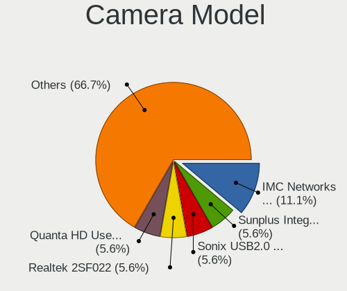

| Model                                                   | Computers | Percent |
|---------------------------------------------------------|-----------|---------|
| Chicony integrated camera                               | 5         | 14.71%  |
| Bison Integrated Camera                                 | 3         | 8.82%   |
| Sunplus Integrated_Webcam_FHD                           | 2         | 5.88%   |
| IMC Networks USB2.0 VGA UVC WebCam                      | 2         | 5.88%   |
| Suyin HD WebCam                                         | 1         | 2.94%   |
| Sunplus Laptop_Integrated_Webcam_FHD                    | 1         | 2.94%   |
| Sonix USB2.0 HD UVC WebCam                              | 1         | 2.94%   |
| Realtek USB2.0-Camera                                   | 1         | 2.94%   |
| Quanta HP Wide Vision HD Camera                         | 1         | 2.94%   |
| Quanta HP Webcam                                        | 1         | 2.94%   |
| Quanta HP TrueVision HD Camera                          | 1         | 2.94%   |
| Quanta HP True Vision 5MP Camera                        | 1         | 2.94%   |
| Logitech Webcam C310                                    | 1         | 2.94%   |
| Logitech HD Webcam C615                                 | 1         | 2.94%   |
| Logitech HD Pro Webcam C920                             | 1         | 2.94%   |
| IMC Networks USB2.0 HD UVC WebCam                       | 1         | 2.94%   |
| IMC Networks Integrated Camera                          | 1         | 2.94%   |
| Chicony HP Wide Vision HD Camera                        | 1         | 2.94%   |
| Chicony HP Wide Vision FHD Camera                       | 1         | 2.94%   |
| Chicony HP Webcam                                       | 1         | 2.94%   |
| Chicony HP Truevision HD                                | 1         | 2.94%   |
| Chicony HP HD Camera                                    | 1         | 2.94%   |
| Cheng Uei Precision Industry (Foxlink) HP Truevision HD | 1         | 2.94%   |
| Bison HD Webcam                                         | 1         | 2.94%   |
| Apple FaceTime HD Camera                                | 1         | 2.94%   |
| Alcor Micro TOSHIBA Web Camera - MP                     | 1         | 2.94%   |

Security
--------

Fingerprint Vendor
------------------

Fingerprint sensor vendors

| Vendor                     | Computers | Percent |
|----------------------------|-----------|---------|
| Validity Sensors           | 3         | 37.5%   |
| Synaptics                  | 2         | 25%     |
| Shenzhen Goodix Technology | 2         | 25%     |
| Upek                       | 1         | 12.5%   |

Fingerprint Model
-----------------

Fingerprint sensor models

| Model                                                  | Computers | Percent |
|--------------------------------------------------------|-----------|---------|
| Shenzhen Goodix Fingerprint Reader                     | 2         | 25%     |
| Validity Sensors VFS7500 Touch Fingerprint Sensor      | 1         | 12.5%   |
| Validity Sensors VFS301 Fingerprint Reader             | 1         | 12.5%   |
| Validity Sensors Fingerprint scanner                   | 1         | 12.5%   |
| Upek Biometric Touchchip/Touchstrip Fingerprint Sensor | 1         | 12.5%   |
| Synaptics Prometheus MIS Touch Fingerprint Reader      | 1         | 12.5%   |
| Synaptics Fingerprint reader [HP G6]                   | 1         | 12.5%   |

Chipcard Vendor
---------------

Chipcard module vendors

| Vendor      | Computers | Percent |
|-------------|-----------|---------|
| Lenovo      | 2         | 40%     |
| Alcor Micro | 2         | 40%     |
| Broadcom    | 1         | 20%     |

Chipcard Model
--------------

Chipcard module models

| Model                                          | Computers | Percent |
|------------------------------------------------|-----------|---------|
| Lenovo Integrated Smart Card Reader            | 2         | 40%     |
| Alcor Micro AU9540 Smartcard Reader            | 2         | 40%     |
| Broadcom BCM5880 Secure Applications Processor | 1         | 20%     |

Unsupported
-----------

Unsupported Devices
-------------------

Total unsupported devices on board

| Total | Computers | Percent |
|-------|-----------|---------|
| 0     | 32        | 62.75%  |
| 1     | 13        | 25.49%  |
| 3     | 3         | 5.88%   |
| 2     | 3         | 5.88%   |

Unsupported Device Types
------------------------

Types of unsupported devices

| Type                     | Computers | Percent |
|--------------------------|-----------|---------|
| Fingerprint reader       | 8         | 28.57%  |
| Graphics card            | 5         | 17.86%  |
| Chipcard                 | 5         | 17.86%  |
| Net/wireless             | 3         | 10.71%  |
| Storage/nvme             | 1         | 3.57%   |
| Storage                  | 1         | 3.57%   |
| Multimedia controller    | 1         | 3.57%   |
| Communication controller | 1         | 3.57%   |
| Card reader              | 1         | 3.57%   |
| Camera                   | 1         | 3.57%   |
| Bluetooth                | 1         | 3.57%   |

