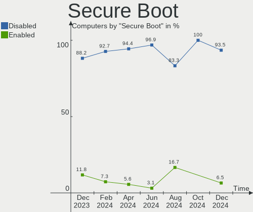
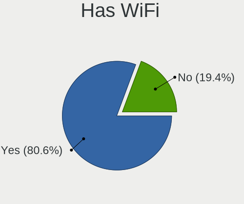
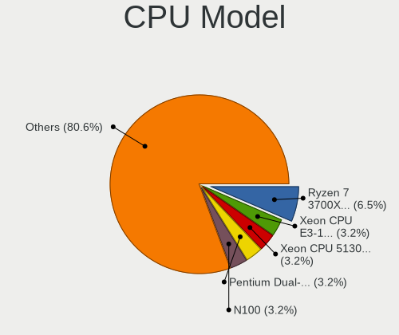
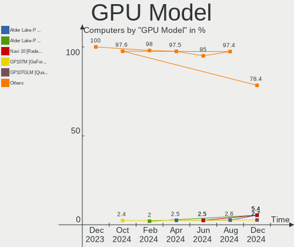
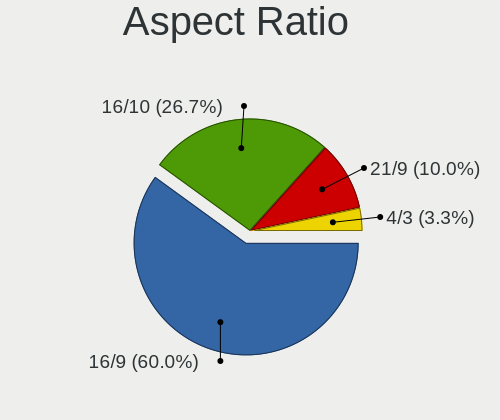
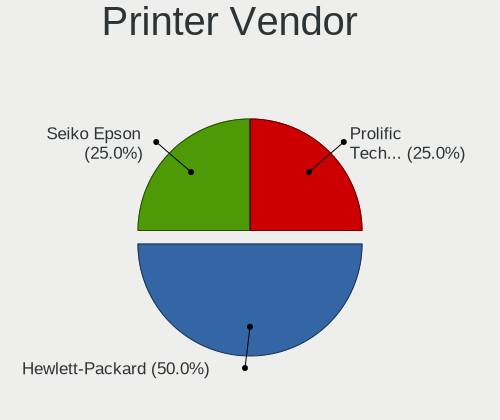

LMDE - Hardware Trends
----------------------

A project to identify most popular hardware characteristics and track their change
over time based on data collected by Linux users at https://Linux-Hardware.org.

Anyone can contribute to this report by the [hw-probe](https://github.com/linuxhw/hw-probe) tool:

    sudo -E hw-probe -all -upload

This is a report for all computer types. See also reports for [desktops](/Dist/LMDE/Desktop/README.md) and [notebooks](/Dist/LMDE/Notebook/README.md).

This report is for one last month. Overall report since the beginning of time: [TestDays](https://github.com/linuxhw/TestDays)

Period: Jan, 2024.

Contents
--------

* [ System ](#system)
  - [ OS                       ](#os)
  - [ OS Family                ](#os-family)
  - [ Kernel                   ](#kernel)
  - [ Kernel Family            ](#kernel-family)
  - [ Kernel Major Ver.        ](#kernel-major-ver)
  - [ Arch                     ](#arch)
  - [ DE                       ](#de)
  - [ Display Server           ](#display-server)
  - [ Display Manager          ](#display-manager)
  - [ OS Lang                  ](#os-lang)
  - [ Boot Mode                ](#boot-mode)
  - [ Filesystem               ](#filesystem)
  - [ Part. scheme             ](#part-scheme)
  - [ Dual Boot with Linux/BSD ](#dual-boot-with-linuxbsd)
  - [ Dual Boot (Win)          ](#dual-boot-win)

* [ Board ](#board)
  - [ Vendor                   ](#vendor)
  - [ Model                    ](#model)
  - [ Model Family             ](#model-family)
  - [ MFG Year                 ](#mfg-year)
  - [ Form Factor              ](#form-factor)
  - [ Secure Boot              ](#secure-boot)
  - [ Coreboot                 ](#coreboot)
  - [ RAM Size                 ](#ram-size)
  - [ RAM Used                 ](#ram-used)
  - [ Total Drives             ](#total-drives)
  - [ Has CD-ROM               ](#has-cd-rom)
  - [ Has Ethernet             ](#has-ethernet)
  - [ Has WiFi                 ](#has-wifi)
  - [ Has Bluetooth            ](#has-bluetooth)

* [ Location ](#location)
  - [ Country                  ](#country)
  - [ City                     ](#city)

* [ Drives ](#drives)
  - [ Drive Vendor             ](#drive-vendor)
  - [ Drive Model              ](#drive-model)
  - [ HDD Vendor               ](#hdd-vendor)
  - [ SSD Vendor               ](#ssd-vendor)
  - [ Drive Kind               ](#drive-kind)
  - [ Drive Connector          ](#drive-connector)
  - [ Drive Size               ](#drive-size)
  - [ Space Total              ](#space-total)
  - [ Space Used               ](#space-used)
  - [ Malfunc. Drives          ](#malfunc-drives)
  - [ Malfunc. Drive Vendor    ](#malfunc-drive-vendor)
  - [ Malfunc. HDD Vendor      ](#malfunc-hdd-vendor)
  - [ Malfunc. Drive Kind      ](#malfunc-drive-kind)
  - [ Failed Drives            ](#failed-drives)
  - [ Failed Drive Vendor      ](#failed-drive-vendor)
  - [ Drive Status             ](#drive-status)

* [ Storage controller ](#storage-controller)
  - [ Storage Vendor           ](#storage-vendor)
  - [ Storage Model            ](#storage-model)
  - [ Storage Kind             ](#storage-kind)

* [ Processor ](#processor)
  - [ CPU Vendor               ](#cpu-vendor)
  - [ CPU Model                ](#cpu-model)
  - [ CPU Model Family         ](#cpu-model-family)
  - [ CPU Cores                ](#cpu-cores)
  - [ CPU Sockets              ](#cpu-sockets)
  - [ CPU Threads              ](#cpu-threads)
  - [ CPU Op-Modes             ](#cpu-op-modes)
  - [ CPU Microcode            ](#cpu-microcode)
  - [ CPU Microarch            ](#cpu-microarch)

* [ Graphics ](#graphics)
  - [ GPU Vendor               ](#gpu-vendor)
  - [ GPU Model                ](#gpu-model)
  - [ GPU Combo                ](#gpu-combo)
  - [ GPU Driver               ](#gpu-driver)
  - [ GPU Memory               ](#gpu-memory)

* [ Monitor ](#monitor)
  - [ Monitor Vendor           ](#monitor-vendor)
  - [ Monitor Model            ](#monitor-model)
  - [ Monitor Resolution       ](#monitor-resolution)
  - [ Monitor Diagonal         ](#monitor-diagonal)
  - [ Monitor Width            ](#monitor-width)
  - [ Aspect Ratio             ](#aspect-ratio)
  - [ Monitor Area             ](#monitor-area)
  - [ Pixel Density            ](#pixel-density)
  - [ Multiple Monitors        ](#multiple-monitors)

* [ Network ](#network)
  - [ Net Controller Vendor    ](#net-controller-vendor)
  - [ Net Controller Model     ](#net-controller-model)
  - [ Wireless Vendor          ](#wireless-vendor)
  - [ Wireless Model           ](#wireless-model)
  - [ Ethernet Vendor          ](#ethernet-vendor)
  - [ Ethernet Model           ](#ethernet-model)
  - [ Net Controller Kind      ](#net-controller-kind)
  - [ Used Controller          ](#used-controller)
  - [ NICs                     ](#nics)
  - [ IPv6                     ](#ipv6)

* [ Bluetooth ](#bluetooth)
  - [ Bluetooth Vendor         ](#bluetooth-vendor)
  - [ Bluetooth Model          ](#bluetooth-model)

* [ Sound ](#sound)
  - [ Sound Vendor             ](#sound-vendor)
  - [ Sound Model              ](#sound-model)

* [ Memory ](#memory)
  - [ Memory Vendor            ](#memory-vendor)
  - [ Memory Model             ](#memory-model)
  - [ Memory Kind              ](#memory-kind)
  - [ Memory Form Factor       ](#memory-form-factor)
  - [ Memory Size              ](#memory-size)
  - [ Memory Speed             ](#memory-speed)

* [ Printers & scanners ](#printers--scanners)
  - [ Printer Vendor           ](#printer-vendor)
  - [ Printer Model            ](#printer-model)
  - [ Scanner Vendor           ](#scanner-vendor)
  - [ Scanner Model            ](#scanner-model)

* [ Camera ](#camera)
  - [ Camera Vendor            ](#camera-vendor)
  - [ Camera Model             ](#camera-model)

* [ Security ](#security)
  - [ Fingerprint Vendor       ](#fingerprint-vendor)
  - [ Fingerprint Model        ](#fingerprint-model)
  - [ Chipcard Vendor          ](#chipcard-vendor)
  - [ Chipcard Model           ](#chipcard-model)

* [ Unsupported ](#unsupported)
  - [ Unsupported Devices      ](#unsupported-devices)
  - [ Unsupported Device Types ](#unsupported-device-types)

System
------

OS
--

Installed operating systems

| Name   | Computers | Percent |
|--------|-----------|---------|
| LMDE 6 | 47        | 95.92%  |
| LMDE 5 | 2         | 4.08%   |

OS Family
---------

OS without a version

| Name | Computers | Percent |
|------|-----------|---------|
| LMDE | 49        | 100%    |

Kernel
------

Version of the Linux kernel

| Version              | Computers | Percent |
|----------------------|-----------|---------|
| 6.1.0-17-amd64       | 34        | 69.39%  |
| 6.1.0-12-amd64       | 7         | 14.29%  |
| 6.1.0-16-amd64       | 2         | 4.08%   |
| 6.1.0-12-686         | 2         | 4.08%   |
| 6.6.11-x64v3-xanmod1 | 1         | 2.04%   |
| 6.1.0-17-686         | 1         | 2.04%   |
| 5.10.0-23-amd64      | 1         | 2.04%   |
| 5.10.0-21-amd64      | 1         | 2.04%   |

Kernel Family
-------------

Linux kernel without a distro release

| Version | Computers | Percent |
|---------|-----------|---------|
| 6.1.0   | 46        | 93.88%  |
| 5.10.0  | 2         | 4.08%   |
| 6.6.11  | 1         | 2.04%   |

Kernel Major Ver.
-----------------

Linux kernel major version

| Version | Computers | Percent |
|---------|-----------|---------|
| 6.1     | 46        | 93.88%  |
| 5.10    | 2         | 4.08%   |
| 6.6     | 1         | 2.04%   |

Arch
----

OS architecture (x86_64, i586, etc.)

| Name   | Computers | Percent |
|--------|-----------|---------|
| x86_64 | 46        | 93.88%  |
| i686   | 3         | 6.12%   |

DE
--

Desktop Environment

| Name       | Computers | Percent |
|------------|-----------|---------|
| X-Cinnamon | 43        | 87.76%  |
| Cinnamon   | 4         | 8.16%   |
| XFCE       | 1         | 2.04%   |
| Unknown    | 1         | 2.04%   |

Display Server
--------------

X11 or Wayland

| Name | Computers | Percent |
|------|-----------|---------|
| X11  | 49        | 100%    |

Display Manager
---------------

SDDM, LightDM, etc.

| Name    | Computers | Percent |
|---------|-----------|---------|
| LightDM | 30        | 61.22%  |
| Unknown | 19        | 38.78%  |

OS Lang
-------

Language

| Lang    | Computers | Percent |
|---------|-----------|---------|
| en_US   | 23        | 46.94%  |
| de_DE   | 6         | 12.24%  |
| en_GB   | 4         | 8.16%   |
| pt_BR   | 3         | 6.12%   |
| it_IT   | 3         | 6.12%   |
| pl_PL   | 2         | 4.08%   |
| fr_FR   | 2         | 4.08%   |
| nl_NL   | 1         | 2.04%   |
| hr_HR   | 1         | 2.04%   |
| es_ES   | 1         | 2.04%   |
| el_GR   | 1         | 2.04%   |
| cs_CZ   | 1         | 2.04%   |
| Unknown | 1         | 2.04%   |

Boot Mode
---------

EFI or BIOS

| Mode | Computers | Percent |
|------|-----------|---------|
| EFI  | 34        | 69.39%  |
| BIOS | 15        | 30.61%  |

Filesystem
----------

Type of filesystem

| Type    | Computers | Percent |
|---------|-----------|---------|
| Ext4    | 39        | 79.59%  |
| Overlay | 5         | 10.2%   |
| Btrfs   | 5         | 10.2%   |

Part. scheme
------------

Scheme of partitioning

| Type    | Computers | Percent |
|---------|-----------|---------|
| GPT     | 23        | 46.94%  |
| Unknown | 18        | 36.73%  |
| MBR     | 8         | 16.33%  |

Dual Boot with Linux/BSD
------------------------

Hosting more than one Linux/BSD

| Dual boot | Computers | Percent |
|-----------|-----------|---------|
| No        | 43        | 87.76%  |
| Yes       | 6         | 12.24%  |

Dual Boot (Win)
---------------

Hosting Linux and Windows

| Dual boot | Computers | Percent |
|-----------|-----------|---------|
| No        | 38        | 77.55%  |
| Yes       | 11        | 22.45%  |

Board
-----

Vendor
------

Motherboard manufacturer

| Name                | Computers | Percent |
|---------------------|-----------|---------|
| Lenovo              | 11        | 22.45%  |
| ASUSTek Computer    | 7         | 14.29%  |
| MSI                 | 6         | 12.24%  |
| Hewlett-Packard     | 4         | 8.16%   |
| Gigabyte Technology | 3         | 6.12%   |
| Dell                | 3         | 6.12%   |
| ASRock              | 3         | 6.12%   |
| Apple               | 3         | 6.12%   |
| Medion              | 2         | 4.08%   |
| Acer                | 2         | 4.08%   |
| VALE                | 1         | 2.04%   |
| TUXEDO              | 1         | 2.04%   |
| Google              | 1         | 2.04%   |
| Fujitsu             | 1         | 2.04%   |
| Fanless Mini PC     | 1         | 2.04%   |

Model
-----

Motherboard model

| Name                                             | Computers | Percent |
|--------------------------------------------------|-----------|---------|
| VALE Notebook Classic C171V                      | 1         | 2.04%   |
| TUXEDO Pulse 14 Gen1                             | 1         | 2.04%   |
| MSI MS-7D69                                      | 1         | 2.04%   |
| MSI MS-7D15                                      | 1         | 2.04%   |
| MSI MS-7C84                                      | 1         | 2.04%   |
| MSI MS-7B98                                      | 1         | 2.04%   |
| MSI MS-7A38                                      | 1         | 2.04%   |
| MSI MS-7345                                      | 1         | 2.04%   |
| Medion S23003                                    | 1         | 2.04%   |
| Medion P7612                                     | 1         | 2.04%   |
| Lenovo ThinkPad Z13 Gen 1 21D2001PUS             | 1         | 2.04%   |
| Lenovo ThinkPad X61 76754BJ                      | 1         | 2.04%   |
| Lenovo ThinkPad X230 2325SU3                     | 1         | 2.04%   |
| Lenovo ThinkPad X1 Carbon 3rd 20BTS05100         | 1         | 2.04%   |
| Lenovo ThinkPad X1 Carbon 34601C8                | 1         | 2.04%   |
| Lenovo ThinkPad T400 6474EU3                     | 1         | 2.04%   |
| Lenovo ThinkPad T16 Gen 1 21CHCTO1WW             | 1         | 2.04%   |
| Lenovo IdeaPad Y530                              | 1         | 2.04%   |
| Lenovo IdeaPad 330S-15IKB 81F5                   | 1         | 2.04%   |
| Lenovo IdeaPad 3 15IML05 82BS                    | 1         | 2.04%   |
| Lenovo IdeaPad 3 15ADA05 81W1                    | 1         | 2.04%   |
| HP ZBook Fury 17.3 inch G8 Mobile Workstation PC | 1         | 2.04%   |
| HP ProDesk 600 G2 MT                             | 1         | 2.04%   |
| HP Dragonfly 13.5 inch G4 Notebook PC            | 1         | 2.04%   |
| HP Compaq 615                                    | 1         | 2.04%   |
| Google Swanky                                    | 1         | 2.04%   |
| Gigabyte Q87M-D2H                                | 1         | 2.04%   |
| Gigabyte GA-78LMT-S2P                            | 1         | 2.04%   |
| Gigabyte B450 AORUS M                            | 1         | 2.04%   |
| Fujitsu D3183-A1                                 | 1         | 2.04%   |
| Fanless Mini PC Quieter 3C                       | 1         | 2.04%   |
| Dell Latitude E6320                              | 1         | 2.04%   |
| Dell Latitude D610                               | 1         | 2.04%   |
| Dell Inspiron 15-3552                            | 1         | 2.04%   |
| ASUS TUF Gaming X670E-PLUS WIFI                  | 1         | 2.04%   |
| ASUS TUF Gaming FX505DT_FX505DT                  | 1         | 2.04%   |
| ASUS TUF B450M-PLUS GAMING                       | 1         | 2.04%   |
| ASUS PRIME X670-P                                | 1         | 2.04%   |
| ASUS P7P55D-E                                    | 1         | 2.04%   |
| ASUS P5G41T-M LX3                                | 1         | 2.04%   |

Model Family
------------

Motherboard model prefix

| Name                    | Computers | Percent |
|-------------------------|-----------|---------|
| Lenovo ThinkPad         | 7         | 14.29%  |
| Lenovo IdeaPad          | 4         | 8.16%   |
| ASUS TUF                | 3         | 6.12%   |
| Dell Latitude           | 2         | 4.08%   |
| Acer Aspire             | 2         | 4.08%   |
| VALE Notebook           | 1         | 2.04%   |
| TUXEDO Pulse            | 1         | 2.04%   |
| MSI MS-7D69             | 1         | 2.04%   |
| MSI MS-7D15             | 1         | 2.04%   |
| MSI MS-7C84             | 1         | 2.04%   |
| MSI MS-7B98             | 1         | 2.04%   |
| MSI MS-7A38             | 1         | 2.04%   |
| MSI MS-7345             | 1         | 2.04%   |
| Medion S23003           | 1         | 2.04%   |
| Medion P7612            | 1         | 2.04%   |
| HP ZBook                | 1         | 2.04%   |
| HP ProDesk              | 1         | 2.04%   |
| HP Dragonfly            | 1         | 2.04%   |
| HP Compaq               | 1         | 2.04%   |
| Google Swanky           | 1         | 2.04%   |
| Gigabyte Q87M-D2H       | 1         | 2.04%   |
| Gigabyte GA-78LMT-S2P   | 1         | 2.04%   |
| Gigabyte B450           | 1         | 2.04%   |
| Fujitsu D3183-A1        | 1         | 2.04%   |
| Fanless Mini PC Quieter | 1         | 2.04%   |
| Dell Inspiron           | 1         | 2.04%   |
| ASUS PRIME              | 1         | 2.04%   |
| ASUS P7P55D-E           | 1         | 2.04%   |
| ASUS P5G41T-M           | 1         | 2.04%   |
| ASUS CROSSHAIR          | 1         | 2.04%   |
| ASRock Z97              | 1         | 2.04%   |
| ASRock Z690             | 1         | 2.04%   |
| ASRock X670E            | 1         | 2.04%   |
| Apple MacPro6           | 1         | 2.04%   |
| Apple MacBookAir7       | 1         | 2.04%   |
| Apple iMac14            | 1         | 2.04%   |

MFG Year
--------

Motherboard manufacture year

| Year | Computers | Percent |
|------|-----------|---------|
| 2022 | 6         | 12.24%  |
| 2018 | 6         | 12.24%  |
| 2021 | 5         | 10.2%   |
| 2015 | 4         | 8.16%   |
| 2023 | 3         | 6.12%   |
| 2020 | 3         | 6.12%   |
| 2008 | 3         | 6.12%   |
| 2019 | 2         | 4.08%   |
| 2016 | 2         | 4.08%   |
| 2014 | 2         | 4.08%   |
| 2013 | 2         | 4.08%   |
| 2012 | 2         | 4.08%   |
| 2010 | 2         | 4.08%   |
| 2009 | 2         | 4.08%   |
| 2007 | 2         | 4.08%   |
| 2017 | 1         | 2.04%   |
| 2011 | 1         | 2.04%   |
| 2005 | 1         | 2.04%   |

Form Factor
-----------

Physical design of the computer

| Name       | Computers | Percent |
|------------|-----------|---------|
| Notebook   | 25        | 51.02%  |
| Desktop    | 22        | 44.9%   |
| Mini pc    | 1         | 2.04%   |
| All in one | 1         | 2.04%   |

Secure Boot
-----------

Enabled or disabled

| State    | Computers | Percent |
|----------|-----------|---------|
| Disabled | 44        | 89.8%   |
| Enabled  | 5         | 10.2%   |

Coreboot
--------

Have coreboot on board

| Used | Computers | Percent |
|------|-----------|---------|
| No   | 48        | 97.96%  |
| Yes  | 1         | 2.04%   |

RAM Size
--------

Total RAM memory

| Size in GB  | Computers | Percent |
|-------------|-----------|---------|
| 4.01-8.0    | 15        | 30.61%  |
| 3.01-4.0    | 8         | 16.33%  |
| 16.01-24.0  | 7         | 14.29%  |
| 32.01-64.0  | 5         | 10.2%   |
| 64.01-256.0 | 5         | 10.2%   |
| 8.01-16.0   | 5         | 10.2%   |
| 24.01-32.0  | 2         | 4.08%   |
| 2.01-3.0    | 1         | 2.04%   |
| 1.01-2.0    | 1         | 2.04%   |

RAM Used
--------

Used RAM memory

| Used GB   | Computers | Percent |
|-----------|-----------|---------|
| 1.01-2.0  | 18        | 36.73%  |
| 4.01-8.0  | 12        | 24.49%  |
| 2.01-3.0  | 12        | 24.49%  |
| 8.01-16.0 | 4         | 8.16%   |
| 3.01-4.0  | 3         | 6.12%   |

Total Drives
------------

Number of drives on board

| Drives | Computers | Percent |
|--------|-----------|---------|
| 1      | 28        | 57.14%  |
| 3      | 9         | 18.37%  |
| 2      | 9         | 18.37%  |
| 7      | 1         | 2.04%   |
| 5      | 1         | 2.04%   |
| 4      | 1         | 2.04%   |

Has CD-ROM
----------

Has CD-ROM on board

| Presented | Computers | Percent |
|-----------|-----------|---------|
| No        | 30        | 61.22%  |
| Yes       | 19        | 38.78%  |

Has Ethernet
------------

Has Ethernet on board

| Presented | Computers | Percent |
|-----------|-----------|---------|
| Yes       | 40        | 81.63%  |
| No        | 9         | 18.37%  |

Has WiFi
--------

Has WiFi module

| Presented | Computers | Percent |
|-----------|-----------|---------|
| Yes       | 39        | 79.59%  |
| No        | 10        | 20.41%  |

Has Bluetooth
-------------

Has Bluetooth module

| Presented | Computers | Percent |
|-----------|-----------|---------|
| Yes       | 34        | 69.39%  |
| No        | 15        | 30.61%  |

Location
--------

Country
-------

Geographic location (country)

| Country                | Computers | Percent |
|------------------------|-----------|---------|
| USA                    | 13        | 26.53%  |
| Germany                | 10        | 20.41%  |
| Italy                  | 4         | 8.16%   |
| Brazil                 | 4         | 8.16%   |
| UK                     | 2         | 4.08%   |
| Poland                 | 2         | 4.08%   |
| Netherlands            | 2         | 4.08%   |
| France                 | 2         | 4.08%   |
| Canada                 | 2         | 4.08%   |
| Switzerland            | 1         | 2.04%   |
| Spain                  | 1         | 2.04%   |
| Norway                 | 1         | 2.04%   |
| Hungary                | 1         | 2.04%   |
| Greece                 | 1         | 2.04%   |
| Czechia                | 1         | 2.04%   |
| Croatia                | 1         | 2.04%   |
| Bosnia and Herzegovina | 1         | 2.04%   |

City
----

Geographic location (city)

| City                    | Computers | Percent |
|-------------------------|-----------|---------|
| Parshall                | 2         | 4.08%   |
| Delligsen               | 2         | 4.08%   |
| Bonn                    | 2         | 4.08%   |
| Zuidhorn                | 1         | 2.04%   |
| Winnipeg                | 1         | 2.04%   |
| Wasilla                 | 1         | 2.04%   |
| Vassenden               | 1         | 2.04%   |
| Traunstein              | 1         | 2.04%   |
| South Bend              | 1         | 2.04%   |
| Šlapanice              | 1         | 2.04%   |
| Sisak                   | 1         | 2.04%   |
| Seattle                 | 1         | 2.04%   |
| Sao Goncalo             | 1         | 2.04%   |
| Santa Luzia             | 1         | 2.04%   |
| Rome                    | 1         | 2.04%   |
| Płośnica              | 1         | 2.04%   |
| Prnjavor                | 1         | 2.04%   |
| Pawtucket               | 1         | 2.04%   |
| Oklahoma City           | 1         | 2.04%   |
| Oberursel               | 1         | 2.04%   |
| Nova Friburgo           | 1         | 2.04%   |
| Montevrain              | 1         | 2.04%   |
| Milano                  | 1         | 2.04%   |
| Mel                     | 1         | 2.04%   |
| Luegde                  | 1         | 2.04%   |
| Loveland                | 1         | 2.04%   |
| Los Angeles             | 1         | 2.04%   |
| Las Cabezas de San Juan | 1         | 2.04%   |
| Lambeth                 | 1         | 2.04%   |
| Haymarket               | 1         | 2.04%   |
| Fredericton             | 1         | 2.04%   |
| Francavilla al Mare     | 1         | 2.04%   |
| Fontaine-au-Pire        | 1         | 2.04%   |
| Erith                   | 1         | 2.04%   |
| East Bend               | 1         | 2.04%   |
| Duingen                 | 1         | 2.04%   |
| Dietikon                | 1         | 2.04%   |
| Columbia                | 1         | 2.04%   |
| Cologne                 | 1         | 2.04%   |
| Chandler                | 1         | 2.04%   |

Drives
------

Drive Vendor
------------

Hard drive vendors

| Vendor                    | Computers | Drives | Percent |
|---------------------------|-----------|--------|---------|
| WDC                       | 12        | 14     | 14.29%  |
| Samsung Electronics       | 12        | 14     | 14.29%  |
| Seagate                   | 10        | 10     | 11.9%   |
| PNY                       | 5         | 5      | 5.95%   |
| Toshiba                   | 4         | 4      | 4.76%   |
| SanDisk                   | 4         | 7      | 4.76%   |
| Kingston                  | 4         | 6      | 4.76%   |
| Micron/Crucial Technology | 3         | 3      | 3.57%   |
| Hitachi                   | 3         | 3      | 3.57%   |
| Unknown                   | 2         | 2      | 2.38%   |
| Realtek                   | 2         | 2      | 2.38%   |
| Phison                    | 2         | 2      | 2.38%   |
| Micron Technology         | 2         | 2      | 2.38%   |
| KIOXIA                    | 2         | 3      | 2.38%   |
| Gigabyte Technology       | 2         | 2      | 2.38%   |
| Crucial                   | 2         | 2      | 2.38%   |
| Apple                     | 2         | 2      | 2.38%   |
| Transcend                 | 1         | 1      | 1.19%   |
| Timetec                   | 1         | 1      | 1.19%   |
| Patriot                   | 1         | 1      | 1.19%   |
| Lexar                     | 1         | 1      | 1.19%   |
| Intenso                   | 1         | 1      | 1.19%   |
| Intel                     | 1         | 1      | 1.19%   |
| GLOWAY                    | 1         | 1      | 1.19%   |
| ANKEJE                    | 1         | 1      | 1.19%   |
| addlink                   | 1         | 1      | 1.19%   |
| A-DATA Technology         | 1         | 1      | 1.19%   |
| Unknown                   | 1         | 1      | 1.19%   |

Drive Model
-----------

Hard drive models

| Model                                | Computers | Percent |
|--------------------------------------|-----------|---------|
| SanDisk NVMe SSD Drive 2TB           | 3         | 3.37%   |
| Seagate ST1000LM035-1RK172 1TB       | 2         | 2.25%   |
| Realtek RTL9210B-CG 1024GB           | 2         | 2.25%   |
| Micron/Crucial P2 NVMe PCIe SSD 1TB  | 2         | 2.25%   |
| WDC WDS500G3X0C-00SJG0 500GB         | 1         | 1.12%   |
| WDC WDS400T2B0A-00SM50 4TB SSD       | 1         | 1.12%   |
| WDC WDS250G2B0A-00SM50 250GB SSD     | 1         | 1.12%   |
| WDC WDS240G2G0A-00JH30 240GB SSD     | 1         | 1.12%   |
| WDC WDS120G1G0A-00SS50 120GB SSD     | 1         | 1.12%   |
| WDC WDS100T3X0C-00SJG0 1TB           | 1         | 1.12%   |
| WDC WD7500BPKX-22HPJT0 752GB         | 1         | 1.12%   |
| WDC WD40EZAZ-00SF3B0 4TB             | 1         | 1.12%   |
| WDC WD2003FZEX-00SRLA0 2TB           | 1         | 1.12%   |
| WDC WD10SPZX-24Z10 1TB               | 1         | 1.12%   |
| WDC WD10EFRX-68FYTN0 1TB             | 1         | 1.12%   |
| WDC WD100EMAZ-00WJTA0 10TB           | 1         | 1.12%   |
| WDC PC SN520 SDAPMUW-512G-1101 512GB | 1         | 1.12%   |
| Unknown MMC Card  64GB               | 1         | 1.12%   |
| Unknown MMC Card  16GB               | 1         | 1.12%   |
| Transcend TS512GSSD370S 512GB        | 1         | 1.12%   |
| Toshiba MQ01ABD100 1TB               | 1         | 1.12%   |
| Toshiba MQ01ABD050V 500GB            | 1         | 1.12%   |
| Toshiba DT01ACA200 2TB               | 1         | 1.12%   |
| Toshiba DT01ACA050 500GB             | 1         | 1.12%   |
| Timetec 512GB                        | 1         | 1.12%   |
| Seagate ST9500325AS 500GB            | 1         | 1.12%   |
| Seagate ST500DM009-2F110A 500GB      | 1         | 1.12%   |
| Seagate ST3320620AS 320GB            | 1         | 1.12%   |
| Seagate ST2000NT001-3M3101 2TB       | 1         | 1.12%   |
| Seagate ST2000DM006-2DM164 2TB       | 1         | 1.12%   |
| Seagate ST2000DM001-1ER164 2TB       | 1         | 1.12%   |
| Seagate ST1000DM003-1ER162 1TB       | 1         | 1.12%   |
| Seagate Expansion 1TB                | 1         | 1.12%   |
| SanDisk NVMe SSD Drive 1TB           | 1         | 1.12%   |
| Samsung SSD 990 PRO 2TB              | 1         | 1.12%   |
| Samsung SSD 990 PRO 1TB              | 1         | 1.12%   |
| Samsung SSD 980 500GB                | 1         | 1.12%   |
| Samsung SSD 980 1TB S649NL1W225744R  | 1         | 1.12%   |
| Samsung SSD 980 1TB                  | 1         | 1.12%   |
| Samsung SSD 860 EVO M.2 250GB        | 1         | 1.12%   |

HDD Vendor
----------

Hard disk drive vendors

| Vendor  | Computers | Drives | Percent |
|---------|-----------|--------|---------|
| Seagate | 10        | 10     | 41.67%  |
| WDC     | 6         | 7      | 25%     |
| Toshiba | 4         | 4      | 16.67%  |
| Hitachi | 3         | 3      | 12.5%   |
| Apple   | 1         | 1      | 4.17%   |

SSD Vendor
----------

Solid state drive vendors

| Vendor              | Computers | Drives | Percent |
|---------------------|-----------|--------|---------|
| Samsung Electronics | 7         | 7      | 24.14%  |
| PNY                 | 5         | 5      | 17.24%  |
| WDC                 | 4         | 4      | 13.79%  |
| Kingston            | 4         | 4      | 13.79%  |
| Gigabyte Technology | 2         | 2      | 6.9%    |
| Crucial             | 2         | 2      | 6.9%    |
| Transcend           | 1         | 1      | 3.45%   |
| Phison              | 1         | 1      | 3.45%   |
| Patriot             | 1         | 1      | 3.45%   |
| Intel               | 1         | 1      | 3.45%   |
| A-DATA Technology   | 1         | 1      | 3.45%   |

Drive Kind
----------

HDD or SSD

| Kind    | Computers | Drives | Percent |
|---------|-----------|--------|---------|
| SSD     | 25        | 29     | 34.25%  |
| NVMe    | 21        | 34     | 28.77%  |
| HDD     | 21        | 25     | 28.77%  |
| MMC     | 3         | 3      | 4.11%   |
| Unknown | 3         | 3      | 4.11%   |

Drive Connector
---------------

SATA, SAS, NVMe, etc.

| Type | Computers | Drives | Percent |
|------|-----------|--------|---------|
| SATA | 37        | 54     | 56.92%  |
| NVMe | 20        | 32     | 30.77%  |
| SAS  | 5         | 5      | 7.69%   |
| MMC  | 3         | 3      | 4.62%   |

Drive Size
----------

Size of hard drive

| Size in TB | Computers | Drives | Percent |
|------------|-----------|--------|---------|
| 0.01-0.5   | 28        | 32     | 59.57%  |
| 0.51-1.0   | 10        | 12     | 21.28%  |
| 1.01-2.0   | 6         | 7      | 12.77%  |
| 3.01-4.0   | 2         | 2      | 4.26%   |
| 4.01-10.0  | 1         | 1      | 2.13%   |

Space Total
-----------

Amount of disk space available on the file system

| Size in GB     | Computers | Percent |
|----------------|-----------|---------|
| 101-250        | 14        | 28.57%  |
| 251-500        | 9         | 18.37%  |
| 501-1000       | 9         | 18.37%  |
| More than 3000 | 5         | 10.2%   |
| 1001-2000      | 5         | 10.2%   |
| 1-20           | 4         | 8.16%   |
| 2001-3000      | 2         | 4.08%   |
| Unknown        | 1         | 2.04%   |

Space Used
----------

Amount of used disk space

| Used GB   | Computers | Percent |
|-----------|-----------|---------|
| 1-20      | 13        | 26.53%  |
| 21-50     | 11        | 22.45%  |
| 101-250   | 9         | 18.37%  |
| 251-500   | 4         | 8.16%   |
| 51-100    | 4         | 8.16%   |
| 1001-2000 | 3         | 6.12%   |
| 2001-3000 | 2         | 4.08%   |
| 501-1000  | 2         | 4.08%   |
| Unknown   | 1         | 2.04%   |

Malfunc. Drives
---------------

Drive models with a malfunction

| Model                           | Computers | Drives | Percent |
|---------------------------------|-----------|--------|---------|
| Seagate ST9500325AS 500GB       | 1         | 1      | 20%     |
| Kingston SKC2500M8500G 500GB    | 1         | 1      | 20%     |
| Kingston SA400S37240G 240GB SSD | 1         | 1      | 20%     |
| Hitachi HTS548080M9AT00 80GB    | 1         | 1      | 20%     |
| Hitachi HTS543232L9A300 320GB   | 1         | 1      | 20%     |

Malfunc. Drive Vendor
---------------------

Vendors of faulty drives

| Vendor   | Computers | Drives | Percent |
|----------|-----------|--------|---------|
| Kingston | 2         | 2      | 40%     |
| Hitachi  | 2         | 2      | 40%     |
| Seagate  | 1         | 1      | 20%     |

Malfunc. HDD Vendor
-------------------

Vendors of faulty HDD drives

| Vendor  | Computers | Drives | Percent |
|---------|-----------|--------|---------|
| Hitachi | 2         | 2      | 66.67%  |
| Seagate | 1         | 1      | 33.33%  |

Malfunc. Drive Kind
-------------------

Kinds of faulty drives

| Kind | Computers | Drives | Percent |
|------|-----------|--------|---------|
| HDD  | 3         | 3      | 60%     |
| NVMe | 1         | 1      | 20%     |
| SSD  | 1         | 1      | 20%     |

Failed Drives
-------------

Failed drive models

Zero info for selected period =(

Failed Drive Vendor
-------------------

Failed drive vendors

Zero info for selected period =(

Drive Status
------------

Number of failed and malfunc. drives

| Status   | Computers | Drives | Percent |
|----------|-----------|--------|---------|
| Works    | 27        | 44     | 46.55%  |
| Detected | 26        | 45     | 44.83%  |
| Malfunc  | 5         | 5      | 8.62%   |

Storage controller
------------------

Storage Vendor
--------------

Storage controller vendors

| Vendor                       | Computers | Percent |
|------------------------------|-----------|---------|
| Intel                        | 28        | 40.58%  |
| AMD                          | 13        | 18.84%  |
| SanDisk                      | 6         | 8.7%    |
| Samsung Electronics          | 5         | 7.25%   |
| ASMedia Technology           | 3         | 4.35%   |
| Micron/Crucial Technology    | 2         | 2.9%    |
| Micron Technology            | 2         | 2.9%    |
| Marvell Technology Group     | 2         | 2.9%    |
| Toshiba America Info Systems | 1         | 1.45%   |
| Silicon Motion               | 1         | 1.45%   |
| Shenzhen Longsys Electronics | 1         | 1.45%   |
| Phison Electronics           | 1         | 1.45%   |
| KIOXIA                       | 1         | 1.45%   |
| Kingston Technology Company  | 1         | 1.45%   |
| JMicron Technology           | 1         | 1.45%   |
| Apple                        | 1         | 1.45%   |

Storage Model
-------------

Storage controller models

| Model                                                                            | Computers | Percent |
|----------------------------------------------------------------------------------|-----------|---------|
| AMD FCH SATA Controller [AHCI mode]                                              | 5         | 6.41%   |
| AMD 600 Series Chipset SATA Controller                                           | 4         | 5.13%   |
| Sandisk WD Black SN850X NVMe SSD                                                 | 3         | 3.85%   |
| Intel 82801IBM/IEM (ICH9M/ICH9M-E) 4 port SATA Controller [AHCI mode]            | 3         | 3.85%   |
| ASMedia ASM1061/ASM1062 Serial ATA Controller                                    | 3         | 3.85%   |
| SanDisk Extreme Pro / WD Black SN750 / PC SN730 / Red SN700 NVMe SSD             | 2         | 2.56%   |
| Samsung NVMe SSD Controller S4LV008[Pascal]                                      | 2         | 2.56%   |
| Micron/Crucial P2 [Nick P2] / P3 / P3 Plus NVMe PCIe SSD (DRAM-less)             | 2         | 2.56%   |
| Intel Sunrise Point-LP SATA Controller [AHCI mode]                               | 2         | 2.56%   |
| Intel Celeron/Pentium Silver Processor SATA Controller                           | 2         | 2.56%   |
| Intel 8 Series SATA Controller 1 [AHCI mode]                                     | 2         | 2.56%   |
| AMD SB7x0/SB8x0/SB9x0 SATA Controller [AHCI mode]                                | 2         | 2.56%   |
| AMD 400 Series Chipset SATA Controller                                           | 2         | 2.56%   |
| Toshiba America Info Systems XG6 NVMe SSD Controller                             | 1         | 1.28%   |
| Silicon Motion SM2263EN/SM2263XT (DRAM-less) NVMe SSD Controllers                | 1         | 1.28%   |
| Shenzhen Longsys Lexar NM790 NVME SSD (DRAM-less)                                | 1         | 1.28%   |
| SanDisk WD Blue SN570 NVMe SSD 2TB                                               | 1         | 1.28%   |
| SanDisk PC SN520 x2 M.2 2242 NVMe SSD                                            | 1         | 1.28%   |
| Samsung NVMe SSD Controller SM981/PM981/PM983                                    | 1         | 1.28%   |
| Samsung NVMe SSD Controller PM9A1/PM9A3/980PRO                                   | 1         | 1.28%   |
| Samsung NVMe SSD Controller 980 (DRAM-less)                                      | 1         | 1.28%   |
| Phison E16 PCIe4 NVMe Controller                                                 | 1         | 1.28%   |
| Phison E12 NVMe Controller                                                       | 1         | 1.28%   |
| Micron 2450 NVMe SSD [HendrixV] (DRAM-less)                                      | 1         | 1.28%   |
| Micron 2200S NVMe SSD [Cassandra]                                                | 1         | 1.28%   |
| Marvell Group 88SE9123 PCIe SATA 6.0 Gb/s controller                             | 1         | 1.28%   |
| Marvell Group 88SE6111/6121 SATA II / PATA Controller                            | 1         | 1.28%   |
| KIOXIA NVMe SSD Controller XG8                                                   | 1         | 1.28%   |
| Kingston Company KC2000/KC2500 NVMe SSD SM2262EN                                 | 1         | 1.28%   |
| JMicron JMB363 SATA/IDE Controller                                               | 1         | 1.28%   |
| Intel Wildcat Point-LP SATA Controller [AHCI Mode]                               | 1         | 1.28%   |
| Intel Q170/Q150/B150/H170/H110/Z170/CM236 Chipset SATA Controller [AHCI Mode]    | 1         | 1.28%   |
| Intel NM10/ICH7 Family SATA Controller [IDE mode]                                | 1         | 1.28%   |
| Intel Jasper Lake SATA AHCI Controller                                           | 1         | 1.28%   |
| Intel Comet Lake SATA AHCI Controller                                            | 1         | 1.28%   |
| Intel Cannon Lake PCH SATA AHCI Controller                                       | 1         | 1.28%   |
| Intel Atom/Celeron/Pentium Processor x5-E8000/J3xxx/N3xxx Series SATA Controller | 1         | 1.28%   |
| Intel Alder Lake-S PCH SATA Controller [AHCI Mode]                               | 1         | 1.28%   |
| Intel 9 Series Chipset Family SATA Controller [AHCI Mode]                        | 1         | 1.28%   |
| Intel 82801IR/IO/IH (ICH9R/DO/DH) 4 port SATA Controller [IDE mode]              | 1         | 1.28%   |

Storage Kind
------------

Kind of storage controller (IDE, SATA, NVMe, SAS, ...)

| Kind | Computers | Percent |
|------|-----------|---------|
| SATA | 36        | 57.14%  |
| NVMe | 19        | 30.16%  |
| IDE  | 7         | 11.11%  |
| RAID | 1         | 1.59%   |

Processor
---------

CPU Vendor
----------

Processor vendors

| Vendor | Computers | Percent |
|--------|-----------|---------|
| Intel  | 33        | 67.35%  |
| AMD    | 16        | 32.65%  |

CPU Model
---------

Processor models

| Model                                       | Computers | Percent |
|---------------------------------------------|-----------|---------|
| AMD Ryzen 9 7950X 16-Core Processor         | 2         | 4.08%   |
| AMD Ryzen 7 PRO 6850U with Radeon Graphics  | 2         | 4.08%   |
| Intel Xeon CPU E5-2697 v2 @ 2.70GHz         | 1         | 2.04%   |
| Intel Pentium Silver N5030 CPU @ 1.10GHz    | 1         | 2.04%   |
| Intel Pentium M processor 1.86GHz           | 1         | 2.04%   |
| Intel Pentium Dual-Core CPU E6600 @ 3.06GHz | 1         | 2.04%   |
| Intel Pentium CPU N3710 @ 1.60GHz           | 1         | 2.04%   |
| Intel Core i7-8550U CPU @ 1.80GHz           | 1         | 2.04%   |
| Intel Core i7-5600U CPU @ 2.60GHz           | 1         | 2.04%   |
| Intel Core i7-4790K CPU @ 4.00GHz           | 1         | 2.04%   |
| Intel Core i7-2620M CPU @ 2.70GHz           | 1         | 2.04%   |
| Intel Core i5-8400 CPU @ 2.80GHz            | 1         | 2.04%   |
| Intel Core i5-6500 CPU @ 3.20GHz            | 1         | 2.04%   |
| Intel Core i5-5250U CPU @ 1.60GHz           | 1         | 2.04%   |
| Intel Core i5-4590S CPU @ 3.00GHz           | 1         | 2.04%   |
| Intel Core i5-4260U CPU @ 1.40GHz           | 1         | 2.04%   |
| Intel Core i5-4200U CPU @ 1.60GHz           | 1         | 2.04%   |
| Intel Core i5-3470T CPU @ 2.90GHz           | 1         | 2.04%   |
| Intel Core i5-3427U CPU @ 1.80GHz           | 1         | 2.04%   |
| Intel Core i5-3320M CPU @ 2.60GHz           | 1         | 2.04%   |
| Intel Core i5-10400F CPU @ 2.90GHz          | 1         | 2.04%   |
| Intel Core i3-7100U CPU @ 2.40GHz           | 1         | 2.04%   |
| Intel Core i3-10110U CPU @ 2.10GHz          | 1         | 2.04%   |
| Intel Core i3 CPU 550 @ 3.20GHz             | 1         | 2.04%   |
| Intel Core 2 Quad CPU Q6600 @ 2.40GHz       | 1         | 2.04%   |
| Intel Core 2 Duo CPU T9600 @ 2.80GHz        | 1         | 2.04%   |
| Intel Core 2 Duo CPU T9400 @ 2.53GHz        | 1         | 2.04%   |
| Intel Core 2 Duo CPU T7300 @ 2.00GHz        | 1         | 2.04%   |
| Intel Core 2 Duo CPU T6500 @ 2.10GHz        | 1         | 2.04%   |
| Intel Celeron N5105 @ 2.00GHz               | 1         | 2.04%   |
| Intel Celeron J4125 CPU @ 2.00GHz           | 1         | 2.04%   |
| Intel Celeron CPU N2840 @ 2.16GHz           | 1         | 2.04%   |
| Intel 13th Gen Core i7-1355U                | 1         | 2.04%   |
| Intel 12th Gen Core i5-12600K               | 1         | 2.04%   |
| Intel 11th Gen Core i9-11950H @ 2.60GHz     | 1         | 2.04%   |
| AMD Sempron SI-42                           | 1         | 2.04%   |
| AMD Sempron 145 Processor                   | 1         | 2.04%   |
| AMD Ryzen 9 7950X3D 16-Core Processor       | 1         | 2.04%   |
| AMD Ryzen 7 7800X3D 8-Core Processor        | 1         | 2.04%   |
| AMD Ryzen 7 5800X 8-Core Processor          | 1         | 2.04%   |

CPU Model Family
----------------

Processor model prefix

| Model                   | Computers | Percent |
|-------------------------|-----------|---------|
| Intel Core i5           | 10        | 20.41%  |
| AMD Ryzen 7             | 5         | 10.2%   |
| Other                   | 4         | 8.16%   |
| Intel Core i7           | 4         | 8.16%   |
| Intel Core 2 Duo        | 4         | 8.16%   |
| Intel Core i3           | 3         | 6.12%   |
| Intel Celeron           | 3         | 6.12%   |
| AMD Ryzen 9             | 3         | 6.12%   |
| AMD Sempron             | 2         | 4.08%   |
| AMD Ryzen 7 PRO         | 2         | 4.08%   |
| Intel Xeon              | 1         | 2.04%   |
| Intel Pentium Silver    | 1         | 2.04%   |
| Intel Pentium M         | 1         | 2.04%   |
| Intel Pentium Dual-Core | 1         | 2.04%   |
| Intel Pentium           | 1         | 2.04%   |
| Intel Core 2 Quad       | 1         | 2.04%   |
| AMD Ryzen 5             | 1         | 2.04%   |
| AMD Ryzen 3             | 1         | 2.04%   |
| AMD FX                  | 1         | 2.04%   |

CPU Cores
---------

Number of processor cores

| Number | Computers | Percent |
|--------|-----------|---------|
| 2      | 18        | 36.73%  |
| 4      | 11        | 22.45%  |
| 8      | 7         | 14.29%  |
| 1      | 4         | 8.16%   |
| 16     | 3         | 6.12%   |
| 6      | 3         | 6.12%   |
| 10     | 2         | 4.08%   |
| 12     | 1         | 2.04%   |

CPU Sockets
-----------

Number of sockets

| Number | Computers | Percent |
|--------|-----------|---------|
| 1      | 49        | 100%    |

CPU Threads
-----------

Threads per core (Hyper-Threading)

| Number | Computers | Percent |
|--------|-----------|---------|
| 2      | 30        | 61.22%  |
| 1      | 19        | 38.78%  |

CPU Op-Modes
------------

CPU Operation Modes (32-bit, 64-bit)

| Op mode        | Computers | Percent |
|----------------|-----------|---------|
| 32-bit, 64-bit | 48        | 97.96%  |
| 32-bit         | 1         | 2.04%   |

CPU Microcode
-------------

Microcode number

| Number     | Computers | Percent |
|------------|-----------|---------|
| Unknown    | 8         | 16.33%  |
| 0x1067a    | 4         | 8.16%   |
| 0x306a9    | 3         | 6.12%   |
| 0x706a8    | 2         | 4.08%   |
| 0x40651    | 2         | 4.08%   |
| 0x306c3    | 2         | 4.08%   |
| 0x0a601206 | 2         | 4.08%   |
| 0xb06a3    | 1         | 2.04%   |
| 0xa0653    | 1         | 2.04%   |
| 0x906ea    | 1         | 2.04%   |
| 0x906c0    | 1         | 2.04%   |
| 0x90672    | 1         | 2.04%   |
| 0x806ea    | 1         | 2.04%   |
| 0x806e9    | 1         | 2.04%   |
| 0x6fb      | 1         | 2.04%   |
| 0x6fa      | 1         | 2.04%   |
| 0x6d8      | 1         | 2.04%   |
| 0x306d4    | 1         | 2.04%   |
| 0x30678    | 1         | 2.04%   |
| 0x206a7    | 1         | 2.04%   |
| 0x20655    | 1         | 2.04%   |
| 0x0a601203 | 1         | 2.04%   |
| 0x0a404102 | 1         | 2.04%   |
| 0x0a20120e | 1         | 2.04%   |
| 0x0a20120a | 1         | 2.04%   |
| 0x08600103 | 1         | 2.04%   |
| 0x08200103 | 1         | 2.04%   |
| 0x08108102 | 1         | 2.04%   |
| 0x0800820d | 1         | 2.04%   |
| 0x08001138 | 1         | 2.04%   |
| 0x06000852 | 1         | 2.04%   |
| 0x02000057 | 1         | 2.04%   |
| 0x010000c8 | 1         | 2.04%   |

CPU Microarch
-------------

Microarchitecture

| Name             | Computers | Percent |
|------------------|-----------|---------|
| Unknown          | 7         | 14.29%  |
| Penryn           | 4         | 8.16%   |
| KabyLake         | 4         | 8.16%   |
| IvyBridge        | 4         | 8.16%   |
| Haswell          | 4         | 8.16%   |
| Zen+             | 2         | 4.08%   |
| Zen 3            | 2         | 4.08%   |
| Zen              | 2         | 4.08%   |
| Silvermont       | 2         | 4.08%   |
| Goldmont plus    | 2         | 4.08%   |
| Core             | 2         | 4.08%   |
| Broadwell        | 2         | 4.08%   |
| Alderlake Hybrid | 2         | 4.08%   |
| Zen 2            | 1         | 2.04%   |
| Westmere         | 1         | 2.04%   |
| Tremont          | 1         | 2.04%   |
| Skylake          | 1         | 2.04%   |
| SandyBridge      | 1         | 2.04%   |
| Piledriver       | 1         | 2.04%   |
| P6               | 1         | 2.04%   |
| K8 & K10 hybrid  | 1         | 2.04%   |
| K10              | 1         | 2.04%   |
| CometLake        | 1         | 2.04%   |

Graphics
--------

GPU Vendor
----------

Vendors of graphics cards

| Vendor | Computers | Percent |
|--------|-----------|---------|
| Intel  | 24        | 45.28%  |
| AMD    | 19        | 35.85%  |
| Nvidia | 10        | 18.87%  |

GPU Model
---------

Graphics card models

| Model                                                                                    | Computers | Percent |
|------------------------------------------------------------------------------------------|-----------|---------|
| AMD Raphael                                                                              | 4         | 7.14%   |
| Intel Xeon E3-1200 v3/4th Gen Core Processor Integrated Graphics Controller              | 2         | 3.57%   |
| Intel Haswell-ULT Integrated Graphics Controller                                         | 2         | 3.57%   |
| Intel 3rd Gen Core processor Graphics Controller                                         | 2         | 3.57%   |
| AMD Rembrandt [Radeon 680M]                                                              | 2         | 3.57%   |
| AMD Picasso/Raven 2 [Radeon Vega Series / Radeon Vega Mobile Series]                     | 2         | 3.57%   |
| AMD Navi 23 [Radeon RX 6600/6600 XT/6600M]                                               | 2         | 3.57%   |
| Nvidia TU117M [GeForce GTX 1650 Mobile / Max-Q]                                          | 1         | 1.79%   |
| Nvidia GT218M [GeForce G210M]                                                            | 1         | 1.79%   |
| Nvidia GP108 [GeForce GT 1030]                                                           | 1         | 1.79%   |
| Nvidia GP106 [GeForce GTX 1060 6GB]                                                      | 1         | 1.79%   |
| Nvidia GP106 [GeForce GTX 1060 6GB Rev. 2]                                               | 1         | 1.79%   |
| Nvidia GK104 [GeForce GTX 760]                                                           | 1         | 1.79%   |
| Nvidia GF108 [GeForce GT 440]                                                            | 1         | 1.79%   |
| Nvidia GA107GLM [RTX A2000 Mobile]                                                       | 1         | 1.79%   |
| Nvidia GA106 [Geforce RTX 3050]                                                          | 1         | 1.79%   |
| Nvidia G96CM [GeForce 9600M GS]                                                          | 1         | 1.79%   |
| Intel Xeon E3-1200 v2/3rd Gen Core processor Graphics Controller                         | 1         | 1.79%   |
| Intel UHD Graphics 620                                                                   | 1         | 1.79%   |
| Intel Raptor Lake-P [Iris Xe Graphics]                                                   | 1         | 1.79%   |
| Intel Mobile GM965/GL960 Integrated Graphics Controller (secondary)                      | 1         | 1.79%   |
| Intel Mobile GM965/GL960 Integrated Graphics Controller (primary)                        | 1         | 1.79%   |
| Intel Mobile 915GM/GMS/910GML Express Graphics Controller                                | 1         | 1.79%   |
| Intel Mobile 4 Series Chipset Integrated Graphics Controller                             | 1         | 1.79%   |
| Intel JasperLake [UHD Graphics]                                                          | 1         | 1.79%   |
| Intel HD Graphics 620                                                                    | 1         | 1.79%   |
| Intel HD Graphics 6000                                                                   | 1         | 1.79%   |
| Intel HD Graphics 5500                                                                   | 1         | 1.79%   |
| Intel HD Graphics 530                                                                    | 1         | 1.79%   |
| Intel GeminiLake [UHD Graphics 605]                                                      | 1         | 1.79%   |
| Intel GeminiLake [UHD Graphics 600]                                                      | 1         | 1.79%   |
| Intel CometLake-U GT2 [UHD Graphics]                                                     | 1         | 1.79%   |
| Intel Atom/Celeron/Pentium Processor x5-E8000/J3xxx/N3xxx Integrated Graphics Controller | 1         | 1.79%   |
| Intel Atom Processor Z36xxx/Z37xxx Series Graphics & Display                             | 1         | 1.79%   |
| Intel 4 Series Chipset Integrated Graphics Controller                                    | 1         | 1.79%   |
| Intel 2nd Generation Core Processor Family Integrated Graphics Controller                | 1         | 1.79%   |
| AMD Topaz XT [Radeon R7 M260/M265 / M340/M360 / M440/M445 / 530/535 / 620/625 Mobile]    | 1         | 1.79%   |
| AMD Tahiti XT [Radeon HD 7970/8970 OEM / R9 280X]                                        | 1         | 1.79%   |
| AMD Tahiti PRO [Radeon HD 7950/8950 OEM / R9 280]                                        | 1         | 1.79%   |
| AMD RS780M [Mobility Radeon HD 3200]                                                     | 1         | 1.79%   |

GPU Combo
---------

Combinations of graphics cards

| Name         | Computers | Percent |
|--------------|-----------|---------|
| 1 x Intel    | 19        | 38.78%  |
| 1 x AMD      | 13        | 26.53%  |
| 1 x Nvidia   | 9         | 18.37%  |
| 2 x AMD      | 3         | 6.12%   |
| 2 x Intel    | 2         | 4.08%   |
| Intel + AMD  | 2         | 4.08%   |
| AMD + Nvidia | 1         | 2.04%   |

GPU Driver
----------

Free vs proprietary

| Driver      | Computers | Percent |
|-------------|-----------|---------|
| Free        | 44        | 89.8%   |
| Proprietary | 5         | 10.2%   |

GPU Memory
----------

Total video memory

| Size in GB | Computers | Percent |
|------------|-----------|---------|
| Unknown    | 24        | 48.98%  |
| 0.01-0.5   | 8         | 16.33%  |
| 7.01-8.0   | 5         | 10.2%   |
| 1.01-2.0   | 5         | 10.2%   |
| 5.01-6.0   | 2         | 4.08%   |
| 3.01-4.0   | 2         | 4.08%   |
| 0.51-1.0   | 2         | 4.08%   |
| 2.01-3.0   | 1         | 2.04%   |

Monitor
-------

Monitor Vendor
--------------

Monitor vendors

| Vendor               | Computers | Percent |
|----------------------|-----------|---------|
| AU Optronics         | 7         | 13.73%  |
| Chimei Innolux       | 5         | 9.8%    |
| Samsung Electronics  | 4         | 7.84%   |
| Lenovo               | 4         | 7.84%   |
| BOE                  | 4         | 7.84%   |
| Goldstar             | 3         | 5.88%   |
| Apple                | 3         | 5.88%   |
| LG Display           | 2         | 3.92%   |
| Hewlett-Packard      | 2         | 3.92%   |
| Dell                 | 2         | 3.92%   |
| ViewSonic            | 1         | 1.96%   |
| Sceptre              | 1         | 1.96%   |
| Quanta Display       | 1         | 1.96%   |
| Philips              | 1         | 1.96%   |
| PANDA                | 1         | 1.96%   |
| Mi                   | 1         | 1.96%   |
| LG Electronics       | 1         | 1.96%   |
| InnoLux Display      | 1         | 1.96%   |
| Idek Iiyama          | 1         | 1.96%   |
| HUAWEI               | 1         | 1.96%   |
| GreenWood            | 1         | 1.96%   |
| Gigabyte Technology  | 1         | 1.96%   |
| Eizo                 | 1         | 1.96%   |
| AOC                  | 1         | 1.96%   |
| Ancor Communications | 1         | 1.96%   |

Monitor Model
-------------

Monitor models

| Model                                                                 | Computers | Percent |
|-----------------------------------------------------------------------|-----------|---------|
| Lenovo LEN G32qc-10 LEN66A2 2560x1440 698x392mm 31.5-inch             | 2         | 3.85%   |
| ViewSonic VX2457 VSCB931 1920x1080 521x293mm 23.5-inch                | 1         | 1.92%   |
| Sceptre LCD Monitor M24 3840x1080                                     | 1         | 1.92%   |
| Sceptre LCD Monitor M24                                               | 1         | 1.92%   |
| Samsung Electronics S27F350 SAM0D22 1920x1080 598x336mm 27.0-inch     | 1         | 1.92%   |
| Samsung Electronics LCD Monitor SEC3047 1366x768 277x156mm 12.5-inch  | 1         | 1.92%   |
| Samsung Electronics LCD Monitor SAM0DF6 3840x2160 890x500mm 40.2-inch | 1         | 1.92%   |
| Samsung Electronics C32JG5x SAM0F54 2560x1440 697x392mm 31.5-inch     | 1         | 1.92%   |
| Quanta Display LCD Monitor QDS0015 1024x768 285x214mm 14.0-inch       | 1         | 1.92%   |
| Philips LCD Monitor FTV 1920x1080                                     | 1         | 1.92%   |
| PANDA LCD Monitor NCP002D 1920x1080 344x194mm 15.5-inch               | 1         | 1.92%   |
| Mi Monitor XMI23C3 1920x1080 527x293mm 23.7-inch                      | 1         | 1.92%   |
| LG Electronics LCD Monitor LG ULTRAGEAR 1920x1080                     | 1         | 1.92%   |
| LG Display LCD Monitor LGD042D 1920x1080 294x165mm 13.3-inch          | 1         | 1.92%   |
| LG Display LCD Monitor LGD0382 1600x900 309x174mm 14.0-inch           | 1         | 1.92%   |
| Lenovo LCD Monitor LEN4035 1280x800 304x190mm 14.1-inch               | 1         | 1.92%   |
| Lenovo LCD Monitor LEN4000 1024x768 246x185mm 12.1-inch               | 1         | 1.92%   |
| InnoLux Display BT156GW01 INL0007 1366x768 344x194mm 15.5-inch        | 1         | 1.92%   |
| Idek Iiyama LCD Monitor PL2483H 1920x1080                             | 1         | 1.92%   |
| HUAWEI ZQE-CBA HWV6A25 3440x1440 797x334mm 34.0-inch                  | 1         | 1.92%   |
| Hewlett-Packard E232 HWP3279 1920x1080 509x286mm 23.0-inch            | 1         | 1.92%   |
| Hewlett-Packard 25x HPN357F 1920x1080 544x303mm 24.5-inch             | 1         | 1.92%   |
| GreenWood ARZOPA GWD1580 1920x1080 350x200mm 15.9-inch                | 1         | 1.92%   |
| Goldstar TV SSCR2 GSMC0C8 3840x2160                                   | 1         | 1.92%   |
| Goldstar HDR WFHD GSM7714 2560x1080 798x334mm 34.1-inch               | 1         | 1.92%   |
| Goldstar FULL HD GSM5B55 1920x1080 480x270mm 21.7-inch                | 1         | 1.92%   |
| Gigabyte Technology AORUS FV43U GBT4300 3840x2160 697x392mm 31.5-inch | 1         | 1.92%   |
| Eizo MX191 ENC2117 1280x1024 376x301mm 19.0-inch                      | 1         | 1.92%   |
| Dell U2720QM DEL41BC 3840x2160 597x336mm 27.0-inch                    | 1         | 1.92%   |
| Dell S2721QS DELA198 3840x2160 597x336mm 27.0-inch                    | 1         | 1.92%   |
| Chimei Innolux LCD Monitor CMN15E6 1366x768 344x193mm 15.5-inch       | 1         | 1.92%   |
| Chimei Innolux LCD Monitor CMN15D2 1920x1080 344x193mm 15.5-inch      | 1         | 1.92%   |
| Chimei Innolux LCD Monitor CMN14D5 1920x1080 309x173mm 13.9-inch      | 1         | 1.92%   |
| Chimei Innolux LCD Monitor CMN14A8 1920x1080 308x173mm 13.9-inch      | 1         | 1.92%   |
| Chimei Innolux LCD Monitor CMN13C0 1920x1280 284x189mm 13.4-inch      | 1         | 1.92%   |
| BOE LCD Monitor BOE0A1B 1920x1200 286x179mm 13.3-inch                 | 1         | 1.92%   |
| BOE LCD Monitor BOE084E 1920x1080 382x215mm 17.3-inch                 | 1         | 1.92%   |
| BOE LCD Monitor BOE0700 1920x1080 344x194mm 15.5-inch                 | 1         | 1.92%   |
| BOE LCD Monitor BOE0671 1366x768 344x194mm 15.5-inch                  | 1         | 1.92%   |
| AU Optronics LCD Monitor AUO9374 1280x800 331x207mm 15.4-inch         | 1         | 1.92%   |

Monitor Resolution
------------------

Monitor screen resolution

| Resolution        | Computers | Percent |
|-------------------|-----------|---------|
| 1920x1080 (FHD)   | 19        | 36.54%  |
| 1366x768 (WXGA)   | 9         | 17.31%  |
| 3840x2160 (4K)    | 7         | 13.46%  |
| 2560x1440 (QHD)   | 4         | 7.69%   |
| 1600x900 (HD+)    | 2         | 3.85%   |
| 1280x800 (WXGA)   | 2         | 3.85%   |
| 3840x1080         | 1         | 1.92%   |
| 3440x1440         | 1         | 1.92%   |
| 2560x1600         | 1         | 1.92%   |
| 2560x1080         | 1         | 1.92%   |
| 1920x1280         | 1         | 1.92%   |
| 1920x1200 (WUXGA) | 1         | 1.92%   |
| 1280x1024 (SXGA)  | 1         | 1.92%   |
| 1024x768 (XGA)    | 1         | 1.92%   |
| Unknown           | 1         | 1.92%   |

Monitor Diagonal
----------------

Diagonal size in inches

| Inches  | Computers | Percent |
|---------|-----------|---------|
| 15      | 10        | 19.61%  |
| 13      | 6         | 11.76%  |
| 23      | 5         | 9.8%    |
| Unknown | 5         | 9.8%    |
| 27      | 4         | 7.84%   |
| 31      | 3         | 5.88%   |
| 14      | 3         | 5.88%   |
| 34      | 2         | 3.92%   |
| 21      | 2         | 3.92%   |
| 17      | 2         | 3.92%   |
| 84      | 1         | 1.96%   |
| 72      | 1         | 1.96%   |
| 42      | 1         | 1.96%   |
| 24      | 1         | 1.96%   |
| 19      | 1         | 1.96%   |
| 18      | 1         | 1.96%   |
| 16      | 1         | 1.96%   |
| 12      | 1         | 1.96%   |
| 11      | 1         | 1.96%   |

Monitor Width
-------------

Physical width

| Width in mm | Computers | Percent |
|-------------|-----------|---------|
| 301-350     | 15        | 29.41%  |
| 501-600     | 10        | 19.61%  |
| 201-300     | 7         | 13.73%  |
| Unknown     | 5         | 9.8%    |
| 601-700     | 3         | 5.88%   |
| 401-500     | 3         | 5.88%   |
| 351-400     | 3         | 5.88%   |
| 701-800     | 2         | 3.92%   |
| 1501-2000   | 2         | 3.92%   |
| 901-1000    | 1         | 1.96%   |

Aspect Ratio
------------

Proportional relationship between the width and the height

| Ratio   | Computers | Percent |
|---------|-----------|---------|
| 16/9    | 36        | 72%     |
| Unknown | 5         | 10%     |
| 16/10   | 4         | 8%      |
| 21/9    | 2         | 4%      |
| 5/4     | 1         | 2%      |
| 4/3     | 1         | 2%      |
| 3/2     | 1         | 2%      |

Monitor Area
------------

Area in inch²

| Area in inch² | Computers | Percent |
|----------------|-----------|---------|
| 101-110        | 10        | 19.61%  |
| 201-250        | 7         | 13.73%  |
| 81-90          | 5         | 9.8%    |
| 351-500        | 5         | 9.8%    |
| Unknown        | 5         | 9.8%    |
| 301-350        | 4         | 7.84%   |
| 71-80          | 3         | 5.88%   |
| More than 1000 | 2         | 3.92%   |
| 121-130        | 2         | 3.92%   |
| 61-70          | 1         | 1.96%   |
| 51-60          | 1         | 1.96%   |
| 251-300        | 1         | 1.96%   |
| 151-200        | 1         | 1.96%   |
| 141-150        | 1         | 1.96%   |
| 111-120        | 1         | 1.96%   |
| 501-1000       | 1         | 1.96%   |
| 91-100         | 1         | 1.96%   |

Pixel Density
-------------

Pixels per inch

| Density | Computers | Percent |
|---------|-----------|---------|
| 51-100  | 16        | 32%     |
| 101-120 | 13        | 26%     |
| 121-160 | 10        | 20%     |
| 161-240 | 6         | 12%     |
| Unknown | 5         | 10%     |

Multiple Monitors
-----------------

Total monitors connected

| Total | Computers | Percent |
|-------|-----------|---------|
| 1     | 46        | 93.88%  |
| 2     | 3         | 6.12%   |

Network
-------

Net Controller Vendor
---------------------

Controller vendors

| Vendor                            | Computers | Percent |
|-----------------------------------|-----------|---------|
| Intel                             | 24        | 33.8%   |
| Realtek Semiconductor             | 21        | 29.58%  |
| Qualcomm Atheros                  | 7         | 9.86%   |
| Broadcom                          | 4         | 5.63%   |
| MediaTek                          | 3         | 4.23%   |
| Broadcom Limited                  | 3         | 4.23%   |
| Qualcomm                          | 2         | 2.82%   |
| Marvell Technology Group          | 2         | 2.82%   |
| TP-Link                           | 1         | 1.41%   |
| Sierra Wireless                   | 1         | 1.41%   |
| Ericsson Business Mobile Networks | 1         | 1.41%   |
| Dell                              | 1         | 1.41%   |
| Aquantia                          | 1         | 1.41%   |

Net Controller Model
--------------------

Controller models

| Model                                                                  | Computers | Percent |
|------------------------------------------------------------------------|-----------|---------|
| Realtek RTL8111/8168/8211/8411 PCI Express Gigabit Ethernet Controller | 10        | 11.76%  |
| Realtek RTL8125 2.5GbE Controller                                      | 5         | 5.88%   |
| Intel 82579LM Gigabit Network Connection (Lewisville)                  | 3         | 3.53%   |
| Realtek RTL8821CE 802.11ac PCIe Wireless Network Adapter               | 2         | 2.35%   |
| Qualcomm QCNFA765 Wireless Network Adapter                             | 2         | 2.35%   |
| Qualcomm Atheros QCA9565 / AR9565 Wireless Network Adapter             | 2         | 2.35%   |
| Qualcomm Atheros QCA9377 802.11ac Wireless Network Adapter             | 2         | 2.35%   |
| Qualcomm Atheros AR8151 v2.0 Gigabit Ethernet                          | 2         | 2.35%   |
| Intel Wi-Fi 6 AX200                                                    | 2         | 2.35%   |
| Intel PRO/Wireless 5100 AGN [Shiloh] Network Connection                | 2         | 2.35%   |
| Intel Centrino Advanced-N 6205 [Taylor Peak]                           | 2         | 2.35%   |
| Broadcom BCM4360 802.11ac Dual Band Wireless Network Adapter           | 2         | 2.35%   |
| TP-Link RTL8812AU Archer T4U 802.11ac                                  | 1         | 1.18%   |
| Sierra Wireless EM7345 4G LTE                                          | 1         | 1.18%   |
| Realtek RTL8852BE PCIe 802.11ax Wireless Network Controller            | 1         | 1.18%   |
| Realtek RTL8822CE 802.11ac PCIe Wireless Network Adapter               | 1         | 1.18%   |
| Realtek RTL8192CU 802.11n WLAN Adapter                                 | 1         | 1.18%   |
| Realtek RTL8191SEvB Wireless LAN Controller                            | 1         | 1.18%   |
| Realtek RTL8191SEvA Wireless LAN Controller                            | 1         | 1.18%   |
| Realtek RTL8153 Gigabit Ethernet Adapter                               | 1         | 1.18%   |
| Realtek RTL-8100/8101L/8139 PCI Fast Ethernet Adapter                  | 1         | 1.18%   |
| Realtek Killer E3000 2.5GbE Controller                                 | 1         | 1.18%   |
| Qualcomm Atheros AR93xx Wireless Network Adapter                       | 1         | 1.18%   |
| MediaTek WiFi                                                          | 1         | 1.18%   |
| MediaTek MT7922 802.11ax PCI Express Wireless Network Adapter          | 1         | 1.18%   |
| MediaTek MT7921K (RZ608) Wi-Fi 6E 80MHz                                | 1         | 1.18%   |
| Marvell Group 88E8057 PCI-E Gigabit Ethernet Controller                | 1         | 1.18%   |
| Marvell Group 88E8042 PCI-E Fast Ethernet Controller                   | 1         | 1.18%   |
| Intel Wireless 7265                                                    | 1         | 1.18%   |
| Intel Wireless 7260                                                    | 1         | 1.18%   |
| Intel Wireless 3165                                                    | 1         | 1.18%   |
| Intel Wi-Fi 6E(802.11ax) AX210/AX1675* 2x2 [Typhoon Peak]              | 1         | 1.18%   |
| Intel Tiger Lake PCH CNVi WiFi                                         | 1         | 1.18%   |
| Intel Raptor Lake PCH CNVi WiFi                                        | 1         | 1.18%   |
| Intel PRO/Wireless 4965 AG or AGN [Kedron] Network Connection          | 1         | 1.18%   |
| Intel PRO/Wireless 2915ABG [Calexico2] Network Connection              | 1         | 1.18%   |
| Intel I211 Gigabit Network Connection                                  | 1         | 1.18%   |
| Intel I210 Gigabit Network Connection                                  | 1         | 1.18%   |
| Intel Ethernet Connection I217-LM                                      | 1         | 1.18%   |
| Intel Ethernet Connection (7) I219-V                                   | 1         | 1.18%   |

Wireless Vendor
---------------

Wireless vendors

| Vendor                | Computers | Percent |
|-----------------------|-----------|---------|
| Intel                 | 17        | 41.46%  |
| Realtek Semiconductor | 7         | 17.07%  |
| Qualcomm Atheros      | 5         | 12.2%   |
| MediaTek              | 3         | 7.32%   |
| Broadcom              | 3         | 7.32%   |
| Qualcomm              | 2         | 4.88%   |
| TP-Link               | 1         | 2.44%   |
| Sierra Wireless       | 1         | 2.44%   |
| Dell                  | 1         | 2.44%   |
| Broadcom Limited      | 1         | 2.44%   |

Wireless Model
--------------

Wireless models

| Model                                                                | Computers | Percent |
|----------------------------------------------------------------------|-----------|---------|
| Realtek RTL8821CE 802.11ac PCIe Wireless Network Adapter             | 2         | 4.88%   |
| Qualcomm QCNFA765 Wireless Network Adapter                           | 2         | 4.88%   |
| Qualcomm Atheros QCA9565 / AR9565 Wireless Network Adapter           | 2         | 4.88%   |
| Qualcomm Atheros QCA9377 802.11ac Wireless Network Adapter           | 2         | 4.88%   |
| Intel Wi-Fi 6 AX200                                                  | 2         | 4.88%   |
| Intel PRO/Wireless 5100 AGN [Shiloh] Network Connection              | 2         | 4.88%   |
| Intel Centrino Advanced-N 6205 [Taylor Peak]                         | 2         | 4.88%   |
| Broadcom BCM4360 802.11ac Dual Band Wireless Network Adapter         | 2         | 4.88%   |
| TP-Link RTL8812AU Archer T4U 802.11ac                                | 1         | 2.44%   |
| Sierra Wireless EM7345 4G LTE                                        | 1         | 2.44%   |
| Realtek RTL8852BE PCIe 802.11ax Wireless Network Controller          | 1         | 2.44%   |
| Realtek RTL8822CE 802.11ac PCIe Wireless Network Adapter             | 1         | 2.44%   |
| Realtek RTL8192CU 802.11n WLAN Adapter                               | 1         | 2.44%   |
| Realtek RTL8191SEvB Wireless LAN Controller                          | 1         | 2.44%   |
| Realtek RTL8191SEvA Wireless LAN Controller                          | 1         | 2.44%   |
| Qualcomm Atheros AR93xx Wireless Network Adapter                     | 1         | 2.44%   |
| MediaTek WiFi                                                        | 1         | 2.44%   |
| MediaTek MT7922 802.11ax PCI Express Wireless Network Adapter        | 1         | 2.44%   |
| MediaTek MT7921K (RZ608) Wi-Fi 6E 80MHz                              | 1         | 2.44%   |
| Intel Wireless 7265                                                  | 1         | 2.44%   |
| Intel Wireless 7260                                                  | 1         | 2.44%   |
| Intel Wireless 3165                                                  | 1         | 2.44%   |
| Intel Wi-Fi 6E(802.11ax) AX210/AX1675* 2x2 [Typhoon Peak]            | 1         | 2.44%   |
| Intel Tiger Lake PCH CNVi WiFi                                       | 1         | 2.44%   |
| Intel Raptor Lake PCH CNVi WiFi                                      | 1         | 2.44%   |
| Intel PRO/Wireless 4965 AG or AGN [Kedron] Network Connection        | 1         | 2.44%   |
| Intel PRO/Wireless 2915ABG [Calexico2] Network Connection            | 1         | 2.44%   |
| Intel Dual Band Wireless-AC 3168NGW [Stone Peak]                     | 1         | 2.44%   |
| Intel Comet Lake PCH-LP CNVi WiFi                                    | 1         | 2.44%   |
| Intel Centrino Ultimate-N 6300                                       | 1         | 2.44%   |
| Dell Wireless 5630 (EVDO-HSPA) Mobile Broadband Mini-Card            | 1         | 2.44%   |
| Broadcom Limited BCM4360 802.11ac Dual Band Wireless Network Adapter | 1         | 2.44%   |
| Broadcom BCM43602 802.11ac Wireless LAN SoC                          | 1         | 2.44%   |

Ethernet Vendor
---------------

Ethernet vendors

| Vendor                   | Computers | Percent |
|--------------------------|-----------|---------|
| Realtek Semiconductor    | 17        | 41.46%  |
| Intel                    | 14        | 34.15%  |
| Broadcom                 | 3         | 7.32%   |
| Qualcomm Atheros         | 2         | 4.88%   |
| Marvell Technology Group | 2         | 4.88%   |
| Broadcom Limited         | 2         | 4.88%   |
| Aquantia                 | 1         | 2.44%   |

Ethernet Model
--------------

Ethernet models

| Model                                                                           | Computers | Percent |
|---------------------------------------------------------------------------------|-----------|---------|
| Realtek RTL8111/8168/8211/8411 PCI Express Gigabit Ethernet Controller          | 10        | 23.26%  |
| Realtek RTL8125 2.5GbE Controller                                               | 5         | 11.63%  |
| Intel 82579LM Gigabit Network Connection (Lewisville)                           | 3         | 6.98%   |
| Qualcomm Atheros AR8151 v2.0 Gigabit Ethernet                                   | 2         | 4.65%   |
| Realtek RTL8153 Gigabit Ethernet Adapter                                        | 1         | 2.33%   |
| Realtek RTL-8100/8101L/8139 PCI Fast Ethernet Adapter                           | 1         | 2.33%   |
| Realtek Killer E3000 2.5GbE Controller                                          | 1         | 2.33%   |
| Marvell Group 88E8057 PCI-E Gigabit Ethernet Controller                         | 1         | 2.33%   |
| Marvell Group 88E8042 PCI-E Fast Ethernet Controller                            | 1         | 2.33%   |
| Intel I211 Gigabit Network Connection                                           | 1         | 2.33%   |
| Intel I210 Gigabit Network Connection                                           | 1         | 2.33%   |
| Intel Ethernet Connection I217-LM                                               | 1         | 2.33%   |
| Intel Ethernet Connection (7) I219-V                                            | 1         | 2.33%   |
| Intel Ethernet Connection (3) I218-LM                                           | 1         | 2.33%   |
| Intel Ethernet Connection (2) I219-LM                                           | 1         | 2.33%   |
| Intel Ethernet Connection (2) I218-V                                            | 1         | 2.33%   |
| Intel Ethernet Connection (14) I219-LM                                          | 1         | 2.33%   |
| Intel Ethernet Connection (10) I219-V                                           | 1         | 2.33%   |
| Intel 82583V Gigabit Network Connection                                         | 1         | 2.33%   |
| Intel 82567LM Gigabit Network Connection                                        | 1         | 2.33%   |
| Intel 82566MM Gigabit Network Connection                                        | 1         | 2.33%   |
| Broadcom NetXtreme BCM57786 Gigabit Ethernet PCIe                               | 1         | 2.33%   |
| Broadcom NetXtreme BCM57766 Gigabit Ethernet PCIe                               | 1         | 2.33%   |
| Broadcom NetXtreme BCM57762 Gigabit Ethernet PCIe                               | 1         | 2.33%   |
| Broadcom Limited NetXtreme BCM5751 Gigabit Ethernet PCI Express                 | 1         | 2.33%   |
| Broadcom Limited NetLink BCM5906M Fast Ethernet PCI Express                     | 1         | 2.33%   |
| Aquantia AQtion AQC113CS NBase-T/IEEE 802.3an Ethernet Controller [Antigua 10G] | 1         | 2.33%   |

Net Controller Kind
-------------------

Ethernet, WiFi or modem

| Kind     | Computers | Percent |
|----------|-----------|---------|
| Ethernet | 40        | 50%     |
| WiFi     | 39        | 48.75%  |
| Modem    | 1         | 1.25%   |

Used Controller
---------------

Currently used network controller

| Kind     | Computers | Percent |
|----------|-----------|---------|
| WiFi     | 26        | 52%     |
| Ethernet | 24        | 48%     |

NICs
----

Total network controllers on board

| Total | Computers | Percent |
|-------|-----------|---------|
| 2     | 28        | 57.14%  |
| 1     | 20        | 40.82%  |
| 3     | 1         | 2.04%   |

IPv6
----

IPv6 vs IPv4

| Used | Computers | Percent |
|------|-----------|---------|
| No   | 34        | 69.39%  |
| Yes  | 15        | 30.61%  |

Bluetooth
---------

Bluetooth Vendor
----------------

Controller vendors

| Vendor                          | Computers | Percent |
|---------------------------------|-----------|---------|
| Intel                           | 10        | 29.41%  |
| Apple                           | 4         | 11.76%  |
| Realtek Semiconductor           | 3         | 8.82%   |
| Cambridge Silicon Radio         | 3         | 8.82%   |
| USI                             | 2         | 5.88%   |
| Qualcomm Atheros Communications | 2         | 5.88%   |
| MediaTek                        | 2         | 5.88%   |
| Lite-On Technology              | 2         | 5.88%   |
| Dell                            | 2         | 5.88%   |
| Broadcom                        | 2         | 5.88%   |
| IMC Networks                    | 1         | 2.94%   |
| Hewlett-Packard                 | 1         | 2.94%   |

Bluetooth Model
---------------

Controller models

| Model                                               | Computers | Percent |
|-----------------------------------------------------|-----------|---------|
| Realtek Bluetooth Radio                             | 3         | 8.82%   |
| Intel Bluetooth wireless interface                  | 3         | 8.82%   |
| Cambridge Silicon Radio Bluetooth Dongle (HCI mode) | 3         | 8.82%   |
| Apple Bluetooth Host Controller                     | 3         | 8.82%   |
| USI Bluetooth Device                                | 2         | 5.88%   |
| Qualcomm Atheros  Bluetooth Device                  | 2         | 5.88%   |
| MediaTek Wireless_Device                            | 2         | 5.88%   |
| Intel AX200 Bluetooth                               | 2         | 5.88%   |
| Lite-On Qualcomm Atheros QCA9377 Bluetooth          | 1         | 2.94%   |
| Lite-On Atheros AR3012 Bluetooth                    | 1         | 2.94%   |
| Intel Wireless-AC 3168 Bluetooth                    | 1         | 2.94%   |
| Intel Bluetooth Device                              | 1         | 2.94%   |
| Intel Bluetooth 9460/9560 Jefferson Peak (JfP)      | 1         | 2.94%   |
| Intel AX210 Bluetooth                               | 1         | 2.94%   |
| Intel AX201 Bluetooth                               | 1         | 2.94%   |
| IMC Networks Bluetooth Radio                        | 1         | 2.94%   |
| HP Broadcom 2070 Bluetooth Combo                    | 1         | 2.94%   |
| Dell Wireless 350 Bluetooth                         | 1         | 2.94%   |
| Dell DW375 Bluetooth Module                         | 1         | 2.94%   |
| Broadcom BCM20702 Bluetooth 4.0 [ThinkPad]          | 1         | 2.94%   |
| Broadcom BCM2045B (BDC-2) [Bluetooth Controller]    | 1         | 2.94%   |
| Apple Bluetooth USB Host Controller                 | 1         | 2.94%   |

Sound
-----

Sound Vendor
------------

Sound card vendors

| Vendor                   | Computers | Percent |
|--------------------------|-----------|---------|
| Intel                    | 33        | 45.83%  |
| AMD                      | 21        | 29.17%  |
| Nvidia                   | 9         | 12.5%   |
| JMTek                    | 2         | 2.78%   |
| Micro Star International | 1         | 1.39%   |
| Hewlett-Packard          | 1         | 1.39%   |
| Generalplus Technology   | 1         | 1.39%   |
| Creative Technology      | 1         | 1.39%   |
| Creative Labs            | 1         | 1.39%   |
| ASRock                   | 1         | 1.39%   |
| Apple                    | 1         | 1.39%   |

Sound Model
-----------

Sound card models

| Model                                                                                             | Computers | Percent |
|---------------------------------------------------------------------------------------------------|-----------|---------|
| AMD Family 17h/19h HD Audio Controller                                                            | 9         | 10.11%  |
| AMD Rembrandt Radeon High Definition Audio Controller                                             | 6         | 6.74%   |
| Intel 82801I (ICH9 Family) HD Audio Controller                                                    | 4         | 4.49%   |
| Intel 7 Series/C216 Chipset Family High Definition Audio Controller                               | 3         | 3.37%   |
| AMD SBx00 Azalia (Intel HDA)                                                                      | 3         | 3.37%   |
| Nvidia GP106 High Definition Audio Controller                                                     | 2         | 2.25%   |
| JMTek USB PnP Audio Device                                                                        | 2         | 2.25%   |
| Intel Xeon E3-1200 v3/4th Gen Core Processor HD Audio Controller                                  | 2         | 2.25%   |
| Intel Wildcat Point-LP High Definition Audio Controller                                           | 2         | 2.25%   |
| Intel Sunrise Point-LP HD Audio                                                                   | 2         | 2.25%   |
| Intel Haswell-ULT HD Audio Controller                                                             | 2         | 2.25%   |
| Intel Celeron/Pentium Silver Processor High Definition Audio                                      | 2         | 2.25%   |
| Intel Broadwell-U Audio Controller                                                                | 2         | 2.25%   |
| Intel 8 Series HD Audio Controller                                                                | 2         | 2.25%   |
| AMD Tahiti HDMI Audio [Radeon HD 7870 XT / 7950/7970]                                             | 2         | 2.25%   |
| AMD Starship/Matisse HD Audio Controller                                                          | 2         | 2.25%   |
| AMD Navi 31 HDMI/DP Audio                                                                         | 2         | 2.25%   |
| AMD Navi 21/23 HDMI/DP Audio Controller                                                           | 2         | 2.25%   |
| AMD Family 17h (Models 00h-0fh) HD Audio Controller                                               | 2         | 2.25%   |
| Nvidia TU107 GeForce GTX 1650 High Definition Audio Controller                                    | 1         | 1.12%   |
| Nvidia High Definition Audio Controller                                                           | 1         | 1.12%   |
| Nvidia GP108 High Definition Audio Controller                                                     | 1         | 1.12%   |
| Nvidia GK104 HDMI Audio Controller                                                                | 1         | 1.12%   |
| Nvidia GF108 High Definition Audio Controller                                                     | 1         | 1.12%   |
| Nvidia GA106 High Definition Audio Controller                                                     | 1         | 1.12%   |
| Nvidia Audio device                                                                               | 1         | 1.12%   |
| Micro Star International USB Audio                                                                | 1         | 1.12%   |
| Intel Tiger Lake-H HD Audio Controller                                                            | 1         | 1.12%   |
| Intel Smart Sound Technology (SST) Audio Controller                                               | 1         | 1.12%   |
| Intel Raptor Lake-P/U/H cAVS                                                                      | 1         | 1.12%   |
| Intel NM10/ICH7 Family High Definition Audio Controller                                           | 1         | 1.12%   |
| Intel Jasper Lake HD Audio                                                                        | 1         | 1.12%   |
| Intel Comet Lake PCH-LP cAVS                                                                      | 1         | 1.12%   |
| Intel Cannon Lake PCH cAVS                                                                        | 1         | 1.12%   |
| Intel C600/X79 series chipset High Definition Audio Controller                                    | 1         | 1.12%   |
| Intel Atom/Celeron/Pentium Processor x5-E8000/J3xxx/N3xxx Series High Definition Audio Controller | 1         | 1.12%   |
| Intel Atom Processor Z36xxx/Z37xxx Series High Definition Audio Controller                        | 1         | 1.12%   |
| Intel Alder Lake-S HD Audio Controller                                                            | 1         | 1.12%   |
| Intel 9 Series Chipset Family HD Audio Controller                                                 | 1         | 1.12%   |
| Intel 82801H (ICH8 Family) HD Audio Controller                                                    | 1         | 1.12%   |

Memory
------

Memory Vendor
-------------

Memory module vendors

| Vendor              | Computers | Percent |
|---------------------|-----------|---------|
| Samsung Electronics | 6         | 17.65%  |
| Kingston            | 5         | 14.71%  |
| SK hynix            | 4         | 11.76%  |
| Unknown             | 3         | 8.82%   |
| Micron Technology   | 3         | 8.82%   |
| G.Skill             | 3         | 8.82%   |
| Elpida              | 2         | 5.88%   |
| A-DATA Technology   | 2         | 5.88%   |
| Unknown (ABCD)      | 1         | 2.94%   |
| Nanya Technology    | 1         | 2.94%   |
| Mushkin             | 1         | 2.94%   |
| Crucial             | 1         | 2.94%   |
| Corsair             | 1         | 2.94%   |
| Avant               | 1         | 2.94%   |

Memory Model
------------

Memory module models

| Model                                                          | Computers | Percent |
|----------------------------------------------------------------|-----------|---------|
| Unknown RAM Module 4GB SODIMM DDR2 667MT/s                     | 2         | 5.56%   |
| Unknown RAM Module 8GB SODIMM DDR3 1600MT/s                    | 1         | 2.78%   |
| Unknown RAM Module 2GB SODIMM DDR2 667MT/s                     | 1         | 2.78%   |
| Unknown (ABCD) RAM 123456789012345678 2GB DIMM LPDDR4 2400MT/s | 1         | 2.78%   |
| SK hynix RAM Module 4GB SODIMM DDR3 1600MT/s                   | 1         | 2.78%   |
| SK hynix RAM Module 32GB SODIMM DDR4 3200MT/s                  | 1         | 2.78%   |
| SK hynix RAM Module 1GB SODIMM DDR 667MT/s                     | 1         | 2.78%   |
| SK hynix RAM H9JCNNNFA5MLYR-N6E 8GB SODIMM LPDDR5 6400MT/s     | 1         | 2.78%   |
| Samsung RAM Module 512MB SODIMM DDR 533MT/s                    | 1         | 2.78%   |
| Samsung RAM Module 4GB Row Of Chips LPDDR5 6400MT/s            | 1         | 2.78%   |
| Samsung RAM M471B5673EH1-CF8 2048MB SODIMM 4199MT/s            | 1         | 2.78%   |
| Samsung RAM M471A5244CB0-CTD 4096MB SODIMM DDR4 3266MT/s       | 1         | 2.78%   |
| Samsung RAM M471A2K43DB1-CWE 16GB SODIMM DDR4 3200MT/s         | 1         | 2.78%   |
| Samsung RAM M4 70T5663EH3-CF7 2GB SODIMM DDR 975MT/s           | 1         | 2.78%   |
| Nanya RAM NT2GT64U8HD0BN-AD 2GB SODIMM DDR2 800MT/s            | 1         | 2.78%   |
| Mushkin RAM MRX4U320GJJM32G 32GB DIMM DDR4 3200MT/s            | 1         | 2.78%   |
| Micron RAM MT62F1G32D4DR-031 WT 4GB SODIMM LPDDR5 6400MT/s     | 1         | 2.78%   |
| Micron RAM Module 16GB Row Of Chips LPDDR4 3200MT/s            | 1         | 2.78%   |
| Micron RAM 16ATF2G64HZ-3G2J1 16GB SODIMM DDR4 3200MT/s         | 1         | 2.78%   |
| Kingston RAM Module 8GB DIMM DDR4 2133MT/s                     | 1         | 2.78%   |
| Kingston RAM KN2M64-ETB 8GB SODIMM DDR3 1600MT/s               | 1         | 2.78%   |
| Kingston RAM KHX3200C16D4/16GX 16GB DIMM DDR4 3600MT/s         | 1         | 2.78%   |
| Kingston RAM KF560C36-16 16GB DIMM DDR5 6000MT/s               | 1         | 2.78%   |
| Kingston RAM 99U5402-037.A00G 2GB DIMM DDR3 1333MT/s           | 1         | 2.78%   |
| Kingston RAM 9905471-001.A01LF 2GB DIMM DDR3 1600MT/s          | 1         | 2.78%   |
| G.Skill RAM F5-6000J3040G32G 32GB DIMM DDR5 6000MT/s           | 1         | 2.78%   |
| G.Skill RAM F4-3200C16-8GIS 8GB DIMM DDR4 3200MT/s             | 1         | 2.78%   |
| G.Skill RAM F3-14900CL9-4GBSR 4GB DIMM DDR3 1867MT/s           | 1         | 2.78%   |
| Elpida RAM Module 4GB DIMM DDR3 1866MT/s                       | 1         | 2.78%   |
| Elpida RAM EDJ8416E6MB-GN-F 4096MB Chip DDR3 1600MT/s          | 1         | 2.78%   |
| Crucial RAM CT4G4SFS824A.M8FB 4GB SODIMM DDR4 2400MT/s         | 1         | 2.78%   |
| Corsair RAM CMH96GX5M2B5600C40 48GB DIMM DDR5 4800MT/s         | 1         | 2.78%   |
| Avant RAM H641GU67G1600G 8GB SODIMM DDR3 1600MT/s              | 1         | 2.78%   |
| A-DATA RAM MIF4D2C087KZ1 4GB SODIMM DDR3 1600MT/s              | 1         | 2.78%   |
| A-DATA RAM AO1P21FC4R1-B2MS 4GB SODIMM DDR4 2133MT/s           | 1         | 2.78%   |

Memory Kind
-----------

Memory module kinds

| Kind   | Computers | Percent |
|--------|-----------|---------|
| DDR4   | 9         | 29.03%  |
| DDR3   | 8         | 25.81%  |
| SDRAM  | 3         | 9.68%   |
| LPDDR5 | 3         | 9.68%   |
| DDR5   | 3         | 9.68%   |
| LPDDR4 | 2         | 6.45%   |
| DDR2   | 2         | 6.45%   |
| DDR    | 1         | 3.23%   |

Memory Form Factor
------------------

Physical design of the memory module

| Name         | Computers | Percent |
|--------------|-----------|---------|
| SODIMM       | 17        | 54.84%  |
| DIMM         | 11        | 35.48%  |
| Row Of Chips | 2         | 6.45%   |
| Chip         | 1         | 3.23%   |

Memory Size
-----------

Memory module size

| Size  | Computers | Percent |
|-------|-----------|---------|
| 4096  | 11        | 33.33%  |
| 16384 | 6         | 18.18%  |
| 8192  | 5         | 15.15%  |
| 2048  | 5         | 15.15%  |
| 32768 | 3         | 9.09%   |
| 49152 | 1         | 3.03%   |
| 1024  | 1         | 3.03%   |
| 512   | 1         | 3.03%   |

Memory Speed
------------

Memory module speed

| Speed | Computers | Percent |
|-------|-----------|---------|
| 3200  | 6         | 17.65%  |
| 1600  | 6         | 17.65%  |
| 6400  | 3         | 8.82%   |
| 667   | 3         | 8.82%   |
| 6000  | 2         | 5.88%   |
| 2400  | 2         | 5.88%   |
| 2133  | 2         | 5.88%   |
| 2048  | 2         | 5.88%   |
| 4800  | 1         | 2.94%   |
| 4199  | 1         | 2.94%   |
| 3600  | 1         | 2.94%   |
| 3266  | 1         | 2.94%   |
| 1867  | 1         | 2.94%   |
| 1866  | 1         | 2.94%   |
| 1333  | 1         | 2.94%   |
| 533   | 1         | 2.94%   |

Printers & scanners
-------------------

Printer Vendor
--------------

Printer device vendors

| Vendor                | Computers | Percent |
|-----------------------|-----------|---------|
| Lexmark International | 1         | 50%     |
| Hewlett-Packard       | 1         | 50%     |

Printer Model
-------------

Printer device models

| Model                         | Computers | Percent |
|-------------------------------|-----------|---------|
| Lexmark International MX310dn | 1         | 50%     |
| HP LaserJet Pro M404-M405     | 1         | 50%     |

Scanner Vendor
--------------

Scanner device vendors

Zero info for selected period =(

Scanner Model
-------------

Scanner device models

Zero info for selected period =(

Camera
------

Camera Vendor
-------------

Camera device vendors

| Vendor                        | Computers | Percent |
|-------------------------------|-----------|---------|
| Chicony Electronics           | 5         | 20%     |
| Bison Electronics             | 4         | 16%     |
| Sunplus Innovation Technology | 3         | 12%     |
| Quanta                        | 2         | 8%      |
| Microdia                      | 2         | 8%      |
| Logitech                      | 2         | 8%      |
| IMC Networks                  | 2         | 8%      |
| Apple                         | 2         | 8%      |
| Suyin                         | 1         | 4%      |
| Luxvisions Innotech Limited   | 1         | 4%      |
| KYE Systems (Mouse Systems)   | 1         | 4%      |

Camera Model
------------

Camera device models

| Model                                             | Computers | Percent |
|---------------------------------------------------|-----------|---------|
| Chicony Integrated Camera                         | 2         | 8%      |
| Bison Integrated Camera                           | 2         | 8%      |
| Suyin HD WebCam                                   | 1         | 4%      |
| Sunplus Laptop_Integrated_Webcam_HD               | 1         | 4%      |
| Sunplus Hy-FHD(9807)-Camera                       | 1         | 4%      |
| Sunplus FHD Camera Microphone                     | 1         | 4%      |
| Quanta HP HD Camera                               | 1         | 4%      |
| Quanta HD WebCam                                  | 1         | 4%      |
| Microdia Sonix USB 2.0 Camera                     | 1         | 4%      |
| Microdia Integrated Webcam                        | 1         | 4%      |
| Luxvisions Innotech Limited Integrated RGB Camera | 1         | 4%      |
| Logitech C920 PRO HD Webcam                       | 1         | 4%      |
| Logitech BRIO Ultra HD Webcam                     | 1         | 4%      |
| KYE Systems (Mouse Systems) Genius FaceCam 312    | 1         | 4%      |
| IMC Networks USB2.0 HD UVC WebCam                 | 1         | 4%      |
| IMC Networks Integrated Camera                    | 1         | 4%      |
| Chicony TOSHIBA Web Camera - HD                   | 1         | 4%      |
| Chicony HD Webcam                                 | 1         | 4%      |
| Chicony CNF8243 Webcam                            | 1         | 4%      |
| Bison ThinkPad Integrated Camera                  | 1         | 4%      |
| Bison Integrated RGB Camera                       | 1         | 4%      |
| Apple iSight in LED Cinema Display                | 1         | 4%      |
| Apple FaceTime HD Camera (Built-in)               | 1         | 4%      |

Security
--------

Fingerprint Vendor
------------------

Fingerprint sensor vendors

| Vendor             | Computers | Percent |
|--------------------|-----------|---------|
| Validity Sensors   | 1         | 33.33%  |
| Synaptics          | 1         | 33.33%  |
| STMicroelectronics | 1         | 33.33%  |

Fingerprint Model
-----------------

Fingerprint sensor models

| Model                                                    | Computers | Percent |
|----------------------------------------------------------|-----------|---------|
| Validity Sensors VFS 5011 fingerprint sensor             | 1         | 33.33%  |
| Synaptics FS7604 Touch Fingerprint Sensor with PurePrint | 1         | 33.33%  |
| STMicroelectronics Fingerprint Reader                    | 1         | 33.33%  |

Chipcard Vendor
---------------

Chipcard module vendors

| Vendor      | Computers | Percent |
|-------------|-----------|---------|
| Upek        | 2         | 40%     |
| Lenovo      | 1         | 20%     |
| Broadcom    | 1         | 20%     |
| Alcor Micro | 1         | 20%     |

Chipcard Model
--------------

Chipcard module models

| Model                                                                        | Computers | Percent |
|------------------------------------------------------------------------------|-----------|---------|
| Upek TouchChip Fingerprint Coprocessor (WBF advanced mode)                   | 2         | 40%     |
| Lenovo Integrated Smart Card Reader                                          | 1         | 20%     |
| Broadcom BCM5880 Secure Applications Processor with fingerprint swipe sensor | 1         | 20%     |
| Alcor Micro AU9540 Smartcard Reader                                          | 1         | 20%     |

Unsupported
-----------

Unsupported Devices
-------------------

Total unsupported devices on board

| Total | Computers | Percent |
|-------|-----------|---------|
| 0     | 35        | 71.43%  |
| 1     | 13        | 26.53%  |
| 2     | 1         | 2.04%   |

Unsupported Device Types
------------------------

Types of unsupported devices

| Type                     | Computers | Percent |
|--------------------------|-----------|---------|
| Chipcard                 | 5         | 38.46%  |
| Fingerprint reader       | 3         | 23.08%  |
| Multimedia controller    | 2         | 15.38%  |
| Net/wireless             | 1         | 7.69%   |
| Graphics card            | 1         | 7.69%   |
| Communication controller | 1         | 7.69%   |

