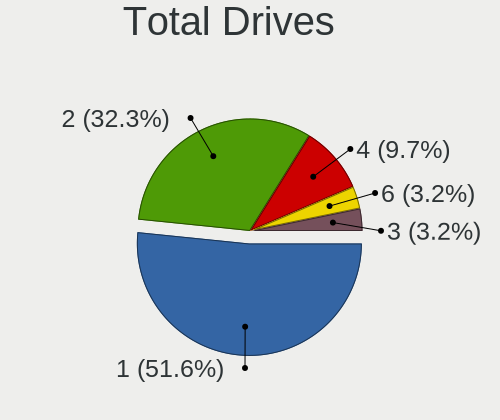
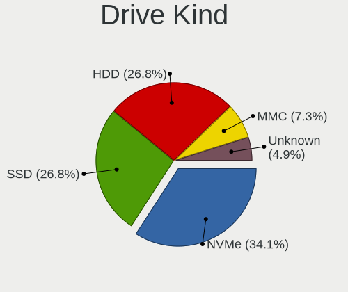
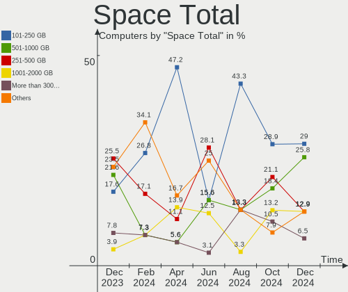
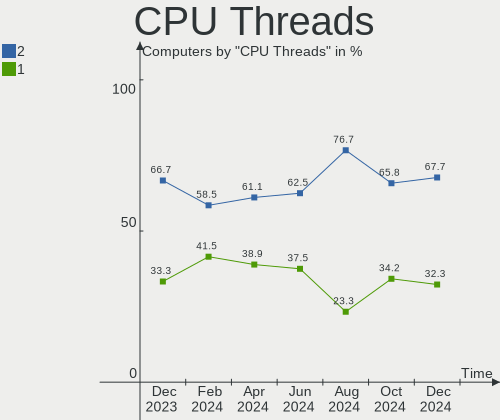
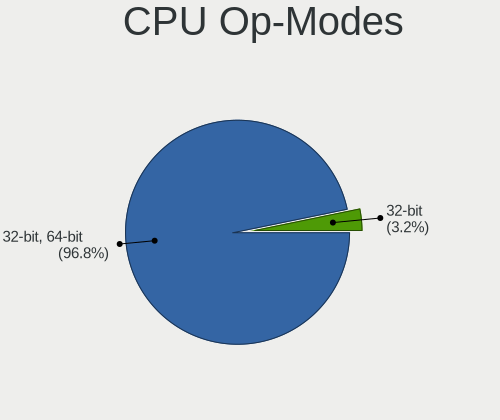
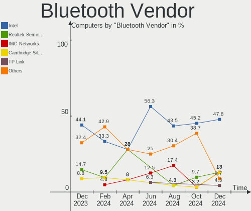
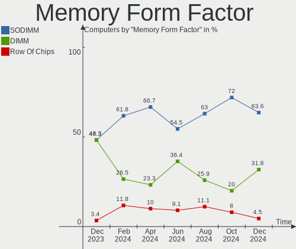
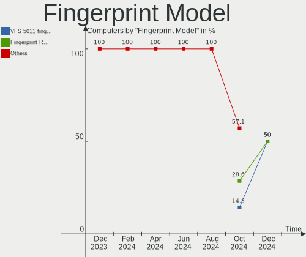

LMDE - Hardware Trends
----------------------

A project to identify most popular hardware characteristics and track their change
over time based on data collected by Linux users at https://Linux-Hardware.org.

Anyone can contribute to this report by the [hw-probe](https://github.com/linuxhw/hw-probe) tool:

    sudo -E hw-probe -all -upload

This is a report for all computer types. See also reports for [desktops](/Dist/LMDE/Desktop/README.md) and [notebooks](/Dist/LMDE/Notebook/README.md).

This report is for one last month. Overall report since the beginning of time: [TestDays](https://github.com/linuxhw/TestDays)

Period: Feb, 2023.

Contents
--------

* [ System ](#system)
  - [ OS                       ](#os)
  - [ OS Family                ](#os-family)
  - [ Kernel                   ](#kernel)
  - [ Kernel Family            ](#kernel-family)
  - [ Kernel Major Ver.        ](#kernel-major-ver)
  - [ Arch                     ](#arch)
  - [ DE                       ](#de)
  - [ Display Server           ](#display-server)
  - [ Display Manager          ](#display-manager)
  - [ OS Lang                  ](#os-lang)
  - [ Boot Mode                ](#boot-mode)
  - [ Filesystem               ](#filesystem)
  - [ Part. scheme             ](#part-scheme)
  - [ Dual Boot with Linux/BSD ](#dual-boot-with-linuxbsd)
  - [ Dual Boot (Win)          ](#dual-boot-win)

* [ Board ](#board)
  - [ Vendor                   ](#vendor)
  - [ Model                    ](#model)
  - [ Model Family             ](#model-family)
  - [ MFG Year                 ](#mfg-year)
  - [ Form Factor              ](#form-factor)
  - [ Secure Boot              ](#secure-boot)
  - [ Coreboot                 ](#coreboot)
  - [ RAM Size                 ](#ram-size)
  - [ RAM Used                 ](#ram-used)
  - [ Total Drives             ](#total-drives)
  - [ Has CD-ROM               ](#has-cd-rom)
  - [ Has Ethernet             ](#has-ethernet)
  - [ Has WiFi                 ](#has-wifi)
  - [ Has Bluetooth            ](#has-bluetooth)

* [ Location ](#location)
  - [ Country                  ](#country)
  - [ City                     ](#city)

* [ Drives ](#drives)
  - [ Drive Vendor             ](#drive-vendor)
  - [ Drive Model              ](#drive-model)
  - [ HDD Vendor               ](#hdd-vendor)
  - [ SSD Vendor               ](#ssd-vendor)
  - [ Drive Kind               ](#drive-kind)
  - [ Drive Connector          ](#drive-connector)
  - [ Drive Size               ](#drive-size)
  - [ Space Total              ](#space-total)
  - [ Space Used               ](#space-used)
  - [ Malfunc. Drives          ](#malfunc-drives)
  - [ Malfunc. Drive Vendor    ](#malfunc-drive-vendor)
  - [ Malfunc. HDD Vendor      ](#malfunc-hdd-vendor)
  - [ Malfunc. Drive Kind      ](#malfunc-drive-kind)
  - [ Failed Drives            ](#failed-drives)
  - [ Failed Drive Vendor      ](#failed-drive-vendor)
  - [ Drive Status             ](#drive-status)

* [ Storage controller ](#storage-controller)
  - [ Storage Vendor           ](#storage-vendor)
  - [ Storage Model            ](#storage-model)
  - [ Storage Kind             ](#storage-kind)

* [ Processor ](#processor)
  - [ CPU Vendor               ](#cpu-vendor)
  - [ CPU Model                ](#cpu-model)
  - [ CPU Model Family         ](#cpu-model-family)
  - [ CPU Cores                ](#cpu-cores)
  - [ CPU Sockets              ](#cpu-sockets)
  - [ CPU Threads              ](#cpu-threads)
  - [ CPU Op-Modes             ](#cpu-op-modes)
  - [ CPU Microcode            ](#cpu-microcode)
  - [ CPU Microarch            ](#cpu-microarch)

* [ Graphics ](#graphics)
  - [ GPU Vendor               ](#gpu-vendor)
  - [ GPU Model                ](#gpu-model)
  - [ GPU Combo                ](#gpu-combo)
  - [ GPU Driver               ](#gpu-driver)
  - [ GPU Memory               ](#gpu-memory)

* [ Monitor ](#monitor)
  - [ Monitor Vendor           ](#monitor-vendor)
  - [ Monitor Model            ](#monitor-model)
  - [ Monitor Resolution       ](#monitor-resolution)
  - [ Monitor Diagonal         ](#monitor-diagonal)
  - [ Monitor Width            ](#monitor-width)
  - [ Aspect Ratio             ](#aspect-ratio)
  - [ Monitor Area             ](#monitor-area)
  - [ Pixel Density            ](#pixel-density)
  - [ Multiple Monitors        ](#multiple-monitors)

* [ Network ](#network)
  - [ Net Controller Vendor    ](#net-controller-vendor)
  - [ Net Controller Model     ](#net-controller-model)
  - [ Wireless Vendor          ](#wireless-vendor)
  - [ Wireless Model           ](#wireless-model)
  - [ Ethernet Vendor          ](#ethernet-vendor)
  - [ Ethernet Model           ](#ethernet-model)
  - [ Net Controller Kind      ](#net-controller-kind)
  - [ Used Controller          ](#used-controller)
  - [ NICs                     ](#nics)
  - [ IPv6                     ](#ipv6)

* [ Bluetooth ](#bluetooth)
  - [ Bluetooth Vendor         ](#bluetooth-vendor)
  - [ Bluetooth Model          ](#bluetooth-model)

* [ Sound ](#sound)
  - [ Sound Vendor             ](#sound-vendor)
  - [ Sound Model              ](#sound-model)

* [ Memory ](#memory)
  - [ Memory Vendor            ](#memory-vendor)
  - [ Memory Model             ](#memory-model)
  - [ Memory Kind              ](#memory-kind)
  - [ Memory Form Factor       ](#memory-form-factor)
  - [ Memory Size              ](#memory-size)
  - [ Memory Speed             ](#memory-speed)

* [ Printers & scanners ](#printers--scanners)
  - [ Printer Vendor           ](#printer-vendor)
  - [ Printer Model            ](#printer-model)
  - [ Scanner Vendor           ](#scanner-vendor)
  - [ Scanner Model            ](#scanner-model)

* [ Camera ](#camera)
  - [ Camera Vendor            ](#camera-vendor)
  - [ Camera Model             ](#camera-model)

* [ Security ](#security)
  - [ Fingerprint Vendor       ](#fingerprint-vendor)
  - [ Fingerprint Model        ](#fingerprint-model)
  - [ Chipcard Vendor          ](#chipcard-vendor)
  - [ Chipcard Model           ](#chipcard-model)

* [ Unsupported ](#unsupported)
  - [ Unsupported Devices      ](#unsupported-devices)
  - [ Unsupported Device Types ](#unsupported-device-types)

System
------

OS
--

Installed operating systems

| Name   | Computers | Percent |
|--------|-----------|---------|
| LMDE 5 | 25        | 96.15%  |
| LMDE 4 | 1         | 3.85%   |

OS Family
---------

OS without a version

| Name | Computers | Percent |
|------|-----------|---------|
| LMDE | 26        | 100%    |

Kernel
------

Version of the Linux kernel

| Version              | Computers | Percent |
|----------------------|-----------|---------|
| 5.10.0-21-amd64      | 23        | 88.46%  |
| 6.1.11-x64v1-xanmod1 | 1         | 3.85%   |
| 5.10.0-12-amd64      | 1         | 3.85%   |
| 4.19.0-19-686        | 1         | 3.85%   |

Kernel Family
-------------

Linux kernel without a distro release

| Version | Computers | Percent |
|---------|-----------|---------|
| 5.10.0  | 24        | 92.31%  |
| 6.1.11  | 1         | 3.85%   |
| 4.19.0  | 1         | 3.85%   |

Kernel Major Ver.
-----------------

Linux kernel major version

| Version | Computers | Percent |
|---------|-----------|---------|
| 5.10    | 24        | 92.31%  |
| 6.1     | 1         | 3.85%   |
| 4.19    | 1         | 3.85%   |

Arch
----

OS architecture (x86_64, i586, etc.)

| Name   | Computers | Percent |
|--------|-----------|---------|
| x86_64 | 25        | 96.15%  |
| i686   | 1         | 3.85%   |

DE
--

Desktop Environment

| Name       | Computers | Percent |
|------------|-----------|---------|
| X-Cinnamon | 24        | 92.31%  |
| Cinnamon   | 2         | 7.69%   |

Display Server
--------------

X11 or Wayland

| Name | Computers | Percent |
|------|-----------|---------|
| X11  | 26        | 100%    |

Display Manager
---------------

SDDM, LightDM, etc.

| Name    | Computers | Percent |
|---------|-----------|---------|
| Unknown | 15        | 57.69%  |
| LightDM | 11        | 42.31%  |

OS Lang
-------

Language

| Lang  | Computers | Percent |
|-------|-----------|---------|
| en_US | 8         | 30.77%  |
| de_DE | 5         | 19.23%  |
| ru_RU | 4         | 15.38%  |
| pt_BR | 3         | 11.54%  |
| ru_UA | 1         | 3.85%   |
| it_IT | 1         | 3.85%   |
| fr_BE | 1         | 3.85%   |
| en_ZA | 1         | 3.85%   |
| en_SG | 1         | 3.85%   |
| en_GB | 1         | 3.85%   |

Boot Mode
---------

EFI or BIOS

| Mode | Computers | Percent |
|------|-----------|---------|
| EFI  | 18        | 69.23%  |
| BIOS | 8         | 30.77%  |

Filesystem
----------

Type of filesystem

| Type  | Computers | Percent |
|-------|-----------|---------|
| Ext4  | 25        | 96.15%  |
| Tmpfs | 1         | 3.85%   |

Part. scheme
------------

Scheme of partitioning

| Type    | Computers | Percent |
|---------|-----------|---------|
| Unknown | 15        | 57.69%  |
| GPT     | 9         | 34.62%  |
| MBR     | 2         | 7.69%   |

Dual Boot with Linux/BSD
------------------------

Hosting more than one Linux/BSD

| Dual boot | Computers | Percent |
|-----------|-----------|---------|
| No        | 23        | 88.46%  |
| Yes       | 3         | 11.54%  |

Dual Boot (Win)
---------------

Hosting Linux and Windows

| Dual boot | Computers | Percent |
|-----------|-----------|---------|
| No        | 22        | 84.62%  |
| Yes       | 4         | 15.38%  |

Board
-----

Vendor
------

Motherboard manufacturer

| Name                | Computers | Percent |
|---------------------|-----------|---------|
| Hewlett-Packard     | 4         | 15.38%  |
| Gigabyte Technology | 4         | 15.38%  |
| Lenovo              | 3         | 11.54%  |
| Dell                | 3         | 11.54%  |
| ASUSTek Computer    | 3         | 11.54%  |
| TUXEDO              | 1         | 3.85%   |
| Toshiba             | 1         | 3.85%   |
| Supermicro          | 1         | 3.85%   |
| Star Labs           | 1         | 3.85%   |
| Medion              | 1         | 3.85%   |
| itel Mobile Limited | 1         | 3.85%   |
| Foxconn             | 1         | 3.85%   |
| Fanless Mini PC     | 1         | 3.85%   |
| Compaq              | 1         | 3.85%   |

Model
-----

Motherboard model

| Name                                 | Computers | Percent |
|--------------------------------------|-----------|---------|
| TUXEDO N8xxEZ                        | 1         | 3.85%   |
| Toshiba Satellite L300               | 1         | 3.85%   |
| Supermicro X10SAE                    | 1         | 3.85%   |
| Star Labs StarBook                   | 1         | 3.85%   |
| Medion MS-7800                       | 1         | 3.85%   |
| Lenovo ThinkPad X260 20F6S02A00      | 1         | 3.85%   |
| Lenovo ThinkPad E15 Gen 3 20YG003VGE | 1         | 3.85%   |
| Lenovo ThinkBook 14 G2 ARE 20VF      | 1         | 3.85%   |
| itel Mobile Limited SPIRIT 2         | 1         | 3.85%   |
| HP ProBook 650 G2                    | 1         | 3.85%   |
| HP 290 G2 MT Business PC             | 1         | 3.85%   |
| HP 250 G8 Notebook PC                | 1         | 3.85%   |
| HP 2000                              | 1         | 3.85%   |
| Gigabyte Z590 GAMING X               | 1         | 3.85%   |
| Gigabyte X570 AORUS MASTER           | 1         | 3.85%   |
| Gigabyte B450M S2H                   | 1         | 3.85%   |
| Gigabyte B450 AORUS M                | 1         | 3.85%   |
| Foxconn Pro 3500 Series              | 1         | 3.85%   |
| Fanless Mini PC PCG02 Pro            | 1         | 3.85%   |
| Dell Precision T7610                 | 1         | 3.85%   |
| Dell Precision T5600                 | 1         | 3.85%   |
| Dell Precision M4800                 | 1         | 3.85%   |
| Compaq 420                           | 1         | 3.85%   |
| ASUS P8H61-M LX R2.0                 | 1         | 3.85%   |
| ASUS P7P55D                          | 1         | 3.85%   |
| ASUS M5A78L-M PLUS/USB3              | 1         | 3.85%   |

Model Family
------------

Motherboard model prefix

| Name                       | Computers | Percent |
|----------------------------|-----------|---------|
| Dell Precision             | 3         | 11.54%  |
| Lenovo ThinkPad            | 2         | 7.69%   |
| TUXEDO N8xxEZ              | 1         | 3.85%   |
| Toshiba Satellite          | 1         | 3.85%   |
| Supermicro X10SAE          | 1         | 3.85%   |
| Star Labs StarBook         | 1         | 3.85%   |
| Medion MS-7800             | 1         | 3.85%   |
| Lenovo ThinkBook           | 1         | 3.85%   |
| itel Mobile Limited SPIRIT | 1         | 3.85%   |
| HP ProBook                 | 1         | 3.85%   |
| HP 290                     | 1         | 3.85%   |
| HP 250                     | 1         | 3.85%   |
| HP 2000                    | 1         | 3.85%   |
| Gigabyte Z590              | 1         | 3.85%   |
| Gigabyte X570              | 1         | 3.85%   |
| Gigabyte B450M             | 1         | 3.85%   |
| Gigabyte B450              | 1         | 3.85%   |
| Foxconn Pro                | 1         | 3.85%   |
| Fanless Mini PC PCG02      | 1         | 3.85%   |
| Compaq 420                 | 1         | 3.85%   |
| ASUS P8H61-M               | 1         | 3.85%   |
| ASUS P7P55D                | 1         | 3.85%   |
| ASUS M5A78L-M              | 1         | 3.85%   |

MFG Year
--------

Motherboard manufacture year

| Year | Computers | Percent |
|------|-----------|---------|
| 2018 | 5         | 19.23%  |
| 2021 | 3         | 11.54%  |
| 2016 | 3         | 11.54%  |
| 2012 | 3         | 11.54%  |
| 2022 | 2         | 7.69%   |
| 2020 | 2         | 7.69%   |
| 2013 | 2         | 7.69%   |
| 2023 | 1         | 3.85%   |
| 2019 | 1         | 3.85%   |
| 2014 | 1         | 3.85%   |
| 2011 | 1         | 3.85%   |
| 2009 | 1         | 3.85%   |
| 2008 | 1         | 3.85%   |

Form Factor
-----------

Physical design of the computer

| Name     | Computers | Percent |
|----------|-----------|---------|
| Desktop  | 12        | 46.15%  |
| Notebook | 12        | 46.15%  |
| Mini pc  | 1         | 3.85%   |
| Server   | 1         | 3.85%   |

Secure Boot
-----------

Enabled or disabled

| State    | Computers | Percent |
|----------|-----------|---------|
| Disabled | 23        | 88.46%  |
| Enabled  | 3         | 11.54%  |

Coreboot
--------

Have coreboot on board

| Used | Computers | Percent |
|------|-----------|---------|
| No   | 25        | 96.15%  |
| Yes  | 1         | 3.85%   |

RAM Size
--------

Total RAM memory

| Size in GB      | Computers | Percent |
|-----------------|-----------|---------|
| 4.01-8.0        | 8         | 30.77%  |
| 32.01-64.0      | 5         | 19.23%  |
| 3.01-4.0        | 4         | 15.38%  |
| 16.01-24.0      | 4         | 15.38%  |
| 8.01-16.0       | 3         | 11.54%  |
| More than 256.0 | 1         | 3.85%   |
| 1.01-2.0        | 1         | 3.85%   |

RAM Used
--------

Used RAM memory

| Used GB    | Computers | Percent |
|------------|-----------|---------|
| 2.01-3.0   | 12        | 46.15%  |
| 1.01-2.0   | 8         | 30.77%  |
| 4.01-8.0   | 3         | 11.54%  |
| 3.01-4.0   | 2         | 7.69%   |
| 24.01-32.0 | 1         | 3.85%   |

Total Drives
------------

Number of drives on board

| Drives | Computers | Percent |
|--------|-----------|---------|
| 1      | 17        | 65.38%  |
| 2      | 4         | 15.38%  |
| 3      | 3         | 11.54%  |
| 5      | 1         | 3.85%   |
| 4      | 1         | 3.85%   |

Has CD-ROM
----------

Has CD-ROM on board

| Presented | Computers | Percent |
|-----------|-----------|---------|
| No        | 14        | 53.85%  |
| Yes       | 12        | 46.15%  |

Has Ethernet
------------

Has Ethernet on board

| Presented | Computers | Percent |
|-----------|-----------|---------|
| Yes       | 23        | 88.46%  |
| No        | 3         | 11.54%  |

Has WiFi
--------

Has WiFi module

| Presented | Computers | Percent |
|-----------|-----------|---------|
| Yes       | 18        | 69.23%  |
| No        | 8         | 30.77%  |

Has Bluetooth
-------------

Has Bluetooth module

| Presented | Computers | Percent |
|-----------|-----------|---------|
| No        | 16        | 61.54%  |
| Yes       | 10        | 38.46%  |

Location
--------

Country
-------

Geographic location (country)

| Country      | Computers | Percent |
|--------------|-----------|---------|
| USA          | 6         | 23.08%  |
| Germany      | 6         | 23.08%  |
| Russia       | 2         | 7.69%   |
| Brazil       | 2         | 7.69%   |
| Belarus      | 2         | 7.69%   |
| Ukraine      | 1         | 3.85%   |
| South Africa | 1         | 3.85%   |
| Kazakhstan   | 1         | 3.85%   |
| Japan        | 1         | 3.85%   |
| Italy        | 1         | 3.85%   |
| Indonesia    | 1         | 3.85%   |
| France       | 1         | 3.85%   |
| Belgium      | 1         | 3.85%   |

City
----

Geographic location (city)

| City          | Computers | Percent |
|---------------|-----------|---------|
| Miami         | 3         | 11.54%  |
| Hrodna        | 2         | 7.69%   |
| Yekaterinburg | 1         | 3.85%   |
| Villefontaine | 1         | 3.85%   |
| Vancouver     | 1         | 3.85%   |
| Toyota        | 1         | 3.85%   |
| Schoenebeck   | 1         | 3.85%   |
| Sao Paulo     | 1         | 3.85%   |
| Raschau       | 1         | 3.85%   |
| Nuremberg     | 1         | 3.85%   |
| Mytishchi     | 1         | 3.85%   |
| Mannheim      | 1         | 3.85%   |
| Los Angeles   | 1         | 3.85%   |
| Lessines      | 1         | 3.85%   |
| Leipzig       | 1         | 3.85%   |
| Kyiv          | 1         | 3.85%   |
| Jakarta       | 1         | 3.85%   |
| Gummersbach   | 1         | 3.85%   |
| Fortaleza     | 1         | 3.85%   |
| Centurion     | 1         | 3.85%   |
| Boynton Beach | 1         | 3.85%   |
| Astana        | 1         | 3.85%   |
| Albignasego   | 1         | 3.85%   |

Drives
------

Drive Vendor
------------

Hard drive vendors

| Vendor              | Computers | Drives | Percent |
|---------------------|-----------|--------|---------|
| Samsung Electronics | 7         | 8      | 18.42%  |
| Seagate             | 6         | 7      | 15.79%  |
| WDC                 | 4         | 7      | 10.53%  |
| Toshiba             | 4         | 4      | 10.53%  |
| Kingston            | 4         | 5      | 10.53%  |
| Crucial             | 2         | 2      | 5.26%   |
| Unknown             | 1         | 1      | 2.63%   |
| Star Drive          | 1         | 1      | 2.63%   |
| SK hynix            | 1         | 1      | 2.63%   |
| Silicon Motion      | 1         | 1      | 2.63%   |
| PNY                 | 1         | 1      | 2.63%   |
| Lexar               | 1         | 1      | 2.63%   |
| HS-SSD-C100         | 1         | 1      | 2.63%   |
| Hitachi             | 1         | 1      | 2.63%   |
| CT500MX5            | 1         | 1      | 2.63%   |
| Apple               | 1         | 1      | 2.63%   |
| A-DATA Technology   | 1         | 1      | 2.63%   |

Drive Model
-----------

Hard drive models

| Model                                             | Computers | Percent |
|---------------------------------------------------|-----------|---------|
| Seagate ST500DM002-1BD142 500GB                   | 3         | 7.14%   |
| Kingston SA400S37240G 240GB SSD                   | 2         | 4.76%   |
| Kingston SA400S37120G 120GB SSD                   | 2         | 4.76%   |
| WDC WDS250G2B0A-00SM50 250GB SSD                  | 1         | 2.38%   |
| WDC WDS240G2G0A-00JH30 240GB SSD                  | 1         | 2.38%   |
| WDC WD5000BEVT-22ZAT0 500GB                       | 1         | 2.38%   |
| WDC WD40EZRZ-00GXCB0 4TB                          | 1         | 2.38%   |
| WDC WD20SPZX-22UA7T0 2TB                          | 1         | 2.38%   |
| WDC WD20EARS-00S8B1 2TB                           | 1         | 2.38%   |
| Unknown MMC Card  250GB                           | 1         | 2.38%   |
| Toshiba MQ01ACF050 500GB                          | 1         | 2.38%   |
| Toshiba MQ01ABD050 500GB                          | 1         | 2.38%   |
| Toshiba HDWD110 1TB                               | 1         | 2.38%   |
| Toshiba DT01ACA100 1TB                            | 1         | 2.38%   |
| Star Drive PCIe SSD 480GB                         | 1         | 2.38%   |
| SK hynix SKHynix_HFM512GD3HX015N 512GB            | 1         | 2.38%   |
| Silicon Motion SM2262/SM2262EN SSD Controller 1TB | 1         | 2.38%   |
| Seagate ST31500341AS 1TB                          | 1         | 2.38%   |
| Seagate ST1000LM048-2E7172 1TB                    | 1         | 2.38%   |
| Seagate ST1000LM014-1EJ164 1TB                    | 1         | 2.38%   |
| Seagate ST1000DM003-1ER162 1TB                    | 1         | 2.38%   |
| Samsung SSD 980 PRO 1TB                           | 1         | 2.38%   |
| Samsung SSD 970 EVO 500GB                         | 1         | 2.38%   |
| Samsung SSD 870 EVO 500GB                         | 1         | 2.38%   |
| Samsung SSD 850 EVO 250GB                         | 1         | 2.38%   |
| Samsung MZVLQ256HBJD-00BH1 256GB                  | 1         | 2.38%   |
| Samsung MZNLN256HCHP-000H1 256GB SSD              | 1         | 2.38%   |
| Samsung MZALQ512HALU-000L2 512GB                  | 1         | 2.38%   |
| Samsung HD502HI 500GB                             | 1         | 2.38%   |
| PNY CS900 240GB SSD                               | 1         | 2.38%   |
| Lexar 512GB SSD                                   | 1         | 2.38%   |
| HS-SSD-C100 240G                                  | 1         | 2.38%   |
| Hitachi HTS545050A7E380 500GB                     | 1         | 2.38%   |
| CT500MX5 00SSD1 500GB                             | 1         | 2.38%   |
| Crucial CT275MX300SSD1 275GB                      | 1         | 2.38%   |
| Crucial CT240BX500SSD1 240GB                      | 1         | 2.38%   |
| Apple HDD HTS545050A7E362 500GB                   | 1         | 2.38%   |
| A-DATA SU650 240GB SSD                            | 1         | 2.38%   |

HDD Vendor
----------

Hard disk drive vendors

| Vendor              | Computers | Drives | Percent |
|---------------------|-----------|--------|---------|
| Seagate             | 6         | 7      | 37.5%   |
| Toshiba             | 4         | 4      | 25%     |
| WDC                 | 3         | 5      | 18.75%  |
| Samsung Electronics | 1         | 1      | 6.25%   |
| Hitachi             | 1         | 1      | 6.25%   |
| Apple               | 1         | 1      | 6.25%   |

SSD Vendor
----------

Solid state drive vendors

| Vendor              | Computers | Drives | Percent |
|---------------------|-----------|--------|---------|
| Kingston            | 4         | 5      | 26.67%  |
| Samsung Electronics | 3         | 3      | 20%     |
| WDC                 | 2         | 2      | 13.33%  |
| Crucial             | 2         | 2      | 13.33%  |
| PNY                 | 1         | 1      | 6.67%   |
| Lexar               | 1         | 1      | 6.67%   |
| CT500MX5            | 1         | 1      | 6.67%   |
| A-DATA Technology   | 1         | 1      | 6.67%   |

Drive Kind
----------

HDD or SSD

| Kind    | Computers | Drives | Percent |
|---------|-----------|--------|---------|
| SSD     | 13        | 16     | 37.14%  |
| HDD     | 13        | 19     | 37.14%  |
| NVMe    | 7         | 7      | 20%     |
| MMC     | 1         | 1      | 2.86%   |
| Unknown | 1         | 1      | 2.86%   |

Drive Connector
---------------

SATA, SAS, NVMe, etc.

| Type | Computers | Drives | Percent |
|------|-----------|--------|---------|
| SATA | 21        | 35     | 70%     |
| NVMe | 7         | 7      | 23.33%  |
| SAS  | 1         | 1      | 3.33%   |
| MMC  | 1         | 1      | 3.33%   |

Drive Size
----------

Size of hard drive

| Size in TB | Computers | Drives | Percent |
|------------|-----------|--------|---------|
| 0.01-0.5   | 17        | 24     | 62.96%  |
| 0.51-1.0   | 7         | 7      | 25.93%  |
| 1.01-2.0   | 2         | 2      | 7.41%   |
| 3.01-4.0   | 1         | 2      | 3.7%    |

Space Total
-----------

Amount of disk space available on the file system

| Size in GB | Computers | Percent |
|------------|-----------|---------|
| 251-500    | 8         | 30.77%  |
| 101-250    | 8         | 30.77%  |
| 1001-2000  | 4         | 15.38%  |
| 501-1000   | 3         | 11.54%  |
| 2001-3000  | 2         | 7.69%   |
| 1-20       | 1         | 3.85%   |

Space Used
----------

Amount of used disk space

| Used GB  | Computers | Percent |
|----------|-----------|---------|
| 1-20     | 10        | 38.46%  |
| 101-250  | 6         | 23.08%  |
| 21-50    | 3         | 11.54%  |
| 51-100   | 3         | 11.54%  |
| 251-500  | 2         | 7.69%   |
| 501-1000 | 2         | 7.69%   |

Malfunc. Drives
---------------

Drive models with a malfunction

| Model                                 | Computers | Drives | Percent |
|---------------------------------------|-----------|--------|---------|
| Seagate ST1000LM048-2E7172 1TB        | 1         | 1      | 33.33%  |
| Samsung Electronics SSD 970 EVO 500GB | 1         | 1      | 33.33%  |
| Hitachi HTS545050A7E380 500GB         | 1         | 1      | 33.33%  |

Malfunc. Drive Vendor
---------------------

Vendors of faulty drives

| Vendor              | Computers | Drives | Percent |
|---------------------|-----------|--------|---------|
| Seagate             | 1         | 1      | 33.33%  |
| Samsung Electronics | 1         | 1      | 33.33%  |
| Hitachi             | 1         | 1      | 33.33%  |

Malfunc. HDD Vendor
-------------------

Vendors of faulty HDD drives

| Vendor  | Computers | Drives | Percent |
|---------|-----------|--------|---------|
| Seagate | 1         | 1      | 50%     |
| Hitachi | 1         | 1      | 50%     |

Malfunc. Drive Kind
-------------------

Kinds of faulty drives

| Kind | Computers | Drives | Percent |
|------|-----------|--------|---------|
| HDD  | 2         | 2      | 66.67%  |
| NVMe | 1         | 1      | 33.33%  |

Failed Drives
-------------

Failed drive models

Zero info for selected period =(

Failed Drive Vendor
-------------------

Failed drive vendors

Zero info for selected period =(

Drive Status
------------

Number of failed and malfunc. drives

| Status   | Computers | Drives | Percent |
|----------|-----------|--------|---------|
| Detected | 15        | 27     | 55.56%  |
| Works    | 9         | 14     | 33.33%  |
| Malfunc  | 3         | 3      | 11.11%  |

Storage controller
------------------

Storage Vendor
--------------

Storage controller vendors

| Vendor              | Computers | Percent |
|---------------------|-----------|---------|
| Intel               | 18        | 52.94%  |
| AMD                 | 6         | 17.65%  |
| Samsung Electronics | 4         | 11.76%  |
| SK hynix            | 1         | 2.94%   |
| Silicon Motion      | 1         | 2.94%   |
| Phison Electronics  | 1         | 2.94%   |
| JMicron Technology  | 1         | 2.94%   |
| Broadcom / LSI      | 1         | 2.94%   |
| ASMedia Technology  | 1         | 2.94%   |

Storage Model
-------------

Storage controller models

| Model                                                                                   | Computers | Percent |
|-----------------------------------------------------------------------------------------|-----------|---------|
| AMD FCH SATA Controller [AHCI mode]                                                     | 5         | 11.36%  |
| Samsung NVMe SSD Controller 980                                                         | 2         | 4.55%   |
| Intel Tiger Lake-LP SATA Controller                                                     | 2         | 4.55%   |
| Intel Sunrise Point-LP SATA Controller [AHCI mode]                                      | 2         | 4.55%   |
| Intel C600/X79 series chipset IDE-r Controller                                          | 2         | 4.55%   |
| Intel C600/X79 series chipset 6-Port SATA AHCI Controller                               | 2         | 4.55%   |
| AMD 400 Series Chipset SATA Controller                                                  | 2         | 4.55%   |
| SK hynix Gold P31/PC711 NVMe Solid State Drive                                          | 1         | 2.27%   |
| Silicon Motion SM2262/SM2262EN SSD Controller                                           | 1         | 2.27%   |
| Samsung NVMe SSD Controller SM981/PM981/PM983                                           | 1         | 2.27%   |
| Samsung NVMe SSD Controller PM9A1/PM9A3/980PRO                                          | 1         | 2.27%   |
| Phison E12 NVMe Controller                                                              | 1         | 2.27%   |
| JMicron JMB363 SATA/IDE Controller                                                      | 1         | 2.27%   |
| Intel Volume Management Device NVMe RAID Controller                                     | 1         | 2.27%   |
| Intel Jasper Lake SATA AHCI Controller                                                  | 1         | 2.27%   |
| Intel Cannon Lake PCH SATA AHCI Controller                                              | 1         | 2.27%   |
| Intel Cannon Lake Mobile PCH SATA AHCI Controller                                       | 1         | 2.27%   |
| Intel C608 chipset Dual 4-Port SATA/SAS Storage Control Unit                            | 1         | 2.27%   |
| Intel Atom/Celeron/Pentium Processor x5-E8000/J3xxx/N3xxx Series SATA Controller        | 1         | 2.27%   |
| Intel 82801HM/HEM (ICH8M/ICH8M-E) SATA Controller [AHCI mode]                           | 1         | 2.27%   |
| Intel 82801HM/HEM (ICH8M/ICH8M-E) IDE Controller                                        | 1         | 2.27%   |
| Intel 82801 Mobile SATA Controller [RAID mode]                                          | 1         | 2.27%   |
| Intel 8 Series/C220 Series Chipset Family 6-port SATA Controller 1 [AHCI mode]          | 1         | 2.27%   |
| Intel 7 Series Chipset Family 6-port SATA Controller [AHCI mode]                        | 1         | 2.27%   |
| Intel 6 Series/C200 Series Chipset Family Desktop SATA Controller (IDE mode, ports 4-5) | 1         | 2.27%   |
| Intel 6 Series/C200 Series Chipset Family Desktop SATA Controller (IDE mode, ports 0-3) | 1         | 2.27%   |
| Intel 6 Series/C200 Series Chipset Family 6 port Desktop SATA AHCI Controller           | 1         | 2.27%   |
| Intel 500 Series Chipset Family SATA AHCI Controller                                    | 1         | 2.27%   |
| Intel 5 Series/3400 Series Chipset 4 port SATA IDE Controller                           | 1         | 2.27%   |
| Intel 5 Series/3400 Series Chipset 2 port SATA IDE Controller                           | 1         | 2.27%   |
| Broadcom / LSI SAS2308 PCI-Express Fusion-MPT SAS-2                                     | 1         | 2.27%   |
| ASMedia ASM1062 Serial ATA Controller                                                   | 1         | 2.27%   |
| AMD SB7x0/SB8x0/SB9x0 SATA Controller [IDE mode]                                        | 1         | 2.27%   |
| AMD SB7x0/SB8x0/SB9x0 IDE Controller                                                    | 1         | 2.27%   |

Storage Kind
------------

Kind of storage controller (IDE, SATA, NVMe, SAS, ...)

| Kind | Computers | Percent |
|------|-----------|---------|
| SATA | 21        | 55.26%  |
| NVMe | 7         | 18.42%  |
| IDE  | 6         | 15.79%  |
| RAID | 2         | 5.26%   |
| SAS  | 2         | 5.26%   |

Processor
---------

CPU Vendor
----------

Processor vendors

| Vendor | Computers | Percent |
|--------|-----------|---------|
| Intel  | 19        | 73.08%  |
| AMD    | 7         | 26.92%  |

CPU Model
---------

Processor models

| Model                                   | Computers | Percent |
|-----------------------------------------|-----------|---------|
| Intel Core i5-6200U CPU @ 2.30GHz       | 2         | 7.69%   |
| Intel Xeon CPU E5-2687W v2 @ 3.40GHz    | 1         | 3.85%   |
| Intel Xeon CPU E5-2670 0 @ 2.60GHz      | 1         | 3.85%   |
| Intel Xeon CPU E3-1270 v3 @ 3.50GHz     | 1         | 3.85%   |
| Intel Pentium Gold G5400 CPU @ 3.70GHz  | 1         | 3.85%   |
| Intel Pentium CPU N3700 @ 1.60GHz       | 1         | 3.85%   |
| Intel Pentium CPU G630 @ 2.70GHz        | 1         | 3.85%   |
| Intel Core i7-8750H CPU @ 2.20GHz       | 1         | 3.85%   |
| Intel Core i7-4800MQ CPU @ 2.70GHz      | 1         | 3.85%   |
| Intel Core i5-3470 CPU @ 3.20GHz        | 1         | 3.85%   |
| Intel Core i3-2328M CPU @ 2.20GHz       | 1         | 3.85%   |
| Intel Core i3 CPU 560 @ 3.33GHz         | 1         | 3.85%   |
| Intel Core 2 Duo CPU T7250 @ 2.00GHz    | 1         | 3.85%   |
| Intel Celeron N5105 @ 2.00GHz           | 1         | 3.85%   |
| Intel 12th Gen Core i7-1260P            | 1         | 3.85%   |
| Intel 11th Gen Core i9-11900K @ 3.50GHz | 1         | 3.85%   |
| Intel 11th Gen Core i5-1155G7 @ 2.50GHz | 1         | 3.85%   |
| Intel 11th Gen Core i3-1115G4 @ 3.00GHz | 1         | 3.85%   |
| AMD Ryzen 7 5700U with Radeon Graphics  | 1         | 3.85%   |
| AMD Ryzen 7 2700 Eight-Core Processor   | 1         | 3.85%   |
| AMD Ryzen 5 4500U with Radeon Graphics  | 1         | 3.85%   |
| AMD Ryzen 5 3600X 6-Core Processor      | 1         | 3.85%   |
| AMD Ryzen 5 2600 Six-Core Processor     | 1         | 3.85%   |
| AMD Phenom II X4 965 Processor          | 1         | 3.85%   |
| AMD A8-5500 APU with Radeon HD Graphics | 1         | 3.85%   |

CPU Model Family
----------------

Processor model prefix

| Model              | Computers | Percent |
|--------------------|-----------|---------|
| Other              | 4         | 15.38%  |
| Intel Xeon         | 3         | 11.54%  |
| Intel Core i5      | 3         | 11.54%  |
| AMD Ryzen 5        | 3         | 11.54%  |
| Intel Pentium      | 2         | 7.69%   |
| Intel Core i7      | 2         | 7.69%   |
| Intel Core i3      | 2         | 7.69%   |
| AMD Ryzen 7        | 2         | 7.69%   |
| Intel Pentium Gold | 1         | 3.85%   |
| Intel Core 2 Duo   | 1         | 3.85%   |
| Intel Celeron      | 1         | 3.85%   |
| AMD Phenom II X4   | 1         | 3.85%   |
| AMD A8             | 1         | 3.85%   |

CPU Cores
---------

Number of processor cores

| Number | Computers | Percent |
|--------|-----------|---------|
| 2      | 9         | 34.62%  |
| 4      | 7         | 26.92%  |
| 6      | 4         | 15.38%  |
| 8      | 3         | 11.54%  |
| 16     | 2         | 7.69%   |
| 12     | 1         | 3.85%   |

CPU Sockets
-----------

Number of sockets

| Number | Computers | Percent |
|--------|-----------|---------|
| 1      | 24        | 92.31%  |
| 2      | 2         | 7.69%   |

CPU Threads
-----------

Threads per core (Hyper-Threading)

| Number | Computers | Percent |
|--------|-----------|---------|
| 2      | 18        | 69.23%  |
| 1      | 8         | 30.77%  |

CPU Op-Modes
------------

CPU Operation Modes (32-bit, 64-bit)

| Op mode        | Computers | Percent |
|----------------|-----------|---------|
| 32-bit, 64-bit | 26        | 100%    |

CPU Microcode
-------------

Microcode number

| Number     | Computers | Percent |
|------------|-----------|---------|
| Unknown    | 3         | 11.54%  |
| 0x906ea    | 2         | 7.69%   |
| 0x406e3    | 2         | 7.69%   |
| 0x306c3    | 2         | 7.69%   |
| 0x206a7    | 2         | 7.69%   |
| 0x0800820d | 2         | 7.69%   |
| 0xa0671    | 1         | 3.85%   |
| 0x906c0    | 1         | 3.85%   |
| 0x806c1    | 1         | 3.85%   |
| 0x6fd      | 1         | 3.85%   |
| 0x406c3    | 1         | 3.85%   |
| 0x306e4    | 1         | 3.85%   |
| 0x306a9    | 1         | 3.85%   |
| 0x206d6    | 1         | 3.85%   |
| 0x20655    | 1         | 3.85%   |
| 0x08701013 | 1         | 3.85%   |
| 0x08608103 | 1         | 3.85%   |
| 0x08600106 | 1         | 3.85%   |
| 0x010000c8 | 1         | 3.85%   |

CPU Microarch
-------------

Microarchitecture

| Name        | Computers | Percent |
|-------------|-----------|---------|
| SandyBridge | 3         | 11.54%  |
| Unknown     | 3         | 11.54%  |
| Zen+        | 2         | 7.69%   |
| Zen 2       | 2         | 7.69%   |
| TigerLake   | 2         | 7.69%   |
| Skylake     | 2         | 7.69%   |
| KabyLake    | 2         | 7.69%   |
| IvyBridge   | 2         | 7.69%   |
| Haswell     | 2         | 7.69%   |
| Westmere    | 1         | 3.85%   |
| Tremont     | 1         | 3.85%   |
| Silvermont  | 1         | 3.85%   |
| Piledriver  | 1         | 3.85%   |
| K10         | 1         | 3.85%   |
| Core        | 1         | 3.85%   |

Graphics
--------

GPU Vendor
----------

Vendors of graphics cards

| Vendor | Computers | Percent |
|--------|-----------|---------|
| Intel  | 15        | 55.56%  |
| Nvidia | 8         | 29.63%  |
| AMD    | 4         | 14.81%  |

GPU Model
---------

Graphics card models

| Model                                                                                    | Computers | Percent |
|------------------------------------------------------------------------------------------|-----------|---------|
| Intel Skylake GT2 [HD Graphics 520]                                                      | 2         | 6.9%    |
| Intel 2nd Generation Core Processor Family Integrated Graphics Controller                | 2         | 6.9%    |
| Nvidia TU116 [GeForce GTX 1660 Ti]                                                       | 1         | 3.45%   |
| Nvidia TU106 [GeForce GTX 1650]                                                          | 1         | 3.45%   |
| Nvidia GT218 [GeForce 210]                                                               | 1         | 3.45%   |
| Nvidia GP108 [GeForce GT 1030]                                                           | 1         | 3.45%   |
| Nvidia GK208 [GeForce GT 635]                                                            | 1         | 3.45%   |
| Nvidia GK107GLM [Quadro K1100M]                                                          | 1         | 3.45%   |
| Nvidia GA102 [GeForce RTX 3090]                                                          | 1         | 3.45%   |
| Nvidia G92 [GeForce GTS 250]                                                             | 1         | 3.45%   |
| Intel Xeon E3-1200 v2/3rd Gen Core processor Graphics Controller                         | 1         | 3.45%   |
| Intel TigerLake-LP GT2 [Iris Xe Graphics]                                                | 1         | 3.45%   |
| Intel Tiger Lake-LP GT2 [UHD Graphics G4]                                                | 1         | 3.45%   |
| Intel RocketLake-S GT1 [UHD Graphics 750]                                                | 1         | 3.45%   |
| Intel Mobile GM965/GL960 Integrated Graphics Controller (secondary)                      | 1         | 3.45%   |
| Intel Mobile GM965/GL960 Integrated Graphics Controller (primary)                        | 1         | 3.45%   |
| Intel JasperLake [UHD Graphics]                                                          | 1         | 3.45%   |
| Intel CoffeeLake-S GT1 [UHD Graphics 610]                                                | 1         | 3.45%   |
| Intel CoffeeLake-H GT2 [UHD Graphics 630]                                                | 1         | 3.45%   |
| Intel Atom/Celeron/Pentium Processor x5-E8000/J3xxx/N3xxx Integrated Graphics Controller | 1         | 3.45%   |
| Intel Alder Lake-P Integrated Graphics Controller                                        | 1         | 3.45%   |
| Intel 4th Gen Core Processor Integrated Graphics Controller                              | 1         | 3.45%   |
| AMD Turks [Radeon HD 7600 Series]                                                        | 1         | 3.45%   |
| AMD Trinity [Radeon HD 7560D]                                                            | 1         | 3.45%   |
| AMD Renoir                                                                               | 1         | 3.45%   |
| AMD Lucienne                                                                             | 1         | 3.45%   |
| AMD Hawaii PRO [Radeon R9 290/390]                                                       | 1         | 3.45%   |

GPU Combo
---------

Combinations of graphics cards

| Name           | Computers | Percent |
|----------------|-----------|---------|
| 1 x Intel      | 14        | 53.85%  |
| 1 x Nvidia     | 7         | 26.92%  |
| 1 x AMD        | 3         | 11.54%  |
| 2 x AMD        | 1         | 3.85%   |
| Intel + Nvidia | 1         | 3.85%   |

GPU Driver
----------

Free vs proprietary

| Driver      | Computers | Percent |
|-------------|-----------|---------|
| Free        | 19        | 73.08%  |
| Unknown     | 4         | 15.38%  |
| Proprietary | 3         | 11.54%  |

GPU Memory
----------

Total video memory

| Size in GB | Computers | Percent |
|------------|-----------|---------|
| Unknown    | 17        | 65.38%  |
| 0.51-1.0   | 4         | 15.38%  |
| 1.01-2.0   | 2         | 7.69%   |
| 7.01-8.0   | 1         | 3.85%   |
| 3.01-4.0   | 1         | 3.85%   |
| 16.01-24.0 | 1         | 3.85%   |

Monitor
-------

Monitor Vendor
--------------

Monitor vendors

| Vendor                  | Computers | Percent |
|-------------------------|-----------|---------|
| Samsung Electronics     | 3         | 13.04%  |
| AU Optronics            | 3         | 13.04%  |
| Sceptre Tech            | 2         | 8.7%    |
| Goldstar                | 2         | 8.7%    |
| Unknown (XXX)           | 1         | 4.35%   |
| Unknown                 | 1         | 4.35%   |
| SLD                     | 1         | 4.35%   |
| SKY                     | 1         | 4.35%   |
| LG Display              | 1         | 4.35%   |
| InfoVision              | 1         | 4.35%   |
| HPN                     | 1         | 4.35%   |
| HKC                     | 1         | 4.35%   |
| Hewlett-Packard         | 1         | 4.35%   |
| Chimei Innolux          | 1         | 4.35%   |
| Chi Mei Optoelectronics | 1         | 4.35%   |
| BOE                     | 1         | 4.35%   |
| Acer                    | 1         | 4.35%   |

Monitor Model
-------------

Monitor models

| Model                                                                    | Computers | Percent |
|--------------------------------------------------------------------------|-----------|---------|
| Sceptre Tech Sceptre B34 SPT0D52 2560x1080 797x334mm 34.0-inch           | 2         | 8.7%    |
| Unknown LCD Monitor SAMSUNG 3840x2160                                    | 1         | 4.35%   |
| Unknown (XXX) Union TV XXX2841 1920x1080 1209x680mm 54.6-inch            | 1         | 4.35%   |
| SLD LCD Monitor SLD003C 1366x768 309x173mm 13.9-inch                     | 1         | 4.35%   |
| SKY TV SKY1502 3840x2160 708x398mm 32.0-inch                             | 1         | 4.35%   |
| Samsung Electronics SME1920N SAM06A3 1366x768 410x230mm 18.5-inch        | 1         | 4.35%   |
| Samsung Electronics LCD Monitor SEC3741 1280x800 331x207mm 15.4-inch     | 1         | 4.35%   |
| Samsung Electronics LC27T55 SAM701E 1920x1080 609x349mm 27.6-inch        | 1         | 4.35%   |
| LG Display LCD Monitor LGD032C 1920x1080 344x194mm 15.5-inch             | 1         | 4.35%   |
| InfoVision LCD Monitor IVO04E5 1366x768 276x155mm 12.5-inch              | 1         | 4.35%   |
| HPN LCD Monitor HP 32 Display 1920x1080                                  | 1         | 4.35%   |
| HKC LCD Monitor HKC3CFB 1920x1080 344x194mm 15.5-inch                    | 1         | 4.35%   |
| Hewlett-Packard E243i HPN3463 1920x1080 518x324mm 24.1-inch              | 1         | 4.35%   |
| Goldstar IPS FULLHD GSM5AB8 1920x1080 480x270mm 21.7-inch                | 1         | 4.35%   |
| Goldstar FULL HD GSM5B55 1920x1080 480x270mm 21.7-inch                   | 1         | 4.35%   |
| Chimei Innolux LCD Monitor CMN15C5 1366x768 344x193mm 15.5-inch          | 1         | 4.35%   |
| Chi Mei Optoelectronics LCD Monitor CMO15A2 1366x768 344x193mm 15.5-inch | 1         | 4.35%   |
| BOE LCD Monitor BOE0695 1920x1080 380x210mm 17.1-inch                    | 1         | 4.35%   |
| AU Optronics LCD Monitor AUOE48D 1920x1080 344x194mm 15.5-inch           | 1         | 4.35%   |
| AU Optronics LCD Monitor AUOB79F 1920x1080 344x194mm 15.5-inch           | 1         | 4.35%   |
| AU Optronics LCD Monitor AUO403D 1920x1080 309x173mm 13.9-inch           | 1         | 4.35%   |
| Acer EB321HQU ACR0507 2560x1440 699x393mm 31.6-inch                      | 1         | 4.35%   |

Monitor Resolution
------------------

Monitor screen resolution

| Resolution      | Computers | Percent |
|-----------------|-----------|---------|
| 1920x1080 (FHD) | 10        | 45.45%  |
| 1366x768 (WXGA) | 6         | 27.27%  |
| 3840x2160 (4K)  | 3         | 13.64%  |
| 2560x1080       | 2         | 9.09%   |
| 2560x1440 (QHD) | 1         | 4.55%   |

Monitor Diagonal
----------------

Diagonal size in inches

| Inches  | Computers | Percent |
|---------|-----------|---------|
| 15      | 7         | 30.43%  |
| 34      | 2         | 8.7%    |
| 21      | 2         | 8.7%    |
| Unknown | 2         | 8.7%    |
| 64      | 1         | 4.35%   |
| 54      | 1         | 4.35%   |
| 31      | 1         | 4.35%   |
| 27      | 1         | 4.35%   |
| 24      | 1         | 4.35%   |
| 18      | 1         | 4.35%   |
| 17      | 1         | 4.35%   |
| 14      | 1         | 4.35%   |
| 13      | 1         | 4.35%   |
| 12      | 1         | 4.35%   |

Monitor Width
-------------

Physical width

| Width in mm | Computers | Percent |
|-------------|-----------|---------|
| 301-350     | 9         | 39.13%  |
| 401-500     | 3         | 13.04%  |
| 701-800     | 2         | 8.7%    |
| 601-700     | 2         | 8.7%    |
| 1001-1500   | 2         | 8.7%    |
| Unknown     | 2         | 8.7%    |
| 501-600     | 1         | 4.35%   |
| 351-400     | 1         | 4.35%   |
| 201-300     | 1         | 4.35%   |

Aspect Ratio
------------

Proportional relationship between the width and the height

| Ratio   | Computers | Percent |
|---------|-----------|---------|
| 16/9    | 17        | 73.91%  |
| 21/9    | 2         | 8.7%    |
| 16/10   | 2         | 8.7%    |
| Unknown | 2         | 8.7%    |

Monitor Area
------------

Area in inch

| Area in inch | Computers | Percent |
|----------------|-----------|---------|
| 101-110        | 7         | 30.43%  |
| 351-500        | 3         | 13.04%  |
| More than 1000 | 2         | 8.7%    |
| 81-90          | 2         | 8.7%    |
| 201-250        | 2         | 8.7%    |
| Unknown        | 2         | 8.7%    |
| 61-70          | 1         | 4.35%   |
| 301-350        | 1         | 4.35%   |
| 251-300        | 1         | 4.35%   |
| 141-150        | 1         | 4.35%   |
| 121-130        | 1         | 4.35%   |

Pixel Density
-------------

Pixels per inch

| Density | Computers | Percent |
|---------|-----------|---------|
| 51-100  | 9         | 39.13%  |
| 121-160 | 7         | 30.43%  |
| 101-120 | 4         | 17.39%  |
| Unknown | 2         | 8.7%    |
| 1-50    | 1         | 4.35%   |

Multiple Monitors
-----------------

Total monitors connected

| Total | Computers | Percent |
|-------|-----------|---------|
| 1     | 20        | 76.92%  |
| 0     | 4         | 15.38%  |
| 2     | 2         | 7.69%   |

Network
-------

Net Controller Vendor
---------------------

Controller vendors

| Vendor                | Computers | Percent |
|-----------------------|-----------|---------|
| Realtek Semiconductor | 20        | 52.63%  |
| Intel                 | 12        | 31.58%  |
| TP-Link               | 2         | 5.26%   |
| Ralink Technology     | 1         | 2.63%   |
| MediaTek              | 1         | 2.63%   |
| IMC Networks          | 1         | 2.63%   |
| Broadcom Limited      | 1         | 2.63%   |

Net Controller Model
--------------------

Controller models

| Model                                                             | Computers | Percent |
|-------------------------------------------------------------------|-----------|---------|
| Realtek RTL8111/8168/8411 PCI Express Gigabit Ethernet Controller | 12        | 25.53%  |
| Realtek RTL8125 2.5GbE Controller                                 | 2         | 4.26%   |
| Realtek RTL810xE PCI Express Fast Ethernet controller             | 2         | 4.26%   |
| Intel Wireless 8260                                               | 2         | 4.26%   |
| Intel Wi-Fi 6 AX200                                               | 2         | 4.26%   |
| Intel I210 Gigabit Network Connection                             | 2         | 4.26%   |
| Intel Ethernet Connection I219-V                                  | 2         | 4.26%   |
| Intel Ethernet Connection I217-LM                                 | 2         | 4.26%   |
| Intel 82579LM Gigabit Network Connection (Lewisville)             | 2         | 4.26%   |
| TP-Link TL-WN722N v2/v3 [Realtek RTL8188EUS]                      | 1         | 2.13%   |
| TP-Link Archer T2U PLUS [RTL8821AU]                               | 1         | 2.13%   |
| Realtek RTL8821CE 802.11ac PCIe Wireless Network Adapter          | 1         | 2.13%   |
| Realtek RTL8812AE 802.11ac PCIe Wireless Network Adapter          | 1         | 2.13%   |
| Realtek RTL8723BU 802.11b/g/n WLAN Adapter                        | 1         | 2.13%   |
| Realtek RTL8192CU 802.11n WLAN Adapter                            | 1         | 2.13%   |
| Realtek RTL8188SU 802.11n WLAN Adapter                            | 1         | 2.13%   |
| Realtek RTL8188EUS 802.11n Wireless Network Adapter               | 1         | 2.13%   |
| Realtek RTL8187B Wireless Adapter                                 | 1         | 2.13%   |
| Realtek RTL8153 Gigabit Ethernet Adapter                          | 1         | 2.13%   |
| Ralink MT7610U ("Archer T2U" 2.4G+5G WLAN Adapter                 | 1         | 2.13%   |
| MediaTek MT7921 802.11ax PCI Express Wireless Network Adapter     | 1         | 2.13%   |
| Intel Wireless 8265 / 8275                                        | 1         | 2.13%   |
| Intel Wi-Fi 6 AX210/AX211/AX411 160MHz                            | 1         | 2.13%   |
| Intel Wi-Fi 6 AX201 160MHz                                        | 1         | 2.13%   |
| Intel Wi-Fi 6 AX201                                               | 1         | 2.13%   |
| Intel I211 Gigabit Network Connection                             | 1         | 2.13%   |
| IMC Networks Mediao 802.11n WLAN [Realtek RTL8191SU]              | 1         | 2.13%   |
| Broadcom Limited BCM4352 802.11ac Wireless Network Adapter        | 1         | 2.13%   |

Wireless Vendor
---------------

Wireless vendors

| Vendor                | Computers | Percent |
|-----------------------|-----------|---------|
| Intel                 | 8         | 42.11%  |
| Realtek Semiconductor | 6         | 31.58%  |
| TP-Link               | 2         | 10.53%  |
| Ralink Technology     | 1         | 5.26%   |
| IMC Networks          | 1         | 5.26%   |
| Broadcom Limited      | 1         | 5.26%   |

Wireless Model
--------------

Wireless models

| Model                                                      | Computers | Percent |
|------------------------------------------------------------|-----------|---------|
| Intel Wireless 8260                                        | 2         | 10%     |
| Intel Wi-Fi 6 AX200                                        | 2         | 10%     |
| TP-Link TL-WN722N v2/v3 [Realtek RTL8188EUS]               | 1         | 5%      |
| TP-Link Archer T2U PLUS [RTL8821AU]                        | 1         | 5%      |
| Realtek RTL8821CE 802.11ac PCIe Wireless Network Adapter   | 1         | 5%      |
| Realtek RTL8812AE 802.11ac PCIe Wireless Network Adapter   | 1         | 5%      |
| Realtek RTL8723BU 802.11b/g/n WLAN Adapter                 | 1         | 5%      |
| Realtek RTL8192CU 802.11n WLAN Adapter                     | 1         | 5%      |
| Realtek RTL8188SU 802.11n WLAN Adapter                     | 1         | 5%      |
| Realtek RTL8188EUS 802.11n Wireless Network Adapter        | 1         | 5%      |
| Realtek RTL8187B Wireless Adapter                          | 1         | 5%      |
| Ralink MT7610U ("Archer T2U" 2.4G+5G WLAN Adapter          | 1         | 5%      |
| Intel Wireless 8265 / 8275                                 | 1         | 5%      |
| Intel Wi-Fi 6 AX210/AX211/AX411 160MHz                     | 1         | 5%      |
| Intel Wi-Fi 6 AX201 160MHz                                 | 1         | 5%      |
| Intel Wi-Fi 6 AX201                                        | 1         | 5%      |
| IMC Networks Mediao 802.11n WLAN [Realtek RTL8191SU]       | 1         | 5%      |
| Broadcom Limited BCM4352 802.11ac Wireless Network Adapter | 1         | 5%      |

Ethernet Vendor
---------------

Ethernet vendors

| Vendor                | Computers | Percent |
|-----------------------|-----------|---------|
| Realtek Semiconductor | 17        | 68%     |
| Intel                 | 7         | 28%     |
| MediaTek              | 1         | 4%      |

Ethernet Model
--------------

Ethernet models

| Model                                                             | Computers | Percent |
|-------------------------------------------------------------------|-----------|---------|
| Realtek RTL8111/8168/8411 PCI Express Gigabit Ethernet Controller | 12        | 44.44%  |
| Realtek RTL8125 2.5GbE Controller                                 | 2         | 7.41%   |
| Realtek RTL810xE PCI Express Fast Ethernet controller             | 2         | 7.41%   |
| Intel I210 Gigabit Network Connection                             | 2         | 7.41%   |
| Intel Ethernet Connection I219-V                                  | 2         | 7.41%   |
| Intel Ethernet Connection I217-LM                                 | 2         | 7.41%   |
| Intel 82579LM Gigabit Network Connection (Lewisville)             | 2         | 7.41%   |
| Realtek RTL8153 Gigabit Ethernet Adapter                          | 1         | 3.7%    |
| MediaTek MT7921 802.11ax PCI Express Wireless Network Adapter     | 1         | 3.7%    |
| Intel I211 Gigabit Network Connection                             | 1         | 3.7%    |

Net Controller Kind
-------------------

Ethernet, WiFi or modem

| Kind     | Computers | Percent |
|----------|-----------|---------|
| Ethernet | 23        | 56.1%   |
| WiFi     | 18        | 43.9%   |

Used Controller
---------------

Currently used network controller

| Kind     | Computers | Percent |
|----------|-----------|---------|
| Ethernet | 17        | 62.96%  |
| WiFi     | 10        | 37.04%  |

NICs
----

Total network controllers on board

| Total | Computers | Percent |
|-------|-----------|---------|
| 1     | 13        | 50%     |
| 2     | 9         | 34.62%  |
| 3     | 2         | 7.69%   |
| 0     | 2         | 7.69%   |

IPv6
----

IPv6 vs IPv4

| Used | Computers | Percent |
|------|-----------|---------|
| No   | 17        | 65.38%  |
| Yes  | 9         | 34.62%  |

Bluetooth
---------

Bluetooth Vendor
----------------

Controller vendors

| Vendor                | Computers | Percent |
|-----------------------|-----------|---------|
| Intel                 | 6         | 66.67%  |
| Realtek Semiconductor | 1         | 11.11%  |
| Foxconn / Hon Hai     | 1         | 11.11%  |
| Dell                  | 1         | 11.11%  |

Bluetooth Model
---------------

Controller models

| Model                                          | Computers | Percent |
|------------------------------------------------|-----------|---------|
| Intel Bluetooth wireless interface             | 2         | 22.22%  |
| Intel AX200 Bluetooth                          | 2         | 22.22%  |
| Realtek Bluetooth Radio                        | 1         | 11.11%  |
| Intel Bluetooth 9460/9560 Jefferson Peak (JfP) | 1         | 11.11%  |
| Intel AX201 Bluetooth                          | 1         | 11.11%  |
| Foxconn / Hon Hai Wireless_Device              | 1         | 11.11%  |
| Dell Broadcom BCM20702A0 Bluetooth             | 1         | 11.11%  |

Sound
-----

Sound Vendor
------------

Sound card vendors

| Vendor                               | Computers | Percent |
|--------------------------------------|-----------|---------|
| Intel                                | 19        | 50%     |
| Nvidia                               | 7         | 18.42%  |
| AMD                                  | 7         | 18.42%  |
| Thesycon Systemsoftware & Consulting | 1         | 2.63%   |
| Sony                                 | 1         | 2.63%   |
| Plantronics                          | 1         | 2.63%   |
| Logitech                             | 1         | 2.63%   |
| Generalplus Technology               | 1         | 2.63%   |

Sound Model
-----------

Sound card models

| Model                                                                                             | Computers | Percent |
|---------------------------------------------------------------------------------------------------|-----------|---------|
| Intel Tiger Lake-LP Smart Sound Technology Audio Controller                                       | 2         | 4.55%   |
| Intel Sunrise Point-LP HD Audio                                                                   | 2         | 4.55%   |
| Intel Cannon Lake PCH cAVS                                                                        | 2         | 4.55%   |
| Intel C600/X79 series chipset High Definition Audio Controller                                    | 2         | 4.55%   |
| Intel 8 Series/C220 Series Chipset High Definition Audio Controller                               | 2         | 4.55%   |
| Intel 6 Series/C200 Series Chipset Family High Definition Audio Controller                        | 2         | 4.55%   |
| AMD Renoir Radeon High Definition Audio Controller                                                | 2         | 4.55%   |
| AMD Family 17h/19h HD Audio Controller                                                            | 2         | 4.55%   |
| AMD Family 17h (Models 00h-0fh) HD Audio Controller                                               | 2         | 4.55%   |
| Thesycon Systemsoftware & Consulting D10 Balanced                                                 | 1         | 2.27%   |
| Sony DualShock 4 [CUH-ZCT2x]                                                                      | 1         | 2.27%   |
| Plantronics BT600                                                                                 | 1         | 2.27%   |
| Nvidia TU116 High Definition Audio Controller                                                     | 1         | 2.27%   |
| Nvidia TU106 High Definition Audio Controller                                                     | 1         | 2.27%   |
| Nvidia High Definition Audio Controller                                                           | 1         | 2.27%   |
| Nvidia GP108 High Definition Audio Controller                                                     | 1         | 2.27%   |
| Nvidia GK208 HDMI/DP Audio Controller                                                             | 1         | 2.27%   |
| Nvidia GK107 HDMI Audio Controller                                                                | 1         | 2.27%   |
| Nvidia GA102 High Definition Audio Controller                                                     | 1         | 2.27%   |
| Logitech ClearChat Pro USB                                                                        | 1         | 2.27%   |
| Intel Xeon E3-1200 v3/4th Gen Core Processor HD Audio Controller                                  | 1         | 2.27%   |
| Intel Tiger Lake-H HD Audio Controller                                                            | 1         | 2.27%   |
| Intel Jasper Lake HD Audio                                                                        | 1         | 2.27%   |
| Intel Atom/Celeron/Pentium Processor x5-E8000/J3xxx/N3xxx Series High Definition Audio Controller | 1         | 2.27%   |
| Intel Alder Lake PCH-P High Definition Audio Controller                                           | 1         | 2.27%   |
| Intel 82801H (ICH8 Family) HD Audio Controller                                                    | 1         | 2.27%   |
| Intel 7 Series/C216 Chipset Family High Definition Audio Controller                               | 1         | 2.27%   |
| Intel 5 Series/3400 Series Chipset High Definition Audio                                          | 1         | 2.27%   |
| Generalplus Technology USB Audio Device                                                           | 1         | 2.27%   |
| AMD Turks HDMI Audio [Radeon HD 6500/6600 / 6700M Series]                                         | 1         | 2.27%   |
| AMD Trinity HDMI Audio Controller                                                                 | 1         | 2.27%   |
| AMD Starship/Matisse HD Audio Controller                                                          | 1         | 2.27%   |
| AMD SBx00 Azalia (Intel HDA)                                                                      | 1         | 2.27%   |
| AMD Hawaii HDMI Audio [Radeon R9 290/290X / 390/390X]                                             | 1         | 2.27%   |
| AMD FCH Azalia Controller                                                                         | 1         | 2.27%   |

Memory
------

Memory Vendor
-------------

Memory module vendors

| Vendor              | Computers | Percent |
|---------------------|-----------|---------|
| Samsung Electronics | 4         | 22.22%  |
| Micron Technology   | 4         | 22.22%  |
| Unknown             | 2         | 11.11%  |
| Kingston            | 2         | 11.11%  |
| Crucial             | 2         | 11.11%  |
| Ramaxel Technology  | 1         | 5.56%   |
| Lexar Co Limited    | 1         | 5.56%   |
| GSkill              | 1         | 5.56%   |
| Corsair             | 1         | 5.56%   |

Memory Model
------------

Memory module models

| Model                                                           | Computers | Percent |
|-----------------------------------------------------------------|-----------|---------|
| Unknown RAM Module 4GB DIMM DDR3 1066MT/s                       | 1         | 5.26%   |
| Unknown RAM Module 2GB DIMM DDR3 1066MT/s                       | 1         | 5.26%   |
| Unknown RAM D4 8G 8GB DIMM DDR4 2666MT/s                        | 1         | 5.26%   |
| Samsung RAM Module 4GB DIMM DDR4 2400MT/s                       | 1         | 5.26%   |
| Samsung RAM M471B5273CH0-CH9 4GB SODIMM DDR3 1334MT/s           | 1         | 5.26%   |
| Samsung RAM M393B5270DH0-YH9 4GB DIMM DDR3 1333MT/s             | 1         | 5.26%   |
| Samsung RAM M393B2G70DB0-CMA 16GB DIMM DDR3 1867MT/s            | 1         | 5.26%   |
| Ramaxel RAM RMSA3310MB96HAF-3200 8GB SODIMM DDR4 3200MT/s       | 1         | 5.26%   |
| Micron RAM 4ATF1G64HZ-3G2E1 8GB SODIMM DDR4 3200MT/s            | 1         | 5.26%   |
| Micron RAM 36JSF2G72PZ-1G9E1 16GB DIMM DDR3 1866MT/s            | 1         | 5.26%   |
| Micron RAM 18KSF1G72PZ-1G4E1 8GB DIMM DDR3 1333MT/s             | 1         | 5.26%   |
| Micron RAM 16JSF51264HZ-1G4D1 4GB SODIMM DDR3 1334MT/s          | 1         | 5.26%   |
| Lexar Co Limited RAM LD4AS016G-3200ST 16GB SODIMM DDR4 3200MT/s | 1         | 5.26%   |
| Kingston RAM 99U5471-012.A00LF 4GB DIMM DDR3 1600MT/s           | 1         | 5.26%   |
| Kingston RAM 99U5403-034.A00LF 4GB DIMM DDR3 1333MT/s           | 1         | 5.26%   |
| GSkill RAM F4-3200C22-16GRS 16GB SODIMM DDR4 3200MT/s           | 1         | 5.26%   |
| Crucial RAM CT4G4DFS824A.C8FADP 4GB DIMM DDR4 2400MT/s          | 1         | 5.26%   |
| Crucial RAM BLS16G4S240FSD.16FBD 16GB SODIMM DDR4 2400MT/s      | 1         | 5.26%   |
| Corsair RAM CMV4GX3M1A1333C9 4GB DIMM DDR3 1600MT/s             | 1         | 5.26%   |

Memory Kind
-----------

Memory module kinds

| Kind  | Computers | Percent |
|-------|-----------|---------|
| DDR4  | 6         | 46.15%  |
| DDR3  | 6         | 46.15%  |
| SDRAM | 1         | 7.69%   |

Memory Form Factor
------------------

Physical design of the memory module

| Name   | Computers | Percent |
|--------|-----------|---------|
| DIMM   | 7         | 58.33%  |
| SODIMM | 5         | 41.67%  |

Memory Size
-----------

Memory module size

| Size  | Computers | Percent |
|-------|-----------|---------|
| 4096  | 6         | 40%     |
| 16384 | 4         | 26.67%  |
| 8192  | 4         | 26.67%  |
| 2048  | 1         | 6.67%   |

Memory Speed
------------

Memory module speed

| Speed | Computers | Percent |
|-------|-----------|---------|
| 3200  | 3         | 21.43%  |
| 2400  | 2         | 14.29%  |
| 1600  | 2         | 14.29%  |
| 1333  | 2         | 14.29%  |
| 2667  | 1         | 7.14%   |
| 1867  | 1         | 7.14%   |
| 1866  | 1         | 7.14%   |
| 1334  | 1         | 7.14%   |
| 1066  | 1         | 7.14%   |

Printers & scanners
-------------------

Printer Vendor
--------------

Printer device vendors

Zero info for selected period =(

Printer Model
-------------

Printer device models

Zero info for selected period =(

Scanner Vendor
--------------

Scanner device vendors

Zero info for selected period =(

Scanner Model
-------------

Scanner device models

Zero info for selected period =(

Camera
------

Camera Vendor
-------------

Camera device vendors

| Vendor                                 | Computers | Percent |
|----------------------------------------|-----------|---------|
| Chicony Electronics                    | 3         | 23.08%  |
| Microdia                               | 2         | 15.38%  |
| Cheng Uei Precision Industry (Foxlink) | 2         | 15.38%  |
| Syntek                                 | 1         | 7.69%   |
| Sunplus Innovation Technology          | 1         | 7.69%   |
| Realtek Semiconductor                  | 1         | 7.69%   |
| Luxvisions Innotech Limited            | 1         | 7.69%   |
| Huawei Technologies                    | 1         | 7.69%   |
| Acer                                   | 1         | 7.69%   |

Camera Model
------------

Camera device models

| Model                                                   | Computers | Percent |
|---------------------------------------------------------|-----------|---------|
| Microdia CameraA                                        | 2         | 15.38%  |
| Chicony Integrated Camera                               | 2         | 15.38%  |
| Syntek Integrated Camera                                | 1         | 7.69%   |
| Sunplus FHD Camera Microphone                           | 1         | 7.69%   |
| Realtek MTD camera                                      | 1         | 7.69%   |
| Luxvisions Innotech Limited HP TrueVision HD Camera     | 1         | 7.69%   |
| Huawei HD Webcam                                        | 1         | 7.69%   |
| Chicony Camera                                          | 1         | 7.69%   |
| Cheng Uei Precision Industry (Foxlink) HP Truevision HD | 1         | 7.69%   |
| Cheng Uei Precision Industry (Foxlink) HP HD Camera     | 1         | 7.69%   |
| Acer BisonCam, NB Pro                                   | 1         | 7.69%   |

Security
--------

Fingerprint Vendor
------------------

Fingerprint sensor vendors

| Vendor           | Computers | Percent |
|------------------|-----------|---------|
| Validity Sensors | 1         | 100%    |

Fingerprint Model
-----------------

Fingerprint sensor models

| Model                                        | Computers | Percent |
|----------------------------------------------|-----------|---------|
| Validity Sensors VFS 5011 fingerprint sensor | 1         | 100%    |

Chipcard Vendor
---------------

Chipcard module vendors

| Vendor      | Computers | Percent |
|-------------|-----------|---------|
| Alcor Micro | 1         | 100%    |

Chipcard Model
--------------

Chipcard module models

| Model                               | Computers | Percent |
|-------------------------------------|-----------|---------|
| Alcor Micro AU9540 Smartcard Reader | 1         | 100%    |

Unsupported
-----------

Unsupported Devices
-------------------

Total unsupported devices on board

| Total | Computers | Percent |
|-------|-----------|---------|
| 0     | 19        | 73.08%  |
| 1     | 4         | 15.38%  |
| 2     | 2         | 7.69%   |
| 3     | 1         | 3.85%   |

Unsupported Device Types
------------------------

Types of unsupported devices

| Type                     | Computers | Percent |
|--------------------------|-----------|---------|
| Graphics card            | 4         | 36.36%  |
| Net/wireless             | 2         | 18.18%  |
| Network                  | 1         | 9.09%   |
| Multimedia controller    | 1         | 9.09%   |
| Fingerprint reader       | 1         | 9.09%   |
| Communication controller | 1         | 9.09%   |
| Chipcard                 | 1         | 9.09%   |

