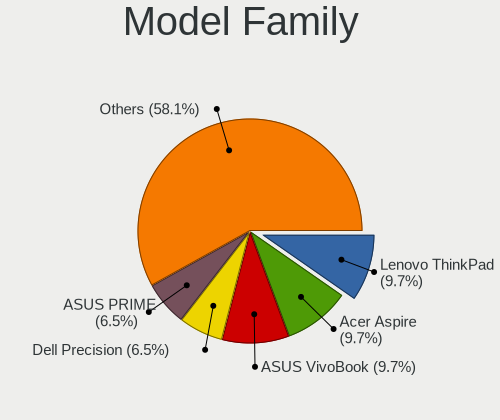
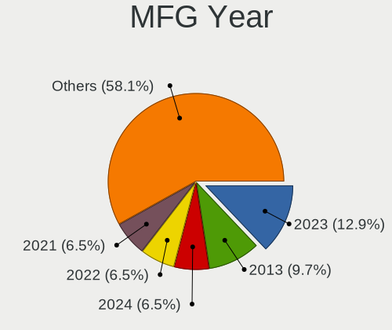
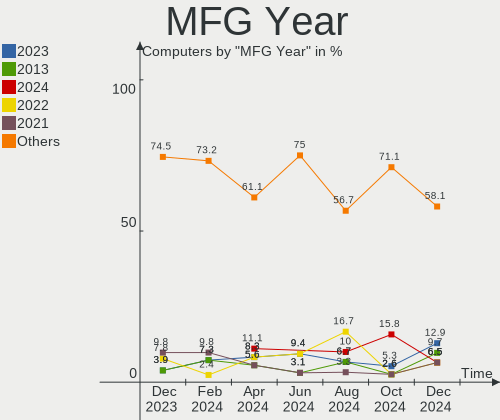
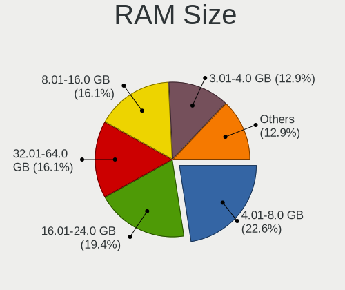
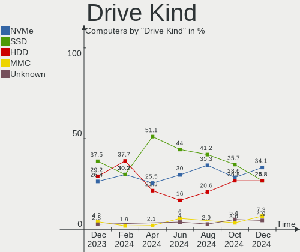
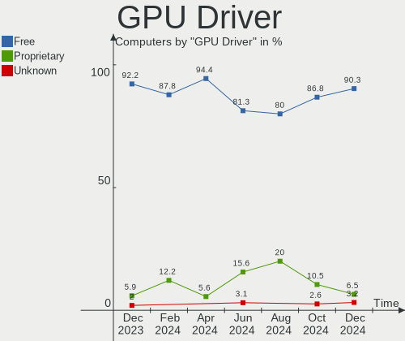
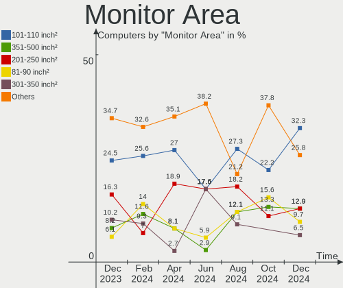
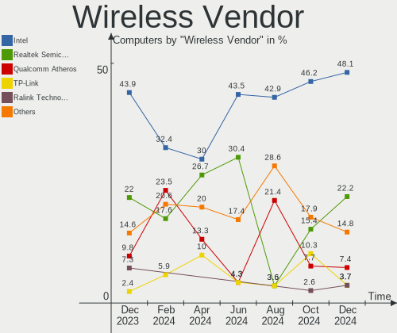
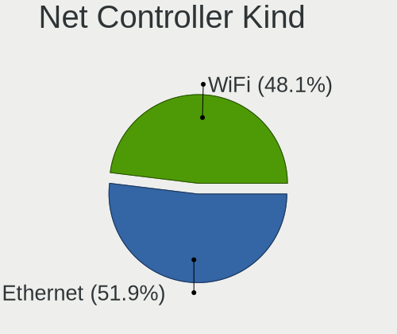

LMDE - Hardware Trends
----------------------

A project to identify most popular hardware characteristics and track their change
over time based on data collected by Linux users at https://Linux-Hardware.org.

Anyone can contribute to this report by the [hw-probe](https://github.com/linuxhw/hw-probe) tool:

    sudo -E hw-probe -all -upload

This is a report for all computer types. See also reports for [desktops](/Dist/LMDE/Desktop/README.md) and [notebooks](/Dist/LMDE/Notebook/README.md).

This report is for one last month. Overall report since the beginning of time: [TestCoverage](https://github.com/linuxhw/TestCoverage)

Period: Nov, 2022.

Contents
--------

* [ System ](#system)
  - [ OS                       ](#os)
  - [ OS Family                ](#os-family)
  - [ Kernel                   ](#kernel)
  - [ Kernel Family            ](#kernel-family)
  - [ Kernel Major Ver.        ](#kernel-major-ver)
  - [ Arch                     ](#arch)
  - [ DE                       ](#de)
  - [ Display Server           ](#display-server)
  - [ Display Manager          ](#display-manager)
  - [ OS Lang                  ](#os-lang)
  - [ Boot Mode                ](#boot-mode)
  - [ Filesystem               ](#filesystem)
  - [ Part. scheme             ](#part-scheme)
  - [ Dual Boot with Linux/BSD ](#dual-boot-with-linuxbsd)
  - [ Dual Boot (Win)          ](#dual-boot-win)

* [ Board ](#board)
  - [ Vendor                   ](#vendor)
  - [ Model                    ](#model)
  - [ Model Family             ](#model-family)
  - [ MFG Year                 ](#mfg-year)
  - [ Form Factor              ](#form-factor)
  - [ Secure Boot              ](#secure-boot)
  - [ Coreboot                 ](#coreboot)
  - [ RAM Size                 ](#ram-size)
  - [ RAM Used                 ](#ram-used)
  - [ Total Drives             ](#total-drives)
  - [ Has CD-ROM               ](#has-cd-rom)
  - [ Has Ethernet             ](#has-ethernet)
  - [ Has WiFi                 ](#has-wifi)
  - [ Has Bluetooth            ](#has-bluetooth)

* [ Location ](#location)
  - [ Country                  ](#country)
  - [ City                     ](#city)

* [ Drives ](#drives)
  - [ Drive Vendor             ](#drive-vendor)
  - [ Drive Model              ](#drive-model)
  - [ HDD Vendor               ](#hdd-vendor)
  - [ SSD Vendor               ](#ssd-vendor)
  - [ Drive Kind               ](#drive-kind)
  - [ Drive Connector          ](#drive-connector)
  - [ Drive Size               ](#drive-size)
  - [ Space Total              ](#space-total)
  - [ Space Used               ](#space-used)
  - [ Malfunc. Drives          ](#malfunc-drives)
  - [ Malfunc. Drive Vendor    ](#malfunc-drive-vendor)
  - [ Malfunc. HDD Vendor      ](#malfunc-hdd-vendor)
  - [ Malfunc. Drive Kind      ](#malfunc-drive-kind)
  - [ Failed Drives            ](#failed-drives)
  - [ Failed Drive Vendor      ](#failed-drive-vendor)
  - [ Drive Status             ](#drive-status)

* [ Storage controller ](#storage-controller)
  - [ Storage Vendor           ](#storage-vendor)
  - [ Storage Model            ](#storage-model)
  - [ Storage Kind             ](#storage-kind)

* [ Processor ](#processor)
  - [ CPU Vendor               ](#cpu-vendor)
  - [ CPU Model                ](#cpu-model)
  - [ CPU Model Family         ](#cpu-model-family)
  - [ CPU Cores                ](#cpu-cores)
  - [ CPU Sockets              ](#cpu-sockets)
  - [ CPU Threads              ](#cpu-threads)
  - [ CPU Op-Modes             ](#cpu-op-modes)
  - [ CPU Microcode            ](#cpu-microcode)
  - [ CPU Microarch            ](#cpu-microarch)

* [ Graphics ](#graphics)
  - [ GPU Vendor               ](#gpu-vendor)
  - [ GPU Model                ](#gpu-model)
  - [ GPU Combo                ](#gpu-combo)
  - [ GPU Driver               ](#gpu-driver)
  - [ GPU Memory               ](#gpu-memory)

* [ Monitor ](#monitor)
  - [ Monitor Vendor           ](#monitor-vendor)
  - [ Monitor Model            ](#monitor-model)
  - [ Monitor Resolution       ](#monitor-resolution)
  - [ Monitor Diagonal         ](#monitor-diagonal)
  - [ Monitor Width            ](#monitor-width)
  - [ Aspect Ratio             ](#aspect-ratio)
  - [ Monitor Area             ](#monitor-area)
  - [ Pixel Density            ](#pixel-density)
  - [ Multiple Monitors        ](#multiple-monitors)

* [ Network ](#network)
  - [ Net Controller Vendor    ](#net-controller-vendor)
  - [ Net Controller Model     ](#net-controller-model)
  - [ Wireless Vendor          ](#wireless-vendor)
  - [ Wireless Model           ](#wireless-model)
  - [ Ethernet Vendor          ](#ethernet-vendor)
  - [ Ethernet Model           ](#ethernet-model)
  - [ Net Controller Kind      ](#net-controller-kind)
  - [ Used Controller          ](#used-controller)
  - [ NICs                     ](#nics)
  - [ IPv6                     ](#ipv6)

* [ Bluetooth ](#bluetooth)
  - [ Bluetooth Vendor         ](#bluetooth-vendor)
  - [ Bluetooth Model          ](#bluetooth-model)

* [ Sound ](#sound)
  - [ Sound Vendor             ](#sound-vendor)
  - [ Sound Model              ](#sound-model)

* [ Memory ](#memory)
  - [ Memory Vendor            ](#memory-vendor)
  - [ Memory Model             ](#memory-model)
  - [ Memory Kind              ](#memory-kind)
  - [ Memory Form Factor       ](#memory-form-factor)
  - [ Memory Size              ](#memory-size)
  - [ Memory Speed             ](#memory-speed)

* [ Printers & scanners ](#printers--scanners)
  - [ Printer Vendor           ](#printer-vendor)
  - [ Printer Model            ](#printer-model)
  - [ Scanner Vendor           ](#scanner-vendor)
  - [ Scanner Model            ](#scanner-model)

* [ Camera ](#camera)
  - [ Camera Vendor            ](#camera-vendor)
  - [ Camera Model             ](#camera-model)

* [ Security ](#security)
  - [ Fingerprint Vendor       ](#fingerprint-vendor)
  - [ Fingerprint Model        ](#fingerprint-model)
  - [ Chipcard Vendor          ](#chipcard-vendor)
  - [ Chipcard Model           ](#chipcard-model)

* [ Unsupported ](#unsupported)
  - [ Unsupported Devices      ](#unsupported-devices)
  - [ Unsupported Device Types ](#unsupported-device-types)

System
------

OS
--

Installed operating systems

| Name   | Computers | Percent |
|--------|-----------|---------|
| LMDE 5 | 28        | 96.55%  |
| LMDE 4 | 1         | 3.45%   |

OS Family
---------

OS without a version

| Name | Computers | Percent |
|------|-----------|---------|
| LMDE | 29        | 100%    |

Kernel
------

Version of the Linux kernel

| Version                | Computers | Percent |
|------------------------|-----------|---------|
| 5.10.0-19-amd64        | 17        | 58.62%  |
| 5.10.0-12-amd64        | 3         | 10.34%  |
| 5.19.0-0.deb11.2-amd64 | 2         | 6.9%    |
| 5.10.0-18-amd64        | 2         | 6.9%    |
| 5.15.78-xanmod1        | 1         | 3.45%   |
| 5.10.0-19-686          | 1         | 3.45%   |
| 5.10.0-16-amd64        | 1         | 3.45%   |
| 5.10.0-15-amd64        | 1         | 3.45%   |
| 4.19.0-21-686          | 1         | 3.45%   |

Kernel Family
-------------

Linux kernel without a distro release

| Version | Computers | Percent |
|---------|-----------|---------|
| 5.10.0  | 25        | 86.21%  |
| 5.19.0  | 2         | 6.9%    |
| 5.15.78 | 1         | 3.45%   |
| 4.19.0  | 1         | 3.45%   |

Kernel Major Ver.
-----------------

Linux kernel major version

| Version | Computers | Percent |
|---------|-----------|---------|
| 5.10    | 25        | 86.21%  |
| 5.19    | 2         | 6.9%    |
| 5.15    | 1         | 3.45%   |
| 4.19    | 1         | 3.45%   |

Arch
----

OS architecture (x86_64, i586, etc.)

| Name   | Computers | Percent |
|--------|-----------|---------|
| x86_64 | 27        | 93.1%   |
| i686   | 2         | 6.9%    |

DE
--

Desktop Environment

| Name       | Computers | Percent |
|------------|-----------|---------|
| X-Cinnamon | 25        | 86.21%  |
| Cinnamon   | 3         | 10.34%  |
| KDE5       | 1         | 3.45%   |

Display Server
--------------

X11 or Wayland

| Name | Computers | Percent |
|------|-----------|---------|
| X11  | 29        | 100%    |

Display Manager
---------------

SDDM, LightDM, etc.

| Name    | Computers | Percent |
|---------|-----------|---------|
| Unknown | 15        | 51.72%  |
| LightDM | 13        | 44.83%  |
| SDDM    | 1         | 3.45%   |

OS Lang
-------

Language

| Lang  | Computers | Percent |
|-------|-----------|---------|
| en_US | 8         | 27.59%  |
| de_DE | 7         | 24.14%  |
| fr_FR | 3         | 10.34%  |
| pt_BR | 2         | 6.9%    |
| en_GB | 2         | 6.9%    |
| pl_PL | 1         | 3.45%   |
| it_IT | 1         | 3.45%   |
| es_VE | 1         | 3.45%   |
| es_ES | 1         | 3.45%   |
| en_CA | 1         | 3.45%   |
| en_AU | 1         | 3.45%   |
| cs_CZ | 1         | 3.45%   |

Boot Mode
---------

EFI or BIOS

| Mode | Computers | Percent |
|------|-----------|---------|
| EFI  | 16        | 55.17%  |
| BIOS | 13        | 44.83%  |

Filesystem
----------

Type of filesystem

| Type | Computers | Percent |
|------|-----------|---------|
| Ext4 | 29        | 100%    |

Part. scheme
------------

Scheme of partitioning

| Type    | Computers | Percent |
|---------|-----------|---------|
| Unknown | 15        | 51.72%  |
| GPT     | 8         | 27.59%  |
| MBR     | 6         | 20.69%  |

Dual Boot with Linux/BSD
------------------------

Hosting more than one Linux/BSD

| Dual boot | Computers | Percent |
|-----------|-----------|---------|
| No        | 27        | 93.1%   |
| Yes       | 2         | 6.9%    |

Dual Boot (Win)
---------------

Hosting Linux and Windows

| Dual boot | Computers | Percent |
|-----------|-----------|---------|
| No        | 26        | 89.66%  |
| Yes       | 3         | 10.34%  |

Board
-----

Vendor
------

Motherboard manufacturer

| Name                | Computers | Percent |
|---------------------|-----------|---------|
| Hewlett-Packard     | 9         | 31.03%  |
| Lenovo              | 5         | 17.24%  |
| Dell                | 3         | 10.34%  |
| MSI                 | 2         | 6.9%    |
| Gigabyte Technology | 2         | 6.9%    |
| ASUSTek Computer    | 2         | 6.9%    |
| Acer                | 2         | 6.9%    |
| Toshiba             | 1         | 3.45%   |
| Sony                | 1         | 3.45%   |
| Kruger&Matz         | 1         | 3.45%   |
| Apple               | 1         | 3.45%   |

Model
-----

Motherboard model

| Name                                 | Computers | Percent |
|--------------------------------------|-----------|---------|
| Toshiba Satellite L855D              | 1         | 3.45%   |
| Sony SVF1532W4E                      | 1         | 3.45%   |
| MSI MS-7D54                          | 1         | 3.45%   |
| MSI MS-7C52                          | 1         | 3.45%   |
| Lenovo V145-15AST 81MT               | 1         | 3.45%   |
| Lenovo ThinkPad W510 43192PU         | 1         | 3.45%   |
| Lenovo ThinkBook 15 G2 ITL 20VE      | 1         | 3.45%   |
| Lenovo G580 20150                    | 1         | 3.45%   |
| Lenovo G500 20236                    | 1         | 3.45%   |
| Kruger&Matz KM1406                   | 1         | 3.45%   |
| HP Victus by Gaming Laptop 15-fb0xxx | 1         | 3.45%   |
| HP ProBook 650 G4                    | 1         | 3.45%   |
| HP Mini 110-1100                     | 1         | 3.45%   |
| HP Laptop 15-dw3xxx                  | 1         | 3.45%   |
| HP Laptop 14-cf3xxx                  | 1         | 3.45%   |
| HP EliteDesk 800 G3 SFF              | 1         | 3.45%   |
| HP EliteBook 850 G8 Notebook PC      | 1         | 3.45%   |
| HP EliteBook 820 G3                  | 1         | 3.45%   |
| Gigabyte GA-78LMT-USB3               | 1         | 3.45%   |
| Gigabyte B450 I AORUS PRO WIFI       | 1         | 3.45%   |
| Dell OptiPlex 780                    | 1         | 3.45%   |
| Dell Inspiron 545                    | 1         | 3.45%   |
| Dell G15 5510                        | 1         | 3.45%   |
| ASUS M5A78L-M PLUS/USB3              | 1         | 3.45%   |
| ASUS K54LY                           | 1         | 3.45%   |
| Apple iMac9,1                        | 1         | 3.45%   |
| Acer Aspire E1-570G                  | 1         | 3.45%   |
| Acer Aspire 3000                     | 1         | 3.45%   |
| Unknown                              | 1         | 3.45%   |

Model Family
------------

Motherboard model prefix

| Name                   | Computers | Percent |
|------------------------|-----------|---------|
| HP Laptop              | 2         | 6.9%    |
| HP EliteBook           | 2         | 6.9%    |
| Acer Aspire            | 2         | 6.9%    |
| Toshiba Satellite      | 1         | 3.45%   |
| Sony SVF1532W4E        | 1         | 3.45%   |
| MSI MS-7D54            | 1         | 3.45%   |
| MSI MS-7C52            | 1         | 3.45%   |
| Lenovo V145-15AST      | 1         | 3.45%   |
| Lenovo ThinkPad        | 1         | 3.45%   |
| Lenovo ThinkBook       | 1         | 3.45%   |
| Lenovo G580            | 1         | 3.45%   |
| Lenovo G500            | 1         | 3.45%   |
| Kruger&Matz KM1406     | 1         | 3.45%   |
| HP Victus              | 1         | 3.45%   |
| HP ProBook             | 1         | 3.45%   |
| HP Mini                | 1         | 3.45%   |
| HP EliteDesk           | 1         | 3.45%   |
| Gigabyte GA-78LMT-USB3 | 1         | 3.45%   |
| Gigabyte B450          | 1         | 3.45%   |
| Dell OptiPlex          | 1         | 3.45%   |
| Dell Inspiron          | 1         | 3.45%   |
| Dell G15               | 1         | 3.45%   |
| ASUS M5A78L-M          | 1         | 3.45%   |
| ASUS K54LY             | 1         | 3.45%   |
| Apple iMac9            | 1         | 3.45%   |
| Unknown                | 1         | 3.45%   |

MFG Year
--------

Motherboard manufacture year

| Year | Computers | Percent |
|------|-----------|---------|
| 2020 | 4         | 13.79%  |
| 2021 | 3         | 10.34%  |
| 2018 | 3         | 10.34%  |
| 2012 | 3         | 10.34%  |
| 2009 | 3         | 10.34%  |
| 2016 | 2         | 6.9%    |
| 2013 | 2         | 6.9%    |
| 2010 | 2         | 6.9%    |
| 2022 | 1         | 3.45%   |
| 2019 | 1         | 3.45%   |
| 2017 | 1         | 3.45%   |
| 2015 | 1         | 3.45%   |
| 2011 | 1         | 3.45%   |
| 2007 | 1         | 3.45%   |
| 2005 | 1         | 3.45%   |

Form Factor
-----------

Physical design of the computer

| Name       | Computers | Percent |
|------------|-----------|---------|
| Notebook   | 20        | 68.97%  |
| Desktop    | 8         | 27.59%  |
| All in one | 1         | 3.45%   |

Secure Boot
-----------

Enabled or disabled

| State    | Computers | Percent |
|----------|-----------|---------|
| Disabled | 28        | 96.55%  |
| Enabled  | 1         | 3.45%   |

Coreboot
--------

Have coreboot on board

| Used | Computers | Percent |
|------|-----------|---------|
| No   | 29        | 100%    |

RAM Size
--------

Total RAM memory

| Size in GB  | Computers | Percent |
|-------------|-----------|---------|
| 4.01-8.0    | 9         | 31.03%  |
| 8.01-16.0   | 6         | 20.69%  |
| 16.01-24.0  | 5         | 17.24%  |
| 32.01-64.0  | 3         | 10.34%  |
| 3.01-4.0    | 2         | 6.9%    |
| 1.01-2.0    | 2         | 6.9%    |
| 2.01-3.0    | 1         | 3.45%   |
| 64.01-256.0 | 1         | 3.45%   |

RAM Used
--------

Used RAM memory

| Used GB  | Computers | Percent |
|----------|-----------|---------|
| 1.01-2.0 | 13        | 44.83%  |
| 2.01-3.0 | 7         | 24.14%  |
| 3.01-4.0 | 5         | 17.24%  |
| 4.01-8.0 | 3         | 10.34%  |
| 0.51-1.0 | 1         | 3.45%   |

Total Drives
------------

Number of drives on board

| Drives | Computers | Percent |
|--------|-----------|---------|
| 1      | 19        | 65.52%  |
| 2      | 7         | 24.14%  |
| 3      | 2         | 6.9%    |
| 5      | 1         | 3.45%   |

Has CD-ROM
----------

Has CD-ROM on board

| Presented | Computers | Percent |
|-----------|-----------|---------|
| Yes       | 16        | 55.17%  |
| No        | 13        | 44.83%  |

Has Ethernet
------------

Has Ethernet on board

| Presented | Computers | Percent |
|-----------|-----------|---------|
| Yes       | 27        | 93.1%   |
| No        | 2         | 6.9%    |

Has WiFi
--------

Has WiFi module

| Presented | Computers | Percent |
|-----------|-----------|---------|
| Yes       | 23        | 79.31%  |
| No        | 6         | 20.69%  |

Has Bluetooth
-------------

Has Bluetooth module

| Presented | Computers | Percent |
|-----------|-----------|---------|
| Yes       | 19        | 65.52%  |
| No        | 10        | 34.48%  |

Location
--------

Country
-------

Geographic location (country)

| Country   | Computers | Percent |
|-----------|-----------|---------|
| Germany   | 8         | 27.59%  |
| USA       | 6         | 20.69%  |
| France    | 4         | 13.79%  |
| Italy     | 2         | 6.9%    |
| Brazil    | 2         | 6.9%    |
| Venezuela | 1         | 3.45%   |
| Portugal  | 1         | 3.45%   |
| Poland    | 1         | 3.45%   |
| Ecuador   | 1         | 3.45%   |
| Czechia   | 1         | 3.45%   |
| Belarus   | 1         | 3.45%   |
| Australia | 1         | 3.45%   |

City
----

Geographic location (city)

| City                 | Computers | Percent |
|----------------------|-----------|---------|
| Bend                 | 2         | 6.9%    |
| Weimar               | 1         | 3.45%   |
| Washington           | 1         | 3.45%   |
| Villeneuve-d'Ascq    | 1         | 3.45%   |
| Toulon               | 1         | 3.45%   |
| Sydney               | 1         | 3.45%   |
| Stockelsdorf         | 1         | 3.45%   |
| Shrewsbury           | 1         | 3.45%   |
| Rome                 | 1         | 3.45%   |
| Prague               | 1         | 3.45%   |
| Palermo              | 1         | 3.45%   |
| Mogilev              | 1         | 3.45%   |
| Lubin                | 1         | 3.45%   |
| Le Rheu              | 1         | 3.45%   |
| Krakow               | 1         | 3.45%   |
| Guayaquil            | 1         | 3.45%   |
| Ganges               | 1         | 3.45%   |
| Freigericht          | 1         | 3.45%   |
| Freiburg im Breisgau | 1         | 3.45%   |
| Fortaleza            | 1         | 3.45%   |
| Duque de Caxias      | 1         | 3.45%   |
| Duisburg             | 1         | 3.45%   |
| Delaware             | 1         | 3.45%   |
| Caracas              | 1         | 3.45%   |
| Buffalo              | 1         | 3.45%   |
| Bitburg              | 1         | 3.45%   |
| Berlin               | 1         | 3.45%   |
| Alverca do Ribatejo  | 1         | 3.45%   |

Drives
------

Drive Vendor
------------

Hard drive vendors

| Vendor              | Computers | Drives | Percent |
|---------------------|-----------|--------|---------|
| Seagate             | 7         | 8      | 17.07%  |
| WDC                 | 6         | 6      | 14.63%  |
| SanDisk             | 5         | 5      | 12.2%   |
| Samsung Electronics | 4         | 5      | 9.76%   |
| Kingston            | 4         | 5      | 9.76%   |
| SK hynix            | 3         | 3      | 7.32%   |
| Crucial             | 3         | 3      | 7.32%   |
| Unknown             | 1         | 1      | 2.44%   |
| Micron Technology   | 1         | 1      | 2.44%   |
| KIOXIA              | 1         | 1      | 2.44%   |
| KingSpec            | 1         | 1      | 2.44%   |
| Hitachi             | 1         | 1      | 2.44%   |
| Gigabyte Technology | 1         | 1      | 2.44%   |
| China               | 1         | 1      | 2.44%   |
| A-DATA Technology   | 1         | 1      | 2.44%   |
| Unknown             | 1         | 1      | 2.44%   |

Drive Model
-----------

Hard drive models

| Model                                        | Computers | Percent |
|----------------------------------------------|-----------|---------|
| Kingston SA400S37480G 480GB SSD              | 2         | 4.65%   |
| WDC WD6400AAKS-40H2B0 640GB                  | 1         | 2.33%   |
| WDC WD5000LPSX-08A6W 500GB                   | 1         | 2.33%   |
| WDC WD5000AAJS-00TKA0 500GB                  | 1         | 2.33%   |
| WDC WD1600BEVT-60ZCT1 160GB                  | 1         | 2.33%   |
| WDC WD10EZRX-00DC0B0 1TB                     | 1         | 2.33%   |
| WDC WD10EALX-009BA0 1TB                      | 1         | 2.33%   |
| Unknown MMC Card  64GB                       | 1         | 2.33%   |
| SK hynix PC711 HFS512GDE9X073N 512GB         | 1         | 2.33%   |
| SK hynix BC511 HFM256GDJTNI-82A0A 256GB      | 1         | 2.33%   |
| SK hynix BC501 NVMe Solid State Drive 512GB  | 1         | 2.33%   |
| Seagate ST9320320AS 320GB                    | 1         | 2.33%   |
| Seagate ST3250318AS 250GB                    | 1         | 2.33%   |
| Seagate ST2000DX001-1CM164 2TB               | 1         | 2.33%   |
| Seagate ST1000LM035-1RK172 1TB               | 1         | 2.33%   |
| Seagate ST1000DL002-9TT153 1TB               | 1         | 2.33%   |
| Seagate Portable 5TB                         | 1         | 2.33%   |
| Seagate Expansion SW 2TB                     | 1         | 2.33%   |
| Seagate Expansion Desk 8TB                   | 1         | 2.33%   |
| Sandisk WDC PC SN530 SDBPMPZ-256G-1101 256GB | 1         | 2.33%   |
| Sandisk WD Blue SN550 NVMe SSD 1TB           | 1         | 2.33%   |
| SanDisk SSD PLUS 1000GB                      | 1         | 2.33%   |
| SanDisk SDSSDA960G 960GB                     | 1         | 2.33%   |
| SanDisk NVMe SSD Drive 500GB                 | 1         | 2.33%   |
| Samsung SSD 980 1TB                          | 1         | 2.33%   |
| Samsung SSD 970 EVO 500GB                    | 1         | 2.33%   |
| Samsung SSD 860 QVO 1TB                      | 1         | 2.33%   |
| Samsung SSD 850 EVO 500GB                    | 1         | 2.33%   |
| Samsung HD502HI 500GB                        | 1         | 2.33%   |
| Micron MTFDHBA1T0TDV-1AZ1AABHA 1TB           | 1         | 2.33%   |
| KIOXIA KBG40ZNS512G NVMe 512GB               | 1         | 2.33%   |
| Kingston SFYRS1000G 1TB                      | 1         | 2.33%   |
| Kingston SA400S37120G 120GB SSD              | 1         | 2.33%   |
| KingSpec KSD-PA25.6-064MS 64GB               | 1         | 2.33%   |
| Hitachi HTS725032A9A364 320GB                | 1         | 2.33%   |
| Gigabyte GP-GSTFS31120GNTD 120GB SSD         | 1         | 2.33%   |
| Crucial CT500MX500SSD1 500GB                 | 1         | 2.33%   |
| Crucial CT1000MX500SSD4 1TB                  | 1         | 2.33%   |
| Crucial CT1000BX500SSD1 1TB                  | 1         | 2.33%   |
| China SATA3 120GB SSD                        | 1         | 2.33%   |

HDD Vendor
----------

Hard disk drive vendors

| Vendor              | Computers | Drives | Percent |
|---------------------|-----------|--------|---------|
| Seagate             | 7         | 7      | 46.67%  |
| WDC                 | 6         | 6      | 40%     |
| Samsung Electronics | 1         | 1      | 6.67%   |
| Hitachi             | 1         | 1      | 6.67%   |

SSD Vendor
----------

Solid state drive vendors

| Vendor              | Computers | Drives | Percent |
|---------------------|-----------|--------|---------|
| Kingston            | 3         | 4      | 21.43%  |
| Crucial             | 3         | 3      | 21.43%  |
| SanDisk             | 2         | 2      | 14.29%  |
| Samsung Electronics | 2         | 2      | 14.29%  |
| Gigabyte Technology | 1         | 1      | 7.14%   |
| China               | 1         | 1      | 7.14%   |
| A-DATA Technology   | 1         | 1      | 7.14%   |
| Unknown             | 1         | 1      | 7.14%   |

Drive Kind
----------

HDD or SSD

| Kind    | Computers | Drives | Percent |
|---------|-----------|--------|---------|
| SSD     | 13        | 15     | 33.33%  |
| HDD     | 12        | 15     | 30.77%  |
| NVMe    | 11        | 11     | 28.21%  |
| Unknown | 2         | 2      | 5.13%   |
| MMC     | 1         | 1      | 2.56%   |

Drive Connector
---------------

SATA, SAS, NVMe, etc.

| Type | Computers | Drives | Percent |
|------|-----------|--------|---------|
| SATA | 21        | 29     | 60%     |
| NVMe | 11        | 11     | 31.43%  |
| SAS  | 2         | 3      | 5.71%   |
| MMC  | 1         | 1      | 2.86%   |

Drive Size
----------

Size of hard drive

| Size in TB | Computers | Drives | Percent |
|------------|-----------|--------|---------|
| 0.01-0.5   | 14        | 16     | 58.33%  |
| 0.51-1.0   | 7         | 10     | 29.17%  |
| 1.01-2.0   | 2         | 3      | 8.33%   |
| 4.01-10.0  | 1         | 1      | 4.17%   |

Space Total
-----------

Amount of disk space available on the file system

| Size in GB     | Computers | Percent |
|----------------|-----------|---------|
| 101-250        | 9         | 31.03%  |
| 251-500        | 7         | 24.14%  |
| 501-1000       | 5         | 17.24%  |
| 1001-2000      | 3         | 10.34%  |
| More than 3000 | 2         | 6.9%    |
| 51-100         | 2         | 6.9%    |
| 2001-3000      | 1         | 3.45%   |

Space Used
----------

Amount of used disk space

| Used GB        | Computers | Percent |
|----------------|-----------|---------|
| 1-20           | 9         | 31.03%  |
| 21-50          | 6         | 20.69%  |
| 101-250        | 4         | 13.79%  |
| 501-1000       | 3         | 10.34%  |
| 51-100         | 3         | 10.34%  |
| 1001-2000      | 2         | 6.9%    |
| More than 3000 | 1         | 3.45%   |
| 251-500        | 1         | 3.45%   |

Malfunc. Drives
---------------

Drive models with a malfunction

| Model                                 | Computers | Drives | Percent |
|---------------------------------------|-----------|--------|---------|
| SK hynix PC711 HFS512GDE9X073N 512GB  | 1         | 1      | 33.33%  |
| Seagate ST2000DX001-1CM164 2TB        | 1         | 1      | 33.33%  |
| Samsung Electronics SSD 850 EVO 500GB | 1         | 1      | 33.33%  |

Malfunc. Drive Vendor
---------------------

Vendors of faulty drives

| Vendor              | Computers | Drives | Percent |
|---------------------|-----------|--------|---------|
| SK hynix            | 1         | 1      | 33.33%  |
| Seagate             | 1         | 1      | 33.33%  |
| Samsung Electronics | 1         | 1      | 33.33%  |

Malfunc. HDD Vendor
-------------------

Vendors of faulty HDD drives

| Vendor  | Computers | Drives | Percent |
|---------|-----------|--------|---------|
| Seagate | 1         | 1      | 100%    |

Malfunc. Drive Kind
-------------------

Kinds of faulty drives

| Kind | Computers | Drives | Percent |
|------|-----------|--------|---------|
| NVMe | 1         | 1      | 33.33%  |
| SSD  | 1         | 1      | 33.33%  |
| HDD  | 1         | 1      | 33.33%  |

Failed Drives
-------------

Failed drive models

Zero info for selected period =(

Failed Drive Vendor
-------------------

Failed drive vendors

Zero info for selected period =(

Drive Status
------------

Number of failed and malfunc. drives

| Status   | Computers | Drives | Percent |
|----------|-----------|--------|---------|
| Detected | 17        | 23     | 53.13%  |
| Works    | 12        | 18     | 37.5%   |
| Malfunc  | 3         | 3      | 9.38%   |

Storage controller
------------------

Storage Vendor
--------------

Storage controller vendors

| Vendor                           | Computers | Percent |
|----------------------------------|-----------|---------|
| Intel                            | 18        | 47.37%  |
| AMD                              | 7         | 18.42%  |
| SK hynix                         | 3         | 7.89%   |
| SanDisk                          | 3         | 7.89%   |
| Samsung Electronics              | 2         | 5.26%   |
| Silicon Integrated Systems [SiS] | 1         | 2.63%   |
| Nvidia                           | 1         | 2.63%   |
| Micron Technology                | 1         | 2.63%   |
| KIOXIA                           | 1         | 2.63%   |
| Kingston Technology Company      | 1         | 2.63%   |

Storage Model
-------------

Storage controller models

| Model                                                                        | Computers | Percent |
|------------------------------------------------------------------------------|-----------|---------|
| AMD FCH SATA Controller [AHCI mode]                                          | 4         | 8.7%    |
| Intel Volume Management Device NVMe RAID Controller                          | 3         | 6.52%   |
| SanDisk Non-Volatile memory controller                                       | 2         | 4.35%   |
| Intel Tiger Lake-LP SATA Controller                                          | 2         | 4.35%   |
| Intel Sunrise Point-LP SATA Controller [AHCI mode]                           | 2         | 4.35%   |
| Intel 82801GBM/GHM (ICH7-M Family) SATA Controller [AHCI mode]               | 2         | 4.35%   |
| Intel 7 Series Chipset Family 6-port SATA Controller [AHCI mode]             | 2         | 4.35%   |
| AMD SB7x0/SB8x0/SB9x0 SATA Controller [IDE mode]                             | 2         | 4.35%   |
| AMD SB7x0/SB8x0/SB9x0 IDE Controller                                         | 2         | 4.35%   |
| SK hynix Gold P31/PC711 NVMe Solid State Drive                               | 1         | 2.17%   |
| SK hynix BC511                                                               | 1         | 2.17%   |
| SK hynix BC501 NVMe Solid State Drive                                        | 1         | 2.17%   |
| Silicon Integrated Systems [SiS] 5513 IDE Controller                         | 1         | 2.17%   |
| SanDisk WD Blue SN550 NVMe SSD                                               | 1         | 2.17%   |
| Samsung NVMe SSD Controller SM981/PM981/PM983                                | 1         | 2.17%   |
| Samsung NVMe SSD Controller 980                                              | 1         | 2.17%   |
| Nvidia MCP79 AHCI Controller                                                 | 1         | 2.17%   |
| Micron Non-Volatile memory controller                                        | 1         | 2.17%   |
| KIOXIA NVMe SSD Controller BG4                                               | 1         | 2.17%   |
| Kingston Company Company Non-Volatile memory controller                      | 1         | 2.17%   |
| Intel SATA Controller [RAID mode]                                            | 1         | 2.17%   |
| Intel Celeron/Pentium Silver Processor SATA Controller                       | 1         | 2.17%   |
| Intel 82801IR/IO/IH (ICH9R/DO/DH) 4 port SATA Controller [IDE mode]          | 1         | 2.17%   |
| Intel 82801I (ICH9 Family) 2 port SATA Controller [IDE mode]                 | 1         | 2.17%   |
| Intel 82801G (ICH7 Family) IDE Controller                                    | 1         | 2.17%   |
| Intel 82801 Mobile SATA Controller [RAID mode]                               | 1         | 2.17%   |
| Intel 8 Series SATA Controller 1 [AHCI mode]                                 | 1         | 2.17%   |
| Intel 7 Series Chipset Family 4-port SATA Controller [IDE mode]              | 1         | 2.17%   |
| Intel 7 Series Chipset Family 2-port SATA Controller [IDE mode]              | 1         | 2.17%   |
| Intel 6 Series/C200 Series Chipset Family 6 port Mobile SATA AHCI Controller | 1         | 2.17%   |
| Intel 5 Series/3400 Series Chipset 6 port SATA AHCI Controller               | 1         | 2.17%   |
| Intel 200 Series PCH SATA controller [AHCI mode]                             | 1         | 2.17%   |
| AMD FCH SATA Controller D                                                    | 1         | 2.17%   |
| AMD 400 Series Chipset SATA Controller                                       | 1         | 2.17%   |

Storage Kind
------------

Kind of storage controller (IDE, SATA, NVMe, SAS, ...)

| Kind | Computers | Percent |
|------|-----------|---------|
| SATA | 21        | 48.84%  |
| NVMe | 11        | 25.58%  |
| IDE  | 6         | 13.95%  |
| RAID | 5         | 11.63%  |

Processor
---------

CPU Vendor
----------

Processor vendors

| Vendor | Computers | Percent |
|--------|-----------|---------|
| Intel  | 20        | 68.97%  |
| AMD    | 9         | 31.03%  |

CPU Model
---------

Processor models

| Model                                        | Computers | Percent |
|----------------------------------------------|-----------|---------|
| Intel 11th Gen Core i5-1135G7 @ 2.40GHz      | 2         | 6.9%    |
| Intel Pentium Gold 7505 @ 2.00GHz            | 1         | 3.45%   |
| Intel Core i7-7700 CPU @ 3.60GHz             | 1         | 3.45%   |
| Intel Core i7-3612QM CPU @ 2.10GHz           | 1         | 3.45%   |
| Intel Core i7 CPU Q 720 @ 1.60GHz            | 1         | 3.45%   |
| Intel Core i5-8250U CPU @ 1.60GHz            | 1         | 3.45%   |
| Intel Core i5-6300U CPU @ 2.40GHz            | 1         | 3.45%   |
| Intel Core i5-3230M CPU @ 2.60GHz            | 1         | 3.45%   |
| Intel Core i5-10500H CPU @ 2.50GHz           | 1         | 3.45%   |
| Intel Core i3-4005U CPU @ 1.70GHz            | 1         | 3.45%   |
| Intel Core i3-3217U CPU @ 1.80GHz            | 1         | 3.45%   |
| Intel Core i3-2310M CPU @ 2.10GHz            | 1         | 3.45%   |
| Intel Core i3-1005G1 CPU @ 1.20GHz           | 1         | 3.45%   |
| Intel Core 2 Quad CPU Q8300 @ 2.50GHz        | 1         | 3.45%   |
| Intel Core 2 Quad CPU Q6700 @ 2.66GHz        | 1         | 3.45%   |
| Intel Core 2 Duo CPU E8135 @ 2.66GHz         | 1         | 3.45%   |
| Intel Core 2 CPU T5500 @ 1.66GHz             | 1         | 3.45%   |
| Intel Celeron N4000 CPU @ 1.10GHz            | 1         | 3.45%   |
| Intel Atom CPU N270 @ 1.60GHz                | 1         | 3.45%   |
| AMD Turion 64 Mobile Technology ML-40        | 1         | 3.45%   |
| AMD Ryzen 9 5950X 16-Core Processor          | 1         | 3.45%   |
| AMD Ryzen 7 3700X 8-Core Processor           | 1         | 3.45%   |
| AMD Ryzen 5 5600H with Radeon Graphics       | 1         | 3.45%   |
| AMD Ryzen 3 3200G with Radeon Vega Graphics  | 1         | 3.45%   |
| AMD Phenom II X6 1055T Processor             | 1         | 3.45%   |
| AMD Phenom II X4 965 Processor               | 1         | 3.45%   |
| AMD A8-4500M APU with Radeon HD Graphics     | 1         | 3.45%   |
| AMD A4-9125 RADEON R3, 4 COMPUTE CORES 2C+2G | 1         | 3.45%   |

CPU Model Family
----------------

Processor model prefix

| Model                | Computers | Percent |
|----------------------|-----------|---------|
| Intel Core i5        | 4         | 13.79%  |
| Intel Core i3        | 4         | 13.79%  |
| Intel Core i7        | 3         | 10.34%  |
| Other                | 2         | 6.9%    |
| Intel Core 2 Quad    | 2         | 6.9%    |
| Intel Pentium Gold   | 1         | 3.45%   |
| Intel Core 2 Duo     | 1         | 3.45%   |
| Intel Core 2         | 1         | 3.45%   |
| Intel Celeron        | 1         | 3.45%   |
| Intel Atom           | 1         | 3.45%   |
| AMD Turion 64 Mobile | 1         | 3.45%   |
| AMD Ryzen 9          | 1         | 3.45%   |
| AMD Ryzen 7          | 1         | 3.45%   |
| AMD Ryzen 5          | 1         | 3.45%   |
| AMD Ryzen 3          | 1         | 3.45%   |
| AMD Phenom II X6     | 1         | 3.45%   |
| AMD Phenom II X4     | 1         | 3.45%   |
| AMD A8               | 1         | 3.45%   |
| AMD A4               | 1         | 3.45%   |

CPU Cores
---------

Number of processor cores

| Number | Computers | Percent |
|--------|-----------|---------|
| 2      | 12        | 41.38%  |
| 4      | 10        | 34.48%  |
| 6      | 3         | 10.34%  |
| 1      | 2         | 6.9%    |
| 16     | 1         | 3.45%   |
| 8      | 1         | 3.45%   |

CPU Sockets
-----------

Number of sockets

| Number | Computers | Percent |
|--------|-----------|---------|
| 1      | 29        | 100%    |

CPU Threads
-----------

Threads per core (Hyper-Threading)

| Number | Computers | Percent |
|--------|-----------|---------|
| 2      | 19        | 65.52%  |
| 1      | 10        | 34.48%  |

CPU Op-Modes
------------

CPU Operation Modes (32-bit, 64-bit)

| Op mode        | Computers | Percent |
|----------------|-----------|---------|
| 32-bit, 64-bit | 28        | 96.55%  |
| 32-bit         | 1         | 3.45%   |

CPU Microcode
-------------

Microcode number

| Number     | Computers | Percent |
|------------|-----------|---------|
| 0x806c1    | 3         | 10.34%  |
| 0x306a9    | 3         | 10.34%  |
| Unknown    | 3         | 10.34%  |
| 0x1067a    | 2         | 6.9%    |
| 0xa0652    | 1         | 3.45%   |
| 0x906e9    | 1         | 3.45%   |
| 0x806ea    | 1         | 3.45%   |
| 0x706a1    | 1         | 3.45%   |
| 0x6fb      | 1         | 3.45%   |
| 0x6f6      | 1         | 3.45%   |
| 0x406e3    | 1         | 3.45%   |
| 0x40651    | 1         | 3.45%   |
| 0x206a7    | 1         | 3.45%   |
| 0x106e5    | 1         | 3.45%   |
| 0x106c2    | 1         | 3.45%   |
| 0x0a50000d | 1         | 3.45%   |
| 0x0a20120a | 1         | 3.45%   |
| 0x08701021 | 1         | 3.45%   |
| 0x08108109 | 1         | 3.45%   |
| 0x06006705 | 1         | 3.45%   |
| 0x06001119 | 1         | 3.45%   |
| 0x010000c8 | 1         | 3.45%   |

CPU Microarch
-------------

Microarchitecture

| Name          | Computers | Percent |
|---------------|-----------|---------|
| TigerLake     | 3         | 10.34%  |
| IvyBridge     | 3         | 10.34%  |
| Zen 3         | 2         | 6.9%    |
| Penryn        | 2         | 6.9%    |
| KabyLake      | 2         | 6.9%    |
| K10           | 2         | 6.9%    |
| Core          | 2         | 6.9%    |
| Zen+          | 1         | 3.45%   |
| Zen 2         | 1         | 3.45%   |
| Skylake       | 1         | 3.45%   |
| SandyBridge   | 1         | 3.45%   |
| Piledriver    | 1         | 3.45%   |
| Nehalem       | 1         | 3.45%   |
| K8 Hammer     | 1         | 3.45%   |
| IceLake       | 1         | 3.45%   |
| Haswell       | 1         | 3.45%   |
| Goldmont plus | 1         | 3.45%   |
| Excavator     | 1         | 3.45%   |
| CometLake     | 1         | 3.45%   |
| Bonnell       | 1         | 3.45%   |

Graphics
--------

GPU Vendor
----------

Vendors of graphics cards

| Vendor                           | Computers | Percent |
|----------------------------------|-----------|---------|
| Intel                            | 15        | 42.86%  |
| Nvidia                           | 11        | 31.43%  |
| AMD                              | 8         | 22.86%  |
| Silicon Integrated Systems [SiS] | 1         | 2.86%   |

GPU Model
---------

Graphics card models

| Model                                                                                      | Computers | Percent |
|--------------------------------------------------------------------------------------------|-----------|---------|
| Intel 3rd Gen Core processor Graphics Controller                                           | 3         | 8.11%   |
| Nvidia TU117M [GeForce GTX 1650 Mobile / Max-Q]                                            | 2         | 5.41%   |
| Nvidia GK208M [GeForce GT 740M]                                                            | 2         | 5.41%   |
| Intel TigerLake-LP GT2 [Iris Xe Graphics]                                                  | 2         | 5.41%   |
| Intel Mobile 945GM/GMS/GME, 943/940GML Express Integrated Graphics Controller              | 2         | 5.41%   |
| Silicon Integrated Systems [SiS] 661/741/760 PCI/AGP or 662/761Gx PCIE VGA Display Adapter | 1         | 2.7%    |
| Nvidia GT216GLM [Quadro FX 880M]                                                           | 1         | 2.7%    |
| Nvidia GP108 [GeForce GT 1030]                                                             | 1         | 2.7%    |
| Nvidia GP107GL [Quadro P620]                                                               | 1         | 2.7%    |
| Nvidia GP106 [GeForce GTX 1060 3GB]                                                        | 1         | 2.7%    |
| Nvidia GF108M [GeForce GT 635M]                                                            | 1         | 2.7%    |
| Nvidia GA102 [GeForce RTX 3080 Ti]                                                         | 1         | 2.7%    |
| Nvidia C79 [GeForce 9400]                                                                  | 1         | 2.7%    |
| Intel UHD Graphics 620                                                                     | 1         | 2.7%    |
| Intel Tiger Lake-LP GT2 [UHD Graphics G4]                                                  | 1         | 2.7%    |
| Intel Skylake GT2 [HD Graphics 520]                                                        | 1         | 2.7%    |
| Intel Mobile 945GSE Express Integrated Graphics Controller                                 | 1         | 2.7%    |
| Intel Mobile 945GM/GMS, 943/940GML Express Integrated Graphics Controller                  | 1         | 2.7%    |
| Intel Iris Plus Graphics G1 (Ice Lake)                                                     | 1         | 2.7%    |
| Intel HD Graphics 630                                                                      | 1         | 2.7%    |
| Intel Haswell-ULT Integrated Graphics Controller                                           | 1         | 2.7%    |
| Intel GeminiLake [UHD Graphics 600]                                                        | 1         | 2.7%    |
| Intel CometLake-H GT2 [UHD Graphics]                                                       | 1         | 2.7%    |
| AMD Trinity [Radeon HD 7640G]                                                              | 1         | 2.7%    |
| AMD Stoney [Radeon R2/R3/R4/R5 Graphics]                                                   | 1         | 2.7%    |
| AMD Seymour [Radeon HD 6400M/7400M Series]                                                 | 1         | 2.7%    |
| AMD RS780L [Radeon 3000]                                                                   | 1         | 2.7%    |
| AMD Picasso/Raven 2 [Radeon Vega Series / Radeon Vega Mobile Series]                       | 1         | 2.7%    |
| AMD Lexa XT [Radeon PRO WX 2100]                                                           | 1         | 2.7%    |
| AMD Curacao PRO [Radeon R7 370 / R9 270/370 OEM]                                           | 1         | 2.7%    |
| AMD Cezanne [Radeon Vega Series / Radeon Vega Mobile Series]                               | 1         | 2.7%    |

GPU Combo
---------

Combinations of graphics cards

| Name           | Computers | Percent |
|----------------|-----------|---------|
| 1 x Intel      | 10        | 34.48%  |
| 1 x Nvidia     | 6         | 20.69%  |
| 1 x AMD        | 6         | 20.69%  |
| Intel + Nvidia | 4         | 13.79%  |
| 1 x SiS        | 1         | 3.45%   |
| Intel + AMD    | 1         | 3.45%   |
| AMD + Nvidia   | 1         | 3.45%   |

GPU Driver
----------

Free vs proprietary

| Driver      | Computers | Percent |
|-------------|-----------|---------|
| Free        | 25        | 86.21%  |
| Proprietary | 3         | 10.34%  |
| Unknown     | 1         | 3.45%   |

GPU Memory
----------

Total video memory

| Size in GB | Computers | Percent |
|------------|-----------|---------|
| Unknown    | 14        | 48.28%  |
| 1.01-2.0   | 6         | 20.69%  |
| 0.51-1.0   | 3         | 10.34%  |
| 0.01-0.5   | 3         | 10.34%  |
| 3.01-4.0   | 1         | 3.45%   |
| 2.01-3.0   | 1         | 3.45%   |
| 8.01-16.0  | 1         | 3.45%   |

Monitor
-------

Monitor Vendor
--------------

Monitor vendors

| Vendor              | Computers | Percent |
|---------------------|-----------|---------|
| Chimei Innolux      | 6         | 20%     |
| LG Display          | 3         | 10%     |
| BOE                 | 3         | 10%     |
| Samsung Electronics | 2         | 6.67%   |
| AU Optronics        | 2         | 6.67%   |
| Acer                | 2         | 6.67%   |
| Vestel Elektronik   | 1         | 3.33%   |
| Philips             | 1         | 3.33%   |
| LG Philips          | 1         | 3.33%   |
| Lenovo              | 1         | 3.33%   |
| Insignia            | 1         | 3.33%   |
| Iiyama              | 1         | 3.33%   |
| Hewlett-Packard     | 1         | 3.33%   |
| HannStar            | 1         | 3.33%   |
| Goldstar            | 1         | 3.33%   |
| Dell                | 1         | 3.33%   |
| Apple               | 1         | 3.33%   |
| AOC                 | 1         | 3.33%   |

Monitor Model
-------------

Monitor models

| Model                                                                  | Computers | Percent |
|------------------------------------------------------------------------|-----------|---------|
| LG Display LCD Monitor LGD033A 1366x768 344x194mm 15.5-inch            | 2         | 6.25%   |
| Vestel Elektronik 55UHD_LCD_TV VES3700 3840x2160 1872x1053mm 84.6-inch | 1         | 3.13%   |
| Samsung Electronics LCD Monitor SEC3150 1366x768 344x193mm 15.5-inch   | 1         | 3.13%   |
| Samsung Electronics LCD Monitor SAM0659 1920x1080                      | 1         | 3.13%   |
| Philips PHL 241B7Q PHL0909 1920x1080 527x296mm 23.8-inch               | 1         | 3.13%   |
| LG Philips LCD Monitor LPL8D00 1280x800 304x190mm 14.1-inch            | 1         | 3.13%   |
| LG Display LCD Monitor LGD0430 1366x768 345x194mm 15.6-inch            | 1         | 3.13%   |
| Lenovo LCD Monitor LEN40B2 1920x1080 344x193mm 15.5-inch               | 1         | 3.13%   |
| Insignia DX19LD150A11 BBY1943 1360x768 409x230mm 18.5-inch             | 1         | 3.13%   |
| Iiyama PLE2207WS IVM5609 1680x1050 474x296mm 22.0-inch                 | 1         | 3.13%   |
| Hewlett-Packard 24y HPN3504 1920x1080 528x297mm 23.9-inch              | 1         | 3.13%   |
| HannStar HSD101PFW2 HSD03E9 1024x600 222x125mm 10.0-inch               | 1         | 3.13%   |
| Goldstar FULL HD GSM5B55 1920x1080 480x270mm 21.7-inch                 | 1         | 3.13%   |
| Dell S2319H DELD0CA 1920x1080 509x286mm 23.0-inch                      | 1         | 3.13%   |
| Chimei Innolux LCD Monitor CMN15E7 1920x1080 344x193mm 15.5-inch       | 1         | 3.13%   |
| Chimei Innolux LCD Monitor CMN15DB 1366x768 344x193mm 15.5-inch        | 1         | 3.13%   |
| Chimei Innolux LCD Monitor CMN15BF 1366x768 344x194mm 15.5-inch        | 1         | 3.13%   |
| Chimei Innolux LCD Monitor CMN153B 1920x1080 344x193mm 15.5-inch       | 1         | 3.13%   |
| Chimei Innolux LCD Monitor CMN1521 1920x1080 344x193mm 15.5-inch       | 1         | 3.13%   |
| Chimei Innolux LCD Monitor CMN1242 1920x1080 276x155mm 12.5-inch       | 1         | 3.13%   |
| BOE LCD Monitor BOE0A8A 1920x1080 344x194mm 15.5-inch                  | 1         | 3.13%   |
| BOE LCD Monitor BOE07B5 1366x768 309x173mm 13.9-inch                   | 1         | 3.13%   |
| BOE LCD Monitor BOE0718 1920x1080 309x173mm 13.9-inch                  | 1         | 3.13%   |
| AU Optronics LCD Monitor AUO63ED 1920x1080 344x193mm 15.5-inch         | 1         | 3.13%   |
| AU Optronics LCD Monitor AUO5699 1920x1080 344x194mm 15.5-inch         | 1         | 3.13%   |
| Apple Color LCD APP9C96 1920x1200 520x320mm 24.0-inch                  | 1         | 3.13%   |
| Apple Cinema Displa y APP921D 1680x1050 433x270mm 20.1-inch            | 1         | 3.13%   |
| AOC Q32G2WG3 AOC3202 2560x1440 700x390mm 31.5-inch                     | 1         | 3.13%   |
| Acer LCD Monitor B243W 1920x1200                                       | 1         | 3.13%   |
| Acer B243W ACR0021 1920x1200 582x375mm 27.3-inch                       | 1         | 3.13%   |
| Acer AL2423W ACR2423 1920x1200 518x324mm 24.1-inch                     | 1         | 3.13%   |

Monitor Resolution
------------------

Monitor screen resolution

| Resolution         | Computers | Percent |
|--------------------|-----------|---------|
| 1920x1080 (FHD)    | 12        | 40%     |
| 1366x768 (WXGA)    | 7         | 23.33%  |
| 1920x1200 (WUXGA)  | 3         | 10%     |
| 3840x2160 (4K)     | 2         | 6.67%   |
| 1680x1050 (WSXGA+) | 2         | 6.67%   |
| 2560x1440 (QHD)    | 1         | 3.33%   |
| 1360x768           | 1         | 3.33%   |
| 1280x800 (WXGA)    | 1         | 3.33%   |
| 1024x600           | 1         | 3.33%   |

Monitor Diagonal
----------------

Diagonal size in inches

| Inches  | Computers | Percent |
|---------|-----------|---------|
| 15      | 13        | 40.63%  |
| 24      | 4         | 12.5%   |
| 13      | 2         | 6.25%   |
| Unknown | 2         | 6.25%   |
| 84      | 1         | 3.13%   |
| 31      | 1         | 3.13%   |
| 27      | 1         | 3.13%   |
| 23      | 1         | 3.13%   |
| 22      | 1         | 3.13%   |
| 21      | 1         | 3.13%   |
| 20      | 1         | 3.13%   |
| 18      | 1         | 3.13%   |
| 14      | 1         | 3.13%   |
| 12      | 1         | 3.13%   |
| 10      | 1         | 3.13%   |

Monitor Width
-------------

Physical width

| Width in mm | Computers | Percent |
|-------------|-----------|---------|
| 301-350     | 16        | 51.61%  |
| 501-600     | 6         | 19.35%  |
| 401-500     | 3         | 9.68%   |
| 201-300     | 2         | 6.45%   |
| Unknown     | 2         | 6.45%   |
| 601-700     | 1         | 3.23%   |
| 1501-2000   | 1         | 3.23%   |

Aspect Ratio
------------

Proportional relationship between the width and the height

| Ratio   | Computers | Percent |
|---------|-----------|---------|
| 16/9    | 22        | 78.57%  |
| 16/10   | 5         | 17.86%  |
| Unknown | 1         | 3.57%   |

Monitor Area
------------

Area in inch

| Area in inch | Computers | Percent |
|----------------|-----------|---------|
| 101-110        | 13        | 40.63%  |
| 201-250        | 5         | 15.63%  |
| 81-90          | 3         | 9.38%   |
| 251-300        | 2         | 6.25%   |
| Unknown        | 2         | 6.25%   |
| More than 1000 | 1         | 3.13%   |
| 61-70          | 1         | 3.13%   |
| 351-500        | 1         | 3.13%   |
| 41-50          | 1         | 3.13%   |
| 301-350        | 1         | 3.13%   |
| 151-200        | 1         | 3.13%   |
| 141-150        | 1         | 3.13%   |

Pixel Density
-------------

Pixels per inch

| Density | Computers | Percent |
|---------|-----------|---------|
| 51-100  | 10        | 33.33%  |
| 101-120 | 9         | 30%     |
| 121-160 | 8         | 26.67%  |
| Unknown | 2         | 6.67%   |
| 161-240 | 1         | 3.33%   |

Multiple Monitors
-----------------

Total monitors connected

| Total | Computers | Percent |
|-------|-----------|---------|
| 1     | 22        | 75.86%  |
| 2     | 6         | 20.69%  |
| 0     | 1         | 3.45%   |

Network
-------

Net Controller Vendor
---------------------

Controller vendors

| Vendor                           | Computers | Percent |
|----------------------------------|-----------|---------|
| Realtek Semiconductor            | 14        | 30.43%  |
| Intel                            | 11        | 23.91%  |
| Qualcomm Atheros                 | 6         | 13.04%  |
| Broadcom                         | 5         | 10.87%  |
| Broadcom Limited                 | 2         | 4.35%   |
| Xiaomi                           | 1         | 2.17%   |
| TP-Link                          | 1         | 2.17%   |
| Silicon Integrated Systems [SiS] | 1         | 2.17%   |
| Qualcomm                         | 1         | 2.17%   |
| Nvidia                           | 1         | 2.17%   |
| MediaTek                         | 1         | 2.17%   |
| Lenovo                           | 1         | 2.17%   |
| Hewlett-Packard                  | 1         | 2.17%   |

Net Controller Model
--------------------

Controller models

| Model                                                                       | Computers | Percent |
|-----------------------------------------------------------------------------|-----------|---------|
| Realtek RTL8111/8168/8411 PCI Express Gigabit Ethernet Controller           | 10        | 17.54%  |
| Realtek RTL8821CE 802.11ac PCIe Wireless Network Adapter                    | 3         | 5.26%   |
| Qualcomm Atheros AR8162 Fast Ethernet                                       | 2         | 3.51%   |
| Intel Wi-Fi 6 AX201                                                         | 2         | 3.51%   |
| Xiaomi MediaTek MT7601U [MI WiFi]                                           | 1         | 1.75%   |
| TP-Link TL-WN821N v5/v6 [RTL8192EU]                                         | 1         | 1.75%   |
| Silicon Integrated Systems [SiS] SiS900 PCI Fast Ethernet                   | 1         | 1.75%   |
| Silicon Integrated Systems [SiS] AC'97 Modem Controller                     | 1         | 1.75%   |
| Realtek RTL8723BU 802.11b/g/n WLAN Adapter                                  | 1         | 1.75%   |
| Realtek RTL8188CE 802.11b/g/n WiFi Adapter                                  | 1         | 1.75%   |
| Realtek RTL8125 2.5GbE Controller                                           | 1         | 1.75%   |
| Realtek RTL810xE PCI Express Fast Ethernet controller                       | 1         | 1.75%   |
| Realtek 802.11n WLAN Adapter                                                | 1         | 1.75%   |
| Qualcomm Atheros QCA9565 / AR9565 Wireless Network Adapter                  | 1         | 1.75%   |
| Qualcomm Atheros QCA8172 Fast Ethernet                                      | 1         | 1.75%   |
| Qualcomm Atheros AR9485 Wireless Network Adapter                            | 1         | 1.75%   |
| Qualcomm Atheros AR9285 Wireless Network Adapter (PCI-Express)              | 1         | 1.75%   |
| Qualcomm Atheros AR8151 v2.0 Gigabit Ethernet                               | 1         | 1.75%   |
| Qualcomm Atheros AR8132 Fast Ethernet                                       | 1         | 1.75%   |
| Qualcomm Android                                                            | 1         | 1.75%   |
| Nvidia MCP79 Ethernet                                                       | 1         | 1.75%   |
| MediaTek MT7922 802.11ax PCI Express Wireless Network Adapter               | 1         | 1.75%   |
| Lenovo ThinkPad Lan                                                         | 1         | 1.75%   |
| Intel Wireless-AC 9260                                                      | 1         | 1.75%   |
| Intel Wireless 8265 / 8275                                                  | 1         | 1.75%   |
| Intel Wireless 8260                                                         | 1         | 1.75%   |
| Intel Wi-Fi 6 AX210/AX211/AX411 160MHz                                      | 1         | 1.75%   |
| Intel PRO/Wireless 3945ABG [Golan] Network Connection                       | 1         | 1.75%   |
| Intel I211 Gigabit Network Connection                                       | 1         | 1.75%   |
| Intel Ethernet Connection I219-LM                                           | 1         | 1.75%   |
| Intel Ethernet Connection (5) I219-LM                                       | 1         | 1.75%   |
| Intel Ethernet Connection (4) I219-V                                        | 1         | 1.75%   |
| Intel Comet Lake PCH CNVi WiFi                                              | 1         | 1.75%   |
| Intel Centrino Ultimate-N 6300                                              | 1         | 1.75%   |
| Intel 82577LM Gigabit Network Connection                                    | 1         | 1.75%   |
| Intel 82567LM-3 Gigabit Network Connection                                  | 1         | 1.75%   |
| HP lt4120 Snapdragon X5 LTE                                                 | 1         | 1.75%   |
| Broadcom NetXtreme BCM57786 Gigabit Ethernet PCIe                           | 1         | 1.75%   |
| Broadcom NetXtreme BCM5753M Gigabit Ethernet PCI Express                    | 1         | 1.75%   |
| Broadcom Limited BCM4318 [AirForce One 54g] 802.11g Wireless LAN Controller | 1         | 1.75%   |

Wireless Vendor
---------------

Wireless vendors

| Vendor                | Computers | Percent |
|-----------------------|-----------|---------|
| Intel                 | 9         | 34.62%  |
| Realtek Semiconductor | 5         | 19.23%  |
| Qualcomm Atheros      | 3         | 11.54%  |
| Broadcom              | 3         | 11.54%  |
| Broadcom Limited      | 2         | 7.69%   |
| Xiaomi                | 1         | 3.85%   |
| TP-Link               | 1         | 3.85%   |
| MediaTek              | 1         | 3.85%   |
| Hewlett-Packard       | 1         | 3.85%   |

Wireless Model
--------------

Wireless models

| Model                                                                       | Computers | Percent |
|-----------------------------------------------------------------------------|-----------|---------|
| Realtek RTL8821CE 802.11ac PCIe Wireless Network Adapter                    | 3         | 11.11%  |
| Intel Wi-Fi 6 AX201                                                         | 2         | 7.41%   |
| Xiaomi MediaTek MT7601U [MI WiFi]                                           | 1         | 3.7%    |
| TP-Link TL-WN821N v5/v6 [RTL8192EU]                                         | 1         | 3.7%    |
| Realtek RTL8723BU 802.11b/g/n WLAN Adapter                                  | 1         | 3.7%    |
| Realtek RTL8188CE 802.11b/g/n WiFi Adapter                                  | 1         | 3.7%    |
| Realtek 802.11n WLAN Adapter                                                | 1         | 3.7%    |
| Qualcomm Atheros QCA9565 / AR9565 Wireless Network Adapter                  | 1         | 3.7%    |
| Qualcomm Atheros AR9485 Wireless Network Adapter                            | 1         | 3.7%    |
| Qualcomm Atheros AR9285 Wireless Network Adapter (PCI-Express)              | 1         | 3.7%    |
| MediaTek MT7922 802.11ax PCI Express Wireless Network Adapter               | 1         | 3.7%    |
| Intel Wireless-AC 9260                                                      | 1         | 3.7%    |
| Intel Wireless 8265 / 8275                                                  | 1         | 3.7%    |
| Intel Wireless 8260                                                         | 1         | 3.7%    |
| Intel Wi-Fi 6 AX210/AX211/AX411 160MHz                                      | 1         | 3.7%    |
| Intel PRO/Wireless 3945ABG [Golan] Network Connection                       | 1         | 3.7%    |
| Intel Comet Lake PCH CNVi WiFi                                              | 1         | 3.7%    |
| Intel Centrino Ultimate-N 6300                                              | 1         | 3.7%    |
| HP lt4120 Snapdragon X5 LTE                                                 | 1         | 3.7%    |
| Broadcom Limited BCM4318 [AirForce One 54g] 802.11g Wireless LAN Controller | 1         | 3.7%    |
| Broadcom Limited BCM4312 802.11b/g LP-PHY                                   | 1         | 3.7%    |
| Broadcom BCM4322 802.11a/b/g/n Wireless LAN Controller                      | 1         | 3.7%    |
| Broadcom BCM43142 802.11b/g/n                                               | 1         | 3.7%    |
| Broadcom BCM4313 802.11bgn Wireless Network Adapter                         | 1         | 3.7%    |

Ethernet Vendor
---------------

Ethernet vendors

| Vendor                           | Computers | Percent |
|----------------------------------|-----------|---------|
| Realtek Semiconductor            | 12        | 41.38%  |
| Intel                            | 6         | 20.69%  |
| Qualcomm Atheros                 | 5         | 17.24%  |
| Broadcom                         | 2         | 6.9%    |
| Silicon Integrated Systems [SiS] | 1         | 3.45%   |
| Qualcomm                         | 1         | 3.45%   |
| Nvidia                           | 1         | 3.45%   |
| Lenovo                           | 1         | 3.45%   |

Ethernet Model
--------------

Ethernet models

| Model                                                             | Computers | Percent |
|-------------------------------------------------------------------|-----------|---------|
| Realtek RTL8111/8168/8411 PCI Express Gigabit Ethernet Controller | 10        | 34.48%  |
| Qualcomm Atheros AR8162 Fast Ethernet                             | 2         | 6.9%    |
| Silicon Integrated Systems [SiS] SiS900 PCI Fast Ethernet         | 1         | 3.45%   |
| Realtek RTL8125 2.5GbE Controller                                 | 1         | 3.45%   |
| Realtek RTL810xE PCI Express Fast Ethernet controller             | 1         | 3.45%   |
| Qualcomm Atheros QCA8172 Fast Ethernet                            | 1         | 3.45%   |
| Qualcomm Atheros AR8151 v2.0 Gigabit Ethernet                     | 1         | 3.45%   |
| Qualcomm Atheros AR8132 Fast Ethernet                             | 1         | 3.45%   |
| Qualcomm Android                                                  | 1         | 3.45%   |
| Nvidia MCP79 Ethernet                                             | 1         | 3.45%   |
| Lenovo ThinkPad Lan                                               | 1         | 3.45%   |
| Intel I211 Gigabit Network Connection                             | 1         | 3.45%   |
| Intel Ethernet Connection I219-LM                                 | 1         | 3.45%   |
| Intel Ethernet Connection (5) I219-LM                             | 1         | 3.45%   |
| Intel Ethernet Connection (4) I219-V                              | 1         | 3.45%   |
| Intel 82577LM Gigabit Network Connection                          | 1         | 3.45%   |
| Intel 82567LM-3 Gigabit Network Connection                        | 1         | 3.45%   |
| Broadcom NetXtreme BCM57786 Gigabit Ethernet PCIe                 | 1         | 3.45%   |
| Broadcom NetXtreme BCM5753M Gigabit Ethernet PCI Express          | 1         | 3.45%   |

Net Controller Kind
-------------------

Ethernet, WiFi or modem

| Kind     | Computers | Percent |
|----------|-----------|---------|
| Ethernet | 27        | 52.94%  |
| WiFi     | 23        | 45.1%   |
| Modem    | 1         | 1.96%   |

Used Controller
---------------

Currently used network controller

| Kind     | Computers | Percent |
|----------|-----------|---------|
| WiFi     | 15        | 51.72%  |
| Ethernet | 14        | 48.28%  |

NICs
----

Total network controllers on board

| Total | Computers | Percent |
|-------|-----------|---------|
| 2     | 21        | 72.41%  |
| 1     | 7         | 24.14%  |
| 0     | 1         | 3.45%   |

IPv6
----

IPv6 vs IPv4

| Used | Computers | Percent |
|------|-----------|---------|
| No   | 17        | 58.62%  |
| Yes  | 12        | 41.38%  |

Bluetooth
---------

Bluetooth Vendor
----------------

Controller vendors

| Vendor                          | Computers | Percent |
|---------------------------------|-----------|---------|
| Intel                           | 7         | 36.84%  |
| Realtek Semiconductor           | 3         | 15.79%  |
| Foxconn / Hon Hai               | 2         | 10.53%  |
| Broadcom                        | 2         | 10.53%  |
| Qualcomm Atheros Communications | 1         | 5.26%   |
| Lite-On Technology              | 1         | 5.26%   |
| Hewlett-Packard                 | 1         | 5.26%   |
| Cambridge Silicon Radio         | 1         | 5.26%   |
| Apple                           | 1         | 5.26%   |

Bluetooth Model
---------------

Controller models

| Model                                                       | Computers | Percent |
|-------------------------------------------------------------|-----------|---------|
| Intel AX201 Bluetooth                                       | 3         | 15.79%  |
| Realtek Bluetooth Radio                                     | 2         | 10.53%  |
| Intel Bluetooth wireless interface                          | 2         | 10.53%  |
| Realtek  Bluetooth 4.2 Adapter                              | 1         | 5.26%   |
| Qualcomm Atheros AR3012 Bluetooth 4.0                       | 1         | 5.26%   |
| Lite-On Atheros AR3012 Bluetooth                            | 1         | 5.26%   |
| Intel Wireless-AC 9260 Bluetooth Adapter                    | 1         | 5.26%   |
| Intel AX210 Bluetooth                                       | 1         | 5.26%   |
| HP Integrated Module with Bluetooth 2.1 Wireless technology | 1         | 5.26%   |
| Foxconn / Hon Hai Wireless_Device                           | 1         | 5.26%   |
| Foxconn / Hon Hai BCM43142A0                                | 1         | 5.26%   |
| Cambridge Silicon Radio Bluetooth Dongle (HCI mode)         | 1         | 5.26%   |
| Broadcom BCM20702A0 Bluetooth 4.0                           | 1         | 5.26%   |
| Broadcom BCM2045B (BDC-2.1)                                 | 1         | 5.26%   |
| Apple Built-in Bluetooth 2.0+EDR HCI                        | 1         | 5.26%   |

Sound
-----

Sound Vendor
------------

Sound card vendors

| Vendor                           | Computers | Percent |
|----------------------------------|-----------|---------|
| Intel                            | 19        | 45.24%  |
| AMD                              | 11        | 26.19%  |
| Nvidia                           | 9         | 21.43%  |
| Silicon Integrated Systems [SiS] | 1         | 2.38%   |
| Native Instruments               | 1         | 2.38%   |
| Micro Star International         | 1         | 2.38%   |

Sound Model
-----------

Sound card models

| Model                                                                             | Computers | Percent |
|-----------------------------------------------------------------------------------|-----------|---------|
| Intel Tiger Lake-LP Smart Sound Technology Audio Controller                       | 3         | 6.25%   |
| Intel 7 Series/C216 Chipset Family High Definition Audio Controller               | 3         | 6.25%   |
| Nvidia TU107 GeForce GTX 1650 High Definition Audio Controller                    | 2         | 4.17%   |
| Intel Sunrise Point-LP HD Audio                                                   | 2         | 4.17%   |
| Intel NM10/ICH7 Family High Definition Audio Controller                           | 2         | 4.17%   |
| AMD Starship/Matisse HD Audio Controller                                          | 2         | 4.17%   |
| AMD SBx00 Azalia (Intel HDA)                                                      | 2         | 4.17%   |
| AMD Family 17h/19h HD Audio Controller                                            | 2         | 4.17%   |
| Silicon Integrated Systems [SiS] SiS7012 AC'97 Sound Controller                   | 1         | 2.08%   |
| Nvidia MCP79 High Definition Audio                                                | 1         | 2.08%   |
| Nvidia GT216 HDMI Audio Controller                                                | 1         | 2.08%   |
| Nvidia GP108 High Definition Audio Controller                                     | 1         | 2.08%   |
| Nvidia GP107GL High Definition Audio Controller                                   | 1         | 2.08%   |
| Nvidia GP106 High Definition Audio Controller                                     | 1         | 2.08%   |
| Nvidia GF108 High Definition Audio Controller                                     | 1         | 2.08%   |
| Nvidia GA102 High Definition Audio Controller                                     | 1         | 2.08%   |
| Native Instruments Traktor Audio 2 MK2                                            | 1         | 2.08%   |
| Micro Star International USB Audio                                                | 1         | 2.08%   |
| Intel Ice Lake-LP Smart Sound Technology Audio Controller                         | 1         | 2.08%   |
| Intel Haswell-ULT HD Audio Controller                                             | 1         | 2.08%   |
| Intel Comet Lake PCH cAVS                                                         | 1         | 2.08%   |
| Intel Celeron/Pentium Silver Processor High Definition Audio                      | 1         | 2.08%   |
| Intel 82801JD/DO (ICH10 Family) HD Audio Controller                               | 1         | 2.08%   |
| Intel 82801I (ICH9 Family) HD Audio Controller                                    | 1         | 2.08%   |
| Intel 8 Series HD Audio Controller                                                | 1         | 2.08%   |
| Intel 6 Series/C200 Series Chipset Family High Definition Audio Controller        | 1         | 2.08%   |
| Intel 5 Series/3400 Series Chipset High Definition Audio                          | 1         | 2.08%   |
| Intel 200 Series PCH HD Audio                                                     | 1         | 2.08%   |
| AMD Trinity HDMI Audio Controller                                                 | 1         | 2.08%   |
| AMD RS780 HDMI Audio [Radeon 3000/3100 / HD 3200/3300]                            | 1         | 2.08%   |
| AMD Renoir Radeon High Definition Audio Controller                                | 1         | 2.08%   |
| AMD Raven/Raven2/Fenghuang HDMI/DP Audio Controller                               | 1         | 2.08%   |
| AMD Oland/Hainan/Cape Verde/Pitcairn HDMI Audio [Radeon HD 7000 Series]           | 1         | 2.08%   |
| AMD High Definition Audio Controller                                              | 1         | 2.08%   |
| AMD FCH Azalia Controller                                                         | 1         | 2.08%   |
| AMD Family 15h (Models 60h-6fh) Audio Controller                                  | 1         | 2.08%   |
| AMD Caicos HDMI Audio [Radeon HD 6450 / 7450/8450/8490 OEM / R5 230/235/235X OEM] | 1         | 2.08%   |
| AMD Baffin HDMI/DP Audio [Radeon RX 550 640SP / RX 560/560X]                      | 1         | 2.08%   |

Memory
------

Memory Vendor
-------------

Memory module vendors

| Vendor              | Computers | Percent |
|---------------------|-----------|---------|
| Samsung Electronics | 6         | 33.33%  |
| Unknown             | 4         | 22.22%  |
| SK hynix            | 2         | 11.11%  |
| Kingston            | 2         | 11.11%  |
| G.Skill             | 2         | 11.11%  |
| Elpida              | 1         | 5.56%   |
| Unknown             | 1         | 5.56%   |

Memory Model
------------

Memory module models

| Model                                                   | Computers | Percent |
|---------------------------------------------------------|-----------|---------|
| Unknown RAM Module 8GB SODIMM DDR4 2667MT/s             | 1         | 5%      |
| Unknown RAM Module 8GB SODIMM DDR3                      | 1         | 5%      |
| Unknown RAM Module 8GB DIMM 1333MT/s                    | 1         | 5%      |
| Unknown RAM Module 4GB DIMM 1333MT/s                    | 1         | 5%      |
| Unknown RAM Module 2GB SODIMM SDRAM                     | 1         | 5%      |
| SK hynix RAM HYMP125S64CP8-Y5 2GB SODIMM DDR2 667MT/s   | 1         | 5%      |
| SK hynix RAM HMT451S6MFR8A-PB 4GB SODIMM DDR3 1600MT/s  | 1         | 5%      |
| Samsung RAM Module 8GB DIMM DDR4 2400MT/s               | 1         | 5%      |
| Samsung RAM Module 4GB SODIMM DDR3 1067MT/s             | 1         | 5%      |
| Samsung RAM Module 32GB SODIMM DDR4 3200MT/s            | 1         | 5%      |
| Samsung RAM M471B5773DH0-CK0 2GB SODIMM DDR3 1600MT/s   | 1         | 5%      |
| Samsung RAM M471B5273DH0-CK0 4GB SODIMM DDR3 1600MT/s   | 1         | 5%      |
| Samsung RAM M471A1K43DB1-CTD 8GB SODIMM DDR4 2667MT/s   | 1         | 5%      |
| Samsung RAM M471A1K43CB1-CTD 8GB SODIMM DDR4 2667MT/s   | 1         | 5%      |
| Kingston RAM KHX1600C9S3L/8G 8GB SODIMM DDR3 1600MT/s   | 1         | 5%      |
| Kingston RAM 9905428-020.A00LF 4GB SODIMM DDR3 1067MT/s | 1         | 5%      |
| G.Skill RAM F4-3200C22-16GRS 16GB SODIMM DDR4 3200MT/s  | 1         | 5%      |
| G.Skill RAM F4-3200C16-16GVK 16GB DIMM DDR4 3600MT/s    | 1         | 5%      |
| Elpida RAM EBE21UE8AFFA-8G-F 2GB DIMM DDR2 800MT/s      | 1         | 5%      |
| Unknown                                                 | 1         | 5%      |

Memory Kind
-----------

Memory module kinds

| Kind    | Computers | Percent |
|---------|-----------|---------|
| DDR4    | 7         | 43.75%  |
| DDR3    | 5         | 31.25%  |
| DDR2    | 2         | 12.5%   |
| SDRAM   | 1         | 6.25%   |
| Unknown | 1         | 6.25%   |

Memory Form Factor
------------------

Physical design of the memory module

| Name   | Computers | Percent |
|--------|-----------|---------|
| SODIMM | 11        | 68.75%  |
| DIMM   | 5         | 31.25%  |

Memory Size
-----------

Memory module size

| Size  | Computers | Percent |
|-------|-----------|---------|
| 8192  | 6         | 31.58%  |
| 4096  | 5         | 26.32%  |
| 2048  | 4         | 21.05%  |
| 16384 | 3         | 15.79%  |
| 32768 | 1         | 5.26%   |

Memory Speed
------------

Memory module speed

| Speed   | Computers | Percent |
|---------|-----------|---------|
| 3200    | 3         | 18.75%  |
| 2667    | 2         | 12.5%   |
| 1600    | 2         | 12.5%   |
| 1067    | 2         | 12.5%   |
| Unknown | 2         | 12.5%   |
| 3600    | 1         | 6.25%   |
| 2400    | 1         | 6.25%   |
| 1333    | 1         | 6.25%   |
| 800     | 1         | 6.25%   |
| 667     | 1         | 6.25%   |

Printers & scanners
-------------------

Printer Vendor
--------------

Printer device vendors

Zero info for selected period =(

Printer Model
-------------

Printer device models

Zero info for selected period =(

Scanner Vendor
--------------

Scanner device vendors

Zero info for selected period =(

Scanner Model
-------------

Scanner device models

Zero info for selected period =(

Camera
------

Camera Vendor
-------------

Camera device vendors

| Vendor                        | Computers | Percent |
|-------------------------------|-----------|---------|
| Chicony Electronics           | 3         | 15.79%  |
| Quanta                        | 2         | 10.53%  |
| Luxvisions Innotech Limited   | 2         | 10.53%  |
| Importek                      | 2         | 10.53%  |
| IMC Networks                  | 2         | 10.53%  |
| Sunplus Innovation Technology | 1         | 5.26%   |
| Silicon Motion                | 1         | 5.26%   |
| Realtek Semiconductor         | 1         | 5.26%   |
| Microdia                      | 1         | 5.26%   |
| Logitech                      | 1         | 5.26%   |
| Lenovo                        | 1         | 5.26%   |
| Creative Technology           | 1         | 5.26%   |
| Apple                         | 1         | 5.26%   |

Camera Model
------------

Camera device models

| Model                                                | Computers | Percent |
|------------------------------------------------------|-----------|---------|
| Sunplus HD WebCam                                    | 1         | 5.26%   |
| Silicon Motion 300k Pixel Camera                     | 1         | 5.26%   |
| Realtek Lenovo EasyCamera                            | 1         | 5.26%   |
| Quanta HP Webcam                                     | 1         | 5.26%   |
| Quanta HP HD Camera                                  | 1         | 5.26%   |
| Microdia Integrated_Webcam_HD                        | 1         | 5.26%   |
| Luxvisions Innotech Limited HP Wide Vision HD Camera | 1         | 5.26%   |
| Luxvisions Innotech Limited HP TrueVision HD Camera  | 1         | 5.26%   |
| Logitech Webcam B500                                 | 1         | 5.26%   |
| Lenovo Integrated Webcam [R5U877]                    | 1         | 5.26%   |
| Importek TOSHIBA Web Camera                          | 1         | 5.26%   |
| Importek HP Webcam-50                                | 1         | 5.26%   |
| IMC Networks Integrated Camera                       | 1         | 5.26%   |
| IMC Networks EasyCamera                              | 1         | 5.26%   |
| Creative VF0610 Live! Cam Socialize HD               | 1         | 5.26%   |
| Chicony Lenovo EasyCamera                            | 1         | 5.26%   |
| Chicony HP HD Camera                                 | 1         | 5.26%   |
| Chicony Front Camera                                 | 1         | 5.26%   |
| Apple Built-in iSight                                | 1         | 5.26%   |

Security
--------

Fingerprint Vendor
------------------

Fingerprint sensor vendors

| Vendor                     | Computers | Percent |
|----------------------------|-----------|---------|
| Validity Sensors           | 1         | 20%     |
| Upek                       | 1         | 20%     |
| Synaptics                  | 1         | 20%     |
| Shenzhen Goodix Technology | 1         | 20%     |
| AuthenTec                  | 1         | 20%     |

Fingerprint Model
-----------------

Fingerprint sensor models

| Model                                                  | Computers | Percent |
|--------------------------------------------------------|-----------|---------|
| Validity Sensors VFS495 Fingerprint Reader             | 1         | 20%     |
| Upek Biometric Touchchip/Touchstrip Fingerprint Sensor | 1         | 20%     |
| Shenzhen Goodix  FingerPrint Device                    | 1         | 20%     |
| AuthenTec AES2501 Fingerprint Sensor                   | 1         | 20%     |
| Unknown                                                | 1         | 20%     |

Chipcard Vendor
---------------

Chipcard module vendors

Zero info for selected period =(

Chipcard Model
--------------

Chipcard module models

Zero info for selected period =(

Unsupported
-----------

Unsupported Devices
-------------------

Total unsupported devices on board

| Total | Computers | Percent |
|-------|-----------|---------|
| 0     | 18        | 62.07%  |
| 1     | 8         | 27.59%  |
| 2     | 3         | 10.34%  |

Unsupported Device Types
------------------------

Types of unsupported devices

| Type                     | Computers | Percent |
|--------------------------|-----------|---------|
| Net/wireless             | 5         | 35.71%  |
| Fingerprint reader       | 5         | 35.71%  |
| Graphics card            | 2         | 14.29%  |
| Communication controller | 1         | 7.14%   |
| Card reader              | 1         | 7.14%   |

