LMDE - Hardware Trends (Desktops)
---------------------------------

A project to identify most popular hardware characteristics and track their change
over time based on data collected by Linux users at https://Linux-Hardware.org.

Anyone can contribute to this report by the [hw-probe](https://github.com/linuxhw/hw-probe) tool:

    sudo -E hw-probe -all -upload

This report is for one last month. Overall report since the beginning of time: [TestDays](https://github.com/linuxhw/TestDays)

Period: Dec, 2025.

Contents
--------

* [ System ](#system)
  - [ OS                       ](#os)
  - [ OS Family                ](#os-family)
  - [ Kernel                   ](#kernel)
  - [ Kernel Family            ](#kernel-family)
  - [ Kernel Major Ver.        ](#kernel-major-ver)
  - [ Arch                     ](#arch)
  - [ DE                       ](#de)
  - [ Display Server           ](#display-server)
  - [ Display Manager          ](#display-manager)
  - [ OS Lang                  ](#os-lang)
  - [ Boot Mode                ](#boot-mode)
  - [ Filesystem               ](#filesystem)
  - [ Part. scheme             ](#part-scheme)
  - [ Dual Boot with Linux/BSD ](#dual-boot-with-linuxbsd)
  - [ Dual Boot (Win)          ](#dual-boot-win)

* [ Board ](#board)
  - [ Vendor                   ](#vendor)
  - [ Model                    ](#model)
  - [ Model Family             ](#model-family)
  - [ MFG Year                 ](#mfg-year)
  - [ Form Factor              ](#form-factor)
  - [ Secure Boot              ](#secure-boot)
  - [ Coreboot                 ](#coreboot)
  - [ RAM Size                 ](#ram-size)
  - [ RAM Used                 ](#ram-used)
  - [ Total Drives             ](#total-drives)
  - [ Has CD-ROM               ](#has-cd-rom)
  - [ Has Ethernet             ](#has-ethernet)
  - [ Has WiFi                 ](#has-wifi)
  - [ Has Bluetooth            ](#has-bluetooth)

* [ Location ](#location)
  - [ Country                  ](#country)
  - [ City                     ](#city)

* [ Drives ](#drives)
  - [ Drive Vendor             ](#drive-vendor)
  - [ Drive Model              ](#drive-model)
  - [ HDD Vendor               ](#hdd-vendor)
  - [ SSD Vendor               ](#ssd-vendor)
  - [ Drive Kind               ](#drive-kind)
  - [ Drive Connector          ](#drive-connector)
  - [ Drive Size               ](#drive-size)
  - [ Space Total              ](#space-total)
  - [ Space Used               ](#space-used)
  - [ Malfunc. Drives          ](#malfunc-drives)
  - [ Malfunc. Drive Vendor    ](#malfunc-drive-vendor)
  - [ Malfunc. HDD Vendor      ](#malfunc-hdd-vendor)
  - [ Malfunc. Drive Kind      ](#malfunc-drive-kind)
  - [ Failed Drives            ](#failed-drives)
  - [ Failed Drive Vendor      ](#failed-drive-vendor)
  - [ Drive Status             ](#drive-status)

* [ Storage controller ](#storage-controller)
  - [ Storage Vendor           ](#storage-vendor)
  - [ Storage Model            ](#storage-model)
  - [ Storage Kind             ](#storage-kind)

* [ Processor ](#processor)
  - [ CPU Vendor               ](#cpu-vendor)
  - [ CPU Model                ](#cpu-model)
  - [ CPU Model Family         ](#cpu-model-family)
  - [ CPU Cores                ](#cpu-cores)
  - [ CPU Sockets              ](#cpu-sockets)
  - [ CPU Threads              ](#cpu-threads)
  - [ CPU Op-Modes             ](#cpu-op-modes)
  - [ CPU Microcode            ](#cpu-microcode)
  - [ CPU Microarch            ](#cpu-microarch)

* [ Graphics ](#graphics)
  - [ GPU Vendor               ](#gpu-vendor)
  - [ GPU Model                ](#gpu-model)
  - [ GPU Combo                ](#gpu-combo)
  - [ GPU Driver               ](#gpu-driver)
  - [ GPU Memory               ](#gpu-memory)

* [ Monitor ](#monitor)
  - [ Monitor Vendor           ](#monitor-vendor)
  - [ Monitor Model            ](#monitor-model)
  - [ Monitor Resolution       ](#monitor-resolution)
  - [ Monitor Diagonal         ](#monitor-diagonal)
  - [ Monitor Width            ](#monitor-width)
  - [ Aspect Ratio             ](#aspect-ratio)
  - [ Monitor Area             ](#monitor-area)
  - [ Pixel Density            ](#pixel-density)
  - [ Multiple Monitors        ](#multiple-monitors)

* [ Network ](#network)
  - [ Net Controller Vendor    ](#net-controller-vendor)
  - [ Net Controller Model     ](#net-controller-model)
  - [ Wireless Vendor          ](#wireless-vendor)
  - [ Wireless Model           ](#wireless-model)
  - [ Ethernet Vendor          ](#ethernet-vendor)
  - [ Ethernet Model           ](#ethernet-model)
  - [ Net Controller Kind      ](#net-controller-kind)
  - [ Used Controller          ](#used-controller)
  - [ NICs                     ](#nics)
  - [ IPv6                     ](#ipv6)

* [ Bluetooth ](#bluetooth)
  - [ Bluetooth Vendor         ](#bluetooth-vendor)
  - [ Bluetooth Model          ](#bluetooth-model)

* [ Sound ](#sound)
  - [ Sound Vendor             ](#sound-vendor)
  - [ Sound Model              ](#sound-model)

* [ Memory ](#memory)
  - [ Memory Vendor            ](#memory-vendor)
  - [ Memory Model             ](#memory-model)
  - [ Memory Kind              ](#memory-kind)
  - [ Memory Form Factor       ](#memory-form-factor)
  - [ Memory Size              ](#memory-size)
  - [ Memory Speed             ](#memory-speed)

* [ Printers & scanners ](#printers--scanners)
  - [ Printer Vendor           ](#printer-vendor)
  - [ Printer Model            ](#printer-model)
  - [ Scanner Vendor           ](#scanner-vendor)
  - [ Scanner Model            ](#scanner-model)

* [ Camera ](#camera)
  - [ Camera Vendor            ](#camera-vendor)
  - [ Camera Model             ](#camera-model)

* [ Security ](#security)
  - [ Fingerprint Vendor       ](#fingerprint-vendor)
  - [ Fingerprint Model        ](#fingerprint-model)
  - [ Chipcard Vendor          ](#chipcard-vendor)
  - [ Chipcard Model           ](#chipcard-model)

* [ Unsupported ](#unsupported)
  - [ Unsupported Devices      ](#unsupported-devices)
  - [ Unsupported Device Types ](#unsupported-device-types)

System
------

OS
--

Installed operating systems

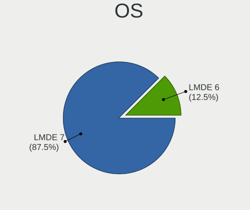

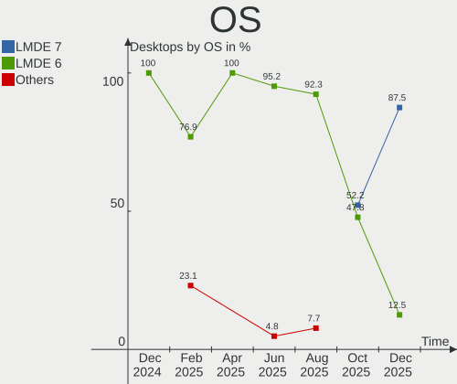

| Name   | Desktops | Percent |
|--------|----------|---------|
| LMDE 7 | 21       | 87.5%   |
| LMDE 6 | 3        | 12.5%   |

OS Family
---------

OS without a version

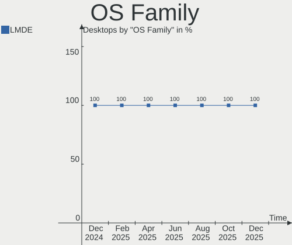

| Name | Desktops | Percent |
|------|----------|---------|
| LMDE | 24       | 100%    |

Kernel
------

Version of the Linux kernel

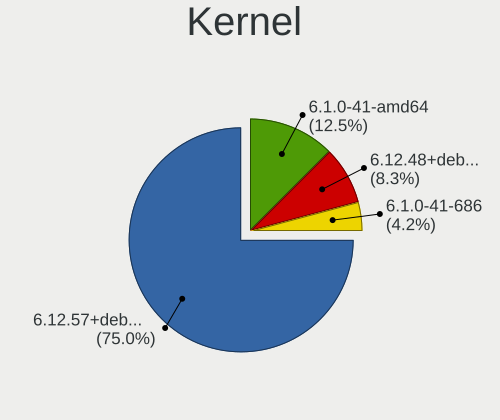

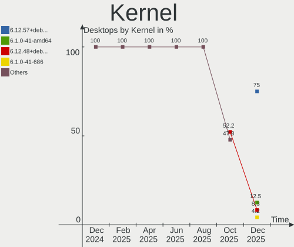

| Version             | Desktops | Percent |
|---------------------|----------|---------|
| 6.12.57+deb13-amd64 | 18       | 75%     |
| 6.1.0-41-amd64      | 3        | 12.5%   |
| 6.12.48+deb13-amd64 | 2        | 8.33%   |
| 6.1.0-41-686        | 1        | 4.17%   |

Kernel Family
-------------

Linux kernel without a distro release

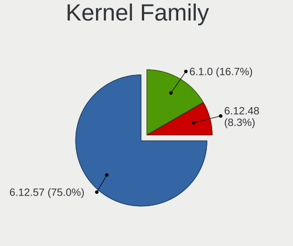

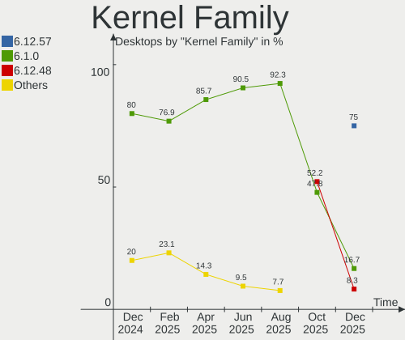

| Version | Desktops | Percent |
|---------|----------|---------|
| 6.12.57 | 18       | 75%     |
| 6.1.0   | 4        | 16.67%  |
| 6.12.48 | 2        | 8.33%   |

Kernel Major Ver.
-----------------

Linux kernel major version

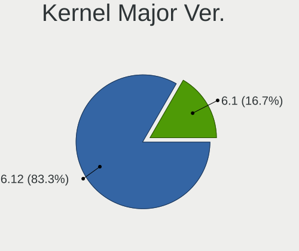

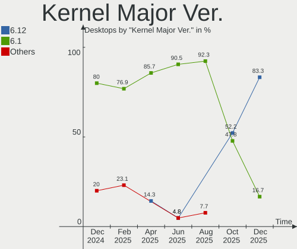

| Version | Desktops | Percent |
|---------|----------|---------|
| 6.12    | 20       | 83.33%  |
| 6.1     | 4        | 16.67%  |

Arch
----

OS architecture (x86_64, i586, etc.)

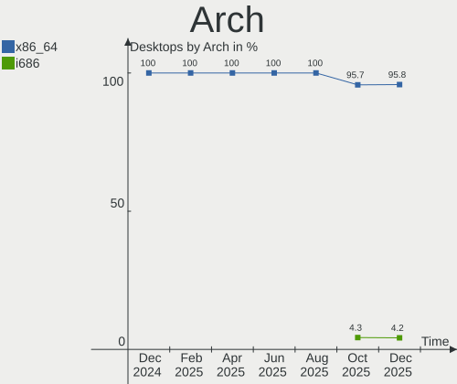

| Name   | Desktops | Percent |
|--------|----------|---------|
| x86_64 | 23       | 95.83%  |
| i686   | 1        | 4.17%   |

DE
--

Desktop Environment

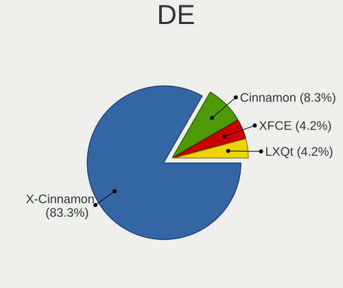

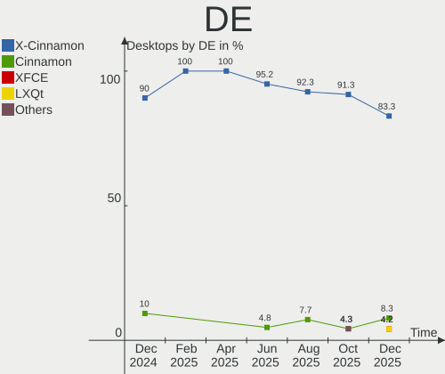

| Name       | Desktops | Percent |
|------------|----------|---------|
| X-Cinnamon | 20       | 83.33%  |
| Cinnamon   | 2        | 8.33%   |
| XFCE       | 1        | 4.17%   |
| LXQt       | 1        | 4.17%   |

Display Server
--------------

X11 or Wayland

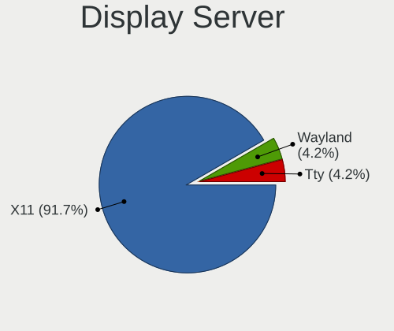

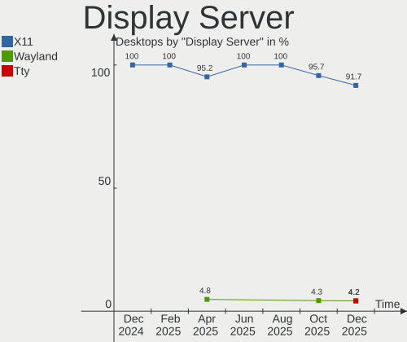

| Name    | Desktops | Percent |
|---------|----------|---------|
| X11     | 22       | 91.67%  |
| Wayland | 1        | 4.17%   |
| Tty     | 1        | 4.17%   |

Display Manager
---------------

SDDM, LightDM, etc.

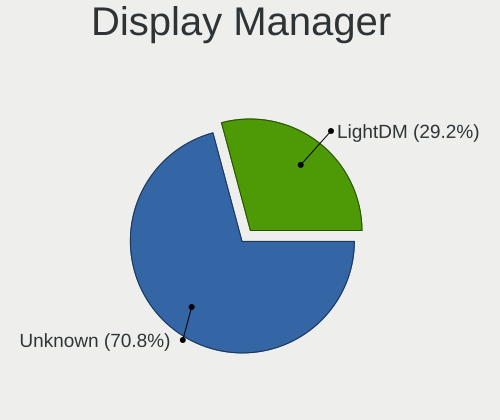

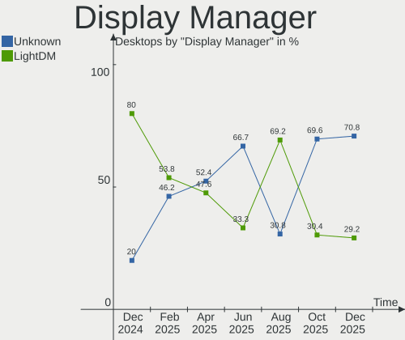

| Name    | Desktops | Percent |
|---------|----------|---------|
| Unknown | 17       | 70.83%  |
| LightDM | 7        | 29.17%  |

OS Lang
-------

Language

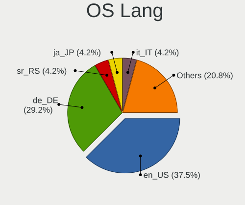

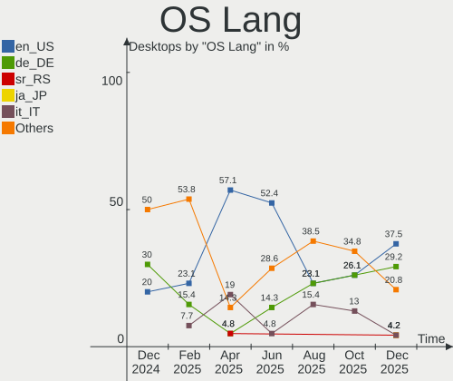

| Lang  | Desktops | Percent |
|-------|----------|---------|
| en_US | 9        | 37.5%   |
| de_DE | 7        | 29.17%  |
| sr_RS | 1        | 4.17%   |
| ja_JP | 1        | 4.17%   |
| it_IT | 1        | 4.17%   |
| fr_FR | 1        | 4.17%   |
| eu_ES | 1        | 4.17%   |
| es_SV | 1        | 4.17%   |
| en_GB | 1        | 4.17%   |
| en_CA | 1        | 4.17%   |

Boot Mode
---------

EFI or BIOS

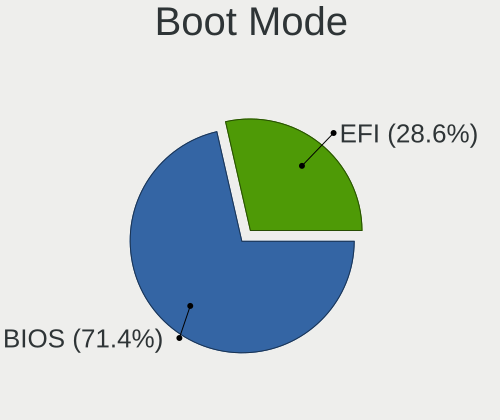

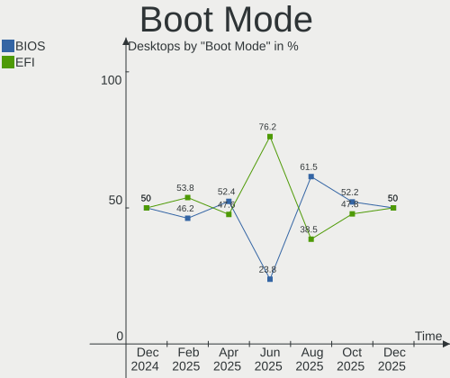

| Mode | Desktops | Percent |
|------|----------|---------|
| BIOS | 12       | 50%     |
| EFI  | 12       | 50%     |

Filesystem
----------

Type of filesystem

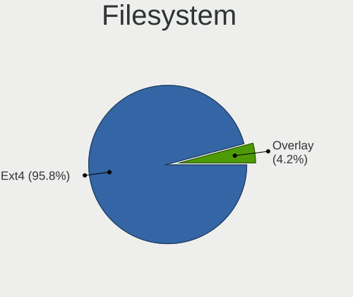

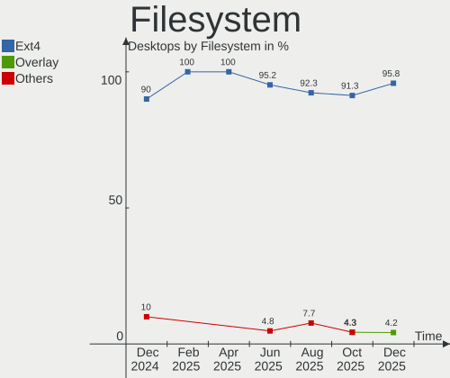

| Type    | Desktops | Percent |
|---------|----------|---------|
| Ext4    | 23       | 95.83%  |
| Overlay | 1        | 4.17%   |

Part. scheme
------------

Scheme of partitioning

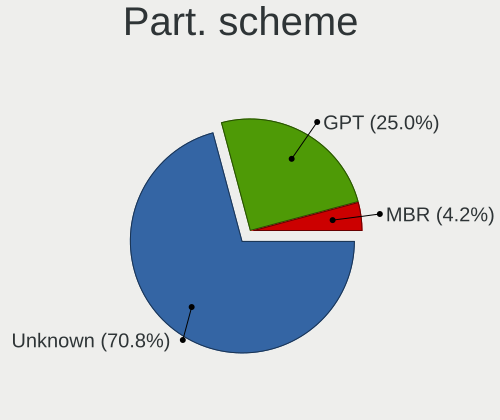

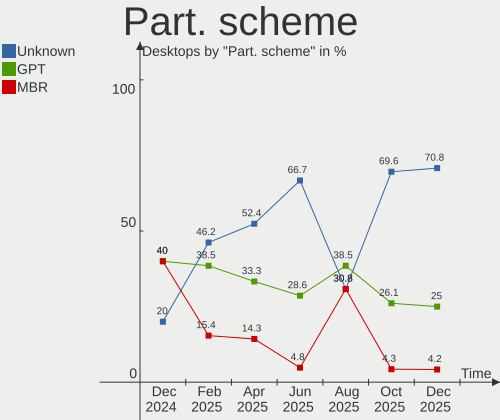

| Type    | Desktops | Percent |
|---------|----------|---------|
| Unknown | 17       | 70.83%  |
| GPT     | 6        | 25%     |
| MBR     | 1        | 4.17%   |

Dual Boot with Linux/BSD
------------------------

Hosting more than one Linux/BSD

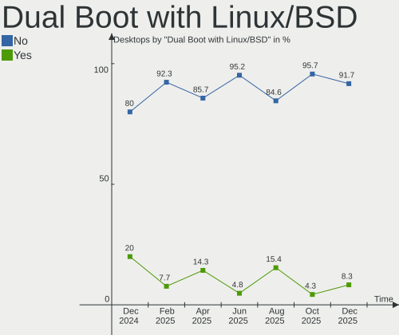

| Dual boot | Desktops | Percent |
|-----------|----------|---------|
| No        | 22       | 91.67%  |
| Yes       | 2        | 8.33%   |

Dual Boot (Win)
---------------

Hosting Linux and Windows

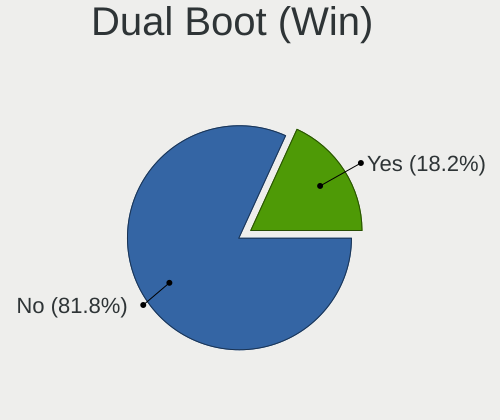

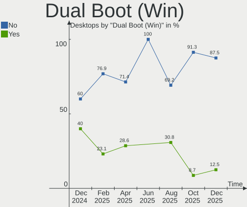

| Dual boot | Desktops | Percent |
|-----------|----------|---------|
| No        | 21       | 87.5%   |
| Yes       | 3        | 12.5%   |

Board
-----

Vendor
------

Motherboard manufacturer

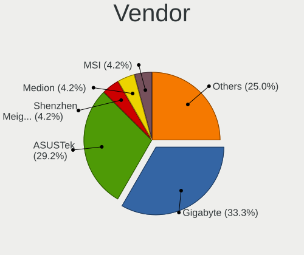

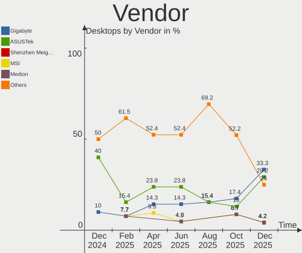

| Name                                 | Desktops | Percent |
|--------------------------------------|----------|---------|
| Gigabyte Technology                  | 8        | 33.33%  |
| ASUSTek Computer                     | 7        | 29.17%  |
| Shenzhen Meigao Electronic Equipment | 1        | 4.17%   |
| MSI                                  | 1        | 4.17%   |
| Medion                               | 1        | 4.17%   |
| Lenovo                               | 1        | 4.17%   |
| Hewlett-Packard                      | 1        | 4.17%   |
| ECS                                  | 1        | 4.17%   |
| Dell                                 | 1        | 4.17%   |
| AZW                                  | 1        | 4.17%   |
| Acer                                 | 1        | 4.17%   |

Model
-----

Motherboard model

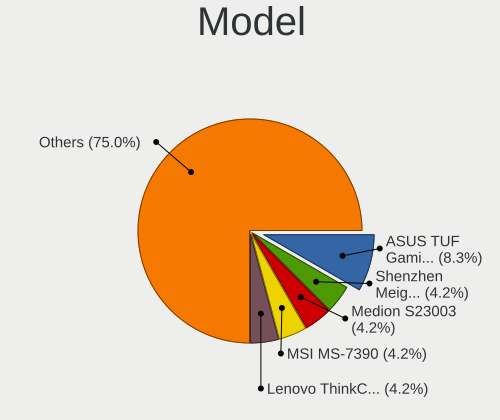

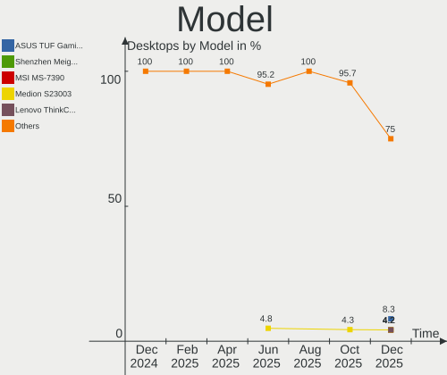

| Name                                                | Desktops | Percent |
|-----------------------------------------------------|----------|---------|
| ASUS TUF Gaming B850-PLUS WIFI                      | 2        | 8.33%   |
| Shenzhen Meigao Electronic Equipment Mercury series | 1        | 4.17%   |
| MSI MS-7390                                         | 1        | 4.17%   |
| Medion S23003                                       | 1        | 4.17%   |
| Lenovo ThinkCentre M90p 5536A4U                     | 1        | 4.17%   |
| HP Z2 Tower G4 Workstation                          | 1        | 4.17%   |
| Gigabyte X870 EAGLE WIFI7                           | 1        | 4.17%   |
| Gigabyte Q87M-D2H                                   | 1        | 4.17%   |
| Gigabyte H310M A                                    | 1        | 4.17%   |
| Gigabyte G41M-ES2L                                  | 1        | 4.17%   |
| Gigabyte F2A88X-D3H                                 | 1        | 4.17%   |
| Gigabyte B660M DS3H DDR4                            | 1        | 4.17%   |
| Gigabyte A520M K V2                                 | 1        | 4.17%   |
| Gigabyte 970A-DS3P                                  | 1        | 4.17%   |
| ECS A780GM-A                                        | 1        | 4.17%   |
| Dell OptiPlex 7050                                  | 1        | 4.17%   |
| AZW ME mini                                         | 1        | 4.17%   |
| ASUS TUF Gaming B760-PLUS WIFI                      | 1        | 4.17%   |
| ASUS M3A78-EM                                       | 1        | 4.17%   |
| ASUS L1N64-SLI WS                                   | 1        | 4.17%   |
| ASUS K30BF_M32BF                                    | 1        | 4.17%   |
| ASUS H110M-K                                        | 1        | 4.17%   |
| Acer Veriton E430                                   | 1        | 4.17%   |

Model Family
------------

Motherboard model prefix

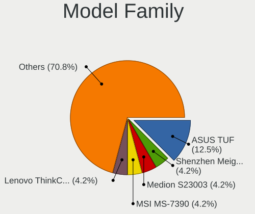

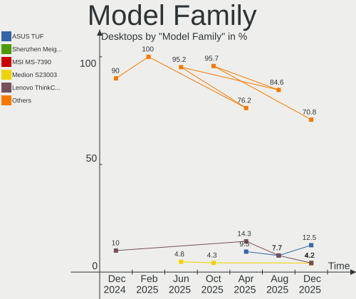

| Name                                         | Desktops | Percent |
|----------------------------------------------|----------|---------|
| ASUS TUF                                     | 3        | 12.5%   |
| Shenzhen Meigao Electronic Equipment Mercury | 1        | 4.17%   |
| MSI MS-7390                                  | 1        | 4.17%   |
| Medion S23003                                | 1        | 4.17%   |
| Lenovo ThinkCentre                           | 1        | 4.17%   |
| HP Z2                                        | 1        | 4.17%   |
| Gigabyte X870                                | 1        | 4.17%   |
| Gigabyte Q87M-D2H                            | 1        | 4.17%   |
| Gigabyte H310M                               | 1        | 4.17%   |
| Gigabyte G41M-ES2L                           | 1        | 4.17%   |
| Gigabyte F2A88X-D3H                          | 1        | 4.17%   |
| Gigabyte B660M                               | 1        | 4.17%   |
| Gigabyte A520M                               | 1        | 4.17%   |
| Gigabyte 970A-DS3P                           | 1        | 4.17%   |
| ECS A780GM-A                                 | 1        | 4.17%   |
| Dell OptiPlex                                | 1        | 4.17%   |
| AZW ME                                       | 1        | 4.17%   |
| ASUS M3A78-EM                                | 1        | 4.17%   |
| ASUS L1N64-SLI                               | 1        | 4.17%   |
| ASUS K30BF                                   | 1        | 4.17%   |
| ASUS H110M-K                                 | 1        | 4.17%   |
| Acer Veriton                                 | 1        | 4.17%   |

MFG Year
--------

Motherboard manufacture year

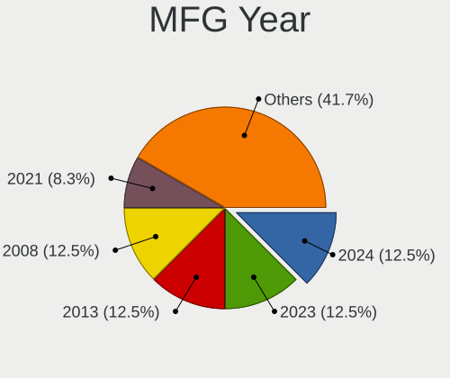

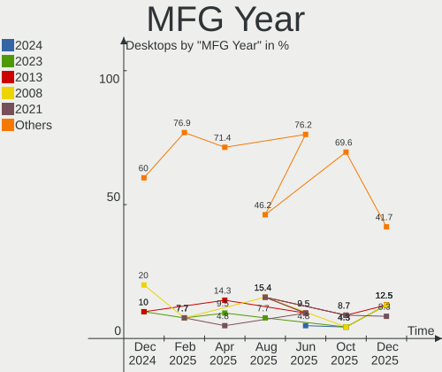

| Year | Desktops | Percent |
|------|----------|---------|
| 2024 | 3        | 12.5%   |
| 2023 | 3        | 12.5%   |
| 2013 | 3        | 12.5%   |
| 2008 | 3        | 12.5%   |
| 2021 | 2        | 8.33%   |
| 2018 | 2        | 8.33%   |
| 2025 | 1        | 4.17%   |
| 2022 | 1        | 4.17%   |
| 2019 | 1        | 4.17%   |
| 2015 | 1        | 4.17%   |
| 2014 | 1        | 4.17%   |
| 2010 | 1        | 4.17%   |
| 2009 | 1        | 4.17%   |
| 2007 | 1        | 4.17%   |

Form Factor
-----------

Physical design of the computer

| Name    | Desktops | Percent |
|---------|----------|---------|
| Desktop | 24       | 100%    |

Secure Boot
-----------

Enabled or disabled

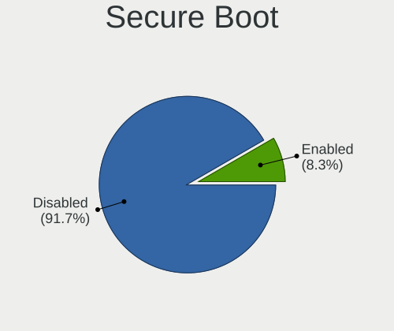

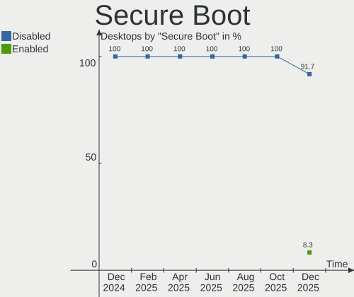

| State    | Desktops | Percent |
|----------|----------|---------|
| Disabled | 22       | 91.67%  |
| Enabled  | 2        | 8.33%   |

Coreboot
--------

Have coreboot on board

| Used | Desktops | Percent |
|------|----------|---------|
| No   | 24       | 100%    |

RAM Size
--------

Total RAM memory

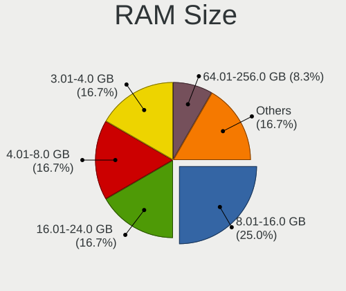

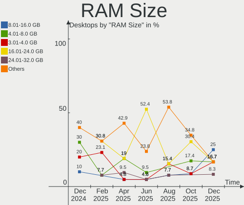

| Size in GB  | Desktops | Percent |
|-------------|----------|---------|
| 8.01-16.0   | 6        | 25%     |
| 4.01-8.0    | 4        | 16.67%  |
| 3.01-4.0    | 4        | 16.67%  |
| 16.01-24.0  | 4        | 16.67%  |
| 24.01-32.0  | 2        | 8.33%   |
| 64.01-256.0 | 2        | 8.33%   |
| 32.01-64.0  | 1        | 4.17%   |
| 2.01-3.0    | 1        | 4.17%   |

RAM Used
--------

Used RAM memory

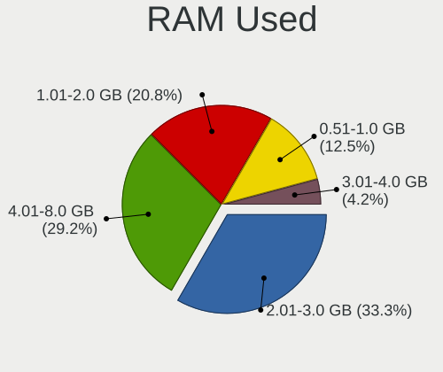

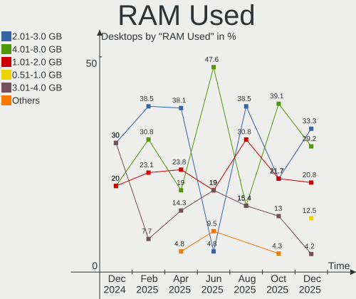

| Used GB  | Desktops | Percent |
|----------|----------|---------|
| 2.01-3.0 | 8        | 33.33%  |
| 4.01-8.0 | 7        | 29.17%  |
| 1.01-2.0 | 5        | 20.83%  |
| 0.51-1.0 | 3        | 12.5%   |
| 3.01-4.0 | 1        | 4.17%   |

Total Drives
------------

Number of drives on board

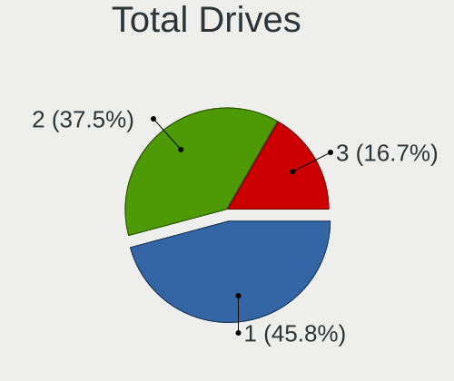

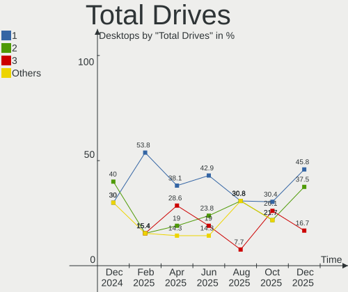

| Drives | Desktops | Percent |
|--------|----------|---------|
| 1      | 11       | 45.83%  |
| 2      | 9        | 37.5%   |
| 3      | 4        | 16.67%  |

Has CD-ROM
----------

Has CD-ROM on board

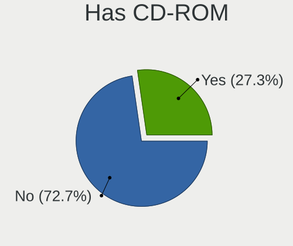

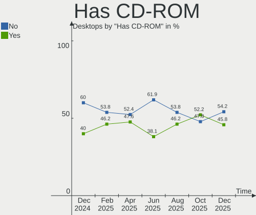

| Presented | Desktops | Percent |
|-----------|----------|---------|
| No        | 13       | 54.17%  |
| Yes       | 11       | 45.83%  |

Has Ethernet
------------

Has Ethernet on board

| Presented | Desktops | Percent |
|-----------|----------|---------|
| Yes       | 24       | 100%    |

Has WiFi
--------

Has WiFi module

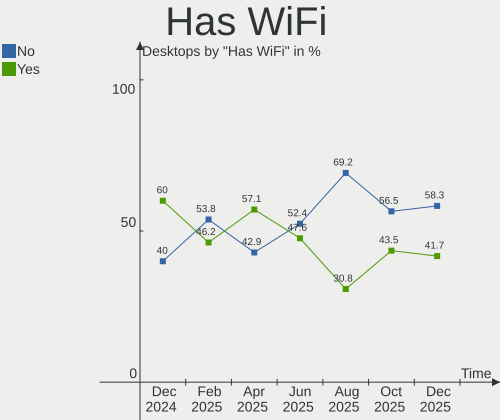

| Presented | Desktops | Percent |
|-----------|----------|---------|
| No        | 14       | 58.33%  |
| Yes       | 10       | 41.67%  |

Has Bluetooth
-------------

Has Bluetooth module

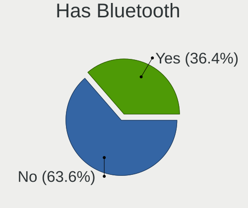

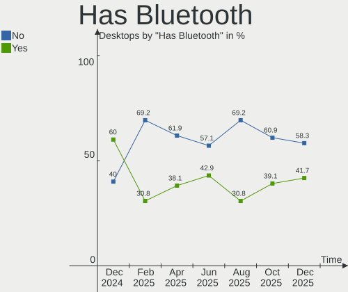

| Presented | Desktops | Percent |
|-----------|----------|---------|
| No        | 14       | 58.33%  |
| Yes       | 10       | 41.67%  |

Location
--------

Country
-------

Geographic location (country)

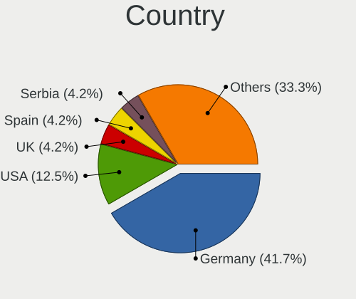

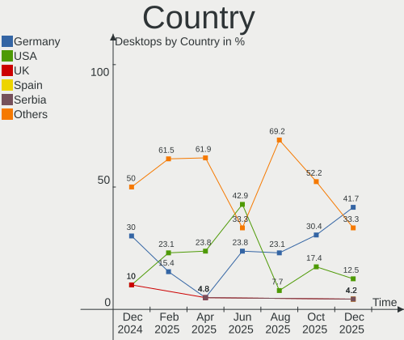

| Country     | Desktops | Percent |
|-------------|----------|---------|
| Germany     | 10       | 41.67%  |
| USA         | 3        | 12.5%   |
| UK          | 1        | 4.17%   |
| Spain       | 1        | 4.17%   |
| Serbia      | 1        | 4.17%   |
| Portugal    | 1        | 4.17%   |
| Japan       | 1        | 4.17%   |
| Italy       | 1        | 4.17%   |
| India       | 1        | 4.17%   |
| Greece      | 1        | 4.17%   |
| France      | 1        | 4.17%   |
| El Salvador | 1        | 4.17%   |
| Canada      | 1        | 4.17%   |

City
----

Geographic location (city)

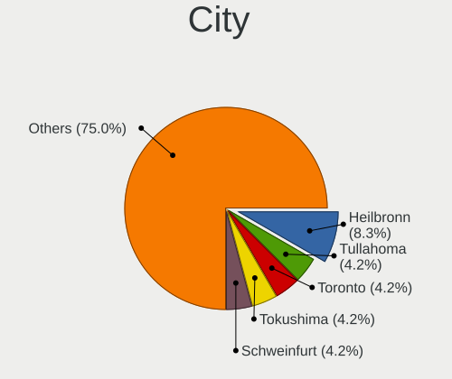

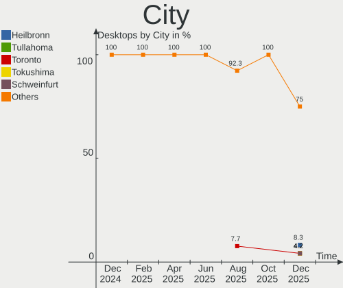

| City                  | Desktops | Percent |
|-----------------------|----------|---------|
| Heilbronn             | 2        | 8.33%   |
| Tullahoma             | 1        | 4.17%   |
| Toronto               | 1        | 4.17%   |
| Tokushima             | 1        | 4.17%   |
| Schweinfurt           | 1        | 4.17%   |
| San Salvador          | 1        | 4.17%   |
| Nagold                | 1        | 4.17%   |
| Ludwigshafen am Rhein | 1        | 4.17%   |
| Louisville            | 1        | 4.17%   |
| Leskovac              | 1        | 4.17%   |
| Hamburg               | 1        | 4.17%   |
| Gronau                | 1        | 4.17%   |
| Gateshead             | 1        | 4.17%   |
| Forst                 | 1        | 4.17%   |
| Fontanil-Cornillon    | 1        | 4.17%   |
| Danbury               | 1        | 4.17%   |
| Burg bei Magdeburg    | 1        | 4.17%   |
| Borgosesia            | 1        | 4.17%   |
| Bilbao                | 1        | 4.17%   |
| Augsburg              | 1        | 4.17%   |
| Athens                | 1        | 4.17%   |
| Amritsar              | 1        | 4.17%   |
| Alcochete             | 1        | 4.17%   |

Drives
------

Drive Vendor
------------

Hard drive vendors

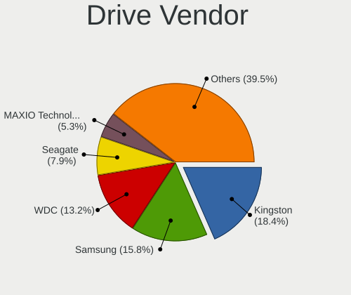

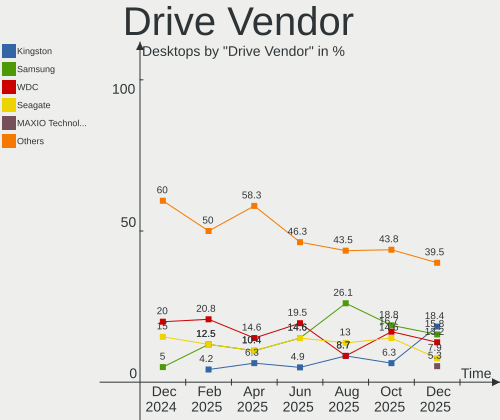

| Vendor                      | Desktops | Drives | Percent |
|-----------------------------|----------|--------|---------|
| Kingston                    | 7        | 7      | 18.42%  |
| Samsung Electronics         | 6        | 8      | 15.79%  |
| WDC                         | 5        | 6      | 13.16%  |
| Seagate                     | 3        | 4      | 7.89%   |
| MAXIO Technology (Hangzhou) | 2        | 2      | 5.26%   |
| Intenso                     | 2        | 2      | 5.26%   |
| USB                         | 1        | 1      | 2.63%   |
| Toshiba                     | 1        | 1      | 2.63%   |
| TO Exter                    | 1        | 1      | 2.63%   |
| Team                        | 1        | 1      | 2.63%   |
| SK hynix                    | 1        | 1      | 2.63%   |
| SanDisk                     | 1        | 1      | 2.63%   |
| Phison                      | 1        | 1      | 2.63%   |
| Mushkin                     | 1        | 1      | 2.63%   |
| Micron/Crucial Technology   | 1        | 1      | 2.63%   |
| Leven                       | 1        | 1      | 2.63%   |
| KIOXIA                      | 1        | 1      | 2.63%   |
| Intel                       | 1        | 1      | 2.63%   |
| Crucial                     | 1        | 1      | 2.63%   |

Drive Model
-----------

Hard drive models

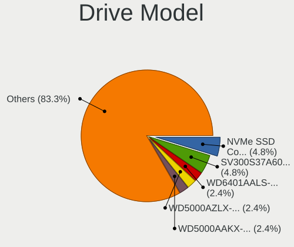

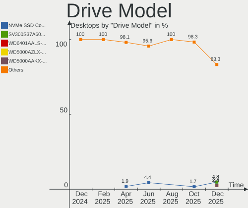

| Model                                             | Desktops | Percent |
|---------------------------------------------------|----------|---------|
| Samsung NVMe SSD Controller SM981/PM981/PM983 1TB | 2        | 4.76%   |
| Kingston SV300S37A60G 64GB SSD                    | 2        | 4.76%   |
| WDC WD6401AALS-00L3B2 640GB                       | 1        | 2.38%   |
| WDC WD5000AZLX-00JKKA0 500GB                      | 1        | 2.38%   |
| WDC WD5000AAKX-60U6AA0 500GB                      | 1        | 2.38%   |
| WDC WD5000AAKX-22ERMA0 500GB                      | 1        | 2.38%   |
| WDC WD3200AAJS-56M0A0 320GB                       | 1        | 2.38%   |
| WDC WD10SPZX-24Z10 1TB                            | 1        | 2.38%   |
| USB SanDisk 3.2Gen1 496GB                         | 1        | 2.38%   |
| Toshiba TR200 240GB SSD                           | 1        | 2.38%   |
| TO Exter nal USB 3.0 250GB                        | 1        | 2.38%   |
| Team T253512GB SSD                                | 1        | 2.38%   |
| SK hynix HFS500G32TND-N1A2A 500GB SSD             | 1        | 2.38%   |
| Seagate ST500LM012 HN-M500MBB 500GB               | 1        | 2.38%   |
| Seagate ST4000DM004-2CV104 4TB                    | 1        | 2.38%   |
| Seagate ST31000528AS 1TB                          | 1        | 2.38%   |
| Seagate ST2000DM008-2FR102 2TB                    | 1        | 2.38%   |
| SanDisk NVMe SSD Drive 1TB                        | 1        | 2.38%   |
| Samsung SSD PM871b 2.5 7mm 512GB                  | 1        | 2.38%   |
| Samsung SSD 990 PRO 4TB S7DPNU0Y722656V           | 1        | 2.38%   |
| Samsung SSD 990 PRO 4TB                           | 1        | 2.38%   |
| Samsung SSD 990 PRO 1TB                           | 1        | 2.38%   |
| Samsung SSD 870 QVO 2TB                           | 1        | 2.38%   |
| Samsung HD154UI 1TB                               | 1        | 2.38%   |
| Phison S11-128G-PHISON-SSD-B4 128GB               | 1        | 2.38%   |
| Mushkin MKNSSDSR500GB                             | 1        | 2.38%   |
| Micron/Crucial CT1000E100SSD8 1TB                 | 1        | 2.38%   |
| MAXIO (Hangzhou) NVMe SSD Controller MAP1202 2TB  | 1        | 2.38%   |
| MAXIO (Hangzhou) Fanxiang S660 2TB                | 1        | 2.38%   |
| Leven JAJS600M128C 128GB SSD                      | 1        | 2.38%   |
| KIOXIA NVMe SSD 1TB                               | 1        | 2.38%   |
| Kingston SV300S37A120G 120GB SSD                  | 1        | 2.38%   |
| Kingston SKC3000D2048G 2TB                        | 1        | 2.38%   |
| Kingston SEDC600M960G 960GB SSD                   | 1        | 2.38%   |
| Kingston SA400S37240G 240GB SSD                   | 1        | 2.38%   |
| Kingston SA400S37120G 120GB SSD                   | 1        | 2.38%   |
| Intenso SSD 256GB                                 | 1        | 2.38%   |
| Intenso SCSI 2TB                                  | 1        | 2.38%   |
| Intel SSDSA2M160G2GC 160GB                        | 1        | 2.38%   |
| Crucial CT1000P310SSD2 1TB                        | 1        | 2.38%   |

HDD Vendor
----------

Hard disk drive vendors

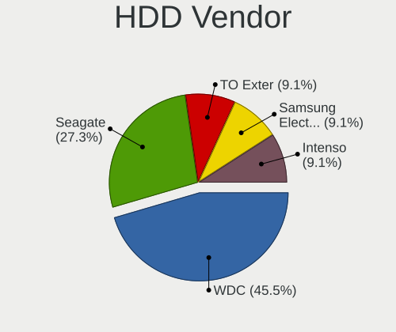

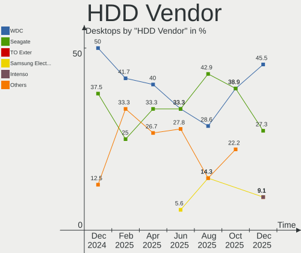

| Vendor              | Desktops | Drives | Percent |
|---------------------|----------|--------|---------|
| WDC                 | 5        | 6      | 45.45%  |
| Seagate             | 3        | 4      | 27.27%  |
| TO Exter            | 1        | 1      | 9.09%   |
| Samsung Electronics | 1        | 1      | 9.09%   |
| Intenso             | 1        | 1      | 9.09%   |

SSD Vendor
----------

Solid state drive vendors

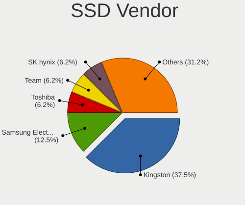

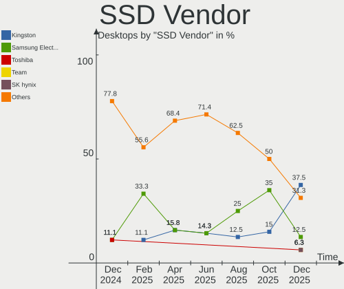

| Vendor              | Desktops | Drives | Percent |
|---------------------|----------|--------|---------|
| Kingston            | 6        | 6      | 37.5%   |
| Samsung Electronics | 2        | 2      | 12.5%   |
| Toshiba             | 1        | 1      | 6.25%   |
| Team                | 1        | 1      | 6.25%   |
| SK hynix            | 1        | 1      | 6.25%   |
| Phison              | 1        | 1      | 6.25%   |
| Mushkin             | 1        | 1      | 6.25%   |
| Leven               | 1        | 1      | 6.25%   |
| Intenso             | 1        | 1      | 6.25%   |
| Intel               | 1        | 1      | 6.25%   |

Drive Kind
----------

HDD or SSD

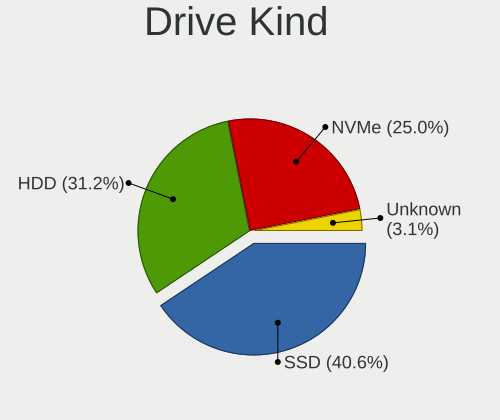

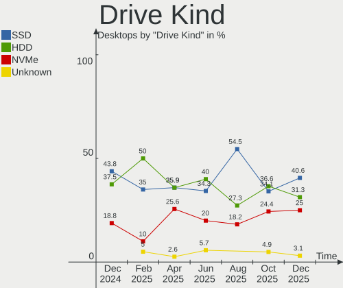

| Kind    | Desktops | Drives | Percent |
|---------|----------|--------|---------|
| SSD     | 13       | 16     | 40.63%  |
| HDD     | 10       | 13     | 31.25%  |
| NVMe    | 8        | 12     | 25%     |
| Unknown | 1        | 1      | 3.13%   |

Drive Connector
---------------

SATA, SAS, NVMe, etc.

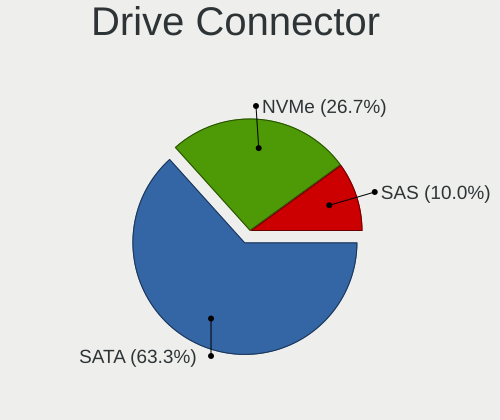

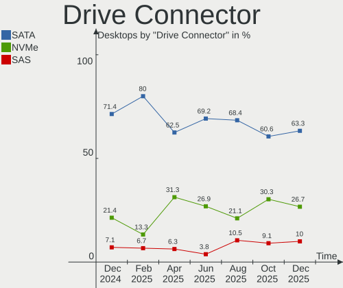

| Type | Desktops | Drives | Percent |
|------|----------|--------|---------|
| SATA | 19       | 27     | 63.33%  |
| NVMe | 8        | 12     | 26.67%  |
| SAS  | 3        | 3      | 10%     |

Drive Size
----------

Size of hard drive

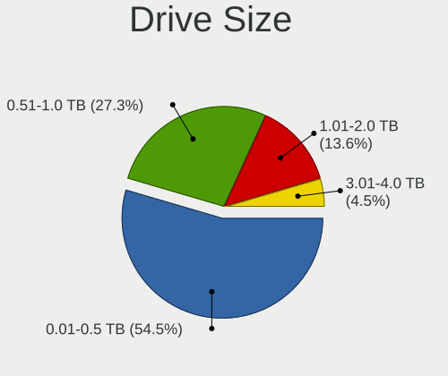

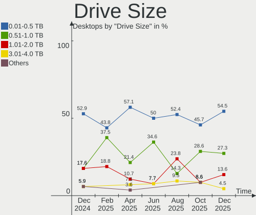

| Size in TB | Desktops | Drives | Percent |
|------------|----------|--------|---------|
| 0.01-0.5   | 12       | 18     | 54.55%  |
| 0.51-1.0   | 6        | 7      | 27.27%  |
| 1.01-2.0   | 3        | 3      | 13.64%  |
| 3.01-4.0   | 1        | 1      | 4.55%   |

Space Total
-----------

Amount of disk space available on the file system

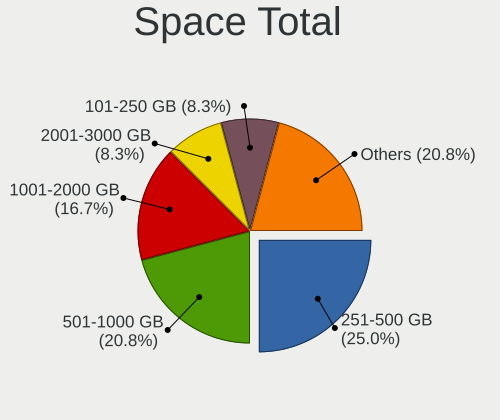

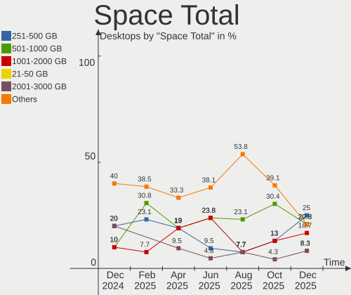

| Size in GB     | Desktops | Percent |
|----------------|----------|---------|
| 251-500        | 6        | 25%     |
| 501-1000       | 5        | 20.83%  |
| 1001-2000      | 4        | 16.67%  |
| 21-50          | 2        | 8.33%   |
| 2001-3000      | 2        | 8.33%   |
| 101-250        | 2        | 8.33%   |
| 51-100         | 2        | 8.33%   |
| More than 3000 | 1        | 4.17%   |

Space Used
----------

Amount of used disk space

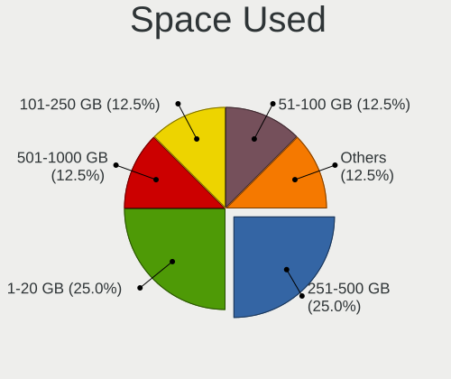

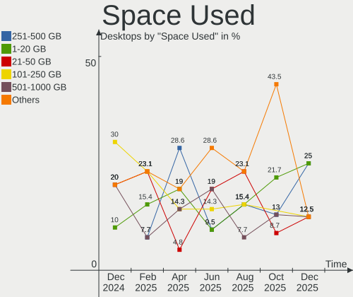

| Used GB  | Desktops | Percent |
|----------|----------|---------|
| 251-500  | 6        | 25%     |
| 1-20     | 6        | 25%     |
| 21-50    | 3        | 12.5%   |
| 101-250  | 3        | 12.5%   |
| 501-1000 | 3        | 12.5%   |
| 51-100   | 3        | 12.5%   |

Malfunc. Drives
---------------

Drive models with a malfunction

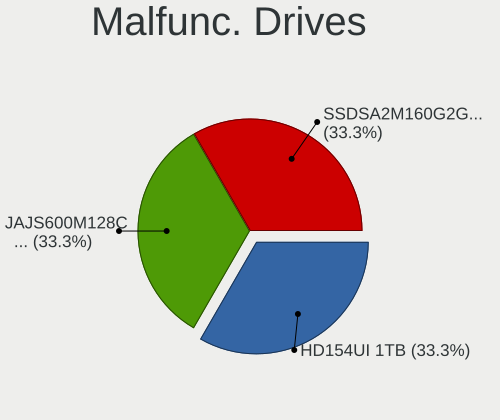

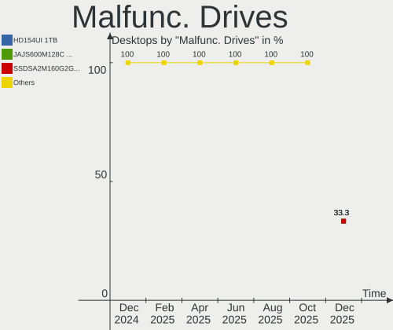

| Model                           | Desktops | Drives | Percent |
|---------------------------------|----------|--------|---------|
| Samsung Electronics HD154UI 1TB | 1        | 1      | 33.33%  |
| Leven JAJS600M128C 128GB SSD    | 1        | 1      | 33.33%  |
| Intel SSDSA2M160G2GC 160GB      | 1        | 1      | 33.33%  |

Malfunc. Drive Vendor
---------------------

Vendors of faulty drives

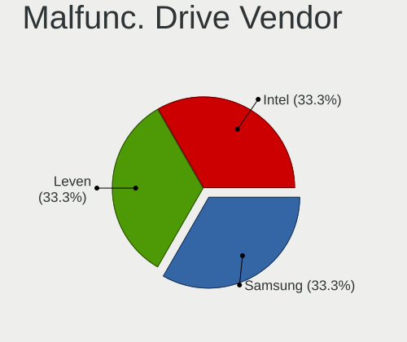

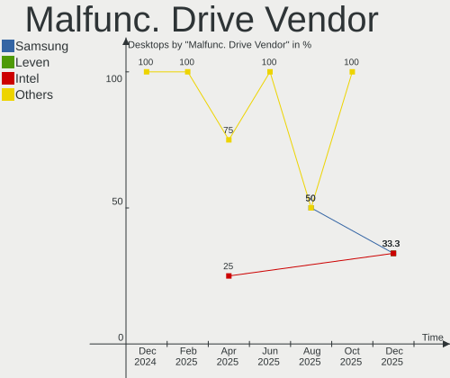

| Vendor              | Desktops | Drives | Percent |
|---------------------|----------|--------|---------|
| Samsung Electronics | 1        | 1      | 33.33%  |
| Leven               | 1        | 1      | 33.33%  |
| Intel               | 1        | 1      | 33.33%  |

Malfunc. HDD Vendor
-------------------

Vendors of faulty HDD drives

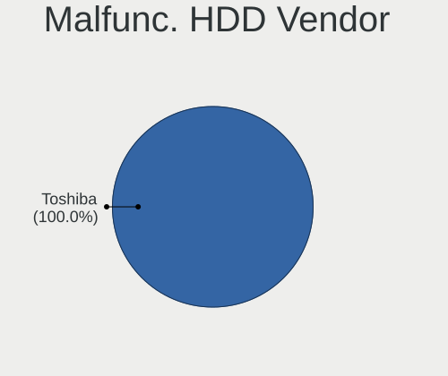

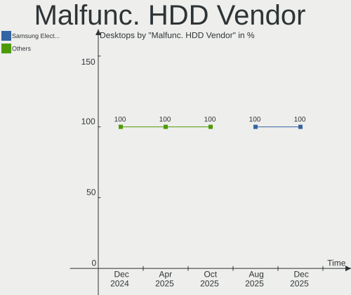

| Vendor              | Desktops | Drives | Percent |
|---------------------|----------|--------|---------|
| Samsung Electronics | 1        | 1      | 100%    |

Malfunc. Drive Kind
-------------------

Kinds of faulty drives

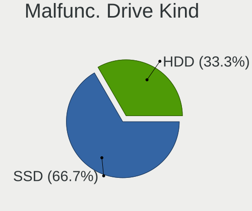

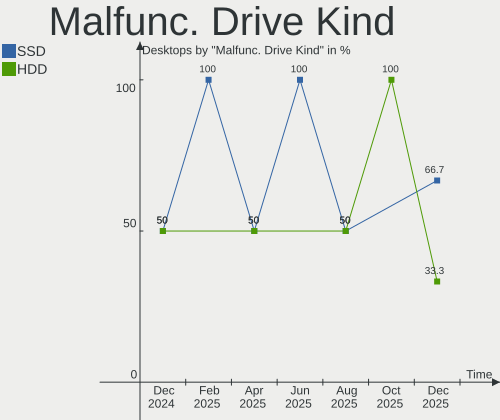

| Kind | Desktops | Drives | Percent |
|------|----------|--------|---------|
| SSD  | 2        | 2      | 66.67%  |
| HDD  | 1        | 1      | 33.33%  |

Failed Drives
-------------

Failed drive models

Zero info for selected period =(

Failed Drive Vendor
-------------------

Failed drive vendors

Zero info for selected period =(

Drive Status
------------

Number of failed and malfunc. drives

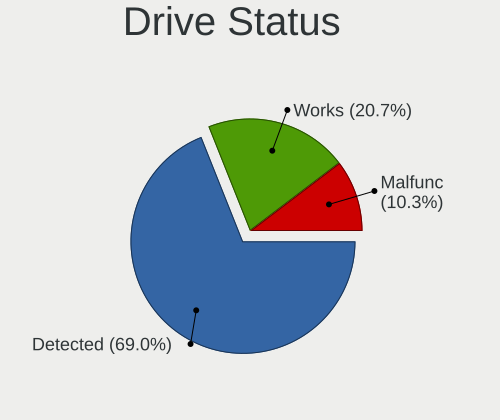

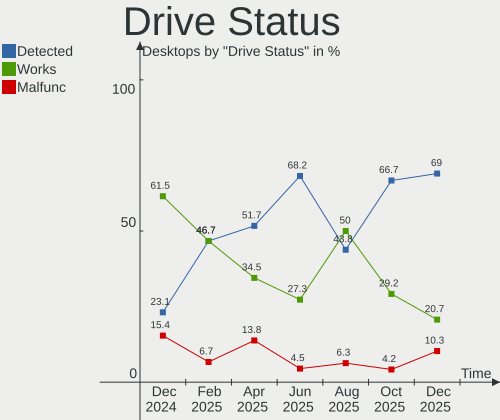

| Status   | Desktops | Drives | Percent |
|----------|----------|--------|---------|
| Detected | 20       | 31     | 68.97%  |
| Works    | 6        | 8      | 20.69%  |
| Malfunc  | 3        | 3      | 10.34%  |

Storage controller
------------------

Storage Vendor
--------------

Storage controller vendors

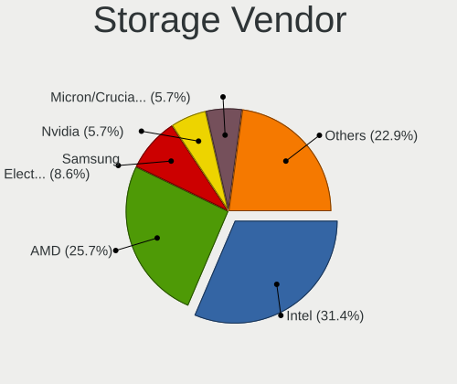

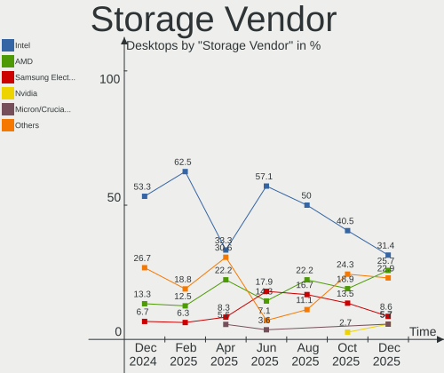

| Vendor                      | Desktops | Percent |
|-----------------------------|----------|---------|
| Intel                       | 11       | 31.43%  |
| AMD                         | 9        | 25.71%  |
| Samsung Electronics         | 3        | 8.57%   |
| Nvidia                      | 2        | 5.71%   |
| Micron/Crucial Technology   | 2        | 5.71%   |
| MAXIO Technology (Hangzhou) | 2        | 5.71%   |
| ASMedia Technology          | 2        | 5.71%   |
| Silicon Image               | 1        | 2.86%   |
| Sandisk                     | 1        | 2.86%   |
| KIOXIA                      | 1        | 2.86%   |
| Kingston Technology Company | 1        | 2.86%   |

Storage Model
-------------

Storage controller models

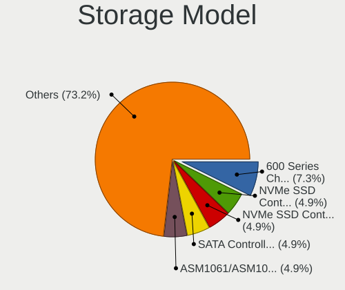

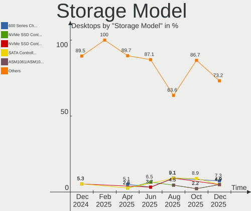

| Model                                                                          | Desktops | Percent |
|--------------------------------------------------------------------------------|----------|---------|
| AMD 600 Series Chipset SATA Controller                                         | 3        | 7.32%   |
| Samsung NVMe SSD Controller SM981/PM981/PM983                                  | 2        | 4.88%   |
| Samsung NVMe SSD Controller S4LV008[Pascal]                                    | 2        | 4.88%   |
| Intel SATA Controller [RAID mode]                                              | 2        | 4.88%   |
| ASMedia ASM1061/ASM1062 Serial ATA Controller                                  | 2        | 4.88%   |
| AMD SB7x0/SB8x0/SB9x0 SATA Controller [IDE mode]                               | 2        | 4.88%   |
| AMD SB7x0/SB8x0/SB9x0 IDE Controller                                           | 2        | 4.88%   |
| AMD FCH SATA Controller [AHCI mode]                                            | 2        | 4.88%   |
| Silicon Image SiI 3531 [SATALink/SATARaid] Serial ATA Controller               | 1        | 2.44%   |
| Sandisk WD Black SN850X NVMe SSD                                               | 1        | 2.44%   |
| Nvidia MCP65 SATA Controller                                                   | 1        | 2.44%   |
| Nvidia MCP65 IDE                                                               | 1        | 2.44%   |
| Nvidia MCP55 SATA Controller                                                   | 1        | 2.44%   |
| Nvidia MCP55 IDE                                                               | 1        | 2.44%   |
| Micron/Crucial P310 NVMe PCIe SSD (DRAM-less)                                  | 1        | 2.44%   |
| Micron/Crucial E100 NVMe PCIe SSD (DRAM-less)                                  | 1        | 2.44%   |
| MAXIO (Hangzhou) NVMe SSD Controller MAP1602 (DRAM-less)                       | 1        | 2.44%   |
| MAXIO (Hangzhou) NVMe SSD Controller MAP1202 (DRAM-less)                       | 1        | 2.44%   |
| KIOXIA NVMe SSD                                                                | 1        | 2.44%   |
| Kingston Company KC3000/FURY Renegade NVMe SSD [E18]                           | 1        | 2.44%   |
| Intel RST Volume Management Device Controller                                  | 1        | 2.44%   |
| Intel Raptor Lake SATA AHCI Controller                                         | 1        | 2.44%   |
| Intel Q170/Q150/B150/H170/H110/Z170/CM236 Chipset SATA Controller [AHCI Mode]  | 1        | 2.44%   |
| Intel NM10/ICH7 Family SATA Controller [IDE mode]                              | 1        | 2.44%   |
| Intel Celeron/Pentium Silver Processor SATA Controller                         | 1        | 2.44%   |
| Intel Cannon Lake PCH SATA AHCI Controller                                     | 1        | 2.44%   |
| Intel Alder Lake-S PCH SATA Controller [AHCI Mode]                             | 1        | 2.44%   |
| Intel 8 Series/C220 Series Chipset Family 6-port SATA Controller 1 [AHCI mode] | 1        | 2.44%   |
| Intel 6 Series/C200 Series Chipset Family 6 port Desktop SATA AHCI Controller  | 1        | 2.44%   |
| Intel 5 Series/3400 Series Chipset 6 port SATA AHCI Controller                 | 1        | 2.44%   |
| AMD SB7x0/SB8x0/SB9x0 SATA Controller [AHCI mode]                              | 1        | 2.44%   |
| AMD 500 Series Chipset SATA Controller                                         | 1        | 2.44%   |

Storage Kind
------------

Kind of storage controller (IDE, SATA, NVMe, SAS, ...)

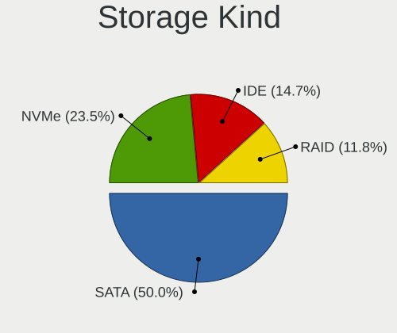

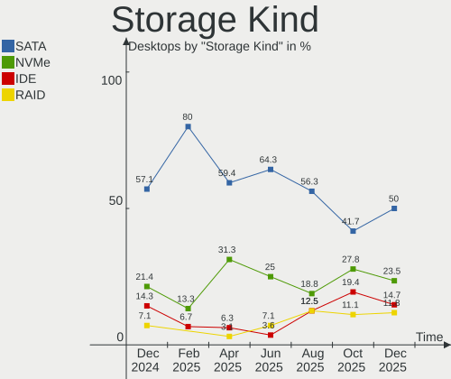

| Kind | Desktops | Percent |
|------|----------|---------|
| SATA | 17       | 50%     |
| NVMe | 8        | 23.53%  |
| IDE  | 5        | 14.71%  |
| RAID | 4        | 11.76%  |

Processor
---------

CPU Vendor
----------

Processor vendors

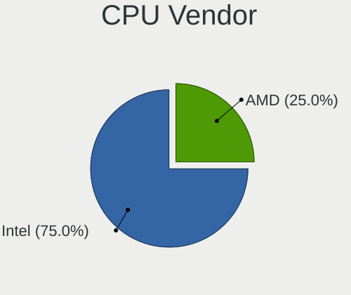

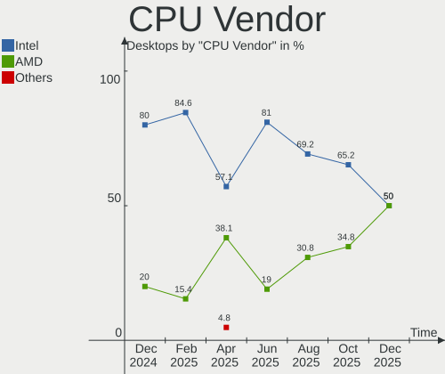

| Vendor | Desktops | Percent |
|--------|----------|---------|
| Intel  | 12       | 50%     |
| AMD    | 12       | 50%     |

CPU Model
---------

Processor models

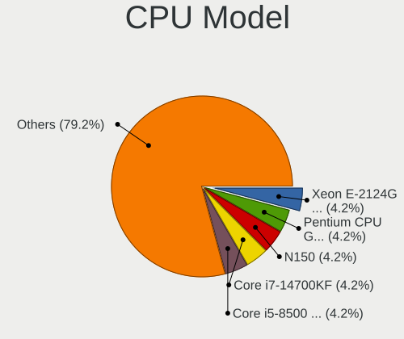

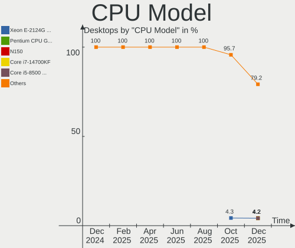

| Model                                      | Desktops | Percent |
|--------------------------------------------|----------|---------|
| Intel Xeon E-2124G CPU @ 3.40GHz           | 1        | 4.17%   |
| Intel Pentium CPU G4560 @ 3.50GHz          | 1        | 4.17%   |
| Intel N150                                 | 1        | 4.17%   |
| Intel Core i7-14700KF                      | 1        | 4.17%   |
| Intel Core i5-8500 CPU @ 3.00GHz           | 1        | 4.17%   |
| Intel Core i5-4590S CPU @ 3.00GHz          | 1        | 4.17%   |
| Intel Core i5 CPU 650 @ 3.20GHz            | 1        | 4.17%   |
| Intel Core i3-7100T CPU @ 3.40GHz          | 1        | 4.17%   |
| Intel Core i3-3240 CPU @ 3.40GHz           | 1        | 4.17%   |
| Intel Core 2 Duo CPU E8400 @ 3.00GHz       | 1        | 4.17%   |
| Intel Celeron J4125 CPU @ 2.00GHz          | 1        | 4.17%   |
| Intel 12th Gen Core i5-12400F              | 1        | 4.17%   |
| AMD Ryzen 9 7900 12-Core Processor         | 1        | 4.17%   |
| AMD Ryzen 7 6800U with Radeon Graphics     | 1        | 4.17%   |
| AMD Ryzen 5 PRO 4655G with Radeon Graphics | 1        | 4.17%   |
| AMD Ryzen 5 9600X 6-Core Processor         | 1        | 4.17%   |
| AMD Ryzen 5 7600X3D 6-Core Processor       | 1        | 4.17%   |
| AMD Phenom II X6 1100T Processor           | 1        | 4.17%   |
| AMD Phenom II X2 550 Processor             | 1        | 4.17%   |
| AMD FX-4130 Quad-Core Processor            | 1        | 4.17%   |
| AMD Athlon 64 X2 Dual Core Processor 5600+ | 1        | 4.17%   |
| AMD Athlon 64 FX-74 Processor              | 1        | 4.17%   |
| AMD A6-6400K APU with Radeon HD Graphics   | 1        | 4.17%   |
| AMD A10-7700K APU with Radeon R7 Graphics  | 1        | 4.17%   |

CPU Model Family
----------------

Processor model prefix

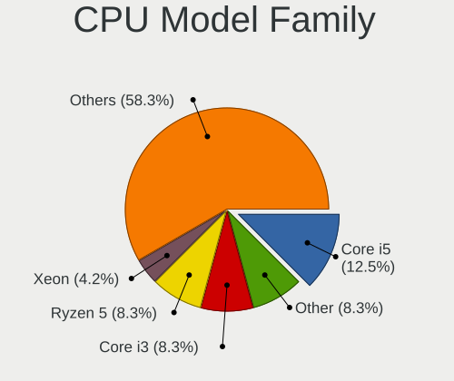

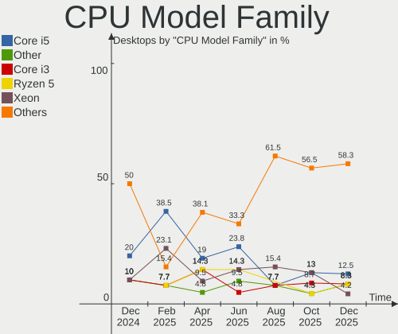

| Model            | Desktops | Percent |
|------------------|----------|---------|
| Intel Core i5    | 3        | 12.5%   |
| Other            | 2        | 8.33%   |
| Intel Core i3    | 2        | 8.33%   |
| AMD Ryzen 5      | 2        | 8.33%   |
| Intel Xeon       | 1        | 4.17%   |
| Intel Pentium    | 1        | 4.17%   |
| Intel Core i7    | 1        | 4.17%   |
| Intel Core 2 Duo | 1        | 4.17%   |
| Intel Celeron    | 1        | 4.17%   |
| AMD Ryzen 9      | 1        | 4.17%   |
| AMD Ryzen 7      | 1        | 4.17%   |
| AMD Ryzen 5 PRO  | 1        | 4.17%   |
| AMD Phenom II X6 | 1        | 4.17%   |
| AMD Phenom II X2 | 1        | 4.17%   |
| AMD FX           | 1        | 4.17%   |
| AMD Athlon 64 X2 | 1        | 4.17%   |
| AMD Athlon 64    | 1        | 4.17%   |
| AMD A6           | 1        | 4.17%   |
| AMD A10          | 1        | 4.17%   |

CPU Cores
---------

Number of processor cores

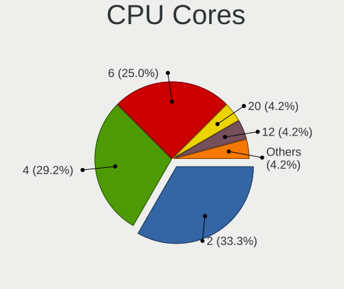

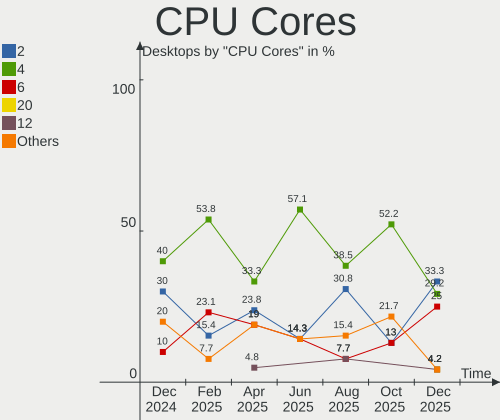

| Number | Desktops | Percent |
|--------|----------|---------|
| 2      | 8        | 33.33%  |
| 4      | 7        | 29.17%  |
| 6      | 6        | 25%     |
| 20     | 1        | 4.17%   |
| 12     | 1        | 4.17%   |
| 8      | 1        | 4.17%   |

CPU Sockets
-----------

Number of sockets

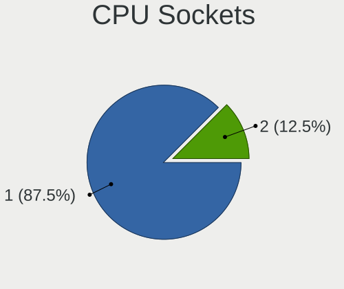

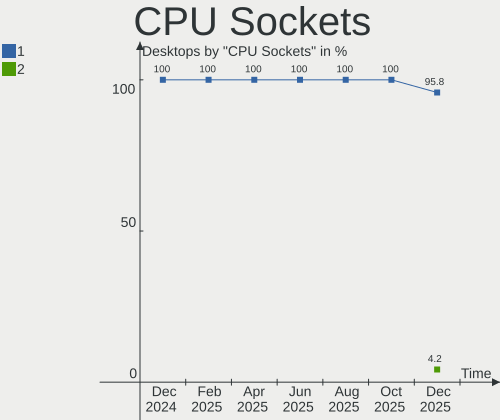

| Number | Desktops | Percent |
|--------|----------|---------|
| 1      | 23       | 95.83%  |
| 2      | 1        | 4.17%   |

CPU Threads
-----------

Threads per core (Hyper-Threading)

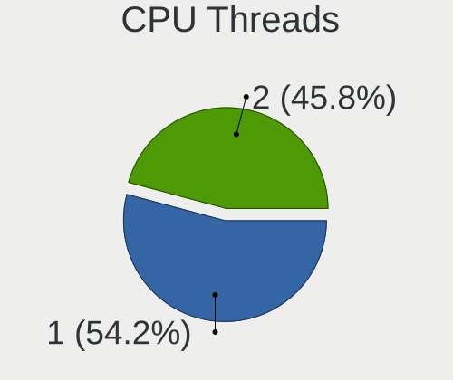

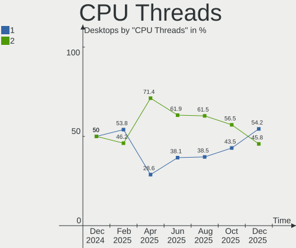

| Number | Desktops | Percent |
|--------|----------|---------|
| 1      | 13       | 54.17%  |
| 2      | 11       | 45.83%  |

CPU Op-Modes
------------

CPU Operation Modes (32-bit, 64-bit)

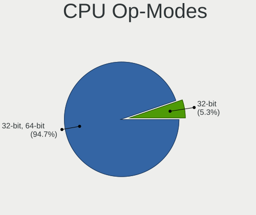

| Op mode        | Desktops | Percent |
|----------------|----------|---------|
| 32-bit, 64-bit | 24       | 100%    |

CPU Microcode
-------------

Microcode number

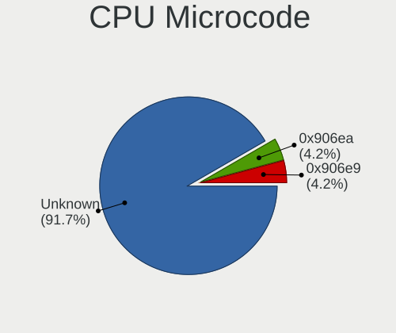

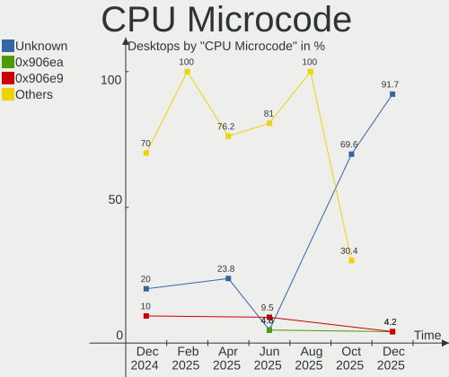

| Number  | Desktops | Percent |
|---------|----------|---------|
| Unknown | 22       | 91.67%  |
| 0x906ea | 1        | 4.17%   |
| 0x906e9 | 1        | 4.17%   |

CPU Microarch
-------------

Microarchitecture

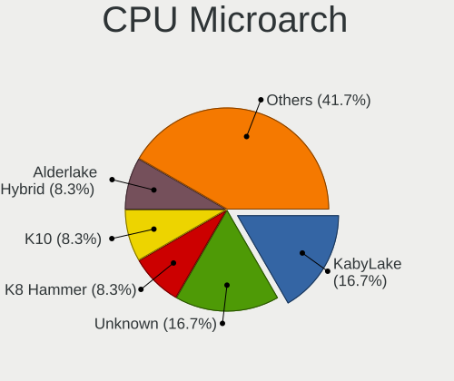

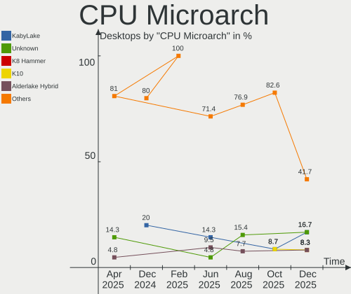

| Name             | Desktops | Percent |
|------------------|----------|---------|
| KabyLake         | 4        | 16.67%  |
| Unknown          | 4        | 16.67%  |
| K8 Hammer        | 2        | 8.33%   |
| K10              | 2        | 8.33%   |
| Alderlake Hybrid | 2        | 8.33%   |
| Zen 2            | 1        | 4.17%   |
| Westmere         | 1        | 4.17%   |
| Steamroller      | 1        | 4.17%   |
| Piledriver       | 1        | 4.17%   |
| Penryn           | 1        | 4.17%   |
| IvyBridge        | 1        | 4.17%   |
| Haswell          | 1        | 4.17%   |
| Gracemont        | 1        | 4.17%   |
| Goldmont plus    | 1        | 4.17%   |
| Bulldozer        | 1        | 4.17%   |

Graphics
--------

GPU Vendor
----------

Vendors of graphics cards

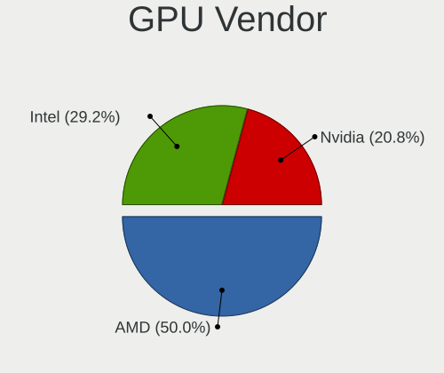

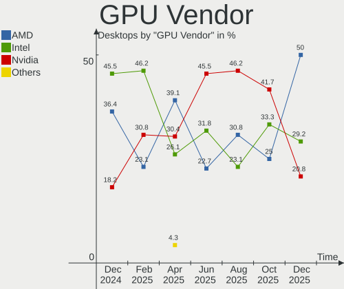

| Vendor | Desktops | Percent |
|--------|----------|---------|
| AMD    | 12       | 50%     |
| Intel  | 7        | 29.17%  |
| Nvidia | 5        | 20.83%  |

GPU Model
---------

Graphics card models

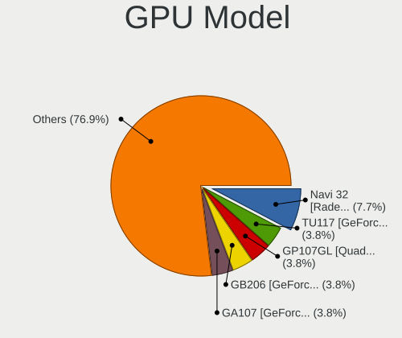

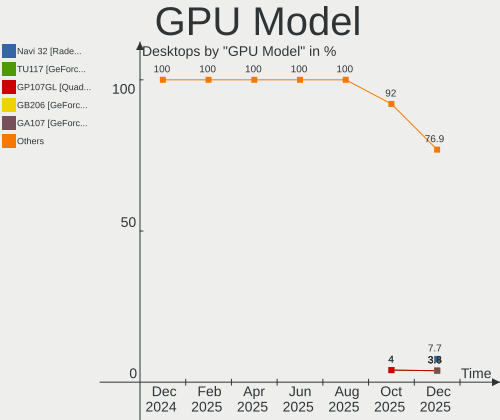

| Model                                                                       | Desktops | Percent |
|-----------------------------------------------------------------------------|----------|---------|
| AMD Navi 32 [Radeon RX 7700 XT / 7800 XT]                                   | 2        | 7.69%   |
| Nvidia TU117 [GeForce GTX 1650]                                             | 1        | 3.85%   |
| Nvidia GP107GL [Quadro P620]                                                | 1        | 3.85%   |
| Nvidia GB206 [GeForce RTX 5060 Ti]                                          | 1        | 3.85%   |
| Nvidia GA107 [GeForce RTX 3050 8GB]                                         | 1        | 3.85%   |
| Nvidia G72 [GeForce 7300 LE]                                                | 1        | 3.85%   |
| Intel Xeon E3-1200 v3/4th Gen Core Processor Integrated Graphics Controller | 1        | 3.85%   |
| Intel Xeon E3-1200 v2/3rd Gen Core processor Graphics Controller            | 1        | 3.85%   |
| Intel Kaby Lake-S GT2 [HD Graphics 630]                                     | 1        | 3.85%   |
| Intel GeminiLake [UHD Graphics 600]                                         | 1        | 3.85%   |
| Intel Core Processor Integrated Graphics Controller                         | 1        | 3.85%   |
| Intel CoffeeLake-S GT2 [UHD Graphics 630]                                   | 1        | 3.85%   |
| Intel Alder Lake-N [Intel Graphics]                                         | 1        | 3.85%   |
| AMD RV790 [Radeon HD 4890]                                                  | 1        | 3.85%   |
| AMD RS780 [Radeon HD 3200]                                                  | 1        | 3.85%   |
| AMD Richland [Radeon HD 8470D]                                              | 1        | 3.85%   |
| AMD Renoir [Radeon Vega Series / Radeon Vega Mobile Series]                 | 1        | 3.85%   |
| AMD Rembrandt [Radeon 680M]                                                 | 1        | 3.85%   |
| AMD Oland PRO [Radeon R7 240/340 / Radeon 520]                              | 1        | 3.85%   |
| AMD Navi 24 [Radeon RX 6400/6500 XT/6500M]                                  | 1        | 3.85%   |
| AMD Lexa PRO [Radeon 540/540X/550/550X / RX 540X/550/550X]                  | 1        | 3.85%   |
| AMD Kaveri [Radeon R7 Graphics]                                             | 1        | 3.85%   |
| AMD Juniper XT [Radeon HD 5770]                                             | 1        | 3.85%   |
| AMD Granite Ridge [Radeon Graphics]                                         | 1        | 3.85%   |
| AMD Cypress PRO [Radeon HD 5850]                                            | 1        | 3.85%   |

GPU Combo
---------

Combinations of graphics cards

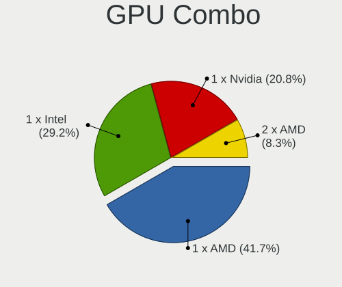

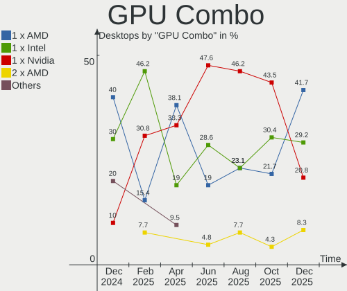

| Name       | Desktops | Percent |
|------------|----------|---------|
| 1 x AMD    | 10       | 41.67%  |
| 1 x Intel  | 7        | 29.17%  |
| 1 x Nvidia | 5        | 20.83%  |
| 2 x AMD    | 2        | 8.33%   |

GPU Driver
----------

Free vs proprietary

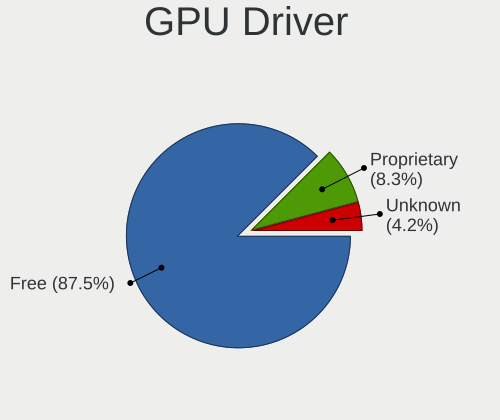

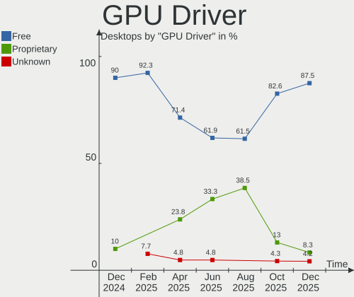

| Driver      | Desktops | Percent |
|-------------|----------|---------|
| Free        | 21       | 87.5%   |
| Proprietary | 2        | 8.33%   |
| Unknown     | 1        | 4.17%   |

GPU Memory
----------

Total video memory

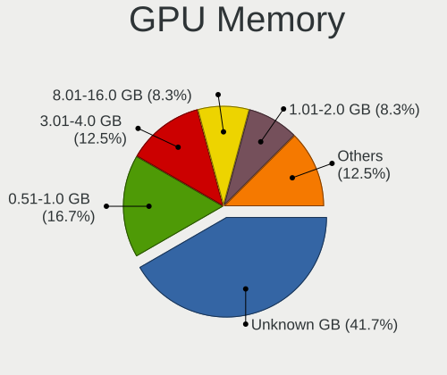

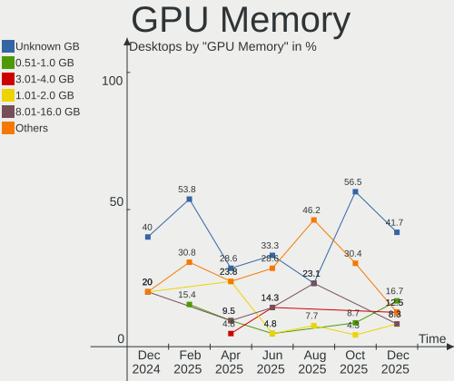

| Size in GB | Desktops | Percent |
|------------|----------|---------|
| Unknown    | 10       | 41.67%  |
| 0.51-1.0   | 4        | 16.67%  |
| 3.01-4.0   | 3        | 12.5%   |
| 1.01-2.0   | 2        | 8.33%   |
| 8.01-16.0  | 2        | 8.33%   |
| 0.01-0.5   | 2        | 8.33%   |
| 7.01-8.0   | 1        | 4.17%   |

Monitor
-------

Monitor Vendor
--------------

Monitor vendors

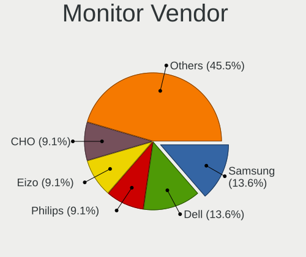

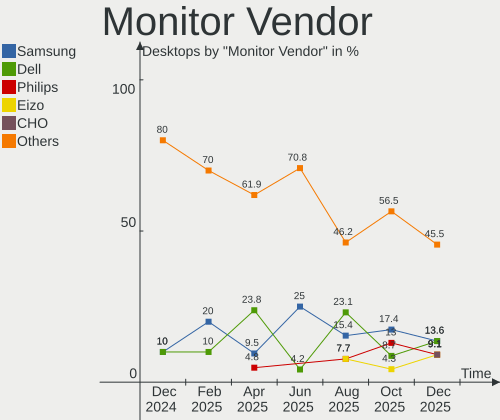

| Vendor              | Desktops | Percent |
|---------------------|----------|---------|
| Samsung Electronics | 3        | 13.64%  |
| Dell                | 3        | 13.64%  |
| Philips             | 2        | 9.09%   |
| Eizo                | 2        | 9.09%   |
| CHO                 | 2        | 9.09%   |
| ViewSonic           | 1        | 4.55%   |
| SUNNY               | 1        | 4.55%   |
| RTK                 | 1        | 4.55%   |
| MStar               | 1        | 4.55%   |
| MSI                 | 1        | 4.55%   |
| Medion              | 1        | 4.55%   |
| HUAWEI              | 1        | 4.55%   |
| Goldstar            | 1        | 4.55%   |
| BenQ                | 1        | 4.55%   |
| Acer                | 1        | 4.55%   |

Monitor Model
-------------

Monitor models

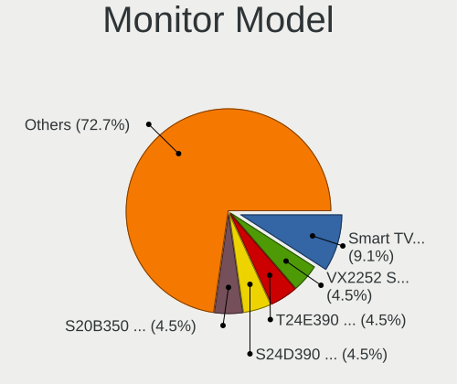

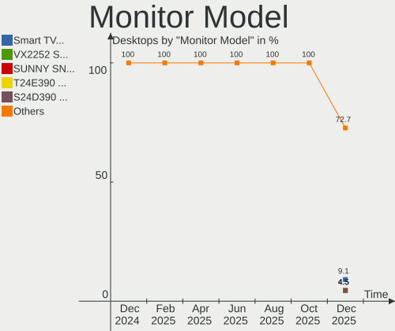

| Model                                                             | Desktops | Percent |
|-------------------------------------------------------------------|----------|---------|
| CHO Smart TV CHO0030 1920x1080 1390x780mm 62.8-inch               | 2        | 9.09%   |
| ViewSonic VX2252 Series VSCDC2E 1920x1080 477x268mm 21.5-inch     | 1        | 4.55%   |
| SUNNY SUNNY SNN0002 1920x1080 708x398mm 32.0-inch                 | 1        | 4.55%   |
| Samsung Electronics T24E390 SAM0C20 1920x1080 521x293mm 23.5-inch | 1        | 4.55%   |
| Samsung Electronics S24D390 SAM0B65 1920x1080 521x293mm 23.5-inch | 1        | 4.55%   |
| Samsung Electronics S20B350 SAM0916 1600x900 443x249mm 20.0-inch  | 1        | 4.55%   |
| RTK 32V3H-H6A RTK4C54 1440x900 697x392mm 31.5-inch                | 1        | 4.55%   |
| Philips PHL 243V7 PHLC155 1920x1080 527x296mm 23.8-inch           | 1        | 4.55%   |
| Philips 34M2C3500L PHLC347 3440x1440 797x334mm 34.0-inch          | 1        | 4.55%   |
| MStar Dangbei MST9266 1920x1080 575x323mm 26.0-inch               | 1        | 4.55%   |
| MSI MP161 E2 MSI40B7 1920x1080 330x220mm 15.6-inch                | 1        | 4.55%   |
| Medion MD32117PQ MED87C0 1280x1024 337x270mm 17.0-inch            | 1        | 4.55%   |
| HUAWEI ZQE-CBA HWV6A25 3440x1440 797x334mm 34.0-inch              | 1        | 4.55%   |
| Goldstar FULL HD GSM5B55 1920x1080 480x270mm 21.7-inch            | 1        | 4.55%   |
| Eizo S2402W ENC1996 1920x1200 519x324mm 24.1-inch                 | 1        | 4.55%   |
| Eizo LCD Monitor EV2436W 1920x1200                                | 1        | 4.55%   |
| Dell U2723QE DEL4278 3840x2160 597x336mm 27.0-inch                | 1        | 4.55%   |
| Dell LCD Monitor P2422H 1920x1080                                 | 1        | 4.55%   |
| Dell E190S DELA04B 1280x1024 376x301mm 19.0-inch                  | 1        | 4.55%   |
| BenQ GL2450H BNQ78A7 1920x1080 531x298mm 24.0-inch                | 1        | 4.55%   |
| Acer G246HL ACR02FF 1920x1080 531x299mm 24.0-inch                 | 1        | 4.55%   |

Monitor Resolution
------------------

Monitor screen resolution

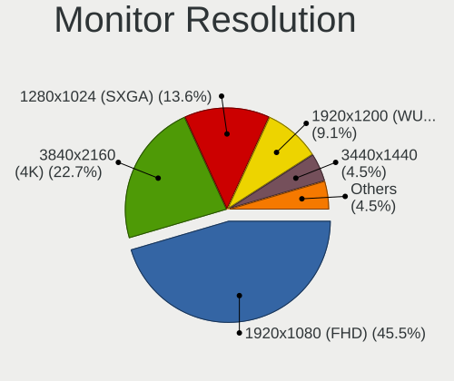

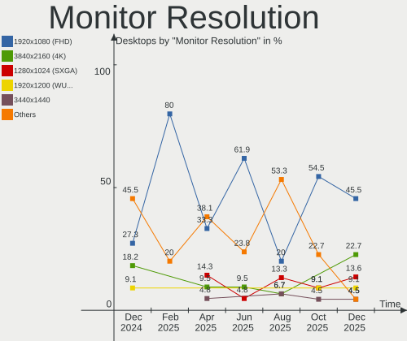

| Resolution        | Desktops | Percent |
|-------------------|----------|---------|
| 1920x1080 (FHD)   | 10       | 45.45%  |
| 3840x2160 (4K)    | 5        | 22.73%  |
| 1280x1024 (SXGA)  | 3        | 13.64%  |
| 1920x1200 (WUXGA) | 2        | 9.09%   |
| 3440x1440         | 1        | 4.55%   |
| 1600x900 (HD+)    | 1        | 4.55%   |

Monitor Diagonal
----------------

Diagonal size in inches

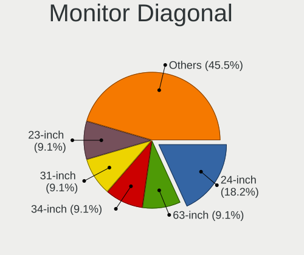

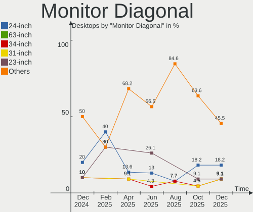

| Inches  | Desktops | Percent |
|---------|----------|---------|
| 24      | 4        | 18.18%  |
| 63      | 2        | 9.09%   |
| 34      | 2        | 9.09%   |
| 31      | 2        | 9.09%   |
| 23      | 2        | 9.09%   |
| Unknown | 2        | 9.09%   |
| 52      | 1        | 4.55%   |
| 27      | 1        | 4.55%   |
| 26      | 1        | 4.55%   |
| 21      | 1        | 4.55%   |
| 20      | 1        | 4.55%   |
| 19      | 1        | 4.55%   |
| 17      | 1        | 4.55%   |
| 15      | 1        | 4.55%   |

Monitor Width
-------------

Physical width

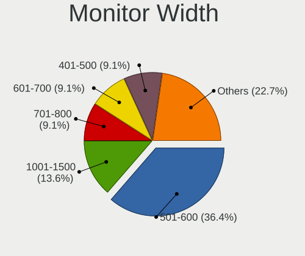

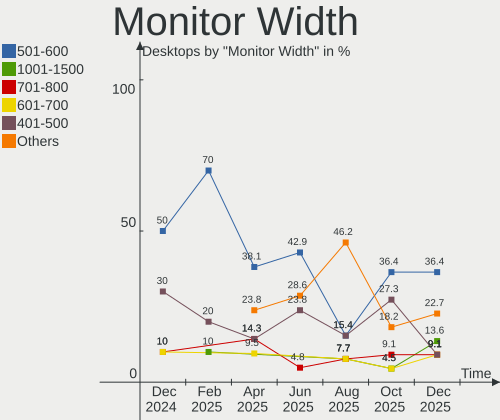

| Width in mm | Desktops | Percent |
|-------------|----------|---------|
| 501-600     | 8        | 36.36%  |
| 1001-1500   | 3        | 13.64%  |
| 701-800     | 2        | 9.09%   |
| 601-700     | 2        | 9.09%   |
| 401-500     | 2        | 9.09%   |
| 301-350     | 2        | 9.09%   |
| Unknown     | 2        | 9.09%   |
| 351-400     | 1        | 4.55%   |

Aspect Ratio
------------

Proportional relationship between the width and the height

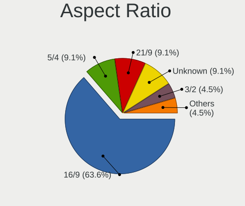

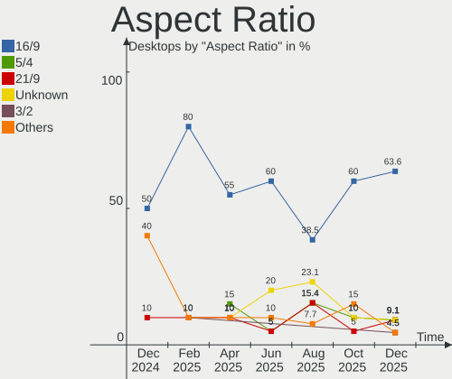

| Ratio   | Desktops | Percent |
|---------|----------|---------|
| 16/9    | 14       | 63.64%  |
| 5/4     | 2        | 9.09%   |
| 21/9    | 2        | 9.09%   |
| Unknown | 2        | 9.09%   |
| 3/2     | 1        | 4.55%   |
| 16/10   | 1        | 4.55%   |

Monitor Area
------------

Area in inch²

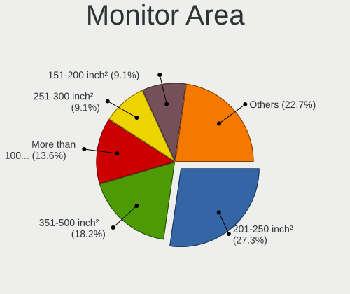

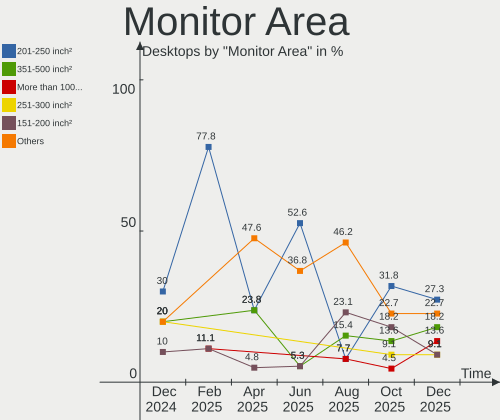

| Area in inch² | Desktops | Percent |
|----------------|----------|---------|
| 201-250        | 6        | 27.27%  |
| 351-500        | 4        | 18.18%  |
| More than 1000 | 3        | 13.64%  |
| 251-300        | 2        | 9.09%   |
| 151-200        | 2        | 9.09%   |
| Unknown        | 2        | 9.09%   |
| 301-350        | 1        | 4.55%   |
| 141-150        | 1        | 4.55%   |
| 111-120        | 1        | 4.55%   |

Pixel Density
-------------

Pixels per inch

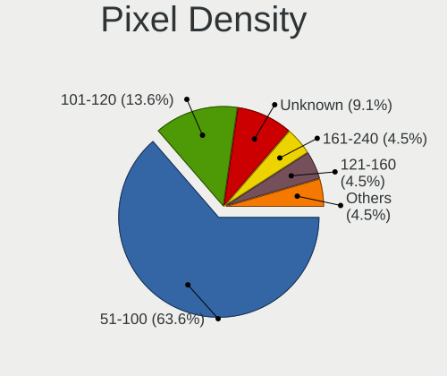

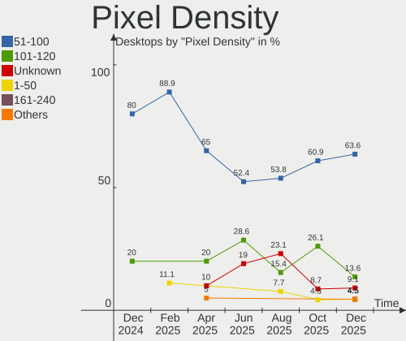

| Density | Desktops | Percent |
|---------|----------|---------|
| 51-100  | 14       | 63.64%  |
| 101-120 | 3        | 13.64%  |
| Unknown | 2        | 9.09%   |
| 1-50    | 1        | 4.55%   |
| 161-240 | 1        | 4.55%   |
| 121-160 | 1        | 4.55%   |

Multiple Monitors
-----------------

Total monitors connected

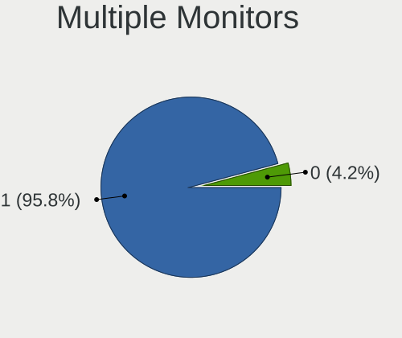

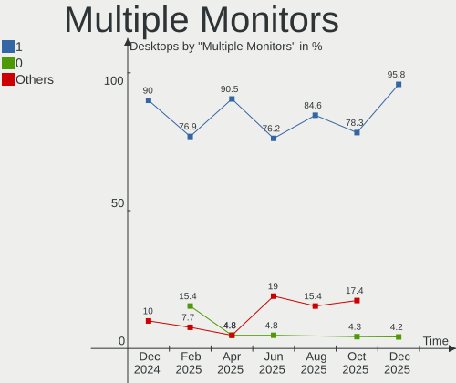

| Total | Desktops | Percent |
|-------|----------|---------|
| 1     | 23       | 95.83%  |
| 0     | 1        | 4.17%   |

Network
-------

Net Controller Vendor
---------------------

Controller vendors

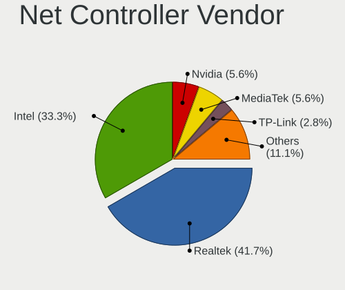

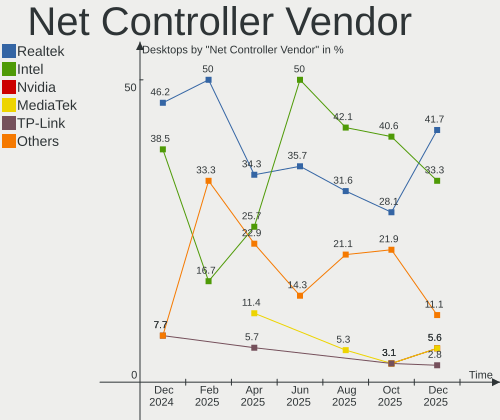

| Vendor                   | Desktops | Percent |
|--------------------------|----------|---------|
| Realtek Semiconductor    | 15       | 41.67%  |
| Intel                    | 12       | 33.33%  |
| Nvidia                   | 2        | 5.56%   |
| MediaTek                 | 2        | 5.56%   |
| TP-Link                  | 1        | 2.78%   |
| NetGear                  | 1        | 2.78%   |
| Marvell Technology Group | 1        | 2.78%   |
| Edimax Technology        | 1        | 2.78%   |
| ASIX Electronics         | 1        | 2.78%   |

Net Controller Model
--------------------

Controller models

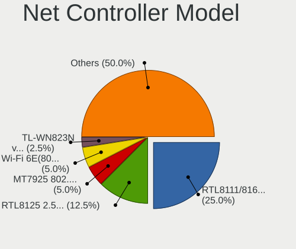

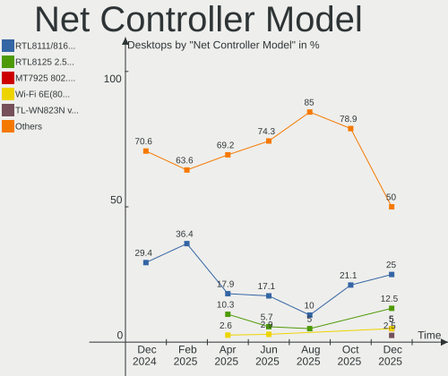

| Model                                                                           | Desktops | Percent |
|---------------------------------------------------------------------------------|----------|---------|
| Realtek RTL8111/8168/8211/8411 PCI Express Gigabit Ethernet Controller          | 10       | 25%     |
| Realtek RTL8125 2.5GbE Controller                                               | 5        | 12.5%   |
| MediaTek MT7925 802.11be 160MHz 2x2 PCIe Wireless Network Adapter [Filogic 360] | 2        | 5%      |
| Intel Wi-Fi 6E(802.11ax) AX210/AX1675* 2x2 [Typhoon Peak]                       | 2        | 5%      |
| TP-Link TL-WN823N v2/v3 [Realtek RTL8192EU]                                     | 1        | 2.5%    |
| Realtek 802.11ac WLAN Adapter                                                   | 1        | 2.5%    |
| Realtek 802.11ac NIC                                                            | 1        | 2.5%    |
| Nvidia MCP65 Ethernet                                                           | 1        | 2.5%    |
| Nvidia MCP55 Ethernet                                                           | 1        | 2.5%    |
| NetGear A6210                                                                   | 1        | 2.5%    |
| Marvell Group 88w8335 [Libertas] 802.11b/g Wireless                             | 1        | 2.5%    |
| Intel Wireless 3165                                                             | 1        | 2.5%    |
| Intel Wi-Fi 6 AX200                                                             | 1        | 2.5%    |
| Intel I211 Gigabit Network Connection                                           | 1        | 2.5%    |
| Intel Ethernet Controller I226-V                                                | 1        | 2.5%    |
| Intel Ethernet Connection I217-LM                                               | 1        | 2.5%    |
| Intel Ethernet Connection (7) I219-V                                            | 1        | 2.5%    |
| Intel Ethernet Connection (7) I219-LM                                           | 1        | 2.5%    |
| Intel Ethernet Connection (5) I219-LM                                           | 1        | 2.5%    |
| Intel Alder Lake-N PCH CNVi WiFi                                                | 1        | 2.5%    |
| Intel 82578DM Gigabit Network Connection                                        | 1        | 2.5%    |
| Intel 82541PI Gigabit Ethernet Controller                                       | 1        | 2.5%    |
| Intel 700 Series Chipset CNVi WiFi                                              | 1        | 2.5%    |
| Edimax AC1200 MU-MIMO USB3.0 Adapter                                            | 1        | 2.5%    |
| ASIX AX88179 Gigabit Ethernet                                                   | 1        | 2.5%    |

Wireless Vendor
---------------

Wireless vendors

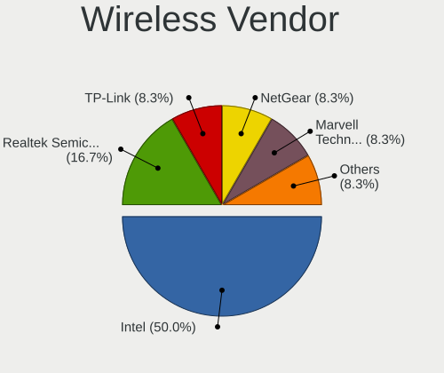

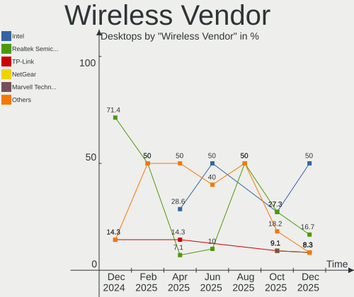

| Vendor                   | Desktops | Percent |
|--------------------------|----------|---------|
| Intel                    | 6        | 50%     |
| Realtek Semiconductor    | 2        | 16.67%  |
| TP-Link                  | 1        | 8.33%   |
| NetGear                  | 1        | 8.33%   |
| Marvell Technology Group | 1        | 8.33%   |
| Edimax Technology        | 1        | 8.33%   |

Wireless Model
--------------

Wireless models

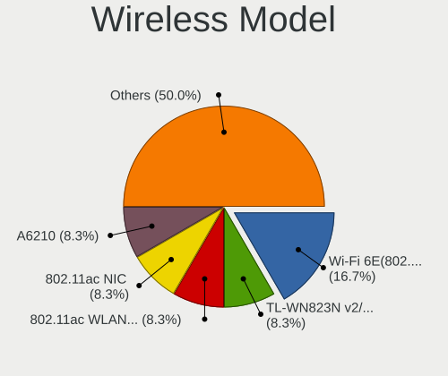

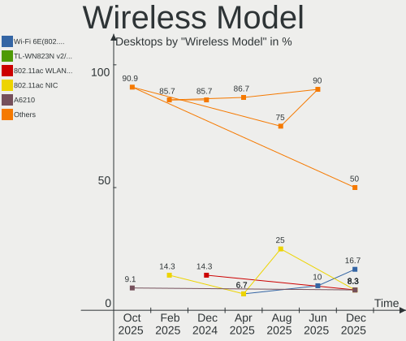

| Model                                                     | Desktops | Percent |
|-----------------------------------------------------------|----------|---------|
| Intel Wi-Fi 6E(802.11ax) AX210/AX1675* 2x2 [Typhoon Peak] | 2        | 16.67%  |
| TP-Link TL-WN823N v2/v3 [Realtek RTL8192EU]               | 1        | 8.33%   |
| Realtek 802.11ac WLAN Adapter                             | 1        | 8.33%   |
| Realtek 802.11ac NIC                                      | 1        | 8.33%   |
| NetGear A6210                                             | 1        | 8.33%   |
| Marvell Group 88w8335 [Libertas] 802.11b/g Wireless       | 1        | 8.33%   |
| Intel Wireless 3165                                       | 1        | 8.33%   |
| Intel Wi-Fi 6 AX200                                       | 1        | 8.33%   |
| Intel Alder Lake-N PCH CNVi WiFi                          | 1        | 8.33%   |
| Intel 700 Series Chipset CNVi WiFi                        | 1        | 8.33%   |
| Edimax AC1200 MU-MIMO USB3.0 Adapter                      | 1        | 8.33%   |

Ethernet Vendor
---------------

Ethernet vendors

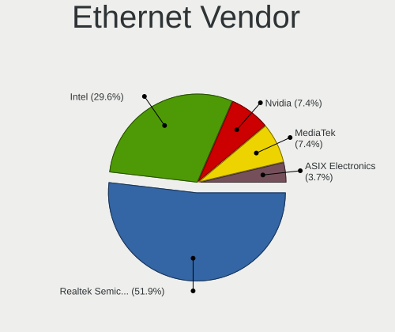

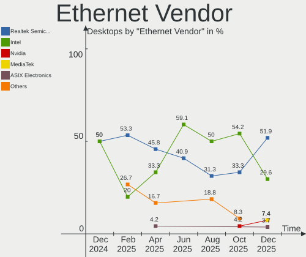

| Vendor                | Desktops | Percent |
|-----------------------|----------|---------|
| Realtek Semiconductor | 14       | 51.85%  |
| Intel                 | 8        | 29.63%  |
| Nvidia                | 2        | 7.41%   |
| MediaTek              | 2        | 7.41%   |
| ASIX Electronics      | 1        | 3.7%    |

Ethernet Model
--------------

Ethernet models

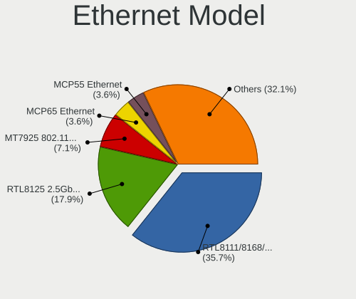

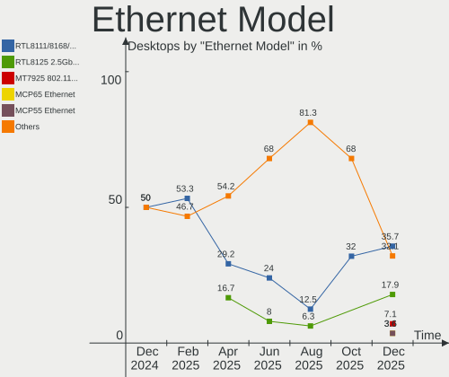

| Model                                                                           | Desktops | Percent |
|---------------------------------------------------------------------------------|----------|---------|
| Realtek RTL8111/8168/8211/8411 PCI Express Gigabit Ethernet Controller          | 10       | 35.71%  |
| Realtek RTL8125 2.5GbE Controller                                               | 5        | 17.86%  |
| MediaTek MT7925 802.11be 160MHz 2x2 PCIe Wireless Network Adapter [Filogic 360] | 2        | 7.14%   |
| Nvidia MCP65 Ethernet                                                           | 1        | 3.57%   |
| Nvidia MCP55 Ethernet                                                           | 1        | 3.57%   |
| Intel I211 Gigabit Network Connection                                           | 1        | 3.57%   |
| Intel Ethernet Controller I226-V                                                | 1        | 3.57%   |
| Intel Ethernet Connection I217-LM                                               | 1        | 3.57%   |
| Intel Ethernet Connection (7) I219-V                                            | 1        | 3.57%   |
| Intel Ethernet Connection (7) I219-LM                                           | 1        | 3.57%   |
| Intel Ethernet Connection (5) I219-LM                                           | 1        | 3.57%   |
| Intel 82578DM Gigabit Network Connection                                        | 1        | 3.57%   |
| Intel 82541PI Gigabit Ethernet Controller                                       | 1        | 3.57%   |
| ASIX AX88179 Gigabit Ethernet                                                   | 1        | 3.57%   |

Net Controller Kind
-------------------

Ethernet, WiFi or modem

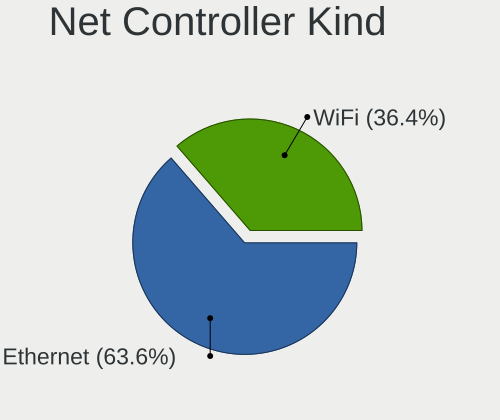

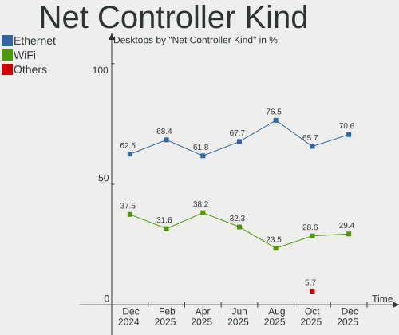

| Kind     | Desktops | Percent |
|----------|----------|---------|
| Ethernet | 24       | 70.59%  |
| WiFi     | 10       | 29.41%  |

Used Controller
---------------

Currently used network controller

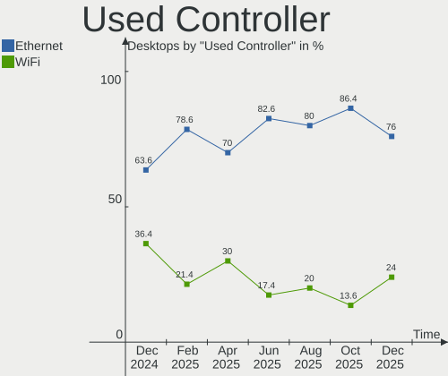

| Kind     | Desktops | Percent |
|----------|----------|---------|
| Ethernet | 19       | 76%     |
| WiFi     | 6        | 24%     |

NICs
----

Total network controllers on board

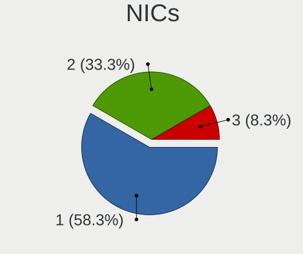

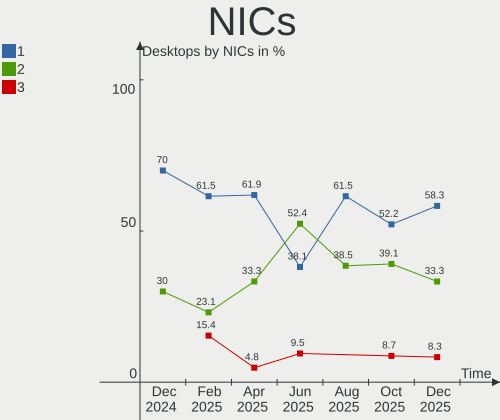

| Total | Desktops | Percent |
|-------|----------|---------|
| 1     | 14       | 58.33%  |
| 2     | 8        | 33.33%  |
| 3     | 2        | 8.33%   |

IPv6
----

IPv6 vs IPv4

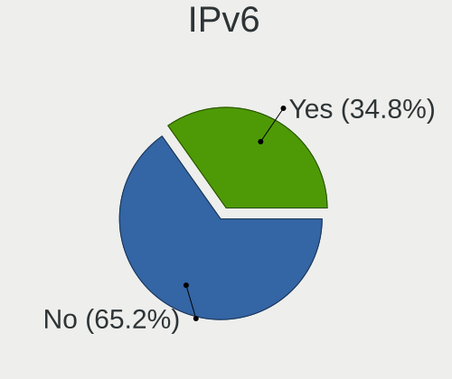

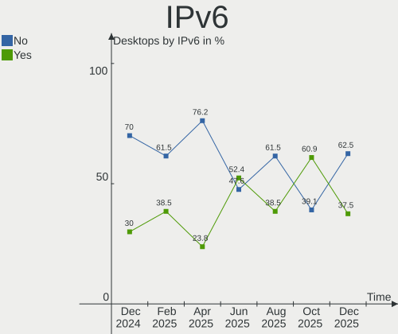

| Used | Desktops | Percent |
|------|----------|---------|
| No   | 15       | 62.5%   |
| Yes  | 9        | 37.5%   |

Bluetooth
---------

Bluetooth Vendor
----------------

Controller vendors

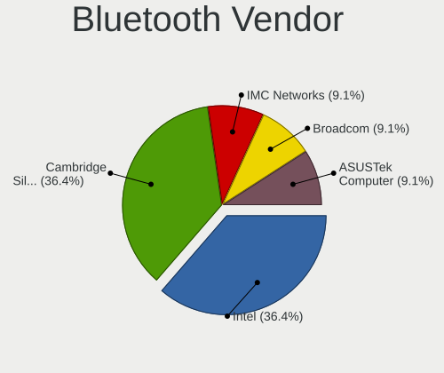

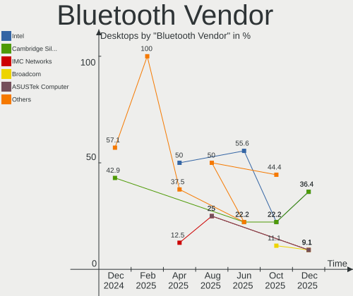

| Vendor                  | Desktops | Percent |
|-------------------------|----------|---------|
| Intel                   | 4        | 36.36%  |
| Cambridge Silicon Radio | 4        | 36.36%  |
| IMC Networks            | 1        | 9.09%   |
| Broadcom                | 1        | 9.09%   |
| ASUSTek Computer        | 1        | 9.09%   |

Bluetooth Model
---------------

Controller models

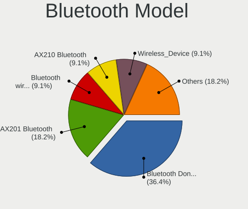

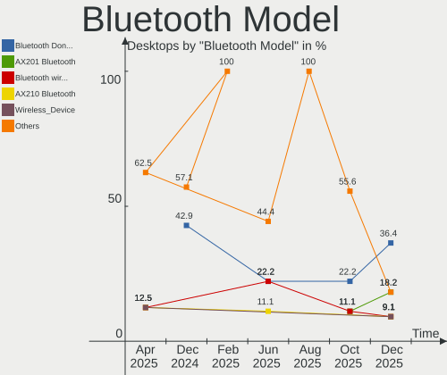

| Model                                               | Desktops | Percent |
|-----------------------------------------------------|----------|---------|
| Cambridge Silicon Radio Bluetooth Dongle (HCI mode) | 4        | 36.36%  |
| Intel AX201 Bluetooth                               | 2        | 18.18%  |
| Intel Bluetooth wireless interface                  | 1        | 9.09%   |
| Intel AX210 Bluetooth                               | 1        | 9.09%   |
| IMC Networks Wireless_Device                        | 1        | 9.09%   |
| Broadcom BCM20702A0 Bluetooth 4.0                   | 1        | 9.09%   |
| ASUS ASUS USB-BT500                                 | 1        | 9.09%   |

Sound
-----

Sound Vendor
------------

Sound card vendors

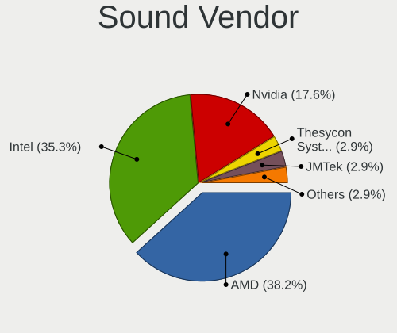

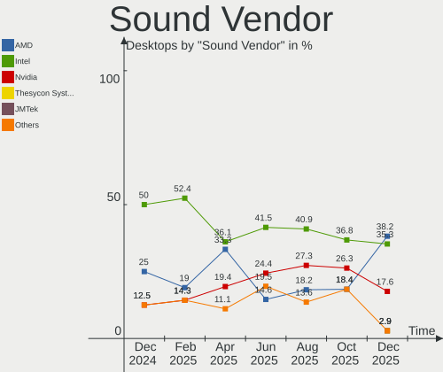

| Vendor                               | Desktops | Percent |
|--------------------------------------|----------|---------|
| AMD                                  | 13       | 38.24%  |
| Intel                                | 12       | 35.29%  |
| Nvidia                               | 6        | 17.65%  |
| Thesycon Systemsoftware & Consulting | 1        | 2.94%   |
| JMTek                                | 1        | 2.94%   |
| Creative Technology                  | 1        | 2.94%   |

Sound Model
-----------

Sound card models

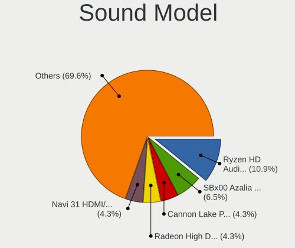

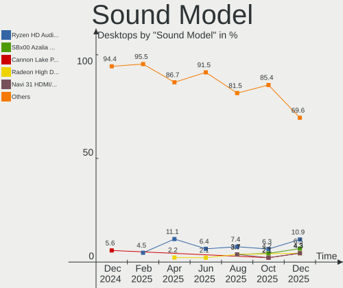

| Model                                                                      | Desktops | Percent |
|----------------------------------------------------------------------------|----------|---------|
| AMD Ryzen HD Audio Controller                                              | 5        | 10.87%  |
| AMD SBx00 Azalia (Intel HDA)                                               | 3        | 6.52%   |
| Intel Cannon Lake PCH cAVS                                                 | 2        | 4.35%   |
| AMD Radeon High Definition Audio Controller                                | 2        | 4.35%   |
| AMD Navi 31 HDMI/DP Audio                                                  | 2        | 4.35%   |
| AMD FCH Azalia Controller                                                  | 2        | 4.35%   |
| Thesycon Systemsoftware & Consulting E30                                   | 1        | 2.17%   |
| Nvidia TU107 GeForce GTX 1650 High Definition Audio Controller             | 1        | 2.17%   |
| Nvidia MCP65 High Definition Audio                                         | 1        | 2.17%   |
| Nvidia MCP55 High Definition Audio                                         | 1        | 2.17%   |
| Nvidia GP107GL High Definition Audio Controller                            | 1        | 2.17%   |
| Nvidia GB206 High Definition Audio Controller                              | 1        | 2.17%   |
| Nvidia GA107 High Definition Audio Controller                              | 1        | 2.17%   |
| JMTek USB PnP Audio Device                                                 | 1        | 2.17%   |
| Intel Xeon E3-1200 v3/4th Gen Core Processor HD Audio Controller           | 1        | 2.17%   |
| Intel Raptor Lake High Definition Audio Controller                         | 1        | 2.17%   |
| Intel NM10/ICH7 Family High Definition Audio Controller                    | 1        | 2.17%   |
| Intel Celeron/Pentium Silver Processor High Definition Audio               | 1        | 2.17%   |
| Intel Alder Lake-S HD Audio Controller                                     | 1        | 2.17%   |
| Intel Alder Lake-N PCH High Definition Audio Controller                    | 1        | 2.17%   |
| Intel 8 Series/C220 Series Chipset High Definition Audio Controller        | 1        | 2.17%   |
| Intel 6 Series/C200 Series Chipset Family High Definition Audio Controller | 1        | 2.17%   |
| Intel 5 Series/3400 Series Chipset High Definition Audio                   | 1        | 2.17%   |
| Intel 200 Series PCH HD Audio                                              | 1        | 2.17%   |
| Intel 100 Series/C230 Series Chipset Family HD Audio Controller            | 1        | 2.17%   |
| Creative Technology HS-720 Headset                                         | 1        | 2.17%   |
| AMD Trinity HDMI Audio Controller                                          | 1        | 2.17%   |
| AMD RV770 HDMI Audio [Radeon HD 4850/4870]                                 | 1        | 2.17%   |
| AMD RS780 HDMI Audio [Radeon 3000/3100 / HD 3200/3300]                     | 1        | 2.17%   |
| AMD Renoir/Cezanne HDMI/DP Audio Controller                                | 1        | 2.17%   |
| AMD Oland/Hainan/Cape Verde/Pitcairn HDMI Audio [Radeon HD 7000 Series]    | 1        | 2.17%   |
| AMD Navi 21/23 HDMI/DP Audio Controller                                    | 1        | 2.17%   |
| AMD Kaveri HDMI/DP Audio Controller                                        | 1        | 2.17%   |
| AMD Juniper HDMI Audio [Radeon HD 5700 Series]                             | 1        | 2.17%   |
| AMD Cypress HDMI Audio [Radeon HD 5830/5850/5870 / 6850/6870 Rebrand]      | 1        | 2.17%   |
| AMD Baffin HDMI/DP Audio [Radeon RX 550 640SP / RX 560/560X]               | 1        | 2.17%   |

Memory
------

Memory Vendor
-------------

Memory module vendors

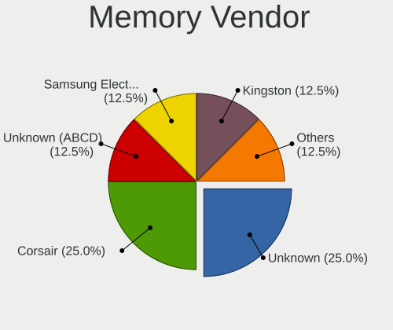

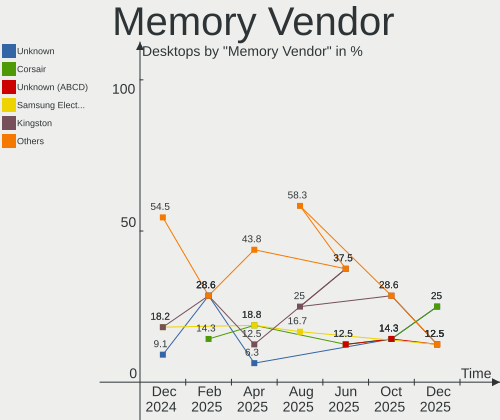

| Vendor              | Desktops | Percent |
|---------------------|----------|---------|
| Unknown             | 2        | 25%     |
| Corsair             | 2        | 25%     |
| Unknown (ABCD)      | 1        | 12.5%   |
| Samsung Electronics | 1        | 12.5%   |
| Kingston            | 1        | 12.5%   |
| Exceleram           | 1        | 12.5%   |

Memory Model
------------

Memory module models

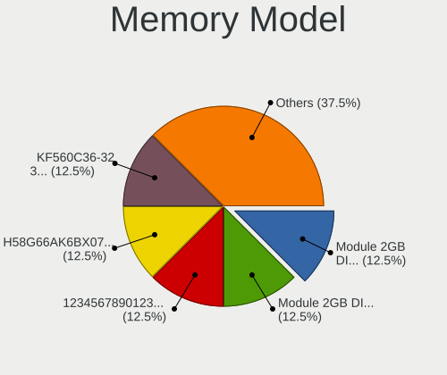

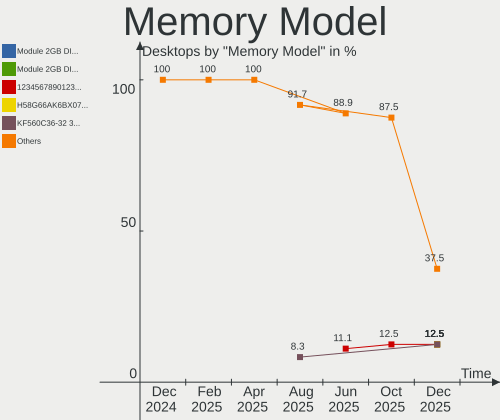

| Model                                                          | Desktops | Percent |
|----------------------------------------------------------------|----------|---------|
| Unknown RAM Module 2GB DIMM DDR2                               | 1        | 12.5%   |
| Unknown RAM Module 2GB DIMM 800MT/s                            | 1        | 12.5%   |
| Unknown (ABCD) RAM 123456789012345678 2GB DIMM LPDDR4 2133MT/s | 1        | 12.5%   |
| Samsung RAM H58G66AK6BX070N 8GB DIMM LPDDR5 6400MT/s           | 1        | 12.5%   |
| Kingston RAM KF560C36-32 32GB DIMM DDR5 6200MT/s               | 1        | 12.5%   |
| Exceleram RAM E30113A 4GB DIMM DDR3 1333MT/s                   | 1        | 12.5%   |
| Corsair RAM CMV4GX4M1A2400C16 4GB DIMM DDR4 2400MT/s           | 1        | 12.5%   |
| Corsair RAM CMK32GX5M2B6000Z30 16GB DIMM DDR5 6000MT/s         | 1        | 12.5%   |

Memory Kind
-----------

Memory module kinds

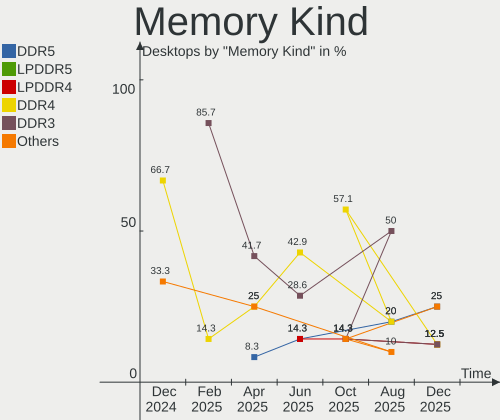

| Kind    | Desktops | Percent |
|---------|----------|---------|
| DDR5    | 2        | 25%     |
| LPDDR5  | 1        | 12.5%   |
| LPDDR4  | 1        | 12.5%   |
| DDR4    | 1        | 12.5%   |
| DDR3    | 1        | 12.5%   |
| DDR2    | 1        | 12.5%   |
| Unknown | 1        | 12.5%   |

Memory Form Factor
------------------

Physical design of the memory module

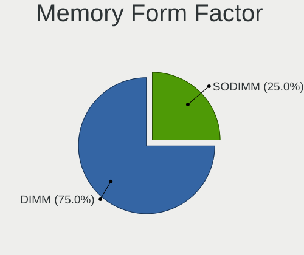

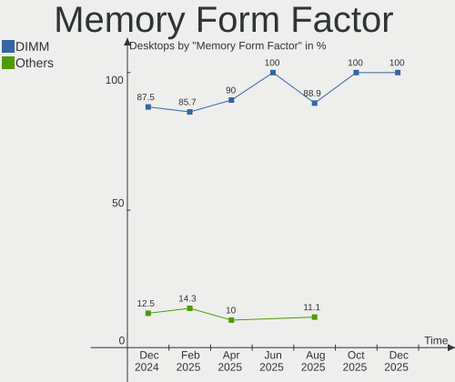

| Name | Desktops | Percent |
|------|----------|---------|
| DIMM | 8        | 100%    |

Memory Size
-----------

Memory module size

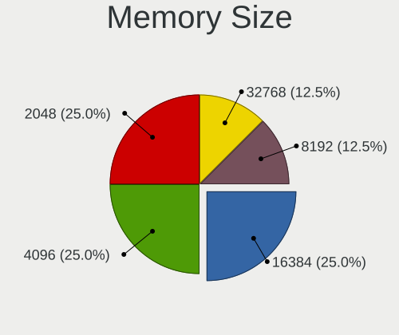

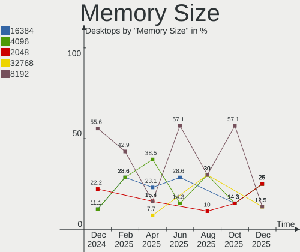

| Size  | Desktops | Percent |
|-------|----------|---------|
| 16384 | 2        | 25%     |
| 4096  | 2        | 25%     |
| 2048  | 2        | 25%     |
| 32768 | 1        | 12.5%   |
| 8192  | 1        | 12.5%   |

Memory Speed
------------

Memory module speed

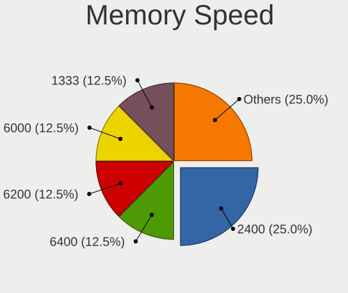

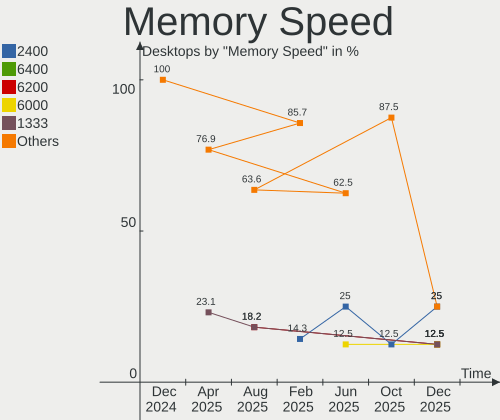

| Speed   | Desktops | Percent |
|---------|----------|---------|
| 2400    | 2        | 25%     |
| 6400    | 1        | 12.5%   |
| 6200    | 1        | 12.5%   |
| 6000    | 1        | 12.5%   |
| 1333    | 1        | 12.5%   |
| 800     | 1        | 12.5%   |
| Unknown | 1        | 12.5%   |

Printers & scanners
-------------------

Printer Vendor
--------------

Printer device vendors

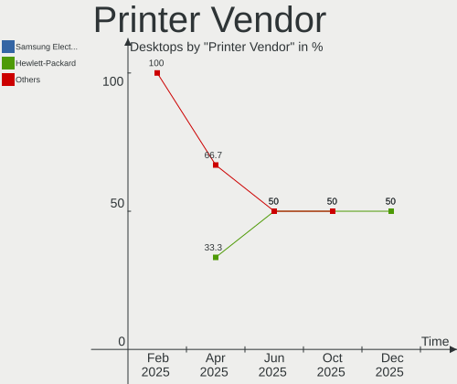

| Vendor              | Desktops | Percent |
|---------------------|----------|---------|
| Samsung Electronics | 1        | 50%     |
| Hewlett-Packard     | 1        | 50%     |

Printer Model
-------------

Printer device models

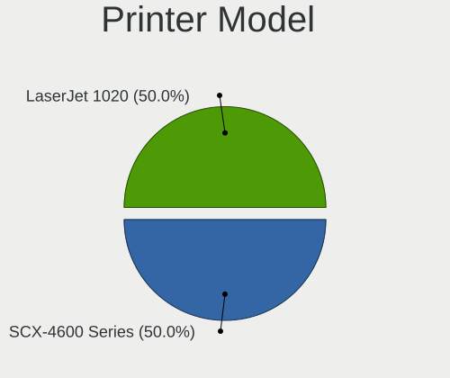

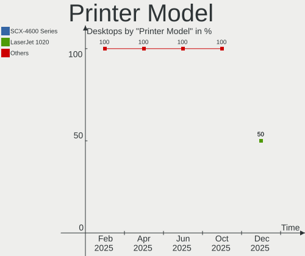

| Model                   | Desktops | Percent |
|-------------------------|----------|---------|
| Samsung SCX-4600 Series | 1        | 50%     |
| HP LaserJet 1020        | 1        | 50%     |

Scanner Vendor
--------------

Scanner device vendors

Zero info for selected period =(

Scanner Model
-------------

Scanner device models

Zero info for selected period =(

Camera
------

Camera Vendor
-------------

Camera device vendors

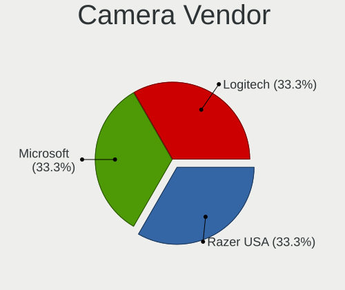

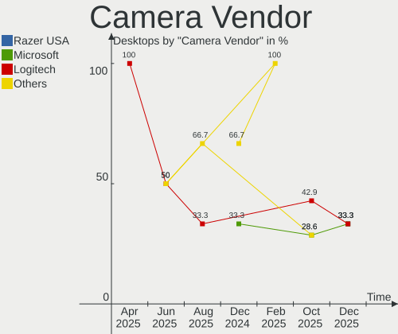

| Vendor    | Desktops | Percent |
|-----------|----------|---------|
| Razer USA | 1        | 33.33%  |
| Microsoft | 1        | 33.33%  |
| Logitech  | 1        | 33.33%  |

Camera Model
------------

Camera device models

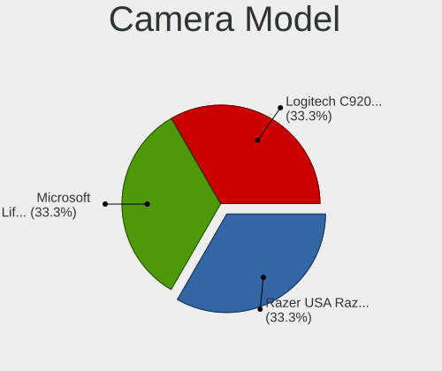

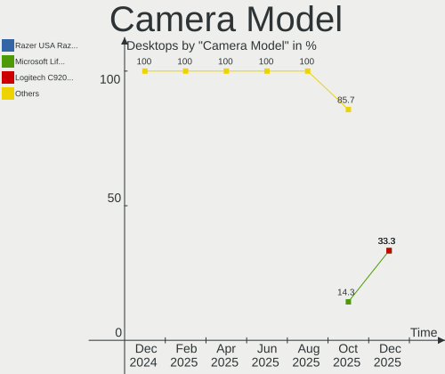

| Model                       | Desktops | Percent |
|-----------------------------|----------|---------|
| Razer USA Razer Kiyo X      | 1        | 33.33%  |
| Microsoft LifeCam Studio    | 1        | 33.33%  |
| Logitech C920 PRO HD Webcam | 1        | 33.33%  |

Security
--------

Fingerprint Vendor
------------------

Fingerprint sensor vendors

Zero info for selected period =(

Fingerprint Model
-----------------

Fingerprint sensor models

Zero info for selected period =(

Chipcard Vendor
---------------

Chipcard module vendors

Zero info for selected period =(

Chipcard Model
--------------

Chipcard module models

Zero info for selected period =(

Unsupported
-----------

Unsupported Devices
-------------------

Total unsupported devices on board

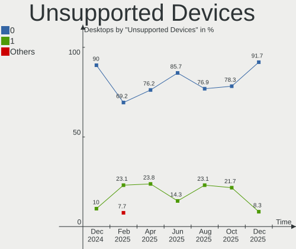

| Total | Desktops | Percent |
|-------|----------|---------|
| 0     | 22       | 91.67%  |
| 1     | 2        | 8.33%   |

Unsupported Device Types
------------------------

Types of unsupported devices

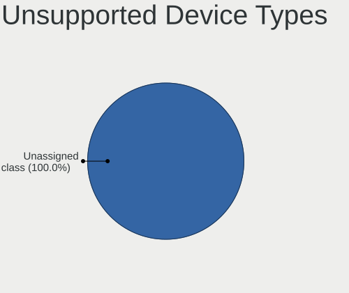

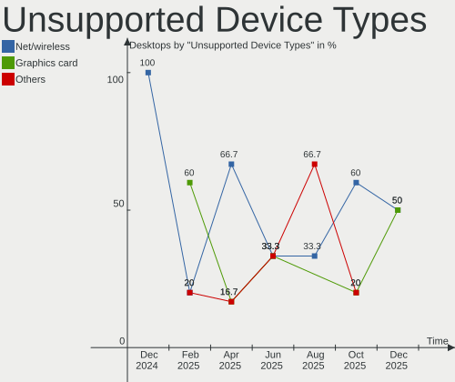

| Type          | Desktops | Percent |
|---------------|----------|---------|
| Net/wireless  | 1        | 50%     |
| Graphics card | 1        | 50%     |

