LMDE - Hardware Trends (Desktops)
---------------------------------

A project to identify most popular hardware characteristics and track their change
over time based on data collected by Linux users at https://Linux-Hardware.org.

Anyone can contribute to this report by the [hw-probe](https://github.com/linuxhw/hw-probe) tool:

    sudo -E hw-probe -all -upload

This report is for one last month. Overall report since the beginning of time: [TestCoverage](https://github.com/linuxhw/TestCoverage)

Period: Oct, 2022.

Contents
--------

* [ System ](#system)
  - [ OS                       ](#os)
  - [ OS Family                ](#os-family)
  - [ Kernel                   ](#kernel)
  - [ Kernel Family            ](#kernel-family)
  - [ Kernel Major Ver.        ](#kernel-major-ver)
  - [ Arch                     ](#arch)
  - [ DE                       ](#de)
  - [ Display Server           ](#display-server)
  - [ Display Manager          ](#display-manager)
  - [ OS Lang                  ](#os-lang)
  - [ Boot Mode                ](#boot-mode)
  - [ Filesystem               ](#filesystem)
  - [ Part. scheme             ](#part-scheme)
  - [ Dual Boot with Linux/BSD ](#dual-boot-with-linuxbsd)
  - [ Dual Boot (Win)          ](#dual-boot-win)

* [ Board ](#board)
  - [ Vendor                   ](#vendor)
  - [ Model                    ](#model)
  - [ Model Family             ](#model-family)
  - [ MFG Year                 ](#mfg-year)
  - [ Form Factor              ](#form-factor)
  - [ Secure Boot              ](#secure-boot)
  - [ Coreboot                 ](#coreboot)
  - [ RAM Size                 ](#ram-size)
  - [ RAM Used                 ](#ram-used)
  - [ Total Drives             ](#total-drives)
  - [ Has CD-ROM               ](#has-cd-rom)
  - [ Has Ethernet             ](#has-ethernet)
  - [ Has WiFi                 ](#has-wifi)
  - [ Has Bluetooth            ](#has-bluetooth)

* [ Location ](#location)
  - [ Country                  ](#country)
  - [ City                     ](#city)

* [ Drives ](#drives)
  - [ Drive Vendor             ](#drive-vendor)
  - [ Drive Model              ](#drive-model)
  - [ HDD Vendor               ](#hdd-vendor)
  - [ SSD Vendor               ](#ssd-vendor)
  - [ Drive Kind               ](#drive-kind)
  - [ Drive Connector          ](#drive-connector)
  - [ Drive Size               ](#drive-size)
  - [ Space Total              ](#space-total)
  - [ Space Used               ](#space-used)
  - [ Malfunc. Drives          ](#malfunc-drives)
  - [ Malfunc. Drive Vendor    ](#malfunc-drive-vendor)
  - [ Malfunc. HDD Vendor      ](#malfunc-hdd-vendor)
  - [ Malfunc. Drive Kind      ](#malfunc-drive-kind)
  - [ Failed Drives            ](#failed-drives)
  - [ Failed Drive Vendor      ](#failed-drive-vendor)
  - [ Drive Status             ](#drive-status)

* [ Storage controller ](#storage-controller)
  - [ Storage Vendor           ](#storage-vendor)
  - [ Storage Model            ](#storage-model)
  - [ Storage Kind             ](#storage-kind)

* [ Processor ](#processor)
  - [ CPU Vendor               ](#cpu-vendor)
  - [ CPU Model                ](#cpu-model)
  - [ CPU Model Family         ](#cpu-model-family)
  - [ CPU Cores                ](#cpu-cores)
  - [ CPU Sockets              ](#cpu-sockets)
  - [ CPU Threads              ](#cpu-threads)
  - [ CPU Op-Modes             ](#cpu-op-modes)
  - [ CPU Microcode            ](#cpu-microcode)
  - [ CPU Microarch            ](#cpu-microarch)

* [ Graphics ](#graphics)
  - [ GPU Vendor               ](#gpu-vendor)
  - [ GPU Model                ](#gpu-model)
  - [ GPU Combo                ](#gpu-combo)
  - [ GPU Driver               ](#gpu-driver)
  - [ GPU Memory               ](#gpu-memory)

* [ Monitor ](#monitor)
  - [ Monitor Vendor           ](#monitor-vendor)
  - [ Monitor Model            ](#monitor-model)
  - [ Monitor Resolution       ](#monitor-resolution)
  - [ Monitor Diagonal         ](#monitor-diagonal)
  - [ Monitor Width            ](#monitor-width)
  - [ Aspect Ratio             ](#aspect-ratio)
  - [ Monitor Area             ](#monitor-area)
  - [ Pixel Density            ](#pixel-density)
  - [ Multiple Monitors        ](#multiple-monitors)

* [ Network ](#network)
  - [ Net Controller Vendor    ](#net-controller-vendor)
  - [ Net Controller Model     ](#net-controller-model)
  - [ Wireless Vendor          ](#wireless-vendor)
  - [ Wireless Model           ](#wireless-model)
  - [ Ethernet Vendor          ](#ethernet-vendor)
  - [ Ethernet Model           ](#ethernet-model)
  - [ Net Controller Kind      ](#net-controller-kind)
  - [ Used Controller          ](#used-controller)
  - [ NICs                     ](#nics)
  - [ IPv6                     ](#ipv6)

* [ Bluetooth ](#bluetooth)
  - [ Bluetooth Vendor         ](#bluetooth-vendor)
  - [ Bluetooth Model          ](#bluetooth-model)

* [ Sound ](#sound)
  - [ Sound Vendor             ](#sound-vendor)
  - [ Sound Model              ](#sound-model)

* [ Memory ](#memory)
  - [ Memory Vendor            ](#memory-vendor)
  - [ Memory Model             ](#memory-model)
  - [ Memory Kind              ](#memory-kind)
  - [ Memory Form Factor       ](#memory-form-factor)
  - [ Memory Size              ](#memory-size)
  - [ Memory Speed             ](#memory-speed)

* [ Printers & scanners ](#printers--scanners)
  - [ Printer Vendor           ](#printer-vendor)
  - [ Printer Model            ](#printer-model)
  - [ Scanner Vendor           ](#scanner-vendor)
  - [ Scanner Model            ](#scanner-model)

* [ Camera ](#camera)
  - [ Camera Vendor            ](#camera-vendor)
  - [ Camera Model             ](#camera-model)

* [ Security ](#security)
  - [ Fingerprint Vendor       ](#fingerprint-vendor)
  - [ Fingerprint Model        ](#fingerprint-model)
  - [ Chipcard Vendor          ](#chipcard-vendor)
  - [ Chipcard Model           ](#chipcard-model)

* [ Unsupported ](#unsupported)
  - [ Unsupported Devices      ](#unsupported-devices)
  - [ Unsupported Device Types ](#unsupported-device-types)

System
------

OS
--

Installed operating systems

| Name   | Desktops | Percent |
|--------|----------|---------|
| LMDE 5 | 9        | 100%    |

OS Family
---------

OS without a version

| Name | Desktops | Percent |
|------|----------|---------|
| LMDE | 9        | 100%    |

Kernel
------

Version of the Linux kernel

| Version                  | Desktops | Percent |
|--------------------------|----------|---------|
| 5.10.0-18-amd64          | 5        | 55.56%  |
| 5.10.0-12-amd64          | 3        | 33.33%  |
| 6.0.2-x64v2-rt11-xanmod1 | 1        | 11.11%  |

Kernel Family
-------------

Linux kernel without a distro release

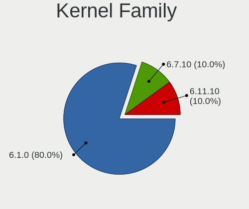

| Version | Desktops | Percent |
|---------|----------|---------|
| 5.10.0  | 8        | 88.89%  |
| 6.0.2   | 1        | 11.11%  |

Kernel Major Ver.
-----------------

Linux kernel major version

| Version | Desktops | Percent |
|---------|----------|---------|
| 5.10    | 8        | 88.89%  |
| 6.0     | 1        | 11.11%  |

Arch
----

OS architecture (x86_64, i586, etc.)

| Name   | Desktops | Percent |
|--------|----------|---------|
| x86_64 | 9        | 100%    |

DE
--

Desktop Environment

| Name       | Desktops | Percent |
|------------|----------|---------|
| X-Cinnamon | 8        | 88.89%  |
| Cinnamon   | 1        | 11.11%  |

Display Server
--------------

X11 or Wayland

| Name | Desktops | Percent |
|------|----------|---------|
| X11  | 9        | 100%    |

Display Manager
---------------

SDDM, LightDM, etc.

| Name    | Desktops | Percent |
|---------|----------|---------|
| Unknown | 7        | 77.78%  |
| LightDM | 2        | 22.22%  |

OS Lang
-------

Language

| Lang  | Desktops | Percent |
|-------|----------|---------|
| en_US | 4        | 44.44%  |
| sk_SK | 1        | 11.11%  |
| ru_RU | 1        | 11.11%  |
| en_CA | 1        | 11.11%  |
| de_DE | 1        | 11.11%  |
| de_AT | 1        | 11.11%  |

Boot Mode
---------

EFI or BIOS

| Mode | Desktops | Percent |
|------|----------|---------|
| BIOS | 7        | 77.78%  |
| EFI  | 2        | 22.22%  |

Filesystem
----------

Type of filesystem

| Type | Desktops | Percent |
|------|----------|---------|
| Ext4 | 9        | 100%    |

Part. scheme
------------

Scheme of partitioning

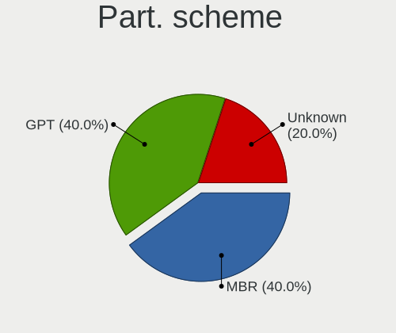

| Type    | Desktops | Percent |
|---------|----------|---------|
| Unknown | 7        | 77.78%  |
| MBR     | 1        | 11.11%  |
| GPT     | 1        | 11.11%  |

Dual Boot with Linux/BSD
------------------------

Hosting more than one Linux/BSD

| Dual boot | Desktops | Percent |
|-----------|----------|---------|
| No        | 8        | 88.89%  |
| Yes       | 1        | 11.11%  |

Dual Boot (Win)
---------------

Hosting Linux and Windows

| Dual boot | Desktops | Percent |
|-----------|----------|---------|
| No        | 9        | 100%    |

Board
-----

Vendor
------

Motherboard manufacturer

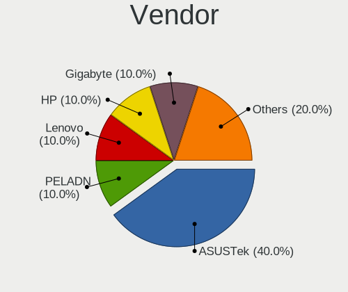

| Name                | Desktops | Percent |
|---------------------|----------|---------|
| ASUSTek Computer    | 2        | 22.22%  |
| Samsung Electronics | 1        | 11.11%  |
| MSI                 | 1        | 11.11%  |
| Hewlett-Packard     | 1        | 11.11%  |
| Fujitsu             | 1        | 11.11%  |
| Dell                | 1        | 11.11%  |
| AZW                 | 1        | 11.11%  |
| ASRock              | 1        | 11.11%  |

Model
-----

Motherboard model

| Name                         | Desktops | Percent |
|------------------------------|----------|---------|
| Samsung DeskTop System       | 1        | 11.11%  |
| MSI MS-7C52                  | 1        | 11.11%  |
| HP EliteDesk 800 G3 SFF      | 1        | 11.11%  |
| Fujitsu CELSIUS W410         | 1        | 11.11%  |
| Dell Vostro 430              | 1        | 11.11%  |
| AZW MINI S                   | 1        | 11.11%  |
| ASUS ROG CROSSHAIR VIII HERO | 1        | 11.11%  |
| ASUS All Series              | 1        | 11.11%  |
| ASRock A320M-HDV R4.0        | 1        | 11.11%  |

Model Family
------------

Motherboard model prefix

| Name             | Desktops | Percent |
|------------------|----------|---------|
| Samsung DeskTop  | 1        | 11.11%  |
| MSI MS-7C52      | 1        | 11.11%  |
| HP EliteDesk     | 1        | 11.11%  |
| Fujitsu CELSIUS  | 1        | 11.11%  |
| Dell Vostro      | 1        | 11.11%  |
| AZW MINI         | 1        | 11.11%  |
| ASUS ROG         | 1        | 11.11%  |
| ASUS All         | 1        | 11.11%  |
| ASRock A320M-HDV | 1        | 11.11%  |

MFG Year
--------

Motherboard manufacture year

| Year | Desktops | Percent |
|------|----------|---------|
| 2022 | 2        | 22.22%  |
| 2019 | 1        | 11.11%  |
| 2018 | 1        | 11.11%  |
| 2017 | 1        | 11.11%  |
| 2014 | 1        | 11.11%  |
| 2012 | 1        | 11.11%  |
| 2011 | 1        | 11.11%  |
| 2009 | 1        | 11.11%  |

Form Factor
-----------

Physical design of the computer

| Name    | Desktops | Percent |
|---------|----------|---------|
| Desktop | 9        | 100%    |

Secure Boot
-----------

Enabled or disabled

| State    | Desktops | Percent |
|----------|----------|---------|
| Disabled | 9        | 100%    |

Coreboot
--------

Have coreboot on board

| Used | Desktops | Percent |
|------|----------|---------|
| No   | 9        | 100%    |

RAM Size
--------

Total RAM memory

| Size in GB | Desktops | Percent |
|------------|----------|---------|
| 8.01-16.0  | 4        | 44.44%  |
| 16.01-24.0 | 3        | 33.33%  |
| 4.01-8.0   | 1        | 11.11%  |
| 32.01-64.0 | 1        | 11.11%  |

RAM Used
--------

Used RAM memory

| Used GB   | Desktops | Percent |
|-----------|----------|---------|
| 2.01-3.0  | 4        | 44.44%  |
| 1.01-2.0  | 3        | 33.33%  |
| 3.01-4.0  | 1        | 11.11%  |
| 8.01-16.0 | 1        | 11.11%  |

Total Drives
------------

Number of drives on board

| Drives | Desktops | Percent |
|--------|----------|---------|
| 1      | 6        | 66.67%  |
| 2      | 2        | 22.22%  |
| 5      | 1        | 11.11%  |

Has CD-ROM
----------

Has CD-ROM on board

| Presented | Desktops | Percent |
|-----------|----------|---------|
| No        | 5        | 55.56%  |
| Yes       | 4        | 44.44%  |

Has Ethernet
------------

Has Ethernet on board

| Presented | Desktops | Percent |
|-----------|----------|---------|
| Yes       | 9        | 100%    |

Has WiFi
--------

Has WiFi module

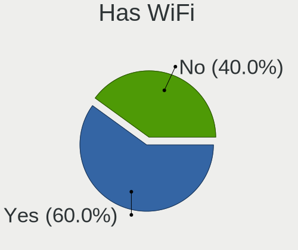

| Presented | Desktops | Percent |
|-----------|----------|---------|
| No        | 7        | 77.78%  |
| Yes       | 2        | 22.22%  |

Has Bluetooth
-------------

Has Bluetooth module

| Presented | Desktops | Percent |
|-----------|----------|---------|
| No        | 7        | 77.78%  |
| Yes       | 2        | 22.22%  |

Location
--------

Country
-------

Geographic location (country)

| Country  | Desktops | Percent |
|----------|----------|---------|
| USA      | 3        | 33.33%  |
| Russia   | 2        | 22.22%  |
| Slovakia | 1        | 11.11%  |
| Germany  | 1        | 11.11%  |
| Canada   | 1        | 11.11%  |
| Austria  | 1        | 11.11%  |

City
----

Geographic location (city)

| City          | Desktops | Percent |
|---------------|----------|---------|
| Ulyanovsk     | 1        | 11.11%  |
| Schruns       | 1        | 11.11%  |
| Pensacola     | 1        | 11.11%  |
| Nitra         | 1        | 11.11%  |
| London        | 1        | 11.11%  |
| Krasnodar     | 1        | 11.11%  |
| Columbia City | 1        | 11.11%  |
| Bitburg       | 1        | 11.11%  |
| Bend          | 1        | 11.11%  |

Drives
------

Drive Vendor
------------

Hard drive vendors

| Vendor              | Desktops | Drives | Percent |
|---------------------|----------|--------|---------|
| WDC                 | 3        | 3      | 25%     |
| Seagate             | 2        | 2      | 16.67%  |
| SK hynix            | 1        | 1      | 8.33%   |
| Samsung Electronics | 1        | 4      | 8.33%   |
| Phison Electronics  | 1        | 1      | 8.33%   |
| Kingston            | 1        | 1      | 8.33%   |
| BR                  | 1        | 1      | 8.33%   |
| Apple               | 1        | 1      | 8.33%   |
| Unknown             | 1        | 1      | 8.33%   |

Drive Model
-----------

Hard drive models

| Model                                   | Desktops | Percent |
|-----------------------------------------|----------|---------|
| WDC WD5000LPSX-08A6W 500GB              | 1        | 6.67%   |
| WDC WD10JPVX-75JC3T0 1TB                | 1        | 6.67%   |
| WDC WD1002FAEX-00Z3A0 1TB               | 1        | 6.67%   |
| SK hynix BC511 HFM256GDJTNI-82A0A 256GB | 1        | 6.67%   |
| Seagate ST3320418AS 320GB               | 1        | 6.67%   |
| Seagate Expansion SW 8TB                | 1        | 6.67%   |
| Samsung SSD 850 PRO 256GB               | 1        | 6.67%   |
| Samsung SSD 850 EVO 500GB               | 1        | 6.67%   |
| Samsung NVMe SSD Drive 500GB            | 1        | 6.67%   |
| Samsung NVMe SSD Drive 250GB            | 1        | 6.67%   |
| Phison PS5013 E13 NVMe Controller 256GB | 1        | 6.67%   |
| Kingston SVP100S296G 96GB SSD           | 1        | 6.67%   |
| BR 512GB                                | 1        | 6.67%   |
| Apple SSD SD256E 256GB                  | 1        | 6.67%   |
| Unknown                                 | 1        | 6.67%   |

HDD Vendor
----------

Hard disk drive vendors

| Vendor  | Desktops | Drives | Percent |
|---------|----------|--------|---------|
| WDC     | 3        | 3      | 60%     |
| Seagate | 2        | 2      | 40%     |

SSD Vendor
----------

Solid state drive vendors

| Vendor              | Desktops | Drives | Percent |
|---------------------|----------|--------|---------|
| Samsung Electronics | 1        | 2      | 25%     |
| Kingston            | 1        | 1      | 25%     |
| Apple               | 1        | 1      | 25%     |
| Unknown             | 1        | 1      | 25%     |

Drive Kind
----------

HDD or SSD

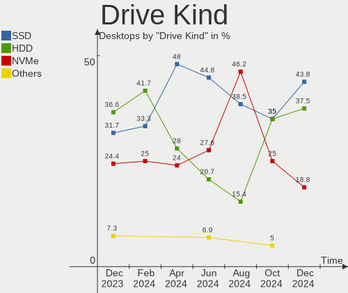

| Kind    | Desktops | Drives | Percent |
|---------|----------|--------|---------|
| HDD     | 5        | 5      | 38.46%  |
| SSD     | 4        | 5      | 30.77%  |
| NVMe    | 3        | 4      | 23.08%  |
| Unknown | 1        | 1      | 7.69%   |

Drive Connector
---------------

SATA, SAS, NVMe, etc.

| Type | Desktops | Drives | Percent |
|------|----------|--------|---------|
| SATA | 8        | 10     | 66.67%  |
| NVMe | 3        | 4      | 25%     |
| SAS  | 1        | 1      | 8.33%   |

Drive Size
----------

Size of hard drive

| Size in TB | Desktops | Drives | Percent |
|------------|----------|--------|---------|
| 0.01-0.5   | 5        | 6      | 55.56%  |
| 0.51-1.0   | 2        | 2      | 22.22%  |
| 1.01-2.0   | 1        | 1      | 11.11%  |
| 4.01-10.0  | 1        | 1      | 11.11%  |

Space Total
-----------

Amount of disk space available on the file system

| Size in GB     | Desktops | Percent |
|----------------|----------|---------|
| More than 3000 | 2        | 22.22%  |
| 251-500        | 2        | 22.22%  |
| 101-250        | 2        | 22.22%  |
| 2001-3000      | 1        | 11.11%  |
| 501-1000       | 1        | 11.11%  |
| 51-100         | 1        | 11.11%  |

Space Used
----------

Amount of used disk space

| Used GB   | Desktops | Percent |
|-----------|----------|---------|
| 21-50     | 3        | 33.33%  |
| 251-500   | 1        | 11.11%  |
| 2001-3000 | 1        | 11.11%  |
| 1001-2000 | 1        | 11.11%  |
| 1-20      | 1        | 11.11%  |
| 501-1000  | 1        | 11.11%  |
| 51-100    | 1        | 11.11%  |

Malfunc. Drives
---------------

Drive models with a malfunction

Zero info for selected period =(

Malfunc. Drive Vendor
---------------------

Vendors of faulty drives

Zero info for selected period =(

Malfunc. HDD Vendor
-------------------

Vendors of faulty HDD drives

Zero info for selected period =(

Malfunc. Drive Kind
-------------------

Kinds of faulty drives

Zero info for selected period =(

Failed Drives
-------------

Failed drive models

Zero info for selected period =(

Failed Drive Vendor
-------------------

Failed drive vendors

Zero info for selected period =(

Drive Status
------------

Number of failed and malfunc. drives

| Status   | Desktops | Drives | Percent |
|----------|----------|--------|---------|
| Detected | 7        | 12     | 77.78%  |
| Works    | 2        | 3      | 22.22%  |

Storage controller
------------------

Storage Vendor
--------------

Storage controller vendors

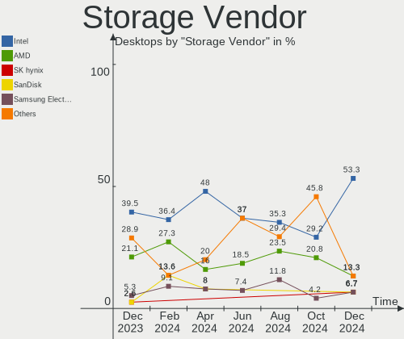

| Vendor              | Desktops | Percent |
|---------------------|----------|---------|
| Intel               | 6        | 46.15%  |
| AMD                 | 3        | 23.08%  |
| SK hynix            | 1        | 7.69%   |
| Samsung Electronics | 1        | 7.69%   |
| Phison Electronics  | 1        | 7.69%   |
| ASMedia Technology  | 1        | 7.69%   |

Storage Model
-------------

Storage controller models

| Model                                                                          | Desktops | Percent |
|--------------------------------------------------------------------------------|----------|---------|
| AMD FCH SATA Controller [AHCI mode]                                            | 3        | 18.75%  |
| Intel 6 Series/C200 Series Chipset Family 6 port Desktop SATA AHCI Controller  | 2        | 12.5%   |
| AMD FCH SATA Controller D                                                      | 2        | 12.5%   |
| SK hynix BC511                                                                 | 1        | 6.25%   |
| Samsung NVMe SSD Controller SM981/PM981/PM983                                  | 1        | 6.25%   |
| Samsung NVMe SSD Controller SM961/PM961/SM963                                  | 1        | 6.25%   |
| Phison PS5013 E13 NVMe Controller                                              | 1        | 6.25%   |
| Intel Jasper Lake SATA AHCI Controller                                         | 1        | 6.25%   |
| Intel 8 Series/C220 Series Chipset Family 6-port SATA Controller 1 [AHCI mode] | 1        | 6.25%   |
| Intel 5 Series/3400 Series Chipset 6 port SATA AHCI Controller                 | 1        | 6.25%   |
| Intel 200 Series PCH SATA controller [AHCI mode]                               | 1        | 6.25%   |
| ASMedia ASM1062 Serial ATA Controller                                          | 1        | 6.25%   |

Storage Kind
------------

Kind of storage controller (IDE, SATA, NVMe, SAS, ...)

| Kind | Desktops | Percent |
|------|----------|---------|
| SATA | 9        | 75%     |
| NVMe | 3        | 25%     |

Processor
---------

CPU Vendor
----------

Processor vendors

| Vendor | Desktops | Percent |
|--------|----------|---------|
| Intel  | 6        | 66.67%  |
| AMD    | 3        | 33.33%  |

CPU Model
---------

Processor models

| Model                                       | Desktops | Percent |
|---------------------------------------------|----------|---------|
| Intel Core i7-7700 CPU @ 3.60GHz            | 1        | 11.11%  |
| Intel Core i7-4770K CPU @ 3.50GHz           | 1        | 11.11%  |
| Intel Core i7 CPU 860 @ 2.80GHz             | 1        | 11.11%  |
| Intel Core i5-3470 CPU @ 3.20GHz            | 1        | 11.11%  |
| Intel Core i5-2400 CPU @ 3.10GHz            | 1        | 11.11%  |
| Intel Celeron N5095 @ 2.00GHz               | 1        | 11.11%  |
| AMD Ryzen 7 3700X 8-Core Processor          | 1        | 11.11%  |
| AMD Ryzen 5 3350G with Radeon Vega Graphics | 1        | 11.11%  |
| AMD Ryzen 3 3200G with Radeon Vega Graphics | 1        | 11.11%  |

CPU Model Family
----------------

Processor model prefix

| Model         | Desktops | Percent |
|---------------|----------|---------|
| Intel Core i7 | 3        | 33.33%  |
| Intel Core i5 | 2        | 22.22%  |
| Intel Celeron | 1        | 11.11%  |
| AMD Ryzen 7   | 1        | 11.11%  |
| AMD Ryzen 5   | 1        | 11.11%  |
| AMD Ryzen 3   | 1        | 11.11%  |

CPU Cores
---------

Number of processor cores

| Number | Desktops | Percent |
|--------|----------|---------|
| 4      | 8        | 88.89%  |
| 8      | 1        | 11.11%  |

CPU Sockets
-----------

Number of sockets

| Number | Desktops | Percent |
|--------|----------|---------|
| 1      | 9        | 100%    |

CPU Threads
-----------

Threads per core (Hyper-Threading)

| Number | Desktops | Percent |
|--------|----------|---------|
| 2      | 5        | 55.56%  |
| 1      | 4        | 44.44%  |

CPU Op-Modes
------------

CPU Operation Modes (32-bit, 64-bit)

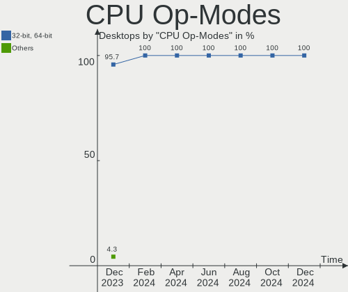

| Op mode        | Desktops | Percent |
|----------------|----------|---------|
| 32-bit, 64-bit | 9        | 100%    |

CPU Microcode
-------------

Microcode number

| Number     | Desktops | Percent |
|------------|----------|---------|
| 0x08108109 | 2        | 22.22%  |
| 0x906e9    | 1        | 11.11%  |
| 0x906c0    | 1        | 11.11%  |
| 0x306c3    | 1        | 11.11%  |
| 0x306a9    | 1        | 11.11%  |
| 0x206a7    | 1        | 11.11%  |
| 0x106e5    | 1        | 11.11%  |
| 0x08701021 | 1        | 11.11%  |

CPU Microarch
-------------

Microarchitecture

| Name        | Desktops | Percent |
|-------------|----------|---------|
| Zen+        | 2        | 22.22%  |
| Zen 2       | 1        | 11.11%  |
| Tremont     | 1        | 11.11%  |
| SandyBridge | 1        | 11.11%  |
| Nehalem     | 1        | 11.11%  |
| KabyLake    | 1        | 11.11%  |
| IvyBridge   | 1        | 11.11%  |
| Haswell     | 1        | 11.11%  |

Graphics
--------

GPU Vendor
----------

Vendors of graphics cards

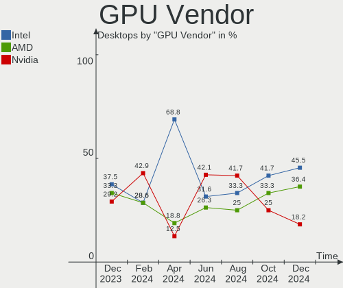

| Vendor | Desktops | Percent |
|--------|----------|---------|
| AMD    | 4        | 44.44%  |
| Nvidia | 3        | 33.33%  |
| Intel  | 2        | 22.22%  |

GPU Model
---------

Graphics card models

| Model                                                                | Desktops | Percent |
|----------------------------------------------------------------------|----------|---------|
| AMD Picasso/Raven 2 [Radeon Vega Series / Radeon Vega Mobile Series] | 2        | 22.22%  |
| Nvidia TU116 [GeForce GTX 1660 SUPER]                                | 1        | 11.11%  |
| Nvidia GP107 [GeForce GTX 1050]                                      | 1        | 11.11%  |
| Nvidia GK104 [GeForce GTX 760]                                       | 1        | 11.11%  |
| Intel JasperLake [UHD Graphics]                                      | 1        | 11.11%  |
| Intel HD Graphics 630                                                | 1        | 11.11%  |
| AMD RV710 [Radeon HD 4350/4550]                                      | 1        | 11.11%  |
| AMD Barts PRO [Radeon HD 6850]                                       | 1        | 11.11%  |

GPU Combo
---------

Combinations of graphics cards

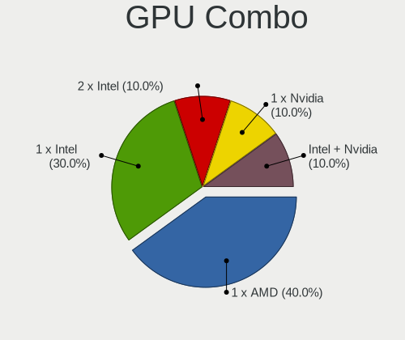

| Name       | Desktops | Percent |
|------------|----------|---------|
| 1 x AMD    | 4        | 44.44%  |
| 1 x Nvidia | 3        | 33.33%  |
| 1 x Intel  | 2        | 22.22%  |

GPU Driver
----------

Free vs proprietary

| Driver      | Desktops | Percent |
|-------------|----------|---------|
| Free        | 6        | 66.67%  |
| Proprietary | 2        | 22.22%  |
| Unknown     | 1        | 11.11%  |

GPU Memory
----------

Total video memory

| Size in GB | Desktops | Percent |
|------------|----------|---------|
| 1.01-2.0   | 3        | 33.33%  |
| Unknown    | 2        | 22.22%  |
| 5.01-6.0   | 1        | 11.11%  |
| 3.01-4.0   | 1        | 11.11%  |
| 0.51-1.0   | 1        | 11.11%  |
| 0.01-0.5   | 1        | 11.11%  |

Monitor
-------

Monitor Vendor
--------------

Monitor vendors

| Vendor               | Desktops | Percent |
|----------------------|----------|---------|
| Hewlett-Packard      | 4        | 33.33%  |
| ViewSonic            | 1        | 8.33%   |
| Unknown              | 1        | 8.33%   |
| Sony                 | 1        | 8.33%   |
| Samsung Electronics  | 1        | 8.33%   |
| PLN                  | 1        | 8.33%   |
| Philips              | 1        | 8.33%   |
| Lenovo Group Limited | 1        | 8.33%   |
| Goldstar             | 1        | 8.33%   |

Monitor Model
-------------

Monitor models

| Model                                                        | Desktops | Percent |
|--------------------------------------------------------------|----------|---------|
| ViewSonic VG2230wm VSCA21E 1680x1050 474x296mm 22.0-inch     | 1        | 8.33%   |
| Unknown LCD Monitor SAMSUNG                                  | 1        | 8.33%   |
| Sony LCD Monitor TV 3840x1080                                | 1        | 8.33%   |
| Samsung Electronics LCD Monitor C27F390                      | 1        | 8.33%   |
| PLN LCD Monitor PXL2790MW 1920x1080                          | 1        | 8.33%   |
| Philips 244E PHLC036 1920x1080 521x293mm 23.5-inch           | 1        | 8.33%   |
| Lenovo Group Limited LCD Monitor LEN G32qc-10 4480x1440      | 1        | 8.33%   |
| Hewlett-Packard w2216 HWP280B 1680x1050 465x291mm 21.6-inch  | 1        | 8.33%   |
| Hewlett-Packard LE1901w HWP2842 1440x900 410x256mm 19.0-inch | 1        | 8.33%   |
| Hewlett-Packard 27f HPN354B 1920x1080 598x336mm 27.0-inch    | 1        | 8.33%   |
| Hewlett-Packard 24y HPN3504 1920x1080 530x300mm 24.0-inch    | 1        | 8.33%   |
| Goldstar FULL HD GSM5B55 1920x1080 480x270mm 21.7-inch       | 1        | 8.33%   |

Monitor Resolution
------------------

Monitor screen resolution

| Resolution         | Desktops | Percent |
|--------------------|----------|---------|
| 1920x1080 (FHD)    | 4        | 33.33%  |
| 1680x1050 (WSXGA+) | 2        | 16.67%  |
| Unknown            | 2        | 16.67%  |
| 4480x1440          | 1        | 8.33%   |
| 3840x2160 (4K)     | 1        | 8.33%   |
| 3840x1080          | 1        | 8.33%   |
| 1440x900 (WXGA+)   | 1        | 8.33%   |

Monitor Diagonal
----------------

Diagonal size in inches

| Inches  | Desktops | Percent |
|---------|----------|---------|
| Unknown | 3        | 30%     |
| 21      | 2        | 20%     |
| 27      | 1        | 10%     |
| 24      | 1        | 10%     |
| 23      | 1        | 10%     |
| 22      | 1        | 10%     |
| 19      | 1        | 10%     |

Monitor Width
-------------

Physical width

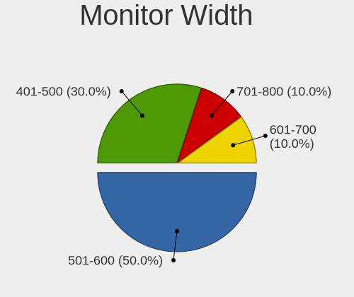

| Width in mm | Desktops | Percent |
|-------------|----------|---------|
| 501-600     | 3        | 33.33%  |
| 401-500     | 3        | 33.33%  |
| Unknown     | 3        | 33.33%  |

Aspect Ratio
------------

Proportional relationship between the width and the height

| Ratio   | Desktops | Percent |
|---------|----------|---------|
| 16/9    | 3        | 37.5%   |
| Unknown | 3        | 37.5%   |
| 16/10   | 2        | 25%     |

Monitor Area
------------

Area in inch²

| Area in inch² | Desktops | Percent |
|----------------|----------|---------|
| 201-250        | 5        | 50%     |
| Unknown        | 3        | 30%     |
| 301-350        | 1        | 10%     |
| 151-200        | 1        | 10%     |

Pixel Density
-------------

Pixels per inch

| Density | Desktops | Percent |
|---------|----------|---------|
| 51-100  | 5        | 55.56%  |
| Unknown | 3        | 33.33%  |
| 101-120 | 1        | 11.11%  |

Multiple Monitors
-----------------

Total monitors connected

| Total | Desktops | Percent |
|-------|----------|---------|
| 1     | 5        | 55.56%  |
| 2     | 3        | 33.33%  |
| 0     | 1        | 11.11%  |

Network
-------

Net Controller Vendor
---------------------

Controller vendors

| Vendor                | Desktops | Percent |
|-----------------------|----------|---------|
| Realtek Semiconductor | 5        | 41.67%  |
| Intel                 | 5        | 41.67%  |
| Ralink Technology     | 1        | 8.33%   |
| Broadcom              | 1        | 8.33%   |

Net Controller Model
--------------------

Controller models

| Model                                                             | Desktops | Percent |
|-------------------------------------------------------------------|----------|---------|
| Realtek RTL8111/8168/8411 PCI Express Gigabit Ethernet Controller | 4        | 33.33%  |
| Realtek RTL8125 2.5GbE Controller                                 | 1        | 8.33%   |
| Ralink RT2870/RT3070 Wireless Adapter                             | 1        | 8.33%   |
| Intel Wireless 3165                                               | 1        | 8.33%   |
| Intel I211 Gigabit Network Connection                             | 1        | 8.33%   |
| Intel Ethernet Connection I217-V                                  | 1        | 8.33%   |
| Intel Ethernet Connection (5) I219-LM                             | 1        | 8.33%   |
| Intel 82579LM Gigabit Network Connection (Lewisville)             | 1        | 8.33%   |
| Broadcom NetLink BCM57780 Gigabit Ethernet PCIe                   | 1        | 8.33%   |

Wireless Vendor
---------------

Wireless vendors

| Vendor            | Desktops | Percent |
|-------------------|----------|---------|
| Ralink Technology | 1        | 50%     |
| Intel             | 1        | 50%     |

Wireless Model
--------------

Wireless models

| Model                                 | Desktops | Percent |
|---------------------------------------|----------|---------|
| Ralink RT2870/RT3070 Wireless Adapter | 1        | 50%     |
| Intel Wireless 3165                   | 1        | 50%     |

Ethernet Vendor
---------------

Ethernet vendors

| Vendor                | Desktops | Percent |
|-----------------------|----------|---------|
| Realtek Semiconductor | 5        | 50%     |
| Intel                 | 4        | 40%     |
| Broadcom              | 1        | 10%     |

Ethernet Model
--------------

Ethernet models

| Model                                                             | Desktops | Percent |
|-------------------------------------------------------------------|----------|---------|
| Realtek RTL8111/8168/8411 PCI Express Gigabit Ethernet Controller | 4        | 40%     |
| Realtek RTL8125 2.5GbE Controller                                 | 1        | 10%     |
| Intel I211 Gigabit Network Connection                             | 1        | 10%     |
| Intel Ethernet Connection I217-V                                  | 1        | 10%     |
| Intel Ethernet Connection (5) I219-LM                             | 1        | 10%     |
| Intel 82579LM Gigabit Network Connection (Lewisville)             | 1        | 10%     |
| Broadcom NetLink BCM57780 Gigabit Ethernet PCIe                   | 1        | 10%     |

Net Controller Kind
-------------------

Ethernet, WiFi or modem

| Kind     | Desktops | Percent |
|----------|----------|---------|
| Ethernet | 9        | 81.82%  |
| WiFi     | 2        | 18.18%  |

Used Controller
---------------

Currently used network controller

| Kind     | Desktops | Percent |
|----------|----------|---------|
| Ethernet | 9        | 100%    |

NICs
----

Total network controllers on board

| Total | Desktops | Percent |
|-------|----------|---------|
| 1     | 7        | 77.78%  |
| 2     | 2        | 22.22%  |

IPv6
----

IPv6 vs IPv4

| Used | Desktops | Percent |
|------|----------|---------|
| No   | 8        | 88.89%  |
| Yes  | 1        | 11.11%  |

Bluetooth
---------

Bluetooth Vendor
----------------

Controller vendors

| Vendor                  | Desktops | Percent |
|-------------------------|----------|---------|
| Intel                   | 1        | 50%     |
| Cambridge Silicon Radio | 1        | 50%     |

Bluetooth Model
---------------

Controller models

| Model                                               | Desktops | Percent |
|-----------------------------------------------------|----------|---------|
| Intel Bluetooth wireless interface                  | 1        | 50%     |
| Cambridge Silicon Radio Bluetooth Dongle (HCI mode) | 1        | 50%     |

Sound
-----

Sound Vendor
------------

Sound card vendors

| Vendor              | Desktops | Percent |
|---------------------|----------|---------|
| Intel               | 6        | 40%     |
| AMD                 | 5        | 33.33%  |
| Nvidia              | 3        | 20%     |
| C-Media Electronics | 1        | 6.67%   |

Sound Model
-----------

Sound card models

| Model                                                                      | Desktops | Percent |
|----------------------------------------------------------------------------|----------|---------|
| Intel 6 Series/C200 Series Chipset Family High Definition Audio Controller | 2        | 11.76%  |
| AMD Raven/Raven2/Fenghuang HDMI/DP Audio Controller                        | 2        | 11.76%  |
| AMD Family 17h/19h HD Audio Controller                                     | 2        | 11.76%  |
| Nvidia TU116 High Definition Audio Controller                              | 1        | 5.88%   |
| Nvidia GP107GL High Definition Audio Controller                            | 1        | 5.88%   |
| Nvidia GK104 HDMI Audio Controller                                         | 1        | 5.88%   |
| Intel Jasper Lake HD Audio                                                 | 1        | 5.88%   |
| Intel 8 Series/C220 Series Chipset High Definition Audio Controller        | 1        | 5.88%   |
| Intel 5 Series/3400 Series Chipset High Definition Audio                   | 1        | 5.88%   |
| Intel 200 Series PCH HD Audio                                              | 1        | 5.88%   |
| C-Media Electronics JLAB TALK GO MICROPHONE                                | 1        | 5.88%   |
| AMD Starship/Matisse HD Audio Controller                                   | 1        | 5.88%   |
| AMD RV710/730 HDMI Audio [Radeon HD 4000 series]                           | 1        | 5.88%   |
| AMD Barts HDMI Audio [Radeon HD 6790/6850/6870 / 7720 OEM]                 | 1        | 5.88%   |

Memory
------

Memory Vendor
-------------

Memory module vendors

| Vendor              | Desktops | Percent |
|---------------------|----------|---------|
| Samsung Electronics | 1        | 50%     |
| Corsair             | 1        | 50%     |

Memory Model
------------

Memory module models

| Model                                     | Desktops | Percent |
|-------------------------------------------|----------|---------|
| Samsung RAM Module 8GB DIMM DDR4 2400MT/s | 1        | 50%     |
| Corsair RAM VS2GB1333D4 2GB DIMM 1600MT/s | 1        | 50%     |

Memory Kind
-----------

Memory module kinds

| Kind | Desktops | Percent |
|------|----------|---------|
| DDR4 | 1        | 50%     |
| DDR3 | 1        | 50%     |

Memory Form Factor
------------------

Physical design of the memory module

| Name | Desktops | Percent |
|------|----------|---------|
| DIMM | 2        | 100%    |

Memory Size
-----------

Memory module size

| Size | Desktops | Percent |
|------|----------|---------|
| 8192 | 1        | 50%     |
| 4096 | 1        | 50%     |

Memory Speed
------------

Memory module speed

| Speed | Desktops | Percent |
|-------|----------|---------|
| 2400  | 1        | 50%     |
| 1600  | 1        | 50%     |

Printers & scanners
-------------------

Printer Vendor
--------------

Printer device vendors

Zero info for selected period =(

Printer Model
-------------

Printer device models

Zero info for selected period =(

Scanner Vendor
--------------

Scanner device vendors

Zero info for selected period =(

Scanner Model
-------------

Scanner device models

Zero info for selected period =(

Camera
------

Camera Vendor
-------------

Camera device vendors

| Vendor                        | Desktops | Percent |
|-------------------------------|----------|---------|
| Sunplus Innovation Technology | 1        | 100%    |

Camera Model
------------

Camera device models

| Model              | Desktops | Percent |
|--------------------|----------|---------|
| Sunplus EKACOM-K30 | 1        | 100%    |

Security
--------

Fingerprint Vendor
------------------

Fingerprint sensor vendors

Zero info for selected period =(

Fingerprint Model
-----------------

Fingerprint sensor models

Zero info for selected period =(

Chipcard Vendor
---------------

Chipcard module vendors

Zero info for selected period =(

Chipcard Model
--------------

Chipcard module models

Zero info for selected period =(

Unsupported
-----------

Unsupported Devices
-------------------

Total unsupported devices on board

| Total | Desktops | Percent |
|-------|----------|---------|
| 0     | 8        | 88.89%  |
| 1     | 1        | 11.11%  |

Unsupported Device Types
------------------------

Types of unsupported devices

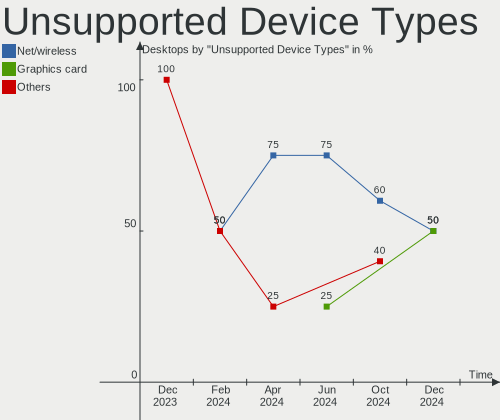

| Type          | Desktops | Percent |
|---------------|----------|---------|
| Graphics card | 1        | 100%    |

