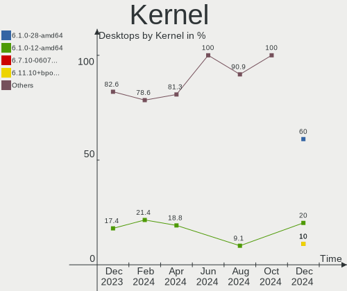
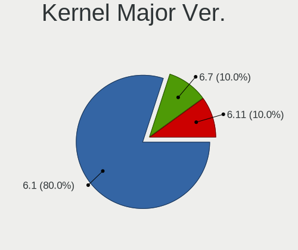
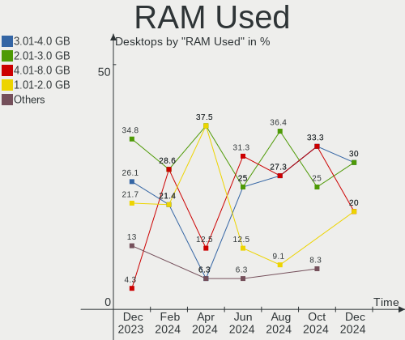
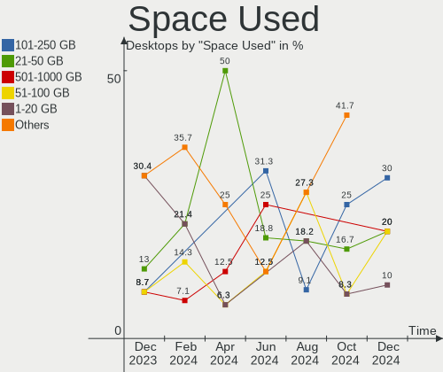
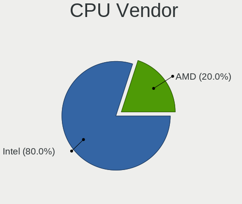
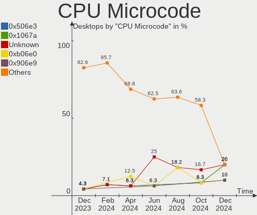
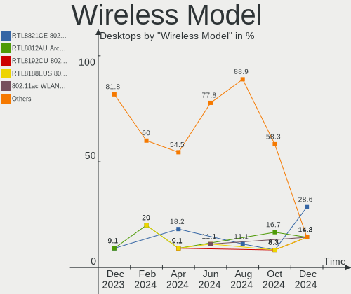
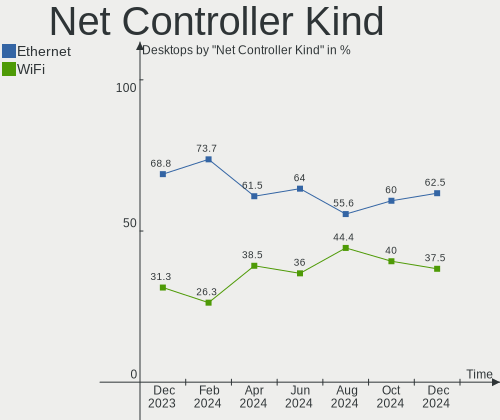
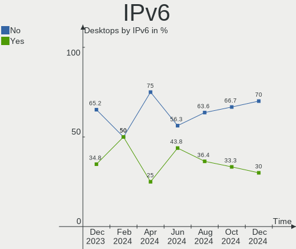

LMDE - Hardware Trends (Desktops)
---------------------------------

A project to identify most popular hardware characteristics and track their change
over time based on data collected by Linux users at https://Linux-Hardware.org.

Anyone can contribute to this report by the [hw-probe](https://github.com/linuxhw/hw-probe) tool:

    sudo -E hw-probe -all -upload

This report is for one last month. Overall report since the beginning of time: [TestCoverage](https://github.com/linuxhw/TestCoverage)

Period: Sep, 2022.

Contents
--------

* [ System ](#system)
  - [ OS                       ](#os)
  - [ OS Family                ](#os-family)
  - [ Kernel                   ](#kernel)
  - [ Kernel Family            ](#kernel-family)
  - [ Kernel Major Ver.        ](#kernel-major-ver)
  - [ Arch                     ](#arch)
  - [ DE                       ](#de)
  - [ Display Server           ](#display-server)
  - [ Display Manager          ](#display-manager)
  - [ OS Lang                  ](#os-lang)
  - [ Boot Mode                ](#boot-mode)
  - [ Filesystem               ](#filesystem)
  - [ Part. scheme             ](#part-scheme)
  - [ Dual Boot with Linux/BSD ](#dual-boot-with-linuxbsd)
  - [ Dual Boot (Win)          ](#dual-boot-win)

* [ Board ](#board)
  - [ Vendor                   ](#vendor)
  - [ Model                    ](#model)
  - [ Model Family             ](#model-family)
  - [ MFG Year                 ](#mfg-year)
  - [ Form Factor              ](#form-factor)
  - [ Secure Boot              ](#secure-boot)
  - [ Coreboot                 ](#coreboot)
  - [ RAM Size                 ](#ram-size)
  - [ RAM Used                 ](#ram-used)
  - [ Total Drives             ](#total-drives)
  - [ Has CD-ROM               ](#has-cd-rom)
  - [ Has Ethernet             ](#has-ethernet)
  - [ Has WiFi                 ](#has-wifi)
  - [ Has Bluetooth            ](#has-bluetooth)

* [ Location ](#location)
  - [ Country                  ](#country)
  - [ City                     ](#city)

* [ Drives ](#drives)
  - [ Drive Vendor             ](#drive-vendor)
  - [ Drive Model              ](#drive-model)
  - [ HDD Vendor               ](#hdd-vendor)
  - [ SSD Vendor               ](#ssd-vendor)
  - [ Drive Kind               ](#drive-kind)
  - [ Drive Connector          ](#drive-connector)
  - [ Drive Size               ](#drive-size)
  - [ Space Total              ](#space-total)
  - [ Space Used               ](#space-used)
  - [ Malfunc. Drives          ](#malfunc-drives)
  - [ Malfunc. Drive Vendor    ](#malfunc-drive-vendor)
  - [ Malfunc. HDD Vendor      ](#malfunc-hdd-vendor)
  - [ Malfunc. Drive Kind      ](#malfunc-drive-kind)
  - [ Failed Drives            ](#failed-drives)
  - [ Failed Drive Vendor      ](#failed-drive-vendor)
  - [ Drive Status             ](#drive-status)

* [ Storage controller ](#storage-controller)
  - [ Storage Vendor           ](#storage-vendor)
  - [ Storage Model            ](#storage-model)
  - [ Storage Kind             ](#storage-kind)

* [ Processor ](#processor)
  - [ CPU Vendor               ](#cpu-vendor)
  - [ CPU Model                ](#cpu-model)
  - [ CPU Model Family         ](#cpu-model-family)
  - [ CPU Cores                ](#cpu-cores)
  - [ CPU Sockets              ](#cpu-sockets)
  - [ CPU Threads              ](#cpu-threads)
  - [ CPU Op-Modes             ](#cpu-op-modes)
  - [ CPU Microcode            ](#cpu-microcode)
  - [ CPU Microarch            ](#cpu-microarch)

* [ Graphics ](#graphics)
  - [ GPU Vendor               ](#gpu-vendor)
  - [ GPU Model                ](#gpu-model)
  - [ GPU Combo                ](#gpu-combo)
  - [ GPU Driver               ](#gpu-driver)
  - [ GPU Memory               ](#gpu-memory)

* [ Monitor ](#monitor)
  - [ Monitor Vendor           ](#monitor-vendor)
  - [ Monitor Model            ](#monitor-model)
  - [ Monitor Resolution       ](#monitor-resolution)
  - [ Monitor Diagonal         ](#monitor-diagonal)
  - [ Monitor Width            ](#monitor-width)
  - [ Aspect Ratio             ](#aspect-ratio)
  - [ Monitor Area             ](#monitor-area)
  - [ Pixel Density            ](#pixel-density)
  - [ Multiple Monitors        ](#multiple-monitors)

* [ Network ](#network)
  - [ Net Controller Vendor    ](#net-controller-vendor)
  - [ Net Controller Model     ](#net-controller-model)
  - [ Wireless Vendor          ](#wireless-vendor)
  - [ Wireless Model           ](#wireless-model)
  - [ Ethernet Vendor          ](#ethernet-vendor)
  - [ Ethernet Model           ](#ethernet-model)
  - [ Net Controller Kind      ](#net-controller-kind)
  - [ Used Controller          ](#used-controller)
  - [ NICs                     ](#nics)
  - [ IPv6                     ](#ipv6)

* [ Bluetooth ](#bluetooth)
  - [ Bluetooth Vendor         ](#bluetooth-vendor)
  - [ Bluetooth Model          ](#bluetooth-model)

* [ Sound ](#sound)
  - [ Sound Vendor             ](#sound-vendor)
  - [ Sound Model              ](#sound-model)

* [ Memory ](#memory)
  - [ Memory Vendor            ](#memory-vendor)
  - [ Memory Model             ](#memory-model)
  - [ Memory Kind              ](#memory-kind)
  - [ Memory Form Factor       ](#memory-form-factor)
  - [ Memory Size              ](#memory-size)
  - [ Memory Speed             ](#memory-speed)

* [ Printers & scanners ](#printers--scanners)
  - [ Printer Vendor           ](#printer-vendor)
  - [ Printer Model            ](#printer-model)
  - [ Scanner Vendor           ](#scanner-vendor)
  - [ Scanner Model            ](#scanner-model)

* [ Camera ](#camera)
  - [ Camera Vendor            ](#camera-vendor)
  - [ Camera Model             ](#camera-model)

* [ Security ](#security)
  - [ Fingerprint Vendor       ](#fingerprint-vendor)
  - [ Fingerprint Model        ](#fingerprint-model)
  - [ Chipcard Vendor          ](#chipcard-vendor)
  - [ Chipcard Model           ](#chipcard-model)

* [ Unsupported ](#unsupported)
  - [ Unsupported Devices      ](#unsupported-devices)
  - [ Unsupported Device Types ](#unsupported-device-types)

System
------

OS
--

Installed operating systems

| Name   | Desktops | Percent |
|--------|----------|---------|
| LMDE 5 | 15       | 93.75%  |
| LMDE 4 | 1        | 6.25%   |

OS Family
---------

OS without a version

| Name | Desktops | Percent |
|------|----------|---------|
| LMDE | 16       | 100%    |

Kernel
------

Version of the Linux kernel

| Version         | Desktops | Percent |
|-----------------|----------|---------|
| 5.10.0-17-amd64 | 8        | 50%     |
| 5.10.0-18-amd64 | 4        | 25%     |
| 5.10.0-12-amd64 | 3        | 18.75%  |
| 4.19.0-17-amd64 | 1        | 6.25%   |

Kernel Family
-------------

Linux kernel without a distro release

| Version | Desktops | Percent |
|---------|----------|---------|
| 5.10.0  | 15       | 93.75%  |
| 4.19.0  | 1        | 6.25%   |

Kernel Major Ver.
-----------------

Linux kernel major version

| Version | Desktops | Percent |
|---------|----------|---------|
| 5.10    | 15       | 93.75%  |
| 4.19    | 1        | 6.25%   |

Arch
----

OS architecture (x86_64, i586, etc.)

| Name   | Desktops | Percent |
|--------|----------|---------|
| x86_64 | 16       | 100%    |

DE
--

Desktop Environment

| Name       | Desktops | Percent |
|------------|----------|---------|
| X-Cinnamon | 15       | 93.75%  |
| Cinnamon   | 1        | 6.25%   |

Display Server
--------------

X11 or Wayland

| Name | Desktops | Percent |
|------|----------|---------|
| X11  | 16       | 100%    |

Display Manager
---------------

SDDM, LightDM, etc.

| Name    | Desktops | Percent |
|---------|----------|---------|
| Unknown | 13       | 81.25%  |
| LightDM | 3        | 18.75%  |

OS Lang
-------

Language

| Lang  | Desktops | Percent |
|-------|----------|---------|
| en_US | 5        | 31.25%  |
| fr_FR | 3        | 18.75%  |
| pt_BR | 2        | 12.5%   |
| sv_SE | 1        | 6.25%   |
| ru_RU | 1        | 6.25%   |
| pl_PL | 1        | 6.25%   |
| it_CH | 1        | 6.25%   |
| en_AU | 1        | 6.25%   |
| de_DE | 1        | 6.25%   |

Boot Mode
---------

EFI or BIOS

| Mode | Desktops | Percent |
|------|----------|---------|
| BIOS | 9        | 56.25%  |
| EFI  | 7        | 43.75%  |

Filesystem
----------

Type of filesystem

| Type  | Desktops | Percent |
|-------|----------|---------|
| Ext4  | 15       | 93.75%  |
| Btrfs | 1        | 6.25%   |

Part. scheme
------------

Scheme of partitioning

| Type    | Desktops | Percent |
|---------|----------|---------|
| Unknown | 13       | 81.25%  |
| GPT     | 2        | 12.5%   |
| MBR     | 1        | 6.25%   |

Dual Boot with Linux/BSD
------------------------

Hosting more than one Linux/BSD

| Dual boot | Desktops | Percent |
|-----------|----------|---------|
| No        | 16       | 100%    |

Dual Boot (Win)
---------------

Hosting Linux and Windows

| Dual boot | Desktops | Percent |
|-----------|----------|---------|
| No        | 16       | 100%    |

Board
-----

Vendor
------

Motherboard manufacturer

| Name             | Desktops | Percent |
|------------------|----------|---------|
| Dell             | 4        | 25%     |
| ASUSTek Computer | 4        | 25%     |
| MSI              | 2        | 12.5%   |
| Pegatron         | 1        | 6.25%   |
| Gateway          | 1        | 6.25%   |
| eMachines        | 1        | 6.25%   |
| Digiboard        | 1        | 6.25%   |
| ASRock           | 1        | 6.25%   |
| Acer             | 1        | 6.25%   |

Model
-----

Motherboard model

| Name                            | Desktops | Percent |
|---------------------------------|----------|---------|
| Pegatron Pro 3015 Microtower PC | 1        | 6.25%   |
| MSI MS-7B23                     | 1        | 6.25%   |
| MSI MS-7A40                     | 1        | 6.25%   |
| Gateway DX4870                  | 1        | 6.25%   |
| eMachines EL1352G               | 1        | 6.25%   |
| Digiboard NM70-TI               | 1        | 6.25%   |
| Dell Precision WorkStation 670  | 1        | 6.25%   |
| Dell Precision T7600            | 1        | 6.25%   |
| Dell OptiPlex 3010              | 1        | 6.25%   |
| Dell DXP051                     | 1        | 6.25%   |
| ASUS ROG CROSSHAIR VIII HERO    | 1        | 6.25%   |
| ASUS PRIME H610M-E D4           | 1        | 6.25%   |
| ASUS P8H77-V                    | 1        | 6.25%   |
| ASUS P5K-E                      | 1        | 6.25%   |
| ASRock G41M-S3                  | 1        | 6.25%   |
| Acer Aspire XC-1660G            | 1        | 6.25%   |

Model Family
------------

Motherboard model prefix

| Name              | Desktops | Percent |
|-------------------|----------|---------|
| Dell Precision    | 2        | 12.5%   |
| Pegatron Pro      | 1        | 6.25%   |
| MSI MS-7B23       | 1        | 6.25%   |
| MSI MS-7A40       | 1        | 6.25%   |
| Gateway DX4870    | 1        | 6.25%   |
| eMachines EL1352G | 1        | 6.25%   |
| Digiboard NM70-TI | 1        | 6.25%   |
| Dell OptiPlex     | 1        | 6.25%   |
| Dell DXP051       | 1        | 6.25%   |
| ASUS ROG          | 1        | 6.25%   |
| ASUS PRIME        | 1        | 6.25%   |
| ASUS P8H77-V      | 1        | 6.25%   |
| ASUS P5K-E        | 1        | 6.25%   |
| ASRock G41M-S3    | 1        | 6.25%   |
| Acer Aspire       | 1        | 6.25%   |

MFG Year
--------

Motherboard manufacture year

| Year | Desktops | Percent |
|------|----------|---------|
| 2012 | 3        | 18.75%  |
| 2010 | 3        | 18.75%  |
| 2022 | 2        | 12.5%   |
| 2018 | 2        | 12.5%   |
| 2006 | 2        | 12.5%   |
| 2021 | 1        | 6.25%   |
| 2017 | 1        | 6.25%   |
| 2013 | 1        | 6.25%   |
| 2007 | 1        | 6.25%   |

Form Factor
-----------

Physical design of the computer

| Name    | Desktops | Percent |
|---------|----------|---------|
| Desktop | 16       | 100%    |

Secure Boot
-----------

Enabled or disabled

| State    | Desktops | Percent |
|----------|----------|---------|
| Disabled | 16       | 100%    |

Coreboot
--------

Have coreboot on board

| Used | Desktops | Percent |
|------|----------|---------|
| No   | 16       | 100%    |

RAM Size
--------

Total RAM memory

| Size in GB  | Desktops | Percent |
|-------------|----------|---------|
| 8.01-16.0   | 5        | 31.25%  |
| 3.01-4.0    | 3        | 18.75%  |
| 16.01-24.0  | 3        | 18.75%  |
| 4.01-8.0    | 2        | 12.5%   |
| 32.01-64.0  | 2        | 12.5%   |
| 64.01-256.0 | 1        | 6.25%   |

RAM Used
--------

Used RAM memory

| Used GB   | Desktops | Percent |
|-----------|----------|---------|
| 1.01-2.0  | 9        | 56.25%  |
| 4.01-8.0  | 3        | 18.75%  |
| 2.01-3.0  | 2        | 12.5%   |
| 3.01-4.0  | 1        | 6.25%   |
| 8.01-16.0 | 1        | 6.25%   |

Total Drives
------------

Number of drives on board

| Drives | Desktops | Percent |
|--------|----------|---------|
| 1      | 7        | 43.75%  |
| 3      | 3        | 18.75%  |
| 5      | 2        | 12.5%   |
| 4      | 2        | 12.5%   |
| 2      | 2        | 12.5%   |

Has CD-ROM
----------

Has CD-ROM on board

| Presented | Desktops | Percent |
|-----------|----------|---------|
| No        | 10       | 62.5%   |
| Yes       | 6        | 37.5%   |

Has Ethernet
------------

Has Ethernet on board

| Presented | Desktops | Percent |
|-----------|----------|---------|
| Yes       | 16       | 100%    |

Has WiFi
--------

Has WiFi module

| Presented | Desktops | Percent |
|-----------|----------|---------|
| No        | 10       | 62.5%   |
| Yes       | 6        | 37.5%   |

Has Bluetooth
-------------

Has Bluetooth module

| Presented | Desktops | Percent |
|-----------|----------|---------|
| No        | 12       | 75%     |
| Yes       | 4        | 25%     |

Location
--------

Country
-------

Geographic location (country)

| Country | Desktops | Percent |
|---------|----------|---------|
| USA     | 5        | 31.25%  |
| France  | 3        | 18.75%  |
| Germany | 2        | 12.5%   |
| Brazil  | 2        | 12.5%   |
| Sweden  | 1        | 6.25%   |
| Russia  | 1        | 6.25%   |
| Poland  | 1        | 6.25%   |
| Italy   | 1        | 6.25%   |

City
----

Geographic location (city)

| City              | Desktops | Percent |
|-------------------|----------|---------|
| Volta Redonda     | 1        | 6.25%   |
| Tolyatti          | 1        | 6.25%   |
| Toccoa            | 1        | 6.25%   |
| Sollentuna        | 1        | 6.25%   |
| Reynoldsburg      | 1        | 6.25%   |
| Rennes            | 1        | 6.25%   |
| Queensbury        | 1        | 6.25%   |
| Piaseczno         | 1        | 6.25%   |
| North Manchester  | 1        | 6.25%   |
| Milan             | 1        | 6.25%   |
| Garbsen           | 1        | 6.25%   |
| Frankfurt am Main | 1        | 6.25%   |
| Cournonterral     | 1        | 6.25%   |
| Cesson            | 1        | 6.25%   |
| Belém            | 1        | 6.25%   |
| Battle Creek      | 1        | 6.25%   |

Drives
------

Drive Vendor
------------

Hard drive vendors

| Vendor              | Desktops | Drives | Percent |
|---------------------|----------|--------|---------|
| WDC                 | 4        | 5      | 16%     |
| Samsung Electronics | 4        | 9      | 16%     |
| Toshiba             | 3        | 3      | 12%     |
| Seagate             | 3        | 4      | 12%     |
| SanDisk             | 3        | 3      | 12%     |
| Crucial             | 2        | 2      | 8%      |
| Kingston            | 1        | 1      | 4%      |
| Hitachi             | 1        | 1      | 4%      |
| GOODRAM             | 1        | 1      | 4%      |
| China               | 1        | 1      | 4%      |
| ASMedia             | 1        | 1      | 4%      |
| A-DATA Technology   | 1        | 1      | 4%      |

Drive Model
-----------

Hard drive models

| Model                                 | Desktops | Percent |
|---------------------------------------|----------|---------|
| Samsung SSD 850 EVO 500GB             | 2        | 6.45%   |
| WDC WD5000AZLX-08K2TA0 500GB          | 1        | 3.23%   |
| WDC WD40EZAZ-00SF3B0 4TB              | 1        | 3.23%   |
| WDC WD20SPZX-00UA7T0 2TB              | 1        | 3.23%   |
| WDC WD10EZEX-08WN4A0 1TB              | 1        | 3.23%   |
| WDC WD1002FAEX-00Z3A0 1TB             | 1        | 3.23%   |
| Toshiba THNSNJ128GCSU 128GB SSD       | 1        | 3.23%   |
| Toshiba MQ01ABD100 1TB                | 1        | 3.23%   |
| Toshiba HDWD110 1TB                   | 1        | 3.23%   |
| Seagate ST3320620NS 320GB             | 1        | 3.23%   |
| Seagate ST3300657SS 304GB             | 1        | 3.23%   |
| Seagate ST1000DM003-1CH162 1TB        | 1        | 3.23%   |
| Sandisk WD Blue SN550 NVMe SSD 1024GB | 1        | 3.23%   |
| SanDisk SSD PLUS 240GB                | 1        | 3.23%   |
| SanDisk SD9SN8W256G1014 256GB SSD     | 1        | 3.23%   |
| Samsung SSD 860 PRO 256GB             | 1        | 3.23%   |
| Samsung SSD 850 PRO 256GB             | 1        | 3.23%   |
| Samsung SSD 850 EVO 250GB             | 1        | 3.23%   |
| Samsung SSD 840 EVO 1TB               | 1        | 3.23%   |
| Samsung NVMe SSD Drive 500GB          | 1        | 3.23%   |
| Samsung NVMe SSD Drive 250GB          | 1        | 3.23%   |
| Samsung HD320KJ 320GB                 | 1        | 3.23%   |
| Kingston SNVS500G 500GB               | 1        | 3.23%   |
| Hitachi HTS545050A7E380 500GB         | 1        | 3.23%   |
| GOODRAM SSDPR-CX400-256-G2 256GB      | 1        | 3.23%   |
| Crucial CT250MX500SSD4 250GB          | 1        | 3.23%   |
| Crucial CT250MX500SSD1N 250GB         | 1        | 3.23%   |
| China SSD 240GB                       | 1        | 3.23%   |
| ASMedia ASM235 2TB                    | 1        | 3.23%   |
| A-DATA SU720 500GB SSD                | 1        | 3.23%   |

HDD Vendor
----------

Hard disk drive vendors

| Vendor              | Desktops | Drives | Percent |
|---------------------|----------|--------|---------|
| WDC                 | 4        | 5      | 33.33%  |
| Seagate             | 3        | 4      | 25%     |
| Toshiba             | 2        | 2      | 16.67%  |
| Samsung Electronics | 1        | 1      | 8.33%   |
| Hitachi             | 1        | 1      | 8.33%   |
| ASMedia             | 1        | 1      | 8.33%   |

SSD Vendor
----------

Solid state drive vendors

| Vendor              | Desktops | Drives | Percent |
|---------------------|----------|--------|---------|
| Samsung Electronics | 3        | 6      | 27.27%  |
| SanDisk             | 2        | 2      | 18.18%  |
| Crucial             | 2        | 2      | 18.18%  |
| Toshiba             | 1        | 1      | 9.09%   |
| GOODRAM             | 1        | 1      | 9.09%   |
| China               | 1        | 1      | 9.09%   |
| A-DATA Technology   | 1        | 1      | 9.09%   |

Drive Kind
----------

HDD or SSD

| Kind | Desktops | Drives | Percent |
|------|----------|--------|---------|
| HDD  | 11       | 14     | 45.83%  |
| SSD  | 10       | 14     | 41.67%  |
| NVMe | 3        | 4      | 12.5%   |

Drive Connector
---------------

SATA, SAS, NVMe, etc.

| Type | Desktops | Drives | Percent |
|------|----------|--------|---------|
| SATA | 14       | 25     | 73.68%  |
| NVMe | 3        | 4      | 15.79%  |
| SAS  | 2        | 3      | 10.53%  |

Drive Size
----------

Size of hard drive

| Size in TB | Desktops | Drives | Percent |
|------------|----------|--------|---------|
| 0.01-0.5   | 12       | 19     | 57.14%  |
| 0.51-1.0   | 6        | 6      | 28.57%  |
| 1.01-2.0   | 2        | 2      | 9.52%   |
| 3.01-4.0   | 1        | 1      | 4.76%   |

Space Total
-----------

Amount of disk space available on the file system

| Size in GB | Desktops | Percent |
|------------|----------|---------|
| 251-500    | 5        | 31.25%  |
| 1001-2000  | 5        | 31.25%  |
| 101-250    | 3        | 18.75%  |
| 501-1000   | 2        | 12.5%   |
| 21-50      | 1        | 6.25%   |

Space Used
----------

Amount of used disk space

| Used GB   | Desktops | Percent |
|-----------|----------|---------|
| 1-20      | 7        | 43.75%  |
| 251-500   | 4        | 25%     |
| 501-1000  | 2        | 12.5%   |
| 21-50     | 1        | 6.25%   |
| 1001-2000 | 1        | 6.25%   |
| 51-100    | 1        | 6.25%   |

Malfunc. Drives
---------------

Drive models with a malfunction

Zero info for selected period =(

Malfunc. Drive Vendor
---------------------

Vendors of faulty drives

Zero info for selected period =(

Malfunc. HDD Vendor
-------------------

Vendors of faulty HDD drives

Zero info for selected period =(

Malfunc. Drive Kind
-------------------

Kinds of faulty drives

Zero info for selected period =(

Failed Drives
-------------

Failed drive models

Zero info for selected period =(

Failed Drive Vendor
-------------------

Failed drive vendors

Zero info for selected period =(

Drive Status
------------

Number of failed and malfunc. drives

| Status   | Desktops | Drives | Percent |
|----------|----------|--------|---------|
| Detected | 13       | 27     | 81.25%  |
| Works    | 3        | 5      | 18.75%  |

Storage controller
------------------

Storage Vendor
--------------

Storage controller vendors

| Vendor                      | Desktops | Percent |
|-----------------------------|----------|---------|
| Intel                       | 12       | 54.55%  |
| Nvidia                      | 2        | 9.09%   |
| AMD                         | 2        | 9.09%   |
| SanDisk                     | 1        | 4.55%   |
| Samsung Electronics         | 1        | 4.55%   |
| LSI Logic / Symbios Logic   | 1        | 4.55%   |
| Kingston Technology Company | 1        | 4.55%   |
| JMicron Technology          | 1        | 4.55%   |
| Broadcom / LSI              | 1        | 4.55%   |

Storage Model
-------------

Storage controller models

| Model                                                                         | Desktops | Percent |
|-------------------------------------------------------------------------------|----------|---------|
| Intel 82801G (ICH7 Family) IDE Controller                                     | 2        | 6.9%    |
| Intel 7 Series/C210 Series Chipset Family 6-port SATA Controller [AHCI mode]  | 2        | 6.9%    |
| AMD FCH SATA Controller [AHCI mode]                                           | 2        | 6.9%    |
| SanDisk WD Blue SN550 NVMe SSD                                                | 1        | 3.45%   |
| Samsung NVMe SSD Controller SM981/PM981/PM983                                 | 1        | 3.45%   |
| Samsung NVMe SSD Controller SM961/PM961/SM963                                 | 1        | 3.45%   |
| Nvidia MCP78S [GeForce 8200] AHCI Controller                                  | 1        | 3.45%   |
| Nvidia MCP61 SATA Controller                                                  | 1        | 3.45%   |
| Nvidia MCP61 IDE                                                              | 1        | 3.45%   |
| LSI Logic / Symbios Logic MegaRAID SAS 2008 [Falcon]                          | 1        | 3.45%   |
| Kingston Company Company Non-Volatile memory controller                       | 1        | 3.45%   |
| JMicron JMB363 SATA/IDE Controller                                            | 1        | 3.45%   |
| Intel Volume Management Device NVMe RAID Controller                           | 1        | 3.45%   |
| Intel NM10/ICH7 Family SATA Controller [IDE mode]                             | 1        | 3.45%   |
| Intel NM10/ICH7 Family SATA Controller [AHCI mode]                            | 1        | 3.45%   |
| Intel Cannon Lake PCH SATA AHCI Controller                                    | 1        | 3.45%   |
| Intel C600/X79 series chipset 6-Port SATA AHCI Controller                     | 1        | 3.45%   |
| Intel Alder Lake-S PCH SATA Controller [AHCI Mode]                            | 1        | 3.45%   |
| Intel 82801IR/IO/IH (ICH9R/DO/DH) 6 port SATA Controller [AHCI mode]          | 1        | 3.45%   |
| Intel 82801EB/ER (ICH5/ICH5R) IDE Controller                                  | 1        | 3.45%   |
| Intel 82801EB (ICH5) SATA Controller                                          | 1        | 3.45%   |
| Intel 7 Series Chipset Family 6-port SATA Controller [AHCI mode]              | 1        | 3.45%   |
| Intel 6 Series/C200 Series Chipset Family 6 port Desktop SATA AHCI Controller | 1        | 3.45%   |
| Intel 500 Series Chipset Family SATA AHCI Controller                          | 1        | 3.45%   |
| Broadcom / LSI SAS1068 PCI-X Fusion-MPT SAS                                   | 1        | 3.45%   |
| AMD 400 Series Chipset SATA Controller                                        | 1        | 3.45%   |

Storage Kind
------------

Kind of storage controller (IDE, SATA, NVMe, SAS, ...)

| Kind | Desktops | Percent |
|------|----------|---------|
| SATA | 13       | 54.17%  |
| IDE  | 5        | 20.83%  |
| NVMe | 3        | 12.5%   |
| RAID | 2        | 8.33%   |
| SCSI | 1        | 4.17%   |

Processor
---------

CPU Vendor
----------

Processor vendors

| Vendor | Desktops | Percent |
|--------|----------|---------|
| Intel  | 12       | 75%     |
| AMD    | 4        | 25%     |

CPU Model
---------

Processor models

| Model                                       | Desktops | Percent |
|---------------------------------------------|----------|---------|
| Intel Xeon CPU E5-2687W 0 @ 3.10GHz         | 1        | 6.25%   |
| Intel Xeon CPU 3.40GHz                      | 1        | 6.25%   |
| Intel Pentium Gold G7400                    | 1        | 6.25%   |
| Intel Pentium D CPU 3.40GHz                 | 1        | 6.25%   |
| Intel Core i7-9700K CPU @ 3.60GHz           | 1        | 6.25%   |
| Intel Core i7-3770 CPU @ 3.40GHz            | 1        | 6.25%   |
| Intel Core i5-3470 CPU @ 3.20GHz            | 1        | 6.25%   |
| Intel Core i3-3220 CPU @ 3.30GHz            | 1        | 6.25%   |
| Intel Core 2 Quad CPU Q9550 @ 2.83GHz       | 1        | 6.25%   |
| Intel Core 2 Duo CPU E7400 @ 2.80GHz        | 1        | 6.25%   |
| Intel Celeron CPU 847 @ 1.10GHz             | 1        | 6.25%   |
| Intel 11th Gen Core i5-11400 @ 2.60GHz      | 1        | 6.25%   |
| AMD Ryzen 7 3700X 8-Core Processor          | 1        | 6.25%   |
| AMD Ryzen 3 3200G with Radeon Vega Graphics | 1        | 6.25%   |
| AMD Athlon II X2 220 Processor              | 1        | 6.25%   |
| AMD Athlon II X2 215 Processor              | 1        | 6.25%   |

CPU Model Family
----------------

Processor model prefix

| Model              | Desktops | Percent |
|--------------------|----------|---------|
| Intel Xeon         | 2        | 12.5%   |
| Intel Core i7      | 2        | 12.5%   |
| AMD Athlon II X2   | 2        | 12.5%   |
| Other              | 1        | 6.25%   |
| Intel Pentium Gold | 1        | 6.25%   |
| Intel Pentium D    | 1        | 6.25%   |
| Intel Core i5      | 1        | 6.25%   |
| Intel Core i3      | 1        | 6.25%   |
| Intel Core 2 Quad  | 1        | 6.25%   |
| Intel Core 2 Duo   | 1        | 6.25%   |
| Intel Celeron      | 1        | 6.25%   |
| AMD Ryzen 7        | 1        | 6.25%   |
| AMD Ryzen 3        | 1        | 6.25%   |

CPU Cores
---------

Number of processor cores

| Number | Desktops | Percent |
|--------|----------|---------|
| 2      | 8        | 50%     |
| 4      | 4        | 25%     |
| 8      | 2        | 12.5%   |
| 16     | 1        | 6.25%   |
| 6      | 1        | 6.25%   |

CPU Sockets
-----------

Number of sockets

| Number | Desktops | Percent |
|--------|----------|---------|
| 1      | 14       | 87.5%   |
| 2      | 2        | 12.5%   |

CPU Threads
-----------

Threads per core (Hyper-Threading)

| Number | Desktops | Percent |
|--------|----------|---------|
| 1      | 9        | 56.25%  |
| 2      | 7        | 43.75%  |

CPU Op-Modes
------------

CPU Operation Modes (32-bit, 64-bit)

| Op mode        | Desktops | Percent |
|----------------|----------|---------|
| 32-bit, 64-bit | 16       | 100%    |

CPU Microcode
-------------

Microcode number

| Number     | Desktops | Percent |
|------------|----------|---------|
| 0x306a9    | 3        | 18.75%  |
| 0x1067a    | 2        | 12.5%   |
| 0xf65      | 1        | 6.25%   |
| 0xf43      | 1        | 6.25%   |
| 0xa0671    | 1        | 6.25%   |
| 0x906ed    | 1        | 6.25%   |
| 0x90675    | 1        | 6.25%   |
| 0x206d7    | 1        | 6.25%   |
| 0x206a7    | 1        | 6.25%   |
| 0x08701021 | 1        | 6.25%   |
| 0x08108109 | 1        | 6.25%   |
| 0x010000c8 | 1        | 6.25%   |
| Unknown    | 1        | 6.25%   |

CPU Microarch
-------------

Microarchitecture

| Name        | Desktops | Percent |
|-------------|----------|---------|
| IvyBridge   | 3        | 18.75%  |
| SandyBridge | 2        | 12.5%   |
| Penryn      | 2        | 12.5%   |
| NetBurst    | 2        | 12.5%   |
| K10         | 2        | 12.5%   |
| Unknown     | 2        | 12.5%   |
| Zen+        | 1        | 6.25%   |
| Zen 2       | 1        | 6.25%   |
| KabyLake    | 1        | 6.25%   |

Graphics
--------

GPU Vendor
----------

Vendors of graphics cards

| Vendor | Desktops | Percent |
|--------|----------|---------|
| Nvidia | 10       | 62.5%   |
| Intel  | 5        | 31.25%  |
| AMD    | 1        | 6.25%   |

GPU Model
---------

Graphics card models

| Model                                                                     | Desktops | Percent |
|---------------------------------------------------------------------------|----------|---------|
| Nvidia GM206 [GeForce GTX 960]                                            | 2        | 12.5%   |
| Nvidia TU116 [GeForce GTX 1660 SUPER]                                     | 1        | 6.25%   |
| Nvidia GT218 [GeForce 8400 GS Rev. 3]                                     | 1        | 6.25%   |
| Nvidia GP108 [GeForce GT 1030]                                            | 1        | 6.25%   |
| Nvidia GK208B [GeForce GT 730]                                            | 1        | 6.25%   |
| Nvidia GK208B [GeForce GT 710]                                            | 1        | 6.25%   |
| Nvidia G92 [GeForce 8800 GT]                                              | 1        | 6.25%   |
| Nvidia G72 [GeForce 7300 LE]                                              | 1        | 6.25%   |
| Nvidia C78 [GeForce 9100]                                                 | 1        | 6.25%   |
| Intel Xeon E3-1200 v2/3rd Gen Core processor Graphics Controller          | 1        | 6.25%   |
| Intel VGA compatible controller                                           | 1        | 6.25%   |
| Intel RocketLake-S GT1 [UHD Graphics 730]                                 | 1        | 6.25%   |
| Intel 4 Series Chipset Integrated Graphics Controller                     | 1        | 6.25%   |
| Intel 2nd Generation Core Processor Family Integrated Graphics Controller | 1        | 6.25%   |
| AMD Picasso/Raven 2 [Radeon Vega Series / Radeon Vega Mobile Series]      | 1        | 6.25%   |

GPU Combo
---------

Combinations of graphics cards

| Name       | Desktops | Percent |
|------------|----------|---------|
| 1 x Nvidia | 10       | 62.5%   |
| 1 x Intel  | 5        | 31.25%  |
| 1 x AMD    | 1        | 6.25%   |

GPU Driver
----------

Free vs proprietary

| Driver      | Desktops | Percent |
|-------------|----------|---------|
| Free        | 7        | 43.75%  |
| Proprietary | 6        | 37.5%   |
| Unknown     | 3        | 18.75%  |

GPU Memory
----------

Total video memory

| Size in GB | Desktops | Percent |
|------------|----------|---------|
| Unknown    | 8        | 50%     |
| 0.01-0.5   | 3        | 18.75%  |
| 3.01-4.0   | 2        | 12.5%   |
| 5.01-6.0   | 1        | 6.25%   |
| 1.01-2.0   | 1        | 6.25%   |
| 0.51-1.0   | 1        | 6.25%   |

Monitor
-------

Monitor Vendor
--------------

Monitor vendors

| Vendor              | Desktops | Percent |
|---------------------|----------|---------|
| Samsung Electronics | 3        | 27.27%  |
| Goldstar            | 2        | 18.18%  |
| Dell                | 2        | 18.18%  |
| BenQ                | 2        | 18.18%  |
| Unknown             | 1        | 9.09%   |
| PLN                 | 1        | 9.09%   |

Monitor Model
-------------

Monitor models

| Model                                                             | Desktops | Percent |
|-------------------------------------------------------------------|----------|---------|
| Unknown LCD Monitor SAMSUNG 1366x768                              | 1        | 8.33%   |
| Samsung Electronics S24F350 SAM0D21 1920x1080 521x293mm 23.5-inch | 1        | 8.33%   |
| Samsung Electronics LCD Monitor SyncMaster 1680x1050              | 1        | 8.33%   |
| Samsung Electronics LCD Monitor S27R65 3840x1080                  | 1        | 8.33%   |
| Samsung Electronics LCD Monitor S27R65                            | 1        | 8.33%   |
| PLN LCD Monitor PXL2790MW 1920x1080                               | 1        | 8.33%   |
| Goldstar ULTRAWIDE GSM7770 2560x1080 798x334mm 34.1-inch          | 1        | 8.33%   |
| Goldstar 27GL850 GSM5B7F 2560x1440 600x340mm 27.2-inch            | 1        | 8.33%   |
| Dell E228WFP DELD015 1680x1050 473x296mm 22.0-inch                | 1        | 8.33%   |
| Dell E178WFP DELD016 1440x900 370x230mm 17.2-inch                 | 1        | 8.33%   |
| BenQ PD2500Q BNQ802A 2560x1440 550x310mm 24.9-inch                | 1        | 8.33%   |
| BenQ GW2280 BNQ78E8 1920x1080 480x270mm 21.7-inch                 | 1        | 8.33%   |

Monitor Resolution
------------------

Monitor screen resolution

| Resolution         | Desktops | Percent |
|--------------------|----------|---------|
| 1920x1080 (FHD)    | 3        | 27.27%  |
| 1680x1050 (WSXGA+) | 2        | 18.18%  |
| 3840x1080          | 1        | 9.09%   |
| 2560x1440 (QHD)    | 1        | 9.09%   |
| 2560x1080          | 1        | 9.09%   |
| 1440x900 (WXGA+)   | 1        | 9.09%   |
| 1366x768 (WXGA)    | 1        | 9.09%   |
| Unknown            | 1        | 9.09%   |

Monitor Diagonal
----------------

Diagonal size in inches

| Inches  | Desktops | Percent |
|---------|----------|---------|
| Unknown | 4        | 36.36%  |
| 34      | 1        | 9.09%   |
| 27      | 1        | 9.09%   |
| 25      | 1        | 9.09%   |
| 23      | 1        | 9.09%   |
| 22      | 1        | 9.09%   |
| 21      | 1        | 9.09%   |
| 17      | 1        | 9.09%   |

Monitor Width
-------------

Physical width

| Width in mm | Desktops | Percent |
|-------------|----------|---------|
| Unknown     | 4        | 40%     |
| 501-600     | 2        | 20%     |
| 401-500     | 2        | 20%     |
| 701-800     | 1        | 10%     |
| 351-400     | 1        | 10%     |

Aspect Ratio
------------

Proportional relationship between the width and the height

| Ratio   | Desktops | Percent |
|---------|----------|---------|
| Unknown | 4        | 40%     |
| 16/9    | 3        | 30%     |
| 16/10   | 2        | 20%     |
| 21/9    | 1        | 10%     |

Monitor Area
------------

Area in inch²

| Area in inch² | Desktops | Percent |
|----------------|----------|---------|
| Unknown        | 4        | 36.36%  |
| 201-250        | 3        | 27.27%  |
| 351-500        | 1        | 9.09%   |
| 301-350        | 1        | 9.09%   |
| 251-300        | 1        | 9.09%   |
| 131-140        | 1        | 9.09%   |

Pixel Density
-------------

Pixels per inch

| Density | Desktops | Percent |
|---------|----------|---------|
| 51-100  | 4        | 40%     |
| Unknown | 4        | 40%     |
| 101-120 | 2        | 20%     |

Multiple Monitors
-----------------

Total monitors connected

| Total | Desktops | Percent |
|-------|----------|---------|
| 1     | 10       | 62.5%   |
| 0     | 4        | 25%     |
| 2     | 2        | 12.5%   |

Network
-------

Net Controller Vendor
---------------------

Controller vendors

| Vendor                   | Desktops | Percent |
|--------------------------|----------|---------|
| Realtek Semiconductor    | 9        | 37.5%   |
| Intel                    | 8        | 33.33%  |
| Qualcomm Atheros         | 2        | 8.33%   |
| Nvidia                   | 2        | 8.33%   |
| TP-Link                  | 1        | 4.17%   |
| Marvell Technology Group | 1        | 4.17%   |
| Huawei Technologies      | 1        | 4.17%   |

Net Controller Model
--------------------

Controller models

| Model                                                             | Desktops | Percent |
|-------------------------------------------------------------------|----------|---------|
| Realtek RTL8111/8168/8411 PCI Express Gigabit Ethernet Controller | 5        | 20%     |
| TP-Link TL-WN722N v2/v3 [Realtek RTL8188EUS]                      | 1        | 4%      |
| Realtek RTL8187 Wireless Adapter                                  | 1        | 4%      |
| Realtek RTL8169 PCI Gigabit Ethernet Controller                   | 1        | 4%      |
| Realtek RTL8125 2.5GbE Controller                                 | 1        | 4%      |
| Realtek RTL810xE PCI Express Fast Ethernet controller             | 1        | 4%      |
| Qualcomm Atheros AR9462 Wireless Network Adapter                  | 1        | 4%      |
| Qualcomm Atheros AR8161 Gigabit Ethernet                          | 1        | 4%      |
| Nvidia MCP77 Ethernet                                             | 1        | 4%      |
| Nvidia MCP61 Ethernet                                             | 1        | 4%      |
| Marvell Group 88E8056 PCI-E Gigabit Ethernet Controller           | 1        | 4%      |
| Intel Wireless-AC 9260                                            | 1        | 4%      |
| Intel Tiger Lake PCH CNVi WiFi                                    | 1        | 4%      |
| Intel I211 Gigabit Network Connection                             | 1        | 4%      |
| Intel Ethernet Connection (7) I219-V                              | 1        | 4%      |
| Intel Dual Band Wireless-AC 3168NGW [Stone Peak]                  | 1        | 4%      |
| Intel 82579V Gigabit Network Connection                           | 1        | 4%      |
| Intel 82579LM Gigabit Network Connection (Lewisville)             | 1        | 4%      |
| Intel 82573L Gigabit Ethernet Controller                          | 1        | 4%      |
| Intel 82545GM Gigabit Ethernet Controller                         | 1        | 4%      |
| Huawei YAL-L21                                                    | 1        | 4%      |

Wireless Vendor
---------------

Wireless vendors

| Vendor                | Desktops | Percent |
|-----------------------|----------|---------|
| Intel                 | 3        | 50%     |
| TP-Link               | 1        | 16.67%  |
| Realtek Semiconductor | 1        | 16.67%  |
| Qualcomm Atheros      | 1        | 16.67%  |

Wireless Model
--------------

Wireless models

| Model                                            | Desktops | Percent |
|--------------------------------------------------|----------|---------|
| TP-Link TL-WN722N v2/v3 [Realtek RTL8188EUS]     | 1        | 16.67%  |
| Realtek RTL8187 Wireless Adapter                 | 1        | 16.67%  |
| Qualcomm Atheros AR9462 Wireless Network Adapter | 1        | 16.67%  |
| Intel Wireless-AC 9260                           | 1        | 16.67%  |
| Intel Tiger Lake PCH CNVi WiFi                   | 1        | 16.67%  |
| Intel Dual Band Wireless-AC 3168NGW [Stone Peak] | 1        | 16.67%  |

Ethernet Vendor
---------------

Ethernet vendors

| Vendor                   | Desktops | Percent |
|--------------------------|----------|---------|
| Realtek Semiconductor    | 8        | 42.11%  |
| Intel                    | 6        | 31.58%  |
| Nvidia                   | 2        | 10.53%  |
| Qualcomm Atheros         | 1        | 5.26%   |
| Marvell Technology Group | 1        | 5.26%   |
| Huawei Technologies      | 1        | 5.26%   |

Ethernet Model
--------------

Ethernet models

| Model                                                             | Desktops | Percent |
|-------------------------------------------------------------------|----------|---------|
| Realtek RTL8111/8168/8411 PCI Express Gigabit Ethernet Controller | 5        | 26.32%  |
| Realtek RTL8169 PCI Gigabit Ethernet Controller                   | 1        | 5.26%   |
| Realtek RTL8125 2.5GbE Controller                                 | 1        | 5.26%   |
| Realtek RTL810xE PCI Express Fast Ethernet controller             | 1        | 5.26%   |
| Qualcomm Atheros AR8161 Gigabit Ethernet                          | 1        | 5.26%   |
| Nvidia MCP77 Ethernet                                             | 1        | 5.26%   |
| Nvidia MCP61 Ethernet                                             | 1        | 5.26%   |
| Marvell Group 88E8056 PCI-E Gigabit Ethernet Controller           | 1        | 5.26%   |
| Intel I211 Gigabit Network Connection                             | 1        | 5.26%   |
| Intel Ethernet Connection (7) I219-V                              | 1        | 5.26%   |
| Intel 82579V Gigabit Network Connection                           | 1        | 5.26%   |
| Intel 82579LM Gigabit Network Connection (Lewisville)             | 1        | 5.26%   |
| Intel 82573L Gigabit Ethernet Controller                          | 1        | 5.26%   |
| Intel 82545GM Gigabit Ethernet Controller                         | 1        | 5.26%   |
| Huawei YAL-L21                                                    | 1        | 5.26%   |

Net Controller Kind
-------------------

Ethernet, WiFi or modem

| Kind     | Desktops | Percent |
|----------|----------|---------|
| Ethernet | 16       | 72.73%  |
| WiFi     | 6        | 27.27%  |

Used Controller
---------------

Currently used network controller

| Kind     | Desktops | Percent |
|----------|----------|---------|
| Ethernet | 13       | 81.25%  |
| WiFi     | 3        | 18.75%  |

NICs
----

Total network controllers on board

| Total | Desktops | Percent |
|-------|----------|---------|
| 1     | 10       | 62.5%   |
| 2     | 6        | 37.5%   |

IPv6
----

IPv6 vs IPv4

| Used | Desktops | Percent |
|------|----------|---------|
| No   | 11       | 68.75%  |
| Yes  | 5        | 31.25%  |

Bluetooth
---------

Bluetooth Vendor
----------------

Controller vendors

| Vendor             | Desktops | Percent |
|--------------------|----------|---------|
| Intel              | 3        | 75%     |
| Lite-On Technology | 1        | 25%     |

Bluetooth Model
---------------

Controller models

| Model                                    | Desktops | Percent |
|------------------------------------------|----------|---------|
| Lite-On Bluetooth Device                 | 1        | 25%     |
| Intel Wireless-AC 9260 Bluetooth Adapter | 1        | 25%     |
| Intel Wireless-AC 3168 Bluetooth         | 1        | 25%     |
| Intel AX201 Bluetooth                    | 1        | 25%     |

Sound
-----

Sound Vendor
------------

Sound card vendors

| Vendor | Desktops | Percent |
|--------|----------|---------|
| Intel  | 12       | 52.17%  |
| Nvidia | 8        | 34.78%  |
| AMD    | 2        | 8.7%    |
| JMTek  | 1        | 4.35%   |

Sound Model
-----------

Sound card models

| Model                                                                      | Desktops | Percent |
|----------------------------------------------------------------------------|----------|---------|
| Intel 7 Series/C216 Chipset Family High Definition Audio Controller        | 3        | 12%     |
| Nvidia GM206 High Definition Audio Controller                              | 2        | 8%      |
| Nvidia GK208 HDMI/DP Audio Controller                                      | 2        | 8%      |
| Intel NM10/ICH7 Family High Definition Audio Controller                    | 2        | 8%      |
| Nvidia TU116 High Definition Audio Controller                              | 1        | 4%      |
| Nvidia MCP72XE/MCP72P/MCP78U/MCP78S High Definition Audio                  | 1        | 4%      |
| Nvidia MCP61 High Definition Audio                                         | 1        | 4%      |
| Nvidia High Definition Audio Controller                                    | 1        | 4%      |
| Nvidia GP108 High Definition Audio Controller                              | 1        | 4%      |
| JMTek USB PnP Audio Device                                                 | 1        | 4%      |
| Intel Tiger Lake-H HD Audio Controller                                     | 1        | 4%      |
| Intel Cannon Lake PCH cAVS                                                 | 1        | 4%      |
| Intel C600/X79 series chipset High Definition Audio Controller             | 1        | 4%      |
| Intel Alder Lake-S HD Audio Controller                                     | 1        | 4%      |
| Intel 82801I (ICH9 Family) HD Audio Controller                             | 1        | 4%      |
| Intel 82801EB/ER (ICH5/ICH5R) AC'97 Audio Controller                       | 1        | 4%      |
| Intel 6 Series/C200 Series Chipset Family High Definition Audio Controller | 1        | 4%      |
| AMD Starship/Matisse HD Audio Controller                                   | 1        | 4%      |
| AMD Raven/Raven2/Fenghuang HDMI/DP Audio Controller                        | 1        | 4%      |
| AMD Family 17h/19h HD Audio Controller                                     | 1        | 4%      |

Memory
------

Memory Vendor
-------------

Memory module vendors

| Vendor              | Desktops | Percent |
|---------------------|----------|---------|
| Samsung Electronics | 2        | 50%     |
| Smart               | 1        | 25%     |
| Kingston            | 1        | 25%     |

Memory Model
------------

Memory module models

| Model                                                 | Desktops | Percent |
|-------------------------------------------------------|----------|---------|
| Smart RAM SH564128FJ8NWRNSQR 4GB SODIMM DDR3 1600MT/s | 1        | 20%     |
| Samsung RAM M471B2873FHS-CH9 1GB SODIMM DDR3 1334MT/s | 1        | 20%     |
| Samsung RAM M393B1G70QH0-CMA 8GB DIMM DDR3 1600MT/s   | 1        | 20%     |
| Samsung RAM M393B1G70BH0-YK0 8GB DIMM DDR3 1600MT/s   | 1        | 20%     |
| Kingston RAM KF3200C16D4/8GX 8GB DIMM DDR4 3600MT/s   | 1        | 20%     |

Memory Kind
-----------

Memory module kinds

| Kind | Desktops | Percent |
|------|----------|---------|
| DDR3 | 2        | 66.67%  |
| DDR4 | 1        | 33.33%  |

Memory Form Factor
------------------

Physical design of the memory module

| Name   | Desktops | Percent |
|--------|----------|---------|
| DIMM   | 2        | 66.67%  |
| SODIMM | 1        | 33.33%  |

Memory Size
-----------

Memory module size

| Size | Desktops | Percent |
|------|----------|---------|
| 8192 | 2        | 66.67%  |
| 4096 | 1        | 33.33%  |

Memory Speed
------------

Memory module speed

| Speed | Desktops | Percent |
|-------|----------|---------|
| 1600  | 2        | 50%     |
| 3600  | 1        | 25%     |
| 1334  | 1        | 25%     |

Printers & scanners
-------------------

Printer Vendor
--------------

Printer device vendors

Zero info for selected period =(

Printer Model
-------------

Printer device models

Zero info for selected period =(

Scanner Vendor
--------------

Scanner device vendors

Zero info for selected period =(

Scanner Model
-------------

Scanner device models

Zero info for selected period =(

Camera
------

Camera Vendor
-------------

Camera device vendors

| Vendor         | Desktops | Percent |
|----------------|----------|---------|
| Pixart Imaging | 1        | 33.33%  |
| Logitech       | 1        | 33.33%  |
| Alcor Micro    | 1        | 33.33%  |

Camera Model
------------

Camera device models

| Model                                | Desktops | Percent |
|--------------------------------------|----------|---------|
| Pixart Imaging GE 1.3 MP MiniCam Pro | 1        | 33.33%  |
| Logitech Logi Webcam C920e           | 1        | 33.33%  |
| Alcor Micro USB 2.0 PC Camera        | 1        | 33.33%  |

Security
--------

Fingerprint Vendor
------------------

Fingerprint sensor vendors

Zero info for selected period =(

Fingerprint Model
-----------------

Fingerprint sensor models

Zero info for selected period =(

Chipcard Vendor
---------------

Chipcard module vendors

Zero info for selected period =(

Chipcard Model
--------------

Chipcard module models

Zero info for selected period =(

Unsupported
-----------

Unsupported Devices
-------------------

Total unsupported devices on board

| Total | Desktops | Percent |
|-------|----------|---------|
| 0     | 11       | 68.75%  |
| 1     | 5        | 31.25%  |

Unsupported Device Types
------------------------

Types of unsupported devices

| Type             | Desktops | Percent |
|------------------|----------|---------|
| Graphics card    | 4        | 80%     |
| Unassigned class | 1        | 20%     |

