LMDE - Hardware Trends (Desktops)
---------------------------------

A project to identify most popular hardware characteristics and track their change
over time based on data collected by Linux users at https://Linux-Hardware.org.

Anyone can contribute to this report by the [hw-probe](https://github.com/linuxhw/hw-probe) tool:

    sudo -E hw-probe -all -upload

This report is for one last month. Overall report since the beginning of time: [TestDays](https://github.com/linuxhw/TestDays)

Period: Mar, 2023.

Contents
--------

* [ System ](#system)
  - [ OS                       ](#os)
  - [ OS Family                ](#os-family)
  - [ Kernel                   ](#kernel)
  - [ Kernel Family            ](#kernel-family)
  - [ Kernel Major Ver.        ](#kernel-major-ver)
  - [ Arch                     ](#arch)
  - [ DE                       ](#de)
  - [ Display Server           ](#display-server)
  - [ Display Manager          ](#display-manager)
  - [ OS Lang                  ](#os-lang)
  - [ Boot Mode                ](#boot-mode)
  - [ Filesystem               ](#filesystem)
  - [ Part. scheme             ](#part-scheme)
  - [ Dual Boot with Linux/BSD ](#dual-boot-with-linuxbsd)
  - [ Dual Boot (Win)          ](#dual-boot-win)

* [ Board ](#board)
  - [ Vendor                   ](#vendor)
  - [ Model                    ](#model)
  - [ Model Family             ](#model-family)
  - [ MFG Year                 ](#mfg-year)
  - [ Form Factor              ](#form-factor)
  - [ Secure Boot              ](#secure-boot)
  - [ Coreboot                 ](#coreboot)
  - [ RAM Size                 ](#ram-size)
  - [ RAM Used                 ](#ram-used)
  - [ Total Drives             ](#total-drives)
  - [ Has CD-ROM               ](#has-cd-rom)
  - [ Has Ethernet             ](#has-ethernet)
  - [ Has WiFi                 ](#has-wifi)
  - [ Has Bluetooth            ](#has-bluetooth)

* [ Location ](#location)
  - [ Country                  ](#country)
  - [ City                     ](#city)

* [ Drives ](#drives)
  - [ Drive Vendor             ](#drive-vendor)
  - [ Drive Model              ](#drive-model)
  - [ HDD Vendor               ](#hdd-vendor)
  - [ SSD Vendor               ](#ssd-vendor)
  - [ Drive Kind               ](#drive-kind)
  - [ Drive Connector          ](#drive-connector)
  - [ Drive Size               ](#drive-size)
  - [ Space Total              ](#space-total)
  - [ Space Used               ](#space-used)
  - [ Malfunc. Drives          ](#malfunc-drives)
  - [ Malfunc. Drive Vendor    ](#malfunc-drive-vendor)
  - [ Malfunc. HDD Vendor      ](#malfunc-hdd-vendor)
  - [ Malfunc. Drive Kind      ](#malfunc-drive-kind)
  - [ Failed Drives            ](#failed-drives)
  - [ Failed Drive Vendor      ](#failed-drive-vendor)
  - [ Drive Status             ](#drive-status)

* [ Storage controller ](#storage-controller)
  - [ Storage Vendor           ](#storage-vendor)
  - [ Storage Model            ](#storage-model)
  - [ Storage Kind             ](#storage-kind)

* [ Processor ](#processor)
  - [ CPU Vendor               ](#cpu-vendor)
  - [ CPU Model                ](#cpu-model)
  - [ CPU Model Family         ](#cpu-model-family)
  - [ CPU Cores                ](#cpu-cores)
  - [ CPU Sockets              ](#cpu-sockets)
  - [ CPU Threads              ](#cpu-threads)
  - [ CPU Op-Modes             ](#cpu-op-modes)
  - [ CPU Microcode            ](#cpu-microcode)
  - [ CPU Microarch            ](#cpu-microarch)

* [ Graphics ](#graphics)
  - [ GPU Vendor               ](#gpu-vendor)
  - [ GPU Model                ](#gpu-model)
  - [ GPU Combo                ](#gpu-combo)
  - [ GPU Driver               ](#gpu-driver)
  - [ GPU Memory               ](#gpu-memory)

* [ Monitor ](#monitor)
  - [ Monitor Vendor           ](#monitor-vendor)
  - [ Monitor Model            ](#monitor-model)
  - [ Monitor Resolution       ](#monitor-resolution)
  - [ Monitor Diagonal         ](#monitor-diagonal)
  - [ Monitor Width            ](#monitor-width)
  - [ Aspect Ratio             ](#aspect-ratio)
  - [ Monitor Area             ](#monitor-area)
  - [ Pixel Density            ](#pixel-density)
  - [ Multiple Monitors        ](#multiple-monitors)

* [ Network ](#network)
  - [ Net Controller Vendor    ](#net-controller-vendor)
  - [ Net Controller Model     ](#net-controller-model)
  - [ Wireless Vendor          ](#wireless-vendor)
  - [ Wireless Model           ](#wireless-model)
  - [ Ethernet Vendor          ](#ethernet-vendor)
  - [ Ethernet Model           ](#ethernet-model)
  - [ Net Controller Kind      ](#net-controller-kind)
  - [ Used Controller          ](#used-controller)
  - [ NICs                     ](#nics)
  - [ IPv6                     ](#ipv6)

* [ Bluetooth ](#bluetooth)
  - [ Bluetooth Vendor         ](#bluetooth-vendor)
  - [ Bluetooth Model          ](#bluetooth-model)

* [ Sound ](#sound)
  - [ Sound Vendor             ](#sound-vendor)
  - [ Sound Model              ](#sound-model)

* [ Memory ](#memory)
  - [ Memory Vendor            ](#memory-vendor)
  - [ Memory Model             ](#memory-model)
  - [ Memory Kind              ](#memory-kind)
  - [ Memory Form Factor       ](#memory-form-factor)
  - [ Memory Size              ](#memory-size)
  - [ Memory Speed             ](#memory-speed)

* [ Printers & scanners ](#printers--scanners)
  - [ Printer Vendor           ](#printer-vendor)
  - [ Printer Model            ](#printer-model)
  - [ Scanner Vendor           ](#scanner-vendor)
  - [ Scanner Model            ](#scanner-model)

* [ Camera ](#camera)
  - [ Camera Vendor            ](#camera-vendor)
  - [ Camera Model             ](#camera-model)

* [ Security ](#security)
  - [ Fingerprint Vendor       ](#fingerprint-vendor)
  - [ Fingerprint Model        ](#fingerprint-model)
  - [ Chipcard Vendor          ](#chipcard-vendor)
  - [ Chipcard Model           ](#chipcard-model)

* [ Unsupported ](#unsupported)
  - [ Unsupported Devices      ](#unsupported-devices)
  - [ Unsupported Device Types ](#unsupported-device-types)

System
------

OS
--

Installed operating systems

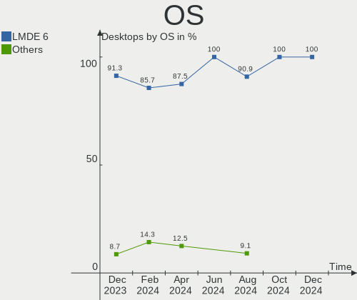

| Name   | Desktops | Percent |
|--------|----------|---------|
| LMDE 5 | 14       | 100%    |

OS Family
---------

OS without a version

| Name | Desktops | Percent |
|------|----------|---------|
| LMDE | 14       | 100%    |

Kernel
------

Version of the Linux kernel

| Version         | Desktops | Percent |
|-----------------|----------|---------|
| 5.10.0-21-amd64 | 11       | 78.57%  |
| 5.10.0-12-amd64 | 3        | 21.43%  |

Kernel Family
-------------

Linux kernel without a distro release

| Version | Desktops | Percent |
|---------|----------|---------|
| 5.10.0  | 14       | 100%    |

Kernel Major Ver.
-----------------

Linux kernel major version

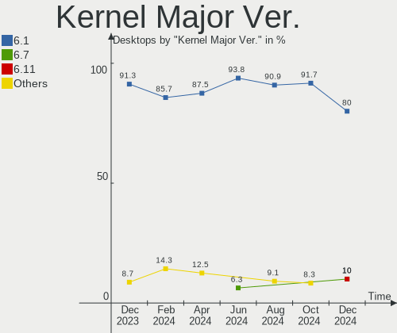

| Version | Desktops | Percent |
|---------|----------|---------|
| 5.10    | 14       | 100%    |

Arch
----

OS architecture (x86_64, i586, etc.)

| Name   | Desktops | Percent |
|--------|----------|---------|
| x86_64 | 14       | 100%    |

DE
--

Desktop Environment

| Name       | Desktops | Percent |
|------------|----------|---------|
| X-Cinnamon | 10       | 71.43%  |
| Cinnamon   | 3        | 21.43%  |
| MATE       | 1        | 7.14%   |

Display Server
--------------

X11 or Wayland

| Name | Desktops | Percent |
|------|----------|---------|
| X11  | 14       | 100%    |

Display Manager
---------------

SDDM, LightDM, etc.

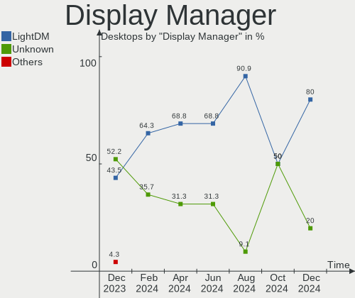

| Name    | Desktops | Percent |
|---------|----------|---------|
| Unknown | 8        | 57.14%  |
| LightDM | 6        | 42.86%  |

OS Lang
-------

Language

| Lang  | Desktops | Percent |
|-------|----------|---------|
| en_US | 8        | 57.14%  |
| de_DE | 2        | 14.29%  |
| sv_SE | 1        | 7.14%   |
| fr_CA | 1        | 7.14%   |
| es_ES | 1        | 7.14%   |
| en_ZA | 1        | 7.14%   |

Boot Mode
---------

EFI or BIOS

| Mode | Desktops | Percent |
|------|----------|---------|
| EFI  | 8        | 57.14%  |
| BIOS | 6        | 42.86%  |

Filesystem
----------

Type of filesystem

| Type    | Desktops | Percent |
|---------|----------|---------|
| Ext4    | 13       | 92.86%  |
| Overlay | 1        | 7.14%   |

Part. scheme
------------

Scheme of partitioning

| Type    | Desktops | Percent |
|---------|----------|---------|
| Unknown | 8        | 57.14%  |
| GPT     | 4        | 28.57%  |
| MBR     | 2        | 14.29%  |

Dual Boot with Linux/BSD
------------------------

Hosting more than one Linux/BSD

| Dual boot | Desktops | Percent |
|-----------|----------|---------|
| No        | 11       | 78.57%  |
| Yes       | 3        | 21.43%  |

Dual Boot (Win)
---------------

Hosting Linux and Windows

| Dual boot | Desktops | Percent |
|-----------|----------|---------|
| No        | 12       | 85.71%  |
| Yes       | 2        | 14.29%  |

Board
-----

Vendor
------

Motherboard manufacturer

| Name                | Desktops | Percent |
|---------------------|----------|---------|
| Gigabyte Technology | 4        | 28.57%  |
| ASUSTek Computer    | 4        | 28.57%  |
| Dell                | 2        | 14.29%  |
| SiYW                | 1        | 7.14%   |
| MSI                 | 1        | 7.14%   |
| BESSTAR Tech        | 1        | 7.14%   |
| ASRock              | 1        | 7.14%   |

Model
-----

Motherboard model

| Name                         | Desktops | Percent |
|------------------------------|----------|---------|
| SiYW V200 Series             | 1        | 7.14%   |
| MSI MS-7693                  | 1        | 7.14%   |
| Gigabyte Z87X-OC Force       | 1        | 7.14%   |
| Gigabyte Q87M-D2H            | 1        | 7.14%   |
| Gigabyte A520M DS3H          | 1        | 7.14%   |
| Gigabyte A320M-S2H           | 1        | 7.14%   |
| Dell OptiPlex 9010           | 1        | 7.14%   |
| Dell OptiPlex 7040           | 1        | 7.14%   |
| BESSTAR Tech TH50            | 1        | 7.14%   |
| ASUS ROG STRIX B450-F GAMING | 1        | 7.14%   |
| ASUS PRIME A320M-K           | 1        | 7.14%   |
| ASUS P7P55D                  | 1        | 7.14%   |
| ASUS P5GC-VM                 | 1        | 7.14%   |
| ASRock B365M Pro4            | 1        | 7.14%   |

Model Family
------------

Motherboard model prefix

| Name               | Desktops | Percent |
|--------------------|----------|---------|
| Dell OptiPlex      | 2        | 14.29%  |
| SiYW V200          | 1        | 7.14%   |
| MSI MS-7693        | 1        | 7.14%   |
| Gigabyte Z87X-OC   | 1        | 7.14%   |
| Gigabyte Q87M-D2H  | 1        | 7.14%   |
| Gigabyte A520M     | 1        | 7.14%   |
| Gigabyte A320M-S2H | 1        | 7.14%   |
| BESSTAR Tech TH50  | 1        | 7.14%   |
| ASUS ROG           | 1        | 7.14%   |
| ASUS PRIME         | 1        | 7.14%   |
| ASUS P7P55D        | 1        | 7.14%   |
| ASUS P5GC-VM       | 1        | 7.14%   |
| ASRock B365M       | 1        | 7.14%   |

MFG Year
--------

Motherboard manufacture year

| Year | Desktops | Percent |
|------|----------|---------|
| 2018 | 4        | 28.57%  |
| 2017 | 2        | 14.29%  |
| 2022 | 1        | 7.14%   |
| 2020 | 1        | 7.14%   |
| 2019 | 1        | 7.14%   |
| 2016 | 1        | 7.14%   |
| 2013 | 1        | 7.14%   |
| 2012 | 1        | 7.14%   |
| 2009 | 1        | 7.14%   |
| 2007 | 1        | 7.14%   |

Form Factor
-----------

Physical design of the computer

| Name    | Desktops | Percent |
|---------|----------|---------|
| Desktop | 14       | 100%    |

Secure Boot
-----------

Enabled or disabled

| State    | Desktops | Percent |
|----------|----------|---------|
| Disabled | 13       | 92.86%  |
| Enabled  | 1        | 7.14%   |

Coreboot
--------

Have coreboot on board

| Used | Desktops | Percent |
|------|----------|---------|
| No   | 14       | 100%    |

RAM Size
--------

Total RAM memory

| Size in GB | Desktops | Percent |
|------------|----------|---------|
| 32.01-64.0 | 6        | 42.86%  |
| 16.01-24.0 | 3        | 21.43%  |
| 8.01-16.0  | 3        | 21.43%  |
| 4.01-8.0   | 1        | 7.14%   |
| 1.01-2.0   | 1        | 7.14%   |

RAM Used
--------

Used RAM memory

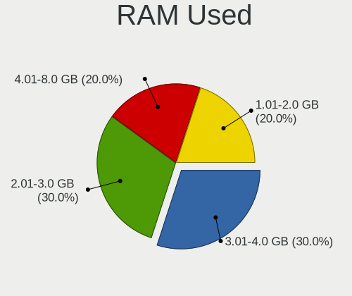

| Used GB   | Desktops | Percent |
|-----------|----------|---------|
| 1.01-2.0  | 5        | 35.71%  |
| 2.01-3.0  | 4        | 28.57%  |
| 4.01-8.0  | 3        | 21.43%  |
| 3.01-4.0  | 1        | 7.14%   |
| 8.01-16.0 | 1        | 7.14%   |

Total Drives
------------

Number of drives on board

| Drives | Desktops | Percent |
|--------|----------|---------|
| 1      | 7        | 50%     |
| 3      | 3        | 21.43%  |
| 6      | 1        | 7.14%   |
| 5      | 1        | 7.14%   |
| 4      | 1        | 7.14%   |
| 2      | 1        | 7.14%   |

Has CD-ROM
----------

Has CD-ROM on board

| Presented | Desktops | Percent |
|-----------|----------|---------|
| No        | 11       | 78.57%  |
| Yes       | 3        | 21.43%  |

Has Ethernet
------------

Has Ethernet on board

| Presented | Desktops | Percent |
|-----------|----------|---------|
| Yes       | 13       | 92.86%  |
| No        | 1        | 7.14%   |

Has WiFi
--------

Has WiFi module

| Presented | Desktops | Percent |
|-----------|----------|---------|
| Yes       | 9        | 64.29%  |
| No        | 5        | 35.71%  |

Has Bluetooth
-------------

Has Bluetooth module

| Presented | Desktops | Percent |
|-----------|----------|---------|
| Yes       | 7        | 50%     |
| No        | 7        | 50%     |

Location
--------

Country
-------

Geographic location (country)

| Country      | Desktops | Percent |
|--------------|----------|---------|
| USA          | 5        | 35.71%  |
| Germany      | 3        | 21.43%  |
| South Africa | 2        | 14.29%  |
| Sweden       | 1        | 7.14%   |
| Spain        | 1        | 7.14%   |
| Canada       | 1        | 7.14%   |
| Bolivia      | 1        | 7.14%   |

City
----

Geographic location (city)

| City          | Desktops | Percent |
|---------------|----------|---------|
| Ponteareas    | 1        | 7.14%   |
| Passaic       | 1        | 7.14%   |
| Oklahoma City | 1        | 7.14%   |
| Nashville     | 1        | 7.14%   |
| Montreal      | 1        | 7.14%   |
| Kiel          | 1        | 7.14%   |
| Johannesburg  | 1        | 7.14%   |
| Gruenenplan   | 1        | 7.14%   |
| Greiz         | 1        | 7.14%   |
| Gothenburg    | 1        | 7.14%   |
| Fenton        | 1        | 7.14%   |
| Cochabamba    | 1        | 7.14%   |
| Centurion     | 1        | 7.14%   |
| Augusta       | 1        | 7.14%   |

Drives
------

Drive Vendor
------------

Hard drive vendors

| Vendor                    | Desktops | Drives | Percent |
|---------------------------|----------|--------|---------|
| Samsung Electronics       | 5        | 6      | 19.23%  |
| WDC                       | 4        | 9      | 15.38%  |
| Seagate                   | 3        | 3      | 11.54%  |
| SPCC                      | 2        | 2      | 7.69%   |
| Kingston                  | 2        | 2      | 7.69%   |
| Crucial                   | 2        | 3      | 7.69%   |
| Toshiba                   | 1        | 2      | 3.85%   |
| Silicon Motion            | 1        | 1      | 3.85%   |
| Sandisk                   | 1        | 1      | 3.85%   |
| PNY                       | 1        | 1      | 3.85%   |
| Patriot                   | 1        | 1      | 3.85%   |
| Micron/Crucial Technology | 1        | 1      | 3.85%   |
| Emtec                     | 1        | 1      | 3.85%   |
| China                     | 1        | 1      | 3.85%   |

Drive Model
-----------

Hard drive models

| Model                                               | Desktops | Percent |
|-----------------------------------------------------|----------|---------|
| Samsung NVMe SSD Controller SM981/PM981/PM983 250GB | 2        | 6.9%    |
| WDC WD3003FZEX-00Z4SA0 3TB                          | 1        | 3.45%   |
| WDC WD20EZRX-22D8PB0 2TB                            | 1        | 3.45%   |
| WDC WD20EZAZ-00GGJB0 2TB                            | 1        | 3.45%   |
| WDC WD1502FAEX-007BA0 1TB                           | 1        | 3.45%   |
| WDC WD10SPZX-21Z10T0 1TB                            | 1        | 3.45%   |
| Toshiba HDWD130 3TB                                 | 1        | 3.45%   |
| Toshiba DT01ACA300 3TB                              | 1        | 3.45%   |
| SPCC Solid State Disk 512GB                         | 1        | 3.45%   |
| SPCC Solid State Disk 1TB                           | 1        | 3.45%   |
| Silicon Motion SM2262/SM2262EN SSD Controller 1TB   | 1        | 3.45%   |
| Seagate ST4000DM000-1F2168 4TB                      | 1        | 3.45%   |
| Seagate ST3320820ACE 320GB                          | 1        | 3.45%   |
| Seagate ST31500341AS 1TB                            | 1        | 3.45%   |
| Sandisk WD_BLACK SN770 500GB                        | 1        | 3.45%   |
| Samsung SSD 870 QVO 1TB                             | 1        | 3.45%   |
| Samsung MZNLN512HMJP-000H1 512GB SSD                | 1        | 3.45%   |
| Samsung HD204UI 2TB                                 | 1        | 3.45%   |
| Samsung HD153WI 1TB                                 | 1        | 3.45%   |
| PNY CS900 480GB SSD                                 | 1        | 3.45%   |
| Patriot P220 1024GB SSD                             | 1        | 3.45%   |
| Micron/Crucial P2 NVMe PCIe SSD 1TB                 | 1        | 3.45%   |
| Kingston SA400S37120G 120GB SSD                     | 1        | 3.45%   |
| Kingston OM8PDP3256B-A01 256GB                      | 1        | 3.45%   |
| Emtec X300 256GB                                    | 1        | 3.45%   |
| Crucial CT256MX100SSD1 256GB                        | 1        | 3.45%   |
| Crucial CT250MX500SSD1 250GB                        | 1        | 3.45%   |
| China SATA SSD 256GB                                | 1        | 3.45%   |

HDD Vendor
----------

Hard disk drive vendors

| Vendor              | Desktops | Drives | Percent |
|---------------------|----------|--------|---------|
| WDC                 | 4        | 9      | 40%     |
| Seagate             | 3        | 3      | 30%     |
| Samsung Electronics | 2        | 2      | 20%     |
| Toshiba             | 1        | 2      | 10%     |

SSD Vendor
----------

Solid state drive vendors

| Vendor              | Desktops | Drives | Percent |
|---------------------|----------|--------|---------|
| SPCC                | 2        | 2      | 20%     |
| Samsung Electronics | 2        | 2      | 20%     |
| Crucial             | 2        | 3      | 20%     |
| PNY                 | 1        | 1      | 10%     |
| Patriot             | 1        | 1      | 10%     |
| Kingston            | 1        | 1      | 10%     |
| China               | 1        | 1      | 10%     |

Drive Kind
----------

HDD or SSD

| Kind | Desktops | Drives | Percent |
|------|----------|--------|---------|
| NVMe | 7        | 7      | 33.33%  |
| SSD  | 7        | 11     | 33.33%  |
| HDD  | 7        | 16     | 33.33%  |

Drive Connector
---------------

SATA, SAS, NVMe, etc.

| Type | Desktops | Drives | Percent |
|------|----------|--------|---------|
| SATA | 11       | 26     | 57.89%  |
| NVMe | 7        | 7      | 36.84%  |
| SAS  | 1        | 1      | 5.26%   |

Drive Size
----------

Size of hard drive

| Size in TB | Desktops | Drives | Percent |
|------------|----------|--------|---------|
| 0.51-1.0   | 7        | 12     | 36.84%  |
| 0.01-0.5   | 6        | 7      | 31.58%  |
| 1.01-2.0   | 3        | 3      | 15.79%  |
| 2.01-3.0   | 2        | 4      | 10.53%  |
| 3.01-4.0   | 1        | 1      | 5.26%   |

Space Total
-----------

Amount of disk space available on the file system

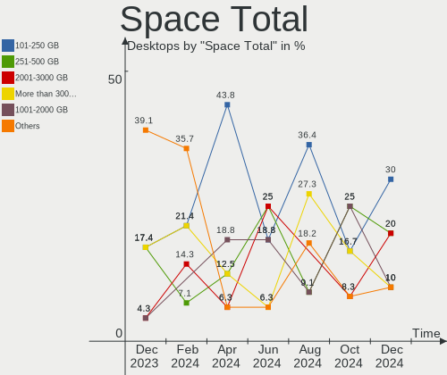

| Size in GB | Desktops | Percent |
|------------|----------|---------|
| 251-500    | 5        | 35.71%  |
| 1001-2000  | 3        | 21.43%  |
| 101-250    | 2        | 14.29%  |
| 501-1000   | 2        | 14.29%  |
| 2001-3000  | 1        | 7.14%   |
| 1-20       | 1        | 7.14%   |

Space Used
----------

Amount of used disk space

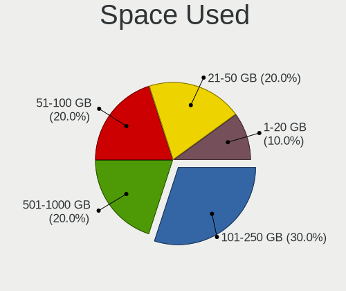

| Used GB   | Desktops | Percent |
|-----------|----------|---------|
| 101-250   | 6        | 42.86%  |
| 251-500   | 3        | 21.43%  |
| 1-20      | 3        | 21.43%  |
| 1001-2000 | 1        | 7.14%   |
| 51-100    | 1        | 7.14%   |

Malfunc. Drives
---------------

Drive models with a malfunction

| Model                           | Desktops | Drives | Percent |
|---------------------------------|----------|--------|---------|
| Samsung Electronics HD153WI 1TB | 1        | 1      | 100%    |

Malfunc. Drive Vendor
---------------------

Vendors of faulty drives

| Vendor              | Desktops | Drives | Percent |
|---------------------|----------|--------|---------|
| Samsung Electronics | 1        | 1      | 100%    |

Malfunc. HDD Vendor
-------------------

Vendors of faulty HDD drives

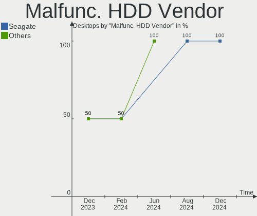

| Vendor              | Desktops | Drives | Percent |
|---------------------|----------|--------|---------|
| Samsung Electronics | 1        | 1      | 100%    |

Malfunc. Drive Kind
-------------------

Kinds of faulty drives

| Kind | Desktops | Drives | Percent |
|------|----------|--------|---------|
| HDD  | 1        | 1      | 100%    |

Failed Drives
-------------

Failed drive models

Zero info for selected period =(

Failed Drive Vendor
-------------------

Failed drive vendors

Zero info for selected period =(

Drive Status
------------

Number of failed and malfunc. drives

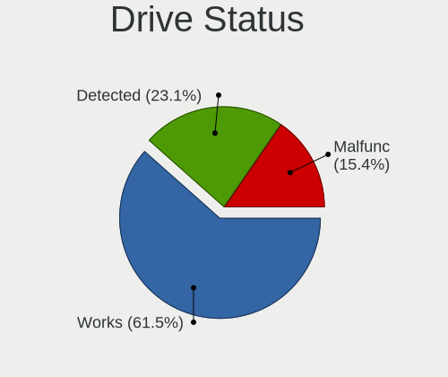

| Status   | Desktops | Drives | Percent |
|----------|----------|--------|---------|
| Detected | 9        | 14     | 56.25%  |
| Works    | 6        | 19     | 37.5%   |
| Malfunc  | 1        | 1      | 6.25%   |

Storage controller
------------------

Storage Vendor
--------------

Storage controller vendors

| Vendor                      | Desktops | Percent |
|-----------------------------|----------|---------|
| Intel                       | 9        | 39.13%  |
| AMD                         | 5        | 21.74%  |
| Samsung Electronics         | 2        | 8.7%    |
| Silicon Motion              | 1        | 4.35%   |
| SanDisk                     | 1        | 4.35%   |
| Phison Electronics          | 1        | 4.35%   |
| Micron/Crucial Technology   | 1        | 4.35%   |
| Marvell Technology Group    | 1        | 4.35%   |
| Kingston Technology Company | 1        | 4.35%   |
| JMicron Technology          | 1        | 4.35%   |

Storage Model
-------------

Storage controller models

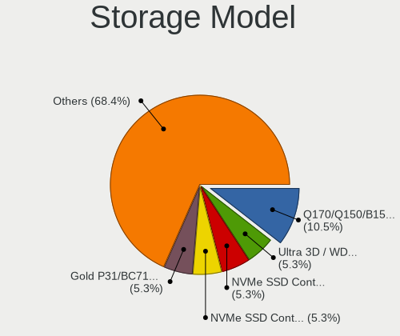

| Model                                                                          | Desktops | Percent |
|--------------------------------------------------------------------------------|----------|---------|
| Samsung NVMe SSD Controller SM981/PM981/PM983                                  | 2        | 7.14%   |
| AMD FCH SATA Controller [AHCI mode]                                            | 2        | 7.14%   |
| AMD FCH SATA Controller D                                                      | 2        | 7.14%   |
| Silicon Motion SM2262/SM2262EN SSD Controller                                  | 1        | 3.57%   |
| SanDisk NVMe Controller                                                        | 1        | 3.57%   |
| Phison PS5013 E13 NVMe Controller                                              | 1        | 3.57%   |
| Micron/Crucial P2 NVMe PCIe SSD                                                | 1        | 3.57%   |
| Marvell Group 88SE9230 PCIe 2.0 x2 4-port SATA 6 Gb/s RAID Controller          | 1        | 3.57%   |
| Kingston Company OM3PDP3 NVMe SSD                                              | 1        | 3.57%   |
| JMicron JMB363 SATA/IDE Controller                                             | 1        | 3.57%   |
| Intel Tiger Lake-LP SATA Controller                                            | 1        | 3.57%   |
| Intel Sunrise Point-LP SATA Controller [AHCI mode]                             | 1        | 3.57%   |
| Intel SATA Controller [RAID mode]                                              | 1        | 3.57%   |
| Intel Q170/Q150/B150/H170/H110/Z170/CM236 Chipset SATA Controller [AHCI Mode]  | 1        | 3.57%   |
| Intel NM10/ICH7 Family SATA Controller [IDE mode]                              | 1        | 3.57%   |
| Intel 82801G (ICH7 Family) IDE Controller                                      | 1        | 3.57%   |
| Intel 8 Series/C220 Series Chipset Family 6-port SATA Controller 1 [AHCI mode] | 1        | 3.57%   |
| Intel 7 Series/C210 Series Chipset Family 6-port SATA Controller [AHCI mode]   | 1        | 3.57%   |
| Intel 5 Series/3400 Series Chipset 4 port SATA IDE Controller                  | 1        | 3.57%   |
| Intel 5 Series/3400 Series Chipset 2 port SATA IDE Controller                  | 1        | 3.57%   |
| Intel 200 Series PCH SATA controller [AHCI mode]                               | 1        | 3.57%   |
| AMD SB7x0/SB8x0/SB9x0 SATA Controller [IDE mode]                               | 1        | 3.57%   |
| AMD SB7x0/SB8x0/SB9x0 IDE Controller                                           | 1        | 3.57%   |
| AMD 500 Series Chipset SATA Controller                                         | 1        | 3.57%   |
| AMD 400 Series Chipset SATA Controller                                         | 1        | 3.57%   |

Storage Kind
------------

Kind of storage controller (IDE, SATA, NVMe, SAS, ...)

| Kind | Desktops | Percent |
|------|----------|---------|
| SATA | 12       | 52.17%  |
| NVMe | 7        | 30.43%  |
| IDE  | 3        | 13.04%  |
| RAID | 1        | 4.35%   |

Processor
---------

CPU Vendor
----------

Processor vendors

| Vendor | Desktops | Percent |
|--------|----------|---------|
| Intel  | 9        | 64.29%  |
| AMD    | 5        | 35.71%  |

CPU Model
---------

Processor models

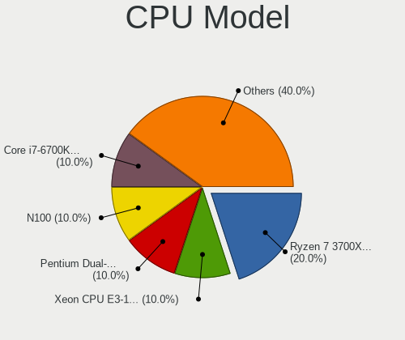

| Model                                      | Desktops | Percent |
|--------------------------------------------|----------|---------|
| Intel Pentium Dual CPU E2180 @ 2.00GHz     | 1        | 7.14%   |
| Intel Core i7-9700K CPU @ 3.60GHz          | 1        | 7.14%   |
| Intel Core i7-8650U CPU @ 1.90GHz          | 1        | 7.14%   |
| Intel Core i7-4770S CPU @ 3.10GHz          | 1        | 7.14%   |
| Intel Core i5-6500T CPU @ 2.50GHz          | 1        | 7.14%   |
| Intel Core i5-4590S CPU @ 3.00GHz          | 1        | 7.14%   |
| Intel Core i5-3470 CPU @ 3.20GHz           | 1        | 7.14%   |
| Intel Core i3 CPU 560 @ 3.33GHz            | 1        | 7.14%   |
| Intel 11th Gen Core i5-11320H @ 3.20GHz    | 1        | 7.14%   |
| AMD Ryzen 7 5700G with Radeon Graphics     | 1        | 7.14%   |
| AMD Ryzen 7 3700X 8-Core Processor         | 1        | 7.14%   |
| AMD Ryzen 7 2700 Eight-Core Processor      | 1        | 7.14%   |
| AMD FX-4300 Quad-Core Processor            | 1        | 7.14%   |
| AMD Athlon 200GE with Radeon Vega Graphics | 1        | 7.14%   |

CPU Model Family
----------------

Processor model prefix

| Model              | Desktops | Percent |
|--------------------|----------|---------|
| Intel Core i7      | 3        | 21.43%  |
| Intel Core i5      | 3        | 21.43%  |
| AMD Ryzen 7        | 3        | 21.43%  |
| Other              | 1        | 7.14%   |
| Intel Pentium Dual | 1        | 7.14%   |
| Intel Core i3      | 1        | 7.14%   |
| AMD FX             | 1        | 7.14%   |
| AMD Athlon         | 1        | 7.14%   |

CPU Cores
---------

Number of processor cores

| Number | Desktops | Percent |
|--------|----------|---------|
| 4      | 6        | 42.86%  |
| 8      | 4        | 28.57%  |
| 2      | 4        | 28.57%  |

CPU Sockets
-----------

Number of sockets

| Number | Desktops | Percent |
|--------|----------|---------|
| 1      | 14       | 100%    |

CPU Threads
-----------

Threads per core (Hyper-Threading)

| Number | Desktops | Percent |
|--------|----------|---------|
| 2      | 9        | 64.29%  |
| 1      | 5        | 35.71%  |

CPU Op-Modes
------------

CPU Operation Modes (32-bit, 64-bit)

| Op mode        | Desktops | Percent |
|----------------|----------|---------|
| 32-bit, 64-bit | 14       | 100%    |

CPU Microcode
-------------

Microcode number

| Number     | Desktops | Percent |
|------------|----------|---------|
| 0x306c3    | 2        | 14.29%  |
| 0x906ed    | 1        | 7.14%   |
| 0x806ea    | 1        | 7.14%   |
| 0x806c2    | 1        | 7.14%   |
| 0x6fd      | 1        | 7.14%   |
| 0x506e3    | 1        | 7.14%   |
| 0x306a9    | 1        | 7.14%   |
| 0x20655    | 1        | 7.14%   |
| 0x0a50000d | 1        | 7.14%   |
| 0x08701021 | 1        | 7.14%   |
| 0x0810100b | 1        | 7.14%   |
| 0x0800820d | 1        | 7.14%   |
| 0x06000852 | 1        | 7.14%   |

CPU Microarch
-------------

Microarchitecture

| Name       | Desktops | Percent |
|------------|----------|---------|
| KabyLake   | 2        | 14.29%  |
| Haswell    | 2        | 14.29%  |
| Zen+       | 1        | 7.14%   |
| Zen 3      | 1        | 7.14%   |
| Zen 2      | 1        | 7.14%   |
| Zen        | 1        | 7.14%   |
| Westmere   | 1        | 7.14%   |
| TigerLake  | 1        | 7.14%   |
| Skylake    | 1        | 7.14%   |
| Piledriver | 1        | 7.14%   |
| IvyBridge  | 1        | 7.14%   |
| Core       | 1        | 7.14%   |

Graphics
--------

GPU Vendor
----------

Vendors of graphics cards

| Vendor | Desktops | Percent |
|--------|----------|---------|
| Nvidia | 6        | 37.5%   |
| Intel  | 6        | 37.5%   |
| AMD    | 4        | 25%     |

GPU Model
---------

Graphics card models

| Model                                                                       | Desktops | Percent |
|-----------------------------------------------------------------------------|----------|---------|
| Intel Xeon E3-1200 v3/4th Gen Core Processor Integrated Graphics Controller | 2        | 12.5%   |
| AMD Ellesmere [Radeon RX 470/480/570/570X/580/580X/590]                     | 2        | 12.5%   |
| Nvidia TU104 [GeForce RTX 2080 SUPER]                                       | 1        | 6.25%   |
| Nvidia GM206 [GeForce GTX 950]                                              | 1        | 6.25%   |
| Nvidia GM204 [GeForce GTX 970]                                              | 1        | 6.25%   |
| Nvidia GK208B [GeForce GT 730]                                              | 1        | 6.25%   |
| Nvidia GK208B [GeForce GT 710]                                              | 1        | 6.25%   |
| Nvidia G92 [GeForce GTS 250]                                                | 1        | 6.25%   |
| Intel Xeon E3-1200 v2/3rd Gen Core processor Graphics Controller            | 1        | 6.25%   |
| Intel UHD Graphics 620                                                      | 1        | 6.25%   |
| Intel TigerLake-LP GT2 [Iris Xe Graphics]                                   | 1        | 6.25%   |
| Intel HD Graphics 530                                                       | 1        | 6.25%   |
| AMD RV620 LE [Radeon HD 3450]                                               | 1        | 6.25%   |
| AMD Cezanne [Radeon Vega Series / Radeon Vega Mobile Series]                | 1        | 6.25%   |

GPU Combo
---------

Combinations of graphics cards

| Name           | Desktops | Percent |
|----------------|----------|---------|
| 1 x Nvidia     | 4        | 28.57%  |
| 1 x Intel      | 4        | 28.57%  |
| 1 x AMD        | 4        | 28.57%  |
| Intel + Nvidia | 2        | 14.29%  |

GPU Driver
----------

Free vs proprietary

| Driver      | Desktops | Percent |
|-------------|----------|---------|
| Free        | 12       | 85.71%  |
| Proprietary | 2        | 14.29%  |

GPU Memory
----------

Total video memory

| Size in GB | Desktops | Percent |
|------------|----------|---------|
| Unknown    | 4        | 28.57%  |
| 7.01-8.0   | 3        | 21.43%  |
| 1.01-2.0   | 2        | 14.29%  |
| 0.51-1.0   | 2        | 14.29%  |
| 0.01-0.5   | 2        | 14.29%  |
| 3.01-4.0   | 1        | 7.14%   |

Monitor
-------

Monitor Vendor
--------------

Monitor vendors

| Vendor              | Desktops | Percent |
|---------------------|----------|---------|
| Samsung Electronics | 4        | 28.57%  |
| Sony                | 2        | 14.29%  |
| ViewSonic           | 1        | 7.14%   |
| SKY                 | 1        | 7.14%   |
| Nixeus              | 1        | 7.14%   |
| MSI                 | 1        | 7.14%   |
| HUAWEI              | 1        | 7.14%   |
| Dell                | 1        | 7.14%   |
| BenQ                | 1        | 7.14%   |
| Acer                | 1        | 7.14%   |

Monitor Model
-------------

Monitor models

| Model                                                               | Desktops | Percent |
|---------------------------------------------------------------------|----------|---------|
| ViewSonic VX3276-FHD VSCE735 1920x1080 698x393mm 31.5-inch          | 1        | 6.67%   |
| Sony TV SNY8E01 1360x768                                            | 1        | 6.67%   |
| Sony LCD Monitor TV  *00 1920x1080                                  | 1        | 6.67%   |
| SKY TV SKY1502 3840x2160 708x398mm 32.0-inch                        | 1        | 6.67%   |
| Samsung Electronics SyncMaster SAM03D0 1440x900 410x257mm 19.1-inch | 1        | 6.67%   |
| Samsung Electronics SMBX1950N SAM0716 1366x768 410x230mm 18.5-inch  | 1        | 6.67%   |
| Samsung Electronics S24D590 SAM0B47 1920x1080 521x293mm 23.5-inch   | 1        | 6.67%   |
| Samsung Electronics S22F350 SAM0D1A 1920x1080 477x268mm 21.5-inch   | 1        | 6.67%   |
| Samsung Electronics LF22T35 SAM707B 1920x1080 477x268mm 21.5-inch   | 1        | 6.67%   |
| Nixeus NX-VUE24 NIX2415 1920x1080 477x268mm 21.5-inch               | 1        | 6.67%   |
| MSI G242 MSI4BA4 1920x1080 527x296mm 23.8-inch                      | 1        | 6.67%   |
| HUAWEI ZQE-CBA HWV6A25 3440x1440 797x334mm 34.0-inch                | 1        | 6.67%   |
| Dell LCD Monitor S3422DWG 3440x1440                                 | 1        | 6.67%   |
| BenQ G2400W BNQ780A 1920x1200 519x324mm 24.1-inch                   | 1        | 6.67%   |
| Acer T272HL ACR013B 1920x1080 598x336mm 27.0-inch                   | 1        | 6.67%   |

Monitor Resolution
------------------

Monitor screen resolution

| Resolution        | Desktops | Percent |
|-------------------|----------|---------|
| 1920x1080 (FHD)   | 7        | 50%     |
| 3440x1440         | 2        | 14.29%  |
| 3840x2160 (4K)    | 1        | 7.14%   |
| 1920x1200 (WUXGA) | 1        | 7.14%   |
| 1440x900 (WXGA+)  | 1        | 7.14%   |
| 1366x768 (WXGA)   | 1        | 7.14%   |
| 1360x768          | 1        | 7.14%   |

Monitor Diagonal
----------------

Diagonal size in inches

| Inches  | Desktops | Percent |
|---------|----------|---------|
| Unknown | 3        | 21.43%  |
| 24      | 2        | 14.29%  |
| 21      | 2        | 14.29%  |
| 64      | 1        | 7.14%   |
| 34      | 1        | 7.14%   |
| 31      | 1        | 7.14%   |
| 27      | 1        | 7.14%   |
| 23      | 1        | 7.14%   |
| 19      | 1        | 7.14%   |
| 18      | 1        | 7.14%   |

Monitor Width
-------------

Physical width

| Width in mm | Desktops | Percent |
|-------------|----------|---------|
| 501-600     | 4        | 30.77%  |
| 401-500     | 3        | 23.08%  |
| Unknown     | 3        | 23.08%  |
| 701-800     | 1        | 7.69%   |
| 601-700     | 1        | 7.69%   |
| 1001-1500   | 1        | 7.69%   |

Aspect Ratio
------------

Proportional relationship between the width and the height

| Ratio   | Desktops | Percent |
|---------|----------|---------|
| 16/9    | 7        | 53.85%  |
| 16/10   | 3        | 23.08%  |
| Unknown | 2        | 15.38%  |
| 21/9    | 1        | 7.69%   |

Monitor Area
------------

Area in inch²

| Area in inch² | Desktops | Percent |
|----------------|----------|---------|
| 201-250        | 3        | 21.43%  |
| Unknown        | 3        | 21.43%  |
| 351-500        | 2        | 14.29%  |
| 251-300        | 2        | 14.29%  |
| More than 1000 | 1        | 7.14%   |
| 301-350        | 1        | 7.14%   |
| 151-200        | 1        | 7.14%   |
| 141-150        | 1        | 7.14%   |

Pixel Density
-------------

Pixels per inch

| Density | Desktops | Percent |
|---------|----------|---------|
| 51-100  | 8        | 57.14%  |
| 101-120 | 3        | 21.43%  |
| Unknown | 3        | 21.43%  |

Multiple Monitors
-----------------

Total monitors connected

| Total | Desktops | Percent |
|-------|----------|---------|
| 1     | 12       | 85.71%  |
| 2     | 2        | 14.29%  |

Network
-------

Net Controller Vendor
---------------------

Controller vendors

| Vendor                | Desktops | Percent |
|-----------------------|----------|---------|
| Intel                 | 8        | 38.1%   |
| Realtek Semiconductor | 7        | 33.33%  |
| Qualcomm Atheros      | 2        | 9.52%   |
| TP-Link               | 1        | 4.76%   |
| Ralink                | 1        | 4.76%   |
| NetGear               | 1        | 4.76%   |
| MediaTek              | 1        | 4.76%   |

Net Controller Model
--------------------

Controller models

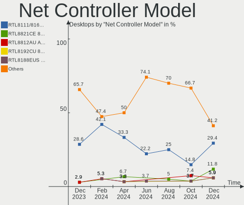

| Model                                                             | Desktops | Percent |
|-------------------------------------------------------------------|----------|---------|
| Realtek RTL8111/8168/8411 PCI Express Gigabit Ethernet Controller | 5        | 20.83%  |
| TP-Link RTL8812AU Archer T4U 802.11ac                             | 1        | 4.17%   |
| Realtek RTL88x2bu [AC1200 Techkey]                                | 1        | 4.17%   |
| Realtek RTL8188EUS 802.11n Wireless Network Adapter               | 1        | 4.17%   |
| Realtek RTL8188EE Wireless Network Adapter                        | 1        | 4.17%   |
| Ralink RT2561/RT61 802.11g PCI                                    | 1        | 4.17%   |
| Qualcomm Atheros Attansic L1 Gigabit Ethernet                     | 1        | 4.17%   |
| Qualcomm Atheros AR9462 Wireless Network Adapter                  | 1        | 4.17%   |
| NetGear A6210                                                     | 1        | 4.17%   |
| MediaTek MT7921K (RZ608) Wi-Fi 6E 80MHz                           | 1        | 4.17%   |
| Intel Wireless 8260                                               | 1        | 4.17%   |
| Intel Wireless 3165                                               | 1        | 4.17%   |
| Intel I211 Gigabit Network Connection                             | 1        | 4.17%   |
| Intel I210 Gigabit Network Connection                             | 1        | 4.17%   |
| Intel Ethernet Controller I225-V                                  | 1        | 4.17%   |
| Intel Ethernet Connection I217-V                                  | 1        | 4.17%   |
| Intel Ethernet Connection I217-LM                                 | 1        | 4.17%   |
| Intel Ethernet Connection (2) I219-V                              | 1        | 4.17%   |
| Intel Ethernet Connection (2) I219-LM                             | 1        | 4.17%   |
| Intel 82579LM Gigabit Network Connection (Lewisville)             | 1        | 4.17%   |

Wireless Vendor
---------------

Wireless vendors

| Vendor                | Desktops | Percent |
|-----------------------|----------|---------|
| Realtek Semiconductor | 2        | 22.22%  |
| Intel                 | 2        | 22.22%  |
| TP-Link               | 1        | 11.11%  |
| Ralink                | 1        | 11.11%  |
| Qualcomm Atheros      | 1        | 11.11%  |
| NetGear               | 1        | 11.11%  |
| MediaTek              | 1        | 11.11%  |

Wireless Model
--------------

Wireless models

| Model                                               | Desktops | Percent |
|-----------------------------------------------------|----------|---------|
| TP-Link RTL8812AU Archer T4U 802.11ac               | 1        | 10%     |
| Realtek RTL88x2bu [AC1200 Techkey]                  | 1        | 10%     |
| Realtek RTL8188EUS 802.11n Wireless Network Adapter | 1        | 10%     |
| Realtek RTL8188EE Wireless Network Adapter          | 1        | 10%     |
| Ralink RT2561/RT61 802.11g PCI                      | 1        | 10%     |
| Qualcomm Atheros AR9462 Wireless Network Adapter    | 1        | 10%     |
| NetGear A6210                                       | 1        | 10%     |
| MediaTek MT7921K (RZ608) Wi-Fi 6E 80MHz             | 1        | 10%     |
| Intel Wireless 8260                                 | 1        | 10%     |
| Intel Wireless 3165                                 | 1        | 10%     |

Ethernet Vendor
---------------

Ethernet vendors

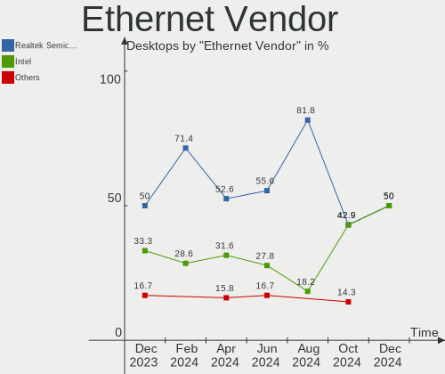

| Vendor                | Desktops | Percent |
|-----------------------|----------|---------|
| Intel                 | 7        | 53.85%  |
| Realtek Semiconductor | 5        | 38.46%  |
| Qualcomm Atheros      | 1        | 7.69%   |

Ethernet Model
--------------

Ethernet models

| Model                                                             | Desktops | Percent |
|-------------------------------------------------------------------|----------|---------|
| Realtek RTL8111/8168/8411 PCI Express Gigabit Ethernet Controller | 5        | 35.71%  |
| Qualcomm Atheros Attansic L1 Gigabit Ethernet                     | 1        | 7.14%   |
| Intel I211 Gigabit Network Connection                             | 1        | 7.14%   |
| Intel I210 Gigabit Network Connection                             | 1        | 7.14%   |
| Intel Ethernet Controller I225-V                                  | 1        | 7.14%   |
| Intel Ethernet Connection I217-V                                  | 1        | 7.14%   |
| Intel Ethernet Connection I217-LM                                 | 1        | 7.14%   |
| Intel Ethernet Connection (2) I219-V                              | 1        | 7.14%   |
| Intel Ethernet Connection (2) I219-LM                             | 1        | 7.14%   |
| Intel 82579LM Gigabit Network Connection (Lewisville)             | 1        | 7.14%   |

Net Controller Kind
-------------------

Ethernet, WiFi or modem

| Kind     | Desktops | Percent |
|----------|----------|---------|
| Ethernet | 13       | 59.09%  |
| WiFi     | 9        | 40.91%  |

Used Controller
---------------

Currently used network controller

| Kind     | Desktops | Percent |
|----------|----------|---------|
| Ethernet | 11       | 68.75%  |
| WiFi     | 5        | 31.25%  |

NICs
----

Total network controllers on board

| Total | Desktops | Percent |
|-------|----------|---------|
| 1     | 6        | 42.86%  |
| 2     | 5        | 35.71%  |
| 3     | 2        | 14.29%  |
| 0     | 1        | 7.14%   |

IPv6
----

IPv6 vs IPv4

| Used | Desktops | Percent |
|------|----------|---------|
| No   | 10       | 71.43%  |
| Yes  | 4        | 28.57%  |

Bluetooth
---------

Bluetooth Vendor
----------------

Controller vendors

| Vendor                  | Desktops | Percent |
|-------------------------|----------|---------|
| Intel                   | 2        | 28.57%  |
| Cambridge Silicon Radio | 2        | 28.57%  |
| MediaTek                | 1        | 14.29%  |
| Lite-On Technology      | 1        | 14.29%  |
| Dynex                   | 1        | 14.29%  |

Bluetooth Model
---------------

Controller models

| Model                                                    | Desktops | Percent |
|----------------------------------------------------------|----------|---------|
| Intel Bluetooth wireless interface                       | 2        | 28.57%  |
| Cambridge Silicon Radio Bluetooth Dongle (HCI mode)      | 2        | 28.57%  |
| MediaTek Wireless_Device                                 | 1        | 14.29%  |
| Lite-On Bluetooth Device                                 | 1        | 14.29%  |
| Dynex Bluetooth 4.0 Adapter [Broadcom, 1.12, BCM20702A0] | 1        | 14.29%  |

Sound
-----

Sound Vendor
------------

Sound card vendors

| Vendor              | Desktops | Percent |
|---------------------|----------|---------|
| Intel               | 9        | 37.5%   |
| AMD                 | 6        | 25%     |
| Nvidia              | 5        | 20.83%  |
| C-Media Electronics | 2        | 8.33%   |
| Logitech            | 1        | 4.17%   |
| GN Netcom           | 1        | 4.17%   |

Sound Model
-----------

Sound card models

| Model                                                               | Desktops | Percent |
|---------------------------------------------------------------------|----------|---------|
| Nvidia GK208 HDMI/DP Audio Controller                               | 2        | 7.14%   |
| Intel Xeon E3-1200 v3/4th Gen Core Processor HD Audio Controller    | 2        | 7.14%   |
| AMD Family 17h/19h HD Audio Controller                              | 2        | 7.14%   |
| AMD Ellesmere HDMI Audio [Radeon RX 470/480 / 570/580/590]          | 2        | 7.14%   |
| Nvidia TU104 HD Audio Controller                                    | 1        | 3.57%   |
| Nvidia GM206 High Definition Audio Controller                       | 1        | 3.57%   |
| Nvidia GM204 High Definition Audio Controller                       | 1        | 3.57%   |
| Logitech ClearChat Pro USB                                          | 1        | 3.57%   |
| Intel Tiger Lake-LP Smart Sound Technology Audio Controller         | 1        | 3.57%   |
| Intel Sunrise Point-LP HD Audio                                     | 1        | 3.57%   |
| Intel NM10/ICH7 Family High Definition Audio Controller             | 1        | 3.57%   |
| Intel 8 Series/C220 Series Chipset High Definition Audio Controller | 1        | 3.57%   |
| Intel 7 Series/C216 Chipset Family High Definition Audio Controller | 1        | 3.57%   |
| Intel 5 Series/3400 Series Chipset High Definition Audio            | 1        | 3.57%   |
| Intel 200 Series PCH HD Audio                                       | 1        | 3.57%   |
| Intel 100 Series/C230 Series Chipset Family HD Audio Controller     | 1        | 3.57%   |
| GN Netcom Jabra Link 380                                            | 1        | 3.57%   |
| C-Media Electronics CM8888 [Oxygen Express]                         | 1        | 3.57%   |
| C-Media Electronics Blue Snowball                                   | 1        | 3.57%   |
| AMD Starship/Matisse HD Audio Controller                            | 1        | 3.57%   |
| AMD SBx00 Azalia (Intel HDA)                                        | 1        | 3.57%   |
| AMD RV620 HDMI Audio [Radeon HD 3450/3470/3550/3570]                | 1        | 3.57%   |
| AMD Renoir Radeon High Definition Audio Controller                  | 1        | 3.57%   |
| AMD Family 17h (Models 00h-0fh) HD Audio Controller                 | 1        | 3.57%   |

Memory
------

Memory Vendor
-------------

Memory module vendors

| Vendor   | Desktops | Percent |
|----------|----------|---------|
| Unknown  | 1        | 14.29%  |
| SK hynix | 1        | 14.29%  |
| KLEVV    | 1        | 14.29%  |
| Kingston | 1        | 14.29%  |
| GeIL     | 1        | 14.29%  |
| G.Skill  | 1        | 14.29%  |
| Corsair  | 1        | 14.29%  |

Memory Model
------------

Memory module models

| Model                                                          | Desktops | Percent |
|----------------------------------------------------------------|----------|---------|
| Unknown RAM Module 512MB DIMM DDR2 266MT/s                     | 1        | 12.5%   |
| Unknown RAM Module 1GB DIMM DDR2 266MT/s                       | 1        | 12.5%   |
| SK hynix RAM HKNNNFBMAVAR-NEH 2GB Row Of Chips LPDDR4 3200MT/s | 1        | 12.5%   |
| KLEVV RAM KD48GU880-36A180C 8GB DIMM DDR4 3600MT/s             | 1        | 12.5%   |
| Kingston RAM 9905471-001.A01LF 2GB DIMM DDR3 1600MT/s          | 1        | 12.5%   |
| GeIL RAM CL9-9-9 DDR3-1333 2GB DIMM DDR3 1333MT/s              | 1        | 12.5%   |
| G.Skill RAM F4-2133C15-4GIS 4GB DIMM DDR4 2133MT/s             | 1        | 12.5%   |
| Corsair RAM CMZ16GX3M2A1600C10 8GB DIMM DDR3 1600MT/s          | 1        | 12.5%   |

Memory Kind
-----------

Memory module kinds

| Kind   | Desktops | Percent |
|--------|----------|---------|
| DDR4   | 2        | 33.33%  |
| DDR3   | 2        | 33.33%  |
| LPDDR4 | 1        | 16.67%  |
| DDR2   | 1        | 16.67%  |

Memory Form Factor
------------------

Physical design of the memory module

| Name         | Desktops | Percent |
|--------------|----------|---------|
| DIMM         | 5        | 83.33%  |
| Row Of Chips | 1        | 16.67%  |

Memory Size
-----------

Memory module size

| Size | Desktops | Percent |
|------|----------|---------|
| 8192 | 2        | 25%     |
| 4096 | 2        | 25%     |
| 2048 | 2        | 25%     |
| 1024 | 1        | 12.5%   |
| 512  | 1        | 12.5%   |

Memory Speed
------------

Memory module speed

| Speed | Desktops | Percent |
|-------|----------|---------|
| 1600  | 2        | 28.57%  |
| 3600  | 1        | 14.29%  |
| 3200  | 1        | 14.29%  |
| 2133  | 1        | 14.29%  |
| 1333  | 1        | 14.29%  |
| 266   | 1        | 14.29%  |

Printers & scanners
-------------------

Printer Vendor
--------------

Printer device vendors

| Vendor          | Desktops | Percent |
|-----------------|----------|---------|
| Hewlett-Packard | 1        | 100%    |

Printer Model
-------------

Printer device models

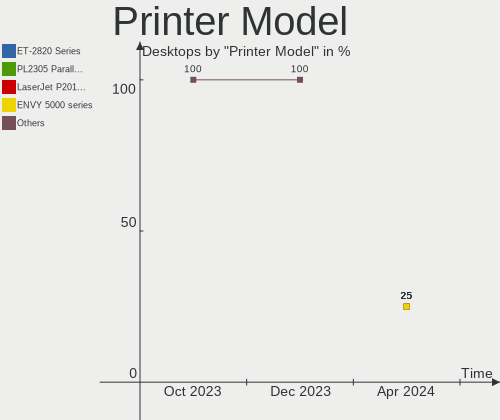

| Model                  | Desktops | Percent |
|------------------------|----------|---------|
| HP DeskJet 2130 series | 1        | 100%    |

Scanner Vendor
--------------

Scanner device vendors

Zero info for selected period =(

Scanner Model
-------------

Scanner device models

Zero info for selected period =(

Camera
------

Camera Vendor
-------------

Camera device vendors

| Vendor              | Desktops | Percent |
|---------------------|----------|---------|
| Samsung Electronics | 1        | 50%     |
| Logitech            | 1        | 50%     |

Camera Model
------------

Camera device models

| Model                                      | Desktops | Percent |
|--------------------------------------------|----------|---------|
| Samsung Galaxy A5 (MTP)                    | 1        | 50%     |
| Logitech QuickCam Communicate Deluxe/S7500 | 1        | 50%     |

Security
--------

Fingerprint Vendor
------------------

Fingerprint sensor vendors

Zero info for selected period =(

Fingerprint Model
-----------------

Fingerprint sensor models

Zero info for selected period =(

Chipcard Vendor
---------------

Chipcard module vendors

Zero info for selected period =(

Chipcard Model
--------------

Chipcard module models

Zero info for selected period =(

Unsupported
-----------

Unsupported Devices
-------------------

Total unsupported devices on board

| Total | Desktops | Percent |
|-------|----------|---------|
| 0     | 12       | 85.71%  |
| 1     | 2        | 14.29%  |

Unsupported Device Types
------------------------

Types of unsupported devices

| Type                  | Desktops | Percent |
|-----------------------|----------|---------|
| Net/wireless          | 1        | 50%     |
| Multimedia controller | 1        | 50%     |

