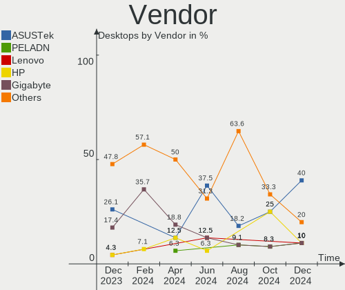
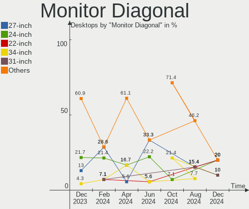
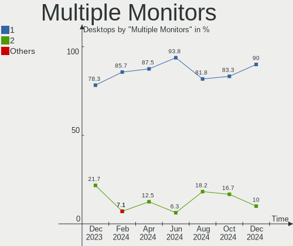
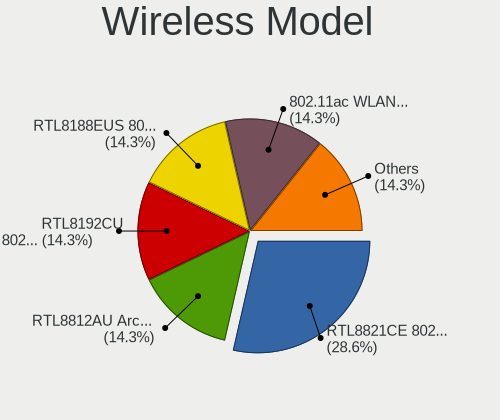
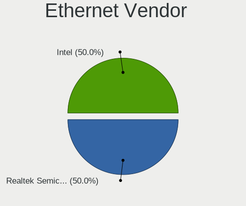
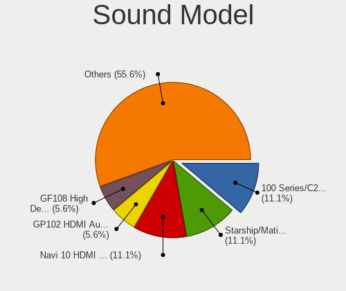
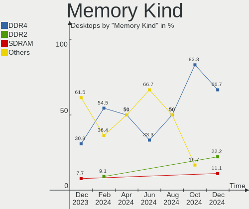
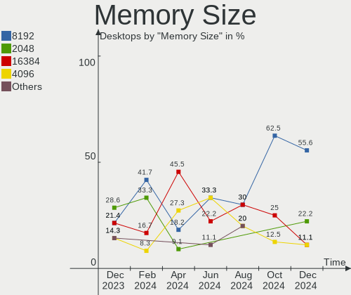

LMDE - Hardware Trends (Desktops)
---------------------------------

A project to identify most popular hardware characteristics and track their change
over time based on data collected by Linux users at https://Linux-Hardware.org.

Anyone can contribute to this report by the [hw-probe](https://github.com/linuxhw/hw-probe) tool:

    sudo -E hw-probe -all -upload

This report is for one last month. Overall report since the beginning of time: [TestDays](https://github.com/linuxhw/TestDays)

Period: Jun, 2023.

Contents
--------

* [ System ](#system)
  - [ OS                       ](#os)
  - [ OS Family                ](#os-family)
  - [ Kernel                   ](#kernel)
  - [ Kernel Family            ](#kernel-family)
  - [ Kernel Major Ver.        ](#kernel-major-ver)
  - [ Arch                     ](#arch)
  - [ DE                       ](#de)
  - [ Display Server           ](#display-server)
  - [ Display Manager          ](#display-manager)
  - [ OS Lang                  ](#os-lang)
  - [ Boot Mode                ](#boot-mode)
  - [ Filesystem               ](#filesystem)
  - [ Part. scheme             ](#part-scheme)
  - [ Dual Boot with Linux/BSD ](#dual-boot-with-linuxbsd)
  - [ Dual Boot (Win)          ](#dual-boot-win)

* [ Board ](#board)
  - [ Vendor                   ](#vendor)
  - [ Model                    ](#model)
  - [ Model Family             ](#model-family)
  - [ MFG Year                 ](#mfg-year)
  - [ Form Factor              ](#form-factor)
  - [ Secure Boot              ](#secure-boot)
  - [ Coreboot                 ](#coreboot)
  - [ RAM Size                 ](#ram-size)
  - [ RAM Used                 ](#ram-used)
  - [ Total Drives             ](#total-drives)
  - [ Has CD-ROM               ](#has-cd-rom)
  - [ Has Ethernet             ](#has-ethernet)
  - [ Has WiFi                 ](#has-wifi)
  - [ Has Bluetooth            ](#has-bluetooth)

* [ Location ](#location)
  - [ Country                  ](#country)
  - [ City                     ](#city)

* [ Drives ](#drives)
  - [ Drive Vendor             ](#drive-vendor)
  - [ Drive Model              ](#drive-model)
  - [ HDD Vendor               ](#hdd-vendor)
  - [ SSD Vendor               ](#ssd-vendor)
  - [ Drive Kind               ](#drive-kind)
  - [ Drive Connector          ](#drive-connector)
  - [ Drive Size               ](#drive-size)
  - [ Space Total              ](#space-total)
  - [ Space Used               ](#space-used)
  - [ Malfunc. Drives          ](#malfunc-drives)
  - [ Malfunc. Drive Vendor    ](#malfunc-drive-vendor)
  - [ Malfunc. HDD Vendor      ](#malfunc-hdd-vendor)
  - [ Malfunc. Drive Kind      ](#malfunc-drive-kind)
  - [ Failed Drives            ](#failed-drives)
  - [ Failed Drive Vendor      ](#failed-drive-vendor)
  - [ Drive Status             ](#drive-status)

* [ Storage controller ](#storage-controller)
  - [ Storage Vendor           ](#storage-vendor)
  - [ Storage Model            ](#storage-model)
  - [ Storage Kind             ](#storage-kind)

* [ Processor ](#processor)
  - [ CPU Vendor               ](#cpu-vendor)
  - [ CPU Model                ](#cpu-model)
  - [ CPU Model Family         ](#cpu-model-family)
  - [ CPU Cores                ](#cpu-cores)
  - [ CPU Sockets              ](#cpu-sockets)
  - [ CPU Threads              ](#cpu-threads)
  - [ CPU Op-Modes             ](#cpu-op-modes)
  - [ CPU Microcode            ](#cpu-microcode)
  - [ CPU Microarch            ](#cpu-microarch)

* [ Graphics ](#graphics)
  - [ GPU Vendor               ](#gpu-vendor)
  - [ GPU Model                ](#gpu-model)
  - [ GPU Combo                ](#gpu-combo)
  - [ GPU Driver               ](#gpu-driver)
  - [ GPU Memory               ](#gpu-memory)

* [ Monitor ](#monitor)
  - [ Monitor Vendor           ](#monitor-vendor)
  - [ Monitor Model            ](#monitor-model)
  - [ Monitor Resolution       ](#monitor-resolution)
  - [ Monitor Diagonal         ](#monitor-diagonal)
  - [ Monitor Width            ](#monitor-width)
  - [ Aspect Ratio             ](#aspect-ratio)
  - [ Monitor Area             ](#monitor-area)
  - [ Pixel Density            ](#pixel-density)
  - [ Multiple Monitors        ](#multiple-monitors)

* [ Network ](#network)
  - [ Net Controller Vendor    ](#net-controller-vendor)
  - [ Net Controller Model     ](#net-controller-model)
  - [ Wireless Vendor          ](#wireless-vendor)
  - [ Wireless Model           ](#wireless-model)
  - [ Ethernet Vendor          ](#ethernet-vendor)
  - [ Ethernet Model           ](#ethernet-model)
  - [ Net Controller Kind      ](#net-controller-kind)
  - [ Used Controller          ](#used-controller)
  - [ NICs                     ](#nics)
  - [ IPv6                     ](#ipv6)

* [ Bluetooth ](#bluetooth)
  - [ Bluetooth Vendor         ](#bluetooth-vendor)
  - [ Bluetooth Model          ](#bluetooth-model)

* [ Sound ](#sound)
  - [ Sound Vendor             ](#sound-vendor)
  - [ Sound Model              ](#sound-model)

* [ Memory ](#memory)
  - [ Memory Vendor            ](#memory-vendor)
  - [ Memory Model             ](#memory-model)
  - [ Memory Kind              ](#memory-kind)
  - [ Memory Form Factor       ](#memory-form-factor)
  - [ Memory Size              ](#memory-size)
  - [ Memory Speed             ](#memory-speed)

* [ Printers & scanners ](#printers--scanners)
  - [ Printer Vendor           ](#printer-vendor)
  - [ Printer Model            ](#printer-model)
  - [ Scanner Vendor           ](#scanner-vendor)
  - [ Scanner Model            ](#scanner-model)

* [ Camera ](#camera)
  - [ Camera Vendor            ](#camera-vendor)
  - [ Camera Model             ](#camera-model)

* [ Security ](#security)
  - [ Fingerprint Vendor       ](#fingerprint-vendor)
  - [ Fingerprint Model        ](#fingerprint-model)
  - [ Chipcard Vendor          ](#chipcard-vendor)
  - [ Chipcard Model           ](#chipcard-model)

* [ Unsupported ](#unsupported)
  - [ Unsupported Devices      ](#unsupported-devices)
  - [ Unsupported Device Types ](#unsupported-device-types)

System
------

OS
--

Installed operating systems

| Name   | Desktops | Percent |
|--------|----------|---------|
| LMDE 5 | 14       | 100%    |

OS Family
---------

OS without a version

| Name | Desktops | Percent |
|------|----------|---------|
| LMDE | 14       | 100%    |

Kernel
------

Version of the Linux kernel

| Version               | Desktops | Percent |
|-----------------------|----------|---------|
| 5.10.0-23-amd64       | 10       | 71.43%  |
| 6.1.0-0.deb11.7-amd64 | 2        | 14.29%  |
| 5.10.0-22-amd64       | 1        | 7.14%   |
| 5.10.0-12-amd64       | 1        | 7.14%   |

Kernel Family
-------------

Linux kernel without a distro release

| Version | Desktops | Percent |
|---------|----------|---------|
| 5.10.0  | 12       | 85.71%  |
| 6.1.0   | 2        | 14.29%  |

Kernel Major Ver.
-----------------

Linux kernel major version

| Version | Desktops | Percent |
|---------|----------|---------|
| 5.10    | 12       | 85.71%  |
| 6.1     | 2        | 14.29%  |

Arch
----

OS architecture (x86_64, i586, etc.)

| Name   | Desktops | Percent |
|--------|----------|---------|
| x86_64 | 14       | 100%    |

DE
--

Desktop Environment

| Name       | Desktops | Percent |
|------------|----------|---------|
| X-Cinnamon | 12       | 85.71%  |
| Cinnamon   | 2        | 14.29%  |

Display Server
--------------

X11 or Wayland

| Name | Desktops | Percent |
|------|----------|---------|
| X11  | 14       | 100%    |

Display Manager
---------------

SDDM, LightDM, etc.

| Name    | Desktops | Percent |
|---------|----------|---------|
| LightDM | 7        | 50%     |
| Unknown | 7        | 50%     |

OS Lang
-------

Language

| Lang  | Desktops | Percent |
|-------|----------|---------|
| pt_BR | 4        | 28.57%  |
| en_US | 3        | 21.43%  |
| de_DE | 2        | 14.29%  |
| it_IT | 1        | 7.14%   |
| fr_FR | 1        | 7.14%   |
| es_PA | 1        | 7.14%   |
| en_GB | 1        | 7.14%   |
| en_AU | 1        | 7.14%   |

Boot Mode
---------

EFI or BIOS

| Mode | Desktops | Percent |
|------|----------|---------|
| EFI  | 12       | 85.71%  |
| BIOS | 2        | 14.29%  |

Filesystem
----------

Type of filesystem

| Type | Desktops | Percent |
|------|----------|---------|
| Ext4 | 14       | 100%    |

Part. scheme
------------

Scheme of partitioning

| Type    | Desktops | Percent |
|---------|----------|---------|
| GPT     | 7        | 50%     |
| Unknown | 7        | 50%     |

Dual Boot with Linux/BSD
------------------------

Hosting more than one Linux/BSD

| Dual boot | Desktops | Percent |
|-----------|----------|---------|
| No        | 11       | 78.57%  |
| Yes       | 3        | 21.43%  |

Dual Boot (Win)
---------------

Hosting Linux and Windows

| Dual boot | Desktops | Percent |
|-----------|----------|---------|
| No        | 11       | 78.57%  |
| Yes       | 3        | 21.43%  |

Board
-----

Vendor
------

Motherboard manufacturer

| Name                | Desktops | Percent |
|---------------------|----------|---------|
| Gigabyte Technology | 4        | 28.57%  |
| Intel               | 3        | 21.43%  |
| MSI                 | 2        | 14.29%  |
| Medion              | 1        | 7.14%   |
| Lenovo              | 1        | 7.14%   |
| AZW                 | 1        | 7.14%   |
| ASRock              | 1        | 7.14%   |
| Unknown             | 1        | 7.14%   |

Model
-----

Motherboard model

| Name                      | Desktops | Percent |
|---------------------------|----------|---------|
| MSI MS-7C95               | 1        | 7.14%   |
| MSI MS-7B79               | 1        | 7.14%   |
| Medion S23003             | 1        | 7.14%   |
| Lenovo H530 10130         | 1        | 7.14%   |
| Intel X79                 | 1        | 7.14%   |
| Intel DB85FL AAG89861-202 | 1        | 7.14%   |
| Intel B75                 | 1        | 7.14%   |
| Gigabyte Q87M-D2H         | 1        | 7.14%   |
| Gigabyte F2A55M-DS2       | 1        | 7.14%   |
| Gigabyte AB350M-DS3H V2   | 1        | 7.14%   |
| Gigabyte A520M S2H        | 1        | 7.14%   |
| AZW GK mini               | 1        | 7.14%   |
| ASRock B450 Gaming K4     | 1        | 7.14%   |
| Unknown                   | 1        | 7.14%   |

Model Family
------------

Motherboard model prefix

| Name                 | Desktops | Percent |
|----------------------|----------|---------|
| MSI MS-7C95          | 1        | 7.14%   |
| MSI MS-7B79          | 1        | 7.14%   |
| Medion S23003        | 1        | 7.14%   |
| Lenovo H530          | 1        | 7.14%   |
| Intel X79            | 1        | 7.14%   |
| Intel DB85FL         | 1        | 7.14%   |
| Intel B75            | 1        | 7.14%   |
| Gigabyte Q87M-D2H    | 1        | 7.14%   |
| Gigabyte F2A55M-DS2  | 1        | 7.14%   |
| Gigabyte AB350M-DS3H | 1        | 7.14%   |
| Gigabyte A520M       | 1        | 7.14%   |
| AZW GK               | 1        | 7.14%   |
| ASRock B450          | 1        | 7.14%   |
| Unknown              | 1        | 7.14%   |

MFG Year
--------

Motherboard manufacture year

| Year | Desktops | Percent |
|------|----------|---------|
| 2018 | 4        | 28.57%  |
| 2022 | 2        | 14.29%  |
| 2021 | 2        | 14.29%  |
| 2020 | 1        | 7.14%   |
| 2019 | 1        | 7.14%   |
| 2016 | 1        | 7.14%   |
| 2014 | 1        | 7.14%   |
| 2013 | 1        | 7.14%   |
| 2012 | 1        | 7.14%   |

Form Factor
-----------

Physical design of the computer

| Name    | Desktops | Percent |
|---------|----------|---------|
| Desktop | 14       | 100%    |

Secure Boot
-----------

Enabled or disabled

| State    | Desktops | Percent |
|----------|----------|---------|
| Disabled | 13       | 92.86%  |
| Enabled  | 1        | 7.14%   |

Coreboot
--------

Have coreboot on board

| Used | Desktops | Percent |
|------|----------|---------|
| No   | 14       | 100%    |

RAM Size
--------

Total RAM memory

| Size in GB  | Desktops | Percent |
|-------------|----------|---------|
| 4.01-8.0    | 4        | 28.57%  |
| 16.01-24.0  | 4        | 28.57%  |
| 8.01-16.0   | 2        | 14.29%  |
| 32.01-64.0  | 1        | 7.14%   |
| 3.01-4.0    | 1        | 7.14%   |
| 2.01-3.0    | 1        | 7.14%   |
| 64.01-256.0 | 1        | 7.14%   |

RAM Used
--------

Used RAM memory

| Used GB    | Desktops | Percent |
|------------|----------|---------|
| 2.01-3.0   | 4        | 28.57%  |
| 1.01-2.0   | 4        | 28.57%  |
| 3.01-4.0   | 2        | 14.29%  |
| 4.01-8.0   | 1        | 7.14%   |
| 16.01-24.0 | 1        | 7.14%   |
| 8.01-16.0  | 1        | 7.14%   |
| 0.51-1.0   | 1        | 7.14%   |

Total Drives
------------

Number of drives on board

| Drives | Desktops | Percent |
|--------|----------|---------|
| 2      | 6        | 42.86%  |
| 1      | 4        | 28.57%  |
| 5      | 3        | 21.43%  |
| 4      | 1        | 7.14%   |

Has CD-ROM
----------

Has CD-ROM on board

| Presented | Desktops | Percent |
|-----------|----------|---------|
| No        | 9        | 64.29%  |
| Yes       | 5        | 35.71%  |

Has Ethernet
------------

Has Ethernet on board

| Presented | Desktops | Percent |
|-----------|----------|---------|
| Yes       | 14       | 100%    |

Has WiFi
--------

Has WiFi module

| Presented | Desktops | Percent |
|-----------|----------|---------|
| Yes       | 9        | 64.29%  |
| No        | 5        | 35.71%  |

Has Bluetooth
-------------

Has Bluetooth module

| Presented | Desktops | Percent |
|-----------|----------|---------|
| No        | 8        | 57.14%  |
| Yes       | 6        | 42.86%  |

Location
--------

Country
-------

Geographic location (country)

| Country   | Desktops | Percent |
|-----------|----------|---------|
| Brazil    | 4        | 28.57%  |
| USA       | 3        | 21.43%  |
| Germany   | 2        | 14.29%  |
| UK        | 1        | 7.14%   |
| Panama    | 1        | 7.14%   |
| Italy     | 1        | 7.14%   |
| France    | 1        | 7.14%   |
| Australia | 1        | 7.14%   |

City
----

Geographic location (city)

| City               | Desktops | Percent |
|--------------------|----------|---------|
| Rio de Janeiro     | 2        | 14.29%  |
| Delligsen          | 2        | 14.29%  |
| Rho                | 1        | 7.14%   |
| Panama City        | 1        | 7.14%   |
| Natal              | 1        | 7.14%   |
| Moreno Valley      | 1        | 7.14%   |
| Montpellier        | 1        | 7.14%   |
| Loxahatchee Groves | 1        | 7.14%   |
| Fitchburg          | 1        | 7.14%   |
| Cheadle            | 1        | 7.14%   |
| Belém             | 1        | 7.14%   |
| Adelaide           | 1        | 7.14%   |

Drives
------

Drive Vendor
------------

Hard drive vendors

| Vendor              | Desktops | Drives | Percent |
|---------------------|----------|--------|---------|
| WDC                 | 7        | 11     | 25.93%  |
| Toshiba             | 3        | 3      | 11.11%  |
| Seagate             | 3        | 5      | 11.11%  |
| Kingston            | 3        | 3      | 11.11%  |
| ADATA Technology    | 2        | 2      | 7.41%   |
| Vaseky              | 1        | 1      | 3.7%    |
| Team                | 1        | 1      | 3.7%    |
| T-FORCE             | 1        | 1      | 3.7%    |
| Silicon Motion      | 1        | 2      | 3.7%    |
| Samsung Electronics | 1        | 2      | 3.7%    |
| Phison              | 1        | 1      | 3.7%    |
| NGFF                | 1        | 1      | 3.7%    |
| LITEONIT            | 1        | 1      | 3.7%    |
| Unknown             | 1        | 1      | 3.7%    |

Drive Model
-----------

Hard drive models

| Model                                                             | Desktops | Percent |
|-------------------------------------------------------------------|----------|---------|
| ADATA XPG SX8200 Pro PCIe Gen3x4 M.2 2280 Solid State Drive 512GB | 2        | 6.25%   |
| WDC WDS500G2B0A-00SM50 500GB SSD                                  | 1        | 3.13%   |
| WDC WD5000LUCX-63HWNY0 500GB                                      | 1        | 3.13%   |
| WDC WD5000LPLX-00ZNTT0 500GB                                      | 1        | 3.13%   |
| WDC WD5000AAKS-60Z1A0 500GB                                       | 1        | 3.13%   |
| WDC WD2003FZEX-00Z4SA0 2TB                                        | 1        | 3.13%   |
| WDC WD1600AAJS-00L7A0 160GB                                       | 1        | 3.13%   |
| WDC WD10EZEX-60ZF5A0 1TB                                          | 1        | 3.13%   |
| WDC WD10EZEX-08M2NA0 1TB                                          | 1        | 3.13%   |
| WDC WD10EURS-630AB1 1TB                                           | 1        | 3.13%   |
| WDC WD1002FAEX-00Y9A0 1TB                                         | 1        | 3.13%   |
| Vaseky V800/120G 120GB                                            | 1        | 3.13%   |
| Toshiba MQ04ABF100 1TB                                            | 1        | 3.13%   |
| Toshiba MQ01ABD100 1TB                                            | 1        | 3.13%   |
| Toshiba HDWG480 8TB                                               | 1        | 3.13%   |
| Team T253512GB SSD                                                | 1        | 3.13%   |
| T-FORCE SSD 512GB                                                 | 1        | 3.13%   |
| Silicon Motion SM2262/SM2262EN SSD Controller 480GB               | 1        | 3.13%   |
| Seagate ST500DM002-1BD142 500GB                                   | 1        | 3.13%   |
| Seagate ST3000DM007-1WY10G 3TB                                    | 1        | 3.13%   |
| Seagate ST2000DM008-2FR102 2TB                                    | 1        | 3.13%   |
| Seagate ST2000DM001-1ER164 2TB                                    | 1        | 3.13%   |
| Seagate ST2000DM001-1CH164 2TB                                    | 1        | 3.13%   |
| Samsung SSD 840 EVO 250GB                                         | 1        | 3.13%   |
| Phison S11-128G-PHISON-SSD-B4 128GB                               | 1        | 3.13%   |
| NGFF 2280 128GB SSD                                               | 1        | 3.13%   |
| LITEONIT LCS-128M6S 2.5 7mm 128GB SSD                             | 1        | 3.13%   |
| Kingston SV300S37A240G 240GB SSD                                  | 1        | 3.13%   |
| Kingston SA400S37120G 120GB SSD                                   | 1        | 3.13%   |
| Kingston KingstonSA400S37 128GB SSD                               | 1        | 3.13%   |
| Unknown                                                           | 1        | 3.13%   |

HDD Vendor
----------

Hard disk drive vendors

| Vendor  | Desktops | Drives | Percent |
|---------|----------|--------|---------|
| WDC     | 6        | 10     | 50%     |
| Toshiba | 3        | 3      | 25%     |
| Seagate | 3        | 5      | 25%     |

SSD Vendor
----------

Solid state drive vendors

| Vendor              | Desktops | Drives | Percent |
|---------------------|----------|--------|---------|
| Kingston            | 3        | 3      | 27.27%  |
| WDC                 | 1        | 1      | 9.09%   |
| Vaseky              | 1        | 1      | 9.09%   |
| Team                | 1        | 1      | 9.09%   |
| T-FORCE             | 1        | 1      | 9.09%   |
| Samsung Electronics | 1        | 2      | 9.09%   |
| Phison              | 1        | 1      | 9.09%   |
| NGFF                | 1        | 1      | 9.09%   |
| LITEONIT            | 1        | 1      | 9.09%   |

Drive Kind
----------

HDD or SSD

| Kind    | Desktops | Drives | Percent |
|---------|----------|--------|---------|
| SSD     | 10       | 12     | 41.67%  |
| HDD     | 10       | 18     | 41.67%  |
| NVMe    | 3        | 4      | 12.5%   |
| Unknown | 1        | 1      | 4.17%   |

Drive Connector
---------------

SATA, SAS, NVMe, etc.

| Type | Desktops | Drives | Percent |
|------|----------|--------|---------|
| SATA | 14       | 31     | 82.35%  |
| NVMe | 3        | 4      | 17.65%  |

Drive Size
----------

Size of hard drive

| Size in TB | Desktops | Drives | Percent |
|------------|----------|--------|---------|
| 0.01-0.5   | 10       | 16     | 45.45%  |
| 0.51-1.0   | 7        | 8      | 31.82%  |
| 1.01-2.0   | 3        | 4      | 13.64%  |
| 2.01-3.0   | 1        | 1      | 4.55%   |
| 4.01-10.0  | 1        | 1      | 4.55%   |

Space Total
-----------

Amount of disk space available on the file system

| Size in GB     | Desktops | Percent |
|----------------|----------|---------|
| 101-250        | 6        | 42.86%  |
| More than 3000 | 3        | 21.43%  |
| 251-500        | 2        | 14.29%  |
| 1001-2000      | 1        | 7.14%   |
| 501-1000       | 1        | 7.14%   |
| 51-100         | 1        | 7.14%   |

Space Used
----------

Amount of used disk space

| Used GB        | Desktops | Percent |
|----------------|----------|---------|
| 21-50          | 5        | 35.71%  |
| 1-20           | 4        | 28.57%  |
| 101-250        | 2        | 14.29%  |
| More than 3000 | 1        | 7.14%   |
| 2001-3000      | 1        | 7.14%   |
| 1001-2000      | 1        | 7.14%   |

Malfunc. Drives
---------------

Drive models with a malfunction

| Model                           | Desktops | Drives | Percent |
|---------------------------------|----------|--------|---------|
| WDC WD1002FAEX-00Y9A0 1TB       | 1        | 1      | 33.33%  |
| Toshiba MQ04ABF100 1TB          | 1        | 1      | 33.33%  |
| Seagate ST500DM002-1BD142 500GB | 1        | 1      | 33.33%  |

Malfunc. Drive Vendor
---------------------

Vendors of faulty drives

| Vendor  | Desktops | Drives | Percent |
|---------|----------|--------|---------|
| WDC     | 1        | 1      | 33.33%  |
| Toshiba | 1        | 1      | 33.33%  |
| Seagate | 1        | 1      | 33.33%  |

Malfunc. HDD Vendor
-------------------

Vendors of faulty HDD drives

| Vendor  | Desktops | Drives | Percent |
|---------|----------|--------|---------|
| WDC     | 1        | 1      | 33.33%  |
| Toshiba | 1        | 1      | 33.33%  |
| Seagate | 1        | 1      | 33.33%  |

Malfunc. Drive Kind
-------------------

Kinds of faulty drives

| Kind | Desktops | Drives | Percent |
|------|----------|--------|---------|
| HDD  | 3        | 3      | 100%    |

Failed Drives
-------------

Failed drive models

Zero info for selected period =(

Failed Drive Vendor
-------------------

Failed drive vendors

Zero info for selected period =(

Drive Status
------------

Number of failed and malfunc. drives

| Status   | Desktops | Drives | Percent |
|----------|----------|--------|---------|
| Detected | 7        | 18     | 43.75%  |
| Works    | 6        | 14     | 37.5%   |
| Malfunc  | 3        | 3      | 18.75%  |

Storage controller
------------------

Storage Vendor
--------------

Storage controller vendors

| Vendor             | Desktops | Percent |
|--------------------|----------|---------|
| Intel              | 8        | 42.11%  |
| AMD                | 6        | 31.58%  |
| ASMedia Technology | 2        | 10.53%  |
| ADATA Technology   | 2        | 10.53%  |
| Silicon Motion     | 1        | 5.26%   |

Storage Model
-------------

Storage controller models

| Model                                                                          | Desktops | Percent |
|--------------------------------------------------------------------------------|----------|---------|
| Intel 8 Series/C220 Series Chipset Family 6-port SATA Controller 1 [AHCI mode] | 4        | 18.18%  |
| Intel Celeron/Pentium Silver Processor SATA Controller                         | 2        | 9.09%   |
| AMD FCH SATA Controller [AHCI mode]                                            | 2        | 9.09%   |
| AMD 500 Series Chipset SATA Controller                                         | 2        | 9.09%   |
| AMD 400 Series Chipset SATA Controller                                         | 2        | 9.09%   |
| ADATA XPG SX8200 Pro PCIe Gen3x4 M.2 2280 Solid State Drive                    | 2        | 9.09%   |
| Silicon Motion SM2262/SM2262EN SSD Controller                                  | 1        | 4.55%   |
| Intel 7 Series/C210 Series Chipset Family 6-port SATA Controller [AHCI mode]   | 1        | 4.55%   |
| Intel 6 Series/C200 Series Chipset Family 6 port Desktop SATA AHCI Controller  | 1        | 4.55%   |
| ASMedia ASM1062 Serial ATA Controller                                          | 1        | 4.55%   |
| ASMedia 1064 SATA Controller                                                   | 1        | 4.55%   |
| AMD FCH SATA Controller [IDE mode]                                             | 1        | 4.55%   |
| AMD FCH IDE Controller                                                         | 1        | 4.55%   |
| AMD 300 Series Chipset SATA Controller                                         | 1        | 4.55%   |

Storage Kind
------------

Kind of storage controller (IDE, SATA, NVMe, SAS, ...)

| Kind | Desktops | Percent |
|------|----------|---------|
| SATA | 14       | 77.78%  |
| NVMe | 3        | 16.67%  |
| IDE  | 1        | 5.56%   |

Processor
---------

CPU Vendor
----------

Processor vendors

| Vendor | Desktops | Percent |
|--------|----------|---------|
| Intel  | 8        | 57.14%  |
| AMD    | 6        | 42.86%  |

CPU Model
---------

Processor models

| Model                                   | Desktops | Percent |
|-----------------------------------------|----------|---------|
| Intel Celeron J4125 CPU @ 2.00GHz       | 2        | 14.29%  |
| AMD Ryzen 5 5600G with Radeon Graphics  | 2        | 14.29%  |
| Intel Xeon CPU E5-2689 0 @ 2.60GHz      | 1        | 7.14%   |
| Intel Xeon CPU E5-2660 v3 @ 2.60GHz     | 1        | 7.14%   |
| Intel Core i7-3770 CPU @ 3.40GHz        | 1        | 7.14%   |
| Intel Core i5-4590S CPU @ 3.00GHz       | 1        | 7.14%   |
| Intel Core i3-4150 CPU @ 3.50GHz        | 1        | 7.14%   |
| Intel Core i3-4130 CPU @ 3.40GHz        | 1        | 7.14%   |
| AMD Ryzen 7 1800X Eight-Core Processor  | 1        | 7.14%   |
| AMD Ryzen 5 3600 6-Core Processor       | 1        | 7.14%   |
| AMD Ryzen 3 4100 4-Core Processor       | 1        | 7.14%   |
| AMD A4-4020 APU with Radeon HD Graphics | 1        | 7.14%   |

CPU Model Family
----------------

Processor model prefix

| Model         | Desktops | Percent |
|---------------|----------|---------|
| AMD Ryzen 5   | 3        | 21.43%  |
| Intel Xeon    | 2        | 14.29%  |
| Intel Core i3 | 2        | 14.29%  |
| Intel Celeron | 2        | 14.29%  |
| Intel Core i7 | 1        | 7.14%   |
| Intel Core i5 | 1        | 7.14%   |
| AMD Ryzen 7   | 1        | 7.14%   |
| AMD Ryzen 3   | 1        | 7.14%   |
| AMD A4        | 1        | 7.14%   |

CPU Cores
---------

Number of processor cores

| Number | Desktops | Percent |
|--------|----------|---------|
| 4      | 5        | 35.71%  |
| 6      | 3        | 21.43%  |
| 8      | 2        | 14.29%  |
| 2      | 2        | 14.29%  |
| 10     | 1        | 7.14%   |
| 1      | 1        | 7.14%   |

CPU Sockets
-----------

Number of sockets

| Number | Desktops | Percent |
|--------|----------|---------|
| 1      | 14       | 100%    |

CPU Threads
-----------

Threads per core (Hyper-Threading)

| Number | Desktops | Percent |
|--------|----------|---------|
| 2      | 11       | 78.57%  |
| 1      | 3        | 21.43%  |

CPU Op-Modes
------------

CPU Operation Modes (32-bit, 64-bit)

| Op mode        | Desktops | Percent |
|----------------|----------|---------|
| 32-bit, 64-bit | 14       | 100%    |

CPU Microcode
-------------

Microcode number

| Number     | Desktops | Percent |
|------------|----------|---------|
| 0x306c3    | 3        | 21.43%  |
| 0x706a8    | 2        | 14.29%  |
| 0x0a50000d | 2        | 14.29%  |
| 0x306f2    | 1        | 7.14%   |
| 0x306a9    | 1        | 7.14%   |
| 0x206d7    | 1        | 7.14%   |
| 0x08701021 | 1        | 7.14%   |
| 0x08600106 | 1        | 7.14%   |
| 0x08001138 | 1        | 7.14%   |
| 0x06001119 | 1        | 7.14%   |

CPU Microarch
-------------

Microarchitecture

| Name          | Desktops | Percent |
|---------------|----------|---------|
| Haswell       | 4        | 28.57%  |
| Zen 3         | 2        | 14.29%  |
| Zen 2         | 2        | 14.29%  |
| Goldmont plus | 2        | 14.29%  |
| Zen           | 1        | 7.14%   |
| SandyBridge   | 1        | 7.14%   |
| Piledriver    | 1        | 7.14%   |
| IvyBridge     | 1        | 7.14%   |

Graphics
--------

GPU Vendor
----------

Vendors of graphics cards

| Vendor | Desktops | Percent |
|--------|----------|---------|
| Intel  | 6        | 42.86%  |
| Nvidia | 4        | 28.57%  |
| AMD    | 4        | 28.57%  |

GPU Model
---------

Graphics card models

| Model                                                                       | Desktops | Percent |
|-----------------------------------------------------------------------------|----------|---------|
| Intel GeminiLake [UHD Graphics 600]                                         | 2        | 14.29%  |
| Intel 4th Generation Core Processor Family Integrated Graphics Controller   | 2        | 14.29%  |
| AMD Cezanne [Radeon Vega Series / Radeon Vega Mobile Series]                | 2        | 14.29%  |
| Nvidia TU106 [GeForce RTX 2060 Rev. A]                                      | 1        | 7.14%   |
| Nvidia GM206 [GeForce GTX 960]                                              | 1        | 7.14%   |
| Nvidia GM200 [GeForce GTX 980 Ti]                                           | 1        | 7.14%   |
| Nvidia GM107GL [Quadro K2200]                                               | 1        | 7.14%   |
| Intel Xeon E3-1200 v3/4th Gen Core Processor Integrated Graphics Controller | 1        | 7.14%   |
| Intel IvyBridge GT2 [HD Graphics 4000]                                      | 1        | 7.14%   |
| AMD Trinity 2 [Radeon HD 7480D]                                             | 1        | 7.14%   |
| AMD Cedar [Radeon HD 5000/6000/7350/8350 Series]                            | 1        | 7.14%   |

GPU Combo
---------

Combinations of graphics cards

| Name       | Desktops | Percent |
|------------|----------|---------|
| 1 x Intel  | 6        | 42.86%  |
| 1 x Nvidia | 4        | 28.57%  |
| 1 x AMD    | 4        | 28.57%  |

GPU Driver
----------

Free vs proprietary

| Driver      | Desktops | Percent |
|-------------|----------|---------|
| Free        | 11       | 78.57%  |
| Proprietary | 3        | 21.43%  |

GPU Memory
----------

Total video memory

| Size in GB | Desktops | Percent |
|------------|----------|---------|
| Unknown    | 6        | 42.86%  |
| 1.01-2.0   | 3        | 21.43%  |
| 5.01-6.0   | 2        | 14.29%  |
| 3.01-4.0   | 1        | 7.14%   |
| 0.51-1.0   | 1        | 7.14%   |
| 0.01-0.5   | 1        | 7.14%   |

Monitor
-------

Monitor Vendor
--------------

Monitor vendors

| Vendor               | Desktops | Percent |
|----------------------|----------|---------|
| Samsung Electronics  | 5        | 35.71%  |
| Philips              | 2        | 14.29%  |
| HUAWEI               | 1        | 7.14%   |
| Hewlett-Packard      | 1        | 7.14%   |
| Goldstar             | 1        | 7.14%   |
| Dell                 | 1        | 7.14%   |
| AOC                  | 1        | 7.14%   |
| Ancor Communications | 1        | 7.14%   |
| Acer                 | 1        | 7.14%   |

Monitor Model
-------------

Monitor models

| Model                                                                | Desktops | Percent |
|----------------------------------------------------------------------|----------|---------|
| Samsung Electronics SyncMaster SAM01AD 1600x1200 408x306mm 20.1-inch | 1        | 7.14%   |
| Samsung Electronics SMT24A550 SAM07B5 1920x1080 531x299mm 24.0-inch  | 1        | 7.14%   |
| Samsung Electronics SA300/SA350 SAM078B 1600x900 443x249mm 20.0-inch | 1        | 7.14%   |
| Samsung Electronics S24B370 SAM08DD 1920x1080 531x299mm 24.0-inch    | 1        | 7.14%   |
| Samsung Electronics C24F390 SAM0D2C 1920x1080 521x293mm 23.5-inch    | 1        | 7.14%   |
| Philips PHL 242V8 PHLC219 1920x1080 527x296mm 23.8-inch              | 1        | 7.14%   |
| Philips 170S PHL0839 1280x1024 340x270mm 17.1-inch                   | 1        | 7.14%   |
| HUAWEI ZQE-CBA HWV6A25 3440x1440 797x334mm 34.0-inch                 | 1        | 7.14%   |
| Hewlett-Packard 27wm HWP3355 1920x1080 598x336mm 27.0-inch           | 1        | 7.14%   |
| Goldstar TV SSCR2 GSMC0C8 3840x2160                                  | 1        | 7.14%   |
| Dell S2721HGF DEL41E7 1920x1080 597x336mm 27.0-inch                  | 1        | 7.14%   |
| AOC LCD Monitor 2460G4 1920x1080                                     | 1        | 7.14%   |
| Ancor Communications VS24A ACI24D1 1920x1200 518x324mm 24.1-inch     | 1        | 7.14%   |
| Acer V246HQL ACR0424 1920x1080 521x293mm 23.5-inch                   | 1        | 7.14%   |

Monitor Resolution
------------------

Monitor screen resolution

| Resolution        | Desktops | Percent |
|-------------------|----------|---------|
| 1920x1080 (FHD)   | 8        | 57.14%  |
| 3840x2160 (4K)    | 1        | 7.14%   |
| 3440x1440         | 1        | 7.14%   |
| 1920x1200 (WUXGA) | 1        | 7.14%   |
| 1600x900 (HD+)    | 1        | 7.14%   |
| 1600x1200         | 1        | 7.14%   |
| 1280x1024 (SXGA)  | 1        | 7.14%   |

Monitor Diagonal
----------------

Diagonal size in inches

| Inches  | Desktops | Percent |
|---------|----------|---------|
| 24      | 4        | 28.57%  |
| 27      | 2        | 14.29%  |
| 23      | 2        | 14.29%  |
| 20      | 2        | 14.29%  |
| 72      | 1        | 7.14%   |
| 34      | 1        | 7.14%   |
| 17      | 1        | 7.14%   |
| Unknown | 1        | 7.14%   |

Monitor Width
-------------

Physical width

| Width in mm | Desktops | Percent |
|-------------|----------|---------|
| 501-600     | 8        | 57.14%  |
| 401-500     | 2        | 14.29%  |
| 701-800     | 1        | 7.14%   |
| 301-350     | 1        | 7.14%   |
| 1501-2000   | 1        | 7.14%   |
| Unknown     | 1        | 7.14%   |

Aspect Ratio
------------

Proportional relationship between the width and the height

| Ratio   | Desktops | Percent |
|---------|----------|---------|
| 16/9    | 9        | 64.29%  |
| 5/4     | 1        | 7.14%   |
| 4/3     | 1        | 7.14%   |
| 21/9    | 1        | 7.14%   |
| 16/10   | 1        | 7.14%   |
| Unknown | 1        | 7.14%   |

Monitor Area
------------

Area in inch²

| Area in inch² | Desktops | Percent |
|----------------|----------|---------|
| 201-250        | 5        | 35.71%  |
| 301-350        | 2        | 14.29%  |
| 151-200        | 2        | 14.29%  |
| More than 1000 | 1        | 7.14%   |
| 351-500        | 1        | 7.14%   |
| 251-300        | 1        | 7.14%   |
| 141-150        | 1        | 7.14%   |
| Unknown        | 1        | 7.14%   |

Pixel Density
-------------

Pixels per inch

| Density | Desktops | Percent |
|---------|----------|---------|
| 51-100  | 10       | 83.33%  |
| 101-120 | 1        | 8.33%   |
| Unknown | 1        | 8.33%   |

Multiple Monitors
-----------------

Total monitors connected

| Total | Desktops | Percent |
|-------|----------|---------|
| 1     | 12       | 85.71%  |
| 2     | 2        | 14.29%  |

Network
-------

Net Controller Vendor
---------------------

Controller vendors

| Vendor                | Desktops | Percent |
|-----------------------|----------|---------|
| Realtek Semiconductor | 11       | 55%     |
| Intel                 | 4        | 20%     |
| TP-Link               | 2        | 10%     |
| Qualcomm Atheros      | 1        | 5%      |
| MediaTek              | 1        | 5%      |
| ASUSTek Computer      | 1        | 5%      |

Net Controller Model
--------------------

Controller models

| Model                                                              | Desktops | Percent |
|--------------------------------------------------------------------|----------|---------|
| Realtek RTL8111/8168/8411 PCI Express Gigabit Ethernet Controller  | 9        | 36%     |
| Realtek RTL810xE PCI Express Fast Ethernet controller              | 2        | 8%      |
| Intel Wireless 3165                                                | 2        | 8%      |
| TP-Link RTL8812AU Archer T4U 802.11ac                              | 1        | 4%      |
| TP-Link 802.11ac WLAN Adapter                                      | 1        | 4%      |
| Realtek RTL8192EU 802.11b/g/n WLAN Adapter                         | 1        | 4%      |
| Realtek RTL8188FTV 802.11b/g/n 1T1R 2.4G WLAN Adapter              | 1        | 4%      |
| Realtek RTL8188EUS 802.11n Wireless Network Adapter                | 1        | 4%      |
| Realtek 802.11ac NIC                                               | 1        | 4%      |
| Qualcomm Atheros AR9485 Wireless Network Adapter                   | 1        | 4%      |
| MediaTek MT7921K (RZ608) Wi-Fi 6E 80MHz                            | 1        | 4%      |
| Intel I211 Gigabit Network Connection                              | 1        | 4%      |
| Intel Ethernet Connection I217-V                                   | 1        | 4%      |
| Intel Ethernet Connection I217-LM                                  | 1        | 4%      |
| ASUS USB-N13 802.11n Network Adapter (rev. B1) [Realtek RTL8192CU] | 1        | 4%      |

Wireless Vendor
---------------

Wireless vendors

| Vendor                | Desktops | Percent |
|-----------------------|----------|---------|
| Realtek Semiconductor | 4        | 36.36%  |
| TP-Link               | 2        | 18.18%  |
| Intel                 | 2        | 18.18%  |
| Qualcomm Atheros      | 1        | 9.09%   |
| MediaTek              | 1        | 9.09%   |
| ASUSTek Computer      | 1        | 9.09%   |

Wireless Model
--------------

Wireless models

| Model                                                              | Desktops | Percent |
|--------------------------------------------------------------------|----------|---------|
| Intel Wireless 3165                                                | 2        | 18.18%  |
| TP-Link RTL8812AU Archer T4U 802.11ac                              | 1        | 9.09%   |
| TP-Link 802.11ac WLAN Adapter                                      | 1        | 9.09%   |
| Realtek RTL8192EU 802.11b/g/n WLAN Adapter                         | 1        | 9.09%   |
| Realtek RTL8188FTV 802.11b/g/n 1T1R 2.4G WLAN Adapter              | 1        | 9.09%   |
| Realtek RTL8188EUS 802.11n Wireless Network Adapter                | 1        | 9.09%   |
| Realtek 802.11ac NIC                                               | 1        | 9.09%   |
| Qualcomm Atheros AR9485 Wireless Network Adapter                   | 1        | 9.09%   |
| MediaTek MT7921K (RZ608) Wi-Fi 6E 80MHz                            | 1        | 9.09%   |
| ASUS USB-N13 802.11n Network Adapter (rev. B1) [Realtek RTL8192CU] | 1        | 9.09%   |

Ethernet Vendor
---------------

Ethernet vendors

| Vendor                | Desktops | Percent |
|-----------------------|----------|---------|
| Realtek Semiconductor | 11       | 78.57%  |
| Intel                 | 3        | 21.43%  |

Ethernet Model
--------------

Ethernet models

| Model                                                             | Desktops | Percent |
|-------------------------------------------------------------------|----------|---------|
| Realtek RTL8111/8168/8411 PCI Express Gigabit Ethernet Controller | 9        | 64.29%  |
| Realtek RTL810xE PCI Express Fast Ethernet controller             | 2        | 14.29%  |
| Intel I211 Gigabit Network Connection                             | 1        | 7.14%   |
| Intel Ethernet Connection I217-V                                  | 1        | 7.14%   |
| Intel Ethernet Connection I217-LM                                 | 1        | 7.14%   |

Net Controller Kind
-------------------

Ethernet, WiFi or modem

| Kind     | Desktops | Percent |
|----------|----------|---------|
| Ethernet | 14       | 60.87%  |
| WiFi     | 9        | 39.13%  |

Used Controller
---------------

Currently used network controller

| Kind     | Desktops | Percent |
|----------|----------|---------|
| Ethernet | 10       | 66.67%  |
| WiFi     | 5        | 33.33%  |

NICs
----

Total network controllers on board

| Total | Desktops | Percent |
|-------|----------|---------|
| 1     | 10       | 71.43%  |
| 2     | 4        | 28.57%  |

IPv6
----

IPv6 vs IPv4

| Used | Desktops | Percent |
|------|----------|---------|
| Yes  | 9        | 64.29%  |
| No   | 5        | 35.71%  |

Bluetooth
---------

Bluetooth Vendor
----------------

Controller vendors

| Vendor                  | Desktops | Percent |
|-------------------------|----------|---------|
| Intel                   | 2        | 33.33%  |
| Realtek Semiconductor   | 1        | 16.67%  |
| MediaTek                | 1        | 16.67%  |
| Cambridge Silicon Radio | 1        | 16.67%  |
| Broadcom                | 1        | 16.67%  |

Bluetooth Model
---------------

Controller models

| Model                                               | Desktops | Percent |
|-----------------------------------------------------|----------|---------|
| Intel Bluetooth wireless interface                  | 2        | 33.33%  |
| Realtek Bluetooth Radio                             | 1        | 16.67%  |
| MediaTek Wireless_Device                            | 1        | 16.67%  |
| Cambridge Silicon Radio Bluetooth Dongle (HCI mode) | 1        | 16.67%  |
| Broadcom BCM20702A0 Bluetooth 4.0                   | 1        | 16.67%  |

Sound
-----

Sound Vendor
------------

Sound card vendors

| Vendor                               | Desktops | Percent |
|--------------------------------------|----------|---------|
| Intel                                | 8        | 32%     |
| AMD                                  | 7        | 28%     |
| Nvidia                               | 4        | 16%     |
| Turtle Beach                         | 1        | 4%      |
| Thesycon Systemsoftware & Consulting | 1        | 4%      |
| KTMicro                              | 1        | 4%      |
| DCMT Technology                      | 1        | 4%      |
| Creative Technology                  | 1        | 4%      |
| C-Media Electronics                  | 1        | 4%      |

Sound Model
-----------

Sound card models

| Model                                                                      | Desktops | Percent |
|----------------------------------------------------------------------------|----------|---------|
| Intel 8 Series/C220 Series Chipset High Definition Audio Controller        | 4        | 12.9%   |
| Intel Xeon E3-1200 v3/4th Gen Core Processor HD Audio Controller           | 3        | 9.68%   |
| AMD Renoir Radeon High Definition Audio Controller                         | 3        | 9.68%   |
| AMD Family 17h/19h HD Audio Controller                                     | 3        | 9.68%   |
| Intel Celeron/Pentium Silver Processor High Definition Audio               | 2        | 6.45%   |
| Turtle Beach Stealth 600 G2                                                | 1        | 3.23%   |
| Thesycon Systemsoftware & Consulting D50s                                  | 1        | 3.23%   |
| Nvidia TU106 High Definition Audio Controller                              | 1        | 3.23%   |
| Nvidia GM206 High Definition Audio Controller                              | 1        | 3.23%   |
| Nvidia GM200 High Definition Audio                                         | 1        | 3.23%   |
| Nvidia GM107 High Definition Audio Controller [GeForce 940MX]              | 1        | 3.23%   |
| KTMicro KT USB Audio                                                       | 1        | 3.23%   |
| Intel 7 Series/C216 Chipset Family High Definition Audio Controller        | 1        | 3.23%   |
| Intel 6 Series/C200 Series Chipset Family High Definition Audio Controller | 1        | 3.23%   |
| DCMT Technology USB Condenser Microphone                                   | 1        | 3.23%   |
| Creative Technology Sound Blaster Play! 3                                  | 1        | 3.23%   |
| C-Media Electronics CM102-A+/102S+ Audio Controller                        | 1        | 3.23%   |
| AMD Starship/Matisse HD Audio Controller                                   | 1        | 3.23%   |
| AMD FCH Azalia Controller                                                  | 1        | 3.23%   |
| AMD Family 17h (Models 00h-0fh) HD Audio Controller                        | 1        | 3.23%   |
| AMD Cedar HDMI Audio [Radeon HD 5400/6300/7300 Series]                     | 1        | 3.23%   |

Memory
------

Memory Vendor
-------------

Memory module vendors

| Vendor              | Desktops | Percent |
|---------------------|----------|---------|
| Unknown             | 2        | 22.22%  |
| Samsung Electronics | 2        | 22.22%  |
| Kingston            | 2        | 22.22%  |
| Unknown (ABCD)      | 1        | 11.11%  |
| Team                | 1        | 11.11%  |
| Unknown             | 1        | 11.11%  |

Memory Model
------------

Memory module models

| Model                                                          | Desktops | Percent |
|----------------------------------------------------------------|----------|---------|
| Unknown RAM Module 16GB DIMM DDR4 2400MT/s                     | 1        | 10%     |
| Unknown RAM DDR4 NB 8G 2400 8192MB SODIMM DDR4 2667MT/s        | 1        | 10%     |
| Unknown (ABCD) RAM 123456789012345678 2GB DIMM LPDDR4 2400MT/s | 1        | 10%     |
| Team RAM TEAMGROUP-UD4-3600 8GB DIMM DDR4 3600MT/s             | 1        | 10%     |
| Samsung RAM M378B5673FH0 2GB DIMM DDR3 1333MT/s                | 1        | 10%     |
| Samsung RAM M378A5143DB0-CPB 4GB DIMM DDR4 2400MT/s            | 1        | 10%     |
| Kingston RAM HP497157-D88 2GB DIMM DDR3 1333MT/s               | 1        | 10%     |
| Kingston RAM 99U5402-037.A00G 2GB DIMM DDR3 1333MT/s           | 1        | 10%     |
| Kingston RAM 9905471-001.A01LF 2GB DIMM DDR3 1600MT/s          | 1        | 10%     |
| Unknown                                                        | 1        | 10%     |

Memory Kind
-----------

Memory module kinds

| Kind   | Desktops | Percent |
|--------|----------|---------|
| DDR4   | 4        | 57.14%  |
| DDR3   | 2        | 28.57%  |
| LPDDR4 | 1        | 14.29%  |

Memory Form Factor
------------------

Physical design of the memory module

| Name   | Desktops | Percent |
|--------|----------|---------|
| DIMM   | 6        | 85.71%  |
| SODIMM | 1        | 14.29%  |

Memory Size
-----------

Memory module size

| Size  | Desktops | Percent |
|-------|----------|---------|
| 16384 | 2        | 25%     |
| 8192  | 2        | 25%     |
| 2048  | 2        | 25%     |
| 32768 | 1        | 12.5%   |
| 4096  | 1        | 12.5%   |

Memory Speed
------------

Memory module speed

| Speed | Desktops | Percent |
|-------|----------|---------|
| 2400  | 3        | 33.33%  |
| 1333  | 2        | 22.22%  |
| 3600  | 1        | 11.11%  |
| 2667  | 1        | 11.11%  |
| 2133  | 1        | 11.11%  |
| 1600  | 1        | 11.11%  |

Printers & scanners
-------------------

Printer Vendor
--------------

Printer device vendors

Zero info for selected period =(

Printer Model
-------------

Printer device models

Zero info for selected period =(

Scanner Vendor
--------------

Scanner device vendors

Zero info for selected period =(

Scanner Model
-------------

Scanner device models

Zero info for selected period =(

Camera
------

Camera Vendor
-------------

Camera device vendors

Zero info for selected period =(

Camera Model
------------

Camera device models

Zero info for selected period =(

Security
--------

Fingerprint Vendor
------------------

Fingerprint sensor vendors

Zero info for selected period =(

Fingerprint Model
-----------------

Fingerprint sensor models

Zero info for selected period =(

Chipcard Vendor
---------------

Chipcard module vendors

Zero info for selected period =(

Chipcard Model
--------------

Chipcard module models

Zero info for selected period =(

Unsupported
-----------

Unsupported Devices
-------------------

Total unsupported devices on board

| Total | Desktops | Percent |
|-------|----------|---------|
| 0     | 9        | 64.29%  |
| 1     | 5        | 35.71%  |

Unsupported Device Types
------------------------

Types of unsupported devices

| Type                     | Desktops | Percent |
|--------------------------|----------|---------|
| Net/wireless             | 3        | 60%     |
| Multimedia controller    | 1        | 20%     |
| Communication controller | 1        | 20%     |

