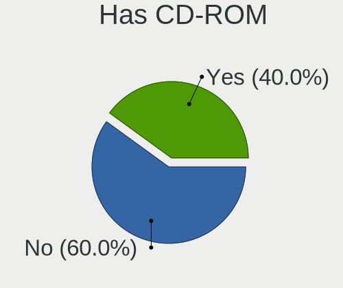
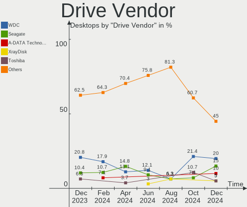
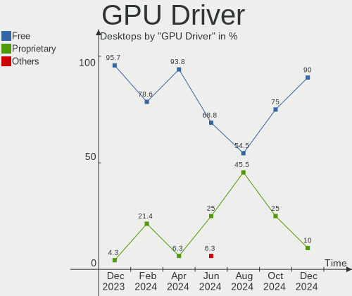

LMDE - Hardware Trends (Desktops)
---------------------------------

A project to identify most popular hardware characteristics and track their change
over time based on data collected by Linux users at https://Linux-Hardware.org.

Anyone can contribute to this report by the [hw-probe](https://github.com/linuxhw/hw-probe) tool:

    sudo -E hw-probe -all -upload

This report is for one last month. Overall report since the beginning of time: [TestDays](https://github.com/linuxhw/TestDays)

Period: May, 2023.

Contents
--------

* [ System ](#system)
  - [ OS                       ](#os)
  - [ OS Family                ](#os-family)
  - [ Kernel                   ](#kernel)
  - [ Kernel Family            ](#kernel-family)
  - [ Kernel Major Ver.        ](#kernel-major-ver)
  - [ Arch                     ](#arch)
  - [ DE                       ](#de)
  - [ Display Server           ](#display-server)
  - [ Display Manager          ](#display-manager)
  - [ OS Lang                  ](#os-lang)
  - [ Boot Mode                ](#boot-mode)
  - [ Filesystem               ](#filesystem)
  - [ Part. scheme             ](#part-scheme)
  - [ Dual Boot with Linux/BSD ](#dual-boot-with-linuxbsd)
  - [ Dual Boot (Win)          ](#dual-boot-win)

* [ Board ](#board)
  - [ Vendor                   ](#vendor)
  - [ Model                    ](#model)
  - [ Model Family             ](#model-family)
  - [ MFG Year                 ](#mfg-year)
  - [ Form Factor              ](#form-factor)
  - [ Secure Boot              ](#secure-boot)
  - [ Coreboot                 ](#coreboot)
  - [ RAM Size                 ](#ram-size)
  - [ RAM Used                 ](#ram-used)
  - [ Total Drives             ](#total-drives)
  - [ Has CD-ROM               ](#has-cd-rom)
  - [ Has Ethernet             ](#has-ethernet)
  - [ Has WiFi                 ](#has-wifi)
  - [ Has Bluetooth            ](#has-bluetooth)

* [ Location ](#location)
  - [ Country                  ](#country)
  - [ City                     ](#city)

* [ Drives ](#drives)
  - [ Drive Vendor             ](#drive-vendor)
  - [ Drive Model              ](#drive-model)
  - [ HDD Vendor               ](#hdd-vendor)
  - [ SSD Vendor               ](#ssd-vendor)
  - [ Drive Kind               ](#drive-kind)
  - [ Drive Connector          ](#drive-connector)
  - [ Drive Size               ](#drive-size)
  - [ Space Total              ](#space-total)
  - [ Space Used               ](#space-used)
  - [ Malfunc. Drives          ](#malfunc-drives)
  - [ Malfunc. Drive Vendor    ](#malfunc-drive-vendor)
  - [ Malfunc. HDD Vendor      ](#malfunc-hdd-vendor)
  - [ Malfunc. Drive Kind      ](#malfunc-drive-kind)
  - [ Failed Drives            ](#failed-drives)
  - [ Failed Drive Vendor      ](#failed-drive-vendor)
  - [ Drive Status             ](#drive-status)

* [ Storage controller ](#storage-controller)
  - [ Storage Vendor           ](#storage-vendor)
  - [ Storage Model            ](#storage-model)
  - [ Storage Kind             ](#storage-kind)

* [ Processor ](#processor)
  - [ CPU Vendor               ](#cpu-vendor)
  - [ CPU Model                ](#cpu-model)
  - [ CPU Model Family         ](#cpu-model-family)
  - [ CPU Cores                ](#cpu-cores)
  - [ CPU Sockets              ](#cpu-sockets)
  - [ CPU Threads              ](#cpu-threads)
  - [ CPU Op-Modes             ](#cpu-op-modes)
  - [ CPU Microcode            ](#cpu-microcode)
  - [ CPU Microarch            ](#cpu-microarch)

* [ Graphics ](#graphics)
  - [ GPU Vendor               ](#gpu-vendor)
  - [ GPU Model                ](#gpu-model)
  - [ GPU Combo                ](#gpu-combo)
  - [ GPU Driver               ](#gpu-driver)
  - [ GPU Memory               ](#gpu-memory)

* [ Monitor ](#monitor)
  - [ Monitor Vendor           ](#monitor-vendor)
  - [ Monitor Model            ](#monitor-model)
  - [ Monitor Resolution       ](#monitor-resolution)
  - [ Monitor Diagonal         ](#monitor-diagonal)
  - [ Monitor Width            ](#monitor-width)
  - [ Aspect Ratio             ](#aspect-ratio)
  - [ Monitor Area             ](#monitor-area)
  - [ Pixel Density            ](#pixel-density)
  - [ Multiple Monitors        ](#multiple-monitors)

* [ Network ](#network)
  - [ Net Controller Vendor    ](#net-controller-vendor)
  - [ Net Controller Model     ](#net-controller-model)
  - [ Wireless Vendor          ](#wireless-vendor)
  - [ Wireless Model           ](#wireless-model)
  - [ Ethernet Vendor          ](#ethernet-vendor)
  - [ Ethernet Model           ](#ethernet-model)
  - [ Net Controller Kind      ](#net-controller-kind)
  - [ Used Controller          ](#used-controller)
  - [ NICs                     ](#nics)
  - [ IPv6                     ](#ipv6)

* [ Bluetooth ](#bluetooth)
  - [ Bluetooth Vendor         ](#bluetooth-vendor)
  - [ Bluetooth Model          ](#bluetooth-model)

* [ Sound ](#sound)
  - [ Sound Vendor             ](#sound-vendor)
  - [ Sound Model              ](#sound-model)

* [ Memory ](#memory)
  - [ Memory Vendor            ](#memory-vendor)
  - [ Memory Model             ](#memory-model)
  - [ Memory Kind              ](#memory-kind)
  - [ Memory Form Factor       ](#memory-form-factor)
  - [ Memory Size              ](#memory-size)
  - [ Memory Speed             ](#memory-speed)

* [ Printers & scanners ](#printers--scanners)
  - [ Printer Vendor           ](#printer-vendor)
  - [ Printer Model            ](#printer-model)
  - [ Scanner Vendor           ](#scanner-vendor)
  - [ Scanner Model            ](#scanner-model)

* [ Camera ](#camera)
  - [ Camera Vendor            ](#camera-vendor)
  - [ Camera Model             ](#camera-model)

* [ Security ](#security)
  - [ Fingerprint Vendor       ](#fingerprint-vendor)
  - [ Fingerprint Model        ](#fingerprint-model)
  - [ Chipcard Vendor          ](#chipcard-vendor)
  - [ Chipcard Model           ](#chipcard-model)

* [ Unsupported ](#unsupported)
  - [ Unsupported Devices      ](#unsupported-devices)
  - [ Unsupported Device Types ](#unsupported-device-types)

System
------

OS
--

Installed operating systems

| Name   | Desktops | Percent |
|--------|----------|---------|
| LMDE 5 | 9        | 81.82%  |
| LMDE 4 | 2        | 18.18%  |

OS Family
---------

OS without a version

| Name | Desktops | Percent |
|------|----------|---------|
| LMDE | 11       | 100%    |

Kernel
------

Version of the Linux kernel

| Version         | Desktops | Percent |
|-----------------|----------|---------|
| 5.10.0-23-amd64 | 4        | 36.36%  |
| 5.10.0-22-amd64 | 4        | 36.36%  |
| 5.10.0-12-amd64 | 1        | 9.09%   |
| 4.19.0-9-amd64  | 1        | 9.09%   |
| 4.19.0-24-amd64 | 1        | 9.09%   |

Kernel Family
-------------

Linux kernel without a distro release

| Version | Desktops | Percent |
|---------|----------|---------|
| 5.10.0  | 9        | 81.82%  |
| 4.19.0  | 2        | 18.18%  |

Kernel Major Ver.
-----------------

Linux kernel major version

| Version | Desktops | Percent |
|---------|----------|---------|
| 5.10    | 9        | 81.82%  |
| 4.19    | 2        | 18.18%  |

Arch
----

OS architecture (x86_64, i586, etc.)

| Name   | Desktops | Percent |
|--------|----------|---------|
| x86_64 | 11       | 100%    |

DE
--

Desktop Environment

| Name       | Desktops | Percent |
|------------|----------|---------|
| X-Cinnamon | 8        | 72.73%  |
| Cinnamon   | 2        | 18.18%  |
| MATE       | 1        | 9.09%   |

Display Server
--------------

X11 or Wayland

| Name | Desktops | Percent |
|------|----------|---------|
| X11  | 11       | 100%    |

Display Manager
---------------

SDDM, LightDM, etc.

| Name    | Desktops | Percent |
|---------|----------|---------|
| Unknown | 7        | 63.64%  |
| LightDM | 4        | 36.36%  |

OS Lang
-------

Language

| Lang  | Desktops | Percent |
|-------|----------|---------|
| pl_PL | 2        | 18.18%  |
| en_US | 2        | 18.18%  |
| en_GB | 2        | 18.18%  |
| de_DE | 2        | 18.18%  |
| ru_UA | 1        | 9.09%   |
| fr_FR | 1        | 9.09%   |
| es_AR | 1        | 9.09%   |

Boot Mode
---------

EFI or BIOS

| Mode | Desktops | Percent |
|------|----------|---------|
| BIOS | 7        | 63.64%  |
| EFI  | 4        | 36.36%  |

Filesystem
----------

Type of filesystem

| Type  | Desktops | Percent |
|-------|----------|---------|
| Ext4  | 10       | 90.91%  |
| Tmpfs | 1        | 9.09%   |

Part. scheme
------------

Scheme of partitioning

| Type    | Desktops | Percent |
|---------|----------|---------|
| Unknown | 7        | 63.64%  |
| MBR     | 2        | 18.18%  |
| GPT     | 2        | 18.18%  |

Dual Boot with Linux/BSD
------------------------

Hosting more than one Linux/BSD

| Dual boot | Desktops | Percent |
|-----------|----------|---------|
| No        | 9        | 81.82%  |
| Yes       | 2        | 18.18%  |

Dual Boot (Win)
---------------

Hosting Linux and Windows

| Dual boot | Desktops | Percent |
|-----------|----------|---------|
| No        | 10       | 90.91%  |
| Yes       | 1        | 9.09%   |

Board
-----

Vendor
------

Motherboard manufacturer

| Name                | Desktops | Percent |
|---------------------|----------|---------|
| Gigabyte Technology | 2        | 18.18%  |
| ASUSTek Computer    | 2        | 18.18%  |
| ASRock              | 2        | 18.18%  |
| Pegatron            | 1        | 9.09%   |
| Packard Bell        | 1        | 9.09%   |
| MSI                 | 1        | 9.09%   |
| Medion              | 1        | 9.09%   |
| AZW                 | 1        | 9.09%   |

Model
-----

Motherboard model

| Name                         | Desktops | Percent |
|------------------------------|----------|---------|
| Pegatron FQ574AA-ABA m9517c  | 1        | 9.09%   |
| Packard Bell IMEDIA J9640    | 1        | 9.09%   |
| MSI MS-7A38                  | 1        | 9.09%   |
| Medion S23003                | 1        | 9.09%   |
| Gigabyte Q87M-D2H            | 1        | 9.09%   |
| Gigabyte E2100N              | 1        | 9.09%   |
| AZW MINI S                   | 1        | 9.09%   |
| ASUS ROG STRIX B450-F GAMING | 1        | 9.09%   |
| ASUS A8N-E                   | 1        | 9.09%   |
| ASRock B450M Pro4            | 1        | 9.09%   |
| ASRock 775Dual-VSTA          | 1        | 9.09%   |

Model Family
------------

Motherboard model prefix

| Name                 | Desktops | Percent |
|----------------------|----------|---------|
| Pegatron FQ574AA-ABA | 1        | 9.09%   |
| Packard Bell IMEDIA  | 1        | 9.09%   |
| MSI MS-7A38          | 1        | 9.09%   |
| Medion S23003        | 1        | 9.09%   |
| Gigabyte Q87M-D2H    | 1        | 9.09%   |
| Gigabyte E2100N      | 1        | 9.09%   |
| AZW MINI             | 1        | 9.09%   |
| ASUS ROG             | 1        | 9.09%   |
| ASUS A8N-E           | 1        | 9.09%   |
| ASRock B450M         | 1        | 9.09%   |
| ASRock 775Dual-VSTA  | 1        | 9.09%   |

MFG Year
--------

Motherboard manufacture year

| Year | Desktops | Percent |
|------|----------|---------|
| 2018 | 3        | 27.27%  |
| 2022 | 1        | 9.09%   |
| 2021 | 1        | 9.09%   |
| 2017 | 1        | 9.09%   |
| 2014 | 1        | 9.09%   |
| 2009 | 1        | 9.09%   |
| 2007 | 1        | 9.09%   |
| 2006 | 1        | 9.09%   |
| 2005 | 1        | 9.09%   |

Form Factor
-----------

Physical design of the computer

| Name    | Desktops | Percent |
|---------|----------|---------|
| Desktop | 11       | 100%    |

Secure Boot
-----------

Enabled or disabled

| State    | Desktops | Percent |
|----------|----------|---------|
| Disabled | 10       | 90.91%  |
| Enabled  | 1        | 9.09%   |

Coreboot
--------

Have coreboot on board

| Used | Desktops | Percent |
|------|----------|---------|
| No   | 11       | 100%    |

RAM Size
--------

Total RAM memory

| Size in GB | Desktops | Percent |
|------------|----------|---------|
| 4.01-8.0   | 3        | 27.27%  |
| 3.01-4.0   | 3        | 27.27%  |
| 16.01-24.0 | 2        | 18.18%  |
| 1.01-2.0   | 2        | 18.18%  |
| 24.01-32.0 | 1        | 9.09%   |

RAM Used
--------

Used RAM memory

| Used GB  | Desktops | Percent |
|----------|----------|---------|
| 1.01-2.0 | 6        | 54.55%  |
| 4.01-8.0 | 2        | 18.18%  |
| 3.01-4.0 | 2        | 18.18%  |
| 0.51-1.0 | 1        | 9.09%   |

Total Drives
------------

Number of drives on board

| Drives | Desktops | Percent |
|--------|----------|---------|
| 1      | 6        | 54.55%  |
| 2      | 4        | 36.36%  |
| 4      | 1        | 9.09%   |

Has CD-ROM
----------

Has CD-ROM on board

| Presented | Desktops | Percent |
|-----------|----------|---------|
| No        | 8        | 72.73%  |
| Yes       | 3        | 27.27%  |

Has Ethernet
------------

Has Ethernet on board

| Presented | Desktops | Percent |
|-----------|----------|---------|
| Yes       | 11       | 100%    |

Has WiFi
--------

Has WiFi module

| Presented | Desktops | Percent |
|-----------|----------|---------|
| Yes       | 7        | 63.64%  |
| No        | 4        | 36.36%  |

Has Bluetooth
-------------

Has Bluetooth module

| Presented | Desktops | Percent |
|-----------|----------|---------|
| No        | 7        | 63.64%  |
| Yes       | 4        | 36.36%  |

Location
--------

Country
-------

Geographic location (country)

| Country   | Desktops | Percent |
|-----------|----------|---------|
| Germany   | 3        | 27.27%  |
| Poland    | 2        | 18.18%  |
| USA       | 1        | 9.09%   |
| Ukraine   | 1        | 9.09%   |
| UK        | 1        | 9.09%   |
| Russia    | 1        | 9.09%   |
| France    | 1        | 9.09%   |
| Argentina | 1        | 9.09%   |

City
----

Geographic location (city)

| City                | Desktops | Percent |
|---------------------|----------|---------|
| Delligsen           | 2        | 18.18%  |
| Warsaw              | 1        | 9.09%   |
| Volgograd           | 1        | 9.09%   |
| Pilar               | 1        | 9.09%   |
| Kościan            | 1        | 9.09%   |
| Kharkiv             | 1        | 9.09%   |
| Columbia City       | 1        | 9.09%   |
| City of Westminster | 1        | 9.09%   |
| Challans            | 1        | 9.09%   |
| Berlin              | 1        | 9.09%   |

Drives
------

Drive Vendor
------------

Hard drive vendors

| Vendor              | Desktops | Drives | Percent |
|---------------------|----------|--------|---------|
| WDC                 | 6        | 8      | 33.33%  |
| Samsung Electronics | 4        | 4      | 22.22%  |
| Toshiba             | 1        | 1      | 5.56%   |
| Seagate             | 1        | 1      | 5.56%   |
| Sandisk             | 1        | 1      | 5.56%   |
| Phison              | 1        | 1      | 5.56%   |
| Patriot             | 1        | 1      | 5.56%   |
| Kingston            | 1        | 1      | 5.56%   |
| Fujitsu             | 1        | 1      | 5.56%   |
| China               | 1        | 1      | 5.56%   |

Drive Model
-----------

Hard drive models

| Model                                               | Desktops | Percent |
|-----------------------------------------------------|----------|---------|
| WDC WD5000KS-00MNB0 500GB                           | 1        | 5%      |
| WDC WD5000AVVS-63M8B0 500GB                         | 1        | 5%      |
| WDC WD3200BEVT-22ZCT0 320GB                         | 1        | 5%      |
| WDC WD2500BEVT-24A23T0 250GB                        | 1        | 5%      |
| WDC WD1600JD-22HBC0 160GB                           | 1        | 5%      |
| WDC WD10EZEX-60WN4A0 1TB                            | 1        | 5%      |
| WDC WD10EZEX-22MFCA0 1TB                            | 1        | 5%      |
| WDC WD10EZEX-08WN4A0 1TB                            | 1        | 5%      |
| Toshiba HDWD110 1TB                                 | 1        | 5%      |
| Seagate ST500DM005 HD502HJ 500GB                    | 1        | 5%      |
| Sandisk WD Black 2018/SN750 / PC SN720 NVMe SSD 1TB | 1        | 5%      |
| Samsung SSD 870 QVO 1TB                             | 1        | 5%      |
| Samsung SSD 860 EVO 250GB                           | 1        | 5%      |
| Samsung SSD 850 PRO 256GB                           | 1        | 5%      |
| Samsung SP2004C 200GB                               | 1        | 5%      |
| Phison S11-128G-PHISON-SSD-B4 128GB                 | 1        | 5%      |
| Patriot P210 128GB SSD                              | 1        | 5%      |
| Kingston SA400S37120G 120GB SSD                     | 1        | 5%      |
| Fujitsu MHY2120BH 120GB                             | 1        | 5%      |
| China 128GB SSD                                     | 1        | 5%      |

HDD Vendor
----------

Hard disk drive vendors

| Vendor              | Desktops | Drives | Percent |
|---------------------|----------|--------|---------|
| WDC                 | 6        | 8      | 60%     |
| Toshiba             | 1        | 1      | 10%     |
| Seagate             | 1        | 1      | 10%     |
| Samsung Electronics | 1        | 1      | 10%     |
| Fujitsu             | 1        | 1      | 10%     |

SSD Vendor
----------

Solid state drive vendors

| Vendor              | Desktops | Drives | Percent |
|---------------------|----------|--------|---------|
| Samsung Electronics | 3        | 3      | 42.86%  |
| Phison              | 1        | 1      | 14.29%  |
| Patriot             | 1        | 1      | 14.29%  |
| Kingston            | 1        | 1      | 14.29%  |
| China               | 1        | 1      | 14.29%  |

Drive Kind
----------

HDD or SSD

| Kind | Desktops | Drives | Percent |
|------|----------|--------|---------|
| HDD  | 8        | 12     | 50%     |
| SSD  | 7        | 7      | 43.75%  |
| NVMe | 1        | 1      | 6.25%   |

Drive Connector
---------------

SATA, SAS, NVMe, etc.

| Type | Desktops | Drives | Percent |
|------|----------|--------|---------|
| SATA | 12       | 19     | 92.31%  |
| NVMe | 1        | 1      | 7.69%   |

Drive Size
----------

Size of hard drive

| Size in TB | Desktops | Drives | Percent |
|------------|----------|--------|---------|
| 0.01-0.5   | 10       | 14     | 83.33%  |
| 0.51-1.0   | 2        | 5      | 16.67%  |

Space Total
-----------

Amount of disk space available on the file system

| Size in GB | Desktops | Percent |
|------------|----------|---------|
| 101-250    | 8        | 72.73%  |
| 501-1000   | 2        | 18.18%  |
| 1-20       | 1        | 9.09%   |

Space Used
----------

Amount of used disk space

| Used GB | Desktops | Percent |
|---------|----------|---------|
| 21-50   | 4        | 36.36%  |
| 1-20    | 4        | 36.36%  |
| 51-100  | 2        | 18.18%  |
| 251-500 | 1        | 9.09%   |

Malfunc. Drives
---------------

Drive models with a malfunction

| Model                    | Desktops | Drives | Percent |
|--------------------------|----------|--------|---------|
| WDC WD10EZEX-60WN4A0 1TB | 1        | 1      | 50%     |
| Toshiba HDWD110 1TB      | 1        | 1      | 50%     |

Malfunc. Drive Vendor
---------------------

Vendors of faulty drives

| Vendor  | Desktops | Drives | Percent |
|---------|----------|--------|---------|
| WDC     | 1        | 1      | 50%     |
| Toshiba | 1        | 1      | 50%     |

Malfunc. HDD Vendor
-------------------

Vendors of faulty HDD drives

| Vendor  | Desktops | Drives | Percent |
|---------|----------|--------|---------|
| WDC     | 1        | 1      | 50%     |
| Toshiba | 1        | 1      | 50%     |

Malfunc. Drive Kind
-------------------

Kinds of faulty drives

| Kind | Desktops | Drives | Percent |
|------|----------|--------|---------|
| HDD  | 1        | 2      | 100%    |

Failed Drives
-------------

Failed drive models

Zero info for selected period =(

Failed Drive Vendor
-------------------

Failed drive vendors

Zero info for selected period =(

Drive Status
------------

Number of failed and malfunc. drives

| Status   | Desktops | Drives | Percent |
|----------|----------|--------|---------|
| Detected | 8        | 14     | 66.67%  |
| Works    | 3        | 4      | 25%     |
| Malfunc  | 1        | 2      | 8.33%   |

Storage controller
------------------

Storage Vendor
--------------

Storage controller vendors

| Vendor           | Desktops | Percent |
|------------------|----------|---------|
| AMD              | 4        | 33.33%  |
| Intel            | 3        | 25%     |
| VIA Technologies | 2        | 16.67%  |
| Nvidia           | 2        | 16.67%  |
| SanDisk          | 1        | 8.33%   |

Storage Model
-------------

Storage controller models

| Model                                                                          | Desktops | Percent |
|--------------------------------------------------------------------------------|----------|---------|
| AMD FCH SATA Controller [AHCI mode]                                            | 4        | 22.22%  |
| VIA VT82C586A/B/VT82C686/A/B/VT823x/A/C PIPC Bus Master IDE                    | 2        | 11.11%  |
| AMD 400 Series Chipset SATA Controller                                         | 2        | 11.11%  |
| VIA VT8237A SATA 2-Port Controller                                             | 1        | 5.56%   |
| VIA Serial ATA Controller                                                      | 1        | 5.56%   |
| SanDisk WD Black 2018/SN750 / PC SN720 NVMe SSD                                | 1        | 5.56%   |
| Nvidia MCP78S [GeForce 8200] SATA Controller (RAID mode)                       | 1        | 5.56%   |
| Nvidia CK804 Serial ATA Controller                                             | 1        | 5.56%   |
| Nvidia CK804 IDE                                                               | 1        | 5.56%   |
| Intel Jasper Lake SATA AHCI Controller                                         | 1        | 5.56%   |
| Intel Celeron/Pentium Silver Processor SATA Controller                         | 1        | 5.56%   |
| Intel 8 Series/C220 Series Chipset Family 6-port SATA Controller 1 [AHCI mode] | 1        | 5.56%   |
| AMD 300 Series Chipset SATA Controller                                         | 1        | 5.56%   |

Storage Kind
------------

Kind of storage controller (IDE, SATA, NVMe, SAS, ...)

| Kind | Desktops | Percent |
|------|----------|---------|
| SATA | 7        | 53.85%  |
| IDE  | 3        | 23.08%  |
| RAID | 2        | 15.38%  |
| NVMe | 1        | 7.69%   |

Processor
---------

CPU Vendor
----------

Processor vendors

| Vendor | Desktops | Percent |
|--------|----------|---------|
| AMD    | 6        | 54.55%  |
| Intel  | 5        | 45.45%  |

CPU Model
---------

Processor models

| Model                                      | Desktops | Percent |
|--------------------------------------------|----------|---------|
| AMD Ryzen 5 2600 Six-Core Processor        | 2        | 18.18%  |
| Intel Core i5-4590S CPU @ 3.00GHz          | 1        | 9.09%   |
| Intel Core 2 Duo CPU E7200 @ 2.53GHz       | 1        | 9.09%   |
| Intel Core 2 Duo CPU E4500 @ 2.20GHz       | 1        | 9.09%   |
| Intel Celeron N5095 @ 2.00GHz              | 1        | 9.09%   |
| Intel Celeron J4125 CPU @ 2.00GHz          | 1        | 9.09%   |
| AMD Ryzen 5 1500X Quad-Core Processor      | 1        | 9.09%   |
| AMD Phenom 9550 Quad-Core Processor        | 1        | 9.09%   |
| AMD E1-2100 APU with Radeon HD Graphics    | 1        | 9.09%   |
| AMD Athlon 64 X2 Dual Core Processor 4200+ | 1        | 9.09%   |

CPU Model Family
----------------

Processor model prefix

| Model            | Desktops | Percent |
|------------------|----------|---------|
| AMD Ryzen 5      | 3        | 27.27%  |
| Intel Core 2 Duo | 2        | 18.18%  |
| Intel Celeron    | 2        | 18.18%  |
| Intel Core i5    | 1        | 9.09%   |
| AMD Phenom       | 1        | 9.09%   |
| AMD E1           | 1        | 9.09%   |
| AMD Athlon 64 X2 | 1        | 9.09%   |

CPU Cores
---------

Number of processor cores

| Number | Desktops | Percent |
|--------|----------|---------|
| 4      | 5        | 45.45%  |
| 2      | 4        | 36.36%  |
| 6      | 2        | 18.18%  |

CPU Sockets
-----------

Number of sockets

| Number | Desktops | Percent |
|--------|----------|---------|
| 1      | 11       | 100%    |

CPU Threads
-----------

Threads per core (Hyper-Threading)

| Number | Desktops | Percent |
|--------|----------|---------|
| 1      | 8        | 72.73%  |
| 2      | 3        | 27.27%  |

CPU Op-Modes
------------

CPU Operation Modes (32-bit, 64-bit)

| Op mode        | Desktops | Percent |
|----------------|----------|---------|
| 32-bit, 64-bit | 11       | 100%    |

CPU Microcode
-------------

Microcode number

| Number     | Desktops | Percent |
|------------|----------|---------|
| 0x0800820d | 2        | 18.18%  |
| 0x906c0    | 1        | 9.09%   |
| 0x706a8    | 1        | 9.09%   |
| 0x6fd      | 1        | 9.09%   |
| 0x306c3    | 1        | 9.09%   |
| 0x10676    | 1        | 9.09%   |
| 0x08001138 | 1        | 9.09%   |
| 0x0700010f | 1        | 9.09%   |
| 0x01000083 | 1        | 9.09%   |
| Unknown    | 1        | 9.09%   |

CPU Microarch
-------------

Microarchitecture

| Name          | Desktops | Percent |
|---------------|----------|---------|
| Zen+          | 2        | 18.18%  |
| Zen           | 1        | 9.09%   |
| Tremont       | 1        | 9.09%   |
| Penryn        | 1        | 9.09%   |
| K8 Hammer     | 1        | 9.09%   |
| K10           | 1        | 9.09%   |
| Jaguar        | 1        | 9.09%   |
| Haswell       | 1        | 9.09%   |
| Goldmont plus | 1        | 9.09%   |
| Core          | 1        | 9.09%   |

Graphics
--------

GPU Vendor
----------

Vendors of graphics cards

| Vendor | Desktops | Percent |
|--------|----------|---------|
| Nvidia | 6        | 50%     |
| Intel  | 3        | 25%     |
| AMD    | 3        | 25%     |

GPU Model
---------

Graphics card models

| Model                                                                       | Desktops | Percent |
|-----------------------------------------------------------------------------|----------|---------|
| Nvidia GP107 [GeForce GTX 1050]                                             | 1        | 7.69%   |
| Nvidia GK208B [GeForce GT 710]                                              | 1        | 7.69%   |
| Nvidia GK106 [GeForce GTX 660]                                              | 1        | 7.69%   |
| Nvidia GK104 [GeForce GTX 760]                                              | 1        | 7.69%   |
| Nvidia GF108 [GeForce GT 630]                                               | 1        | 7.69%   |
| Nvidia G84 [GeForce 8600 GS]                                                | 1        | 7.69%   |
| Intel Xeon E3-1200 v3/4th Gen Core Processor Integrated Graphics Controller | 1        | 7.69%   |
| Intel JasperLake [UHD Graphics]                                             | 1        | 7.69%   |
| Intel GeminiLake [UHD Graphics 600]                                         | 1        | 7.69%   |
| AMD RV515 PRO [Radeon X1300/X1550 Series] (Secondary)                       | 1        | 7.69%   |
| AMD RV515 PRO [Radeon X1300/X1550 Series]                                   | 1        | 7.69%   |
| AMD Navi 22 [Radeon RX 6700/6700 XT/6750 XT / 6800M/6850M XT]               | 1        | 7.69%   |
| AMD Kabini [Radeon HD 8210]                                                 | 1        | 7.69%   |

GPU Combo
---------

Combinations of graphics cards

| Name       | Desktops | Percent |
|------------|----------|---------|
| 1 x Nvidia | 5        | 45.45%  |
| 1 x Intel  | 3        | 27.27%  |
| 1 x AMD    | 2        | 18.18%  |
| 2 x AMD    | 1        | 9.09%   |

GPU Driver
----------

Free vs proprietary

| Driver      | Desktops | Percent |
|-------------|----------|---------|
| Free        | 7        | 63.64%  |
| Proprietary | 2        | 18.18%  |
| Unknown     | 2        | 18.18%  |

GPU Memory
----------

Total video memory

| Size in GB | Desktops | Percent |
|------------|----------|---------|
| Unknown    | 4        | 36.36%  |
| 1.01-2.0   | 3        | 27.27%  |
| 0.01-0.5   | 3        | 27.27%  |
| 3.01-4.0   | 1        | 9.09%   |

Monitor
-------

Monitor Vendor
--------------

Monitor vendors

| Vendor              | Desktops | Percent |
|---------------------|----------|---------|
| Goldstar            | 2        | 20%     |
| Eizo                | 2        | 20%     |
| Sony                | 1        | 10%     |
| Samsung Electronics | 1        | 10%     |
| Pioneer             | 1        | 10%     |
| Idek Iiyama         | 1        | 10%     |
| HUAWEI              | 1        | 10%     |
| DENON               | 1        | 10%     |

Monitor Model
-------------

Monitor models

| Model                                                                | Desktops | Percent |
|----------------------------------------------------------------------|----------|---------|
| Sony TV SNY8701 1440x900                                             | 1        | 9.09%   |
| Samsung Electronics SyncMaster SAM0022 1280x1024 312x234mm 15.4-inch | 1        | 9.09%   |
| Pioneer PDP-504CMX PIO0034 1400x1050 827x620mm 40.7-inch             | 1        | 9.09%   |
| Idek Iiyama LCD Monitor PL2590 1920x1080                             | 1        | 9.09%   |
| HUAWEI ZQE-CBA HWV6A25 3440x1440 797x334mm 34.0-inch                 | 1        | 9.09%   |
| Goldstar LG TV SSCR2 GSMC0C8 3840x2160                               | 1        | 9.09%   |
| Goldstar IPS234 GSM58D9 1920x1080 510x290mm 23.1-inch                | 1        | 9.09%   |
| Eizo L778 ENC1766 1280x1024 376x301mm 19.0-inch                      | 1        | 9.09%   |
| Eizo L768 ENC1729 1280x1024 376x301mm 19.0-inch                      | 1        | 9.09%   |
| Eizo L767 ENC1688 1280x1024 376x301mm 19.0-inch                      | 1        | 9.09%   |
| DENON AVR DON0063 3840x2160 1420x800mm 64.2-inch                     | 1        | 9.09%   |

Monitor Resolution
------------------

Monitor screen resolution

| Resolution       | Desktops | Percent |
|------------------|----------|---------|
| 1280x1024 (SXGA) | 3        | 30%     |
| 3840x2160 (4K)   | 2        | 20%     |
| 1920x1080 (FHD)  | 2        | 20%     |
| 3440x1440        | 1        | 10%     |
| 1440x900 (WXGA+) | 1        | 10%     |
| 1280x768         | 1        | 10%     |

Monitor Diagonal
----------------

Diagonal size in inches

| Inches  | Desktops | Percent |
|---------|----------|---------|
| 72      | 3        | 30%     |
| 19      | 2        | 20%     |
| 40      | 1        | 10%     |
| 34      | 1        | 10%     |
| 23      | 1        | 10%     |
| 15      | 1        | 10%     |
| Unknown | 1        | 10%     |

Monitor Width
-------------

Physical width

| Width in mm | Desktops | Percent |
|-------------|----------|---------|
| 1501-2000   | 3        | 30%     |
| 351-400     | 2        | 20%     |
| 801-900     | 1        | 10%     |
| 701-800     | 1        | 10%     |
| 501-600     | 1        | 10%     |
| 301-350     | 1        | 10%     |
| Unknown     | 1        | 10%     |

Aspect Ratio
------------

Proportional relationship between the width and the height

| Ratio   | Desktops | Percent |
|---------|----------|---------|
| 16/9    | 4        | 40%     |
| 5/4     | 2        | 20%     |
| 4/3     | 2        | 20%     |
| 21/9    | 1        | 10%     |
| Unknown | 1        | 10%     |

Monitor Area
------------

Area in inch²

| Area in inch² | Desktops | Percent |
|----------------|----------|---------|
| More than 1000 | 3        | 30%     |
| 151-200        | 2        | 20%     |
| 351-500        | 1        | 10%     |
| 201-250        | 1        | 10%     |
| 111-120        | 1        | 10%     |
| 501-1000       | 1        | 10%     |
| Unknown        | 1        | 10%     |

Pixel Density
-------------

Pixels per inch

| Density | Desktops | Percent |
|---------|----------|---------|
| 51-100  | 4        | 40%     |
| 1-50    | 3        | 30%     |
| 101-120 | 2        | 20%     |
| Unknown | 1        | 10%     |

Multiple Monitors
-----------------

Total monitors connected

| Total | Desktops | Percent |
|-------|----------|---------|
| 1     | 9        | 81.82%  |
| 2     | 1        | 9.09%   |
| 0     | 1        | 9.09%   |

Network
-------

Net Controller Vendor
---------------------

Controller vendors

| Vendor                   | Desktops | Percent |
|--------------------------|----------|---------|
| Realtek Semiconductor    | 6        | 33.33%  |
| Intel                    | 5        | 27.78%  |
| Nvidia                   | 2        | 11.11%  |
| VIA Technologies         | 1        | 5.56%   |
| TP-Link                  | 1        | 5.56%   |
| Qualcomm Atheros         | 1        | 5.56%   |
| Microsoft                | 1        | 5.56%   |
| Marvell Technology Group | 1        | 5.56%   |

Net Controller Model
--------------------

Controller models

| Model                                                             | Desktops | Percent |
|-------------------------------------------------------------------|----------|---------|
| Realtek RTL8111/8168/8411 PCI Express Gigabit Ethernet Controller | 4        | 21.05%  |
| Intel Wireless 3165                                               | 2        | 10.53%  |
| Intel I211 Gigabit Network Connection                             | 2        | 10.53%  |
| VIA VT6102/VT6103 [Rhine-II]                                      | 1        | 5.26%   |
| TP-Link RTL8812AU Archer T4U 802.11ac                             | 1        | 5.26%   |
| Realtek RTL8187 Wireless Adapter                                  | 1        | 5.26%   |
| Realtek RTL-8100/8101L/8139 PCI Fast Ethernet Adapter             | 1        | 5.26%   |
| Qualcomm Atheros AR928X Wireless Network Adapter (PCI-Express)    | 1        | 5.26%   |
| Nvidia MCP77 Ethernet                                             | 1        | 5.26%   |
| Nvidia CK804 Ethernet Controller                                  | 1        | 5.26%   |
| Microsoft XBOX ACC                                                | 1        | 5.26%   |
| Marvell Group 88w8335 [Libertas] 802.11b/g Wireless               | 1        | 5.26%   |
| Intel Wireless 8260                                               | 1        | 5.26%   |
| Intel Ethernet Connection I217-LM                                 | 1        | 5.26%   |

Wireless Vendor
---------------

Wireless vendors

| Vendor                   | Desktops | Percent |
|--------------------------|----------|---------|
| Intel                    | 3        | 37.5%   |
| TP-Link                  | 1        | 12.5%   |
| Realtek Semiconductor    | 1        | 12.5%   |
| Qualcomm Atheros         | 1        | 12.5%   |
| Microsoft                | 1        | 12.5%   |
| Marvell Technology Group | 1        | 12.5%   |

Wireless Model
--------------

Wireless models

| Model                                                          | Desktops | Percent |
|----------------------------------------------------------------|----------|---------|
| Intel Wireless 3165                                            | 2        | 25%     |
| TP-Link RTL8812AU Archer T4U 802.11ac                          | 1        | 12.5%   |
| Realtek RTL8187 Wireless Adapter                               | 1        | 12.5%   |
| Qualcomm Atheros AR928X Wireless Network Adapter (PCI-Express) | 1        | 12.5%   |
| Microsoft XBOX ACC                                             | 1        | 12.5%   |
| Marvell Group 88w8335 [Libertas] 802.11b/g Wireless            | 1        | 12.5%   |
| Intel Wireless 8260                                            | 1        | 12.5%   |

Ethernet Vendor
---------------

Ethernet vendors

| Vendor                | Desktops | Percent |
|-----------------------|----------|---------|
| Realtek Semiconductor | 5        | 45.45%  |
| Intel                 | 3        | 27.27%  |
| Nvidia                | 2        | 18.18%  |
| VIA Technologies      | 1        | 9.09%   |

Ethernet Model
--------------

Ethernet models

| Model                                                             | Desktops | Percent |
|-------------------------------------------------------------------|----------|---------|
| Realtek RTL8111/8168/8411 PCI Express Gigabit Ethernet Controller | 4        | 36.36%  |
| Intel I211 Gigabit Network Connection                             | 2        | 18.18%  |
| VIA VT6102/VT6103 [Rhine-II]                                      | 1        | 9.09%   |
| Realtek RTL-8100/8101L/8139 PCI Fast Ethernet Adapter             | 1        | 9.09%   |
| Nvidia MCP77 Ethernet                                             | 1        | 9.09%   |
| Nvidia CK804 Ethernet Controller                                  | 1        | 9.09%   |
| Intel Ethernet Connection I217-LM                                 | 1        | 9.09%   |

Net Controller Kind
-------------------

Ethernet, WiFi or modem

| Kind     | Desktops | Percent |
|----------|----------|---------|
| Ethernet | 11       | 61.11%  |
| WiFi     | 7        | 38.89%  |

Used Controller
---------------

Currently used network controller

| Kind     | Desktops | Percent |
|----------|----------|---------|
| Ethernet | 7        | 58.33%  |
| WiFi     | 5        | 41.67%  |

NICs
----

Total network controllers on board

| Total | Desktops | Percent |
|-------|----------|---------|
| 1     | 6        | 54.55%  |
| 2     | 5        | 45.45%  |

IPv6
----

IPv6 vs IPv4

| Used | Desktops | Percent |
|------|----------|---------|
| No   | 8        | 72.73%  |
| Yes  | 3        | 27.27%  |

Bluetooth
---------

Bluetooth Vendor
----------------

Controller vendors

| Vendor                  | Desktops | Percent |
|-------------------------|----------|---------|
| Intel                   | 3        | 75%     |
| Cambridge Silicon Radio | 1        | 25%     |

Bluetooth Model
---------------

Controller models

| Model                                               | Desktops | Percent |
|-----------------------------------------------------|----------|---------|
| Intel Bluetooth wireless interface                  | 3        | 75%     |
| Cambridge Silicon Radio Bluetooth Dongle (HCI mode) | 1        | 25%     |

Sound
-----

Sound Vendor
------------

Sound card vendors

| Vendor              | Desktops | Percent |
|---------------------|----------|---------|
| Nvidia              | 5        | 31.25%  |
| AMD                 | 4        | 25%     |
| Intel               | 3        | 18.75%  |
| VIA Technologies    | 2        | 12.5%   |
| KTMicro             | 1        | 6.25%   |
| C-Media Electronics | 1        | 6.25%   |

Sound Model
-----------

Sound card models

| Model                                                               | Desktops | Percent |
|---------------------------------------------------------------------|----------|---------|
| AMD Family 17h (Models 00h-0fh) HD Audio Controller                 | 3        | 14.29%  |
| VIA Technologies VX900/VT8xxx High Definition Audio Controller      | 2        | 9.52%   |
| Nvidia MCP72XE/MCP72P/MCP78U/MCP78S High Definition Audio           | 1        | 4.76%   |
| Nvidia GP107GL High Definition Audio Controller                     | 1        | 4.76%   |
| Nvidia GK208 HDMI/DP Audio Controller                               | 1        | 4.76%   |
| Nvidia GK106 HDMI Audio Controller                                  | 1        | 4.76%   |
| Nvidia GK104 HDMI Audio Controller                                  | 1        | 4.76%   |
| Nvidia GF108 High Definition Audio Controller                       | 1        | 4.76%   |
| Nvidia CK804 AC'97 Audio Controller                                 | 1        | 4.76%   |
| KTMicro KT USB Audio                                                | 1        | 4.76%   |
| Intel Xeon E3-1200 v3/4th Gen Core Processor HD Audio Controller    | 1        | 4.76%   |
| Intel Jasper Lake HD Audio                                          | 1        | 4.76%   |
| Intel Celeron/Pentium Silver Processor High Definition Audio        | 1        | 4.76%   |
| Intel 8 Series/C220 Series Chipset High Definition Audio Controller | 1        | 4.76%   |
| C-Media Electronics USB Audio Device                                | 1        | 4.76%   |
| AMD Navi 21/23 HDMI/DP Audio Controller                             | 1        | 4.76%   |
| AMD Kabini HDMI/DP Audio                                            | 1        | 4.76%   |
| AMD FCH Azalia Controller                                           | 1        | 4.76%   |

Memory
------

Memory Vendor
-------------

Memory module vendors

| Vendor         | Desktops | Percent |
|----------------|----------|---------|
| Kingston       | 2        | 28.57%  |
| Unknown (ABCD) | 1        | 14.29%  |
| Team           | 1        | 14.29%  |
| SK hynix       | 1        | 14.29%  |
| Patriot        | 1        | 14.29%  |
| Corsair        | 1        | 14.29%  |

Memory Model
------------

Memory module models

| Model                                                          | Desktops | Percent |
|----------------------------------------------------------------|----------|---------|
| Unknown (ABCD) RAM 123456789012345678 2GB DIMM LPDDR4 2400MT/s | 1        | 12.5%   |
| Team RAM TEAMGROUP-UD3-1600 4GB DIMM DDR3 1600MT/s             | 1        | 12.5%   |
| SK hynix RAM HMT451U6AFR8C-PB 4GB DIMM DDR3 1600MT/s           | 1        | 12.5%   |
| Patriot RAM PDC22G6400LLK 1024MB DIMM DDR2 667MT/s             | 1        | 12.5%   |
| Kingston RAM 99U5402-037.A00G 2GB DIMM DDR3 1333MT/s           | 1        | 12.5%   |
| Kingston RAM 9905471-001.A01LF 2GB DIMM DDR3 1600MT/s          | 1        | 12.5%   |
| Kingston RAM 9905316-005.A04LF 1024MB DIMM DDR2 667MT/s        | 1        | 12.5%   |
| Corsair RAM CMK16GX4M2B3000C15 8GB DIMM DDR4 3533MT/s          | 1        | 12.5%   |

Memory Kind
-----------

Memory module kinds

| Kind   | Desktops | Percent |
|--------|----------|---------|
| DDR3   | 2        | 40%     |
| LPDDR4 | 1        | 20%     |
| DDR4   | 1        | 20%     |
| DDR2   | 1        | 20%     |

Memory Form Factor
------------------

Physical design of the memory module

| Name | Desktops | Percent |
|------|----------|---------|
| DIMM | 5        | 100%    |

Memory Size
-----------

Memory module size

| Size  | Desktops | Percent |
|-------|----------|---------|
| 8192  | 2        | 33.33%  |
| 16384 | 1        | 16.67%  |
| 4096  | 1        | 16.67%  |
| 2048  | 1        | 16.67%  |
| 1024  | 1        | 16.67%  |

Memory Speed
------------

Memory module speed

| Speed | Desktops | Percent |
|-------|----------|---------|
| 1600  | 2        | 28.57%  |
| 3533  | 1        | 14.29%  |
| 2400  | 1        | 14.29%  |
| 1800  | 1        | 14.29%  |
| 1333  | 1        | 14.29%  |
| 667   | 1        | 14.29%  |

Printers & scanners
-------------------

Printer Vendor
--------------

Printer device vendors

| Vendor  | Desktops | Percent |
|---------|----------|---------|
| Minolta | 1        | 100%    |

Printer Model
-------------

Printer device models

| Model                 | Desktops | Percent |
|-----------------------|----------|---------|
| Minolta PagePro 1200W | 1        | 100%    |

Scanner Vendor
--------------

Scanner device vendors

Zero info for selected period =(

Scanner Model
-------------

Scanner device models

Zero info for selected period =(

Camera
------

Camera Vendor
-------------

Camera device vendors

Zero info for selected period =(

Camera Model
------------

Camera device models

Zero info for selected period =(

Security
--------

Fingerprint Vendor
------------------

Fingerprint sensor vendors

Zero info for selected period =(

Fingerprint Model
-----------------

Fingerprint sensor models

Zero info for selected period =(

Chipcard Vendor
---------------

Chipcard module vendors

Zero info for selected period =(

Chipcard Model
--------------

Chipcard module models

Zero info for selected period =(

Unsupported
-----------

Unsupported Devices
-------------------

Total unsupported devices on board

| Total | Desktops | Percent |
|-------|----------|---------|
| 0     | 8        | 72.73%  |
| 1     | 2        | 18.18%  |
| 2     | 1        | 9.09%   |

Unsupported Device Types
------------------------

Types of unsupported devices

| Type          | Desktops | Percent |
|---------------|----------|---------|
| Net/wireless  | 2        | 50%     |
| Graphics card | 2        | 50%     |

