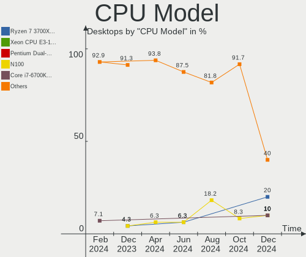
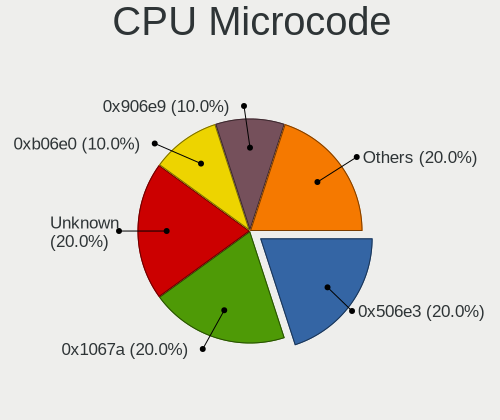
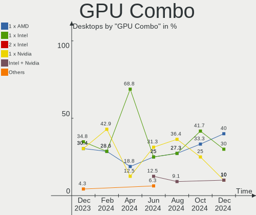
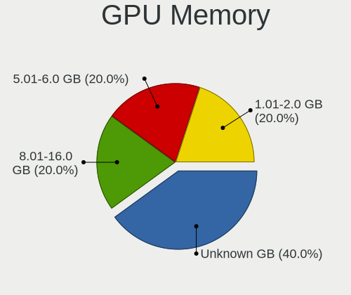
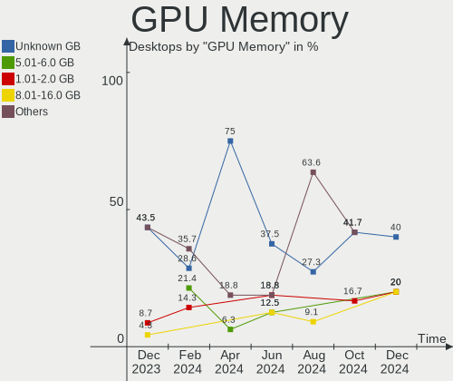
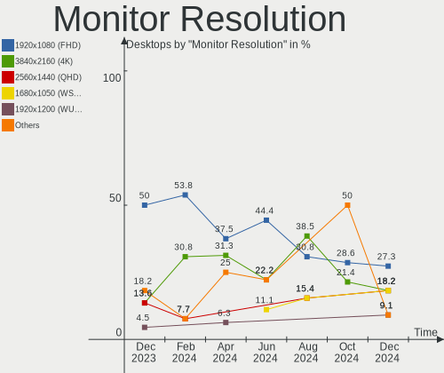
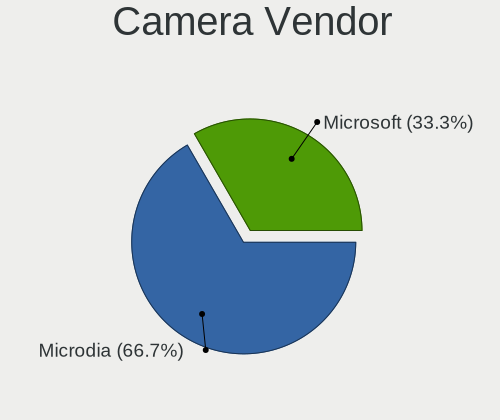

LMDE - Hardware Trends (Desktops)
---------------------------------

A project to identify most popular hardware characteristics and track their change
over time based on data collected by Linux users at https://Linux-Hardware.org.

Anyone can contribute to this report by the [hw-probe](https://github.com/linuxhw/hw-probe) tool:

    sudo -E hw-probe -all -upload

This report is for one last month. Overall report since the beginning of time: [TestDays](https://github.com/linuxhw/TestDays)

Period: Dec, 2023.

Contents
--------

* [ System ](#system)
  - [ OS                       ](#os)
  - [ OS Family                ](#os-family)
  - [ Kernel                   ](#kernel)
  - [ Kernel Family            ](#kernel-family)
  - [ Kernel Major Ver.        ](#kernel-major-ver)
  - [ Arch                     ](#arch)
  - [ DE                       ](#de)
  - [ Display Server           ](#display-server)
  - [ Display Manager          ](#display-manager)
  - [ OS Lang                  ](#os-lang)
  - [ Boot Mode                ](#boot-mode)
  - [ Filesystem               ](#filesystem)
  - [ Part. scheme             ](#part-scheme)
  - [ Dual Boot with Linux/BSD ](#dual-boot-with-linuxbsd)
  - [ Dual Boot (Win)          ](#dual-boot-win)

* [ Board ](#board)
  - [ Vendor                   ](#vendor)
  - [ Model                    ](#model)
  - [ Model Family             ](#model-family)
  - [ MFG Year                 ](#mfg-year)
  - [ Form Factor              ](#form-factor)
  - [ Secure Boot              ](#secure-boot)
  - [ Coreboot                 ](#coreboot)
  - [ RAM Size                 ](#ram-size)
  - [ RAM Used                 ](#ram-used)
  - [ Total Drives             ](#total-drives)
  - [ Has CD-ROM               ](#has-cd-rom)
  - [ Has Ethernet             ](#has-ethernet)
  - [ Has WiFi                 ](#has-wifi)
  - [ Has Bluetooth            ](#has-bluetooth)

* [ Location ](#location)
  - [ Country                  ](#country)
  - [ City                     ](#city)

* [ Drives ](#drives)
  - [ Drive Vendor             ](#drive-vendor)
  - [ Drive Model              ](#drive-model)
  - [ HDD Vendor               ](#hdd-vendor)
  - [ SSD Vendor               ](#ssd-vendor)
  - [ Drive Kind               ](#drive-kind)
  - [ Drive Connector          ](#drive-connector)
  - [ Drive Size               ](#drive-size)
  - [ Space Total              ](#space-total)
  - [ Space Used               ](#space-used)
  - [ Malfunc. Drives          ](#malfunc-drives)
  - [ Malfunc. Drive Vendor    ](#malfunc-drive-vendor)
  - [ Malfunc. HDD Vendor      ](#malfunc-hdd-vendor)
  - [ Malfunc. Drive Kind      ](#malfunc-drive-kind)
  - [ Failed Drives            ](#failed-drives)
  - [ Failed Drive Vendor      ](#failed-drive-vendor)
  - [ Drive Status             ](#drive-status)

* [ Storage controller ](#storage-controller)
  - [ Storage Vendor           ](#storage-vendor)
  - [ Storage Model            ](#storage-model)
  - [ Storage Kind             ](#storage-kind)

* [ Processor ](#processor)
  - [ CPU Vendor               ](#cpu-vendor)
  - [ CPU Model                ](#cpu-model)
  - [ CPU Model Family         ](#cpu-model-family)
  - [ CPU Cores                ](#cpu-cores)
  - [ CPU Sockets              ](#cpu-sockets)
  - [ CPU Threads              ](#cpu-threads)
  - [ CPU Op-Modes             ](#cpu-op-modes)
  - [ CPU Microcode            ](#cpu-microcode)
  - [ CPU Microarch            ](#cpu-microarch)

* [ Graphics ](#graphics)
  - [ GPU Vendor               ](#gpu-vendor)
  - [ GPU Model                ](#gpu-model)
  - [ GPU Combo                ](#gpu-combo)
  - [ GPU Driver               ](#gpu-driver)
  - [ GPU Memory               ](#gpu-memory)

* [ Monitor ](#monitor)
  - [ Monitor Vendor           ](#monitor-vendor)
  - [ Monitor Model            ](#monitor-model)
  - [ Monitor Resolution       ](#monitor-resolution)
  - [ Monitor Diagonal         ](#monitor-diagonal)
  - [ Monitor Width            ](#monitor-width)
  - [ Aspect Ratio             ](#aspect-ratio)
  - [ Monitor Area             ](#monitor-area)
  - [ Pixel Density            ](#pixel-density)
  - [ Multiple Monitors        ](#multiple-monitors)

* [ Network ](#network)
  - [ Net Controller Vendor    ](#net-controller-vendor)
  - [ Net Controller Model     ](#net-controller-model)
  - [ Wireless Vendor          ](#wireless-vendor)
  - [ Wireless Model           ](#wireless-model)
  - [ Ethernet Vendor          ](#ethernet-vendor)
  - [ Ethernet Model           ](#ethernet-model)
  - [ Net Controller Kind      ](#net-controller-kind)
  - [ Used Controller          ](#used-controller)
  - [ NICs                     ](#nics)
  - [ IPv6                     ](#ipv6)

* [ Bluetooth ](#bluetooth)
  - [ Bluetooth Vendor         ](#bluetooth-vendor)
  - [ Bluetooth Model          ](#bluetooth-model)

* [ Sound ](#sound)
  - [ Sound Vendor             ](#sound-vendor)
  - [ Sound Model              ](#sound-model)

* [ Memory ](#memory)
  - [ Memory Vendor            ](#memory-vendor)
  - [ Memory Model             ](#memory-model)
  - [ Memory Kind              ](#memory-kind)
  - [ Memory Form Factor       ](#memory-form-factor)
  - [ Memory Size              ](#memory-size)
  - [ Memory Speed             ](#memory-speed)

* [ Printers & scanners ](#printers--scanners)
  - [ Printer Vendor           ](#printer-vendor)
  - [ Printer Model            ](#printer-model)
  - [ Scanner Vendor           ](#scanner-vendor)
  - [ Scanner Model            ](#scanner-model)

* [ Camera ](#camera)
  - [ Camera Vendor            ](#camera-vendor)
  - [ Camera Model             ](#camera-model)

* [ Security ](#security)
  - [ Fingerprint Vendor       ](#fingerprint-vendor)
  - [ Fingerprint Model        ](#fingerprint-model)
  - [ Chipcard Vendor          ](#chipcard-vendor)
  - [ Chipcard Model           ](#chipcard-model)

* [ Unsupported ](#unsupported)
  - [ Unsupported Devices      ](#unsupported-devices)
  - [ Unsupported Device Types ](#unsupported-device-types)

System
------

OS
--

Installed operating systems

| Name   | Desktops | Percent |
|--------|----------|---------|
| LMDE 6 | 21       | 91.3%   |
| LMDE 5 | 2        | 8.7%    |

OS Family
---------

OS without a version

| Name | Desktops | Percent |
|------|----------|---------|
| LMDE | 23       | 100%    |

Kernel
------

Version of the Linux kernel

| Version               | Desktops | Percent |
|-----------------------|----------|---------|
| 6.1.0-16-amd64        | 6        | 26.09%  |
| 6.1.0-13-amd64        | 6        | 26.09%  |
| 6.1.0-12-amd64        | 4        | 17.39%  |
| 6.1.0-15-amd64        | 2        | 8.7%    |
| 6.1.0-14-amd64        | 2        | 8.7%    |
| 6.5.0-0.deb12.4-amd64 | 1        | 4.35%   |
| 6.1.0-12-686          | 1        | 4.35%   |
| 5.10.0-26-amd64       | 1        | 4.35%   |

Kernel Family
-------------

Linux kernel without a distro release

| Version | Desktops | Percent |
|---------|----------|---------|
| 6.1.0   | 21       | 91.3%   |
| 6.5.0   | 1        | 4.35%   |
| 5.10.0  | 1        | 4.35%   |

Kernel Major Ver.
-----------------

Linux kernel major version

| Version | Desktops | Percent |
|---------|----------|---------|
| 6.1     | 21       | 91.3%   |
| 6.5     | 1        | 4.35%   |
| 5.10    | 1        | 4.35%   |

Arch
----

OS architecture (x86_64, i586, etc.)

| Name   | Desktops | Percent |
|--------|----------|---------|
| x86_64 | 22       | 95.65%  |
| i686   | 1        | 4.35%   |

DE
--

Desktop Environment

| Name       | Desktops | Percent |
|------------|----------|---------|
| X-Cinnamon | 19       | 82.61%  |
| Cinnamon   | 2        | 8.7%    |
| MATE       | 1        | 4.35%   |
| Unknown    | 1        | 4.35%   |

Display Server
--------------

X11 or Wayland

| Name    | Desktops | Percent |
|---------|----------|---------|
| X11     | 22       | 95.65%  |
| Wayland | 1        | 4.35%   |

Display Manager
---------------

SDDM, LightDM, etc.

| Name    | Desktops | Percent |
|---------|----------|---------|
| Unknown | 12       | 52.17%  |
| LightDM | 10       | 43.48%  |
| GDM3    | 1        | 4.35%   |

OS Lang
-------

Language

| Lang    | Desktops | Percent |
|---------|----------|---------|
| en_US   | 6        | 26.09%  |
| de_DE   | 4        | 17.39%  |
| fr_FR   | 3        | 13.04%  |
| it_IT   | 2        | 8.7%    |
| hu_HU   | 2        | 8.7%    |
| ru_RU   | 1        | 4.35%   |
| pt_BR   | 1        | 4.35%   |
| pl_PL   | 1        | 4.35%   |
| hr_HR   | 1        | 4.35%   |
| es_ES   | 1        | 4.35%   |
| Unknown | 1        | 4.35%   |

Boot Mode
---------

EFI or BIOS

| Mode | Desktops | Percent |
|------|----------|---------|
| EFI  | 16       | 69.57%  |
| BIOS | 7        | 30.43%  |

Filesystem
----------

Type of filesystem

| Type    | Desktops | Percent |
|---------|----------|---------|
| Ext4    | 20       | 86.96%  |
| Tmpfs   | 1        | 4.35%   |
| Overlay | 1        | 4.35%   |
| Btrfs   | 1        | 4.35%   |

Part. scheme
------------

Scheme of partitioning

| Type    | Desktops | Percent |
|---------|----------|---------|
| Unknown | 11       | 47.83%  |
| GPT     | 9        | 39.13%  |
| MBR     | 3        | 13.04%  |

Dual Boot with Linux/BSD
------------------------

Hosting more than one Linux/BSD

| Dual boot | Desktops | Percent |
|-----------|----------|---------|
| No        | 18       | 78.26%  |
| Yes       | 5        | 21.74%  |

Dual Boot (Win)
---------------

Hosting Linux and Windows

| Dual boot | Desktops | Percent |
|-----------|----------|---------|
| No        | 18       | 78.26%  |
| Yes       | 5        | 21.74%  |

Board
-----

Vendor
------

Motherboard manufacturer

| Name                | Desktops | Percent |
|---------------------|----------|---------|
| ASUSTek Computer    | 6        | 26.09%  |
| Gigabyte Technology | 4        | 17.39%  |
| MSI                 | 2        | 8.7%    |
| Dell                | 2        | 8.7%    |
| ASRock              | 2        | 8.7%    |
| Sapphire            | 1        | 4.35%   |
| Medion              | 1        | 4.35%   |
| Lenovo              | 1        | 4.35%   |
| Intel               | 1        | 4.35%   |
| Hewlett-Packard     | 1        | 4.35%   |
| Acer                | 1        | 4.35%   |
| Unknown             | 1        | 4.35%   |

Model
-----

Motherboard model

| Name                             | Desktops | Percent |
|----------------------------------|----------|---------|
| Sapphire PI-AM3RS760G2           | 1        | 4.35%   |
| MSI MS-7C56                      | 1        | 4.35%   |
| MSI MS-7C37                      | 1        | 4.35%   |
| Medion S23003                    | 1        | 4.35%   |
| Lenovo V50t-13IMB 11HD000DUM     | 1        | 4.35%   |
| Intel B75                        | 1        | 4.35%   |
| HP dc5000 uT(DZ216AV)            | 1        | 4.35%   |
| Gigabyte Q87M-D2H                | 1        | 4.35%   |
| Gigabyte GA-MA78LMT-US2H         | 1        | 4.35%   |
| Gigabyte A520M S2H               | 1        | 4.35%   |
| Gigabyte 970A-DS3P               | 1        | 4.35%   |
| Dell Precision WorkStation T7400 | 1        | 4.35%   |
| Dell OptiPlex 7010               | 1        | 4.35%   |
| ASUS Rampage III Extreme         | 1        | 4.35%   |
| ASUS PRIME B350-PLUS             | 1        | 4.35%   |
| ASUS PRIME A320M-K               | 1        | 4.35%   |
| ASUS P5G41T-M LX3                | 1        | 4.35%   |
| ASUS H110M-A/M.2                 | 1        | 4.35%   |
| ASUS All Series                  | 1        | 4.35%   |
| ASRock Z97 Pro4                  | 1        | 4.35%   |
| ASRock H310M-STX                 | 1        | 4.35%   |
| Acer Veriton M4630G              | 1        | 4.35%   |
| Unknown                          | 1        | 4.35%   |

Model Family
------------

Motherboard model prefix

| Name                     | Desktops | Percent |
|--------------------------|----------|---------|
| ASUS PRIME               | 2        | 8.7%    |
| Sapphire PI-AM3RS760G2   | 1        | 4.35%   |
| MSI MS-7C56              | 1        | 4.35%   |
| MSI MS-7C37              | 1        | 4.35%   |
| Medion S23003            | 1        | 4.35%   |
| Lenovo V50t-13IMB        | 1        | 4.35%   |
| Intel B75                | 1        | 4.35%   |
| HP dc5000                | 1        | 4.35%   |
| Gigabyte Q87M-D2H        | 1        | 4.35%   |
| Gigabyte GA-MA78LMT-US2H | 1        | 4.35%   |
| Gigabyte A520M           | 1        | 4.35%   |
| Gigabyte 970A-DS3P       | 1        | 4.35%   |
| Dell Precision           | 1        | 4.35%   |
| Dell OptiPlex            | 1        | 4.35%   |
| ASUS Rampage             | 1        | 4.35%   |
| ASUS P5G41T-M            | 1        | 4.35%   |
| ASUS H110M-A             | 1        | 4.35%   |
| ASUS All                 | 1        | 4.35%   |
| ASRock Z97               | 1        | 4.35%   |
| ASRock H310M-STX         | 1        | 4.35%   |
| Acer Veriton             | 1        | 4.35%   |
| Unknown                  | 1        | 4.35%   |

MFG Year
--------

Motherboard manufacture year

| Year | Desktops | Percent |
|------|----------|---------|
| 2010 | 3        | 13.04%  |
| 2021 | 2        | 8.7%    |
| 2020 | 2        | 8.7%    |
| 2019 | 2        | 8.7%    |
| 2018 | 2        | 8.7%    |
| 2017 | 2        | 8.7%    |
| 2016 | 2        | 8.7%    |
| 2013 | 2        | 8.7%    |
| 2023 | 1        | 4.35%   |
| 2015 | 1        | 4.35%   |
| 2012 | 1        | 4.35%   |
| 2009 | 1        | 4.35%   |
| 2008 | 1        | 4.35%   |
| 2004 | 1        | 4.35%   |

Form Factor
-----------

Physical design of the computer

| Name    | Desktops | Percent |
|---------|----------|---------|
| Desktop | 23       | 100%    |

Secure Boot
-----------

Enabled or disabled

| State    | Desktops | Percent |
|----------|----------|---------|
| Disabled | 21       | 91.3%   |
| Enabled  | 2        | 8.7%    |

Coreboot
--------

Have coreboot on board

| Used | Desktops | Percent |
|------|----------|---------|
| No   | 23       | 100%    |

RAM Size
--------

Total RAM memory

| Size in GB  | Desktops | Percent |
|-------------|----------|---------|
| 16.01-24.0  | 6        | 26.09%  |
| 32.01-64.0  | 4        | 17.39%  |
| 4.01-8.0    | 3        | 13.04%  |
| 24.01-32.0  | 3        | 13.04%  |
| 8.01-16.0   | 3        | 13.04%  |
| 64.01-256.0 | 2        | 8.7%    |
| 3.01-4.0    | 1        | 4.35%   |
| 1.01-2.0    | 1        | 4.35%   |

RAM Used
--------

Used RAM memory

| Used GB   | Desktops | Percent |
|-----------|----------|---------|
| 2.01-3.0  | 8        | 34.78%  |
| 3.01-4.0  | 6        | 26.09%  |
| 1.01-2.0  | 5        | 21.74%  |
| 8.01-16.0 | 2        | 8.7%    |
| 4.01-8.0  | 1        | 4.35%   |
| 0.51-1.0  | 1        | 4.35%   |

Total Drives
------------

Number of drives on board

| Drives | Desktops | Percent |
|--------|----------|---------|
| 1      | 8        | 34.78%  |
| 2      | 7        | 30.43%  |
| 3      | 4        | 17.39%  |
| 4      | 2        | 8.7%    |
| 7      | 1        | 4.35%   |
| 5      | 1        | 4.35%   |

Has CD-ROM
----------

Has CD-ROM on board

| Presented | Desktops | Percent |
|-----------|----------|---------|
| Yes       | 12       | 52.17%  |
| No        | 11       | 47.83%  |

Has Ethernet
------------

Has Ethernet on board

| Presented | Desktops | Percent |
|-----------|----------|---------|
| Yes       | 22       | 95.65%  |
| No        | 1        | 4.35%   |

Has WiFi
--------

Has WiFi module

| Presented | Desktops | Percent |
|-----------|----------|---------|
| No        | 13       | 56.52%  |
| Yes       | 10       | 43.48%  |

Has Bluetooth
-------------

Has Bluetooth module

| Presented | Desktops | Percent |
|-----------|----------|---------|
| No        | 14       | 60.87%  |
| Yes       | 9        | 39.13%  |

Location
--------

Country
-------

Geographic location (country)

| Country                | Desktops | Percent |
|------------------------|----------|---------|
| Germany                | 5        | 21.74%  |
| Italy                  | 4        | 17.39%  |
| USA                    | 3        | 13.04%  |
| France                 | 3        | 13.04%  |
| Hungary                | 2        | 8.7%    |
| Poland                 | 1        | 4.35%   |
| Morocco                | 1        | 4.35%   |
| Malta                  | 1        | 4.35%   |
| Kazakhstan             | 1        | 4.35%   |
| Brazil                 | 1        | 4.35%   |
| Bosnia and Herzegovina | 1        | 4.35%   |

City
----

Geographic location (city)

| City                 | Desktops | Percent |
|----------------------|----------|---------|
| Milan                | 2        | 8.7%    |
| Delligsen            | 2        | 8.7%    |
| Valletta             | 1        | 4.35%   |
| Semey                | 1        | 4.35%   |
| Seattle              | 1        | 4.35%   |
| Quimper              | 1        | 4.35%   |
| Prnjavor             | 1        | 4.35%   |
| Pomaz                | 1        | 4.35%   |
| Panama City          | 1        | 4.35%   |
| Montebello Vicentino | 1        | 4.35%   |
| Marrakesh            | 1        | 4.35%   |
| Kaczki               | 1        | 4.35%   |
| Hanover              | 1        | 4.35%   |
| Goganfa              | 1        | 4.35%   |
| Fitchburg            | 1        | 4.35%   |
| Casalecchio di Reno  | 1        | 4.35%   |
| Bremen               | 1        | 4.35%   |
| Billere              | 1        | 4.35%   |
| Belém               | 1        | 4.35%   |
| Bad Honnef           | 1        | 4.35%   |
| Aucamville           | 1        | 4.35%   |

Drives
------

Drive Vendor
------------

Hard drive vendors

| Vendor              | Desktops | Drives | Percent |
|---------------------|----------|--------|---------|
| WDC                 | 10       | 10     | 20.83%  |
| Samsung Electronics | 6        | 6      | 12.5%   |
| Seagate             | 5        | 7      | 10.42%  |
| Toshiba             | 3        | 3      | 6.25%   |
| SanDisk             | 3        | 3      | 6.25%   |
| Kingston            | 3        | 3      | 6.25%   |
| Hitachi             | 3        | 3      | 6.25%   |
| Unknown             | 1        | 3      | 2.08%   |
| Team                | 1        | 1      | 2.08%   |
| SK hynix            | 1        | 1      | 2.08%   |
| PNY                 | 1        | 1      | 2.08%   |
| Phison Electronics  | 1        | 1      | 2.08%   |
| Phison              | 1        | 1      | 2.08%   |
| Maxtor              | 1        | 1      | 2.08%   |
| KIOXIA-EXCERIA      | 1        | 1      | 2.08%   |
| GOODRAM             | 1        | 1      | 2.08%   |
| DC-624e             | 1        | 1      | 2.08%   |
| Crucial             | 1        | 1      | 2.08%   |
| ASMT109x            | 1        | 1      | 2.08%   |
| APPLE HD            | 1        | 1      | 2.08%   |
| ADATA Technology    | 1        | 1      | 2.08%   |
| Unknown             | 1        | 1      | 2.08%   |

Drive Model
-----------

Hard drive models

| Model                                               | Desktops | Percent |
|-----------------------------------------------------|----------|---------|
| WDC WDS500G2B0B-00YS70 500GB SSD                    | 1        | 2%      |
| WDC WDS100T2B0A-00SM50 1TB SSD                      | 1        | 2%      |
| WDC WD5000AZRX-00A8LB0 500GB                        | 1        | 2%      |
| WDC WD20EARX-00PASB0 2TB                            | 1        | 2%      |
| WDC WD2003FZEX-00SRLA0 2TB                          | 1        | 2%      |
| WDC WD15EARS-00MVWB0 1TB                            | 1        | 2%      |
| WDC WD120EFBX-68B0EN0 12TB                          | 1        | 2%      |
| WDC WD10EURS-630AB1 1TB                             | 1        | 2%      |
| WDC WD10EAVS-00D7B1 1TB                             | 1        | 2%      |
| WDC WD1003FBYZ-010FB0 1TB                           | 1        | 2%      |
| Unknown SD/MMC 2GB                                  | 1        | 2%      |
| Unknown M.S./M.S.Pro/HG 16GB                        | 1        | 2%      |
| Toshiba KXG50ZNV256G 256GB                          | 1        | 2%      |
| Toshiba HDWD120 2TB                                 | 1        | 2%      |
| Toshiba DT01ACA1 1TB                                | 1        | 2%      |
| Team T253512GB SSD                                  | 1        | 2%      |
| SK hynix BC511 512GB                                | 1        | 2%      |
| Seagate ST9500325AS 500GB                           | 1        | 2%      |
| Seagate ST8000DM004-2U9188 8TB                      | 1        | 2%      |
| Seagate ST31000524AS 1TB                            | 1        | 2%      |
| Seagate ST2000LM015-2E8174 2TB                      | 1        | 2%      |
| Seagate ST1000DM003-9YN162 1TB                      | 1        | 2%      |
| Seagate Desktop 8TB                                 | 1        | 2%      |
| SanDisk SSD PLUS 240 GB                             | 1        | 2%      |
| SanDisk SDSSDP064G 64GB                             | 1        | 2%      |
| SanDisk NVMe SSD Drive 2TB                          | 1        | 2%      |
| Samsung SSD 980 1TB                                 | 1        | 2%      |
| Samsung SSD 870 QVO 1TB                             | 1        | 2%      |
| Samsung SSD 870 EVO 500GB                           | 1        | 2%      |
| Samsung SSD 860 EVO 1TB                             | 1        | 2%      |
| Samsung NVMe SSD Controller SM981/PM981/PM983 512GB | 1        | 2%      |
| Samsung HD103UJ 1TB                                 | 1        | 2%      |
| PNY CS900 500GB SSD                                 | 1        | 2%      |
| Phison S11-128G-PHISON-SSD-B4 128GB                 | 1        | 2%      |
| Phison PS5013 E13 NVMe Controller 512GB             | 1        | 2%      |
| Maxtor 6E040L0 40GB                                 | 1        | 2%      |
| KIOXIA-EXCERIA SSD 1TB                              | 1        | 2%      |
| Kingston SA400S37480G 480GB SSD                     | 1        | 2%      |
| Kingston SA400S37120G 120GB SSD                     | 1        | 2%      |
| Kingston KingstonSA400S37 128GB SSD                 | 1        | 2%      |

HDD Vendor
----------

Hard disk drive vendors

| Vendor              | Desktops | Drives | Percent |
|---------------------|----------|--------|---------|
| WDC                 | 8        | 8      | 38.1%   |
| Seagate             | 5        | 7      | 23.81%  |
| Hitachi             | 3        | 3      | 14.29%  |
| Toshiba             | 2        | 2      | 9.52%   |
| Samsung Electronics | 1        | 1      | 4.76%   |
| Maxtor              | 1        | 1      | 4.76%   |
| DC-624e             | 1        | 1      | 4.76%   |

SSD Vendor
----------

Solid state drive vendors

| Vendor              | Desktops | Drives | Percent |
|---------------------|----------|--------|---------|
| Samsung Electronics | 3        | 3      | 21.43%  |
| Kingston            | 3        | 3      | 21.43%  |
| WDC                 | 2        | 2      | 14.29%  |
| SanDisk             | 2        | 2      | 14.29%  |
| Team                | 1        | 1      | 7.14%   |
| PNY                 | 1        | 1      | 7.14%   |
| Phison              | 1        | 1      | 7.14%   |
| ASMT109x            | 1        | 1      | 7.14%   |

Drive Kind
----------

HDD or SSD

| Kind    | Desktops | Drives | Percent |
|---------|----------|--------|---------|
| HDD     | 15       | 23     | 36.59%  |
| SSD     | 13       | 14     | 31.71%  |
| NVMe    | 10       | 10     | 24.39%  |
| Unknown | 2        | 4      | 4.88%   |
| MMC     | 1        | 1      | 2.44%   |

Drive Connector
---------------

SATA, SAS, NVMe, etc.

| Type | Desktops | Drives | Percent |
|------|----------|--------|---------|
| SATA | 21       | 35     | 58.33%  |
| NVMe | 10       | 10     | 27.78%  |
| SAS  | 4        | 6      | 11.11%  |
| MMC  | 1        | 1      | 2.78%   |

Drive Size
----------

Size of hard drive

| Size in TB | Desktops | Drives | Percent |
|------------|----------|--------|---------|
| 0.01-0.5   | 13       | 14     | 43.33%  |
| 0.51-1.0   | 10       | 13     | 33.33%  |
| 1.01-2.0   | 4        | 6      | 13.33%  |
| 4.01-10.0  | 2        | 3      | 6.67%   |
| 10.01-20.0 | 1        | 1      | 3.33%   |

Space Total
-----------

Amount of disk space available on the file system

| Size in GB     | Desktops | Percent |
|----------------|----------|---------|
| More than 3000 | 4        | 17.39%  |
| 251-500        | 4        | 17.39%  |
| 101-250        | 4        | 17.39%  |
| 501-1000       | 4        | 17.39%  |
| 51-100         | 2        | 8.7%    |
| 21-50          | 1        | 4.35%   |
| 2001-3000      | 1        | 4.35%   |
| 1001-2000      | 1        | 4.35%   |
| 1-20           | 1        | 4.35%   |
| Unknown        | 1        | 4.35%   |

Space Used
----------

Amount of used disk space

| Used GB        | Desktops | Percent |
|----------------|----------|---------|
| 1-20           | 7        | 30.43%  |
| 21-50          | 3        | 13.04%  |
| More than 3000 | 2        | 8.7%    |
| 251-500        | 2        | 8.7%    |
| 101-250        | 2        | 8.7%    |
| 501-1000       | 2        | 8.7%    |
| 51-100         | 2        | 8.7%    |
| 2001-3000      | 1        | 4.35%   |
| 1001-2000      | 1        | 4.35%   |
| Unknown        | 1        | 4.35%   |

Malfunc. Drives
---------------

Drive models with a malfunction

| Model                           | Desktops | Drives | Percent |
|---------------------------------|----------|--------|---------|
| Seagate ST9500325AS 500GB       | 1        | 1      | 16.67%  |
| Seagate ST31000524AS 1TB        | 1        | 1      | 16.67%  |
| Seagate ST1000DM003-9YN162 1TB  | 1        | 1      | 16.67%  |
| Samsung Electronics HD103UJ 1TB | 1        | 1      | 16.67%  |
| Maxtor 6E040L0 40GB             | 1        | 1      | 16.67%  |
| Hitachi HDP725050GLA360 500GB   | 1        | 1      | 16.67%  |

Malfunc. Drive Vendor
---------------------

Vendors of faulty drives

| Vendor              | Desktops | Drives | Percent |
|---------------------|----------|--------|---------|
| Seagate             | 3        | 3      | 50%     |
| Samsung Electronics | 1        | 1      | 16.67%  |
| Maxtor              | 1        | 1      | 16.67%  |
| Hitachi             | 1        | 1      | 16.67%  |

Malfunc. HDD Vendor
-------------------

Vendors of faulty HDD drives

| Vendor              | Desktops | Drives | Percent |
|---------------------|----------|--------|---------|
| Seagate             | 3        | 3      | 50%     |
| Samsung Electronics | 1        | 1      | 16.67%  |
| Maxtor              | 1        | 1      | 16.67%  |
| Hitachi             | 1        | 1      | 16.67%  |

Malfunc. Drive Kind
-------------------

Kinds of faulty drives

| Kind | Desktops | Drives | Percent |
|------|----------|--------|---------|
| HDD  | 5        | 6      | 100%    |

Failed Drives
-------------

Failed drive models

Zero info for selected period =(

Failed Drive Vendor
-------------------

Failed drive vendors

Zero info for selected period =(

Drive Status
------------

Number of failed and malfunc. drives

| Status   | Desktops | Drives | Percent |
|----------|----------|--------|---------|
| Detected | 14       | 29     | 48.28%  |
| Works    | 10       | 17     | 34.48%  |
| Malfunc  | 5        | 6      | 17.24%  |

Storage controller
------------------

Storage Vendor
--------------

Storage controller vendors

| Vendor                        | Desktops | Percent |
|-------------------------------|----------|---------|
| Intel                         | 15       | 39.47%  |
| AMD                           | 8        | 21.05%  |
| Samsung Electronics           | 2        | 5.26%   |
| Phison Electronics            | 2        | 5.26%   |
| Marvell Technology Group      | 2        | 5.26%   |
| Toshiba America Info Systems  | 1        | 2.63%   |
| SK hynix                      | 1        | 2.63%   |
| SanDisk                       | 1        | 2.63%   |
| Micron/Crucial Technology     | 1        | 2.63%   |
| KIOXIA                        | 1        | 2.63%   |
| JMicron Technology            | 1        | 2.63%   |
| Integrated Technology Express | 1        | 2.63%   |
| ASMedia Technology            | 1        | 2.63%   |
| ADATA Technology              | 1        | 2.63%   |

Storage Model
-------------

Storage controller models

| Model                                                                          | Desktops | Percent |
|--------------------------------------------------------------------------------|----------|---------|
| AMD SB7x0/SB8x0/SB9x0 SATA Controller [AHCI mode]                              | 3        | 6.67%   |
| AMD FCH SATA Controller [AHCI mode]                                            | 3        | 6.67%   |
| Intel 8 Series/C220 Series Chipset Family 6-port SATA Controller 1 [AHCI mode] | 2        | 4.44%   |
| Intel 7 Series/C210 Series Chipset Family 6-port SATA Controller [AHCI mode]   | 2        | 4.44%   |
| AMD SB7x0/SB8x0/SB9x0 IDE Controller                                           | 2        | 4.44%   |
| AMD 500 Series Chipset SATA Controller                                         | 2        | 4.44%   |
| Toshiba America Info Systems XG5 NVMe SSD Controller                           | 1        | 2.22%   |
| SK hynix BC511 NVMe SSD                                                        | 1        | 2.22%   |
| SanDisk WD Blue SN570 NVMe SSD 2TB                                             | 1        | 2.22%   |
| Samsung NVMe SSD Controller SM981/PM981/PM983                                  | 1        | 2.22%   |
| Samsung NVMe SSD Controller 980 (DRAM-less)                                    | 1        | 2.22%   |
| Phison PS5013-E13 PCIe3 NVMe Controller (DRAM-less)                            | 1        | 2.22%   |
| Phison E12 NVMe Controller                                                     | 1        | 2.22%   |
| Micron/Crucial P1 NVMe PCIe SSD[Frampton]                                      | 1        | 2.22%   |
| Marvell Group Marvell RAID bus controller                                      | 1        | 2.22%   |
| Marvell Group 88SE9123 PCIe SATA 6.0 Gb/s controller                           | 1        | 2.22%   |
| KIOXIA NVMe SSD                                                                | 1        | 2.22%   |
| JMicron JMB363 SATA/IDE Controller                                             | 1        | 2.22%   |
| Intel SATA controller                                                          | 1        | 2.22%   |
| Intel Q170/Q150/B150/H170/H110/Z170/CM236 Chipset SATA Controller [AHCI Mode]  | 1        | 2.22%   |
| Intel NM10/ICH7 Family SATA Controller [IDE mode]                              | 1        | 2.22%   |
| Intel Celeron/Pentium Silver Processor SATA Controller                         | 1        | 2.22%   |
| Intel Cannon Lake PCH SATA AHCI Controller                                     | 1        | 2.22%   |
| Intel C610/X99 series chipset 6-Port SATA Controller [AHCI mode]               | 1        | 2.22%   |
| Intel 9 Series Chipset Family SATA Controller [AHCI Mode]                      | 1        | 2.22%   |
| Intel 82801JI (ICH10 Family) 4 port SATA IDE Controller #1                     | 1        | 2.22%   |
| Intel 82801JI (ICH10 Family) 2 port SATA IDE Controller #2                     | 1        | 2.22%   |
| Intel 82801G (ICH7 Family) IDE Controller                                      | 1        | 2.22%   |
| Intel 82801EB/ER (ICH5/ICH5R) IDE Controller                                   | 1        | 2.22%   |
| Intel 631xESB/632xESB SATA AHCI Controller                                     | 1        | 2.22%   |
| Intel 631xESB/632xESB IDE Controller                                           | 1        | 2.22%   |
| Intel 400 Series Chipset Family SATA AHCI Controller                           | 1        | 2.22%   |
| Integrated Express IT8212 Dual channel ATA RAID controller                     | 1        | 2.22%   |
| ASMedia ASM1062 Serial ATA Controller                                          | 1        | 2.22%   |
| AMD FCH SATA Controller D                                                      | 1        | 2.22%   |
| AMD 300 Series Chipset SATA Controller                                         | 1        | 2.22%   |
| ADATA XPG SX8200 Pro PCIe Gen3x4 M.2 2280 Solid State Drive                    | 1        | 2.22%   |

Storage Kind
------------

Kind of storage controller (IDE, SATA, NVMe, SAS, ...)

| Kind | Desktops | Percent |
|------|----------|---------|
| SATA | 21       | 53.85%  |
| NVMe | 10       | 25.64%  |
| IDE  | 6        | 15.38%  |
| RAID | 2        | 5.13%   |

Processor
---------

CPU Vendor
----------

Processor vendors

| Vendor | Desktops | Percent |
|--------|----------|---------|
| Intel  | 15       | 65.22%  |
| AMD    | 8        | 34.78%  |

CPU Model
---------

Processor models

| Model                                       | Desktops | Percent |
|---------------------------------------------|----------|---------|
| Intel Xeon CPU X5482 @ 3.20GHz              | 1        | 4.35%   |
| Intel Pentium Dual-Core CPU E6600 @ 3.06GHz | 1        | 4.35%   |
| Intel Pentium 4 CPU 2.80GHz                 | 1        | 4.35%   |
| Intel N100                                  | 1        | 4.35%   |
| Intel Core i9-9900K CPU @ 3.60GHz           | 1        | 4.35%   |
| Intel Core i7-5820K CPU @ 3.30GHz           | 1        | 4.35%   |
| Intel Core i7-4790K CPU @ 4.00GHz           | 1        | 4.35%   |
| Intel Core i7-4790 CPU @ 3.60GHz            | 1        | 4.35%   |
| Intel Core i7-3770 CPU @ 3.40GHz            | 1        | 4.35%   |
| Intel Core i7 CPU 950 @ 3.07GHz             | 1        | 4.35%   |
| Intel Core i5-7500 CPU @ 3.40GHz            | 1        | 4.35%   |
| Intel Core i5-4590S CPU @ 3.00GHz           | 1        | 4.35%   |
| Intel Core i5-3470 CPU @ 3.20GHz            | 1        | 4.35%   |
| Intel Core i5-10400 CPU @ 2.90GHz           | 1        | 4.35%   |
| Intel Celeron J4125 CPU @ 2.00GHz           | 1        | 4.35%   |
| AMD Ryzen 7 5700G with Radeon Graphics      | 1        | 4.35%   |
| AMD Ryzen 7 3700X 8-Core Processor          | 1        | 4.35%   |
| AMD Ryzen 5 5600G with Radeon Graphics      | 1        | 4.35%   |
| AMD Ryzen 5 1600X Six-Core Processor        | 1        | 4.35%   |
| AMD FX-8320E Eight-Core Processor           | 1        | 4.35%   |
| AMD Athlon II X2 270 Processor              | 1        | 4.35%   |
| AMD Athlon II X2 250 Processor              | 1        | 4.35%   |
| AMD Athlon 200GE with Radeon Vega Graphics  | 1        | 4.35%   |

CPU Model Family
----------------

Processor model prefix

| Model                   | Desktops | Percent |
|-------------------------|----------|---------|
| Intel Core i7           | 5        | 21.74%  |
| Intel Core i5           | 4        | 17.39%  |
| AMD Ryzen 7             | 2        | 8.7%    |
| AMD Ryzen 5             | 2        | 8.7%    |
| AMD Athlon II X2        | 2        | 8.7%    |
| Other                   | 1        | 4.35%   |
| Intel Xeon              | 1        | 4.35%   |
| Intel Pentium Dual-Core | 1        | 4.35%   |
| Intel Pentium 4         | 1        | 4.35%   |
| Intel Core i9           | 1        | 4.35%   |
| Intel Celeron           | 1        | 4.35%   |
| AMD FX                  | 1        | 4.35%   |
| AMD Athlon              | 1        | 4.35%   |

CPU Cores
---------

Number of processor cores

| Number | Desktops | Percent |
|--------|----------|---------|
| 4      | 10       | 43.48%  |
| 8      | 4        | 17.39%  |
| 6      | 4        | 17.39%  |
| 2      | 4        | 17.39%  |
| 1      | 1        | 4.35%   |

CPU Sockets
-----------

Number of sockets

| Number | Desktops | Percent |
|--------|----------|---------|
| 1      | 22       | 95.65%  |
| 2      | 1        | 4.35%   |

CPU Threads
-----------

Threads per core (Hyper-Threading)

| Number | Desktops | Percent |
|--------|----------|---------|
| 2      | 14       | 60.87%  |
| 1      | 9        | 39.13%  |

CPU Op-Modes
------------

CPU Operation Modes (32-bit, 64-bit)

| Op mode        | Desktops | Percent |
|----------------|----------|---------|
| 32-bit, 64-bit | 22       | 95.65%  |
| 32-bit         | 1        | 4.35%   |

CPU Microcode
-------------

Microcode number

| Number     | Desktops | Percent |
|------------|----------|---------|
| 0x306c3    | 3        | 13.04%  |
| 0x306a9    | 2        | 8.7%    |
| 0x010000c8 | 2        | 8.7%    |
| 0xf41      | 1        | 4.35%   |
| 0xb06e0    | 1        | 4.35%   |
| 0xa0653    | 1        | 4.35%   |
| 0x906ed    | 1        | 4.35%   |
| 0x906e9    | 1        | 4.35%   |
| 0x706a8    | 1        | 4.35%   |
| 0x106a5    | 1        | 4.35%   |
| 0x1067a    | 1        | 4.35%   |
| 0x10676    | 1        | 4.35%   |
| 0x0a50000f | 1        | 4.35%   |
| 0x0a50000d | 1        | 4.35%   |
| 0x08701021 | 1        | 4.35%   |
| 0x0810100b | 1        | 4.35%   |
| 0x08001138 | 1        | 4.35%   |
| 0x06000852 | 1        | 4.35%   |
| Unknown    | 1        | 4.35%   |

CPU Microarch
-------------

Microarchitecture

| Name          | Desktops | Percent |
|---------------|----------|---------|
| Haswell       | 4        | 17.39%  |
| Zen 3         | 2        | 8.7%    |
| Zen           | 2        | 8.7%    |
| Penryn        | 2        | 8.7%    |
| KabyLake      | 2        | 8.7%    |
| K10           | 2        | 8.7%    |
| IvyBridge     | 2        | 8.7%    |
| Zen 2         | 1        | 4.35%   |
| Piledriver    | 1        | 4.35%   |
| NetBurst      | 1        | 4.35%   |
| Nehalem       | 1        | 4.35%   |
| Gracemont     | 1        | 4.35%   |
| Goldmont plus | 1        | 4.35%   |
| CometLake     | 1        | 4.35%   |

Graphics
--------

GPU Vendor
----------

Vendors of graphics cards

| Vendor | Desktops | Percent |
|--------|----------|---------|
| Intel  | 9        | 37.5%   |
| AMD    | 8        | 33.33%  |
| Nvidia | 7        | 29.17%  |

GPU Model
---------

Graphics card models

| Model                                                                       | Desktops | Percent |
|-----------------------------------------------------------------------------|----------|---------|
| Nvidia GK208B [GeForce GT 710]                                              | 2        | 8%      |
| Intel Xeon E3-1200 v3/4th Gen Core Processor Integrated Graphics Controller | 2        | 8%      |
| AMD RS780L [Radeon 3000]                                                    | 2        | 8%      |
| AMD Cezanne [Radeon Vega Series / Radeon Vega Mobile Series]                | 2        | 8%      |
| Nvidia TU106 [GeForce RTX 2060 Rev. A]                                      | 1        | 4%      |
| Nvidia GP106 [GeForce GTX 1060 3GB]                                         | 1        | 4%      |
| Nvidia GP102 [GeForce GTX 1080 Ti]                                          | 1        | 4%      |
| Nvidia GM107GL [Quadro K1200]                                               | 1        | 4%      |
| Nvidia GK208B [GeForce GT 730]                                              | 1        | 4%      |
| Intel IvyBridge GT2 [HD Graphics 4000]                                      | 1        | 4%      |
| Intel GeminiLake [UHD Graphics 600]                                         | 1        | 4%      |
| Intel CometLake-S GT2 [UHD Graphics 630]                                    | 1        | 4%      |
| Intel CoffeeLake-S GT2 [UHD Graphics 630]                                   | 1        | 4%      |
| Intel Alder Lake-N [UHD Graphics]                                           | 1        | 4%      |
| Intel 82865G Integrated Graphics Controller                                 | 1        | 4%      |
| Intel 4 Series Chipset Integrated Graphics Controller                       | 1        | 4%      |
| AMD Turks PRO [Radeon HD 6570/7570/8550 / R5 230]                           | 1        | 4%      |
| AMD Tahiti PRO [Radeon HD 7950/8950 OEM / R9 280]                           | 1        | 4%      |
| AMD Navi 23 [Radeon RX 6600/6600 XT/6600M]                                  | 1        | 4%      |
| AMD Ellesmere [Radeon RX 470/480/570/570X/580/580X/590]                     | 1        | 4%      |
| AMD Caicos [Radeon HD 6450/7450/8450 / R5 230 OEM]                          | 1        | 4%      |

GPU Combo
---------

Combinations of graphics cards

| Name       | Desktops | Percent |
|------------|----------|---------|
| 1 x Intel  | 8        | 34.78%  |
| 1 x Nvidia | 7        | 30.43%  |
| 1 x AMD    | 7        | 30.43%  |
| 2 x AMD    | 1        | 4.35%   |

GPU Driver
----------

Free vs proprietary

| Driver      | Desktops | Percent |
|-------------|----------|---------|
| Free        | 22       | 95.65%  |
| Proprietary | 1        | 4.35%   |

GPU Memory
----------

Total video memory

| Size in GB | Desktops | Percent |
|------------|----------|---------|
| Unknown    | 10       | 43.48%  |
| 0.51-1.0   | 3        | 13.04%  |
| 3.01-4.0   | 2        | 8.7%    |
| 2.01-3.0   | 2        | 8.7%    |
| 1.01-2.0   | 2        | 8.7%    |
| 0.01-0.5   | 2        | 8.7%    |
| 7.01-8.0   | 1        | 4.35%   |
| 8.01-16.0  | 1        | 4.35%   |

Monitor
-------

Monitor Vendor
--------------

Monitor vendors

| Vendor               | Desktops | Percent |
|----------------------|----------|---------|
| Samsung Electronics  | 4        | 17.39%  |
| Goldstar             | 4        | 17.39%  |
| Hewlett-Packard      | 3        | 13.04%  |
| Philips              | 2        | 8.7%    |
| Dell                 | 2        | 8.7%    |
| Ancor Communications | 2        | 8.7%    |
| NEC Computers        | 1        | 4.35%   |
| Lenovo               | 1        | 4.35%   |
| HUAWEI               | 1        | 4.35%   |
| GreenWood            | 1        | 4.35%   |
| AOC                  | 1        | 4.35%   |
| Acer                 | 1        | 4.35%   |

Monitor Model
-------------

Monitor models

| Model                                                                | Desktops | Percent |
|----------------------------------------------------------------------|----------|---------|
| Samsung Electronics T27D390 SAM0B71 1920x1080 598x336mm 27.0-inch    | 1        | 4.17%   |
| Samsung Electronics SA300/SA350 SAM078B 1600x900 443x249mm 20.0-inch | 1        | 4.17%   |
| Samsung Electronics S32D850 SAM0BCC 2560x1440 708x398mm 32.0-inch    | 1        | 4.17%   |
| Samsung Electronics S24D330 SAM0D92 1920x1080 531x299mm 24.0-inch    | 1        | 4.17%   |
| Philips 247EL PHLC084 1920x1080 521x293mm 23.5-inch                  | 1        | 4.17%   |
| Philips 247E4 PHLC0C0 1920x1080 521x293mm 23.5-inch                  | 1        | 4.17%   |
| NEC Computers X401S NEC681E 1920x1080 885x498mm 40.0-inch            | 1        | 4.17%   |
| Lenovo LEN T27i-10 LEN61C6 1920x1080 598x336mm 27.0-inch             | 1        | 4.17%   |
| HUAWEI ZQE-CBA HWV6A25 3440x1440 797x334mm 34.0-inch                 | 1        | 4.17%   |
| Hewlett-Packard LE1901w HWP2842 1440x900 410x256mm 19.0-inch         | 1        | 4.17%   |
| Hewlett-Packard L1950 HWP26E8 1280x1024 380x300mm 19.1-inch          | 1        | 4.17%   |
| Hewlett-Packard 25x HPN357F 1920x1080 544x303mm 24.5-inch            | 1        | 4.17%   |
| GreenWood ARZOPA GWD1161 1920x1080 355x200mm 16.0-inch               | 1        | 4.17%   |
| Goldstar Ultra HD GSM5B08 3840x2160 600x340mm 27.2-inch              | 1        | 4.17%   |
| Goldstar TV SSCR2 GSMC0C8 3840x2160                                  | 1        | 4.17%   |
| Goldstar TV GSM2412 1920x1080 940x530mm 42.5-inch                    | 1        | 4.17%   |
| Goldstar E2251 GSM586E 1920x1080 477x268mm 21.5-inch                 | 1        | 4.17%   |
| Dell U2412M DELA079 1920x1200 518x324mm 24.1-inch                    | 1        | 4.17%   |
| Dell SE2723DS DELD152 2560x1440 598x336mm 27.0-inch                  | 1        | 4.17%   |
| Dell G2422HS DELA1E6 1920x1080 527x296mm 23.8-inch                   | 1        | 4.17%   |
| AOC 24B2W1G5 AOC2402 1920x1080 527x296mm 23.8-inch                   | 1        | 4.17%   |
| Ancor Communications VS248 ACI2498 1920x1080 531x299mm 24.0-inch     | 1        | 4.17%   |
| Ancor Communications ASUS VW190 ACI19E9 1366x768 410x230mm 18.5-inch | 1        | 4.17%   |
| Acer V226HQL ACR0335 1920x1080 477x268mm 21.5-inch                   | 1        | 4.17%   |

Monitor Resolution
------------------

Monitor screen resolution

| Resolution        | Desktops | Percent |
|-------------------|----------|---------|
| 1920x1080 (FHD)   | 11       | 50%     |
| 2560x1440 (QHD)   | 3        | 13.64%  |
| 3840x2160 (4K)    | 2        | 9.09%   |
| 3440x1440         | 1        | 4.55%   |
| 1920x1200 (WUXGA) | 1        | 4.55%   |
| 1600x900 (HD+)    | 1        | 4.55%   |
| 1440x900 (WXGA+)  | 1        | 4.55%   |
| 1366x768 (WXGA)   | 1        | 4.55%   |
| 1280x1024 (SXGA)  | 1        | 4.55%   |

Monitor Diagonal
----------------

Diagonal size in inches

| Inches | Desktops | Percent |
|--------|----------|---------|
| 24     | 5        | 21.74%  |
| 27     | 3        | 13.04%  |
| 23     | 3        | 13.04%  |
| 21     | 2        | 8.7%    |
| 19     | 2        | 8.7%    |
| 72     | 1        | 4.35%   |
| 42     | 1        | 4.35%   |
| 40     | 1        | 4.35%   |
| 34     | 1        | 4.35%   |
| 32     | 1        | 4.35%   |
| 20     | 1        | 4.35%   |
| 18     | 1        | 4.35%   |
| 16     | 1        | 4.35%   |

Monitor Width
-------------

Physical width

| Width in mm | Desktops | Percent |
|-------------|----------|---------|
| 501-600     | 10       | 45.45%  |
| 401-500     | 5        | 22.73%  |
| 701-800     | 2        | 9.09%   |
| 351-400     | 2        | 9.09%   |
| 801-900     | 1        | 4.55%   |
| 1501-2000   | 1        | 4.55%   |
| 901-1000    | 1        | 4.55%   |

Aspect Ratio
------------

Proportional relationship between the width and the height

| Ratio | Desktops | Percent |
|-------|----------|---------|
| 16/9  | 18       | 81.82%  |
| 16/10 | 2        | 9.09%   |
| 5/4   | 1        | 4.55%   |
| 21/9  | 1        | 4.55%   |

Monitor Area
------------

Area in inch²

| Area in inch² | Desktops | Percent |
|----------------|----------|---------|
| 201-250        | 7        | 31.82%  |
| 301-350        | 3        | 13.64%  |
| 151-200        | 3        | 13.64%  |
| 351-500        | 2        | 9.09%   |
| 251-300        | 2        | 9.09%   |
| 501-1000       | 2        | 9.09%   |
| More than 1000 | 1        | 4.55%   |
| 141-150        | 1        | 4.55%   |
| 101-110        | 1        | 4.55%   |

Pixel Density
-------------

Pixels per inch

| Density | Desktops | Percent |
|---------|----------|---------|
| 51-100  | 15       | 71.43%  |
| 101-120 | 4        | 19.05%  |
| 161-240 | 1        | 4.76%   |
| 121-160 | 1        | 4.76%   |

Multiple Monitors
-----------------

Total monitors connected

| Total | Desktops | Percent |
|-------|----------|---------|
| 1     | 18       | 78.26%  |
| 2     | 5        | 21.74%  |

Network
-------

Net Controller Vendor
---------------------

Controller vendors

| Vendor                | Desktops | Percent |
|-----------------------|----------|---------|
| Realtek Semiconductor | 12       | 42.86%  |
| Intel                 | 8        | 28.57%  |
| Ralink Technology     | 2        | 7.14%   |
| VIA Technologies      | 1        | 3.57%   |
| TP-Link               | 1        | 3.57%   |
| Qualcomm Atheros      | 1        | 3.57%   |
| Edimax Technology     | 1        | 3.57%   |
| Broadcom Limited      | 1        | 3.57%   |
| Broadcom              | 1        | 3.57%   |

Net Controller Model
--------------------

Controller models

| Model                                                             | Desktops | Percent |
|-------------------------------------------------------------------|----------|---------|
| Realtek RTL8111/8168/8411 PCI Express Gigabit Ethernet Controller | 10       | 28.57%  |
| Intel Ethernet Connection (2) I218-V                              | 2        | 5.71%   |
| Intel Dual Band Wireless-AC 3168NGW [Stone Peak]                  | 2        | 5.71%   |
| VIA VT6105/VT6106S [Rhine-III]                                    | 1        | 2.86%   |
| TP-Link RTL8812AU Archer T4U 802.11ac                             | 1        | 2.86%   |
| Realtek RTL8821CE 802.11ac PCIe Wireless Network Adapter          | 1        | 2.86%   |
| Realtek RTL8192EE PCIe Wireless Network Adapter                   | 1        | 2.86%   |
| Realtek RTL8188FTV 802.11b/g/n 1T1R 2.4G WLAN Adapter             | 1        | 2.86%   |
| Realtek RTL8125 2.5GbE Controller                                 | 1        | 2.86%   |
| Realtek RTL810xE PCI Express Fast Ethernet controller             | 1        | 2.86%   |
| Realtek 802.11ac NIC                                              | 1        | 2.86%   |
| Ralink RT5370 Wireless Adapter                                    | 1        | 2.86%   |
| Ralink MT7610U ("Archer T2U" 2.4G+5G WLAN Adapter                 | 1        | 2.86%   |
| Qualcomm Atheros AR8151 v2.0 Gigabit Ethernet                     | 1        | 2.86%   |
| Intel Wireless 3165                                               | 1        | 2.86%   |
| Intel I211 Gigabit Network Connection                             | 1        | 2.86%   |
| Intel Ethernet Connection I217-LM                                 | 1        | 2.86%   |
| Intel Ethernet Connection (7) I219-V                              | 1        | 2.86%   |
| Intel Ethernet Connection (2) I219-V                              | 1        | 2.86%   |
| Intel 82599 10 Gigabit Network Connection                         | 1        | 2.86%   |
| Intel 82567V-2 Gigabit Network Connection                         | 1        | 2.86%   |
| Edimax EW-7811Un 802.11n Wireless Adapter [Realtek RTL8188CUS]    | 1        | 2.86%   |
| Broadcom NetXtreme BCM5754 Gigabit Ethernet PCI Express           | 1        | 2.86%   |
| Broadcom Limited NetXtreme BCM5782 Gigabit Ethernet               | 1        | 2.86%   |

Wireless Vendor
---------------

Wireless vendors

| Vendor                | Desktops | Percent |
|-----------------------|----------|---------|
| Realtek Semiconductor | 4        | 36.36%  |
| Intel                 | 3        | 27.27%  |
| Ralink Technology     | 2        | 18.18%  |
| TP-Link               | 1        | 9.09%   |
| Edimax Technology     | 1        | 9.09%   |

Wireless Model
--------------

Wireless models

| Model                                                          | Desktops | Percent |
|----------------------------------------------------------------|----------|---------|
| Intel Dual Band Wireless-AC 3168NGW [Stone Peak]               | 2        | 18.18%  |
| TP-Link RTL8812AU Archer T4U 802.11ac                          | 1        | 9.09%   |
| Realtek RTL8821CE 802.11ac PCIe Wireless Network Adapter       | 1        | 9.09%   |
| Realtek RTL8192EE PCIe Wireless Network Adapter                | 1        | 9.09%   |
| Realtek RTL8188FTV 802.11b/g/n 1T1R 2.4G WLAN Adapter          | 1        | 9.09%   |
| Realtek 802.11ac NIC                                           | 1        | 9.09%   |
| Ralink RT5370 Wireless Adapter                                 | 1        | 9.09%   |
| Ralink MT7610U ("Archer T2U" 2.4G+5G WLAN Adapter              | 1        | 9.09%   |
| Intel Wireless 3165                                            | 1        | 9.09%   |
| Edimax EW-7811Un 802.11n Wireless Adapter [Realtek RTL8188CUS] | 1        | 9.09%   |

Ethernet Vendor
---------------

Ethernet vendors

| Vendor                | Desktops | Percent |
|-----------------------|----------|---------|
| Realtek Semiconductor | 12       | 50%     |
| Intel                 | 8        | 33.33%  |
| VIA Technologies      | 1        | 4.17%   |
| Qualcomm Atheros      | 1        | 4.17%   |
| Broadcom Limited      | 1        | 4.17%   |
| Broadcom              | 1        | 4.17%   |

Ethernet Model
--------------

Ethernet models

| Model                                                             | Desktops | Percent |
|-------------------------------------------------------------------|----------|---------|
| Realtek RTL8111/8168/8411 PCI Express Gigabit Ethernet Controller | 10       | 41.67%  |
| Intel Ethernet Connection (2) I218-V                              | 2        | 8.33%   |
| VIA VT6105/VT6106S [Rhine-III]                                    | 1        | 4.17%   |
| Realtek RTL8125 2.5GbE Controller                                 | 1        | 4.17%   |
| Realtek RTL810xE PCI Express Fast Ethernet controller             | 1        | 4.17%   |
| Qualcomm Atheros AR8151 v2.0 Gigabit Ethernet                     | 1        | 4.17%   |
| Intel I211 Gigabit Network Connection                             | 1        | 4.17%   |
| Intel Ethernet Connection I217-LM                                 | 1        | 4.17%   |
| Intel Ethernet Connection (7) I219-V                              | 1        | 4.17%   |
| Intel Ethernet Connection (2) I219-V                              | 1        | 4.17%   |
| Intel 82599 10 Gigabit Network Connection                         | 1        | 4.17%   |
| Intel 82567V-2 Gigabit Network Connection                         | 1        | 4.17%   |
| Broadcom NetXtreme BCM5754 Gigabit Ethernet PCI Express           | 1        | 4.17%   |
| Broadcom Limited NetXtreme BCM5782 Gigabit Ethernet               | 1        | 4.17%   |

Net Controller Kind
-------------------

Ethernet, WiFi or modem

| Kind     | Desktops | Percent |
|----------|----------|---------|
| Ethernet | 22       | 68.75%  |
| WiFi     | 10       | 31.25%  |

Used Controller
---------------

Currently used network controller

| Kind     | Desktops | Percent |
|----------|----------|---------|
| Ethernet | 19       | 76%     |
| WiFi     | 6        | 24%     |

NICs
----

Total network controllers on board

| Total | Desktops | Percent |
|-------|----------|---------|
| 1     | 16       | 69.57%  |
| 2     | 4        | 17.39%  |
| 3     | 2        | 8.7%    |
| 0     | 1        | 4.35%   |

IPv6
----

IPv6 vs IPv4

| Used | Desktops | Percent |
|------|----------|---------|
| No   | 15       | 65.22%  |
| Yes  | 8        | 34.78%  |

Bluetooth
---------

Bluetooth Vendor
----------------

Controller vendors

| Vendor                     | Desktops | Percent |
|----------------------------|----------|---------|
| Intel                      | 3        | 33.33%  |
| Cambridge Silicon Radio    | 3        | 33.33%  |
| Realtek Semiconductor      | 2        | 22.22%  |
| Integrated System Solution | 1        | 11.11%  |

Bluetooth Model
---------------

Controller models

| Model                                               | Desktops | Percent |
|-----------------------------------------------------|----------|---------|
| Cambridge Silicon Radio Bluetooth Dongle (HCI mode) | 3        | 33.33%  |
| Realtek Bluetooth Radio                             | 2        | 22.22%  |
| Intel Wireless-AC 3168 Bluetooth                    | 2        | 22.22%  |
| Intel Bluetooth wireless interface                  | 1        | 11.11%  |
| Integrated System Solution Bluetooth Device         | 1        | 11.11%  |

Sound
-----

Sound Vendor
------------

Sound card vendors

| Vendor                                       | Desktops | Percent |
|----------------------------------------------|----------|---------|
| Intel                                        | 13       | 35.14%  |
| AMD                                          | 12       | 32.43%  |
| Nvidia                                       | 7        | 18.92%  |
| Zoran Co. Personal Media Division (Nogatech) | 1        | 2.7%    |
| Logitech                                     | 1        | 2.7%    |
| JMTek                                        | 1        | 2.7%    |
| GN Netcom                                    | 1        | 2.7%    |
| Creative Labs                                | 1        | 2.7%    |

Sound Model
-----------

Sound card models

| Model                                                                             | Desktops | Percent |
|-----------------------------------------------------------------------------------|----------|---------|
| Nvidia GK208 HDMI/DP Audio Controller                                             | 3        | 6.67%   |
| AMD SBx00 Azalia (Intel HDA)                                                      | 3        | 6.67%   |
| AMD Family 17h/19h HD Audio Controller                                            | 3        | 6.67%   |
| Intel Xeon E3-1200 v3/4th Gen Core Processor HD Audio Controller                  | 2        | 4.44%   |
| Intel 8 Series/C220 Series Chipset High Definition Audio Controller               | 2        | 4.44%   |
| Intel 7 Series/C216 Chipset Family High Definition Audio Controller               | 2        | 4.44%   |
| AMD RS780 HDMI Audio [Radeon 3000/3100 / HD 3200/3300]                            | 2        | 4.44%   |
| AMD Renoir Radeon High Definition Audio Controller                                | 2        | 4.44%   |
| Zoran Co. Personal Media Division (Nogatech) USB Audio and HID                    | 1        | 2.22%   |
| Nvidia TU106 High Definition Audio Controller                                     | 1        | 2.22%   |
| Nvidia GP106 High Definition Audio Controller                                     | 1        | 2.22%   |
| Nvidia GP102 HDMI Audio Controller                                                | 1        | 2.22%   |
| Nvidia GM107 High Definition Audio Controller [GeForce 940MX]                     | 1        | 2.22%   |
| Logitech [G533 Wireless Headset Dongle]                                           | 1        | 2.22%   |
| Logitech G930                                                                     | 1        | 2.22%   |
| JMTek USB PnP Audio Device                                                        | 1        | 2.22%   |
| Intel NM10/ICH7 Family High Definition Audio Controller                           | 1        | 2.22%   |
| Intel Comet Lake PCH-V cAVS                                                       | 1        | 2.22%   |
| Intel Celeron/Pentium Silver Processor High Definition Audio                      | 1        | 2.22%   |
| Intel Cannon Lake PCH cAVS                                                        | 1        | 2.22%   |
| Intel C610/X99 series chipset HD Audio Controller                                 | 1        | 2.22%   |
| Intel Alder Lake-N HD Graphics SGPC                                               | 1        | 2.22%   |
| Intel 9 Series Chipset Family HD Audio Controller                                 | 1        | 2.22%   |
| Intel 82801EB/ER (ICH5/ICH5R) AC'97 Audio Controller                              | 1        | 2.22%   |
| Intel 100 Series/C230 Series Chipset Family HD Audio Controller                   | 1        | 2.22%   |
| GN Netcom Jabra Link 380                                                          | 1        | 2.22%   |
| Creative Labs EMU20k2 [Sound Blaster X-Fi Titanium Series]                        | 1        | 2.22%   |
| AMD Turks HDMI Audio [Radeon HD 6500/6600 / 6700M Series]                         | 1        | 2.22%   |
| AMD Tahiti HDMI Audio [Radeon HD 7870 XT / 7950/7970]                             | 1        | 2.22%   |
| AMD Starship/Matisse HD Audio Controller                                          | 1        | 2.22%   |
| AMD Navi 21/23 HDMI/DP Audio Controller                                           | 1        | 2.22%   |
| AMD Family 17h (Models 00h-0fh) HD Audio Controller                               | 1        | 2.22%   |
| AMD Ellesmere HDMI Audio [Radeon RX 470/480 / 570/580/590]                        | 1        | 2.22%   |
| AMD Caicos HDMI Audio [Radeon HD 6450 / 7450/8450/8490 OEM / R5 230/235/235X OEM] | 1        | 2.22%   |

Memory
------

Memory Vendor
-------------

Memory module vendors

| Vendor         | Desktops | Percent |
|----------------|----------|---------|
| Kingston       | 4        | 30.77%  |
| Unknown        | 3        | 23.08%  |
| Unknown (ABCD) | 1        | 7.69%   |
| Team           | 1        | 7.69%   |
| SK hynix       | 1        | 7.69%   |
| GeIL           | 1        | 7.69%   |
| G.Skill        | 1        | 7.69%   |
| Crucial        | 1        | 7.69%   |

Memory Model
------------

Memory module models

| Model                                                          | Desktops | Percent |
|----------------------------------------------------------------|----------|---------|
| Unknown RAM Module 4GB DIMM 1066MT/s                           | 2        | 13.33%  |
| Unknown RAM Module 2GB DIMM 1066MT/s                           | 1        | 6.67%   |
| Unknown RAM Module 16MB DIMM 667MT/s                           | 1        | 6.67%   |
| Unknown (ABCD) RAM 123456789012345678 2GB DIMM LPDDR4 2400MT/s | 1        | 6.67%   |
| Team RAM TEAMGROUP-SD4-2666 16GB SODIMM DDR4 2667MT/s          | 1        | 6.67%   |
| SK hynix RAM Module 2GB DIMM DDR3 1333MT/s                     | 1        | 6.67%   |
| Kingston RAM KHX2400C15/8G 8GB DIMM DDR4 3400MT/s              | 1        | 6.67%   |
| Kingston RAM KHX1866C10D3/ 8GB DIMM DDR3 1866MT/s              | 1        | 6.67%   |
| Kingston RAM K 512MB DIMM DDR 667MT/s                          | 1        | 6.67%   |
| Kingston RAM 99U5402-037.A00G 2GB DIMM DDR3 1333MT/s           | 1        | 6.67%   |
| Kingston RAM 9905471-001.A01LF 2GB DIMM DDR3 1600MT/s          | 1        | 6.67%   |
| GeIL RAM CL11-11-11 D3-1600 4GB DIMM 1600MT/s                  | 1        | 6.67%   |
| G.Skill RAM F4-3000C15-16GVR 16GB DIMM DDR4 3200MT/s           | 1        | 6.67%   |
| Crucial RAM CB16GU2666.C8ET 16GB DIMM DDR4 2667MT/s            | 1        | 6.67%   |

Memory Kind
-----------

Memory module kinds

| Kind    | Desktops | Percent |
|---------|----------|---------|
| DDR4    | 4        | 30.77%  |
| DDR3    | 4        | 30.77%  |
| Unknown | 3        | 23.08%  |
| SDRAM   | 1        | 7.69%   |
| LPDDR4  | 1        | 7.69%   |

Memory Form Factor
------------------

Physical design of the memory module

| Name   | Desktops | Percent |
|--------|----------|---------|
| DIMM   | 11       | 91.67%  |
| SODIMM | 1        | 8.33%   |

Memory Size
-----------

Memory module size

| Size  | Desktops | Percent |
|-------|----------|---------|
| 2048  | 4        | 28.57%  |
| 16384 | 3        | 21.43%  |
| 8192  | 3        | 21.43%  |
| 4096  | 2        | 14.29%  |
| 32768 | 1        | 7.14%   |
| 16    | 1        | 7.14%   |

Memory Speed
------------

Memory module speed

| Speed | Desktops | Percent |
|-------|----------|---------|
| 2667  | 2        | 14.29%  |
| 1600  | 2        | 14.29%  |
| 1333  | 2        | 14.29%  |
| 1066  | 2        | 14.29%  |
| 667   | 2        | 14.29%  |
| 3400  | 1        | 7.14%   |
| 3200  | 1        | 7.14%   |
| 2400  | 1        | 7.14%   |
| 1866  | 1        | 7.14%   |

Printers & scanners
-------------------

Printer Vendor
--------------

Printer device vendors

| Vendor          | Desktops | Percent |
|-----------------|----------|---------|
| Hewlett-Packard | 1        | 100%    |

Printer Model
-------------

Printer device models

| Model                     | Desktops | Percent |
|---------------------------|----------|---------|
| HP LaserJet Pro M404-M405 | 1        | 100%    |

Scanner Vendor
--------------

Scanner device vendors

Zero info for selected period =(

Scanner Model
-------------

Scanner device models

Zero info for selected period =(

Camera
------

Camera Vendor
-------------

Camera device vendors

| Vendor                      | Desktops | Percent |
|-----------------------------|----------|---------|
| Logitech                    | 1        | 50%     |
| KYE Systems (Mouse Systems) | 1        | 50%     |

Camera Model
------------

Camera device models

| Model                                          | Desktops | Percent |
|------------------------------------------------|----------|---------|
| Logitech Webcam C170                           | 1        | 50%     |
| KYE Systems (Mouse Systems) Genius FaceCam 312 | 1        | 50%     |

Security
--------

Fingerprint Vendor
------------------

Fingerprint sensor vendors

Zero info for selected period =(

Fingerprint Model
-----------------

Fingerprint sensor models

Zero info for selected period =(

Chipcard Vendor
---------------

Chipcard module vendors

Zero info for selected period =(

Chipcard Model
--------------

Chipcard module models

Zero info for selected period =(

Unsupported
-----------

Unsupported Devices
-------------------

Total unsupported devices on board

| Total | Desktops | Percent |
|-------|----------|---------|
| 0     | 22       | 95.65%  |
| 1     | 1        | 4.35%   |

Unsupported Device Types
------------------------

Types of unsupported devices

| Type             | Desktops | Percent |
|------------------|----------|---------|
| Unassigned class | 1        | 100%    |

