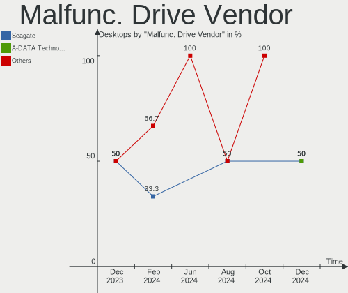
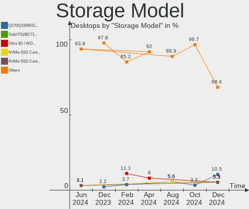
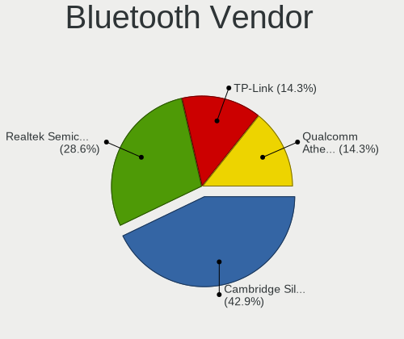
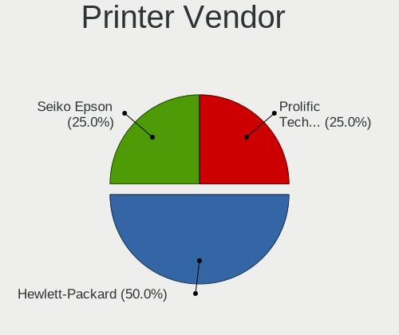

LMDE - Hardware Trends (Desktops)
---------------------------------

A project to identify most popular hardware characteristics and track their change
over time based on data collected by Linux users at https://Linux-Hardware.org.

Anyone can contribute to this report by the [hw-probe](https://github.com/linuxhw/hw-probe) tool:

    sudo -E hw-probe -all -upload

This report is for one last month. Overall report since the beginning of time: [TestDays](https://github.com/linuxhw/TestDays)

Period: Sep, 2023.

Contents
--------

* [ System ](#system)
  - [ OS                       ](#os)
  - [ OS Family                ](#os-family)
  - [ Kernel                   ](#kernel)
  - [ Kernel Family            ](#kernel-family)
  - [ Kernel Major Ver.        ](#kernel-major-ver)
  - [ Arch                     ](#arch)
  - [ DE                       ](#de)
  - [ Display Server           ](#display-server)
  - [ Display Manager          ](#display-manager)
  - [ OS Lang                  ](#os-lang)
  - [ Boot Mode                ](#boot-mode)
  - [ Filesystem               ](#filesystem)
  - [ Part. scheme             ](#part-scheme)
  - [ Dual Boot with Linux/BSD ](#dual-boot-with-linuxbsd)
  - [ Dual Boot (Win)          ](#dual-boot-win)

* [ Board ](#board)
  - [ Vendor                   ](#vendor)
  - [ Model                    ](#model)
  - [ Model Family             ](#model-family)
  - [ MFG Year                 ](#mfg-year)
  - [ Form Factor              ](#form-factor)
  - [ Secure Boot              ](#secure-boot)
  - [ Coreboot                 ](#coreboot)
  - [ RAM Size                 ](#ram-size)
  - [ RAM Used                 ](#ram-used)
  - [ Total Drives             ](#total-drives)
  - [ Has CD-ROM               ](#has-cd-rom)
  - [ Has Ethernet             ](#has-ethernet)
  - [ Has WiFi                 ](#has-wifi)
  - [ Has Bluetooth            ](#has-bluetooth)

* [ Location ](#location)
  - [ Country                  ](#country)
  - [ City                     ](#city)

* [ Drives ](#drives)
  - [ Drive Vendor             ](#drive-vendor)
  - [ Drive Model              ](#drive-model)
  - [ HDD Vendor               ](#hdd-vendor)
  - [ SSD Vendor               ](#ssd-vendor)
  - [ Drive Kind               ](#drive-kind)
  - [ Drive Connector          ](#drive-connector)
  - [ Drive Size               ](#drive-size)
  - [ Space Total              ](#space-total)
  - [ Space Used               ](#space-used)
  - [ Malfunc. Drives          ](#malfunc-drives)
  - [ Malfunc. Drive Vendor    ](#malfunc-drive-vendor)
  - [ Malfunc. HDD Vendor      ](#malfunc-hdd-vendor)
  - [ Malfunc. Drive Kind      ](#malfunc-drive-kind)
  - [ Failed Drives            ](#failed-drives)
  - [ Failed Drive Vendor      ](#failed-drive-vendor)
  - [ Drive Status             ](#drive-status)

* [ Storage controller ](#storage-controller)
  - [ Storage Vendor           ](#storage-vendor)
  - [ Storage Model            ](#storage-model)
  - [ Storage Kind             ](#storage-kind)

* [ Processor ](#processor)
  - [ CPU Vendor               ](#cpu-vendor)
  - [ CPU Model                ](#cpu-model)
  - [ CPU Model Family         ](#cpu-model-family)
  - [ CPU Cores                ](#cpu-cores)
  - [ CPU Sockets              ](#cpu-sockets)
  - [ CPU Threads              ](#cpu-threads)
  - [ CPU Op-Modes             ](#cpu-op-modes)
  - [ CPU Microcode            ](#cpu-microcode)
  - [ CPU Microarch            ](#cpu-microarch)

* [ Graphics ](#graphics)
  - [ GPU Vendor               ](#gpu-vendor)
  - [ GPU Model                ](#gpu-model)
  - [ GPU Combo                ](#gpu-combo)
  - [ GPU Driver               ](#gpu-driver)
  - [ GPU Memory               ](#gpu-memory)

* [ Monitor ](#monitor)
  - [ Monitor Vendor           ](#monitor-vendor)
  - [ Monitor Model            ](#monitor-model)
  - [ Monitor Resolution       ](#monitor-resolution)
  - [ Monitor Diagonal         ](#monitor-diagonal)
  - [ Monitor Width            ](#monitor-width)
  - [ Aspect Ratio             ](#aspect-ratio)
  - [ Monitor Area             ](#monitor-area)
  - [ Pixel Density            ](#pixel-density)
  - [ Multiple Monitors        ](#multiple-monitors)

* [ Network ](#network)
  - [ Net Controller Vendor    ](#net-controller-vendor)
  - [ Net Controller Model     ](#net-controller-model)
  - [ Wireless Vendor          ](#wireless-vendor)
  - [ Wireless Model           ](#wireless-model)
  - [ Ethernet Vendor          ](#ethernet-vendor)
  - [ Ethernet Model           ](#ethernet-model)
  - [ Net Controller Kind      ](#net-controller-kind)
  - [ Used Controller          ](#used-controller)
  - [ NICs                     ](#nics)
  - [ IPv6                     ](#ipv6)

* [ Bluetooth ](#bluetooth)
  - [ Bluetooth Vendor         ](#bluetooth-vendor)
  - [ Bluetooth Model          ](#bluetooth-model)

* [ Sound ](#sound)
  - [ Sound Vendor             ](#sound-vendor)
  - [ Sound Model              ](#sound-model)

* [ Memory ](#memory)
  - [ Memory Vendor            ](#memory-vendor)
  - [ Memory Model             ](#memory-model)
  - [ Memory Kind              ](#memory-kind)
  - [ Memory Form Factor       ](#memory-form-factor)
  - [ Memory Size              ](#memory-size)
  - [ Memory Speed             ](#memory-speed)

* [ Printers & scanners ](#printers--scanners)
  - [ Printer Vendor           ](#printer-vendor)
  - [ Printer Model            ](#printer-model)
  - [ Scanner Vendor           ](#scanner-vendor)
  - [ Scanner Model            ](#scanner-model)

* [ Camera ](#camera)
  - [ Camera Vendor            ](#camera-vendor)
  - [ Camera Model             ](#camera-model)

* [ Security ](#security)
  - [ Fingerprint Vendor       ](#fingerprint-vendor)
  - [ Fingerprint Model        ](#fingerprint-model)
  - [ Chipcard Vendor          ](#chipcard-vendor)
  - [ Chipcard Model           ](#chipcard-model)

* [ Unsupported ](#unsupported)
  - [ Unsupported Devices      ](#unsupported-devices)
  - [ Unsupported Device Types ](#unsupported-device-types)

System
------

OS
--

Installed operating systems

| Name   | Desktops | Percent |
|--------|----------|---------|
| LMDE 5 | 12       | 75%     |
| LMDE 6 | 4        | 25%     |

OS Family
---------

OS without a version

| Name | Desktops | Percent |
|------|----------|---------|
| LMDE | 16       | 100%    |

Kernel
------

Version of the Linux kernel

| Version         | Desktops | Percent |
|-----------------|----------|---------|
| 5.10.0-25-amd64 | 12       | 75%     |
| 6.1.0-12-amd64  | 3        | 18.75%  |
| 6.1.0-11-amd64  | 1        | 6.25%   |

Kernel Family
-------------

Linux kernel without a distro release

| Version | Desktops | Percent |
|---------|----------|---------|
| 5.10.0  | 12       | 75%     |
| 6.1.0   | 4        | 25%     |

Kernel Major Ver.
-----------------

Linux kernel major version

| Version | Desktops | Percent |
|---------|----------|---------|
| 5.10    | 12       | 75%     |
| 6.1     | 4        | 25%     |

Arch
----

OS architecture (x86_64, i586, etc.)

| Name   | Desktops | Percent |
|--------|----------|---------|
| x86_64 | 16       | 100%    |

DE
--

Desktop Environment

| Name       | Desktops | Percent |
|------------|----------|---------|
| X-Cinnamon | 12       | 75%     |
| Cinnamon   | 4        | 25%     |

Display Server
--------------

X11 or Wayland

| Name | Desktops | Percent |
|------|----------|---------|
| X11  | 16       | 100%    |

Display Manager
---------------

SDDM, LightDM, etc.

| Name    | Desktops | Percent |
|---------|----------|---------|
| Unknown | 10       | 62.5%   |
| LightDM | 6        | 37.5%   |

OS Lang
-------

Language

| Lang  | Desktops | Percent |
|-------|----------|---------|
| de_DE | 4        | 25%     |
| en_US | 3        | 18.75%  |
| en_GB | 2        | 12.5%   |
| ru_RU | 1        | 6.25%   |
| pt_BR | 1        | 6.25%   |
| it_IT | 1        | 6.25%   |
| es_AR | 1        | 6.25%   |
| en_NZ | 1        | 6.25%   |
| en_CA | 1        | 6.25%   |
| cs_CZ | 1        | 6.25%   |

Boot Mode
---------

EFI or BIOS

| Mode | Desktops | Percent |
|------|----------|---------|
| EFI  | 10       | 62.5%   |
| BIOS | 6        | 37.5%   |

Filesystem
----------

Type of filesystem

| Type  | Desktops | Percent |
|-------|----------|---------|
| Ext4  | 14       | 87.5%   |
| Tmpfs | 1        | 6.25%   |
| Btrfs | 1        | 6.25%   |

Part. scheme
------------

Scheme of partitioning

| Type    | Desktops | Percent |
|---------|----------|---------|
| Unknown | 10       | 62.5%   |
| GPT     | 5        | 31.25%  |
| MBR     | 1        | 6.25%   |

Dual Boot with Linux/BSD
------------------------

Hosting more than one Linux/BSD

| Dual boot | Desktops | Percent |
|-----------|----------|---------|
| No        | 15       | 93.75%  |
| Yes       | 1        | 6.25%   |

Dual Boot (Win)
---------------

Hosting Linux and Windows

| Dual boot | Desktops | Percent |
|-----------|----------|---------|
| No        | 14       | 87.5%   |
| Yes       | 2        | 12.5%   |

Board
-----

Vendor
------

Motherboard manufacturer

| Name                | Desktops | Percent |
|---------------------|----------|---------|
| Gigabyte Technology | 4        | 25%     |
| MSI                 | 2        | 12.5%   |
| Intel               | 2        | 12.5%   |
| Hewlett-Packard     | 2        | 12.5%   |
| ASUSTek Computer    | 2        | 12.5%   |
| ASRock              | 2        | 12.5%   |
| Medion              | 1        | 6.25%   |
| Acer                | 1        | 6.25%   |

Model
-----

Motherboard model

| Name                           | Desktops | Percent |
|--------------------------------|----------|---------|
| MSI MS-7D22                    | 1        | 6.25%   |
| MSI MS-7C95                    | 1        | 6.25%   |
| Medion S23003                  | 1        | 6.25%   |
| Intel X79                      | 1        | 6.25%   |
| Intel DG31PR AAD97573-206      | 1        | 6.25%   |
| HP Z820 Workstation            | 1        | 6.25%   |
| HP ProDesk 400 G5 Desktop Mini | 1        | 6.25%   |
| Gigabyte Q87M-D2H              | 1        | 6.25%   |
| Gigabyte GA-880GM-UD2H         | 1        | 6.25%   |
| Gigabyte B450 AORUS PRO        | 1        | 6.25%   |
| Gigabyte B450 AORUS M          | 1        | 6.25%   |
| ASUS ROG Strix G10DK_G10DK     | 1        | 6.25%   |
| ASUS P8H61-M LX                | 1        | 6.25%   |
| ASRock X670E Pro RS            | 1        | 6.25%   |
| ASRock H110M-DVS R3.0          | 1        | 6.25%   |
| Acer Aspire X3400              | 1        | 6.25%   |

Model Family
------------

Motherboard model prefix

| Name                   | Desktops | Percent |
|------------------------|----------|---------|
| Gigabyte B450          | 2        | 12.5%   |
| MSI MS-7D22            | 1        | 6.25%   |
| MSI MS-7C95            | 1        | 6.25%   |
| Medion S23003          | 1        | 6.25%   |
| Intel X79              | 1        | 6.25%   |
| Intel DG31PR           | 1        | 6.25%   |
| HP Z820                | 1        | 6.25%   |
| HP ProDesk             | 1        | 6.25%   |
| Gigabyte Q87M-D2H      | 1        | 6.25%   |
| Gigabyte GA-880GM-UD2H | 1        | 6.25%   |
| ASUS ROG               | 1        | 6.25%   |
| ASUS P8H61-M           | 1        | 6.25%   |
| ASRock X670E           | 1        | 6.25%   |
| ASRock H110M-DVS       | 1        | 6.25%   |
| Acer Aspire            | 1        | 6.25%   |

MFG Year
--------

Motherboard manufacture year

| Year | Desktops | Percent |
|------|----------|---------|
| 2018 | 3        | 18.75%  |
| 2021 | 2        | 12.5%   |
| 2016 | 2        | 12.5%   |
| 2010 | 2        | 12.5%   |
| 2023 | 1        | 6.25%   |
| 2022 | 1        | 6.25%   |
| 2020 | 1        | 6.25%   |
| 2019 | 1        | 6.25%   |
| 2012 | 1        | 6.25%   |
| 2011 | 1        | 6.25%   |
| 2008 | 1        | 6.25%   |

Form Factor
-----------

Physical design of the computer

| Name    | Desktops | Percent |
|---------|----------|---------|
| Desktop | 16       | 100%    |

Secure Boot
-----------

Enabled or disabled

| State    | Desktops | Percent |
|----------|----------|---------|
| Disabled | 15       | 93.75%  |
| Enabled  | 1        | 6.25%   |

Coreboot
--------

Have coreboot on board

| Used | Desktops | Percent |
|------|----------|---------|
| No   | 16       | 100%    |

RAM Size
--------

Total RAM memory

| Size in GB  | Desktops | Percent |
|-------------|----------|---------|
| 4.01-8.0    | 4        | 25%     |
| 16.01-24.0  | 3        | 18.75%  |
| 8.01-16.0   | 3        | 18.75%  |
| 32.01-64.0  | 2        | 12.5%   |
| 3.01-4.0    | 2        | 12.5%   |
| 24.01-32.0  | 1        | 6.25%   |
| 64.01-256.0 | 1        | 6.25%   |

RAM Used
--------

Used RAM memory

| Used GB  | Desktops | Percent |
|----------|----------|---------|
| 2.01-3.0 | 7        | 43.75%  |
| 4.01-8.0 | 4        | 25%     |
| 1.01-2.0 | 3        | 18.75%  |
| 3.01-4.0 | 2        | 12.5%   |

Total Drives
------------

Number of drives on board

| Drives | Desktops | Percent |
|--------|----------|---------|
| 1      | 7        | 43.75%  |
| 2      | 4        | 25%     |
| 3      | 3        | 18.75%  |
| 10     | 1        | 6.25%   |
| 6      | 1        | 6.25%   |

Has CD-ROM
----------

Has CD-ROM on board

| Presented | Desktops | Percent |
|-----------|----------|---------|
| No        | 13       | 81.25%  |
| Yes       | 3        | 18.75%  |

Has Ethernet
------------

Has Ethernet on board

| Presented | Desktops | Percent |
|-----------|----------|---------|
| Yes       | 16       | 100%    |

Has WiFi
--------

Has WiFi module

| Presented | Desktops | Percent |
|-----------|----------|---------|
| Yes       | 10       | 62.5%   |
| No        | 6        | 37.5%   |

Has Bluetooth
-------------

Has Bluetooth module

| Presented | Desktops | Percent |
|-----------|----------|---------|
| Yes       | 9        | 56.25%  |
| No        | 7        | 43.75%  |

Location
--------

Country
-------

Geographic location (country)

| Country     | Desktops | Percent |
|-------------|----------|---------|
| Germany     | 6        | 37.5%   |
| UK          | 1        | 6.25%   |
| Russia      | 1        | 6.25%   |
| New Zealand | 1        | 6.25%   |
| Netherlands | 1        | 6.25%   |
| Italy       | 1        | 6.25%   |
| India       | 1        | 6.25%   |
| Czechia     | 1        | 6.25%   |
| Canada      | 1        | 6.25%   |
| Brazil      | 1        | 6.25%   |
| Argentina   | 1        | 6.25%   |

City
----

Geographic location (city)

| City          | Desktops | Percent |
|---------------|----------|---------|
| Santa Luzia   | 1        | 6.25%   |
| Salisbury     | 1        | 6.25%   |
| Rho           | 1        | 6.25%   |
| Prince George | 1        | 6.25%   |
| Paderborn     | 1        | 6.25%   |
| Otnice        | 1        | 6.25%   |
| Munich        | 1        | 6.25%   |
| Moreno        | 1        | 6.25%   |
| Hengelo       | 1        | 6.25%   |
| Gronau        | 1        | 6.25%   |
| Gelendzhik    | 1        | 6.25%   |
| Delligsen     | 1        | 6.25%   |
| Braunschweig  | 1        | 6.25%   |
| Berlin        | 1        | 6.25%   |
| Auckland      | 1        | 6.25%   |
| Asansol       | 1        | 6.25%   |

Drives
------

Drive Vendor
------------

Hard drive vendors

| Vendor                      | Desktops | Drives | Percent |
|-----------------------------|----------|--------|---------|
| WDC                         | 7        | 10     | 19.44%  |
| Seagate                     | 3        | 3      | 8.33%   |
| Samsung Electronics         | 3        | 4      | 8.33%   |
| Kingston                    | 3        | 4      | 8.33%   |
| Toshiba                     | 2        | 2      | 5.56%   |
| Sandisk                     | 2        | 2      | 5.56%   |
| Micron Technology           | 2        | 2      | 5.56%   |
| Unknown                     | 2        | 2      | 5.56%   |
| Vaseky                      | 1        | 1      | 2.78%   |
| Unknown                     | 1        | 1      | 2.78%   |
| Transcend                   | 1        | 1      | 2.78%   |
| Silicon Motion              | 1        | 1      | 2.78%   |
| PNY                         | 1        | 1      | 2.78%   |
| Phison                      | 1        | 1      | 2.78%   |
| Patriot                     | 1        | 1      | 2.78%   |
| Kingston Technology Company | 1        | 1      | 2.78%   |
| Hitachi                     | 1        | 1      | 2.78%   |
| HGST                        | 1        | 1      | 2.78%   |
| Crucial                     | 1        | 1      | 2.78%   |
| Apacer                      | 1        | 1      | 2.78%   |

Drive Model
-----------

Hard drive models

| Model                                               | Desktops | Percent |
|-----------------------------------------------------|----------|---------|
| Toshiba MD04ACA400 4TB                              | 2        | 5.26%   |
| Unknown                                             | 2        | 5.26%   |
| WDC WDS500G3X0C-00SJG0 500GB                        | 1        | 2.63%   |
| WDC WDS500G2B0A-00SM50 500GB SSD                    | 1        | 2.63%   |
| WDC WDS240G2G0A-00JH30 240GB SSD                    | 1        | 2.63%   |
| WDC WDBNCE0010PNC 1TB SSD                           | 1        | 2.63%   |
| WDC WD5000AAKX-001CA0 500GB                         | 1        | 2.63%   |
| WDC WD5000AAKS-60Z1A0 500GB                         | 1        | 2.63%   |
| WDC WD4002FYYZ-01B7CB0 4TB                          | 1        | 2.63%   |
| WDC WD10PURZ-85U8XY0 1TB                            | 1        | 2.63%   |
| WDC WD10EZRZ-00HTKB0 1TB                            | 1        | 2.63%   |
| Vaseky V800/120G 120GB                              | 1        | 2.63%   |
| Unknown NVMe SSD Drive 2TB                          | 1        | 2.63%   |
| Transcend TS512GSSD370 512GB                        | 1        | 2.63%   |
| Silicon Motion SM2262/SM2262EN SSD Controller 500GB | 1        | 2.63%   |
| Seagate ST4000VX007-2DT166 4TB                      | 1        | 2.63%   |
| Seagate ST1000DM003-1ER162 1TB                      | 1        | 2.63%   |
| Seagate Expansion 1TB                               | 1        | 2.63%   |
| Sandisk WDC WDS100T2B0C-00PXH0 1TB                  | 1        | 2.63%   |
| Sandisk WD Blue SN570 1TB                           | 1        | 2.63%   |
| Samsung SSD 870 QVO 2TB                             | 1        | 2.63%   |
| Samsung SSD 870 EVO 2TB                             | 1        | 2.63%   |
| Samsung SSD 830 Series 64GB                         | 1        | 2.63%   |
| PNY CS900 240GB SSD                                 | 1        | 2.63%   |
| Phison S11-128G-PHISON-SSD-B4 128GB                 | 1        | 2.63%   |
| Patriot P220 1024GB SSD                             | 1        | 2.63%   |
| Micron MTFDDAK512MAY-1AE1ZABHA 512GB SSD            | 1        | 2.63%   |
| Micron 2210_MTFDHBA512QFD 512GB                     | 1        | 2.63%   |
| Kingston Company SNV2S2000G 2TB                     | 1        | 2.63%   |
| Kingston SFYRD2000G 2TB                             | 1        | 2.63%   |
| Kingston SA400S37480G 480GB SSD                     | 1        | 2.63%   |
| Kingston SA400S37120G 120GB SSD                     | 1        | 2.63%   |
| Hitachi HTS547550A9E384 500GB                       | 1        | 2.63%   |
| HGST HTS541010B7E610 1TB                            | 1        | 2.63%   |
| Crucial CT250MX500SSD1 250GB                        | 1        | 2.63%   |
| Apacer AS350 1TB SSD                                | 1        | 2.63%   |

HDD Vendor
----------

Hard disk drive vendors

| Vendor  | Desktops | Drives | Percent |
|---------|----------|--------|---------|
| WDC     | 3        | 6      | 30%     |
| Seagate | 3        | 3      | 30%     |
| Toshiba | 2        | 2      | 20%     |
| Hitachi | 1        | 1      | 10%     |
| HGST    | 1        | 1      | 10%     |

SSD Vendor
----------

Solid state drive vendors

| Vendor              | Desktops | Drives | Percent |
|---------------------|----------|--------|---------|
| WDC                 | 3        | 3      | 18.75%  |
| Samsung Electronics | 3        | 4      | 18.75%  |
| Kingston            | 2        | 2      | 12.5%   |
| Vaseky              | 1        | 1      | 6.25%   |
| Transcend           | 1        | 1      | 6.25%   |
| PNY                 | 1        | 1      | 6.25%   |
| Phison              | 1        | 1      | 6.25%   |
| Patriot             | 1        | 1      | 6.25%   |
| Micron Technology   | 1        | 1      | 6.25%   |
| Crucial             | 1        | 1      | 6.25%   |
| Apacer              | 1        | 1      | 6.25%   |

Drive Kind
----------

HDD or SSD

| Kind    | Desktops | Drives | Percent |
|---------|----------|--------|---------|
| SSD     | 12       | 17     | 44.44%  |
| HDD     | 8        | 13     | 29.63%  |
| NVMe    | 5        | 9      | 18.52%  |
| Unknown | 2        | 2      | 7.41%   |

Drive Connector
---------------

SATA, SAS, NVMe, etc.

| Type | Desktops | Drives | Percent |
|------|----------|--------|---------|
| SATA | 13       | 30     | 65%     |
| NVMe | 5        | 9      | 25%     |
| SAS  | 2        | 2      | 10%     |

Drive Size
----------

Size of hard drive

| Size in TB | Desktops | Drives | Percent |
|------------|----------|--------|---------|
| 0.51-1.0   | 10       | 10     | 43.48%  |
| 0.01-0.5   | 8        | 12     | 34.78%  |
| 3.01-4.0   | 3        | 5      | 13.04%  |
| 1.01-2.0   | 2        | 3      | 8.7%    |

Space Total
-----------

Amount of disk space available on the file system

| Size in GB     | Desktops | Percent |
|----------------|----------|---------|
| 101-250        | 4        | 25%     |
| 1001-2000      | 3        | 18.75%  |
| 501-1000       | 3        | 18.75%  |
| More than 3000 | 2        | 12.5%   |
| 251-500        | 2        | 12.5%   |
| 2001-3000      | 1        | 6.25%   |
| 1-20           | 1        | 6.25%   |

Space Used
----------

Amount of used disk space

| Used GB   | Desktops | Percent |
|-----------|----------|---------|
| 1-20      | 4        | 25%     |
| 251-500   | 3        | 18.75%  |
| 21-50     | 2        | 12.5%   |
| 101-250   | 2        | 12.5%   |
| 501-1000  | 2        | 12.5%   |
| 2001-3000 | 1        | 6.25%   |
| 1001-2000 | 1        | 6.25%   |
| 51-100    | 1        | 6.25%   |

Malfunc. Drives
---------------

Drive models with a malfunction

| Model                                               | Desktops | Drives | Percent |
|-----------------------------------------------------|----------|--------|---------|
| Toshiba MD04ACA400 4TB                              | 1        | 1      | 33.33%  |
| Samsung Electronics SSD 870 EVO 2TB                 | 1        | 1      | 33.33%  |
| Micron Technology MTFDDAK512MAY-1AE1ZABHA 512GB SSD | 1        | 1      | 33.33%  |

Malfunc. Drive Vendor
---------------------

Vendors of faulty drives

| Vendor              | Desktops | Drives | Percent |
|---------------------|----------|--------|---------|
| Toshiba             | 1        | 1      | 33.33%  |
| Samsung Electronics | 1        | 1      | 33.33%  |
| Micron Technology   | 1        | 1      | 33.33%  |

Malfunc. HDD Vendor
-------------------

Vendors of faulty HDD drives

| Vendor  | Desktops | Drives | Percent |
|---------|----------|--------|---------|
| Toshiba | 1        | 1      | 100%    |

Malfunc. Drive Kind
-------------------

Kinds of faulty drives

| Kind | Desktops | Drives | Percent |
|------|----------|--------|---------|
| SSD  | 2        | 2      | 66.67%  |
| HDD  | 1        | 1      | 33.33%  |

Failed Drives
-------------

Failed drive models

Zero info for selected period =(

Failed Drive Vendor
-------------------

Failed drive vendors

Zero info for selected period =(

Drive Status
------------

Number of failed and malfunc. drives

| Status   | Desktops | Drives | Percent |
|----------|----------|--------|---------|
| Detected | 12       | 31     | 60%     |
| Works    | 5        | 7      | 25%     |
| Malfunc  | 3        | 3      | 15%     |

Storage controller
------------------

Storage Vendor
--------------

Storage controller vendors

| Vendor                      | Desktops | Percent |
|-----------------------------|----------|---------|
| Intel                       | 9        | 36%     |
| AMD                         | 6        | 24%     |
| SanDisk                     | 3        | 12%     |
| Silicon Motion              | 1        | 4%      |
| Nvidia                      | 1        | 4%      |
| Micron Technology           | 1        | 4%      |
| Marvell Technology Group    | 1        | 4%      |
| Kingston Technology Company | 1        | 4%      |
| INNOGRIT                    | 1        | 4%      |
| Broadcom / LSI              | 1        | 4%      |

Storage Model
-------------

Storage controller models

| Model                                                                          | Desktops | Percent |
|--------------------------------------------------------------------------------|----------|---------|
| AMD FCH SATA Controller [AHCI mode]                                            | 3        | 9.38%   |
| Intel 6 Series/C200 Series Chipset Family 6 port Desktop SATA AHCI Controller  | 2        | 6.25%   |
| AMD 500 Series Chipset SATA Controller                                         | 2        | 6.25%   |
| AMD 400 Series Chipset SATA Controller                                         | 2        | 6.25%   |
| Silicon Motion SM2262/SM2262EN SSD Controller                                  | 1        | 3.13%   |
| SanDisk WD Green SN350 NVMe SSD 240GB (DRAM-less)                              | 1        | 3.13%   |
| SanDisk WD Blue SN570 NVMe SSD 1TB                                             | 1        | 3.13%   |
| SanDisk WD Black SN750 / PC SN730 NVMe SSD                                     | 1        | 3.13%   |
| Nvidia MCP78S [GeForce 8200] IDE                                               | 1        | 3.13%   |
| Nvidia MCP78S [GeForce 8200] AHCI Controller                                   | 1        | 3.13%   |
| Micron 2210 NVMe SSD [Cobain]                                                  | 1        | 3.13%   |
| Marvell Group 88SE9230 PCIe 2.0 x2 4-port SATA 6 Gb/s RAID Controller          | 1        | 3.13%   |
| Kingston Company Company Non-Volatile memory controller                        | 1        | 3.13%   |
| Kingston Company KC3000/Renegade NVMe SSD                                      | 1        | 3.13%   |
| Intel Q170/Q150/B150/H170/H110/Z170/CM236 Chipset SATA Controller [AHCI Mode]  | 1        | 3.13%   |
| Intel NM10/ICH7 Family SATA Controller [IDE mode]                              | 1        | 3.13%   |
| Intel Celeron/Pentium Silver Processor SATA Controller                         | 1        | 3.13%   |
| Intel Cannon Lake PCH SATA AHCI Controller                                     | 1        | 3.13%   |
| Intel C602 chipset 4-Port SATA Storage Control Unit                            | 1        | 3.13%   |
| Intel C600/X79 series chipset SATA RAID Controller                             | 1        | 3.13%   |
| Intel 82801G (ICH7 Family) IDE Controller                                      | 1        | 3.13%   |
| Intel 8 Series/C220 Series Chipset Family 6-port SATA Controller 1 [AHCI mode] | 1        | 3.13%   |
| Intel 500 Series Chipset Family SATA AHCI Controller                           | 1        | 3.13%   |
| INNOGRIT NVMe SSD Controller IG5236                                            | 1        | 3.13%   |
| Broadcom / LSI SAS2308 PCI-Express Fusion-MPT SAS-2                            | 1        | 3.13%   |
| AMD SB7x0/SB8x0/SB9x0 SATA Controller [IDE mode]                               | 1        | 3.13%   |
| AMD SB7x0/SB8x0/SB9x0 IDE Controller                                           | 1        | 3.13%   |

Storage Kind
------------

Kind of storage controller (IDE, SATA, NVMe, SAS, ...)

| Kind | Desktops | Percent |
|------|----------|---------|
| SATA | 14       | 58.33%  |
| NVMe | 5        | 20.83%  |
| IDE  | 3        | 12.5%   |
| RAID | 1        | 4.17%   |
| SAS  | 1        | 4.17%   |

Processor
---------

CPU Vendor
----------

Processor vendors

| Vendor | Desktops | Percent |
|--------|----------|---------|
| Intel  | 9        | 56.25%  |
| AMD    | 7        | 43.75%  |

CPU Model
---------

Processor models

| Model                                       | Desktops | Percent |
|---------------------------------------------|----------|---------|
| AMD Ryzen 5 5600X 6-Core Processor          | 2        | 12.5%   |
| Intel Xeon CPU E5-2697 v2 @ 2.70GHz         | 1        | 6.25%   |
| Intel Xeon CPU E5-2650 v2 @ 2.60GHz         | 1        | 6.25%   |
| Intel Pentium Dual CPU E2180 @ 2.00GHz      | 1        | 6.25%   |
| Intel Core i7-3770 CPU @ 3.40GHz            | 1        | 6.25%   |
| Intel Core i5-9500T CPU @ 2.20GHz           | 1        | 6.25%   |
| Intel Core i5-6400 CPU @ 2.70GHz            | 1        | 6.25%   |
| Intel Core i5-4590S CPU @ 3.00GHz           | 1        | 6.25%   |
| Intel Core i5-10400F CPU @ 2.90GHz          | 1        | 6.25%   |
| Intel Celeron J4125 CPU @ 2.00GHz           | 1        | 6.25%   |
| AMD Ryzen 9 7900X3D 12-Core Processor       | 1        | 6.25%   |
| AMD Ryzen 7 2700 Eight-Core Processor       | 1        | 6.25%   |
| AMD Ryzen 5 2400G with Radeon Vega Graphics | 1        | 6.25%   |
| AMD Phenom II X6 1035T Processor            | 1        | 6.25%   |
| AMD Phenom II X4 955 Processor              | 1        | 6.25%   |

CPU Model Family
----------------

Processor model prefix

| Model              | Desktops | Percent |
|--------------------|----------|---------|
| Intel Core i5      | 4        | 25%     |
| AMD Ryzen 5        | 3        | 18.75%  |
| Intel Xeon         | 2        | 12.5%   |
| Intel Pentium Dual | 1        | 6.25%   |
| Intel Core i7      | 1        | 6.25%   |
| Intel Celeron      | 1        | 6.25%   |
| AMD Ryzen 9        | 1        | 6.25%   |
| AMD Ryzen 7        | 1        | 6.25%   |
| AMD Phenom II X6   | 1        | 6.25%   |
| AMD Phenom II X4   | 1        | 6.25%   |

CPU Cores
---------

Number of processor cores

| Number | Desktops | Percent |
|--------|----------|---------|
| 4      | 6        | 37.5%   |
| 6      | 5        | 31.25%  |
| 12     | 2        | 12.5%   |
| 16     | 1        | 6.25%   |
| 8      | 1        | 6.25%   |
| 1      | 1        | 6.25%   |

CPU Sockets
-----------

Number of sockets

| Number | Desktops | Percent |
|--------|----------|---------|
| 1      | 15       | 93.75%  |
| 2      | 1        | 6.25%   |

CPU Threads
-----------

Threads per core (Hyper-Threading)

| Number | Desktops | Percent |
|--------|----------|---------|
| 2      | 9        | 56.25%  |
| 1      | 7        | 43.75%  |

CPU Op-Modes
------------

CPU Operation Modes (32-bit, 64-bit)

| Op mode        | Desktops | Percent |
|----------------|----------|---------|
| 32-bit, 64-bit | 16       | 100%    |

CPU Microcode
-------------

Microcode number

| Number     | Desktops | Percent |
|------------|----------|---------|
| 0x306e4    | 2        | 12.5%   |
| 0xa0653    | 1        | 6.25%   |
| 0x906ea    | 1        | 6.25%   |
| 0x706a8    | 1        | 6.25%   |
| 0x506e3    | 1        | 6.25%   |
| 0x306c3    | 1        | 6.25%   |
| 0x306a9    | 1        | 6.25%   |
| 0x0a601203 | 1        | 6.25%   |
| 0x0a201016 | 1        | 6.25%   |
| 0x0a201009 | 1        | 6.25%   |
| 0x0810100b | 1        | 6.25%   |
| 0x0800820d | 1        | 6.25%   |
| 0x010000dc | 1        | 6.25%   |
| 0x010000c8 | 1        | 6.25%   |
| Unknown    | 1        | 6.25%   |

CPU Microarch
-------------

Microarchitecture

| Name          | Desktops | Percent |
|---------------|----------|---------|
| IvyBridge     | 3        | 18.75%  |
| Zen 3         | 2        | 12.5%   |
| K10           | 2        | 12.5%   |
| Zen+          | 1        | 6.25%   |
| Zen           | 1        | 6.25%   |
| Skylake       | 1        | 6.25%   |
| KabyLake      | 1        | 6.25%   |
| Haswell       | 1        | 6.25%   |
| Goldmont plus | 1        | 6.25%   |
| Core          | 1        | 6.25%   |
| CometLake     | 1        | 6.25%   |
| Unknown       | 1        | 6.25%   |

Graphics
--------

GPU Vendor
----------

Vendors of graphics cards

| Vendor | Desktops | Percent |
|--------|----------|---------|
| Nvidia | 7        | 43.75%  |
| AMD    | 5        | 31.25%  |
| Intel  | 4        | 25%     |

GPU Model
---------

Graphics card models

| Model                                                                       | Desktops | Percent |
|-----------------------------------------------------------------------------|----------|---------|
| Nvidia TU117 [GeForce GTX 1650]                                             | 1        | 5.56%   |
| Nvidia GM204GL [Quadro M4000]                                               | 1        | 5.56%   |
| Nvidia GK104GL [Quadro K5000]                                               | 1        | 5.56%   |
| Nvidia GF119 [GeForce GT 610]                                               | 1        | 5.56%   |
| Nvidia GF108 [GeForce GT 430]                                               | 1        | 5.56%   |
| Nvidia GA106 [GeForce RTX 3060 Lite Hash Rate]                              | 1        | 5.56%   |
| Nvidia GA104 [GeForce RTX 3070 Ti]                                          | 1        | 5.56%   |
| Nvidia C77 [GeForce 8200]                                                   | 1        | 5.56%   |
| Intel Xeon E3-1200 v3/4th Gen Core Processor Integrated Graphics Controller | 1        | 5.56%   |
| Intel IvyBridge GT2 [HD Graphics 4000]                                      | 1        | 5.56%   |
| Intel GeminiLake [UHD Graphics 600]                                         | 1        | 5.56%   |
| Intel CoffeeLake-S GT2 [UHD Graphics 630]                                   | 1        | 5.56%   |
| AMD Raven Ridge [Radeon Vega Series / Radeon Vega Mobile Series]            | 1        | 5.56%   |
| AMD Raphael                                                                 | 1        | 5.56%   |
| AMD Navi 31 [Radeon RX 7900 XT/7900 XTX]                                    | 1        | 5.56%   |
| AMD Hawaii PRO [Radeon R9 290/390]                                          | 1        | 5.56%   |
| AMD Cedar [Radeon HD 5000/6000/7350/8350 Series]                            | 1        | 5.56%   |
| AMD Bonaire XTX [Radeon R7 260X/360]                                        | 1        | 5.56%   |

GPU Combo
---------

Combinations of graphics cards

| Name       | Desktops | Percent |
|------------|----------|---------|
| 1 x Nvidia | 6        | 37.5%   |
| 1 x Intel  | 4        | 25%     |
| 1 x AMD    | 4        | 25%     |
| 2 x Nvidia | 1        | 6.25%   |
| 2 x AMD    | 1        | 6.25%   |

GPU Driver
----------

Free vs proprietary

| Driver      | Desktops | Percent |
|-------------|----------|---------|
| Free        | 11       | 68.75%  |
| Proprietary | 4        | 25%     |
| Unknown     | 1        | 6.25%   |

GPU Memory
----------

Total video memory

| Size in GB | Desktops | Percent |
|------------|----------|---------|
| Unknown    | 6        | 37.5%   |
| 7.01-8.0   | 2        | 12.5%   |
| 3.01-4.0   | 2        | 12.5%   |
| 1.01-2.0   | 2        | 12.5%   |
| 0.51-1.0   | 2        | 12.5%   |
| 16.01-24.0 | 1        | 6.25%   |
| 8.01-16.0  | 1        | 6.25%   |

Monitor
-------

Monitor Vendor
--------------

Monitor vendors

| Vendor              | Desktops | Percent |
|---------------------|----------|---------|
| Goldstar            | 4        | 23.53%  |
| Samsung Electronics | 2        | 11.76%  |
| Acer                | 2        | 11.76%  |
| Toshiba             | 1        | 5.88%   |
| Targa               | 1        | 5.88%   |
| Philips             | 1        | 5.88%   |
| MStar               | 1        | 5.88%   |
| Lenovo              | 1        | 5.88%   |
| Iiyama              | 1        | 5.88%   |
| HUAWEI              | 1        | 5.88%   |
| Fujitsu Siemens     | 1        | 5.88%   |
| Eizo                | 1        | 5.88%   |

Monitor Model
-------------

Monitor models

| Model                                                              | Desktops | Percent |
|--------------------------------------------------------------------|----------|---------|
| Goldstar FULL HD GSM5B55 1920x1080 480x270mm 21.7-inch             | 2        | 11.76%  |
| Toshiba LCD Monitor TV 1920x1080                                   | 1        | 5.88%   |
| Targa LCD Monitor LCD TV                                           | 1        | 5.88%   |
| Samsung Electronics S27F350 SAM0D22 1920x1080 598x336mm 27.0-inch  | 1        | 5.88%   |
| Samsung Electronics C24F390 SAM0D2C 1920x1080 521x293mm 23.5-inch  | 1        | 5.88%   |
| Philips PHL 241B7QG PHL092D 1920x1080 527x296mm 23.8-inch          | 1        | 5.88%   |
| MStar Demo MST0030 1360x765 1150x650mm 52.0-inch                   | 1        | 5.88%   |
| Lenovo L24i-10 LEN65D6 1920x1080 527x296mm 23.8-inch               | 1        | 5.88%   |
| Iiyama PL3467WQ IVM7624 3440x1440 797x334mm 34.0-inch              | 1        | 5.88%   |
| HUAWEI ZQE-CBA HWV6A25 3440x1440 797x334mm 34.0-inch               | 1        | 5.88%   |
| Goldstar LG ULTRAWIDE GSM76FA 2560x1080 800x340mm 34.2-inch        | 1        | 5.88%   |
| Goldstar LG TV SSCR2 GSMC0C8 3840x2160                             | 1        | 5.88%   |
| Fujitsu Siemens P27-9 TS QHD FUS08D5 2560x1440 597x336mm 27.0-inch | 1        | 5.88%   |
| Eizo S2202W ENC1975 1680x1050 480x300mm 22.3-inch                  | 1        | 5.88%   |
| Acer S235HL ACR02BE 1920x1080 509x286mm 23.0-inch                  | 1        | 5.88%   |
| Acer LCD Monitor B226WL 3040x1050                                  | 1        | 5.88%   |

Monitor Resolution
------------------

Monitor screen resolution

| Resolution         | Desktops | Percent |
|--------------------|----------|---------|
| 1920x1080 (FHD)    | 6        | 35.29%  |
| 3840x2160 (4K)     | 4        | 23.53%  |
| 3440x1440          | 2        | 11.76%  |
| 3040x1050          | 1        | 5.88%   |
| 2560x1440 (QHD)    | 1        | 5.88%   |
| 2560x1080          | 1        | 5.88%   |
| 1680x1050 (WSXGA+) | 1        | 5.88%   |
| Unknown            | 1        | 5.88%   |

Monitor Diagonal
----------------

Diagonal size in inches

| Inches  | Desktops | Percent |
|---------|----------|---------|
| 34      | 3        | 18.75%  |
| 23      | 3        | 18.75%  |
| 27      | 2        | 12.5%   |
| 21      | 2        | 12.5%   |
| Unknown | 2        | 12.5%   |
| 72      | 1        | 6.25%   |
| 52      | 1        | 6.25%   |
| 24      | 1        | 6.25%   |
| 22      | 1        | 6.25%   |

Monitor Width
-------------

Physical width

| Width in mm | Desktops | Percent |
|-------------|----------|---------|
| 501-600     | 5        | 33.33%  |
| 701-800     | 3        | 20%     |
| 401-500     | 3        | 20%     |
| Unknown     | 2        | 13.33%  |
| 1501-2000   | 1        | 6.67%   |
| 1001-1500   | 1        | 6.67%   |

Aspect Ratio
------------

Proportional relationship between the width and the height

| Ratio   | Desktops | Percent |
|---------|----------|---------|
| 16/9    | 9        | 60%     |
| 21/9    | 3        | 20%     |
| Unknown | 2        | 13.33%  |
| 16/10   | 1        | 6.67%   |

Monitor Area
------------

Area in inch²

| Area in inch² | Desktops | Percent |
|----------------|----------|---------|
| 201-250        | 7        | 43.75%  |
| 351-500        | 3        | 18.75%  |
| More than 1000 | 2        | 12.5%   |
| 301-350        | 2        | 12.5%   |
| Unknown        | 2        | 12.5%   |

Pixel Density
-------------

Pixels per inch

| Density | Desktops | Percent |
|---------|----------|---------|
| 51-100  | 8        | 50%     |
| 101-120 | 5        | 31.25%  |
| Unknown | 2        | 12.5%   |
| 1-50    | 1        | 6.25%   |

Multiple Monitors
-----------------

Total monitors connected

| Total | Desktops | Percent |
|-------|----------|---------|
| 1     | 13       | 81.25%  |
| 2     | 2        | 12.5%   |
| 0     | 1        | 6.25%   |

Network
-------

Net Controller Vendor
---------------------

Controller vendors

| Vendor                | Desktops | Percent |
|-----------------------|----------|---------|
| Realtek Semiconductor | 12       | 60%     |
| Intel                 | 6        | 30%     |
| TP-Link               | 1        | 5%      |
| Nvidia                | 1        | 5%      |

Net Controller Model
--------------------

Controller models

| Model                                                             | Desktops | Percent |
|-------------------------------------------------------------------|----------|---------|
| Realtek RTL8111/8168/8411 PCI Express Gigabit Ethernet Controller | 8        | 28.57%  |
| Realtek RTL8822CE 802.11ac PCIe Wireless Network Adapter          | 2        | 7.14%   |
| Intel Wi-Fi 6 AX210/AX211/AX411 160MHz                            | 2        | 7.14%   |
| Intel I211 Gigabit Network Connection                             | 2        | 7.14%   |
| TP-Link RTL8812AU Archer T4U 802.11ac                             | 1        | 3.57%   |
| Realtek RTL88x2bu [AC1200 Techkey]                                | 1        | 3.57%   |
| Realtek RTL8192EE PCIe Wireless Network Adapter                   | 1        | 3.57%   |
| Realtek RTL8192CU 802.11n WLAN Adapter                            | 1        | 3.57%   |
| Realtek RTL8188FTV 802.11b/g/n 1T1R 2.4G WLAN Adapter             | 1        | 3.57%   |
| Realtek RTL8125 2.5GbE Controller                                 | 1        | 3.57%   |
| Realtek RTL810xE PCI Express Fast Ethernet controller             | 1        | 3.57%   |
| Nvidia MCP77 Ethernet                                             | 1        | 3.57%   |
| Intel Wireless 3165                                               | 1        | 3.57%   |
| Intel Wi-Fi 6 AX200                                               | 1        | 3.57%   |
| Intel Ethernet Connection I217-LM                                 | 1        | 3.57%   |
| Intel Ethernet Connection (10) I219-V                             | 1        | 3.57%   |
| Intel 82579LM Gigabit Network Connection (Lewisville)             | 1        | 3.57%   |
| Intel 82574L Gigabit Network Connection                           | 1        | 3.57%   |

Wireless Vendor
---------------

Wireless vendors

| Vendor                | Desktops | Percent |
|-----------------------|----------|---------|
| Realtek Semiconductor | 6        | 60%     |
| Intel                 | 3        | 30%     |
| TP-Link               | 1        | 10%     |

Wireless Model
--------------

Wireless models

| Model                                                    | Desktops | Percent |
|----------------------------------------------------------|----------|---------|
| Realtek RTL8822CE 802.11ac PCIe Wireless Network Adapter | 2        | 18.18%  |
| Intel Wi-Fi 6 AX210/AX211/AX411 160MHz                   | 2        | 18.18%  |
| TP-Link RTL8812AU Archer T4U 802.11ac                    | 1        | 9.09%   |
| Realtek RTL88x2bu [AC1200 Techkey]                       | 1        | 9.09%   |
| Realtek RTL8192EE PCIe Wireless Network Adapter          | 1        | 9.09%   |
| Realtek RTL8192CU 802.11n WLAN Adapter                   | 1        | 9.09%   |
| Realtek RTL8188FTV 802.11b/g/n 1T1R 2.4G WLAN Adapter    | 1        | 9.09%   |
| Intel Wireless 3165                                      | 1        | 9.09%   |
| Intel Wi-Fi 6 AX200                                      | 1        | 9.09%   |

Ethernet Vendor
---------------

Ethernet vendors

| Vendor                | Desktops | Percent |
|-----------------------|----------|---------|
| Realtek Semiconductor | 10       | 62.5%   |
| Intel                 | 5        | 31.25%  |
| Nvidia                | 1        | 6.25%   |

Ethernet Model
--------------

Ethernet models

| Model                                                             | Desktops | Percent |
|-------------------------------------------------------------------|----------|---------|
| Realtek RTL8111/8168/8411 PCI Express Gigabit Ethernet Controller | 8        | 47.06%  |
| Intel I211 Gigabit Network Connection                             | 2        | 11.76%  |
| Realtek RTL8125 2.5GbE Controller                                 | 1        | 5.88%   |
| Realtek RTL810xE PCI Express Fast Ethernet controller             | 1        | 5.88%   |
| Nvidia MCP77 Ethernet                                             | 1        | 5.88%   |
| Intel Ethernet Connection I217-LM                                 | 1        | 5.88%   |
| Intel Ethernet Connection (10) I219-V                             | 1        | 5.88%   |
| Intel 82579LM Gigabit Network Connection (Lewisville)             | 1        | 5.88%   |
| Intel 82574L Gigabit Network Connection                           | 1        | 5.88%   |

Net Controller Kind
-------------------

Ethernet, WiFi or modem

| Kind     | Desktops | Percent |
|----------|----------|---------|
| Ethernet | 16       | 61.54%  |
| WiFi     | 10       | 38.46%  |

Used Controller
---------------

Currently used network controller

| Kind     | Desktops | Percent |
|----------|----------|---------|
| Ethernet | 12       | 63.16%  |
| WiFi     | 7        | 36.84%  |

NICs
----

Total network controllers on board

| Total | Desktops | Percent |
|-------|----------|---------|
| 1     | 10       | 62.5%   |
| 2     | 5        | 31.25%  |
| 3     | 1        | 6.25%   |

IPv6
----

IPv6 vs IPv4

| Used | Desktops | Percent |
|------|----------|---------|
| Yes  | 10       | 62.5%   |
| No   | 6        | 37.5%   |

Bluetooth
---------

Bluetooth Vendor
----------------

Controller vendors

| Vendor                  | Desktops | Percent |
|-------------------------|----------|---------|
| Intel                   | 3        | 30%     |
| Cambridge Silicon Radio | 2        | 20%     |
| Realtek Semiconductor   | 1        | 10%     |
| MediaTek                | 1        | 10%     |
| Lite-On Technology      | 1        | 10%     |
| Broadcom                | 1        | 10%     |
| Unknown                 | 1        | 10%     |

Bluetooth Model
---------------

Controller models

| Model                                               | Desktops | Percent |
|-----------------------------------------------------|----------|---------|
| Intel AX210 Bluetooth                               | 2        | 18.18%  |
| Cambridge Silicon Radio Bluetooth Dongle (HCI mode) | 2        | 18.18%  |
| Realtek Bluetooth Radio                             | 1        | 9.09%   |
| MediaTek Wireless_Device                            | 1        | 9.09%   |
| Lite-On Bluetooth Radio                             | 1        | 9.09%   |
| Intel Bluetooth wireless interface                  | 1        | 9.09%   |
| Intel AX200 Bluetooth                               | 1        | 9.09%   |
| Broadcom Bluetooth 3.0 Dongle                       | 1        | 9.09%   |
| Unknown                                             | 1        | 9.09%   |

Sound
-----

Sound Vendor
------------

Sound card vendors

| Vendor                 | Desktops | Percent |
|------------------------|----------|---------|
| Intel                  | 9        | 31.03%  |
| Nvidia                 | 7        | 24.14%  |
| AMD                    | 7        | 24.14%  |
| C-Media Electronics    | 3        | 10.34%  |
| Razer USA              | 1        | 3.45%   |
| Logitech               | 1        | 3.45%   |
| Generalplus Technology | 1        | 3.45%   |

Sound Model
-----------

Sound card models

| Model                                                                      | Desktops | Percent |
|----------------------------------------------------------------------------|----------|---------|
| Intel 6 Series/C200 Series Chipset Family High Definition Audio Controller | 2        | 5.71%   |
| C-Media Electronics CMI8788 [Oxygen HD Audio]                              | 2        | 5.71%   |
| AMD Starship/Matisse HD Audio Controller                                   | 2        | 5.71%   |
| Razer USA Razer Seiren Mini                                                | 1        | 2.86%   |
| Nvidia TU107 GeForce GTX 1650 High Definition Audio Controller             | 1        | 2.86%   |
| Nvidia MCP72XE/MCP72P/MCP78U/MCP78S High Definition Audio                  | 1        | 2.86%   |
| Nvidia GM204 High Definition Audio Controller                              | 1        | 2.86%   |
| Nvidia GK104 HDMI Audio Controller                                         | 1        | 2.86%   |
| Nvidia GF119 HDMI Audio Controller                                         | 1        | 2.86%   |
| Nvidia GF108 High Definition Audio Controller                              | 1        | 2.86%   |
| Nvidia GA106 High Definition Audio Controller                              | 1        | 2.86%   |
| Nvidia GA104 High Definition Audio Controller                              | 1        | 2.86%   |
| Logitech Yeti Nano                                                         | 1        | 2.86%   |
| Intel Xeon E3-1200 v3/4th Gen Core Processor HD Audio Controller           | 1        | 2.86%   |
| Intel Smart Sound Technology (SST) Audio Controller                        | 1        | 2.86%   |
| Intel NM10/ICH7 Family High Definition Audio Controller                    | 1        | 2.86%   |
| Intel Celeron/Pentium Silver Processor High Definition Audio               | 1        | 2.86%   |
| Intel Cannon Lake PCH cAVS                                                 | 1        | 2.86%   |
| Intel C600/X79 series chipset High Definition Audio Controller             | 1        | 2.86%   |
| Intel 8 Series/C220 Series Chipset High Definition Audio Controller        | 1        | 2.86%   |
| Intel 100 Series/C230 Series Chipset Family HD Audio Controller            | 1        | 2.86%   |
| Generalplus Technology USB Audio Device                                    | 1        | 2.86%   |
| C-Media Electronics CMI8738/CMI8768 PCI Audio                              | 1        | 2.86%   |
| AMD Tobago HDMI Audio [Radeon R7 360 / R9 360 OEM]                         | 1        | 2.86%   |
| AMD SBx00 Azalia (Intel HDA)                                               | 1        | 2.86%   |
| AMD Rembrandt Radeon High Definition Audio Controller                      | 1        | 2.86%   |
| AMD Raven/Raven2/Fenghuang HDMI/DP Audio Controller                        | 1        | 2.86%   |
| AMD Navi 31 HDMI/DP Audio                                                  | 1        | 2.86%   |
| AMD Hawaii HDMI Audio [Radeon R9 290/290X / 390/390X]                      | 1        | 2.86%   |
| AMD Family 17h/19h HD Audio Controller                                     | 1        | 2.86%   |
| AMD Family 17h (Models 00h-0fh) HD Audio Controller                        | 1        | 2.86%   |
| AMD Cedar HDMI Audio [Radeon HD 5400/6300/7300 Series]                     | 1        | 2.86%   |

Memory
------

Memory Vendor
-------------

Memory module vendors

| Vendor         | Desktops | Percent |
|----------------|----------|---------|
| Unknown (ABCD) | 1        | 16.67%  |
| SK hynix       | 1        | 16.67%  |
| Kingston       | 1        | 16.67%  |
| CSX            | 1        | 16.67%  |
| Crucial        | 1        | 16.67%  |
| Corsair        | 1        | 16.67%  |

Memory Model
------------

Memory module models

| Model                                                          | Desktops | Percent |
|----------------------------------------------------------------|----------|---------|
| Unknown (ABCD) RAM 123456789012345678 4GB DIMM LPDDR4 2400MT/s | 1        | 12.5%   |
| SK hynix RAM HMT41GR7AFR4C-RD 8GB DIMM DDR3 1867MT/s           | 1        | 12.5%   |
| SK hynix RAM HMT31GR7CFR4C-PB 8GB DIMM DDR3 1600MT/s           | 1        | 12.5%   |
| Kingston RAM 99U5402-037.A00G 2GB DIMM DDR3 1333MT/s           | 1        | 12.5%   |
| Kingston RAM 9905471-001.A01LF 2GB DIMM DDR3 1600MT/s          | 1        | 12.5%   |
| CSX RAM V01D3LF4GB26826813 4GB DIMM DDR3 1333MT/s              | 1        | 12.5%   |
| Crucial RAM CT4G4DFS8213.C8FBD1 4GB DIMM DDR4 2667MT/s         | 1        | 12.5%   |
| Corsair RAM CMW16GX4M2C3200C16 8GB DIMM DDR4 3733MT/s          | 1        | 12.5%   |

Memory Kind
-----------

Memory module kinds

| Kind   | Desktops | Percent |
|--------|----------|---------|
| DDR3   | 3        | 50%     |
| DDR4   | 2        | 33.33%  |
| LPDDR4 | 1        | 16.67%  |

Memory Form Factor
------------------

Physical design of the memory module

| Name | Desktops | Percent |
|------|----------|---------|
| DIMM | 6        | 100%    |

Memory Size
-----------

Memory module size

| Size  | Desktops | Percent |
|-------|----------|---------|
| 8192  | 2        | 33.33%  |
| 4096  | 2        | 33.33%  |
| 16384 | 1        | 16.67%  |
| 2048  | 1        | 16.67%  |

Memory Speed
------------

Memory module speed

| Speed | Desktops | Percent |
|-------|----------|---------|
| 1600  | 2        | 25%     |
| 1333  | 2        | 25%     |
| 3733  | 1        | 12.5%   |
| 2667  | 1        | 12.5%   |
| 2400  | 1        | 12.5%   |
| 1867  | 1        | 12.5%   |

Printers & scanners
-------------------

Printer Vendor
--------------

Printer device vendors

| Vendor          | Desktops | Percent |
|-----------------|----------|---------|
| Hewlett-Packard | 1        | 100%    |

Printer Model
-------------

Printer device models

| Model                   | Desktops | Percent |
|-------------------------|----------|---------|
| HP DeskJet F4200 series | 1        | 100%    |

Scanner Vendor
--------------

Scanner device vendors

Zero info for selected period =(

Scanner Model
-------------

Scanner device models

Zero info for selected period =(

Camera
------

Camera Vendor
-------------

Camera device vendors

| Vendor                        | Desktops | Percent |
|-------------------------------|----------|---------|
| Sunplus Innovation Technology | 1        | 33.33%  |
| Microsoft                     | 1        | 33.33%  |
| Logitech                      | 1        | 33.33%  |

Camera Model
------------

Camera device models

| Model                        | Desktops | Percent |
|------------------------------|----------|---------|
| Sunplus Integrated_Webcam_HD | 1        | 33.33%  |
| Microsoft LifeCam HD-3000    | 1        | 33.33%  |
| Logitech StreamCam           | 1        | 33.33%  |

Security
--------

Fingerprint Vendor
------------------

Fingerprint sensor vendors

Zero info for selected period =(

Fingerprint Model
-----------------

Fingerprint sensor models

Zero info for selected period =(

Chipcard Vendor
---------------

Chipcard module vendors

Zero info for selected period =(

Chipcard Model
--------------

Chipcard module models

Zero info for selected period =(

Unsupported
-----------

Unsupported Devices
-------------------

Total unsupported devices on board

| Total | Desktops | Percent |
|-------|----------|---------|
| 0     | 14       | 87.5%   |
| 2     | 1        | 6.25%   |
| 1     | 1        | 6.25%   |

Unsupported Device Types
------------------------

Types of unsupported devices

| Type          | Desktops | Percent |
|---------------|----------|---------|
| Graphics card | 2        | 66.67%  |
| Net/wireless  | 1        | 33.33%  |

