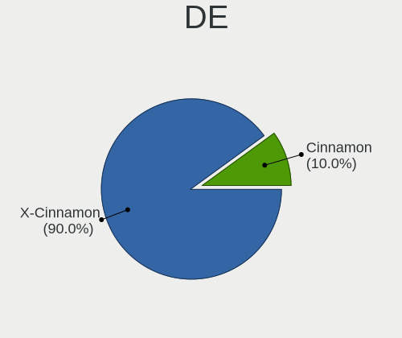
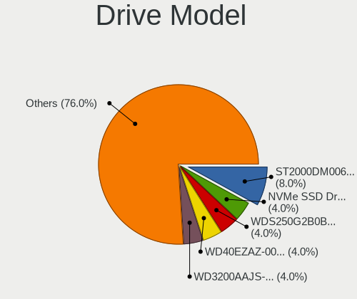
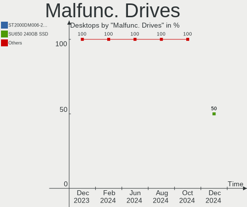
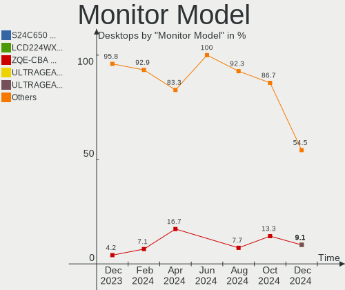
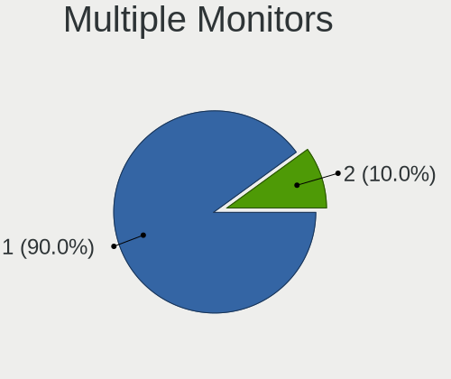
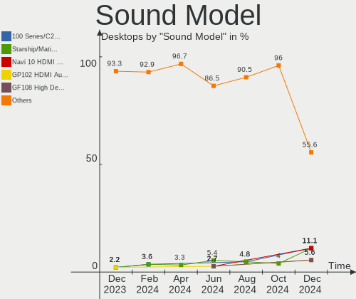
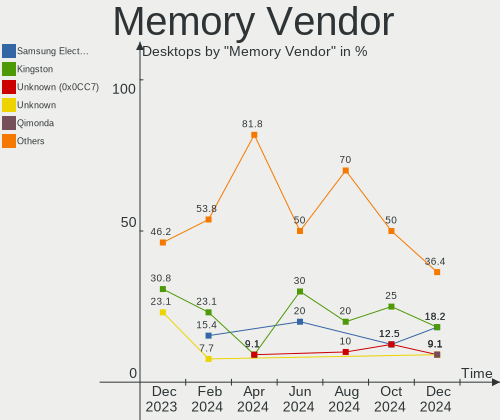
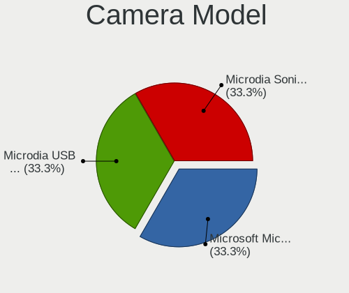

LMDE - Hardware Trends (Desktops)
---------------------------------

A project to identify most popular hardware characteristics and track their change
over time based on data collected by Linux users at https://Linux-Hardware.org.

Anyone can contribute to this report by the [hw-probe](https://github.com/linuxhw/hw-probe) tool:

    sudo -E hw-probe -all -upload

This report is for one last month. Overall report since the beginning of time: [TestDays](https://github.com/linuxhw/TestDays)

Period: Dec, 2024.

Contents
--------

* [ System ](#system)
  - [ OS                       ](#os)
  - [ OS Family                ](#os-family)
  - [ Kernel                   ](#kernel)
  - [ Kernel Family            ](#kernel-family)
  - [ Kernel Major Ver.        ](#kernel-major-ver)
  - [ Arch                     ](#arch)
  - [ DE                       ](#de)
  - [ Display Server           ](#display-server)
  - [ Display Manager          ](#display-manager)
  - [ OS Lang                  ](#os-lang)
  - [ Boot Mode                ](#boot-mode)
  - [ Filesystem               ](#filesystem)
  - [ Part. scheme             ](#part-scheme)
  - [ Dual Boot with Linux/BSD ](#dual-boot-with-linuxbsd)
  - [ Dual Boot (Win)          ](#dual-boot-win)

* [ Board ](#board)
  - [ Vendor                   ](#vendor)
  - [ Model                    ](#model)
  - [ Model Family             ](#model-family)
  - [ MFG Year                 ](#mfg-year)
  - [ Form Factor              ](#form-factor)
  - [ Secure Boot              ](#secure-boot)
  - [ Coreboot                 ](#coreboot)
  - [ RAM Size                 ](#ram-size)
  - [ RAM Used                 ](#ram-used)
  - [ Total Drives             ](#total-drives)
  - [ Has CD-ROM               ](#has-cd-rom)
  - [ Has Ethernet             ](#has-ethernet)
  - [ Has WiFi                 ](#has-wifi)
  - [ Has Bluetooth            ](#has-bluetooth)

* [ Location ](#location)
  - [ Country                  ](#country)
  - [ City                     ](#city)

* [ Drives ](#drives)
  - [ Drive Vendor             ](#drive-vendor)
  - [ Drive Model              ](#drive-model)
  - [ HDD Vendor               ](#hdd-vendor)
  - [ SSD Vendor               ](#ssd-vendor)
  - [ Drive Kind               ](#drive-kind)
  - [ Drive Connector          ](#drive-connector)
  - [ Drive Size               ](#drive-size)
  - [ Space Total              ](#space-total)
  - [ Space Used               ](#space-used)
  - [ Malfunc. Drives          ](#malfunc-drives)
  - [ Malfunc. Drive Vendor    ](#malfunc-drive-vendor)
  - [ Malfunc. HDD Vendor      ](#malfunc-hdd-vendor)
  - [ Malfunc. Drive Kind      ](#malfunc-drive-kind)
  - [ Failed Drives            ](#failed-drives)
  - [ Failed Drive Vendor      ](#failed-drive-vendor)
  - [ Drive Status             ](#drive-status)

* [ Storage controller ](#storage-controller)
  - [ Storage Vendor           ](#storage-vendor)
  - [ Storage Model            ](#storage-model)
  - [ Storage Kind             ](#storage-kind)

* [ Processor ](#processor)
  - [ CPU Vendor               ](#cpu-vendor)
  - [ CPU Model                ](#cpu-model)
  - [ CPU Model Family         ](#cpu-model-family)
  - [ CPU Cores                ](#cpu-cores)
  - [ CPU Sockets              ](#cpu-sockets)
  - [ CPU Threads              ](#cpu-threads)
  - [ CPU Op-Modes             ](#cpu-op-modes)
  - [ CPU Microcode            ](#cpu-microcode)
  - [ CPU Microarch            ](#cpu-microarch)

* [ Graphics ](#graphics)
  - [ GPU Vendor               ](#gpu-vendor)
  - [ GPU Model                ](#gpu-model)
  - [ GPU Combo                ](#gpu-combo)
  - [ GPU Driver               ](#gpu-driver)
  - [ GPU Memory               ](#gpu-memory)

* [ Monitor ](#monitor)
  - [ Monitor Vendor           ](#monitor-vendor)
  - [ Monitor Model            ](#monitor-model)
  - [ Monitor Resolution       ](#monitor-resolution)
  - [ Monitor Diagonal         ](#monitor-diagonal)
  - [ Monitor Width            ](#monitor-width)
  - [ Aspect Ratio             ](#aspect-ratio)
  - [ Monitor Area             ](#monitor-area)
  - [ Pixel Density            ](#pixel-density)
  - [ Multiple Monitors        ](#multiple-monitors)

* [ Network ](#network)
  - [ Net Controller Vendor    ](#net-controller-vendor)
  - [ Net Controller Model     ](#net-controller-model)
  - [ Wireless Vendor          ](#wireless-vendor)
  - [ Wireless Model           ](#wireless-model)
  - [ Ethernet Vendor          ](#ethernet-vendor)
  - [ Ethernet Model           ](#ethernet-model)
  - [ Net Controller Kind      ](#net-controller-kind)
  - [ Used Controller          ](#used-controller)
  - [ NICs                     ](#nics)
  - [ IPv6                     ](#ipv6)

* [ Bluetooth ](#bluetooth)
  - [ Bluetooth Vendor         ](#bluetooth-vendor)
  - [ Bluetooth Model          ](#bluetooth-model)

* [ Sound ](#sound)
  - [ Sound Vendor             ](#sound-vendor)
  - [ Sound Model              ](#sound-model)

* [ Memory ](#memory)
  - [ Memory Vendor            ](#memory-vendor)
  - [ Memory Model             ](#memory-model)
  - [ Memory Kind              ](#memory-kind)
  - [ Memory Form Factor       ](#memory-form-factor)
  - [ Memory Size              ](#memory-size)
  - [ Memory Speed             ](#memory-speed)

* [ Printers & scanners ](#printers--scanners)
  - [ Printer Vendor           ](#printer-vendor)
  - [ Printer Model            ](#printer-model)
  - [ Scanner Vendor           ](#scanner-vendor)
  - [ Scanner Model            ](#scanner-model)

* [ Camera ](#camera)
  - [ Camera Vendor            ](#camera-vendor)
  - [ Camera Model             ](#camera-model)

* [ Security ](#security)
  - [ Fingerprint Vendor       ](#fingerprint-vendor)
  - [ Fingerprint Model        ](#fingerprint-model)
  - [ Chipcard Vendor          ](#chipcard-vendor)
  - [ Chipcard Model           ](#chipcard-model)

* [ Unsupported ](#unsupported)
  - [ Unsupported Devices      ](#unsupported-devices)
  - [ Unsupported Device Types ](#unsupported-device-types)

System
------

OS
--

Installed operating systems

| Name   | Desktops | Percent |
|--------|----------|---------|
| LMDE 6 | 10       | 100%    |

OS Family
---------

OS without a version

| Name | Desktops | Percent |
|------|----------|---------|
| LMDE | 10       | 100%    |

Kernel
------

Version of the Linux kernel

| Version               | Desktops | Percent |
|-----------------------|----------|---------|
| 6.1.0-28-amd64        | 6        | 60%     |
| 6.1.0-12-amd64        | 2        | 20%     |
| 6.7.10-060710-generic | 1        | 10%     |
| 6.11.10+bpo-amd64     | 1        | 10%     |

Kernel Family
-------------

Linux kernel without a distro release

| Version | Desktops | Percent |
|---------|----------|---------|
| 6.1.0   | 8        | 80%     |
| 6.7.10  | 1        | 10%     |
| 6.11.10 | 1        | 10%     |

Kernel Major Ver.
-----------------

Linux kernel major version

| Version | Desktops | Percent |
|---------|----------|---------|
| 6.1     | 8        | 80%     |
| 6.7     | 1        | 10%     |
| 6.11    | 1        | 10%     |

Arch
----

OS architecture (x86_64, i586, etc.)

| Name   | Desktops | Percent |
|--------|----------|---------|
| x86_64 | 10       | 100%    |

DE
--

Desktop Environment

| Name       | Desktops | Percent |
|------------|----------|---------|
| X-Cinnamon | 9        | 90%     |
| Cinnamon   | 1        | 10%     |

Display Server
--------------

X11 or Wayland

| Name | Desktops | Percent |
|------|----------|---------|
| X11  | 10       | 100%    |

Display Manager
---------------

SDDM, LightDM, etc.

| Name    | Desktops | Percent |
|---------|----------|---------|
| LightDM | 8        | 80%     |
| Unknown | 2        | 20%     |

OS Lang
-------

Language

| Lang  | Desktops | Percent |
|-------|----------|---------|
| de_DE | 3        | 30%     |
| ru_RU | 2        | 20%     |
| en_US | 2        | 20%     |
| tr_TR | 1        | 10%     |
| pt_BR | 1        | 10%     |
| en_GB | 1        | 10%     |

Boot Mode
---------

EFI or BIOS

| Mode | Desktops | Percent |
|------|----------|---------|
| BIOS | 5        | 50%     |
| EFI  | 5        | 50%     |

Filesystem
----------

Type of filesystem

| Type  | Desktops | Percent |
|-------|----------|---------|
| Ext4  | 9        | 90%     |
| Btrfs | 1        | 10%     |

Part. scheme
------------

Scheme of partitioning

| Type    | Desktops | Percent |
|---------|----------|---------|
| MBR     | 4        | 40%     |
| GPT     | 4        | 40%     |
| Unknown | 2        | 20%     |

Dual Boot with Linux/BSD
------------------------

Hosting more than one Linux/BSD

| Dual boot | Desktops | Percent |
|-----------|----------|---------|
| No        | 8        | 80%     |
| Yes       | 2        | 20%     |

Dual Boot (Win)
---------------

Hosting Linux and Windows

| Dual boot | Desktops | Percent |
|-----------|----------|---------|
| No        | 6        | 60%     |
| Yes       | 4        | 40%     |

Board
-----

Vendor
------

Motherboard manufacturer

| Name                | Desktops | Percent |
|---------------------|----------|---------|
| ASUSTek Computer    | 4        | 40%     |
| PELADN              | 1        | 10%     |
| Lenovo              | 1        | 10%     |
| Hewlett-Packard     | 1        | 10%     |
| Gigabyte Technology | 1        | 10%     |
| Dell                | 1        | 10%     |
| ASRock              | 1        | 10%     |

Model
-----

Motherboard model

| Name                               | Desktops | Percent |
|------------------------------------|----------|---------|
| PELADN WI-6                        | 1        | 10%     |
| Lenovo ThinkCentre M58p 7220AVG    | 1        | 10%     |
| HP Compaq dc5800 Small Form Factor | 1        | 10%     |
| Gigabyte B550M DS3H                | 1        | 10%     |
| Dell Precision Tower 3620          | 1        | 10%     |
| ASUS ROG STRIX B450-F GAMING       | 1        | 10%     |
| ASUS PRIME Z390-P                  | 1        | 10%     |
| ASUS PRIME B250M-C                 | 1        | 10%     |
| ASUS All Series                    | 1        | 10%     |
| ASRock H110M-HDV R3.0              | 1        | 10%     |

Model Family
------------

Motherboard model prefix

| Name               | Desktops | Percent |
|--------------------|----------|---------|
| ASUS PRIME         | 2        | 20%     |
| PELADN WI-6        | 1        | 10%     |
| Lenovo ThinkCentre | 1        | 10%     |
| HP Compaq          | 1        | 10%     |
| Gigabyte B550M     | 1        | 10%     |
| Dell Precision     | 1        | 10%     |
| ASUS ROG           | 1        | 10%     |
| ASUS All           | 1        | 10%     |
| ASRock H110M-HDV   | 1        | 10%     |

MFG Year
--------

Motherboard manufacture year

| Year | Desktops | Percent |
|------|----------|---------|
| 2018 | 2        | 20%     |
| 2016 | 2        | 20%     |
| 2008 | 2        | 20%     |
| 2024 | 1        | 10%     |
| 2020 | 1        | 10%     |
| 2017 | 1        | 10%     |
| 2013 | 1        | 10%     |

Form Factor
-----------

Physical design of the computer

| Name    | Desktops | Percent |
|---------|----------|---------|
| Desktop | 10       | 100%    |

Secure Boot
-----------

Enabled or disabled

| State    | Desktops | Percent |
|----------|----------|---------|
| Disabled | 10       | 100%    |

Coreboot
--------

Have coreboot on board

| Used | Desktops | Percent |
|------|----------|---------|
| No   | 10       | 100%    |

RAM Size
--------

Total RAM memory

| Size in GB | Desktops | Percent |
|------------|----------|---------|
| 32.01-64.0 | 4        | 40%     |
| 4.01-8.0   | 3        | 30%     |
| 3.01-4.0   | 2        | 20%     |
| 8.01-16.0  | 1        | 10%     |

RAM Used
--------

Used RAM memory

| Used GB  | Desktops | Percent |
|----------|----------|---------|
| 3.01-4.0 | 3        | 30%     |
| 2.01-3.0 | 3        | 30%     |
| 4.01-8.0 | 2        | 20%     |
| 1.01-2.0 | 2        | 20%     |

Total Drives
------------

Number of drives on board

| Drives | Desktops | Percent |
|--------|----------|---------|
| 2      | 4        | 40%     |
| 1      | 3        | 30%     |
| 4      | 2        | 20%     |
| 6      | 1        | 10%     |

Has CD-ROM
----------

Has CD-ROM on board

| Presented | Desktops | Percent |
|-----------|----------|---------|
| No        | 6        | 60%     |
| Yes       | 4        | 40%     |

Has Ethernet
------------

Has Ethernet on board

| Presented | Desktops | Percent |
|-----------|----------|---------|
| Yes       | 10       | 100%    |

Has WiFi
--------

Has WiFi module

| Presented | Desktops | Percent |
|-----------|----------|---------|
| Yes       | 6        | 60%     |
| No        | 4        | 40%     |

Has Bluetooth
-------------

Has Bluetooth module

| Presented | Desktops | Percent |
|-----------|----------|---------|
| Yes       | 6        | 60%     |
| No        | 4        | 40%     |

Location
--------

Country
-------

Geographic location (country)

| Country    | Desktops | Percent |
|------------|----------|---------|
| Germany    | 3        | 30%     |
| Russia     | 2        | 20%     |
| USA        | 1        | 10%     |
| UK         | 1        | 10%     |
| Mexico     | 1        | 10%     |
| Kyrgyzstan | 1        | 10%     |
| Brazil     | 1        | 10%     |

City
----

Geographic location (city)

| City          | Desktops | Percent |
|---------------|----------|---------|
| York          | 1        | 10%     |
| Troisdorf     | 1        | 10%     |
| St Petersburg | 1        | 10%     |
| Pachuca       | 1        | 10%     |
| Kaliningrad   | 1        | 10%     |
| Homosassa     | 1        | 10%     |
| Gravataí     | 1        | 10%     |
| Delligsen     | 1        | 10%     |
| Bishkek       | 1        | 10%     |
| Berlin        | 1        | 10%     |

Drives
------

Drive Vendor
------------

Hard drive vendors

| Vendor              | Desktops | Drives | Percent |
|---------------------|----------|--------|---------|
| WDC                 | 4        | 5      | 20%     |
| Seagate             | 3        | 5      | 15%     |
| A-DATA Technology   | 2        | 2      | 10%     |
| XrayDisk            | 1        | 1      | 5%      |
| Toshiba             | 1        | 1      | 5%      |
| SPCC                | 1        | 1      | 5%      |
| SK hynix            | 1        | 1      | 5%      |
| Sandisk             | 1        | 1      | 5%      |
| Samsung Electronics | 1        | 3      | 5%      |
| JMicron Technology  | 1        | 1      | 5%      |
| Crucial             | 1        | 1      | 5%      |
| China               | 1        | 1      | 5%      |
| ADATA Technology    | 1        | 1      | 5%      |
| Unknown             | 1        | 1      | 5%      |

Drive Model
-----------

Hard drive models

| Model                                                             | Desktops | Percent |
|-------------------------------------------------------------------|----------|---------|
| Seagate ST2000DM006-2DM164 2TB                                    | 2        | 8%      |
| XrayDisk NVMe SSD Drive 512GB                                     | 1        | 4%      |
| WDC WDS250G2B0B 250GB SSD                                         | 1        | 4%      |
| WDC WD40EZAZ-00SF3B0 4TB                                          | 1        | 4%      |
| WDC WD3200AAJS-00L7A0 320GB                                       | 1        | 4%      |
| WDC WD20EFRX-68EUZN0 2TB                                          | 1        | 4%      |
| WDC WD10EALS-002BA0 1TB                                           | 1        | 4%      |
| Toshiba TR200 240GB SSD                                           | 1        | 4%      |
| SPCC Solid State Disk 512GB                                       | 1        | 4%      |
| SK hynix HFM128GD3JX016N 128GB                                    | 1        | 4%      |
| Seagate ST500DM002-1SB10A 500GB                                   | 1        | 4%      |
| Seagate ST3000DM008-2DM166 3TB                                    | 1        | 4%      |
| Seagate ST1000DM003-1ER162 1TB                                    | 1        | 4%      |
| Sandisk WD Blue SN550 NVMe SSD 256GB                              | 1        | 4%      |
| Samsung SSD 990 PRO 1TB                                           | 1        | 4%      |
| Samsung SSD 980 PRO 1TB                                           | 1        | 4%      |
| Samsung SSD 850 EVO 250GB                                         | 1        | 4%      |
| JMicron Generic 500GB                                             | 1        | 4%      |
| Crucial CT240BX500SSD1 240GB                                      | 1        | 4%      |
| China SATA SSD 64GB                                               | 1        | 4%      |
| ADATA XPG SX8200 Pro PCIe Gen3x4 M.2 2280 Solid State Drive 256GB | 1        | 4%      |
| A-DATA SU750 256GB SSD                                            | 1        | 4%      |
| A-DATA SU650 240GB SSD                                            | 1        | 4%      |
| Unknown                                                           | 1        | 4%      |

HDD Vendor
----------

Hard disk drive vendors

| Vendor             | Desktops | Drives | Percent |
|--------------------|----------|--------|---------|
| WDC                | 4        | 4      | 50%     |
| Seagate            | 3        | 5      | 37.5%   |
| JMicron Technology | 1        | 1      | 12.5%   |

SSD Vendor
----------

Solid state drive vendors

| Vendor              | Desktops | Drives | Percent |
|---------------------|----------|--------|---------|
| A-DATA Technology   | 2        | 2      | 22.22%  |
| WDC                 | 1        | 1      | 11.11%  |
| Toshiba             | 1        | 1      | 11.11%  |
| SPCC                | 1        | 1      | 11.11%  |
| Samsung Electronics | 1        | 1      | 11.11%  |
| Crucial             | 1        | 1      | 11.11%  |
| China               | 1        | 1      | 11.11%  |
| Unknown             | 1        | 1      | 11.11%  |

Drive Kind
----------

HDD or SSD

| Kind | Desktops | Drives | Percent |
|------|----------|--------|---------|
| SSD  | 7        | 9      | 43.75%  |
| HDD  | 6        | 10     | 37.5%   |
| NVMe | 3        | 6      | 18.75%  |

Drive Connector
---------------

SATA, SAS, NVMe, etc.

| Type | Desktops | Drives | Percent |
|------|----------|--------|---------|
| SATA | 10       | 18     | 71.43%  |
| NVMe | 3        | 6      | 21.43%  |
| SAS  | 1        | 1      | 7.14%   |

Drive Size
----------

Size of hard drive

| Size in TB | Desktops | Drives | Percent |
|------------|----------|--------|---------|
| 0.01-0.5   | 9        | 11     | 52.94%  |
| 1.01-2.0   | 3        | 3      | 17.65%  |
| 0.51-1.0   | 3        | 3      | 17.65%  |
| 3.01-4.0   | 1        | 1      | 5.88%   |
| 2.01-3.0   | 1        | 1      | 5.88%   |

Space Total
-----------

Amount of disk space available on the file system

| Size in GB     | Desktops | Percent |
|----------------|----------|---------|
| 101-250        | 3        | 30%     |
| 251-500        | 2        | 20%     |
| 2001-3000      | 2        | 20%     |
| More than 3000 | 1        | 10%     |
| 1001-2000      | 1        | 10%     |
| 501-1000       | 1        | 10%     |

Space Used
----------

Amount of used disk space

| Used GB  | Desktops | Percent |
|----------|----------|---------|
| 101-250  | 3        | 30%     |
| 21-50    | 2        | 20%     |
| 501-1000 | 2        | 20%     |
| 51-100   | 2        | 20%     |
| 1-20     | 1        | 10%     |

Malfunc. Drives
---------------

Drive models with a malfunction

| Model                             | Desktops | Drives | Percent |
|-----------------------------------|----------|--------|---------|
| Seagate ST2000DM006-2DM164 2TB    | 1        | 1      | 50%     |
| A-DATA Technology SU650 240GB SSD | 1        | 1      | 50%     |

Malfunc. Drive Vendor
---------------------

Vendors of faulty drives

| Vendor            | Desktops | Drives | Percent |
|-------------------|----------|--------|---------|
| Seagate           | 1        | 1      | 50%     |
| A-DATA Technology | 1        | 1      | 50%     |

Malfunc. HDD Vendor
-------------------

Vendors of faulty HDD drives

| Vendor  | Desktops | Drives | Percent |
|---------|----------|--------|---------|
| Seagate | 1        | 1      | 100%    |

Malfunc. Drive Kind
-------------------

Kinds of faulty drives

| Kind | Desktops | Drives | Percent |
|------|----------|--------|---------|
| SSD  | 1        | 1      | 50%     |
| HDD  | 1        | 1      | 50%     |

Failed Drives
-------------

Failed drive models

Zero info for selected period =(

Failed Drive Vendor
-------------------

Failed drive vendors

Zero info for selected period =(

Drive Status
------------

Number of failed and malfunc. drives

| Status   | Desktops | Drives | Percent |
|----------|----------|--------|---------|
| Works    | 8        | 15     | 61.54%  |
| Detected | 3        | 8      | 23.08%  |
| Malfunc  | 2        | 2      | 15.38%  |

Storage controller
------------------

Storage Vendor
--------------

Storage controller vendors

| Vendor                   | Desktops | Percent |
|--------------------------|----------|---------|
| Intel                    | 8        | 53.33%  |
| AMD                      | 2        | 13.33%  |
| SK hynix                 | 1        | 6.67%   |
| SanDisk                  | 1        | 6.67%   |
| Samsung Electronics      | 1        | 6.67%   |
| Hosin Global Electronics | 1        | 6.67%   |
| ADATA Technology         | 1        | 6.67%   |

Storage Model
-------------

Storage controller models

| Model                                                                          | Desktops | Percent |
|--------------------------------------------------------------------------------|----------|---------|
| Intel Q170/Q150/B150/H170/H110/Z170/CM236 Chipset SATA Controller [AHCI Mode]  | 2        | 10.53%  |
| SK hynix Gold P31/BC711/PC711 NVMe Solid State Drive                           | 1        | 5.26%   |
| SanDisk Ultra 3D / WD PC SN530, IX SN530, Blue SN550 NVMe SSD (DRAM-less)      | 1        | 5.26%   |
| Samsung NVMe SSD Controller S4LV008[Pascal]                                    | 1        | 5.26%   |
| Samsung NVMe SSD Controller PM9A1/PM9A3/980PRO                                 | 1        | 5.26%   |
| Intel SATA Controller [RAID mode]                                              | 1        | 5.26%   |
| Intel Alder Lake-N SATA AHCI Controller                                        | 1        | 5.26%   |
| Intel 82801JD/DO (ICH10 Family) SATA AHCI Controller                           | 1        | 5.26%   |
| Intel 82801IB (ICH9) 2 port SATA Controller [IDE mode]                         | 1        | 5.26%   |
| Intel 82801I (ICH9 Family) 2 port SATA Controller [IDE mode]                   | 1        | 5.26%   |
| Intel 8 Series/C220 Series Chipset Family 6-port SATA Controller 1 [AHCI mode] | 1        | 5.26%   |
| Intel 4 Series Chipset PT IDER Controller                                      | 1        | 5.26%   |
| Intel 200 Series PCH SATA controller [AHCI mode]                               | 1        | 5.26%   |
| Hosin Global Patriot P300 NVMe SSD (DRAM-less)                                 | 1        | 5.26%   |
| AMD FCH SATA Controller [AHCI mode]                                            | 1        | 5.26%   |
| AMD 500 Series Chipset SATA Controller                                         | 1        | 5.26%   |
| AMD 400 Series Chipset SATA Controller                                         | 1        | 5.26%   |
| ADATA XPG SX8200 Pro PCIe Gen3x4 M.2 2280 Solid State Drive                    | 1        | 5.26%   |

Storage Kind
------------

Kind of storage controller (IDE, SATA, NVMe, SAS, ...)

| Kind | Desktops | Percent |
|------|----------|---------|
| SATA | 8        | 57.14%  |
| NVMe | 3        | 21.43%  |
| IDE  | 2        | 14.29%  |
| RAID | 1        | 7.14%   |

Processor
---------

CPU Vendor
----------

Processor vendors

| Vendor | Desktops | Percent |
|--------|----------|---------|
| Intel  | 8        | 80%     |
| AMD    | 2        | 20%     |

CPU Model
---------

Processor models

| Model                                       | Desktops | Percent |
|---------------------------------------------|----------|---------|
| AMD Ryzen 7 3700X 8-Core Processor          | 2        | 20%     |
| Intel Xeon CPU E3-1240 v6 @ 3.70GHz         | 1        | 10%     |
| Intel Pentium Dual-Core CPU E5300 @ 2.60GHz | 1        | 10%     |
| Intel N100                                  | 1        | 10%     |
| Intel Core i7-6700K CPU @ 4.00GHz           | 1        | 10%     |
| Intel Core i5-9600KF CPU @ 3.70GHz          | 1        | 10%     |
| Intel Core i5-6400T CPU @ 2.20GHz           | 1        | 10%     |
| Intel Core i3-4150 CPU @ 3.50GHz            | 1        | 10%     |
| Intel Core 2 Duo CPU E8400 @ 3.00GHz        | 1        | 10%     |

CPU Model Family
----------------

Processor model prefix

| Model                   | Desktops | Percent |
|-------------------------|----------|---------|
| Intel Core i5           | 2        | 20%     |
| AMD Ryzen 7             | 2        | 20%     |
| Other                   | 1        | 10%     |
| Intel Xeon              | 1        | 10%     |
| Intel Pentium Dual-Core | 1        | 10%     |
| Intel Core i7           | 1        | 10%     |
| Intel Core i3           | 1        | 10%     |
| Intel Core 2 Duo        | 1        | 10%     |

CPU Cores
---------

Number of processor cores

| Number | Desktops | Percent |
|--------|----------|---------|
| 4      | 4        | 40%     |
| 2      | 3        | 30%     |
| 8      | 2        | 20%     |
| 6      | 1        | 10%     |

CPU Sockets
-----------

Number of sockets

| Number | Desktops | Percent |
|--------|----------|---------|
| 1      | 10       | 100%    |

CPU Threads
-----------

Threads per core (Hyper-Threading)

| Number | Desktops | Percent |
|--------|----------|---------|
| 2      | 5        | 50%     |
| 1      | 5        | 50%     |

CPU Op-Modes
------------

CPU Operation Modes (32-bit, 64-bit)

| Op mode        | Desktops | Percent |
|----------------|----------|---------|
| 32-bit, 64-bit | 10       | 100%    |

CPU Microcode
-------------

Microcode number

| Number     | Desktops | Percent |
|------------|----------|---------|
| 0x506e3    | 2        | 20%     |
| 0x1067a    | 2        | 20%     |
| Unknown    | 2        | 20%     |
| 0xb06e0    | 1        | 10%     |
| 0x906e9    | 1        | 10%     |
| 0x08701030 | 1        | 10%     |
| 0x08701021 | 1        | 10%     |

CPU Microarch
-------------

Microarchitecture

| Name      | Desktops | Percent |
|-----------|----------|---------|
| Zen 2     | 2        | 20%     |
| Skylake   | 2        | 20%     |
| Penryn    | 2        | 20%     |
| KabyLake  | 2        | 20%     |
| Haswell   | 1        | 10%     |
| Gracemont | 1        | 10%     |

Graphics
--------

GPU Vendor
----------

Vendors of graphics cards

| Vendor | Desktops | Percent |
|--------|----------|---------|
| Intel  | 5        | 45.45%  |
| AMD    | 4        | 36.36%  |
| Nvidia | 2        | 18.18%  |

GPU Model
---------

Graphics card models

| Model                                                                     | Desktops | Percent |
|---------------------------------------------------------------------------|----------|---------|
| AMD Navi 10 [Radeon RX 5600 OEM/5600 XT / 5700/5700 XT]                   | 2        | 18.18%  |
| Nvidia GP102 [GeForce GTX 1080 Ti]                                        | 1        | 9.09%   |
| Nvidia GF108 [GeForce GT 440]                                             | 1        | 9.09%   |
| Intel HD Graphics 530                                                     | 1        | 9.09%   |
| Intel Alder Lake-N [UHD Graphics]                                         | 1        | 9.09%   |
| Intel 82Q33 Express Integrated Graphics Controller                        | 1        | 9.09%   |
| Intel 4th Generation Core Processor Family Integrated Graphics Controller | 1        | 9.09%   |
| Intel 4 Series Chipset Integrated Graphics Controller                     | 1        | 9.09%   |
| AMD Oland GL [FirePro W2100]                                              | 1        | 9.09%   |
| AMD Navi 22 [Radeon RX 6700/6700 XT/6750 XT / 6800M/6850M XT]             | 1        | 9.09%   |

GPU Combo
---------

Combinations of graphics cards

| Name           | Desktops | Percent |
|----------------|----------|---------|
| 1 x AMD        | 4        | 40%     |
| 1 x Intel      | 3        | 30%     |
| 2 x Intel      | 1        | 10%     |
| 1 x Nvidia     | 1        | 10%     |
| Intel + Nvidia | 1        | 10%     |

GPU Driver
----------

Free vs proprietary

| Driver      | Desktops | Percent |
|-------------|----------|---------|
| Free        | 9        | 90%     |
| Proprietary | 1        | 10%     |

GPU Memory
----------

Total video memory

| Size in GB | Desktops | Percent |
|------------|----------|---------|
| Unknown    | 4        | 40%     |
| 5.01-6.0   | 2        | 20%     |
| 1.01-2.0   | 2        | 20%     |
| 8.01-16.0  | 2        | 20%     |

Monitor
-------

Monitor Vendor
--------------

Monitor vendors

| Vendor              | Desktops | Percent |
|---------------------|----------|---------|
| Goldstar            | 3        | 30%     |
| AOC                 | 2        | 20%     |
| Samsung Electronics | 1        | 10%     |
| NEC Computers       | 1        | 10%     |
| HUAWEI              | 1        | 10%     |
| Fujitsu Siemens     | 1        | 10%     |
| Dell                | 1        | 10%     |

Monitor Model
-------------

Monitor models

| Model                                                             | Desktops | Percent |
|-------------------------------------------------------------------|----------|---------|
| Samsung Electronics S24C650 SAM09E8 1920x1080 521x293mm 23.5-inch | 1        | 9.09%   |
| NEC Computers LCD224WXM NEC6732 1680x1050 474x296mm 22.0-inch     | 1        | 9.09%   |
| HUAWEI ZQE-CBA HWV6A25 3440x1440 797x334mm 34.0-inch              | 1        | 9.09%   |
| Goldstar ULTRAGEAR GSM7765 2560x1440 697x392mm 31.5-inch          | 1        | 9.09%   |
| Goldstar ULTRAGEAR GSM5B7F 2560x1440 597x336mm 27.0-inch          | 1        | 9.09%   |
| Goldstar FULL HD GSM5B55 1920x1080 480x270mm 21.7-inch            | 1        | 9.09%   |
| Goldstar 24MB65 GSM5A4B 1920x1200 520x330mm 24.2-inch             | 1        | 9.09%   |
| Fujitsu Siemens B22W-6 LED FUS07F5 1680x1050 474x296mm 22.0-inch  | 1        | 9.09%   |
| Dell SE2722H DELD116 1920x1080 600x340mm 27.2-inch                | 1        | 9.09%   |
| AOC 2460G4 AOC246A 1920x1080 531x299mm 24.0-inch                  | 1        | 9.09%   |
| AOC 2070W AOC2070 1600x900 434x236mm 19.4-inch                    | 1        | 9.09%   |

Monitor Resolution
------------------

Monitor screen resolution

| Resolution         | Desktops | Percent |
|--------------------|----------|---------|
| 1920x1080 (FHD)    | 3        | 27.27%  |
| 3840x2160 (4K)     | 2        | 18.18%  |
| 2560x1440 (QHD)    | 2        | 18.18%  |
| 1680x1050 (WSXGA+) | 2        | 18.18%  |
| 1920x1200 (WUXGA)  | 1        | 9.09%   |
| 1600x900 (HD+)     | 1        | 9.09%   |

Monitor Diagonal
----------------

Diagonal size in inches

| Inches | Desktops | Percent |
|--------|----------|---------|
| 27     | 2        | 20%     |
| 24     | 2        | 20%     |
| 22     | 2        | 20%     |
| 34     | 1        | 10%     |
| 31     | 1        | 10%     |
| 23     | 1        | 10%     |
| 19     | 1        | 10%     |

Monitor Width
-------------

Physical width

| Width in mm | Desktops | Percent |
|-------------|----------|---------|
| 501-600     | 5        | 50%     |
| 401-500     | 3        | 30%     |
| 701-800     | 1        | 10%     |
| 601-700     | 1        | 10%     |

Aspect Ratio
------------

Proportional relationship between the width and the height

| Ratio | Desktops | Percent |
|-------|----------|---------|
| 16/9  | 5        | 50%     |
| 16/10 | 4        | 40%     |
| 21/9  | 1        | 10%     |

Monitor Area
------------

Area in inch²

| Area in inch² | Desktops | Percent |
|----------------|----------|---------|
| 201-250        | 3        | 30%     |
| 351-500        | 2        | 20%     |
| 301-350        | 2        | 20%     |
| 251-300        | 2        | 20%     |
| 151-200        | 1        | 10%     |

Pixel Density
-------------

Pixels per inch

| Density | Desktops | Percent |
|---------|----------|---------|
| 51-100  | 8        | 80%     |
| 101-120 | 2        | 20%     |

Multiple Monitors
-----------------

Total monitors connected

| Total | Desktops | Percent |
|-------|----------|---------|
| 1     | 9        | 90%     |
| 2     | 1        | 10%     |

Network
-------

Net Controller Vendor
---------------------

Controller vendors

| Vendor                | Desktops | Percent |
|-----------------------|----------|---------|
| Realtek Semiconductor | 6        | 46.15%  |
| Intel                 | 5        | 38.46%  |
| TP-Link               | 1        | 7.69%   |
| Qualcomm Atheros      | 1        | 7.69%   |

Net Controller Model
--------------------

Controller models

| Model                                                                  | Desktops | Percent |
|------------------------------------------------------------------------|----------|---------|
| Realtek RTL8111/8168/8211/8411 PCI Express Gigabit Ethernet Controller | 5        | 29.41%  |
| Realtek RTL8821CE 802.11ac PCIe Wireless Network Adapter               | 2        | 11.76%  |
| TP-Link RTL8812AU Archer T4U 802.11ac                                  | 1        | 5.88%   |
| Realtek RTL8192CU 802.11n WLAN Adapter                                 | 1        | 5.88%   |
| Realtek RTL8188EUS 802.11n Wireless Network Adapter                    | 1        | 5.88%   |
| Realtek 802.11ac WLAN Adapter                                          | 1        | 5.88%   |
| Qualcomm Atheros AR9485 Wireless Network Adapter                       | 1        | 5.88%   |
| Intel I211 Gigabit Network Connection                                  | 1        | 5.88%   |
| Intel Ethernet Connection (2) I219-V                                   | 1        | 5.88%   |
| Intel Ethernet Connection (2) I219-LM                                  | 1        | 5.88%   |
| Intel 82567LM-3 Gigabit Network Connection                             | 1        | 5.88%   |
| Intel 82566DM-2 Gigabit Network Connection                             | 1        | 5.88%   |

Wireless Vendor
---------------

Wireless vendors

| Vendor                | Desktops | Percent |
|-----------------------|----------|---------|
| Realtek Semiconductor | 5        | 71.43%  |
| TP-Link               | 1        | 14.29%  |
| Qualcomm Atheros      | 1        | 14.29%  |

Wireless Model
--------------

Wireless models

| Model                                                    | Desktops | Percent |
|----------------------------------------------------------|----------|---------|
| Realtek RTL8821CE 802.11ac PCIe Wireless Network Adapter | 2        | 28.57%  |
| TP-Link RTL8812AU Archer T4U 802.11ac                    | 1        | 14.29%  |
| Realtek RTL8192CU 802.11n WLAN Adapter                   | 1        | 14.29%  |
| Realtek RTL8188EUS 802.11n Wireless Network Adapter      | 1        | 14.29%  |
| Realtek 802.11ac WLAN Adapter                            | 1        | 14.29%  |
| Qualcomm Atheros AR9485 Wireless Network Adapter         | 1        | 14.29%  |

Ethernet Vendor
---------------

Ethernet vendors

| Vendor                | Desktops | Percent |
|-----------------------|----------|---------|
| Realtek Semiconductor | 5        | 50%     |
| Intel                 | 5        | 50%     |

Ethernet Model
--------------

Ethernet models

| Model                                                                  | Desktops | Percent |
|------------------------------------------------------------------------|----------|---------|
| Realtek RTL8111/8168/8211/8411 PCI Express Gigabit Ethernet Controller | 5        | 50%     |
| Intel I211 Gigabit Network Connection                                  | 1        | 10%     |
| Intel Ethernet Connection (2) I219-V                                   | 1        | 10%     |
| Intel Ethernet Connection (2) I219-LM                                  | 1        | 10%     |
| Intel 82567LM-3 Gigabit Network Connection                             | 1        | 10%     |
| Intel 82566DM-2 Gigabit Network Connection                             | 1        | 10%     |

Net Controller Kind
-------------------

Ethernet, WiFi or modem

| Kind     | Desktops | Percent |
|----------|----------|---------|
| Ethernet | 10       | 62.5%   |
| WiFi     | 6        | 37.5%   |

Used Controller
---------------

Currently used network controller

| Kind     | Desktops | Percent |
|----------|----------|---------|
| Ethernet | 7        | 63.64%  |
| WiFi     | 4        | 36.36%  |

NICs
----

Total network controllers on board

| Total | Desktops | Percent |
|-------|----------|---------|
| 1     | 7        | 70%     |
| 2     | 3        | 30%     |

IPv6
----

IPv6 vs IPv4

| Used | Desktops | Percent |
|------|----------|---------|
| No   | 7        | 70%     |
| Yes  | 3        | 30%     |

Bluetooth
---------

Bluetooth Vendor
----------------

Controller vendors

| Vendor                          | Desktops | Percent |
|---------------------------------|----------|---------|
| Cambridge Silicon Radio         | 3        | 42.86%  |
| Realtek Semiconductor           | 2        | 28.57%  |
| TP-Link                         | 1        | 14.29%  |
| Qualcomm Atheros Communications | 1        | 14.29%  |

Bluetooth Model
---------------

Controller models

| Model                                               | Desktops | Percent |
|-----------------------------------------------------|----------|---------|
| Cambridge Silicon Radio Bluetooth Dongle (HCI mode) | 3        | 42.86%  |
| TP-Link TP-Link Bluetooth USB Adapter               | 1        | 14.29%  |
| Realtek  Bluetooth 4.2 Adapter                      | 1        | 14.29%  |
| Realtek Bluetooth Radio                             | 1        | 14.29%  |
| Qualcomm Atheros AR3011 Bluetooth                   | 1        | 14.29%  |

Sound
-----

Sound Vendor
------------

Sound card vendors

| Vendor              | Desktops | Percent |
|---------------------|----------|---------|
| Intel               | 8        | 50%     |
| AMD                 | 4        | 25%     |
| Nvidia              | 2        | 12.5%   |
| Creative Technology | 1        | 6.25%   |
| Bluetrum            | 1        | 6.25%   |

Sound Model
-----------

Sound card models

| Model                                                                   | Desktops | Percent |
|-------------------------------------------------------------------------|----------|---------|
| Intel 100 Series/C230 Series Chipset Family HD Audio Controller         | 2        | 11.11%  |
| AMD Starship/Matisse HD Audio Controller                                | 2        | 11.11%  |
| AMD Navi 10 HDMI Audio                                                  | 2        | 11.11%  |
| Nvidia GP102 HDMI Audio Controller                                      | 1        | 5.56%   |
| Nvidia GF108 High Definition Audio Controller                           | 1        | 5.56%   |
| Intel Cannon Lake PCH cAVS                                              | 1        | 5.56%   |
| Intel Alder Lake-N PCH High Definition Audio Controller                 | 1        | 5.56%   |
| Intel 82801JD/DO (ICH10 Family) HD Audio Controller                     | 1        | 5.56%   |
| Intel 82801I (ICH9 Family) HD Audio Controller                          | 1        | 5.56%   |
| Intel 8 Series/C220 Series Chipset High Definition Audio Controller     | 1        | 5.56%   |
| Intel 200 Series PCH HD Audio                                           | 1        | 5.56%   |
| Creative Technology Sound Blaster Play! 3                               | 1        | 5.56%   |
| Bluetrum USB Audio                                                      | 1        | 5.56%   |
| AMD Oland/Hainan/Cape Verde/Pitcairn HDMI Audio [Radeon HD 7000 Series] | 1        | 5.56%   |
| AMD Navi 21/23 HDMI/DP Audio Controller                                 | 1        | 5.56%   |

Memory
------

Memory Vendor
-------------

Memory module vendors

| Vendor              | Desktops | Percent |
|---------------------|----------|---------|
| Samsung Electronics | 2        | 18.18%  |
| Kingston            | 2        | 18.18%  |
| Unknown (0x0CC7)    | 1        | 9.09%   |
| Unknown             | 1        | 9.09%   |
| Qimonda             | 1        | 9.09%   |
| GeIL                | 1        | 9.09%   |
| G.Skill             | 1        | 9.09%   |
| Crucial             | 1        | 9.09%   |
| Unknown             | 1        | 9.09%   |

Memory Model
------------

Memory module models

| Model                                                         | Desktops | Percent |
|---------------------------------------------------------------|----------|---------|
| Unknown RAM Module 2GB DIMM DDR2 1067MT/s                     | 1        | 8.33%   |
| Unknown (0x0CC7) RAM DDR4 NB 8G 3200 8GB SODIMM DDR4 3200MT/s | 1        | 8.33%   |
| Samsung RAM M378A1K43CB2-CRC 8GB DIMM DDR4 3500MT/s           | 1        | 8.33%   |
| Samsung RAM M3 78T5663QZ3-CF7 2GB DIMM DDR2 800MT/s           | 1        | 8.33%   |
| Qimonda RAM 64T256020EU2.5C2 2GB DIMM DDR2 800MT/s            | 1        | 8.33%   |
| Kingston RAM Module 2GB DIMM DDR2 800MT/s                     | 1        | 8.33%   |
| Kingston RAM KHX2666C15D4/4G 4GB DIMM DDR4 3200MT/s           | 1        | 8.33%   |
| GeIL RAM CL15-15-15 D4-2133 4GB DIMM DDR4 2666MT/s            | 1        | 8.33%   |
| G.Skill RAM F4-3000C15-8GVGB 8GB DIMM DDR4 3066MT/s           | 1        | 8.33%   |
| Crucial RAM CT8G4DFS8266.M8FE 8GB DIMM DDR4 2667MT/s          | 1        | 8.33%   |
| Crucial RAM CT8G4DFS8266.C8FJ 8GB DIMM DDR4 2667MT/s          | 1        | 8.33%   |
| Unknown                                                       | 1        | 8.33%   |

Memory Kind
-----------

Memory module kinds

| Kind  | Desktops | Percent |
|-------|----------|---------|
| DDR4  | 6        | 66.67%  |
| DDR2  | 2        | 22.22%  |
| SDRAM | 1        | 11.11%  |

Memory Form Factor
------------------

Physical design of the memory module

| Name   | Desktops | Percent |
|--------|----------|---------|
| DIMM   | 7        | 87.5%   |
| SODIMM | 1        | 12.5%   |

Memory Size
-----------

Memory module size

| Size  | Desktops | Percent |
|-------|----------|---------|
| 8192  | 5        | 55.56%  |
| 2048  | 2        | 22.22%  |
| 16384 | 1        | 11.11%  |
| 4096  | 1        | 11.11%  |

Memory Speed
------------

Memory module speed

| Speed | Desktops | Percent |
|-------|----------|---------|
| 3200  | 2        | 20%     |
| 3500  | 1        | 10%     |
| 3066  | 1        | 10%     |
| 3000  | 1        | 10%     |
| 2667  | 1        | 10%     |
| 2666  | 1        | 10%     |
| 1639  | 1        | 10%     |
| 1067  | 1        | 10%     |
| 800   | 1        | 10%     |

Printers & scanners
-------------------

Printer Vendor
--------------

Printer device vendors

Zero info for selected period =(

Printer Model
-------------

Printer device models

Zero info for selected period =(

Scanner Vendor
--------------

Scanner device vendors

Zero info for selected period =(

Scanner Model
-------------

Scanner device models

Zero info for selected period =(

Camera
------

Camera Vendor
-------------

Camera device vendors

| Vendor    | Desktops | Percent |
|-----------|----------|---------|
| Microdia  | 2        | 66.67%  |
| Microsoft | 1        | 33.33%  |

Camera Model
------------

Camera device models

| Model                                | Desktops | Percent |
|--------------------------------------|----------|---------|
| Microsoft Microsoft LifeCam Cinema | 1        | 33.33%  |
| Microdia USB 2.0 Camera              | 1        | 33.33%  |
| Microdia Sonix USB 2.0 Camera        | 1        | 33.33%  |

Security
--------

Fingerprint Vendor
------------------

Fingerprint sensor vendors

Zero info for selected period =(

Fingerprint Model
-----------------

Fingerprint sensor models

Zero info for selected period =(

Chipcard Vendor
---------------

Chipcard module vendors

Zero info for selected period =(

Chipcard Model
--------------

Chipcard module models

Zero info for selected period =(

Unsupported
-----------

Unsupported Devices
-------------------

Total unsupported devices on board

| Total | Desktops | Percent |
|-------|----------|---------|
| 0     | 8        | 80%     |
| 1     | 2        | 20%     |

Unsupported Device Types
------------------------

Types of unsupported devices

| Type          | Desktops | Percent |
|---------------|----------|---------|
| Net/wireless  | 1        | 50%     |
| Graphics card | 1        | 50%     |

