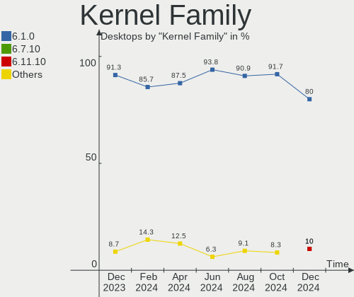
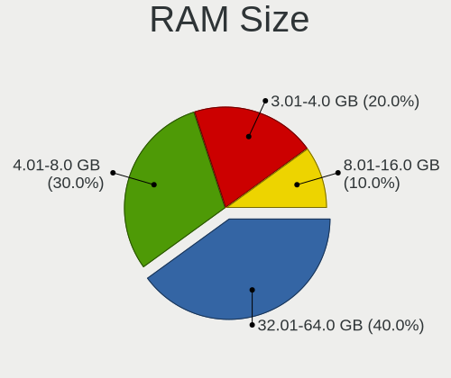
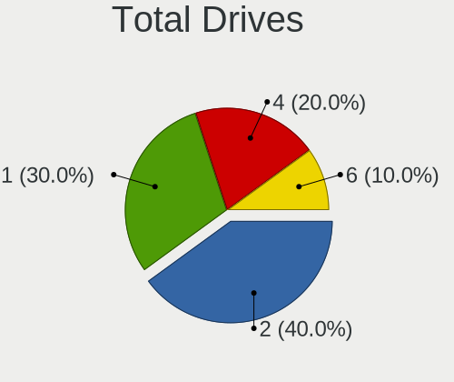
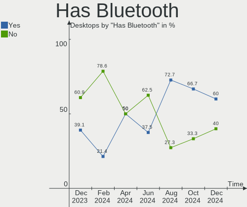
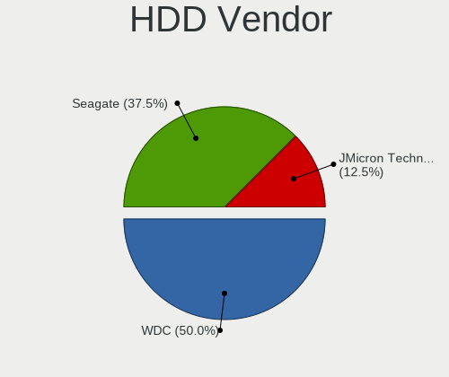
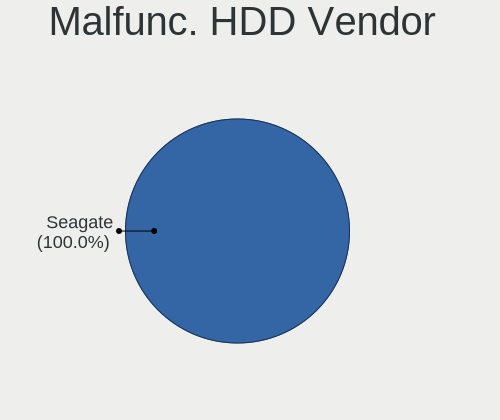
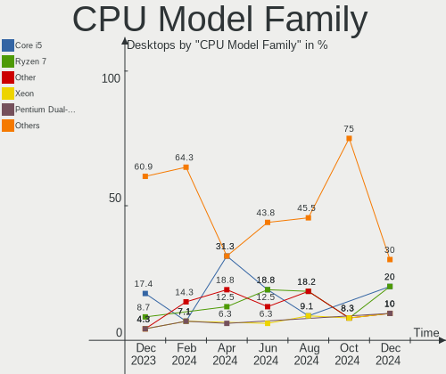
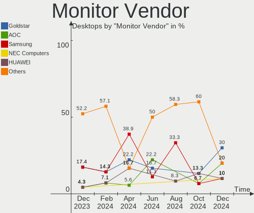
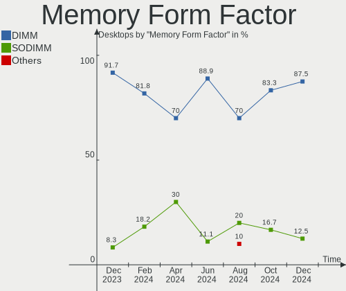

LMDE - Hardware Trends (Desktops)
---------------------------------

A project to identify most popular hardware characteristics and track their change
over time based on data collected by Linux users at https://Linux-Hardware.org.

Anyone can contribute to this report by the [hw-probe](https://github.com/linuxhw/hw-probe) tool:

    sudo -E hw-probe -all -upload

This report is for one last month. Overall report since the beginning of time: [TestCoverage](https://github.com/linuxhw/TestCoverage)

Period: Nov, 2022.

Contents
--------

* [ System ](#system)
  - [ OS                       ](#os)
  - [ OS Family                ](#os-family)
  - [ Kernel                   ](#kernel)
  - [ Kernel Family            ](#kernel-family)
  - [ Kernel Major Ver.        ](#kernel-major-ver)
  - [ Arch                     ](#arch)
  - [ DE                       ](#de)
  - [ Display Server           ](#display-server)
  - [ Display Manager          ](#display-manager)
  - [ OS Lang                  ](#os-lang)
  - [ Boot Mode                ](#boot-mode)
  - [ Filesystem               ](#filesystem)
  - [ Part. scheme             ](#part-scheme)
  - [ Dual Boot with Linux/BSD ](#dual-boot-with-linuxbsd)
  - [ Dual Boot (Win)          ](#dual-boot-win)

* [ Board ](#board)
  - [ Vendor                   ](#vendor)
  - [ Model                    ](#model)
  - [ Model Family             ](#model-family)
  - [ MFG Year                 ](#mfg-year)
  - [ Form Factor              ](#form-factor)
  - [ Secure Boot              ](#secure-boot)
  - [ Coreboot                 ](#coreboot)
  - [ RAM Size                 ](#ram-size)
  - [ RAM Used                 ](#ram-used)
  - [ Total Drives             ](#total-drives)
  - [ Has CD-ROM               ](#has-cd-rom)
  - [ Has Ethernet             ](#has-ethernet)
  - [ Has WiFi                 ](#has-wifi)
  - [ Has Bluetooth            ](#has-bluetooth)

* [ Location ](#location)
  - [ Country                  ](#country)
  - [ City                     ](#city)

* [ Drives ](#drives)
  - [ Drive Vendor             ](#drive-vendor)
  - [ Drive Model              ](#drive-model)
  - [ HDD Vendor               ](#hdd-vendor)
  - [ SSD Vendor               ](#ssd-vendor)
  - [ Drive Kind               ](#drive-kind)
  - [ Drive Connector          ](#drive-connector)
  - [ Drive Size               ](#drive-size)
  - [ Space Total              ](#space-total)
  - [ Space Used               ](#space-used)
  - [ Malfunc. Drives          ](#malfunc-drives)
  - [ Malfunc. Drive Vendor    ](#malfunc-drive-vendor)
  - [ Malfunc. HDD Vendor      ](#malfunc-hdd-vendor)
  - [ Malfunc. Drive Kind      ](#malfunc-drive-kind)
  - [ Failed Drives            ](#failed-drives)
  - [ Failed Drive Vendor      ](#failed-drive-vendor)
  - [ Drive Status             ](#drive-status)

* [ Storage controller ](#storage-controller)
  - [ Storage Vendor           ](#storage-vendor)
  - [ Storage Model            ](#storage-model)
  - [ Storage Kind             ](#storage-kind)

* [ Processor ](#processor)
  - [ CPU Vendor               ](#cpu-vendor)
  - [ CPU Model                ](#cpu-model)
  - [ CPU Model Family         ](#cpu-model-family)
  - [ CPU Cores                ](#cpu-cores)
  - [ CPU Sockets              ](#cpu-sockets)
  - [ CPU Threads              ](#cpu-threads)
  - [ CPU Op-Modes             ](#cpu-op-modes)
  - [ CPU Microcode            ](#cpu-microcode)
  - [ CPU Microarch            ](#cpu-microarch)

* [ Graphics ](#graphics)
  - [ GPU Vendor               ](#gpu-vendor)
  - [ GPU Model                ](#gpu-model)
  - [ GPU Combo                ](#gpu-combo)
  - [ GPU Driver               ](#gpu-driver)
  - [ GPU Memory               ](#gpu-memory)

* [ Monitor ](#monitor)
  - [ Monitor Vendor           ](#monitor-vendor)
  - [ Monitor Model            ](#monitor-model)
  - [ Monitor Resolution       ](#monitor-resolution)
  - [ Monitor Diagonal         ](#monitor-diagonal)
  - [ Monitor Width            ](#monitor-width)
  - [ Aspect Ratio             ](#aspect-ratio)
  - [ Monitor Area             ](#monitor-area)
  - [ Pixel Density            ](#pixel-density)
  - [ Multiple Monitors        ](#multiple-monitors)

* [ Network ](#network)
  - [ Net Controller Vendor    ](#net-controller-vendor)
  - [ Net Controller Model     ](#net-controller-model)
  - [ Wireless Vendor          ](#wireless-vendor)
  - [ Wireless Model           ](#wireless-model)
  - [ Ethernet Vendor          ](#ethernet-vendor)
  - [ Ethernet Model           ](#ethernet-model)
  - [ Net Controller Kind      ](#net-controller-kind)
  - [ Used Controller          ](#used-controller)
  - [ NICs                     ](#nics)
  - [ IPv6                     ](#ipv6)

* [ Bluetooth ](#bluetooth)
  - [ Bluetooth Vendor         ](#bluetooth-vendor)
  - [ Bluetooth Model          ](#bluetooth-model)

* [ Sound ](#sound)
  - [ Sound Vendor             ](#sound-vendor)
  - [ Sound Model              ](#sound-model)

* [ Memory ](#memory)
  - [ Memory Vendor            ](#memory-vendor)
  - [ Memory Model             ](#memory-model)
  - [ Memory Kind              ](#memory-kind)
  - [ Memory Form Factor       ](#memory-form-factor)
  - [ Memory Size              ](#memory-size)
  - [ Memory Speed             ](#memory-speed)

* [ Printers & scanners ](#printers--scanners)
  - [ Printer Vendor           ](#printer-vendor)
  - [ Printer Model            ](#printer-model)
  - [ Scanner Vendor           ](#scanner-vendor)
  - [ Scanner Model            ](#scanner-model)

* [ Camera ](#camera)
  - [ Camera Vendor            ](#camera-vendor)
  - [ Camera Model             ](#camera-model)

* [ Security ](#security)
  - [ Fingerprint Vendor       ](#fingerprint-vendor)
  - [ Fingerprint Model        ](#fingerprint-model)
  - [ Chipcard Vendor          ](#chipcard-vendor)
  - [ Chipcard Model           ](#chipcard-model)

* [ Unsupported ](#unsupported)
  - [ Unsupported Devices      ](#unsupported-devices)
  - [ Unsupported Device Types ](#unsupported-device-types)

System
------

OS
--

Installed operating systems

| Name   | Desktops | Percent |
|--------|----------|---------|
| LMDE 5 | 8        | 100%    |

OS Family
---------

OS without a version

| Name | Desktops | Percent |
|------|----------|---------|
| LMDE | 8        | 100%    |

Kernel
------

Version of the Linux kernel

| Version                | Desktops | Percent |
|------------------------|----------|---------|
| 5.10.0-19-amd64        | 5        | 62.5%   |
| 5.19.0-0.deb11.2-amd64 | 1        | 12.5%   |
| 5.10.0-15-amd64        | 1        | 12.5%   |
| 5.10.0-12-amd64        | 1        | 12.5%   |

Kernel Family
-------------

Linux kernel without a distro release

| Version | Desktops | Percent |
|---------|----------|---------|
| 5.10.0  | 7        | 87.5%   |
| 5.19.0  | 1        | 12.5%   |

Kernel Major Ver.
-----------------

Linux kernel major version

| Version | Desktops | Percent |
|---------|----------|---------|
| 5.10    | 7        | 87.5%   |
| 5.19    | 1        | 12.5%   |

Arch
----

OS architecture (x86_64, i586, etc.)

| Name   | Desktops | Percent |
|--------|----------|---------|
| x86_64 | 8        | 100%    |

DE
--

Desktop Environment

| Name       | Desktops | Percent |
|------------|----------|---------|
| X-Cinnamon | 6        | 75%     |
| KDE5       | 1        | 12.5%   |
| Cinnamon   | 1        | 12.5%   |

Display Server
--------------

X11 or Wayland

| Name | Desktops | Percent |
|------|----------|---------|
| X11  | 8        | 100%    |

Display Manager
---------------

SDDM, LightDM, etc.

| Name    | Desktops | Percent |
|---------|----------|---------|
| LightDM | 4        | 50%     |
| Unknown | 3        | 37.5%   |
| SDDM    | 1        | 12.5%   |

OS Lang
-------

Language

| Lang  | Desktops | Percent |
|-------|----------|---------|
| de_DE | 3        | 37.5%   |
| en_US | 2        | 25%     |
| pt_BR | 1        | 12.5%   |
| fr_FR | 1        | 12.5%   |
| en_CA | 1        | 12.5%   |

Boot Mode
---------

EFI or BIOS

| Mode | Desktops | Percent |
|------|----------|---------|
| BIOS | 5        | 62.5%   |
| EFI  | 3        | 37.5%   |

Filesystem
----------

Type of filesystem

| Type | Desktops | Percent |
|------|----------|---------|
| Ext4 | 8        | 100%    |

Part. scheme
------------

Scheme of partitioning

| Type    | Desktops | Percent |
|---------|----------|---------|
| GPT     | 3        | 37.5%   |
| Unknown | 3        | 37.5%   |
| MBR     | 2        | 25%     |

Dual Boot with Linux/BSD
------------------------

Hosting more than one Linux/BSD

| Dual boot | Desktops | Percent |
|-----------|----------|---------|
| No        | 6        | 75%     |
| Yes       | 2        | 25%     |

Dual Boot (Win)
---------------

Hosting Linux and Windows

| Dual boot | Desktops | Percent |
|-----------|----------|---------|
| No        | 5        | 62.5%   |
| Yes       | 3        | 37.5%   |

Board
-----

Vendor
------

Motherboard manufacturer

| Name                | Desktops | Percent |
|---------------------|----------|---------|
| MSI                 | 2        | 25%     |
| Gigabyte Technology | 2        | 25%     |
| Dell                | 2        | 25%     |
| Hewlett-Packard     | 1        | 12.5%   |
| ASUSTek Computer    | 1        | 12.5%   |

Model
-----

Motherboard model

| Name                           | Desktops | Percent |
|--------------------------------|----------|---------|
| MSI MS-7D54                    | 1        | 12.5%   |
| MSI MS-7C52                    | 1        | 12.5%   |
| HP EliteDesk 800 G3 SFF        | 1        | 12.5%   |
| Gigabyte GA-78LMT-USB3         | 1        | 12.5%   |
| Gigabyte B450 I AORUS PRO WIFI | 1        | 12.5%   |
| Dell OptiPlex 780              | 1        | 12.5%   |
| Dell Inspiron 545              | 1        | 12.5%   |
| ASUS M5A78L-M PLUS/USB3        | 1        | 12.5%   |

Model Family
------------

Motherboard model prefix

| Name                   | Desktops | Percent |
|------------------------|----------|---------|
| MSI MS-7D54            | 1        | 12.5%   |
| MSI MS-7C52            | 1        | 12.5%   |
| HP EliteDesk           | 1        | 12.5%   |
| Gigabyte GA-78LMT-USB3 | 1        | 12.5%   |
| Gigabyte B450          | 1        | 12.5%   |
| Dell OptiPlex          | 1        | 12.5%   |
| Dell Inspiron          | 1        | 12.5%   |
| ASUS M5A78L-M          | 1        | 12.5%   |

MFG Year
--------

Motherboard manufacture year

| Year | Desktops | Percent |
|------|----------|---------|
| 2021 | 1        | 12.5%   |
| 2019 | 1        | 12.5%   |
| 2018 | 1        | 12.5%   |
| 2017 | 1        | 12.5%   |
| 2016 | 1        | 12.5%   |
| 2012 | 1        | 12.5%   |
| 2010 | 1        | 12.5%   |
| 2009 | 1        | 12.5%   |

Form Factor
-----------

Physical design of the computer

| Name    | Desktops | Percent |
|---------|----------|---------|
| Desktop | 8        | 100%    |

Secure Boot
-----------

Enabled or disabled

| State    | Desktops | Percent |
|----------|----------|---------|
| Disabled | 8        | 100%    |

Coreboot
--------

Have coreboot on board

| Used | Desktops | Percent |
|------|----------|---------|
| No   | 8        | 100%    |

RAM Size
--------

Total RAM memory

| Size in GB | Desktops | Percent |
|------------|----------|---------|
| 8.01-16.0  | 4        | 50%     |
| 32.01-64.0 | 2        | 25%     |
| 16.01-24.0 | 2        | 25%     |

RAM Used
--------

Used RAM memory

| Used GB  | Desktops | Percent |
|----------|----------|---------|
| 1.01-2.0 | 3        | 37.5%   |
| 4.01-8.0 | 2        | 25%     |
| 2.01-3.0 | 2        | 25%     |
| 3.01-4.0 | 1        | 12.5%   |

Total Drives
------------

Number of drives on board

| Drives | Desktops | Percent |
|--------|----------|---------|
| 2      | 5        | 62.5%   |
| 3      | 2        | 25%     |
| 5      | 1        | 12.5%   |

Has CD-ROM
----------

Has CD-ROM on board

| Presented | Desktops | Percent |
|-----------|----------|---------|
| Yes       | 6        | 75%     |
| No        | 2        | 25%     |

Has Ethernet
------------

Has Ethernet on board

| Presented | Desktops | Percent |
|-----------|----------|---------|
| Yes       | 8        | 100%    |

Has WiFi
--------

Has WiFi module

| Presented | Desktops | Percent |
|-----------|----------|---------|
| No        | 6        | 75%     |
| Yes       | 2        | 25%     |

Has Bluetooth
-------------

Has Bluetooth module

| Presented | Desktops | Percent |
|-----------|----------|---------|
| Yes       | 4        | 50%     |
| No        | 4        | 50%     |

Location
--------

Country
-------

Geographic location (country)

| Country | Desktops | Percent |
|---------|----------|---------|
| USA     | 3        | 37.5%   |
| Germany | 3        | 37.5%   |
| France  | 1        | 12.5%   |
| Brazil  | 1        | 12.5%   |

City
----

Geographic location (city)

| City         | Desktops | Percent |
|--------------|----------|---------|
| Washington   | 1        | 12.5%   |
| Stockelsdorf | 1        | 12.5%   |
| Le Rheu      | 1        | 12.5%   |
| Fortaleza    | 1        | 12.5%   |
| Buffalo      | 1        | 12.5%   |
| Bitburg      | 1        | 12.5%   |
| Berlin       | 1        | 12.5%   |
| Bend         | 1        | 12.5%   |

Drives
------

Drive Vendor
------------

Hard drive vendors

| Vendor              | Desktops | Drives | Percent |
|---------------------|----------|--------|---------|
| Seagate             | 5        | 6      | 27.78%  |
| WDC                 | 4        | 4      | 22.22%  |
| SanDisk             | 2        | 2      | 11.11%  |
| Samsung Electronics | 2        | 3      | 11.11%  |
| Kingston            | 2        | 3      | 11.11%  |
| SK hynix            | 1        | 1      | 5.56%   |
| Crucial             | 1        | 1      | 5.56%   |
| Unknown             | 1        | 1      | 5.56%   |

Drive Model
-----------

Hard drive models

| Model                                   | Desktops | Percent |
|-----------------------------------------|----------|---------|
| WDC WD5000LPSX-08A6W 500GB              | 1        | 5%      |
| WDC WD5000AAJS-00TKA0 500GB             | 1        | 5%      |
| WDC WD10EZRX-00DC0B0 1TB                | 1        | 5%      |
| WDC WD10EALX-009BA0 1TB                 | 1        | 5%      |
| SK hynix BC511 HFM256GDJTNI-82A0A 256GB | 1        | 5%      |
| Seagate ST3250318AS 250GB               | 1        | 5%      |
| Seagate ST2000DX001-1CM164 2TB          | 1        | 5%      |
| Seagate ST1000DL002-9TT153 1TB          | 1        | 5%      |
| Seagate Portable 5TB                    | 1        | 5%      |
| Seagate Expansion SW 2TB                | 1        | 5%      |
| Seagate Expansion Desk 8TB              | 1        | 5%      |
| SanDisk SSD PLUS 1000GB                 | 1        | 5%      |
| SanDisk SDSSDA960G 960GB                | 1        | 5%      |
| Samsung SSD 970 EVO 500GB               | 1        | 5%      |
| Samsung SSD 860 QVO 1TB                 | 1        | 5%      |
| Samsung HD502HI 500GB                   | 1        | 5%      |
| Kingston SFYRS1000G 1TB                 | 1        | 5%      |
| Kingston SA400S37120G 120GB SSD         | 1        | 5%      |
| Crucial CT1000MX500SSD4 1TB             | 1        | 5%      |
| Unknown                                 | 1        | 5%      |

HDD Vendor
----------

Hard disk drive vendors

| Vendor              | Desktops | Drives | Percent |
|---------------------|----------|--------|---------|
| Seagate             | 5        | 5      | 50%     |
| WDC                 | 4        | 4      | 40%     |
| Samsung Electronics | 1        | 1      | 10%     |

SSD Vendor
----------

Solid state drive vendors

| Vendor              | Desktops | Drives | Percent |
|---------------------|----------|--------|---------|
| SanDisk             | 2        | 2      | 33.33%  |
| Samsung Electronics | 1        | 1      | 16.67%  |
| Kingston            | 1        | 2      | 16.67%  |
| Crucial             | 1        | 1      | 16.67%  |
| Unknown             | 1        | 1      | 16.67%  |

Drive Kind
----------

HDD or SSD

| Kind    | Desktops | Drives | Percent |
|---------|----------|--------|---------|
| HDD     | 7        | 10     | 43.75%  |
| SSD     | 5        | 7      | 31.25%  |
| NVMe    | 3        | 3      | 18.75%  |
| Unknown | 1        | 1      | 6.25%   |

Drive Connector
---------------

SATA, SAS, NVMe, etc.

| Type | Desktops | Drives | Percent |
|------|----------|--------|---------|
| SATA | 8        | 15     | 61.54%  |
| NVMe | 3        | 3      | 23.08%  |
| SAS  | 2        | 3      | 15.38%  |

Drive Size
----------

Size of hard drive

| Size in TB | Desktops | Drives | Percent |
|------------|----------|--------|---------|
| 0.51-1.0   | 4        | 7      | 36.36%  |
| 0.01-0.5   | 4        | 6      | 36.36%  |
| 1.01-2.0   | 2        | 3      | 18.18%  |
| 4.01-10.0  | 1        | 1      | 9.09%   |

Space Total
-----------

Amount of disk space available on the file system

| Size in GB     | Desktops | Percent |
|----------------|----------|---------|
| More than 3000 | 2        | 25%     |
| 101-250        | 2        | 25%     |
| 1001-2000      | 2        | 25%     |
| 501-1000       | 2        | 25%     |

Space Used
----------

Amount of used disk space

| Used GB        | Desktops | Percent |
|----------------|----------|---------|
| 101-250        | 2        | 25%     |
| 1001-2000      | 2        | 25%     |
| More than 3000 | 1        | 12.5%   |
| 21-50          | 1        | 12.5%   |
| 501-1000       | 1        | 12.5%   |
| 51-100         | 1        | 12.5%   |

Malfunc. Drives
---------------

Drive models with a malfunction

| Model                          | Desktops | Drives | Percent |
|--------------------------------|----------|--------|---------|
| Seagate ST2000DX001-1CM164 2TB | 1        | 1      | 100%    |

Malfunc. Drive Vendor
---------------------

Vendors of faulty drives

| Vendor  | Desktops | Drives | Percent |
|---------|----------|--------|---------|
| Seagate | 1        | 1      | 100%    |

Malfunc. HDD Vendor
-------------------

Vendors of faulty HDD drives

| Vendor  | Desktops | Drives | Percent |
|---------|----------|--------|---------|
| Seagate | 1        | 1      | 100%    |

Malfunc. Drive Kind
-------------------

Kinds of faulty drives

| Kind | Desktops | Drives | Percent |
|------|----------|--------|---------|
| HDD  | 1        | 1      | 100%    |

Failed Drives
-------------

Failed drive models

Zero info for selected period =(

Failed Drive Vendor
-------------------

Failed drive vendors

Zero info for selected period =(

Drive Status
------------

Number of failed and malfunc. drives

| Status   | Desktops | Drives | Percent |
|----------|----------|--------|---------|
| Works    | 5        | 11     | 50%     |
| Detected | 4        | 9      | 40%     |
| Malfunc  | 1        | 1      | 10%     |

Storage controller
------------------

Storage Vendor
--------------

Storage controller vendors

| Vendor                      | Desktops | Percent |
|-----------------------------|----------|---------|
| AMD                         | 5        | 45.45%  |
| Intel                       | 3        | 27.27%  |
| SK hynix                    | 1        | 9.09%   |
| Samsung Electronics         | 1        | 9.09%   |
| Kingston Technology Company | 1        | 9.09%   |

Storage Model
-------------

Storage controller models

| Model                                                               | Desktops | Percent |
|---------------------------------------------------------------------|----------|---------|
| AMD SB7x0/SB8x0/SB9x0 SATA Controller [IDE mode]                    | 2        | 13.33%  |
| AMD SB7x0/SB8x0/SB9x0 IDE Controller                                | 2        | 13.33%  |
| AMD FCH SATA Controller [AHCI mode]                                 | 2        | 13.33%  |
| SK hynix BC511                                                      | 1        | 6.67%   |
| Samsung NVMe SSD Controller SM981/PM981/PM983                       | 1        | 6.67%   |
| Kingston Company Company Non-Volatile memory controller             | 1        | 6.67%   |
| Intel SATA Controller [RAID mode]                                   | 1        | 6.67%   |
| Intel 82801IR/IO/IH (ICH9R/DO/DH) 4 port SATA Controller [IDE mode] | 1        | 6.67%   |
| Intel 82801I (ICH9 Family) 2 port SATA Controller [IDE mode]        | 1        | 6.67%   |
| Intel 200 Series PCH SATA controller [AHCI mode]                    | 1        | 6.67%   |
| AMD FCH SATA Controller D                                           | 1        | 6.67%   |
| AMD 400 Series Chipset SATA Controller                              | 1        | 6.67%   |

Storage Kind
------------

Kind of storage controller (IDE, SATA, NVMe, SAS, ...)

| Kind | Desktops | Percent |
|------|----------|---------|
| SATA | 6        | 46.15%  |
| NVMe | 3        | 23.08%  |
| IDE  | 3        | 23.08%  |
| RAID | 1        | 7.69%   |

Processor
---------

CPU Vendor
----------

Processor vendors

| Vendor | Desktops | Percent |
|--------|----------|---------|
| AMD    | 5        | 62.5%   |
| Intel  | 3        | 37.5%   |

CPU Model
---------

Processor models

| Model                                       | Desktops | Percent |
|---------------------------------------------|----------|---------|
| Intel Core i7-7700 CPU @ 3.60GHz            | 1        | 12.5%   |
| Intel Core 2 Quad CPU Q8300 @ 2.50GHz       | 1        | 12.5%   |
| Intel Core 2 Quad CPU Q6700 @ 2.66GHz       | 1        | 12.5%   |
| AMD Ryzen 9 5950X 16-Core Processor         | 1        | 12.5%   |
| AMD Ryzen 7 3700X 8-Core Processor          | 1        | 12.5%   |
| AMD Ryzen 3 3200G with Radeon Vega Graphics | 1        | 12.5%   |
| AMD Phenom II X6 1055T Processor            | 1        | 12.5%   |
| AMD Phenom II X4 965 Processor              | 1        | 12.5%   |

CPU Model Family
----------------

Processor model prefix

| Model             | Desktops | Percent |
|-------------------|----------|---------|
| Intel Core 2 Quad | 2        | 25%     |
| Intel Core i7     | 1        | 12.5%   |
| AMD Ryzen 9       | 1        | 12.5%   |
| AMD Ryzen 7       | 1        | 12.5%   |
| AMD Ryzen 3       | 1        | 12.5%   |
| AMD Phenom II X6  | 1        | 12.5%   |
| AMD Phenom II X4  | 1        | 12.5%   |

CPU Cores
---------

Number of processor cores

| Number | Desktops | Percent |
|--------|----------|---------|
| 4      | 5        | 62.5%   |
| 16     | 1        | 12.5%   |
| 8      | 1        | 12.5%   |
| 6      | 1        | 12.5%   |

CPU Sockets
-----------

Number of sockets

| Number | Desktops | Percent |
|--------|----------|---------|
| 1      | 8        | 100%    |

CPU Threads
-----------

Threads per core (Hyper-Threading)

| Number | Desktops | Percent |
|--------|----------|---------|
| 1      | 5        | 62.5%   |
| 2      | 3        | 37.5%   |

CPU Op-Modes
------------

CPU Operation Modes (32-bit, 64-bit)

| Op mode        | Desktops | Percent |
|----------------|----------|---------|
| 32-bit, 64-bit | 8        | 100%    |

CPU Microcode
-------------

Microcode number

| Number     | Desktops | Percent |
|------------|----------|---------|
| 0x906e9    | 1        | 12.5%   |
| 0x6fb      | 1        | 12.5%   |
| 0x1067a    | 1        | 12.5%   |
| 0x0a20120a | 1        | 12.5%   |
| 0x08701021 | 1        | 12.5%   |
| 0x08108109 | 1        | 12.5%   |
| 0x010000c8 | 1        | 12.5%   |
| Unknown    | 1        | 12.5%   |

CPU Microarch
-------------

Microarchitecture

| Name     | Desktops | Percent |
|----------|----------|---------|
| K10      | 2        | 25%     |
| Zen+     | 1        | 12.5%   |
| Zen 3    | 1        | 12.5%   |
| Zen 2    | 1        | 12.5%   |
| Penryn   | 1        | 12.5%   |
| KabyLake | 1        | 12.5%   |
| Core     | 1        | 12.5%   |

Graphics
--------

GPU Vendor
----------

Vendors of graphics cards

| Vendor | Desktops | Percent |
|--------|----------|---------|
| Nvidia | 4        | 44.44%  |
| AMD    | 4        | 44.44%  |
| Intel  | 1        | 11.11%  |

GPU Model
---------

Graphics card models

| Model                                                                | Desktops | Percent |
|----------------------------------------------------------------------|----------|---------|
| Nvidia GP108 [GeForce GT 1030]                                       | 1        | 11.11%  |
| Nvidia GP107GL [Quadro P620]                                         | 1        | 11.11%  |
| Nvidia GP106 [GeForce GTX 1060 3GB]                                  | 1        | 11.11%  |
| Nvidia GA102 [GeForce RTX 3080 Ti]                                   | 1        | 11.11%  |
| Intel HD Graphics 630                                                | 1        | 11.11%  |
| AMD RS780L [Radeon 3000]                                             | 1        | 11.11%  |
| AMD Picasso/Raven 2 [Radeon Vega Series / Radeon Vega Mobile Series] | 1        | 11.11%  |
| AMD Lexa XT [Radeon PRO WX 2100]                                     | 1        | 11.11%  |
| AMD Curacao PRO [Radeon R7 370 / R9 270/370 OEM]                     | 1        | 11.11%  |

GPU Combo
---------

Combinations of graphics cards

| Name        | Desktops | Percent |
|-------------|----------|---------|
| 1 x Nvidia  | 4        | 50%     |
| 1 x AMD     | 3        | 37.5%   |
| Intel + AMD | 1        | 12.5%   |

GPU Driver
----------

Free vs proprietary

| Driver      | Desktops | Percent |
|-------------|----------|---------|
| Free        | 6        | 75%     |
| Proprietary | 2        | 25%     |

GPU Memory
----------

Total video memory

| Size in GB | Desktops | Percent |
|------------|----------|---------|
| 1.01-2.0   | 5        | 62.5%   |
| 2.01-3.0   | 1        | 12.5%   |
| 8.01-16.0  | 1        | 12.5%   |
| Unknown    | 1        | 12.5%   |

Monitor
-------

Monitor Vendor
--------------

Monitor vendors

| Vendor          | Desktops | Percent |
|-----------------|----------|---------|
| Insignia        | 1        | 14.29%  |
| Iiyama          | 1        | 14.29%  |
| Hewlett-Packard | 1        | 14.29%  |
| Goldstar        | 1        | 14.29%  |
| Dell            | 1        | 14.29%  |
| AOC             | 1        | 14.29%  |
| Acer            | 1        | 14.29%  |

Monitor Model
-------------

Monitor models

| Model                                                      | Desktops | Percent |
|------------------------------------------------------------|----------|---------|
| Insignia DX19LD150A11 BBY1943 1360x768 409x230mm 18.5-inch | 1        | 12.5%   |
| Iiyama PLE2207WS IVM5609 1680x1050 474x296mm 22.0-inch     | 1        | 12.5%   |
| Hewlett-Packard 24y HPN3504 1920x1080 528x297mm 23.9-inch  | 1        | 12.5%   |
| Goldstar FULL HD GSM5B55 1920x1080 480x270mm 21.7-inch     | 1        | 12.5%   |
| Dell S2319H DELD0CA 1920x1080 509x286mm 23.0-inch          | 1        | 12.5%   |
| AOC Q32G2WG3 AOC3202 2560x1440 700x390mm 31.5-inch         | 1        | 12.5%   |
| Acer LCD Monitor B243W 1920x1200                           | 1        | 12.5%   |
| Acer B243W ACR0021 1920x1200 582x375mm 27.3-inch           | 1        | 12.5%   |

Monitor Resolution
------------------

Monitor screen resolution

| Resolution         | Desktops | Percent |
|--------------------|----------|---------|
| 1920x1080 (FHD)    | 2        | 28.57%  |
| 3840x2160 (4K)     | 1        | 14.29%  |
| 2560x1440 (QHD)    | 1        | 14.29%  |
| 1920x1200 (WUXGA)  | 1        | 14.29%  |
| 1680x1050 (WSXGA+) | 1        | 14.29%  |
| 1360x768           | 1        | 14.29%  |

Monitor Diagonal
----------------

Diagonal size in inches

| Inches  | Desktops | Percent |
|---------|----------|---------|
| 31      | 1        | 12.5%   |
| 27      | 1        | 12.5%   |
| 24      | 1        | 12.5%   |
| 23      | 1        | 12.5%   |
| 22      | 1        | 12.5%   |
| 21      | 1        | 12.5%   |
| 18      | 1        | 12.5%   |
| Unknown | 1        | 12.5%   |

Monitor Width
-------------

Physical width

| Width in mm | Desktops | Percent |
|-------------|----------|---------|
| 501-600     | 3        | 42.86%  |
| 401-500     | 2        | 28.57%  |
| 601-700     | 1        | 14.29%  |
| Unknown     | 1        | 14.29%  |

Aspect Ratio
------------

Proportional relationship between the width and the height

| Ratio   | Desktops | Percent |
|---------|----------|---------|
| 16/9    | 4        | 57.14%  |
| 16/10   | 2        | 28.57%  |
| Unknown | 1        | 14.29%  |

Monitor Area
------------

Area in inch²

| Area in inch² | Desktops | Percent |
|----------------|----------|---------|
| 201-250        | 4        | 50%     |
| 351-500        | 1        | 12.5%   |
| 301-350        | 1        | 12.5%   |
| 141-150        | 1        | 12.5%   |
| Unknown        | 1        | 12.5%   |

Pixel Density
-------------

Pixels per inch

| Density | Desktops | Percent |
|---------|----------|---------|
| 51-100  | 6        | 75%     |
| 101-120 | 1        | 12.5%   |
| Unknown | 1        | 12.5%   |

Multiple Monitors
-----------------

Total monitors connected

| Total | Desktops | Percent |
|-------|----------|---------|
| 1     | 6        | 75%     |
| 2     | 2        | 25%     |

Network
-------

Net Controller Vendor
---------------------

Controller vendors

| Vendor                | Desktops | Percent |
|-----------------------|----------|---------|
| Realtek Semiconductor | 5        | 50%     |
| Intel                 | 4        | 40%     |
| Qualcomm              | 1        | 10%     |

Net Controller Model
--------------------

Controller models

| Model                                                             | Desktops | Percent |
|-------------------------------------------------------------------|----------|---------|
| Realtek RTL8111/8168/8411 PCI Express Gigabit Ethernet Controller | 3        | 27.27%  |
| Realtek RTL8125 2.5GbE Controller                                 | 1        | 9.09%   |
| Realtek RTL810xE PCI Express Fast Ethernet controller             | 1        | 9.09%   |
| Qualcomm Android                                                  | 1        | 9.09%   |
| Intel Wireless-AC 9260                                            | 1        | 9.09%   |
| Intel Wi-Fi 6 AX210/AX211/AX411 160MHz                            | 1        | 9.09%   |
| Intel I211 Gigabit Network Connection                             | 1        | 9.09%   |
| Intel Ethernet Connection (5) I219-LM                             | 1        | 9.09%   |
| Intel 82567LM-3 Gigabit Network Connection                        | 1        | 9.09%   |

Wireless Vendor
---------------

Wireless vendors

| Vendor | Desktops | Percent |
|--------|----------|---------|
| Intel  | 2        | 100%    |

Wireless Model
--------------

Wireless models

| Model                                  | Desktops | Percent |
|----------------------------------------|----------|---------|
| Intel Wireless-AC 9260                 | 1        | 50%     |
| Intel Wi-Fi 6 AX210/AX211/AX411 160MHz | 1        | 50%     |

Ethernet Vendor
---------------

Ethernet vendors

| Vendor                | Desktops | Percent |
|-----------------------|----------|---------|
| Realtek Semiconductor | 5        | 55.56%  |
| Intel                 | 3        | 33.33%  |
| Qualcomm              | 1        | 11.11%  |

Ethernet Model
--------------

Ethernet models

| Model                                                             | Desktops | Percent |
|-------------------------------------------------------------------|----------|---------|
| Realtek RTL8111/8168/8411 PCI Express Gigabit Ethernet Controller | 3        | 33.33%  |
| Realtek RTL8125 2.5GbE Controller                                 | 1        | 11.11%  |
| Realtek RTL810xE PCI Express Fast Ethernet controller             | 1        | 11.11%  |
| Qualcomm Android                                                  | 1        | 11.11%  |
| Intel I211 Gigabit Network Connection                             | 1        | 11.11%  |
| Intel Ethernet Connection (5) I219-LM                             | 1        | 11.11%  |
| Intel 82567LM-3 Gigabit Network Connection                        | 1        | 11.11%  |

Net Controller Kind
-------------------

Ethernet, WiFi or modem

| Kind     | Desktops | Percent |
|----------|----------|---------|
| Ethernet | 8        | 80%     |
| WiFi     | 2        | 20%     |

Used Controller
---------------

Currently used network controller

| Kind     | Desktops | Percent |
|----------|----------|---------|
| Ethernet | 7        | 87.5%   |
| WiFi     | 1        | 12.5%   |

NICs
----

Total network controllers on board

| Total | Desktops | Percent |
|-------|----------|---------|
| 1     | 6        | 75%     |
| 2     | 2        | 25%     |

IPv6
----

IPv6 vs IPv4

| Used | Desktops | Percent |
|------|----------|---------|
| Yes  | 4        | 50%     |
| No   | 4        | 50%     |

Bluetooth
---------

Bluetooth Vendor
----------------

Controller vendors

| Vendor                  | Desktops | Percent |
|-------------------------|----------|---------|
| Intel                   | 2        | 50%     |
| Cambridge Silicon Radio | 1        | 25%     |
| Broadcom                | 1        | 25%     |

Bluetooth Model
---------------

Controller models

| Model                                               | Desktops | Percent |
|-----------------------------------------------------|----------|---------|
| Intel Wireless-AC 9260 Bluetooth Adapter            | 1        | 25%     |
| Intel AX210 Bluetooth                               | 1        | 25%     |
| Cambridge Silicon Radio Bluetooth Dongle (HCI mode) | 1        | 25%     |
| Broadcom BCM20702A0 Bluetooth 4.0                   | 1        | 25%     |

Sound
-----

Sound Vendor
------------

Sound card vendors

| Vendor                   | Desktops | Percent |
|--------------------------|----------|---------|
| AMD                      | 7        | 43.75%  |
| Nvidia                   | 4        | 25%     |
| Intel                    | 3        | 18.75%  |
| Native Instruments       | 1        | 6.25%   |
| Micro Star International | 1        | 6.25%   |

Sound Model
-----------

Sound card models

| Model                                                                   | Desktops | Percent |
|-------------------------------------------------------------------------|----------|---------|
| AMD Starship/Matisse HD Audio Controller                                | 2        | 11.11%  |
| AMD SBx00 Azalia (Intel HDA)                                            | 2        | 11.11%  |
| Nvidia GP108 High Definition Audio Controller                           | 1        | 5.56%   |
| Nvidia GP107GL High Definition Audio Controller                         | 1        | 5.56%   |
| Nvidia GP106 High Definition Audio Controller                           | 1        | 5.56%   |
| Nvidia GA102 High Definition Audio Controller                           | 1        | 5.56%   |
| Native Instruments Traktor Audio 2 MK2                                  | 1        | 5.56%   |
| Micro Star International USB Audio                                      | 1        | 5.56%   |
| Intel 82801JD/DO (ICH10 Family) HD Audio Controller                     | 1        | 5.56%   |
| Intel 82801I (ICH9 Family) HD Audio Controller                          | 1        | 5.56%   |
| Intel 200 Series PCH HD Audio                                           | 1        | 5.56%   |
| AMD RS780 HDMI Audio [Radeon 3000/3100 / HD 3200/3300]                  | 1        | 5.56%   |
| AMD Raven/Raven2/Fenghuang HDMI/DP Audio Controller                     | 1        | 5.56%   |
| AMD Oland/Hainan/Cape Verde/Pitcairn HDMI Audio [Radeon HD 7000 Series] | 1        | 5.56%   |
| AMD Family 17h/19h HD Audio Controller                                  | 1        | 5.56%   |
| AMD Baffin HDMI/DP Audio [Radeon RX 550 640SP / RX 560/560X]            | 1        | 5.56%   |

Memory
------

Memory Vendor
-------------

Memory module vendors

| Vendor              | Desktops | Percent |
|---------------------|----------|---------|
| Unknown             | 1        | 20%     |
| Samsung Electronics | 1        | 20%     |
| G.Skill             | 1        | 20%     |
| Elpida              | 1        | 20%     |
| Unknown             | 1        | 20%     |

Memory Model
------------

Memory module models

| Model                                                | Desktops | Percent |
|------------------------------------------------------|----------|---------|
| Unknown RAM Module 8GB DIMM 1333MT/s                 | 1        | 16.67%  |
| Unknown RAM Module 4GB DIMM 1333MT/s                 | 1        | 16.67%  |
| Samsung RAM Module 8GB DIMM DDR4 2400MT/s            | 1        | 16.67%  |
| G.Skill RAM F4-3200C16-16GVK 16GB DIMM DDR4 3600MT/s | 1        | 16.67%  |
| Elpida RAM EBE21UE8AFFA-8G-F 2GB DIMM DDR2 800MT/s   | 1        | 16.67%  |
| Unknown                                              | 1        | 16.67%  |

Memory Kind
-----------

Memory module kinds

| Kind    | Desktops | Percent |
|---------|----------|---------|
| DDR4    | 3        | 60%     |
| DDR2    | 1        | 20%     |
| Unknown | 1        | 20%     |

Memory Form Factor
------------------

Physical design of the memory module

| Name | Desktops | Percent |
|------|----------|---------|
| DIMM | 5        | 100%    |

Memory Size
-----------

Memory module size

| Size  | Desktops | Percent |
|-------|----------|---------|
| 16384 | 2        | 33.33%  |
| 8192  | 2        | 33.33%  |
| 4096  | 1        | 16.67%  |
| 2048  | 1        | 16.67%  |

Memory Speed
------------

Memory module speed

| Speed | Desktops | Percent |
|-------|----------|---------|
| 3600  | 1        | 20%     |
| 3200  | 1        | 20%     |
| 2400  | 1        | 20%     |
| 1333  | 1        | 20%     |
| 800   | 1        | 20%     |

Printers & scanners
-------------------

Printer Vendor
--------------

Printer device vendors

Zero info for selected period =(

Printer Model
-------------

Printer device models

Zero info for selected period =(

Scanner Vendor
--------------

Scanner device vendors

Zero info for selected period =(

Scanner Model
-------------

Scanner device models

Zero info for selected period =(

Camera
------

Camera Vendor
-------------

Camera device vendors

| Vendor              | Desktops | Percent |
|---------------------|----------|---------|
| Logitech            | 1        | 50%     |
| Creative Technology | 1        | 50%     |

Camera Model
------------

Camera device models

| Model                                  | Desktops | Percent |
|----------------------------------------|----------|---------|
| Logitech Webcam B500                   | 1        | 50%     |
| Creative VF0610 Live! Cam Socialize HD | 1        | 50%     |

Security
--------

Fingerprint Vendor
------------------

Fingerprint sensor vendors

Zero info for selected period =(

Fingerprint Model
-----------------

Fingerprint sensor models

Zero info for selected period =(

Chipcard Vendor
---------------

Chipcard module vendors

Zero info for selected period =(

Chipcard Model
--------------

Chipcard module models

Zero info for selected period =(

Unsupported
-----------

Unsupported Devices
-------------------

Total unsupported devices on board

| Total | Desktops | Percent |
|-------|----------|---------|
| 0     | 8        | 100%    |

Unsupported Device Types
------------------------

Types of unsupported devices

Zero info for selected period =(

