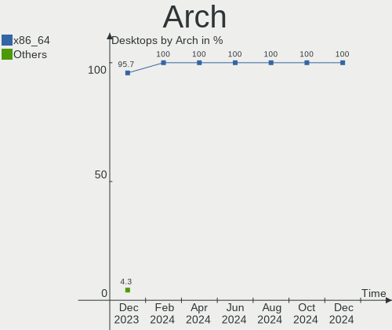
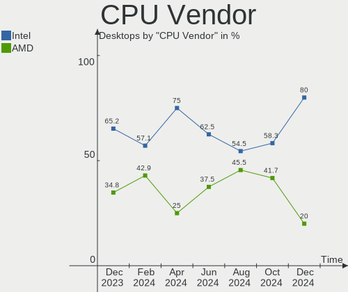
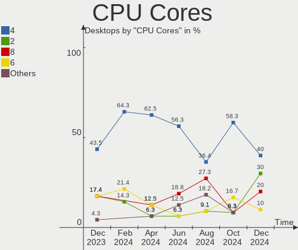
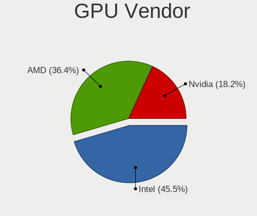
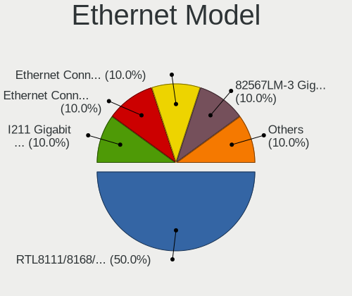
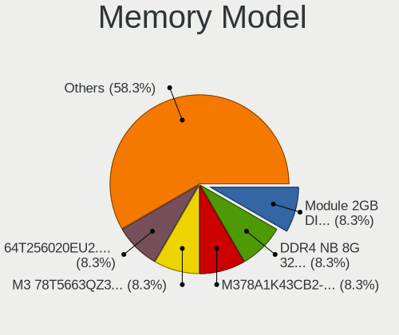

LMDE - Hardware Trends (Desktops)
---------------------------------

A project to identify most popular hardware characteristics and track their change
over time based on data collected by Linux users at https://Linux-Hardware.org.

Anyone can contribute to this report by the [hw-probe](https://github.com/linuxhw/hw-probe) tool:

    sudo -E hw-probe -all -upload

This report is for one last month. Overall report since the beginning of time: [TestCoverage](https://github.com/linuxhw/TestCoverage)

Period: Dec, 2022.

Contents
--------

* [ System ](#system)
  - [ OS                       ](#os)
  - [ OS Family                ](#os-family)
  - [ Kernel                   ](#kernel)
  - [ Kernel Family            ](#kernel-family)
  - [ Kernel Major Ver.        ](#kernel-major-ver)
  - [ Arch                     ](#arch)
  - [ DE                       ](#de)
  - [ Display Server           ](#display-server)
  - [ Display Manager          ](#display-manager)
  - [ OS Lang                  ](#os-lang)
  - [ Boot Mode                ](#boot-mode)
  - [ Filesystem               ](#filesystem)
  - [ Part. scheme             ](#part-scheme)
  - [ Dual Boot with Linux/BSD ](#dual-boot-with-linuxbsd)
  - [ Dual Boot (Win)          ](#dual-boot-win)

* [ Board ](#board)
  - [ Vendor                   ](#vendor)
  - [ Model                    ](#model)
  - [ Model Family             ](#model-family)
  - [ MFG Year                 ](#mfg-year)
  - [ Form Factor              ](#form-factor)
  - [ Secure Boot              ](#secure-boot)
  - [ Coreboot                 ](#coreboot)
  - [ RAM Size                 ](#ram-size)
  - [ RAM Used                 ](#ram-used)
  - [ Total Drives             ](#total-drives)
  - [ Has CD-ROM               ](#has-cd-rom)
  - [ Has Ethernet             ](#has-ethernet)
  - [ Has WiFi                 ](#has-wifi)
  - [ Has Bluetooth            ](#has-bluetooth)

* [ Location ](#location)
  - [ Country                  ](#country)
  - [ City                     ](#city)

* [ Drives ](#drives)
  - [ Drive Vendor             ](#drive-vendor)
  - [ Drive Model              ](#drive-model)
  - [ HDD Vendor               ](#hdd-vendor)
  - [ SSD Vendor               ](#ssd-vendor)
  - [ Drive Kind               ](#drive-kind)
  - [ Drive Connector          ](#drive-connector)
  - [ Drive Size               ](#drive-size)
  - [ Space Total              ](#space-total)
  - [ Space Used               ](#space-used)
  - [ Malfunc. Drives          ](#malfunc-drives)
  - [ Malfunc. Drive Vendor    ](#malfunc-drive-vendor)
  - [ Malfunc. HDD Vendor      ](#malfunc-hdd-vendor)
  - [ Malfunc. Drive Kind      ](#malfunc-drive-kind)
  - [ Failed Drives            ](#failed-drives)
  - [ Failed Drive Vendor      ](#failed-drive-vendor)
  - [ Drive Status             ](#drive-status)

* [ Storage controller ](#storage-controller)
  - [ Storage Vendor           ](#storage-vendor)
  - [ Storage Model            ](#storage-model)
  - [ Storage Kind             ](#storage-kind)

* [ Processor ](#processor)
  - [ CPU Vendor               ](#cpu-vendor)
  - [ CPU Model                ](#cpu-model)
  - [ CPU Model Family         ](#cpu-model-family)
  - [ CPU Cores                ](#cpu-cores)
  - [ CPU Sockets              ](#cpu-sockets)
  - [ CPU Threads              ](#cpu-threads)
  - [ CPU Op-Modes             ](#cpu-op-modes)
  - [ CPU Microcode            ](#cpu-microcode)
  - [ CPU Microarch            ](#cpu-microarch)

* [ Graphics ](#graphics)
  - [ GPU Vendor               ](#gpu-vendor)
  - [ GPU Model                ](#gpu-model)
  - [ GPU Combo                ](#gpu-combo)
  - [ GPU Driver               ](#gpu-driver)
  - [ GPU Memory               ](#gpu-memory)

* [ Monitor ](#monitor)
  - [ Monitor Vendor           ](#monitor-vendor)
  - [ Monitor Model            ](#monitor-model)
  - [ Monitor Resolution       ](#monitor-resolution)
  - [ Monitor Diagonal         ](#monitor-diagonal)
  - [ Monitor Width            ](#monitor-width)
  - [ Aspect Ratio             ](#aspect-ratio)
  - [ Monitor Area             ](#monitor-area)
  - [ Pixel Density            ](#pixel-density)
  - [ Multiple Monitors        ](#multiple-monitors)

* [ Network ](#network)
  - [ Net Controller Vendor    ](#net-controller-vendor)
  - [ Net Controller Model     ](#net-controller-model)
  - [ Wireless Vendor          ](#wireless-vendor)
  - [ Wireless Model           ](#wireless-model)
  - [ Ethernet Vendor          ](#ethernet-vendor)
  - [ Ethernet Model           ](#ethernet-model)
  - [ Net Controller Kind      ](#net-controller-kind)
  - [ Used Controller          ](#used-controller)
  - [ NICs                     ](#nics)
  - [ IPv6                     ](#ipv6)

* [ Bluetooth ](#bluetooth)
  - [ Bluetooth Vendor         ](#bluetooth-vendor)
  - [ Bluetooth Model          ](#bluetooth-model)

* [ Sound ](#sound)
  - [ Sound Vendor             ](#sound-vendor)
  - [ Sound Model              ](#sound-model)

* [ Memory ](#memory)
  - [ Memory Vendor            ](#memory-vendor)
  - [ Memory Model             ](#memory-model)
  - [ Memory Kind              ](#memory-kind)
  - [ Memory Form Factor       ](#memory-form-factor)
  - [ Memory Size              ](#memory-size)
  - [ Memory Speed             ](#memory-speed)

* [ Printers & scanners ](#printers--scanners)
  - [ Printer Vendor           ](#printer-vendor)
  - [ Printer Model            ](#printer-model)
  - [ Scanner Vendor           ](#scanner-vendor)
  - [ Scanner Model            ](#scanner-model)

* [ Camera ](#camera)
  - [ Camera Vendor            ](#camera-vendor)
  - [ Camera Model             ](#camera-model)

* [ Security ](#security)
  - [ Fingerprint Vendor       ](#fingerprint-vendor)
  - [ Fingerprint Model        ](#fingerprint-model)
  - [ Chipcard Vendor          ](#chipcard-vendor)
  - [ Chipcard Model           ](#chipcard-model)

* [ Unsupported ](#unsupported)
  - [ Unsupported Devices      ](#unsupported-devices)
  - [ Unsupported Device Types ](#unsupported-device-types)

System
------

OS
--

Installed operating systems

| Name   | Desktops | Percent |
|--------|----------|---------|
| LMDE 5 | 10       | 100%    |

OS Family
---------

OS without a version

| Name | Desktops | Percent |
|------|----------|---------|
| LMDE | 10       | 100%    |

Kernel
------

Version of the Linux kernel

| Version         | Desktops | Percent |
|-----------------|----------|---------|
| 5.10.0-20-amd64 | 4        | 40%     |
| 5.10.0-19-amd64 | 3        | 30%     |
| 5.10.0-12-amd64 | 3        | 30%     |

Kernel Family
-------------

Linux kernel without a distro release

| Version | Desktops | Percent |
|---------|----------|---------|
| 5.10.0  | 10       | 100%    |

Kernel Major Ver.
-----------------

Linux kernel major version

| Version | Desktops | Percent |
|---------|----------|---------|
| 5.10    | 10       | 100%    |

Arch
----

OS architecture (x86_64, i586, etc.)

| Name   | Desktops | Percent |
|--------|----------|---------|
| x86_64 | 10       | 100%    |

DE
--

Desktop Environment

| Name       | Desktops | Percent |
|------------|----------|---------|
| X-Cinnamon | 9        | 90%     |
| Cinnamon   | 1        | 10%     |

Display Server
--------------

X11 or Wayland

| Name | Desktops | Percent |
|------|----------|---------|
| X11  | 10       | 100%    |

Display Manager
---------------

SDDM, LightDM, etc.

| Name    | Desktops | Percent |
|---------|----------|---------|
| Unknown | 8        | 80%     |
| LightDM | 1        | 10%     |
| GDM     | 1        | 10%     |

OS Lang
-------

Language

| Lang  | Desktops | Percent |
|-------|----------|---------|
| en_US | 3        | 30%     |
| de_DE | 2        | 20%     |
| sv_SE | 1        | 10%     |
| ru_RU | 1        | 10%     |
| it_IT | 1        | 10%     |
| en_ZA | 1        | 10%     |
| cs_CZ | 1        | 10%     |

Boot Mode
---------

EFI or BIOS

| Mode | Desktops | Percent |
|------|----------|---------|
| BIOS | 7        | 70%     |
| EFI  | 3        | 30%     |

Filesystem
----------

Type of filesystem

| Type  | Desktops | Percent |
|-------|----------|---------|
| Ext4  | 8        | 80%     |
| Tmpfs | 1        | 10%     |
| Btrfs | 1        | 10%     |

Part. scheme
------------

Scheme of partitioning

| Type    | Desktops | Percent |
|---------|----------|---------|
| Unknown | 8        | 80%     |
| MBR     | 1        | 10%     |
| GPT     | 1        | 10%     |

Dual Boot with Linux/BSD
------------------------

Hosting more than one Linux/BSD

| Dual boot | Desktops | Percent |
|-----------|----------|---------|
| No        | 9        | 90%     |
| Yes       | 1        | 10%     |

Dual Boot (Win)
---------------

Hosting Linux and Windows

| Dual boot | Desktops | Percent |
|-----------|----------|---------|
| No        | 9        | 90%     |
| Yes       | 1        | 10%     |

Board
-----

Vendor
------

Motherboard manufacturer

| Name                | Desktops | Percent |
|---------------------|----------|---------|
| ASUSTek Computer    | 5        | 50%     |
| Dell                | 2        | 20%     |
| SiYW                | 1        | 10%     |
| Gigabyte Technology | 1        | 10%     |
| Fujitsu             | 1        | 10%     |

Model
-----

Motherboard model

| Name                      | Desktops | Percent |
|---------------------------|----------|---------|
| SiYW V200 Series          | 1        | 10%     |
| Gigabyte GA-970A-D3       | 1        | 10%     |
| Fujitsu D3003-S2          | 1        | 10%     |
| Dell Vostro 3900          | 1        | 10%     |
| Dell OptiPlex 780         | 1        | 10%     |
| ASUS Z170M-PLUS           | 1        | 10%     |
| ASUS RJ083AA-ABZ t3630.it | 1        | 10%     |
| ASUS PRIME B450-PLUS      | 1        | 10%     |
| ASUS PRIME B350M-A        | 1        | 10%     |
| ASUS P7P55D               | 1        | 10%     |

Model Family
------------

Motherboard model prefix

| Name                | Desktops | Percent |
|---------------------|----------|---------|
| ASUS PRIME          | 2        | 20%     |
| SiYW V200           | 1        | 10%     |
| Gigabyte GA-970A-D3 | 1        | 10%     |
| Fujitsu D3003-S2    | 1        | 10%     |
| Dell Vostro         | 1        | 10%     |
| Dell OptiPlex       | 1        | 10%     |
| ASUS Z170M-PLUS     | 1        | 10%     |
| ASUS RJ083AA-ABZ    | 1        | 10%     |
| ASUS P7P55D         | 1        | 10%     |

MFG Year
--------

Motherboard manufacture year

| Year | Desktops | Percent |
|------|----------|---------|
| 2018 | 2        | 20%     |
| 2011 | 2        | 20%     |
| 2017 | 1        | 10%     |
| 2015 | 1        | 10%     |
| 2013 | 1        | 10%     |
| 2010 | 1        | 10%     |
| 2009 | 1        | 10%     |
| 2006 | 1        | 10%     |

Form Factor
-----------

Physical design of the computer

| Name    | Desktops | Percent |
|---------|----------|---------|
| Desktop | 10       | 100%    |

Secure Boot
-----------

Enabled or disabled

| State    | Desktops | Percent |
|----------|----------|---------|
| Disabled | 10       | 100%    |

Coreboot
--------

Have coreboot on board

| Used | Desktops | Percent |
|------|----------|---------|
| No   | 10       | 100%    |

RAM Size
--------

Total RAM memory

| Size in GB | Desktops | Percent |
|------------|----------|---------|
| 16.01-24.0 | 3        | 30%     |
| 8.01-16.0  | 3        | 30%     |
| 32.01-64.0 | 2        | 20%     |
| 4.01-8.0   | 1        | 10%     |
| 0.51-1.0   | 1        | 10%     |

RAM Used
--------

Used RAM memory

| Used GB  | Desktops | Percent |
|----------|----------|---------|
| 1.01-2.0 | 4        | 40%     |
| 4.01-8.0 | 3        | 30%     |
| 2.01-3.0 | 2        | 20%     |
| 0.51-1.0 | 1        | 10%     |

Total Drives
------------

Number of drives on board

| Drives | Desktops | Percent |
|--------|----------|---------|
| 2      | 4        | 40%     |
| 1      | 4        | 40%     |
| 6      | 1        | 10%     |
| 5      | 1        | 10%     |

Has CD-ROM
----------

Has CD-ROM on board

| Presented | Desktops | Percent |
|-----------|----------|---------|
| No        | 7        | 70%     |
| Yes       | 3        | 30%     |

Has Ethernet
------------

Has Ethernet on board

| Presented | Desktops | Percent |
|-----------|----------|---------|
| Yes       | 9        | 90%     |
| No        | 1        | 10%     |

Has WiFi
--------

Has WiFi module

| Presented | Desktops | Percent |
|-----------|----------|---------|
| Yes       | 5        | 50%     |
| No        | 5        | 50%     |

Has Bluetooth
-------------

Has Bluetooth module

| Presented | Desktops | Percent |
|-----------|----------|---------|
| No        | 8        | 80%     |
| Yes       | 2        | 20%     |

Location
--------

Country
-------

Geographic location (country)

| Country      | Desktops | Percent |
|--------------|----------|---------|
| Germany      | 3        | 30%     |
| USA          | 2        | 20%     |
| Sweden       | 1        | 10%     |
| South Africa | 1        | 10%     |
| Russia       | 1        | 10%     |
| Italy        | 1        | 10%     |
| Canada       | 1        | 10%     |

City
----

Geographic location (city)

| City              | Desktops | Percent |
|-------------------|----------|---------|
| Oxford            | 1        | 10%     |
| Malente           | 1        | 10%     |
| Krasnoyarsk       | 1        | 10%     |
| Gothenburg        | 1        | 10%     |
| Frankfurt am Main | 1        | 10%     |
| Eberswalde        | 1        | 10%     |
| Clovis            | 1        | 10%     |
| Centurion         | 1        | 10%     |
| Belleville        | 1        | 10%     |
| Abbiategrasso     | 1        | 10%     |

Drives
------

Drive Vendor
------------

Hard drive vendors

| Vendor              | Desktops | Drives | Percent |
|---------------------|----------|--------|---------|
| WDC                 | 6        | 6      | 30%     |
| Seagate             | 4        | 5      | 20%     |
| Samsung Electronics | 3        | 4      | 15%     |
| Kingston            | 2        | 2      | 10%     |
| SPCC                | 1        | 1      | 5%      |
| Intenso             | 1        | 1      | 5%      |
| Hitachi             | 1        | 1      | 5%      |
| Gigabyte Technology | 1        | 2      | 5%      |
| Apacer              | 1        | 1      | 5%      |

Drive Model
-----------

Hard drive models

| Model                                | Desktops | Percent |
|--------------------------------------|----------|---------|
| WDC WDS500G2B0B-00YS70 500GB SSD     | 1        | 4.55%   |
| WDC WD30EZRZ-00Z5HB0 3TB             | 1        | 4.55%   |
| WDC WD10SPZX-21Z10T0 1TB             | 1        | 4.55%   |
| WDC WD10EZRX-00DC0B0 1TB             | 1        | 4.55%   |
| WDC WD10EZEX-75M2NA0 1TB             | 1        | 4.55%   |
| WDC WD10EACS-00D6B0 1TB              | 1        | 4.55%   |
| SPCC Solid State Disk 120GB          | 1        | 4.55%   |
| Seagate ST3250824AS 250GB            | 1        | 4.55%   |
| Seagate ST3250318AS 250GB            | 1        | 4.55%   |
| Seagate ST2000LX001-1RG174 2TB       | 1        | 4.55%   |
| Seagate ST1000LM024 HN-M101MBB 1TB   | 1        | 4.55%   |
| Seagate ST1000DM010-2EP102 1TB       | 1        | 4.55%   |
| Samsung SSD 850 EVO 500GB            | 1        | 4.55%   |
| Samsung SSD 850 EVO 250GB            | 1        | 4.55%   |
| Samsung MZNLN512HMJP-000H1 512GB SSD | 1        | 4.55%   |
| Samsung MZ7TD128HAFV-00000 128GB SSD | 1        | 4.55%   |
| Kingston SA400S37480G 480GB SSD      | 1        | 4.55%   |
| Kingston SA400S37240G 240GB SSD      | 1        | 4.55%   |
| Intenso External USB 3.0 1TB         | 1        | 4.55%   |
| Hitachi HCC547550A9E380 500GB        | 1        | 4.55%   |
| Gigabyte GP-GSTFS31256GTND 256GB     | 1        | 4.55%   |
| Apacer AS350 256GB SSD               | 1        | 4.55%   |

HDD Vendor
----------

Hard disk drive vendors

| Vendor  | Desktops | Drives | Percent |
|---------|----------|--------|---------|
| WDC     | 5        | 5      | 45.45%  |
| Seagate | 4        | 5      | 36.36%  |
| Intenso | 1        | 1      | 9.09%   |
| Hitachi | 1        | 1      | 9.09%   |

SSD Vendor
----------

Solid state drive vendors

| Vendor              | Desktops | Drives | Percent |
|---------------------|----------|--------|---------|
| Samsung Electronics | 3        | 4      | 33.33%  |
| Kingston            | 2        | 2      | 22.22%  |
| WDC                 | 1        | 1      | 11.11%  |
| SPCC                | 1        | 1      | 11.11%  |
| Gigabyte Technology | 1        | 2      | 11.11%  |
| Apacer              | 1        | 1      | 11.11%  |

Drive Kind
----------

HDD or SSD

| Kind | Desktops | Drives | Percent |
|------|----------|--------|---------|
| HDD  | 8        | 12     | 53.33%  |
| SSD  | 7        | 11     | 46.67%  |

Drive Connector
---------------

SATA, SAS, NVMe, etc.

| Type | Desktops | Drives | Percent |
|------|----------|--------|---------|
| SATA | 10       | 22     | 90.91%  |
| SAS  | 1        | 1      | 9.09%   |

Drive Size
----------

Size of hard drive

| Size in TB | Desktops | Drives | Percent |
|------------|----------|--------|---------|
| 0.01-0.5   | 8        | 13     | 50%     |
| 0.51-1.0   | 6        | 8      | 37.5%   |
| 2.01-3.0   | 1        | 1      | 6.25%   |
| 1.01-2.0   | 1        | 1      | 6.25%   |

Space Total
-----------

Amount of disk space available on the file system

| Size in GB     | Desktops | Percent |
|----------------|----------|---------|
| 251-500        | 3        | 30%     |
| 101-250        | 2        | 20%     |
| 501-1000       | 2        | 20%     |
| More than 3000 | 1        | 10%     |
| 1001-2000      | 1        | 10%     |
| 1-20           | 1        | 10%     |

Space Used
----------

Amount of used disk space

| Used GB        | Desktops | Percent |
|----------------|----------|---------|
| 1-20           | 4        | 40%     |
| 251-500        | 2        | 20%     |
| 51-100         | 2        | 20%     |
| More than 3000 | 1        | 10%     |
| 501-1000       | 1        | 10%     |

Malfunc. Drives
---------------

Drive models with a malfunction

Zero info for selected period =(

Malfunc. Drive Vendor
---------------------

Vendors of faulty drives

Zero info for selected period =(

Malfunc. HDD Vendor
-------------------

Vendors of faulty HDD drives

Zero info for selected period =(

Malfunc. Drive Kind
-------------------

Kinds of faulty drives

Zero info for selected period =(

Failed Drives
-------------

Failed drive models

Zero info for selected period =(

Failed Drive Vendor
-------------------

Failed drive vendors

Zero info for selected period =(

Drive Status
------------

Number of failed and malfunc. drives

| Status   | Desktops | Drives | Percent |
|----------|----------|--------|---------|
| Detected | 9        | 17     | 81.82%  |
| Works    | 2        | 6      | 18.18%  |

Storage controller
------------------

Storage Vendor
--------------

Storage controller vendors

| Vendor             | Desktops | Percent |
|--------------------|----------|---------|
| Intel              | 6        | 54.55%  |
| AMD                | 4        | 36.36%  |
| JMicron Technology | 1        | 9.09%   |

Storage Model
-------------

Storage controller models

| Model                                                                          | Desktops | Percent |
|--------------------------------------------------------------------------------|----------|---------|
| AMD SB7x0/SB8x0/SB9x0 SATA Controller [AHCI mode]                              | 2        | 14.29%  |
| AMD FCH SATA Controller [AHCI mode]                                            | 2        | 14.29%  |
| JMicron JMB363 SATA/IDE Controller                                             | 1        | 7.14%   |
| Intel Sunrise Point-LP SATA Controller [AHCI mode]                             | 1        | 7.14%   |
| Intel SATA Controller [RAID mode]                                              | 1        | 7.14%   |
| Intel Q170/Q150/B150/H170/H110/Z170/CM236 Chipset SATA Controller [AHCI Mode]  | 1        | 7.14%   |
| Intel NM10/ICH7 Family SATA Controller [AHCI mode]                             | 1        | 7.14%   |
| Intel 82801G (ICH7 Family) IDE Controller                                      | 1        | 7.14%   |
| Intel 8 Series/C220 Series Chipset Family 6-port SATA Controller 1 [AHCI mode] | 1        | 7.14%   |
| Intel 5 Series/3400 Series Chipset 6 port SATA AHCI Controller                 | 1        | 7.14%   |
| AMD 400 Series Chipset SATA Controller                                         | 1        | 7.14%   |
| AMD 300 Series Chipset SATA Controller                                         | 1        | 7.14%   |

Storage Kind
------------

Kind of storage controller (IDE, SATA, NVMe, SAS, ...)

| Kind | Desktops | Percent |
|------|----------|---------|
| SATA | 9        | 75%     |
| IDE  | 2        | 16.67%  |
| RAID | 1        | 8.33%   |

Processor
---------

CPU Vendor
----------

Processor vendors

| Vendor | Desktops | Percent |
|--------|----------|---------|
| Intel  | 6        | 60%     |
| AMD    | 4        | 40%     |

CPU Model
---------

Processor models

| Model                                 | Desktops | Percent |
|---------------------------------------|----------|---------|
| Intel Pentium D CPU 2.80GHz           | 1        | 10%     |
| Intel Core i7-8650U CPU @ 1.90GHz     | 1        | 10%     |
| Intel Core i5-6600K CPU @ 3.50GHz     | 1        | 10%     |
| Intel Core i5-4460 CPU @ 3.20GHz      | 1        | 10%     |
| Intel Core i5 CPU 750 @ 2.67GHz       | 1        | 10%     |
| Intel Core 2 Quad CPU Q6700 @ 2.66GHz | 1        | 10%     |
| AMD Ryzen 5 2600 Six-Core Processor   | 1        | 10%     |
| AMD Ryzen 5 1400 Quad-Core Processor  | 1        | 10%     |
| AMD G-T56N Processor                  | 1        | 10%     |
| AMD FX-8120 Eight-Core Processor      | 1        | 10%     |

CPU Model Family
----------------

Processor model prefix

| Model             | Desktops | Percent |
|-------------------|----------|---------|
| Intel Core i5     | 3        | 30%     |
| AMD Ryzen 5       | 2        | 20%     |
| Intel Pentium D   | 1        | 10%     |
| Intel Core i7     | 1        | 10%     |
| Intel Core 2 Quad | 1        | 10%     |
| AMD G             | 1        | 10%     |
| AMD FX            | 1        | 10%     |

CPU Cores
---------

Number of processor cores

| Number | Desktops | Percent |
|--------|----------|---------|
| 4      | 7        | 70%     |
| 2      | 2        | 20%     |
| 6      | 1        | 10%     |

CPU Sockets
-----------

Number of sockets

| Number | Desktops | Percent |
|--------|----------|---------|
| 1      | 10       | 100%    |

CPU Threads
-----------

Threads per core (Hyper-Threading)

| Number | Desktops | Percent |
|--------|----------|---------|
| 1      | 6        | 60%     |
| 2      | 4        | 40%     |

CPU Op-Modes
------------

CPU Operation Modes (32-bit, 64-bit)

| Op mode        | Desktops | Percent |
|----------------|----------|---------|
| 32-bit, 64-bit | 10       | 100%    |

CPU Microcode
-------------

Microcode number

| Number     | Desktops | Percent |
|------------|----------|---------|
| 0xf47      | 1        | 10%     |
| 0x806ea    | 1        | 10%     |
| 0x6fb      | 1        | 10%     |
| 0x506e3    | 1        | 10%     |
| 0x306c3    | 1        | 10%     |
| 0x106e5    | 1        | 10%     |
| 0x0800820d | 1        | 10%     |
| 0x08001129 | 1        | 10%     |
| 0x0600063d | 1        | 10%     |
| 0x05000119 | 1        | 10%     |

CPU Microarch
-------------

Microarchitecture

| Name      | Desktops | Percent |
|-----------|----------|---------|
| Zen+      | 1        | 10%     |
| Zen       | 1        | 10%     |
| Skylake   | 1        | 10%     |
| NetBurst  | 1        | 10%     |
| Nehalem   | 1        | 10%     |
| KabyLake  | 1        | 10%     |
| Haswell   | 1        | 10%     |
| Core      | 1        | 10%     |
| Bulldozer | 1        | 10%     |
| Bobcat    | 1        | 10%     |

Graphics
--------

GPU Vendor
----------

Vendors of graphics cards

| Vendor | Desktops | Percent |
|--------|----------|---------|
| Nvidia | 7        | 63.64%  |
| Intel  | 2        | 18.18%  |
| AMD    | 2        | 18.18%  |

GPU Model
---------

Graphics card models

| Model                                                   | Desktops | Percent |
|---------------------------------------------------------|----------|---------|
| Nvidia GK208B [GeForce GT 710]                          | 2        | 18.18%  |
| Nvidia TU116 [GeForce GTX 1660]                         | 1        | 9.09%   |
| Nvidia GP107GL [Quadro P620]                            | 1        | 9.09%   |
| Nvidia GP104 [GeForce GTX 1070]                         | 1        | 9.09%   |
| Nvidia G92 [GeForce GTS 250]                            | 1        | 9.09%   |
| Nvidia G72 [GeForce 7500 LE]                            | 1        | 9.09%   |
| Intel UHD Graphics 620                                  | 1        | 9.09%   |
| Intel HD Graphics 530                                   | 1        | 9.09%   |
| AMD Wrestler [Radeon HD 6320]                           | 1        | 9.09%   |
| AMD Ellesmere [Radeon RX 470/480/570/570X/580/580X/590] | 1        | 9.09%   |

GPU Combo
---------

Combinations of graphics cards

| Name       | Desktops | Percent |
|------------|----------|---------|
| 1 x Nvidia | 7        | 70%     |
| 1 x AMD    | 2        | 20%     |
| 1 x Intel  | 1        | 10%     |

GPU Driver
----------

Free vs proprietary

| Driver      | Desktops | Percent |
|-------------|----------|---------|
| Free        | 7        | 70%     |
| Proprietary | 3        | 30%     |

GPU Memory
----------

Total video memory

| Size in GB | Desktops | Percent |
|------------|----------|---------|
| 1.01-2.0   | 3        | 30%     |
| 7.01-8.0   | 2        | 20%     |
| 0.01-0.5   | 2        | 20%     |
| 5.01-6.0   | 1        | 10%     |
| 0.51-1.0   | 1        | 10%     |
| Unknown    | 1        | 10%     |

Monitor
-------

Monitor Vendor
--------------

Monitor vendors

| Vendor   | Desktops | Percent |
|----------|----------|---------|
| Acer     | 4        | 36.36%  |
| Dell     | 2        | 18.18%  |
| SKY      | 1        | 9.09%   |
| Philips  | 1        | 9.09%   |
| HannStar | 1        | 9.09%   |
| Goldstar | 1        | 9.09%   |
| Unknown  | 1        | 9.09%   |

Monitor Model
-------------

Monitor models

| Model                                                   | Desktops | Percent |
|---------------------------------------------------------|----------|---------|
| SKY TV-monitor SKY1402 3840x2160 708x398mm 32.0-inch    | 1        | 8.33%   |
| SKY TV SKY1502 3840x2160 1150x650mm 52.0-inch           | 1        | 8.33%   |
| Philips PHL 242V8 PHLC219 1920x1080 527x296mm 23.8-inch | 1        | 8.33%   |
| HannStar HU151 HSD5555 1024x768 304x228mm 15.0-inch     | 1        | 8.33%   |
| Goldstar L1952TX GSM4AE2 1280x1024 376x301mm 19.0-inch  | 1        | 8.33%   |
| Dell SE2717H/HX DELD0A1 1920x1080 600x340mm 27.2-inch   | 1        | 8.33%   |
| Dell P190S DEL405B 1280x1024 376x301mm 19.0-inch        | 1        | 8.33%   |
| Acer X34 ACR0450 3440x1440 800x340mm 34.2-inch          | 1        | 8.33%   |
| Acer T272HL ACR013B 1920x1080 598x336mm 27.0-inch       | 1        | 8.33%   |
| Acer SB220Q ACR06AB 1920x1080 476x268mm 21.5-inch       | 1        | 8.33%   |
| Acer LCD Monitor B243W 1920x1200                        | 1        | 8.33%   |
| Unknown                                                 | 1        | 8.33%   |

Monitor Resolution
------------------

Monitor screen resolution

| Resolution        | Desktops | Percent |
|-------------------|----------|---------|
| 1920x1080 (FHD)   | 3        | 33.33%  |
| 3840x2160 (4K)    | 1        | 11.11%  |
| 3440x1440         | 1        | 11.11%  |
| 1920x1200 (WUXGA) | 1        | 11.11%  |
| 1360x768          | 1        | 11.11%  |
| 1280x1024 (SXGA)  | 1        | 11.11%  |
| 1024x768 (XGA)    | 1        | 11.11%  |

Monitor Diagonal
----------------

Diagonal size in inches

| Inches  | Desktops | Percent |
|---------|----------|---------|
| 27      | 2        | 18.18%  |
| Unknown | 2        | 18.18%  |
| 52      | 1        | 9.09%   |
| 34      | 1        | 9.09%   |
| 32      | 1        | 9.09%   |
| 24      | 1        | 9.09%   |
| 21      | 1        | 9.09%   |
| 19      | 1        | 9.09%   |
| 15      | 1        | 9.09%   |

Monitor Width
-------------

Physical width

| Width in mm | Desktops | Percent |
|-------------|----------|---------|
| 501-600     | 3        | 27.27%  |
| 701-800     | 2        | 18.18%  |
| Unknown     | 2        | 18.18%  |
| 401-500     | 1        | 9.09%   |
| 351-400     | 1        | 9.09%   |
| 301-350     | 1        | 9.09%   |
| 1001-1500   | 1        | 9.09%   |

Aspect Ratio
------------

Proportional relationship between the width and the height

| Ratio   | Desktops | Percent |
|---------|----------|---------|
| 16/9    | 4        | 44.44%  |
| Unknown | 2        | 22.22%  |
| 5/4     | 1        | 11.11%  |
| 4/3     | 1        | 11.11%  |
| 21/9    | 1        | 11.11%  |

Monitor Area
------------

Area in inch²

| Area in inch² | Desktops | Percent |
|----------------|----------|---------|
| 351-500        | 2        | 18.18%  |
| 301-350        | 2        | 18.18%  |
| 201-250        | 2        | 18.18%  |
| Unknown        | 2        | 18.18%  |
| More than 1000 | 1        | 9.09%   |
| 151-200        | 1        | 9.09%   |
| 101-110        | 1        | 9.09%   |

Pixel Density
-------------

Pixels per inch

| Density | Desktops | Percent |
|---------|----------|---------|
| 51-100  | 6        | 54.55%  |
| 101-120 | 2        | 18.18%  |
| Unknown | 2        | 18.18%  |
| 121-160 | 1        | 9.09%   |

Multiple Monitors
-----------------

Total monitors connected

| Total | Desktops | Percent |
|-------|----------|---------|
| 1     | 7        | 70%     |
| 2     | 3        | 30%     |

Network
-------

Net Controller Vendor
---------------------

Controller vendors

| Vendor                   | Desktops | Percent |
|--------------------------|----------|---------|
| Realtek Semiconductor    | 7        | 50%     |
| Intel                    | 4        | 28.57%  |
| Qualcomm Atheros         | 1        | 7.14%   |
| Huawei Technologies      | 1        | 7.14%   |
| HTC (High Tech Computer) | 1        | 7.14%   |

Net Controller Model
--------------------

Controller models

| Model                                                                          | Desktops | Percent |
|--------------------------------------------------------------------------------|----------|---------|
| Realtek RTL8111/8168/8411 PCI Express Gigabit Ethernet Controller              | 6        | 37.5%   |
| Realtek RTL8188EUS 802.11n Wireless Network Adapter                            | 2        | 12.5%   |
| Realtek RTL88x2bu [AC1200 Techkey]                                             | 1        | 6.25%   |
| Qualcomm Atheros AR5413/AR5414 Wireless Network Adapter [AR5006X(S) 802.11abg] | 1        | 6.25%   |
| Intel Wireless 3165                                                            | 1        | 6.25%   |
| Intel NM10/ICH7 Family LAN Controller                                          | 1        | 6.25%   |
| Intel Ethernet Connection (2) I219-V                                           | 1        | 6.25%   |
| Intel 82567LM-3 Gigabit Network Connection                                     | 1        | 6.25%   |
| Huawei STK-L21                                                                 | 1        | 6.25%   |
| HTC (High Tech Computer) Desire HD (modem mode)                                | 1        | 6.25%   |

Wireless Vendor
---------------

Wireless vendors

| Vendor                | Desktops | Percent |
|-----------------------|----------|---------|
| Realtek Semiconductor | 3        | 60%     |
| Qualcomm Atheros      | 1        | 20%     |
| Intel                 | 1        | 20%     |

Wireless Model
--------------

Wireless models

| Model                                                                          | Desktops | Percent |
|--------------------------------------------------------------------------------|----------|---------|
| Realtek RTL8188EUS 802.11n Wireless Network Adapter                            | 2        | 40%     |
| Realtek RTL88x2bu [AC1200 Techkey]                                             | 1        | 20%     |
| Qualcomm Atheros AR5413/AR5414 Wireless Network Adapter [AR5006X(S) 802.11abg] | 1        | 20%     |
| Intel Wireless 3165                                                            | 1        | 20%     |

Ethernet Vendor
---------------

Ethernet vendors

| Vendor                   | Desktops | Percent |
|--------------------------|----------|---------|
| Realtek Semiconductor    | 6        | 54.55%  |
| Intel                    | 3        | 27.27%  |
| Huawei Technologies      | 1        | 9.09%   |
| HTC (High Tech Computer) | 1        | 9.09%   |

Ethernet Model
--------------

Ethernet models

| Model                                                             | Desktops | Percent |
|-------------------------------------------------------------------|----------|---------|
| Realtek RTL8111/8168/8411 PCI Express Gigabit Ethernet Controller | 6        | 54.55%  |
| Intel NM10/ICH7 Family LAN Controller                             | 1        | 9.09%   |
| Intel Ethernet Connection (2) I219-V                              | 1        | 9.09%   |
| Intel 82567LM-3 Gigabit Network Connection                        | 1        | 9.09%   |
| Huawei STK-L21                                                    | 1        | 9.09%   |
| HTC (High Tech Computer) Desire HD (modem mode)                   | 1        | 9.09%   |

Net Controller Kind
-------------------

Ethernet, WiFi or modem

| Kind     | Desktops | Percent |
|----------|----------|---------|
| Ethernet | 9        | 64.29%  |
| WiFi     | 5        | 35.71%  |

Used Controller
---------------

Currently used network controller

| Kind     | Desktops | Percent |
|----------|----------|---------|
| Ethernet | 7        | 70%     |
| WiFi     | 3        | 30%     |

NICs
----

Total network controllers on board

| Total | Desktops | Percent |
|-------|----------|---------|
| 1     | 6        | 60%     |
| 2     | 3        | 30%     |
| 0     | 1        | 10%     |

IPv6
----

IPv6 vs IPv4

| Used | Desktops | Percent |
|------|----------|---------|
| No   | 7        | 70%     |
| Yes  | 3        | 30%     |

Bluetooth
---------

Bluetooth Vendor
----------------

Controller vendors

| Vendor                  | Desktops | Percent |
|-------------------------|----------|---------|
| Intel                   | 1        | 50%     |
| Cambridge Silicon Radio | 1        | 50%     |

Bluetooth Model
---------------

Controller models

| Model                                               | Desktops | Percent |
|-----------------------------------------------------|----------|---------|
| Intel Bluetooth wireless interface                  | 1        | 50%     |
| Cambridge Silicon Radio Bluetooth Dongle (HCI mode) | 1        | 50%     |

Sound
-----

Sound Vendor
------------

Sound card vendors

| Vendor    | Desktops | Percent |
|-----------|----------|---------|
| Intel     | 6        | 37.5%   |
| Nvidia    | 5        | 31.25%  |
| AMD       | 4        | 25%     |
| GN Netcom | 1        | 6.25%   |

Sound Model
-----------

Sound card models

| Model                                                               | Desktops | Percent |
|---------------------------------------------------------------------|----------|---------|
| Nvidia GK208 HDMI/DP Audio Controller                               | 2        | 11.11%  |
| AMD SBx00 Azalia (Intel HDA)                                        | 2        | 11.11%  |
| AMD Family 17h (Models 00h-0fh) HD Audio Controller                 | 2        | 11.11%  |
| Nvidia TU116 High Definition Audio Controller                       | 1        | 5.56%   |
| Nvidia GP107GL High Definition Audio Controller                     | 1        | 5.56%   |
| Nvidia GP104 High Definition Audio Controller                       | 1        | 5.56%   |
| Intel Sunrise Point-LP HD Audio                                     | 1        | 5.56%   |
| Intel NM10/ICH7 Family High Definition Audio Controller             | 1        | 5.56%   |
| Intel 82801JD/DO (ICH10 Family) HD Audio Controller                 | 1        | 5.56%   |
| Intel 8 Series/C220 Series Chipset High Definition Audio Controller | 1        | 5.56%   |
| Intel 5 Series/3400 Series Chipset High Definition Audio            | 1        | 5.56%   |
| Intel 100 Series/C230 Series Chipset Family HD Audio Controller     | 1        | 5.56%   |
| GN Netcom Jabra Link 370                                            | 1        | 5.56%   |
| AMD Wrestler HDMI Audio                                             | 1        | 5.56%   |
| AMD Ellesmere HDMI Audio [Radeon RX 470/480 / 570/580/590]          | 1        | 5.56%   |

Memory
------

Memory Vendor
-------------

Memory module vendors

| Vendor  | Desktops | Percent |
|---------|----------|---------|
| Unknown | 1        | 50%     |
| AVEXIR  | 1        | 50%     |

Memory Model
------------

Memory module models

| Model                                                | Desktops | Percent |
|------------------------------------------------------|----------|---------|
| Unknown RAM Module 1GB DIMM DDR2 533MT/s             | 1        | 50%     |
| AVEXIR RAM DDR4-3000 CL16 8GB 8GB DIMM DDR4 2133MT/s | 1        | 50%     |

Memory Kind
-----------

Memory module kinds

| Kind | Desktops | Percent |
|------|----------|---------|
| DDR4 | 1        | 50%     |
| DDR2 | 1        | 50%     |

Memory Form Factor
------------------

Physical design of the memory module

| Name | Desktops | Percent |
|------|----------|---------|
| DIMM | 2        | 100%    |

Memory Size
-----------

Memory module size

| Size | Desktops | Percent |
|------|----------|---------|
| 8192 | 1        | 50%     |
| 1024 | 1        | 50%     |

Memory Speed
------------

Memory module speed

| Speed | Desktops | Percent |
|-------|----------|---------|
| 2133  | 1        | 50%     |
| 533   | 1        | 50%     |

Printers & scanners
-------------------

Printer Vendor
--------------

Printer device vendors

Zero info for selected period =(

Printer Model
-------------

Printer device models

Zero info for selected period =(

Scanner Vendor
--------------

Scanner device vendors

Zero info for selected period =(

Scanner Model
-------------

Scanner device models

Zero info for selected period =(

Camera
------

Camera Vendor
-------------

Camera device vendors

| Vendor              | Desktops | Percent |
|---------------------|----------|---------|
| Huawei Technologies | 1        | 100%    |

Camera Model
------------

Camera device models

| Model             | Desktops | Percent |
|-------------------|----------|---------|
| Huawei UVC Camera | 1        | 100%    |

Security
--------

Fingerprint Vendor
------------------

Fingerprint sensor vendors

Zero info for selected period =(

Fingerprint Model
-----------------

Fingerprint sensor models

Zero info for selected period =(

Chipcard Vendor
---------------

Chipcard module vendors

Zero info for selected period =(

Chipcard Model
--------------

Chipcard module models

Zero info for selected period =(

Unsupported
-----------

Unsupported Devices
-------------------

Total unsupported devices on board

| Total | Desktops | Percent |
|-------|----------|---------|
| 0     | 8        | 80%     |
| 1     | 2        | 20%     |

Unsupported Device Types
------------------------

Types of unsupported devices

| Type                     | Desktops | Percent |
|--------------------------|----------|---------|
| Net/wireless             | 1        | 33.33%  |
| Graphics card            | 1        | 33.33%  |
| Communication controller | 1        | 33.33%  |

