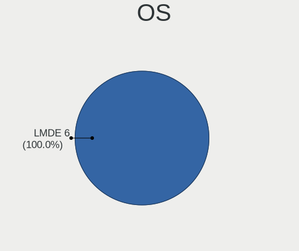
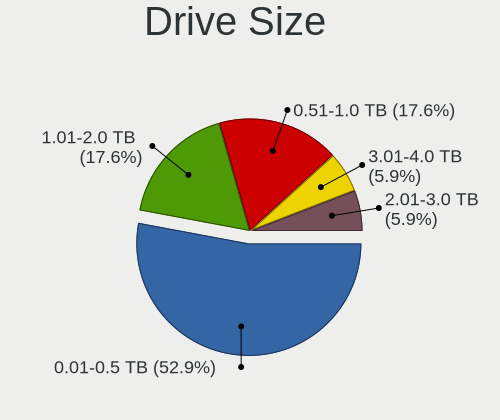
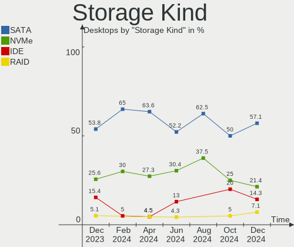
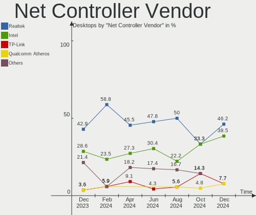
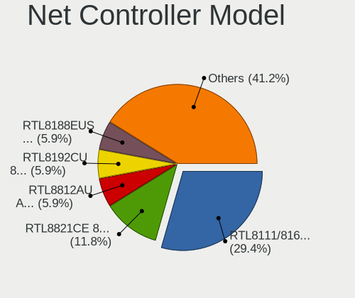
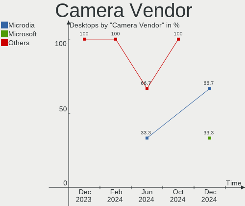

LMDE - Hardware Trends (Desktops)
---------------------------------

A project to identify most popular hardware characteristics and track their change
over time based on data collected by Linux users at https://Linux-Hardware.org.

Anyone can contribute to this report by the [hw-probe](https://github.com/linuxhw/hw-probe) tool:

    sudo -E hw-probe -all -upload

This report is for one last month. Overall report since the beginning of time: [TestCoverage](https://github.com/linuxhw/TestCoverage)

Period: Jan, 2023.

Contents
--------

* [ System ](#system)
  - [ OS                       ](#os)
  - [ OS Family                ](#os-family)
  - [ Kernel                   ](#kernel)
  - [ Kernel Family            ](#kernel-family)
  - [ Kernel Major Ver.        ](#kernel-major-ver)
  - [ Arch                     ](#arch)
  - [ DE                       ](#de)
  - [ Display Server           ](#display-server)
  - [ Display Manager          ](#display-manager)
  - [ OS Lang                  ](#os-lang)
  - [ Boot Mode                ](#boot-mode)
  - [ Filesystem               ](#filesystem)
  - [ Part. scheme             ](#part-scheme)
  - [ Dual Boot with Linux/BSD ](#dual-boot-with-linuxbsd)
  - [ Dual Boot (Win)          ](#dual-boot-win)

* [ Board ](#board)
  - [ Vendor                   ](#vendor)
  - [ Model                    ](#model)
  - [ Model Family             ](#model-family)
  - [ MFG Year                 ](#mfg-year)
  - [ Form Factor              ](#form-factor)
  - [ Secure Boot              ](#secure-boot)
  - [ Coreboot                 ](#coreboot)
  - [ RAM Size                 ](#ram-size)
  - [ RAM Used                 ](#ram-used)
  - [ Total Drives             ](#total-drives)
  - [ Has CD-ROM               ](#has-cd-rom)
  - [ Has Ethernet             ](#has-ethernet)
  - [ Has WiFi                 ](#has-wifi)
  - [ Has Bluetooth            ](#has-bluetooth)

* [ Location ](#location)
  - [ Country                  ](#country)
  - [ City                     ](#city)

* [ Drives ](#drives)
  - [ Drive Vendor             ](#drive-vendor)
  - [ Drive Model              ](#drive-model)
  - [ HDD Vendor               ](#hdd-vendor)
  - [ SSD Vendor               ](#ssd-vendor)
  - [ Drive Kind               ](#drive-kind)
  - [ Drive Connector          ](#drive-connector)
  - [ Drive Size               ](#drive-size)
  - [ Space Total              ](#space-total)
  - [ Space Used               ](#space-used)
  - [ Malfunc. Drives          ](#malfunc-drives)
  - [ Malfunc. Drive Vendor    ](#malfunc-drive-vendor)
  - [ Malfunc. HDD Vendor      ](#malfunc-hdd-vendor)
  - [ Malfunc. Drive Kind      ](#malfunc-drive-kind)
  - [ Failed Drives            ](#failed-drives)
  - [ Failed Drive Vendor      ](#failed-drive-vendor)
  - [ Drive Status             ](#drive-status)

* [ Storage controller ](#storage-controller)
  - [ Storage Vendor           ](#storage-vendor)
  - [ Storage Model            ](#storage-model)
  - [ Storage Kind             ](#storage-kind)

* [ Processor ](#processor)
  - [ CPU Vendor               ](#cpu-vendor)
  - [ CPU Model                ](#cpu-model)
  - [ CPU Model Family         ](#cpu-model-family)
  - [ CPU Cores                ](#cpu-cores)
  - [ CPU Sockets              ](#cpu-sockets)
  - [ CPU Threads              ](#cpu-threads)
  - [ CPU Op-Modes             ](#cpu-op-modes)
  - [ CPU Microcode            ](#cpu-microcode)
  - [ CPU Microarch            ](#cpu-microarch)

* [ Graphics ](#graphics)
  - [ GPU Vendor               ](#gpu-vendor)
  - [ GPU Model                ](#gpu-model)
  - [ GPU Combo                ](#gpu-combo)
  - [ GPU Driver               ](#gpu-driver)
  - [ GPU Memory               ](#gpu-memory)

* [ Monitor ](#monitor)
  - [ Monitor Vendor           ](#monitor-vendor)
  - [ Monitor Model            ](#monitor-model)
  - [ Monitor Resolution       ](#monitor-resolution)
  - [ Monitor Diagonal         ](#monitor-diagonal)
  - [ Monitor Width            ](#monitor-width)
  - [ Aspect Ratio             ](#aspect-ratio)
  - [ Monitor Area             ](#monitor-area)
  - [ Pixel Density            ](#pixel-density)
  - [ Multiple Monitors        ](#multiple-monitors)

* [ Network ](#network)
  - [ Net Controller Vendor    ](#net-controller-vendor)
  - [ Net Controller Model     ](#net-controller-model)
  - [ Wireless Vendor          ](#wireless-vendor)
  - [ Wireless Model           ](#wireless-model)
  - [ Ethernet Vendor          ](#ethernet-vendor)
  - [ Ethernet Model           ](#ethernet-model)
  - [ Net Controller Kind      ](#net-controller-kind)
  - [ Used Controller          ](#used-controller)
  - [ NICs                     ](#nics)
  - [ IPv6                     ](#ipv6)

* [ Bluetooth ](#bluetooth)
  - [ Bluetooth Vendor         ](#bluetooth-vendor)
  - [ Bluetooth Model          ](#bluetooth-model)

* [ Sound ](#sound)
  - [ Sound Vendor             ](#sound-vendor)
  - [ Sound Model              ](#sound-model)

* [ Memory ](#memory)
  - [ Memory Vendor            ](#memory-vendor)
  - [ Memory Model             ](#memory-model)
  - [ Memory Kind              ](#memory-kind)
  - [ Memory Form Factor       ](#memory-form-factor)
  - [ Memory Size              ](#memory-size)
  - [ Memory Speed             ](#memory-speed)

* [ Printers & scanners ](#printers--scanners)
  - [ Printer Vendor           ](#printer-vendor)
  - [ Printer Model            ](#printer-model)
  - [ Scanner Vendor           ](#scanner-vendor)
  - [ Scanner Model            ](#scanner-model)

* [ Camera ](#camera)
  - [ Camera Vendor            ](#camera-vendor)
  - [ Camera Model             ](#camera-model)

* [ Security ](#security)
  - [ Fingerprint Vendor       ](#fingerprint-vendor)
  - [ Fingerprint Model        ](#fingerprint-model)
  - [ Chipcard Vendor          ](#chipcard-vendor)
  - [ Chipcard Model           ](#chipcard-model)

* [ Unsupported ](#unsupported)
  - [ Unsupported Devices      ](#unsupported-devices)
  - [ Unsupported Device Types ](#unsupported-device-types)

System
------

OS
--

Installed operating systems

| Name   | Desktops | Percent |
|--------|----------|---------|
| LMDE 5 | 14       | 100%    |

OS Family
---------

OS without a version

| Name | Desktops | Percent |
|------|----------|---------|
| LMDE | 14       | 100%    |

Kernel
------

Version of the Linux kernel

| Version         | Desktops | Percent |
|-----------------|----------|---------|
| 5.10.0-20-amd64 | 9        | 64.29%  |
| 5.10.0-21-amd64 | 5        | 35.71%  |

Kernel Family
-------------

Linux kernel without a distro release

| Version | Desktops | Percent |
|---------|----------|---------|
| 5.10.0  | 14       | 100%    |

Kernel Major Ver.
-----------------

Linux kernel major version

| Version | Desktops | Percent |
|---------|----------|---------|
| 5.10    | 14       | 100%    |

Arch
----

OS architecture (x86_64, i586, etc.)

| Name   | Desktops | Percent |
|--------|----------|---------|
| x86_64 | 14       | 100%    |

DE
--

Desktop Environment

| Name       | Desktops | Percent |
|------------|----------|---------|
| X-Cinnamon | 14       | 100%    |

Display Server
--------------

X11 or Wayland

| Name | Desktops | Percent |
|------|----------|---------|
| X11  | 14       | 100%    |

Display Manager
---------------

SDDM, LightDM, etc.

| Name    | Desktops | Percent |
|---------|----------|---------|
| Unknown | 12       | 85.71%  |
| LightDM | 2        | 14.29%  |

OS Lang
-------

Language

| Lang  | Desktops | Percent |
|-------|----------|---------|
| de_DE | 5        | 35.71%  |
| pt_BR | 3        | 21.43%  |
| en_US | 3        | 21.43%  |
| ru_RU | 1        | 7.14%   |
| it_IT | 1        | 7.14%   |
| en_ZA | 1        | 7.14%   |

Boot Mode
---------

EFI or BIOS

| Mode | Desktops | Percent |
|------|----------|---------|
| BIOS | 10       | 71.43%  |
| EFI  | 4        | 28.57%  |

Filesystem
----------

Type of filesystem

| Type | Desktops | Percent |
|------|----------|---------|
| Ext4 | 14       | 100%    |

Part. scheme
------------

Scheme of partitioning

| Type    | Desktops | Percent |
|---------|----------|---------|
| Unknown | 12       | 85.71%  |
| GPT     | 2        | 14.29%  |

Dual Boot with Linux/BSD
------------------------

Hosting more than one Linux/BSD

| Dual boot | Desktops | Percent |
|-----------|----------|---------|
| No        | 13       | 92.86%  |
| Yes       | 1        | 7.14%   |

Dual Boot (Win)
---------------

Hosting Linux and Windows

| Dual boot | Desktops | Percent |
|-----------|----------|---------|
| No        | 12       | 85.71%  |
| Yes       | 2        | 14.29%  |

Board
-----

Vendor
------

Motherboard manufacturer

| Name                | Desktops | Percent |
|---------------------|----------|---------|
| ASUSTek Computer    | 4        | 28.57%  |
| Gigabyte Technology | 3        | 21.43%  |
| Intel               | 2        | 14.29%  |
| MSI                 | 1        | 7.14%   |
| Dell                | 1        | 7.14%   |
| ASRock              | 1        | 7.14%   |
| ADVANSUS            | 1        | 7.14%   |
| Acer                | 1        | 7.14%   |

Model
-----

Motherboard model

| Name                             | Desktops | Percent |
|----------------------------------|----------|---------|
| MSI MS-7721                      | 1        | 7.14%   |
| Intel H61M-DS2V                  | 1        | 7.14%   |
| Intel B75                        | 1        | 7.14%   |
| Gigabyte X570 AORUS ULTRA        | 1        | 7.14%   |
| Gigabyte X470 AORUS ULTRA GAMING | 1        | 7.14%   |
| Gigabyte B560 DS3H AC-Y1         | 1        | 7.14%   |
| Dell OptiPlex 780                | 1        | 7.14%   |
| ASUS ROG STRIX Z490-H GAMING     | 1        | 7.14%   |
| ASUS ROG CROSSHAIR VIII HERO     | 1        | 7.14%   |
| ASUS P7P55D                      | 1        | 7.14%   |
| ASUS M5A78L-M PLUS/USB3          | 1        | 7.14%   |
| ASRock Z87 Pro3                  | 1        | 7.14%   |
| ADVANSUS 945G                    | 1        | 7.14%   |
| Acer Aspire XC-780               | 1        | 7.14%   |

Model Family
------------

Motherboard model prefix

| Name            | Desktops | Percent |
|-----------------|----------|---------|
| ASUS ROG        | 2        | 14.29%  |
| MSI MS-7721     | 1        | 7.14%   |
| Intel H61M-DS2V | 1        | 7.14%   |
| Intel B75       | 1        | 7.14%   |
| Gigabyte X570   | 1        | 7.14%   |
| Gigabyte X470   | 1        | 7.14%   |
| Gigabyte B560   | 1        | 7.14%   |
| Dell OptiPlex   | 1        | 7.14%   |
| ASUS P7P55D     | 1        | 7.14%   |
| ASUS M5A78L-M   | 1        | 7.14%   |
| ASRock Z87      | 1        | 7.14%   |
| ADVANSUS 945G   | 1        | 7.14%   |
| Acer Aspire     | 1        | 7.14%   |

MFG Year
--------

Motherboard manufacture year

| Year | Desktops | Percent |
|------|----------|---------|
| 2018 | 2        | 14.29%  |
| 2016 | 2        | 14.29%  |
| 2009 | 2        | 14.29%  |
| 2022 | 1        | 7.14%   |
| 2021 | 1        | 7.14%   |
| 2020 | 1        | 7.14%   |
| 2019 | 1        | 7.14%   |
| 2014 | 1        | 7.14%   |
| 2013 | 1        | 7.14%   |
| 2011 | 1        | 7.14%   |
| 2010 | 1        | 7.14%   |

Form Factor
-----------

Physical design of the computer

| Name    | Desktops | Percent |
|---------|----------|---------|
| Desktop | 14       | 100%    |

Secure Boot
-----------

Enabled or disabled

| State    | Desktops | Percent |
|----------|----------|---------|
| Disabled | 14       | 100%    |

Coreboot
--------

Have coreboot on board

| Used | Desktops | Percent |
|------|----------|---------|
| No   | 14       | 100%    |

RAM Size
--------

Total RAM memory

| Size in GB | Desktops | Percent |
|------------|----------|---------|
| 8.01-16.0  | 5        | 35.71%  |
| 32.01-64.0 | 4        | 28.57%  |
| 3.01-4.0   | 2        | 14.29%  |
| 16.01-24.0 | 2        | 14.29%  |
| 4.01-8.0   | 1        | 7.14%   |

RAM Used
--------

Used RAM memory

| Used GB   | Desktops | Percent |
|-----------|----------|---------|
| 1.01-2.0  | 5        | 35.71%  |
| 2.01-3.0  | 4        | 28.57%  |
| 3.01-4.0  | 2        | 14.29%  |
| 0.51-1.0  | 2        | 14.29%  |
| 8.01-16.0 | 1        | 7.14%   |

Total Drives
------------

Number of drives on board

| Drives | Desktops | Percent |
|--------|----------|---------|
| 2      | 5        | 35.71%  |
| 1      | 4        | 28.57%  |
| 5      | 2        | 14.29%  |
| 3      | 2        | 14.29%  |
| 4      | 1        | 7.14%   |

Has CD-ROM
----------

Has CD-ROM on board

| Presented | Desktops | Percent |
|-----------|----------|---------|
| Yes       | 8        | 57.14%  |
| No        | 6        | 42.86%  |

Has Ethernet
------------

Has Ethernet on board

| Presented | Desktops | Percent |
|-----------|----------|---------|
| Yes       | 13       | 92.86%  |
| No        | 1        | 7.14%   |

Has WiFi
--------

Has WiFi module

| Presented | Desktops | Percent |
|-----------|----------|---------|
| Yes       | 8        | 57.14%  |
| No        | 6        | 42.86%  |

Has Bluetooth
-------------

Has Bluetooth module

| Presented | Desktops | Percent |
|-----------|----------|---------|
| No        | 11       | 78.57%  |
| Yes       | 3        | 21.43%  |

Location
--------

Country
-------

Geographic location (country)

| Country      | Desktops | Percent |
|--------------|----------|---------|
| Germany      | 5        | 35.71%  |
| Brazil       | 3        | 21.43%  |
| USA          | 2        | 14.29%  |
| South Africa | 1        | 7.14%   |
| Russia       | 1        | 7.14%   |
| Netherlands  | 1        | 7.14%   |
| Italy        | 1        | 7.14%   |

City
----

Geographic location (city)

| City          | Desktops | Percent |
|---------------|----------|---------|
| Varese        | 1        | 7.14%   |
| Solingen      | 1        | 7.14%   |
| Sao Lourenço | 1        | 7.14%   |
| Petrozavodsk  | 1        | 7.14%   |
| Malente       | 1        | 7.14%   |
| Maceió       | 1        | 7.14%   |
| Lüneburg     | 1        | 7.14%   |
| Halle         | 1        | 7.14%   |
| Fortaleza     | 1        | 7.14%   |
| Dallas        | 1        | 7.14%   |
| Columbia City | 1        | 7.14%   |
| Centurion     | 1        | 7.14%   |
| Brunssum      | 1        | 7.14%   |
| Berlin        | 1        | 7.14%   |

Drives
------

Drive Vendor
------------

Hard drive vendors

| Vendor              | Desktops | Drives | Percent |
|---------------------|----------|--------|---------|
| Samsung Electronics | 6        | 11     | 23.08%  |
| WDC                 | 4        | 5      | 15.38%  |
| Seagate             | 3        | 4      | 11.54%  |
| Toshiba             | 2        | 2      | 7.69%   |
| WALRAM              | 1        | 1      | 3.85%   |
| Unknown             | 1        | 1      | 3.85%   |
| TGT                 | 1        | 1      | 3.85%   |
| TakeMS              | 1        | 1      | 3.85%   |
| SK hynix            | 1        | 1      | 3.85%   |
| Phison              | 1        | 1      | 3.85%   |
| Micron Technology   | 1        | 1      | 3.85%   |
| Kingston            | 1        | 2      | 3.85%   |
| Crucial             | 1        | 1      | 3.85%   |
| China               | 1        | 1      | 3.85%   |
| ADATA Technology    | 1        | 1      | 3.85%   |

Drive Model
-----------

Hard drive models

| Model                                               | Desktops | Percent |
|-----------------------------------------------------|----------|---------|
| Samsung NVMe SSD Controller SM981/PM981/PM983 500GB | 2        | 6.25%   |
| WDC WD5000AAKX-08U6AA0 500GB                        | 1        | 3.13%   |
| WDC WD5000AAKX-00ERMA0 500GB                        | 1        | 3.13%   |
| WDC WD10EZRX-00DC0B0 1TB                            | 1        | 3.13%   |
| WDC WD10EARS-00Y5B1 1TB                             | 1        | 3.13%   |
| WDC WD1002FAEX-00Z3A0 1TB                           | 1        | 3.13%   |
| WALRAM 120G                                         | 1        | 3.13%   |
| Unknown SD/MMC/MS PRO 2GB                           | 1        | 3.13%   |
| Toshiba MQ01ABF050 500GB                            | 1        | 3.13%   |
| Toshiba MQ01ABD050 500GB                            | 1        | 3.13%   |
| TGT EGON T2 240GB                                   | 1        | 3.13%   |
| TakeMS SSD UTX-2200 120GB                           | 1        | 3.13%   |
| SK hynix HFS256G39TND-N210A 256GB SSD               | 1        | 3.13%   |
| Seagate ST4000DM004-2CV104 4TB                      | 1        | 3.13%   |
| Seagate ST3250318AS 249GB                           | 1        | 3.13%   |
| Seagate ST31500341AS 1TB                            | 1        | 3.13%   |
| Samsung SSD 980 1TB                                 | 1        | 3.13%   |
| Samsung SSD 970 EVO 500GB                           | 1        | 3.13%   |
| Samsung SSD 860 EVO 500GB                           | 1        | 3.13%   |
| Samsung SSD 850 PRO 256GB                           | 1        | 3.13%   |
| Samsung SSD 850 EVO 500GB                           | 1        | 3.13%   |
| Samsung SSD 840 EVO 250G                            | 1        | 3.13%   |
| Samsung NVMe SSD Controller SM961/PM961/SM963 256GB | 1        | 3.13%   |
| Samsung HD502HI 500GB                               | 1        | 3.13%   |
| Samsung HD160JJ 160GB                               | 1        | 3.13%   |
| Phison Viper M.2 VPN100 512GB                       | 1        | 3.13%   |
| Micron MTFDDAK256MAM-1K12 256GB SSD                 | 1        | 3.13%   |
| Kingston SA400S37120G 120GB SSD                     | 1        | 3.13%   |
| Crucial CT1000P1SSD8 1TB                            | 1        | 3.13%   |
| China SATA SSD 120GB                                | 1        | 3.13%   |
| ADATA SWORDFISH 500GB                               | 1        | 3.13%   |

HDD Vendor
----------

Hard disk drive vendors

| Vendor              | Desktops | Drives | Percent |
|---------------------|----------|--------|---------|
| WDC                 | 4        | 5      | 33.33%  |
| Seagate             | 3        | 4      | 25%     |
| Toshiba             | 2        | 2      | 16.67%  |
| Samsung Electronics | 2        | 2      | 16.67%  |
| Unknown             | 1        | 1      | 8.33%   |

SSD Vendor
----------

Solid state drive vendors

| Vendor              | Desktops | Drives | Percent |
|---------------------|----------|--------|---------|
| Samsung Electronics | 3        | 4      | 37.5%   |
| TakeMS              | 1        | 1      | 12.5%   |
| SK hynix            | 1        | 1      | 12.5%   |
| Micron Technology   | 1        | 1      | 12.5%   |
| Kingston            | 1        | 2      | 12.5%   |
| China               | 1        | 1      | 12.5%   |

Drive Kind
----------

HDD or SSD

| Kind    | Desktops | Drives | Percent |
|---------|----------|--------|---------|
| HDD     | 9        | 14     | 39.13%  |
| SSD     | 7        | 10     | 30.43%  |
| NVMe    | 5        | 8      | 21.74%  |
| Unknown | 2        | 2      | 8.7%    |

Drive Connector
---------------

SATA, SAS, NVMe, etc.

| Type | Desktops | Drives | Percent |
|------|----------|--------|---------|
| SATA | 12       | 24     | 63.16%  |
| NVMe | 5        | 8      | 26.32%  |
| SAS  | 2        | 2      | 10.53%  |

Drive Size
----------

Size of hard drive

| Size in TB | Desktops | Drives | Percent |
|------------|----------|--------|---------|
| 0.01-0.5   | 10       | 18     | 66.67%  |
| 0.51-1.0   | 4        | 4      | 26.67%  |
| 3.01-4.0   | 1        | 2      | 6.67%   |

Space Total
-----------

Amount of disk space available on the file system

| Size in GB     | Desktops | Percent |
|----------------|----------|---------|
| 101-250        | 6        | 42.86%  |
| 251-500        | 3        | 21.43%  |
| 501-1000       | 3        | 21.43%  |
| More than 3000 | 1        | 7.14%   |
| 1001-2000      | 1        | 7.14%   |

Space Used
----------

Amount of used disk space

| Used GB   | Desktops | Percent |
|-----------|----------|---------|
| 21-50     | 3        | 21.43%  |
| 101-250   | 3        | 21.43%  |
| 51-100    | 3        | 21.43%  |
| 251-500   | 2        | 14.29%  |
| 1-20      | 2        | 14.29%  |
| 2001-3000 | 1        | 7.14%   |

Malfunc. Drives
---------------

Drive models with a malfunction

Zero info for selected period =(

Malfunc. Drive Vendor
---------------------

Vendors of faulty drives

Zero info for selected period =(

Malfunc. HDD Vendor
-------------------

Vendors of faulty HDD drives

Zero info for selected period =(

Malfunc. Drive Kind
-------------------

Kinds of faulty drives

Zero info for selected period =(

Failed Drives
-------------

Failed drive models

Zero info for selected period =(

Failed Drive Vendor
-------------------

Failed drive vendors

Zero info for selected period =(

Drive Status
------------

Number of failed and malfunc. drives

| Status   | Desktops | Drives | Percent |
|----------|----------|--------|---------|
| Detected | 13       | 27     | 86.67%  |
| Works    | 2        | 7      | 13.33%  |

Storage controller
------------------

Storage Vendor
--------------

Storage controller vendors

| Vendor                    | Desktops | Percent |
|---------------------------|----------|---------|
| Intel                     | 9        | 42.86%  |
| AMD                       | 5        | 23.81%  |
| Samsung Electronics       | 3        | 14.29%  |
| Phison Electronics        | 1        | 4.76%   |
| Micron/Crucial Technology | 1        | 4.76%   |
| JMicron Technology        | 1        | 4.76%   |
| ADATA Technology          | 1        | 4.76%   |

Storage Model
-------------

Storage controller models

| Model                                                                          | Desktops | Percent |
|--------------------------------------------------------------------------------|----------|---------|
| Samsung NVMe SSD Controller SM981/PM981/PM983                                  | 3        | 11.54%  |
| AMD FCH SATA Controller [AHCI mode]                                            | 3        | 11.54%  |
| Samsung NVMe SSD Controller SM961/PM961/SM963                                  | 1        | 3.85%   |
| Samsung NVMe SSD Controller 980                                                | 1        | 3.85%   |
| Phison E12 NVMe Controller                                                     | 1        | 3.85%   |
| Micron/Crucial P1 NVMe PCIe SSD                                                | 1        | 3.85%   |
| JMicron JMB363 SATA/IDE Controller                                             | 1        | 3.85%   |
| Intel SATA Controller [RAID mode]                                              | 1        | 3.85%   |
| Intel Q170/Q150/B150/H170/H110/Z170/CM236 Chipset SATA Controller [AHCI Mode]  | 1        | 3.85%   |
| Intel NM10/ICH7 Family SATA Controller [IDE mode]                              | 1        | 3.85%   |
| Intel Comet Lake SATA AHCI Controller                                          | 1        | 3.85%   |
| Intel 82801G (ICH7 Family) IDE Controller                                      | 1        | 3.85%   |
| Intel 8 Series/C220 Series Chipset Family 6-port SATA Controller 1 [AHCI mode] | 1        | 3.85%   |
| Intel 7 Series/C210 Series Chipset Family 6-port SATA Controller [AHCI mode]   | 1        | 3.85%   |
| Intel 6 Series/C200 Series Chipset Family 6 port Desktop SATA AHCI Controller  | 1        | 3.85%   |
| Intel 500 Series Chipset Family SATA RAID Controller                           | 1        | 3.85%   |
| Intel 5 Series/3400 Series Chipset 4 port SATA IDE Controller                  | 1        | 3.85%   |
| Intel 5 Series/3400 Series Chipset 2 port SATA IDE Controller                  | 1        | 3.85%   |
| AMD SB7x0/SB8x0/SB9x0 SATA Controller [IDE mode]                               | 1        | 3.85%   |
| AMD SB7x0/SB8x0/SB9x0 IDE Controller                                           | 1        | 3.85%   |
| AMD 400 Series Chipset SATA Controller                                         | 1        | 3.85%   |
| ADATA ADATA XPG GAMMIXS1 1L Media                                              | 1        | 3.85%   |

Storage Kind
------------

Kind of storage controller (IDE, SATA, NVMe, SAS, ...)

| Kind | Desktops | Percent |
|------|----------|---------|
| SATA | 10       | 50%     |
| NVMe | 5        | 25%     |
| IDE  | 3        | 15%     |
| RAID | 2        | 10%     |

Processor
---------

CPU Vendor
----------

Processor vendors

| Vendor | Desktops | Percent |
|--------|----------|---------|
| Intel  | 9        | 64.29%  |
| AMD    | 5        | 35.71%  |

CPU Model
---------

Processor models

| Model                                   | Desktops | Percent |
|-----------------------------------------|----------|---------|
| AMD Ryzen 7 3700X 8-Core Processor      | 2        | 14.29%  |
| Intel Core i7-4770 CPU @ 3.40GHz        | 1        | 7.14%   |
| Intel Core i7-3770S CPU @ 3.10GHz       | 1        | 7.14%   |
| Intel Core i7-10700K CPU @ 3.80GHz      | 1        | 7.14%   |
| Intel Core i5-7400 CPU @ 3.00GHz        | 1        | 7.14%   |
| Intel Core i3-2100 CPU @ 3.10GHz        | 1        | 7.14%   |
| Intel Core i3 CPU 560 @ 3.33GHz         | 1        | 7.14%   |
| Intel Core 2 Quad CPU Q6700 @ 2.66GHz   | 1        | 7.14%   |
| Intel Core 2 Duo CPU E7400 @ 2.80GHz    | 1        | 7.14%   |
| Intel 11th Gen Core i7-11700F @ 2.50GHz | 1        | 7.14%   |
| AMD Ryzen 7 5800X 8-Core Processor      | 1        | 7.14%   |
| AMD Phenom II X4 965 Processor          | 1        | 7.14%   |
| AMD A4-4000 APU with Radeon HD Graphics | 1        | 7.14%   |

CPU Model Family
----------------

Processor model prefix

| Model             | Desktops | Percent |
|-------------------|----------|---------|
| Intel Core i7     | 3        | 21.43%  |
| AMD Ryzen 7       | 3        | 21.43%  |
| Intel Core i3     | 2        | 14.29%  |
| Other             | 1        | 7.14%   |
| Intel Core i5     | 1        | 7.14%   |
| Intel Core 2 Quad | 1        | 7.14%   |
| Intel Core 2 Duo  | 1        | 7.14%   |
| AMD Phenom II X4  | 1        | 7.14%   |
| AMD A4            | 1        | 7.14%   |

CPU Cores
---------

Number of processor cores

| Number | Desktops | Percent |
|--------|----------|---------|
| 8      | 5        | 35.71%  |
| 4      | 5        | 35.71%  |
| 2      | 3        | 21.43%  |
| 1      | 1        | 7.14%   |

CPU Sockets
-----------

Number of sockets

| Number | Desktops | Percent |
|--------|----------|---------|
| 1      | 14       | 100%    |

CPU Threads
-----------

Threads per core (Hyper-Threading)

| Number | Desktops | Percent |
|--------|----------|---------|
| 2      | 10       | 71.43%  |
| 1      | 4        | 28.57%  |

CPU Op-Modes
------------

CPU Operation Modes (32-bit, 64-bit)

| Op mode        | Desktops | Percent |
|----------------|----------|---------|
| 32-bit, 64-bit | 14       | 100%    |

CPU Microcode
-------------

Microcode number

| Number     | Desktops | Percent |
|------------|----------|---------|
| 0xa0671    | 1        | 7.14%   |
| 0xa0655    | 1        | 7.14%   |
| 0x906e9    | 1        | 7.14%   |
| 0x6fb      | 1        | 7.14%   |
| 0x306c3    | 1        | 7.14%   |
| 0x306a9    | 1        | 7.14%   |
| 0x206a7    | 1        | 7.14%   |
| 0x20655    | 1        | 7.14%   |
| 0x1067a    | 1        | 7.14%   |
| 0x0a201016 | 1        | 7.14%   |
| 0x08701030 | 1        | 7.14%   |
| 0x08701021 | 1        | 7.14%   |
| 0x06001119 | 1        | 7.14%   |
| 0x010000c8 | 1        | 7.14%   |

CPU Microarch
-------------

Microarchitecture

| Name        | Desktops | Percent |
|-------------|----------|---------|
| Zen 2       | 2        | 14.29%  |
| Zen 3       | 1        | 7.14%   |
| Westmere    | 1        | 7.14%   |
| SandyBridge | 1        | 7.14%   |
| Piledriver  | 1        | 7.14%   |
| Penryn      | 1        | 7.14%   |
| KabyLake    | 1        | 7.14%   |
| K10         | 1        | 7.14%   |
| IvyBridge   | 1        | 7.14%   |
| Haswell     | 1        | 7.14%   |
| Core        | 1        | 7.14%   |
| CometLake   | 1        | 7.14%   |
| Unknown     | 1        | 7.14%   |

Graphics
--------

GPU Vendor
----------

Vendors of graphics cards

| Vendor | Desktops | Percent |
|--------|----------|---------|
| Nvidia | 10       | 66.67%  |
| Intel  | 3        | 20%     |
| AMD    | 2        | 13.33%  |

GPU Model
---------

Graphics card models

| Model                                                                     | Desktops | Percent |
|---------------------------------------------------------------------------|----------|---------|
| Nvidia GP108 [GeForce GT 1030]                                            | 2        | 13.33%  |
| Nvidia TU116 [GeForce GTX 1660 Ti]                                        | 1        | 6.67%   |
| Nvidia TU116 [GeForce GTX 1660 SUPER]                                     | 1        | 6.67%   |
| Nvidia TU106 [GeForce RTX 2060 12GB]                                      | 1        | 6.67%   |
| Nvidia GP107GL [Quadro P620]                                              | 1        | 6.67%   |
| Nvidia GP106 [GeForce GTX 1060 6GB]                                       | 1        | 6.67%   |
| Nvidia GA102 [GeForce RTX 3080]                                           | 1        | 6.67%   |
| Nvidia G92 [GeForce GTS 250]                                              | 1        | 6.67%   |
| Nvidia G72 [GeForce 7200 GS / 7300 SE]                                    | 1        | 6.67%   |
| Intel IvyBridge GT2 [HD Graphics 4000]                                    | 1        | 6.67%   |
| Intel 82945G/GZ Integrated Graphics Controller                            | 1        | 6.67%   |
| Intel 2nd Generation Core Processor Family Integrated Graphics Controller | 1        | 6.67%   |
| AMD Trinity 2 [Radeon HD 7480D]                                           | 1        | 6.67%   |
| AMD Ellesmere [Radeon RX 470/480/570/570X/580/580X/590]                   | 1        | 6.67%   |

GPU Combo
---------

Combinations of graphics cards

| Name       | Desktops | Percent |
|------------|----------|---------|
| 1 x Nvidia | 10       | 71.43%  |
| 1 x Intel  | 2        | 14.29%  |
| 1 x AMD    | 2        | 14.29%  |

GPU Driver
----------

Free vs proprietary

| Driver      | Desktops | Percent |
|-------------|----------|---------|
| Free        | 7        | 50%     |
| Proprietary | 5        | 35.71%  |
| Unknown     | 2        | 14.29%  |

GPU Memory
----------

Total video memory

| Size in GB | Desktops | Percent |
|------------|----------|---------|
| Unknown    | 5        | 35.71%  |
| 5.01-6.0   | 3        | 21.43%  |
| 1.01-2.0   | 3        | 21.43%  |
| 7.01-8.0   | 1        | 7.14%   |
| 8.01-16.0  | 1        | 7.14%   |
| 0.51-1.0   | 1        | 7.14%   |

Monitor
-------

Monitor Vendor
--------------

Monitor vendors

| Vendor              | Desktops | Percent |
|---------------------|----------|---------|
| Goldstar            | 3        | 30%     |
| Samsung Electronics | 2        | 20%     |
| Unknown             | 1        | 10%     |
| PLN                 | 1        | 10%     |
| Hewlett-Packard     | 1        | 10%     |
| AUS                 | 1        | 10%     |
| Acer                | 1        | 10%     |

Monitor Model
-------------

Monitor models

| Model                                                                | Desktops | Percent |
|----------------------------------------------------------------------|----------|---------|
| Unknown LCD Monitor Dell SE2717H/HX 1920x1080                        | 1        | 9.09%   |
| Samsung Electronics SyncMaster SAM05C8 1920x1080 520x290mm 23.4-inch | 1        | 9.09%   |
| Samsung Electronics SMFX2490HD SAM074A 1920x1080 530x300mm 24.0-inch | 1        | 9.09%   |
| Samsung Electronics SA300/SA350 SAM0788 1366x768 410x230mm 18.5-inch | 1        | 9.09%   |
| PLN LCD Monitor PXL2790MW 1920x1080                                  | 1        | 9.09%   |
| Hewlett-Packard 25x HPN357F 1920x1080 544x303mm 24.5-inch            | 1        | 9.09%   |
| Goldstar ULTRAWIDE GSM76E4 3440x1440 800x335mm 34.1-inch             | 1        | 9.09%   |
| Goldstar HDR WFHD GSM7714 2560x1080 798x334mm 34.1-inch              | 1        | 9.09%   |
| Goldstar E2411 GSM583B 1920x1080 477x268mm 21.5-inch                 | 1        | 9.09%   |
| AUS LCD Monitor ASUS VP278 1920x1080                                 | 1        | 9.09%   |
| Acer LCD Monitor B243W 1920x1200                                     | 1        | 9.09%   |

Monitor Resolution
------------------

Monitor screen resolution

| Resolution        | Desktops | Percent |
|-------------------|----------|---------|
| 1920x1080 (FHD)   | 6        | 60%     |
| 3440x1440         | 1        | 10%     |
| 2560x1080         | 1        | 10%     |
| 1920x1200 (WUXGA) | 1        | 10%     |
| 1366x768 (WXGA)   | 1        | 10%     |

Monitor Diagonal
----------------

Diagonal size in inches

| Inches  | Desktops | Percent |
|---------|----------|---------|
| Unknown | 4        | 36.36%  |
| 24      | 3        | 27.27%  |
| 34      | 2        | 18.18%  |
| 23      | 1        | 9.09%   |
| 18      | 1        | 9.09%   |

Monitor Width
-------------

Physical width

| Width in mm | Desktops | Percent |
|-------------|----------|---------|
| Unknown     | 4        | 40%     |
| 501-600     | 3        | 30%     |
| 701-800     | 2        | 20%     |
| 401-500     | 1        | 10%     |

Aspect Ratio
------------

Proportional relationship between the width and the height

| Ratio   | Desktops | Percent |
|---------|----------|---------|
| 16/9    | 4        | 40%     |
| Unknown | 4        | 40%     |
| 21/9    | 2        | 20%     |

Monitor Area
------------

Area in inch²

| Area in inch² | Desktops | Percent |
|----------------|----------|---------|
| Unknown        | 4        | 40%     |
| 351-500        | 2        | 20%     |
| 201-250        | 2        | 20%     |
| 251-300        | 1        | 10%     |
| 141-150        | 1        | 10%     |

Pixel Density
-------------

Pixels per inch

| Density | Desktops | Percent |
|---------|----------|---------|
| 51-100  | 5        | 50%     |
| Unknown | 4        | 40%     |
| 101-120 | 1        | 10%     |

Multiple Monitors
-----------------

Total monitors connected

| Total | Desktops | Percent |
|-------|----------|---------|
| 1     | 11       | 78.57%  |
| 0     | 2        | 14.29%  |
| 2     | 1        | 7.14%   |

Network
-------

Net Controller Vendor
---------------------

Controller vendors

| Vendor                | Desktops | Percent |
|-----------------------|----------|---------|
| Realtek Semiconductor | 8        | 42.11%  |
| Intel                 | 8        | 42.11%  |
| TP-Link               | 1        | 5.26%   |
| Ralink Technology     | 1        | 5.26%   |
| Ralink                | 1        | 5.26%   |

Net Controller Model
--------------------

Controller models

| Model                                                             | Desktops | Percent |
|-------------------------------------------------------------------|----------|---------|
| Realtek RTL8111/8168/8411 PCI Express Gigabit Ethernet Controller | 5        | 22.73%  |
| Intel I211 Gigabit Network Connection                             | 3        | 13.64%  |
| TP-Link TL-WN821N v5/v6 [RTL8192EU]                               | 1        | 4.55%   |
| Realtek RTL8188FTV 802.11b/g/n 1T1R 2.4G WLAN Adapter             | 1        | 4.55%   |
| Realtek RTL8188EUS 802.11n Wireless Network Adapter               | 1        | 4.55%   |
| Realtek RTL8125 2.5GbE Controller                                 | 1        | 4.55%   |
| Realtek RTL810xE PCI Express Fast Ethernet controller             | 1        | 4.55%   |
| Ralink RT5370 Wireless Adapter                                    | 1        | 4.55%   |
| Ralink RT2561/RT61 802.11g PCI                                    | 1        | 4.55%   |
| Intel Wireless 7265                                               | 1        | 4.55%   |
| Intel Wi-Fi 6 AX200                                               | 1        | 4.55%   |
| Intel Ethernet Controller I225-V                                  | 1        | 4.55%   |
| Intel Ethernet Connection I217-V                                  | 1        | 4.55%   |
| Intel Dual Band Wireless-AC 3168NGW [Stone Peak]                  | 1        | 4.55%   |
| Intel 82573L Gigabit Ethernet Controller                          | 1        | 4.55%   |
| Intel 82567LM-3 Gigabit Network Connection                        | 1        | 4.55%   |

Wireless Vendor
---------------

Wireless vendors

| Vendor                | Desktops | Percent |
|-----------------------|----------|---------|
| Intel                 | 3        | 37.5%   |
| Realtek Semiconductor | 2        | 25%     |
| TP-Link               | 1        | 12.5%   |
| Ralink Technology     | 1        | 12.5%   |
| Ralink                | 1        | 12.5%   |

Wireless Model
--------------

Wireless models

| Model                                                 | Desktops | Percent |
|-------------------------------------------------------|----------|---------|
| TP-Link TL-WN821N v5/v6 [RTL8192EU]                   | 1        | 12.5%   |
| Realtek RTL8188FTV 802.11b/g/n 1T1R 2.4G WLAN Adapter | 1        | 12.5%   |
| Realtek RTL8188EUS 802.11n Wireless Network Adapter   | 1        | 12.5%   |
| Ralink RT5370 Wireless Adapter                        | 1        | 12.5%   |
| Ralink RT2561/RT61 802.11g PCI                        | 1        | 12.5%   |
| Intel Wireless 7265                                   | 1        | 12.5%   |
| Intel Wi-Fi 6 AX200                                   | 1        | 12.5%   |
| Intel Dual Band Wireless-AC 3168NGW [Stone Peak]      | 1        | 12.5%   |

Ethernet Vendor
---------------

Ethernet vendors

| Vendor                | Desktops | Percent |
|-----------------------|----------|---------|
| Realtek Semiconductor | 7        | 50%     |
| Intel                 | 7        | 50%     |

Ethernet Model
--------------

Ethernet models

| Model                                                             | Desktops | Percent |
|-------------------------------------------------------------------|----------|---------|
| Realtek RTL8111/8168/8411 PCI Express Gigabit Ethernet Controller | 5        | 35.71%  |
| Intel I211 Gigabit Network Connection                             | 3        | 21.43%  |
| Realtek RTL8125 2.5GbE Controller                                 | 1        | 7.14%   |
| Realtek RTL810xE PCI Express Fast Ethernet controller             | 1        | 7.14%   |
| Intel Ethernet Controller I225-V                                  | 1        | 7.14%   |
| Intel Ethernet Connection I217-V                                  | 1        | 7.14%   |
| Intel 82573L Gigabit Ethernet Controller                          | 1        | 7.14%   |
| Intel 82567LM-3 Gigabit Network Connection                        | 1        | 7.14%   |

Net Controller Kind
-------------------

Ethernet, WiFi or modem

| Kind     | Desktops | Percent |
|----------|----------|---------|
| Ethernet | 13       | 61.9%   |
| WiFi     | 8        | 38.1%   |

Used Controller
---------------

Currently used network controller

| Kind     | Desktops | Percent |
|----------|----------|---------|
| Ethernet | 11       | 73.33%  |
| WiFi     | 4        | 26.67%  |

NICs
----

Total network controllers on board

| Total | Desktops | Percent |
|-------|----------|---------|
| 1     | 8        | 57.14%  |
| 2     | 5        | 35.71%  |
| 0     | 1        | 7.14%   |

IPv6
----

IPv6 vs IPv4

| Used | Desktops | Percent |
|------|----------|---------|
| No   | 8        | 57.14%  |
| Yes  | 6        | 42.86%  |

Bluetooth
---------

Bluetooth Vendor
----------------

Controller vendors

| Vendor | Desktops | Percent |
|--------|----------|---------|
| Intel  | 3        | 100%    |

Bluetooth Model
---------------

Controller models

| Model                              | Desktops | Percent |
|------------------------------------|----------|---------|
| Intel Wireless-AC 3168 Bluetooth   | 1        | 33.33%  |
| Intel Bluetooth wireless interface | 1        | 33.33%  |
| Intel AX200 Bluetooth              | 1        | 33.33%  |

Sound
-----

Sound Vendor
------------

Sound card vendors

| Vendor   | Desktops | Percent |
|----------|----------|---------|
| Intel    | 9        | 37.5%   |
| Nvidia   | 8        | 33.33%  |
| AMD      | 5        | 20.83%  |
| Logitech | 1        | 4.17%   |
| JMTek    | 1        | 4.17%   |

Sound Model
-----------

Sound card models

| Model                                                                      | Desktops | Percent |
|----------------------------------------------------------------------------|----------|---------|
| AMD Starship/Matisse HD Audio Controller                                   | 3        | 11.54%  |
| Nvidia TU116 High Definition Audio Controller                              | 2        | 7.69%   |
| Nvidia GP108 High Definition Audio Controller                              | 2        | 7.69%   |
| Nvidia TU106 High Definition Audio Controller                              | 1        | 3.85%   |
| Nvidia GP107GL High Definition Audio Controller                            | 1        | 3.85%   |
| Nvidia GP106 High Definition Audio Controller                              | 1        | 3.85%   |
| Nvidia GA102 High Definition Audio Controller                              | 1        | 3.85%   |
| Logitech ClearChat Pro USB                                                 | 1        | 3.85%   |
| JMTek KLIM Talk                                                            | 1        | 3.85%   |
| Intel Tiger Lake-H HD Audio Controller                                     | 1        | 3.85%   |
| Intel NM10/ICH7 Family High Definition Audio Controller                    | 1        | 3.85%   |
| Intel Comet Lake PCH cAVS                                                  | 1        | 3.85%   |
| Intel 82801JD/DO (ICH10 Family) HD Audio Controller                        | 1        | 3.85%   |
| Intel 8 Series/C220 Series Chipset High Definition Audio Controller        | 1        | 3.85%   |
| Intel 7 Series/C216 Chipset Family High Definition Audio Controller        | 1        | 3.85%   |
| Intel 6 Series/C200 Series Chipset Family High Definition Audio Controller | 1        | 3.85%   |
| Intel 5 Series/3400 Series Chipset High Definition Audio                   | 1        | 3.85%   |
| Intel 100 Series/C230 Series Chipset Family HD Audio Controller            | 1        | 3.85%   |
| AMD Trinity HDMI Audio Controller                                          | 1        | 3.85%   |
| AMD SBx00 Azalia (Intel HDA)                                               | 1        | 3.85%   |
| AMD FCH Azalia Controller                                                  | 1        | 3.85%   |
| AMD Ellesmere HDMI Audio [Radeon RX 470/480 / 570/580/590]                 | 1        | 3.85%   |

Memory
------

Memory Vendor
-------------

Memory module vendors

| Vendor  | Desktops | Percent |
|---------|----------|---------|
| Crucial | 1        | 50%     |
| Corsair | 1        | 50%     |

Memory Model
------------

Memory module models

| Model                                                   | Desktops | Percent |
|---------------------------------------------------------|----------|---------|
| Crucial RAM CT16G4DFD8266.M16FE 16GB DIMM DDR4 2667MT/s | 1        | 50%     |
| Corsair RAM CMW32GX4M2Z3600C18 16GB DIMM DDR4 3733MT/s  | 1        | 50%     |

Memory Kind
-----------

Memory module kinds

| Kind | Desktops | Percent |
|------|----------|---------|
| DDR4 | 2        | 100%    |

Memory Form Factor
------------------

Physical design of the memory module

| Name | Desktops | Percent |
|------|----------|---------|
| DIMM | 2        | 100%    |

Memory Size
-----------

Memory module size

| Size  | Desktops | Percent |
|-------|----------|---------|
| 16384 | 2        | 100%    |

Memory Speed
------------

Memory module speed

| Speed | Desktops | Percent |
|-------|----------|---------|
| 3733  | 1        | 50%     |
| 2667  | 1        | 50%     |

Printers & scanners
-------------------

Printer Vendor
--------------

Printer device vendors

| Vendor      | Desktops | Percent |
|-------------|----------|---------|
| Seiko Epson | 1        | 100%    |

Printer Model
-------------

Printer device models

| Model                      | Desktops | Percent |
|----------------------------|----------|---------|
| Seiko Epson ET-2820 Series | 1        | 100%    |

Scanner Vendor
--------------

Scanner device vendors

Zero info for selected period =(

Scanner Model
-------------

Scanner device models

Zero info for selected period =(

Camera
------

Camera Vendor
-------------

Camera device vendors

| Vendor                        | Desktops | Percent |
|-------------------------------|----------|---------|
| Sunplus Innovation Technology | 1        | 100%    |

Camera Model
------------

Camera device models

| Model                         | Desktops | Percent |
|-------------------------------|----------|---------|
| Sunplus FHD Camera Microphone | 1        | 100%    |

Security
--------

Fingerprint Vendor
------------------

Fingerprint sensor vendors

Zero info for selected period =(

Fingerprint Model
-----------------

Fingerprint sensor models

Zero info for selected period =(

Chipcard Vendor
---------------

Chipcard module vendors

Zero info for selected period =(

Chipcard Model
--------------

Chipcard module models

Zero info for selected period =(

Unsupported
-----------

Unsupported Devices
-------------------

Total unsupported devices on board

| Total | Desktops | Percent |
|-------|----------|---------|
| 0     | 9        | 64.29%  |
| 1     | 5        | 35.71%  |

Unsupported Device Types
------------------------

Types of unsupported devices

| Type          | Desktops | Percent |
|---------------|----------|---------|
| Graphics card | 3        | 60%     |
| Storage/raid  | 1        | 20%     |
| Net/wireless  | 1        | 20%     |

