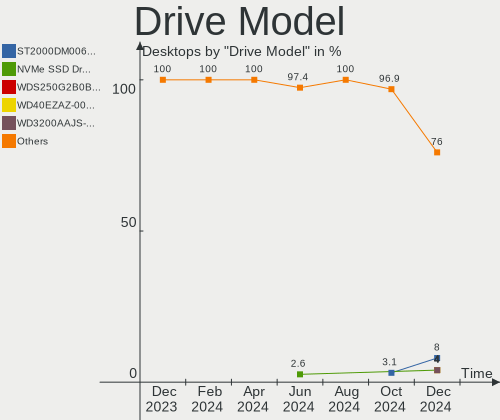
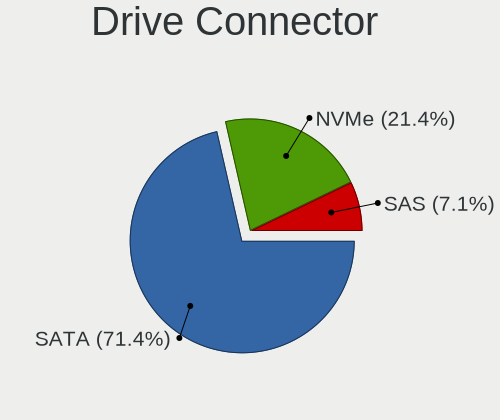
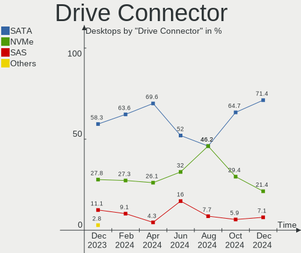
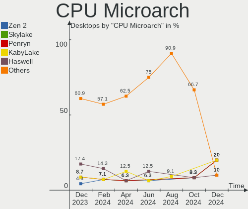
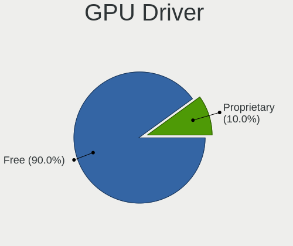
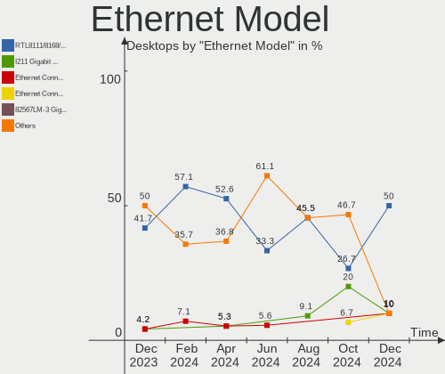
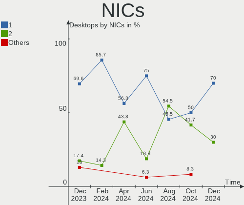
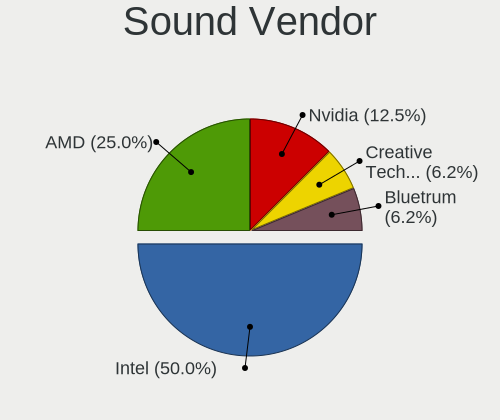
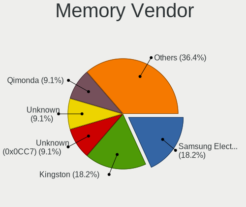
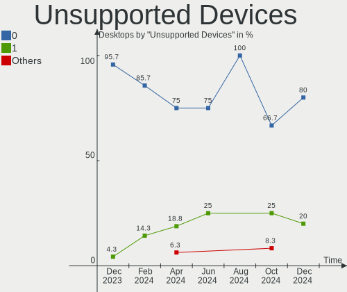

LMDE - Hardware Trends (Desktops)
---------------------------------

A project to identify most popular hardware characteristics and track their change
over time based on data collected by Linux users at https://Linux-Hardware.org.

Anyone can contribute to this report by the [hw-probe](https://github.com/linuxhw/hw-probe) tool:

    sudo -E hw-probe -all -upload

This report is for one last month. Overall report since the beginning of time: [TestDays](https://github.com/linuxhw/TestDays)

Period: Nov, 2023.

Contents
--------

* [ System ](#system)
  - [ OS                       ](#os)
  - [ OS Family                ](#os-family)
  - [ Kernel                   ](#kernel)
  - [ Kernel Family            ](#kernel-family)
  - [ Kernel Major Ver.        ](#kernel-major-ver)
  - [ Arch                     ](#arch)
  - [ DE                       ](#de)
  - [ Display Server           ](#display-server)
  - [ Display Manager          ](#display-manager)
  - [ OS Lang                  ](#os-lang)
  - [ Boot Mode                ](#boot-mode)
  - [ Filesystem               ](#filesystem)
  - [ Part. scheme             ](#part-scheme)
  - [ Dual Boot with Linux/BSD ](#dual-boot-with-linuxbsd)
  - [ Dual Boot (Win)          ](#dual-boot-win)

* [ Board ](#board)
  - [ Vendor                   ](#vendor)
  - [ Model                    ](#model)
  - [ Model Family             ](#model-family)
  - [ MFG Year                 ](#mfg-year)
  - [ Form Factor              ](#form-factor)
  - [ Secure Boot              ](#secure-boot)
  - [ Coreboot                 ](#coreboot)
  - [ RAM Size                 ](#ram-size)
  - [ RAM Used                 ](#ram-used)
  - [ Total Drives             ](#total-drives)
  - [ Has CD-ROM               ](#has-cd-rom)
  - [ Has Ethernet             ](#has-ethernet)
  - [ Has WiFi                 ](#has-wifi)
  - [ Has Bluetooth            ](#has-bluetooth)

* [ Location ](#location)
  - [ Country                  ](#country)
  - [ City                     ](#city)

* [ Drives ](#drives)
  - [ Drive Vendor             ](#drive-vendor)
  - [ Drive Model              ](#drive-model)
  - [ HDD Vendor               ](#hdd-vendor)
  - [ SSD Vendor               ](#ssd-vendor)
  - [ Drive Kind               ](#drive-kind)
  - [ Drive Connector          ](#drive-connector)
  - [ Drive Size               ](#drive-size)
  - [ Space Total              ](#space-total)
  - [ Space Used               ](#space-used)
  - [ Malfunc. Drives          ](#malfunc-drives)
  - [ Malfunc. Drive Vendor    ](#malfunc-drive-vendor)
  - [ Malfunc. HDD Vendor      ](#malfunc-hdd-vendor)
  - [ Malfunc. Drive Kind      ](#malfunc-drive-kind)
  - [ Failed Drives            ](#failed-drives)
  - [ Failed Drive Vendor      ](#failed-drive-vendor)
  - [ Drive Status             ](#drive-status)

* [ Storage controller ](#storage-controller)
  - [ Storage Vendor           ](#storage-vendor)
  - [ Storage Model            ](#storage-model)
  - [ Storage Kind             ](#storage-kind)

* [ Processor ](#processor)
  - [ CPU Vendor               ](#cpu-vendor)
  - [ CPU Model                ](#cpu-model)
  - [ CPU Model Family         ](#cpu-model-family)
  - [ CPU Cores                ](#cpu-cores)
  - [ CPU Sockets              ](#cpu-sockets)
  - [ CPU Threads              ](#cpu-threads)
  - [ CPU Op-Modes             ](#cpu-op-modes)
  - [ CPU Microcode            ](#cpu-microcode)
  - [ CPU Microarch            ](#cpu-microarch)

* [ Graphics ](#graphics)
  - [ GPU Vendor               ](#gpu-vendor)
  - [ GPU Model                ](#gpu-model)
  - [ GPU Combo                ](#gpu-combo)
  - [ GPU Driver               ](#gpu-driver)
  - [ GPU Memory               ](#gpu-memory)

* [ Monitor ](#monitor)
  - [ Monitor Vendor           ](#monitor-vendor)
  - [ Monitor Model            ](#monitor-model)
  - [ Monitor Resolution       ](#monitor-resolution)
  - [ Monitor Diagonal         ](#monitor-diagonal)
  - [ Monitor Width            ](#monitor-width)
  - [ Aspect Ratio             ](#aspect-ratio)
  - [ Monitor Area             ](#monitor-area)
  - [ Pixel Density            ](#pixel-density)
  - [ Multiple Monitors        ](#multiple-monitors)

* [ Network ](#network)
  - [ Net Controller Vendor    ](#net-controller-vendor)
  - [ Net Controller Model     ](#net-controller-model)
  - [ Wireless Vendor          ](#wireless-vendor)
  - [ Wireless Model           ](#wireless-model)
  - [ Ethernet Vendor          ](#ethernet-vendor)
  - [ Ethernet Model           ](#ethernet-model)
  - [ Net Controller Kind      ](#net-controller-kind)
  - [ Used Controller          ](#used-controller)
  - [ NICs                     ](#nics)
  - [ IPv6                     ](#ipv6)

* [ Bluetooth ](#bluetooth)
  - [ Bluetooth Vendor         ](#bluetooth-vendor)
  - [ Bluetooth Model          ](#bluetooth-model)

* [ Sound ](#sound)
  - [ Sound Vendor             ](#sound-vendor)
  - [ Sound Model              ](#sound-model)

* [ Memory ](#memory)
  - [ Memory Vendor            ](#memory-vendor)
  - [ Memory Model             ](#memory-model)
  - [ Memory Kind              ](#memory-kind)
  - [ Memory Form Factor       ](#memory-form-factor)
  - [ Memory Size              ](#memory-size)
  - [ Memory Speed             ](#memory-speed)

* [ Printers & scanners ](#printers--scanners)
  - [ Printer Vendor           ](#printer-vendor)
  - [ Printer Model            ](#printer-model)
  - [ Scanner Vendor           ](#scanner-vendor)
  - [ Scanner Model            ](#scanner-model)

* [ Camera ](#camera)
  - [ Camera Vendor            ](#camera-vendor)
  - [ Camera Model             ](#camera-model)

* [ Security ](#security)
  - [ Fingerprint Vendor       ](#fingerprint-vendor)
  - [ Fingerprint Model        ](#fingerprint-model)
  - [ Chipcard Vendor          ](#chipcard-vendor)
  - [ Chipcard Model           ](#chipcard-model)

* [ Unsupported ](#unsupported)
  - [ Unsupported Devices      ](#unsupported-devices)
  - [ Unsupported Device Types ](#unsupported-device-types)

System
------

OS
--

Installed operating systems

| Name   | Desktops | Percent |
|--------|----------|---------|
| LMDE 6 | 18       | 85.71%  |
| LMDE 5 | 3        | 14.29%  |

OS Family
---------

OS without a version

| Name | Desktops | Percent |
|------|----------|---------|
| LMDE | 21       | 100%    |

Kernel
------

Version of the Linux kernel

| Version         | Desktops | Percent |
|-----------------|----------|---------|
| 6.1.0-13-amd64  | 15       | 71.43%  |
| 6.1.0-12-amd64  | 3        | 14.29%  |
| 5.10.0-26-amd64 | 3        | 14.29%  |

Kernel Family
-------------

Linux kernel without a distro release

| Version | Desktops | Percent |
|---------|----------|---------|
| 6.1.0   | 18       | 85.71%  |
| 5.10.0  | 3        | 14.29%  |

Kernel Major Ver.
-----------------

Linux kernel major version

| Version | Desktops | Percent |
|---------|----------|---------|
| 6.1     | 18       | 85.71%  |
| 5.10    | 3        | 14.29%  |

Arch
----

OS architecture (x86_64, i586, etc.)

| Name   | Desktops | Percent |
|--------|----------|---------|
| x86_64 | 21       | 100%    |

DE
--

Desktop Environment

| Name       | Desktops | Percent |
|------------|----------|---------|
| X-Cinnamon | 20       | 95.24%  |
| Cinnamon   | 1        | 4.76%   |

Display Server
--------------

X11 or Wayland

| Name | Desktops | Percent |
|------|----------|---------|
| X11  | 21       | 100%    |

Display Manager
---------------

SDDM, LightDM, etc.

| Name    | Desktops | Percent |
|---------|----------|---------|
| Unknown | 12       | 57.14%  |
| LightDM | 9        | 42.86%  |

OS Lang
-------

Language

| Lang  | Desktops | Percent |
|-------|----------|---------|
| en_US | 9        | 42.86%  |
| de_DE | 3        | 14.29%  |
| en_GB | 2        | 9.52%   |
| en_AU | 2        | 9.52%   |
| pl_PL | 1        | 4.76%   |
| it_IT | 1        | 4.76%   |
| hr_HR | 1        | 4.76%   |
| es_ES | 1        | 4.76%   |
| en_NZ | 1        | 4.76%   |

Boot Mode
---------

EFI or BIOS

| Mode | Desktops | Percent |
|------|----------|---------|
| EFI  | 13       | 61.9%   |
| BIOS | 8        | 38.1%   |

Filesystem
----------

Type of filesystem

| Type    | Desktops | Percent |
|---------|----------|---------|
| Ext4    | 19       | 90.48%  |
| Tmpfs   | 1        | 4.76%   |
| Overlay | 1        | 4.76%   |

Part. scheme
------------

Scheme of partitioning

| Type    | Desktops | Percent |
|---------|----------|---------|
| Unknown | 12       | 57.14%  |
| GPT     | 7        | 33.33%  |
| MBR     | 2        | 9.52%   |

Dual Boot with Linux/BSD
------------------------

Hosting more than one Linux/BSD

| Dual boot | Desktops | Percent |
|-----------|----------|---------|
| No        | 19       | 90.48%  |
| Yes       | 2        | 9.52%   |

Dual Boot (Win)
---------------

Hosting Linux and Windows

| Dual boot | Desktops | Percent |
|-----------|----------|---------|
| No        | 18       | 85.71%  |
| Yes       | 3        | 14.29%  |

Board
-----

Vendor
------

Motherboard manufacturer

| Name                                 | Desktops | Percent |
|--------------------------------------|----------|---------|
| ASUSTek Computer                     | 4        | 19.05%  |
| MSI                                  | 3        | 14.29%  |
| Gigabyte Technology                  | 3        | 14.29%  |
| Pegatron                             | 2        | 9.52%   |
| Dell                                 | 2        | 9.52%   |
| Acer                                 | 2        | 9.52%   |
| Soyo                                 | 1        | 4.76%   |
| Shenzhen Meigao Electronic Equipment | 1        | 4.76%   |
| Medion                               | 1        | 4.76%   |
| Fujitsu                              | 1        | 4.76%   |
| ASRock                               | 1        | 4.76%   |

Model
-----

Motherboard model

| Name                                                | Desktops | Percent |
|-----------------------------------------------------|----------|---------|
| Soyo SY-N3150L Quad                                 | 1        | 4.76%   |
| Shenzhen Meigao Electronic Equipment Mercury series | 1        | 4.76%   |
| Pegatron p6-2143w                                   | 1        | 4.76%   |
| Pegatron 520-1138c                                  | 1        | 4.76%   |
| MSI MS-7E07                                         | 1        | 4.76%   |
| MSI MS-7E01                                         | 1        | 4.76%   |
| MSI MS-7798                                         | 1        | 4.76%   |
| Medion S23003                                       | 1        | 4.76%   |
| Gigabyte Q87M-D2H                                   | 1        | 4.76%   |
| Gigabyte GB-BACE-3000-SBE                           | 1        | 4.76%   |
| Gigabyte B560M D3H                                  | 1        | 4.76%   |
| Fujitsu ESPRIMO_P556                                | 1        | 4.76%   |
| Dell Vostro 3268                                    | 1        | 4.76%   |
| Dell OptiPlex GX620                                 | 1        | 4.76%   |
| ASUS PRIME B450M-K                                  | 1        | 4.76%   |
| ASUS P5G41T-M LX3                                   | 1        | 4.76%   |
| ASUS P5G41T-M LX                                    | 1        | 4.76%   |
| ASUS A0000001                                       | 1        | 4.76%   |
| ASRock Z97 Pro4                                     | 1        | 4.76%   |
| Acer Aspire X3400                                   | 1        | 4.76%   |
| Acer Aspire TC-780                                  | 1        | 4.76%   |

Model Family
------------

Motherboard model prefix

| Name                                         | Desktops | Percent |
|----------------------------------------------|----------|---------|
| ASUS P5G41T-M                                | 2        | 9.52%   |
| Acer Aspire                                  | 2        | 9.52%   |
| Soyo SY-N3150L                               | 1        | 4.76%   |
| Shenzhen Meigao Electronic Equipment Mercury | 1        | 4.76%   |
| Pegatron p6-2143w                            | 1        | 4.76%   |
| Pegatron 520-1138c                           | 1        | 4.76%   |
| MSI MS-7E07                                  | 1        | 4.76%   |
| MSI MS-7E01                                  | 1        | 4.76%   |
| MSI MS-7798                                  | 1        | 4.76%   |
| Medion S23003                                | 1        | 4.76%   |
| Gigabyte Q87M-D2H                            | 1        | 4.76%   |
| Gigabyte GB-BACE-3000-SBE                    | 1        | 4.76%   |
| Gigabyte B560M                               | 1        | 4.76%   |
| Fujitsu ESPRIMO                              | 1        | 4.76%   |
| Dell Vostro                                  | 1        | 4.76%   |
| Dell OptiPlex                                | 1        | 4.76%   |
| ASUS PRIME                                   | 1        | 4.76%   |
| ASUS A0000001                                | 1        | 4.76%   |
| ASRock Z97                                   | 1        | 4.76%   |

MFG Year
--------

Motherboard manufacture year

| Year | Desktops | Percent |
|------|----------|---------|
| 2018 | 3        | 14.29%  |
| 2016 | 3        | 14.29%  |
| 2012 | 3        | 14.29%  |
| 2010 | 3        | 14.29%  |
| 2023 | 2        | 9.52%   |
| 2021 | 2        | 9.52%   |
| 2017 | 2        | 9.52%   |
| 2022 | 1        | 4.76%   |
| 2015 | 1        | 4.76%   |
| 2006 | 1        | 4.76%   |

Form Factor
-----------

Physical design of the computer

| Name    | Desktops | Percent |
|---------|----------|---------|
| Desktop | 21       | 100%    |

Secure Boot
-----------

Enabled or disabled

| State    | Desktops | Percent |
|----------|----------|---------|
| Disabled | 20       | 95.24%  |
| Enabled  | 1        | 4.76%   |

Coreboot
--------

Have coreboot on board

| Used | Desktops | Percent |
|------|----------|---------|
| No   | 21       | 100%    |

RAM Size
--------

Total RAM memory

| Size in GB | Desktops | Percent |
|------------|----------|---------|
| 4.01-8.0   | 9        | 42.86%  |
| 32.01-64.0 | 5        | 23.81%  |
| 3.01-4.0   | 3        | 14.29%  |
| 16.01-24.0 | 2        | 9.52%   |
| 24.01-32.0 | 1        | 4.76%   |
| 8.01-16.0  | 1        | 4.76%   |

RAM Used
--------

Used RAM memory

| Used GB  | Desktops | Percent |
|----------|----------|---------|
| 1.01-2.0 | 11       | 52.38%  |
| 2.01-3.0 | 6        | 28.57%  |
| 4.01-8.0 | 2        | 9.52%   |
| 3.01-4.0 | 2        | 9.52%   |

Total Drives
------------

Number of drives on board

| Drives | Desktops | Percent |
|--------|----------|---------|
| 1      | 11       | 52.38%  |
| 4      | 3        | 14.29%  |
| 3      | 3        | 14.29%  |
| 5      | 2        | 9.52%   |
| 2      | 1        | 4.76%   |
| 0      | 1        | 4.76%   |

Has CD-ROM
----------

Has CD-ROM on board

| Presented | Desktops | Percent |
|-----------|----------|---------|
| No        | 11       | 52.38%  |
| Yes       | 10       | 47.62%  |

Has Ethernet
------------

Has Ethernet on board

| Presented | Desktops | Percent |
|-----------|----------|---------|
| Yes       | 20       | 95.24%  |
| No        | 1        | 4.76%   |

Has WiFi
--------

Has WiFi module

| Presented | Desktops | Percent |
|-----------|----------|---------|
| Yes       | 13       | 61.9%   |
| No        | 8        | 38.1%   |

Has Bluetooth
-------------

Has Bluetooth module

| Presented | Desktops | Percent |
|-----------|----------|---------|
| No        | 12       | 57.14%  |
| Yes       | 9        | 42.86%  |

Location
--------

Country
-------

Geographic location (country)

| Country                | Desktops | Percent |
|------------------------|----------|---------|
| USA                    | 4        | 19.05%  |
| Germany                | 4        | 19.05%  |
| UK                     | 2        | 9.52%   |
| Australia              | 2        | 9.52%   |
| Spain                  | 1        | 4.76%   |
| Poland                 | 1        | 4.76%   |
| New Zealand            | 1        | 4.76%   |
| Italy                  | 1        | 4.76%   |
| Iran                   | 1        | 4.76%   |
| Indonesia              | 1        | 4.76%   |
| India                  | 1        | 4.76%   |
| Canada                 | 1        | 4.76%   |
| Bosnia and Herzegovina | 1        | 4.76%   |

City
----

Geographic location (city)

| City            | Desktops | Percent |
|-----------------|----------|---------|
| Sydney          | 2        | 9.52%   |
| Delligsen       | 2        | 9.52%   |
| Wisconsin Dells | 1        | 4.76%   |
| Strzelno        | 1        | 4.76%   |
| Seattle         | 1        | 4.76%   |
| Sarnia          | 1        | 4.76%   |
| Russell         | 1        | 4.76%   |
| Prnjavor        | 1        | 4.76%   |
| Palma           | 1        | 4.76%   |
| Norfolk         | 1        | 4.76%   |
| Lambeth         | 1        | 4.76%   |
| Krefeld         | 1        | 4.76%   |
| Isfahan         | 1        | 4.76%   |
| Hyderabad       | 1        | 4.76%   |
| Genoa           | 1        | 4.76%   |
| Düsseldorf     | 1        | 4.76%   |
| Depok           | 1        | 4.76%   |
| Cullompton      | 1        | 4.76%   |
| Auckland        | 1        | 4.76%   |

Drives
------

Drive Vendor
------------

Hard drive vendors

| Vendor              | Desktops | Drives | Percent |
|---------------------|----------|--------|---------|
| WDC                 | 7        | 11     | 18.42%  |
| Seagate             | 6        | 7      | 15.79%  |
| Kingston            | 4        | 4      | 10.53%  |
| Toshiba             | 3        | 4      | 7.89%   |
| Unknown             | 2        | 2      | 5.26%   |
| Crucial             | 2        | 2      | 5.26%   |
| China               | 2        | 2      | 5.26%   |
| A-DATA Technology   | 2        | 2      | 5.26%   |
| Verbatim            | 1        | 1      | 2.63%   |
| SanDisk             | 1        | 1      | 2.63%   |
| Samsung Electronics | 1        | 1      | 2.63%   |
| PNY USB             | 1        | 1      | 2.63%   |
| PNY                 | 1        | 1      | 2.63%   |
| Phison Electronics  | 1        | 1      | 2.63%   |
| Phison              | 1        | 1      | 2.63%   |
| Maxtor              | 1        | 1      | 2.63%   |
| Apacer              | 1        | 1      | 2.63%   |
| Unknown             | 1        | 1      | 2.63%   |

Drive Model
-----------

Hard drive models

| Model                                   | Desktops | Percent |
|-----------------------------------------|----------|---------|
| Toshiba HDWE160 6TB                     | 2        | 4.65%   |
| WDC WDS100T2B0C-00PXH0 1TB              | 1        | 2.33%   |
| WDC WDS100T2B0B-00YS70 1TB SSD          | 1        | 2.33%   |
| WDC WDBNCE5000PNC 500GB SSD             | 1        | 2.33%   |
| WDC WD5000AAKX-001CA0 500GB             | 1        | 2.33%   |
| WDC WD4004FZWX-00GBGB0 4TB              | 1        | 2.33%   |
| WDC WD3200AAJS-22B4A0 320GB             | 1        | 2.33%   |
| WDC WD30EFRX-68EUZN0 3TB                | 1        | 2.33%   |
| WDC WD2003FZEX-00SRLA0 2TB              | 1        | 2.33%   |
| WDC WD10EZEX-75WN4A0 1TB                | 1        | 2.33%   |
| WDC WD10EZEX-08WN4A0 1TB                | 1        | 2.33%   |
| Verbatim Vi550 S3 512GB                 | 1        | 2.33%   |
| Unknown SD/MMC/MS PRO 128GB             | 1        | 2.33%   |
| Unknown MMC Card  256GB                 | 1        | 2.33%   |
| Toshiba MG05ACA800E 8TB                 | 1        | 2.33%   |
| Toshiba DT01ABA300 3TB                  | 1        | 2.33%   |
| Seagate ST2000DM006-2DM164 2TB          | 1        | 2.33%   |
| Seagate ST18000NM000J-2TV103 18TB       | 1        | 2.33%   |
| Seagate ST16000NM001G-2KK103 16TB       | 1        | 2.33%   |
| Seagate ST1000VM002-1ET162 1TB          | 1        | 2.33%   |
| Seagate ST1000DM010-2EP102 1TB          | 1        | 2.33%   |
| Seagate ST1000DM003-1CH162 1TB          | 1        | 2.33%   |
| Seagate BUP BK 4TB                      | 1        | 2.33%   |
| SanDisk NVMe SSD Drive 1TB              | 1        | 2.33%   |
| Samsung SSD 970 EVO 500GB               | 1        | 2.33%   |
| PNY USB 3.0 to SATA 500GB SSD           | 1        | 2.33%   |
| PNY CS900 500GB SSD                     | 1        | 2.33%   |
| Phison S11-128G-PHISON-SSD-B4 128GB     | 1        | 2.33%   |
| Phison PS5013 E13 NVMe Controller 512GB | 1        | 2.33%   |
| Maxtor STM3160215AS 160GB               | 1        | 2.33%   |
| Kingston SA400S37480G 480GB SSD         | 1        | 2.33%   |
| Kingston SA400S37240G 240GB SSD         | 1        | 2.33%   |
| Kingston SA400S37120G 120GB SSD         | 1        | 2.33%   |
| Kingston OM3PGP41024P-A0 1TB            | 1        | 2.33%   |
| Crucial CT500P5PSSD8 500GB              | 1        | 2.33%   |
| Crucial CT1000BX500SSD1 1TB             | 1        | 2.33%   |
| China SSD 240G                          | 1        | 2.33%   |
| China SATA SSD 120GB                    | 1        | 2.33%   |
| Apacer AS350 1TB SSD                    | 1        | 2.33%   |
| A-DATA SU800 512GB SSD                  | 1        | 2.33%   |

HDD Vendor
----------

Hard disk drive vendors

| Vendor  | Desktops | Drives | Percent |
|---------|----------|--------|---------|
| Seagate | 6        | 7      | 37.5%   |
| WDC     | 5        | 8      | 31.25%  |
| Toshiba | 3        | 4      | 18.75%  |
| Unknown | 1        | 1      | 6.25%   |
| Maxtor  | 1        | 1      | 6.25%   |

SSD Vendor
----------

Solid state drive vendors

| Vendor            | Desktops | Drives | Percent |
|-------------------|----------|--------|---------|
| Kingston          | 3        | 3      | 18.75%  |
| WDC               | 2        | 2      | 12.5%   |
| China             | 2        | 2      | 12.5%   |
| A-DATA Technology | 2        | 2      | 12.5%   |
| Verbatim          | 1        | 1      | 6.25%   |
| PNY USB           | 1        | 1      | 6.25%   |
| PNY               | 1        | 1      | 6.25%   |
| Phison            | 1        | 1      | 6.25%   |
| Crucial           | 1        | 1      | 6.25%   |
| Apacer            | 1        | 1      | 6.25%   |
| Unknown           | 1        | 1      | 6.25%   |

Drive Kind
----------

HDD or SSD

| Kind | Desktops | Drives | Percent |
|------|----------|--------|---------|
| SSD  | 16       | 16     | 50%     |
| HDD  | 10       | 21     | 31.25%  |
| NVMe | 5        | 6      | 15.63%  |
| MMC  | 1        | 1      | 3.13%   |

Drive Connector
---------------

SATA, SAS, NVMe, etc.

| Type | Desktops | Drives | Percent |
|------|----------|--------|---------|
| SATA | 19       | 34     | 70.37%  |
| NVMe | 5        | 6      | 18.52%  |
| SAS  | 2        | 3      | 7.41%   |
| MMC  | 1        | 1      | 3.7%    |

Drive Size
----------

Size of hard drive

| Size in TB | Desktops | Drives | Percent |
|------------|----------|--------|---------|
| 0.01-0.5   | 13       | 15     | 43.33%  |
| 0.51-1.0   | 8        | 10     | 26.67%  |
| 3.01-4.0   | 2        | 3      | 6.67%   |
| 2.01-3.0   | 2        | 2      | 6.67%   |
| 1.01-2.0   | 2        | 2      | 6.67%   |
| 4.01-10.0  | 2        | 3      | 6.67%   |
| 10.01-20.0 | 1        | 2      | 3.33%   |

Space Total
-----------

Amount of disk space available on the file system

| Size in GB     | Desktops | Percent |
|----------------|----------|---------|
| 101-250        | 6        | 28.57%  |
| 251-500        | 5        | 23.81%  |
| 501-1000       | 4        | 19.05%  |
| More than 3000 | 3        | 14.29%  |
| 2001-3000      | 1        | 4.76%   |
| 1-20           | 1        | 4.76%   |
| 51-100         | 1        | 4.76%   |

Space Used
----------

Amount of used disk space

| Used GB        | Desktops | Percent |
|----------------|----------|---------|
| 1-20           | 6        | 28.57%  |
| 21-50          | 5        | 23.81%  |
| 51-100         | 4        | 19.05%  |
| 101-250        | 3        | 14.29%  |
| More than 3000 | 2        | 9.52%   |
| 1001-2000      | 1        | 4.76%   |

Malfunc. Drives
---------------

Drive models with a malfunction

Zero info for selected period =(

Malfunc. Drive Vendor
---------------------

Vendors of faulty drives

Zero info for selected period =(

Malfunc. HDD Vendor
-------------------

Vendors of faulty HDD drives

Zero info for selected period =(

Malfunc. Drive Kind
-------------------

Kinds of faulty drives

Zero info for selected period =(

Failed Drives
-------------

Failed drive models

Zero info for selected period =(

Failed Drive Vendor
-------------------

Failed drive vendors

Zero info for selected period =(

Drive Status
------------

Number of failed and malfunc. drives

| Status   | Desktops | Drives | Percent |
|----------|----------|--------|---------|
| Detected | 13       | 28     | 61.9%   |
| Works    | 8        | 16     | 38.1%   |

Storage controller
------------------

Storage Vendor
--------------

Storage controller vendors

| Vendor                      | Desktops | Percent |
|-----------------------------|----------|---------|
| Intel                       | 15       | 60%     |
| AMD                         | 3        | 12%     |
| SanDisk                     | 1        | 4%      |
| Samsung Electronics         | 1        | 4%      |
| Phison Electronics          | 1        | 4%      |
| Nvidia                      | 1        | 4%      |
| Micron/Crucial Technology   | 1        | 4%      |
| Kingston Technology Company | 1        | 4%      |
| ASMedia Technology          | 1        | 4%      |

Storage Model
-------------

Storage controller models

| Model                                                                                   | Desktops | Percent |
|-----------------------------------------------------------------------------------------|----------|---------|
| Intel Q170/Q150/B150/H170/H110/Z170/CM236 Chipset SATA Controller [AHCI Mode]           | 3        | 9.09%   |
| Intel NM10/ICH7 Family SATA Controller [IDE mode]                                       | 3        | 9.09%   |
| Intel 82801G (ICH7 Family) IDE Controller                                               | 3        | 9.09%   |
| AMD FCH SATA Controller [AHCI mode]                                                     | 3        | 9.09%   |
| Intel 700 Series Chipset Family SATA AHCI Controller                                    | 2        | 6.06%   |
| SanDisk Ultra 3D / WD Blue SN570 NVMe SSD (DRAM-less)                                   | 1        | 3.03%   |
| SanDisk Ultra 3D / WD Blue SN550 NVMe SSD                                               | 1        | 3.03%   |
| Samsung NVMe SSD Controller SM981/PM981/PM983                                           | 1        | 3.03%   |
| Phison PS5013-E13 PCIe3 NVMe Controller (DRAM-less)                                     | 1        | 3.03%   |
| Nvidia MCP78S [GeForce 8200] IDE                                                        | 1        | 3.03%   |
| Nvidia MCP78S [GeForce 8200] AHCI Controller                                            | 1        | 3.03%   |
| Micron/Crucial P5 Plus NVMe PCIe SSD                                                    | 1        | 3.03%   |
| Kingston Company OM3PGP4 NVMe SSD                                                       | 1        | 3.03%   |
| Intel Celeron/Pentium Silver Processor SATA Controller                                  | 1        | 3.03%   |
| Intel Atom/Celeron/Pentium Processor x5-E8000/J3xxx/N3xxx Series SATA Controller        | 1        | 3.03%   |
| Intel 9 Series Chipset Family SATA Controller [AHCI Mode]                               | 1        | 3.03%   |
| Intel 8 Series/C220 Series Chipset Family 6-port SATA Controller 1 [AHCI mode]          | 1        | 3.03%   |
| Intel 7 Series/C210 Series Chipset Family 6-port SATA Controller [AHCI mode]            | 1        | 3.03%   |
| Intel 6 Series/C200 Series Chipset Family Desktop SATA Controller (IDE mode, ports 4-5) | 1        | 3.03%   |
| Intel 6 Series/C200 Series Chipset Family Desktop SATA Controller (IDE mode, ports 0-3) | 1        | 3.03%   |
| Intel 500 Series Chipset Family SATA AHCI Controller                                    | 1        | 3.03%   |
| ASMedia ASM1062 Serial ATA Controller                                                   | 1        | 3.03%   |
| AMD FCH SATA Controller D                                                               | 1        | 3.03%   |
| AMD 400 Series Chipset SATA Controller                                                  | 1        | 3.03%   |

Storage Kind
------------

Kind of storage controller (IDE, SATA, NVMe, SAS, ...)

| Kind | Desktops | Percent |
|------|----------|---------|
| SATA | 15       | 60%     |
| NVMe | 5        | 20%     |
| IDE  | 5        | 20%     |

Processor
---------

CPU Vendor
----------

Processor vendors

| Vendor | Desktops | Percent |
|--------|----------|---------|
| Intel  | 16       | 76.19%  |
| AMD    | 5        | 23.81%  |

CPU Model
---------

Processor models

| Model                                       | Desktops | Percent |
|---------------------------------------------|----------|---------|
| AMD Ryzen 3 2200G with Radeon Vega Graphics | 2        | 9.52%   |
| Intel Pentium Dual-Core CPU E6600 @ 3.06GHz | 1        | 4.76%   |
| Intel Pentium Dual-Core CPU E5700 @ 3.00GHz | 1        | 4.76%   |
| Intel Pentium D CPU 3.00GHz                 | 1        | 4.76%   |
| Intel Core i7-4790K CPU @ 4.00GHz           | 1        | 4.76%   |
| Intel Core i5-7600K CPU @ 3.80GHz           | 1        | 4.76%   |
| Intel Core i5-7400 CPU @ 3.00GHz            | 1        | 4.76%   |
| Intel Core i5-6400 CPU @ 2.70GHz            | 1        | 4.76%   |
| Intel Core i5-4590S CPU @ 3.00GHz           | 1        | 4.76%   |
| Intel Core i5-3450S CPU @ 2.80GHz           | 1        | 4.76%   |
| Intel Core i3-3220 CPU @ 3.30GHz            | 1        | 4.76%   |
| Intel Celeron J4125 CPU @ 2.00GHz           | 1        | 4.76%   |
| Intel Celeron CPU N3150 @ 1.60GHz           | 1        | 4.76%   |
| Intel Celeron CPU N3000 @ 1.04GHz           | 1        | 4.76%   |
| Intel 13th Gen Core i7-13700KF              | 1        | 4.76%   |
| Intel 12th Gen Core i5-12400                | 1        | 4.76%   |
| Intel 11th Gen Core i5-11600K @ 3.90GHz     | 1        | 4.76%   |
| AMD Ryzen 7 6800U with Radeon Graphics      | 1        | 4.76%   |
| AMD Phenom II X6 1035T Processor            | 1        | 4.76%   |
| AMD A6-3650 APU with Radeon HD Graphics     | 1        | 4.76%   |

CPU Model Family
----------------

Processor model prefix

| Model                   | Desktops | Percent |
|-------------------------|----------|---------|
| Intel Core i5           | 5        | 23.81%  |
| Other                   | 3        | 14.29%  |
| Intel Celeron           | 3        | 14.29%  |
| Intel Pentium Dual-Core | 2        | 9.52%   |
| AMD Ryzen 3             | 2        | 9.52%   |
| Intel Pentium D         | 1        | 4.76%   |
| Intel Core i7           | 1        | 4.76%   |
| Intel Core i3           | 1        | 4.76%   |
| AMD Ryzen 7             | 1        | 4.76%   |
| AMD Phenom II X6        | 1        | 4.76%   |
| AMD A6                  | 1        | 4.76%   |

CPU Cores
---------

Number of processor cores

| Number | Desktops | Percent |
|--------|----------|---------|
| 4      | 11       | 52.38%  |
| 2      | 5        | 23.81%  |
| 6      | 3        | 14.29%  |
| 16     | 1        | 4.76%   |
| 8      | 1        | 4.76%   |

CPU Sockets
-----------

Number of sockets

| Number | Desktops | Percent |
|--------|----------|---------|
| 1      | 21       | 100%    |

CPU Threads
-----------

Threads per core (Hyper-Threading)

| Number | Desktops | Percent |
|--------|----------|---------|
| 1      | 15       | 71.43%  |
| 2      | 6        | 28.57%  |

CPU Op-Modes
------------

CPU Operation Modes (32-bit, 64-bit)

| Op mode        | Desktops | Percent |
|----------------|----------|---------|
| 32-bit, 64-bit | 21       | 100%    |

CPU Microcode
-------------

Microcode number

| Number     | Desktops | Percent |
|------------|----------|---------|
| 0x906e9    | 2        | 9.52%   |
| 0x406c3    | 2        | 9.52%   |
| 0x306c3    | 2        | 9.52%   |
| 0x306a9    | 2        | 9.52%   |
| 0x1067a    | 2        | 9.52%   |
| 0xf62      | 1        | 4.76%   |
| 0xb0671    | 1        | 4.76%   |
| 0xa0671    | 1        | 4.76%   |
| 0x90672    | 1        | 4.76%   |
| 0x706a8    | 1        | 4.76%   |
| 0x506e3    | 1        | 4.76%   |
| 0x0a404102 | 1        | 4.76%   |
| 0x08101013 | 1        | 4.76%   |
| 0x0810100b | 1        | 4.76%   |
| 0x03000027 | 1        | 4.76%   |
| 0x010000dc | 1        | 4.76%   |

CPU Microarch
-------------

Microarchitecture

| Name             | Desktops | Percent |
|------------------|----------|---------|
| Zen              | 2        | 9.52%   |
| Silvermont       | 2        | 9.52%   |
| Penryn           | 2        | 9.52%   |
| KabyLake         | 2        | 9.52%   |
| IvyBridge        | 2        | 9.52%   |
| Haswell          | 2        | 9.52%   |
| Alderlake Hybrid | 2        | 9.52%   |
| Skylake          | 1        | 4.76%   |
| NetBurst         | 1        | 4.76%   |
| K10 Llano        | 1        | 4.76%   |
| K10              | 1        | 4.76%   |
| Icelake          | 1        | 4.76%   |
| Goldmont plus    | 1        | 4.76%   |
| Unknown          | 1        | 4.76%   |

Graphics
--------

GPU Vendor
----------

Vendors of graphics cards

| Vendor | Desktops | Percent |
|--------|----------|---------|
| Intel  | 11       | 50%     |
| AMD    | 6        | 27.27%  |
| Nvidia | 5        | 22.73%  |

GPU Model
---------

Graphics card models

| Model                                                                                    | Desktops | Percent |
|------------------------------------------------------------------------------------------|----------|---------|
| Intel Xeon E3-1200 v3/4th Gen Core Processor Integrated Graphics Controller              | 2        | 8.7%    |
| Intel Xeon E3-1200 v2/3rd Gen Core processor Graphics Controller                         | 2        | 8.7%    |
| Intel Atom/Celeron/Pentium Processor x5-E8000/J3xxx/N3xxx Integrated Graphics Controller | 2        | 8.7%    |
| Intel 4 Series Chipset Integrated Graphics Controller                                    | 2        | 8.7%    |
| AMD Cedar [Radeon HD 5000/6000/7350/8350 Series]                                         | 2        | 8.7%    |
| Nvidia TU116 [GeForce GTX 1660 Ti]                                                       | 1        | 4.35%   |
| Nvidia GP107 [GeForce GTX 1050 Ti]                                                       | 1        | 4.35%   |
| Nvidia GK208B [GeForce GT 720]                                                           | 1        | 4.35%   |
| Nvidia GF108 [GeForce GT 430]                                                            | 1        | 4.35%   |
| Nvidia C77 [GeForce 8200]                                                                | 1        | 4.35%   |
| Nvidia AD107 [GeForce RTX 4060]                                                          | 1        | 4.35%   |
| Intel HD Graphics 630                                                                    | 1        | 4.35%   |
| Intel GeminiLake [UHD Graphics 600]                                                      | 1        | 4.35%   |
| Intel Alder Lake-S GT1 [UHD Graphics 730]                                                | 1        | 4.35%   |
| AMD Tahiti PRO [Radeon HD 7950/8950 OEM / R9 280]                                        | 1        | 4.35%   |
| AMD Sumo [Radeon HD 6530D]                                                               | 1        | 4.35%   |
| AMD Rembrandt [Radeon 680M]                                                              | 1        | 4.35%   |
| AMD Raven Ridge [Radeon Vega Series / Radeon Vega Mobile Series]                         | 1        | 4.35%   |

GPU Combo
---------

Combinations of graphics cards

| Name       | Desktops | Percent |
|------------|----------|---------|
| 1 x Intel  | 10       | 47.62%  |
| 1 x AMD    | 6        | 28.57%  |
| 1 x Nvidia | 4        | 19.05%  |
| 2 x Nvidia | 1        | 4.76%   |

GPU Driver
----------

Free vs proprietary

| Driver      | Desktops | Percent |
|-------------|----------|---------|
| Free        | 17       | 80.95%  |
| Proprietary | 3        | 14.29%  |
| Unknown     | 1        | 4.76%   |

GPU Memory
----------

Total video memory

| Size in GB | Desktops | Percent |
|------------|----------|---------|
| Unknown    | 11       | 52.38%  |
| 7.01-8.0   | 2        | 9.52%   |
| 0.51-1.0   | 2        | 9.52%   |
| 0.01-0.5   | 2        | 9.52%   |
| 5.01-6.0   | 1        | 4.76%   |
| 3.01-4.0   | 1        | 4.76%   |
| 2.01-3.0   | 1        | 4.76%   |
| 1.01-2.0   | 1        | 4.76%   |

Monitor
-------

Monitor Vendor
--------------

Monitor vendors

| Vendor               | Desktops | Percent |
|----------------------|----------|---------|
| Samsung Electronics  | 4        | 20%     |
| Hewlett-Packard      | 4        | 20%     |
| Acer                 | 3        | 15%     |
| Dell                 | 2        | 10%     |
| Ancor Communications | 2        | 10%     |
| LBT                  | 1        | 5%      |
| Iiyama               | 1        | 5%      |
| HUAWEI               | 1        | 5%      |
| Hitachi              | 1        | 5%      |
| Goldstar             | 1        | 5%      |

Monitor Model
-------------

Monitor models

| Model                                                                 | Desktops | Percent |
|-----------------------------------------------------------------------|----------|---------|
| Samsung Electronics SyncMaster SAM059A 1920x1080 477x268mm 21.5-inch  | 1        | 4.76%   |
| Samsung Electronics SyncMaster SAM036F 1440x900 428x255mm 19.6-inch   | 1        | 4.76%   |
| Samsung Electronics S24C350 SAM0A3B 1920x1080 521x293mm 23.5-inch     | 1        | 4.76%   |
| Samsung Electronics LCD Monitor S27E390 1920x1080                     | 1        | 4.76%   |
| LBT Rokid Max LBT4753 1920x1080 160x100mm 7.4-inch                    | 1        | 4.76%   |
| Iiyama PL3288UH IVM7610 3840x2160 700x390mm 31.5-inch                 | 1        | 4.76%   |
| HUAWEI ZQE-CBA HWV6A25 3440x1440 797x334mm 34.0-inch                  | 1        | 4.76%   |
| Hitachi HDMI HEC0030 1920x1080 580x330mm 26.3-inch                    | 1        | 4.76%   |
| Hewlett-Packard x20LED HWP2910 1600x900 443x249mm 20.0-inch           | 1        | 4.76%   |
| Hewlett-Packard TouchSmart HWP4211 1920x1080 509x286mm 23.0-inch      | 1        | 4.76%   |
| Hewlett-Packard 25x HPN357F 1920x1080 544x303mm 24.5-inch             | 1        | 4.76%   |
| Hewlett-Packard 22w HPN3430 1920x1080 476x268mm 21.5-inch             | 1        | 4.76%   |
| Goldstar LG TV SSCR2 GSMC0C8 3840x2160                                | 1        | 4.76%   |
| Dell U2412M DELA07A 1920x1200 518x324mm 24.1-inch                     | 1        | 4.76%   |
| Dell E1916HV DELF06C 1366x768 409x230mm 18.5-inch                     | 1        | 4.76%   |
| Ancor Communications VE228 ACI22FA 1920x1080 477x268mm 21.5-inch      | 1        | 4.76%   |
| Ancor Communications ASUS VW190 ACI19E9 1366x768 410x230mm 18.5-inch  | 1        | 4.76%   |
| Ancor Communications ASUS VS228 ACI22FD 1920x1080 480x270mm 21.7-inch | 1        | 4.76%   |
| Acer XZ322QU ACR073A 2560x1440 697x392mm 31.5-inch                    | 1        | 4.76%   |
| Acer X203H ACR0073 1600x900 443x249mm 20.0-inch                       | 1        | 4.76%   |
| Acer B226WL ACR033A 1680x1050 470x300mm 22.0-inch                     | 1        | 4.76%   |

Monitor Resolution
------------------

Monitor screen resolution

| Resolution         | Desktops | Percent |
|--------------------|----------|---------|
| 1920x1080 (FHD)    | 8        | 40%     |
| 3840x2160 (4K)     | 3        | 15%     |
| 1600x900 (HD+)     | 2        | 10%     |
| 1366x768 (WXGA)    | 2        | 10%     |
| 3440x1440          | 1        | 5%      |
| 2560x1440 (QHD)    | 1        | 5%      |
| 1920x1200 (WUXGA)  | 1        | 5%      |
| 1680x1050 (WSXGA+) | 1        | 5%      |
| 1440x900 (WXGA+)   | 1        | 5%      |

Monitor Diagonal
----------------

Diagonal size in inches

| Inches  | Desktops | Percent |
|---------|----------|---------|
| 24      | 3        | 14.29%  |
| 21      | 3        | 14.29%  |
| 31      | 2        | 9.52%   |
| 23      | 2        | 9.52%   |
| 20      | 2        | 9.52%   |
| 18      | 2        | 9.52%   |
| 84      | 1        | 4.76%   |
| 72      | 1        | 4.76%   |
| 34      | 1        | 4.76%   |
| 22      | 1        | 4.76%   |
| 19      | 1        | 4.76%   |
| 7       | 1        | 4.76%   |
| Unknown | 1        | 4.76%   |

Monitor Width
-------------

Physical width

| Width in mm | Desktops | Percent |
|-------------|----------|---------|
| 401-500     | 9        | 42.86%  |
| 501-600     | 5        | 23.81%  |
| 601-700     | 2        | 9.52%   |
| 1501-2000   | 2        | 9.52%   |
| 701-800     | 1        | 4.76%   |
| 101-200     | 1        | 4.76%   |
| Unknown     | 1        | 4.76%   |

Aspect Ratio
------------

Proportional relationship between the width and the height

| Ratio   | Desktops | Percent |
|---------|----------|---------|
| 16/9    | 15       | 75%     |
| 16/10   | 3        | 15%     |
| 21/9    | 1        | 5%      |
| Unknown | 1        | 5%      |

Monitor Area
------------

Area in inch²

| Area in inch² | Desktops | Percent |
|----------------|----------|---------|
| 201-250        | 6        | 30%     |
| 351-500        | 3        | 15%     |
| 151-200        | 3        | 15%     |
| More than 1000 | 2        | 10%     |
| 251-300        | 2        | 10%     |
| 141-150        | 2        | 10%     |
| 1-40           | 1        | 5%      |
| Unknown        | 1        | 5%      |

Pixel Density
-------------

Pixels per inch

| Density       | Desktops | Percent |
|---------------|----------|---------|
| 51-100        | 14       | 66.67%  |
| 101-120       | 4        | 19.05%  |
| More than 240 | 1        | 4.76%   |
| 121-160       | 1        | 4.76%   |
| Unknown       | 1        | 4.76%   |

Multiple Monitors
-----------------

Total monitors connected

| Total | Desktops | Percent |
|-------|----------|---------|
| 1     | 20       | 95.24%  |
| 2     | 1        | 4.76%   |

Network
-------

Net Controller Vendor
---------------------

Controller vendors

| Vendor                | Desktops | Percent |
|-----------------------|----------|---------|
| Realtek Semiconductor | 12       | 40%     |
| Intel                 | 9        | 30%     |
| Qualcomm Atheros      | 3        | 10%     |
| Broadcom              | 2        | 6.67%   |
| TP-Link               | 1        | 3.33%   |
| Ralink                | 1        | 3.33%   |
| Nvidia                | 1        | 3.33%   |
| D-Link                | 1        | 3.33%   |

Net Controller Model
--------------------

Controller models

| Model                                                             | Desktops | Percent |
|-------------------------------------------------------------------|----------|---------|
| Realtek RTL8111/8168/8411 PCI Express Gigabit Ethernet Controller | 9        | 25.71%  |
| Realtek RTL88x2bu [AC1200 Techkey]                                | 2        | 5.71%   |
| Intel Wi-Fi 6 AX210/AX211/AX411 160MHz                            | 2        | 5.71%   |
| Intel 700 Series Chipset Family Wi-Fi                             | 2        | 5.71%   |
| TP-Link RTL8812AU Archer T4U 802.11ac                             | 1        | 2.86%   |
| Realtek RTL8811AU 802.11a/b/g/n/ac WLAN Adapter                   | 1        | 2.86%   |
| Realtek RTL8125 2.5GbE Controller                                 | 1        | 2.86%   |
| Realtek RTL810xE PCI Express Fast Ethernet controller             | 1        | 2.86%   |
| Ralink RT2561/RT61 rev B 802.11g                                  | 1        | 2.86%   |
| Qualcomm Atheros QCA9565 / AR9565 Wireless Network Adapter        | 1        | 2.86%   |
| Qualcomm Atheros AR8151 v2.0 Gigabit Ethernet                     | 1        | 2.86%   |
| Qualcomm Atheros AR8131 Gigabit Ethernet                          | 1        | 2.86%   |
| Nvidia MCP77 Ethernet                                             | 1        | 2.86%   |
| Intel Wireless-AC 9260                                            | 1        | 2.86%   |
| Intel Wireless 3165                                               | 1        | 2.86%   |
| Intel I211 Gigabit Network Connection                             | 1        | 2.86%   |
| Intel Ethernet Controller I225-V                                  | 1        | 2.86%   |
| Intel Ethernet Connection I217-LM                                 | 1        | 2.86%   |
| Intel Ethernet Connection (2) I218-V                              | 1        | 2.86%   |
| Intel Ethernet Connection (14) I219-V                             | 1        | 2.86%   |
| Intel Dual Band Wireless-AC 3168NGW [Stone Peak]                  | 1        | 2.86%   |
| D-Link WLAN controller                                            | 1        | 2.86%   |
| Broadcom NetXtreme BCM5751 Gigabit Ethernet PCI Express           | 1        | 2.86%   |
| Broadcom BCM43225 802.11b/g/n                                     | 1        | 2.86%   |

Wireless Vendor
---------------

Wireless vendors

| Vendor                | Desktops | Percent |
|-----------------------|----------|---------|
| Intel                 | 6        | 42.86%  |
| Realtek Semiconductor | 3        | 21.43%  |
| TP-Link               | 1        | 7.14%   |
| Ralink                | 1        | 7.14%   |
| Qualcomm Atheros      | 1        | 7.14%   |
| D-Link                | 1        | 7.14%   |
| Broadcom              | 1        | 7.14%   |

Wireless Model
--------------

Wireless models

| Model                                                      | Desktops | Percent |
|------------------------------------------------------------|----------|---------|
| Realtek RTL88x2bu [AC1200 Techkey]                         | 2        | 13.33%  |
| Intel Wi-Fi 6 AX210/AX211/AX411 160MHz                     | 2        | 13.33%  |
| Intel 700 Series Chipset Family Wi-Fi                      | 2        | 13.33%  |
| TP-Link RTL8812AU Archer T4U 802.11ac                      | 1        | 6.67%   |
| Realtek RTL8811AU 802.11a/b/g/n/ac WLAN Adapter            | 1        | 6.67%   |
| Ralink RT2561/RT61 rev B 802.11g                           | 1        | 6.67%   |
| Qualcomm Atheros QCA9565 / AR9565 Wireless Network Adapter | 1        | 6.67%   |
| Intel Wireless-AC 9260                                     | 1        | 6.67%   |
| Intel Wireless 3165                                        | 1        | 6.67%   |
| Intel Dual Band Wireless-AC 3168NGW [Stone Peak]           | 1        | 6.67%   |
| D-Link WLAN controller                                     | 1        | 6.67%   |
| Broadcom BCM43225 802.11b/g/n                              | 1        | 6.67%   |

Ethernet Vendor
---------------

Ethernet vendors

| Vendor                | Desktops | Percent |
|-----------------------|----------|---------|
| Realtek Semiconductor | 11       | 55%     |
| Intel                 | 5        | 25%     |
| Qualcomm Atheros      | 2        | 10%     |
| Nvidia                | 1        | 5%      |
| Broadcom              | 1        | 5%      |

Ethernet Model
--------------

Ethernet models

| Model                                                             | Desktops | Percent |
|-------------------------------------------------------------------|----------|---------|
| Realtek RTL8111/8168/8411 PCI Express Gigabit Ethernet Controller | 9        | 45%     |
| Realtek RTL8125 2.5GbE Controller                                 | 1        | 5%      |
| Realtek RTL810xE PCI Express Fast Ethernet controller             | 1        | 5%      |
| Qualcomm Atheros AR8151 v2.0 Gigabit Ethernet                     | 1        | 5%      |
| Qualcomm Atheros AR8131 Gigabit Ethernet                          | 1        | 5%      |
| Nvidia MCP77 Ethernet                                             | 1        | 5%      |
| Intel I211 Gigabit Network Connection                             | 1        | 5%      |
| Intel Ethernet Controller I225-V                                  | 1        | 5%      |
| Intel Ethernet Connection I217-LM                                 | 1        | 5%      |
| Intel Ethernet Connection (2) I218-V                              | 1        | 5%      |
| Intel Ethernet Connection (14) I219-V                             | 1        | 5%      |
| Broadcom NetXtreme BCM5751 Gigabit Ethernet PCI Express           | 1        | 5%      |

Net Controller Kind
-------------------

Ethernet, WiFi or modem

| Kind     | Desktops | Percent |
|----------|----------|---------|
| Ethernet | 20       | 60.61%  |
| WiFi     | 13       | 39.39%  |

Used Controller
---------------

Currently used network controller

| Kind     | Desktops | Percent |
|----------|----------|---------|
| Ethernet | 13       | 59.09%  |
| WiFi     | 9        | 40.91%  |

NICs
----

Total network controllers on board

| Total | Desktops | Percent |
|-------|----------|---------|
| 1     | 13       | 61.9%   |
| 2     | 7        | 33.33%  |
| 3     | 1        | 4.76%   |

IPv6
----

IPv6 vs IPv4

| Used | Desktops | Percent |
|------|----------|---------|
| No   | 16       | 76.19%  |
| Yes  | 5        | 23.81%  |

Bluetooth
---------

Bluetooth Vendor
----------------

Controller vendors

| Vendor                          | Desktops | Percent |
|---------------------------------|----------|---------|
| Intel                           | 6        | 66.67%  |
| Qualcomm Atheros Communications | 1        | 11.11%  |
| Cambridge Silicon Radio         | 1        | 11.11%  |
| Broadcom                        | 1        | 11.11%  |

Bluetooth Model
---------------

Controller models

| Model                                               | Desktops | Percent |
|-----------------------------------------------------|----------|---------|
| Intel Bluetooth Device                              | 2        | 22.22%  |
| Qualcomm Atheros  Bluetooth Device                  | 1        | 11.11%  |
| Intel Wireless-AC 9260 Bluetooth Adapter            | 1        | 11.11%  |
| Intel Wireless-AC 3168 Bluetooth                    | 1        | 11.11%  |
| Intel Bluetooth wireless interface                  | 1        | 11.11%  |
| Intel AX210 Bluetooth                               | 1        | 11.11%  |
| Cambridge Silicon Radio Bluetooth Dongle (HCI mode) | 1        | 11.11%  |
| Broadcom HP Bluethunder                             | 1        | 11.11%  |

Sound
-----

Sound Vendor
------------

Sound card vendors

| Vendor                     | Desktops | Percent |
|----------------------------|----------|---------|
| Intel                      | 16       | 50%     |
| AMD                        | 7        | 21.88%  |
| Nvidia                     | 5        | 15.63%  |
| Texas Instruments          | 1        | 3.13%   |
| Plantronics                | 1        | 3.13%   |
| Micro Star International   | 1        | 3.13%   |
| Altec Lansing Technologies | 1        | 3.13%   |

Sound Model
-----------

Sound card models

| Model                                                                                             | Desktops | Percent |
|---------------------------------------------------------------------------------------------------|----------|---------|
| Intel 100 Series/C230 Series Chipset Family HD Audio Controller                                   | 3        | 8.11%   |
| AMD Family 17h/19h HD Audio Controller                                                            | 3        | 8.11%   |
| Intel Xeon E3-1200 v3/4th Gen Core Processor HD Audio Controller                                  | 2        | 5.41%   |
| Intel NM10/ICH7 Family High Definition Audio Controller                                           | 2        | 5.41%   |
| Intel Atom/Celeron/Pentium Processor x5-E8000/J3xxx/N3xxx Series High Definition Audio Controller | 2        | 5.41%   |
| Intel 700 Series Chipset Family Precise Touch and Stylus Port #1                                  | 2        | 5.41%   |
| AMD Cedar HDMI Audio [Radeon HD 5400/6300/7300 Series]                                            | 2        | 5.41%   |
| Texas Instruments PCM2902 Audio Codec                                                             | 1        | 2.7%    |
| Plantronics BT600                                                                                 | 1        | 2.7%    |
| Nvidia TU116 High Definition Audio Controller                                                     | 1        | 2.7%    |
| Nvidia MCP72XE/MCP72P/MCP78U/MCP78S High Definition Audio                                         | 1        | 2.7%    |
| Nvidia GP107GL High Definition Audio Controller                                                   | 1        | 2.7%    |
| Nvidia GK208 HDMI/DP Audio Controller                                                             | 1        | 2.7%    |
| Nvidia GF108 High Definition Audio Controller                                                     | 1        | 2.7%    |
| Nvidia Audio device                                                                               | 1        | 2.7%    |
| Micro Star International USB Audio                                                                | 1        | 2.7%    |
| Intel Tiger Lake-H HD Audio Controller                                                            | 1        | 2.7%    |
| Intel Celeron/Pentium Silver Processor High Definition Audio                                      | 1        | 2.7%    |
| Intel 9 Series Chipset Family HD Audio Controller                                                 | 1        | 2.7%    |
| Intel 82801G (ICH7 Family) AC'97 Audio Controller                                                 | 1        | 2.7%    |
| Intel 8 Series/C220 Series Chipset High Definition Audio Controller                               | 1        | 2.7%    |
| Intel 7 Series/C216 Chipset Family High Definition Audio Controller                               | 1        | 2.7%    |
| Intel 6 Series/C200 Series Chipset Family High Definition Audio Controller                        | 1        | 2.7%    |
| AMD Tahiti HDMI Audio [Radeon HD 7870 XT / 7950/7970]                                             | 1        | 2.7%    |
| AMD Rembrandt Radeon High Definition Audio Controller                                             | 1        | 2.7%    |
| AMD Raven/Raven2/Fenghuang HDMI/DP Audio Controller                                               | 1        | 2.7%    |
| AMD FCH Azalia Controller                                                                         | 1        | 2.7%    |
| Altec Lansing Technologies Rokid Air (5.0.7)                                                      | 1        | 2.7%    |

Memory
------

Memory Vendor
-------------

Memory module vendors

| Vendor              | Desktops | Percent |
|---------------------|----------|---------|
| Kingston            | 4        | 36.36%  |
| SK hynix            | 2        | 18.18%  |
| Corsair             | 2        | 18.18%  |
| Unknown (ABCD)      | 1        | 9.09%   |
| Samsung Electronics | 1        | 9.09%   |
| Crucial             | 1        | 9.09%   |

Memory Model
------------

Memory module models

| Model                                                             | Desktops | Percent |
|-------------------------------------------------------------------|----------|---------|
| Unknown (ABCD) RAM 123456789012345678 1536MB DIMM LPDDR4 2400MT/s | 1        | 7.14%   |
| SK hynix RAM HYMP564U64CP8-Y5 512MB DIMM DDR 667MT/s              | 1        | 7.14%   |
| SK hynix RAM HYMP125U64CP8-Y5 2GB DIMM DDR 667MT/s                | 1        | 7.14%   |
| SK hynix RAM H9JCNNNFA5MLYR-N6E 8GB DIMM LPDDR5 6400MT/s          | 1        | 7.14%   |
| Samsung RAM M3 78T6464QZ3-CE6 512MB DIMM DDR2 667MT/s             | 1        | 7.14%   |
| Kingston RAM KHX3200C16D4/8GX 8GB DIMM DDR4 3733MT/s              | 1        | 7.14%   |
| Kingston RAM 99U5584-005.A00LF 4GB DIMM DDR3 1600MT/s             | 1        | 7.14%   |
| Kingston RAM 99U5584-003.A00LF 4GB DIMM DDR3 1600MT/s             | 1        | 7.14%   |
| Kingston RAM 99U5402-037.A00G 2GB DIMM DDR3 1333MT/s              | 1        | 7.14%   |
| Kingston RAM 99U5315-012.A00LF 512MB DIMM DDR 533MT/s             | 1        | 7.14%   |
| Kingston RAM 9905471-001.A01LF 2GB DIMM DDR3 1600MT/s             | 1        | 7.14%   |
| Crucial RAM CP16G4DFRA32A.M8FF 16GB DIMM DDR4 3200MT/s            | 1        | 7.14%   |
| Corsair RAM CMK32GX5M2E6000C36 16GB DIMM DDR5 4800MT/s            | 1        | 7.14%   |
| Corsair RAM CMK16GX4M1E3200C16 16GB DIMM DDR4 3200MT/s            | 1        | 7.14%   |

Memory Kind
-----------

Memory module kinds

| Kind   | Desktops | Percent |
|--------|----------|---------|
| DDR4   | 3        | 27.27%  |
| DDR3   | 2        | 18.18%  |
| SDRAM  | 1        | 9.09%   |
| LPDDR5 | 1        | 9.09%   |
| LPDDR4 | 1        | 9.09%   |
| DDR5   | 1        | 9.09%   |
| DDR2   | 1        | 9.09%   |
| DDR    | 1        | 9.09%   |

Memory Form Factor
------------------

Physical design of the memory module

| Name | Desktops | Percent |
|------|----------|---------|
| DIMM | 9        | 100%    |

Memory Size
-----------

Memory module size

| Size  | Desktops | Percent |
|-------|----------|---------|
| 16384 | 4        | 36.36%  |
| 8192  | 3        | 27.27%  |
| 2048  | 2        | 18.18%  |
| 4096  | 1        | 9.09%   |
| 512   | 1        | 9.09%   |

Memory Speed
------------

Memory module speed

| Speed | Desktops | Percent |
|-------|----------|---------|
| 3200  | 2        | 18.18%  |
| 1600  | 2        | 18.18%  |
| 6400  | 1        | 9.09%   |
| 4800  | 1        | 9.09%   |
| 3733  | 1        | 9.09%   |
| 2400  | 1        | 9.09%   |
| 1333  | 1        | 9.09%   |
| 667   | 1        | 9.09%   |
| 533   | 1        | 9.09%   |

Printers & scanners
-------------------

Printer Vendor
--------------

Printer device vendors

| Vendor          | Desktops | Percent |
|-----------------|----------|---------|
| Hewlett-Packard | 1        | 100%    |

Printer Model
-------------

Printer device models

| Model                     | Desktops | Percent |
|---------------------------|----------|---------|
| HP LaserJet Pro M404-M405 | 1        | 100%    |

Scanner Vendor
--------------

Scanner device vendors

Zero info for selected period =(

Scanner Model
-------------

Scanner device models

Zero info for selected period =(

Camera
------

Camera Vendor
-------------

Camera device vendors

| Vendor                      | Desktops | Percent |
|-----------------------------|----------|---------|
| Razer USA                   | 1        | 20%     |
| MacroSilicon                | 1        | 20%     |
| Logitech                    | 1        | 20%     |
| KYE Systems (Mouse Systems) | 1        | 20%     |
| Chicony Electronics         | 1        | 20%     |

Camera Model
------------

Camera device models

| Model                                          | Desktops | Percent |
|------------------------------------------------|----------|---------|
| Razer USA Gaming Webcam [Kiyo]                 | 1        | 20%     |
| MacroSilicon ClearClick                        | 1        | 20%     |
| Logitech Webcam C270                           | 1        | 20%     |
| KYE Systems (Mouse Systems) Genius FaceCam 312 | 1        | 20%     |
| Chicony HP High Definition 1MP Webcam          | 1        | 20%     |

Security
--------

Fingerprint Vendor
------------------

Fingerprint sensor vendors

Zero info for selected period =(

Fingerprint Model
-----------------

Fingerprint sensor models

Zero info for selected period =(

Chipcard Vendor
---------------

Chipcard module vendors

Zero info for selected period =(

Chipcard Model
--------------

Chipcard module models

Zero info for selected period =(

Unsupported
-----------

Unsupported Devices
-------------------

Total unsupported devices on board

| Total | Desktops | Percent |
|-------|----------|---------|
| 0     | 18       | 85.71%  |
| 1     | 2        | 9.52%   |
| 2     | 1        | 4.76%   |

Unsupported Device Types
------------------------

Types of unsupported devices

| Type                  | Desktops | Percent |
|-----------------------|----------|---------|
| Graphics card         | 2        | 66.67%  |
| Multimedia controller | 1        | 33.33%  |

