LMDE - Hardware Trends (Desktops)
---------------------------------

A project to identify most popular hardware characteristics and track their change
over time based on data collected by Linux users at https://Linux-Hardware.org.

Anyone can contribute to this report by the [hw-probe](https://github.com/linuxhw/hw-probe) tool:

    sudo -E hw-probe -all -upload

This report is for one last month. Overall report since the beginning of time: [TestDays](https://github.com/linuxhw/TestDays)

Period: Feb, 2023.

Contents
--------

* [ System ](#system)
  - [ OS                       ](#os)
  - [ OS Family                ](#os-family)
  - [ Kernel                   ](#kernel)
  - [ Kernel Family            ](#kernel-family)
  - [ Kernel Major Ver.        ](#kernel-major-ver)
  - [ Arch                     ](#arch)
  - [ DE                       ](#de)
  - [ Display Server           ](#display-server)
  - [ Display Manager          ](#display-manager)
  - [ OS Lang                  ](#os-lang)
  - [ Boot Mode                ](#boot-mode)
  - [ Filesystem               ](#filesystem)
  - [ Part. scheme             ](#part-scheme)
  - [ Dual Boot with Linux/BSD ](#dual-boot-with-linuxbsd)
  - [ Dual Boot (Win)          ](#dual-boot-win)

* [ Board ](#board)
  - [ Vendor                   ](#vendor)
  - [ Model                    ](#model)
  - [ Model Family             ](#model-family)
  - [ MFG Year                 ](#mfg-year)
  - [ Form Factor              ](#form-factor)
  - [ Secure Boot              ](#secure-boot)
  - [ Coreboot                 ](#coreboot)
  - [ RAM Size                 ](#ram-size)
  - [ RAM Used                 ](#ram-used)
  - [ Total Drives             ](#total-drives)
  - [ Has CD-ROM               ](#has-cd-rom)
  - [ Has Ethernet             ](#has-ethernet)
  - [ Has WiFi                 ](#has-wifi)
  - [ Has Bluetooth            ](#has-bluetooth)

* [ Location ](#location)
  - [ Country                  ](#country)
  - [ City                     ](#city)

* [ Drives ](#drives)
  - [ Drive Vendor             ](#drive-vendor)
  - [ Drive Model              ](#drive-model)
  - [ HDD Vendor               ](#hdd-vendor)
  - [ SSD Vendor               ](#ssd-vendor)
  - [ Drive Kind               ](#drive-kind)
  - [ Drive Connector          ](#drive-connector)
  - [ Drive Size               ](#drive-size)
  - [ Space Total              ](#space-total)
  - [ Space Used               ](#space-used)
  - [ Malfunc. Drives          ](#malfunc-drives)
  - [ Malfunc. Drive Vendor    ](#malfunc-drive-vendor)
  - [ Malfunc. HDD Vendor      ](#malfunc-hdd-vendor)
  - [ Malfunc. Drive Kind      ](#malfunc-drive-kind)
  - [ Failed Drives            ](#failed-drives)
  - [ Failed Drive Vendor      ](#failed-drive-vendor)
  - [ Drive Status             ](#drive-status)

* [ Storage controller ](#storage-controller)
  - [ Storage Vendor           ](#storage-vendor)
  - [ Storage Model            ](#storage-model)
  - [ Storage Kind             ](#storage-kind)

* [ Processor ](#processor)
  - [ CPU Vendor               ](#cpu-vendor)
  - [ CPU Model                ](#cpu-model)
  - [ CPU Model Family         ](#cpu-model-family)
  - [ CPU Cores                ](#cpu-cores)
  - [ CPU Sockets              ](#cpu-sockets)
  - [ CPU Threads              ](#cpu-threads)
  - [ CPU Op-Modes             ](#cpu-op-modes)
  - [ CPU Microcode            ](#cpu-microcode)
  - [ CPU Microarch            ](#cpu-microarch)

* [ Graphics ](#graphics)
  - [ GPU Vendor               ](#gpu-vendor)
  - [ GPU Model                ](#gpu-model)
  - [ GPU Combo                ](#gpu-combo)
  - [ GPU Driver               ](#gpu-driver)
  - [ GPU Memory               ](#gpu-memory)

* [ Monitor ](#monitor)
  - [ Monitor Vendor           ](#monitor-vendor)
  - [ Monitor Model            ](#monitor-model)
  - [ Monitor Resolution       ](#monitor-resolution)
  - [ Monitor Diagonal         ](#monitor-diagonal)
  - [ Monitor Width            ](#monitor-width)
  - [ Aspect Ratio             ](#aspect-ratio)
  - [ Monitor Area             ](#monitor-area)
  - [ Pixel Density            ](#pixel-density)
  - [ Multiple Monitors        ](#multiple-monitors)

* [ Network ](#network)
  - [ Net Controller Vendor    ](#net-controller-vendor)
  - [ Net Controller Model     ](#net-controller-model)
  - [ Wireless Vendor          ](#wireless-vendor)
  - [ Wireless Model           ](#wireless-model)
  - [ Ethernet Vendor          ](#ethernet-vendor)
  - [ Ethernet Model           ](#ethernet-model)
  - [ Net Controller Kind      ](#net-controller-kind)
  - [ Used Controller          ](#used-controller)
  - [ NICs                     ](#nics)
  - [ IPv6                     ](#ipv6)

* [ Bluetooth ](#bluetooth)
  - [ Bluetooth Vendor         ](#bluetooth-vendor)
  - [ Bluetooth Model          ](#bluetooth-model)

* [ Sound ](#sound)
  - [ Sound Vendor             ](#sound-vendor)
  - [ Sound Model              ](#sound-model)

* [ Memory ](#memory)
  - [ Memory Vendor            ](#memory-vendor)
  - [ Memory Model             ](#memory-model)
  - [ Memory Kind              ](#memory-kind)
  - [ Memory Form Factor       ](#memory-form-factor)
  - [ Memory Size              ](#memory-size)
  - [ Memory Speed             ](#memory-speed)

* [ Printers & scanners ](#printers--scanners)
  - [ Printer Vendor           ](#printer-vendor)
  - [ Printer Model            ](#printer-model)
  - [ Scanner Vendor           ](#scanner-vendor)
  - [ Scanner Model            ](#scanner-model)

* [ Camera ](#camera)
  - [ Camera Vendor            ](#camera-vendor)
  - [ Camera Model             ](#camera-model)

* [ Security ](#security)
  - [ Fingerprint Vendor       ](#fingerprint-vendor)
  - [ Fingerprint Model        ](#fingerprint-model)
  - [ Chipcard Vendor          ](#chipcard-vendor)
  - [ Chipcard Model           ](#chipcard-model)

* [ Unsupported ](#unsupported)
  - [ Unsupported Devices      ](#unsupported-devices)
  - [ Unsupported Device Types ](#unsupported-device-types)

System
------

OS
--

Installed operating systems

| Name   | Desktops | Percent |
|--------|----------|---------|
| LMDE 5 | 11       | 91.67%  |
| LMDE 4 | 1        | 8.33%   |

OS Family
---------

OS without a version

| Name | Desktops | Percent |
|------|----------|---------|
| LMDE | 12       | 100%    |

Kernel
------

Version of the Linux kernel

| Version         | Desktops | Percent |
|-----------------|----------|---------|
| 5.10.0-21-amd64 | 11       | 91.67%  |
| 4.19.0-19-686   | 1        | 8.33%   |

Kernel Family
-------------

Linux kernel without a distro release

| Version | Desktops | Percent |
|---------|----------|---------|
| 5.10.0  | 11       | 91.67%  |
| 4.19.0  | 1        | 8.33%   |

Kernel Major Ver.
-----------------

Linux kernel major version

| Version | Desktops | Percent |
|---------|----------|---------|
| 5.10    | 11       | 91.67%  |
| 4.19    | 1        | 8.33%   |

Arch
----

OS architecture (x86_64, i586, etc.)

| Name   | Desktops | Percent |
|--------|----------|---------|
| x86_64 | 11       | 91.67%  |
| i686   | 1        | 8.33%   |

DE
--

Desktop Environment

| Name       | Desktops | Percent |
|------------|----------|---------|
| X-Cinnamon | 11       | 91.67%  |
| Cinnamon   | 1        | 8.33%   |

Display Server
--------------

X11 or Wayland

| Name | Desktops | Percent |
|------|----------|---------|
| X11  | 12       | 100%    |

Display Manager
---------------

SDDM, LightDM, etc.

| Name    | Desktops | Percent |
|---------|----------|---------|
| LightDM | 6        | 50%     |
| Unknown | 6        | 50%     |

OS Lang
-------

Language

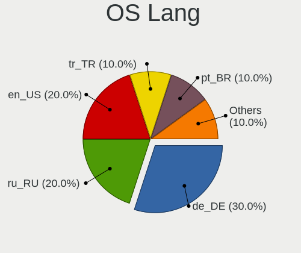

| Lang  | Desktops | Percent |
|-------|----------|---------|
| de_DE | 3        | 25%     |
| pt_BR | 2        | 16.67%  |
| en_US | 2        | 16.67%  |
| ru_UA | 1        | 8.33%   |
| ru_RU | 1        | 8.33%   |
| it_IT | 1        | 8.33%   |
| fr_BE | 1        | 8.33%   |
| en_ZA | 1        | 8.33%   |

Boot Mode
---------

EFI or BIOS

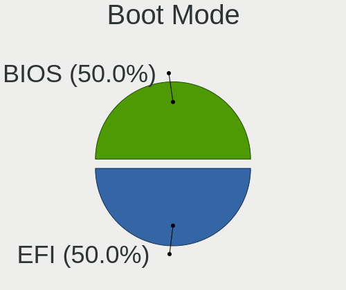

| Mode | Desktops | Percent |
|------|----------|---------|
| BIOS | 6        | 50%     |
| EFI  | 6        | 50%     |

Filesystem
----------

Type of filesystem

| Type | Desktops | Percent |
|------|----------|---------|
| Ext4 | 12       | 100%    |

Part. scheme
------------

Scheme of partitioning

| Type    | Desktops | Percent |
|---------|----------|---------|
| Unknown | 6        | 50%     |
| GPT     | 4        | 33.33%  |
| MBR     | 2        | 16.67%  |

Dual Boot with Linux/BSD
------------------------

Hosting more than one Linux/BSD

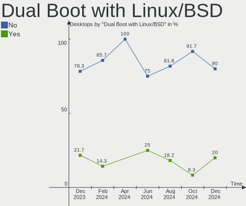

| Dual boot | Desktops | Percent |
|-----------|----------|---------|
| No        | 11       | 91.67%  |
| Yes       | 1        | 8.33%   |

Dual Boot (Win)
---------------

Hosting Linux and Windows

| Dual boot | Desktops | Percent |
|-----------|----------|---------|
| No        | 10       | 83.33%  |
| Yes       | 2        | 16.67%  |

Board
-----

Vendor
------

Motherboard manufacturer

| Name                | Desktops | Percent |
|---------------------|----------|---------|
| Gigabyte Technology | 4        | 33.33%  |
| ASUSTek Computer    | 3        | 25%     |
| Dell                | 2        | 16.67%  |
| Medion              | 1        | 8.33%   |
| Hewlett-Packard     | 1        | 8.33%   |
| Foxconn             | 1        | 8.33%   |

Model
-----

Motherboard model

| Name                       | Desktops | Percent |
|----------------------------|----------|---------|
| Medion MS-7800             | 1        | 8.33%   |
| HP 290 G2 MT Business PC   | 1        | 8.33%   |
| Gigabyte Z590 GAMING X     | 1        | 8.33%   |
| Gigabyte X570 AORUS MASTER | 1        | 8.33%   |
| Gigabyte B450M S2H         | 1        | 8.33%   |
| Gigabyte B450 AORUS M      | 1        | 8.33%   |
| Foxconn Pro 3500 Series    | 1        | 8.33%   |
| Dell Precision T7610       | 1        | 8.33%   |
| Dell Precision T5600       | 1        | 8.33%   |
| ASUS P8H61-M LX R2.0       | 1        | 8.33%   |
| ASUS P7P55D                | 1        | 8.33%   |
| ASUS M5A78L-M PLUS/USB3    | 1        | 8.33%   |

Model Family
------------

Motherboard model prefix

| Name           | Desktops | Percent |
|----------------|----------|---------|
| Dell Precision | 2        | 16.67%  |
| Medion MS-7800 | 1        | 8.33%   |
| HP 290         | 1        | 8.33%   |
| Gigabyte Z590  | 1        | 8.33%   |
| Gigabyte X570  | 1        | 8.33%   |
| Gigabyte B450M | 1        | 8.33%   |
| Gigabyte B450  | 1        | 8.33%   |
| Foxconn Pro    | 1        | 8.33%   |
| ASUS P8H61-M   | 1        | 8.33%   |
| ASUS P7P55D    | 1        | 8.33%   |
| ASUS M5A78L-M  | 1        | 8.33%   |

MFG Year
--------

Motherboard manufacture year

| Year | Desktops | Percent |
|------|----------|---------|
| 2018 | 4        | 33.33%  |
| 2012 | 3        | 25%     |
| 2021 | 1        | 8.33%   |
| 2019 | 1        | 8.33%   |
| 2016 | 1        | 8.33%   |
| 2013 | 1        | 8.33%   |
| 2009 | 1        | 8.33%   |

Form Factor
-----------

Physical design of the computer

| Name    | Desktops | Percent |
|---------|----------|---------|
| Desktop | 12       | 100%    |

Secure Boot
-----------

Enabled or disabled

| State    | Desktops | Percent |
|----------|----------|---------|
| Disabled | 12       | 100%    |

Coreboot
--------

Have coreboot on board

| Used | Desktops | Percent |
|------|----------|---------|
| No   | 12       | 100%    |

RAM Size
--------

Total RAM memory

| Size in GB      | Desktops | Percent |
|-----------------|----------|---------|
| 4.01-8.0        | 3        | 25%     |
| 32.01-64.0      | 2        | 16.67%  |
| 3.01-4.0        | 2        | 16.67%  |
| 16.01-24.0      | 2        | 16.67%  |
| 8.01-16.0       | 2        | 16.67%  |
| More than 256.0 | 1        | 8.33%   |

RAM Used
--------

Used RAM memory

| Used GB    | Desktops | Percent |
|------------|----------|---------|
| 2.01-3.0   | 5        | 41.67%  |
| 1.01-2.0   | 4        | 33.33%  |
| 4.01-8.0   | 2        | 16.67%  |
| 24.01-32.0 | 1        | 8.33%   |

Total Drives
------------

Number of drives on board

| Drives | Desktops | Percent |
|--------|----------|---------|
| 1      | 5        | 41.67%  |
| 2      | 3        | 25%     |
| 3      | 2        | 16.67%  |
| 5      | 1        | 8.33%   |
| 4      | 1        | 8.33%   |

Has CD-ROM
----------

Has CD-ROM on board

| Presented | Desktops | Percent |
|-----------|----------|---------|
| Yes       | 7        | 58.33%  |
| No        | 5        | 41.67%  |

Has Ethernet
------------

Has Ethernet on board

| Presented | Desktops | Percent |
|-----------|----------|---------|
| Yes       | 11       | 91.67%  |
| No        | 1        | 8.33%   |

Has WiFi
--------

Has WiFi module

| Presented | Desktops | Percent |
|-----------|----------|---------|
| No        | 7        | 58.33%  |
| Yes       | 5        | 41.67%  |

Has Bluetooth
-------------

Has Bluetooth module

| Presented | Desktops | Percent |
|-----------|----------|---------|
| No        | 11       | 91.67%  |
| Yes       | 1        | 8.33%   |

Location
--------

Country
-------

Geographic location (country)

| Country      | Desktops | Percent |
|--------------|----------|---------|
| Germany      | 3        | 25%     |
| USA          | 2        | 16.67%  |
| Brazil       | 2        | 16.67%  |
| Ukraine      | 1        | 8.33%   |
| South Africa | 1        | 8.33%   |
| Kazakhstan   | 1        | 8.33%   |
| Italy        | 1        | 8.33%   |
| Belgium      | 1        | 8.33%   |

City
----

Geographic location (city)

| City          | Desktops | Percent |
|---------------|----------|---------|
| Sao Paulo     | 1        | 8.33%   |
| Raschau       | 1        | 8.33%   |
| Mannheim      | 1        | 8.33%   |
| Los Angeles   | 1        | 8.33%   |
| Lessines      | 1        | 8.33%   |
| Leipzig       | 1        | 8.33%   |
| Kyiv          | 1        | 8.33%   |
| Fortaleza     | 1        | 8.33%   |
| Centurion     | 1        | 8.33%   |
| Boynton Beach | 1        | 8.33%   |
| Astana        | 1        | 8.33%   |
| Albignasego   | 1        | 8.33%   |

Drives
------

Drive Vendor
------------

Hard drive vendors

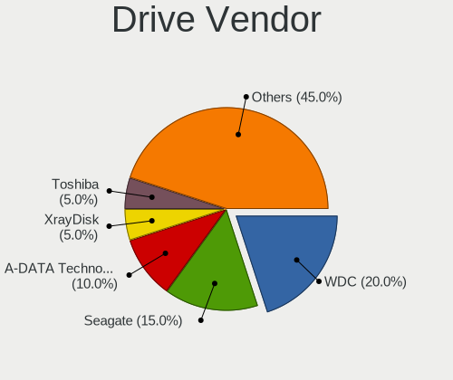

| Vendor              | Desktops | Drives | Percent |
|---------------------|----------|--------|---------|
| Seagate             | 5        | 5      | 23.81%  |
| WDC                 | 3        | 6      | 14.29%  |
| Toshiba             | 3        | 3      | 14.29%  |
| Kingston            | 3        | 4      | 14.29%  |
| Samsung Electronics | 2        | 3      | 9.52%   |
| Silicon Motion      | 1        | 1      | 4.76%   |
| PNY                 | 1        | 1      | 4.76%   |
| CT500MX5            | 1        | 1      | 4.76%   |
| Crucial             | 1        | 1      | 4.76%   |
| Apple               | 1        | 1      | 4.76%   |

Drive Model
-----------

Hard drive models

| Model                                             | Desktops | Percent |
|---------------------------------------------------|----------|---------|
| Seagate ST500DM002-1BD142 500GB                   | 2        | 8.33%   |
| Kingston SA400S37120G 120GB SSD                   | 2        | 8.33%   |
| WDC WDS250G2B0A-00SM50 250GB SSD                  | 1        | 4.17%   |
| WDC WDS240G2G0A-00JH30 240GB SSD                  | 1        | 4.17%   |
| WDC WD5000BEVT-22ZAT0 500GB                       | 1        | 4.17%   |
| WDC WD40EZRZ-00GXCB0 4TB                          | 1        | 4.17%   |
| WDC WD20EARS-00S8B1 2TB                           | 1        | 4.17%   |
| Toshiba MQ01ABD050 500GB                          | 1        | 4.17%   |
| Toshiba HDWD110 1TB                               | 1        | 4.17%   |
| Toshiba DT01ACA100 1TB                            | 1        | 4.17%   |
| Silicon Motion SM2262/SM2262EN SSD Controller 1TB | 1        | 4.17%   |
| Seagate ST31500341AS 1TB                          | 1        | 4.17%   |
| Seagate ST1000LM048-2E7172 1TB                    | 1        | 4.17%   |
| Seagate ST1000DM003-1ER162 1TB                    | 1        | 4.17%   |
| Samsung SSD 980 PRO 1TB                           | 1        | 4.17%   |
| Samsung SSD 850 EVO 250GB                         | 1        | 4.17%   |
| Samsung HD502HI 500GB                             | 1        | 4.17%   |
| PNY CS900 240GB SSD                               | 1        | 4.17%   |
| Kingston SA400S37240G 240GB SSD                   | 1        | 4.17%   |
| CT500MX5 00SSD1 500GB                             | 1        | 4.17%   |
| Crucial CT275MX300SSD1 275GB                      | 1        | 4.17%   |
| Apple HDD HTS545050A7E362 500GB                   | 1        | 4.17%   |

HDD Vendor
----------

Hard disk drive vendors

| Vendor              | Desktops | Drives | Percent |
|---------------------|----------|--------|---------|
| Seagate             | 5        | 5      | 41.67%  |
| Toshiba             | 3        | 3      | 25%     |
| WDC                 | 2        | 4      | 16.67%  |
| Samsung Electronics | 1        | 1      | 8.33%   |
| Apple               | 1        | 1      | 8.33%   |

SSD Vendor
----------

Solid state drive vendors

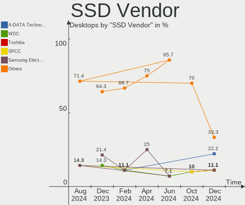

| Vendor              | Desktops | Drives | Percent |
|---------------------|----------|--------|---------|
| Kingston            | 3        | 4      | 33.33%  |
| WDC                 | 2        | 2      | 22.22%  |
| Samsung Electronics | 1        | 1      | 11.11%  |
| PNY                 | 1        | 1      | 11.11%  |
| CT500MX5            | 1        | 1      | 11.11%  |
| Crucial             | 1        | 1      | 11.11%  |

Drive Kind
----------

HDD or SSD

| Kind | Desktops | Drives | Percent |
|------|----------|--------|---------|
| HDD  | 10       | 14     | 52.63%  |
| SSD  | 7        | 10     | 36.84%  |
| NVMe | 2        | 2      | 10.53%  |

Drive Connector
---------------

SATA, SAS, NVMe, etc.

| Type | Desktops | Drives | Percent |
|------|----------|--------|---------|
| SATA | 12       | 23     | 80%     |
| NVMe | 2        | 2      | 13.33%  |
| SAS  | 1        | 1      | 6.67%   |

Drive Size
----------

Size of hard drive

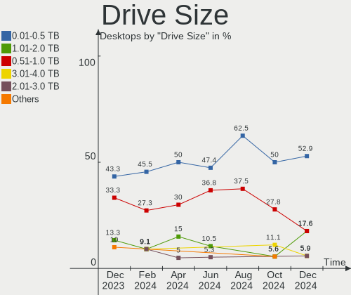

| Size in TB | Desktops | Drives | Percent |
|------------|----------|--------|---------|
| 0.01-0.5   | 11       | 16     | 61.11%  |
| 0.51-1.0   | 5        | 5      | 27.78%  |
| 3.01-4.0   | 1        | 2      | 5.56%   |
| 1.01-2.0   | 1        | 1      | 5.56%   |

Space Total
-----------

Amount of disk space available on the file system

| Size in GB | Desktops | Percent |
|------------|----------|---------|
| 101-250    | 3        | 25%     |
| 1001-2000  | 3        | 25%     |
| 501-1000   | 3        | 25%     |
| 251-500    | 2        | 16.67%  |
| 2001-3000  | 1        | 8.33%   |

Space Used
----------

Amount of used disk space

| Used GB  | Desktops | Percent |
|----------|----------|---------|
| 101-250  | 4        | 33.33%  |
| 1-20     | 3        | 25%     |
| 251-500  | 2        | 16.67%  |
| 51-100   | 2        | 16.67%  |
| 501-1000 | 1        | 8.33%   |

Malfunc. Drives
---------------

Drive models with a malfunction

| Model                          | Desktops | Drives | Percent |
|--------------------------------|----------|--------|---------|
| Seagate ST1000LM048-2E7172 1TB | 1        | 1      | 100%    |

Malfunc. Drive Vendor
---------------------

Vendors of faulty drives

| Vendor  | Desktops | Drives | Percent |
|---------|----------|--------|---------|
| Seagate | 1        | 1      | 100%    |

Malfunc. HDD Vendor
-------------------

Vendors of faulty HDD drives

| Vendor  | Desktops | Drives | Percent |
|---------|----------|--------|---------|
| Seagate | 1        | 1      | 100%    |

Malfunc. Drive Kind
-------------------

Kinds of faulty drives

| Kind | Desktops | Drives | Percent |
|------|----------|--------|---------|
| HDD  | 1        | 1      | 100%    |

Failed Drives
-------------

Failed drive models

Zero info for selected period =(

Failed Drive Vendor
-------------------

Failed drive vendors

Zero info for selected period =(

Drive Status
------------

Number of failed and malfunc. drives

| Status   | Desktops | Drives | Percent |
|----------|----------|--------|---------|
| Detected | 6        | 15     | 50%     |
| Works    | 5        | 10     | 41.67%  |
| Malfunc  | 1        | 1      | 8.33%   |

Storage controller
------------------

Storage Vendor
--------------

Storage controller vendors

| Vendor              | Desktops | Percent |
|---------------------|----------|---------|
| Intel               | 7        | 43.75%  |
| AMD                 | 5        | 31.25%  |
| Silicon Motion      | 1        | 6.25%   |
| Samsung Electronics | 1        | 6.25%   |
| JMicron Technology  | 1        | 6.25%   |
| Broadcom / LSI      | 1        | 6.25%   |

Storage Model
-------------

Storage controller models

| Model                                                                                   | Desktops | Percent |
|-----------------------------------------------------------------------------------------|----------|---------|
| AMD FCH SATA Controller [AHCI mode]                                                     | 4        | 16.67%  |
| Intel C600/X79 series chipset IDE-r Controller                                          | 2        | 8.33%   |
| Intel C600/X79 series chipset 6-Port SATA AHCI Controller                               | 2        | 8.33%   |
| AMD 400 Series Chipset SATA Controller                                                  | 2        | 8.33%   |
| Silicon Motion SM2262/SM2262EN SSD Controller                                           | 1        | 4.17%   |
| Samsung NVMe SSD Controller PM9A1/PM9A3/980PRO                                          | 1        | 4.17%   |
| JMicron JMB363 SATA/IDE Controller                                                      | 1        | 4.17%   |
| Intel Cannon Lake PCH SATA AHCI Controller                                              | 1        | 4.17%   |
| Intel C608 chipset Dual 4-Port SATA/SAS Storage Control Unit                            | 1        | 4.17%   |
| Intel 6 Series/C200 Series Chipset Family Desktop SATA Controller (IDE mode, ports 4-5) | 1        | 4.17%   |
| Intel 6 Series/C200 Series Chipset Family Desktop SATA Controller (IDE mode, ports 0-3) | 1        | 4.17%   |
| Intel 6 Series/C200 Series Chipset Family 6 port Desktop SATA AHCI Controller           | 1        | 4.17%   |
| Intel 500 Series Chipset Family SATA AHCI Controller                                    | 1        | 4.17%   |
| Intel 5 Series/3400 Series Chipset 4 port SATA IDE Controller                           | 1        | 4.17%   |
| Intel 5 Series/3400 Series Chipset 2 port SATA IDE Controller                           | 1        | 4.17%   |
| Broadcom / LSI SAS2308 PCI-Express Fusion-MPT SAS-2                                     | 1        | 4.17%   |
| AMD SB7x0/SB8x0/SB9x0 SATA Controller [IDE mode]                                        | 1        | 4.17%   |
| AMD SB7x0/SB8x0/SB9x0 IDE Controller                                                    | 1        | 4.17%   |

Storage Kind
------------

Kind of storage controller (IDE, SATA, NVMe, SAS, ...)

| Kind | Desktops | Percent |
|------|----------|---------|
| SATA | 10       | 52.63%  |
| IDE  | 5        | 26.32%  |
| SAS  | 2        | 10.53%  |
| NVMe | 2        | 10.53%  |

Processor
---------

CPU Vendor
----------

Processor vendors

| Vendor | Desktops | Percent |
|--------|----------|---------|
| Intel  | 7        | 58.33%  |
| AMD    | 5        | 41.67%  |

CPU Model
---------

Processor models

| Model                                   | Desktops | Percent |
|-----------------------------------------|----------|---------|
| Intel Xeon CPU E5-2687W v2 @ 3.40GHz    | 1        | 8.33%   |
| Intel Xeon CPU E5-2670 0 @ 2.60GHz      | 1        | 8.33%   |
| Intel Pentium Gold G5400 CPU @ 3.70GHz  | 1        | 8.33%   |
| Intel Pentium CPU G630 @ 2.70GHz        | 1        | 8.33%   |
| Intel Core i5-3470 CPU @ 3.20GHz        | 1        | 8.33%   |
| Intel Core i3 CPU 560 @ 3.33GHz         | 1        | 8.33%   |
| Intel 11th Gen Core i9-11900K @ 3.50GHz | 1        | 8.33%   |
| AMD Ryzen 7 2700 Eight-Core Processor   | 1        | 8.33%   |
| AMD Ryzen 5 3600X 6-Core Processor      | 1        | 8.33%   |
| AMD Ryzen 5 2600 Six-Core Processor     | 1        | 8.33%   |
| AMD Phenom II X4 965 Processor          | 1        | 8.33%   |
| AMD A8-5500 APU with Radeon HD Graphics | 1        | 8.33%   |

CPU Model Family
----------------

Processor model prefix

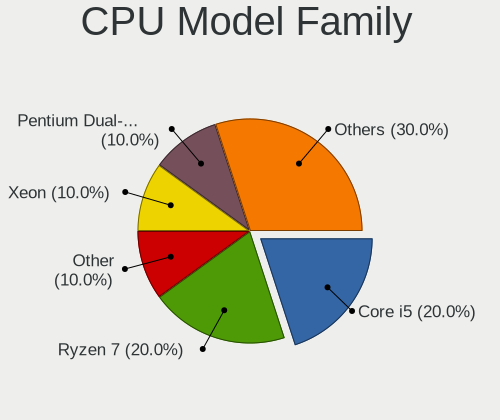

| Model              | Desktops | Percent |
|--------------------|----------|---------|
| Intel Xeon         | 2        | 16.67%  |
| AMD Ryzen 5        | 2        | 16.67%  |
| Other              | 1        | 8.33%   |
| Intel Pentium Gold | 1        | 8.33%   |
| Intel Pentium      | 1        | 8.33%   |
| Intel Core i5      | 1        | 8.33%   |
| Intel Core i3      | 1        | 8.33%   |
| AMD Ryzen 7        | 1        | 8.33%   |
| AMD Phenom II X4   | 1        | 8.33%   |
| AMD A8             | 1        | 8.33%   |

CPU Cores
---------

Number of processor cores

| Number | Desktops | Percent |
|--------|----------|---------|
| 2      | 4        | 33.33%  |
| 16     | 2        | 16.67%  |
| 8      | 2        | 16.67%  |
| 6      | 2        | 16.67%  |
| 4      | 2        | 16.67%  |

CPU Sockets
-----------

Number of sockets

| Number | Desktops | Percent |
|--------|----------|---------|
| 1      | 10       | 83.33%  |
| 2      | 2        | 16.67%  |

CPU Threads
-----------

Threads per core (Hyper-Threading)

| Number | Desktops | Percent |
|--------|----------|---------|
| 2      | 9        | 75%     |
| 1      | 3        | 25%     |

CPU Op-Modes
------------

CPU Operation Modes (32-bit, 64-bit)

| Op mode        | Desktops | Percent |
|----------------|----------|---------|
| 32-bit, 64-bit | 12       | 100%    |

CPU Microcode
-------------

Microcode number

| Number     | Desktops | Percent |
|------------|----------|---------|
| 0x0800820d | 2        | 16.67%  |
| 0xa0671    | 1        | 8.33%   |
| 0x906ea    | 1        | 8.33%   |
| 0x306e4    | 1        | 8.33%   |
| 0x306a9    | 1        | 8.33%   |
| 0x206d6    | 1        | 8.33%   |
| 0x206a7    | 1        | 8.33%   |
| 0x20655    | 1        | 8.33%   |
| 0x08701013 | 1        | 8.33%   |
| 0x010000c8 | 1        | 8.33%   |
| Unknown    | 1        | 8.33%   |

CPU Microarch
-------------

Microarchitecture

| Name        | Desktops | Percent |
|-------------|----------|---------|
| Zen+        | 2        | 16.67%  |
| SandyBridge | 2        | 16.67%  |
| IvyBridge   | 2        | 16.67%  |
| Zen 2       | 1        | 8.33%   |
| Westmere    | 1        | 8.33%   |
| Piledriver  | 1        | 8.33%   |
| KabyLake    | 1        | 8.33%   |
| K10         | 1        | 8.33%   |
| Unknown     | 1        | 8.33%   |

Graphics
--------

GPU Vendor
----------

Vendors of graphics cards

| Vendor | Desktops | Percent |
|--------|----------|---------|
| Nvidia | 6        | 50%     |
| Intel  | 4        | 33.33%  |
| AMD    | 2        | 16.67%  |

GPU Model
---------

Graphics card models

| Model                                                                     | Desktops | Percent |
|---------------------------------------------------------------------------|----------|---------|
| Nvidia TU116 [GeForce GTX 1660 Ti]                                        | 1        | 7.69%   |
| Nvidia TU106 [GeForce GTX 1650]                                           | 1        | 7.69%   |
| Nvidia GT218 [GeForce 210]                                                | 1        | 7.69%   |
| Nvidia GP108 [GeForce GT 1030]                                            | 1        | 7.69%   |
| Nvidia GA102 [GeForce RTX 3090]                                           | 1        | 7.69%   |
| Nvidia G92 [GeForce GTS 250]                                              | 1        | 7.69%   |
| Intel Xeon E3-1200 v2/3rd Gen Core processor Graphics Controller          | 1        | 7.69%   |
| Intel RocketLake-S GT1 [UHD Graphics 750]                                 | 1        | 7.69%   |
| Intel CoffeeLake-S GT1 [UHD Graphics 610]                                 | 1        | 7.69%   |
| Intel 2nd Generation Core Processor Family Integrated Graphics Controller | 1        | 7.69%   |
| AMD Turks [Radeon HD 7600 Series]                                         | 1        | 7.69%   |
| AMD Trinity [Radeon HD 7560D]                                             | 1        | 7.69%   |
| AMD Hawaii PRO [Radeon R9 290/390]                                        | 1        | 7.69%   |

GPU Combo
---------

Combinations of graphics cards

| Name       | Desktops | Percent |
|------------|----------|---------|
| 1 x Nvidia | 6        | 50%     |
| 1 x Intel  | 4        | 33.33%  |
| 2 x AMD    | 1        | 8.33%   |
| 1 x AMD    | 1        | 8.33%   |

GPU Driver
----------

Free vs proprietary

| Driver      | Desktops | Percent |
|-------------|----------|---------|
| Free        | 8        | 66.67%  |
| Proprietary | 2        | 16.67%  |
| Unknown     | 2        | 16.67%  |

GPU Memory
----------

Total video memory

| Size in GB | Desktops | Percent |
|------------|----------|---------|
| Unknown    | 6        | 50%     |
| 0.51-1.0   | 2        | 16.67%  |
| 7.01-8.0   | 1        | 8.33%   |
| 3.01-4.0   | 1        | 8.33%   |
| 16.01-24.0 | 1        | 8.33%   |
| 1.01-2.0   | 1        | 8.33%   |

Monitor
-------

Monitor Vendor
--------------

Monitor vendors

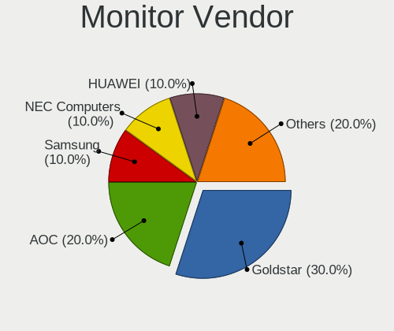

| Vendor              | Desktops | Percent |
|---------------------|----------|---------|
| Samsung Electronics | 2        | 22.22%  |
| Goldstar            | 2        | 22.22%  |
| Unknown (XXX)       | 1        | 11.11%  |
| Unknown             | 1        | 11.11%  |
| SKY                 | 1        | 11.11%  |
| HPN                 | 1        | 11.11%  |
| Acer                | 1        | 11.11%  |

Monitor Model
-------------

Monitor models

| Model                                                             | Desktops | Percent |
|-------------------------------------------------------------------|----------|---------|
| Unknown LCD Monitor SAMSUNG 3840x2160                             | 1        | 11.11%  |
| Unknown (XXX) Union TV XXX2841 1920x1080 1209x680mm 54.6-inch     | 1        | 11.11%  |
| SKY TV SKY1502 3840x2160 708x398mm 32.0-inch                      | 1        | 11.11%  |
| Samsung Electronics SME1920N SAM06A3 1366x768 410x230mm 18.5-inch | 1        | 11.11%  |
| Samsung Electronics LC27T55 SAM701E 1920x1080 609x349mm 27.6-inch | 1        | 11.11%  |
| HPN LCD Monitor HP 32 Display 1920x1080                           | 1        | 11.11%  |
| Goldstar IPS FULLHD GSM5AB8 1920x1080 480x270mm 21.7-inch         | 1        | 11.11%  |
| Goldstar FULL HD GSM5B55 1920x1080 480x270mm 21.7-inch            | 1        | 11.11%  |
| Acer EB321HQU ACR0507 2560x1440 699x393mm 31.6-inch               | 1        | 11.11%  |

Monitor Resolution
------------------

Monitor screen resolution

| Resolution      | Desktops | Percent |
|-----------------|----------|---------|
| 1920x1080 (FHD) | 4        | 44.44%  |
| 3840x2160 (4K)  | 3        | 33.33%  |
| 2560x1440 (QHD) | 1        | 11.11%  |
| 1366x768 (WXGA) | 1        | 11.11%  |

Monitor Diagonal
----------------

Diagonal size in inches

| Inches  | Desktops | Percent |
|---------|----------|---------|
| 21      | 2        | 22.22%  |
| Unknown | 2        | 22.22%  |
| 64      | 1        | 11.11%  |
| 54      | 1        | 11.11%  |
| 31      | 1        | 11.11%  |
| 27      | 1        | 11.11%  |
| 18      | 1        | 11.11%  |

Monitor Width
-------------

Physical width

| Width in mm | Desktops | Percent |
|-------------|----------|---------|
| 401-500     | 3        | 33.33%  |
| 601-700     | 2        | 22.22%  |
| 1001-1500   | 2        | 22.22%  |
| Unknown     | 2        | 22.22%  |

Aspect Ratio
------------

Proportional relationship between the width and the height

| Ratio   | Desktops | Percent |
|---------|----------|---------|
| 16/9    | 7        | 77.78%  |
| Unknown | 2        | 22.22%  |

Monitor Area
------------

Area in inch²

| Area in inch² | Desktops | Percent |
|----------------|----------|---------|
| More than 1000 | 2        | 22.22%  |
| 201-250        | 2        | 22.22%  |
| Unknown        | 2        | 22.22%  |
| 351-500        | 1        | 11.11%  |
| 301-350        | 1        | 11.11%  |
| 141-150        | 1        | 11.11%  |

Pixel Density
-------------

Pixels per inch

| Density | Desktops | Percent |
|---------|----------|---------|
| 51-100  | 4        | 44.44%  |
| 101-120 | 2        | 22.22%  |
| Unknown | 2        | 22.22%  |
| 1-50    | 1        | 11.11%  |

Multiple Monitors
-----------------

Total monitors connected

| Total | Desktops | Percent |
|-------|----------|---------|
| 1     | 10       | 83.33%  |
| 0     | 2        | 16.67%  |

Network
-------

Net Controller Vendor
---------------------

Controller vendors

| Vendor                | Desktops | Percent |
|-----------------------|----------|---------|
| Realtek Semiconductor | 10       | 62.5%   |
| Intel                 | 3        | 18.75%  |
| TP-Link               | 1        | 6.25%   |
| Ralink Technology     | 1        | 6.25%   |
| IMC Networks          | 1        | 6.25%   |

Net Controller Model
--------------------

Controller models

| Model                                                             | Desktops | Percent |
|-------------------------------------------------------------------|----------|---------|
| Realtek RTL8111/8168/8411 PCI Express Gigabit Ethernet Controller | 7        | 36.84%  |
| Realtek RTL8125 2.5GbE Controller                                 | 2        | 10.53%  |
| Intel 82579LM Gigabit Network Connection (Lewisville)             | 2        | 10.53%  |
| TP-Link TL-WN722N v2/v3 [Realtek RTL8188EUS]                      | 1        | 5.26%   |
| Realtek RTL8192CU 802.11n WLAN Adapter                            | 1        | 5.26%   |
| Realtek RTL8188EUS 802.11n Wireless Network Adapter               | 1        | 5.26%   |
| Ralink MT7610U ("Archer T2U" 2.4G+5G WLAN Adapter                 | 1        | 5.26%   |
| Intel Wi-Fi 6 AX200                                               | 1        | 5.26%   |
| Intel I211 Gigabit Network Connection                             | 1        | 5.26%   |
| Intel I210 Gigabit Network Connection                             | 1        | 5.26%   |
| IMC Networks Mediao 802.11n WLAN [Realtek RTL8191SU]              | 1        | 5.26%   |

Wireless Vendor
---------------

Wireless vendors

| Vendor                | Desktops | Percent |
|-----------------------|----------|---------|
| Realtek Semiconductor | 2        | 33.33%  |
| TP-Link               | 1        | 16.67%  |
| Ralink Technology     | 1        | 16.67%  |
| Intel                 | 1        | 16.67%  |
| IMC Networks          | 1        | 16.67%  |

Wireless Model
--------------

Wireless models

| Model                                                | Desktops | Percent |
|------------------------------------------------------|----------|---------|
| TP-Link TL-WN722N v2/v3 [Realtek RTL8188EUS]         | 1        | 16.67%  |
| Realtek RTL8192CU 802.11n WLAN Adapter               | 1        | 16.67%  |
| Realtek RTL8188EUS 802.11n Wireless Network Adapter  | 1        | 16.67%  |
| Ralink MT7610U ("Archer T2U" 2.4G+5G WLAN Adapter    | 1        | 16.67%  |
| Intel Wi-Fi 6 AX200                                  | 1        | 16.67%  |
| IMC Networks Mediao 802.11n WLAN [Realtek RTL8191SU] | 1        | 16.67%  |

Ethernet Vendor
---------------

Ethernet vendors

| Vendor                | Desktops | Percent |
|-----------------------|----------|---------|
| Realtek Semiconductor | 9        | 75%     |
| Intel                 | 3        | 25%     |

Ethernet Model
--------------

Ethernet models

| Model                                                             | Desktops | Percent |
|-------------------------------------------------------------------|----------|---------|
| Realtek RTL8111/8168/8411 PCI Express Gigabit Ethernet Controller | 7        | 53.85%  |
| Realtek RTL8125 2.5GbE Controller                                 | 2        | 15.38%  |
| Intel 82579LM Gigabit Network Connection (Lewisville)             | 2        | 15.38%  |
| Intel I211 Gigabit Network Connection                             | 1        | 7.69%   |
| Intel I210 Gigabit Network Connection                             | 1        | 7.69%   |

Net Controller Kind
-------------------

Ethernet, WiFi or modem

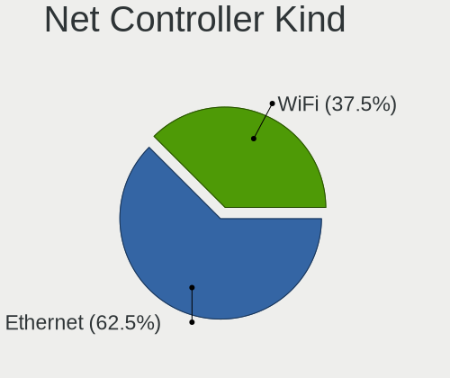

| Kind     | Desktops | Percent |
|----------|----------|---------|
| Ethernet | 11       | 68.75%  |
| WiFi     | 5        | 31.25%  |

Used Controller
---------------

Currently used network controller

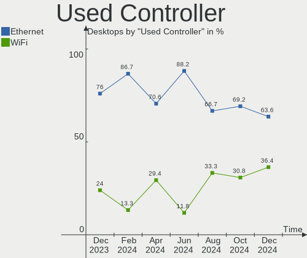

| Kind     | Desktops | Percent |
|----------|----------|---------|
| Ethernet | 8        | 66.67%  |
| WiFi     | 4        | 33.33%  |

NICs
----

Total network controllers on board

| Total | Desktops | Percent |
|-------|----------|---------|
| 1     | 9        | 75%     |
| 3     | 1        | 8.33%   |
| 2     | 1        | 8.33%   |
| 0     | 1        | 8.33%   |

IPv6
----

IPv6 vs IPv4

| Used | Desktops | Percent |
|------|----------|---------|
| No   | 8        | 66.67%  |
| Yes  | 4        | 33.33%  |

Bluetooth
---------

Bluetooth Vendor
----------------

Controller vendors

| Vendor | Desktops | Percent |
|--------|----------|---------|
| Intel  | 1        | 100%    |

Bluetooth Model
---------------

Controller models

| Model                 | Desktops | Percent |
|-----------------------|----------|---------|
| Intel AX200 Bluetooth | 1        | 100%    |

Sound
-----

Sound Vendor
------------

Sound card vendors

| Vendor                               | Desktops | Percent |
|--------------------------------------|----------|---------|
| Intel                                | 7        | 31.82%  |
| Nvidia                               | 5        | 22.73%  |
| AMD                                  | 5        | 22.73%  |
| Thesycon Systemsoftware & Consulting | 1        | 4.55%   |
| Sony                                 | 1        | 4.55%   |
| Plantronics                          | 1        | 4.55%   |
| Logitech                             | 1        | 4.55%   |
| Generalplus Technology               | 1        | 4.55%   |

Sound Model
-----------

Sound card models

| Model                                                                      | Desktops | Percent |
|----------------------------------------------------------------------------|----------|---------|
| Intel C600/X79 series chipset High Definition Audio Controller             | 2        | 8%      |
| Intel 6 Series/C200 Series Chipset Family High Definition Audio Controller | 2        | 8%      |
| AMD Family 17h (Models 00h-0fh) HD Audio Controller                        | 2        | 8%      |
| Thesycon Systemsoftware & Consulting D10 Balanced                          | 1        | 4%      |
| Sony DualShock 4 [CUH-ZCT2x]                                               | 1        | 4%      |
| Plantronics BT600                                                          | 1        | 4%      |
| Nvidia TU116 High Definition Audio Controller                              | 1        | 4%      |
| Nvidia TU106 High Definition Audio Controller                              | 1        | 4%      |
| Nvidia High Definition Audio Controller                                    | 1        | 4%      |
| Nvidia GP108 High Definition Audio Controller                              | 1        | 4%      |
| Nvidia GA102 High Definition Audio Controller                              | 1        | 4%      |
| Logitech ClearChat Pro USB                                                 | 1        | 4%      |
| Intel Tiger Lake-H HD Audio Controller                                     | 1        | 4%      |
| Intel Cannon Lake PCH cAVS                                                 | 1        | 4%      |
| Intel 5 Series/3400 Series Chipset High Definition Audio                   | 1        | 4%      |
| Generalplus Technology USB Audio Device                                    | 1        | 4%      |
| AMD Turks HDMI Audio [Radeon HD 6500/6600 / 6700M Series]                  | 1        | 4%      |
| AMD Trinity HDMI Audio Controller                                          | 1        | 4%      |
| AMD Starship/Matisse HD Audio Controller                                   | 1        | 4%      |
| AMD SBx00 Azalia (Intel HDA)                                               | 1        | 4%      |
| AMD Hawaii HDMI Audio [Radeon R9 290/290X / 390/390X]                      | 1        | 4%      |
| AMD FCH Azalia Controller                                                  | 1        | 4%      |

Memory
------

Memory Vendor
-------------

Memory module vendors

| Vendor              | Desktops | Percent |
|---------------------|----------|---------|
| Samsung Electronics | 3        | 27.27%  |
| Unknown             | 2        | 18.18%  |
| Micron Technology   | 2        | 18.18%  |
| Kingston            | 2        | 18.18%  |
| Crucial             | 1        | 9.09%   |
| Corsair             | 1        | 9.09%   |

Memory Model
------------

Memory module models

| Model                                                  | Desktops | Percent |
|--------------------------------------------------------|----------|---------|
| Unknown RAM Module 4GB DIMM DDR3 1066MT/s              | 1        | 8.33%   |
| Unknown RAM Module 2GB DIMM DDR3 1066MT/s              | 1        | 8.33%   |
| Unknown RAM D4 8G 8GB DIMM DDR4 2666MT/s               | 1        | 8.33%   |
| Samsung RAM Module 4GB DIMM DDR4 2400MT/s              | 1        | 8.33%   |
| Samsung RAM M393B5270DH0-YH9 4GB DIMM DDR3 1333MT/s    | 1        | 8.33%   |
| Samsung RAM M393B2G70DB0-CMA 16GB DIMM DDR3 1867MT/s   | 1        | 8.33%   |
| Micron RAM 36JSF2G72PZ-1G9E1 16GB DIMM DDR3 1866MT/s   | 1        | 8.33%   |
| Micron RAM 18KSF1G72PZ-1G4E1 8GB DIMM DDR3 1333MT/s    | 1        | 8.33%   |
| Kingston RAM 99U5471-012.A00LF 4GB DIMM DDR3 1600MT/s  | 1        | 8.33%   |
| Kingston RAM 99U5403-034.A00LF 4GB DIMM DDR3 1333MT/s  | 1        | 8.33%   |
| Crucial RAM CT4G4DFS824A.C8FADP 4GB DIMM DDR4 2400MT/s | 1        | 8.33%   |
| Corsair RAM CMV4GX3M1A1333C9 4GB DIMM DDR3 1600MT/s    | 1        | 8.33%   |

Memory Kind
-----------

Memory module kinds

| Kind  | Desktops | Percent |
|-------|----------|---------|
| DDR3  | 5        | 62.5%   |
| DDR4  | 2        | 25%     |
| SDRAM | 1        | 12.5%   |

Memory Form Factor
------------------

Physical design of the memory module

| Name | Desktops | Percent |
|------|----------|---------|
| DIMM | 7        | 100%    |

Memory Size
-----------

Memory module size

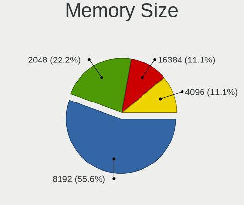

| Size  | Desktops | Percent |
|-------|----------|---------|
| 4096  | 5        | 50%     |
| 8192  | 3        | 30%     |
| 16384 | 1        | 10%     |
| 2048  | 1        | 10%     |

Memory Speed
------------

Memory module speed

| Speed | Desktops | Percent |
|-------|----------|---------|
| 1600  | 2        | 22.22%  |
| 1333  | 2        | 22.22%  |
| 2667  | 1        | 11.11%  |
| 2400  | 1        | 11.11%  |
| 1867  | 1        | 11.11%  |
| 1866  | 1        | 11.11%  |
| 1066  | 1        | 11.11%  |

Printers & scanners
-------------------

Printer Vendor
--------------

Printer device vendors

Zero info for selected period =(

Printer Model
-------------

Printer device models

Zero info for selected period =(

Scanner Vendor
--------------

Scanner device vendors

Zero info for selected period =(

Scanner Model
-------------

Scanner device models

Zero info for selected period =(

Camera
------

Camera Vendor
-------------

Camera device vendors

| Vendor                        | Desktops | Percent |
|-------------------------------|----------|---------|
| Sunplus Innovation Technology | 1        | 50%     |
| Huawei Technologies           | 1        | 50%     |

Camera Model
------------

Camera device models

| Model                         | Desktops | Percent |
|-------------------------------|----------|---------|
| Sunplus FHD Camera Microphone | 1        | 50%     |
| Huawei HD Webcam              | 1        | 50%     |

Security
--------

Fingerprint Vendor
------------------

Fingerprint sensor vendors

Zero info for selected period =(

Fingerprint Model
-----------------

Fingerprint sensor models

Zero info for selected period =(

Chipcard Vendor
---------------

Chipcard module vendors

Zero info for selected period =(

Chipcard Model
--------------

Chipcard module models

Zero info for selected period =(

Unsupported
-----------

Unsupported Devices
-------------------

Total unsupported devices on board

| Total | Desktops | Percent |
|-------|----------|---------|
| 0     | 10       | 83.33%  |
| 3     | 1        | 8.33%   |
| 1     | 1        | 8.33%   |

Unsupported Device Types
------------------------

Types of unsupported devices

| Type          | Desktops | Percent |
|---------------|----------|---------|
| Graphics card | 2        | 50%     |
| Network       | 1        | 25%     |
| Net/wireless  | 1        | 25%     |

