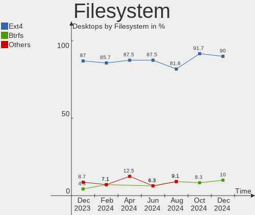
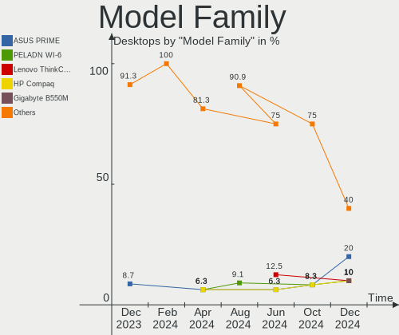
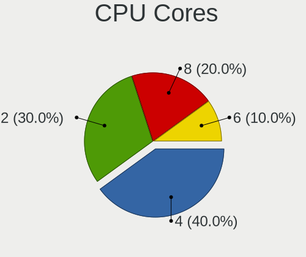
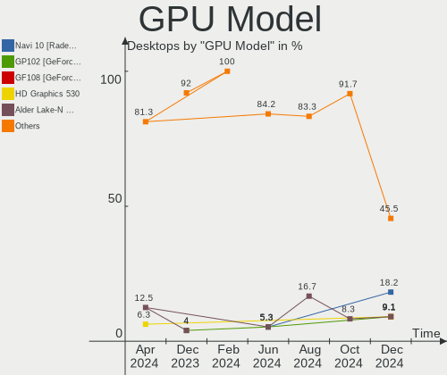

LMDE - Hardware Trends (Desktops)
---------------------------------

A project to identify most popular hardware characteristics and track their change
over time based on data collected by Linux users at https://Linux-Hardware.org.

Anyone can contribute to this report by the [hw-probe](https://github.com/linuxhw/hw-probe) tool:

    sudo -E hw-probe -all -upload

This report is for one last month. Overall report since the beginning of time: [TestCoverage](https://github.com/linuxhw/TestCoverage)

Period: May, 2022.

Contents
--------

* [ System ](#system)
  - [ OS                       ](#os)
  - [ OS Family                ](#os-family)
  - [ Kernel                   ](#kernel)
  - [ Kernel Family            ](#kernel-family)
  - [ Kernel Major Ver.        ](#kernel-major-ver)
  - [ Arch                     ](#arch)
  - [ DE                       ](#de)
  - [ Display Server           ](#display-server)
  - [ Display Manager          ](#display-manager)
  - [ OS Lang                  ](#os-lang)
  - [ Boot Mode                ](#boot-mode)
  - [ Filesystem               ](#filesystem)
  - [ Part. scheme             ](#part-scheme)
  - [ Dual Boot with Linux/BSD ](#dual-boot-with-linuxbsd)
  - [ Dual Boot (Win)          ](#dual-boot-win)

* [ Board ](#board)
  - [ Vendor                   ](#vendor)
  - [ Model                    ](#model)
  - [ Model Family             ](#model-family)
  - [ MFG Year                 ](#mfg-year)
  - [ Form Factor              ](#form-factor)
  - [ Secure Boot              ](#secure-boot)
  - [ Coreboot                 ](#coreboot)
  - [ RAM Size                 ](#ram-size)
  - [ RAM Used                 ](#ram-used)
  - [ Total Drives             ](#total-drives)
  - [ Has CD-ROM               ](#has-cd-rom)
  - [ Has Ethernet             ](#has-ethernet)
  - [ Has WiFi                 ](#has-wifi)
  - [ Has Bluetooth            ](#has-bluetooth)

* [ Location ](#location)
  - [ Country                  ](#country)
  - [ City                     ](#city)

* [ Drives ](#drives)
  - [ Drive Vendor             ](#drive-vendor)
  - [ Drive Model              ](#drive-model)
  - [ HDD Vendor               ](#hdd-vendor)
  - [ SSD Vendor               ](#ssd-vendor)
  - [ Drive Kind               ](#drive-kind)
  - [ Drive Connector          ](#drive-connector)
  - [ Drive Size               ](#drive-size)
  - [ Space Total              ](#space-total)
  - [ Space Used               ](#space-used)
  - [ Malfunc. Drives          ](#malfunc-drives)
  - [ Malfunc. Drive Vendor    ](#malfunc-drive-vendor)
  - [ Malfunc. HDD Vendor      ](#malfunc-hdd-vendor)
  - [ Malfunc. Drive Kind      ](#malfunc-drive-kind)
  - [ Failed Drives            ](#failed-drives)
  - [ Failed Drive Vendor      ](#failed-drive-vendor)
  - [ Drive Status             ](#drive-status)

* [ Storage controller ](#storage-controller)
  - [ Storage Vendor           ](#storage-vendor)
  - [ Storage Model            ](#storage-model)
  - [ Storage Kind             ](#storage-kind)

* [ Processor ](#processor)
  - [ CPU Vendor               ](#cpu-vendor)
  - [ CPU Model                ](#cpu-model)
  - [ CPU Model Family         ](#cpu-model-family)
  - [ CPU Cores                ](#cpu-cores)
  - [ CPU Sockets              ](#cpu-sockets)
  - [ CPU Threads              ](#cpu-threads)
  - [ CPU Op-Modes             ](#cpu-op-modes)
  - [ CPU Microcode            ](#cpu-microcode)
  - [ CPU Microarch            ](#cpu-microarch)

* [ Graphics ](#graphics)
  - [ GPU Vendor               ](#gpu-vendor)
  - [ GPU Model                ](#gpu-model)
  - [ GPU Combo                ](#gpu-combo)
  - [ GPU Driver               ](#gpu-driver)
  - [ GPU Memory               ](#gpu-memory)

* [ Monitor ](#monitor)
  - [ Monitor Vendor           ](#monitor-vendor)
  - [ Monitor Model            ](#monitor-model)
  - [ Monitor Resolution       ](#monitor-resolution)
  - [ Monitor Diagonal         ](#monitor-diagonal)
  - [ Monitor Width            ](#monitor-width)
  - [ Aspect Ratio             ](#aspect-ratio)
  - [ Monitor Area             ](#monitor-area)
  - [ Pixel Density            ](#pixel-density)
  - [ Multiple Monitors        ](#multiple-monitors)

* [ Network ](#network)
  - [ Net Controller Vendor    ](#net-controller-vendor)
  - [ Net Controller Model     ](#net-controller-model)
  - [ Wireless Vendor          ](#wireless-vendor)
  - [ Wireless Model           ](#wireless-model)
  - [ Ethernet Vendor          ](#ethernet-vendor)
  - [ Ethernet Model           ](#ethernet-model)
  - [ Net Controller Kind      ](#net-controller-kind)
  - [ Used Controller          ](#used-controller)
  - [ NICs                     ](#nics)
  - [ IPv6                     ](#ipv6)

* [ Bluetooth ](#bluetooth)
  - [ Bluetooth Vendor         ](#bluetooth-vendor)
  - [ Bluetooth Model          ](#bluetooth-model)

* [ Sound ](#sound)
  - [ Sound Vendor             ](#sound-vendor)
  - [ Sound Model              ](#sound-model)

* [ Memory ](#memory)
  - [ Memory Vendor            ](#memory-vendor)
  - [ Memory Model             ](#memory-model)
  - [ Memory Kind              ](#memory-kind)
  - [ Memory Form Factor       ](#memory-form-factor)
  - [ Memory Size              ](#memory-size)
  - [ Memory Speed             ](#memory-speed)

* [ Printers & scanners ](#printers--scanners)
  - [ Printer Vendor           ](#printer-vendor)
  - [ Printer Model            ](#printer-model)
  - [ Scanner Vendor           ](#scanner-vendor)
  - [ Scanner Model            ](#scanner-model)

* [ Camera ](#camera)
  - [ Camera Vendor            ](#camera-vendor)
  - [ Camera Model             ](#camera-model)

* [ Security ](#security)
  - [ Fingerprint Vendor       ](#fingerprint-vendor)
  - [ Fingerprint Model        ](#fingerprint-model)
  - [ Chipcard Vendor          ](#chipcard-vendor)
  - [ Chipcard Model           ](#chipcard-model)

* [ Unsupported ](#unsupported)
  - [ Unsupported Devices      ](#unsupported-devices)
  - [ Unsupported Device Types ](#unsupported-device-types)

System
------

OS
--

Installed operating systems

| Name   | Desktops | Percent |
|--------|----------|---------|
| LMDE 5 | 10       | 90.91%  |
| LMDE 4 | 1        | 9.09%   |

OS Family
---------

OS without a version

| Name | Desktops | Percent |
|------|----------|---------|
| LMDE | 11       | 100%    |

Kernel
------

Version of the Linux kernel

| Version         | Desktops | Percent |
|-----------------|----------|---------|
| 5.10.0-14-amd64 | 8        | 72.73%  |
| 5.10.0-13-amd64 | 2        | 18.18%  |
| 4.19.0-16-amd64 | 1        | 9.09%   |

Kernel Family
-------------

Linux kernel without a distro release

| Version | Desktops | Percent |
|---------|----------|---------|
| 5.10.0  | 10       | 90.91%  |
| 4.19.0  | 1        | 9.09%   |

Kernel Major Ver.
-----------------

Linux kernel major version

| Version | Desktops | Percent |
|---------|----------|---------|
| 5.10    | 10       | 90.91%  |
| 4.19    | 1        | 9.09%   |

Arch
----

OS architecture (x86_64, i586, etc.)

| Name   | Desktops | Percent |
|--------|----------|---------|
| x86_64 | 11       | 100%    |

DE
--

Desktop Environment

| Name       | Desktops | Percent |
|------------|----------|---------|
| X-Cinnamon | 9        | 81.82%  |
| XFCE       | 1        | 9.09%   |
| MATE       | 1        | 9.09%   |

Display Server
--------------

X11 or Wayland

| Name | Desktops | Percent |
|------|----------|---------|
| X11  | 11       | 100%    |

Display Manager
---------------

SDDM, LightDM, etc.

| Name    | Desktops | Percent |
|---------|----------|---------|
| Unknown | 6        | 54.55%  |
| LightDM | 5        | 45.45%  |

OS Lang
-------

Language

| Lang  | Desktops | Percent |
|-------|----------|---------|
| en_US | 5        | 45.45%  |
| en_CA | 2        | 18.18%  |
| it_IT | 1        | 9.09%   |
| es_ES | 1        | 9.09%   |
| en_GB | 1        | 9.09%   |
| en_AU | 1        | 9.09%   |

Boot Mode
---------

EFI or BIOS

| Mode | Desktops | Percent |
|------|----------|---------|
| BIOS | 7        | 63.64%  |
| EFI  | 4        | 36.36%  |

Filesystem
----------

Type of filesystem

| Type | Desktops | Percent |
|------|----------|---------|
| Ext4 | 11       | 100%    |

Part. scheme
------------

Scheme of partitioning

| Type    | Desktops | Percent |
|---------|----------|---------|
| Unknown | 6        | 54.55%  |
| GPT     | 4        | 36.36%  |
| MBR     | 1        | 9.09%   |

Dual Boot with Linux/BSD
------------------------

Hosting more than one Linux/BSD

| Dual boot | Desktops | Percent |
|-----------|----------|---------|
| No        | 9        | 81.82%  |
| Yes       | 2        | 18.18%  |

Dual Boot (Win)
---------------

Hosting Linux and Windows

| Dual boot | Desktops | Percent |
|-----------|----------|---------|
| No        | 9        | 81.82%  |
| Yes       | 2        | 18.18%  |

Board
-----

Vendor
------

Motherboard manufacturer

| Name                | Desktops | Percent |
|---------------------|----------|---------|
| MSI                 | 3        | 27.27%  |
| Hewlett-Packard     | 2        | 18.18%  |
| Gigabyte Technology | 2        | 18.18%  |
| Lenovo              | 1        | 9.09%   |
| Intel               | 1        | 9.09%   |
| ASUSTek Computer    | 1        | 9.09%   |
| Acer                | 1        | 9.09%   |

Model
-----

Motherboard model

| Name                            | Desktops | Percent |
|---------------------------------|----------|---------|
| MSI MS-7B79                     | 1        | 9.09%   |
| MSI MS-7B17                     | 1        | 9.09%   |
| MSI MS-7974                     | 1        | 9.09%   |
| Lenovo ThinkCentre M92p 3238E9U | 1        | 9.09%   |
| Intel DQ77MK AAG39642-400       | 1        | 9.09%   |
| HP Z820 Workstation             | 1        | 9.09%   |
| HP Compaq Pro 6300 SFF          | 1        | 9.09%   |
| Gigabyte Z68A-D3H-B3            | 1        | 9.09%   |
| Gigabyte H110M-S2H              | 1        | 9.09%   |
| ASUS P5QL PRO                   | 1        | 9.09%   |
| Acer Veriton L6610G             | 1        | 9.09%   |

Model Family
------------

Motherboard model prefix

| Name                 | Desktops | Percent |
|----------------------|----------|---------|
| MSI MS-7B79          | 1        | 9.09%   |
| MSI MS-7B17          | 1        | 9.09%   |
| MSI MS-7974          | 1        | 9.09%   |
| Lenovo ThinkCentre   | 1        | 9.09%   |
| Intel DQ77MK         | 1        | 9.09%   |
| HP Z820              | 1        | 9.09%   |
| HP Compaq            | 1        | 9.09%   |
| Gigabyte Z68A-D3H-B3 | 1        | 9.09%   |
| Gigabyte H110M-S2H   | 1        | 9.09%   |
| ASUS P5QL            | 1        | 9.09%   |
| Acer Veriton         | 1        | 9.09%   |

MFG Year
--------

Motherboard manufacture year

| Year | Desktops | Percent |
|------|----------|---------|
| 2018 | 3        | 27.27%  |
| 2012 | 3        | 27.27%  |
| 2019 | 1        | 9.09%   |
| 2016 | 1        | 9.09%   |
| 2015 | 1        | 9.09%   |
| 2011 | 1        | 9.09%   |
| 2008 | 1        | 9.09%   |

Form Factor
-----------

Physical design of the computer

| Name    | Desktops | Percent |
|---------|----------|---------|
| Desktop | 11       | 100%    |

Secure Boot
-----------

Enabled or disabled

| State    | Desktops | Percent |
|----------|----------|---------|
| Disabled | 11       | 100%    |

Coreboot
--------

Have coreboot on board

| Used | Desktops | Percent |
|------|----------|---------|
| No   | 11       | 100%    |

RAM Size
--------

Total RAM memory

| Size in GB | Desktops | Percent |
|------------|----------|---------|
| 16.01-24.0 | 4        | 36.36%  |
| 4.01-8.0   | 2        | 18.18%  |
| 32.01-64.0 | 2        | 18.18%  |
| 3.01-4.0   | 1        | 9.09%   |
| 24.01-32.0 | 1        | 9.09%   |
| 8.01-16.0  | 1        | 9.09%   |

RAM Used
--------

Used RAM memory

| Used GB  | Desktops | Percent |
|----------|----------|---------|
| 2.01-3.0 | 6        | 54.55%  |
| 3.01-4.0 | 2        | 18.18%  |
| 4.01-8.0 | 1        | 9.09%   |
| 1.01-2.0 | 1        | 9.09%   |
| 0.51-1.0 | 1        | 9.09%   |

Total Drives
------------

Number of drives on board

| Drives | Desktops | Percent |
|--------|----------|---------|
| 1      | 6        | 54.55%  |
| 4      | 2        | 18.18%  |
| 3      | 2        | 18.18%  |
| 2      | 1        | 9.09%   |

Has CD-ROM
----------

Has CD-ROM on board

| Presented | Desktops | Percent |
|-----------|----------|---------|
| Yes       | 7        | 63.64%  |
| No        | 4        | 36.36%  |

Has Ethernet
------------

Has Ethernet on board

| Presented | Desktops | Percent |
|-----------|----------|---------|
| Yes       | 11       | 100%    |

Has WiFi
--------

Has WiFi module

| Presented | Desktops | Percent |
|-----------|----------|---------|
| Yes       | 6        | 54.55%  |
| No        | 5        | 45.45%  |

Has Bluetooth
-------------

Has Bluetooth module

| Presented | Desktops | Percent |
|-----------|----------|---------|
| No        | 7        | 63.64%  |
| Yes       | 4        | 36.36%  |

Location
--------

Country
-------

Geographic location (country)

| Country   | Desktops | Percent |
|-----------|----------|---------|
| USA       | 2        | 18.18%  |
| Canada    | 2        | 18.18%  |
| Australia | 2        | 18.18%  |
| UK        | 1        | 9.09%   |
| Spain     | 1        | 9.09%   |
| Russia    | 1        | 9.09%   |
| Mexico    | 1        | 9.09%   |
| Italy     | 1        | 9.09%   |

City
----

Geographic location (city)

| City                    | Desktops | Percent |
|-------------------------|----------|---------|
| Melbourne               | 2        | 18.18%  |
| Victoria                | 1        | 9.09%   |
| Vicente Guerrero        | 1        | 9.09%   |
| Trieste                 | 1        | 9.09%   |
| Toledo                  | 1        | 9.09%   |
| Spruce Grove            | 1        | 9.09%   |
| Sant Feliu de Llobregat | 1        | 9.09%   |
| Moscow                  | 1        | 9.09%   |
| Detroit                 | 1        | 9.09%   |
| Birmingham              | 1        | 9.09%   |

Drives
------

Drive Vendor
------------

Hard drive vendors

| Vendor              | Desktops | Drives | Percent |
|---------------------|----------|--------|---------|
| Seagate             | 4        | 5      | 21.05%  |
| Samsung Electronics | 4        | 4      | 21.05%  |
| WDC                 | 3        | 5      | 15.79%  |
| Crucial             | 3        | 3      | 15.79%  |
| Toshiba             | 1        | 1      | 5.26%   |
| SK Hynix            | 1        | 1      | 5.26%   |
| SanDisk             | 1        | 1      | 5.26%   |
| Kingston            | 1        | 1      | 5.26%   |
| A-DATA Technology   | 1        | 1      | 5.26%   |

Drive Model
-----------

Hard drive models

| Model                                 | Desktops | Percent |
|---------------------------------------|----------|---------|
| Crucial CT480BX500SSD1 480GB          | 2        | 10%     |
| WDC WD60EZAZ-00ZGHB0 6TB              | 1        | 5%      |
| WDC WD3200AAKS-00SBA0 320GB           | 1        | 5%      |
| WDC WD3003FZEX-00Z4SA0 3TB            | 1        | 5%      |
| Toshiba MK3275GSX 320GB               | 1        | 5%      |
| SK Hynix HFS256G32MND-3310A 256GB SSD | 1        | 5%      |
| Seagate ST500LT012-1DG142 500GB       | 1        | 5%      |
| Seagate ST2000LM007-1R8174 2TB        | 1        | 5%      |
| Seagate ST2000DM008-2FR102 2TB        | 1        | 5%      |
| Seagate ST1000LM048-2E7172 1TB        | 1        | 5%      |
| Seagate ST1000DM003-1CH162 1TB        | 1        | 5%      |
| SanDisk SDSSDA240G 240GB              | 1        | 5%      |
| Samsung SSD 970 EVO Plus 1TB          | 1        | 5%      |
| Samsung SSD 850 EVO 250GB             | 1        | 5%      |
| Samsung NVMe SSD Drive 1TB            | 1        | 5%      |
| Samsung MZMTE128HMGR-000MV 128GB SSD  | 1        | 5%      |
| Kingston SUV400S37120G 120GB SSD      | 1        | 5%      |
| Crucial CT525MX300SSD1 528GB          | 1        | 5%      |
| A-DATA SU650 120GB SSD                | 1        | 5%      |

HDD Vendor
----------

Hard disk drive vendors

| Vendor  | Desktops | Drives | Percent |
|---------|----------|--------|---------|
| Seagate | 4        | 5      | 50%     |
| WDC     | 3        | 5      | 37.5%   |
| Toshiba | 1        | 1      | 12.5%   |

SSD Vendor
----------

Solid state drive vendors

| Vendor              | Desktops | Drives | Percent |
|---------------------|----------|--------|---------|
| Crucial             | 3        | 3      | 33.33%  |
| Samsung Electronics | 2        | 2      | 22.22%  |
| SK Hynix            | 1        | 1      | 11.11%  |
| SanDisk             | 1        | 1      | 11.11%  |
| Kingston            | 1        | 1      | 11.11%  |
| A-DATA Technology   | 1        | 1      | 11.11%  |

Drive Kind
----------

HDD or SSD

| Kind | Desktops | Drives | Percent |
|------|----------|--------|---------|
| HDD  | 8        | 11     | 47.06%  |
| SSD  | 7        | 9      | 41.18%  |
| NVMe | 2        | 2      | 11.76%  |

Drive Connector
---------------

SATA, SAS, NVMe, etc.

| Type | Desktops | Drives | Percent |
|------|----------|--------|---------|
| SATA | 11       | 20     | 84.62%  |
| NVMe | 2        | 2      | 15.38%  |

Drive Size
----------

Size of hard drive

| Size in TB | Desktops | Drives | Percent |
|------------|----------|--------|---------|
| 0.01-0.5   | 8        | 11     | 57.14%  |
| 1.01-2.0   | 2        | 2      | 14.29%  |
| 0.51-1.0   | 2        | 3      | 14.29%  |
| 2.01-3.0   | 1        | 3      | 7.14%   |
| 4.01-10.0  | 1        | 1      | 7.14%   |

Space Total
-----------

Amount of disk space available on the file system

| Size in GB     | Desktops | Percent |
|----------------|----------|---------|
| 251-500        | 5        | 45.45%  |
| 51-100         | 2        | 18.18%  |
| More than 3000 | 1        | 9.09%   |
| 101-250        | 1        | 9.09%   |
| 1001-2000      | 1        | 9.09%   |
| 501-1000       | 1        | 9.09%   |

Space Used
----------

Amount of used disk space

| Used GB  | Desktops | Percent |
|----------|----------|---------|
| 21-50    | 4        | 36.36%  |
| 1-20     | 2        | 18.18%  |
| 501-1000 | 2        | 18.18%  |
| 251-500  | 1        | 9.09%   |
| 101-250  | 1        | 9.09%   |
| 51-100   | 1        | 9.09%   |

Malfunc. Drives
---------------

Drive models with a malfunction

| Model                           | Desktops | Drives | Percent |
|---------------------------------|----------|--------|---------|
| Seagate ST500LT012-1DG142 500GB | 1        | 1      | 100%    |

Malfunc. Drive Vendor
---------------------

Vendors of faulty drives

| Vendor  | Desktops | Drives | Percent |
|---------|----------|--------|---------|
| Seagate | 1        | 1      | 100%    |

Malfunc. HDD Vendor
-------------------

Vendors of faulty HDD drives

| Vendor  | Desktops | Drives | Percent |
|---------|----------|--------|---------|
| Seagate | 1        | 1      | 100%    |

Malfunc. Drive Kind
-------------------

Kinds of faulty drives

| Kind | Desktops | Drives | Percent |
|------|----------|--------|---------|
| HDD  | 1        | 1      | 100%    |

Failed Drives
-------------

Failed drive models

Zero info for selected period =(

Failed Drive Vendor
-------------------

Failed drive vendors

Zero info for selected period =(

Drive Status
------------

Number of failed and malfunc. drives

| Status   | Desktops | Drives | Percent |
|----------|----------|--------|---------|
| Detected | 6        | 10     | 50%     |
| Works    | 5        | 11     | 41.67%  |
| Malfunc  | 1        | 1      | 8.33%   |

Storage controller
------------------

Storage Vendor
--------------

Storage controller vendors

| Vendor                   | Desktops | Percent |
|--------------------------|----------|---------|
| Intel                    | 9        | 56.25%  |
| Samsung Electronics      | 2        | 12.5%   |
| AMD                      | 2        | 12.5%   |
| Marvell Technology Group | 1        | 6.25%   |
| Broadcom / LSI           | 1        | 6.25%   |
| ASMedia Technology       | 1        | 6.25%   |

Storage Model
-------------

Storage controller models

| Model                                                                                   | Desktops | Percent |
|-----------------------------------------------------------------------------------------|----------|---------|
| Intel 7 Series/C210 Series Chipset Family 6-port SATA Controller [AHCI mode]            | 3        | 14.29%  |
| Samsung NVMe SSD Controller SM981/PM981/PM983                                           | 2        | 9.52%   |
| Marvell Group 88SE6101/6102 single-port PATA133 interface                               | 1        | 4.76%   |
| Intel Q170/Q150/B150/H170/H110/Z170/CM236 Chipset SATA Controller [AHCI Mode]           | 1        | 4.76%   |
| Intel Cannon Lake PCH SATA AHCI Controller                                              | 1        | 4.76%   |
| Intel C602 chipset 4-Port SATA Storage Control Unit                                     | 1        | 4.76%   |
| Intel C600/X79 series chipset SATA RAID Controller                                      | 1        | 4.76%   |
| Intel C600/X79 series chipset IDE-r Controller                                          | 1        | 4.76%   |
| Intel 82801JI (ICH10 Family) 4 port SATA IDE Controller #1                              | 1        | 4.76%   |
| Intel 82801JI (ICH10 Family) 2 port SATA IDE Controller #2                              | 1        | 4.76%   |
| Intel 6 Series/C200 Series Chipset Family IDE-r Controller                              | 1        | 4.76%   |
| Intel 6 Series/C200 Series Chipset Family Desktop SATA Controller (IDE mode, ports 4-5) | 1        | 4.76%   |
| Intel 6 Series/C200 Series Chipset Family Desktop SATA Controller (IDE mode, ports 0-3) | 1        | 4.76%   |
| Intel 6 Series/C200 Series Chipset Family 6 port Desktop SATA AHCI Controller           | 1        | 4.76%   |
| Broadcom / LSI SAS2308 PCI-Express Fusion-MPT SAS-2                                     | 1        | 4.76%   |
| ASMedia ASM1062 Serial ATA Controller                                                   | 1        | 4.76%   |
| AMD SB7x0/SB8x0/SB9x0 SATA Controller [AHCI mode]                                       | 1        | 4.76%   |
| AMD 400 Series Chipset SATA Controller                                                  | 1        | 4.76%   |

Storage Kind
------------

Kind of storage controller (IDE, SATA, NVMe, SAS, ...)

| Kind | Desktops | Percent |
|------|----------|---------|
| SATA | 8        | 50%     |
| IDE  | 4        | 25%     |
| NVMe | 2        | 12.5%   |
| RAID | 1        | 6.25%   |
| SAS  | 1        | 6.25%   |

Processor
---------

CPU Vendor
----------

Processor vendors

| Vendor | Desktops | Percent |
|--------|----------|---------|
| Intel  | 9        | 81.82%  |
| AMD    | 2        | 18.18%  |

CPU Model
---------

Processor models

| Model                                       | Desktops | Percent |
|---------------------------------------------|----------|---------|
| Intel Core i7-2600 CPU @ 3.40GHz            | 2        | 18.18%  |
| Intel Xeon CPU E5-2687W 0 @ 3.10GHz         | 1        | 9.09%   |
| Intel Pentium CPU G4400 @ 3.30GHz           | 1        | 9.09%   |
| Intel Core i7-9700K CPU @ 3.60GHz           | 1        | 9.09%   |
| Intel Core i7-3770 CPU @ 3.40GHz            | 1        | 9.09%   |
| Intel Core i5-3470S CPU @ 2.90GHz           | 1        | 9.09%   |
| Intel Core i5-3470 CPU @ 3.20GHz            | 1        | 9.09%   |
| Intel Core 2 Duo CPU E6550 @ 2.33GHz        | 1        | 9.09%   |
| AMD Ryzen 5 3400G with Radeon Vega Graphics | 1        | 9.09%   |
| AMD FX-4300 Quad-Core Processor             | 1        | 9.09%   |

CPU Model Family
----------------

Processor model prefix

| Model            | Desktops | Percent |
|------------------|----------|---------|
| Intel Core i7    | 4        | 36.36%  |
| Intel Core i5    | 2        | 18.18%  |
| Intel Xeon       | 1        | 9.09%   |
| Intel Pentium    | 1        | 9.09%   |
| Intel Core 2 Duo | 1        | 9.09%   |
| AMD Ryzen 5      | 1        | 9.09%   |
| AMD FX           | 1        | 9.09%   |

CPU Cores
---------

Number of processor cores

| Number | Desktops | Percent |
|--------|----------|---------|
| 4      | 6        | 54.55%  |
| 2      | 3        | 27.27%  |
| 16     | 1        | 9.09%   |
| 8      | 1        | 9.09%   |

CPU Sockets
-----------

Number of sockets

| Number | Desktops | Percent |
|--------|----------|---------|
| 1      | 10       | 90.91%  |
| 2      | 1        | 9.09%   |

CPU Threads
-----------

Threads per core (Hyper-Threading)

| Number | Desktops | Percent |
|--------|----------|---------|
| 2      | 6        | 54.55%  |
| 1      | 5        | 45.45%  |

CPU Op-Modes
------------

CPU Operation Modes (32-bit, 64-bit)

| Op mode        | Desktops | Percent |
|----------------|----------|---------|
| 32-bit, 64-bit | 11       | 100%    |

CPU Microcode
-------------

Microcode number

| Number     | Desktops | Percent |
|------------|----------|---------|
| 0x306a9    | 2        | 18.18%  |
| 0x206a7    | 2        | 18.18%  |
| Unknown    | 2        | 18.18%  |
| 0x906ed    | 1        | 9.09%   |
| 0x506e3    | 1        | 9.09%   |
| 0x206d7    | 1        | 9.09%   |
| 0x08108109 | 1        | 9.09%   |
| 0x06000852 | 1        | 9.09%   |

CPU Microarch
-------------

Microarchitecture

| Name        | Desktops | Percent |
|-------------|----------|---------|
| SandyBridge | 3        | 27.27%  |
| IvyBridge   | 3        | 27.27%  |
| Zen+        | 1        | 9.09%   |
| Skylake     | 1        | 9.09%   |
| Piledriver  | 1        | 9.09%   |
| KabyLake    | 1        | 9.09%   |
| Core        | 1        | 9.09%   |

Graphics
--------

GPU Vendor
----------

Vendors of graphics cards

| Vendor | Desktops | Percent |
|--------|----------|---------|
| Nvidia | 8        | 66.67%  |
| Intel  | 2        | 16.67%  |
| AMD    | 2        | 16.67%  |

GPU Model
---------

Graphics card models

| Model                                                                     | Desktops | Percent |
|---------------------------------------------------------------------------|----------|---------|
| Nvidia TU116 [GeForce GTX 1650 SUPER]                                     | 1        | 8.33%   |
| Nvidia GT218 [GeForce 210]                                                | 1        | 8.33%   |
| Nvidia GP108 [GeForce GT 1030]                                            | 1        | 8.33%   |
| Nvidia GM107GL [Quadro K620]                                              | 1        | 8.33%   |
| Nvidia GM107 [GeForce GTX 750 Ti]                                         | 1        | 8.33%   |
| Nvidia GK208B [GeForce GT 730]                                            | 1        | 8.33%   |
| Nvidia GK106 [GeForce GTX 650 Ti]                                         | 1        | 8.33%   |
| Nvidia GF116 [GeForce GTX 550 Ti]                                         | 1        | 8.33%   |
| Intel Xeon E3-1200 v2/3rd Gen Core processor Graphics Controller          | 1        | 8.33%   |
| Intel 2nd Generation Core Processor Family Integrated Graphics Controller | 1        | 8.33%   |
| AMD RV635 [Radeon HD 3650/3750/4570/4580]                                 | 1        | 8.33%   |
| AMD Picasso/Raven 2 [Radeon Vega Series / Radeon Vega Mobile Series]      | 1        | 8.33%   |

GPU Combo
---------

Combinations of graphics cards

| Name         | Desktops | Percent |
|--------------|----------|---------|
| 1 x Nvidia   | 7        | 63.64%  |
| 1 x Intel    | 2        | 18.18%  |
| AMD + Nvidia | 1        | 9.09%   |
| 1 x AMD      | 1        | 9.09%   |

GPU Driver
----------

Free vs proprietary

| Driver      | Desktops | Percent |
|-------------|----------|---------|
| Free        | 8        | 72.73%  |
| Proprietary | 3        | 27.27%  |

GPU Memory
----------

Total video memory

| Size in GB | Desktops | Percent |
|------------|----------|---------|
| 1.01-2.0   | 4        | 36.36%  |
| Unknown    | 4        | 36.36%  |
| 0.51-1.0   | 2        | 18.18%  |
| 3.01-4.0   | 1        | 9.09%   |

Monitor
-------

Monitor Vendor
--------------

Monitor vendors

| Vendor               | Desktops | Percent |
|----------------------|----------|---------|
| Samsung Electronics  | 2        | 16.67%  |
| Philips              | 2        | 16.67%  |
| Ancor Communications | 2        | 16.67%  |
| ___                  | 1        | 8.33%   |
| Unknown              | 1        | 8.33%   |
| Lenovo               | 1        | 8.33%   |
| BenQ                 | 1        | 8.33%   |
| ASUSTek Computer     | 1        | 8.33%   |
| Acer                 | 1        | 8.33%   |

Monitor Model
-------------

Monitor models

| Model                                                              | Desktops | Percent |
|--------------------------------------------------------------------|----------|---------|
| ___ LCDTV14 ___0101 1920x1080                                      | 1        | 8.33%   |
| Unknown LCDTV14 0101 1360x768 1600x900mm 72.3-inch                 | 1        | 8.33%   |
| Samsung Electronics S22D300 SAM0B3F 1920x1080 477x268mm 21.5-inch  | 1        | 8.33%   |
| Samsung Electronics LC24RG50 SAM0F90 1920x1080 532x304mm 24.1-inch | 1        | 8.33%   |
| Philips PHL 242V8 PHLC219 1920x1080 527x296mm 23.8-inch            | 1        | 8.33%   |
| Philips LCD Monitor PHL 242V8 1920x1080                            | 1        | 8.33%   |
| Lenovo LEN L1900pA LEN114F 1280x1024 376x301mm 19.0-inch           | 1        | 8.33%   |
| BenQ GL2750H BNQ78AD 1920x1080 598x336mm 27.0-inch                 | 1        | 8.33%   |
| ASUSTek Computer VG245 AUS24A1 1920x1080 531x299mm 24.0-inch       | 1        | 8.33%   |
| Ancor Communications VW246 ACI24F2 1920x1080 531x299mm 24.0-inch   | 1        | 8.33%   |
| Ancor Communications VE228 ACI22FA 1920x1080 477x268mm 21.5-inch   | 1        | 8.33%   |
| Acer LCD Monitor S240HL 1920x1080                                  | 1        | 8.33%   |

Monitor Resolution
------------------

Monitor screen resolution

| Resolution       | Desktops | Percent |
|------------------|----------|---------|
| 1920x1080 (FHD)  | 9        | 90%     |
| 1280x1024 (SXGA) | 1        | 10%     |

Monitor Diagonal
----------------

Diagonal size in inches

| Inches  | Desktops | Percent |
|---------|----------|---------|
| 24      | 5        | 41.67%  |
| 21      | 2        | 16.67%  |
| Unknown | 2        | 16.67%  |
| 72      | 1        | 8.33%   |
| 27      | 1        | 8.33%   |
| 20      | 1        | 8.33%   |

Monitor Width
-------------

Physical width

| Width in mm | Desktops | Percent |
|-------------|----------|---------|
| 501-600     | 6        | 50%     |
| 401-500     | 2        | 16.67%  |
| Unknown     | 2        | 16.67%  |
| 351-400     | 1        | 8.33%   |
| 1501-2000   | 1        | 8.33%   |

Aspect Ratio
------------

Proportional relationship between the width and the height

| Ratio   | Desktops | Percent |
|---------|----------|---------|
| 16/9    | 7        | 70%     |
| Unknown | 2        | 20%     |
| 5/4     | 1        | 10%     |

Monitor Area
------------

Area in inch²

| Area in inch² | Desktops | Percent |
|----------------|----------|---------|
| 201-250        | 6        | 50%     |
| Unknown        | 2        | 16.67%  |
| More than 1000 | 1        | 8.33%   |
| 301-350        | 1        | 8.33%   |
| 251-300        | 1        | 8.33%   |
| 151-200        | 1        | 8.33%   |

Pixel Density
-------------

Pixels per inch

| Density | Desktops | Percent |
|---------|----------|---------|
| 51-100  | 7        | 58.33%  |
| 101-120 | 2        | 16.67%  |
| Unknown | 2        | 16.67%  |
| 1-50    | 1        | 8.33%   |

Multiple Monitors
-----------------

Total monitors connected

| Total | Desktops | Percent |
|-------|----------|---------|
| 1     | 10       | 90.91%  |
| 3     | 1        | 9.09%   |

Network
-------

Net Controller Vendor
---------------------

Controller vendors

| Vendor                | Desktops | Percent |
|-----------------------|----------|---------|
| Intel                 | 7        | 46.67%  |
| Realtek Semiconductor | 6        | 40%     |
| Samsung Electronics   | 1        | 6.67%   |
| Qualcomm Atheros      | 1        | 6.67%   |

Net Controller Model
--------------------

Controller models

| Model                                                             | Desktops | Percent |
|-------------------------------------------------------------------|----------|---------|
| Intel 82579LM Gigabit Network Connection (Lewisville)             | 5        | 25%     |
| Realtek RTL8111/8168/8411 PCI Express Gigabit Ethernet Controller | 4        | 20%     |
| Intel 82574L Gigabit Network Connection                           | 2        | 10%     |
| Samsung Galaxy series, misc. (tethering mode)                     | 1        | 5%      |
| Realtek RTL88x2bu [AC1200 Techkey]                                | 1        | 5%      |
| Realtek RTL8812AE 802.11ac PCIe Wireless Network Adapter          | 1        | 5%      |
| Realtek RTL8188SU 802.11n WLAN Adapter                            | 1        | 5%      |
| Realtek RTL8188EUS 802.11n Wireless Network Adapter               | 1        | 5%      |
| Qualcomm Atheros AR8121/AR8113/AR8114 Gigabit or Fast Ethernet    | 1        | 5%      |
| Intel Wi-Fi 6 AX200                                               | 1        | 5%      |
| Intel Ethernet Connection (7) I219-V                              | 1        | 5%      |
| Intel Cannon Lake PCH CNVi WiFi                                   | 1        | 5%      |

Wireless Vendor
---------------

Wireless vendors

| Vendor                | Desktops | Percent |
|-----------------------|----------|---------|
| Realtek Semiconductor | 4        | 66.67%  |
| Intel                 | 2        | 33.33%  |

Wireless Model
--------------

Wireless models

| Model                                                    | Desktops | Percent |
|----------------------------------------------------------|----------|---------|
| Realtek RTL88x2bu [AC1200 Techkey]                       | 1        | 16.67%  |
| Realtek RTL8812AE 802.11ac PCIe Wireless Network Adapter | 1        | 16.67%  |
| Realtek RTL8188SU 802.11n WLAN Adapter                   | 1        | 16.67%  |
| Realtek RTL8188EUS 802.11n Wireless Network Adapter      | 1        | 16.67%  |
| Intel Wi-Fi 6 AX200                                      | 1        | 16.67%  |
| Intel Cannon Lake PCH CNVi WiFi                          | 1        | 16.67%  |

Ethernet Vendor
---------------

Ethernet vendors

| Vendor                | Desktops | Percent |
|-----------------------|----------|---------|
| Intel                 | 6        | 50%     |
| Realtek Semiconductor | 4        | 33.33%  |
| Samsung Electronics   | 1        | 8.33%   |
| Qualcomm Atheros      | 1        | 8.33%   |

Ethernet Model
--------------

Ethernet models

| Model                                                             | Desktops | Percent |
|-------------------------------------------------------------------|----------|---------|
| Intel 82579LM Gigabit Network Connection (Lewisville)             | 5        | 35.71%  |
| Realtek RTL8111/8168/8411 PCI Express Gigabit Ethernet Controller | 4        | 28.57%  |
| Intel 82574L Gigabit Network Connection                           | 2        | 14.29%  |
| Samsung Galaxy series, misc. (tethering mode)                     | 1        | 7.14%   |
| Qualcomm Atheros AR8121/AR8113/AR8114 Gigabit or Fast Ethernet    | 1        | 7.14%   |
| Intel Ethernet Connection (7) I219-V                              | 1        | 7.14%   |

Net Controller Kind
-------------------

Ethernet, WiFi or modem

| Kind     | Desktops | Percent |
|----------|----------|---------|
| Ethernet | 11       | 64.71%  |
| WiFi     | 6        | 35.29%  |

Used Controller
---------------

Currently used network controller

| Kind     | Desktops | Percent |
|----------|----------|---------|
| Ethernet | 8        | 72.73%  |
| WiFi     | 3        | 27.27%  |

NICs
----

Total network controllers on board

| Total | Desktops | Percent |
|-------|----------|---------|
| 1     | 6        | 54.55%  |
| 2     | 5        | 45.45%  |

IPv6
----

IPv6 vs IPv4

| Used | Desktops | Percent |
|------|----------|---------|
| No   | 9        | 81.82%  |
| Yes  | 2        | 18.18%  |

Bluetooth
---------

Bluetooth Vendor
----------------

Controller vendors

| Vendor                  | Desktops | Percent |
|-------------------------|----------|---------|
| Intel                   | 2        | 50%     |
| Cambridge Silicon Radio | 2        | 50%     |

Bluetooth Model
---------------

Controller models

| Model                                               | Desktops | Percent |
|-----------------------------------------------------|----------|---------|
| Cambridge Silicon Radio Bluetooth Dongle (HCI mode) | 2        | 50%     |
| Intel Bluetooth 9460/9560 Jefferson Peak (JfP)      | 1        | 25%     |
| Intel AX200 Bluetooth                               | 1        | 25%     |

Sound
-----

Sound Vendor
------------

Sound card vendors

| Vendor              | Desktops | Percent |
|---------------------|----------|---------|
| Nvidia              | 8        | 38.1%   |
| Intel               | 8        | 38.1%   |
| AMD                 | 3        | 14.29%  |
| C-Media Electronics | 2        | 9.52%   |

Sound Model
-----------

Sound card models

| Model                                                                      | Desktops | Percent |
|----------------------------------------------------------------------------|----------|---------|
| Intel 7 Series/C216 Chipset Family High Definition Audio Controller        | 3        | 13.64%  |
| Nvidia GM107 High Definition Audio Controller [GeForce 940MX]              | 2        | 9.09%   |
| Nvidia TU116 High Definition Audio Controller                              | 1        | 4.55%   |
| Nvidia High Definition Audio Controller                                    | 1        | 4.55%   |
| Nvidia GP108 High Definition Audio Controller                              | 1        | 4.55%   |
| Nvidia GK208 HDMI/DP Audio Controller                                      | 1        | 4.55%   |
| Nvidia GK106 HDMI Audio Controller                                         | 1        | 4.55%   |
| Nvidia GF116 High Definition Audio Controller                              | 1        | 4.55%   |
| Intel Cannon Lake PCH cAVS                                                 | 1        | 4.55%   |
| Intel C600/X79 series chipset High Definition Audio Controller             | 1        | 4.55%   |
| Intel 82801JI (ICH10 Family) HD Audio Controller                           | 1        | 4.55%   |
| Intel 6 Series/C200 Series Chipset Family High Definition Audio Controller | 1        | 4.55%   |
| Intel 100 Series/C230 Series Chipset Family HD Audio Controller            | 1        | 4.55%   |
| C-Media Electronics REIYIN Audio DA-02                                     | 1        | 4.55%   |
| C-Media Electronics CM102-A+/102S+ Audio Controller                        | 1        | 4.55%   |
| AMD SBx00 Azalia (Intel HDA)                                               | 1        | 4.55%   |
| AMD RV635 HDMI Audio [Radeon HD 3650/3730/3750]                            | 1        | 4.55%   |
| AMD Raven/Raven2/Fenghuang HDMI/DP Audio Controller                        | 1        | 4.55%   |
| AMD Family 17h/19h HD Audio Controller                                     | 1        | 4.55%   |

Memory
------

Memory Vendor
-------------

Memory module vendors

| Vendor              | Desktops | Percent |
|---------------------|----------|---------|
| Micron Technology   | 2        | 33.33%  |
| Samsung Electronics | 1        | 16.67%  |
| G.Skill             | 1        | 16.67%  |
| Crucial             | 1        | 16.67%  |
| Corsair             | 1        | 16.67%  |

Memory Model
------------

Memory module models

| Model                                                 | Desktops | Percent |
|-------------------------------------------------------|----------|---------|
| Samsung RAM M471B5173QH0-YK0 4GB SODIMM DDR3 1600MT/s | 1        | 16.67%  |
| Micron RAM 18JSF1G72PZ-1G9E1 8GB DIMM DDR3 1866MT/s   | 1        | 16.67%  |
| Micron RAM 16JTF51264AZ-1G6M1 4GB DIMM DDR3 1600MT/s  | 1        | 16.67%  |
| G.Skill RAM F4-3000C16-16GVRB 16GB DIMM DDR4 3200MT/s | 1        | 16.67%  |
| Crucial RAM CT51264BA160BJ.M8F 4GB DIMM DDR3 1600MT/s | 1        | 16.67%  |
| Corsair RAM CMZ16GX3M2A1600C10 8GB DIMM DDR3 1600MT/s | 1        | 16.67%  |

Memory Kind
-----------

Memory module kinds

| Kind | Desktops | Percent |
|------|----------|---------|
| DDR3 | 4        | 80%     |
| DDR4 | 1        | 20%     |

Memory Form Factor
------------------

Physical design of the memory module

| Name   | Desktops | Percent |
|--------|----------|---------|
| DIMM   | 4        | 80%     |
| SODIMM | 1        | 20%     |

Memory Size
-----------

Memory module size

| Size  | Desktops | Percent |
|-------|----------|---------|
| 8192  | 2        | 40%     |
| 4096  | 2        | 40%     |
| 16384 | 1        | 20%     |

Memory Speed
------------

Memory module speed

| Speed | Desktops | Percent |
|-------|----------|---------|
| 1600  | 3        | 60%     |
| 3200  | 1        | 20%     |
| 1866  | 1        | 20%     |

Printers & scanners
-------------------

Printer Vendor
--------------

Printer device vendors

Zero info for selected period =(

Printer Model
-------------

Printer device models

Zero info for selected period =(

Scanner Vendor
--------------

Scanner device vendors

Zero info for selected period =(

Scanner Model
-------------

Scanner device models

Zero info for selected period =(

Camera
------

Camera Vendor
-------------

Camera device vendors

| Vendor              | Desktops | Percent |
|---------------------|----------|---------|
| Creative Technology | 1        | 50%     |
| ARC International   | 1        | 50%     |

Camera Model
------------

Camera device models

| Model                               | Desktops | Percent |
|-------------------------------------|----------|---------|
| Creative Live! Cam Sync HD [VF0770] | 1        | 50%     |
| ARC International Camera            | 1        | 50%     |

Security
--------

Fingerprint Vendor
------------------

Fingerprint sensor vendors

Zero info for selected period =(

Fingerprint Model
-----------------

Fingerprint sensor models

Zero info for selected period =(

Chipcard Vendor
---------------

Chipcard module vendors

Zero info for selected period =(

Chipcard Model
--------------

Chipcard module models

Zero info for selected period =(

Unsupported
-----------

Unsupported Devices
-------------------

Total unsupported devices on board

| Total | Desktops | Percent |
|-------|----------|---------|
| 0     | 11       | 100%    |

Unsupported Device Types
------------------------

Types of unsupported devices

Zero info for selected period =(

