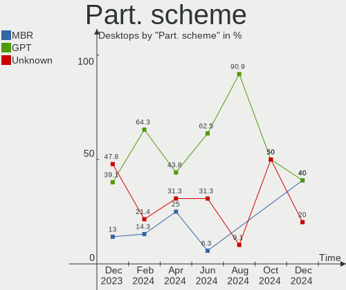
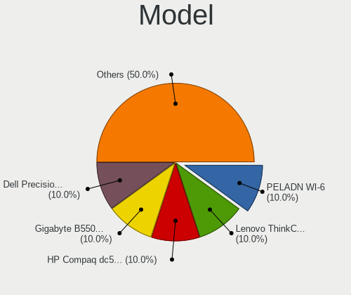
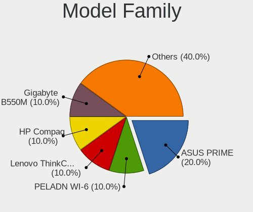
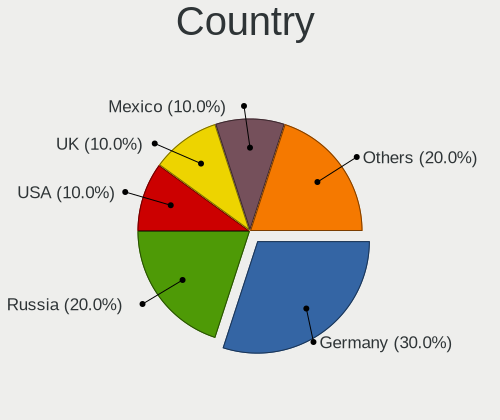
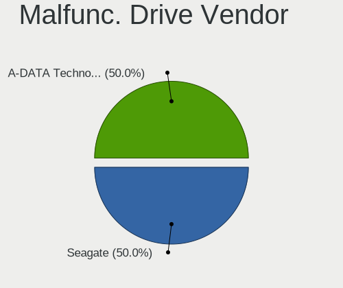
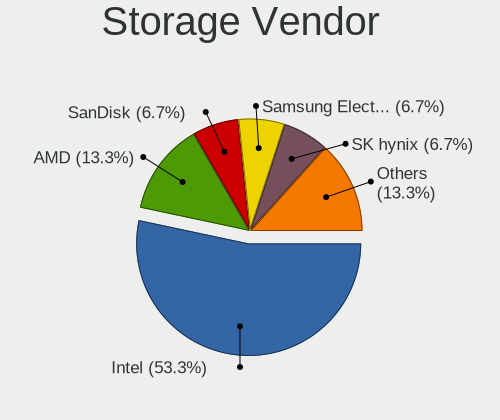
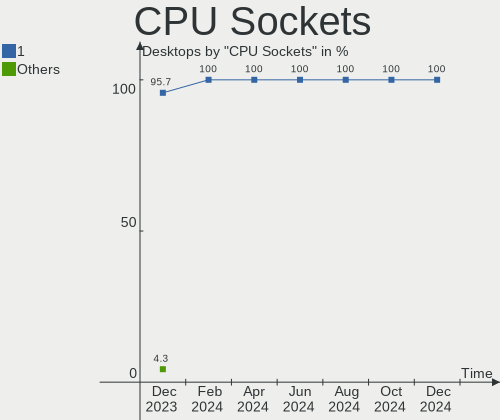
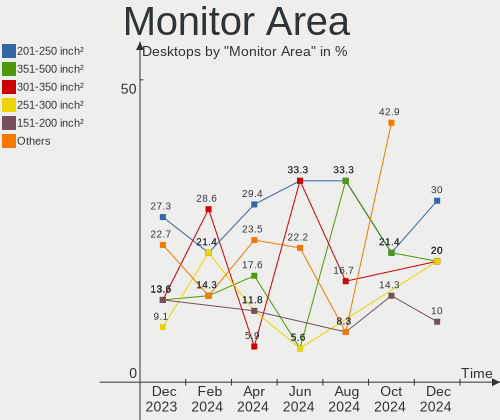
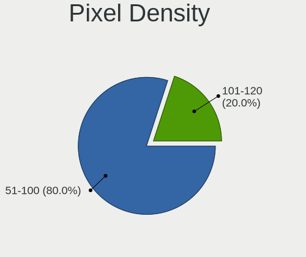
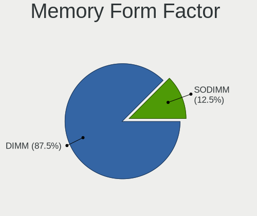

LMDE - Hardware Trends (Desktops)
---------------------------------

A project to identify most popular hardware characteristics and track their change
over time based on data collected by Linux users at https://Linux-Hardware.org.

Anyone can contribute to this report by the [hw-probe](https://github.com/linuxhw/hw-probe) tool:

    sudo -E hw-probe -all -upload

This report is for one last month. Overall report since the beginning of time: [TestDays](https://github.com/linuxhw/TestDays)

Period: Oct, 2023.

Contents
--------

* [ System ](#system)
  - [ OS                       ](#os)
  - [ OS Family                ](#os-family)
  - [ Kernel                   ](#kernel)
  - [ Kernel Family            ](#kernel-family)
  - [ Kernel Major Ver.        ](#kernel-major-ver)
  - [ Arch                     ](#arch)
  - [ DE                       ](#de)
  - [ Display Server           ](#display-server)
  - [ Display Manager          ](#display-manager)
  - [ OS Lang                  ](#os-lang)
  - [ Boot Mode                ](#boot-mode)
  - [ Filesystem               ](#filesystem)
  - [ Part. scheme             ](#part-scheme)
  - [ Dual Boot with Linux/BSD ](#dual-boot-with-linuxbsd)
  - [ Dual Boot (Win)          ](#dual-boot-win)

* [ Board ](#board)
  - [ Vendor                   ](#vendor)
  - [ Model                    ](#model)
  - [ Model Family             ](#model-family)
  - [ MFG Year                 ](#mfg-year)
  - [ Form Factor              ](#form-factor)
  - [ Secure Boot              ](#secure-boot)
  - [ Coreboot                 ](#coreboot)
  - [ RAM Size                 ](#ram-size)
  - [ RAM Used                 ](#ram-used)
  - [ Total Drives             ](#total-drives)
  - [ Has CD-ROM               ](#has-cd-rom)
  - [ Has Ethernet             ](#has-ethernet)
  - [ Has WiFi                 ](#has-wifi)
  - [ Has Bluetooth            ](#has-bluetooth)

* [ Location ](#location)
  - [ Country                  ](#country)
  - [ City                     ](#city)

* [ Drives ](#drives)
  - [ Drive Vendor             ](#drive-vendor)
  - [ Drive Model              ](#drive-model)
  - [ HDD Vendor               ](#hdd-vendor)
  - [ SSD Vendor               ](#ssd-vendor)
  - [ Drive Kind               ](#drive-kind)
  - [ Drive Connector          ](#drive-connector)
  - [ Drive Size               ](#drive-size)
  - [ Space Total              ](#space-total)
  - [ Space Used               ](#space-used)
  - [ Malfunc. Drives          ](#malfunc-drives)
  - [ Malfunc. Drive Vendor    ](#malfunc-drive-vendor)
  - [ Malfunc. HDD Vendor      ](#malfunc-hdd-vendor)
  - [ Malfunc. Drive Kind      ](#malfunc-drive-kind)
  - [ Failed Drives            ](#failed-drives)
  - [ Failed Drive Vendor      ](#failed-drive-vendor)
  - [ Drive Status             ](#drive-status)

* [ Storage controller ](#storage-controller)
  - [ Storage Vendor           ](#storage-vendor)
  - [ Storage Model            ](#storage-model)
  - [ Storage Kind             ](#storage-kind)

* [ Processor ](#processor)
  - [ CPU Vendor               ](#cpu-vendor)
  - [ CPU Model                ](#cpu-model)
  - [ CPU Model Family         ](#cpu-model-family)
  - [ CPU Cores                ](#cpu-cores)
  - [ CPU Sockets              ](#cpu-sockets)
  - [ CPU Threads              ](#cpu-threads)
  - [ CPU Op-Modes             ](#cpu-op-modes)
  - [ CPU Microcode            ](#cpu-microcode)
  - [ CPU Microarch            ](#cpu-microarch)

* [ Graphics ](#graphics)
  - [ GPU Vendor               ](#gpu-vendor)
  - [ GPU Model                ](#gpu-model)
  - [ GPU Combo                ](#gpu-combo)
  - [ GPU Driver               ](#gpu-driver)
  - [ GPU Memory               ](#gpu-memory)

* [ Monitor ](#monitor)
  - [ Monitor Vendor           ](#monitor-vendor)
  - [ Monitor Model            ](#monitor-model)
  - [ Monitor Resolution       ](#monitor-resolution)
  - [ Monitor Diagonal         ](#monitor-diagonal)
  - [ Monitor Width            ](#monitor-width)
  - [ Aspect Ratio             ](#aspect-ratio)
  - [ Monitor Area             ](#monitor-area)
  - [ Pixel Density            ](#pixel-density)
  - [ Multiple Monitors        ](#multiple-monitors)

* [ Network ](#network)
  - [ Net Controller Vendor    ](#net-controller-vendor)
  - [ Net Controller Model     ](#net-controller-model)
  - [ Wireless Vendor          ](#wireless-vendor)
  - [ Wireless Model           ](#wireless-model)
  - [ Ethernet Vendor          ](#ethernet-vendor)
  - [ Ethernet Model           ](#ethernet-model)
  - [ Net Controller Kind      ](#net-controller-kind)
  - [ Used Controller          ](#used-controller)
  - [ NICs                     ](#nics)
  - [ IPv6                     ](#ipv6)

* [ Bluetooth ](#bluetooth)
  - [ Bluetooth Vendor         ](#bluetooth-vendor)
  - [ Bluetooth Model          ](#bluetooth-model)

* [ Sound ](#sound)
  - [ Sound Vendor             ](#sound-vendor)
  - [ Sound Model              ](#sound-model)

* [ Memory ](#memory)
  - [ Memory Vendor            ](#memory-vendor)
  - [ Memory Model             ](#memory-model)
  - [ Memory Kind              ](#memory-kind)
  - [ Memory Form Factor       ](#memory-form-factor)
  - [ Memory Size              ](#memory-size)
  - [ Memory Speed             ](#memory-speed)

* [ Printers & scanners ](#printers--scanners)
  - [ Printer Vendor           ](#printer-vendor)
  - [ Printer Model            ](#printer-model)
  - [ Scanner Vendor           ](#scanner-vendor)
  - [ Scanner Model            ](#scanner-model)

* [ Camera ](#camera)
  - [ Camera Vendor            ](#camera-vendor)
  - [ Camera Model             ](#camera-model)

* [ Security ](#security)
  - [ Fingerprint Vendor       ](#fingerprint-vendor)
  - [ Fingerprint Model        ](#fingerprint-model)
  - [ Chipcard Vendor          ](#chipcard-vendor)
  - [ Chipcard Model           ](#chipcard-model)

* [ Unsupported ](#unsupported)
  - [ Unsupported Devices      ](#unsupported-devices)
  - [ Unsupported Device Types ](#unsupported-device-types)

System
------

OS
--

Installed operating systems

| Name   | Desktops | Percent |
|--------|----------|---------|
| LMDE 6 | 18       | 94.74%  |
| LMDE 5 | 1        | 5.26%   |

OS Family
---------

OS without a version

| Name | Desktops | Percent |
|------|----------|---------|
| LMDE | 19       | 100%    |

Kernel
------

Version of the Linux kernel

| Version               | Desktops | Percent |
|-----------------------|----------|---------|
| 6.1.0-13-amd64        | 12       | 63.16%  |
| 6.1.0-12-amd64        | 5        | 26.32%  |
| 6.1.0-12-686          | 1        | 5.26%   |
| 6.1.0-0.deb11.7-amd64 | 1        | 5.26%   |

Kernel Family
-------------

Linux kernel without a distro release

| Version | Desktops | Percent |
|---------|----------|---------|
| 6.1.0   | 19       | 100%    |

Kernel Major Ver.
-----------------

Linux kernel major version

| Version | Desktops | Percent |
|---------|----------|---------|
| 6.1     | 19       | 100%    |

Arch
----

OS architecture (x86_64, i586, etc.)

| Name   | Desktops | Percent |
|--------|----------|---------|
| x86_64 | 18       | 94.74%  |
| i686   | 1        | 5.26%   |

DE
--

Desktop Environment

| Name       | Desktops | Percent |
|------------|----------|---------|
| X-Cinnamon | 16       | 84.21%  |
| Cinnamon   | 2        | 10.53%  |
| KDE5       | 1        | 5.26%   |

Display Server
--------------

X11 or Wayland

| Name | Desktops | Percent |
|------|----------|---------|
| X11  | 19       | 100%    |

Display Manager
---------------

SDDM, LightDM, etc.

| Name    | Desktops | Percent |
|---------|----------|---------|
| Unknown | 11       | 57.89%  |
| LightDM | 8        | 42.11%  |

OS Lang
-------

Language

| Lang  | Desktops | Percent |
|-------|----------|---------|
| en_US | 9        | 47.37%  |
| de_DE | 5        | 26.32%  |
| en_GB | 2        | 10.53%  |
| pt_BR | 1        | 5.26%   |
| it_IT | 1        | 5.26%   |
| es_ES | 1        | 5.26%   |

Boot Mode
---------

EFI or BIOS

| Mode | Desktops | Percent |
|------|----------|---------|
| EFI  | 12       | 63.16%  |
| BIOS | 7        | 36.84%  |

Filesystem
----------

Type of filesystem

| Type    | Desktops | Percent |
|---------|----------|---------|
| Ext4    | 17       | 89.47%  |
| Overlay | 2        | 10.53%  |

Part. scheme
------------

Scheme of partitioning

| Type    | Desktops | Percent |
|---------|----------|---------|
| Unknown | 11       | 57.89%  |
| GPT     | 5        | 26.32%  |
| MBR     | 3        | 15.79%  |

Dual Boot with Linux/BSD
------------------------

Hosting more than one Linux/BSD

| Dual boot | Desktops | Percent |
|-----------|----------|---------|
| No        | 19       | 100%    |

Dual Boot (Win)
---------------

Hosting Linux and Windows

| Dual boot | Desktops | Percent |
|-----------|----------|---------|
| No        | 16       | 84.21%  |
| Yes       | 3        | 15.79%  |

Board
-----

Vendor
------

Motherboard manufacturer

| Name                | Desktops | Percent |
|---------------------|----------|---------|
| Gigabyte Technology | 5        | 26.32%  |
| ASRock              | 3        | 15.79%  |
| Hewlett-Packard     | 2        | 10.53%  |
| Dell                | 2        | 10.53%  |
| ASUSTek Computer    | 2        | 10.53%  |
| Trigkey             | 1        | 5.26%   |
| Medion              | 1        | 5.26%   |
| Intel               | 1        | 5.26%   |
| Acer                | 1        | 5.26%   |
| Unknown             | 1        | 5.26%   |

Model
-----

Motherboard model

| Name                              | Desktops | Percent |
|-----------------------------------|----------|---------|
| Trigkey Green G4                  | 1        | 5.26%   |
| Medion S23003                     | 1        | 5.26%   |
| Intel DG31PR AAD97573-206         | 1        | 5.26%   |
| HP ProDesk 490 G1 MT              | 1        | 5.26%   |
| HP Pavilion Desktop 590-p0xxx     | 1        | 5.26%   |
| Gigabyte Q87M-D2H                 | 1        | 5.26%   |
| Gigabyte GB-BACE-3000-SBE         | 1        | 5.26%   |
| Gigabyte G31M-ES2L                | 1        | 5.26%   |
| Gigabyte AB350M-DS3H V2           | 1        | 5.26%   |
| Gigabyte A520M S2H                | 1        | 5.26%   |
| Dell OptiPlex GX620               | 1        | 5.26%   |
| Dell OptiPlex 7010                | 1        | 5.26%   |
| ASUS ROG STRIX Z790-I GAMING WIFI | 1        | 5.26%   |
| ASUS P5G41T-M LX                  | 1        | 5.26%   |
| ASRock Z97 Pro4                   | 1        | 5.26%   |
| ASRock Z690M-ITX/ax               | 1        | 5.26%   |
| ASRock H310M-STX                  | 1        | 5.26%   |
| Acer Predator G3-605              | 1        | 5.26%   |
| Unknown                           | 1        | 5.26%   |

Model Family
------------

Motherboard model prefix

| Name                      | Desktops | Percent |
|---------------------------|----------|---------|
| Dell OptiPlex             | 2        | 10.53%  |
| Trigkey Green             | 1        | 5.26%   |
| Medion S23003             | 1        | 5.26%   |
| Intel DG31PR              | 1        | 5.26%   |
| HP ProDesk                | 1        | 5.26%   |
| HP Pavilion               | 1        | 5.26%   |
| Gigabyte Q87M-D2H         | 1        | 5.26%   |
| Gigabyte GB-BACE-3000-SBE | 1        | 5.26%   |
| Gigabyte G31M-ES2L        | 1        | 5.26%   |
| Gigabyte AB350M-DS3H      | 1        | 5.26%   |
| Gigabyte A520M            | 1        | 5.26%   |
| ASUS ROG                  | 1        | 5.26%   |
| ASUS P5G41T-M             | 1        | 5.26%   |
| ASRock Z97                | 1        | 5.26%   |
| ASRock Z690M-ITX          | 1        | 5.26%   |
| ASRock H310M-STX          | 1        | 5.26%   |
| Acer Predator             | 1        | 5.26%   |
| Unknown                   | 1        | 5.26%   |

MFG Year
--------

Motherboard manufacture year

| Year | Desktops | Percent |
|------|----------|---------|
| 2023 | 3        | 15.79%  |
| 2018 | 3        | 15.79%  |
| 2013 | 2        | 10.53%  |
| 2008 | 2        | 10.53%  |
| 2021 | 1        | 5.26%   |
| 2020 | 1        | 5.26%   |
| 2019 | 1        | 5.26%   |
| 2017 | 1        | 5.26%   |
| 2015 | 1        | 5.26%   |
| 2014 | 1        | 5.26%   |
| 2010 | 1        | 5.26%   |
| 2007 | 1        | 5.26%   |
| 2006 | 1        | 5.26%   |

Form Factor
-----------

Physical design of the computer

| Name    | Desktops | Percent |
|---------|----------|---------|
| Desktop | 19       | 100%    |

Secure Boot
-----------

Enabled or disabled

| State    | Desktops | Percent |
|----------|----------|---------|
| Disabled | 17       | 89.47%  |
| Enabled  | 2        | 10.53%  |

Coreboot
--------

Have coreboot on board

| Used | Desktops | Percent |
|------|----------|---------|
| No   | 19       | 100%    |

RAM Size
--------

Total RAM memory

| Size in GB  | Desktops | Percent |
|-------------|----------|---------|
| 3.01-4.0    | 5        | 26.32%  |
| 16.01-24.0  | 4        | 21.05%  |
| 4.01-8.0    | 3        | 15.79%  |
| 64.01-256.0 | 3        | 15.79%  |
| 32.01-64.0  | 2        | 10.53%  |
| 24.01-32.0  | 1        | 5.26%   |
| 1.01-2.0    | 1        | 5.26%   |

RAM Used
--------

Used RAM memory

| Used GB  | Desktops | Percent |
|----------|----------|---------|
| 2.01-3.0 | 7        | 36.84%  |
| 3.01-4.0 | 5        | 26.32%  |
| 1.01-2.0 | 4        | 21.05%  |
| 4.01-8.0 | 3        | 15.79%  |

Total Drives
------------

Number of drives on board

| Drives | Desktops | Percent |
|--------|----------|---------|
| 1      | 11       | 57.89%  |
| 4      | 5        | 26.32%  |
| 5      | 1        | 5.26%   |
| 3      | 1        | 5.26%   |
| 2      | 1        | 5.26%   |

Has CD-ROM
----------

Has CD-ROM on board

| Presented | Desktops | Percent |
|-----------|----------|---------|
| No        | 13       | 68.42%  |
| Yes       | 6        | 31.58%  |

Has Ethernet
------------

Has Ethernet on board

| Presented | Desktops | Percent |
|-----------|----------|---------|
| Yes       | 19       | 100%    |

Has WiFi
--------

Has WiFi module

| Presented | Desktops | Percent |
|-----------|----------|---------|
| Yes       | 13       | 68.42%  |
| No        | 6        | 31.58%  |

Has Bluetooth
-------------

Has Bluetooth module

| Presented | Desktops | Percent |
|-----------|----------|---------|
| No        | 11       | 57.89%  |
| Yes       | 8        | 42.11%  |

Location
--------

Country
-------

Geographic location (country)

| Country   | Desktops | Percent |
|-----------|----------|---------|
| USA       | 5        | 26.32%  |
| Germany   | 5        | 26.32%  |
| Italy     | 3        | 15.79%  |
| UK        | 1        | 5.26%   |
| Spain     | 1        | 5.26%   |
| Indonesia | 1        | 5.26%   |
| India     | 1        | 5.26%   |
| Ecuador   | 1        | 5.26%   |
| Brazil    | 1        | 5.26%   |

City
----

Geographic location (city)

| City           | Desktops | Percent |
|----------------|----------|---------|
| Seattle        | 1        | 5.26%   |
| Saarbrücken   | 1        | 5.26%   |
| Rio de Janeiro | 1        | 5.26%   |
| Palma          | 1        | 5.26%   |
| North Port     | 1        | 5.26%   |
| Kansas City    | 1        | 5.26%   |
| Guayaquil      | 1        | 5.26%   |
| Giussano       | 1        | 5.26%   |
| Freden         | 1        | 5.26%   |
| Fitchburg      | 1        | 5.26%   |
| Düsseldorf    | 1        | 5.26%   |
| Delligsen      | 1        | 5.26%   |
| Dautphetal     | 1        | 5.26%   |
| Dallas         | 1        | 5.26%   |
| Burnley        | 1        | 5.26%   |
| Bovalino       | 1        | 5.26%   |
| Bologna        | 1        | 5.26%   |
| Bogor          | 1        | 5.26%   |
| Asansol        | 1        | 5.26%   |

Drives
------

Drive Vendor
------------

Hard drive vendors

| Vendor                      | Desktops | Drives | Percent |
|-----------------------------|----------|--------|---------|
| WDC                         | 7        | 9      | 22.58%  |
| Seagate                     | 6        | 11     | 19.35%  |
| Kingston                    | 2        | 4      | 6.45%   |
| China                       | 2        | 2      | 6.45%   |
| ADATA Technology            | 2        | 2      | 6.45%   |
| Unknown                     | 2        | 2      | 6.45%   |
| Verbatim                    | 1        | 1      | 3.23%   |
| Toshiba                     | 1        | 1      | 3.23%   |
| TO Exter                    | 1        | 1      | 3.23%   |
| Team                        | 1        | 1      | 3.23%   |
| Samsung Electronics         | 1        | 1      | 3.23%   |
| PNY                         | 1        | 1      | 3.23%   |
| Phison                      | 1        | 1      | 3.23%   |
| MAXIO Technology (Hangzhou) | 1        | 1      | 3.23%   |
| KIOXIA-EXCERIA              | 1        | 1      | 3.23%   |
| IBM/Hitachi                 | 1        | 1      | 3.23%   |

Drive Model
-----------

Hard drive models

| Model                                                             | Desktops | Percent |
|-------------------------------------------------------------------|----------|---------|
| ADATA XPG SX8200 Pro PCIe Gen3x4 M.2 2280 Solid State Drive 512GB | 2        | 5.26%   |
| Unknown                                                           | 2        | 5.26%   |
| WDC WDS500G2B0A-00SM50 500GB SSD                                  | 1        | 2.63%   |
| WDC WD40EFAX-68JH4N1 4TB                                          | 1        | 2.63%   |
| WDC WD4004FZWX-00GBGB0 4TB                                        | 1        | 2.63%   |
| WDC WD3200AAJS-57VWA2 320GB                                       | 1        | 2.63%   |
| WDC WD3200AAJS-22B4A0 320GB                                       | 1        | 2.63%   |
| WDC WD20EARX-22PASB0 2TB                                          | 1        | 2.63%   |
| WDC WD2003FZEX-00SRLA0 2TB                                        | 1        | 2.63%   |
| WDC WD10EZRZ-00HTKB0 1TB                                          | 1        | 2.63%   |
| Verbatim Vi550 S3 128GB                                           | 1        | 2.63%   |
| Toshiba DT01ACA100 1TB                                            | 1        | 2.63%   |
| TO Exter nal USB 3.0 2TB                                          | 1        | 2.63%   |
| Team T253512GB SSD                                                | 1        | 2.63%   |
| Seagate ST8000DM004-2U9188 8TB                                    | 1        | 2.63%   |
| Seagate ST4000VN008-2DR166 4TB                                    | 1        | 2.63%   |
| Seagate ST3500418AS 500GB                                         | 1        | 2.63%   |
| Seagate ST3320310CS 320GB                                         | 1        | 2.63%   |
| Seagate ST3250820AS 250GB                                         | 1        | 2.63%   |
| Seagate ST3000DM001-1CH166 3TB                                    | 1        | 2.63%   |
| Seagate ST2000LX001-1RG174 2TB                                    | 1        | 2.63%   |
| Seagate ST2000LM015-2E8174 2TB                                    | 1        | 2.63%   |
| Seagate Expansion Desk 3TB                                        | 1        | 2.63%   |
| Seagate Desktop 8TB                                               | 1        | 2.63%   |
| Samsung NVMe SSD Controller PM9A1/PM9A3/980PRO 1TB                | 1        | 2.63%   |
| PNY CS900 500GB SSD                                               | 1        | 2.63%   |
| Phison S11-128G-PHISON-SSD-B4 128GB                               | 1        | 2.63%   |
| MAXIO (Hangzhou) NVMe SSD Drive 512GB                             | 1        | 2.63%   |
| KIOXIA-EXCERIA SSD 1TB                                            | 1        | 2.63%   |
| Kingston SNVS500G 500GB                                           | 1        | 2.63%   |
| Kingston SKC3000S1024G 1TB                                        | 1        | 2.63%   |
| Kingston SA400S37240G 240GB SSD                                   | 1        | 2.63%   |
| Kingston SA400S37120G 120GB SSD                                   | 1        | 2.63%   |
| IBM/Hitachi IC35L040AVER07-0 41GB                                 | 1        | 2.63%   |
| China SSD 240G                                                    | 1        | 2.63%   |
| China SATA SSD 240GB                                              | 1        | 2.63%   |

HDD Vendor
----------

Hard disk drive vendors

| Vendor      | Desktops | Drives | Percent |
|-------------|----------|--------|---------|
| WDC         | 6        | 8      | 40%     |
| Seagate     | 6        | 11     | 40%     |
| Toshiba     | 1        | 1      | 6.67%   |
| IBM/Hitachi | 1        | 1      | 6.67%   |
| Unknown     | 1        | 1      | 6.67%   |

SSD Vendor
----------

Solid state drive vendors

| Vendor   | Desktops | Drives | Percent |
|----------|----------|--------|---------|
| Kingston | 2        | 2      | 20%     |
| China    | 2        | 2      | 20%     |
| WDC      | 1        | 1      | 10%     |
| Verbatim | 1        | 1      | 10%     |
| TO Exter | 1        | 1      | 10%     |
| Team     | 1        | 1      | 10%     |
| PNY      | 1        | 1      | 10%     |
| Phison   | 1        | 1      | 10%     |

Drive Kind
----------

HDD or SSD

| Kind | Desktops | Drives | Percent |
|------|----------|--------|---------|
| HDD  | 12       | 22     | 42.86%  |
| SSD  | 9        | 10     | 32.14%  |
| NVMe | 6        | 7      | 21.43%  |
| MMC  | 1        | 1      | 3.57%   |

Drive Connector
---------------

SATA, SAS, NVMe, etc.

| Type | Desktops | Drives | Percent |
|------|----------|--------|---------|
| SATA | 17       | 29     | 62.96%  |
| NVMe | 6        | 7      | 22.22%  |
| SAS  | 3        | 3      | 11.11%  |
| MMC  | 1        | 1      | 3.7%    |

Drive Size
----------

Size of hard drive

| Size in TB | Desktops | Drives | Percent |
|------------|----------|--------|---------|
| 0.01-0.5   | 13       | 15     | 50%     |
| 1.01-2.0   | 4        | 6      | 15.38%  |
| 3.01-4.0   | 3        | 4      | 11.54%  |
| 0.51-1.0   | 3        | 3      | 11.54%  |
| 2.01-3.0   | 2        | 2      | 7.69%   |
| 4.01-10.0  | 1        | 2      | 3.85%   |

Space Total
-----------

Amount of disk space available on the file system

| Size in GB     | Desktops | Percent |
|----------------|----------|---------|
| 101-250        | 6        | 31.58%  |
| More than 3000 | 4        | 21.05%  |
| 251-500        | 3        | 15.79%  |
| 21-50          | 1        | 5.26%   |
| 2001-3000      | 1        | 5.26%   |
| 1001-2000      | 1        | 5.26%   |
| 1-20           | 1        | 5.26%   |
| 501-1000       | 1        | 5.26%   |
| 51-100         | 1        | 5.26%   |

Space Used
----------

Amount of used disk space

| Used GB        | Desktops | Percent |
|----------------|----------|---------|
| 1-20           | 8        | 42.11%  |
| More than 3000 | 3        | 15.79%  |
| 21-50          | 3        | 15.79%  |
| 51-100         | 2        | 10.53%  |
| 251-500        | 1        | 5.26%   |
| 101-250        | 1        | 5.26%   |
| 501-1000       | 1        | 5.26%   |

Malfunc. Drives
---------------

Drive models with a malfunction

| Model                             | Desktops | Drives | Percent |
|-----------------------------------|----------|--------|---------|
| WDC WD10EZRZ-00HTKB0 1TB          | 1        | 1      | 50%     |
| IBM/Hitachi IC35L040AVER07-0 41GB | 1        | 1      | 50%     |

Malfunc. Drive Vendor
---------------------

Vendors of faulty drives

| Vendor      | Desktops | Drives | Percent |
|-------------|----------|--------|---------|
| WDC         | 1        | 1      | 50%     |
| IBM/Hitachi | 1        | 1      | 50%     |

Malfunc. HDD Vendor
-------------------

Vendors of faulty HDD drives

| Vendor      | Desktops | Drives | Percent |
|-------------|----------|--------|---------|
| WDC         | 1        | 1      | 50%     |
| IBM/Hitachi | 1        | 1      | 50%     |

Malfunc. Drive Kind
-------------------

Kinds of faulty drives

| Kind | Desktops | Drives | Percent |
|------|----------|--------|---------|
| HDD  | 2        | 2      | 100%    |

Failed Drives
-------------

Failed drive models

Zero info for selected period =(

Failed Drive Vendor
-------------------

Failed drive vendors

Zero info for selected period =(

Drive Status
------------

Number of failed and malfunc. drives

| Status   | Desktops | Drives | Percent |
|----------|----------|--------|---------|
| Detected | 13       | 30     | 61.9%   |
| Works    | 6        | 8      | 28.57%  |
| Malfunc  | 2        | 2      | 9.52%   |

Storage controller
------------------

Storage Vendor
--------------

Storage controller vendors

| Vendor                      | Desktops | Percent |
|-----------------------------|----------|---------|
| Intel                       | 16       | 64%     |
| AMD                         | 2        | 8%      |
| ADATA Technology            | 2        | 8%      |
| VIA Technologies            | 1        | 4%      |
| Samsung Electronics         | 1        | 4%      |
| MAXIO Technology (Hangzhou) | 1        | 4%      |
| KIOXIA                      | 1        | 4%      |
| Kingston Technology Company | 1        | 4%      |

Storage Model
-------------

Storage controller models

| Model                                                                            | Desktops | Percent |
|----------------------------------------------------------------------------------|----------|---------|
| Intel NM10/ICH7 Family SATA Controller [IDE mode]                                | 4        | 12.9%   |
| Intel 82801G (ICH7 Family) IDE Controller                                        | 3        | 9.68%   |
| Intel 8 Series/C220 Series Chipset Family 6-port SATA Controller 1 [AHCI mode]   | 3        | 9.68%   |
| ADATA XPG SX8200 Pro PCIe Gen3x4 M.2 2280 Solid State Drive                      | 2        | 6.45%   |
| VIA VT82C586A/B/VT82C686/A/B/VT823x/A/C PIPC Bus Master IDE                      | 1        | 3.23%   |
| VIA VIA VT6420 SATA RAID Controller                                              | 1        | 3.23%   |
| Samsung NVMe SSD Controller PM9A1/PM9A3/980PRO                                   | 1        | 3.23%   |
| MAXIO (Hangzhou) NVMe SSD Controller MAP1202                                     | 1        | 3.23%   |
| KIOXIA NVMe SSD                                                                  | 1        | 3.23%   |
| Kingston Company NV1 NVMe SSD SM2263XT                                           | 1        | 3.23%   |
| Kingston Company KC3000/FURY Renegade NVMe SSD E18                               | 1        | 3.23%   |
| Intel Volume Management Device NVMe RAID Controller Intel Corporation            | 1        | 3.23%   |
| Intel SATA Controller [RAID mode]                                                | 1        | 3.23%   |
| Intel SATA controller                                                            | 1        | 3.23%   |
| Intel Celeron/Pentium Silver Processor SATA Controller                           | 1        | 3.23%   |
| Intel Cannon Lake PCH SATA AHCI Controller                                       | 1        | 3.23%   |
| Intel Atom/Celeron/Pentium Processor x5-E8000/J3xxx/N3xxx Series SATA Controller | 1        | 3.23%   |
| Intel Alder Lake-S PCH SATA Controller [AHCI Mode]                               | 1        | 3.23%   |
| Intel 9 Series Chipset Family SATA Controller [AHCI Mode]                        | 1        | 3.23%   |
| Intel 700 Series Chipset Family SATA AHCI Controller                             | 1        | 3.23%   |
| Intel 7 Series/C210 Series Chipset Family 6-port SATA Controller [AHCI mode]     | 1        | 3.23%   |
| AMD 500 Series Chipset SATA Controller                                           | 1        | 3.23%   |
| AMD 300 Series Chipset SATA Controller                                           | 1        | 3.23%   |

Storage Kind
------------

Kind of storage controller (IDE, SATA, NVMe, SAS, ...)

| Kind | Desktops | Percent |
|------|----------|---------|
| SATA | 13       | 50%     |
| NVMe | 6        | 23.08%  |
| IDE  | 5        | 19.23%  |
| RAID | 2        | 7.69%   |

Processor
---------

CPU Vendor
----------

Processor vendors

| Vendor | Desktops | Percent |
|--------|----------|---------|
| Intel  | 17       | 89.47%  |
| AMD    | 2        | 10.53%  |

CPU Model
---------

Processor models

| Model                                       | Desktops | Percent |
|---------------------------------------------|----------|---------|
| Intel Pentium Dual-Core CPU E6700 @ 3.20GHz | 1        | 5.26%   |
| Intel Pentium Dual-Core CPU E5700 @ 3.00GHz | 1        | 5.26%   |
| Intel Pentium Dual CPU E2180 @ 2.00GHz      | 1        | 5.26%   |
| Intel Pentium D CPU 3.00GHz                 | 1        | 5.26%   |
| Intel N100                                  | 1        | 5.26%   |
| Intel Core i9-9900K CPU @ 3.60GHz           | 1        | 5.26%   |
| Intel Core i7-8700 CPU @ 3.20GHz            | 1        | 5.26%   |
| Intel Core i7-4790K CPU @ 4.00GHz           | 1        | 5.26%   |
| Intel Core i7-4790 CPU @ 3.60GHz            | 1        | 5.26%   |
| Intel Core i7-4770 CPU @ 3.40GHz            | 1        | 5.26%   |
| Intel Core i5-4590S CPU @ 3.00GHz           | 1        | 5.26%   |
| Intel Core i5-2400 CPU @ 3.10GHz            | 1        | 5.26%   |
| Intel Celeron J4125 CPU @ 2.00GHz           | 1        | 5.26%   |
| Intel Celeron CPU N3000 @ 1.04GHz           | 1        | 5.26%   |
| Intel Celeron CPU 2.60GHz                   | 1        | 5.26%   |
| Intel 13th Gen Core i9-13900K               | 1        | 5.26%   |
| Intel 13th Gen Core i5-13500                | 1        | 5.26%   |
| AMD Ryzen 5 5600G with Radeon Graphics      | 1        | 5.26%   |
| AMD Ryzen 5 3600 6-Core Processor           | 1        | 5.26%   |

CPU Model Family
----------------

Processor model prefix

| Model                   | Desktops | Percent |
|-------------------------|----------|---------|
| Intel Core i7           | 4        | 21.05%  |
| Other                   | 3        | 15.79%  |
| Intel Celeron           | 3        | 15.79%  |
| Intel Pentium Dual-Core | 2        | 10.53%  |
| Intel Core i5           | 2        | 10.53%  |
| AMD Ryzen 5             | 2        | 10.53%  |
| Intel Pentium Dual      | 1        | 5.26%   |
| Intel Pentium D         | 1        | 5.26%   |
| Intel Core i9           | 1        | 5.26%   |

CPU Cores
---------

Number of processor cores

| Number | Desktops | Percent |
|--------|----------|---------|
| 4      | 7        | 36.84%  |
| 2      | 4        | 21.05%  |
| 6      | 3        | 15.79%  |
| 1      | 2        | 10.53%  |
| 24     | 1        | 5.26%   |
| 14     | 1        | 5.26%   |
| 8      | 1        | 5.26%   |

CPU Sockets
-----------

Number of sockets

| Number | Desktops | Percent |
|--------|----------|---------|
| 1      | 19       | 100%    |

CPU Threads
-----------

Threads per core (Hyper-Threading)

| Number | Desktops | Percent |
|--------|----------|---------|
| 1      | 10       | 52.63%  |
| 2      | 9        | 47.37%  |

CPU Op-Modes
------------

CPU Operation Modes (32-bit, 64-bit)

| Op mode        | Desktops | Percent |
|----------------|----------|---------|
| 32-bit, 64-bit | 18       | 94.74%  |
| 32-bit         | 1        | 5.26%   |

CPU Microcode
-------------

Microcode number

| Number     | Desktops | Percent |
|------------|----------|---------|
| 0x306c3    | 4        | 21.05%  |
| 0x1067a    | 2        | 10.53%  |
| 0xf62      | 1        | 5.26%   |
| 0xf29      | 1        | 5.26%   |
| 0xb06f2    | 1        | 5.26%   |
| 0xb06e0    | 1        | 5.26%   |
| 0xb0671    | 1        | 5.26%   |
| 0x906ed    | 1        | 5.26%   |
| 0x906ea    | 1        | 5.26%   |
| 0x706a8    | 1        | 5.26%   |
| 0x6fd      | 1        | 5.26%   |
| 0x406c3    | 1        | 5.26%   |
| 0x206a7    | 1        | 5.26%   |
| 0x0a50000d | 1        | 5.26%   |
| 0x08701030 | 1        | 5.26%   |

CPU Microarch
-------------

Microarchitecture

| Name             | Desktops | Percent |
|------------------|----------|---------|
| Haswell          | 4        | 21.05%  |
| Penryn           | 2        | 10.53%  |
| NetBurst         | 2        | 10.53%  |
| KabyLake         | 2        | 10.53%  |
| Alderlake Hybrid | 2        | 10.53%  |
| Zen 3            | 1        | 5.26%   |
| Zen 2            | 1        | 5.26%   |
| Silvermont       | 1        | 5.26%   |
| SandyBridge      | 1        | 5.26%   |
| Gracemont        | 1        | 5.26%   |
| Goldmont plus    | 1        | 5.26%   |
| Core             | 1        | 5.26%   |

Graphics
--------

GPU Vendor
----------

Vendors of graphics cards

| Vendor | Desktops | Percent |
|--------|----------|---------|
| Intel  | 13       | 56.52%  |
| Nvidia | 5        | 21.74%  |
| AMD    | 5        | 21.74%  |

GPU Model
---------

Graphics card models

| Model                                                                                    | Desktops | Percent |
|------------------------------------------------------------------------------------------|----------|---------|
| Intel Xeon E3-1200 v3/4th Gen Core Processor Integrated Graphics Controller              | 3        | 12.5%   |
| Intel CoffeeLake-S GT2 [UHD Graphics 630]                                                | 2        | 8.33%   |
| Nvidia TU106 [GeForce RTX 2060 12GB]                                                     | 1        | 4.17%   |
| Nvidia GM204 [GeForce GTX 970]                                                           | 1        | 4.17%   |
| Nvidia GM200 [GeForce GTX 980 Ti]                                                        | 1        | 4.17%   |
| Nvidia GF119 [GeForce GT 610]                                                            | 1        | 4.17%   |
| Nvidia AD104 [GeForce RTX 4070 Ti]                                                       | 1        | 4.17%   |
| Intel Raptor Lake-S GT1 [UHD Graphics 770]                                               | 1        | 4.17%   |
| Intel GeminiLake [UHD Graphics 600]                                                      | 1        | 4.17%   |
| Intel Atom/Celeron/Pentium Processor x5-E8000/J3xxx/N3xxx Integrated Graphics Controller | 1        | 4.17%   |
| Intel AlderLake-S GT1                                                                    | 1        | 4.17%   |
| Intel Alder Lake-N [UHD Graphics]                                                        | 1        | 4.17%   |
| Intel 82G33/G31 Express Integrated Graphics Controller                                   | 1        | 4.17%   |
| Intel 4 Series Chipset Integrated Graphics Controller                                    | 1        | 4.17%   |
| Intel 2nd Generation Core Processor Family Integrated Graphics Controller                | 1        | 4.17%   |
| AMD Tahiti PRO [Radeon HD 7950/8950 OEM / R9 280]                                        | 1        | 4.17%   |
| AMD RV710 [Radeon HD 4350/4550]                                                          | 1        | 4.17%   |
| AMD RV350 [Radeon 9550] (Secondary)                                                      | 1        | 4.17%   |
| AMD RV350 [Radeon 9550]                                                                  | 1        | 4.17%   |
| AMD Cezanne [Radeon Vega Series / Radeon Vega Mobile Series]                             | 1        | 4.17%   |
| AMD Cedar [Radeon HD 5000/6000/7350/8350 Series]                                         | 1        | 4.17%   |

GPU Combo
---------

Combinations of graphics cards

| Name           | Desktops | Percent |
|----------------|----------|---------|
| 1 x Intel      | 9        | 47.37%  |
| 1 x Nvidia     | 4        | 21.05%  |
| 1 x AMD        | 4        | 21.05%  |
| 2 x AMD        | 1        | 5.26%   |
| Intel + Nvidia | 1        | 5.26%   |

GPU Driver
----------

Free vs proprietary

| Driver      | Desktops | Percent |
|-------------|----------|---------|
| Free        | 17       | 89.47%  |
| Proprietary | 2        | 10.53%  |

GPU Memory
----------

Total video memory

| Size in GB | Desktops | Percent |
|------------|----------|---------|
| Unknown    | 11       | 57.89%  |
| 3.01-4.0   | 2        | 10.53%  |
| 0.51-1.0   | 2        | 10.53%  |
| 2.01-3.0   | 1        | 5.26%   |
| 1.01-2.0   | 1        | 5.26%   |
| 8.01-16.0  | 1        | 5.26%   |
| 0.01-0.5   | 1        | 5.26%   |

Monitor
-------

Monitor Vendor
--------------

Monitor vendors

| Vendor                  | Desktops | Percent |
|-------------------------|----------|---------|
| Samsung Electronics     | 4        | 22.22%  |
| Goldstar                | 3        | 16.67%  |
| Philips                 | 2        | 11.11%  |
| Hewlett-Packard         | 2        | 11.11%  |
| AOC                     | 2        | 11.11%  |
| RGT                     | 1        | 5.56%   |
| HUAWEI                  | 1        | 5.56%   |
| Grundig                 | 1        | 5.56%   |
| Chi Mei Optoelectronics | 1        | 5.56%   |
| Ancor Communications    | 1        | 5.56%   |

Monitor Model
-------------

Monitor models

| Model                                                                  | Desktops | Percent |
|------------------------------------------------------------------------|----------|---------|
| Samsung Electronics SyncMaster SAM036F 1440x900 428x255mm 19.6-inch    | 1        | 5.56%   |
| Samsung Electronics S32D850 SAM0BCC 2560x1440 708x398mm 32.0-inch      | 1        | 5.56%   |
| Samsung Electronics LCD Monitor SAM7016 3840x2160 950x540mm 43.0-inch  | 1        | 5.56%   |
| Samsung Electronics C32F391 SAM0D34 1920x1080 698x393mm 31.5-inch      | 1        | 5.56%   |
| RGT LCD Monitor RGT1252 1920x1080 1020x570mm 46.0-inch                 | 1        | 5.56%   |
| Philips LCD Monitor PHL BDM4065 3840x2160                              | 1        | 5.56%   |
| Philips 247E4 PHLC0C0 1920x1080 521x293mm 23.5-inch                    | 1        | 5.56%   |
| HUAWEI ZQE-CBA HWV6A25 3440x1440 797x334mm 34.0-inch                   | 1        | 5.56%   |
| Hewlett-Packard x20LED HWP2910 1600x900 443x249mm 20.0-inch            | 1        | 5.56%   |
| Hewlett-Packard 25x HPN357F 1920x1080 544x303mm 24.5-inch              | 1        | 5.56%   |
| Grundig WXGA GRU4448 1600x1200                                         | 1        | 5.56%   |
| Goldstar LG TV SSCR2 GSMC0C8 3840x2160                                 | 1        | 5.56%   |
| Goldstar FULL HD GSM5B55 1920x1080 480x270mm 21.7-inch                 | 1        | 5.56%   |
| Goldstar FULL HD GSM5B54 1920x1080 480x270mm 21.7-inch                 | 1        | 5.56%   |
| Chi Mei Optoelectronics CMC 22 W CMO2228 1680x1050 470x300mm 22.0-inch | 1        | 5.56%   |
| AOC G2460 AOC246A 1920x1080 530x300mm 24.0-inch                        | 1        | 5.56%   |
| AOC 2470W1M AOC2470 1920x1080 527x296mm 23.8-inch                      | 1        | 5.56%   |
| Ancor Communications VS24A ACI24D1 1920x1200 518x324mm 24.1-inch       | 1        | 5.56%   |

Monitor Resolution
------------------

Monitor screen resolution

| Resolution         | Desktops | Percent |
|--------------------|----------|---------|
| 1920x1080 (FHD)    | 7        | 38.89%  |
| 3840x2160 (4K)     | 5        | 27.78%  |
| 3440x1440          | 1        | 5.56%   |
| 2560x1440 (QHD)    | 1        | 5.56%   |
| 1920x1200 (WUXGA)  | 1        | 5.56%   |
| 1680x1050 (WSXGA+) | 1        | 5.56%   |
| 1600x900 (HD+)     | 1        | 5.56%   |
| 1440x900 (WXGA+)   | 1        | 5.56%   |

Monitor Diagonal
----------------

Diagonal size in inches

| Inches  | Desktops | Percent |
|---------|----------|---------|
| 24      | 4        | 22.22%  |
| 21      | 2        | 11.11%  |
| 84      | 1        | 5.56%   |
| 72      | 1        | 5.56%   |
| 54      | 1        | 5.56%   |
| 46      | 1        | 5.56%   |
| 34      | 1        | 5.56%   |
| 32      | 1        | 5.56%   |
| 31      | 1        | 5.56%   |
| 23      | 1        | 5.56%   |
| 22      | 1        | 5.56%   |
| 20      | 1        | 5.56%   |
| 19      | 1        | 5.56%   |
| Unknown | 1        | 5.56%   |

Monitor Width
-------------

Physical width

| Width in mm | Desktops | Percent |
|-------------|----------|---------|
| 501-600     | 5        | 27.78%  |
| 401-500     | 5        | 27.78%  |
| 701-800     | 2        | 11.11%  |
| 1501-2000   | 2        | 11.11%  |
| 1001-1500   | 2        | 11.11%  |
| 601-700     | 1        | 5.56%   |
| Unknown     | 1        | 5.56%   |

Aspect Ratio
------------

Proportional relationship between the width and the height

| Ratio   | Desktops | Percent |
|---------|----------|---------|
| 16/9    | 14       | 77.78%  |
| 16/10   | 2        | 11.11%  |
| 21/9    | 1        | 5.56%   |
| Unknown | 1        | 5.56%   |

Monitor Area
------------

Area in inch²

| Area in inch² | Desktops | Percent |
|----------------|----------|---------|
| 201-250        | 6        | 33.33%  |
| More than 1000 | 3        | 16.67%  |
| 351-500        | 3        | 16.67%  |
| 251-300        | 2        | 11.11%  |
| 151-200        | 2        | 11.11%  |
| 501-1000       | 1        | 5.56%   |
| Unknown        | 1        | 5.56%   |

Pixel Density
-------------

Pixels per inch

| Density | Desktops | Percent |
|---------|----------|---------|
| 51-100  | 13       | 72.22%  |
| 101-120 | 3        | 16.67%  |
| 1-50    | 1        | 5.56%   |
| Unknown | 1        | 5.56%   |

Multiple Monitors
-----------------

Total monitors connected

| Total | Desktops | Percent |
|-------|----------|---------|
| 1     | 19       | 100%    |

Network
-------

Net Controller Vendor
---------------------

Controller vendors

| Vendor                | Desktops | Percent |
|-----------------------|----------|---------|
| Realtek Semiconductor | 11       | 42.31%  |
| Intel                 | 9        | 34.62%  |
| Qualcomm Atheros      | 2        | 7.69%   |
| VIA Technologies      | 1        | 3.85%   |
| TP-Link               | 1        | 3.85%   |
| Ralink                | 1        | 3.85%   |
| Broadcom              | 1        | 3.85%   |

Net Controller Model
--------------------

Controller models

| Model                                                             | Desktops | Percent |
|-------------------------------------------------------------------|----------|---------|
| Realtek RTL8111/8168/8411 PCI Express Gigabit Ethernet Controller | 7        | 21.21%  |
| Qualcomm Atheros AR8131 Gigabit Ethernet                          | 2        | 6.06%   |
| VIA VT6102/VT6103 [Rhine-II]                                      | 1        | 3.03%   |
| TP-Link RTL8812AU Archer T4U 802.11ac                             | 1        | 3.03%   |
| Realtek RTL88x2bu [AC1200 Techkey]                                | 1        | 3.03%   |
| Realtek RTL8821CE 802.11ac PCIe Wireless Network Adapter          | 1        | 3.03%   |
| Realtek RTL8821AE 802.11ac PCIe Wireless Network Adapter          | 1        | 3.03%   |
| Realtek RTL8811AU 802.11a/b/g/n/ac WLAN Adapter                   | 1        | 3.03%   |
| Realtek RTL8188SU 802.11n WLAN Adapter                            | 1        | 3.03%   |
| Realtek RTL8188FTV 802.11b/g/n 1T1R 2.4G WLAN Adapter             | 1        | 3.03%   |
| Realtek RTL8125 2.5GbE Controller                                 | 1        | 3.03%   |
| Ralink RT2561/RT61 rev B 802.11g                                  | 1        | 3.03%   |
| Intel Wireless 3165                                               | 1        | 3.03%   |
| Intel I211 Gigabit Network Connection                             | 1        | 3.03%   |
| Intel Ethernet Controller I226-V                                  | 1        | 3.03%   |
| Intel Ethernet Connection I217-V                                  | 1        | 3.03%   |
| Intel Ethernet Connection I217-LM                                 | 1        | 3.03%   |
| Intel Ethernet Connection (7) I219-V                              | 1        | 3.03%   |
| Intel Ethernet Connection (2) I218-V                              | 1        | 3.03%   |
| Intel Ethernet Connection (17) I219-V                             | 1        | 3.03%   |
| Intel Dual Band Wireless-AC 3168NGW [Stone Peak]                  | 1        | 3.03%   |
| Intel CNVi: Wi-Fi                                                 | 1        | 3.03%   |
| Intel Alder Lake-S PCH CNVi WiFi                                  | 1        | 3.03%   |
| Intel 82579LM Gigabit Network Connection (Lewisville)             | 1        | 3.03%   |
| Intel 700 Series Chipset Family Wi-Fi                             | 1        | 3.03%   |
| Broadcom NetXtreme BCM5751 Gigabit Ethernet PCI Express           | 1        | 3.03%   |

Wireless Vendor
---------------

Wireless vendors

| Vendor                | Desktops | Percent |
|-----------------------|----------|---------|
| Realtek Semiconductor | 6        | 46.15%  |
| Intel                 | 5        | 38.46%  |
| TP-Link               | 1        | 7.69%   |
| Ralink                | 1        | 7.69%   |

Wireless Model
--------------

Wireless models

| Model                                                    | Desktops | Percent |
|----------------------------------------------------------|----------|---------|
| TP-Link RTL8812AU Archer T4U 802.11ac                    | 1        | 7.69%   |
| Realtek RTL88x2bu [AC1200 Techkey]                       | 1        | 7.69%   |
| Realtek RTL8821CE 802.11ac PCIe Wireless Network Adapter | 1        | 7.69%   |
| Realtek RTL8821AE 802.11ac PCIe Wireless Network Adapter | 1        | 7.69%   |
| Realtek RTL8811AU 802.11a/b/g/n/ac WLAN Adapter          | 1        | 7.69%   |
| Realtek RTL8188SU 802.11n WLAN Adapter                   | 1        | 7.69%   |
| Realtek RTL8188FTV 802.11b/g/n 1T1R 2.4G WLAN Adapter    | 1        | 7.69%   |
| Ralink RT2561/RT61 rev B 802.11g                         | 1        | 7.69%   |
| Intel Wireless 3165                                      | 1        | 7.69%   |
| Intel Dual Band Wireless-AC 3168NGW [Stone Peak]         | 1        | 7.69%   |
| Intel CNVi: Wi-Fi                                        | 1        | 7.69%   |
| Intel Alder Lake-S PCH CNVi WiFi                         | 1        | 7.69%   |
| Intel 700 Series Chipset Family Wi-Fi                    | 1        | 7.69%   |

Ethernet Vendor
---------------

Ethernet vendors

| Vendor                | Desktops | Percent |
|-----------------------|----------|---------|
| Realtek Semiconductor | 8        | 40%     |
| Intel                 | 8        | 40%     |
| Qualcomm Atheros      | 2        | 10%     |
| VIA Technologies      | 1        | 5%      |
| Broadcom              | 1        | 5%      |

Ethernet Model
--------------

Ethernet models

| Model                                                             | Desktops | Percent |
|-------------------------------------------------------------------|----------|---------|
| Realtek RTL8111/8168/8411 PCI Express Gigabit Ethernet Controller | 7        | 35%     |
| Qualcomm Atheros AR8131 Gigabit Ethernet                          | 2        | 10%     |
| VIA VT6102/VT6103 [Rhine-II]                                      | 1        | 5%      |
| Realtek RTL8125 2.5GbE Controller                                 | 1        | 5%      |
| Intel I211 Gigabit Network Connection                             | 1        | 5%      |
| Intel Ethernet Controller I226-V                                  | 1        | 5%      |
| Intel Ethernet Connection I217-V                                  | 1        | 5%      |
| Intel Ethernet Connection I217-LM                                 | 1        | 5%      |
| Intel Ethernet Connection (7) I219-V                              | 1        | 5%      |
| Intel Ethernet Connection (2) I218-V                              | 1        | 5%      |
| Intel Ethernet Connection (17) I219-V                             | 1        | 5%      |
| Intel 82579LM Gigabit Network Connection (Lewisville)             | 1        | 5%      |
| Broadcom NetXtreme BCM5751 Gigabit Ethernet PCI Express           | 1        | 5%      |

Net Controller Kind
-------------------

Ethernet, WiFi or modem

| Kind     | Desktops | Percent |
|----------|----------|---------|
| Ethernet | 19       | 59.38%  |
| WiFi     | 13       | 40.63%  |

Used Controller
---------------

Currently used network controller

| Kind     | Desktops | Percent |
|----------|----------|---------|
| Ethernet | 14       | 66.67%  |
| WiFi     | 7        | 33.33%  |

NICs
----

Total network controllers on board

| Total | Desktops | Percent |
|-------|----------|---------|
| 1     | 11       | 57.89%  |
| 2     | 7        | 36.84%  |
| 3     | 1        | 5.26%   |

IPv6
----

IPv6 vs IPv4

| Used | Desktops | Percent |
|------|----------|---------|
| Yes  | 10       | 52.63%  |
| No   | 9        | 47.37%  |

Bluetooth
---------

Bluetooth Vendor
----------------

Controller vendors

| Vendor                  | Desktops | Percent |
|-------------------------|----------|---------|
| Intel                   | 5        | 62.5%   |
| Realtek Semiconductor   | 1        | 12.5%   |
| IMC Networks            | 1        | 12.5%   |
| Cambridge Silicon Radio | 1        | 12.5%   |

Bluetooth Model
---------------

Controller models

| Model                                               | Desktops | Percent |
|-----------------------------------------------------|----------|---------|
| Intel Bluetooth Device                              | 2        | 25%     |
| Realtek  Bluetooth 4.2 Adapter                      | 1        | 12.5%   |
| Intel Wireless-AC 3168 Bluetooth                    | 1        | 12.5%   |
| Intel Bluetooth wireless interface                  | 1        | 12.5%   |
| Intel AX201 Bluetooth                               | 1        | 12.5%   |
| IMC Networks Bluetooth Radio                        | 1        | 12.5%   |
| Cambridge Silicon Radio Bluetooth Dongle (HCI mode) | 1        | 12.5%   |

Sound
-----

Sound Vendor
------------

Sound card vendors

| Vendor              | Desktops | Percent |
|---------------------|----------|---------|
| Intel               | 16       | 48.48%  |
| Nvidia              | 5        | 15.15%  |
| AMD                 | 5        | 15.15%  |
| VIA Technologies    | 1        | 3.03%   |
| Jieli Technology    | 1        | 3.03%   |
| GN Netcom           | 1        | 3.03%   |
| Creative Technology | 1        | 3.03%   |
| Creative Labs       | 1        | 3.03%   |
| Blue Microphones    | 1        | 3.03%   |
| ASUSTek Computer    | 1        | 3.03%   |

Sound Model
-----------

Sound card models

| Model                                                                                             | Desktops | Percent |
|---------------------------------------------------------------------------------------------------|----------|---------|
| Intel NM10/ICH7 Family High Definition Audio Controller                                           | 3        | 8.33%   |
| Intel 8 Series/C220 Series Chipset High Definition Audio Controller                               | 3        | 8.33%   |
| Intel Xeon E3-1200 v3/4th Gen Core Processor HD Audio Controller                                  | 2        | 5.56%   |
| Intel Cannon Lake PCH cAVS                                                                        | 2        | 5.56%   |
| VIA Technologies VT8233/A/8235/8237 AC97 Audio Controller                                         | 1        | 2.78%   |
| Nvidia TU106 High Definition Audio Controller                                                     | 1        | 2.78%   |
| Nvidia GM204 High Definition Audio Controller                                                     | 1        | 2.78%   |
| Nvidia GM200 High Definition Audio                                                                | 1        | 2.78%   |
| Nvidia GF119 HDMI Audio Controller                                                                | 1        | 2.78%   |
| Nvidia Audio device                                                                               | 1        | 2.78%   |
| Jieli Technology UACDemoV1.0                                                                      | 1        | 2.78%   |
| Intel Celeron/Pentium Silver Processor High Definition Audio                                      | 1        | 2.78%   |
| Intel Atom/Celeron/Pentium Processor x5-E8000/J3xxx/N3xxx Series High Definition Audio Controller | 1        | 2.78%   |
| Intel Alder Lake-S HD Audio Controller                                                            | 1        | 2.78%   |
| Intel Alder Lake-N HD Graphics SGPC                                                               | 1        | 2.78%   |
| Intel 9 Series Chipset Family HD Audio Controller                                                 | 1        | 2.78%   |
| Intel 82801G (ICH7 Family) AC'97 Audio Controller                                                 | 1        | 2.78%   |
| Intel 700 Series Chipset Family Precise Touch and Stylus Port #1                                  | 1        | 2.78%   |
| Intel 7 Series/C216 Chipset Family High Definition Audio Controller                               | 1        | 2.78%   |
| GN Netcom Jabra Link 380                                                                          | 1        | 2.78%   |
| Creative Technology Sound Blaster Play! 3                                                         | 1        | 2.78%   |
| Creative Labs EMU10k1 [Sound Blaster Live! Series]                                                | 1        | 2.78%   |
| Blue Microphones Yeti Stereo Microphone                                                           | 1        | 2.78%   |
| ASUSTek Computer USB Audio                                                                        | 1        | 2.78%   |
| AMD Tahiti HDMI Audio [Radeon HD 7870 XT / 7950/7970]                                             | 1        | 2.78%   |
| AMD Starship/Matisse HD Audio Controller                                                          | 1        | 2.78%   |
| AMD RV710/730 HDMI Audio [Radeon HD 4000 series]                                                  | 1        | 2.78%   |
| AMD Renoir Radeon High Definition Audio Controller                                                | 1        | 2.78%   |
| AMD Family 17h/19h HD Audio Controller                                                            | 1        | 2.78%   |
| AMD Cedar HDMI Audio [Radeon HD 5400/6300/7300 Series]                                            | 1        | 2.78%   |

Memory
------

Memory Vendor
-------------

Memory module vendors

| Vendor              | Desktops | Percent |
|---------------------|----------|---------|
| Unknown             | 2        | 20%     |
| Samsung Electronics | 2        | 20%     |
| Kingston            | 2        | 20%     |
| Unknown (ABCD)      | 1        | 10%     |
| Team                | 1        | 10%     |
| SK hynix            | 1        | 10%     |
| Unknown             | 1        | 10%     |

Memory Model
------------

Memory module models

| Model                                                          | Desktops | Percent |
|----------------------------------------------------------------|----------|---------|
| Unknown RAM Module 512MB DIMM                                  | 1        | 7.69%   |
| Unknown RAM Module 2GB DIMM DDR 667MT/s                        | 1        | 7.69%   |
| Unknown RAM Module 1GB DIMM                                    | 1        | 7.69%   |
| Unknown (ABCD) RAM 123456789012345678 2GB DIMM LPDDR4 2400MT/s | 1        | 7.69%   |
| Team RAM TEAMGROUP-SD4-2666 32GB SODIMM DDR4 2667MT/s          | 1        | 7.69%   |
| SK hynix RAM HYMP564U64CP8-Y5 512MB DIMM DDR 667MT/s           | 1        | 7.69%   |
| SK hynix RAM HYMP125U64CP8-Y5 2GB DIMM DDR 667MT/s             | 1        | 7.69%   |
| Samsung RAM M378B1G73DB0-CK0 8GB DIMM DDR3 2133MT/s            | 1        | 7.69%   |
| Samsung RAM M3 78T6464QZ3-CE6 512MB DIMM DDR 533MT/s           | 1        | 7.69%   |
| Kingston RAM 99U5402-037.A00G 2GB DIMM DDR3 1333MT/s           | 1        | 7.69%   |
| Kingston RAM 99U5315-012.A00LF 512MB DIMM DDR 533MT/s          | 1        | 7.69%   |
| Kingston RAM 9905471-001.A01LF 2GB DIMM DDR3 1600MT/s          | 1        | 7.69%   |
| Unknown                                                        | 1        | 7.69%   |

Memory Kind
-----------

Memory module kinds

| Kind    | Desktops | Percent |
|---------|----------|---------|
| DDR4    | 2        | 20%     |
| DDR3    | 2        | 20%     |
| DDR     | 2        | 20%     |
| SDRAM   | 1        | 10%     |
| LPDDR4  | 1        | 10%     |
| DDR2    | 1        | 10%     |
| Unknown | 1        | 10%     |

Memory Form Factor
------------------

Physical design of the memory module

| Name   | Desktops | Percent |
|--------|----------|---------|
| DIMM   | 6        | 75%     |
| SODIMM | 2        | 25%     |

Memory Size
-----------

Memory module size

| Size  | Desktops | Percent |
|-------|----------|---------|
| 2048  | 3        | 30%     |
| 16384 | 2        | 20%     |
| 512   | 2        | 20%     |
| 32768 | 1        | 10%     |
| 8192  | 1        | 10%     |
| 1024  | 1        | 10%     |

Memory Speed
------------

Memory module speed

| Speed   | Desktops | Percent |
|---------|----------|---------|
| 667     | 2        | 20%     |
| 3200    | 1        | 10%     |
| 2667    | 1        | 10%     |
| 2400    | 1        | 10%     |
| 2133    | 1        | 10%     |
| 1600    | 1        | 10%     |
| 1333    | 1        | 10%     |
| 533     | 1        | 10%     |
| Unknown | 1        | 10%     |

Printers & scanners
-------------------

Printer Vendor
--------------

Printer device vendors

| Vendor          | Desktops | Percent |
|-----------------|----------|---------|
| Seiko Epson     | 1        | 50%     |
| Hewlett-Packard | 1        | 50%     |

Printer Model
-------------

Printer device models

| Model                      | Desktops | Percent |
|----------------------------|----------|---------|
| Seiko Epson ET-1810 Series | 1        | 50%     |
| HP LaserJet Pro M404-M405  | 1        | 50%     |

Scanner Vendor
--------------

Scanner device vendors

| Vendor      | Desktops | Percent |
|-------------|----------|---------|
| Seiko Epson | 1        | 100%    |

Scanner Model
-------------

Scanner device models

| Model                                       | Desktops | Percent |
|---------------------------------------------|----------|---------|
| Seiko Epson GT-X820 [Perfection V600 Photo] | 1        | 100%    |

Camera
------

Camera Vendor
-------------

Camera device vendors

| Vendor   | Desktops | Percent |
|----------|----------|---------|
| Logitech | 3        | 100%    |

Camera Model
------------

Camera device models

| Model                       | Desktops | Percent |
|-----------------------------|----------|---------|
| Logitech Webcam C310        | 1        | 33.33%  |
| Logitech HD Webcam C615     | 1        | 33.33%  |
| Logitech HD Pro Webcam C920 | 1        | 33.33%  |

Security
--------

Fingerprint Vendor
------------------

Fingerprint sensor vendors

Zero info for selected period =(

Fingerprint Model
-----------------

Fingerprint sensor models

Zero info for selected period =(

Chipcard Vendor
---------------

Chipcard module vendors

Zero info for selected period =(

Chipcard Model
--------------

Chipcard module models

Zero info for selected period =(

Unsupported
-----------

Unsupported Devices
-------------------

Total unsupported devices on board

| Total | Desktops | Percent |
|-------|----------|---------|
| 0     | 16       | 84.21%  |
| 1     | 2        | 10.53%  |
| 2     | 1        | 5.26%   |

Unsupported Device Types
------------------------

Types of unsupported devices

| Type                     | Desktops | Percent |
|--------------------------|----------|---------|
| Graphics card            | 2        | 50%     |
| Multimedia controller    | 1        | 25%     |
| Communication controller | 1        | 25%     |

