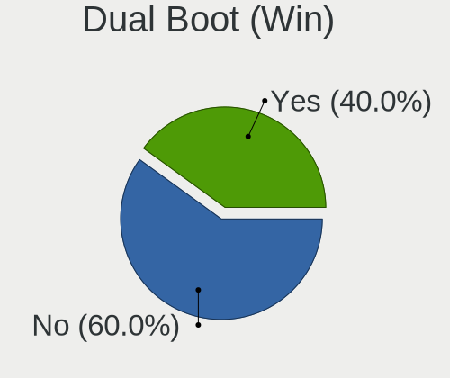
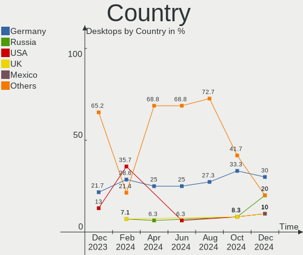
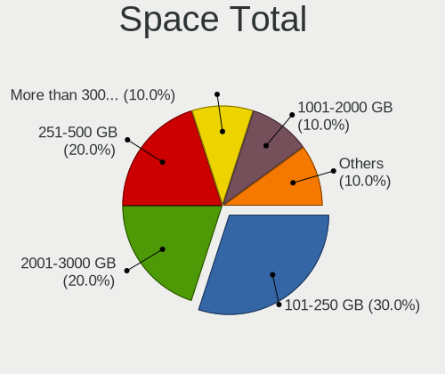
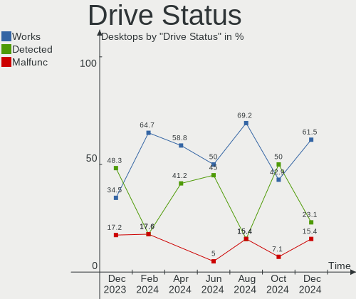
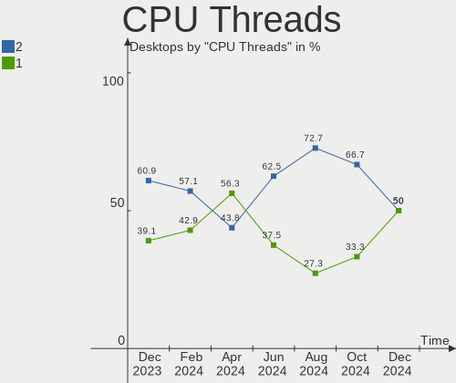
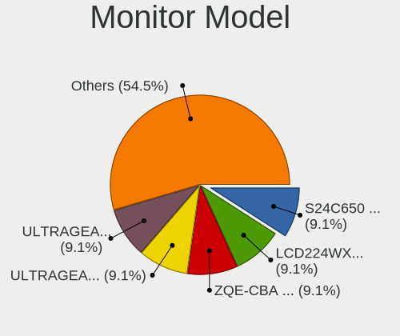
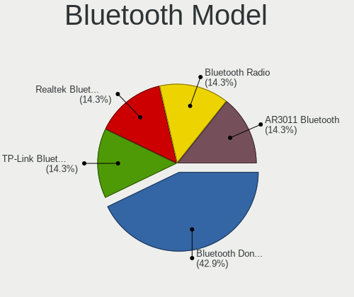
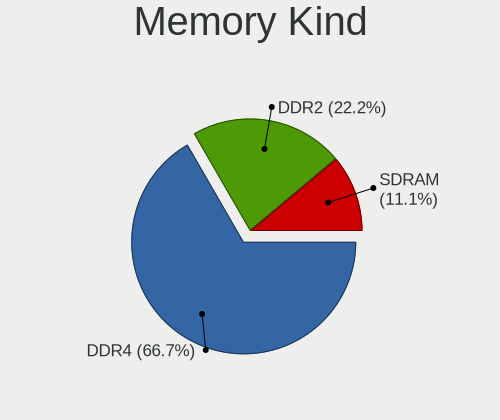

LMDE - Hardware Trends (Desktops)
---------------------------------

A project to identify most popular hardware characteristics and track their change
over time based on data collected by Linux users at https://Linux-Hardware.org.

Anyone can contribute to this report by the [hw-probe](https://github.com/linuxhw/hw-probe) tool:

    sudo -E hw-probe -all -upload

This report is for one last month. Overall report since the beginning of time: [TestDays](https://github.com/linuxhw/TestDays)

Period: Apr, 2023.

Contents
--------

* [ System ](#system)
  - [ OS                       ](#os)
  - [ OS Family                ](#os-family)
  - [ Kernel                   ](#kernel)
  - [ Kernel Family            ](#kernel-family)
  - [ Kernel Major Ver.        ](#kernel-major-ver)
  - [ Arch                     ](#arch)
  - [ DE                       ](#de)
  - [ Display Server           ](#display-server)
  - [ Display Manager          ](#display-manager)
  - [ OS Lang                  ](#os-lang)
  - [ Boot Mode                ](#boot-mode)
  - [ Filesystem               ](#filesystem)
  - [ Part. scheme             ](#part-scheme)
  - [ Dual Boot with Linux/BSD ](#dual-boot-with-linuxbsd)
  - [ Dual Boot (Win)          ](#dual-boot-win)

* [ Board ](#board)
  - [ Vendor                   ](#vendor)
  - [ Model                    ](#model)
  - [ Model Family             ](#model-family)
  - [ MFG Year                 ](#mfg-year)
  - [ Form Factor              ](#form-factor)
  - [ Secure Boot              ](#secure-boot)
  - [ Coreboot                 ](#coreboot)
  - [ RAM Size                 ](#ram-size)
  - [ RAM Used                 ](#ram-used)
  - [ Total Drives             ](#total-drives)
  - [ Has CD-ROM               ](#has-cd-rom)
  - [ Has Ethernet             ](#has-ethernet)
  - [ Has WiFi                 ](#has-wifi)
  - [ Has Bluetooth            ](#has-bluetooth)

* [ Location ](#location)
  - [ Country                  ](#country)
  - [ City                     ](#city)

* [ Drives ](#drives)
  - [ Drive Vendor             ](#drive-vendor)
  - [ Drive Model              ](#drive-model)
  - [ HDD Vendor               ](#hdd-vendor)
  - [ SSD Vendor               ](#ssd-vendor)
  - [ Drive Kind               ](#drive-kind)
  - [ Drive Connector          ](#drive-connector)
  - [ Drive Size               ](#drive-size)
  - [ Space Total              ](#space-total)
  - [ Space Used               ](#space-used)
  - [ Malfunc. Drives          ](#malfunc-drives)
  - [ Malfunc. Drive Vendor    ](#malfunc-drive-vendor)
  - [ Malfunc. HDD Vendor      ](#malfunc-hdd-vendor)
  - [ Malfunc. Drive Kind      ](#malfunc-drive-kind)
  - [ Failed Drives            ](#failed-drives)
  - [ Failed Drive Vendor      ](#failed-drive-vendor)
  - [ Drive Status             ](#drive-status)

* [ Storage controller ](#storage-controller)
  - [ Storage Vendor           ](#storage-vendor)
  - [ Storage Model            ](#storage-model)
  - [ Storage Kind             ](#storage-kind)

* [ Processor ](#processor)
  - [ CPU Vendor               ](#cpu-vendor)
  - [ CPU Model                ](#cpu-model)
  - [ CPU Model Family         ](#cpu-model-family)
  - [ CPU Cores                ](#cpu-cores)
  - [ CPU Sockets              ](#cpu-sockets)
  - [ CPU Threads              ](#cpu-threads)
  - [ CPU Op-Modes             ](#cpu-op-modes)
  - [ CPU Microcode            ](#cpu-microcode)
  - [ CPU Microarch            ](#cpu-microarch)

* [ Graphics ](#graphics)
  - [ GPU Vendor               ](#gpu-vendor)
  - [ GPU Model                ](#gpu-model)
  - [ GPU Combo                ](#gpu-combo)
  - [ GPU Driver               ](#gpu-driver)
  - [ GPU Memory               ](#gpu-memory)

* [ Monitor ](#monitor)
  - [ Monitor Vendor           ](#monitor-vendor)
  - [ Monitor Model            ](#monitor-model)
  - [ Monitor Resolution       ](#monitor-resolution)
  - [ Monitor Diagonal         ](#monitor-diagonal)
  - [ Monitor Width            ](#monitor-width)
  - [ Aspect Ratio             ](#aspect-ratio)
  - [ Monitor Area             ](#monitor-area)
  - [ Pixel Density            ](#pixel-density)
  - [ Multiple Monitors        ](#multiple-monitors)

* [ Network ](#network)
  - [ Net Controller Vendor    ](#net-controller-vendor)
  - [ Net Controller Model     ](#net-controller-model)
  - [ Wireless Vendor          ](#wireless-vendor)
  - [ Wireless Model           ](#wireless-model)
  - [ Ethernet Vendor          ](#ethernet-vendor)
  - [ Ethernet Model           ](#ethernet-model)
  - [ Net Controller Kind      ](#net-controller-kind)
  - [ Used Controller          ](#used-controller)
  - [ NICs                     ](#nics)
  - [ IPv6                     ](#ipv6)

* [ Bluetooth ](#bluetooth)
  - [ Bluetooth Vendor         ](#bluetooth-vendor)
  - [ Bluetooth Model          ](#bluetooth-model)

* [ Sound ](#sound)
  - [ Sound Vendor             ](#sound-vendor)
  - [ Sound Model              ](#sound-model)

* [ Memory ](#memory)
  - [ Memory Vendor            ](#memory-vendor)
  - [ Memory Model             ](#memory-model)
  - [ Memory Kind              ](#memory-kind)
  - [ Memory Form Factor       ](#memory-form-factor)
  - [ Memory Size              ](#memory-size)
  - [ Memory Speed             ](#memory-speed)

* [ Printers & scanners ](#printers--scanners)
  - [ Printer Vendor           ](#printer-vendor)
  - [ Printer Model            ](#printer-model)
  - [ Scanner Vendor           ](#scanner-vendor)
  - [ Scanner Model            ](#scanner-model)

* [ Camera ](#camera)
  - [ Camera Vendor            ](#camera-vendor)
  - [ Camera Model             ](#camera-model)

* [ Security ](#security)
  - [ Fingerprint Vendor       ](#fingerprint-vendor)
  - [ Fingerprint Model        ](#fingerprint-model)
  - [ Chipcard Vendor          ](#chipcard-vendor)
  - [ Chipcard Model           ](#chipcard-model)

* [ Unsupported ](#unsupported)
  - [ Unsupported Devices      ](#unsupported-devices)
  - [ Unsupported Device Types ](#unsupported-device-types)

System
------

OS
--

Installed operating systems

| Name   | Desktops | Percent |
|--------|----------|---------|
| LMDE 5 | 7        | 100%    |

OS Family
---------

OS without a version

| Name | Desktops | Percent |
|------|----------|---------|
| LMDE | 7        | 100%    |

Kernel
------

Version of the Linux kernel

| Version               | Desktops | Percent |
|-----------------------|----------|---------|
| 5.10.0-21-amd64       | 5        | 71.43%  |
| 6.1.0-0.deb11.5-amd64 | 1        | 14.29%  |
| 5.10.0-22-amd64       | 1        | 14.29%  |

Kernel Family
-------------

Linux kernel without a distro release

| Version | Desktops | Percent |
|---------|----------|---------|
| 5.10.0  | 6        | 85.71%  |
| 6.1.0   | 1        | 14.29%  |

Kernel Major Ver.
-----------------

Linux kernel major version

| Version | Desktops | Percent |
|---------|----------|---------|
| 5.10    | 6        | 85.71%  |
| 6.1     | 1        | 14.29%  |

Arch
----

OS architecture (x86_64, i586, etc.)

| Name   | Desktops | Percent |
|--------|----------|---------|
| x86_64 | 7        | 100%    |

DE
--

Desktop Environment

| Name       | Desktops | Percent |
|------------|----------|---------|
| X-Cinnamon | 4        | 57.14%  |
| Cinnamon   | 3        | 42.86%  |

Display Server
--------------

X11 or Wayland

| Name | Desktops | Percent |
|------|----------|---------|
| X11  | 7        | 100%    |

Display Manager
---------------

SDDM, LightDM, etc.

| Name    | Desktops | Percent |
|---------|----------|---------|
| Unknown | 4        | 57.14%  |
| LightDM | 3        | 42.86%  |

OS Lang
-------

Language

| Lang  | Desktops | Percent |
|-------|----------|---------|
| en_US | 4        | 57.14%  |
| de_DE | 2        | 28.57%  |
| en_GB | 1        | 14.29%  |

Boot Mode
---------

EFI or BIOS

| Mode | Desktops | Percent |
|------|----------|---------|
| EFI  | 5        | 71.43%  |
| BIOS | 2        | 28.57%  |

Filesystem
----------

Type of filesystem

| Type  | Desktops | Percent |
|-------|----------|---------|
| Ext4  | 6        | 85.71%  |
| Btrfs | 1        | 14.29%  |

Part. scheme
------------

Scheme of partitioning

| Type    | Desktops | Percent |
|---------|----------|---------|
| Unknown | 4        | 57.14%  |
| GPT     | 3        | 42.86%  |

Dual Boot with Linux/BSD
------------------------

Hosting more than one Linux/BSD

| Dual boot | Desktops | Percent |
|-----------|----------|---------|
| No        | 6        | 85.71%  |
| Yes       | 1        | 14.29%  |

Dual Boot (Win)
---------------

Hosting Linux and Windows

| Dual boot | Desktops | Percent |
|-----------|----------|---------|
| No        | 7        | 100%    |

Board
-----

Vendor
------

Motherboard manufacturer

| Name                | Desktops | Percent |
|---------------------|----------|---------|
| Gigabyte Technology | 2        | 28.57%  |
| ASUSTek Computer    | 2        | 28.57%  |
| Medion              | 1        | 14.29%  |
| Intel               | 1        | 14.29%  |
| ASRock              | 1        | 14.29%  |

Model
-----

Motherboard model

| Name                         | Desktops | Percent |
|------------------------------|----------|---------|
| Medion S23003                | 1        | 14.29%  |
| Intel SHARKBAY               | 1        | 14.29%  |
| Gigabyte Q87M-D2H            | 1        | 14.29%  |
| Gigabyte A520M DS3H          | 1        | 14.29%  |
| ASUS ROG STRIX B450-F GAMING | 1        | 14.29%  |
| ASUS P7Q57-M DO              | 1        | 14.29%  |
| ASRock B450M Pro4            | 1        | 14.29%  |

Model Family
------------

Motherboard model prefix

| Name              | Desktops | Percent |
|-------------------|----------|---------|
| Medion S23003     | 1        | 14.29%  |
| Intel SHARKBAY    | 1        | 14.29%  |
| Gigabyte Q87M-D2H | 1        | 14.29%  |
| Gigabyte A520M    | 1        | 14.29%  |
| ASUS ROG          | 1        | 14.29%  |
| ASUS P7Q57-M      | 1        | 14.29%  |
| ASRock B450M      | 1        | 14.29%  |

MFG Year
--------

Motherboard manufacture year

| Year | Desktops | Percent |
|------|----------|---------|
| 2018 | 3        | 42.86%  |
| 2021 | 1        | 14.29%  |
| 2020 | 1        | 14.29%  |
| 2015 | 1        | 14.29%  |
| 2010 | 1        | 14.29%  |

Form Factor
-----------

Physical design of the computer

| Name    | Desktops | Percent |
|---------|----------|---------|
| Desktop | 7        | 100%    |

Secure Boot
-----------

Enabled or disabled

| State    | Desktops | Percent |
|----------|----------|---------|
| Disabled | 6        | 85.71%  |
| Enabled  | 1        | 14.29%  |

Coreboot
--------

Have coreboot on board

| Used | Desktops | Percent |
|------|----------|---------|
| No   | 7        | 100%    |

RAM Size
--------

Total RAM memory

| Size in GB | Desktops | Percent |
|------------|----------|---------|
| 3.01-4.0   | 3        | 42.86%  |
| 32.01-64.0 | 2        | 28.57%  |
| 16.01-24.0 | 2        | 28.57%  |

RAM Used
--------

Used RAM memory

| Used GB   | Desktops | Percent |
|-----------|----------|---------|
| 1.01-2.0  | 3        | 42.86%  |
| 8.01-16.0 | 2        | 28.57%  |
| 3.01-4.0  | 1        | 14.29%  |
| 2.01-3.0  | 1        | 14.29%  |

Total Drives
------------

Number of drives on board

| Drives | Desktops | Percent |
|--------|----------|---------|
| 1      | 5        | 71.43%  |
| 4      | 2        | 28.57%  |

Has CD-ROM
----------

Has CD-ROM on board

| Presented | Desktops | Percent |
|-----------|----------|---------|
| No        | 7        | 100%    |

Has Ethernet
------------

Has Ethernet on board

| Presented | Desktops | Percent |
|-----------|----------|---------|
| Yes       | 7        | 100%    |

Has WiFi
--------

Has WiFi module

| Presented | Desktops | Percent |
|-----------|----------|---------|
| Yes       | 4        | 57.14%  |
| No        | 3        | 42.86%  |

Has Bluetooth
-------------

Has Bluetooth module

| Presented | Desktops | Percent |
|-----------|----------|---------|
| Yes       | 4        | 57.14%  |
| No        | 3        | 42.86%  |

Location
--------

Country
-------

Geographic location (country)

| Country | Desktops | Percent |
|---------|----------|---------|
| Germany | 2        | 28.57%  |
| USA     | 1        | 14.29%  |
| UK      | 1        | 14.29%  |
| Russia  | 1        | 14.29%  |
| Canada  | 1        | 14.29%  |
| Bolivia | 1        | 14.29%  |

City
----

Geographic location (city)

| City                | Desktops | Percent |
|---------------------|----------|---------|
| Gruenenplan         | 2        | 28.57%  |
| Toronto             | 1        | 14.29%  |
| Konakovo            | 1        | 14.29%  |
| Fenton              | 1        | 14.29%  |
| Cochabamba          | 1        | 14.29%  |
| City of Westminster | 1        | 14.29%  |

Drives
------

Drive Vendor
------------

Hard drive vendors

| Vendor              | Desktops | Drives | Percent |
|---------------------|----------|--------|---------|
| Samsung Electronics | 4        | 5      | 33.33%  |
| Seagate             | 2        | 2      | 16.67%  |
| Kingston            | 2        | 2      | 16.67%  |
| WDC                 | 1        | 1      | 8.33%   |
| Phison              | 1        | 1      | 8.33%   |
| OCZ                 | 1        | 1      | 8.33%   |
| Crucial             | 1        | 1      | 8.33%   |

Drive Model
-----------

Hard drive models

| Model                                             | Desktops | Percent |
|---------------------------------------------------|----------|---------|
| WDC WD60EFAX-68SHWN0 6TB                          | 1        | 7.69%   |
| Seagate ST8000DM004-2CX188 8TB                    | 1        | 7.69%   |
| Seagate ST4000DM000-1F2168 4TB                    | 1        | 7.69%   |
| Samsung SSD 970 EVO 500GB                         | 1        | 7.69%   |
| Samsung SSD 870 EVO 2TB                           | 1        | 7.69%   |
| Samsung SSD 860 EVO 250GB                         | 1        | 7.69%   |
| Samsung NVMe SSD Controller SM981/PM981/PM983 1TB | 1        | 7.69%   |
| Samsung HD204UI 2TB                               | 1        | 7.69%   |
| Phison S11-128G-PHISON-SSD-B4 128GB               | 1        | 7.69%   |
| OCZ AGILITY3 240GB SSD                            | 1        | 7.69%   |
| Kingston SA400S37480G 480GB SSD                   | 1        | 7.69%   |
| Kingston SA400S37120G 120GB SSD                   | 1        | 7.69%   |
| Crucial CT256MX100SSD1 256GB                      | 1        | 7.69%   |

HDD Vendor
----------

Hard disk drive vendors

| Vendor              | Desktops | Drives | Percent |
|---------------------|----------|--------|---------|
| Seagate             | 2        | 2      | 50%     |
| WDC                 | 1        | 1      | 25%     |
| Samsung Electronics | 1        | 1      | 25%     |

SSD Vendor
----------

Solid state drive vendors

| Vendor              | Desktops | Drives | Percent |
|---------------------|----------|--------|---------|
| Samsung Electronics | 2        | 2      | 28.57%  |
| Kingston            | 2        | 2      | 28.57%  |
| Phison              | 1        | 1      | 14.29%  |
| OCZ                 | 1        | 1      | 14.29%  |
| Crucial             | 1        | 1      | 14.29%  |

Drive Kind
----------

HDD or SSD

| Kind | Desktops | Drives | Percent |
|------|----------|--------|---------|
| SSD  | 6        | 7      | 60%     |
| NVMe | 2        | 2      | 20%     |
| HDD  | 2        | 4      | 20%     |

Drive Connector
---------------

SATA, SAS, NVMe, etc.

| Type | Desktops | Drives | Percent |
|------|----------|--------|---------|
| SATA | 6        | 10     | 66.67%  |
| NVMe | 2        | 2      | 22.22%  |
| SAS  | 1        | 1      | 11.11%  |

Drive Size
----------

Size of hard drive

| Size in TB | Desktops | Drives | Percent |
|------------|----------|--------|---------|
| 0.01-0.5   | 6        | 6      | 60%     |
| 1.01-2.0   | 2        | 2      | 20%     |
| 3.01-4.0   | 1        | 1      | 10%     |
| 4.01-10.0  | 1        | 2      | 10%     |

Space Total
-----------

Amount of disk space available on the file system

| Size in GB     | Desktops | Percent |
|----------------|----------|---------|
| 101-250        | 4        | 57.14%  |
| 251-500        | 2        | 28.57%  |
| More than 3000 | 1        | 14.29%  |

Space Used
----------

Amount of used disk space

| Used GB | Desktops | Percent |
|---------|----------|---------|
| 1-20    | 4        | 57.14%  |
| 251-500 | 2        | 28.57%  |
| 51-100  | 1        | 14.29%  |

Malfunc. Drives
---------------

Drive models with a malfunction

Zero info for selected period =(

Malfunc. Drive Vendor
---------------------

Vendors of faulty drives

Zero info for selected period =(

Malfunc. HDD Vendor
-------------------

Vendors of faulty HDD drives

Zero info for selected period =(

Malfunc. Drive Kind
-------------------

Kinds of faulty drives

Zero info for selected period =(

Failed Drives
-------------

Failed drive models

Zero info for selected period =(

Failed Drive Vendor
-------------------

Failed drive vendors

Zero info for selected period =(

Drive Status
------------

Number of failed and malfunc. drives

| Status   | Desktops | Drives | Percent |
|----------|----------|--------|---------|
| Detected | 4        | 7      | 57.14%  |
| Works    | 3        | 6      | 42.86%  |

Storage controller
------------------

Storage Vendor
--------------

Storage controller vendors

| Vendor              | Desktops | Percent |
|---------------------|----------|---------|
| Intel               | 4        | 40%     |
| AMD                 | 3        | 30%     |
| Samsung Electronics | 2        | 20%     |
| JMicron Technology  | 1        | 10%     |

Storage Model
-------------

Storage controller models

| Model                                                                          | Desktops | Percent |
|--------------------------------------------------------------------------------|----------|---------|
| Samsung NVMe SSD Controller SM981/PM981/PM983                                  | 2        | 16.67%  |
| Intel 8 Series/C220 Series Chipset Family 6-port SATA Controller 1 [AHCI mode] | 2        | 16.67%  |
| AMD 400 Series Chipset SATA Controller                                         | 2        | 16.67%  |
| JMicron JMB368 IDE controller                                                  | 1        | 8.33%   |
| Intel Celeron/Pentium Silver Processor SATA Controller                         | 1        | 8.33%   |
| Intel 5 Series/3400 Series Chipset PT IDER Controller                          | 1        | 8.33%   |
| Intel 5 Series/3400 Series Chipset 6 port SATA AHCI Controller                 | 1        | 8.33%   |
| AMD FCH SATA Controller [AHCI mode]                                            | 1        | 8.33%   |
| AMD 500 Series Chipset SATA Controller                                         | 1        | 8.33%   |

Storage Kind
------------

Kind of storage controller (IDE, SATA, NVMe, SAS, ...)

| Kind | Desktops | Percent |
|------|----------|---------|
| SATA | 7        | 70%     |
| NVMe | 2        | 20%     |
| IDE  | 1        | 10%     |

Processor
---------

CPU Vendor
----------

Processor vendors

| Vendor | Desktops | Percent |
|--------|----------|---------|
| Intel  | 4        | 57.14%  |
| AMD    | 3        | 42.86%  |

CPU Model
---------

Processor models

| Model                                  | Desktops | Percent |
|----------------------------------------|----------|---------|
| Intel Core i7-4790K CPU @ 4.00GHz      | 1        | 14.29%  |
| Intel Core i5-4590S CPU @ 3.00GHz      | 1        | 14.29%  |
| Intel Core i3 CPU 540 @ 3.07GHz        | 1        | 14.29%  |
| Intel Celeron J4125 CPU @ 2.00GHz      | 1        | 14.29%  |
| AMD Ryzen 7 5700G with Radeon Graphics | 1        | 14.29%  |
| AMD Ryzen 7 3700X 8-Core Processor     | 1        | 14.29%  |
| AMD Ryzen 5 2600 Six-Core Processor    | 1        | 14.29%  |

CPU Model Family
----------------

Processor model prefix

| Model         | Desktops | Percent |
|---------------|----------|---------|
| AMD Ryzen 7   | 2        | 28.57%  |
| Intel Core i7 | 1        | 14.29%  |
| Intel Core i5 | 1        | 14.29%  |
| Intel Core i3 | 1        | 14.29%  |
| Intel Celeron | 1        | 14.29%  |
| AMD Ryzen 5   | 1        | 14.29%  |

CPU Cores
---------

Number of processor cores

| Number | Desktops | Percent |
|--------|----------|---------|
| 4      | 3        | 42.86%  |
| 8      | 2        | 28.57%  |
| 6      | 1        | 14.29%  |
| 2      | 1        | 14.29%  |

CPU Sockets
-----------

Number of sockets

| Number | Desktops | Percent |
|--------|----------|---------|
| 1      | 7        | 100%    |

CPU Threads
-----------

Threads per core (Hyper-Threading)

| Number | Desktops | Percent |
|--------|----------|---------|
| 2      | 5        | 71.43%  |
| 1      | 2        | 28.57%  |

CPU Op-Modes
------------

CPU Operation Modes (32-bit, 64-bit)

| Op mode        | Desktops | Percent |
|----------------|----------|---------|
| 32-bit, 64-bit | 7        | 100%    |

CPU Microcode
-------------

Microcode number

| Number     | Desktops | Percent |
|------------|----------|---------|
| 0x306c3    | 2        | 28.57%  |
| 0x706a8    | 1        | 14.29%  |
| 0x20655    | 1        | 14.29%  |
| 0x0a50000d | 1        | 14.29%  |
| 0x08701021 | 1        | 14.29%  |
| 0x0800820d | 1        | 14.29%  |

CPU Microarch
-------------

Microarchitecture

| Name          | Desktops | Percent |
|---------------|----------|---------|
| Haswell       | 2        | 28.57%  |
| Zen+          | 1        | 14.29%  |
| Zen 3         | 1        | 14.29%  |
| Zen 2         | 1        | 14.29%  |
| Westmere      | 1        | 14.29%  |
| Goldmont plus | 1        | 14.29%  |

Graphics
--------

GPU Vendor
----------

Vendors of graphics cards

| Vendor | Desktops | Percent |
|--------|----------|---------|
| Nvidia | 4        | 50%     |
| Intel  | 2        | 25%     |
| AMD    | 2        | 25%     |

GPU Model
---------

Graphics card models

| Model                                                                       | Desktops | Percent |
|-----------------------------------------------------------------------------|----------|---------|
| Nvidia GP107 [GeForce GTX 1050]                                             | 1        | 12.5%   |
| Nvidia GK208B [GeForce GT 730]                                              | 1        | 12.5%   |
| Nvidia GK208B [GeForce GT 710]                                              | 1        | 12.5%   |
| Nvidia GK208 [GeForce GT 635]                                               | 1        | 12.5%   |
| Intel Xeon E3-1200 v3/4th Gen Core Processor Integrated Graphics Controller | 1        | 12.5%   |
| Intel GeminiLake [UHD Graphics 600]                                         | 1        | 12.5%   |
| AMD Ellesmere [Radeon RX 470/480/570/570X/580/580X/590]                     | 1        | 12.5%   |
| AMD Cezanne [Radeon Vega Series / Radeon Vega Mobile Series]                | 1        | 12.5%   |

GPU Combo
---------

Combinations of graphics cards

| Name       | Desktops | Percent |
|------------|----------|---------|
| 1 x Nvidia | 3        | 42.86%  |
| 1 x Intel  | 2        | 28.57%  |
| 1 x AMD    | 2        | 28.57%  |

GPU Driver
----------

Free vs proprietary

| Driver      | Desktops | Percent |
|-------------|----------|---------|
| Free        | 5        | 71.43%  |
| Proprietary | 2        | 28.57%  |

GPU Memory
----------

Total video memory

| Size in GB | Desktops | Percent |
|------------|----------|---------|
| 0.51-1.0   | 2        | 28.57%  |
| Unknown    | 2        | 28.57%  |
| 7.01-8.0   | 1        | 14.29%  |
| 1.01-2.0   | 1        | 14.29%  |
| 0.01-0.5   | 1        | 14.29%  |

Monitor
-------

Monitor Vendor
--------------

Monitor vendors

| Vendor              | Desktops | Percent |
|---------------------|----------|---------|
| Samsung Electronics | 3        | 37.5%   |
| NEC Computers       | 1        | 12.5%   |
| MSI                 | 1        | 12.5%   |
| Idek Iiyama         | 1        | 12.5%   |
| HUAWEI              | 1        | 12.5%   |
| Goldstar            | 1        | 12.5%   |

Monitor Model
-------------

Monitor models

| Model                                                              | Desktops | Percent |
|--------------------------------------------------------------------|----------|---------|
| Samsung Electronics SMBX1950N SAM0716 1366x768 410x230mm 18.5-inch | 1        | 11.11%  |
| Samsung Electronics S24D590 SAM0B47 1920x1080 521x293mm 23.5-inch  | 1        | 11.11%  |
| Samsung Electronics S22B300 SAM08A9 1600x900 443x249mm 20.0-inch   | 1        | 11.11%  |
| Samsung Electronics LF22T35 SAM707B 1920x1080 477x268mm 21.5-inch  | 1        | 11.11%  |
| NEC Computers LCD Monitor LCD1700NX 1280x1024                      | 1        | 11.11%  |
| MSI G242 MSI4BA4 1920x1080 527x296mm 23.8-inch                     | 1        | 11.11%  |
| Idek Iiyama LCD Monitor PL2590 1920x1080                           | 1        | 11.11%  |
| HUAWEI ZQE-CBA HWV6A25 3440x1440 797x334mm 34.0-inch               | 1        | 11.11%  |
| Goldstar TV SSCR2 GSMC0C8 3840x2160                                | 1        | 11.11%  |

Monitor Resolution
------------------

Monitor screen resolution

| Resolution       | Desktops | Percent |
|------------------|----------|---------|
| 1920x1080 (FHD)  | 3        | 37.5%   |
| 3840x2160 (4K)   | 1        | 12.5%   |
| 3440x1440        | 1        | 12.5%   |
| 1600x900 (HD+)   | 1        | 12.5%   |
| 1366x768 (WXGA)  | 1        | 12.5%   |
| 1280x1024 (SXGA) | 1        | 12.5%   |

Monitor Diagonal
----------------

Diagonal size in inches

| Inches  | Desktops | Percent |
|---------|----------|---------|
| Unknown | 2        | 25%     |
| 72      | 1        | 12.5%   |
| 34      | 1        | 12.5%   |
| 23      | 1        | 12.5%   |
| 21      | 1        | 12.5%   |
| 20      | 1        | 12.5%   |
| 18      | 1        | 12.5%   |

Monitor Width
-------------

Physical width

| Width in mm | Desktops | Percent |
|-------------|----------|---------|
| 401-500     | 2        | 28.57%  |
| Unknown     | 2        | 28.57%  |
| 701-800     | 1        | 14.29%  |
| 501-600     | 1        | 14.29%  |
| 1501-2000   | 1        | 14.29%  |

Aspect Ratio
------------

Proportional relationship between the width and the height

| Ratio   | Desktops | Percent |
|---------|----------|---------|
| 16/9    | 4        | 57.14%  |
| Unknown | 2        | 28.57%  |
| 21/9    | 1        | 14.29%  |

Monitor Area
------------

Area in inch²

| Area in inch² | Desktops | Percent |
|----------------|----------|---------|
| 201-250        | 2        | 25%     |
| Unknown        | 2        | 25%     |
| More than 1000 | 1        | 12.5%   |
| 351-500        | 1        | 12.5%   |
| 151-200        | 1        | 12.5%   |
| 141-150        | 1        | 12.5%   |

Pixel Density
-------------

Pixels per inch

| Density | Desktops | Percent |
|---------|----------|---------|
| 51-100  | 4        | 50%     |
| 101-120 | 2        | 25%     |
| Unknown | 2        | 25%     |

Multiple Monitors
-----------------

Total monitors connected

| Total | Desktops | Percent |
|-------|----------|---------|
| 1     | 5        | 71.43%  |
| 2     | 2        | 28.57%  |

Network
-------

Net Controller Vendor
---------------------

Controller vendors

| Vendor                | Desktops | Percent |
|-----------------------|----------|---------|
| Intel                 | 5        | 55.56%  |
| Realtek Semiconductor | 3        | 33.33%  |
| TP-Link               | 1        | 11.11%  |

Net Controller Model
--------------------

Controller models

| Model                                                             | Desktops | Percent |
|-------------------------------------------------------------------|----------|---------|
| Realtek RTL8111/8168/8411 PCI Express Gigabit Ethernet Controller | 3        | 25%     |
| Intel I211 Gigabit Network Connection                             | 2        | 16.67%  |
| TP-Link RTL8812AU Archer T4U 802.11ac                             | 1        | 8.33%   |
| Realtek RTL88x2bu [AC1200 Techkey]                                | 1        | 8.33%   |
| Realtek 802.11ac NIC                                              | 1        | 8.33%   |
| Intel Wireless 8260                                               | 1        | 8.33%   |
| Intel Wireless 3165                                               | 1        | 8.33%   |
| Intel Ethernet Connection I217-LM                                 | 1        | 8.33%   |
| Intel 82578DM Gigabit Network Connection                          | 1        | 8.33%   |

Wireless Vendor
---------------

Wireless vendors

| Vendor                | Desktops | Percent |
|-----------------------|----------|---------|
| Intel                 | 2        | 50%     |
| TP-Link               | 1        | 25%     |
| Realtek Semiconductor | 1        | 25%     |

Wireless Model
--------------

Wireless models

| Model                                 | Desktops | Percent |
|---------------------------------------|----------|---------|
| TP-Link RTL8812AU Archer T4U 802.11ac | 1        | 20%     |
| Realtek RTL88x2bu [AC1200 Techkey]    | 1        | 20%     |
| Realtek 802.11ac NIC                  | 1        | 20%     |
| Intel Wireless 8260                   | 1        | 20%     |
| Intel Wireless 3165                   | 1        | 20%     |

Ethernet Vendor
---------------

Ethernet vendors

| Vendor                | Desktops | Percent |
|-----------------------|----------|---------|
| Intel                 | 4        | 57.14%  |
| Realtek Semiconductor | 3        | 42.86%  |

Ethernet Model
--------------

Ethernet models

| Model                                                             | Desktops | Percent |
|-------------------------------------------------------------------|----------|---------|
| Realtek RTL8111/8168/8411 PCI Express Gigabit Ethernet Controller | 3        | 42.86%  |
| Intel I211 Gigabit Network Connection                             | 2        | 28.57%  |
| Intel Ethernet Connection I217-LM                                 | 1        | 14.29%  |
| Intel 82578DM Gigabit Network Connection                          | 1        | 14.29%  |

Net Controller Kind
-------------------

Ethernet, WiFi or modem

| Kind     | Desktops | Percent |
|----------|----------|---------|
| Ethernet | 7        | 63.64%  |
| WiFi     | 4        | 36.36%  |

Used Controller
---------------

Currently used network controller

| Kind     | Desktops | Percent |
|----------|----------|---------|
| Ethernet | 6        | 75%     |
| WiFi     | 2        | 25%     |

NICs
----

Total network controllers on board

| Total | Desktops | Percent |
|-------|----------|---------|
| 2     | 4        | 57.14%  |
| 1     | 3        | 42.86%  |

IPv6
----

IPv6 vs IPv4

| Used | Desktops | Percent |
|------|----------|---------|
| No   | 6        | 85.71%  |
| Yes  | 1        | 14.29%  |

Bluetooth
---------

Bluetooth Vendor
----------------

Controller vendors

| Vendor                  | Desktops | Percent |
|-------------------------|----------|---------|
| Intel                   | 2        | 50%     |
| Cambridge Silicon Radio | 2        | 50%     |

Bluetooth Model
---------------

Controller models

| Model                                               | Desktops | Percent |
|-----------------------------------------------------|----------|---------|
| Intel Bluetooth wireless interface                  | 2        | 50%     |
| Cambridge Silicon Radio Bluetooth Dongle (HCI mode) | 2        | 50%     |

Sound
-----

Sound Vendor
------------

Sound card vendors

| Vendor              | Desktops | Percent |
|---------------------|----------|---------|
| Nvidia              | 4        | 36.36%  |
| Intel               | 3        | 27.27%  |
| AMD                 | 3        | 27.27%  |
| C-Media Electronics | 1        | 9.09%   |

Sound Model
-----------

Sound card models

| Model                                                               | Desktops | Percent |
|---------------------------------------------------------------------|----------|---------|
| Nvidia GK208 HDMI/DP Audio Controller                               | 3        | 21.43%  |
| Nvidia GP107GL High Definition Audio Controller                     | 1        | 7.14%   |
| Intel Xeon E3-1200 v3/4th Gen Core Processor HD Audio Controller    | 1        | 7.14%   |
| Intel Celeron/Pentium Silver Processor High Definition Audio        | 1        | 7.14%   |
| Intel 8 Series/C220 Series Chipset High Definition Audio Controller | 1        | 7.14%   |
| Intel 5 Series/3400 Series Chipset High Definition Audio            | 1        | 7.14%   |
| C-Media Electronics Blue Snowball                                   | 1        | 7.14%   |
| AMD Starship/Matisse HD Audio Controller                            | 1        | 7.14%   |
| AMD Renoir Radeon High Definition Audio Controller                  | 1        | 7.14%   |
| AMD Family 17h/19h HD Audio Controller                              | 1        | 7.14%   |
| AMD Family 17h (Models 00h-0fh) HD Audio Controller                 | 1        | 7.14%   |
| AMD Ellesmere HDMI Audio [Radeon RX 470/480 / 570/580/590]          | 1        | 7.14%   |

Memory
------

Memory Vendor
-------------

Memory module vendors

| Vendor         | Desktops | Percent |
|----------------|----------|---------|
| Unknown (ABCD) | 1        | 33.33%  |
| KLEVV          | 1        | 33.33%  |
| Kingston       | 1        | 33.33%  |

Memory Model
------------

Memory module models

| Model                                                          | Desktops | Percent |
|----------------------------------------------------------------|----------|---------|
| Unknown (ABCD) RAM 123456789012345678 2GB DIMM LPDDR4 2400MT/s | 1        | 25%     |
| KLEVV RAM KD48GU880-36A180C 8GB DIMM DDR4 3600MT/s             | 1        | 25%     |
| Kingston RAM 99U5402-037.A00G 2GB DIMM DDR3 1333MT/s           | 1        | 25%     |
| Kingston RAM 9905471-001.A01LF 2GB DIMM DDR3 1600MT/s          | 1        | 25%     |

Memory Kind
-----------

Memory module kinds

| Kind   | Desktops | Percent |
|--------|----------|---------|
| LPDDR4 | 1        | 33.33%  |
| DDR4   | 1        | 33.33%  |
| DDR3   | 1        | 33.33%  |

Memory Form Factor
------------------

Physical design of the memory module

| Name | Desktops | Percent |
|------|----------|---------|
| DIMM | 3        | 100%    |

Memory Size
-----------

Memory module size

| Size  | Desktops | Percent |
|-------|----------|---------|
| 16384 | 1        | 33.33%  |
| 8192  | 1        | 33.33%  |
| 2048  | 1        | 33.33%  |

Memory Speed
------------

Memory module speed

| Speed | Desktops | Percent |
|-------|----------|---------|
| 3600  | 1        | 25%     |
| 2400  | 1        | 25%     |
| 1600  | 1        | 25%     |
| 1333  | 1        | 25%     |

Printers & scanners
-------------------

Printer Vendor
--------------

Printer device vendors

Zero info for selected period =(

Printer Model
-------------

Printer device models

Zero info for selected period =(

Scanner Vendor
--------------

Scanner device vendors

Zero info for selected period =(

Scanner Model
-------------

Scanner device models

Zero info for selected period =(

Camera
------

Camera Vendor
-------------

Camera device vendors

| Vendor   | Desktops | Percent |
|----------|----------|---------|
| Logitech | 1        | 100%    |

Camera Model
------------

Camera device models

| Model                | Desktops | Percent |
|----------------------|----------|---------|
| Logitech Webcam C270 | 1        | 100%    |

Security
--------

Fingerprint Vendor
------------------

Fingerprint sensor vendors

Zero info for selected period =(

Fingerprint Model
-----------------

Fingerprint sensor models

Zero info for selected period =(

Chipcard Vendor
---------------

Chipcard module vendors

Zero info for selected period =(

Chipcard Model
--------------

Chipcard module models

Zero info for selected period =(

Unsupported
-----------

Unsupported Devices
-------------------

Total unsupported devices on board

| Total | Desktops | Percent |
|-------|----------|---------|
| 0     | 6        | 85.71%  |
| 1     | 1        | 14.29%  |

Unsupported Device Types
------------------------

Types of unsupported devices

| Type          | Desktops | Percent |
|---------------|----------|---------|
| Net/wireless  | 1        | 50%     |
| Graphics card | 1        | 50%     |

