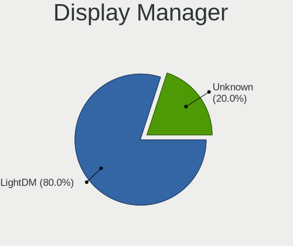
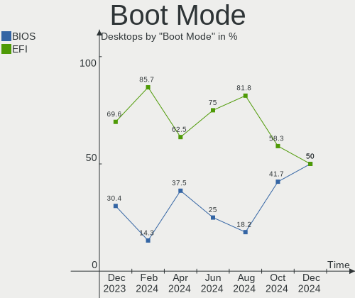
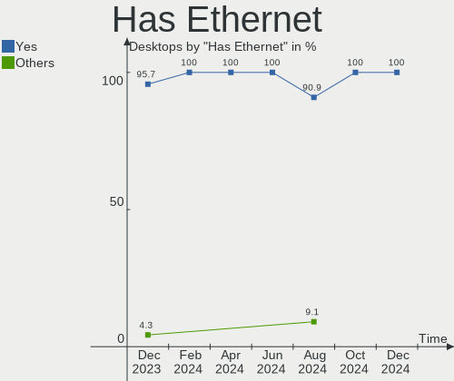
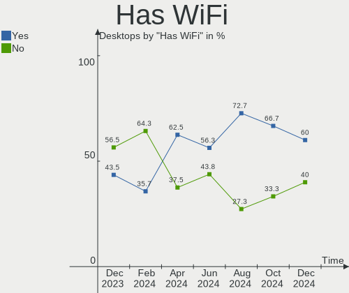
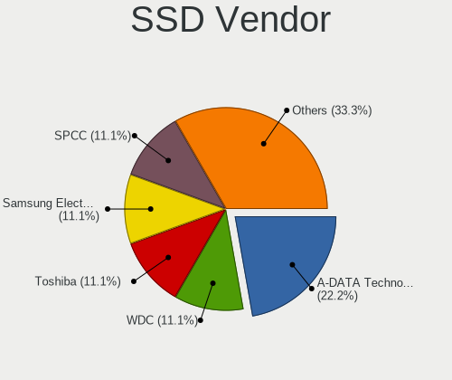
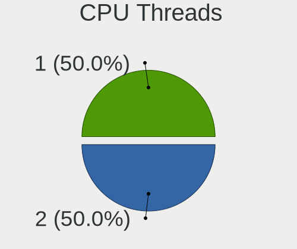
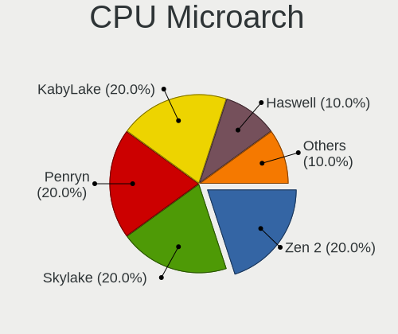
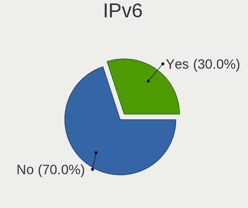
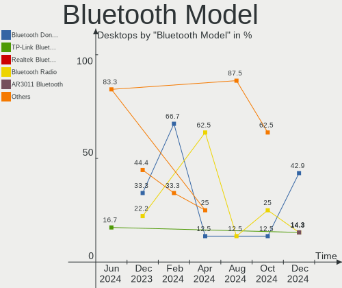
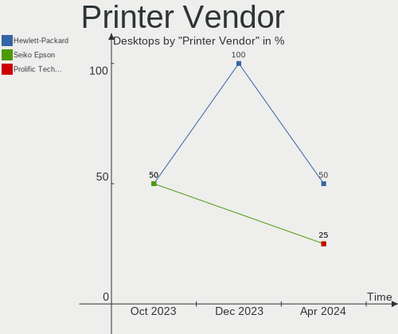

LMDE - Hardware Trends (Desktops)
---------------------------------

A project to identify most popular hardware characteristics and track their change
over time based on data collected by Linux users at https://Linux-Hardware.org.

Anyone can contribute to this report by the [hw-probe](https://github.com/linuxhw/hw-probe) tool:

    sudo -E hw-probe -all -upload

This report is for one last month. Overall report since the beginning of time: [TestDays](https://github.com/linuxhw/TestDays)

Period: Jan, 2024.

Contents
--------

* [ System ](#system)
  - [ OS                       ](#os)
  - [ OS Family                ](#os-family)
  - [ Kernel                   ](#kernel)
  - [ Kernel Family            ](#kernel-family)
  - [ Kernel Major Ver.        ](#kernel-major-ver)
  - [ Arch                     ](#arch)
  - [ DE                       ](#de)
  - [ Display Server           ](#display-server)
  - [ Display Manager          ](#display-manager)
  - [ OS Lang                  ](#os-lang)
  - [ Boot Mode                ](#boot-mode)
  - [ Filesystem               ](#filesystem)
  - [ Part. scheme             ](#part-scheme)
  - [ Dual Boot with Linux/BSD ](#dual-boot-with-linuxbsd)
  - [ Dual Boot (Win)          ](#dual-boot-win)

* [ Board ](#board)
  - [ Vendor                   ](#vendor)
  - [ Model                    ](#model)
  - [ Model Family             ](#model-family)
  - [ MFG Year                 ](#mfg-year)
  - [ Form Factor              ](#form-factor)
  - [ Secure Boot              ](#secure-boot)
  - [ Coreboot                 ](#coreboot)
  - [ RAM Size                 ](#ram-size)
  - [ RAM Used                 ](#ram-used)
  - [ Total Drives             ](#total-drives)
  - [ Has CD-ROM               ](#has-cd-rom)
  - [ Has Ethernet             ](#has-ethernet)
  - [ Has WiFi                 ](#has-wifi)
  - [ Has Bluetooth            ](#has-bluetooth)

* [ Location ](#location)
  - [ Country                  ](#country)
  - [ City                     ](#city)

* [ Drives ](#drives)
  - [ Drive Vendor             ](#drive-vendor)
  - [ Drive Model              ](#drive-model)
  - [ HDD Vendor               ](#hdd-vendor)
  - [ SSD Vendor               ](#ssd-vendor)
  - [ Drive Kind               ](#drive-kind)
  - [ Drive Connector          ](#drive-connector)
  - [ Drive Size               ](#drive-size)
  - [ Space Total              ](#space-total)
  - [ Space Used               ](#space-used)
  - [ Malfunc. Drives          ](#malfunc-drives)
  - [ Malfunc. Drive Vendor    ](#malfunc-drive-vendor)
  - [ Malfunc. HDD Vendor      ](#malfunc-hdd-vendor)
  - [ Malfunc. Drive Kind      ](#malfunc-drive-kind)
  - [ Failed Drives            ](#failed-drives)
  - [ Failed Drive Vendor      ](#failed-drive-vendor)
  - [ Drive Status             ](#drive-status)

* [ Storage controller ](#storage-controller)
  - [ Storage Vendor           ](#storage-vendor)
  - [ Storage Model            ](#storage-model)
  - [ Storage Kind             ](#storage-kind)

* [ Processor ](#processor)
  - [ CPU Vendor               ](#cpu-vendor)
  - [ CPU Model                ](#cpu-model)
  - [ CPU Model Family         ](#cpu-model-family)
  - [ CPU Cores                ](#cpu-cores)
  - [ CPU Sockets              ](#cpu-sockets)
  - [ CPU Threads              ](#cpu-threads)
  - [ CPU Op-Modes             ](#cpu-op-modes)
  - [ CPU Microcode            ](#cpu-microcode)
  - [ CPU Microarch            ](#cpu-microarch)

* [ Graphics ](#graphics)
  - [ GPU Vendor               ](#gpu-vendor)
  - [ GPU Model                ](#gpu-model)
  - [ GPU Combo                ](#gpu-combo)
  - [ GPU Driver               ](#gpu-driver)
  - [ GPU Memory               ](#gpu-memory)

* [ Monitor ](#monitor)
  - [ Monitor Vendor           ](#monitor-vendor)
  - [ Monitor Model            ](#monitor-model)
  - [ Monitor Resolution       ](#monitor-resolution)
  - [ Monitor Diagonal         ](#monitor-diagonal)
  - [ Monitor Width            ](#monitor-width)
  - [ Aspect Ratio             ](#aspect-ratio)
  - [ Monitor Area             ](#monitor-area)
  - [ Pixel Density            ](#pixel-density)
  - [ Multiple Monitors        ](#multiple-monitors)

* [ Network ](#network)
  - [ Net Controller Vendor    ](#net-controller-vendor)
  - [ Net Controller Model     ](#net-controller-model)
  - [ Wireless Vendor          ](#wireless-vendor)
  - [ Wireless Model           ](#wireless-model)
  - [ Ethernet Vendor          ](#ethernet-vendor)
  - [ Ethernet Model           ](#ethernet-model)
  - [ Net Controller Kind      ](#net-controller-kind)
  - [ Used Controller          ](#used-controller)
  - [ NICs                     ](#nics)
  - [ IPv6                     ](#ipv6)

* [ Bluetooth ](#bluetooth)
  - [ Bluetooth Vendor         ](#bluetooth-vendor)
  - [ Bluetooth Model          ](#bluetooth-model)

* [ Sound ](#sound)
  - [ Sound Vendor             ](#sound-vendor)
  - [ Sound Model              ](#sound-model)

* [ Memory ](#memory)
  - [ Memory Vendor            ](#memory-vendor)
  - [ Memory Model             ](#memory-model)
  - [ Memory Kind              ](#memory-kind)
  - [ Memory Form Factor       ](#memory-form-factor)
  - [ Memory Size              ](#memory-size)
  - [ Memory Speed             ](#memory-speed)

* [ Printers & scanners ](#printers--scanners)
  - [ Printer Vendor           ](#printer-vendor)
  - [ Printer Model            ](#printer-model)
  - [ Scanner Vendor           ](#scanner-vendor)
  - [ Scanner Model            ](#scanner-model)

* [ Camera ](#camera)
  - [ Camera Vendor            ](#camera-vendor)
  - [ Camera Model             ](#camera-model)

* [ Security ](#security)
  - [ Fingerprint Vendor       ](#fingerprint-vendor)
  - [ Fingerprint Model        ](#fingerprint-model)
  - [ Chipcard Vendor          ](#chipcard-vendor)
  - [ Chipcard Model           ](#chipcard-model)

* [ Unsupported ](#unsupported)
  - [ Unsupported Devices      ](#unsupported-devices)
  - [ Unsupported Device Types ](#unsupported-device-types)

System
------

OS
--

Installed operating systems

| Name   | Desktops | Percent |
|--------|----------|---------|
| LMDE 6 | 21       | 95.45%  |
| LMDE 5 | 1        | 4.55%   |

OS Family
---------

OS without a version

| Name | Desktops | Percent |
|------|----------|---------|
| LMDE | 22       | 100%    |

Kernel
------

Version of the Linux kernel

| Version              | Desktops | Percent |
|----------------------|----------|---------|
| 6.1.0-17-amd64       | 16       | 72.73%  |
| 6.1.0-16-amd64       | 2        | 9.09%   |
| 6.1.0-12-amd64       | 2        | 9.09%   |
| 6.6.11-x64v3-xanmod1 | 1        | 4.55%   |
| 5.10.0-21-amd64      | 1        | 4.55%   |

Kernel Family
-------------

Linux kernel without a distro release

| Version | Desktops | Percent |
|---------|----------|---------|
| 6.1.0   | 20       | 90.91%  |
| 6.6.11  | 1        | 4.55%   |
| 5.10.0  | 1        | 4.55%   |

Kernel Major Ver.
-----------------

Linux kernel major version

| Version | Desktops | Percent |
|---------|----------|---------|
| 6.1     | 20       | 90.91%  |
| 6.6     | 1        | 4.55%   |
| 5.10    | 1        | 4.55%   |

Arch
----

OS architecture (x86_64, i586, etc.)

| Name   | Desktops | Percent |
|--------|----------|---------|
| x86_64 | 22       | 100%    |

DE
--

Desktop Environment

| Name       | Desktops | Percent |
|------------|----------|---------|
| X-Cinnamon | 18       | 81.82%  |
| Cinnamon   | 2        | 9.09%   |
| XFCE       | 1        | 4.55%   |
| Unknown    | 1        | 4.55%   |

Display Server
--------------

X11 or Wayland

| Name | Desktops | Percent |
|------|----------|---------|
| X11  | 22       | 100%    |

Display Manager
---------------

SDDM, LightDM, etc.

| Name    | Desktops | Percent |
|---------|----------|---------|
| LightDM | 11       | 50%     |
| Unknown | 11       | 50%     |

OS Lang
-------

Language

| Lang    | Desktops | Percent |
|---------|----------|---------|
| en_US   | 9        | 40.91%  |
| pt_BR   | 2        | 9.09%   |
| pl_PL   | 2        | 9.09%   |
| de_DE   | 2        | 9.09%   |
| it_IT   | 1        | 4.55%   |
| hr_HR   | 1        | 4.55%   |
| fr_FR   | 1        | 4.55%   |
| en_GB   | 1        | 4.55%   |
| el_GR   | 1        | 4.55%   |
| cs_CZ   | 1        | 4.55%   |
| Unknown | 1        | 4.55%   |

Boot Mode
---------

EFI or BIOS

| Mode | Desktops | Percent |
|------|----------|---------|
| EFI  | 16       | 72.73%  |
| BIOS | 6        | 27.27%  |

Filesystem
----------

Type of filesystem

| Type    | Desktops | Percent |
|---------|----------|---------|
| Ext4    | 18       | 81.82%  |
| Btrfs   | 3        | 13.64%  |
| Overlay | 1        | 4.55%   |

Part. scheme
------------

Scheme of partitioning

| Type    | Desktops | Percent |
|---------|----------|---------|
| GPT     | 11       | 50%     |
| Unknown | 10       | 45.45%  |
| MBR     | 1        | 4.55%   |

Dual Boot with Linux/BSD
------------------------

Hosting more than one Linux/BSD

| Dual boot | Desktops | Percent |
|-----------|----------|---------|
| No        | 19       | 86.36%  |
| Yes       | 3        | 13.64%  |

Dual Boot (Win)
---------------

Hosting Linux and Windows

| Dual boot | Desktops | Percent |
|-----------|----------|---------|
| No        | 17       | 77.27%  |
| Yes       | 5        | 22.73%  |

Board
-----

Vendor
------

Motherboard manufacturer

| Name                | Desktops | Percent |
|---------------------|----------|---------|
| MSI                 | 6        | 27.27%  |
| ASUSTek Computer    | 6        | 27.27%  |
| Gigabyte Technology | 3        | 13.64%  |
| ASRock              | 3        | 13.64%  |
| Medion              | 1        | 4.55%   |
| Hewlett-Packard     | 1        | 4.55%   |
| Fujitsu             | 1        | 4.55%   |
| Apple               | 1        | 4.55%   |

Model
-----

Motherboard model

| Name                            | Desktops | Percent |
|---------------------------------|----------|---------|
| MSI MS-7D69                     | 1        | 4.55%   |
| MSI MS-7D15                     | 1        | 4.55%   |
| MSI MS-7C84                     | 1        | 4.55%   |
| MSI MS-7B98                     | 1        | 4.55%   |
| MSI MS-7A38                     | 1        | 4.55%   |
| MSI MS-7345                     | 1        | 4.55%   |
| Medion S23003                   | 1        | 4.55%   |
| HP ProDesk 600 G2 MT            | 1        | 4.55%   |
| Gigabyte Q87M-D2H               | 1        | 4.55%   |
| Gigabyte GA-78LMT-S2P           | 1        | 4.55%   |
| Gigabyte B450 AORUS M           | 1        | 4.55%   |
| Fujitsu D3183-A1                | 1        | 4.55%   |
| ASUS TUF Gaming X670E-PLUS WIFI | 1        | 4.55%   |
| ASUS TUF B450M-PLUS GAMING      | 1        | 4.55%   |
| ASUS PRIME X670-P               | 1        | 4.55%   |
| ASUS P7P55D-E                   | 1        | 4.55%   |
| ASUS P5G41T-M LX3               | 1        | 4.55%   |
| ASUS CROSSHAIR V FORMULA-Z      | 1        | 4.55%   |
| ASRock Z97 Pro4                 | 1        | 4.55%   |
| ASRock Z690 Pro RS              | 1        | 4.55%   |
| ASRock X670E Taichi Carrara     | 1        | 4.55%   |
| Apple MacPro6,1                 | 1        | 4.55%   |

Model Family
------------

Motherboard model prefix

| Name                  | Desktops | Percent |
|-----------------------|----------|---------|
| ASUS TUF              | 2        | 9.09%   |
| MSI MS-7D69           | 1        | 4.55%   |
| MSI MS-7D15           | 1        | 4.55%   |
| MSI MS-7C84           | 1        | 4.55%   |
| MSI MS-7B98           | 1        | 4.55%   |
| MSI MS-7A38           | 1        | 4.55%   |
| MSI MS-7345           | 1        | 4.55%   |
| Medion S23003         | 1        | 4.55%   |
| HP ProDesk            | 1        | 4.55%   |
| Gigabyte Q87M-D2H     | 1        | 4.55%   |
| Gigabyte GA-78LMT-S2P | 1        | 4.55%   |
| Gigabyte B450         | 1        | 4.55%   |
| Fujitsu D3183-A1      | 1        | 4.55%   |
| ASUS PRIME            | 1        | 4.55%   |
| ASUS P7P55D-E         | 1        | 4.55%   |
| ASUS P5G41T-M         | 1        | 4.55%   |
| ASUS CROSSHAIR        | 1        | 4.55%   |
| ASRock Z97            | 1        | 4.55%   |
| ASRock Z690           | 1        | 4.55%   |
| ASRock X670E          | 1        | 4.55%   |
| Apple MacPro6         | 1        | 4.55%   |

MFG Year
--------

Motherboard manufacture year

| Year | Desktops | Percent |
|------|----------|---------|
| 2018 | 5        | 22.73%  |
| 2022 | 4        | 18.18%  |
| 2021 | 2        | 9.09%   |
| 2015 | 2        | 9.09%   |
| 2010 | 2        | 9.09%   |
| 2020 | 1        | 4.55%   |
| 2019 | 1        | 4.55%   |
| 2017 | 1        | 4.55%   |
| 2014 | 1        | 4.55%   |
| 2013 | 1        | 4.55%   |
| 2012 | 1        | 4.55%   |
| 2007 | 1        | 4.55%   |

Form Factor
-----------

Physical design of the computer

| Name    | Desktops | Percent |
|---------|----------|---------|
| Desktop | 22       | 100%    |

Secure Boot
-----------

Enabled or disabled

| State    | Desktops | Percent |
|----------|----------|---------|
| Disabled | 19       | 86.36%  |
| Enabled  | 3        | 13.64%  |

Coreboot
--------

Have coreboot on board

| Used | Desktops | Percent |
|------|----------|---------|
| No   | 22       | 100%    |

RAM Size
--------

Total RAM memory

| Size in GB  | Desktops | Percent |
|-------------|----------|---------|
| 16.01-24.0  | 5        | 22.73%  |
| 4.01-8.0    | 4        | 18.18%  |
| 64.01-256.0 | 4        | 18.18%  |
| 32.01-64.0  | 3        | 13.64%  |
| 8.01-16.0   | 3        | 13.64%  |
| 3.01-4.0    | 2        | 9.09%   |
| 24.01-32.0  | 1        | 4.55%   |

RAM Used
--------

Used RAM memory

| Used GB   | Desktops | Percent |
|-----------|----------|---------|
| 1.01-2.0  | 10       | 45.45%  |
| 4.01-8.0  | 6        | 27.27%  |
| 2.01-3.0  | 4        | 18.18%  |
| 8.01-16.0 | 2        | 9.09%   |

Total Drives
------------

Number of drives on board

| Drives | Desktops | Percent |
|--------|----------|---------|
| 3      | 9        | 40.91%  |
| 1      | 8        | 36.36%  |
| 2      | 3        | 13.64%  |
| 7      | 1        | 4.55%   |
| 5      | 1        | 4.55%   |

Has CD-ROM
----------

Has CD-ROM on board

| Presented | Desktops | Percent |
|-----------|----------|---------|
| No        | 12       | 54.55%  |
| Yes       | 10       | 45.45%  |

Has Ethernet
------------

Has Ethernet on board

| Presented | Desktops | Percent |
|-----------|----------|---------|
| Yes       | 22       | 100%    |

Has WiFi
--------

Has WiFi module

| Presented | Desktops | Percent |
|-----------|----------|---------|
| Yes       | 12       | 54.55%  |
| No        | 10       | 45.45%  |

Has Bluetooth
-------------

Has Bluetooth module

| Presented | Desktops | Percent |
|-----------|----------|---------|
| Yes       | 11       | 50%     |
| No        | 11       | 50%     |

Location
--------

Country
-------

Geographic location (country)

| Country                | Desktops | Percent |
|------------------------|----------|---------|
| USA                    | 8        | 36.36%  |
| Germany                | 3        | 13.64%  |
| Brazil                 | 2        | 9.09%   |
| UK                     | 1        | 4.55%   |
| Poland                 | 1        | 4.55%   |
| Norway                 | 1        | 4.55%   |
| Greece                 | 1        | 4.55%   |
| France                 | 1        | 4.55%   |
| Czechia                | 1        | 4.55%   |
| Croatia                | 1        | 4.55%   |
| Canada                 | 1        | 4.55%   |
| Bosnia and Herzegovina | 1        | 4.55%   |

City
----

Geographic location (city)

| City          | Desktops | Percent |
|---------------|----------|---------|
| Parshall      | 2        | 9.09%   |
| Wasilla       | 1        | 4.55%   |
| Vassenden     | 1        | 4.55%   |
| Traunstein    | 1        | 4.55%   |
| South Bend    | 1        | 4.55%   |
| Šlapanice    | 1        | 4.55%   |
| Sisak         | 1        | 4.55%   |
| Seattle       | 1        | 4.55%   |
| Sao Goncalo   | 1        | 4.55%   |
| Santa Luzia   | 1        | 4.55%   |
| Płośnica    | 1        | 4.55%   |
| Prnjavor      | 1        | 4.55%   |
| Pawtucket     | 1        | 4.55%   |
| Oklahoma City | 1        | 4.55%   |
| Montevrain    | 1        | 4.55%   |
| Los Angeles   | 1        | 4.55%   |
| Fredericton   | 1        | 4.55%   |
| Erith         | 1        | 4.55%   |
| Duingen       | 1        | 4.55%   |
| Delligsen     | 1        | 4.55%   |
| Athens        | 1        | 4.55%   |

Drives
------

Drive Vendor
------------

Hard drive vendors

| Vendor                    | Desktops | Drives | Percent |
|---------------------------|----------|--------|---------|
| WDC                       | 8        | 10     | 16.33%  |
| Seagate                   | 6        | 6      | 12.24%  |
| Samsung Electronics       | 6        | 8      | 12.24%  |
| PNY                       | 5        | 5      | 10.2%   |
| SanDisk                   | 3        | 5      | 6.12%   |
| Kingston                  | 3        | 5      | 6.12%   |
| Toshiba                   | 2        | 2      | 4.08%   |
| Phison                    | 2        | 2      | 4.08%   |
| Micron/Crucial Technology | 2        | 2      | 4.08%   |
| Crucial                   | 2        | 2      | 4.08%   |
| Transcend                 | 1        | 1      | 2.04%   |
| Timetec                   | 1        | 1      | 2.04%   |
| Realtek                   | 1        | 1      | 2.04%   |
| Patriot                   | 1        | 1      | 2.04%   |
| Lexar                     | 1        | 1      | 2.04%   |
| Hitachi                   | 1        | 1      | 2.04%   |
| Gigabyte Technology       | 1        | 1      | 2.04%   |
| ANKEJE                    | 1        | 1      | 2.04%   |
| addlink                   | 1        | 1      | 2.04%   |
| A-DATA Technology         | 1        | 1      | 2.04%   |

Drive Model
-----------

Hard drive models

| Model                                             | Desktops | Percent |
|---------------------------------------------------|----------|---------|
| SanDisk NVMe SSD Drive 2TB                        | 2        | 3.7%    |
| WDC WDS400T2B0A-00SM50 4TB SSD                    | 1        | 1.85%   |
| WDC WDS250G2B0A-00SM50 250GB SSD                  | 1        | 1.85%   |
| WDC WDS240G2G0A-00JH30 240GB SSD                  | 1        | 1.85%   |
| WDC WDS120G1G0A-00SS50 120GB SSD                  | 1        | 1.85%   |
| WDC WDS100T3X0C-00SJG0 1TB                        | 1        | 1.85%   |
| WDC WD40EZAZ-00SF3B0 4TB                          | 1        | 1.85%   |
| WDC WD2003FZEX-00SRLA0 2TB                        | 1        | 1.85%   |
| WDC WD10EFRX-68FYTN0 1TB                          | 1        | 1.85%   |
| WDC WD100EMAZ-00WJTA0 10TB                        | 1        | 1.85%   |
| Transcend TS512GSSD370S 512GB                     | 1        | 1.85%   |
| Toshiba DT01ACA200 2TB                            | 1        | 1.85%   |
| Toshiba DT01ACA050 500GB                          | 1        | 1.85%   |
| Timetec 512GB                                     | 1        | 1.85%   |
| Seagate ST500DM009-2F110A 500GB                   | 1        | 1.85%   |
| Seagate ST3320620AS 320GB                         | 1        | 1.85%   |
| Seagate ST2000NT001-3M3101 2TB                    | 1        | 1.85%   |
| Seagate ST2000DM006-2DM164 2TB                    | 1        | 1.85%   |
| Seagate ST2000DM001-1ER164 2TB                    | 1        | 1.85%   |
| Seagate ST1000DM003-1ER162 1TB                    | 1        | 1.85%   |
| SanDisk NVMe SSD Drive 1TB                        | 1        | 1.85%   |
| Samsung SSD 990 PRO 2TB                           | 1        | 1.85%   |
| Samsung SSD 980 500GB                             | 1        | 1.85%   |
| Samsung SSD 980 1TB S649NL1W225744R               | 1        | 1.85%   |
| Samsung SSD 980 1TB                               | 1        | 1.85%   |
| Samsung SSD 860 EVO M.2 250GB                     | 1        | 1.85%   |
| Samsung SSD 860 EVO 500GB                         | 1        | 1.85%   |
| Samsung SSD 860 EVO 1TB                           | 1        | 1.85%   |
| Samsung NVMe SSD Controller SM981/PM981/PM983 1TB | 1        | 1.85%   |
| Realtek RTL9210B-CG 1024GB                        | 1        | 1.85%   |
| PNY USB 3.2.2 FD 500GB SSD                        | 1        | 1.85%   |
| PNY CS900 500GB SSD                               | 1        | 1.85%   |
| PNY CS900 240GB SSD                               | 1        | 1.85%   |
| PNY CS900 120GB SSD                               | 1        | 1.85%   |
| PNY CS1311 480GB SSD                              | 1        | 1.85%   |
| Phison Sabrent Rocket 4.0 1TB                     | 1        | 1.85%   |
| Phison S11-128G-PHISON-SSD-B4 128GB               | 1        | 1.85%   |
| Patriot Burst 240GB SSD                           | 1        | 1.85%   |
| Micron/Crucial P2 NVMe PCIe SSD 1TB               | 1        | 1.85%   |
| Micron/Crucial CT500P5PSSD8 500GB                 | 1        | 1.85%   |

HDD Vendor
----------

Hard disk drive vendors

| Vendor  | Desktops | Drives | Percent |
|---------|----------|--------|---------|
| Seagate | 6        | 6      | 46.15%  |
| WDC     | 4        | 5      | 30.77%  |
| Toshiba | 2        | 2      | 15.38%  |
| Hitachi | 1        | 1      | 7.69%   |

SSD Vendor
----------

Solid state drive vendors

| Vendor              | Desktops | Drives | Percent |
|---------------------|----------|--------|---------|
| PNY                 | 5        | 5      | 22.73%  |
| WDC                 | 4        | 4      | 18.18%  |
| Samsung Electronics | 3        | 3      | 13.64%  |
| Kingston            | 3        | 3      | 13.64%  |
| Crucial             | 2        | 2      | 9.09%   |
| Transcend           | 1        | 1      | 4.55%   |
| Phison              | 1        | 1      | 4.55%   |
| Patriot             | 1        | 1      | 4.55%   |
| Gigabyte Technology | 1        | 1      | 4.55%   |
| A-DATA Technology   | 1        | 1      | 4.55%   |

Drive Kind
----------

HDD or SSD

| Kind    | Desktops | Drives | Percent |
|---------|----------|--------|---------|
| SSD     | 18       | 22     | 45%     |
| HDD     | 11       | 14     | 27.5%   |
| NVMe    | 10       | 20     | 25%     |
| Unknown | 1        | 1      | 2.5%    |

Drive Connector
---------------

SATA, SAS, NVMe, etc.

| Type | Desktops | Drives | Percent |
|------|----------|--------|---------|
| SATA | 20       | 35     | 60.61%  |
| NVMe | 10       | 19     | 30.3%   |
| SAS  | 3        | 3      | 9.09%   |

Drive Size
----------

Size of hard drive

| Size in TB | Desktops | Drives | Percent |
|------------|----------|--------|---------|
| 0.01-0.5   | 17       | 20     | 56.67%  |
| 1.01-2.0   | 6        | 7      | 20%     |
| 0.51-1.0   | 4        | 6      | 13.33%  |
| 3.01-4.0   | 2        | 2      | 6.67%   |
| 4.01-10.0  | 1        | 1      | 3.33%   |

Space Total
-----------

Amount of disk space available on the file system

| Size in GB     | Desktops | Percent |
|----------------|----------|---------|
| More than 3000 | 5        | 22.73%  |
| 251-500        | 5        | 22.73%  |
| 101-250        | 5        | 22.73%  |
| 1001-2000      | 2        | 9.09%   |
| 501-1000       | 2        | 9.09%   |
| 2001-3000      | 1        | 4.55%   |
| 1-20           | 1        | 4.55%   |
| Unknown        | 1        | 4.55%   |

Space Used
----------

Amount of used disk space

| Used GB   | Desktops | Percent |
|-----------|----------|---------|
| 1-20      | 4        | 18.18%  |
| 251-500   | 3        | 13.64%  |
| 21-50     | 3        | 13.64%  |
| 101-250   | 3        | 13.64%  |
| 51-100    | 3        | 13.64%  |
| 2001-3000 | 2        | 9.09%   |
| 501-1000  | 2        | 9.09%   |
| 1001-2000 | 1        | 4.55%   |
| Unknown   | 1        | 4.55%   |

Malfunc. Drives
---------------

Drive models with a malfunction

| Model                        | Desktops | Drives | Percent |
|------------------------------|----------|--------|---------|
| Kingston SKC2500M8500G 500GB | 1        | 1      | 100%    |

Malfunc. Drive Vendor
---------------------

Vendors of faulty drives

| Vendor   | Desktops | Drives | Percent |
|----------|----------|--------|---------|
| Kingston | 1        | 1      | 100%    |

Malfunc. HDD Vendor
-------------------

Vendors of faulty HDD drives

Zero info for selected period =(

Malfunc. Drive Kind
-------------------

Kinds of faulty drives

| Kind | Desktops | Drives | Percent |
|------|----------|--------|---------|
| NVMe | 1        | 1      | 100%    |

Failed Drives
-------------

Failed drive models

Zero info for selected period =(

Failed Drive Vendor
-------------------

Failed drive vendors

Zero info for selected period =(

Drive Status
------------

Number of failed and malfunc. drives

| Status   | Desktops | Drives | Percent |
|----------|----------|--------|---------|
| Detected | 15       | 31     | 55.56%  |
| Works    | 11       | 25     | 40.74%  |
| Malfunc  | 1        | 1      | 3.7%    |

Storage controller
------------------

Storage Vendor
--------------

Storage controller vendors

| Vendor                       | Desktops | Percent |
|------------------------------|----------|---------|
| Intel                        | 11       | 28.95%  |
| AMD                          | 10       | 26.32%  |
| Sandisk                      | 3        | 7.89%   |
| Samsung Electronics          | 3        | 7.89%   |
| ASMedia Technology           | 3        | 7.89%   |
| Marvell Technology Group     | 2        | 5.26%   |
| Silicon Motion               | 1        | 2.63%   |
| Shenzhen Longsys Electronics | 1        | 2.63%   |
| Phison Electronics           | 1        | 2.63%   |
| Micron/Crucial Technology    | 1        | 2.63%   |
| Kingston Technology Company  | 1        | 2.63%   |
| JMicron Technology           | 1        | 2.63%   |

Storage Model
-------------

Storage controller models

| Model                                                                          | Desktops | Percent |
|--------------------------------------------------------------------------------|----------|---------|
| AMD 600 Series Chipset SATA Controller                                         | 4        | 8.89%   |
| Sandisk WD Black SN850X NVMe SSD                                               | 3        | 6.67%   |
| ASMedia ASM1061/ASM1062 Serial ATA Controller                                  | 3        | 6.67%   |
| AMD FCH SATA Controller [AHCI mode]                                            | 3        | 6.67%   |
| AMD 400 Series Chipset SATA Controller                                         | 2        | 4.44%   |
| Silicon Motion SM2263EN/SM2263XT (DRAM-less) NVMe SSD Controllers              | 1        | 2.22%   |
| Shenzhen Longsys Lexar NM790 NVME SSD (DRAM-less)                              | 1        | 2.22%   |
| SanDisk Extreme Pro / WD Black SN750 / PC SN730 / Red SN700 NVMe SSD           | 1        | 2.22%   |
| Samsung NVMe SSD Controller SM981/PM981/PM983                                  | 1        | 2.22%   |
| Samsung NVMe SSD Controller S4LV008[Pascal]                                    | 1        | 2.22%   |
| Samsung NVMe SSD Controller 980 (DRAM-less)                                    | 1        | 2.22%   |
| Phison E16 PCIe4 NVMe Controller                                               | 1        | 2.22%   |
| Phison E12 NVMe Controller                                                     | 1        | 2.22%   |
| Micron/Crucial P2 [Nick P2] / P3 / P3 Plus NVMe PCIe SSD (DRAM-less)           | 1        | 2.22%   |
| Marvell Group 88SE9123 PCIe SATA 6.0 Gb/s controller                           | 1        | 2.22%   |
| Marvell Group 88SE6111/6121 SATA II / PATA Controller                          | 1        | 2.22%   |
| Kingston Company KC2000/KC2500 NVMe SSD SM2262EN                               | 1        | 2.22%   |
| JMicron JMB363 SATA/IDE Controller                                             | 1        | 2.22%   |
| Intel Q170/Q150/B150/H170/H110/Z170/CM236 Chipset SATA Controller [AHCI Mode]  | 1        | 2.22%   |
| Intel NM10/ICH7 Family SATA Controller [IDE mode]                              | 1        | 2.22%   |
| Intel Celeron/Pentium Silver Processor SATA Controller                         | 1        | 2.22%   |
| Intel Cannon Lake PCH SATA AHCI Controller                                     | 1        | 2.22%   |
| Intel Alder Lake-S PCH SATA Controller [AHCI Mode]                             | 1        | 2.22%   |
| Intel 9 Series Chipset Family SATA Controller [AHCI Mode]                      | 1        | 2.22%   |
| Intel 82801IR/IO/IH (ICH9R/DO/DH) 4 port SATA Controller [IDE mode]            | 1        | 2.22%   |
| Intel 82801I (ICH9 Family) 2 port SATA Controller [IDE mode]                   | 1        | 2.22%   |
| Intel 82801G (ICH7 Family) IDE Controller                                      | 1        | 2.22%   |
| Intel 8 Series/C220 Series Chipset Family 6-port SATA Controller 1 [AHCI mode] | 1        | 2.22%   |
| Intel 7 Series/C210 Series Chipset Family 6-port SATA Controller [AHCI mode]   | 1        | 2.22%   |
| Intel 500 Series Chipset Family SATA AHCI Controller                           | 1        | 2.22%   |
| Intel 5 Series/3400 Series Chipset 6 port SATA AHCI Controller                 | 1        | 2.22%   |
| AMD SB7x0/SB8x0/SB9x0 SATA Controller [IDE mode]                               | 1        | 2.22%   |
| AMD SB7x0/SB8x0/SB9x0 SATA Controller [AHCI mode]                              | 1        | 2.22%   |
| AMD SB7x0/SB8x0/SB9x0 IDE Controller                                           | 1        | 2.22%   |
| AMD 300 Series Chipset SATA Controller                                         | 1        | 2.22%   |

Storage Kind
------------

Kind of storage controller (IDE, SATA, NVMe, SAS, ...)

| Kind | Desktops | Percent |
|------|----------|---------|
| SATA | 19       | 59.38%  |
| NVMe | 9        | 28.13%  |
| IDE  | 4        | 12.5%   |

Processor
---------

CPU Vendor
----------

Processor vendors

| Vendor | Desktops | Percent |
|--------|----------|---------|
| Intel  | 12       | 54.55%  |
| AMD    | 10       | 45.45%  |

CPU Model
---------

Processor models

| Model                                       | Desktops | Percent |
|---------------------------------------------|----------|---------|
| AMD Ryzen 9 7950X 16-Core Processor         | 2        | 9.09%   |
| Intel Xeon CPU E5-2697 v2 @ 2.70GHz         | 1        | 4.55%   |
| Intel Pentium Dual-Core CPU E6600 @ 3.06GHz | 1        | 4.55%   |
| Intel Core i7-4790K CPU @ 4.00GHz           | 1        | 4.55%   |
| Intel Core i5-8400 CPU @ 2.80GHz            | 1        | 4.55%   |
| Intel Core i5-6500 CPU @ 3.20GHz            | 1        | 4.55%   |
| Intel Core i5-4590S CPU @ 3.00GHz           | 1        | 4.55%   |
| Intel Core i5-3470T CPU @ 2.90GHz           | 1        | 4.55%   |
| Intel Core i5-10400F CPU @ 2.90GHz          | 1        | 4.55%   |
| Intel Core i3 CPU 550 @ 3.20GHz             | 1        | 4.55%   |
| Intel Core 2 Quad CPU Q6600 @ 2.40GHz       | 1        | 4.55%   |
| Intel Celeron J4125 CPU @ 2.00GHz           | 1        | 4.55%   |
| Intel 12th Gen Core i5-12600K               | 1        | 4.55%   |
| AMD Sempron 145 Processor                   | 1        | 4.55%   |
| AMD Ryzen 9 7950X3D 16-Core Processor       | 1        | 4.55%   |
| AMD Ryzen 7 7800X3D 8-Core Processor        | 1        | 4.55%   |
| AMD Ryzen 7 5800X 8-Core Processor          | 1        | 4.55%   |
| AMD Ryzen 7 2700 Eight-Core Processor       | 1        | 4.55%   |
| AMD Ryzen 5 5600X 6-Core Processor          | 1        | 4.55%   |
| AMD Ryzen 3 1300X Quad-Core Processor       | 1        | 4.55%   |
| AMD FX-8350 Eight-Core Processor            | 1        | 4.55%   |

CPU Model Family
----------------

Processor model prefix

| Model                   | Desktops | Percent |
|-------------------------|----------|---------|
| Intel Core i5           | 5        | 22.73%  |
| AMD Ryzen 9             | 3        | 13.64%  |
| AMD Ryzen 7             | 3        | 13.64%  |
| Other                   | 1        | 4.55%   |
| Intel Xeon              | 1        | 4.55%   |
| Intel Pentium Dual-Core | 1        | 4.55%   |
| Intel Core i7           | 1        | 4.55%   |
| Intel Core i3           | 1        | 4.55%   |
| Intel Core 2 Quad       | 1        | 4.55%   |
| Intel Celeron           | 1        | 4.55%   |
| AMD Sempron             | 1        | 4.55%   |
| AMD Ryzen 5             | 1        | 4.55%   |
| AMD Ryzen 3             | 1        | 4.55%   |
| AMD FX                  | 1        | 4.55%   |

CPU Cores
---------

Number of processor cores

| Number | Desktops | Percent |
|--------|----------|---------|
| 4      | 6        | 27.27%  |
| 16     | 3        | 13.64%  |
| 8      | 3        | 13.64%  |
| 6      | 3        | 13.64%  |
| 2      | 3        | 13.64%  |
| 1      | 2        | 9.09%   |
| 12     | 1        | 4.55%   |
| 10     | 1        | 4.55%   |

CPU Sockets
-----------

Number of sockets

| Number | Desktops | Percent |
|--------|----------|---------|
| 1      | 22       | 100%    |

CPU Threads
-----------

Threads per core (Hyper-Threading)

| Number | Desktops | Percent |
|--------|----------|---------|
| 2      | 14       | 63.64%  |
| 1      | 8        | 36.36%  |

CPU Op-Modes
------------

CPU Operation Modes (32-bit, 64-bit)

| Op mode        | Desktops | Percent |
|----------------|----------|---------|
| 32-bit, 64-bit | 22       | 100%    |

CPU Microcode
-------------

Microcode number

| Number     | Desktops | Percent |
|------------|----------|---------|
| Unknown    | 3        | 13.64%  |
| 0x306c3    | 2        | 9.09%   |
| 0x0a601206 | 2        | 9.09%   |
| 0xa0653    | 1        | 4.55%   |
| 0x906ea    | 1        | 4.55%   |
| 0x90672    | 1        | 4.55%   |
| 0x706a8    | 1        | 4.55%   |
| 0x6fb      | 1        | 4.55%   |
| 0x306a9    | 1        | 4.55%   |
| 0x20655    | 1        | 4.55%   |
| 0x1067a    | 1        | 4.55%   |
| 0x0a601203 | 1        | 4.55%   |
| 0x0a20120e | 1        | 4.55%   |
| 0x0a20120a | 1        | 4.55%   |
| 0x0800820d | 1        | 4.55%   |
| 0x08001138 | 1        | 4.55%   |
| 0x06000852 | 1        | 4.55%   |
| 0x010000c8 | 1        | 4.55%   |

CPU Microarch
-------------

Microarchitecture

| Name             | Desktops | Percent |
|------------------|----------|---------|
| Unknown          | 4        | 18.18%  |
| Zen 3            | 2        | 9.09%   |
| IvyBridge        | 2        | 9.09%   |
| Haswell          | 2        | 9.09%   |
| Zen+             | 1        | 4.55%   |
| Zen              | 1        | 4.55%   |
| Westmere         | 1        | 4.55%   |
| Skylake          | 1        | 4.55%   |
| Piledriver       | 1        | 4.55%   |
| Penryn           | 1        | 4.55%   |
| KabyLake         | 1        | 4.55%   |
| K10              | 1        | 4.55%   |
| Goldmont plus    | 1        | 4.55%   |
| Core             | 1        | 4.55%   |
| CometLake        | 1        | 4.55%   |
| Alderlake Hybrid | 1        | 4.55%   |

Graphics
--------

GPU Vendor
----------

Vendors of graphics cards

| Vendor | Desktops | Percent |
|--------|----------|---------|
| AMD    | 11       | 47.83%  |
| Nvidia | 6        | 26.09%  |
| Intel  | 6        | 26.09%  |

GPU Model
---------

Graphics card models

| Model                                                                       | Desktops | Percent |
|-----------------------------------------------------------------------------|----------|---------|
| AMD Raphael                                                                 | 4        | 16%     |
| Intel Xeon E3-1200 v3/4th Gen Core Processor Integrated Graphics Controller | 2        | 8%      |
| AMD Navi 23 [Radeon RX 6600/6600 XT/6600M]                                  | 2        | 8%      |
| Nvidia GP108 [GeForce GT 1030]                                              | 1        | 4%      |
| Nvidia GP106 [GeForce GTX 1060 6GB]                                         | 1        | 4%      |
| Nvidia GP106 [GeForce GTX 1060 6GB Rev. 2]                                  | 1        | 4%      |
| Nvidia GK104 [GeForce GTX 760]                                              | 1        | 4%      |
| Nvidia GF108 [GeForce GT 440]                                               | 1        | 4%      |
| Nvidia GA106 [Geforce RTX 3050]                                             | 1        | 4%      |
| Intel Xeon E3-1200 v2/3rd Gen Core processor Graphics Controller            | 1        | 4%      |
| Intel HD Graphics 530                                                       | 1        | 4%      |
| Intel GeminiLake [UHD Graphics 600]                                         | 1        | 4%      |
| Intel 4 Series Chipset Integrated Graphics Controller                       | 1        | 4%      |
| AMD Tahiti XT [Radeon HD 7970/8970 OEM / R9 280X]                           | 1        | 4%      |
| AMD Tahiti PRO [Radeon HD 7950/8950 OEM / R9 280]                           | 1        | 4%      |
| AMD RS780L [Radeon 3000]                                                    | 1        | 4%      |
| AMD Navi 33 [Radeon RX 7700S/7600/7600S/7600M XT/PRO W7600]                 | 1        | 4%      |
| AMD Navi 31 [Radeon RX 7900 XT/7900 XTX/7900M]                              | 1        | 4%      |
| AMD Hawaii PRO [Radeon R9 290/390]                                          | 1        | 4%      |
| AMD Caicos [Radeon HD 6450/7450/8450 / R5 230 OEM]                          | 1        | 4%      |

GPU Combo
---------

Combinations of graphics cards

| Name       | Desktops | Percent |
|------------|----------|---------|
| 1 x AMD    | 8        | 36.36%  |
| 1 x Nvidia | 6        | 27.27%  |
| 1 x Intel  | 5        | 22.73%  |
| 2 x AMD    | 3        | 13.64%  |

GPU Driver
----------

Free vs proprietary

| Driver      | Desktops | Percent |
|-------------|----------|---------|
| Free        | 18       | 81.82%  |
| Proprietary | 4        | 18.18%  |

GPU Memory
----------

Total video memory

| Size in GB | Desktops | Percent |
|------------|----------|---------|
| Unknown    | 7        | 31.82%  |
| 7.01-8.0   | 5        | 22.73%  |
| 0.01-0.5   | 4        | 18.18%  |
| 5.01-6.0   | 2        | 9.09%   |
| 1.01-2.0   | 2        | 9.09%   |
| 2.01-3.0   | 1        | 4.55%   |
| 0.51-1.0   | 1        | 4.55%   |

Monitor
-------

Monitor Vendor
--------------

Monitor vendors

| Vendor               | Desktops | Percent |
|----------------------|----------|---------|
| Samsung Electronics  | 3        | 13.64%  |
| Goldstar             | 3        | 13.64%  |
| Lenovo               | 2        | 9.09%   |
| Hewlett-Packard      | 2        | 9.09%   |
| Dell                 | 2        | 9.09%   |
| ViewSonic            | 1        | 4.55%   |
| Sceptre              | 1        | 4.55%   |
| Philips              | 1        | 4.55%   |
| LG Electronics       | 1        | 4.55%   |
| Idek Iiyama          | 1        | 4.55%   |
| HUAWEI               | 1        | 4.55%   |
| Gigabyte Technology  | 1        | 4.55%   |
| Apple                | 1        | 4.55%   |
| AOC                  | 1        | 4.55%   |
| Ancor Communications | 1        | 4.55%   |

Monitor Model
-------------

Monitor models

| Model                                                                 | Desktops | Percent |
|-----------------------------------------------------------------------|----------|---------|
| Lenovo LEN G32qc-10 LEN66A2 2560x1440 698x392mm 31.5-inch             | 2        | 8.7%    |
| ViewSonic VX2457 VSCB931 1920x1080 521x293mm 23.5-inch                | 1        | 4.35%   |
| Sceptre LCD Monitor M24 3840x1080                                     | 1        | 4.35%   |
| Sceptre LCD Monitor M24                                               | 1        | 4.35%   |
| Samsung Electronics S27F350 SAM0D22 1920x1080 598x336mm 27.0-inch     | 1        | 4.35%   |
| Samsung Electronics LCD Monitor SAM0DF6 3840x2160 890x500mm 40.2-inch | 1        | 4.35%   |
| Samsung Electronics C32JG5x SAM0F54 2560x1440 697x392mm 31.5-inch     | 1        | 4.35%   |
| Philips LCD Monitor FTV 1920x1080                                     | 1        | 4.35%   |
| LG Electronics LCD Monitor LG ULTRAGEAR 1920x1080                     | 1        | 4.35%   |
| Idek Iiyama LCD Monitor PL2483H 1920x1080                             | 1        | 4.35%   |
| HUAWEI ZQE-CBA HWV6A25 3440x1440 797x334mm 34.0-inch                  | 1        | 4.35%   |
| Hewlett-Packard E232 HWP3279 1920x1080 509x286mm 23.0-inch            | 1        | 4.35%   |
| Hewlett-Packard 25x HPN357F 1920x1080 544x303mm 24.5-inch             | 1        | 4.35%   |
| Goldstar TV SSCR2 GSMC0C8 3840x2160                                   | 1        | 4.35%   |
| Goldstar HDR WFHD GSM7714 2560x1080 798x334mm 34.1-inch               | 1        | 4.35%   |
| Goldstar FULL HD GSM5B55 1920x1080 480x270mm 21.7-inch                | 1        | 4.35%   |
| Gigabyte Technology AORUS FV43U GBT4300 3840x2160 697x392mm 31.5-inch | 1        | 4.35%   |
| Dell U2720QM DEL41BC 3840x2160 597x336mm 27.0-inch                    | 1        | 4.35%   |
| Dell S2721QS DELA198 3840x2160 597x336mm 27.0-inch                    | 1        | 4.35%   |
| Apple LED Cinema APP9226 2560x1440 597x336mm 27.0-inch                | 1        | 4.35%   |
| AOC F22 AOC2200 1920x1080 476x268mm 21.5-inch                         | 1        | 4.35%   |
| Ancor Communications ASUS VW190 ACI19E9 1366x768 410x230mm 18.5-inch  | 1        | 4.35%   |

Monitor Resolution
------------------

Monitor screen resolution

| Resolution      | Desktops | Percent |
|-----------------|----------|---------|
| 1920x1080 (FHD) | 8        | 34.78%  |
| 3840x2160 (4K)  | 6        | 26.09%  |
| 2560x1440 (QHD) | 4        | 17.39%  |
| 3840x1080       | 1        | 4.35%   |
| 3440x1440       | 1        | 4.35%   |
| 2560x1080       | 1        | 4.35%   |
| 1366x768 (WXGA) | 1        | 4.35%   |
| Unknown         | 1        | 4.35%   |

Monitor Diagonal
----------------

Diagonal size in inches

| Inches  | Desktops | Percent |
|---------|----------|---------|
| 27      | 4        | 18.18%  |
| Unknown | 4        | 18.18%  |
| 31      | 3        | 13.64%  |
| 23      | 3        | 13.64%  |
| 34      | 2        | 9.09%   |
| 84      | 1        | 4.55%   |
| 72      | 1        | 4.55%   |
| 42      | 1        | 4.55%   |
| 24      | 1        | 4.55%   |
| 21      | 1        | 4.55%   |
| 18      | 1        | 4.55%   |

Monitor Width
-------------

Physical width

| Width in mm | Desktops | Percent |
|-------------|----------|---------|
| 501-600     | 8        | 36.36%  |
| Unknown     | 4        | 18.18%  |
| 601-700     | 3        | 13.64%  |
| 701-800     | 2        | 9.09%   |
| 401-500     | 2        | 9.09%   |
| 1501-2000   | 2        | 9.09%   |
| 901-1000    | 1        | 4.55%   |

Aspect Ratio
------------

Proportional relationship between the width and the height

| Ratio   | Desktops | Percent |
|---------|----------|---------|
| 16/9    | 16       | 72.73%  |
| Unknown | 4        | 18.18%  |
| 21/9    | 2        | 9.09%   |

Monitor Area
------------

Area in inch²

| Area in inch² | Desktops | Percent |
|----------------|----------|---------|
| 351-500        | 5        | 22.73%  |
| 301-350        | 4        | 18.18%  |
| 201-250        | 4        | 18.18%  |
| Unknown        | 4        | 18.18%  |
| More than 1000 | 2        | 9.09%   |
| 251-300        | 1        | 4.55%   |
| 141-150        | 1        | 4.55%   |
| 501-1000       | 1        | 4.55%   |

Pixel Density
-------------

Pixels per inch

| Density | Desktops | Percent |
|---------|----------|---------|
| 51-100  | 12       | 54.55%  |
| 101-120 | 4        | 18.18%  |
| Unknown | 4        | 18.18%  |
| 161-240 | 2        | 9.09%   |

Multiple Monitors
-----------------

Total monitors connected

| Total | Desktops | Percent |
|-------|----------|---------|
| 1     | 21       | 95.45%  |
| 2     | 1        | 4.55%   |

Network
-------

Net Controller Vendor
---------------------

Controller vendors

| Vendor                | Desktops | Percent |
|-----------------------|----------|---------|
| Realtek Semiconductor | 11       | 34.38%  |
| Intel                 | 11       | 34.38%  |
| Qualcomm Atheros      | 3        | 9.38%   |
| MediaTek              | 3        | 9.38%   |
| Broadcom              | 2        | 6.25%   |
| TP-Link               | 1        | 3.13%   |
| Aquantia              | 1        | 3.13%   |

Net Controller Model
--------------------

Controller models

| Model                                                                           | Desktops | Percent |
|---------------------------------------------------------------------------------|----------|---------|
| Realtek RTL8125 2.5GbE Controller                                               | 5        | 13.51%  |
| Realtek RTL8111/8168/8211/8411 PCI Express Gigabit Ethernet Controller          | 5        | 13.51%  |
| Qualcomm Atheros AR8151 v2.0 Gigabit Ethernet                                   | 2        | 5.41%   |
| TP-Link RTL8812AU Archer T4U 802.11ac                                           | 1        | 2.7%    |
| Realtek RTL8192CU 802.11n WLAN Adapter                                          | 1        | 2.7%    |
| Realtek RTL-8100/8101L/8139 PCI Fast Ethernet Adapter                           | 1        | 2.7%    |
| Realtek Killer E3000 2.5GbE Controller                                          | 1        | 2.7%    |
| Qualcomm Atheros AR93xx Wireless Network Adapter                                | 1        | 2.7%    |
| MediaTek WiFi                                                                   | 1        | 2.7%    |
| MediaTek MT7922 802.11ax PCI Express Wireless Network Adapter                   | 1        | 2.7%    |
| MediaTek MT7921K (RZ608) Wi-Fi 6E 80MHz                                         | 1        | 2.7%    |
| Intel Wireless 3165                                                             | 1        | 2.7%    |
| Intel Wi-Fi 6E(802.11ax) AX210/AX1675* 2x2 [Typhoon Peak]                       | 1        | 2.7%    |
| Intel Wi-Fi 6 AX200                                                             | 1        | 2.7%    |
| Intel I211 Gigabit Network Connection                                           | 1        | 2.7%    |
| Intel I210 Gigabit Network Connection                                           | 1        | 2.7%    |
| Intel Ethernet Connection I217-LM                                               | 1        | 2.7%    |
| Intel Ethernet Connection (7) I219-V                                            | 1        | 2.7%    |
| Intel Ethernet Connection (2) I219-LM                                           | 1        | 2.7%    |
| Intel Ethernet Connection (2) I218-V                                            | 1        | 2.7%    |
| Intel Ethernet Connection (10) I219-V                                           | 1        | 2.7%    |
| Intel Dual Band Wireless-AC 3168NGW [Stone Peak]                                | 1        | 2.7%    |
| Intel 82583V Gigabit Network Connection                                         | 1        | 2.7%    |
| Intel 82579LM Gigabit Network Connection (Lewisville)                           | 1        | 2.7%    |
| Broadcom NetXtreme BCM57762 Gigabit Ethernet PCIe                               | 1        | 2.7%    |
| Broadcom BCM43602 802.11ac Wireless LAN SoC                                     | 1        | 2.7%    |
| Broadcom BCM4360 802.11ac Dual Band Wireless Network Adapter                    | 1        | 2.7%    |
| Aquantia AQtion AQC113CS NBase-T/IEEE 802.3an Ethernet Controller [Antigua 10G] | 1        | 2.7%    |

Wireless Vendor
---------------

Wireless vendors

| Vendor                | Desktops | Percent |
|-----------------------|----------|---------|
| Intel                 | 4        | 33.33%  |
| MediaTek              | 3        | 25%     |
| Broadcom              | 2        | 16.67%  |
| TP-Link               | 1        | 8.33%   |
| Realtek Semiconductor | 1        | 8.33%   |
| Qualcomm Atheros      | 1        | 8.33%   |

Wireless Model
--------------

Wireless models

| Model                                                         | Desktops | Percent |
|---------------------------------------------------------------|----------|---------|
| TP-Link RTL8812AU Archer T4U 802.11ac                         | 1        | 8.33%   |
| Realtek RTL8192CU 802.11n WLAN Adapter                        | 1        | 8.33%   |
| Qualcomm Atheros AR93xx Wireless Network Adapter              | 1        | 8.33%   |
| MediaTek WiFi                                                 | 1        | 8.33%   |
| MediaTek MT7922 802.11ax PCI Express Wireless Network Adapter | 1        | 8.33%   |
| MediaTek MT7921K (RZ608) Wi-Fi 6E 80MHz                       | 1        | 8.33%   |
| Intel Wireless 3165                                           | 1        | 8.33%   |
| Intel Wi-Fi 6E(802.11ax) AX210/AX1675* 2x2 [Typhoon Peak]     | 1        | 8.33%   |
| Intel Wi-Fi 6 AX200                                           | 1        | 8.33%   |
| Intel Dual Band Wireless-AC 3168NGW [Stone Peak]              | 1        | 8.33%   |
| Broadcom BCM43602 802.11ac Wireless LAN SoC                   | 1        | 8.33%   |
| Broadcom BCM4360 802.11ac Dual Band Wireless Network Adapter  | 1        | 8.33%   |

Ethernet Vendor
---------------

Ethernet vendors

| Vendor                | Desktops | Percent |
|-----------------------|----------|---------|
| Realtek Semiconductor | 11       | 47.83%  |
| Intel                 | 8        | 34.78%  |
| Qualcomm Atheros      | 2        | 8.7%    |
| Broadcom              | 1        | 4.35%   |
| Aquantia              | 1        | 4.35%   |

Ethernet Model
--------------

Ethernet models

| Model                                                                           | Desktops | Percent |
|---------------------------------------------------------------------------------|----------|---------|
| Realtek RTL8125 2.5GbE Controller                                               | 5        | 20%     |
| Realtek RTL8111/8168/8211/8411 PCI Express Gigabit Ethernet Controller          | 5        | 20%     |
| Qualcomm Atheros AR8151 v2.0 Gigabit Ethernet                                   | 2        | 8%      |
| Realtek RTL-8100/8101L/8139 PCI Fast Ethernet Adapter                           | 1        | 4%      |
| Realtek Killer E3000 2.5GbE Controller                                          | 1        | 4%      |
| Intel I211 Gigabit Network Connection                                           | 1        | 4%      |
| Intel I210 Gigabit Network Connection                                           | 1        | 4%      |
| Intel Ethernet Connection I217-LM                                               | 1        | 4%      |
| Intel Ethernet Connection (7) I219-V                                            | 1        | 4%      |
| Intel Ethernet Connection (2) I219-LM                                           | 1        | 4%      |
| Intel Ethernet Connection (2) I218-V                                            | 1        | 4%      |
| Intel Ethernet Connection (10) I219-V                                           | 1        | 4%      |
| Intel 82583V Gigabit Network Connection                                         | 1        | 4%      |
| Intel 82579LM Gigabit Network Connection (Lewisville)                           | 1        | 4%      |
| Broadcom NetXtreme BCM57762 Gigabit Ethernet PCIe                               | 1        | 4%      |
| Aquantia AQtion AQC113CS NBase-T/IEEE 802.3an Ethernet Controller [Antigua 10G] | 1        | 4%      |

Net Controller Kind
-------------------

Ethernet, WiFi or modem

| Kind     | Desktops | Percent |
|----------|----------|---------|
| Ethernet | 22       | 64.71%  |
| WiFi     | 12       | 35.29%  |

Used Controller
---------------

Currently used network controller

| Kind     | Desktops | Percent |
|----------|----------|---------|
| Ethernet | 18       | 81.82%  |
| WiFi     | 4        | 18.18%  |

NICs
----

Total network controllers on board

| Total | Desktops | Percent |
|-------|----------|---------|
| 2     | 11       | 50%     |
| 1     | 10       | 45.45%  |
| 3     | 1        | 4.55%   |

IPv6
----

IPv6 vs IPv4

| Used | Desktops | Percent |
|------|----------|---------|
| No   | 15       | 68.18%  |
| Yes  | 7        | 31.82%  |

Bluetooth
---------

Bluetooth Vendor
----------------

Controller vendors

| Vendor                  | Desktops | Percent |
|-------------------------|----------|---------|
| Intel                   | 4        | 36.36%  |
| Cambridge Silicon Radio | 3        | 27.27%  |
| MediaTek                | 2        | 18.18%  |
| Apple                   | 2        | 18.18%  |

Bluetooth Model
---------------

Controller models

| Model                                               | Desktops | Percent |
|-----------------------------------------------------|----------|---------|
| Cambridge Silicon Radio Bluetooth Dongle (HCI mode) | 3        | 27.27%  |
| MediaTek Wireless_Device                            | 2        | 18.18%  |
| Apple Bluetooth Host Controller                     | 2        | 18.18%  |
| Intel Wireless-AC 3168 Bluetooth                    | 1        | 9.09%   |
| Intel Bluetooth wireless interface                  | 1        | 9.09%   |
| Intel AX210 Bluetooth                               | 1        | 9.09%   |
| Intel AX200 Bluetooth                               | 1        | 9.09%   |

Sound
-----

Sound Vendor
------------

Sound card vendors

| Vendor                   | Desktops | Percent |
|--------------------------|----------|---------|
| AMD                      | 15       | 36.59%  |
| Intel                    | 12       | 29.27%  |
| Nvidia                   | 6        | 14.63%  |
| Micro Star International | 1        | 2.44%   |
| JMTek                    | 1        | 2.44%   |
| Hewlett-Packard          | 1        | 2.44%   |
| Generalplus Technology   | 1        | 2.44%   |
| Creative Technology      | 1        | 2.44%   |
| Creative Labs            | 1        | 2.44%   |
| ASRock                   | 1        | 2.44%   |
| Apple                    | 1        | 2.44%   |

Sound Model
-----------

Sound card models

| Model                                                                             | Desktops | Percent |
|-----------------------------------------------------------------------------------|----------|---------|
| AMD Rembrandt Radeon High Definition Audio Controller                             | 4        | 8%      |
| AMD Family 17h/19h HD Audio Controller                                            | 4        | 8%      |
| Nvidia GP106 High Definition Audio Controller                                     | 2        | 4%      |
| Intel Xeon E3-1200 v3/4th Gen Core Processor HD Audio Controller                  | 2        | 4%      |
| AMD Tahiti HDMI Audio [Radeon HD 7870 XT / 7950/7970]                             | 2        | 4%      |
| AMD Starship/Matisse HD Audio Controller                                          | 2        | 4%      |
| AMD SBx00 Azalia (Intel HDA)                                                      | 2        | 4%      |
| AMD Navi 31 HDMI/DP Audio                                                         | 2        | 4%      |
| AMD Navi 21/23 HDMI/DP Audio Controller                                           | 2        | 4%      |
| AMD Family 17h (Models 00h-0fh) HD Audio Controller                               | 2        | 4%      |
| Nvidia GP108 High Definition Audio Controller                                     | 1        | 2%      |
| Nvidia GK104 HDMI Audio Controller                                                | 1        | 2%      |
| Nvidia GF108 High Definition Audio Controller                                     | 1        | 2%      |
| Nvidia GA106 High Definition Audio Controller                                     | 1        | 2%      |
| Micro Star International USB Audio                                                | 1        | 2%      |
| JMTek USB PnP Audio Device                                                        | 1        | 2%      |
| Intel Smart Sound Technology (SST) Audio Controller                               | 1        | 2%      |
| Intel NM10/ICH7 Family High Definition Audio Controller                           | 1        | 2%      |
| Intel Celeron/Pentium Silver Processor High Definition Audio                      | 1        | 2%      |
| Intel Cannon Lake PCH cAVS                                                        | 1        | 2%      |
| Intel C600/X79 series chipset High Definition Audio Controller                    | 1        | 2%      |
| Intel Alder Lake-S HD Audio Controller                                            | 1        | 2%      |
| Intel 9 Series Chipset Family HD Audio Controller                                 | 1        | 2%      |
| Intel 82801I (ICH9 Family) HD Audio Controller                                    | 1        | 2%      |
| Intel 8 Series/C220 Series Chipset High Definition Audio Controller               | 1        | 2%      |
| Intel 7 Series/C216 Chipset Family High Definition Audio Controller               | 1        | 2%      |
| Intel 5 Series/3400 Series Chipset High Definition Audio                          | 1        | 2%      |
| Intel 100 Series/C230 Series Chipset Family HD Audio Controller                   | 1        | 2%      |
| Hewlett-Packard HyperX QuadCast S                                                 | 1        | 2%      |
| Generalplus Technology USB Audio Device                                           | 1        | 2%      |
| Creative Technology USB Sound Blaster HD                                          | 1        | 2%      |
| Creative Labs CA0108/CA10300 [Sound Blaster Audigy Series]                        | 1        | 2%      |
| ASRock USB Audio                                                                  | 1        | 2%      |
| Apple Audio in LED Cinema Display                                                 | 1        | 2%      |
| AMD Hawaii HDMI Audio [Radeon R9 290/290X / 390/390X]                             | 1        | 2%      |
| AMD Caicos HDMI Audio [Radeon HD 6450 / 7450/8450/8490 OEM / R5 230/235/235X OEM] | 1        | 2%      |

Memory
------

Memory Vendor
-------------

Memory module vendors

| Vendor         | Desktops | Percent |
|----------------|----------|---------|
| Kingston       | 4        | 30.77%  |
| G.Skill        | 3        | 23.08%  |
| Unknown (ABCD) | 1        | 7.69%   |
| Unknown        | 1        | 7.69%   |
| Mushkin        | 1        | 7.69%   |
| Elpida         | 1        | 7.69%   |
| Corsair        | 1        | 7.69%   |
| Avant          | 1        | 7.69%   |

Memory Model
------------

Memory module models

| Model                                                          | Desktops | Percent |
|----------------------------------------------------------------|----------|---------|
| Unknown RAM Module 8GB SODIMM DDR3 1600MT/s                    | 1        | 7.14%   |
| Unknown (ABCD) RAM 123456789012345678 2GB DIMM LPDDR4 2400MT/s | 1        | 7.14%   |
| Mushkin RAM MRX4U320GJJM32G 32GB DIMM DDR4 3200MT/s            | 1        | 7.14%   |
| Kingston RAM Module 8GB DIMM DDR4 2133MT/s                     | 1        | 7.14%   |
| Kingston RAM KHX3200C16D4/16GX 16GB DIMM DDR4 3600MT/s         | 1        | 7.14%   |
| Kingston RAM KF560C36-16 16GB DIMM DDR5 6000MT/s               | 1        | 7.14%   |
| Kingston RAM 99U5402-037.A00G 2GB DIMM DDR3 1333MT/s           | 1        | 7.14%   |
| Kingston RAM 9905471-001.A01LF 2GB DIMM DDR3 1600MT/s          | 1        | 7.14%   |
| G.Skill RAM F5-6000J3040G32G 32GB DIMM DDR5 6000MT/s           | 1        | 7.14%   |
| G.Skill RAM F4-3200C16-8GIS 8GB DIMM DDR4 3200MT/s             | 1        | 7.14%   |
| G.Skill RAM F3-14900CL9-4GBSR 4GB DIMM DDR3 1867MT/s           | 1        | 7.14%   |
| Elpida RAM Module 4GB DIMM DDR3 1866MT/s                       | 1        | 7.14%   |
| Corsair RAM CMH96GX5M2B5600C40 48GB DIMM DDR5 4800MT/s         | 1        | 7.14%   |
| Avant RAM H641GU67G1600G 8GB SODIMM DDR3 1600MT/s              | 1        | 7.14%   |

Memory Kind
-----------

Memory module kinds

| Kind   | Desktops | Percent |
|--------|----------|---------|
| DDR4   | 4        | 33.33%  |
| DDR3   | 4        | 33.33%  |
| DDR5   | 3        | 25%     |
| LPDDR4 | 1        | 8.33%   |

Memory Form Factor
------------------

Physical design of the memory module

| Name   | Desktops | Percent |
|--------|----------|---------|
| DIMM   | 11       | 91.67%  |
| SODIMM | 1        | 8.33%   |

Memory Size
-----------

Memory module size

| Size  | Desktops | Percent |
|-------|----------|---------|
| 16384 | 3        | 25%     |
| 8192  | 3        | 25%     |
| 32768 | 2        | 16.67%  |
| 4096  | 2        | 16.67%  |
| 49152 | 1        | 8.33%   |
| 2048  | 1        | 8.33%   |

Memory Speed
------------

Memory module speed

| Speed | Desktops | Percent |
|-------|----------|---------|
| 6000  | 2        | 15.38%  |
| 3200  | 2        | 15.38%  |
| 1600  | 2        | 15.38%  |
| 4800  | 1        | 7.69%   |
| 3600  | 1        | 7.69%   |
| 2400  | 1        | 7.69%   |
| 2133  | 1        | 7.69%   |
| 1867  | 1        | 7.69%   |
| 1866  | 1        | 7.69%   |
| 1333  | 1        | 7.69%   |

Printers & scanners
-------------------

Printer Vendor
--------------

Printer device vendors

| Vendor                | Desktops | Percent |
|-----------------------|----------|---------|
| Lexmark International | 1        | 50%     |
| Hewlett-Packard       | 1        | 50%     |

Printer Model
-------------

Printer device models

| Model                         | Desktops | Percent |
|-------------------------------|----------|---------|
| Lexmark International MX310dn | 1        | 50%     |
| HP LaserJet Pro M404-M405     | 1        | 50%     |

Scanner Vendor
--------------

Scanner device vendors

Zero info for selected period =(

Scanner Model
-------------

Scanner device models

Zero info for selected period =(

Camera
------

Camera Vendor
-------------

Camera device vendors

| Vendor                        | Desktops | Percent |
|-------------------------------|----------|---------|
| Logitech                      | 2        | 40%     |
| Sunplus Innovation Technology | 1        | 20%     |
| KYE Systems (Mouse Systems)   | 1        | 20%     |
| Apple                         | 1        | 20%     |

Camera Model
------------

Camera device models

| Model                                          | Desktops | Percent |
|------------------------------------------------|----------|---------|
| Sunplus FHD Camera Microphone                  | 1        | 20%     |
| Logitech C920 PRO HD Webcam                    | 1        | 20%     |
| Logitech BRIO Ultra HD Webcam                  | 1        | 20%     |
| KYE Systems (Mouse Systems) Genius FaceCam 312 | 1        | 20%     |
| Apple iSight in LED Cinema Display             | 1        | 20%     |

Security
--------

Fingerprint Vendor
------------------

Fingerprint sensor vendors

Zero info for selected period =(

Fingerprint Model
-----------------

Fingerprint sensor models

Zero info for selected period =(

Chipcard Vendor
---------------

Chipcard module vendors

Zero info for selected period =(

Chipcard Model
--------------

Chipcard module models

Zero info for selected period =(

Unsupported
-----------

Unsupported Devices
-------------------

Total unsupported devices on board

| Total | Desktops | Percent |
|-------|----------|---------|
| 0     | 21       | 95.45%  |
| 1     | 1        | 4.55%   |

Unsupported Device Types
------------------------

Types of unsupported devices

Zero info for selected period =(

