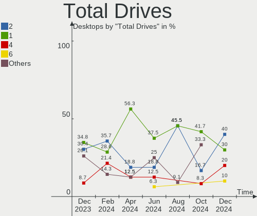
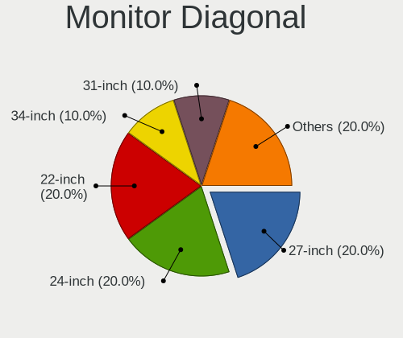
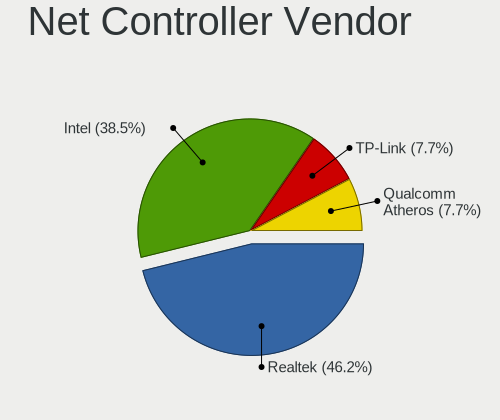
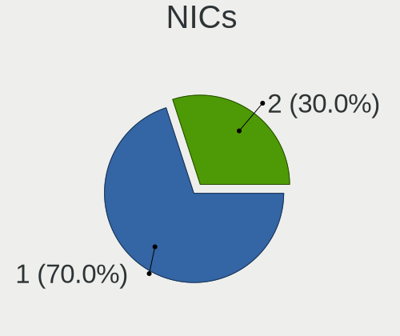
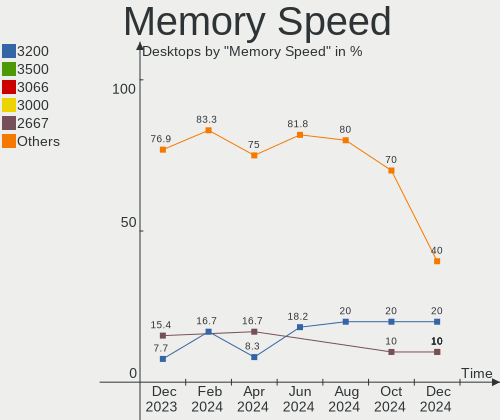
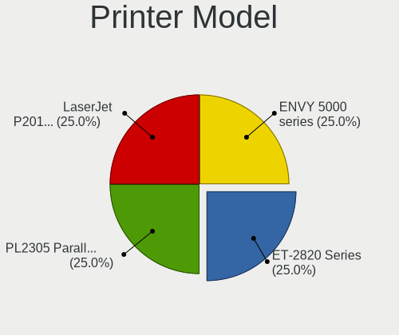

LMDE - Hardware Trends (Desktops)
---------------------------------

A project to identify most popular hardware characteristics and track their change
over time based on data collected by Linux users at https://Linux-Hardware.org.

Anyone can contribute to this report by the [hw-probe](https://github.com/linuxhw/hw-probe) tool:

    sudo -E hw-probe -all -upload

This report is for one last month. Overall report since the beginning of time: [TestDays](https://github.com/linuxhw/TestDays)

Period: Apr, 2024.

Contents
--------

* [ System ](#system)
  - [ OS                       ](#os)
  - [ OS Family                ](#os-family)
  - [ Kernel                   ](#kernel)
  - [ Kernel Family            ](#kernel-family)
  - [ Kernel Major Ver.        ](#kernel-major-ver)
  - [ Arch                     ](#arch)
  - [ DE                       ](#de)
  - [ Display Server           ](#display-server)
  - [ Display Manager          ](#display-manager)
  - [ OS Lang                  ](#os-lang)
  - [ Boot Mode                ](#boot-mode)
  - [ Filesystem               ](#filesystem)
  - [ Part. scheme             ](#part-scheme)
  - [ Dual Boot with Linux/BSD ](#dual-boot-with-linuxbsd)
  - [ Dual Boot (Win)          ](#dual-boot-win)

* [ Board ](#board)
  - [ Vendor                   ](#vendor)
  - [ Model                    ](#model)
  - [ Model Family             ](#model-family)
  - [ MFG Year                 ](#mfg-year)
  - [ Form Factor              ](#form-factor)
  - [ Secure Boot              ](#secure-boot)
  - [ Coreboot                 ](#coreboot)
  - [ RAM Size                 ](#ram-size)
  - [ RAM Used                 ](#ram-used)
  - [ Total Drives             ](#total-drives)
  - [ Has CD-ROM               ](#has-cd-rom)
  - [ Has Ethernet             ](#has-ethernet)
  - [ Has WiFi                 ](#has-wifi)
  - [ Has Bluetooth            ](#has-bluetooth)

* [ Location ](#location)
  - [ Country                  ](#country)
  - [ City                     ](#city)

* [ Drives ](#drives)
  - [ Drive Vendor             ](#drive-vendor)
  - [ Drive Model              ](#drive-model)
  - [ HDD Vendor               ](#hdd-vendor)
  - [ SSD Vendor               ](#ssd-vendor)
  - [ Drive Kind               ](#drive-kind)
  - [ Drive Connector          ](#drive-connector)
  - [ Drive Size               ](#drive-size)
  - [ Space Total              ](#space-total)
  - [ Space Used               ](#space-used)
  - [ Malfunc. Drives          ](#malfunc-drives)
  - [ Malfunc. Drive Vendor    ](#malfunc-drive-vendor)
  - [ Malfunc. HDD Vendor      ](#malfunc-hdd-vendor)
  - [ Malfunc. Drive Kind      ](#malfunc-drive-kind)
  - [ Failed Drives            ](#failed-drives)
  - [ Failed Drive Vendor      ](#failed-drive-vendor)
  - [ Drive Status             ](#drive-status)

* [ Storage controller ](#storage-controller)
  - [ Storage Vendor           ](#storage-vendor)
  - [ Storage Model            ](#storage-model)
  - [ Storage Kind             ](#storage-kind)

* [ Processor ](#processor)
  - [ CPU Vendor               ](#cpu-vendor)
  - [ CPU Model                ](#cpu-model)
  - [ CPU Model Family         ](#cpu-model-family)
  - [ CPU Cores                ](#cpu-cores)
  - [ CPU Sockets              ](#cpu-sockets)
  - [ CPU Threads              ](#cpu-threads)
  - [ CPU Op-Modes             ](#cpu-op-modes)
  - [ CPU Microcode            ](#cpu-microcode)
  - [ CPU Microarch            ](#cpu-microarch)

* [ Graphics ](#graphics)
  - [ GPU Vendor               ](#gpu-vendor)
  - [ GPU Model                ](#gpu-model)
  - [ GPU Combo                ](#gpu-combo)
  - [ GPU Driver               ](#gpu-driver)
  - [ GPU Memory               ](#gpu-memory)

* [ Monitor ](#monitor)
  - [ Monitor Vendor           ](#monitor-vendor)
  - [ Monitor Model            ](#monitor-model)
  - [ Monitor Resolution       ](#monitor-resolution)
  - [ Monitor Diagonal         ](#monitor-diagonal)
  - [ Monitor Width            ](#monitor-width)
  - [ Aspect Ratio             ](#aspect-ratio)
  - [ Monitor Area             ](#monitor-area)
  - [ Pixel Density            ](#pixel-density)
  - [ Multiple Monitors        ](#multiple-monitors)

* [ Network ](#network)
  - [ Net Controller Vendor    ](#net-controller-vendor)
  - [ Net Controller Model     ](#net-controller-model)
  - [ Wireless Vendor          ](#wireless-vendor)
  - [ Wireless Model           ](#wireless-model)
  - [ Ethernet Vendor          ](#ethernet-vendor)
  - [ Ethernet Model           ](#ethernet-model)
  - [ Net Controller Kind      ](#net-controller-kind)
  - [ Used Controller          ](#used-controller)
  - [ NICs                     ](#nics)
  - [ IPv6                     ](#ipv6)

* [ Bluetooth ](#bluetooth)
  - [ Bluetooth Vendor         ](#bluetooth-vendor)
  - [ Bluetooth Model          ](#bluetooth-model)

* [ Sound ](#sound)
  - [ Sound Vendor             ](#sound-vendor)
  - [ Sound Model              ](#sound-model)

* [ Memory ](#memory)
  - [ Memory Vendor            ](#memory-vendor)
  - [ Memory Model             ](#memory-model)
  - [ Memory Kind              ](#memory-kind)
  - [ Memory Form Factor       ](#memory-form-factor)
  - [ Memory Size              ](#memory-size)
  - [ Memory Speed             ](#memory-speed)

* [ Printers & scanners ](#printers--scanners)
  - [ Printer Vendor           ](#printer-vendor)
  - [ Printer Model            ](#printer-model)
  - [ Scanner Vendor           ](#scanner-vendor)
  - [ Scanner Model            ](#scanner-model)

* [ Camera ](#camera)
  - [ Camera Vendor            ](#camera-vendor)
  - [ Camera Model             ](#camera-model)

* [ Security ](#security)
  - [ Fingerprint Vendor       ](#fingerprint-vendor)
  - [ Fingerprint Model        ](#fingerprint-model)
  - [ Chipcard Vendor          ](#chipcard-vendor)
  - [ Chipcard Model           ](#chipcard-model)

* [ Unsupported ](#unsupported)
  - [ Unsupported Devices      ](#unsupported-devices)
  - [ Unsupported Device Types ](#unsupported-device-types)

System
------

OS
--

Installed operating systems

| Name   | Desktops | Percent |
|--------|----------|---------|
| LMDE 6 | 14       | 87.5%   |
| LMDE 5 | 2        | 12.5%   |

OS Family
---------

OS without a version

| Name | Desktops | Percent |
|------|----------|---------|
| LMDE | 16       | 100%    |

Kernel
------

Version of the Linux kernel

| Version          | Desktops | Percent |
|------------------|----------|---------|
| 6.1.0-20-amd64   | 7        | 43.75%  |
| 6.1.0-12-amd64   | 3        | 18.75%  |
| 6.1.0-18-amd64   | 2        | 12.5%   |
| 6.6.13+bpo-amd64 | 1        | 6.25%   |
| 6.1.0-17-amd64   | 1        | 6.25%   |
| 6.1.0-16-amd64   | 1        | 6.25%   |
| 5.10.0-28-amd64  | 1        | 6.25%   |

Kernel Family
-------------

Linux kernel without a distro release

| Version | Desktops | Percent |
|---------|----------|---------|
| 6.1.0   | 14       | 87.5%   |
| 6.6.13  | 1        | 6.25%   |
| 5.10.0  | 1        | 6.25%   |

Kernel Major Ver.
-----------------

Linux kernel major version

| Version | Desktops | Percent |
|---------|----------|---------|
| 6.1     | 14       | 87.5%   |
| 6.6     | 1        | 6.25%   |
| 5.10    | 1        | 6.25%   |

Arch
----

OS architecture (x86_64, i586, etc.)

| Name   | Desktops | Percent |
|--------|----------|---------|
| x86_64 | 16       | 100%    |

DE
--

Desktop Environment

| Name       | Desktops | Percent |
|------------|----------|---------|
| X-Cinnamon | 12       | 75%     |
| Cinnamon   | 3        | 18.75%  |
| MATE       | 1        | 6.25%   |

Display Server
--------------

X11 or Wayland

| Name | Desktops | Percent |
|------|----------|---------|
| X11  | 16       | 100%    |

Display Manager
---------------

SDDM, LightDM, etc.

| Name    | Desktops | Percent |
|---------|----------|---------|
| LightDM | 11       | 68.75%  |
| Unknown | 5        | 31.25%  |

OS Lang
-------

Language

| Lang  | Desktops | Percent |
|-------|----------|---------|
| en_US | 5        | 31.25%  |
| it_IT | 4        | 25%     |
| de_DE | 4        | 25%     |
| ru_RU | 1        | 6.25%   |
| pt_BR | 1        | 6.25%   |
| en_CA | 1        | 6.25%   |

Boot Mode
---------

EFI or BIOS

| Mode | Desktops | Percent |
|------|----------|---------|
| EFI  | 10       | 62.5%   |
| BIOS | 6        | 37.5%   |

Filesystem
----------

Type of filesystem

| Type    | Desktops | Percent |
|---------|----------|---------|
| Ext4    | 14       | 87.5%   |
| Tmpfs   | 1        | 6.25%   |
| Overlay | 1        | 6.25%   |

Part. scheme
------------

Scheme of partitioning

| Type    | Desktops | Percent |
|---------|----------|---------|
| GPT     | 7        | 43.75%  |
| Unknown | 5        | 31.25%  |
| MBR     | 4        | 25%     |

Dual Boot with Linux/BSD
------------------------

Hosting more than one Linux/BSD

| Dual boot | Desktops | Percent |
|-----------|----------|---------|
| No        | 16       | 100%    |

Dual Boot (Win)
---------------

Hosting Linux and Windows

| Dual boot | Desktops | Percent |
|-----------|----------|---------|
| No        | 10       | 62.5%   |
| Yes       | 6        | 37.5%   |

Board
-----

Vendor
------

Motherboard manufacturer

| Name                | Desktops | Percent |
|---------------------|----------|---------|
| Gigabyte Technology | 3        | 18.75%  |
| MSI                 | 2        | 12.5%   |
| Hewlett-Packard     | 2        | 12.5%   |
| ASUSTek Computer    | 2        | 12.5%   |
| PELADN              | 1        | 6.25%   |
| Pegatron            | 1        | 6.25%   |
| Medion              | 1        | 6.25%   |
| Intel               | 1        | 6.25%   |
| Fujitsu             | 1        | 6.25%   |
| AMI                 | 1        | 6.25%   |
| Unknown             | 1        | 6.25%   |

Model
-----

Motherboard model

| Name                            | Desktops | Percent |
|---------------------------------|----------|---------|
| PELADN WI-6                     | 1        | 6.25%   |
| Pegatron Pro 3120 Microtower PC | 1        | 6.25%   |
| MSI MS-7D91                     | 1        | 6.25%   |
| MSI MS-7C56                     | 1        | 6.25%   |
| Medion S23003                   | 1        | 6.25%   |
| Intel DQ77MK AAG39642-302       | 1        | 6.25%   |
| HP OMEN 25L Desktop GT11-1xxx   | 1        | 6.25%   |
| HP Compaq 8200 Elite MT PC      | 1        | 6.25%   |
| Gigabyte Q87M-D2H               | 1        | 6.25%   |
| Gigabyte GA-A75-D3H             | 1        | 6.25%   |
| Gigabyte AB350M-DS3H V2         | 1        | 6.25%   |
| Fujitsu ESPRIMO P510            | 1        | 6.25%   |
| ASUS PRIME Z370-P II            | 1        | 6.25%   |
| ASUS BUSINESSline MT Pro G      | 1        | 6.25%   |
| AMI Intel                       | 1        | 6.25%   |
| Unknown                         | 1        | 6.25%   |

Model Family
------------

Motherboard model prefix

| Name                 | Desktops | Percent |
|----------------------|----------|---------|
| PELADN WI-6          | 1        | 6.25%   |
| Pegatron Pro         | 1        | 6.25%   |
| MSI MS-7D91          | 1        | 6.25%   |
| MSI MS-7C56          | 1        | 6.25%   |
| Medion S23003        | 1        | 6.25%   |
| Intel DQ77MK         | 1        | 6.25%   |
| HP OMEN              | 1        | 6.25%   |
| HP Compaq            | 1        | 6.25%   |
| Gigabyte Q87M-D2H    | 1        | 6.25%   |
| Gigabyte GA-A75-D3H  | 1        | 6.25%   |
| Gigabyte AB350M-DS3H | 1        | 6.25%   |
| Fujitsu ESPRIMO      | 1        | 6.25%   |
| ASUS PRIME           | 1        | 6.25%   |
| ASUS BUSINESSline    | 1        | 6.25%   |
| AMI Intel            | 1        | 6.25%   |
| Unknown              | 1        | 6.25%   |

MFG Year
--------

Motherboard manufacture year

| Year | Desktops | Percent |
|------|----------|---------|
| 2018 | 4        | 25%     |
| 2022 | 2        | 12.5%   |
| 2021 | 2        | 12.5%   |
| 2012 | 2        | 12.5%   |
| 2011 | 2        | 12.5%   |
| 2024 | 1        | 6.25%   |
| 2023 | 1        | 6.25%   |
| 2020 | 1        | 6.25%   |
| 2010 | 1        | 6.25%   |

Form Factor
-----------

Physical design of the computer

| Name    | Desktops | Percent |
|---------|----------|---------|
| Desktop | 16       | 100%    |

Secure Boot
-----------

Enabled or disabled

| State    | Desktops | Percent |
|----------|----------|---------|
| Disabled | 15       | 93.75%  |
| Enabled  | 1        | 6.25%   |

Coreboot
--------

Have coreboot on board

| Used | Desktops | Percent |
|------|----------|---------|
| No   | 16       | 100%    |

RAM Size
--------

Total RAM memory

| Size in GB | Desktops | Percent |
|------------|----------|---------|
| 32.01-64.0 | 5        | 31.25%  |
| 4.01-8.0   | 4        | 25%     |
| 16.01-24.0 | 4        | 25%     |
| 3.01-4.0   | 3        | 18.75%  |

RAM Used
--------

Used RAM memory

| Used GB   | Desktops | Percent |
|-----------|----------|---------|
| 2.01-3.0  | 6        | 37.5%   |
| 1.01-2.0  | 6        | 37.5%   |
| 4.01-8.0  | 2        | 12.5%   |
| 3.01-4.0  | 1        | 6.25%   |
| 8.01-16.0 | 1        | 6.25%   |

Total Drives
------------

Number of drives on board

| Drives | Desktops | Percent |
|--------|----------|---------|
| 1      | 9        | 56.25%  |
| 2      | 3        | 18.75%  |
| 4      | 2        | 12.5%   |
| 5      | 1        | 6.25%   |
| 3      | 1        | 6.25%   |

Has CD-ROM
----------

Has CD-ROM on board

| Presented | Desktops | Percent |
|-----------|----------|---------|
| No        | 11       | 68.75%  |
| Yes       | 5        | 31.25%  |

Has Ethernet
------------

Has Ethernet on board

| Presented | Desktops | Percent |
|-----------|----------|---------|
| Yes       | 16       | 100%    |

Has WiFi
--------

Has WiFi module

| Presented | Desktops | Percent |
|-----------|----------|---------|
| Yes       | 10       | 62.5%   |
| No        | 6        | 37.5%   |

Has Bluetooth
-------------

Has Bluetooth module

| Presented | Desktops | Percent |
|-----------|----------|---------|
| Yes       | 8        | 50%     |
| No        | 8        | 50%     |

Location
--------

Country
-------

Geographic location (country)

| Country     | Desktops | Percent |
|-------------|----------|---------|
| Italy       | 7        | 43.75%  |
| Germany     | 4        | 25%     |
| Switzerland | 1        | 6.25%   |
| Russia      | 1        | 6.25%   |
| Croatia     | 1        | 6.25%   |
| Canada      | 1        | 6.25%   |
| Brazil      | 1        | 6.25%   |

City
----

Geographic location (city)

| City      | Desktops | Percent |
|-----------|----------|---------|
| Delligsen | 2        | 12.5%   |
| Vitória  | 1        | 6.25%   |
| Uetze     | 1        | 6.25%   |
| Turin     | 1        | 6.25%   |
| Sermoneta | 1        | 6.25%   |
| Rome      | 1        | 6.25%   |
| Padova    | 1        | 6.25%   |
| Osijek    | 1        | 6.25%   |
| Ornago    | 1        | 6.25%   |
| Opfikon   | 1        | 6.25%   |
| Newcastle | 1        | 6.25%   |
| Moscow    | 1        | 6.25%   |
| Milan     | 1        | 6.25%   |
| Bremen    | 1        | 6.25%   |
| Bologna   | 1        | 6.25%   |

Drives
------

Drive Vendor
------------

Hard drive vendors

| Vendor                    | Desktops | Drives | Percent |
|---------------------------|----------|--------|---------|
| Samsung Electronics       | 5        | 7      | 18.52%  |
| Seagate                   | 4        | 5      | 14.81%  |
| WDC                       | 3        | 3      | 11.11%  |
| Sandisk                   | 2        | 2      | 7.41%   |
| Kingston                  | 2        | 2      | 7.41%   |
| Toshiba                   | 1        | 1      | 3.7%    |
| Realtek Semiconductor     | 1        | 1      | 3.7%    |
| Phison                    | 1        | 1      | 3.7%    |
| Micron/Crucial Technology | 1        | 1      | 3.7%    |
| Micron Technology         | 1        | 1      | 3.7%    |
| KingDian                  | 1        | 1      | 3.7%    |
| Fanxiang                  | 1        | 1      | 3.7%    |
| Crucial                   | 1        | 2      | 3.7%    |
| China                     | 1        | 1      | 3.7%    |
| ADATA Technology          | 1        | 1      | 3.7%    |
| Unknown                   | 1        | 1      | 3.7%    |

Drive Model
-----------

Hard drive models

| Model                                                           | Desktops | Percent |
|-----------------------------------------------------------------|----------|---------|
| Sandisk WD Blue SN550 NVMe SSD 2TB                              | 2        | 6.45%   |
| WDC WD2500YS-01SHB1 256GB                                       | 1        | 3.23%   |
| WDC WD10SPZX-08Z10 1TB                                          | 1        | 3.23%   |
| WDC WD10EAVS-00D7B1 1TB                                         | 1        | 3.23%   |
| Toshiba HDWD120 2TB                                             | 1        | 3.23%   |
| Seagate ST3200826AS 200GB                                       | 1        | 3.23%   |
| Seagate ST3000DM008-2DM166 3TB                                  | 1        | 3.23%   |
| Seagate ST2000DM001-1ER164 2TB                                  | 1        | 3.23%   |
| Seagate ST1000LM035-1RK172 1TB                                  | 1        | 3.23%   |
| Seagate ST1000DM010-2DM162 1TB                                  | 1        | 3.23%   |
| Samsung SSD 980 500GB                                           | 1        | 3.23%   |
| Samsung SSD 980 1TB                                             | 1        | 3.23%   |
| Samsung SSD 850 EVO 250GB                                       | 1        | 3.23%   |
| Samsung SSD 840 EVO 120GB                                       | 1        | 3.23%   |
| Samsung MZ7LN128HCHP-000H1 128GB SSD                            | 1        | 3.23%   |
| Samsung HD403LJ 400GB                                           | 1        | 3.23%   |
| Samsung HD204UI 2TB                                             | 1        | 3.23%   |
| Realtek NVMe SSD Drive 512GB                                    | 1        | 3.23%   |
| Phison S11-128G-PHISON-SSD-B4 128GB                             | 1        | 3.23%   |
| Micron/Crucial P1 NVMe PCIe SSD 1TB                             | 1        | 3.23%   |
| Micron CT1000X8SSD9 1TB                                         | 1        | 3.23%   |
| Kingston SA400S37480G 480GB SSD                                 | 1        | 3.23%   |
| Kingston SA400S37120G 120GB SSD                                 | 1        | 3.23%   |
| KingDian S280-120GB SSD                                         | 1        | 3.23%   |
| Fanxiang S101 500GB SSD                                         | 1        | 3.23%   |
| Crucial CT2000T500SSD8 2TB                                      | 1        | 3.23%   |
| Crucial CT1000MX500SSD1 1TB                                     | 1        | 3.23%   |
| China CYX-SSD-S1000 512GB                                       | 1        | 3.23%   |
| ADATA XPG SX8200 Pro PCIe Gen3x4 M.2 2280 Solid State Drive 1TB | 1        | 3.23%   |
| Unknown                                                         | 1        | 3.23%   |

HDD Vendor
----------

Hard disk drive vendors

| Vendor              | Desktops | Drives | Percent |
|---------------------|----------|--------|---------|
| Seagate             | 4        | 5      | 44.44%  |
| WDC                 | 3        | 3      | 33.33%  |
| Toshiba             | 1        | 1      | 11.11%  |
| Samsung Electronics | 1        | 2      | 11.11%  |

SSD Vendor
----------

Solid state drive vendors

| Vendor              | Desktops | Drives | Percent |
|---------------------|----------|--------|---------|
| Samsung Electronics | 3        | 3      | 25%     |
| Kingston            | 2        | 2      | 16.67%  |
| Phison              | 1        | 1      | 8.33%   |
| Micron Technology   | 1        | 1      | 8.33%   |
| KingDian            | 1        | 1      | 8.33%   |
| Fanxiang            | 1        | 1      | 8.33%   |
| Crucial             | 1        | 1      | 8.33%   |
| China               | 1        | 1      | 8.33%   |
| Unknown             | 1        | 1      | 8.33%   |

Drive Kind
----------

HDD or SSD

| Kind | Desktops | Drives | Percent |
|------|----------|--------|---------|
| SSD  | 12       | 12     | 48%     |
| HDD  | 7        | 11     | 28%     |
| NVMe | 6        | 8      | 24%     |

Drive Connector
---------------

SATA, SAS, NVMe, etc.

| Type | Desktops | Drives | Percent |
|------|----------|--------|---------|
| SATA | 16       | 22     | 69.57%  |
| NVMe | 6        | 8      | 26.09%  |
| SAS  | 1        | 1      | 4.35%   |

Drive Size
----------

Size of hard drive

| Size in TB | Desktops | Drives | Percent |
|------------|----------|--------|---------|
| 0.01-0.5   | 10       | 12     | 50%     |
| 0.51-1.0   | 6        | 7      | 30%     |
| 1.01-2.0   | 3        | 3      | 15%     |
| 2.01-3.0   | 1        | 1      | 5%      |

Space Total
-----------

Amount of disk space available on the file system

| Size in GB     | Desktops | Percent |
|----------------|----------|---------|
| 101-250        | 7        | 43.75%  |
| 1001-2000      | 3        | 18.75%  |
| More than 3000 | 2        | 12.5%   |
| 251-500        | 2        | 12.5%   |
| 2001-3000      | 1        | 6.25%   |
| 501-1000       | 1        | 6.25%   |

Space Used
----------

Amount of used disk space

| Used GB        | Desktops | Percent |
|----------------|----------|---------|
| 21-50          | 8        | 50%     |
| 251-500        | 2        | 12.5%   |
| 501-1000       | 2        | 12.5%   |
| More than 3000 | 1        | 6.25%   |
| 2001-3000      | 1        | 6.25%   |
| 1-20           | 1        | 6.25%   |
| 51-100         | 1        | 6.25%   |

Malfunc. Drives
---------------

Drive models with a malfunction

Zero info for selected period =(

Malfunc. Drive Vendor
---------------------

Vendors of faulty drives

Zero info for selected period =(

Malfunc. HDD Vendor
-------------------

Vendors of faulty HDD drives

Zero info for selected period =(

Malfunc. Drive Kind
-------------------

Kinds of faulty drives

Zero info for selected period =(

Failed Drives
-------------

Failed drive models

Zero info for selected period =(

Failed Drive Vendor
-------------------

Failed drive vendors

Zero info for selected period =(

Drive Status
------------

Number of failed and malfunc. drives

| Status   | Desktops | Drives | Percent |
|----------|----------|--------|---------|
| Works    | 10       | 12     | 58.82%  |
| Detected | 7        | 19     | 41.18%  |

Storage controller
------------------

Storage Vendor
--------------

Storage controller vendors

| Vendor                    | Desktops | Percent |
|---------------------------|----------|---------|
| Intel                     | 12       | 48%     |
| AMD                       | 4        | 16%     |
| SanDisk                   | 2        | 8%      |
| Samsung Electronics       | 2        | 8%      |
| Micron/Crucial Technology | 2        | 8%      |
| Realtek Semiconductor     | 1        | 4%      |
| ASMedia Technology        | 1        | 4%      |
| ADATA Technology          | 1        | 4%      |

Storage Model
-------------

Storage controller models

| Model                                                                          | Desktops | Percent |
|--------------------------------------------------------------------------------|----------|---------|
| SanDisk Ultra 3D / WD Blue SN550 NVMe SSD                                      | 2        | 8%      |
| Samsung NVMe SSD Controller 980 (DRAM-less)                                    | 2        | 8%      |
| Intel SATA controller                                                          | 2        | 8%      |
| Intel 7 Series/C210 Series Chipset Family 6-port SATA Controller [AHCI mode]   | 2        | 8%      |
| AMD 500 Series Chipset SATA Controller                                         | 2        | 8%      |
| Realtek RTS5765DL NVMe SSD Controller (DRAM-less)                              | 1        | 4%      |
| Micron/Crucial T500 NVMe PCIe SSD                                              | 1        | 4%      |
| Micron/Crucial P1 NVMe PCIe SSD[Frampton]                                      | 1        | 4%      |
| Intel SATA Controller [RAID mode]                                              | 1        | 4%      |
| Intel Raptor Lake SATA AHCI Controller                                         | 1        | 4%      |
| Intel Celeron/Pentium Silver Processor SATA Controller                         | 1        | 4%      |
| Intel Cannon Point-LP SATA Controller [AHCI Mode]                              | 1        | 4%      |
| Intel 82801JI (ICH10 Family) 4 port SATA IDE Controller #1                     | 1        | 4%      |
| Intel 8 Series/C220 Series Chipset Family 6-port SATA Controller 1 [AHCI mode] | 1        | 4%      |
| Intel 6 Series/C200 Series Chipset Family 6 port Desktop SATA AHCI Controller  | 1        | 4%      |
| Intel 200 Series PCH SATA controller [AHCI mode]                               | 1        | 4%      |
| ASMedia ASM1061/ASM1062 Serial ATA Controller                                  | 1        | 4%      |
| AMD FCH SATA Controller [AHCI mode]                                            | 1        | 4%      |
| AMD 300 Series Chipset SATA Controller                                         | 1        | 4%      |
| ADATA XPG SX8200 Pro PCIe Gen3x4 M.2 2280 Solid State Drive                    | 1        | 4%      |

Storage Kind
------------

Kind of storage controller (IDE, SATA, NVMe, SAS, ...)

| Kind | Desktops | Percent |
|------|----------|---------|
| SATA | 14       | 63.64%  |
| NVMe | 6        | 27.27%  |
| RAID | 1        | 4.55%   |
| IDE  | 1        | 4.55%   |

Processor
---------

CPU Vendor
----------

Processor vendors

| Vendor | Desktops | Percent |
|--------|----------|---------|
| Intel  | 12       | 75%     |
| AMD    | 4        | 25%     |

CPU Model
---------

Processor models

| Model                                       | Desktops | Percent |
|---------------------------------------------|----------|---------|
| AMD Ryzen 7 5700G with Radeon Graphics      | 2        | 12.5%   |
| Intel Pentium Dual-Core CPU E5500 @ 2.80GHz | 1        | 6.25%   |
| Intel N95                                   | 1        | 6.25%   |
| Intel N100                                  | 1        | 6.25%   |
| Intel Core i7-3770 CPU @ 3.40GHz            | 1        | 6.25%   |
| Intel Core i7-2600 CPU @ 3.40GHz            | 1        | 6.25%   |
| Intel Core i5-9600K CPU @ 3.70GHz           | 1        | 6.25%   |
| Intel Core i5-8260U CPU @ 1.60GHz           | 1        | 6.25%   |
| Intel Core i5-6500 CPU @ 3.20GHz            | 1        | 6.25%   |
| Intel Core i5-4590S CPU @ 3.00GHz           | 1        | 6.25%   |
| Intel Core i5-3470 CPU @ 3.20GHz            | 1        | 6.25%   |
| Intel Celeron J4125 CPU @ 2.00GHz           | 1        | 6.25%   |
| Intel 13th Gen Core i5-13600KF              | 1        | 6.25%   |
| AMD Ryzen 5 3600 6-Core Processor           | 1        | 6.25%   |
| AMD A8-3870 APU with Radeon HD Graphics     | 1        | 6.25%   |

CPU Model Family
----------------

Processor model prefix

| Model                   | Desktops | Percent |
|-------------------------|----------|---------|
| Intel Core i5           | 5        | 31.25%  |
| Other                   | 3        | 18.75%  |
| Intel Core i7           | 2        | 12.5%   |
| AMD Ryzen 7             | 2        | 12.5%   |
| Intel Pentium Dual-Core | 1        | 6.25%   |
| Intel Celeron           | 1        | 6.25%   |
| AMD Ryzen 5             | 1        | 6.25%   |
| AMD A8                  | 1        | 6.25%   |

CPU Cores
---------

Number of processor cores

| Number | Desktops | Percent |
|--------|----------|---------|
| 4      | 10       | 62.5%   |
| 8      | 2        | 12.5%   |
| 6      | 2        | 12.5%   |
| 14     | 1        | 6.25%   |
| 2      | 1        | 6.25%   |

CPU Sockets
-----------

Number of sockets

| Number | Desktops | Percent |
|--------|----------|---------|
| 1      | 16       | 100%    |

CPU Threads
-----------

Threads per core (Hyper-Threading)

| Number | Desktops | Percent |
|--------|----------|---------|
| 1      | 9        | 56.25%  |
| 2      | 7        | 43.75%  |

CPU Op-Modes
------------

CPU Operation Modes (32-bit, 64-bit)

| Op mode        | Desktops | Percent |
|----------------|----------|---------|
| 32-bit, 64-bit | 16       | 100%    |

CPU Microcode
-------------

Microcode number

| Number     | Desktops | Percent |
|------------|----------|---------|
| 0xb06e0    | 2        | 12.5%   |
| 0x306a9    | 2        | 12.5%   |
| 0xb0671    | 1        | 6.25%   |
| 0x906ec    | 1        | 6.25%   |
| 0x806ea    | 1        | 6.25%   |
| 0x706a8    | 1        | 6.25%   |
| 0x506e3    | 1        | 6.25%   |
| 0x306c3    | 1        | 6.25%   |
| 0x206a7    | 1        | 6.25%   |
| 0x1067a    | 1        | 6.25%   |
| 0x0a50000d | 1        | 6.25%   |
| 0x0a50000c | 1        | 6.25%   |
| 0x08701030 | 1        | 6.25%   |
| Unknown    | 1        | 6.25%   |

CPU Microarch
-------------

Microarchitecture

| Name             | Desktops | Percent |
|------------------|----------|---------|
| Zen 3            | 2        | 12.5%   |
| KabyLake         | 2        | 12.5%   |
| IvyBridge        | 2        | 12.5%   |
| Zen 2            | 1        | 6.25%   |
| Skylake          | 1        | 6.25%   |
| SandyBridge      | 1        | 6.25%   |
| Penryn           | 1        | 6.25%   |
| K10 Llano        | 1        | 6.25%   |
| Haswell          | 1        | 6.25%   |
| Gracemont        | 1        | 6.25%   |
| Goldmont plus    | 1        | 6.25%   |
| Alderlake Hybrid | 1        | 6.25%   |
| Unknown          | 1        | 6.25%   |

Graphics
--------

GPU Vendor
----------

Vendors of graphics cards

| Vendor | Desktops | Percent |
|--------|----------|---------|
| Intel  | 11       | 68.75%  |
| AMD    | 3        | 18.75%  |
| Nvidia | 2        | 12.5%   |

GPU Model
---------

Graphics card models

| Model                                                                       | Desktops | Percent |
|-----------------------------------------------------------------------------|----------|---------|
| Intel Alder Lake-N [UHD Graphics]                                           | 2        | 12.5%   |
| Nvidia TU106 [GeForce RTX 2060 Rev. A]                                      | 1        | 6.25%   |
| Nvidia GM204 [GeForce GTX 970]                                              | 1        | 6.25%   |
| Intel Xeon E3-1200 v3/4th Gen Core Processor Integrated Graphics Controller | 1        | 6.25%   |
| Intel Xeon E3-1200 v2/3rd Gen Core processor Graphics Controller            | 1        | 6.25%   |
| Intel IvyBridge GT2 [HD Graphics 4000]                                      | 1        | 6.25%   |
| Intel HD Graphics 530                                                       | 1        | 6.25%   |
| Intel GeminiLake [UHD Graphics 600]                                         | 1        | 6.25%   |
| Intel CoffeeLake-S GT2 [UHD Graphics 630]                                   | 1        | 6.25%   |
| Intel Coffee Lake-U GT2 [UHD Graphics 620]                                  | 1        | 6.25%   |
| Intel 4 Series Chipset Integrated Graphics Controller                       | 1        | 6.25%   |
| Intel 2nd Generation Core Processor Family Integrated Graphics Controller   | 1        | 6.25%   |
| AMD Sumo [Radeon HD 6550D]                                                  | 1        | 6.25%   |
| AMD Navi 23 [Radeon RX 6650 XT / 6700S / 6800S]                             | 1        | 6.25%   |
| AMD Caicos [Radeon HD 6450/7450/8450 / R5 230 OEM]                          | 1        | 6.25%   |

GPU Combo
---------

Combinations of graphics cards

| Name       | Desktops | Percent |
|------------|----------|---------|
| 1 x Intel  | 11       | 68.75%  |
| 1 x AMD    | 3        | 18.75%  |
| 1 x Nvidia | 2        | 12.5%   |

GPU Driver
----------

Free vs proprietary

| Driver      | Desktops | Percent |
|-------------|----------|---------|
| Free        | 15       | 93.75%  |
| Proprietary | 1        | 6.25%   |

GPU Memory
----------

Total video memory

| Size in GB | Desktops | Percent |
|------------|----------|---------|
| Unknown    | 12       | 75%     |
| 7.01-8.0   | 1        | 6.25%   |
| 5.01-6.0   | 1        | 6.25%   |
| 3.01-4.0   | 1        | 6.25%   |
| 0.51-1.0   | 1        | 6.25%   |

Monitor
-------

Monitor Vendor
--------------

Monitor vendors

| Vendor               | Desktops | Percent |
|----------------------|----------|---------|
| Samsung Electronics  | 7        | 38.89%  |
| Goldstar             | 4        | 22.22%  |
| HUAWEI               | 3        | 16.67%  |
| Hewlett-Packard      | 1        | 5.56%   |
| Dell                 | 1        | 5.56%   |
| AOC                  | 1        | 5.56%   |
| Ancor Communications | 1        | 5.56%   |

Monitor Model
-------------

Monitor models

| Model                                                                 | Desktops | Percent |
|-----------------------------------------------------------------------|----------|---------|
| HUAWEI ZQE-CBA HWV6A25 3440x1440 797x334mm 34.0-inch                  | 3        | 16.67%  |
| Samsung Electronics SyncMaster SAM0456 1360x768 410x230mm 18.5-inch   | 2        | 11.11%  |
| Goldstar TV SSCR2 GSMC0C8 3840x2160                                   | 2        | 11.11%  |
| Samsung Electronics T23B550 SAM0959 1920x1080 510x287mm 23.0-inch     | 1        | 5.56%   |
| Samsung Electronics SMB2340 SAM0691 1920x1080 510x287mm 23.0-inch     | 1        | 5.56%   |
| Samsung Electronics SA300/SA350 SAM0794 1920x1080 521x293mm 23.5-inch | 1        | 5.56%   |
| Samsung Electronics S24D330 SAM0D92 1920x1080 531x299mm 24.0-inch     | 1        | 5.56%   |
| Samsung Electronics S24C450 SAM09CE 1920x1200 518x324mm 24.1-inch     | 1        | 5.56%   |
| Hewlett-Packard 22w HPN342E 1920x1080 476x268mm 21.5-inch             | 1        | 5.56%   |
| Goldstar M1921A GSM4B2B 1280x1024 376x301mm 19.0-inch                 | 1        | 5.56%   |
| Goldstar E2251 GSM586E 1920x1080 477x268mm 21.5-inch                  | 1        | 5.56%   |
| Dell U2720Q DEL41B3 3840x2160 597x336mm 27.0-inch                     | 1        | 5.56%   |
| AOC 2460 AOC246A 1920x1080 531x299mm 24.0-inch                        | 1        | 5.56%   |
| Ancor Communications ASUS VB195 ACI19B5 1280x1024 376x301mm 19.0-inch | 1        | 5.56%   |

Monitor Resolution
------------------

Monitor screen resolution

| Resolution        | Desktops | Percent |
|-------------------|----------|---------|
| 1920x1080 (FHD)   | 6        | 35.29%  |
| 3840x2160 (4K)    | 3        | 17.65%  |
| 3440x1440         | 3        | 17.65%  |
| 1360x768          | 2        | 11.76%  |
| 1920x1200 (WUXGA) | 1        | 5.88%   |
| 1280x720 (HD)     | 1        | 5.88%   |
| 1280x1024 (SXGA)  | 1        | 5.88%   |

Monitor Diagonal
----------------

Diagonal size in inches

| Inches | Desktops | Percent |
|--------|----------|---------|
| 34     | 3        | 16.67%  |
| 24     | 3        | 16.67%  |
| 23     | 3        | 16.67%  |
| 72     | 2        | 11.11%  |
| 21     | 2        | 11.11%  |
| 19     | 2        | 11.11%  |
| 18     | 2        | 11.11%  |
| 27     | 1        | 5.56%   |

Monitor Width
-------------

Physical width

| Width in mm | Desktops | Percent |
|-------------|----------|---------|
| 501-600     | 7        | 38.89%  |
| 401-500     | 4        | 22.22%  |
| 701-800     | 3        | 16.67%  |
| 351-400     | 2        | 11.11%  |
| 1501-2000   | 2        | 11.11%  |

Aspect Ratio
------------

Proportional relationship between the width and the height

| Ratio | Desktops | Percent |
|-------|----------|---------|
| 16/9  | 10       | 58.82%  |
| 21/9  | 3        | 17.65%  |
| 5/4   | 2        | 11.76%  |
| 16/10 | 2        | 11.76%  |

Monitor Area
------------

Area in inch²

| Area in inch² | Desktops | Percent |
|----------------|----------|---------|
| 201-250        | 5        | 29.41%  |
| 351-500        | 3        | 17.65%  |
| More than 1000 | 2        | 11.76%  |
| 251-300        | 2        | 11.76%  |
| 151-200        | 2        | 11.76%  |
| 141-150        | 2        | 11.76%  |
| 301-350        | 1        | 5.88%   |

Pixel Density
-------------

Pixels per inch

| Density | Desktops | Percent |
|---------|----------|---------|
| 51-100  | 11       | 64.71%  |
| 101-120 | 5        | 29.41%  |
| 161-240 | 1        | 5.88%   |

Multiple Monitors
-----------------

Total monitors connected

| Total | Desktops | Percent |
|-------|----------|---------|
| 1     | 14       | 87.5%   |
| 2     | 2        | 12.5%   |

Network
-------

Net Controller Vendor
---------------------

Controller vendors

| Vendor                | Desktops | Percent |
|-----------------------|----------|---------|
| Realtek Semiconductor | 10       | 45.45%  |
| Intel                 | 6        | 27.27%  |
| TP-Link               | 2        | 9.09%   |
| VIA Technologies      | 1        | 4.55%   |
| Samsung Electronics   | 1        | 4.55%   |
| NetGear               | 1        | 4.55%   |
| ADMtek                | 1        | 4.55%   |

Net Controller Model
--------------------

Controller models

| Model                                                                  | Desktops | Percent |
|------------------------------------------------------------------------|----------|---------|
| Realtek RTL8111/8168/8211/8411 PCI Express Gigabit Ethernet Controller | 10       | 33.33%  |
| Realtek RTL8821CE 802.11ac PCIe Wireless Network Adapter               | 2        | 6.67%   |
| Intel 82579LM Gigabit Network Connection (Lewisville)                  | 2        | 6.67%   |
| VIA VT6105/VT6106S [Rhine-III]                                         | 1        | 3.33%   |
| TP-Link TL-WN823N v2/v3 [Realtek RTL8192EU]                            | 1        | 3.33%   |
| TP-Link RTL8812AU Archer T4U 802.11ac                                  | 1        | 3.33%   |
| Samsung Galaxy series, misc. (tethering mode)                          | 1        | 3.33%   |
| Realtek RTL8852BE PCIe 802.11ax Wireless Network Controller            | 1        | 3.33%   |
| Realtek RTL8822CE 802.11ac PCIe Wireless Network Adapter               | 1        | 3.33%   |
| Realtek RTL8192CU 802.11n WLAN Adapter                                 | 1        | 3.33%   |
| Realtek RTL8188EUS 802.11n Wireless Network Adapter                    | 1        | 3.33%   |
| NetGear WNA3100(v1) Wireless-N 300 [Broadcom BCM43231]                 | 1        | 3.33%   |
| Intel Wireless 3165                                                    | 1        | 3.33%   |
| Intel Raptor Lake-S PCH CNVi WiFi                                      | 1        | 3.33%   |
| Intel I211 Gigabit Network Connection                                  | 1        | 3.33%   |
| Intel Ethernet Controller I226-V                                       | 1        | 3.33%   |
| Intel Ethernet Connection I217-LM                                      | 1        | 3.33%   |
| Intel Ethernet Connection (2) I219-V                                   | 1        | 3.33%   |
| ADMtek ADM8515 Pegasus II Ethernet                                     | 1        | 3.33%   |

Wireless Vendor
---------------

Wireless vendors

| Vendor                | Desktops | Percent |
|-----------------------|----------|---------|
| Realtek Semiconductor | 5        | 50%     |
| TP-Link               | 2        | 20%     |
| Intel                 | 2        | 20%     |
| NetGear               | 1        | 10%     |

Wireless Model
--------------

Wireless models

| Model                                                       | Desktops | Percent |
|-------------------------------------------------------------|----------|---------|
| Realtek RTL8821CE 802.11ac PCIe Wireless Network Adapter    | 2        | 18.18%  |
| TP-Link TL-WN823N v2/v3 [Realtek RTL8192EU]                 | 1        | 9.09%   |
| TP-Link RTL8812AU Archer T4U 802.11ac                       | 1        | 9.09%   |
| Realtek RTL8852BE PCIe 802.11ax Wireless Network Controller | 1        | 9.09%   |
| Realtek RTL8822CE 802.11ac PCIe Wireless Network Adapter    | 1        | 9.09%   |
| Realtek RTL8192CU 802.11n WLAN Adapter                      | 1        | 9.09%   |
| Realtek RTL8188EUS 802.11n Wireless Network Adapter         | 1        | 9.09%   |
| NetGear WNA3100(v1) Wireless-N 300 [Broadcom BCM43231]      | 1        | 9.09%   |
| Intel Wireless 3165                                         | 1        | 9.09%   |
| Intel Raptor Lake-S PCH CNVi WiFi                           | 1        | 9.09%   |

Ethernet Vendor
---------------

Ethernet vendors

| Vendor                | Desktops | Percent |
|-----------------------|----------|---------|
| Realtek Semiconductor | 10       | 52.63%  |
| Intel                 | 6        | 31.58%  |
| VIA Technologies      | 1        | 5.26%   |
| Samsung Electronics   | 1        | 5.26%   |
| ADMtek                | 1        | 5.26%   |

Ethernet Model
--------------

Ethernet models

| Model                                                                  | Desktops | Percent |
|------------------------------------------------------------------------|----------|---------|
| Realtek RTL8111/8168/8211/8411 PCI Express Gigabit Ethernet Controller | 10       | 52.63%  |
| Intel 82579LM Gigabit Network Connection (Lewisville)                  | 2        | 10.53%  |
| VIA VT6105/VT6106S [Rhine-III]                                         | 1        | 5.26%   |
| Samsung Galaxy series, misc. (tethering mode)                          | 1        | 5.26%   |
| Intel I211 Gigabit Network Connection                                  | 1        | 5.26%   |
| Intel Ethernet Controller I226-V                                       | 1        | 5.26%   |
| Intel Ethernet Connection I217-LM                                      | 1        | 5.26%   |
| Intel Ethernet Connection (2) I219-V                                   | 1        | 5.26%   |
| ADMtek ADM8515 Pegasus II Ethernet                                     | 1        | 5.26%   |

Net Controller Kind
-------------------

Ethernet, WiFi or modem

| Kind     | Desktops | Percent |
|----------|----------|---------|
| Ethernet | 16       | 61.54%  |
| WiFi     | 10       | 38.46%  |

Used Controller
---------------

Currently used network controller

| Kind     | Desktops | Percent |
|----------|----------|---------|
| Ethernet | 12       | 70.59%  |
| WiFi     | 5        | 29.41%  |

NICs
----

Total network controllers on board

| Total | Desktops | Percent |
|-------|----------|---------|
| 1     | 9        | 56.25%  |
| 2     | 7        | 43.75%  |

IPv6
----

IPv6 vs IPv4

| Used | Desktops | Percent |
|------|----------|---------|
| No   | 12       | 75%     |
| Yes  | 4        | 25%     |

Bluetooth
---------

Bluetooth Vendor
----------------

Controller vendors

| Vendor                  | Desktops | Percent |
|-------------------------|----------|---------|
| Realtek Semiconductor   | 5        | 62.5%   |
| Intel                   | 2        | 25%     |
| Cambridge Silicon Radio | 1        | 12.5%   |

Bluetooth Model
---------------

Controller models

| Model                                               | Desktops | Percent |
|-----------------------------------------------------|----------|---------|
| Realtek Bluetooth Radio                             | 4        | 50%     |
| Realtek 802.11ac WLAN Adapter                       | 1        | 12.5%   |
| Intel Bluetooth wireless interface                  | 1        | 12.5%   |
| Intel AX211 Bluetooth                               | 1        | 12.5%   |
| Cambridge Silicon Radio Bluetooth Dongle (HCI mode) | 1        | 12.5%   |

Sound
-----

Sound Vendor
------------

Sound card vendors

| Vendor                                       | Desktops | Percent |
|----------------------------------------------|----------|---------|
| Intel                                        | 12       | 48%     |
| AMD                                          | 4        | 16%     |
| Nvidia                                       | 2        | 8%      |
| Zoran Co. Personal Media Division (Nogatech) | 1        | 4%      |
| Texas Instruments                            | 1        | 4%      |
| Samson Technologies                          | 1        | 4%      |
| Micro Star International                     | 1        | 4%      |
| GN Netcom                                    | 1        | 4%      |
| Creative Technology                          | 1        | 4%      |
| C-Media Electronics                          | 1        | 4%      |

Sound Model
-----------

Sound card models

| Model                                                                             | Desktops | Percent |
|-----------------------------------------------------------------------------------|----------|---------|
| Intel Alder Lake-N PCH High Definition Audio Controller                           | 2        | 6.67%   |
| Intel 7 Series/C216 Chipset Family High Definition Audio Controller               | 2        | 6.67%   |
| Intel 200 Series PCH HD Audio                                                     | 2        | 6.67%   |
| AMD Family 17h/19h HD Audio Controller                                            | 2        | 6.67%   |
| Zoran Co. Personal Media Division (Nogatech) USB Audio and HID                    | 1        | 3.33%   |
| Texas Instruments SMSL Q5 AMP                                                     | 1        | 3.33%   |
| Samson Technologies Meteor condenser microphone                                   | 1        | 3.33%   |
| Nvidia TU106 High Definition Audio Controller                                     | 1        | 3.33%   |
| Nvidia GM204 High Definition Audio Controller                                     | 1        | 3.33%   |
| Micro Star International USB Audio                                                | 1        | 3.33%   |
| Intel Xeon E3-1200 v3/4th Gen Core Processor HD Audio Controller                  | 1        | 3.33%   |
| Intel Raptor Lake High Definition Audio Controller                                | 1        | 3.33%   |
| Intel Celeron/Pentium Silver Processor High Definition Audio                      | 1        | 3.33%   |
| Intel Cannon Point-LP High Definition Audio Controller                            | 1        | 3.33%   |
| Intel 82801JI (ICH10 Family) HD Audio Controller                                  | 1        | 3.33%   |
| Intel 8 Series/C220 Series Chipset High Definition Audio Controller               | 1        | 3.33%   |
| Intel 6 Series/C200 Series Chipset Family High Definition Audio Controller        | 1        | 3.33%   |
| GN Netcom Jabra PRO 930                                                           | 1        | 3.33%   |
| Creative Technology Sound Blaster Play! 3                                         | 1        | 3.33%   |
| C-Media Electronics Audio Device                                                  | 1        | 3.33%   |
| AMD Starship/Matisse HD Audio Controller                                          | 1        | 3.33%   |
| AMD Renoir Radeon High Definition Audio Controller                                | 1        | 3.33%   |
| AMD Navi 21/23 HDMI/DP Audio Controller                                           | 1        | 3.33%   |
| AMD FCH Azalia Controller                                                         | 1        | 3.33%   |
| AMD Caicos HDMI Audio [Radeon HD 6450 / 7450/8450/8490 OEM / R5 230/235/235X OEM] | 1        | 3.33%   |
| AMD BeaverCreek HDMI Audio [Radeon HD 6500D and 6400G-6600G series]               | 1        | 3.33%   |

Memory
------

Memory Vendor
-------------

Memory module vendors

| Vendor            | Desktops | Percent |
|-------------------|----------|---------|
| Corsair           | 3        | 27.27%  |
| Unknown (ABCD)    | 1        | 9.09%   |
| Unknown (0x0E9D)  | 1        | 9.09%   |
| Unknown (0x0CC7)  | 1        | 9.09%   |
| SK hynix          | 1        | 9.09%   |
| Patriot           | 1        | 9.09%   |
| Micron Technology | 1        | 9.09%   |
| Kingston          | 1        | 9.09%   |
| G.Skill           | 1        | 9.09%   |

Memory Model
------------

Memory module models

| Model                                                              | Desktops | Percent |
|--------------------------------------------------------------------|----------|---------|
| Unknown (ABCD) RAM 123456789012345678 4GB DIMM DDR4 2400MT/s       | 1        | 7.69%   |
| Unknown (0x0E9D) RAM KINSOTIN16GB2666MHZ 16GB SODIMM DDR4 2667MT/s | 1        | 7.69%   |
| Unknown (0x0CC7) RAM DDR4 NB 8G 3200 8GB SODIMM DDR4 3200MT/s      | 1        | 7.69%   |
| SK hynix RAM HMT351U6CFR8C-PB 4GB DIMM DDR3 1800MT/s               | 1        | 7.69%   |
| Patriot RAM PSD34G133381 4GB DIMM DDR3 1333MT/s                    | 1        | 7.69%   |
| Micron RAM 4ATF51264AZ-2G3B1 4GB DIMM DDR4 2800MT/s                | 1        | 7.69%   |
| Kingston RAM 9905471-001.A01LF 2GB DIMM DDR3 1600MT/s              | 1        | 7.69%   |
| G.Skill RAM F4-2666C18-16GRS 16GB SODIMM DDR4 2667MT/s             | 1        | 7.69%   |
| Corsair RAM CMZ8GX3M2A1600C9 4GB DIMM DDR3 1800MT/s                | 1        | 7.69%   |
| Corsair RAM CMZ16GX3M4A1600C9 4GB DIMM DDR3 1600MT/s               | 1        | 7.69%   |
| Corsair RAM CMT32GX5M2B6400C32 16GB DIMM DDR5 6400MT/s             | 1        | 7.69%   |
| Corsair RAM CMK8GX4M1D3000C16 8GB DIMM DDR4 3200MT/s               | 1        | 7.69%   |
| Corsair RAM CMK16GX4M2B3000C15 8GB DIMM DDR4 3600MT/s              | 1        | 7.69%   |

Memory Kind
-----------

Memory module kinds

| Kind   | Desktops | Percent |
|--------|----------|---------|
| DDR4   | 5        | 50%     |
| DDR3   | 3        | 30%     |
| LPDDR4 | 1        | 10%     |
| DDR5   | 1        | 10%     |

Memory Form Factor
------------------

Physical design of the memory module

| Name   | Desktops | Percent |
|--------|----------|---------|
| DIMM   | 7        | 70%     |
| SODIMM | 3        | 30%     |

Memory Size
-----------

Memory module size

| Size  | Desktops | Percent |
|-------|----------|---------|
| 16384 | 5        | 45.45%  |
| 4096  | 3        | 27.27%  |
| 8192  | 2        | 18.18%  |
| 2048  | 1        | 9.09%   |

Memory Speed
------------

Memory module speed

| Speed | Desktops | Percent |
|-------|----------|---------|
| 3200  | 2        | 15.38%  |
| 2667  | 2        | 15.38%  |
| 1800  | 2        | 15.38%  |
| 1600  | 2        | 15.38%  |
| 6400  | 1        | 7.69%   |
| 3600  | 1        | 7.69%   |
| 2800  | 1        | 7.69%   |
| 2400  | 1        | 7.69%   |
| 1333  | 1        | 7.69%   |

Printers & scanners
-------------------

Printer Vendor
--------------

Printer device vendors

| Vendor              | Desktops | Percent |
|---------------------|----------|---------|
| Hewlett-Packard     | 2        | 50%     |
| Seiko Epson         | 1        | 25%     |
| Prolific Technology | 1        | 25%     |

Printer Model
-------------

Printer device models

| Model                         | Desktops | Percent |
|-------------------------------|----------|---------|
| Seiko Epson ET-2820 Series    | 1        | 25%     |
| Prolific PL2305 Parallel Port | 1        | 25%     |
| HP LaserJet P2015 series      | 1        | 25%     |
| HP ENVY 5000 series           | 1        | 25%     |

Scanner Vendor
--------------

Scanner device vendors

Zero info for selected period =(

Scanner Model
-------------

Scanner device models

Zero info for selected period =(

Camera
------

Camera Vendor
-------------

Camera device vendors

Zero info for selected period =(

Camera Model
------------

Camera device models

Zero info for selected period =(

Security
--------

Fingerprint Vendor
------------------

Fingerprint sensor vendors

Zero info for selected period =(

Fingerprint Model
-----------------

Fingerprint sensor models

Zero info for selected period =(

Chipcard Vendor
---------------

Chipcard module vendors

Zero info for selected period =(

Chipcard Model
--------------

Chipcard module models

Zero info for selected period =(

Unsupported
-----------

Unsupported Devices
-------------------

Total unsupported devices on board

| Total | Desktops | Percent |
|-------|----------|---------|
| 0     | 12       | 75%     |
| 1     | 3        | 18.75%  |
| 2     | 1        | 6.25%   |

Unsupported Device Types
------------------------

Types of unsupported devices

| Type         | Desktops | Percent |
|--------------|----------|---------|
| Net/wireless | 3        | 75%     |
| Sound        | 1        | 25%     |

