LMDE - Hardware Trends (Notebooks)
----------------------------------

A project to identify most popular hardware characteristics and track their change
over time based on data collected by Linux users at https://Linux-Hardware.org.

Anyone can contribute to this report by the [hw-probe](https://github.com/linuxhw/hw-probe) tool:

    sudo -E hw-probe -all -upload

This report is for one last month. Overall report since the beginning of time: [TestDays](https://github.com/linuxhw/TestDays)

Period: Dec, 2025.

Contents
--------

* [ System ](#system)
  - [ OS                       ](#os)
  - [ OS Family                ](#os-family)
  - [ Kernel                   ](#kernel)
  - [ Kernel Family            ](#kernel-family)
  - [ Kernel Major Ver.        ](#kernel-major-ver)
  - [ Arch                     ](#arch)
  - [ DE                       ](#de)
  - [ Display Server           ](#display-server)
  - [ Display Manager          ](#display-manager)
  - [ OS Lang                  ](#os-lang)
  - [ Boot Mode                ](#boot-mode)
  - [ Filesystem               ](#filesystem)
  - [ Part. scheme             ](#part-scheme)
  - [ Dual Boot with Linux/BSD ](#dual-boot-with-linuxbsd)
  - [ Dual Boot (Win)          ](#dual-boot-win)

* [ Board ](#board)
  - [ Vendor                   ](#vendor)
  - [ Model                    ](#model)
  - [ Model Family             ](#model-family)
  - [ MFG Year                 ](#mfg-year)
  - [ Form Factor              ](#form-factor)
  - [ Secure Boot              ](#secure-boot)
  - [ Coreboot                 ](#coreboot)
  - [ RAM Size                 ](#ram-size)
  - [ RAM Used                 ](#ram-used)
  - [ Total Drives             ](#total-drives)
  - [ Has CD-ROM               ](#has-cd-rom)
  - [ Has Ethernet             ](#has-ethernet)
  - [ Has WiFi                 ](#has-wifi)
  - [ Has Bluetooth            ](#has-bluetooth)

* [ Location ](#location)
  - [ Country                  ](#country)
  - [ City                     ](#city)

* [ Drives ](#drives)
  - [ Drive Vendor             ](#drive-vendor)
  - [ Drive Model              ](#drive-model)
  - [ HDD Vendor               ](#hdd-vendor)
  - [ SSD Vendor               ](#ssd-vendor)
  - [ Drive Kind               ](#drive-kind)
  - [ Drive Connector          ](#drive-connector)
  - [ Drive Size               ](#drive-size)
  - [ Space Total              ](#space-total)
  - [ Space Used               ](#space-used)
  - [ Malfunc. Drives          ](#malfunc-drives)
  - [ Malfunc. Drive Vendor    ](#malfunc-drive-vendor)
  - [ Malfunc. HDD Vendor      ](#malfunc-hdd-vendor)
  - [ Malfunc. Drive Kind      ](#malfunc-drive-kind)
  - [ Failed Drives            ](#failed-drives)
  - [ Failed Drive Vendor      ](#failed-drive-vendor)
  - [ Drive Status             ](#drive-status)

* [ Storage controller ](#storage-controller)
  - [ Storage Vendor           ](#storage-vendor)
  - [ Storage Model            ](#storage-model)
  - [ Storage Kind             ](#storage-kind)

* [ Processor ](#processor)
  - [ CPU Vendor               ](#cpu-vendor)
  - [ CPU Model                ](#cpu-model)
  - [ CPU Model Family         ](#cpu-model-family)
  - [ CPU Cores                ](#cpu-cores)
  - [ CPU Sockets              ](#cpu-sockets)
  - [ CPU Threads              ](#cpu-threads)
  - [ CPU Op-Modes             ](#cpu-op-modes)
  - [ CPU Microcode            ](#cpu-microcode)
  - [ CPU Microarch            ](#cpu-microarch)

* [ Graphics ](#graphics)
  - [ GPU Vendor               ](#gpu-vendor)
  - [ GPU Model                ](#gpu-model)
  - [ GPU Combo                ](#gpu-combo)
  - [ GPU Driver               ](#gpu-driver)
  - [ GPU Memory               ](#gpu-memory)

* [ Monitor ](#monitor)
  - [ Monitor Vendor           ](#monitor-vendor)
  - [ Monitor Model            ](#monitor-model)
  - [ Monitor Resolution       ](#monitor-resolution)
  - [ Monitor Diagonal         ](#monitor-diagonal)
  - [ Monitor Width            ](#monitor-width)
  - [ Aspect Ratio             ](#aspect-ratio)
  - [ Monitor Area             ](#monitor-area)
  - [ Pixel Density            ](#pixel-density)
  - [ Multiple Monitors        ](#multiple-monitors)

* [ Network ](#network)
  - [ Net Controller Vendor    ](#net-controller-vendor)
  - [ Net Controller Model     ](#net-controller-model)
  - [ Wireless Vendor          ](#wireless-vendor)
  - [ Wireless Model           ](#wireless-model)
  - [ Ethernet Vendor          ](#ethernet-vendor)
  - [ Ethernet Model           ](#ethernet-model)
  - [ Net Controller Kind      ](#net-controller-kind)
  - [ Used Controller          ](#used-controller)
  - [ NICs                     ](#nics)
  - [ IPv6                     ](#ipv6)

* [ Bluetooth ](#bluetooth)
  - [ Bluetooth Vendor         ](#bluetooth-vendor)
  - [ Bluetooth Model          ](#bluetooth-model)

* [ Sound ](#sound)
  - [ Sound Vendor             ](#sound-vendor)
  - [ Sound Model              ](#sound-model)

* [ Memory ](#memory)
  - [ Memory Vendor            ](#memory-vendor)
  - [ Memory Model             ](#memory-model)
  - [ Memory Kind              ](#memory-kind)
  - [ Memory Form Factor       ](#memory-form-factor)
  - [ Memory Size              ](#memory-size)
  - [ Memory Speed             ](#memory-speed)

* [ Printers & scanners ](#printers--scanners)
  - [ Printer Vendor           ](#printer-vendor)
  - [ Printer Model            ](#printer-model)
  - [ Scanner Vendor           ](#scanner-vendor)
  - [ Scanner Model            ](#scanner-model)

* [ Camera ](#camera)
  - [ Camera Vendor            ](#camera-vendor)
  - [ Camera Model             ](#camera-model)

* [ Security ](#security)
  - [ Fingerprint Vendor       ](#fingerprint-vendor)
  - [ Fingerprint Model        ](#fingerprint-model)
  - [ Chipcard Vendor          ](#chipcard-vendor)
  - [ Chipcard Model           ](#chipcard-model)

* [ Unsupported ](#unsupported)
  - [ Unsupported Devices      ](#unsupported-devices)
  - [ Unsupported Device Types ](#unsupported-device-types)

System
------

OS
--

Installed operating systems

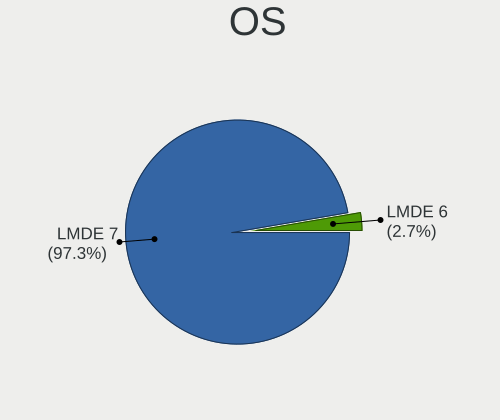

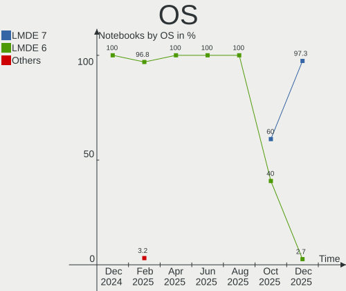

| Name   | Notebooks | Percent |
|--------|-----------|---------|
| LMDE 7 | 36        | 97.3%   |
| LMDE 6 | 1         | 2.7%    |

OS Family
---------

OS without a version

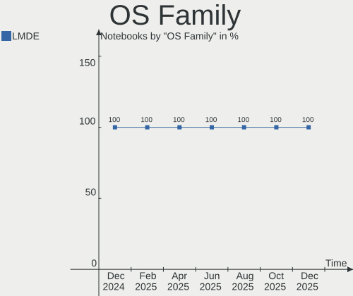

| Name | Notebooks | Percent |
|------|-----------|---------|
| LMDE | 37        | 100%    |

Kernel
------

Version of the Linux kernel

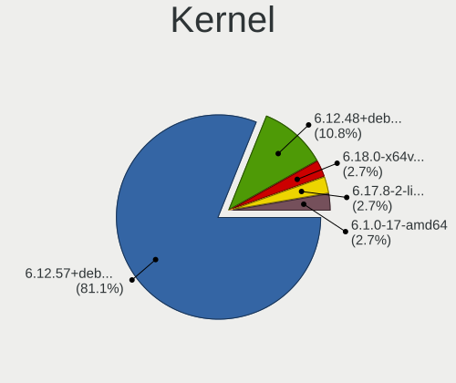

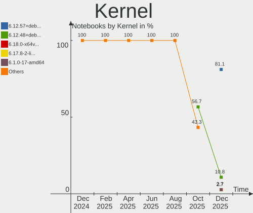

| Version                 | Notebooks | Percent |
|-------------------------|-----------|---------|
| 6.12.57+deb13-amd64     | 30        | 81.08%  |
| 6.12.48+deb13-amd64     | 4         | 10.81%  |
| 6.18.0-x64v2-xanmod1    | 1         | 2.7%    |
| 6.17.8-2-liquorix-amd64 | 1         | 2.7%    |
| 6.1.0-17-amd64          | 1         | 2.7%    |

Kernel Family
-------------

Linux kernel without a distro release

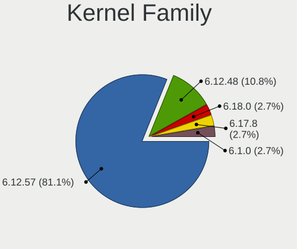

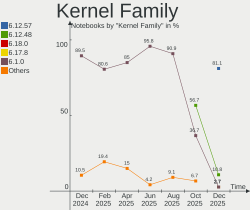

| Version | Notebooks | Percent |
|---------|-----------|---------|
| 6.12.57 | 30        | 81.08%  |
| 6.12.48 | 4         | 10.81%  |
| 6.18.0  | 1         | 2.7%    |
| 6.17.8  | 1         | 2.7%    |
| 6.1.0   | 1         | 2.7%    |

Kernel Major Ver.
-----------------

Linux kernel major version

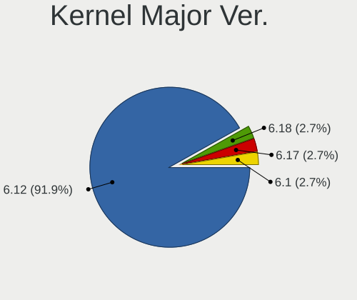

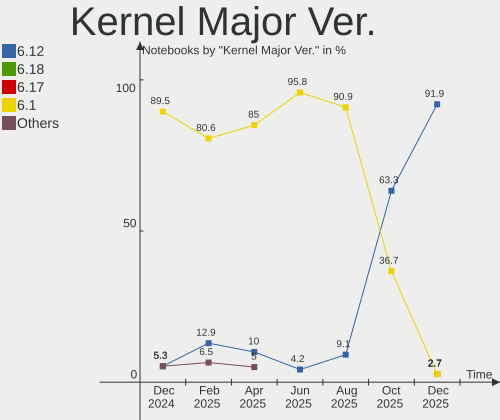

| Version | Notebooks | Percent |
|---------|-----------|---------|
| 6.12    | 34        | 91.89%  |
| 6.18    | 1         | 2.7%    |
| 6.17    | 1         | 2.7%    |
| 6.1     | 1         | 2.7%    |

Arch
----

OS architecture (x86_64, i586, etc.)

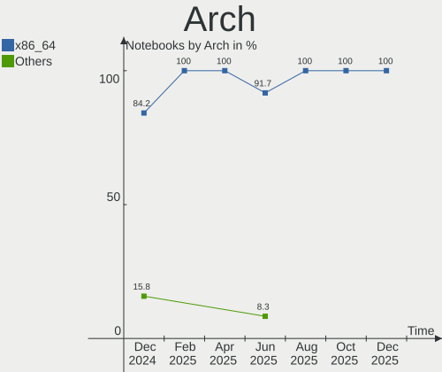

| Name   | Notebooks | Percent |
|--------|-----------|---------|
| x86_64 | 37        | 100%    |

DE
--

Desktop Environment

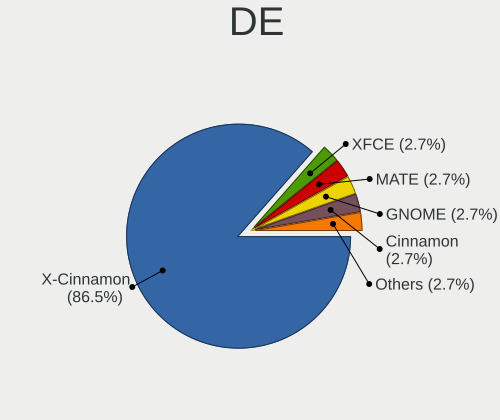

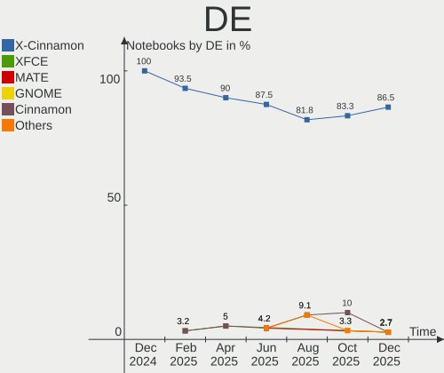

| Name       | Notebooks | Percent |
|------------|-----------|---------|
| X-Cinnamon | 32        | 86.49%  |
| XFCE       | 1         | 2.7%    |
| MATE       | 1         | 2.7%    |
| GNOME      | 1         | 2.7%    |
| Cinnamon   | 1         | 2.7%    |
| Unknown    | 1         | 2.7%    |

Display Server
--------------

X11 or Wayland

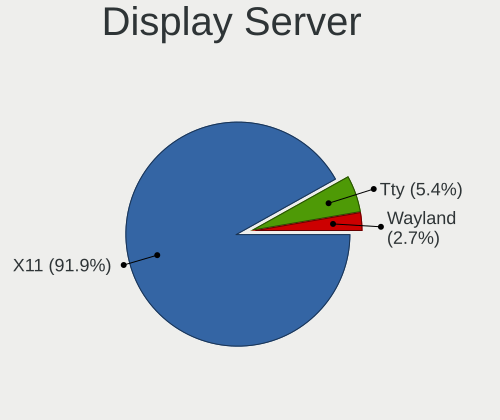

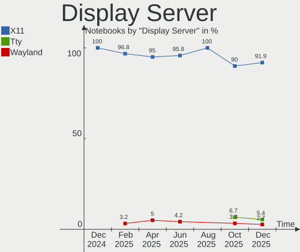

| Name    | Notebooks | Percent |
|---------|-----------|---------|
| X11     | 34        | 91.89%  |
| Tty     | 2         | 5.41%   |
| Wayland | 1         | 2.7%    |

Display Manager
---------------

SDDM, LightDM, etc.

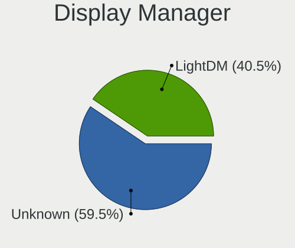

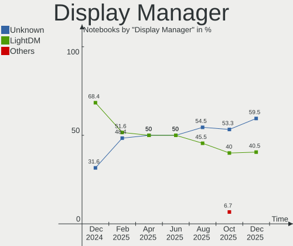

| Name    | Notebooks | Percent |
|---------|-----------|---------|
| Unknown | 22        | 59.46%  |
| LightDM | 15        | 40.54%  |

OS Lang
-------

Language

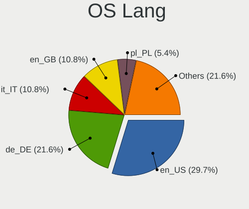

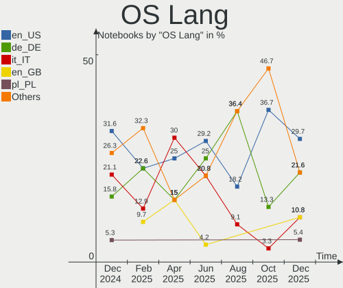

| Lang    | Notebooks | Percent |
|---------|-----------|---------|
| en_US   | 11        | 29.73%  |
| de_DE   | 8         | 21.62%  |
| it_IT   | 4         | 10.81%  |
| en_GB   | 4         | 10.81%  |
| pl_PL   | 2         | 5.41%   |
| fr_FR   | 2         | 5.41%   |
| pt_BR   | 1         | 2.7%    |
| fr_BE   | 1         | 2.7%    |
| fi_FI   | 1         | 2.7%    |
| es_ES   | 1         | 2.7%    |
| en_NZ   | 1         | 2.7%    |
| Unknown | 1         | 2.7%    |

Boot Mode
---------

EFI or BIOS

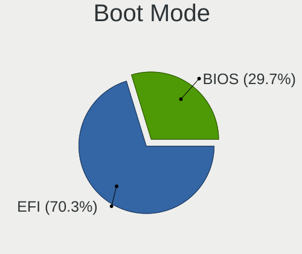

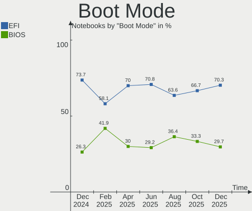

| Mode | Notebooks | Percent |
|------|-----------|---------|
| EFI  | 26        | 70.27%  |
| BIOS | 11        | 29.73%  |

Filesystem
----------

Type of filesystem

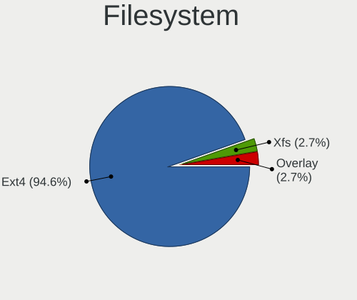

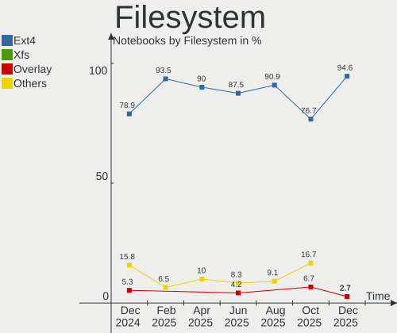

| Type    | Notebooks | Percent |
|---------|-----------|---------|
| Ext4    | 35        | 94.59%  |
| Xfs     | 1         | 2.7%    |
| Overlay | 1         | 2.7%    |

Part. scheme
------------

Scheme of partitioning

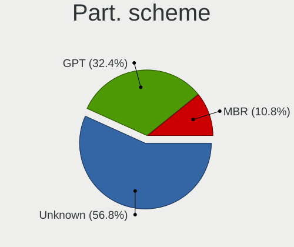

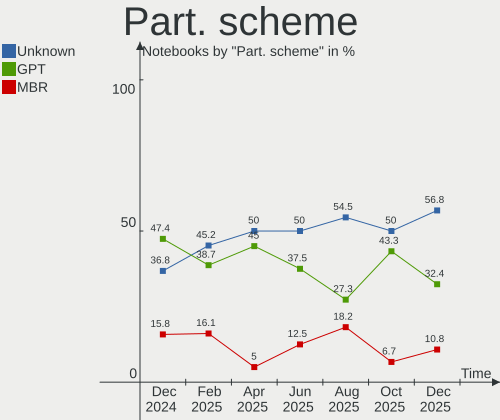

| Type    | Notebooks | Percent |
|---------|-----------|---------|
| Unknown | 21        | 56.76%  |
| GPT     | 12        | 32.43%  |
| MBR     | 4         | 10.81%  |

Dual Boot with Linux/BSD
------------------------

Hosting more than one Linux/BSD

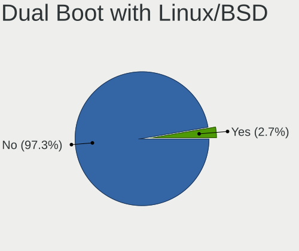

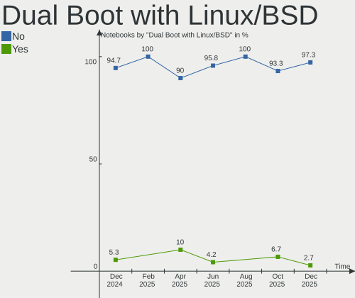

| Dual boot | Notebooks | Percent |
|-----------|-----------|---------|
| No        | 36        | 97.3%   |
| Yes       | 1         | 2.7%    |

Dual Boot (Win)
---------------

Hosting Linux and Windows

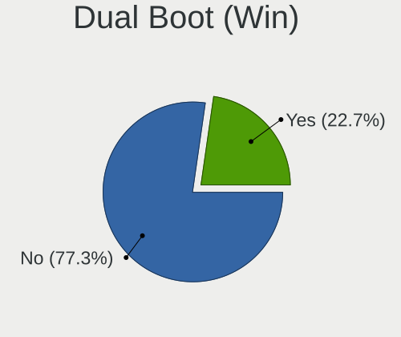

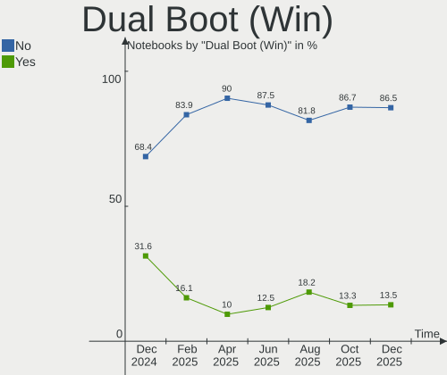

| Dual boot | Notebooks | Percent |
|-----------|-----------|---------|
| No        | 32        | 86.49%  |
| Yes       | 5         | 13.51%  |

Board
-----

Vendor
------

Motherboard manufacturer

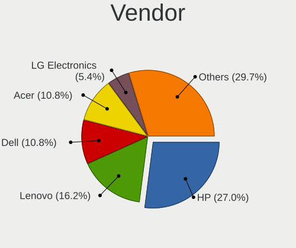

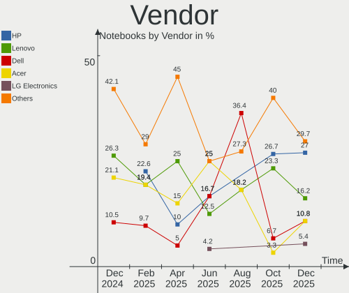

| Name                | Notebooks | Percent |
|---------------------|-----------|---------|
| Hewlett-Packard     | 10        | 27.03%  |
| Lenovo              | 6         | 16.22%  |
| Dell                | 4         | 10.81%  |
| Acer                | 4         | 10.81%  |
| LG Electronics      | 2         | 5.41%   |
| Apple               | 2         | 5.41%   |
| Sony                | 1         | 2.7%    |
| Samsung Electronics | 1         | 2.7%    |
| Packard Bell        | 1         | 2.7%    |
| Medion              | 1         | 2.7%    |
| LETSUNG             | 1         | 2.7%    |
| Google              | 1         | 2.7%    |
| Gigabyte Technology | 1         | 2.7%    |
| ASUSTek Computer    | 1         | 2.7%    |
| AB8139              | 1         | 2.7%    |

Model
-----

Motherboard model

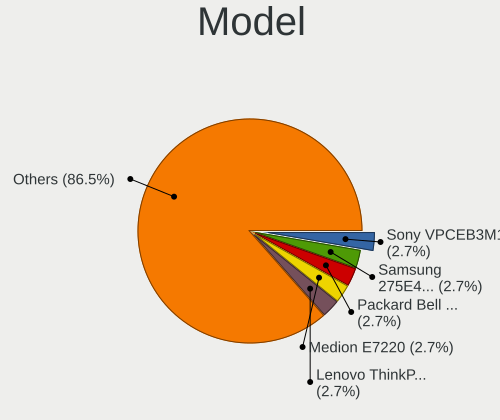

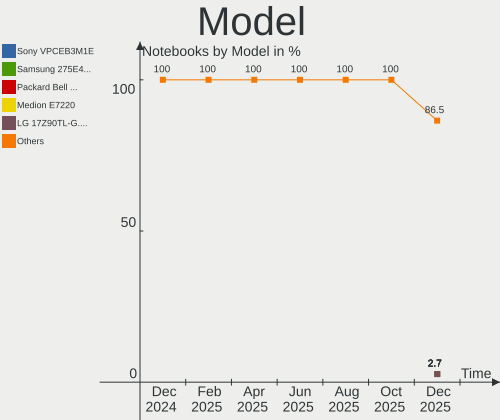

| Name                                     | Notebooks | Percent |
|------------------------------------------|-----------|---------|
| Sony VPCEB3M1E                           | 1         | 2.7%    |
| Samsung 275E4E/275E5E                    | 1         | 2.7%    |
| Packard Bell EasyNote TS11HR             | 1         | 2.7%    |
| Medion E7220                             | 1         | 2.7%    |
| LG 17Z90TL-G.AU8BF                       | 1         | 2.7%    |
| LG 17Z90N-V.AA55G                        | 1         | 2.7%    |
| Lenovo ThinkPad X13 Gen 4 21J3CTO1WW     | 1         | 2.7%    |
| Lenovo ThinkPad T400 2768V82             | 1         | 2.7%    |
| Lenovo ThinkPad P53 20QQS1GXGE           | 1         | 2.7%    |
| Lenovo ThinkPad L440 20AT005EGE          | 1         | 2.7%    |
| Lenovo ThinkPad                          | 1         | 2.7%    |
| Lenovo Legion S7 15IMH5 82BC             | 1         | 2.7%    |
| HP ProBook 455 15.6 inch G10 Notebook PC | 1         | 2.7%    |
| HP ProBook 440 G6                        | 1         | 2.7%    |
| HP OMEN by Gaming Laptop 16-wd0xxx       | 1         | 2.7%    |
| HP Laptop 15-dy1xxx                      | 1         | 2.7%    |
| HP EliteBook 8570p                       | 1         | 2.7%    |
| HP EliteBook 840 G1                      | 1         | 2.7%    |
| HP EliteBook 1030 G1                     | 1         | 2.7%    |
| HP Compaq 6735s                          | 1         | 2.7%    |
| HP 255 15.6 inch G10                     | 1         | 2.7%    |
| HP 250 G3                                | 1         | 2.7%    |
| Google Fleex                             | 1         | 2.7%    |
| Gigabyte B550 VISION D                   | 1         | 2.7%    |
| Dell Precision 7540                      | 1         | 2.7%    |
| Dell Latitude E6440                      | 1         | 2.7%    |
| Dell Latitude 3400                       | 1         | 2.7%    |
| Dell G15 5515                            | 1         | 2.7%    |
| ASUS ASUS Adolbook 14 X1404VAP_ADOL14VA  | 1         | 2.7%    |
| Apple MacBookPro15,2                     | 1         | 2.7%    |
| Apple MacBookPro12,1                     | 1         | 2.7%    |
| Acer Aspire V3-772                       | 1         | 2.7%    |
| Acer Aspire V3-572G                      | 1         | 2.7%    |
| Acer Aspire E1-572G                      | 1         | 2.7%    |
| Acer Aspire 5738                         | 1         | 2.7%    |
| AB8139 LX15PRO                           | 1         | 2.7%    |
| Unknown                                  | 1         | 2.7%    |

Model Family
------------

Motherboard model prefix

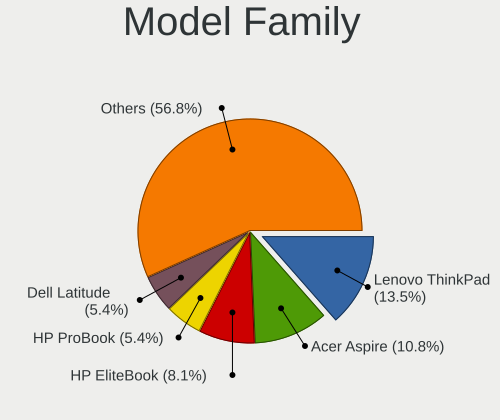

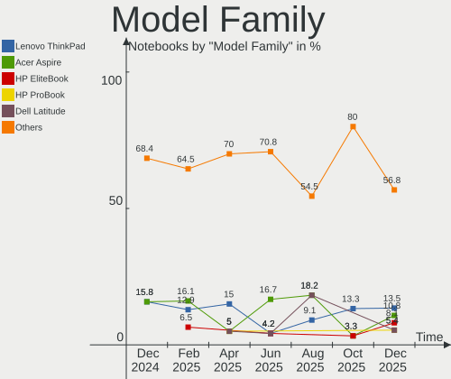

| Name                  | Notebooks | Percent |
|-----------------------|-----------|---------|
| Lenovo ThinkPad       | 5         | 13.51%  |
| Acer Aspire           | 4         | 10.81%  |
| HP EliteBook          | 3         | 8.11%   |
| HP ProBook            | 2         | 5.41%   |
| Dell Latitude         | 2         | 5.41%   |
| Sony VPCEB3M1E        | 1         | 2.7%    |
| Samsung 275E4E        | 1         | 2.7%    |
| Packard Bell EasyNote | 1         | 2.7%    |
| Medion E7220          | 1         | 2.7%    |
| LG 17Z90TL-G.AU8BF    | 1         | 2.7%    |
| LG 17Z90N-V.AA55G     | 1         | 2.7%    |
| Lenovo Legion         | 1         | 2.7%    |
| HP OMEN               | 1         | 2.7%    |
| HP Laptop             | 1         | 2.7%    |
| HP Compaq             | 1         | 2.7%    |
| HP 255                | 1         | 2.7%    |
| HP 250                | 1         | 2.7%    |
| Google Fleex          | 1         | 2.7%    |
| Gigabyte B550         | 1         | 2.7%    |
| Dell Precision        | 1         | 2.7%    |
| Dell G15              | 1         | 2.7%    |
| ASUS ASUS             | 1         | 2.7%    |
| Apple MacBookPro15    | 1         | 2.7%    |
| Apple MacBookPro12    | 1         | 2.7%    |
| AB8139 LX15PRO        | 1         | 2.7%    |
| Unknown               | 1         | 2.7%    |

MFG Year
--------

Motherboard manufacture year

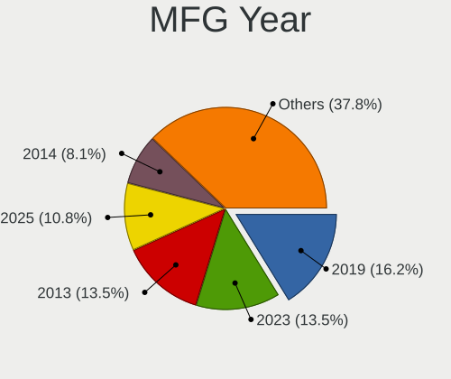

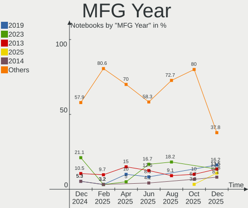

| Year    | Notebooks | Percent |
|---------|-----------|---------|
| 2019    | 6         | 16.22%  |
| 2023    | 5         | 13.51%  |
| 2013    | 5         | 13.51%  |
| 2025    | 4         | 10.81%  |
| 2014    | 3         | 8.11%   |
| 2021    | 2         | 5.41%   |
| 2020    | 2         | 5.41%   |
| 2011    | 2         | 5.41%   |
| 2008    | 2         | 5.41%   |
| 2024    | 1         | 2.7%    |
| 2015    | 1         | 2.7%    |
| 2012    | 1         | 2.7%    |
| 2010    | 1         | 2.7%    |
| 2009    | 1         | 2.7%    |
| Unknown | 1         | 2.7%    |

Form Factor
-----------

Physical design of the computer

| Name     | Notebooks | Percent |
|----------|-----------|---------|
| Notebook | 37        | 100%    |

Secure Boot
-----------

Enabled or disabled

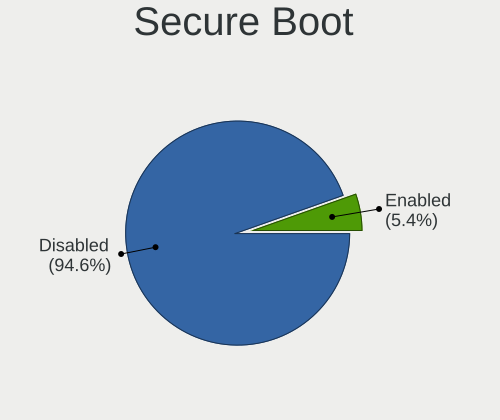

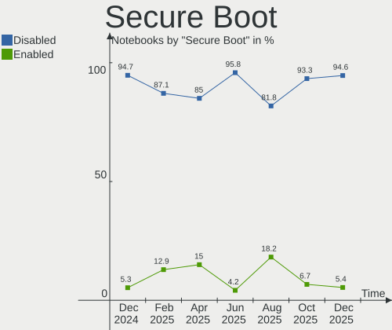

| State    | Notebooks | Percent |
|----------|-----------|---------|
| Disabled | 35        | 94.59%  |
| Enabled  | 2         | 5.41%   |

Coreboot
--------

Have coreboot on board

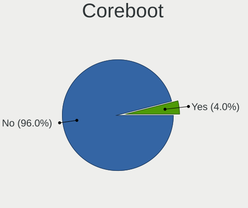

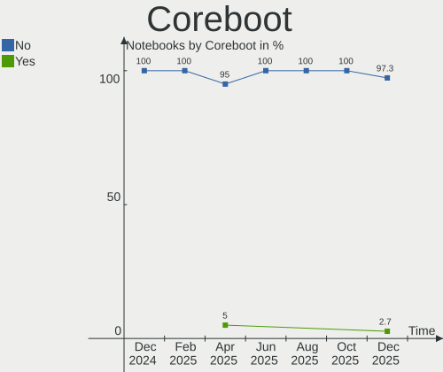

| Used | Notebooks | Percent |
|------|-----------|---------|
| No   | 36        | 97.3%   |
| Yes  | 1         | 2.7%    |

RAM Size
--------

Total RAM memory

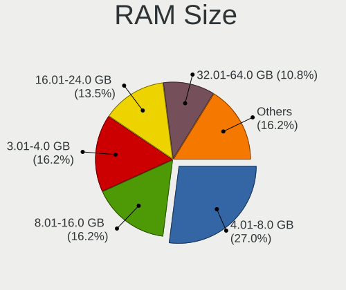

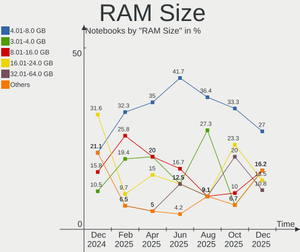

| Size in GB  | Notebooks | Percent |
|-------------|-----------|---------|
| 4.01-8.0    | 10        | 27.03%  |
| 3.01-4.0    | 6         | 16.22%  |
| 8.01-16.0   | 6         | 16.22%  |
| 16.01-24.0  | 5         | 13.51%  |
| 32.01-64.0  | 4         | 10.81%  |
| 24.01-32.0  | 3         | 8.11%   |
| 64.01-256.0 | 3         | 8.11%   |

RAM Used
--------

Used RAM memory

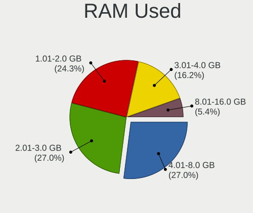

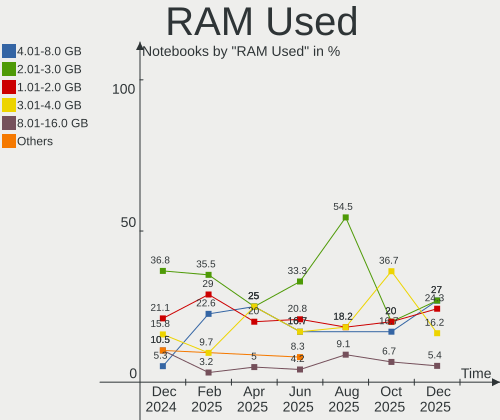

| Used GB   | Notebooks | Percent |
|-----------|-----------|---------|
| 4.01-8.0  | 10        | 27.03%  |
| 2.01-3.0  | 10        | 27.03%  |
| 1.01-2.0  | 9         | 24.32%  |
| 3.01-4.0  | 6         | 16.22%  |
| 8.01-16.0 | 2         | 5.41%   |

Total Drives
------------

Number of drives on board

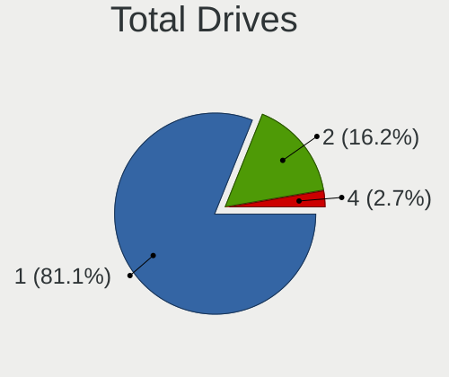

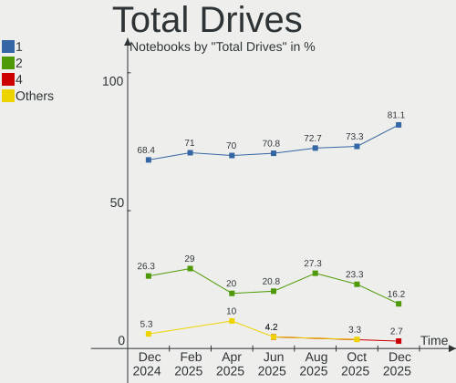

| Drives | Notebooks | Percent |
|--------|-----------|---------|
| 1      | 30        | 81.08%  |
| 2      | 6         | 16.22%  |
| 4      | 1         | 2.7%    |

Has CD-ROM
----------

Has CD-ROM on board

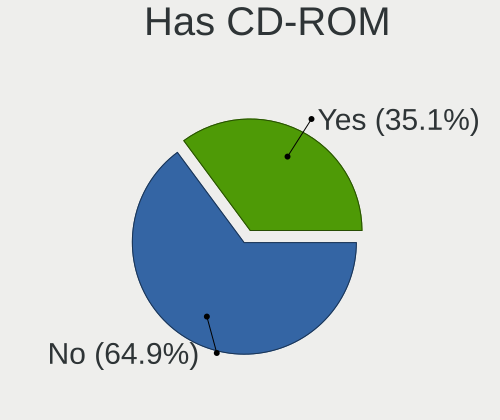

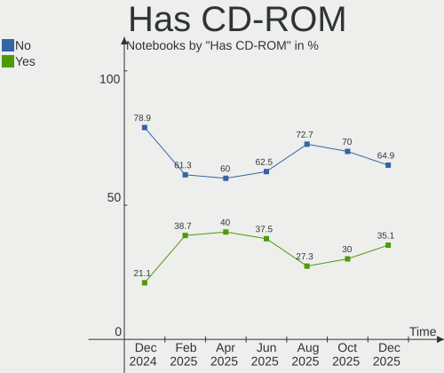

| Presented | Notebooks | Percent |
|-----------|-----------|---------|
| No        | 24        | 64.86%  |
| Yes       | 13        | 35.14%  |

Has Ethernet
------------

Has Ethernet on board

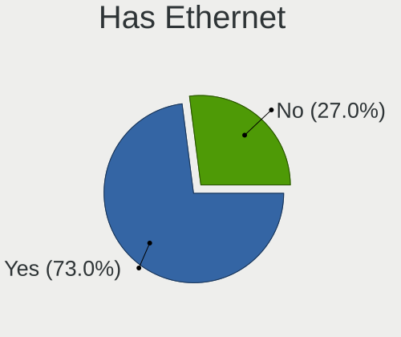

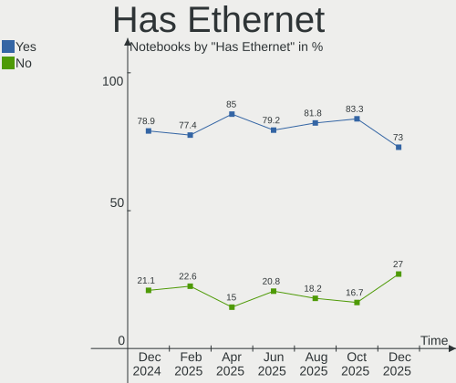

| Presented | Notebooks | Percent |
|-----------|-----------|---------|
| Yes       | 27        | 72.97%  |
| No        | 10        | 27.03%  |

Has WiFi
--------

Has WiFi module

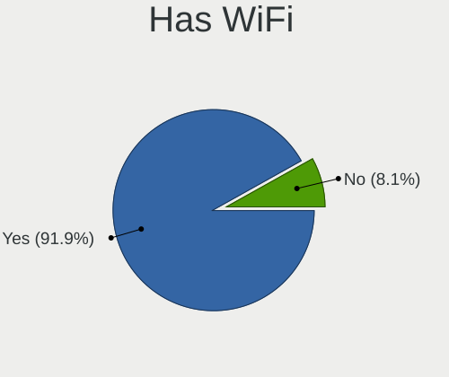

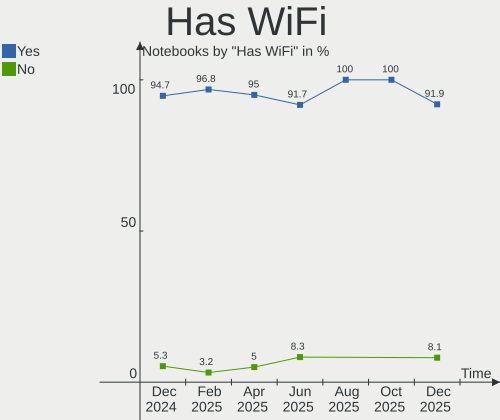

| Presented | Notebooks | Percent |
|-----------|-----------|---------|
| Yes       | 34        | 91.89%  |
| No        | 3         | 8.11%   |

Has Bluetooth
-------------

Has Bluetooth module

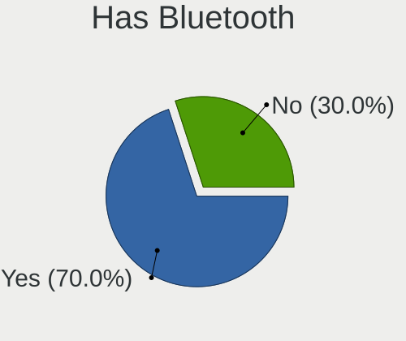

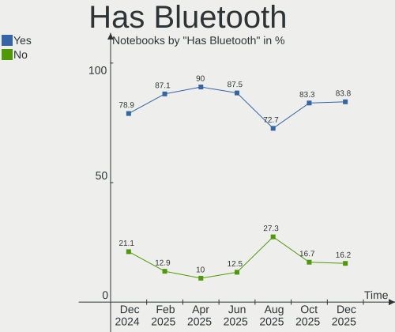

| Presented | Notebooks | Percent |
|-----------|-----------|---------|
| Yes       | 31        | 83.78%  |
| No        | 6         | 16.22%  |

Location
--------

Country
-------

Geographic location (country)

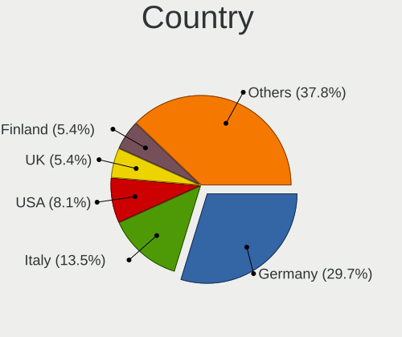

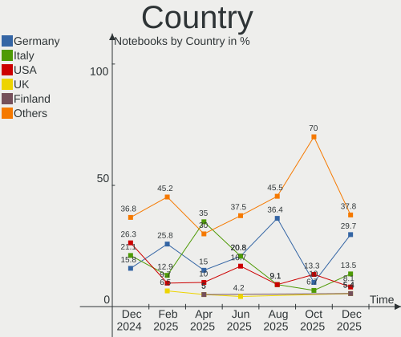

| Country     | Notebooks | Percent |
|-------------|-----------|---------|
| Germany     | 11        | 29.73%  |
| Italy       | 5         | 13.51%  |
| USA         | 3         | 8.11%   |
| UK          | 2         | 5.41%   |
| Finland     | 2         | 5.41%   |
| Austria     | 2         | 5.41%   |
| Spain       | 1         | 2.7%    |
| Slovakia    | 1         | 2.7%    |
| Romania     | 1         | 2.7%    |
| Poland      | 1         | 2.7%    |
| New Zealand | 1         | 2.7%    |
| Morocco     | 1         | 2.7%    |
| Indonesia   | 1         | 2.7%    |
| Guatemala   | 1         | 2.7%    |
| France      | 1         | 2.7%    |
| Canada      | 1         | 2.7%    |
| Brazil      | 1         | 2.7%    |
| Belgium     | 1         | 2.7%    |

City
----

Geographic location (city)

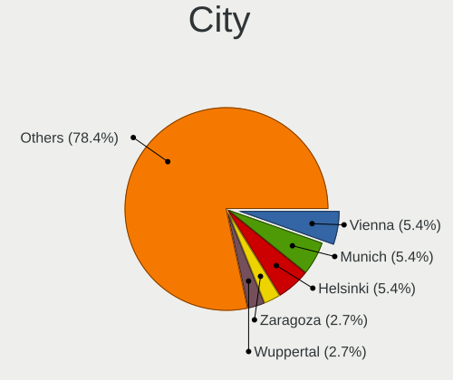

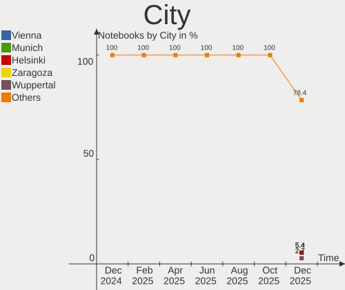

| City           | Notebooks | Percent |
|----------------|-----------|---------|
| Vienna         | 2         | 5.41%   |
| Munich         | 2         | 5.41%   |
| Helsinki       | 2         | 5.41%   |
| Zaragoza       | 1         | 2.7%    |
| Wuppertal      | 1         | 2.7%    |
| Windsor        | 1         | 2.7%    |
| Trier          | 1         | 2.7%    |
| Schorndorf     | 1         | 2.7%    |
| Sao Paulo      | 1         | 2.7%    |
| Sacramento     | 1         | 2.7%    |
| Sabinov        | 1         | 2.7%    |
| Rochester      | 1         | 2.7%    |
| Rochefort      | 1         | 2.7%    |
| Rinteln        | 1         | 2.7%    |
| Poznan         | 1         | 2.7%    |
| Oxford         | 1         | 2.7%    |
| Oppach         | 1         | 2.7%    |
| Nittenau       | 1         | 2.7%    |
| Milan          | 1         | 2.7%    |
| Lemgo          | 1         | 2.7%    |
| Joplin         | 1         | 2.7%    |
| Guatemala City | 1         | 2.7%    |
| Fort Plain     | 1         | 2.7%    |
| Euskirchen     | 1         | 2.7%    |
| Cosenza        | 1         | 2.7%    |
| Compiobbi      | 1         | 2.7%    |
| Colomadu       | 1         | 2.7%    |
| Casier         | 1         | 2.7%    |
| Casablanca     | 1         | 2.7%    |
| Bucharest      | 1         | 2.7%    |
| Brussels       | 1         | 2.7%    |
| Berlin         | 1         | 2.7%    |
| Auckland       | 1         | 2.7%    |
| Albizzate      | 1         | 2.7%    |

Drives
------

Drive Vendor
------------

Hard drive vendors

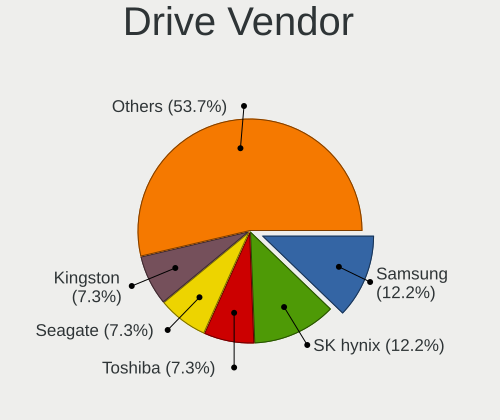

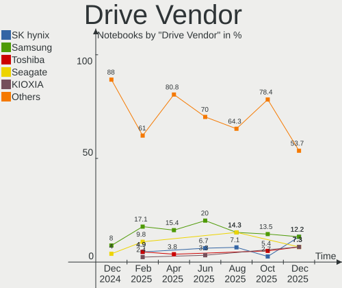

| Vendor                      | Notebooks | Drives | Percent |
|-----------------------------|-----------|--------|---------|
| SK hynix                    | 5         | 5      | 12.2%   |
| Samsung Electronics         | 5         | 6      | 12.2%   |
| Toshiba                     | 3         | 3      | 7.32%   |
| Seagate                     | 3         | 3      | 7.32%   |
| KIOXIA                      | 3         | 3      | 7.32%   |
| Kingston                    | 3         | 3      | 7.32%   |
| Intel                       | 3         | 6      | 7.32%   |
| Sandisk                     | 2         | 2      | 4.88%   |
| GOODRAM                     | 2         | 2      | 4.88%   |
| Apple                       | 2         | 2      | 4.88%   |
| WDC                         | 1         | 1      | 2.44%   |
| Unknown                     | 1         | 1      | 2.44%   |
| Realtek Semiconductor       | 1         | 1      | 2.44%   |
| Phison                      | 1         | 2      | 2.44%   |
| MAXIO Technology (Hangzhou) | 1         | 1      | 2.44%   |
| LITEON                      | 1         | 1      | 2.44%   |
| Lexar                       | 1         | 1      | 2.44%   |
| Crucial                     | 1         | 1      | 2.44%   |
| China                       | 1         | 1      | 2.44%   |
| ADATA Technology            | 1         | 1      | 2.44%   |

Drive Model
-----------

Hard drive models

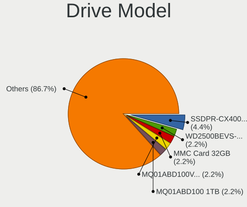

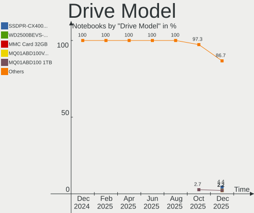

| Model                                            | Notebooks | Percent |
|--------------------------------------------------|-----------|---------|
| GOODRAM SSDPR-CX400-256-G2 256GB                 | 2         | 4.44%   |
| WDC WD2500BEVS-60UST0 250GB                      | 1         | 2.22%   |
| Unknown MMC Card  32GB                           | 1         | 2.22%   |
| Toshiba MQ01ABD100V 1TB                          | 1         | 2.22%   |
| Toshiba MQ01ABD100 1TB                           | 1         | 2.22%   |
| Toshiba MQ01ABD050 500GB                         | 1         | 2.22%   |
| SK hynix SKHynix_HFS001TEJ9X162N 1024GB          | 1         | 2.22%   |
| SK hynix SKHynix_HFS001TD9TNI-L2A0B 1024GB       | 1         | 2.22%   |
| SK hynix PC401 NVMe 512GB                        | 1         | 2.22%   |
| SK hynix HFS512GD9TNG-L2A0A 512GB                | 1         | 2.22%   |
| SK hynix BC501 NVMe Solid State Drive 512GB      | 1         | 2.22%   |
| Seagate ST500LT012-1DG142 500GB                  | 1         | 2.22%   |
| Seagate ST2000LM015-2E8174 2TB                   | 1         | 2.22%   |
| Seagate BarraCuda Q5 ZP1000CV30001 1TB           | 1         | 2.22%   |
| Sandisk WD PC SN560 SDDPNQE-1T00-1102 1024GB     | 1         | 2.22%   |
| Sandisk WD Black SN850 1TB                       | 1         | 2.22%   |
| Samsung SSD 990 PRO 2TB                          | 1         | 2.22%   |
| Samsung SSD 970 EVO Plus 2TB                     | 1         | 2.22%   |
| Samsung SSD 840 EVO 250GB                        | 1         | 2.22%   |
| Samsung PM991 NVMe 256GB                         | 1         | 2.22%   |
| Samsung MZALQ256HAJD-000L1 256GB                 | 1         | 2.22%   |
| Samsung MZ7PD256HCGM-000H7 256GB SSD             | 1         | 2.22%   |
| Realtek NE-256 2280 256GB                        | 1         | 2.22%   |
| Phison ESO01TBHLCJ-EL1-2AK                       | 1         | 2.22%   |
| MAXIO (Hangzhou) NVMe SSD Controller MAP1202 2TB | 1         | 2.22%   |
| LITEON IT LCS-128L9S-11 2.5 7mm 128GB SSD        | 1         | 2.22%   |
| Lexar SSD NM100 128GB                            | 1         | 2.22%   |
| KIOXIA KXG8AZNV1T02 LA 1024GB                    | 1         | 2.22%   |
| KIOXIA KBG60ZNV512G 512GB                        | 1         | 2.22%   |
| KIOXIA KBG40ZNS512G NVMe 512GB                   | 1         | 2.22%   |
| Kingston SV300S37A240G 240GB SSD                 | 1         | 2.22%   |
| Kingston SKC600256G 256GB SSD                    | 1         | 2.22%   |
| Kingston SA400S37480G 480GB SSD                  | 1         | 2.22%   |
| Intel SSDSCKGF240A5H REF 240GB                   | 1         | 2.22%   |
| Intel SSDPEKNU020TZ 2TB                          | 1         | 2.22%   |
| Intel HBRPEKNX0202AHO BTTE94761D1U512B-2 32GB    | 1         | 2.22%   |
| Intel HBRPEKNX0202AH 512GB                       | 1         | 2.22%   |
| Intel HBRPEKNX0101AHO BTTE002313D7256D-2 16GB    | 1         | 2.22%   |
| Intel HBRPEKNX0101AH BTTE002313D7256D-1 256GB    | 1         | 2.22%   |
| Crucial CT1000BX500SSD1 1TB                      | 1         | 2.22%   |

HDD Vendor
----------

Hard disk drive vendors

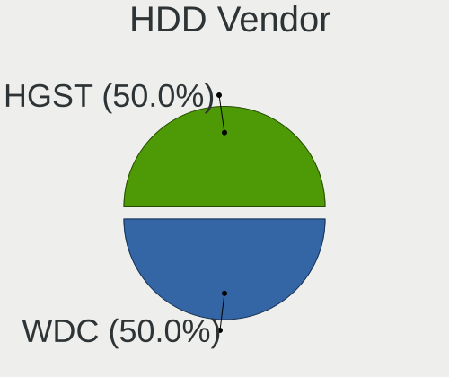

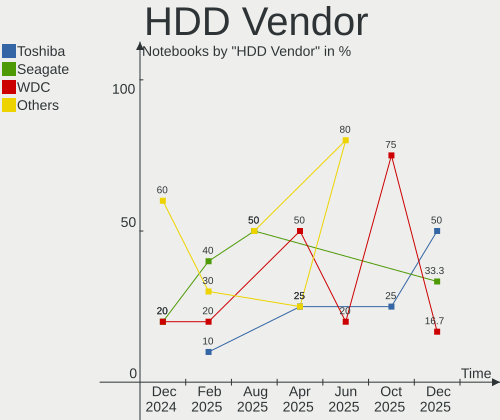

| Vendor  | Notebooks | Drives | Percent |
|---------|-----------|--------|---------|
| Toshiba | 3         | 3      | 50%     |
| Seagate | 2         | 2      | 33.33%  |
| WDC     | 1         | 1      | 16.67%  |

SSD Vendor
----------

Solid state drive vendors

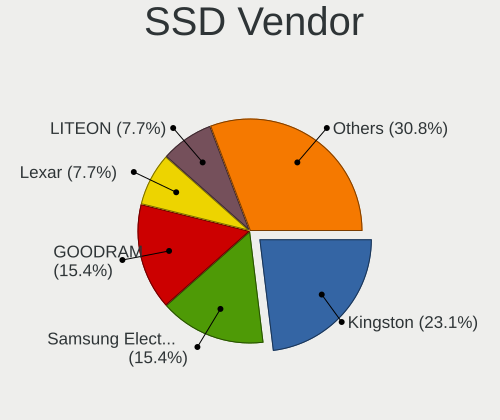

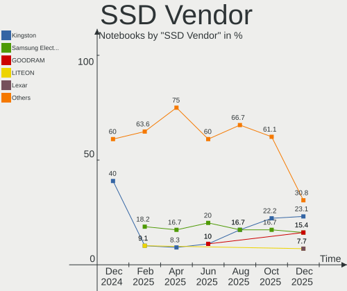

| Vendor              | Notebooks | Drives | Percent |
|---------------------|-----------|--------|---------|
| Kingston            | 3         | 3      | 23.08%  |
| Samsung Electronics | 2         | 2      | 15.38%  |
| GOODRAM             | 2         | 2      | 15.38%  |
| LITEON              | 1         | 1      | 7.69%   |
| Lexar               | 1         | 1      | 7.69%   |
| Intel               | 1         | 1      | 7.69%   |
| Crucial             | 1         | 1      | 7.69%   |
| China               | 1         | 1      | 7.69%   |
| Apple               | 1         | 1      | 7.69%   |

Drive Kind
----------

HDD or SSD

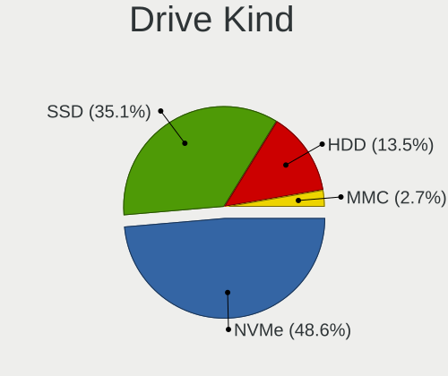

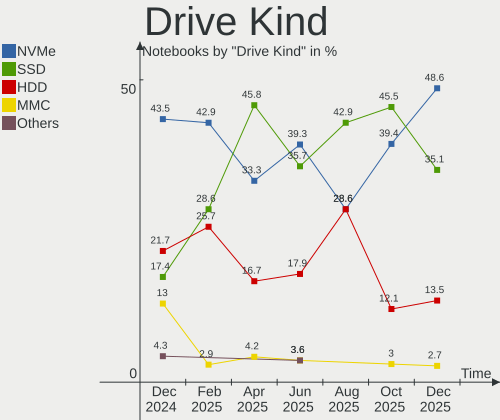

| Kind | Notebooks | Drives | Percent |
|------|-----------|--------|---------|
| NVMe | 18        | 26     | 48.65%  |
| SSD  | 13        | 13     | 35.14%  |
| HDD  | 5         | 6      | 13.51%  |
| MMC  | 1         | 1      | 2.7%    |

Drive Connector
---------------

SATA, SAS, NVMe, etc.

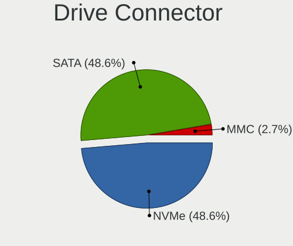

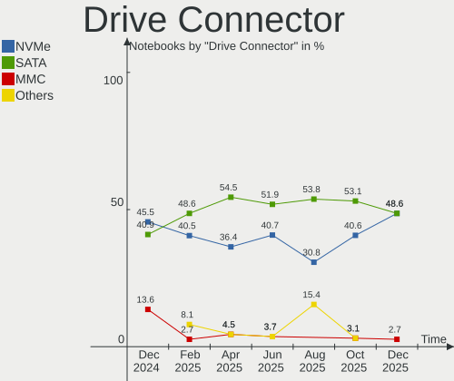

| Type | Notebooks | Drives | Percent |
|------|-----------|--------|---------|
| NVMe | 18        | 26     | 48.65%  |
| SATA | 18        | 19     | 48.65%  |
| MMC  | 1         | 1      | 2.7%    |

Drive Size
----------

Size of hard drive

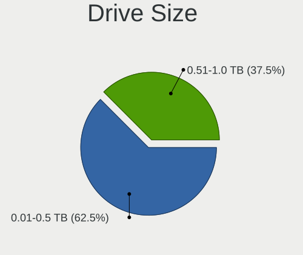

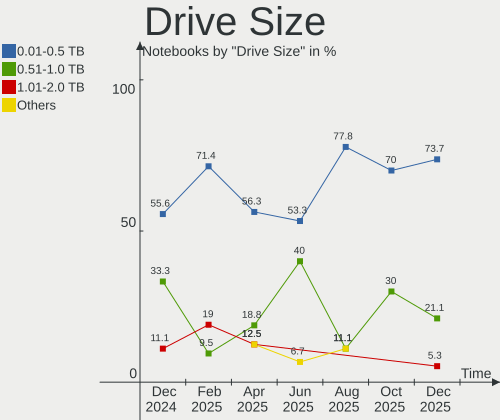

| Size in TB | Notebooks | Drives | Percent |
|------------|-----------|--------|---------|
| 0.01-0.5   | 14        | 14     | 73.68%  |
| 0.51-1.0   | 4         | 4      | 21.05%  |
| 1.01-2.0   | 1         | 1      | 5.26%   |

Space Total
-----------

Amount of disk space available on the file system

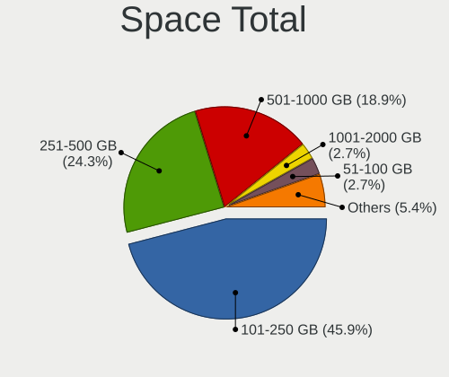

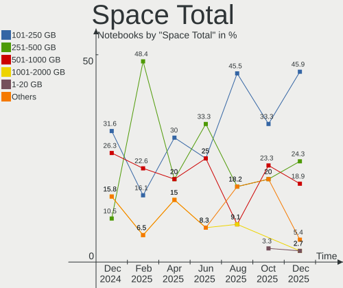

| Size in GB | Notebooks | Percent |
|------------|-----------|---------|
| 101-250    | 17        | 45.95%  |
| 251-500    | 9         | 24.32%  |
| 501-1000   | 7         | 18.92%  |
| 1001-2000  | 1         | 2.7%    |
| 1-20       | 1         | 2.7%    |
| 51-100     | 1         | 2.7%    |
| Unknown    | 1         | 2.7%    |

Space Used
----------

Amount of used disk space

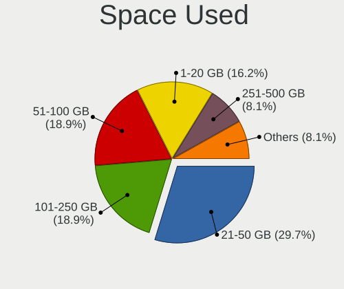

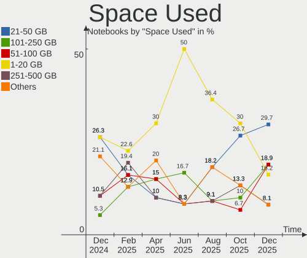

| Used GB  | Notebooks | Percent |
|----------|-----------|---------|
| 21-50    | 11        | 29.73%  |
| 101-250  | 7         | 18.92%  |
| 51-100   | 7         | 18.92%  |
| 1-20     | 6         | 16.22%  |
| 251-500  | 3         | 8.11%   |
| 501-1000 | 2         | 5.41%   |
| Unknown  | 1         | 2.7%    |

Malfunc. Drives
---------------

Drive models with a malfunction

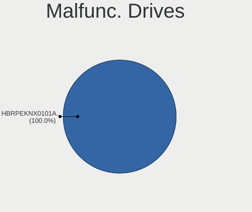

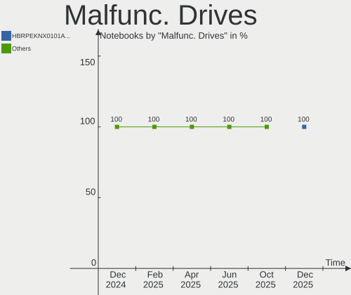

| Model                                         | Notebooks | Drives | Percent |
|-----------------------------------------------|-----------|--------|---------|
| Intel HBRPEKNX0101AHO BTTE002313D7256D-2 16GB | 1         | 1      | 100%    |

Malfunc. Drive Vendor
---------------------

Vendors of faulty drives

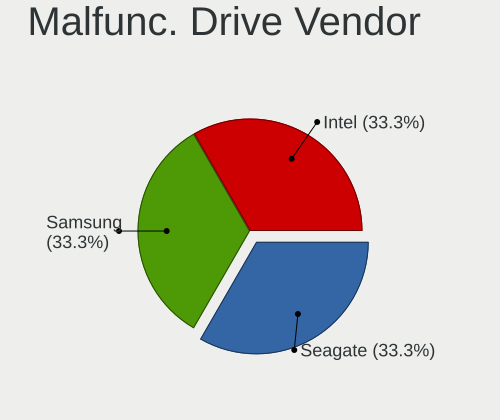

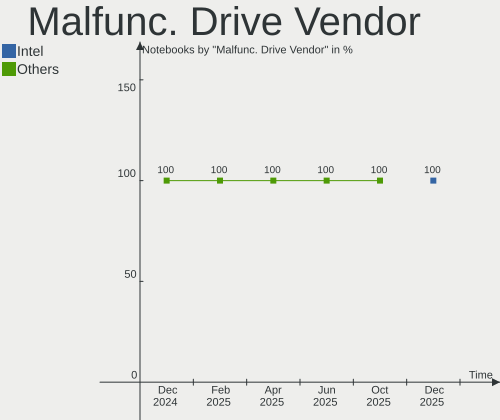

| Vendor | Notebooks | Drives | Percent |
|--------|-----------|--------|---------|
| Intel  | 1         | 1      | 100%    |

Malfunc. HDD Vendor
-------------------

Vendors of faulty HDD drives

Zero info for selected period =(

Malfunc. Drive Kind
-------------------

Kinds of faulty drives

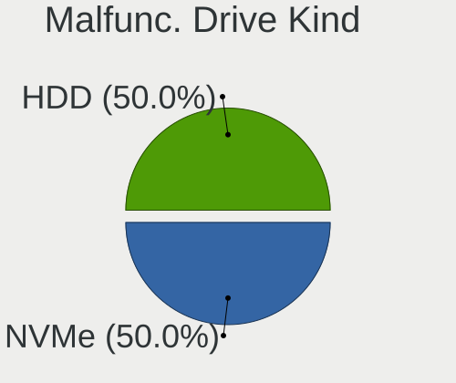

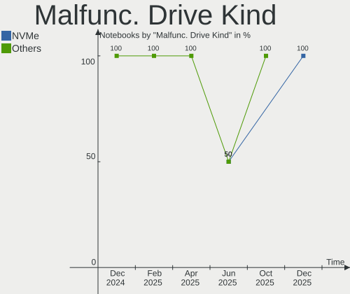

| Kind | Notebooks | Drives | Percent |
|------|-----------|--------|---------|
| NVMe | 1         | 1      | 100%    |

Failed Drives
-------------

Failed drive models

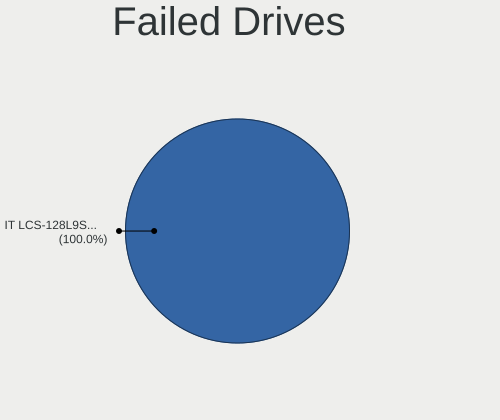

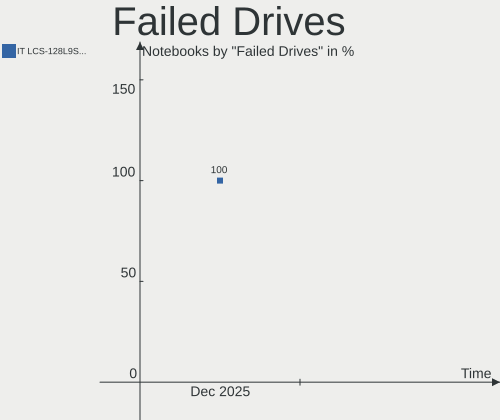

| Model                                     | Notebooks | Drives | Percent |
|-------------------------------------------|-----------|--------|---------|
| LITEON IT LCS-128L9S-11 2.5 7mm 128GB SSD | 1         | 1      | 100%    |

Failed Drive Vendor
-------------------

Failed drive vendors

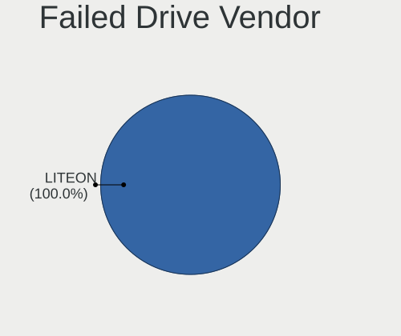

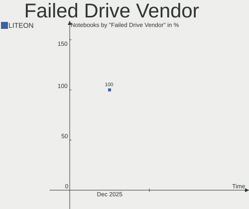

| Vendor | Notebooks | Drives | Percent |
|--------|-----------|--------|---------|
| LITEON | 1         | 1      | 100%    |

Drive Status
------------

Number of failed and malfunc. drives

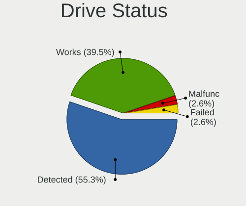

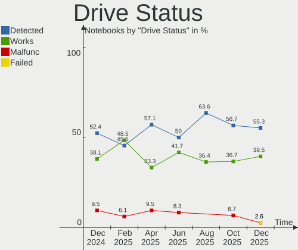

| Status   | Notebooks | Drives | Percent |
|----------|-----------|--------|---------|
| Detected | 21        | 24     | 55.26%  |
| Works    | 15        | 20     | 39.47%  |
| Malfunc  | 1         | 1      | 2.63%   |
| Failed   | 1         | 1      | 2.63%   |

Storage controller
------------------

Storage Vendor
--------------

Storage controller vendors

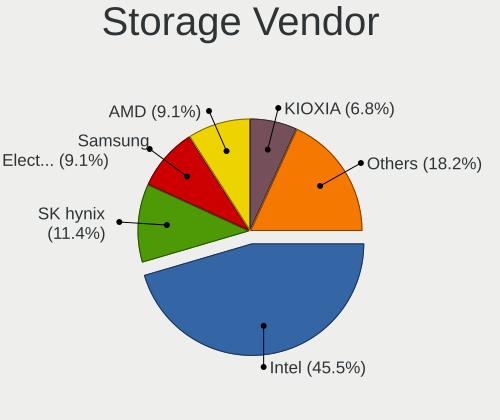

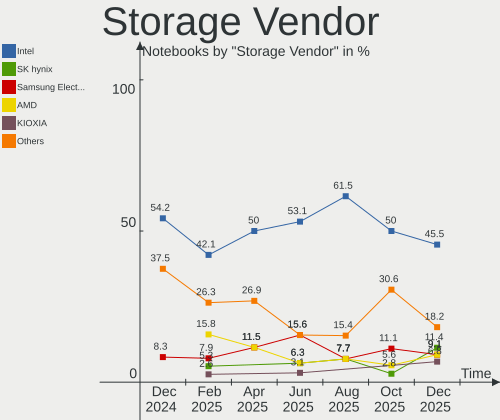

| Vendor                      | Notebooks | Percent |
|-----------------------------|-----------|---------|
| Intel                       | 20        | 45.45%  |
| SK hynix                    | 5         | 11.36%  |
| Samsung Electronics         | 4         | 9.09%   |
| AMD                         | 4         | 9.09%   |
| KIOXIA                      | 3         | 6.82%   |
| SanDisk                     | 2         | 4.55%   |
| Seagate Technology          | 1         | 2.27%   |
| Realtek Semiconductor       | 1         | 2.27%   |
| Phison Electronics          | 1         | 2.27%   |
| MAXIO Technology (Hangzhou) | 1         | 2.27%   |
| Apple                       | 1         | 2.27%   |
| ADATA Technology            | 1         | 2.27%   |

Storage Model
-------------

Storage controller models

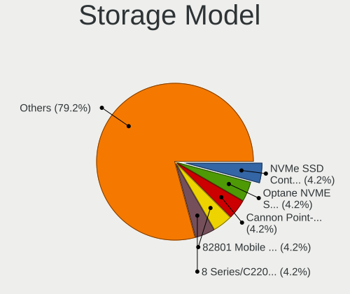

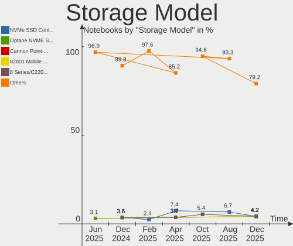

| Model                                                                          | Notebooks | Percent |
|--------------------------------------------------------------------------------|-----------|---------|
| Samsung NVMe SSD Controller 980 (DRAM-less)                                    | 2         | 4.17%   |
| Intel Optane NVME SSD H10 with Solid State Storage [Teton Glacier]             | 2         | 4.17%   |
| Intel Cannon Point-LP SATA Controller [AHCI Mode]                              | 2         | 4.17%   |
| Intel 82801 Mobile SATA Controller [RAID mode]                                 | 2         | 4.17%   |
| Intel 8 Series/C220 Series Chipset Family 6-port SATA Controller 1 [AHCI mode] | 2         | 4.17%   |
| Intel 8 Series SATA Controller 1 [AHCI mode]                                   | 2         | 4.17%   |
| Intel 6 Series/C200 Series Chipset Family 6 port Mobile SATA AHCI Controller   | 2         | 4.17%   |
| AMD FCH SATA Controller [AHCI mode]                                            | 2         | 4.17%   |
| SK hynix Platinum P41/PC801 NVMe Solid State Drive                             | 1         | 2.08%   |
| SK hynix PC611 NVMe Solid State Drive                                          | 1         | 2.08%   |
| SK hynix PC601 NVMe Solid State Drive                                          | 1         | 2.08%   |
| SK hynix PC401 NVMe Solid State Drive 256GB                                    | 1         | 2.08%   |
| SK hynix BC501 NVMe Solid State Drive                                          | 1         | 2.08%   |
| Seagate BarraCuda Q5 NVMe SSD (DRAM-less)                                      | 1         | 2.08%   |
| SanDisk WD SN560/SN740/SN770/SN5000 NVMe SSD                                   | 1         | 2.08%   |
| SanDisk WD PC SN810 / Black SN850 NVMe SSD                                     | 1         | 2.08%   |
| Samsung S4LN058A01[SSUBX] AHCI SSD Controller (Apple slot)                     | 1         | 2.08%   |
| Samsung NVMe SSD Controller SM981/PM981/PM983                                  | 1         | 2.08%   |
| Samsung NVMe SSD Controller S4LV008[Pascal]                                    | 1         | 2.08%   |
| Realtek RTS5765DL NVMe SSD Controller (DRAM-less)                              | 1         | 2.08%   |
| Phison PS5021-E21 PCIe4 NVMe Controller (DRAM-less)                            | 1         | 2.08%   |
| MAXIO (Hangzhou) NVMe SSD Controller MAP1202 (DRAM-less)                       | 1         | 2.08%   |
| KIOXIA NVMe SSD Controller XG8                                                 | 1         | 2.08%   |
| KIOXIA NVMe SSD Controller BG6 (DRAM-less)                                     | 1         | 2.08%   |
| KIOXIA NVMe SSD Controller BG4 (DRAM-less)                                     | 1         | 2.08%   |
| Intel Wildcat Point-LP SATA Controller [AHCI Mode]                             | 1         | 2.08%   |
| Intel Sunrise Point-LP SATA Controller [AHCI mode]                             | 1         | 2.08%   |
| Intel SSD 670p Series [Keystone Harbor]                                        | 1         | 2.08%   |
| Intel RST Volume Management Device Controller                                  | 1         | 2.08%   |
| Intel Celeron/Pentium Silver Processor SATA Controller                         | 1         | 2.08%   |
| Intel Cannon Lake Mobile PCH SATA AHCI Controller                              | 1         | 2.08%   |
| Intel Atom Processor E3800 Series SATA AHCI Controller                         | 1         | 2.08%   |
| Intel 82801IBM/IEM (ICH9M/ICH9M-E) 4 port SATA Controller [AHCI mode]          | 1         | 2.08%   |
| Intel 82801IBM/IEM (ICH9M/ICH9M-E) 2 port SATA Controller [IDE mode]           | 1         | 2.08%   |
| Intel 7 Series Chipset Family 6-port SATA Controller [AHCI mode]               | 1         | 2.08%   |
| Intel 5 Series/3400 Series Chipset 4 port SATA AHCI Controller                 | 1         | 2.08%   |
| Apple ANS2 NVMe Controller                                                     | 1         | 2.08%   |
| AMD SB7x0/SB8x0/SB9x0 SATA Controller [AHCI mode]                              | 1         | 2.08%   |
| AMD 500 Series Chipset SATA Controller                                         | 1         | 2.08%   |
| ADATA XPG SX8200 Pro PCIe Gen3x4 M.2 2280 Solid State Drive                    | 1         | 2.08%   |

Storage Kind
------------

Kind of storage controller (IDE, SATA, NVMe, SAS, ...)

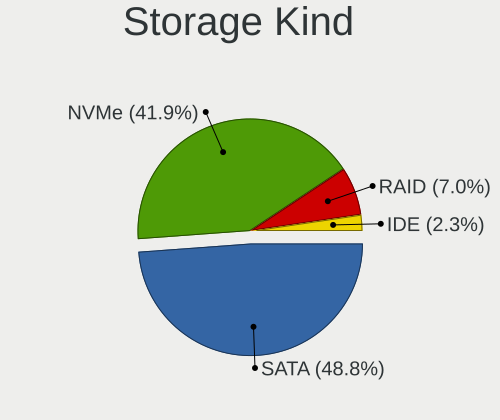

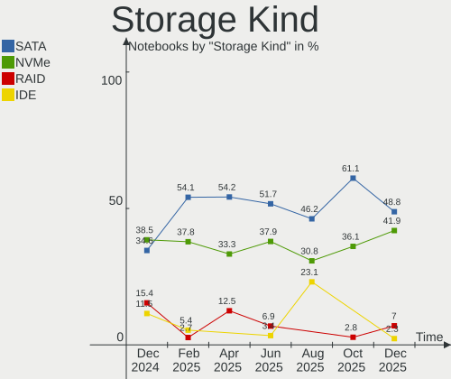

| Kind | Notebooks | Percent |
|------|-----------|---------|
| SATA | 21        | 48.84%  |
| NVMe | 18        | 41.86%  |
| RAID | 3         | 6.98%   |
| IDE  | 1         | 2.33%   |

Processor
---------

CPU Vendor
----------

Processor vendors

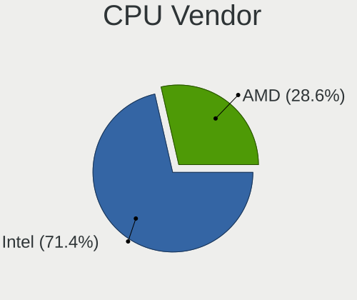

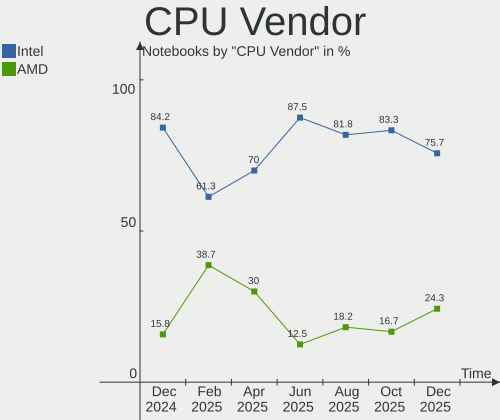

| Vendor | Notebooks | Percent |
|--------|-----------|---------|
| Intel  | 28        | 75.68%  |
| AMD    | 9         | 24.32%  |

CPU Model
---------

Processor models

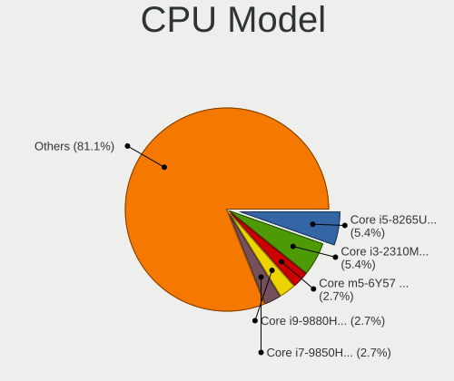

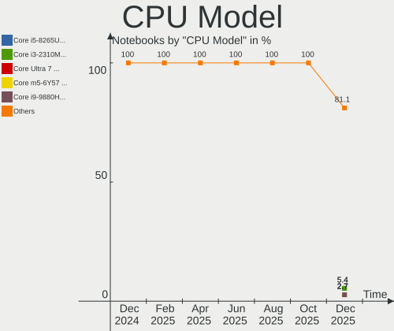

| Model                                         | Notebooks | Percent |
|-----------------------------------------------|-----------|---------|
| Intel Core i5-8265U CPU @ 1.60GHz             | 2         | 5.41%   |
| Intel Core i3-2310M CPU @ 2.10GHz             | 2         | 5.41%   |
| Intel Core Ultra 7 258V                       | 1         | 2.7%    |
| Intel Core m5-6Y57 CPU @ 1.10GHz              | 1         | 2.7%    |
| Intel Core i9-9880H CPU @ 2.30GHz             | 1         | 2.7%    |
| Intel Core i7-9850H CPU @ 2.60GHz             | 1         | 2.7%    |
| Intel Core i7-4702MQ CPU @ 2.20GHz            | 1         | 2.7%    |
| Intel Core i7-4600U CPU @ 2.10GHz             | 1         | 2.7%    |
| Intel Core i7-10875H CPU @ 2.30GHz            | 1         | 2.7%    |
| Intel Core i7-1065G7 CPU @ 1.30GHz            | 1         | 2.7%    |
| Intel Core i5-8259U CPU @ 2.30GHz             | 1         | 2.7%    |
| Intel Core i5-5257U CPU @ 2.70GHz             | 1         | 2.7%    |
| Intel Core i5-5200U CPU @ 2.20GHz             | 1         | 2.7%    |
| Intel Core i5-4310M CPU @ 2.70GHz             | 1         | 2.7%    |
| Intel Core i5-4210M CPU @ 2.60GHz             | 1         | 2.7%    |
| Intel Core i5-4200U CPU @ 1.60GHz             | 1         | 2.7%    |
| Intel Core i5-3340M CPU @ 2.70GHz             | 1         | 2.7%    |
| Intel Core i5-1035G7 CPU @ 1.20GHz            | 1         | 2.7%    |
| Intel Core i3 CPU M 370 @ 2.40GHz             | 1         | 2.7%    |
| Intel Core 5 120U                             | 1         | 2.7%    |
| Intel Core 2 Duo CPU P8600 @ 2.40GHz          | 1         | 2.7%    |
| Intel Core 2 Duo CPU P7450 @ 2.13GHz          | 1         | 2.7%    |
| Intel Celeron N4020 CPU @ 1.10GHz             | 1         | 2.7%    |
| Intel Celeron N4000 CPU @ 1.10GHz             | 1         | 2.7%    |
| Intel Celeron CPU N2840 @ 2.16GHz             | 1         | 2.7%    |
| Intel 13th Gen Core i5-13420H                 | 1         | 2.7%    |
| AMD Sempron SI-40                             | 1         | 2.7%    |
| AMD Ryzen 7 PRO 7840U w/ Radeon 780M Graphics | 1         | 2.7%    |
| AMD Ryzen 7 7730U with Radeon Graphics        | 1         | 2.7%    |
| AMD Ryzen 7 5800X3D 8-Core Processor          | 1         | 2.7%    |
| AMD Ryzen 7 5800H with Radeon Graphics        | 1         | 2.7%    |
| AMD Ryzen 5 7530U with Radeon Graphics        | 1         | 2.7%    |
| AMD Ryzen 5 7430U with Radeon Graphics        | 1         | 2.7%    |
| AMD Ryzen 5 5500U with Radeon Graphics        | 1         | 2.7%    |
| AMD E1-1500 APU with Radeon HD Graphics       | 1         | 2.7%    |

CPU Model Family
----------------

Processor model prefix

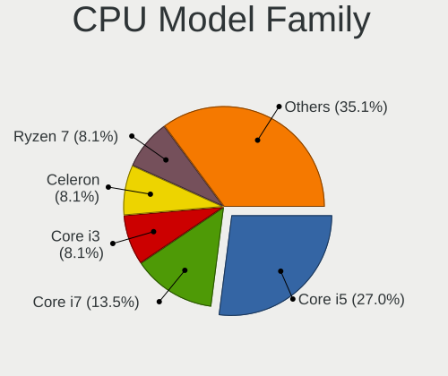

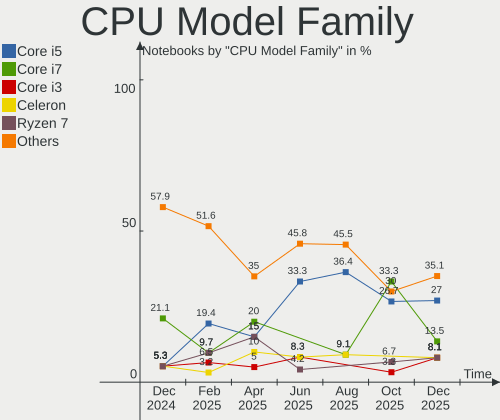

| Model            | Notebooks | Percent |
|------------------|-----------|---------|
| Intel Core i5    | 10        | 27.03%  |
| Intel Core i7    | 5         | 13.51%  |
| Intel Core i3    | 3         | 8.11%   |
| Intel Celeron    | 3         | 8.11%   |
| AMD Ryzen 7      | 3         | 8.11%   |
| AMD Ryzen 5      | 3         | 8.11%   |
| Intel Core 2 Duo | 2         | 5.41%   |
| Intel Core       | 2         | 5.41%   |
| Other            | 1         | 2.7%    |
| Intel Core m5    | 1         | 2.7%    |
| Intel Core i9    | 1         | 2.7%    |
| AMD Sempron      | 1         | 2.7%    |
| AMD Ryzen 7 PRO  | 1         | 2.7%    |
| AMD E1           | 1         | 2.7%    |

CPU Cores
---------

Number of processor cores

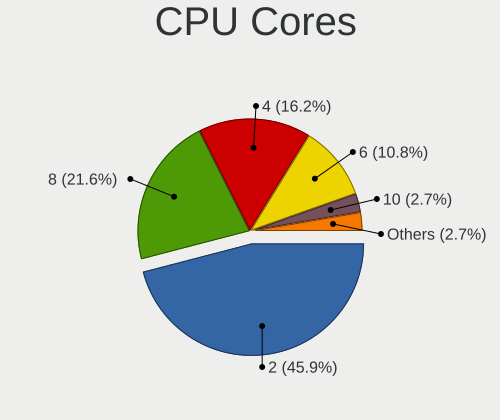

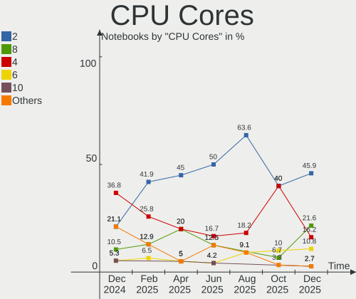

| Number | Notebooks | Percent |
|--------|-----------|---------|
| 2      | 17        | 45.95%  |
| 8      | 8         | 21.62%  |
| 4      | 6         | 16.22%  |
| 6      | 4         | 10.81%  |
| 10     | 1         | 2.7%    |
| 1      | 1         | 2.7%    |

CPU Sockets
-----------

Number of sockets

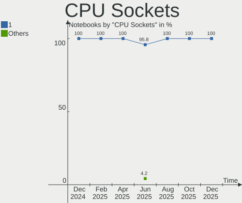

| Number | Notebooks | Percent |
|--------|-----------|---------|
| 1      | 37        | 100%    |

CPU Threads
-----------

Threads per core (Hyper-Threading)

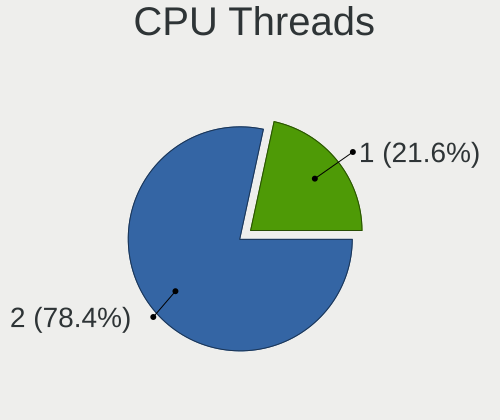

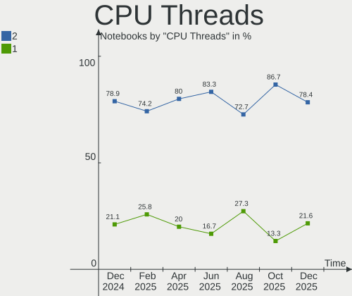

| Number | Notebooks | Percent |
|--------|-----------|---------|
| 2      | 29        | 78.38%  |
| 1      | 8         | 21.62%  |

CPU Op-Modes
------------

CPU Operation Modes (32-bit, 64-bit)

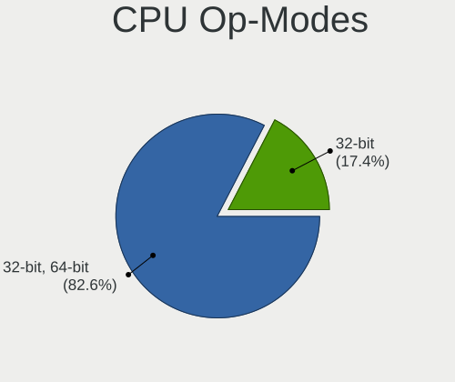

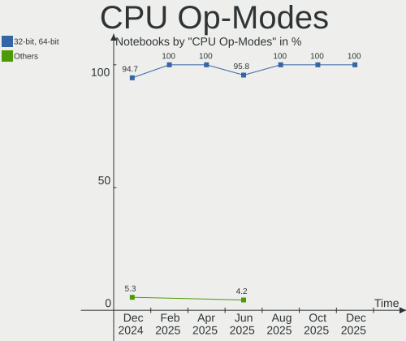

| Op mode        | Notebooks | Percent |
|----------------|-----------|---------|
| 32-bit, 64-bit | 37        | 100%    |

CPU Microcode
-------------

Microcode number

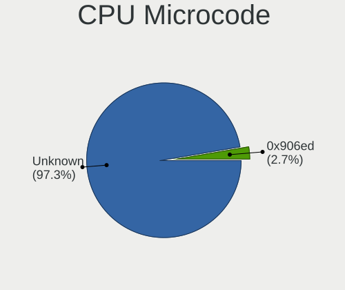

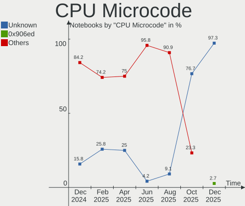

| Number  | Notebooks | Percent |
|---------|-----------|---------|
| Unknown | 36        | 97.3%   |
| 0x906ed | 1         | 2.7%    |

CPU Microarch
-------------

Microarchitecture

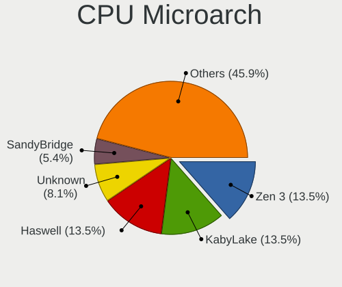

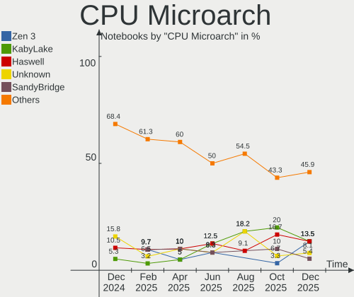

| Name             | Notebooks | Percent |
|------------------|-----------|---------|
| Zen 3            | 5         | 13.51%  |
| KabyLake         | 5         | 13.51%  |
| Haswell          | 5         | 13.51%  |
| Unknown          | 3         | 8.11%   |
| SandyBridge      | 2         | 5.41%   |
| Penryn           | 2         | 5.41%   |
| IceLake          | 2         | 5.41%   |
| Goldmont plus    | 2         | 5.41%   |
| Broadwell        | 2         | 5.41%   |
| Alderlake Hybrid | 2         | 5.41%   |
| Westmere         | 1         | 2.7%    |
| Skylake          | 1         | 2.7%    |
| Silvermont       | 1         | 2.7%    |
| K8 & K10 hybrid  | 1         | 2.7%    |
| IvyBridge        | 1         | 2.7%    |
| CometLake        | 1         | 2.7%    |
| Bobcat           | 1         | 2.7%    |

Graphics
--------

GPU Vendor
----------

Vendors of graphics cards

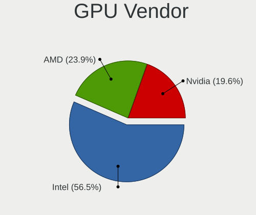

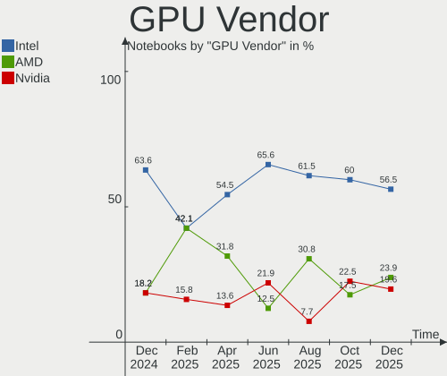

| Vendor | Notebooks | Percent |
|--------|-----------|---------|
| Intel  | 26        | 56.52%  |
| AMD    | 11        | 23.91%  |
| Nvidia | 9         | 19.57%  |

GPU Model
---------

Graphics card models

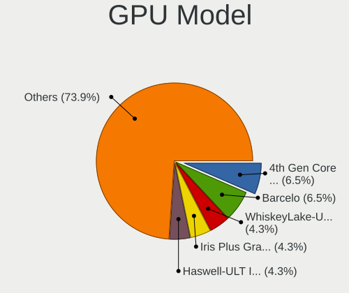

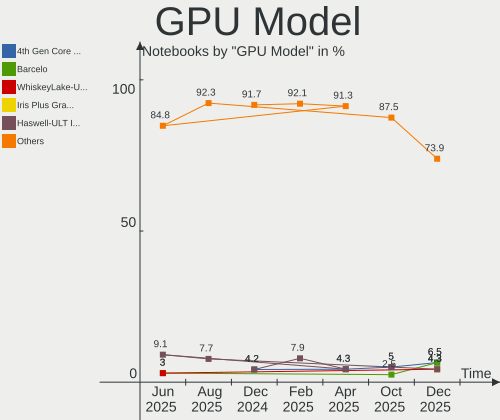

| Model                                                                     | Notebooks | Percent |
|---------------------------------------------------------------------------|-----------|---------|
| Intel 4th Gen Core Processor Integrated Graphics Controller               | 3         | 6.52%   |
| AMD Barcelo                                                               | 3         | 6.52%   |
| Intel WhiskeyLake-U GT2 [UHD Graphics 620]                                | 2         | 4.35%   |
| Intel Iris Plus Graphics G7                                               | 2         | 4.35%   |
| Intel Haswell-ULT Integrated Graphics Controller                          | 2         | 4.35%   |
| Intel GeminiLake [UHD Graphics 600]                                       | 2         | 4.35%   |
| Intel CoffeeLake-H GT2 [UHD Graphics 630]                                 | 2         | 4.35%   |
| Intel 2nd Generation Core Processor Family Integrated Graphics Controller | 2         | 4.35%   |
| Nvidia TU106M [GeForce RTX 2060 Max-Q]                                    | 1         | 2.17%   |
| Nvidia TU104GLM [Quadro RTX 4000 Mobile / Max-Q]                          | 1         | 2.17%   |
| Nvidia GP104GLM [Quadro P3200 Mobile]                                     | 1         | 2.17%   |
| Nvidia GM108M [GeForce 840M]                                              | 1         | 2.17%   |
| Nvidia GK106M [GeForce GTX 760M]                                          | 1         | 2.17%   |
| Nvidia GA106M [GeForce RTX 3060 Mobile / Max-Q]                           | 1         | 2.17%   |
| Nvidia GA102 [GeForce RTX 3080 Ti]                                        | 1         | 2.17%   |
| Nvidia G98M [GeForce G 105M]                                              | 1         | 2.17%   |
| Nvidia AD107M [GeForce RTX 4050 Max-Q / Mobile]                           | 1         | 2.17%   |
| Intel Skylake-Y GT2 [HD Graphics 515]                                     | 1         | 2.17%   |
| Intel Raptor Lake-U [Intel Graphics]                                      | 1         | 2.17%   |
| Intel Raptor Lake-P [UHD Graphics]                                        | 1         | 2.17%   |
| Intel Mobile 4 Series Chipset Integrated Graphics Controller              | 1         | 2.17%   |
| Intel Lunar Lake [Intel Arc Graphics 130V / 140V]                         | 1         | 2.17%   |
| Intel CometLake-H GT2 [UHD Graphics]                                      | 1         | 2.17%   |
| Intel CoffeeLake-U GT3e [Iris Plus Graphics 655]                          | 1         | 2.17%   |
| Intel Broadwell-U GT3 [Iris Graphics 6100]                                | 1         | 2.17%   |
| Intel Broadwell-U GT2 [HD Graphics 5500]                                  | 1         | 2.17%   |
| Intel Atom Processor Z36xxx/Z37xxx Series Graphics & Display              | 1         | 2.17%   |
| Intel 3rd Gen Core processor Graphics Controller                          | 1         | 2.17%   |
| AMD Wrestler [Radeon HD 7310]                                             | 1         | 2.17%   |
| AMD RV620/M82 [Mobility Radeon HD 3450/3470]                              | 1         | 2.17%   |
| AMD RS780M [Mobility Radeon HD 3200]                                      | 1         | 2.17%   |
| AMD Phoenix1                                                              | 1         | 2.17%   |
| AMD Opal XT [Radeon R7 M265/M365X/M465]                                   | 1         | 2.17%   |
| AMD Madison [Mobility Radeon HD 5650/5750 / 6530M/6550M]                  | 1         | 2.17%   |
| AMD Lucienne                                                              | 1         | 2.17%   |
| AMD Cezanne [Radeon Vega Series / Radeon Vega Mobile Series]              | 1         | 2.17%   |

GPU Combo
---------

Combinations of graphics cards

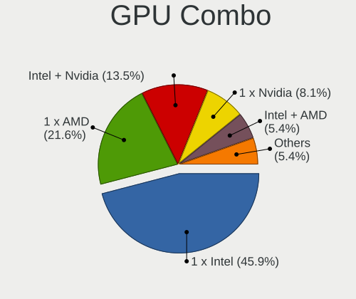

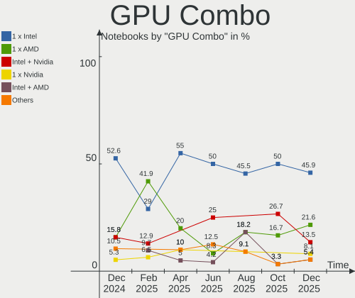

| Name           | Notebooks | Percent |
|----------------|-----------|---------|
| 1 x Intel      | 17        | 45.95%  |
| 1 x AMD        | 8         | 21.62%  |
| Intel + Nvidia | 5         | 13.51%  |
| 1 x Nvidia     | 3         | 8.11%   |
| Intel + AMD    | 2         | 5.41%   |
| Other          | 1         | 2.7%    |
| AMD + Nvidia   | 1         | 2.7%    |

GPU Driver
----------

Free vs proprietary

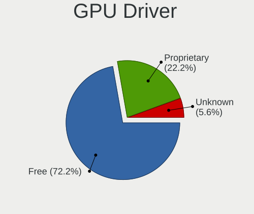

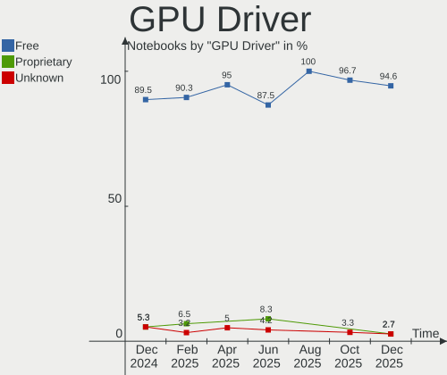

| Driver      | Notebooks | Percent |
|-------------|-----------|---------|
| Free        | 35        | 94.59%  |
| Proprietary | 1         | 2.7%    |
| Unknown     | 1         | 2.7%    |

GPU Memory
----------

Total video memory

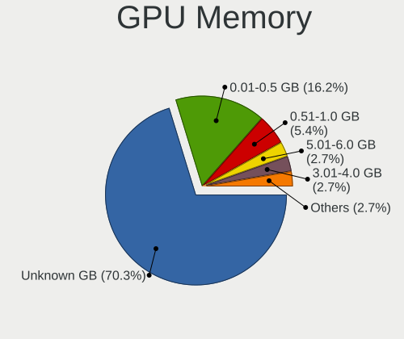

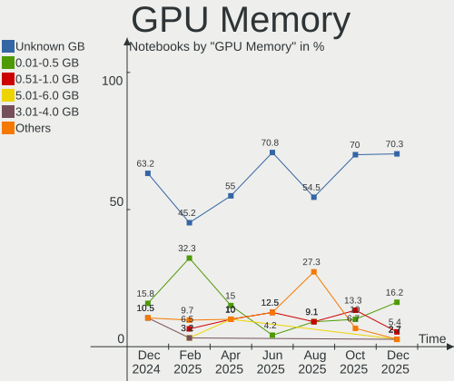

| Size in GB | Notebooks | Percent |
|------------|-----------|---------|
| Unknown    | 26        | 70.27%  |
| 0.01-0.5   | 6         | 16.22%  |
| 0.51-1.0   | 2         | 5.41%   |
| 5.01-6.0   | 1         | 2.7%    |
| 3.01-4.0   | 1         | 2.7%    |
| 1.01-2.0   | 1         | 2.7%    |

Monitor
-------

Monitor Vendor
--------------

Monitor vendors

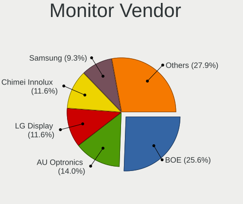

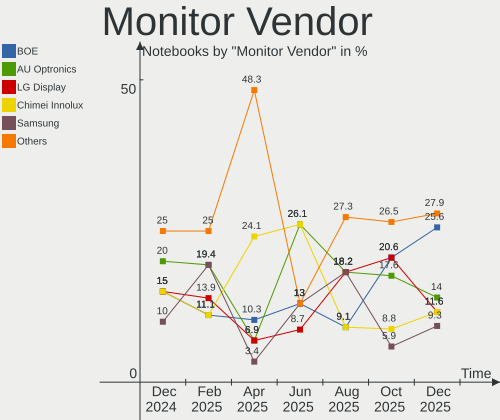

| Vendor              | Notebooks | Percent |
|---------------------|-----------|---------|
| BOE                 | 11        | 25.58%  |
| AU Optronics        | 6         | 13.95%  |
| LG Display          | 5         | 11.63%  |
| Chimei Innolux      | 5         | 11.63%  |
| Samsung Electronics | 4         | 9.3%    |
| Apple               | 2         | 4.65%   |
| ZTR                 | 1         | 2.33%   |
| Sony                | 1         | 2.33%   |
| Sharp               | 1         | 2.33%   |
| LG Philips          | 1         | 2.33%   |
| Lenovo              | 1         | 2.33%   |
| Goldstar            | 1         | 2.33%   |
| Fujitsu Siemens     | 1         | 2.33%   |
| Eve Spectrum        | 1         | 2.33%   |
| Dell                | 1         | 2.33%   |
| Acer                | 1         | 2.33%   |

Monitor Model
-------------

Monitor models

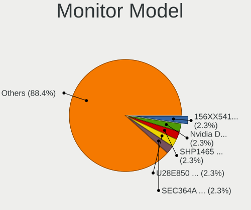

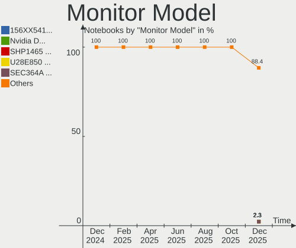

| Model                                                                   | Notebooks | Percent |
|-------------------------------------------------------------------------|-----------|---------|
| ZTR 156XX5419T02 ZTR0015 1920x1080 344x193mm 15.5-inch                  | 1         | 2.33%   |
| Sony Nvidia Defaul t Flat Panel SNY05FA 1366x768 309x174mm 14.0-inch    | 1         | 2.33%   |
| Sharp LCD Monitor SHP1465 3200x1800 294x165mm 13.3-inch                 | 1         | 2.33%   |
| Samsung Electronics U28E850 SAM0CCE 3840x2160 608x345mm 27.5-inch       | 1         | 2.33%   |
| Samsung Electronics LCD Monitor SEC364A 1366x768 344x194mm 15.5-inch    | 1         | 2.33%   |
| Samsung Electronics LCD Monitor SAM7353 3840x2160 1872x1053mm 84.6-inch | 1         | 2.33%   |
| Samsung Electronics LCD Monitor SAM0B60 1920x1080 887x500mm 40.1-inch   | 1         | 2.33%   |
| LG Philips LP154WX4-TLAB LPL3D01 1280x800 331x207mm 15.4-inch           | 1         | 2.33%   |
| LG Display LP156WH2-TLE1 LGDCF01 1366x768 344x194mm 15.5-inch           | 1         | 2.33%   |
| LG Display LCD Monitor LGD06EA 2560x1600 366x229mm 17.0-inch            | 1         | 2.33%   |
| LG Display LCD Monitor LGD05F8 2560x1600 366x229mm 17.0-inch            | 1         | 2.33%   |
| LG Display LCD Monitor LGD046B 1366x768 344x194mm 15.5-inch             | 1         | 2.33%   |
| LG Display LCD Monitor LGD0395 1366x768 344x194mm 15.5-inch             | 1         | 2.33%   |
| Lenovo LCD Monitor LEN4033 1440x900 304x190mm 14.1-inch                 | 1         | 2.33%   |
| Goldstar ULTRAGEAR GSM5B70 1920x1080 531x298mm 24.0-inch                | 1         | 2.33%   |
| Fujitsu Siemens B24W-7 LED FUS0853 1920x1200 518x324mm 24.1-inch        | 1         | 2.33%   |
| Eve Spectrum ES07D03 EVE0001 3840x2160 596x335mm 26.9-inch              | 1         | 2.33%   |
| Dell P2725H DEL4334 1920x1080 598x336mm 27.0-inch                       | 1         | 2.33%   |
| Chimei Innolux LCD Monitor CMN1737 1920x1080 381x214mm 17.2-inch        | 1         | 2.33%   |
| Chimei Innolux LCD Monitor CMN15C3 1920x1080 344x193mm 15.5-inch        | 1         | 2.33%   |
| Chimei Innolux LCD Monitor CMN150C 1920x1080 344x193mm 15.5-inch        | 1         | 2.33%   |
| Chimei Innolux LCD Monitor CMN14D4 1920x1080 309x173mm 13.9-inch        | 1         | 2.33%   |
| Chimei Innolux LCD Monitor CMN1482 1600x900 309x174mm 14.0-inch         | 1         | 2.33%   |
| BOE LCD Monitor BOE0B9F 1920x1080 355x200mm 16.0-inch                   | 1         | 2.33%   |
| BOE LCD Monitor BOE0B86 1920x1200 286x179mm 13.3-inch                   | 1         | 2.33%   |
| BOE LCD Monitor BOE0A17 1920x1080 344x194mm 15.5-inch                   | 1         | 2.33%   |
| BOE LCD Monitor BOE09D8 1920x1080 344x194mm 15.5-inch                   | 1         | 2.33%   |
| BOE LCD Monitor BOE08DF 1920x1080 344x194mm 15.5-inch                   | 1         | 2.33%   |
| BOE LCD Monitor BOE082E 1920x1080 309x174mm 14.0-inch                   | 1         | 2.33%   |
| BOE LCD Monitor BOE07F7 1920x1080 309x174mm 14.0-inch                   | 1         | 2.33%   |
| BOE LCD Monitor BOE07BD 1920x1080 309x174mm 14.0-inch                   | 1         | 2.33%   |
| BOE LCD Monitor BOE0771 1366x768 256x144mm 11.6-inch                    | 1         | 2.33%   |
| BOE LCD Monitor BOE05F3 1366x768 309x173mm 13.9-inch                    | 1         | 2.33%   |
| BOE LCD Monitor BOE05BA 1366x768 309x173mm 13.9-inch                    | 1         | 2.33%   |
| AU Optronics LCD Monitor AUOAE8B 1920x1080 344x193mm 15.5-inch          | 1         | 2.33%   |
| AU Optronics LCD Monitor AUO61ED 1920x1080 344x194mm 15.5-inch          | 1         | 2.33%   |
| AU Optronics LCD Monitor AUO47EC 1366x768 344x193mm 15.5-inch           | 1         | 2.33%   |
| AU Optronics LCD Monitor AUO24ED 1920x1080 344x194mm 15.5-inch          | 1         | 2.33%   |
| AU Optronics LCD Monitor AUO129E 1600x900 382x214mm 17.2-inch           | 1         | 2.33%   |
| AU Optronics LCD Monitor AUO123D 1920x1080 309x173mm 13.9-inch          | 1         | 2.33%   |

Monitor Resolution
------------------

Monitor screen resolution

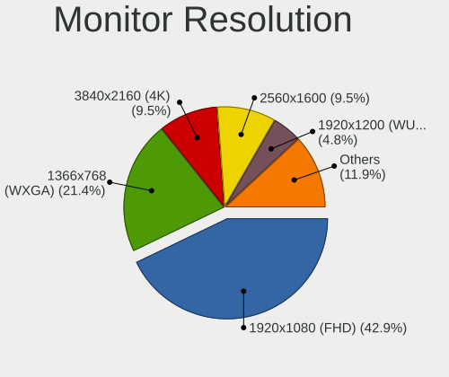

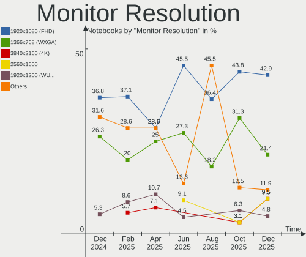

| Resolution        | Notebooks | Percent |
|-------------------|-----------|---------|
| 1920x1080 (FHD)   | 18        | 42.86%  |
| 1366x768 (WXGA)   | 9         | 21.43%  |
| 3840x2160 (4K)    | 4         | 9.52%   |
| 2560x1600         | 4         | 9.52%   |
| 1920x1200 (WUXGA) | 2         | 4.76%   |
| 1600x900 (HD+)    | 2         | 4.76%   |
| 3200x1800 (QHD+)  | 1         | 2.38%   |
| 1440x900 (WXGA+)  | 1         | 2.38%   |
| 1280x800 (WXGA)   | 1         | 2.38%   |

Monitor Diagonal
----------------

Diagonal size in inches

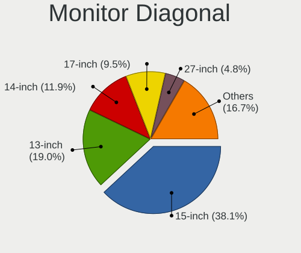

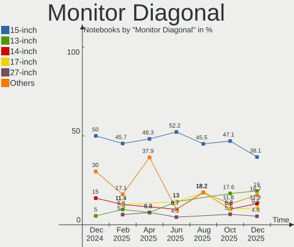

| Inches | Notebooks | Percent |
|--------|-----------|---------|
| 15     | 16        | 38.1%   |
| 13     | 8         | 19.05%  |
| 14     | 5         | 11.9%   |
| 17     | 4         | 9.52%   |
| 27     | 2         | 4.76%   |
| 24     | 2         | 4.76%   |
| 84     | 1         | 2.38%   |
| 47     | 1         | 2.38%   |
| 26     | 1         | 2.38%   |
| 16     | 1         | 2.38%   |
| 11     | 1         | 2.38%   |

Monitor Width
-------------

Physical width

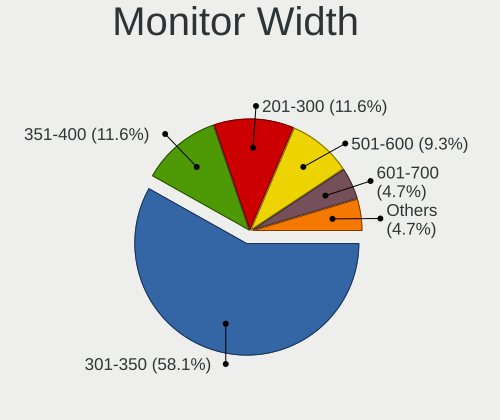

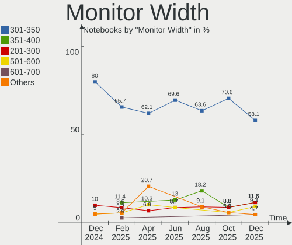

| Width in mm | Notebooks | Percent |
|-------------|-----------|---------|
| 301-350     | 25        | 58.14%  |
| 351-400     | 5         | 11.63%  |
| 201-300     | 5         | 11.63%  |
| 501-600     | 4         | 9.3%    |
| 601-700     | 2         | 4.65%   |
| 1501-2000   | 1         | 2.33%   |
| 1001-1500   | 1         | 2.33%   |

Aspect Ratio
------------

Proportional relationship between the width and the height

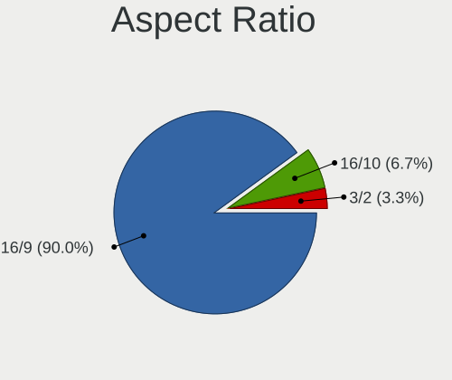

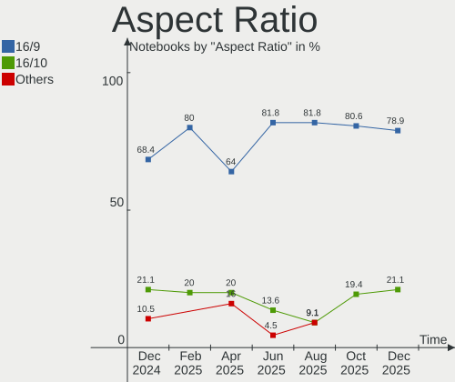

| Ratio | Notebooks | Percent |
|-------|-----------|---------|
| 16/9  | 30        | 78.95%  |
| 16/10 | 8         | 21.05%  |

Monitor Area
------------

Area in inch²

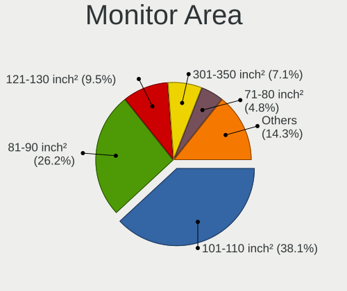

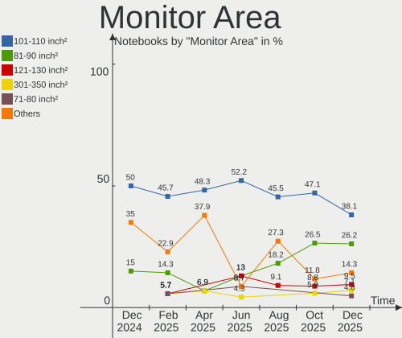

| Area in inch² | Notebooks | Percent |
|----------------|-----------|---------|
| 101-110        | 16        | 38.1%   |
| 81-90          | 11        | 26.19%  |
| 121-130        | 4         | 9.52%   |
| 301-350        | 3         | 7.14%   |
| 71-80          | 2         | 4.76%   |
| More than 1000 | 1         | 2.38%   |
| 51-60          | 1         | 2.38%   |
| 251-300        | 1         | 2.38%   |
| 201-250        | 1         | 2.38%   |
| 501-1000       | 1         | 2.38%   |
| 91-100         | 1         | 2.38%   |

Pixel Density
-------------

Pixels per inch

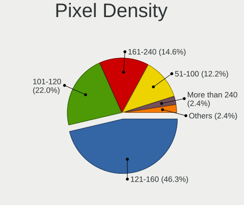

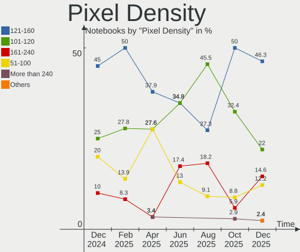

| Density       | Notebooks | Percent |
|---------------|-----------|---------|
| 121-160       | 19        | 46.34%  |
| 101-120       | 9         | 21.95%  |
| 161-240       | 6         | 14.63%  |
| 51-100        | 5         | 12.2%   |
| More than 240 | 1         | 2.44%   |
| 1-50          | 1         | 2.44%   |

Multiple Monitors
-----------------

Total monitors connected

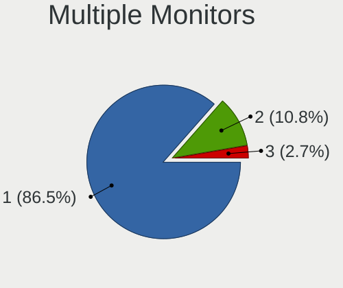

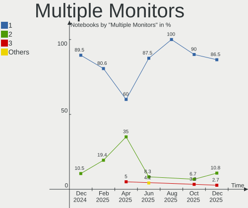

| Total | Notebooks | Percent |
|-------|-----------|---------|
| 1     | 32        | 86.49%  |
| 2     | 4         | 10.81%  |
| 3     | 1         | 2.7%    |

Network
-------

Net Controller Vendor
---------------------

Controller vendors

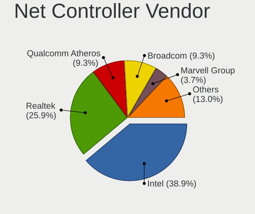

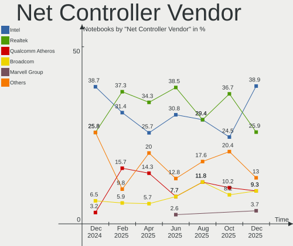

| Vendor                            | Notebooks | Percent |
|-----------------------------------|-----------|---------|
| Intel                             | 21        | 38.89%  |
| Realtek Semiconductor             | 14        | 25.93%  |
| Qualcomm Atheros                  | 5         | 9.26%   |
| Broadcom                          | 5         | 9.26%   |
| Marvell Technology Group          | 2         | 3.7%    |
| Ericsson Business Mobile Networks | 2         | 3.7%    |
| Ralink                            | 1         | 1.85%   |
| Qualcomm                          | 1         | 1.85%   |
| MediaTek                          | 1         | 1.85%   |
| Broadcom Limited                  | 1         | 1.85%   |
| ASIX Electronics                  | 1         | 1.85%   |

Net Controller Model
--------------------

Controller models

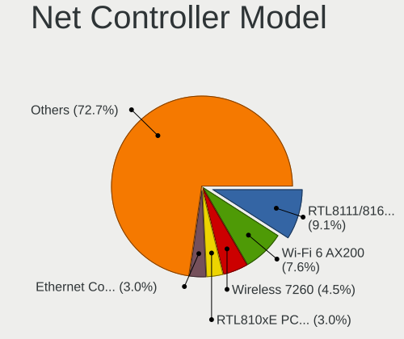

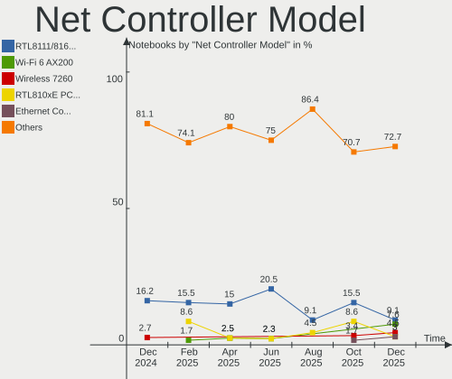

| Model                                                                          | Notebooks | Percent |
|--------------------------------------------------------------------------------|-----------|---------|
| Realtek RTL8111/8168/8211/8411 PCI Express Gigabit Ethernet Controller         | 6         | 9.09%   |
| Intel Wi-Fi 6 AX200                                                            | 5         | 7.58%   |
| Intel Wireless 7260                                                            | 3         | 4.55%   |
| Realtek RTL810xE PCI Express Fast Ethernet controller                          | 2         | 3.03%   |
| Intel Ethernet Connection (7) I219-LM                                          | 2         | 3.03%   |
| Intel Cannon Point-LP CNVi [Wireless-AC]                                       | 2         | 3.03%   |
| Realtek RTL8852CE PCIe 802.11ax Wireless Network Controller                    | 1         | 1.52%   |
| Realtek RTL8852BE PCIe 802.11ax Wireless Network Controller [1T1R]             | 1         | 1.52%   |
| Realtek RTL8852BE PCIe 802.11ax Wireless Network Controller                    | 1         | 1.52%   |
| Realtek RTL8851BE PCIe 802.11ax Wireless Network Controller                    | 1         | 1.52%   |
| Realtek RTL8821CE 802.11ac PCIe Wireless Network Adapter                       | 1         | 1.52%   |
| Realtek RTL8723DE Wireless Network Adapter                                     | 1         | 1.52%   |
| Realtek RTL8153 Gigabit Ethernet Adapter                                       | 1         | 1.52%   |
| Realtek RTL8125 2.5GbE Controller                                              | 1         | 1.52%   |
| Realtek 802.11ac NIC                                                           | 1         | 1.52%   |
| Ralink RT3290 Wireless 802.11n 1T/1R PCIe                                      | 1         | 1.52%   |
| Qualcomm QCNFA765 Wireless Network Adapter                                     | 1         | 1.52%   |
| Qualcomm Atheros QCA9565 / AR9565 Wireless Network Adapter                     | 1         | 1.52%   |
| Qualcomm Atheros AR9485 Wireless Network Adapter                               | 1         | 1.52%   |
| Qualcomm Atheros AR9462 Wireless Network Adapter                               | 1         | 1.52%   |
| Qualcomm Atheros AR9285 Wireless Network Adapter (PCI-Express)                 | 1         | 1.52%   |
| Qualcomm Atheros AR8151 v2.0 Gigabit Ethernet                                  | 1         | 1.52%   |
| MediaTek MT7922 802.11ax PCI Express Wireless Network Adapter                  | 1         | 1.52%   |
| Marvell Group Yukon Optima 88E8059 [PCIe Gigabit Ethernet Controller with AVB] | 1         | 1.52%   |
| Marvell Group 88E8042 PCI-E Fast Ethernet Controller                           | 1         | 1.52%   |
| Intel Wireless 8260                                                            | 1         | 1.52%   |
| Intel WiFi Link 5100                                                           | 1         | 1.52%   |
| Intel Ultimate N WiFi Link 5300                                                | 1         | 1.52%   |
| Intel Ice Lake-LP PCH CNVi WiFi                                                | 1         | 1.52%   |
| Intel I211 Gigabit Network Connection                                          | 1         | 1.52%   |
| Intel Gemini Lake PCH CNVi WiFi                                                | 1         | 1.52%   |
| Intel Ethernet Connection I219-LM                                              | 1         | 1.52%   |
| Intel Ethernet Connection I218-LM                                              | 1         | 1.52%   |
| Intel Ethernet Connection I217-V                                               | 1         | 1.52%   |
| Intel Ethernet Connection I217-LM                                              | 1         | 1.52%   |
| Intel Comet Lake PCH CNVi WiFi                                                 | 1         | 1.52%   |
| Intel Centrino Wireless-N 1030 [Rainbow Peak]                                  | 1         | 1.52%   |
| Intel Centrino Wireless-N 100                                                  | 1         | 1.52%   |
| Intel Centrino Ultimate-N 6300                                                 | 1         | 1.52%   |
| Intel Centrino Advanced-N 6205 [Taylor Peak]                                   | 1         | 1.52%   |

Wireless Vendor
---------------

Wireless vendors

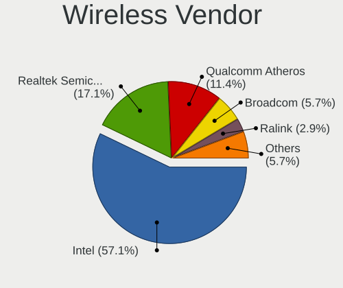

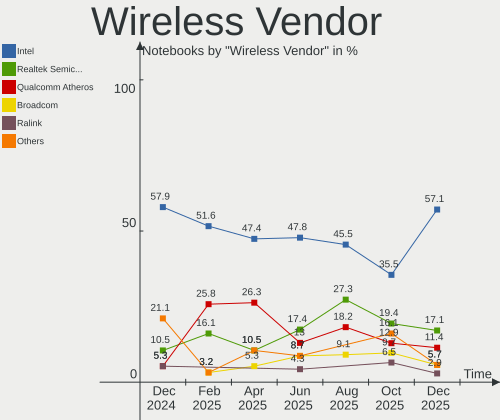

| Vendor                | Notebooks | Percent |
|-----------------------|-----------|---------|
| Intel                 | 20        | 57.14%  |
| Realtek Semiconductor | 6         | 17.14%  |
| Qualcomm Atheros      | 4         | 11.43%  |
| Broadcom              | 2         | 5.71%   |
| Ralink                | 1         | 2.86%   |
| Qualcomm              | 1         | 2.86%   |
| MediaTek              | 1         | 2.86%   |

Wireless Model
--------------

Wireless models

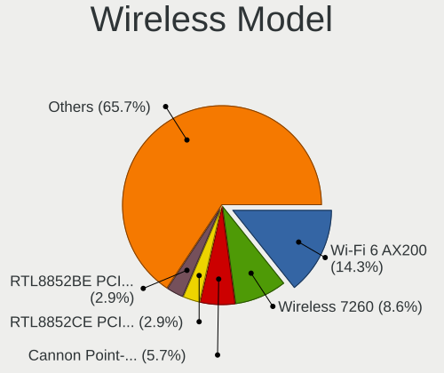

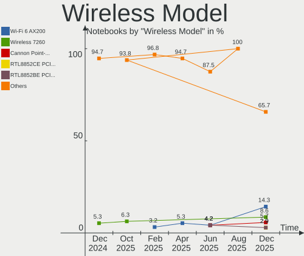

| Model                                                              | Notebooks | Percent |
|--------------------------------------------------------------------|-----------|---------|
| Intel Wi-Fi 6 AX200                                                | 5         | 14.29%  |
| Intel Wireless 7260                                                | 3         | 8.57%   |
| Intel Cannon Point-LP CNVi [Wireless-AC]                           | 2         | 5.71%   |
| Realtek RTL8852CE PCIe 802.11ax Wireless Network Controller        | 1         | 2.86%   |
| Realtek RTL8852BE PCIe 802.11ax Wireless Network Controller [1T1R] | 1         | 2.86%   |
| Realtek RTL8851BE PCIe 802.11ax Wireless Network Controller        | 1         | 2.86%   |
| Realtek RTL8821CE 802.11ac PCIe Wireless Network Adapter           | 1         | 2.86%   |
| Realtek RTL8723DE Wireless Network Adapter                         | 1         | 2.86%   |
| Realtek 802.11ac NIC                                               | 1         | 2.86%   |
| Ralink RT3290 Wireless 802.11n 1T/1R PCIe                          | 1         | 2.86%   |
| Qualcomm QCNFA765 Wireless Network Adapter                         | 1         | 2.86%   |
| Qualcomm Atheros QCA9565 / AR9565 Wireless Network Adapter         | 1         | 2.86%   |
| Qualcomm Atheros AR9485 Wireless Network Adapter                   | 1         | 2.86%   |
| Qualcomm Atheros AR9462 Wireless Network Adapter                   | 1         | 2.86%   |
| Qualcomm Atheros AR9285 Wireless Network Adapter (PCI-Express)     | 1         | 2.86%   |
| MediaTek MT7922 802.11ax PCI Express Wireless Network Adapter      | 1         | 2.86%   |
| Intel Wireless 8260                                                | 1         | 2.86%   |
| Intel WiFi Link 5100                                               | 1         | 2.86%   |
| Intel Ultimate N WiFi Link 5300                                    | 1         | 2.86%   |
| Intel Ice Lake-LP PCH CNVi WiFi                                    | 1         | 2.86%   |
| Intel Gemini Lake PCH CNVi WiFi                                    | 1         | 2.86%   |
| Intel Comet Lake PCH CNVi WiFi                                     | 1         | 2.86%   |
| Intel Centrino Wireless-N 1030 [Rainbow Peak]                      | 1         | 2.86%   |
| Intel Centrino Wireless-N 100                                      | 1         | 2.86%   |
| Intel Centrino Ultimate-N 6300                                     | 1         | 2.86%   |
| Intel Centrino Advanced-N 6205 [Taylor Peak]                       | 1         | 2.86%   |
| Broadcom BCM4364 802.11ac Wireless Network Adapter                 | 1         | 2.86%   |
| Broadcom BCM43602 802.11ac Wireless LAN SoC                        | 1         | 2.86%   |

Ethernet Vendor
---------------

Ethernet vendors

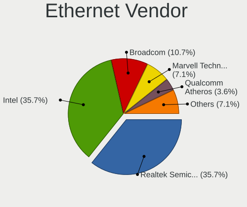

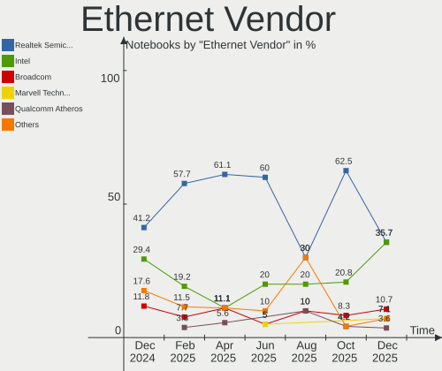

| Vendor                   | Notebooks | Percent |
|--------------------------|-----------|---------|
| Realtek Semiconductor    | 10        | 35.71%  |
| Intel                    | 10        | 35.71%  |
| Broadcom                 | 3         | 10.71%  |
| Marvell Technology Group | 2         | 7.14%   |
| Qualcomm Atheros         | 1         | 3.57%   |
| Broadcom Limited         | 1         | 3.57%   |
| ASIX Electronics         | 1         | 3.57%   |

Ethernet Model
--------------

Ethernet models

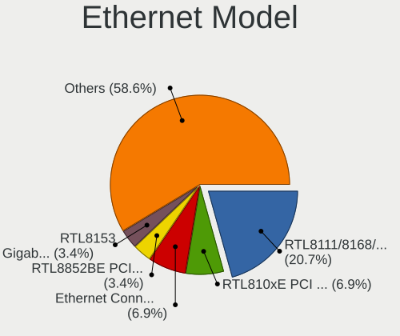

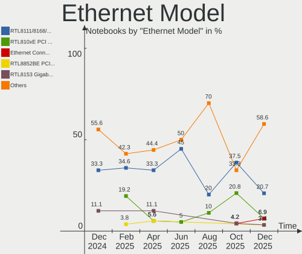

| Model                                                                          | Notebooks | Percent |
|--------------------------------------------------------------------------------|-----------|---------|
| Realtek RTL8111/8168/8211/8411 PCI Express Gigabit Ethernet Controller         | 6         | 20.69%  |
| Realtek RTL810xE PCI Express Fast Ethernet controller                          | 2         | 6.9%    |
| Intel Ethernet Connection (7) I219-LM                                          | 2         | 6.9%    |
| Realtek RTL8852BE PCIe 802.11ax Wireless Network Controller                    | 1         | 3.45%   |
| Realtek RTL8153 Gigabit Ethernet Adapter                                       | 1         | 3.45%   |
| Realtek RTL8125 2.5GbE Controller                                              | 1         | 3.45%   |
| Qualcomm Atheros AR8151 v2.0 Gigabit Ethernet                                  | 1         | 3.45%   |
| Marvell Group Yukon Optima 88E8059 [PCIe Gigabit Ethernet Controller with AVB] | 1         | 3.45%   |
| Marvell Group 88E8042 PCI-E Fast Ethernet Controller                           | 1         | 3.45%   |
| Intel I211 Gigabit Network Connection                                          | 1         | 3.45%   |
| Intel Ethernet Connection I219-LM                                              | 1         | 3.45%   |
| Intel Ethernet Connection I218-LM                                              | 1         | 3.45%   |
| Intel Ethernet Connection I217-V                                               | 1         | 3.45%   |
| Intel Ethernet Connection I217-LM                                              | 1         | 3.45%   |
| Intel BE201 320MHz                                                             | 1         | 3.45%   |
| Intel 82579LM Gigabit Network Connection (Lewisville)                          | 1         | 3.45%   |
| Intel 82567LM Gigabit Network Connection                                       | 1         | 3.45%   |
| Broadcom NetXtreme BCM57786 Gigabit Ethernet PCIe                              | 1         | 3.45%   |
| Broadcom NetLink BCM5784M Gigabit Ethernet PCIe                                | 1         | 3.45%   |
| Broadcom NetLink BCM57785 Gigabit Ethernet PCIe                                | 1         | 3.45%   |
| Broadcom Limited NetLink BCM57780 Gigabit Ethernet PCIe                        | 1         | 3.45%   |
| ASIX AX88179 Gigabit Ethernet                                                  | 1         | 3.45%   |

Net Controller Kind
-------------------

Ethernet, WiFi or modem

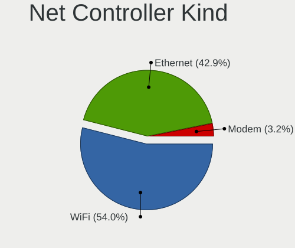

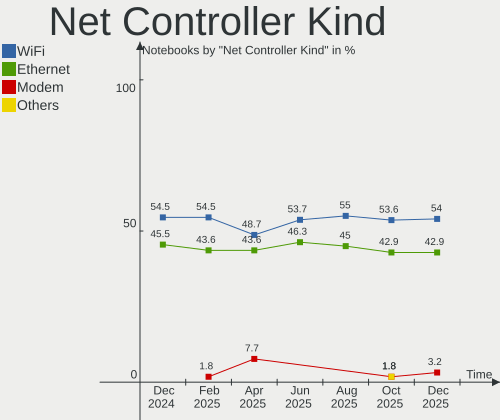

| Kind     | Notebooks | Percent |
|----------|-----------|---------|
| WiFi     | 34        | 53.97%  |
| Ethernet | 27        | 42.86%  |
| Modem    | 2         | 3.17%   |

Used Controller
---------------

Currently used network controller

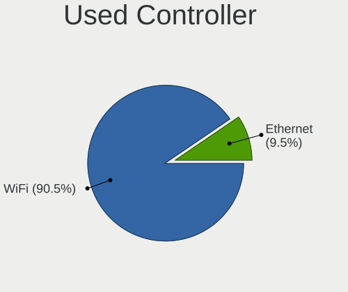

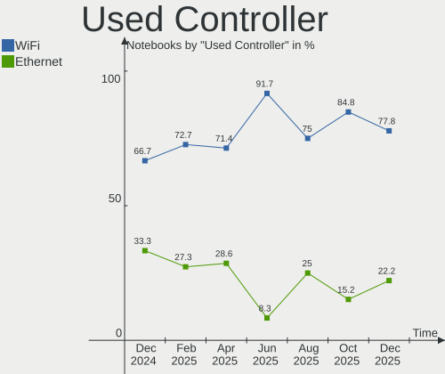

| Kind     | Notebooks | Percent |
|----------|-----------|---------|
| WiFi     | 28        | 77.78%  |
| Ethernet | 8         | 22.22%  |

NICs
----

Total network controllers on board

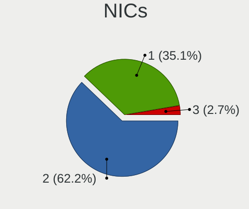

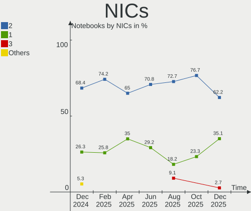

| Total | Notebooks | Percent |
|-------|-----------|---------|
| 2     | 23        | 62.16%  |
| 1     | 13        | 35.14%  |
| 3     | 1         | 2.7%    |

IPv6
----

IPv6 vs IPv4

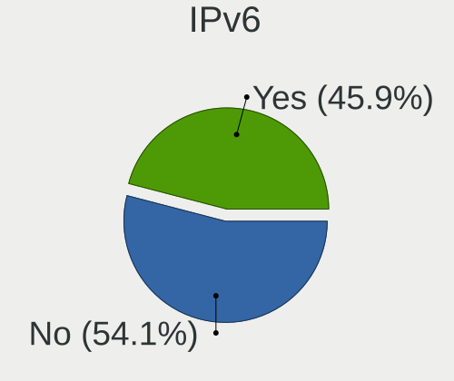

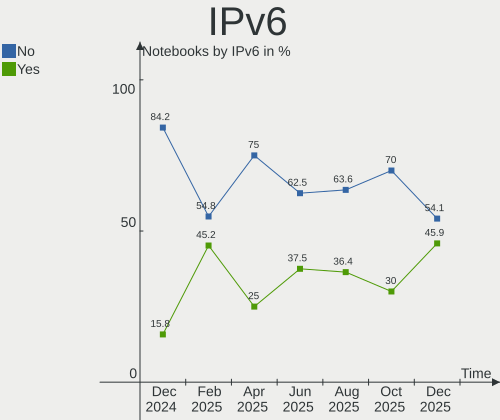

| Used | Notebooks | Percent |
|------|-----------|---------|
| No   | 20        | 54.05%  |
| Yes  | 17        | 45.95%  |

Bluetooth
---------

Bluetooth Vendor
----------------

Controller vendors

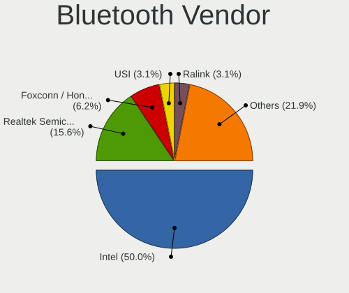

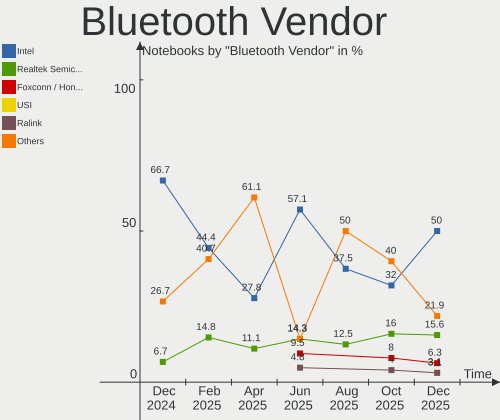

| Vendor                          | Notebooks | Percent |
|---------------------------------|-----------|---------|
| Intel                           | 16        | 50%     |
| Realtek Semiconductor           | 5         | 15.63%  |
| Foxconn / Hon Hai               | 2         | 6.25%   |
| USI                             | 1         | 3.13%   |
| Ralink                          | 1         | 3.13%   |
| Qualcomm Atheros Communications | 1         | 3.13%   |
| MediaTek                        | 1         | 3.13%   |
| Lite-On Technology              | 1         | 3.13%   |
| Hewlett-Packard                 | 1         | 3.13%   |
| Cambridge Silicon Radio         | 1         | 3.13%   |
| Broadcom                        | 1         | 3.13%   |
| Apple                           | 1         | 3.13%   |

Bluetooth Model
---------------

Controller models

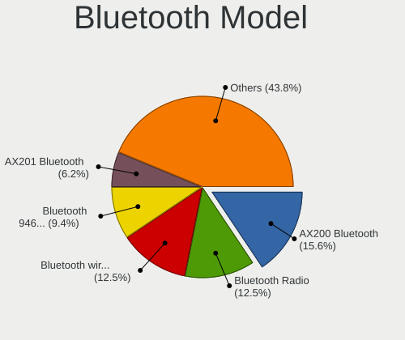

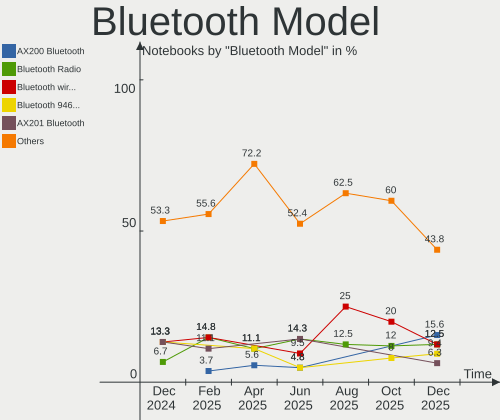

| Model                                               | Notebooks | Percent |
|-----------------------------------------------------|-----------|---------|
| Intel AX200 Bluetooth                               | 5         | 15.63%  |
| Realtek Bluetooth Radio                             | 4         | 12.5%   |
| Intel Bluetooth wireless interface                  | 4         | 12.5%   |
| Intel Bluetooth 9460/9560 Jefferson Peak (JfP)      | 3         | 9.38%   |
| Intel AX201 Bluetooth                               | 2         | 6.25%   |
| USI Bluetooth Device                                | 1         | 3.13%   |
| Realtek  Bluetooth 4.2 Adapter                      | 1         | 3.13%   |
| Ralink RT3290 Bluetooth                             | 1         | 3.13%   |
| Qualcomm Atheros AR3012 Bluetooth 4.0               | 1         | 3.13%   |
| MediaTek Wireless_Device                            | 1         | 3.13%   |
| Lite-On Atheros AR3012 Bluetooth                    | 1         | 3.13%   |
| Intel Centrino Advanced-N 6230 Bluetooth adapter    | 1         | 3.13%   |
| Intel Bluetooth                                     | 1         | 3.13%   |
| HP Bluetooth 2.0 Interface [Broadcom BCM2045]       | 1         | 3.13%   |
| Foxconn / Hon Hai Bluetooth Radio                   | 1         | 3.13%   |
| Foxconn / Hon Hai Bluetooth Device                  | 1         | 3.13%   |
| Cambridge Silicon Radio Bluetooth Dongle (HCI mode) | 1         | 3.13%   |
| Broadcom HP Portable SoftSailing                    | 1         | 3.13%   |
| Apple Bluetooth Host Controller                     | 1         | 3.13%   |

Sound
-----

Sound Vendor
------------

Sound card vendors

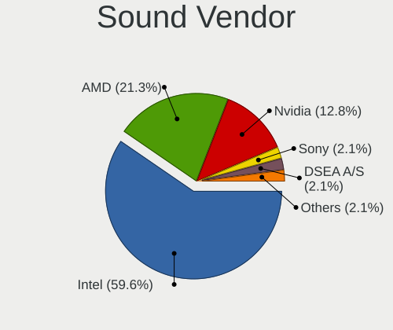

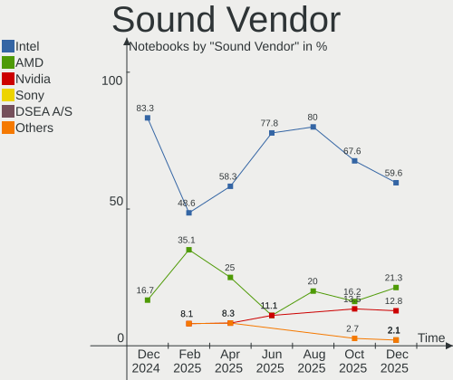

| Vendor   | Notebooks | Percent |
|----------|-----------|---------|
| Intel    | 28        | 59.57%  |
| AMD      | 10        | 21.28%  |
| Nvidia   | 6         | 12.77%  |
| Sony     | 1         | 2.13%   |
| DSEA A/S | 1         | 2.13%   |
| Apple    | 1         | 2.13%   |

Sound Model
-----------

Sound card models

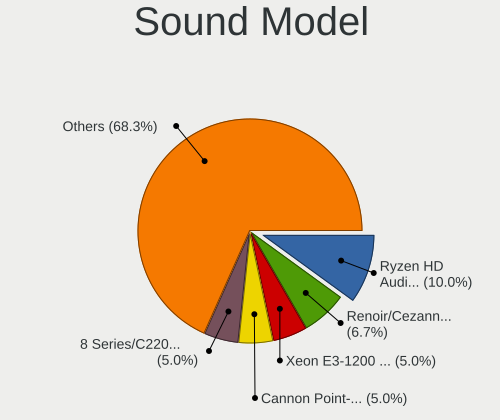

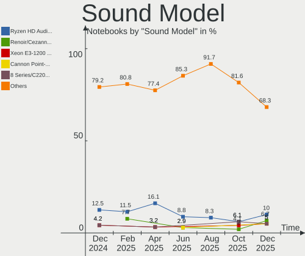

| Model                                                                      | Notebooks | Percent |
|----------------------------------------------------------------------------|-----------|---------|
| AMD Ryzen HD Audio Controller                                              | 6         | 10%     |
| AMD Renoir/Cezanne HDMI/DP Audio Controller                                | 4         | 6.67%   |
| Intel Xeon E3-1200 v3/4th Gen Core Processor HD Audio Controller           | 3         | 5%      |
| Intel Cannon Point-LP High Definition Audio Controller                     | 3         | 5%      |
| Intel 8 Series/C220 Series Chipset High Definition Audio Controller        | 3         | 5%      |
| Intel Wildcat Point-LP High Definition Audio Controller                    | 2         | 3.33%   |
| Intel Raptor Lake-P/U/H cAVS                                               | 2         | 3.33%   |
| Intel Ice Lake-LP Smart Sound Technology Audio Controller                  | 2         | 3.33%   |
| Intel Haswell-ULT HD Audio Controller                                      | 2         | 3.33%   |
| Intel Celeron/Pentium Silver Processor High Definition Audio               | 2         | 3.33%   |
| Intel Cannon Lake PCH cAVS                                                 | 2         | 3.33%   |
| Intel Broadwell-U Audio Controller                                         | 2         | 3.33%   |
| Intel 82801I (ICH9 Family) HD Audio Controller                             | 2         | 3.33%   |
| Intel 8 Series HD Audio Controller                                         | 2         | 3.33%   |
| Intel 6 Series/C200 Series Chipset Family High Definition Audio Controller | 2         | 3.33%   |
| Sony DualSense wireless controller (PS5)                                   | 1         | 1.67%   |
| Nvidia TU106 High Definition Audio Controller                              | 1         | 1.67%   |
| Nvidia TU104 HD Audio Controller                                           | 1         | 1.67%   |
| Nvidia GP104 High Definition Audio Controller                              | 1         | 1.67%   |
| Nvidia GA106 High Definition Audio Controller                              | 1         | 1.67%   |
| Nvidia GA102 High Definition Audio Controller                              | 1         | 1.67%   |
| Nvidia AD107 High Definition Audio Controller                              | 1         | 1.67%   |
| Intel Sunrise Point-LP HD Audio                                            | 1         | 1.67%   |
| Intel Lunar Lake-M HD Audio Controller                                     | 1         | 1.67%   |
| Intel Comet Lake PCH cAVS                                                  | 1         | 1.67%   |
| Intel Atom Processor Z36xxx/Z37xxx Series High Definition Audio Controller | 1         | 1.67%   |
| Intel 7 Series/C216 Chipset Family High Definition Audio Controller        | 1         | 1.67%   |
| Intel 5 Series/3400 Series Chipset High Definition Audio                   | 1         | 1.67%   |
| DSEA A/S EPOS BTD 800                                                      | 1         | 1.67%   |
| Apple Audio Device                                                         | 1         | 1.67%   |
| AMD Wrestler HDMI Audio                                                    | 1         | 1.67%   |
| AMD Starship/Matisse HD Audio Controller                                   | 1         | 1.67%   |
| AMD SBx00 Azalia (Intel HDA)                                               | 1         | 1.67%   |
| AMD Redwood HDMI Audio [Radeon HD 5000 Series]                             | 1         | 1.67%   |
| AMD Radeon High Definition Audio Controller                                | 1         | 1.67%   |
| AMD FCH Azalia Controller                                                  | 1         | 1.67%   |

Memory
------

Memory Vendor
-------------

Memory module vendors

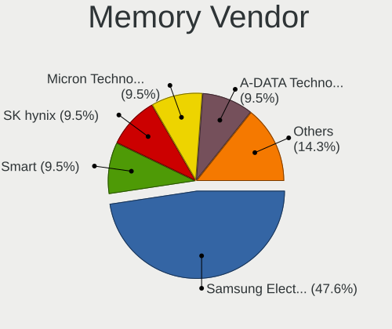

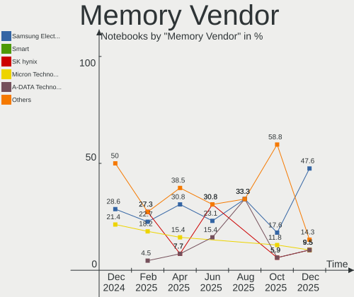

| Vendor              | Notebooks | Percent |
|---------------------|-----------|---------|
| Samsung Electronics | 10        | 47.62%  |
| Smart               | 2         | 9.52%   |
| SK hynix            | 2         | 9.52%   |
| Micron Technology   | 2         | 9.52%   |
| A-DATA Technology   | 2         | 9.52%   |
| Ramaxel Technology  | 1         | 4.76%   |
| Nanya Technology    | 1         | 4.76%   |
| G.Skill             | 1         | 4.76%   |

Memory Model
------------

Memory module models

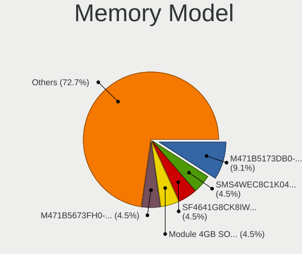

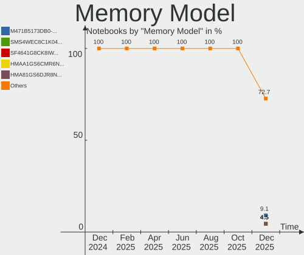

| Model                                                     | Notebooks | Percent |
|-----------------------------------------------------------|-----------|---------|
| Samsung RAM M471B5173DB0-YK0 4GB SODIMM DDR3 1600MT/s     | 2         | 9.09%   |
| Smart RAM SMS4WEC8C1K0446FCG 8GB SODIMM DDR4 3200MT/s     | 1         | 4.55%   |
| Smart RAM SF4641G8CK8IWGKSEG 8GB SODIMM DDR4 2400MT/s     | 1         | 4.55%   |
| SK hynix RAM HMAA1GS6CMR6N-XN 8GB SODIMM DDR4 3200MT/s    | 1         | 4.55%   |
| SK hynix RAM HMA81GS6DJR8N-VK 8GB SODIMM DDR4 2667MT/s    | 1         | 4.55%   |
| Samsung RAM Module 4GB SODIMM LPDDR3 1867MT/s             | 1         | 4.55%   |
| Samsung RAM M471B5673FH0-CF8 2048MB SODIMM DDR3 1067MT/s  | 1         | 4.55%   |
| Samsung RAM M471B5673EH1-CF8 2GB SODIMM 4199MT/s          | 1         | 4.55%   |
| Samsung RAM M471B5273DH0-CH9 4GB SODIMM DDR3 1600MT/s     | 1         | 4.55%   |
| Samsung RAM M471B5273CH0-CH9 4GB SODIMM DDR3 1334MT/s     | 1         | 4.55%   |
| Samsung RAM M471A5244CB0-CTD 4GB SODIMM DDR4 3266MT/s     | 1         | 4.55%   |
| Samsung RAM M471A2K43CB1-CTD 16GB SODIMM DDR4 8400MT/s    | 1         | 4.55%   |
| Samsung RAM M471A1G44AB0-CWE 8GiB SODIMM DDR4 3200MT/s    | 1         | 4.55%   |
| Samsung RAM M4 70T5663QZ3-CF7 2GB SODIMM DDR2 2048MT/s    | 1         | 4.55%   |
| Ramaxel RAM RMSA3260NA78HAF-2666 8GB SODIMM DDR4 2667MT/s | 1         | 4.55%   |
| Nanya RAM NT2GC64B8HC0NS-BE 2GB SODIMM DDR3 1067MT/s      | 1         | 4.55%   |
| Micron RAM Module 4GB Row Of Chips LPDDR5 8533MT/s        | 1         | 4.55%   |
| Micron RAM 16KTF51264HZ-1G6M1 4GB SODIMM DDR3 1600MT/s    | 1         | 4.55%   |
| G.Skill RAM F4-3600C16-16GTZNC 16GiB DIMM DDR4 3600MT/s   | 1         | 4.55%   |
| A-DATA RAM Module 32GB SODIMM DDR4 3200MT/s               | 1         | 4.55%   |
| A-DATA RAM MIF4D2C087KZ1 4GB SODIMM DDR3 1600MT/s         | 1         | 4.55%   |

Memory Kind
-----------

Memory module kinds

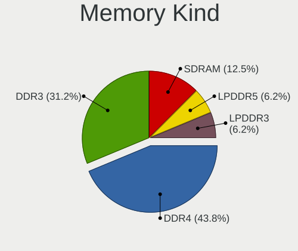

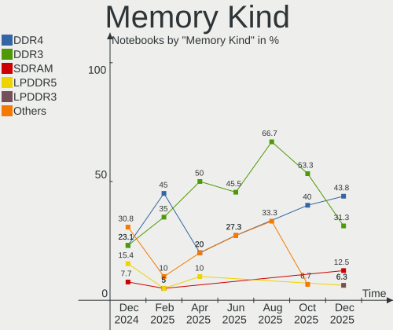

| Kind   | Notebooks | Percent |
|--------|-----------|---------|
| DDR4   | 7         | 43.75%  |
| DDR3   | 5         | 31.25%  |
| SDRAM  | 2         | 12.5%   |
| LPDDR5 | 1         | 6.25%   |
| LPDDR3 | 1         | 6.25%   |

Memory Form Factor
------------------

Physical design of the memory module

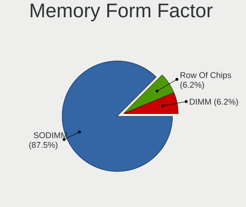

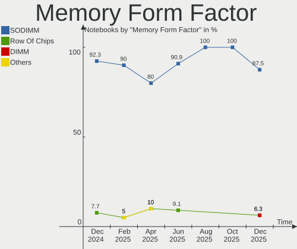

| Name         | Notebooks | Percent |
|--------------|-----------|---------|
| SODIMM       | 14        | 87.5%   |
| Row Of Chips | 1         | 6.25%   |
| DIMM         | 1         | 6.25%   |

Memory Size
-----------

Memory module size

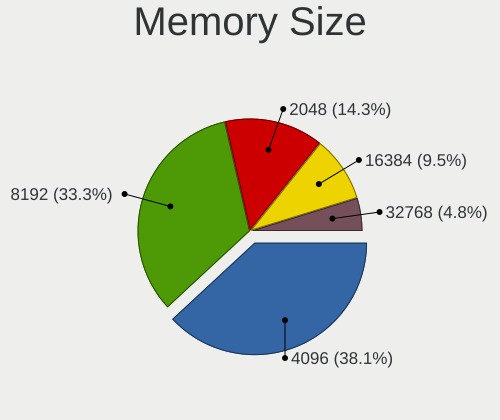

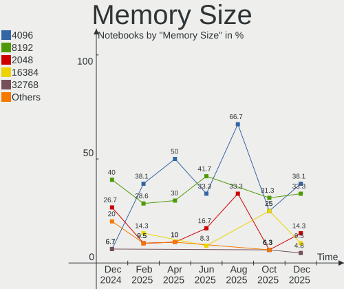

| Size  | Notebooks | Percent |
|-------|-----------|---------|
| 4096  | 8         | 38.1%   |
| 8192  | 7         | 33.33%  |
| 2048  | 3         | 14.29%  |
| 16384 | 2         | 9.52%   |
| 32768 | 1         | 4.76%   |

Memory Speed
------------

Memory module speed

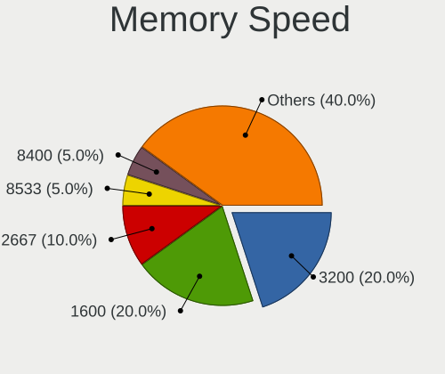

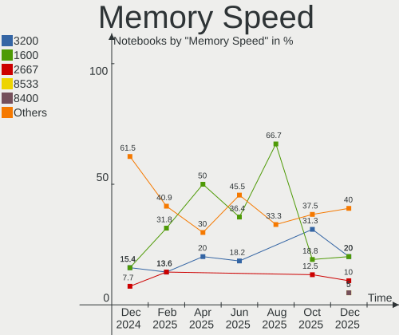

| Speed | Notebooks | Percent |
|-------|-----------|---------|
| 3200  | 4         | 20%     |
| 1600  | 4         | 20%     |
| 2667  | 2         | 10%     |
| 8533  | 1         | 5%      |
| 8400  | 1         | 5%      |
| 4199  | 1         | 5%      |
| 3866  | 1         | 5%      |
| 3266  | 1         | 5%      |
| 2400  | 1         | 5%      |
| 2048  | 1         | 5%      |
| 1867  | 1         | 5%      |
| 1334  | 1         | 5%      |
| 1067  | 1         | 5%      |

Printers & scanners
-------------------

Printer Vendor
--------------

Printer device vendors

Zero info for selected period =(

Printer Model
-------------

Printer device models

Zero info for selected period =(

Scanner Vendor
--------------

Scanner device vendors

Zero info for selected period =(

Scanner Model
-------------

Scanner device models

Zero info for selected period =(

Camera
------

Camera Vendor
-------------

Camera device vendors

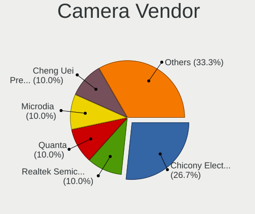

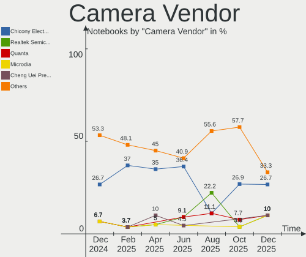

| Vendor                                 | Notebooks | Percent |
|----------------------------------------|-----------|---------|
| Chicony Electronics                    | 8         | 26.67%  |
| Realtek Semiconductor                  | 3         | 10%     |
| Quanta                                 | 3         | 10%     |
| Microdia                               | 3         | 10%     |
| Cheng Uei Precision Industry (Foxlink) | 3         | 10%     |
| Suyin                                  | 2         | 6.67%   |
| IMC Networks                           | 2         | 6.67%   |
| Alcor Micro                            | 2         | 6.67%   |
| Silicon Motion                         | 1         | 3.33%   |
| ShineTech                              | 1         | 3.33%   |
| Lenovo                                 | 1         | 3.33%   |
| Bison Electronics                      | 1         | 3.33%   |

Camera Model
------------

Camera device models

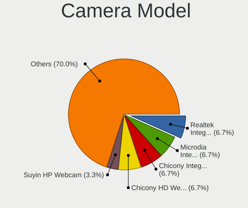

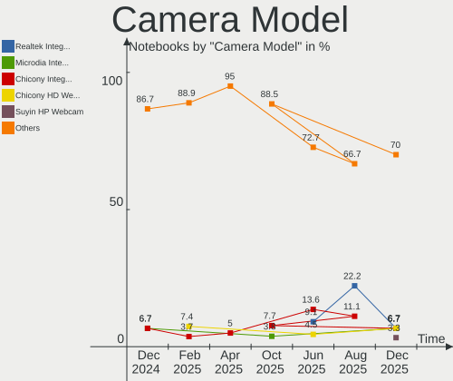

| Model                                                                      | Notebooks | Percent |
|----------------------------------------------------------------------------|-----------|---------|
| Realtek Integrated_Webcam_HD                                               | 2         | 6.67%   |
| Microdia Integrated_Webcam_HD                                              | 2         | 6.67%   |
| Chicony Integrated Camera                                                  | 2         | 6.67%   |
| Chicony HD WebCam                                                          | 2         | 6.67%   |
| Suyin HP Webcam                                                            | 1         | 3.33%   |
| Suyin HD WebCam                                                            | 1         | 3.33%   |
| Silicon Motion WebCam SC-03M12736N                                         | 1         | 3.33%   |
| ShineTech USB2.0 HD UVC WebCam                                             | 1         | 3.33%   |
| Realtek LG Camera                                                          | 1         | 3.33%   |
| Quanta HP True Vision HD Camera                                            | 1         | 3.33%   |
| Quanta HP True Vision FHD Camera                                           | 1         | 3.33%   |
| Quanta HP HD Camera                                                        | 1         | 3.33%   |
| Microdia USB 2.0 Camera                                                    | 1         | 3.33%   |
| Lenovo Integrated Webcam                                                   | 1         | 3.33%   |
| IMC Networks Integrated Camera                                             | 1         | 3.33%   |
| IMC Networks HP TrueVision HD Camera                                       | 1         | 3.33%   |
| Chicony ThinkPad T490 Webcam                                               | 1         | 3.33%   |
| Chicony LGE FHD Camera                                                     | 1         | 3.33%   |
| Chicony CKF7063 Webcam (HP)                                                | 1         | 3.33%   |
| Chicony Acer CrystalEye Webcam                                             | 1         | 3.33%   |
| Cheng Uei Precision Industry (Foxlink) USB2.0 UVC 1.3M Webcam              | 1         | 3.33%   |
| Cheng Uei Precision Industry (Foxlink) HP Wide Vision HD Integrated Webcam | 1         | 3.33%   |
| Cheng Uei Precision Industry (Foxlink) HP HD Camera                        | 1         | 3.33%   |
| Bison Integrated Camera                                                    | 1         | 3.33%   |
| Alcor Micro PC Camera                                                      | 1         | 3.33%   |
| Alcor Micro Acer Integrated Webcam                                         | 1         | 3.33%   |

Security
--------

Fingerprint Vendor
------------------

Fingerprint sensor vendors

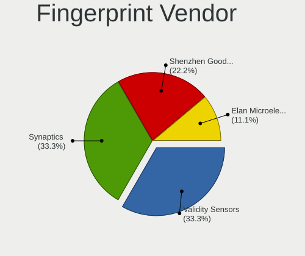

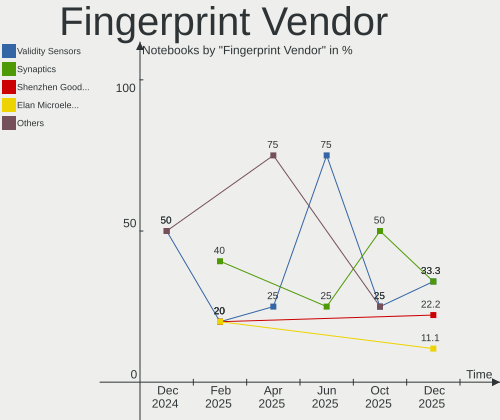

| Vendor                     | Notebooks | Percent |
|----------------------------|-----------|---------|
| Validity Sensors           | 3         | 33.33%  |
| Synaptics                  | 3         | 33.33%  |
| Shenzhen Goodix Technology | 2         | 22.22%  |
| Elan Microelectronics      | 1         | 11.11%  |

Fingerprint Model
-----------------

Fingerprint sensor models

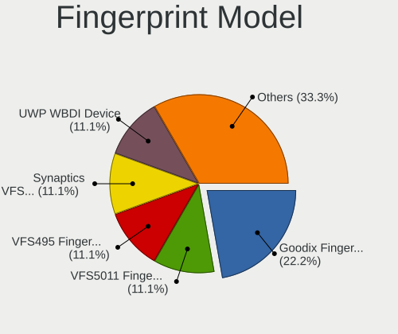

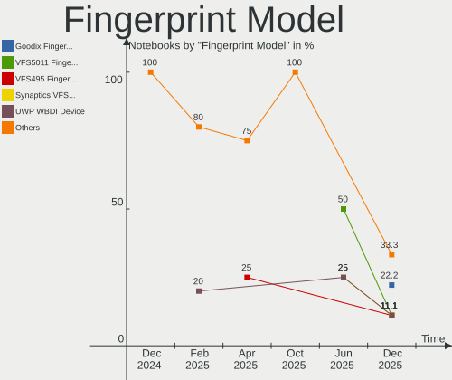

| Model                                                                      | Notebooks | Percent |
|----------------------------------------------------------------------------|-----------|---------|
| Shenzhen Goodix  FingerPrint Device                                        | 2         | 22.22%  |
| Validity Sensors VFS5011 Fingerprint Reader                                | 1         | 11.11%  |
| Validity Sensors VFS495 Fingerprint Reader                                 | 1         | 11.11%  |
| Validity Sensors Synaptics VFS7552 Touch Fingerprint Sensor with PurePrint | 1         | 11.11%  |
| Synaptics UWP WBDI Device                                                  | 1         | 11.11%  |
| Synaptics Prometheus MIS Touch Fingerprint Reader                          | 1         | 11.11%  |
| Synaptics FS7604 Touch Fingerprint Sensor with PurePrint                   | 1         | 11.11%  |
| Elan ELAN:ARM-M4                                                           | 1         | 11.11%  |

Chipcard Vendor
---------------

Chipcard module vendors

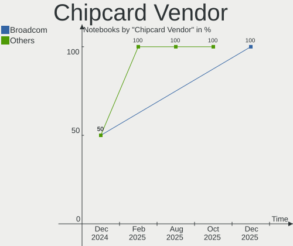

| Vendor   | Notebooks | Percent |
|----------|-----------|---------|
| Broadcom | 1         | 100%    |

Chipcard Model
--------------

Chipcard module models

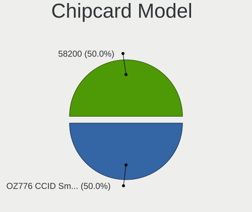

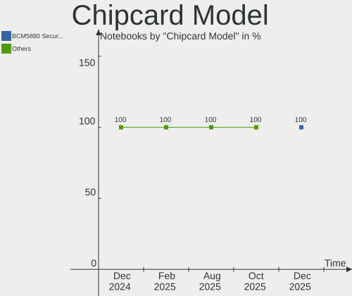

| Model                                          | Notebooks | Percent |
|------------------------------------------------|-----------|---------|
| Broadcom BCM5880 Secure Applications Processor | 1         | 100%    |

Unsupported
-----------

Unsupported Devices
-------------------

Total unsupported devices on board

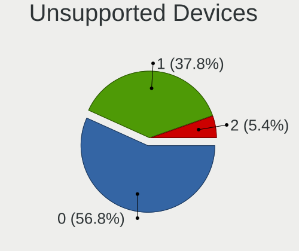

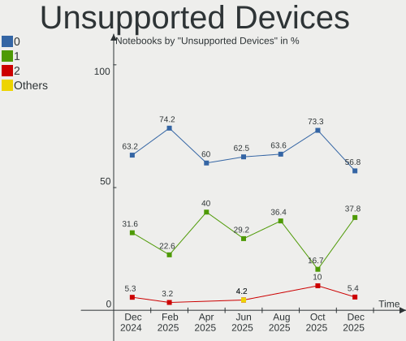

| Total | Notebooks | Percent |
|-------|-----------|---------|
| 0     | 21        | 56.76%  |
| 1     | 14        | 37.84%  |
| 2     | 2         | 5.41%   |

Unsupported Device Types
------------------------

Types of unsupported devices

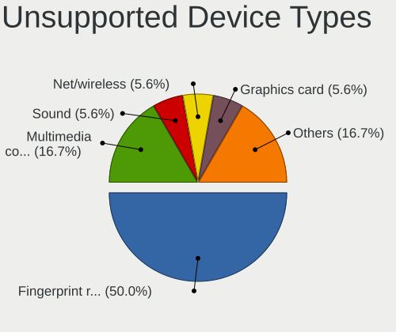

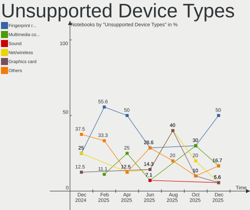

| Type                     | Notebooks | Percent |
|--------------------------|-----------|---------|
| Fingerprint reader       | 9         | 50%     |
| Multimedia controller    | 3         | 16.67%  |
| Sound                    | 1         | 5.56%   |
| Net/wireless             | 1         | 5.56%   |
| Graphics card            | 1         | 5.56%   |
| Communication controller | 1         | 5.56%   |
| Chipcard                 | 1         | 5.56%   |
| Bluetooth                | 1         | 5.56%   |

